cola Report for Hierarchical Partitioning - 'LaMannoBrain_human_es'
==================

**Date**: 2021-07-26 10:48:28 CEST, **cola version**: 1.9.4

----------------------------------------------------------------

<style type='text/css'>

body, td, th {
   font-family: Arial,Helvetica,sans-serif;
   background-color: white;
   font-size: 13px;
  max-width: 800px;
  margin: auto;
  margin-left:210px;
  padding: 0px 10px 0px 10px;
  border-left: 1px solid #EEEEEE;
  line-height: 150%;
}

tt, code, pre {
   font-family: 'DejaVu Sans Mono', 'Droid Sans Mono', 'Lucida Console', Consolas, Monaco, 

monospace;
}

h1 {
   font-size:2.2em;
}

h2 {
   font-size:1.8em;
}

h3 {
   font-size:1.4em;
}

h4 {
   font-size:1.0em;
}

h5 {
   font-size:0.9em;
}

h6 {
   font-size:0.8em;
}

a {
  text-decoration: none;
  color: #0366d6;
}

a:hover {
  text-decoration: underline;
}

a:visited {
   color: #0366d6;
}

pre, img {
  max-width: 100%;
}
pre {
  overflow-x: auto;
}
pre code {
   display: block; padding: 0.5em;
}

code {
  font-size: 92%;
  border: 1px solid #ccc;
}

code[class] {
  background-color: #F8F8F8;
}

table, td, th {
  border: 1px solid #ccc;
}

blockquote {
   color:#666666;
   margin:0;
   padding-left: 1em;
   border-left: 0.5em #EEE solid;
}

hr {
   height: 0px;
   border-bottom: none;
   border-top-width: thin;
   border-top-style: dotted;
   border-top-color: #999999;
}

@media print {
   * {
      background: transparent !important;
      color: black !important;
      filter:none !important;
      -ms-filter: none !important;
   }

   body {
      font-size:12pt;
      max-width:100%;
   }

   a, a:visited {
      text-decoration: underline;
   }

   hr {
      visibility: hidden;
      page-break-before: always;
   }

   pre, blockquote {
      padding-right: 1em;
      page-break-inside: avoid;
   }

   tr, img {
      page-break-inside: avoid;
   }

   img {
      max-width: 100% !important;
   }

   @page :left {
      margin: 15mm 20mm 15mm 10mm;
   }

   @page :right {
      margin: 15mm 10mm 15mm 20mm;
   }

   p, h2, h3 {
      orphans: 3; widows: 3;
   }

   h2, h3 {
      page-break-after: avoid;
   }
}
</style>


## Summary


First the variable is renamed to `res_rh`.


```r
res_rh = rh
```


The partition hierarchy and all available functions which can be applied to `res_rh` object.


```r
res_rh
```

```
#> A 'HierarchicalPartition' object with 'ATC:skmeans' method.
#>   On a matrix with 11181 rows and 1715 columns.
#>   Performed in total 7650 partitions.
#>   There are 32 groups under the following parameters:
#>     - min_samples: 17
#>     - mean_silhouette_cutoff: 0.9
#>     - min_n_signatures: 198 (signatures are selected based on:)
#>       - fdr_cutoff: 0.05
#>       - group_diff (scaled values): 0.5
#> 
#> Hierarchy of the partition:
#>   0, 1715 cols
#>   |-- 01, 705 cols, 2435 signatures
#>   |   |-- 011, 228 cols, 990 signatures
#>   |   |   |-- 0111, 80 cols (a)
#>   |   |   |-- 0112, 80 cols, 224 signatures
#>   |   |   |   |-- 01121, 40 cols, 70 signatures (c)
#>   |   |   |   `-- 01122, 40 cols, 0 signatures (c)
#>   |   |   `-- 0113, 68 cols, 62 signatures (c)
#>   |   |-- 012, 190 cols, 1448 signatures
#>   |   |   |-- 0121, 109 cols, 466 signatures
#>   |   |   |   |-- 01211, 53 cols, 15 signatures (c)
#>   |   |   |   `-- 01212, 56 cols, 111 signatures (c)
#>   |   |   `-- 0122, 81 cols, 1014 signatures
#>   |   |       |-- 01221, 32 cols (b)
#>   |   |       |-- 01222, 24 cols (b)
#>   |   |       `-- 01223, 25 cols (b)
#>   |   `-- 013, 287 cols, 1692 signatures
#>   |       |-- 0131, 90 cols, 911 signatures
#>   |       |   |-- 01311, 58 cols, 87 signatures (c)
#>   |       |   `-- 01312, 32 cols (b)
#>   |       |-- 0132, 115 cols, 314 signatures
#>   |       |   |-- 01321, 69 cols, 31 signatures (c)
#>   |       |   `-- 01322, 46 cols, 32 signatures (c)
#>   |       `-- 0133, 82 cols, 179 signatures (c)
#>   |-- 02, 681 cols, 5526 signatures
#>   |   |-- 021, 206 cols, 552 signatures
#>   |   |   |-- 0211, 95 cols (a)
#>   |   |   `-- 0212, 111 cols, 314 signatures
#>   |   |       |-- 02121, 53 cols, 120 signatures (c)
#>   |   |       `-- 02122, 58 cols (a)
#>   |   |-- 022, 156 cols, 1545 signatures
#>   |   |   |-- 0221, 54 cols, 83 signatures (c)
#>   |   |   |-- 0222, 65 cols, 38 signatures (c)
#>   |   |   `-- 0223, 37 cols (a)
#>   |   |-- 023, 198 cols, 940 signatures
#>   |   |   |-- 0231, 93 cols, 393 signatures
#>   |   |   |   |-- 02311, 53 cols (a)
#>   |   |   |   `-- 02312, 40 cols, 45 signatures (c)
#>   |   |   `-- 0232, 105 cols, 141 signatures (c)
#>   |   `-- 024, 121 cols, 498 signatures
#>   |       |-- 0241, 44 cols, 4 signatures (c)
#>   |       |-- 0242, 43 cols, 11 signatures (c)
#>   |       `-- 0243, 34 cols, 0 signatures (c)
#>   `-- 03, 329 cols, 1622 signatures
#>       |-- 031, 132 cols (a)
#>       |-- 032, 99 cols, 58 signatures (c)
#>       `-- 033, 98 cols, 1396 signatures
#>           |-- 0331, 40 cols, 15 signatures (c)
#>           |-- 0332, 31 cols (b)
#>           |-- 0333, 13 cols (b)
#>           `-- 0334, 14 cols (b)
#> Stop reason:
#>   a) Mean silhouette score was too small
#>   b) Subgroup had too few columns.
#>   c) There were too few signatures.
#> 
#> Following methods can be applied to this 'HierarchicalPartition' object:
#>  [1] "all_leaves"            "all_nodes"             "cola_report"           "collect_classes"      
#>  [5] "colnames"              "compare_signatures"    "dimension_reduction"   "functional_enrichment"
#>  [9] "get_anno_col"          "get_anno"              "get_children_nodes"    "get_classes"          
#> [13] "get_matrix"            "get_signatures"        "is_leaf_node"          "max_depth"            
#> [17] "merge_node"            "ncol"                  "node_info"             "node_level"           
#> [21] "nrow"                  "rownames"              "show"                  "split_node"           
#> [25] "suggest_best_k"        "test_to_known_factors" "top_rows_heatmap"      "top_rows_overlap"     
#> 
#> You can get result for a single node by e.g. object["01"]
```

The call of `hierarchical_partition()` was:


```
#> hierarchical_partition(data = lt$mat, anno = lt$anno, subset = 500, cores = 4)
```

Dimension of the input matrix:


```r
mat = get_matrix(res_rh)
dim(mat)
```

```
#> [1] 11181  1715
```

All the methods that were tried:


```r
res_rh@param$combination_method
```

```
#> [[1]]
#> [1] "ATC"     "skmeans"
```

### Density distribution

The density distribution for each sample is visualized as one column in the following heatmap.
The clustering is based on the distance which is the Kolmogorov-Smirnov statistic between two distributions.


```r
library(ComplexHeatmap)
densityHeatmap(mat, top_annotation = HeatmapAnnotation(df = get_anno(res_rh), 
    col = get_anno_col(res_rh)), ylab = "value", cluster_columns = TRUE, show_column_names = FALSE,
    mc.cores = 1)
```


Some values about the hierarchy:


```r
all_nodes(res_rh)
```

```
#>  [1] "0"     "01"    "011"   "0111"  "0112"  "01121" "01122" "0113"  "012"   "0121"  "01211" "01212"
#> [13] "0122"  "01221" "01222" "01223" "013"   "0131"  "01311" "01312" "0132"  "01321" "01322" "0133" 
#> [25] "02"    "021"   "0211"  "0212"  "02121" "02122" "022"   "0221"  "0222"  "0223"  "023"   "0231" 
#> [37] "02311" "02312" "0232"  "024"   "0241"  "0242"  "0243"  "03"    "031"   "032"   "033"   "0331" 
#> [49] "0332"  "0333"  "0334"
```

```r
all_leaves(res_rh)
```

```
#>  [1] "0111"  "01121" "01122" "0113"  "01211" "01212" "01221" "01222" "01223" "01311" "01312" "01321"
#> [13] "01322" "0133"  "0211"  "02121" "02122" "0221"  "0222"  "0223"  "02311" "02312" "0232"  "0241" 
#> [25] "0242"  "0243"  "031"   "032"   "0331"  "0332"  "0333"  "0334"
```

```r
node_info(res_rh)
```

```
#>       id best_method depth best_k n_columns n_signatures p_signatures is_leaf
#> 1      0 ATC:skmeans     1      3      1715         3961     0.354262   FALSE
#> 2     01 ATC:skmeans     2      3       705         2435     0.217780   FALSE
#> 3    011 ATC:skmeans     3      3       228          990     0.088543   FALSE
#> 4   0111 ATC:skmeans     4      2        80           NA           NA    TRUE
#> 5   0112 ATC:skmeans     4      2        80          224     0.020034   FALSE
#> 6  01121 ATC:skmeans     5      2        40           70     0.006261    TRUE
#> 7  01122 ATC:skmeans     5      2        40            0     0.000000    TRUE
#> 8   0113 ATC:skmeans     4      2        68           62     0.005545    TRUE
#> 9    012 ATC:skmeans     3      2       190         1448     0.129505   FALSE
#> 10  0121 ATC:skmeans     4      2       109          466     0.041678   FALSE
#> 11 01211 ATC:skmeans     5      2        53           15     0.001342    TRUE
#> 12 01212 ATC:skmeans     5      2        56          111     0.009928    TRUE
#> 13  0122 ATC:skmeans     4      3        81         1014     0.090690   FALSE
#> 14 01221 not applied     5     NA        32           NA           NA    TRUE
#> 15 01222 not applied     5     NA        24           NA           NA    TRUE
#> 16 01223 not applied     5     NA        25           NA           NA    TRUE
#> 17   013 ATC:skmeans     3      3       287         1692     0.151328   FALSE
#> 18  0131 ATC:skmeans     4      2        90          911     0.081478   FALSE
#> 19 01311 ATC:skmeans     5      2        58           87     0.007781    TRUE
#> 20 01312 not applied     5     NA        32           NA           NA    TRUE
#> 21  0132 ATC:skmeans     4      2       115          314     0.028083   FALSE
#> 22 01321 ATC:skmeans     5      2        69           31     0.002773    TRUE
#> 23 01322 ATC:skmeans     5      2        46           32     0.002862    TRUE
#> 24  0133 ATC:skmeans     4      2        82          179     0.016009    TRUE
#> 25    02 ATC:skmeans     2      4       681         5526     0.494231   FALSE
#> 26   021 ATC:skmeans     3      2       206          552     0.049369   FALSE
#> 27  0211 ATC:skmeans     4      2        95           NA           NA    TRUE
#> 28  0212 ATC:skmeans     4      2       111          314     0.028083   FALSE
#> 29 02121 ATC:skmeans     5      2        53          120     0.010732    TRUE
#> 30 02122 ATC:skmeans     5      3        58           NA           NA    TRUE
#> 31   022 ATC:skmeans     3      3       156         1545     0.138181   FALSE
#> 32  0221 ATC:skmeans     4      2        54           83     0.007423    TRUE
#> 33  0222 ATC:skmeans     4      2        65           38     0.003399    TRUE
#> 34  0223 ATC:skmeans     4      2        37           NA           NA    TRUE
#> 35   023 ATC:skmeans     3      2       198          940     0.084071   FALSE
#> 36  0231 ATC:skmeans     4      2        93          393     0.035149   FALSE
#> 37 02311 ATC:skmeans     5      2        53           NA           NA    TRUE
#> 38 02312 ATC:skmeans     5      2        40           45     0.004025    TRUE
#> 39  0232 ATC:skmeans     4      2       105          141     0.012611    TRUE
#> 40   024 ATC:skmeans     3      3       121          498     0.044540   FALSE
#> 41  0241 ATC:skmeans     4      2        44            4     0.000358    TRUE
#> 42  0242 ATC:skmeans     4      2        43           11     0.000984    TRUE
#> 43  0243 ATC:skmeans     4      2        34            0     0.000000    TRUE
#> 44    03 ATC:skmeans     2      3       329         1622     0.145068   FALSE
#> 45   031 ATC:skmeans     3      3       132           NA           NA    TRUE
#> 46   032 ATC:skmeans     3      2        99           58     0.005187    TRUE
#> 47   033 ATC:skmeans     3      4        98         1396     0.124855   FALSE
#> 48  0331 ATC:skmeans     4      2        40           15     0.001342    TRUE
#> 49  0332 not applied     4     NA        31           NA           NA    TRUE
#> 50  0333 not applied     4     NA        13           NA           NA    TRUE
#> 51  0334 not applied     4     NA        14           NA           NA    TRUE
```

In the output from `node_info()`, there are the following columns:

- `id`: The node id.
- `best_method`: The best method selected.
- `depth`: Depth of the node in the hierarchy.
- `best_k`: Best number of groups of the partition on that node.
- `n_columns`: Number of columns in the submatrix.
- `n_signatures`: Number of signatures with the `best_k`.
- `p_signatures`: Proportion of hte signatures in total number of rows in the matrix.
- `is_leaf`: Whether the node is a leaf.

Labels of nodes are encoded in a special way. The number of digits
correspond to the depth of the node in the hierarchy and the value of the
digits correspond to the index of the subgroup in the current node, E.g. a label
of “012” means the node is the second subgroup of the partition which is the
first subgroup of the root node.

### Suggest the best k


Following table shows the best `k` (number of partitions) for each node in the
partition hierarchy. Clicking on the node name in the table goes to the
corresponding section for the partitioning on that node.

[The cola vignette](https://jokergoo.github.io/cola_vignettes/cola.html#toc_13)
explains the definition of the metrics used for determining the best
number of partitions.


```r
suggest_best_k(res_rh)
```


|Node                  |Best method                                         |Is leaf   |Best k |1-PAC |Mean silhouette |Concordance | #samples|   |
|:---------------------|:---------------------------------------------------|:---------|:------|:-----|:---------------|:-----------|--------:|:--|
|[Node0](#Node0)       |ATC:skmeans                                         |          |4      |0.98  |0.95            |0.98        |     1715|** |
|[Node01](#Node01)     |ATC:skmeans                                         |          |3      |0.99  |0.97            |0.99        |      705|** |
|[Node011](#Node011)   |ATC:skmeans                                         |          |3      |0.98  |0.95            |0.98        |      228|** |
|Node0111-leaf         |ATC:skmeans                                         |✓ (a)     |2      |0.78  |0.88            |0.95        |       80|   |
|[Node0112](#Node0112) |ATC:skmeans                                         |          |3      |0.96  |0.92            |0.96        |       80|** |
|Node01121-leaf        |ATC:skmeans                                         |✓ (&#99;) |2      |1.00  |0.96            |0.98        |       40|** |
|Node01122-leaf        |ATC:skmeans                                         |✓ (&#99;) |2      |0.95  |0.95            |0.98        |       40|*  |
|Node0113-leaf         |ATC:skmeans                                         |✓ (&#99;) |2      |0.97  |0.96            |0.98        |       68|** |
|[Node012](#Node012)   |ATC:skmeans                                         |          |2      |1.00  |1.00            |1.00        |      190|** |
|[Node0121](#Node0121) |ATC:skmeans                                         |          |3      |0.99  |0.94            |0.98        |      109|** |
|Node01211-leaf        |ATC:skmeans                                         |✓ (&#99;) |2      |0.81  |0.94            |0.97        |       53|   |
|Node01212-leaf        |ATC:skmeans                                         |✓ (&#99;) |2      |1.00  |0.96            |0.98        |       56|** |
|[Node0122](#Node0122) |ATC:skmeans                                         |          |3      |1.00  |0.98            |0.99        |       81|** |
|Node01221-leaf        |<span style='color:grey;'><i>not applied</i></span> |✓ (b)     |       |      |                |            |       32|   |
|Node01222-leaf        |<span style='color:grey;'><i>not applied</i></span> |✓ (b)     |       |      |                |            |       24|   |
|Node01223-leaf        |<span style='color:grey;'><i>not applied</i></span> |✓ (b)     |       |      |                |            |       25|   |
|[Node013](#Node013)   |ATC:skmeans                                         |          |3      |1.00  |0.98            |0.99        |      287|** |
|[Node0131](#Node0131) |ATC:skmeans                                         |          |4      |0.94  |0.91            |0.94        |       90|*  |
|Node01311-leaf        |ATC:skmeans                                         |✓ (&#99;) |3      |0.93  |0.92            |0.97        |       58|*  |
|Node01312-leaf        |<span style='color:grey;'><i>not applied</i></span> |✓ (b)     |       |      |                |            |       32|   |
|[Node0132](#Node0132) |ATC:skmeans                                         |          |3      |0.94  |0.91            |0.96        |      115|*  |
|Node01321-leaf        |ATC:skmeans                                         |✓ (&#99;) |2      |1.00  |0.99            |0.99        |       69|** |
|Node01322-leaf        |ATC:skmeans                                         |✓ (&#99;) |3      |0.91  |0.87            |0.95        |       46|*  |
|Node0133-leaf         |ATC:skmeans                                         |✓ (&#99;) |3      |0.95  |0.93            |0.97        |       82|*  |
|[Node02](#Node02)     |ATC:skmeans                                         |          |4      |0.99  |0.96            |0.98        |      681|** |
|[Node021](#Node021)   |ATC:skmeans                                         |          |2      |0.96  |0.95            |0.98        |      206|** |
|Node0211-leaf         |ATC:skmeans                                         |✓ (a)     |2      |0.75  |0.90            |0.95        |       95|   |
|[Node0212](#Node0212) |ATC:skmeans                                         |          |2      |0.98  |0.96            |0.98        |      111|** |
|Node02121-leaf        |ATC:skmeans                                         |✓ (&#99;) |2      |1.00  |1.00            |1.00        |       53|** |
|Node02122-leaf        |ATC:skmeans                                         |✓ (a)     |2      |0.79  |0.84            |0.94        |       58|   |
|[Node022](#Node022)   |ATC:skmeans                                         |          |3      |0.98  |0.95            |0.98        |      156|** |
|Node0221-leaf         |ATC:skmeans                                         |✓ (&#99;) |3      |0.98  |0.94            |0.98        |       54|** |
|Node0222-leaf         |ATC:skmeans                                         |✓ (&#99;) |2      |1.00  |0.97            |0.98        |       65|** |
|Node0223-leaf         |ATC:skmeans                                         |✓ (a)     |3      |0.79  |0.88            |0.95        |       37|   |
|[Node023](#Node023)   |ATC:skmeans                                         |          |3      |0.94  |0.95            |0.97        |      198|*  |
|[Node0231](#Node0231) |ATC:skmeans                                         |          |2      |1.00  |0.98            |0.99        |       93|** |
|Node02311-leaf        |ATC:skmeans                                         |✓ (a)     |2      |0.77  |0.87            |0.95        |       53|   |
|Node02312-leaf        |ATC:skmeans                                         |✓ (&#99;) |3      |0.99  |0.93            |0.96        |       40|** |
|Node0232-leaf         |ATC:skmeans                                         |✓ (&#99;) |2      |0.92  |0.92            |0.97        |      105|*  |
|[Node024](#Node024)   |ATC:skmeans                                         |          |3      |0.92  |0.93            |0.97        |      121|*  |
|Node0241-leaf         |ATC:skmeans                                         |✓ (&#99;) |2      |0.99  |0.96            |0.98        |       44|** |
|Node0242-leaf         |ATC:skmeans                                         |✓ (&#99;) |2      |0.95  |0.96            |0.98        |       43|*  |
|Node0243-leaf         |ATC:skmeans                                         |✓ (&#99;) |2      |1.00  |0.94            |0.98        |       34|** |
|[Node03](#Node03)     |ATC:skmeans                                         |          |4      |0.97  |0.92            |0.96        |      329|** |
|Node031-leaf          |ATC:skmeans                                         |✓ (a)     |3      |0.78  |0.84            |0.93        |      132|   |
|Node032-leaf          |ATC:skmeans                                         |✓ (&#99;) |2      |0.92  |0.96            |0.98        |       99|*  |
|[Node033](#Node033)   |ATC:skmeans                                         |          |4      |1.00  |0.99            |0.99        |       98|** |
|Node0331-leaf         |ATC:skmeans                                         |✓ (&#99;) |2      |0.84  |0.90            |0.96        |       40|   |
|Node0332-leaf         |<span style='color:grey;'><i>not applied</i></span> |✓ (b)     |       |      |                |            |       31|   |
|Node0333-leaf         |<span style='color:grey;'><i>not applied</i></span> |✓ (b)     |       |      |                |            |       13|   |
|Node0334-leaf         |<span style='color:grey;'><i>not applied</i></span> |✓ (b)     |       |      |                |            |       14|   |


Stop reason: a) Mean silhouette score was too small b) Subgroup had too few columns. c) There were too few signatures. 

\*\*: 1-PAC > 0.95, \*: 1-PAC > 0.9


### Partition hierarchy

The nodes of the hierarchy can be merged by setting the `merge_node` parameters. Here we 
control the hierarchy with the `min_n_signatures` parameter. The value of `min_n_signatures` is
from `node_info()`.


<style type='text/css'>


.ui-helper-hidden {
	display: none;
}
.ui-helper-hidden-accessible {
	border: 0;
	clip: rect(0 0 0 0);
	height: 1px;
	margin: -1px;
	overflow: hidden;
	padding: 0;
	position: absolute;
	width: 1px;
}
.ui-helper-reset {
	margin: 0;
	padding: 0;
	border: 0;
	outline: 0;
	line-height: 1.3;
	text-decoration: none;
	font-size: 100%;
	list-style: none;
}
.ui-helper-clearfix:before,
.ui-helper-clearfix:after {
	content: "";
	display: table;
	border-collapse: collapse;
}
.ui-helper-clearfix:after {
	clear: both;
}
.ui-helper-zfix {
	width: 100%;
	height: 100%;
	top: 0;
	left: 0;
	position: absolute;
	opacity: 0;
	filter:Alpha(Opacity=0); 
}

.ui-front {
	z-index: 100;
}


.ui-state-disabled {
	cursor: default !important;
	pointer-events: none;
}


.ui-icon {
	display: inline-block;
	vertical-align: middle;
	margin-top: -.25em;
	position: relative;
	text-indent: -99999px;
	overflow: hidden;
	background-repeat: no-repeat;
}

.ui-widget-icon-block {
	left: 50%;
	margin-left: -8px;
	display: block;
}


.ui-widget-overlay {
	position: fixed;
	top: 0;
	left: 0;
	width: 100%;
	height: 100%;
}
.ui-accordion .ui-accordion-header {
	display: block;
	cursor: pointer;
	position: relative;
	margin: 2px 0 0 0;
	padding: .5em .5em .5em .7em;
	font-size: 100%;
}
.ui-accordion .ui-accordion-content {
	padding: 1em 2.2em;
	border-top: 0;
	overflow: auto;
}
.ui-autocomplete {
	position: absolute;
	top: 0;
	left: 0;
	cursor: default;
}
.ui-menu {
	list-style: none;
	padding: 0;
	margin: 0;
	display: block;
	outline: 0;
}
.ui-menu .ui-menu {
	position: absolute;
}
.ui-menu .ui-menu-item {
	margin: 0;
	cursor: pointer;
	
	list-style-image: url("data:image/gif;base64,R0lGODlhAQABAIAAAAAAAP///yH5BAEAAAAALAAAAAABAAEAAAIBRAA7");
}
.ui-menu .ui-menu-item-wrapper {
	position: relative;
	padding: 3px 1em 3px .4em;
}
.ui-menu .ui-menu-divider {
	margin: 5px 0;
	height: 0;
	font-size: 0;
	line-height: 0;
	border-width: 1px 0 0 0;
}
.ui-menu .ui-state-focus,
.ui-menu .ui-state-active {
	margin: -1px;
}


.ui-menu-icons {
	position: relative;
}
.ui-menu-icons .ui-menu-item-wrapper {
	padding-left: 2em;
}


.ui-menu .ui-icon {
	position: absolute;
	top: 0;
	bottom: 0;
	left: .2em;
	margin: auto 0;
}


.ui-menu .ui-menu-icon {
	left: auto;
	right: 0;
}
.ui-button {
	padding: .4em 1em;
	display: inline-block;
	position: relative;
	line-height: normal;
	margin-right: .1em;
	cursor: pointer;
	vertical-align: middle;
	text-align: center;
	-webkit-user-select: none;
	-moz-user-select: none;
	-ms-user-select: none;
	user-select: none;

	
	overflow: visible;
}

.ui-button,
.ui-button:link,
.ui-button:visited,
.ui-button:hover,
.ui-button:active {
	text-decoration: none;
}


.ui-button-icon-only {
	width: 2em;
	box-sizing: border-box;
	text-indent: -9999px;
	white-space: nowrap;
}


input.ui-button.ui-button-icon-only {
	text-indent: 0;
}


.ui-button-icon-only .ui-icon {
	position: absolute;
	top: 50%;
	left: 50%;
	margin-top: -8px;
	margin-left: -8px;
}

.ui-button.ui-icon-notext .ui-icon {
	padding: 0;
	width: 2.1em;
	height: 2.1em;
	text-indent: -9999px;
	white-space: nowrap;

}

input.ui-button.ui-icon-notext .ui-icon {
	width: auto;
	height: auto;
	text-indent: 0;
	white-space: normal;
	padding: .4em 1em;
}


input.ui-button::-moz-focus-inner,
button.ui-button::-moz-focus-inner {
	border: 0;
	padding: 0;
}
.ui-controlgroup {
	vertical-align: middle;
	display: inline-block;
}
.ui-controlgroup > .ui-controlgroup-item {
	float: left;
	margin-left: 0;
	margin-right: 0;
}
.ui-controlgroup > .ui-controlgroup-item:focus,
.ui-controlgroup > .ui-controlgroup-item.ui-visual-focus {
	z-index: 9999;
}
.ui-controlgroup-vertical > .ui-controlgroup-item {
	display: block;
	float: none;
	width: 100%;
	margin-top: 0;
	margin-bottom: 0;
	text-align: left;
}
.ui-controlgroup-vertical .ui-controlgroup-item {
	box-sizing: border-box;
}
.ui-controlgroup .ui-controlgroup-label {
	padding: .4em 1em;
}
.ui-controlgroup .ui-controlgroup-label span {
	font-size: 80%;
}
.ui-controlgroup-horizontal .ui-controlgroup-label + .ui-controlgroup-item {
	border-left: none;
}
.ui-controlgroup-vertical .ui-controlgroup-label + .ui-controlgroup-item {
	border-top: none;
}
.ui-controlgroup-horizontal .ui-controlgroup-label.ui-widget-content {
	border-right: none;
}
.ui-controlgroup-vertical .ui-controlgroup-label.ui-widget-content {
	border-bottom: none;
}


.ui-controlgroup-vertical .ui-spinner-input {

	
	width: 75%;
	width: calc( 100% - 2.4em );
}
.ui-controlgroup-vertical .ui-spinner .ui-spinner-up {
	border-top-style: solid;
}

.ui-checkboxradio-label .ui-icon-background {
	box-shadow: inset 1px 1px 1px #ccc;
	border-radius: .12em;
	border: none;
}
.ui-checkboxradio-radio-label .ui-icon-background {
	width: 16px;
	height: 16px;
	border-radius: 1em;
	overflow: visible;
	border: none;
}
.ui-checkboxradio-radio-label.ui-checkboxradio-checked .ui-icon,
.ui-checkboxradio-radio-label.ui-checkboxradio-checked:hover .ui-icon {
	background-image: none;
	width: 8px;
	height: 8px;
	border-width: 4px;
	border-style: solid;
}
.ui-checkboxradio-disabled {
	pointer-events: none;
}
.ui-datepicker {
	width: 17em;
	padding: .2em .2em 0;
	display: none;
}
.ui-datepicker .ui-datepicker-header {
	position: relative;
	padding: .2em 0;
}
.ui-datepicker .ui-datepicker-prev,
.ui-datepicker .ui-datepicker-next {
	position: absolute;
	top: 2px;
	width: 1.8em;
	height: 1.8em;
}
.ui-datepicker .ui-datepicker-prev-hover,
.ui-datepicker .ui-datepicker-next-hover {
	top: 1px;
}
.ui-datepicker .ui-datepicker-prev {
	left: 2px;
}
.ui-datepicker .ui-datepicker-next {
	right: 2px;
}
.ui-datepicker .ui-datepicker-prev-hover {
	left: 1px;
}
.ui-datepicker .ui-datepicker-next-hover {
	right: 1px;
}
.ui-datepicker .ui-datepicker-prev span,
.ui-datepicker .ui-datepicker-next span {
	display: block;
	position: absolute;
	left: 50%;
	margin-left: -8px;
	top: 50%;
	margin-top: -8px;
}
.ui-datepicker .ui-datepicker-title {
	margin: 0 2.3em;
	line-height: 1.8em;
	text-align: center;
}
.ui-datepicker .ui-datepicker-title select {
	font-size: 1em;
	margin: 1px 0;
}
.ui-datepicker select.ui-datepicker-month,
.ui-datepicker select.ui-datepicker-year {
	width: 45%;
}
.ui-datepicker table {
	width: 100%;
	font-size: .9em;
	border-collapse: collapse;
	margin: 0 0 .4em;
}
.ui-datepicker th {
	padding: .7em .3em;
	text-align: center;
	font-weight: bold;
	border: 0;
}
.ui-datepicker td {
	border: 0;
	padding: 1px;
}
.ui-datepicker td span,
.ui-datepicker td a {
	display: block;
	padding: .2em;
	text-align: right;
	text-decoration: none;
}
.ui-datepicker .ui-datepicker-buttonpane {
	background-image: none;
	margin: .7em 0 0 0;
	padding: 0 .2em;
	border-left: 0;
	border-right: 0;
	border-bottom: 0;
}
.ui-datepicker .ui-datepicker-buttonpane button {
	float: right;
	margin: .5em .2em .4em;
	cursor: pointer;
	padding: .2em .6em .3em .6em;
	width: auto;
	overflow: visible;
}
.ui-datepicker .ui-datepicker-buttonpane button.ui-datepicker-current {
	float: left;
}


.ui-datepicker.ui-datepicker-multi {
	width: auto;
}
.ui-datepicker-multi .ui-datepicker-group {
	float: left;
}
.ui-datepicker-multi .ui-datepicker-group table {
	width: 95%;
	margin: 0 auto .4em;
}
.ui-datepicker-multi-2 .ui-datepicker-group {
	width: 50%;
}
.ui-datepicker-multi-3 .ui-datepicker-group {
	width: 33.3%;
}
.ui-datepicker-multi-4 .ui-datepicker-group {
	width: 25%;
}
.ui-datepicker-multi .ui-datepicker-group-last .ui-datepicker-header,
.ui-datepicker-multi .ui-datepicker-group-middle .ui-datepicker-header {
	border-left-width: 0;
}
.ui-datepicker-multi .ui-datepicker-buttonpane {
	clear: left;
}
.ui-datepicker-row-break {
	clear: both;
	width: 100%;
	font-size: 0;
}


.ui-datepicker-rtl {
	direction: rtl;
}
.ui-datepicker-rtl .ui-datepicker-prev {
	right: 2px;
	left: auto;
}
.ui-datepicker-rtl .ui-datepicker-next {
	left: 2px;
	right: auto;
}
.ui-datepicker-rtl .ui-datepicker-prev:hover {
	right: 1px;
	left: auto;
}
.ui-datepicker-rtl .ui-datepicker-next:hover {
	left: 1px;
	right: auto;
}
.ui-datepicker-rtl .ui-datepicker-buttonpane {
	clear: right;
}
.ui-datepicker-rtl .ui-datepicker-buttonpane button {
	float: left;
}
.ui-datepicker-rtl .ui-datepicker-buttonpane button.ui-datepicker-current,
.ui-datepicker-rtl .ui-datepicker-group {
	float: right;
}
.ui-datepicker-rtl .ui-datepicker-group-last .ui-datepicker-header,
.ui-datepicker-rtl .ui-datepicker-group-middle .ui-datepicker-header {
	border-right-width: 0;
	border-left-width: 1px;
}


.ui-datepicker .ui-icon {
	display: block;
	text-indent: -99999px;
	overflow: hidden;
	background-repeat: no-repeat;
	left: .5em;
	top: .3em;
}
.ui-dialog {
	position: absolute;
	top: 0;
	left: 0;
	padding: .2em;
	outline: 0;
}
.ui-dialog .ui-dialog-titlebar {
	padding: .4em 1em;
	position: relative;
}
.ui-dialog .ui-dialog-title {
	float: left;
	margin: .1em 0;
	white-space: nowrap;
	width: 90%;
	overflow: hidden;
	text-overflow: ellipsis;
}
.ui-dialog .ui-dialog-titlebar-close {
	position: absolute;
	right: .3em;
	top: 50%;
	width: 20px;
	margin: -10px 0 0 0;
	padding: 1px;
	height: 20px;
}
.ui-dialog .ui-dialog-content {
	position: relative;
	border: 0;
	padding: .5em 1em;
	background: none;
	overflow: auto;
}
.ui-dialog .ui-dialog-buttonpane {
	text-align: left;
	border-width: 1px 0 0 0;
	background-image: none;
	margin-top: .5em;
	padding: .3em 1em .5em .4em;
}
.ui-dialog .ui-dialog-buttonpane .ui-dialog-buttonset {
	float: right;
}
.ui-dialog .ui-dialog-buttonpane button {
	margin: .5em .4em .5em 0;
	cursor: pointer;
}
.ui-dialog .ui-resizable-n {
	height: 2px;
	top: 0;
}
.ui-dialog .ui-resizable-e {
	width: 2px;
	right: 0;
}
.ui-dialog .ui-resizable-s {
	height: 2px;
	bottom: 0;
}
.ui-dialog .ui-resizable-w {
	width: 2px;
	left: 0;
}
.ui-dialog .ui-resizable-se,
.ui-dialog .ui-resizable-sw,
.ui-dialog .ui-resizable-ne,
.ui-dialog .ui-resizable-nw {
	width: 7px;
	height: 7px;
}
.ui-dialog .ui-resizable-se {
	right: 0;
	bottom: 0;
}
.ui-dialog .ui-resizable-sw {
	left: 0;
	bottom: 0;
}
.ui-dialog .ui-resizable-ne {
	right: 0;
	top: 0;
}
.ui-dialog .ui-resizable-nw {
	left: 0;
	top: 0;
}
.ui-draggable .ui-dialog-titlebar {
	cursor: move;
}
.ui-draggable-handle {
	-ms-touch-action: none;
	touch-action: none;
}
.ui-resizable {
	position: relative;
}
.ui-resizable-handle {
	position: absolute;
	font-size: 0.1px;
	display: block;
	-ms-touch-action: none;
	touch-action: none;
}
.ui-resizable-disabled .ui-resizable-handle,
.ui-resizable-autohide .ui-resizable-handle {
	display: none;
}
.ui-resizable-n {
	cursor: n-resize;
	height: 7px;
	width: 100%;
	top: -5px;
	left: 0;
}
.ui-resizable-s {
	cursor: s-resize;
	height: 7px;
	width: 100%;
	bottom: -5px;
	left: 0;
}
.ui-resizable-e {
	cursor: e-resize;
	width: 7px;
	right: -5px;
	top: 0;
	height: 100%;
}
.ui-resizable-w {
	cursor: w-resize;
	width: 7px;
	left: -5px;
	top: 0;
	height: 100%;
}
.ui-resizable-se {
	cursor: se-resize;
	width: 12px;
	height: 12px;
	right: 1px;
	bottom: 1px;
}
.ui-resizable-sw {
	cursor: sw-resize;
	width: 9px;
	height: 9px;
	left: -5px;
	bottom: -5px;
}
.ui-resizable-nw {
	cursor: nw-resize;
	width: 9px;
	height: 9px;
	left: -5px;
	top: -5px;
}
.ui-resizable-ne {
	cursor: ne-resize;
	width: 9px;
	height: 9px;
	right: -5px;
	top: -5px;
}
.ui-progressbar {
	height: 2em;
	text-align: left;
	overflow: hidden;
}
.ui-progressbar .ui-progressbar-value {
	margin: -1px;
	height: 100%;
}
.ui-progressbar .ui-progressbar-overlay {
	background: url("data:image/gif;base64,R0lGODlhKAAoAIABAAAAAP///yH/C05FVFNDQVBFMi4wAwEAAAAh+QQJAQABACwAAAAAKAAoAAACkYwNqXrdC52DS06a7MFZI+4FHBCKoDeWKXqymPqGqxvJrXZbMx7Ttc+w9XgU2FB3lOyQRWET2IFGiU9m1frDVpxZZc6bfHwv4c1YXP6k1Vdy292Fb6UkuvFtXpvWSzA+HycXJHUXiGYIiMg2R6W459gnWGfHNdjIqDWVqemH2ekpObkpOlppWUqZiqr6edqqWQAAIfkECQEAAQAsAAAAACgAKAAAApSMgZnGfaqcg1E2uuzDmmHUBR8Qil95hiPKqWn3aqtLsS18y7G1SzNeowWBENtQd+T1JktP05nzPTdJZlR6vUxNWWjV+vUWhWNkWFwxl9VpZRedYcflIOLafaa28XdsH/ynlcc1uPVDZxQIR0K25+cICCmoqCe5mGhZOfeYSUh5yJcJyrkZWWpaR8doJ2o4NYq62lAAACH5BAkBAAEALAAAAAAoACgAAAKVDI4Yy22ZnINRNqosw0Bv7i1gyHUkFj7oSaWlu3ovC8GxNso5fluz3qLVhBVeT/Lz7ZTHyxL5dDalQWPVOsQWtRnuwXaFTj9jVVh8pma9JjZ4zYSj5ZOyma7uuolffh+IR5aW97cHuBUXKGKXlKjn+DiHWMcYJah4N0lYCMlJOXipGRr5qdgoSTrqWSq6WFl2ypoaUAAAIfkECQEAAQAsAAAAACgAKAAAApaEb6HLgd/iO7FNWtcFWe+ufODGjRfoiJ2akShbueb0wtI50zm02pbvwfWEMWBQ1zKGlLIhskiEPm9R6vRXxV4ZzWT2yHOGpWMyorblKlNp8HmHEb/lCXjcW7bmtXP8Xt229OVWR1fod2eWqNfHuMjXCPkIGNileOiImVmCOEmoSfn3yXlJWmoHGhqp6ilYuWYpmTqKUgAAIfkECQEAAQAsAAAAACgAKAAAApiEH6kb58biQ3FNWtMFWW3eNVcojuFGfqnZqSebuS06w5V80/X02pKe8zFwP6EFWOT1lDFk8rGERh1TTNOocQ61Hm4Xm2VexUHpzjymViHrFbiELsefVrn6XKfnt2Q9G/+Xdie499XHd2g4h7ioOGhXGJboGAnXSBnoBwKYyfioubZJ2Hn0RuRZaflZOil56Zp6iioKSXpUAAAh+QQJAQABACwAAAAAKAAoAAACkoQRqRvnxuI7kU1a1UU5bd5tnSeOZXhmn5lWK3qNTWvRdQxP8qvaC+/yaYQzXO7BMvaUEmJRd3TsiMAgswmNYrSgZdYrTX6tSHGZO73ezuAw2uxuQ+BbeZfMxsexY35+/Qe4J1inV0g4x3WHuMhIl2jXOKT2Q+VU5fgoSUI52VfZyfkJGkha6jmY+aaYdirq+lQAACH5BAkBAAEALAAAAAAoACgAAAKWBIKpYe0L3YNKToqswUlvznigd4wiR4KhZrKt9Upqip61i9E3vMvxRdHlbEFiEXfk9YARYxOZZD6VQ2pUunBmtRXo1Lf8hMVVcNl8JafV38aM2/Fu5V16Bn63r6xt97j09+MXSFi4BniGFae3hzbH9+hYBzkpuUh5aZmHuanZOZgIuvbGiNeomCnaxxap2upaCZsq+1kAACH5BAkBAAEALAAAAAAoACgAAAKXjI8By5zf4kOxTVrXNVlv1X0d8IGZGKLnNpYtm8Lr9cqVeuOSvfOW79D9aDHizNhDJidFZhNydEahOaDH6nomtJjp1tutKoNWkvA6JqfRVLHU/QUfau9l2x7G54d1fl995xcIGAdXqMfBNadoYrhH+Mg2KBlpVpbluCiXmMnZ2Sh4GBqJ+ckIOqqJ6LmKSllZmsoq6wpQAAAh+QQJAQABACwAAAAAKAAoAAAClYx/oLvoxuJDkU1a1YUZbJ59nSd2ZXhWqbRa2/gF8Gu2DY3iqs7yrq+xBYEkYvFSM8aSSObE+ZgRl1BHFZNr7pRCavZ5BW2142hY3AN/zWtsmf12p9XxxFl2lpLn1rseztfXZjdIWIf2s5dItwjYKBgo9yg5pHgzJXTEeGlZuenpyPmpGQoKOWkYmSpaSnqKileI2FAAACH5BAkBAAEALAAAAAAoACgAAAKVjB+gu+jG4kORTVrVhRlsnn2dJ3ZleFaptFrb+CXmO9OozeL5VfP99HvAWhpiUdcwkpBH3825AwYdU8xTqlLGhtCosArKMpvfa1mMRae9VvWZfeB2XfPkeLmm18lUcBj+p5dnN8jXZ3YIGEhYuOUn45aoCDkp16hl5IjYJvjWKcnoGQpqyPlpOhr3aElaqrq56Bq7VAAAOw==");
	height: 100%;
	filter: alpha(opacity=25); 
	opacity: 0.25;
}
.ui-progressbar-indeterminate .ui-progressbar-value {
	background-image: none;
}
.ui-selectable {
	-ms-touch-action: none;
	touch-action: none;
}
.ui-selectable-helper {
	position: absolute;
	z-index: 100;
	border: 1px dotted black;
}
.ui-selectmenu-menu {
	padding: 0;
	margin: 0;
	position: absolute;
	top: 0;
	left: 0;
	display: none;
}
.ui-selectmenu-menu .ui-menu {
	overflow: auto;
	overflow-x: hidden;
	padding-bottom: 1px;
}
.ui-selectmenu-menu .ui-menu .ui-selectmenu-optgroup {
	font-size: 1em;
	font-weight: bold;
	line-height: 1.5;
	padding: 2px 0.4em;
	margin: 0.5em 0 0 0;
	height: auto;
	border: 0;
}
.ui-selectmenu-open {
	display: block;
}
.ui-selectmenu-text {
	display: block;
	margin-right: 20px;
	overflow: hidden;
	text-overflow: ellipsis;
}
.ui-selectmenu-button.ui-button {
	text-align: left;
	white-space: nowrap;
	width: 14em;
}
.ui-selectmenu-icon.ui-icon {
	float: right;
	margin-top: 0;
}
.ui-slider {
	position: relative;
	text-align: left;
}
.ui-slider .ui-slider-handle {
	position: absolute;
	z-index: 2;
	width: 1.2em;
	height: 1.2em;
	cursor: default;
	-ms-touch-action: none;
	touch-action: none;
}
.ui-slider .ui-slider-range {
	position: absolute;
	z-index: 1;
	font-size: .7em;
	display: block;
	border: 0;
	background-position: 0 0;
}


.ui-slider.ui-state-disabled .ui-slider-handle,
.ui-slider.ui-state-disabled .ui-slider-range {
	filter: inherit;
}

.ui-slider-horizontal {
	height: .8em;
}
.ui-slider-horizontal .ui-slider-handle {
	top: -.3em;
	margin-left: -.6em;
}
.ui-slider-horizontal .ui-slider-range {
	top: 0;
	height: 100%;
}
.ui-slider-horizontal .ui-slider-range-min {
	left: 0;
}
.ui-slider-horizontal .ui-slider-range-max {
	right: 0;
}

.ui-slider-vertical {
	width: .8em;
	height: 100px;
}
.ui-slider-vertical .ui-slider-handle {
	left: -.3em;
	margin-left: 0;
	margin-bottom: -.6em;
}
.ui-slider-vertical .ui-slider-range {
	left: 0;
	width: 100%;
}
.ui-slider-vertical .ui-slider-range-min {
	bottom: 0;
}
.ui-slider-vertical .ui-slider-range-max {
	top: 0;
}
.ui-sortable-handle {
	-ms-touch-action: none;
	touch-action: none;
}
.ui-spinner {
	position: relative;
	display: inline-block;
	overflow: hidden;
	padding: 0;
	vertical-align: middle;
}
.ui-spinner-input {
	border: none;
	background: none;
	color: inherit;
	padding: .222em 0;
	margin: .2em 0;
	vertical-align: middle;
	margin-left: .4em;
	margin-right: 2em;
}
.ui-spinner-button {
	width: 1.6em;
	height: 50%;
	font-size: .5em;
	padding: 0;
	margin: 0;
	text-align: center;
	position: absolute;
	cursor: default;
	display: block;
	overflow: hidden;
	right: 0;
}

.ui-spinner a.ui-spinner-button {
	border-top-style: none;
	border-bottom-style: none;
	border-right-style: none;
}
.ui-spinner-up {
	top: 0;
}
.ui-spinner-down {
	bottom: 0;
}
.ui-tabs {
	position: relative;
	padding: .2em;
}
.ui-tabs .ui-tabs-nav {
	margin: 0;
	padding: .2em .2em 0;
}
.ui-tabs .ui-tabs-nav li {
	list-style: none;
	float: left;
	position: relative;
	top: 0;
	margin: 1px .2em 0 0;
	border-bottom-width: 0;
	padding: 0;
	white-space: nowrap;
}
.ui-tabs .ui-tabs-nav .ui-tabs-anchor {
	float: left;
	padding: .5em 1em;
	text-decoration: none;
}
.ui-tabs .ui-tabs-nav li.ui-tabs-active {
	margin-bottom: -1px;
	padding-bottom: 1px;
}
.ui-tabs .ui-tabs-nav li.ui-tabs-active .ui-tabs-anchor,
.ui-tabs .ui-tabs-nav li.ui-state-disabled .ui-tabs-anchor,
.ui-tabs .ui-tabs-nav li.ui-tabs-loading .ui-tabs-anchor {
	cursor: text;
}
.ui-tabs-collapsible .ui-tabs-nav li.ui-tabs-active .ui-tabs-anchor {
	cursor: pointer;
}
.ui-tabs .ui-tabs-panel {
	display: block;
	border-width: 0;
	padding: 1em 1.4em;
	background: none;
}
.ui-tooltip {
	padding: 8px;
	position: absolute;
	z-index: 9999;
	max-width: 300px;
}
body .ui-tooltip {
	border-width: 2px;
}

.ui-widget {
	font-family: Arial,Helvetica,sans-serif;
	font-size: 1em;
}
.ui-widget .ui-widget {
	font-size: 1em;
}
.ui-widget input,
.ui-widget select,
.ui-widget textarea,
.ui-widget button {
	font-family: Arial,Helvetica,sans-serif;
	font-size: 1em;
}
.ui-widget.ui-widget-content {
	border: 1px solid #c5c5c5;
}
.ui-widget-content {
	border: 1px solid #dddddd;
	background: #ffffff;
	color: #333333;
}
.ui-widget-content a {
	color: #333333;
}
.ui-widget-header {
	border: 1px solid #dddddd;
	background: #e9e9e9;
	color: #333333;
	font-weight: bold;
}
.ui-widget-header a {
	color: #333333;
}


.ui-state-default,
.ui-widget-content .ui-state-default,
.ui-widget-header .ui-state-default,
.ui-button,


html .ui-button.ui-state-disabled:hover,
html .ui-button.ui-state-disabled:active {
	border: 1px solid #c5c5c5;
	background: #f6f6f6;
	font-weight: normal;
	color: #454545;
}
.ui-state-default a,
.ui-state-default a:link,
.ui-state-default a:visited,
a.ui-button,
a:link.ui-button,
a:visited.ui-button,
.ui-button {
	color: #454545;
	text-decoration: none;
}
.ui-state-hover,
.ui-widget-content .ui-state-hover,
.ui-widget-header .ui-state-hover,
.ui-state-focus,
.ui-widget-content .ui-state-focus,
.ui-widget-header .ui-state-focus,
.ui-button:hover,
.ui-button:focus {
	border: 1px solid #cccccc;
	background: #ededed;
	font-weight: normal;
	color: #2b2b2b;
}
.ui-state-hover a,
.ui-state-hover a:hover,
.ui-state-hover a:link,
.ui-state-hover a:visited,
.ui-state-focus a,
.ui-state-focus a:hover,
.ui-state-focus a:link,
.ui-state-focus a:visited,
a.ui-button:hover,
a.ui-button:focus {
	color: #2b2b2b;
	text-decoration: none;
}

.ui-visual-focus {
	box-shadow: 0 0 3px 1px rgb(94, 158, 214);
}
.ui-state-active,
.ui-widget-content .ui-state-active,
.ui-widget-header .ui-state-active,
a.ui-button:active,
.ui-button:active,
.ui-button.ui-state-active:hover {
	border: 1px solid #003eff;
	background: #007fff;
	font-weight: normal;
	color: #ffffff;
}
.ui-icon-background,
.ui-state-active .ui-icon-background {
	border: #003eff;
	background-color: #ffffff;
}
.ui-state-active a,
.ui-state-active a:link,
.ui-state-active a:visited {
	color: #ffffff;
	text-decoration: none;
}


.ui-state-highlight,
.ui-widget-content .ui-state-highlight,
.ui-widget-header .ui-state-highlight {
	border: 1px solid #dad55e;
	background: #fffa90;
	color: #777620;
}
.ui-state-checked {
	border: 1px solid #dad55e;
	background: #fffa90;
}
.ui-state-highlight a,
.ui-widget-content .ui-state-highlight a,
.ui-widget-header .ui-state-highlight a {
	color: #777620;
}
.ui-state-error,
.ui-widget-content .ui-state-error,
.ui-widget-header .ui-state-error {
	border: 1px solid #f1a899;
	background: #fddfdf;
	color: #5f3f3f;
}
.ui-state-error a,
.ui-widget-content .ui-state-error a,
.ui-widget-header .ui-state-error a {
	color: #5f3f3f;
}
.ui-state-error-text,
.ui-widget-content .ui-state-error-text,
.ui-widget-header .ui-state-error-text {
	color: #5f3f3f;
}
.ui-priority-primary,
.ui-widget-content .ui-priority-primary,
.ui-widget-header .ui-priority-primary {
	font-weight: bold;
}
.ui-priority-secondary,
.ui-widget-content .ui-priority-secondary,
.ui-widget-header .ui-priority-secondary {
	opacity: .7;
	filter:Alpha(Opacity=70); 
	font-weight: normal;
}
.ui-state-disabled,
.ui-widget-content .ui-state-disabled,
.ui-widget-header .ui-state-disabled {
	opacity: .35;
	filter:Alpha(Opacity=35); 
	background-image: none;
}
.ui-state-disabled .ui-icon {
	filter:Alpha(Opacity=35); 
}


.ui-icon {
	width: 16px;
	height: 16px;
}
.ui-icon,
.ui-widget-content .ui-icon {
	background-image: url("images/ui-icons_444444_256x240.png");
}
.ui-widget-header .ui-icon {
	background-image: url("images/ui-icons_444444_256x240.png");
}
.ui-state-hover .ui-icon,
.ui-state-focus .ui-icon,
.ui-button:hover .ui-icon,
.ui-button:focus .ui-icon {
	background-image: url("images/ui-icons_555555_256x240.png");
}
.ui-state-active .ui-icon,
.ui-button:active .ui-icon {
	background-image: url("images/ui-icons_ffffff_256x240.png");
}
.ui-state-highlight .ui-icon,
.ui-button .ui-state-highlight.ui-icon {
	background-image: url("images/ui-icons_777620_256x240.png");
}
.ui-state-error .ui-icon,
.ui-state-error-text .ui-icon {
	background-image: url("images/ui-icons_cc0000_256x240.png");
}
.ui-button .ui-icon {
	background-image: url("images/ui-icons_777777_256x240.png");
}


.ui-icon-blank { background-position: 16px 16px; }
.ui-icon-caret-1-n { background-position: 0 0; }
.ui-icon-caret-1-ne { background-position: -16px 0; }
.ui-icon-caret-1-e { background-position: -32px 0; }
.ui-icon-caret-1-se { background-position: -48px 0; }
.ui-icon-caret-1-s { background-position: -65px 0; }
.ui-icon-caret-1-sw { background-position: -80px 0; }
.ui-icon-caret-1-w { background-position: -96px 0; }
.ui-icon-caret-1-nw { background-position: -112px 0; }
.ui-icon-caret-2-n-s { background-position: -128px 0; }
.ui-icon-caret-2-e-w { background-position: -144px 0; }
.ui-icon-triangle-1-n { background-position: 0 -16px; }
.ui-icon-triangle-1-ne { background-position: -16px -16px; }
.ui-icon-triangle-1-e { background-position: -32px -16px; }
.ui-icon-triangle-1-se { background-position: -48px -16px; }
.ui-icon-triangle-1-s { background-position: -65px -16px; }
.ui-icon-triangle-1-sw { background-position: -80px -16px; }
.ui-icon-triangle-1-w { background-position: -96px -16px; }
.ui-icon-triangle-1-nw { background-position: -112px -16px; }
.ui-icon-triangle-2-n-s { background-position: -128px -16px; }
.ui-icon-triangle-2-e-w { background-position: -144px -16px; }
.ui-icon-arrow-1-n { background-position: 0 -32px; }
.ui-icon-arrow-1-ne { background-position: -16px -32px; }
.ui-icon-arrow-1-e { background-position: -32px -32px; }
.ui-icon-arrow-1-se { background-position: -48px -32px; }
.ui-icon-arrow-1-s { background-position: -65px -32px; }
.ui-icon-arrow-1-sw { background-position: -80px -32px; }
.ui-icon-arrow-1-w { background-position: -96px -32px; }
.ui-icon-arrow-1-nw { background-position: -112px -32px; }
.ui-icon-arrow-2-n-s { background-position: -128px -32px; }
.ui-icon-arrow-2-ne-sw { background-position: -144px -32px; }
.ui-icon-arrow-2-e-w { background-position: -160px -32px; }
.ui-icon-arrow-2-se-nw { background-position: -176px -32px; }
.ui-icon-arrowstop-1-n { background-position: -192px -32px; }
.ui-icon-arrowstop-1-e { background-position: -208px -32px; }
.ui-icon-arrowstop-1-s { background-position: -224px -32px; }
.ui-icon-arrowstop-1-w { background-position: -240px -32px; }
.ui-icon-arrowthick-1-n { background-position: 1px -48px; }
.ui-icon-arrowthick-1-ne { background-position: -16px -48px; }
.ui-icon-arrowthick-1-e { background-position: -32px -48px; }
.ui-icon-arrowthick-1-se { background-position: -48px -48px; }
.ui-icon-arrowthick-1-s { background-position: -64px -48px; }
.ui-icon-arrowthick-1-sw { background-position: -80px -48px; }
.ui-icon-arrowthick-1-w { background-position: -96px -48px; }
.ui-icon-arrowthick-1-nw { background-position: -112px -48px; }
.ui-icon-arrowthick-2-n-s { background-position: -128px -48px; }
.ui-icon-arrowthick-2-ne-sw { background-position: -144px -48px; }
.ui-icon-arrowthick-2-e-w { background-position: -160px -48px; }
.ui-icon-arrowthick-2-se-nw { background-position: -176px -48px; }
.ui-icon-arrowthickstop-1-n { background-position: -192px -48px; }
.ui-icon-arrowthickstop-1-e { background-position: -208px -48px; }
.ui-icon-arrowthickstop-1-s { background-position: -224px -48px; }
.ui-icon-arrowthickstop-1-w { background-position: -240px -48px; }
.ui-icon-arrowreturnthick-1-w { background-position: 0 -64px; }
.ui-icon-arrowreturnthick-1-n { background-position: -16px -64px; }
.ui-icon-arrowreturnthick-1-e { background-position: -32px -64px; }
.ui-icon-arrowreturnthick-1-s { background-position: -48px -64px; }
.ui-icon-arrowreturn-1-w { background-position: -64px -64px; }
.ui-icon-arrowreturn-1-n { background-position: -80px -64px; }
.ui-icon-arrowreturn-1-e { background-position: -96px -64px; }
.ui-icon-arrowreturn-1-s { background-position: -112px -64px; }
.ui-icon-arrowrefresh-1-w { background-position: -128px -64px; }
.ui-icon-arrowrefresh-1-n { background-position: -144px -64px; }
.ui-icon-arrowrefresh-1-e { background-position: -160px -64px; }
.ui-icon-arrowrefresh-1-s { background-position: -176px -64px; }
.ui-icon-arrow-4 { background-position: 0 -80px; }
.ui-icon-arrow-4-diag { background-position: -16px -80px; }
.ui-icon-extlink { background-position: -32px -80px; }
.ui-icon-newwin { background-position: -48px -80px; }
.ui-icon-refresh { background-position: -64px -80px; }
.ui-icon-shuffle { background-position: -80px -80px; }
.ui-icon-transfer-e-w { background-position: -96px -80px; }
.ui-icon-transferthick-e-w { background-position: -112px -80px; }
.ui-icon-folder-collapsed { background-position: 0 -96px; }
.ui-icon-folder-open { background-position: -16px -96px; }
.ui-icon-document { background-position: -32px -96px; }
.ui-icon-document-b { background-position: -48px -96px; }
.ui-icon-note { background-position: -64px -96px; }
.ui-icon-mail-closed { background-position: -80px -96px; }
.ui-icon-mail-open { background-position: -96px -96px; }
.ui-icon-suitcase { background-position: -112px -96px; }
.ui-icon-comment { background-position: -128px -96px; }
.ui-icon-person { background-position: -144px -96px; }
.ui-icon-print { background-position: -160px -96px; }
.ui-icon-trash { background-position: -176px -96px; }
.ui-icon-locked { background-position: -192px -96px; }
.ui-icon-unlocked { background-position: -208px -96px; }
.ui-icon-bookmark { background-position: -224px -96px; }
.ui-icon-tag { background-position: -240px -96px; }
.ui-icon-home { background-position: 0 -112px; }
.ui-icon-flag { background-position: -16px -112px; }
.ui-icon-calendar { background-position: -32px -112px; }
.ui-icon-cart { background-position: -48px -112px; }
.ui-icon-pencil { background-position: -64px -112px; }
.ui-icon-clock { background-position: -80px -112px; }
.ui-icon-disk { background-position: -96px -112px; }
.ui-icon-calculator { background-position: -112px -112px; }
.ui-icon-zoomin { background-position: -128px -112px; }
.ui-icon-zoomout { background-position: -144px -112px; }
.ui-icon-search { background-position: -160px -112px; }
.ui-icon-wrench { background-position: -176px -112px; }
.ui-icon-gear { background-position: -192px -112px; }
.ui-icon-heart { background-position: -208px -112px; }
.ui-icon-star { background-position: -224px -112px; }
.ui-icon-link { background-position: -240px -112px; }
.ui-icon-cancel { background-position: 0 -128px; }
.ui-icon-plus { background-position: -16px -128px; }
.ui-icon-plusthick { background-position: -32px -128px; }
.ui-icon-minus { background-position: -48px -128px; }
.ui-icon-minusthick { background-position: -64px -128px; }
.ui-icon-close { background-position: -80px -128px; }
.ui-icon-closethick { background-position: -96px -128px; }
.ui-icon-key { background-position: -112px -128px; }
.ui-icon-lightbulb { background-position: -128px -128px; }
.ui-icon-scissors { background-position: -144px -128px; }
.ui-icon-clipboard { background-position: -160px -128px; }
.ui-icon-copy { background-position: -176px -128px; }
.ui-icon-contact { background-position: -192px -128px; }
.ui-icon-image { background-position: -208px -128px; }
.ui-icon-video { background-position: -224px -128px; }
.ui-icon-script { background-position: -240px -128px; }
.ui-icon-alert { background-position: 0 -144px; }
.ui-icon-info { background-position: -16px -144px; }
.ui-icon-notice { background-position: -32px -144px; }
.ui-icon-help { background-position: -48px -144px; }
.ui-icon-check { background-position: -64px -144px; }
.ui-icon-bullet { background-position: -80px -144px; }
.ui-icon-radio-on { background-position: -96px -144px; }
.ui-icon-radio-off { background-position: -112px -144px; }
.ui-icon-pin-w { background-position: -128px -144px; }
.ui-icon-pin-s { background-position: -144px -144px; }
.ui-icon-play { background-position: 0 -160px; }
.ui-icon-pause { background-position: -16px -160px; }
.ui-icon-seek-next { background-position: -32px -160px; }
.ui-icon-seek-prev { background-position: -48px -160px; }
.ui-icon-seek-end { background-position: -64px -160px; }
.ui-icon-seek-start { background-position: -80px -160px; }

.ui-icon-seek-first { background-position: -80px -160px; }
.ui-icon-stop { background-position: -96px -160px; }
.ui-icon-eject { background-position: -112px -160px; }
.ui-icon-volume-off { background-position: -128px -160px; }
.ui-icon-volume-on { background-position: -144px -160px; }
.ui-icon-power { background-position: 0 -176px; }
.ui-icon-signal-diag { background-position: -16px -176px; }
.ui-icon-signal { background-position: -32px -176px; }
.ui-icon-battery-0 { background-position: -48px -176px; }
.ui-icon-battery-1 { background-position: -64px -176px; }
.ui-icon-battery-2 { background-position: -80px -176px; }
.ui-icon-battery-3 { background-position: -96px -176px; }
.ui-icon-circle-plus { background-position: 0 -192px; }
.ui-icon-circle-minus { background-position: -16px -192px; }
.ui-icon-circle-close { background-position: -32px -192px; }
.ui-icon-circle-triangle-e { background-position: -48px -192px; }
.ui-icon-circle-triangle-s { background-position: -64px -192px; }
.ui-icon-circle-triangle-w { background-position: -80px -192px; }
.ui-icon-circle-triangle-n { background-position: -96px -192px; }
.ui-icon-circle-arrow-e { background-position: -112px -192px; }
.ui-icon-circle-arrow-s { background-position: -128px -192px; }
.ui-icon-circle-arrow-w { background-position: -144px -192px; }
.ui-icon-circle-arrow-n { background-position: -160px -192px; }
.ui-icon-circle-zoomin { background-position: -176px -192px; }
.ui-icon-circle-zoomout { background-position: -192px -192px; }
.ui-icon-circle-check { background-position: -208px -192px; }
.ui-icon-circlesmall-plus { background-position: 0 -208px; }
.ui-icon-circlesmall-minus { background-position: -16px -208px; }
.ui-icon-circlesmall-close { background-position: -32px -208px; }
.ui-icon-squaresmall-plus { background-position: -48px -208px; }
.ui-icon-squaresmall-minus { background-position: -64px -208px; }
.ui-icon-squaresmall-close { background-position: -80px -208px; }
.ui-icon-grip-dotted-vertical { background-position: 0 -224px; }
.ui-icon-grip-dotted-horizontal { background-position: -16px -224px; }
.ui-icon-grip-solid-vertical { background-position: -32px -224px; }
.ui-icon-grip-solid-horizontal { background-position: -48px -224px; }
.ui-icon-gripsmall-diagonal-se { background-position: -64px -224px; }
.ui-icon-grip-diagonal-se { background-position: -80px -224px; }


.ui-corner-all,
.ui-corner-top,
.ui-corner-left,
.ui-corner-tl {
	border-top-left-radius: 3px;
}
.ui-corner-all,
.ui-corner-top,
.ui-corner-right,
.ui-corner-tr {
	border-top-right-radius: 3px;
}
.ui-corner-all,
.ui-corner-bottom,
.ui-corner-left,
.ui-corner-bl {
	border-bottom-left-radius: 3px;
}
.ui-corner-all,
.ui-corner-bottom,
.ui-corner-right,
.ui-corner-br {
	border-bottom-right-radius: 3px;
}


.ui-widget-overlay {
	background: #aaaaaa;
	opacity: .3;
	filter: Alpha(Opacity=30); 
}
.ui-widget-shadow {
	-webkit-box-shadow: 0px 0px 5px #666666;
	box-shadow: 0px 0px 5px #666666;
} 
</style>
<script src='js/jquery-1.12.4.js'></script>
<script src='js/jquery-ui.js'></script>

<script>
$( function() {
	$( '#tabs-collect-classes-from-hierarchical-partition' ).tabs();
} );
</script>
<div id='tabs-collect-classes-from-hierarchical-partition'>
<ul>
<li><a href='#tab-collect-classes-from-hierarchical-partition-1'>n_signatures ≥ 224</a></li>
<li><a href='#tab-collect-classes-from-hierarchical-partition-2'>n_signatures ≥ 314</a></li>
<li><a href='#tab-collect-classes-from-hierarchical-partition-3'>n_signatures ≥ 314</a></li>
<li><a href='#tab-collect-classes-from-hierarchical-partition-4'>n_signatures ≥ 393</a></li>
<li><a href='#tab-collect-classes-from-hierarchical-partition-5'>n_signatures ≥ 466</a></li>
<li><a href='#tab-collect-classes-from-hierarchical-partition-6'>n_signatures ≥ 498</a></li>
<li><a href='#tab-collect-classes-from-hierarchical-partition-7'>n_signatures ≥ 552</a></li>
<li><a href='#tab-collect-classes-from-hierarchical-partition-8'>n_signatures ≥ 911</a></li>
<li><a href='#tab-collect-classes-from-hierarchical-partition-9'>n_signatures ≥ 940</a></li>
<li><a href='#tab-collect-classes-from-hierarchical-partition-10'>n_signatures ≥ 990</a></li>
<li><a href='#tab-collect-classes-from-hierarchical-partition-11'>n_signatures ≥ 1014</a></li>
<li><a href='#tab-collect-classes-from-hierarchical-partition-12'>n_signatures ≥ 1396</a></li>
<li><a href='#tab-collect-classes-from-hierarchical-partition-13'>n_signatures ≥ 1448</a></li>
<li><a href='#tab-collect-classes-from-hierarchical-partition-14'>n_signatures ≥ 1545</a></li>
<li><a href='#tab-collect-classes-from-hierarchical-partition-15'>n_signatures ≥ 1622</a></li>
<li><a href='#tab-collect-classes-from-hierarchical-partition-16'>n_signatures ≥ 1692</a></li>
<li><a href='#tab-collect-classes-from-hierarchical-partition-17'>n_signatures ≥ 2435</a></li>
<li><a href='#tab-collect-classes-from-hierarchical-partition-18'>n_signatures ≥ 3961</a></li>
<li><a href='#tab-collect-classes-from-hierarchical-partition-19'>n_signatures ≥ 5526</a></li>
</ul>
<div id='tab-collect-classes-from-hierarchical-partition-1'>
<pre><code class="r">collect_classes(res_rh, merge_node = merge_node_param(min_n_signatures = 224))
</code></pre>

<pre><code>#&gt; Error in dimnames(x) &lt;- dn: length of &#39;dimnames&#39; [2] not equal to array extent
</code></pre>

</div>
<div id='tab-collect-classes-from-hierarchical-partition-2'>
<pre><code class="r">collect_classes(res_rh, merge_node = merge_node_param(min_n_signatures = 314))
</code></pre>

<pre><code>#&gt; Error in dimnames(x) &lt;- dn: length of &#39;dimnames&#39; [2] not equal to array extent
</code></pre>

</div>
<div id='tab-collect-classes-from-hierarchical-partition-3'>
<pre><code class="r">collect_classes(res_rh, merge_node = merge_node_param(min_n_signatures = 314))
</code></pre>

<pre><code>#&gt; Error in dimnames(x) &lt;- dn: length of &#39;dimnames&#39; [2] not equal to array extent
</code></pre>

</div>
<div id='tab-collect-classes-from-hierarchical-partition-4'>
<pre><code class="r">collect_classes(res_rh, merge_node = merge_node_param(min_n_signatures = 393))
</code></pre>

<pre><code>#&gt; Error in dimnames(x) &lt;- dn: length of &#39;dimnames&#39; [2] not equal to array extent
</code></pre>

</div>
<div id='tab-collect-classes-from-hierarchical-partition-5'>
<pre><code class="r">collect_classes(res_rh, merge_node = merge_node_param(min_n_signatures = 466))
</code></pre>

<pre><code>#&gt; Error in dimnames(x) &lt;- dn: length of &#39;dimnames&#39; [2] not equal to array extent
</code></pre>

</div>
<div id='tab-collect-classes-from-hierarchical-partition-6'>
<pre><code class="r">collect_classes(res_rh, merge_node = merge_node_param(min_n_signatures = 498))
</code></pre>

<pre><code>#&gt; Error in dimnames(x) &lt;- dn: length of &#39;dimnames&#39; [2] not equal to array extent
</code></pre>

</div>
<div id='tab-collect-classes-from-hierarchical-partition-7'>
<pre><code class="r">collect_classes(res_rh, merge_node = merge_node_param(min_n_signatures = 552))
</code></pre>

<pre><code>#&gt; Error in dimnames(x) &lt;- dn: length of &#39;dimnames&#39; [2] not equal to array extent
</code></pre>

</div>
<div id='tab-collect-classes-from-hierarchical-partition-8'>
<pre><code class="r">collect_classes(res_rh, merge_node = merge_node_param(min_n_signatures = 911))
</code></pre>

<pre><code>#&gt; Error in dimnames(x) &lt;- dn: length of &#39;dimnames&#39; [2] not equal to array extent
</code></pre>

</div>
<div id='tab-collect-classes-from-hierarchical-partition-9'>
<pre><code class="r">collect_classes(res_rh, merge_node = merge_node_param(min_n_signatures = 940))
</code></pre>

<pre><code>#&gt; Error in dimnames(x) &lt;- dn: length of &#39;dimnames&#39; [2] not equal to array extent
</code></pre>

</div>
<div id='tab-collect-classes-from-hierarchical-partition-10'>
<pre><code class="r">collect_classes(res_rh, merge_node = merge_node_param(min_n_signatures = 990))
</code></pre>

<pre><code>#&gt; Error in dimnames(x) &lt;- dn: length of &#39;dimnames&#39; [2] not equal to array extent
</code></pre>

</div>
<div id='tab-collect-classes-from-hierarchical-partition-11'>
<pre><code class="r">collect_classes(res_rh, merge_node = merge_node_param(min_n_signatures = 1014))
</code></pre>

<pre><code>#&gt; Error in dimnames(x) &lt;- dn: length of &#39;dimnames&#39; [2] not equal to array extent
</code></pre>

</div>
<div id='tab-collect-classes-from-hierarchical-partition-12'>
<pre><code class="r">collect_classes(res_rh, merge_node = merge_node_param(min_n_signatures = 1396))
</code></pre>

<pre><code>#&gt; Error in dimnames(x) &lt;- dn: length of &#39;dimnames&#39; [2] not equal to array extent
</code></pre>

</div>
<div id='tab-collect-classes-from-hierarchical-partition-13'>
<pre><code class="r">collect_classes(res_rh, merge_node = merge_node_param(min_n_signatures = 1448))
</code></pre>

<pre><code>#&gt; Error in dimnames(x) &lt;- dn: length of &#39;dimnames&#39; [2] not equal to array extent
</code></pre>

</div>
<div id='tab-collect-classes-from-hierarchical-partition-14'>
<pre><code class="r">collect_classes(res_rh, merge_node = merge_node_param(min_n_signatures = 1545))
</code></pre>

<pre><code>#&gt; Error in dimnames(x) &lt;- dn: length of &#39;dimnames&#39; [2] not equal to array extent
</code></pre>

</div>
<div id='tab-collect-classes-from-hierarchical-partition-15'>
<pre><code class="r">collect_classes(res_rh, merge_node = merge_node_param(min_n_signatures = 1622))
</code></pre>

<pre><code>#&gt; Error in dimnames(x) &lt;- dn: length of &#39;dimnames&#39; [2] not equal to array extent
</code></pre>

</div>
<div id='tab-collect-classes-from-hierarchical-partition-16'>
<pre><code class="r">collect_classes(res_rh, merge_node = merge_node_param(min_n_signatures = 1692))
</code></pre>

<pre><code>#&gt; Error in dimnames(x) &lt;- dn: length of &#39;dimnames&#39; [2] not equal to array extent
</code></pre>

</div>
<div id='tab-collect-classes-from-hierarchical-partition-17'>
<pre><code class="r">collect_classes(res_rh, merge_node = merge_node_param(min_n_signatures = 2435))
</code></pre>

<pre><code>#&gt; Error in dimnames(x) &lt;- dn: length of &#39;dimnames&#39; [2] not equal to array extent
</code></pre>

</div>
<div id='tab-collect-classes-from-hierarchical-partition-18'>
<pre><code class="r">collect_classes(res_rh, merge_node = merge_node_param(min_n_signatures = 3961))
</code></pre>

<pre><code>#&gt; Error in dimnames(x) &lt;- dn: length of &#39;dimnames&#39; [2] not equal to array extent
</code></pre>

</div>
<div id='tab-collect-classes-from-hierarchical-partition-19'>
<pre><code class="r">collect_classes(res_rh, merge_node = merge_node_param(min_n_signatures = 5526))
</code></pre>

<pre><code>#&gt; Error in dimnames(x) &lt;- dn: length of &#39;dimnames&#39; [2] not equal to array extent
</code></pre>

</div>
</div>

Following shows the table of the partitions (You need to click the **show/hide
code output** link to see it).


<script>
$( function() {
	$( '#tabs-get-classes-from-hierarchical-partition' ).tabs();
} );
</script>
<div id='tabs-get-classes-from-hierarchical-partition'>
<ul>
<li><a href='#tab-get-classes-from-hierarchical-partition-1'>n_signatures ≥ 224</a></li>
<li><a href='#tab-get-classes-from-hierarchical-partition-2'>n_signatures ≥ 314</a></li>
<li><a href='#tab-get-classes-from-hierarchical-partition-3'>n_signatures ≥ 314</a></li>
<li><a href='#tab-get-classes-from-hierarchical-partition-4'>n_signatures ≥ 393</a></li>
<li><a href='#tab-get-classes-from-hierarchical-partition-5'>n_signatures ≥ 466</a></li>
<li><a href='#tab-get-classes-from-hierarchical-partition-6'>n_signatures ≥ 498</a></li>
<li><a href='#tab-get-classes-from-hierarchical-partition-7'>n_signatures ≥ 552</a></li>
<li><a href='#tab-get-classes-from-hierarchical-partition-8'>n_signatures ≥ 911</a></li>
<li><a href='#tab-get-classes-from-hierarchical-partition-9'>n_signatures ≥ 940</a></li>
<li><a href='#tab-get-classes-from-hierarchical-partition-10'>n_signatures ≥ 990</a></li>
<li><a href='#tab-get-classes-from-hierarchical-partition-11'>n_signatures ≥ 1014</a></li>
<li><a href='#tab-get-classes-from-hierarchical-partition-12'>n_signatures ≥ 1396</a></li>
<li><a href='#tab-get-classes-from-hierarchical-partition-13'>n_signatures ≥ 1448</a></li>
<li><a href='#tab-get-classes-from-hierarchical-partition-14'>n_signatures ≥ 1545</a></li>
<li><a href='#tab-get-classes-from-hierarchical-partition-15'>n_signatures ≥ 1622</a></li>
<li><a href='#tab-get-classes-from-hierarchical-partition-16'>n_signatures ≥ 1692</a></li>
<li><a href='#tab-get-classes-from-hierarchical-partition-17'>n_signatures ≥ 2435</a></li>
<li><a href='#tab-get-classes-from-hierarchical-partition-18'>n_signatures ≥ 3961</a></li>
<li><a href='#tab-get-classes-from-hierarchical-partition-19'>n_signatures ≥ 5526</a></li>
</ul>

<div id='tab-get-classes-from-hierarchical-partition-1'>
<p><a id='tab-get-classes-from-hierarchical-partition-1-a' style='color:#0366d6' href='#'>show/hide code output</a></p>
<pre><code class="r">get_classes(res_rh, merge_node = merge_node_param(min_n_signatures = 224))
</code></pre>

<pre><code>#&gt; 1772122_301_C02 1772122_180_E05 1772122_300_H02 1772122_180_B09 1772122_180_G04 1772122_182_E09 
#&gt;         &quot;01221&quot;         &quot;01212&quot;         &quot;01212&quot;         &quot;01212&quot;         &quot;01212&quot;         &quot;01211&quot; 
#&gt; 1772122_302_C04 1772122_302_D11 1772122_180_C11 1772122_298_A07 1772122_299_A11 1772122_298_D09 
#&gt;         &quot;01211&quot;         &quot;01211&quot;         &quot;01212&quot;         &quot;01212&quot;         &quot;01211&quot;         &quot;01212&quot; 
#&gt; 1772122_180_A06 1772122_302_G06 1772122_182_D07 1772122_182_D02 1772122_300_D04 1772122_300_E06 
#&gt;         &quot;01211&quot;         &quot;01211&quot;         &quot;01211&quot;         &quot;01212&quot;          &quot;0113&quot;          &quot;0113&quot; 
#&gt; 1772122_300_F10 1772122_301_G12 1772122_301_F09 1772122_301_C12 1772122_301_F07 1772122_301_F05 
#&gt;         &quot;01212&quot;         &quot;01221&quot;         &quot;01223&quot;         &quot;01221&quot;         &quot;01223&quot;         &quot;01221&quot; 
#&gt; 1772122_301_D08 1772122_301_G10 1772122_301_C04 1772122_301_G07 1772122_301_B08 1772122_301_G04 
#&gt;         &quot;01221&quot;         &quot;01221&quot;         &quot;01221&quot;         &quot;01221&quot;         &quot;01221&quot;         &quot;01223&quot; 
#&gt; 1772122_298_G11 1772122_301_H03 1772122_302_G07 1772122_301_D10 1772122_300_F01 1772122_299_H11 
#&gt;          &quot;0111&quot;         &quot;01221&quot;         &quot;01212&quot;         &quot;01221&quot;         &quot;01211&quot;         &quot;01212&quot; 
#&gt; 1772122_299_B05 1772122_301_C07 1772122_298_C12 1772122_300_A05 1772122_300_H06 1772122_301_E07 
#&gt;         &quot;01212&quot;         &quot;01223&quot;         &quot;01212&quot;         &quot;01212&quot;         &quot;01212&quot;         &quot;01221&quot; 
#&gt; 1772122_301_A02 1772122_299_F02 1772122_300_D02 1772122_301_H05 1772122_181_C12 1772122_180_H06 
#&gt;         &quot;01223&quot;         &quot;01212&quot;         &quot;01211&quot;         &quot;01223&quot;          &quot;0113&quot;          &quot;0113&quot; 
#&gt; 1772122_302_D07 1772122_302_A08 1772122_180_H12 1772122_180_H10 1772122_182_G02 1772122_181_E09 
#&gt;         &quot;01211&quot;         &quot;01211&quot;         &quot;01212&quot;          &quot;0113&quot;          &quot;0113&quot;          &quot;0113&quot; 
#&gt; 1772122_299_F06 1772122_302_H11 1772122_180_G03 1772122_301_H12 1772122_300_D03 1772122_299_C07 
#&gt;          &quot;0113&quot;          &quot;0113&quot;         &quot;01212&quot;         &quot;01221&quot;          &quot;0113&quot;          &quot;0113&quot; 
#&gt; 1772122_182_E08 1772122_302_G08 1772122_301_A04 1772122_302_D04 1772122_300_E11 1772122_300_C01 
#&gt;          &quot;0113&quot;          &quot;0113&quot;          &quot;0111&quot;         &quot;01212&quot;          &quot;0113&quot;         &quot;01211&quot; 
#&gt; 1772122_181_A03 1772122_298_C11 1772122_298_E09 1772122_298_H07 1772122_300_B12 1772122_300_H08 
#&gt;          &quot;0113&quot;         &quot;01211&quot;          &quot;0113&quot;         &quot;01212&quot;         &quot;01211&quot;          &quot;0113&quot; 
#&gt; 1772122_298_F03 1772122_182_A09 1772122_182_C09 1772122_298_D10 1772122_298_D05 1772122_299_C01 
#&gt;         &quot;01212&quot;         &quot;01212&quot;          &quot;0113&quot;          &quot;0113&quot;         &quot;01211&quot;          &quot;0113&quot; 
#&gt; 1772122_180_A02 1772122_300_F05 1772122_182_A10 1772122_299_F10 1772122_181_E05 1772122_300_A12 
#&gt;         &quot;01211&quot;          &quot;0113&quot;          &quot;0113&quot;          &quot;0113&quot;         &quot;01122&quot;         &quot;01211&quot; 
#&gt; 1772122_300_G04 1772122_182_H12 1772122_302_G10 1772122_182_C06 1772122_298_E06 1772122_300_A01 
#&gt;          &quot;0113&quot;          &quot;0113&quot;          &quot;0113&quot;          &quot;0113&quot;         &quot;01211&quot;         &quot;01212&quot; 
#&gt; 1772122_300_E03 1772122_302_C05 1772122_299_G06 1772122_299_F09 1772122_302_C12 1772122_299_E07 
#&gt;          &quot;0111&quot;          &quot;0113&quot;         &quot;01212&quot;          &quot;0113&quot;          &quot;0113&quot;         &quot;01212&quot; 
#&gt; 1772122_180_D02 1772122_300_D09 1772122_298_F09 1772122_302_A11 1772122_180_F06 1772122_299_E09 
#&gt;         &quot;01212&quot;          &quot;0113&quot;         &quot;01322&quot;         &quot;01211&quot;          &quot;0113&quot;          &quot;0113&quot; 
#&gt; 1772122_180_A05 1772122_182_C05 1772122_181_C05 1772122_300_A06 1772122_181_A02 1772122_181_E11 
#&gt;          &quot;0111&quot;          &quot;0113&quot;         &quot;01212&quot;          &quot;0113&quot;          &quot;0113&quot;          &quot;0111&quot; 
#&gt; 1772122_298_C05 1772122_181_C07 1772122_182_C02 1772122_300_E10 1772122_299_D06 1772122_180_F09 
#&gt;         &quot;01212&quot;          &quot;0113&quot;         &quot;01211&quot;         &quot;01321&quot;          &quot;0113&quot;          &quot;0113&quot; 
#&gt; 1772122_299_B07 1772122_300_F04 1772122_180_D12 1772122_180_H11 1772122_300_A10 1772122_299_G05 
#&gt;         &quot;01212&quot;         &quot;01211&quot;          &quot;0113&quot;         &quot;01211&quot;         &quot;01212&quot;         &quot;01211&quot; 
#&gt; 1772122_299_E06 1772122_205_D01 1772122_262_E04 1772122_206_F10 1772122_325_B06 1772122_205_A05 
#&gt;         &quot;01211&quot;          &quot;0332&quot;           &quot;031&quot;          &quot;0332&quot;           &quot;031&quot;          &quot;0332&quot; 
#&gt; 1772122_263_H07 1772122_262_F04 1772122_305_D11 1772122_315_A07 1772122_303_B02 1772122_315_F04 
#&gt;           &quot;031&quot;          &quot;0332&quot;          &quot;0232&quot;          &quot;0133&quot;         &quot;02312&quot;         &quot;02311&quot; 
#&gt; 1772122_205_E06 1772122_204_C06 1772122_263_F12 1772122_306_H07 1772122_206_D10 1772122_325_G03 
#&gt;         &quot;02122&quot;           &quot;031&quot;           &quot;032&quot;          &quot;0334&quot;         &quot;01212&quot;         &quot;01311&quot; 
#&gt; 1772122_324_D12 1772122_205_C02 1772122_315_F02 1772122_206_A11 1772122_262_D12 1772122_182_H11 
#&gt;           &quot;031&quot;         &quot;02312&quot;         &quot;01212&quot;          &quot;0334&quot;          &quot;0332&quot;          &quot;0111&quot; 
#&gt; 1772122_325_D01 1772122_205_E01 1772122_326_E02 1772122_263_G09 1772122_326_G02 1772122_326_C11 
#&gt;           &quot;032&quot;          &quot;0232&quot;           &quot;031&quot;          &quot;0111&quot;           &quot;032&quot;           &quot;032&quot; 
#&gt; 1772122_324_D01 1772122_326_D08 1772122_326_G12 1772122_263_A11 1772122_315_G09 1772122_263_C01 
#&gt;           &quot;031&quot;           &quot;031&quot;          &quot;0111&quot;           &quot;031&quot;         &quot;02312&quot;           &quot;031&quot; 
#&gt; 1772122_306_B03 1772122_204_D11 1772122_206_A03 1772122_263_H09 1772122_325_E01 1772122_263_B06 
#&gt;          &quot;0232&quot;         &quot;02122&quot;          &quot;0211&quot;           &quot;032&quot;           &quot;032&quot;           &quot;031&quot; 
#&gt; 1772122_263_D06 1772122_325_A08 1772122_326_F04 1772122_263_G11 1772122_205_G06 1772122_299_A07 
#&gt;           &quot;032&quot;         &quot;01311&quot;           &quot;031&quot;         &quot;01311&quot;         &quot;02312&quot;         &quot;01322&quot; 
#&gt; 1772122_305_C05 1772122_305_G06 1772122_303_A03 1772122_303_A05 1772122_306_H11 1772122_325_H09 
#&gt;          &quot;0232&quot;         &quot;02312&quot;         &quot;01211&quot;          &quot;0113&quot;         &quot;02311&quot;           &quot;031&quot; 
#&gt; 1772122_263_D04 1772122_298_H05 1772122_303_B12 1772122_315_A11 1772122_303_D05 1772122_263_B12 
#&gt;           &quot;031&quot;          &quot;0113&quot;         &quot;01211&quot;          &quot;0232&quot;          &quot;0113&quot;           &quot;032&quot; 
#&gt; 1772122_306_G01 1772122_326_H08 1772122_206_H10 1772122_326_H07 1772122_326_H10 1772122_263_A01 
#&gt;          &quot;0232&quot;         &quot;01311&quot;         &quot;01211&quot;           &quot;031&quot;           &quot;031&quot;           &quot;032&quot; 
#&gt; 1772122_204_F08 1772122_326_F11 1772122_326_G10 1772122_206_D01 1772122_263_H02 1772122_306_E02 
#&gt;         &quot;02122&quot;           &quot;031&quot;           &quot;032&quot;         &quot;02122&quot;         &quot;01211&quot;         &quot;01212&quot; 
#&gt; 1772122_306_F05 1772122_306_B12 1772122_306_B07 1772122_306_A12 1772122_204_C01 1772122_315_E03 
#&gt;         &quot;02311&quot;          &quot;0232&quot;         &quot;02312&quot;          &quot;0232&quot;         &quot;02122&quot;         &quot;01212&quot; 
#&gt; 1772122_305_G07 1772122_315_E08 1772122_262_A07 1772122_306_H02 1772122_206_B06 1772122_315_H08 
#&gt;         &quot;01212&quot;         &quot;02311&quot;         &quot;02122&quot;         &quot;01212&quot;         &quot;02122&quot;          &quot;0232&quot; 
#&gt; 1772122_303_D08 1772122_303_H07 1772122_306_D05 1772122_305_H05 1772122_302_B03 1772122_300_B03 
#&gt;         &quot;01212&quot;         &quot;01212&quot;         &quot;01212&quot;         &quot;01212&quot;          &quot;0111&quot;          &quot;0111&quot; 
#&gt; 1772122_299_E02 1772122_303_B01 1772122_298_B10 1772122_298_D07 1772122_298_G09 1772122_300_E07 
#&gt;         &quot;01122&quot;          &quot;0133&quot;          &quot;0113&quot;          &quot;0133&quot;         &quot;01212&quot;          &quot;0113&quot; 
#&gt; 1772122_298_H12 1772122_298_D11 1772122_299_G12 1772122_302_F05 1772122_300_E09 1772122_301_G09 
#&gt;          &quot;0111&quot;          &quot;0133&quot;         &quot;01122&quot;          &quot;0111&quot;         &quot;01211&quot;         &quot;01223&quot; 
#&gt; 1772122_300_F02 1772122_301_G11 1772122_302_D05 1772122_302_E11 1772122_299_A05 1772122_299_H06 
#&gt;         &quot;01211&quot;         &quot;01223&quot;          &quot;0113&quot;         &quot;01211&quot;          &quot;0133&quot;         &quot;01322&quot; 
#&gt; 1772122_301_A01 1772122_299_D04 1772122_180_E07 1772122_300_E02 1772122_301_A09 1772122_301_B05 
#&gt;         &quot;01222&quot;         &quot;01223&quot;         &quot;01212&quot;         &quot;01211&quot;         &quot;01223&quot;         &quot;01221&quot; 
#&gt; 1772122_302_G09 1772122_299_A06 1772122_301_B12 1772122_324_H10 1772122_301_F03 1772122_325_F03 
#&gt;          &quot;0113&quot;          &quot;0133&quot;         &quot;01222&quot;          &quot;0111&quot;         &quot;01222&quot;           &quot;031&quot; 
#&gt; 1772122_181_H01 1772122_325_F05 1772122_301_E02 1772122_302_F11 1772122_300_C06 1772122_302_G04 
#&gt;          &quot;0111&quot;          &quot;0111&quot;         &quot;01222&quot;          &quot;0111&quot;         &quot;01223&quot;          &quot;0113&quot; 
#&gt; 1772122_299_C05 1772122_302_H08 1772122_300_G08 1772122_298_B07 1772122_299_B02 1772122_301_A05 
#&gt;          &quot;0133&quot;          &quot;0111&quot;         &quot;01122&quot;         &quot;02312&quot;          &quot;0111&quot;         &quot;01222&quot; 
#&gt; 1772122_302_B11 1772122_299_H04 1772122_299_G07 1772122_300_C09 1772122_300_A03 1772122_302_A02 
#&gt;          &quot;0113&quot;         &quot;01311&quot;          &quot;0133&quot;         &quot;01322&quot;          &quot;0111&quot;         &quot;01222&quot; 
#&gt; 1772122_302_H07 1772122_300_C07 1772122_298_C02 1772122_300_E12 1772122_299_H12 1772122_300_B04 
#&gt;          &quot;0133&quot;         &quot;01122&quot;          &quot;0133&quot;          &quot;0133&quot;          &quot;0133&quot;         &quot;01122&quot; 
#&gt; 1772122_300_H05 1772122_299_D09 1772122_299_B04 1772122_298_A09 1772122_298_E02 1772122_302_D06 
#&gt;          &quot;0133&quot;         &quot;01122&quot;          &quot;0133&quot;         &quot;01212&quot;         &quot;01212&quot;         &quot;01211&quot; 
#&gt; 1772122_180_F12 1772122_298_F02 1772122_301_B11 1772122_301_H01 1772122_298_H08 1772122_301_H06 
#&gt;          &quot;0113&quot;          &quot;0133&quot;         &quot;01223&quot;         &quot;01222&quot;          &quot;0334&quot;         &quot;01223&quot; 
#&gt; 1772122_301_F02 1772122_305_D01 1772122_181_D10 1772122_182_E04 1772122_182_B12 1772122_301_E01 
#&gt;         &quot;01223&quot;         &quot;01212&quot;          &quot;0111&quot;          &quot;0111&quot;          &quot;0111&quot;         &quot;01221&quot; 
#&gt; 1772122_306_A11 1772122_315_B01 1772122_300_B05 1772122_298_A01 1772122_182_A01 1772122_315_C10 
#&gt;          &quot;0232&quot;          &quot;0133&quot;          &quot;0111&quot;          &quot;0113&quot;         &quot;01122&quot;          &quot;0232&quot; 
#&gt; 1772122_300_C12 1772122_299_D11 1772122_302_B05 1772122_180_C08 1772122_302_C08 1772122_300_D10 
#&gt;          &quot;0111&quot;         &quot;01212&quot;          &quot;0111&quot;         &quot;01122&quot;         &quot;01122&quot;          &quot;0113&quot; 
#&gt; 1772122_299_C10 1772122_302_E12 1772122_298_H04 1772122_182_D09 1772122_300_D07 1772122_298_F12 
#&gt;         &quot;01311&quot;          &quot;0111&quot;         &quot;01211&quot;          &quot;0111&quot;          &quot;0133&quot;         &quot;01122&quot; 
#&gt; 1772122_299_A01 1772122_299_F12 1772122_298_B05 1772122_301_C01 1772122_298_A08 1772122_180_F05 
#&gt;          &quot;0113&quot;          &quot;0113&quot;          &quot;0113&quot;         &quot;01221&quot;          &quot;0113&quot;         &quot;01211&quot; 
#&gt; 1772122_299_H10 1772122_299_D01 1772122_302_A01 1772122_298_H10 1772122_298_F05 1772122_301_C06 
#&gt;         &quot;01122&quot;          &quot;0111&quot;         &quot;01122&quot;          &quot;0113&quot;         &quot;01212&quot;         &quot;01221&quot; 
#&gt; 1772122_298_C04 1772122_181_G05 1772122_298_D04 1772122_180_B10 1772122_180_H04 1772122_301_B03 
#&gt;          &quot;0113&quot;          &quot;0113&quot;          &quot;0111&quot;          &quot;0113&quot;         &quot;01211&quot;         &quot;01221&quot; 
#&gt; 1772122_298_A11 1772122_182_D04 1772122_300_H10 1772122_301_B06 1772122_301_D06 1772122_298_A03 
#&gt;         &quot;01211&quot;         &quot;01211&quot;         &quot;01212&quot;         &quot;01221&quot;         &quot;01221&quot;         &quot;01211&quot; 
#&gt; 1772122_301_A11 1772122_301_F06 1772122_298_F04 1772122_300_H12 1772122_301_B07 1772122_299_F04 
#&gt;         &quot;01221&quot;         &quot;01221&quot;          &quot;0113&quot;         &quot;01211&quot;         &quot;01221&quot;         &quot;01211&quot; 
#&gt; 1772122_300_E04 1772122_299_F11 1772122_300_H09 1772122_302_C02 1772122_301_D05 1772122_301_H04 
#&gt;         &quot;01211&quot;         &quot;01211&quot;          &quot;0113&quot;         &quot;01211&quot;         &quot;01221&quot;         &quot;01223&quot; 
#&gt; 1772122_300_G06 1772122_299_H07 1772122_298_H06 1772122_301_G06 1772122_301_C10 1772122_300_B11 
#&gt;         &quot;01212&quot;         &quot;01211&quot;         &quot;01211&quot;         &quot;01221&quot;         &quot;01223&quot;         &quot;01211&quot; 
#&gt; 1772122_301_C08 1772122_301_D07 1772122_301_D04 1772122_301_G05 1772122_301_H09 1772122_302_F02 
#&gt;         &quot;01221&quot;         &quot;01221&quot;         &quot;01221&quot;         &quot;01221&quot;         &quot;01221&quot;         &quot;01211&quot; 
#&gt; 1772122_300_F11 1772122_301_C11 1772122_301_F11 1772122_302_C11 1772122_299_A08 1772122_301_E10 
#&gt;         &quot;01211&quot;         &quot;01221&quot;         &quot;01223&quot;          &quot;0113&quot;         &quot;01211&quot;         &quot;01221&quot; 
#&gt; 1772122_300_D11 1772122_182_A12 1772122_301_C05 1772122_302_B09 1772122_299_B10 1772122_182_F09 
#&gt;         &quot;01211&quot;          &quot;0111&quot;         &quot;01223&quot;         &quot;01212&quot;          &quot;0113&quot;         &quot;01211&quot; 
#&gt; 1772122_299_F03 1772122_315_F03 1772122_303_C09 1772122_306_H10 1772122_306_E09 1772122_305_F05 
#&gt;          &quot;0111&quot;         &quot;02311&quot;         &quot;01222&quot;         &quot;02311&quot;         &quot;01311&quot;          &quot;0232&quot; 
#&gt; 1772122_306_H04 1772122_305_B03 1772122_305_A01 1772122_303_D10 1772122_306_C10 1772122_303_D01 
#&gt;          &quot;0232&quot;         &quot;01122&quot;          &quot;0133&quot;          &quot;0232&quot;          &quot;0133&quot;          &quot;0133&quot; 
#&gt; 1772122_315_C01 1772122_305_E08 1772122_305_E03 1772122_305_E12 1772122_306_A04 1772122_305_C02 
#&gt;          &quot;0232&quot;         &quot;02311&quot;          &quot;0232&quot;          &quot;0133&quot;         &quot;02312&quot;         &quot;02312&quot; 
#&gt; 1772122_303_F12 1772122_303_H08 1772122_305_E06 1772122_306_A10 1772122_315_H03 1772122_315_F01 
#&gt;         &quot;01311&quot;          &quot;0232&quot;         &quot;02312&quot;         &quot;02311&quot;          &quot;0232&quot;          &quot;0334&quot; 
#&gt; 1772122_306_G06 1772122_303_B09 1772122_306_D12 1772122_303_E07 1772122_315_H07 1772122_305_E04 
#&gt;         &quot;02311&quot;         &quot;02312&quot;          &quot;0133&quot;          &quot;0133&quot;         &quot;02312&quot;         &quot;02312&quot; 
#&gt; 1772122_306_H06 1772122_305_D04 1772122_306_C09 1772122_315_G10 1772122_315_D06 1772122_306_F01 
#&gt;         &quot;02312&quot;         &quot;02312&quot;          &quot;0133&quot;         &quot;02311&quot;         &quot;02311&quot;         &quot;02311&quot; 
#&gt; 1772122_315_H06 1772122_315_A05 1772122_315_E10 1772122_306_G04 1772122_315_G06 1772122_315_H10 
#&gt;         &quot;02311&quot;          &quot;0232&quot;          &quot;0232&quot;         &quot;02312&quot;          &quot;0232&quot;          &quot;0232&quot; 
#&gt; 1772122_305_G10 1772122_315_E05 1772122_315_F10 1772122_305_C11 1772122_306_A08 1772122_305_E05 
#&gt;          &quot;0133&quot;          &quot;0232&quot;          &quot;0133&quot;          &quot;0232&quot;          &quot;0232&quot;          &quot;0232&quot; 
#&gt; 1772122_306_E12 1772122_315_A06 1772122_306_G09 1772122_315_B05 1772122_305_E01 1772122_306_G05 
#&gt;         &quot;02311&quot;          &quot;0232&quot;          &quot;0133&quot;          &quot;0133&quot;          &quot;0232&quot;          &quot;0232&quot; 
#&gt; 1772122_315_A10 1772122_315_D04 1772122_306_G03 1772122_306_H08 1772122_305_D08 1772122_315_D05 
#&gt;          &quot;0232&quot;          &quot;0334&quot;         &quot;02311&quot;          &quot;0133&quot;          &quot;0232&quot;          &quot;0232&quot; 
#&gt; 1772122_306_H03 1772122_306_F08 1772122_306_D03 1772122_306_B04 1772122_306_G07 1772122_306_A07 
#&gt;          &quot;0232&quot;          &quot;0232&quot;          &quot;0232&quot;         &quot;02311&quot;         &quot;02312&quot;         &quot;01122&quot; 
#&gt; 1772122_315_H11 1772122_306_A03 1772122_315_H02 1772122_306_F12 1772122_205_A06 1772122_205_E05 
#&gt;         &quot;02311&quot;         &quot;02311&quot;         &quot;02311&quot;         &quot;02311&quot;         &quot;02122&quot;          &quot;0211&quot; 
#&gt; 1772122_306_B11 1772122_302_F01 1772122_315_F11 1772122_306_B09 1772122_305_G02 1772122_262_A05 
#&gt;         &quot;02312&quot;         &quot;01122&quot;          &quot;0232&quot;          &quot;0232&quot;          &quot;0133&quot;         &quot;01311&quot; 
#&gt; 1772122_305_H09 1772122_306_F11 1772122_315_D12 1772122_315_B11 1772122_306_D02 1772122_302_G01 
#&gt;          &quot;0133&quot;         &quot;01312&quot;         &quot;02311&quot;          &quot;0133&quot;          &quot;0232&quot;          &quot;0111&quot; 
#&gt; 1772122_306_C11 1772122_315_D08 1772122_306_E08 1772122_315_D09 1772122_306_G12 1772122_315_E01 
#&gt;          &quot;0133&quot;          &quot;0133&quot;          &quot;0232&quot;         &quot;02312&quot;          &quot;0232&quot;         &quot;02311&quot; 
#&gt; 1772122_300_D12 1772122_315_H09 1772122_306_F06 1772122_315_B07 1772122_306_E07 1772122_315_E11 
#&gt;          &quot;0111&quot;         &quot;02312&quot;         &quot;02311&quot;         &quot;02311&quot;          &quot;0133&quot;         &quot;02312&quot; 
#&gt; 1772122_315_C03 1772122_306_A02 1772122_315_G12 1772122_306_A06 1772122_315_D10 1772122_306_D11 
#&gt;          &quot;0232&quot;          &quot;0133&quot;          &quot;0133&quot;         &quot;01122&quot;          &quot;0232&quot;         &quot;01311&quot; 
#&gt; 1772122_306_E10 1772122_315_A12 1772122_306_B05 1772122_263_E12 1772122_205_B05 1772122_315_G07 
#&gt;          &quot;0133&quot;          &quot;0232&quot;          &quot;0133&quot;           &quot;032&quot;         &quot;01311&quot;         &quot;02312&quot; 
#&gt; 1772122_306_F04 1772122_306_F02 1772122_315_A03 1772122_315_H01 1772122_302_G11 1772122_315_B03 
#&gt;          &quot;0133&quot;          &quot;0232&quot;          &quot;0133&quot;         &quot;01121&quot;          &quot;0111&quot;          &quot;0334&quot; 
#&gt; 1772122_306_G02 1772122_315_F09 1772122_306_D08 1772122_315_F12 1772122_303_C07 1772122_305_D02 
#&gt;          &quot;0232&quot;         &quot;02311&quot;          &quot;0232&quot;          &quot;0232&quot;          &quot;0232&quot;          &quot;0232&quot; 
#&gt; 1772122_305_E07 1772122_305_B09 1772122_303_C04 1772122_303_G03 1772122_305_F11 1772122_315_F07 
#&gt;         &quot;02311&quot;         &quot;02312&quot;         &quot;02311&quot;          &quot;0232&quot;         &quot;02312&quot;         &quot;02311&quot; 
#&gt; 1772122_306_F09 1772122_305_B12 1772122_305_H02 1772122_305_C04 1772122_305_H03 1772122_305_A06 
#&gt;          &quot;0232&quot;          &quot;0232&quot;          &quot;0133&quot;          &quot;0334&quot;          &quot;0232&quot;          &quot;0232&quot; 
#&gt; 1772122_303_C08 1772122_303_C01 1772122_303_G02 1772122_303_A06 1772122_315_E06 1772122_303_C10 
#&gt;         &quot;02312&quot;         &quot;02311&quot;          &quot;0232&quot;          &quot;0232&quot;         &quot;02312&quot;          &quot;0232&quot; 
#&gt; 1772122_303_B07 1772122_305_H04 1772122_306_D10 1772122_315_C12 1772122_303_A08 1772122_303_H02 
#&gt;         &quot;02312&quot;          &quot;0133&quot;         &quot;02311&quot;          &quot;0133&quot;          &quot;0133&quot;          &quot;0232&quot; 
#&gt; 1772122_305_C06 1772122_303_D02 1772122_303_E08 1772122_303_F04 1772122_303_A10 1772122_305_G11 
#&gt;         &quot;02311&quot;          &quot;0232&quot;          &quot;0232&quot;          &quot;0133&quot;          &quot;0133&quot;         &quot;02311&quot; 
#&gt; 1772122_306_A01 1772122_305_F10 1772122_300_G03 1772122_305_A10 1772122_305_G08 1772122_303_G08 
#&gt;          &quot;0232&quot;          &quot;0232&quot;          &quot;0111&quot;          &quot;0133&quot;          &quot;0232&quot;          &quot;0133&quot; 
#&gt; 1772122_305_A03 1772122_303_A07 1772122_299_D12 1772122_305_G09 1772122_305_E10 1772122_298_F07 
#&gt;          &quot;0232&quot;          &quot;0232&quot;          &quot;0133&quot;         &quot;01122&quot;         &quot;01311&quot;         &quot;01122&quot; 
#&gt; 1772122_301_E08 1772122_262_F01 1772122_300_G05 1772122_305_H12 1772122_298_C06 1772122_300_H03 
#&gt;         &quot;01223&quot;         &quot;01311&quot;         &quot;01122&quot;         &quot;02311&quot;          &quot;0133&quot;         &quot;01122&quot; 
#&gt; 1772122_305_A04 1772122_305_A12 1772122_303_F03 1772122_305_H10 1772122_305_A05 1772122_305_H08 
#&gt;          &quot;0133&quot;          &quot;0232&quot;          &quot;0232&quot;         &quot;02311&quot;          &quot;0133&quot;          &quot;0232&quot; 
#&gt; 1772122_305_G04 1772122_305_C10 1772122_315_D11 1772122_305_C01 1772122_306_B10 1772122_305_B07 
#&gt;         &quot;01311&quot;          &quot;0232&quot;          &quot;0232&quot;          &quot;0232&quot;          &quot;0133&quot;         &quot;02311&quot; 
#&gt; 1772122_305_B02 1772122_303_C11 1772122_305_F01 1772122_303_E02 1772122_303_E09 1772122_315_C07 
#&gt;          &quot;0232&quot;          &quot;0133&quot;          &quot;0334&quot;          &quot;0334&quot;          &quot;0232&quot;         &quot;01222&quot; 
#&gt; 1772122_306_A09 1772122_303_B05 1772122_306_C04 1772122_305_H06 1772122_306_C02 1772122_315_E02 
#&gt;         &quot;02312&quot;          &quot;0232&quot;         &quot;02311&quot;         &quot;02312&quot;         &quot;02312&quot;         &quot;02311&quot; 
#&gt; 1772122_315_A04 1772122_306_H05 1772122_306_E11 1772122_302_E08 1772122_306_G11 1772122_182_F01 
#&gt;         &quot;02311&quot;         &quot;02122&quot;         &quot;02311&quot;          &quot;0111&quot;          &quot;0232&quot;          &quot;0111&quot; 
#&gt; 1772122_315_B09 1772122_298_B01 1772122_315_C06 1772122_303_G07 1772122_306_B06 1772122_305_E09 
#&gt;          &quot;0232&quot;          &quot;0111&quot;         &quot;02122&quot;         &quot;02312&quot;         &quot;02312&quot;          &quot;0232&quot; 
#&gt; 1772122_306_E05 1772122_306_F07 1772122_315_F05 1772122_315_B12 1772122_302_E02 1772122_306_C08 
#&gt;         &quot;02311&quot;         &quot;02311&quot;         &quot;02122&quot;          &quot;0232&quot;         &quot;01122&quot;         &quot;02311&quot; 
#&gt; 1772122_315_G05 1772122_315_D07 1772122_315_F06 1772122_315_E04 1772122_305_D09 1772122_301_A12 
#&gt;         &quot;02122&quot;         &quot;02312&quot;         &quot;02122&quot;         &quot;02122&quot;         &quot;02122&quot;         &quot;01222&quot; 
#&gt; 1772122_303_F09 1772122_315_E12 1772122_303_F08 1772122_315_F08 1772122_305_A11 1772122_315_C05 
#&gt;         &quot;02311&quot;          &quot;0232&quot;         &quot;02311&quot;          &quot;0232&quot;         &quot;02312&quot;         &quot;02312&quot; 
#&gt; 1772122_303_G01 1772122_303_H03 1772122_315_B08 1772122_305_D10 1772122_305_B10 1772122_315_H12 
#&gt;          &quot;0232&quot;         &quot;02311&quot;         &quot;02311&quot;          &quot;0232&quot;          &quot;0133&quot;         &quot;02311&quot; 
#&gt; 1772122_315_G08 1772122_305_A07 1772122_315_B10 1772122_306_F10 1772122_306_C01 1772122_315_G01 
#&gt;         &quot;02311&quot;          &quot;0232&quot;         &quot;02311&quot;          &quot;0232&quot;         &quot;02311&quot;          &quot;0232&quot; 
#&gt; 1772122_306_D01 1772122_306_E01 1772122_306_D07 1772122_306_C12 1772122_305_B06 1772122_305_D06 
#&gt;          &quot;0232&quot;         &quot;01311&quot;          &quot;0232&quot;         &quot;02311&quot;          &quot;0232&quot;          &quot;0334&quot; 
#&gt; 1772122_305_H01 1772122_315_G04 1772122_305_F04 1772122_305_F02 1772122_303_A04 1772122_299_G08 
#&gt;         &quot;02311&quot;         &quot;02311&quot;         &quot;02122&quot;         &quot;02122&quot;          &quot;0232&quot;         &quot;01122&quot; 
#&gt; 1772122_300_C11 1772122_301_H11 1772122_301_E04 1772122_301_E12 1772122_301_E05 1772122_301_D01 
#&gt;         &quot;01212&quot;         &quot;02312&quot;         &quot;01222&quot;         &quot;01222&quot;         &quot;01222&quot;         &quot;01222&quot; 
#&gt; 1772122_180_A07 1772122_301_F08 1772122_300_D08 1772122_299_E04 1772122_300_A02 1772122_299_G02 
#&gt;         &quot;01322&quot;          &quot;0111&quot;          &quot;0111&quot;          &quot;0334&quot;         &quot;01223&quot;         &quot;02312&quot; 
#&gt; 1772122_180_H01 1772122_298_G07 1772122_299_A02 1772122_181_F01 1772122_180_A12 1772122_302_G02 
#&gt;         &quot;01322&quot;         &quot;01322&quot;         &quot;01322&quot;         &quot;01121&quot;         &quot;01121&quot;          &quot;0111&quot; 
#&gt; 1772122_180_E11 1772122_298_E08 1772122_302_E03 1772122_300_B09 1772122_182_C12 1772122_181_A04 
#&gt;         &quot;01223&quot;          &quot;0133&quot;         &quot;01311&quot;         &quot;01311&quot;          &quot;0111&quot;          &quot;0111&quot; 
#&gt; 1772122_182_A02 1772122_180_E04 1772122_181_C03 1772122_181_D01 1772122_181_B05 1772122_180_G08 
#&gt;          &quot;0111&quot;          &quot;0334&quot;         &quot;01321&quot;         &quot;01321&quot;         &quot;01121&quot;         &quot;01322&quot; 
#&gt; 1772122_180_G11 1772122_302_F09 1772122_300_G12 1772122_298_D06 1772122_299_H05 1772122_180_B03 
#&gt;         &quot;01322&quot;         &quot;01223&quot;         &quot;01321&quot;         &quot;01321&quot;         &quot;01321&quot;         &quot;01321&quot; 
#&gt; 1772122_300_G07 1772122_298_E01 1772122_298_G03 1772122_302_A12 1772122_181_D12 1772122_299_E03 
#&gt;          &quot;0133&quot;         &quot;01321&quot;         &quot;01321&quot;          &quot;0111&quot;         &quot;01311&quot;          &quot;0111&quot; 
#&gt; 1772122_181_D07 1772122_298_H02 1772122_181_H05 1772122_181_E12 1772122_302_F12 1772122_299_G09 
#&gt;         &quot;01321&quot;          &quot;0133&quot;         &quot;01322&quot;         &quot;01121&quot;         &quot;01122&quot;          &quot;0111&quot; 
#&gt; 1772122_182_B10 1772122_182_A07 1772122_298_F11 1772122_181_G07 1772122_182_B06 1772122_299_G03 
#&gt;         &quot;01121&quot;          &quot;0111&quot;         &quot;01311&quot;         &quot;01321&quot;         &quot;01321&quot;         &quot;01321&quot; 
#&gt; 1772122_298_A10 1772122_180_B02 1772122_298_E07 1772122_300_C08 1772122_298_D02 1772122_299_A12 
#&gt;         &quot;01321&quot;          &quot;0111&quot;         &quot;01321&quot;         &quot;01321&quot;          &quot;0133&quot;         &quot;01122&quot; 
#&gt; 1772122_182_B04 1772122_298_A06 1772122_181_E03 1772122_299_B03 1772122_181_C11 1772122_181_H04 
#&gt;          &quot;0133&quot;          &quot;0334&quot;          &quot;0111&quot;          &quot;0111&quot;         &quot;01321&quot;         &quot;01321&quot; 
#&gt; 1772122_300_D01 1772122_302_E06 1772122_301_G03 1772122_302_A05 1772122_300_H07 1772122_301_B02 
#&gt;          &quot;0111&quot;         &quot;01122&quot;          &quot;0111&quot;         &quot;01122&quot;         &quot;01222&quot;         &quot;01222&quot; 
#&gt; 1772122_182_G03 1772122_301_C03 1772122_180_D05 1772122_180_D08 1772122_299_C12 1772122_302_H06 
#&gt;          &quot;0111&quot;          &quot;0111&quot;         &quot;01321&quot;         &quot;01122&quot;          &quot;0133&quot;          &quot;0133&quot; 
#&gt; 1772122_298_E12 1772122_298_B08 1772122_302_G12 1772122_300_E01 1772122_300_B10 1772122_180_G12 
#&gt;         &quot;01311&quot;         &quot;01321&quot;         &quot;01122&quot;         &quot;01121&quot;          &quot;0133&quot;         &quot;01321&quot; 
#&gt; 1772122_300_F07 1772122_180_B12 1772122_182_F08 1772122_302_E04 1772122_298_F06 1772122_300_C04 
#&gt;          &quot;0111&quot;         &quot;01311&quot;          &quot;0111&quot;          &quot;0111&quot;         &quot;01311&quot;          &quot;0133&quot; 
#&gt; 1772122_302_H01 1772122_302_D02 1772122_182_E05 1772122_182_E10 1772122_182_B07 1772122_180_A03 
#&gt;          &quot;0133&quot;          &quot;0133&quot;         &quot;01121&quot;         &quot;01121&quot;         &quot;01122&quot;          &quot;0133&quot; 
#&gt; 1772122_180_F04 1772122_299_D05 1772122_182_F02 1772122_299_E12 1772122_298_A05 1772122_298_B02 
#&gt;         &quot;01321&quot;          &quot;0111&quot;          &quot;0111&quot;         &quot;01321&quot;         &quot;01321&quot;         &quot;01212&quot; 
#&gt; 1772122_181_F08 1772122_298_C03 1772122_300_G10 1772122_182_E12 1772122_298_B04 1772122_301_E06 
#&gt;         &quot;01321&quot;          &quot;0133&quot;         &quot;01321&quot;         &quot;01122&quot;         &quot;01321&quot;         &quot;01222&quot; 
#&gt; 1772122_182_H09 1772122_302_A10 1772122_181_F12 1772122_302_H10 1772122_302_H05 1772122_181_D11 
#&gt;         &quot;01121&quot;         &quot;01121&quot;         &quot;01122&quot;          &quot;0133&quot;          &quot;0133&quot;         &quot;01211&quot; 
#&gt; 1772122_298_G08 1772122_298_H11 1772122_180_G07 1772122_180_A10 1772122_298_D08 1772122_299_B01 
#&gt;         &quot;01321&quot;         &quot;01222&quot;         &quot;01121&quot;          &quot;0133&quot;          &quot;0133&quot;          &quot;0133&quot; 
#&gt; 1772122_299_F05 1772122_302_B07 1772122_180_E06 1772122_301_A10 1772122_182_A11 1772122_180_G10 
#&gt;         &quot;01322&quot;         &quot;01122&quot;          &quot;0133&quot;         &quot;01222&quot;         &quot;01122&quot;         &quot;01321&quot; 
#&gt; 1772122_301_D02 1772122_301_F01 1772122_181_A06 1772122_181_B06 1772122_182_F04 1772122_181_F09 
#&gt;         &quot;01223&quot;         &quot;01222&quot;         &quot;01321&quot;         &quot;01321&quot;         &quot;01122&quot;         &quot;01223&quot; 
#&gt; 1772122_182_D03 1772122_300_F06 1772122_300_D06 1772122_299_D02 1772122_301_G02 1772122_299_H08 
#&gt;         &quot;01322&quot;         &quot;01321&quot;         &quot;01321&quot;         &quot;01321&quot;         &quot;01222&quot;         &quot;01321&quot; 
#&gt; 1772122_300_C03 1772122_299_B09 1772122_301_A03 1772122_300_H01 1772122_300_C10 1772122_300_A09 
#&gt;          &quot;0111&quot;         &quot;01322&quot;         &quot;01222&quot;          &quot;0111&quot;         &quot;01321&quot;          &quot;0111&quot; 
#&gt; 1772122_298_H03 1772122_299_C06 1772122_182_E11 1772122_300_B08 1772122_300_C05 1772122_300_E05 
#&gt;         &quot;01321&quot;          &quot;0133&quot;          &quot;0111&quot;         &quot;01121&quot;         &quot;01322&quot;          &quot;0133&quot; 
#&gt; 1772122_180_C05 1772122_300_E08 1772122_181_G11 1772122_300_G11 1772122_300_D05 1772122_300_A04 
#&gt;          &quot;0111&quot;          &quot;0133&quot;         &quot;01122&quot;          &quot;0111&quot;         &quot;01121&quot;         &quot;01321&quot; 
#&gt; 1772122_300_B02 1772122_302_A03 1772122_180_G05 1772122_300_F08 1772122_182_E03 1772122_299_G04 
#&gt;         &quot;01322&quot;         &quot;01121&quot;         &quot;01212&quot;         &quot;01321&quot;         &quot;01321&quot;          &quot;0111&quot; 
#&gt; 1772122_298_A04 1772122_181_E01 1772122_302_C06 1772122_298_B11 1772122_182_F12 1772122_180_H02 
#&gt;         &quot;01322&quot;         &quot;01122&quot;          &quot;0111&quot;          &quot;0133&quot;          &quot;0111&quot;          &quot;0133&quot; 
#&gt; 1772122_180_A01 1772122_180_C09 1772122_180_D06 1772122_302_B02 1772122_300_G01 1772122_298_E04 
#&gt;         &quot;01121&quot;          &quot;0111&quot;         &quot;01322&quot;         &quot;01322&quot;         &quot;01122&quot;         &quot;01322&quot; 
#&gt; 1772122_301_C09 1772122_301_E03 1772122_180_C04 1772122_299_F08 1772122_180_H08 1772122_298_D03 
#&gt;          &quot;0111&quot;         &quot;01222&quot;         &quot;01322&quot;         &quot;01121&quot;         &quot;01121&quot;         &quot;01321&quot; 
#&gt; 1772122_180_D11 1772122_180_A08 1772122_181_A12 1772122_180_C12 1772122_182_B01 1772122_180_H07 
#&gt;         &quot;02312&quot;         &quot;01322&quot;         &quot;01321&quot;         &quot;01322&quot;         &quot;01322&quot;         &quot;01322&quot; 
#&gt; 1772122_182_E01 1772122_181_C04 1772122_180_D10 1772122_181_B10 1772122_182_F03 1772122_180_B07 
#&gt;         &quot;01121&quot;         &quot;01321&quot;         &quot;01322&quot;         &quot;01321&quot;         &quot;01321&quot;         &quot;01322&quot; 
#&gt; 1772122_181_C06 1772122_181_G06 1772122_181_H03 1772122_181_F06 1772122_181_D05 1772122_299_E05 
#&gt;         &quot;01321&quot;         &quot;01322&quot;          &quot;0111&quot;         &quot;01321&quot;         &quot;01321&quot;         &quot;01321&quot; 
#&gt; 1772122_182_E06 1772122_302_C10 1772122_182_H01 1772122_181_C08 1772122_299_H09 1772122_182_B08 
#&gt;         &quot;01322&quot;         &quot;01121&quot;         &quot;01321&quot;          &quot;0113&quot;         &quot;01321&quot;          &quot;0113&quot; 
#&gt; 1772122_299_H03 1772122_181_B11 1772122_180_C01 1772122_182_C11 1772122_182_B05 1772122_302_A09 
#&gt;         &quot;01322&quot;         &quot;01321&quot;         &quot;01322&quot;         &quot;01121&quot;          &quot;0111&quot;         &quot;01121&quot; 
#&gt; 1772122_182_C01 1772122_299_C08 1772122_299_G01 1772122_182_E07 1772122_181_H02 1772122_181_D09 
#&gt;          &quot;0111&quot;         &quot;01321&quot;         &quot;01121&quot;         &quot;01321&quot;         &quot;01322&quot;         &quot;01322&quot; 
#&gt; 1772122_180_G09 1772122_181_D03 1772122_181_H07 1772122_298_C07 1772122_182_D01 1772122_302_H12 
#&gt;         &quot;01222&quot;          &quot;0111&quot;         &quot;01321&quot;         &quot;01212&quot;         &quot;01321&quot;          &quot;0133&quot; 
#&gt; 1772122_299_A03 1772122_181_H10 1772122_180_E12 1772122_180_B05 1772122_181_H12 1772122_180_E08 
#&gt;         &quot;01121&quot;          &quot;0111&quot;         &quot;01322&quot;         &quot;01321&quot;         &quot;01321&quot;         &quot;01121&quot; 
#&gt; 1772122_180_F10 1772122_180_F08 1772122_181_F03 1772122_299_E01 1772122_181_B01 1772122_180_F03 
#&gt;         &quot;01322&quot;         &quot;01321&quot;         &quot;01321&quot;          &quot;0133&quot;         &quot;01321&quot;         &quot;01121&quot; 
#&gt; 1772122_300_G02 1772122_182_B02 1772122_181_F02 1772122_181_B12 1772122_182_D06 1772122_181_F11 
#&gt;          &quot;0232&quot;         &quot;01121&quot;         &quot;01322&quot;         &quot;01121&quot;         &quot;01321&quot;         &quot;01321&quot; 
#&gt; 1772122_181_E02 1772122_180_C03 1772122_180_B06 1772122_180_D09 1772122_182_H08 1772122_298_C08 
#&gt;         &quot;01223&quot;         &quot;01121&quot;         &quot;01311&quot;         &quot;01321&quot;         &quot;01122&quot;         &quot;01322&quot; 
#&gt; 1772122_182_C10 1772122_180_D03 1772122_182_A05 1772122_299_H02 1772122_180_B01 1772122_299_C04 
#&gt;          &quot;0113&quot;         &quot;01321&quot;          &quot;0111&quot;         &quot;01322&quot;         &quot;01322&quot;         &quot;01122&quot; 
#&gt; 1772122_180_B08 1772122_181_F04 1772122_182_B11 1772122_298_G05 1772122_181_E04 1772122_181_D02 
#&gt;         &quot;01322&quot;          &quot;0113&quot;          &quot;0111&quot;          &quot;0334&quot;         &quot;01322&quot;         &quot;01321&quot; 
#&gt; 1772122_182_A06 1772122_181_A05 1772122_181_B02 1772122_182_D05 1772122_181_F07 1772122_181_H08 
#&gt;         &quot;01121&quot;         &quot;01121&quot;         &quot;01121&quot;         &quot;01121&quot;         &quot;01321&quot;         &quot;01121&quot; 
#&gt; 1772122_181_C01 1772122_182_C08 1772122_180_F02 1772122_181_G09 1772122_181_E07 1772122_180_F11 
#&gt;         &quot;01121&quot;         &quot;01121&quot;         &quot;01121&quot;          &quot;0111&quot;         &quot;01322&quot;         &quot;01322&quot; 
#&gt; 1772122_302_B01 1772122_180_F01 1772122_180_E03 1772122_181_A07 1772122_299_E10 1772122_181_B08 
#&gt;         &quot;01121&quot;         &quot;01321&quot;         &quot;01322&quot;         &quot;01322&quot;         &quot;01212&quot;         &quot;01121&quot; 
#&gt; 1772122_298_A02 1772122_299_A09 1772122_182_B09 1772122_182_G08 1772122_181_F10 1772122_204_D02 
#&gt;          &quot;0232&quot;         &quot;01322&quot;         &quot;01212&quot;         &quot;01121&quot;         &quot;01321&quot;         &quot;02122&quot; 
#&gt; 1772122_206_B03 1772122_206_G04 1772122_204_E03 1772122_205_H04 1772122_206_A02 1772122_204_G07 
#&gt;         &quot;02121&quot;          &quot;0211&quot;          &quot;0331&quot;         &quot;02121&quot;         &quot;02121&quot;         &quot;02121&quot; 
#&gt; 1772122_262_A03 1772122_206_H06 1772122_205_C06 1772122_206_F08 1772122_205_D08 1772122_204_G01 
#&gt;          &quot;0332&quot;          &quot;0331&quot;          &quot;0211&quot;          &quot;0332&quot;          &quot;0211&quot;          &quot;0211&quot; 
#&gt; 1772122_262_E11 1772122_205_B01 1772122_204_E08 1772122_262_E02 1772122_205_H11 1772122_205_E04 
#&gt;         &quot;02122&quot;          &quot;0332&quot;           &quot;031&quot;           &quot;031&quot;         &quot;02122&quot;          &quot;0211&quot; 
#&gt; 1772122_204_B09 1772122_262_E10 1772122_204_B05 1772122_206_B04 1772122_262_C09 1772122_206_B09 
#&gt;         &quot;02121&quot;          &quot;0332&quot;          &quot;0211&quot;         &quot;02121&quot;          &quot;0332&quot;          &quot;0332&quot; 
#&gt; 1772122_206_B11 1772122_204_A06 1772122_205_G05 1772122_205_C01 1772122_262_E07 1772122_204_A08 
#&gt;         &quot;02122&quot;         &quot;02121&quot;          &quot;0211&quot;         &quot;02122&quot;         &quot;01312&quot;           &quot;031&quot; 
#&gt; 1772122_204_H08 1772122_206_F11 1772122_262_H07 1772122_262_B09 1772122_205_B07 1772122_206_E11 
#&gt;          &quot;0331&quot;          &quot;0331&quot;          &quot;0332&quot;          &quot;0211&quot;          &quot;0332&quot;          &quot;0331&quot; 
#&gt; 1772122_262_H11 1772122_205_D09 1772122_204_F03 1772122_204_C10 1772122_206_C12 1772122_206_F01 
#&gt;          &quot;0211&quot;          &quot;0211&quot;           &quot;031&quot;          &quot;0211&quot;           &quot;031&quot;         &quot;02122&quot; 
#&gt; 1772122_262_D02 1772122_206_H03 1772122_205_A07 1772122_206_E08 1772122_206_A06 1772122_206_E06 
#&gt;          &quot;0331&quot;          &quot;0332&quot;         &quot;02122&quot;         &quot;02122&quot;          &quot;0332&quot;         &quot;01311&quot; 
#&gt; 1772122_262_D06 1772122_205_H02 1772122_262_F09 1772122_206_F03 1772122_262_C10 1772122_204_C09 
#&gt;          &quot;0332&quot;          &quot;0332&quot;         &quot;01311&quot;          &quot;0211&quot;          &quot;0211&quot;         &quot;02121&quot; 
#&gt; 1772122_206_G12 1772122_262_C07 1772122_205_A08 1772122_206_H04 1772122_205_A03 1772122_204_E04 
#&gt;          &quot;0211&quot;           &quot;031&quot;          &quot;0211&quot;         &quot;02121&quot;          &quot;0232&quot;          &quot;0211&quot; 
#&gt; 1772122_205_G08 1772122_204_A02 1772122_262_G02 1772122_205_F07 1772122_205_H01 1772122_206_H07 
#&gt;         &quot;02122&quot;         &quot;02121&quot;          &quot;0331&quot;          &quot;0331&quot;         &quot;01311&quot;         &quot;02122&quot; 
#&gt; 1772122_262_H01 1772122_205_C11 1772122_262_H06 1772122_205_C09 1772122_204_A09 1772122_206_C02 
#&gt;          &quot;0232&quot;          &quot;0211&quot;          &quot;0331&quot;          &quot;0331&quot;          &quot;0211&quot;          &quot;0211&quot; 
#&gt; 1772122_204_C08 1772122_204_F07 1772122_204_F11 1772122_204_B06 1772122_262_C02 1772122_205_F11 
#&gt;         &quot;02122&quot;         &quot;02122&quot;          &quot;0232&quot;         &quot;02122&quot;          &quot;0332&quot;          &quot;0331&quot; 
#&gt; 1772122_206_D02 1772122_204_C07 1772122_205_D05 1772122_204_A05 1772122_206_G07 1772122_206_A09 
#&gt;         &quot;02122&quot;          &quot;0211&quot;          &quot;0211&quot;          &quot;0211&quot;          &quot;0331&quot;          &quot;0331&quot; 
#&gt; 1772122_206_G10 1772122_206_A12 1772122_262_A09 1772122_205_E10 1772122_206_B01 1772122_206_D08 
#&gt;          &quot;0211&quot;          &quot;0211&quot;          &quot;0211&quot;         &quot;02121&quot;         &quot;01311&quot;          &quot;0331&quot; 
#&gt; 1772122_206_A08 1772122_325_D10 1772122_205_A12 1772122_204_B03 1772122_204_F12 1772122_205_B12 
#&gt;         &quot;02122&quot;           &quot;032&quot;          &quot;0211&quot;          &quot;0211&quot;           &quot;031&quot;          &quot;0331&quot; 
#&gt; 1772122_326_B10 1772122_204_A01 1772122_205_F12 1772122_205_C05 1772122_204_E10 1772122_262_H02 
#&gt;           &quot;032&quot;          &quot;0332&quot;          &quot;0331&quot;          &quot;0331&quot;         &quot;01311&quot;          &quot;0331&quot; 
#&gt; 1772122_262_G07 1772122_204_H07 1772122_204_A10 1772122_262_D03 1772122_262_H04 1772122_262_B05 
#&gt;         &quot;02121&quot;         &quot;01311&quot;          &quot;0332&quot;          &quot;0232&quot;          &quot;0331&quot;          &quot;0211&quot; 
#&gt; 1772122_262_B01 1772122_204_D06 1772122_263_C06 1772122_204_G03 1772122_204_D05 1772122_262_G08 
#&gt;         &quot;01311&quot;          &quot;0332&quot;           &quot;032&quot;         &quot;01311&quot;          &quot;0331&quot;          &quot;0331&quot; 
#&gt; 1772122_204_C12 1772122_262_A04 1772122_262_H03 1772122_206_B08 1772122_204_D12 1772122_262_E03 
#&gt;           &quot;031&quot;          &quot;0211&quot;          &quot;0211&quot;         &quot;02122&quot;          &quot;0211&quot;          &quot;0232&quot; 
#&gt; 1772122_206_F02 1772122_206_G03 1772122_206_G09 1772122_205_H12 1772122_262_F12 1772122_204_G09 
#&gt;          &quot;0232&quot;          &quot;0211&quot;         &quot;01311&quot;          &quot;0211&quot;          &quot;0211&quot;          &quot;0331&quot; 
#&gt; 1772122_204_F02 1772122_206_C10 1772122_204_D01 1772122_206_C07 1772122_206_F12 1772122_262_C08 
#&gt;         &quot;02122&quot;         &quot;02122&quot;          &quot;0211&quot;          &quot;0211&quot;          &quot;0331&quot;          &quot;0211&quot; 
#&gt; 1772122_206_G01 1772122_206_F05 1772122_205_E02 1772122_262_H08 1772122_326_D09 1772122_262_D08 
#&gt;          &quot;0211&quot;          &quot;0232&quot;         &quot;02122&quot;          &quot;0211&quot;         &quot;02121&quot;          &quot;0331&quot; 
#&gt; 1772122_204_F01 1772122_206_F04 1772122_206_E09 1772122_206_E10 1772122_204_F09 1772122_205_H09 
#&gt;         &quot;02121&quot;         &quot;02122&quot;         &quot;02122&quot;         &quot;02122&quot;          &quot;0331&quot;          &quot;0211&quot; 
#&gt; 1772122_206_G11 1772122_206_C06 1772122_204_D03 1772122_206_C04 1772122_262_A11 1772122_206_E07 
#&gt;          &quot;0331&quot;         &quot;02122&quot;          &quot;0211&quot;         &quot;02122&quot;          &quot;0211&quot;           &quot;032&quot; 
#&gt; 1772122_205_H06 1772122_262_F11 1772122_204_D09 1772122_205_H05 1772122_206_B12 1772122_204_B02 
#&gt;         &quot;02122&quot;          &quot;0211&quot;          &quot;0211&quot;         &quot;02122&quot;          &quot;0211&quot;         &quot;02121&quot; 
#&gt; 1772122_204_B07 1772122_205_C07 1772122_205_B08 1772122_262_C12 1772122_206_A10 1772122_206_D04 
#&gt;         &quot;02121&quot;         &quot;02121&quot;          &quot;0331&quot;         &quot;02312&quot;          &quot;0232&quot;          &quot;0331&quot; 
#&gt; 1772122_262_F03 1772122_206_D11 1772122_204_A12 1772122_205_A04 1772122_205_F05 1772122_205_B04 
#&gt;          &quot;0211&quot;         &quot;02122&quot;         &quot;02312&quot;          &quot;0211&quot;          &quot;0211&quot;          &quot;0211&quot; 
#&gt; 1772122_206_H05 1772122_206_C03 1772122_204_A11 1772122_262_E08 1772122_262_B10 1772122_206_G06 
#&gt;          &quot;0331&quot;          &quot;0211&quot;         &quot;02122&quot;          &quot;0211&quot;          &quot;0211&quot;         &quot;02121&quot; 
#&gt; 1772122_205_G04 1772122_262_D05 1772122_206_F06 1772122_206_E12 1772122_204_C04 1772122_262_G04 
#&gt;          &quot;0211&quot;          &quot;0211&quot;          &quot;0211&quot;          &quot;0211&quot;          &quot;0331&quot;          &quot;0232&quot; 
#&gt; 1772122_204_C11 1772122_205_G10 1772122_204_E09 1772122_262_B07 1772122_204_C03 1772122_206_A04 
#&gt;         &quot;02122&quot;          &quot;0232&quot;         &quot;01311&quot;         &quot;02122&quot;         &quot;02121&quot;           &quot;031&quot; 
#&gt; 1772122_204_A04 1772122_205_H03 1772122_204_D04 1772122_205_B09 1772122_205_F09 1772122_204_F05 
#&gt;         &quot;02121&quot;          &quot;0211&quot;          &quot;0332&quot;          &quot;0211&quot;          &quot;0211&quot;          &quot;0331&quot; 
#&gt; 1772122_205_A09 1772122_205_E08 1772122_262_C05 1772122_262_G06 1772122_262_F05 1772122_262_F10 
#&gt;         &quot;02121&quot;          &quot;0211&quot;          &quot;0211&quot;          &quot;0211&quot;         &quot;01311&quot;         &quot;02122&quot; 
#&gt; 1772122_204_B10 1772122_205_G03 1772122_206_A05 1772122_205_D06 1772122_206_E03 1772122_206_B07 
#&gt;          &quot;0211&quot;         &quot;02121&quot;         &quot;02121&quot;         &quot;02122&quot;          &quot;0211&quot;          &quot;0211&quot; 
#&gt; 1772122_204_A03 1772122_262_B08 1772122_206_E04 1772122_205_D04 1772122_262_D09 1772122_205_A01 
#&gt;          &quot;0211&quot;          &quot;0211&quot;          &quot;0211&quot;         &quot;02122&quot;          &quot;0211&quot;          &quot;0211&quot; 
#&gt; 1772122_204_B01 1772122_206_H09 1772122_205_G01 1772122_206_D05 1772122_204_B08 1772122_262_D11 
#&gt;          &quot;0211&quot;         &quot;02121&quot;          &quot;0331&quot;          &quot;0211&quot;          &quot;0332&quot;          &quot;0331&quot; 
#&gt; 1772122_205_B03 1772122_205_G12 1772122_206_H01 1772122_205_C08 1772122_262_G12 1772122_204_C02 
#&gt;          &quot;0211&quot;          &quot;0211&quot;          &quot;0332&quot;          &quot;0332&quot;         &quot;02121&quot;         &quot;02122&quot; 
#&gt; 1772122_262_A01 1772122_263_B05 1772122_206_B02 1772122_262_F07 1772122_325_B07 1772122_205_C10 
#&gt;          &quot;0211&quot;           &quot;031&quot;         &quot;02122&quot;          &quot;0331&quot;           &quot;031&quot;          &quot;0211&quot; 
#&gt; 1772122_262_G05 1772122_205_D11 1772122_204_E01 1772122_262_B06 1772122_262_E05 1772122_206_C11 
#&gt;          &quot;0331&quot;         &quot;02121&quot;          &quot;0211&quot;         &quot;02121&quot;         &quot;02122&quot;         &quot;02121&quot; 
#&gt; 1772122_204_D08 1772122_204_E02 1772122_205_D12 1772122_262_G03 1772122_205_A11 1772122_205_D07 
#&gt;          &quot;0211&quot;         &quot;01311&quot;          &quot;0332&quot;         &quot;01311&quot;         &quot;02122&quot;         &quot;02122&quot; 
#&gt; 1772122_262_F08 1772122_205_C03 1772122_262_G11 1772122_262_D04 1772122_205_H10 1772122_262_B03 
#&gt;          &quot;0211&quot;          &quot;0332&quot;          &quot;0211&quot;         &quot;01311&quot;          &quot;0211&quot;          &quot;0332&quot; 
#&gt; 1772122_204_B12 1772122_205_A10 1772122_262_D07 1772122_205_F10 1772122_204_G06 1772122_204_E11 
#&gt;          &quot;0211&quot;          &quot;0211&quot;         &quot;02122&quot;          &quot;0211&quot;          &quot;0211&quot;          &quot;0331&quot; 
#&gt; 1772122_205_E12 1772122_206_E05 1772122_206_C05 1772122_205_C12 1772122_204_E07 1772122_205_F06 
#&gt;          &quot;0211&quot;          &quot;0211&quot;         &quot;02122&quot;          &quot;0211&quot;         &quot;02122&quot;         &quot;02121&quot; 
#&gt; 1772122_262_A12 1772122_206_H11 1772122_204_E06 1772122_205_B06 1772122_262_B11 1772122_262_C11 
#&gt;          &quot;0211&quot;          &quot;0232&quot;         &quot;02121&quot;         &quot;02121&quot;          &quot;0332&quot;           &quot;031&quot; 
#&gt; 1772122_262_A08 1772122_206_G08 1772122_262_B04 1772122_205_C04 1772122_205_B02 1772122_206_B10 
#&gt;          &quot;0211&quot;          &quot;0211&quot;          &quot;0332&quot;          &quot;0232&quot;         &quot;01311&quot;          &quot;0332&quot; 
#&gt; 1772122_206_D12 1772122_262_E06 1772122_262_D01 1772122_262_F06 1772122_325_C11 1772122_325_B02 
#&gt;         &quot;02121&quot;          &quot;0232&quot;          &quot;0211&quot;          &quot;0232&quot;           &quot;032&quot;         &quot;01311&quot; 
#&gt; 1772122_326_A09 1772122_205_E03 1772122_326_F06 1772122_324_A01 1772122_326_E06 1772122_326_C12 
#&gt;         &quot;02121&quot;           &quot;031&quot;           &quot;031&quot;           &quot;031&quot;         &quot;02121&quot;           &quot;031&quot; 
#&gt; 1772122_263_D09 1772122_324_C12 1772122_326_C06 1772122_324_D04 1772122_263_A07 1772122_326_G06 
#&gt;           &quot;031&quot;           &quot;031&quot;           &quot;031&quot;           &quot;031&quot;           &quot;032&quot;           &quot;031&quot; 
#&gt; 1772122_324_C08 1772122_326_G04 1772122_206_G02 1772122_325_G01 1772122_263_F06 1772122_263_E07 
#&gt;           &quot;031&quot;           &quot;031&quot;           &quot;031&quot;           &quot;032&quot;           &quot;031&quot;         &quot;01311&quot; 
#&gt; 1772122_263_F05 1772122_324_D10 1772122_263_F08 1772122_325_A10 1772122_206_D03 1772122_263_A05 
#&gt;           &quot;032&quot;           &quot;031&quot;           &quot;032&quot;         &quot;01311&quot;         &quot;01311&quot;           &quot;031&quot; 
#&gt; 1772122_263_D01 1772122_324_C05 1772122_262_A10 1772122_263_A02 1772122_326_A07 1772122_324_B12 
#&gt;         &quot;01311&quot;           &quot;031&quot;          &quot;0331&quot;           &quot;031&quot;           &quot;031&quot;           &quot;031&quot; 
#&gt; 1772122_325_F01 1772122_326_B02 1772122_324_A03 1772122_262_A06 1772122_204_H02 1772122_263_B07 
#&gt;           &quot;032&quot;           &quot;031&quot;           &quot;032&quot;         &quot;01311&quot;          &quot;0331&quot;          &quot;0211&quot; 
#&gt; 1772122_325_E08 1772122_326_B12 1772122_325_E09 1772122_263_C11 1772122_325_A07 1772122_263_B01 
#&gt;           &quot;032&quot;         &quot;01311&quot;           &quot;031&quot;           &quot;032&quot;           &quot;031&quot;           &quot;032&quot; 
#&gt; 1772122_263_C07 1772122_263_C03 1772122_326_D11 1772122_263_D12 1772122_326_F01 1772122_325_B08 
#&gt;           &quot;032&quot;           &quot;031&quot;           &quot;031&quot;           &quot;032&quot;           &quot;031&quot;           &quot;032&quot; 
#&gt; 1772122_263_G10 1772122_326_B03 1772122_324_C10 1772122_325_A02 1772122_325_D04 1772122_263_C02 
#&gt;           &quot;031&quot;           &quot;032&quot;           &quot;031&quot;           &quot;032&quot;           &quot;032&quot;           &quot;031&quot; 
#&gt; 1772122_263_G01 1772122_324_E01 1772122_325_F02 1772122_324_E04 1772122_325_D02 1772122_263_E11 
#&gt;           &quot;031&quot;           &quot;032&quot;           &quot;032&quot;         &quot;02121&quot;         &quot;02121&quot;           &quot;032&quot; 
#&gt; 1772122_324_A04 1772122_325_C07 1772122_263_A12 1772122_325_E03 1772122_326_E12 1772122_325_A12 
#&gt;           &quot;031&quot;           &quot;031&quot;           &quot;032&quot;           &quot;031&quot;           &quot;032&quot;           &quot;032&quot; 
#&gt; 1772122_326_F12 1772122_325_D09 1772122_325_B09 1772122_324_C09 1772122_325_G04 1772122_324_B03 
#&gt;           &quot;031&quot;           &quot;031&quot;           &quot;031&quot;           &quot;031&quot;           &quot;032&quot;           &quot;031&quot; 
#&gt; 1772122_324_D07 1772122_324_E03 1772122_326_A04 1772122_326_F03 1772122_326_C05 1772122_325_F09 
#&gt;           &quot;031&quot;           &quot;031&quot;           &quot;031&quot;           &quot;031&quot;           &quot;031&quot;           &quot;032&quot; 
#&gt; 1772122_263_G07 1772122_324_B11 1772122_263_F04 1772122_324_E12 1772122_326_E11 1772122_263_C04 
#&gt;           &quot;031&quot;           &quot;031&quot;         &quot;01311&quot;           &quot;032&quot;         &quot;02121&quot;           &quot;032&quot; 
#&gt; 1772122_324_G10 1772122_262_B02 1772122_263_H04 1772122_206_C08 1772122_324_D08 1772122_325_C12 
#&gt;           &quot;032&quot;         &quot;01311&quot;           &quot;032&quot;          &quot;0331&quot;           &quot;031&quot;           &quot;032&quot; 
#&gt; 1772122_326_D06 1772122_263_B11 1772122_325_C03 1772122_326_E10 1772122_325_B03 1772122_325_A11 
#&gt;           &quot;031&quot;           &quot;032&quot;           &quot;032&quot;           &quot;032&quot;         &quot;01311&quot;           &quot;032&quot; 
#&gt; 1772122_326_A01 1772122_325_D06 1772122_326_D10 1772122_325_A04 1772122_263_E03 1772122_324_E02 
#&gt;         &quot;01311&quot;           &quot;031&quot;           &quot;031&quot;           &quot;032&quot;           &quot;032&quot;           &quot;031&quot; 
#&gt; 1772122_324_B01 1772122_263_B02 1772122_325_E05 1772122_325_A09 1772122_326_F05 1772122_263_D02 
#&gt;           &quot;031&quot;           &quot;032&quot;         &quot;01311&quot;           &quot;031&quot;         &quot;01311&quot;           &quot;032&quot; 
#&gt; 1772122_325_F07 1772122_204_H03 1772122_263_H03 1772122_324_A12 1772122_324_C06 1772122_263_B04 
#&gt;           &quot;031&quot;         &quot;01311&quot;         &quot;01311&quot;           &quot;031&quot;           &quot;031&quot;           &quot;031&quot; 
#&gt; 1772122_263_C12 1772122_324_A05 1772122_325_D07 1772122_326_G05 1772122_324_E05 1772122_324_A09 
#&gt;           &quot;032&quot;           &quot;031&quot;         &quot;02121&quot;           &quot;032&quot;           &quot;031&quot;         &quot;02121&quot; 
#&gt; 1772122_326_C07 1772122_326_C04 1772122_263_E08 1772122_263_A10 1772122_324_A08 1772122_263_D05 
#&gt;           &quot;031&quot;           &quot;031&quot;           &quot;031&quot;           &quot;031&quot;           &quot;031&quot;           &quot;032&quot; 
#&gt; 1772122_324_A07 1772122_325_F08 1772122_326_F09 1772122_325_G07 1772122_324_C04 1772122_326_H02 
#&gt;           &quot;031&quot;           &quot;032&quot;         &quot;01311&quot;           &quot;031&quot;           &quot;031&quot;         &quot;01311&quot; 
#&gt; 1772122_326_E03 1772122_263_B03 1772122_263_A09 1772122_326_E08 1772122_325_B01 1772122_263_E05 
#&gt;           &quot;032&quot;           &quot;031&quot;           &quot;031&quot;           &quot;031&quot;           &quot;032&quot;           &quot;032&quot; 
#&gt; 1772122_263_A03 1772122_263_D10 1772122_263_H06 1772122_325_C08 1772122_326_A05 1772122_263_C08 
#&gt;           &quot;032&quot;           &quot;032&quot;           &quot;032&quot;           &quot;032&quot;           &quot;032&quot;           &quot;032&quot; 
#&gt; 1772122_325_B10 1772122_263_H05 1772122_325_B11 1772122_206_H08 1772122_204_G12 1772122_263_C10 
#&gt;           &quot;032&quot;           &quot;032&quot;           &quot;031&quot;         &quot;01311&quot;          &quot;0331&quot;           &quot;032&quot; 
#&gt; 1772122_263_E06 1772122_263_H11 1772122_263_D07 1772122_263_G08 1772122_326_G11 1772122_324_B04 
#&gt;           &quot;031&quot;           &quot;032&quot;           &quot;031&quot;         &quot;01311&quot;           &quot;032&quot;         &quot;02121&quot; 
#&gt; 1772122_263_E09 1772122_263_D03 1772122_326_A03 1772122_326_A08 1772122_326_F10 1772122_324_E09 
#&gt;           &quot;032&quot;           &quot;031&quot;           &quot;032&quot;           &quot;032&quot;           &quot;032&quot;           &quot;031&quot; 
#&gt; 1772122_324_E06 1772122_325_H01 1772122_326_B05 1772122_325_D08 1772122_263_D08 1772122_324_C03 
#&gt;           &quot;031&quot;           &quot;031&quot;           &quot;031&quot;           &quot;032&quot;           &quot;032&quot;           &quot;031&quot; 
#&gt; 1772122_326_A10 1772122_326_H05 1772122_324_D11 1772122_326_H03 1772122_326_A02 1772122_263_F10 
#&gt;           &quot;032&quot;         &quot;02121&quot;           &quot;031&quot;           &quot;032&quot;           &quot;031&quot;           &quot;031&quot; 
#&gt; 1772122_326_A11 1772122_326_H12 1772122_325_A05 1772122_326_D01 1772122_324_E08 1772122_325_C09 
#&gt;           &quot;032&quot;         &quot;02121&quot;           &quot;032&quot;           &quot;031&quot;           &quot;031&quot;           &quot;032&quot; 
#&gt; 1772122_325_A03 1772122_263_D11 1772122_324_C11 1772122_263_H10 1772122_324_A10 1772122_325_C05 
#&gt;           &quot;032&quot;         &quot;02121&quot;           &quot;031&quot;           &quot;032&quot;         &quot;02121&quot;           &quot;032&quot; 
#&gt; 1772122_326_G03 1772122_326_E07 1772122_263_F11 1772122_326_C10 1772122_326_G08 1772122_326_D05 
#&gt;           &quot;032&quot;           &quot;031&quot;           &quot;032&quot;           &quot;032&quot;           &quot;032&quot;           &quot;032&quot; 
#&gt; 1772122_326_H11 1772122_325_H08 1772122_326_B11 1772122_326_B07 1772122_325_B12 1772122_263_A04 
#&gt;           &quot;031&quot;           &quot;031&quot;           &quot;032&quot;           &quot;031&quot;           &quot;031&quot;           &quot;031&quot; 
#&gt; 1772122_324_C07 1772122_326_A12 1772122_324_A11 1772122_324_B07 1772122_326_C09 1772122_325_E06 
#&gt;         &quot;02121&quot;           &quot;032&quot;         &quot;02121&quot;           &quot;031&quot;           &quot;031&quot;           &quot;032&quot; 
#&gt; 1772122_324_F01 1772122_324_D02 1772122_325_E04 1772122_324_A06 1772122_324_B05 1772122_263_G03 
#&gt;           &quot;031&quot;           &quot;031&quot;         &quot;01311&quot;           &quot;031&quot;           &quot;031&quot;           &quot;032&quot; 
#&gt; 1772122_324_E07 1772122_324_B08 1772122_324_A02 1772122_324_C01 1772122_326_H04 1772122_325_C04 
#&gt;         &quot;02121&quot;           &quot;031&quot;           &quot;031&quot;         &quot;02121&quot;         &quot;02121&quot;           &quot;032&quot; 
#&gt; 1772122_326_C01 1772122_324_C02 1772122_324_B09 1772122_325_G08 1772122_263_E04 1772122_324_B06 
#&gt;           &quot;032&quot;         &quot;02121&quot;         &quot;02121&quot;           &quot;032&quot;           &quot;031&quot;         &quot;02121&quot; 
#&gt; 1772122_325_A06 1772122_326_D07 1772122_324_D06 1772122_324_D05 1772122_324_B02 1772122_324_B10 
#&gt;           &quot;031&quot;           &quot;032&quot;         &quot;02121&quot;           &quot;031&quot;           &quot;031&quot;           &quot;031&quot; 
#&gt; 1772122_263_E10 1772122_263_F01 1772122_310_B10 1772122_311_D04 1772122_311_B04 1772122_310_D05 
#&gt;           &quot;032&quot;           &quot;032&quot;          &quot;0241&quot;          &quot;0221&quot;          &quot;0243&quot;          &quot;0242&quot; 
#&gt; 1772122_314_E09 1772122_311_A03 1772122_312_E01 1772122_312_B08 1772122_314_F11 1772122_312_E02 
#&gt;          &quot;0333&quot;          &quot;0223&quot;         &quot;01312&quot;          &quot;0333&quot;          &quot;0242&quot;          &quot;0222&quot; 
#&gt; 1772122_311_E12 1772122_311_C02 1772122_312_G11 1772122_310_F11 1772122_314_C07 1772122_310_B07 
#&gt;          &quot;0223&quot;          &quot;0223&quot;          &quot;0242&quot;          &quot;0221&quot;         &quot;01312&quot;          &quot;0243&quot; 
#&gt; 1772122_312_B03 1772122_312_E03 1772122_312_D01 1772122_312_C09 1772122_314_D05 1772122_314_H06 
#&gt;          &quot;0222&quot;         &quot;01312&quot;         &quot;01312&quot;          &quot;0222&quot;          &quot;0333&quot;          &quot;0242&quot; 
#&gt; 1772122_312_C04 1772122_312_H07 1772122_311_F07 1772122_312_A06 1772122_312_A09 1772122_310_B06 
#&gt;          &quot;0242&quot;          &quot;0333&quot;          &quot;0223&quot;          &quot;0221&quot;          &quot;0221&quot;          &quot;0222&quot; 
#&gt; 1772122_314_D10 1772122_312_F08 1772122_310_F02 1772122_314_F12 1772122_312_E06 1772122_314_A07 
#&gt;          &quot;0222&quot;          &quot;0333&quot;          &quot;0221&quot;          &quot;0242&quot;          &quot;0222&quot;          &quot;0222&quot; 
#&gt; 1772122_312_H09 1772122_312_D06 1772122_314_A05 1772122_310_H06 1772122_310_C12 1772122_311_F11 
#&gt;          &quot;0243&quot;          &quot;0222&quot;          &quot;0222&quot;          &quot;0243&quot;          &quot;0242&quot;          &quot;0221&quot; 
#&gt; 1772122_314_D07 1772122_311_E11 1772122_311_F12 1772122_314_A06 1772122_314_G09 1772122_312_B11 
#&gt;          &quot;0242&quot;          &quot;0333&quot;         &quot;01312&quot;          &quot;0221&quot;          &quot;0222&quot;          &quot;0222&quot; 
#&gt; 1772122_314_B03 1772122_314_B07 1772122_312_D05 1772122_314_G06 1772122_314_H02 1772122_312_C10 
#&gt;          &quot;0242&quot;          &quot;0221&quot;          &quot;0221&quot;          &quot;0221&quot;          &quot;0333&quot;          &quot;0242&quot; 
#&gt; 1772122_310_E12 1772122_314_B12 1772122_310_E07 1772122_314_D11 1772122_311_C12 1772122_310_E03 
#&gt;         &quot;01312&quot;          &quot;0241&quot;          &quot;0243&quot;          &quot;0222&quot;          &quot;0333&quot;          &quot;0241&quot; 
#&gt; 1772122_314_G10 1772122_314_C04 1772122_312_H02 1772122_312_C01 1772122_314_A04 1772122_311_A05 
#&gt;          &quot;0242&quot;          &quot;0242&quot;          &quot;0221&quot;          &quot;0222&quot;          &quot;0222&quot;          &quot;0333&quot; 
#&gt; 1772122_310_B05 1772122_310_D08 1772122_310_A03 1772122_312_F12 1772122_310_F09 1772122_311_A06 
#&gt;          &quot;0241&quot;         &quot;01312&quot;          &quot;0241&quot;          &quot;0222&quot;          &quot;0242&quot;          &quot;0243&quot; 
#&gt; 1772122_314_F01 1772122_311_G09 1772122_312_E09 1772122_312_C08 1772122_310_C09 1772122_312_H06 
#&gt;         &quot;01312&quot;          &quot;0111&quot;          &quot;0242&quot;          &quot;0222&quot;         &quot;01312&quot;         &quot;01312&quot; 
#&gt; 1772122_314_D12 1772122_311_B09 1772122_312_D12 1772122_314_F10 1772122_312_B09 1772122_310_G06 
#&gt;          &quot;0242&quot;          &quot;0241&quot;          &quot;0242&quot;          &quot;0242&quot;         &quot;01312&quot;          &quot;0242&quot; 
#&gt; 1772122_314_F04 1772122_312_F10 1772122_310_H05 1772122_312_B04 1772122_310_G10 1772122_314_C10 
#&gt;          &quot;0222&quot;          &quot;0242&quot;          &quot;0241&quot;          &quot;0222&quot;          &quot;0241&quot;          &quot;0222&quot; 
#&gt; 1772122_311_F01 1772122_314_E12 1772122_314_H10 1772122_312_E12 1772122_314_F05 1772122_312_F01 
#&gt;          &quot;0243&quot;          &quot;0242&quot;         &quot;01312&quot;          &quot;0222&quot;          &quot;0222&quot;          &quot;0242&quot; 
#&gt; 1772122_311_G08 1772122_312_A11 1772122_310_F10 1772122_310_E10 1772122_312_C11 1772122_314_G11 
#&gt;          &quot;0243&quot;          &quot;0242&quot;         &quot;01312&quot;          &quot;0242&quot;         &quot;01312&quot;          &quot;0222&quot; 
#&gt; 1772122_312_F07 1772122_314_E07 1772122_314_C08 1772122_310_G03 1772122_314_A12 1772122_311_C01 
#&gt;          &quot;0242&quot;          &quot;0241&quot;          &quot;0242&quot;         &quot;01312&quot;          &quot;0241&quot;          &quot;0221&quot; 
#&gt; 1772122_314_D08 1772122_310_A04 1772122_314_E02 1772122_312_B06 1772122_312_D07 1772122_312_B01 
#&gt;          &quot;0242&quot;          &quot;0242&quot;          &quot;0222&quot;          &quot;0222&quot;          &quot;0242&quot;          &quot;0242&quot; 
#&gt; 1772122_311_F09 1772122_314_E03 1772122_314_G01 1772122_312_B07 1772122_312_F06 1772122_310_G01 
#&gt;          &quot;0243&quot;          &quot;0333&quot;          &quot;0333&quot;          &quot;0241&quot;          &quot;0221&quot;          &quot;0241&quot; 
#&gt; 1772122_314_G02 1772122_312_G07 1772122_314_A08 1772122_310_A05 1772122_314_A02 1772122_312_E08 
#&gt;          &quot;0222&quot;         &quot;01312&quot;          &quot;0333&quot;          &quot;0222&quot;          &quot;0241&quot;          &quot;0242&quot; 
#&gt; 1772122_312_A12 1772122_310_E04 1772122_310_H09 1772122_311_D09 1772122_311_H06 1772122_311_G04 
#&gt;          &quot;0222&quot;          &quot;0221&quot;          &quot;0243&quot;          &quot;0223&quot;          &quot;0223&quot;          &quot;0223&quot; 
#&gt; 1772122_311_H04 1772122_310_G02 1772122_310_E05 1772122_311_C09 1772122_310_G07 1772122_311_E09 
#&gt;          &quot;0221&quot;          &quot;0243&quot;          &quot;0242&quot;          &quot;0223&quot;          &quot;0243&quot;          &quot;0221&quot; 
#&gt; 1772122_310_F12 1772122_310_F04 1772122_311_G10 1772122_311_D06 1772122_311_D02 1772122_310_E08 
#&gt;          &quot;0241&quot;          &quot;0243&quot;          &quot;0221&quot;          &quot;0221&quot;          &quot;0243&quot;         &quot;01312&quot; 
#&gt; 1772122_310_D12 1772122_311_B05 1772122_310_E02 1772122_310_F05 1772122_310_C10 1772122_311_F04 
#&gt;          &quot;0222&quot;          &quot;0223&quot;          &quot;0241&quot;          &quot;0221&quot;          &quot;0242&quot;         &quot;01312&quot; 
#&gt; 1772122_311_C03 1772122_310_A02 1772122_310_D09 1772122_311_C10 1772122_311_D03 1772122_311_G07 
#&gt;         &quot;01312&quot;          &quot;0223&quot;          &quot;0223&quot;         &quot;01312&quot;          &quot;0223&quot;          &quot;0243&quot; 
#&gt; 1772122_310_E11 1772122_311_H05 1772122_311_E04 1772122_311_C05 1772122_311_G11 1772122_311_E06 
#&gt;          &quot;0222&quot;          &quot;0223&quot;          &quot;0223&quot;         &quot;01312&quot;          &quot;0223&quot;          &quot;0241&quot; 
#&gt; 1772122_311_G12 1772122_311_A10 1772122_311_A07 1772122_310_D02 1772122_311_H03 1772122_310_C01 
#&gt;          &quot;0223&quot;          &quot;0221&quot;          &quot;0221&quot;          &quot;0243&quot;          &quot;0243&quot;         &quot;01312&quot; 
#&gt; 1772122_310_A07 1772122_310_D06 1772122_311_A01 1772122_311_B01 1772122_310_H01 1772122_310_A12 
#&gt;          &quot;0222&quot;          &quot;0221&quot;          &quot;0241&quot;          &quot;0243&quot;          &quot;0242&quot;          &quot;0241&quot; 
#&gt; 1772122_311_B11 1772122_310_A01 1772122_311_D11 1772122_310_H02 1772122_310_H12 1772122_311_F05 
#&gt;          &quot;0221&quot;          &quot;0222&quot;          &quot;0223&quot;          &quot;0221&quot;          &quot;0222&quot;          &quot;0243&quot; 
#&gt; 1772122_311_A12 1772122_310_A09 1772122_311_H11 1772122_311_E05 1772122_311_A09 1772122_314_H08 
#&gt;          &quot;0223&quot;          &quot;0222&quot;          &quot;0221&quot;          &quot;0223&quot;          &quot;0221&quot;          &quot;0241&quot; 
#&gt; 1772122_312_F05 1772122_312_A07 1772122_310_H04 1772122_310_D11 1772122_310_A10 1772122_310_H10 
#&gt;          &quot;0221&quot;          &quot;0221&quot;          &quot;0221&quot;          &quot;0222&quot;          &quot;0242&quot;          &quot;0221&quot; 
#&gt; 1772122_310_G05 1772122_310_D10 1772122_314_C05 1772122_312_F02 1772122_310_B09 1772122_310_F06 
#&gt;          &quot;0222&quot;          &quot;0222&quot;          &quot;0241&quot;          &quot;0222&quot;          &quot;0223&quot;          &quot;0221&quot; 
#&gt; 1772122_310_E06 1772122_311_D10 1772122_311_E03 1772122_310_G04 1772122_311_B07 1772122_311_C11 
#&gt;          &quot;0223&quot;          &quot;0221&quot;          &quot;0223&quot;          &quot;0222&quot;          &quot;0223&quot;          &quot;0223&quot; 
#&gt; 1772122_314_B04 1772122_312_F04 1772122_314_D03 1772122_310_C05 1772122_314_B06 1772122_310_D01 
#&gt;          &quot;0222&quot;          &quot;0222&quot;          &quot;0241&quot;         &quot;01312&quot;          &quot;0241&quot;         &quot;01312&quot; 
#&gt; 1772122_314_H07 1772122_314_C12 1772122_314_C06 1772122_312_H11 1772122_312_C03 1772122_312_H12 
#&gt;          &quot;0241&quot;          &quot;0242&quot;          &quot;0243&quot;          &quot;0221&quot;         &quot;01312&quot;          &quot;0221&quot; 
#&gt; 1772122_312_H08 1772122_314_E04 1772122_312_H05 1772122_310_C06 1772122_312_G06 1772122_314_E08 
#&gt;          &quot;0222&quot;          &quot;0221&quot;          &quot;0241&quot;          &quot;0243&quot;          &quot;0222&quot;          &quot;0241&quot; 
#&gt; 1772122_314_G05 1772122_314_D09 1772122_314_B05 1772122_314_B08 1772122_314_A10 1772122_312_D08 
#&gt;          &quot;0241&quot;          &quot;0243&quot;          &quot;0241&quot;          &quot;0222&quot;          &quot;0222&quot;          &quot;0222&quot; 
#&gt; 1772122_312_C07 1772122_312_D10 1772122_312_B02 1772122_312_C06 1772122_312_G04 1772122_314_F02 
#&gt;          &quot;0222&quot;          &quot;0242&quot;          &quot;0222&quot;          &quot;0223&quot;          &quot;0222&quot;         &quot;01312&quot; 
#&gt; 1772122_314_H04 1772122_312_A03 1772122_314_C09 1772122_314_H03 1772122_314_E11 1772122_314_H12 
#&gt;          &quot;0221&quot;          &quot;0241&quot;          &quot;0222&quot;          &quot;0243&quot;          &quot;0222&quot;          &quot;0241&quot; 
#&gt; 1772122_312_E04 1772122_312_G12 1772122_314_H05 1772122_314_D04 1772122_312_F11 1772122_310_D03 
#&gt;          &quot;0222&quot;          &quot;0222&quot;          &quot;0241&quot;          &quot;0222&quot;          &quot;0243&quot;         &quot;01312&quot; 
#&gt; 1772122_310_D04 1772122_311_E08 1772122_310_B11 1772122_311_E10 1772122_312_E10 1772122_310_C04 
#&gt;          &quot;0221&quot;          &quot;0221&quot;          &quot;0221&quot;          &quot;0221&quot;          &quot;0241&quot;          &quot;0221&quot; 
#&gt; 1772122_312_A04 1772122_310_B02 1772122_314_G04 1772122_311_H07 1772122_312_D03 1772122_314_A03 
#&gt;         &quot;01312&quot;         &quot;01312&quot;          &quot;0242&quot;          &quot;0221&quot;          &quot;0222&quot;          &quot;0222&quot; 
#&gt; 1772122_312_D04 1772122_312_D02 1772122_314_H11 1772122_311_B06 1772122_312_E05 1772122_314_F06 
#&gt;          &quot;0221&quot;          &quot;0221&quot;          &quot;0222&quot;          &quot;0223&quot;          &quot;0242&quot;          &quot;0222&quot; 
#&gt; 1772122_314_B11 1772122_312_G02 1772122_312_C05 1772122_311_F10 1772122_311_B12 1772122_314_E06 
#&gt;          &quot;0243&quot;          &quot;0241&quot;          &quot;0242&quot;          &quot;0243&quot;          &quot;0223&quot;          &quot;0242&quot; 
#&gt; 1772122_314_C01 1772122_312_D11 1772122_310_F01 1772122_314_E05 1772122_312_H10 1772122_311_G01 
#&gt;          &quot;0242&quot;          &quot;0222&quot;          &quot;0223&quot;          &quot;0222&quot;          &quot;0241&quot;          &quot;0243&quot; 
#&gt; 1772122_310_C03 1772122_312_F09 1772122_311_C08 1772122_314_B10 1772122_310_B03 1772122_311_D08 
#&gt;          &quot;0241&quot;          &quot;0222&quot;          &quot;0223&quot;          &quot;0222&quot;          &quot;0243&quot;          &quot;0223&quot; 
#&gt; 1772122_310_A11 1772122_312_H03 1772122_311_F02 1772122_310_G12 1772122_311_H01 1772122_311_A04 
#&gt;          &quot;0221&quot;         &quot;01312&quot;          &quot;0223&quot;          &quot;0241&quot;          &quot;0243&quot;          &quot;0243&quot; 
#&gt; 1772122_311_G06 1772122_312_G09 1772122_314_C11 1772122_312_C02 1772122_312_B12 1772122_314_B01 
#&gt;          &quot;0221&quot;          &quot;0242&quot;          &quot;0241&quot;          &quot;0222&quot;          &quot;0241&quot;          &quot;0222&quot; 
#&gt; 1772122_311_D07 1772122_311_A08 1772122_314_B09 1772122_312_D09 1772122_311_B10 1772122_310_G08 
#&gt;          &quot;0243&quot;          &quot;0221&quot;          &quot;0221&quot;          &quot;0242&quot;          &quot;0243&quot;          &quot;0241&quot; 
#&gt; 1772122_311_D12 1772122_310_B04 1772122_310_C02 1772122_311_H12 1772122_310_A08 1772122_310_B08 
#&gt;          &quot;0221&quot;          &quot;0223&quot;          &quot;0222&quot;          &quot;0243&quot;          &quot;0241&quot;          &quot;0241&quot; 
#&gt; 1772122_311_A02 1772122_314_B02 1772122_311_B02 1772122_310_F08 1772122_311_F08 1772122_314_F08 
#&gt;          &quot;0223&quot;          &quot;0333&quot;          &quot;0223&quot;          &quot;0241&quot;          &quot;0223&quot;          &quot;0241&quot; 
#&gt; 1772122_312_A02 1772122_311_C04 1772122_314_E01 1772122_311_H10 1772122_314_G12 1772122_312_A10 
#&gt;          &quot;0221&quot;          &quot;0243&quot;          &quot;0241&quot;          &quot;0221&quot;          &quot;0241&quot;          &quot;0222&quot; 
#&gt; 1772122_314_G08 1772122_311_F06 1772122_312_E11 1772122_310_H11 1772122_311_H02 
#&gt;          &quot;0221&quot;          &quot;0221&quot;          &quot;0221&quot;          &quot;0223&quot;          &quot;0223&quot;
</code></pre>

<script>
$('#tab-get-classes-from-hierarchical-partition-1-a').parent().next().next().hide();
$('#tab-get-classes-from-hierarchical-partition-1-a').click(function(){
  $('#tab-get-classes-from-hierarchical-partition-1-a').parent().next().next().toggle();
  return(false);
});
</script>
</div>

<div id='tab-get-classes-from-hierarchical-partition-2'>
<p><a id='tab-get-classes-from-hierarchical-partition-2-a' style='color:#0366d6' href='#'>show/hide code output</a></p>
<pre><code class="r">get_classes(res_rh, merge_node = merge_node_param(min_n_signatures = 314))
</code></pre>

<pre><code>#&gt; 1772122_301_C02 1772122_180_E05 1772122_300_H02 1772122_180_B09 1772122_180_G04 1772122_182_E09 
#&gt;         &quot;01221&quot;         &quot;01212&quot;         &quot;01212&quot;         &quot;01212&quot;         &quot;01212&quot;         &quot;01211&quot; 
#&gt; 1772122_302_C04 1772122_302_D11 1772122_180_C11 1772122_298_A07 1772122_299_A11 1772122_298_D09 
#&gt;         &quot;01211&quot;         &quot;01211&quot;         &quot;01212&quot;         &quot;01212&quot;         &quot;01211&quot;         &quot;01212&quot; 
#&gt; 1772122_180_A06 1772122_302_G06 1772122_182_D07 1772122_182_D02 1772122_300_D04 1772122_300_E06 
#&gt;         &quot;01211&quot;         &quot;01211&quot;         &quot;01211&quot;         &quot;01212&quot;          &quot;0113&quot;          &quot;0113&quot; 
#&gt; 1772122_300_F10 1772122_301_G12 1772122_301_F09 1772122_301_C12 1772122_301_F07 1772122_301_F05 
#&gt;         &quot;01212&quot;         &quot;01221&quot;         &quot;01223&quot;         &quot;01221&quot;         &quot;01223&quot;         &quot;01221&quot; 
#&gt; 1772122_301_D08 1772122_301_G10 1772122_301_C04 1772122_301_G07 1772122_301_B08 1772122_301_G04 
#&gt;         &quot;01221&quot;         &quot;01221&quot;         &quot;01221&quot;         &quot;01221&quot;         &quot;01221&quot;         &quot;01223&quot; 
#&gt; 1772122_298_G11 1772122_301_H03 1772122_302_G07 1772122_301_D10 1772122_300_F01 1772122_299_H11 
#&gt;          &quot;0111&quot;         &quot;01221&quot;         &quot;01212&quot;         &quot;01221&quot;         &quot;01211&quot;         &quot;01212&quot; 
#&gt; 1772122_299_B05 1772122_301_C07 1772122_298_C12 1772122_300_A05 1772122_300_H06 1772122_301_E07 
#&gt;         &quot;01212&quot;         &quot;01223&quot;         &quot;01212&quot;         &quot;01212&quot;         &quot;01212&quot;         &quot;01221&quot; 
#&gt; 1772122_301_A02 1772122_299_F02 1772122_300_D02 1772122_301_H05 1772122_181_C12 1772122_180_H06 
#&gt;         &quot;01223&quot;         &quot;01212&quot;         &quot;01211&quot;         &quot;01223&quot;          &quot;0113&quot;          &quot;0113&quot; 
#&gt; 1772122_302_D07 1772122_302_A08 1772122_180_H12 1772122_180_H10 1772122_182_G02 1772122_181_E09 
#&gt;         &quot;01211&quot;         &quot;01211&quot;         &quot;01212&quot;          &quot;0113&quot;          &quot;0113&quot;          &quot;0113&quot; 
#&gt; 1772122_299_F06 1772122_302_H11 1772122_180_G03 1772122_301_H12 1772122_300_D03 1772122_299_C07 
#&gt;          &quot;0113&quot;          &quot;0113&quot;         &quot;01212&quot;         &quot;01221&quot;          &quot;0113&quot;          &quot;0113&quot; 
#&gt; 1772122_182_E08 1772122_302_G08 1772122_301_A04 1772122_302_D04 1772122_300_E11 1772122_300_C01 
#&gt;          &quot;0113&quot;          &quot;0113&quot;          &quot;0111&quot;         &quot;01212&quot;          &quot;0113&quot;         &quot;01211&quot; 
#&gt; 1772122_181_A03 1772122_298_C11 1772122_298_E09 1772122_298_H07 1772122_300_B12 1772122_300_H08 
#&gt;          &quot;0113&quot;         &quot;01211&quot;          &quot;0113&quot;         &quot;01212&quot;         &quot;01211&quot;          &quot;0113&quot; 
#&gt; 1772122_298_F03 1772122_182_A09 1772122_182_C09 1772122_298_D10 1772122_298_D05 1772122_299_C01 
#&gt;         &quot;01212&quot;         &quot;01212&quot;          &quot;0113&quot;          &quot;0113&quot;         &quot;01211&quot;          &quot;0113&quot; 
#&gt; 1772122_180_A02 1772122_300_F05 1772122_182_A10 1772122_299_F10 1772122_181_E05 1772122_300_A12 
#&gt;         &quot;01211&quot;          &quot;0113&quot;          &quot;0113&quot;          &quot;0113&quot;          &quot;0112&quot;         &quot;01211&quot; 
#&gt; 1772122_300_G04 1772122_182_H12 1772122_302_G10 1772122_182_C06 1772122_298_E06 1772122_300_A01 
#&gt;          &quot;0113&quot;          &quot;0113&quot;          &quot;0113&quot;          &quot;0113&quot;         &quot;01211&quot;         &quot;01212&quot; 
#&gt; 1772122_300_E03 1772122_302_C05 1772122_299_G06 1772122_299_F09 1772122_302_C12 1772122_299_E07 
#&gt;          &quot;0111&quot;          &quot;0113&quot;         &quot;01212&quot;          &quot;0113&quot;          &quot;0113&quot;         &quot;01212&quot; 
#&gt; 1772122_180_D02 1772122_300_D09 1772122_298_F09 1772122_302_A11 1772122_180_F06 1772122_299_E09 
#&gt;         &quot;01212&quot;          &quot;0113&quot;         &quot;01322&quot;         &quot;01211&quot;          &quot;0113&quot;          &quot;0113&quot; 
#&gt; 1772122_180_A05 1772122_182_C05 1772122_181_C05 1772122_300_A06 1772122_181_A02 1772122_181_E11 
#&gt;          &quot;0111&quot;          &quot;0113&quot;         &quot;01212&quot;          &quot;0113&quot;          &quot;0113&quot;          &quot;0111&quot; 
#&gt; 1772122_298_C05 1772122_181_C07 1772122_182_C02 1772122_300_E10 1772122_299_D06 1772122_180_F09 
#&gt;         &quot;01212&quot;          &quot;0113&quot;         &quot;01211&quot;         &quot;01321&quot;          &quot;0113&quot;          &quot;0113&quot; 
#&gt; 1772122_299_B07 1772122_300_F04 1772122_180_D12 1772122_180_H11 1772122_300_A10 1772122_299_G05 
#&gt;         &quot;01212&quot;         &quot;01211&quot;          &quot;0113&quot;         &quot;01211&quot;         &quot;01212&quot;         &quot;01211&quot; 
#&gt; 1772122_299_E06 1772122_205_D01 1772122_262_E04 1772122_206_F10 1772122_325_B06 1772122_205_A05 
#&gt;         &quot;01211&quot;          &quot;0332&quot;           &quot;031&quot;          &quot;0332&quot;           &quot;031&quot;          &quot;0332&quot; 
#&gt; 1772122_263_H07 1772122_262_F04 1772122_305_D11 1772122_315_A07 1772122_303_B02 1772122_315_F04 
#&gt;           &quot;031&quot;          &quot;0332&quot;          &quot;0232&quot;          &quot;0133&quot;         &quot;02312&quot;         &quot;02311&quot; 
#&gt; 1772122_205_E06 1772122_204_C06 1772122_263_F12 1772122_306_H07 1772122_206_D10 1772122_325_G03 
#&gt;         &quot;02122&quot;           &quot;031&quot;           &quot;032&quot;          &quot;0334&quot;         &quot;01212&quot;         &quot;01311&quot; 
#&gt; 1772122_324_D12 1772122_205_C02 1772122_315_F02 1772122_206_A11 1772122_262_D12 1772122_182_H11 
#&gt;           &quot;031&quot;         &quot;02312&quot;         &quot;01212&quot;          &quot;0334&quot;          &quot;0332&quot;          &quot;0111&quot; 
#&gt; 1772122_325_D01 1772122_205_E01 1772122_326_E02 1772122_263_G09 1772122_326_G02 1772122_326_C11 
#&gt;           &quot;032&quot;          &quot;0232&quot;           &quot;031&quot;          &quot;0111&quot;           &quot;032&quot;           &quot;032&quot; 
#&gt; 1772122_324_D01 1772122_326_D08 1772122_326_G12 1772122_263_A11 1772122_315_G09 1772122_263_C01 
#&gt;           &quot;031&quot;           &quot;031&quot;          &quot;0111&quot;           &quot;031&quot;         &quot;02312&quot;           &quot;031&quot; 
#&gt; 1772122_306_B03 1772122_204_D11 1772122_206_A03 1772122_263_H09 1772122_325_E01 1772122_263_B06 
#&gt;          &quot;0232&quot;         &quot;02122&quot;          &quot;0211&quot;           &quot;032&quot;           &quot;032&quot;           &quot;031&quot; 
#&gt; 1772122_263_D06 1772122_325_A08 1772122_326_F04 1772122_263_G11 1772122_205_G06 1772122_299_A07 
#&gt;           &quot;032&quot;         &quot;01311&quot;           &quot;031&quot;         &quot;01311&quot;         &quot;02312&quot;         &quot;01322&quot; 
#&gt; 1772122_305_C05 1772122_305_G06 1772122_303_A03 1772122_303_A05 1772122_306_H11 1772122_325_H09 
#&gt;          &quot;0232&quot;         &quot;02312&quot;         &quot;01211&quot;          &quot;0113&quot;         &quot;02311&quot;           &quot;031&quot; 
#&gt; 1772122_263_D04 1772122_298_H05 1772122_303_B12 1772122_315_A11 1772122_303_D05 1772122_263_B12 
#&gt;           &quot;031&quot;          &quot;0113&quot;         &quot;01211&quot;          &quot;0232&quot;          &quot;0113&quot;           &quot;032&quot; 
#&gt; 1772122_306_G01 1772122_326_H08 1772122_206_H10 1772122_326_H07 1772122_326_H10 1772122_263_A01 
#&gt;          &quot;0232&quot;         &quot;01311&quot;         &quot;01211&quot;           &quot;031&quot;           &quot;031&quot;           &quot;032&quot; 
#&gt; 1772122_204_F08 1772122_326_F11 1772122_326_G10 1772122_206_D01 1772122_263_H02 1772122_306_E02 
#&gt;         &quot;02122&quot;           &quot;031&quot;           &quot;032&quot;         &quot;02122&quot;         &quot;01211&quot;         &quot;01212&quot; 
#&gt; 1772122_306_F05 1772122_306_B12 1772122_306_B07 1772122_306_A12 1772122_204_C01 1772122_315_E03 
#&gt;         &quot;02311&quot;          &quot;0232&quot;         &quot;02312&quot;          &quot;0232&quot;         &quot;02122&quot;         &quot;01212&quot; 
#&gt; 1772122_305_G07 1772122_315_E08 1772122_262_A07 1772122_306_H02 1772122_206_B06 1772122_315_H08 
#&gt;         &quot;01212&quot;         &quot;02311&quot;         &quot;02122&quot;         &quot;01212&quot;         &quot;02122&quot;          &quot;0232&quot; 
#&gt; 1772122_303_D08 1772122_303_H07 1772122_306_D05 1772122_305_H05 1772122_302_B03 1772122_300_B03 
#&gt;         &quot;01212&quot;         &quot;01212&quot;         &quot;01212&quot;         &quot;01212&quot;          &quot;0111&quot;          &quot;0111&quot; 
#&gt; 1772122_299_E02 1772122_303_B01 1772122_298_B10 1772122_298_D07 1772122_298_G09 1772122_300_E07 
#&gt;          &quot;0112&quot;          &quot;0133&quot;          &quot;0113&quot;          &quot;0133&quot;         &quot;01212&quot;          &quot;0113&quot; 
#&gt; 1772122_298_H12 1772122_298_D11 1772122_299_G12 1772122_302_F05 1772122_300_E09 1772122_301_G09 
#&gt;          &quot;0111&quot;          &quot;0133&quot;          &quot;0112&quot;          &quot;0111&quot;         &quot;01211&quot;         &quot;01223&quot; 
#&gt; 1772122_300_F02 1772122_301_G11 1772122_302_D05 1772122_302_E11 1772122_299_A05 1772122_299_H06 
#&gt;         &quot;01211&quot;         &quot;01223&quot;          &quot;0113&quot;         &quot;01211&quot;          &quot;0133&quot;         &quot;01322&quot; 
#&gt; 1772122_301_A01 1772122_299_D04 1772122_180_E07 1772122_300_E02 1772122_301_A09 1772122_301_B05 
#&gt;         &quot;01222&quot;         &quot;01223&quot;         &quot;01212&quot;         &quot;01211&quot;         &quot;01223&quot;         &quot;01221&quot; 
#&gt; 1772122_302_G09 1772122_299_A06 1772122_301_B12 1772122_324_H10 1772122_301_F03 1772122_325_F03 
#&gt;          &quot;0113&quot;          &quot;0133&quot;         &quot;01222&quot;          &quot;0111&quot;         &quot;01222&quot;           &quot;031&quot; 
#&gt; 1772122_181_H01 1772122_325_F05 1772122_301_E02 1772122_302_F11 1772122_300_C06 1772122_302_G04 
#&gt;          &quot;0111&quot;          &quot;0111&quot;         &quot;01222&quot;          &quot;0111&quot;         &quot;01223&quot;          &quot;0113&quot; 
#&gt; 1772122_299_C05 1772122_302_H08 1772122_300_G08 1772122_298_B07 1772122_299_B02 1772122_301_A05 
#&gt;          &quot;0133&quot;          &quot;0111&quot;          &quot;0112&quot;         &quot;02312&quot;          &quot;0111&quot;         &quot;01222&quot; 
#&gt; 1772122_302_B11 1772122_299_H04 1772122_299_G07 1772122_300_C09 1772122_300_A03 1772122_302_A02 
#&gt;          &quot;0113&quot;         &quot;01311&quot;          &quot;0133&quot;         &quot;01322&quot;          &quot;0111&quot;         &quot;01222&quot; 
#&gt; 1772122_302_H07 1772122_300_C07 1772122_298_C02 1772122_300_E12 1772122_299_H12 1772122_300_B04 
#&gt;          &quot;0133&quot;          &quot;0112&quot;          &quot;0133&quot;          &quot;0133&quot;          &quot;0133&quot;          &quot;0112&quot; 
#&gt; 1772122_300_H05 1772122_299_D09 1772122_299_B04 1772122_298_A09 1772122_298_E02 1772122_302_D06 
#&gt;          &quot;0133&quot;          &quot;0112&quot;          &quot;0133&quot;         &quot;01212&quot;         &quot;01212&quot;         &quot;01211&quot; 
#&gt; 1772122_180_F12 1772122_298_F02 1772122_301_B11 1772122_301_H01 1772122_298_H08 1772122_301_H06 
#&gt;          &quot;0113&quot;          &quot;0133&quot;         &quot;01223&quot;         &quot;01222&quot;          &quot;0334&quot;         &quot;01223&quot; 
#&gt; 1772122_301_F02 1772122_305_D01 1772122_181_D10 1772122_182_E04 1772122_182_B12 1772122_301_E01 
#&gt;         &quot;01223&quot;         &quot;01212&quot;          &quot;0111&quot;          &quot;0111&quot;          &quot;0111&quot;         &quot;01221&quot; 
#&gt; 1772122_306_A11 1772122_315_B01 1772122_300_B05 1772122_298_A01 1772122_182_A01 1772122_315_C10 
#&gt;          &quot;0232&quot;          &quot;0133&quot;          &quot;0111&quot;          &quot;0113&quot;          &quot;0112&quot;          &quot;0232&quot; 
#&gt; 1772122_300_C12 1772122_299_D11 1772122_302_B05 1772122_180_C08 1772122_302_C08 1772122_300_D10 
#&gt;          &quot;0111&quot;         &quot;01212&quot;          &quot;0111&quot;          &quot;0112&quot;          &quot;0112&quot;          &quot;0113&quot; 
#&gt; 1772122_299_C10 1772122_302_E12 1772122_298_H04 1772122_182_D09 1772122_300_D07 1772122_298_F12 
#&gt;         &quot;01311&quot;          &quot;0111&quot;         &quot;01211&quot;          &quot;0111&quot;          &quot;0133&quot;          &quot;0112&quot; 
#&gt; 1772122_299_A01 1772122_299_F12 1772122_298_B05 1772122_301_C01 1772122_298_A08 1772122_180_F05 
#&gt;          &quot;0113&quot;          &quot;0113&quot;          &quot;0113&quot;         &quot;01221&quot;          &quot;0113&quot;         &quot;01211&quot; 
#&gt; 1772122_299_H10 1772122_299_D01 1772122_302_A01 1772122_298_H10 1772122_298_F05 1772122_301_C06 
#&gt;          &quot;0112&quot;          &quot;0111&quot;          &quot;0112&quot;          &quot;0113&quot;         &quot;01212&quot;         &quot;01221&quot; 
#&gt; 1772122_298_C04 1772122_181_G05 1772122_298_D04 1772122_180_B10 1772122_180_H04 1772122_301_B03 
#&gt;          &quot;0113&quot;          &quot;0113&quot;          &quot;0111&quot;          &quot;0113&quot;         &quot;01211&quot;         &quot;01221&quot; 
#&gt; 1772122_298_A11 1772122_182_D04 1772122_300_H10 1772122_301_B06 1772122_301_D06 1772122_298_A03 
#&gt;         &quot;01211&quot;         &quot;01211&quot;         &quot;01212&quot;         &quot;01221&quot;         &quot;01221&quot;         &quot;01211&quot; 
#&gt; 1772122_301_A11 1772122_301_F06 1772122_298_F04 1772122_300_H12 1772122_301_B07 1772122_299_F04 
#&gt;         &quot;01221&quot;         &quot;01221&quot;          &quot;0113&quot;         &quot;01211&quot;         &quot;01221&quot;         &quot;01211&quot; 
#&gt; 1772122_300_E04 1772122_299_F11 1772122_300_H09 1772122_302_C02 1772122_301_D05 1772122_301_H04 
#&gt;         &quot;01211&quot;         &quot;01211&quot;          &quot;0113&quot;         &quot;01211&quot;         &quot;01221&quot;         &quot;01223&quot; 
#&gt; 1772122_300_G06 1772122_299_H07 1772122_298_H06 1772122_301_G06 1772122_301_C10 1772122_300_B11 
#&gt;         &quot;01212&quot;         &quot;01211&quot;         &quot;01211&quot;         &quot;01221&quot;         &quot;01223&quot;         &quot;01211&quot; 
#&gt; 1772122_301_C08 1772122_301_D07 1772122_301_D04 1772122_301_G05 1772122_301_H09 1772122_302_F02 
#&gt;         &quot;01221&quot;         &quot;01221&quot;         &quot;01221&quot;         &quot;01221&quot;         &quot;01221&quot;         &quot;01211&quot; 
#&gt; 1772122_300_F11 1772122_301_C11 1772122_301_F11 1772122_302_C11 1772122_299_A08 1772122_301_E10 
#&gt;         &quot;01211&quot;         &quot;01221&quot;         &quot;01223&quot;          &quot;0113&quot;         &quot;01211&quot;         &quot;01221&quot; 
#&gt; 1772122_300_D11 1772122_182_A12 1772122_301_C05 1772122_302_B09 1772122_299_B10 1772122_182_F09 
#&gt;         &quot;01211&quot;          &quot;0111&quot;         &quot;01223&quot;         &quot;01212&quot;          &quot;0113&quot;         &quot;01211&quot; 
#&gt; 1772122_299_F03 1772122_315_F03 1772122_303_C09 1772122_306_H10 1772122_306_E09 1772122_305_F05 
#&gt;          &quot;0111&quot;         &quot;02311&quot;         &quot;01222&quot;         &quot;02311&quot;         &quot;01311&quot;          &quot;0232&quot; 
#&gt; 1772122_306_H04 1772122_305_B03 1772122_305_A01 1772122_303_D10 1772122_306_C10 1772122_303_D01 
#&gt;          &quot;0232&quot;          &quot;0112&quot;          &quot;0133&quot;          &quot;0232&quot;          &quot;0133&quot;          &quot;0133&quot; 
#&gt; 1772122_315_C01 1772122_305_E08 1772122_305_E03 1772122_305_E12 1772122_306_A04 1772122_305_C02 
#&gt;          &quot;0232&quot;         &quot;02311&quot;          &quot;0232&quot;          &quot;0133&quot;         &quot;02312&quot;         &quot;02312&quot; 
#&gt; 1772122_303_F12 1772122_303_H08 1772122_305_E06 1772122_306_A10 1772122_315_H03 1772122_315_F01 
#&gt;         &quot;01311&quot;          &quot;0232&quot;         &quot;02312&quot;         &quot;02311&quot;          &quot;0232&quot;          &quot;0334&quot; 
#&gt; 1772122_306_G06 1772122_303_B09 1772122_306_D12 1772122_303_E07 1772122_315_H07 1772122_305_E04 
#&gt;         &quot;02311&quot;         &quot;02312&quot;          &quot;0133&quot;          &quot;0133&quot;         &quot;02312&quot;         &quot;02312&quot; 
#&gt; 1772122_306_H06 1772122_305_D04 1772122_306_C09 1772122_315_G10 1772122_315_D06 1772122_306_F01 
#&gt;         &quot;02312&quot;         &quot;02312&quot;          &quot;0133&quot;         &quot;02311&quot;         &quot;02311&quot;         &quot;02311&quot; 
#&gt; 1772122_315_H06 1772122_315_A05 1772122_315_E10 1772122_306_G04 1772122_315_G06 1772122_315_H10 
#&gt;         &quot;02311&quot;          &quot;0232&quot;          &quot;0232&quot;         &quot;02312&quot;          &quot;0232&quot;          &quot;0232&quot; 
#&gt; 1772122_305_G10 1772122_315_E05 1772122_315_F10 1772122_305_C11 1772122_306_A08 1772122_305_E05 
#&gt;          &quot;0133&quot;          &quot;0232&quot;          &quot;0133&quot;          &quot;0232&quot;          &quot;0232&quot;          &quot;0232&quot; 
#&gt; 1772122_306_E12 1772122_315_A06 1772122_306_G09 1772122_315_B05 1772122_305_E01 1772122_306_G05 
#&gt;         &quot;02311&quot;          &quot;0232&quot;          &quot;0133&quot;          &quot;0133&quot;          &quot;0232&quot;          &quot;0232&quot; 
#&gt; 1772122_315_A10 1772122_315_D04 1772122_306_G03 1772122_306_H08 1772122_305_D08 1772122_315_D05 
#&gt;          &quot;0232&quot;          &quot;0334&quot;         &quot;02311&quot;          &quot;0133&quot;          &quot;0232&quot;          &quot;0232&quot; 
#&gt; 1772122_306_H03 1772122_306_F08 1772122_306_D03 1772122_306_B04 1772122_306_G07 1772122_306_A07 
#&gt;          &quot;0232&quot;          &quot;0232&quot;          &quot;0232&quot;         &quot;02311&quot;         &quot;02312&quot;          &quot;0112&quot; 
#&gt; 1772122_315_H11 1772122_306_A03 1772122_315_H02 1772122_306_F12 1772122_205_A06 1772122_205_E05 
#&gt;         &quot;02311&quot;         &quot;02311&quot;         &quot;02311&quot;         &quot;02311&quot;         &quot;02122&quot;          &quot;0211&quot; 
#&gt; 1772122_306_B11 1772122_302_F01 1772122_315_F11 1772122_306_B09 1772122_305_G02 1772122_262_A05 
#&gt;         &quot;02312&quot;          &quot;0112&quot;          &quot;0232&quot;          &quot;0232&quot;          &quot;0133&quot;         &quot;01311&quot; 
#&gt; 1772122_305_H09 1772122_306_F11 1772122_315_D12 1772122_315_B11 1772122_306_D02 1772122_302_G01 
#&gt;          &quot;0133&quot;         &quot;01312&quot;         &quot;02311&quot;          &quot;0133&quot;          &quot;0232&quot;          &quot;0111&quot; 
#&gt; 1772122_306_C11 1772122_315_D08 1772122_306_E08 1772122_315_D09 1772122_306_G12 1772122_315_E01 
#&gt;          &quot;0133&quot;          &quot;0133&quot;          &quot;0232&quot;         &quot;02312&quot;          &quot;0232&quot;         &quot;02311&quot; 
#&gt; 1772122_300_D12 1772122_315_H09 1772122_306_F06 1772122_315_B07 1772122_306_E07 1772122_315_E11 
#&gt;          &quot;0111&quot;         &quot;02312&quot;         &quot;02311&quot;         &quot;02311&quot;          &quot;0133&quot;         &quot;02312&quot; 
#&gt; 1772122_315_C03 1772122_306_A02 1772122_315_G12 1772122_306_A06 1772122_315_D10 1772122_306_D11 
#&gt;          &quot;0232&quot;          &quot;0133&quot;          &quot;0133&quot;          &quot;0112&quot;          &quot;0232&quot;         &quot;01311&quot; 
#&gt; 1772122_306_E10 1772122_315_A12 1772122_306_B05 1772122_263_E12 1772122_205_B05 1772122_315_G07 
#&gt;          &quot;0133&quot;          &quot;0232&quot;          &quot;0133&quot;           &quot;032&quot;         &quot;01311&quot;         &quot;02312&quot; 
#&gt; 1772122_306_F04 1772122_306_F02 1772122_315_A03 1772122_315_H01 1772122_302_G11 1772122_315_B03 
#&gt;          &quot;0133&quot;          &quot;0232&quot;          &quot;0133&quot;          &quot;0112&quot;          &quot;0111&quot;          &quot;0334&quot; 
#&gt; 1772122_306_G02 1772122_315_F09 1772122_306_D08 1772122_315_F12 1772122_303_C07 1772122_305_D02 
#&gt;          &quot;0232&quot;         &quot;02311&quot;          &quot;0232&quot;          &quot;0232&quot;          &quot;0232&quot;          &quot;0232&quot; 
#&gt; 1772122_305_E07 1772122_305_B09 1772122_303_C04 1772122_303_G03 1772122_305_F11 1772122_315_F07 
#&gt;         &quot;02311&quot;         &quot;02312&quot;         &quot;02311&quot;          &quot;0232&quot;         &quot;02312&quot;         &quot;02311&quot; 
#&gt; 1772122_306_F09 1772122_305_B12 1772122_305_H02 1772122_305_C04 1772122_305_H03 1772122_305_A06 
#&gt;          &quot;0232&quot;          &quot;0232&quot;          &quot;0133&quot;          &quot;0334&quot;          &quot;0232&quot;          &quot;0232&quot; 
#&gt; 1772122_303_C08 1772122_303_C01 1772122_303_G02 1772122_303_A06 1772122_315_E06 1772122_303_C10 
#&gt;         &quot;02312&quot;         &quot;02311&quot;          &quot;0232&quot;          &quot;0232&quot;         &quot;02312&quot;          &quot;0232&quot; 
#&gt; 1772122_303_B07 1772122_305_H04 1772122_306_D10 1772122_315_C12 1772122_303_A08 1772122_303_H02 
#&gt;         &quot;02312&quot;          &quot;0133&quot;         &quot;02311&quot;          &quot;0133&quot;          &quot;0133&quot;          &quot;0232&quot; 
#&gt; 1772122_305_C06 1772122_303_D02 1772122_303_E08 1772122_303_F04 1772122_303_A10 1772122_305_G11 
#&gt;         &quot;02311&quot;          &quot;0232&quot;          &quot;0232&quot;          &quot;0133&quot;          &quot;0133&quot;         &quot;02311&quot; 
#&gt; 1772122_306_A01 1772122_305_F10 1772122_300_G03 1772122_305_A10 1772122_305_G08 1772122_303_G08 
#&gt;          &quot;0232&quot;          &quot;0232&quot;          &quot;0111&quot;          &quot;0133&quot;          &quot;0232&quot;          &quot;0133&quot; 
#&gt; 1772122_305_A03 1772122_303_A07 1772122_299_D12 1772122_305_G09 1772122_305_E10 1772122_298_F07 
#&gt;          &quot;0232&quot;          &quot;0232&quot;          &quot;0133&quot;          &quot;0112&quot;         &quot;01311&quot;          &quot;0112&quot; 
#&gt; 1772122_301_E08 1772122_262_F01 1772122_300_G05 1772122_305_H12 1772122_298_C06 1772122_300_H03 
#&gt;         &quot;01223&quot;         &quot;01311&quot;          &quot;0112&quot;         &quot;02311&quot;          &quot;0133&quot;          &quot;0112&quot; 
#&gt; 1772122_305_A04 1772122_305_A12 1772122_303_F03 1772122_305_H10 1772122_305_A05 1772122_305_H08 
#&gt;          &quot;0133&quot;          &quot;0232&quot;          &quot;0232&quot;         &quot;02311&quot;          &quot;0133&quot;          &quot;0232&quot; 
#&gt; 1772122_305_G04 1772122_305_C10 1772122_315_D11 1772122_305_C01 1772122_306_B10 1772122_305_B07 
#&gt;         &quot;01311&quot;          &quot;0232&quot;          &quot;0232&quot;          &quot;0232&quot;          &quot;0133&quot;         &quot;02311&quot; 
#&gt; 1772122_305_B02 1772122_303_C11 1772122_305_F01 1772122_303_E02 1772122_303_E09 1772122_315_C07 
#&gt;          &quot;0232&quot;          &quot;0133&quot;          &quot;0334&quot;          &quot;0334&quot;          &quot;0232&quot;         &quot;01222&quot; 
#&gt; 1772122_306_A09 1772122_303_B05 1772122_306_C04 1772122_305_H06 1772122_306_C02 1772122_315_E02 
#&gt;         &quot;02312&quot;          &quot;0232&quot;         &quot;02311&quot;         &quot;02312&quot;         &quot;02312&quot;         &quot;02311&quot; 
#&gt; 1772122_315_A04 1772122_306_H05 1772122_306_E11 1772122_302_E08 1772122_306_G11 1772122_182_F01 
#&gt;         &quot;02311&quot;         &quot;02122&quot;         &quot;02311&quot;          &quot;0111&quot;          &quot;0232&quot;          &quot;0111&quot; 
#&gt; 1772122_315_B09 1772122_298_B01 1772122_315_C06 1772122_303_G07 1772122_306_B06 1772122_305_E09 
#&gt;          &quot;0232&quot;          &quot;0111&quot;         &quot;02122&quot;         &quot;02312&quot;         &quot;02312&quot;          &quot;0232&quot; 
#&gt; 1772122_306_E05 1772122_306_F07 1772122_315_F05 1772122_315_B12 1772122_302_E02 1772122_306_C08 
#&gt;         &quot;02311&quot;         &quot;02311&quot;         &quot;02122&quot;          &quot;0232&quot;          &quot;0112&quot;         &quot;02311&quot; 
#&gt; 1772122_315_G05 1772122_315_D07 1772122_315_F06 1772122_315_E04 1772122_305_D09 1772122_301_A12 
#&gt;         &quot;02122&quot;         &quot;02312&quot;         &quot;02122&quot;         &quot;02122&quot;         &quot;02122&quot;         &quot;01222&quot; 
#&gt; 1772122_303_F09 1772122_315_E12 1772122_303_F08 1772122_315_F08 1772122_305_A11 1772122_315_C05 
#&gt;         &quot;02311&quot;          &quot;0232&quot;         &quot;02311&quot;          &quot;0232&quot;         &quot;02312&quot;         &quot;02312&quot; 
#&gt; 1772122_303_G01 1772122_303_H03 1772122_315_B08 1772122_305_D10 1772122_305_B10 1772122_315_H12 
#&gt;          &quot;0232&quot;         &quot;02311&quot;         &quot;02311&quot;          &quot;0232&quot;          &quot;0133&quot;         &quot;02311&quot; 
#&gt; 1772122_315_G08 1772122_305_A07 1772122_315_B10 1772122_306_F10 1772122_306_C01 1772122_315_G01 
#&gt;         &quot;02311&quot;          &quot;0232&quot;         &quot;02311&quot;          &quot;0232&quot;         &quot;02311&quot;          &quot;0232&quot; 
#&gt; 1772122_306_D01 1772122_306_E01 1772122_306_D07 1772122_306_C12 1772122_305_B06 1772122_305_D06 
#&gt;          &quot;0232&quot;         &quot;01311&quot;          &quot;0232&quot;         &quot;02311&quot;          &quot;0232&quot;          &quot;0334&quot; 
#&gt; 1772122_305_H01 1772122_315_G04 1772122_305_F04 1772122_305_F02 1772122_303_A04 1772122_299_G08 
#&gt;         &quot;02311&quot;         &quot;02311&quot;         &quot;02122&quot;         &quot;02122&quot;          &quot;0232&quot;          &quot;0112&quot; 
#&gt; 1772122_300_C11 1772122_301_H11 1772122_301_E04 1772122_301_E12 1772122_301_E05 1772122_301_D01 
#&gt;         &quot;01212&quot;         &quot;02312&quot;         &quot;01222&quot;         &quot;01222&quot;         &quot;01222&quot;         &quot;01222&quot; 
#&gt; 1772122_180_A07 1772122_301_F08 1772122_300_D08 1772122_299_E04 1772122_300_A02 1772122_299_G02 
#&gt;         &quot;01322&quot;          &quot;0111&quot;          &quot;0111&quot;          &quot;0334&quot;         &quot;01223&quot;         &quot;02312&quot; 
#&gt; 1772122_180_H01 1772122_298_G07 1772122_299_A02 1772122_181_F01 1772122_180_A12 1772122_302_G02 
#&gt;         &quot;01322&quot;         &quot;01322&quot;         &quot;01322&quot;          &quot;0112&quot;          &quot;0112&quot;          &quot;0111&quot; 
#&gt; 1772122_180_E11 1772122_298_E08 1772122_302_E03 1772122_300_B09 1772122_182_C12 1772122_181_A04 
#&gt;         &quot;01223&quot;          &quot;0133&quot;         &quot;01311&quot;         &quot;01311&quot;          &quot;0111&quot;          &quot;0111&quot; 
#&gt; 1772122_182_A02 1772122_180_E04 1772122_181_C03 1772122_181_D01 1772122_181_B05 1772122_180_G08 
#&gt;          &quot;0111&quot;          &quot;0334&quot;         &quot;01321&quot;         &quot;01321&quot;          &quot;0112&quot;         &quot;01322&quot; 
#&gt; 1772122_180_G11 1772122_302_F09 1772122_300_G12 1772122_298_D06 1772122_299_H05 1772122_180_B03 
#&gt;         &quot;01322&quot;         &quot;01223&quot;         &quot;01321&quot;         &quot;01321&quot;         &quot;01321&quot;         &quot;01321&quot; 
#&gt; 1772122_300_G07 1772122_298_E01 1772122_298_G03 1772122_302_A12 1772122_181_D12 1772122_299_E03 
#&gt;          &quot;0133&quot;         &quot;01321&quot;         &quot;01321&quot;          &quot;0111&quot;         &quot;01311&quot;          &quot;0111&quot; 
#&gt; 1772122_181_D07 1772122_298_H02 1772122_181_H05 1772122_181_E12 1772122_302_F12 1772122_299_G09 
#&gt;         &quot;01321&quot;          &quot;0133&quot;         &quot;01322&quot;          &quot;0112&quot;          &quot;0112&quot;          &quot;0111&quot; 
#&gt; 1772122_182_B10 1772122_182_A07 1772122_298_F11 1772122_181_G07 1772122_182_B06 1772122_299_G03 
#&gt;          &quot;0112&quot;          &quot;0111&quot;         &quot;01311&quot;         &quot;01321&quot;         &quot;01321&quot;         &quot;01321&quot; 
#&gt; 1772122_298_A10 1772122_180_B02 1772122_298_E07 1772122_300_C08 1772122_298_D02 1772122_299_A12 
#&gt;         &quot;01321&quot;          &quot;0111&quot;         &quot;01321&quot;         &quot;01321&quot;          &quot;0133&quot;          &quot;0112&quot; 
#&gt; 1772122_182_B04 1772122_298_A06 1772122_181_E03 1772122_299_B03 1772122_181_C11 1772122_181_H04 
#&gt;          &quot;0133&quot;          &quot;0334&quot;          &quot;0111&quot;          &quot;0111&quot;         &quot;01321&quot;         &quot;01321&quot; 
#&gt; 1772122_300_D01 1772122_302_E06 1772122_301_G03 1772122_302_A05 1772122_300_H07 1772122_301_B02 
#&gt;          &quot;0111&quot;          &quot;0112&quot;          &quot;0111&quot;          &quot;0112&quot;         &quot;01222&quot;         &quot;01222&quot; 
#&gt; 1772122_182_G03 1772122_301_C03 1772122_180_D05 1772122_180_D08 1772122_299_C12 1772122_302_H06 
#&gt;          &quot;0111&quot;          &quot;0111&quot;         &quot;01321&quot;          &quot;0112&quot;          &quot;0133&quot;          &quot;0133&quot; 
#&gt; 1772122_298_E12 1772122_298_B08 1772122_302_G12 1772122_300_E01 1772122_300_B10 1772122_180_G12 
#&gt;         &quot;01311&quot;         &quot;01321&quot;          &quot;0112&quot;          &quot;0112&quot;          &quot;0133&quot;         &quot;01321&quot; 
#&gt; 1772122_300_F07 1772122_180_B12 1772122_182_F08 1772122_302_E04 1772122_298_F06 1772122_300_C04 
#&gt;          &quot;0111&quot;         &quot;01311&quot;          &quot;0111&quot;          &quot;0111&quot;         &quot;01311&quot;          &quot;0133&quot; 
#&gt; 1772122_302_H01 1772122_302_D02 1772122_182_E05 1772122_182_E10 1772122_182_B07 1772122_180_A03 
#&gt;          &quot;0133&quot;          &quot;0133&quot;          &quot;0112&quot;          &quot;0112&quot;          &quot;0112&quot;          &quot;0133&quot; 
#&gt; 1772122_180_F04 1772122_299_D05 1772122_182_F02 1772122_299_E12 1772122_298_A05 1772122_298_B02 
#&gt;         &quot;01321&quot;          &quot;0111&quot;          &quot;0111&quot;         &quot;01321&quot;         &quot;01321&quot;         &quot;01212&quot; 
#&gt; 1772122_181_F08 1772122_298_C03 1772122_300_G10 1772122_182_E12 1772122_298_B04 1772122_301_E06 
#&gt;         &quot;01321&quot;          &quot;0133&quot;         &quot;01321&quot;          &quot;0112&quot;         &quot;01321&quot;         &quot;01222&quot; 
#&gt; 1772122_182_H09 1772122_302_A10 1772122_181_F12 1772122_302_H10 1772122_302_H05 1772122_181_D11 
#&gt;          &quot;0112&quot;          &quot;0112&quot;          &quot;0112&quot;          &quot;0133&quot;          &quot;0133&quot;         &quot;01211&quot; 
#&gt; 1772122_298_G08 1772122_298_H11 1772122_180_G07 1772122_180_A10 1772122_298_D08 1772122_299_B01 
#&gt;         &quot;01321&quot;         &quot;01222&quot;          &quot;0112&quot;          &quot;0133&quot;          &quot;0133&quot;          &quot;0133&quot; 
#&gt; 1772122_299_F05 1772122_302_B07 1772122_180_E06 1772122_301_A10 1772122_182_A11 1772122_180_G10 
#&gt;         &quot;01322&quot;          &quot;0112&quot;          &quot;0133&quot;         &quot;01222&quot;          &quot;0112&quot;         &quot;01321&quot; 
#&gt; 1772122_301_D02 1772122_301_F01 1772122_181_A06 1772122_181_B06 1772122_182_F04 1772122_181_F09 
#&gt;         &quot;01223&quot;         &quot;01222&quot;         &quot;01321&quot;         &quot;01321&quot;          &quot;0112&quot;         &quot;01223&quot; 
#&gt; 1772122_182_D03 1772122_300_F06 1772122_300_D06 1772122_299_D02 1772122_301_G02 1772122_299_H08 
#&gt;         &quot;01322&quot;         &quot;01321&quot;         &quot;01321&quot;         &quot;01321&quot;         &quot;01222&quot;         &quot;01321&quot; 
#&gt; 1772122_300_C03 1772122_299_B09 1772122_301_A03 1772122_300_H01 1772122_300_C10 1772122_300_A09 
#&gt;          &quot;0111&quot;         &quot;01322&quot;         &quot;01222&quot;          &quot;0111&quot;         &quot;01321&quot;          &quot;0111&quot; 
#&gt; 1772122_298_H03 1772122_299_C06 1772122_182_E11 1772122_300_B08 1772122_300_C05 1772122_300_E05 
#&gt;         &quot;01321&quot;          &quot;0133&quot;          &quot;0111&quot;          &quot;0112&quot;         &quot;01322&quot;          &quot;0133&quot; 
#&gt; 1772122_180_C05 1772122_300_E08 1772122_181_G11 1772122_300_G11 1772122_300_D05 1772122_300_A04 
#&gt;          &quot;0111&quot;          &quot;0133&quot;          &quot;0112&quot;          &quot;0111&quot;          &quot;0112&quot;         &quot;01321&quot; 
#&gt; 1772122_300_B02 1772122_302_A03 1772122_180_G05 1772122_300_F08 1772122_182_E03 1772122_299_G04 
#&gt;         &quot;01322&quot;          &quot;0112&quot;         &quot;01212&quot;         &quot;01321&quot;         &quot;01321&quot;          &quot;0111&quot; 
#&gt; 1772122_298_A04 1772122_181_E01 1772122_302_C06 1772122_298_B11 1772122_182_F12 1772122_180_H02 
#&gt;         &quot;01322&quot;          &quot;0112&quot;          &quot;0111&quot;          &quot;0133&quot;          &quot;0111&quot;          &quot;0133&quot; 
#&gt; 1772122_180_A01 1772122_180_C09 1772122_180_D06 1772122_302_B02 1772122_300_G01 1772122_298_E04 
#&gt;          &quot;0112&quot;          &quot;0111&quot;         &quot;01322&quot;         &quot;01322&quot;          &quot;0112&quot;         &quot;01322&quot; 
#&gt; 1772122_301_C09 1772122_301_E03 1772122_180_C04 1772122_299_F08 1772122_180_H08 1772122_298_D03 
#&gt;          &quot;0111&quot;         &quot;01222&quot;         &quot;01322&quot;          &quot;0112&quot;          &quot;0112&quot;         &quot;01321&quot; 
#&gt; 1772122_180_D11 1772122_180_A08 1772122_181_A12 1772122_180_C12 1772122_182_B01 1772122_180_H07 
#&gt;         &quot;02312&quot;         &quot;01322&quot;         &quot;01321&quot;         &quot;01322&quot;         &quot;01322&quot;         &quot;01322&quot; 
#&gt; 1772122_182_E01 1772122_181_C04 1772122_180_D10 1772122_181_B10 1772122_182_F03 1772122_180_B07 
#&gt;          &quot;0112&quot;         &quot;01321&quot;         &quot;01322&quot;         &quot;01321&quot;         &quot;01321&quot;         &quot;01322&quot; 
#&gt; 1772122_181_C06 1772122_181_G06 1772122_181_H03 1772122_181_F06 1772122_181_D05 1772122_299_E05 
#&gt;         &quot;01321&quot;         &quot;01322&quot;          &quot;0111&quot;         &quot;01321&quot;         &quot;01321&quot;         &quot;01321&quot; 
#&gt; 1772122_182_E06 1772122_302_C10 1772122_182_H01 1772122_181_C08 1772122_299_H09 1772122_182_B08 
#&gt;         &quot;01322&quot;          &quot;0112&quot;         &quot;01321&quot;          &quot;0113&quot;         &quot;01321&quot;          &quot;0113&quot; 
#&gt; 1772122_299_H03 1772122_181_B11 1772122_180_C01 1772122_182_C11 1772122_182_B05 1772122_302_A09 
#&gt;         &quot;01322&quot;         &quot;01321&quot;         &quot;01322&quot;          &quot;0112&quot;          &quot;0111&quot;          &quot;0112&quot; 
#&gt; 1772122_182_C01 1772122_299_C08 1772122_299_G01 1772122_182_E07 1772122_181_H02 1772122_181_D09 
#&gt;          &quot;0111&quot;         &quot;01321&quot;          &quot;0112&quot;         &quot;01321&quot;         &quot;01322&quot;         &quot;01322&quot; 
#&gt; 1772122_180_G09 1772122_181_D03 1772122_181_H07 1772122_298_C07 1772122_182_D01 1772122_302_H12 
#&gt;         &quot;01222&quot;          &quot;0111&quot;         &quot;01321&quot;         &quot;01212&quot;         &quot;01321&quot;          &quot;0133&quot; 
#&gt; 1772122_299_A03 1772122_181_H10 1772122_180_E12 1772122_180_B05 1772122_181_H12 1772122_180_E08 
#&gt;          &quot;0112&quot;          &quot;0111&quot;         &quot;01322&quot;         &quot;01321&quot;         &quot;01321&quot;          &quot;0112&quot; 
#&gt; 1772122_180_F10 1772122_180_F08 1772122_181_F03 1772122_299_E01 1772122_181_B01 1772122_180_F03 
#&gt;         &quot;01322&quot;         &quot;01321&quot;         &quot;01321&quot;          &quot;0133&quot;         &quot;01321&quot;          &quot;0112&quot; 
#&gt; 1772122_300_G02 1772122_182_B02 1772122_181_F02 1772122_181_B12 1772122_182_D06 1772122_181_F11 
#&gt;          &quot;0232&quot;          &quot;0112&quot;         &quot;01322&quot;          &quot;0112&quot;         &quot;01321&quot;         &quot;01321&quot; 
#&gt; 1772122_181_E02 1772122_180_C03 1772122_180_B06 1772122_180_D09 1772122_182_H08 1772122_298_C08 
#&gt;         &quot;01223&quot;          &quot;0112&quot;         &quot;01311&quot;         &quot;01321&quot;          &quot;0112&quot;         &quot;01322&quot; 
#&gt; 1772122_182_C10 1772122_180_D03 1772122_182_A05 1772122_299_H02 1772122_180_B01 1772122_299_C04 
#&gt;          &quot;0113&quot;         &quot;01321&quot;          &quot;0111&quot;         &quot;01322&quot;         &quot;01322&quot;          &quot;0112&quot; 
#&gt; 1772122_180_B08 1772122_181_F04 1772122_182_B11 1772122_298_G05 1772122_181_E04 1772122_181_D02 
#&gt;         &quot;01322&quot;          &quot;0113&quot;          &quot;0111&quot;          &quot;0334&quot;         &quot;01322&quot;         &quot;01321&quot; 
#&gt; 1772122_182_A06 1772122_181_A05 1772122_181_B02 1772122_182_D05 1772122_181_F07 1772122_181_H08 
#&gt;          &quot;0112&quot;          &quot;0112&quot;          &quot;0112&quot;          &quot;0112&quot;         &quot;01321&quot;          &quot;0112&quot; 
#&gt; 1772122_181_C01 1772122_182_C08 1772122_180_F02 1772122_181_G09 1772122_181_E07 1772122_180_F11 
#&gt;          &quot;0112&quot;          &quot;0112&quot;          &quot;0112&quot;          &quot;0111&quot;         &quot;01322&quot;         &quot;01322&quot; 
#&gt; 1772122_302_B01 1772122_180_F01 1772122_180_E03 1772122_181_A07 1772122_299_E10 1772122_181_B08 
#&gt;          &quot;0112&quot;         &quot;01321&quot;         &quot;01322&quot;         &quot;01322&quot;         &quot;01212&quot;          &quot;0112&quot; 
#&gt; 1772122_298_A02 1772122_299_A09 1772122_182_B09 1772122_182_G08 1772122_181_F10 1772122_204_D02 
#&gt;          &quot;0232&quot;         &quot;01322&quot;         &quot;01212&quot;          &quot;0112&quot;         &quot;01321&quot;         &quot;02122&quot; 
#&gt; 1772122_206_B03 1772122_206_G04 1772122_204_E03 1772122_205_H04 1772122_206_A02 1772122_204_G07 
#&gt;         &quot;02121&quot;          &quot;0211&quot;          &quot;0331&quot;         &quot;02121&quot;         &quot;02121&quot;         &quot;02121&quot; 
#&gt; 1772122_262_A03 1772122_206_H06 1772122_205_C06 1772122_206_F08 1772122_205_D08 1772122_204_G01 
#&gt;          &quot;0332&quot;          &quot;0331&quot;          &quot;0211&quot;          &quot;0332&quot;          &quot;0211&quot;          &quot;0211&quot; 
#&gt; 1772122_262_E11 1772122_205_B01 1772122_204_E08 1772122_262_E02 1772122_205_H11 1772122_205_E04 
#&gt;         &quot;02122&quot;          &quot;0332&quot;           &quot;031&quot;           &quot;031&quot;         &quot;02122&quot;          &quot;0211&quot; 
#&gt; 1772122_204_B09 1772122_262_E10 1772122_204_B05 1772122_206_B04 1772122_262_C09 1772122_206_B09 
#&gt;         &quot;02121&quot;          &quot;0332&quot;          &quot;0211&quot;         &quot;02121&quot;          &quot;0332&quot;          &quot;0332&quot; 
#&gt; 1772122_206_B11 1772122_204_A06 1772122_205_G05 1772122_205_C01 1772122_262_E07 1772122_204_A08 
#&gt;         &quot;02122&quot;         &quot;02121&quot;          &quot;0211&quot;         &quot;02122&quot;         &quot;01312&quot;           &quot;031&quot; 
#&gt; 1772122_204_H08 1772122_206_F11 1772122_262_H07 1772122_262_B09 1772122_205_B07 1772122_206_E11 
#&gt;          &quot;0331&quot;          &quot;0331&quot;          &quot;0332&quot;          &quot;0211&quot;          &quot;0332&quot;          &quot;0331&quot; 
#&gt; 1772122_262_H11 1772122_205_D09 1772122_204_F03 1772122_204_C10 1772122_206_C12 1772122_206_F01 
#&gt;          &quot;0211&quot;          &quot;0211&quot;           &quot;031&quot;          &quot;0211&quot;           &quot;031&quot;         &quot;02122&quot; 
#&gt; 1772122_262_D02 1772122_206_H03 1772122_205_A07 1772122_206_E08 1772122_206_A06 1772122_206_E06 
#&gt;          &quot;0331&quot;          &quot;0332&quot;         &quot;02122&quot;         &quot;02122&quot;          &quot;0332&quot;         &quot;01311&quot; 
#&gt; 1772122_262_D06 1772122_205_H02 1772122_262_F09 1772122_206_F03 1772122_262_C10 1772122_204_C09 
#&gt;          &quot;0332&quot;          &quot;0332&quot;         &quot;01311&quot;          &quot;0211&quot;          &quot;0211&quot;         &quot;02121&quot; 
#&gt; 1772122_206_G12 1772122_262_C07 1772122_205_A08 1772122_206_H04 1772122_205_A03 1772122_204_E04 
#&gt;          &quot;0211&quot;           &quot;031&quot;          &quot;0211&quot;         &quot;02121&quot;          &quot;0232&quot;          &quot;0211&quot; 
#&gt; 1772122_205_G08 1772122_204_A02 1772122_262_G02 1772122_205_F07 1772122_205_H01 1772122_206_H07 
#&gt;         &quot;02122&quot;         &quot;02121&quot;          &quot;0331&quot;          &quot;0331&quot;         &quot;01311&quot;         &quot;02122&quot; 
#&gt; 1772122_262_H01 1772122_205_C11 1772122_262_H06 1772122_205_C09 1772122_204_A09 1772122_206_C02 
#&gt;          &quot;0232&quot;          &quot;0211&quot;          &quot;0331&quot;          &quot;0331&quot;          &quot;0211&quot;          &quot;0211&quot; 
#&gt; 1772122_204_C08 1772122_204_F07 1772122_204_F11 1772122_204_B06 1772122_262_C02 1772122_205_F11 
#&gt;         &quot;02122&quot;         &quot;02122&quot;          &quot;0232&quot;         &quot;02122&quot;          &quot;0332&quot;          &quot;0331&quot; 
#&gt; 1772122_206_D02 1772122_204_C07 1772122_205_D05 1772122_204_A05 1772122_206_G07 1772122_206_A09 
#&gt;         &quot;02122&quot;          &quot;0211&quot;          &quot;0211&quot;          &quot;0211&quot;          &quot;0331&quot;          &quot;0331&quot; 
#&gt; 1772122_206_G10 1772122_206_A12 1772122_262_A09 1772122_205_E10 1772122_206_B01 1772122_206_D08 
#&gt;          &quot;0211&quot;          &quot;0211&quot;          &quot;0211&quot;         &quot;02121&quot;         &quot;01311&quot;          &quot;0331&quot; 
#&gt; 1772122_206_A08 1772122_325_D10 1772122_205_A12 1772122_204_B03 1772122_204_F12 1772122_205_B12 
#&gt;         &quot;02122&quot;           &quot;032&quot;          &quot;0211&quot;          &quot;0211&quot;           &quot;031&quot;          &quot;0331&quot; 
#&gt; 1772122_326_B10 1772122_204_A01 1772122_205_F12 1772122_205_C05 1772122_204_E10 1772122_262_H02 
#&gt;           &quot;032&quot;          &quot;0332&quot;          &quot;0331&quot;          &quot;0331&quot;         &quot;01311&quot;          &quot;0331&quot; 
#&gt; 1772122_262_G07 1772122_204_H07 1772122_204_A10 1772122_262_D03 1772122_262_H04 1772122_262_B05 
#&gt;         &quot;02121&quot;         &quot;01311&quot;          &quot;0332&quot;          &quot;0232&quot;          &quot;0331&quot;          &quot;0211&quot; 
#&gt; 1772122_262_B01 1772122_204_D06 1772122_263_C06 1772122_204_G03 1772122_204_D05 1772122_262_G08 
#&gt;         &quot;01311&quot;          &quot;0332&quot;           &quot;032&quot;         &quot;01311&quot;          &quot;0331&quot;          &quot;0331&quot; 
#&gt; 1772122_204_C12 1772122_262_A04 1772122_262_H03 1772122_206_B08 1772122_204_D12 1772122_262_E03 
#&gt;           &quot;031&quot;          &quot;0211&quot;          &quot;0211&quot;         &quot;02122&quot;          &quot;0211&quot;          &quot;0232&quot; 
#&gt; 1772122_206_F02 1772122_206_G03 1772122_206_G09 1772122_205_H12 1772122_262_F12 1772122_204_G09 
#&gt;          &quot;0232&quot;          &quot;0211&quot;         &quot;01311&quot;          &quot;0211&quot;          &quot;0211&quot;          &quot;0331&quot; 
#&gt; 1772122_204_F02 1772122_206_C10 1772122_204_D01 1772122_206_C07 1772122_206_F12 1772122_262_C08 
#&gt;         &quot;02122&quot;         &quot;02122&quot;          &quot;0211&quot;          &quot;0211&quot;          &quot;0331&quot;          &quot;0211&quot; 
#&gt; 1772122_206_G01 1772122_206_F05 1772122_205_E02 1772122_262_H08 1772122_326_D09 1772122_262_D08 
#&gt;          &quot;0211&quot;          &quot;0232&quot;         &quot;02122&quot;          &quot;0211&quot;         &quot;02121&quot;          &quot;0331&quot; 
#&gt; 1772122_204_F01 1772122_206_F04 1772122_206_E09 1772122_206_E10 1772122_204_F09 1772122_205_H09 
#&gt;         &quot;02121&quot;         &quot;02122&quot;         &quot;02122&quot;         &quot;02122&quot;          &quot;0331&quot;          &quot;0211&quot; 
#&gt; 1772122_206_G11 1772122_206_C06 1772122_204_D03 1772122_206_C04 1772122_262_A11 1772122_206_E07 
#&gt;          &quot;0331&quot;         &quot;02122&quot;          &quot;0211&quot;         &quot;02122&quot;          &quot;0211&quot;           &quot;032&quot; 
#&gt; 1772122_205_H06 1772122_262_F11 1772122_204_D09 1772122_205_H05 1772122_206_B12 1772122_204_B02 
#&gt;         &quot;02122&quot;          &quot;0211&quot;          &quot;0211&quot;         &quot;02122&quot;          &quot;0211&quot;         &quot;02121&quot; 
#&gt; 1772122_204_B07 1772122_205_C07 1772122_205_B08 1772122_262_C12 1772122_206_A10 1772122_206_D04 
#&gt;         &quot;02121&quot;         &quot;02121&quot;          &quot;0331&quot;         &quot;02312&quot;          &quot;0232&quot;          &quot;0331&quot; 
#&gt; 1772122_262_F03 1772122_206_D11 1772122_204_A12 1772122_205_A04 1772122_205_F05 1772122_205_B04 
#&gt;          &quot;0211&quot;         &quot;02122&quot;         &quot;02312&quot;          &quot;0211&quot;          &quot;0211&quot;          &quot;0211&quot; 
#&gt; 1772122_206_H05 1772122_206_C03 1772122_204_A11 1772122_262_E08 1772122_262_B10 1772122_206_G06 
#&gt;          &quot;0331&quot;          &quot;0211&quot;         &quot;02122&quot;          &quot;0211&quot;          &quot;0211&quot;         &quot;02121&quot; 
#&gt; 1772122_205_G04 1772122_262_D05 1772122_206_F06 1772122_206_E12 1772122_204_C04 1772122_262_G04 
#&gt;          &quot;0211&quot;          &quot;0211&quot;          &quot;0211&quot;          &quot;0211&quot;          &quot;0331&quot;          &quot;0232&quot; 
#&gt; 1772122_204_C11 1772122_205_G10 1772122_204_E09 1772122_262_B07 1772122_204_C03 1772122_206_A04 
#&gt;         &quot;02122&quot;          &quot;0232&quot;         &quot;01311&quot;         &quot;02122&quot;         &quot;02121&quot;           &quot;031&quot; 
#&gt; 1772122_204_A04 1772122_205_H03 1772122_204_D04 1772122_205_B09 1772122_205_F09 1772122_204_F05 
#&gt;         &quot;02121&quot;          &quot;0211&quot;          &quot;0332&quot;          &quot;0211&quot;          &quot;0211&quot;          &quot;0331&quot; 
#&gt; 1772122_205_A09 1772122_205_E08 1772122_262_C05 1772122_262_G06 1772122_262_F05 1772122_262_F10 
#&gt;         &quot;02121&quot;          &quot;0211&quot;          &quot;0211&quot;          &quot;0211&quot;         &quot;01311&quot;         &quot;02122&quot; 
#&gt; 1772122_204_B10 1772122_205_G03 1772122_206_A05 1772122_205_D06 1772122_206_E03 1772122_206_B07 
#&gt;          &quot;0211&quot;         &quot;02121&quot;         &quot;02121&quot;         &quot;02122&quot;          &quot;0211&quot;          &quot;0211&quot; 
#&gt; 1772122_204_A03 1772122_262_B08 1772122_206_E04 1772122_205_D04 1772122_262_D09 1772122_205_A01 
#&gt;          &quot;0211&quot;          &quot;0211&quot;          &quot;0211&quot;         &quot;02122&quot;          &quot;0211&quot;          &quot;0211&quot; 
#&gt; 1772122_204_B01 1772122_206_H09 1772122_205_G01 1772122_206_D05 1772122_204_B08 1772122_262_D11 
#&gt;          &quot;0211&quot;         &quot;02121&quot;          &quot;0331&quot;          &quot;0211&quot;          &quot;0332&quot;          &quot;0331&quot; 
#&gt; 1772122_205_B03 1772122_205_G12 1772122_206_H01 1772122_205_C08 1772122_262_G12 1772122_204_C02 
#&gt;          &quot;0211&quot;          &quot;0211&quot;          &quot;0332&quot;          &quot;0332&quot;         &quot;02121&quot;         &quot;02122&quot; 
#&gt; 1772122_262_A01 1772122_263_B05 1772122_206_B02 1772122_262_F07 1772122_325_B07 1772122_205_C10 
#&gt;          &quot;0211&quot;           &quot;031&quot;         &quot;02122&quot;          &quot;0331&quot;           &quot;031&quot;          &quot;0211&quot; 
#&gt; 1772122_262_G05 1772122_205_D11 1772122_204_E01 1772122_262_B06 1772122_262_E05 1772122_206_C11 
#&gt;          &quot;0331&quot;         &quot;02121&quot;          &quot;0211&quot;         &quot;02121&quot;         &quot;02122&quot;         &quot;02121&quot; 
#&gt; 1772122_204_D08 1772122_204_E02 1772122_205_D12 1772122_262_G03 1772122_205_A11 1772122_205_D07 
#&gt;          &quot;0211&quot;         &quot;01311&quot;          &quot;0332&quot;         &quot;01311&quot;         &quot;02122&quot;         &quot;02122&quot; 
#&gt; 1772122_262_F08 1772122_205_C03 1772122_262_G11 1772122_262_D04 1772122_205_H10 1772122_262_B03 
#&gt;          &quot;0211&quot;          &quot;0332&quot;          &quot;0211&quot;         &quot;01311&quot;          &quot;0211&quot;          &quot;0332&quot; 
#&gt; 1772122_204_B12 1772122_205_A10 1772122_262_D07 1772122_205_F10 1772122_204_G06 1772122_204_E11 
#&gt;          &quot;0211&quot;          &quot;0211&quot;         &quot;02122&quot;          &quot;0211&quot;          &quot;0211&quot;          &quot;0331&quot; 
#&gt; 1772122_205_E12 1772122_206_E05 1772122_206_C05 1772122_205_C12 1772122_204_E07 1772122_205_F06 
#&gt;          &quot;0211&quot;          &quot;0211&quot;         &quot;02122&quot;          &quot;0211&quot;         &quot;02122&quot;         &quot;02121&quot; 
#&gt; 1772122_262_A12 1772122_206_H11 1772122_204_E06 1772122_205_B06 1772122_262_B11 1772122_262_C11 
#&gt;          &quot;0211&quot;          &quot;0232&quot;         &quot;02121&quot;         &quot;02121&quot;          &quot;0332&quot;           &quot;031&quot; 
#&gt; 1772122_262_A08 1772122_206_G08 1772122_262_B04 1772122_205_C04 1772122_205_B02 1772122_206_B10 
#&gt;          &quot;0211&quot;          &quot;0211&quot;          &quot;0332&quot;          &quot;0232&quot;         &quot;01311&quot;          &quot;0332&quot; 
#&gt; 1772122_206_D12 1772122_262_E06 1772122_262_D01 1772122_262_F06 1772122_325_C11 1772122_325_B02 
#&gt;         &quot;02121&quot;          &quot;0232&quot;          &quot;0211&quot;          &quot;0232&quot;           &quot;032&quot;         &quot;01311&quot; 
#&gt; 1772122_326_A09 1772122_205_E03 1772122_326_F06 1772122_324_A01 1772122_326_E06 1772122_326_C12 
#&gt;         &quot;02121&quot;           &quot;031&quot;           &quot;031&quot;           &quot;031&quot;         &quot;02121&quot;           &quot;031&quot; 
#&gt; 1772122_263_D09 1772122_324_C12 1772122_326_C06 1772122_324_D04 1772122_263_A07 1772122_326_G06 
#&gt;           &quot;031&quot;           &quot;031&quot;           &quot;031&quot;           &quot;031&quot;           &quot;032&quot;           &quot;031&quot; 
#&gt; 1772122_324_C08 1772122_326_G04 1772122_206_G02 1772122_325_G01 1772122_263_F06 1772122_263_E07 
#&gt;           &quot;031&quot;           &quot;031&quot;           &quot;031&quot;           &quot;032&quot;           &quot;031&quot;         &quot;01311&quot; 
#&gt; 1772122_263_F05 1772122_324_D10 1772122_263_F08 1772122_325_A10 1772122_206_D03 1772122_263_A05 
#&gt;           &quot;032&quot;           &quot;031&quot;           &quot;032&quot;         &quot;01311&quot;         &quot;01311&quot;           &quot;031&quot; 
#&gt; 1772122_263_D01 1772122_324_C05 1772122_262_A10 1772122_263_A02 1772122_326_A07 1772122_324_B12 
#&gt;         &quot;01311&quot;           &quot;031&quot;          &quot;0331&quot;           &quot;031&quot;           &quot;031&quot;           &quot;031&quot; 
#&gt; 1772122_325_F01 1772122_326_B02 1772122_324_A03 1772122_262_A06 1772122_204_H02 1772122_263_B07 
#&gt;           &quot;032&quot;           &quot;031&quot;           &quot;032&quot;         &quot;01311&quot;          &quot;0331&quot;          &quot;0211&quot; 
#&gt; 1772122_325_E08 1772122_326_B12 1772122_325_E09 1772122_263_C11 1772122_325_A07 1772122_263_B01 
#&gt;           &quot;032&quot;         &quot;01311&quot;           &quot;031&quot;           &quot;032&quot;           &quot;031&quot;           &quot;032&quot; 
#&gt; 1772122_263_C07 1772122_263_C03 1772122_326_D11 1772122_263_D12 1772122_326_F01 1772122_325_B08 
#&gt;           &quot;032&quot;           &quot;031&quot;           &quot;031&quot;           &quot;032&quot;           &quot;031&quot;           &quot;032&quot; 
#&gt; 1772122_263_G10 1772122_326_B03 1772122_324_C10 1772122_325_A02 1772122_325_D04 1772122_263_C02 
#&gt;           &quot;031&quot;           &quot;032&quot;           &quot;031&quot;           &quot;032&quot;           &quot;032&quot;           &quot;031&quot; 
#&gt; 1772122_263_G01 1772122_324_E01 1772122_325_F02 1772122_324_E04 1772122_325_D02 1772122_263_E11 
#&gt;           &quot;031&quot;           &quot;032&quot;           &quot;032&quot;         &quot;02121&quot;         &quot;02121&quot;           &quot;032&quot; 
#&gt; 1772122_324_A04 1772122_325_C07 1772122_263_A12 1772122_325_E03 1772122_326_E12 1772122_325_A12 
#&gt;           &quot;031&quot;           &quot;031&quot;           &quot;032&quot;           &quot;031&quot;           &quot;032&quot;           &quot;032&quot; 
#&gt; 1772122_326_F12 1772122_325_D09 1772122_325_B09 1772122_324_C09 1772122_325_G04 1772122_324_B03 
#&gt;           &quot;031&quot;           &quot;031&quot;           &quot;031&quot;           &quot;031&quot;           &quot;032&quot;           &quot;031&quot; 
#&gt; 1772122_324_D07 1772122_324_E03 1772122_326_A04 1772122_326_F03 1772122_326_C05 1772122_325_F09 
#&gt;           &quot;031&quot;           &quot;031&quot;           &quot;031&quot;           &quot;031&quot;           &quot;031&quot;           &quot;032&quot; 
#&gt; 1772122_263_G07 1772122_324_B11 1772122_263_F04 1772122_324_E12 1772122_326_E11 1772122_263_C04 
#&gt;           &quot;031&quot;           &quot;031&quot;         &quot;01311&quot;           &quot;032&quot;         &quot;02121&quot;           &quot;032&quot; 
#&gt; 1772122_324_G10 1772122_262_B02 1772122_263_H04 1772122_206_C08 1772122_324_D08 1772122_325_C12 
#&gt;           &quot;032&quot;         &quot;01311&quot;           &quot;032&quot;          &quot;0331&quot;           &quot;031&quot;           &quot;032&quot; 
#&gt; 1772122_326_D06 1772122_263_B11 1772122_325_C03 1772122_326_E10 1772122_325_B03 1772122_325_A11 
#&gt;           &quot;031&quot;           &quot;032&quot;           &quot;032&quot;           &quot;032&quot;         &quot;01311&quot;           &quot;032&quot; 
#&gt; 1772122_326_A01 1772122_325_D06 1772122_326_D10 1772122_325_A04 1772122_263_E03 1772122_324_E02 
#&gt;         &quot;01311&quot;           &quot;031&quot;           &quot;031&quot;           &quot;032&quot;           &quot;032&quot;           &quot;031&quot; 
#&gt; 1772122_324_B01 1772122_263_B02 1772122_325_E05 1772122_325_A09 1772122_326_F05 1772122_263_D02 
#&gt;           &quot;031&quot;           &quot;032&quot;         &quot;01311&quot;           &quot;031&quot;         &quot;01311&quot;           &quot;032&quot; 
#&gt; 1772122_325_F07 1772122_204_H03 1772122_263_H03 1772122_324_A12 1772122_324_C06 1772122_263_B04 
#&gt;           &quot;031&quot;         &quot;01311&quot;         &quot;01311&quot;           &quot;031&quot;           &quot;031&quot;           &quot;031&quot; 
#&gt; 1772122_263_C12 1772122_324_A05 1772122_325_D07 1772122_326_G05 1772122_324_E05 1772122_324_A09 
#&gt;           &quot;032&quot;           &quot;031&quot;         &quot;02121&quot;           &quot;032&quot;           &quot;031&quot;         &quot;02121&quot; 
#&gt; 1772122_326_C07 1772122_326_C04 1772122_263_E08 1772122_263_A10 1772122_324_A08 1772122_263_D05 
#&gt;           &quot;031&quot;           &quot;031&quot;           &quot;031&quot;           &quot;031&quot;           &quot;031&quot;           &quot;032&quot; 
#&gt; 1772122_324_A07 1772122_325_F08 1772122_326_F09 1772122_325_G07 1772122_324_C04 1772122_326_H02 
#&gt;           &quot;031&quot;           &quot;032&quot;         &quot;01311&quot;           &quot;031&quot;           &quot;031&quot;         &quot;01311&quot; 
#&gt; 1772122_326_E03 1772122_263_B03 1772122_263_A09 1772122_326_E08 1772122_325_B01 1772122_263_E05 
#&gt;           &quot;032&quot;           &quot;031&quot;           &quot;031&quot;           &quot;031&quot;           &quot;032&quot;           &quot;032&quot; 
#&gt; 1772122_263_A03 1772122_263_D10 1772122_263_H06 1772122_325_C08 1772122_326_A05 1772122_263_C08 
#&gt;           &quot;032&quot;           &quot;032&quot;           &quot;032&quot;           &quot;032&quot;           &quot;032&quot;           &quot;032&quot; 
#&gt; 1772122_325_B10 1772122_263_H05 1772122_325_B11 1772122_206_H08 1772122_204_G12 1772122_263_C10 
#&gt;           &quot;032&quot;           &quot;032&quot;           &quot;031&quot;         &quot;01311&quot;          &quot;0331&quot;           &quot;032&quot; 
#&gt; 1772122_263_E06 1772122_263_H11 1772122_263_D07 1772122_263_G08 1772122_326_G11 1772122_324_B04 
#&gt;           &quot;031&quot;           &quot;032&quot;           &quot;031&quot;         &quot;01311&quot;           &quot;032&quot;         &quot;02121&quot; 
#&gt; 1772122_263_E09 1772122_263_D03 1772122_326_A03 1772122_326_A08 1772122_326_F10 1772122_324_E09 
#&gt;           &quot;032&quot;           &quot;031&quot;           &quot;032&quot;           &quot;032&quot;           &quot;032&quot;           &quot;031&quot; 
#&gt; 1772122_324_E06 1772122_325_H01 1772122_326_B05 1772122_325_D08 1772122_263_D08 1772122_324_C03 
#&gt;           &quot;031&quot;           &quot;031&quot;           &quot;031&quot;           &quot;032&quot;           &quot;032&quot;           &quot;031&quot; 
#&gt; 1772122_326_A10 1772122_326_H05 1772122_324_D11 1772122_326_H03 1772122_326_A02 1772122_263_F10 
#&gt;           &quot;032&quot;         &quot;02121&quot;           &quot;031&quot;           &quot;032&quot;           &quot;031&quot;           &quot;031&quot; 
#&gt; 1772122_326_A11 1772122_326_H12 1772122_325_A05 1772122_326_D01 1772122_324_E08 1772122_325_C09 
#&gt;           &quot;032&quot;         &quot;02121&quot;           &quot;032&quot;           &quot;031&quot;           &quot;031&quot;           &quot;032&quot; 
#&gt; 1772122_325_A03 1772122_263_D11 1772122_324_C11 1772122_263_H10 1772122_324_A10 1772122_325_C05 
#&gt;           &quot;032&quot;         &quot;02121&quot;           &quot;031&quot;           &quot;032&quot;         &quot;02121&quot;           &quot;032&quot; 
#&gt; 1772122_326_G03 1772122_326_E07 1772122_263_F11 1772122_326_C10 1772122_326_G08 1772122_326_D05 
#&gt;           &quot;032&quot;           &quot;031&quot;           &quot;032&quot;           &quot;032&quot;           &quot;032&quot;           &quot;032&quot; 
#&gt; 1772122_326_H11 1772122_325_H08 1772122_326_B11 1772122_326_B07 1772122_325_B12 1772122_263_A04 
#&gt;           &quot;031&quot;           &quot;031&quot;           &quot;032&quot;           &quot;031&quot;           &quot;031&quot;           &quot;031&quot; 
#&gt; 1772122_324_C07 1772122_326_A12 1772122_324_A11 1772122_324_B07 1772122_326_C09 1772122_325_E06 
#&gt;         &quot;02121&quot;           &quot;032&quot;         &quot;02121&quot;           &quot;031&quot;           &quot;031&quot;           &quot;032&quot; 
#&gt; 1772122_324_F01 1772122_324_D02 1772122_325_E04 1772122_324_A06 1772122_324_B05 1772122_263_G03 
#&gt;           &quot;031&quot;           &quot;031&quot;         &quot;01311&quot;           &quot;031&quot;           &quot;031&quot;           &quot;032&quot; 
#&gt; 1772122_324_E07 1772122_324_B08 1772122_324_A02 1772122_324_C01 1772122_326_H04 1772122_325_C04 
#&gt;         &quot;02121&quot;           &quot;031&quot;           &quot;031&quot;         &quot;02121&quot;         &quot;02121&quot;           &quot;032&quot; 
#&gt; 1772122_326_C01 1772122_324_C02 1772122_324_B09 1772122_325_G08 1772122_263_E04 1772122_324_B06 
#&gt;           &quot;032&quot;         &quot;02121&quot;         &quot;02121&quot;           &quot;032&quot;           &quot;031&quot;         &quot;02121&quot; 
#&gt; 1772122_325_A06 1772122_326_D07 1772122_324_D06 1772122_324_D05 1772122_324_B02 1772122_324_B10 
#&gt;           &quot;031&quot;           &quot;032&quot;         &quot;02121&quot;           &quot;031&quot;           &quot;031&quot;           &quot;031&quot; 
#&gt; 1772122_263_E10 1772122_263_F01 1772122_310_B10 1772122_311_D04 1772122_311_B04 1772122_310_D05 
#&gt;           &quot;032&quot;           &quot;032&quot;          &quot;0241&quot;          &quot;0221&quot;          &quot;0243&quot;          &quot;0242&quot; 
#&gt; 1772122_314_E09 1772122_311_A03 1772122_312_E01 1772122_312_B08 1772122_314_F11 1772122_312_E02 
#&gt;          &quot;0333&quot;          &quot;0223&quot;         &quot;01312&quot;          &quot;0333&quot;          &quot;0242&quot;          &quot;0222&quot; 
#&gt; 1772122_311_E12 1772122_311_C02 1772122_312_G11 1772122_310_F11 1772122_314_C07 1772122_310_B07 
#&gt;          &quot;0223&quot;          &quot;0223&quot;          &quot;0242&quot;          &quot;0221&quot;         &quot;01312&quot;          &quot;0243&quot; 
#&gt; 1772122_312_B03 1772122_312_E03 1772122_312_D01 1772122_312_C09 1772122_314_D05 1772122_314_H06 
#&gt;          &quot;0222&quot;         &quot;01312&quot;         &quot;01312&quot;          &quot;0222&quot;          &quot;0333&quot;          &quot;0242&quot; 
#&gt; 1772122_312_C04 1772122_312_H07 1772122_311_F07 1772122_312_A06 1772122_312_A09 1772122_310_B06 
#&gt;          &quot;0242&quot;          &quot;0333&quot;          &quot;0223&quot;          &quot;0221&quot;          &quot;0221&quot;          &quot;0222&quot; 
#&gt; 1772122_314_D10 1772122_312_F08 1772122_310_F02 1772122_314_F12 1772122_312_E06 1772122_314_A07 
#&gt;          &quot;0222&quot;          &quot;0333&quot;          &quot;0221&quot;          &quot;0242&quot;          &quot;0222&quot;          &quot;0222&quot; 
#&gt; 1772122_312_H09 1772122_312_D06 1772122_314_A05 1772122_310_H06 1772122_310_C12 1772122_311_F11 
#&gt;          &quot;0243&quot;          &quot;0222&quot;          &quot;0222&quot;          &quot;0243&quot;          &quot;0242&quot;          &quot;0221&quot; 
#&gt; 1772122_314_D07 1772122_311_E11 1772122_311_F12 1772122_314_A06 1772122_314_G09 1772122_312_B11 
#&gt;          &quot;0242&quot;          &quot;0333&quot;         &quot;01312&quot;          &quot;0221&quot;          &quot;0222&quot;          &quot;0222&quot; 
#&gt; 1772122_314_B03 1772122_314_B07 1772122_312_D05 1772122_314_G06 1772122_314_H02 1772122_312_C10 
#&gt;          &quot;0242&quot;          &quot;0221&quot;          &quot;0221&quot;          &quot;0221&quot;          &quot;0333&quot;          &quot;0242&quot; 
#&gt; 1772122_310_E12 1772122_314_B12 1772122_310_E07 1772122_314_D11 1772122_311_C12 1772122_310_E03 
#&gt;         &quot;01312&quot;          &quot;0241&quot;          &quot;0243&quot;          &quot;0222&quot;          &quot;0333&quot;          &quot;0241&quot; 
#&gt; 1772122_314_G10 1772122_314_C04 1772122_312_H02 1772122_312_C01 1772122_314_A04 1772122_311_A05 
#&gt;          &quot;0242&quot;          &quot;0242&quot;          &quot;0221&quot;          &quot;0222&quot;          &quot;0222&quot;          &quot;0333&quot; 
#&gt; 1772122_310_B05 1772122_310_D08 1772122_310_A03 1772122_312_F12 1772122_310_F09 1772122_311_A06 
#&gt;          &quot;0241&quot;         &quot;01312&quot;          &quot;0241&quot;          &quot;0222&quot;          &quot;0242&quot;          &quot;0243&quot; 
#&gt; 1772122_314_F01 1772122_311_G09 1772122_312_E09 1772122_312_C08 1772122_310_C09 1772122_312_H06 
#&gt;         &quot;01312&quot;          &quot;0111&quot;          &quot;0242&quot;          &quot;0222&quot;         &quot;01312&quot;         &quot;01312&quot; 
#&gt; 1772122_314_D12 1772122_311_B09 1772122_312_D12 1772122_314_F10 1772122_312_B09 1772122_310_G06 
#&gt;          &quot;0242&quot;          &quot;0241&quot;          &quot;0242&quot;          &quot;0242&quot;         &quot;01312&quot;          &quot;0242&quot; 
#&gt; 1772122_314_F04 1772122_312_F10 1772122_310_H05 1772122_312_B04 1772122_310_G10 1772122_314_C10 
#&gt;          &quot;0222&quot;          &quot;0242&quot;          &quot;0241&quot;          &quot;0222&quot;          &quot;0241&quot;          &quot;0222&quot; 
#&gt; 1772122_311_F01 1772122_314_E12 1772122_314_H10 1772122_312_E12 1772122_314_F05 1772122_312_F01 
#&gt;          &quot;0243&quot;          &quot;0242&quot;         &quot;01312&quot;          &quot;0222&quot;          &quot;0222&quot;          &quot;0242&quot; 
#&gt; 1772122_311_G08 1772122_312_A11 1772122_310_F10 1772122_310_E10 1772122_312_C11 1772122_314_G11 
#&gt;          &quot;0243&quot;          &quot;0242&quot;         &quot;01312&quot;          &quot;0242&quot;         &quot;01312&quot;          &quot;0222&quot; 
#&gt; 1772122_312_F07 1772122_314_E07 1772122_314_C08 1772122_310_G03 1772122_314_A12 1772122_311_C01 
#&gt;          &quot;0242&quot;          &quot;0241&quot;          &quot;0242&quot;         &quot;01312&quot;          &quot;0241&quot;          &quot;0221&quot; 
#&gt; 1772122_314_D08 1772122_310_A04 1772122_314_E02 1772122_312_B06 1772122_312_D07 1772122_312_B01 
#&gt;          &quot;0242&quot;          &quot;0242&quot;          &quot;0222&quot;          &quot;0222&quot;          &quot;0242&quot;          &quot;0242&quot; 
#&gt; 1772122_311_F09 1772122_314_E03 1772122_314_G01 1772122_312_B07 1772122_312_F06 1772122_310_G01 
#&gt;          &quot;0243&quot;          &quot;0333&quot;          &quot;0333&quot;          &quot;0241&quot;          &quot;0221&quot;          &quot;0241&quot; 
#&gt; 1772122_314_G02 1772122_312_G07 1772122_314_A08 1772122_310_A05 1772122_314_A02 1772122_312_E08 
#&gt;          &quot;0222&quot;         &quot;01312&quot;          &quot;0333&quot;          &quot;0222&quot;          &quot;0241&quot;          &quot;0242&quot; 
#&gt; 1772122_312_A12 1772122_310_E04 1772122_310_H09 1772122_311_D09 1772122_311_H06 1772122_311_G04 
#&gt;          &quot;0222&quot;          &quot;0221&quot;          &quot;0243&quot;          &quot;0223&quot;          &quot;0223&quot;          &quot;0223&quot; 
#&gt; 1772122_311_H04 1772122_310_G02 1772122_310_E05 1772122_311_C09 1772122_310_G07 1772122_311_E09 
#&gt;          &quot;0221&quot;          &quot;0243&quot;          &quot;0242&quot;          &quot;0223&quot;          &quot;0243&quot;          &quot;0221&quot; 
#&gt; 1772122_310_F12 1772122_310_F04 1772122_311_G10 1772122_311_D06 1772122_311_D02 1772122_310_E08 
#&gt;          &quot;0241&quot;          &quot;0243&quot;          &quot;0221&quot;          &quot;0221&quot;          &quot;0243&quot;         &quot;01312&quot; 
#&gt; 1772122_310_D12 1772122_311_B05 1772122_310_E02 1772122_310_F05 1772122_310_C10 1772122_311_F04 
#&gt;          &quot;0222&quot;          &quot;0223&quot;          &quot;0241&quot;          &quot;0221&quot;          &quot;0242&quot;         &quot;01312&quot; 
#&gt; 1772122_311_C03 1772122_310_A02 1772122_310_D09 1772122_311_C10 1772122_311_D03 1772122_311_G07 
#&gt;         &quot;01312&quot;          &quot;0223&quot;          &quot;0223&quot;         &quot;01312&quot;          &quot;0223&quot;          &quot;0243&quot; 
#&gt; 1772122_310_E11 1772122_311_H05 1772122_311_E04 1772122_311_C05 1772122_311_G11 1772122_311_E06 
#&gt;          &quot;0222&quot;          &quot;0223&quot;          &quot;0223&quot;         &quot;01312&quot;          &quot;0223&quot;          &quot;0241&quot; 
#&gt; 1772122_311_G12 1772122_311_A10 1772122_311_A07 1772122_310_D02 1772122_311_H03 1772122_310_C01 
#&gt;          &quot;0223&quot;          &quot;0221&quot;          &quot;0221&quot;          &quot;0243&quot;          &quot;0243&quot;         &quot;01312&quot; 
#&gt; 1772122_310_A07 1772122_310_D06 1772122_311_A01 1772122_311_B01 1772122_310_H01 1772122_310_A12 
#&gt;          &quot;0222&quot;          &quot;0221&quot;          &quot;0241&quot;          &quot;0243&quot;          &quot;0242&quot;          &quot;0241&quot; 
#&gt; 1772122_311_B11 1772122_310_A01 1772122_311_D11 1772122_310_H02 1772122_310_H12 1772122_311_F05 
#&gt;          &quot;0221&quot;          &quot;0222&quot;          &quot;0223&quot;          &quot;0221&quot;          &quot;0222&quot;          &quot;0243&quot; 
#&gt; 1772122_311_A12 1772122_310_A09 1772122_311_H11 1772122_311_E05 1772122_311_A09 1772122_314_H08 
#&gt;          &quot;0223&quot;          &quot;0222&quot;          &quot;0221&quot;          &quot;0223&quot;          &quot;0221&quot;          &quot;0241&quot; 
#&gt; 1772122_312_F05 1772122_312_A07 1772122_310_H04 1772122_310_D11 1772122_310_A10 1772122_310_H10 
#&gt;          &quot;0221&quot;          &quot;0221&quot;          &quot;0221&quot;          &quot;0222&quot;          &quot;0242&quot;          &quot;0221&quot; 
#&gt; 1772122_310_G05 1772122_310_D10 1772122_314_C05 1772122_312_F02 1772122_310_B09 1772122_310_F06 
#&gt;          &quot;0222&quot;          &quot;0222&quot;          &quot;0241&quot;          &quot;0222&quot;          &quot;0223&quot;          &quot;0221&quot; 
#&gt; 1772122_310_E06 1772122_311_D10 1772122_311_E03 1772122_310_G04 1772122_311_B07 1772122_311_C11 
#&gt;          &quot;0223&quot;          &quot;0221&quot;          &quot;0223&quot;          &quot;0222&quot;          &quot;0223&quot;          &quot;0223&quot; 
#&gt; 1772122_314_B04 1772122_312_F04 1772122_314_D03 1772122_310_C05 1772122_314_B06 1772122_310_D01 
#&gt;          &quot;0222&quot;          &quot;0222&quot;          &quot;0241&quot;         &quot;01312&quot;          &quot;0241&quot;         &quot;01312&quot; 
#&gt; 1772122_314_H07 1772122_314_C12 1772122_314_C06 1772122_312_H11 1772122_312_C03 1772122_312_H12 
#&gt;          &quot;0241&quot;          &quot;0242&quot;          &quot;0243&quot;          &quot;0221&quot;         &quot;01312&quot;          &quot;0221&quot; 
#&gt; 1772122_312_H08 1772122_314_E04 1772122_312_H05 1772122_310_C06 1772122_312_G06 1772122_314_E08 
#&gt;          &quot;0222&quot;          &quot;0221&quot;          &quot;0241&quot;          &quot;0243&quot;          &quot;0222&quot;          &quot;0241&quot; 
#&gt; 1772122_314_G05 1772122_314_D09 1772122_314_B05 1772122_314_B08 1772122_314_A10 1772122_312_D08 
#&gt;          &quot;0241&quot;          &quot;0243&quot;          &quot;0241&quot;          &quot;0222&quot;          &quot;0222&quot;          &quot;0222&quot; 
#&gt; 1772122_312_C07 1772122_312_D10 1772122_312_B02 1772122_312_C06 1772122_312_G04 1772122_314_F02 
#&gt;          &quot;0222&quot;          &quot;0242&quot;          &quot;0222&quot;          &quot;0223&quot;          &quot;0222&quot;         &quot;01312&quot; 
#&gt; 1772122_314_H04 1772122_312_A03 1772122_314_C09 1772122_314_H03 1772122_314_E11 1772122_314_H12 
#&gt;          &quot;0221&quot;          &quot;0241&quot;          &quot;0222&quot;          &quot;0243&quot;          &quot;0222&quot;          &quot;0241&quot; 
#&gt; 1772122_312_E04 1772122_312_G12 1772122_314_H05 1772122_314_D04 1772122_312_F11 1772122_310_D03 
#&gt;          &quot;0222&quot;          &quot;0222&quot;          &quot;0241&quot;          &quot;0222&quot;          &quot;0243&quot;         &quot;01312&quot; 
#&gt; 1772122_310_D04 1772122_311_E08 1772122_310_B11 1772122_311_E10 1772122_312_E10 1772122_310_C04 
#&gt;          &quot;0221&quot;          &quot;0221&quot;          &quot;0221&quot;          &quot;0221&quot;          &quot;0241&quot;          &quot;0221&quot; 
#&gt; 1772122_312_A04 1772122_310_B02 1772122_314_G04 1772122_311_H07 1772122_312_D03 1772122_314_A03 
#&gt;         &quot;01312&quot;         &quot;01312&quot;          &quot;0242&quot;          &quot;0221&quot;          &quot;0222&quot;          &quot;0222&quot; 
#&gt; 1772122_312_D04 1772122_312_D02 1772122_314_H11 1772122_311_B06 1772122_312_E05 1772122_314_F06 
#&gt;          &quot;0221&quot;          &quot;0221&quot;          &quot;0222&quot;          &quot;0223&quot;          &quot;0242&quot;          &quot;0222&quot; 
#&gt; 1772122_314_B11 1772122_312_G02 1772122_312_C05 1772122_311_F10 1772122_311_B12 1772122_314_E06 
#&gt;          &quot;0243&quot;          &quot;0241&quot;          &quot;0242&quot;          &quot;0243&quot;          &quot;0223&quot;          &quot;0242&quot; 
#&gt; 1772122_314_C01 1772122_312_D11 1772122_310_F01 1772122_314_E05 1772122_312_H10 1772122_311_G01 
#&gt;          &quot;0242&quot;          &quot;0222&quot;          &quot;0223&quot;          &quot;0222&quot;          &quot;0241&quot;          &quot;0243&quot; 
#&gt; 1772122_310_C03 1772122_312_F09 1772122_311_C08 1772122_314_B10 1772122_310_B03 1772122_311_D08 
#&gt;          &quot;0241&quot;          &quot;0222&quot;          &quot;0223&quot;          &quot;0222&quot;          &quot;0243&quot;          &quot;0223&quot; 
#&gt; 1772122_310_A11 1772122_312_H03 1772122_311_F02 1772122_310_G12 1772122_311_H01 1772122_311_A04 
#&gt;          &quot;0221&quot;         &quot;01312&quot;          &quot;0223&quot;          &quot;0241&quot;          &quot;0243&quot;          &quot;0243&quot; 
#&gt; 1772122_311_G06 1772122_312_G09 1772122_314_C11 1772122_312_C02 1772122_312_B12 1772122_314_B01 
#&gt;          &quot;0221&quot;          &quot;0242&quot;          &quot;0241&quot;          &quot;0222&quot;          &quot;0241&quot;          &quot;0222&quot; 
#&gt; 1772122_311_D07 1772122_311_A08 1772122_314_B09 1772122_312_D09 1772122_311_B10 1772122_310_G08 
#&gt;          &quot;0243&quot;          &quot;0221&quot;          &quot;0221&quot;          &quot;0242&quot;          &quot;0243&quot;          &quot;0241&quot; 
#&gt; 1772122_311_D12 1772122_310_B04 1772122_310_C02 1772122_311_H12 1772122_310_A08 1772122_310_B08 
#&gt;          &quot;0221&quot;          &quot;0223&quot;          &quot;0222&quot;          &quot;0243&quot;          &quot;0241&quot;          &quot;0241&quot; 
#&gt; 1772122_311_A02 1772122_314_B02 1772122_311_B02 1772122_310_F08 1772122_311_F08 1772122_314_F08 
#&gt;          &quot;0223&quot;          &quot;0333&quot;          &quot;0223&quot;          &quot;0241&quot;          &quot;0223&quot;          &quot;0241&quot; 
#&gt; 1772122_312_A02 1772122_311_C04 1772122_314_E01 1772122_311_H10 1772122_314_G12 1772122_312_A10 
#&gt;          &quot;0221&quot;          &quot;0243&quot;          &quot;0241&quot;          &quot;0221&quot;          &quot;0241&quot;          &quot;0222&quot; 
#&gt; 1772122_314_G08 1772122_311_F06 1772122_312_E11 1772122_310_H11 1772122_311_H02 
#&gt;          &quot;0221&quot;          &quot;0221&quot;          &quot;0221&quot;          &quot;0223&quot;          &quot;0223&quot;
</code></pre>

<script>
$('#tab-get-classes-from-hierarchical-partition-2-a').parent().next().next().hide();
$('#tab-get-classes-from-hierarchical-partition-2-a').click(function(){
  $('#tab-get-classes-from-hierarchical-partition-2-a').parent().next().next().toggle();
  return(false);
});
</script>
</div>

<div id='tab-get-classes-from-hierarchical-partition-3'>
<p><a id='tab-get-classes-from-hierarchical-partition-3-a' style='color:#0366d6' href='#'>show/hide code output</a></p>
<pre><code class="r">get_classes(res_rh, merge_node = merge_node_param(min_n_signatures = 314))
</code></pre>

<pre><code>#&gt; 1772122_301_C02 1772122_180_E05 1772122_300_H02 1772122_180_B09 1772122_180_G04 1772122_182_E09 
#&gt;         &quot;01221&quot;         &quot;01212&quot;         &quot;01212&quot;         &quot;01212&quot;         &quot;01212&quot;         &quot;01211&quot; 
#&gt; 1772122_302_C04 1772122_302_D11 1772122_180_C11 1772122_298_A07 1772122_299_A11 1772122_298_D09 
#&gt;         &quot;01211&quot;         &quot;01211&quot;         &quot;01212&quot;         &quot;01212&quot;         &quot;01211&quot;         &quot;01212&quot; 
#&gt; 1772122_180_A06 1772122_302_G06 1772122_182_D07 1772122_182_D02 1772122_300_D04 1772122_300_E06 
#&gt;         &quot;01211&quot;         &quot;01211&quot;         &quot;01211&quot;         &quot;01212&quot;          &quot;0113&quot;          &quot;0113&quot; 
#&gt; 1772122_300_F10 1772122_301_G12 1772122_301_F09 1772122_301_C12 1772122_301_F07 1772122_301_F05 
#&gt;         &quot;01212&quot;         &quot;01221&quot;         &quot;01223&quot;         &quot;01221&quot;         &quot;01223&quot;         &quot;01221&quot; 
#&gt; 1772122_301_D08 1772122_301_G10 1772122_301_C04 1772122_301_G07 1772122_301_B08 1772122_301_G04 
#&gt;         &quot;01221&quot;         &quot;01221&quot;         &quot;01221&quot;         &quot;01221&quot;         &quot;01221&quot;         &quot;01223&quot; 
#&gt; 1772122_298_G11 1772122_301_H03 1772122_302_G07 1772122_301_D10 1772122_300_F01 1772122_299_H11 
#&gt;          &quot;0111&quot;         &quot;01221&quot;         &quot;01212&quot;         &quot;01221&quot;         &quot;01211&quot;         &quot;01212&quot; 
#&gt; 1772122_299_B05 1772122_301_C07 1772122_298_C12 1772122_300_A05 1772122_300_H06 1772122_301_E07 
#&gt;         &quot;01212&quot;         &quot;01223&quot;         &quot;01212&quot;         &quot;01212&quot;         &quot;01212&quot;         &quot;01221&quot; 
#&gt; 1772122_301_A02 1772122_299_F02 1772122_300_D02 1772122_301_H05 1772122_181_C12 1772122_180_H06 
#&gt;         &quot;01223&quot;         &quot;01212&quot;         &quot;01211&quot;         &quot;01223&quot;          &quot;0113&quot;          &quot;0113&quot; 
#&gt; 1772122_302_D07 1772122_302_A08 1772122_180_H12 1772122_180_H10 1772122_182_G02 1772122_181_E09 
#&gt;         &quot;01211&quot;         &quot;01211&quot;         &quot;01212&quot;          &quot;0113&quot;          &quot;0113&quot;          &quot;0113&quot; 
#&gt; 1772122_299_F06 1772122_302_H11 1772122_180_G03 1772122_301_H12 1772122_300_D03 1772122_299_C07 
#&gt;          &quot;0113&quot;          &quot;0113&quot;         &quot;01212&quot;         &quot;01221&quot;          &quot;0113&quot;          &quot;0113&quot; 
#&gt; 1772122_182_E08 1772122_302_G08 1772122_301_A04 1772122_302_D04 1772122_300_E11 1772122_300_C01 
#&gt;          &quot;0113&quot;          &quot;0113&quot;          &quot;0111&quot;         &quot;01212&quot;          &quot;0113&quot;         &quot;01211&quot; 
#&gt; 1772122_181_A03 1772122_298_C11 1772122_298_E09 1772122_298_H07 1772122_300_B12 1772122_300_H08 
#&gt;          &quot;0113&quot;         &quot;01211&quot;          &quot;0113&quot;         &quot;01212&quot;         &quot;01211&quot;          &quot;0113&quot; 
#&gt; 1772122_298_F03 1772122_182_A09 1772122_182_C09 1772122_298_D10 1772122_298_D05 1772122_299_C01 
#&gt;         &quot;01212&quot;         &quot;01212&quot;          &quot;0113&quot;          &quot;0113&quot;         &quot;01211&quot;          &quot;0113&quot; 
#&gt; 1772122_180_A02 1772122_300_F05 1772122_182_A10 1772122_299_F10 1772122_181_E05 1772122_300_A12 
#&gt;         &quot;01211&quot;          &quot;0113&quot;          &quot;0113&quot;          &quot;0113&quot;          &quot;0112&quot;         &quot;01211&quot; 
#&gt; 1772122_300_G04 1772122_182_H12 1772122_302_G10 1772122_182_C06 1772122_298_E06 1772122_300_A01 
#&gt;          &quot;0113&quot;          &quot;0113&quot;          &quot;0113&quot;          &quot;0113&quot;         &quot;01211&quot;         &quot;01212&quot; 
#&gt; 1772122_300_E03 1772122_302_C05 1772122_299_G06 1772122_299_F09 1772122_302_C12 1772122_299_E07 
#&gt;          &quot;0111&quot;          &quot;0113&quot;         &quot;01212&quot;          &quot;0113&quot;          &quot;0113&quot;         &quot;01212&quot; 
#&gt; 1772122_180_D02 1772122_300_D09 1772122_298_F09 1772122_302_A11 1772122_180_F06 1772122_299_E09 
#&gt;         &quot;01212&quot;          &quot;0113&quot;         &quot;01322&quot;         &quot;01211&quot;          &quot;0113&quot;          &quot;0113&quot; 
#&gt; 1772122_180_A05 1772122_182_C05 1772122_181_C05 1772122_300_A06 1772122_181_A02 1772122_181_E11 
#&gt;          &quot;0111&quot;          &quot;0113&quot;         &quot;01212&quot;          &quot;0113&quot;          &quot;0113&quot;          &quot;0111&quot; 
#&gt; 1772122_298_C05 1772122_181_C07 1772122_182_C02 1772122_300_E10 1772122_299_D06 1772122_180_F09 
#&gt;         &quot;01212&quot;          &quot;0113&quot;         &quot;01211&quot;         &quot;01321&quot;          &quot;0113&quot;          &quot;0113&quot; 
#&gt; 1772122_299_B07 1772122_300_F04 1772122_180_D12 1772122_180_H11 1772122_300_A10 1772122_299_G05 
#&gt;         &quot;01212&quot;         &quot;01211&quot;          &quot;0113&quot;         &quot;01211&quot;         &quot;01212&quot;         &quot;01211&quot; 
#&gt; 1772122_299_E06 1772122_205_D01 1772122_262_E04 1772122_206_F10 1772122_325_B06 1772122_205_A05 
#&gt;         &quot;01211&quot;          &quot;0332&quot;           &quot;031&quot;          &quot;0332&quot;           &quot;031&quot;          &quot;0332&quot; 
#&gt; 1772122_263_H07 1772122_262_F04 1772122_305_D11 1772122_315_A07 1772122_303_B02 1772122_315_F04 
#&gt;           &quot;031&quot;          &quot;0332&quot;          &quot;0232&quot;          &quot;0133&quot;         &quot;02312&quot;         &quot;02311&quot; 
#&gt; 1772122_205_E06 1772122_204_C06 1772122_263_F12 1772122_306_H07 1772122_206_D10 1772122_325_G03 
#&gt;         &quot;02122&quot;           &quot;031&quot;           &quot;032&quot;          &quot;0334&quot;         &quot;01212&quot;         &quot;01311&quot; 
#&gt; 1772122_324_D12 1772122_205_C02 1772122_315_F02 1772122_206_A11 1772122_262_D12 1772122_182_H11 
#&gt;           &quot;031&quot;         &quot;02312&quot;         &quot;01212&quot;          &quot;0334&quot;          &quot;0332&quot;          &quot;0111&quot; 
#&gt; 1772122_325_D01 1772122_205_E01 1772122_326_E02 1772122_263_G09 1772122_326_G02 1772122_326_C11 
#&gt;           &quot;032&quot;          &quot;0232&quot;           &quot;031&quot;          &quot;0111&quot;           &quot;032&quot;           &quot;032&quot; 
#&gt; 1772122_324_D01 1772122_326_D08 1772122_326_G12 1772122_263_A11 1772122_315_G09 1772122_263_C01 
#&gt;           &quot;031&quot;           &quot;031&quot;          &quot;0111&quot;           &quot;031&quot;         &quot;02312&quot;           &quot;031&quot; 
#&gt; 1772122_306_B03 1772122_204_D11 1772122_206_A03 1772122_263_H09 1772122_325_E01 1772122_263_B06 
#&gt;          &quot;0232&quot;         &quot;02122&quot;          &quot;0211&quot;           &quot;032&quot;           &quot;032&quot;           &quot;031&quot; 
#&gt; 1772122_263_D06 1772122_325_A08 1772122_326_F04 1772122_263_G11 1772122_205_G06 1772122_299_A07 
#&gt;           &quot;032&quot;         &quot;01311&quot;           &quot;031&quot;         &quot;01311&quot;         &quot;02312&quot;         &quot;01322&quot; 
#&gt; 1772122_305_C05 1772122_305_G06 1772122_303_A03 1772122_303_A05 1772122_306_H11 1772122_325_H09 
#&gt;          &quot;0232&quot;         &quot;02312&quot;         &quot;01211&quot;          &quot;0113&quot;         &quot;02311&quot;           &quot;031&quot; 
#&gt; 1772122_263_D04 1772122_298_H05 1772122_303_B12 1772122_315_A11 1772122_303_D05 1772122_263_B12 
#&gt;           &quot;031&quot;          &quot;0113&quot;         &quot;01211&quot;          &quot;0232&quot;          &quot;0113&quot;           &quot;032&quot; 
#&gt; 1772122_306_G01 1772122_326_H08 1772122_206_H10 1772122_326_H07 1772122_326_H10 1772122_263_A01 
#&gt;          &quot;0232&quot;         &quot;01311&quot;         &quot;01211&quot;           &quot;031&quot;           &quot;031&quot;           &quot;032&quot; 
#&gt; 1772122_204_F08 1772122_326_F11 1772122_326_G10 1772122_206_D01 1772122_263_H02 1772122_306_E02 
#&gt;         &quot;02122&quot;           &quot;031&quot;           &quot;032&quot;         &quot;02122&quot;         &quot;01211&quot;         &quot;01212&quot; 
#&gt; 1772122_306_F05 1772122_306_B12 1772122_306_B07 1772122_306_A12 1772122_204_C01 1772122_315_E03 
#&gt;         &quot;02311&quot;          &quot;0232&quot;         &quot;02312&quot;          &quot;0232&quot;         &quot;02122&quot;         &quot;01212&quot; 
#&gt; 1772122_305_G07 1772122_315_E08 1772122_262_A07 1772122_306_H02 1772122_206_B06 1772122_315_H08 
#&gt;         &quot;01212&quot;         &quot;02311&quot;         &quot;02122&quot;         &quot;01212&quot;         &quot;02122&quot;          &quot;0232&quot; 
#&gt; 1772122_303_D08 1772122_303_H07 1772122_306_D05 1772122_305_H05 1772122_302_B03 1772122_300_B03 
#&gt;         &quot;01212&quot;         &quot;01212&quot;         &quot;01212&quot;         &quot;01212&quot;          &quot;0111&quot;          &quot;0111&quot; 
#&gt; 1772122_299_E02 1772122_303_B01 1772122_298_B10 1772122_298_D07 1772122_298_G09 1772122_300_E07 
#&gt;          &quot;0112&quot;          &quot;0133&quot;          &quot;0113&quot;          &quot;0133&quot;         &quot;01212&quot;          &quot;0113&quot; 
#&gt; 1772122_298_H12 1772122_298_D11 1772122_299_G12 1772122_302_F05 1772122_300_E09 1772122_301_G09 
#&gt;          &quot;0111&quot;          &quot;0133&quot;          &quot;0112&quot;          &quot;0111&quot;         &quot;01211&quot;         &quot;01223&quot; 
#&gt; 1772122_300_F02 1772122_301_G11 1772122_302_D05 1772122_302_E11 1772122_299_A05 1772122_299_H06 
#&gt;         &quot;01211&quot;         &quot;01223&quot;          &quot;0113&quot;         &quot;01211&quot;          &quot;0133&quot;         &quot;01322&quot; 
#&gt; 1772122_301_A01 1772122_299_D04 1772122_180_E07 1772122_300_E02 1772122_301_A09 1772122_301_B05 
#&gt;         &quot;01222&quot;         &quot;01223&quot;         &quot;01212&quot;         &quot;01211&quot;         &quot;01223&quot;         &quot;01221&quot; 
#&gt; 1772122_302_G09 1772122_299_A06 1772122_301_B12 1772122_324_H10 1772122_301_F03 1772122_325_F03 
#&gt;          &quot;0113&quot;          &quot;0133&quot;         &quot;01222&quot;          &quot;0111&quot;         &quot;01222&quot;           &quot;031&quot; 
#&gt; 1772122_181_H01 1772122_325_F05 1772122_301_E02 1772122_302_F11 1772122_300_C06 1772122_302_G04 
#&gt;          &quot;0111&quot;          &quot;0111&quot;         &quot;01222&quot;          &quot;0111&quot;         &quot;01223&quot;          &quot;0113&quot; 
#&gt; 1772122_299_C05 1772122_302_H08 1772122_300_G08 1772122_298_B07 1772122_299_B02 1772122_301_A05 
#&gt;          &quot;0133&quot;          &quot;0111&quot;          &quot;0112&quot;         &quot;02312&quot;          &quot;0111&quot;         &quot;01222&quot; 
#&gt; 1772122_302_B11 1772122_299_H04 1772122_299_G07 1772122_300_C09 1772122_300_A03 1772122_302_A02 
#&gt;          &quot;0113&quot;         &quot;01311&quot;          &quot;0133&quot;         &quot;01322&quot;          &quot;0111&quot;         &quot;01222&quot; 
#&gt; 1772122_302_H07 1772122_300_C07 1772122_298_C02 1772122_300_E12 1772122_299_H12 1772122_300_B04 
#&gt;          &quot;0133&quot;          &quot;0112&quot;          &quot;0133&quot;          &quot;0133&quot;          &quot;0133&quot;          &quot;0112&quot; 
#&gt; 1772122_300_H05 1772122_299_D09 1772122_299_B04 1772122_298_A09 1772122_298_E02 1772122_302_D06 
#&gt;          &quot;0133&quot;          &quot;0112&quot;          &quot;0133&quot;         &quot;01212&quot;         &quot;01212&quot;         &quot;01211&quot; 
#&gt; 1772122_180_F12 1772122_298_F02 1772122_301_B11 1772122_301_H01 1772122_298_H08 1772122_301_H06 
#&gt;          &quot;0113&quot;          &quot;0133&quot;         &quot;01223&quot;         &quot;01222&quot;          &quot;0334&quot;         &quot;01223&quot; 
#&gt; 1772122_301_F02 1772122_305_D01 1772122_181_D10 1772122_182_E04 1772122_182_B12 1772122_301_E01 
#&gt;         &quot;01223&quot;         &quot;01212&quot;          &quot;0111&quot;          &quot;0111&quot;          &quot;0111&quot;         &quot;01221&quot; 
#&gt; 1772122_306_A11 1772122_315_B01 1772122_300_B05 1772122_298_A01 1772122_182_A01 1772122_315_C10 
#&gt;          &quot;0232&quot;          &quot;0133&quot;          &quot;0111&quot;          &quot;0113&quot;          &quot;0112&quot;          &quot;0232&quot; 
#&gt; 1772122_300_C12 1772122_299_D11 1772122_302_B05 1772122_180_C08 1772122_302_C08 1772122_300_D10 
#&gt;          &quot;0111&quot;         &quot;01212&quot;          &quot;0111&quot;          &quot;0112&quot;          &quot;0112&quot;          &quot;0113&quot; 
#&gt; 1772122_299_C10 1772122_302_E12 1772122_298_H04 1772122_182_D09 1772122_300_D07 1772122_298_F12 
#&gt;         &quot;01311&quot;          &quot;0111&quot;         &quot;01211&quot;          &quot;0111&quot;          &quot;0133&quot;          &quot;0112&quot; 
#&gt; 1772122_299_A01 1772122_299_F12 1772122_298_B05 1772122_301_C01 1772122_298_A08 1772122_180_F05 
#&gt;          &quot;0113&quot;          &quot;0113&quot;          &quot;0113&quot;         &quot;01221&quot;          &quot;0113&quot;         &quot;01211&quot; 
#&gt; 1772122_299_H10 1772122_299_D01 1772122_302_A01 1772122_298_H10 1772122_298_F05 1772122_301_C06 
#&gt;          &quot;0112&quot;          &quot;0111&quot;          &quot;0112&quot;          &quot;0113&quot;         &quot;01212&quot;         &quot;01221&quot; 
#&gt; 1772122_298_C04 1772122_181_G05 1772122_298_D04 1772122_180_B10 1772122_180_H04 1772122_301_B03 
#&gt;          &quot;0113&quot;          &quot;0113&quot;          &quot;0111&quot;          &quot;0113&quot;         &quot;01211&quot;         &quot;01221&quot; 
#&gt; 1772122_298_A11 1772122_182_D04 1772122_300_H10 1772122_301_B06 1772122_301_D06 1772122_298_A03 
#&gt;         &quot;01211&quot;         &quot;01211&quot;         &quot;01212&quot;         &quot;01221&quot;         &quot;01221&quot;         &quot;01211&quot; 
#&gt; 1772122_301_A11 1772122_301_F06 1772122_298_F04 1772122_300_H12 1772122_301_B07 1772122_299_F04 
#&gt;         &quot;01221&quot;         &quot;01221&quot;          &quot;0113&quot;         &quot;01211&quot;         &quot;01221&quot;         &quot;01211&quot; 
#&gt; 1772122_300_E04 1772122_299_F11 1772122_300_H09 1772122_302_C02 1772122_301_D05 1772122_301_H04 
#&gt;         &quot;01211&quot;         &quot;01211&quot;          &quot;0113&quot;         &quot;01211&quot;         &quot;01221&quot;         &quot;01223&quot; 
#&gt; 1772122_300_G06 1772122_299_H07 1772122_298_H06 1772122_301_G06 1772122_301_C10 1772122_300_B11 
#&gt;         &quot;01212&quot;         &quot;01211&quot;         &quot;01211&quot;         &quot;01221&quot;         &quot;01223&quot;         &quot;01211&quot; 
#&gt; 1772122_301_C08 1772122_301_D07 1772122_301_D04 1772122_301_G05 1772122_301_H09 1772122_302_F02 
#&gt;         &quot;01221&quot;         &quot;01221&quot;         &quot;01221&quot;         &quot;01221&quot;         &quot;01221&quot;         &quot;01211&quot; 
#&gt; 1772122_300_F11 1772122_301_C11 1772122_301_F11 1772122_302_C11 1772122_299_A08 1772122_301_E10 
#&gt;         &quot;01211&quot;         &quot;01221&quot;         &quot;01223&quot;          &quot;0113&quot;         &quot;01211&quot;         &quot;01221&quot; 
#&gt; 1772122_300_D11 1772122_182_A12 1772122_301_C05 1772122_302_B09 1772122_299_B10 1772122_182_F09 
#&gt;         &quot;01211&quot;          &quot;0111&quot;         &quot;01223&quot;         &quot;01212&quot;          &quot;0113&quot;         &quot;01211&quot; 
#&gt; 1772122_299_F03 1772122_315_F03 1772122_303_C09 1772122_306_H10 1772122_306_E09 1772122_305_F05 
#&gt;          &quot;0111&quot;         &quot;02311&quot;         &quot;01222&quot;         &quot;02311&quot;         &quot;01311&quot;          &quot;0232&quot; 
#&gt; 1772122_306_H04 1772122_305_B03 1772122_305_A01 1772122_303_D10 1772122_306_C10 1772122_303_D01 
#&gt;          &quot;0232&quot;          &quot;0112&quot;          &quot;0133&quot;          &quot;0232&quot;          &quot;0133&quot;          &quot;0133&quot; 
#&gt; 1772122_315_C01 1772122_305_E08 1772122_305_E03 1772122_305_E12 1772122_306_A04 1772122_305_C02 
#&gt;          &quot;0232&quot;         &quot;02311&quot;          &quot;0232&quot;          &quot;0133&quot;         &quot;02312&quot;         &quot;02312&quot; 
#&gt; 1772122_303_F12 1772122_303_H08 1772122_305_E06 1772122_306_A10 1772122_315_H03 1772122_315_F01 
#&gt;         &quot;01311&quot;          &quot;0232&quot;         &quot;02312&quot;         &quot;02311&quot;          &quot;0232&quot;          &quot;0334&quot; 
#&gt; 1772122_306_G06 1772122_303_B09 1772122_306_D12 1772122_303_E07 1772122_315_H07 1772122_305_E04 
#&gt;         &quot;02311&quot;         &quot;02312&quot;          &quot;0133&quot;          &quot;0133&quot;         &quot;02312&quot;         &quot;02312&quot; 
#&gt; 1772122_306_H06 1772122_305_D04 1772122_306_C09 1772122_315_G10 1772122_315_D06 1772122_306_F01 
#&gt;         &quot;02312&quot;         &quot;02312&quot;          &quot;0133&quot;         &quot;02311&quot;         &quot;02311&quot;         &quot;02311&quot; 
#&gt; 1772122_315_H06 1772122_315_A05 1772122_315_E10 1772122_306_G04 1772122_315_G06 1772122_315_H10 
#&gt;         &quot;02311&quot;          &quot;0232&quot;          &quot;0232&quot;         &quot;02312&quot;          &quot;0232&quot;          &quot;0232&quot; 
#&gt; 1772122_305_G10 1772122_315_E05 1772122_315_F10 1772122_305_C11 1772122_306_A08 1772122_305_E05 
#&gt;          &quot;0133&quot;          &quot;0232&quot;          &quot;0133&quot;          &quot;0232&quot;          &quot;0232&quot;          &quot;0232&quot; 
#&gt; 1772122_306_E12 1772122_315_A06 1772122_306_G09 1772122_315_B05 1772122_305_E01 1772122_306_G05 
#&gt;         &quot;02311&quot;          &quot;0232&quot;          &quot;0133&quot;          &quot;0133&quot;          &quot;0232&quot;          &quot;0232&quot; 
#&gt; 1772122_315_A10 1772122_315_D04 1772122_306_G03 1772122_306_H08 1772122_305_D08 1772122_315_D05 
#&gt;          &quot;0232&quot;          &quot;0334&quot;         &quot;02311&quot;          &quot;0133&quot;          &quot;0232&quot;          &quot;0232&quot; 
#&gt; 1772122_306_H03 1772122_306_F08 1772122_306_D03 1772122_306_B04 1772122_306_G07 1772122_306_A07 
#&gt;          &quot;0232&quot;          &quot;0232&quot;          &quot;0232&quot;         &quot;02311&quot;         &quot;02312&quot;          &quot;0112&quot; 
#&gt; 1772122_315_H11 1772122_306_A03 1772122_315_H02 1772122_306_F12 1772122_205_A06 1772122_205_E05 
#&gt;         &quot;02311&quot;         &quot;02311&quot;         &quot;02311&quot;         &quot;02311&quot;         &quot;02122&quot;          &quot;0211&quot; 
#&gt; 1772122_306_B11 1772122_302_F01 1772122_315_F11 1772122_306_B09 1772122_305_G02 1772122_262_A05 
#&gt;         &quot;02312&quot;          &quot;0112&quot;          &quot;0232&quot;          &quot;0232&quot;          &quot;0133&quot;         &quot;01311&quot; 
#&gt; 1772122_305_H09 1772122_306_F11 1772122_315_D12 1772122_315_B11 1772122_306_D02 1772122_302_G01 
#&gt;          &quot;0133&quot;         &quot;01312&quot;         &quot;02311&quot;          &quot;0133&quot;          &quot;0232&quot;          &quot;0111&quot; 
#&gt; 1772122_306_C11 1772122_315_D08 1772122_306_E08 1772122_315_D09 1772122_306_G12 1772122_315_E01 
#&gt;          &quot;0133&quot;          &quot;0133&quot;          &quot;0232&quot;         &quot;02312&quot;          &quot;0232&quot;         &quot;02311&quot; 
#&gt; 1772122_300_D12 1772122_315_H09 1772122_306_F06 1772122_315_B07 1772122_306_E07 1772122_315_E11 
#&gt;          &quot;0111&quot;         &quot;02312&quot;         &quot;02311&quot;         &quot;02311&quot;          &quot;0133&quot;         &quot;02312&quot; 
#&gt; 1772122_315_C03 1772122_306_A02 1772122_315_G12 1772122_306_A06 1772122_315_D10 1772122_306_D11 
#&gt;          &quot;0232&quot;          &quot;0133&quot;          &quot;0133&quot;          &quot;0112&quot;          &quot;0232&quot;         &quot;01311&quot; 
#&gt; 1772122_306_E10 1772122_315_A12 1772122_306_B05 1772122_263_E12 1772122_205_B05 1772122_315_G07 
#&gt;          &quot;0133&quot;          &quot;0232&quot;          &quot;0133&quot;           &quot;032&quot;         &quot;01311&quot;         &quot;02312&quot; 
#&gt; 1772122_306_F04 1772122_306_F02 1772122_315_A03 1772122_315_H01 1772122_302_G11 1772122_315_B03 
#&gt;          &quot;0133&quot;          &quot;0232&quot;          &quot;0133&quot;          &quot;0112&quot;          &quot;0111&quot;          &quot;0334&quot; 
#&gt; 1772122_306_G02 1772122_315_F09 1772122_306_D08 1772122_315_F12 1772122_303_C07 1772122_305_D02 
#&gt;          &quot;0232&quot;         &quot;02311&quot;          &quot;0232&quot;          &quot;0232&quot;          &quot;0232&quot;          &quot;0232&quot; 
#&gt; 1772122_305_E07 1772122_305_B09 1772122_303_C04 1772122_303_G03 1772122_305_F11 1772122_315_F07 
#&gt;         &quot;02311&quot;         &quot;02312&quot;         &quot;02311&quot;          &quot;0232&quot;         &quot;02312&quot;         &quot;02311&quot; 
#&gt; 1772122_306_F09 1772122_305_B12 1772122_305_H02 1772122_305_C04 1772122_305_H03 1772122_305_A06 
#&gt;          &quot;0232&quot;          &quot;0232&quot;          &quot;0133&quot;          &quot;0334&quot;          &quot;0232&quot;          &quot;0232&quot; 
#&gt; 1772122_303_C08 1772122_303_C01 1772122_303_G02 1772122_303_A06 1772122_315_E06 1772122_303_C10 
#&gt;         &quot;02312&quot;         &quot;02311&quot;          &quot;0232&quot;          &quot;0232&quot;         &quot;02312&quot;          &quot;0232&quot; 
#&gt; 1772122_303_B07 1772122_305_H04 1772122_306_D10 1772122_315_C12 1772122_303_A08 1772122_303_H02 
#&gt;         &quot;02312&quot;          &quot;0133&quot;         &quot;02311&quot;          &quot;0133&quot;          &quot;0133&quot;          &quot;0232&quot; 
#&gt; 1772122_305_C06 1772122_303_D02 1772122_303_E08 1772122_303_F04 1772122_303_A10 1772122_305_G11 
#&gt;         &quot;02311&quot;          &quot;0232&quot;          &quot;0232&quot;          &quot;0133&quot;          &quot;0133&quot;         &quot;02311&quot; 
#&gt; 1772122_306_A01 1772122_305_F10 1772122_300_G03 1772122_305_A10 1772122_305_G08 1772122_303_G08 
#&gt;          &quot;0232&quot;          &quot;0232&quot;          &quot;0111&quot;          &quot;0133&quot;          &quot;0232&quot;          &quot;0133&quot; 
#&gt; 1772122_305_A03 1772122_303_A07 1772122_299_D12 1772122_305_G09 1772122_305_E10 1772122_298_F07 
#&gt;          &quot;0232&quot;          &quot;0232&quot;          &quot;0133&quot;          &quot;0112&quot;         &quot;01311&quot;          &quot;0112&quot; 
#&gt; 1772122_301_E08 1772122_262_F01 1772122_300_G05 1772122_305_H12 1772122_298_C06 1772122_300_H03 
#&gt;         &quot;01223&quot;         &quot;01311&quot;          &quot;0112&quot;         &quot;02311&quot;          &quot;0133&quot;          &quot;0112&quot; 
#&gt; 1772122_305_A04 1772122_305_A12 1772122_303_F03 1772122_305_H10 1772122_305_A05 1772122_305_H08 
#&gt;          &quot;0133&quot;          &quot;0232&quot;          &quot;0232&quot;         &quot;02311&quot;          &quot;0133&quot;          &quot;0232&quot; 
#&gt; 1772122_305_G04 1772122_305_C10 1772122_315_D11 1772122_305_C01 1772122_306_B10 1772122_305_B07 
#&gt;         &quot;01311&quot;          &quot;0232&quot;          &quot;0232&quot;          &quot;0232&quot;          &quot;0133&quot;         &quot;02311&quot; 
#&gt; 1772122_305_B02 1772122_303_C11 1772122_305_F01 1772122_303_E02 1772122_303_E09 1772122_315_C07 
#&gt;          &quot;0232&quot;          &quot;0133&quot;          &quot;0334&quot;          &quot;0334&quot;          &quot;0232&quot;         &quot;01222&quot; 
#&gt; 1772122_306_A09 1772122_303_B05 1772122_306_C04 1772122_305_H06 1772122_306_C02 1772122_315_E02 
#&gt;         &quot;02312&quot;          &quot;0232&quot;         &quot;02311&quot;         &quot;02312&quot;         &quot;02312&quot;         &quot;02311&quot; 
#&gt; 1772122_315_A04 1772122_306_H05 1772122_306_E11 1772122_302_E08 1772122_306_G11 1772122_182_F01 
#&gt;         &quot;02311&quot;         &quot;02122&quot;         &quot;02311&quot;          &quot;0111&quot;          &quot;0232&quot;          &quot;0111&quot; 
#&gt; 1772122_315_B09 1772122_298_B01 1772122_315_C06 1772122_303_G07 1772122_306_B06 1772122_305_E09 
#&gt;          &quot;0232&quot;          &quot;0111&quot;         &quot;02122&quot;         &quot;02312&quot;         &quot;02312&quot;          &quot;0232&quot; 
#&gt; 1772122_306_E05 1772122_306_F07 1772122_315_F05 1772122_315_B12 1772122_302_E02 1772122_306_C08 
#&gt;         &quot;02311&quot;         &quot;02311&quot;         &quot;02122&quot;          &quot;0232&quot;          &quot;0112&quot;         &quot;02311&quot; 
#&gt; 1772122_315_G05 1772122_315_D07 1772122_315_F06 1772122_315_E04 1772122_305_D09 1772122_301_A12 
#&gt;         &quot;02122&quot;         &quot;02312&quot;         &quot;02122&quot;         &quot;02122&quot;         &quot;02122&quot;         &quot;01222&quot; 
#&gt; 1772122_303_F09 1772122_315_E12 1772122_303_F08 1772122_315_F08 1772122_305_A11 1772122_315_C05 
#&gt;         &quot;02311&quot;          &quot;0232&quot;         &quot;02311&quot;          &quot;0232&quot;         &quot;02312&quot;         &quot;02312&quot; 
#&gt; 1772122_303_G01 1772122_303_H03 1772122_315_B08 1772122_305_D10 1772122_305_B10 1772122_315_H12 
#&gt;          &quot;0232&quot;         &quot;02311&quot;         &quot;02311&quot;          &quot;0232&quot;          &quot;0133&quot;         &quot;02311&quot; 
#&gt; 1772122_315_G08 1772122_305_A07 1772122_315_B10 1772122_306_F10 1772122_306_C01 1772122_315_G01 
#&gt;         &quot;02311&quot;          &quot;0232&quot;         &quot;02311&quot;          &quot;0232&quot;         &quot;02311&quot;          &quot;0232&quot; 
#&gt; 1772122_306_D01 1772122_306_E01 1772122_306_D07 1772122_306_C12 1772122_305_B06 1772122_305_D06 
#&gt;          &quot;0232&quot;         &quot;01311&quot;          &quot;0232&quot;         &quot;02311&quot;          &quot;0232&quot;          &quot;0334&quot; 
#&gt; 1772122_305_H01 1772122_315_G04 1772122_305_F04 1772122_305_F02 1772122_303_A04 1772122_299_G08 
#&gt;         &quot;02311&quot;         &quot;02311&quot;         &quot;02122&quot;         &quot;02122&quot;          &quot;0232&quot;          &quot;0112&quot; 
#&gt; 1772122_300_C11 1772122_301_H11 1772122_301_E04 1772122_301_E12 1772122_301_E05 1772122_301_D01 
#&gt;         &quot;01212&quot;         &quot;02312&quot;         &quot;01222&quot;         &quot;01222&quot;         &quot;01222&quot;         &quot;01222&quot; 
#&gt; 1772122_180_A07 1772122_301_F08 1772122_300_D08 1772122_299_E04 1772122_300_A02 1772122_299_G02 
#&gt;         &quot;01322&quot;          &quot;0111&quot;          &quot;0111&quot;          &quot;0334&quot;         &quot;01223&quot;         &quot;02312&quot; 
#&gt; 1772122_180_H01 1772122_298_G07 1772122_299_A02 1772122_181_F01 1772122_180_A12 1772122_302_G02 
#&gt;         &quot;01322&quot;         &quot;01322&quot;         &quot;01322&quot;          &quot;0112&quot;          &quot;0112&quot;          &quot;0111&quot; 
#&gt; 1772122_180_E11 1772122_298_E08 1772122_302_E03 1772122_300_B09 1772122_182_C12 1772122_181_A04 
#&gt;         &quot;01223&quot;          &quot;0133&quot;         &quot;01311&quot;         &quot;01311&quot;          &quot;0111&quot;          &quot;0111&quot; 
#&gt; 1772122_182_A02 1772122_180_E04 1772122_181_C03 1772122_181_D01 1772122_181_B05 1772122_180_G08 
#&gt;          &quot;0111&quot;          &quot;0334&quot;         &quot;01321&quot;         &quot;01321&quot;          &quot;0112&quot;         &quot;01322&quot; 
#&gt; 1772122_180_G11 1772122_302_F09 1772122_300_G12 1772122_298_D06 1772122_299_H05 1772122_180_B03 
#&gt;         &quot;01322&quot;         &quot;01223&quot;         &quot;01321&quot;         &quot;01321&quot;         &quot;01321&quot;         &quot;01321&quot; 
#&gt; 1772122_300_G07 1772122_298_E01 1772122_298_G03 1772122_302_A12 1772122_181_D12 1772122_299_E03 
#&gt;          &quot;0133&quot;         &quot;01321&quot;         &quot;01321&quot;          &quot;0111&quot;         &quot;01311&quot;          &quot;0111&quot; 
#&gt; 1772122_181_D07 1772122_298_H02 1772122_181_H05 1772122_181_E12 1772122_302_F12 1772122_299_G09 
#&gt;         &quot;01321&quot;          &quot;0133&quot;         &quot;01322&quot;          &quot;0112&quot;          &quot;0112&quot;          &quot;0111&quot; 
#&gt; 1772122_182_B10 1772122_182_A07 1772122_298_F11 1772122_181_G07 1772122_182_B06 1772122_299_G03 
#&gt;          &quot;0112&quot;          &quot;0111&quot;         &quot;01311&quot;         &quot;01321&quot;         &quot;01321&quot;         &quot;01321&quot; 
#&gt; 1772122_298_A10 1772122_180_B02 1772122_298_E07 1772122_300_C08 1772122_298_D02 1772122_299_A12 
#&gt;         &quot;01321&quot;          &quot;0111&quot;         &quot;01321&quot;         &quot;01321&quot;          &quot;0133&quot;          &quot;0112&quot; 
#&gt; 1772122_182_B04 1772122_298_A06 1772122_181_E03 1772122_299_B03 1772122_181_C11 1772122_181_H04 
#&gt;          &quot;0133&quot;          &quot;0334&quot;          &quot;0111&quot;          &quot;0111&quot;         &quot;01321&quot;         &quot;01321&quot; 
#&gt; 1772122_300_D01 1772122_302_E06 1772122_301_G03 1772122_302_A05 1772122_300_H07 1772122_301_B02 
#&gt;          &quot;0111&quot;          &quot;0112&quot;          &quot;0111&quot;          &quot;0112&quot;         &quot;01222&quot;         &quot;01222&quot; 
#&gt; 1772122_182_G03 1772122_301_C03 1772122_180_D05 1772122_180_D08 1772122_299_C12 1772122_302_H06 
#&gt;          &quot;0111&quot;          &quot;0111&quot;         &quot;01321&quot;          &quot;0112&quot;          &quot;0133&quot;          &quot;0133&quot; 
#&gt; 1772122_298_E12 1772122_298_B08 1772122_302_G12 1772122_300_E01 1772122_300_B10 1772122_180_G12 
#&gt;         &quot;01311&quot;         &quot;01321&quot;          &quot;0112&quot;          &quot;0112&quot;          &quot;0133&quot;         &quot;01321&quot; 
#&gt; 1772122_300_F07 1772122_180_B12 1772122_182_F08 1772122_302_E04 1772122_298_F06 1772122_300_C04 
#&gt;          &quot;0111&quot;         &quot;01311&quot;          &quot;0111&quot;          &quot;0111&quot;         &quot;01311&quot;          &quot;0133&quot; 
#&gt; 1772122_302_H01 1772122_302_D02 1772122_182_E05 1772122_182_E10 1772122_182_B07 1772122_180_A03 
#&gt;          &quot;0133&quot;          &quot;0133&quot;          &quot;0112&quot;          &quot;0112&quot;          &quot;0112&quot;          &quot;0133&quot; 
#&gt; 1772122_180_F04 1772122_299_D05 1772122_182_F02 1772122_299_E12 1772122_298_A05 1772122_298_B02 
#&gt;         &quot;01321&quot;          &quot;0111&quot;          &quot;0111&quot;         &quot;01321&quot;         &quot;01321&quot;         &quot;01212&quot; 
#&gt; 1772122_181_F08 1772122_298_C03 1772122_300_G10 1772122_182_E12 1772122_298_B04 1772122_301_E06 
#&gt;         &quot;01321&quot;          &quot;0133&quot;         &quot;01321&quot;          &quot;0112&quot;         &quot;01321&quot;         &quot;01222&quot; 
#&gt; 1772122_182_H09 1772122_302_A10 1772122_181_F12 1772122_302_H10 1772122_302_H05 1772122_181_D11 
#&gt;          &quot;0112&quot;          &quot;0112&quot;          &quot;0112&quot;          &quot;0133&quot;          &quot;0133&quot;         &quot;01211&quot; 
#&gt; 1772122_298_G08 1772122_298_H11 1772122_180_G07 1772122_180_A10 1772122_298_D08 1772122_299_B01 
#&gt;         &quot;01321&quot;         &quot;01222&quot;          &quot;0112&quot;          &quot;0133&quot;          &quot;0133&quot;          &quot;0133&quot; 
#&gt; 1772122_299_F05 1772122_302_B07 1772122_180_E06 1772122_301_A10 1772122_182_A11 1772122_180_G10 
#&gt;         &quot;01322&quot;          &quot;0112&quot;          &quot;0133&quot;         &quot;01222&quot;          &quot;0112&quot;         &quot;01321&quot; 
#&gt; 1772122_301_D02 1772122_301_F01 1772122_181_A06 1772122_181_B06 1772122_182_F04 1772122_181_F09 
#&gt;         &quot;01223&quot;         &quot;01222&quot;         &quot;01321&quot;         &quot;01321&quot;          &quot;0112&quot;         &quot;01223&quot; 
#&gt; 1772122_182_D03 1772122_300_F06 1772122_300_D06 1772122_299_D02 1772122_301_G02 1772122_299_H08 
#&gt;         &quot;01322&quot;         &quot;01321&quot;         &quot;01321&quot;         &quot;01321&quot;         &quot;01222&quot;         &quot;01321&quot; 
#&gt; 1772122_300_C03 1772122_299_B09 1772122_301_A03 1772122_300_H01 1772122_300_C10 1772122_300_A09 
#&gt;          &quot;0111&quot;         &quot;01322&quot;         &quot;01222&quot;          &quot;0111&quot;         &quot;01321&quot;          &quot;0111&quot; 
#&gt; 1772122_298_H03 1772122_299_C06 1772122_182_E11 1772122_300_B08 1772122_300_C05 1772122_300_E05 
#&gt;         &quot;01321&quot;          &quot;0133&quot;          &quot;0111&quot;          &quot;0112&quot;         &quot;01322&quot;          &quot;0133&quot; 
#&gt; 1772122_180_C05 1772122_300_E08 1772122_181_G11 1772122_300_G11 1772122_300_D05 1772122_300_A04 
#&gt;          &quot;0111&quot;          &quot;0133&quot;          &quot;0112&quot;          &quot;0111&quot;          &quot;0112&quot;         &quot;01321&quot; 
#&gt; 1772122_300_B02 1772122_302_A03 1772122_180_G05 1772122_300_F08 1772122_182_E03 1772122_299_G04 
#&gt;         &quot;01322&quot;          &quot;0112&quot;         &quot;01212&quot;         &quot;01321&quot;         &quot;01321&quot;          &quot;0111&quot; 
#&gt; 1772122_298_A04 1772122_181_E01 1772122_302_C06 1772122_298_B11 1772122_182_F12 1772122_180_H02 
#&gt;         &quot;01322&quot;          &quot;0112&quot;          &quot;0111&quot;          &quot;0133&quot;          &quot;0111&quot;          &quot;0133&quot; 
#&gt; 1772122_180_A01 1772122_180_C09 1772122_180_D06 1772122_302_B02 1772122_300_G01 1772122_298_E04 
#&gt;          &quot;0112&quot;          &quot;0111&quot;         &quot;01322&quot;         &quot;01322&quot;          &quot;0112&quot;         &quot;01322&quot; 
#&gt; 1772122_301_C09 1772122_301_E03 1772122_180_C04 1772122_299_F08 1772122_180_H08 1772122_298_D03 
#&gt;          &quot;0111&quot;         &quot;01222&quot;         &quot;01322&quot;          &quot;0112&quot;          &quot;0112&quot;         &quot;01321&quot; 
#&gt; 1772122_180_D11 1772122_180_A08 1772122_181_A12 1772122_180_C12 1772122_182_B01 1772122_180_H07 
#&gt;         &quot;02312&quot;         &quot;01322&quot;         &quot;01321&quot;         &quot;01322&quot;         &quot;01322&quot;         &quot;01322&quot; 
#&gt; 1772122_182_E01 1772122_181_C04 1772122_180_D10 1772122_181_B10 1772122_182_F03 1772122_180_B07 
#&gt;          &quot;0112&quot;         &quot;01321&quot;         &quot;01322&quot;         &quot;01321&quot;         &quot;01321&quot;         &quot;01322&quot; 
#&gt; 1772122_181_C06 1772122_181_G06 1772122_181_H03 1772122_181_F06 1772122_181_D05 1772122_299_E05 
#&gt;         &quot;01321&quot;         &quot;01322&quot;          &quot;0111&quot;         &quot;01321&quot;         &quot;01321&quot;         &quot;01321&quot; 
#&gt; 1772122_182_E06 1772122_302_C10 1772122_182_H01 1772122_181_C08 1772122_299_H09 1772122_182_B08 
#&gt;         &quot;01322&quot;          &quot;0112&quot;         &quot;01321&quot;          &quot;0113&quot;         &quot;01321&quot;          &quot;0113&quot; 
#&gt; 1772122_299_H03 1772122_181_B11 1772122_180_C01 1772122_182_C11 1772122_182_B05 1772122_302_A09 
#&gt;         &quot;01322&quot;         &quot;01321&quot;         &quot;01322&quot;          &quot;0112&quot;          &quot;0111&quot;          &quot;0112&quot; 
#&gt; 1772122_182_C01 1772122_299_C08 1772122_299_G01 1772122_182_E07 1772122_181_H02 1772122_181_D09 
#&gt;          &quot;0111&quot;         &quot;01321&quot;          &quot;0112&quot;         &quot;01321&quot;         &quot;01322&quot;         &quot;01322&quot; 
#&gt; 1772122_180_G09 1772122_181_D03 1772122_181_H07 1772122_298_C07 1772122_182_D01 1772122_302_H12 
#&gt;         &quot;01222&quot;          &quot;0111&quot;         &quot;01321&quot;         &quot;01212&quot;         &quot;01321&quot;          &quot;0133&quot; 
#&gt; 1772122_299_A03 1772122_181_H10 1772122_180_E12 1772122_180_B05 1772122_181_H12 1772122_180_E08 
#&gt;          &quot;0112&quot;          &quot;0111&quot;         &quot;01322&quot;         &quot;01321&quot;         &quot;01321&quot;          &quot;0112&quot; 
#&gt; 1772122_180_F10 1772122_180_F08 1772122_181_F03 1772122_299_E01 1772122_181_B01 1772122_180_F03 
#&gt;         &quot;01322&quot;         &quot;01321&quot;         &quot;01321&quot;          &quot;0133&quot;         &quot;01321&quot;          &quot;0112&quot; 
#&gt; 1772122_300_G02 1772122_182_B02 1772122_181_F02 1772122_181_B12 1772122_182_D06 1772122_181_F11 
#&gt;          &quot;0232&quot;          &quot;0112&quot;         &quot;01322&quot;          &quot;0112&quot;         &quot;01321&quot;         &quot;01321&quot; 
#&gt; 1772122_181_E02 1772122_180_C03 1772122_180_B06 1772122_180_D09 1772122_182_H08 1772122_298_C08 
#&gt;         &quot;01223&quot;          &quot;0112&quot;         &quot;01311&quot;         &quot;01321&quot;          &quot;0112&quot;         &quot;01322&quot; 
#&gt; 1772122_182_C10 1772122_180_D03 1772122_182_A05 1772122_299_H02 1772122_180_B01 1772122_299_C04 
#&gt;          &quot;0113&quot;         &quot;01321&quot;          &quot;0111&quot;         &quot;01322&quot;         &quot;01322&quot;          &quot;0112&quot; 
#&gt; 1772122_180_B08 1772122_181_F04 1772122_182_B11 1772122_298_G05 1772122_181_E04 1772122_181_D02 
#&gt;         &quot;01322&quot;          &quot;0113&quot;          &quot;0111&quot;          &quot;0334&quot;         &quot;01322&quot;         &quot;01321&quot; 
#&gt; 1772122_182_A06 1772122_181_A05 1772122_181_B02 1772122_182_D05 1772122_181_F07 1772122_181_H08 
#&gt;          &quot;0112&quot;          &quot;0112&quot;          &quot;0112&quot;          &quot;0112&quot;         &quot;01321&quot;          &quot;0112&quot; 
#&gt; 1772122_181_C01 1772122_182_C08 1772122_180_F02 1772122_181_G09 1772122_181_E07 1772122_180_F11 
#&gt;          &quot;0112&quot;          &quot;0112&quot;          &quot;0112&quot;          &quot;0111&quot;         &quot;01322&quot;         &quot;01322&quot; 
#&gt; 1772122_302_B01 1772122_180_F01 1772122_180_E03 1772122_181_A07 1772122_299_E10 1772122_181_B08 
#&gt;          &quot;0112&quot;         &quot;01321&quot;         &quot;01322&quot;         &quot;01322&quot;         &quot;01212&quot;          &quot;0112&quot; 
#&gt; 1772122_298_A02 1772122_299_A09 1772122_182_B09 1772122_182_G08 1772122_181_F10 1772122_204_D02 
#&gt;          &quot;0232&quot;         &quot;01322&quot;         &quot;01212&quot;          &quot;0112&quot;         &quot;01321&quot;         &quot;02122&quot; 
#&gt; 1772122_206_B03 1772122_206_G04 1772122_204_E03 1772122_205_H04 1772122_206_A02 1772122_204_G07 
#&gt;         &quot;02121&quot;          &quot;0211&quot;          &quot;0331&quot;         &quot;02121&quot;         &quot;02121&quot;         &quot;02121&quot; 
#&gt; 1772122_262_A03 1772122_206_H06 1772122_205_C06 1772122_206_F08 1772122_205_D08 1772122_204_G01 
#&gt;          &quot;0332&quot;          &quot;0331&quot;          &quot;0211&quot;          &quot;0332&quot;          &quot;0211&quot;          &quot;0211&quot; 
#&gt; 1772122_262_E11 1772122_205_B01 1772122_204_E08 1772122_262_E02 1772122_205_H11 1772122_205_E04 
#&gt;         &quot;02122&quot;          &quot;0332&quot;           &quot;031&quot;           &quot;031&quot;         &quot;02122&quot;          &quot;0211&quot; 
#&gt; 1772122_204_B09 1772122_262_E10 1772122_204_B05 1772122_206_B04 1772122_262_C09 1772122_206_B09 
#&gt;         &quot;02121&quot;          &quot;0332&quot;          &quot;0211&quot;         &quot;02121&quot;          &quot;0332&quot;          &quot;0332&quot; 
#&gt; 1772122_206_B11 1772122_204_A06 1772122_205_G05 1772122_205_C01 1772122_262_E07 1772122_204_A08 
#&gt;         &quot;02122&quot;         &quot;02121&quot;          &quot;0211&quot;         &quot;02122&quot;         &quot;01312&quot;           &quot;031&quot; 
#&gt; 1772122_204_H08 1772122_206_F11 1772122_262_H07 1772122_262_B09 1772122_205_B07 1772122_206_E11 
#&gt;          &quot;0331&quot;          &quot;0331&quot;          &quot;0332&quot;          &quot;0211&quot;          &quot;0332&quot;          &quot;0331&quot; 
#&gt; 1772122_262_H11 1772122_205_D09 1772122_204_F03 1772122_204_C10 1772122_206_C12 1772122_206_F01 
#&gt;          &quot;0211&quot;          &quot;0211&quot;           &quot;031&quot;          &quot;0211&quot;           &quot;031&quot;         &quot;02122&quot; 
#&gt; 1772122_262_D02 1772122_206_H03 1772122_205_A07 1772122_206_E08 1772122_206_A06 1772122_206_E06 
#&gt;          &quot;0331&quot;          &quot;0332&quot;         &quot;02122&quot;         &quot;02122&quot;          &quot;0332&quot;         &quot;01311&quot; 
#&gt; 1772122_262_D06 1772122_205_H02 1772122_262_F09 1772122_206_F03 1772122_262_C10 1772122_204_C09 
#&gt;          &quot;0332&quot;          &quot;0332&quot;         &quot;01311&quot;          &quot;0211&quot;          &quot;0211&quot;         &quot;02121&quot; 
#&gt; 1772122_206_G12 1772122_262_C07 1772122_205_A08 1772122_206_H04 1772122_205_A03 1772122_204_E04 
#&gt;          &quot;0211&quot;           &quot;031&quot;          &quot;0211&quot;         &quot;02121&quot;          &quot;0232&quot;          &quot;0211&quot; 
#&gt; 1772122_205_G08 1772122_204_A02 1772122_262_G02 1772122_205_F07 1772122_205_H01 1772122_206_H07 
#&gt;         &quot;02122&quot;         &quot;02121&quot;          &quot;0331&quot;          &quot;0331&quot;         &quot;01311&quot;         &quot;02122&quot; 
#&gt; 1772122_262_H01 1772122_205_C11 1772122_262_H06 1772122_205_C09 1772122_204_A09 1772122_206_C02 
#&gt;          &quot;0232&quot;          &quot;0211&quot;          &quot;0331&quot;          &quot;0331&quot;          &quot;0211&quot;          &quot;0211&quot; 
#&gt; 1772122_204_C08 1772122_204_F07 1772122_204_F11 1772122_204_B06 1772122_262_C02 1772122_205_F11 
#&gt;         &quot;02122&quot;         &quot;02122&quot;          &quot;0232&quot;         &quot;02122&quot;          &quot;0332&quot;          &quot;0331&quot; 
#&gt; 1772122_206_D02 1772122_204_C07 1772122_205_D05 1772122_204_A05 1772122_206_G07 1772122_206_A09 
#&gt;         &quot;02122&quot;          &quot;0211&quot;          &quot;0211&quot;          &quot;0211&quot;          &quot;0331&quot;          &quot;0331&quot; 
#&gt; 1772122_206_G10 1772122_206_A12 1772122_262_A09 1772122_205_E10 1772122_206_B01 1772122_206_D08 
#&gt;          &quot;0211&quot;          &quot;0211&quot;          &quot;0211&quot;         &quot;02121&quot;         &quot;01311&quot;          &quot;0331&quot; 
#&gt; 1772122_206_A08 1772122_325_D10 1772122_205_A12 1772122_204_B03 1772122_204_F12 1772122_205_B12 
#&gt;         &quot;02122&quot;           &quot;032&quot;          &quot;0211&quot;          &quot;0211&quot;           &quot;031&quot;          &quot;0331&quot; 
#&gt; 1772122_326_B10 1772122_204_A01 1772122_205_F12 1772122_205_C05 1772122_204_E10 1772122_262_H02 
#&gt;           &quot;032&quot;          &quot;0332&quot;          &quot;0331&quot;          &quot;0331&quot;         &quot;01311&quot;          &quot;0331&quot; 
#&gt; 1772122_262_G07 1772122_204_H07 1772122_204_A10 1772122_262_D03 1772122_262_H04 1772122_262_B05 
#&gt;         &quot;02121&quot;         &quot;01311&quot;          &quot;0332&quot;          &quot;0232&quot;          &quot;0331&quot;          &quot;0211&quot; 
#&gt; 1772122_262_B01 1772122_204_D06 1772122_263_C06 1772122_204_G03 1772122_204_D05 1772122_262_G08 
#&gt;         &quot;01311&quot;          &quot;0332&quot;           &quot;032&quot;         &quot;01311&quot;          &quot;0331&quot;          &quot;0331&quot; 
#&gt; 1772122_204_C12 1772122_262_A04 1772122_262_H03 1772122_206_B08 1772122_204_D12 1772122_262_E03 
#&gt;           &quot;031&quot;          &quot;0211&quot;          &quot;0211&quot;         &quot;02122&quot;          &quot;0211&quot;          &quot;0232&quot; 
#&gt; 1772122_206_F02 1772122_206_G03 1772122_206_G09 1772122_205_H12 1772122_262_F12 1772122_204_G09 
#&gt;          &quot;0232&quot;          &quot;0211&quot;         &quot;01311&quot;          &quot;0211&quot;          &quot;0211&quot;          &quot;0331&quot; 
#&gt; 1772122_204_F02 1772122_206_C10 1772122_204_D01 1772122_206_C07 1772122_206_F12 1772122_262_C08 
#&gt;         &quot;02122&quot;         &quot;02122&quot;          &quot;0211&quot;          &quot;0211&quot;          &quot;0331&quot;          &quot;0211&quot; 
#&gt; 1772122_206_G01 1772122_206_F05 1772122_205_E02 1772122_262_H08 1772122_326_D09 1772122_262_D08 
#&gt;          &quot;0211&quot;          &quot;0232&quot;         &quot;02122&quot;          &quot;0211&quot;         &quot;02121&quot;          &quot;0331&quot; 
#&gt; 1772122_204_F01 1772122_206_F04 1772122_206_E09 1772122_206_E10 1772122_204_F09 1772122_205_H09 
#&gt;         &quot;02121&quot;         &quot;02122&quot;         &quot;02122&quot;         &quot;02122&quot;          &quot;0331&quot;          &quot;0211&quot; 
#&gt; 1772122_206_G11 1772122_206_C06 1772122_204_D03 1772122_206_C04 1772122_262_A11 1772122_206_E07 
#&gt;          &quot;0331&quot;         &quot;02122&quot;          &quot;0211&quot;         &quot;02122&quot;          &quot;0211&quot;           &quot;032&quot; 
#&gt; 1772122_205_H06 1772122_262_F11 1772122_204_D09 1772122_205_H05 1772122_206_B12 1772122_204_B02 
#&gt;         &quot;02122&quot;          &quot;0211&quot;          &quot;0211&quot;         &quot;02122&quot;          &quot;0211&quot;         &quot;02121&quot; 
#&gt; 1772122_204_B07 1772122_205_C07 1772122_205_B08 1772122_262_C12 1772122_206_A10 1772122_206_D04 
#&gt;         &quot;02121&quot;         &quot;02121&quot;          &quot;0331&quot;         &quot;02312&quot;          &quot;0232&quot;          &quot;0331&quot; 
#&gt; 1772122_262_F03 1772122_206_D11 1772122_204_A12 1772122_205_A04 1772122_205_F05 1772122_205_B04 
#&gt;          &quot;0211&quot;         &quot;02122&quot;         &quot;02312&quot;          &quot;0211&quot;          &quot;0211&quot;          &quot;0211&quot; 
#&gt; 1772122_206_H05 1772122_206_C03 1772122_204_A11 1772122_262_E08 1772122_262_B10 1772122_206_G06 
#&gt;          &quot;0331&quot;          &quot;0211&quot;         &quot;02122&quot;          &quot;0211&quot;          &quot;0211&quot;         &quot;02121&quot; 
#&gt; 1772122_205_G04 1772122_262_D05 1772122_206_F06 1772122_206_E12 1772122_204_C04 1772122_262_G04 
#&gt;          &quot;0211&quot;          &quot;0211&quot;          &quot;0211&quot;          &quot;0211&quot;          &quot;0331&quot;          &quot;0232&quot; 
#&gt; 1772122_204_C11 1772122_205_G10 1772122_204_E09 1772122_262_B07 1772122_204_C03 1772122_206_A04 
#&gt;         &quot;02122&quot;          &quot;0232&quot;         &quot;01311&quot;         &quot;02122&quot;         &quot;02121&quot;           &quot;031&quot; 
#&gt; 1772122_204_A04 1772122_205_H03 1772122_204_D04 1772122_205_B09 1772122_205_F09 1772122_204_F05 
#&gt;         &quot;02121&quot;          &quot;0211&quot;          &quot;0332&quot;          &quot;0211&quot;          &quot;0211&quot;          &quot;0331&quot; 
#&gt; 1772122_205_A09 1772122_205_E08 1772122_262_C05 1772122_262_G06 1772122_262_F05 1772122_262_F10 
#&gt;         &quot;02121&quot;          &quot;0211&quot;          &quot;0211&quot;          &quot;0211&quot;         &quot;01311&quot;         &quot;02122&quot; 
#&gt; 1772122_204_B10 1772122_205_G03 1772122_206_A05 1772122_205_D06 1772122_206_E03 1772122_206_B07 
#&gt;          &quot;0211&quot;         &quot;02121&quot;         &quot;02121&quot;         &quot;02122&quot;          &quot;0211&quot;          &quot;0211&quot; 
#&gt; 1772122_204_A03 1772122_262_B08 1772122_206_E04 1772122_205_D04 1772122_262_D09 1772122_205_A01 
#&gt;          &quot;0211&quot;          &quot;0211&quot;          &quot;0211&quot;         &quot;02122&quot;          &quot;0211&quot;          &quot;0211&quot; 
#&gt; 1772122_204_B01 1772122_206_H09 1772122_205_G01 1772122_206_D05 1772122_204_B08 1772122_262_D11 
#&gt;          &quot;0211&quot;         &quot;02121&quot;          &quot;0331&quot;          &quot;0211&quot;          &quot;0332&quot;          &quot;0331&quot; 
#&gt; 1772122_205_B03 1772122_205_G12 1772122_206_H01 1772122_205_C08 1772122_262_G12 1772122_204_C02 
#&gt;          &quot;0211&quot;          &quot;0211&quot;          &quot;0332&quot;          &quot;0332&quot;         &quot;02121&quot;         &quot;02122&quot; 
#&gt; 1772122_262_A01 1772122_263_B05 1772122_206_B02 1772122_262_F07 1772122_325_B07 1772122_205_C10 
#&gt;          &quot;0211&quot;           &quot;031&quot;         &quot;02122&quot;          &quot;0331&quot;           &quot;031&quot;          &quot;0211&quot; 
#&gt; 1772122_262_G05 1772122_205_D11 1772122_204_E01 1772122_262_B06 1772122_262_E05 1772122_206_C11 
#&gt;          &quot;0331&quot;         &quot;02121&quot;          &quot;0211&quot;         &quot;02121&quot;         &quot;02122&quot;         &quot;02121&quot; 
#&gt; 1772122_204_D08 1772122_204_E02 1772122_205_D12 1772122_262_G03 1772122_205_A11 1772122_205_D07 
#&gt;          &quot;0211&quot;         &quot;01311&quot;          &quot;0332&quot;         &quot;01311&quot;         &quot;02122&quot;         &quot;02122&quot; 
#&gt; 1772122_262_F08 1772122_205_C03 1772122_262_G11 1772122_262_D04 1772122_205_H10 1772122_262_B03 
#&gt;          &quot;0211&quot;          &quot;0332&quot;          &quot;0211&quot;         &quot;01311&quot;          &quot;0211&quot;          &quot;0332&quot; 
#&gt; 1772122_204_B12 1772122_205_A10 1772122_262_D07 1772122_205_F10 1772122_204_G06 1772122_204_E11 
#&gt;          &quot;0211&quot;          &quot;0211&quot;         &quot;02122&quot;          &quot;0211&quot;          &quot;0211&quot;          &quot;0331&quot; 
#&gt; 1772122_205_E12 1772122_206_E05 1772122_206_C05 1772122_205_C12 1772122_204_E07 1772122_205_F06 
#&gt;          &quot;0211&quot;          &quot;0211&quot;         &quot;02122&quot;          &quot;0211&quot;         &quot;02122&quot;         &quot;02121&quot; 
#&gt; 1772122_262_A12 1772122_206_H11 1772122_204_E06 1772122_205_B06 1772122_262_B11 1772122_262_C11 
#&gt;          &quot;0211&quot;          &quot;0232&quot;         &quot;02121&quot;         &quot;02121&quot;          &quot;0332&quot;           &quot;031&quot; 
#&gt; 1772122_262_A08 1772122_206_G08 1772122_262_B04 1772122_205_C04 1772122_205_B02 1772122_206_B10 
#&gt;          &quot;0211&quot;          &quot;0211&quot;          &quot;0332&quot;          &quot;0232&quot;         &quot;01311&quot;          &quot;0332&quot; 
#&gt; 1772122_206_D12 1772122_262_E06 1772122_262_D01 1772122_262_F06 1772122_325_C11 1772122_325_B02 
#&gt;         &quot;02121&quot;          &quot;0232&quot;          &quot;0211&quot;          &quot;0232&quot;           &quot;032&quot;         &quot;01311&quot; 
#&gt; 1772122_326_A09 1772122_205_E03 1772122_326_F06 1772122_324_A01 1772122_326_E06 1772122_326_C12 
#&gt;         &quot;02121&quot;           &quot;031&quot;           &quot;031&quot;           &quot;031&quot;         &quot;02121&quot;           &quot;031&quot; 
#&gt; 1772122_263_D09 1772122_324_C12 1772122_326_C06 1772122_324_D04 1772122_263_A07 1772122_326_G06 
#&gt;           &quot;031&quot;           &quot;031&quot;           &quot;031&quot;           &quot;031&quot;           &quot;032&quot;           &quot;031&quot; 
#&gt; 1772122_324_C08 1772122_326_G04 1772122_206_G02 1772122_325_G01 1772122_263_F06 1772122_263_E07 
#&gt;           &quot;031&quot;           &quot;031&quot;           &quot;031&quot;           &quot;032&quot;           &quot;031&quot;         &quot;01311&quot; 
#&gt; 1772122_263_F05 1772122_324_D10 1772122_263_F08 1772122_325_A10 1772122_206_D03 1772122_263_A05 
#&gt;           &quot;032&quot;           &quot;031&quot;           &quot;032&quot;         &quot;01311&quot;         &quot;01311&quot;           &quot;031&quot; 
#&gt; 1772122_263_D01 1772122_324_C05 1772122_262_A10 1772122_263_A02 1772122_326_A07 1772122_324_B12 
#&gt;         &quot;01311&quot;           &quot;031&quot;          &quot;0331&quot;           &quot;031&quot;           &quot;031&quot;           &quot;031&quot; 
#&gt; 1772122_325_F01 1772122_326_B02 1772122_324_A03 1772122_262_A06 1772122_204_H02 1772122_263_B07 
#&gt;           &quot;032&quot;           &quot;031&quot;           &quot;032&quot;         &quot;01311&quot;          &quot;0331&quot;          &quot;0211&quot; 
#&gt; 1772122_325_E08 1772122_326_B12 1772122_325_E09 1772122_263_C11 1772122_325_A07 1772122_263_B01 
#&gt;           &quot;032&quot;         &quot;01311&quot;           &quot;031&quot;           &quot;032&quot;           &quot;031&quot;           &quot;032&quot; 
#&gt; 1772122_263_C07 1772122_263_C03 1772122_326_D11 1772122_263_D12 1772122_326_F01 1772122_325_B08 
#&gt;           &quot;032&quot;           &quot;031&quot;           &quot;031&quot;           &quot;032&quot;           &quot;031&quot;           &quot;032&quot; 
#&gt; 1772122_263_G10 1772122_326_B03 1772122_324_C10 1772122_325_A02 1772122_325_D04 1772122_263_C02 
#&gt;           &quot;031&quot;           &quot;032&quot;           &quot;031&quot;           &quot;032&quot;           &quot;032&quot;           &quot;031&quot; 
#&gt; 1772122_263_G01 1772122_324_E01 1772122_325_F02 1772122_324_E04 1772122_325_D02 1772122_263_E11 
#&gt;           &quot;031&quot;           &quot;032&quot;           &quot;032&quot;         &quot;02121&quot;         &quot;02121&quot;           &quot;032&quot; 
#&gt; 1772122_324_A04 1772122_325_C07 1772122_263_A12 1772122_325_E03 1772122_326_E12 1772122_325_A12 
#&gt;           &quot;031&quot;           &quot;031&quot;           &quot;032&quot;           &quot;031&quot;           &quot;032&quot;           &quot;032&quot; 
#&gt; 1772122_326_F12 1772122_325_D09 1772122_325_B09 1772122_324_C09 1772122_325_G04 1772122_324_B03 
#&gt;           &quot;031&quot;           &quot;031&quot;           &quot;031&quot;           &quot;031&quot;           &quot;032&quot;           &quot;031&quot; 
#&gt; 1772122_324_D07 1772122_324_E03 1772122_326_A04 1772122_326_F03 1772122_326_C05 1772122_325_F09 
#&gt;           &quot;031&quot;           &quot;031&quot;           &quot;031&quot;           &quot;031&quot;           &quot;031&quot;           &quot;032&quot; 
#&gt; 1772122_263_G07 1772122_324_B11 1772122_263_F04 1772122_324_E12 1772122_326_E11 1772122_263_C04 
#&gt;           &quot;031&quot;           &quot;031&quot;         &quot;01311&quot;           &quot;032&quot;         &quot;02121&quot;           &quot;032&quot; 
#&gt; 1772122_324_G10 1772122_262_B02 1772122_263_H04 1772122_206_C08 1772122_324_D08 1772122_325_C12 
#&gt;           &quot;032&quot;         &quot;01311&quot;           &quot;032&quot;          &quot;0331&quot;           &quot;031&quot;           &quot;032&quot; 
#&gt; 1772122_326_D06 1772122_263_B11 1772122_325_C03 1772122_326_E10 1772122_325_B03 1772122_325_A11 
#&gt;           &quot;031&quot;           &quot;032&quot;           &quot;032&quot;           &quot;032&quot;         &quot;01311&quot;           &quot;032&quot; 
#&gt; 1772122_326_A01 1772122_325_D06 1772122_326_D10 1772122_325_A04 1772122_263_E03 1772122_324_E02 
#&gt;         &quot;01311&quot;           &quot;031&quot;           &quot;031&quot;           &quot;032&quot;           &quot;032&quot;           &quot;031&quot; 
#&gt; 1772122_324_B01 1772122_263_B02 1772122_325_E05 1772122_325_A09 1772122_326_F05 1772122_263_D02 
#&gt;           &quot;031&quot;           &quot;032&quot;         &quot;01311&quot;           &quot;031&quot;         &quot;01311&quot;           &quot;032&quot; 
#&gt; 1772122_325_F07 1772122_204_H03 1772122_263_H03 1772122_324_A12 1772122_324_C06 1772122_263_B04 
#&gt;           &quot;031&quot;         &quot;01311&quot;         &quot;01311&quot;           &quot;031&quot;           &quot;031&quot;           &quot;031&quot; 
#&gt; 1772122_263_C12 1772122_324_A05 1772122_325_D07 1772122_326_G05 1772122_324_E05 1772122_324_A09 
#&gt;           &quot;032&quot;           &quot;031&quot;         &quot;02121&quot;           &quot;032&quot;           &quot;031&quot;         &quot;02121&quot; 
#&gt; 1772122_326_C07 1772122_326_C04 1772122_263_E08 1772122_263_A10 1772122_324_A08 1772122_263_D05 
#&gt;           &quot;031&quot;           &quot;031&quot;           &quot;031&quot;           &quot;031&quot;           &quot;031&quot;           &quot;032&quot; 
#&gt; 1772122_324_A07 1772122_325_F08 1772122_326_F09 1772122_325_G07 1772122_324_C04 1772122_326_H02 
#&gt;           &quot;031&quot;           &quot;032&quot;         &quot;01311&quot;           &quot;031&quot;           &quot;031&quot;         &quot;01311&quot; 
#&gt; 1772122_326_E03 1772122_263_B03 1772122_263_A09 1772122_326_E08 1772122_325_B01 1772122_263_E05 
#&gt;           &quot;032&quot;           &quot;031&quot;           &quot;031&quot;           &quot;031&quot;           &quot;032&quot;           &quot;032&quot; 
#&gt; 1772122_263_A03 1772122_263_D10 1772122_263_H06 1772122_325_C08 1772122_326_A05 1772122_263_C08 
#&gt;           &quot;032&quot;           &quot;032&quot;           &quot;032&quot;           &quot;032&quot;           &quot;032&quot;           &quot;032&quot; 
#&gt; 1772122_325_B10 1772122_263_H05 1772122_325_B11 1772122_206_H08 1772122_204_G12 1772122_263_C10 
#&gt;           &quot;032&quot;           &quot;032&quot;           &quot;031&quot;         &quot;01311&quot;          &quot;0331&quot;           &quot;032&quot; 
#&gt; 1772122_263_E06 1772122_263_H11 1772122_263_D07 1772122_263_G08 1772122_326_G11 1772122_324_B04 
#&gt;           &quot;031&quot;           &quot;032&quot;           &quot;031&quot;         &quot;01311&quot;           &quot;032&quot;         &quot;02121&quot; 
#&gt; 1772122_263_E09 1772122_263_D03 1772122_326_A03 1772122_326_A08 1772122_326_F10 1772122_324_E09 
#&gt;           &quot;032&quot;           &quot;031&quot;           &quot;032&quot;           &quot;032&quot;           &quot;032&quot;           &quot;031&quot; 
#&gt; 1772122_324_E06 1772122_325_H01 1772122_326_B05 1772122_325_D08 1772122_263_D08 1772122_324_C03 
#&gt;           &quot;031&quot;           &quot;031&quot;           &quot;031&quot;           &quot;032&quot;           &quot;032&quot;           &quot;031&quot; 
#&gt; 1772122_326_A10 1772122_326_H05 1772122_324_D11 1772122_326_H03 1772122_326_A02 1772122_263_F10 
#&gt;           &quot;032&quot;         &quot;02121&quot;           &quot;031&quot;           &quot;032&quot;           &quot;031&quot;           &quot;031&quot; 
#&gt; 1772122_326_A11 1772122_326_H12 1772122_325_A05 1772122_326_D01 1772122_324_E08 1772122_325_C09 
#&gt;           &quot;032&quot;         &quot;02121&quot;           &quot;032&quot;           &quot;031&quot;           &quot;031&quot;           &quot;032&quot; 
#&gt; 1772122_325_A03 1772122_263_D11 1772122_324_C11 1772122_263_H10 1772122_324_A10 1772122_325_C05 
#&gt;           &quot;032&quot;         &quot;02121&quot;           &quot;031&quot;           &quot;032&quot;         &quot;02121&quot;           &quot;032&quot; 
#&gt; 1772122_326_G03 1772122_326_E07 1772122_263_F11 1772122_326_C10 1772122_326_G08 1772122_326_D05 
#&gt;           &quot;032&quot;           &quot;031&quot;           &quot;032&quot;           &quot;032&quot;           &quot;032&quot;           &quot;032&quot; 
#&gt; 1772122_326_H11 1772122_325_H08 1772122_326_B11 1772122_326_B07 1772122_325_B12 1772122_263_A04 
#&gt;           &quot;031&quot;           &quot;031&quot;           &quot;032&quot;           &quot;031&quot;           &quot;031&quot;           &quot;031&quot; 
#&gt; 1772122_324_C07 1772122_326_A12 1772122_324_A11 1772122_324_B07 1772122_326_C09 1772122_325_E06 
#&gt;         &quot;02121&quot;           &quot;032&quot;         &quot;02121&quot;           &quot;031&quot;           &quot;031&quot;           &quot;032&quot; 
#&gt; 1772122_324_F01 1772122_324_D02 1772122_325_E04 1772122_324_A06 1772122_324_B05 1772122_263_G03 
#&gt;           &quot;031&quot;           &quot;031&quot;         &quot;01311&quot;           &quot;031&quot;           &quot;031&quot;           &quot;032&quot; 
#&gt; 1772122_324_E07 1772122_324_B08 1772122_324_A02 1772122_324_C01 1772122_326_H04 1772122_325_C04 
#&gt;         &quot;02121&quot;           &quot;031&quot;           &quot;031&quot;         &quot;02121&quot;         &quot;02121&quot;           &quot;032&quot; 
#&gt; 1772122_326_C01 1772122_324_C02 1772122_324_B09 1772122_325_G08 1772122_263_E04 1772122_324_B06 
#&gt;           &quot;032&quot;         &quot;02121&quot;         &quot;02121&quot;           &quot;032&quot;           &quot;031&quot;         &quot;02121&quot; 
#&gt; 1772122_325_A06 1772122_326_D07 1772122_324_D06 1772122_324_D05 1772122_324_B02 1772122_324_B10 
#&gt;           &quot;031&quot;           &quot;032&quot;         &quot;02121&quot;           &quot;031&quot;           &quot;031&quot;           &quot;031&quot; 
#&gt; 1772122_263_E10 1772122_263_F01 1772122_310_B10 1772122_311_D04 1772122_311_B04 1772122_310_D05 
#&gt;           &quot;032&quot;           &quot;032&quot;          &quot;0241&quot;          &quot;0221&quot;          &quot;0243&quot;          &quot;0242&quot; 
#&gt; 1772122_314_E09 1772122_311_A03 1772122_312_E01 1772122_312_B08 1772122_314_F11 1772122_312_E02 
#&gt;          &quot;0333&quot;          &quot;0223&quot;         &quot;01312&quot;          &quot;0333&quot;          &quot;0242&quot;          &quot;0222&quot; 
#&gt; 1772122_311_E12 1772122_311_C02 1772122_312_G11 1772122_310_F11 1772122_314_C07 1772122_310_B07 
#&gt;          &quot;0223&quot;          &quot;0223&quot;          &quot;0242&quot;          &quot;0221&quot;         &quot;01312&quot;          &quot;0243&quot; 
#&gt; 1772122_312_B03 1772122_312_E03 1772122_312_D01 1772122_312_C09 1772122_314_D05 1772122_314_H06 
#&gt;          &quot;0222&quot;         &quot;01312&quot;         &quot;01312&quot;          &quot;0222&quot;          &quot;0333&quot;          &quot;0242&quot; 
#&gt; 1772122_312_C04 1772122_312_H07 1772122_311_F07 1772122_312_A06 1772122_312_A09 1772122_310_B06 
#&gt;          &quot;0242&quot;          &quot;0333&quot;          &quot;0223&quot;          &quot;0221&quot;          &quot;0221&quot;          &quot;0222&quot; 
#&gt; 1772122_314_D10 1772122_312_F08 1772122_310_F02 1772122_314_F12 1772122_312_E06 1772122_314_A07 
#&gt;          &quot;0222&quot;          &quot;0333&quot;          &quot;0221&quot;          &quot;0242&quot;          &quot;0222&quot;          &quot;0222&quot; 
#&gt; 1772122_312_H09 1772122_312_D06 1772122_314_A05 1772122_310_H06 1772122_310_C12 1772122_311_F11 
#&gt;          &quot;0243&quot;          &quot;0222&quot;          &quot;0222&quot;          &quot;0243&quot;          &quot;0242&quot;          &quot;0221&quot; 
#&gt; 1772122_314_D07 1772122_311_E11 1772122_311_F12 1772122_314_A06 1772122_314_G09 1772122_312_B11 
#&gt;          &quot;0242&quot;          &quot;0333&quot;         &quot;01312&quot;          &quot;0221&quot;          &quot;0222&quot;          &quot;0222&quot; 
#&gt; 1772122_314_B03 1772122_314_B07 1772122_312_D05 1772122_314_G06 1772122_314_H02 1772122_312_C10 
#&gt;          &quot;0242&quot;          &quot;0221&quot;          &quot;0221&quot;          &quot;0221&quot;          &quot;0333&quot;          &quot;0242&quot; 
#&gt; 1772122_310_E12 1772122_314_B12 1772122_310_E07 1772122_314_D11 1772122_311_C12 1772122_310_E03 
#&gt;         &quot;01312&quot;          &quot;0241&quot;          &quot;0243&quot;          &quot;0222&quot;          &quot;0333&quot;          &quot;0241&quot; 
#&gt; 1772122_314_G10 1772122_314_C04 1772122_312_H02 1772122_312_C01 1772122_314_A04 1772122_311_A05 
#&gt;          &quot;0242&quot;          &quot;0242&quot;          &quot;0221&quot;          &quot;0222&quot;          &quot;0222&quot;          &quot;0333&quot; 
#&gt; 1772122_310_B05 1772122_310_D08 1772122_310_A03 1772122_312_F12 1772122_310_F09 1772122_311_A06 
#&gt;          &quot;0241&quot;         &quot;01312&quot;          &quot;0241&quot;          &quot;0222&quot;          &quot;0242&quot;          &quot;0243&quot; 
#&gt; 1772122_314_F01 1772122_311_G09 1772122_312_E09 1772122_312_C08 1772122_310_C09 1772122_312_H06 
#&gt;         &quot;01312&quot;          &quot;0111&quot;          &quot;0242&quot;          &quot;0222&quot;         &quot;01312&quot;         &quot;01312&quot; 
#&gt; 1772122_314_D12 1772122_311_B09 1772122_312_D12 1772122_314_F10 1772122_312_B09 1772122_310_G06 
#&gt;          &quot;0242&quot;          &quot;0241&quot;          &quot;0242&quot;          &quot;0242&quot;         &quot;01312&quot;          &quot;0242&quot; 
#&gt; 1772122_314_F04 1772122_312_F10 1772122_310_H05 1772122_312_B04 1772122_310_G10 1772122_314_C10 
#&gt;          &quot;0222&quot;          &quot;0242&quot;          &quot;0241&quot;          &quot;0222&quot;          &quot;0241&quot;          &quot;0222&quot; 
#&gt; 1772122_311_F01 1772122_314_E12 1772122_314_H10 1772122_312_E12 1772122_314_F05 1772122_312_F01 
#&gt;          &quot;0243&quot;          &quot;0242&quot;         &quot;01312&quot;          &quot;0222&quot;          &quot;0222&quot;          &quot;0242&quot; 
#&gt; 1772122_311_G08 1772122_312_A11 1772122_310_F10 1772122_310_E10 1772122_312_C11 1772122_314_G11 
#&gt;          &quot;0243&quot;          &quot;0242&quot;         &quot;01312&quot;          &quot;0242&quot;         &quot;01312&quot;          &quot;0222&quot; 
#&gt; 1772122_312_F07 1772122_314_E07 1772122_314_C08 1772122_310_G03 1772122_314_A12 1772122_311_C01 
#&gt;          &quot;0242&quot;          &quot;0241&quot;          &quot;0242&quot;         &quot;01312&quot;          &quot;0241&quot;          &quot;0221&quot; 
#&gt; 1772122_314_D08 1772122_310_A04 1772122_314_E02 1772122_312_B06 1772122_312_D07 1772122_312_B01 
#&gt;          &quot;0242&quot;          &quot;0242&quot;          &quot;0222&quot;          &quot;0222&quot;          &quot;0242&quot;          &quot;0242&quot; 
#&gt; 1772122_311_F09 1772122_314_E03 1772122_314_G01 1772122_312_B07 1772122_312_F06 1772122_310_G01 
#&gt;          &quot;0243&quot;          &quot;0333&quot;          &quot;0333&quot;          &quot;0241&quot;          &quot;0221&quot;          &quot;0241&quot; 
#&gt; 1772122_314_G02 1772122_312_G07 1772122_314_A08 1772122_310_A05 1772122_314_A02 1772122_312_E08 
#&gt;          &quot;0222&quot;         &quot;01312&quot;          &quot;0333&quot;          &quot;0222&quot;          &quot;0241&quot;          &quot;0242&quot; 
#&gt; 1772122_312_A12 1772122_310_E04 1772122_310_H09 1772122_311_D09 1772122_311_H06 1772122_311_G04 
#&gt;          &quot;0222&quot;          &quot;0221&quot;          &quot;0243&quot;          &quot;0223&quot;          &quot;0223&quot;          &quot;0223&quot; 
#&gt; 1772122_311_H04 1772122_310_G02 1772122_310_E05 1772122_311_C09 1772122_310_G07 1772122_311_E09 
#&gt;          &quot;0221&quot;          &quot;0243&quot;          &quot;0242&quot;          &quot;0223&quot;          &quot;0243&quot;          &quot;0221&quot; 
#&gt; 1772122_310_F12 1772122_310_F04 1772122_311_G10 1772122_311_D06 1772122_311_D02 1772122_310_E08 
#&gt;          &quot;0241&quot;          &quot;0243&quot;          &quot;0221&quot;          &quot;0221&quot;          &quot;0243&quot;         &quot;01312&quot; 
#&gt; 1772122_310_D12 1772122_311_B05 1772122_310_E02 1772122_310_F05 1772122_310_C10 1772122_311_F04 
#&gt;          &quot;0222&quot;          &quot;0223&quot;          &quot;0241&quot;          &quot;0221&quot;          &quot;0242&quot;         &quot;01312&quot; 
#&gt; 1772122_311_C03 1772122_310_A02 1772122_310_D09 1772122_311_C10 1772122_311_D03 1772122_311_G07 
#&gt;         &quot;01312&quot;          &quot;0223&quot;          &quot;0223&quot;         &quot;01312&quot;          &quot;0223&quot;          &quot;0243&quot; 
#&gt; 1772122_310_E11 1772122_311_H05 1772122_311_E04 1772122_311_C05 1772122_311_G11 1772122_311_E06 
#&gt;          &quot;0222&quot;          &quot;0223&quot;          &quot;0223&quot;         &quot;01312&quot;          &quot;0223&quot;          &quot;0241&quot; 
#&gt; 1772122_311_G12 1772122_311_A10 1772122_311_A07 1772122_310_D02 1772122_311_H03 1772122_310_C01 
#&gt;          &quot;0223&quot;          &quot;0221&quot;          &quot;0221&quot;          &quot;0243&quot;          &quot;0243&quot;         &quot;01312&quot; 
#&gt; 1772122_310_A07 1772122_310_D06 1772122_311_A01 1772122_311_B01 1772122_310_H01 1772122_310_A12 
#&gt;          &quot;0222&quot;          &quot;0221&quot;          &quot;0241&quot;          &quot;0243&quot;          &quot;0242&quot;          &quot;0241&quot; 
#&gt; 1772122_311_B11 1772122_310_A01 1772122_311_D11 1772122_310_H02 1772122_310_H12 1772122_311_F05 
#&gt;          &quot;0221&quot;          &quot;0222&quot;          &quot;0223&quot;          &quot;0221&quot;          &quot;0222&quot;          &quot;0243&quot; 
#&gt; 1772122_311_A12 1772122_310_A09 1772122_311_H11 1772122_311_E05 1772122_311_A09 1772122_314_H08 
#&gt;          &quot;0223&quot;          &quot;0222&quot;          &quot;0221&quot;          &quot;0223&quot;          &quot;0221&quot;          &quot;0241&quot; 
#&gt; 1772122_312_F05 1772122_312_A07 1772122_310_H04 1772122_310_D11 1772122_310_A10 1772122_310_H10 
#&gt;          &quot;0221&quot;          &quot;0221&quot;          &quot;0221&quot;          &quot;0222&quot;          &quot;0242&quot;          &quot;0221&quot; 
#&gt; 1772122_310_G05 1772122_310_D10 1772122_314_C05 1772122_312_F02 1772122_310_B09 1772122_310_F06 
#&gt;          &quot;0222&quot;          &quot;0222&quot;          &quot;0241&quot;          &quot;0222&quot;          &quot;0223&quot;          &quot;0221&quot; 
#&gt; 1772122_310_E06 1772122_311_D10 1772122_311_E03 1772122_310_G04 1772122_311_B07 1772122_311_C11 
#&gt;          &quot;0223&quot;          &quot;0221&quot;          &quot;0223&quot;          &quot;0222&quot;          &quot;0223&quot;          &quot;0223&quot; 
#&gt; 1772122_314_B04 1772122_312_F04 1772122_314_D03 1772122_310_C05 1772122_314_B06 1772122_310_D01 
#&gt;          &quot;0222&quot;          &quot;0222&quot;          &quot;0241&quot;         &quot;01312&quot;          &quot;0241&quot;         &quot;01312&quot; 
#&gt; 1772122_314_H07 1772122_314_C12 1772122_314_C06 1772122_312_H11 1772122_312_C03 1772122_312_H12 
#&gt;          &quot;0241&quot;          &quot;0242&quot;          &quot;0243&quot;          &quot;0221&quot;         &quot;01312&quot;          &quot;0221&quot; 
#&gt; 1772122_312_H08 1772122_314_E04 1772122_312_H05 1772122_310_C06 1772122_312_G06 1772122_314_E08 
#&gt;          &quot;0222&quot;          &quot;0221&quot;          &quot;0241&quot;          &quot;0243&quot;          &quot;0222&quot;          &quot;0241&quot; 
#&gt; 1772122_314_G05 1772122_314_D09 1772122_314_B05 1772122_314_B08 1772122_314_A10 1772122_312_D08 
#&gt;          &quot;0241&quot;          &quot;0243&quot;          &quot;0241&quot;          &quot;0222&quot;          &quot;0222&quot;          &quot;0222&quot; 
#&gt; 1772122_312_C07 1772122_312_D10 1772122_312_B02 1772122_312_C06 1772122_312_G04 1772122_314_F02 
#&gt;          &quot;0222&quot;          &quot;0242&quot;          &quot;0222&quot;          &quot;0223&quot;          &quot;0222&quot;         &quot;01312&quot; 
#&gt; 1772122_314_H04 1772122_312_A03 1772122_314_C09 1772122_314_H03 1772122_314_E11 1772122_314_H12 
#&gt;          &quot;0221&quot;          &quot;0241&quot;          &quot;0222&quot;          &quot;0243&quot;          &quot;0222&quot;          &quot;0241&quot; 
#&gt; 1772122_312_E04 1772122_312_G12 1772122_314_H05 1772122_314_D04 1772122_312_F11 1772122_310_D03 
#&gt;          &quot;0222&quot;          &quot;0222&quot;          &quot;0241&quot;          &quot;0222&quot;          &quot;0243&quot;         &quot;01312&quot; 
#&gt; 1772122_310_D04 1772122_311_E08 1772122_310_B11 1772122_311_E10 1772122_312_E10 1772122_310_C04 
#&gt;          &quot;0221&quot;          &quot;0221&quot;          &quot;0221&quot;          &quot;0221&quot;          &quot;0241&quot;          &quot;0221&quot; 
#&gt; 1772122_312_A04 1772122_310_B02 1772122_314_G04 1772122_311_H07 1772122_312_D03 1772122_314_A03 
#&gt;         &quot;01312&quot;         &quot;01312&quot;          &quot;0242&quot;          &quot;0221&quot;          &quot;0222&quot;          &quot;0222&quot; 
#&gt; 1772122_312_D04 1772122_312_D02 1772122_314_H11 1772122_311_B06 1772122_312_E05 1772122_314_F06 
#&gt;          &quot;0221&quot;          &quot;0221&quot;          &quot;0222&quot;          &quot;0223&quot;          &quot;0242&quot;          &quot;0222&quot; 
#&gt; 1772122_314_B11 1772122_312_G02 1772122_312_C05 1772122_311_F10 1772122_311_B12 1772122_314_E06 
#&gt;          &quot;0243&quot;          &quot;0241&quot;          &quot;0242&quot;          &quot;0243&quot;          &quot;0223&quot;          &quot;0242&quot; 
#&gt; 1772122_314_C01 1772122_312_D11 1772122_310_F01 1772122_314_E05 1772122_312_H10 1772122_311_G01 
#&gt;          &quot;0242&quot;          &quot;0222&quot;          &quot;0223&quot;          &quot;0222&quot;          &quot;0241&quot;          &quot;0243&quot; 
#&gt; 1772122_310_C03 1772122_312_F09 1772122_311_C08 1772122_314_B10 1772122_310_B03 1772122_311_D08 
#&gt;          &quot;0241&quot;          &quot;0222&quot;          &quot;0223&quot;          &quot;0222&quot;          &quot;0243&quot;          &quot;0223&quot; 
#&gt; 1772122_310_A11 1772122_312_H03 1772122_311_F02 1772122_310_G12 1772122_311_H01 1772122_311_A04 
#&gt;          &quot;0221&quot;         &quot;01312&quot;          &quot;0223&quot;          &quot;0241&quot;          &quot;0243&quot;          &quot;0243&quot; 
#&gt; 1772122_311_G06 1772122_312_G09 1772122_314_C11 1772122_312_C02 1772122_312_B12 1772122_314_B01 
#&gt;          &quot;0221&quot;          &quot;0242&quot;          &quot;0241&quot;          &quot;0222&quot;          &quot;0241&quot;          &quot;0222&quot; 
#&gt; 1772122_311_D07 1772122_311_A08 1772122_314_B09 1772122_312_D09 1772122_311_B10 1772122_310_G08 
#&gt;          &quot;0243&quot;          &quot;0221&quot;          &quot;0221&quot;          &quot;0242&quot;          &quot;0243&quot;          &quot;0241&quot; 
#&gt; 1772122_311_D12 1772122_310_B04 1772122_310_C02 1772122_311_H12 1772122_310_A08 1772122_310_B08 
#&gt;          &quot;0221&quot;          &quot;0223&quot;          &quot;0222&quot;          &quot;0243&quot;          &quot;0241&quot;          &quot;0241&quot; 
#&gt; 1772122_311_A02 1772122_314_B02 1772122_311_B02 1772122_310_F08 1772122_311_F08 1772122_314_F08 
#&gt;          &quot;0223&quot;          &quot;0333&quot;          &quot;0223&quot;          &quot;0241&quot;          &quot;0223&quot;          &quot;0241&quot; 
#&gt; 1772122_312_A02 1772122_311_C04 1772122_314_E01 1772122_311_H10 1772122_314_G12 1772122_312_A10 
#&gt;          &quot;0221&quot;          &quot;0243&quot;          &quot;0241&quot;          &quot;0221&quot;          &quot;0241&quot;          &quot;0222&quot; 
#&gt; 1772122_314_G08 1772122_311_F06 1772122_312_E11 1772122_310_H11 1772122_311_H02 
#&gt;          &quot;0221&quot;          &quot;0221&quot;          &quot;0221&quot;          &quot;0223&quot;          &quot;0223&quot;
</code></pre>

<script>
$('#tab-get-classes-from-hierarchical-partition-3-a').parent().next().next().hide();
$('#tab-get-classes-from-hierarchical-partition-3-a').click(function(){
  $('#tab-get-classes-from-hierarchical-partition-3-a').parent().next().next().toggle();
  return(false);
});
</script>
</div>

<div id='tab-get-classes-from-hierarchical-partition-4'>
<p><a id='tab-get-classes-from-hierarchical-partition-4-a' style='color:#0366d6' href='#'>show/hide code output</a></p>
<pre><code class="r">get_classes(res_rh, merge_node = merge_node_param(min_n_signatures = 393))
</code></pre>

<pre><code>#&gt; 1772122_301_C02 1772122_180_E05 1772122_300_H02 1772122_180_B09 1772122_180_G04 1772122_182_E09 
#&gt;         &quot;01221&quot;         &quot;01212&quot;         &quot;01212&quot;         &quot;01212&quot;         &quot;01212&quot;         &quot;01211&quot; 
#&gt; 1772122_302_C04 1772122_302_D11 1772122_180_C11 1772122_298_A07 1772122_299_A11 1772122_298_D09 
#&gt;         &quot;01211&quot;         &quot;01211&quot;         &quot;01212&quot;         &quot;01212&quot;         &quot;01211&quot;         &quot;01212&quot; 
#&gt; 1772122_180_A06 1772122_302_G06 1772122_182_D07 1772122_182_D02 1772122_300_D04 1772122_300_E06 
#&gt;         &quot;01211&quot;         &quot;01211&quot;         &quot;01211&quot;         &quot;01212&quot;          &quot;0113&quot;          &quot;0113&quot; 
#&gt; 1772122_300_F10 1772122_301_G12 1772122_301_F09 1772122_301_C12 1772122_301_F07 1772122_301_F05 
#&gt;         &quot;01212&quot;         &quot;01221&quot;         &quot;01223&quot;         &quot;01221&quot;         &quot;01223&quot;         &quot;01221&quot; 
#&gt; 1772122_301_D08 1772122_301_G10 1772122_301_C04 1772122_301_G07 1772122_301_B08 1772122_301_G04 
#&gt;         &quot;01221&quot;         &quot;01221&quot;         &quot;01221&quot;         &quot;01221&quot;         &quot;01221&quot;         &quot;01223&quot; 
#&gt; 1772122_298_G11 1772122_301_H03 1772122_302_G07 1772122_301_D10 1772122_300_F01 1772122_299_H11 
#&gt;          &quot;0111&quot;         &quot;01221&quot;         &quot;01212&quot;         &quot;01221&quot;         &quot;01211&quot;         &quot;01212&quot; 
#&gt; 1772122_299_B05 1772122_301_C07 1772122_298_C12 1772122_300_A05 1772122_300_H06 1772122_301_E07 
#&gt;         &quot;01212&quot;         &quot;01223&quot;         &quot;01212&quot;         &quot;01212&quot;         &quot;01212&quot;         &quot;01221&quot; 
#&gt; 1772122_301_A02 1772122_299_F02 1772122_300_D02 1772122_301_H05 1772122_181_C12 1772122_180_H06 
#&gt;         &quot;01223&quot;         &quot;01212&quot;         &quot;01211&quot;         &quot;01223&quot;          &quot;0113&quot;          &quot;0113&quot; 
#&gt; 1772122_302_D07 1772122_302_A08 1772122_180_H12 1772122_180_H10 1772122_182_G02 1772122_181_E09 
#&gt;         &quot;01211&quot;         &quot;01211&quot;         &quot;01212&quot;          &quot;0113&quot;          &quot;0113&quot;          &quot;0113&quot; 
#&gt; 1772122_299_F06 1772122_302_H11 1772122_180_G03 1772122_301_H12 1772122_300_D03 1772122_299_C07 
#&gt;          &quot;0113&quot;          &quot;0113&quot;         &quot;01212&quot;         &quot;01221&quot;          &quot;0113&quot;          &quot;0113&quot; 
#&gt; 1772122_182_E08 1772122_302_G08 1772122_301_A04 1772122_302_D04 1772122_300_E11 1772122_300_C01 
#&gt;          &quot;0113&quot;          &quot;0113&quot;          &quot;0111&quot;         &quot;01212&quot;          &quot;0113&quot;         &quot;01211&quot; 
#&gt; 1772122_181_A03 1772122_298_C11 1772122_298_E09 1772122_298_H07 1772122_300_B12 1772122_300_H08 
#&gt;          &quot;0113&quot;         &quot;01211&quot;          &quot;0113&quot;         &quot;01212&quot;         &quot;01211&quot;          &quot;0113&quot; 
#&gt; 1772122_298_F03 1772122_182_A09 1772122_182_C09 1772122_298_D10 1772122_298_D05 1772122_299_C01 
#&gt;         &quot;01212&quot;         &quot;01212&quot;          &quot;0113&quot;          &quot;0113&quot;         &quot;01211&quot;          &quot;0113&quot; 
#&gt; 1772122_180_A02 1772122_300_F05 1772122_182_A10 1772122_299_F10 1772122_181_E05 1772122_300_A12 
#&gt;         &quot;01211&quot;          &quot;0113&quot;          &quot;0113&quot;          &quot;0113&quot;          &quot;0112&quot;         &quot;01211&quot; 
#&gt; 1772122_300_G04 1772122_182_H12 1772122_302_G10 1772122_182_C06 1772122_298_E06 1772122_300_A01 
#&gt;          &quot;0113&quot;          &quot;0113&quot;          &quot;0113&quot;          &quot;0113&quot;         &quot;01211&quot;         &quot;01212&quot; 
#&gt; 1772122_300_E03 1772122_302_C05 1772122_299_G06 1772122_299_F09 1772122_302_C12 1772122_299_E07 
#&gt;          &quot;0111&quot;          &quot;0113&quot;         &quot;01212&quot;          &quot;0113&quot;          &quot;0113&quot;         &quot;01212&quot; 
#&gt; 1772122_180_D02 1772122_300_D09 1772122_298_F09 1772122_302_A11 1772122_180_F06 1772122_299_E09 
#&gt;         &quot;01212&quot;          &quot;0113&quot;          &quot;0132&quot;         &quot;01211&quot;          &quot;0113&quot;          &quot;0113&quot; 
#&gt; 1772122_180_A05 1772122_182_C05 1772122_181_C05 1772122_300_A06 1772122_181_A02 1772122_181_E11 
#&gt;          &quot;0111&quot;          &quot;0113&quot;         &quot;01212&quot;          &quot;0113&quot;          &quot;0113&quot;          &quot;0111&quot; 
#&gt; 1772122_298_C05 1772122_181_C07 1772122_182_C02 1772122_300_E10 1772122_299_D06 1772122_180_F09 
#&gt;         &quot;01212&quot;          &quot;0113&quot;         &quot;01211&quot;          &quot;0132&quot;          &quot;0113&quot;          &quot;0113&quot; 
#&gt; 1772122_299_B07 1772122_300_F04 1772122_180_D12 1772122_180_H11 1772122_300_A10 1772122_299_G05 
#&gt;         &quot;01212&quot;         &quot;01211&quot;          &quot;0113&quot;         &quot;01211&quot;         &quot;01212&quot;         &quot;01211&quot; 
#&gt; 1772122_299_E06 1772122_205_D01 1772122_262_E04 1772122_206_F10 1772122_325_B06 1772122_205_A05 
#&gt;         &quot;01211&quot;          &quot;0332&quot;           &quot;031&quot;          &quot;0332&quot;           &quot;031&quot;          &quot;0332&quot; 
#&gt; 1772122_263_H07 1772122_262_F04 1772122_305_D11 1772122_315_A07 1772122_303_B02 1772122_315_F04 
#&gt;           &quot;031&quot;          &quot;0332&quot;          &quot;0232&quot;          &quot;0133&quot;         &quot;02312&quot;         &quot;02311&quot; 
#&gt; 1772122_205_E06 1772122_204_C06 1772122_263_F12 1772122_306_H07 1772122_206_D10 1772122_325_G03 
#&gt;          &quot;0212&quot;           &quot;031&quot;           &quot;032&quot;          &quot;0334&quot;         &quot;01212&quot;         &quot;01311&quot; 
#&gt; 1772122_324_D12 1772122_205_C02 1772122_315_F02 1772122_206_A11 1772122_262_D12 1772122_182_H11 
#&gt;           &quot;031&quot;         &quot;02312&quot;         &quot;01212&quot;          &quot;0334&quot;          &quot;0332&quot;          &quot;0111&quot; 
#&gt; 1772122_325_D01 1772122_205_E01 1772122_326_E02 1772122_263_G09 1772122_326_G02 1772122_326_C11 
#&gt;           &quot;032&quot;          &quot;0232&quot;           &quot;031&quot;          &quot;0111&quot;           &quot;032&quot;           &quot;032&quot; 
#&gt; 1772122_324_D01 1772122_326_D08 1772122_326_G12 1772122_263_A11 1772122_315_G09 1772122_263_C01 
#&gt;           &quot;031&quot;           &quot;031&quot;          &quot;0111&quot;           &quot;031&quot;         &quot;02312&quot;           &quot;031&quot; 
#&gt; 1772122_306_B03 1772122_204_D11 1772122_206_A03 1772122_263_H09 1772122_325_E01 1772122_263_B06 
#&gt;          &quot;0232&quot;          &quot;0212&quot;          &quot;0211&quot;           &quot;032&quot;           &quot;032&quot;           &quot;031&quot; 
#&gt; 1772122_263_D06 1772122_325_A08 1772122_326_F04 1772122_263_G11 1772122_205_G06 1772122_299_A07 
#&gt;           &quot;032&quot;         &quot;01311&quot;           &quot;031&quot;         &quot;01311&quot;         &quot;02312&quot;          &quot;0132&quot; 
#&gt; 1772122_305_C05 1772122_305_G06 1772122_303_A03 1772122_303_A05 1772122_306_H11 1772122_325_H09 
#&gt;          &quot;0232&quot;         &quot;02312&quot;         &quot;01211&quot;          &quot;0113&quot;         &quot;02311&quot;           &quot;031&quot; 
#&gt; 1772122_263_D04 1772122_298_H05 1772122_303_B12 1772122_315_A11 1772122_303_D05 1772122_263_B12 
#&gt;           &quot;031&quot;          &quot;0113&quot;         &quot;01211&quot;          &quot;0232&quot;          &quot;0113&quot;           &quot;032&quot; 
#&gt; 1772122_306_G01 1772122_326_H08 1772122_206_H10 1772122_326_H07 1772122_326_H10 1772122_263_A01 
#&gt;          &quot;0232&quot;         &quot;01311&quot;         &quot;01211&quot;           &quot;031&quot;           &quot;031&quot;           &quot;032&quot; 
#&gt; 1772122_204_F08 1772122_326_F11 1772122_326_G10 1772122_206_D01 1772122_263_H02 1772122_306_E02 
#&gt;          &quot;0212&quot;           &quot;031&quot;           &quot;032&quot;          &quot;0212&quot;         &quot;01211&quot;         &quot;01212&quot; 
#&gt; 1772122_306_F05 1772122_306_B12 1772122_306_B07 1772122_306_A12 1772122_204_C01 1772122_315_E03 
#&gt;         &quot;02311&quot;          &quot;0232&quot;         &quot;02312&quot;          &quot;0232&quot;          &quot;0212&quot;         &quot;01212&quot; 
#&gt; 1772122_305_G07 1772122_315_E08 1772122_262_A07 1772122_306_H02 1772122_206_B06 1772122_315_H08 
#&gt;         &quot;01212&quot;         &quot;02311&quot;          &quot;0212&quot;         &quot;01212&quot;          &quot;0212&quot;          &quot;0232&quot; 
#&gt; 1772122_303_D08 1772122_303_H07 1772122_306_D05 1772122_305_H05 1772122_302_B03 1772122_300_B03 
#&gt;         &quot;01212&quot;         &quot;01212&quot;         &quot;01212&quot;         &quot;01212&quot;          &quot;0111&quot;          &quot;0111&quot; 
#&gt; 1772122_299_E02 1772122_303_B01 1772122_298_B10 1772122_298_D07 1772122_298_G09 1772122_300_E07 
#&gt;          &quot;0112&quot;          &quot;0133&quot;          &quot;0113&quot;          &quot;0133&quot;         &quot;01212&quot;          &quot;0113&quot; 
#&gt; 1772122_298_H12 1772122_298_D11 1772122_299_G12 1772122_302_F05 1772122_300_E09 1772122_301_G09 
#&gt;          &quot;0111&quot;          &quot;0133&quot;          &quot;0112&quot;          &quot;0111&quot;         &quot;01211&quot;         &quot;01223&quot; 
#&gt; 1772122_300_F02 1772122_301_G11 1772122_302_D05 1772122_302_E11 1772122_299_A05 1772122_299_H06 
#&gt;         &quot;01211&quot;         &quot;01223&quot;          &quot;0113&quot;         &quot;01211&quot;          &quot;0133&quot;          &quot;0132&quot; 
#&gt; 1772122_301_A01 1772122_299_D04 1772122_180_E07 1772122_300_E02 1772122_301_A09 1772122_301_B05 
#&gt;         &quot;01222&quot;         &quot;01223&quot;         &quot;01212&quot;         &quot;01211&quot;         &quot;01223&quot;         &quot;01221&quot; 
#&gt; 1772122_302_G09 1772122_299_A06 1772122_301_B12 1772122_324_H10 1772122_301_F03 1772122_325_F03 
#&gt;          &quot;0113&quot;          &quot;0133&quot;         &quot;01222&quot;          &quot;0111&quot;         &quot;01222&quot;           &quot;031&quot; 
#&gt; 1772122_181_H01 1772122_325_F05 1772122_301_E02 1772122_302_F11 1772122_300_C06 1772122_302_G04 
#&gt;          &quot;0111&quot;          &quot;0111&quot;         &quot;01222&quot;          &quot;0111&quot;         &quot;01223&quot;          &quot;0113&quot; 
#&gt; 1772122_299_C05 1772122_302_H08 1772122_300_G08 1772122_298_B07 1772122_299_B02 1772122_301_A05 
#&gt;          &quot;0133&quot;          &quot;0111&quot;          &quot;0112&quot;         &quot;02312&quot;          &quot;0111&quot;         &quot;01222&quot; 
#&gt; 1772122_302_B11 1772122_299_H04 1772122_299_G07 1772122_300_C09 1772122_300_A03 1772122_302_A02 
#&gt;          &quot;0113&quot;         &quot;01311&quot;          &quot;0133&quot;          &quot;0132&quot;          &quot;0111&quot;         &quot;01222&quot; 
#&gt; 1772122_302_H07 1772122_300_C07 1772122_298_C02 1772122_300_E12 1772122_299_H12 1772122_300_B04 
#&gt;          &quot;0133&quot;          &quot;0112&quot;          &quot;0133&quot;          &quot;0133&quot;          &quot;0133&quot;          &quot;0112&quot; 
#&gt; 1772122_300_H05 1772122_299_D09 1772122_299_B04 1772122_298_A09 1772122_298_E02 1772122_302_D06 
#&gt;          &quot;0133&quot;          &quot;0112&quot;          &quot;0133&quot;         &quot;01212&quot;         &quot;01212&quot;         &quot;01211&quot; 
#&gt; 1772122_180_F12 1772122_298_F02 1772122_301_B11 1772122_301_H01 1772122_298_H08 1772122_301_H06 
#&gt;          &quot;0113&quot;          &quot;0133&quot;         &quot;01223&quot;         &quot;01222&quot;          &quot;0334&quot;         &quot;01223&quot; 
#&gt; 1772122_301_F02 1772122_305_D01 1772122_181_D10 1772122_182_E04 1772122_182_B12 1772122_301_E01 
#&gt;         &quot;01223&quot;         &quot;01212&quot;          &quot;0111&quot;          &quot;0111&quot;          &quot;0111&quot;         &quot;01221&quot; 
#&gt; 1772122_306_A11 1772122_315_B01 1772122_300_B05 1772122_298_A01 1772122_182_A01 1772122_315_C10 
#&gt;          &quot;0232&quot;          &quot;0133&quot;          &quot;0111&quot;          &quot;0113&quot;          &quot;0112&quot;          &quot;0232&quot; 
#&gt; 1772122_300_C12 1772122_299_D11 1772122_302_B05 1772122_180_C08 1772122_302_C08 1772122_300_D10 
#&gt;          &quot;0111&quot;         &quot;01212&quot;          &quot;0111&quot;          &quot;0112&quot;          &quot;0112&quot;          &quot;0113&quot; 
#&gt; 1772122_299_C10 1772122_302_E12 1772122_298_H04 1772122_182_D09 1772122_300_D07 1772122_298_F12 
#&gt;         &quot;01311&quot;          &quot;0111&quot;         &quot;01211&quot;          &quot;0111&quot;          &quot;0133&quot;          &quot;0112&quot; 
#&gt; 1772122_299_A01 1772122_299_F12 1772122_298_B05 1772122_301_C01 1772122_298_A08 1772122_180_F05 
#&gt;          &quot;0113&quot;          &quot;0113&quot;          &quot;0113&quot;         &quot;01221&quot;          &quot;0113&quot;         &quot;01211&quot; 
#&gt; 1772122_299_H10 1772122_299_D01 1772122_302_A01 1772122_298_H10 1772122_298_F05 1772122_301_C06 
#&gt;          &quot;0112&quot;          &quot;0111&quot;          &quot;0112&quot;          &quot;0113&quot;         &quot;01212&quot;         &quot;01221&quot; 
#&gt; 1772122_298_C04 1772122_181_G05 1772122_298_D04 1772122_180_B10 1772122_180_H04 1772122_301_B03 
#&gt;          &quot;0113&quot;          &quot;0113&quot;          &quot;0111&quot;          &quot;0113&quot;         &quot;01211&quot;         &quot;01221&quot; 
#&gt; 1772122_298_A11 1772122_182_D04 1772122_300_H10 1772122_301_B06 1772122_301_D06 1772122_298_A03 
#&gt;         &quot;01211&quot;         &quot;01211&quot;         &quot;01212&quot;         &quot;01221&quot;         &quot;01221&quot;         &quot;01211&quot; 
#&gt; 1772122_301_A11 1772122_301_F06 1772122_298_F04 1772122_300_H12 1772122_301_B07 1772122_299_F04 
#&gt;         &quot;01221&quot;         &quot;01221&quot;          &quot;0113&quot;         &quot;01211&quot;         &quot;01221&quot;         &quot;01211&quot; 
#&gt; 1772122_300_E04 1772122_299_F11 1772122_300_H09 1772122_302_C02 1772122_301_D05 1772122_301_H04 
#&gt;         &quot;01211&quot;         &quot;01211&quot;          &quot;0113&quot;         &quot;01211&quot;         &quot;01221&quot;         &quot;01223&quot; 
#&gt; 1772122_300_G06 1772122_299_H07 1772122_298_H06 1772122_301_G06 1772122_301_C10 1772122_300_B11 
#&gt;         &quot;01212&quot;         &quot;01211&quot;         &quot;01211&quot;         &quot;01221&quot;         &quot;01223&quot;         &quot;01211&quot; 
#&gt; 1772122_301_C08 1772122_301_D07 1772122_301_D04 1772122_301_G05 1772122_301_H09 1772122_302_F02 
#&gt;         &quot;01221&quot;         &quot;01221&quot;         &quot;01221&quot;         &quot;01221&quot;         &quot;01221&quot;         &quot;01211&quot; 
#&gt; 1772122_300_F11 1772122_301_C11 1772122_301_F11 1772122_302_C11 1772122_299_A08 1772122_301_E10 
#&gt;         &quot;01211&quot;         &quot;01221&quot;         &quot;01223&quot;          &quot;0113&quot;         &quot;01211&quot;         &quot;01221&quot; 
#&gt; 1772122_300_D11 1772122_182_A12 1772122_301_C05 1772122_302_B09 1772122_299_B10 1772122_182_F09 
#&gt;         &quot;01211&quot;          &quot;0111&quot;         &quot;01223&quot;         &quot;01212&quot;          &quot;0113&quot;         &quot;01211&quot; 
#&gt; 1772122_299_F03 1772122_315_F03 1772122_303_C09 1772122_306_H10 1772122_306_E09 1772122_305_F05 
#&gt;          &quot;0111&quot;         &quot;02311&quot;         &quot;01222&quot;         &quot;02311&quot;         &quot;01311&quot;          &quot;0232&quot; 
#&gt; 1772122_306_H04 1772122_305_B03 1772122_305_A01 1772122_303_D10 1772122_306_C10 1772122_303_D01 
#&gt;          &quot;0232&quot;          &quot;0112&quot;          &quot;0133&quot;          &quot;0232&quot;          &quot;0133&quot;          &quot;0133&quot; 
#&gt; 1772122_315_C01 1772122_305_E08 1772122_305_E03 1772122_305_E12 1772122_306_A04 1772122_305_C02 
#&gt;          &quot;0232&quot;         &quot;02311&quot;          &quot;0232&quot;          &quot;0133&quot;         &quot;02312&quot;         &quot;02312&quot; 
#&gt; 1772122_303_F12 1772122_303_H08 1772122_305_E06 1772122_306_A10 1772122_315_H03 1772122_315_F01 
#&gt;         &quot;01311&quot;          &quot;0232&quot;         &quot;02312&quot;         &quot;02311&quot;          &quot;0232&quot;          &quot;0334&quot; 
#&gt; 1772122_306_G06 1772122_303_B09 1772122_306_D12 1772122_303_E07 1772122_315_H07 1772122_305_E04 
#&gt;         &quot;02311&quot;         &quot;02312&quot;          &quot;0133&quot;          &quot;0133&quot;         &quot;02312&quot;         &quot;02312&quot; 
#&gt; 1772122_306_H06 1772122_305_D04 1772122_306_C09 1772122_315_G10 1772122_315_D06 1772122_306_F01 
#&gt;         &quot;02312&quot;         &quot;02312&quot;          &quot;0133&quot;         &quot;02311&quot;         &quot;02311&quot;         &quot;02311&quot; 
#&gt; 1772122_315_H06 1772122_315_A05 1772122_315_E10 1772122_306_G04 1772122_315_G06 1772122_315_H10 
#&gt;         &quot;02311&quot;          &quot;0232&quot;          &quot;0232&quot;         &quot;02312&quot;          &quot;0232&quot;          &quot;0232&quot; 
#&gt; 1772122_305_G10 1772122_315_E05 1772122_315_F10 1772122_305_C11 1772122_306_A08 1772122_305_E05 
#&gt;          &quot;0133&quot;          &quot;0232&quot;          &quot;0133&quot;          &quot;0232&quot;          &quot;0232&quot;          &quot;0232&quot; 
#&gt; 1772122_306_E12 1772122_315_A06 1772122_306_G09 1772122_315_B05 1772122_305_E01 1772122_306_G05 
#&gt;         &quot;02311&quot;          &quot;0232&quot;          &quot;0133&quot;          &quot;0133&quot;          &quot;0232&quot;          &quot;0232&quot; 
#&gt; 1772122_315_A10 1772122_315_D04 1772122_306_G03 1772122_306_H08 1772122_305_D08 1772122_315_D05 
#&gt;          &quot;0232&quot;          &quot;0334&quot;         &quot;02311&quot;          &quot;0133&quot;          &quot;0232&quot;          &quot;0232&quot; 
#&gt; 1772122_306_H03 1772122_306_F08 1772122_306_D03 1772122_306_B04 1772122_306_G07 1772122_306_A07 
#&gt;          &quot;0232&quot;          &quot;0232&quot;          &quot;0232&quot;         &quot;02311&quot;         &quot;02312&quot;          &quot;0112&quot; 
#&gt; 1772122_315_H11 1772122_306_A03 1772122_315_H02 1772122_306_F12 1772122_205_A06 1772122_205_E05 
#&gt;         &quot;02311&quot;         &quot;02311&quot;         &quot;02311&quot;         &quot;02311&quot;          &quot;0212&quot;          &quot;0211&quot; 
#&gt; 1772122_306_B11 1772122_302_F01 1772122_315_F11 1772122_306_B09 1772122_305_G02 1772122_262_A05 
#&gt;         &quot;02312&quot;          &quot;0112&quot;          &quot;0232&quot;          &quot;0232&quot;          &quot;0133&quot;         &quot;01311&quot; 
#&gt; 1772122_305_H09 1772122_306_F11 1772122_315_D12 1772122_315_B11 1772122_306_D02 1772122_302_G01 
#&gt;          &quot;0133&quot;         &quot;01312&quot;         &quot;02311&quot;          &quot;0133&quot;          &quot;0232&quot;          &quot;0111&quot; 
#&gt; 1772122_306_C11 1772122_315_D08 1772122_306_E08 1772122_315_D09 1772122_306_G12 1772122_315_E01 
#&gt;          &quot;0133&quot;          &quot;0133&quot;          &quot;0232&quot;         &quot;02312&quot;          &quot;0232&quot;         &quot;02311&quot; 
#&gt; 1772122_300_D12 1772122_315_H09 1772122_306_F06 1772122_315_B07 1772122_306_E07 1772122_315_E11 
#&gt;          &quot;0111&quot;         &quot;02312&quot;         &quot;02311&quot;         &quot;02311&quot;          &quot;0133&quot;         &quot;02312&quot; 
#&gt; 1772122_315_C03 1772122_306_A02 1772122_315_G12 1772122_306_A06 1772122_315_D10 1772122_306_D11 
#&gt;          &quot;0232&quot;          &quot;0133&quot;          &quot;0133&quot;          &quot;0112&quot;          &quot;0232&quot;         &quot;01311&quot; 
#&gt; 1772122_306_E10 1772122_315_A12 1772122_306_B05 1772122_263_E12 1772122_205_B05 1772122_315_G07 
#&gt;          &quot;0133&quot;          &quot;0232&quot;          &quot;0133&quot;           &quot;032&quot;         &quot;01311&quot;         &quot;02312&quot; 
#&gt; 1772122_306_F04 1772122_306_F02 1772122_315_A03 1772122_315_H01 1772122_302_G11 1772122_315_B03 
#&gt;          &quot;0133&quot;          &quot;0232&quot;          &quot;0133&quot;          &quot;0112&quot;          &quot;0111&quot;          &quot;0334&quot; 
#&gt; 1772122_306_G02 1772122_315_F09 1772122_306_D08 1772122_315_F12 1772122_303_C07 1772122_305_D02 
#&gt;          &quot;0232&quot;         &quot;02311&quot;          &quot;0232&quot;          &quot;0232&quot;          &quot;0232&quot;          &quot;0232&quot; 
#&gt; 1772122_305_E07 1772122_305_B09 1772122_303_C04 1772122_303_G03 1772122_305_F11 1772122_315_F07 
#&gt;         &quot;02311&quot;         &quot;02312&quot;         &quot;02311&quot;          &quot;0232&quot;         &quot;02312&quot;         &quot;02311&quot; 
#&gt; 1772122_306_F09 1772122_305_B12 1772122_305_H02 1772122_305_C04 1772122_305_H03 1772122_305_A06 
#&gt;          &quot;0232&quot;          &quot;0232&quot;          &quot;0133&quot;          &quot;0334&quot;          &quot;0232&quot;          &quot;0232&quot; 
#&gt; 1772122_303_C08 1772122_303_C01 1772122_303_G02 1772122_303_A06 1772122_315_E06 1772122_303_C10 
#&gt;         &quot;02312&quot;         &quot;02311&quot;          &quot;0232&quot;          &quot;0232&quot;         &quot;02312&quot;          &quot;0232&quot; 
#&gt; 1772122_303_B07 1772122_305_H04 1772122_306_D10 1772122_315_C12 1772122_303_A08 1772122_303_H02 
#&gt;         &quot;02312&quot;          &quot;0133&quot;         &quot;02311&quot;          &quot;0133&quot;          &quot;0133&quot;          &quot;0232&quot; 
#&gt; 1772122_305_C06 1772122_303_D02 1772122_303_E08 1772122_303_F04 1772122_303_A10 1772122_305_G11 
#&gt;         &quot;02311&quot;          &quot;0232&quot;          &quot;0232&quot;          &quot;0133&quot;          &quot;0133&quot;         &quot;02311&quot; 
#&gt; 1772122_306_A01 1772122_305_F10 1772122_300_G03 1772122_305_A10 1772122_305_G08 1772122_303_G08 
#&gt;          &quot;0232&quot;          &quot;0232&quot;          &quot;0111&quot;          &quot;0133&quot;          &quot;0232&quot;          &quot;0133&quot; 
#&gt; 1772122_305_A03 1772122_303_A07 1772122_299_D12 1772122_305_G09 1772122_305_E10 1772122_298_F07 
#&gt;          &quot;0232&quot;          &quot;0232&quot;          &quot;0133&quot;          &quot;0112&quot;         &quot;01311&quot;          &quot;0112&quot; 
#&gt; 1772122_301_E08 1772122_262_F01 1772122_300_G05 1772122_305_H12 1772122_298_C06 1772122_300_H03 
#&gt;         &quot;01223&quot;         &quot;01311&quot;          &quot;0112&quot;         &quot;02311&quot;          &quot;0133&quot;          &quot;0112&quot; 
#&gt; 1772122_305_A04 1772122_305_A12 1772122_303_F03 1772122_305_H10 1772122_305_A05 1772122_305_H08 
#&gt;          &quot;0133&quot;          &quot;0232&quot;          &quot;0232&quot;         &quot;02311&quot;          &quot;0133&quot;          &quot;0232&quot; 
#&gt; 1772122_305_G04 1772122_305_C10 1772122_315_D11 1772122_305_C01 1772122_306_B10 1772122_305_B07 
#&gt;         &quot;01311&quot;          &quot;0232&quot;          &quot;0232&quot;          &quot;0232&quot;          &quot;0133&quot;         &quot;02311&quot; 
#&gt; 1772122_305_B02 1772122_303_C11 1772122_305_F01 1772122_303_E02 1772122_303_E09 1772122_315_C07 
#&gt;          &quot;0232&quot;          &quot;0133&quot;          &quot;0334&quot;          &quot;0334&quot;          &quot;0232&quot;         &quot;01222&quot; 
#&gt; 1772122_306_A09 1772122_303_B05 1772122_306_C04 1772122_305_H06 1772122_306_C02 1772122_315_E02 
#&gt;         &quot;02312&quot;          &quot;0232&quot;         &quot;02311&quot;         &quot;02312&quot;         &quot;02312&quot;         &quot;02311&quot; 
#&gt; 1772122_315_A04 1772122_306_H05 1772122_306_E11 1772122_302_E08 1772122_306_G11 1772122_182_F01 
#&gt;         &quot;02311&quot;          &quot;0212&quot;         &quot;02311&quot;          &quot;0111&quot;          &quot;0232&quot;          &quot;0111&quot; 
#&gt; 1772122_315_B09 1772122_298_B01 1772122_315_C06 1772122_303_G07 1772122_306_B06 1772122_305_E09 
#&gt;          &quot;0232&quot;          &quot;0111&quot;          &quot;0212&quot;         &quot;02312&quot;         &quot;02312&quot;          &quot;0232&quot; 
#&gt; 1772122_306_E05 1772122_306_F07 1772122_315_F05 1772122_315_B12 1772122_302_E02 1772122_306_C08 
#&gt;         &quot;02311&quot;         &quot;02311&quot;          &quot;0212&quot;          &quot;0232&quot;          &quot;0112&quot;         &quot;02311&quot; 
#&gt; 1772122_315_G05 1772122_315_D07 1772122_315_F06 1772122_315_E04 1772122_305_D09 1772122_301_A12 
#&gt;          &quot;0212&quot;         &quot;02312&quot;          &quot;0212&quot;          &quot;0212&quot;          &quot;0212&quot;         &quot;01222&quot; 
#&gt; 1772122_303_F09 1772122_315_E12 1772122_303_F08 1772122_315_F08 1772122_305_A11 1772122_315_C05 
#&gt;         &quot;02311&quot;          &quot;0232&quot;         &quot;02311&quot;          &quot;0232&quot;         &quot;02312&quot;         &quot;02312&quot; 
#&gt; 1772122_303_G01 1772122_303_H03 1772122_315_B08 1772122_305_D10 1772122_305_B10 1772122_315_H12 
#&gt;          &quot;0232&quot;         &quot;02311&quot;         &quot;02311&quot;          &quot;0232&quot;          &quot;0133&quot;         &quot;02311&quot; 
#&gt; 1772122_315_G08 1772122_305_A07 1772122_315_B10 1772122_306_F10 1772122_306_C01 1772122_315_G01 
#&gt;         &quot;02311&quot;          &quot;0232&quot;         &quot;02311&quot;          &quot;0232&quot;         &quot;02311&quot;          &quot;0232&quot; 
#&gt; 1772122_306_D01 1772122_306_E01 1772122_306_D07 1772122_306_C12 1772122_305_B06 1772122_305_D06 
#&gt;          &quot;0232&quot;         &quot;01311&quot;          &quot;0232&quot;         &quot;02311&quot;          &quot;0232&quot;          &quot;0334&quot; 
#&gt; 1772122_305_H01 1772122_315_G04 1772122_305_F04 1772122_305_F02 1772122_303_A04 1772122_299_G08 
#&gt;         &quot;02311&quot;         &quot;02311&quot;          &quot;0212&quot;          &quot;0212&quot;          &quot;0232&quot;          &quot;0112&quot; 
#&gt; 1772122_300_C11 1772122_301_H11 1772122_301_E04 1772122_301_E12 1772122_301_E05 1772122_301_D01 
#&gt;         &quot;01212&quot;         &quot;02312&quot;         &quot;01222&quot;         &quot;01222&quot;         &quot;01222&quot;         &quot;01222&quot; 
#&gt; 1772122_180_A07 1772122_301_F08 1772122_300_D08 1772122_299_E04 1772122_300_A02 1772122_299_G02 
#&gt;          &quot;0132&quot;          &quot;0111&quot;          &quot;0111&quot;          &quot;0334&quot;         &quot;01223&quot;         &quot;02312&quot; 
#&gt; 1772122_180_H01 1772122_298_G07 1772122_299_A02 1772122_181_F01 1772122_180_A12 1772122_302_G02 
#&gt;          &quot;0132&quot;          &quot;0132&quot;          &quot;0132&quot;          &quot;0112&quot;          &quot;0112&quot;          &quot;0111&quot; 
#&gt; 1772122_180_E11 1772122_298_E08 1772122_302_E03 1772122_300_B09 1772122_182_C12 1772122_181_A04 
#&gt;         &quot;01223&quot;          &quot;0133&quot;         &quot;01311&quot;         &quot;01311&quot;          &quot;0111&quot;          &quot;0111&quot; 
#&gt; 1772122_182_A02 1772122_180_E04 1772122_181_C03 1772122_181_D01 1772122_181_B05 1772122_180_G08 
#&gt;          &quot;0111&quot;          &quot;0334&quot;          &quot;0132&quot;          &quot;0132&quot;          &quot;0112&quot;          &quot;0132&quot; 
#&gt; 1772122_180_G11 1772122_302_F09 1772122_300_G12 1772122_298_D06 1772122_299_H05 1772122_180_B03 
#&gt;          &quot;0132&quot;         &quot;01223&quot;          &quot;0132&quot;          &quot;0132&quot;          &quot;0132&quot;          &quot;0132&quot; 
#&gt; 1772122_300_G07 1772122_298_E01 1772122_298_G03 1772122_302_A12 1772122_181_D12 1772122_299_E03 
#&gt;          &quot;0133&quot;          &quot;0132&quot;          &quot;0132&quot;          &quot;0111&quot;         &quot;01311&quot;          &quot;0111&quot; 
#&gt; 1772122_181_D07 1772122_298_H02 1772122_181_H05 1772122_181_E12 1772122_302_F12 1772122_299_G09 
#&gt;          &quot;0132&quot;          &quot;0133&quot;          &quot;0132&quot;          &quot;0112&quot;          &quot;0112&quot;          &quot;0111&quot; 
#&gt; 1772122_182_B10 1772122_182_A07 1772122_298_F11 1772122_181_G07 1772122_182_B06 1772122_299_G03 
#&gt;          &quot;0112&quot;          &quot;0111&quot;         &quot;01311&quot;          &quot;0132&quot;          &quot;0132&quot;          &quot;0132&quot; 
#&gt; 1772122_298_A10 1772122_180_B02 1772122_298_E07 1772122_300_C08 1772122_298_D02 1772122_299_A12 
#&gt;          &quot;0132&quot;          &quot;0111&quot;          &quot;0132&quot;          &quot;0132&quot;          &quot;0133&quot;          &quot;0112&quot; 
#&gt; 1772122_182_B04 1772122_298_A06 1772122_181_E03 1772122_299_B03 1772122_181_C11 1772122_181_H04 
#&gt;          &quot;0133&quot;          &quot;0334&quot;          &quot;0111&quot;          &quot;0111&quot;          &quot;0132&quot;          &quot;0132&quot; 
#&gt; 1772122_300_D01 1772122_302_E06 1772122_301_G03 1772122_302_A05 1772122_300_H07 1772122_301_B02 
#&gt;          &quot;0111&quot;          &quot;0112&quot;          &quot;0111&quot;          &quot;0112&quot;         &quot;01222&quot;         &quot;01222&quot; 
#&gt; 1772122_182_G03 1772122_301_C03 1772122_180_D05 1772122_180_D08 1772122_299_C12 1772122_302_H06 
#&gt;          &quot;0111&quot;          &quot;0111&quot;          &quot;0132&quot;          &quot;0112&quot;          &quot;0133&quot;          &quot;0133&quot; 
#&gt; 1772122_298_E12 1772122_298_B08 1772122_302_G12 1772122_300_E01 1772122_300_B10 1772122_180_G12 
#&gt;         &quot;01311&quot;          &quot;0132&quot;          &quot;0112&quot;          &quot;0112&quot;          &quot;0133&quot;          &quot;0132&quot; 
#&gt; 1772122_300_F07 1772122_180_B12 1772122_182_F08 1772122_302_E04 1772122_298_F06 1772122_300_C04 
#&gt;          &quot;0111&quot;         &quot;01311&quot;          &quot;0111&quot;          &quot;0111&quot;         &quot;01311&quot;          &quot;0133&quot; 
#&gt; 1772122_302_H01 1772122_302_D02 1772122_182_E05 1772122_182_E10 1772122_182_B07 1772122_180_A03 
#&gt;          &quot;0133&quot;          &quot;0133&quot;          &quot;0112&quot;          &quot;0112&quot;          &quot;0112&quot;          &quot;0133&quot; 
#&gt; 1772122_180_F04 1772122_299_D05 1772122_182_F02 1772122_299_E12 1772122_298_A05 1772122_298_B02 
#&gt;          &quot;0132&quot;          &quot;0111&quot;          &quot;0111&quot;          &quot;0132&quot;          &quot;0132&quot;         &quot;01212&quot; 
#&gt; 1772122_181_F08 1772122_298_C03 1772122_300_G10 1772122_182_E12 1772122_298_B04 1772122_301_E06 
#&gt;          &quot;0132&quot;          &quot;0133&quot;          &quot;0132&quot;          &quot;0112&quot;          &quot;0132&quot;         &quot;01222&quot; 
#&gt; 1772122_182_H09 1772122_302_A10 1772122_181_F12 1772122_302_H10 1772122_302_H05 1772122_181_D11 
#&gt;          &quot;0112&quot;          &quot;0112&quot;          &quot;0112&quot;          &quot;0133&quot;          &quot;0133&quot;         &quot;01211&quot; 
#&gt; 1772122_298_G08 1772122_298_H11 1772122_180_G07 1772122_180_A10 1772122_298_D08 1772122_299_B01 
#&gt;          &quot;0132&quot;         &quot;01222&quot;          &quot;0112&quot;          &quot;0133&quot;          &quot;0133&quot;          &quot;0133&quot; 
#&gt; 1772122_299_F05 1772122_302_B07 1772122_180_E06 1772122_301_A10 1772122_182_A11 1772122_180_G10 
#&gt;          &quot;0132&quot;          &quot;0112&quot;          &quot;0133&quot;         &quot;01222&quot;          &quot;0112&quot;          &quot;0132&quot; 
#&gt; 1772122_301_D02 1772122_301_F01 1772122_181_A06 1772122_181_B06 1772122_182_F04 1772122_181_F09 
#&gt;         &quot;01223&quot;         &quot;01222&quot;          &quot;0132&quot;          &quot;0132&quot;          &quot;0112&quot;         &quot;01223&quot; 
#&gt; 1772122_182_D03 1772122_300_F06 1772122_300_D06 1772122_299_D02 1772122_301_G02 1772122_299_H08 
#&gt;          &quot;0132&quot;          &quot;0132&quot;          &quot;0132&quot;          &quot;0132&quot;         &quot;01222&quot;          &quot;0132&quot; 
#&gt; 1772122_300_C03 1772122_299_B09 1772122_301_A03 1772122_300_H01 1772122_300_C10 1772122_300_A09 
#&gt;          &quot;0111&quot;          &quot;0132&quot;         &quot;01222&quot;          &quot;0111&quot;          &quot;0132&quot;          &quot;0111&quot; 
#&gt; 1772122_298_H03 1772122_299_C06 1772122_182_E11 1772122_300_B08 1772122_300_C05 1772122_300_E05 
#&gt;          &quot;0132&quot;          &quot;0133&quot;          &quot;0111&quot;          &quot;0112&quot;          &quot;0132&quot;          &quot;0133&quot; 
#&gt; 1772122_180_C05 1772122_300_E08 1772122_181_G11 1772122_300_G11 1772122_300_D05 1772122_300_A04 
#&gt;          &quot;0111&quot;          &quot;0133&quot;          &quot;0112&quot;          &quot;0111&quot;          &quot;0112&quot;          &quot;0132&quot; 
#&gt; 1772122_300_B02 1772122_302_A03 1772122_180_G05 1772122_300_F08 1772122_182_E03 1772122_299_G04 
#&gt;          &quot;0132&quot;          &quot;0112&quot;         &quot;01212&quot;          &quot;0132&quot;          &quot;0132&quot;          &quot;0111&quot; 
#&gt; 1772122_298_A04 1772122_181_E01 1772122_302_C06 1772122_298_B11 1772122_182_F12 1772122_180_H02 
#&gt;          &quot;0132&quot;          &quot;0112&quot;          &quot;0111&quot;          &quot;0133&quot;          &quot;0111&quot;          &quot;0133&quot; 
#&gt; 1772122_180_A01 1772122_180_C09 1772122_180_D06 1772122_302_B02 1772122_300_G01 1772122_298_E04 
#&gt;          &quot;0112&quot;          &quot;0111&quot;          &quot;0132&quot;          &quot;0132&quot;          &quot;0112&quot;          &quot;0132&quot; 
#&gt; 1772122_301_C09 1772122_301_E03 1772122_180_C04 1772122_299_F08 1772122_180_H08 1772122_298_D03 
#&gt;          &quot;0111&quot;         &quot;01222&quot;          &quot;0132&quot;          &quot;0112&quot;          &quot;0112&quot;          &quot;0132&quot; 
#&gt; 1772122_180_D11 1772122_180_A08 1772122_181_A12 1772122_180_C12 1772122_182_B01 1772122_180_H07 
#&gt;         &quot;02312&quot;          &quot;0132&quot;          &quot;0132&quot;          &quot;0132&quot;          &quot;0132&quot;          &quot;0132&quot; 
#&gt; 1772122_182_E01 1772122_181_C04 1772122_180_D10 1772122_181_B10 1772122_182_F03 1772122_180_B07 
#&gt;          &quot;0112&quot;          &quot;0132&quot;          &quot;0132&quot;          &quot;0132&quot;          &quot;0132&quot;          &quot;0132&quot; 
#&gt; 1772122_181_C06 1772122_181_G06 1772122_181_H03 1772122_181_F06 1772122_181_D05 1772122_299_E05 
#&gt;          &quot;0132&quot;          &quot;0132&quot;          &quot;0111&quot;          &quot;0132&quot;          &quot;0132&quot;          &quot;0132&quot; 
#&gt; 1772122_182_E06 1772122_302_C10 1772122_182_H01 1772122_181_C08 1772122_299_H09 1772122_182_B08 
#&gt;          &quot;0132&quot;          &quot;0112&quot;          &quot;0132&quot;          &quot;0113&quot;          &quot;0132&quot;          &quot;0113&quot; 
#&gt; 1772122_299_H03 1772122_181_B11 1772122_180_C01 1772122_182_C11 1772122_182_B05 1772122_302_A09 
#&gt;          &quot;0132&quot;          &quot;0132&quot;          &quot;0132&quot;          &quot;0112&quot;          &quot;0111&quot;          &quot;0112&quot; 
#&gt; 1772122_182_C01 1772122_299_C08 1772122_299_G01 1772122_182_E07 1772122_181_H02 1772122_181_D09 
#&gt;          &quot;0111&quot;          &quot;0132&quot;          &quot;0112&quot;          &quot;0132&quot;          &quot;0132&quot;          &quot;0132&quot; 
#&gt; 1772122_180_G09 1772122_181_D03 1772122_181_H07 1772122_298_C07 1772122_182_D01 1772122_302_H12 
#&gt;         &quot;01222&quot;          &quot;0111&quot;          &quot;0132&quot;         &quot;01212&quot;          &quot;0132&quot;          &quot;0133&quot; 
#&gt; 1772122_299_A03 1772122_181_H10 1772122_180_E12 1772122_180_B05 1772122_181_H12 1772122_180_E08 
#&gt;          &quot;0112&quot;          &quot;0111&quot;          &quot;0132&quot;          &quot;0132&quot;          &quot;0132&quot;          &quot;0112&quot; 
#&gt; 1772122_180_F10 1772122_180_F08 1772122_181_F03 1772122_299_E01 1772122_181_B01 1772122_180_F03 
#&gt;          &quot;0132&quot;          &quot;0132&quot;          &quot;0132&quot;          &quot;0133&quot;          &quot;0132&quot;          &quot;0112&quot; 
#&gt; 1772122_300_G02 1772122_182_B02 1772122_181_F02 1772122_181_B12 1772122_182_D06 1772122_181_F11 
#&gt;          &quot;0232&quot;          &quot;0112&quot;          &quot;0132&quot;          &quot;0112&quot;          &quot;0132&quot;          &quot;0132&quot; 
#&gt; 1772122_181_E02 1772122_180_C03 1772122_180_B06 1772122_180_D09 1772122_182_H08 1772122_298_C08 
#&gt;         &quot;01223&quot;          &quot;0112&quot;         &quot;01311&quot;          &quot;0132&quot;          &quot;0112&quot;          &quot;0132&quot; 
#&gt; 1772122_182_C10 1772122_180_D03 1772122_182_A05 1772122_299_H02 1772122_180_B01 1772122_299_C04 
#&gt;          &quot;0113&quot;          &quot;0132&quot;          &quot;0111&quot;          &quot;0132&quot;          &quot;0132&quot;          &quot;0112&quot; 
#&gt; 1772122_180_B08 1772122_181_F04 1772122_182_B11 1772122_298_G05 1772122_181_E04 1772122_181_D02 
#&gt;          &quot;0132&quot;          &quot;0113&quot;          &quot;0111&quot;          &quot;0334&quot;          &quot;0132&quot;          &quot;0132&quot; 
#&gt; 1772122_182_A06 1772122_181_A05 1772122_181_B02 1772122_182_D05 1772122_181_F07 1772122_181_H08 
#&gt;          &quot;0112&quot;          &quot;0112&quot;          &quot;0112&quot;          &quot;0112&quot;          &quot;0132&quot;          &quot;0112&quot; 
#&gt; 1772122_181_C01 1772122_182_C08 1772122_180_F02 1772122_181_G09 1772122_181_E07 1772122_180_F11 
#&gt;          &quot;0112&quot;          &quot;0112&quot;          &quot;0112&quot;          &quot;0111&quot;          &quot;0132&quot;          &quot;0132&quot; 
#&gt; 1772122_302_B01 1772122_180_F01 1772122_180_E03 1772122_181_A07 1772122_299_E10 1772122_181_B08 
#&gt;          &quot;0112&quot;          &quot;0132&quot;          &quot;0132&quot;          &quot;0132&quot;         &quot;01212&quot;          &quot;0112&quot; 
#&gt; 1772122_298_A02 1772122_299_A09 1772122_182_B09 1772122_182_G08 1772122_181_F10 1772122_204_D02 
#&gt;          &quot;0232&quot;          &quot;0132&quot;         &quot;01212&quot;          &quot;0112&quot;          &quot;0132&quot;          &quot;0212&quot; 
#&gt; 1772122_206_B03 1772122_206_G04 1772122_204_E03 1772122_205_H04 1772122_206_A02 1772122_204_G07 
#&gt;          &quot;0212&quot;          &quot;0211&quot;          &quot;0331&quot;          &quot;0212&quot;          &quot;0212&quot;          &quot;0212&quot; 
#&gt; 1772122_262_A03 1772122_206_H06 1772122_205_C06 1772122_206_F08 1772122_205_D08 1772122_204_G01 
#&gt;          &quot;0332&quot;          &quot;0331&quot;          &quot;0211&quot;          &quot;0332&quot;          &quot;0211&quot;          &quot;0211&quot; 
#&gt; 1772122_262_E11 1772122_205_B01 1772122_204_E08 1772122_262_E02 1772122_205_H11 1772122_205_E04 
#&gt;          &quot;0212&quot;          &quot;0332&quot;           &quot;031&quot;           &quot;031&quot;          &quot;0212&quot;          &quot;0211&quot; 
#&gt; 1772122_204_B09 1772122_262_E10 1772122_204_B05 1772122_206_B04 1772122_262_C09 1772122_206_B09 
#&gt;          &quot;0212&quot;          &quot;0332&quot;          &quot;0211&quot;          &quot;0212&quot;          &quot;0332&quot;          &quot;0332&quot; 
#&gt; 1772122_206_B11 1772122_204_A06 1772122_205_G05 1772122_205_C01 1772122_262_E07 1772122_204_A08 
#&gt;          &quot;0212&quot;          &quot;0212&quot;          &quot;0211&quot;          &quot;0212&quot;         &quot;01312&quot;           &quot;031&quot; 
#&gt; 1772122_204_H08 1772122_206_F11 1772122_262_H07 1772122_262_B09 1772122_205_B07 1772122_206_E11 
#&gt;          &quot;0331&quot;          &quot;0331&quot;          &quot;0332&quot;          &quot;0211&quot;          &quot;0332&quot;          &quot;0331&quot; 
#&gt; 1772122_262_H11 1772122_205_D09 1772122_204_F03 1772122_204_C10 1772122_206_C12 1772122_206_F01 
#&gt;          &quot;0211&quot;          &quot;0211&quot;           &quot;031&quot;          &quot;0211&quot;           &quot;031&quot;          &quot;0212&quot; 
#&gt; 1772122_262_D02 1772122_206_H03 1772122_205_A07 1772122_206_E08 1772122_206_A06 1772122_206_E06 
#&gt;          &quot;0331&quot;          &quot;0332&quot;          &quot;0212&quot;          &quot;0212&quot;          &quot;0332&quot;         &quot;01311&quot; 
#&gt; 1772122_262_D06 1772122_205_H02 1772122_262_F09 1772122_206_F03 1772122_262_C10 1772122_204_C09 
#&gt;          &quot;0332&quot;          &quot;0332&quot;         &quot;01311&quot;          &quot;0211&quot;          &quot;0211&quot;          &quot;0212&quot; 
#&gt; 1772122_206_G12 1772122_262_C07 1772122_205_A08 1772122_206_H04 1772122_205_A03 1772122_204_E04 
#&gt;          &quot;0211&quot;           &quot;031&quot;          &quot;0211&quot;          &quot;0212&quot;          &quot;0232&quot;          &quot;0211&quot; 
#&gt; 1772122_205_G08 1772122_204_A02 1772122_262_G02 1772122_205_F07 1772122_205_H01 1772122_206_H07 
#&gt;          &quot;0212&quot;          &quot;0212&quot;          &quot;0331&quot;          &quot;0331&quot;         &quot;01311&quot;          &quot;0212&quot; 
#&gt; 1772122_262_H01 1772122_205_C11 1772122_262_H06 1772122_205_C09 1772122_204_A09 1772122_206_C02 
#&gt;          &quot;0232&quot;          &quot;0211&quot;          &quot;0331&quot;          &quot;0331&quot;          &quot;0211&quot;          &quot;0211&quot; 
#&gt; 1772122_204_C08 1772122_204_F07 1772122_204_F11 1772122_204_B06 1772122_262_C02 1772122_205_F11 
#&gt;          &quot;0212&quot;          &quot;0212&quot;          &quot;0232&quot;          &quot;0212&quot;          &quot;0332&quot;          &quot;0331&quot; 
#&gt; 1772122_206_D02 1772122_204_C07 1772122_205_D05 1772122_204_A05 1772122_206_G07 1772122_206_A09 
#&gt;          &quot;0212&quot;          &quot;0211&quot;          &quot;0211&quot;          &quot;0211&quot;          &quot;0331&quot;          &quot;0331&quot; 
#&gt; 1772122_206_G10 1772122_206_A12 1772122_262_A09 1772122_205_E10 1772122_206_B01 1772122_206_D08 
#&gt;          &quot;0211&quot;          &quot;0211&quot;          &quot;0211&quot;          &quot;0212&quot;         &quot;01311&quot;          &quot;0331&quot; 
#&gt; 1772122_206_A08 1772122_325_D10 1772122_205_A12 1772122_204_B03 1772122_204_F12 1772122_205_B12 
#&gt;          &quot;0212&quot;           &quot;032&quot;          &quot;0211&quot;          &quot;0211&quot;           &quot;031&quot;          &quot;0331&quot; 
#&gt; 1772122_326_B10 1772122_204_A01 1772122_205_F12 1772122_205_C05 1772122_204_E10 1772122_262_H02 
#&gt;           &quot;032&quot;          &quot;0332&quot;          &quot;0331&quot;          &quot;0331&quot;         &quot;01311&quot;          &quot;0331&quot; 
#&gt; 1772122_262_G07 1772122_204_H07 1772122_204_A10 1772122_262_D03 1772122_262_H04 1772122_262_B05 
#&gt;          &quot;0212&quot;         &quot;01311&quot;          &quot;0332&quot;          &quot;0232&quot;          &quot;0331&quot;          &quot;0211&quot; 
#&gt; 1772122_262_B01 1772122_204_D06 1772122_263_C06 1772122_204_G03 1772122_204_D05 1772122_262_G08 
#&gt;         &quot;01311&quot;          &quot;0332&quot;           &quot;032&quot;         &quot;01311&quot;          &quot;0331&quot;          &quot;0331&quot; 
#&gt; 1772122_204_C12 1772122_262_A04 1772122_262_H03 1772122_206_B08 1772122_204_D12 1772122_262_E03 
#&gt;           &quot;031&quot;          &quot;0211&quot;          &quot;0211&quot;          &quot;0212&quot;          &quot;0211&quot;          &quot;0232&quot; 
#&gt; 1772122_206_F02 1772122_206_G03 1772122_206_G09 1772122_205_H12 1772122_262_F12 1772122_204_G09 
#&gt;          &quot;0232&quot;          &quot;0211&quot;         &quot;01311&quot;          &quot;0211&quot;          &quot;0211&quot;          &quot;0331&quot; 
#&gt; 1772122_204_F02 1772122_206_C10 1772122_204_D01 1772122_206_C07 1772122_206_F12 1772122_262_C08 
#&gt;          &quot;0212&quot;          &quot;0212&quot;          &quot;0211&quot;          &quot;0211&quot;          &quot;0331&quot;          &quot;0211&quot; 
#&gt; 1772122_206_G01 1772122_206_F05 1772122_205_E02 1772122_262_H08 1772122_326_D09 1772122_262_D08 
#&gt;          &quot;0211&quot;          &quot;0232&quot;          &quot;0212&quot;          &quot;0211&quot;          &quot;0212&quot;          &quot;0331&quot; 
#&gt; 1772122_204_F01 1772122_206_F04 1772122_206_E09 1772122_206_E10 1772122_204_F09 1772122_205_H09 
#&gt;          &quot;0212&quot;          &quot;0212&quot;          &quot;0212&quot;          &quot;0212&quot;          &quot;0331&quot;          &quot;0211&quot; 
#&gt; 1772122_206_G11 1772122_206_C06 1772122_204_D03 1772122_206_C04 1772122_262_A11 1772122_206_E07 
#&gt;          &quot;0331&quot;          &quot;0212&quot;          &quot;0211&quot;          &quot;0212&quot;          &quot;0211&quot;           &quot;032&quot; 
#&gt; 1772122_205_H06 1772122_262_F11 1772122_204_D09 1772122_205_H05 1772122_206_B12 1772122_204_B02 
#&gt;          &quot;0212&quot;          &quot;0211&quot;          &quot;0211&quot;          &quot;0212&quot;          &quot;0211&quot;          &quot;0212&quot; 
#&gt; 1772122_204_B07 1772122_205_C07 1772122_205_B08 1772122_262_C12 1772122_206_A10 1772122_206_D04 
#&gt;          &quot;0212&quot;          &quot;0212&quot;          &quot;0331&quot;         &quot;02312&quot;          &quot;0232&quot;          &quot;0331&quot; 
#&gt; 1772122_262_F03 1772122_206_D11 1772122_204_A12 1772122_205_A04 1772122_205_F05 1772122_205_B04 
#&gt;          &quot;0211&quot;          &quot;0212&quot;         &quot;02312&quot;          &quot;0211&quot;          &quot;0211&quot;          &quot;0211&quot; 
#&gt; 1772122_206_H05 1772122_206_C03 1772122_204_A11 1772122_262_E08 1772122_262_B10 1772122_206_G06 
#&gt;          &quot;0331&quot;          &quot;0211&quot;          &quot;0212&quot;          &quot;0211&quot;          &quot;0211&quot;          &quot;0212&quot; 
#&gt; 1772122_205_G04 1772122_262_D05 1772122_206_F06 1772122_206_E12 1772122_204_C04 1772122_262_G04 
#&gt;          &quot;0211&quot;          &quot;0211&quot;          &quot;0211&quot;          &quot;0211&quot;          &quot;0331&quot;          &quot;0232&quot; 
#&gt; 1772122_204_C11 1772122_205_G10 1772122_204_E09 1772122_262_B07 1772122_204_C03 1772122_206_A04 
#&gt;          &quot;0212&quot;          &quot;0232&quot;         &quot;01311&quot;          &quot;0212&quot;          &quot;0212&quot;           &quot;031&quot; 
#&gt; 1772122_204_A04 1772122_205_H03 1772122_204_D04 1772122_205_B09 1772122_205_F09 1772122_204_F05 
#&gt;          &quot;0212&quot;          &quot;0211&quot;          &quot;0332&quot;          &quot;0211&quot;          &quot;0211&quot;          &quot;0331&quot; 
#&gt; 1772122_205_A09 1772122_205_E08 1772122_262_C05 1772122_262_G06 1772122_262_F05 1772122_262_F10 
#&gt;          &quot;0212&quot;          &quot;0211&quot;          &quot;0211&quot;          &quot;0211&quot;         &quot;01311&quot;          &quot;0212&quot; 
#&gt; 1772122_204_B10 1772122_205_G03 1772122_206_A05 1772122_205_D06 1772122_206_E03 1772122_206_B07 
#&gt;          &quot;0211&quot;          &quot;0212&quot;          &quot;0212&quot;          &quot;0212&quot;          &quot;0211&quot;          &quot;0211&quot; 
#&gt; 1772122_204_A03 1772122_262_B08 1772122_206_E04 1772122_205_D04 1772122_262_D09 1772122_205_A01 
#&gt;          &quot;0211&quot;          &quot;0211&quot;          &quot;0211&quot;          &quot;0212&quot;          &quot;0211&quot;          &quot;0211&quot; 
#&gt; 1772122_204_B01 1772122_206_H09 1772122_205_G01 1772122_206_D05 1772122_204_B08 1772122_262_D11 
#&gt;          &quot;0211&quot;          &quot;0212&quot;          &quot;0331&quot;          &quot;0211&quot;          &quot;0332&quot;          &quot;0331&quot; 
#&gt; 1772122_205_B03 1772122_205_G12 1772122_206_H01 1772122_205_C08 1772122_262_G12 1772122_204_C02 
#&gt;          &quot;0211&quot;          &quot;0211&quot;          &quot;0332&quot;          &quot;0332&quot;          &quot;0212&quot;          &quot;0212&quot; 
#&gt; 1772122_262_A01 1772122_263_B05 1772122_206_B02 1772122_262_F07 1772122_325_B07 1772122_205_C10 
#&gt;          &quot;0211&quot;           &quot;031&quot;          &quot;0212&quot;          &quot;0331&quot;           &quot;031&quot;          &quot;0211&quot; 
#&gt; 1772122_262_G05 1772122_205_D11 1772122_204_E01 1772122_262_B06 1772122_262_E05 1772122_206_C11 
#&gt;          &quot;0331&quot;          &quot;0212&quot;          &quot;0211&quot;          &quot;0212&quot;          &quot;0212&quot;          &quot;0212&quot; 
#&gt; 1772122_204_D08 1772122_204_E02 1772122_205_D12 1772122_262_G03 1772122_205_A11 1772122_205_D07 
#&gt;          &quot;0211&quot;         &quot;01311&quot;          &quot;0332&quot;         &quot;01311&quot;          &quot;0212&quot;          &quot;0212&quot; 
#&gt; 1772122_262_F08 1772122_205_C03 1772122_262_G11 1772122_262_D04 1772122_205_H10 1772122_262_B03 
#&gt;          &quot;0211&quot;          &quot;0332&quot;          &quot;0211&quot;         &quot;01311&quot;          &quot;0211&quot;          &quot;0332&quot; 
#&gt; 1772122_204_B12 1772122_205_A10 1772122_262_D07 1772122_205_F10 1772122_204_G06 1772122_204_E11 
#&gt;          &quot;0211&quot;          &quot;0211&quot;          &quot;0212&quot;          &quot;0211&quot;          &quot;0211&quot;          &quot;0331&quot; 
#&gt; 1772122_205_E12 1772122_206_E05 1772122_206_C05 1772122_205_C12 1772122_204_E07 1772122_205_F06 
#&gt;          &quot;0211&quot;          &quot;0211&quot;          &quot;0212&quot;          &quot;0211&quot;          &quot;0212&quot;          &quot;0212&quot; 
#&gt; 1772122_262_A12 1772122_206_H11 1772122_204_E06 1772122_205_B06 1772122_262_B11 1772122_262_C11 
#&gt;          &quot;0211&quot;          &quot;0232&quot;          &quot;0212&quot;          &quot;0212&quot;          &quot;0332&quot;           &quot;031&quot; 
#&gt; 1772122_262_A08 1772122_206_G08 1772122_262_B04 1772122_205_C04 1772122_205_B02 1772122_206_B10 
#&gt;          &quot;0211&quot;          &quot;0211&quot;          &quot;0332&quot;          &quot;0232&quot;         &quot;01311&quot;          &quot;0332&quot; 
#&gt; 1772122_206_D12 1772122_262_E06 1772122_262_D01 1772122_262_F06 1772122_325_C11 1772122_325_B02 
#&gt;          &quot;0212&quot;          &quot;0232&quot;          &quot;0211&quot;          &quot;0232&quot;           &quot;032&quot;         &quot;01311&quot; 
#&gt; 1772122_326_A09 1772122_205_E03 1772122_326_F06 1772122_324_A01 1772122_326_E06 1772122_326_C12 
#&gt;          &quot;0212&quot;           &quot;031&quot;           &quot;031&quot;           &quot;031&quot;          &quot;0212&quot;           &quot;031&quot; 
#&gt; 1772122_263_D09 1772122_324_C12 1772122_326_C06 1772122_324_D04 1772122_263_A07 1772122_326_G06 
#&gt;           &quot;031&quot;           &quot;031&quot;           &quot;031&quot;           &quot;031&quot;           &quot;032&quot;           &quot;031&quot; 
#&gt; 1772122_324_C08 1772122_326_G04 1772122_206_G02 1772122_325_G01 1772122_263_F06 1772122_263_E07 
#&gt;           &quot;031&quot;           &quot;031&quot;           &quot;031&quot;           &quot;032&quot;           &quot;031&quot;         &quot;01311&quot; 
#&gt; 1772122_263_F05 1772122_324_D10 1772122_263_F08 1772122_325_A10 1772122_206_D03 1772122_263_A05 
#&gt;           &quot;032&quot;           &quot;031&quot;           &quot;032&quot;         &quot;01311&quot;         &quot;01311&quot;           &quot;031&quot; 
#&gt; 1772122_263_D01 1772122_324_C05 1772122_262_A10 1772122_263_A02 1772122_326_A07 1772122_324_B12 
#&gt;         &quot;01311&quot;           &quot;031&quot;          &quot;0331&quot;           &quot;031&quot;           &quot;031&quot;           &quot;031&quot; 
#&gt; 1772122_325_F01 1772122_326_B02 1772122_324_A03 1772122_262_A06 1772122_204_H02 1772122_263_B07 
#&gt;           &quot;032&quot;           &quot;031&quot;           &quot;032&quot;         &quot;01311&quot;          &quot;0331&quot;          &quot;0211&quot; 
#&gt; 1772122_325_E08 1772122_326_B12 1772122_325_E09 1772122_263_C11 1772122_325_A07 1772122_263_B01 
#&gt;           &quot;032&quot;         &quot;01311&quot;           &quot;031&quot;           &quot;032&quot;           &quot;031&quot;           &quot;032&quot; 
#&gt; 1772122_263_C07 1772122_263_C03 1772122_326_D11 1772122_263_D12 1772122_326_F01 1772122_325_B08 
#&gt;           &quot;032&quot;           &quot;031&quot;           &quot;031&quot;           &quot;032&quot;           &quot;031&quot;           &quot;032&quot; 
#&gt; 1772122_263_G10 1772122_326_B03 1772122_324_C10 1772122_325_A02 1772122_325_D04 1772122_263_C02 
#&gt;           &quot;031&quot;           &quot;032&quot;           &quot;031&quot;           &quot;032&quot;           &quot;032&quot;           &quot;031&quot; 
#&gt; 1772122_263_G01 1772122_324_E01 1772122_325_F02 1772122_324_E04 1772122_325_D02 1772122_263_E11 
#&gt;           &quot;031&quot;           &quot;032&quot;           &quot;032&quot;          &quot;0212&quot;          &quot;0212&quot;           &quot;032&quot; 
#&gt; 1772122_324_A04 1772122_325_C07 1772122_263_A12 1772122_325_E03 1772122_326_E12 1772122_325_A12 
#&gt;           &quot;031&quot;           &quot;031&quot;           &quot;032&quot;           &quot;031&quot;           &quot;032&quot;           &quot;032&quot; 
#&gt; 1772122_326_F12 1772122_325_D09 1772122_325_B09 1772122_324_C09 1772122_325_G04 1772122_324_B03 
#&gt;           &quot;031&quot;           &quot;031&quot;           &quot;031&quot;           &quot;031&quot;           &quot;032&quot;           &quot;031&quot; 
#&gt; 1772122_324_D07 1772122_324_E03 1772122_326_A04 1772122_326_F03 1772122_326_C05 1772122_325_F09 
#&gt;           &quot;031&quot;           &quot;031&quot;           &quot;031&quot;           &quot;031&quot;           &quot;031&quot;           &quot;032&quot; 
#&gt; 1772122_263_G07 1772122_324_B11 1772122_263_F04 1772122_324_E12 1772122_326_E11 1772122_263_C04 
#&gt;           &quot;031&quot;           &quot;031&quot;         &quot;01311&quot;           &quot;032&quot;          &quot;0212&quot;           &quot;032&quot; 
#&gt; 1772122_324_G10 1772122_262_B02 1772122_263_H04 1772122_206_C08 1772122_324_D08 1772122_325_C12 
#&gt;           &quot;032&quot;         &quot;01311&quot;           &quot;032&quot;          &quot;0331&quot;           &quot;031&quot;           &quot;032&quot; 
#&gt; 1772122_326_D06 1772122_263_B11 1772122_325_C03 1772122_326_E10 1772122_325_B03 1772122_325_A11 
#&gt;           &quot;031&quot;           &quot;032&quot;           &quot;032&quot;           &quot;032&quot;         &quot;01311&quot;           &quot;032&quot; 
#&gt; 1772122_326_A01 1772122_325_D06 1772122_326_D10 1772122_325_A04 1772122_263_E03 1772122_324_E02 
#&gt;         &quot;01311&quot;           &quot;031&quot;           &quot;031&quot;           &quot;032&quot;           &quot;032&quot;           &quot;031&quot; 
#&gt; 1772122_324_B01 1772122_263_B02 1772122_325_E05 1772122_325_A09 1772122_326_F05 1772122_263_D02 
#&gt;           &quot;031&quot;           &quot;032&quot;         &quot;01311&quot;           &quot;031&quot;         &quot;01311&quot;           &quot;032&quot; 
#&gt; 1772122_325_F07 1772122_204_H03 1772122_263_H03 1772122_324_A12 1772122_324_C06 1772122_263_B04 
#&gt;           &quot;031&quot;         &quot;01311&quot;         &quot;01311&quot;           &quot;031&quot;           &quot;031&quot;           &quot;031&quot; 
#&gt; 1772122_263_C12 1772122_324_A05 1772122_325_D07 1772122_326_G05 1772122_324_E05 1772122_324_A09 
#&gt;           &quot;032&quot;           &quot;031&quot;          &quot;0212&quot;           &quot;032&quot;           &quot;031&quot;          &quot;0212&quot; 
#&gt; 1772122_326_C07 1772122_326_C04 1772122_263_E08 1772122_263_A10 1772122_324_A08 1772122_263_D05 
#&gt;           &quot;031&quot;           &quot;031&quot;           &quot;031&quot;           &quot;031&quot;           &quot;031&quot;           &quot;032&quot; 
#&gt; 1772122_324_A07 1772122_325_F08 1772122_326_F09 1772122_325_G07 1772122_324_C04 1772122_326_H02 
#&gt;           &quot;031&quot;           &quot;032&quot;         &quot;01311&quot;           &quot;031&quot;           &quot;031&quot;         &quot;01311&quot; 
#&gt; 1772122_326_E03 1772122_263_B03 1772122_263_A09 1772122_326_E08 1772122_325_B01 1772122_263_E05 
#&gt;           &quot;032&quot;           &quot;031&quot;           &quot;031&quot;           &quot;031&quot;           &quot;032&quot;           &quot;032&quot; 
#&gt; 1772122_263_A03 1772122_263_D10 1772122_263_H06 1772122_325_C08 1772122_326_A05 1772122_263_C08 
#&gt;           &quot;032&quot;           &quot;032&quot;           &quot;032&quot;           &quot;032&quot;           &quot;032&quot;           &quot;032&quot; 
#&gt; 1772122_325_B10 1772122_263_H05 1772122_325_B11 1772122_206_H08 1772122_204_G12 1772122_263_C10 
#&gt;           &quot;032&quot;           &quot;032&quot;           &quot;031&quot;         &quot;01311&quot;          &quot;0331&quot;           &quot;032&quot; 
#&gt; 1772122_263_E06 1772122_263_H11 1772122_263_D07 1772122_263_G08 1772122_326_G11 1772122_324_B04 
#&gt;           &quot;031&quot;           &quot;032&quot;           &quot;031&quot;         &quot;01311&quot;           &quot;032&quot;          &quot;0212&quot; 
#&gt; 1772122_263_E09 1772122_263_D03 1772122_326_A03 1772122_326_A08 1772122_326_F10 1772122_324_E09 
#&gt;           &quot;032&quot;           &quot;031&quot;           &quot;032&quot;           &quot;032&quot;           &quot;032&quot;           &quot;031&quot; 
#&gt; 1772122_324_E06 1772122_325_H01 1772122_326_B05 1772122_325_D08 1772122_263_D08 1772122_324_C03 
#&gt;           &quot;031&quot;           &quot;031&quot;           &quot;031&quot;           &quot;032&quot;           &quot;032&quot;           &quot;031&quot; 
#&gt; 1772122_326_A10 1772122_326_H05 1772122_324_D11 1772122_326_H03 1772122_326_A02 1772122_263_F10 
#&gt;           &quot;032&quot;          &quot;0212&quot;           &quot;031&quot;           &quot;032&quot;           &quot;031&quot;           &quot;031&quot; 
#&gt; 1772122_326_A11 1772122_326_H12 1772122_325_A05 1772122_326_D01 1772122_324_E08 1772122_325_C09 
#&gt;           &quot;032&quot;          &quot;0212&quot;           &quot;032&quot;           &quot;031&quot;           &quot;031&quot;           &quot;032&quot; 
#&gt; 1772122_325_A03 1772122_263_D11 1772122_324_C11 1772122_263_H10 1772122_324_A10 1772122_325_C05 
#&gt;           &quot;032&quot;          &quot;0212&quot;           &quot;031&quot;           &quot;032&quot;          &quot;0212&quot;           &quot;032&quot; 
#&gt; 1772122_326_G03 1772122_326_E07 1772122_263_F11 1772122_326_C10 1772122_326_G08 1772122_326_D05 
#&gt;           &quot;032&quot;           &quot;031&quot;           &quot;032&quot;           &quot;032&quot;           &quot;032&quot;           &quot;032&quot; 
#&gt; 1772122_326_H11 1772122_325_H08 1772122_326_B11 1772122_326_B07 1772122_325_B12 1772122_263_A04 
#&gt;           &quot;031&quot;           &quot;031&quot;           &quot;032&quot;           &quot;031&quot;           &quot;031&quot;           &quot;031&quot; 
#&gt; 1772122_324_C07 1772122_326_A12 1772122_324_A11 1772122_324_B07 1772122_326_C09 1772122_325_E06 
#&gt;          &quot;0212&quot;           &quot;032&quot;          &quot;0212&quot;           &quot;031&quot;           &quot;031&quot;           &quot;032&quot; 
#&gt; 1772122_324_F01 1772122_324_D02 1772122_325_E04 1772122_324_A06 1772122_324_B05 1772122_263_G03 
#&gt;           &quot;031&quot;           &quot;031&quot;         &quot;01311&quot;           &quot;031&quot;           &quot;031&quot;           &quot;032&quot; 
#&gt; 1772122_324_E07 1772122_324_B08 1772122_324_A02 1772122_324_C01 1772122_326_H04 1772122_325_C04 
#&gt;          &quot;0212&quot;           &quot;031&quot;           &quot;031&quot;          &quot;0212&quot;          &quot;0212&quot;           &quot;032&quot; 
#&gt; 1772122_326_C01 1772122_324_C02 1772122_324_B09 1772122_325_G08 1772122_263_E04 1772122_324_B06 
#&gt;           &quot;032&quot;          &quot;0212&quot;          &quot;0212&quot;           &quot;032&quot;           &quot;031&quot;          &quot;0212&quot; 
#&gt; 1772122_325_A06 1772122_326_D07 1772122_324_D06 1772122_324_D05 1772122_324_B02 1772122_324_B10 
#&gt;           &quot;031&quot;           &quot;032&quot;          &quot;0212&quot;           &quot;031&quot;           &quot;031&quot;           &quot;031&quot; 
#&gt; 1772122_263_E10 1772122_263_F01 1772122_310_B10 1772122_311_D04 1772122_311_B04 1772122_310_D05 
#&gt;           &quot;032&quot;           &quot;032&quot;          &quot;0241&quot;          &quot;0221&quot;          &quot;0243&quot;          &quot;0242&quot; 
#&gt; 1772122_314_E09 1772122_311_A03 1772122_312_E01 1772122_312_B08 1772122_314_F11 1772122_312_E02 
#&gt;          &quot;0333&quot;          &quot;0223&quot;         &quot;01312&quot;          &quot;0333&quot;          &quot;0242&quot;          &quot;0222&quot; 
#&gt; 1772122_311_E12 1772122_311_C02 1772122_312_G11 1772122_310_F11 1772122_314_C07 1772122_310_B07 
#&gt;          &quot;0223&quot;          &quot;0223&quot;          &quot;0242&quot;          &quot;0221&quot;         &quot;01312&quot;          &quot;0243&quot; 
#&gt; 1772122_312_B03 1772122_312_E03 1772122_312_D01 1772122_312_C09 1772122_314_D05 1772122_314_H06 
#&gt;          &quot;0222&quot;         &quot;01312&quot;         &quot;01312&quot;          &quot;0222&quot;          &quot;0333&quot;          &quot;0242&quot; 
#&gt; 1772122_312_C04 1772122_312_H07 1772122_311_F07 1772122_312_A06 1772122_312_A09 1772122_310_B06 
#&gt;          &quot;0242&quot;          &quot;0333&quot;          &quot;0223&quot;          &quot;0221&quot;          &quot;0221&quot;          &quot;0222&quot; 
#&gt; 1772122_314_D10 1772122_312_F08 1772122_310_F02 1772122_314_F12 1772122_312_E06 1772122_314_A07 
#&gt;          &quot;0222&quot;          &quot;0333&quot;          &quot;0221&quot;          &quot;0242&quot;          &quot;0222&quot;          &quot;0222&quot; 
#&gt; 1772122_312_H09 1772122_312_D06 1772122_314_A05 1772122_310_H06 1772122_310_C12 1772122_311_F11 
#&gt;          &quot;0243&quot;          &quot;0222&quot;          &quot;0222&quot;          &quot;0243&quot;          &quot;0242&quot;          &quot;0221&quot; 
#&gt; 1772122_314_D07 1772122_311_E11 1772122_311_F12 1772122_314_A06 1772122_314_G09 1772122_312_B11 
#&gt;          &quot;0242&quot;          &quot;0333&quot;         &quot;01312&quot;          &quot;0221&quot;          &quot;0222&quot;          &quot;0222&quot; 
#&gt; 1772122_314_B03 1772122_314_B07 1772122_312_D05 1772122_314_G06 1772122_314_H02 1772122_312_C10 
#&gt;          &quot;0242&quot;          &quot;0221&quot;          &quot;0221&quot;          &quot;0221&quot;          &quot;0333&quot;          &quot;0242&quot; 
#&gt; 1772122_310_E12 1772122_314_B12 1772122_310_E07 1772122_314_D11 1772122_311_C12 1772122_310_E03 
#&gt;         &quot;01312&quot;          &quot;0241&quot;          &quot;0243&quot;          &quot;0222&quot;          &quot;0333&quot;          &quot;0241&quot; 
#&gt; 1772122_314_G10 1772122_314_C04 1772122_312_H02 1772122_312_C01 1772122_314_A04 1772122_311_A05 
#&gt;          &quot;0242&quot;          &quot;0242&quot;          &quot;0221&quot;          &quot;0222&quot;          &quot;0222&quot;          &quot;0333&quot; 
#&gt; 1772122_310_B05 1772122_310_D08 1772122_310_A03 1772122_312_F12 1772122_310_F09 1772122_311_A06 
#&gt;          &quot;0241&quot;         &quot;01312&quot;          &quot;0241&quot;          &quot;0222&quot;          &quot;0242&quot;          &quot;0243&quot; 
#&gt; 1772122_314_F01 1772122_311_G09 1772122_312_E09 1772122_312_C08 1772122_310_C09 1772122_312_H06 
#&gt;         &quot;01312&quot;          &quot;0111&quot;          &quot;0242&quot;          &quot;0222&quot;         &quot;01312&quot;         &quot;01312&quot; 
#&gt; 1772122_314_D12 1772122_311_B09 1772122_312_D12 1772122_314_F10 1772122_312_B09 1772122_310_G06 
#&gt;          &quot;0242&quot;          &quot;0241&quot;          &quot;0242&quot;          &quot;0242&quot;         &quot;01312&quot;          &quot;0242&quot; 
#&gt; 1772122_314_F04 1772122_312_F10 1772122_310_H05 1772122_312_B04 1772122_310_G10 1772122_314_C10 
#&gt;          &quot;0222&quot;          &quot;0242&quot;          &quot;0241&quot;          &quot;0222&quot;          &quot;0241&quot;          &quot;0222&quot; 
#&gt; 1772122_311_F01 1772122_314_E12 1772122_314_H10 1772122_312_E12 1772122_314_F05 1772122_312_F01 
#&gt;          &quot;0243&quot;          &quot;0242&quot;         &quot;01312&quot;          &quot;0222&quot;          &quot;0222&quot;          &quot;0242&quot; 
#&gt; 1772122_311_G08 1772122_312_A11 1772122_310_F10 1772122_310_E10 1772122_312_C11 1772122_314_G11 
#&gt;          &quot;0243&quot;          &quot;0242&quot;         &quot;01312&quot;          &quot;0242&quot;         &quot;01312&quot;          &quot;0222&quot; 
#&gt; 1772122_312_F07 1772122_314_E07 1772122_314_C08 1772122_310_G03 1772122_314_A12 1772122_311_C01 
#&gt;          &quot;0242&quot;          &quot;0241&quot;          &quot;0242&quot;         &quot;01312&quot;          &quot;0241&quot;          &quot;0221&quot; 
#&gt; 1772122_314_D08 1772122_310_A04 1772122_314_E02 1772122_312_B06 1772122_312_D07 1772122_312_B01 
#&gt;          &quot;0242&quot;          &quot;0242&quot;          &quot;0222&quot;          &quot;0222&quot;          &quot;0242&quot;          &quot;0242&quot; 
#&gt; 1772122_311_F09 1772122_314_E03 1772122_314_G01 1772122_312_B07 1772122_312_F06 1772122_310_G01 
#&gt;          &quot;0243&quot;          &quot;0333&quot;          &quot;0333&quot;          &quot;0241&quot;          &quot;0221&quot;          &quot;0241&quot; 
#&gt; 1772122_314_G02 1772122_312_G07 1772122_314_A08 1772122_310_A05 1772122_314_A02 1772122_312_E08 
#&gt;          &quot;0222&quot;         &quot;01312&quot;          &quot;0333&quot;          &quot;0222&quot;          &quot;0241&quot;          &quot;0242&quot; 
#&gt; 1772122_312_A12 1772122_310_E04 1772122_310_H09 1772122_311_D09 1772122_311_H06 1772122_311_G04 
#&gt;          &quot;0222&quot;          &quot;0221&quot;          &quot;0243&quot;          &quot;0223&quot;          &quot;0223&quot;          &quot;0223&quot; 
#&gt; 1772122_311_H04 1772122_310_G02 1772122_310_E05 1772122_311_C09 1772122_310_G07 1772122_311_E09 
#&gt;          &quot;0221&quot;          &quot;0243&quot;          &quot;0242&quot;          &quot;0223&quot;          &quot;0243&quot;          &quot;0221&quot; 
#&gt; 1772122_310_F12 1772122_310_F04 1772122_311_G10 1772122_311_D06 1772122_311_D02 1772122_310_E08 
#&gt;          &quot;0241&quot;          &quot;0243&quot;          &quot;0221&quot;          &quot;0221&quot;          &quot;0243&quot;         &quot;01312&quot; 
#&gt; 1772122_310_D12 1772122_311_B05 1772122_310_E02 1772122_310_F05 1772122_310_C10 1772122_311_F04 
#&gt;          &quot;0222&quot;          &quot;0223&quot;          &quot;0241&quot;          &quot;0221&quot;          &quot;0242&quot;         &quot;01312&quot; 
#&gt; 1772122_311_C03 1772122_310_A02 1772122_310_D09 1772122_311_C10 1772122_311_D03 1772122_311_G07 
#&gt;         &quot;01312&quot;          &quot;0223&quot;          &quot;0223&quot;         &quot;01312&quot;          &quot;0223&quot;          &quot;0243&quot; 
#&gt; 1772122_310_E11 1772122_311_H05 1772122_311_E04 1772122_311_C05 1772122_311_G11 1772122_311_E06 
#&gt;          &quot;0222&quot;          &quot;0223&quot;          &quot;0223&quot;         &quot;01312&quot;          &quot;0223&quot;          &quot;0241&quot; 
#&gt; 1772122_311_G12 1772122_311_A10 1772122_311_A07 1772122_310_D02 1772122_311_H03 1772122_310_C01 
#&gt;          &quot;0223&quot;          &quot;0221&quot;          &quot;0221&quot;          &quot;0243&quot;          &quot;0243&quot;         &quot;01312&quot; 
#&gt; 1772122_310_A07 1772122_310_D06 1772122_311_A01 1772122_311_B01 1772122_310_H01 1772122_310_A12 
#&gt;          &quot;0222&quot;          &quot;0221&quot;          &quot;0241&quot;          &quot;0243&quot;          &quot;0242&quot;          &quot;0241&quot; 
#&gt; 1772122_311_B11 1772122_310_A01 1772122_311_D11 1772122_310_H02 1772122_310_H12 1772122_311_F05 
#&gt;          &quot;0221&quot;          &quot;0222&quot;          &quot;0223&quot;          &quot;0221&quot;          &quot;0222&quot;          &quot;0243&quot; 
#&gt; 1772122_311_A12 1772122_310_A09 1772122_311_H11 1772122_311_E05 1772122_311_A09 1772122_314_H08 
#&gt;          &quot;0223&quot;          &quot;0222&quot;          &quot;0221&quot;          &quot;0223&quot;          &quot;0221&quot;          &quot;0241&quot; 
#&gt; 1772122_312_F05 1772122_312_A07 1772122_310_H04 1772122_310_D11 1772122_310_A10 1772122_310_H10 
#&gt;          &quot;0221&quot;          &quot;0221&quot;          &quot;0221&quot;          &quot;0222&quot;          &quot;0242&quot;          &quot;0221&quot; 
#&gt; 1772122_310_G05 1772122_310_D10 1772122_314_C05 1772122_312_F02 1772122_310_B09 1772122_310_F06 
#&gt;          &quot;0222&quot;          &quot;0222&quot;          &quot;0241&quot;          &quot;0222&quot;          &quot;0223&quot;          &quot;0221&quot; 
#&gt; 1772122_310_E06 1772122_311_D10 1772122_311_E03 1772122_310_G04 1772122_311_B07 1772122_311_C11 
#&gt;          &quot;0223&quot;          &quot;0221&quot;          &quot;0223&quot;          &quot;0222&quot;          &quot;0223&quot;          &quot;0223&quot; 
#&gt; 1772122_314_B04 1772122_312_F04 1772122_314_D03 1772122_310_C05 1772122_314_B06 1772122_310_D01 
#&gt;          &quot;0222&quot;          &quot;0222&quot;          &quot;0241&quot;         &quot;01312&quot;          &quot;0241&quot;         &quot;01312&quot; 
#&gt; 1772122_314_H07 1772122_314_C12 1772122_314_C06 1772122_312_H11 1772122_312_C03 1772122_312_H12 
#&gt;          &quot;0241&quot;          &quot;0242&quot;          &quot;0243&quot;          &quot;0221&quot;         &quot;01312&quot;          &quot;0221&quot; 
#&gt; 1772122_312_H08 1772122_314_E04 1772122_312_H05 1772122_310_C06 1772122_312_G06 1772122_314_E08 
#&gt;          &quot;0222&quot;          &quot;0221&quot;          &quot;0241&quot;          &quot;0243&quot;          &quot;0222&quot;          &quot;0241&quot; 
#&gt; 1772122_314_G05 1772122_314_D09 1772122_314_B05 1772122_314_B08 1772122_314_A10 1772122_312_D08 
#&gt;          &quot;0241&quot;          &quot;0243&quot;          &quot;0241&quot;          &quot;0222&quot;          &quot;0222&quot;          &quot;0222&quot; 
#&gt; 1772122_312_C07 1772122_312_D10 1772122_312_B02 1772122_312_C06 1772122_312_G04 1772122_314_F02 
#&gt;          &quot;0222&quot;          &quot;0242&quot;          &quot;0222&quot;          &quot;0223&quot;          &quot;0222&quot;         &quot;01312&quot; 
#&gt; 1772122_314_H04 1772122_312_A03 1772122_314_C09 1772122_314_H03 1772122_314_E11 1772122_314_H12 
#&gt;          &quot;0221&quot;          &quot;0241&quot;          &quot;0222&quot;          &quot;0243&quot;          &quot;0222&quot;          &quot;0241&quot; 
#&gt; 1772122_312_E04 1772122_312_G12 1772122_314_H05 1772122_314_D04 1772122_312_F11 1772122_310_D03 
#&gt;          &quot;0222&quot;          &quot;0222&quot;          &quot;0241&quot;          &quot;0222&quot;          &quot;0243&quot;         &quot;01312&quot; 
#&gt; 1772122_310_D04 1772122_311_E08 1772122_310_B11 1772122_311_E10 1772122_312_E10 1772122_310_C04 
#&gt;          &quot;0221&quot;          &quot;0221&quot;          &quot;0221&quot;          &quot;0221&quot;          &quot;0241&quot;          &quot;0221&quot; 
#&gt; 1772122_312_A04 1772122_310_B02 1772122_314_G04 1772122_311_H07 1772122_312_D03 1772122_314_A03 
#&gt;         &quot;01312&quot;         &quot;01312&quot;          &quot;0242&quot;          &quot;0221&quot;          &quot;0222&quot;          &quot;0222&quot; 
#&gt; 1772122_312_D04 1772122_312_D02 1772122_314_H11 1772122_311_B06 1772122_312_E05 1772122_314_F06 
#&gt;          &quot;0221&quot;          &quot;0221&quot;          &quot;0222&quot;          &quot;0223&quot;          &quot;0242&quot;          &quot;0222&quot; 
#&gt; 1772122_314_B11 1772122_312_G02 1772122_312_C05 1772122_311_F10 1772122_311_B12 1772122_314_E06 
#&gt;          &quot;0243&quot;          &quot;0241&quot;          &quot;0242&quot;          &quot;0243&quot;          &quot;0223&quot;          &quot;0242&quot; 
#&gt; 1772122_314_C01 1772122_312_D11 1772122_310_F01 1772122_314_E05 1772122_312_H10 1772122_311_G01 
#&gt;          &quot;0242&quot;          &quot;0222&quot;          &quot;0223&quot;          &quot;0222&quot;          &quot;0241&quot;          &quot;0243&quot; 
#&gt; 1772122_310_C03 1772122_312_F09 1772122_311_C08 1772122_314_B10 1772122_310_B03 1772122_311_D08 
#&gt;          &quot;0241&quot;          &quot;0222&quot;          &quot;0223&quot;          &quot;0222&quot;          &quot;0243&quot;          &quot;0223&quot; 
#&gt; 1772122_310_A11 1772122_312_H03 1772122_311_F02 1772122_310_G12 1772122_311_H01 1772122_311_A04 
#&gt;          &quot;0221&quot;         &quot;01312&quot;          &quot;0223&quot;          &quot;0241&quot;          &quot;0243&quot;          &quot;0243&quot; 
#&gt; 1772122_311_G06 1772122_312_G09 1772122_314_C11 1772122_312_C02 1772122_312_B12 1772122_314_B01 
#&gt;          &quot;0221&quot;          &quot;0242&quot;          &quot;0241&quot;          &quot;0222&quot;          &quot;0241&quot;          &quot;0222&quot; 
#&gt; 1772122_311_D07 1772122_311_A08 1772122_314_B09 1772122_312_D09 1772122_311_B10 1772122_310_G08 
#&gt;          &quot;0243&quot;          &quot;0221&quot;          &quot;0221&quot;          &quot;0242&quot;          &quot;0243&quot;          &quot;0241&quot; 
#&gt; 1772122_311_D12 1772122_310_B04 1772122_310_C02 1772122_311_H12 1772122_310_A08 1772122_310_B08 
#&gt;          &quot;0221&quot;          &quot;0223&quot;          &quot;0222&quot;          &quot;0243&quot;          &quot;0241&quot;          &quot;0241&quot; 
#&gt; 1772122_311_A02 1772122_314_B02 1772122_311_B02 1772122_310_F08 1772122_311_F08 1772122_314_F08 
#&gt;          &quot;0223&quot;          &quot;0333&quot;          &quot;0223&quot;          &quot;0241&quot;          &quot;0223&quot;          &quot;0241&quot; 
#&gt; 1772122_312_A02 1772122_311_C04 1772122_314_E01 1772122_311_H10 1772122_314_G12 1772122_312_A10 
#&gt;          &quot;0221&quot;          &quot;0243&quot;          &quot;0241&quot;          &quot;0221&quot;          &quot;0241&quot;          &quot;0222&quot; 
#&gt; 1772122_314_G08 1772122_311_F06 1772122_312_E11 1772122_310_H11 1772122_311_H02 
#&gt;          &quot;0221&quot;          &quot;0221&quot;          &quot;0221&quot;          &quot;0223&quot;          &quot;0223&quot;
</code></pre>

<script>
$('#tab-get-classes-from-hierarchical-partition-4-a').parent().next().next().hide();
$('#tab-get-classes-from-hierarchical-partition-4-a').click(function(){
  $('#tab-get-classes-from-hierarchical-partition-4-a').parent().next().next().toggle();
  return(false);
});
</script>
</div>

<div id='tab-get-classes-from-hierarchical-partition-5'>
<p><a id='tab-get-classes-from-hierarchical-partition-5-a' style='color:#0366d6' href='#'>show/hide code output</a></p>
<pre><code class="r">get_classes(res_rh, merge_node = merge_node_param(min_n_signatures = 466))
</code></pre>

<pre><code>#&gt; 1772122_301_C02 1772122_180_E05 1772122_300_H02 1772122_180_B09 1772122_180_G04 1772122_182_E09 
#&gt;         &quot;01221&quot;         &quot;01212&quot;         &quot;01212&quot;         &quot;01212&quot;         &quot;01212&quot;         &quot;01211&quot; 
#&gt; 1772122_302_C04 1772122_302_D11 1772122_180_C11 1772122_298_A07 1772122_299_A11 1772122_298_D09 
#&gt;         &quot;01211&quot;         &quot;01211&quot;         &quot;01212&quot;         &quot;01212&quot;         &quot;01211&quot;         &quot;01212&quot; 
#&gt; 1772122_180_A06 1772122_302_G06 1772122_182_D07 1772122_182_D02 1772122_300_D04 1772122_300_E06 
#&gt;         &quot;01211&quot;         &quot;01211&quot;         &quot;01211&quot;         &quot;01212&quot;          &quot;0113&quot;          &quot;0113&quot; 
#&gt; 1772122_300_F10 1772122_301_G12 1772122_301_F09 1772122_301_C12 1772122_301_F07 1772122_301_F05 
#&gt;         &quot;01212&quot;         &quot;01221&quot;         &quot;01223&quot;         &quot;01221&quot;         &quot;01223&quot;         &quot;01221&quot; 
#&gt; 1772122_301_D08 1772122_301_G10 1772122_301_C04 1772122_301_G07 1772122_301_B08 1772122_301_G04 
#&gt;         &quot;01221&quot;         &quot;01221&quot;         &quot;01221&quot;         &quot;01221&quot;         &quot;01221&quot;         &quot;01223&quot; 
#&gt; 1772122_298_G11 1772122_301_H03 1772122_302_G07 1772122_301_D10 1772122_300_F01 1772122_299_H11 
#&gt;          &quot;0111&quot;         &quot;01221&quot;         &quot;01212&quot;         &quot;01221&quot;         &quot;01211&quot;         &quot;01212&quot; 
#&gt; 1772122_299_B05 1772122_301_C07 1772122_298_C12 1772122_300_A05 1772122_300_H06 1772122_301_E07 
#&gt;         &quot;01212&quot;         &quot;01223&quot;         &quot;01212&quot;         &quot;01212&quot;         &quot;01212&quot;         &quot;01221&quot; 
#&gt; 1772122_301_A02 1772122_299_F02 1772122_300_D02 1772122_301_H05 1772122_181_C12 1772122_180_H06 
#&gt;         &quot;01223&quot;         &quot;01212&quot;         &quot;01211&quot;         &quot;01223&quot;          &quot;0113&quot;          &quot;0113&quot; 
#&gt; 1772122_302_D07 1772122_302_A08 1772122_180_H12 1772122_180_H10 1772122_182_G02 1772122_181_E09 
#&gt;         &quot;01211&quot;         &quot;01211&quot;         &quot;01212&quot;          &quot;0113&quot;          &quot;0113&quot;          &quot;0113&quot; 
#&gt; 1772122_299_F06 1772122_302_H11 1772122_180_G03 1772122_301_H12 1772122_300_D03 1772122_299_C07 
#&gt;          &quot;0113&quot;          &quot;0113&quot;         &quot;01212&quot;         &quot;01221&quot;          &quot;0113&quot;          &quot;0113&quot; 
#&gt; 1772122_182_E08 1772122_302_G08 1772122_301_A04 1772122_302_D04 1772122_300_E11 1772122_300_C01 
#&gt;          &quot;0113&quot;          &quot;0113&quot;          &quot;0111&quot;         &quot;01212&quot;          &quot;0113&quot;         &quot;01211&quot; 
#&gt; 1772122_181_A03 1772122_298_C11 1772122_298_E09 1772122_298_H07 1772122_300_B12 1772122_300_H08 
#&gt;          &quot;0113&quot;         &quot;01211&quot;          &quot;0113&quot;         &quot;01212&quot;         &quot;01211&quot;          &quot;0113&quot; 
#&gt; 1772122_298_F03 1772122_182_A09 1772122_182_C09 1772122_298_D10 1772122_298_D05 1772122_299_C01 
#&gt;         &quot;01212&quot;         &quot;01212&quot;          &quot;0113&quot;          &quot;0113&quot;         &quot;01211&quot;          &quot;0113&quot; 
#&gt; 1772122_180_A02 1772122_300_F05 1772122_182_A10 1772122_299_F10 1772122_181_E05 1772122_300_A12 
#&gt;         &quot;01211&quot;          &quot;0113&quot;          &quot;0113&quot;          &quot;0113&quot;          &quot;0112&quot;         &quot;01211&quot; 
#&gt; 1772122_300_G04 1772122_182_H12 1772122_302_G10 1772122_182_C06 1772122_298_E06 1772122_300_A01 
#&gt;          &quot;0113&quot;          &quot;0113&quot;          &quot;0113&quot;          &quot;0113&quot;         &quot;01211&quot;         &quot;01212&quot; 
#&gt; 1772122_300_E03 1772122_302_C05 1772122_299_G06 1772122_299_F09 1772122_302_C12 1772122_299_E07 
#&gt;          &quot;0111&quot;          &quot;0113&quot;         &quot;01212&quot;          &quot;0113&quot;          &quot;0113&quot;         &quot;01212&quot; 
#&gt; 1772122_180_D02 1772122_300_D09 1772122_298_F09 1772122_302_A11 1772122_180_F06 1772122_299_E09 
#&gt;         &quot;01212&quot;          &quot;0113&quot;          &quot;0132&quot;         &quot;01211&quot;          &quot;0113&quot;          &quot;0113&quot; 
#&gt; 1772122_180_A05 1772122_182_C05 1772122_181_C05 1772122_300_A06 1772122_181_A02 1772122_181_E11 
#&gt;          &quot;0111&quot;          &quot;0113&quot;         &quot;01212&quot;          &quot;0113&quot;          &quot;0113&quot;          &quot;0111&quot; 
#&gt; 1772122_298_C05 1772122_181_C07 1772122_182_C02 1772122_300_E10 1772122_299_D06 1772122_180_F09 
#&gt;         &quot;01212&quot;          &quot;0113&quot;         &quot;01211&quot;          &quot;0132&quot;          &quot;0113&quot;          &quot;0113&quot; 
#&gt; 1772122_299_B07 1772122_300_F04 1772122_180_D12 1772122_180_H11 1772122_300_A10 1772122_299_G05 
#&gt;         &quot;01212&quot;         &quot;01211&quot;          &quot;0113&quot;         &quot;01211&quot;         &quot;01212&quot;         &quot;01211&quot; 
#&gt; 1772122_299_E06 1772122_205_D01 1772122_262_E04 1772122_206_F10 1772122_325_B06 1772122_205_A05 
#&gt;         &quot;01211&quot;          &quot;0332&quot;           &quot;031&quot;          &quot;0332&quot;           &quot;031&quot;          &quot;0332&quot; 
#&gt; 1772122_263_H07 1772122_262_F04 1772122_305_D11 1772122_315_A07 1772122_303_B02 1772122_315_F04 
#&gt;           &quot;031&quot;          &quot;0332&quot;          &quot;0232&quot;          &quot;0133&quot;          &quot;0231&quot;          &quot;0231&quot; 
#&gt; 1772122_205_E06 1772122_204_C06 1772122_263_F12 1772122_306_H07 1772122_206_D10 1772122_325_G03 
#&gt;          &quot;0212&quot;           &quot;031&quot;           &quot;032&quot;          &quot;0334&quot;         &quot;01212&quot;         &quot;01311&quot; 
#&gt; 1772122_324_D12 1772122_205_C02 1772122_315_F02 1772122_206_A11 1772122_262_D12 1772122_182_H11 
#&gt;           &quot;031&quot;          &quot;0231&quot;         &quot;01212&quot;          &quot;0334&quot;          &quot;0332&quot;          &quot;0111&quot; 
#&gt; 1772122_325_D01 1772122_205_E01 1772122_326_E02 1772122_263_G09 1772122_326_G02 1772122_326_C11 
#&gt;           &quot;032&quot;          &quot;0232&quot;           &quot;031&quot;          &quot;0111&quot;           &quot;032&quot;           &quot;032&quot; 
#&gt; 1772122_324_D01 1772122_326_D08 1772122_326_G12 1772122_263_A11 1772122_315_G09 1772122_263_C01 
#&gt;           &quot;031&quot;           &quot;031&quot;          &quot;0111&quot;           &quot;031&quot;          &quot;0231&quot;           &quot;031&quot; 
#&gt; 1772122_306_B03 1772122_204_D11 1772122_206_A03 1772122_263_H09 1772122_325_E01 1772122_263_B06 
#&gt;          &quot;0232&quot;          &quot;0212&quot;          &quot;0211&quot;           &quot;032&quot;           &quot;032&quot;           &quot;031&quot; 
#&gt; 1772122_263_D06 1772122_325_A08 1772122_326_F04 1772122_263_G11 1772122_205_G06 1772122_299_A07 
#&gt;           &quot;032&quot;         &quot;01311&quot;           &quot;031&quot;         &quot;01311&quot;          &quot;0231&quot;          &quot;0132&quot; 
#&gt; 1772122_305_C05 1772122_305_G06 1772122_303_A03 1772122_303_A05 1772122_306_H11 1772122_325_H09 
#&gt;          &quot;0232&quot;          &quot;0231&quot;         &quot;01211&quot;          &quot;0113&quot;          &quot;0231&quot;           &quot;031&quot; 
#&gt; 1772122_263_D04 1772122_298_H05 1772122_303_B12 1772122_315_A11 1772122_303_D05 1772122_263_B12 
#&gt;           &quot;031&quot;          &quot;0113&quot;         &quot;01211&quot;          &quot;0232&quot;          &quot;0113&quot;           &quot;032&quot; 
#&gt; 1772122_306_G01 1772122_326_H08 1772122_206_H10 1772122_326_H07 1772122_326_H10 1772122_263_A01 
#&gt;          &quot;0232&quot;         &quot;01311&quot;         &quot;01211&quot;           &quot;031&quot;           &quot;031&quot;           &quot;032&quot; 
#&gt; 1772122_204_F08 1772122_326_F11 1772122_326_G10 1772122_206_D01 1772122_263_H02 1772122_306_E02 
#&gt;          &quot;0212&quot;           &quot;031&quot;           &quot;032&quot;          &quot;0212&quot;         &quot;01211&quot;         &quot;01212&quot; 
#&gt; 1772122_306_F05 1772122_306_B12 1772122_306_B07 1772122_306_A12 1772122_204_C01 1772122_315_E03 
#&gt;          &quot;0231&quot;          &quot;0232&quot;          &quot;0231&quot;          &quot;0232&quot;          &quot;0212&quot;         &quot;01212&quot; 
#&gt; 1772122_305_G07 1772122_315_E08 1772122_262_A07 1772122_306_H02 1772122_206_B06 1772122_315_H08 
#&gt;         &quot;01212&quot;          &quot;0231&quot;          &quot;0212&quot;         &quot;01212&quot;          &quot;0212&quot;          &quot;0232&quot; 
#&gt; 1772122_303_D08 1772122_303_H07 1772122_306_D05 1772122_305_H05 1772122_302_B03 1772122_300_B03 
#&gt;         &quot;01212&quot;         &quot;01212&quot;         &quot;01212&quot;         &quot;01212&quot;          &quot;0111&quot;          &quot;0111&quot; 
#&gt; 1772122_299_E02 1772122_303_B01 1772122_298_B10 1772122_298_D07 1772122_298_G09 1772122_300_E07 
#&gt;          &quot;0112&quot;          &quot;0133&quot;          &quot;0113&quot;          &quot;0133&quot;         &quot;01212&quot;          &quot;0113&quot; 
#&gt; 1772122_298_H12 1772122_298_D11 1772122_299_G12 1772122_302_F05 1772122_300_E09 1772122_301_G09 
#&gt;          &quot;0111&quot;          &quot;0133&quot;          &quot;0112&quot;          &quot;0111&quot;         &quot;01211&quot;         &quot;01223&quot; 
#&gt; 1772122_300_F02 1772122_301_G11 1772122_302_D05 1772122_302_E11 1772122_299_A05 1772122_299_H06 
#&gt;         &quot;01211&quot;         &quot;01223&quot;          &quot;0113&quot;         &quot;01211&quot;          &quot;0133&quot;          &quot;0132&quot; 
#&gt; 1772122_301_A01 1772122_299_D04 1772122_180_E07 1772122_300_E02 1772122_301_A09 1772122_301_B05 
#&gt;         &quot;01222&quot;         &quot;01223&quot;         &quot;01212&quot;         &quot;01211&quot;         &quot;01223&quot;         &quot;01221&quot; 
#&gt; 1772122_302_G09 1772122_299_A06 1772122_301_B12 1772122_324_H10 1772122_301_F03 1772122_325_F03 
#&gt;          &quot;0113&quot;          &quot;0133&quot;         &quot;01222&quot;          &quot;0111&quot;         &quot;01222&quot;           &quot;031&quot; 
#&gt; 1772122_181_H01 1772122_325_F05 1772122_301_E02 1772122_302_F11 1772122_300_C06 1772122_302_G04 
#&gt;          &quot;0111&quot;          &quot;0111&quot;         &quot;01222&quot;          &quot;0111&quot;         &quot;01223&quot;          &quot;0113&quot; 
#&gt; 1772122_299_C05 1772122_302_H08 1772122_300_G08 1772122_298_B07 1772122_299_B02 1772122_301_A05 
#&gt;          &quot;0133&quot;          &quot;0111&quot;          &quot;0112&quot;          &quot;0231&quot;          &quot;0111&quot;         &quot;01222&quot; 
#&gt; 1772122_302_B11 1772122_299_H04 1772122_299_G07 1772122_300_C09 1772122_300_A03 1772122_302_A02 
#&gt;          &quot;0113&quot;         &quot;01311&quot;          &quot;0133&quot;          &quot;0132&quot;          &quot;0111&quot;         &quot;01222&quot; 
#&gt; 1772122_302_H07 1772122_300_C07 1772122_298_C02 1772122_300_E12 1772122_299_H12 1772122_300_B04 
#&gt;          &quot;0133&quot;          &quot;0112&quot;          &quot;0133&quot;          &quot;0133&quot;          &quot;0133&quot;          &quot;0112&quot; 
#&gt; 1772122_300_H05 1772122_299_D09 1772122_299_B04 1772122_298_A09 1772122_298_E02 1772122_302_D06 
#&gt;          &quot;0133&quot;          &quot;0112&quot;          &quot;0133&quot;         &quot;01212&quot;         &quot;01212&quot;         &quot;01211&quot; 
#&gt; 1772122_180_F12 1772122_298_F02 1772122_301_B11 1772122_301_H01 1772122_298_H08 1772122_301_H06 
#&gt;          &quot;0113&quot;          &quot;0133&quot;         &quot;01223&quot;         &quot;01222&quot;          &quot;0334&quot;         &quot;01223&quot; 
#&gt; 1772122_301_F02 1772122_305_D01 1772122_181_D10 1772122_182_E04 1772122_182_B12 1772122_301_E01 
#&gt;         &quot;01223&quot;         &quot;01212&quot;          &quot;0111&quot;          &quot;0111&quot;          &quot;0111&quot;         &quot;01221&quot; 
#&gt; 1772122_306_A11 1772122_315_B01 1772122_300_B05 1772122_298_A01 1772122_182_A01 1772122_315_C10 
#&gt;          &quot;0232&quot;          &quot;0133&quot;          &quot;0111&quot;          &quot;0113&quot;          &quot;0112&quot;          &quot;0232&quot; 
#&gt; 1772122_300_C12 1772122_299_D11 1772122_302_B05 1772122_180_C08 1772122_302_C08 1772122_300_D10 
#&gt;          &quot;0111&quot;         &quot;01212&quot;          &quot;0111&quot;          &quot;0112&quot;          &quot;0112&quot;          &quot;0113&quot; 
#&gt; 1772122_299_C10 1772122_302_E12 1772122_298_H04 1772122_182_D09 1772122_300_D07 1772122_298_F12 
#&gt;         &quot;01311&quot;          &quot;0111&quot;         &quot;01211&quot;          &quot;0111&quot;          &quot;0133&quot;          &quot;0112&quot; 
#&gt; 1772122_299_A01 1772122_299_F12 1772122_298_B05 1772122_301_C01 1772122_298_A08 1772122_180_F05 
#&gt;          &quot;0113&quot;          &quot;0113&quot;          &quot;0113&quot;         &quot;01221&quot;          &quot;0113&quot;         &quot;01211&quot; 
#&gt; 1772122_299_H10 1772122_299_D01 1772122_302_A01 1772122_298_H10 1772122_298_F05 1772122_301_C06 
#&gt;          &quot;0112&quot;          &quot;0111&quot;          &quot;0112&quot;          &quot;0113&quot;         &quot;01212&quot;         &quot;01221&quot; 
#&gt; 1772122_298_C04 1772122_181_G05 1772122_298_D04 1772122_180_B10 1772122_180_H04 1772122_301_B03 
#&gt;          &quot;0113&quot;          &quot;0113&quot;          &quot;0111&quot;          &quot;0113&quot;         &quot;01211&quot;         &quot;01221&quot; 
#&gt; 1772122_298_A11 1772122_182_D04 1772122_300_H10 1772122_301_B06 1772122_301_D06 1772122_298_A03 
#&gt;         &quot;01211&quot;         &quot;01211&quot;         &quot;01212&quot;         &quot;01221&quot;         &quot;01221&quot;         &quot;01211&quot; 
#&gt; 1772122_301_A11 1772122_301_F06 1772122_298_F04 1772122_300_H12 1772122_301_B07 1772122_299_F04 
#&gt;         &quot;01221&quot;         &quot;01221&quot;          &quot;0113&quot;         &quot;01211&quot;         &quot;01221&quot;         &quot;01211&quot; 
#&gt; 1772122_300_E04 1772122_299_F11 1772122_300_H09 1772122_302_C02 1772122_301_D05 1772122_301_H04 
#&gt;         &quot;01211&quot;         &quot;01211&quot;          &quot;0113&quot;         &quot;01211&quot;         &quot;01221&quot;         &quot;01223&quot; 
#&gt; 1772122_300_G06 1772122_299_H07 1772122_298_H06 1772122_301_G06 1772122_301_C10 1772122_300_B11 
#&gt;         &quot;01212&quot;         &quot;01211&quot;         &quot;01211&quot;         &quot;01221&quot;         &quot;01223&quot;         &quot;01211&quot; 
#&gt; 1772122_301_C08 1772122_301_D07 1772122_301_D04 1772122_301_G05 1772122_301_H09 1772122_302_F02 
#&gt;         &quot;01221&quot;         &quot;01221&quot;         &quot;01221&quot;         &quot;01221&quot;         &quot;01221&quot;         &quot;01211&quot; 
#&gt; 1772122_300_F11 1772122_301_C11 1772122_301_F11 1772122_302_C11 1772122_299_A08 1772122_301_E10 
#&gt;         &quot;01211&quot;         &quot;01221&quot;         &quot;01223&quot;          &quot;0113&quot;         &quot;01211&quot;         &quot;01221&quot; 
#&gt; 1772122_300_D11 1772122_182_A12 1772122_301_C05 1772122_302_B09 1772122_299_B10 1772122_182_F09 
#&gt;         &quot;01211&quot;          &quot;0111&quot;         &quot;01223&quot;         &quot;01212&quot;          &quot;0113&quot;         &quot;01211&quot; 
#&gt; 1772122_299_F03 1772122_315_F03 1772122_303_C09 1772122_306_H10 1772122_306_E09 1772122_305_F05 
#&gt;          &quot;0111&quot;          &quot;0231&quot;         &quot;01222&quot;          &quot;0231&quot;         &quot;01311&quot;          &quot;0232&quot; 
#&gt; 1772122_306_H04 1772122_305_B03 1772122_305_A01 1772122_303_D10 1772122_306_C10 1772122_303_D01 
#&gt;          &quot;0232&quot;          &quot;0112&quot;          &quot;0133&quot;          &quot;0232&quot;          &quot;0133&quot;          &quot;0133&quot; 
#&gt; 1772122_315_C01 1772122_305_E08 1772122_305_E03 1772122_305_E12 1772122_306_A04 1772122_305_C02 
#&gt;          &quot;0232&quot;          &quot;0231&quot;          &quot;0232&quot;          &quot;0133&quot;          &quot;0231&quot;          &quot;0231&quot; 
#&gt; 1772122_303_F12 1772122_303_H08 1772122_305_E06 1772122_306_A10 1772122_315_H03 1772122_315_F01 
#&gt;         &quot;01311&quot;          &quot;0232&quot;          &quot;0231&quot;          &quot;0231&quot;          &quot;0232&quot;          &quot;0334&quot; 
#&gt; 1772122_306_G06 1772122_303_B09 1772122_306_D12 1772122_303_E07 1772122_315_H07 1772122_305_E04 
#&gt;          &quot;0231&quot;          &quot;0231&quot;          &quot;0133&quot;          &quot;0133&quot;          &quot;0231&quot;          &quot;0231&quot; 
#&gt; 1772122_306_H06 1772122_305_D04 1772122_306_C09 1772122_315_G10 1772122_315_D06 1772122_306_F01 
#&gt;          &quot;0231&quot;          &quot;0231&quot;          &quot;0133&quot;          &quot;0231&quot;          &quot;0231&quot;          &quot;0231&quot; 
#&gt; 1772122_315_H06 1772122_315_A05 1772122_315_E10 1772122_306_G04 1772122_315_G06 1772122_315_H10 
#&gt;          &quot;0231&quot;          &quot;0232&quot;          &quot;0232&quot;          &quot;0231&quot;          &quot;0232&quot;          &quot;0232&quot; 
#&gt; 1772122_305_G10 1772122_315_E05 1772122_315_F10 1772122_305_C11 1772122_306_A08 1772122_305_E05 
#&gt;          &quot;0133&quot;          &quot;0232&quot;          &quot;0133&quot;          &quot;0232&quot;          &quot;0232&quot;          &quot;0232&quot; 
#&gt; 1772122_306_E12 1772122_315_A06 1772122_306_G09 1772122_315_B05 1772122_305_E01 1772122_306_G05 
#&gt;          &quot;0231&quot;          &quot;0232&quot;          &quot;0133&quot;          &quot;0133&quot;          &quot;0232&quot;          &quot;0232&quot; 
#&gt; 1772122_315_A10 1772122_315_D04 1772122_306_G03 1772122_306_H08 1772122_305_D08 1772122_315_D05 
#&gt;          &quot;0232&quot;          &quot;0334&quot;          &quot;0231&quot;          &quot;0133&quot;          &quot;0232&quot;          &quot;0232&quot; 
#&gt; 1772122_306_H03 1772122_306_F08 1772122_306_D03 1772122_306_B04 1772122_306_G07 1772122_306_A07 
#&gt;          &quot;0232&quot;          &quot;0232&quot;          &quot;0232&quot;          &quot;0231&quot;          &quot;0231&quot;          &quot;0112&quot; 
#&gt; 1772122_315_H11 1772122_306_A03 1772122_315_H02 1772122_306_F12 1772122_205_A06 1772122_205_E05 
#&gt;          &quot;0231&quot;          &quot;0231&quot;          &quot;0231&quot;          &quot;0231&quot;          &quot;0212&quot;          &quot;0211&quot; 
#&gt; 1772122_306_B11 1772122_302_F01 1772122_315_F11 1772122_306_B09 1772122_305_G02 1772122_262_A05 
#&gt;          &quot;0231&quot;          &quot;0112&quot;          &quot;0232&quot;          &quot;0232&quot;          &quot;0133&quot;         &quot;01311&quot; 
#&gt; 1772122_305_H09 1772122_306_F11 1772122_315_D12 1772122_315_B11 1772122_306_D02 1772122_302_G01 
#&gt;          &quot;0133&quot;         &quot;01312&quot;          &quot;0231&quot;          &quot;0133&quot;          &quot;0232&quot;          &quot;0111&quot; 
#&gt; 1772122_306_C11 1772122_315_D08 1772122_306_E08 1772122_315_D09 1772122_306_G12 1772122_315_E01 
#&gt;          &quot;0133&quot;          &quot;0133&quot;          &quot;0232&quot;          &quot;0231&quot;          &quot;0232&quot;          &quot;0231&quot; 
#&gt; 1772122_300_D12 1772122_315_H09 1772122_306_F06 1772122_315_B07 1772122_306_E07 1772122_315_E11 
#&gt;          &quot;0111&quot;          &quot;0231&quot;          &quot;0231&quot;          &quot;0231&quot;          &quot;0133&quot;          &quot;0231&quot; 
#&gt; 1772122_315_C03 1772122_306_A02 1772122_315_G12 1772122_306_A06 1772122_315_D10 1772122_306_D11 
#&gt;          &quot;0232&quot;          &quot;0133&quot;          &quot;0133&quot;          &quot;0112&quot;          &quot;0232&quot;         &quot;01311&quot; 
#&gt; 1772122_306_E10 1772122_315_A12 1772122_306_B05 1772122_263_E12 1772122_205_B05 1772122_315_G07 
#&gt;          &quot;0133&quot;          &quot;0232&quot;          &quot;0133&quot;           &quot;032&quot;         &quot;01311&quot;          &quot;0231&quot; 
#&gt; 1772122_306_F04 1772122_306_F02 1772122_315_A03 1772122_315_H01 1772122_302_G11 1772122_315_B03 
#&gt;          &quot;0133&quot;          &quot;0232&quot;          &quot;0133&quot;          &quot;0112&quot;          &quot;0111&quot;          &quot;0334&quot; 
#&gt; 1772122_306_G02 1772122_315_F09 1772122_306_D08 1772122_315_F12 1772122_303_C07 1772122_305_D02 
#&gt;          &quot;0232&quot;          &quot;0231&quot;          &quot;0232&quot;          &quot;0232&quot;          &quot;0232&quot;          &quot;0232&quot; 
#&gt; 1772122_305_E07 1772122_305_B09 1772122_303_C04 1772122_303_G03 1772122_305_F11 1772122_315_F07 
#&gt;          &quot;0231&quot;          &quot;0231&quot;          &quot;0231&quot;          &quot;0232&quot;          &quot;0231&quot;          &quot;0231&quot; 
#&gt; 1772122_306_F09 1772122_305_B12 1772122_305_H02 1772122_305_C04 1772122_305_H03 1772122_305_A06 
#&gt;          &quot;0232&quot;          &quot;0232&quot;          &quot;0133&quot;          &quot;0334&quot;          &quot;0232&quot;          &quot;0232&quot; 
#&gt; 1772122_303_C08 1772122_303_C01 1772122_303_G02 1772122_303_A06 1772122_315_E06 1772122_303_C10 
#&gt;          &quot;0231&quot;          &quot;0231&quot;          &quot;0232&quot;          &quot;0232&quot;          &quot;0231&quot;          &quot;0232&quot; 
#&gt; 1772122_303_B07 1772122_305_H04 1772122_306_D10 1772122_315_C12 1772122_303_A08 1772122_303_H02 
#&gt;          &quot;0231&quot;          &quot;0133&quot;          &quot;0231&quot;          &quot;0133&quot;          &quot;0133&quot;          &quot;0232&quot; 
#&gt; 1772122_305_C06 1772122_303_D02 1772122_303_E08 1772122_303_F04 1772122_303_A10 1772122_305_G11 
#&gt;          &quot;0231&quot;          &quot;0232&quot;          &quot;0232&quot;          &quot;0133&quot;          &quot;0133&quot;          &quot;0231&quot; 
#&gt; 1772122_306_A01 1772122_305_F10 1772122_300_G03 1772122_305_A10 1772122_305_G08 1772122_303_G08 
#&gt;          &quot;0232&quot;          &quot;0232&quot;          &quot;0111&quot;          &quot;0133&quot;          &quot;0232&quot;          &quot;0133&quot; 
#&gt; 1772122_305_A03 1772122_303_A07 1772122_299_D12 1772122_305_G09 1772122_305_E10 1772122_298_F07 
#&gt;          &quot;0232&quot;          &quot;0232&quot;          &quot;0133&quot;          &quot;0112&quot;         &quot;01311&quot;          &quot;0112&quot; 
#&gt; 1772122_301_E08 1772122_262_F01 1772122_300_G05 1772122_305_H12 1772122_298_C06 1772122_300_H03 
#&gt;         &quot;01223&quot;         &quot;01311&quot;          &quot;0112&quot;          &quot;0231&quot;          &quot;0133&quot;          &quot;0112&quot; 
#&gt; 1772122_305_A04 1772122_305_A12 1772122_303_F03 1772122_305_H10 1772122_305_A05 1772122_305_H08 
#&gt;          &quot;0133&quot;          &quot;0232&quot;          &quot;0232&quot;          &quot;0231&quot;          &quot;0133&quot;          &quot;0232&quot; 
#&gt; 1772122_305_G04 1772122_305_C10 1772122_315_D11 1772122_305_C01 1772122_306_B10 1772122_305_B07 
#&gt;         &quot;01311&quot;          &quot;0232&quot;          &quot;0232&quot;          &quot;0232&quot;          &quot;0133&quot;          &quot;0231&quot; 
#&gt; 1772122_305_B02 1772122_303_C11 1772122_305_F01 1772122_303_E02 1772122_303_E09 1772122_315_C07 
#&gt;          &quot;0232&quot;          &quot;0133&quot;          &quot;0334&quot;          &quot;0334&quot;          &quot;0232&quot;         &quot;01222&quot; 
#&gt; 1772122_306_A09 1772122_303_B05 1772122_306_C04 1772122_305_H06 1772122_306_C02 1772122_315_E02 
#&gt;          &quot;0231&quot;          &quot;0232&quot;          &quot;0231&quot;          &quot;0231&quot;          &quot;0231&quot;          &quot;0231&quot; 
#&gt; 1772122_315_A04 1772122_306_H05 1772122_306_E11 1772122_302_E08 1772122_306_G11 1772122_182_F01 
#&gt;          &quot;0231&quot;          &quot;0212&quot;          &quot;0231&quot;          &quot;0111&quot;          &quot;0232&quot;          &quot;0111&quot; 
#&gt; 1772122_315_B09 1772122_298_B01 1772122_315_C06 1772122_303_G07 1772122_306_B06 1772122_305_E09 
#&gt;          &quot;0232&quot;          &quot;0111&quot;          &quot;0212&quot;          &quot;0231&quot;          &quot;0231&quot;          &quot;0232&quot; 
#&gt; 1772122_306_E05 1772122_306_F07 1772122_315_F05 1772122_315_B12 1772122_302_E02 1772122_306_C08 
#&gt;          &quot;0231&quot;          &quot;0231&quot;          &quot;0212&quot;          &quot;0232&quot;          &quot;0112&quot;          &quot;0231&quot; 
#&gt; 1772122_315_G05 1772122_315_D07 1772122_315_F06 1772122_315_E04 1772122_305_D09 1772122_301_A12 
#&gt;          &quot;0212&quot;          &quot;0231&quot;          &quot;0212&quot;          &quot;0212&quot;          &quot;0212&quot;         &quot;01222&quot; 
#&gt; 1772122_303_F09 1772122_315_E12 1772122_303_F08 1772122_315_F08 1772122_305_A11 1772122_315_C05 
#&gt;          &quot;0231&quot;          &quot;0232&quot;          &quot;0231&quot;          &quot;0232&quot;          &quot;0231&quot;          &quot;0231&quot; 
#&gt; 1772122_303_G01 1772122_303_H03 1772122_315_B08 1772122_305_D10 1772122_305_B10 1772122_315_H12 
#&gt;          &quot;0232&quot;          &quot;0231&quot;          &quot;0231&quot;          &quot;0232&quot;          &quot;0133&quot;          &quot;0231&quot; 
#&gt; 1772122_315_G08 1772122_305_A07 1772122_315_B10 1772122_306_F10 1772122_306_C01 1772122_315_G01 
#&gt;          &quot;0231&quot;          &quot;0232&quot;          &quot;0231&quot;          &quot;0232&quot;          &quot;0231&quot;          &quot;0232&quot; 
#&gt; 1772122_306_D01 1772122_306_E01 1772122_306_D07 1772122_306_C12 1772122_305_B06 1772122_305_D06 
#&gt;          &quot;0232&quot;         &quot;01311&quot;          &quot;0232&quot;          &quot;0231&quot;          &quot;0232&quot;          &quot;0334&quot; 
#&gt; 1772122_305_H01 1772122_315_G04 1772122_305_F04 1772122_305_F02 1772122_303_A04 1772122_299_G08 
#&gt;          &quot;0231&quot;          &quot;0231&quot;          &quot;0212&quot;          &quot;0212&quot;          &quot;0232&quot;          &quot;0112&quot; 
#&gt; 1772122_300_C11 1772122_301_H11 1772122_301_E04 1772122_301_E12 1772122_301_E05 1772122_301_D01 
#&gt;         &quot;01212&quot;          &quot;0231&quot;         &quot;01222&quot;         &quot;01222&quot;         &quot;01222&quot;         &quot;01222&quot; 
#&gt; 1772122_180_A07 1772122_301_F08 1772122_300_D08 1772122_299_E04 1772122_300_A02 1772122_299_G02 
#&gt;          &quot;0132&quot;          &quot;0111&quot;          &quot;0111&quot;          &quot;0334&quot;         &quot;01223&quot;          &quot;0231&quot; 
#&gt; 1772122_180_H01 1772122_298_G07 1772122_299_A02 1772122_181_F01 1772122_180_A12 1772122_302_G02 
#&gt;          &quot;0132&quot;          &quot;0132&quot;          &quot;0132&quot;          &quot;0112&quot;          &quot;0112&quot;          &quot;0111&quot; 
#&gt; 1772122_180_E11 1772122_298_E08 1772122_302_E03 1772122_300_B09 1772122_182_C12 1772122_181_A04 
#&gt;         &quot;01223&quot;          &quot;0133&quot;         &quot;01311&quot;         &quot;01311&quot;          &quot;0111&quot;          &quot;0111&quot; 
#&gt; 1772122_182_A02 1772122_180_E04 1772122_181_C03 1772122_181_D01 1772122_181_B05 1772122_180_G08 
#&gt;          &quot;0111&quot;          &quot;0334&quot;          &quot;0132&quot;          &quot;0132&quot;          &quot;0112&quot;          &quot;0132&quot; 
#&gt; 1772122_180_G11 1772122_302_F09 1772122_300_G12 1772122_298_D06 1772122_299_H05 1772122_180_B03 
#&gt;          &quot;0132&quot;         &quot;01223&quot;          &quot;0132&quot;          &quot;0132&quot;          &quot;0132&quot;          &quot;0132&quot; 
#&gt; 1772122_300_G07 1772122_298_E01 1772122_298_G03 1772122_302_A12 1772122_181_D12 1772122_299_E03 
#&gt;          &quot;0133&quot;          &quot;0132&quot;          &quot;0132&quot;          &quot;0111&quot;         &quot;01311&quot;          &quot;0111&quot; 
#&gt; 1772122_181_D07 1772122_298_H02 1772122_181_H05 1772122_181_E12 1772122_302_F12 1772122_299_G09 
#&gt;          &quot;0132&quot;          &quot;0133&quot;          &quot;0132&quot;          &quot;0112&quot;          &quot;0112&quot;          &quot;0111&quot; 
#&gt; 1772122_182_B10 1772122_182_A07 1772122_298_F11 1772122_181_G07 1772122_182_B06 1772122_299_G03 
#&gt;          &quot;0112&quot;          &quot;0111&quot;         &quot;01311&quot;          &quot;0132&quot;          &quot;0132&quot;          &quot;0132&quot; 
#&gt; 1772122_298_A10 1772122_180_B02 1772122_298_E07 1772122_300_C08 1772122_298_D02 1772122_299_A12 
#&gt;          &quot;0132&quot;          &quot;0111&quot;          &quot;0132&quot;          &quot;0132&quot;          &quot;0133&quot;          &quot;0112&quot; 
#&gt; 1772122_182_B04 1772122_298_A06 1772122_181_E03 1772122_299_B03 1772122_181_C11 1772122_181_H04 
#&gt;          &quot;0133&quot;          &quot;0334&quot;          &quot;0111&quot;          &quot;0111&quot;          &quot;0132&quot;          &quot;0132&quot; 
#&gt; 1772122_300_D01 1772122_302_E06 1772122_301_G03 1772122_302_A05 1772122_300_H07 1772122_301_B02 
#&gt;          &quot;0111&quot;          &quot;0112&quot;          &quot;0111&quot;          &quot;0112&quot;         &quot;01222&quot;         &quot;01222&quot; 
#&gt; 1772122_182_G03 1772122_301_C03 1772122_180_D05 1772122_180_D08 1772122_299_C12 1772122_302_H06 
#&gt;          &quot;0111&quot;          &quot;0111&quot;          &quot;0132&quot;          &quot;0112&quot;          &quot;0133&quot;          &quot;0133&quot; 
#&gt; 1772122_298_E12 1772122_298_B08 1772122_302_G12 1772122_300_E01 1772122_300_B10 1772122_180_G12 
#&gt;         &quot;01311&quot;          &quot;0132&quot;          &quot;0112&quot;          &quot;0112&quot;          &quot;0133&quot;          &quot;0132&quot; 
#&gt; 1772122_300_F07 1772122_180_B12 1772122_182_F08 1772122_302_E04 1772122_298_F06 1772122_300_C04 
#&gt;          &quot;0111&quot;         &quot;01311&quot;          &quot;0111&quot;          &quot;0111&quot;         &quot;01311&quot;          &quot;0133&quot; 
#&gt; 1772122_302_H01 1772122_302_D02 1772122_182_E05 1772122_182_E10 1772122_182_B07 1772122_180_A03 
#&gt;          &quot;0133&quot;          &quot;0133&quot;          &quot;0112&quot;          &quot;0112&quot;          &quot;0112&quot;          &quot;0133&quot; 
#&gt; 1772122_180_F04 1772122_299_D05 1772122_182_F02 1772122_299_E12 1772122_298_A05 1772122_298_B02 
#&gt;          &quot;0132&quot;          &quot;0111&quot;          &quot;0111&quot;          &quot;0132&quot;          &quot;0132&quot;         &quot;01212&quot; 
#&gt; 1772122_181_F08 1772122_298_C03 1772122_300_G10 1772122_182_E12 1772122_298_B04 1772122_301_E06 
#&gt;          &quot;0132&quot;          &quot;0133&quot;          &quot;0132&quot;          &quot;0112&quot;          &quot;0132&quot;         &quot;01222&quot; 
#&gt; 1772122_182_H09 1772122_302_A10 1772122_181_F12 1772122_302_H10 1772122_302_H05 1772122_181_D11 
#&gt;          &quot;0112&quot;          &quot;0112&quot;          &quot;0112&quot;          &quot;0133&quot;          &quot;0133&quot;         &quot;01211&quot; 
#&gt; 1772122_298_G08 1772122_298_H11 1772122_180_G07 1772122_180_A10 1772122_298_D08 1772122_299_B01 
#&gt;          &quot;0132&quot;         &quot;01222&quot;          &quot;0112&quot;          &quot;0133&quot;          &quot;0133&quot;          &quot;0133&quot; 
#&gt; 1772122_299_F05 1772122_302_B07 1772122_180_E06 1772122_301_A10 1772122_182_A11 1772122_180_G10 
#&gt;          &quot;0132&quot;          &quot;0112&quot;          &quot;0133&quot;         &quot;01222&quot;          &quot;0112&quot;          &quot;0132&quot; 
#&gt; 1772122_301_D02 1772122_301_F01 1772122_181_A06 1772122_181_B06 1772122_182_F04 1772122_181_F09 
#&gt;         &quot;01223&quot;         &quot;01222&quot;          &quot;0132&quot;          &quot;0132&quot;          &quot;0112&quot;         &quot;01223&quot; 
#&gt; 1772122_182_D03 1772122_300_F06 1772122_300_D06 1772122_299_D02 1772122_301_G02 1772122_299_H08 
#&gt;          &quot;0132&quot;          &quot;0132&quot;          &quot;0132&quot;          &quot;0132&quot;         &quot;01222&quot;          &quot;0132&quot; 
#&gt; 1772122_300_C03 1772122_299_B09 1772122_301_A03 1772122_300_H01 1772122_300_C10 1772122_300_A09 
#&gt;          &quot;0111&quot;          &quot;0132&quot;         &quot;01222&quot;          &quot;0111&quot;          &quot;0132&quot;          &quot;0111&quot; 
#&gt; 1772122_298_H03 1772122_299_C06 1772122_182_E11 1772122_300_B08 1772122_300_C05 1772122_300_E05 
#&gt;          &quot;0132&quot;          &quot;0133&quot;          &quot;0111&quot;          &quot;0112&quot;          &quot;0132&quot;          &quot;0133&quot; 
#&gt; 1772122_180_C05 1772122_300_E08 1772122_181_G11 1772122_300_G11 1772122_300_D05 1772122_300_A04 
#&gt;          &quot;0111&quot;          &quot;0133&quot;          &quot;0112&quot;          &quot;0111&quot;          &quot;0112&quot;          &quot;0132&quot; 
#&gt; 1772122_300_B02 1772122_302_A03 1772122_180_G05 1772122_300_F08 1772122_182_E03 1772122_299_G04 
#&gt;          &quot;0132&quot;          &quot;0112&quot;         &quot;01212&quot;          &quot;0132&quot;          &quot;0132&quot;          &quot;0111&quot; 
#&gt; 1772122_298_A04 1772122_181_E01 1772122_302_C06 1772122_298_B11 1772122_182_F12 1772122_180_H02 
#&gt;          &quot;0132&quot;          &quot;0112&quot;          &quot;0111&quot;          &quot;0133&quot;          &quot;0111&quot;          &quot;0133&quot; 
#&gt; 1772122_180_A01 1772122_180_C09 1772122_180_D06 1772122_302_B02 1772122_300_G01 1772122_298_E04 
#&gt;          &quot;0112&quot;          &quot;0111&quot;          &quot;0132&quot;          &quot;0132&quot;          &quot;0112&quot;          &quot;0132&quot; 
#&gt; 1772122_301_C09 1772122_301_E03 1772122_180_C04 1772122_299_F08 1772122_180_H08 1772122_298_D03 
#&gt;          &quot;0111&quot;         &quot;01222&quot;          &quot;0132&quot;          &quot;0112&quot;          &quot;0112&quot;          &quot;0132&quot; 
#&gt; 1772122_180_D11 1772122_180_A08 1772122_181_A12 1772122_180_C12 1772122_182_B01 1772122_180_H07 
#&gt;          &quot;0231&quot;          &quot;0132&quot;          &quot;0132&quot;          &quot;0132&quot;          &quot;0132&quot;          &quot;0132&quot; 
#&gt; 1772122_182_E01 1772122_181_C04 1772122_180_D10 1772122_181_B10 1772122_182_F03 1772122_180_B07 
#&gt;          &quot;0112&quot;          &quot;0132&quot;          &quot;0132&quot;          &quot;0132&quot;          &quot;0132&quot;          &quot;0132&quot; 
#&gt; 1772122_181_C06 1772122_181_G06 1772122_181_H03 1772122_181_F06 1772122_181_D05 1772122_299_E05 
#&gt;          &quot;0132&quot;          &quot;0132&quot;          &quot;0111&quot;          &quot;0132&quot;          &quot;0132&quot;          &quot;0132&quot; 
#&gt; 1772122_182_E06 1772122_302_C10 1772122_182_H01 1772122_181_C08 1772122_299_H09 1772122_182_B08 
#&gt;          &quot;0132&quot;          &quot;0112&quot;          &quot;0132&quot;          &quot;0113&quot;          &quot;0132&quot;          &quot;0113&quot; 
#&gt; 1772122_299_H03 1772122_181_B11 1772122_180_C01 1772122_182_C11 1772122_182_B05 1772122_302_A09 
#&gt;          &quot;0132&quot;          &quot;0132&quot;          &quot;0132&quot;          &quot;0112&quot;          &quot;0111&quot;          &quot;0112&quot; 
#&gt; 1772122_182_C01 1772122_299_C08 1772122_299_G01 1772122_182_E07 1772122_181_H02 1772122_181_D09 
#&gt;          &quot;0111&quot;          &quot;0132&quot;          &quot;0112&quot;          &quot;0132&quot;          &quot;0132&quot;          &quot;0132&quot; 
#&gt; 1772122_180_G09 1772122_181_D03 1772122_181_H07 1772122_298_C07 1772122_182_D01 1772122_302_H12 
#&gt;         &quot;01222&quot;          &quot;0111&quot;          &quot;0132&quot;         &quot;01212&quot;          &quot;0132&quot;          &quot;0133&quot; 
#&gt; 1772122_299_A03 1772122_181_H10 1772122_180_E12 1772122_180_B05 1772122_181_H12 1772122_180_E08 
#&gt;          &quot;0112&quot;          &quot;0111&quot;          &quot;0132&quot;          &quot;0132&quot;          &quot;0132&quot;          &quot;0112&quot; 
#&gt; 1772122_180_F10 1772122_180_F08 1772122_181_F03 1772122_299_E01 1772122_181_B01 1772122_180_F03 
#&gt;          &quot;0132&quot;          &quot;0132&quot;          &quot;0132&quot;          &quot;0133&quot;          &quot;0132&quot;          &quot;0112&quot; 
#&gt; 1772122_300_G02 1772122_182_B02 1772122_181_F02 1772122_181_B12 1772122_182_D06 1772122_181_F11 
#&gt;          &quot;0232&quot;          &quot;0112&quot;          &quot;0132&quot;          &quot;0112&quot;          &quot;0132&quot;          &quot;0132&quot; 
#&gt; 1772122_181_E02 1772122_180_C03 1772122_180_B06 1772122_180_D09 1772122_182_H08 1772122_298_C08 
#&gt;         &quot;01223&quot;          &quot;0112&quot;         &quot;01311&quot;          &quot;0132&quot;          &quot;0112&quot;          &quot;0132&quot; 
#&gt; 1772122_182_C10 1772122_180_D03 1772122_182_A05 1772122_299_H02 1772122_180_B01 1772122_299_C04 
#&gt;          &quot;0113&quot;          &quot;0132&quot;          &quot;0111&quot;          &quot;0132&quot;          &quot;0132&quot;          &quot;0112&quot; 
#&gt; 1772122_180_B08 1772122_181_F04 1772122_182_B11 1772122_298_G05 1772122_181_E04 1772122_181_D02 
#&gt;          &quot;0132&quot;          &quot;0113&quot;          &quot;0111&quot;          &quot;0334&quot;          &quot;0132&quot;          &quot;0132&quot; 
#&gt; 1772122_182_A06 1772122_181_A05 1772122_181_B02 1772122_182_D05 1772122_181_F07 1772122_181_H08 
#&gt;          &quot;0112&quot;          &quot;0112&quot;          &quot;0112&quot;          &quot;0112&quot;          &quot;0132&quot;          &quot;0112&quot; 
#&gt; 1772122_181_C01 1772122_182_C08 1772122_180_F02 1772122_181_G09 1772122_181_E07 1772122_180_F11 
#&gt;          &quot;0112&quot;          &quot;0112&quot;          &quot;0112&quot;          &quot;0111&quot;          &quot;0132&quot;          &quot;0132&quot; 
#&gt; 1772122_302_B01 1772122_180_F01 1772122_180_E03 1772122_181_A07 1772122_299_E10 1772122_181_B08 
#&gt;          &quot;0112&quot;          &quot;0132&quot;          &quot;0132&quot;          &quot;0132&quot;         &quot;01212&quot;          &quot;0112&quot; 
#&gt; 1772122_298_A02 1772122_299_A09 1772122_182_B09 1772122_182_G08 1772122_181_F10 1772122_204_D02 
#&gt;          &quot;0232&quot;          &quot;0132&quot;         &quot;01212&quot;          &quot;0112&quot;          &quot;0132&quot;          &quot;0212&quot; 
#&gt; 1772122_206_B03 1772122_206_G04 1772122_204_E03 1772122_205_H04 1772122_206_A02 1772122_204_G07 
#&gt;          &quot;0212&quot;          &quot;0211&quot;          &quot;0331&quot;          &quot;0212&quot;          &quot;0212&quot;          &quot;0212&quot; 
#&gt; 1772122_262_A03 1772122_206_H06 1772122_205_C06 1772122_206_F08 1772122_205_D08 1772122_204_G01 
#&gt;          &quot;0332&quot;          &quot;0331&quot;          &quot;0211&quot;          &quot;0332&quot;          &quot;0211&quot;          &quot;0211&quot; 
#&gt; 1772122_262_E11 1772122_205_B01 1772122_204_E08 1772122_262_E02 1772122_205_H11 1772122_205_E04 
#&gt;          &quot;0212&quot;          &quot;0332&quot;           &quot;031&quot;           &quot;031&quot;          &quot;0212&quot;          &quot;0211&quot; 
#&gt; 1772122_204_B09 1772122_262_E10 1772122_204_B05 1772122_206_B04 1772122_262_C09 1772122_206_B09 
#&gt;          &quot;0212&quot;          &quot;0332&quot;          &quot;0211&quot;          &quot;0212&quot;          &quot;0332&quot;          &quot;0332&quot; 
#&gt; 1772122_206_B11 1772122_204_A06 1772122_205_G05 1772122_205_C01 1772122_262_E07 1772122_204_A08 
#&gt;          &quot;0212&quot;          &quot;0212&quot;          &quot;0211&quot;          &quot;0212&quot;         &quot;01312&quot;           &quot;031&quot; 
#&gt; 1772122_204_H08 1772122_206_F11 1772122_262_H07 1772122_262_B09 1772122_205_B07 1772122_206_E11 
#&gt;          &quot;0331&quot;          &quot;0331&quot;          &quot;0332&quot;          &quot;0211&quot;          &quot;0332&quot;          &quot;0331&quot; 
#&gt; 1772122_262_H11 1772122_205_D09 1772122_204_F03 1772122_204_C10 1772122_206_C12 1772122_206_F01 
#&gt;          &quot;0211&quot;          &quot;0211&quot;           &quot;031&quot;          &quot;0211&quot;           &quot;031&quot;          &quot;0212&quot; 
#&gt; 1772122_262_D02 1772122_206_H03 1772122_205_A07 1772122_206_E08 1772122_206_A06 1772122_206_E06 
#&gt;          &quot;0331&quot;          &quot;0332&quot;          &quot;0212&quot;          &quot;0212&quot;          &quot;0332&quot;         &quot;01311&quot; 
#&gt; 1772122_262_D06 1772122_205_H02 1772122_262_F09 1772122_206_F03 1772122_262_C10 1772122_204_C09 
#&gt;          &quot;0332&quot;          &quot;0332&quot;         &quot;01311&quot;          &quot;0211&quot;          &quot;0211&quot;          &quot;0212&quot; 
#&gt; 1772122_206_G12 1772122_262_C07 1772122_205_A08 1772122_206_H04 1772122_205_A03 1772122_204_E04 
#&gt;          &quot;0211&quot;           &quot;031&quot;          &quot;0211&quot;          &quot;0212&quot;          &quot;0232&quot;          &quot;0211&quot; 
#&gt; 1772122_205_G08 1772122_204_A02 1772122_262_G02 1772122_205_F07 1772122_205_H01 1772122_206_H07 
#&gt;          &quot;0212&quot;          &quot;0212&quot;          &quot;0331&quot;          &quot;0331&quot;         &quot;01311&quot;          &quot;0212&quot; 
#&gt; 1772122_262_H01 1772122_205_C11 1772122_262_H06 1772122_205_C09 1772122_204_A09 1772122_206_C02 
#&gt;          &quot;0232&quot;          &quot;0211&quot;          &quot;0331&quot;          &quot;0331&quot;          &quot;0211&quot;          &quot;0211&quot; 
#&gt; 1772122_204_C08 1772122_204_F07 1772122_204_F11 1772122_204_B06 1772122_262_C02 1772122_205_F11 
#&gt;          &quot;0212&quot;          &quot;0212&quot;          &quot;0232&quot;          &quot;0212&quot;          &quot;0332&quot;          &quot;0331&quot; 
#&gt; 1772122_206_D02 1772122_204_C07 1772122_205_D05 1772122_204_A05 1772122_206_G07 1772122_206_A09 
#&gt;          &quot;0212&quot;          &quot;0211&quot;          &quot;0211&quot;          &quot;0211&quot;          &quot;0331&quot;          &quot;0331&quot; 
#&gt; 1772122_206_G10 1772122_206_A12 1772122_262_A09 1772122_205_E10 1772122_206_B01 1772122_206_D08 
#&gt;          &quot;0211&quot;          &quot;0211&quot;          &quot;0211&quot;          &quot;0212&quot;         &quot;01311&quot;          &quot;0331&quot; 
#&gt; 1772122_206_A08 1772122_325_D10 1772122_205_A12 1772122_204_B03 1772122_204_F12 1772122_205_B12 
#&gt;          &quot;0212&quot;           &quot;032&quot;          &quot;0211&quot;          &quot;0211&quot;           &quot;031&quot;          &quot;0331&quot; 
#&gt; 1772122_326_B10 1772122_204_A01 1772122_205_F12 1772122_205_C05 1772122_204_E10 1772122_262_H02 
#&gt;           &quot;032&quot;          &quot;0332&quot;          &quot;0331&quot;          &quot;0331&quot;         &quot;01311&quot;          &quot;0331&quot; 
#&gt; 1772122_262_G07 1772122_204_H07 1772122_204_A10 1772122_262_D03 1772122_262_H04 1772122_262_B05 
#&gt;          &quot;0212&quot;         &quot;01311&quot;          &quot;0332&quot;          &quot;0232&quot;          &quot;0331&quot;          &quot;0211&quot; 
#&gt; 1772122_262_B01 1772122_204_D06 1772122_263_C06 1772122_204_G03 1772122_204_D05 1772122_262_G08 
#&gt;         &quot;01311&quot;          &quot;0332&quot;           &quot;032&quot;         &quot;01311&quot;          &quot;0331&quot;          &quot;0331&quot; 
#&gt; 1772122_204_C12 1772122_262_A04 1772122_262_H03 1772122_206_B08 1772122_204_D12 1772122_262_E03 
#&gt;           &quot;031&quot;          &quot;0211&quot;          &quot;0211&quot;          &quot;0212&quot;          &quot;0211&quot;          &quot;0232&quot; 
#&gt; 1772122_206_F02 1772122_206_G03 1772122_206_G09 1772122_205_H12 1772122_262_F12 1772122_204_G09 
#&gt;          &quot;0232&quot;          &quot;0211&quot;         &quot;01311&quot;          &quot;0211&quot;          &quot;0211&quot;          &quot;0331&quot; 
#&gt; 1772122_204_F02 1772122_206_C10 1772122_204_D01 1772122_206_C07 1772122_206_F12 1772122_262_C08 
#&gt;          &quot;0212&quot;          &quot;0212&quot;          &quot;0211&quot;          &quot;0211&quot;          &quot;0331&quot;          &quot;0211&quot; 
#&gt; 1772122_206_G01 1772122_206_F05 1772122_205_E02 1772122_262_H08 1772122_326_D09 1772122_262_D08 
#&gt;          &quot;0211&quot;          &quot;0232&quot;          &quot;0212&quot;          &quot;0211&quot;          &quot;0212&quot;          &quot;0331&quot; 
#&gt; 1772122_204_F01 1772122_206_F04 1772122_206_E09 1772122_206_E10 1772122_204_F09 1772122_205_H09 
#&gt;          &quot;0212&quot;          &quot;0212&quot;          &quot;0212&quot;          &quot;0212&quot;          &quot;0331&quot;          &quot;0211&quot; 
#&gt; 1772122_206_G11 1772122_206_C06 1772122_204_D03 1772122_206_C04 1772122_262_A11 1772122_206_E07 
#&gt;          &quot;0331&quot;          &quot;0212&quot;          &quot;0211&quot;          &quot;0212&quot;          &quot;0211&quot;           &quot;032&quot; 
#&gt; 1772122_205_H06 1772122_262_F11 1772122_204_D09 1772122_205_H05 1772122_206_B12 1772122_204_B02 
#&gt;          &quot;0212&quot;          &quot;0211&quot;          &quot;0211&quot;          &quot;0212&quot;          &quot;0211&quot;          &quot;0212&quot; 
#&gt; 1772122_204_B07 1772122_205_C07 1772122_205_B08 1772122_262_C12 1772122_206_A10 1772122_206_D04 
#&gt;          &quot;0212&quot;          &quot;0212&quot;          &quot;0331&quot;          &quot;0231&quot;          &quot;0232&quot;          &quot;0331&quot; 
#&gt; 1772122_262_F03 1772122_206_D11 1772122_204_A12 1772122_205_A04 1772122_205_F05 1772122_205_B04 
#&gt;          &quot;0211&quot;          &quot;0212&quot;          &quot;0231&quot;          &quot;0211&quot;          &quot;0211&quot;          &quot;0211&quot; 
#&gt; 1772122_206_H05 1772122_206_C03 1772122_204_A11 1772122_262_E08 1772122_262_B10 1772122_206_G06 
#&gt;          &quot;0331&quot;          &quot;0211&quot;          &quot;0212&quot;          &quot;0211&quot;          &quot;0211&quot;          &quot;0212&quot; 
#&gt; 1772122_205_G04 1772122_262_D05 1772122_206_F06 1772122_206_E12 1772122_204_C04 1772122_262_G04 
#&gt;          &quot;0211&quot;          &quot;0211&quot;          &quot;0211&quot;          &quot;0211&quot;          &quot;0331&quot;          &quot;0232&quot; 
#&gt; 1772122_204_C11 1772122_205_G10 1772122_204_E09 1772122_262_B07 1772122_204_C03 1772122_206_A04 
#&gt;          &quot;0212&quot;          &quot;0232&quot;         &quot;01311&quot;          &quot;0212&quot;          &quot;0212&quot;           &quot;031&quot; 
#&gt; 1772122_204_A04 1772122_205_H03 1772122_204_D04 1772122_205_B09 1772122_205_F09 1772122_204_F05 
#&gt;          &quot;0212&quot;          &quot;0211&quot;          &quot;0332&quot;          &quot;0211&quot;          &quot;0211&quot;          &quot;0331&quot; 
#&gt; 1772122_205_A09 1772122_205_E08 1772122_262_C05 1772122_262_G06 1772122_262_F05 1772122_262_F10 
#&gt;          &quot;0212&quot;          &quot;0211&quot;          &quot;0211&quot;          &quot;0211&quot;         &quot;01311&quot;          &quot;0212&quot; 
#&gt; 1772122_204_B10 1772122_205_G03 1772122_206_A05 1772122_205_D06 1772122_206_E03 1772122_206_B07 
#&gt;          &quot;0211&quot;          &quot;0212&quot;          &quot;0212&quot;          &quot;0212&quot;          &quot;0211&quot;          &quot;0211&quot; 
#&gt; 1772122_204_A03 1772122_262_B08 1772122_206_E04 1772122_205_D04 1772122_262_D09 1772122_205_A01 
#&gt;          &quot;0211&quot;          &quot;0211&quot;          &quot;0211&quot;          &quot;0212&quot;          &quot;0211&quot;          &quot;0211&quot; 
#&gt; 1772122_204_B01 1772122_206_H09 1772122_205_G01 1772122_206_D05 1772122_204_B08 1772122_262_D11 
#&gt;          &quot;0211&quot;          &quot;0212&quot;          &quot;0331&quot;          &quot;0211&quot;          &quot;0332&quot;          &quot;0331&quot; 
#&gt; 1772122_205_B03 1772122_205_G12 1772122_206_H01 1772122_205_C08 1772122_262_G12 1772122_204_C02 
#&gt;          &quot;0211&quot;          &quot;0211&quot;          &quot;0332&quot;          &quot;0332&quot;          &quot;0212&quot;          &quot;0212&quot; 
#&gt; 1772122_262_A01 1772122_263_B05 1772122_206_B02 1772122_262_F07 1772122_325_B07 1772122_205_C10 
#&gt;          &quot;0211&quot;           &quot;031&quot;          &quot;0212&quot;          &quot;0331&quot;           &quot;031&quot;          &quot;0211&quot; 
#&gt; 1772122_262_G05 1772122_205_D11 1772122_204_E01 1772122_262_B06 1772122_262_E05 1772122_206_C11 
#&gt;          &quot;0331&quot;          &quot;0212&quot;          &quot;0211&quot;          &quot;0212&quot;          &quot;0212&quot;          &quot;0212&quot; 
#&gt; 1772122_204_D08 1772122_204_E02 1772122_205_D12 1772122_262_G03 1772122_205_A11 1772122_205_D07 
#&gt;          &quot;0211&quot;         &quot;01311&quot;          &quot;0332&quot;         &quot;01311&quot;          &quot;0212&quot;          &quot;0212&quot; 
#&gt; 1772122_262_F08 1772122_205_C03 1772122_262_G11 1772122_262_D04 1772122_205_H10 1772122_262_B03 
#&gt;          &quot;0211&quot;          &quot;0332&quot;          &quot;0211&quot;         &quot;01311&quot;          &quot;0211&quot;          &quot;0332&quot; 
#&gt; 1772122_204_B12 1772122_205_A10 1772122_262_D07 1772122_205_F10 1772122_204_G06 1772122_204_E11 
#&gt;          &quot;0211&quot;          &quot;0211&quot;          &quot;0212&quot;          &quot;0211&quot;          &quot;0211&quot;          &quot;0331&quot; 
#&gt; 1772122_205_E12 1772122_206_E05 1772122_206_C05 1772122_205_C12 1772122_204_E07 1772122_205_F06 
#&gt;          &quot;0211&quot;          &quot;0211&quot;          &quot;0212&quot;          &quot;0211&quot;          &quot;0212&quot;          &quot;0212&quot; 
#&gt; 1772122_262_A12 1772122_206_H11 1772122_204_E06 1772122_205_B06 1772122_262_B11 1772122_262_C11 
#&gt;          &quot;0211&quot;          &quot;0232&quot;          &quot;0212&quot;          &quot;0212&quot;          &quot;0332&quot;           &quot;031&quot; 
#&gt; 1772122_262_A08 1772122_206_G08 1772122_262_B04 1772122_205_C04 1772122_205_B02 1772122_206_B10 
#&gt;          &quot;0211&quot;          &quot;0211&quot;          &quot;0332&quot;          &quot;0232&quot;         &quot;01311&quot;          &quot;0332&quot; 
#&gt; 1772122_206_D12 1772122_262_E06 1772122_262_D01 1772122_262_F06 1772122_325_C11 1772122_325_B02 
#&gt;          &quot;0212&quot;          &quot;0232&quot;          &quot;0211&quot;          &quot;0232&quot;           &quot;032&quot;         &quot;01311&quot; 
#&gt; 1772122_326_A09 1772122_205_E03 1772122_326_F06 1772122_324_A01 1772122_326_E06 1772122_326_C12 
#&gt;          &quot;0212&quot;           &quot;031&quot;           &quot;031&quot;           &quot;031&quot;          &quot;0212&quot;           &quot;031&quot; 
#&gt; 1772122_263_D09 1772122_324_C12 1772122_326_C06 1772122_324_D04 1772122_263_A07 1772122_326_G06 
#&gt;           &quot;031&quot;           &quot;031&quot;           &quot;031&quot;           &quot;031&quot;           &quot;032&quot;           &quot;031&quot; 
#&gt; 1772122_324_C08 1772122_326_G04 1772122_206_G02 1772122_325_G01 1772122_263_F06 1772122_263_E07 
#&gt;           &quot;031&quot;           &quot;031&quot;           &quot;031&quot;           &quot;032&quot;           &quot;031&quot;         &quot;01311&quot; 
#&gt; 1772122_263_F05 1772122_324_D10 1772122_263_F08 1772122_325_A10 1772122_206_D03 1772122_263_A05 
#&gt;           &quot;032&quot;           &quot;031&quot;           &quot;032&quot;         &quot;01311&quot;         &quot;01311&quot;           &quot;031&quot; 
#&gt; 1772122_263_D01 1772122_324_C05 1772122_262_A10 1772122_263_A02 1772122_326_A07 1772122_324_B12 
#&gt;         &quot;01311&quot;           &quot;031&quot;          &quot;0331&quot;           &quot;031&quot;           &quot;031&quot;           &quot;031&quot; 
#&gt; 1772122_325_F01 1772122_326_B02 1772122_324_A03 1772122_262_A06 1772122_204_H02 1772122_263_B07 
#&gt;           &quot;032&quot;           &quot;031&quot;           &quot;032&quot;         &quot;01311&quot;          &quot;0331&quot;          &quot;0211&quot; 
#&gt; 1772122_325_E08 1772122_326_B12 1772122_325_E09 1772122_263_C11 1772122_325_A07 1772122_263_B01 
#&gt;           &quot;032&quot;         &quot;01311&quot;           &quot;031&quot;           &quot;032&quot;           &quot;031&quot;           &quot;032&quot; 
#&gt; 1772122_263_C07 1772122_263_C03 1772122_326_D11 1772122_263_D12 1772122_326_F01 1772122_325_B08 
#&gt;           &quot;032&quot;           &quot;031&quot;           &quot;031&quot;           &quot;032&quot;           &quot;031&quot;           &quot;032&quot; 
#&gt; 1772122_263_G10 1772122_326_B03 1772122_324_C10 1772122_325_A02 1772122_325_D04 1772122_263_C02 
#&gt;           &quot;031&quot;           &quot;032&quot;           &quot;031&quot;           &quot;032&quot;           &quot;032&quot;           &quot;031&quot; 
#&gt; 1772122_263_G01 1772122_324_E01 1772122_325_F02 1772122_324_E04 1772122_325_D02 1772122_263_E11 
#&gt;           &quot;031&quot;           &quot;032&quot;           &quot;032&quot;          &quot;0212&quot;          &quot;0212&quot;           &quot;032&quot; 
#&gt; 1772122_324_A04 1772122_325_C07 1772122_263_A12 1772122_325_E03 1772122_326_E12 1772122_325_A12 
#&gt;           &quot;031&quot;           &quot;031&quot;           &quot;032&quot;           &quot;031&quot;           &quot;032&quot;           &quot;032&quot; 
#&gt; 1772122_326_F12 1772122_325_D09 1772122_325_B09 1772122_324_C09 1772122_325_G04 1772122_324_B03 
#&gt;           &quot;031&quot;           &quot;031&quot;           &quot;031&quot;           &quot;031&quot;           &quot;032&quot;           &quot;031&quot; 
#&gt; 1772122_324_D07 1772122_324_E03 1772122_326_A04 1772122_326_F03 1772122_326_C05 1772122_325_F09 
#&gt;           &quot;031&quot;           &quot;031&quot;           &quot;031&quot;           &quot;031&quot;           &quot;031&quot;           &quot;032&quot; 
#&gt; 1772122_263_G07 1772122_324_B11 1772122_263_F04 1772122_324_E12 1772122_326_E11 1772122_263_C04 
#&gt;           &quot;031&quot;           &quot;031&quot;         &quot;01311&quot;           &quot;032&quot;          &quot;0212&quot;           &quot;032&quot; 
#&gt; 1772122_324_G10 1772122_262_B02 1772122_263_H04 1772122_206_C08 1772122_324_D08 1772122_325_C12 
#&gt;           &quot;032&quot;         &quot;01311&quot;           &quot;032&quot;          &quot;0331&quot;           &quot;031&quot;           &quot;032&quot; 
#&gt; 1772122_326_D06 1772122_263_B11 1772122_325_C03 1772122_326_E10 1772122_325_B03 1772122_325_A11 
#&gt;           &quot;031&quot;           &quot;032&quot;           &quot;032&quot;           &quot;032&quot;         &quot;01311&quot;           &quot;032&quot; 
#&gt; 1772122_326_A01 1772122_325_D06 1772122_326_D10 1772122_325_A04 1772122_263_E03 1772122_324_E02 
#&gt;         &quot;01311&quot;           &quot;031&quot;           &quot;031&quot;           &quot;032&quot;           &quot;032&quot;           &quot;031&quot; 
#&gt; 1772122_324_B01 1772122_263_B02 1772122_325_E05 1772122_325_A09 1772122_326_F05 1772122_263_D02 
#&gt;           &quot;031&quot;           &quot;032&quot;         &quot;01311&quot;           &quot;031&quot;         &quot;01311&quot;           &quot;032&quot; 
#&gt; 1772122_325_F07 1772122_204_H03 1772122_263_H03 1772122_324_A12 1772122_324_C06 1772122_263_B04 
#&gt;           &quot;031&quot;         &quot;01311&quot;         &quot;01311&quot;           &quot;031&quot;           &quot;031&quot;           &quot;031&quot; 
#&gt; 1772122_263_C12 1772122_324_A05 1772122_325_D07 1772122_326_G05 1772122_324_E05 1772122_324_A09 
#&gt;           &quot;032&quot;           &quot;031&quot;          &quot;0212&quot;           &quot;032&quot;           &quot;031&quot;          &quot;0212&quot; 
#&gt; 1772122_326_C07 1772122_326_C04 1772122_263_E08 1772122_263_A10 1772122_324_A08 1772122_263_D05 
#&gt;           &quot;031&quot;           &quot;031&quot;           &quot;031&quot;           &quot;031&quot;           &quot;031&quot;           &quot;032&quot; 
#&gt; 1772122_324_A07 1772122_325_F08 1772122_326_F09 1772122_325_G07 1772122_324_C04 1772122_326_H02 
#&gt;           &quot;031&quot;           &quot;032&quot;         &quot;01311&quot;           &quot;031&quot;           &quot;031&quot;         &quot;01311&quot; 
#&gt; 1772122_326_E03 1772122_263_B03 1772122_263_A09 1772122_326_E08 1772122_325_B01 1772122_263_E05 
#&gt;           &quot;032&quot;           &quot;031&quot;           &quot;031&quot;           &quot;031&quot;           &quot;032&quot;           &quot;032&quot; 
#&gt; 1772122_263_A03 1772122_263_D10 1772122_263_H06 1772122_325_C08 1772122_326_A05 1772122_263_C08 
#&gt;           &quot;032&quot;           &quot;032&quot;           &quot;032&quot;           &quot;032&quot;           &quot;032&quot;           &quot;032&quot; 
#&gt; 1772122_325_B10 1772122_263_H05 1772122_325_B11 1772122_206_H08 1772122_204_G12 1772122_263_C10 
#&gt;           &quot;032&quot;           &quot;032&quot;           &quot;031&quot;         &quot;01311&quot;          &quot;0331&quot;           &quot;032&quot; 
#&gt; 1772122_263_E06 1772122_263_H11 1772122_263_D07 1772122_263_G08 1772122_326_G11 1772122_324_B04 
#&gt;           &quot;031&quot;           &quot;032&quot;           &quot;031&quot;         &quot;01311&quot;           &quot;032&quot;          &quot;0212&quot; 
#&gt; 1772122_263_E09 1772122_263_D03 1772122_326_A03 1772122_326_A08 1772122_326_F10 1772122_324_E09 
#&gt;           &quot;032&quot;           &quot;031&quot;           &quot;032&quot;           &quot;032&quot;           &quot;032&quot;           &quot;031&quot; 
#&gt; 1772122_324_E06 1772122_325_H01 1772122_326_B05 1772122_325_D08 1772122_263_D08 1772122_324_C03 
#&gt;           &quot;031&quot;           &quot;031&quot;           &quot;031&quot;           &quot;032&quot;           &quot;032&quot;           &quot;031&quot; 
#&gt; 1772122_326_A10 1772122_326_H05 1772122_324_D11 1772122_326_H03 1772122_326_A02 1772122_263_F10 
#&gt;           &quot;032&quot;          &quot;0212&quot;           &quot;031&quot;           &quot;032&quot;           &quot;031&quot;           &quot;031&quot; 
#&gt; 1772122_326_A11 1772122_326_H12 1772122_325_A05 1772122_326_D01 1772122_324_E08 1772122_325_C09 
#&gt;           &quot;032&quot;          &quot;0212&quot;           &quot;032&quot;           &quot;031&quot;           &quot;031&quot;           &quot;032&quot; 
#&gt; 1772122_325_A03 1772122_263_D11 1772122_324_C11 1772122_263_H10 1772122_324_A10 1772122_325_C05 
#&gt;           &quot;032&quot;          &quot;0212&quot;           &quot;031&quot;           &quot;032&quot;          &quot;0212&quot;           &quot;032&quot; 
#&gt; 1772122_326_G03 1772122_326_E07 1772122_263_F11 1772122_326_C10 1772122_326_G08 1772122_326_D05 
#&gt;           &quot;032&quot;           &quot;031&quot;           &quot;032&quot;           &quot;032&quot;           &quot;032&quot;           &quot;032&quot; 
#&gt; 1772122_326_H11 1772122_325_H08 1772122_326_B11 1772122_326_B07 1772122_325_B12 1772122_263_A04 
#&gt;           &quot;031&quot;           &quot;031&quot;           &quot;032&quot;           &quot;031&quot;           &quot;031&quot;           &quot;031&quot; 
#&gt; 1772122_324_C07 1772122_326_A12 1772122_324_A11 1772122_324_B07 1772122_326_C09 1772122_325_E06 
#&gt;          &quot;0212&quot;           &quot;032&quot;          &quot;0212&quot;           &quot;031&quot;           &quot;031&quot;           &quot;032&quot; 
#&gt; 1772122_324_F01 1772122_324_D02 1772122_325_E04 1772122_324_A06 1772122_324_B05 1772122_263_G03 
#&gt;           &quot;031&quot;           &quot;031&quot;         &quot;01311&quot;           &quot;031&quot;           &quot;031&quot;           &quot;032&quot; 
#&gt; 1772122_324_E07 1772122_324_B08 1772122_324_A02 1772122_324_C01 1772122_326_H04 1772122_325_C04 
#&gt;          &quot;0212&quot;           &quot;031&quot;           &quot;031&quot;          &quot;0212&quot;          &quot;0212&quot;           &quot;032&quot; 
#&gt; 1772122_326_C01 1772122_324_C02 1772122_324_B09 1772122_325_G08 1772122_263_E04 1772122_324_B06 
#&gt;           &quot;032&quot;          &quot;0212&quot;          &quot;0212&quot;           &quot;032&quot;           &quot;031&quot;          &quot;0212&quot; 
#&gt; 1772122_325_A06 1772122_326_D07 1772122_324_D06 1772122_324_D05 1772122_324_B02 1772122_324_B10 
#&gt;           &quot;031&quot;           &quot;032&quot;          &quot;0212&quot;           &quot;031&quot;           &quot;031&quot;           &quot;031&quot; 
#&gt; 1772122_263_E10 1772122_263_F01 1772122_310_B10 1772122_311_D04 1772122_311_B04 1772122_310_D05 
#&gt;           &quot;032&quot;           &quot;032&quot;          &quot;0241&quot;          &quot;0221&quot;          &quot;0243&quot;          &quot;0242&quot; 
#&gt; 1772122_314_E09 1772122_311_A03 1772122_312_E01 1772122_312_B08 1772122_314_F11 1772122_312_E02 
#&gt;          &quot;0333&quot;          &quot;0223&quot;         &quot;01312&quot;          &quot;0333&quot;          &quot;0242&quot;          &quot;0222&quot; 
#&gt; 1772122_311_E12 1772122_311_C02 1772122_312_G11 1772122_310_F11 1772122_314_C07 1772122_310_B07 
#&gt;          &quot;0223&quot;          &quot;0223&quot;          &quot;0242&quot;          &quot;0221&quot;         &quot;01312&quot;          &quot;0243&quot; 
#&gt; 1772122_312_B03 1772122_312_E03 1772122_312_D01 1772122_312_C09 1772122_314_D05 1772122_314_H06 
#&gt;          &quot;0222&quot;         &quot;01312&quot;         &quot;01312&quot;          &quot;0222&quot;          &quot;0333&quot;          &quot;0242&quot; 
#&gt; 1772122_312_C04 1772122_312_H07 1772122_311_F07 1772122_312_A06 1772122_312_A09 1772122_310_B06 
#&gt;          &quot;0242&quot;          &quot;0333&quot;          &quot;0223&quot;          &quot;0221&quot;          &quot;0221&quot;          &quot;0222&quot; 
#&gt; 1772122_314_D10 1772122_312_F08 1772122_310_F02 1772122_314_F12 1772122_312_E06 1772122_314_A07 
#&gt;          &quot;0222&quot;          &quot;0333&quot;          &quot;0221&quot;          &quot;0242&quot;          &quot;0222&quot;          &quot;0222&quot; 
#&gt; 1772122_312_H09 1772122_312_D06 1772122_314_A05 1772122_310_H06 1772122_310_C12 1772122_311_F11 
#&gt;          &quot;0243&quot;          &quot;0222&quot;          &quot;0222&quot;          &quot;0243&quot;          &quot;0242&quot;          &quot;0221&quot; 
#&gt; 1772122_314_D07 1772122_311_E11 1772122_311_F12 1772122_314_A06 1772122_314_G09 1772122_312_B11 
#&gt;          &quot;0242&quot;          &quot;0333&quot;         &quot;01312&quot;          &quot;0221&quot;          &quot;0222&quot;          &quot;0222&quot; 
#&gt; 1772122_314_B03 1772122_314_B07 1772122_312_D05 1772122_314_G06 1772122_314_H02 1772122_312_C10 
#&gt;          &quot;0242&quot;          &quot;0221&quot;          &quot;0221&quot;          &quot;0221&quot;          &quot;0333&quot;          &quot;0242&quot; 
#&gt; 1772122_310_E12 1772122_314_B12 1772122_310_E07 1772122_314_D11 1772122_311_C12 1772122_310_E03 
#&gt;         &quot;01312&quot;          &quot;0241&quot;          &quot;0243&quot;          &quot;0222&quot;          &quot;0333&quot;          &quot;0241&quot; 
#&gt; 1772122_314_G10 1772122_314_C04 1772122_312_H02 1772122_312_C01 1772122_314_A04 1772122_311_A05 
#&gt;          &quot;0242&quot;          &quot;0242&quot;          &quot;0221&quot;          &quot;0222&quot;          &quot;0222&quot;          &quot;0333&quot; 
#&gt; 1772122_310_B05 1772122_310_D08 1772122_310_A03 1772122_312_F12 1772122_310_F09 1772122_311_A06 
#&gt;          &quot;0241&quot;         &quot;01312&quot;          &quot;0241&quot;          &quot;0222&quot;          &quot;0242&quot;          &quot;0243&quot; 
#&gt; 1772122_314_F01 1772122_311_G09 1772122_312_E09 1772122_312_C08 1772122_310_C09 1772122_312_H06 
#&gt;         &quot;01312&quot;          &quot;0111&quot;          &quot;0242&quot;          &quot;0222&quot;         &quot;01312&quot;         &quot;01312&quot; 
#&gt; 1772122_314_D12 1772122_311_B09 1772122_312_D12 1772122_314_F10 1772122_312_B09 1772122_310_G06 
#&gt;          &quot;0242&quot;          &quot;0241&quot;          &quot;0242&quot;          &quot;0242&quot;         &quot;01312&quot;          &quot;0242&quot; 
#&gt; 1772122_314_F04 1772122_312_F10 1772122_310_H05 1772122_312_B04 1772122_310_G10 1772122_314_C10 
#&gt;          &quot;0222&quot;          &quot;0242&quot;          &quot;0241&quot;          &quot;0222&quot;          &quot;0241&quot;          &quot;0222&quot; 
#&gt; 1772122_311_F01 1772122_314_E12 1772122_314_H10 1772122_312_E12 1772122_314_F05 1772122_312_F01 
#&gt;          &quot;0243&quot;          &quot;0242&quot;         &quot;01312&quot;          &quot;0222&quot;          &quot;0222&quot;          &quot;0242&quot; 
#&gt; 1772122_311_G08 1772122_312_A11 1772122_310_F10 1772122_310_E10 1772122_312_C11 1772122_314_G11 
#&gt;          &quot;0243&quot;          &quot;0242&quot;         &quot;01312&quot;          &quot;0242&quot;         &quot;01312&quot;          &quot;0222&quot; 
#&gt; 1772122_312_F07 1772122_314_E07 1772122_314_C08 1772122_310_G03 1772122_314_A12 1772122_311_C01 
#&gt;          &quot;0242&quot;          &quot;0241&quot;          &quot;0242&quot;         &quot;01312&quot;          &quot;0241&quot;          &quot;0221&quot; 
#&gt; 1772122_314_D08 1772122_310_A04 1772122_314_E02 1772122_312_B06 1772122_312_D07 1772122_312_B01 
#&gt;          &quot;0242&quot;          &quot;0242&quot;          &quot;0222&quot;          &quot;0222&quot;          &quot;0242&quot;          &quot;0242&quot; 
#&gt; 1772122_311_F09 1772122_314_E03 1772122_314_G01 1772122_312_B07 1772122_312_F06 1772122_310_G01 
#&gt;          &quot;0243&quot;          &quot;0333&quot;          &quot;0333&quot;          &quot;0241&quot;          &quot;0221&quot;          &quot;0241&quot; 
#&gt; 1772122_314_G02 1772122_312_G07 1772122_314_A08 1772122_310_A05 1772122_314_A02 1772122_312_E08 
#&gt;          &quot;0222&quot;         &quot;01312&quot;          &quot;0333&quot;          &quot;0222&quot;          &quot;0241&quot;          &quot;0242&quot; 
#&gt; 1772122_312_A12 1772122_310_E04 1772122_310_H09 1772122_311_D09 1772122_311_H06 1772122_311_G04 
#&gt;          &quot;0222&quot;          &quot;0221&quot;          &quot;0243&quot;          &quot;0223&quot;          &quot;0223&quot;          &quot;0223&quot; 
#&gt; 1772122_311_H04 1772122_310_G02 1772122_310_E05 1772122_311_C09 1772122_310_G07 1772122_311_E09 
#&gt;          &quot;0221&quot;          &quot;0243&quot;          &quot;0242&quot;          &quot;0223&quot;          &quot;0243&quot;          &quot;0221&quot; 
#&gt; 1772122_310_F12 1772122_310_F04 1772122_311_G10 1772122_311_D06 1772122_311_D02 1772122_310_E08 
#&gt;          &quot;0241&quot;          &quot;0243&quot;          &quot;0221&quot;          &quot;0221&quot;          &quot;0243&quot;         &quot;01312&quot; 
#&gt; 1772122_310_D12 1772122_311_B05 1772122_310_E02 1772122_310_F05 1772122_310_C10 1772122_311_F04 
#&gt;          &quot;0222&quot;          &quot;0223&quot;          &quot;0241&quot;          &quot;0221&quot;          &quot;0242&quot;         &quot;01312&quot; 
#&gt; 1772122_311_C03 1772122_310_A02 1772122_310_D09 1772122_311_C10 1772122_311_D03 1772122_311_G07 
#&gt;         &quot;01312&quot;          &quot;0223&quot;          &quot;0223&quot;         &quot;01312&quot;          &quot;0223&quot;          &quot;0243&quot; 
#&gt; 1772122_310_E11 1772122_311_H05 1772122_311_E04 1772122_311_C05 1772122_311_G11 1772122_311_E06 
#&gt;          &quot;0222&quot;          &quot;0223&quot;          &quot;0223&quot;         &quot;01312&quot;          &quot;0223&quot;          &quot;0241&quot; 
#&gt; 1772122_311_G12 1772122_311_A10 1772122_311_A07 1772122_310_D02 1772122_311_H03 1772122_310_C01 
#&gt;          &quot;0223&quot;          &quot;0221&quot;          &quot;0221&quot;          &quot;0243&quot;          &quot;0243&quot;         &quot;01312&quot; 
#&gt; 1772122_310_A07 1772122_310_D06 1772122_311_A01 1772122_311_B01 1772122_310_H01 1772122_310_A12 
#&gt;          &quot;0222&quot;          &quot;0221&quot;          &quot;0241&quot;          &quot;0243&quot;          &quot;0242&quot;          &quot;0241&quot; 
#&gt; 1772122_311_B11 1772122_310_A01 1772122_311_D11 1772122_310_H02 1772122_310_H12 1772122_311_F05 
#&gt;          &quot;0221&quot;          &quot;0222&quot;          &quot;0223&quot;          &quot;0221&quot;          &quot;0222&quot;          &quot;0243&quot; 
#&gt; 1772122_311_A12 1772122_310_A09 1772122_311_H11 1772122_311_E05 1772122_311_A09 1772122_314_H08 
#&gt;          &quot;0223&quot;          &quot;0222&quot;          &quot;0221&quot;          &quot;0223&quot;          &quot;0221&quot;          &quot;0241&quot; 
#&gt; 1772122_312_F05 1772122_312_A07 1772122_310_H04 1772122_310_D11 1772122_310_A10 1772122_310_H10 
#&gt;          &quot;0221&quot;          &quot;0221&quot;          &quot;0221&quot;          &quot;0222&quot;          &quot;0242&quot;          &quot;0221&quot; 
#&gt; 1772122_310_G05 1772122_310_D10 1772122_314_C05 1772122_312_F02 1772122_310_B09 1772122_310_F06 
#&gt;          &quot;0222&quot;          &quot;0222&quot;          &quot;0241&quot;          &quot;0222&quot;          &quot;0223&quot;          &quot;0221&quot; 
#&gt; 1772122_310_E06 1772122_311_D10 1772122_311_E03 1772122_310_G04 1772122_311_B07 1772122_311_C11 
#&gt;          &quot;0223&quot;          &quot;0221&quot;          &quot;0223&quot;          &quot;0222&quot;          &quot;0223&quot;          &quot;0223&quot; 
#&gt; 1772122_314_B04 1772122_312_F04 1772122_314_D03 1772122_310_C05 1772122_314_B06 1772122_310_D01 
#&gt;          &quot;0222&quot;          &quot;0222&quot;          &quot;0241&quot;         &quot;01312&quot;          &quot;0241&quot;         &quot;01312&quot; 
#&gt; 1772122_314_H07 1772122_314_C12 1772122_314_C06 1772122_312_H11 1772122_312_C03 1772122_312_H12 
#&gt;          &quot;0241&quot;          &quot;0242&quot;          &quot;0243&quot;          &quot;0221&quot;         &quot;01312&quot;          &quot;0221&quot; 
#&gt; 1772122_312_H08 1772122_314_E04 1772122_312_H05 1772122_310_C06 1772122_312_G06 1772122_314_E08 
#&gt;          &quot;0222&quot;          &quot;0221&quot;          &quot;0241&quot;          &quot;0243&quot;          &quot;0222&quot;          &quot;0241&quot; 
#&gt; 1772122_314_G05 1772122_314_D09 1772122_314_B05 1772122_314_B08 1772122_314_A10 1772122_312_D08 
#&gt;          &quot;0241&quot;          &quot;0243&quot;          &quot;0241&quot;          &quot;0222&quot;          &quot;0222&quot;          &quot;0222&quot; 
#&gt; 1772122_312_C07 1772122_312_D10 1772122_312_B02 1772122_312_C06 1772122_312_G04 1772122_314_F02 
#&gt;          &quot;0222&quot;          &quot;0242&quot;          &quot;0222&quot;          &quot;0223&quot;          &quot;0222&quot;         &quot;01312&quot; 
#&gt; 1772122_314_H04 1772122_312_A03 1772122_314_C09 1772122_314_H03 1772122_314_E11 1772122_314_H12 
#&gt;          &quot;0221&quot;          &quot;0241&quot;          &quot;0222&quot;          &quot;0243&quot;          &quot;0222&quot;          &quot;0241&quot; 
#&gt; 1772122_312_E04 1772122_312_G12 1772122_314_H05 1772122_314_D04 1772122_312_F11 1772122_310_D03 
#&gt;          &quot;0222&quot;          &quot;0222&quot;          &quot;0241&quot;          &quot;0222&quot;          &quot;0243&quot;         &quot;01312&quot; 
#&gt; 1772122_310_D04 1772122_311_E08 1772122_310_B11 1772122_311_E10 1772122_312_E10 1772122_310_C04 
#&gt;          &quot;0221&quot;          &quot;0221&quot;          &quot;0221&quot;          &quot;0221&quot;          &quot;0241&quot;          &quot;0221&quot; 
#&gt; 1772122_312_A04 1772122_310_B02 1772122_314_G04 1772122_311_H07 1772122_312_D03 1772122_314_A03 
#&gt;         &quot;01312&quot;         &quot;01312&quot;          &quot;0242&quot;          &quot;0221&quot;          &quot;0222&quot;          &quot;0222&quot; 
#&gt; 1772122_312_D04 1772122_312_D02 1772122_314_H11 1772122_311_B06 1772122_312_E05 1772122_314_F06 
#&gt;          &quot;0221&quot;          &quot;0221&quot;          &quot;0222&quot;          &quot;0223&quot;          &quot;0242&quot;          &quot;0222&quot; 
#&gt; 1772122_314_B11 1772122_312_G02 1772122_312_C05 1772122_311_F10 1772122_311_B12 1772122_314_E06 
#&gt;          &quot;0243&quot;          &quot;0241&quot;          &quot;0242&quot;          &quot;0243&quot;          &quot;0223&quot;          &quot;0242&quot; 
#&gt; 1772122_314_C01 1772122_312_D11 1772122_310_F01 1772122_314_E05 1772122_312_H10 1772122_311_G01 
#&gt;          &quot;0242&quot;          &quot;0222&quot;          &quot;0223&quot;          &quot;0222&quot;          &quot;0241&quot;          &quot;0243&quot; 
#&gt; 1772122_310_C03 1772122_312_F09 1772122_311_C08 1772122_314_B10 1772122_310_B03 1772122_311_D08 
#&gt;          &quot;0241&quot;          &quot;0222&quot;          &quot;0223&quot;          &quot;0222&quot;          &quot;0243&quot;          &quot;0223&quot; 
#&gt; 1772122_310_A11 1772122_312_H03 1772122_311_F02 1772122_310_G12 1772122_311_H01 1772122_311_A04 
#&gt;          &quot;0221&quot;         &quot;01312&quot;          &quot;0223&quot;          &quot;0241&quot;          &quot;0243&quot;          &quot;0243&quot; 
#&gt; 1772122_311_G06 1772122_312_G09 1772122_314_C11 1772122_312_C02 1772122_312_B12 1772122_314_B01 
#&gt;          &quot;0221&quot;          &quot;0242&quot;          &quot;0241&quot;          &quot;0222&quot;          &quot;0241&quot;          &quot;0222&quot; 
#&gt; 1772122_311_D07 1772122_311_A08 1772122_314_B09 1772122_312_D09 1772122_311_B10 1772122_310_G08 
#&gt;          &quot;0243&quot;          &quot;0221&quot;          &quot;0221&quot;          &quot;0242&quot;          &quot;0243&quot;          &quot;0241&quot; 
#&gt; 1772122_311_D12 1772122_310_B04 1772122_310_C02 1772122_311_H12 1772122_310_A08 1772122_310_B08 
#&gt;          &quot;0221&quot;          &quot;0223&quot;          &quot;0222&quot;          &quot;0243&quot;          &quot;0241&quot;          &quot;0241&quot; 
#&gt; 1772122_311_A02 1772122_314_B02 1772122_311_B02 1772122_310_F08 1772122_311_F08 1772122_314_F08 
#&gt;          &quot;0223&quot;          &quot;0333&quot;          &quot;0223&quot;          &quot;0241&quot;          &quot;0223&quot;          &quot;0241&quot; 
#&gt; 1772122_312_A02 1772122_311_C04 1772122_314_E01 1772122_311_H10 1772122_314_G12 1772122_312_A10 
#&gt;          &quot;0221&quot;          &quot;0243&quot;          &quot;0241&quot;          &quot;0221&quot;          &quot;0241&quot;          &quot;0222&quot; 
#&gt; 1772122_314_G08 1772122_311_F06 1772122_312_E11 1772122_310_H11 1772122_311_H02 
#&gt;          &quot;0221&quot;          &quot;0221&quot;          &quot;0221&quot;          &quot;0223&quot;          &quot;0223&quot;
</code></pre>

<script>
$('#tab-get-classes-from-hierarchical-partition-5-a').parent().next().next().hide();
$('#tab-get-classes-from-hierarchical-partition-5-a').click(function(){
  $('#tab-get-classes-from-hierarchical-partition-5-a').parent().next().next().toggle();
  return(false);
});
</script>
</div>

<div id='tab-get-classes-from-hierarchical-partition-6'>
<p><a id='tab-get-classes-from-hierarchical-partition-6-a' style='color:#0366d6' href='#'>show/hide code output</a></p>
<pre><code class="r">get_classes(res_rh, merge_node = merge_node_param(min_n_signatures = 498))
</code></pre>

<pre><code>#&gt; 1772122_301_C02 1772122_180_E05 1772122_300_H02 1772122_180_B09 1772122_180_G04 1772122_182_E09 
#&gt;         &quot;01221&quot;          &quot;0121&quot;          &quot;0121&quot;          &quot;0121&quot;          &quot;0121&quot;          &quot;0121&quot; 
#&gt; 1772122_302_C04 1772122_302_D11 1772122_180_C11 1772122_298_A07 1772122_299_A11 1772122_298_D09 
#&gt;          &quot;0121&quot;          &quot;0121&quot;          &quot;0121&quot;          &quot;0121&quot;          &quot;0121&quot;          &quot;0121&quot; 
#&gt; 1772122_180_A06 1772122_302_G06 1772122_182_D07 1772122_182_D02 1772122_300_D04 1772122_300_E06 
#&gt;          &quot;0121&quot;          &quot;0121&quot;          &quot;0121&quot;          &quot;0121&quot;          &quot;0113&quot;          &quot;0113&quot; 
#&gt; 1772122_300_F10 1772122_301_G12 1772122_301_F09 1772122_301_C12 1772122_301_F07 1772122_301_F05 
#&gt;          &quot;0121&quot;         &quot;01221&quot;         &quot;01223&quot;         &quot;01221&quot;         &quot;01223&quot;         &quot;01221&quot; 
#&gt; 1772122_301_D08 1772122_301_G10 1772122_301_C04 1772122_301_G07 1772122_301_B08 1772122_301_G04 
#&gt;         &quot;01221&quot;         &quot;01221&quot;         &quot;01221&quot;         &quot;01221&quot;         &quot;01221&quot;         &quot;01223&quot; 
#&gt; 1772122_298_G11 1772122_301_H03 1772122_302_G07 1772122_301_D10 1772122_300_F01 1772122_299_H11 
#&gt;          &quot;0111&quot;         &quot;01221&quot;          &quot;0121&quot;         &quot;01221&quot;          &quot;0121&quot;          &quot;0121&quot; 
#&gt; 1772122_299_B05 1772122_301_C07 1772122_298_C12 1772122_300_A05 1772122_300_H06 1772122_301_E07 
#&gt;          &quot;0121&quot;         &quot;01223&quot;          &quot;0121&quot;          &quot;0121&quot;          &quot;0121&quot;         &quot;01221&quot; 
#&gt; 1772122_301_A02 1772122_299_F02 1772122_300_D02 1772122_301_H05 1772122_181_C12 1772122_180_H06 
#&gt;         &quot;01223&quot;          &quot;0121&quot;          &quot;0121&quot;         &quot;01223&quot;          &quot;0113&quot;          &quot;0113&quot; 
#&gt; 1772122_302_D07 1772122_302_A08 1772122_180_H12 1772122_180_H10 1772122_182_G02 1772122_181_E09 
#&gt;          &quot;0121&quot;          &quot;0121&quot;          &quot;0121&quot;          &quot;0113&quot;          &quot;0113&quot;          &quot;0113&quot; 
#&gt; 1772122_299_F06 1772122_302_H11 1772122_180_G03 1772122_301_H12 1772122_300_D03 1772122_299_C07 
#&gt;          &quot;0113&quot;          &quot;0113&quot;          &quot;0121&quot;         &quot;01221&quot;          &quot;0113&quot;          &quot;0113&quot; 
#&gt; 1772122_182_E08 1772122_302_G08 1772122_301_A04 1772122_302_D04 1772122_300_E11 1772122_300_C01 
#&gt;          &quot;0113&quot;          &quot;0113&quot;          &quot;0111&quot;          &quot;0121&quot;          &quot;0113&quot;          &quot;0121&quot; 
#&gt; 1772122_181_A03 1772122_298_C11 1772122_298_E09 1772122_298_H07 1772122_300_B12 1772122_300_H08 
#&gt;          &quot;0113&quot;          &quot;0121&quot;          &quot;0113&quot;          &quot;0121&quot;          &quot;0121&quot;          &quot;0113&quot; 
#&gt; 1772122_298_F03 1772122_182_A09 1772122_182_C09 1772122_298_D10 1772122_298_D05 1772122_299_C01 
#&gt;          &quot;0121&quot;          &quot;0121&quot;          &quot;0113&quot;          &quot;0113&quot;          &quot;0121&quot;          &quot;0113&quot; 
#&gt; 1772122_180_A02 1772122_300_F05 1772122_182_A10 1772122_299_F10 1772122_181_E05 1772122_300_A12 
#&gt;          &quot;0121&quot;          &quot;0113&quot;          &quot;0113&quot;          &quot;0113&quot;          &quot;0112&quot;          &quot;0121&quot; 
#&gt; 1772122_300_G04 1772122_182_H12 1772122_302_G10 1772122_182_C06 1772122_298_E06 1772122_300_A01 
#&gt;          &quot;0113&quot;          &quot;0113&quot;          &quot;0113&quot;          &quot;0113&quot;          &quot;0121&quot;          &quot;0121&quot; 
#&gt; 1772122_300_E03 1772122_302_C05 1772122_299_G06 1772122_299_F09 1772122_302_C12 1772122_299_E07 
#&gt;          &quot;0111&quot;          &quot;0113&quot;          &quot;0121&quot;          &quot;0113&quot;          &quot;0113&quot;          &quot;0121&quot; 
#&gt; 1772122_180_D02 1772122_300_D09 1772122_298_F09 1772122_302_A11 1772122_180_F06 1772122_299_E09 
#&gt;          &quot;0121&quot;          &quot;0113&quot;          &quot;0132&quot;          &quot;0121&quot;          &quot;0113&quot;          &quot;0113&quot; 
#&gt; 1772122_180_A05 1772122_182_C05 1772122_181_C05 1772122_300_A06 1772122_181_A02 1772122_181_E11 
#&gt;          &quot;0111&quot;          &quot;0113&quot;          &quot;0121&quot;          &quot;0113&quot;          &quot;0113&quot;          &quot;0111&quot; 
#&gt; 1772122_298_C05 1772122_181_C07 1772122_182_C02 1772122_300_E10 1772122_299_D06 1772122_180_F09 
#&gt;          &quot;0121&quot;          &quot;0113&quot;          &quot;0121&quot;          &quot;0132&quot;          &quot;0113&quot;          &quot;0113&quot; 
#&gt; 1772122_299_B07 1772122_300_F04 1772122_180_D12 1772122_180_H11 1772122_300_A10 1772122_299_G05 
#&gt;          &quot;0121&quot;          &quot;0121&quot;          &quot;0113&quot;          &quot;0121&quot;          &quot;0121&quot;          &quot;0121&quot; 
#&gt; 1772122_299_E06 1772122_205_D01 1772122_262_E04 1772122_206_F10 1772122_325_B06 1772122_205_A05 
#&gt;          &quot;0121&quot;          &quot;0332&quot;           &quot;031&quot;          &quot;0332&quot;           &quot;031&quot;          &quot;0332&quot; 
#&gt; 1772122_263_H07 1772122_262_F04 1772122_305_D11 1772122_315_A07 1772122_303_B02 1772122_315_F04 
#&gt;           &quot;031&quot;          &quot;0332&quot;          &quot;0232&quot;          &quot;0133&quot;          &quot;0231&quot;          &quot;0231&quot; 
#&gt; 1772122_205_E06 1772122_204_C06 1772122_263_F12 1772122_306_H07 1772122_206_D10 1772122_325_G03 
#&gt;          &quot;0212&quot;           &quot;031&quot;           &quot;032&quot;          &quot;0334&quot;          &quot;0121&quot;         &quot;01311&quot; 
#&gt; 1772122_324_D12 1772122_205_C02 1772122_315_F02 1772122_206_A11 1772122_262_D12 1772122_182_H11 
#&gt;           &quot;031&quot;          &quot;0231&quot;          &quot;0121&quot;          &quot;0334&quot;          &quot;0332&quot;          &quot;0111&quot; 
#&gt; 1772122_325_D01 1772122_205_E01 1772122_326_E02 1772122_263_G09 1772122_326_G02 1772122_326_C11 
#&gt;           &quot;032&quot;          &quot;0232&quot;           &quot;031&quot;          &quot;0111&quot;           &quot;032&quot;           &quot;032&quot; 
#&gt; 1772122_324_D01 1772122_326_D08 1772122_326_G12 1772122_263_A11 1772122_315_G09 1772122_263_C01 
#&gt;           &quot;031&quot;           &quot;031&quot;          &quot;0111&quot;           &quot;031&quot;          &quot;0231&quot;           &quot;031&quot; 
#&gt; 1772122_306_B03 1772122_204_D11 1772122_206_A03 1772122_263_H09 1772122_325_E01 1772122_263_B06 
#&gt;          &quot;0232&quot;          &quot;0212&quot;          &quot;0211&quot;           &quot;032&quot;           &quot;032&quot;           &quot;031&quot; 
#&gt; 1772122_263_D06 1772122_325_A08 1772122_326_F04 1772122_263_G11 1772122_205_G06 1772122_299_A07 
#&gt;           &quot;032&quot;         &quot;01311&quot;           &quot;031&quot;         &quot;01311&quot;          &quot;0231&quot;          &quot;0132&quot; 
#&gt; 1772122_305_C05 1772122_305_G06 1772122_303_A03 1772122_303_A05 1772122_306_H11 1772122_325_H09 
#&gt;          &quot;0232&quot;          &quot;0231&quot;          &quot;0121&quot;          &quot;0113&quot;          &quot;0231&quot;           &quot;031&quot; 
#&gt; 1772122_263_D04 1772122_298_H05 1772122_303_B12 1772122_315_A11 1772122_303_D05 1772122_263_B12 
#&gt;           &quot;031&quot;          &quot;0113&quot;          &quot;0121&quot;          &quot;0232&quot;          &quot;0113&quot;           &quot;032&quot; 
#&gt; 1772122_306_G01 1772122_326_H08 1772122_206_H10 1772122_326_H07 1772122_326_H10 1772122_263_A01 
#&gt;          &quot;0232&quot;         &quot;01311&quot;          &quot;0121&quot;           &quot;031&quot;           &quot;031&quot;           &quot;032&quot; 
#&gt; 1772122_204_F08 1772122_326_F11 1772122_326_G10 1772122_206_D01 1772122_263_H02 1772122_306_E02 
#&gt;          &quot;0212&quot;           &quot;031&quot;           &quot;032&quot;          &quot;0212&quot;          &quot;0121&quot;          &quot;0121&quot; 
#&gt; 1772122_306_F05 1772122_306_B12 1772122_306_B07 1772122_306_A12 1772122_204_C01 1772122_315_E03 
#&gt;          &quot;0231&quot;          &quot;0232&quot;          &quot;0231&quot;          &quot;0232&quot;          &quot;0212&quot;          &quot;0121&quot; 
#&gt; 1772122_305_G07 1772122_315_E08 1772122_262_A07 1772122_306_H02 1772122_206_B06 1772122_315_H08 
#&gt;          &quot;0121&quot;          &quot;0231&quot;          &quot;0212&quot;          &quot;0121&quot;          &quot;0212&quot;          &quot;0232&quot; 
#&gt; 1772122_303_D08 1772122_303_H07 1772122_306_D05 1772122_305_H05 1772122_302_B03 1772122_300_B03 
#&gt;          &quot;0121&quot;          &quot;0121&quot;          &quot;0121&quot;          &quot;0121&quot;          &quot;0111&quot;          &quot;0111&quot; 
#&gt; 1772122_299_E02 1772122_303_B01 1772122_298_B10 1772122_298_D07 1772122_298_G09 1772122_300_E07 
#&gt;          &quot;0112&quot;          &quot;0133&quot;          &quot;0113&quot;          &quot;0133&quot;          &quot;0121&quot;          &quot;0113&quot; 
#&gt; 1772122_298_H12 1772122_298_D11 1772122_299_G12 1772122_302_F05 1772122_300_E09 1772122_301_G09 
#&gt;          &quot;0111&quot;          &quot;0133&quot;          &quot;0112&quot;          &quot;0111&quot;          &quot;0121&quot;         &quot;01223&quot; 
#&gt; 1772122_300_F02 1772122_301_G11 1772122_302_D05 1772122_302_E11 1772122_299_A05 1772122_299_H06 
#&gt;          &quot;0121&quot;         &quot;01223&quot;          &quot;0113&quot;          &quot;0121&quot;          &quot;0133&quot;          &quot;0132&quot; 
#&gt; 1772122_301_A01 1772122_299_D04 1772122_180_E07 1772122_300_E02 1772122_301_A09 1772122_301_B05 
#&gt;         &quot;01222&quot;         &quot;01223&quot;          &quot;0121&quot;          &quot;0121&quot;         &quot;01223&quot;         &quot;01221&quot; 
#&gt; 1772122_302_G09 1772122_299_A06 1772122_301_B12 1772122_324_H10 1772122_301_F03 1772122_325_F03 
#&gt;          &quot;0113&quot;          &quot;0133&quot;         &quot;01222&quot;          &quot;0111&quot;         &quot;01222&quot;           &quot;031&quot; 
#&gt; 1772122_181_H01 1772122_325_F05 1772122_301_E02 1772122_302_F11 1772122_300_C06 1772122_302_G04 
#&gt;          &quot;0111&quot;          &quot;0111&quot;         &quot;01222&quot;          &quot;0111&quot;         &quot;01223&quot;          &quot;0113&quot; 
#&gt; 1772122_299_C05 1772122_302_H08 1772122_300_G08 1772122_298_B07 1772122_299_B02 1772122_301_A05 
#&gt;          &quot;0133&quot;          &quot;0111&quot;          &quot;0112&quot;          &quot;0231&quot;          &quot;0111&quot;         &quot;01222&quot; 
#&gt; 1772122_302_B11 1772122_299_H04 1772122_299_G07 1772122_300_C09 1772122_300_A03 1772122_302_A02 
#&gt;          &quot;0113&quot;         &quot;01311&quot;          &quot;0133&quot;          &quot;0132&quot;          &quot;0111&quot;         &quot;01222&quot; 
#&gt; 1772122_302_H07 1772122_300_C07 1772122_298_C02 1772122_300_E12 1772122_299_H12 1772122_300_B04 
#&gt;          &quot;0133&quot;          &quot;0112&quot;          &quot;0133&quot;          &quot;0133&quot;          &quot;0133&quot;          &quot;0112&quot; 
#&gt; 1772122_300_H05 1772122_299_D09 1772122_299_B04 1772122_298_A09 1772122_298_E02 1772122_302_D06 
#&gt;          &quot;0133&quot;          &quot;0112&quot;          &quot;0133&quot;          &quot;0121&quot;          &quot;0121&quot;          &quot;0121&quot; 
#&gt; 1772122_180_F12 1772122_298_F02 1772122_301_B11 1772122_301_H01 1772122_298_H08 1772122_301_H06 
#&gt;          &quot;0113&quot;          &quot;0133&quot;         &quot;01223&quot;         &quot;01222&quot;          &quot;0334&quot;         &quot;01223&quot; 
#&gt; 1772122_301_F02 1772122_305_D01 1772122_181_D10 1772122_182_E04 1772122_182_B12 1772122_301_E01 
#&gt;         &quot;01223&quot;          &quot;0121&quot;          &quot;0111&quot;          &quot;0111&quot;          &quot;0111&quot;         &quot;01221&quot; 
#&gt; 1772122_306_A11 1772122_315_B01 1772122_300_B05 1772122_298_A01 1772122_182_A01 1772122_315_C10 
#&gt;          &quot;0232&quot;          &quot;0133&quot;          &quot;0111&quot;          &quot;0113&quot;          &quot;0112&quot;          &quot;0232&quot; 
#&gt; 1772122_300_C12 1772122_299_D11 1772122_302_B05 1772122_180_C08 1772122_302_C08 1772122_300_D10 
#&gt;          &quot;0111&quot;          &quot;0121&quot;          &quot;0111&quot;          &quot;0112&quot;          &quot;0112&quot;          &quot;0113&quot; 
#&gt; 1772122_299_C10 1772122_302_E12 1772122_298_H04 1772122_182_D09 1772122_300_D07 1772122_298_F12 
#&gt;         &quot;01311&quot;          &quot;0111&quot;          &quot;0121&quot;          &quot;0111&quot;          &quot;0133&quot;          &quot;0112&quot; 
#&gt; 1772122_299_A01 1772122_299_F12 1772122_298_B05 1772122_301_C01 1772122_298_A08 1772122_180_F05 
#&gt;          &quot;0113&quot;          &quot;0113&quot;          &quot;0113&quot;         &quot;01221&quot;          &quot;0113&quot;          &quot;0121&quot; 
#&gt; 1772122_299_H10 1772122_299_D01 1772122_302_A01 1772122_298_H10 1772122_298_F05 1772122_301_C06 
#&gt;          &quot;0112&quot;          &quot;0111&quot;          &quot;0112&quot;          &quot;0113&quot;          &quot;0121&quot;         &quot;01221&quot; 
#&gt; 1772122_298_C04 1772122_181_G05 1772122_298_D04 1772122_180_B10 1772122_180_H04 1772122_301_B03 
#&gt;          &quot;0113&quot;          &quot;0113&quot;          &quot;0111&quot;          &quot;0113&quot;          &quot;0121&quot;         &quot;01221&quot; 
#&gt; 1772122_298_A11 1772122_182_D04 1772122_300_H10 1772122_301_B06 1772122_301_D06 1772122_298_A03 
#&gt;          &quot;0121&quot;          &quot;0121&quot;          &quot;0121&quot;         &quot;01221&quot;         &quot;01221&quot;          &quot;0121&quot; 
#&gt; 1772122_301_A11 1772122_301_F06 1772122_298_F04 1772122_300_H12 1772122_301_B07 1772122_299_F04 
#&gt;         &quot;01221&quot;         &quot;01221&quot;          &quot;0113&quot;          &quot;0121&quot;         &quot;01221&quot;          &quot;0121&quot; 
#&gt; 1772122_300_E04 1772122_299_F11 1772122_300_H09 1772122_302_C02 1772122_301_D05 1772122_301_H04 
#&gt;          &quot;0121&quot;          &quot;0121&quot;          &quot;0113&quot;          &quot;0121&quot;         &quot;01221&quot;         &quot;01223&quot; 
#&gt; 1772122_300_G06 1772122_299_H07 1772122_298_H06 1772122_301_G06 1772122_301_C10 1772122_300_B11 
#&gt;          &quot;0121&quot;          &quot;0121&quot;          &quot;0121&quot;         &quot;01221&quot;         &quot;01223&quot;          &quot;0121&quot; 
#&gt; 1772122_301_C08 1772122_301_D07 1772122_301_D04 1772122_301_G05 1772122_301_H09 1772122_302_F02 
#&gt;         &quot;01221&quot;         &quot;01221&quot;         &quot;01221&quot;         &quot;01221&quot;         &quot;01221&quot;          &quot;0121&quot; 
#&gt; 1772122_300_F11 1772122_301_C11 1772122_301_F11 1772122_302_C11 1772122_299_A08 1772122_301_E10 
#&gt;          &quot;0121&quot;         &quot;01221&quot;         &quot;01223&quot;          &quot;0113&quot;          &quot;0121&quot;         &quot;01221&quot; 
#&gt; 1772122_300_D11 1772122_182_A12 1772122_301_C05 1772122_302_B09 1772122_299_B10 1772122_182_F09 
#&gt;          &quot;0121&quot;          &quot;0111&quot;         &quot;01223&quot;          &quot;0121&quot;          &quot;0113&quot;          &quot;0121&quot; 
#&gt; 1772122_299_F03 1772122_315_F03 1772122_303_C09 1772122_306_H10 1772122_306_E09 1772122_305_F05 
#&gt;          &quot;0111&quot;          &quot;0231&quot;         &quot;01222&quot;          &quot;0231&quot;         &quot;01311&quot;          &quot;0232&quot; 
#&gt; 1772122_306_H04 1772122_305_B03 1772122_305_A01 1772122_303_D10 1772122_306_C10 1772122_303_D01 
#&gt;          &quot;0232&quot;          &quot;0112&quot;          &quot;0133&quot;          &quot;0232&quot;          &quot;0133&quot;          &quot;0133&quot; 
#&gt; 1772122_315_C01 1772122_305_E08 1772122_305_E03 1772122_305_E12 1772122_306_A04 1772122_305_C02 
#&gt;          &quot;0232&quot;          &quot;0231&quot;          &quot;0232&quot;          &quot;0133&quot;          &quot;0231&quot;          &quot;0231&quot; 
#&gt; 1772122_303_F12 1772122_303_H08 1772122_305_E06 1772122_306_A10 1772122_315_H03 1772122_315_F01 
#&gt;         &quot;01311&quot;          &quot;0232&quot;          &quot;0231&quot;          &quot;0231&quot;          &quot;0232&quot;          &quot;0334&quot; 
#&gt; 1772122_306_G06 1772122_303_B09 1772122_306_D12 1772122_303_E07 1772122_315_H07 1772122_305_E04 
#&gt;          &quot;0231&quot;          &quot;0231&quot;          &quot;0133&quot;          &quot;0133&quot;          &quot;0231&quot;          &quot;0231&quot; 
#&gt; 1772122_306_H06 1772122_305_D04 1772122_306_C09 1772122_315_G10 1772122_315_D06 1772122_306_F01 
#&gt;          &quot;0231&quot;          &quot;0231&quot;          &quot;0133&quot;          &quot;0231&quot;          &quot;0231&quot;          &quot;0231&quot; 
#&gt; 1772122_315_H06 1772122_315_A05 1772122_315_E10 1772122_306_G04 1772122_315_G06 1772122_315_H10 
#&gt;          &quot;0231&quot;          &quot;0232&quot;          &quot;0232&quot;          &quot;0231&quot;          &quot;0232&quot;          &quot;0232&quot; 
#&gt; 1772122_305_G10 1772122_315_E05 1772122_315_F10 1772122_305_C11 1772122_306_A08 1772122_305_E05 
#&gt;          &quot;0133&quot;          &quot;0232&quot;          &quot;0133&quot;          &quot;0232&quot;          &quot;0232&quot;          &quot;0232&quot; 
#&gt; 1772122_306_E12 1772122_315_A06 1772122_306_G09 1772122_315_B05 1772122_305_E01 1772122_306_G05 
#&gt;          &quot;0231&quot;          &quot;0232&quot;          &quot;0133&quot;          &quot;0133&quot;          &quot;0232&quot;          &quot;0232&quot; 
#&gt; 1772122_315_A10 1772122_315_D04 1772122_306_G03 1772122_306_H08 1772122_305_D08 1772122_315_D05 
#&gt;          &quot;0232&quot;          &quot;0334&quot;          &quot;0231&quot;          &quot;0133&quot;          &quot;0232&quot;          &quot;0232&quot; 
#&gt; 1772122_306_H03 1772122_306_F08 1772122_306_D03 1772122_306_B04 1772122_306_G07 1772122_306_A07 
#&gt;          &quot;0232&quot;          &quot;0232&quot;          &quot;0232&quot;          &quot;0231&quot;          &quot;0231&quot;          &quot;0112&quot; 
#&gt; 1772122_315_H11 1772122_306_A03 1772122_315_H02 1772122_306_F12 1772122_205_A06 1772122_205_E05 
#&gt;          &quot;0231&quot;          &quot;0231&quot;          &quot;0231&quot;          &quot;0231&quot;          &quot;0212&quot;          &quot;0211&quot; 
#&gt; 1772122_306_B11 1772122_302_F01 1772122_315_F11 1772122_306_B09 1772122_305_G02 1772122_262_A05 
#&gt;          &quot;0231&quot;          &quot;0112&quot;          &quot;0232&quot;          &quot;0232&quot;          &quot;0133&quot;         &quot;01311&quot; 
#&gt; 1772122_305_H09 1772122_306_F11 1772122_315_D12 1772122_315_B11 1772122_306_D02 1772122_302_G01 
#&gt;          &quot;0133&quot;         &quot;01312&quot;          &quot;0231&quot;          &quot;0133&quot;          &quot;0232&quot;          &quot;0111&quot; 
#&gt; 1772122_306_C11 1772122_315_D08 1772122_306_E08 1772122_315_D09 1772122_306_G12 1772122_315_E01 
#&gt;          &quot;0133&quot;          &quot;0133&quot;          &quot;0232&quot;          &quot;0231&quot;          &quot;0232&quot;          &quot;0231&quot; 
#&gt; 1772122_300_D12 1772122_315_H09 1772122_306_F06 1772122_315_B07 1772122_306_E07 1772122_315_E11 
#&gt;          &quot;0111&quot;          &quot;0231&quot;          &quot;0231&quot;          &quot;0231&quot;          &quot;0133&quot;          &quot;0231&quot; 
#&gt; 1772122_315_C03 1772122_306_A02 1772122_315_G12 1772122_306_A06 1772122_315_D10 1772122_306_D11 
#&gt;          &quot;0232&quot;          &quot;0133&quot;          &quot;0133&quot;          &quot;0112&quot;          &quot;0232&quot;         &quot;01311&quot; 
#&gt; 1772122_306_E10 1772122_315_A12 1772122_306_B05 1772122_263_E12 1772122_205_B05 1772122_315_G07 
#&gt;          &quot;0133&quot;          &quot;0232&quot;          &quot;0133&quot;           &quot;032&quot;         &quot;01311&quot;          &quot;0231&quot; 
#&gt; 1772122_306_F04 1772122_306_F02 1772122_315_A03 1772122_315_H01 1772122_302_G11 1772122_315_B03 
#&gt;          &quot;0133&quot;          &quot;0232&quot;          &quot;0133&quot;          &quot;0112&quot;          &quot;0111&quot;          &quot;0334&quot; 
#&gt; 1772122_306_G02 1772122_315_F09 1772122_306_D08 1772122_315_F12 1772122_303_C07 1772122_305_D02 
#&gt;          &quot;0232&quot;          &quot;0231&quot;          &quot;0232&quot;          &quot;0232&quot;          &quot;0232&quot;          &quot;0232&quot; 
#&gt; 1772122_305_E07 1772122_305_B09 1772122_303_C04 1772122_303_G03 1772122_305_F11 1772122_315_F07 
#&gt;          &quot;0231&quot;          &quot;0231&quot;          &quot;0231&quot;          &quot;0232&quot;          &quot;0231&quot;          &quot;0231&quot; 
#&gt; 1772122_306_F09 1772122_305_B12 1772122_305_H02 1772122_305_C04 1772122_305_H03 1772122_305_A06 
#&gt;          &quot;0232&quot;          &quot;0232&quot;          &quot;0133&quot;          &quot;0334&quot;          &quot;0232&quot;          &quot;0232&quot; 
#&gt; 1772122_303_C08 1772122_303_C01 1772122_303_G02 1772122_303_A06 1772122_315_E06 1772122_303_C10 
#&gt;          &quot;0231&quot;          &quot;0231&quot;          &quot;0232&quot;          &quot;0232&quot;          &quot;0231&quot;          &quot;0232&quot; 
#&gt; 1772122_303_B07 1772122_305_H04 1772122_306_D10 1772122_315_C12 1772122_303_A08 1772122_303_H02 
#&gt;          &quot;0231&quot;          &quot;0133&quot;          &quot;0231&quot;          &quot;0133&quot;          &quot;0133&quot;          &quot;0232&quot; 
#&gt; 1772122_305_C06 1772122_303_D02 1772122_303_E08 1772122_303_F04 1772122_303_A10 1772122_305_G11 
#&gt;          &quot;0231&quot;          &quot;0232&quot;          &quot;0232&quot;          &quot;0133&quot;          &quot;0133&quot;          &quot;0231&quot; 
#&gt; 1772122_306_A01 1772122_305_F10 1772122_300_G03 1772122_305_A10 1772122_305_G08 1772122_303_G08 
#&gt;          &quot;0232&quot;          &quot;0232&quot;          &quot;0111&quot;          &quot;0133&quot;          &quot;0232&quot;          &quot;0133&quot; 
#&gt; 1772122_305_A03 1772122_303_A07 1772122_299_D12 1772122_305_G09 1772122_305_E10 1772122_298_F07 
#&gt;          &quot;0232&quot;          &quot;0232&quot;          &quot;0133&quot;          &quot;0112&quot;         &quot;01311&quot;          &quot;0112&quot; 
#&gt; 1772122_301_E08 1772122_262_F01 1772122_300_G05 1772122_305_H12 1772122_298_C06 1772122_300_H03 
#&gt;         &quot;01223&quot;         &quot;01311&quot;          &quot;0112&quot;          &quot;0231&quot;          &quot;0133&quot;          &quot;0112&quot; 
#&gt; 1772122_305_A04 1772122_305_A12 1772122_303_F03 1772122_305_H10 1772122_305_A05 1772122_305_H08 
#&gt;          &quot;0133&quot;          &quot;0232&quot;          &quot;0232&quot;          &quot;0231&quot;          &quot;0133&quot;          &quot;0232&quot; 
#&gt; 1772122_305_G04 1772122_305_C10 1772122_315_D11 1772122_305_C01 1772122_306_B10 1772122_305_B07 
#&gt;         &quot;01311&quot;          &quot;0232&quot;          &quot;0232&quot;          &quot;0232&quot;          &quot;0133&quot;          &quot;0231&quot; 
#&gt; 1772122_305_B02 1772122_303_C11 1772122_305_F01 1772122_303_E02 1772122_303_E09 1772122_315_C07 
#&gt;          &quot;0232&quot;          &quot;0133&quot;          &quot;0334&quot;          &quot;0334&quot;          &quot;0232&quot;         &quot;01222&quot; 
#&gt; 1772122_306_A09 1772122_303_B05 1772122_306_C04 1772122_305_H06 1772122_306_C02 1772122_315_E02 
#&gt;          &quot;0231&quot;          &quot;0232&quot;          &quot;0231&quot;          &quot;0231&quot;          &quot;0231&quot;          &quot;0231&quot; 
#&gt; 1772122_315_A04 1772122_306_H05 1772122_306_E11 1772122_302_E08 1772122_306_G11 1772122_182_F01 
#&gt;          &quot;0231&quot;          &quot;0212&quot;          &quot;0231&quot;          &quot;0111&quot;          &quot;0232&quot;          &quot;0111&quot; 
#&gt; 1772122_315_B09 1772122_298_B01 1772122_315_C06 1772122_303_G07 1772122_306_B06 1772122_305_E09 
#&gt;          &quot;0232&quot;          &quot;0111&quot;          &quot;0212&quot;          &quot;0231&quot;          &quot;0231&quot;          &quot;0232&quot; 
#&gt; 1772122_306_E05 1772122_306_F07 1772122_315_F05 1772122_315_B12 1772122_302_E02 1772122_306_C08 
#&gt;          &quot;0231&quot;          &quot;0231&quot;          &quot;0212&quot;          &quot;0232&quot;          &quot;0112&quot;          &quot;0231&quot; 
#&gt; 1772122_315_G05 1772122_315_D07 1772122_315_F06 1772122_315_E04 1772122_305_D09 1772122_301_A12 
#&gt;          &quot;0212&quot;          &quot;0231&quot;          &quot;0212&quot;          &quot;0212&quot;          &quot;0212&quot;         &quot;01222&quot; 
#&gt; 1772122_303_F09 1772122_315_E12 1772122_303_F08 1772122_315_F08 1772122_305_A11 1772122_315_C05 
#&gt;          &quot;0231&quot;          &quot;0232&quot;          &quot;0231&quot;          &quot;0232&quot;          &quot;0231&quot;          &quot;0231&quot; 
#&gt; 1772122_303_G01 1772122_303_H03 1772122_315_B08 1772122_305_D10 1772122_305_B10 1772122_315_H12 
#&gt;          &quot;0232&quot;          &quot;0231&quot;          &quot;0231&quot;          &quot;0232&quot;          &quot;0133&quot;          &quot;0231&quot; 
#&gt; 1772122_315_G08 1772122_305_A07 1772122_315_B10 1772122_306_F10 1772122_306_C01 1772122_315_G01 
#&gt;          &quot;0231&quot;          &quot;0232&quot;          &quot;0231&quot;          &quot;0232&quot;          &quot;0231&quot;          &quot;0232&quot; 
#&gt; 1772122_306_D01 1772122_306_E01 1772122_306_D07 1772122_306_C12 1772122_305_B06 1772122_305_D06 
#&gt;          &quot;0232&quot;         &quot;01311&quot;          &quot;0232&quot;          &quot;0231&quot;          &quot;0232&quot;          &quot;0334&quot; 
#&gt; 1772122_305_H01 1772122_315_G04 1772122_305_F04 1772122_305_F02 1772122_303_A04 1772122_299_G08 
#&gt;          &quot;0231&quot;          &quot;0231&quot;          &quot;0212&quot;          &quot;0212&quot;          &quot;0232&quot;          &quot;0112&quot; 
#&gt; 1772122_300_C11 1772122_301_H11 1772122_301_E04 1772122_301_E12 1772122_301_E05 1772122_301_D01 
#&gt;          &quot;0121&quot;          &quot;0231&quot;         &quot;01222&quot;         &quot;01222&quot;         &quot;01222&quot;         &quot;01222&quot; 
#&gt; 1772122_180_A07 1772122_301_F08 1772122_300_D08 1772122_299_E04 1772122_300_A02 1772122_299_G02 
#&gt;          &quot;0132&quot;          &quot;0111&quot;          &quot;0111&quot;          &quot;0334&quot;         &quot;01223&quot;          &quot;0231&quot; 
#&gt; 1772122_180_H01 1772122_298_G07 1772122_299_A02 1772122_181_F01 1772122_180_A12 1772122_302_G02 
#&gt;          &quot;0132&quot;          &quot;0132&quot;          &quot;0132&quot;          &quot;0112&quot;          &quot;0112&quot;          &quot;0111&quot; 
#&gt; 1772122_180_E11 1772122_298_E08 1772122_302_E03 1772122_300_B09 1772122_182_C12 1772122_181_A04 
#&gt;         &quot;01223&quot;          &quot;0133&quot;         &quot;01311&quot;         &quot;01311&quot;          &quot;0111&quot;          &quot;0111&quot; 
#&gt; 1772122_182_A02 1772122_180_E04 1772122_181_C03 1772122_181_D01 1772122_181_B05 1772122_180_G08 
#&gt;          &quot;0111&quot;          &quot;0334&quot;          &quot;0132&quot;          &quot;0132&quot;          &quot;0112&quot;          &quot;0132&quot; 
#&gt; 1772122_180_G11 1772122_302_F09 1772122_300_G12 1772122_298_D06 1772122_299_H05 1772122_180_B03 
#&gt;          &quot;0132&quot;         &quot;01223&quot;          &quot;0132&quot;          &quot;0132&quot;          &quot;0132&quot;          &quot;0132&quot; 
#&gt; 1772122_300_G07 1772122_298_E01 1772122_298_G03 1772122_302_A12 1772122_181_D12 1772122_299_E03 
#&gt;          &quot;0133&quot;          &quot;0132&quot;          &quot;0132&quot;          &quot;0111&quot;         &quot;01311&quot;          &quot;0111&quot; 
#&gt; 1772122_181_D07 1772122_298_H02 1772122_181_H05 1772122_181_E12 1772122_302_F12 1772122_299_G09 
#&gt;          &quot;0132&quot;          &quot;0133&quot;          &quot;0132&quot;          &quot;0112&quot;          &quot;0112&quot;          &quot;0111&quot; 
#&gt; 1772122_182_B10 1772122_182_A07 1772122_298_F11 1772122_181_G07 1772122_182_B06 1772122_299_G03 
#&gt;          &quot;0112&quot;          &quot;0111&quot;         &quot;01311&quot;          &quot;0132&quot;          &quot;0132&quot;          &quot;0132&quot; 
#&gt; 1772122_298_A10 1772122_180_B02 1772122_298_E07 1772122_300_C08 1772122_298_D02 1772122_299_A12 
#&gt;          &quot;0132&quot;          &quot;0111&quot;          &quot;0132&quot;          &quot;0132&quot;          &quot;0133&quot;          &quot;0112&quot; 
#&gt; 1772122_182_B04 1772122_298_A06 1772122_181_E03 1772122_299_B03 1772122_181_C11 1772122_181_H04 
#&gt;          &quot;0133&quot;          &quot;0334&quot;          &quot;0111&quot;          &quot;0111&quot;          &quot;0132&quot;          &quot;0132&quot; 
#&gt; 1772122_300_D01 1772122_302_E06 1772122_301_G03 1772122_302_A05 1772122_300_H07 1772122_301_B02 
#&gt;          &quot;0111&quot;          &quot;0112&quot;          &quot;0111&quot;          &quot;0112&quot;         &quot;01222&quot;         &quot;01222&quot; 
#&gt; 1772122_182_G03 1772122_301_C03 1772122_180_D05 1772122_180_D08 1772122_299_C12 1772122_302_H06 
#&gt;          &quot;0111&quot;          &quot;0111&quot;          &quot;0132&quot;          &quot;0112&quot;          &quot;0133&quot;          &quot;0133&quot; 
#&gt; 1772122_298_E12 1772122_298_B08 1772122_302_G12 1772122_300_E01 1772122_300_B10 1772122_180_G12 
#&gt;         &quot;01311&quot;          &quot;0132&quot;          &quot;0112&quot;          &quot;0112&quot;          &quot;0133&quot;          &quot;0132&quot; 
#&gt; 1772122_300_F07 1772122_180_B12 1772122_182_F08 1772122_302_E04 1772122_298_F06 1772122_300_C04 
#&gt;          &quot;0111&quot;         &quot;01311&quot;          &quot;0111&quot;          &quot;0111&quot;         &quot;01311&quot;          &quot;0133&quot; 
#&gt; 1772122_302_H01 1772122_302_D02 1772122_182_E05 1772122_182_E10 1772122_182_B07 1772122_180_A03 
#&gt;          &quot;0133&quot;          &quot;0133&quot;          &quot;0112&quot;          &quot;0112&quot;          &quot;0112&quot;          &quot;0133&quot; 
#&gt; 1772122_180_F04 1772122_299_D05 1772122_182_F02 1772122_299_E12 1772122_298_A05 1772122_298_B02 
#&gt;          &quot;0132&quot;          &quot;0111&quot;          &quot;0111&quot;          &quot;0132&quot;          &quot;0132&quot;          &quot;0121&quot; 
#&gt; 1772122_181_F08 1772122_298_C03 1772122_300_G10 1772122_182_E12 1772122_298_B04 1772122_301_E06 
#&gt;          &quot;0132&quot;          &quot;0133&quot;          &quot;0132&quot;          &quot;0112&quot;          &quot;0132&quot;         &quot;01222&quot; 
#&gt; 1772122_182_H09 1772122_302_A10 1772122_181_F12 1772122_302_H10 1772122_302_H05 1772122_181_D11 
#&gt;          &quot;0112&quot;          &quot;0112&quot;          &quot;0112&quot;          &quot;0133&quot;          &quot;0133&quot;          &quot;0121&quot; 
#&gt; 1772122_298_G08 1772122_298_H11 1772122_180_G07 1772122_180_A10 1772122_298_D08 1772122_299_B01 
#&gt;          &quot;0132&quot;         &quot;01222&quot;          &quot;0112&quot;          &quot;0133&quot;          &quot;0133&quot;          &quot;0133&quot; 
#&gt; 1772122_299_F05 1772122_302_B07 1772122_180_E06 1772122_301_A10 1772122_182_A11 1772122_180_G10 
#&gt;          &quot;0132&quot;          &quot;0112&quot;          &quot;0133&quot;         &quot;01222&quot;          &quot;0112&quot;          &quot;0132&quot; 
#&gt; 1772122_301_D02 1772122_301_F01 1772122_181_A06 1772122_181_B06 1772122_182_F04 1772122_181_F09 
#&gt;         &quot;01223&quot;         &quot;01222&quot;          &quot;0132&quot;          &quot;0132&quot;          &quot;0112&quot;         &quot;01223&quot; 
#&gt; 1772122_182_D03 1772122_300_F06 1772122_300_D06 1772122_299_D02 1772122_301_G02 1772122_299_H08 
#&gt;          &quot;0132&quot;          &quot;0132&quot;          &quot;0132&quot;          &quot;0132&quot;         &quot;01222&quot;          &quot;0132&quot; 
#&gt; 1772122_300_C03 1772122_299_B09 1772122_301_A03 1772122_300_H01 1772122_300_C10 1772122_300_A09 
#&gt;          &quot;0111&quot;          &quot;0132&quot;         &quot;01222&quot;          &quot;0111&quot;          &quot;0132&quot;          &quot;0111&quot; 
#&gt; 1772122_298_H03 1772122_299_C06 1772122_182_E11 1772122_300_B08 1772122_300_C05 1772122_300_E05 
#&gt;          &quot;0132&quot;          &quot;0133&quot;          &quot;0111&quot;          &quot;0112&quot;          &quot;0132&quot;          &quot;0133&quot; 
#&gt; 1772122_180_C05 1772122_300_E08 1772122_181_G11 1772122_300_G11 1772122_300_D05 1772122_300_A04 
#&gt;          &quot;0111&quot;          &quot;0133&quot;          &quot;0112&quot;          &quot;0111&quot;          &quot;0112&quot;          &quot;0132&quot; 
#&gt; 1772122_300_B02 1772122_302_A03 1772122_180_G05 1772122_300_F08 1772122_182_E03 1772122_299_G04 
#&gt;          &quot;0132&quot;          &quot;0112&quot;          &quot;0121&quot;          &quot;0132&quot;          &quot;0132&quot;          &quot;0111&quot; 
#&gt; 1772122_298_A04 1772122_181_E01 1772122_302_C06 1772122_298_B11 1772122_182_F12 1772122_180_H02 
#&gt;          &quot;0132&quot;          &quot;0112&quot;          &quot;0111&quot;          &quot;0133&quot;          &quot;0111&quot;          &quot;0133&quot; 
#&gt; 1772122_180_A01 1772122_180_C09 1772122_180_D06 1772122_302_B02 1772122_300_G01 1772122_298_E04 
#&gt;          &quot;0112&quot;          &quot;0111&quot;          &quot;0132&quot;          &quot;0132&quot;          &quot;0112&quot;          &quot;0132&quot; 
#&gt; 1772122_301_C09 1772122_301_E03 1772122_180_C04 1772122_299_F08 1772122_180_H08 1772122_298_D03 
#&gt;          &quot;0111&quot;         &quot;01222&quot;          &quot;0132&quot;          &quot;0112&quot;          &quot;0112&quot;          &quot;0132&quot; 
#&gt; 1772122_180_D11 1772122_180_A08 1772122_181_A12 1772122_180_C12 1772122_182_B01 1772122_180_H07 
#&gt;          &quot;0231&quot;          &quot;0132&quot;          &quot;0132&quot;          &quot;0132&quot;          &quot;0132&quot;          &quot;0132&quot; 
#&gt; 1772122_182_E01 1772122_181_C04 1772122_180_D10 1772122_181_B10 1772122_182_F03 1772122_180_B07 
#&gt;          &quot;0112&quot;          &quot;0132&quot;          &quot;0132&quot;          &quot;0132&quot;          &quot;0132&quot;          &quot;0132&quot; 
#&gt; 1772122_181_C06 1772122_181_G06 1772122_181_H03 1772122_181_F06 1772122_181_D05 1772122_299_E05 
#&gt;          &quot;0132&quot;          &quot;0132&quot;          &quot;0111&quot;          &quot;0132&quot;          &quot;0132&quot;          &quot;0132&quot; 
#&gt; 1772122_182_E06 1772122_302_C10 1772122_182_H01 1772122_181_C08 1772122_299_H09 1772122_182_B08 
#&gt;          &quot;0132&quot;          &quot;0112&quot;          &quot;0132&quot;          &quot;0113&quot;          &quot;0132&quot;          &quot;0113&quot; 
#&gt; 1772122_299_H03 1772122_181_B11 1772122_180_C01 1772122_182_C11 1772122_182_B05 1772122_302_A09 
#&gt;          &quot;0132&quot;          &quot;0132&quot;          &quot;0132&quot;          &quot;0112&quot;          &quot;0111&quot;          &quot;0112&quot; 
#&gt; 1772122_182_C01 1772122_299_C08 1772122_299_G01 1772122_182_E07 1772122_181_H02 1772122_181_D09 
#&gt;          &quot;0111&quot;          &quot;0132&quot;          &quot;0112&quot;          &quot;0132&quot;          &quot;0132&quot;          &quot;0132&quot; 
#&gt; 1772122_180_G09 1772122_181_D03 1772122_181_H07 1772122_298_C07 1772122_182_D01 1772122_302_H12 
#&gt;         &quot;01222&quot;          &quot;0111&quot;          &quot;0132&quot;          &quot;0121&quot;          &quot;0132&quot;          &quot;0133&quot; 
#&gt; 1772122_299_A03 1772122_181_H10 1772122_180_E12 1772122_180_B05 1772122_181_H12 1772122_180_E08 
#&gt;          &quot;0112&quot;          &quot;0111&quot;          &quot;0132&quot;          &quot;0132&quot;          &quot;0132&quot;          &quot;0112&quot; 
#&gt; 1772122_180_F10 1772122_180_F08 1772122_181_F03 1772122_299_E01 1772122_181_B01 1772122_180_F03 
#&gt;          &quot;0132&quot;          &quot;0132&quot;          &quot;0132&quot;          &quot;0133&quot;          &quot;0132&quot;          &quot;0112&quot; 
#&gt; 1772122_300_G02 1772122_182_B02 1772122_181_F02 1772122_181_B12 1772122_182_D06 1772122_181_F11 
#&gt;          &quot;0232&quot;          &quot;0112&quot;          &quot;0132&quot;          &quot;0112&quot;          &quot;0132&quot;          &quot;0132&quot; 
#&gt; 1772122_181_E02 1772122_180_C03 1772122_180_B06 1772122_180_D09 1772122_182_H08 1772122_298_C08 
#&gt;         &quot;01223&quot;          &quot;0112&quot;         &quot;01311&quot;          &quot;0132&quot;          &quot;0112&quot;          &quot;0132&quot; 
#&gt; 1772122_182_C10 1772122_180_D03 1772122_182_A05 1772122_299_H02 1772122_180_B01 1772122_299_C04 
#&gt;          &quot;0113&quot;          &quot;0132&quot;          &quot;0111&quot;          &quot;0132&quot;          &quot;0132&quot;          &quot;0112&quot; 
#&gt; 1772122_180_B08 1772122_181_F04 1772122_182_B11 1772122_298_G05 1772122_181_E04 1772122_181_D02 
#&gt;          &quot;0132&quot;          &quot;0113&quot;          &quot;0111&quot;          &quot;0334&quot;          &quot;0132&quot;          &quot;0132&quot; 
#&gt; 1772122_182_A06 1772122_181_A05 1772122_181_B02 1772122_182_D05 1772122_181_F07 1772122_181_H08 
#&gt;          &quot;0112&quot;          &quot;0112&quot;          &quot;0112&quot;          &quot;0112&quot;          &quot;0132&quot;          &quot;0112&quot; 
#&gt; 1772122_181_C01 1772122_182_C08 1772122_180_F02 1772122_181_G09 1772122_181_E07 1772122_180_F11 
#&gt;          &quot;0112&quot;          &quot;0112&quot;          &quot;0112&quot;          &quot;0111&quot;          &quot;0132&quot;          &quot;0132&quot; 
#&gt; 1772122_302_B01 1772122_180_F01 1772122_180_E03 1772122_181_A07 1772122_299_E10 1772122_181_B08 
#&gt;          &quot;0112&quot;          &quot;0132&quot;          &quot;0132&quot;          &quot;0132&quot;          &quot;0121&quot;          &quot;0112&quot; 
#&gt; 1772122_298_A02 1772122_299_A09 1772122_182_B09 1772122_182_G08 1772122_181_F10 1772122_204_D02 
#&gt;          &quot;0232&quot;          &quot;0132&quot;          &quot;0121&quot;          &quot;0112&quot;          &quot;0132&quot;          &quot;0212&quot; 
#&gt; 1772122_206_B03 1772122_206_G04 1772122_204_E03 1772122_205_H04 1772122_206_A02 1772122_204_G07 
#&gt;          &quot;0212&quot;          &quot;0211&quot;          &quot;0331&quot;          &quot;0212&quot;          &quot;0212&quot;          &quot;0212&quot; 
#&gt; 1772122_262_A03 1772122_206_H06 1772122_205_C06 1772122_206_F08 1772122_205_D08 1772122_204_G01 
#&gt;          &quot;0332&quot;          &quot;0331&quot;          &quot;0211&quot;          &quot;0332&quot;          &quot;0211&quot;          &quot;0211&quot; 
#&gt; 1772122_262_E11 1772122_205_B01 1772122_204_E08 1772122_262_E02 1772122_205_H11 1772122_205_E04 
#&gt;          &quot;0212&quot;          &quot;0332&quot;           &quot;031&quot;           &quot;031&quot;          &quot;0212&quot;          &quot;0211&quot; 
#&gt; 1772122_204_B09 1772122_262_E10 1772122_204_B05 1772122_206_B04 1772122_262_C09 1772122_206_B09 
#&gt;          &quot;0212&quot;          &quot;0332&quot;          &quot;0211&quot;          &quot;0212&quot;          &quot;0332&quot;          &quot;0332&quot; 
#&gt; 1772122_206_B11 1772122_204_A06 1772122_205_G05 1772122_205_C01 1772122_262_E07 1772122_204_A08 
#&gt;          &quot;0212&quot;          &quot;0212&quot;          &quot;0211&quot;          &quot;0212&quot;         &quot;01312&quot;           &quot;031&quot; 
#&gt; 1772122_204_H08 1772122_206_F11 1772122_262_H07 1772122_262_B09 1772122_205_B07 1772122_206_E11 
#&gt;          &quot;0331&quot;          &quot;0331&quot;          &quot;0332&quot;          &quot;0211&quot;          &quot;0332&quot;          &quot;0331&quot; 
#&gt; 1772122_262_H11 1772122_205_D09 1772122_204_F03 1772122_204_C10 1772122_206_C12 1772122_206_F01 
#&gt;          &quot;0211&quot;          &quot;0211&quot;           &quot;031&quot;          &quot;0211&quot;           &quot;031&quot;          &quot;0212&quot; 
#&gt; 1772122_262_D02 1772122_206_H03 1772122_205_A07 1772122_206_E08 1772122_206_A06 1772122_206_E06 
#&gt;          &quot;0331&quot;          &quot;0332&quot;          &quot;0212&quot;          &quot;0212&quot;          &quot;0332&quot;         &quot;01311&quot; 
#&gt; 1772122_262_D06 1772122_205_H02 1772122_262_F09 1772122_206_F03 1772122_262_C10 1772122_204_C09 
#&gt;          &quot;0332&quot;          &quot;0332&quot;         &quot;01311&quot;          &quot;0211&quot;          &quot;0211&quot;          &quot;0212&quot; 
#&gt; 1772122_206_G12 1772122_262_C07 1772122_205_A08 1772122_206_H04 1772122_205_A03 1772122_204_E04 
#&gt;          &quot;0211&quot;           &quot;031&quot;          &quot;0211&quot;          &quot;0212&quot;          &quot;0232&quot;          &quot;0211&quot; 
#&gt; 1772122_205_G08 1772122_204_A02 1772122_262_G02 1772122_205_F07 1772122_205_H01 1772122_206_H07 
#&gt;          &quot;0212&quot;          &quot;0212&quot;          &quot;0331&quot;          &quot;0331&quot;         &quot;01311&quot;          &quot;0212&quot; 
#&gt; 1772122_262_H01 1772122_205_C11 1772122_262_H06 1772122_205_C09 1772122_204_A09 1772122_206_C02 
#&gt;          &quot;0232&quot;          &quot;0211&quot;          &quot;0331&quot;          &quot;0331&quot;          &quot;0211&quot;          &quot;0211&quot; 
#&gt; 1772122_204_C08 1772122_204_F07 1772122_204_F11 1772122_204_B06 1772122_262_C02 1772122_205_F11 
#&gt;          &quot;0212&quot;          &quot;0212&quot;          &quot;0232&quot;          &quot;0212&quot;          &quot;0332&quot;          &quot;0331&quot; 
#&gt; 1772122_206_D02 1772122_204_C07 1772122_205_D05 1772122_204_A05 1772122_206_G07 1772122_206_A09 
#&gt;          &quot;0212&quot;          &quot;0211&quot;          &quot;0211&quot;          &quot;0211&quot;          &quot;0331&quot;          &quot;0331&quot; 
#&gt; 1772122_206_G10 1772122_206_A12 1772122_262_A09 1772122_205_E10 1772122_206_B01 1772122_206_D08 
#&gt;          &quot;0211&quot;          &quot;0211&quot;          &quot;0211&quot;          &quot;0212&quot;         &quot;01311&quot;          &quot;0331&quot; 
#&gt; 1772122_206_A08 1772122_325_D10 1772122_205_A12 1772122_204_B03 1772122_204_F12 1772122_205_B12 
#&gt;          &quot;0212&quot;           &quot;032&quot;          &quot;0211&quot;          &quot;0211&quot;           &quot;031&quot;          &quot;0331&quot; 
#&gt; 1772122_326_B10 1772122_204_A01 1772122_205_F12 1772122_205_C05 1772122_204_E10 1772122_262_H02 
#&gt;           &quot;032&quot;          &quot;0332&quot;          &quot;0331&quot;          &quot;0331&quot;         &quot;01311&quot;          &quot;0331&quot; 
#&gt; 1772122_262_G07 1772122_204_H07 1772122_204_A10 1772122_262_D03 1772122_262_H04 1772122_262_B05 
#&gt;          &quot;0212&quot;         &quot;01311&quot;          &quot;0332&quot;          &quot;0232&quot;          &quot;0331&quot;          &quot;0211&quot; 
#&gt; 1772122_262_B01 1772122_204_D06 1772122_263_C06 1772122_204_G03 1772122_204_D05 1772122_262_G08 
#&gt;         &quot;01311&quot;          &quot;0332&quot;           &quot;032&quot;         &quot;01311&quot;          &quot;0331&quot;          &quot;0331&quot; 
#&gt; 1772122_204_C12 1772122_262_A04 1772122_262_H03 1772122_206_B08 1772122_204_D12 1772122_262_E03 
#&gt;           &quot;031&quot;          &quot;0211&quot;          &quot;0211&quot;          &quot;0212&quot;          &quot;0211&quot;          &quot;0232&quot; 
#&gt; 1772122_206_F02 1772122_206_G03 1772122_206_G09 1772122_205_H12 1772122_262_F12 1772122_204_G09 
#&gt;          &quot;0232&quot;          &quot;0211&quot;         &quot;01311&quot;          &quot;0211&quot;          &quot;0211&quot;          &quot;0331&quot; 
#&gt; 1772122_204_F02 1772122_206_C10 1772122_204_D01 1772122_206_C07 1772122_206_F12 1772122_262_C08 
#&gt;          &quot;0212&quot;          &quot;0212&quot;          &quot;0211&quot;          &quot;0211&quot;          &quot;0331&quot;          &quot;0211&quot; 
#&gt; 1772122_206_G01 1772122_206_F05 1772122_205_E02 1772122_262_H08 1772122_326_D09 1772122_262_D08 
#&gt;          &quot;0211&quot;          &quot;0232&quot;          &quot;0212&quot;          &quot;0211&quot;          &quot;0212&quot;          &quot;0331&quot; 
#&gt; 1772122_204_F01 1772122_206_F04 1772122_206_E09 1772122_206_E10 1772122_204_F09 1772122_205_H09 
#&gt;          &quot;0212&quot;          &quot;0212&quot;          &quot;0212&quot;          &quot;0212&quot;          &quot;0331&quot;          &quot;0211&quot; 
#&gt; 1772122_206_G11 1772122_206_C06 1772122_204_D03 1772122_206_C04 1772122_262_A11 1772122_206_E07 
#&gt;          &quot;0331&quot;          &quot;0212&quot;          &quot;0211&quot;          &quot;0212&quot;          &quot;0211&quot;           &quot;032&quot; 
#&gt; 1772122_205_H06 1772122_262_F11 1772122_204_D09 1772122_205_H05 1772122_206_B12 1772122_204_B02 
#&gt;          &quot;0212&quot;          &quot;0211&quot;          &quot;0211&quot;          &quot;0212&quot;          &quot;0211&quot;          &quot;0212&quot; 
#&gt; 1772122_204_B07 1772122_205_C07 1772122_205_B08 1772122_262_C12 1772122_206_A10 1772122_206_D04 
#&gt;          &quot;0212&quot;          &quot;0212&quot;          &quot;0331&quot;          &quot;0231&quot;          &quot;0232&quot;          &quot;0331&quot; 
#&gt; 1772122_262_F03 1772122_206_D11 1772122_204_A12 1772122_205_A04 1772122_205_F05 1772122_205_B04 
#&gt;          &quot;0211&quot;          &quot;0212&quot;          &quot;0231&quot;          &quot;0211&quot;          &quot;0211&quot;          &quot;0211&quot; 
#&gt; 1772122_206_H05 1772122_206_C03 1772122_204_A11 1772122_262_E08 1772122_262_B10 1772122_206_G06 
#&gt;          &quot;0331&quot;          &quot;0211&quot;          &quot;0212&quot;          &quot;0211&quot;          &quot;0211&quot;          &quot;0212&quot; 
#&gt; 1772122_205_G04 1772122_262_D05 1772122_206_F06 1772122_206_E12 1772122_204_C04 1772122_262_G04 
#&gt;          &quot;0211&quot;          &quot;0211&quot;          &quot;0211&quot;          &quot;0211&quot;          &quot;0331&quot;          &quot;0232&quot; 
#&gt; 1772122_204_C11 1772122_205_G10 1772122_204_E09 1772122_262_B07 1772122_204_C03 1772122_206_A04 
#&gt;          &quot;0212&quot;          &quot;0232&quot;         &quot;01311&quot;          &quot;0212&quot;          &quot;0212&quot;           &quot;031&quot; 
#&gt; 1772122_204_A04 1772122_205_H03 1772122_204_D04 1772122_205_B09 1772122_205_F09 1772122_204_F05 
#&gt;          &quot;0212&quot;          &quot;0211&quot;          &quot;0332&quot;          &quot;0211&quot;          &quot;0211&quot;          &quot;0331&quot; 
#&gt; 1772122_205_A09 1772122_205_E08 1772122_262_C05 1772122_262_G06 1772122_262_F05 1772122_262_F10 
#&gt;          &quot;0212&quot;          &quot;0211&quot;          &quot;0211&quot;          &quot;0211&quot;         &quot;01311&quot;          &quot;0212&quot; 
#&gt; 1772122_204_B10 1772122_205_G03 1772122_206_A05 1772122_205_D06 1772122_206_E03 1772122_206_B07 
#&gt;          &quot;0211&quot;          &quot;0212&quot;          &quot;0212&quot;          &quot;0212&quot;          &quot;0211&quot;          &quot;0211&quot; 
#&gt; 1772122_204_A03 1772122_262_B08 1772122_206_E04 1772122_205_D04 1772122_262_D09 1772122_205_A01 
#&gt;          &quot;0211&quot;          &quot;0211&quot;          &quot;0211&quot;          &quot;0212&quot;          &quot;0211&quot;          &quot;0211&quot; 
#&gt; 1772122_204_B01 1772122_206_H09 1772122_205_G01 1772122_206_D05 1772122_204_B08 1772122_262_D11 
#&gt;          &quot;0211&quot;          &quot;0212&quot;          &quot;0331&quot;          &quot;0211&quot;          &quot;0332&quot;          &quot;0331&quot; 
#&gt; 1772122_205_B03 1772122_205_G12 1772122_206_H01 1772122_205_C08 1772122_262_G12 1772122_204_C02 
#&gt;          &quot;0211&quot;          &quot;0211&quot;          &quot;0332&quot;          &quot;0332&quot;          &quot;0212&quot;          &quot;0212&quot; 
#&gt; 1772122_262_A01 1772122_263_B05 1772122_206_B02 1772122_262_F07 1772122_325_B07 1772122_205_C10 
#&gt;          &quot;0211&quot;           &quot;031&quot;          &quot;0212&quot;          &quot;0331&quot;           &quot;031&quot;          &quot;0211&quot; 
#&gt; 1772122_262_G05 1772122_205_D11 1772122_204_E01 1772122_262_B06 1772122_262_E05 1772122_206_C11 
#&gt;          &quot;0331&quot;          &quot;0212&quot;          &quot;0211&quot;          &quot;0212&quot;          &quot;0212&quot;          &quot;0212&quot; 
#&gt; 1772122_204_D08 1772122_204_E02 1772122_205_D12 1772122_262_G03 1772122_205_A11 1772122_205_D07 
#&gt;          &quot;0211&quot;         &quot;01311&quot;          &quot;0332&quot;         &quot;01311&quot;          &quot;0212&quot;          &quot;0212&quot; 
#&gt; 1772122_262_F08 1772122_205_C03 1772122_262_G11 1772122_262_D04 1772122_205_H10 1772122_262_B03 
#&gt;          &quot;0211&quot;          &quot;0332&quot;          &quot;0211&quot;         &quot;01311&quot;          &quot;0211&quot;          &quot;0332&quot; 
#&gt; 1772122_204_B12 1772122_205_A10 1772122_262_D07 1772122_205_F10 1772122_204_G06 1772122_204_E11 
#&gt;          &quot;0211&quot;          &quot;0211&quot;          &quot;0212&quot;          &quot;0211&quot;          &quot;0211&quot;          &quot;0331&quot; 
#&gt; 1772122_205_E12 1772122_206_E05 1772122_206_C05 1772122_205_C12 1772122_204_E07 1772122_205_F06 
#&gt;          &quot;0211&quot;          &quot;0211&quot;          &quot;0212&quot;          &quot;0211&quot;          &quot;0212&quot;          &quot;0212&quot; 
#&gt; 1772122_262_A12 1772122_206_H11 1772122_204_E06 1772122_205_B06 1772122_262_B11 1772122_262_C11 
#&gt;          &quot;0211&quot;          &quot;0232&quot;          &quot;0212&quot;          &quot;0212&quot;          &quot;0332&quot;           &quot;031&quot; 
#&gt; 1772122_262_A08 1772122_206_G08 1772122_262_B04 1772122_205_C04 1772122_205_B02 1772122_206_B10 
#&gt;          &quot;0211&quot;          &quot;0211&quot;          &quot;0332&quot;          &quot;0232&quot;         &quot;01311&quot;          &quot;0332&quot; 
#&gt; 1772122_206_D12 1772122_262_E06 1772122_262_D01 1772122_262_F06 1772122_325_C11 1772122_325_B02 
#&gt;          &quot;0212&quot;          &quot;0232&quot;          &quot;0211&quot;          &quot;0232&quot;           &quot;032&quot;         &quot;01311&quot; 
#&gt; 1772122_326_A09 1772122_205_E03 1772122_326_F06 1772122_324_A01 1772122_326_E06 1772122_326_C12 
#&gt;          &quot;0212&quot;           &quot;031&quot;           &quot;031&quot;           &quot;031&quot;          &quot;0212&quot;           &quot;031&quot; 
#&gt; 1772122_263_D09 1772122_324_C12 1772122_326_C06 1772122_324_D04 1772122_263_A07 1772122_326_G06 
#&gt;           &quot;031&quot;           &quot;031&quot;           &quot;031&quot;           &quot;031&quot;           &quot;032&quot;           &quot;031&quot; 
#&gt; 1772122_324_C08 1772122_326_G04 1772122_206_G02 1772122_325_G01 1772122_263_F06 1772122_263_E07 
#&gt;           &quot;031&quot;           &quot;031&quot;           &quot;031&quot;           &quot;032&quot;           &quot;031&quot;         &quot;01311&quot; 
#&gt; 1772122_263_F05 1772122_324_D10 1772122_263_F08 1772122_325_A10 1772122_206_D03 1772122_263_A05 
#&gt;           &quot;032&quot;           &quot;031&quot;           &quot;032&quot;         &quot;01311&quot;         &quot;01311&quot;           &quot;031&quot; 
#&gt; 1772122_263_D01 1772122_324_C05 1772122_262_A10 1772122_263_A02 1772122_326_A07 1772122_324_B12 
#&gt;         &quot;01311&quot;           &quot;031&quot;          &quot;0331&quot;           &quot;031&quot;           &quot;031&quot;           &quot;031&quot; 
#&gt; 1772122_325_F01 1772122_326_B02 1772122_324_A03 1772122_262_A06 1772122_204_H02 1772122_263_B07 
#&gt;           &quot;032&quot;           &quot;031&quot;           &quot;032&quot;         &quot;01311&quot;          &quot;0331&quot;          &quot;0211&quot; 
#&gt; 1772122_325_E08 1772122_326_B12 1772122_325_E09 1772122_263_C11 1772122_325_A07 1772122_263_B01 
#&gt;           &quot;032&quot;         &quot;01311&quot;           &quot;031&quot;           &quot;032&quot;           &quot;031&quot;           &quot;032&quot; 
#&gt; 1772122_263_C07 1772122_263_C03 1772122_326_D11 1772122_263_D12 1772122_326_F01 1772122_325_B08 
#&gt;           &quot;032&quot;           &quot;031&quot;           &quot;031&quot;           &quot;032&quot;           &quot;031&quot;           &quot;032&quot; 
#&gt; 1772122_263_G10 1772122_326_B03 1772122_324_C10 1772122_325_A02 1772122_325_D04 1772122_263_C02 
#&gt;           &quot;031&quot;           &quot;032&quot;           &quot;031&quot;           &quot;032&quot;           &quot;032&quot;           &quot;031&quot; 
#&gt; 1772122_263_G01 1772122_324_E01 1772122_325_F02 1772122_324_E04 1772122_325_D02 1772122_263_E11 
#&gt;           &quot;031&quot;           &quot;032&quot;           &quot;032&quot;          &quot;0212&quot;          &quot;0212&quot;           &quot;032&quot; 
#&gt; 1772122_324_A04 1772122_325_C07 1772122_263_A12 1772122_325_E03 1772122_326_E12 1772122_325_A12 
#&gt;           &quot;031&quot;           &quot;031&quot;           &quot;032&quot;           &quot;031&quot;           &quot;032&quot;           &quot;032&quot; 
#&gt; 1772122_326_F12 1772122_325_D09 1772122_325_B09 1772122_324_C09 1772122_325_G04 1772122_324_B03 
#&gt;           &quot;031&quot;           &quot;031&quot;           &quot;031&quot;           &quot;031&quot;           &quot;032&quot;           &quot;031&quot; 
#&gt; 1772122_324_D07 1772122_324_E03 1772122_326_A04 1772122_326_F03 1772122_326_C05 1772122_325_F09 
#&gt;           &quot;031&quot;           &quot;031&quot;           &quot;031&quot;           &quot;031&quot;           &quot;031&quot;           &quot;032&quot; 
#&gt; 1772122_263_G07 1772122_324_B11 1772122_263_F04 1772122_324_E12 1772122_326_E11 1772122_263_C04 
#&gt;           &quot;031&quot;           &quot;031&quot;         &quot;01311&quot;           &quot;032&quot;          &quot;0212&quot;           &quot;032&quot; 
#&gt; 1772122_324_G10 1772122_262_B02 1772122_263_H04 1772122_206_C08 1772122_324_D08 1772122_325_C12 
#&gt;           &quot;032&quot;         &quot;01311&quot;           &quot;032&quot;          &quot;0331&quot;           &quot;031&quot;           &quot;032&quot; 
#&gt; 1772122_326_D06 1772122_263_B11 1772122_325_C03 1772122_326_E10 1772122_325_B03 1772122_325_A11 
#&gt;           &quot;031&quot;           &quot;032&quot;           &quot;032&quot;           &quot;032&quot;         &quot;01311&quot;           &quot;032&quot; 
#&gt; 1772122_326_A01 1772122_325_D06 1772122_326_D10 1772122_325_A04 1772122_263_E03 1772122_324_E02 
#&gt;         &quot;01311&quot;           &quot;031&quot;           &quot;031&quot;           &quot;032&quot;           &quot;032&quot;           &quot;031&quot; 
#&gt; 1772122_324_B01 1772122_263_B02 1772122_325_E05 1772122_325_A09 1772122_326_F05 1772122_263_D02 
#&gt;           &quot;031&quot;           &quot;032&quot;         &quot;01311&quot;           &quot;031&quot;         &quot;01311&quot;           &quot;032&quot; 
#&gt; 1772122_325_F07 1772122_204_H03 1772122_263_H03 1772122_324_A12 1772122_324_C06 1772122_263_B04 
#&gt;           &quot;031&quot;         &quot;01311&quot;         &quot;01311&quot;           &quot;031&quot;           &quot;031&quot;           &quot;031&quot; 
#&gt; 1772122_263_C12 1772122_324_A05 1772122_325_D07 1772122_326_G05 1772122_324_E05 1772122_324_A09 
#&gt;           &quot;032&quot;           &quot;031&quot;          &quot;0212&quot;           &quot;032&quot;           &quot;031&quot;          &quot;0212&quot; 
#&gt; 1772122_326_C07 1772122_326_C04 1772122_263_E08 1772122_263_A10 1772122_324_A08 1772122_263_D05 
#&gt;           &quot;031&quot;           &quot;031&quot;           &quot;031&quot;           &quot;031&quot;           &quot;031&quot;           &quot;032&quot; 
#&gt; 1772122_324_A07 1772122_325_F08 1772122_326_F09 1772122_325_G07 1772122_324_C04 1772122_326_H02 
#&gt;           &quot;031&quot;           &quot;032&quot;         &quot;01311&quot;           &quot;031&quot;           &quot;031&quot;         &quot;01311&quot; 
#&gt; 1772122_326_E03 1772122_263_B03 1772122_263_A09 1772122_326_E08 1772122_325_B01 1772122_263_E05 
#&gt;           &quot;032&quot;           &quot;031&quot;           &quot;031&quot;           &quot;031&quot;           &quot;032&quot;           &quot;032&quot; 
#&gt; 1772122_263_A03 1772122_263_D10 1772122_263_H06 1772122_325_C08 1772122_326_A05 1772122_263_C08 
#&gt;           &quot;032&quot;           &quot;032&quot;           &quot;032&quot;           &quot;032&quot;           &quot;032&quot;           &quot;032&quot; 
#&gt; 1772122_325_B10 1772122_263_H05 1772122_325_B11 1772122_206_H08 1772122_204_G12 1772122_263_C10 
#&gt;           &quot;032&quot;           &quot;032&quot;           &quot;031&quot;         &quot;01311&quot;          &quot;0331&quot;           &quot;032&quot; 
#&gt; 1772122_263_E06 1772122_263_H11 1772122_263_D07 1772122_263_G08 1772122_326_G11 1772122_324_B04 
#&gt;           &quot;031&quot;           &quot;032&quot;           &quot;031&quot;         &quot;01311&quot;           &quot;032&quot;          &quot;0212&quot; 
#&gt; 1772122_263_E09 1772122_263_D03 1772122_326_A03 1772122_326_A08 1772122_326_F10 1772122_324_E09 
#&gt;           &quot;032&quot;           &quot;031&quot;           &quot;032&quot;           &quot;032&quot;           &quot;032&quot;           &quot;031&quot; 
#&gt; 1772122_324_E06 1772122_325_H01 1772122_326_B05 1772122_325_D08 1772122_263_D08 1772122_324_C03 
#&gt;           &quot;031&quot;           &quot;031&quot;           &quot;031&quot;           &quot;032&quot;           &quot;032&quot;           &quot;031&quot; 
#&gt; 1772122_326_A10 1772122_326_H05 1772122_324_D11 1772122_326_H03 1772122_326_A02 1772122_263_F10 
#&gt;           &quot;032&quot;          &quot;0212&quot;           &quot;031&quot;           &quot;032&quot;           &quot;031&quot;           &quot;031&quot; 
#&gt; 1772122_326_A11 1772122_326_H12 1772122_325_A05 1772122_326_D01 1772122_324_E08 1772122_325_C09 
#&gt;           &quot;032&quot;          &quot;0212&quot;           &quot;032&quot;           &quot;031&quot;           &quot;031&quot;           &quot;032&quot; 
#&gt; 1772122_325_A03 1772122_263_D11 1772122_324_C11 1772122_263_H10 1772122_324_A10 1772122_325_C05 
#&gt;           &quot;032&quot;          &quot;0212&quot;           &quot;031&quot;           &quot;032&quot;          &quot;0212&quot;           &quot;032&quot; 
#&gt; 1772122_326_G03 1772122_326_E07 1772122_263_F11 1772122_326_C10 1772122_326_G08 1772122_326_D05 
#&gt;           &quot;032&quot;           &quot;031&quot;           &quot;032&quot;           &quot;032&quot;           &quot;032&quot;           &quot;032&quot; 
#&gt; 1772122_326_H11 1772122_325_H08 1772122_326_B11 1772122_326_B07 1772122_325_B12 1772122_263_A04 
#&gt;           &quot;031&quot;           &quot;031&quot;           &quot;032&quot;           &quot;031&quot;           &quot;031&quot;           &quot;031&quot; 
#&gt; 1772122_324_C07 1772122_326_A12 1772122_324_A11 1772122_324_B07 1772122_326_C09 1772122_325_E06 
#&gt;          &quot;0212&quot;           &quot;032&quot;          &quot;0212&quot;           &quot;031&quot;           &quot;031&quot;           &quot;032&quot; 
#&gt; 1772122_324_F01 1772122_324_D02 1772122_325_E04 1772122_324_A06 1772122_324_B05 1772122_263_G03 
#&gt;           &quot;031&quot;           &quot;031&quot;         &quot;01311&quot;           &quot;031&quot;           &quot;031&quot;           &quot;032&quot; 
#&gt; 1772122_324_E07 1772122_324_B08 1772122_324_A02 1772122_324_C01 1772122_326_H04 1772122_325_C04 
#&gt;          &quot;0212&quot;           &quot;031&quot;           &quot;031&quot;          &quot;0212&quot;          &quot;0212&quot;           &quot;032&quot; 
#&gt; 1772122_326_C01 1772122_324_C02 1772122_324_B09 1772122_325_G08 1772122_263_E04 1772122_324_B06 
#&gt;           &quot;032&quot;          &quot;0212&quot;          &quot;0212&quot;           &quot;032&quot;           &quot;031&quot;          &quot;0212&quot; 
#&gt; 1772122_325_A06 1772122_326_D07 1772122_324_D06 1772122_324_D05 1772122_324_B02 1772122_324_B10 
#&gt;           &quot;031&quot;           &quot;032&quot;          &quot;0212&quot;           &quot;031&quot;           &quot;031&quot;           &quot;031&quot; 
#&gt; 1772122_263_E10 1772122_263_F01 1772122_310_B10 1772122_311_D04 1772122_311_B04 1772122_310_D05 
#&gt;           &quot;032&quot;           &quot;032&quot;          &quot;0241&quot;          &quot;0221&quot;          &quot;0243&quot;          &quot;0242&quot; 
#&gt; 1772122_314_E09 1772122_311_A03 1772122_312_E01 1772122_312_B08 1772122_314_F11 1772122_312_E02 
#&gt;          &quot;0333&quot;          &quot;0223&quot;         &quot;01312&quot;          &quot;0333&quot;          &quot;0242&quot;          &quot;0222&quot; 
#&gt; 1772122_311_E12 1772122_311_C02 1772122_312_G11 1772122_310_F11 1772122_314_C07 1772122_310_B07 
#&gt;          &quot;0223&quot;          &quot;0223&quot;          &quot;0242&quot;          &quot;0221&quot;         &quot;01312&quot;          &quot;0243&quot; 
#&gt; 1772122_312_B03 1772122_312_E03 1772122_312_D01 1772122_312_C09 1772122_314_D05 1772122_314_H06 
#&gt;          &quot;0222&quot;         &quot;01312&quot;         &quot;01312&quot;          &quot;0222&quot;          &quot;0333&quot;          &quot;0242&quot; 
#&gt; 1772122_312_C04 1772122_312_H07 1772122_311_F07 1772122_312_A06 1772122_312_A09 1772122_310_B06 
#&gt;          &quot;0242&quot;          &quot;0333&quot;          &quot;0223&quot;          &quot;0221&quot;          &quot;0221&quot;          &quot;0222&quot; 
#&gt; 1772122_314_D10 1772122_312_F08 1772122_310_F02 1772122_314_F12 1772122_312_E06 1772122_314_A07 
#&gt;          &quot;0222&quot;          &quot;0333&quot;          &quot;0221&quot;          &quot;0242&quot;          &quot;0222&quot;          &quot;0222&quot; 
#&gt; 1772122_312_H09 1772122_312_D06 1772122_314_A05 1772122_310_H06 1772122_310_C12 1772122_311_F11 
#&gt;          &quot;0243&quot;          &quot;0222&quot;          &quot;0222&quot;          &quot;0243&quot;          &quot;0242&quot;          &quot;0221&quot; 
#&gt; 1772122_314_D07 1772122_311_E11 1772122_311_F12 1772122_314_A06 1772122_314_G09 1772122_312_B11 
#&gt;          &quot;0242&quot;          &quot;0333&quot;         &quot;01312&quot;          &quot;0221&quot;          &quot;0222&quot;          &quot;0222&quot; 
#&gt; 1772122_314_B03 1772122_314_B07 1772122_312_D05 1772122_314_G06 1772122_314_H02 1772122_312_C10 
#&gt;          &quot;0242&quot;          &quot;0221&quot;          &quot;0221&quot;          &quot;0221&quot;          &quot;0333&quot;          &quot;0242&quot; 
#&gt; 1772122_310_E12 1772122_314_B12 1772122_310_E07 1772122_314_D11 1772122_311_C12 1772122_310_E03 
#&gt;         &quot;01312&quot;          &quot;0241&quot;          &quot;0243&quot;          &quot;0222&quot;          &quot;0333&quot;          &quot;0241&quot; 
#&gt; 1772122_314_G10 1772122_314_C04 1772122_312_H02 1772122_312_C01 1772122_314_A04 1772122_311_A05 
#&gt;          &quot;0242&quot;          &quot;0242&quot;          &quot;0221&quot;          &quot;0222&quot;          &quot;0222&quot;          &quot;0333&quot; 
#&gt; 1772122_310_B05 1772122_310_D08 1772122_310_A03 1772122_312_F12 1772122_310_F09 1772122_311_A06 
#&gt;          &quot;0241&quot;         &quot;01312&quot;          &quot;0241&quot;          &quot;0222&quot;          &quot;0242&quot;          &quot;0243&quot; 
#&gt; 1772122_314_F01 1772122_311_G09 1772122_312_E09 1772122_312_C08 1772122_310_C09 1772122_312_H06 
#&gt;         &quot;01312&quot;          &quot;0111&quot;          &quot;0242&quot;          &quot;0222&quot;         &quot;01312&quot;         &quot;01312&quot; 
#&gt; 1772122_314_D12 1772122_311_B09 1772122_312_D12 1772122_314_F10 1772122_312_B09 1772122_310_G06 
#&gt;          &quot;0242&quot;          &quot;0241&quot;          &quot;0242&quot;          &quot;0242&quot;         &quot;01312&quot;          &quot;0242&quot; 
#&gt; 1772122_314_F04 1772122_312_F10 1772122_310_H05 1772122_312_B04 1772122_310_G10 1772122_314_C10 
#&gt;          &quot;0222&quot;          &quot;0242&quot;          &quot;0241&quot;          &quot;0222&quot;          &quot;0241&quot;          &quot;0222&quot; 
#&gt; 1772122_311_F01 1772122_314_E12 1772122_314_H10 1772122_312_E12 1772122_314_F05 1772122_312_F01 
#&gt;          &quot;0243&quot;          &quot;0242&quot;         &quot;01312&quot;          &quot;0222&quot;          &quot;0222&quot;          &quot;0242&quot; 
#&gt; 1772122_311_G08 1772122_312_A11 1772122_310_F10 1772122_310_E10 1772122_312_C11 1772122_314_G11 
#&gt;          &quot;0243&quot;          &quot;0242&quot;         &quot;01312&quot;          &quot;0242&quot;         &quot;01312&quot;          &quot;0222&quot; 
#&gt; 1772122_312_F07 1772122_314_E07 1772122_314_C08 1772122_310_G03 1772122_314_A12 1772122_311_C01 
#&gt;          &quot;0242&quot;          &quot;0241&quot;          &quot;0242&quot;         &quot;01312&quot;          &quot;0241&quot;          &quot;0221&quot; 
#&gt; 1772122_314_D08 1772122_310_A04 1772122_314_E02 1772122_312_B06 1772122_312_D07 1772122_312_B01 
#&gt;          &quot;0242&quot;          &quot;0242&quot;          &quot;0222&quot;          &quot;0222&quot;          &quot;0242&quot;          &quot;0242&quot; 
#&gt; 1772122_311_F09 1772122_314_E03 1772122_314_G01 1772122_312_B07 1772122_312_F06 1772122_310_G01 
#&gt;          &quot;0243&quot;          &quot;0333&quot;          &quot;0333&quot;          &quot;0241&quot;          &quot;0221&quot;          &quot;0241&quot; 
#&gt; 1772122_314_G02 1772122_312_G07 1772122_314_A08 1772122_310_A05 1772122_314_A02 1772122_312_E08 
#&gt;          &quot;0222&quot;         &quot;01312&quot;          &quot;0333&quot;          &quot;0222&quot;          &quot;0241&quot;          &quot;0242&quot; 
#&gt; 1772122_312_A12 1772122_310_E04 1772122_310_H09 1772122_311_D09 1772122_311_H06 1772122_311_G04 
#&gt;          &quot;0222&quot;          &quot;0221&quot;          &quot;0243&quot;          &quot;0223&quot;          &quot;0223&quot;          &quot;0223&quot; 
#&gt; 1772122_311_H04 1772122_310_G02 1772122_310_E05 1772122_311_C09 1772122_310_G07 1772122_311_E09 
#&gt;          &quot;0221&quot;          &quot;0243&quot;          &quot;0242&quot;          &quot;0223&quot;          &quot;0243&quot;          &quot;0221&quot; 
#&gt; 1772122_310_F12 1772122_310_F04 1772122_311_G10 1772122_311_D06 1772122_311_D02 1772122_310_E08 
#&gt;          &quot;0241&quot;          &quot;0243&quot;          &quot;0221&quot;          &quot;0221&quot;          &quot;0243&quot;         &quot;01312&quot; 
#&gt; 1772122_310_D12 1772122_311_B05 1772122_310_E02 1772122_310_F05 1772122_310_C10 1772122_311_F04 
#&gt;          &quot;0222&quot;          &quot;0223&quot;          &quot;0241&quot;          &quot;0221&quot;          &quot;0242&quot;         &quot;01312&quot; 
#&gt; 1772122_311_C03 1772122_310_A02 1772122_310_D09 1772122_311_C10 1772122_311_D03 1772122_311_G07 
#&gt;         &quot;01312&quot;          &quot;0223&quot;          &quot;0223&quot;         &quot;01312&quot;          &quot;0223&quot;          &quot;0243&quot; 
#&gt; 1772122_310_E11 1772122_311_H05 1772122_311_E04 1772122_311_C05 1772122_311_G11 1772122_311_E06 
#&gt;          &quot;0222&quot;          &quot;0223&quot;          &quot;0223&quot;         &quot;01312&quot;          &quot;0223&quot;          &quot;0241&quot; 
#&gt; 1772122_311_G12 1772122_311_A10 1772122_311_A07 1772122_310_D02 1772122_311_H03 1772122_310_C01 
#&gt;          &quot;0223&quot;          &quot;0221&quot;          &quot;0221&quot;          &quot;0243&quot;          &quot;0243&quot;         &quot;01312&quot; 
#&gt; 1772122_310_A07 1772122_310_D06 1772122_311_A01 1772122_311_B01 1772122_310_H01 1772122_310_A12 
#&gt;          &quot;0222&quot;          &quot;0221&quot;          &quot;0241&quot;          &quot;0243&quot;          &quot;0242&quot;          &quot;0241&quot; 
#&gt; 1772122_311_B11 1772122_310_A01 1772122_311_D11 1772122_310_H02 1772122_310_H12 1772122_311_F05 
#&gt;          &quot;0221&quot;          &quot;0222&quot;          &quot;0223&quot;          &quot;0221&quot;          &quot;0222&quot;          &quot;0243&quot; 
#&gt; 1772122_311_A12 1772122_310_A09 1772122_311_H11 1772122_311_E05 1772122_311_A09 1772122_314_H08 
#&gt;          &quot;0223&quot;          &quot;0222&quot;          &quot;0221&quot;          &quot;0223&quot;          &quot;0221&quot;          &quot;0241&quot; 
#&gt; 1772122_312_F05 1772122_312_A07 1772122_310_H04 1772122_310_D11 1772122_310_A10 1772122_310_H10 
#&gt;          &quot;0221&quot;          &quot;0221&quot;          &quot;0221&quot;          &quot;0222&quot;          &quot;0242&quot;          &quot;0221&quot; 
#&gt; 1772122_310_G05 1772122_310_D10 1772122_314_C05 1772122_312_F02 1772122_310_B09 1772122_310_F06 
#&gt;          &quot;0222&quot;          &quot;0222&quot;          &quot;0241&quot;          &quot;0222&quot;          &quot;0223&quot;          &quot;0221&quot; 
#&gt; 1772122_310_E06 1772122_311_D10 1772122_311_E03 1772122_310_G04 1772122_311_B07 1772122_311_C11 
#&gt;          &quot;0223&quot;          &quot;0221&quot;          &quot;0223&quot;          &quot;0222&quot;          &quot;0223&quot;          &quot;0223&quot; 
#&gt; 1772122_314_B04 1772122_312_F04 1772122_314_D03 1772122_310_C05 1772122_314_B06 1772122_310_D01 
#&gt;          &quot;0222&quot;          &quot;0222&quot;          &quot;0241&quot;         &quot;01312&quot;          &quot;0241&quot;         &quot;01312&quot; 
#&gt; 1772122_314_H07 1772122_314_C12 1772122_314_C06 1772122_312_H11 1772122_312_C03 1772122_312_H12 
#&gt;          &quot;0241&quot;          &quot;0242&quot;          &quot;0243&quot;          &quot;0221&quot;         &quot;01312&quot;          &quot;0221&quot; 
#&gt; 1772122_312_H08 1772122_314_E04 1772122_312_H05 1772122_310_C06 1772122_312_G06 1772122_314_E08 
#&gt;          &quot;0222&quot;          &quot;0221&quot;          &quot;0241&quot;          &quot;0243&quot;          &quot;0222&quot;          &quot;0241&quot; 
#&gt; 1772122_314_G05 1772122_314_D09 1772122_314_B05 1772122_314_B08 1772122_314_A10 1772122_312_D08 
#&gt;          &quot;0241&quot;          &quot;0243&quot;          &quot;0241&quot;          &quot;0222&quot;          &quot;0222&quot;          &quot;0222&quot; 
#&gt; 1772122_312_C07 1772122_312_D10 1772122_312_B02 1772122_312_C06 1772122_312_G04 1772122_314_F02 
#&gt;          &quot;0222&quot;          &quot;0242&quot;          &quot;0222&quot;          &quot;0223&quot;          &quot;0222&quot;         &quot;01312&quot; 
#&gt; 1772122_314_H04 1772122_312_A03 1772122_314_C09 1772122_314_H03 1772122_314_E11 1772122_314_H12 
#&gt;          &quot;0221&quot;          &quot;0241&quot;          &quot;0222&quot;          &quot;0243&quot;          &quot;0222&quot;          &quot;0241&quot; 
#&gt; 1772122_312_E04 1772122_312_G12 1772122_314_H05 1772122_314_D04 1772122_312_F11 1772122_310_D03 
#&gt;          &quot;0222&quot;          &quot;0222&quot;          &quot;0241&quot;          &quot;0222&quot;          &quot;0243&quot;         &quot;01312&quot; 
#&gt; 1772122_310_D04 1772122_311_E08 1772122_310_B11 1772122_311_E10 1772122_312_E10 1772122_310_C04 
#&gt;          &quot;0221&quot;          &quot;0221&quot;          &quot;0221&quot;          &quot;0221&quot;          &quot;0241&quot;          &quot;0221&quot; 
#&gt; 1772122_312_A04 1772122_310_B02 1772122_314_G04 1772122_311_H07 1772122_312_D03 1772122_314_A03 
#&gt;         &quot;01312&quot;         &quot;01312&quot;          &quot;0242&quot;          &quot;0221&quot;          &quot;0222&quot;          &quot;0222&quot; 
#&gt; 1772122_312_D04 1772122_312_D02 1772122_314_H11 1772122_311_B06 1772122_312_E05 1772122_314_F06 
#&gt;          &quot;0221&quot;          &quot;0221&quot;          &quot;0222&quot;          &quot;0223&quot;          &quot;0242&quot;          &quot;0222&quot; 
#&gt; 1772122_314_B11 1772122_312_G02 1772122_312_C05 1772122_311_F10 1772122_311_B12 1772122_314_E06 
#&gt;          &quot;0243&quot;          &quot;0241&quot;          &quot;0242&quot;          &quot;0243&quot;          &quot;0223&quot;          &quot;0242&quot; 
#&gt; 1772122_314_C01 1772122_312_D11 1772122_310_F01 1772122_314_E05 1772122_312_H10 1772122_311_G01 
#&gt;          &quot;0242&quot;          &quot;0222&quot;          &quot;0223&quot;          &quot;0222&quot;          &quot;0241&quot;          &quot;0243&quot; 
#&gt; 1772122_310_C03 1772122_312_F09 1772122_311_C08 1772122_314_B10 1772122_310_B03 1772122_311_D08 
#&gt;          &quot;0241&quot;          &quot;0222&quot;          &quot;0223&quot;          &quot;0222&quot;          &quot;0243&quot;          &quot;0223&quot; 
#&gt; 1772122_310_A11 1772122_312_H03 1772122_311_F02 1772122_310_G12 1772122_311_H01 1772122_311_A04 
#&gt;          &quot;0221&quot;         &quot;01312&quot;          &quot;0223&quot;          &quot;0241&quot;          &quot;0243&quot;          &quot;0243&quot; 
#&gt; 1772122_311_G06 1772122_312_G09 1772122_314_C11 1772122_312_C02 1772122_312_B12 1772122_314_B01 
#&gt;          &quot;0221&quot;          &quot;0242&quot;          &quot;0241&quot;          &quot;0222&quot;          &quot;0241&quot;          &quot;0222&quot; 
#&gt; 1772122_311_D07 1772122_311_A08 1772122_314_B09 1772122_312_D09 1772122_311_B10 1772122_310_G08 
#&gt;          &quot;0243&quot;          &quot;0221&quot;          &quot;0221&quot;          &quot;0242&quot;          &quot;0243&quot;          &quot;0241&quot; 
#&gt; 1772122_311_D12 1772122_310_B04 1772122_310_C02 1772122_311_H12 1772122_310_A08 1772122_310_B08 
#&gt;          &quot;0221&quot;          &quot;0223&quot;          &quot;0222&quot;          &quot;0243&quot;          &quot;0241&quot;          &quot;0241&quot; 
#&gt; 1772122_311_A02 1772122_314_B02 1772122_311_B02 1772122_310_F08 1772122_311_F08 1772122_314_F08 
#&gt;          &quot;0223&quot;          &quot;0333&quot;          &quot;0223&quot;          &quot;0241&quot;          &quot;0223&quot;          &quot;0241&quot; 
#&gt; 1772122_312_A02 1772122_311_C04 1772122_314_E01 1772122_311_H10 1772122_314_G12 1772122_312_A10 
#&gt;          &quot;0221&quot;          &quot;0243&quot;          &quot;0241&quot;          &quot;0221&quot;          &quot;0241&quot;          &quot;0222&quot; 
#&gt; 1772122_314_G08 1772122_311_F06 1772122_312_E11 1772122_310_H11 1772122_311_H02 
#&gt;          &quot;0221&quot;          &quot;0221&quot;          &quot;0221&quot;          &quot;0223&quot;          &quot;0223&quot;
</code></pre>

<script>
$('#tab-get-classes-from-hierarchical-partition-6-a').parent().next().next().hide();
$('#tab-get-classes-from-hierarchical-partition-6-a').click(function(){
  $('#tab-get-classes-from-hierarchical-partition-6-a').parent().next().next().toggle();
  return(false);
});
</script>
</div>

<div id='tab-get-classes-from-hierarchical-partition-7'>
<p><a id='tab-get-classes-from-hierarchical-partition-7-a' style='color:#0366d6' href='#'>show/hide code output</a></p>
<pre><code class="r">get_classes(res_rh, merge_node = merge_node_param(min_n_signatures = 552))
</code></pre>

<pre><code>#&gt; 1772122_301_C02 1772122_180_E05 1772122_300_H02 1772122_180_B09 1772122_180_G04 1772122_182_E09 
#&gt;         &quot;01221&quot;          &quot;0121&quot;          &quot;0121&quot;          &quot;0121&quot;          &quot;0121&quot;          &quot;0121&quot; 
#&gt; 1772122_302_C04 1772122_302_D11 1772122_180_C11 1772122_298_A07 1772122_299_A11 1772122_298_D09 
#&gt;          &quot;0121&quot;          &quot;0121&quot;          &quot;0121&quot;          &quot;0121&quot;          &quot;0121&quot;          &quot;0121&quot; 
#&gt; 1772122_180_A06 1772122_302_G06 1772122_182_D07 1772122_182_D02 1772122_300_D04 1772122_300_E06 
#&gt;          &quot;0121&quot;          &quot;0121&quot;          &quot;0121&quot;          &quot;0121&quot;          &quot;0113&quot;          &quot;0113&quot; 
#&gt; 1772122_300_F10 1772122_301_G12 1772122_301_F09 1772122_301_C12 1772122_301_F07 1772122_301_F05 
#&gt;          &quot;0121&quot;         &quot;01221&quot;         &quot;01223&quot;         &quot;01221&quot;         &quot;01223&quot;         &quot;01221&quot; 
#&gt; 1772122_301_D08 1772122_301_G10 1772122_301_C04 1772122_301_G07 1772122_301_B08 1772122_301_G04 
#&gt;         &quot;01221&quot;         &quot;01221&quot;         &quot;01221&quot;         &quot;01221&quot;         &quot;01221&quot;         &quot;01223&quot; 
#&gt; 1772122_298_G11 1772122_301_H03 1772122_302_G07 1772122_301_D10 1772122_300_F01 1772122_299_H11 
#&gt;          &quot;0111&quot;         &quot;01221&quot;          &quot;0121&quot;         &quot;01221&quot;          &quot;0121&quot;          &quot;0121&quot; 
#&gt; 1772122_299_B05 1772122_301_C07 1772122_298_C12 1772122_300_A05 1772122_300_H06 1772122_301_E07 
#&gt;          &quot;0121&quot;         &quot;01223&quot;          &quot;0121&quot;          &quot;0121&quot;          &quot;0121&quot;         &quot;01221&quot; 
#&gt; 1772122_301_A02 1772122_299_F02 1772122_300_D02 1772122_301_H05 1772122_181_C12 1772122_180_H06 
#&gt;         &quot;01223&quot;          &quot;0121&quot;          &quot;0121&quot;         &quot;01223&quot;          &quot;0113&quot;          &quot;0113&quot; 
#&gt; 1772122_302_D07 1772122_302_A08 1772122_180_H12 1772122_180_H10 1772122_182_G02 1772122_181_E09 
#&gt;          &quot;0121&quot;          &quot;0121&quot;          &quot;0121&quot;          &quot;0113&quot;          &quot;0113&quot;          &quot;0113&quot; 
#&gt; 1772122_299_F06 1772122_302_H11 1772122_180_G03 1772122_301_H12 1772122_300_D03 1772122_299_C07 
#&gt;          &quot;0113&quot;          &quot;0113&quot;          &quot;0121&quot;         &quot;01221&quot;          &quot;0113&quot;          &quot;0113&quot; 
#&gt; 1772122_182_E08 1772122_302_G08 1772122_301_A04 1772122_302_D04 1772122_300_E11 1772122_300_C01 
#&gt;          &quot;0113&quot;          &quot;0113&quot;          &quot;0111&quot;          &quot;0121&quot;          &quot;0113&quot;          &quot;0121&quot; 
#&gt; 1772122_181_A03 1772122_298_C11 1772122_298_E09 1772122_298_H07 1772122_300_B12 1772122_300_H08 
#&gt;          &quot;0113&quot;          &quot;0121&quot;          &quot;0113&quot;          &quot;0121&quot;          &quot;0121&quot;          &quot;0113&quot; 
#&gt; 1772122_298_F03 1772122_182_A09 1772122_182_C09 1772122_298_D10 1772122_298_D05 1772122_299_C01 
#&gt;          &quot;0121&quot;          &quot;0121&quot;          &quot;0113&quot;          &quot;0113&quot;          &quot;0121&quot;          &quot;0113&quot; 
#&gt; 1772122_180_A02 1772122_300_F05 1772122_182_A10 1772122_299_F10 1772122_181_E05 1772122_300_A12 
#&gt;          &quot;0121&quot;          &quot;0113&quot;          &quot;0113&quot;          &quot;0113&quot;          &quot;0112&quot;          &quot;0121&quot; 
#&gt; 1772122_300_G04 1772122_182_H12 1772122_302_G10 1772122_182_C06 1772122_298_E06 1772122_300_A01 
#&gt;          &quot;0113&quot;          &quot;0113&quot;          &quot;0113&quot;          &quot;0113&quot;          &quot;0121&quot;          &quot;0121&quot; 
#&gt; 1772122_300_E03 1772122_302_C05 1772122_299_G06 1772122_299_F09 1772122_302_C12 1772122_299_E07 
#&gt;          &quot;0111&quot;          &quot;0113&quot;          &quot;0121&quot;          &quot;0113&quot;          &quot;0113&quot;          &quot;0121&quot; 
#&gt; 1772122_180_D02 1772122_300_D09 1772122_298_F09 1772122_302_A11 1772122_180_F06 1772122_299_E09 
#&gt;          &quot;0121&quot;          &quot;0113&quot;          &quot;0132&quot;          &quot;0121&quot;          &quot;0113&quot;          &quot;0113&quot; 
#&gt; 1772122_180_A05 1772122_182_C05 1772122_181_C05 1772122_300_A06 1772122_181_A02 1772122_181_E11 
#&gt;          &quot;0111&quot;          &quot;0113&quot;          &quot;0121&quot;          &quot;0113&quot;          &quot;0113&quot;          &quot;0111&quot; 
#&gt; 1772122_298_C05 1772122_181_C07 1772122_182_C02 1772122_300_E10 1772122_299_D06 1772122_180_F09 
#&gt;          &quot;0121&quot;          &quot;0113&quot;          &quot;0121&quot;          &quot;0132&quot;          &quot;0113&quot;          &quot;0113&quot; 
#&gt; 1772122_299_B07 1772122_300_F04 1772122_180_D12 1772122_180_H11 1772122_300_A10 1772122_299_G05 
#&gt;          &quot;0121&quot;          &quot;0121&quot;          &quot;0113&quot;          &quot;0121&quot;          &quot;0121&quot;          &quot;0121&quot; 
#&gt; 1772122_299_E06 1772122_205_D01 1772122_262_E04 1772122_206_F10 1772122_325_B06 1772122_205_A05 
#&gt;          &quot;0121&quot;          &quot;0332&quot;           &quot;031&quot;          &quot;0332&quot;           &quot;031&quot;          &quot;0332&quot; 
#&gt; 1772122_263_H07 1772122_262_F04 1772122_305_D11 1772122_315_A07 1772122_303_B02 1772122_315_F04 
#&gt;           &quot;031&quot;          &quot;0332&quot;          &quot;0232&quot;          &quot;0133&quot;          &quot;0231&quot;          &quot;0231&quot; 
#&gt; 1772122_205_E06 1772122_204_C06 1772122_263_F12 1772122_306_H07 1772122_206_D10 1772122_325_G03 
#&gt;          &quot;0212&quot;           &quot;031&quot;           &quot;032&quot;          &quot;0334&quot;          &quot;0121&quot;         &quot;01311&quot; 
#&gt; 1772122_324_D12 1772122_205_C02 1772122_315_F02 1772122_206_A11 1772122_262_D12 1772122_182_H11 
#&gt;           &quot;031&quot;          &quot;0231&quot;          &quot;0121&quot;          &quot;0334&quot;          &quot;0332&quot;          &quot;0111&quot; 
#&gt; 1772122_325_D01 1772122_205_E01 1772122_326_E02 1772122_263_G09 1772122_326_G02 1772122_326_C11 
#&gt;           &quot;032&quot;          &quot;0232&quot;           &quot;031&quot;          &quot;0111&quot;           &quot;032&quot;           &quot;032&quot; 
#&gt; 1772122_324_D01 1772122_326_D08 1772122_326_G12 1772122_263_A11 1772122_315_G09 1772122_263_C01 
#&gt;           &quot;031&quot;           &quot;031&quot;          &quot;0111&quot;           &quot;031&quot;          &quot;0231&quot;           &quot;031&quot; 
#&gt; 1772122_306_B03 1772122_204_D11 1772122_206_A03 1772122_263_H09 1772122_325_E01 1772122_263_B06 
#&gt;          &quot;0232&quot;          &quot;0212&quot;          &quot;0211&quot;           &quot;032&quot;           &quot;032&quot;           &quot;031&quot; 
#&gt; 1772122_263_D06 1772122_325_A08 1772122_326_F04 1772122_263_G11 1772122_205_G06 1772122_299_A07 
#&gt;           &quot;032&quot;         &quot;01311&quot;           &quot;031&quot;         &quot;01311&quot;          &quot;0231&quot;          &quot;0132&quot; 
#&gt; 1772122_305_C05 1772122_305_G06 1772122_303_A03 1772122_303_A05 1772122_306_H11 1772122_325_H09 
#&gt;          &quot;0232&quot;          &quot;0231&quot;          &quot;0121&quot;          &quot;0113&quot;          &quot;0231&quot;           &quot;031&quot; 
#&gt; 1772122_263_D04 1772122_298_H05 1772122_303_B12 1772122_315_A11 1772122_303_D05 1772122_263_B12 
#&gt;           &quot;031&quot;          &quot;0113&quot;          &quot;0121&quot;          &quot;0232&quot;          &quot;0113&quot;           &quot;032&quot; 
#&gt; 1772122_306_G01 1772122_326_H08 1772122_206_H10 1772122_326_H07 1772122_326_H10 1772122_263_A01 
#&gt;          &quot;0232&quot;         &quot;01311&quot;          &quot;0121&quot;           &quot;031&quot;           &quot;031&quot;           &quot;032&quot; 
#&gt; 1772122_204_F08 1772122_326_F11 1772122_326_G10 1772122_206_D01 1772122_263_H02 1772122_306_E02 
#&gt;          &quot;0212&quot;           &quot;031&quot;           &quot;032&quot;          &quot;0212&quot;          &quot;0121&quot;          &quot;0121&quot; 
#&gt; 1772122_306_F05 1772122_306_B12 1772122_306_B07 1772122_306_A12 1772122_204_C01 1772122_315_E03 
#&gt;          &quot;0231&quot;          &quot;0232&quot;          &quot;0231&quot;          &quot;0232&quot;          &quot;0212&quot;          &quot;0121&quot; 
#&gt; 1772122_305_G07 1772122_315_E08 1772122_262_A07 1772122_306_H02 1772122_206_B06 1772122_315_H08 
#&gt;          &quot;0121&quot;          &quot;0231&quot;          &quot;0212&quot;          &quot;0121&quot;          &quot;0212&quot;          &quot;0232&quot; 
#&gt; 1772122_303_D08 1772122_303_H07 1772122_306_D05 1772122_305_H05 1772122_302_B03 1772122_300_B03 
#&gt;          &quot;0121&quot;          &quot;0121&quot;          &quot;0121&quot;          &quot;0121&quot;          &quot;0111&quot;          &quot;0111&quot; 
#&gt; 1772122_299_E02 1772122_303_B01 1772122_298_B10 1772122_298_D07 1772122_298_G09 1772122_300_E07 
#&gt;          &quot;0112&quot;          &quot;0133&quot;          &quot;0113&quot;          &quot;0133&quot;          &quot;0121&quot;          &quot;0113&quot; 
#&gt; 1772122_298_H12 1772122_298_D11 1772122_299_G12 1772122_302_F05 1772122_300_E09 1772122_301_G09 
#&gt;          &quot;0111&quot;          &quot;0133&quot;          &quot;0112&quot;          &quot;0111&quot;          &quot;0121&quot;         &quot;01223&quot; 
#&gt; 1772122_300_F02 1772122_301_G11 1772122_302_D05 1772122_302_E11 1772122_299_A05 1772122_299_H06 
#&gt;          &quot;0121&quot;         &quot;01223&quot;          &quot;0113&quot;          &quot;0121&quot;          &quot;0133&quot;          &quot;0132&quot; 
#&gt; 1772122_301_A01 1772122_299_D04 1772122_180_E07 1772122_300_E02 1772122_301_A09 1772122_301_B05 
#&gt;         &quot;01222&quot;         &quot;01223&quot;          &quot;0121&quot;          &quot;0121&quot;         &quot;01223&quot;         &quot;01221&quot; 
#&gt; 1772122_302_G09 1772122_299_A06 1772122_301_B12 1772122_324_H10 1772122_301_F03 1772122_325_F03 
#&gt;          &quot;0113&quot;          &quot;0133&quot;         &quot;01222&quot;          &quot;0111&quot;         &quot;01222&quot;           &quot;031&quot; 
#&gt; 1772122_181_H01 1772122_325_F05 1772122_301_E02 1772122_302_F11 1772122_300_C06 1772122_302_G04 
#&gt;          &quot;0111&quot;          &quot;0111&quot;         &quot;01222&quot;          &quot;0111&quot;         &quot;01223&quot;          &quot;0113&quot; 
#&gt; 1772122_299_C05 1772122_302_H08 1772122_300_G08 1772122_298_B07 1772122_299_B02 1772122_301_A05 
#&gt;          &quot;0133&quot;          &quot;0111&quot;          &quot;0112&quot;          &quot;0231&quot;          &quot;0111&quot;         &quot;01222&quot; 
#&gt; 1772122_302_B11 1772122_299_H04 1772122_299_G07 1772122_300_C09 1772122_300_A03 1772122_302_A02 
#&gt;          &quot;0113&quot;         &quot;01311&quot;          &quot;0133&quot;          &quot;0132&quot;          &quot;0111&quot;         &quot;01222&quot; 
#&gt; 1772122_302_H07 1772122_300_C07 1772122_298_C02 1772122_300_E12 1772122_299_H12 1772122_300_B04 
#&gt;          &quot;0133&quot;          &quot;0112&quot;          &quot;0133&quot;          &quot;0133&quot;          &quot;0133&quot;          &quot;0112&quot; 
#&gt; 1772122_300_H05 1772122_299_D09 1772122_299_B04 1772122_298_A09 1772122_298_E02 1772122_302_D06 
#&gt;          &quot;0133&quot;          &quot;0112&quot;          &quot;0133&quot;          &quot;0121&quot;          &quot;0121&quot;          &quot;0121&quot; 
#&gt; 1772122_180_F12 1772122_298_F02 1772122_301_B11 1772122_301_H01 1772122_298_H08 1772122_301_H06 
#&gt;          &quot;0113&quot;          &quot;0133&quot;         &quot;01223&quot;         &quot;01222&quot;          &quot;0334&quot;         &quot;01223&quot; 
#&gt; 1772122_301_F02 1772122_305_D01 1772122_181_D10 1772122_182_E04 1772122_182_B12 1772122_301_E01 
#&gt;         &quot;01223&quot;          &quot;0121&quot;          &quot;0111&quot;          &quot;0111&quot;          &quot;0111&quot;         &quot;01221&quot; 
#&gt; 1772122_306_A11 1772122_315_B01 1772122_300_B05 1772122_298_A01 1772122_182_A01 1772122_315_C10 
#&gt;          &quot;0232&quot;          &quot;0133&quot;          &quot;0111&quot;          &quot;0113&quot;          &quot;0112&quot;          &quot;0232&quot; 
#&gt; 1772122_300_C12 1772122_299_D11 1772122_302_B05 1772122_180_C08 1772122_302_C08 1772122_300_D10 
#&gt;          &quot;0111&quot;          &quot;0121&quot;          &quot;0111&quot;          &quot;0112&quot;          &quot;0112&quot;          &quot;0113&quot; 
#&gt; 1772122_299_C10 1772122_302_E12 1772122_298_H04 1772122_182_D09 1772122_300_D07 1772122_298_F12 
#&gt;         &quot;01311&quot;          &quot;0111&quot;          &quot;0121&quot;          &quot;0111&quot;          &quot;0133&quot;          &quot;0112&quot; 
#&gt; 1772122_299_A01 1772122_299_F12 1772122_298_B05 1772122_301_C01 1772122_298_A08 1772122_180_F05 
#&gt;          &quot;0113&quot;          &quot;0113&quot;          &quot;0113&quot;         &quot;01221&quot;          &quot;0113&quot;          &quot;0121&quot; 
#&gt; 1772122_299_H10 1772122_299_D01 1772122_302_A01 1772122_298_H10 1772122_298_F05 1772122_301_C06 
#&gt;          &quot;0112&quot;          &quot;0111&quot;          &quot;0112&quot;          &quot;0113&quot;          &quot;0121&quot;         &quot;01221&quot; 
#&gt; 1772122_298_C04 1772122_181_G05 1772122_298_D04 1772122_180_B10 1772122_180_H04 1772122_301_B03 
#&gt;          &quot;0113&quot;          &quot;0113&quot;          &quot;0111&quot;          &quot;0113&quot;          &quot;0121&quot;         &quot;01221&quot; 
#&gt; 1772122_298_A11 1772122_182_D04 1772122_300_H10 1772122_301_B06 1772122_301_D06 1772122_298_A03 
#&gt;          &quot;0121&quot;          &quot;0121&quot;          &quot;0121&quot;         &quot;01221&quot;         &quot;01221&quot;          &quot;0121&quot; 
#&gt; 1772122_301_A11 1772122_301_F06 1772122_298_F04 1772122_300_H12 1772122_301_B07 1772122_299_F04 
#&gt;         &quot;01221&quot;         &quot;01221&quot;          &quot;0113&quot;          &quot;0121&quot;         &quot;01221&quot;          &quot;0121&quot; 
#&gt; 1772122_300_E04 1772122_299_F11 1772122_300_H09 1772122_302_C02 1772122_301_D05 1772122_301_H04 
#&gt;          &quot;0121&quot;          &quot;0121&quot;          &quot;0113&quot;          &quot;0121&quot;         &quot;01221&quot;         &quot;01223&quot; 
#&gt; 1772122_300_G06 1772122_299_H07 1772122_298_H06 1772122_301_G06 1772122_301_C10 1772122_300_B11 
#&gt;          &quot;0121&quot;          &quot;0121&quot;          &quot;0121&quot;         &quot;01221&quot;         &quot;01223&quot;          &quot;0121&quot; 
#&gt; 1772122_301_C08 1772122_301_D07 1772122_301_D04 1772122_301_G05 1772122_301_H09 1772122_302_F02 
#&gt;         &quot;01221&quot;         &quot;01221&quot;         &quot;01221&quot;         &quot;01221&quot;         &quot;01221&quot;          &quot;0121&quot; 
#&gt; 1772122_300_F11 1772122_301_C11 1772122_301_F11 1772122_302_C11 1772122_299_A08 1772122_301_E10 
#&gt;          &quot;0121&quot;         &quot;01221&quot;         &quot;01223&quot;          &quot;0113&quot;          &quot;0121&quot;         &quot;01221&quot; 
#&gt; 1772122_300_D11 1772122_182_A12 1772122_301_C05 1772122_302_B09 1772122_299_B10 1772122_182_F09 
#&gt;          &quot;0121&quot;          &quot;0111&quot;         &quot;01223&quot;          &quot;0121&quot;          &quot;0113&quot;          &quot;0121&quot; 
#&gt; 1772122_299_F03 1772122_315_F03 1772122_303_C09 1772122_306_H10 1772122_306_E09 1772122_305_F05 
#&gt;          &quot;0111&quot;          &quot;0231&quot;         &quot;01222&quot;          &quot;0231&quot;         &quot;01311&quot;          &quot;0232&quot; 
#&gt; 1772122_306_H04 1772122_305_B03 1772122_305_A01 1772122_303_D10 1772122_306_C10 1772122_303_D01 
#&gt;          &quot;0232&quot;          &quot;0112&quot;          &quot;0133&quot;          &quot;0232&quot;          &quot;0133&quot;          &quot;0133&quot; 
#&gt; 1772122_315_C01 1772122_305_E08 1772122_305_E03 1772122_305_E12 1772122_306_A04 1772122_305_C02 
#&gt;          &quot;0232&quot;          &quot;0231&quot;          &quot;0232&quot;          &quot;0133&quot;          &quot;0231&quot;          &quot;0231&quot; 
#&gt; 1772122_303_F12 1772122_303_H08 1772122_305_E06 1772122_306_A10 1772122_315_H03 1772122_315_F01 
#&gt;         &quot;01311&quot;          &quot;0232&quot;          &quot;0231&quot;          &quot;0231&quot;          &quot;0232&quot;          &quot;0334&quot; 
#&gt; 1772122_306_G06 1772122_303_B09 1772122_306_D12 1772122_303_E07 1772122_315_H07 1772122_305_E04 
#&gt;          &quot;0231&quot;          &quot;0231&quot;          &quot;0133&quot;          &quot;0133&quot;          &quot;0231&quot;          &quot;0231&quot; 
#&gt; 1772122_306_H06 1772122_305_D04 1772122_306_C09 1772122_315_G10 1772122_315_D06 1772122_306_F01 
#&gt;          &quot;0231&quot;          &quot;0231&quot;          &quot;0133&quot;          &quot;0231&quot;          &quot;0231&quot;          &quot;0231&quot; 
#&gt; 1772122_315_H06 1772122_315_A05 1772122_315_E10 1772122_306_G04 1772122_315_G06 1772122_315_H10 
#&gt;          &quot;0231&quot;          &quot;0232&quot;          &quot;0232&quot;          &quot;0231&quot;          &quot;0232&quot;          &quot;0232&quot; 
#&gt; 1772122_305_G10 1772122_315_E05 1772122_315_F10 1772122_305_C11 1772122_306_A08 1772122_305_E05 
#&gt;          &quot;0133&quot;          &quot;0232&quot;          &quot;0133&quot;          &quot;0232&quot;          &quot;0232&quot;          &quot;0232&quot; 
#&gt; 1772122_306_E12 1772122_315_A06 1772122_306_G09 1772122_315_B05 1772122_305_E01 1772122_306_G05 
#&gt;          &quot;0231&quot;          &quot;0232&quot;          &quot;0133&quot;          &quot;0133&quot;          &quot;0232&quot;          &quot;0232&quot; 
#&gt; 1772122_315_A10 1772122_315_D04 1772122_306_G03 1772122_306_H08 1772122_305_D08 1772122_315_D05 
#&gt;          &quot;0232&quot;          &quot;0334&quot;          &quot;0231&quot;          &quot;0133&quot;          &quot;0232&quot;          &quot;0232&quot; 
#&gt; 1772122_306_H03 1772122_306_F08 1772122_306_D03 1772122_306_B04 1772122_306_G07 1772122_306_A07 
#&gt;          &quot;0232&quot;          &quot;0232&quot;          &quot;0232&quot;          &quot;0231&quot;          &quot;0231&quot;          &quot;0112&quot; 
#&gt; 1772122_315_H11 1772122_306_A03 1772122_315_H02 1772122_306_F12 1772122_205_A06 1772122_205_E05 
#&gt;          &quot;0231&quot;          &quot;0231&quot;          &quot;0231&quot;          &quot;0231&quot;          &quot;0212&quot;          &quot;0211&quot; 
#&gt; 1772122_306_B11 1772122_302_F01 1772122_315_F11 1772122_306_B09 1772122_305_G02 1772122_262_A05 
#&gt;          &quot;0231&quot;          &quot;0112&quot;          &quot;0232&quot;          &quot;0232&quot;          &quot;0133&quot;         &quot;01311&quot; 
#&gt; 1772122_305_H09 1772122_306_F11 1772122_315_D12 1772122_315_B11 1772122_306_D02 1772122_302_G01 
#&gt;          &quot;0133&quot;         &quot;01312&quot;          &quot;0231&quot;          &quot;0133&quot;          &quot;0232&quot;          &quot;0111&quot; 
#&gt; 1772122_306_C11 1772122_315_D08 1772122_306_E08 1772122_315_D09 1772122_306_G12 1772122_315_E01 
#&gt;          &quot;0133&quot;          &quot;0133&quot;          &quot;0232&quot;          &quot;0231&quot;          &quot;0232&quot;          &quot;0231&quot; 
#&gt; 1772122_300_D12 1772122_315_H09 1772122_306_F06 1772122_315_B07 1772122_306_E07 1772122_315_E11 
#&gt;          &quot;0111&quot;          &quot;0231&quot;          &quot;0231&quot;          &quot;0231&quot;          &quot;0133&quot;          &quot;0231&quot; 
#&gt; 1772122_315_C03 1772122_306_A02 1772122_315_G12 1772122_306_A06 1772122_315_D10 1772122_306_D11 
#&gt;          &quot;0232&quot;          &quot;0133&quot;          &quot;0133&quot;          &quot;0112&quot;          &quot;0232&quot;         &quot;01311&quot; 
#&gt; 1772122_306_E10 1772122_315_A12 1772122_306_B05 1772122_263_E12 1772122_205_B05 1772122_315_G07 
#&gt;          &quot;0133&quot;          &quot;0232&quot;          &quot;0133&quot;           &quot;032&quot;         &quot;01311&quot;          &quot;0231&quot; 
#&gt; 1772122_306_F04 1772122_306_F02 1772122_315_A03 1772122_315_H01 1772122_302_G11 1772122_315_B03 
#&gt;          &quot;0133&quot;          &quot;0232&quot;          &quot;0133&quot;          &quot;0112&quot;          &quot;0111&quot;          &quot;0334&quot; 
#&gt; 1772122_306_G02 1772122_315_F09 1772122_306_D08 1772122_315_F12 1772122_303_C07 1772122_305_D02 
#&gt;          &quot;0232&quot;          &quot;0231&quot;          &quot;0232&quot;          &quot;0232&quot;          &quot;0232&quot;          &quot;0232&quot; 
#&gt; 1772122_305_E07 1772122_305_B09 1772122_303_C04 1772122_303_G03 1772122_305_F11 1772122_315_F07 
#&gt;          &quot;0231&quot;          &quot;0231&quot;          &quot;0231&quot;          &quot;0232&quot;          &quot;0231&quot;          &quot;0231&quot; 
#&gt; 1772122_306_F09 1772122_305_B12 1772122_305_H02 1772122_305_C04 1772122_305_H03 1772122_305_A06 
#&gt;          &quot;0232&quot;          &quot;0232&quot;          &quot;0133&quot;          &quot;0334&quot;          &quot;0232&quot;          &quot;0232&quot; 
#&gt; 1772122_303_C08 1772122_303_C01 1772122_303_G02 1772122_303_A06 1772122_315_E06 1772122_303_C10 
#&gt;          &quot;0231&quot;          &quot;0231&quot;          &quot;0232&quot;          &quot;0232&quot;          &quot;0231&quot;          &quot;0232&quot; 
#&gt; 1772122_303_B07 1772122_305_H04 1772122_306_D10 1772122_315_C12 1772122_303_A08 1772122_303_H02 
#&gt;          &quot;0231&quot;          &quot;0133&quot;          &quot;0231&quot;          &quot;0133&quot;          &quot;0133&quot;          &quot;0232&quot; 
#&gt; 1772122_305_C06 1772122_303_D02 1772122_303_E08 1772122_303_F04 1772122_303_A10 1772122_305_G11 
#&gt;          &quot;0231&quot;          &quot;0232&quot;          &quot;0232&quot;          &quot;0133&quot;          &quot;0133&quot;          &quot;0231&quot; 
#&gt; 1772122_306_A01 1772122_305_F10 1772122_300_G03 1772122_305_A10 1772122_305_G08 1772122_303_G08 
#&gt;          &quot;0232&quot;          &quot;0232&quot;          &quot;0111&quot;          &quot;0133&quot;          &quot;0232&quot;          &quot;0133&quot; 
#&gt; 1772122_305_A03 1772122_303_A07 1772122_299_D12 1772122_305_G09 1772122_305_E10 1772122_298_F07 
#&gt;          &quot;0232&quot;          &quot;0232&quot;          &quot;0133&quot;          &quot;0112&quot;         &quot;01311&quot;          &quot;0112&quot; 
#&gt; 1772122_301_E08 1772122_262_F01 1772122_300_G05 1772122_305_H12 1772122_298_C06 1772122_300_H03 
#&gt;         &quot;01223&quot;         &quot;01311&quot;          &quot;0112&quot;          &quot;0231&quot;          &quot;0133&quot;          &quot;0112&quot; 
#&gt; 1772122_305_A04 1772122_305_A12 1772122_303_F03 1772122_305_H10 1772122_305_A05 1772122_305_H08 
#&gt;          &quot;0133&quot;          &quot;0232&quot;          &quot;0232&quot;          &quot;0231&quot;          &quot;0133&quot;          &quot;0232&quot; 
#&gt; 1772122_305_G04 1772122_305_C10 1772122_315_D11 1772122_305_C01 1772122_306_B10 1772122_305_B07 
#&gt;         &quot;01311&quot;          &quot;0232&quot;          &quot;0232&quot;          &quot;0232&quot;          &quot;0133&quot;          &quot;0231&quot; 
#&gt; 1772122_305_B02 1772122_303_C11 1772122_305_F01 1772122_303_E02 1772122_303_E09 1772122_315_C07 
#&gt;          &quot;0232&quot;          &quot;0133&quot;          &quot;0334&quot;          &quot;0334&quot;          &quot;0232&quot;         &quot;01222&quot; 
#&gt; 1772122_306_A09 1772122_303_B05 1772122_306_C04 1772122_305_H06 1772122_306_C02 1772122_315_E02 
#&gt;          &quot;0231&quot;          &quot;0232&quot;          &quot;0231&quot;          &quot;0231&quot;          &quot;0231&quot;          &quot;0231&quot; 
#&gt; 1772122_315_A04 1772122_306_H05 1772122_306_E11 1772122_302_E08 1772122_306_G11 1772122_182_F01 
#&gt;          &quot;0231&quot;          &quot;0212&quot;          &quot;0231&quot;          &quot;0111&quot;          &quot;0232&quot;          &quot;0111&quot; 
#&gt; 1772122_315_B09 1772122_298_B01 1772122_315_C06 1772122_303_G07 1772122_306_B06 1772122_305_E09 
#&gt;          &quot;0232&quot;          &quot;0111&quot;          &quot;0212&quot;          &quot;0231&quot;          &quot;0231&quot;          &quot;0232&quot; 
#&gt; 1772122_306_E05 1772122_306_F07 1772122_315_F05 1772122_315_B12 1772122_302_E02 1772122_306_C08 
#&gt;          &quot;0231&quot;          &quot;0231&quot;          &quot;0212&quot;          &quot;0232&quot;          &quot;0112&quot;          &quot;0231&quot; 
#&gt; 1772122_315_G05 1772122_315_D07 1772122_315_F06 1772122_315_E04 1772122_305_D09 1772122_301_A12 
#&gt;          &quot;0212&quot;          &quot;0231&quot;          &quot;0212&quot;          &quot;0212&quot;          &quot;0212&quot;         &quot;01222&quot; 
#&gt; 1772122_303_F09 1772122_315_E12 1772122_303_F08 1772122_315_F08 1772122_305_A11 1772122_315_C05 
#&gt;          &quot;0231&quot;          &quot;0232&quot;          &quot;0231&quot;          &quot;0232&quot;          &quot;0231&quot;          &quot;0231&quot; 
#&gt; 1772122_303_G01 1772122_303_H03 1772122_315_B08 1772122_305_D10 1772122_305_B10 1772122_315_H12 
#&gt;          &quot;0232&quot;          &quot;0231&quot;          &quot;0231&quot;          &quot;0232&quot;          &quot;0133&quot;          &quot;0231&quot; 
#&gt; 1772122_315_G08 1772122_305_A07 1772122_315_B10 1772122_306_F10 1772122_306_C01 1772122_315_G01 
#&gt;          &quot;0231&quot;          &quot;0232&quot;          &quot;0231&quot;          &quot;0232&quot;          &quot;0231&quot;          &quot;0232&quot; 
#&gt; 1772122_306_D01 1772122_306_E01 1772122_306_D07 1772122_306_C12 1772122_305_B06 1772122_305_D06 
#&gt;          &quot;0232&quot;         &quot;01311&quot;          &quot;0232&quot;          &quot;0231&quot;          &quot;0232&quot;          &quot;0334&quot; 
#&gt; 1772122_305_H01 1772122_315_G04 1772122_305_F04 1772122_305_F02 1772122_303_A04 1772122_299_G08 
#&gt;          &quot;0231&quot;          &quot;0231&quot;          &quot;0212&quot;          &quot;0212&quot;          &quot;0232&quot;          &quot;0112&quot; 
#&gt; 1772122_300_C11 1772122_301_H11 1772122_301_E04 1772122_301_E12 1772122_301_E05 1772122_301_D01 
#&gt;          &quot;0121&quot;          &quot;0231&quot;         &quot;01222&quot;         &quot;01222&quot;         &quot;01222&quot;         &quot;01222&quot; 
#&gt; 1772122_180_A07 1772122_301_F08 1772122_300_D08 1772122_299_E04 1772122_300_A02 1772122_299_G02 
#&gt;          &quot;0132&quot;          &quot;0111&quot;          &quot;0111&quot;          &quot;0334&quot;         &quot;01223&quot;          &quot;0231&quot; 
#&gt; 1772122_180_H01 1772122_298_G07 1772122_299_A02 1772122_181_F01 1772122_180_A12 1772122_302_G02 
#&gt;          &quot;0132&quot;          &quot;0132&quot;          &quot;0132&quot;          &quot;0112&quot;          &quot;0112&quot;          &quot;0111&quot; 
#&gt; 1772122_180_E11 1772122_298_E08 1772122_302_E03 1772122_300_B09 1772122_182_C12 1772122_181_A04 
#&gt;         &quot;01223&quot;          &quot;0133&quot;         &quot;01311&quot;         &quot;01311&quot;          &quot;0111&quot;          &quot;0111&quot; 
#&gt; 1772122_182_A02 1772122_180_E04 1772122_181_C03 1772122_181_D01 1772122_181_B05 1772122_180_G08 
#&gt;          &quot;0111&quot;          &quot;0334&quot;          &quot;0132&quot;          &quot;0132&quot;          &quot;0112&quot;          &quot;0132&quot; 
#&gt; 1772122_180_G11 1772122_302_F09 1772122_300_G12 1772122_298_D06 1772122_299_H05 1772122_180_B03 
#&gt;          &quot;0132&quot;         &quot;01223&quot;          &quot;0132&quot;          &quot;0132&quot;          &quot;0132&quot;          &quot;0132&quot; 
#&gt; 1772122_300_G07 1772122_298_E01 1772122_298_G03 1772122_302_A12 1772122_181_D12 1772122_299_E03 
#&gt;          &quot;0133&quot;          &quot;0132&quot;          &quot;0132&quot;          &quot;0111&quot;         &quot;01311&quot;          &quot;0111&quot; 
#&gt; 1772122_181_D07 1772122_298_H02 1772122_181_H05 1772122_181_E12 1772122_302_F12 1772122_299_G09 
#&gt;          &quot;0132&quot;          &quot;0133&quot;          &quot;0132&quot;          &quot;0112&quot;          &quot;0112&quot;          &quot;0111&quot; 
#&gt; 1772122_182_B10 1772122_182_A07 1772122_298_F11 1772122_181_G07 1772122_182_B06 1772122_299_G03 
#&gt;          &quot;0112&quot;          &quot;0111&quot;         &quot;01311&quot;          &quot;0132&quot;          &quot;0132&quot;          &quot;0132&quot; 
#&gt; 1772122_298_A10 1772122_180_B02 1772122_298_E07 1772122_300_C08 1772122_298_D02 1772122_299_A12 
#&gt;          &quot;0132&quot;          &quot;0111&quot;          &quot;0132&quot;          &quot;0132&quot;          &quot;0133&quot;          &quot;0112&quot; 
#&gt; 1772122_182_B04 1772122_298_A06 1772122_181_E03 1772122_299_B03 1772122_181_C11 1772122_181_H04 
#&gt;          &quot;0133&quot;          &quot;0334&quot;          &quot;0111&quot;          &quot;0111&quot;          &quot;0132&quot;          &quot;0132&quot; 
#&gt; 1772122_300_D01 1772122_302_E06 1772122_301_G03 1772122_302_A05 1772122_300_H07 1772122_301_B02 
#&gt;          &quot;0111&quot;          &quot;0112&quot;          &quot;0111&quot;          &quot;0112&quot;         &quot;01222&quot;         &quot;01222&quot; 
#&gt; 1772122_182_G03 1772122_301_C03 1772122_180_D05 1772122_180_D08 1772122_299_C12 1772122_302_H06 
#&gt;          &quot;0111&quot;          &quot;0111&quot;          &quot;0132&quot;          &quot;0112&quot;          &quot;0133&quot;          &quot;0133&quot; 
#&gt; 1772122_298_E12 1772122_298_B08 1772122_302_G12 1772122_300_E01 1772122_300_B10 1772122_180_G12 
#&gt;         &quot;01311&quot;          &quot;0132&quot;          &quot;0112&quot;          &quot;0112&quot;          &quot;0133&quot;          &quot;0132&quot; 
#&gt; 1772122_300_F07 1772122_180_B12 1772122_182_F08 1772122_302_E04 1772122_298_F06 1772122_300_C04 
#&gt;          &quot;0111&quot;         &quot;01311&quot;          &quot;0111&quot;          &quot;0111&quot;         &quot;01311&quot;          &quot;0133&quot; 
#&gt; 1772122_302_H01 1772122_302_D02 1772122_182_E05 1772122_182_E10 1772122_182_B07 1772122_180_A03 
#&gt;          &quot;0133&quot;          &quot;0133&quot;          &quot;0112&quot;          &quot;0112&quot;          &quot;0112&quot;          &quot;0133&quot; 
#&gt; 1772122_180_F04 1772122_299_D05 1772122_182_F02 1772122_299_E12 1772122_298_A05 1772122_298_B02 
#&gt;          &quot;0132&quot;          &quot;0111&quot;          &quot;0111&quot;          &quot;0132&quot;          &quot;0132&quot;          &quot;0121&quot; 
#&gt; 1772122_181_F08 1772122_298_C03 1772122_300_G10 1772122_182_E12 1772122_298_B04 1772122_301_E06 
#&gt;          &quot;0132&quot;          &quot;0133&quot;          &quot;0132&quot;          &quot;0112&quot;          &quot;0132&quot;         &quot;01222&quot; 
#&gt; 1772122_182_H09 1772122_302_A10 1772122_181_F12 1772122_302_H10 1772122_302_H05 1772122_181_D11 
#&gt;          &quot;0112&quot;          &quot;0112&quot;          &quot;0112&quot;          &quot;0133&quot;          &quot;0133&quot;          &quot;0121&quot; 
#&gt; 1772122_298_G08 1772122_298_H11 1772122_180_G07 1772122_180_A10 1772122_298_D08 1772122_299_B01 
#&gt;          &quot;0132&quot;         &quot;01222&quot;          &quot;0112&quot;          &quot;0133&quot;          &quot;0133&quot;          &quot;0133&quot; 
#&gt; 1772122_299_F05 1772122_302_B07 1772122_180_E06 1772122_301_A10 1772122_182_A11 1772122_180_G10 
#&gt;          &quot;0132&quot;          &quot;0112&quot;          &quot;0133&quot;         &quot;01222&quot;          &quot;0112&quot;          &quot;0132&quot; 
#&gt; 1772122_301_D02 1772122_301_F01 1772122_181_A06 1772122_181_B06 1772122_182_F04 1772122_181_F09 
#&gt;         &quot;01223&quot;         &quot;01222&quot;          &quot;0132&quot;          &quot;0132&quot;          &quot;0112&quot;         &quot;01223&quot; 
#&gt; 1772122_182_D03 1772122_300_F06 1772122_300_D06 1772122_299_D02 1772122_301_G02 1772122_299_H08 
#&gt;          &quot;0132&quot;          &quot;0132&quot;          &quot;0132&quot;          &quot;0132&quot;         &quot;01222&quot;          &quot;0132&quot; 
#&gt; 1772122_300_C03 1772122_299_B09 1772122_301_A03 1772122_300_H01 1772122_300_C10 1772122_300_A09 
#&gt;          &quot;0111&quot;          &quot;0132&quot;         &quot;01222&quot;          &quot;0111&quot;          &quot;0132&quot;          &quot;0111&quot; 
#&gt; 1772122_298_H03 1772122_299_C06 1772122_182_E11 1772122_300_B08 1772122_300_C05 1772122_300_E05 
#&gt;          &quot;0132&quot;          &quot;0133&quot;          &quot;0111&quot;          &quot;0112&quot;          &quot;0132&quot;          &quot;0133&quot; 
#&gt; 1772122_180_C05 1772122_300_E08 1772122_181_G11 1772122_300_G11 1772122_300_D05 1772122_300_A04 
#&gt;          &quot;0111&quot;          &quot;0133&quot;          &quot;0112&quot;          &quot;0111&quot;          &quot;0112&quot;          &quot;0132&quot; 
#&gt; 1772122_300_B02 1772122_302_A03 1772122_180_G05 1772122_300_F08 1772122_182_E03 1772122_299_G04 
#&gt;          &quot;0132&quot;          &quot;0112&quot;          &quot;0121&quot;          &quot;0132&quot;          &quot;0132&quot;          &quot;0111&quot; 
#&gt; 1772122_298_A04 1772122_181_E01 1772122_302_C06 1772122_298_B11 1772122_182_F12 1772122_180_H02 
#&gt;          &quot;0132&quot;          &quot;0112&quot;          &quot;0111&quot;          &quot;0133&quot;          &quot;0111&quot;          &quot;0133&quot; 
#&gt; 1772122_180_A01 1772122_180_C09 1772122_180_D06 1772122_302_B02 1772122_300_G01 1772122_298_E04 
#&gt;          &quot;0112&quot;          &quot;0111&quot;          &quot;0132&quot;          &quot;0132&quot;          &quot;0112&quot;          &quot;0132&quot; 
#&gt; 1772122_301_C09 1772122_301_E03 1772122_180_C04 1772122_299_F08 1772122_180_H08 1772122_298_D03 
#&gt;          &quot;0111&quot;         &quot;01222&quot;          &quot;0132&quot;          &quot;0112&quot;          &quot;0112&quot;          &quot;0132&quot; 
#&gt; 1772122_180_D11 1772122_180_A08 1772122_181_A12 1772122_180_C12 1772122_182_B01 1772122_180_H07 
#&gt;          &quot;0231&quot;          &quot;0132&quot;          &quot;0132&quot;          &quot;0132&quot;          &quot;0132&quot;          &quot;0132&quot; 
#&gt; 1772122_182_E01 1772122_181_C04 1772122_180_D10 1772122_181_B10 1772122_182_F03 1772122_180_B07 
#&gt;          &quot;0112&quot;          &quot;0132&quot;          &quot;0132&quot;          &quot;0132&quot;          &quot;0132&quot;          &quot;0132&quot; 
#&gt; 1772122_181_C06 1772122_181_G06 1772122_181_H03 1772122_181_F06 1772122_181_D05 1772122_299_E05 
#&gt;          &quot;0132&quot;          &quot;0132&quot;          &quot;0111&quot;          &quot;0132&quot;          &quot;0132&quot;          &quot;0132&quot; 
#&gt; 1772122_182_E06 1772122_302_C10 1772122_182_H01 1772122_181_C08 1772122_299_H09 1772122_182_B08 
#&gt;          &quot;0132&quot;          &quot;0112&quot;          &quot;0132&quot;          &quot;0113&quot;          &quot;0132&quot;          &quot;0113&quot; 
#&gt; 1772122_299_H03 1772122_181_B11 1772122_180_C01 1772122_182_C11 1772122_182_B05 1772122_302_A09 
#&gt;          &quot;0132&quot;          &quot;0132&quot;          &quot;0132&quot;          &quot;0112&quot;          &quot;0111&quot;          &quot;0112&quot; 
#&gt; 1772122_182_C01 1772122_299_C08 1772122_299_G01 1772122_182_E07 1772122_181_H02 1772122_181_D09 
#&gt;          &quot;0111&quot;          &quot;0132&quot;          &quot;0112&quot;          &quot;0132&quot;          &quot;0132&quot;          &quot;0132&quot; 
#&gt; 1772122_180_G09 1772122_181_D03 1772122_181_H07 1772122_298_C07 1772122_182_D01 1772122_302_H12 
#&gt;         &quot;01222&quot;          &quot;0111&quot;          &quot;0132&quot;          &quot;0121&quot;          &quot;0132&quot;          &quot;0133&quot; 
#&gt; 1772122_299_A03 1772122_181_H10 1772122_180_E12 1772122_180_B05 1772122_181_H12 1772122_180_E08 
#&gt;          &quot;0112&quot;          &quot;0111&quot;          &quot;0132&quot;          &quot;0132&quot;          &quot;0132&quot;          &quot;0112&quot; 
#&gt; 1772122_180_F10 1772122_180_F08 1772122_181_F03 1772122_299_E01 1772122_181_B01 1772122_180_F03 
#&gt;          &quot;0132&quot;          &quot;0132&quot;          &quot;0132&quot;          &quot;0133&quot;          &quot;0132&quot;          &quot;0112&quot; 
#&gt; 1772122_300_G02 1772122_182_B02 1772122_181_F02 1772122_181_B12 1772122_182_D06 1772122_181_F11 
#&gt;          &quot;0232&quot;          &quot;0112&quot;          &quot;0132&quot;          &quot;0112&quot;          &quot;0132&quot;          &quot;0132&quot; 
#&gt; 1772122_181_E02 1772122_180_C03 1772122_180_B06 1772122_180_D09 1772122_182_H08 1772122_298_C08 
#&gt;         &quot;01223&quot;          &quot;0112&quot;         &quot;01311&quot;          &quot;0132&quot;          &quot;0112&quot;          &quot;0132&quot; 
#&gt; 1772122_182_C10 1772122_180_D03 1772122_182_A05 1772122_299_H02 1772122_180_B01 1772122_299_C04 
#&gt;          &quot;0113&quot;          &quot;0132&quot;          &quot;0111&quot;          &quot;0132&quot;          &quot;0132&quot;          &quot;0112&quot; 
#&gt; 1772122_180_B08 1772122_181_F04 1772122_182_B11 1772122_298_G05 1772122_181_E04 1772122_181_D02 
#&gt;          &quot;0132&quot;          &quot;0113&quot;          &quot;0111&quot;          &quot;0334&quot;          &quot;0132&quot;          &quot;0132&quot; 
#&gt; 1772122_182_A06 1772122_181_A05 1772122_181_B02 1772122_182_D05 1772122_181_F07 1772122_181_H08 
#&gt;          &quot;0112&quot;          &quot;0112&quot;          &quot;0112&quot;          &quot;0112&quot;          &quot;0132&quot;          &quot;0112&quot; 
#&gt; 1772122_181_C01 1772122_182_C08 1772122_180_F02 1772122_181_G09 1772122_181_E07 1772122_180_F11 
#&gt;          &quot;0112&quot;          &quot;0112&quot;          &quot;0112&quot;          &quot;0111&quot;          &quot;0132&quot;          &quot;0132&quot; 
#&gt; 1772122_302_B01 1772122_180_F01 1772122_180_E03 1772122_181_A07 1772122_299_E10 1772122_181_B08 
#&gt;          &quot;0112&quot;          &quot;0132&quot;          &quot;0132&quot;          &quot;0132&quot;          &quot;0121&quot;          &quot;0112&quot; 
#&gt; 1772122_298_A02 1772122_299_A09 1772122_182_B09 1772122_182_G08 1772122_181_F10 1772122_204_D02 
#&gt;          &quot;0232&quot;          &quot;0132&quot;          &quot;0121&quot;          &quot;0112&quot;          &quot;0132&quot;          &quot;0212&quot; 
#&gt; 1772122_206_B03 1772122_206_G04 1772122_204_E03 1772122_205_H04 1772122_206_A02 1772122_204_G07 
#&gt;          &quot;0212&quot;          &quot;0211&quot;          &quot;0331&quot;          &quot;0212&quot;          &quot;0212&quot;          &quot;0212&quot; 
#&gt; 1772122_262_A03 1772122_206_H06 1772122_205_C06 1772122_206_F08 1772122_205_D08 1772122_204_G01 
#&gt;          &quot;0332&quot;          &quot;0331&quot;          &quot;0211&quot;          &quot;0332&quot;          &quot;0211&quot;          &quot;0211&quot; 
#&gt; 1772122_262_E11 1772122_205_B01 1772122_204_E08 1772122_262_E02 1772122_205_H11 1772122_205_E04 
#&gt;          &quot;0212&quot;          &quot;0332&quot;           &quot;031&quot;           &quot;031&quot;          &quot;0212&quot;          &quot;0211&quot; 
#&gt; 1772122_204_B09 1772122_262_E10 1772122_204_B05 1772122_206_B04 1772122_262_C09 1772122_206_B09 
#&gt;          &quot;0212&quot;          &quot;0332&quot;          &quot;0211&quot;          &quot;0212&quot;          &quot;0332&quot;          &quot;0332&quot; 
#&gt; 1772122_206_B11 1772122_204_A06 1772122_205_G05 1772122_205_C01 1772122_262_E07 1772122_204_A08 
#&gt;          &quot;0212&quot;          &quot;0212&quot;          &quot;0211&quot;          &quot;0212&quot;         &quot;01312&quot;           &quot;031&quot; 
#&gt; 1772122_204_H08 1772122_206_F11 1772122_262_H07 1772122_262_B09 1772122_205_B07 1772122_206_E11 
#&gt;          &quot;0331&quot;          &quot;0331&quot;          &quot;0332&quot;          &quot;0211&quot;          &quot;0332&quot;          &quot;0331&quot; 
#&gt; 1772122_262_H11 1772122_205_D09 1772122_204_F03 1772122_204_C10 1772122_206_C12 1772122_206_F01 
#&gt;          &quot;0211&quot;          &quot;0211&quot;           &quot;031&quot;          &quot;0211&quot;           &quot;031&quot;          &quot;0212&quot; 
#&gt; 1772122_262_D02 1772122_206_H03 1772122_205_A07 1772122_206_E08 1772122_206_A06 1772122_206_E06 
#&gt;          &quot;0331&quot;          &quot;0332&quot;          &quot;0212&quot;          &quot;0212&quot;          &quot;0332&quot;         &quot;01311&quot; 
#&gt; 1772122_262_D06 1772122_205_H02 1772122_262_F09 1772122_206_F03 1772122_262_C10 1772122_204_C09 
#&gt;          &quot;0332&quot;          &quot;0332&quot;         &quot;01311&quot;          &quot;0211&quot;          &quot;0211&quot;          &quot;0212&quot; 
#&gt; 1772122_206_G12 1772122_262_C07 1772122_205_A08 1772122_206_H04 1772122_205_A03 1772122_204_E04 
#&gt;          &quot;0211&quot;           &quot;031&quot;          &quot;0211&quot;          &quot;0212&quot;          &quot;0232&quot;          &quot;0211&quot; 
#&gt; 1772122_205_G08 1772122_204_A02 1772122_262_G02 1772122_205_F07 1772122_205_H01 1772122_206_H07 
#&gt;          &quot;0212&quot;          &quot;0212&quot;          &quot;0331&quot;          &quot;0331&quot;         &quot;01311&quot;          &quot;0212&quot; 
#&gt; 1772122_262_H01 1772122_205_C11 1772122_262_H06 1772122_205_C09 1772122_204_A09 1772122_206_C02 
#&gt;          &quot;0232&quot;          &quot;0211&quot;          &quot;0331&quot;          &quot;0331&quot;          &quot;0211&quot;          &quot;0211&quot; 
#&gt; 1772122_204_C08 1772122_204_F07 1772122_204_F11 1772122_204_B06 1772122_262_C02 1772122_205_F11 
#&gt;          &quot;0212&quot;          &quot;0212&quot;          &quot;0232&quot;          &quot;0212&quot;          &quot;0332&quot;          &quot;0331&quot; 
#&gt; 1772122_206_D02 1772122_204_C07 1772122_205_D05 1772122_204_A05 1772122_206_G07 1772122_206_A09 
#&gt;          &quot;0212&quot;          &quot;0211&quot;          &quot;0211&quot;          &quot;0211&quot;          &quot;0331&quot;          &quot;0331&quot; 
#&gt; 1772122_206_G10 1772122_206_A12 1772122_262_A09 1772122_205_E10 1772122_206_B01 1772122_206_D08 
#&gt;          &quot;0211&quot;          &quot;0211&quot;          &quot;0211&quot;          &quot;0212&quot;         &quot;01311&quot;          &quot;0331&quot; 
#&gt; 1772122_206_A08 1772122_325_D10 1772122_205_A12 1772122_204_B03 1772122_204_F12 1772122_205_B12 
#&gt;          &quot;0212&quot;           &quot;032&quot;          &quot;0211&quot;          &quot;0211&quot;           &quot;031&quot;          &quot;0331&quot; 
#&gt; 1772122_326_B10 1772122_204_A01 1772122_205_F12 1772122_205_C05 1772122_204_E10 1772122_262_H02 
#&gt;           &quot;032&quot;          &quot;0332&quot;          &quot;0331&quot;          &quot;0331&quot;         &quot;01311&quot;          &quot;0331&quot; 
#&gt; 1772122_262_G07 1772122_204_H07 1772122_204_A10 1772122_262_D03 1772122_262_H04 1772122_262_B05 
#&gt;          &quot;0212&quot;         &quot;01311&quot;          &quot;0332&quot;          &quot;0232&quot;          &quot;0331&quot;          &quot;0211&quot; 
#&gt; 1772122_262_B01 1772122_204_D06 1772122_263_C06 1772122_204_G03 1772122_204_D05 1772122_262_G08 
#&gt;         &quot;01311&quot;          &quot;0332&quot;           &quot;032&quot;         &quot;01311&quot;          &quot;0331&quot;          &quot;0331&quot; 
#&gt; 1772122_204_C12 1772122_262_A04 1772122_262_H03 1772122_206_B08 1772122_204_D12 1772122_262_E03 
#&gt;           &quot;031&quot;          &quot;0211&quot;          &quot;0211&quot;          &quot;0212&quot;          &quot;0211&quot;          &quot;0232&quot; 
#&gt; 1772122_206_F02 1772122_206_G03 1772122_206_G09 1772122_205_H12 1772122_262_F12 1772122_204_G09 
#&gt;          &quot;0232&quot;          &quot;0211&quot;         &quot;01311&quot;          &quot;0211&quot;          &quot;0211&quot;          &quot;0331&quot; 
#&gt; 1772122_204_F02 1772122_206_C10 1772122_204_D01 1772122_206_C07 1772122_206_F12 1772122_262_C08 
#&gt;          &quot;0212&quot;          &quot;0212&quot;          &quot;0211&quot;          &quot;0211&quot;          &quot;0331&quot;          &quot;0211&quot; 
#&gt; 1772122_206_G01 1772122_206_F05 1772122_205_E02 1772122_262_H08 1772122_326_D09 1772122_262_D08 
#&gt;          &quot;0211&quot;          &quot;0232&quot;          &quot;0212&quot;          &quot;0211&quot;          &quot;0212&quot;          &quot;0331&quot; 
#&gt; 1772122_204_F01 1772122_206_F04 1772122_206_E09 1772122_206_E10 1772122_204_F09 1772122_205_H09 
#&gt;          &quot;0212&quot;          &quot;0212&quot;          &quot;0212&quot;          &quot;0212&quot;          &quot;0331&quot;          &quot;0211&quot; 
#&gt; 1772122_206_G11 1772122_206_C06 1772122_204_D03 1772122_206_C04 1772122_262_A11 1772122_206_E07 
#&gt;          &quot;0331&quot;          &quot;0212&quot;          &quot;0211&quot;          &quot;0212&quot;          &quot;0211&quot;           &quot;032&quot; 
#&gt; 1772122_205_H06 1772122_262_F11 1772122_204_D09 1772122_205_H05 1772122_206_B12 1772122_204_B02 
#&gt;          &quot;0212&quot;          &quot;0211&quot;          &quot;0211&quot;          &quot;0212&quot;          &quot;0211&quot;          &quot;0212&quot; 
#&gt; 1772122_204_B07 1772122_205_C07 1772122_205_B08 1772122_262_C12 1772122_206_A10 1772122_206_D04 
#&gt;          &quot;0212&quot;          &quot;0212&quot;          &quot;0331&quot;          &quot;0231&quot;          &quot;0232&quot;          &quot;0331&quot; 
#&gt; 1772122_262_F03 1772122_206_D11 1772122_204_A12 1772122_205_A04 1772122_205_F05 1772122_205_B04 
#&gt;          &quot;0211&quot;          &quot;0212&quot;          &quot;0231&quot;          &quot;0211&quot;          &quot;0211&quot;          &quot;0211&quot; 
#&gt; 1772122_206_H05 1772122_206_C03 1772122_204_A11 1772122_262_E08 1772122_262_B10 1772122_206_G06 
#&gt;          &quot;0331&quot;          &quot;0211&quot;          &quot;0212&quot;          &quot;0211&quot;          &quot;0211&quot;          &quot;0212&quot; 
#&gt; 1772122_205_G04 1772122_262_D05 1772122_206_F06 1772122_206_E12 1772122_204_C04 1772122_262_G04 
#&gt;          &quot;0211&quot;          &quot;0211&quot;          &quot;0211&quot;          &quot;0211&quot;          &quot;0331&quot;          &quot;0232&quot; 
#&gt; 1772122_204_C11 1772122_205_G10 1772122_204_E09 1772122_262_B07 1772122_204_C03 1772122_206_A04 
#&gt;          &quot;0212&quot;          &quot;0232&quot;         &quot;01311&quot;          &quot;0212&quot;          &quot;0212&quot;           &quot;031&quot; 
#&gt; 1772122_204_A04 1772122_205_H03 1772122_204_D04 1772122_205_B09 1772122_205_F09 1772122_204_F05 
#&gt;          &quot;0212&quot;          &quot;0211&quot;          &quot;0332&quot;          &quot;0211&quot;          &quot;0211&quot;          &quot;0331&quot; 
#&gt; 1772122_205_A09 1772122_205_E08 1772122_262_C05 1772122_262_G06 1772122_262_F05 1772122_262_F10 
#&gt;          &quot;0212&quot;          &quot;0211&quot;          &quot;0211&quot;          &quot;0211&quot;         &quot;01311&quot;          &quot;0212&quot; 
#&gt; 1772122_204_B10 1772122_205_G03 1772122_206_A05 1772122_205_D06 1772122_206_E03 1772122_206_B07 
#&gt;          &quot;0211&quot;          &quot;0212&quot;          &quot;0212&quot;          &quot;0212&quot;          &quot;0211&quot;          &quot;0211&quot; 
#&gt; 1772122_204_A03 1772122_262_B08 1772122_206_E04 1772122_205_D04 1772122_262_D09 1772122_205_A01 
#&gt;          &quot;0211&quot;          &quot;0211&quot;          &quot;0211&quot;          &quot;0212&quot;          &quot;0211&quot;          &quot;0211&quot; 
#&gt; 1772122_204_B01 1772122_206_H09 1772122_205_G01 1772122_206_D05 1772122_204_B08 1772122_262_D11 
#&gt;          &quot;0211&quot;          &quot;0212&quot;          &quot;0331&quot;          &quot;0211&quot;          &quot;0332&quot;          &quot;0331&quot; 
#&gt; 1772122_205_B03 1772122_205_G12 1772122_206_H01 1772122_205_C08 1772122_262_G12 1772122_204_C02 
#&gt;          &quot;0211&quot;          &quot;0211&quot;          &quot;0332&quot;          &quot;0332&quot;          &quot;0212&quot;          &quot;0212&quot; 
#&gt; 1772122_262_A01 1772122_263_B05 1772122_206_B02 1772122_262_F07 1772122_325_B07 1772122_205_C10 
#&gt;          &quot;0211&quot;           &quot;031&quot;          &quot;0212&quot;          &quot;0331&quot;           &quot;031&quot;          &quot;0211&quot; 
#&gt; 1772122_262_G05 1772122_205_D11 1772122_204_E01 1772122_262_B06 1772122_262_E05 1772122_206_C11 
#&gt;          &quot;0331&quot;          &quot;0212&quot;          &quot;0211&quot;          &quot;0212&quot;          &quot;0212&quot;          &quot;0212&quot; 
#&gt; 1772122_204_D08 1772122_204_E02 1772122_205_D12 1772122_262_G03 1772122_205_A11 1772122_205_D07 
#&gt;          &quot;0211&quot;         &quot;01311&quot;          &quot;0332&quot;         &quot;01311&quot;          &quot;0212&quot;          &quot;0212&quot; 
#&gt; 1772122_262_F08 1772122_205_C03 1772122_262_G11 1772122_262_D04 1772122_205_H10 1772122_262_B03 
#&gt;          &quot;0211&quot;          &quot;0332&quot;          &quot;0211&quot;         &quot;01311&quot;          &quot;0211&quot;          &quot;0332&quot; 
#&gt; 1772122_204_B12 1772122_205_A10 1772122_262_D07 1772122_205_F10 1772122_204_G06 1772122_204_E11 
#&gt;          &quot;0211&quot;          &quot;0211&quot;          &quot;0212&quot;          &quot;0211&quot;          &quot;0211&quot;          &quot;0331&quot; 
#&gt; 1772122_205_E12 1772122_206_E05 1772122_206_C05 1772122_205_C12 1772122_204_E07 1772122_205_F06 
#&gt;          &quot;0211&quot;          &quot;0211&quot;          &quot;0212&quot;          &quot;0211&quot;          &quot;0212&quot;          &quot;0212&quot; 
#&gt; 1772122_262_A12 1772122_206_H11 1772122_204_E06 1772122_205_B06 1772122_262_B11 1772122_262_C11 
#&gt;          &quot;0211&quot;          &quot;0232&quot;          &quot;0212&quot;          &quot;0212&quot;          &quot;0332&quot;           &quot;031&quot; 
#&gt; 1772122_262_A08 1772122_206_G08 1772122_262_B04 1772122_205_C04 1772122_205_B02 1772122_206_B10 
#&gt;          &quot;0211&quot;          &quot;0211&quot;          &quot;0332&quot;          &quot;0232&quot;         &quot;01311&quot;          &quot;0332&quot; 
#&gt; 1772122_206_D12 1772122_262_E06 1772122_262_D01 1772122_262_F06 1772122_325_C11 1772122_325_B02 
#&gt;          &quot;0212&quot;          &quot;0232&quot;          &quot;0211&quot;          &quot;0232&quot;           &quot;032&quot;         &quot;01311&quot; 
#&gt; 1772122_326_A09 1772122_205_E03 1772122_326_F06 1772122_324_A01 1772122_326_E06 1772122_326_C12 
#&gt;          &quot;0212&quot;           &quot;031&quot;           &quot;031&quot;           &quot;031&quot;          &quot;0212&quot;           &quot;031&quot; 
#&gt; 1772122_263_D09 1772122_324_C12 1772122_326_C06 1772122_324_D04 1772122_263_A07 1772122_326_G06 
#&gt;           &quot;031&quot;           &quot;031&quot;           &quot;031&quot;           &quot;031&quot;           &quot;032&quot;           &quot;031&quot; 
#&gt; 1772122_324_C08 1772122_326_G04 1772122_206_G02 1772122_325_G01 1772122_263_F06 1772122_263_E07 
#&gt;           &quot;031&quot;           &quot;031&quot;           &quot;031&quot;           &quot;032&quot;           &quot;031&quot;         &quot;01311&quot; 
#&gt; 1772122_263_F05 1772122_324_D10 1772122_263_F08 1772122_325_A10 1772122_206_D03 1772122_263_A05 
#&gt;           &quot;032&quot;           &quot;031&quot;           &quot;032&quot;         &quot;01311&quot;         &quot;01311&quot;           &quot;031&quot; 
#&gt; 1772122_263_D01 1772122_324_C05 1772122_262_A10 1772122_263_A02 1772122_326_A07 1772122_324_B12 
#&gt;         &quot;01311&quot;           &quot;031&quot;          &quot;0331&quot;           &quot;031&quot;           &quot;031&quot;           &quot;031&quot; 
#&gt; 1772122_325_F01 1772122_326_B02 1772122_324_A03 1772122_262_A06 1772122_204_H02 1772122_263_B07 
#&gt;           &quot;032&quot;           &quot;031&quot;           &quot;032&quot;         &quot;01311&quot;          &quot;0331&quot;          &quot;0211&quot; 
#&gt; 1772122_325_E08 1772122_326_B12 1772122_325_E09 1772122_263_C11 1772122_325_A07 1772122_263_B01 
#&gt;           &quot;032&quot;         &quot;01311&quot;           &quot;031&quot;           &quot;032&quot;           &quot;031&quot;           &quot;032&quot; 
#&gt; 1772122_263_C07 1772122_263_C03 1772122_326_D11 1772122_263_D12 1772122_326_F01 1772122_325_B08 
#&gt;           &quot;032&quot;           &quot;031&quot;           &quot;031&quot;           &quot;032&quot;           &quot;031&quot;           &quot;032&quot; 
#&gt; 1772122_263_G10 1772122_326_B03 1772122_324_C10 1772122_325_A02 1772122_325_D04 1772122_263_C02 
#&gt;           &quot;031&quot;           &quot;032&quot;           &quot;031&quot;           &quot;032&quot;           &quot;032&quot;           &quot;031&quot; 
#&gt; 1772122_263_G01 1772122_324_E01 1772122_325_F02 1772122_324_E04 1772122_325_D02 1772122_263_E11 
#&gt;           &quot;031&quot;           &quot;032&quot;           &quot;032&quot;          &quot;0212&quot;          &quot;0212&quot;           &quot;032&quot; 
#&gt; 1772122_324_A04 1772122_325_C07 1772122_263_A12 1772122_325_E03 1772122_326_E12 1772122_325_A12 
#&gt;           &quot;031&quot;           &quot;031&quot;           &quot;032&quot;           &quot;031&quot;           &quot;032&quot;           &quot;032&quot; 
#&gt; 1772122_326_F12 1772122_325_D09 1772122_325_B09 1772122_324_C09 1772122_325_G04 1772122_324_B03 
#&gt;           &quot;031&quot;           &quot;031&quot;           &quot;031&quot;           &quot;031&quot;           &quot;032&quot;           &quot;031&quot; 
#&gt; 1772122_324_D07 1772122_324_E03 1772122_326_A04 1772122_326_F03 1772122_326_C05 1772122_325_F09 
#&gt;           &quot;031&quot;           &quot;031&quot;           &quot;031&quot;           &quot;031&quot;           &quot;031&quot;           &quot;032&quot; 
#&gt; 1772122_263_G07 1772122_324_B11 1772122_263_F04 1772122_324_E12 1772122_326_E11 1772122_263_C04 
#&gt;           &quot;031&quot;           &quot;031&quot;         &quot;01311&quot;           &quot;032&quot;          &quot;0212&quot;           &quot;032&quot; 
#&gt; 1772122_324_G10 1772122_262_B02 1772122_263_H04 1772122_206_C08 1772122_324_D08 1772122_325_C12 
#&gt;           &quot;032&quot;         &quot;01311&quot;           &quot;032&quot;          &quot;0331&quot;           &quot;031&quot;           &quot;032&quot; 
#&gt; 1772122_326_D06 1772122_263_B11 1772122_325_C03 1772122_326_E10 1772122_325_B03 1772122_325_A11 
#&gt;           &quot;031&quot;           &quot;032&quot;           &quot;032&quot;           &quot;032&quot;         &quot;01311&quot;           &quot;032&quot; 
#&gt; 1772122_326_A01 1772122_325_D06 1772122_326_D10 1772122_325_A04 1772122_263_E03 1772122_324_E02 
#&gt;         &quot;01311&quot;           &quot;031&quot;           &quot;031&quot;           &quot;032&quot;           &quot;032&quot;           &quot;031&quot; 
#&gt; 1772122_324_B01 1772122_263_B02 1772122_325_E05 1772122_325_A09 1772122_326_F05 1772122_263_D02 
#&gt;           &quot;031&quot;           &quot;032&quot;         &quot;01311&quot;           &quot;031&quot;         &quot;01311&quot;           &quot;032&quot; 
#&gt; 1772122_325_F07 1772122_204_H03 1772122_263_H03 1772122_324_A12 1772122_324_C06 1772122_263_B04 
#&gt;           &quot;031&quot;         &quot;01311&quot;         &quot;01311&quot;           &quot;031&quot;           &quot;031&quot;           &quot;031&quot; 
#&gt; 1772122_263_C12 1772122_324_A05 1772122_325_D07 1772122_326_G05 1772122_324_E05 1772122_324_A09 
#&gt;           &quot;032&quot;           &quot;031&quot;          &quot;0212&quot;           &quot;032&quot;           &quot;031&quot;          &quot;0212&quot; 
#&gt; 1772122_326_C07 1772122_326_C04 1772122_263_E08 1772122_263_A10 1772122_324_A08 1772122_263_D05 
#&gt;           &quot;031&quot;           &quot;031&quot;           &quot;031&quot;           &quot;031&quot;           &quot;031&quot;           &quot;032&quot; 
#&gt; 1772122_324_A07 1772122_325_F08 1772122_326_F09 1772122_325_G07 1772122_324_C04 1772122_326_H02 
#&gt;           &quot;031&quot;           &quot;032&quot;         &quot;01311&quot;           &quot;031&quot;           &quot;031&quot;         &quot;01311&quot; 
#&gt; 1772122_326_E03 1772122_263_B03 1772122_263_A09 1772122_326_E08 1772122_325_B01 1772122_263_E05 
#&gt;           &quot;032&quot;           &quot;031&quot;           &quot;031&quot;           &quot;031&quot;           &quot;032&quot;           &quot;032&quot; 
#&gt; 1772122_263_A03 1772122_263_D10 1772122_263_H06 1772122_325_C08 1772122_326_A05 1772122_263_C08 
#&gt;           &quot;032&quot;           &quot;032&quot;           &quot;032&quot;           &quot;032&quot;           &quot;032&quot;           &quot;032&quot; 
#&gt; 1772122_325_B10 1772122_263_H05 1772122_325_B11 1772122_206_H08 1772122_204_G12 1772122_263_C10 
#&gt;           &quot;032&quot;           &quot;032&quot;           &quot;031&quot;         &quot;01311&quot;          &quot;0331&quot;           &quot;032&quot; 
#&gt; 1772122_263_E06 1772122_263_H11 1772122_263_D07 1772122_263_G08 1772122_326_G11 1772122_324_B04 
#&gt;           &quot;031&quot;           &quot;032&quot;           &quot;031&quot;         &quot;01311&quot;           &quot;032&quot;          &quot;0212&quot; 
#&gt; 1772122_263_E09 1772122_263_D03 1772122_326_A03 1772122_326_A08 1772122_326_F10 1772122_324_E09 
#&gt;           &quot;032&quot;           &quot;031&quot;           &quot;032&quot;           &quot;032&quot;           &quot;032&quot;           &quot;031&quot; 
#&gt; 1772122_324_E06 1772122_325_H01 1772122_326_B05 1772122_325_D08 1772122_263_D08 1772122_324_C03 
#&gt;           &quot;031&quot;           &quot;031&quot;           &quot;031&quot;           &quot;032&quot;           &quot;032&quot;           &quot;031&quot; 
#&gt; 1772122_326_A10 1772122_326_H05 1772122_324_D11 1772122_326_H03 1772122_326_A02 1772122_263_F10 
#&gt;           &quot;032&quot;          &quot;0212&quot;           &quot;031&quot;           &quot;032&quot;           &quot;031&quot;           &quot;031&quot; 
#&gt; 1772122_326_A11 1772122_326_H12 1772122_325_A05 1772122_326_D01 1772122_324_E08 1772122_325_C09 
#&gt;           &quot;032&quot;          &quot;0212&quot;           &quot;032&quot;           &quot;031&quot;           &quot;031&quot;           &quot;032&quot; 
#&gt; 1772122_325_A03 1772122_263_D11 1772122_324_C11 1772122_263_H10 1772122_324_A10 1772122_325_C05 
#&gt;           &quot;032&quot;          &quot;0212&quot;           &quot;031&quot;           &quot;032&quot;          &quot;0212&quot;           &quot;032&quot; 
#&gt; 1772122_326_G03 1772122_326_E07 1772122_263_F11 1772122_326_C10 1772122_326_G08 1772122_326_D05 
#&gt;           &quot;032&quot;           &quot;031&quot;           &quot;032&quot;           &quot;032&quot;           &quot;032&quot;           &quot;032&quot; 
#&gt; 1772122_326_H11 1772122_325_H08 1772122_326_B11 1772122_326_B07 1772122_325_B12 1772122_263_A04 
#&gt;           &quot;031&quot;           &quot;031&quot;           &quot;032&quot;           &quot;031&quot;           &quot;031&quot;           &quot;031&quot; 
#&gt; 1772122_324_C07 1772122_326_A12 1772122_324_A11 1772122_324_B07 1772122_326_C09 1772122_325_E06 
#&gt;          &quot;0212&quot;           &quot;032&quot;          &quot;0212&quot;           &quot;031&quot;           &quot;031&quot;           &quot;032&quot; 
#&gt; 1772122_324_F01 1772122_324_D02 1772122_325_E04 1772122_324_A06 1772122_324_B05 1772122_263_G03 
#&gt;           &quot;031&quot;           &quot;031&quot;         &quot;01311&quot;           &quot;031&quot;           &quot;031&quot;           &quot;032&quot; 
#&gt; 1772122_324_E07 1772122_324_B08 1772122_324_A02 1772122_324_C01 1772122_326_H04 1772122_325_C04 
#&gt;          &quot;0212&quot;           &quot;031&quot;           &quot;031&quot;          &quot;0212&quot;          &quot;0212&quot;           &quot;032&quot; 
#&gt; 1772122_326_C01 1772122_324_C02 1772122_324_B09 1772122_325_G08 1772122_263_E04 1772122_324_B06 
#&gt;           &quot;032&quot;          &quot;0212&quot;          &quot;0212&quot;           &quot;032&quot;           &quot;031&quot;          &quot;0212&quot; 
#&gt; 1772122_325_A06 1772122_326_D07 1772122_324_D06 1772122_324_D05 1772122_324_B02 1772122_324_B10 
#&gt;           &quot;031&quot;           &quot;032&quot;          &quot;0212&quot;           &quot;031&quot;           &quot;031&quot;           &quot;031&quot; 
#&gt; 1772122_263_E10 1772122_263_F01 1772122_310_B10 1772122_311_D04 1772122_311_B04 1772122_310_D05 
#&gt;           &quot;032&quot;           &quot;032&quot;           &quot;024&quot;          &quot;0221&quot;           &quot;024&quot;           &quot;024&quot; 
#&gt; 1772122_314_E09 1772122_311_A03 1772122_312_E01 1772122_312_B08 1772122_314_F11 1772122_312_E02 
#&gt;          &quot;0333&quot;          &quot;0223&quot;         &quot;01312&quot;          &quot;0333&quot;           &quot;024&quot;          &quot;0222&quot; 
#&gt; 1772122_311_E12 1772122_311_C02 1772122_312_G11 1772122_310_F11 1772122_314_C07 1772122_310_B07 
#&gt;          &quot;0223&quot;          &quot;0223&quot;           &quot;024&quot;          &quot;0221&quot;         &quot;01312&quot;           &quot;024&quot; 
#&gt; 1772122_312_B03 1772122_312_E03 1772122_312_D01 1772122_312_C09 1772122_314_D05 1772122_314_H06 
#&gt;          &quot;0222&quot;         &quot;01312&quot;         &quot;01312&quot;          &quot;0222&quot;          &quot;0333&quot;           &quot;024&quot; 
#&gt; 1772122_312_C04 1772122_312_H07 1772122_311_F07 1772122_312_A06 1772122_312_A09 1772122_310_B06 
#&gt;           &quot;024&quot;          &quot;0333&quot;          &quot;0223&quot;          &quot;0221&quot;          &quot;0221&quot;          &quot;0222&quot; 
#&gt; 1772122_314_D10 1772122_312_F08 1772122_310_F02 1772122_314_F12 1772122_312_E06 1772122_314_A07 
#&gt;          &quot;0222&quot;          &quot;0333&quot;          &quot;0221&quot;           &quot;024&quot;          &quot;0222&quot;          &quot;0222&quot; 
#&gt; 1772122_312_H09 1772122_312_D06 1772122_314_A05 1772122_310_H06 1772122_310_C12 1772122_311_F11 
#&gt;           &quot;024&quot;          &quot;0222&quot;          &quot;0222&quot;           &quot;024&quot;           &quot;024&quot;          &quot;0221&quot; 
#&gt; 1772122_314_D07 1772122_311_E11 1772122_311_F12 1772122_314_A06 1772122_314_G09 1772122_312_B11 
#&gt;           &quot;024&quot;          &quot;0333&quot;         &quot;01312&quot;          &quot;0221&quot;          &quot;0222&quot;          &quot;0222&quot; 
#&gt; 1772122_314_B03 1772122_314_B07 1772122_312_D05 1772122_314_G06 1772122_314_H02 1772122_312_C10 
#&gt;           &quot;024&quot;          &quot;0221&quot;          &quot;0221&quot;          &quot;0221&quot;          &quot;0333&quot;           &quot;024&quot; 
#&gt; 1772122_310_E12 1772122_314_B12 1772122_310_E07 1772122_314_D11 1772122_311_C12 1772122_310_E03 
#&gt;         &quot;01312&quot;           &quot;024&quot;           &quot;024&quot;          &quot;0222&quot;          &quot;0333&quot;           &quot;024&quot; 
#&gt; 1772122_314_G10 1772122_314_C04 1772122_312_H02 1772122_312_C01 1772122_314_A04 1772122_311_A05 
#&gt;           &quot;024&quot;           &quot;024&quot;          &quot;0221&quot;          &quot;0222&quot;          &quot;0222&quot;          &quot;0333&quot; 
#&gt; 1772122_310_B05 1772122_310_D08 1772122_310_A03 1772122_312_F12 1772122_310_F09 1772122_311_A06 
#&gt;           &quot;024&quot;         &quot;01312&quot;           &quot;024&quot;          &quot;0222&quot;           &quot;024&quot;           &quot;024&quot; 
#&gt; 1772122_314_F01 1772122_311_G09 1772122_312_E09 1772122_312_C08 1772122_310_C09 1772122_312_H06 
#&gt;         &quot;01312&quot;          &quot;0111&quot;           &quot;024&quot;          &quot;0222&quot;         &quot;01312&quot;         &quot;01312&quot; 
#&gt; 1772122_314_D12 1772122_311_B09 1772122_312_D12 1772122_314_F10 1772122_312_B09 1772122_310_G06 
#&gt;           &quot;024&quot;           &quot;024&quot;           &quot;024&quot;           &quot;024&quot;         &quot;01312&quot;           &quot;024&quot; 
#&gt; 1772122_314_F04 1772122_312_F10 1772122_310_H05 1772122_312_B04 1772122_310_G10 1772122_314_C10 
#&gt;          &quot;0222&quot;           &quot;024&quot;           &quot;024&quot;          &quot;0222&quot;           &quot;024&quot;          &quot;0222&quot; 
#&gt; 1772122_311_F01 1772122_314_E12 1772122_314_H10 1772122_312_E12 1772122_314_F05 1772122_312_F01 
#&gt;           &quot;024&quot;           &quot;024&quot;         &quot;01312&quot;          &quot;0222&quot;          &quot;0222&quot;           &quot;024&quot; 
#&gt; 1772122_311_G08 1772122_312_A11 1772122_310_F10 1772122_310_E10 1772122_312_C11 1772122_314_G11 
#&gt;           &quot;024&quot;           &quot;024&quot;         &quot;01312&quot;           &quot;024&quot;         &quot;01312&quot;          &quot;0222&quot; 
#&gt; 1772122_312_F07 1772122_314_E07 1772122_314_C08 1772122_310_G03 1772122_314_A12 1772122_311_C01 
#&gt;           &quot;024&quot;           &quot;024&quot;           &quot;024&quot;         &quot;01312&quot;           &quot;024&quot;          &quot;0221&quot; 
#&gt; 1772122_314_D08 1772122_310_A04 1772122_314_E02 1772122_312_B06 1772122_312_D07 1772122_312_B01 
#&gt;           &quot;024&quot;           &quot;024&quot;          &quot;0222&quot;          &quot;0222&quot;           &quot;024&quot;           &quot;024&quot; 
#&gt; 1772122_311_F09 1772122_314_E03 1772122_314_G01 1772122_312_B07 1772122_312_F06 1772122_310_G01 
#&gt;           &quot;024&quot;          &quot;0333&quot;          &quot;0333&quot;           &quot;024&quot;          &quot;0221&quot;           &quot;024&quot; 
#&gt; 1772122_314_G02 1772122_312_G07 1772122_314_A08 1772122_310_A05 1772122_314_A02 1772122_312_E08 
#&gt;          &quot;0222&quot;         &quot;01312&quot;          &quot;0333&quot;          &quot;0222&quot;           &quot;024&quot;           &quot;024&quot; 
#&gt; 1772122_312_A12 1772122_310_E04 1772122_310_H09 1772122_311_D09 1772122_311_H06 1772122_311_G04 
#&gt;          &quot;0222&quot;          &quot;0221&quot;           &quot;024&quot;          &quot;0223&quot;          &quot;0223&quot;          &quot;0223&quot; 
#&gt; 1772122_311_H04 1772122_310_G02 1772122_310_E05 1772122_311_C09 1772122_310_G07 1772122_311_E09 
#&gt;          &quot;0221&quot;           &quot;024&quot;           &quot;024&quot;          &quot;0223&quot;           &quot;024&quot;          &quot;0221&quot; 
#&gt; 1772122_310_F12 1772122_310_F04 1772122_311_G10 1772122_311_D06 1772122_311_D02 1772122_310_E08 
#&gt;           &quot;024&quot;           &quot;024&quot;          &quot;0221&quot;          &quot;0221&quot;           &quot;024&quot;         &quot;01312&quot; 
#&gt; 1772122_310_D12 1772122_311_B05 1772122_310_E02 1772122_310_F05 1772122_310_C10 1772122_311_F04 
#&gt;          &quot;0222&quot;          &quot;0223&quot;           &quot;024&quot;          &quot;0221&quot;           &quot;024&quot;         &quot;01312&quot; 
#&gt; 1772122_311_C03 1772122_310_A02 1772122_310_D09 1772122_311_C10 1772122_311_D03 1772122_311_G07 
#&gt;         &quot;01312&quot;          &quot;0223&quot;          &quot;0223&quot;         &quot;01312&quot;          &quot;0223&quot;           &quot;024&quot; 
#&gt; 1772122_310_E11 1772122_311_H05 1772122_311_E04 1772122_311_C05 1772122_311_G11 1772122_311_E06 
#&gt;          &quot;0222&quot;          &quot;0223&quot;          &quot;0223&quot;         &quot;01312&quot;          &quot;0223&quot;           &quot;024&quot; 
#&gt; 1772122_311_G12 1772122_311_A10 1772122_311_A07 1772122_310_D02 1772122_311_H03 1772122_310_C01 
#&gt;          &quot;0223&quot;          &quot;0221&quot;          &quot;0221&quot;           &quot;024&quot;           &quot;024&quot;         &quot;01312&quot; 
#&gt; 1772122_310_A07 1772122_310_D06 1772122_311_A01 1772122_311_B01 1772122_310_H01 1772122_310_A12 
#&gt;          &quot;0222&quot;          &quot;0221&quot;           &quot;024&quot;           &quot;024&quot;           &quot;024&quot;           &quot;024&quot; 
#&gt; 1772122_311_B11 1772122_310_A01 1772122_311_D11 1772122_310_H02 1772122_310_H12 1772122_311_F05 
#&gt;          &quot;0221&quot;          &quot;0222&quot;          &quot;0223&quot;          &quot;0221&quot;          &quot;0222&quot;           &quot;024&quot; 
#&gt; 1772122_311_A12 1772122_310_A09 1772122_311_H11 1772122_311_E05 1772122_311_A09 1772122_314_H08 
#&gt;          &quot;0223&quot;          &quot;0222&quot;          &quot;0221&quot;          &quot;0223&quot;          &quot;0221&quot;           &quot;024&quot; 
#&gt; 1772122_312_F05 1772122_312_A07 1772122_310_H04 1772122_310_D11 1772122_310_A10 1772122_310_H10 
#&gt;          &quot;0221&quot;          &quot;0221&quot;          &quot;0221&quot;          &quot;0222&quot;           &quot;024&quot;          &quot;0221&quot; 
#&gt; 1772122_310_G05 1772122_310_D10 1772122_314_C05 1772122_312_F02 1772122_310_B09 1772122_310_F06 
#&gt;          &quot;0222&quot;          &quot;0222&quot;           &quot;024&quot;          &quot;0222&quot;          &quot;0223&quot;          &quot;0221&quot; 
#&gt; 1772122_310_E06 1772122_311_D10 1772122_311_E03 1772122_310_G04 1772122_311_B07 1772122_311_C11 
#&gt;          &quot;0223&quot;          &quot;0221&quot;          &quot;0223&quot;          &quot;0222&quot;          &quot;0223&quot;          &quot;0223&quot; 
#&gt; 1772122_314_B04 1772122_312_F04 1772122_314_D03 1772122_310_C05 1772122_314_B06 1772122_310_D01 
#&gt;          &quot;0222&quot;          &quot;0222&quot;           &quot;024&quot;         &quot;01312&quot;           &quot;024&quot;         &quot;01312&quot; 
#&gt; 1772122_314_H07 1772122_314_C12 1772122_314_C06 1772122_312_H11 1772122_312_C03 1772122_312_H12 
#&gt;           &quot;024&quot;           &quot;024&quot;           &quot;024&quot;          &quot;0221&quot;         &quot;01312&quot;          &quot;0221&quot; 
#&gt; 1772122_312_H08 1772122_314_E04 1772122_312_H05 1772122_310_C06 1772122_312_G06 1772122_314_E08 
#&gt;          &quot;0222&quot;          &quot;0221&quot;           &quot;024&quot;           &quot;024&quot;          &quot;0222&quot;           &quot;024&quot; 
#&gt; 1772122_314_G05 1772122_314_D09 1772122_314_B05 1772122_314_B08 1772122_314_A10 1772122_312_D08 
#&gt;           &quot;024&quot;           &quot;024&quot;           &quot;024&quot;          &quot;0222&quot;          &quot;0222&quot;          &quot;0222&quot; 
#&gt; 1772122_312_C07 1772122_312_D10 1772122_312_B02 1772122_312_C06 1772122_312_G04 1772122_314_F02 
#&gt;          &quot;0222&quot;           &quot;024&quot;          &quot;0222&quot;          &quot;0223&quot;          &quot;0222&quot;         &quot;01312&quot; 
#&gt; 1772122_314_H04 1772122_312_A03 1772122_314_C09 1772122_314_H03 1772122_314_E11 1772122_314_H12 
#&gt;          &quot;0221&quot;           &quot;024&quot;          &quot;0222&quot;           &quot;024&quot;          &quot;0222&quot;           &quot;024&quot; 
#&gt; 1772122_312_E04 1772122_312_G12 1772122_314_H05 1772122_314_D04 1772122_312_F11 1772122_310_D03 
#&gt;          &quot;0222&quot;          &quot;0222&quot;           &quot;024&quot;          &quot;0222&quot;           &quot;024&quot;         &quot;01312&quot; 
#&gt; 1772122_310_D04 1772122_311_E08 1772122_310_B11 1772122_311_E10 1772122_312_E10 1772122_310_C04 
#&gt;          &quot;0221&quot;          &quot;0221&quot;          &quot;0221&quot;          &quot;0221&quot;           &quot;024&quot;          &quot;0221&quot; 
#&gt; 1772122_312_A04 1772122_310_B02 1772122_314_G04 1772122_311_H07 1772122_312_D03 1772122_314_A03 
#&gt;         &quot;01312&quot;         &quot;01312&quot;           &quot;024&quot;          &quot;0221&quot;          &quot;0222&quot;          &quot;0222&quot; 
#&gt; 1772122_312_D04 1772122_312_D02 1772122_314_H11 1772122_311_B06 1772122_312_E05 1772122_314_F06 
#&gt;          &quot;0221&quot;          &quot;0221&quot;          &quot;0222&quot;          &quot;0223&quot;           &quot;024&quot;          &quot;0222&quot; 
#&gt; 1772122_314_B11 1772122_312_G02 1772122_312_C05 1772122_311_F10 1772122_311_B12 1772122_314_E06 
#&gt;           &quot;024&quot;           &quot;024&quot;           &quot;024&quot;           &quot;024&quot;          &quot;0223&quot;           &quot;024&quot; 
#&gt; 1772122_314_C01 1772122_312_D11 1772122_310_F01 1772122_314_E05 1772122_312_H10 1772122_311_G01 
#&gt;           &quot;024&quot;          &quot;0222&quot;          &quot;0223&quot;          &quot;0222&quot;           &quot;024&quot;           &quot;024&quot; 
#&gt; 1772122_310_C03 1772122_312_F09 1772122_311_C08 1772122_314_B10 1772122_310_B03 1772122_311_D08 
#&gt;           &quot;024&quot;          &quot;0222&quot;          &quot;0223&quot;          &quot;0222&quot;           &quot;024&quot;          &quot;0223&quot; 
#&gt; 1772122_310_A11 1772122_312_H03 1772122_311_F02 1772122_310_G12 1772122_311_H01 1772122_311_A04 
#&gt;          &quot;0221&quot;         &quot;01312&quot;          &quot;0223&quot;           &quot;024&quot;           &quot;024&quot;           &quot;024&quot; 
#&gt; 1772122_311_G06 1772122_312_G09 1772122_314_C11 1772122_312_C02 1772122_312_B12 1772122_314_B01 
#&gt;          &quot;0221&quot;           &quot;024&quot;           &quot;024&quot;          &quot;0222&quot;           &quot;024&quot;          &quot;0222&quot; 
#&gt; 1772122_311_D07 1772122_311_A08 1772122_314_B09 1772122_312_D09 1772122_311_B10 1772122_310_G08 
#&gt;           &quot;024&quot;          &quot;0221&quot;          &quot;0221&quot;           &quot;024&quot;           &quot;024&quot;           &quot;024&quot; 
#&gt; 1772122_311_D12 1772122_310_B04 1772122_310_C02 1772122_311_H12 1772122_310_A08 1772122_310_B08 
#&gt;          &quot;0221&quot;          &quot;0223&quot;          &quot;0222&quot;           &quot;024&quot;           &quot;024&quot;           &quot;024&quot; 
#&gt; 1772122_311_A02 1772122_314_B02 1772122_311_B02 1772122_310_F08 1772122_311_F08 1772122_314_F08 
#&gt;          &quot;0223&quot;          &quot;0333&quot;          &quot;0223&quot;           &quot;024&quot;          &quot;0223&quot;           &quot;024&quot; 
#&gt; 1772122_312_A02 1772122_311_C04 1772122_314_E01 1772122_311_H10 1772122_314_G12 1772122_312_A10 
#&gt;          &quot;0221&quot;           &quot;024&quot;           &quot;024&quot;          &quot;0221&quot;           &quot;024&quot;          &quot;0222&quot; 
#&gt; 1772122_314_G08 1772122_311_F06 1772122_312_E11 1772122_310_H11 1772122_311_H02 
#&gt;          &quot;0221&quot;          &quot;0221&quot;          &quot;0221&quot;          &quot;0223&quot;          &quot;0223&quot;
</code></pre>

<script>
$('#tab-get-classes-from-hierarchical-partition-7-a').parent().next().next().hide();
$('#tab-get-classes-from-hierarchical-partition-7-a').click(function(){
  $('#tab-get-classes-from-hierarchical-partition-7-a').parent().next().next().toggle();
  return(false);
});
</script>
</div>

<div id='tab-get-classes-from-hierarchical-partition-8'>
<p><a id='tab-get-classes-from-hierarchical-partition-8-a' style='color:#0366d6' href='#'>show/hide code output</a></p>
<pre><code class="r">get_classes(res_rh, merge_node = merge_node_param(min_n_signatures = 911))
</code></pre>

<pre><code>#&gt; 1772122_301_C02 1772122_180_E05 1772122_300_H02 1772122_180_B09 1772122_180_G04 1772122_182_E09 
#&gt;         &quot;01221&quot;          &quot;0121&quot;          &quot;0121&quot;          &quot;0121&quot;          &quot;0121&quot;          &quot;0121&quot; 
#&gt; 1772122_302_C04 1772122_302_D11 1772122_180_C11 1772122_298_A07 1772122_299_A11 1772122_298_D09 
#&gt;          &quot;0121&quot;          &quot;0121&quot;          &quot;0121&quot;          &quot;0121&quot;          &quot;0121&quot;          &quot;0121&quot; 
#&gt; 1772122_180_A06 1772122_302_G06 1772122_182_D07 1772122_182_D02 1772122_300_D04 1772122_300_E06 
#&gt;          &quot;0121&quot;          &quot;0121&quot;          &quot;0121&quot;          &quot;0121&quot;          &quot;0113&quot;          &quot;0113&quot; 
#&gt; 1772122_300_F10 1772122_301_G12 1772122_301_F09 1772122_301_C12 1772122_301_F07 1772122_301_F05 
#&gt;          &quot;0121&quot;         &quot;01221&quot;         &quot;01223&quot;         &quot;01221&quot;         &quot;01223&quot;         &quot;01221&quot; 
#&gt; 1772122_301_D08 1772122_301_G10 1772122_301_C04 1772122_301_G07 1772122_301_B08 1772122_301_G04 
#&gt;         &quot;01221&quot;         &quot;01221&quot;         &quot;01221&quot;         &quot;01221&quot;         &quot;01221&quot;         &quot;01223&quot; 
#&gt; 1772122_298_G11 1772122_301_H03 1772122_302_G07 1772122_301_D10 1772122_300_F01 1772122_299_H11 
#&gt;          &quot;0111&quot;         &quot;01221&quot;          &quot;0121&quot;         &quot;01221&quot;          &quot;0121&quot;          &quot;0121&quot; 
#&gt; 1772122_299_B05 1772122_301_C07 1772122_298_C12 1772122_300_A05 1772122_300_H06 1772122_301_E07 
#&gt;          &quot;0121&quot;         &quot;01223&quot;          &quot;0121&quot;          &quot;0121&quot;          &quot;0121&quot;         &quot;01221&quot; 
#&gt; 1772122_301_A02 1772122_299_F02 1772122_300_D02 1772122_301_H05 1772122_181_C12 1772122_180_H06 
#&gt;         &quot;01223&quot;          &quot;0121&quot;          &quot;0121&quot;         &quot;01223&quot;          &quot;0113&quot;          &quot;0113&quot; 
#&gt; 1772122_302_D07 1772122_302_A08 1772122_180_H12 1772122_180_H10 1772122_182_G02 1772122_181_E09 
#&gt;          &quot;0121&quot;          &quot;0121&quot;          &quot;0121&quot;          &quot;0113&quot;          &quot;0113&quot;          &quot;0113&quot; 
#&gt; 1772122_299_F06 1772122_302_H11 1772122_180_G03 1772122_301_H12 1772122_300_D03 1772122_299_C07 
#&gt;          &quot;0113&quot;          &quot;0113&quot;          &quot;0121&quot;         &quot;01221&quot;          &quot;0113&quot;          &quot;0113&quot; 
#&gt; 1772122_182_E08 1772122_302_G08 1772122_301_A04 1772122_302_D04 1772122_300_E11 1772122_300_C01 
#&gt;          &quot;0113&quot;          &quot;0113&quot;          &quot;0111&quot;          &quot;0121&quot;          &quot;0113&quot;          &quot;0121&quot; 
#&gt; 1772122_181_A03 1772122_298_C11 1772122_298_E09 1772122_298_H07 1772122_300_B12 1772122_300_H08 
#&gt;          &quot;0113&quot;          &quot;0121&quot;          &quot;0113&quot;          &quot;0121&quot;          &quot;0121&quot;          &quot;0113&quot; 
#&gt; 1772122_298_F03 1772122_182_A09 1772122_182_C09 1772122_298_D10 1772122_298_D05 1772122_299_C01 
#&gt;          &quot;0121&quot;          &quot;0121&quot;          &quot;0113&quot;          &quot;0113&quot;          &quot;0121&quot;          &quot;0113&quot; 
#&gt; 1772122_180_A02 1772122_300_F05 1772122_182_A10 1772122_299_F10 1772122_181_E05 1772122_300_A12 
#&gt;          &quot;0121&quot;          &quot;0113&quot;          &quot;0113&quot;          &quot;0113&quot;          &quot;0112&quot;          &quot;0121&quot; 
#&gt; 1772122_300_G04 1772122_182_H12 1772122_302_G10 1772122_182_C06 1772122_298_E06 1772122_300_A01 
#&gt;          &quot;0113&quot;          &quot;0113&quot;          &quot;0113&quot;          &quot;0113&quot;          &quot;0121&quot;          &quot;0121&quot; 
#&gt; 1772122_300_E03 1772122_302_C05 1772122_299_G06 1772122_299_F09 1772122_302_C12 1772122_299_E07 
#&gt;          &quot;0111&quot;          &quot;0113&quot;          &quot;0121&quot;          &quot;0113&quot;          &quot;0113&quot;          &quot;0121&quot; 
#&gt; 1772122_180_D02 1772122_300_D09 1772122_298_F09 1772122_302_A11 1772122_180_F06 1772122_299_E09 
#&gt;          &quot;0121&quot;          &quot;0113&quot;          &quot;0132&quot;          &quot;0121&quot;          &quot;0113&quot;          &quot;0113&quot; 
#&gt; 1772122_180_A05 1772122_182_C05 1772122_181_C05 1772122_300_A06 1772122_181_A02 1772122_181_E11 
#&gt;          &quot;0111&quot;          &quot;0113&quot;          &quot;0121&quot;          &quot;0113&quot;          &quot;0113&quot;          &quot;0111&quot; 
#&gt; 1772122_298_C05 1772122_181_C07 1772122_182_C02 1772122_300_E10 1772122_299_D06 1772122_180_F09 
#&gt;          &quot;0121&quot;          &quot;0113&quot;          &quot;0121&quot;          &quot;0132&quot;          &quot;0113&quot;          &quot;0113&quot; 
#&gt; 1772122_299_B07 1772122_300_F04 1772122_180_D12 1772122_180_H11 1772122_300_A10 1772122_299_G05 
#&gt;          &quot;0121&quot;          &quot;0121&quot;          &quot;0113&quot;          &quot;0121&quot;          &quot;0121&quot;          &quot;0121&quot; 
#&gt; 1772122_299_E06 1772122_205_D01 1772122_262_E04 1772122_206_F10 1772122_325_B06 1772122_205_A05 
#&gt;          &quot;0121&quot;          &quot;0332&quot;           &quot;031&quot;          &quot;0332&quot;           &quot;031&quot;          &quot;0332&quot; 
#&gt; 1772122_263_H07 1772122_262_F04 1772122_305_D11 1772122_315_A07 1772122_303_B02 1772122_315_F04 
#&gt;           &quot;031&quot;          &quot;0332&quot;          &quot;0232&quot;          &quot;0133&quot;          &quot;0231&quot;          &quot;0231&quot; 
#&gt; 1772122_205_E06 1772122_204_C06 1772122_263_F12 1772122_306_H07 1772122_206_D10 1772122_325_G03 
#&gt;           &quot;021&quot;           &quot;031&quot;           &quot;032&quot;          &quot;0334&quot;          &quot;0121&quot;         &quot;01311&quot; 
#&gt; 1772122_324_D12 1772122_205_C02 1772122_315_F02 1772122_206_A11 1772122_262_D12 1772122_182_H11 
#&gt;           &quot;031&quot;          &quot;0231&quot;          &quot;0121&quot;          &quot;0334&quot;          &quot;0332&quot;          &quot;0111&quot; 
#&gt; 1772122_325_D01 1772122_205_E01 1772122_326_E02 1772122_263_G09 1772122_326_G02 1772122_326_C11 
#&gt;           &quot;032&quot;          &quot;0232&quot;           &quot;031&quot;          &quot;0111&quot;           &quot;032&quot;           &quot;032&quot; 
#&gt; 1772122_324_D01 1772122_326_D08 1772122_326_G12 1772122_263_A11 1772122_315_G09 1772122_263_C01 
#&gt;           &quot;031&quot;           &quot;031&quot;          &quot;0111&quot;           &quot;031&quot;          &quot;0231&quot;           &quot;031&quot; 
#&gt; 1772122_306_B03 1772122_204_D11 1772122_206_A03 1772122_263_H09 1772122_325_E01 1772122_263_B06 
#&gt;          &quot;0232&quot;           &quot;021&quot;           &quot;021&quot;           &quot;032&quot;           &quot;032&quot;           &quot;031&quot; 
#&gt; 1772122_263_D06 1772122_325_A08 1772122_326_F04 1772122_263_G11 1772122_205_G06 1772122_299_A07 
#&gt;           &quot;032&quot;         &quot;01311&quot;           &quot;031&quot;         &quot;01311&quot;          &quot;0231&quot;          &quot;0132&quot; 
#&gt; 1772122_305_C05 1772122_305_G06 1772122_303_A03 1772122_303_A05 1772122_306_H11 1772122_325_H09 
#&gt;          &quot;0232&quot;          &quot;0231&quot;          &quot;0121&quot;          &quot;0113&quot;          &quot;0231&quot;           &quot;031&quot; 
#&gt; 1772122_263_D04 1772122_298_H05 1772122_303_B12 1772122_315_A11 1772122_303_D05 1772122_263_B12 
#&gt;           &quot;031&quot;          &quot;0113&quot;          &quot;0121&quot;          &quot;0232&quot;          &quot;0113&quot;           &quot;032&quot; 
#&gt; 1772122_306_G01 1772122_326_H08 1772122_206_H10 1772122_326_H07 1772122_326_H10 1772122_263_A01 
#&gt;          &quot;0232&quot;         &quot;01311&quot;          &quot;0121&quot;           &quot;031&quot;           &quot;031&quot;           &quot;032&quot; 
#&gt; 1772122_204_F08 1772122_326_F11 1772122_326_G10 1772122_206_D01 1772122_263_H02 1772122_306_E02 
#&gt;           &quot;021&quot;           &quot;031&quot;           &quot;032&quot;           &quot;021&quot;          &quot;0121&quot;          &quot;0121&quot; 
#&gt; 1772122_306_F05 1772122_306_B12 1772122_306_B07 1772122_306_A12 1772122_204_C01 1772122_315_E03 
#&gt;          &quot;0231&quot;          &quot;0232&quot;          &quot;0231&quot;          &quot;0232&quot;           &quot;021&quot;          &quot;0121&quot; 
#&gt; 1772122_305_G07 1772122_315_E08 1772122_262_A07 1772122_306_H02 1772122_206_B06 1772122_315_H08 
#&gt;          &quot;0121&quot;          &quot;0231&quot;           &quot;021&quot;          &quot;0121&quot;           &quot;021&quot;          &quot;0232&quot; 
#&gt; 1772122_303_D08 1772122_303_H07 1772122_306_D05 1772122_305_H05 1772122_302_B03 1772122_300_B03 
#&gt;          &quot;0121&quot;          &quot;0121&quot;          &quot;0121&quot;          &quot;0121&quot;          &quot;0111&quot;          &quot;0111&quot; 
#&gt; 1772122_299_E02 1772122_303_B01 1772122_298_B10 1772122_298_D07 1772122_298_G09 1772122_300_E07 
#&gt;          &quot;0112&quot;          &quot;0133&quot;          &quot;0113&quot;          &quot;0133&quot;          &quot;0121&quot;          &quot;0113&quot; 
#&gt; 1772122_298_H12 1772122_298_D11 1772122_299_G12 1772122_302_F05 1772122_300_E09 1772122_301_G09 
#&gt;          &quot;0111&quot;          &quot;0133&quot;          &quot;0112&quot;          &quot;0111&quot;          &quot;0121&quot;         &quot;01223&quot; 
#&gt; 1772122_300_F02 1772122_301_G11 1772122_302_D05 1772122_302_E11 1772122_299_A05 1772122_299_H06 
#&gt;          &quot;0121&quot;         &quot;01223&quot;          &quot;0113&quot;          &quot;0121&quot;          &quot;0133&quot;          &quot;0132&quot; 
#&gt; 1772122_301_A01 1772122_299_D04 1772122_180_E07 1772122_300_E02 1772122_301_A09 1772122_301_B05 
#&gt;         &quot;01222&quot;         &quot;01223&quot;          &quot;0121&quot;          &quot;0121&quot;         &quot;01223&quot;         &quot;01221&quot; 
#&gt; 1772122_302_G09 1772122_299_A06 1772122_301_B12 1772122_324_H10 1772122_301_F03 1772122_325_F03 
#&gt;          &quot;0113&quot;          &quot;0133&quot;         &quot;01222&quot;          &quot;0111&quot;         &quot;01222&quot;           &quot;031&quot; 
#&gt; 1772122_181_H01 1772122_325_F05 1772122_301_E02 1772122_302_F11 1772122_300_C06 1772122_302_G04 
#&gt;          &quot;0111&quot;          &quot;0111&quot;         &quot;01222&quot;          &quot;0111&quot;         &quot;01223&quot;          &quot;0113&quot; 
#&gt; 1772122_299_C05 1772122_302_H08 1772122_300_G08 1772122_298_B07 1772122_299_B02 1772122_301_A05 
#&gt;          &quot;0133&quot;          &quot;0111&quot;          &quot;0112&quot;          &quot;0231&quot;          &quot;0111&quot;         &quot;01222&quot; 
#&gt; 1772122_302_B11 1772122_299_H04 1772122_299_G07 1772122_300_C09 1772122_300_A03 1772122_302_A02 
#&gt;          &quot;0113&quot;         &quot;01311&quot;          &quot;0133&quot;          &quot;0132&quot;          &quot;0111&quot;         &quot;01222&quot; 
#&gt; 1772122_302_H07 1772122_300_C07 1772122_298_C02 1772122_300_E12 1772122_299_H12 1772122_300_B04 
#&gt;          &quot;0133&quot;          &quot;0112&quot;          &quot;0133&quot;          &quot;0133&quot;          &quot;0133&quot;          &quot;0112&quot; 
#&gt; 1772122_300_H05 1772122_299_D09 1772122_299_B04 1772122_298_A09 1772122_298_E02 1772122_302_D06 
#&gt;          &quot;0133&quot;          &quot;0112&quot;          &quot;0133&quot;          &quot;0121&quot;          &quot;0121&quot;          &quot;0121&quot; 
#&gt; 1772122_180_F12 1772122_298_F02 1772122_301_B11 1772122_301_H01 1772122_298_H08 1772122_301_H06 
#&gt;          &quot;0113&quot;          &quot;0133&quot;         &quot;01223&quot;         &quot;01222&quot;          &quot;0334&quot;         &quot;01223&quot; 
#&gt; 1772122_301_F02 1772122_305_D01 1772122_181_D10 1772122_182_E04 1772122_182_B12 1772122_301_E01 
#&gt;         &quot;01223&quot;          &quot;0121&quot;          &quot;0111&quot;          &quot;0111&quot;          &quot;0111&quot;         &quot;01221&quot; 
#&gt; 1772122_306_A11 1772122_315_B01 1772122_300_B05 1772122_298_A01 1772122_182_A01 1772122_315_C10 
#&gt;          &quot;0232&quot;          &quot;0133&quot;          &quot;0111&quot;          &quot;0113&quot;          &quot;0112&quot;          &quot;0232&quot; 
#&gt; 1772122_300_C12 1772122_299_D11 1772122_302_B05 1772122_180_C08 1772122_302_C08 1772122_300_D10 
#&gt;          &quot;0111&quot;          &quot;0121&quot;          &quot;0111&quot;          &quot;0112&quot;          &quot;0112&quot;          &quot;0113&quot; 
#&gt; 1772122_299_C10 1772122_302_E12 1772122_298_H04 1772122_182_D09 1772122_300_D07 1772122_298_F12 
#&gt;         &quot;01311&quot;          &quot;0111&quot;          &quot;0121&quot;          &quot;0111&quot;          &quot;0133&quot;          &quot;0112&quot; 
#&gt; 1772122_299_A01 1772122_299_F12 1772122_298_B05 1772122_301_C01 1772122_298_A08 1772122_180_F05 
#&gt;          &quot;0113&quot;          &quot;0113&quot;          &quot;0113&quot;         &quot;01221&quot;          &quot;0113&quot;          &quot;0121&quot; 
#&gt; 1772122_299_H10 1772122_299_D01 1772122_302_A01 1772122_298_H10 1772122_298_F05 1772122_301_C06 
#&gt;          &quot;0112&quot;          &quot;0111&quot;          &quot;0112&quot;          &quot;0113&quot;          &quot;0121&quot;         &quot;01221&quot; 
#&gt; 1772122_298_C04 1772122_181_G05 1772122_298_D04 1772122_180_B10 1772122_180_H04 1772122_301_B03 
#&gt;          &quot;0113&quot;          &quot;0113&quot;          &quot;0111&quot;          &quot;0113&quot;          &quot;0121&quot;         &quot;01221&quot; 
#&gt; 1772122_298_A11 1772122_182_D04 1772122_300_H10 1772122_301_B06 1772122_301_D06 1772122_298_A03 
#&gt;          &quot;0121&quot;          &quot;0121&quot;          &quot;0121&quot;         &quot;01221&quot;         &quot;01221&quot;          &quot;0121&quot; 
#&gt; 1772122_301_A11 1772122_301_F06 1772122_298_F04 1772122_300_H12 1772122_301_B07 1772122_299_F04 
#&gt;         &quot;01221&quot;         &quot;01221&quot;          &quot;0113&quot;          &quot;0121&quot;         &quot;01221&quot;          &quot;0121&quot; 
#&gt; 1772122_300_E04 1772122_299_F11 1772122_300_H09 1772122_302_C02 1772122_301_D05 1772122_301_H04 
#&gt;          &quot;0121&quot;          &quot;0121&quot;          &quot;0113&quot;          &quot;0121&quot;         &quot;01221&quot;         &quot;01223&quot; 
#&gt; 1772122_300_G06 1772122_299_H07 1772122_298_H06 1772122_301_G06 1772122_301_C10 1772122_300_B11 
#&gt;          &quot;0121&quot;          &quot;0121&quot;          &quot;0121&quot;         &quot;01221&quot;         &quot;01223&quot;          &quot;0121&quot; 
#&gt; 1772122_301_C08 1772122_301_D07 1772122_301_D04 1772122_301_G05 1772122_301_H09 1772122_302_F02 
#&gt;         &quot;01221&quot;         &quot;01221&quot;         &quot;01221&quot;         &quot;01221&quot;         &quot;01221&quot;          &quot;0121&quot; 
#&gt; 1772122_300_F11 1772122_301_C11 1772122_301_F11 1772122_302_C11 1772122_299_A08 1772122_301_E10 
#&gt;          &quot;0121&quot;         &quot;01221&quot;         &quot;01223&quot;          &quot;0113&quot;          &quot;0121&quot;         &quot;01221&quot; 
#&gt; 1772122_300_D11 1772122_182_A12 1772122_301_C05 1772122_302_B09 1772122_299_B10 1772122_182_F09 
#&gt;          &quot;0121&quot;          &quot;0111&quot;         &quot;01223&quot;          &quot;0121&quot;          &quot;0113&quot;          &quot;0121&quot; 
#&gt; 1772122_299_F03 1772122_315_F03 1772122_303_C09 1772122_306_H10 1772122_306_E09 1772122_305_F05 
#&gt;          &quot;0111&quot;          &quot;0231&quot;         &quot;01222&quot;          &quot;0231&quot;         &quot;01311&quot;          &quot;0232&quot; 
#&gt; 1772122_306_H04 1772122_305_B03 1772122_305_A01 1772122_303_D10 1772122_306_C10 1772122_303_D01 
#&gt;          &quot;0232&quot;          &quot;0112&quot;          &quot;0133&quot;          &quot;0232&quot;          &quot;0133&quot;          &quot;0133&quot; 
#&gt; 1772122_315_C01 1772122_305_E08 1772122_305_E03 1772122_305_E12 1772122_306_A04 1772122_305_C02 
#&gt;          &quot;0232&quot;          &quot;0231&quot;          &quot;0232&quot;          &quot;0133&quot;          &quot;0231&quot;          &quot;0231&quot; 
#&gt; 1772122_303_F12 1772122_303_H08 1772122_305_E06 1772122_306_A10 1772122_315_H03 1772122_315_F01 
#&gt;         &quot;01311&quot;          &quot;0232&quot;          &quot;0231&quot;          &quot;0231&quot;          &quot;0232&quot;          &quot;0334&quot; 
#&gt; 1772122_306_G06 1772122_303_B09 1772122_306_D12 1772122_303_E07 1772122_315_H07 1772122_305_E04 
#&gt;          &quot;0231&quot;          &quot;0231&quot;          &quot;0133&quot;          &quot;0133&quot;          &quot;0231&quot;          &quot;0231&quot; 
#&gt; 1772122_306_H06 1772122_305_D04 1772122_306_C09 1772122_315_G10 1772122_315_D06 1772122_306_F01 
#&gt;          &quot;0231&quot;          &quot;0231&quot;          &quot;0133&quot;          &quot;0231&quot;          &quot;0231&quot;          &quot;0231&quot; 
#&gt; 1772122_315_H06 1772122_315_A05 1772122_315_E10 1772122_306_G04 1772122_315_G06 1772122_315_H10 
#&gt;          &quot;0231&quot;          &quot;0232&quot;          &quot;0232&quot;          &quot;0231&quot;          &quot;0232&quot;          &quot;0232&quot; 
#&gt; 1772122_305_G10 1772122_315_E05 1772122_315_F10 1772122_305_C11 1772122_306_A08 1772122_305_E05 
#&gt;          &quot;0133&quot;          &quot;0232&quot;          &quot;0133&quot;          &quot;0232&quot;          &quot;0232&quot;          &quot;0232&quot; 
#&gt; 1772122_306_E12 1772122_315_A06 1772122_306_G09 1772122_315_B05 1772122_305_E01 1772122_306_G05 
#&gt;          &quot;0231&quot;          &quot;0232&quot;          &quot;0133&quot;          &quot;0133&quot;          &quot;0232&quot;          &quot;0232&quot; 
#&gt; 1772122_315_A10 1772122_315_D04 1772122_306_G03 1772122_306_H08 1772122_305_D08 1772122_315_D05 
#&gt;          &quot;0232&quot;          &quot;0334&quot;          &quot;0231&quot;          &quot;0133&quot;          &quot;0232&quot;          &quot;0232&quot; 
#&gt; 1772122_306_H03 1772122_306_F08 1772122_306_D03 1772122_306_B04 1772122_306_G07 1772122_306_A07 
#&gt;          &quot;0232&quot;          &quot;0232&quot;          &quot;0232&quot;          &quot;0231&quot;          &quot;0231&quot;          &quot;0112&quot; 
#&gt; 1772122_315_H11 1772122_306_A03 1772122_315_H02 1772122_306_F12 1772122_205_A06 1772122_205_E05 
#&gt;          &quot;0231&quot;          &quot;0231&quot;          &quot;0231&quot;          &quot;0231&quot;           &quot;021&quot;           &quot;021&quot; 
#&gt; 1772122_306_B11 1772122_302_F01 1772122_315_F11 1772122_306_B09 1772122_305_G02 1772122_262_A05 
#&gt;          &quot;0231&quot;          &quot;0112&quot;          &quot;0232&quot;          &quot;0232&quot;          &quot;0133&quot;         &quot;01311&quot; 
#&gt; 1772122_305_H09 1772122_306_F11 1772122_315_D12 1772122_315_B11 1772122_306_D02 1772122_302_G01 
#&gt;          &quot;0133&quot;         &quot;01312&quot;          &quot;0231&quot;          &quot;0133&quot;          &quot;0232&quot;          &quot;0111&quot; 
#&gt; 1772122_306_C11 1772122_315_D08 1772122_306_E08 1772122_315_D09 1772122_306_G12 1772122_315_E01 
#&gt;          &quot;0133&quot;          &quot;0133&quot;          &quot;0232&quot;          &quot;0231&quot;          &quot;0232&quot;          &quot;0231&quot; 
#&gt; 1772122_300_D12 1772122_315_H09 1772122_306_F06 1772122_315_B07 1772122_306_E07 1772122_315_E11 
#&gt;          &quot;0111&quot;          &quot;0231&quot;          &quot;0231&quot;          &quot;0231&quot;          &quot;0133&quot;          &quot;0231&quot; 
#&gt; 1772122_315_C03 1772122_306_A02 1772122_315_G12 1772122_306_A06 1772122_315_D10 1772122_306_D11 
#&gt;          &quot;0232&quot;          &quot;0133&quot;          &quot;0133&quot;          &quot;0112&quot;          &quot;0232&quot;         &quot;01311&quot; 
#&gt; 1772122_306_E10 1772122_315_A12 1772122_306_B05 1772122_263_E12 1772122_205_B05 1772122_315_G07 
#&gt;          &quot;0133&quot;          &quot;0232&quot;          &quot;0133&quot;           &quot;032&quot;         &quot;01311&quot;          &quot;0231&quot; 
#&gt; 1772122_306_F04 1772122_306_F02 1772122_315_A03 1772122_315_H01 1772122_302_G11 1772122_315_B03 
#&gt;          &quot;0133&quot;          &quot;0232&quot;          &quot;0133&quot;          &quot;0112&quot;          &quot;0111&quot;          &quot;0334&quot; 
#&gt; 1772122_306_G02 1772122_315_F09 1772122_306_D08 1772122_315_F12 1772122_303_C07 1772122_305_D02 
#&gt;          &quot;0232&quot;          &quot;0231&quot;          &quot;0232&quot;          &quot;0232&quot;          &quot;0232&quot;          &quot;0232&quot; 
#&gt; 1772122_305_E07 1772122_305_B09 1772122_303_C04 1772122_303_G03 1772122_305_F11 1772122_315_F07 
#&gt;          &quot;0231&quot;          &quot;0231&quot;          &quot;0231&quot;          &quot;0232&quot;          &quot;0231&quot;          &quot;0231&quot; 
#&gt; 1772122_306_F09 1772122_305_B12 1772122_305_H02 1772122_305_C04 1772122_305_H03 1772122_305_A06 
#&gt;          &quot;0232&quot;          &quot;0232&quot;          &quot;0133&quot;          &quot;0334&quot;          &quot;0232&quot;          &quot;0232&quot; 
#&gt; 1772122_303_C08 1772122_303_C01 1772122_303_G02 1772122_303_A06 1772122_315_E06 1772122_303_C10 
#&gt;          &quot;0231&quot;          &quot;0231&quot;          &quot;0232&quot;          &quot;0232&quot;          &quot;0231&quot;          &quot;0232&quot; 
#&gt; 1772122_303_B07 1772122_305_H04 1772122_306_D10 1772122_315_C12 1772122_303_A08 1772122_303_H02 
#&gt;          &quot;0231&quot;          &quot;0133&quot;          &quot;0231&quot;          &quot;0133&quot;          &quot;0133&quot;          &quot;0232&quot; 
#&gt; 1772122_305_C06 1772122_303_D02 1772122_303_E08 1772122_303_F04 1772122_303_A10 1772122_305_G11 
#&gt;          &quot;0231&quot;          &quot;0232&quot;          &quot;0232&quot;          &quot;0133&quot;          &quot;0133&quot;          &quot;0231&quot; 
#&gt; 1772122_306_A01 1772122_305_F10 1772122_300_G03 1772122_305_A10 1772122_305_G08 1772122_303_G08 
#&gt;          &quot;0232&quot;          &quot;0232&quot;          &quot;0111&quot;          &quot;0133&quot;          &quot;0232&quot;          &quot;0133&quot; 
#&gt; 1772122_305_A03 1772122_303_A07 1772122_299_D12 1772122_305_G09 1772122_305_E10 1772122_298_F07 
#&gt;          &quot;0232&quot;          &quot;0232&quot;          &quot;0133&quot;          &quot;0112&quot;         &quot;01311&quot;          &quot;0112&quot; 
#&gt; 1772122_301_E08 1772122_262_F01 1772122_300_G05 1772122_305_H12 1772122_298_C06 1772122_300_H03 
#&gt;         &quot;01223&quot;         &quot;01311&quot;          &quot;0112&quot;          &quot;0231&quot;          &quot;0133&quot;          &quot;0112&quot; 
#&gt; 1772122_305_A04 1772122_305_A12 1772122_303_F03 1772122_305_H10 1772122_305_A05 1772122_305_H08 
#&gt;          &quot;0133&quot;          &quot;0232&quot;          &quot;0232&quot;          &quot;0231&quot;          &quot;0133&quot;          &quot;0232&quot; 
#&gt; 1772122_305_G04 1772122_305_C10 1772122_315_D11 1772122_305_C01 1772122_306_B10 1772122_305_B07 
#&gt;         &quot;01311&quot;          &quot;0232&quot;          &quot;0232&quot;          &quot;0232&quot;          &quot;0133&quot;          &quot;0231&quot; 
#&gt; 1772122_305_B02 1772122_303_C11 1772122_305_F01 1772122_303_E02 1772122_303_E09 1772122_315_C07 
#&gt;          &quot;0232&quot;          &quot;0133&quot;          &quot;0334&quot;          &quot;0334&quot;          &quot;0232&quot;         &quot;01222&quot; 
#&gt; 1772122_306_A09 1772122_303_B05 1772122_306_C04 1772122_305_H06 1772122_306_C02 1772122_315_E02 
#&gt;          &quot;0231&quot;          &quot;0232&quot;          &quot;0231&quot;          &quot;0231&quot;          &quot;0231&quot;          &quot;0231&quot; 
#&gt; 1772122_315_A04 1772122_306_H05 1772122_306_E11 1772122_302_E08 1772122_306_G11 1772122_182_F01 
#&gt;          &quot;0231&quot;           &quot;021&quot;          &quot;0231&quot;          &quot;0111&quot;          &quot;0232&quot;          &quot;0111&quot; 
#&gt; 1772122_315_B09 1772122_298_B01 1772122_315_C06 1772122_303_G07 1772122_306_B06 1772122_305_E09 
#&gt;          &quot;0232&quot;          &quot;0111&quot;           &quot;021&quot;          &quot;0231&quot;          &quot;0231&quot;          &quot;0232&quot; 
#&gt; 1772122_306_E05 1772122_306_F07 1772122_315_F05 1772122_315_B12 1772122_302_E02 1772122_306_C08 
#&gt;          &quot;0231&quot;          &quot;0231&quot;           &quot;021&quot;          &quot;0232&quot;          &quot;0112&quot;          &quot;0231&quot; 
#&gt; 1772122_315_G05 1772122_315_D07 1772122_315_F06 1772122_315_E04 1772122_305_D09 1772122_301_A12 
#&gt;           &quot;021&quot;          &quot;0231&quot;           &quot;021&quot;           &quot;021&quot;           &quot;021&quot;         &quot;01222&quot; 
#&gt; 1772122_303_F09 1772122_315_E12 1772122_303_F08 1772122_315_F08 1772122_305_A11 1772122_315_C05 
#&gt;          &quot;0231&quot;          &quot;0232&quot;          &quot;0231&quot;          &quot;0232&quot;          &quot;0231&quot;          &quot;0231&quot; 
#&gt; 1772122_303_G01 1772122_303_H03 1772122_315_B08 1772122_305_D10 1772122_305_B10 1772122_315_H12 
#&gt;          &quot;0232&quot;          &quot;0231&quot;          &quot;0231&quot;          &quot;0232&quot;          &quot;0133&quot;          &quot;0231&quot; 
#&gt; 1772122_315_G08 1772122_305_A07 1772122_315_B10 1772122_306_F10 1772122_306_C01 1772122_315_G01 
#&gt;          &quot;0231&quot;          &quot;0232&quot;          &quot;0231&quot;          &quot;0232&quot;          &quot;0231&quot;          &quot;0232&quot; 
#&gt; 1772122_306_D01 1772122_306_E01 1772122_306_D07 1772122_306_C12 1772122_305_B06 1772122_305_D06 
#&gt;          &quot;0232&quot;         &quot;01311&quot;          &quot;0232&quot;          &quot;0231&quot;          &quot;0232&quot;          &quot;0334&quot; 
#&gt; 1772122_305_H01 1772122_315_G04 1772122_305_F04 1772122_305_F02 1772122_303_A04 1772122_299_G08 
#&gt;          &quot;0231&quot;          &quot;0231&quot;           &quot;021&quot;           &quot;021&quot;          &quot;0232&quot;          &quot;0112&quot; 
#&gt; 1772122_300_C11 1772122_301_H11 1772122_301_E04 1772122_301_E12 1772122_301_E05 1772122_301_D01 
#&gt;          &quot;0121&quot;          &quot;0231&quot;         &quot;01222&quot;         &quot;01222&quot;         &quot;01222&quot;         &quot;01222&quot; 
#&gt; 1772122_180_A07 1772122_301_F08 1772122_300_D08 1772122_299_E04 1772122_300_A02 1772122_299_G02 
#&gt;          &quot;0132&quot;          &quot;0111&quot;          &quot;0111&quot;          &quot;0334&quot;         &quot;01223&quot;          &quot;0231&quot; 
#&gt; 1772122_180_H01 1772122_298_G07 1772122_299_A02 1772122_181_F01 1772122_180_A12 1772122_302_G02 
#&gt;          &quot;0132&quot;          &quot;0132&quot;          &quot;0132&quot;          &quot;0112&quot;          &quot;0112&quot;          &quot;0111&quot; 
#&gt; 1772122_180_E11 1772122_298_E08 1772122_302_E03 1772122_300_B09 1772122_182_C12 1772122_181_A04 
#&gt;         &quot;01223&quot;          &quot;0133&quot;         &quot;01311&quot;         &quot;01311&quot;          &quot;0111&quot;          &quot;0111&quot; 
#&gt; 1772122_182_A02 1772122_180_E04 1772122_181_C03 1772122_181_D01 1772122_181_B05 1772122_180_G08 
#&gt;          &quot;0111&quot;          &quot;0334&quot;          &quot;0132&quot;          &quot;0132&quot;          &quot;0112&quot;          &quot;0132&quot; 
#&gt; 1772122_180_G11 1772122_302_F09 1772122_300_G12 1772122_298_D06 1772122_299_H05 1772122_180_B03 
#&gt;          &quot;0132&quot;         &quot;01223&quot;          &quot;0132&quot;          &quot;0132&quot;          &quot;0132&quot;          &quot;0132&quot; 
#&gt; 1772122_300_G07 1772122_298_E01 1772122_298_G03 1772122_302_A12 1772122_181_D12 1772122_299_E03 
#&gt;          &quot;0133&quot;          &quot;0132&quot;          &quot;0132&quot;          &quot;0111&quot;         &quot;01311&quot;          &quot;0111&quot; 
#&gt; 1772122_181_D07 1772122_298_H02 1772122_181_H05 1772122_181_E12 1772122_302_F12 1772122_299_G09 
#&gt;          &quot;0132&quot;          &quot;0133&quot;          &quot;0132&quot;          &quot;0112&quot;          &quot;0112&quot;          &quot;0111&quot; 
#&gt; 1772122_182_B10 1772122_182_A07 1772122_298_F11 1772122_181_G07 1772122_182_B06 1772122_299_G03 
#&gt;          &quot;0112&quot;          &quot;0111&quot;         &quot;01311&quot;          &quot;0132&quot;          &quot;0132&quot;          &quot;0132&quot; 
#&gt; 1772122_298_A10 1772122_180_B02 1772122_298_E07 1772122_300_C08 1772122_298_D02 1772122_299_A12 
#&gt;          &quot;0132&quot;          &quot;0111&quot;          &quot;0132&quot;          &quot;0132&quot;          &quot;0133&quot;          &quot;0112&quot; 
#&gt; 1772122_182_B04 1772122_298_A06 1772122_181_E03 1772122_299_B03 1772122_181_C11 1772122_181_H04 
#&gt;          &quot;0133&quot;          &quot;0334&quot;          &quot;0111&quot;          &quot;0111&quot;          &quot;0132&quot;          &quot;0132&quot; 
#&gt; 1772122_300_D01 1772122_302_E06 1772122_301_G03 1772122_302_A05 1772122_300_H07 1772122_301_B02 
#&gt;          &quot;0111&quot;          &quot;0112&quot;          &quot;0111&quot;          &quot;0112&quot;         &quot;01222&quot;         &quot;01222&quot; 
#&gt; 1772122_182_G03 1772122_301_C03 1772122_180_D05 1772122_180_D08 1772122_299_C12 1772122_302_H06 
#&gt;          &quot;0111&quot;          &quot;0111&quot;          &quot;0132&quot;          &quot;0112&quot;          &quot;0133&quot;          &quot;0133&quot; 
#&gt; 1772122_298_E12 1772122_298_B08 1772122_302_G12 1772122_300_E01 1772122_300_B10 1772122_180_G12 
#&gt;         &quot;01311&quot;          &quot;0132&quot;          &quot;0112&quot;          &quot;0112&quot;          &quot;0133&quot;          &quot;0132&quot; 
#&gt; 1772122_300_F07 1772122_180_B12 1772122_182_F08 1772122_302_E04 1772122_298_F06 1772122_300_C04 
#&gt;          &quot;0111&quot;         &quot;01311&quot;          &quot;0111&quot;          &quot;0111&quot;         &quot;01311&quot;          &quot;0133&quot; 
#&gt; 1772122_302_H01 1772122_302_D02 1772122_182_E05 1772122_182_E10 1772122_182_B07 1772122_180_A03 
#&gt;          &quot;0133&quot;          &quot;0133&quot;          &quot;0112&quot;          &quot;0112&quot;          &quot;0112&quot;          &quot;0133&quot; 
#&gt; 1772122_180_F04 1772122_299_D05 1772122_182_F02 1772122_299_E12 1772122_298_A05 1772122_298_B02 
#&gt;          &quot;0132&quot;          &quot;0111&quot;          &quot;0111&quot;          &quot;0132&quot;          &quot;0132&quot;          &quot;0121&quot; 
#&gt; 1772122_181_F08 1772122_298_C03 1772122_300_G10 1772122_182_E12 1772122_298_B04 1772122_301_E06 
#&gt;          &quot;0132&quot;          &quot;0133&quot;          &quot;0132&quot;          &quot;0112&quot;          &quot;0132&quot;         &quot;01222&quot; 
#&gt; 1772122_182_H09 1772122_302_A10 1772122_181_F12 1772122_302_H10 1772122_302_H05 1772122_181_D11 
#&gt;          &quot;0112&quot;          &quot;0112&quot;          &quot;0112&quot;          &quot;0133&quot;          &quot;0133&quot;          &quot;0121&quot; 
#&gt; 1772122_298_G08 1772122_298_H11 1772122_180_G07 1772122_180_A10 1772122_298_D08 1772122_299_B01 
#&gt;          &quot;0132&quot;         &quot;01222&quot;          &quot;0112&quot;          &quot;0133&quot;          &quot;0133&quot;          &quot;0133&quot; 
#&gt; 1772122_299_F05 1772122_302_B07 1772122_180_E06 1772122_301_A10 1772122_182_A11 1772122_180_G10 
#&gt;          &quot;0132&quot;          &quot;0112&quot;          &quot;0133&quot;         &quot;01222&quot;          &quot;0112&quot;          &quot;0132&quot; 
#&gt; 1772122_301_D02 1772122_301_F01 1772122_181_A06 1772122_181_B06 1772122_182_F04 1772122_181_F09 
#&gt;         &quot;01223&quot;         &quot;01222&quot;          &quot;0132&quot;          &quot;0132&quot;          &quot;0112&quot;         &quot;01223&quot; 
#&gt; 1772122_182_D03 1772122_300_F06 1772122_300_D06 1772122_299_D02 1772122_301_G02 1772122_299_H08 
#&gt;          &quot;0132&quot;          &quot;0132&quot;          &quot;0132&quot;          &quot;0132&quot;         &quot;01222&quot;          &quot;0132&quot; 
#&gt; 1772122_300_C03 1772122_299_B09 1772122_301_A03 1772122_300_H01 1772122_300_C10 1772122_300_A09 
#&gt;          &quot;0111&quot;          &quot;0132&quot;         &quot;01222&quot;          &quot;0111&quot;          &quot;0132&quot;          &quot;0111&quot; 
#&gt; 1772122_298_H03 1772122_299_C06 1772122_182_E11 1772122_300_B08 1772122_300_C05 1772122_300_E05 
#&gt;          &quot;0132&quot;          &quot;0133&quot;          &quot;0111&quot;          &quot;0112&quot;          &quot;0132&quot;          &quot;0133&quot; 
#&gt; 1772122_180_C05 1772122_300_E08 1772122_181_G11 1772122_300_G11 1772122_300_D05 1772122_300_A04 
#&gt;          &quot;0111&quot;          &quot;0133&quot;          &quot;0112&quot;          &quot;0111&quot;          &quot;0112&quot;          &quot;0132&quot; 
#&gt; 1772122_300_B02 1772122_302_A03 1772122_180_G05 1772122_300_F08 1772122_182_E03 1772122_299_G04 
#&gt;          &quot;0132&quot;          &quot;0112&quot;          &quot;0121&quot;          &quot;0132&quot;          &quot;0132&quot;          &quot;0111&quot; 
#&gt; 1772122_298_A04 1772122_181_E01 1772122_302_C06 1772122_298_B11 1772122_182_F12 1772122_180_H02 
#&gt;          &quot;0132&quot;          &quot;0112&quot;          &quot;0111&quot;          &quot;0133&quot;          &quot;0111&quot;          &quot;0133&quot; 
#&gt; 1772122_180_A01 1772122_180_C09 1772122_180_D06 1772122_302_B02 1772122_300_G01 1772122_298_E04 
#&gt;          &quot;0112&quot;          &quot;0111&quot;          &quot;0132&quot;          &quot;0132&quot;          &quot;0112&quot;          &quot;0132&quot; 
#&gt; 1772122_301_C09 1772122_301_E03 1772122_180_C04 1772122_299_F08 1772122_180_H08 1772122_298_D03 
#&gt;          &quot;0111&quot;         &quot;01222&quot;          &quot;0132&quot;          &quot;0112&quot;          &quot;0112&quot;          &quot;0132&quot; 
#&gt; 1772122_180_D11 1772122_180_A08 1772122_181_A12 1772122_180_C12 1772122_182_B01 1772122_180_H07 
#&gt;          &quot;0231&quot;          &quot;0132&quot;          &quot;0132&quot;          &quot;0132&quot;          &quot;0132&quot;          &quot;0132&quot; 
#&gt; 1772122_182_E01 1772122_181_C04 1772122_180_D10 1772122_181_B10 1772122_182_F03 1772122_180_B07 
#&gt;          &quot;0112&quot;          &quot;0132&quot;          &quot;0132&quot;          &quot;0132&quot;          &quot;0132&quot;          &quot;0132&quot; 
#&gt; 1772122_181_C06 1772122_181_G06 1772122_181_H03 1772122_181_F06 1772122_181_D05 1772122_299_E05 
#&gt;          &quot;0132&quot;          &quot;0132&quot;          &quot;0111&quot;          &quot;0132&quot;          &quot;0132&quot;          &quot;0132&quot; 
#&gt; 1772122_182_E06 1772122_302_C10 1772122_182_H01 1772122_181_C08 1772122_299_H09 1772122_182_B08 
#&gt;          &quot;0132&quot;          &quot;0112&quot;          &quot;0132&quot;          &quot;0113&quot;          &quot;0132&quot;          &quot;0113&quot; 
#&gt; 1772122_299_H03 1772122_181_B11 1772122_180_C01 1772122_182_C11 1772122_182_B05 1772122_302_A09 
#&gt;          &quot;0132&quot;          &quot;0132&quot;          &quot;0132&quot;          &quot;0112&quot;          &quot;0111&quot;          &quot;0112&quot; 
#&gt; 1772122_182_C01 1772122_299_C08 1772122_299_G01 1772122_182_E07 1772122_181_H02 1772122_181_D09 
#&gt;          &quot;0111&quot;          &quot;0132&quot;          &quot;0112&quot;          &quot;0132&quot;          &quot;0132&quot;          &quot;0132&quot; 
#&gt; 1772122_180_G09 1772122_181_D03 1772122_181_H07 1772122_298_C07 1772122_182_D01 1772122_302_H12 
#&gt;         &quot;01222&quot;          &quot;0111&quot;          &quot;0132&quot;          &quot;0121&quot;          &quot;0132&quot;          &quot;0133&quot; 
#&gt; 1772122_299_A03 1772122_181_H10 1772122_180_E12 1772122_180_B05 1772122_181_H12 1772122_180_E08 
#&gt;          &quot;0112&quot;          &quot;0111&quot;          &quot;0132&quot;          &quot;0132&quot;          &quot;0132&quot;          &quot;0112&quot; 
#&gt; 1772122_180_F10 1772122_180_F08 1772122_181_F03 1772122_299_E01 1772122_181_B01 1772122_180_F03 
#&gt;          &quot;0132&quot;          &quot;0132&quot;          &quot;0132&quot;          &quot;0133&quot;          &quot;0132&quot;          &quot;0112&quot; 
#&gt; 1772122_300_G02 1772122_182_B02 1772122_181_F02 1772122_181_B12 1772122_182_D06 1772122_181_F11 
#&gt;          &quot;0232&quot;          &quot;0112&quot;          &quot;0132&quot;          &quot;0112&quot;          &quot;0132&quot;          &quot;0132&quot; 
#&gt; 1772122_181_E02 1772122_180_C03 1772122_180_B06 1772122_180_D09 1772122_182_H08 1772122_298_C08 
#&gt;         &quot;01223&quot;          &quot;0112&quot;         &quot;01311&quot;          &quot;0132&quot;          &quot;0112&quot;          &quot;0132&quot; 
#&gt; 1772122_182_C10 1772122_180_D03 1772122_182_A05 1772122_299_H02 1772122_180_B01 1772122_299_C04 
#&gt;          &quot;0113&quot;          &quot;0132&quot;          &quot;0111&quot;          &quot;0132&quot;          &quot;0132&quot;          &quot;0112&quot; 
#&gt; 1772122_180_B08 1772122_181_F04 1772122_182_B11 1772122_298_G05 1772122_181_E04 1772122_181_D02 
#&gt;          &quot;0132&quot;          &quot;0113&quot;          &quot;0111&quot;          &quot;0334&quot;          &quot;0132&quot;          &quot;0132&quot; 
#&gt; 1772122_182_A06 1772122_181_A05 1772122_181_B02 1772122_182_D05 1772122_181_F07 1772122_181_H08 
#&gt;          &quot;0112&quot;          &quot;0112&quot;          &quot;0112&quot;          &quot;0112&quot;          &quot;0132&quot;          &quot;0112&quot; 
#&gt; 1772122_181_C01 1772122_182_C08 1772122_180_F02 1772122_181_G09 1772122_181_E07 1772122_180_F11 
#&gt;          &quot;0112&quot;          &quot;0112&quot;          &quot;0112&quot;          &quot;0111&quot;          &quot;0132&quot;          &quot;0132&quot; 
#&gt; 1772122_302_B01 1772122_180_F01 1772122_180_E03 1772122_181_A07 1772122_299_E10 1772122_181_B08 
#&gt;          &quot;0112&quot;          &quot;0132&quot;          &quot;0132&quot;          &quot;0132&quot;          &quot;0121&quot;          &quot;0112&quot; 
#&gt; 1772122_298_A02 1772122_299_A09 1772122_182_B09 1772122_182_G08 1772122_181_F10 1772122_204_D02 
#&gt;          &quot;0232&quot;          &quot;0132&quot;          &quot;0121&quot;          &quot;0112&quot;          &quot;0132&quot;           &quot;021&quot; 
#&gt; 1772122_206_B03 1772122_206_G04 1772122_204_E03 1772122_205_H04 1772122_206_A02 1772122_204_G07 
#&gt;           &quot;021&quot;           &quot;021&quot;          &quot;0331&quot;           &quot;021&quot;           &quot;021&quot;           &quot;021&quot; 
#&gt; 1772122_262_A03 1772122_206_H06 1772122_205_C06 1772122_206_F08 1772122_205_D08 1772122_204_G01 
#&gt;          &quot;0332&quot;          &quot;0331&quot;           &quot;021&quot;          &quot;0332&quot;           &quot;021&quot;           &quot;021&quot; 
#&gt; 1772122_262_E11 1772122_205_B01 1772122_204_E08 1772122_262_E02 1772122_205_H11 1772122_205_E04 
#&gt;           &quot;021&quot;          &quot;0332&quot;           &quot;031&quot;           &quot;031&quot;           &quot;021&quot;           &quot;021&quot; 
#&gt; 1772122_204_B09 1772122_262_E10 1772122_204_B05 1772122_206_B04 1772122_262_C09 1772122_206_B09 
#&gt;           &quot;021&quot;          &quot;0332&quot;           &quot;021&quot;           &quot;021&quot;          &quot;0332&quot;          &quot;0332&quot; 
#&gt; 1772122_206_B11 1772122_204_A06 1772122_205_G05 1772122_205_C01 1772122_262_E07 1772122_204_A08 
#&gt;           &quot;021&quot;           &quot;021&quot;           &quot;021&quot;           &quot;021&quot;         &quot;01312&quot;           &quot;031&quot; 
#&gt; 1772122_204_H08 1772122_206_F11 1772122_262_H07 1772122_262_B09 1772122_205_B07 1772122_206_E11 
#&gt;          &quot;0331&quot;          &quot;0331&quot;          &quot;0332&quot;           &quot;021&quot;          &quot;0332&quot;          &quot;0331&quot; 
#&gt; 1772122_262_H11 1772122_205_D09 1772122_204_F03 1772122_204_C10 1772122_206_C12 1772122_206_F01 
#&gt;           &quot;021&quot;           &quot;021&quot;           &quot;031&quot;           &quot;021&quot;           &quot;031&quot;           &quot;021&quot; 
#&gt; 1772122_262_D02 1772122_206_H03 1772122_205_A07 1772122_206_E08 1772122_206_A06 1772122_206_E06 
#&gt;          &quot;0331&quot;          &quot;0332&quot;           &quot;021&quot;           &quot;021&quot;          &quot;0332&quot;         &quot;01311&quot; 
#&gt; 1772122_262_D06 1772122_205_H02 1772122_262_F09 1772122_206_F03 1772122_262_C10 1772122_204_C09 
#&gt;          &quot;0332&quot;          &quot;0332&quot;         &quot;01311&quot;           &quot;021&quot;           &quot;021&quot;           &quot;021&quot; 
#&gt; 1772122_206_G12 1772122_262_C07 1772122_205_A08 1772122_206_H04 1772122_205_A03 1772122_204_E04 
#&gt;           &quot;021&quot;           &quot;031&quot;           &quot;021&quot;           &quot;021&quot;          &quot;0232&quot;           &quot;021&quot; 
#&gt; 1772122_205_G08 1772122_204_A02 1772122_262_G02 1772122_205_F07 1772122_205_H01 1772122_206_H07 
#&gt;           &quot;021&quot;           &quot;021&quot;          &quot;0331&quot;          &quot;0331&quot;         &quot;01311&quot;           &quot;021&quot; 
#&gt; 1772122_262_H01 1772122_205_C11 1772122_262_H06 1772122_205_C09 1772122_204_A09 1772122_206_C02 
#&gt;          &quot;0232&quot;           &quot;021&quot;          &quot;0331&quot;          &quot;0331&quot;           &quot;021&quot;           &quot;021&quot; 
#&gt; 1772122_204_C08 1772122_204_F07 1772122_204_F11 1772122_204_B06 1772122_262_C02 1772122_205_F11 
#&gt;           &quot;021&quot;           &quot;021&quot;          &quot;0232&quot;           &quot;021&quot;          &quot;0332&quot;          &quot;0331&quot; 
#&gt; 1772122_206_D02 1772122_204_C07 1772122_205_D05 1772122_204_A05 1772122_206_G07 1772122_206_A09 
#&gt;           &quot;021&quot;           &quot;021&quot;           &quot;021&quot;           &quot;021&quot;          &quot;0331&quot;          &quot;0331&quot; 
#&gt; 1772122_206_G10 1772122_206_A12 1772122_262_A09 1772122_205_E10 1772122_206_B01 1772122_206_D08 
#&gt;           &quot;021&quot;           &quot;021&quot;           &quot;021&quot;           &quot;021&quot;         &quot;01311&quot;          &quot;0331&quot; 
#&gt; 1772122_206_A08 1772122_325_D10 1772122_205_A12 1772122_204_B03 1772122_204_F12 1772122_205_B12 
#&gt;           &quot;021&quot;           &quot;032&quot;           &quot;021&quot;           &quot;021&quot;           &quot;031&quot;          &quot;0331&quot; 
#&gt; 1772122_326_B10 1772122_204_A01 1772122_205_F12 1772122_205_C05 1772122_204_E10 1772122_262_H02 
#&gt;           &quot;032&quot;          &quot;0332&quot;          &quot;0331&quot;          &quot;0331&quot;         &quot;01311&quot;          &quot;0331&quot; 
#&gt; 1772122_262_G07 1772122_204_H07 1772122_204_A10 1772122_262_D03 1772122_262_H04 1772122_262_B05 
#&gt;           &quot;021&quot;         &quot;01311&quot;          &quot;0332&quot;          &quot;0232&quot;          &quot;0331&quot;           &quot;021&quot; 
#&gt; 1772122_262_B01 1772122_204_D06 1772122_263_C06 1772122_204_G03 1772122_204_D05 1772122_262_G08 
#&gt;         &quot;01311&quot;          &quot;0332&quot;           &quot;032&quot;         &quot;01311&quot;          &quot;0331&quot;          &quot;0331&quot; 
#&gt; 1772122_204_C12 1772122_262_A04 1772122_262_H03 1772122_206_B08 1772122_204_D12 1772122_262_E03 
#&gt;           &quot;031&quot;           &quot;021&quot;           &quot;021&quot;           &quot;021&quot;           &quot;021&quot;          &quot;0232&quot; 
#&gt; 1772122_206_F02 1772122_206_G03 1772122_206_G09 1772122_205_H12 1772122_262_F12 1772122_204_G09 
#&gt;          &quot;0232&quot;           &quot;021&quot;         &quot;01311&quot;           &quot;021&quot;           &quot;021&quot;          &quot;0331&quot; 
#&gt; 1772122_204_F02 1772122_206_C10 1772122_204_D01 1772122_206_C07 1772122_206_F12 1772122_262_C08 
#&gt;           &quot;021&quot;           &quot;021&quot;           &quot;021&quot;           &quot;021&quot;          &quot;0331&quot;           &quot;021&quot; 
#&gt; 1772122_206_G01 1772122_206_F05 1772122_205_E02 1772122_262_H08 1772122_326_D09 1772122_262_D08 
#&gt;           &quot;021&quot;          &quot;0232&quot;           &quot;021&quot;           &quot;021&quot;           &quot;021&quot;          &quot;0331&quot; 
#&gt; 1772122_204_F01 1772122_206_F04 1772122_206_E09 1772122_206_E10 1772122_204_F09 1772122_205_H09 
#&gt;           &quot;021&quot;           &quot;021&quot;           &quot;021&quot;           &quot;021&quot;          &quot;0331&quot;           &quot;021&quot; 
#&gt; 1772122_206_G11 1772122_206_C06 1772122_204_D03 1772122_206_C04 1772122_262_A11 1772122_206_E07 
#&gt;          &quot;0331&quot;           &quot;021&quot;           &quot;021&quot;           &quot;021&quot;           &quot;021&quot;           &quot;032&quot; 
#&gt; 1772122_205_H06 1772122_262_F11 1772122_204_D09 1772122_205_H05 1772122_206_B12 1772122_204_B02 
#&gt;           &quot;021&quot;           &quot;021&quot;           &quot;021&quot;           &quot;021&quot;           &quot;021&quot;           &quot;021&quot; 
#&gt; 1772122_204_B07 1772122_205_C07 1772122_205_B08 1772122_262_C12 1772122_206_A10 1772122_206_D04 
#&gt;           &quot;021&quot;           &quot;021&quot;          &quot;0331&quot;          &quot;0231&quot;          &quot;0232&quot;          &quot;0331&quot; 
#&gt; 1772122_262_F03 1772122_206_D11 1772122_204_A12 1772122_205_A04 1772122_205_F05 1772122_205_B04 
#&gt;           &quot;021&quot;           &quot;021&quot;          &quot;0231&quot;           &quot;021&quot;           &quot;021&quot;           &quot;021&quot; 
#&gt; 1772122_206_H05 1772122_206_C03 1772122_204_A11 1772122_262_E08 1772122_262_B10 1772122_206_G06 
#&gt;          &quot;0331&quot;           &quot;021&quot;           &quot;021&quot;           &quot;021&quot;           &quot;021&quot;           &quot;021&quot; 
#&gt; 1772122_205_G04 1772122_262_D05 1772122_206_F06 1772122_206_E12 1772122_204_C04 1772122_262_G04 
#&gt;           &quot;021&quot;           &quot;021&quot;           &quot;021&quot;           &quot;021&quot;          &quot;0331&quot;          &quot;0232&quot; 
#&gt; 1772122_204_C11 1772122_205_G10 1772122_204_E09 1772122_262_B07 1772122_204_C03 1772122_206_A04 
#&gt;           &quot;021&quot;          &quot;0232&quot;         &quot;01311&quot;           &quot;021&quot;           &quot;021&quot;           &quot;031&quot; 
#&gt; 1772122_204_A04 1772122_205_H03 1772122_204_D04 1772122_205_B09 1772122_205_F09 1772122_204_F05 
#&gt;           &quot;021&quot;           &quot;021&quot;          &quot;0332&quot;           &quot;021&quot;           &quot;021&quot;          &quot;0331&quot; 
#&gt; 1772122_205_A09 1772122_205_E08 1772122_262_C05 1772122_262_G06 1772122_262_F05 1772122_262_F10 
#&gt;           &quot;021&quot;           &quot;021&quot;           &quot;021&quot;           &quot;021&quot;         &quot;01311&quot;           &quot;021&quot; 
#&gt; 1772122_204_B10 1772122_205_G03 1772122_206_A05 1772122_205_D06 1772122_206_E03 1772122_206_B07 
#&gt;           &quot;021&quot;           &quot;021&quot;           &quot;021&quot;           &quot;021&quot;           &quot;021&quot;           &quot;021&quot; 
#&gt; 1772122_204_A03 1772122_262_B08 1772122_206_E04 1772122_205_D04 1772122_262_D09 1772122_205_A01 
#&gt;           &quot;021&quot;           &quot;021&quot;           &quot;021&quot;           &quot;021&quot;           &quot;021&quot;           &quot;021&quot; 
#&gt; 1772122_204_B01 1772122_206_H09 1772122_205_G01 1772122_206_D05 1772122_204_B08 1772122_262_D11 
#&gt;           &quot;021&quot;           &quot;021&quot;          &quot;0331&quot;           &quot;021&quot;          &quot;0332&quot;          &quot;0331&quot; 
#&gt; 1772122_205_B03 1772122_205_G12 1772122_206_H01 1772122_205_C08 1772122_262_G12 1772122_204_C02 
#&gt;           &quot;021&quot;           &quot;021&quot;          &quot;0332&quot;          &quot;0332&quot;           &quot;021&quot;           &quot;021&quot; 
#&gt; 1772122_262_A01 1772122_263_B05 1772122_206_B02 1772122_262_F07 1772122_325_B07 1772122_205_C10 
#&gt;           &quot;021&quot;           &quot;031&quot;           &quot;021&quot;          &quot;0331&quot;           &quot;031&quot;           &quot;021&quot; 
#&gt; 1772122_262_G05 1772122_205_D11 1772122_204_E01 1772122_262_B06 1772122_262_E05 1772122_206_C11 
#&gt;          &quot;0331&quot;           &quot;021&quot;           &quot;021&quot;           &quot;021&quot;           &quot;021&quot;           &quot;021&quot; 
#&gt; 1772122_204_D08 1772122_204_E02 1772122_205_D12 1772122_262_G03 1772122_205_A11 1772122_205_D07 
#&gt;           &quot;021&quot;         &quot;01311&quot;          &quot;0332&quot;         &quot;01311&quot;           &quot;021&quot;           &quot;021&quot; 
#&gt; 1772122_262_F08 1772122_205_C03 1772122_262_G11 1772122_262_D04 1772122_205_H10 1772122_262_B03 
#&gt;           &quot;021&quot;          &quot;0332&quot;           &quot;021&quot;         &quot;01311&quot;           &quot;021&quot;          &quot;0332&quot; 
#&gt; 1772122_204_B12 1772122_205_A10 1772122_262_D07 1772122_205_F10 1772122_204_G06 1772122_204_E11 
#&gt;           &quot;021&quot;           &quot;021&quot;           &quot;021&quot;           &quot;021&quot;           &quot;021&quot;          &quot;0331&quot; 
#&gt; 1772122_205_E12 1772122_206_E05 1772122_206_C05 1772122_205_C12 1772122_204_E07 1772122_205_F06 
#&gt;           &quot;021&quot;           &quot;021&quot;           &quot;021&quot;           &quot;021&quot;           &quot;021&quot;           &quot;021&quot; 
#&gt; 1772122_262_A12 1772122_206_H11 1772122_204_E06 1772122_205_B06 1772122_262_B11 1772122_262_C11 
#&gt;           &quot;021&quot;          &quot;0232&quot;           &quot;021&quot;           &quot;021&quot;          &quot;0332&quot;           &quot;031&quot; 
#&gt; 1772122_262_A08 1772122_206_G08 1772122_262_B04 1772122_205_C04 1772122_205_B02 1772122_206_B10 
#&gt;           &quot;021&quot;           &quot;021&quot;          &quot;0332&quot;          &quot;0232&quot;         &quot;01311&quot;          &quot;0332&quot; 
#&gt; 1772122_206_D12 1772122_262_E06 1772122_262_D01 1772122_262_F06 1772122_325_C11 1772122_325_B02 
#&gt;           &quot;021&quot;          &quot;0232&quot;           &quot;021&quot;          &quot;0232&quot;           &quot;032&quot;         &quot;01311&quot; 
#&gt; 1772122_326_A09 1772122_205_E03 1772122_326_F06 1772122_324_A01 1772122_326_E06 1772122_326_C12 
#&gt;           &quot;021&quot;           &quot;031&quot;           &quot;031&quot;           &quot;031&quot;           &quot;021&quot;           &quot;031&quot; 
#&gt; 1772122_263_D09 1772122_324_C12 1772122_326_C06 1772122_324_D04 1772122_263_A07 1772122_326_G06 
#&gt;           &quot;031&quot;           &quot;031&quot;           &quot;031&quot;           &quot;031&quot;           &quot;032&quot;           &quot;031&quot; 
#&gt; 1772122_324_C08 1772122_326_G04 1772122_206_G02 1772122_325_G01 1772122_263_F06 1772122_263_E07 
#&gt;           &quot;031&quot;           &quot;031&quot;           &quot;031&quot;           &quot;032&quot;           &quot;031&quot;         &quot;01311&quot; 
#&gt; 1772122_263_F05 1772122_324_D10 1772122_263_F08 1772122_325_A10 1772122_206_D03 1772122_263_A05 
#&gt;           &quot;032&quot;           &quot;031&quot;           &quot;032&quot;         &quot;01311&quot;         &quot;01311&quot;           &quot;031&quot; 
#&gt; 1772122_263_D01 1772122_324_C05 1772122_262_A10 1772122_263_A02 1772122_326_A07 1772122_324_B12 
#&gt;         &quot;01311&quot;           &quot;031&quot;          &quot;0331&quot;           &quot;031&quot;           &quot;031&quot;           &quot;031&quot; 
#&gt; 1772122_325_F01 1772122_326_B02 1772122_324_A03 1772122_262_A06 1772122_204_H02 1772122_263_B07 
#&gt;           &quot;032&quot;           &quot;031&quot;           &quot;032&quot;         &quot;01311&quot;          &quot;0331&quot;           &quot;021&quot; 
#&gt; 1772122_325_E08 1772122_326_B12 1772122_325_E09 1772122_263_C11 1772122_325_A07 1772122_263_B01 
#&gt;           &quot;032&quot;         &quot;01311&quot;           &quot;031&quot;           &quot;032&quot;           &quot;031&quot;           &quot;032&quot; 
#&gt; 1772122_263_C07 1772122_263_C03 1772122_326_D11 1772122_263_D12 1772122_326_F01 1772122_325_B08 
#&gt;           &quot;032&quot;           &quot;031&quot;           &quot;031&quot;           &quot;032&quot;           &quot;031&quot;           &quot;032&quot; 
#&gt; 1772122_263_G10 1772122_326_B03 1772122_324_C10 1772122_325_A02 1772122_325_D04 1772122_263_C02 
#&gt;           &quot;031&quot;           &quot;032&quot;           &quot;031&quot;           &quot;032&quot;           &quot;032&quot;           &quot;031&quot; 
#&gt; 1772122_263_G01 1772122_324_E01 1772122_325_F02 1772122_324_E04 1772122_325_D02 1772122_263_E11 
#&gt;           &quot;031&quot;           &quot;032&quot;           &quot;032&quot;           &quot;021&quot;           &quot;021&quot;           &quot;032&quot; 
#&gt; 1772122_324_A04 1772122_325_C07 1772122_263_A12 1772122_325_E03 1772122_326_E12 1772122_325_A12 
#&gt;           &quot;031&quot;           &quot;031&quot;           &quot;032&quot;           &quot;031&quot;           &quot;032&quot;           &quot;032&quot; 
#&gt; 1772122_326_F12 1772122_325_D09 1772122_325_B09 1772122_324_C09 1772122_325_G04 1772122_324_B03 
#&gt;           &quot;031&quot;           &quot;031&quot;           &quot;031&quot;           &quot;031&quot;           &quot;032&quot;           &quot;031&quot; 
#&gt; 1772122_324_D07 1772122_324_E03 1772122_326_A04 1772122_326_F03 1772122_326_C05 1772122_325_F09 
#&gt;           &quot;031&quot;           &quot;031&quot;           &quot;031&quot;           &quot;031&quot;           &quot;031&quot;           &quot;032&quot; 
#&gt; 1772122_263_G07 1772122_324_B11 1772122_263_F04 1772122_324_E12 1772122_326_E11 1772122_263_C04 
#&gt;           &quot;031&quot;           &quot;031&quot;         &quot;01311&quot;           &quot;032&quot;           &quot;021&quot;           &quot;032&quot; 
#&gt; 1772122_324_G10 1772122_262_B02 1772122_263_H04 1772122_206_C08 1772122_324_D08 1772122_325_C12 
#&gt;           &quot;032&quot;         &quot;01311&quot;           &quot;032&quot;          &quot;0331&quot;           &quot;031&quot;           &quot;032&quot; 
#&gt; 1772122_326_D06 1772122_263_B11 1772122_325_C03 1772122_326_E10 1772122_325_B03 1772122_325_A11 
#&gt;           &quot;031&quot;           &quot;032&quot;           &quot;032&quot;           &quot;032&quot;         &quot;01311&quot;           &quot;032&quot; 
#&gt; 1772122_326_A01 1772122_325_D06 1772122_326_D10 1772122_325_A04 1772122_263_E03 1772122_324_E02 
#&gt;         &quot;01311&quot;           &quot;031&quot;           &quot;031&quot;           &quot;032&quot;           &quot;032&quot;           &quot;031&quot; 
#&gt; 1772122_324_B01 1772122_263_B02 1772122_325_E05 1772122_325_A09 1772122_326_F05 1772122_263_D02 
#&gt;           &quot;031&quot;           &quot;032&quot;         &quot;01311&quot;           &quot;031&quot;         &quot;01311&quot;           &quot;032&quot; 
#&gt; 1772122_325_F07 1772122_204_H03 1772122_263_H03 1772122_324_A12 1772122_324_C06 1772122_263_B04 
#&gt;           &quot;031&quot;         &quot;01311&quot;         &quot;01311&quot;           &quot;031&quot;           &quot;031&quot;           &quot;031&quot; 
#&gt; 1772122_263_C12 1772122_324_A05 1772122_325_D07 1772122_326_G05 1772122_324_E05 1772122_324_A09 
#&gt;           &quot;032&quot;           &quot;031&quot;           &quot;021&quot;           &quot;032&quot;           &quot;031&quot;           &quot;021&quot; 
#&gt; 1772122_326_C07 1772122_326_C04 1772122_263_E08 1772122_263_A10 1772122_324_A08 1772122_263_D05 
#&gt;           &quot;031&quot;           &quot;031&quot;           &quot;031&quot;           &quot;031&quot;           &quot;031&quot;           &quot;032&quot; 
#&gt; 1772122_324_A07 1772122_325_F08 1772122_326_F09 1772122_325_G07 1772122_324_C04 1772122_326_H02 
#&gt;           &quot;031&quot;           &quot;032&quot;         &quot;01311&quot;           &quot;031&quot;           &quot;031&quot;         &quot;01311&quot; 
#&gt; 1772122_326_E03 1772122_263_B03 1772122_263_A09 1772122_326_E08 1772122_325_B01 1772122_263_E05 
#&gt;           &quot;032&quot;           &quot;031&quot;           &quot;031&quot;           &quot;031&quot;           &quot;032&quot;           &quot;032&quot; 
#&gt; 1772122_263_A03 1772122_263_D10 1772122_263_H06 1772122_325_C08 1772122_326_A05 1772122_263_C08 
#&gt;           &quot;032&quot;           &quot;032&quot;           &quot;032&quot;           &quot;032&quot;           &quot;032&quot;           &quot;032&quot; 
#&gt; 1772122_325_B10 1772122_263_H05 1772122_325_B11 1772122_206_H08 1772122_204_G12 1772122_263_C10 
#&gt;           &quot;032&quot;           &quot;032&quot;           &quot;031&quot;         &quot;01311&quot;          &quot;0331&quot;           &quot;032&quot; 
#&gt; 1772122_263_E06 1772122_263_H11 1772122_263_D07 1772122_263_G08 1772122_326_G11 1772122_324_B04 
#&gt;           &quot;031&quot;           &quot;032&quot;           &quot;031&quot;         &quot;01311&quot;           &quot;032&quot;           &quot;021&quot; 
#&gt; 1772122_263_E09 1772122_263_D03 1772122_326_A03 1772122_326_A08 1772122_326_F10 1772122_324_E09 
#&gt;           &quot;032&quot;           &quot;031&quot;           &quot;032&quot;           &quot;032&quot;           &quot;032&quot;           &quot;031&quot; 
#&gt; 1772122_324_E06 1772122_325_H01 1772122_326_B05 1772122_325_D08 1772122_263_D08 1772122_324_C03 
#&gt;           &quot;031&quot;           &quot;031&quot;           &quot;031&quot;           &quot;032&quot;           &quot;032&quot;           &quot;031&quot; 
#&gt; 1772122_326_A10 1772122_326_H05 1772122_324_D11 1772122_326_H03 1772122_326_A02 1772122_263_F10 
#&gt;           &quot;032&quot;           &quot;021&quot;           &quot;031&quot;           &quot;032&quot;           &quot;031&quot;           &quot;031&quot; 
#&gt; 1772122_326_A11 1772122_326_H12 1772122_325_A05 1772122_326_D01 1772122_324_E08 1772122_325_C09 
#&gt;           &quot;032&quot;           &quot;021&quot;           &quot;032&quot;           &quot;031&quot;           &quot;031&quot;           &quot;032&quot; 
#&gt; 1772122_325_A03 1772122_263_D11 1772122_324_C11 1772122_263_H10 1772122_324_A10 1772122_325_C05 
#&gt;           &quot;032&quot;           &quot;021&quot;           &quot;031&quot;           &quot;032&quot;           &quot;021&quot;           &quot;032&quot; 
#&gt; 1772122_326_G03 1772122_326_E07 1772122_263_F11 1772122_326_C10 1772122_326_G08 1772122_326_D05 
#&gt;           &quot;032&quot;           &quot;031&quot;           &quot;032&quot;           &quot;032&quot;           &quot;032&quot;           &quot;032&quot; 
#&gt; 1772122_326_H11 1772122_325_H08 1772122_326_B11 1772122_326_B07 1772122_325_B12 1772122_263_A04 
#&gt;           &quot;031&quot;           &quot;031&quot;           &quot;032&quot;           &quot;031&quot;           &quot;031&quot;           &quot;031&quot; 
#&gt; 1772122_324_C07 1772122_326_A12 1772122_324_A11 1772122_324_B07 1772122_326_C09 1772122_325_E06 
#&gt;           &quot;021&quot;           &quot;032&quot;           &quot;021&quot;           &quot;031&quot;           &quot;031&quot;           &quot;032&quot; 
#&gt; 1772122_324_F01 1772122_324_D02 1772122_325_E04 1772122_324_A06 1772122_324_B05 1772122_263_G03 
#&gt;           &quot;031&quot;           &quot;031&quot;         &quot;01311&quot;           &quot;031&quot;           &quot;031&quot;           &quot;032&quot; 
#&gt; 1772122_324_E07 1772122_324_B08 1772122_324_A02 1772122_324_C01 1772122_326_H04 1772122_325_C04 
#&gt;           &quot;021&quot;           &quot;031&quot;           &quot;031&quot;           &quot;021&quot;           &quot;021&quot;           &quot;032&quot; 
#&gt; 1772122_326_C01 1772122_324_C02 1772122_324_B09 1772122_325_G08 1772122_263_E04 1772122_324_B06 
#&gt;           &quot;032&quot;           &quot;021&quot;           &quot;021&quot;           &quot;032&quot;           &quot;031&quot;           &quot;021&quot; 
#&gt; 1772122_325_A06 1772122_326_D07 1772122_324_D06 1772122_324_D05 1772122_324_B02 1772122_324_B10 
#&gt;           &quot;031&quot;           &quot;032&quot;           &quot;021&quot;           &quot;031&quot;           &quot;031&quot;           &quot;031&quot; 
#&gt; 1772122_263_E10 1772122_263_F01 1772122_310_B10 1772122_311_D04 1772122_311_B04 1772122_310_D05 
#&gt;           &quot;032&quot;           &quot;032&quot;           &quot;024&quot;          &quot;0221&quot;           &quot;024&quot;           &quot;024&quot; 
#&gt; 1772122_314_E09 1772122_311_A03 1772122_312_E01 1772122_312_B08 1772122_314_F11 1772122_312_E02 
#&gt;          &quot;0333&quot;          &quot;0223&quot;         &quot;01312&quot;          &quot;0333&quot;           &quot;024&quot;          &quot;0222&quot; 
#&gt; 1772122_311_E12 1772122_311_C02 1772122_312_G11 1772122_310_F11 1772122_314_C07 1772122_310_B07 
#&gt;          &quot;0223&quot;          &quot;0223&quot;           &quot;024&quot;          &quot;0221&quot;         &quot;01312&quot;           &quot;024&quot; 
#&gt; 1772122_312_B03 1772122_312_E03 1772122_312_D01 1772122_312_C09 1772122_314_D05 1772122_314_H06 
#&gt;          &quot;0222&quot;         &quot;01312&quot;         &quot;01312&quot;          &quot;0222&quot;          &quot;0333&quot;           &quot;024&quot; 
#&gt; 1772122_312_C04 1772122_312_H07 1772122_311_F07 1772122_312_A06 1772122_312_A09 1772122_310_B06 
#&gt;           &quot;024&quot;          &quot;0333&quot;          &quot;0223&quot;          &quot;0221&quot;          &quot;0221&quot;          &quot;0222&quot; 
#&gt; 1772122_314_D10 1772122_312_F08 1772122_310_F02 1772122_314_F12 1772122_312_E06 1772122_314_A07 
#&gt;          &quot;0222&quot;          &quot;0333&quot;          &quot;0221&quot;           &quot;024&quot;          &quot;0222&quot;          &quot;0222&quot; 
#&gt; 1772122_312_H09 1772122_312_D06 1772122_314_A05 1772122_310_H06 1772122_310_C12 1772122_311_F11 
#&gt;           &quot;024&quot;          &quot;0222&quot;          &quot;0222&quot;           &quot;024&quot;           &quot;024&quot;          &quot;0221&quot; 
#&gt; 1772122_314_D07 1772122_311_E11 1772122_311_F12 1772122_314_A06 1772122_314_G09 1772122_312_B11 
#&gt;           &quot;024&quot;          &quot;0333&quot;         &quot;01312&quot;          &quot;0221&quot;          &quot;0222&quot;          &quot;0222&quot; 
#&gt; 1772122_314_B03 1772122_314_B07 1772122_312_D05 1772122_314_G06 1772122_314_H02 1772122_312_C10 
#&gt;           &quot;024&quot;          &quot;0221&quot;          &quot;0221&quot;          &quot;0221&quot;          &quot;0333&quot;           &quot;024&quot; 
#&gt; 1772122_310_E12 1772122_314_B12 1772122_310_E07 1772122_314_D11 1772122_311_C12 1772122_310_E03 
#&gt;         &quot;01312&quot;           &quot;024&quot;           &quot;024&quot;          &quot;0222&quot;          &quot;0333&quot;           &quot;024&quot; 
#&gt; 1772122_314_G10 1772122_314_C04 1772122_312_H02 1772122_312_C01 1772122_314_A04 1772122_311_A05 
#&gt;           &quot;024&quot;           &quot;024&quot;          &quot;0221&quot;          &quot;0222&quot;          &quot;0222&quot;          &quot;0333&quot; 
#&gt; 1772122_310_B05 1772122_310_D08 1772122_310_A03 1772122_312_F12 1772122_310_F09 1772122_311_A06 
#&gt;           &quot;024&quot;         &quot;01312&quot;           &quot;024&quot;          &quot;0222&quot;           &quot;024&quot;           &quot;024&quot; 
#&gt; 1772122_314_F01 1772122_311_G09 1772122_312_E09 1772122_312_C08 1772122_310_C09 1772122_312_H06 
#&gt;         &quot;01312&quot;          &quot;0111&quot;           &quot;024&quot;          &quot;0222&quot;         &quot;01312&quot;         &quot;01312&quot; 
#&gt; 1772122_314_D12 1772122_311_B09 1772122_312_D12 1772122_314_F10 1772122_312_B09 1772122_310_G06 
#&gt;           &quot;024&quot;           &quot;024&quot;           &quot;024&quot;           &quot;024&quot;         &quot;01312&quot;           &quot;024&quot; 
#&gt; 1772122_314_F04 1772122_312_F10 1772122_310_H05 1772122_312_B04 1772122_310_G10 1772122_314_C10 
#&gt;          &quot;0222&quot;           &quot;024&quot;           &quot;024&quot;          &quot;0222&quot;           &quot;024&quot;          &quot;0222&quot; 
#&gt; 1772122_311_F01 1772122_314_E12 1772122_314_H10 1772122_312_E12 1772122_314_F05 1772122_312_F01 
#&gt;           &quot;024&quot;           &quot;024&quot;         &quot;01312&quot;          &quot;0222&quot;          &quot;0222&quot;           &quot;024&quot; 
#&gt; 1772122_311_G08 1772122_312_A11 1772122_310_F10 1772122_310_E10 1772122_312_C11 1772122_314_G11 
#&gt;           &quot;024&quot;           &quot;024&quot;         &quot;01312&quot;           &quot;024&quot;         &quot;01312&quot;          &quot;0222&quot; 
#&gt; 1772122_312_F07 1772122_314_E07 1772122_314_C08 1772122_310_G03 1772122_314_A12 1772122_311_C01 
#&gt;           &quot;024&quot;           &quot;024&quot;           &quot;024&quot;         &quot;01312&quot;           &quot;024&quot;          &quot;0221&quot; 
#&gt; 1772122_314_D08 1772122_310_A04 1772122_314_E02 1772122_312_B06 1772122_312_D07 1772122_312_B01 
#&gt;           &quot;024&quot;           &quot;024&quot;          &quot;0222&quot;          &quot;0222&quot;           &quot;024&quot;           &quot;024&quot; 
#&gt; 1772122_311_F09 1772122_314_E03 1772122_314_G01 1772122_312_B07 1772122_312_F06 1772122_310_G01 
#&gt;           &quot;024&quot;          &quot;0333&quot;          &quot;0333&quot;           &quot;024&quot;          &quot;0221&quot;           &quot;024&quot; 
#&gt; 1772122_314_G02 1772122_312_G07 1772122_314_A08 1772122_310_A05 1772122_314_A02 1772122_312_E08 
#&gt;          &quot;0222&quot;         &quot;01312&quot;          &quot;0333&quot;          &quot;0222&quot;           &quot;024&quot;           &quot;024&quot; 
#&gt; 1772122_312_A12 1772122_310_E04 1772122_310_H09 1772122_311_D09 1772122_311_H06 1772122_311_G04 
#&gt;          &quot;0222&quot;          &quot;0221&quot;           &quot;024&quot;          &quot;0223&quot;          &quot;0223&quot;          &quot;0223&quot; 
#&gt; 1772122_311_H04 1772122_310_G02 1772122_310_E05 1772122_311_C09 1772122_310_G07 1772122_311_E09 
#&gt;          &quot;0221&quot;           &quot;024&quot;           &quot;024&quot;          &quot;0223&quot;           &quot;024&quot;          &quot;0221&quot; 
#&gt; 1772122_310_F12 1772122_310_F04 1772122_311_G10 1772122_311_D06 1772122_311_D02 1772122_310_E08 
#&gt;           &quot;024&quot;           &quot;024&quot;          &quot;0221&quot;          &quot;0221&quot;           &quot;024&quot;         &quot;01312&quot; 
#&gt; 1772122_310_D12 1772122_311_B05 1772122_310_E02 1772122_310_F05 1772122_310_C10 1772122_311_F04 
#&gt;          &quot;0222&quot;          &quot;0223&quot;           &quot;024&quot;          &quot;0221&quot;           &quot;024&quot;         &quot;01312&quot; 
#&gt; 1772122_311_C03 1772122_310_A02 1772122_310_D09 1772122_311_C10 1772122_311_D03 1772122_311_G07 
#&gt;         &quot;01312&quot;          &quot;0223&quot;          &quot;0223&quot;         &quot;01312&quot;          &quot;0223&quot;           &quot;024&quot; 
#&gt; 1772122_310_E11 1772122_311_H05 1772122_311_E04 1772122_311_C05 1772122_311_G11 1772122_311_E06 
#&gt;          &quot;0222&quot;          &quot;0223&quot;          &quot;0223&quot;         &quot;01312&quot;          &quot;0223&quot;           &quot;024&quot; 
#&gt; 1772122_311_G12 1772122_311_A10 1772122_311_A07 1772122_310_D02 1772122_311_H03 1772122_310_C01 
#&gt;          &quot;0223&quot;          &quot;0221&quot;          &quot;0221&quot;           &quot;024&quot;           &quot;024&quot;         &quot;01312&quot; 
#&gt; 1772122_310_A07 1772122_310_D06 1772122_311_A01 1772122_311_B01 1772122_310_H01 1772122_310_A12 
#&gt;          &quot;0222&quot;          &quot;0221&quot;           &quot;024&quot;           &quot;024&quot;           &quot;024&quot;           &quot;024&quot; 
#&gt; 1772122_311_B11 1772122_310_A01 1772122_311_D11 1772122_310_H02 1772122_310_H12 1772122_311_F05 
#&gt;          &quot;0221&quot;          &quot;0222&quot;          &quot;0223&quot;          &quot;0221&quot;          &quot;0222&quot;           &quot;024&quot; 
#&gt; 1772122_311_A12 1772122_310_A09 1772122_311_H11 1772122_311_E05 1772122_311_A09 1772122_314_H08 
#&gt;          &quot;0223&quot;          &quot;0222&quot;          &quot;0221&quot;          &quot;0223&quot;          &quot;0221&quot;           &quot;024&quot; 
#&gt; 1772122_312_F05 1772122_312_A07 1772122_310_H04 1772122_310_D11 1772122_310_A10 1772122_310_H10 
#&gt;          &quot;0221&quot;          &quot;0221&quot;          &quot;0221&quot;          &quot;0222&quot;           &quot;024&quot;          &quot;0221&quot; 
#&gt; 1772122_310_G05 1772122_310_D10 1772122_314_C05 1772122_312_F02 1772122_310_B09 1772122_310_F06 
#&gt;          &quot;0222&quot;          &quot;0222&quot;           &quot;024&quot;          &quot;0222&quot;          &quot;0223&quot;          &quot;0221&quot; 
#&gt; 1772122_310_E06 1772122_311_D10 1772122_311_E03 1772122_310_G04 1772122_311_B07 1772122_311_C11 
#&gt;          &quot;0223&quot;          &quot;0221&quot;          &quot;0223&quot;          &quot;0222&quot;          &quot;0223&quot;          &quot;0223&quot; 
#&gt; 1772122_314_B04 1772122_312_F04 1772122_314_D03 1772122_310_C05 1772122_314_B06 1772122_310_D01 
#&gt;          &quot;0222&quot;          &quot;0222&quot;           &quot;024&quot;         &quot;01312&quot;           &quot;024&quot;         &quot;01312&quot; 
#&gt; 1772122_314_H07 1772122_314_C12 1772122_314_C06 1772122_312_H11 1772122_312_C03 1772122_312_H12 
#&gt;           &quot;024&quot;           &quot;024&quot;           &quot;024&quot;          &quot;0221&quot;         &quot;01312&quot;          &quot;0221&quot; 
#&gt; 1772122_312_H08 1772122_314_E04 1772122_312_H05 1772122_310_C06 1772122_312_G06 1772122_314_E08 
#&gt;          &quot;0222&quot;          &quot;0221&quot;           &quot;024&quot;           &quot;024&quot;          &quot;0222&quot;           &quot;024&quot; 
#&gt; 1772122_314_G05 1772122_314_D09 1772122_314_B05 1772122_314_B08 1772122_314_A10 1772122_312_D08 
#&gt;           &quot;024&quot;           &quot;024&quot;           &quot;024&quot;          &quot;0222&quot;          &quot;0222&quot;          &quot;0222&quot; 
#&gt; 1772122_312_C07 1772122_312_D10 1772122_312_B02 1772122_312_C06 1772122_312_G04 1772122_314_F02 
#&gt;          &quot;0222&quot;           &quot;024&quot;          &quot;0222&quot;          &quot;0223&quot;          &quot;0222&quot;         &quot;01312&quot; 
#&gt; 1772122_314_H04 1772122_312_A03 1772122_314_C09 1772122_314_H03 1772122_314_E11 1772122_314_H12 
#&gt;          &quot;0221&quot;           &quot;024&quot;          &quot;0222&quot;           &quot;024&quot;          &quot;0222&quot;           &quot;024&quot; 
#&gt; 1772122_312_E04 1772122_312_G12 1772122_314_H05 1772122_314_D04 1772122_312_F11 1772122_310_D03 
#&gt;          &quot;0222&quot;          &quot;0222&quot;           &quot;024&quot;          &quot;0222&quot;           &quot;024&quot;         &quot;01312&quot; 
#&gt; 1772122_310_D04 1772122_311_E08 1772122_310_B11 1772122_311_E10 1772122_312_E10 1772122_310_C04 
#&gt;          &quot;0221&quot;          &quot;0221&quot;          &quot;0221&quot;          &quot;0221&quot;           &quot;024&quot;          &quot;0221&quot; 
#&gt; 1772122_312_A04 1772122_310_B02 1772122_314_G04 1772122_311_H07 1772122_312_D03 1772122_314_A03 
#&gt;         &quot;01312&quot;         &quot;01312&quot;           &quot;024&quot;          &quot;0221&quot;          &quot;0222&quot;          &quot;0222&quot; 
#&gt; 1772122_312_D04 1772122_312_D02 1772122_314_H11 1772122_311_B06 1772122_312_E05 1772122_314_F06 
#&gt;          &quot;0221&quot;          &quot;0221&quot;          &quot;0222&quot;          &quot;0223&quot;           &quot;024&quot;          &quot;0222&quot; 
#&gt; 1772122_314_B11 1772122_312_G02 1772122_312_C05 1772122_311_F10 1772122_311_B12 1772122_314_E06 
#&gt;           &quot;024&quot;           &quot;024&quot;           &quot;024&quot;           &quot;024&quot;          &quot;0223&quot;           &quot;024&quot; 
#&gt; 1772122_314_C01 1772122_312_D11 1772122_310_F01 1772122_314_E05 1772122_312_H10 1772122_311_G01 
#&gt;           &quot;024&quot;          &quot;0222&quot;          &quot;0223&quot;          &quot;0222&quot;           &quot;024&quot;           &quot;024&quot; 
#&gt; 1772122_310_C03 1772122_312_F09 1772122_311_C08 1772122_314_B10 1772122_310_B03 1772122_311_D08 
#&gt;           &quot;024&quot;          &quot;0222&quot;          &quot;0223&quot;          &quot;0222&quot;           &quot;024&quot;          &quot;0223&quot; 
#&gt; 1772122_310_A11 1772122_312_H03 1772122_311_F02 1772122_310_G12 1772122_311_H01 1772122_311_A04 
#&gt;          &quot;0221&quot;         &quot;01312&quot;          &quot;0223&quot;           &quot;024&quot;           &quot;024&quot;           &quot;024&quot; 
#&gt; 1772122_311_G06 1772122_312_G09 1772122_314_C11 1772122_312_C02 1772122_312_B12 1772122_314_B01 
#&gt;          &quot;0221&quot;           &quot;024&quot;           &quot;024&quot;          &quot;0222&quot;           &quot;024&quot;          &quot;0222&quot; 
#&gt; 1772122_311_D07 1772122_311_A08 1772122_314_B09 1772122_312_D09 1772122_311_B10 1772122_310_G08 
#&gt;           &quot;024&quot;          &quot;0221&quot;          &quot;0221&quot;           &quot;024&quot;           &quot;024&quot;           &quot;024&quot; 
#&gt; 1772122_311_D12 1772122_310_B04 1772122_310_C02 1772122_311_H12 1772122_310_A08 1772122_310_B08 
#&gt;          &quot;0221&quot;          &quot;0223&quot;          &quot;0222&quot;           &quot;024&quot;           &quot;024&quot;           &quot;024&quot; 
#&gt; 1772122_311_A02 1772122_314_B02 1772122_311_B02 1772122_310_F08 1772122_311_F08 1772122_314_F08 
#&gt;          &quot;0223&quot;          &quot;0333&quot;          &quot;0223&quot;           &quot;024&quot;          &quot;0223&quot;           &quot;024&quot; 
#&gt; 1772122_312_A02 1772122_311_C04 1772122_314_E01 1772122_311_H10 1772122_314_G12 1772122_312_A10 
#&gt;          &quot;0221&quot;           &quot;024&quot;           &quot;024&quot;          &quot;0221&quot;           &quot;024&quot;          &quot;0222&quot; 
#&gt; 1772122_314_G08 1772122_311_F06 1772122_312_E11 1772122_310_H11 1772122_311_H02 
#&gt;          &quot;0221&quot;          &quot;0221&quot;          &quot;0221&quot;          &quot;0223&quot;          &quot;0223&quot;
</code></pre>

<script>
$('#tab-get-classes-from-hierarchical-partition-8-a').parent().next().next().hide();
$('#tab-get-classes-from-hierarchical-partition-8-a').click(function(){
  $('#tab-get-classes-from-hierarchical-partition-8-a').parent().next().next().toggle();
  return(false);
});
</script>
</div>

<div id='tab-get-classes-from-hierarchical-partition-9'>
<p><a id='tab-get-classes-from-hierarchical-partition-9-a' style='color:#0366d6' href='#'>show/hide code output</a></p>
<pre><code class="r">get_classes(res_rh, merge_node = merge_node_param(min_n_signatures = 940))
</code></pre>

<pre><code>#&gt; 1772122_301_C02 1772122_180_E05 1772122_300_H02 1772122_180_B09 1772122_180_G04 1772122_182_E09 
#&gt;         &quot;01221&quot;          &quot;0121&quot;          &quot;0121&quot;          &quot;0121&quot;          &quot;0121&quot;          &quot;0121&quot; 
#&gt; 1772122_302_C04 1772122_302_D11 1772122_180_C11 1772122_298_A07 1772122_299_A11 1772122_298_D09 
#&gt;          &quot;0121&quot;          &quot;0121&quot;          &quot;0121&quot;          &quot;0121&quot;          &quot;0121&quot;          &quot;0121&quot; 
#&gt; 1772122_180_A06 1772122_302_G06 1772122_182_D07 1772122_182_D02 1772122_300_D04 1772122_300_E06 
#&gt;          &quot;0121&quot;          &quot;0121&quot;          &quot;0121&quot;          &quot;0121&quot;          &quot;0113&quot;          &quot;0113&quot; 
#&gt; 1772122_300_F10 1772122_301_G12 1772122_301_F09 1772122_301_C12 1772122_301_F07 1772122_301_F05 
#&gt;          &quot;0121&quot;         &quot;01221&quot;         &quot;01223&quot;         &quot;01221&quot;         &quot;01223&quot;         &quot;01221&quot; 
#&gt; 1772122_301_D08 1772122_301_G10 1772122_301_C04 1772122_301_G07 1772122_301_B08 1772122_301_G04 
#&gt;         &quot;01221&quot;         &quot;01221&quot;         &quot;01221&quot;         &quot;01221&quot;         &quot;01221&quot;         &quot;01223&quot; 
#&gt; 1772122_298_G11 1772122_301_H03 1772122_302_G07 1772122_301_D10 1772122_300_F01 1772122_299_H11 
#&gt;          &quot;0111&quot;         &quot;01221&quot;          &quot;0121&quot;         &quot;01221&quot;          &quot;0121&quot;          &quot;0121&quot; 
#&gt; 1772122_299_B05 1772122_301_C07 1772122_298_C12 1772122_300_A05 1772122_300_H06 1772122_301_E07 
#&gt;          &quot;0121&quot;         &quot;01223&quot;          &quot;0121&quot;          &quot;0121&quot;          &quot;0121&quot;         &quot;01221&quot; 
#&gt; 1772122_301_A02 1772122_299_F02 1772122_300_D02 1772122_301_H05 1772122_181_C12 1772122_180_H06 
#&gt;         &quot;01223&quot;          &quot;0121&quot;          &quot;0121&quot;         &quot;01223&quot;          &quot;0113&quot;          &quot;0113&quot; 
#&gt; 1772122_302_D07 1772122_302_A08 1772122_180_H12 1772122_180_H10 1772122_182_G02 1772122_181_E09 
#&gt;          &quot;0121&quot;          &quot;0121&quot;          &quot;0121&quot;          &quot;0113&quot;          &quot;0113&quot;          &quot;0113&quot; 
#&gt; 1772122_299_F06 1772122_302_H11 1772122_180_G03 1772122_301_H12 1772122_300_D03 1772122_299_C07 
#&gt;          &quot;0113&quot;          &quot;0113&quot;          &quot;0121&quot;         &quot;01221&quot;          &quot;0113&quot;          &quot;0113&quot; 
#&gt; 1772122_182_E08 1772122_302_G08 1772122_301_A04 1772122_302_D04 1772122_300_E11 1772122_300_C01 
#&gt;          &quot;0113&quot;          &quot;0113&quot;          &quot;0111&quot;          &quot;0121&quot;          &quot;0113&quot;          &quot;0121&quot; 
#&gt; 1772122_181_A03 1772122_298_C11 1772122_298_E09 1772122_298_H07 1772122_300_B12 1772122_300_H08 
#&gt;          &quot;0113&quot;          &quot;0121&quot;          &quot;0113&quot;          &quot;0121&quot;          &quot;0121&quot;          &quot;0113&quot; 
#&gt; 1772122_298_F03 1772122_182_A09 1772122_182_C09 1772122_298_D10 1772122_298_D05 1772122_299_C01 
#&gt;          &quot;0121&quot;          &quot;0121&quot;          &quot;0113&quot;          &quot;0113&quot;          &quot;0121&quot;          &quot;0113&quot; 
#&gt; 1772122_180_A02 1772122_300_F05 1772122_182_A10 1772122_299_F10 1772122_181_E05 1772122_300_A12 
#&gt;          &quot;0121&quot;          &quot;0113&quot;          &quot;0113&quot;          &quot;0113&quot;          &quot;0112&quot;          &quot;0121&quot; 
#&gt; 1772122_300_G04 1772122_182_H12 1772122_302_G10 1772122_182_C06 1772122_298_E06 1772122_300_A01 
#&gt;          &quot;0113&quot;          &quot;0113&quot;          &quot;0113&quot;          &quot;0113&quot;          &quot;0121&quot;          &quot;0121&quot; 
#&gt; 1772122_300_E03 1772122_302_C05 1772122_299_G06 1772122_299_F09 1772122_302_C12 1772122_299_E07 
#&gt;          &quot;0111&quot;          &quot;0113&quot;          &quot;0121&quot;          &quot;0113&quot;          &quot;0113&quot;          &quot;0121&quot; 
#&gt; 1772122_180_D02 1772122_300_D09 1772122_298_F09 1772122_302_A11 1772122_180_F06 1772122_299_E09 
#&gt;          &quot;0121&quot;          &quot;0113&quot;          &quot;0132&quot;          &quot;0121&quot;          &quot;0113&quot;          &quot;0113&quot; 
#&gt; 1772122_180_A05 1772122_182_C05 1772122_181_C05 1772122_300_A06 1772122_181_A02 1772122_181_E11 
#&gt;          &quot;0111&quot;          &quot;0113&quot;          &quot;0121&quot;          &quot;0113&quot;          &quot;0113&quot;          &quot;0111&quot; 
#&gt; 1772122_298_C05 1772122_181_C07 1772122_182_C02 1772122_300_E10 1772122_299_D06 1772122_180_F09 
#&gt;          &quot;0121&quot;          &quot;0113&quot;          &quot;0121&quot;          &quot;0132&quot;          &quot;0113&quot;          &quot;0113&quot; 
#&gt; 1772122_299_B07 1772122_300_F04 1772122_180_D12 1772122_180_H11 1772122_300_A10 1772122_299_G05 
#&gt;          &quot;0121&quot;          &quot;0121&quot;          &quot;0113&quot;          &quot;0121&quot;          &quot;0121&quot;          &quot;0121&quot; 
#&gt; 1772122_299_E06 1772122_205_D01 1772122_262_E04 1772122_206_F10 1772122_325_B06 1772122_205_A05 
#&gt;          &quot;0121&quot;          &quot;0332&quot;           &quot;031&quot;          &quot;0332&quot;           &quot;031&quot;          &quot;0332&quot; 
#&gt; 1772122_263_H07 1772122_262_F04 1772122_305_D11 1772122_315_A07 1772122_303_B02 1772122_315_F04 
#&gt;           &quot;031&quot;          &quot;0332&quot;          &quot;0232&quot;          &quot;0133&quot;          &quot;0231&quot;          &quot;0231&quot; 
#&gt; 1772122_205_E06 1772122_204_C06 1772122_263_F12 1772122_306_H07 1772122_206_D10 1772122_325_G03 
#&gt;           &quot;021&quot;           &quot;031&quot;           &quot;032&quot;          &quot;0334&quot;          &quot;0121&quot;          &quot;0131&quot; 
#&gt; 1772122_324_D12 1772122_205_C02 1772122_315_F02 1772122_206_A11 1772122_262_D12 1772122_182_H11 
#&gt;           &quot;031&quot;          &quot;0231&quot;          &quot;0121&quot;          &quot;0334&quot;          &quot;0332&quot;          &quot;0111&quot; 
#&gt; 1772122_325_D01 1772122_205_E01 1772122_326_E02 1772122_263_G09 1772122_326_G02 1772122_326_C11 
#&gt;           &quot;032&quot;          &quot;0232&quot;           &quot;031&quot;          &quot;0111&quot;           &quot;032&quot;           &quot;032&quot; 
#&gt; 1772122_324_D01 1772122_326_D08 1772122_326_G12 1772122_263_A11 1772122_315_G09 1772122_263_C01 
#&gt;           &quot;031&quot;           &quot;031&quot;          &quot;0111&quot;           &quot;031&quot;          &quot;0231&quot;           &quot;031&quot; 
#&gt; 1772122_306_B03 1772122_204_D11 1772122_206_A03 1772122_263_H09 1772122_325_E01 1772122_263_B06 
#&gt;          &quot;0232&quot;           &quot;021&quot;           &quot;021&quot;           &quot;032&quot;           &quot;032&quot;           &quot;031&quot; 
#&gt; 1772122_263_D06 1772122_325_A08 1772122_326_F04 1772122_263_G11 1772122_205_G06 1772122_299_A07 
#&gt;           &quot;032&quot;          &quot;0131&quot;           &quot;031&quot;          &quot;0131&quot;          &quot;0231&quot;          &quot;0132&quot; 
#&gt; 1772122_305_C05 1772122_305_G06 1772122_303_A03 1772122_303_A05 1772122_306_H11 1772122_325_H09 
#&gt;          &quot;0232&quot;          &quot;0231&quot;          &quot;0121&quot;          &quot;0113&quot;          &quot;0231&quot;           &quot;031&quot; 
#&gt; 1772122_263_D04 1772122_298_H05 1772122_303_B12 1772122_315_A11 1772122_303_D05 1772122_263_B12 
#&gt;           &quot;031&quot;          &quot;0113&quot;          &quot;0121&quot;          &quot;0232&quot;          &quot;0113&quot;           &quot;032&quot; 
#&gt; 1772122_306_G01 1772122_326_H08 1772122_206_H10 1772122_326_H07 1772122_326_H10 1772122_263_A01 
#&gt;          &quot;0232&quot;          &quot;0131&quot;          &quot;0121&quot;           &quot;031&quot;           &quot;031&quot;           &quot;032&quot; 
#&gt; 1772122_204_F08 1772122_326_F11 1772122_326_G10 1772122_206_D01 1772122_263_H02 1772122_306_E02 
#&gt;           &quot;021&quot;           &quot;031&quot;           &quot;032&quot;           &quot;021&quot;          &quot;0121&quot;          &quot;0121&quot; 
#&gt; 1772122_306_F05 1772122_306_B12 1772122_306_B07 1772122_306_A12 1772122_204_C01 1772122_315_E03 
#&gt;          &quot;0231&quot;          &quot;0232&quot;          &quot;0231&quot;          &quot;0232&quot;           &quot;021&quot;          &quot;0121&quot; 
#&gt; 1772122_305_G07 1772122_315_E08 1772122_262_A07 1772122_306_H02 1772122_206_B06 1772122_315_H08 
#&gt;          &quot;0121&quot;          &quot;0231&quot;           &quot;021&quot;          &quot;0121&quot;           &quot;021&quot;          &quot;0232&quot; 
#&gt; 1772122_303_D08 1772122_303_H07 1772122_306_D05 1772122_305_H05 1772122_302_B03 1772122_300_B03 
#&gt;          &quot;0121&quot;          &quot;0121&quot;          &quot;0121&quot;          &quot;0121&quot;          &quot;0111&quot;          &quot;0111&quot; 
#&gt; 1772122_299_E02 1772122_303_B01 1772122_298_B10 1772122_298_D07 1772122_298_G09 1772122_300_E07 
#&gt;          &quot;0112&quot;          &quot;0133&quot;          &quot;0113&quot;          &quot;0133&quot;          &quot;0121&quot;          &quot;0113&quot; 
#&gt; 1772122_298_H12 1772122_298_D11 1772122_299_G12 1772122_302_F05 1772122_300_E09 1772122_301_G09 
#&gt;          &quot;0111&quot;          &quot;0133&quot;          &quot;0112&quot;          &quot;0111&quot;          &quot;0121&quot;         &quot;01223&quot; 
#&gt; 1772122_300_F02 1772122_301_G11 1772122_302_D05 1772122_302_E11 1772122_299_A05 1772122_299_H06 
#&gt;          &quot;0121&quot;         &quot;01223&quot;          &quot;0113&quot;          &quot;0121&quot;          &quot;0133&quot;          &quot;0132&quot; 
#&gt; 1772122_301_A01 1772122_299_D04 1772122_180_E07 1772122_300_E02 1772122_301_A09 1772122_301_B05 
#&gt;         &quot;01222&quot;         &quot;01223&quot;          &quot;0121&quot;          &quot;0121&quot;         &quot;01223&quot;         &quot;01221&quot; 
#&gt; 1772122_302_G09 1772122_299_A06 1772122_301_B12 1772122_324_H10 1772122_301_F03 1772122_325_F03 
#&gt;          &quot;0113&quot;          &quot;0133&quot;         &quot;01222&quot;          &quot;0111&quot;         &quot;01222&quot;           &quot;031&quot; 
#&gt; 1772122_181_H01 1772122_325_F05 1772122_301_E02 1772122_302_F11 1772122_300_C06 1772122_302_G04 
#&gt;          &quot;0111&quot;          &quot;0111&quot;         &quot;01222&quot;          &quot;0111&quot;         &quot;01223&quot;          &quot;0113&quot; 
#&gt; 1772122_299_C05 1772122_302_H08 1772122_300_G08 1772122_298_B07 1772122_299_B02 1772122_301_A05 
#&gt;          &quot;0133&quot;          &quot;0111&quot;          &quot;0112&quot;          &quot;0231&quot;          &quot;0111&quot;         &quot;01222&quot; 
#&gt; 1772122_302_B11 1772122_299_H04 1772122_299_G07 1772122_300_C09 1772122_300_A03 1772122_302_A02 
#&gt;          &quot;0113&quot;          &quot;0131&quot;          &quot;0133&quot;          &quot;0132&quot;          &quot;0111&quot;         &quot;01222&quot; 
#&gt; 1772122_302_H07 1772122_300_C07 1772122_298_C02 1772122_300_E12 1772122_299_H12 1772122_300_B04 
#&gt;          &quot;0133&quot;          &quot;0112&quot;          &quot;0133&quot;          &quot;0133&quot;          &quot;0133&quot;          &quot;0112&quot; 
#&gt; 1772122_300_H05 1772122_299_D09 1772122_299_B04 1772122_298_A09 1772122_298_E02 1772122_302_D06 
#&gt;          &quot;0133&quot;          &quot;0112&quot;          &quot;0133&quot;          &quot;0121&quot;          &quot;0121&quot;          &quot;0121&quot; 
#&gt; 1772122_180_F12 1772122_298_F02 1772122_301_B11 1772122_301_H01 1772122_298_H08 1772122_301_H06 
#&gt;          &quot;0113&quot;          &quot;0133&quot;         &quot;01223&quot;         &quot;01222&quot;          &quot;0334&quot;         &quot;01223&quot; 
#&gt; 1772122_301_F02 1772122_305_D01 1772122_181_D10 1772122_182_E04 1772122_182_B12 1772122_301_E01 
#&gt;         &quot;01223&quot;          &quot;0121&quot;          &quot;0111&quot;          &quot;0111&quot;          &quot;0111&quot;         &quot;01221&quot; 
#&gt; 1772122_306_A11 1772122_315_B01 1772122_300_B05 1772122_298_A01 1772122_182_A01 1772122_315_C10 
#&gt;          &quot;0232&quot;          &quot;0133&quot;          &quot;0111&quot;          &quot;0113&quot;          &quot;0112&quot;          &quot;0232&quot; 
#&gt; 1772122_300_C12 1772122_299_D11 1772122_302_B05 1772122_180_C08 1772122_302_C08 1772122_300_D10 
#&gt;          &quot;0111&quot;          &quot;0121&quot;          &quot;0111&quot;          &quot;0112&quot;          &quot;0112&quot;          &quot;0113&quot; 
#&gt; 1772122_299_C10 1772122_302_E12 1772122_298_H04 1772122_182_D09 1772122_300_D07 1772122_298_F12 
#&gt;          &quot;0131&quot;          &quot;0111&quot;          &quot;0121&quot;          &quot;0111&quot;          &quot;0133&quot;          &quot;0112&quot; 
#&gt; 1772122_299_A01 1772122_299_F12 1772122_298_B05 1772122_301_C01 1772122_298_A08 1772122_180_F05 
#&gt;          &quot;0113&quot;          &quot;0113&quot;          &quot;0113&quot;         &quot;01221&quot;          &quot;0113&quot;          &quot;0121&quot; 
#&gt; 1772122_299_H10 1772122_299_D01 1772122_302_A01 1772122_298_H10 1772122_298_F05 1772122_301_C06 
#&gt;          &quot;0112&quot;          &quot;0111&quot;          &quot;0112&quot;          &quot;0113&quot;          &quot;0121&quot;         &quot;01221&quot; 
#&gt; 1772122_298_C04 1772122_181_G05 1772122_298_D04 1772122_180_B10 1772122_180_H04 1772122_301_B03 
#&gt;          &quot;0113&quot;          &quot;0113&quot;          &quot;0111&quot;          &quot;0113&quot;          &quot;0121&quot;         &quot;01221&quot; 
#&gt; 1772122_298_A11 1772122_182_D04 1772122_300_H10 1772122_301_B06 1772122_301_D06 1772122_298_A03 
#&gt;          &quot;0121&quot;          &quot;0121&quot;          &quot;0121&quot;         &quot;01221&quot;         &quot;01221&quot;          &quot;0121&quot; 
#&gt; 1772122_301_A11 1772122_301_F06 1772122_298_F04 1772122_300_H12 1772122_301_B07 1772122_299_F04 
#&gt;         &quot;01221&quot;         &quot;01221&quot;          &quot;0113&quot;          &quot;0121&quot;         &quot;01221&quot;          &quot;0121&quot; 
#&gt; 1772122_300_E04 1772122_299_F11 1772122_300_H09 1772122_302_C02 1772122_301_D05 1772122_301_H04 
#&gt;          &quot;0121&quot;          &quot;0121&quot;          &quot;0113&quot;          &quot;0121&quot;         &quot;01221&quot;         &quot;01223&quot; 
#&gt; 1772122_300_G06 1772122_299_H07 1772122_298_H06 1772122_301_G06 1772122_301_C10 1772122_300_B11 
#&gt;          &quot;0121&quot;          &quot;0121&quot;          &quot;0121&quot;         &quot;01221&quot;         &quot;01223&quot;          &quot;0121&quot; 
#&gt; 1772122_301_C08 1772122_301_D07 1772122_301_D04 1772122_301_G05 1772122_301_H09 1772122_302_F02 
#&gt;         &quot;01221&quot;         &quot;01221&quot;         &quot;01221&quot;         &quot;01221&quot;         &quot;01221&quot;          &quot;0121&quot; 
#&gt; 1772122_300_F11 1772122_301_C11 1772122_301_F11 1772122_302_C11 1772122_299_A08 1772122_301_E10 
#&gt;          &quot;0121&quot;         &quot;01221&quot;         &quot;01223&quot;          &quot;0113&quot;          &quot;0121&quot;         &quot;01221&quot; 
#&gt; 1772122_300_D11 1772122_182_A12 1772122_301_C05 1772122_302_B09 1772122_299_B10 1772122_182_F09 
#&gt;          &quot;0121&quot;          &quot;0111&quot;         &quot;01223&quot;          &quot;0121&quot;          &quot;0113&quot;          &quot;0121&quot; 
#&gt; 1772122_299_F03 1772122_315_F03 1772122_303_C09 1772122_306_H10 1772122_306_E09 1772122_305_F05 
#&gt;          &quot;0111&quot;          &quot;0231&quot;         &quot;01222&quot;          &quot;0231&quot;          &quot;0131&quot;          &quot;0232&quot; 
#&gt; 1772122_306_H04 1772122_305_B03 1772122_305_A01 1772122_303_D10 1772122_306_C10 1772122_303_D01 
#&gt;          &quot;0232&quot;          &quot;0112&quot;          &quot;0133&quot;          &quot;0232&quot;          &quot;0133&quot;          &quot;0133&quot; 
#&gt; 1772122_315_C01 1772122_305_E08 1772122_305_E03 1772122_305_E12 1772122_306_A04 1772122_305_C02 
#&gt;          &quot;0232&quot;          &quot;0231&quot;          &quot;0232&quot;          &quot;0133&quot;          &quot;0231&quot;          &quot;0231&quot; 
#&gt; 1772122_303_F12 1772122_303_H08 1772122_305_E06 1772122_306_A10 1772122_315_H03 1772122_315_F01 
#&gt;          &quot;0131&quot;          &quot;0232&quot;          &quot;0231&quot;          &quot;0231&quot;          &quot;0232&quot;          &quot;0334&quot; 
#&gt; 1772122_306_G06 1772122_303_B09 1772122_306_D12 1772122_303_E07 1772122_315_H07 1772122_305_E04 
#&gt;          &quot;0231&quot;          &quot;0231&quot;          &quot;0133&quot;          &quot;0133&quot;          &quot;0231&quot;          &quot;0231&quot; 
#&gt; 1772122_306_H06 1772122_305_D04 1772122_306_C09 1772122_315_G10 1772122_315_D06 1772122_306_F01 
#&gt;          &quot;0231&quot;          &quot;0231&quot;          &quot;0133&quot;          &quot;0231&quot;          &quot;0231&quot;          &quot;0231&quot; 
#&gt; 1772122_315_H06 1772122_315_A05 1772122_315_E10 1772122_306_G04 1772122_315_G06 1772122_315_H10 
#&gt;          &quot;0231&quot;          &quot;0232&quot;          &quot;0232&quot;          &quot;0231&quot;          &quot;0232&quot;          &quot;0232&quot; 
#&gt; 1772122_305_G10 1772122_315_E05 1772122_315_F10 1772122_305_C11 1772122_306_A08 1772122_305_E05 
#&gt;          &quot;0133&quot;          &quot;0232&quot;          &quot;0133&quot;          &quot;0232&quot;          &quot;0232&quot;          &quot;0232&quot; 
#&gt; 1772122_306_E12 1772122_315_A06 1772122_306_G09 1772122_315_B05 1772122_305_E01 1772122_306_G05 
#&gt;          &quot;0231&quot;          &quot;0232&quot;          &quot;0133&quot;          &quot;0133&quot;          &quot;0232&quot;          &quot;0232&quot; 
#&gt; 1772122_315_A10 1772122_315_D04 1772122_306_G03 1772122_306_H08 1772122_305_D08 1772122_315_D05 
#&gt;          &quot;0232&quot;          &quot;0334&quot;          &quot;0231&quot;          &quot;0133&quot;          &quot;0232&quot;          &quot;0232&quot; 
#&gt; 1772122_306_H03 1772122_306_F08 1772122_306_D03 1772122_306_B04 1772122_306_G07 1772122_306_A07 
#&gt;          &quot;0232&quot;          &quot;0232&quot;          &quot;0232&quot;          &quot;0231&quot;          &quot;0231&quot;          &quot;0112&quot; 
#&gt; 1772122_315_H11 1772122_306_A03 1772122_315_H02 1772122_306_F12 1772122_205_A06 1772122_205_E05 
#&gt;          &quot;0231&quot;          &quot;0231&quot;          &quot;0231&quot;          &quot;0231&quot;           &quot;021&quot;           &quot;021&quot; 
#&gt; 1772122_306_B11 1772122_302_F01 1772122_315_F11 1772122_306_B09 1772122_305_G02 1772122_262_A05 
#&gt;          &quot;0231&quot;          &quot;0112&quot;          &quot;0232&quot;          &quot;0232&quot;          &quot;0133&quot;          &quot;0131&quot; 
#&gt; 1772122_305_H09 1772122_306_F11 1772122_315_D12 1772122_315_B11 1772122_306_D02 1772122_302_G01 
#&gt;          &quot;0133&quot;          &quot;0131&quot;          &quot;0231&quot;          &quot;0133&quot;          &quot;0232&quot;          &quot;0111&quot; 
#&gt; 1772122_306_C11 1772122_315_D08 1772122_306_E08 1772122_315_D09 1772122_306_G12 1772122_315_E01 
#&gt;          &quot;0133&quot;          &quot;0133&quot;          &quot;0232&quot;          &quot;0231&quot;          &quot;0232&quot;          &quot;0231&quot; 
#&gt; 1772122_300_D12 1772122_315_H09 1772122_306_F06 1772122_315_B07 1772122_306_E07 1772122_315_E11 
#&gt;          &quot;0111&quot;          &quot;0231&quot;          &quot;0231&quot;          &quot;0231&quot;          &quot;0133&quot;          &quot;0231&quot; 
#&gt; 1772122_315_C03 1772122_306_A02 1772122_315_G12 1772122_306_A06 1772122_315_D10 1772122_306_D11 
#&gt;          &quot;0232&quot;          &quot;0133&quot;          &quot;0133&quot;          &quot;0112&quot;          &quot;0232&quot;          &quot;0131&quot; 
#&gt; 1772122_306_E10 1772122_315_A12 1772122_306_B05 1772122_263_E12 1772122_205_B05 1772122_315_G07 
#&gt;          &quot;0133&quot;          &quot;0232&quot;          &quot;0133&quot;           &quot;032&quot;          &quot;0131&quot;          &quot;0231&quot; 
#&gt; 1772122_306_F04 1772122_306_F02 1772122_315_A03 1772122_315_H01 1772122_302_G11 1772122_315_B03 
#&gt;          &quot;0133&quot;          &quot;0232&quot;          &quot;0133&quot;          &quot;0112&quot;          &quot;0111&quot;          &quot;0334&quot; 
#&gt; 1772122_306_G02 1772122_315_F09 1772122_306_D08 1772122_315_F12 1772122_303_C07 1772122_305_D02 
#&gt;          &quot;0232&quot;          &quot;0231&quot;          &quot;0232&quot;          &quot;0232&quot;          &quot;0232&quot;          &quot;0232&quot; 
#&gt; 1772122_305_E07 1772122_305_B09 1772122_303_C04 1772122_303_G03 1772122_305_F11 1772122_315_F07 
#&gt;          &quot;0231&quot;          &quot;0231&quot;          &quot;0231&quot;          &quot;0232&quot;          &quot;0231&quot;          &quot;0231&quot; 
#&gt; 1772122_306_F09 1772122_305_B12 1772122_305_H02 1772122_305_C04 1772122_305_H03 1772122_305_A06 
#&gt;          &quot;0232&quot;          &quot;0232&quot;          &quot;0133&quot;          &quot;0334&quot;          &quot;0232&quot;          &quot;0232&quot; 
#&gt; 1772122_303_C08 1772122_303_C01 1772122_303_G02 1772122_303_A06 1772122_315_E06 1772122_303_C10 
#&gt;          &quot;0231&quot;          &quot;0231&quot;          &quot;0232&quot;          &quot;0232&quot;          &quot;0231&quot;          &quot;0232&quot; 
#&gt; 1772122_303_B07 1772122_305_H04 1772122_306_D10 1772122_315_C12 1772122_303_A08 1772122_303_H02 
#&gt;          &quot;0231&quot;          &quot;0133&quot;          &quot;0231&quot;          &quot;0133&quot;          &quot;0133&quot;          &quot;0232&quot; 
#&gt; 1772122_305_C06 1772122_303_D02 1772122_303_E08 1772122_303_F04 1772122_303_A10 1772122_305_G11 
#&gt;          &quot;0231&quot;          &quot;0232&quot;          &quot;0232&quot;          &quot;0133&quot;          &quot;0133&quot;          &quot;0231&quot; 
#&gt; 1772122_306_A01 1772122_305_F10 1772122_300_G03 1772122_305_A10 1772122_305_G08 1772122_303_G08 
#&gt;          &quot;0232&quot;          &quot;0232&quot;          &quot;0111&quot;          &quot;0133&quot;          &quot;0232&quot;          &quot;0133&quot; 
#&gt; 1772122_305_A03 1772122_303_A07 1772122_299_D12 1772122_305_G09 1772122_305_E10 1772122_298_F07 
#&gt;          &quot;0232&quot;          &quot;0232&quot;          &quot;0133&quot;          &quot;0112&quot;          &quot;0131&quot;          &quot;0112&quot; 
#&gt; 1772122_301_E08 1772122_262_F01 1772122_300_G05 1772122_305_H12 1772122_298_C06 1772122_300_H03 
#&gt;         &quot;01223&quot;          &quot;0131&quot;          &quot;0112&quot;          &quot;0231&quot;          &quot;0133&quot;          &quot;0112&quot; 
#&gt; 1772122_305_A04 1772122_305_A12 1772122_303_F03 1772122_305_H10 1772122_305_A05 1772122_305_H08 
#&gt;          &quot;0133&quot;          &quot;0232&quot;          &quot;0232&quot;          &quot;0231&quot;          &quot;0133&quot;          &quot;0232&quot; 
#&gt; 1772122_305_G04 1772122_305_C10 1772122_315_D11 1772122_305_C01 1772122_306_B10 1772122_305_B07 
#&gt;          &quot;0131&quot;          &quot;0232&quot;          &quot;0232&quot;          &quot;0232&quot;          &quot;0133&quot;          &quot;0231&quot; 
#&gt; 1772122_305_B02 1772122_303_C11 1772122_305_F01 1772122_303_E02 1772122_303_E09 1772122_315_C07 
#&gt;          &quot;0232&quot;          &quot;0133&quot;          &quot;0334&quot;          &quot;0334&quot;          &quot;0232&quot;         &quot;01222&quot; 
#&gt; 1772122_306_A09 1772122_303_B05 1772122_306_C04 1772122_305_H06 1772122_306_C02 1772122_315_E02 
#&gt;          &quot;0231&quot;          &quot;0232&quot;          &quot;0231&quot;          &quot;0231&quot;          &quot;0231&quot;          &quot;0231&quot; 
#&gt; 1772122_315_A04 1772122_306_H05 1772122_306_E11 1772122_302_E08 1772122_306_G11 1772122_182_F01 
#&gt;          &quot;0231&quot;           &quot;021&quot;          &quot;0231&quot;          &quot;0111&quot;          &quot;0232&quot;          &quot;0111&quot; 
#&gt; 1772122_315_B09 1772122_298_B01 1772122_315_C06 1772122_303_G07 1772122_306_B06 1772122_305_E09 
#&gt;          &quot;0232&quot;          &quot;0111&quot;           &quot;021&quot;          &quot;0231&quot;          &quot;0231&quot;          &quot;0232&quot; 
#&gt; 1772122_306_E05 1772122_306_F07 1772122_315_F05 1772122_315_B12 1772122_302_E02 1772122_306_C08 
#&gt;          &quot;0231&quot;          &quot;0231&quot;           &quot;021&quot;          &quot;0232&quot;          &quot;0112&quot;          &quot;0231&quot; 
#&gt; 1772122_315_G05 1772122_315_D07 1772122_315_F06 1772122_315_E04 1772122_305_D09 1772122_301_A12 
#&gt;           &quot;021&quot;          &quot;0231&quot;           &quot;021&quot;           &quot;021&quot;           &quot;021&quot;         &quot;01222&quot; 
#&gt; 1772122_303_F09 1772122_315_E12 1772122_303_F08 1772122_315_F08 1772122_305_A11 1772122_315_C05 
#&gt;          &quot;0231&quot;          &quot;0232&quot;          &quot;0231&quot;          &quot;0232&quot;          &quot;0231&quot;          &quot;0231&quot; 
#&gt; 1772122_303_G01 1772122_303_H03 1772122_315_B08 1772122_305_D10 1772122_305_B10 1772122_315_H12 
#&gt;          &quot;0232&quot;          &quot;0231&quot;          &quot;0231&quot;          &quot;0232&quot;          &quot;0133&quot;          &quot;0231&quot; 
#&gt; 1772122_315_G08 1772122_305_A07 1772122_315_B10 1772122_306_F10 1772122_306_C01 1772122_315_G01 
#&gt;          &quot;0231&quot;          &quot;0232&quot;          &quot;0231&quot;          &quot;0232&quot;          &quot;0231&quot;          &quot;0232&quot; 
#&gt; 1772122_306_D01 1772122_306_E01 1772122_306_D07 1772122_306_C12 1772122_305_B06 1772122_305_D06 
#&gt;          &quot;0232&quot;          &quot;0131&quot;          &quot;0232&quot;          &quot;0231&quot;          &quot;0232&quot;          &quot;0334&quot; 
#&gt; 1772122_305_H01 1772122_315_G04 1772122_305_F04 1772122_305_F02 1772122_303_A04 1772122_299_G08 
#&gt;          &quot;0231&quot;          &quot;0231&quot;           &quot;021&quot;           &quot;021&quot;          &quot;0232&quot;          &quot;0112&quot; 
#&gt; 1772122_300_C11 1772122_301_H11 1772122_301_E04 1772122_301_E12 1772122_301_E05 1772122_301_D01 
#&gt;          &quot;0121&quot;          &quot;0231&quot;         &quot;01222&quot;         &quot;01222&quot;         &quot;01222&quot;         &quot;01222&quot; 
#&gt; 1772122_180_A07 1772122_301_F08 1772122_300_D08 1772122_299_E04 1772122_300_A02 1772122_299_G02 
#&gt;          &quot;0132&quot;          &quot;0111&quot;          &quot;0111&quot;          &quot;0334&quot;         &quot;01223&quot;          &quot;0231&quot; 
#&gt; 1772122_180_H01 1772122_298_G07 1772122_299_A02 1772122_181_F01 1772122_180_A12 1772122_302_G02 
#&gt;          &quot;0132&quot;          &quot;0132&quot;          &quot;0132&quot;          &quot;0112&quot;          &quot;0112&quot;          &quot;0111&quot; 
#&gt; 1772122_180_E11 1772122_298_E08 1772122_302_E03 1772122_300_B09 1772122_182_C12 1772122_181_A04 
#&gt;         &quot;01223&quot;          &quot;0133&quot;          &quot;0131&quot;          &quot;0131&quot;          &quot;0111&quot;          &quot;0111&quot; 
#&gt; 1772122_182_A02 1772122_180_E04 1772122_181_C03 1772122_181_D01 1772122_181_B05 1772122_180_G08 
#&gt;          &quot;0111&quot;          &quot;0334&quot;          &quot;0132&quot;          &quot;0132&quot;          &quot;0112&quot;          &quot;0132&quot; 
#&gt; 1772122_180_G11 1772122_302_F09 1772122_300_G12 1772122_298_D06 1772122_299_H05 1772122_180_B03 
#&gt;          &quot;0132&quot;         &quot;01223&quot;          &quot;0132&quot;          &quot;0132&quot;          &quot;0132&quot;          &quot;0132&quot; 
#&gt; 1772122_300_G07 1772122_298_E01 1772122_298_G03 1772122_302_A12 1772122_181_D12 1772122_299_E03 
#&gt;          &quot;0133&quot;          &quot;0132&quot;          &quot;0132&quot;          &quot;0111&quot;          &quot;0131&quot;          &quot;0111&quot; 
#&gt; 1772122_181_D07 1772122_298_H02 1772122_181_H05 1772122_181_E12 1772122_302_F12 1772122_299_G09 
#&gt;          &quot;0132&quot;          &quot;0133&quot;          &quot;0132&quot;          &quot;0112&quot;          &quot;0112&quot;          &quot;0111&quot; 
#&gt; 1772122_182_B10 1772122_182_A07 1772122_298_F11 1772122_181_G07 1772122_182_B06 1772122_299_G03 
#&gt;          &quot;0112&quot;          &quot;0111&quot;          &quot;0131&quot;          &quot;0132&quot;          &quot;0132&quot;          &quot;0132&quot; 
#&gt; 1772122_298_A10 1772122_180_B02 1772122_298_E07 1772122_300_C08 1772122_298_D02 1772122_299_A12 
#&gt;          &quot;0132&quot;          &quot;0111&quot;          &quot;0132&quot;          &quot;0132&quot;          &quot;0133&quot;          &quot;0112&quot; 
#&gt; 1772122_182_B04 1772122_298_A06 1772122_181_E03 1772122_299_B03 1772122_181_C11 1772122_181_H04 
#&gt;          &quot;0133&quot;          &quot;0334&quot;          &quot;0111&quot;          &quot;0111&quot;          &quot;0132&quot;          &quot;0132&quot; 
#&gt; 1772122_300_D01 1772122_302_E06 1772122_301_G03 1772122_302_A05 1772122_300_H07 1772122_301_B02 
#&gt;          &quot;0111&quot;          &quot;0112&quot;          &quot;0111&quot;          &quot;0112&quot;         &quot;01222&quot;         &quot;01222&quot; 
#&gt; 1772122_182_G03 1772122_301_C03 1772122_180_D05 1772122_180_D08 1772122_299_C12 1772122_302_H06 
#&gt;          &quot;0111&quot;          &quot;0111&quot;          &quot;0132&quot;          &quot;0112&quot;          &quot;0133&quot;          &quot;0133&quot; 
#&gt; 1772122_298_E12 1772122_298_B08 1772122_302_G12 1772122_300_E01 1772122_300_B10 1772122_180_G12 
#&gt;          &quot;0131&quot;          &quot;0132&quot;          &quot;0112&quot;          &quot;0112&quot;          &quot;0133&quot;          &quot;0132&quot; 
#&gt; 1772122_300_F07 1772122_180_B12 1772122_182_F08 1772122_302_E04 1772122_298_F06 1772122_300_C04 
#&gt;          &quot;0111&quot;          &quot;0131&quot;          &quot;0111&quot;          &quot;0111&quot;          &quot;0131&quot;          &quot;0133&quot; 
#&gt; 1772122_302_H01 1772122_302_D02 1772122_182_E05 1772122_182_E10 1772122_182_B07 1772122_180_A03 
#&gt;          &quot;0133&quot;          &quot;0133&quot;          &quot;0112&quot;          &quot;0112&quot;          &quot;0112&quot;          &quot;0133&quot; 
#&gt; 1772122_180_F04 1772122_299_D05 1772122_182_F02 1772122_299_E12 1772122_298_A05 1772122_298_B02 
#&gt;          &quot;0132&quot;          &quot;0111&quot;          &quot;0111&quot;          &quot;0132&quot;          &quot;0132&quot;          &quot;0121&quot; 
#&gt; 1772122_181_F08 1772122_298_C03 1772122_300_G10 1772122_182_E12 1772122_298_B04 1772122_301_E06 
#&gt;          &quot;0132&quot;          &quot;0133&quot;          &quot;0132&quot;          &quot;0112&quot;          &quot;0132&quot;         &quot;01222&quot; 
#&gt; 1772122_182_H09 1772122_302_A10 1772122_181_F12 1772122_302_H10 1772122_302_H05 1772122_181_D11 
#&gt;          &quot;0112&quot;          &quot;0112&quot;          &quot;0112&quot;          &quot;0133&quot;          &quot;0133&quot;          &quot;0121&quot; 
#&gt; 1772122_298_G08 1772122_298_H11 1772122_180_G07 1772122_180_A10 1772122_298_D08 1772122_299_B01 
#&gt;          &quot;0132&quot;         &quot;01222&quot;          &quot;0112&quot;          &quot;0133&quot;          &quot;0133&quot;          &quot;0133&quot; 
#&gt; 1772122_299_F05 1772122_302_B07 1772122_180_E06 1772122_301_A10 1772122_182_A11 1772122_180_G10 
#&gt;          &quot;0132&quot;          &quot;0112&quot;          &quot;0133&quot;         &quot;01222&quot;          &quot;0112&quot;          &quot;0132&quot; 
#&gt; 1772122_301_D02 1772122_301_F01 1772122_181_A06 1772122_181_B06 1772122_182_F04 1772122_181_F09 
#&gt;         &quot;01223&quot;         &quot;01222&quot;          &quot;0132&quot;          &quot;0132&quot;          &quot;0112&quot;         &quot;01223&quot; 
#&gt; 1772122_182_D03 1772122_300_F06 1772122_300_D06 1772122_299_D02 1772122_301_G02 1772122_299_H08 
#&gt;          &quot;0132&quot;          &quot;0132&quot;          &quot;0132&quot;          &quot;0132&quot;         &quot;01222&quot;          &quot;0132&quot; 
#&gt; 1772122_300_C03 1772122_299_B09 1772122_301_A03 1772122_300_H01 1772122_300_C10 1772122_300_A09 
#&gt;          &quot;0111&quot;          &quot;0132&quot;         &quot;01222&quot;          &quot;0111&quot;          &quot;0132&quot;          &quot;0111&quot; 
#&gt; 1772122_298_H03 1772122_299_C06 1772122_182_E11 1772122_300_B08 1772122_300_C05 1772122_300_E05 
#&gt;          &quot;0132&quot;          &quot;0133&quot;          &quot;0111&quot;          &quot;0112&quot;          &quot;0132&quot;          &quot;0133&quot; 
#&gt; 1772122_180_C05 1772122_300_E08 1772122_181_G11 1772122_300_G11 1772122_300_D05 1772122_300_A04 
#&gt;          &quot;0111&quot;          &quot;0133&quot;          &quot;0112&quot;          &quot;0111&quot;          &quot;0112&quot;          &quot;0132&quot; 
#&gt; 1772122_300_B02 1772122_302_A03 1772122_180_G05 1772122_300_F08 1772122_182_E03 1772122_299_G04 
#&gt;          &quot;0132&quot;          &quot;0112&quot;          &quot;0121&quot;          &quot;0132&quot;          &quot;0132&quot;          &quot;0111&quot; 
#&gt; 1772122_298_A04 1772122_181_E01 1772122_302_C06 1772122_298_B11 1772122_182_F12 1772122_180_H02 
#&gt;          &quot;0132&quot;          &quot;0112&quot;          &quot;0111&quot;          &quot;0133&quot;          &quot;0111&quot;          &quot;0133&quot; 
#&gt; 1772122_180_A01 1772122_180_C09 1772122_180_D06 1772122_302_B02 1772122_300_G01 1772122_298_E04 
#&gt;          &quot;0112&quot;          &quot;0111&quot;          &quot;0132&quot;          &quot;0132&quot;          &quot;0112&quot;          &quot;0132&quot; 
#&gt; 1772122_301_C09 1772122_301_E03 1772122_180_C04 1772122_299_F08 1772122_180_H08 1772122_298_D03 
#&gt;          &quot;0111&quot;         &quot;01222&quot;          &quot;0132&quot;          &quot;0112&quot;          &quot;0112&quot;          &quot;0132&quot; 
#&gt; 1772122_180_D11 1772122_180_A08 1772122_181_A12 1772122_180_C12 1772122_182_B01 1772122_180_H07 
#&gt;          &quot;0231&quot;          &quot;0132&quot;          &quot;0132&quot;          &quot;0132&quot;          &quot;0132&quot;          &quot;0132&quot; 
#&gt; 1772122_182_E01 1772122_181_C04 1772122_180_D10 1772122_181_B10 1772122_182_F03 1772122_180_B07 
#&gt;          &quot;0112&quot;          &quot;0132&quot;          &quot;0132&quot;          &quot;0132&quot;          &quot;0132&quot;          &quot;0132&quot; 
#&gt; 1772122_181_C06 1772122_181_G06 1772122_181_H03 1772122_181_F06 1772122_181_D05 1772122_299_E05 
#&gt;          &quot;0132&quot;          &quot;0132&quot;          &quot;0111&quot;          &quot;0132&quot;          &quot;0132&quot;          &quot;0132&quot; 
#&gt; 1772122_182_E06 1772122_302_C10 1772122_182_H01 1772122_181_C08 1772122_299_H09 1772122_182_B08 
#&gt;          &quot;0132&quot;          &quot;0112&quot;          &quot;0132&quot;          &quot;0113&quot;          &quot;0132&quot;          &quot;0113&quot; 
#&gt; 1772122_299_H03 1772122_181_B11 1772122_180_C01 1772122_182_C11 1772122_182_B05 1772122_302_A09 
#&gt;          &quot;0132&quot;          &quot;0132&quot;          &quot;0132&quot;          &quot;0112&quot;          &quot;0111&quot;          &quot;0112&quot; 
#&gt; 1772122_182_C01 1772122_299_C08 1772122_299_G01 1772122_182_E07 1772122_181_H02 1772122_181_D09 
#&gt;          &quot;0111&quot;          &quot;0132&quot;          &quot;0112&quot;          &quot;0132&quot;          &quot;0132&quot;          &quot;0132&quot; 
#&gt; 1772122_180_G09 1772122_181_D03 1772122_181_H07 1772122_298_C07 1772122_182_D01 1772122_302_H12 
#&gt;         &quot;01222&quot;          &quot;0111&quot;          &quot;0132&quot;          &quot;0121&quot;          &quot;0132&quot;          &quot;0133&quot; 
#&gt; 1772122_299_A03 1772122_181_H10 1772122_180_E12 1772122_180_B05 1772122_181_H12 1772122_180_E08 
#&gt;          &quot;0112&quot;          &quot;0111&quot;          &quot;0132&quot;          &quot;0132&quot;          &quot;0132&quot;          &quot;0112&quot; 
#&gt; 1772122_180_F10 1772122_180_F08 1772122_181_F03 1772122_299_E01 1772122_181_B01 1772122_180_F03 
#&gt;          &quot;0132&quot;          &quot;0132&quot;          &quot;0132&quot;          &quot;0133&quot;          &quot;0132&quot;          &quot;0112&quot; 
#&gt; 1772122_300_G02 1772122_182_B02 1772122_181_F02 1772122_181_B12 1772122_182_D06 1772122_181_F11 
#&gt;          &quot;0232&quot;          &quot;0112&quot;          &quot;0132&quot;          &quot;0112&quot;          &quot;0132&quot;          &quot;0132&quot; 
#&gt; 1772122_181_E02 1772122_180_C03 1772122_180_B06 1772122_180_D09 1772122_182_H08 1772122_298_C08 
#&gt;         &quot;01223&quot;          &quot;0112&quot;          &quot;0131&quot;          &quot;0132&quot;          &quot;0112&quot;          &quot;0132&quot; 
#&gt; 1772122_182_C10 1772122_180_D03 1772122_182_A05 1772122_299_H02 1772122_180_B01 1772122_299_C04 
#&gt;          &quot;0113&quot;          &quot;0132&quot;          &quot;0111&quot;          &quot;0132&quot;          &quot;0132&quot;          &quot;0112&quot; 
#&gt; 1772122_180_B08 1772122_181_F04 1772122_182_B11 1772122_298_G05 1772122_181_E04 1772122_181_D02 
#&gt;          &quot;0132&quot;          &quot;0113&quot;          &quot;0111&quot;          &quot;0334&quot;          &quot;0132&quot;          &quot;0132&quot; 
#&gt; 1772122_182_A06 1772122_181_A05 1772122_181_B02 1772122_182_D05 1772122_181_F07 1772122_181_H08 
#&gt;          &quot;0112&quot;          &quot;0112&quot;          &quot;0112&quot;          &quot;0112&quot;          &quot;0132&quot;          &quot;0112&quot; 
#&gt; 1772122_181_C01 1772122_182_C08 1772122_180_F02 1772122_181_G09 1772122_181_E07 1772122_180_F11 
#&gt;          &quot;0112&quot;          &quot;0112&quot;          &quot;0112&quot;          &quot;0111&quot;          &quot;0132&quot;          &quot;0132&quot; 
#&gt; 1772122_302_B01 1772122_180_F01 1772122_180_E03 1772122_181_A07 1772122_299_E10 1772122_181_B08 
#&gt;          &quot;0112&quot;          &quot;0132&quot;          &quot;0132&quot;          &quot;0132&quot;          &quot;0121&quot;          &quot;0112&quot; 
#&gt; 1772122_298_A02 1772122_299_A09 1772122_182_B09 1772122_182_G08 1772122_181_F10 1772122_204_D02 
#&gt;          &quot;0232&quot;          &quot;0132&quot;          &quot;0121&quot;          &quot;0112&quot;          &quot;0132&quot;           &quot;021&quot; 
#&gt; 1772122_206_B03 1772122_206_G04 1772122_204_E03 1772122_205_H04 1772122_206_A02 1772122_204_G07 
#&gt;           &quot;021&quot;           &quot;021&quot;          &quot;0331&quot;           &quot;021&quot;           &quot;021&quot;           &quot;021&quot; 
#&gt; 1772122_262_A03 1772122_206_H06 1772122_205_C06 1772122_206_F08 1772122_205_D08 1772122_204_G01 
#&gt;          &quot;0332&quot;          &quot;0331&quot;           &quot;021&quot;          &quot;0332&quot;           &quot;021&quot;           &quot;021&quot; 
#&gt; 1772122_262_E11 1772122_205_B01 1772122_204_E08 1772122_262_E02 1772122_205_H11 1772122_205_E04 
#&gt;           &quot;021&quot;          &quot;0332&quot;           &quot;031&quot;           &quot;031&quot;           &quot;021&quot;           &quot;021&quot; 
#&gt; 1772122_204_B09 1772122_262_E10 1772122_204_B05 1772122_206_B04 1772122_262_C09 1772122_206_B09 
#&gt;           &quot;021&quot;          &quot;0332&quot;           &quot;021&quot;           &quot;021&quot;          &quot;0332&quot;          &quot;0332&quot; 
#&gt; 1772122_206_B11 1772122_204_A06 1772122_205_G05 1772122_205_C01 1772122_262_E07 1772122_204_A08 
#&gt;           &quot;021&quot;           &quot;021&quot;           &quot;021&quot;           &quot;021&quot;          &quot;0131&quot;           &quot;031&quot; 
#&gt; 1772122_204_H08 1772122_206_F11 1772122_262_H07 1772122_262_B09 1772122_205_B07 1772122_206_E11 
#&gt;          &quot;0331&quot;          &quot;0331&quot;          &quot;0332&quot;           &quot;021&quot;          &quot;0332&quot;          &quot;0331&quot; 
#&gt; 1772122_262_H11 1772122_205_D09 1772122_204_F03 1772122_204_C10 1772122_206_C12 1772122_206_F01 
#&gt;           &quot;021&quot;           &quot;021&quot;           &quot;031&quot;           &quot;021&quot;           &quot;031&quot;           &quot;021&quot; 
#&gt; 1772122_262_D02 1772122_206_H03 1772122_205_A07 1772122_206_E08 1772122_206_A06 1772122_206_E06 
#&gt;          &quot;0331&quot;          &quot;0332&quot;           &quot;021&quot;           &quot;021&quot;          &quot;0332&quot;          &quot;0131&quot; 
#&gt; 1772122_262_D06 1772122_205_H02 1772122_262_F09 1772122_206_F03 1772122_262_C10 1772122_204_C09 
#&gt;          &quot;0332&quot;          &quot;0332&quot;          &quot;0131&quot;           &quot;021&quot;           &quot;021&quot;           &quot;021&quot; 
#&gt; 1772122_206_G12 1772122_262_C07 1772122_205_A08 1772122_206_H04 1772122_205_A03 1772122_204_E04 
#&gt;           &quot;021&quot;           &quot;031&quot;           &quot;021&quot;           &quot;021&quot;          &quot;0232&quot;           &quot;021&quot; 
#&gt; 1772122_205_G08 1772122_204_A02 1772122_262_G02 1772122_205_F07 1772122_205_H01 1772122_206_H07 
#&gt;           &quot;021&quot;           &quot;021&quot;          &quot;0331&quot;          &quot;0331&quot;          &quot;0131&quot;           &quot;021&quot; 
#&gt; 1772122_262_H01 1772122_205_C11 1772122_262_H06 1772122_205_C09 1772122_204_A09 1772122_206_C02 
#&gt;          &quot;0232&quot;           &quot;021&quot;          &quot;0331&quot;          &quot;0331&quot;           &quot;021&quot;           &quot;021&quot; 
#&gt; 1772122_204_C08 1772122_204_F07 1772122_204_F11 1772122_204_B06 1772122_262_C02 1772122_205_F11 
#&gt;           &quot;021&quot;           &quot;021&quot;          &quot;0232&quot;           &quot;021&quot;          &quot;0332&quot;          &quot;0331&quot; 
#&gt; 1772122_206_D02 1772122_204_C07 1772122_205_D05 1772122_204_A05 1772122_206_G07 1772122_206_A09 
#&gt;           &quot;021&quot;           &quot;021&quot;           &quot;021&quot;           &quot;021&quot;          &quot;0331&quot;          &quot;0331&quot; 
#&gt; 1772122_206_G10 1772122_206_A12 1772122_262_A09 1772122_205_E10 1772122_206_B01 1772122_206_D08 
#&gt;           &quot;021&quot;           &quot;021&quot;           &quot;021&quot;           &quot;021&quot;          &quot;0131&quot;          &quot;0331&quot; 
#&gt; 1772122_206_A08 1772122_325_D10 1772122_205_A12 1772122_204_B03 1772122_204_F12 1772122_205_B12 
#&gt;           &quot;021&quot;           &quot;032&quot;           &quot;021&quot;           &quot;021&quot;           &quot;031&quot;          &quot;0331&quot; 
#&gt; 1772122_326_B10 1772122_204_A01 1772122_205_F12 1772122_205_C05 1772122_204_E10 1772122_262_H02 
#&gt;           &quot;032&quot;          &quot;0332&quot;          &quot;0331&quot;          &quot;0331&quot;          &quot;0131&quot;          &quot;0331&quot; 
#&gt; 1772122_262_G07 1772122_204_H07 1772122_204_A10 1772122_262_D03 1772122_262_H04 1772122_262_B05 
#&gt;           &quot;021&quot;          &quot;0131&quot;          &quot;0332&quot;          &quot;0232&quot;          &quot;0331&quot;           &quot;021&quot; 
#&gt; 1772122_262_B01 1772122_204_D06 1772122_263_C06 1772122_204_G03 1772122_204_D05 1772122_262_G08 
#&gt;          &quot;0131&quot;          &quot;0332&quot;           &quot;032&quot;          &quot;0131&quot;          &quot;0331&quot;          &quot;0331&quot; 
#&gt; 1772122_204_C12 1772122_262_A04 1772122_262_H03 1772122_206_B08 1772122_204_D12 1772122_262_E03 
#&gt;           &quot;031&quot;           &quot;021&quot;           &quot;021&quot;           &quot;021&quot;           &quot;021&quot;          &quot;0232&quot; 
#&gt; 1772122_206_F02 1772122_206_G03 1772122_206_G09 1772122_205_H12 1772122_262_F12 1772122_204_G09 
#&gt;          &quot;0232&quot;           &quot;021&quot;          &quot;0131&quot;           &quot;021&quot;           &quot;021&quot;          &quot;0331&quot; 
#&gt; 1772122_204_F02 1772122_206_C10 1772122_204_D01 1772122_206_C07 1772122_206_F12 1772122_262_C08 
#&gt;           &quot;021&quot;           &quot;021&quot;           &quot;021&quot;           &quot;021&quot;          &quot;0331&quot;           &quot;021&quot; 
#&gt; 1772122_206_G01 1772122_206_F05 1772122_205_E02 1772122_262_H08 1772122_326_D09 1772122_262_D08 
#&gt;           &quot;021&quot;          &quot;0232&quot;           &quot;021&quot;           &quot;021&quot;           &quot;021&quot;          &quot;0331&quot; 
#&gt; 1772122_204_F01 1772122_206_F04 1772122_206_E09 1772122_206_E10 1772122_204_F09 1772122_205_H09 
#&gt;           &quot;021&quot;           &quot;021&quot;           &quot;021&quot;           &quot;021&quot;          &quot;0331&quot;           &quot;021&quot; 
#&gt; 1772122_206_G11 1772122_206_C06 1772122_204_D03 1772122_206_C04 1772122_262_A11 1772122_206_E07 
#&gt;          &quot;0331&quot;           &quot;021&quot;           &quot;021&quot;           &quot;021&quot;           &quot;021&quot;           &quot;032&quot; 
#&gt; 1772122_205_H06 1772122_262_F11 1772122_204_D09 1772122_205_H05 1772122_206_B12 1772122_204_B02 
#&gt;           &quot;021&quot;           &quot;021&quot;           &quot;021&quot;           &quot;021&quot;           &quot;021&quot;           &quot;021&quot; 
#&gt; 1772122_204_B07 1772122_205_C07 1772122_205_B08 1772122_262_C12 1772122_206_A10 1772122_206_D04 
#&gt;           &quot;021&quot;           &quot;021&quot;          &quot;0331&quot;          &quot;0231&quot;          &quot;0232&quot;          &quot;0331&quot; 
#&gt; 1772122_262_F03 1772122_206_D11 1772122_204_A12 1772122_205_A04 1772122_205_F05 1772122_205_B04 
#&gt;           &quot;021&quot;           &quot;021&quot;          &quot;0231&quot;           &quot;021&quot;           &quot;021&quot;           &quot;021&quot; 
#&gt; 1772122_206_H05 1772122_206_C03 1772122_204_A11 1772122_262_E08 1772122_262_B10 1772122_206_G06 
#&gt;          &quot;0331&quot;           &quot;021&quot;           &quot;021&quot;           &quot;021&quot;           &quot;021&quot;           &quot;021&quot; 
#&gt; 1772122_205_G04 1772122_262_D05 1772122_206_F06 1772122_206_E12 1772122_204_C04 1772122_262_G04 
#&gt;           &quot;021&quot;           &quot;021&quot;           &quot;021&quot;           &quot;021&quot;          &quot;0331&quot;          &quot;0232&quot; 
#&gt; 1772122_204_C11 1772122_205_G10 1772122_204_E09 1772122_262_B07 1772122_204_C03 1772122_206_A04 
#&gt;           &quot;021&quot;          &quot;0232&quot;          &quot;0131&quot;           &quot;021&quot;           &quot;021&quot;           &quot;031&quot; 
#&gt; 1772122_204_A04 1772122_205_H03 1772122_204_D04 1772122_205_B09 1772122_205_F09 1772122_204_F05 
#&gt;           &quot;021&quot;           &quot;021&quot;          &quot;0332&quot;           &quot;021&quot;           &quot;021&quot;          &quot;0331&quot; 
#&gt; 1772122_205_A09 1772122_205_E08 1772122_262_C05 1772122_262_G06 1772122_262_F05 1772122_262_F10 
#&gt;           &quot;021&quot;           &quot;021&quot;           &quot;021&quot;           &quot;021&quot;          &quot;0131&quot;           &quot;021&quot; 
#&gt; 1772122_204_B10 1772122_205_G03 1772122_206_A05 1772122_205_D06 1772122_206_E03 1772122_206_B07 
#&gt;           &quot;021&quot;           &quot;021&quot;           &quot;021&quot;           &quot;021&quot;           &quot;021&quot;           &quot;021&quot; 
#&gt; 1772122_204_A03 1772122_262_B08 1772122_206_E04 1772122_205_D04 1772122_262_D09 1772122_205_A01 
#&gt;           &quot;021&quot;           &quot;021&quot;           &quot;021&quot;           &quot;021&quot;           &quot;021&quot;           &quot;021&quot; 
#&gt; 1772122_204_B01 1772122_206_H09 1772122_205_G01 1772122_206_D05 1772122_204_B08 1772122_262_D11 
#&gt;           &quot;021&quot;           &quot;021&quot;          &quot;0331&quot;           &quot;021&quot;          &quot;0332&quot;          &quot;0331&quot; 
#&gt; 1772122_205_B03 1772122_205_G12 1772122_206_H01 1772122_205_C08 1772122_262_G12 1772122_204_C02 
#&gt;           &quot;021&quot;           &quot;021&quot;          &quot;0332&quot;          &quot;0332&quot;           &quot;021&quot;           &quot;021&quot; 
#&gt; 1772122_262_A01 1772122_263_B05 1772122_206_B02 1772122_262_F07 1772122_325_B07 1772122_205_C10 
#&gt;           &quot;021&quot;           &quot;031&quot;           &quot;021&quot;          &quot;0331&quot;           &quot;031&quot;           &quot;021&quot; 
#&gt; 1772122_262_G05 1772122_205_D11 1772122_204_E01 1772122_262_B06 1772122_262_E05 1772122_206_C11 
#&gt;          &quot;0331&quot;           &quot;021&quot;           &quot;021&quot;           &quot;021&quot;           &quot;021&quot;           &quot;021&quot; 
#&gt; 1772122_204_D08 1772122_204_E02 1772122_205_D12 1772122_262_G03 1772122_205_A11 1772122_205_D07 
#&gt;           &quot;021&quot;          &quot;0131&quot;          &quot;0332&quot;          &quot;0131&quot;           &quot;021&quot;           &quot;021&quot; 
#&gt; 1772122_262_F08 1772122_205_C03 1772122_262_G11 1772122_262_D04 1772122_205_H10 1772122_262_B03 
#&gt;           &quot;021&quot;          &quot;0332&quot;           &quot;021&quot;          &quot;0131&quot;           &quot;021&quot;          &quot;0332&quot; 
#&gt; 1772122_204_B12 1772122_205_A10 1772122_262_D07 1772122_205_F10 1772122_204_G06 1772122_204_E11 
#&gt;           &quot;021&quot;           &quot;021&quot;           &quot;021&quot;           &quot;021&quot;           &quot;021&quot;          &quot;0331&quot; 
#&gt; 1772122_205_E12 1772122_206_E05 1772122_206_C05 1772122_205_C12 1772122_204_E07 1772122_205_F06 
#&gt;           &quot;021&quot;           &quot;021&quot;           &quot;021&quot;           &quot;021&quot;           &quot;021&quot;           &quot;021&quot; 
#&gt; 1772122_262_A12 1772122_206_H11 1772122_204_E06 1772122_205_B06 1772122_262_B11 1772122_262_C11 
#&gt;           &quot;021&quot;          &quot;0232&quot;           &quot;021&quot;           &quot;021&quot;          &quot;0332&quot;           &quot;031&quot; 
#&gt; 1772122_262_A08 1772122_206_G08 1772122_262_B04 1772122_205_C04 1772122_205_B02 1772122_206_B10 
#&gt;           &quot;021&quot;           &quot;021&quot;          &quot;0332&quot;          &quot;0232&quot;          &quot;0131&quot;          &quot;0332&quot; 
#&gt; 1772122_206_D12 1772122_262_E06 1772122_262_D01 1772122_262_F06 1772122_325_C11 1772122_325_B02 
#&gt;           &quot;021&quot;          &quot;0232&quot;           &quot;021&quot;          &quot;0232&quot;           &quot;032&quot;          &quot;0131&quot; 
#&gt; 1772122_326_A09 1772122_205_E03 1772122_326_F06 1772122_324_A01 1772122_326_E06 1772122_326_C12 
#&gt;           &quot;021&quot;           &quot;031&quot;           &quot;031&quot;           &quot;031&quot;           &quot;021&quot;           &quot;031&quot; 
#&gt; 1772122_263_D09 1772122_324_C12 1772122_326_C06 1772122_324_D04 1772122_263_A07 1772122_326_G06 
#&gt;           &quot;031&quot;           &quot;031&quot;           &quot;031&quot;           &quot;031&quot;           &quot;032&quot;           &quot;031&quot; 
#&gt; 1772122_324_C08 1772122_326_G04 1772122_206_G02 1772122_325_G01 1772122_263_F06 1772122_263_E07 
#&gt;           &quot;031&quot;           &quot;031&quot;           &quot;031&quot;           &quot;032&quot;           &quot;031&quot;          &quot;0131&quot; 
#&gt; 1772122_263_F05 1772122_324_D10 1772122_263_F08 1772122_325_A10 1772122_206_D03 1772122_263_A05 
#&gt;           &quot;032&quot;           &quot;031&quot;           &quot;032&quot;          &quot;0131&quot;          &quot;0131&quot;           &quot;031&quot; 
#&gt; 1772122_263_D01 1772122_324_C05 1772122_262_A10 1772122_263_A02 1772122_326_A07 1772122_324_B12 
#&gt;          &quot;0131&quot;           &quot;031&quot;          &quot;0331&quot;           &quot;031&quot;           &quot;031&quot;           &quot;031&quot; 
#&gt; 1772122_325_F01 1772122_326_B02 1772122_324_A03 1772122_262_A06 1772122_204_H02 1772122_263_B07 
#&gt;           &quot;032&quot;           &quot;031&quot;           &quot;032&quot;          &quot;0131&quot;          &quot;0331&quot;           &quot;021&quot; 
#&gt; 1772122_325_E08 1772122_326_B12 1772122_325_E09 1772122_263_C11 1772122_325_A07 1772122_263_B01 
#&gt;           &quot;032&quot;          &quot;0131&quot;           &quot;031&quot;           &quot;032&quot;           &quot;031&quot;           &quot;032&quot; 
#&gt; 1772122_263_C07 1772122_263_C03 1772122_326_D11 1772122_263_D12 1772122_326_F01 1772122_325_B08 
#&gt;           &quot;032&quot;           &quot;031&quot;           &quot;031&quot;           &quot;032&quot;           &quot;031&quot;           &quot;032&quot; 
#&gt; 1772122_263_G10 1772122_326_B03 1772122_324_C10 1772122_325_A02 1772122_325_D04 1772122_263_C02 
#&gt;           &quot;031&quot;           &quot;032&quot;           &quot;031&quot;           &quot;032&quot;           &quot;032&quot;           &quot;031&quot; 
#&gt; 1772122_263_G01 1772122_324_E01 1772122_325_F02 1772122_324_E04 1772122_325_D02 1772122_263_E11 
#&gt;           &quot;031&quot;           &quot;032&quot;           &quot;032&quot;           &quot;021&quot;           &quot;021&quot;           &quot;032&quot; 
#&gt; 1772122_324_A04 1772122_325_C07 1772122_263_A12 1772122_325_E03 1772122_326_E12 1772122_325_A12 
#&gt;           &quot;031&quot;           &quot;031&quot;           &quot;032&quot;           &quot;031&quot;           &quot;032&quot;           &quot;032&quot; 
#&gt; 1772122_326_F12 1772122_325_D09 1772122_325_B09 1772122_324_C09 1772122_325_G04 1772122_324_B03 
#&gt;           &quot;031&quot;           &quot;031&quot;           &quot;031&quot;           &quot;031&quot;           &quot;032&quot;           &quot;031&quot; 
#&gt; 1772122_324_D07 1772122_324_E03 1772122_326_A04 1772122_326_F03 1772122_326_C05 1772122_325_F09 
#&gt;           &quot;031&quot;           &quot;031&quot;           &quot;031&quot;           &quot;031&quot;           &quot;031&quot;           &quot;032&quot; 
#&gt; 1772122_263_G07 1772122_324_B11 1772122_263_F04 1772122_324_E12 1772122_326_E11 1772122_263_C04 
#&gt;           &quot;031&quot;           &quot;031&quot;          &quot;0131&quot;           &quot;032&quot;           &quot;021&quot;           &quot;032&quot; 
#&gt; 1772122_324_G10 1772122_262_B02 1772122_263_H04 1772122_206_C08 1772122_324_D08 1772122_325_C12 
#&gt;           &quot;032&quot;          &quot;0131&quot;           &quot;032&quot;          &quot;0331&quot;           &quot;031&quot;           &quot;032&quot; 
#&gt; 1772122_326_D06 1772122_263_B11 1772122_325_C03 1772122_326_E10 1772122_325_B03 1772122_325_A11 
#&gt;           &quot;031&quot;           &quot;032&quot;           &quot;032&quot;           &quot;032&quot;          &quot;0131&quot;           &quot;032&quot; 
#&gt; 1772122_326_A01 1772122_325_D06 1772122_326_D10 1772122_325_A04 1772122_263_E03 1772122_324_E02 
#&gt;          &quot;0131&quot;           &quot;031&quot;           &quot;031&quot;           &quot;032&quot;           &quot;032&quot;           &quot;031&quot; 
#&gt; 1772122_324_B01 1772122_263_B02 1772122_325_E05 1772122_325_A09 1772122_326_F05 1772122_263_D02 
#&gt;           &quot;031&quot;           &quot;032&quot;          &quot;0131&quot;           &quot;031&quot;          &quot;0131&quot;           &quot;032&quot; 
#&gt; 1772122_325_F07 1772122_204_H03 1772122_263_H03 1772122_324_A12 1772122_324_C06 1772122_263_B04 
#&gt;           &quot;031&quot;          &quot;0131&quot;          &quot;0131&quot;           &quot;031&quot;           &quot;031&quot;           &quot;031&quot; 
#&gt; 1772122_263_C12 1772122_324_A05 1772122_325_D07 1772122_326_G05 1772122_324_E05 1772122_324_A09 
#&gt;           &quot;032&quot;           &quot;031&quot;           &quot;021&quot;           &quot;032&quot;           &quot;031&quot;           &quot;021&quot; 
#&gt; 1772122_326_C07 1772122_326_C04 1772122_263_E08 1772122_263_A10 1772122_324_A08 1772122_263_D05 
#&gt;           &quot;031&quot;           &quot;031&quot;           &quot;031&quot;           &quot;031&quot;           &quot;031&quot;           &quot;032&quot; 
#&gt; 1772122_324_A07 1772122_325_F08 1772122_326_F09 1772122_325_G07 1772122_324_C04 1772122_326_H02 
#&gt;           &quot;031&quot;           &quot;032&quot;          &quot;0131&quot;           &quot;031&quot;           &quot;031&quot;          &quot;0131&quot; 
#&gt; 1772122_326_E03 1772122_263_B03 1772122_263_A09 1772122_326_E08 1772122_325_B01 1772122_263_E05 
#&gt;           &quot;032&quot;           &quot;031&quot;           &quot;031&quot;           &quot;031&quot;           &quot;032&quot;           &quot;032&quot; 
#&gt; 1772122_263_A03 1772122_263_D10 1772122_263_H06 1772122_325_C08 1772122_326_A05 1772122_263_C08 
#&gt;           &quot;032&quot;           &quot;032&quot;           &quot;032&quot;           &quot;032&quot;           &quot;032&quot;           &quot;032&quot; 
#&gt; 1772122_325_B10 1772122_263_H05 1772122_325_B11 1772122_206_H08 1772122_204_G12 1772122_263_C10 
#&gt;           &quot;032&quot;           &quot;032&quot;           &quot;031&quot;          &quot;0131&quot;          &quot;0331&quot;           &quot;032&quot; 
#&gt; 1772122_263_E06 1772122_263_H11 1772122_263_D07 1772122_263_G08 1772122_326_G11 1772122_324_B04 
#&gt;           &quot;031&quot;           &quot;032&quot;           &quot;031&quot;          &quot;0131&quot;           &quot;032&quot;           &quot;021&quot; 
#&gt; 1772122_263_E09 1772122_263_D03 1772122_326_A03 1772122_326_A08 1772122_326_F10 1772122_324_E09 
#&gt;           &quot;032&quot;           &quot;031&quot;           &quot;032&quot;           &quot;032&quot;           &quot;032&quot;           &quot;031&quot; 
#&gt; 1772122_324_E06 1772122_325_H01 1772122_326_B05 1772122_325_D08 1772122_263_D08 1772122_324_C03 
#&gt;           &quot;031&quot;           &quot;031&quot;           &quot;031&quot;           &quot;032&quot;           &quot;032&quot;           &quot;031&quot; 
#&gt; 1772122_326_A10 1772122_326_H05 1772122_324_D11 1772122_326_H03 1772122_326_A02 1772122_263_F10 
#&gt;           &quot;032&quot;           &quot;021&quot;           &quot;031&quot;           &quot;032&quot;           &quot;031&quot;           &quot;031&quot; 
#&gt; 1772122_326_A11 1772122_326_H12 1772122_325_A05 1772122_326_D01 1772122_324_E08 1772122_325_C09 
#&gt;           &quot;032&quot;           &quot;021&quot;           &quot;032&quot;           &quot;031&quot;           &quot;031&quot;           &quot;032&quot; 
#&gt; 1772122_325_A03 1772122_263_D11 1772122_324_C11 1772122_263_H10 1772122_324_A10 1772122_325_C05 
#&gt;           &quot;032&quot;           &quot;021&quot;           &quot;031&quot;           &quot;032&quot;           &quot;021&quot;           &quot;032&quot; 
#&gt; 1772122_326_G03 1772122_326_E07 1772122_263_F11 1772122_326_C10 1772122_326_G08 1772122_326_D05 
#&gt;           &quot;032&quot;           &quot;031&quot;           &quot;032&quot;           &quot;032&quot;           &quot;032&quot;           &quot;032&quot; 
#&gt; 1772122_326_H11 1772122_325_H08 1772122_326_B11 1772122_326_B07 1772122_325_B12 1772122_263_A04 
#&gt;           &quot;031&quot;           &quot;031&quot;           &quot;032&quot;           &quot;031&quot;           &quot;031&quot;           &quot;031&quot; 
#&gt; 1772122_324_C07 1772122_326_A12 1772122_324_A11 1772122_324_B07 1772122_326_C09 1772122_325_E06 
#&gt;           &quot;021&quot;           &quot;032&quot;           &quot;021&quot;           &quot;031&quot;           &quot;031&quot;           &quot;032&quot; 
#&gt; 1772122_324_F01 1772122_324_D02 1772122_325_E04 1772122_324_A06 1772122_324_B05 1772122_263_G03 
#&gt;           &quot;031&quot;           &quot;031&quot;          &quot;0131&quot;           &quot;031&quot;           &quot;031&quot;           &quot;032&quot; 
#&gt; 1772122_324_E07 1772122_324_B08 1772122_324_A02 1772122_324_C01 1772122_326_H04 1772122_325_C04 
#&gt;           &quot;021&quot;           &quot;031&quot;           &quot;031&quot;           &quot;021&quot;           &quot;021&quot;           &quot;032&quot; 
#&gt; 1772122_326_C01 1772122_324_C02 1772122_324_B09 1772122_325_G08 1772122_263_E04 1772122_324_B06 
#&gt;           &quot;032&quot;           &quot;021&quot;           &quot;021&quot;           &quot;032&quot;           &quot;031&quot;           &quot;021&quot; 
#&gt; 1772122_325_A06 1772122_326_D07 1772122_324_D06 1772122_324_D05 1772122_324_B02 1772122_324_B10 
#&gt;           &quot;031&quot;           &quot;032&quot;           &quot;021&quot;           &quot;031&quot;           &quot;031&quot;           &quot;031&quot; 
#&gt; 1772122_263_E10 1772122_263_F01 1772122_310_B10 1772122_311_D04 1772122_311_B04 1772122_310_D05 
#&gt;           &quot;032&quot;           &quot;032&quot;           &quot;024&quot;          &quot;0221&quot;           &quot;024&quot;           &quot;024&quot; 
#&gt; 1772122_314_E09 1772122_311_A03 1772122_312_E01 1772122_312_B08 1772122_314_F11 1772122_312_E02 
#&gt;          &quot;0333&quot;          &quot;0223&quot;          &quot;0131&quot;          &quot;0333&quot;           &quot;024&quot;          &quot;0222&quot; 
#&gt; 1772122_311_E12 1772122_311_C02 1772122_312_G11 1772122_310_F11 1772122_314_C07 1772122_310_B07 
#&gt;          &quot;0223&quot;          &quot;0223&quot;           &quot;024&quot;          &quot;0221&quot;          &quot;0131&quot;           &quot;024&quot; 
#&gt; 1772122_312_B03 1772122_312_E03 1772122_312_D01 1772122_312_C09 1772122_314_D05 1772122_314_H06 
#&gt;          &quot;0222&quot;          &quot;0131&quot;          &quot;0131&quot;          &quot;0222&quot;          &quot;0333&quot;           &quot;024&quot; 
#&gt; 1772122_312_C04 1772122_312_H07 1772122_311_F07 1772122_312_A06 1772122_312_A09 1772122_310_B06 
#&gt;           &quot;024&quot;          &quot;0333&quot;          &quot;0223&quot;          &quot;0221&quot;          &quot;0221&quot;          &quot;0222&quot; 
#&gt; 1772122_314_D10 1772122_312_F08 1772122_310_F02 1772122_314_F12 1772122_312_E06 1772122_314_A07 
#&gt;          &quot;0222&quot;          &quot;0333&quot;          &quot;0221&quot;           &quot;024&quot;          &quot;0222&quot;          &quot;0222&quot; 
#&gt; 1772122_312_H09 1772122_312_D06 1772122_314_A05 1772122_310_H06 1772122_310_C12 1772122_311_F11 
#&gt;           &quot;024&quot;          &quot;0222&quot;          &quot;0222&quot;           &quot;024&quot;           &quot;024&quot;          &quot;0221&quot; 
#&gt; 1772122_314_D07 1772122_311_E11 1772122_311_F12 1772122_314_A06 1772122_314_G09 1772122_312_B11 
#&gt;           &quot;024&quot;          &quot;0333&quot;          &quot;0131&quot;          &quot;0221&quot;          &quot;0222&quot;          &quot;0222&quot; 
#&gt; 1772122_314_B03 1772122_314_B07 1772122_312_D05 1772122_314_G06 1772122_314_H02 1772122_312_C10 
#&gt;           &quot;024&quot;          &quot;0221&quot;          &quot;0221&quot;          &quot;0221&quot;          &quot;0333&quot;           &quot;024&quot; 
#&gt; 1772122_310_E12 1772122_314_B12 1772122_310_E07 1772122_314_D11 1772122_311_C12 1772122_310_E03 
#&gt;          &quot;0131&quot;           &quot;024&quot;           &quot;024&quot;          &quot;0222&quot;          &quot;0333&quot;           &quot;024&quot; 
#&gt; 1772122_314_G10 1772122_314_C04 1772122_312_H02 1772122_312_C01 1772122_314_A04 1772122_311_A05 
#&gt;           &quot;024&quot;           &quot;024&quot;          &quot;0221&quot;          &quot;0222&quot;          &quot;0222&quot;          &quot;0333&quot; 
#&gt; 1772122_310_B05 1772122_310_D08 1772122_310_A03 1772122_312_F12 1772122_310_F09 1772122_311_A06 
#&gt;           &quot;024&quot;          &quot;0131&quot;           &quot;024&quot;          &quot;0222&quot;           &quot;024&quot;           &quot;024&quot; 
#&gt; 1772122_314_F01 1772122_311_G09 1772122_312_E09 1772122_312_C08 1772122_310_C09 1772122_312_H06 
#&gt;          &quot;0131&quot;          &quot;0111&quot;           &quot;024&quot;          &quot;0222&quot;          &quot;0131&quot;          &quot;0131&quot; 
#&gt; 1772122_314_D12 1772122_311_B09 1772122_312_D12 1772122_314_F10 1772122_312_B09 1772122_310_G06 
#&gt;           &quot;024&quot;           &quot;024&quot;           &quot;024&quot;           &quot;024&quot;          &quot;0131&quot;           &quot;024&quot; 
#&gt; 1772122_314_F04 1772122_312_F10 1772122_310_H05 1772122_312_B04 1772122_310_G10 1772122_314_C10 
#&gt;          &quot;0222&quot;           &quot;024&quot;           &quot;024&quot;          &quot;0222&quot;           &quot;024&quot;          &quot;0222&quot; 
#&gt; 1772122_311_F01 1772122_314_E12 1772122_314_H10 1772122_312_E12 1772122_314_F05 1772122_312_F01 
#&gt;           &quot;024&quot;           &quot;024&quot;          &quot;0131&quot;          &quot;0222&quot;          &quot;0222&quot;           &quot;024&quot; 
#&gt; 1772122_311_G08 1772122_312_A11 1772122_310_F10 1772122_310_E10 1772122_312_C11 1772122_314_G11 
#&gt;           &quot;024&quot;           &quot;024&quot;          &quot;0131&quot;           &quot;024&quot;          &quot;0131&quot;          &quot;0222&quot; 
#&gt; 1772122_312_F07 1772122_314_E07 1772122_314_C08 1772122_310_G03 1772122_314_A12 1772122_311_C01 
#&gt;           &quot;024&quot;           &quot;024&quot;           &quot;024&quot;          &quot;0131&quot;           &quot;024&quot;          &quot;0221&quot; 
#&gt; 1772122_314_D08 1772122_310_A04 1772122_314_E02 1772122_312_B06 1772122_312_D07 1772122_312_B01 
#&gt;           &quot;024&quot;           &quot;024&quot;          &quot;0222&quot;          &quot;0222&quot;           &quot;024&quot;           &quot;024&quot; 
#&gt; 1772122_311_F09 1772122_314_E03 1772122_314_G01 1772122_312_B07 1772122_312_F06 1772122_310_G01 
#&gt;           &quot;024&quot;          &quot;0333&quot;          &quot;0333&quot;           &quot;024&quot;          &quot;0221&quot;           &quot;024&quot; 
#&gt; 1772122_314_G02 1772122_312_G07 1772122_314_A08 1772122_310_A05 1772122_314_A02 1772122_312_E08 
#&gt;          &quot;0222&quot;          &quot;0131&quot;          &quot;0333&quot;          &quot;0222&quot;           &quot;024&quot;           &quot;024&quot; 
#&gt; 1772122_312_A12 1772122_310_E04 1772122_310_H09 1772122_311_D09 1772122_311_H06 1772122_311_G04 
#&gt;          &quot;0222&quot;          &quot;0221&quot;           &quot;024&quot;          &quot;0223&quot;          &quot;0223&quot;          &quot;0223&quot; 
#&gt; 1772122_311_H04 1772122_310_G02 1772122_310_E05 1772122_311_C09 1772122_310_G07 1772122_311_E09 
#&gt;          &quot;0221&quot;           &quot;024&quot;           &quot;024&quot;          &quot;0223&quot;           &quot;024&quot;          &quot;0221&quot; 
#&gt; 1772122_310_F12 1772122_310_F04 1772122_311_G10 1772122_311_D06 1772122_311_D02 1772122_310_E08 
#&gt;           &quot;024&quot;           &quot;024&quot;          &quot;0221&quot;          &quot;0221&quot;           &quot;024&quot;          &quot;0131&quot; 
#&gt; 1772122_310_D12 1772122_311_B05 1772122_310_E02 1772122_310_F05 1772122_310_C10 1772122_311_F04 
#&gt;          &quot;0222&quot;          &quot;0223&quot;           &quot;024&quot;          &quot;0221&quot;           &quot;024&quot;          &quot;0131&quot; 
#&gt; 1772122_311_C03 1772122_310_A02 1772122_310_D09 1772122_311_C10 1772122_311_D03 1772122_311_G07 
#&gt;          &quot;0131&quot;          &quot;0223&quot;          &quot;0223&quot;          &quot;0131&quot;          &quot;0223&quot;           &quot;024&quot; 
#&gt; 1772122_310_E11 1772122_311_H05 1772122_311_E04 1772122_311_C05 1772122_311_G11 1772122_311_E06 
#&gt;          &quot;0222&quot;          &quot;0223&quot;          &quot;0223&quot;          &quot;0131&quot;          &quot;0223&quot;           &quot;024&quot; 
#&gt; 1772122_311_G12 1772122_311_A10 1772122_311_A07 1772122_310_D02 1772122_311_H03 1772122_310_C01 
#&gt;          &quot;0223&quot;          &quot;0221&quot;          &quot;0221&quot;           &quot;024&quot;           &quot;024&quot;          &quot;0131&quot; 
#&gt; 1772122_310_A07 1772122_310_D06 1772122_311_A01 1772122_311_B01 1772122_310_H01 1772122_310_A12 
#&gt;          &quot;0222&quot;          &quot;0221&quot;           &quot;024&quot;           &quot;024&quot;           &quot;024&quot;           &quot;024&quot; 
#&gt; 1772122_311_B11 1772122_310_A01 1772122_311_D11 1772122_310_H02 1772122_310_H12 1772122_311_F05 
#&gt;          &quot;0221&quot;          &quot;0222&quot;          &quot;0223&quot;          &quot;0221&quot;          &quot;0222&quot;           &quot;024&quot; 
#&gt; 1772122_311_A12 1772122_310_A09 1772122_311_H11 1772122_311_E05 1772122_311_A09 1772122_314_H08 
#&gt;          &quot;0223&quot;          &quot;0222&quot;          &quot;0221&quot;          &quot;0223&quot;          &quot;0221&quot;           &quot;024&quot; 
#&gt; 1772122_312_F05 1772122_312_A07 1772122_310_H04 1772122_310_D11 1772122_310_A10 1772122_310_H10 
#&gt;          &quot;0221&quot;          &quot;0221&quot;          &quot;0221&quot;          &quot;0222&quot;           &quot;024&quot;          &quot;0221&quot; 
#&gt; 1772122_310_G05 1772122_310_D10 1772122_314_C05 1772122_312_F02 1772122_310_B09 1772122_310_F06 
#&gt;          &quot;0222&quot;          &quot;0222&quot;           &quot;024&quot;          &quot;0222&quot;          &quot;0223&quot;          &quot;0221&quot; 
#&gt; 1772122_310_E06 1772122_311_D10 1772122_311_E03 1772122_310_G04 1772122_311_B07 1772122_311_C11 
#&gt;          &quot;0223&quot;          &quot;0221&quot;          &quot;0223&quot;          &quot;0222&quot;          &quot;0223&quot;          &quot;0223&quot; 
#&gt; 1772122_314_B04 1772122_312_F04 1772122_314_D03 1772122_310_C05 1772122_314_B06 1772122_310_D01 
#&gt;          &quot;0222&quot;          &quot;0222&quot;           &quot;024&quot;          &quot;0131&quot;           &quot;024&quot;          &quot;0131&quot; 
#&gt; 1772122_314_H07 1772122_314_C12 1772122_314_C06 1772122_312_H11 1772122_312_C03 1772122_312_H12 
#&gt;           &quot;024&quot;           &quot;024&quot;           &quot;024&quot;          &quot;0221&quot;          &quot;0131&quot;          &quot;0221&quot; 
#&gt; 1772122_312_H08 1772122_314_E04 1772122_312_H05 1772122_310_C06 1772122_312_G06 1772122_314_E08 
#&gt;          &quot;0222&quot;          &quot;0221&quot;           &quot;024&quot;           &quot;024&quot;          &quot;0222&quot;           &quot;024&quot; 
#&gt; 1772122_314_G05 1772122_314_D09 1772122_314_B05 1772122_314_B08 1772122_314_A10 1772122_312_D08 
#&gt;           &quot;024&quot;           &quot;024&quot;           &quot;024&quot;          &quot;0222&quot;          &quot;0222&quot;          &quot;0222&quot; 
#&gt; 1772122_312_C07 1772122_312_D10 1772122_312_B02 1772122_312_C06 1772122_312_G04 1772122_314_F02 
#&gt;          &quot;0222&quot;           &quot;024&quot;          &quot;0222&quot;          &quot;0223&quot;          &quot;0222&quot;          &quot;0131&quot; 
#&gt; 1772122_314_H04 1772122_312_A03 1772122_314_C09 1772122_314_H03 1772122_314_E11 1772122_314_H12 
#&gt;          &quot;0221&quot;           &quot;024&quot;          &quot;0222&quot;           &quot;024&quot;          &quot;0222&quot;           &quot;024&quot; 
#&gt; 1772122_312_E04 1772122_312_G12 1772122_314_H05 1772122_314_D04 1772122_312_F11 1772122_310_D03 
#&gt;          &quot;0222&quot;          &quot;0222&quot;           &quot;024&quot;          &quot;0222&quot;           &quot;024&quot;          &quot;0131&quot; 
#&gt; 1772122_310_D04 1772122_311_E08 1772122_310_B11 1772122_311_E10 1772122_312_E10 1772122_310_C04 
#&gt;          &quot;0221&quot;          &quot;0221&quot;          &quot;0221&quot;          &quot;0221&quot;           &quot;024&quot;          &quot;0221&quot; 
#&gt; 1772122_312_A04 1772122_310_B02 1772122_314_G04 1772122_311_H07 1772122_312_D03 1772122_314_A03 
#&gt;          &quot;0131&quot;          &quot;0131&quot;           &quot;024&quot;          &quot;0221&quot;          &quot;0222&quot;          &quot;0222&quot; 
#&gt; 1772122_312_D04 1772122_312_D02 1772122_314_H11 1772122_311_B06 1772122_312_E05 1772122_314_F06 
#&gt;          &quot;0221&quot;          &quot;0221&quot;          &quot;0222&quot;          &quot;0223&quot;           &quot;024&quot;          &quot;0222&quot; 
#&gt; 1772122_314_B11 1772122_312_G02 1772122_312_C05 1772122_311_F10 1772122_311_B12 1772122_314_E06 
#&gt;           &quot;024&quot;           &quot;024&quot;           &quot;024&quot;           &quot;024&quot;          &quot;0223&quot;           &quot;024&quot; 
#&gt; 1772122_314_C01 1772122_312_D11 1772122_310_F01 1772122_314_E05 1772122_312_H10 1772122_311_G01 
#&gt;           &quot;024&quot;          &quot;0222&quot;          &quot;0223&quot;          &quot;0222&quot;           &quot;024&quot;           &quot;024&quot; 
#&gt; 1772122_310_C03 1772122_312_F09 1772122_311_C08 1772122_314_B10 1772122_310_B03 1772122_311_D08 
#&gt;           &quot;024&quot;          &quot;0222&quot;          &quot;0223&quot;          &quot;0222&quot;           &quot;024&quot;          &quot;0223&quot; 
#&gt; 1772122_310_A11 1772122_312_H03 1772122_311_F02 1772122_310_G12 1772122_311_H01 1772122_311_A04 
#&gt;          &quot;0221&quot;          &quot;0131&quot;          &quot;0223&quot;           &quot;024&quot;           &quot;024&quot;           &quot;024&quot; 
#&gt; 1772122_311_G06 1772122_312_G09 1772122_314_C11 1772122_312_C02 1772122_312_B12 1772122_314_B01 
#&gt;          &quot;0221&quot;           &quot;024&quot;           &quot;024&quot;          &quot;0222&quot;           &quot;024&quot;          &quot;0222&quot; 
#&gt; 1772122_311_D07 1772122_311_A08 1772122_314_B09 1772122_312_D09 1772122_311_B10 1772122_310_G08 
#&gt;           &quot;024&quot;          &quot;0221&quot;          &quot;0221&quot;           &quot;024&quot;           &quot;024&quot;           &quot;024&quot; 
#&gt; 1772122_311_D12 1772122_310_B04 1772122_310_C02 1772122_311_H12 1772122_310_A08 1772122_310_B08 
#&gt;          &quot;0221&quot;          &quot;0223&quot;          &quot;0222&quot;           &quot;024&quot;           &quot;024&quot;           &quot;024&quot; 
#&gt; 1772122_311_A02 1772122_314_B02 1772122_311_B02 1772122_310_F08 1772122_311_F08 1772122_314_F08 
#&gt;          &quot;0223&quot;          &quot;0333&quot;          &quot;0223&quot;           &quot;024&quot;          &quot;0223&quot;           &quot;024&quot; 
#&gt; 1772122_312_A02 1772122_311_C04 1772122_314_E01 1772122_311_H10 1772122_314_G12 1772122_312_A10 
#&gt;          &quot;0221&quot;           &quot;024&quot;           &quot;024&quot;          &quot;0221&quot;           &quot;024&quot;          &quot;0222&quot; 
#&gt; 1772122_314_G08 1772122_311_F06 1772122_312_E11 1772122_310_H11 1772122_311_H02 
#&gt;          &quot;0221&quot;          &quot;0221&quot;          &quot;0221&quot;          &quot;0223&quot;          &quot;0223&quot;
</code></pre>

<script>
$('#tab-get-classes-from-hierarchical-partition-9-a').parent().next().next().hide();
$('#tab-get-classes-from-hierarchical-partition-9-a').click(function(){
  $('#tab-get-classes-from-hierarchical-partition-9-a').parent().next().next().toggle();
  return(false);
});
</script>
</div>

<div id='tab-get-classes-from-hierarchical-partition-10'>
<p><a id='tab-get-classes-from-hierarchical-partition-10-a' style='color:#0366d6' href='#'>show/hide code output</a></p>
<pre><code class="r">get_classes(res_rh, merge_node = merge_node_param(min_n_signatures = 990))
</code></pre>

<pre><code>#&gt; 1772122_301_C02 1772122_180_E05 1772122_300_H02 1772122_180_B09 1772122_180_G04 1772122_182_E09 
#&gt;         &quot;01221&quot;          &quot;0121&quot;          &quot;0121&quot;          &quot;0121&quot;          &quot;0121&quot;          &quot;0121&quot; 
#&gt; 1772122_302_C04 1772122_302_D11 1772122_180_C11 1772122_298_A07 1772122_299_A11 1772122_298_D09 
#&gt;          &quot;0121&quot;          &quot;0121&quot;          &quot;0121&quot;          &quot;0121&quot;          &quot;0121&quot;          &quot;0121&quot; 
#&gt; 1772122_180_A06 1772122_302_G06 1772122_182_D07 1772122_182_D02 1772122_300_D04 1772122_300_E06 
#&gt;          &quot;0121&quot;          &quot;0121&quot;          &quot;0121&quot;          &quot;0121&quot;          &quot;0113&quot;          &quot;0113&quot; 
#&gt; 1772122_300_F10 1772122_301_G12 1772122_301_F09 1772122_301_C12 1772122_301_F07 1772122_301_F05 
#&gt;          &quot;0121&quot;         &quot;01221&quot;         &quot;01223&quot;         &quot;01221&quot;         &quot;01223&quot;         &quot;01221&quot; 
#&gt; 1772122_301_D08 1772122_301_G10 1772122_301_C04 1772122_301_G07 1772122_301_B08 1772122_301_G04 
#&gt;         &quot;01221&quot;         &quot;01221&quot;         &quot;01221&quot;         &quot;01221&quot;         &quot;01221&quot;         &quot;01223&quot; 
#&gt; 1772122_298_G11 1772122_301_H03 1772122_302_G07 1772122_301_D10 1772122_300_F01 1772122_299_H11 
#&gt;          &quot;0111&quot;         &quot;01221&quot;          &quot;0121&quot;         &quot;01221&quot;          &quot;0121&quot;          &quot;0121&quot; 
#&gt; 1772122_299_B05 1772122_301_C07 1772122_298_C12 1772122_300_A05 1772122_300_H06 1772122_301_E07 
#&gt;          &quot;0121&quot;         &quot;01223&quot;          &quot;0121&quot;          &quot;0121&quot;          &quot;0121&quot;         &quot;01221&quot; 
#&gt; 1772122_301_A02 1772122_299_F02 1772122_300_D02 1772122_301_H05 1772122_181_C12 1772122_180_H06 
#&gt;         &quot;01223&quot;          &quot;0121&quot;          &quot;0121&quot;         &quot;01223&quot;          &quot;0113&quot;          &quot;0113&quot; 
#&gt; 1772122_302_D07 1772122_302_A08 1772122_180_H12 1772122_180_H10 1772122_182_G02 1772122_181_E09 
#&gt;          &quot;0121&quot;          &quot;0121&quot;          &quot;0121&quot;          &quot;0113&quot;          &quot;0113&quot;          &quot;0113&quot; 
#&gt; 1772122_299_F06 1772122_302_H11 1772122_180_G03 1772122_301_H12 1772122_300_D03 1772122_299_C07 
#&gt;          &quot;0113&quot;          &quot;0113&quot;          &quot;0121&quot;         &quot;01221&quot;          &quot;0113&quot;          &quot;0113&quot; 
#&gt; 1772122_182_E08 1772122_302_G08 1772122_301_A04 1772122_302_D04 1772122_300_E11 1772122_300_C01 
#&gt;          &quot;0113&quot;          &quot;0113&quot;          &quot;0111&quot;          &quot;0121&quot;          &quot;0113&quot;          &quot;0121&quot; 
#&gt; 1772122_181_A03 1772122_298_C11 1772122_298_E09 1772122_298_H07 1772122_300_B12 1772122_300_H08 
#&gt;          &quot;0113&quot;          &quot;0121&quot;          &quot;0113&quot;          &quot;0121&quot;          &quot;0121&quot;          &quot;0113&quot; 
#&gt; 1772122_298_F03 1772122_182_A09 1772122_182_C09 1772122_298_D10 1772122_298_D05 1772122_299_C01 
#&gt;          &quot;0121&quot;          &quot;0121&quot;          &quot;0113&quot;          &quot;0113&quot;          &quot;0121&quot;          &quot;0113&quot; 
#&gt; 1772122_180_A02 1772122_300_F05 1772122_182_A10 1772122_299_F10 1772122_181_E05 1772122_300_A12 
#&gt;          &quot;0121&quot;          &quot;0113&quot;          &quot;0113&quot;          &quot;0113&quot;          &quot;0112&quot;          &quot;0121&quot; 
#&gt; 1772122_300_G04 1772122_182_H12 1772122_302_G10 1772122_182_C06 1772122_298_E06 1772122_300_A01 
#&gt;          &quot;0113&quot;          &quot;0113&quot;          &quot;0113&quot;          &quot;0113&quot;          &quot;0121&quot;          &quot;0121&quot; 
#&gt; 1772122_300_E03 1772122_302_C05 1772122_299_G06 1772122_299_F09 1772122_302_C12 1772122_299_E07 
#&gt;          &quot;0111&quot;          &quot;0113&quot;          &quot;0121&quot;          &quot;0113&quot;          &quot;0113&quot;          &quot;0121&quot; 
#&gt; 1772122_180_D02 1772122_300_D09 1772122_298_F09 1772122_302_A11 1772122_180_F06 1772122_299_E09 
#&gt;          &quot;0121&quot;          &quot;0113&quot;          &quot;0132&quot;          &quot;0121&quot;          &quot;0113&quot;          &quot;0113&quot; 
#&gt; 1772122_180_A05 1772122_182_C05 1772122_181_C05 1772122_300_A06 1772122_181_A02 1772122_181_E11 
#&gt;          &quot;0111&quot;          &quot;0113&quot;          &quot;0121&quot;          &quot;0113&quot;          &quot;0113&quot;          &quot;0111&quot; 
#&gt; 1772122_298_C05 1772122_181_C07 1772122_182_C02 1772122_300_E10 1772122_299_D06 1772122_180_F09 
#&gt;          &quot;0121&quot;          &quot;0113&quot;          &quot;0121&quot;          &quot;0132&quot;          &quot;0113&quot;          &quot;0113&quot; 
#&gt; 1772122_299_B07 1772122_300_F04 1772122_180_D12 1772122_180_H11 1772122_300_A10 1772122_299_G05 
#&gt;          &quot;0121&quot;          &quot;0121&quot;          &quot;0113&quot;          &quot;0121&quot;          &quot;0121&quot;          &quot;0121&quot; 
#&gt; 1772122_299_E06 1772122_205_D01 1772122_262_E04 1772122_206_F10 1772122_325_B06 1772122_205_A05 
#&gt;          &quot;0121&quot;          &quot;0332&quot;           &quot;031&quot;          &quot;0332&quot;           &quot;031&quot;          &quot;0332&quot; 
#&gt; 1772122_263_H07 1772122_262_F04 1772122_305_D11 1772122_315_A07 1772122_303_B02 1772122_315_F04 
#&gt;           &quot;031&quot;          &quot;0332&quot;           &quot;023&quot;          &quot;0133&quot;           &quot;023&quot;           &quot;023&quot; 
#&gt; 1772122_205_E06 1772122_204_C06 1772122_263_F12 1772122_306_H07 1772122_206_D10 1772122_325_G03 
#&gt;           &quot;021&quot;           &quot;031&quot;           &quot;032&quot;          &quot;0334&quot;          &quot;0121&quot;          &quot;0131&quot; 
#&gt; 1772122_324_D12 1772122_205_C02 1772122_315_F02 1772122_206_A11 1772122_262_D12 1772122_182_H11 
#&gt;           &quot;031&quot;           &quot;023&quot;          &quot;0121&quot;          &quot;0334&quot;          &quot;0332&quot;          &quot;0111&quot; 
#&gt; 1772122_325_D01 1772122_205_E01 1772122_326_E02 1772122_263_G09 1772122_326_G02 1772122_326_C11 
#&gt;           &quot;032&quot;           &quot;023&quot;           &quot;031&quot;          &quot;0111&quot;           &quot;032&quot;           &quot;032&quot; 
#&gt; 1772122_324_D01 1772122_326_D08 1772122_326_G12 1772122_263_A11 1772122_315_G09 1772122_263_C01 
#&gt;           &quot;031&quot;           &quot;031&quot;          &quot;0111&quot;           &quot;031&quot;           &quot;023&quot;           &quot;031&quot; 
#&gt; 1772122_306_B03 1772122_204_D11 1772122_206_A03 1772122_263_H09 1772122_325_E01 1772122_263_B06 
#&gt;           &quot;023&quot;           &quot;021&quot;           &quot;021&quot;           &quot;032&quot;           &quot;032&quot;           &quot;031&quot; 
#&gt; 1772122_263_D06 1772122_325_A08 1772122_326_F04 1772122_263_G11 1772122_205_G06 1772122_299_A07 
#&gt;           &quot;032&quot;          &quot;0131&quot;           &quot;031&quot;          &quot;0131&quot;           &quot;023&quot;          &quot;0132&quot; 
#&gt; 1772122_305_C05 1772122_305_G06 1772122_303_A03 1772122_303_A05 1772122_306_H11 1772122_325_H09 
#&gt;           &quot;023&quot;           &quot;023&quot;          &quot;0121&quot;          &quot;0113&quot;           &quot;023&quot;           &quot;031&quot; 
#&gt; 1772122_263_D04 1772122_298_H05 1772122_303_B12 1772122_315_A11 1772122_303_D05 1772122_263_B12 
#&gt;           &quot;031&quot;          &quot;0113&quot;          &quot;0121&quot;           &quot;023&quot;          &quot;0113&quot;           &quot;032&quot; 
#&gt; 1772122_306_G01 1772122_326_H08 1772122_206_H10 1772122_326_H07 1772122_326_H10 1772122_263_A01 
#&gt;           &quot;023&quot;          &quot;0131&quot;          &quot;0121&quot;           &quot;031&quot;           &quot;031&quot;           &quot;032&quot; 
#&gt; 1772122_204_F08 1772122_326_F11 1772122_326_G10 1772122_206_D01 1772122_263_H02 1772122_306_E02 
#&gt;           &quot;021&quot;           &quot;031&quot;           &quot;032&quot;           &quot;021&quot;          &quot;0121&quot;          &quot;0121&quot; 
#&gt; 1772122_306_F05 1772122_306_B12 1772122_306_B07 1772122_306_A12 1772122_204_C01 1772122_315_E03 
#&gt;           &quot;023&quot;           &quot;023&quot;           &quot;023&quot;           &quot;023&quot;           &quot;021&quot;          &quot;0121&quot; 
#&gt; 1772122_305_G07 1772122_315_E08 1772122_262_A07 1772122_306_H02 1772122_206_B06 1772122_315_H08 
#&gt;          &quot;0121&quot;           &quot;023&quot;           &quot;021&quot;          &quot;0121&quot;           &quot;021&quot;           &quot;023&quot; 
#&gt; 1772122_303_D08 1772122_303_H07 1772122_306_D05 1772122_305_H05 1772122_302_B03 1772122_300_B03 
#&gt;          &quot;0121&quot;          &quot;0121&quot;          &quot;0121&quot;          &quot;0121&quot;          &quot;0111&quot;          &quot;0111&quot; 
#&gt; 1772122_299_E02 1772122_303_B01 1772122_298_B10 1772122_298_D07 1772122_298_G09 1772122_300_E07 
#&gt;          &quot;0112&quot;          &quot;0133&quot;          &quot;0113&quot;          &quot;0133&quot;          &quot;0121&quot;          &quot;0113&quot; 
#&gt; 1772122_298_H12 1772122_298_D11 1772122_299_G12 1772122_302_F05 1772122_300_E09 1772122_301_G09 
#&gt;          &quot;0111&quot;          &quot;0133&quot;          &quot;0112&quot;          &quot;0111&quot;          &quot;0121&quot;         &quot;01223&quot; 
#&gt; 1772122_300_F02 1772122_301_G11 1772122_302_D05 1772122_302_E11 1772122_299_A05 1772122_299_H06 
#&gt;          &quot;0121&quot;         &quot;01223&quot;          &quot;0113&quot;          &quot;0121&quot;          &quot;0133&quot;          &quot;0132&quot; 
#&gt; 1772122_301_A01 1772122_299_D04 1772122_180_E07 1772122_300_E02 1772122_301_A09 1772122_301_B05 
#&gt;         &quot;01222&quot;         &quot;01223&quot;          &quot;0121&quot;          &quot;0121&quot;         &quot;01223&quot;         &quot;01221&quot; 
#&gt; 1772122_302_G09 1772122_299_A06 1772122_301_B12 1772122_324_H10 1772122_301_F03 1772122_325_F03 
#&gt;          &quot;0113&quot;          &quot;0133&quot;         &quot;01222&quot;          &quot;0111&quot;         &quot;01222&quot;           &quot;031&quot; 
#&gt; 1772122_181_H01 1772122_325_F05 1772122_301_E02 1772122_302_F11 1772122_300_C06 1772122_302_G04 
#&gt;          &quot;0111&quot;          &quot;0111&quot;         &quot;01222&quot;          &quot;0111&quot;         &quot;01223&quot;          &quot;0113&quot; 
#&gt; 1772122_299_C05 1772122_302_H08 1772122_300_G08 1772122_298_B07 1772122_299_B02 1772122_301_A05 
#&gt;          &quot;0133&quot;          &quot;0111&quot;          &quot;0112&quot;           &quot;023&quot;          &quot;0111&quot;         &quot;01222&quot; 
#&gt; 1772122_302_B11 1772122_299_H04 1772122_299_G07 1772122_300_C09 1772122_300_A03 1772122_302_A02 
#&gt;          &quot;0113&quot;          &quot;0131&quot;          &quot;0133&quot;          &quot;0132&quot;          &quot;0111&quot;         &quot;01222&quot; 
#&gt; 1772122_302_H07 1772122_300_C07 1772122_298_C02 1772122_300_E12 1772122_299_H12 1772122_300_B04 
#&gt;          &quot;0133&quot;          &quot;0112&quot;          &quot;0133&quot;          &quot;0133&quot;          &quot;0133&quot;          &quot;0112&quot; 
#&gt; 1772122_300_H05 1772122_299_D09 1772122_299_B04 1772122_298_A09 1772122_298_E02 1772122_302_D06 
#&gt;          &quot;0133&quot;          &quot;0112&quot;          &quot;0133&quot;          &quot;0121&quot;          &quot;0121&quot;          &quot;0121&quot; 
#&gt; 1772122_180_F12 1772122_298_F02 1772122_301_B11 1772122_301_H01 1772122_298_H08 1772122_301_H06 
#&gt;          &quot;0113&quot;          &quot;0133&quot;         &quot;01223&quot;         &quot;01222&quot;          &quot;0334&quot;         &quot;01223&quot; 
#&gt; 1772122_301_F02 1772122_305_D01 1772122_181_D10 1772122_182_E04 1772122_182_B12 1772122_301_E01 
#&gt;         &quot;01223&quot;          &quot;0121&quot;          &quot;0111&quot;          &quot;0111&quot;          &quot;0111&quot;         &quot;01221&quot; 
#&gt; 1772122_306_A11 1772122_315_B01 1772122_300_B05 1772122_298_A01 1772122_182_A01 1772122_315_C10 
#&gt;           &quot;023&quot;          &quot;0133&quot;          &quot;0111&quot;          &quot;0113&quot;          &quot;0112&quot;           &quot;023&quot; 
#&gt; 1772122_300_C12 1772122_299_D11 1772122_302_B05 1772122_180_C08 1772122_302_C08 1772122_300_D10 
#&gt;          &quot;0111&quot;          &quot;0121&quot;          &quot;0111&quot;          &quot;0112&quot;          &quot;0112&quot;          &quot;0113&quot; 
#&gt; 1772122_299_C10 1772122_302_E12 1772122_298_H04 1772122_182_D09 1772122_300_D07 1772122_298_F12 
#&gt;          &quot;0131&quot;          &quot;0111&quot;          &quot;0121&quot;          &quot;0111&quot;          &quot;0133&quot;          &quot;0112&quot; 
#&gt; 1772122_299_A01 1772122_299_F12 1772122_298_B05 1772122_301_C01 1772122_298_A08 1772122_180_F05 
#&gt;          &quot;0113&quot;          &quot;0113&quot;          &quot;0113&quot;         &quot;01221&quot;          &quot;0113&quot;          &quot;0121&quot; 
#&gt; 1772122_299_H10 1772122_299_D01 1772122_302_A01 1772122_298_H10 1772122_298_F05 1772122_301_C06 
#&gt;          &quot;0112&quot;          &quot;0111&quot;          &quot;0112&quot;          &quot;0113&quot;          &quot;0121&quot;         &quot;01221&quot; 
#&gt; 1772122_298_C04 1772122_181_G05 1772122_298_D04 1772122_180_B10 1772122_180_H04 1772122_301_B03 
#&gt;          &quot;0113&quot;          &quot;0113&quot;          &quot;0111&quot;          &quot;0113&quot;          &quot;0121&quot;         &quot;01221&quot; 
#&gt; 1772122_298_A11 1772122_182_D04 1772122_300_H10 1772122_301_B06 1772122_301_D06 1772122_298_A03 
#&gt;          &quot;0121&quot;          &quot;0121&quot;          &quot;0121&quot;         &quot;01221&quot;         &quot;01221&quot;          &quot;0121&quot; 
#&gt; 1772122_301_A11 1772122_301_F06 1772122_298_F04 1772122_300_H12 1772122_301_B07 1772122_299_F04 
#&gt;         &quot;01221&quot;         &quot;01221&quot;          &quot;0113&quot;          &quot;0121&quot;         &quot;01221&quot;          &quot;0121&quot; 
#&gt; 1772122_300_E04 1772122_299_F11 1772122_300_H09 1772122_302_C02 1772122_301_D05 1772122_301_H04 
#&gt;          &quot;0121&quot;          &quot;0121&quot;          &quot;0113&quot;          &quot;0121&quot;         &quot;01221&quot;         &quot;01223&quot; 
#&gt; 1772122_300_G06 1772122_299_H07 1772122_298_H06 1772122_301_G06 1772122_301_C10 1772122_300_B11 
#&gt;          &quot;0121&quot;          &quot;0121&quot;          &quot;0121&quot;         &quot;01221&quot;         &quot;01223&quot;          &quot;0121&quot; 
#&gt; 1772122_301_C08 1772122_301_D07 1772122_301_D04 1772122_301_G05 1772122_301_H09 1772122_302_F02 
#&gt;         &quot;01221&quot;         &quot;01221&quot;         &quot;01221&quot;         &quot;01221&quot;         &quot;01221&quot;          &quot;0121&quot; 
#&gt; 1772122_300_F11 1772122_301_C11 1772122_301_F11 1772122_302_C11 1772122_299_A08 1772122_301_E10 
#&gt;          &quot;0121&quot;         &quot;01221&quot;         &quot;01223&quot;          &quot;0113&quot;          &quot;0121&quot;         &quot;01221&quot; 
#&gt; 1772122_300_D11 1772122_182_A12 1772122_301_C05 1772122_302_B09 1772122_299_B10 1772122_182_F09 
#&gt;          &quot;0121&quot;          &quot;0111&quot;         &quot;01223&quot;          &quot;0121&quot;          &quot;0113&quot;          &quot;0121&quot; 
#&gt; 1772122_299_F03 1772122_315_F03 1772122_303_C09 1772122_306_H10 1772122_306_E09 1772122_305_F05 
#&gt;          &quot;0111&quot;           &quot;023&quot;         &quot;01222&quot;           &quot;023&quot;          &quot;0131&quot;           &quot;023&quot; 
#&gt; 1772122_306_H04 1772122_305_B03 1772122_305_A01 1772122_303_D10 1772122_306_C10 1772122_303_D01 
#&gt;           &quot;023&quot;          &quot;0112&quot;          &quot;0133&quot;           &quot;023&quot;          &quot;0133&quot;          &quot;0133&quot; 
#&gt; 1772122_315_C01 1772122_305_E08 1772122_305_E03 1772122_305_E12 1772122_306_A04 1772122_305_C02 
#&gt;           &quot;023&quot;           &quot;023&quot;           &quot;023&quot;          &quot;0133&quot;           &quot;023&quot;           &quot;023&quot; 
#&gt; 1772122_303_F12 1772122_303_H08 1772122_305_E06 1772122_306_A10 1772122_315_H03 1772122_315_F01 
#&gt;          &quot;0131&quot;           &quot;023&quot;           &quot;023&quot;           &quot;023&quot;           &quot;023&quot;          &quot;0334&quot; 
#&gt; 1772122_306_G06 1772122_303_B09 1772122_306_D12 1772122_303_E07 1772122_315_H07 1772122_305_E04 
#&gt;           &quot;023&quot;           &quot;023&quot;          &quot;0133&quot;          &quot;0133&quot;           &quot;023&quot;           &quot;023&quot; 
#&gt; 1772122_306_H06 1772122_305_D04 1772122_306_C09 1772122_315_G10 1772122_315_D06 1772122_306_F01 
#&gt;           &quot;023&quot;           &quot;023&quot;          &quot;0133&quot;           &quot;023&quot;           &quot;023&quot;           &quot;023&quot; 
#&gt; 1772122_315_H06 1772122_315_A05 1772122_315_E10 1772122_306_G04 1772122_315_G06 1772122_315_H10 
#&gt;           &quot;023&quot;           &quot;023&quot;           &quot;023&quot;           &quot;023&quot;           &quot;023&quot;           &quot;023&quot; 
#&gt; 1772122_305_G10 1772122_315_E05 1772122_315_F10 1772122_305_C11 1772122_306_A08 1772122_305_E05 
#&gt;          &quot;0133&quot;           &quot;023&quot;          &quot;0133&quot;           &quot;023&quot;           &quot;023&quot;           &quot;023&quot; 
#&gt; 1772122_306_E12 1772122_315_A06 1772122_306_G09 1772122_315_B05 1772122_305_E01 1772122_306_G05 
#&gt;           &quot;023&quot;           &quot;023&quot;          &quot;0133&quot;          &quot;0133&quot;           &quot;023&quot;           &quot;023&quot; 
#&gt; 1772122_315_A10 1772122_315_D04 1772122_306_G03 1772122_306_H08 1772122_305_D08 1772122_315_D05 
#&gt;           &quot;023&quot;          &quot;0334&quot;           &quot;023&quot;          &quot;0133&quot;           &quot;023&quot;           &quot;023&quot; 
#&gt; 1772122_306_H03 1772122_306_F08 1772122_306_D03 1772122_306_B04 1772122_306_G07 1772122_306_A07 
#&gt;           &quot;023&quot;           &quot;023&quot;           &quot;023&quot;           &quot;023&quot;           &quot;023&quot;          &quot;0112&quot; 
#&gt; 1772122_315_H11 1772122_306_A03 1772122_315_H02 1772122_306_F12 1772122_205_A06 1772122_205_E05 
#&gt;           &quot;023&quot;           &quot;023&quot;           &quot;023&quot;           &quot;023&quot;           &quot;021&quot;           &quot;021&quot; 
#&gt; 1772122_306_B11 1772122_302_F01 1772122_315_F11 1772122_306_B09 1772122_305_G02 1772122_262_A05 
#&gt;           &quot;023&quot;          &quot;0112&quot;           &quot;023&quot;           &quot;023&quot;          &quot;0133&quot;          &quot;0131&quot; 
#&gt; 1772122_305_H09 1772122_306_F11 1772122_315_D12 1772122_315_B11 1772122_306_D02 1772122_302_G01 
#&gt;          &quot;0133&quot;          &quot;0131&quot;           &quot;023&quot;          &quot;0133&quot;           &quot;023&quot;          &quot;0111&quot; 
#&gt; 1772122_306_C11 1772122_315_D08 1772122_306_E08 1772122_315_D09 1772122_306_G12 1772122_315_E01 
#&gt;          &quot;0133&quot;          &quot;0133&quot;           &quot;023&quot;           &quot;023&quot;           &quot;023&quot;           &quot;023&quot; 
#&gt; 1772122_300_D12 1772122_315_H09 1772122_306_F06 1772122_315_B07 1772122_306_E07 1772122_315_E11 
#&gt;          &quot;0111&quot;           &quot;023&quot;           &quot;023&quot;           &quot;023&quot;          &quot;0133&quot;           &quot;023&quot; 
#&gt; 1772122_315_C03 1772122_306_A02 1772122_315_G12 1772122_306_A06 1772122_315_D10 1772122_306_D11 
#&gt;           &quot;023&quot;          &quot;0133&quot;          &quot;0133&quot;          &quot;0112&quot;           &quot;023&quot;          &quot;0131&quot; 
#&gt; 1772122_306_E10 1772122_315_A12 1772122_306_B05 1772122_263_E12 1772122_205_B05 1772122_315_G07 
#&gt;          &quot;0133&quot;           &quot;023&quot;          &quot;0133&quot;           &quot;032&quot;          &quot;0131&quot;           &quot;023&quot; 
#&gt; 1772122_306_F04 1772122_306_F02 1772122_315_A03 1772122_315_H01 1772122_302_G11 1772122_315_B03 
#&gt;          &quot;0133&quot;           &quot;023&quot;          &quot;0133&quot;          &quot;0112&quot;          &quot;0111&quot;          &quot;0334&quot; 
#&gt; 1772122_306_G02 1772122_315_F09 1772122_306_D08 1772122_315_F12 1772122_303_C07 1772122_305_D02 
#&gt;           &quot;023&quot;           &quot;023&quot;           &quot;023&quot;           &quot;023&quot;           &quot;023&quot;           &quot;023&quot; 
#&gt; 1772122_305_E07 1772122_305_B09 1772122_303_C04 1772122_303_G03 1772122_305_F11 1772122_315_F07 
#&gt;           &quot;023&quot;           &quot;023&quot;           &quot;023&quot;           &quot;023&quot;           &quot;023&quot;           &quot;023&quot; 
#&gt; 1772122_306_F09 1772122_305_B12 1772122_305_H02 1772122_305_C04 1772122_305_H03 1772122_305_A06 
#&gt;           &quot;023&quot;           &quot;023&quot;          &quot;0133&quot;          &quot;0334&quot;           &quot;023&quot;           &quot;023&quot; 
#&gt; 1772122_303_C08 1772122_303_C01 1772122_303_G02 1772122_303_A06 1772122_315_E06 1772122_303_C10 
#&gt;           &quot;023&quot;           &quot;023&quot;           &quot;023&quot;           &quot;023&quot;           &quot;023&quot;           &quot;023&quot; 
#&gt; 1772122_303_B07 1772122_305_H04 1772122_306_D10 1772122_315_C12 1772122_303_A08 1772122_303_H02 
#&gt;           &quot;023&quot;          &quot;0133&quot;           &quot;023&quot;          &quot;0133&quot;          &quot;0133&quot;           &quot;023&quot; 
#&gt; 1772122_305_C06 1772122_303_D02 1772122_303_E08 1772122_303_F04 1772122_303_A10 1772122_305_G11 
#&gt;           &quot;023&quot;           &quot;023&quot;           &quot;023&quot;          &quot;0133&quot;          &quot;0133&quot;           &quot;023&quot; 
#&gt; 1772122_306_A01 1772122_305_F10 1772122_300_G03 1772122_305_A10 1772122_305_G08 1772122_303_G08 
#&gt;           &quot;023&quot;           &quot;023&quot;          &quot;0111&quot;          &quot;0133&quot;           &quot;023&quot;          &quot;0133&quot; 
#&gt; 1772122_305_A03 1772122_303_A07 1772122_299_D12 1772122_305_G09 1772122_305_E10 1772122_298_F07 
#&gt;           &quot;023&quot;           &quot;023&quot;          &quot;0133&quot;          &quot;0112&quot;          &quot;0131&quot;          &quot;0112&quot; 
#&gt; 1772122_301_E08 1772122_262_F01 1772122_300_G05 1772122_305_H12 1772122_298_C06 1772122_300_H03 
#&gt;         &quot;01223&quot;          &quot;0131&quot;          &quot;0112&quot;           &quot;023&quot;          &quot;0133&quot;          &quot;0112&quot; 
#&gt; 1772122_305_A04 1772122_305_A12 1772122_303_F03 1772122_305_H10 1772122_305_A05 1772122_305_H08 
#&gt;          &quot;0133&quot;           &quot;023&quot;           &quot;023&quot;           &quot;023&quot;          &quot;0133&quot;           &quot;023&quot; 
#&gt; 1772122_305_G04 1772122_305_C10 1772122_315_D11 1772122_305_C01 1772122_306_B10 1772122_305_B07 
#&gt;          &quot;0131&quot;           &quot;023&quot;           &quot;023&quot;           &quot;023&quot;          &quot;0133&quot;           &quot;023&quot; 
#&gt; 1772122_305_B02 1772122_303_C11 1772122_305_F01 1772122_303_E02 1772122_303_E09 1772122_315_C07 
#&gt;           &quot;023&quot;          &quot;0133&quot;          &quot;0334&quot;          &quot;0334&quot;           &quot;023&quot;         &quot;01222&quot; 
#&gt; 1772122_306_A09 1772122_303_B05 1772122_306_C04 1772122_305_H06 1772122_306_C02 1772122_315_E02 
#&gt;           &quot;023&quot;           &quot;023&quot;           &quot;023&quot;           &quot;023&quot;           &quot;023&quot;           &quot;023&quot; 
#&gt; 1772122_315_A04 1772122_306_H05 1772122_306_E11 1772122_302_E08 1772122_306_G11 1772122_182_F01 
#&gt;           &quot;023&quot;           &quot;021&quot;           &quot;023&quot;          &quot;0111&quot;           &quot;023&quot;          &quot;0111&quot; 
#&gt; 1772122_315_B09 1772122_298_B01 1772122_315_C06 1772122_303_G07 1772122_306_B06 1772122_305_E09 
#&gt;           &quot;023&quot;          &quot;0111&quot;           &quot;021&quot;           &quot;023&quot;           &quot;023&quot;           &quot;023&quot; 
#&gt; 1772122_306_E05 1772122_306_F07 1772122_315_F05 1772122_315_B12 1772122_302_E02 1772122_306_C08 
#&gt;           &quot;023&quot;           &quot;023&quot;           &quot;021&quot;           &quot;023&quot;          &quot;0112&quot;           &quot;023&quot; 
#&gt; 1772122_315_G05 1772122_315_D07 1772122_315_F06 1772122_315_E04 1772122_305_D09 1772122_301_A12 
#&gt;           &quot;021&quot;           &quot;023&quot;           &quot;021&quot;           &quot;021&quot;           &quot;021&quot;         &quot;01222&quot; 
#&gt; 1772122_303_F09 1772122_315_E12 1772122_303_F08 1772122_315_F08 1772122_305_A11 1772122_315_C05 
#&gt;           &quot;023&quot;           &quot;023&quot;           &quot;023&quot;           &quot;023&quot;           &quot;023&quot;           &quot;023&quot; 
#&gt; 1772122_303_G01 1772122_303_H03 1772122_315_B08 1772122_305_D10 1772122_305_B10 1772122_315_H12 
#&gt;           &quot;023&quot;           &quot;023&quot;           &quot;023&quot;           &quot;023&quot;          &quot;0133&quot;           &quot;023&quot; 
#&gt; 1772122_315_G08 1772122_305_A07 1772122_315_B10 1772122_306_F10 1772122_306_C01 1772122_315_G01 
#&gt;           &quot;023&quot;           &quot;023&quot;           &quot;023&quot;           &quot;023&quot;           &quot;023&quot;           &quot;023&quot; 
#&gt; 1772122_306_D01 1772122_306_E01 1772122_306_D07 1772122_306_C12 1772122_305_B06 1772122_305_D06 
#&gt;           &quot;023&quot;          &quot;0131&quot;           &quot;023&quot;           &quot;023&quot;           &quot;023&quot;          &quot;0334&quot; 
#&gt; 1772122_305_H01 1772122_315_G04 1772122_305_F04 1772122_305_F02 1772122_303_A04 1772122_299_G08 
#&gt;           &quot;023&quot;           &quot;023&quot;           &quot;021&quot;           &quot;021&quot;           &quot;023&quot;          &quot;0112&quot; 
#&gt; 1772122_300_C11 1772122_301_H11 1772122_301_E04 1772122_301_E12 1772122_301_E05 1772122_301_D01 
#&gt;          &quot;0121&quot;           &quot;023&quot;         &quot;01222&quot;         &quot;01222&quot;         &quot;01222&quot;         &quot;01222&quot; 
#&gt; 1772122_180_A07 1772122_301_F08 1772122_300_D08 1772122_299_E04 1772122_300_A02 1772122_299_G02 
#&gt;          &quot;0132&quot;          &quot;0111&quot;          &quot;0111&quot;          &quot;0334&quot;         &quot;01223&quot;           &quot;023&quot; 
#&gt; 1772122_180_H01 1772122_298_G07 1772122_299_A02 1772122_181_F01 1772122_180_A12 1772122_302_G02 
#&gt;          &quot;0132&quot;          &quot;0132&quot;          &quot;0132&quot;          &quot;0112&quot;          &quot;0112&quot;          &quot;0111&quot; 
#&gt; 1772122_180_E11 1772122_298_E08 1772122_302_E03 1772122_300_B09 1772122_182_C12 1772122_181_A04 
#&gt;         &quot;01223&quot;          &quot;0133&quot;          &quot;0131&quot;          &quot;0131&quot;          &quot;0111&quot;          &quot;0111&quot; 
#&gt; 1772122_182_A02 1772122_180_E04 1772122_181_C03 1772122_181_D01 1772122_181_B05 1772122_180_G08 
#&gt;          &quot;0111&quot;          &quot;0334&quot;          &quot;0132&quot;          &quot;0132&quot;          &quot;0112&quot;          &quot;0132&quot; 
#&gt; 1772122_180_G11 1772122_302_F09 1772122_300_G12 1772122_298_D06 1772122_299_H05 1772122_180_B03 
#&gt;          &quot;0132&quot;         &quot;01223&quot;          &quot;0132&quot;          &quot;0132&quot;          &quot;0132&quot;          &quot;0132&quot; 
#&gt; 1772122_300_G07 1772122_298_E01 1772122_298_G03 1772122_302_A12 1772122_181_D12 1772122_299_E03 
#&gt;          &quot;0133&quot;          &quot;0132&quot;          &quot;0132&quot;          &quot;0111&quot;          &quot;0131&quot;          &quot;0111&quot; 
#&gt; 1772122_181_D07 1772122_298_H02 1772122_181_H05 1772122_181_E12 1772122_302_F12 1772122_299_G09 
#&gt;          &quot;0132&quot;          &quot;0133&quot;          &quot;0132&quot;          &quot;0112&quot;          &quot;0112&quot;          &quot;0111&quot; 
#&gt; 1772122_182_B10 1772122_182_A07 1772122_298_F11 1772122_181_G07 1772122_182_B06 1772122_299_G03 
#&gt;          &quot;0112&quot;          &quot;0111&quot;          &quot;0131&quot;          &quot;0132&quot;          &quot;0132&quot;          &quot;0132&quot; 
#&gt; 1772122_298_A10 1772122_180_B02 1772122_298_E07 1772122_300_C08 1772122_298_D02 1772122_299_A12 
#&gt;          &quot;0132&quot;          &quot;0111&quot;          &quot;0132&quot;          &quot;0132&quot;          &quot;0133&quot;          &quot;0112&quot; 
#&gt; 1772122_182_B04 1772122_298_A06 1772122_181_E03 1772122_299_B03 1772122_181_C11 1772122_181_H04 
#&gt;          &quot;0133&quot;          &quot;0334&quot;          &quot;0111&quot;          &quot;0111&quot;          &quot;0132&quot;          &quot;0132&quot; 
#&gt; 1772122_300_D01 1772122_302_E06 1772122_301_G03 1772122_302_A05 1772122_300_H07 1772122_301_B02 
#&gt;          &quot;0111&quot;          &quot;0112&quot;          &quot;0111&quot;          &quot;0112&quot;         &quot;01222&quot;         &quot;01222&quot; 
#&gt; 1772122_182_G03 1772122_301_C03 1772122_180_D05 1772122_180_D08 1772122_299_C12 1772122_302_H06 
#&gt;          &quot;0111&quot;          &quot;0111&quot;          &quot;0132&quot;          &quot;0112&quot;          &quot;0133&quot;          &quot;0133&quot; 
#&gt; 1772122_298_E12 1772122_298_B08 1772122_302_G12 1772122_300_E01 1772122_300_B10 1772122_180_G12 
#&gt;          &quot;0131&quot;          &quot;0132&quot;          &quot;0112&quot;          &quot;0112&quot;          &quot;0133&quot;          &quot;0132&quot; 
#&gt; 1772122_300_F07 1772122_180_B12 1772122_182_F08 1772122_302_E04 1772122_298_F06 1772122_300_C04 
#&gt;          &quot;0111&quot;          &quot;0131&quot;          &quot;0111&quot;          &quot;0111&quot;          &quot;0131&quot;          &quot;0133&quot; 
#&gt; 1772122_302_H01 1772122_302_D02 1772122_182_E05 1772122_182_E10 1772122_182_B07 1772122_180_A03 
#&gt;          &quot;0133&quot;          &quot;0133&quot;          &quot;0112&quot;          &quot;0112&quot;          &quot;0112&quot;          &quot;0133&quot; 
#&gt; 1772122_180_F04 1772122_299_D05 1772122_182_F02 1772122_299_E12 1772122_298_A05 1772122_298_B02 
#&gt;          &quot;0132&quot;          &quot;0111&quot;          &quot;0111&quot;          &quot;0132&quot;          &quot;0132&quot;          &quot;0121&quot; 
#&gt; 1772122_181_F08 1772122_298_C03 1772122_300_G10 1772122_182_E12 1772122_298_B04 1772122_301_E06 
#&gt;          &quot;0132&quot;          &quot;0133&quot;          &quot;0132&quot;          &quot;0112&quot;          &quot;0132&quot;         &quot;01222&quot; 
#&gt; 1772122_182_H09 1772122_302_A10 1772122_181_F12 1772122_302_H10 1772122_302_H05 1772122_181_D11 
#&gt;          &quot;0112&quot;          &quot;0112&quot;          &quot;0112&quot;          &quot;0133&quot;          &quot;0133&quot;          &quot;0121&quot; 
#&gt; 1772122_298_G08 1772122_298_H11 1772122_180_G07 1772122_180_A10 1772122_298_D08 1772122_299_B01 
#&gt;          &quot;0132&quot;         &quot;01222&quot;          &quot;0112&quot;          &quot;0133&quot;          &quot;0133&quot;          &quot;0133&quot; 
#&gt; 1772122_299_F05 1772122_302_B07 1772122_180_E06 1772122_301_A10 1772122_182_A11 1772122_180_G10 
#&gt;          &quot;0132&quot;          &quot;0112&quot;          &quot;0133&quot;         &quot;01222&quot;          &quot;0112&quot;          &quot;0132&quot; 
#&gt; 1772122_301_D02 1772122_301_F01 1772122_181_A06 1772122_181_B06 1772122_182_F04 1772122_181_F09 
#&gt;         &quot;01223&quot;         &quot;01222&quot;          &quot;0132&quot;          &quot;0132&quot;          &quot;0112&quot;         &quot;01223&quot; 
#&gt; 1772122_182_D03 1772122_300_F06 1772122_300_D06 1772122_299_D02 1772122_301_G02 1772122_299_H08 
#&gt;          &quot;0132&quot;          &quot;0132&quot;          &quot;0132&quot;          &quot;0132&quot;         &quot;01222&quot;          &quot;0132&quot; 
#&gt; 1772122_300_C03 1772122_299_B09 1772122_301_A03 1772122_300_H01 1772122_300_C10 1772122_300_A09 
#&gt;          &quot;0111&quot;          &quot;0132&quot;         &quot;01222&quot;          &quot;0111&quot;          &quot;0132&quot;          &quot;0111&quot; 
#&gt; 1772122_298_H03 1772122_299_C06 1772122_182_E11 1772122_300_B08 1772122_300_C05 1772122_300_E05 
#&gt;          &quot;0132&quot;          &quot;0133&quot;          &quot;0111&quot;          &quot;0112&quot;          &quot;0132&quot;          &quot;0133&quot; 
#&gt; 1772122_180_C05 1772122_300_E08 1772122_181_G11 1772122_300_G11 1772122_300_D05 1772122_300_A04 
#&gt;          &quot;0111&quot;          &quot;0133&quot;          &quot;0112&quot;          &quot;0111&quot;          &quot;0112&quot;          &quot;0132&quot; 
#&gt; 1772122_300_B02 1772122_302_A03 1772122_180_G05 1772122_300_F08 1772122_182_E03 1772122_299_G04 
#&gt;          &quot;0132&quot;          &quot;0112&quot;          &quot;0121&quot;          &quot;0132&quot;          &quot;0132&quot;          &quot;0111&quot; 
#&gt; 1772122_298_A04 1772122_181_E01 1772122_302_C06 1772122_298_B11 1772122_182_F12 1772122_180_H02 
#&gt;          &quot;0132&quot;          &quot;0112&quot;          &quot;0111&quot;          &quot;0133&quot;          &quot;0111&quot;          &quot;0133&quot; 
#&gt; 1772122_180_A01 1772122_180_C09 1772122_180_D06 1772122_302_B02 1772122_300_G01 1772122_298_E04 
#&gt;          &quot;0112&quot;          &quot;0111&quot;          &quot;0132&quot;          &quot;0132&quot;          &quot;0112&quot;          &quot;0132&quot; 
#&gt; 1772122_301_C09 1772122_301_E03 1772122_180_C04 1772122_299_F08 1772122_180_H08 1772122_298_D03 
#&gt;          &quot;0111&quot;         &quot;01222&quot;          &quot;0132&quot;          &quot;0112&quot;          &quot;0112&quot;          &quot;0132&quot; 
#&gt; 1772122_180_D11 1772122_180_A08 1772122_181_A12 1772122_180_C12 1772122_182_B01 1772122_180_H07 
#&gt;           &quot;023&quot;          &quot;0132&quot;          &quot;0132&quot;          &quot;0132&quot;          &quot;0132&quot;          &quot;0132&quot; 
#&gt; 1772122_182_E01 1772122_181_C04 1772122_180_D10 1772122_181_B10 1772122_182_F03 1772122_180_B07 
#&gt;          &quot;0112&quot;          &quot;0132&quot;          &quot;0132&quot;          &quot;0132&quot;          &quot;0132&quot;          &quot;0132&quot; 
#&gt; 1772122_181_C06 1772122_181_G06 1772122_181_H03 1772122_181_F06 1772122_181_D05 1772122_299_E05 
#&gt;          &quot;0132&quot;          &quot;0132&quot;          &quot;0111&quot;          &quot;0132&quot;          &quot;0132&quot;          &quot;0132&quot; 
#&gt; 1772122_182_E06 1772122_302_C10 1772122_182_H01 1772122_181_C08 1772122_299_H09 1772122_182_B08 
#&gt;          &quot;0132&quot;          &quot;0112&quot;          &quot;0132&quot;          &quot;0113&quot;          &quot;0132&quot;          &quot;0113&quot; 
#&gt; 1772122_299_H03 1772122_181_B11 1772122_180_C01 1772122_182_C11 1772122_182_B05 1772122_302_A09 
#&gt;          &quot;0132&quot;          &quot;0132&quot;          &quot;0132&quot;          &quot;0112&quot;          &quot;0111&quot;          &quot;0112&quot; 
#&gt; 1772122_182_C01 1772122_299_C08 1772122_299_G01 1772122_182_E07 1772122_181_H02 1772122_181_D09 
#&gt;          &quot;0111&quot;          &quot;0132&quot;          &quot;0112&quot;          &quot;0132&quot;          &quot;0132&quot;          &quot;0132&quot; 
#&gt; 1772122_180_G09 1772122_181_D03 1772122_181_H07 1772122_298_C07 1772122_182_D01 1772122_302_H12 
#&gt;         &quot;01222&quot;          &quot;0111&quot;          &quot;0132&quot;          &quot;0121&quot;          &quot;0132&quot;          &quot;0133&quot; 
#&gt; 1772122_299_A03 1772122_181_H10 1772122_180_E12 1772122_180_B05 1772122_181_H12 1772122_180_E08 
#&gt;          &quot;0112&quot;          &quot;0111&quot;          &quot;0132&quot;          &quot;0132&quot;          &quot;0132&quot;          &quot;0112&quot; 
#&gt; 1772122_180_F10 1772122_180_F08 1772122_181_F03 1772122_299_E01 1772122_181_B01 1772122_180_F03 
#&gt;          &quot;0132&quot;          &quot;0132&quot;          &quot;0132&quot;          &quot;0133&quot;          &quot;0132&quot;          &quot;0112&quot; 
#&gt; 1772122_300_G02 1772122_182_B02 1772122_181_F02 1772122_181_B12 1772122_182_D06 1772122_181_F11 
#&gt;           &quot;023&quot;          &quot;0112&quot;          &quot;0132&quot;          &quot;0112&quot;          &quot;0132&quot;          &quot;0132&quot; 
#&gt; 1772122_181_E02 1772122_180_C03 1772122_180_B06 1772122_180_D09 1772122_182_H08 1772122_298_C08 
#&gt;         &quot;01223&quot;          &quot;0112&quot;          &quot;0131&quot;          &quot;0132&quot;          &quot;0112&quot;          &quot;0132&quot; 
#&gt; 1772122_182_C10 1772122_180_D03 1772122_182_A05 1772122_299_H02 1772122_180_B01 1772122_299_C04 
#&gt;          &quot;0113&quot;          &quot;0132&quot;          &quot;0111&quot;          &quot;0132&quot;          &quot;0132&quot;          &quot;0112&quot; 
#&gt; 1772122_180_B08 1772122_181_F04 1772122_182_B11 1772122_298_G05 1772122_181_E04 1772122_181_D02 
#&gt;          &quot;0132&quot;          &quot;0113&quot;          &quot;0111&quot;          &quot;0334&quot;          &quot;0132&quot;          &quot;0132&quot; 
#&gt; 1772122_182_A06 1772122_181_A05 1772122_181_B02 1772122_182_D05 1772122_181_F07 1772122_181_H08 
#&gt;          &quot;0112&quot;          &quot;0112&quot;          &quot;0112&quot;          &quot;0112&quot;          &quot;0132&quot;          &quot;0112&quot; 
#&gt; 1772122_181_C01 1772122_182_C08 1772122_180_F02 1772122_181_G09 1772122_181_E07 1772122_180_F11 
#&gt;          &quot;0112&quot;          &quot;0112&quot;          &quot;0112&quot;          &quot;0111&quot;          &quot;0132&quot;          &quot;0132&quot; 
#&gt; 1772122_302_B01 1772122_180_F01 1772122_180_E03 1772122_181_A07 1772122_299_E10 1772122_181_B08 
#&gt;          &quot;0112&quot;          &quot;0132&quot;          &quot;0132&quot;          &quot;0132&quot;          &quot;0121&quot;          &quot;0112&quot; 
#&gt; 1772122_298_A02 1772122_299_A09 1772122_182_B09 1772122_182_G08 1772122_181_F10 1772122_204_D02 
#&gt;           &quot;023&quot;          &quot;0132&quot;          &quot;0121&quot;          &quot;0112&quot;          &quot;0132&quot;           &quot;021&quot; 
#&gt; 1772122_206_B03 1772122_206_G04 1772122_204_E03 1772122_205_H04 1772122_206_A02 1772122_204_G07 
#&gt;           &quot;021&quot;           &quot;021&quot;          &quot;0331&quot;           &quot;021&quot;           &quot;021&quot;           &quot;021&quot; 
#&gt; 1772122_262_A03 1772122_206_H06 1772122_205_C06 1772122_206_F08 1772122_205_D08 1772122_204_G01 
#&gt;          &quot;0332&quot;          &quot;0331&quot;           &quot;021&quot;          &quot;0332&quot;           &quot;021&quot;           &quot;021&quot; 
#&gt; 1772122_262_E11 1772122_205_B01 1772122_204_E08 1772122_262_E02 1772122_205_H11 1772122_205_E04 
#&gt;           &quot;021&quot;          &quot;0332&quot;           &quot;031&quot;           &quot;031&quot;           &quot;021&quot;           &quot;021&quot; 
#&gt; 1772122_204_B09 1772122_262_E10 1772122_204_B05 1772122_206_B04 1772122_262_C09 1772122_206_B09 
#&gt;           &quot;021&quot;          &quot;0332&quot;           &quot;021&quot;           &quot;021&quot;          &quot;0332&quot;          &quot;0332&quot; 
#&gt; 1772122_206_B11 1772122_204_A06 1772122_205_G05 1772122_205_C01 1772122_262_E07 1772122_204_A08 
#&gt;           &quot;021&quot;           &quot;021&quot;           &quot;021&quot;           &quot;021&quot;          &quot;0131&quot;           &quot;031&quot; 
#&gt; 1772122_204_H08 1772122_206_F11 1772122_262_H07 1772122_262_B09 1772122_205_B07 1772122_206_E11 
#&gt;          &quot;0331&quot;          &quot;0331&quot;          &quot;0332&quot;           &quot;021&quot;          &quot;0332&quot;          &quot;0331&quot; 
#&gt; 1772122_262_H11 1772122_205_D09 1772122_204_F03 1772122_204_C10 1772122_206_C12 1772122_206_F01 
#&gt;           &quot;021&quot;           &quot;021&quot;           &quot;031&quot;           &quot;021&quot;           &quot;031&quot;           &quot;021&quot; 
#&gt; 1772122_262_D02 1772122_206_H03 1772122_205_A07 1772122_206_E08 1772122_206_A06 1772122_206_E06 
#&gt;          &quot;0331&quot;          &quot;0332&quot;           &quot;021&quot;           &quot;021&quot;          &quot;0332&quot;          &quot;0131&quot; 
#&gt; 1772122_262_D06 1772122_205_H02 1772122_262_F09 1772122_206_F03 1772122_262_C10 1772122_204_C09 
#&gt;          &quot;0332&quot;          &quot;0332&quot;          &quot;0131&quot;           &quot;021&quot;           &quot;021&quot;           &quot;021&quot; 
#&gt; 1772122_206_G12 1772122_262_C07 1772122_205_A08 1772122_206_H04 1772122_205_A03 1772122_204_E04 
#&gt;           &quot;021&quot;           &quot;031&quot;           &quot;021&quot;           &quot;021&quot;           &quot;023&quot;           &quot;021&quot; 
#&gt; 1772122_205_G08 1772122_204_A02 1772122_262_G02 1772122_205_F07 1772122_205_H01 1772122_206_H07 
#&gt;           &quot;021&quot;           &quot;021&quot;          &quot;0331&quot;          &quot;0331&quot;          &quot;0131&quot;           &quot;021&quot; 
#&gt; 1772122_262_H01 1772122_205_C11 1772122_262_H06 1772122_205_C09 1772122_204_A09 1772122_206_C02 
#&gt;           &quot;023&quot;           &quot;021&quot;          &quot;0331&quot;          &quot;0331&quot;           &quot;021&quot;           &quot;021&quot; 
#&gt; 1772122_204_C08 1772122_204_F07 1772122_204_F11 1772122_204_B06 1772122_262_C02 1772122_205_F11 
#&gt;           &quot;021&quot;           &quot;021&quot;           &quot;023&quot;           &quot;021&quot;          &quot;0332&quot;          &quot;0331&quot; 
#&gt; 1772122_206_D02 1772122_204_C07 1772122_205_D05 1772122_204_A05 1772122_206_G07 1772122_206_A09 
#&gt;           &quot;021&quot;           &quot;021&quot;           &quot;021&quot;           &quot;021&quot;          &quot;0331&quot;          &quot;0331&quot; 
#&gt; 1772122_206_G10 1772122_206_A12 1772122_262_A09 1772122_205_E10 1772122_206_B01 1772122_206_D08 
#&gt;           &quot;021&quot;           &quot;021&quot;           &quot;021&quot;           &quot;021&quot;          &quot;0131&quot;          &quot;0331&quot; 
#&gt; 1772122_206_A08 1772122_325_D10 1772122_205_A12 1772122_204_B03 1772122_204_F12 1772122_205_B12 
#&gt;           &quot;021&quot;           &quot;032&quot;           &quot;021&quot;           &quot;021&quot;           &quot;031&quot;          &quot;0331&quot; 
#&gt; 1772122_326_B10 1772122_204_A01 1772122_205_F12 1772122_205_C05 1772122_204_E10 1772122_262_H02 
#&gt;           &quot;032&quot;          &quot;0332&quot;          &quot;0331&quot;          &quot;0331&quot;          &quot;0131&quot;          &quot;0331&quot; 
#&gt; 1772122_262_G07 1772122_204_H07 1772122_204_A10 1772122_262_D03 1772122_262_H04 1772122_262_B05 
#&gt;           &quot;021&quot;          &quot;0131&quot;          &quot;0332&quot;           &quot;023&quot;          &quot;0331&quot;           &quot;021&quot; 
#&gt; 1772122_262_B01 1772122_204_D06 1772122_263_C06 1772122_204_G03 1772122_204_D05 1772122_262_G08 
#&gt;          &quot;0131&quot;          &quot;0332&quot;           &quot;032&quot;          &quot;0131&quot;          &quot;0331&quot;          &quot;0331&quot; 
#&gt; 1772122_204_C12 1772122_262_A04 1772122_262_H03 1772122_206_B08 1772122_204_D12 1772122_262_E03 
#&gt;           &quot;031&quot;           &quot;021&quot;           &quot;021&quot;           &quot;021&quot;           &quot;021&quot;           &quot;023&quot; 
#&gt; 1772122_206_F02 1772122_206_G03 1772122_206_G09 1772122_205_H12 1772122_262_F12 1772122_204_G09 
#&gt;           &quot;023&quot;           &quot;021&quot;          &quot;0131&quot;           &quot;021&quot;           &quot;021&quot;          &quot;0331&quot; 
#&gt; 1772122_204_F02 1772122_206_C10 1772122_204_D01 1772122_206_C07 1772122_206_F12 1772122_262_C08 
#&gt;           &quot;021&quot;           &quot;021&quot;           &quot;021&quot;           &quot;021&quot;          &quot;0331&quot;           &quot;021&quot; 
#&gt; 1772122_206_G01 1772122_206_F05 1772122_205_E02 1772122_262_H08 1772122_326_D09 1772122_262_D08 
#&gt;           &quot;021&quot;           &quot;023&quot;           &quot;021&quot;           &quot;021&quot;           &quot;021&quot;          &quot;0331&quot; 
#&gt; 1772122_204_F01 1772122_206_F04 1772122_206_E09 1772122_206_E10 1772122_204_F09 1772122_205_H09 
#&gt;           &quot;021&quot;           &quot;021&quot;           &quot;021&quot;           &quot;021&quot;          &quot;0331&quot;           &quot;021&quot; 
#&gt; 1772122_206_G11 1772122_206_C06 1772122_204_D03 1772122_206_C04 1772122_262_A11 1772122_206_E07 
#&gt;          &quot;0331&quot;           &quot;021&quot;           &quot;021&quot;           &quot;021&quot;           &quot;021&quot;           &quot;032&quot; 
#&gt; 1772122_205_H06 1772122_262_F11 1772122_204_D09 1772122_205_H05 1772122_206_B12 1772122_204_B02 
#&gt;           &quot;021&quot;           &quot;021&quot;           &quot;021&quot;           &quot;021&quot;           &quot;021&quot;           &quot;021&quot; 
#&gt; 1772122_204_B07 1772122_205_C07 1772122_205_B08 1772122_262_C12 1772122_206_A10 1772122_206_D04 
#&gt;           &quot;021&quot;           &quot;021&quot;          &quot;0331&quot;           &quot;023&quot;           &quot;023&quot;          &quot;0331&quot; 
#&gt; 1772122_262_F03 1772122_206_D11 1772122_204_A12 1772122_205_A04 1772122_205_F05 1772122_205_B04 
#&gt;           &quot;021&quot;           &quot;021&quot;           &quot;023&quot;           &quot;021&quot;           &quot;021&quot;           &quot;021&quot; 
#&gt; 1772122_206_H05 1772122_206_C03 1772122_204_A11 1772122_262_E08 1772122_262_B10 1772122_206_G06 
#&gt;          &quot;0331&quot;           &quot;021&quot;           &quot;021&quot;           &quot;021&quot;           &quot;021&quot;           &quot;021&quot; 
#&gt; 1772122_205_G04 1772122_262_D05 1772122_206_F06 1772122_206_E12 1772122_204_C04 1772122_262_G04 
#&gt;           &quot;021&quot;           &quot;021&quot;           &quot;021&quot;           &quot;021&quot;          &quot;0331&quot;           &quot;023&quot; 
#&gt; 1772122_204_C11 1772122_205_G10 1772122_204_E09 1772122_262_B07 1772122_204_C03 1772122_206_A04 
#&gt;           &quot;021&quot;           &quot;023&quot;          &quot;0131&quot;           &quot;021&quot;           &quot;021&quot;           &quot;031&quot; 
#&gt; 1772122_204_A04 1772122_205_H03 1772122_204_D04 1772122_205_B09 1772122_205_F09 1772122_204_F05 
#&gt;           &quot;021&quot;           &quot;021&quot;          &quot;0332&quot;           &quot;021&quot;           &quot;021&quot;          &quot;0331&quot; 
#&gt; 1772122_205_A09 1772122_205_E08 1772122_262_C05 1772122_262_G06 1772122_262_F05 1772122_262_F10 
#&gt;           &quot;021&quot;           &quot;021&quot;           &quot;021&quot;           &quot;021&quot;          &quot;0131&quot;           &quot;021&quot; 
#&gt; 1772122_204_B10 1772122_205_G03 1772122_206_A05 1772122_205_D06 1772122_206_E03 1772122_206_B07 
#&gt;           &quot;021&quot;           &quot;021&quot;           &quot;021&quot;           &quot;021&quot;           &quot;021&quot;           &quot;021&quot; 
#&gt; 1772122_204_A03 1772122_262_B08 1772122_206_E04 1772122_205_D04 1772122_262_D09 1772122_205_A01 
#&gt;           &quot;021&quot;           &quot;021&quot;           &quot;021&quot;           &quot;021&quot;           &quot;021&quot;           &quot;021&quot; 
#&gt; 1772122_204_B01 1772122_206_H09 1772122_205_G01 1772122_206_D05 1772122_204_B08 1772122_262_D11 
#&gt;           &quot;021&quot;           &quot;021&quot;          &quot;0331&quot;           &quot;021&quot;          &quot;0332&quot;          &quot;0331&quot; 
#&gt; 1772122_205_B03 1772122_205_G12 1772122_206_H01 1772122_205_C08 1772122_262_G12 1772122_204_C02 
#&gt;           &quot;021&quot;           &quot;021&quot;          &quot;0332&quot;          &quot;0332&quot;           &quot;021&quot;           &quot;021&quot; 
#&gt; 1772122_262_A01 1772122_263_B05 1772122_206_B02 1772122_262_F07 1772122_325_B07 1772122_205_C10 
#&gt;           &quot;021&quot;           &quot;031&quot;           &quot;021&quot;          &quot;0331&quot;           &quot;031&quot;           &quot;021&quot; 
#&gt; 1772122_262_G05 1772122_205_D11 1772122_204_E01 1772122_262_B06 1772122_262_E05 1772122_206_C11 
#&gt;          &quot;0331&quot;           &quot;021&quot;           &quot;021&quot;           &quot;021&quot;           &quot;021&quot;           &quot;021&quot; 
#&gt; 1772122_204_D08 1772122_204_E02 1772122_205_D12 1772122_262_G03 1772122_205_A11 1772122_205_D07 
#&gt;           &quot;021&quot;          &quot;0131&quot;          &quot;0332&quot;          &quot;0131&quot;           &quot;021&quot;           &quot;021&quot; 
#&gt; 1772122_262_F08 1772122_205_C03 1772122_262_G11 1772122_262_D04 1772122_205_H10 1772122_262_B03 
#&gt;           &quot;021&quot;          &quot;0332&quot;           &quot;021&quot;          &quot;0131&quot;           &quot;021&quot;          &quot;0332&quot; 
#&gt; 1772122_204_B12 1772122_205_A10 1772122_262_D07 1772122_205_F10 1772122_204_G06 1772122_204_E11 
#&gt;           &quot;021&quot;           &quot;021&quot;           &quot;021&quot;           &quot;021&quot;           &quot;021&quot;          &quot;0331&quot; 
#&gt; 1772122_205_E12 1772122_206_E05 1772122_206_C05 1772122_205_C12 1772122_204_E07 1772122_205_F06 
#&gt;           &quot;021&quot;           &quot;021&quot;           &quot;021&quot;           &quot;021&quot;           &quot;021&quot;           &quot;021&quot; 
#&gt; 1772122_262_A12 1772122_206_H11 1772122_204_E06 1772122_205_B06 1772122_262_B11 1772122_262_C11 
#&gt;           &quot;021&quot;           &quot;023&quot;           &quot;021&quot;           &quot;021&quot;          &quot;0332&quot;           &quot;031&quot; 
#&gt; 1772122_262_A08 1772122_206_G08 1772122_262_B04 1772122_205_C04 1772122_205_B02 1772122_206_B10 
#&gt;           &quot;021&quot;           &quot;021&quot;          &quot;0332&quot;           &quot;023&quot;          &quot;0131&quot;          &quot;0332&quot; 
#&gt; 1772122_206_D12 1772122_262_E06 1772122_262_D01 1772122_262_F06 1772122_325_C11 1772122_325_B02 
#&gt;           &quot;021&quot;           &quot;023&quot;           &quot;021&quot;           &quot;023&quot;           &quot;032&quot;          &quot;0131&quot; 
#&gt; 1772122_326_A09 1772122_205_E03 1772122_326_F06 1772122_324_A01 1772122_326_E06 1772122_326_C12 
#&gt;           &quot;021&quot;           &quot;031&quot;           &quot;031&quot;           &quot;031&quot;           &quot;021&quot;           &quot;031&quot; 
#&gt; 1772122_263_D09 1772122_324_C12 1772122_326_C06 1772122_324_D04 1772122_263_A07 1772122_326_G06 
#&gt;           &quot;031&quot;           &quot;031&quot;           &quot;031&quot;           &quot;031&quot;           &quot;032&quot;           &quot;031&quot; 
#&gt; 1772122_324_C08 1772122_326_G04 1772122_206_G02 1772122_325_G01 1772122_263_F06 1772122_263_E07 
#&gt;           &quot;031&quot;           &quot;031&quot;           &quot;031&quot;           &quot;032&quot;           &quot;031&quot;          &quot;0131&quot; 
#&gt; 1772122_263_F05 1772122_324_D10 1772122_263_F08 1772122_325_A10 1772122_206_D03 1772122_263_A05 
#&gt;           &quot;032&quot;           &quot;031&quot;           &quot;032&quot;          &quot;0131&quot;          &quot;0131&quot;           &quot;031&quot; 
#&gt; 1772122_263_D01 1772122_324_C05 1772122_262_A10 1772122_263_A02 1772122_326_A07 1772122_324_B12 
#&gt;          &quot;0131&quot;           &quot;031&quot;          &quot;0331&quot;           &quot;031&quot;           &quot;031&quot;           &quot;031&quot; 
#&gt; 1772122_325_F01 1772122_326_B02 1772122_324_A03 1772122_262_A06 1772122_204_H02 1772122_263_B07 
#&gt;           &quot;032&quot;           &quot;031&quot;           &quot;032&quot;          &quot;0131&quot;          &quot;0331&quot;           &quot;021&quot; 
#&gt; 1772122_325_E08 1772122_326_B12 1772122_325_E09 1772122_263_C11 1772122_325_A07 1772122_263_B01 
#&gt;           &quot;032&quot;          &quot;0131&quot;           &quot;031&quot;           &quot;032&quot;           &quot;031&quot;           &quot;032&quot; 
#&gt; 1772122_263_C07 1772122_263_C03 1772122_326_D11 1772122_263_D12 1772122_326_F01 1772122_325_B08 
#&gt;           &quot;032&quot;           &quot;031&quot;           &quot;031&quot;           &quot;032&quot;           &quot;031&quot;           &quot;032&quot; 
#&gt; 1772122_263_G10 1772122_326_B03 1772122_324_C10 1772122_325_A02 1772122_325_D04 1772122_263_C02 
#&gt;           &quot;031&quot;           &quot;032&quot;           &quot;031&quot;           &quot;032&quot;           &quot;032&quot;           &quot;031&quot; 
#&gt; 1772122_263_G01 1772122_324_E01 1772122_325_F02 1772122_324_E04 1772122_325_D02 1772122_263_E11 
#&gt;           &quot;031&quot;           &quot;032&quot;           &quot;032&quot;           &quot;021&quot;           &quot;021&quot;           &quot;032&quot; 
#&gt; 1772122_324_A04 1772122_325_C07 1772122_263_A12 1772122_325_E03 1772122_326_E12 1772122_325_A12 
#&gt;           &quot;031&quot;           &quot;031&quot;           &quot;032&quot;           &quot;031&quot;           &quot;032&quot;           &quot;032&quot; 
#&gt; 1772122_326_F12 1772122_325_D09 1772122_325_B09 1772122_324_C09 1772122_325_G04 1772122_324_B03 
#&gt;           &quot;031&quot;           &quot;031&quot;           &quot;031&quot;           &quot;031&quot;           &quot;032&quot;           &quot;031&quot; 
#&gt; 1772122_324_D07 1772122_324_E03 1772122_326_A04 1772122_326_F03 1772122_326_C05 1772122_325_F09 
#&gt;           &quot;031&quot;           &quot;031&quot;           &quot;031&quot;           &quot;031&quot;           &quot;031&quot;           &quot;032&quot; 
#&gt; 1772122_263_G07 1772122_324_B11 1772122_263_F04 1772122_324_E12 1772122_326_E11 1772122_263_C04 
#&gt;           &quot;031&quot;           &quot;031&quot;          &quot;0131&quot;           &quot;032&quot;           &quot;021&quot;           &quot;032&quot; 
#&gt; 1772122_324_G10 1772122_262_B02 1772122_263_H04 1772122_206_C08 1772122_324_D08 1772122_325_C12 
#&gt;           &quot;032&quot;          &quot;0131&quot;           &quot;032&quot;          &quot;0331&quot;           &quot;031&quot;           &quot;032&quot; 
#&gt; 1772122_326_D06 1772122_263_B11 1772122_325_C03 1772122_326_E10 1772122_325_B03 1772122_325_A11 
#&gt;           &quot;031&quot;           &quot;032&quot;           &quot;032&quot;           &quot;032&quot;          &quot;0131&quot;           &quot;032&quot; 
#&gt; 1772122_326_A01 1772122_325_D06 1772122_326_D10 1772122_325_A04 1772122_263_E03 1772122_324_E02 
#&gt;          &quot;0131&quot;           &quot;031&quot;           &quot;031&quot;           &quot;032&quot;           &quot;032&quot;           &quot;031&quot; 
#&gt; 1772122_324_B01 1772122_263_B02 1772122_325_E05 1772122_325_A09 1772122_326_F05 1772122_263_D02 
#&gt;           &quot;031&quot;           &quot;032&quot;          &quot;0131&quot;           &quot;031&quot;          &quot;0131&quot;           &quot;032&quot; 
#&gt; 1772122_325_F07 1772122_204_H03 1772122_263_H03 1772122_324_A12 1772122_324_C06 1772122_263_B04 
#&gt;           &quot;031&quot;          &quot;0131&quot;          &quot;0131&quot;           &quot;031&quot;           &quot;031&quot;           &quot;031&quot; 
#&gt; 1772122_263_C12 1772122_324_A05 1772122_325_D07 1772122_326_G05 1772122_324_E05 1772122_324_A09 
#&gt;           &quot;032&quot;           &quot;031&quot;           &quot;021&quot;           &quot;032&quot;           &quot;031&quot;           &quot;021&quot; 
#&gt; 1772122_326_C07 1772122_326_C04 1772122_263_E08 1772122_263_A10 1772122_324_A08 1772122_263_D05 
#&gt;           &quot;031&quot;           &quot;031&quot;           &quot;031&quot;           &quot;031&quot;           &quot;031&quot;           &quot;032&quot; 
#&gt; 1772122_324_A07 1772122_325_F08 1772122_326_F09 1772122_325_G07 1772122_324_C04 1772122_326_H02 
#&gt;           &quot;031&quot;           &quot;032&quot;          &quot;0131&quot;           &quot;031&quot;           &quot;031&quot;          &quot;0131&quot; 
#&gt; 1772122_326_E03 1772122_263_B03 1772122_263_A09 1772122_326_E08 1772122_325_B01 1772122_263_E05 
#&gt;           &quot;032&quot;           &quot;031&quot;           &quot;031&quot;           &quot;031&quot;           &quot;032&quot;           &quot;032&quot; 
#&gt; 1772122_263_A03 1772122_263_D10 1772122_263_H06 1772122_325_C08 1772122_326_A05 1772122_263_C08 
#&gt;           &quot;032&quot;           &quot;032&quot;           &quot;032&quot;           &quot;032&quot;           &quot;032&quot;           &quot;032&quot; 
#&gt; 1772122_325_B10 1772122_263_H05 1772122_325_B11 1772122_206_H08 1772122_204_G12 1772122_263_C10 
#&gt;           &quot;032&quot;           &quot;032&quot;           &quot;031&quot;          &quot;0131&quot;          &quot;0331&quot;           &quot;032&quot; 
#&gt; 1772122_263_E06 1772122_263_H11 1772122_263_D07 1772122_263_G08 1772122_326_G11 1772122_324_B04 
#&gt;           &quot;031&quot;           &quot;032&quot;           &quot;031&quot;          &quot;0131&quot;           &quot;032&quot;           &quot;021&quot; 
#&gt; 1772122_263_E09 1772122_263_D03 1772122_326_A03 1772122_326_A08 1772122_326_F10 1772122_324_E09 
#&gt;           &quot;032&quot;           &quot;031&quot;           &quot;032&quot;           &quot;032&quot;           &quot;032&quot;           &quot;031&quot; 
#&gt; 1772122_324_E06 1772122_325_H01 1772122_326_B05 1772122_325_D08 1772122_263_D08 1772122_324_C03 
#&gt;           &quot;031&quot;           &quot;031&quot;           &quot;031&quot;           &quot;032&quot;           &quot;032&quot;           &quot;031&quot; 
#&gt; 1772122_326_A10 1772122_326_H05 1772122_324_D11 1772122_326_H03 1772122_326_A02 1772122_263_F10 
#&gt;           &quot;032&quot;           &quot;021&quot;           &quot;031&quot;           &quot;032&quot;           &quot;031&quot;           &quot;031&quot; 
#&gt; 1772122_326_A11 1772122_326_H12 1772122_325_A05 1772122_326_D01 1772122_324_E08 1772122_325_C09 
#&gt;           &quot;032&quot;           &quot;021&quot;           &quot;032&quot;           &quot;031&quot;           &quot;031&quot;           &quot;032&quot; 
#&gt; 1772122_325_A03 1772122_263_D11 1772122_324_C11 1772122_263_H10 1772122_324_A10 1772122_325_C05 
#&gt;           &quot;032&quot;           &quot;021&quot;           &quot;031&quot;           &quot;032&quot;           &quot;021&quot;           &quot;032&quot; 
#&gt; 1772122_326_G03 1772122_326_E07 1772122_263_F11 1772122_326_C10 1772122_326_G08 1772122_326_D05 
#&gt;           &quot;032&quot;           &quot;031&quot;           &quot;032&quot;           &quot;032&quot;           &quot;032&quot;           &quot;032&quot; 
#&gt; 1772122_326_H11 1772122_325_H08 1772122_326_B11 1772122_326_B07 1772122_325_B12 1772122_263_A04 
#&gt;           &quot;031&quot;           &quot;031&quot;           &quot;032&quot;           &quot;031&quot;           &quot;031&quot;           &quot;031&quot; 
#&gt; 1772122_324_C07 1772122_326_A12 1772122_324_A11 1772122_324_B07 1772122_326_C09 1772122_325_E06 
#&gt;           &quot;021&quot;           &quot;032&quot;           &quot;021&quot;           &quot;031&quot;           &quot;031&quot;           &quot;032&quot; 
#&gt; 1772122_324_F01 1772122_324_D02 1772122_325_E04 1772122_324_A06 1772122_324_B05 1772122_263_G03 
#&gt;           &quot;031&quot;           &quot;031&quot;          &quot;0131&quot;           &quot;031&quot;           &quot;031&quot;           &quot;032&quot; 
#&gt; 1772122_324_E07 1772122_324_B08 1772122_324_A02 1772122_324_C01 1772122_326_H04 1772122_325_C04 
#&gt;           &quot;021&quot;           &quot;031&quot;           &quot;031&quot;           &quot;021&quot;           &quot;021&quot;           &quot;032&quot; 
#&gt; 1772122_326_C01 1772122_324_C02 1772122_324_B09 1772122_325_G08 1772122_263_E04 1772122_324_B06 
#&gt;           &quot;032&quot;           &quot;021&quot;           &quot;021&quot;           &quot;032&quot;           &quot;031&quot;           &quot;021&quot; 
#&gt; 1772122_325_A06 1772122_326_D07 1772122_324_D06 1772122_324_D05 1772122_324_B02 1772122_324_B10 
#&gt;           &quot;031&quot;           &quot;032&quot;           &quot;021&quot;           &quot;031&quot;           &quot;031&quot;           &quot;031&quot; 
#&gt; 1772122_263_E10 1772122_263_F01 1772122_310_B10 1772122_311_D04 1772122_311_B04 1772122_310_D05 
#&gt;           &quot;032&quot;           &quot;032&quot;           &quot;024&quot;          &quot;0221&quot;           &quot;024&quot;           &quot;024&quot; 
#&gt; 1772122_314_E09 1772122_311_A03 1772122_312_E01 1772122_312_B08 1772122_314_F11 1772122_312_E02 
#&gt;          &quot;0333&quot;          &quot;0223&quot;          &quot;0131&quot;          &quot;0333&quot;           &quot;024&quot;          &quot;0222&quot; 
#&gt; 1772122_311_E12 1772122_311_C02 1772122_312_G11 1772122_310_F11 1772122_314_C07 1772122_310_B07 
#&gt;          &quot;0223&quot;          &quot;0223&quot;           &quot;024&quot;          &quot;0221&quot;          &quot;0131&quot;           &quot;024&quot; 
#&gt; 1772122_312_B03 1772122_312_E03 1772122_312_D01 1772122_312_C09 1772122_314_D05 1772122_314_H06 
#&gt;          &quot;0222&quot;          &quot;0131&quot;          &quot;0131&quot;          &quot;0222&quot;          &quot;0333&quot;           &quot;024&quot; 
#&gt; 1772122_312_C04 1772122_312_H07 1772122_311_F07 1772122_312_A06 1772122_312_A09 1772122_310_B06 
#&gt;           &quot;024&quot;          &quot;0333&quot;          &quot;0223&quot;          &quot;0221&quot;          &quot;0221&quot;          &quot;0222&quot; 
#&gt; 1772122_314_D10 1772122_312_F08 1772122_310_F02 1772122_314_F12 1772122_312_E06 1772122_314_A07 
#&gt;          &quot;0222&quot;          &quot;0333&quot;          &quot;0221&quot;           &quot;024&quot;          &quot;0222&quot;          &quot;0222&quot; 
#&gt; 1772122_312_H09 1772122_312_D06 1772122_314_A05 1772122_310_H06 1772122_310_C12 1772122_311_F11 
#&gt;           &quot;024&quot;          &quot;0222&quot;          &quot;0222&quot;           &quot;024&quot;           &quot;024&quot;          &quot;0221&quot; 
#&gt; 1772122_314_D07 1772122_311_E11 1772122_311_F12 1772122_314_A06 1772122_314_G09 1772122_312_B11 
#&gt;           &quot;024&quot;          &quot;0333&quot;          &quot;0131&quot;          &quot;0221&quot;          &quot;0222&quot;          &quot;0222&quot; 
#&gt; 1772122_314_B03 1772122_314_B07 1772122_312_D05 1772122_314_G06 1772122_314_H02 1772122_312_C10 
#&gt;           &quot;024&quot;          &quot;0221&quot;          &quot;0221&quot;          &quot;0221&quot;          &quot;0333&quot;           &quot;024&quot; 
#&gt; 1772122_310_E12 1772122_314_B12 1772122_310_E07 1772122_314_D11 1772122_311_C12 1772122_310_E03 
#&gt;          &quot;0131&quot;           &quot;024&quot;           &quot;024&quot;          &quot;0222&quot;          &quot;0333&quot;           &quot;024&quot; 
#&gt; 1772122_314_G10 1772122_314_C04 1772122_312_H02 1772122_312_C01 1772122_314_A04 1772122_311_A05 
#&gt;           &quot;024&quot;           &quot;024&quot;          &quot;0221&quot;          &quot;0222&quot;          &quot;0222&quot;          &quot;0333&quot; 
#&gt; 1772122_310_B05 1772122_310_D08 1772122_310_A03 1772122_312_F12 1772122_310_F09 1772122_311_A06 
#&gt;           &quot;024&quot;          &quot;0131&quot;           &quot;024&quot;          &quot;0222&quot;           &quot;024&quot;           &quot;024&quot; 
#&gt; 1772122_314_F01 1772122_311_G09 1772122_312_E09 1772122_312_C08 1772122_310_C09 1772122_312_H06 
#&gt;          &quot;0131&quot;          &quot;0111&quot;           &quot;024&quot;          &quot;0222&quot;          &quot;0131&quot;          &quot;0131&quot; 
#&gt; 1772122_314_D12 1772122_311_B09 1772122_312_D12 1772122_314_F10 1772122_312_B09 1772122_310_G06 
#&gt;           &quot;024&quot;           &quot;024&quot;           &quot;024&quot;           &quot;024&quot;          &quot;0131&quot;           &quot;024&quot; 
#&gt; 1772122_314_F04 1772122_312_F10 1772122_310_H05 1772122_312_B04 1772122_310_G10 1772122_314_C10 
#&gt;          &quot;0222&quot;           &quot;024&quot;           &quot;024&quot;          &quot;0222&quot;           &quot;024&quot;          &quot;0222&quot; 
#&gt; 1772122_311_F01 1772122_314_E12 1772122_314_H10 1772122_312_E12 1772122_314_F05 1772122_312_F01 
#&gt;           &quot;024&quot;           &quot;024&quot;          &quot;0131&quot;          &quot;0222&quot;          &quot;0222&quot;           &quot;024&quot; 
#&gt; 1772122_311_G08 1772122_312_A11 1772122_310_F10 1772122_310_E10 1772122_312_C11 1772122_314_G11 
#&gt;           &quot;024&quot;           &quot;024&quot;          &quot;0131&quot;           &quot;024&quot;          &quot;0131&quot;          &quot;0222&quot; 
#&gt; 1772122_312_F07 1772122_314_E07 1772122_314_C08 1772122_310_G03 1772122_314_A12 1772122_311_C01 
#&gt;           &quot;024&quot;           &quot;024&quot;           &quot;024&quot;          &quot;0131&quot;           &quot;024&quot;          &quot;0221&quot; 
#&gt; 1772122_314_D08 1772122_310_A04 1772122_314_E02 1772122_312_B06 1772122_312_D07 1772122_312_B01 
#&gt;           &quot;024&quot;           &quot;024&quot;          &quot;0222&quot;          &quot;0222&quot;           &quot;024&quot;           &quot;024&quot; 
#&gt; 1772122_311_F09 1772122_314_E03 1772122_314_G01 1772122_312_B07 1772122_312_F06 1772122_310_G01 
#&gt;           &quot;024&quot;          &quot;0333&quot;          &quot;0333&quot;           &quot;024&quot;          &quot;0221&quot;           &quot;024&quot; 
#&gt; 1772122_314_G02 1772122_312_G07 1772122_314_A08 1772122_310_A05 1772122_314_A02 1772122_312_E08 
#&gt;          &quot;0222&quot;          &quot;0131&quot;          &quot;0333&quot;          &quot;0222&quot;           &quot;024&quot;           &quot;024&quot; 
#&gt; 1772122_312_A12 1772122_310_E04 1772122_310_H09 1772122_311_D09 1772122_311_H06 1772122_311_G04 
#&gt;          &quot;0222&quot;          &quot;0221&quot;           &quot;024&quot;          &quot;0223&quot;          &quot;0223&quot;          &quot;0223&quot; 
#&gt; 1772122_311_H04 1772122_310_G02 1772122_310_E05 1772122_311_C09 1772122_310_G07 1772122_311_E09 
#&gt;          &quot;0221&quot;           &quot;024&quot;           &quot;024&quot;          &quot;0223&quot;           &quot;024&quot;          &quot;0221&quot; 
#&gt; 1772122_310_F12 1772122_310_F04 1772122_311_G10 1772122_311_D06 1772122_311_D02 1772122_310_E08 
#&gt;           &quot;024&quot;           &quot;024&quot;          &quot;0221&quot;          &quot;0221&quot;           &quot;024&quot;          &quot;0131&quot; 
#&gt; 1772122_310_D12 1772122_311_B05 1772122_310_E02 1772122_310_F05 1772122_310_C10 1772122_311_F04 
#&gt;          &quot;0222&quot;          &quot;0223&quot;           &quot;024&quot;          &quot;0221&quot;           &quot;024&quot;          &quot;0131&quot; 
#&gt; 1772122_311_C03 1772122_310_A02 1772122_310_D09 1772122_311_C10 1772122_311_D03 1772122_311_G07 
#&gt;          &quot;0131&quot;          &quot;0223&quot;          &quot;0223&quot;          &quot;0131&quot;          &quot;0223&quot;           &quot;024&quot; 
#&gt; 1772122_310_E11 1772122_311_H05 1772122_311_E04 1772122_311_C05 1772122_311_G11 1772122_311_E06 
#&gt;          &quot;0222&quot;          &quot;0223&quot;          &quot;0223&quot;          &quot;0131&quot;          &quot;0223&quot;           &quot;024&quot; 
#&gt; 1772122_311_G12 1772122_311_A10 1772122_311_A07 1772122_310_D02 1772122_311_H03 1772122_310_C01 
#&gt;          &quot;0223&quot;          &quot;0221&quot;          &quot;0221&quot;           &quot;024&quot;           &quot;024&quot;          &quot;0131&quot; 
#&gt; 1772122_310_A07 1772122_310_D06 1772122_311_A01 1772122_311_B01 1772122_310_H01 1772122_310_A12 
#&gt;          &quot;0222&quot;          &quot;0221&quot;           &quot;024&quot;           &quot;024&quot;           &quot;024&quot;           &quot;024&quot; 
#&gt; 1772122_311_B11 1772122_310_A01 1772122_311_D11 1772122_310_H02 1772122_310_H12 1772122_311_F05 
#&gt;          &quot;0221&quot;          &quot;0222&quot;          &quot;0223&quot;          &quot;0221&quot;          &quot;0222&quot;           &quot;024&quot; 
#&gt; 1772122_311_A12 1772122_310_A09 1772122_311_H11 1772122_311_E05 1772122_311_A09 1772122_314_H08 
#&gt;          &quot;0223&quot;          &quot;0222&quot;          &quot;0221&quot;          &quot;0223&quot;          &quot;0221&quot;           &quot;024&quot; 
#&gt; 1772122_312_F05 1772122_312_A07 1772122_310_H04 1772122_310_D11 1772122_310_A10 1772122_310_H10 
#&gt;          &quot;0221&quot;          &quot;0221&quot;          &quot;0221&quot;          &quot;0222&quot;           &quot;024&quot;          &quot;0221&quot; 
#&gt; 1772122_310_G05 1772122_310_D10 1772122_314_C05 1772122_312_F02 1772122_310_B09 1772122_310_F06 
#&gt;          &quot;0222&quot;          &quot;0222&quot;           &quot;024&quot;          &quot;0222&quot;          &quot;0223&quot;          &quot;0221&quot; 
#&gt; 1772122_310_E06 1772122_311_D10 1772122_311_E03 1772122_310_G04 1772122_311_B07 1772122_311_C11 
#&gt;          &quot;0223&quot;          &quot;0221&quot;          &quot;0223&quot;          &quot;0222&quot;          &quot;0223&quot;          &quot;0223&quot; 
#&gt; 1772122_314_B04 1772122_312_F04 1772122_314_D03 1772122_310_C05 1772122_314_B06 1772122_310_D01 
#&gt;          &quot;0222&quot;          &quot;0222&quot;           &quot;024&quot;          &quot;0131&quot;           &quot;024&quot;          &quot;0131&quot; 
#&gt; 1772122_314_H07 1772122_314_C12 1772122_314_C06 1772122_312_H11 1772122_312_C03 1772122_312_H12 
#&gt;           &quot;024&quot;           &quot;024&quot;           &quot;024&quot;          &quot;0221&quot;          &quot;0131&quot;          &quot;0221&quot; 
#&gt; 1772122_312_H08 1772122_314_E04 1772122_312_H05 1772122_310_C06 1772122_312_G06 1772122_314_E08 
#&gt;          &quot;0222&quot;          &quot;0221&quot;           &quot;024&quot;           &quot;024&quot;          &quot;0222&quot;           &quot;024&quot; 
#&gt; 1772122_314_G05 1772122_314_D09 1772122_314_B05 1772122_314_B08 1772122_314_A10 1772122_312_D08 
#&gt;           &quot;024&quot;           &quot;024&quot;           &quot;024&quot;          &quot;0222&quot;          &quot;0222&quot;          &quot;0222&quot; 
#&gt; 1772122_312_C07 1772122_312_D10 1772122_312_B02 1772122_312_C06 1772122_312_G04 1772122_314_F02 
#&gt;          &quot;0222&quot;           &quot;024&quot;          &quot;0222&quot;          &quot;0223&quot;          &quot;0222&quot;          &quot;0131&quot; 
#&gt; 1772122_314_H04 1772122_312_A03 1772122_314_C09 1772122_314_H03 1772122_314_E11 1772122_314_H12 
#&gt;          &quot;0221&quot;           &quot;024&quot;          &quot;0222&quot;           &quot;024&quot;          &quot;0222&quot;           &quot;024&quot; 
#&gt; 1772122_312_E04 1772122_312_G12 1772122_314_H05 1772122_314_D04 1772122_312_F11 1772122_310_D03 
#&gt;          &quot;0222&quot;          &quot;0222&quot;           &quot;024&quot;          &quot;0222&quot;           &quot;024&quot;          &quot;0131&quot; 
#&gt; 1772122_310_D04 1772122_311_E08 1772122_310_B11 1772122_311_E10 1772122_312_E10 1772122_310_C04 
#&gt;          &quot;0221&quot;          &quot;0221&quot;          &quot;0221&quot;          &quot;0221&quot;           &quot;024&quot;          &quot;0221&quot; 
#&gt; 1772122_312_A04 1772122_310_B02 1772122_314_G04 1772122_311_H07 1772122_312_D03 1772122_314_A03 
#&gt;          &quot;0131&quot;          &quot;0131&quot;           &quot;024&quot;          &quot;0221&quot;          &quot;0222&quot;          &quot;0222&quot; 
#&gt; 1772122_312_D04 1772122_312_D02 1772122_314_H11 1772122_311_B06 1772122_312_E05 1772122_314_F06 
#&gt;          &quot;0221&quot;          &quot;0221&quot;          &quot;0222&quot;          &quot;0223&quot;           &quot;024&quot;          &quot;0222&quot; 
#&gt; 1772122_314_B11 1772122_312_G02 1772122_312_C05 1772122_311_F10 1772122_311_B12 1772122_314_E06 
#&gt;           &quot;024&quot;           &quot;024&quot;           &quot;024&quot;           &quot;024&quot;          &quot;0223&quot;           &quot;024&quot; 
#&gt; 1772122_314_C01 1772122_312_D11 1772122_310_F01 1772122_314_E05 1772122_312_H10 1772122_311_G01 
#&gt;           &quot;024&quot;          &quot;0222&quot;          &quot;0223&quot;          &quot;0222&quot;           &quot;024&quot;           &quot;024&quot; 
#&gt; 1772122_310_C03 1772122_312_F09 1772122_311_C08 1772122_314_B10 1772122_310_B03 1772122_311_D08 
#&gt;           &quot;024&quot;          &quot;0222&quot;          &quot;0223&quot;          &quot;0222&quot;           &quot;024&quot;          &quot;0223&quot; 
#&gt; 1772122_310_A11 1772122_312_H03 1772122_311_F02 1772122_310_G12 1772122_311_H01 1772122_311_A04 
#&gt;          &quot;0221&quot;          &quot;0131&quot;          &quot;0223&quot;           &quot;024&quot;           &quot;024&quot;           &quot;024&quot; 
#&gt; 1772122_311_G06 1772122_312_G09 1772122_314_C11 1772122_312_C02 1772122_312_B12 1772122_314_B01 
#&gt;          &quot;0221&quot;           &quot;024&quot;           &quot;024&quot;          &quot;0222&quot;           &quot;024&quot;          &quot;0222&quot; 
#&gt; 1772122_311_D07 1772122_311_A08 1772122_314_B09 1772122_312_D09 1772122_311_B10 1772122_310_G08 
#&gt;           &quot;024&quot;          &quot;0221&quot;          &quot;0221&quot;           &quot;024&quot;           &quot;024&quot;           &quot;024&quot; 
#&gt; 1772122_311_D12 1772122_310_B04 1772122_310_C02 1772122_311_H12 1772122_310_A08 1772122_310_B08 
#&gt;          &quot;0221&quot;          &quot;0223&quot;          &quot;0222&quot;           &quot;024&quot;           &quot;024&quot;           &quot;024&quot; 
#&gt; 1772122_311_A02 1772122_314_B02 1772122_311_B02 1772122_310_F08 1772122_311_F08 1772122_314_F08 
#&gt;          &quot;0223&quot;          &quot;0333&quot;          &quot;0223&quot;           &quot;024&quot;          &quot;0223&quot;           &quot;024&quot; 
#&gt; 1772122_312_A02 1772122_311_C04 1772122_314_E01 1772122_311_H10 1772122_314_G12 1772122_312_A10 
#&gt;          &quot;0221&quot;           &quot;024&quot;           &quot;024&quot;          &quot;0221&quot;           &quot;024&quot;          &quot;0222&quot; 
#&gt; 1772122_314_G08 1772122_311_F06 1772122_312_E11 1772122_310_H11 1772122_311_H02 
#&gt;          &quot;0221&quot;          &quot;0221&quot;          &quot;0221&quot;          &quot;0223&quot;          &quot;0223&quot;
</code></pre>

<script>
$('#tab-get-classes-from-hierarchical-partition-10-a').parent().next().next().hide();
$('#tab-get-classes-from-hierarchical-partition-10-a').click(function(){
  $('#tab-get-classes-from-hierarchical-partition-10-a').parent().next().next().toggle();
  return(false);
});
</script>
</div>

<div id='tab-get-classes-from-hierarchical-partition-11'>
<p><a id='tab-get-classes-from-hierarchical-partition-11-a' style='color:#0366d6' href='#'>show/hide code output</a></p>
<pre><code class="r">get_classes(res_rh, merge_node = merge_node_param(min_n_signatures = 1014))
</code></pre>

<pre><code>#&gt; 1772122_301_C02 1772122_180_E05 1772122_300_H02 1772122_180_B09 1772122_180_G04 1772122_182_E09 
#&gt;         &quot;01221&quot;          &quot;0121&quot;          &quot;0121&quot;          &quot;0121&quot;          &quot;0121&quot;          &quot;0121&quot; 
#&gt; 1772122_302_C04 1772122_302_D11 1772122_180_C11 1772122_298_A07 1772122_299_A11 1772122_298_D09 
#&gt;          &quot;0121&quot;          &quot;0121&quot;          &quot;0121&quot;          &quot;0121&quot;          &quot;0121&quot;          &quot;0121&quot; 
#&gt; 1772122_180_A06 1772122_302_G06 1772122_182_D07 1772122_182_D02 1772122_300_D04 1772122_300_E06 
#&gt;          &quot;0121&quot;          &quot;0121&quot;          &quot;0121&quot;          &quot;0121&quot;           &quot;011&quot;           &quot;011&quot; 
#&gt; 1772122_300_F10 1772122_301_G12 1772122_301_F09 1772122_301_C12 1772122_301_F07 1772122_301_F05 
#&gt;          &quot;0121&quot;         &quot;01221&quot;         &quot;01223&quot;         &quot;01221&quot;         &quot;01223&quot;         &quot;01221&quot; 
#&gt; 1772122_301_D08 1772122_301_G10 1772122_301_C04 1772122_301_G07 1772122_301_B08 1772122_301_G04 
#&gt;         &quot;01221&quot;         &quot;01221&quot;         &quot;01221&quot;         &quot;01221&quot;         &quot;01221&quot;         &quot;01223&quot; 
#&gt; 1772122_298_G11 1772122_301_H03 1772122_302_G07 1772122_301_D10 1772122_300_F01 1772122_299_H11 
#&gt;           &quot;011&quot;         &quot;01221&quot;          &quot;0121&quot;         &quot;01221&quot;          &quot;0121&quot;          &quot;0121&quot; 
#&gt; 1772122_299_B05 1772122_301_C07 1772122_298_C12 1772122_300_A05 1772122_300_H06 1772122_301_E07 
#&gt;          &quot;0121&quot;         &quot;01223&quot;          &quot;0121&quot;          &quot;0121&quot;          &quot;0121&quot;         &quot;01221&quot; 
#&gt; 1772122_301_A02 1772122_299_F02 1772122_300_D02 1772122_301_H05 1772122_181_C12 1772122_180_H06 
#&gt;         &quot;01223&quot;          &quot;0121&quot;          &quot;0121&quot;         &quot;01223&quot;           &quot;011&quot;           &quot;011&quot; 
#&gt; 1772122_302_D07 1772122_302_A08 1772122_180_H12 1772122_180_H10 1772122_182_G02 1772122_181_E09 
#&gt;          &quot;0121&quot;          &quot;0121&quot;          &quot;0121&quot;           &quot;011&quot;           &quot;011&quot;           &quot;011&quot; 
#&gt; 1772122_299_F06 1772122_302_H11 1772122_180_G03 1772122_301_H12 1772122_300_D03 1772122_299_C07 
#&gt;           &quot;011&quot;           &quot;011&quot;          &quot;0121&quot;         &quot;01221&quot;           &quot;011&quot;           &quot;011&quot; 
#&gt; 1772122_182_E08 1772122_302_G08 1772122_301_A04 1772122_302_D04 1772122_300_E11 1772122_300_C01 
#&gt;           &quot;011&quot;           &quot;011&quot;           &quot;011&quot;          &quot;0121&quot;           &quot;011&quot;          &quot;0121&quot; 
#&gt; 1772122_181_A03 1772122_298_C11 1772122_298_E09 1772122_298_H07 1772122_300_B12 1772122_300_H08 
#&gt;           &quot;011&quot;          &quot;0121&quot;           &quot;011&quot;          &quot;0121&quot;          &quot;0121&quot;           &quot;011&quot; 
#&gt; 1772122_298_F03 1772122_182_A09 1772122_182_C09 1772122_298_D10 1772122_298_D05 1772122_299_C01 
#&gt;          &quot;0121&quot;          &quot;0121&quot;           &quot;011&quot;           &quot;011&quot;          &quot;0121&quot;           &quot;011&quot; 
#&gt; 1772122_180_A02 1772122_300_F05 1772122_182_A10 1772122_299_F10 1772122_181_E05 1772122_300_A12 
#&gt;          &quot;0121&quot;           &quot;011&quot;           &quot;011&quot;           &quot;011&quot;           &quot;011&quot;          &quot;0121&quot; 
#&gt; 1772122_300_G04 1772122_182_H12 1772122_302_G10 1772122_182_C06 1772122_298_E06 1772122_300_A01 
#&gt;           &quot;011&quot;           &quot;011&quot;           &quot;011&quot;           &quot;011&quot;          &quot;0121&quot;          &quot;0121&quot; 
#&gt; 1772122_300_E03 1772122_302_C05 1772122_299_G06 1772122_299_F09 1772122_302_C12 1772122_299_E07 
#&gt;           &quot;011&quot;           &quot;011&quot;          &quot;0121&quot;           &quot;011&quot;           &quot;011&quot;          &quot;0121&quot; 
#&gt; 1772122_180_D02 1772122_300_D09 1772122_298_F09 1772122_302_A11 1772122_180_F06 1772122_299_E09 
#&gt;          &quot;0121&quot;           &quot;011&quot;          &quot;0132&quot;          &quot;0121&quot;           &quot;011&quot;           &quot;011&quot; 
#&gt; 1772122_180_A05 1772122_182_C05 1772122_181_C05 1772122_300_A06 1772122_181_A02 1772122_181_E11 
#&gt;           &quot;011&quot;           &quot;011&quot;          &quot;0121&quot;           &quot;011&quot;           &quot;011&quot;           &quot;011&quot; 
#&gt; 1772122_298_C05 1772122_181_C07 1772122_182_C02 1772122_300_E10 1772122_299_D06 1772122_180_F09 
#&gt;          &quot;0121&quot;           &quot;011&quot;          &quot;0121&quot;          &quot;0132&quot;           &quot;011&quot;           &quot;011&quot; 
#&gt; 1772122_299_B07 1772122_300_F04 1772122_180_D12 1772122_180_H11 1772122_300_A10 1772122_299_G05 
#&gt;          &quot;0121&quot;          &quot;0121&quot;           &quot;011&quot;          &quot;0121&quot;          &quot;0121&quot;          &quot;0121&quot; 
#&gt; 1772122_299_E06 1772122_205_D01 1772122_262_E04 1772122_206_F10 1772122_325_B06 1772122_205_A05 
#&gt;          &quot;0121&quot;          &quot;0332&quot;           &quot;031&quot;          &quot;0332&quot;           &quot;031&quot;          &quot;0332&quot; 
#&gt; 1772122_263_H07 1772122_262_F04 1772122_305_D11 1772122_315_A07 1772122_303_B02 1772122_315_F04 
#&gt;           &quot;031&quot;          &quot;0332&quot;           &quot;023&quot;          &quot;0133&quot;           &quot;023&quot;           &quot;023&quot; 
#&gt; 1772122_205_E06 1772122_204_C06 1772122_263_F12 1772122_306_H07 1772122_206_D10 1772122_325_G03 
#&gt;           &quot;021&quot;           &quot;031&quot;           &quot;032&quot;          &quot;0334&quot;          &quot;0121&quot;          &quot;0131&quot; 
#&gt; 1772122_324_D12 1772122_205_C02 1772122_315_F02 1772122_206_A11 1772122_262_D12 1772122_182_H11 
#&gt;           &quot;031&quot;           &quot;023&quot;          &quot;0121&quot;          &quot;0334&quot;          &quot;0332&quot;           &quot;011&quot; 
#&gt; 1772122_325_D01 1772122_205_E01 1772122_326_E02 1772122_263_G09 1772122_326_G02 1772122_326_C11 
#&gt;           &quot;032&quot;           &quot;023&quot;           &quot;031&quot;           &quot;011&quot;           &quot;032&quot;           &quot;032&quot; 
#&gt; 1772122_324_D01 1772122_326_D08 1772122_326_G12 1772122_263_A11 1772122_315_G09 1772122_263_C01 
#&gt;           &quot;031&quot;           &quot;031&quot;           &quot;011&quot;           &quot;031&quot;           &quot;023&quot;           &quot;031&quot; 
#&gt; 1772122_306_B03 1772122_204_D11 1772122_206_A03 1772122_263_H09 1772122_325_E01 1772122_263_B06 
#&gt;           &quot;023&quot;           &quot;021&quot;           &quot;021&quot;           &quot;032&quot;           &quot;032&quot;           &quot;031&quot; 
#&gt; 1772122_263_D06 1772122_325_A08 1772122_326_F04 1772122_263_G11 1772122_205_G06 1772122_299_A07 
#&gt;           &quot;032&quot;          &quot;0131&quot;           &quot;031&quot;          &quot;0131&quot;           &quot;023&quot;          &quot;0132&quot; 
#&gt; 1772122_305_C05 1772122_305_G06 1772122_303_A03 1772122_303_A05 1772122_306_H11 1772122_325_H09 
#&gt;           &quot;023&quot;           &quot;023&quot;          &quot;0121&quot;           &quot;011&quot;           &quot;023&quot;           &quot;031&quot; 
#&gt; 1772122_263_D04 1772122_298_H05 1772122_303_B12 1772122_315_A11 1772122_303_D05 1772122_263_B12 
#&gt;           &quot;031&quot;           &quot;011&quot;          &quot;0121&quot;           &quot;023&quot;           &quot;011&quot;           &quot;032&quot; 
#&gt; 1772122_306_G01 1772122_326_H08 1772122_206_H10 1772122_326_H07 1772122_326_H10 1772122_263_A01 
#&gt;           &quot;023&quot;          &quot;0131&quot;          &quot;0121&quot;           &quot;031&quot;           &quot;031&quot;           &quot;032&quot; 
#&gt; 1772122_204_F08 1772122_326_F11 1772122_326_G10 1772122_206_D01 1772122_263_H02 1772122_306_E02 
#&gt;           &quot;021&quot;           &quot;031&quot;           &quot;032&quot;           &quot;021&quot;          &quot;0121&quot;          &quot;0121&quot; 
#&gt; 1772122_306_F05 1772122_306_B12 1772122_306_B07 1772122_306_A12 1772122_204_C01 1772122_315_E03 
#&gt;           &quot;023&quot;           &quot;023&quot;           &quot;023&quot;           &quot;023&quot;           &quot;021&quot;          &quot;0121&quot; 
#&gt; 1772122_305_G07 1772122_315_E08 1772122_262_A07 1772122_306_H02 1772122_206_B06 1772122_315_H08 
#&gt;          &quot;0121&quot;           &quot;023&quot;           &quot;021&quot;          &quot;0121&quot;           &quot;021&quot;           &quot;023&quot; 
#&gt; 1772122_303_D08 1772122_303_H07 1772122_306_D05 1772122_305_H05 1772122_302_B03 1772122_300_B03 
#&gt;          &quot;0121&quot;          &quot;0121&quot;          &quot;0121&quot;          &quot;0121&quot;           &quot;011&quot;           &quot;011&quot; 
#&gt; 1772122_299_E02 1772122_303_B01 1772122_298_B10 1772122_298_D07 1772122_298_G09 1772122_300_E07 
#&gt;           &quot;011&quot;          &quot;0133&quot;           &quot;011&quot;          &quot;0133&quot;          &quot;0121&quot;           &quot;011&quot; 
#&gt; 1772122_298_H12 1772122_298_D11 1772122_299_G12 1772122_302_F05 1772122_300_E09 1772122_301_G09 
#&gt;           &quot;011&quot;          &quot;0133&quot;           &quot;011&quot;           &quot;011&quot;          &quot;0121&quot;         &quot;01223&quot; 
#&gt; 1772122_300_F02 1772122_301_G11 1772122_302_D05 1772122_302_E11 1772122_299_A05 1772122_299_H06 
#&gt;          &quot;0121&quot;         &quot;01223&quot;           &quot;011&quot;          &quot;0121&quot;          &quot;0133&quot;          &quot;0132&quot; 
#&gt; 1772122_301_A01 1772122_299_D04 1772122_180_E07 1772122_300_E02 1772122_301_A09 1772122_301_B05 
#&gt;         &quot;01222&quot;         &quot;01223&quot;          &quot;0121&quot;          &quot;0121&quot;         &quot;01223&quot;         &quot;01221&quot; 
#&gt; 1772122_302_G09 1772122_299_A06 1772122_301_B12 1772122_324_H10 1772122_301_F03 1772122_325_F03 
#&gt;           &quot;011&quot;          &quot;0133&quot;         &quot;01222&quot;           &quot;011&quot;         &quot;01222&quot;           &quot;031&quot; 
#&gt; 1772122_181_H01 1772122_325_F05 1772122_301_E02 1772122_302_F11 1772122_300_C06 1772122_302_G04 
#&gt;           &quot;011&quot;           &quot;011&quot;         &quot;01222&quot;           &quot;011&quot;         &quot;01223&quot;           &quot;011&quot; 
#&gt; 1772122_299_C05 1772122_302_H08 1772122_300_G08 1772122_298_B07 1772122_299_B02 1772122_301_A05 
#&gt;          &quot;0133&quot;           &quot;011&quot;           &quot;011&quot;           &quot;023&quot;           &quot;011&quot;         &quot;01222&quot; 
#&gt; 1772122_302_B11 1772122_299_H04 1772122_299_G07 1772122_300_C09 1772122_300_A03 1772122_302_A02 
#&gt;           &quot;011&quot;          &quot;0131&quot;          &quot;0133&quot;          &quot;0132&quot;           &quot;011&quot;         &quot;01222&quot; 
#&gt; 1772122_302_H07 1772122_300_C07 1772122_298_C02 1772122_300_E12 1772122_299_H12 1772122_300_B04 
#&gt;          &quot;0133&quot;           &quot;011&quot;          &quot;0133&quot;          &quot;0133&quot;          &quot;0133&quot;           &quot;011&quot; 
#&gt; 1772122_300_H05 1772122_299_D09 1772122_299_B04 1772122_298_A09 1772122_298_E02 1772122_302_D06 
#&gt;          &quot;0133&quot;           &quot;011&quot;          &quot;0133&quot;          &quot;0121&quot;          &quot;0121&quot;          &quot;0121&quot; 
#&gt; 1772122_180_F12 1772122_298_F02 1772122_301_B11 1772122_301_H01 1772122_298_H08 1772122_301_H06 
#&gt;           &quot;011&quot;          &quot;0133&quot;         &quot;01223&quot;         &quot;01222&quot;          &quot;0334&quot;         &quot;01223&quot; 
#&gt; 1772122_301_F02 1772122_305_D01 1772122_181_D10 1772122_182_E04 1772122_182_B12 1772122_301_E01 
#&gt;         &quot;01223&quot;          &quot;0121&quot;           &quot;011&quot;           &quot;011&quot;           &quot;011&quot;         &quot;01221&quot; 
#&gt; 1772122_306_A11 1772122_315_B01 1772122_300_B05 1772122_298_A01 1772122_182_A01 1772122_315_C10 
#&gt;           &quot;023&quot;          &quot;0133&quot;           &quot;011&quot;           &quot;011&quot;           &quot;011&quot;           &quot;023&quot; 
#&gt; 1772122_300_C12 1772122_299_D11 1772122_302_B05 1772122_180_C08 1772122_302_C08 1772122_300_D10 
#&gt;           &quot;011&quot;          &quot;0121&quot;           &quot;011&quot;           &quot;011&quot;           &quot;011&quot;           &quot;011&quot; 
#&gt; 1772122_299_C10 1772122_302_E12 1772122_298_H04 1772122_182_D09 1772122_300_D07 1772122_298_F12 
#&gt;          &quot;0131&quot;           &quot;011&quot;          &quot;0121&quot;           &quot;011&quot;          &quot;0133&quot;           &quot;011&quot; 
#&gt; 1772122_299_A01 1772122_299_F12 1772122_298_B05 1772122_301_C01 1772122_298_A08 1772122_180_F05 
#&gt;           &quot;011&quot;           &quot;011&quot;           &quot;011&quot;         &quot;01221&quot;           &quot;011&quot;          &quot;0121&quot; 
#&gt; 1772122_299_H10 1772122_299_D01 1772122_302_A01 1772122_298_H10 1772122_298_F05 1772122_301_C06 
#&gt;           &quot;011&quot;           &quot;011&quot;           &quot;011&quot;           &quot;011&quot;          &quot;0121&quot;         &quot;01221&quot; 
#&gt; 1772122_298_C04 1772122_181_G05 1772122_298_D04 1772122_180_B10 1772122_180_H04 1772122_301_B03 
#&gt;           &quot;011&quot;           &quot;011&quot;           &quot;011&quot;           &quot;011&quot;          &quot;0121&quot;         &quot;01221&quot; 
#&gt; 1772122_298_A11 1772122_182_D04 1772122_300_H10 1772122_301_B06 1772122_301_D06 1772122_298_A03 
#&gt;          &quot;0121&quot;          &quot;0121&quot;          &quot;0121&quot;         &quot;01221&quot;         &quot;01221&quot;          &quot;0121&quot; 
#&gt; 1772122_301_A11 1772122_301_F06 1772122_298_F04 1772122_300_H12 1772122_301_B07 1772122_299_F04 
#&gt;         &quot;01221&quot;         &quot;01221&quot;           &quot;011&quot;          &quot;0121&quot;         &quot;01221&quot;          &quot;0121&quot; 
#&gt; 1772122_300_E04 1772122_299_F11 1772122_300_H09 1772122_302_C02 1772122_301_D05 1772122_301_H04 
#&gt;          &quot;0121&quot;          &quot;0121&quot;           &quot;011&quot;          &quot;0121&quot;         &quot;01221&quot;         &quot;01223&quot; 
#&gt; 1772122_300_G06 1772122_299_H07 1772122_298_H06 1772122_301_G06 1772122_301_C10 1772122_300_B11 
#&gt;          &quot;0121&quot;          &quot;0121&quot;          &quot;0121&quot;         &quot;01221&quot;         &quot;01223&quot;          &quot;0121&quot; 
#&gt; 1772122_301_C08 1772122_301_D07 1772122_301_D04 1772122_301_G05 1772122_301_H09 1772122_302_F02 
#&gt;         &quot;01221&quot;         &quot;01221&quot;         &quot;01221&quot;         &quot;01221&quot;         &quot;01221&quot;          &quot;0121&quot; 
#&gt; 1772122_300_F11 1772122_301_C11 1772122_301_F11 1772122_302_C11 1772122_299_A08 1772122_301_E10 
#&gt;          &quot;0121&quot;         &quot;01221&quot;         &quot;01223&quot;           &quot;011&quot;          &quot;0121&quot;         &quot;01221&quot; 
#&gt; 1772122_300_D11 1772122_182_A12 1772122_301_C05 1772122_302_B09 1772122_299_B10 1772122_182_F09 
#&gt;          &quot;0121&quot;           &quot;011&quot;         &quot;01223&quot;          &quot;0121&quot;           &quot;011&quot;          &quot;0121&quot; 
#&gt; 1772122_299_F03 1772122_315_F03 1772122_303_C09 1772122_306_H10 1772122_306_E09 1772122_305_F05 
#&gt;           &quot;011&quot;           &quot;023&quot;         &quot;01222&quot;           &quot;023&quot;          &quot;0131&quot;           &quot;023&quot; 
#&gt; 1772122_306_H04 1772122_305_B03 1772122_305_A01 1772122_303_D10 1772122_306_C10 1772122_303_D01 
#&gt;           &quot;023&quot;           &quot;011&quot;          &quot;0133&quot;           &quot;023&quot;          &quot;0133&quot;          &quot;0133&quot; 
#&gt; 1772122_315_C01 1772122_305_E08 1772122_305_E03 1772122_305_E12 1772122_306_A04 1772122_305_C02 
#&gt;           &quot;023&quot;           &quot;023&quot;           &quot;023&quot;          &quot;0133&quot;           &quot;023&quot;           &quot;023&quot; 
#&gt; 1772122_303_F12 1772122_303_H08 1772122_305_E06 1772122_306_A10 1772122_315_H03 1772122_315_F01 
#&gt;          &quot;0131&quot;           &quot;023&quot;           &quot;023&quot;           &quot;023&quot;           &quot;023&quot;          &quot;0334&quot; 
#&gt; 1772122_306_G06 1772122_303_B09 1772122_306_D12 1772122_303_E07 1772122_315_H07 1772122_305_E04 
#&gt;           &quot;023&quot;           &quot;023&quot;          &quot;0133&quot;          &quot;0133&quot;           &quot;023&quot;           &quot;023&quot; 
#&gt; 1772122_306_H06 1772122_305_D04 1772122_306_C09 1772122_315_G10 1772122_315_D06 1772122_306_F01 
#&gt;           &quot;023&quot;           &quot;023&quot;          &quot;0133&quot;           &quot;023&quot;           &quot;023&quot;           &quot;023&quot; 
#&gt; 1772122_315_H06 1772122_315_A05 1772122_315_E10 1772122_306_G04 1772122_315_G06 1772122_315_H10 
#&gt;           &quot;023&quot;           &quot;023&quot;           &quot;023&quot;           &quot;023&quot;           &quot;023&quot;           &quot;023&quot; 
#&gt; 1772122_305_G10 1772122_315_E05 1772122_315_F10 1772122_305_C11 1772122_306_A08 1772122_305_E05 
#&gt;          &quot;0133&quot;           &quot;023&quot;          &quot;0133&quot;           &quot;023&quot;           &quot;023&quot;           &quot;023&quot; 
#&gt; 1772122_306_E12 1772122_315_A06 1772122_306_G09 1772122_315_B05 1772122_305_E01 1772122_306_G05 
#&gt;           &quot;023&quot;           &quot;023&quot;          &quot;0133&quot;          &quot;0133&quot;           &quot;023&quot;           &quot;023&quot; 
#&gt; 1772122_315_A10 1772122_315_D04 1772122_306_G03 1772122_306_H08 1772122_305_D08 1772122_315_D05 
#&gt;           &quot;023&quot;          &quot;0334&quot;           &quot;023&quot;          &quot;0133&quot;           &quot;023&quot;           &quot;023&quot; 
#&gt; 1772122_306_H03 1772122_306_F08 1772122_306_D03 1772122_306_B04 1772122_306_G07 1772122_306_A07 
#&gt;           &quot;023&quot;           &quot;023&quot;           &quot;023&quot;           &quot;023&quot;           &quot;023&quot;           &quot;011&quot; 
#&gt; 1772122_315_H11 1772122_306_A03 1772122_315_H02 1772122_306_F12 1772122_205_A06 1772122_205_E05 
#&gt;           &quot;023&quot;           &quot;023&quot;           &quot;023&quot;           &quot;023&quot;           &quot;021&quot;           &quot;021&quot; 
#&gt; 1772122_306_B11 1772122_302_F01 1772122_315_F11 1772122_306_B09 1772122_305_G02 1772122_262_A05 
#&gt;           &quot;023&quot;           &quot;011&quot;           &quot;023&quot;           &quot;023&quot;          &quot;0133&quot;          &quot;0131&quot; 
#&gt; 1772122_305_H09 1772122_306_F11 1772122_315_D12 1772122_315_B11 1772122_306_D02 1772122_302_G01 
#&gt;          &quot;0133&quot;          &quot;0131&quot;           &quot;023&quot;          &quot;0133&quot;           &quot;023&quot;           &quot;011&quot; 
#&gt; 1772122_306_C11 1772122_315_D08 1772122_306_E08 1772122_315_D09 1772122_306_G12 1772122_315_E01 
#&gt;          &quot;0133&quot;          &quot;0133&quot;           &quot;023&quot;           &quot;023&quot;           &quot;023&quot;           &quot;023&quot; 
#&gt; 1772122_300_D12 1772122_315_H09 1772122_306_F06 1772122_315_B07 1772122_306_E07 1772122_315_E11 
#&gt;           &quot;011&quot;           &quot;023&quot;           &quot;023&quot;           &quot;023&quot;          &quot;0133&quot;           &quot;023&quot; 
#&gt; 1772122_315_C03 1772122_306_A02 1772122_315_G12 1772122_306_A06 1772122_315_D10 1772122_306_D11 
#&gt;           &quot;023&quot;          &quot;0133&quot;          &quot;0133&quot;           &quot;011&quot;           &quot;023&quot;          &quot;0131&quot; 
#&gt; 1772122_306_E10 1772122_315_A12 1772122_306_B05 1772122_263_E12 1772122_205_B05 1772122_315_G07 
#&gt;          &quot;0133&quot;           &quot;023&quot;          &quot;0133&quot;           &quot;032&quot;          &quot;0131&quot;           &quot;023&quot; 
#&gt; 1772122_306_F04 1772122_306_F02 1772122_315_A03 1772122_315_H01 1772122_302_G11 1772122_315_B03 
#&gt;          &quot;0133&quot;           &quot;023&quot;          &quot;0133&quot;           &quot;011&quot;           &quot;011&quot;          &quot;0334&quot; 
#&gt; 1772122_306_G02 1772122_315_F09 1772122_306_D08 1772122_315_F12 1772122_303_C07 1772122_305_D02 
#&gt;           &quot;023&quot;           &quot;023&quot;           &quot;023&quot;           &quot;023&quot;           &quot;023&quot;           &quot;023&quot; 
#&gt; 1772122_305_E07 1772122_305_B09 1772122_303_C04 1772122_303_G03 1772122_305_F11 1772122_315_F07 
#&gt;           &quot;023&quot;           &quot;023&quot;           &quot;023&quot;           &quot;023&quot;           &quot;023&quot;           &quot;023&quot; 
#&gt; 1772122_306_F09 1772122_305_B12 1772122_305_H02 1772122_305_C04 1772122_305_H03 1772122_305_A06 
#&gt;           &quot;023&quot;           &quot;023&quot;          &quot;0133&quot;          &quot;0334&quot;           &quot;023&quot;           &quot;023&quot; 
#&gt; 1772122_303_C08 1772122_303_C01 1772122_303_G02 1772122_303_A06 1772122_315_E06 1772122_303_C10 
#&gt;           &quot;023&quot;           &quot;023&quot;           &quot;023&quot;           &quot;023&quot;           &quot;023&quot;           &quot;023&quot; 
#&gt; 1772122_303_B07 1772122_305_H04 1772122_306_D10 1772122_315_C12 1772122_303_A08 1772122_303_H02 
#&gt;           &quot;023&quot;          &quot;0133&quot;           &quot;023&quot;          &quot;0133&quot;          &quot;0133&quot;           &quot;023&quot; 
#&gt; 1772122_305_C06 1772122_303_D02 1772122_303_E08 1772122_303_F04 1772122_303_A10 1772122_305_G11 
#&gt;           &quot;023&quot;           &quot;023&quot;           &quot;023&quot;          &quot;0133&quot;          &quot;0133&quot;           &quot;023&quot; 
#&gt; 1772122_306_A01 1772122_305_F10 1772122_300_G03 1772122_305_A10 1772122_305_G08 1772122_303_G08 
#&gt;           &quot;023&quot;           &quot;023&quot;           &quot;011&quot;          &quot;0133&quot;           &quot;023&quot;          &quot;0133&quot; 
#&gt; 1772122_305_A03 1772122_303_A07 1772122_299_D12 1772122_305_G09 1772122_305_E10 1772122_298_F07 
#&gt;           &quot;023&quot;           &quot;023&quot;          &quot;0133&quot;           &quot;011&quot;          &quot;0131&quot;           &quot;011&quot; 
#&gt; 1772122_301_E08 1772122_262_F01 1772122_300_G05 1772122_305_H12 1772122_298_C06 1772122_300_H03 
#&gt;         &quot;01223&quot;          &quot;0131&quot;           &quot;011&quot;           &quot;023&quot;          &quot;0133&quot;           &quot;011&quot; 
#&gt; 1772122_305_A04 1772122_305_A12 1772122_303_F03 1772122_305_H10 1772122_305_A05 1772122_305_H08 
#&gt;          &quot;0133&quot;           &quot;023&quot;           &quot;023&quot;           &quot;023&quot;          &quot;0133&quot;           &quot;023&quot; 
#&gt; 1772122_305_G04 1772122_305_C10 1772122_315_D11 1772122_305_C01 1772122_306_B10 1772122_305_B07 
#&gt;          &quot;0131&quot;           &quot;023&quot;           &quot;023&quot;           &quot;023&quot;          &quot;0133&quot;           &quot;023&quot; 
#&gt; 1772122_305_B02 1772122_303_C11 1772122_305_F01 1772122_303_E02 1772122_303_E09 1772122_315_C07 
#&gt;           &quot;023&quot;          &quot;0133&quot;          &quot;0334&quot;          &quot;0334&quot;           &quot;023&quot;         &quot;01222&quot; 
#&gt; 1772122_306_A09 1772122_303_B05 1772122_306_C04 1772122_305_H06 1772122_306_C02 1772122_315_E02 
#&gt;           &quot;023&quot;           &quot;023&quot;           &quot;023&quot;           &quot;023&quot;           &quot;023&quot;           &quot;023&quot; 
#&gt; 1772122_315_A04 1772122_306_H05 1772122_306_E11 1772122_302_E08 1772122_306_G11 1772122_182_F01 
#&gt;           &quot;023&quot;           &quot;021&quot;           &quot;023&quot;           &quot;011&quot;           &quot;023&quot;           &quot;011&quot; 
#&gt; 1772122_315_B09 1772122_298_B01 1772122_315_C06 1772122_303_G07 1772122_306_B06 1772122_305_E09 
#&gt;           &quot;023&quot;           &quot;011&quot;           &quot;021&quot;           &quot;023&quot;           &quot;023&quot;           &quot;023&quot; 
#&gt; 1772122_306_E05 1772122_306_F07 1772122_315_F05 1772122_315_B12 1772122_302_E02 1772122_306_C08 
#&gt;           &quot;023&quot;           &quot;023&quot;           &quot;021&quot;           &quot;023&quot;           &quot;011&quot;           &quot;023&quot; 
#&gt; 1772122_315_G05 1772122_315_D07 1772122_315_F06 1772122_315_E04 1772122_305_D09 1772122_301_A12 
#&gt;           &quot;021&quot;           &quot;023&quot;           &quot;021&quot;           &quot;021&quot;           &quot;021&quot;         &quot;01222&quot; 
#&gt; 1772122_303_F09 1772122_315_E12 1772122_303_F08 1772122_315_F08 1772122_305_A11 1772122_315_C05 
#&gt;           &quot;023&quot;           &quot;023&quot;           &quot;023&quot;           &quot;023&quot;           &quot;023&quot;           &quot;023&quot; 
#&gt; 1772122_303_G01 1772122_303_H03 1772122_315_B08 1772122_305_D10 1772122_305_B10 1772122_315_H12 
#&gt;           &quot;023&quot;           &quot;023&quot;           &quot;023&quot;           &quot;023&quot;          &quot;0133&quot;           &quot;023&quot; 
#&gt; 1772122_315_G08 1772122_305_A07 1772122_315_B10 1772122_306_F10 1772122_306_C01 1772122_315_G01 
#&gt;           &quot;023&quot;           &quot;023&quot;           &quot;023&quot;           &quot;023&quot;           &quot;023&quot;           &quot;023&quot; 
#&gt; 1772122_306_D01 1772122_306_E01 1772122_306_D07 1772122_306_C12 1772122_305_B06 1772122_305_D06 
#&gt;           &quot;023&quot;          &quot;0131&quot;           &quot;023&quot;           &quot;023&quot;           &quot;023&quot;          &quot;0334&quot; 
#&gt; 1772122_305_H01 1772122_315_G04 1772122_305_F04 1772122_305_F02 1772122_303_A04 1772122_299_G08 
#&gt;           &quot;023&quot;           &quot;023&quot;           &quot;021&quot;           &quot;021&quot;           &quot;023&quot;           &quot;011&quot; 
#&gt; 1772122_300_C11 1772122_301_H11 1772122_301_E04 1772122_301_E12 1772122_301_E05 1772122_301_D01 
#&gt;          &quot;0121&quot;           &quot;023&quot;         &quot;01222&quot;         &quot;01222&quot;         &quot;01222&quot;         &quot;01222&quot; 
#&gt; 1772122_180_A07 1772122_301_F08 1772122_300_D08 1772122_299_E04 1772122_300_A02 1772122_299_G02 
#&gt;          &quot;0132&quot;           &quot;011&quot;           &quot;011&quot;          &quot;0334&quot;         &quot;01223&quot;           &quot;023&quot; 
#&gt; 1772122_180_H01 1772122_298_G07 1772122_299_A02 1772122_181_F01 1772122_180_A12 1772122_302_G02 
#&gt;          &quot;0132&quot;          &quot;0132&quot;          &quot;0132&quot;           &quot;011&quot;           &quot;011&quot;           &quot;011&quot; 
#&gt; 1772122_180_E11 1772122_298_E08 1772122_302_E03 1772122_300_B09 1772122_182_C12 1772122_181_A04 
#&gt;         &quot;01223&quot;          &quot;0133&quot;          &quot;0131&quot;          &quot;0131&quot;           &quot;011&quot;           &quot;011&quot; 
#&gt; 1772122_182_A02 1772122_180_E04 1772122_181_C03 1772122_181_D01 1772122_181_B05 1772122_180_G08 
#&gt;           &quot;011&quot;          &quot;0334&quot;          &quot;0132&quot;          &quot;0132&quot;           &quot;011&quot;          &quot;0132&quot; 
#&gt; 1772122_180_G11 1772122_302_F09 1772122_300_G12 1772122_298_D06 1772122_299_H05 1772122_180_B03 
#&gt;          &quot;0132&quot;         &quot;01223&quot;          &quot;0132&quot;          &quot;0132&quot;          &quot;0132&quot;          &quot;0132&quot; 
#&gt; 1772122_300_G07 1772122_298_E01 1772122_298_G03 1772122_302_A12 1772122_181_D12 1772122_299_E03 
#&gt;          &quot;0133&quot;          &quot;0132&quot;          &quot;0132&quot;           &quot;011&quot;          &quot;0131&quot;           &quot;011&quot; 
#&gt; 1772122_181_D07 1772122_298_H02 1772122_181_H05 1772122_181_E12 1772122_302_F12 1772122_299_G09 
#&gt;          &quot;0132&quot;          &quot;0133&quot;          &quot;0132&quot;           &quot;011&quot;           &quot;011&quot;           &quot;011&quot; 
#&gt; 1772122_182_B10 1772122_182_A07 1772122_298_F11 1772122_181_G07 1772122_182_B06 1772122_299_G03 
#&gt;           &quot;011&quot;           &quot;011&quot;          &quot;0131&quot;          &quot;0132&quot;          &quot;0132&quot;          &quot;0132&quot; 
#&gt; 1772122_298_A10 1772122_180_B02 1772122_298_E07 1772122_300_C08 1772122_298_D02 1772122_299_A12 
#&gt;          &quot;0132&quot;           &quot;011&quot;          &quot;0132&quot;          &quot;0132&quot;          &quot;0133&quot;           &quot;011&quot; 
#&gt; 1772122_182_B04 1772122_298_A06 1772122_181_E03 1772122_299_B03 1772122_181_C11 1772122_181_H04 
#&gt;          &quot;0133&quot;          &quot;0334&quot;           &quot;011&quot;           &quot;011&quot;          &quot;0132&quot;          &quot;0132&quot; 
#&gt; 1772122_300_D01 1772122_302_E06 1772122_301_G03 1772122_302_A05 1772122_300_H07 1772122_301_B02 
#&gt;           &quot;011&quot;           &quot;011&quot;           &quot;011&quot;           &quot;011&quot;         &quot;01222&quot;         &quot;01222&quot; 
#&gt; 1772122_182_G03 1772122_301_C03 1772122_180_D05 1772122_180_D08 1772122_299_C12 1772122_302_H06 
#&gt;           &quot;011&quot;           &quot;011&quot;          &quot;0132&quot;           &quot;011&quot;          &quot;0133&quot;          &quot;0133&quot; 
#&gt; 1772122_298_E12 1772122_298_B08 1772122_302_G12 1772122_300_E01 1772122_300_B10 1772122_180_G12 
#&gt;          &quot;0131&quot;          &quot;0132&quot;           &quot;011&quot;           &quot;011&quot;          &quot;0133&quot;          &quot;0132&quot; 
#&gt; 1772122_300_F07 1772122_180_B12 1772122_182_F08 1772122_302_E04 1772122_298_F06 1772122_300_C04 
#&gt;           &quot;011&quot;          &quot;0131&quot;           &quot;011&quot;           &quot;011&quot;          &quot;0131&quot;          &quot;0133&quot; 
#&gt; 1772122_302_H01 1772122_302_D02 1772122_182_E05 1772122_182_E10 1772122_182_B07 1772122_180_A03 
#&gt;          &quot;0133&quot;          &quot;0133&quot;           &quot;011&quot;           &quot;011&quot;           &quot;011&quot;          &quot;0133&quot; 
#&gt; 1772122_180_F04 1772122_299_D05 1772122_182_F02 1772122_299_E12 1772122_298_A05 1772122_298_B02 
#&gt;          &quot;0132&quot;           &quot;011&quot;           &quot;011&quot;          &quot;0132&quot;          &quot;0132&quot;          &quot;0121&quot; 
#&gt; 1772122_181_F08 1772122_298_C03 1772122_300_G10 1772122_182_E12 1772122_298_B04 1772122_301_E06 
#&gt;          &quot;0132&quot;          &quot;0133&quot;          &quot;0132&quot;           &quot;011&quot;          &quot;0132&quot;         &quot;01222&quot; 
#&gt; 1772122_182_H09 1772122_302_A10 1772122_181_F12 1772122_302_H10 1772122_302_H05 1772122_181_D11 
#&gt;           &quot;011&quot;           &quot;011&quot;           &quot;011&quot;          &quot;0133&quot;          &quot;0133&quot;          &quot;0121&quot; 
#&gt; 1772122_298_G08 1772122_298_H11 1772122_180_G07 1772122_180_A10 1772122_298_D08 1772122_299_B01 
#&gt;          &quot;0132&quot;         &quot;01222&quot;           &quot;011&quot;          &quot;0133&quot;          &quot;0133&quot;          &quot;0133&quot; 
#&gt; 1772122_299_F05 1772122_302_B07 1772122_180_E06 1772122_301_A10 1772122_182_A11 1772122_180_G10 
#&gt;          &quot;0132&quot;           &quot;011&quot;          &quot;0133&quot;         &quot;01222&quot;           &quot;011&quot;          &quot;0132&quot; 
#&gt; 1772122_301_D02 1772122_301_F01 1772122_181_A06 1772122_181_B06 1772122_182_F04 1772122_181_F09 
#&gt;         &quot;01223&quot;         &quot;01222&quot;          &quot;0132&quot;          &quot;0132&quot;           &quot;011&quot;         &quot;01223&quot; 
#&gt; 1772122_182_D03 1772122_300_F06 1772122_300_D06 1772122_299_D02 1772122_301_G02 1772122_299_H08 
#&gt;          &quot;0132&quot;          &quot;0132&quot;          &quot;0132&quot;          &quot;0132&quot;         &quot;01222&quot;          &quot;0132&quot; 
#&gt; 1772122_300_C03 1772122_299_B09 1772122_301_A03 1772122_300_H01 1772122_300_C10 1772122_300_A09 
#&gt;           &quot;011&quot;          &quot;0132&quot;         &quot;01222&quot;           &quot;011&quot;          &quot;0132&quot;           &quot;011&quot; 
#&gt; 1772122_298_H03 1772122_299_C06 1772122_182_E11 1772122_300_B08 1772122_300_C05 1772122_300_E05 
#&gt;          &quot;0132&quot;          &quot;0133&quot;           &quot;011&quot;           &quot;011&quot;          &quot;0132&quot;          &quot;0133&quot; 
#&gt; 1772122_180_C05 1772122_300_E08 1772122_181_G11 1772122_300_G11 1772122_300_D05 1772122_300_A04 
#&gt;           &quot;011&quot;          &quot;0133&quot;           &quot;011&quot;           &quot;011&quot;           &quot;011&quot;          &quot;0132&quot; 
#&gt; 1772122_300_B02 1772122_302_A03 1772122_180_G05 1772122_300_F08 1772122_182_E03 1772122_299_G04 
#&gt;          &quot;0132&quot;           &quot;011&quot;          &quot;0121&quot;          &quot;0132&quot;          &quot;0132&quot;           &quot;011&quot; 
#&gt; 1772122_298_A04 1772122_181_E01 1772122_302_C06 1772122_298_B11 1772122_182_F12 1772122_180_H02 
#&gt;          &quot;0132&quot;           &quot;011&quot;           &quot;011&quot;          &quot;0133&quot;           &quot;011&quot;          &quot;0133&quot; 
#&gt; 1772122_180_A01 1772122_180_C09 1772122_180_D06 1772122_302_B02 1772122_300_G01 1772122_298_E04 
#&gt;           &quot;011&quot;           &quot;011&quot;          &quot;0132&quot;          &quot;0132&quot;           &quot;011&quot;          &quot;0132&quot; 
#&gt; 1772122_301_C09 1772122_301_E03 1772122_180_C04 1772122_299_F08 1772122_180_H08 1772122_298_D03 
#&gt;           &quot;011&quot;         &quot;01222&quot;          &quot;0132&quot;           &quot;011&quot;           &quot;011&quot;          &quot;0132&quot; 
#&gt; 1772122_180_D11 1772122_180_A08 1772122_181_A12 1772122_180_C12 1772122_182_B01 1772122_180_H07 
#&gt;           &quot;023&quot;          &quot;0132&quot;          &quot;0132&quot;          &quot;0132&quot;          &quot;0132&quot;          &quot;0132&quot; 
#&gt; 1772122_182_E01 1772122_181_C04 1772122_180_D10 1772122_181_B10 1772122_182_F03 1772122_180_B07 
#&gt;           &quot;011&quot;          &quot;0132&quot;          &quot;0132&quot;          &quot;0132&quot;          &quot;0132&quot;          &quot;0132&quot; 
#&gt; 1772122_181_C06 1772122_181_G06 1772122_181_H03 1772122_181_F06 1772122_181_D05 1772122_299_E05 
#&gt;          &quot;0132&quot;          &quot;0132&quot;           &quot;011&quot;          &quot;0132&quot;          &quot;0132&quot;          &quot;0132&quot; 
#&gt; 1772122_182_E06 1772122_302_C10 1772122_182_H01 1772122_181_C08 1772122_299_H09 1772122_182_B08 
#&gt;          &quot;0132&quot;           &quot;011&quot;          &quot;0132&quot;           &quot;011&quot;          &quot;0132&quot;           &quot;011&quot; 
#&gt; 1772122_299_H03 1772122_181_B11 1772122_180_C01 1772122_182_C11 1772122_182_B05 1772122_302_A09 
#&gt;          &quot;0132&quot;          &quot;0132&quot;          &quot;0132&quot;           &quot;011&quot;           &quot;011&quot;           &quot;011&quot; 
#&gt; 1772122_182_C01 1772122_299_C08 1772122_299_G01 1772122_182_E07 1772122_181_H02 1772122_181_D09 
#&gt;           &quot;011&quot;          &quot;0132&quot;           &quot;011&quot;          &quot;0132&quot;          &quot;0132&quot;          &quot;0132&quot; 
#&gt; 1772122_180_G09 1772122_181_D03 1772122_181_H07 1772122_298_C07 1772122_182_D01 1772122_302_H12 
#&gt;         &quot;01222&quot;           &quot;011&quot;          &quot;0132&quot;          &quot;0121&quot;          &quot;0132&quot;          &quot;0133&quot; 
#&gt; 1772122_299_A03 1772122_181_H10 1772122_180_E12 1772122_180_B05 1772122_181_H12 1772122_180_E08 
#&gt;           &quot;011&quot;           &quot;011&quot;          &quot;0132&quot;          &quot;0132&quot;          &quot;0132&quot;           &quot;011&quot; 
#&gt; 1772122_180_F10 1772122_180_F08 1772122_181_F03 1772122_299_E01 1772122_181_B01 1772122_180_F03 
#&gt;          &quot;0132&quot;          &quot;0132&quot;          &quot;0132&quot;          &quot;0133&quot;          &quot;0132&quot;           &quot;011&quot; 
#&gt; 1772122_300_G02 1772122_182_B02 1772122_181_F02 1772122_181_B12 1772122_182_D06 1772122_181_F11 
#&gt;           &quot;023&quot;           &quot;011&quot;          &quot;0132&quot;           &quot;011&quot;          &quot;0132&quot;          &quot;0132&quot; 
#&gt; 1772122_181_E02 1772122_180_C03 1772122_180_B06 1772122_180_D09 1772122_182_H08 1772122_298_C08 
#&gt;         &quot;01223&quot;           &quot;011&quot;          &quot;0131&quot;          &quot;0132&quot;           &quot;011&quot;          &quot;0132&quot; 
#&gt; 1772122_182_C10 1772122_180_D03 1772122_182_A05 1772122_299_H02 1772122_180_B01 1772122_299_C04 
#&gt;           &quot;011&quot;          &quot;0132&quot;           &quot;011&quot;          &quot;0132&quot;          &quot;0132&quot;           &quot;011&quot; 
#&gt; 1772122_180_B08 1772122_181_F04 1772122_182_B11 1772122_298_G05 1772122_181_E04 1772122_181_D02 
#&gt;          &quot;0132&quot;           &quot;011&quot;           &quot;011&quot;          &quot;0334&quot;          &quot;0132&quot;          &quot;0132&quot; 
#&gt; 1772122_182_A06 1772122_181_A05 1772122_181_B02 1772122_182_D05 1772122_181_F07 1772122_181_H08 
#&gt;           &quot;011&quot;           &quot;011&quot;           &quot;011&quot;           &quot;011&quot;          &quot;0132&quot;           &quot;011&quot; 
#&gt; 1772122_181_C01 1772122_182_C08 1772122_180_F02 1772122_181_G09 1772122_181_E07 1772122_180_F11 
#&gt;           &quot;011&quot;           &quot;011&quot;           &quot;011&quot;           &quot;011&quot;          &quot;0132&quot;          &quot;0132&quot; 
#&gt; 1772122_302_B01 1772122_180_F01 1772122_180_E03 1772122_181_A07 1772122_299_E10 1772122_181_B08 
#&gt;           &quot;011&quot;          &quot;0132&quot;          &quot;0132&quot;          &quot;0132&quot;          &quot;0121&quot;           &quot;011&quot; 
#&gt; 1772122_298_A02 1772122_299_A09 1772122_182_B09 1772122_182_G08 1772122_181_F10 1772122_204_D02 
#&gt;           &quot;023&quot;          &quot;0132&quot;          &quot;0121&quot;           &quot;011&quot;          &quot;0132&quot;           &quot;021&quot; 
#&gt; 1772122_206_B03 1772122_206_G04 1772122_204_E03 1772122_205_H04 1772122_206_A02 1772122_204_G07 
#&gt;           &quot;021&quot;           &quot;021&quot;          &quot;0331&quot;           &quot;021&quot;           &quot;021&quot;           &quot;021&quot; 
#&gt; 1772122_262_A03 1772122_206_H06 1772122_205_C06 1772122_206_F08 1772122_205_D08 1772122_204_G01 
#&gt;          &quot;0332&quot;          &quot;0331&quot;           &quot;021&quot;          &quot;0332&quot;           &quot;021&quot;           &quot;021&quot; 
#&gt; 1772122_262_E11 1772122_205_B01 1772122_204_E08 1772122_262_E02 1772122_205_H11 1772122_205_E04 
#&gt;           &quot;021&quot;          &quot;0332&quot;           &quot;031&quot;           &quot;031&quot;           &quot;021&quot;           &quot;021&quot; 
#&gt; 1772122_204_B09 1772122_262_E10 1772122_204_B05 1772122_206_B04 1772122_262_C09 1772122_206_B09 
#&gt;           &quot;021&quot;          &quot;0332&quot;           &quot;021&quot;           &quot;021&quot;          &quot;0332&quot;          &quot;0332&quot; 
#&gt; 1772122_206_B11 1772122_204_A06 1772122_205_G05 1772122_205_C01 1772122_262_E07 1772122_204_A08 
#&gt;           &quot;021&quot;           &quot;021&quot;           &quot;021&quot;           &quot;021&quot;          &quot;0131&quot;           &quot;031&quot; 
#&gt; 1772122_204_H08 1772122_206_F11 1772122_262_H07 1772122_262_B09 1772122_205_B07 1772122_206_E11 
#&gt;          &quot;0331&quot;          &quot;0331&quot;          &quot;0332&quot;           &quot;021&quot;          &quot;0332&quot;          &quot;0331&quot; 
#&gt; 1772122_262_H11 1772122_205_D09 1772122_204_F03 1772122_204_C10 1772122_206_C12 1772122_206_F01 
#&gt;           &quot;021&quot;           &quot;021&quot;           &quot;031&quot;           &quot;021&quot;           &quot;031&quot;           &quot;021&quot; 
#&gt; 1772122_262_D02 1772122_206_H03 1772122_205_A07 1772122_206_E08 1772122_206_A06 1772122_206_E06 
#&gt;          &quot;0331&quot;          &quot;0332&quot;           &quot;021&quot;           &quot;021&quot;          &quot;0332&quot;          &quot;0131&quot; 
#&gt; 1772122_262_D06 1772122_205_H02 1772122_262_F09 1772122_206_F03 1772122_262_C10 1772122_204_C09 
#&gt;          &quot;0332&quot;          &quot;0332&quot;          &quot;0131&quot;           &quot;021&quot;           &quot;021&quot;           &quot;021&quot; 
#&gt; 1772122_206_G12 1772122_262_C07 1772122_205_A08 1772122_206_H04 1772122_205_A03 1772122_204_E04 
#&gt;           &quot;021&quot;           &quot;031&quot;           &quot;021&quot;           &quot;021&quot;           &quot;023&quot;           &quot;021&quot; 
#&gt; 1772122_205_G08 1772122_204_A02 1772122_262_G02 1772122_205_F07 1772122_205_H01 1772122_206_H07 
#&gt;           &quot;021&quot;           &quot;021&quot;          &quot;0331&quot;          &quot;0331&quot;          &quot;0131&quot;           &quot;021&quot; 
#&gt; 1772122_262_H01 1772122_205_C11 1772122_262_H06 1772122_205_C09 1772122_204_A09 1772122_206_C02 
#&gt;           &quot;023&quot;           &quot;021&quot;          &quot;0331&quot;          &quot;0331&quot;           &quot;021&quot;           &quot;021&quot; 
#&gt; 1772122_204_C08 1772122_204_F07 1772122_204_F11 1772122_204_B06 1772122_262_C02 1772122_205_F11 
#&gt;           &quot;021&quot;           &quot;021&quot;           &quot;023&quot;           &quot;021&quot;          &quot;0332&quot;          &quot;0331&quot; 
#&gt; 1772122_206_D02 1772122_204_C07 1772122_205_D05 1772122_204_A05 1772122_206_G07 1772122_206_A09 
#&gt;           &quot;021&quot;           &quot;021&quot;           &quot;021&quot;           &quot;021&quot;          &quot;0331&quot;          &quot;0331&quot; 
#&gt; 1772122_206_G10 1772122_206_A12 1772122_262_A09 1772122_205_E10 1772122_206_B01 1772122_206_D08 
#&gt;           &quot;021&quot;           &quot;021&quot;           &quot;021&quot;           &quot;021&quot;          &quot;0131&quot;          &quot;0331&quot; 
#&gt; 1772122_206_A08 1772122_325_D10 1772122_205_A12 1772122_204_B03 1772122_204_F12 1772122_205_B12 
#&gt;           &quot;021&quot;           &quot;032&quot;           &quot;021&quot;           &quot;021&quot;           &quot;031&quot;          &quot;0331&quot; 
#&gt; 1772122_326_B10 1772122_204_A01 1772122_205_F12 1772122_205_C05 1772122_204_E10 1772122_262_H02 
#&gt;           &quot;032&quot;          &quot;0332&quot;          &quot;0331&quot;          &quot;0331&quot;          &quot;0131&quot;          &quot;0331&quot; 
#&gt; 1772122_262_G07 1772122_204_H07 1772122_204_A10 1772122_262_D03 1772122_262_H04 1772122_262_B05 
#&gt;           &quot;021&quot;          &quot;0131&quot;          &quot;0332&quot;           &quot;023&quot;          &quot;0331&quot;           &quot;021&quot; 
#&gt; 1772122_262_B01 1772122_204_D06 1772122_263_C06 1772122_204_G03 1772122_204_D05 1772122_262_G08 
#&gt;          &quot;0131&quot;          &quot;0332&quot;           &quot;032&quot;          &quot;0131&quot;          &quot;0331&quot;          &quot;0331&quot; 
#&gt; 1772122_204_C12 1772122_262_A04 1772122_262_H03 1772122_206_B08 1772122_204_D12 1772122_262_E03 
#&gt;           &quot;031&quot;           &quot;021&quot;           &quot;021&quot;           &quot;021&quot;           &quot;021&quot;           &quot;023&quot; 
#&gt; 1772122_206_F02 1772122_206_G03 1772122_206_G09 1772122_205_H12 1772122_262_F12 1772122_204_G09 
#&gt;           &quot;023&quot;           &quot;021&quot;          &quot;0131&quot;           &quot;021&quot;           &quot;021&quot;          &quot;0331&quot; 
#&gt; 1772122_204_F02 1772122_206_C10 1772122_204_D01 1772122_206_C07 1772122_206_F12 1772122_262_C08 
#&gt;           &quot;021&quot;           &quot;021&quot;           &quot;021&quot;           &quot;021&quot;          &quot;0331&quot;           &quot;021&quot; 
#&gt; 1772122_206_G01 1772122_206_F05 1772122_205_E02 1772122_262_H08 1772122_326_D09 1772122_262_D08 
#&gt;           &quot;021&quot;           &quot;023&quot;           &quot;021&quot;           &quot;021&quot;           &quot;021&quot;          &quot;0331&quot; 
#&gt; 1772122_204_F01 1772122_206_F04 1772122_206_E09 1772122_206_E10 1772122_204_F09 1772122_205_H09 
#&gt;           &quot;021&quot;           &quot;021&quot;           &quot;021&quot;           &quot;021&quot;          &quot;0331&quot;           &quot;021&quot; 
#&gt; 1772122_206_G11 1772122_206_C06 1772122_204_D03 1772122_206_C04 1772122_262_A11 1772122_206_E07 
#&gt;          &quot;0331&quot;           &quot;021&quot;           &quot;021&quot;           &quot;021&quot;           &quot;021&quot;           &quot;032&quot; 
#&gt; 1772122_205_H06 1772122_262_F11 1772122_204_D09 1772122_205_H05 1772122_206_B12 1772122_204_B02 
#&gt;           &quot;021&quot;           &quot;021&quot;           &quot;021&quot;           &quot;021&quot;           &quot;021&quot;           &quot;021&quot; 
#&gt; 1772122_204_B07 1772122_205_C07 1772122_205_B08 1772122_262_C12 1772122_206_A10 1772122_206_D04 
#&gt;           &quot;021&quot;           &quot;021&quot;          &quot;0331&quot;           &quot;023&quot;           &quot;023&quot;          &quot;0331&quot; 
#&gt; 1772122_262_F03 1772122_206_D11 1772122_204_A12 1772122_205_A04 1772122_205_F05 1772122_205_B04 
#&gt;           &quot;021&quot;           &quot;021&quot;           &quot;023&quot;           &quot;021&quot;           &quot;021&quot;           &quot;021&quot; 
#&gt; 1772122_206_H05 1772122_206_C03 1772122_204_A11 1772122_262_E08 1772122_262_B10 1772122_206_G06 
#&gt;          &quot;0331&quot;           &quot;021&quot;           &quot;021&quot;           &quot;021&quot;           &quot;021&quot;           &quot;021&quot; 
#&gt; 1772122_205_G04 1772122_262_D05 1772122_206_F06 1772122_206_E12 1772122_204_C04 1772122_262_G04 
#&gt;           &quot;021&quot;           &quot;021&quot;           &quot;021&quot;           &quot;021&quot;          &quot;0331&quot;           &quot;023&quot; 
#&gt; 1772122_204_C11 1772122_205_G10 1772122_204_E09 1772122_262_B07 1772122_204_C03 1772122_206_A04 
#&gt;           &quot;021&quot;           &quot;023&quot;          &quot;0131&quot;           &quot;021&quot;           &quot;021&quot;           &quot;031&quot; 
#&gt; 1772122_204_A04 1772122_205_H03 1772122_204_D04 1772122_205_B09 1772122_205_F09 1772122_204_F05 
#&gt;           &quot;021&quot;           &quot;021&quot;          &quot;0332&quot;           &quot;021&quot;           &quot;021&quot;          &quot;0331&quot; 
#&gt; 1772122_205_A09 1772122_205_E08 1772122_262_C05 1772122_262_G06 1772122_262_F05 1772122_262_F10 
#&gt;           &quot;021&quot;           &quot;021&quot;           &quot;021&quot;           &quot;021&quot;          &quot;0131&quot;           &quot;021&quot; 
#&gt; 1772122_204_B10 1772122_205_G03 1772122_206_A05 1772122_205_D06 1772122_206_E03 1772122_206_B07 
#&gt;           &quot;021&quot;           &quot;021&quot;           &quot;021&quot;           &quot;021&quot;           &quot;021&quot;           &quot;021&quot; 
#&gt; 1772122_204_A03 1772122_262_B08 1772122_206_E04 1772122_205_D04 1772122_262_D09 1772122_205_A01 
#&gt;           &quot;021&quot;           &quot;021&quot;           &quot;021&quot;           &quot;021&quot;           &quot;021&quot;           &quot;021&quot; 
#&gt; 1772122_204_B01 1772122_206_H09 1772122_205_G01 1772122_206_D05 1772122_204_B08 1772122_262_D11 
#&gt;           &quot;021&quot;           &quot;021&quot;          &quot;0331&quot;           &quot;021&quot;          &quot;0332&quot;          &quot;0331&quot; 
#&gt; 1772122_205_B03 1772122_205_G12 1772122_206_H01 1772122_205_C08 1772122_262_G12 1772122_204_C02 
#&gt;           &quot;021&quot;           &quot;021&quot;          &quot;0332&quot;          &quot;0332&quot;           &quot;021&quot;           &quot;021&quot; 
#&gt; 1772122_262_A01 1772122_263_B05 1772122_206_B02 1772122_262_F07 1772122_325_B07 1772122_205_C10 
#&gt;           &quot;021&quot;           &quot;031&quot;           &quot;021&quot;          &quot;0331&quot;           &quot;031&quot;           &quot;021&quot; 
#&gt; 1772122_262_G05 1772122_205_D11 1772122_204_E01 1772122_262_B06 1772122_262_E05 1772122_206_C11 
#&gt;          &quot;0331&quot;           &quot;021&quot;           &quot;021&quot;           &quot;021&quot;           &quot;021&quot;           &quot;021&quot; 
#&gt; 1772122_204_D08 1772122_204_E02 1772122_205_D12 1772122_262_G03 1772122_205_A11 1772122_205_D07 
#&gt;           &quot;021&quot;          &quot;0131&quot;          &quot;0332&quot;          &quot;0131&quot;           &quot;021&quot;           &quot;021&quot; 
#&gt; 1772122_262_F08 1772122_205_C03 1772122_262_G11 1772122_262_D04 1772122_205_H10 1772122_262_B03 
#&gt;           &quot;021&quot;          &quot;0332&quot;           &quot;021&quot;          &quot;0131&quot;           &quot;021&quot;          &quot;0332&quot; 
#&gt; 1772122_204_B12 1772122_205_A10 1772122_262_D07 1772122_205_F10 1772122_204_G06 1772122_204_E11 
#&gt;           &quot;021&quot;           &quot;021&quot;           &quot;021&quot;           &quot;021&quot;           &quot;021&quot;          &quot;0331&quot; 
#&gt; 1772122_205_E12 1772122_206_E05 1772122_206_C05 1772122_205_C12 1772122_204_E07 1772122_205_F06 
#&gt;           &quot;021&quot;           &quot;021&quot;           &quot;021&quot;           &quot;021&quot;           &quot;021&quot;           &quot;021&quot; 
#&gt; 1772122_262_A12 1772122_206_H11 1772122_204_E06 1772122_205_B06 1772122_262_B11 1772122_262_C11 
#&gt;           &quot;021&quot;           &quot;023&quot;           &quot;021&quot;           &quot;021&quot;          &quot;0332&quot;           &quot;031&quot; 
#&gt; 1772122_262_A08 1772122_206_G08 1772122_262_B04 1772122_205_C04 1772122_205_B02 1772122_206_B10 
#&gt;           &quot;021&quot;           &quot;021&quot;          &quot;0332&quot;           &quot;023&quot;          &quot;0131&quot;          &quot;0332&quot; 
#&gt; 1772122_206_D12 1772122_262_E06 1772122_262_D01 1772122_262_F06 1772122_325_C11 1772122_325_B02 
#&gt;           &quot;021&quot;           &quot;023&quot;           &quot;021&quot;           &quot;023&quot;           &quot;032&quot;          &quot;0131&quot; 
#&gt; 1772122_326_A09 1772122_205_E03 1772122_326_F06 1772122_324_A01 1772122_326_E06 1772122_326_C12 
#&gt;           &quot;021&quot;           &quot;031&quot;           &quot;031&quot;           &quot;031&quot;           &quot;021&quot;           &quot;031&quot; 
#&gt; 1772122_263_D09 1772122_324_C12 1772122_326_C06 1772122_324_D04 1772122_263_A07 1772122_326_G06 
#&gt;           &quot;031&quot;           &quot;031&quot;           &quot;031&quot;           &quot;031&quot;           &quot;032&quot;           &quot;031&quot; 
#&gt; 1772122_324_C08 1772122_326_G04 1772122_206_G02 1772122_325_G01 1772122_263_F06 1772122_263_E07 
#&gt;           &quot;031&quot;           &quot;031&quot;           &quot;031&quot;           &quot;032&quot;           &quot;031&quot;          &quot;0131&quot; 
#&gt; 1772122_263_F05 1772122_324_D10 1772122_263_F08 1772122_325_A10 1772122_206_D03 1772122_263_A05 
#&gt;           &quot;032&quot;           &quot;031&quot;           &quot;032&quot;          &quot;0131&quot;          &quot;0131&quot;           &quot;031&quot; 
#&gt; 1772122_263_D01 1772122_324_C05 1772122_262_A10 1772122_263_A02 1772122_326_A07 1772122_324_B12 
#&gt;          &quot;0131&quot;           &quot;031&quot;          &quot;0331&quot;           &quot;031&quot;           &quot;031&quot;           &quot;031&quot; 
#&gt; 1772122_325_F01 1772122_326_B02 1772122_324_A03 1772122_262_A06 1772122_204_H02 1772122_263_B07 
#&gt;           &quot;032&quot;           &quot;031&quot;           &quot;032&quot;          &quot;0131&quot;          &quot;0331&quot;           &quot;021&quot; 
#&gt; 1772122_325_E08 1772122_326_B12 1772122_325_E09 1772122_263_C11 1772122_325_A07 1772122_263_B01 
#&gt;           &quot;032&quot;          &quot;0131&quot;           &quot;031&quot;           &quot;032&quot;           &quot;031&quot;           &quot;032&quot; 
#&gt; 1772122_263_C07 1772122_263_C03 1772122_326_D11 1772122_263_D12 1772122_326_F01 1772122_325_B08 
#&gt;           &quot;032&quot;           &quot;031&quot;           &quot;031&quot;           &quot;032&quot;           &quot;031&quot;           &quot;032&quot; 
#&gt; 1772122_263_G10 1772122_326_B03 1772122_324_C10 1772122_325_A02 1772122_325_D04 1772122_263_C02 
#&gt;           &quot;031&quot;           &quot;032&quot;           &quot;031&quot;           &quot;032&quot;           &quot;032&quot;           &quot;031&quot; 
#&gt; 1772122_263_G01 1772122_324_E01 1772122_325_F02 1772122_324_E04 1772122_325_D02 1772122_263_E11 
#&gt;           &quot;031&quot;           &quot;032&quot;           &quot;032&quot;           &quot;021&quot;           &quot;021&quot;           &quot;032&quot; 
#&gt; 1772122_324_A04 1772122_325_C07 1772122_263_A12 1772122_325_E03 1772122_326_E12 1772122_325_A12 
#&gt;           &quot;031&quot;           &quot;031&quot;           &quot;032&quot;           &quot;031&quot;           &quot;032&quot;           &quot;032&quot; 
#&gt; 1772122_326_F12 1772122_325_D09 1772122_325_B09 1772122_324_C09 1772122_325_G04 1772122_324_B03 
#&gt;           &quot;031&quot;           &quot;031&quot;           &quot;031&quot;           &quot;031&quot;           &quot;032&quot;           &quot;031&quot; 
#&gt; 1772122_324_D07 1772122_324_E03 1772122_326_A04 1772122_326_F03 1772122_326_C05 1772122_325_F09 
#&gt;           &quot;031&quot;           &quot;031&quot;           &quot;031&quot;           &quot;031&quot;           &quot;031&quot;           &quot;032&quot; 
#&gt; 1772122_263_G07 1772122_324_B11 1772122_263_F04 1772122_324_E12 1772122_326_E11 1772122_263_C04 
#&gt;           &quot;031&quot;           &quot;031&quot;          &quot;0131&quot;           &quot;032&quot;           &quot;021&quot;           &quot;032&quot; 
#&gt; 1772122_324_G10 1772122_262_B02 1772122_263_H04 1772122_206_C08 1772122_324_D08 1772122_325_C12 
#&gt;           &quot;032&quot;          &quot;0131&quot;           &quot;032&quot;          &quot;0331&quot;           &quot;031&quot;           &quot;032&quot; 
#&gt; 1772122_326_D06 1772122_263_B11 1772122_325_C03 1772122_326_E10 1772122_325_B03 1772122_325_A11 
#&gt;           &quot;031&quot;           &quot;032&quot;           &quot;032&quot;           &quot;032&quot;          &quot;0131&quot;           &quot;032&quot; 
#&gt; 1772122_326_A01 1772122_325_D06 1772122_326_D10 1772122_325_A04 1772122_263_E03 1772122_324_E02 
#&gt;          &quot;0131&quot;           &quot;031&quot;           &quot;031&quot;           &quot;032&quot;           &quot;032&quot;           &quot;031&quot; 
#&gt; 1772122_324_B01 1772122_263_B02 1772122_325_E05 1772122_325_A09 1772122_326_F05 1772122_263_D02 
#&gt;           &quot;031&quot;           &quot;032&quot;          &quot;0131&quot;           &quot;031&quot;          &quot;0131&quot;           &quot;032&quot; 
#&gt; 1772122_325_F07 1772122_204_H03 1772122_263_H03 1772122_324_A12 1772122_324_C06 1772122_263_B04 
#&gt;           &quot;031&quot;          &quot;0131&quot;          &quot;0131&quot;           &quot;031&quot;           &quot;031&quot;           &quot;031&quot; 
#&gt; 1772122_263_C12 1772122_324_A05 1772122_325_D07 1772122_326_G05 1772122_324_E05 1772122_324_A09 
#&gt;           &quot;032&quot;           &quot;031&quot;           &quot;021&quot;           &quot;032&quot;           &quot;031&quot;           &quot;021&quot; 
#&gt; 1772122_326_C07 1772122_326_C04 1772122_263_E08 1772122_263_A10 1772122_324_A08 1772122_263_D05 
#&gt;           &quot;031&quot;           &quot;031&quot;           &quot;031&quot;           &quot;031&quot;           &quot;031&quot;           &quot;032&quot; 
#&gt; 1772122_324_A07 1772122_325_F08 1772122_326_F09 1772122_325_G07 1772122_324_C04 1772122_326_H02 
#&gt;           &quot;031&quot;           &quot;032&quot;          &quot;0131&quot;           &quot;031&quot;           &quot;031&quot;          &quot;0131&quot; 
#&gt; 1772122_326_E03 1772122_263_B03 1772122_263_A09 1772122_326_E08 1772122_325_B01 1772122_263_E05 
#&gt;           &quot;032&quot;           &quot;031&quot;           &quot;031&quot;           &quot;031&quot;           &quot;032&quot;           &quot;032&quot; 
#&gt; 1772122_263_A03 1772122_263_D10 1772122_263_H06 1772122_325_C08 1772122_326_A05 1772122_263_C08 
#&gt;           &quot;032&quot;           &quot;032&quot;           &quot;032&quot;           &quot;032&quot;           &quot;032&quot;           &quot;032&quot; 
#&gt; 1772122_325_B10 1772122_263_H05 1772122_325_B11 1772122_206_H08 1772122_204_G12 1772122_263_C10 
#&gt;           &quot;032&quot;           &quot;032&quot;           &quot;031&quot;          &quot;0131&quot;          &quot;0331&quot;           &quot;032&quot; 
#&gt; 1772122_263_E06 1772122_263_H11 1772122_263_D07 1772122_263_G08 1772122_326_G11 1772122_324_B04 
#&gt;           &quot;031&quot;           &quot;032&quot;           &quot;031&quot;          &quot;0131&quot;           &quot;032&quot;           &quot;021&quot; 
#&gt; 1772122_263_E09 1772122_263_D03 1772122_326_A03 1772122_326_A08 1772122_326_F10 1772122_324_E09 
#&gt;           &quot;032&quot;           &quot;031&quot;           &quot;032&quot;           &quot;032&quot;           &quot;032&quot;           &quot;031&quot; 
#&gt; 1772122_324_E06 1772122_325_H01 1772122_326_B05 1772122_325_D08 1772122_263_D08 1772122_324_C03 
#&gt;           &quot;031&quot;           &quot;031&quot;           &quot;031&quot;           &quot;032&quot;           &quot;032&quot;           &quot;031&quot; 
#&gt; 1772122_326_A10 1772122_326_H05 1772122_324_D11 1772122_326_H03 1772122_326_A02 1772122_263_F10 
#&gt;           &quot;032&quot;           &quot;021&quot;           &quot;031&quot;           &quot;032&quot;           &quot;031&quot;           &quot;031&quot; 
#&gt; 1772122_326_A11 1772122_326_H12 1772122_325_A05 1772122_326_D01 1772122_324_E08 1772122_325_C09 
#&gt;           &quot;032&quot;           &quot;021&quot;           &quot;032&quot;           &quot;031&quot;           &quot;031&quot;           &quot;032&quot; 
#&gt; 1772122_325_A03 1772122_263_D11 1772122_324_C11 1772122_263_H10 1772122_324_A10 1772122_325_C05 
#&gt;           &quot;032&quot;           &quot;021&quot;           &quot;031&quot;           &quot;032&quot;           &quot;021&quot;           &quot;032&quot; 
#&gt; 1772122_326_G03 1772122_326_E07 1772122_263_F11 1772122_326_C10 1772122_326_G08 1772122_326_D05 
#&gt;           &quot;032&quot;           &quot;031&quot;           &quot;032&quot;           &quot;032&quot;           &quot;032&quot;           &quot;032&quot; 
#&gt; 1772122_326_H11 1772122_325_H08 1772122_326_B11 1772122_326_B07 1772122_325_B12 1772122_263_A04 
#&gt;           &quot;031&quot;           &quot;031&quot;           &quot;032&quot;           &quot;031&quot;           &quot;031&quot;           &quot;031&quot; 
#&gt; 1772122_324_C07 1772122_326_A12 1772122_324_A11 1772122_324_B07 1772122_326_C09 1772122_325_E06 
#&gt;           &quot;021&quot;           &quot;032&quot;           &quot;021&quot;           &quot;031&quot;           &quot;031&quot;           &quot;032&quot; 
#&gt; 1772122_324_F01 1772122_324_D02 1772122_325_E04 1772122_324_A06 1772122_324_B05 1772122_263_G03 
#&gt;           &quot;031&quot;           &quot;031&quot;          &quot;0131&quot;           &quot;031&quot;           &quot;031&quot;           &quot;032&quot; 
#&gt; 1772122_324_E07 1772122_324_B08 1772122_324_A02 1772122_324_C01 1772122_326_H04 1772122_325_C04 
#&gt;           &quot;021&quot;           &quot;031&quot;           &quot;031&quot;           &quot;021&quot;           &quot;021&quot;           &quot;032&quot; 
#&gt; 1772122_326_C01 1772122_324_C02 1772122_324_B09 1772122_325_G08 1772122_263_E04 1772122_324_B06 
#&gt;           &quot;032&quot;           &quot;021&quot;           &quot;021&quot;           &quot;032&quot;           &quot;031&quot;           &quot;021&quot; 
#&gt; 1772122_325_A06 1772122_326_D07 1772122_324_D06 1772122_324_D05 1772122_324_B02 1772122_324_B10 
#&gt;           &quot;031&quot;           &quot;032&quot;           &quot;021&quot;           &quot;031&quot;           &quot;031&quot;           &quot;031&quot; 
#&gt; 1772122_263_E10 1772122_263_F01 1772122_310_B10 1772122_311_D04 1772122_311_B04 1772122_310_D05 
#&gt;           &quot;032&quot;           &quot;032&quot;           &quot;024&quot;          &quot;0221&quot;           &quot;024&quot;           &quot;024&quot; 
#&gt; 1772122_314_E09 1772122_311_A03 1772122_312_E01 1772122_312_B08 1772122_314_F11 1772122_312_E02 
#&gt;          &quot;0333&quot;          &quot;0223&quot;          &quot;0131&quot;          &quot;0333&quot;           &quot;024&quot;          &quot;0222&quot; 
#&gt; 1772122_311_E12 1772122_311_C02 1772122_312_G11 1772122_310_F11 1772122_314_C07 1772122_310_B07 
#&gt;          &quot;0223&quot;          &quot;0223&quot;           &quot;024&quot;          &quot;0221&quot;          &quot;0131&quot;           &quot;024&quot; 
#&gt; 1772122_312_B03 1772122_312_E03 1772122_312_D01 1772122_312_C09 1772122_314_D05 1772122_314_H06 
#&gt;          &quot;0222&quot;          &quot;0131&quot;          &quot;0131&quot;          &quot;0222&quot;          &quot;0333&quot;           &quot;024&quot; 
#&gt; 1772122_312_C04 1772122_312_H07 1772122_311_F07 1772122_312_A06 1772122_312_A09 1772122_310_B06 
#&gt;           &quot;024&quot;          &quot;0333&quot;          &quot;0223&quot;          &quot;0221&quot;          &quot;0221&quot;          &quot;0222&quot; 
#&gt; 1772122_314_D10 1772122_312_F08 1772122_310_F02 1772122_314_F12 1772122_312_E06 1772122_314_A07 
#&gt;          &quot;0222&quot;          &quot;0333&quot;          &quot;0221&quot;           &quot;024&quot;          &quot;0222&quot;          &quot;0222&quot; 
#&gt; 1772122_312_H09 1772122_312_D06 1772122_314_A05 1772122_310_H06 1772122_310_C12 1772122_311_F11 
#&gt;           &quot;024&quot;          &quot;0222&quot;          &quot;0222&quot;           &quot;024&quot;           &quot;024&quot;          &quot;0221&quot; 
#&gt; 1772122_314_D07 1772122_311_E11 1772122_311_F12 1772122_314_A06 1772122_314_G09 1772122_312_B11 
#&gt;           &quot;024&quot;          &quot;0333&quot;          &quot;0131&quot;          &quot;0221&quot;          &quot;0222&quot;          &quot;0222&quot; 
#&gt; 1772122_314_B03 1772122_314_B07 1772122_312_D05 1772122_314_G06 1772122_314_H02 1772122_312_C10 
#&gt;           &quot;024&quot;          &quot;0221&quot;          &quot;0221&quot;          &quot;0221&quot;          &quot;0333&quot;           &quot;024&quot; 
#&gt; 1772122_310_E12 1772122_314_B12 1772122_310_E07 1772122_314_D11 1772122_311_C12 1772122_310_E03 
#&gt;          &quot;0131&quot;           &quot;024&quot;           &quot;024&quot;          &quot;0222&quot;          &quot;0333&quot;           &quot;024&quot; 
#&gt; 1772122_314_G10 1772122_314_C04 1772122_312_H02 1772122_312_C01 1772122_314_A04 1772122_311_A05 
#&gt;           &quot;024&quot;           &quot;024&quot;          &quot;0221&quot;          &quot;0222&quot;          &quot;0222&quot;          &quot;0333&quot; 
#&gt; 1772122_310_B05 1772122_310_D08 1772122_310_A03 1772122_312_F12 1772122_310_F09 1772122_311_A06 
#&gt;           &quot;024&quot;          &quot;0131&quot;           &quot;024&quot;          &quot;0222&quot;           &quot;024&quot;           &quot;024&quot; 
#&gt; 1772122_314_F01 1772122_311_G09 1772122_312_E09 1772122_312_C08 1772122_310_C09 1772122_312_H06 
#&gt;          &quot;0131&quot;           &quot;011&quot;           &quot;024&quot;          &quot;0222&quot;          &quot;0131&quot;          &quot;0131&quot; 
#&gt; 1772122_314_D12 1772122_311_B09 1772122_312_D12 1772122_314_F10 1772122_312_B09 1772122_310_G06 
#&gt;           &quot;024&quot;           &quot;024&quot;           &quot;024&quot;           &quot;024&quot;          &quot;0131&quot;           &quot;024&quot; 
#&gt; 1772122_314_F04 1772122_312_F10 1772122_310_H05 1772122_312_B04 1772122_310_G10 1772122_314_C10 
#&gt;          &quot;0222&quot;           &quot;024&quot;           &quot;024&quot;          &quot;0222&quot;           &quot;024&quot;          &quot;0222&quot; 
#&gt; 1772122_311_F01 1772122_314_E12 1772122_314_H10 1772122_312_E12 1772122_314_F05 1772122_312_F01 
#&gt;           &quot;024&quot;           &quot;024&quot;          &quot;0131&quot;          &quot;0222&quot;          &quot;0222&quot;           &quot;024&quot; 
#&gt; 1772122_311_G08 1772122_312_A11 1772122_310_F10 1772122_310_E10 1772122_312_C11 1772122_314_G11 
#&gt;           &quot;024&quot;           &quot;024&quot;          &quot;0131&quot;           &quot;024&quot;          &quot;0131&quot;          &quot;0222&quot; 
#&gt; 1772122_312_F07 1772122_314_E07 1772122_314_C08 1772122_310_G03 1772122_314_A12 1772122_311_C01 
#&gt;           &quot;024&quot;           &quot;024&quot;           &quot;024&quot;          &quot;0131&quot;           &quot;024&quot;          &quot;0221&quot; 
#&gt; 1772122_314_D08 1772122_310_A04 1772122_314_E02 1772122_312_B06 1772122_312_D07 1772122_312_B01 
#&gt;           &quot;024&quot;           &quot;024&quot;          &quot;0222&quot;          &quot;0222&quot;           &quot;024&quot;           &quot;024&quot; 
#&gt; 1772122_311_F09 1772122_314_E03 1772122_314_G01 1772122_312_B07 1772122_312_F06 1772122_310_G01 
#&gt;           &quot;024&quot;          &quot;0333&quot;          &quot;0333&quot;           &quot;024&quot;          &quot;0221&quot;           &quot;024&quot; 
#&gt; 1772122_314_G02 1772122_312_G07 1772122_314_A08 1772122_310_A05 1772122_314_A02 1772122_312_E08 
#&gt;          &quot;0222&quot;          &quot;0131&quot;          &quot;0333&quot;          &quot;0222&quot;           &quot;024&quot;           &quot;024&quot; 
#&gt; 1772122_312_A12 1772122_310_E04 1772122_310_H09 1772122_311_D09 1772122_311_H06 1772122_311_G04 
#&gt;          &quot;0222&quot;          &quot;0221&quot;           &quot;024&quot;          &quot;0223&quot;          &quot;0223&quot;          &quot;0223&quot; 
#&gt; 1772122_311_H04 1772122_310_G02 1772122_310_E05 1772122_311_C09 1772122_310_G07 1772122_311_E09 
#&gt;          &quot;0221&quot;           &quot;024&quot;           &quot;024&quot;          &quot;0223&quot;           &quot;024&quot;          &quot;0221&quot; 
#&gt; 1772122_310_F12 1772122_310_F04 1772122_311_G10 1772122_311_D06 1772122_311_D02 1772122_310_E08 
#&gt;           &quot;024&quot;           &quot;024&quot;          &quot;0221&quot;          &quot;0221&quot;           &quot;024&quot;          &quot;0131&quot; 
#&gt; 1772122_310_D12 1772122_311_B05 1772122_310_E02 1772122_310_F05 1772122_310_C10 1772122_311_F04 
#&gt;          &quot;0222&quot;          &quot;0223&quot;           &quot;024&quot;          &quot;0221&quot;           &quot;024&quot;          &quot;0131&quot; 
#&gt; 1772122_311_C03 1772122_310_A02 1772122_310_D09 1772122_311_C10 1772122_311_D03 1772122_311_G07 
#&gt;          &quot;0131&quot;          &quot;0223&quot;          &quot;0223&quot;          &quot;0131&quot;          &quot;0223&quot;           &quot;024&quot; 
#&gt; 1772122_310_E11 1772122_311_H05 1772122_311_E04 1772122_311_C05 1772122_311_G11 1772122_311_E06 
#&gt;          &quot;0222&quot;          &quot;0223&quot;          &quot;0223&quot;          &quot;0131&quot;          &quot;0223&quot;           &quot;024&quot; 
#&gt; 1772122_311_G12 1772122_311_A10 1772122_311_A07 1772122_310_D02 1772122_311_H03 1772122_310_C01 
#&gt;          &quot;0223&quot;          &quot;0221&quot;          &quot;0221&quot;           &quot;024&quot;           &quot;024&quot;          &quot;0131&quot; 
#&gt; 1772122_310_A07 1772122_310_D06 1772122_311_A01 1772122_311_B01 1772122_310_H01 1772122_310_A12 
#&gt;          &quot;0222&quot;          &quot;0221&quot;           &quot;024&quot;           &quot;024&quot;           &quot;024&quot;           &quot;024&quot; 
#&gt; 1772122_311_B11 1772122_310_A01 1772122_311_D11 1772122_310_H02 1772122_310_H12 1772122_311_F05 
#&gt;          &quot;0221&quot;          &quot;0222&quot;          &quot;0223&quot;          &quot;0221&quot;          &quot;0222&quot;           &quot;024&quot; 
#&gt; 1772122_311_A12 1772122_310_A09 1772122_311_H11 1772122_311_E05 1772122_311_A09 1772122_314_H08 
#&gt;          &quot;0223&quot;          &quot;0222&quot;          &quot;0221&quot;          &quot;0223&quot;          &quot;0221&quot;           &quot;024&quot; 
#&gt; 1772122_312_F05 1772122_312_A07 1772122_310_H04 1772122_310_D11 1772122_310_A10 1772122_310_H10 
#&gt;          &quot;0221&quot;          &quot;0221&quot;          &quot;0221&quot;          &quot;0222&quot;           &quot;024&quot;          &quot;0221&quot; 
#&gt; 1772122_310_G05 1772122_310_D10 1772122_314_C05 1772122_312_F02 1772122_310_B09 1772122_310_F06 
#&gt;          &quot;0222&quot;          &quot;0222&quot;           &quot;024&quot;          &quot;0222&quot;          &quot;0223&quot;          &quot;0221&quot; 
#&gt; 1772122_310_E06 1772122_311_D10 1772122_311_E03 1772122_310_G04 1772122_311_B07 1772122_311_C11 
#&gt;          &quot;0223&quot;          &quot;0221&quot;          &quot;0223&quot;          &quot;0222&quot;          &quot;0223&quot;          &quot;0223&quot; 
#&gt; 1772122_314_B04 1772122_312_F04 1772122_314_D03 1772122_310_C05 1772122_314_B06 1772122_310_D01 
#&gt;          &quot;0222&quot;          &quot;0222&quot;           &quot;024&quot;          &quot;0131&quot;           &quot;024&quot;          &quot;0131&quot; 
#&gt; 1772122_314_H07 1772122_314_C12 1772122_314_C06 1772122_312_H11 1772122_312_C03 1772122_312_H12 
#&gt;           &quot;024&quot;           &quot;024&quot;           &quot;024&quot;          &quot;0221&quot;          &quot;0131&quot;          &quot;0221&quot; 
#&gt; 1772122_312_H08 1772122_314_E04 1772122_312_H05 1772122_310_C06 1772122_312_G06 1772122_314_E08 
#&gt;          &quot;0222&quot;          &quot;0221&quot;           &quot;024&quot;           &quot;024&quot;          &quot;0222&quot;           &quot;024&quot; 
#&gt; 1772122_314_G05 1772122_314_D09 1772122_314_B05 1772122_314_B08 1772122_314_A10 1772122_312_D08 
#&gt;           &quot;024&quot;           &quot;024&quot;           &quot;024&quot;          &quot;0222&quot;          &quot;0222&quot;          &quot;0222&quot; 
#&gt; 1772122_312_C07 1772122_312_D10 1772122_312_B02 1772122_312_C06 1772122_312_G04 1772122_314_F02 
#&gt;          &quot;0222&quot;           &quot;024&quot;          &quot;0222&quot;          &quot;0223&quot;          &quot;0222&quot;          &quot;0131&quot; 
#&gt; 1772122_314_H04 1772122_312_A03 1772122_314_C09 1772122_314_H03 1772122_314_E11 1772122_314_H12 
#&gt;          &quot;0221&quot;           &quot;024&quot;          &quot;0222&quot;           &quot;024&quot;          &quot;0222&quot;           &quot;024&quot; 
#&gt; 1772122_312_E04 1772122_312_G12 1772122_314_H05 1772122_314_D04 1772122_312_F11 1772122_310_D03 
#&gt;          &quot;0222&quot;          &quot;0222&quot;           &quot;024&quot;          &quot;0222&quot;           &quot;024&quot;          &quot;0131&quot; 
#&gt; 1772122_310_D04 1772122_311_E08 1772122_310_B11 1772122_311_E10 1772122_312_E10 1772122_310_C04 
#&gt;          &quot;0221&quot;          &quot;0221&quot;          &quot;0221&quot;          &quot;0221&quot;           &quot;024&quot;          &quot;0221&quot; 
#&gt; 1772122_312_A04 1772122_310_B02 1772122_314_G04 1772122_311_H07 1772122_312_D03 1772122_314_A03 
#&gt;          &quot;0131&quot;          &quot;0131&quot;           &quot;024&quot;          &quot;0221&quot;          &quot;0222&quot;          &quot;0222&quot; 
#&gt; 1772122_312_D04 1772122_312_D02 1772122_314_H11 1772122_311_B06 1772122_312_E05 1772122_314_F06 
#&gt;          &quot;0221&quot;          &quot;0221&quot;          &quot;0222&quot;          &quot;0223&quot;           &quot;024&quot;          &quot;0222&quot; 
#&gt; 1772122_314_B11 1772122_312_G02 1772122_312_C05 1772122_311_F10 1772122_311_B12 1772122_314_E06 
#&gt;           &quot;024&quot;           &quot;024&quot;           &quot;024&quot;           &quot;024&quot;          &quot;0223&quot;           &quot;024&quot; 
#&gt; 1772122_314_C01 1772122_312_D11 1772122_310_F01 1772122_314_E05 1772122_312_H10 1772122_311_G01 
#&gt;           &quot;024&quot;          &quot;0222&quot;          &quot;0223&quot;          &quot;0222&quot;           &quot;024&quot;           &quot;024&quot; 
#&gt; 1772122_310_C03 1772122_312_F09 1772122_311_C08 1772122_314_B10 1772122_310_B03 1772122_311_D08 
#&gt;           &quot;024&quot;          &quot;0222&quot;          &quot;0223&quot;          &quot;0222&quot;           &quot;024&quot;          &quot;0223&quot; 
#&gt; 1772122_310_A11 1772122_312_H03 1772122_311_F02 1772122_310_G12 1772122_311_H01 1772122_311_A04 
#&gt;          &quot;0221&quot;          &quot;0131&quot;          &quot;0223&quot;           &quot;024&quot;           &quot;024&quot;           &quot;024&quot; 
#&gt; 1772122_311_G06 1772122_312_G09 1772122_314_C11 1772122_312_C02 1772122_312_B12 1772122_314_B01 
#&gt;          &quot;0221&quot;           &quot;024&quot;           &quot;024&quot;          &quot;0222&quot;           &quot;024&quot;          &quot;0222&quot; 
#&gt; 1772122_311_D07 1772122_311_A08 1772122_314_B09 1772122_312_D09 1772122_311_B10 1772122_310_G08 
#&gt;           &quot;024&quot;          &quot;0221&quot;          &quot;0221&quot;           &quot;024&quot;           &quot;024&quot;           &quot;024&quot; 
#&gt; 1772122_311_D12 1772122_310_B04 1772122_310_C02 1772122_311_H12 1772122_310_A08 1772122_310_B08 
#&gt;          &quot;0221&quot;          &quot;0223&quot;          &quot;0222&quot;           &quot;024&quot;           &quot;024&quot;           &quot;024&quot; 
#&gt; 1772122_311_A02 1772122_314_B02 1772122_311_B02 1772122_310_F08 1772122_311_F08 1772122_314_F08 
#&gt;          &quot;0223&quot;          &quot;0333&quot;          &quot;0223&quot;           &quot;024&quot;          &quot;0223&quot;           &quot;024&quot; 
#&gt; 1772122_312_A02 1772122_311_C04 1772122_314_E01 1772122_311_H10 1772122_314_G12 1772122_312_A10 
#&gt;          &quot;0221&quot;           &quot;024&quot;           &quot;024&quot;          &quot;0221&quot;           &quot;024&quot;          &quot;0222&quot; 
#&gt; 1772122_314_G08 1772122_311_F06 1772122_312_E11 1772122_310_H11 1772122_311_H02 
#&gt;          &quot;0221&quot;          &quot;0221&quot;          &quot;0221&quot;          &quot;0223&quot;          &quot;0223&quot;
</code></pre>

<script>
$('#tab-get-classes-from-hierarchical-partition-11-a').parent().next().next().hide();
$('#tab-get-classes-from-hierarchical-partition-11-a').click(function(){
  $('#tab-get-classes-from-hierarchical-partition-11-a').parent().next().next().toggle();
  return(false);
});
</script>
</div>

<div id='tab-get-classes-from-hierarchical-partition-12'>
<p><a id='tab-get-classes-from-hierarchical-partition-12-a' style='color:#0366d6' href='#'>show/hide code output</a></p>
<pre><code class="r">get_classes(res_rh, merge_node = merge_node_param(min_n_signatures = 1396))
</code></pre>

<pre><code>#&gt; 1772122_301_C02 1772122_180_E05 1772122_300_H02 1772122_180_B09 1772122_180_G04 1772122_182_E09 
#&gt;          &quot;0122&quot;          &quot;0121&quot;          &quot;0121&quot;          &quot;0121&quot;          &quot;0121&quot;          &quot;0121&quot; 
#&gt; 1772122_302_C04 1772122_302_D11 1772122_180_C11 1772122_298_A07 1772122_299_A11 1772122_298_D09 
#&gt;          &quot;0121&quot;          &quot;0121&quot;          &quot;0121&quot;          &quot;0121&quot;          &quot;0121&quot;          &quot;0121&quot; 
#&gt; 1772122_180_A06 1772122_302_G06 1772122_182_D07 1772122_182_D02 1772122_300_D04 1772122_300_E06 
#&gt;          &quot;0121&quot;          &quot;0121&quot;          &quot;0121&quot;          &quot;0121&quot;           &quot;011&quot;           &quot;011&quot; 
#&gt; 1772122_300_F10 1772122_301_G12 1772122_301_F09 1772122_301_C12 1772122_301_F07 1772122_301_F05 
#&gt;          &quot;0121&quot;          &quot;0122&quot;          &quot;0122&quot;          &quot;0122&quot;          &quot;0122&quot;          &quot;0122&quot; 
#&gt; 1772122_301_D08 1772122_301_G10 1772122_301_C04 1772122_301_G07 1772122_301_B08 1772122_301_G04 
#&gt;          &quot;0122&quot;          &quot;0122&quot;          &quot;0122&quot;          &quot;0122&quot;          &quot;0122&quot;          &quot;0122&quot; 
#&gt; 1772122_298_G11 1772122_301_H03 1772122_302_G07 1772122_301_D10 1772122_300_F01 1772122_299_H11 
#&gt;           &quot;011&quot;          &quot;0122&quot;          &quot;0121&quot;          &quot;0122&quot;          &quot;0121&quot;          &quot;0121&quot; 
#&gt; 1772122_299_B05 1772122_301_C07 1772122_298_C12 1772122_300_A05 1772122_300_H06 1772122_301_E07 
#&gt;          &quot;0121&quot;          &quot;0122&quot;          &quot;0121&quot;          &quot;0121&quot;          &quot;0121&quot;          &quot;0122&quot; 
#&gt; 1772122_301_A02 1772122_299_F02 1772122_300_D02 1772122_301_H05 1772122_181_C12 1772122_180_H06 
#&gt;          &quot;0122&quot;          &quot;0121&quot;          &quot;0121&quot;          &quot;0122&quot;           &quot;011&quot;           &quot;011&quot; 
#&gt; 1772122_302_D07 1772122_302_A08 1772122_180_H12 1772122_180_H10 1772122_182_G02 1772122_181_E09 
#&gt;          &quot;0121&quot;          &quot;0121&quot;          &quot;0121&quot;           &quot;011&quot;           &quot;011&quot;           &quot;011&quot; 
#&gt; 1772122_299_F06 1772122_302_H11 1772122_180_G03 1772122_301_H12 1772122_300_D03 1772122_299_C07 
#&gt;           &quot;011&quot;           &quot;011&quot;          &quot;0121&quot;          &quot;0122&quot;           &quot;011&quot;           &quot;011&quot; 
#&gt; 1772122_182_E08 1772122_302_G08 1772122_301_A04 1772122_302_D04 1772122_300_E11 1772122_300_C01 
#&gt;           &quot;011&quot;           &quot;011&quot;           &quot;011&quot;          &quot;0121&quot;           &quot;011&quot;          &quot;0121&quot; 
#&gt; 1772122_181_A03 1772122_298_C11 1772122_298_E09 1772122_298_H07 1772122_300_B12 1772122_300_H08 
#&gt;           &quot;011&quot;          &quot;0121&quot;           &quot;011&quot;          &quot;0121&quot;          &quot;0121&quot;           &quot;011&quot; 
#&gt; 1772122_298_F03 1772122_182_A09 1772122_182_C09 1772122_298_D10 1772122_298_D05 1772122_299_C01 
#&gt;          &quot;0121&quot;          &quot;0121&quot;           &quot;011&quot;           &quot;011&quot;          &quot;0121&quot;           &quot;011&quot; 
#&gt; 1772122_180_A02 1772122_300_F05 1772122_182_A10 1772122_299_F10 1772122_181_E05 1772122_300_A12 
#&gt;          &quot;0121&quot;           &quot;011&quot;           &quot;011&quot;           &quot;011&quot;           &quot;011&quot;          &quot;0121&quot; 
#&gt; 1772122_300_G04 1772122_182_H12 1772122_302_G10 1772122_182_C06 1772122_298_E06 1772122_300_A01 
#&gt;           &quot;011&quot;           &quot;011&quot;           &quot;011&quot;           &quot;011&quot;          &quot;0121&quot;          &quot;0121&quot; 
#&gt; 1772122_300_E03 1772122_302_C05 1772122_299_G06 1772122_299_F09 1772122_302_C12 1772122_299_E07 
#&gt;           &quot;011&quot;           &quot;011&quot;          &quot;0121&quot;           &quot;011&quot;           &quot;011&quot;          &quot;0121&quot; 
#&gt; 1772122_180_D02 1772122_300_D09 1772122_298_F09 1772122_302_A11 1772122_180_F06 1772122_299_E09 
#&gt;          &quot;0121&quot;           &quot;011&quot;          &quot;0132&quot;          &quot;0121&quot;           &quot;011&quot;           &quot;011&quot; 
#&gt; 1772122_180_A05 1772122_182_C05 1772122_181_C05 1772122_300_A06 1772122_181_A02 1772122_181_E11 
#&gt;           &quot;011&quot;           &quot;011&quot;          &quot;0121&quot;           &quot;011&quot;           &quot;011&quot;           &quot;011&quot; 
#&gt; 1772122_298_C05 1772122_181_C07 1772122_182_C02 1772122_300_E10 1772122_299_D06 1772122_180_F09 
#&gt;          &quot;0121&quot;           &quot;011&quot;          &quot;0121&quot;          &quot;0132&quot;           &quot;011&quot;           &quot;011&quot; 
#&gt; 1772122_299_B07 1772122_300_F04 1772122_180_D12 1772122_180_H11 1772122_300_A10 1772122_299_G05 
#&gt;          &quot;0121&quot;          &quot;0121&quot;           &quot;011&quot;          &quot;0121&quot;          &quot;0121&quot;          &quot;0121&quot; 
#&gt; 1772122_299_E06 1772122_205_D01 1772122_262_E04 1772122_206_F10 1772122_325_B06 1772122_205_A05 
#&gt;          &quot;0121&quot;          &quot;0332&quot;           &quot;031&quot;          &quot;0332&quot;           &quot;031&quot;          &quot;0332&quot; 
#&gt; 1772122_263_H07 1772122_262_F04 1772122_305_D11 1772122_315_A07 1772122_303_B02 1772122_315_F04 
#&gt;           &quot;031&quot;          &quot;0332&quot;           &quot;023&quot;          &quot;0133&quot;           &quot;023&quot;           &quot;023&quot; 
#&gt; 1772122_205_E06 1772122_204_C06 1772122_263_F12 1772122_306_H07 1772122_206_D10 1772122_325_G03 
#&gt;           &quot;021&quot;           &quot;031&quot;           &quot;032&quot;          &quot;0334&quot;          &quot;0121&quot;          &quot;0131&quot; 
#&gt; 1772122_324_D12 1772122_205_C02 1772122_315_F02 1772122_206_A11 1772122_262_D12 1772122_182_H11 
#&gt;           &quot;031&quot;           &quot;023&quot;          &quot;0121&quot;          &quot;0334&quot;          &quot;0332&quot;           &quot;011&quot; 
#&gt; 1772122_325_D01 1772122_205_E01 1772122_326_E02 1772122_263_G09 1772122_326_G02 1772122_326_C11 
#&gt;           &quot;032&quot;           &quot;023&quot;           &quot;031&quot;           &quot;011&quot;           &quot;032&quot;           &quot;032&quot; 
#&gt; 1772122_324_D01 1772122_326_D08 1772122_326_G12 1772122_263_A11 1772122_315_G09 1772122_263_C01 
#&gt;           &quot;031&quot;           &quot;031&quot;           &quot;011&quot;           &quot;031&quot;           &quot;023&quot;           &quot;031&quot; 
#&gt; 1772122_306_B03 1772122_204_D11 1772122_206_A03 1772122_263_H09 1772122_325_E01 1772122_263_B06 
#&gt;           &quot;023&quot;           &quot;021&quot;           &quot;021&quot;           &quot;032&quot;           &quot;032&quot;           &quot;031&quot; 
#&gt; 1772122_263_D06 1772122_325_A08 1772122_326_F04 1772122_263_G11 1772122_205_G06 1772122_299_A07 
#&gt;           &quot;032&quot;          &quot;0131&quot;           &quot;031&quot;          &quot;0131&quot;           &quot;023&quot;          &quot;0132&quot; 
#&gt; 1772122_305_C05 1772122_305_G06 1772122_303_A03 1772122_303_A05 1772122_306_H11 1772122_325_H09 
#&gt;           &quot;023&quot;           &quot;023&quot;          &quot;0121&quot;           &quot;011&quot;           &quot;023&quot;           &quot;031&quot; 
#&gt; 1772122_263_D04 1772122_298_H05 1772122_303_B12 1772122_315_A11 1772122_303_D05 1772122_263_B12 
#&gt;           &quot;031&quot;           &quot;011&quot;          &quot;0121&quot;           &quot;023&quot;           &quot;011&quot;           &quot;032&quot; 
#&gt; 1772122_306_G01 1772122_326_H08 1772122_206_H10 1772122_326_H07 1772122_326_H10 1772122_263_A01 
#&gt;           &quot;023&quot;          &quot;0131&quot;          &quot;0121&quot;           &quot;031&quot;           &quot;031&quot;           &quot;032&quot; 
#&gt; 1772122_204_F08 1772122_326_F11 1772122_326_G10 1772122_206_D01 1772122_263_H02 1772122_306_E02 
#&gt;           &quot;021&quot;           &quot;031&quot;           &quot;032&quot;           &quot;021&quot;          &quot;0121&quot;          &quot;0121&quot; 
#&gt; 1772122_306_F05 1772122_306_B12 1772122_306_B07 1772122_306_A12 1772122_204_C01 1772122_315_E03 
#&gt;           &quot;023&quot;           &quot;023&quot;           &quot;023&quot;           &quot;023&quot;           &quot;021&quot;          &quot;0121&quot; 
#&gt; 1772122_305_G07 1772122_315_E08 1772122_262_A07 1772122_306_H02 1772122_206_B06 1772122_315_H08 
#&gt;          &quot;0121&quot;           &quot;023&quot;           &quot;021&quot;          &quot;0121&quot;           &quot;021&quot;           &quot;023&quot; 
#&gt; 1772122_303_D08 1772122_303_H07 1772122_306_D05 1772122_305_H05 1772122_302_B03 1772122_300_B03 
#&gt;          &quot;0121&quot;          &quot;0121&quot;          &quot;0121&quot;          &quot;0121&quot;           &quot;011&quot;           &quot;011&quot; 
#&gt; 1772122_299_E02 1772122_303_B01 1772122_298_B10 1772122_298_D07 1772122_298_G09 1772122_300_E07 
#&gt;           &quot;011&quot;          &quot;0133&quot;           &quot;011&quot;          &quot;0133&quot;          &quot;0121&quot;           &quot;011&quot; 
#&gt; 1772122_298_H12 1772122_298_D11 1772122_299_G12 1772122_302_F05 1772122_300_E09 1772122_301_G09 
#&gt;           &quot;011&quot;          &quot;0133&quot;           &quot;011&quot;           &quot;011&quot;          &quot;0121&quot;          &quot;0122&quot; 
#&gt; 1772122_300_F02 1772122_301_G11 1772122_302_D05 1772122_302_E11 1772122_299_A05 1772122_299_H06 
#&gt;          &quot;0121&quot;          &quot;0122&quot;           &quot;011&quot;          &quot;0121&quot;          &quot;0133&quot;          &quot;0132&quot; 
#&gt; 1772122_301_A01 1772122_299_D04 1772122_180_E07 1772122_300_E02 1772122_301_A09 1772122_301_B05 
#&gt;          &quot;0122&quot;          &quot;0122&quot;          &quot;0121&quot;          &quot;0121&quot;          &quot;0122&quot;          &quot;0122&quot; 
#&gt; 1772122_302_G09 1772122_299_A06 1772122_301_B12 1772122_324_H10 1772122_301_F03 1772122_325_F03 
#&gt;           &quot;011&quot;          &quot;0133&quot;          &quot;0122&quot;           &quot;011&quot;          &quot;0122&quot;           &quot;031&quot; 
#&gt; 1772122_181_H01 1772122_325_F05 1772122_301_E02 1772122_302_F11 1772122_300_C06 1772122_302_G04 
#&gt;           &quot;011&quot;           &quot;011&quot;          &quot;0122&quot;           &quot;011&quot;          &quot;0122&quot;           &quot;011&quot; 
#&gt; 1772122_299_C05 1772122_302_H08 1772122_300_G08 1772122_298_B07 1772122_299_B02 1772122_301_A05 
#&gt;          &quot;0133&quot;           &quot;011&quot;           &quot;011&quot;           &quot;023&quot;           &quot;011&quot;          &quot;0122&quot; 
#&gt; 1772122_302_B11 1772122_299_H04 1772122_299_G07 1772122_300_C09 1772122_300_A03 1772122_302_A02 
#&gt;           &quot;011&quot;          &quot;0131&quot;          &quot;0133&quot;          &quot;0132&quot;           &quot;011&quot;          &quot;0122&quot; 
#&gt; 1772122_302_H07 1772122_300_C07 1772122_298_C02 1772122_300_E12 1772122_299_H12 1772122_300_B04 
#&gt;          &quot;0133&quot;           &quot;011&quot;          &quot;0133&quot;          &quot;0133&quot;          &quot;0133&quot;           &quot;011&quot; 
#&gt; 1772122_300_H05 1772122_299_D09 1772122_299_B04 1772122_298_A09 1772122_298_E02 1772122_302_D06 
#&gt;          &quot;0133&quot;           &quot;011&quot;          &quot;0133&quot;          &quot;0121&quot;          &quot;0121&quot;          &quot;0121&quot; 
#&gt; 1772122_180_F12 1772122_298_F02 1772122_301_B11 1772122_301_H01 1772122_298_H08 1772122_301_H06 
#&gt;           &quot;011&quot;          &quot;0133&quot;          &quot;0122&quot;          &quot;0122&quot;          &quot;0334&quot;          &quot;0122&quot; 
#&gt; 1772122_301_F02 1772122_305_D01 1772122_181_D10 1772122_182_E04 1772122_182_B12 1772122_301_E01 
#&gt;          &quot;0122&quot;          &quot;0121&quot;           &quot;011&quot;           &quot;011&quot;           &quot;011&quot;          &quot;0122&quot; 
#&gt; 1772122_306_A11 1772122_315_B01 1772122_300_B05 1772122_298_A01 1772122_182_A01 1772122_315_C10 
#&gt;           &quot;023&quot;          &quot;0133&quot;           &quot;011&quot;           &quot;011&quot;           &quot;011&quot;           &quot;023&quot; 
#&gt; 1772122_300_C12 1772122_299_D11 1772122_302_B05 1772122_180_C08 1772122_302_C08 1772122_300_D10 
#&gt;           &quot;011&quot;          &quot;0121&quot;           &quot;011&quot;           &quot;011&quot;           &quot;011&quot;           &quot;011&quot; 
#&gt; 1772122_299_C10 1772122_302_E12 1772122_298_H04 1772122_182_D09 1772122_300_D07 1772122_298_F12 
#&gt;          &quot;0131&quot;           &quot;011&quot;          &quot;0121&quot;           &quot;011&quot;          &quot;0133&quot;           &quot;011&quot; 
#&gt; 1772122_299_A01 1772122_299_F12 1772122_298_B05 1772122_301_C01 1772122_298_A08 1772122_180_F05 
#&gt;           &quot;011&quot;           &quot;011&quot;           &quot;011&quot;          &quot;0122&quot;           &quot;011&quot;          &quot;0121&quot; 
#&gt; 1772122_299_H10 1772122_299_D01 1772122_302_A01 1772122_298_H10 1772122_298_F05 1772122_301_C06 
#&gt;           &quot;011&quot;           &quot;011&quot;           &quot;011&quot;           &quot;011&quot;          &quot;0121&quot;          &quot;0122&quot; 
#&gt; 1772122_298_C04 1772122_181_G05 1772122_298_D04 1772122_180_B10 1772122_180_H04 1772122_301_B03 
#&gt;           &quot;011&quot;           &quot;011&quot;           &quot;011&quot;           &quot;011&quot;          &quot;0121&quot;          &quot;0122&quot; 
#&gt; 1772122_298_A11 1772122_182_D04 1772122_300_H10 1772122_301_B06 1772122_301_D06 1772122_298_A03 
#&gt;          &quot;0121&quot;          &quot;0121&quot;          &quot;0121&quot;          &quot;0122&quot;          &quot;0122&quot;          &quot;0121&quot; 
#&gt; 1772122_301_A11 1772122_301_F06 1772122_298_F04 1772122_300_H12 1772122_301_B07 1772122_299_F04 
#&gt;          &quot;0122&quot;          &quot;0122&quot;           &quot;011&quot;          &quot;0121&quot;          &quot;0122&quot;          &quot;0121&quot; 
#&gt; 1772122_300_E04 1772122_299_F11 1772122_300_H09 1772122_302_C02 1772122_301_D05 1772122_301_H04 
#&gt;          &quot;0121&quot;          &quot;0121&quot;           &quot;011&quot;          &quot;0121&quot;          &quot;0122&quot;          &quot;0122&quot; 
#&gt; 1772122_300_G06 1772122_299_H07 1772122_298_H06 1772122_301_G06 1772122_301_C10 1772122_300_B11 
#&gt;          &quot;0121&quot;          &quot;0121&quot;          &quot;0121&quot;          &quot;0122&quot;          &quot;0122&quot;          &quot;0121&quot; 
#&gt; 1772122_301_C08 1772122_301_D07 1772122_301_D04 1772122_301_G05 1772122_301_H09 1772122_302_F02 
#&gt;          &quot;0122&quot;          &quot;0122&quot;          &quot;0122&quot;          &quot;0122&quot;          &quot;0122&quot;          &quot;0121&quot; 
#&gt; 1772122_300_F11 1772122_301_C11 1772122_301_F11 1772122_302_C11 1772122_299_A08 1772122_301_E10 
#&gt;          &quot;0121&quot;          &quot;0122&quot;          &quot;0122&quot;           &quot;011&quot;          &quot;0121&quot;          &quot;0122&quot; 
#&gt; 1772122_300_D11 1772122_182_A12 1772122_301_C05 1772122_302_B09 1772122_299_B10 1772122_182_F09 
#&gt;          &quot;0121&quot;           &quot;011&quot;          &quot;0122&quot;          &quot;0121&quot;           &quot;011&quot;          &quot;0121&quot; 
#&gt; 1772122_299_F03 1772122_315_F03 1772122_303_C09 1772122_306_H10 1772122_306_E09 1772122_305_F05 
#&gt;           &quot;011&quot;           &quot;023&quot;          &quot;0122&quot;           &quot;023&quot;          &quot;0131&quot;           &quot;023&quot; 
#&gt; 1772122_306_H04 1772122_305_B03 1772122_305_A01 1772122_303_D10 1772122_306_C10 1772122_303_D01 
#&gt;           &quot;023&quot;           &quot;011&quot;          &quot;0133&quot;           &quot;023&quot;          &quot;0133&quot;          &quot;0133&quot; 
#&gt; 1772122_315_C01 1772122_305_E08 1772122_305_E03 1772122_305_E12 1772122_306_A04 1772122_305_C02 
#&gt;           &quot;023&quot;           &quot;023&quot;           &quot;023&quot;          &quot;0133&quot;           &quot;023&quot;           &quot;023&quot; 
#&gt; 1772122_303_F12 1772122_303_H08 1772122_305_E06 1772122_306_A10 1772122_315_H03 1772122_315_F01 
#&gt;          &quot;0131&quot;           &quot;023&quot;           &quot;023&quot;           &quot;023&quot;           &quot;023&quot;          &quot;0334&quot; 
#&gt; 1772122_306_G06 1772122_303_B09 1772122_306_D12 1772122_303_E07 1772122_315_H07 1772122_305_E04 
#&gt;           &quot;023&quot;           &quot;023&quot;          &quot;0133&quot;          &quot;0133&quot;           &quot;023&quot;           &quot;023&quot; 
#&gt; 1772122_306_H06 1772122_305_D04 1772122_306_C09 1772122_315_G10 1772122_315_D06 1772122_306_F01 
#&gt;           &quot;023&quot;           &quot;023&quot;          &quot;0133&quot;           &quot;023&quot;           &quot;023&quot;           &quot;023&quot; 
#&gt; 1772122_315_H06 1772122_315_A05 1772122_315_E10 1772122_306_G04 1772122_315_G06 1772122_315_H10 
#&gt;           &quot;023&quot;           &quot;023&quot;           &quot;023&quot;           &quot;023&quot;           &quot;023&quot;           &quot;023&quot; 
#&gt; 1772122_305_G10 1772122_315_E05 1772122_315_F10 1772122_305_C11 1772122_306_A08 1772122_305_E05 
#&gt;          &quot;0133&quot;           &quot;023&quot;          &quot;0133&quot;           &quot;023&quot;           &quot;023&quot;           &quot;023&quot; 
#&gt; 1772122_306_E12 1772122_315_A06 1772122_306_G09 1772122_315_B05 1772122_305_E01 1772122_306_G05 
#&gt;           &quot;023&quot;           &quot;023&quot;          &quot;0133&quot;          &quot;0133&quot;           &quot;023&quot;           &quot;023&quot; 
#&gt; 1772122_315_A10 1772122_315_D04 1772122_306_G03 1772122_306_H08 1772122_305_D08 1772122_315_D05 
#&gt;           &quot;023&quot;          &quot;0334&quot;           &quot;023&quot;          &quot;0133&quot;           &quot;023&quot;           &quot;023&quot; 
#&gt; 1772122_306_H03 1772122_306_F08 1772122_306_D03 1772122_306_B04 1772122_306_G07 1772122_306_A07 
#&gt;           &quot;023&quot;           &quot;023&quot;           &quot;023&quot;           &quot;023&quot;           &quot;023&quot;           &quot;011&quot; 
#&gt; 1772122_315_H11 1772122_306_A03 1772122_315_H02 1772122_306_F12 1772122_205_A06 1772122_205_E05 
#&gt;           &quot;023&quot;           &quot;023&quot;           &quot;023&quot;           &quot;023&quot;           &quot;021&quot;           &quot;021&quot; 
#&gt; 1772122_306_B11 1772122_302_F01 1772122_315_F11 1772122_306_B09 1772122_305_G02 1772122_262_A05 
#&gt;           &quot;023&quot;           &quot;011&quot;           &quot;023&quot;           &quot;023&quot;          &quot;0133&quot;          &quot;0131&quot; 
#&gt; 1772122_305_H09 1772122_306_F11 1772122_315_D12 1772122_315_B11 1772122_306_D02 1772122_302_G01 
#&gt;          &quot;0133&quot;          &quot;0131&quot;           &quot;023&quot;          &quot;0133&quot;           &quot;023&quot;           &quot;011&quot; 
#&gt; 1772122_306_C11 1772122_315_D08 1772122_306_E08 1772122_315_D09 1772122_306_G12 1772122_315_E01 
#&gt;          &quot;0133&quot;          &quot;0133&quot;           &quot;023&quot;           &quot;023&quot;           &quot;023&quot;           &quot;023&quot; 
#&gt; 1772122_300_D12 1772122_315_H09 1772122_306_F06 1772122_315_B07 1772122_306_E07 1772122_315_E11 
#&gt;           &quot;011&quot;           &quot;023&quot;           &quot;023&quot;           &quot;023&quot;          &quot;0133&quot;           &quot;023&quot; 
#&gt; 1772122_315_C03 1772122_306_A02 1772122_315_G12 1772122_306_A06 1772122_315_D10 1772122_306_D11 
#&gt;           &quot;023&quot;          &quot;0133&quot;          &quot;0133&quot;           &quot;011&quot;           &quot;023&quot;          &quot;0131&quot; 
#&gt; 1772122_306_E10 1772122_315_A12 1772122_306_B05 1772122_263_E12 1772122_205_B05 1772122_315_G07 
#&gt;          &quot;0133&quot;           &quot;023&quot;          &quot;0133&quot;           &quot;032&quot;          &quot;0131&quot;           &quot;023&quot; 
#&gt; 1772122_306_F04 1772122_306_F02 1772122_315_A03 1772122_315_H01 1772122_302_G11 1772122_315_B03 
#&gt;          &quot;0133&quot;           &quot;023&quot;          &quot;0133&quot;           &quot;011&quot;           &quot;011&quot;          &quot;0334&quot; 
#&gt; 1772122_306_G02 1772122_315_F09 1772122_306_D08 1772122_315_F12 1772122_303_C07 1772122_305_D02 
#&gt;           &quot;023&quot;           &quot;023&quot;           &quot;023&quot;           &quot;023&quot;           &quot;023&quot;           &quot;023&quot; 
#&gt; 1772122_305_E07 1772122_305_B09 1772122_303_C04 1772122_303_G03 1772122_305_F11 1772122_315_F07 
#&gt;           &quot;023&quot;           &quot;023&quot;           &quot;023&quot;           &quot;023&quot;           &quot;023&quot;           &quot;023&quot; 
#&gt; 1772122_306_F09 1772122_305_B12 1772122_305_H02 1772122_305_C04 1772122_305_H03 1772122_305_A06 
#&gt;           &quot;023&quot;           &quot;023&quot;          &quot;0133&quot;          &quot;0334&quot;           &quot;023&quot;           &quot;023&quot; 
#&gt; 1772122_303_C08 1772122_303_C01 1772122_303_G02 1772122_303_A06 1772122_315_E06 1772122_303_C10 
#&gt;           &quot;023&quot;           &quot;023&quot;           &quot;023&quot;           &quot;023&quot;           &quot;023&quot;           &quot;023&quot; 
#&gt; 1772122_303_B07 1772122_305_H04 1772122_306_D10 1772122_315_C12 1772122_303_A08 1772122_303_H02 
#&gt;           &quot;023&quot;          &quot;0133&quot;           &quot;023&quot;          &quot;0133&quot;          &quot;0133&quot;           &quot;023&quot; 
#&gt; 1772122_305_C06 1772122_303_D02 1772122_303_E08 1772122_303_F04 1772122_303_A10 1772122_305_G11 
#&gt;           &quot;023&quot;           &quot;023&quot;           &quot;023&quot;          &quot;0133&quot;          &quot;0133&quot;           &quot;023&quot; 
#&gt; 1772122_306_A01 1772122_305_F10 1772122_300_G03 1772122_305_A10 1772122_305_G08 1772122_303_G08 
#&gt;           &quot;023&quot;           &quot;023&quot;           &quot;011&quot;          &quot;0133&quot;           &quot;023&quot;          &quot;0133&quot; 
#&gt; 1772122_305_A03 1772122_303_A07 1772122_299_D12 1772122_305_G09 1772122_305_E10 1772122_298_F07 
#&gt;           &quot;023&quot;           &quot;023&quot;          &quot;0133&quot;           &quot;011&quot;          &quot;0131&quot;           &quot;011&quot; 
#&gt; 1772122_301_E08 1772122_262_F01 1772122_300_G05 1772122_305_H12 1772122_298_C06 1772122_300_H03 
#&gt;          &quot;0122&quot;          &quot;0131&quot;           &quot;011&quot;           &quot;023&quot;          &quot;0133&quot;           &quot;011&quot; 
#&gt; 1772122_305_A04 1772122_305_A12 1772122_303_F03 1772122_305_H10 1772122_305_A05 1772122_305_H08 
#&gt;          &quot;0133&quot;           &quot;023&quot;           &quot;023&quot;           &quot;023&quot;          &quot;0133&quot;           &quot;023&quot; 
#&gt; 1772122_305_G04 1772122_305_C10 1772122_315_D11 1772122_305_C01 1772122_306_B10 1772122_305_B07 
#&gt;          &quot;0131&quot;           &quot;023&quot;           &quot;023&quot;           &quot;023&quot;          &quot;0133&quot;           &quot;023&quot; 
#&gt; 1772122_305_B02 1772122_303_C11 1772122_305_F01 1772122_303_E02 1772122_303_E09 1772122_315_C07 
#&gt;           &quot;023&quot;          &quot;0133&quot;          &quot;0334&quot;          &quot;0334&quot;           &quot;023&quot;          &quot;0122&quot; 
#&gt; 1772122_306_A09 1772122_303_B05 1772122_306_C04 1772122_305_H06 1772122_306_C02 1772122_315_E02 
#&gt;           &quot;023&quot;           &quot;023&quot;           &quot;023&quot;           &quot;023&quot;           &quot;023&quot;           &quot;023&quot; 
#&gt; 1772122_315_A04 1772122_306_H05 1772122_306_E11 1772122_302_E08 1772122_306_G11 1772122_182_F01 
#&gt;           &quot;023&quot;           &quot;021&quot;           &quot;023&quot;           &quot;011&quot;           &quot;023&quot;           &quot;011&quot; 
#&gt; 1772122_315_B09 1772122_298_B01 1772122_315_C06 1772122_303_G07 1772122_306_B06 1772122_305_E09 
#&gt;           &quot;023&quot;           &quot;011&quot;           &quot;021&quot;           &quot;023&quot;           &quot;023&quot;           &quot;023&quot; 
#&gt; 1772122_306_E05 1772122_306_F07 1772122_315_F05 1772122_315_B12 1772122_302_E02 1772122_306_C08 
#&gt;           &quot;023&quot;           &quot;023&quot;           &quot;021&quot;           &quot;023&quot;           &quot;011&quot;           &quot;023&quot; 
#&gt; 1772122_315_G05 1772122_315_D07 1772122_315_F06 1772122_315_E04 1772122_305_D09 1772122_301_A12 
#&gt;           &quot;021&quot;           &quot;023&quot;           &quot;021&quot;           &quot;021&quot;           &quot;021&quot;          &quot;0122&quot; 
#&gt; 1772122_303_F09 1772122_315_E12 1772122_303_F08 1772122_315_F08 1772122_305_A11 1772122_315_C05 
#&gt;           &quot;023&quot;           &quot;023&quot;           &quot;023&quot;           &quot;023&quot;           &quot;023&quot;           &quot;023&quot; 
#&gt; 1772122_303_G01 1772122_303_H03 1772122_315_B08 1772122_305_D10 1772122_305_B10 1772122_315_H12 
#&gt;           &quot;023&quot;           &quot;023&quot;           &quot;023&quot;           &quot;023&quot;          &quot;0133&quot;           &quot;023&quot; 
#&gt; 1772122_315_G08 1772122_305_A07 1772122_315_B10 1772122_306_F10 1772122_306_C01 1772122_315_G01 
#&gt;           &quot;023&quot;           &quot;023&quot;           &quot;023&quot;           &quot;023&quot;           &quot;023&quot;           &quot;023&quot; 
#&gt; 1772122_306_D01 1772122_306_E01 1772122_306_D07 1772122_306_C12 1772122_305_B06 1772122_305_D06 
#&gt;           &quot;023&quot;          &quot;0131&quot;           &quot;023&quot;           &quot;023&quot;           &quot;023&quot;          &quot;0334&quot; 
#&gt; 1772122_305_H01 1772122_315_G04 1772122_305_F04 1772122_305_F02 1772122_303_A04 1772122_299_G08 
#&gt;           &quot;023&quot;           &quot;023&quot;           &quot;021&quot;           &quot;021&quot;           &quot;023&quot;           &quot;011&quot; 
#&gt; 1772122_300_C11 1772122_301_H11 1772122_301_E04 1772122_301_E12 1772122_301_E05 1772122_301_D01 
#&gt;          &quot;0121&quot;           &quot;023&quot;          &quot;0122&quot;          &quot;0122&quot;          &quot;0122&quot;          &quot;0122&quot; 
#&gt; 1772122_180_A07 1772122_301_F08 1772122_300_D08 1772122_299_E04 1772122_300_A02 1772122_299_G02 
#&gt;          &quot;0132&quot;           &quot;011&quot;           &quot;011&quot;          &quot;0334&quot;          &quot;0122&quot;           &quot;023&quot; 
#&gt; 1772122_180_H01 1772122_298_G07 1772122_299_A02 1772122_181_F01 1772122_180_A12 1772122_302_G02 
#&gt;          &quot;0132&quot;          &quot;0132&quot;          &quot;0132&quot;           &quot;011&quot;           &quot;011&quot;           &quot;011&quot; 
#&gt; 1772122_180_E11 1772122_298_E08 1772122_302_E03 1772122_300_B09 1772122_182_C12 1772122_181_A04 
#&gt;          &quot;0122&quot;          &quot;0133&quot;          &quot;0131&quot;          &quot;0131&quot;           &quot;011&quot;           &quot;011&quot; 
#&gt; 1772122_182_A02 1772122_180_E04 1772122_181_C03 1772122_181_D01 1772122_181_B05 1772122_180_G08 
#&gt;           &quot;011&quot;          &quot;0334&quot;          &quot;0132&quot;          &quot;0132&quot;           &quot;011&quot;          &quot;0132&quot; 
#&gt; 1772122_180_G11 1772122_302_F09 1772122_300_G12 1772122_298_D06 1772122_299_H05 1772122_180_B03 
#&gt;          &quot;0132&quot;          &quot;0122&quot;          &quot;0132&quot;          &quot;0132&quot;          &quot;0132&quot;          &quot;0132&quot; 
#&gt; 1772122_300_G07 1772122_298_E01 1772122_298_G03 1772122_302_A12 1772122_181_D12 1772122_299_E03 
#&gt;          &quot;0133&quot;          &quot;0132&quot;          &quot;0132&quot;           &quot;011&quot;          &quot;0131&quot;           &quot;011&quot; 
#&gt; 1772122_181_D07 1772122_298_H02 1772122_181_H05 1772122_181_E12 1772122_302_F12 1772122_299_G09 
#&gt;          &quot;0132&quot;          &quot;0133&quot;          &quot;0132&quot;           &quot;011&quot;           &quot;011&quot;           &quot;011&quot; 
#&gt; 1772122_182_B10 1772122_182_A07 1772122_298_F11 1772122_181_G07 1772122_182_B06 1772122_299_G03 
#&gt;           &quot;011&quot;           &quot;011&quot;          &quot;0131&quot;          &quot;0132&quot;          &quot;0132&quot;          &quot;0132&quot; 
#&gt; 1772122_298_A10 1772122_180_B02 1772122_298_E07 1772122_300_C08 1772122_298_D02 1772122_299_A12 
#&gt;          &quot;0132&quot;           &quot;011&quot;          &quot;0132&quot;          &quot;0132&quot;          &quot;0133&quot;           &quot;011&quot; 
#&gt; 1772122_182_B04 1772122_298_A06 1772122_181_E03 1772122_299_B03 1772122_181_C11 1772122_181_H04 
#&gt;          &quot;0133&quot;          &quot;0334&quot;           &quot;011&quot;           &quot;011&quot;          &quot;0132&quot;          &quot;0132&quot; 
#&gt; 1772122_300_D01 1772122_302_E06 1772122_301_G03 1772122_302_A05 1772122_300_H07 1772122_301_B02 
#&gt;           &quot;011&quot;           &quot;011&quot;           &quot;011&quot;           &quot;011&quot;          &quot;0122&quot;          &quot;0122&quot; 
#&gt; 1772122_182_G03 1772122_301_C03 1772122_180_D05 1772122_180_D08 1772122_299_C12 1772122_302_H06 
#&gt;           &quot;011&quot;           &quot;011&quot;          &quot;0132&quot;           &quot;011&quot;          &quot;0133&quot;          &quot;0133&quot; 
#&gt; 1772122_298_E12 1772122_298_B08 1772122_302_G12 1772122_300_E01 1772122_300_B10 1772122_180_G12 
#&gt;          &quot;0131&quot;          &quot;0132&quot;           &quot;011&quot;           &quot;011&quot;          &quot;0133&quot;          &quot;0132&quot; 
#&gt; 1772122_300_F07 1772122_180_B12 1772122_182_F08 1772122_302_E04 1772122_298_F06 1772122_300_C04 
#&gt;           &quot;011&quot;          &quot;0131&quot;           &quot;011&quot;           &quot;011&quot;          &quot;0131&quot;          &quot;0133&quot; 
#&gt; 1772122_302_H01 1772122_302_D02 1772122_182_E05 1772122_182_E10 1772122_182_B07 1772122_180_A03 
#&gt;          &quot;0133&quot;          &quot;0133&quot;           &quot;011&quot;           &quot;011&quot;           &quot;011&quot;          &quot;0133&quot; 
#&gt; 1772122_180_F04 1772122_299_D05 1772122_182_F02 1772122_299_E12 1772122_298_A05 1772122_298_B02 
#&gt;          &quot;0132&quot;           &quot;011&quot;           &quot;011&quot;          &quot;0132&quot;          &quot;0132&quot;          &quot;0121&quot; 
#&gt; 1772122_181_F08 1772122_298_C03 1772122_300_G10 1772122_182_E12 1772122_298_B04 1772122_301_E06 
#&gt;          &quot;0132&quot;          &quot;0133&quot;          &quot;0132&quot;           &quot;011&quot;          &quot;0132&quot;          &quot;0122&quot; 
#&gt; 1772122_182_H09 1772122_302_A10 1772122_181_F12 1772122_302_H10 1772122_302_H05 1772122_181_D11 
#&gt;           &quot;011&quot;           &quot;011&quot;           &quot;011&quot;          &quot;0133&quot;          &quot;0133&quot;          &quot;0121&quot; 
#&gt; 1772122_298_G08 1772122_298_H11 1772122_180_G07 1772122_180_A10 1772122_298_D08 1772122_299_B01 
#&gt;          &quot;0132&quot;          &quot;0122&quot;           &quot;011&quot;          &quot;0133&quot;          &quot;0133&quot;          &quot;0133&quot; 
#&gt; 1772122_299_F05 1772122_302_B07 1772122_180_E06 1772122_301_A10 1772122_182_A11 1772122_180_G10 
#&gt;          &quot;0132&quot;           &quot;011&quot;          &quot;0133&quot;          &quot;0122&quot;           &quot;011&quot;          &quot;0132&quot; 
#&gt; 1772122_301_D02 1772122_301_F01 1772122_181_A06 1772122_181_B06 1772122_182_F04 1772122_181_F09 
#&gt;          &quot;0122&quot;          &quot;0122&quot;          &quot;0132&quot;          &quot;0132&quot;           &quot;011&quot;          &quot;0122&quot; 
#&gt; 1772122_182_D03 1772122_300_F06 1772122_300_D06 1772122_299_D02 1772122_301_G02 1772122_299_H08 
#&gt;          &quot;0132&quot;          &quot;0132&quot;          &quot;0132&quot;          &quot;0132&quot;          &quot;0122&quot;          &quot;0132&quot; 
#&gt; 1772122_300_C03 1772122_299_B09 1772122_301_A03 1772122_300_H01 1772122_300_C10 1772122_300_A09 
#&gt;           &quot;011&quot;          &quot;0132&quot;          &quot;0122&quot;           &quot;011&quot;          &quot;0132&quot;           &quot;011&quot; 
#&gt; 1772122_298_H03 1772122_299_C06 1772122_182_E11 1772122_300_B08 1772122_300_C05 1772122_300_E05 
#&gt;          &quot;0132&quot;          &quot;0133&quot;           &quot;011&quot;           &quot;011&quot;          &quot;0132&quot;          &quot;0133&quot; 
#&gt; 1772122_180_C05 1772122_300_E08 1772122_181_G11 1772122_300_G11 1772122_300_D05 1772122_300_A04 
#&gt;           &quot;011&quot;          &quot;0133&quot;           &quot;011&quot;           &quot;011&quot;           &quot;011&quot;          &quot;0132&quot; 
#&gt; 1772122_300_B02 1772122_302_A03 1772122_180_G05 1772122_300_F08 1772122_182_E03 1772122_299_G04 
#&gt;          &quot;0132&quot;           &quot;011&quot;          &quot;0121&quot;          &quot;0132&quot;          &quot;0132&quot;           &quot;011&quot; 
#&gt; 1772122_298_A04 1772122_181_E01 1772122_302_C06 1772122_298_B11 1772122_182_F12 1772122_180_H02 
#&gt;          &quot;0132&quot;           &quot;011&quot;           &quot;011&quot;          &quot;0133&quot;           &quot;011&quot;          &quot;0133&quot; 
#&gt; 1772122_180_A01 1772122_180_C09 1772122_180_D06 1772122_302_B02 1772122_300_G01 1772122_298_E04 
#&gt;           &quot;011&quot;           &quot;011&quot;          &quot;0132&quot;          &quot;0132&quot;           &quot;011&quot;          &quot;0132&quot; 
#&gt; 1772122_301_C09 1772122_301_E03 1772122_180_C04 1772122_299_F08 1772122_180_H08 1772122_298_D03 
#&gt;           &quot;011&quot;          &quot;0122&quot;          &quot;0132&quot;           &quot;011&quot;           &quot;011&quot;          &quot;0132&quot; 
#&gt; 1772122_180_D11 1772122_180_A08 1772122_181_A12 1772122_180_C12 1772122_182_B01 1772122_180_H07 
#&gt;           &quot;023&quot;          &quot;0132&quot;          &quot;0132&quot;          &quot;0132&quot;          &quot;0132&quot;          &quot;0132&quot; 
#&gt; 1772122_182_E01 1772122_181_C04 1772122_180_D10 1772122_181_B10 1772122_182_F03 1772122_180_B07 
#&gt;           &quot;011&quot;          &quot;0132&quot;          &quot;0132&quot;          &quot;0132&quot;          &quot;0132&quot;          &quot;0132&quot; 
#&gt; 1772122_181_C06 1772122_181_G06 1772122_181_H03 1772122_181_F06 1772122_181_D05 1772122_299_E05 
#&gt;          &quot;0132&quot;          &quot;0132&quot;           &quot;011&quot;          &quot;0132&quot;          &quot;0132&quot;          &quot;0132&quot; 
#&gt; 1772122_182_E06 1772122_302_C10 1772122_182_H01 1772122_181_C08 1772122_299_H09 1772122_182_B08 
#&gt;          &quot;0132&quot;           &quot;011&quot;          &quot;0132&quot;           &quot;011&quot;          &quot;0132&quot;           &quot;011&quot; 
#&gt; 1772122_299_H03 1772122_181_B11 1772122_180_C01 1772122_182_C11 1772122_182_B05 1772122_302_A09 
#&gt;          &quot;0132&quot;          &quot;0132&quot;          &quot;0132&quot;           &quot;011&quot;           &quot;011&quot;           &quot;011&quot; 
#&gt; 1772122_182_C01 1772122_299_C08 1772122_299_G01 1772122_182_E07 1772122_181_H02 1772122_181_D09 
#&gt;           &quot;011&quot;          &quot;0132&quot;           &quot;011&quot;          &quot;0132&quot;          &quot;0132&quot;          &quot;0132&quot; 
#&gt; 1772122_180_G09 1772122_181_D03 1772122_181_H07 1772122_298_C07 1772122_182_D01 1772122_302_H12 
#&gt;          &quot;0122&quot;           &quot;011&quot;          &quot;0132&quot;          &quot;0121&quot;          &quot;0132&quot;          &quot;0133&quot; 
#&gt; 1772122_299_A03 1772122_181_H10 1772122_180_E12 1772122_180_B05 1772122_181_H12 1772122_180_E08 
#&gt;           &quot;011&quot;           &quot;011&quot;          &quot;0132&quot;          &quot;0132&quot;          &quot;0132&quot;           &quot;011&quot; 
#&gt; 1772122_180_F10 1772122_180_F08 1772122_181_F03 1772122_299_E01 1772122_181_B01 1772122_180_F03 
#&gt;          &quot;0132&quot;          &quot;0132&quot;          &quot;0132&quot;          &quot;0133&quot;          &quot;0132&quot;           &quot;011&quot; 
#&gt; 1772122_300_G02 1772122_182_B02 1772122_181_F02 1772122_181_B12 1772122_182_D06 1772122_181_F11 
#&gt;           &quot;023&quot;           &quot;011&quot;          &quot;0132&quot;           &quot;011&quot;          &quot;0132&quot;          &quot;0132&quot; 
#&gt; 1772122_181_E02 1772122_180_C03 1772122_180_B06 1772122_180_D09 1772122_182_H08 1772122_298_C08 
#&gt;          &quot;0122&quot;           &quot;011&quot;          &quot;0131&quot;          &quot;0132&quot;           &quot;011&quot;          &quot;0132&quot; 
#&gt; 1772122_182_C10 1772122_180_D03 1772122_182_A05 1772122_299_H02 1772122_180_B01 1772122_299_C04 
#&gt;           &quot;011&quot;          &quot;0132&quot;           &quot;011&quot;          &quot;0132&quot;          &quot;0132&quot;           &quot;011&quot; 
#&gt; 1772122_180_B08 1772122_181_F04 1772122_182_B11 1772122_298_G05 1772122_181_E04 1772122_181_D02 
#&gt;          &quot;0132&quot;           &quot;011&quot;           &quot;011&quot;          &quot;0334&quot;          &quot;0132&quot;          &quot;0132&quot; 
#&gt; 1772122_182_A06 1772122_181_A05 1772122_181_B02 1772122_182_D05 1772122_181_F07 1772122_181_H08 
#&gt;           &quot;011&quot;           &quot;011&quot;           &quot;011&quot;           &quot;011&quot;          &quot;0132&quot;           &quot;011&quot; 
#&gt; 1772122_181_C01 1772122_182_C08 1772122_180_F02 1772122_181_G09 1772122_181_E07 1772122_180_F11 
#&gt;           &quot;011&quot;           &quot;011&quot;           &quot;011&quot;           &quot;011&quot;          &quot;0132&quot;          &quot;0132&quot; 
#&gt; 1772122_302_B01 1772122_180_F01 1772122_180_E03 1772122_181_A07 1772122_299_E10 1772122_181_B08 
#&gt;           &quot;011&quot;          &quot;0132&quot;          &quot;0132&quot;          &quot;0132&quot;          &quot;0121&quot;           &quot;011&quot; 
#&gt; 1772122_298_A02 1772122_299_A09 1772122_182_B09 1772122_182_G08 1772122_181_F10 1772122_204_D02 
#&gt;           &quot;023&quot;          &quot;0132&quot;          &quot;0121&quot;           &quot;011&quot;          &quot;0132&quot;           &quot;021&quot; 
#&gt; 1772122_206_B03 1772122_206_G04 1772122_204_E03 1772122_205_H04 1772122_206_A02 1772122_204_G07 
#&gt;           &quot;021&quot;           &quot;021&quot;          &quot;0331&quot;           &quot;021&quot;           &quot;021&quot;           &quot;021&quot; 
#&gt; 1772122_262_A03 1772122_206_H06 1772122_205_C06 1772122_206_F08 1772122_205_D08 1772122_204_G01 
#&gt;          &quot;0332&quot;          &quot;0331&quot;           &quot;021&quot;          &quot;0332&quot;           &quot;021&quot;           &quot;021&quot; 
#&gt; 1772122_262_E11 1772122_205_B01 1772122_204_E08 1772122_262_E02 1772122_205_H11 1772122_205_E04 
#&gt;           &quot;021&quot;          &quot;0332&quot;           &quot;031&quot;           &quot;031&quot;           &quot;021&quot;           &quot;021&quot; 
#&gt; 1772122_204_B09 1772122_262_E10 1772122_204_B05 1772122_206_B04 1772122_262_C09 1772122_206_B09 
#&gt;           &quot;021&quot;          &quot;0332&quot;           &quot;021&quot;           &quot;021&quot;          &quot;0332&quot;          &quot;0332&quot; 
#&gt; 1772122_206_B11 1772122_204_A06 1772122_205_G05 1772122_205_C01 1772122_262_E07 1772122_204_A08 
#&gt;           &quot;021&quot;           &quot;021&quot;           &quot;021&quot;           &quot;021&quot;          &quot;0131&quot;           &quot;031&quot; 
#&gt; 1772122_204_H08 1772122_206_F11 1772122_262_H07 1772122_262_B09 1772122_205_B07 1772122_206_E11 
#&gt;          &quot;0331&quot;          &quot;0331&quot;          &quot;0332&quot;           &quot;021&quot;          &quot;0332&quot;          &quot;0331&quot; 
#&gt; 1772122_262_H11 1772122_205_D09 1772122_204_F03 1772122_204_C10 1772122_206_C12 1772122_206_F01 
#&gt;           &quot;021&quot;           &quot;021&quot;           &quot;031&quot;           &quot;021&quot;           &quot;031&quot;           &quot;021&quot; 
#&gt; 1772122_262_D02 1772122_206_H03 1772122_205_A07 1772122_206_E08 1772122_206_A06 1772122_206_E06 
#&gt;          &quot;0331&quot;          &quot;0332&quot;           &quot;021&quot;           &quot;021&quot;          &quot;0332&quot;          &quot;0131&quot; 
#&gt; 1772122_262_D06 1772122_205_H02 1772122_262_F09 1772122_206_F03 1772122_262_C10 1772122_204_C09 
#&gt;          &quot;0332&quot;          &quot;0332&quot;          &quot;0131&quot;           &quot;021&quot;           &quot;021&quot;           &quot;021&quot; 
#&gt; 1772122_206_G12 1772122_262_C07 1772122_205_A08 1772122_206_H04 1772122_205_A03 1772122_204_E04 
#&gt;           &quot;021&quot;           &quot;031&quot;           &quot;021&quot;           &quot;021&quot;           &quot;023&quot;           &quot;021&quot; 
#&gt; 1772122_205_G08 1772122_204_A02 1772122_262_G02 1772122_205_F07 1772122_205_H01 1772122_206_H07 
#&gt;           &quot;021&quot;           &quot;021&quot;          &quot;0331&quot;          &quot;0331&quot;          &quot;0131&quot;           &quot;021&quot; 
#&gt; 1772122_262_H01 1772122_205_C11 1772122_262_H06 1772122_205_C09 1772122_204_A09 1772122_206_C02 
#&gt;           &quot;023&quot;           &quot;021&quot;          &quot;0331&quot;          &quot;0331&quot;           &quot;021&quot;           &quot;021&quot; 
#&gt; 1772122_204_C08 1772122_204_F07 1772122_204_F11 1772122_204_B06 1772122_262_C02 1772122_205_F11 
#&gt;           &quot;021&quot;           &quot;021&quot;           &quot;023&quot;           &quot;021&quot;          &quot;0332&quot;          &quot;0331&quot; 
#&gt; 1772122_206_D02 1772122_204_C07 1772122_205_D05 1772122_204_A05 1772122_206_G07 1772122_206_A09 
#&gt;           &quot;021&quot;           &quot;021&quot;           &quot;021&quot;           &quot;021&quot;          &quot;0331&quot;          &quot;0331&quot; 
#&gt; 1772122_206_G10 1772122_206_A12 1772122_262_A09 1772122_205_E10 1772122_206_B01 1772122_206_D08 
#&gt;           &quot;021&quot;           &quot;021&quot;           &quot;021&quot;           &quot;021&quot;          &quot;0131&quot;          &quot;0331&quot; 
#&gt; 1772122_206_A08 1772122_325_D10 1772122_205_A12 1772122_204_B03 1772122_204_F12 1772122_205_B12 
#&gt;           &quot;021&quot;           &quot;032&quot;           &quot;021&quot;           &quot;021&quot;           &quot;031&quot;          &quot;0331&quot; 
#&gt; 1772122_326_B10 1772122_204_A01 1772122_205_F12 1772122_205_C05 1772122_204_E10 1772122_262_H02 
#&gt;           &quot;032&quot;          &quot;0332&quot;          &quot;0331&quot;          &quot;0331&quot;          &quot;0131&quot;          &quot;0331&quot; 
#&gt; 1772122_262_G07 1772122_204_H07 1772122_204_A10 1772122_262_D03 1772122_262_H04 1772122_262_B05 
#&gt;           &quot;021&quot;          &quot;0131&quot;          &quot;0332&quot;           &quot;023&quot;          &quot;0331&quot;           &quot;021&quot; 
#&gt; 1772122_262_B01 1772122_204_D06 1772122_263_C06 1772122_204_G03 1772122_204_D05 1772122_262_G08 
#&gt;          &quot;0131&quot;          &quot;0332&quot;           &quot;032&quot;          &quot;0131&quot;          &quot;0331&quot;          &quot;0331&quot; 
#&gt; 1772122_204_C12 1772122_262_A04 1772122_262_H03 1772122_206_B08 1772122_204_D12 1772122_262_E03 
#&gt;           &quot;031&quot;           &quot;021&quot;           &quot;021&quot;           &quot;021&quot;           &quot;021&quot;           &quot;023&quot; 
#&gt; 1772122_206_F02 1772122_206_G03 1772122_206_G09 1772122_205_H12 1772122_262_F12 1772122_204_G09 
#&gt;           &quot;023&quot;           &quot;021&quot;          &quot;0131&quot;           &quot;021&quot;           &quot;021&quot;          &quot;0331&quot; 
#&gt; 1772122_204_F02 1772122_206_C10 1772122_204_D01 1772122_206_C07 1772122_206_F12 1772122_262_C08 
#&gt;           &quot;021&quot;           &quot;021&quot;           &quot;021&quot;           &quot;021&quot;          &quot;0331&quot;           &quot;021&quot; 
#&gt; 1772122_206_G01 1772122_206_F05 1772122_205_E02 1772122_262_H08 1772122_326_D09 1772122_262_D08 
#&gt;           &quot;021&quot;           &quot;023&quot;           &quot;021&quot;           &quot;021&quot;           &quot;021&quot;          &quot;0331&quot; 
#&gt; 1772122_204_F01 1772122_206_F04 1772122_206_E09 1772122_206_E10 1772122_204_F09 1772122_205_H09 
#&gt;           &quot;021&quot;           &quot;021&quot;           &quot;021&quot;           &quot;021&quot;          &quot;0331&quot;           &quot;021&quot; 
#&gt; 1772122_206_G11 1772122_206_C06 1772122_204_D03 1772122_206_C04 1772122_262_A11 1772122_206_E07 
#&gt;          &quot;0331&quot;           &quot;021&quot;           &quot;021&quot;           &quot;021&quot;           &quot;021&quot;           &quot;032&quot; 
#&gt; 1772122_205_H06 1772122_262_F11 1772122_204_D09 1772122_205_H05 1772122_206_B12 1772122_204_B02 
#&gt;           &quot;021&quot;           &quot;021&quot;           &quot;021&quot;           &quot;021&quot;           &quot;021&quot;           &quot;021&quot; 
#&gt; 1772122_204_B07 1772122_205_C07 1772122_205_B08 1772122_262_C12 1772122_206_A10 1772122_206_D04 
#&gt;           &quot;021&quot;           &quot;021&quot;          &quot;0331&quot;           &quot;023&quot;           &quot;023&quot;          &quot;0331&quot; 
#&gt; 1772122_262_F03 1772122_206_D11 1772122_204_A12 1772122_205_A04 1772122_205_F05 1772122_205_B04 
#&gt;           &quot;021&quot;           &quot;021&quot;           &quot;023&quot;           &quot;021&quot;           &quot;021&quot;           &quot;021&quot; 
#&gt; 1772122_206_H05 1772122_206_C03 1772122_204_A11 1772122_262_E08 1772122_262_B10 1772122_206_G06 
#&gt;          &quot;0331&quot;           &quot;021&quot;           &quot;021&quot;           &quot;021&quot;           &quot;021&quot;           &quot;021&quot; 
#&gt; 1772122_205_G04 1772122_262_D05 1772122_206_F06 1772122_206_E12 1772122_204_C04 1772122_262_G04 
#&gt;           &quot;021&quot;           &quot;021&quot;           &quot;021&quot;           &quot;021&quot;          &quot;0331&quot;           &quot;023&quot; 
#&gt; 1772122_204_C11 1772122_205_G10 1772122_204_E09 1772122_262_B07 1772122_204_C03 1772122_206_A04 
#&gt;           &quot;021&quot;           &quot;023&quot;          &quot;0131&quot;           &quot;021&quot;           &quot;021&quot;           &quot;031&quot; 
#&gt; 1772122_204_A04 1772122_205_H03 1772122_204_D04 1772122_205_B09 1772122_205_F09 1772122_204_F05 
#&gt;           &quot;021&quot;           &quot;021&quot;          &quot;0332&quot;           &quot;021&quot;           &quot;021&quot;          &quot;0331&quot; 
#&gt; 1772122_205_A09 1772122_205_E08 1772122_262_C05 1772122_262_G06 1772122_262_F05 1772122_262_F10 
#&gt;           &quot;021&quot;           &quot;021&quot;           &quot;021&quot;           &quot;021&quot;          &quot;0131&quot;           &quot;021&quot; 
#&gt; 1772122_204_B10 1772122_205_G03 1772122_206_A05 1772122_205_D06 1772122_206_E03 1772122_206_B07 
#&gt;           &quot;021&quot;           &quot;021&quot;           &quot;021&quot;           &quot;021&quot;           &quot;021&quot;           &quot;021&quot; 
#&gt; 1772122_204_A03 1772122_262_B08 1772122_206_E04 1772122_205_D04 1772122_262_D09 1772122_205_A01 
#&gt;           &quot;021&quot;           &quot;021&quot;           &quot;021&quot;           &quot;021&quot;           &quot;021&quot;           &quot;021&quot; 
#&gt; 1772122_204_B01 1772122_206_H09 1772122_205_G01 1772122_206_D05 1772122_204_B08 1772122_262_D11 
#&gt;           &quot;021&quot;           &quot;021&quot;          &quot;0331&quot;           &quot;021&quot;          &quot;0332&quot;          &quot;0331&quot; 
#&gt; 1772122_205_B03 1772122_205_G12 1772122_206_H01 1772122_205_C08 1772122_262_G12 1772122_204_C02 
#&gt;           &quot;021&quot;           &quot;021&quot;          &quot;0332&quot;          &quot;0332&quot;           &quot;021&quot;           &quot;021&quot; 
#&gt; 1772122_262_A01 1772122_263_B05 1772122_206_B02 1772122_262_F07 1772122_325_B07 1772122_205_C10 
#&gt;           &quot;021&quot;           &quot;031&quot;           &quot;021&quot;          &quot;0331&quot;           &quot;031&quot;           &quot;021&quot; 
#&gt; 1772122_262_G05 1772122_205_D11 1772122_204_E01 1772122_262_B06 1772122_262_E05 1772122_206_C11 
#&gt;          &quot;0331&quot;           &quot;021&quot;           &quot;021&quot;           &quot;021&quot;           &quot;021&quot;           &quot;021&quot; 
#&gt; 1772122_204_D08 1772122_204_E02 1772122_205_D12 1772122_262_G03 1772122_205_A11 1772122_205_D07 
#&gt;           &quot;021&quot;          &quot;0131&quot;          &quot;0332&quot;          &quot;0131&quot;           &quot;021&quot;           &quot;021&quot; 
#&gt; 1772122_262_F08 1772122_205_C03 1772122_262_G11 1772122_262_D04 1772122_205_H10 1772122_262_B03 
#&gt;           &quot;021&quot;          &quot;0332&quot;           &quot;021&quot;          &quot;0131&quot;           &quot;021&quot;          &quot;0332&quot; 
#&gt; 1772122_204_B12 1772122_205_A10 1772122_262_D07 1772122_205_F10 1772122_204_G06 1772122_204_E11 
#&gt;           &quot;021&quot;           &quot;021&quot;           &quot;021&quot;           &quot;021&quot;           &quot;021&quot;          &quot;0331&quot; 
#&gt; 1772122_205_E12 1772122_206_E05 1772122_206_C05 1772122_205_C12 1772122_204_E07 1772122_205_F06 
#&gt;           &quot;021&quot;           &quot;021&quot;           &quot;021&quot;           &quot;021&quot;           &quot;021&quot;           &quot;021&quot; 
#&gt; 1772122_262_A12 1772122_206_H11 1772122_204_E06 1772122_205_B06 1772122_262_B11 1772122_262_C11 
#&gt;           &quot;021&quot;           &quot;023&quot;           &quot;021&quot;           &quot;021&quot;          &quot;0332&quot;           &quot;031&quot; 
#&gt; 1772122_262_A08 1772122_206_G08 1772122_262_B04 1772122_205_C04 1772122_205_B02 1772122_206_B10 
#&gt;           &quot;021&quot;           &quot;021&quot;          &quot;0332&quot;           &quot;023&quot;          &quot;0131&quot;          &quot;0332&quot; 
#&gt; 1772122_206_D12 1772122_262_E06 1772122_262_D01 1772122_262_F06 1772122_325_C11 1772122_325_B02 
#&gt;           &quot;021&quot;           &quot;023&quot;           &quot;021&quot;           &quot;023&quot;           &quot;032&quot;          &quot;0131&quot; 
#&gt; 1772122_326_A09 1772122_205_E03 1772122_326_F06 1772122_324_A01 1772122_326_E06 1772122_326_C12 
#&gt;           &quot;021&quot;           &quot;031&quot;           &quot;031&quot;           &quot;031&quot;           &quot;021&quot;           &quot;031&quot; 
#&gt; 1772122_263_D09 1772122_324_C12 1772122_326_C06 1772122_324_D04 1772122_263_A07 1772122_326_G06 
#&gt;           &quot;031&quot;           &quot;031&quot;           &quot;031&quot;           &quot;031&quot;           &quot;032&quot;           &quot;031&quot; 
#&gt; 1772122_324_C08 1772122_326_G04 1772122_206_G02 1772122_325_G01 1772122_263_F06 1772122_263_E07 
#&gt;           &quot;031&quot;           &quot;031&quot;           &quot;031&quot;           &quot;032&quot;           &quot;031&quot;          &quot;0131&quot; 
#&gt; 1772122_263_F05 1772122_324_D10 1772122_263_F08 1772122_325_A10 1772122_206_D03 1772122_263_A05 
#&gt;           &quot;032&quot;           &quot;031&quot;           &quot;032&quot;          &quot;0131&quot;          &quot;0131&quot;           &quot;031&quot; 
#&gt; 1772122_263_D01 1772122_324_C05 1772122_262_A10 1772122_263_A02 1772122_326_A07 1772122_324_B12 
#&gt;          &quot;0131&quot;           &quot;031&quot;          &quot;0331&quot;           &quot;031&quot;           &quot;031&quot;           &quot;031&quot; 
#&gt; 1772122_325_F01 1772122_326_B02 1772122_324_A03 1772122_262_A06 1772122_204_H02 1772122_263_B07 
#&gt;           &quot;032&quot;           &quot;031&quot;           &quot;032&quot;          &quot;0131&quot;          &quot;0331&quot;           &quot;021&quot; 
#&gt; 1772122_325_E08 1772122_326_B12 1772122_325_E09 1772122_263_C11 1772122_325_A07 1772122_263_B01 
#&gt;           &quot;032&quot;          &quot;0131&quot;           &quot;031&quot;           &quot;032&quot;           &quot;031&quot;           &quot;032&quot; 
#&gt; 1772122_263_C07 1772122_263_C03 1772122_326_D11 1772122_263_D12 1772122_326_F01 1772122_325_B08 
#&gt;           &quot;032&quot;           &quot;031&quot;           &quot;031&quot;           &quot;032&quot;           &quot;031&quot;           &quot;032&quot; 
#&gt; 1772122_263_G10 1772122_326_B03 1772122_324_C10 1772122_325_A02 1772122_325_D04 1772122_263_C02 
#&gt;           &quot;031&quot;           &quot;032&quot;           &quot;031&quot;           &quot;032&quot;           &quot;032&quot;           &quot;031&quot; 
#&gt; 1772122_263_G01 1772122_324_E01 1772122_325_F02 1772122_324_E04 1772122_325_D02 1772122_263_E11 
#&gt;           &quot;031&quot;           &quot;032&quot;           &quot;032&quot;           &quot;021&quot;           &quot;021&quot;           &quot;032&quot; 
#&gt; 1772122_324_A04 1772122_325_C07 1772122_263_A12 1772122_325_E03 1772122_326_E12 1772122_325_A12 
#&gt;           &quot;031&quot;           &quot;031&quot;           &quot;032&quot;           &quot;031&quot;           &quot;032&quot;           &quot;032&quot; 
#&gt; 1772122_326_F12 1772122_325_D09 1772122_325_B09 1772122_324_C09 1772122_325_G04 1772122_324_B03 
#&gt;           &quot;031&quot;           &quot;031&quot;           &quot;031&quot;           &quot;031&quot;           &quot;032&quot;           &quot;031&quot; 
#&gt; 1772122_324_D07 1772122_324_E03 1772122_326_A04 1772122_326_F03 1772122_326_C05 1772122_325_F09 
#&gt;           &quot;031&quot;           &quot;031&quot;           &quot;031&quot;           &quot;031&quot;           &quot;031&quot;           &quot;032&quot; 
#&gt; 1772122_263_G07 1772122_324_B11 1772122_263_F04 1772122_324_E12 1772122_326_E11 1772122_263_C04 
#&gt;           &quot;031&quot;           &quot;031&quot;          &quot;0131&quot;           &quot;032&quot;           &quot;021&quot;           &quot;032&quot; 
#&gt; 1772122_324_G10 1772122_262_B02 1772122_263_H04 1772122_206_C08 1772122_324_D08 1772122_325_C12 
#&gt;           &quot;032&quot;          &quot;0131&quot;           &quot;032&quot;          &quot;0331&quot;           &quot;031&quot;           &quot;032&quot; 
#&gt; 1772122_326_D06 1772122_263_B11 1772122_325_C03 1772122_326_E10 1772122_325_B03 1772122_325_A11 
#&gt;           &quot;031&quot;           &quot;032&quot;           &quot;032&quot;           &quot;032&quot;          &quot;0131&quot;           &quot;032&quot; 
#&gt; 1772122_326_A01 1772122_325_D06 1772122_326_D10 1772122_325_A04 1772122_263_E03 1772122_324_E02 
#&gt;          &quot;0131&quot;           &quot;031&quot;           &quot;031&quot;           &quot;032&quot;           &quot;032&quot;           &quot;031&quot; 
#&gt; 1772122_324_B01 1772122_263_B02 1772122_325_E05 1772122_325_A09 1772122_326_F05 1772122_263_D02 
#&gt;           &quot;031&quot;           &quot;032&quot;          &quot;0131&quot;           &quot;031&quot;          &quot;0131&quot;           &quot;032&quot; 
#&gt; 1772122_325_F07 1772122_204_H03 1772122_263_H03 1772122_324_A12 1772122_324_C06 1772122_263_B04 
#&gt;           &quot;031&quot;          &quot;0131&quot;          &quot;0131&quot;           &quot;031&quot;           &quot;031&quot;           &quot;031&quot; 
#&gt; 1772122_263_C12 1772122_324_A05 1772122_325_D07 1772122_326_G05 1772122_324_E05 1772122_324_A09 
#&gt;           &quot;032&quot;           &quot;031&quot;           &quot;021&quot;           &quot;032&quot;           &quot;031&quot;           &quot;021&quot; 
#&gt; 1772122_326_C07 1772122_326_C04 1772122_263_E08 1772122_263_A10 1772122_324_A08 1772122_263_D05 
#&gt;           &quot;031&quot;           &quot;031&quot;           &quot;031&quot;           &quot;031&quot;           &quot;031&quot;           &quot;032&quot; 
#&gt; 1772122_324_A07 1772122_325_F08 1772122_326_F09 1772122_325_G07 1772122_324_C04 1772122_326_H02 
#&gt;           &quot;031&quot;           &quot;032&quot;          &quot;0131&quot;           &quot;031&quot;           &quot;031&quot;          &quot;0131&quot; 
#&gt; 1772122_326_E03 1772122_263_B03 1772122_263_A09 1772122_326_E08 1772122_325_B01 1772122_263_E05 
#&gt;           &quot;032&quot;           &quot;031&quot;           &quot;031&quot;           &quot;031&quot;           &quot;032&quot;           &quot;032&quot; 
#&gt; 1772122_263_A03 1772122_263_D10 1772122_263_H06 1772122_325_C08 1772122_326_A05 1772122_263_C08 
#&gt;           &quot;032&quot;           &quot;032&quot;           &quot;032&quot;           &quot;032&quot;           &quot;032&quot;           &quot;032&quot; 
#&gt; 1772122_325_B10 1772122_263_H05 1772122_325_B11 1772122_206_H08 1772122_204_G12 1772122_263_C10 
#&gt;           &quot;032&quot;           &quot;032&quot;           &quot;031&quot;          &quot;0131&quot;          &quot;0331&quot;           &quot;032&quot; 
#&gt; 1772122_263_E06 1772122_263_H11 1772122_263_D07 1772122_263_G08 1772122_326_G11 1772122_324_B04 
#&gt;           &quot;031&quot;           &quot;032&quot;           &quot;031&quot;          &quot;0131&quot;           &quot;032&quot;           &quot;021&quot; 
#&gt; 1772122_263_E09 1772122_263_D03 1772122_326_A03 1772122_326_A08 1772122_326_F10 1772122_324_E09 
#&gt;           &quot;032&quot;           &quot;031&quot;           &quot;032&quot;           &quot;032&quot;           &quot;032&quot;           &quot;031&quot; 
#&gt; 1772122_324_E06 1772122_325_H01 1772122_326_B05 1772122_325_D08 1772122_263_D08 1772122_324_C03 
#&gt;           &quot;031&quot;           &quot;031&quot;           &quot;031&quot;           &quot;032&quot;           &quot;032&quot;           &quot;031&quot; 
#&gt; 1772122_326_A10 1772122_326_H05 1772122_324_D11 1772122_326_H03 1772122_326_A02 1772122_263_F10 
#&gt;           &quot;032&quot;           &quot;021&quot;           &quot;031&quot;           &quot;032&quot;           &quot;031&quot;           &quot;031&quot; 
#&gt; 1772122_326_A11 1772122_326_H12 1772122_325_A05 1772122_326_D01 1772122_324_E08 1772122_325_C09 
#&gt;           &quot;032&quot;           &quot;021&quot;           &quot;032&quot;           &quot;031&quot;           &quot;031&quot;           &quot;032&quot; 
#&gt; 1772122_325_A03 1772122_263_D11 1772122_324_C11 1772122_263_H10 1772122_324_A10 1772122_325_C05 
#&gt;           &quot;032&quot;           &quot;021&quot;           &quot;031&quot;           &quot;032&quot;           &quot;021&quot;           &quot;032&quot; 
#&gt; 1772122_326_G03 1772122_326_E07 1772122_263_F11 1772122_326_C10 1772122_326_G08 1772122_326_D05 
#&gt;           &quot;032&quot;           &quot;031&quot;           &quot;032&quot;           &quot;032&quot;           &quot;032&quot;           &quot;032&quot; 
#&gt; 1772122_326_H11 1772122_325_H08 1772122_326_B11 1772122_326_B07 1772122_325_B12 1772122_263_A04 
#&gt;           &quot;031&quot;           &quot;031&quot;           &quot;032&quot;           &quot;031&quot;           &quot;031&quot;           &quot;031&quot; 
#&gt; 1772122_324_C07 1772122_326_A12 1772122_324_A11 1772122_324_B07 1772122_326_C09 1772122_325_E06 
#&gt;           &quot;021&quot;           &quot;032&quot;           &quot;021&quot;           &quot;031&quot;           &quot;031&quot;           &quot;032&quot; 
#&gt; 1772122_324_F01 1772122_324_D02 1772122_325_E04 1772122_324_A06 1772122_324_B05 1772122_263_G03 
#&gt;           &quot;031&quot;           &quot;031&quot;          &quot;0131&quot;           &quot;031&quot;           &quot;031&quot;           &quot;032&quot; 
#&gt; 1772122_324_E07 1772122_324_B08 1772122_324_A02 1772122_324_C01 1772122_326_H04 1772122_325_C04 
#&gt;           &quot;021&quot;           &quot;031&quot;           &quot;031&quot;           &quot;021&quot;           &quot;021&quot;           &quot;032&quot; 
#&gt; 1772122_326_C01 1772122_324_C02 1772122_324_B09 1772122_325_G08 1772122_263_E04 1772122_324_B06 
#&gt;           &quot;032&quot;           &quot;021&quot;           &quot;021&quot;           &quot;032&quot;           &quot;031&quot;           &quot;021&quot; 
#&gt; 1772122_325_A06 1772122_326_D07 1772122_324_D06 1772122_324_D05 1772122_324_B02 1772122_324_B10 
#&gt;           &quot;031&quot;           &quot;032&quot;           &quot;021&quot;           &quot;031&quot;           &quot;031&quot;           &quot;031&quot; 
#&gt; 1772122_263_E10 1772122_263_F01 1772122_310_B10 1772122_311_D04 1772122_311_B04 1772122_310_D05 
#&gt;           &quot;032&quot;           &quot;032&quot;           &quot;024&quot;          &quot;0221&quot;           &quot;024&quot;           &quot;024&quot; 
#&gt; 1772122_314_E09 1772122_311_A03 1772122_312_E01 1772122_312_B08 1772122_314_F11 1772122_312_E02 
#&gt;          &quot;0333&quot;          &quot;0223&quot;          &quot;0131&quot;          &quot;0333&quot;           &quot;024&quot;          &quot;0222&quot; 
#&gt; 1772122_311_E12 1772122_311_C02 1772122_312_G11 1772122_310_F11 1772122_314_C07 1772122_310_B07 
#&gt;          &quot;0223&quot;          &quot;0223&quot;           &quot;024&quot;          &quot;0221&quot;          &quot;0131&quot;           &quot;024&quot; 
#&gt; 1772122_312_B03 1772122_312_E03 1772122_312_D01 1772122_312_C09 1772122_314_D05 1772122_314_H06 
#&gt;          &quot;0222&quot;          &quot;0131&quot;          &quot;0131&quot;          &quot;0222&quot;          &quot;0333&quot;           &quot;024&quot; 
#&gt; 1772122_312_C04 1772122_312_H07 1772122_311_F07 1772122_312_A06 1772122_312_A09 1772122_310_B06 
#&gt;           &quot;024&quot;          &quot;0333&quot;          &quot;0223&quot;          &quot;0221&quot;          &quot;0221&quot;          &quot;0222&quot; 
#&gt; 1772122_314_D10 1772122_312_F08 1772122_310_F02 1772122_314_F12 1772122_312_E06 1772122_314_A07 
#&gt;          &quot;0222&quot;          &quot;0333&quot;          &quot;0221&quot;           &quot;024&quot;          &quot;0222&quot;          &quot;0222&quot; 
#&gt; 1772122_312_H09 1772122_312_D06 1772122_314_A05 1772122_310_H06 1772122_310_C12 1772122_311_F11 
#&gt;           &quot;024&quot;          &quot;0222&quot;          &quot;0222&quot;           &quot;024&quot;           &quot;024&quot;          &quot;0221&quot; 
#&gt; 1772122_314_D07 1772122_311_E11 1772122_311_F12 1772122_314_A06 1772122_314_G09 1772122_312_B11 
#&gt;           &quot;024&quot;          &quot;0333&quot;          &quot;0131&quot;          &quot;0221&quot;          &quot;0222&quot;          &quot;0222&quot; 
#&gt; 1772122_314_B03 1772122_314_B07 1772122_312_D05 1772122_314_G06 1772122_314_H02 1772122_312_C10 
#&gt;           &quot;024&quot;          &quot;0221&quot;          &quot;0221&quot;          &quot;0221&quot;          &quot;0333&quot;           &quot;024&quot; 
#&gt; 1772122_310_E12 1772122_314_B12 1772122_310_E07 1772122_314_D11 1772122_311_C12 1772122_310_E03 
#&gt;          &quot;0131&quot;           &quot;024&quot;           &quot;024&quot;          &quot;0222&quot;          &quot;0333&quot;           &quot;024&quot; 
#&gt; 1772122_314_G10 1772122_314_C04 1772122_312_H02 1772122_312_C01 1772122_314_A04 1772122_311_A05 
#&gt;           &quot;024&quot;           &quot;024&quot;          &quot;0221&quot;          &quot;0222&quot;          &quot;0222&quot;          &quot;0333&quot; 
#&gt; 1772122_310_B05 1772122_310_D08 1772122_310_A03 1772122_312_F12 1772122_310_F09 1772122_311_A06 
#&gt;           &quot;024&quot;          &quot;0131&quot;           &quot;024&quot;          &quot;0222&quot;           &quot;024&quot;           &quot;024&quot; 
#&gt; 1772122_314_F01 1772122_311_G09 1772122_312_E09 1772122_312_C08 1772122_310_C09 1772122_312_H06 
#&gt;          &quot;0131&quot;           &quot;011&quot;           &quot;024&quot;          &quot;0222&quot;          &quot;0131&quot;          &quot;0131&quot; 
#&gt; 1772122_314_D12 1772122_311_B09 1772122_312_D12 1772122_314_F10 1772122_312_B09 1772122_310_G06 
#&gt;           &quot;024&quot;           &quot;024&quot;           &quot;024&quot;           &quot;024&quot;          &quot;0131&quot;           &quot;024&quot; 
#&gt; 1772122_314_F04 1772122_312_F10 1772122_310_H05 1772122_312_B04 1772122_310_G10 1772122_314_C10 
#&gt;          &quot;0222&quot;           &quot;024&quot;           &quot;024&quot;          &quot;0222&quot;           &quot;024&quot;          &quot;0222&quot; 
#&gt; 1772122_311_F01 1772122_314_E12 1772122_314_H10 1772122_312_E12 1772122_314_F05 1772122_312_F01 
#&gt;           &quot;024&quot;           &quot;024&quot;          &quot;0131&quot;          &quot;0222&quot;          &quot;0222&quot;           &quot;024&quot; 
#&gt; 1772122_311_G08 1772122_312_A11 1772122_310_F10 1772122_310_E10 1772122_312_C11 1772122_314_G11 
#&gt;           &quot;024&quot;           &quot;024&quot;          &quot;0131&quot;           &quot;024&quot;          &quot;0131&quot;          &quot;0222&quot; 
#&gt; 1772122_312_F07 1772122_314_E07 1772122_314_C08 1772122_310_G03 1772122_314_A12 1772122_311_C01 
#&gt;           &quot;024&quot;           &quot;024&quot;           &quot;024&quot;          &quot;0131&quot;           &quot;024&quot;          &quot;0221&quot; 
#&gt; 1772122_314_D08 1772122_310_A04 1772122_314_E02 1772122_312_B06 1772122_312_D07 1772122_312_B01 
#&gt;           &quot;024&quot;           &quot;024&quot;          &quot;0222&quot;          &quot;0222&quot;           &quot;024&quot;           &quot;024&quot; 
#&gt; 1772122_311_F09 1772122_314_E03 1772122_314_G01 1772122_312_B07 1772122_312_F06 1772122_310_G01 
#&gt;           &quot;024&quot;          &quot;0333&quot;          &quot;0333&quot;           &quot;024&quot;          &quot;0221&quot;           &quot;024&quot; 
#&gt; 1772122_314_G02 1772122_312_G07 1772122_314_A08 1772122_310_A05 1772122_314_A02 1772122_312_E08 
#&gt;          &quot;0222&quot;          &quot;0131&quot;          &quot;0333&quot;          &quot;0222&quot;           &quot;024&quot;           &quot;024&quot; 
#&gt; 1772122_312_A12 1772122_310_E04 1772122_310_H09 1772122_311_D09 1772122_311_H06 1772122_311_G04 
#&gt;          &quot;0222&quot;          &quot;0221&quot;           &quot;024&quot;          &quot;0223&quot;          &quot;0223&quot;          &quot;0223&quot; 
#&gt; 1772122_311_H04 1772122_310_G02 1772122_310_E05 1772122_311_C09 1772122_310_G07 1772122_311_E09 
#&gt;          &quot;0221&quot;           &quot;024&quot;           &quot;024&quot;          &quot;0223&quot;           &quot;024&quot;          &quot;0221&quot; 
#&gt; 1772122_310_F12 1772122_310_F04 1772122_311_G10 1772122_311_D06 1772122_311_D02 1772122_310_E08 
#&gt;           &quot;024&quot;           &quot;024&quot;          &quot;0221&quot;          &quot;0221&quot;           &quot;024&quot;          &quot;0131&quot; 
#&gt; 1772122_310_D12 1772122_311_B05 1772122_310_E02 1772122_310_F05 1772122_310_C10 1772122_311_F04 
#&gt;          &quot;0222&quot;          &quot;0223&quot;           &quot;024&quot;          &quot;0221&quot;           &quot;024&quot;          &quot;0131&quot; 
#&gt; 1772122_311_C03 1772122_310_A02 1772122_310_D09 1772122_311_C10 1772122_311_D03 1772122_311_G07 
#&gt;          &quot;0131&quot;          &quot;0223&quot;          &quot;0223&quot;          &quot;0131&quot;          &quot;0223&quot;           &quot;024&quot; 
#&gt; 1772122_310_E11 1772122_311_H05 1772122_311_E04 1772122_311_C05 1772122_311_G11 1772122_311_E06 
#&gt;          &quot;0222&quot;          &quot;0223&quot;          &quot;0223&quot;          &quot;0131&quot;          &quot;0223&quot;           &quot;024&quot; 
#&gt; 1772122_311_G12 1772122_311_A10 1772122_311_A07 1772122_310_D02 1772122_311_H03 1772122_310_C01 
#&gt;          &quot;0223&quot;          &quot;0221&quot;          &quot;0221&quot;           &quot;024&quot;           &quot;024&quot;          &quot;0131&quot; 
#&gt; 1772122_310_A07 1772122_310_D06 1772122_311_A01 1772122_311_B01 1772122_310_H01 1772122_310_A12 
#&gt;          &quot;0222&quot;          &quot;0221&quot;           &quot;024&quot;           &quot;024&quot;           &quot;024&quot;           &quot;024&quot; 
#&gt; 1772122_311_B11 1772122_310_A01 1772122_311_D11 1772122_310_H02 1772122_310_H12 1772122_311_F05 
#&gt;          &quot;0221&quot;          &quot;0222&quot;          &quot;0223&quot;          &quot;0221&quot;          &quot;0222&quot;           &quot;024&quot; 
#&gt; 1772122_311_A12 1772122_310_A09 1772122_311_H11 1772122_311_E05 1772122_311_A09 1772122_314_H08 
#&gt;          &quot;0223&quot;          &quot;0222&quot;          &quot;0221&quot;          &quot;0223&quot;          &quot;0221&quot;           &quot;024&quot; 
#&gt; 1772122_312_F05 1772122_312_A07 1772122_310_H04 1772122_310_D11 1772122_310_A10 1772122_310_H10 
#&gt;          &quot;0221&quot;          &quot;0221&quot;          &quot;0221&quot;          &quot;0222&quot;           &quot;024&quot;          &quot;0221&quot; 
#&gt; 1772122_310_G05 1772122_310_D10 1772122_314_C05 1772122_312_F02 1772122_310_B09 1772122_310_F06 
#&gt;          &quot;0222&quot;          &quot;0222&quot;           &quot;024&quot;          &quot;0222&quot;          &quot;0223&quot;          &quot;0221&quot; 
#&gt; 1772122_310_E06 1772122_311_D10 1772122_311_E03 1772122_310_G04 1772122_311_B07 1772122_311_C11 
#&gt;          &quot;0223&quot;          &quot;0221&quot;          &quot;0223&quot;          &quot;0222&quot;          &quot;0223&quot;          &quot;0223&quot; 
#&gt; 1772122_314_B04 1772122_312_F04 1772122_314_D03 1772122_310_C05 1772122_314_B06 1772122_310_D01 
#&gt;          &quot;0222&quot;          &quot;0222&quot;           &quot;024&quot;          &quot;0131&quot;           &quot;024&quot;          &quot;0131&quot; 
#&gt; 1772122_314_H07 1772122_314_C12 1772122_314_C06 1772122_312_H11 1772122_312_C03 1772122_312_H12 
#&gt;           &quot;024&quot;           &quot;024&quot;           &quot;024&quot;          &quot;0221&quot;          &quot;0131&quot;          &quot;0221&quot; 
#&gt; 1772122_312_H08 1772122_314_E04 1772122_312_H05 1772122_310_C06 1772122_312_G06 1772122_314_E08 
#&gt;          &quot;0222&quot;          &quot;0221&quot;           &quot;024&quot;           &quot;024&quot;          &quot;0222&quot;           &quot;024&quot; 
#&gt; 1772122_314_G05 1772122_314_D09 1772122_314_B05 1772122_314_B08 1772122_314_A10 1772122_312_D08 
#&gt;           &quot;024&quot;           &quot;024&quot;           &quot;024&quot;          &quot;0222&quot;          &quot;0222&quot;          &quot;0222&quot; 
#&gt; 1772122_312_C07 1772122_312_D10 1772122_312_B02 1772122_312_C06 1772122_312_G04 1772122_314_F02 
#&gt;          &quot;0222&quot;           &quot;024&quot;          &quot;0222&quot;          &quot;0223&quot;          &quot;0222&quot;          &quot;0131&quot; 
#&gt; 1772122_314_H04 1772122_312_A03 1772122_314_C09 1772122_314_H03 1772122_314_E11 1772122_314_H12 
#&gt;          &quot;0221&quot;           &quot;024&quot;          &quot;0222&quot;           &quot;024&quot;          &quot;0222&quot;           &quot;024&quot; 
#&gt; 1772122_312_E04 1772122_312_G12 1772122_314_H05 1772122_314_D04 1772122_312_F11 1772122_310_D03 
#&gt;          &quot;0222&quot;          &quot;0222&quot;           &quot;024&quot;          &quot;0222&quot;           &quot;024&quot;          &quot;0131&quot; 
#&gt; 1772122_310_D04 1772122_311_E08 1772122_310_B11 1772122_311_E10 1772122_312_E10 1772122_310_C04 
#&gt;          &quot;0221&quot;          &quot;0221&quot;          &quot;0221&quot;          &quot;0221&quot;           &quot;024&quot;          &quot;0221&quot; 
#&gt; 1772122_312_A04 1772122_310_B02 1772122_314_G04 1772122_311_H07 1772122_312_D03 1772122_314_A03 
#&gt;          &quot;0131&quot;          &quot;0131&quot;           &quot;024&quot;          &quot;0221&quot;          &quot;0222&quot;          &quot;0222&quot; 
#&gt; 1772122_312_D04 1772122_312_D02 1772122_314_H11 1772122_311_B06 1772122_312_E05 1772122_314_F06 
#&gt;          &quot;0221&quot;          &quot;0221&quot;          &quot;0222&quot;          &quot;0223&quot;           &quot;024&quot;          &quot;0222&quot; 
#&gt; 1772122_314_B11 1772122_312_G02 1772122_312_C05 1772122_311_F10 1772122_311_B12 1772122_314_E06 
#&gt;           &quot;024&quot;           &quot;024&quot;           &quot;024&quot;           &quot;024&quot;          &quot;0223&quot;           &quot;024&quot; 
#&gt; 1772122_314_C01 1772122_312_D11 1772122_310_F01 1772122_314_E05 1772122_312_H10 1772122_311_G01 
#&gt;           &quot;024&quot;          &quot;0222&quot;          &quot;0223&quot;          &quot;0222&quot;           &quot;024&quot;           &quot;024&quot; 
#&gt; 1772122_310_C03 1772122_312_F09 1772122_311_C08 1772122_314_B10 1772122_310_B03 1772122_311_D08 
#&gt;           &quot;024&quot;          &quot;0222&quot;          &quot;0223&quot;          &quot;0222&quot;           &quot;024&quot;          &quot;0223&quot; 
#&gt; 1772122_310_A11 1772122_312_H03 1772122_311_F02 1772122_310_G12 1772122_311_H01 1772122_311_A04 
#&gt;          &quot;0221&quot;          &quot;0131&quot;          &quot;0223&quot;           &quot;024&quot;           &quot;024&quot;           &quot;024&quot; 
#&gt; 1772122_311_G06 1772122_312_G09 1772122_314_C11 1772122_312_C02 1772122_312_B12 1772122_314_B01 
#&gt;          &quot;0221&quot;           &quot;024&quot;           &quot;024&quot;          &quot;0222&quot;           &quot;024&quot;          &quot;0222&quot; 
#&gt; 1772122_311_D07 1772122_311_A08 1772122_314_B09 1772122_312_D09 1772122_311_B10 1772122_310_G08 
#&gt;           &quot;024&quot;          &quot;0221&quot;          &quot;0221&quot;           &quot;024&quot;           &quot;024&quot;           &quot;024&quot; 
#&gt; 1772122_311_D12 1772122_310_B04 1772122_310_C02 1772122_311_H12 1772122_310_A08 1772122_310_B08 
#&gt;          &quot;0221&quot;          &quot;0223&quot;          &quot;0222&quot;           &quot;024&quot;           &quot;024&quot;           &quot;024&quot; 
#&gt; 1772122_311_A02 1772122_314_B02 1772122_311_B02 1772122_310_F08 1772122_311_F08 1772122_314_F08 
#&gt;          &quot;0223&quot;          &quot;0333&quot;          &quot;0223&quot;           &quot;024&quot;          &quot;0223&quot;           &quot;024&quot; 
#&gt; 1772122_312_A02 1772122_311_C04 1772122_314_E01 1772122_311_H10 1772122_314_G12 1772122_312_A10 
#&gt;          &quot;0221&quot;           &quot;024&quot;           &quot;024&quot;          &quot;0221&quot;           &quot;024&quot;          &quot;0222&quot; 
#&gt; 1772122_314_G08 1772122_311_F06 1772122_312_E11 1772122_310_H11 1772122_311_H02 
#&gt;          &quot;0221&quot;          &quot;0221&quot;          &quot;0221&quot;          &quot;0223&quot;          &quot;0223&quot;
</code></pre>

<script>
$('#tab-get-classes-from-hierarchical-partition-12-a').parent().next().next().hide();
$('#tab-get-classes-from-hierarchical-partition-12-a').click(function(){
  $('#tab-get-classes-from-hierarchical-partition-12-a').parent().next().next().toggle();
  return(false);
});
</script>
</div>

<div id='tab-get-classes-from-hierarchical-partition-13'>
<p><a id='tab-get-classes-from-hierarchical-partition-13-a' style='color:#0366d6' href='#'>show/hide code output</a></p>
<pre><code class="r">get_classes(res_rh, merge_node = merge_node_param(min_n_signatures = 1448))
</code></pre>

<pre><code>#&gt; 1772122_301_C02 1772122_180_E05 1772122_300_H02 1772122_180_B09 1772122_180_G04 1772122_182_E09 
#&gt;          &quot;0122&quot;          &quot;0121&quot;          &quot;0121&quot;          &quot;0121&quot;          &quot;0121&quot;          &quot;0121&quot; 
#&gt; 1772122_302_C04 1772122_302_D11 1772122_180_C11 1772122_298_A07 1772122_299_A11 1772122_298_D09 
#&gt;          &quot;0121&quot;          &quot;0121&quot;          &quot;0121&quot;          &quot;0121&quot;          &quot;0121&quot;          &quot;0121&quot; 
#&gt; 1772122_180_A06 1772122_302_G06 1772122_182_D07 1772122_182_D02 1772122_300_D04 1772122_300_E06 
#&gt;          &quot;0121&quot;          &quot;0121&quot;          &quot;0121&quot;          &quot;0121&quot;           &quot;011&quot;           &quot;011&quot; 
#&gt; 1772122_300_F10 1772122_301_G12 1772122_301_F09 1772122_301_C12 1772122_301_F07 1772122_301_F05 
#&gt;          &quot;0121&quot;          &quot;0122&quot;          &quot;0122&quot;          &quot;0122&quot;          &quot;0122&quot;          &quot;0122&quot; 
#&gt; 1772122_301_D08 1772122_301_G10 1772122_301_C04 1772122_301_G07 1772122_301_B08 1772122_301_G04 
#&gt;          &quot;0122&quot;          &quot;0122&quot;          &quot;0122&quot;          &quot;0122&quot;          &quot;0122&quot;          &quot;0122&quot; 
#&gt; 1772122_298_G11 1772122_301_H03 1772122_302_G07 1772122_301_D10 1772122_300_F01 1772122_299_H11 
#&gt;           &quot;011&quot;          &quot;0122&quot;          &quot;0121&quot;          &quot;0122&quot;          &quot;0121&quot;          &quot;0121&quot; 
#&gt; 1772122_299_B05 1772122_301_C07 1772122_298_C12 1772122_300_A05 1772122_300_H06 1772122_301_E07 
#&gt;          &quot;0121&quot;          &quot;0122&quot;          &quot;0121&quot;          &quot;0121&quot;          &quot;0121&quot;          &quot;0122&quot; 
#&gt; 1772122_301_A02 1772122_299_F02 1772122_300_D02 1772122_301_H05 1772122_181_C12 1772122_180_H06 
#&gt;          &quot;0122&quot;          &quot;0121&quot;          &quot;0121&quot;          &quot;0122&quot;           &quot;011&quot;           &quot;011&quot; 
#&gt; 1772122_302_D07 1772122_302_A08 1772122_180_H12 1772122_180_H10 1772122_182_G02 1772122_181_E09 
#&gt;          &quot;0121&quot;          &quot;0121&quot;          &quot;0121&quot;           &quot;011&quot;           &quot;011&quot;           &quot;011&quot; 
#&gt; 1772122_299_F06 1772122_302_H11 1772122_180_G03 1772122_301_H12 1772122_300_D03 1772122_299_C07 
#&gt;           &quot;011&quot;           &quot;011&quot;          &quot;0121&quot;          &quot;0122&quot;           &quot;011&quot;           &quot;011&quot; 
#&gt; 1772122_182_E08 1772122_302_G08 1772122_301_A04 1772122_302_D04 1772122_300_E11 1772122_300_C01 
#&gt;           &quot;011&quot;           &quot;011&quot;           &quot;011&quot;          &quot;0121&quot;           &quot;011&quot;          &quot;0121&quot; 
#&gt; 1772122_181_A03 1772122_298_C11 1772122_298_E09 1772122_298_H07 1772122_300_B12 1772122_300_H08 
#&gt;           &quot;011&quot;          &quot;0121&quot;           &quot;011&quot;          &quot;0121&quot;          &quot;0121&quot;           &quot;011&quot; 
#&gt; 1772122_298_F03 1772122_182_A09 1772122_182_C09 1772122_298_D10 1772122_298_D05 1772122_299_C01 
#&gt;          &quot;0121&quot;          &quot;0121&quot;           &quot;011&quot;           &quot;011&quot;          &quot;0121&quot;           &quot;011&quot; 
#&gt; 1772122_180_A02 1772122_300_F05 1772122_182_A10 1772122_299_F10 1772122_181_E05 1772122_300_A12 
#&gt;          &quot;0121&quot;           &quot;011&quot;           &quot;011&quot;           &quot;011&quot;           &quot;011&quot;          &quot;0121&quot; 
#&gt; 1772122_300_G04 1772122_182_H12 1772122_302_G10 1772122_182_C06 1772122_298_E06 1772122_300_A01 
#&gt;           &quot;011&quot;           &quot;011&quot;           &quot;011&quot;           &quot;011&quot;          &quot;0121&quot;          &quot;0121&quot; 
#&gt; 1772122_300_E03 1772122_302_C05 1772122_299_G06 1772122_299_F09 1772122_302_C12 1772122_299_E07 
#&gt;           &quot;011&quot;           &quot;011&quot;          &quot;0121&quot;           &quot;011&quot;           &quot;011&quot;          &quot;0121&quot; 
#&gt; 1772122_180_D02 1772122_300_D09 1772122_298_F09 1772122_302_A11 1772122_180_F06 1772122_299_E09 
#&gt;          &quot;0121&quot;           &quot;011&quot;          &quot;0132&quot;          &quot;0121&quot;           &quot;011&quot;           &quot;011&quot; 
#&gt; 1772122_180_A05 1772122_182_C05 1772122_181_C05 1772122_300_A06 1772122_181_A02 1772122_181_E11 
#&gt;           &quot;011&quot;           &quot;011&quot;          &quot;0121&quot;           &quot;011&quot;           &quot;011&quot;           &quot;011&quot; 
#&gt; 1772122_298_C05 1772122_181_C07 1772122_182_C02 1772122_300_E10 1772122_299_D06 1772122_180_F09 
#&gt;          &quot;0121&quot;           &quot;011&quot;          &quot;0121&quot;          &quot;0132&quot;           &quot;011&quot;           &quot;011&quot; 
#&gt; 1772122_299_B07 1772122_300_F04 1772122_180_D12 1772122_180_H11 1772122_300_A10 1772122_299_G05 
#&gt;          &quot;0121&quot;          &quot;0121&quot;           &quot;011&quot;          &quot;0121&quot;          &quot;0121&quot;          &quot;0121&quot; 
#&gt; 1772122_299_E06 1772122_205_D01 1772122_262_E04 1772122_206_F10 1772122_325_B06 1772122_205_A05 
#&gt;          &quot;0121&quot;           &quot;033&quot;           &quot;031&quot;           &quot;033&quot;           &quot;031&quot;           &quot;033&quot; 
#&gt; 1772122_263_H07 1772122_262_F04 1772122_305_D11 1772122_315_A07 1772122_303_B02 1772122_315_F04 
#&gt;           &quot;031&quot;           &quot;033&quot;           &quot;023&quot;          &quot;0133&quot;           &quot;023&quot;           &quot;023&quot; 
#&gt; 1772122_205_E06 1772122_204_C06 1772122_263_F12 1772122_306_H07 1772122_206_D10 1772122_325_G03 
#&gt;           &quot;021&quot;           &quot;031&quot;           &quot;032&quot;           &quot;033&quot;          &quot;0121&quot;          &quot;0131&quot; 
#&gt; 1772122_324_D12 1772122_205_C02 1772122_315_F02 1772122_206_A11 1772122_262_D12 1772122_182_H11 
#&gt;           &quot;031&quot;           &quot;023&quot;          &quot;0121&quot;           &quot;033&quot;           &quot;033&quot;           &quot;011&quot; 
#&gt; 1772122_325_D01 1772122_205_E01 1772122_326_E02 1772122_263_G09 1772122_326_G02 1772122_326_C11 
#&gt;           &quot;032&quot;           &quot;023&quot;           &quot;031&quot;           &quot;011&quot;           &quot;032&quot;           &quot;032&quot; 
#&gt; 1772122_324_D01 1772122_326_D08 1772122_326_G12 1772122_263_A11 1772122_315_G09 1772122_263_C01 
#&gt;           &quot;031&quot;           &quot;031&quot;           &quot;011&quot;           &quot;031&quot;           &quot;023&quot;           &quot;031&quot; 
#&gt; 1772122_306_B03 1772122_204_D11 1772122_206_A03 1772122_263_H09 1772122_325_E01 1772122_263_B06 
#&gt;           &quot;023&quot;           &quot;021&quot;           &quot;021&quot;           &quot;032&quot;           &quot;032&quot;           &quot;031&quot; 
#&gt; 1772122_263_D06 1772122_325_A08 1772122_326_F04 1772122_263_G11 1772122_205_G06 1772122_299_A07 
#&gt;           &quot;032&quot;          &quot;0131&quot;           &quot;031&quot;          &quot;0131&quot;           &quot;023&quot;          &quot;0132&quot; 
#&gt; 1772122_305_C05 1772122_305_G06 1772122_303_A03 1772122_303_A05 1772122_306_H11 1772122_325_H09 
#&gt;           &quot;023&quot;           &quot;023&quot;          &quot;0121&quot;           &quot;011&quot;           &quot;023&quot;           &quot;031&quot; 
#&gt; 1772122_263_D04 1772122_298_H05 1772122_303_B12 1772122_315_A11 1772122_303_D05 1772122_263_B12 
#&gt;           &quot;031&quot;           &quot;011&quot;          &quot;0121&quot;           &quot;023&quot;           &quot;011&quot;           &quot;032&quot; 
#&gt; 1772122_306_G01 1772122_326_H08 1772122_206_H10 1772122_326_H07 1772122_326_H10 1772122_263_A01 
#&gt;           &quot;023&quot;          &quot;0131&quot;          &quot;0121&quot;           &quot;031&quot;           &quot;031&quot;           &quot;032&quot; 
#&gt; 1772122_204_F08 1772122_326_F11 1772122_326_G10 1772122_206_D01 1772122_263_H02 1772122_306_E02 
#&gt;           &quot;021&quot;           &quot;031&quot;           &quot;032&quot;           &quot;021&quot;          &quot;0121&quot;          &quot;0121&quot; 
#&gt; 1772122_306_F05 1772122_306_B12 1772122_306_B07 1772122_306_A12 1772122_204_C01 1772122_315_E03 
#&gt;           &quot;023&quot;           &quot;023&quot;           &quot;023&quot;           &quot;023&quot;           &quot;021&quot;          &quot;0121&quot; 
#&gt; 1772122_305_G07 1772122_315_E08 1772122_262_A07 1772122_306_H02 1772122_206_B06 1772122_315_H08 
#&gt;          &quot;0121&quot;           &quot;023&quot;           &quot;021&quot;          &quot;0121&quot;           &quot;021&quot;           &quot;023&quot; 
#&gt; 1772122_303_D08 1772122_303_H07 1772122_306_D05 1772122_305_H05 1772122_302_B03 1772122_300_B03 
#&gt;          &quot;0121&quot;          &quot;0121&quot;          &quot;0121&quot;          &quot;0121&quot;           &quot;011&quot;           &quot;011&quot; 
#&gt; 1772122_299_E02 1772122_303_B01 1772122_298_B10 1772122_298_D07 1772122_298_G09 1772122_300_E07 
#&gt;           &quot;011&quot;          &quot;0133&quot;           &quot;011&quot;          &quot;0133&quot;          &quot;0121&quot;           &quot;011&quot; 
#&gt; 1772122_298_H12 1772122_298_D11 1772122_299_G12 1772122_302_F05 1772122_300_E09 1772122_301_G09 
#&gt;           &quot;011&quot;          &quot;0133&quot;           &quot;011&quot;           &quot;011&quot;          &quot;0121&quot;          &quot;0122&quot; 
#&gt; 1772122_300_F02 1772122_301_G11 1772122_302_D05 1772122_302_E11 1772122_299_A05 1772122_299_H06 
#&gt;          &quot;0121&quot;          &quot;0122&quot;           &quot;011&quot;          &quot;0121&quot;          &quot;0133&quot;          &quot;0132&quot; 
#&gt; 1772122_301_A01 1772122_299_D04 1772122_180_E07 1772122_300_E02 1772122_301_A09 1772122_301_B05 
#&gt;          &quot;0122&quot;          &quot;0122&quot;          &quot;0121&quot;          &quot;0121&quot;          &quot;0122&quot;          &quot;0122&quot; 
#&gt; 1772122_302_G09 1772122_299_A06 1772122_301_B12 1772122_324_H10 1772122_301_F03 1772122_325_F03 
#&gt;           &quot;011&quot;          &quot;0133&quot;          &quot;0122&quot;           &quot;011&quot;          &quot;0122&quot;           &quot;031&quot; 
#&gt; 1772122_181_H01 1772122_325_F05 1772122_301_E02 1772122_302_F11 1772122_300_C06 1772122_302_G04 
#&gt;           &quot;011&quot;           &quot;011&quot;          &quot;0122&quot;           &quot;011&quot;          &quot;0122&quot;           &quot;011&quot; 
#&gt; 1772122_299_C05 1772122_302_H08 1772122_300_G08 1772122_298_B07 1772122_299_B02 1772122_301_A05 
#&gt;          &quot;0133&quot;           &quot;011&quot;           &quot;011&quot;           &quot;023&quot;           &quot;011&quot;          &quot;0122&quot; 
#&gt; 1772122_302_B11 1772122_299_H04 1772122_299_G07 1772122_300_C09 1772122_300_A03 1772122_302_A02 
#&gt;           &quot;011&quot;          &quot;0131&quot;          &quot;0133&quot;          &quot;0132&quot;           &quot;011&quot;          &quot;0122&quot; 
#&gt; 1772122_302_H07 1772122_300_C07 1772122_298_C02 1772122_300_E12 1772122_299_H12 1772122_300_B04 
#&gt;          &quot;0133&quot;           &quot;011&quot;          &quot;0133&quot;          &quot;0133&quot;          &quot;0133&quot;           &quot;011&quot; 
#&gt; 1772122_300_H05 1772122_299_D09 1772122_299_B04 1772122_298_A09 1772122_298_E02 1772122_302_D06 
#&gt;          &quot;0133&quot;           &quot;011&quot;          &quot;0133&quot;          &quot;0121&quot;          &quot;0121&quot;          &quot;0121&quot; 
#&gt; 1772122_180_F12 1772122_298_F02 1772122_301_B11 1772122_301_H01 1772122_298_H08 1772122_301_H06 
#&gt;           &quot;011&quot;          &quot;0133&quot;          &quot;0122&quot;          &quot;0122&quot;           &quot;033&quot;          &quot;0122&quot; 
#&gt; 1772122_301_F02 1772122_305_D01 1772122_181_D10 1772122_182_E04 1772122_182_B12 1772122_301_E01 
#&gt;          &quot;0122&quot;          &quot;0121&quot;           &quot;011&quot;           &quot;011&quot;           &quot;011&quot;          &quot;0122&quot; 
#&gt; 1772122_306_A11 1772122_315_B01 1772122_300_B05 1772122_298_A01 1772122_182_A01 1772122_315_C10 
#&gt;           &quot;023&quot;          &quot;0133&quot;           &quot;011&quot;           &quot;011&quot;           &quot;011&quot;           &quot;023&quot; 
#&gt; 1772122_300_C12 1772122_299_D11 1772122_302_B05 1772122_180_C08 1772122_302_C08 1772122_300_D10 
#&gt;           &quot;011&quot;          &quot;0121&quot;           &quot;011&quot;           &quot;011&quot;           &quot;011&quot;           &quot;011&quot; 
#&gt; 1772122_299_C10 1772122_302_E12 1772122_298_H04 1772122_182_D09 1772122_300_D07 1772122_298_F12 
#&gt;          &quot;0131&quot;           &quot;011&quot;          &quot;0121&quot;           &quot;011&quot;          &quot;0133&quot;           &quot;011&quot; 
#&gt; 1772122_299_A01 1772122_299_F12 1772122_298_B05 1772122_301_C01 1772122_298_A08 1772122_180_F05 
#&gt;           &quot;011&quot;           &quot;011&quot;           &quot;011&quot;          &quot;0122&quot;           &quot;011&quot;          &quot;0121&quot; 
#&gt; 1772122_299_H10 1772122_299_D01 1772122_302_A01 1772122_298_H10 1772122_298_F05 1772122_301_C06 
#&gt;           &quot;011&quot;           &quot;011&quot;           &quot;011&quot;           &quot;011&quot;          &quot;0121&quot;          &quot;0122&quot; 
#&gt; 1772122_298_C04 1772122_181_G05 1772122_298_D04 1772122_180_B10 1772122_180_H04 1772122_301_B03 
#&gt;           &quot;011&quot;           &quot;011&quot;           &quot;011&quot;           &quot;011&quot;          &quot;0121&quot;          &quot;0122&quot; 
#&gt; 1772122_298_A11 1772122_182_D04 1772122_300_H10 1772122_301_B06 1772122_301_D06 1772122_298_A03 
#&gt;          &quot;0121&quot;          &quot;0121&quot;          &quot;0121&quot;          &quot;0122&quot;          &quot;0122&quot;          &quot;0121&quot; 
#&gt; 1772122_301_A11 1772122_301_F06 1772122_298_F04 1772122_300_H12 1772122_301_B07 1772122_299_F04 
#&gt;          &quot;0122&quot;          &quot;0122&quot;           &quot;011&quot;          &quot;0121&quot;          &quot;0122&quot;          &quot;0121&quot; 
#&gt; 1772122_300_E04 1772122_299_F11 1772122_300_H09 1772122_302_C02 1772122_301_D05 1772122_301_H04 
#&gt;          &quot;0121&quot;          &quot;0121&quot;           &quot;011&quot;          &quot;0121&quot;          &quot;0122&quot;          &quot;0122&quot; 
#&gt; 1772122_300_G06 1772122_299_H07 1772122_298_H06 1772122_301_G06 1772122_301_C10 1772122_300_B11 
#&gt;          &quot;0121&quot;          &quot;0121&quot;          &quot;0121&quot;          &quot;0122&quot;          &quot;0122&quot;          &quot;0121&quot; 
#&gt; 1772122_301_C08 1772122_301_D07 1772122_301_D04 1772122_301_G05 1772122_301_H09 1772122_302_F02 
#&gt;          &quot;0122&quot;          &quot;0122&quot;          &quot;0122&quot;          &quot;0122&quot;          &quot;0122&quot;          &quot;0121&quot; 
#&gt; 1772122_300_F11 1772122_301_C11 1772122_301_F11 1772122_302_C11 1772122_299_A08 1772122_301_E10 
#&gt;          &quot;0121&quot;          &quot;0122&quot;          &quot;0122&quot;           &quot;011&quot;          &quot;0121&quot;          &quot;0122&quot; 
#&gt; 1772122_300_D11 1772122_182_A12 1772122_301_C05 1772122_302_B09 1772122_299_B10 1772122_182_F09 
#&gt;          &quot;0121&quot;           &quot;011&quot;          &quot;0122&quot;          &quot;0121&quot;           &quot;011&quot;          &quot;0121&quot; 
#&gt; 1772122_299_F03 1772122_315_F03 1772122_303_C09 1772122_306_H10 1772122_306_E09 1772122_305_F05 
#&gt;           &quot;011&quot;           &quot;023&quot;          &quot;0122&quot;           &quot;023&quot;          &quot;0131&quot;           &quot;023&quot; 
#&gt; 1772122_306_H04 1772122_305_B03 1772122_305_A01 1772122_303_D10 1772122_306_C10 1772122_303_D01 
#&gt;           &quot;023&quot;           &quot;011&quot;          &quot;0133&quot;           &quot;023&quot;          &quot;0133&quot;          &quot;0133&quot; 
#&gt; 1772122_315_C01 1772122_305_E08 1772122_305_E03 1772122_305_E12 1772122_306_A04 1772122_305_C02 
#&gt;           &quot;023&quot;           &quot;023&quot;           &quot;023&quot;          &quot;0133&quot;           &quot;023&quot;           &quot;023&quot; 
#&gt; 1772122_303_F12 1772122_303_H08 1772122_305_E06 1772122_306_A10 1772122_315_H03 1772122_315_F01 
#&gt;          &quot;0131&quot;           &quot;023&quot;           &quot;023&quot;           &quot;023&quot;           &quot;023&quot;           &quot;033&quot; 
#&gt; 1772122_306_G06 1772122_303_B09 1772122_306_D12 1772122_303_E07 1772122_315_H07 1772122_305_E04 
#&gt;           &quot;023&quot;           &quot;023&quot;          &quot;0133&quot;          &quot;0133&quot;           &quot;023&quot;           &quot;023&quot; 
#&gt; 1772122_306_H06 1772122_305_D04 1772122_306_C09 1772122_315_G10 1772122_315_D06 1772122_306_F01 
#&gt;           &quot;023&quot;           &quot;023&quot;          &quot;0133&quot;           &quot;023&quot;           &quot;023&quot;           &quot;023&quot; 
#&gt; 1772122_315_H06 1772122_315_A05 1772122_315_E10 1772122_306_G04 1772122_315_G06 1772122_315_H10 
#&gt;           &quot;023&quot;           &quot;023&quot;           &quot;023&quot;           &quot;023&quot;           &quot;023&quot;           &quot;023&quot; 
#&gt; 1772122_305_G10 1772122_315_E05 1772122_315_F10 1772122_305_C11 1772122_306_A08 1772122_305_E05 
#&gt;          &quot;0133&quot;           &quot;023&quot;          &quot;0133&quot;           &quot;023&quot;           &quot;023&quot;           &quot;023&quot; 
#&gt; 1772122_306_E12 1772122_315_A06 1772122_306_G09 1772122_315_B05 1772122_305_E01 1772122_306_G05 
#&gt;           &quot;023&quot;           &quot;023&quot;          &quot;0133&quot;          &quot;0133&quot;           &quot;023&quot;           &quot;023&quot; 
#&gt; 1772122_315_A10 1772122_315_D04 1772122_306_G03 1772122_306_H08 1772122_305_D08 1772122_315_D05 
#&gt;           &quot;023&quot;           &quot;033&quot;           &quot;023&quot;          &quot;0133&quot;           &quot;023&quot;           &quot;023&quot; 
#&gt; 1772122_306_H03 1772122_306_F08 1772122_306_D03 1772122_306_B04 1772122_306_G07 1772122_306_A07 
#&gt;           &quot;023&quot;           &quot;023&quot;           &quot;023&quot;           &quot;023&quot;           &quot;023&quot;           &quot;011&quot; 
#&gt; 1772122_315_H11 1772122_306_A03 1772122_315_H02 1772122_306_F12 1772122_205_A06 1772122_205_E05 
#&gt;           &quot;023&quot;           &quot;023&quot;           &quot;023&quot;           &quot;023&quot;           &quot;021&quot;           &quot;021&quot; 
#&gt; 1772122_306_B11 1772122_302_F01 1772122_315_F11 1772122_306_B09 1772122_305_G02 1772122_262_A05 
#&gt;           &quot;023&quot;           &quot;011&quot;           &quot;023&quot;           &quot;023&quot;          &quot;0133&quot;          &quot;0131&quot; 
#&gt; 1772122_305_H09 1772122_306_F11 1772122_315_D12 1772122_315_B11 1772122_306_D02 1772122_302_G01 
#&gt;          &quot;0133&quot;          &quot;0131&quot;           &quot;023&quot;          &quot;0133&quot;           &quot;023&quot;           &quot;011&quot; 
#&gt; 1772122_306_C11 1772122_315_D08 1772122_306_E08 1772122_315_D09 1772122_306_G12 1772122_315_E01 
#&gt;          &quot;0133&quot;          &quot;0133&quot;           &quot;023&quot;           &quot;023&quot;           &quot;023&quot;           &quot;023&quot; 
#&gt; 1772122_300_D12 1772122_315_H09 1772122_306_F06 1772122_315_B07 1772122_306_E07 1772122_315_E11 
#&gt;           &quot;011&quot;           &quot;023&quot;           &quot;023&quot;           &quot;023&quot;          &quot;0133&quot;           &quot;023&quot; 
#&gt; 1772122_315_C03 1772122_306_A02 1772122_315_G12 1772122_306_A06 1772122_315_D10 1772122_306_D11 
#&gt;           &quot;023&quot;          &quot;0133&quot;          &quot;0133&quot;           &quot;011&quot;           &quot;023&quot;          &quot;0131&quot; 
#&gt; 1772122_306_E10 1772122_315_A12 1772122_306_B05 1772122_263_E12 1772122_205_B05 1772122_315_G07 
#&gt;          &quot;0133&quot;           &quot;023&quot;          &quot;0133&quot;           &quot;032&quot;          &quot;0131&quot;           &quot;023&quot; 
#&gt; 1772122_306_F04 1772122_306_F02 1772122_315_A03 1772122_315_H01 1772122_302_G11 1772122_315_B03 
#&gt;          &quot;0133&quot;           &quot;023&quot;          &quot;0133&quot;           &quot;011&quot;           &quot;011&quot;           &quot;033&quot; 
#&gt; 1772122_306_G02 1772122_315_F09 1772122_306_D08 1772122_315_F12 1772122_303_C07 1772122_305_D02 
#&gt;           &quot;023&quot;           &quot;023&quot;           &quot;023&quot;           &quot;023&quot;           &quot;023&quot;           &quot;023&quot; 
#&gt; 1772122_305_E07 1772122_305_B09 1772122_303_C04 1772122_303_G03 1772122_305_F11 1772122_315_F07 
#&gt;           &quot;023&quot;           &quot;023&quot;           &quot;023&quot;           &quot;023&quot;           &quot;023&quot;           &quot;023&quot; 
#&gt; 1772122_306_F09 1772122_305_B12 1772122_305_H02 1772122_305_C04 1772122_305_H03 1772122_305_A06 
#&gt;           &quot;023&quot;           &quot;023&quot;          &quot;0133&quot;           &quot;033&quot;           &quot;023&quot;           &quot;023&quot; 
#&gt; 1772122_303_C08 1772122_303_C01 1772122_303_G02 1772122_303_A06 1772122_315_E06 1772122_303_C10 
#&gt;           &quot;023&quot;           &quot;023&quot;           &quot;023&quot;           &quot;023&quot;           &quot;023&quot;           &quot;023&quot; 
#&gt; 1772122_303_B07 1772122_305_H04 1772122_306_D10 1772122_315_C12 1772122_303_A08 1772122_303_H02 
#&gt;           &quot;023&quot;          &quot;0133&quot;           &quot;023&quot;          &quot;0133&quot;          &quot;0133&quot;           &quot;023&quot; 
#&gt; 1772122_305_C06 1772122_303_D02 1772122_303_E08 1772122_303_F04 1772122_303_A10 1772122_305_G11 
#&gt;           &quot;023&quot;           &quot;023&quot;           &quot;023&quot;          &quot;0133&quot;          &quot;0133&quot;           &quot;023&quot; 
#&gt; 1772122_306_A01 1772122_305_F10 1772122_300_G03 1772122_305_A10 1772122_305_G08 1772122_303_G08 
#&gt;           &quot;023&quot;           &quot;023&quot;           &quot;011&quot;          &quot;0133&quot;           &quot;023&quot;          &quot;0133&quot; 
#&gt; 1772122_305_A03 1772122_303_A07 1772122_299_D12 1772122_305_G09 1772122_305_E10 1772122_298_F07 
#&gt;           &quot;023&quot;           &quot;023&quot;          &quot;0133&quot;           &quot;011&quot;          &quot;0131&quot;           &quot;011&quot; 
#&gt; 1772122_301_E08 1772122_262_F01 1772122_300_G05 1772122_305_H12 1772122_298_C06 1772122_300_H03 
#&gt;          &quot;0122&quot;          &quot;0131&quot;           &quot;011&quot;           &quot;023&quot;          &quot;0133&quot;           &quot;011&quot; 
#&gt; 1772122_305_A04 1772122_305_A12 1772122_303_F03 1772122_305_H10 1772122_305_A05 1772122_305_H08 
#&gt;          &quot;0133&quot;           &quot;023&quot;           &quot;023&quot;           &quot;023&quot;          &quot;0133&quot;           &quot;023&quot; 
#&gt; 1772122_305_G04 1772122_305_C10 1772122_315_D11 1772122_305_C01 1772122_306_B10 1772122_305_B07 
#&gt;          &quot;0131&quot;           &quot;023&quot;           &quot;023&quot;           &quot;023&quot;          &quot;0133&quot;           &quot;023&quot; 
#&gt; 1772122_305_B02 1772122_303_C11 1772122_305_F01 1772122_303_E02 1772122_303_E09 1772122_315_C07 
#&gt;           &quot;023&quot;          &quot;0133&quot;           &quot;033&quot;           &quot;033&quot;           &quot;023&quot;          &quot;0122&quot; 
#&gt; 1772122_306_A09 1772122_303_B05 1772122_306_C04 1772122_305_H06 1772122_306_C02 1772122_315_E02 
#&gt;           &quot;023&quot;           &quot;023&quot;           &quot;023&quot;           &quot;023&quot;           &quot;023&quot;           &quot;023&quot; 
#&gt; 1772122_315_A04 1772122_306_H05 1772122_306_E11 1772122_302_E08 1772122_306_G11 1772122_182_F01 
#&gt;           &quot;023&quot;           &quot;021&quot;           &quot;023&quot;           &quot;011&quot;           &quot;023&quot;           &quot;011&quot; 
#&gt; 1772122_315_B09 1772122_298_B01 1772122_315_C06 1772122_303_G07 1772122_306_B06 1772122_305_E09 
#&gt;           &quot;023&quot;           &quot;011&quot;           &quot;021&quot;           &quot;023&quot;           &quot;023&quot;           &quot;023&quot; 
#&gt; 1772122_306_E05 1772122_306_F07 1772122_315_F05 1772122_315_B12 1772122_302_E02 1772122_306_C08 
#&gt;           &quot;023&quot;           &quot;023&quot;           &quot;021&quot;           &quot;023&quot;           &quot;011&quot;           &quot;023&quot; 
#&gt; 1772122_315_G05 1772122_315_D07 1772122_315_F06 1772122_315_E04 1772122_305_D09 1772122_301_A12 
#&gt;           &quot;021&quot;           &quot;023&quot;           &quot;021&quot;           &quot;021&quot;           &quot;021&quot;          &quot;0122&quot; 
#&gt; 1772122_303_F09 1772122_315_E12 1772122_303_F08 1772122_315_F08 1772122_305_A11 1772122_315_C05 
#&gt;           &quot;023&quot;           &quot;023&quot;           &quot;023&quot;           &quot;023&quot;           &quot;023&quot;           &quot;023&quot; 
#&gt; 1772122_303_G01 1772122_303_H03 1772122_315_B08 1772122_305_D10 1772122_305_B10 1772122_315_H12 
#&gt;           &quot;023&quot;           &quot;023&quot;           &quot;023&quot;           &quot;023&quot;          &quot;0133&quot;           &quot;023&quot; 
#&gt; 1772122_315_G08 1772122_305_A07 1772122_315_B10 1772122_306_F10 1772122_306_C01 1772122_315_G01 
#&gt;           &quot;023&quot;           &quot;023&quot;           &quot;023&quot;           &quot;023&quot;           &quot;023&quot;           &quot;023&quot; 
#&gt; 1772122_306_D01 1772122_306_E01 1772122_306_D07 1772122_306_C12 1772122_305_B06 1772122_305_D06 
#&gt;           &quot;023&quot;          &quot;0131&quot;           &quot;023&quot;           &quot;023&quot;           &quot;023&quot;           &quot;033&quot; 
#&gt; 1772122_305_H01 1772122_315_G04 1772122_305_F04 1772122_305_F02 1772122_303_A04 1772122_299_G08 
#&gt;           &quot;023&quot;           &quot;023&quot;           &quot;021&quot;           &quot;021&quot;           &quot;023&quot;           &quot;011&quot; 
#&gt; 1772122_300_C11 1772122_301_H11 1772122_301_E04 1772122_301_E12 1772122_301_E05 1772122_301_D01 
#&gt;          &quot;0121&quot;           &quot;023&quot;          &quot;0122&quot;          &quot;0122&quot;          &quot;0122&quot;          &quot;0122&quot; 
#&gt; 1772122_180_A07 1772122_301_F08 1772122_300_D08 1772122_299_E04 1772122_300_A02 1772122_299_G02 
#&gt;          &quot;0132&quot;           &quot;011&quot;           &quot;011&quot;           &quot;033&quot;          &quot;0122&quot;           &quot;023&quot; 
#&gt; 1772122_180_H01 1772122_298_G07 1772122_299_A02 1772122_181_F01 1772122_180_A12 1772122_302_G02 
#&gt;          &quot;0132&quot;          &quot;0132&quot;          &quot;0132&quot;           &quot;011&quot;           &quot;011&quot;           &quot;011&quot; 
#&gt; 1772122_180_E11 1772122_298_E08 1772122_302_E03 1772122_300_B09 1772122_182_C12 1772122_181_A04 
#&gt;          &quot;0122&quot;          &quot;0133&quot;          &quot;0131&quot;          &quot;0131&quot;           &quot;011&quot;           &quot;011&quot; 
#&gt; 1772122_182_A02 1772122_180_E04 1772122_181_C03 1772122_181_D01 1772122_181_B05 1772122_180_G08 
#&gt;           &quot;011&quot;           &quot;033&quot;          &quot;0132&quot;          &quot;0132&quot;           &quot;011&quot;          &quot;0132&quot; 
#&gt; 1772122_180_G11 1772122_302_F09 1772122_300_G12 1772122_298_D06 1772122_299_H05 1772122_180_B03 
#&gt;          &quot;0132&quot;          &quot;0122&quot;          &quot;0132&quot;          &quot;0132&quot;          &quot;0132&quot;          &quot;0132&quot; 
#&gt; 1772122_300_G07 1772122_298_E01 1772122_298_G03 1772122_302_A12 1772122_181_D12 1772122_299_E03 
#&gt;          &quot;0133&quot;          &quot;0132&quot;          &quot;0132&quot;           &quot;011&quot;          &quot;0131&quot;           &quot;011&quot; 
#&gt; 1772122_181_D07 1772122_298_H02 1772122_181_H05 1772122_181_E12 1772122_302_F12 1772122_299_G09 
#&gt;          &quot;0132&quot;          &quot;0133&quot;          &quot;0132&quot;           &quot;011&quot;           &quot;011&quot;           &quot;011&quot; 
#&gt; 1772122_182_B10 1772122_182_A07 1772122_298_F11 1772122_181_G07 1772122_182_B06 1772122_299_G03 
#&gt;           &quot;011&quot;           &quot;011&quot;          &quot;0131&quot;          &quot;0132&quot;          &quot;0132&quot;          &quot;0132&quot; 
#&gt; 1772122_298_A10 1772122_180_B02 1772122_298_E07 1772122_300_C08 1772122_298_D02 1772122_299_A12 
#&gt;          &quot;0132&quot;           &quot;011&quot;          &quot;0132&quot;          &quot;0132&quot;          &quot;0133&quot;           &quot;011&quot; 
#&gt; 1772122_182_B04 1772122_298_A06 1772122_181_E03 1772122_299_B03 1772122_181_C11 1772122_181_H04 
#&gt;          &quot;0133&quot;           &quot;033&quot;           &quot;011&quot;           &quot;011&quot;          &quot;0132&quot;          &quot;0132&quot; 
#&gt; 1772122_300_D01 1772122_302_E06 1772122_301_G03 1772122_302_A05 1772122_300_H07 1772122_301_B02 
#&gt;           &quot;011&quot;           &quot;011&quot;           &quot;011&quot;           &quot;011&quot;          &quot;0122&quot;          &quot;0122&quot; 
#&gt; 1772122_182_G03 1772122_301_C03 1772122_180_D05 1772122_180_D08 1772122_299_C12 1772122_302_H06 
#&gt;           &quot;011&quot;           &quot;011&quot;          &quot;0132&quot;           &quot;011&quot;          &quot;0133&quot;          &quot;0133&quot; 
#&gt; 1772122_298_E12 1772122_298_B08 1772122_302_G12 1772122_300_E01 1772122_300_B10 1772122_180_G12 
#&gt;          &quot;0131&quot;          &quot;0132&quot;           &quot;011&quot;           &quot;011&quot;          &quot;0133&quot;          &quot;0132&quot; 
#&gt; 1772122_300_F07 1772122_180_B12 1772122_182_F08 1772122_302_E04 1772122_298_F06 1772122_300_C04 
#&gt;           &quot;011&quot;          &quot;0131&quot;           &quot;011&quot;           &quot;011&quot;          &quot;0131&quot;          &quot;0133&quot; 
#&gt; 1772122_302_H01 1772122_302_D02 1772122_182_E05 1772122_182_E10 1772122_182_B07 1772122_180_A03 
#&gt;          &quot;0133&quot;          &quot;0133&quot;           &quot;011&quot;           &quot;011&quot;           &quot;011&quot;          &quot;0133&quot; 
#&gt; 1772122_180_F04 1772122_299_D05 1772122_182_F02 1772122_299_E12 1772122_298_A05 1772122_298_B02 
#&gt;          &quot;0132&quot;           &quot;011&quot;           &quot;011&quot;          &quot;0132&quot;          &quot;0132&quot;          &quot;0121&quot; 
#&gt; 1772122_181_F08 1772122_298_C03 1772122_300_G10 1772122_182_E12 1772122_298_B04 1772122_301_E06 
#&gt;          &quot;0132&quot;          &quot;0133&quot;          &quot;0132&quot;           &quot;011&quot;          &quot;0132&quot;          &quot;0122&quot; 
#&gt; 1772122_182_H09 1772122_302_A10 1772122_181_F12 1772122_302_H10 1772122_302_H05 1772122_181_D11 
#&gt;           &quot;011&quot;           &quot;011&quot;           &quot;011&quot;          &quot;0133&quot;          &quot;0133&quot;          &quot;0121&quot; 
#&gt; 1772122_298_G08 1772122_298_H11 1772122_180_G07 1772122_180_A10 1772122_298_D08 1772122_299_B01 
#&gt;          &quot;0132&quot;          &quot;0122&quot;           &quot;011&quot;          &quot;0133&quot;          &quot;0133&quot;          &quot;0133&quot; 
#&gt; 1772122_299_F05 1772122_302_B07 1772122_180_E06 1772122_301_A10 1772122_182_A11 1772122_180_G10 
#&gt;          &quot;0132&quot;           &quot;011&quot;          &quot;0133&quot;          &quot;0122&quot;           &quot;011&quot;          &quot;0132&quot; 
#&gt; 1772122_301_D02 1772122_301_F01 1772122_181_A06 1772122_181_B06 1772122_182_F04 1772122_181_F09 
#&gt;          &quot;0122&quot;          &quot;0122&quot;          &quot;0132&quot;          &quot;0132&quot;           &quot;011&quot;          &quot;0122&quot; 
#&gt; 1772122_182_D03 1772122_300_F06 1772122_300_D06 1772122_299_D02 1772122_301_G02 1772122_299_H08 
#&gt;          &quot;0132&quot;          &quot;0132&quot;          &quot;0132&quot;          &quot;0132&quot;          &quot;0122&quot;          &quot;0132&quot; 
#&gt; 1772122_300_C03 1772122_299_B09 1772122_301_A03 1772122_300_H01 1772122_300_C10 1772122_300_A09 
#&gt;           &quot;011&quot;          &quot;0132&quot;          &quot;0122&quot;           &quot;011&quot;          &quot;0132&quot;           &quot;011&quot; 
#&gt; 1772122_298_H03 1772122_299_C06 1772122_182_E11 1772122_300_B08 1772122_300_C05 1772122_300_E05 
#&gt;          &quot;0132&quot;          &quot;0133&quot;           &quot;011&quot;           &quot;011&quot;          &quot;0132&quot;          &quot;0133&quot; 
#&gt; 1772122_180_C05 1772122_300_E08 1772122_181_G11 1772122_300_G11 1772122_300_D05 1772122_300_A04 
#&gt;           &quot;011&quot;          &quot;0133&quot;           &quot;011&quot;           &quot;011&quot;           &quot;011&quot;          &quot;0132&quot; 
#&gt; 1772122_300_B02 1772122_302_A03 1772122_180_G05 1772122_300_F08 1772122_182_E03 1772122_299_G04 
#&gt;          &quot;0132&quot;           &quot;011&quot;          &quot;0121&quot;          &quot;0132&quot;          &quot;0132&quot;           &quot;011&quot; 
#&gt; 1772122_298_A04 1772122_181_E01 1772122_302_C06 1772122_298_B11 1772122_182_F12 1772122_180_H02 
#&gt;          &quot;0132&quot;           &quot;011&quot;           &quot;011&quot;          &quot;0133&quot;           &quot;011&quot;          &quot;0133&quot; 
#&gt; 1772122_180_A01 1772122_180_C09 1772122_180_D06 1772122_302_B02 1772122_300_G01 1772122_298_E04 
#&gt;           &quot;011&quot;           &quot;011&quot;          &quot;0132&quot;          &quot;0132&quot;           &quot;011&quot;          &quot;0132&quot; 
#&gt; 1772122_301_C09 1772122_301_E03 1772122_180_C04 1772122_299_F08 1772122_180_H08 1772122_298_D03 
#&gt;           &quot;011&quot;          &quot;0122&quot;          &quot;0132&quot;           &quot;011&quot;           &quot;011&quot;          &quot;0132&quot; 
#&gt; 1772122_180_D11 1772122_180_A08 1772122_181_A12 1772122_180_C12 1772122_182_B01 1772122_180_H07 
#&gt;           &quot;023&quot;          &quot;0132&quot;          &quot;0132&quot;          &quot;0132&quot;          &quot;0132&quot;          &quot;0132&quot; 
#&gt; 1772122_182_E01 1772122_181_C04 1772122_180_D10 1772122_181_B10 1772122_182_F03 1772122_180_B07 
#&gt;           &quot;011&quot;          &quot;0132&quot;          &quot;0132&quot;          &quot;0132&quot;          &quot;0132&quot;          &quot;0132&quot; 
#&gt; 1772122_181_C06 1772122_181_G06 1772122_181_H03 1772122_181_F06 1772122_181_D05 1772122_299_E05 
#&gt;          &quot;0132&quot;          &quot;0132&quot;           &quot;011&quot;          &quot;0132&quot;          &quot;0132&quot;          &quot;0132&quot; 
#&gt; 1772122_182_E06 1772122_302_C10 1772122_182_H01 1772122_181_C08 1772122_299_H09 1772122_182_B08 
#&gt;          &quot;0132&quot;           &quot;011&quot;          &quot;0132&quot;           &quot;011&quot;          &quot;0132&quot;           &quot;011&quot; 
#&gt; 1772122_299_H03 1772122_181_B11 1772122_180_C01 1772122_182_C11 1772122_182_B05 1772122_302_A09 
#&gt;          &quot;0132&quot;          &quot;0132&quot;          &quot;0132&quot;           &quot;011&quot;           &quot;011&quot;           &quot;011&quot; 
#&gt; 1772122_182_C01 1772122_299_C08 1772122_299_G01 1772122_182_E07 1772122_181_H02 1772122_181_D09 
#&gt;           &quot;011&quot;          &quot;0132&quot;           &quot;011&quot;          &quot;0132&quot;          &quot;0132&quot;          &quot;0132&quot; 
#&gt; 1772122_180_G09 1772122_181_D03 1772122_181_H07 1772122_298_C07 1772122_182_D01 1772122_302_H12 
#&gt;          &quot;0122&quot;           &quot;011&quot;          &quot;0132&quot;          &quot;0121&quot;          &quot;0132&quot;          &quot;0133&quot; 
#&gt; 1772122_299_A03 1772122_181_H10 1772122_180_E12 1772122_180_B05 1772122_181_H12 1772122_180_E08 
#&gt;           &quot;011&quot;           &quot;011&quot;          &quot;0132&quot;          &quot;0132&quot;          &quot;0132&quot;           &quot;011&quot; 
#&gt; 1772122_180_F10 1772122_180_F08 1772122_181_F03 1772122_299_E01 1772122_181_B01 1772122_180_F03 
#&gt;          &quot;0132&quot;          &quot;0132&quot;          &quot;0132&quot;          &quot;0133&quot;          &quot;0132&quot;           &quot;011&quot; 
#&gt; 1772122_300_G02 1772122_182_B02 1772122_181_F02 1772122_181_B12 1772122_182_D06 1772122_181_F11 
#&gt;           &quot;023&quot;           &quot;011&quot;          &quot;0132&quot;           &quot;011&quot;          &quot;0132&quot;          &quot;0132&quot; 
#&gt; 1772122_181_E02 1772122_180_C03 1772122_180_B06 1772122_180_D09 1772122_182_H08 1772122_298_C08 
#&gt;          &quot;0122&quot;           &quot;011&quot;          &quot;0131&quot;          &quot;0132&quot;           &quot;011&quot;          &quot;0132&quot; 
#&gt; 1772122_182_C10 1772122_180_D03 1772122_182_A05 1772122_299_H02 1772122_180_B01 1772122_299_C04 
#&gt;           &quot;011&quot;          &quot;0132&quot;           &quot;011&quot;          &quot;0132&quot;          &quot;0132&quot;           &quot;011&quot; 
#&gt; 1772122_180_B08 1772122_181_F04 1772122_182_B11 1772122_298_G05 1772122_181_E04 1772122_181_D02 
#&gt;          &quot;0132&quot;           &quot;011&quot;           &quot;011&quot;           &quot;033&quot;          &quot;0132&quot;          &quot;0132&quot; 
#&gt; 1772122_182_A06 1772122_181_A05 1772122_181_B02 1772122_182_D05 1772122_181_F07 1772122_181_H08 
#&gt;           &quot;011&quot;           &quot;011&quot;           &quot;011&quot;           &quot;011&quot;          &quot;0132&quot;           &quot;011&quot; 
#&gt; 1772122_181_C01 1772122_182_C08 1772122_180_F02 1772122_181_G09 1772122_181_E07 1772122_180_F11 
#&gt;           &quot;011&quot;           &quot;011&quot;           &quot;011&quot;           &quot;011&quot;          &quot;0132&quot;          &quot;0132&quot; 
#&gt; 1772122_302_B01 1772122_180_F01 1772122_180_E03 1772122_181_A07 1772122_299_E10 1772122_181_B08 
#&gt;           &quot;011&quot;          &quot;0132&quot;          &quot;0132&quot;          &quot;0132&quot;          &quot;0121&quot;           &quot;011&quot; 
#&gt; 1772122_298_A02 1772122_299_A09 1772122_182_B09 1772122_182_G08 1772122_181_F10 1772122_204_D02 
#&gt;           &quot;023&quot;          &quot;0132&quot;          &quot;0121&quot;           &quot;011&quot;          &quot;0132&quot;           &quot;021&quot; 
#&gt; 1772122_206_B03 1772122_206_G04 1772122_204_E03 1772122_205_H04 1772122_206_A02 1772122_204_G07 
#&gt;           &quot;021&quot;           &quot;021&quot;           &quot;033&quot;           &quot;021&quot;           &quot;021&quot;           &quot;021&quot; 
#&gt; 1772122_262_A03 1772122_206_H06 1772122_205_C06 1772122_206_F08 1772122_205_D08 1772122_204_G01 
#&gt;           &quot;033&quot;           &quot;033&quot;           &quot;021&quot;           &quot;033&quot;           &quot;021&quot;           &quot;021&quot; 
#&gt; 1772122_262_E11 1772122_205_B01 1772122_204_E08 1772122_262_E02 1772122_205_H11 1772122_205_E04 
#&gt;           &quot;021&quot;           &quot;033&quot;           &quot;031&quot;           &quot;031&quot;           &quot;021&quot;           &quot;021&quot; 
#&gt; 1772122_204_B09 1772122_262_E10 1772122_204_B05 1772122_206_B04 1772122_262_C09 1772122_206_B09 
#&gt;           &quot;021&quot;           &quot;033&quot;           &quot;021&quot;           &quot;021&quot;           &quot;033&quot;           &quot;033&quot; 
#&gt; 1772122_206_B11 1772122_204_A06 1772122_205_G05 1772122_205_C01 1772122_262_E07 1772122_204_A08 
#&gt;           &quot;021&quot;           &quot;021&quot;           &quot;021&quot;           &quot;021&quot;          &quot;0131&quot;           &quot;031&quot; 
#&gt; 1772122_204_H08 1772122_206_F11 1772122_262_H07 1772122_262_B09 1772122_205_B07 1772122_206_E11 
#&gt;           &quot;033&quot;           &quot;033&quot;           &quot;033&quot;           &quot;021&quot;           &quot;033&quot;           &quot;033&quot; 
#&gt; 1772122_262_H11 1772122_205_D09 1772122_204_F03 1772122_204_C10 1772122_206_C12 1772122_206_F01 
#&gt;           &quot;021&quot;           &quot;021&quot;           &quot;031&quot;           &quot;021&quot;           &quot;031&quot;           &quot;021&quot; 
#&gt; 1772122_262_D02 1772122_206_H03 1772122_205_A07 1772122_206_E08 1772122_206_A06 1772122_206_E06 
#&gt;           &quot;033&quot;           &quot;033&quot;           &quot;021&quot;           &quot;021&quot;           &quot;033&quot;          &quot;0131&quot; 
#&gt; 1772122_262_D06 1772122_205_H02 1772122_262_F09 1772122_206_F03 1772122_262_C10 1772122_204_C09 
#&gt;           &quot;033&quot;           &quot;033&quot;          &quot;0131&quot;           &quot;021&quot;           &quot;021&quot;           &quot;021&quot; 
#&gt; 1772122_206_G12 1772122_262_C07 1772122_205_A08 1772122_206_H04 1772122_205_A03 1772122_204_E04 
#&gt;           &quot;021&quot;           &quot;031&quot;           &quot;021&quot;           &quot;021&quot;           &quot;023&quot;           &quot;021&quot; 
#&gt; 1772122_205_G08 1772122_204_A02 1772122_262_G02 1772122_205_F07 1772122_205_H01 1772122_206_H07 
#&gt;           &quot;021&quot;           &quot;021&quot;           &quot;033&quot;           &quot;033&quot;          &quot;0131&quot;           &quot;021&quot; 
#&gt; 1772122_262_H01 1772122_205_C11 1772122_262_H06 1772122_205_C09 1772122_204_A09 1772122_206_C02 
#&gt;           &quot;023&quot;           &quot;021&quot;           &quot;033&quot;           &quot;033&quot;           &quot;021&quot;           &quot;021&quot; 
#&gt; 1772122_204_C08 1772122_204_F07 1772122_204_F11 1772122_204_B06 1772122_262_C02 1772122_205_F11 
#&gt;           &quot;021&quot;           &quot;021&quot;           &quot;023&quot;           &quot;021&quot;           &quot;033&quot;           &quot;033&quot; 
#&gt; 1772122_206_D02 1772122_204_C07 1772122_205_D05 1772122_204_A05 1772122_206_G07 1772122_206_A09 
#&gt;           &quot;021&quot;           &quot;021&quot;           &quot;021&quot;           &quot;021&quot;           &quot;033&quot;           &quot;033&quot; 
#&gt; 1772122_206_G10 1772122_206_A12 1772122_262_A09 1772122_205_E10 1772122_206_B01 1772122_206_D08 
#&gt;           &quot;021&quot;           &quot;021&quot;           &quot;021&quot;           &quot;021&quot;          &quot;0131&quot;           &quot;033&quot; 
#&gt; 1772122_206_A08 1772122_325_D10 1772122_205_A12 1772122_204_B03 1772122_204_F12 1772122_205_B12 
#&gt;           &quot;021&quot;           &quot;032&quot;           &quot;021&quot;           &quot;021&quot;           &quot;031&quot;           &quot;033&quot; 
#&gt; 1772122_326_B10 1772122_204_A01 1772122_205_F12 1772122_205_C05 1772122_204_E10 1772122_262_H02 
#&gt;           &quot;032&quot;           &quot;033&quot;           &quot;033&quot;           &quot;033&quot;          &quot;0131&quot;           &quot;033&quot; 
#&gt; 1772122_262_G07 1772122_204_H07 1772122_204_A10 1772122_262_D03 1772122_262_H04 1772122_262_B05 
#&gt;           &quot;021&quot;          &quot;0131&quot;           &quot;033&quot;           &quot;023&quot;           &quot;033&quot;           &quot;021&quot; 
#&gt; 1772122_262_B01 1772122_204_D06 1772122_263_C06 1772122_204_G03 1772122_204_D05 1772122_262_G08 
#&gt;          &quot;0131&quot;           &quot;033&quot;           &quot;032&quot;          &quot;0131&quot;           &quot;033&quot;           &quot;033&quot; 
#&gt; 1772122_204_C12 1772122_262_A04 1772122_262_H03 1772122_206_B08 1772122_204_D12 1772122_262_E03 
#&gt;           &quot;031&quot;           &quot;021&quot;           &quot;021&quot;           &quot;021&quot;           &quot;021&quot;           &quot;023&quot; 
#&gt; 1772122_206_F02 1772122_206_G03 1772122_206_G09 1772122_205_H12 1772122_262_F12 1772122_204_G09 
#&gt;           &quot;023&quot;           &quot;021&quot;          &quot;0131&quot;           &quot;021&quot;           &quot;021&quot;           &quot;033&quot; 
#&gt; 1772122_204_F02 1772122_206_C10 1772122_204_D01 1772122_206_C07 1772122_206_F12 1772122_262_C08 
#&gt;           &quot;021&quot;           &quot;021&quot;           &quot;021&quot;           &quot;021&quot;           &quot;033&quot;           &quot;021&quot; 
#&gt; 1772122_206_G01 1772122_206_F05 1772122_205_E02 1772122_262_H08 1772122_326_D09 1772122_262_D08 
#&gt;           &quot;021&quot;           &quot;023&quot;           &quot;021&quot;           &quot;021&quot;           &quot;021&quot;           &quot;033&quot; 
#&gt; 1772122_204_F01 1772122_206_F04 1772122_206_E09 1772122_206_E10 1772122_204_F09 1772122_205_H09 
#&gt;           &quot;021&quot;           &quot;021&quot;           &quot;021&quot;           &quot;021&quot;           &quot;033&quot;           &quot;021&quot; 
#&gt; 1772122_206_G11 1772122_206_C06 1772122_204_D03 1772122_206_C04 1772122_262_A11 1772122_206_E07 
#&gt;           &quot;033&quot;           &quot;021&quot;           &quot;021&quot;           &quot;021&quot;           &quot;021&quot;           &quot;032&quot; 
#&gt; 1772122_205_H06 1772122_262_F11 1772122_204_D09 1772122_205_H05 1772122_206_B12 1772122_204_B02 
#&gt;           &quot;021&quot;           &quot;021&quot;           &quot;021&quot;           &quot;021&quot;           &quot;021&quot;           &quot;021&quot; 
#&gt; 1772122_204_B07 1772122_205_C07 1772122_205_B08 1772122_262_C12 1772122_206_A10 1772122_206_D04 
#&gt;           &quot;021&quot;           &quot;021&quot;           &quot;033&quot;           &quot;023&quot;           &quot;023&quot;           &quot;033&quot; 
#&gt; 1772122_262_F03 1772122_206_D11 1772122_204_A12 1772122_205_A04 1772122_205_F05 1772122_205_B04 
#&gt;           &quot;021&quot;           &quot;021&quot;           &quot;023&quot;           &quot;021&quot;           &quot;021&quot;           &quot;021&quot; 
#&gt; 1772122_206_H05 1772122_206_C03 1772122_204_A11 1772122_262_E08 1772122_262_B10 1772122_206_G06 
#&gt;           &quot;033&quot;           &quot;021&quot;           &quot;021&quot;           &quot;021&quot;           &quot;021&quot;           &quot;021&quot; 
#&gt; 1772122_205_G04 1772122_262_D05 1772122_206_F06 1772122_206_E12 1772122_204_C04 1772122_262_G04 
#&gt;           &quot;021&quot;           &quot;021&quot;           &quot;021&quot;           &quot;021&quot;           &quot;033&quot;           &quot;023&quot; 
#&gt; 1772122_204_C11 1772122_205_G10 1772122_204_E09 1772122_262_B07 1772122_204_C03 1772122_206_A04 
#&gt;           &quot;021&quot;           &quot;023&quot;          &quot;0131&quot;           &quot;021&quot;           &quot;021&quot;           &quot;031&quot; 
#&gt; 1772122_204_A04 1772122_205_H03 1772122_204_D04 1772122_205_B09 1772122_205_F09 1772122_204_F05 
#&gt;           &quot;021&quot;           &quot;021&quot;           &quot;033&quot;           &quot;021&quot;           &quot;021&quot;           &quot;033&quot; 
#&gt; 1772122_205_A09 1772122_205_E08 1772122_262_C05 1772122_262_G06 1772122_262_F05 1772122_262_F10 
#&gt;           &quot;021&quot;           &quot;021&quot;           &quot;021&quot;           &quot;021&quot;          &quot;0131&quot;           &quot;021&quot; 
#&gt; 1772122_204_B10 1772122_205_G03 1772122_206_A05 1772122_205_D06 1772122_206_E03 1772122_206_B07 
#&gt;           &quot;021&quot;           &quot;021&quot;           &quot;021&quot;           &quot;021&quot;           &quot;021&quot;           &quot;021&quot; 
#&gt; 1772122_204_A03 1772122_262_B08 1772122_206_E04 1772122_205_D04 1772122_262_D09 1772122_205_A01 
#&gt;           &quot;021&quot;           &quot;021&quot;           &quot;021&quot;           &quot;021&quot;           &quot;021&quot;           &quot;021&quot; 
#&gt; 1772122_204_B01 1772122_206_H09 1772122_205_G01 1772122_206_D05 1772122_204_B08 1772122_262_D11 
#&gt;           &quot;021&quot;           &quot;021&quot;           &quot;033&quot;           &quot;021&quot;           &quot;033&quot;           &quot;033&quot; 
#&gt; 1772122_205_B03 1772122_205_G12 1772122_206_H01 1772122_205_C08 1772122_262_G12 1772122_204_C02 
#&gt;           &quot;021&quot;           &quot;021&quot;           &quot;033&quot;           &quot;033&quot;           &quot;021&quot;           &quot;021&quot; 
#&gt; 1772122_262_A01 1772122_263_B05 1772122_206_B02 1772122_262_F07 1772122_325_B07 1772122_205_C10 
#&gt;           &quot;021&quot;           &quot;031&quot;           &quot;021&quot;           &quot;033&quot;           &quot;031&quot;           &quot;021&quot; 
#&gt; 1772122_262_G05 1772122_205_D11 1772122_204_E01 1772122_262_B06 1772122_262_E05 1772122_206_C11 
#&gt;           &quot;033&quot;           &quot;021&quot;           &quot;021&quot;           &quot;021&quot;           &quot;021&quot;           &quot;021&quot; 
#&gt; 1772122_204_D08 1772122_204_E02 1772122_205_D12 1772122_262_G03 1772122_205_A11 1772122_205_D07 
#&gt;           &quot;021&quot;          &quot;0131&quot;           &quot;033&quot;          &quot;0131&quot;           &quot;021&quot;           &quot;021&quot; 
#&gt; 1772122_262_F08 1772122_205_C03 1772122_262_G11 1772122_262_D04 1772122_205_H10 1772122_262_B03 
#&gt;           &quot;021&quot;           &quot;033&quot;           &quot;021&quot;          &quot;0131&quot;           &quot;021&quot;           &quot;033&quot; 
#&gt; 1772122_204_B12 1772122_205_A10 1772122_262_D07 1772122_205_F10 1772122_204_G06 1772122_204_E11 
#&gt;           &quot;021&quot;           &quot;021&quot;           &quot;021&quot;           &quot;021&quot;           &quot;021&quot;           &quot;033&quot; 
#&gt; 1772122_205_E12 1772122_206_E05 1772122_206_C05 1772122_205_C12 1772122_204_E07 1772122_205_F06 
#&gt;           &quot;021&quot;           &quot;021&quot;           &quot;021&quot;           &quot;021&quot;           &quot;021&quot;           &quot;021&quot; 
#&gt; 1772122_262_A12 1772122_206_H11 1772122_204_E06 1772122_205_B06 1772122_262_B11 1772122_262_C11 
#&gt;           &quot;021&quot;           &quot;023&quot;           &quot;021&quot;           &quot;021&quot;           &quot;033&quot;           &quot;031&quot; 
#&gt; 1772122_262_A08 1772122_206_G08 1772122_262_B04 1772122_205_C04 1772122_205_B02 1772122_206_B10 
#&gt;           &quot;021&quot;           &quot;021&quot;           &quot;033&quot;           &quot;023&quot;          &quot;0131&quot;           &quot;033&quot; 
#&gt; 1772122_206_D12 1772122_262_E06 1772122_262_D01 1772122_262_F06 1772122_325_C11 1772122_325_B02 
#&gt;           &quot;021&quot;           &quot;023&quot;           &quot;021&quot;           &quot;023&quot;           &quot;032&quot;          &quot;0131&quot; 
#&gt; 1772122_326_A09 1772122_205_E03 1772122_326_F06 1772122_324_A01 1772122_326_E06 1772122_326_C12 
#&gt;           &quot;021&quot;           &quot;031&quot;           &quot;031&quot;           &quot;031&quot;           &quot;021&quot;           &quot;031&quot; 
#&gt; 1772122_263_D09 1772122_324_C12 1772122_326_C06 1772122_324_D04 1772122_263_A07 1772122_326_G06 
#&gt;           &quot;031&quot;           &quot;031&quot;           &quot;031&quot;           &quot;031&quot;           &quot;032&quot;           &quot;031&quot; 
#&gt; 1772122_324_C08 1772122_326_G04 1772122_206_G02 1772122_325_G01 1772122_263_F06 1772122_263_E07 
#&gt;           &quot;031&quot;           &quot;031&quot;           &quot;031&quot;           &quot;032&quot;           &quot;031&quot;          &quot;0131&quot; 
#&gt; 1772122_263_F05 1772122_324_D10 1772122_263_F08 1772122_325_A10 1772122_206_D03 1772122_263_A05 
#&gt;           &quot;032&quot;           &quot;031&quot;           &quot;032&quot;          &quot;0131&quot;          &quot;0131&quot;           &quot;031&quot; 
#&gt; 1772122_263_D01 1772122_324_C05 1772122_262_A10 1772122_263_A02 1772122_326_A07 1772122_324_B12 
#&gt;          &quot;0131&quot;           &quot;031&quot;           &quot;033&quot;           &quot;031&quot;           &quot;031&quot;           &quot;031&quot; 
#&gt; 1772122_325_F01 1772122_326_B02 1772122_324_A03 1772122_262_A06 1772122_204_H02 1772122_263_B07 
#&gt;           &quot;032&quot;           &quot;031&quot;           &quot;032&quot;          &quot;0131&quot;           &quot;033&quot;           &quot;021&quot; 
#&gt; 1772122_325_E08 1772122_326_B12 1772122_325_E09 1772122_263_C11 1772122_325_A07 1772122_263_B01 
#&gt;           &quot;032&quot;          &quot;0131&quot;           &quot;031&quot;           &quot;032&quot;           &quot;031&quot;           &quot;032&quot; 
#&gt; 1772122_263_C07 1772122_263_C03 1772122_326_D11 1772122_263_D12 1772122_326_F01 1772122_325_B08 
#&gt;           &quot;032&quot;           &quot;031&quot;           &quot;031&quot;           &quot;032&quot;           &quot;031&quot;           &quot;032&quot; 
#&gt; 1772122_263_G10 1772122_326_B03 1772122_324_C10 1772122_325_A02 1772122_325_D04 1772122_263_C02 
#&gt;           &quot;031&quot;           &quot;032&quot;           &quot;031&quot;           &quot;032&quot;           &quot;032&quot;           &quot;031&quot; 
#&gt; 1772122_263_G01 1772122_324_E01 1772122_325_F02 1772122_324_E04 1772122_325_D02 1772122_263_E11 
#&gt;           &quot;031&quot;           &quot;032&quot;           &quot;032&quot;           &quot;021&quot;           &quot;021&quot;           &quot;032&quot; 
#&gt; 1772122_324_A04 1772122_325_C07 1772122_263_A12 1772122_325_E03 1772122_326_E12 1772122_325_A12 
#&gt;           &quot;031&quot;           &quot;031&quot;           &quot;032&quot;           &quot;031&quot;           &quot;032&quot;           &quot;032&quot; 
#&gt; 1772122_326_F12 1772122_325_D09 1772122_325_B09 1772122_324_C09 1772122_325_G04 1772122_324_B03 
#&gt;           &quot;031&quot;           &quot;031&quot;           &quot;031&quot;           &quot;031&quot;           &quot;032&quot;           &quot;031&quot; 
#&gt; 1772122_324_D07 1772122_324_E03 1772122_326_A04 1772122_326_F03 1772122_326_C05 1772122_325_F09 
#&gt;           &quot;031&quot;           &quot;031&quot;           &quot;031&quot;           &quot;031&quot;           &quot;031&quot;           &quot;032&quot; 
#&gt; 1772122_263_G07 1772122_324_B11 1772122_263_F04 1772122_324_E12 1772122_326_E11 1772122_263_C04 
#&gt;           &quot;031&quot;           &quot;031&quot;          &quot;0131&quot;           &quot;032&quot;           &quot;021&quot;           &quot;032&quot; 
#&gt; 1772122_324_G10 1772122_262_B02 1772122_263_H04 1772122_206_C08 1772122_324_D08 1772122_325_C12 
#&gt;           &quot;032&quot;          &quot;0131&quot;           &quot;032&quot;           &quot;033&quot;           &quot;031&quot;           &quot;032&quot; 
#&gt; 1772122_326_D06 1772122_263_B11 1772122_325_C03 1772122_326_E10 1772122_325_B03 1772122_325_A11 
#&gt;           &quot;031&quot;           &quot;032&quot;           &quot;032&quot;           &quot;032&quot;          &quot;0131&quot;           &quot;032&quot; 
#&gt; 1772122_326_A01 1772122_325_D06 1772122_326_D10 1772122_325_A04 1772122_263_E03 1772122_324_E02 
#&gt;          &quot;0131&quot;           &quot;031&quot;           &quot;031&quot;           &quot;032&quot;           &quot;032&quot;           &quot;031&quot; 
#&gt; 1772122_324_B01 1772122_263_B02 1772122_325_E05 1772122_325_A09 1772122_326_F05 1772122_263_D02 
#&gt;           &quot;031&quot;           &quot;032&quot;          &quot;0131&quot;           &quot;031&quot;          &quot;0131&quot;           &quot;032&quot; 
#&gt; 1772122_325_F07 1772122_204_H03 1772122_263_H03 1772122_324_A12 1772122_324_C06 1772122_263_B04 
#&gt;           &quot;031&quot;          &quot;0131&quot;          &quot;0131&quot;           &quot;031&quot;           &quot;031&quot;           &quot;031&quot; 
#&gt; 1772122_263_C12 1772122_324_A05 1772122_325_D07 1772122_326_G05 1772122_324_E05 1772122_324_A09 
#&gt;           &quot;032&quot;           &quot;031&quot;           &quot;021&quot;           &quot;032&quot;           &quot;031&quot;           &quot;021&quot; 
#&gt; 1772122_326_C07 1772122_326_C04 1772122_263_E08 1772122_263_A10 1772122_324_A08 1772122_263_D05 
#&gt;           &quot;031&quot;           &quot;031&quot;           &quot;031&quot;           &quot;031&quot;           &quot;031&quot;           &quot;032&quot; 
#&gt; 1772122_324_A07 1772122_325_F08 1772122_326_F09 1772122_325_G07 1772122_324_C04 1772122_326_H02 
#&gt;           &quot;031&quot;           &quot;032&quot;          &quot;0131&quot;           &quot;031&quot;           &quot;031&quot;          &quot;0131&quot; 
#&gt; 1772122_326_E03 1772122_263_B03 1772122_263_A09 1772122_326_E08 1772122_325_B01 1772122_263_E05 
#&gt;           &quot;032&quot;           &quot;031&quot;           &quot;031&quot;           &quot;031&quot;           &quot;032&quot;           &quot;032&quot; 
#&gt; 1772122_263_A03 1772122_263_D10 1772122_263_H06 1772122_325_C08 1772122_326_A05 1772122_263_C08 
#&gt;           &quot;032&quot;           &quot;032&quot;           &quot;032&quot;           &quot;032&quot;           &quot;032&quot;           &quot;032&quot; 
#&gt; 1772122_325_B10 1772122_263_H05 1772122_325_B11 1772122_206_H08 1772122_204_G12 1772122_263_C10 
#&gt;           &quot;032&quot;           &quot;032&quot;           &quot;031&quot;          &quot;0131&quot;           &quot;033&quot;           &quot;032&quot; 
#&gt; 1772122_263_E06 1772122_263_H11 1772122_263_D07 1772122_263_G08 1772122_326_G11 1772122_324_B04 
#&gt;           &quot;031&quot;           &quot;032&quot;           &quot;031&quot;          &quot;0131&quot;           &quot;032&quot;           &quot;021&quot; 
#&gt; 1772122_263_E09 1772122_263_D03 1772122_326_A03 1772122_326_A08 1772122_326_F10 1772122_324_E09 
#&gt;           &quot;032&quot;           &quot;031&quot;           &quot;032&quot;           &quot;032&quot;           &quot;032&quot;           &quot;031&quot; 
#&gt; 1772122_324_E06 1772122_325_H01 1772122_326_B05 1772122_325_D08 1772122_263_D08 1772122_324_C03 
#&gt;           &quot;031&quot;           &quot;031&quot;           &quot;031&quot;           &quot;032&quot;           &quot;032&quot;           &quot;031&quot; 
#&gt; 1772122_326_A10 1772122_326_H05 1772122_324_D11 1772122_326_H03 1772122_326_A02 1772122_263_F10 
#&gt;           &quot;032&quot;           &quot;021&quot;           &quot;031&quot;           &quot;032&quot;           &quot;031&quot;           &quot;031&quot; 
#&gt; 1772122_326_A11 1772122_326_H12 1772122_325_A05 1772122_326_D01 1772122_324_E08 1772122_325_C09 
#&gt;           &quot;032&quot;           &quot;021&quot;           &quot;032&quot;           &quot;031&quot;           &quot;031&quot;           &quot;032&quot; 
#&gt; 1772122_325_A03 1772122_263_D11 1772122_324_C11 1772122_263_H10 1772122_324_A10 1772122_325_C05 
#&gt;           &quot;032&quot;           &quot;021&quot;           &quot;031&quot;           &quot;032&quot;           &quot;021&quot;           &quot;032&quot; 
#&gt; 1772122_326_G03 1772122_326_E07 1772122_263_F11 1772122_326_C10 1772122_326_G08 1772122_326_D05 
#&gt;           &quot;032&quot;           &quot;031&quot;           &quot;032&quot;           &quot;032&quot;           &quot;032&quot;           &quot;032&quot; 
#&gt; 1772122_326_H11 1772122_325_H08 1772122_326_B11 1772122_326_B07 1772122_325_B12 1772122_263_A04 
#&gt;           &quot;031&quot;           &quot;031&quot;           &quot;032&quot;           &quot;031&quot;           &quot;031&quot;           &quot;031&quot; 
#&gt; 1772122_324_C07 1772122_326_A12 1772122_324_A11 1772122_324_B07 1772122_326_C09 1772122_325_E06 
#&gt;           &quot;021&quot;           &quot;032&quot;           &quot;021&quot;           &quot;031&quot;           &quot;031&quot;           &quot;032&quot; 
#&gt; 1772122_324_F01 1772122_324_D02 1772122_325_E04 1772122_324_A06 1772122_324_B05 1772122_263_G03 
#&gt;           &quot;031&quot;           &quot;031&quot;          &quot;0131&quot;           &quot;031&quot;           &quot;031&quot;           &quot;032&quot; 
#&gt; 1772122_324_E07 1772122_324_B08 1772122_324_A02 1772122_324_C01 1772122_326_H04 1772122_325_C04 
#&gt;           &quot;021&quot;           &quot;031&quot;           &quot;031&quot;           &quot;021&quot;           &quot;021&quot;           &quot;032&quot; 
#&gt; 1772122_326_C01 1772122_324_C02 1772122_324_B09 1772122_325_G08 1772122_263_E04 1772122_324_B06 
#&gt;           &quot;032&quot;           &quot;021&quot;           &quot;021&quot;           &quot;032&quot;           &quot;031&quot;           &quot;021&quot; 
#&gt; 1772122_325_A06 1772122_326_D07 1772122_324_D06 1772122_324_D05 1772122_324_B02 1772122_324_B10 
#&gt;           &quot;031&quot;           &quot;032&quot;           &quot;021&quot;           &quot;031&quot;           &quot;031&quot;           &quot;031&quot; 
#&gt; 1772122_263_E10 1772122_263_F01 1772122_310_B10 1772122_311_D04 1772122_311_B04 1772122_310_D05 
#&gt;           &quot;032&quot;           &quot;032&quot;           &quot;024&quot;          &quot;0221&quot;           &quot;024&quot;           &quot;024&quot; 
#&gt; 1772122_314_E09 1772122_311_A03 1772122_312_E01 1772122_312_B08 1772122_314_F11 1772122_312_E02 
#&gt;           &quot;033&quot;          &quot;0223&quot;          &quot;0131&quot;           &quot;033&quot;           &quot;024&quot;          &quot;0222&quot; 
#&gt; 1772122_311_E12 1772122_311_C02 1772122_312_G11 1772122_310_F11 1772122_314_C07 1772122_310_B07 
#&gt;          &quot;0223&quot;          &quot;0223&quot;           &quot;024&quot;          &quot;0221&quot;          &quot;0131&quot;           &quot;024&quot; 
#&gt; 1772122_312_B03 1772122_312_E03 1772122_312_D01 1772122_312_C09 1772122_314_D05 1772122_314_H06 
#&gt;          &quot;0222&quot;          &quot;0131&quot;          &quot;0131&quot;          &quot;0222&quot;           &quot;033&quot;           &quot;024&quot; 
#&gt; 1772122_312_C04 1772122_312_H07 1772122_311_F07 1772122_312_A06 1772122_312_A09 1772122_310_B06 
#&gt;           &quot;024&quot;           &quot;033&quot;          &quot;0223&quot;          &quot;0221&quot;          &quot;0221&quot;          &quot;0222&quot; 
#&gt; 1772122_314_D10 1772122_312_F08 1772122_310_F02 1772122_314_F12 1772122_312_E06 1772122_314_A07 
#&gt;          &quot;0222&quot;           &quot;033&quot;          &quot;0221&quot;           &quot;024&quot;          &quot;0222&quot;          &quot;0222&quot; 
#&gt; 1772122_312_H09 1772122_312_D06 1772122_314_A05 1772122_310_H06 1772122_310_C12 1772122_311_F11 
#&gt;           &quot;024&quot;          &quot;0222&quot;          &quot;0222&quot;           &quot;024&quot;           &quot;024&quot;          &quot;0221&quot; 
#&gt; 1772122_314_D07 1772122_311_E11 1772122_311_F12 1772122_314_A06 1772122_314_G09 1772122_312_B11 
#&gt;           &quot;024&quot;           &quot;033&quot;          &quot;0131&quot;          &quot;0221&quot;          &quot;0222&quot;          &quot;0222&quot; 
#&gt; 1772122_314_B03 1772122_314_B07 1772122_312_D05 1772122_314_G06 1772122_314_H02 1772122_312_C10 
#&gt;           &quot;024&quot;          &quot;0221&quot;          &quot;0221&quot;          &quot;0221&quot;           &quot;033&quot;           &quot;024&quot; 
#&gt; 1772122_310_E12 1772122_314_B12 1772122_310_E07 1772122_314_D11 1772122_311_C12 1772122_310_E03 
#&gt;          &quot;0131&quot;           &quot;024&quot;           &quot;024&quot;          &quot;0222&quot;           &quot;033&quot;           &quot;024&quot; 
#&gt; 1772122_314_G10 1772122_314_C04 1772122_312_H02 1772122_312_C01 1772122_314_A04 1772122_311_A05 
#&gt;           &quot;024&quot;           &quot;024&quot;          &quot;0221&quot;          &quot;0222&quot;          &quot;0222&quot;           &quot;033&quot; 
#&gt; 1772122_310_B05 1772122_310_D08 1772122_310_A03 1772122_312_F12 1772122_310_F09 1772122_311_A06 
#&gt;           &quot;024&quot;          &quot;0131&quot;           &quot;024&quot;          &quot;0222&quot;           &quot;024&quot;           &quot;024&quot; 
#&gt; 1772122_314_F01 1772122_311_G09 1772122_312_E09 1772122_312_C08 1772122_310_C09 1772122_312_H06 
#&gt;          &quot;0131&quot;           &quot;011&quot;           &quot;024&quot;          &quot;0222&quot;          &quot;0131&quot;          &quot;0131&quot; 
#&gt; 1772122_314_D12 1772122_311_B09 1772122_312_D12 1772122_314_F10 1772122_312_B09 1772122_310_G06 
#&gt;           &quot;024&quot;           &quot;024&quot;           &quot;024&quot;           &quot;024&quot;          &quot;0131&quot;           &quot;024&quot; 
#&gt; 1772122_314_F04 1772122_312_F10 1772122_310_H05 1772122_312_B04 1772122_310_G10 1772122_314_C10 
#&gt;          &quot;0222&quot;           &quot;024&quot;           &quot;024&quot;          &quot;0222&quot;           &quot;024&quot;          &quot;0222&quot; 
#&gt; 1772122_311_F01 1772122_314_E12 1772122_314_H10 1772122_312_E12 1772122_314_F05 1772122_312_F01 
#&gt;           &quot;024&quot;           &quot;024&quot;          &quot;0131&quot;          &quot;0222&quot;          &quot;0222&quot;           &quot;024&quot; 
#&gt; 1772122_311_G08 1772122_312_A11 1772122_310_F10 1772122_310_E10 1772122_312_C11 1772122_314_G11 
#&gt;           &quot;024&quot;           &quot;024&quot;          &quot;0131&quot;           &quot;024&quot;          &quot;0131&quot;          &quot;0222&quot; 
#&gt; 1772122_312_F07 1772122_314_E07 1772122_314_C08 1772122_310_G03 1772122_314_A12 1772122_311_C01 
#&gt;           &quot;024&quot;           &quot;024&quot;           &quot;024&quot;          &quot;0131&quot;           &quot;024&quot;          &quot;0221&quot; 
#&gt; 1772122_314_D08 1772122_310_A04 1772122_314_E02 1772122_312_B06 1772122_312_D07 1772122_312_B01 
#&gt;           &quot;024&quot;           &quot;024&quot;          &quot;0222&quot;          &quot;0222&quot;           &quot;024&quot;           &quot;024&quot; 
#&gt; 1772122_311_F09 1772122_314_E03 1772122_314_G01 1772122_312_B07 1772122_312_F06 1772122_310_G01 
#&gt;           &quot;024&quot;           &quot;033&quot;           &quot;033&quot;           &quot;024&quot;          &quot;0221&quot;           &quot;024&quot; 
#&gt; 1772122_314_G02 1772122_312_G07 1772122_314_A08 1772122_310_A05 1772122_314_A02 1772122_312_E08 
#&gt;          &quot;0222&quot;          &quot;0131&quot;           &quot;033&quot;          &quot;0222&quot;           &quot;024&quot;           &quot;024&quot; 
#&gt; 1772122_312_A12 1772122_310_E04 1772122_310_H09 1772122_311_D09 1772122_311_H06 1772122_311_G04 
#&gt;          &quot;0222&quot;          &quot;0221&quot;           &quot;024&quot;          &quot;0223&quot;          &quot;0223&quot;          &quot;0223&quot; 
#&gt; 1772122_311_H04 1772122_310_G02 1772122_310_E05 1772122_311_C09 1772122_310_G07 1772122_311_E09 
#&gt;          &quot;0221&quot;           &quot;024&quot;           &quot;024&quot;          &quot;0223&quot;           &quot;024&quot;          &quot;0221&quot; 
#&gt; 1772122_310_F12 1772122_310_F04 1772122_311_G10 1772122_311_D06 1772122_311_D02 1772122_310_E08 
#&gt;           &quot;024&quot;           &quot;024&quot;          &quot;0221&quot;          &quot;0221&quot;           &quot;024&quot;          &quot;0131&quot; 
#&gt; 1772122_310_D12 1772122_311_B05 1772122_310_E02 1772122_310_F05 1772122_310_C10 1772122_311_F04 
#&gt;          &quot;0222&quot;          &quot;0223&quot;           &quot;024&quot;          &quot;0221&quot;           &quot;024&quot;          &quot;0131&quot; 
#&gt; 1772122_311_C03 1772122_310_A02 1772122_310_D09 1772122_311_C10 1772122_311_D03 1772122_311_G07 
#&gt;          &quot;0131&quot;          &quot;0223&quot;          &quot;0223&quot;          &quot;0131&quot;          &quot;0223&quot;           &quot;024&quot; 
#&gt; 1772122_310_E11 1772122_311_H05 1772122_311_E04 1772122_311_C05 1772122_311_G11 1772122_311_E06 
#&gt;          &quot;0222&quot;          &quot;0223&quot;          &quot;0223&quot;          &quot;0131&quot;          &quot;0223&quot;           &quot;024&quot; 
#&gt; 1772122_311_G12 1772122_311_A10 1772122_311_A07 1772122_310_D02 1772122_311_H03 1772122_310_C01 
#&gt;          &quot;0223&quot;          &quot;0221&quot;          &quot;0221&quot;           &quot;024&quot;           &quot;024&quot;          &quot;0131&quot; 
#&gt; 1772122_310_A07 1772122_310_D06 1772122_311_A01 1772122_311_B01 1772122_310_H01 1772122_310_A12 
#&gt;          &quot;0222&quot;          &quot;0221&quot;           &quot;024&quot;           &quot;024&quot;           &quot;024&quot;           &quot;024&quot; 
#&gt; 1772122_311_B11 1772122_310_A01 1772122_311_D11 1772122_310_H02 1772122_310_H12 1772122_311_F05 
#&gt;          &quot;0221&quot;          &quot;0222&quot;          &quot;0223&quot;          &quot;0221&quot;          &quot;0222&quot;           &quot;024&quot; 
#&gt; 1772122_311_A12 1772122_310_A09 1772122_311_H11 1772122_311_E05 1772122_311_A09 1772122_314_H08 
#&gt;          &quot;0223&quot;          &quot;0222&quot;          &quot;0221&quot;          &quot;0223&quot;          &quot;0221&quot;           &quot;024&quot; 
#&gt; 1772122_312_F05 1772122_312_A07 1772122_310_H04 1772122_310_D11 1772122_310_A10 1772122_310_H10 
#&gt;          &quot;0221&quot;          &quot;0221&quot;          &quot;0221&quot;          &quot;0222&quot;           &quot;024&quot;          &quot;0221&quot; 
#&gt; 1772122_310_G05 1772122_310_D10 1772122_314_C05 1772122_312_F02 1772122_310_B09 1772122_310_F06 
#&gt;          &quot;0222&quot;          &quot;0222&quot;           &quot;024&quot;          &quot;0222&quot;          &quot;0223&quot;          &quot;0221&quot; 
#&gt; 1772122_310_E06 1772122_311_D10 1772122_311_E03 1772122_310_G04 1772122_311_B07 1772122_311_C11 
#&gt;          &quot;0223&quot;          &quot;0221&quot;          &quot;0223&quot;          &quot;0222&quot;          &quot;0223&quot;          &quot;0223&quot; 
#&gt; 1772122_314_B04 1772122_312_F04 1772122_314_D03 1772122_310_C05 1772122_314_B06 1772122_310_D01 
#&gt;          &quot;0222&quot;          &quot;0222&quot;           &quot;024&quot;          &quot;0131&quot;           &quot;024&quot;          &quot;0131&quot; 
#&gt; 1772122_314_H07 1772122_314_C12 1772122_314_C06 1772122_312_H11 1772122_312_C03 1772122_312_H12 
#&gt;           &quot;024&quot;           &quot;024&quot;           &quot;024&quot;          &quot;0221&quot;          &quot;0131&quot;          &quot;0221&quot; 
#&gt; 1772122_312_H08 1772122_314_E04 1772122_312_H05 1772122_310_C06 1772122_312_G06 1772122_314_E08 
#&gt;          &quot;0222&quot;          &quot;0221&quot;           &quot;024&quot;           &quot;024&quot;          &quot;0222&quot;           &quot;024&quot; 
#&gt; 1772122_314_G05 1772122_314_D09 1772122_314_B05 1772122_314_B08 1772122_314_A10 1772122_312_D08 
#&gt;           &quot;024&quot;           &quot;024&quot;           &quot;024&quot;          &quot;0222&quot;          &quot;0222&quot;          &quot;0222&quot; 
#&gt; 1772122_312_C07 1772122_312_D10 1772122_312_B02 1772122_312_C06 1772122_312_G04 1772122_314_F02 
#&gt;          &quot;0222&quot;           &quot;024&quot;          &quot;0222&quot;          &quot;0223&quot;          &quot;0222&quot;          &quot;0131&quot; 
#&gt; 1772122_314_H04 1772122_312_A03 1772122_314_C09 1772122_314_H03 1772122_314_E11 1772122_314_H12 
#&gt;          &quot;0221&quot;           &quot;024&quot;          &quot;0222&quot;           &quot;024&quot;          &quot;0222&quot;           &quot;024&quot; 
#&gt; 1772122_312_E04 1772122_312_G12 1772122_314_H05 1772122_314_D04 1772122_312_F11 1772122_310_D03 
#&gt;          &quot;0222&quot;          &quot;0222&quot;           &quot;024&quot;          &quot;0222&quot;           &quot;024&quot;          &quot;0131&quot; 
#&gt; 1772122_310_D04 1772122_311_E08 1772122_310_B11 1772122_311_E10 1772122_312_E10 1772122_310_C04 
#&gt;          &quot;0221&quot;          &quot;0221&quot;          &quot;0221&quot;          &quot;0221&quot;           &quot;024&quot;          &quot;0221&quot; 
#&gt; 1772122_312_A04 1772122_310_B02 1772122_314_G04 1772122_311_H07 1772122_312_D03 1772122_314_A03 
#&gt;          &quot;0131&quot;          &quot;0131&quot;           &quot;024&quot;          &quot;0221&quot;          &quot;0222&quot;          &quot;0222&quot; 
#&gt; 1772122_312_D04 1772122_312_D02 1772122_314_H11 1772122_311_B06 1772122_312_E05 1772122_314_F06 
#&gt;          &quot;0221&quot;          &quot;0221&quot;          &quot;0222&quot;          &quot;0223&quot;           &quot;024&quot;          &quot;0222&quot; 
#&gt; 1772122_314_B11 1772122_312_G02 1772122_312_C05 1772122_311_F10 1772122_311_B12 1772122_314_E06 
#&gt;           &quot;024&quot;           &quot;024&quot;           &quot;024&quot;           &quot;024&quot;          &quot;0223&quot;           &quot;024&quot; 
#&gt; 1772122_314_C01 1772122_312_D11 1772122_310_F01 1772122_314_E05 1772122_312_H10 1772122_311_G01 
#&gt;           &quot;024&quot;          &quot;0222&quot;          &quot;0223&quot;          &quot;0222&quot;           &quot;024&quot;           &quot;024&quot; 
#&gt; 1772122_310_C03 1772122_312_F09 1772122_311_C08 1772122_314_B10 1772122_310_B03 1772122_311_D08 
#&gt;           &quot;024&quot;          &quot;0222&quot;          &quot;0223&quot;          &quot;0222&quot;           &quot;024&quot;          &quot;0223&quot; 
#&gt; 1772122_310_A11 1772122_312_H03 1772122_311_F02 1772122_310_G12 1772122_311_H01 1772122_311_A04 
#&gt;          &quot;0221&quot;          &quot;0131&quot;          &quot;0223&quot;           &quot;024&quot;           &quot;024&quot;           &quot;024&quot; 
#&gt; 1772122_311_G06 1772122_312_G09 1772122_314_C11 1772122_312_C02 1772122_312_B12 1772122_314_B01 
#&gt;          &quot;0221&quot;           &quot;024&quot;           &quot;024&quot;          &quot;0222&quot;           &quot;024&quot;          &quot;0222&quot; 
#&gt; 1772122_311_D07 1772122_311_A08 1772122_314_B09 1772122_312_D09 1772122_311_B10 1772122_310_G08 
#&gt;           &quot;024&quot;          &quot;0221&quot;          &quot;0221&quot;           &quot;024&quot;           &quot;024&quot;           &quot;024&quot; 
#&gt; 1772122_311_D12 1772122_310_B04 1772122_310_C02 1772122_311_H12 1772122_310_A08 1772122_310_B08 
#&gt;          &quot;0221&quot;          &quot;0223&quot;          &quot;0222&quot;           &quot;024&quot;           &quot;024&quot;           &quot;024&quot; 
#&gt; 1772122_311_A02 1772122_314_B02 1772122_311_B02 1772122_310_F08 1772122_311_F08 1772122_314_F08 
#&gt;          &quot;0223&quot;           &quot;033&quot;          &quot;0223&quot;           &quot;024&quot;          &quot;0223&quot;           &quot;024&quot; 
#&gt; 1772122_312_A02 1772122_311_C04 1772122_314_E01 1772122_311_H10 1772122_314_G12 1772122_312_A10 
#&gt;          &quot;0221&quot;           &quot;024&quot;           &quot;024&quot;          &quot;0221&quot;           &quot;024&quot;          &quot;0222&quot; 
#&gt; 1772122_314_G08 1772122_311_F06 1772122_312_E11 1772122_310_H11 1772122_311_H02 
#&gt;          &quot;0221&quot;          &quot;0221&quot;          &quot;0221&quot;          &quot;0223&quot;          &quot;0223&quot;
</code></pre>

<script>
$('#tab-get-classes-from-hierarchical-partition-13-a').parent().next().next().hide();
$('#tab-get-classes-from-hierarchical-partition-13-a').click(function(){
  $('#tab-get-classes-from-hierarchical-partition-13-a').parent().next().next().toggle();
  return(false);
});
</script>
</div>

<div id='tab-get-classes-from-hierarchical-partition-14'>
<p><a id='tab-get-classes-from-hierarchical-partition-14-a' style='color:#0366d6' href='#'>show/hide code output</a></p>
<pre><code class="r">get_classes(res_rh, merge_node = merge_node_param(min_n_signatures = 1545))
</code></pre>

<pre><code>#&gt; 1772122_301_C02 1772122_180_E05 1772122_300_H02 1772122_180_B09 1772122_180_G04 1772122_182_E09 
#&gt;           &quot;012&quot;           &quot;012&quot;           &quot;012&quot;           &quot;012&quot;           &quot;012&quot;           &quot;012&quot; 
#&gt; 1772122_302_C04 1772122_302_D11 1772122_180_C11 1772122_298_A07 1772122_299_A11 1772122_298_D09 
#&gt;           &quot;012&quot;           &quot;012&quot;           &quot;012&quot;           &quot;012&quot;           &quot;012&quot;           &quot;012&quot; 
#&gt; 1772122_180_A06 1772122_302_G06 1772122_182_D07 1772122_182_D02 1772122_300_D04 1772122_300_E06 
#&gt;           &quot;012&quot;           &quot;012&quot;           &quot;012&quot;           &quot;012&quot;           &quot;011&quot;           &quot;011&quot; 
#&gt; 1772122_300_F10 1772122_301_G12 1772122_301_F09 1772122_301_C12 1772122_301_F07 1772122_301_F05 
#&gt;           &quot;012&quot;           &quot;012&quot;           &quot;012&quot;           &quot;012&quot;           &quot;012&quot;           &quot;012&quot; 
#&gt; 1772122_301_D08 1772122_301_G10 1772122_301_C04 1772122_301_G07 1772122_301_B08 1772122_301_G04 
#&gt;           &quot;012&quot;           &quot;012&quot;           &quot;012&quot;           &quot;012&quot;           &quot;012&quot;           &quot;012&quot; 
#&gt; 1772122_298_G11 1772122_301_H03 1772122_302_G07 1772122_301_D10 1772122_300_F01 1772122_299_H11 
#&gt;           &quot;011&quot;           &quot;012&quot;           &quot;012&quot;           &quot;012&quot;           &quot;012&quot;           &quot;012&quot; 
#&gt; 1772122_299_B05 1772122_301_C07 1772122_298_C12 1772122_300_A05 1772122_300_H06 1772122_301_E07 
#&gt;           &quot;012&quot;           &quot;012&quot;           &quot;012&quot;           &quot;012&quot;           &quot;012&quot;           &quot;012&quot; 
#&gt; 1772122_301_A02 1772122_299_F02 1772122_300_D02 1772122_301_H05 1772122_181_C12 1772122_180_H06 
#&gt;           &quot;012&quot;           &quot;012&quot;           &quot;012&quot;           &quot;012&quot;           &quot;011&quot;           &quot;011&quot; 
#&gt; 1772122_302_D07 1772122_302_A08 1772122_180_H12 1772122_180_H10 1772122_182_G02 1772122_181_E09 
#&gt;           &quot;012&quot;           &quot;012&quot;           &quot;012&quot;           &quot;011&quot;           &quot;011&quot;           &quot;011&quot; 
#&gt; 1772122_299_F06 1772122_302_H11 1772122_180_G03 1772122_301_H12 1772122_300_D03 1772122_299_C07 
#&gt;           &quot;011&quot;           &quot;011&quot;           &quot;012&quot;           &quot;012&quot;           &quot;011&quot;           &quot;011&quot; 
#&gt; 1772122_182_E08 1772122_302_G08 1772122_301_A04 1772122_302_D04 1772122_300_E11 1772122_300_C01 
#&gt;           &quot;011&quot;           &quot;011&quot;           &quot;011&quot;           &quot;012&quot;           &quot;011&quot;           &quot;012&quot; 
#&gt; 1772122_181_A03 1772122_298_C11 1772122_298_E09 1772122_298_H07 1772122_300_B12 1772122_300_H08 
#&gt;           &quot;011&quot;           &quot;012&quot;           &quot;011&quot;           &quot;012&quot;           &quot;012&quot;           &quot;011&quot; 
#&gt; 1772122_298_F03 1772122_182_A09 1772122_182_C09 1772122_298_D10 1772122_298_D05 1772122_299_C01 
#&gt;           &quot;012&quot;           &quot;012&quot;           &quot;011&quot;           &quot;011&quot;           &quot;012&quot;           &quot;011&quot; 
#&gt; 1772122_180_A02 1772122_300_F05 1772122_182_A10 1772122_299_F10 1772122_181_E05 1772122_300_A12 
#&gt;           &quot;012&quot;           &quot;011&quot;           &quot;011&quot;           &quot;011&quot;           &quot;011&quot;           &quot;012&quot; 
#&gt; 1772122_300_G04 1772122_182_H12 1772122_302_G10 1772122_182_C06 1772122_298_E06 1772122_300_A01 
#&gt;           &quot;011&quot;           &quot;011&quot;           &quot;011&quot;           &quot;011&quot;           &quot;012&quot;           &quot;012&quot; 
#&gt; 1772122_300_E03 1772122_302_C05 1772122_299_G06 1772122_299_F09 1772122_302_C12 1772122_299_E07 
#&gt;           &quot;011&quot;           &quot;011&quot;           &quot;012&quot;           &quot;011&quot;           &quot;011&quot;           &quot;012&quot; 
#&gt; 1772122_180_D02 1772122_300_D09 1772122_298_F09 1772122_302_A11 1772122_180_F06 1772122_299_E09 
#&gt;           &quot;012&quot;           &quot;011&quot;          &quot;0132&quot;           &quot;012&quot;           &quot;011&quot;           &quot;011&quot; 
#&gt; 1772122_180_A05 1772122_182_C05 1772122_181_C05 1772122_300_A06 1772122_181_A02 1772122_181_E11 
#&gt;           &quot;011&quot;           &quot;011&quot;           &quot;012&quot;           &quot;011&quot;           &quot;011&quot;           &quot;011&quot; 
#&gt; 1772122_298_C05 1772122_181_C07 1772122_182_C02 1772122_300_E10 1772122_299_D06 1772122_180_F09 
#&gt;           &quot;012&quot;           &quot;011&quot;           &quot;012&quot;          &quot;0132&quot;           &quot;011&quot;           &quot;011&quot; 
#&gt; 1772122_299_B07 1772122_300_F04 1772122_180_D12 1772122_180_H11 1772122_300_A10 1772122_299_G05 
#&gt;           &quot;012&quot;           &quot;012&quot;           &quot;011&quot;           &quot;012&quot;           &quot;012&quot;           &quot;012&quot; 
#&gt; 1772122_299_E06 1772122_205_D01 1772122_262_E04 1772122_206_F10 1772122_325_B06 1772122_205_A05 
#&gt;           &quot;012&quot;           &quot;033&quot;           &quot;031&quot;           &quot;033&quot;           &quot;031&quot;           &quot;033&quot; 
#&gt; 1772122_263_H07 1772122_262_F04 1772122_305_D11 1772122_315_A07 1772122_303_B02 1772122_315_F04 
#&gt;           &quot;031&quot;           &quot;033&quot;           &quot;023&quot;          &quot;0133&quot;           &quot;023&quot;           &quot;023&quot; 
#&gt; 1772122_205_E06 1772122_204_C06 1772122_263_F12 1772122_306_H07 1772122_206_D10 1772122_325_G03 
#&gt;           &quot;021&quot;           &quot;031&quot;           &quot;032&quot;           &quot;033&quot;           &quot;012&quot;          &quot;0131&quot; 
#&gt; 1772122_324_D12 1772122_205_C02 1772122_315_F02 1772122_206_A11 1772122_262_D12 1772122_182_H11 
#&gt;           &quot;031&quot;           &quot;023&quot;           &quot;012&quot;           &quot;033&quot;           &quot;033&quot;           &quot;011&quot; 
#&gt; 1772122_325_D01 1772122_205_E01 1772122_326_E02 1772122_263_G09 1772122_326_G02 1772122_326_C11 
#&gt;           &quot;032&quot;           &quot;023&quot;           &quot;031&quot;           &quot;011&quot;           &quot;032&quot;           &quot;032&quot; 
#&gt; 1772122_324_D01 1772122_326_D08 1772122_326_G12 1772122_263_A11 1772122_315_G09 1772122_263_C01 
#&gt;           &quot;031&quot;           &quot;031&quot;           &quot;011&quot;           &quot;031&quot;           &quot;023&quot;           &quot;031&quot; 
#&gt; 1772122_306_B03 1772122_204_D11 1772122_206_A03 1772122_263_H09 1772122_325_E01 1772122_263_B06 
#&gt;           &quot;023&quot;           &quot;021&quot;           &quot;021&quot;           &quot;032&quot;           &quot;032&quot;           &quot;031&quot; 
#&gt; 1772122_263_D06 1772122_325_A08 1772122_326_F04 1772122_263_G11 1772122_205_G06 1772122_299_A07 
#&gt;           &quot;032&quot;          &quot;0131&quot;           &quot;031&quot;          &quot;0131&quot;           &quot;023&quot;          &quot;0132&quot; 
#&gt; 1772122_305_C05 1772122_305_G06 1772122_303_A03 1772122_303_A05 1772122_306_H11 1772122_325_H09 
#&gt;           &quot;023&quot;           &quot;023&quot;           &quot;012&quot;           &quot;011&quot;           &quot;023&quot;           &quot;031&quot; 
#&gt; 1772122_263_D04 1772122_298_H05 1772122_303_B12 1772122_315_A11 1772122_303_D05 1772122_263_B12 
#&gt;           &quot;031&quot;           &quot;011&quot;           &quot;012&quot;           &quot;023&quot;           &quot;011&quot;           &quot;032&quot; 
#&gt; 1772122_306_G01 1772122_326_H08 1772122_206_H10 1772122_326_H07 1772122_326_H10 1772122_263_A01 
#&gt;           &quot;023&quot;          &quot;0131&quot;           &quot;012&quot;           &quot;031&quot;           &quot;031&quot;           &quot;032&quot; 
#&gt; 1772122_204_F08 1772122_326_F11 1772122_326_G10 1772122_206_D01 1772122_263_H02 1772122_306_E02 
#&gt;           &quot;021&quot;           &quot;031&quot;           &quot;032&quot;           &quot;021&quot;           &quot;012&quot;           &quot;012&quot; 
#&gt; 1772122_306_F05 1772122_306_B12 1772122_306_B07 1772122_306_A12 1772122_204_C01 1772122_315_E03 
#&gt;           &quot;023&quot;           &quot;023&quot;           &quot;023&quot;           &quot;023&quot;           &quot;021&quot;           &quot;012&quot; 
#&gt; 1772122_305_G07 1772122_315_E08 1772122_262_A07 1772122_306_H02 1772122_206_B06 1772122_315_H08 
#&gt;           &quot;012&quot;           &quot;023&quot;           &quot;021&quot;           &quot;012&quot;           &quot;021&quot;           &quot;023&quot; 
#&gt; 1772122_303_D08 1772122_303_H07 1772122_306_D05 1772122_305_H05 1772122_302_B03 1772122_300_B03 
#&gt;           &quot;012&quot;           &quot;012&quot;           &quot;012&quot;           &quot;012&quot;           &quot;011&quot;           &quot;011&quot; 
#&gt; 1772122_299_E02 1772122_303_B01 1772122_298_B10 1772122_298_D07 1772122_298_G09 1772122_300_E07 
#&gt;           &quot;011&quot;          &quot;0133&quot;           &quot;011&quot;          &quot;0133&quot;           &quot;012&quot;           &quot;011&quot; 
#&gt; 1772122_298_H12 1772122_298_D11 1772122_299_G12 1772122_302_F05 1772122_300_E09 1772122_301_G09 
#&gt;           &quot;011&quot;          &quot;0133&quot;           &quot;011&quot;           &quot;011&quot;           &quot;012&quot;           &quot;012&quot; 
#&gt; 1772122_300_F02 1772122_301_G11 1772122_302_D05 1772122_302_E11 1772122_299_A05 1772122_299_H06 
#&gt;           &quot;012&quot;           &quot;012&quot;           &quot;011&quot;           &quot;012&quot;          &quot;0133&quot;          &quot;0132&quot; 
#&gt; 1772122_301_A01 1772122_299_D04 1772122_180_E07 1772122_300_E02 1772122_301_A09 1772122_301_B05 
#&gt;           &quot;012&quot;           &quot;012&quot;           &quot;012&quot;           &quot;012&quot;           &quot;012&quot;           &quot;012&quot; 
#&gt; 1772122_302_G09 1772122_299_A06 1772122_301_B12 1772122_324_H10 1772122_301_F03 1772122_325_F03 
#&gt;           &quot;011&quot;          &quot;0133&quot;           &quot;012&quot;           &quot;011&quot;           &quot;012&quot;           &quot;031&quot; 
#&gt; 1772122_181_H01 1772122_325_F05 1772122_301_E02 1772122_302_F11 1772122_300_C06 1772122_302_G04 
#&gt;           &quot;011&quot;           &quot;011&quot;           &quot;012&quot;           &quot;011&quot;           &quot;012&quot;           &quot;011&quot; 
#&gt; 1772122_299_C05 1772122_302_H08 1772122_300_G08 1772122_298_B07 1772122_299_B02 1772122_301_A05 
#&gt;          &quot;0133&quot;           &quot;011&quot;           &quot;011&quot;           &quot;023&quot;           &quot;011&quot;           &quot;012&quot; 
#&gt; 1772122_302_B11 1772122_299_H04 1772122_299_G07 1772122_300_C09 1772122_300_A03 1772122_302_A02 
#&gt;           &quot;011&quot;          &quot;0131&quot;          &quot;0133&quot;          &quot;0132&quot;           &quot;011&quot;           &quot;012&quot; 
#&gt; 1772122_302_H07 1772122_300_C07 1772122_298_C02 1772122_300_E12 1772122_299_H12 1772122_300_B04 
#&gt;          &quot;0133&quot;           &quot;011&quot;          &quot;0133&quot;          &quot;0133&quot;          &quot;0133&quot;           &quot;011&quot; 
#&gt; 1772122_300_H05 1772122_299_D09 1772122_299_B04 1772122_298_A09 1772122_298_E02 1772122_302_D06 
#&gt;          &quot;0133&quot;           &quot;011&quot;          &quot;0133&quot;           &quot;012&quot;           &quot;012&quot;           &quot;012&quot; 
#&gt; 1772122_180_F12 1772122_298_F02 1772122_301_B11 1772122_301_H01 1772122_298_H08 1772122_301_H06 
#&gt;           &quot;011&quot;          &quot;0133&quot;           &quot;012&quot;           &quot;012&quot;           &quot;033&quot;           &quot;012&quot; 
#&gt; 1772122_301_F02 1772122_305_D01 1772122_181_D10 1772122_182_E04 1772122_182_B12 1772122_301_E01 
#&gt;           &quot;012&quot;           &quot;012&quot;           &quot;011&quot;           &quot;011&quot;           &quot;011&quot;           &quot;012&quot; 
#&gt; 1772122_306_A11 1772122_315_B01 1772122_300_B05 1772122_298_A01 1772122_182_A01 1772122_315_C10 
#&gt;           &quot;023&quot;          &quot;0133&quot;           &quot;011&quot;           &quot;011&quot;           &quot;011&quot;           &quot;023&quot; 
#&gt; 1772122_300_C12 1772122_299_D11 1772122_302_B05 1772122_180_C08 1772122_302_C08 1772122_300_D10 
#&gt;           &quot;011&quot;           &quot;012&quot;           &quot;011&quot;           &quot;011&quot;           &quot;011&quot;           &quot;011&quot; 
#&gt; 1772122_299_C10 1772122_302_E12 1772122_298_H04 1772122_182_D09 1772122_300_D07 1772122_298_F12 
#&gt;          &quot;0131&quot;           &quot;011&quot;           &quot;012&quot;           &quot;011&quot;          &quot;0133&quot;           &quot;011&quot; 
#&gt; 1772122_299_A01 1772122_299_F12 1772122_298_B05 1772122_301_C01 1772122_298_A08 1772122_180_F05 
#&gt;           &quot;011&quot;           &quot;011&quot;           &quot;011&quot;           &quot;012&quot;           &quot;011&quot;           &quot;012&quot; 
#&gt; 1772122_299_H10 1772122_299_D01 1772122_302_A01 1772122_298_H10 1772122_298_F05 1772122_301_C06 
#&gt;           &quot;011&quot;           &quot;011&quot;           &quot;011&quot;           &quot;011&quot;           &quot;012&quot;           &quot;012&quot; 
#&gt; 1772122_298_C04 1772122_181_G05 1772122_298_D04 1772122_180_B10 1772122_180_H04 1772122_301_B03 
#&gt;           &quot;011&quot;           &quot;011&quot;           &quot;011&quot;           &quot;011&quot;           &quot;012&quot;           &quot;012&quot; 
#&gt; 1772122_298_A11 1772122_182_D04 1772122_300_H10 1772122_301_B06 1772122_301_D06 1772122_298_A03 
#&gt;           &quot;012&quot;           &quot;012&quot;           &quot;012&quot;           &quot;012&quot;           &quot;012&quot;           &quot;012&quot; 
#&gt; 1772122_301_A11 1772122_301_F06 1772122_298_F04 1772122_300_H12 1772122_301_B07 1772122_299_F04 
#&gt;           &quot;012&quot;           &quot;012&quot;           &quot;011&quot;           &quot;012&quot;           &quot;012&quot;           &quot;012&quot; 
#&gt; 1772122_300_E04 1772122_299_F11 1772122_300_H09 1772122_302_C02 1772122_301_D05 1772122_301_H04 
#&gt;           &quot;012&quot;           &quot;012&quot;           &quot;011&quot;           &quot;012&quot;           &quot;012&quot;           &quot;012&quot; 
#&gt; 1772122_300_G06 1772122_299_H07 1772122_298_H06 1772122_301_G06 1772122_301_C10 1772122_300_B11 
#&gt;           &quot;012&quot;           &quot;012&quot;           &quot;012&quot;           &quot;012&quot;           &quot;012&quot;           &quot;012&quot; 
#&gt; 1772122_301_C08 1772122_301_D07 1772122_301_D04 1772122_301_G05 1772122_301_H09 1772122_302_F02 
#&gt;           &quot;012&quot;           &quot;012&quot;           &quot;012&quot;           &quot;012&quot;           &quot;012&quot;           &quot;012&quot; 
#&gt; 1772122_300_F11 1772122_301_C11 1772122_301_F11 1772122_302_C11 1772122_299_A08 1772122_301_E10 
#&gt;           &quot;012&quot;           &quot;012&quot;           &quot;012&quot;           &quot;011&quot;           &quot;012&quot;           &quot;012&quot; 
#&gt; 1772122_300_D11 1772122_182_A12 1772122_301_C05 1772122_302_B09 1772122_299_B10 1772122_182_F09 
#&gt;           &quot;012&quot;           &quot;011&quot;           &quot;012&quot;           &quot;012&quot;           &quot;011&quot;           &quot;012&quot; 
#&gt; 1772122_299_F03 1772122_315_F03 1772122_303_C09 1772122_306_H10 1772122_306_E09 1772122_305_F05 
#&gt;           &quot;011&quot;           &quot;023&quot;           &quot;012&quot;           &quot;023&quot;          &quot;0131&quot;           &quot;023&quot; 
#&gt; 1772122_306_H04 1772122_305_B03 1772122_305_A01 1772122_303_D10 1772122_306_C10 1772122_303_D01 
#&gt;           &quot;023&quot;           &quot;011&quot;          &quot;0133&quot;           &quot;023&quot;          &quot;0133&quot;          &quot;0133&quot; 
#&gt; 1772122_315_C01 1772122_305_E08 1772122_305_E03 1772122_305_E12 1772122_306_A04 1772122_305_C02 
#&gt;           &quot;023&quot;           &quot;023&quot;           &quot;023&quot;          &quot;0133&quot;           &quot;023&quot;           &quot;023&quot; 
#&gt; 1772122_303_F12 1772122_303_H08 1772122_305_E06 1772122_306_A10 1772122_315_H03 1772122_315_F01 
#&gt;          &quot;0131&quot;           &quot;023&quot;           &quot;023&quot;           &quot;023&quot;           &quot;023&quot;           &quot;033&quot; 
#&gt; 1772122_306_G06 1772122_303_B09 1772122_306_D12 1772122_303_E07 1772122_315_H07 1772122_305_E04 
#&gt;           &quot;023&quot;           &quot;023&quot;          &quot;0133&quot;          &quot;0133&quot;           &quot;023&quot;           &quot;023&quot; 
#&gt; 1772122_306_H06 1772122_305_D04 1772122_306_C09 1772122_315_G10 1772122_315_D06 1772122_306_F01 
#&gt;           &quot;023&quot;           &quot;023&quot;          &quot;0133&quot;           &quot;023&quot;           &quot;023&quot;           &quot;023&quot; 
#&gt; 1772122_315_H06 1772122_315_A05 1772122_315_E10 1772122_306_G04 1772122_315_G06 1772122_315_H10 
#&gt;           &quot;023&quot;           &quot;023&quot;           &quot;023&quot;           &quot;023&quot;           &quot;023&quot;           &quot;023&quot; 
#&gt; 1772122_305_G10 1772122_315_E05 1772122_315_F10 1772122_305_C11 1772122_306_A08 1772122_305_E05 
#&gt;          &quot;0133&quot;           &quot;023&quot;          &quot;0133&quot;           &quot;023&quot;           &quot;023&quot;           &quot;023&quot; 
#&gt; 1772122_306_E12 1772122_315_A06 1772122_306_G09 1772122_315_B05 1772122_305_E01 1772122_306_G05 
#&gt;           &quot;023&quot;           &quot;023&quot;          &quot;0133&quot;          &quot;0133&quot;           &quot;023&quot;           &quot;023&quot; 
#&gt; 1772122_315_A10 1772122_315_D04 1772122_306_G03 1772122_306_H08 1772122_305_D08 1772122_315_D05 
#&gt;           &quot;023&quot;           &quot;033&quot;           &quot;023&quot;          &quot;0133&quot;           &quot;023&quot;           &quot;023&quot; 
#&gt; 1772122_306_H03 1772122_306_F08 1772122_306_D03 1772122_306_B04 1772122_306_G07 1772122_306_A07 
#&gt;           &quot;023&quot;           &quot;023&quot;           &quot;023&quot;           &quot;023&quot;           &quot;023&quot;           &quot;011&quot; 
#&gt; 1772122_315_H11 1772122_306_A03 1772122_315_H02 1772122_306_F12 1772122_205_A06 1772122_205_E05 
#&gt;           &quot;023&quot;           &quot;023&quot;           &quot;023&quot;           &quot;023&quot;           &quot;021&quot;           &quot;021&quot; 
#&gt; 1772122_306_B11 1772122_302_F01 1772122_315_F11 1772122_306_B09 1772122_305_G02 1772122_262_A05 
#&gt;           &quot;023&quot;           &quot;011&quot;           &quot;023&quot;           &quot;023&quot;          &quot;0133&quot;          &quot;0131&quot; 
#&gt; 1772122_305_H09 1772122_306_F11 1772122_315_D12 1772122_315_B11 1772122_306_D02 1772122_302_G01 
#&gt;          &quot;0133&quot;          &quot;0131&quot;           &quot;023&quot;          &quot;0133&quot;           &quot;023&quot;           &quot;011&quot; 
#&gt; 1772122_306_C11 1772122_315_D08 1772122_306_E08 1772122_315_D09 1772122_306_G12 1772122_315_E01 
#&gt;          &quot;0133&quot;          &quot;0133&quot;           &quot;023&quot;           &quot;023&quot;           &quot;023&quot;           &quot;023&quot; 
#&gt; 1772122_300_D12 1772122_315_H09 1772122_306_F06 1772122_315_B07 1772122_306_E07 1772122_315_E11 
#&gt;           &quot;011&quot;           &quot;023&quot;           &quot;023&quot;           &quot;023&quot;          &quot;0133&quot;           &quot;023&quot; 
#&gt; 1772122_315_C03 1772122_306_A02 1772122_315_G12 1772122_306_A06 1772122_315_D10 1772122_306_D11 
#&gt;           &quot;023&quot;          &quot;0133&quot;          &quot;0133&quot;           &quot;011&quot;           &quot;023&quot;          &quot;0131&quot; 
#&gt; 1772122_306_E10 1772122_315_A12 1772122_306_B05 1772122_263_E12 1772122_205_B05 1772122_315_G07 
#&gt;          &quot;0133&quot;           &quot;023&quot;          &quot;0133&quot;           &quot;032&quot;          &quot;0131&quot;           &quot;023&quot; 
#&gt; 1772122_306_F04 1772122_306_F02 1772122_315_A03 1772122_315_H01 1772122_302_G11 1772122_315_B03 
#&gt;          &quot;0133&quot;           &quot;023&quot;          &quot;0133&quot;           &quot;011&quot;           &quot;011&quot;           &quot;033&quot; 
#&gt; 1772122_306_G02 1772122_315_F09 1772122_306_D08 1772122_315_F12 1772122_303_C07 1772122_305_D02 
#&gt;           &quot;023&quot;           &quot;023&quot;           &quot;023&quot;           &quot;023&quot;           &quot;023&quot;           &quot;023&quot; 
#&gt; 1772122_305_E07 1772122_305_B09 1772122_303_C04 1772122_303_G03 1772122_305_F11 1772122_315_F07 
#&gt;           &quot;023&quot;           &quot;023&quot;           &quot;023&quot;           &quot;023&quot;           &quot;023&quot;           &quot;023&quot; 
#&gt; 1772122_306_F09 1772122_305_B12 1772122_305_H02 1772122_305_C04 1772122_305_H03 1772122_305_A06 
#&gt;           &quot;023&quot;           &quot;023&quot;          &quot;0133&quot;           &quot;033&quot;           &quot;023&quot;           &quot;023&quot; 
#&gt; 1772122_303_C08 1772122_303_C01 1772122_303_G02 1772122_303_A06 1772122_315_E06 1772122_303_C10 
#&gt;           &quot;023&quot;           &quot;023&quot;           &quot;023&quot;           &quot;023&quot;           &quot;023&quot;           &quot;023&quot; 
#&gt; 1772122_303_B07 1772122_305_H04 1772122_306_D10 1772122_315_C12 1772122_303_A08 1772122_303_H02 
#&gt;           &quot;023&quot;          &quot;0133&quot;           &quot;023&quot;          &quot;0133&quot;          &quot;0133&quot;           &quot;023&quot; 
#&gt; 1772122_305_C06 1772122_303_D02 1772122_303_E08 1772122_303_F04 1772122_303_A10 1772122_305_G11 
#&gt;           &quot;023&quot;           &quot;023&quot;           &quot;023&quot;          &quot;0133&quot;          &quot;0133&quot;           &quot;023&quot; 
#&gt; 1772122_306_A01 1772122_305_F10 1772122_300_G03 1772122_305_A10 1772122_305_G08 1772122_303_G08 
#&gt;           &quot;023&quot;           &quot;023&quot;           &quot;011&quot;          &quot;0133&quot;           &quot;023&quot;          &quot;0133&quot; 
#&gt; 1772122_305_A03 1772122_303_A07 1772122_299_D12 1772122_305_G09 1772122_305_E10 1772122_298_F07 
#&gt;           &quot;023&quot;           &quot;023&quot;          &quot;0133&quot;           &quot;011&quot;          &quot;0131&quot;           &quot;011&quot; 
#&gt; 1772122_301_E08 1772122_262_F01 1772122_300_G05 1772122_305_H12 1772122_298_C06 1772122_300_H03 
#&gt;           &quot;012&quot;          &quot;0131&quot;           &quot;011&quot;           &quot;023&quot;          &quot;0133&quot;           &quot;011&quot; 
#&gt; 1772122_305_A04 1772122_305_A12 1772122_303_F03 1772122_305_H10 1772122_305_A05 1772122_305_H08 
#&gt;          &quot;0133&quot;           &quot;023&quot;           &quot;023&quot;           &quot;023&quot;          &quot;0133&quot;           &quot;023&quot; 
#&gt; 1772122_305_G04 1772122_305_C10 1772122_315_D11 1772122_305_C01 1772122_306_B10 1772122_305_B07 
#&gt;          &quot;0131&quot;           &quot;023&quot;           &quot;023&quot;           &quot;023&quot;          &quot;0133&quot;           &quot;023&quot; 
#&gt; 1772122_305_B02 1772122_303_C11 1772122_305_F01 1772122_303_E02 1772122_303_E09 1772122_315_C07 
#&gt;           &quot;023&quot;          &quot;0133&quot;           &quot;033&quot;           &quot;033&quot;           &quot;023&quot;           &quot;012&quot; 
#&gt; 1772122_306_A09 1772122_303_B05 1772122_306_C04 1772122_305_H06 1772122_306_C02 1772122_315_E02 
#&gt;           &quot;023&quot;           &quot;023&quot;           &quot;023&quot;           &quot;023&quot;           &quot;023&quot;           &quot;023&quot; 
#&gt; 1772122_315_A04 1772122_306_H05 1772122_306_E11 1772122_302_E08 1772122_306_G11 1772122_182_F01 
#&gt;           &quot;023&quot;           &quot;021&quot;           &quot;023&quot;           &quot;011&quot;           &quot;023&quot;           &quot;011&quot; 
#&gt; 1772122_315_B09 1772122_298_B01 1772122_315_C06 1772122_303_G07 1772122_306_B06 1772122_305_E09 
#&gt;           &quot;023&quot;           &quot;011&quot;           &quot;021&quot;           &quot;023&quot;           &quot;023&quot;           &quot;023&quot; 
#&gt; 1772122_306_E05 1772122_306_F07 1772122_315_F05 1772122_315_B12 1772122_302_E02 1772122_306_C08 
#&gt;           &quot;023&quot;           &quot;023&quot;           &quot;021&quot;           &quot;023&quot;           &quot;011&quot;           &quot;023&quot; 
#&gt; 1772122_315_G05 1772122_315_D07 1772122_315_F06 1772122_315_E04 1772122_305_D09 1772122_301_A12 
#&gt;           &quot;021&quot;           &quot;023&quot;           &quot;021&quot;           &quot;021&quot;           &quot;021&quot;           &quot;012&quot; 
#&gt; 1772122_303_F09 1772122_315_E12 1772122_303_F08 1772122_315_F08 1772122_305_A11 1772122_315_C05 
#&gt;           &quot;023&quot;           &quot;023&quot;           &quot;023&quot;           &quot;023&quot;           &quot;023&quot;           &quot;023&quot; 
#&gt; 1772122_303_G01 1772122_303_H03 1772122_315_B08 1772122_305_D10 1772122_305_B10 1772122_315_H12 
#&gt;           &quot;023&quot;           &quot;023&quot;           &quot;023&quot;           &quot;023&quot;          &quot;0133&quot;           &quot;023&quot; 
#&gt; 1772122_315_G08 1772122_305_A07 1772122_315_B10 1772122_306_F10 1772122_306_C01 1772122_315_G01 
#&gt;           &quot;023&quot;           &quot;023&quot;           &quot;023&quot;           &quot;023&quot;           &quot;023&quot;           &quot;023&quot; 
#&gt; 1772122_306_D01 1772122_306_E01 1772122_306_D07 1772122_306_C12 1772122_305_B06 1772122_305_D06 
#&gt;           &quot;023&quot;          &quot;0131&quot;           &quot;023&quot;           &quot;023&quot;           &quot;023&quot;           &quot;033&quot; 
#&gt; 1772122_305_H01 1772122_315_G04 1772122_305_F04 1772122_305_F02 1772122_303_A04 1772122_299_G08 
#&gt;           &quot;023&quot;           &quot;023&quot;           &quot;021&quot;           &quot;021&quot;           &quot;023&quot;           &quot;011&quot; 
#&gt; 1772122_300_C11 1772122_301_H11 1772122_301_E04 1772122_301_E12 1772122_301_E05 1772122_301_D01 
#&gt;           &quot;012&quot;           &quot;023&quot;           &quot;012&quot;           &quot;012&quot;           &quot;012&quot;           &quot;012&quot; 
#&gt; 1772122_180_A07 1772122_301_F08 1772122_300_D08 1772122_299_E04 1772122_300_A02 1772122_299_G02 
#&gt;          &quot;0132&quot;           &quot;011&quot;           &quot;011&quot;           &quot;033&quot;           &quot;012&quot;           &quot;023&quot; 
#&gt; 1772122_180_H01 1772122_298_G07 1772122_299_A02 1772122_181_F01 1772122_180_A12 1772122_302_G02 
#&gt;          &quot;0132&quot;          &quot;0132&quot;          &quot;0132&quot;           &quot;011&quot;           &quot;011&quot;           &quot;011&quot; 
#&gt; 1772122_180_E11 1772122_298_E08 1772122_302_E03 1772122_300_B09 1772122_182_C12 1772122_181_A04 
#&gt;           &quot;012&quot;          &quot;0133&quot;          &quot;0131&quot;          &quot;0131&quot;           &quot;011&quot;           &quot;011&quot; 
#&gt; 1772122_182_A02 1772122_180_E04 1772122_181_C03 1772122_181_D01 1772122_181_B05 1772122_180_G08 
#&gt;           &quot;011&quot;           &quot;033&quot;          &quot;0132&quot;          &quot;0132&quot;           &quot;011&quot;          &quot;0132&quot; 
#&gt; 1772122_180_G11 1772122_302_F09 1772122_300_G12 1772122_298_D06 1772122_299_H05 1772122_180_B03 
#&gt;          &quot;0132&quot;           &quot;012&quot;          &quot;0132&quot;          &quot;0132&quot;          &quot;0132&quot;          &quot;0132&quot; 
#&gt; 1772122_300_G07 1772122_298_E01 1772122_298_G03 1772122_302_A12 1772122_181_D12 1772122_299_E03 
#&gt;          &quot;0133&quot;          &quot;0132&quot;          &quot;0132&quot;           &quot;011&quot;          &quot;0131&quot;           &quot;011&quot; 
#&gt; 1772122_181_D07 1772122_298_H02 1772122_181_H05 1772122_181_E12 1772122_302_F12 1772122_299_G09 
#&gt;          &quot;0132&quot;          &quot;0133&quot;          &quot;0132&quot;           &quot;011&quot;           &quot;011&quot;           &quot;011&quot; 
#&gt; 1772122_182_B10 1772122_182_A07 1772122_298_F11 1772122_181_G07 1772122_182_B06 1772122_299_G03 
#&gt;           &quot;011&quot;           &quot;011&quot;          &quot;0131&quot;          &quot;0132&quot;          &quot;0132&quot;          &quot;0132&quot; 
#&gt; 1772122_298_A10 1772122_180_B02 1772122_298_E07 1772122_300_C08 1772122_298_D02 1772122_299_A12 
#&gt;          &quot;0132&quot;           &quot;011&quot;          &quot;0132&quot;          &quot;0132&quot;          &quot;0133&quot;           &quot;011&quot; 
#&gt; 1772122_182_B04 1772122_298_A06 1772122_181_E03 1772122_299_B03 1772122_181_C11 1772122_181_H04 
#&gt;          &quot;0133&quot;           &quot;033&quot;           &quot;011&quot;           &quot;011&quot;          &quot;0132&quot;          &quot;0132&quot; 
#&gt; 1772122_300_D01 1772122_302_E06 1772122_301_G03 1772122_302_A05 1772122_300_H07 1772122_301_B02 
#&gt;           &quot;011&quot;           &quot;011&quot;           &quot;011&quot;           &quot;011&quot;           &quot;012&quot;           &quot;012&quot; 
#&gt; 1772122_182_G03 1772122_301_C03 1772122_180_D05 1772122_180_D08 1772122_299_C12 1772122_302_H06 
#&gt;           &quot;011&quot;           &quot;011&quot;          &quot;0132&quot;           &quot;011&quot;          &quot;0133&quot;          &quot;0133&quot; 
#&gt; 1772122_298_E12 1772122_298_B08 1772122_302_G12 1772122_300_E01 1772122_300_B10 1772122_180_G12 
#&gt;          &quot;0131&quot;          &quot;0132&quot;           &quot;011&quot;           &quot;011&quot;          &quot;0133&quot;          &quot;0132&quot; 
#&gt; 1772122_300_F07 1772122_180_B12 1772122_182_F08 1772122_302_E04 1772122_298_F06 1772122_300_C04 
#&gt;           &quot;011&quot;          &quot;0131&quot;           &quot;011&quot;           &quot;011&quot;          &quot;0131&quot;          &quot;0133&quot; 
#&gt; 1772122_302_H01 1772122_302_D02 1772122_182_E05 1772122_182_E10 1772122_182_B07 1772122_180_A03 
#&gt;          &quot;0133&quot;          &quot;0133&quot;           &quot;011&quot;           &quot;011&quot;           &quot;011&quot;          &quot;0133&quot; 
#&gt; 1772122_180_F04 1772122_299_D05 1772122_182_F02 1772122_299_E12 1772122_298_A05 1772122_298_B02 
#&gt;          &quot;0132&quot;           &quot;011&quot;           &quot;011&quot;          &quot;0132&quot;          &quot;0132&quot;           &quot;012&quot; 
#&gt; 1772122_181_F08 1772122_298_C03 1772122_300_G10 1772122_182_E12 1772122_298_B04 1772122_301_E06 
#&gt;          &quot;0132&quot;          &quot;0133&quot;          &quot;0132&quot;           &quot;011&quot;          &quot;0132&quot;           &quot;012&quot; 
#&gt; 1772122_182_H09 1772122_302_A10 1772122_181_F12 1772122_302_H10 1772122_302_H05 1772122_181_D11 
#&gt;           &quot;011&quot;           &quot;011&quot;           &quot;011&quot;          &quot;0133&quot;          &quot;0133&quot;           &quot;012&quot; 
#&gt; 1772122_298_G08 1772122_298_H11 1772122_180_G07 1772122_180_A10 1772122_298_D08 1772122_299_B01 
#&gt;          &quot;0132&quot;           &quot;012&quot;           &quot;011&quot;          &quot;0133&quot;          &quot;0133&quot;          &quot;0133&quot; 
#&gt; 1772122_299_F05 1772122_302_B07 1772122_180_E06 1772122_301_A10 1772122_182_A11 1772122_180_G10 
#&gt;          &quot;0132&quot;           &quot;011&quot;          &quot;0133&quot;           &quot;012&quot;           &quot;011&quot;          &quot;0132&quot; 
#&gt; 1772122_301_D02 1772122_301_F01 1772122_181_A06 1772122_181_B06 1772122_182_F04 1772122_181_F09 
#&gt;           &quot;012&quot;           &quot;012&quot;          &quot;0132&quot;          &quot;0132&quot;           &quot;011&quot;           &quot;012&quot; 
#&gt; 1772122_182_D03 1772122_300_F06 1772122_300_D06 1772122_299_D02 1772122_301_G02 1772122_299_H08 
#&gt;          &quot;0132&quot;          &quot;0132&quot;          &quot;0132&quot;          &quot;0132&quot;           &quot;012&quot;          &quot;0132&quot; 
#&gt; 1772122_300_C03 1772122_299_B09 1772122_301_A03 1772122_300_H01 1772122_300_C10 1772122_300_A09 
#&gt;           &quot;011&quot;          &quot;0132&quot;           &quot;012&quot;           &quot;011&quot;          &quot;0132&quot;           &quot;011&quot; 
#&gt; 1772122_298_H03 1772122_299_C06 1772122_182_E11 1772122_300_B08 1772122_300_C05 1772122_300_E05 
#&gt;          &quot;0132&quot;          &quot;0133&quot;           &quot;011&quot;           &quot;011&quot;          &quot;0132&quot;          &quot;0133&quot; 
#&gt; 1772122_180_C05 1772122_300_E08 1772122_181_G11 1772122_300_G11 1772122_300_D05 1772122_300_A04 
#&gt;           &quot;011&quot;          &quot;0133&quot;           &quot;011&quot;           &quot;011&quot;           &quot;011&quot;          &quot;0132&quot; 
#&gt; 1772122_300_B02 1772122_302_A03 1772122_180_G05 1772122_300_F08 1772122_182_E03 1772122_299_G04 
#&gt;          &quot;0132&quot;           &quot;011&quot;           &quot;012&quot;          &quot;0132&quot;          &quot;0132&quot;           &quot;011&quot; 
#&gt; 1772122_298_A04 1772122_181_E01 1772122_302_C06 1772122_298_B11 1772122_182_F12 1772122_180_H02 
#&gt;          &quot;0132&quot;           &quot;011&quot;           &quot;011&quot;          &quot;0133&quot;           &quot;011&quot;          &quot;0133&quot; 
#&gt; 1772122_180_A01 1772122_180_C09 1772122_180_D06 1772122_302_B02 1772122_300_G01 1772122_298_E04 
#&gt;           &quot;011&quot;           &quot;011&quot;          &quot;0132&quot;          &quot;0132&quot;           &quot;011&quot;          &quot;0132&quot; 
#&gt; 1772122_301_C09 1772122_301_E03 1772122_180_C04 1772122_299_F08 1772122_180_H08 1772122_298_D03 
#&gt;           &quot;011&quot;           &quot;012&quot;          &quot;0132&quot;           &quot;011&quot;           &quot;011&quot;          &quot;0132&quot; 
#&gt; 1772122_180_D11 1772122_180_A08 1772122_181_A12 1772122_180_C12 1772122_182_B01 1772122_180_H07 
#&gt;           &quot;023&quot;          &quot;0132&quot;          &quot;0132&quot;          &quot;0132&quot;          &quot;0132&quot;          &quot;0132&quot; 
#&gt; 1772122_182_E01 1772122_181_C04 1772122_180_D10 1772122_181_B10 1772122_182_F03 1772122_180_B07 
#&gt;           &quot;011&quot;          &quot;0132&quot;          &quot;0132&quot;          &quot;0132&quot;          &quot;0132&quot;          &quot;0132&quot; 
#&gt; 1772122_181_C06 1772122_181_G06 1772122_181_H03 1772122_181_F06 1772122_181_D05 1772122_299_E05 
#&gt;          &quot;0132&quot;          &quot;0132&quot;           &quot;011&quot;          &quot;0132&quot;          &quot;0132&quot;          &quot;0132&quot; 
#&gt; 1772122_182_E06 1772122_302_C10 1772122_182_H01 1772122_181_C08 1772122_299_H09 1772122_182_B08 
#&gt;          &quot;0132&quot;           &quot;011&quot;          &quot;0132&quot;           &quot;011&quot;          &quot;0132&quot;           &quot;011&quot; 
#&gt; 1772122_299_H03 1772122_181_B11 1772122_180_C01 1772122_182_C11 1772122_182_B05 1772122_302_A09 
#&gt;          &quot;0132&quot;          &quot;0132&quot;          &quot;0132&quot;           &quot;011&quot;           &quot;011&quot;           &quot;011&quot; 
#&gt; 1772122_182_C01 1772122_299_C08 1772122_299_G01 1772122_182_E07 1772122_181_H02 1772122_181_D09 
#&gt;           &quot;011&quot;          &quot;0132&quot;           &quot;011&quot;          &quot;0132&quot;          &quot;0132&quot;          &quot;0132&quot; 
#&gt; 1772122_180_G09 1772122_181_D03 1772122_181_H07 1772122_298_C07 1772122_182_D01 1772122_302_H12 
#&gt;           &quot;012&quot;           &quot;011&quot;          &quot;0132&quot;           &quot;012&quot;          &quot;0132&quot;          &quot;0133&quot; 
#&gt; 1772122_299_A03 1772122_181_H10 1772122_180_E12 1772122_180_B05 1772122_181_H12 1772122_180_E08 
#&gt;           &quot;011&quot;           &quot;011&quot;          &quot;0132&quot;          &quot;0132&quot;          &quot;0132&quot;           &quot;011&quot; 
#&gt; 1772122_180_F10 1772122_180_F08 1772122_181_F03 1772122_299_E01 1772122_181_B01 1772122_180_F03 
#&gt;          &quot;0132&quot;          &quot;0132&quot;          &quot;0132&quot;          &quot;0133&quot;          &quot;0132&quot;           &quot;011&quot; 
#&gt; 1772122_300_G02 1772122_182_B02 1772122_181_F02 1772122_181_B12 1772122_182_D06 1772122_181_F11 
#&gt;           &quot;023&quot;           &quot;011&quot;          &quot;0132&quot;           &quot;011&quot;          &quot;0132&quot;          &quot;0132&quot; 
#&gt; 1772122_181_E02 1772122_180_C03 1772122_180_B06 1772122_180_D09 1772122_182_H08 1772122_298_C08 
#&gt;           &quot;012&quot;           &quot;011&quot;          &quot;0131&quot;          &quot;0132&quot;           &quot;011&quot;          &quot;0132&quot; 
#&gt; 1772122_182_C10 1772122_180_D03 1772122_182_A05 1772122_299_H02 1772122_180_B01 1772122_299_C04 
#&gt;           &quot;011&quot;          &quot;0132&quot;           &quot;011&quot;          &quot;0132&quot;          &quot;0132&quot;           &quot;011&quot; 
#&gt; 1772122_180_B08 1772122_181_F04 1772122_182_B11 1772122_298_G05 1772122_181_E04 1772122_181_D02 
#&gt;          &quot;0132&quot;           &quot;011&quot;           &quot;011&quot;           &quot;033&quot;          &quot;0132&quot;          &quot;0132&quot; 
#&gt; 1772122_182_A06 1772122_181_A05 1772122_181_B02 1772122_182_D05 1772122_181_F07 1772122_181_H08 
#&gt;           &quot;011&quot;           &quot;011&quot;           &quot;011&quot;           &quot;011&quot;          &quot;0132&quot;           &quot;011&quot; 
#&gt; 1772122_181_C01 1772122_182_C08 1772122_180_F02 1772122_181_G09 1772122_181_E07 1772122_180_F11 
#&gt;           &quot;011&quot;           &quot;011&quot;           &quot;011&quot;           &quot;011&quot;          &quot;0132&quot;          &quot;0132&quot; 
#&gt; 1772122_302_B01 1772122_180_F01 1772122_180_E03 1772122_181_A07 1772122_299_E10 1772122_181_B08 
#&gt;           &quot;011&quot;          &quot;0132&quot;          &quot;0132&quot;          &quot;0132&quot;           &quot;012&quot;           &quot;011&quot; 
#&gt; 1772122_298_A02 1772122_299_A09 1772122_182_B09 1772122_182_G08 1772122_181_F10 1772122_204_D02 
#&gt;           &quot;023&quot;          &quot;0132&quot;           &quot;012&quot;           &quot;011&quot;          &quot;0132&quot;           &quot;021&quot; 
#&gt; 1772122_206_B03 1772122_206_G04 1772122_204_E03 1772122_205_H04 1772122_206_A02 1772122_204_G07 
#&gt;           &quot;021&quot;           &quot;021&quot;           &quot;033&quot;           &quot;021&quot;           &quot;021&quot;           &quot;021&quot; 
#&gt; 1772122_262_A03 1772122_206_H06 1772122_205_C06 1772122_206_F08 1772122_205_D08 1772122_204_G01 
#&gt;           &quot;033&quot;           &quot;033&quot;           &quot;021&quot;           &quot;033&quot;           &quot;021&quot;           &quot;021&quot; 
#&gt; 1772122_262_E11 1772122_205_B01 1772122_204_E08 1772122_262_E02 1772122_205_H11 1772122_205_E04 
#&gt;           &quot;021&quot;           &quot;033&quot;           &quot;031&quot;           &quot;031&quot;           &quot;021&quot;           &quot;021&quot; 
#&gt; 1772122_204_B09 1772122_262_E10 1772122_204_B05 1772122_206_B04 1772122_262_C09 1772122_206_B09 
#&gt;           &quot;021&quot;           &quot;033&quot;           &quot;021&quot;           &quot;021&quot;           &quot;033&quot;           &quot;033&quot; 
#&gt; 1772122_206_B11 1772122_204_A06 1772122_205_G05 1772122_205_C01 1772122_262_E07 1772122_204_A08 
#&gt;           &quot;021&quot;           &quot;021&quot;           &quot;021&quot;           &quot;021&quot;          &quot;0131&quot;           &quot;031&quot; 
#&gt; 1772122_204_H08 1772122_206_F11 1772122_262_H07 1772122_262_B09 1772122_205_B07 1772122_206_E11 
#&gt;           &quot;033&quot;           &quot;033&quot;           &quot;033&quot;           &quot;021&quot;           &quot;033&quot;           &quot;033&quot; 
#&gt; 1772122_262_H11 1772122_205_D09 1772122_204_F03 1772122_204_C10 1772122_206_C12 1772122_206_F01 
#&gt;           &quot;021&quot;           &quot;021&quot;           &quot;031&quot;           &quot;021&quot;           &quot;031&quot;           &quot;021&quot; 
#&gt; 1772122_262_D02 1772122_206_H03 1772122_205_A07 1772122_206_E08 1772122_206_A06 1772122_206_E06 
#&gt;           &quot;033&quot;           &quot;033&quot;           &quot;021&quot;           &quot;021&quot;           &quot;033&quot;          &quot;0131&quot; 
#&gt; 1772122_262_D06 1772122_205_H02 1772122_262_F09 1772122_206_F03 1772122_262_C10 1772122_204_C09 
#&gt;           &quot;033&quot;           &quot;033&quot;          &quot;0131&quot;           &quot;021&quot;           &quot;021&quot;           &quot;021&quot; 
#&gt; 1772122_206_G12 1772122_262_C07 1772122_205_A08 1772122_206_H04 1772122_205_A03 1772122_204_E04 
#&gt;           &quot;021&quot;           &quot;031&quot;           &quot;021&quot;           &quot;021&quot;           &quot;023&quot;           &quot;021&quot; 
#&gt; 1772122_205_G08 1772122_204_A02 1772122_262_G02 1772122_205_F07 1772122_205_H01 1772122_206_H07 
#&gt;           &quot;021&quot;           &quot;021&quot;           &quot;033&quot;           &quot;033&quot;          &quot;0131&quot;           &quot;021&quot; 
#&gt; 1772122_262_H01 1772122_205_C11 1772122_262_H06 1772122_205_C09 1772122_204_A09 1772122_206_C02 
#&gt;           &quot;023&quot;           &quot;021&quot;           &quot;033&quot;           &quot;033&quot;           &quot;021&quot;           &quot;021&quot; 
#&gt; 1772122_204_C08 1772122_204_F07 1772122_204_F11 1772122_204_B06 1772122_262_C02 1772122_205_F11 
#&gt;           &quot;021&quot;           &quot;021&quot;           &quot;023&quot;           &quot;021&quot;           &quot;033&quot;           &quot;033&quot; 
#&gt; 1772122_206_D02 1772122_204_C07 1772122_205_D05 1772122_204_A05 1772122_206_G07 1772122_206_A09 
#&gt;           &quot;021&quot;           &quot;021&quot;           &quot;021&quot;           &quot;021&quot;           &quot;033&quot;           &quot;033&quot; 
#&gt; 1772122_206_G10 1772122_206_A12 1772122_262_A09 1772122_205_E10 1772122_206_B01 1772122_206_D08 
#&gt;           &quot;021&quot;           &quot;021&quot;           &quot;021&quot;           &quot;021&quot;          &quot;0131&quot;           &quot;033&quot; 
#&gt; 1772122_206_A08 1772122_325_D10 1772122_205_A12 1772122_204_B03 1772122_204_F12 1772122_205_B12 
#&gt;           &quot;021&quot;           &quot;032&quot;           &quot;021&quot;           &quot;021&quot;           &quot;031&quot;           &quot;033&quot; 
#&gt; 1772122_326_B10 1772122_204_A01 1772122_205_F12 1772122_205_C05 1772122_204_E10 1772122_262_H02 
#&gt;           &quot;032&quot;           &quot;033&quot;           &quot;033&quot;           &quot;033&quot;          &quot;0131&quot;           &quot;033&quot; 
#&gt; 1772122_262_G07 1772122_204_H07 1772122_204_A10 1772122_262_D03 1772122_262_H04 1772122_262_B05 
#&gt;           &quot;021&quot;          &quot;0131&quot;           &quot;033&quot;           &quot;023&quot;           &quot;033&quot;           &quot;021&quot; 
#&gt; 1772122_262_B01 1772122_204_D06 1772122_263_C06 1772122_204_G03 1772122_204_D05 1772122_262_G08 
#&gt;          &quot;0131&quot;           &quot;033&quot;           &quot;032&quot;          &quot;0131&quot;           &quot;033&quot;           &quot;033&quot; 
#&gt; 1772122_204_C12 1772122_262_A04 1772122_262_H03 1772122_206_B08 1772122_204_D12 1772122_262_E03 
#&gt;           &quot;031&quot;           &quot;021&quot;           &quot;021&quot;           &quot;021&quot;           &quot;021&quot;           &quot;023&quot; 
#&gt; 1772122_206_F02 1772122_206_G03 1772122_206_G09 1772122_205_H12 1772122_262_F12 1772122_204_G09 
#&gt;           &quot;023&quot;           &quot;021&quot;          &quot;0131&quot;           &quot;021&quot;           &quot;021&quot;           &quot;033&quot; 
#&gt; 1772122_204_F02 1772122_206_C10 1772122_204_D01 1772122_206_C07 1772122_206_F12 1772122_262_C08 
#&gt;           &quot;021&quot;           &quot;021&quot;           &quot;021&quot;           &quot;021&quot;           &quot;033&quot;           &quot;021&quot; 
#&gt; 1772122_206_G01 1772122_206_F05 1772122_205_E02 1772122_262_H08 1772122_326_D09 1772122_262_D08 
#&gt;           &quot;021&quot;           &quot;023&quot;           &quot;021&quot;           &quot;021&quot;           &quot;021&quot;           &quot;033&quot; 
#&gt; 1772122_204_F01 1772122_206_F04 1772122_206_E09 1772122_206_E10 1772122_204_F09 1772122_205_H09 
#&gt;           &quot;021&quot;           &quot;021&quot;           &quot;021&quot;           &quot;021&quot;           &quot;033&quot;           &quot;021&quot; 
#&gt; 1772122_206_G11 1772122_206_C06 1772122_204_D03 1772122_206_C04 1772122_262_A11 1772122_206_E07 
#&gt;           &quot;033&quot;           &quot;021&quot;           &quot;021&quot;           &quot;021&quot;           &quot;021&quot;           &quot;032&quot; 
#&gt; 1772122_205_H06 1772122_262_F11 1772122_204_D09 1772122_205_H05 1772122_206_B12 1772122_204_B02 
#&gt;           &quot;021&quot;           &quot;021&quot;           &quot;021&quot;           &quot;021&quot;           &quot;021&quot;           &quot;021&quot; 
#&gt; 1772122_204_B07 1772122_205_C07 1772122_205_B08 1772122_262_C12 1772122_206_A10 1772122_206_D04 
#&gt;           &quot;021&quot;           &quot;021&quot;           &quot;033&quot;           &quot;023&quot;           &quot;023&quot;           &quot;033&quot; 
#&gt; 1772122_262_F03 1772122_206_D11 1772122_204_A12 1772122_205_A04 1772122_205_F05 1772122_205_B04 
#&gt;           &quot;021&quot;           &quot;021&quot;           &quot;023&quot;           &quot;021&quot;           &quot;021&quot;           &quot;021&quot; 
#&gt; 1772122_206_H05 1772122_206_C03 1772122_204_A11 1772122_262_E08 1772122_262_B10 1772122_206_G06 
#&gt;           &quot;033&quot;           &quot;021&quot;           &quot;021&quot;           &quot;021&quot;           &quot;021&quot;           &quot;021&quot; 
#&gt; 1772122_205_G04 1772122_262_D05 1772122_206_F06 1772122_206_E12 1772122_204_C04 1772122_262_G04 
#&gt;           &quot;021&quot;           &quot;021&quot;           &quot;021&quot;           &quot;021&quot;           &quot;033&quot;           &quot;023&quot; 
#&gt; 1772122_204_C11 1772122_205_G10 1772122_204_E09 1772122_262_B07 1772122_204_C03 1772122_206_A04 
#&gt;           &quot;021&quot;           &quot;023&quot;          &quot;0131&quot;           &quot;021&quot;           &quot;021&quot;           &quot;031&quot; 
#&gt; 1772122_204_A04 1772122_205_H03 1772122_204_D04 1772122_205_B09 1772122_205_F09 1772122_204_F05 
#&gt;           &quot;021&quot;           &quot;021&quot;           &quot;033&quot;           &quot;021&quot;           &quot;021&quot;           &quot;033&quot; 
#&gt; 1772122_205_A09 1772122_205_E08 1772122_262_C05 1772122_262_G06 1772122_262_F05 1772122_262_F10 
#&gt;           &quot;021&quot;           &quot;021&quot;           &quot;021&quot;           &quot;021&quot;          &quot;0131&quot;           &quot;021&quot; 
#&gt; 1772122_204_B10 1772122_205_G03 1772122_206_A05 1772122_205_D06 1772122_206_E03 1772122_206_B07 
#&gt;           &quot;021&quot;           &quot;021&quot;           &quot;021&quot;           &quot;021&quot;           &quot;021&quot;           &quot;021&quot; 
#&gt; 1772122_204_A03 1772122_262_B08 1772122_206_E04 1772122_205_D04 1772122_262_D09 1772122_205_A01 
#&gt;           &quot;021&quot;           &quot;021&quot;           &quot;021&quot;           &quot;021&quot;           &quot;021&quot;           &quot;021&quot; 
#&gt; 1772122_204_B01 1772122_206_H09 1772122_205_G01 1772122_206_D05 1772122_204_B08 1772122_262_D11 
#&gt;           &quot;021&quot;           &quot;021&quot;           &quot;033&quot;           &quot;021&quot;           &quot;033&quot;           &quot;033&quot; 
#&gt; 1772122_205_B03 1772122_205_G12 1772122_206_H01 1772122_205_C08 1772122_262_G12 1772122_204_C02 
#&gt;           &quot;021&quot;           &quot;021&quot;           &quot;033&quot;           &quot;033&quot;           &quot;021&quot;           &quot;021&quot; 
#&gt; 1772122_262_A01 1772122_263_B05 1772122_206_B02 1772122_262_F07 1772122_325_B07 1772122_205_C10 
#&gt;           &quot;021&quot;           &quot;031&quot;           &quot;021&quot;           &quot;033&quot;           &quot;031&quot;           &quot;021&quot; 
#&gt; 1772122_262_G05 1772122_205_D11 1772122_204_E01 1772122_262_B06 1772122_262_E05 1772122_206_C11 
#&gt;           &quot;033&quot;           &quot;021&quot;           &quot;021&quot;           &quot;021&quot;           &quot;021&quot;           &quot;021&quot; 
#&gt; 1772122_204_D08 1772122_204_E02 1772122_205_D12 1772122_262_G03 1772122_205_A11 1772122_205_D07 
#&gt;           &quot;021&quot;          &quot;0131&quot;           &quot;033&quot;          &quot;0131&quot;           &quot;021&quot;           &quot;021&quot; 
#&gt; 1772122_262_F08 1772122_205_C03 1772122_262_G11 1772122_262_D04 1772122_205_H10 1772122_262_B03 
#&gt;           &quot;021&quot;           &quot;033&quot;           &quot;021&quot;          &quot;0131&quot;           &quot;021&quot;           &quot;033&quot; 
#&gt; 1772122_204_B12 1772122_205_A10 1772122_262_D07 1772122_205_F10 1772122_204_G06 1772122_204_E11 
#&gt;           &quot;021&quot;           &quot;021&quot;           &quot;021&quot;           &quot;021&quot;           &quot;021&quot;           &quot;033&quot; 
#&gt; 1772122_205_E12 1772122_206_E05 1772122_206_C05 1772122_205_C12 1772122_204_E07 1772122_205_F06 
#&gt;           &quot;021&quot;           &quot;021&quot;           &quot;021&quot;           &quot;021&quot;           &quot;021&quot;           &quot;021&quot; 
#&gt; 1772122_262_A12 1772122_206_H11 1772122_204_E06 1772122_205_B06 1772122_262_B11 1772122_262_C11 
#&gt;           &quot;021&quot;           &quot;023&quot;           &quot;021&quot;           &quot;021&quot;           &quot;033&quot;           &quot;031&quot; 
#&gt; 1772122_262_A08 1772122_206_G08 1772122_262_B04 1772122_205_C04 1772122_205_B02 1772122_206_B10 
#&gt;           &quot;021&quot;           &quot;021&quot;           &quot;033&quot;           &quot;023&quot;          &quot;0131&quot;           &quot;033&quot; 
#&gt; 1772122_206_D12 1772122_262_E06 1772122_262_D01 1772122_262_F06 1772122_325_C11 1772122_325_B02 
#&gt;           &quot;021&quot;           &quot;023&quot;           &quot;021&quot;           &quot;023&quot;           &quot;032&quot;          &quot;0131&quot; 
#&gt; 1772122_326_A09 1772122_205_E03 1772122_326_F06 1772122_324_A01 1772122_326_E06 1772122_326_C12 
#&gt;           &quot;021&quot;           &quot;031&quot;           &quot;031&quot;           &quot;031&quot;           &quot;021&quot;           &quot;031&quot; 
#&gt; 1772122_263_D09 1772122_324_C12 1772122_326_C06 1772122_324_D04 1772122_263_A07 1772122_326_G06 
#&gt;           &quot;031&quot;           &quot;031&quot;           &quot;031&quot;           &quot;031&quot;           &quot;032&quot;           &quot;031&quot; 
#&gt; 1772122_324_C08 1772122_326_G04 1772122_206_G02 1772122_325_G01 1772122_263_F06 1772122_263_E07 
#&gt;           &quot;031&quot;           &quot;031&quot;           &quot;031&quot;           &quot;032&quot;           &quot;031&quot;          &quot;0131&quot; 
#&gt; 1772122_263_F05 1772122_324_D10 1772122_263_F08 1772122_325_A10 1772122_206_D03 1772122_263_A05 
#&gt;           &quot;032&quot;           &quot;031&quot;           &quot;032&quot;          &quot;0131&quot;          &quot;0131&quot;           &quot;031&quot; 
#&gt; 1772122_263_D01 1772122_324_C05 1772122_262_A10 1772122_263_A02 1772122_326_A07 1772122_324_B12 
#&gt;          &quot;0131&quot;           &quot;031&quot;           &quot;033&quot;           &quot;031&quot;           &quot;031&quot;           &quot;031&quot; 
#&gt; 1772122_325_F01 1772122_326_B02 1772122_324_A03 1772122_262_A06 1772122_204_H02 1772122_263_B07 
#&gt;           &quot;032&quot;           &quot;031&quot;           &quot;032&quot;          &quot;0131&quot;           &quot;033&quot;           &quot;021&quot; 
#&gt; 1772122_325_E08 1772122_326_B12 1772122_325_E09 1772122_263_C11 1772122_325_A07 1772122_263_B01 
#&gt;           &quot;032&quot;          &quot;0131&quot;           &quot;031&quot;           &quot;032&quot;           &quot;031&quot;           &quot;032&quot; 
#&gt; 1772122_263_C07 1772122_263_C03 1772122_326_D11 1772122_263_D12 1772122_326_F01 1772122_325_B08 
#&gt;           &quot;032&quot;           &quot;031&quot;           &quot;031&quot;           &quot;032&quot;           &quot;031&quot;           &quot;032&quot; 
#&gt; 1772122_263_G10 1772122_326_B03 1772122_324_C10 1772122_325_A02 1772122_325_D04 1772122_263_C02 
#&gt;           &quot;031&quot;           &quot;032&quot;           &quot;031&quot;           &quot;032&quot;           &quot;032&quot;           &quot;031&quot; 
#&gt; 1772122_263_G01 1772122_324_E01 1772122_325_F02 1772122_324_E04 1772122_325_D02 1772122_263_E11 
#&gt;           &quot;031&quot;           &quot;032&quot;           &quot;032&quot;           &quot;021&quot;           &quot;021&quot;           &quot;032&quot; 
#&gt; 1772122_324_A04 1772122_325_C07 1772122_263_A12 1772122_325_E03 1772122_326_E12 1772122_325_A12 
#&gt;           &quot;031&quot;           &quot;031&quot;           &quot;032&quot;           &quot;031&quot;           &quot;032&quot;           &quot;032&quot; 
#&gt; 1772122_326_F12 1772122_325_D09 1772122_325_B09 1772122_324_C09 1772122_325_G04 1772122_324_B03 
#&gt;           &quot;031&quot;           &quot;031&quot;           &quot;031&quot;           &quot;031&quot;           &quot;032&quot;           &quot;031&quot; 
#&gt; 1772122_324_D07 1772122_324_E03 1772122_326_A04 1772122_326_F03 1772122_326_C05 1772122_325_F09 
#&gt;           &quot;031&quot;           &quot;031&quot;           &quot;031&quot;           &quot;031&quot;           &quot;031&quot;           &quot;032&quot; 
#&gt; 1772122_263_G07 1772122_324_B11 1772122_263_F04 1772122_324_E12 1772122_326_E11 1772122_263_C04 
#&gt;           &quot;031&quot;           &quot;031&quot;          &quot;0131&quot;           &quot;032&quot;           &quot;021&quot;           &quot;032&quot; 
#&gt; 1772122_324_G10 1772122_262_B02 1772122_263_H04 1772122_206_C08 1772122_324_D08 1772122_325_C12 
#&gt;           &quot;032&quot;          &quot;0131&quot;           &quot;032&quot;           &quot;033&quot;           &quot;031&quot;           &quot;032&quot; 
#&gt; 1772122_326_D06 1772122_263_B11 1772122_325_C03 1772122_326_E10 1772122_325_B03 1772122_325_A11 
#&gt;           &quot;031&quot;           &quot;032&quot;           &quot;032&quot;           &quot;032&quot;          &quot;0131&quot;           &quot;032&quot; 
#&gt; 1772122_326_A01 1772122_325_D06 1772122_326_D10 1772122_325_A04 1772122_263_E03 1772122_324_E02 
#&gt;          &quot;0131&quot;           &quot;031&quot;           &quot;031&quot;           &quot;032&quot;           &quot;032&quot;           &quot;031&quot; 
#&gt; 1772122_324_B01 1772122_263_B02 1772122_325_E05 1772122_325_A09 1772122_326_F05 1772122_263_D02 
#&gt;           &quot;031&quot;           &quot;032&quot;          &quot;0131&quot;           &quot;031&quot;          &quot;0131&quot;           &quot;032&quot; 
#&gt; 1772122_325_F07 1772122_204_H03 1772122_263_H03 1772122_324_A12 1772122_324_C06 1772122_263_B04 
#&gt;           &quot;031&quot;          &quot;0131&quot;          &quot;0131&quot;           &quot;031&quot;           &quot;031&quot;           &quot;031&quot; 
#&gt; 1772122_263_C12 1772122_324_A05 1772122_325_D07 1772122_326_G05 1772122_324_E05 1772122_324_A09 
#&gt;           &quot;032&quot;           &quot;031&quot;           &quot;021&quot;           &quot;032&quot;           &quot;031&quot;           &quot;021&quot; 
#&gt; 1772122_326_C07 1772122_326_C04 1772122_263_E08 1772122_263_A10 1772122_324_A08 1772122_263_D05 
#&gt;           &quot;031&quot;           &quot;031&quot;           &quot;031&quot;           &quot;031&quot;           &quot;031&quot;           &quot;032&quot; 
#&gt; 1772122_324_A07 1772122_325_F08 1772122_326_F09 1772122_325_G07 1772122_324_C04 1772122_326_H02 
#&gt;           &quot;031&quot;           &quot;032&quot;          &quot;0131&quot;           &quot;031&quot;           &quot;031&quot;          &quot;0131&quot; 
#&gt; 1772122_326_E03 1772122_263_B03 1772122_263_A09 1772122_326_E08 1772122_325_B01 1772122_263_E05 
#&gt;           &quot;032&quot;           &quot;031&quot;           &quot;031&quot;           &quot;031&quot;           &quot;032&quot;           &quot;032&quot; 
#&gt; 1772122_263_A03 1772122_263_D10 1772122_263_H06 1772122_325_C08 1772122_326_A05 1772122_263_C08 
#&gt;           &quot;032&quot;           &quot;032&quot;           &quot;032&quot;           &quot;032&quot;           &quot;032&quot;           &quot;032&quot; 
#&gt; 1772122_325_B10 1772122_263_H05 1772122_325_B11 1772122_206_H08 1772122_204_G12 1772122_263_C10 
#&gt;           &quot;032&quot;           &quot;032&quot;           &quot;031&quot;          &quot;0131&quot;           &quot;033&quot;           &quot;032&quot; 
#&gt; 1772122_263_E06 1772122_263_H11 1772122_263_D07 1772122_263_G08 1772122_326_G11 1772122_324_B04 
#&gt;           &quot;031&quot;           &quot;032&quot;           &quot;031&quot;          &quot;0131&quot;           &quot;032&quot;           &quot;021&quot; 
#&gt; 1772122_263_E09 1772122_263_D03 1772122_326_A03 1772122_326_A08 1772122_326_F10 1772122_324_E09 
#&gt;           &quot;032&quot;           &quot;031&quot;           &quot;032&quot;           &quot;032&quot;           &quot;032&quot;           &quot;031&quot; 
#&gt; 1772122_324_E06 1772122_325_H01 1772122_326_B05 1772122_325_D08 1772122_263_D08 1772122_324_C03 
#&gt;           &quot;031&quot;           &quot;031&quot;           &quot;031&quot;           &quot;032&quot;           &quot;032&quot;           &quot;031&quot; 
#&gt; 1772122_326_A10 1772122_326_H05 1772122_324_D11 1772122_326_H03 1772122_326_A02 1772122_263_F10 
#&gt;           &quot;032&quot;           &quot;021&quot;           &quot;031&quot;           &quot;032&quot;           &quot;031&quot;           &quot;031&quot; 
#&gt; 1772122_326_A11 1772122_326_H12 1772122_325_A05 1772122_326_D01 1772122_324_E08 1772122_325_C09 
#&gt;           &quot;032&quot;           &quot;021&quot;           &quot;032&quot;           &quot;031&quot;           &quot;031&quot;           &quot;032&quot; 
#&gt; 1772122_325_A03 1772122_263_D11 1772122_324_C11 1772122_263_H10 1772122_324_A10 1772122_325_C05 
#&gt;           &quot;032&quot;           &quot;021&quot;           &quot;031&quot;           &quot;032&quot;           &quot;021&quot;           &quot;032&quot; 
#&gt; 1772122_326_G03 1772122_326_E07 1772122_263_F11 1772122_326_C10 1772122_326_G08 1772122_326_D05 
#&gt;           &quot;032&quot;           &quot;031&quot;           &quot;032&quot;           &quot;032&quot;           &quot;032&quot;           &quot;032&quot; 
#&gt; 1772122_326_H11 1772122_325_H08 1772122_326_B11 1772122_326_B07 1772122_325_B12 1772122_263_A04 
#&gt;           &quot;031&quot;           &quot;031&quot;           &quot;032&quot;           &quot;031&quot;           &quot;031&quot;           &quot;031&quot; 
#&gt; 1772122_324_C07 1772122_326_A12 1772122_324_A11 1772122_324_B07 1772122_326_C09 1772122_325_E06 
#&gt;           &quot;021&quot;           &quot;032&quot;           &quot;021&quot;           &quot;031&quot;           &quot;031&quot;           &quot;032&quot; 
#&gt; 1772122_324_F01 1772122_324_D02 1772122_325_E04 1772122_324_A06 1772122_324_B05 1772122_263_G03 
#&gt;           &quot;031&quot;           &quot;031&quot;          &quot;0131&quot;           &quot;031&quot;           &quot;031&quot;           &quot;032&quot; 
#&gt; 1772122_324_E07 1772122_324_B08 1772122_324_A02 1772122_324_C01 1772122_326_H04 1772122_325_C04 
#&gt;           &quot;021&quot;           &quot;031&quot;           &quot;031&quot;           &quot;021&quot;           &quot;021&quot;           &quot;032&quot; 
#&gt; 1772122_326_C01 1772122_324_C02 1772122_324_B09 1772122_325_G08 1772122_263_E04 1772122_324_B06 
#&gt;           &quot;032&quot;           &quot;021&quot;           &quot;021&quot;           &quot;032&quot;           &quot;031&quot;           &quot;021&quot; 
#&gt; 1772122_325_A06 1772122_326_D07 1772122_324_D06 1772122_324_D05 1772122_324_B02 1772122_324_B10 
#&gt;           &quot;031&quot;           &quot;032&quot;           &quot;021&quot;           &quot;031&quot;           &quot;031&quot;           &quot;031&quot; 
#&gt; 1772122_263_E10 1772122_263_F01 1772122_310_B10 1772122_311_D04 1772122_311_B04 1772122_310_D05 
#&gt;           &quot;032&quot;           &quot;032&quot;           &quot;024&quot;          &quot;0221&quot;           &quot;024&quot;           &quot;024&quot; 
#&gt; 1772122_314_E09 1772122_311_A03 1772122_312_E01 1772122_312_B08 1772122_314_F11 1772122_312_E02 
#&gt;           &quot;033&quot;          &quot;0223&quot;          &quot;0131&quot;           &quot;033&quot;           &quot;024&quot;          &quot;0222&quot; 
#&gt; 1772122_311_E12 1772122_311_C02 1772122_312_G11 1772122_310_F11 1772122_314_C07 1772122_310_B07 
#&gt;          &quot;0223&quot;          &quot;0223&quot;           &quot;024&quot;          &quot;0221&quot;          &quot;0131&quot;           &quot;024&quot; 
#&gt; 1772122_312_B03 1772122_312_E03 1772122_312_D01 1772122_312_C09 1772122_314_D05 1772122_314_H06 
#&gt;          &quot;0222&quot;          &quot;0131&quot;          &quot;0131&quot;          &quot;0222&quot;           &quot;033&quot;           &quot;024&quot; 
#&gt; 1772122_312_C04 1772122_312_H07 1772122_311_F07 1772122_312_A06 1772122_312_A09 1772122_310_B06 
#&gt;           &quot;024&quot;           &quot;033&quot;          &quot;0223&quot;          &quot;0221&quot;          &quot;0221&quot;          &quot;0222&quot; 
#&gt; 1772122_314_D10 1772122_312_F08 1772122_310_F02 1772122_314_F12 1772122_312_E06 1772122_314_A07 
#&gt;          &quot;0222&quot;           &quot;033&quot;          &quot;0221&quot;           &quot;024&quot;          &quot;0222&quot;          &quot;0222&quot; 
#&gt; 1772122_312_H09 1772122_312_D06 1772122_314_A05 1772122_310_H06 1772122_310_C12 1772122_311_F11 
#&gt;           &quot;024&quot;          &quot;0222&quot;          &quot;0222&quot;           &quot;024&quot;           &quot;024&quot;          &quot;0221&quot; 
#&gt; 1772122_314_D07 1772122_311_E11 1772122_311_F12 1772122_314_A06 1772122_314_G09 1772122_312_B11 
#&gt;           &quot;024&quot;           &quot;033&quot;          &quot;0131&quot;          &quot;0221&quot;          &quot;0222&quot;          &quot;0222&quot; 
#&gt; 1772122_314_B03 1772122_314_B07 1772122_312_D05 1772122_314_G06 1772122_314_H02 1772122_312_C10 
#&gt;           &quot;024&quot;          &quot;0221&quot;          &quot;0221&quot;          &quot;0221&quot;           &quot;033&quot;           &quot;024&quot; 
#&gt; 1772122_310_E12 1772122_314_B12 1772122_310_E07 1772122_314_D11 1772122_311_C12 1772122_310_E03 
#&gt;          &quot;0131&quot;           &quot;024&quot;           &quot;024&quot;          &quot;0222&quot;           &quot;033&quot;           &quot;024&quot; 
#&gt; 1772122_314_G10 1772122_314_C04 1772122_312_H02 1772122_312_C01 1772122_314_A04 1772122_311_A05 
#&gt;           &quot;024&quot;           &quot;024&quot;          &quot;0221&quot;          &quot;0222&quot;          &quot;0222&quot;           &quot;033&quot; 
#&gt; 1772122_310_B05 1772122_310_D08 1772122_310_A03 1772122_312_F12 1772122_310_F09 1772122_311_A06 
#&gt;           &quot;024&quot;          &quot;0131&quot;           &quot;024&quot;          &quot;0222&quot;           &quot;024&quot;           &quot;024&quot; 
#&gt; 1772122_314_F01 1772122_311_G09 1772122_312_E09 1772122_312_C08 1772122_310_C09 1772122_312_H06 
#&gt;          &quot;0131&quot;           &quot;011&quot;           &quot;024&quot;          &quot;0222&quot;          &quot;0131&quot;          &quot;0131&quot; 
#&gt; 1772122_314_D12 1772122_311_B09 1772122_312_D12 1772122_314_F10 1772122_312_B09 1772122_310_G06 
#&gt;           &quot;024&quot;           &quot;024&quot;           &quot;024&quot;           &quot;024&quot;          &quot;0131&quot;           &quot;024&quot; 
#&gt; 1772122_314_F04 1772122_312_F10 1772122_310_H05 1772122_312_B04 1772122_310_G10 1772122_314_C10 
#&gt;          &quot;0222&quot;           &quot;024&quot;           &quot;024&quot;          &quot;0222&quot;           &quot;024&quot;          &quot;0222&quot; 
#&gt; 1772122_311_F01 1772122_314_E12 1772122_314_H10 1772122_312_E12 1772122_314_F05 1772122_312_F01 
#&gt;           &quot;024&quot;           &quot;024&quot;          &quot;0131&quot;          &quot;0222&quot;          &quot;0222&quot;           &quot;024&quot; 
#&gt; 1772122_311_G08 1772122_312_A11 1772122_310_F10 1772122_310_E10 1772122_312_C11 1772122_314_G11 
#&gt;           &quot;024&quot;           &quot;024&quot;          &quot;0131&quot;           &quot;024&quot;          &quot;0131&quot;          &quot;0222&quot; 
#&gt; 1772122_312_F07 1772122_314_E07 1772122_314_C08 1772122_310_G03 1772122_314_A12 1772122_311_C01 
#&gt;           &quot;024&quot;           &quot;024&quot;           &quot;024&quot;          &quot;0131&quot;           &quot;024&quot;          &quot;0221&quot; 
#&gt; 1772122_314_D08 1772122_310_A04 1772122_314_E02 1772122_312_B06 1772122_312_D07 1772122_312_B01 
#&gt;           &quot;024&quot;           &quot;024&quot;          &quot;0222&quot;          &quot;0222&quot;           &quot;024&quot;           &quot;024&quot; 
#&gt; 1772122_311_F09 1772122_314_E03 1772122_314_G01 1772122_312_B07 1772122_312_F06 1772122_310_G01 
#&gt;           &quot;024&quot;           &quot;033&quot;           &quot;033&quot;           &quot;024&quot;          &quot;0221&quot;           &quot;024&quot; 
#&gt; 1772122_314_G02 1772122_312_G07 1772122_314_A08 1772122_310_A05 1772122_314_A02 1772122_312_E08 
#&gt;          &quot;0222&quot;          &quot;0131&quot;           &quot;033&quot;          &quot;0222&quot;           &quot;024&quot;           &quot;024&quot; 
#&gt; 1772122_312_A12 1772122_310_E04 1772122_310_H09 1772122_311_D09 1772122_311_H06 1772122_311_G04 
#&gt;          &quot;0222&quot;          &quot;0221&quot;           &quot;024&quot;          &quot;0223&quot;          &quot;0223&quot;          &quot;0223&quot; 
#&gt; 1772122_311_H04 1772122_310_G02 1772122_310_E05 1772122_311_C09 1772122_310_G07 1772122_311_E09 
#&gt;          &quot;0221&quot;           &quot;024&quot;           &quot;024&quot;          &quot;0223&quot;           &quot;024&quot;          &quot;0221&quot; 
#&gt; 1772122_310_F12 1772122_310_F04 1772122_311_G10 1772122_311_D06 1772122_311_D02 1772122_310_E08 
#&gt;           &quot;024&quot;           &quot;024&quot;          &quot;0221&quot;          &quot;0221&quot;           &quot;024&quot;          &quot;0131&quot; 
#&gt; 1772122_310_D12 1772122_311_B05 1772122_310_E02 1772122_310_F05 1772122_310_C10 1772122_311_F04 
#&gt;          &quot;0222&quot;          &quot;0223&quot;           &quot;024&quot;          &quot;0221&quot;           &quot;024&quot;          &quot;0131&quot; 
#&gt; 1772122_311_C03 1772122_310_A02 1772122_310_D09 1772122_311_C10 1772122_311_D03 1772122_311_G07 
#&gt;          &quot;0131&quot;          &quot;0223&quot;          &quot;0223&quot;          &quot;0131&quot;          &quot;0223&quot;           &quot;024&quot; 
#&gt; 1772122_310_E11 1772122_311_H05 1772122_311_E04 1772122_311_C05 1772122_311_G11 1772122_311_E06 
#&gt;          &quot;0222&quot;          &quot;0223&quot;          &quot;0223&quot;          &quot;0131&quot;          &quot;0223&quot;           &quot;024&quot; 
#&gt; 1772122_311_G12 1772122_311_A10 1772122_311_A07 1772122_310_D02 1772122_311_H03 1772122_310_C01 
#&gt;          &quot;0223&quot;          &quot;0221&quot;          &quot;0221&quot;           &quot;024&quot;           &quot;024&quot;          &quot;0131&quot; 
#&gt; 1772122_310_A07 1772122_310_D06 1772122_311_A01 1772122_311_B01 1772122_310_H01 1772122_310_A12 
#&gt;          &quot;0222&quot;          &quot;0221&quot;           &quot;024&quot;           &quot;024&quot;           &quot;024&quot;           &quot;024&quot; 
#&gt; 1772122_311_B11 1772122_310_A01 1772122_311_D11 1772122_310_H02 1772122_310_H12 1772122_311_F05 
#&gt;          &quot;0221&quot;          &quot;0222&quot;          &quot;0223&quot;          &quot;0221&quot;          &quot;0222&quot;           &quot;024&quot; 
#&gt; 1772122_311_A12 1772122_310_A09 1772122_311_H11 1772122_311_E05 1772122_311_A09 1772122_314_H08 
#&gt;          &quot;0223&quot;          &quot;0222&quot;          &quot;0221&quot;          &quot;0223&quot;          &quot;0221&quot;           &quot;024&quot; 
#&gt; 1772122_312_F05 1772122_312_A07 1772122_310_H04 1772122_310_D11 1772122_310_A10 1772122_310_H10 
#&gt;          &quot;0221&quot;          &quot;0221&quot;          &quot;0221&quot;          &quot;0222&quot;           &quot;024&quot;          &quot;0221&quot; 
#&gt; 1772122_310_G05 1772122_310_D10 1772122_314_C05 1772122_312_F02 1772122_310_B09 1772122_310_F06 
#&gt;          &quot;0222&quot;          &quot;0222&quot;           &quot;024&quot;          &quot;0222&quot;          &quot;0223&quot;          &quot;0221&quot; 
#&gt; 1772122_310_E06 1772122_311_D10 1772122_311_E03 1772122_310_G04 1772122_311_B07 1772122_311_C11 
#&gt;          &quot;0223&quot;          &quot;0221&quot;          &quot;0223&quot;          &quot;0222&quot;          &quot;0223&quot;          &quot;0223&quot; 
#&gt; 1772122_314_B04 1772122_312_F04 1772122_314_D03 1772122_310_C05 1772122_314_B06 1772122_310_D01 
#&gt;          &quot;0222&quot;          &quot;0222&quot;           &quot;024&quot;          &quot;0131&quot;           &quot;024&quot;          &quot;0131&quot; 
#&gt; 1772122_314_H07 1772122_314_C12 1772122_314_C06 1772122_312_H11 1772122_312_C03 1772122_312_H12 
#&gt;           &quot;024&quot;           &quot;024&quot;           &quot;024&quot;          &quot;0221&quot;          &quot;0131&quot;          &quot;0221&quot; 
#&gt; 1772122_312_H08 1772122_314_E04 1772122_312_H05 1772122_310_C06 1772122_312_G06 1772122_314_E08 
#&gt;          &quot;0222&quot;          &quot;0221&quot;           &quot;024&quot;           &quot;024&quot;          &quot;0222&quot;           &quot;024&quot; 
#&gt; 1772122_314_G05 1772122_314_D09 1772122_314_B05 1772122_314_B08 1772122_314_A10 1772122_312_D08 
#&gt;           &quot;024&quot;           &quot;024&quot;           &quot;024&quot;          &quot;0222&quot;          &quot;0222&quot;          &quot;0222&quot; 
#&gt; 1772122_312_C07 1772122_312_D10 1772122_312_B02 1772122_312_C06 1772122_312_G04 1772122_314_F02 
#&gt;          &quot;0222&quot;           &quot;024&quot;          &quot;0222&quot;          &quot;0223&quot;          &quot;0222&quot;          &quot;0131&quot; 
#&gt; 1772122_314_H04 1772122_312_A03 1772122_314_C09 1772122_314_H03 1772122_314_E11 1772122_314_H12 
#&gt;          &quot;0221&quot;           &quot;024&quot;          &quot;0222&quot;           &quot;024&quot;          &quot;0222&quot;           &quot;024&quot; 
#&gt; 1772122_312_E04 1772122_312_G12 1772122_314_H05 1772122_314_D04 1772122_312_F11 1772122_310_D03 
#&gt;          &quot;0222&quot;          &quot;0222&quot;           &quot;024&quot;          &quot;0222&quot;           &quot;024&quot;          &quot;0131&quot; 
#&gt; 1772122_310_D04 1772122_311_E08 1772122_310_B11 1772122_311_E10 1772122_312_E10 1772122_310_C04 
#&gt;          &quot;0221&quot;          &quot;0221&quot;          &quot;0221&quot;          &quot;0221&quot;           &quot;024&quot;          &quot;0221&quot; 
#&gt; 1772122_312_A04 1772122_310_B02 1772122_314_G04 1772122_311_H07 1772122_312_D03 1772122_314_A03 
#&gt;          &quot;0131&quot;          &quot;0131&quot;           &quot;024&quot;          &quot;0221&quot;          &quot;0222&quot;          &quot;0222&quot; 
#&gt; 1772122_312_D04 1772122_312_D02 1772122_314_H11 1772122_311_B06 1772122_312_E05 1772122_314_F06 
#&gt;          &quot;0221&quot;          &quot;0221&quot;          &quot;0222&quot;          &quot;0223&quot;           &quot;024&quot;          &quot;0222&quot; 
#&gt; 1772122_314_B11 1772122_312_G02 1772122_312_C05 1772122_311_F10 1772122_311_B12 1772122_314_E06 
#&gt;           &quot;024&quot;           &quot;024&quot;           &quot;024&quot;           &quot;024&quot;          &quot;0223&quot;           &quot;024&quot; 
#&gt; 1772122_314_C01 1772122_312_D11 1772122_310_F01 1772122_314_E05 1772122_312_H10 1772122_311_G01 
#&gt;           &quot;024&quot;          &quot;0222&quot;          &quot;0223&quot;          &quot;0222&quot;           &quot;024&quot;           &quot;024&quot; 
#&gt; 1772122_310_C03 1772122_312_F09 1772122_311_C08 1772122_314_B10 1772122_310_B03 1772122_311_D08 
#&gt;           &quot;024&quot;          &quot;0222&quot;          &quot;0223&quot;          &quot;0222&quot;           &quot;024&quot;          &quot;0223&quot; 
#&gt; 1772122_310_A11 1772122_312_H03 1772122_311_F02 1772122_310_G12 1772122_311_H01 1772122_311_A04 
#&gt;          &quot;0221&quot;          &quot;0131&quot;          &quot;0223&quot;           &quot;024&quot;           &quot;024&quot;           &quot;024&quot; 
#&gt; 1772122_311_G06 1772122_312_G09 1772122_314_C11 1772122_312_C02 1772122_312_B12 1772122_314_B01 
#&gt;          &quot;0221&quot;           &quot;024&quot;           &quot;024&quot;          &quot;0222&quot;           &quot;024&quot;          &quot;0222&quot; 
#&gt; 1772122_311_D07 1772122_311_A08 1772122_314_B09 1772122_312_D09 1772122_311_B10 1772122_310_G08 
#&gt;           &quot;024&quot;          &quot;0221&quot;          &quot;0221&quot;           &quot;024&quot;           &quot;024&quot;           &quot;024&quot; 
#&gt; 1772122_311_D12 1772122_310_B04 1772122_310_C02 1772122_311_H12 1772122_310_A08 1772122_310_B08 
#&gt;          &quot;0221&quot;          &quot;0223&quot;          &quot;0222&quot;           &quot;024&quot;           &quot;024&quot;           &quot;024&quot; 
#&gt; 1772122_311_A02 1772122_314_B02 1772122_311_B02 1772122_310_F08 1772122_311_F08 1772122_314_F08 
#&gt;          &quot;0223&quot;           &quot;033&quot;          &quot;0223&quot;           &quot;024&quot;          &quot;0223&quot;           &quot;024&quot; 
#&gt; 1772122_312_A02 1772122_311_C04 1772122_314_E01 1772122_311_H10 1772122_314_G12 1772122_312_A10 
#&gt;          &quot;0221&quot;           &quot;024&quot;           &quot;024&quot;          &quot;0221&quot;           &quot;024&quot;          &quot;0222&quot; 
#&gt; 1772122_314_G08 1772122_311_F06 1772122_312_E11 1772122_310_H11 1772122_311_H02 
#&gt;          &quot;0221&quot;          &quot;0221&quot;          &quot;0221&quot;          &quot;0223&quot;          &quot;0223&quot;
</code></pre>

<script>
$('#tab-get-classes-from-hierarchical-partition-14-a').parent().next().next().hide();
$('#tab-get-classes-from-hierarchical-partition-14-a').click(function(){
  $('#tab-get-classes-from-hierarchical-partition-14-a').parent().next().next().toggle();
  return(false);
});
</script>
</div>

<div id='tab-get-classes-from-hierarchical-partition-15'>
<p><a id='tab-get-classes-from-hierarchical-partition-15-a' style='color:#0366d6' href='#'>show/hide code output</a></p>
<pre><code class="r">get_classes(res_rh, merge_node = merge_node_param(min_n_signatures = 1622))
</code></pre>

<pre><code>#&gt; 1772122_301_C02 1772122_180_E05 1772122_300_H02 1772122_180_B09 1772122_180_G04 1772122_182_E09 
#&gt;           &quot;012&quot;           &quot;012&quot;           &quot;012&quot;           &quot;012&quot;           &quot;012&quot;           &quot;012&quot; 
#&gt; 1772122_302_C04 1772122_302_D11 1772122_180_C11 1772122_298_A07 1772122_299_A11 1772122_298_D09 
#&gt;           &quot;012&quot;           &quot;012&quot;           &quot;012&quot;           &quot;012&quot;           &quot;012&quot;           &quot;012&quot; 
#&gt; 1772122_180_A06 1772122_302_G06 1772122_182_D07 1772122_182_D02 1772122_300_D04 1772122_300_E06 
#&gt;           &quot;012&quot;           &quot;012&quot;           &quot;012&quot;           &quot;012&quot;           &quot;011&quot;           &quot;011&quot; 
#&gt; 1772122_300_F10 1772122_301_G12 1772122_301_F09 1772122_301_C12 1772122_301_F07 1772122_301_F05 
#&gt;           &quot;012&quot;           &quot;012&quot;           &quot;012&quot;           &quot;012&quot;           &quot;012&quot;           &quot;012&quot; 
#&gt; 1772122_301_D08 1772122_301_G10 1772122_301_C04 1772122_301_G07 1772122_301_B08 1772122_301_G04 
#&gt;           &quot;012&quot;           &quot;012&quot;           &quot;012&quot;           &quot;012&quot;           &quot;012&quot;           &quot;012&quot; 
#&gt; 1772122_298_G11 1772122_301_H03 1772122_302_G07 1772122_301_D10 1772122_300_F01 1772122_299_H11 
#&gt;           &quot;011&quot;           &quot;012&quot;           &quot;012&quot;           &quot;012&quot;           &quot;012&quot;           &quot;012&quot; 
#&gt; 1772122_299_B05 1772122_301_C07 1772122_298_C12 1772122_300_A05 1772122_300_H06 1772122_301_E07 
#&gt;           &quot;012&quot;           &quot;012&quot;           &quot;012&quot;           &quot;012&quot;           &quot;012&quot;           &quot;012&quot; 
#&gt; 1772122_301_A02 1772122_299_F02 1772122_300_D02 1772122_301_H05 1772122_181_C12 1772122_180_H06 
#&gt;           &quot;012&quot;           &quot;012&quot;           &quot;012&quot;           &quot;012&quot;           &quot;011&quot;           &quot;011&quot; 
#&gt; 1772122_302_D07 1772122_302_A08 1772122_180_H12 1772122_180_H10 1772122_182_G02 1772122_181_E09 
#&gt;           &quot;012&quot;           &quot;012&quot;           &quot;012&quot;           &quot;011&quot;           &quot;011&quot;           &quot;011&quot; 
#&gt; 1772122_299_F06 1772122_302_H11 1772122_180_G03 1772122_301_H12 1772122_300_D03 1772122_299_C07 
#&gt;           &quot;011&quot;           &quot;011&quot;           &quot;012&quot;           &quot;012&quot;           &quot;011&quot;           &quot;011&quot; 
#&gt; 1772122_182_E08 1772122_302_G08 1772122_301_A04 1772122_302_D04 1772122_300_E11 1772122_300_C01 
#&gt;           &quot;011&quot;           &quot;011&quot;           &quot;011&quot;           &quot;012&quot;           &quot;011&quot;           &quot;012&quot; 
#&gt; 1772122_181_A03 1772122_298_C11 1772122_298_E09 1772122_298_H07 1772122_300_B12 1772122_300_H08 
#&gt;           &quot;011&quot;           &quot;012&quot;           &quot;011&quot;           &quot;012&quot;           &quot;012&quot;           &quot;011&quot; 
#&gt; 1772122_298_F03 1772122_182_A09 1772122_182_C09 1772122_298_D10 1772122_298_D05 1772122_299_C01 
#&gt;           &quot;012&quot;           &quot;012&quot;           &quot;011&quot;           &quot;011&quot;           &quot;012&quot;           &quot;011&quot; 
#&gt; 1772122_180_A02 1772122_300_F05 1772122_182_A10 1772122_299_F10 1772122_181_E05 1772122_300_A12 
#&gt;           &quot;012&quot;           &quot;011&quot;           &quot;011&quot;           &quot;011&quot;           &quot;011&quot;           &quot;012&quot; 
#&gt; 1772122_300_G04 1772122_182_H12 1772122_302_G10 1772122_182_C06 1772122_298_E06 1772122_300_A01 
#&gt;           &quot;011&quot;           &quot;011&quot;           &quot;011&quot;           &quot;011&quot;           &quot;012&quot;           &quot;012&quot; 
#&gt; 1772122_300_E03 1772122_302_C05 1772122_299_G06 1772122_299_F09 1772122_302_C12 1772122_299_E07 
#&gt;           &quot;011&quot;           &quot;011&quot;           &quot;012&quot;           &quot;011&quot;           &quot;011&quot;           &quot;012&quot; 
#&gt; 1772122_180_D02 1772122_300_D09 1772122_298_F09 1772122_302_A11 1772122_180_F06 1772122_299_E09 
#&gt;           &quot;012&quot;           &quot;011&quot;          &quot;0132&quot;           &quot;012&quot;           &quot;011&quot;           &quot;011&quot; 
#&gt; 1772122_180_A05 1772122_182_C05 1772122_181_C05 1772122_300_A06 1772122_181_A02 1772122_181_E11 
#&gt;           &quot;011&quot;           &quot;011&quot;           &quot;012&quot;           &quot;011&quot;           &quot;011&quot;           &quot;011&quot; 
#&gt; 1772122_298_C05 1772122_181_C07 1772122_182_C02 1772122_300_E10 1772122_299_D06 1772122_180_F09 
#&gt;           &quot;012&quot;           &quot;011&quot;           &quot;012&quot;          &quot;0132&quot;           &quot;011&quot;           &quot;011&quot; 
#&gt; 1772122_299_B07 1772122_300_F04 1772122_180_D12 1772122_180_H11 1772122_300_A10 1772122_299_G05 
#&gt;           &quot;012&quot;           &quot;012&quot;           &quot;011&quot;           &quot;012&quot;           &quot;012&quot;           &quot;012&quot; 
#&gt; 1772122_299_E06 1772122_205_D01 1772122_262_E04 1772122_206_F10 1772122_325_B06 1772122_205_A05 
#&gt;           &quot;012&quot;           &quot;033&quot;           &quot;031&quot;           &quot;033&quot;           &quot;031&quot;           &quot;033&quot; 
#&gt; 1772122_263_H07 1772122_262_F04 1772122_305_D11 1772122_315_A07 1772122_303_B02 1772122_315_F04 
#&gt;           &quot;031&quot;           &quot;033&quot;           &quot;023&quot;          &quot;0133&quot;           &quot;023&quot;           &quot;023&quot; 
#&gt; 1772122_205_E06 1772122_204_C06 1772122_263_F12 1772122_306_H07 1772122_206_D10 1772122_325_G03 
#&gt;           &quot;021&quot;           &quot;031&quot;           &quot;032&quot;           &quot;033&quot;           &quot;012&quot;          &quot;0131&quot; 
#&gt; 1772122_324_D12 1772122_205_C02 1772122_315_F02 1772122_206_A11 1772122_262_D12 1772122_182_H11 
#&gt;           &quot;031&quot;           &quot;023&quot;           &quot;012&quot;           &quot;033&quot;           &quot;033&quot;           &quot;011&quot; 
#&gt; 1772122_325_D01 1772122_205_E01 1772122_326_E02 1772122_263_G09 1772122_326_G02 1772122_326_C11 
#&gt;           &quot;032&quot;           &quot;023&quot;           &quot;031&quot;           &quot;011&quot;           &quot;032&quot;           &quot;032&quot; 
#&gt; 1772122_324_D01 1772122_326_D08 1772122_326_G12 1772122_263_A11 1772122_315_G09 1772122_263_C01 
#&gt;           &quot;031&quot;           &quot;031&quot;           &quot;011&quot;           &quot;031&quot;           &quot;023&quot;           &quot;031&quot; 
#&gt; 1772122_306_B03 1772122_204_D11 1772122_206_A03 1772122_263_H09 1772122_325_E01 1772122_263_B06 
#&gt;           &quot;023&quot;           &quot;021&quot;           &quot;021&quot;           &quot;032&quot;           &quot;032&quot;           &quot;031&quot; 
#&gt; 1772122_263_D06 1772122_325_A08 1772122_326_F04 1772122_263_G11 1772122_205_G06 1772122_299_A07 
#&gt;           &quot;032&quot;          &quot;0131&quot;           &quot;031&quot;          &quot;0131&quot;           &quot;023&quot;          &quot;0132&quot; 
#&gt; 1772122_305_C05 1772122_305_G06 1772122_303_A03 1772122_303_A05 1772122_306_H11 1772122_325_H09 
#&gt;           &quot;023&quot;           &quot;023&quot;           &quot;012&quot;           &quot;011&quot;           &quot;023&quot;           &quot;031&quot; 
#&gt; 1772122_263_D04 1772122_298_H05 1772122_303_B12 1772122_315_A11 1772122_303_D05 1772122_263_B12 
#&gt;           &quot;031&quot;           &quot;011&quot;           &quot;012&quot;           &quot;023&quot;           &quot;011&quot;           &quot;032&quot; 
#&gt; 1772122_306_G01 1772122_326_H08 1772122_206_H10 1772122_326_H07 1772122_326_H10 1772122_263_A01 
#&gt;           &quot;023&quot;          &quot;0131&quot;           &quot;012&quot;           &quot;031&quot;           &quot;031&quot;           &quot;032&quot; 
#&gt; 1772122_204_F08 1772122_326_F11 1772122_326_G10 1772122_206_D01 1772122_263_H02 1772122_306_E02 
#&gt;           &quot;021&quot;           &quot;031&quot;           &quot;032&quot;           &quot;021&quot;           &quot;012&quot;           &quot;012&quot; 
#&gt; 1772122_306_F05 1772122_306_B12 1772122_306_B07 1772122_306_A12 1772122_204_C01 1772122_315_E03 
#&gt;           &quot;023&quot;           &quot;023&quot;           &quot;023&quot;           &quot;023&quot;           &quot;021&quot;           &quot;012&quot; 
#&gt; 1772122_305_G07 1772122_315_E08 1772122_262_A07 1772122_306_H02 1772122_206_B06 1772122_315_H08 
#&gt;           &quot;012&quot;           &quot;023&quot;           &quot;021&quot;           &quot;012&quot;           &quot;021&quot;           &quot;023&quot; 
#&gt; 1772122_303_D08 1772122_303_H07 1772122_306_D05 1772122_305_H05 1772122_302_B03 1772122_300_B03 
#&gt;           &quot;012&quot;           &quot;012&quot;           &quot;012&quot;           &quot;012&quot;           &quot;011&quot;           &quot;011&quot; 
#&gt; 1772122_299_E02 1772122_303_B01 1772122_298_B10 1772122_298_D07 1772122_298_G09 1772122_300_E07 
#&gt;           &quot;011&quot;          &quot;0133&quot;           &quot;011&quot;          &quot;0133&quot;           &quot;012&quot;           &quot;011&quot; 
#&gt; 1772122_298_H12 1772122_298_D11 1772122_299_G12 1772122_302_F05 1772122_300_E09 1772122_301_G09 
#&gt;           &quot;011&quot;          &quot;0133&quot;           &quot;011&quot;           &quot;011&quot;           &quot;012&quot;           &quot;012&quot; 
#&gt; 1772122_300_F02 1772122_301_G11 1772122_302_D05 1772122_302_E11 1772122_299_A05 1772122_299_H06 
#&gt;           &quot;012&quot;           &quot;012&quot;           &quot;011&quot;           &quot;012&quot;          &quot;0133&quot;          &quot;0132&quot; 
#&gt; 1772122_301_A01 1772122_299_D04 1772122_180_E07 1772122_300_E02 1772122_301_A09 1772122_301_B05 
#&gt;           &quot;012&quot;           &quot;012&quot;           &quot;012&quot;           &quot;012&quot;           &quot;012&quot;           &quot;012&quot; 
#&gt; 1772122_302_G09 1772122_299_A06 1772122_301_B12 1772122_324_H10 1772122_301_F03 1772122_325_F03 
#&gt;           &quot;011&quot;          &quot;0133&quot;           &quot;012&quot;           &quot;011&quot;           &quot;012&quot;           &quot;031&quot; 
#&gt; 1772122_181_H01 1772122_325_F05 1772122_301_E02 1772122_302_F11 1772122_300_C06 1772122_302_G04 
#&gt;           &quot;011&quot;           &quot;011&quot;           &quot;012&quot;           &quot;011&quot;           &quot;012&quot;           &quot;011&quot; 
#&gt; 1772122_299_C05 1772122_302_H08 1772122_300_G08 1772122_298_B07 1772122_299_B02 1772122_301_A05 
#&gt;          &quot;0133&quot;           &quot;011&quot;           &quot;011&quot;           &quot;023&quot;           &quot;011&quot;           &quot;012&quot; 
#&gt; 1772122_302_B11 1772122_299_H04 1772122_299_G07 1772122_300_C09 1772122_300_A03 1772122_302_A02 
#&gt;           &quot;011&quot;          &quot;0131&quot;          &quot;0133&quot;          &quot;0132&quot;           &quot;011&quot;           &quot;012&quot; 
#&gt; 1772122_302_H07 1772122_300_C07 1772122_298_C02 1772122_300_E12 1772122_299_H12 1772122_300_B04 
#&gt;          &quot;0133&quot;           &quot;011&quot;          &quot;0133&quot;          &quot;0133&quot;          &quot;0133&quot;           &quot;011&quot; 
#&gt; 1772122_300_H05 1772122_299_D09 1772122_299_B04 1772122_298_A09 1772122_298_E02 1772122_302_D06 
#&gt;          &quot;0133&quot;           &quot;011&quot;          &quot;0133&quot;           &quot;012&quot;           &quot;012&quot;           &quot;012&quot; 
#&gt; 1772122_180_F12 1772122_298_F02 1772122_301_B11 1772122_301_H01 1772122_298_H08 1772122_301_H06 
#&gt;           &quot;011&quot;          &quot;0133&quot;           &quot;012&quot;           &quot;012&quot;           &quot;033&quot;           &quot;012&quot; 
#&gt; 1772122_301_F02 1772122_305_D01 1772122_181_D10 1772122_182_E04 1772122_182_B12 1772122_301_E01 
#&gt;           &quot;012&quot;           &quot;012&quot;           &quot;011&quot;           &quot;011&quot;           &quot;011&quot;           &quot;012&quot; 
#&gt; 1772122_306_A11 1772122_315_B01 1772122_300_B05 1772122_298_A01 1772122_182_A01 1772122_315_C10 
#&gt;           &quot;023&quot;          &quot;0133&quot;           &quot;011&quot;           &quot;011&quot;           &quot;011&quot;           &quot;023&quot; 
#&gt; 1772122_300_C12 1772122_299_D11 1772122_302_B05 1772122_180_C08 1772122_302_C08 1772122_300_D10 
#&gt;           &quot;011&quot;           &quot;012&quot;           &quot;011&quot;           &quot;011&quot;           &quot;011&quot;           &quot;011&quot; 
#&gt; 1772122_299_C10 1772122_302_E12 1772122_298_H04 1772122_182_D09 1772122_300_D07 1772122_298_F12 
#&gt;          &quot;0131&quot;           &quot;011&quot;           &quot;012&quot;           &quot;011&quot;          &quot;0133&quot;           &quot;011&quot; 
#&gt; 1772122_299_A01 1772122_299_F12 1772122_298_B05 1772122_301_C01 1772122_298_A08 1772122_180_F05 
#&gt;           &quot;011&quot;           &quot;011&quot;           &quot;011&quot;           &quot;012&quot;           &quot;011&quot;           &quot;012&quot; 
#&gt; 1772122_299_H10 1772122_299_D01 1772122_302_A01 1772122_298_H10 1772122_298_F05 1772122_301_C06 
#&gt;           &quot;011&quot;           &quot;011&quot;           &quot;011&quot;           &quot;011&quot;           &quot;012&quot;           &quot;012&quot; 
#&gt; 1772122_298_C04 1772122_181_G05 1772122_298_D04 1772122_180_B10 1772122_180_H04 1772122_301_B03 
#&gt;           &quot;011&quot;           &quot;011&quot;           &quot;011&quot;           &quot;011&quot;           &quot;012&quot;           &quot;012&quot; 
#&gt; 1772122_298_A11 1772122_182_D04 1772122_300_H10 1772122_301_B06 1772122_301_D06 1772122_298_A03 
#&gt;           &quot;012&quot;           &quot;012&quot;           &quot;012&quot;           &quot;012&quot;           &quot;012&quot;           &quot;012&quot; 
#&gt; 1772122_301_A11 1772122_301_F06 1772122_298_F04 1772122_300_H12 1772122_301_B07 1772122_299_F04 
#&gt;           &quot;012&quot;           &quot;012&quot;           &quot;011&quot;           &quot;012&quot;           &quot;012&quot;           &quot;012&quot; 
#&gt; 1772122_300_E04 1772122_299_F11 1772122_300_H09 1772122_302_C02 1772122_301_D05 1772122_301_H04 
#&gt;           &quot;012&quot;           &quot;012&quot;           &quot;011&quot;           &quot;012&quot;           &quot;012&quot;           &quot;012&quot; 
#&gt; 1772122_300_G06 1772122_299_H07 1772122_298_H06 1772122_301_G06 1772122_301_C10 1772122_300_B11 
#&gt;           &quot;012&quot;           &quot;012&quot;           &quot;012&quot;           &quot;012&quot;           &quot;012&quot;           &quot;012&quot; 
#&gt; 1772122_301_C08 1772122_301_D07 1772122_301_D04 1772122_301_G05 1772122_301_H09 1772122_302_F02 
#&gt;           &quot;012&quot;           &quot;012&quot;           &quot;012&quot;           &quot;012&quot;           &quot;012&quot;           &quot;012&quot; 
#&gt; 1772122_300_F11 1772122_301_C11 1772122_301_F11 1772122_302_C11 1772122_299_A08 1772122_301_E10 
#&gt;           &quot;012&quot;           &quot;012&quot;           &quot;012&quot;           &quot;011&quot;           &quot;012&quot;           &quot;012&quot; 
#&gt; 1772122_300_D11 1772122_182_A12 1772122_301_C05 1772122_302_B09 1772122_299_B10 1772122_182_F09 
#&gt;           &quot;012&quot;           &quot;011&quot;           &quot;012&quot;           &quot;012&quot;           &quot;011&quot;           &quot;012&quot; 
#&gt; 1772122_299_F03 1772122_315_F03 1772122_303_C09 1772122_306_H10 1772122_306_E09 1772122_305_F05 
#&gt;           &quot;011&quot;           &quot;023&quot;           &quot;012&quot;           &quot;023&quot;          &quot;0131&quot;           &quot;023&quot; 
#&gt; 1772122_306_H04 1772122_305_B03 1772122_305_A01 1772122_303_D10 1772122_306_C10 1772122_303_D01 
#&gt;           &quot;023&quot;           &quot;011&quot;          &quot;0133&quot;           &quot;023&quot;          &quot;0133&quot;          &quot;0133&quot; 
#&gt; 1772122_315_C01 1772122_305_E08 1772122_305_E03 1772122_305_E12 1772122_306_A04 1772122_305_C02 
#&gt;           &quot;023&quot;           &quot;023&quot;           &quot;023&quot;          &quot;0133&quot;           &quot;023&quot;           &quot;023&quot; 
#&gt; 1772122_303_F12 1772122_303_H08 1772122_305_E06 1772122_306_A10 1772122_315_H03 1772122_315_F01 
#&gt;          &quot;0131&quot;           &quot;023&quot;           &quot;023&quot;           &quot;023&quot;           &quot;023&quot;           &quot;033&quot; 
#&gt; 1772122_306_G06 1772122_303_B09 1772122_306_D12 1772122_303_E07 1772122_315_H07 1772122_305_E04 
#&gt;           &quot;023&quot;           &quot;023&quot;          &quot;0133&quot;          &quot;0133&quot;           &quot;023&quot;           &quot;023&quot; 
#&gt; 1772122_306_H06 1772122_305_D04 1772122_306_C09 1772122_315_G10 1772122_315_D06 1772122_306_F01 
#&gt;           &quot;023&quot;           &quot;023&quot;          &quot;0133&quot;           &quot;023&quot;           &quot;023&quot;           &quot;023&quot; 
#&gt; 1772122_315_H06 1772122_315_A05 1772122_315_E10 1772122_306_G04 1772122_315_G06 1772122_315_H10 
#&gt;           &quot;023&quot;           &quot;023&quot;           &quot;023&quot;           &quot;023&quot;           &quot;023&quot;           &quot;023&quot; 
#&gt; 1772122_305_G10 1772122_315_E05 1772122_315_F10 1772122_305_C11 1772122_306_A08 1772122_305_E05 
#&gt;          &quot;0133&quot;           &quot;023&quot;          &quot;0133&quot;           &quot;023&quot;           &quot;023&quot;           &quot;023&quot; 
#&gt; 1772122_306_E12 1772122_315_A06 1772122_306_G09 1772122_315_B05 1772122_305_E01 1772122_306_G05 
#&gt;           &quot;023&quot;           &quot;023&quot;          &quot;0133&quot;          &quot;0133&quot;           &quot;023&quot;           &quot;023&quot; 
#&gt; 1772122_315_A10 1772122_315_D04 1772122_306_G03 1772122_306_H08 1772122_305_D08 1772122_315_D05 
#&gt;           &quot;023&quot;           &quot;033&quot;           &quot;023&quot;          &quot;0133&quot;           &quot;023&quot;           &quot;023&quot; 
#&gt; 1772122_306_H03 1772122_306_F08 1772122_306_D03 1772122_306_B04 1772122_306_G07 1772122_306_A07 
#&gt;           &quot;023&quot;           &quot;023&quot;           &quot;023&quot;           &quot;023&quot;           &quot;023&quot;           &quot;011&quot; 
#&gt; 1772122_315_H11 1772122_306_A03 1772122_315_H02 1772122_306_F12 1772122_205_A06 1772122_205_E05 
#&gt;           &quot;023&quot;           &quot;023&quot;           &quot;023&quot;           &quot;023&quot;           &quot;021&quot;           &quot;021&quot; 
#&gt; 1772122_306_B11 1772122_302_F01 1772122_315_F11 1772122_306_B09 1772122_305_G02 1772122_262_A05 
#&gt;           &quot;023&quot;           &quot;011&quot;           &quot;023&quot;           &quot;023&quot;          &quot;0133&quot;          &quot;0131&quot; 
#&gt; 1772122_305_H09 1772122_306_F11 1772122_315_D12 1772122_315_B11 1772122_306_D02 1772122_302_G01 
#&gt;          &quot;0133&quot;          &quot;0131&quot;           &quot;023&quot;          &quot;0133&quot;           &quot;023&quot;           &quot;011&quot; 
#&gt; 1772122_306_C11 1772122_315_D08 1772122_306_E08 1772122_315_D09 1772122_306_G12 1772122_315_E01 
#&gt;          &quot;0133&quot;          &quot;0133&quot;           &quot;023&quot;           &quot;023&quot;           &quot;023&quot;           &quot;023&quot; 
#&gt; 1772122_300_D12 1772122_315_H09 1772122_306_F06 1772122_315_B07 1772122_306_E07 1772122_315_E11 
#&gt;           &quot;011&quot;           &quot;023&quot;           &quot;023&quot;           &quot;023&quot;          &quot;0133&quot;           &quot;023&quot; 
#&gt; 1772122_315_C03 1772122_306_A02 1772122_315_G12 1772122_306_A06 1772122_315_D10 1772122_306_D11 
#&gt;           &quot;023&quot;          &quot;0133&quot;          &quot;0133&quot;           &quot;011&quot;           &quot;023&quot;          &quot;0131&quot; 
#&gt; 1772122_306_E10 1772122_315_A12 1772122_306_B05 1772122_263_E12 1772122_205_B05 1772122_315_G07 
#&gt;          &quot;0133&quot;           &quot;023&quot;          &quot;0133&quot;           &quot;032&quot;          &quot;0131&quot;           &quot;023&quot; 
#&gt; 1772122_306_F04 1772122_306_F02 1772122_315_A03 1772122_315_H01 1772122_302_G11 1772122_315_B03 
#&gt;          &quot;0133&quot;           &quot;023&quot;          &quot;0133&quot;           &quot;011&quot;           &quot;011&quot;           &quot;033&quot; 
#&gt; 1772122_306_G02 1772122_315_F09 1772122_306_D08 1772122_315_F12 1772122_303_C07 1772122_305_D02 
#&gt;           &quot;023&quot;           &quot;023&quot;           &quot;023&quot;           &quot;023&quot;           &quot;023&quot;           &quot;023&quot; 
#&gt; 1772122_305_E07 1772122_305_B09 1772122_303_C04 1772122_303_G03 1772122_305_F11 1772122_315_F07 
#&gt;           &quot;023&quot;           &quot;023&quot;           &quot;023&quot;           &quot;023&quot;           &quot;023&quot;           &quot;023&quot; 
#&gt; 1772122_306_F09 1772122_305_B12 1772122_305_H02 1772122_305_C04 1772122_305_H03 1772122_305_A06 
#&gt;           &quot;023&quot;           &quot;023&quot;          &quot;0133&quot;           &quot;033&quot;           &quot;023&quot;           &quot;023&quot; 
#&gt; 1772122_303_C08 1772122_303_C01 1772122_303_G02 1772122_303_A06 1772122_315_E06 1772122_303_C10 
#&gt;           &quot;023&quot;           &quot;023&quot;           &quot;023&quot;           &quot;023&quot;           &quot;023&quot;           &quot;023&quot; 
#&gt; 1772122_303_B07 1772122_305_H04 1772122_306_D10 1772122_315_C12 1772122_303_A08 1772122_303_H02 
#&gt;           &quot;023&quot;          &quot;0133&quot;           &quot;023&quot;          &quot;0133&quot;          &quot;0133&quot;           &quot;023&quot; 
#&gt; 1772122_305_C06 1772122_303_D02 1772122_303_E08 1772122_303_F04 1772122_303_A10 1772122_305_G11 
#&gt;           &quot;023&quot;           &quot;023&quot;           &quot;023&quot;          &quot;0133&quot;          &quot;0133&quot;           &quot;023&quot; 
#&gt; 1772122_306_A01 1772122_305_F10 1772122_300_G03 1772122_305_A10 1772122_305_G08 1772122_303_G08 
#&gt;           &quot;023&quot;           &quot;023&quot;           &quot;011&quot;          &quot;0133&quot;           &quot;023&quot;          &quot;0133&quot; 
#&gt; 1772122_305_A03 1772122_303_A07 1772122_299_D12 1772122_305_G09 1772122_305_E10 1772122_298_F07 
#&gt;           &quot;023&quot;           &quot;023&quot;          &quot;0133&quot;           &quot;011&quot;          &quot;0131&quot;           &quot;011&quot; 
#&gt; 1772122_301_E08 1772122_262_F01 1772122_300_G05 1772122_305_H12 1772122_298_C06 1772122_300_H03 
#&gt;           &quot;012&quot;          &quot;0131&quot;           &quot;011&quot;           &quot;023&quot;          &quot;0133&quot;           &quot;011&quot; 
#&gt; 1772122_305_A04 1772122_305_A12 1772122_303_F03 1772122_305_H10 1772122_305_A05 1772122_305_H08 
#&gt;          &quot;0133&quot;           &quot;023&quot;           &quot;023&quot;           &quot;023&quot;          &quot;0133&quot;           &quot;023&quot; 
#&gt; 1772122_305_G04 1772122_305_C10 1772122_315_D11 1772122_305_C01 1772122_306_B10 1772122_305_B07 
#&gt;          &quot;0131&quot;           &quot;023&quot;           &quot;023&quot;           &quot;023&quot;          &quot;0133&quot;           &quot;023&quot; 
#&gt; 1772122_305_B02 1772122_303_C11 1772122_305_F01 1772122_303_E02 1772122_303_E09 1772122_315_C07 
#&gt;           &quot;023&quot;          &quot;0133&quot;           &quot;033&quot;           &quot;033&quot;           &quot;023&quot;           &quot;012&quot; 
#&gt; 1772122_306_A09 1772122_303_B05 1772122_306_C04 1772122_305_H06 1772122_306_C02 1772122_315_E02 
#&gt;           &quot;023&quot;           &quot;023&quot;           &quot;023&quot;           &quot;023&quot;           &quot;023&quot;           &quot;023&quot; 
#&gt; 1772122_315_A04 1772122_306_H05 1772122_306_E11 1772122_302_E08 1772122_306_G11 1772122_182_F01 
#&gt;           &quot;023&quot;           &quot;021&quot;           &quot;023&quot;           &quot;011&quot;           &quot;023&quot;           &quot;011&quot; 
#&gt; 1772122_315_B09 1772122_298_B01 1772122_315_C06 1772122_303_G07 1772122_306_B06 1772122_305_E09 
#&gt;           &quot;023&quot;           &quot;011&quot;           &quot;021&quot;           &quot;023&quot;           &quot;023&quot;           &quot;023&quot; 
#&gt; 1772122_306_E05 1772122_306_F07 1772122_315_F05 1772122_315_B12 1772122_302_E02 1772122_306_C08 
#&gt;           &quot;023&quot;           &quot;023&quot;           &quot;021&quot;           &quot;023&quot;           &quot;011&quot;           &quot;023&quot; 
#&gt; 1772122_315_G05 1772122_315_D07 1772122_315_F06 1772122_315_E04 1772122_305_D09 1772122_301_A12 
#&gt;           &quot;021&quot;           &quot;023&quot;           &quot;021&quot;           &quot;021&quot;           &quot;021&quot;           &quot;012&quot; 
#&gt; 1772122_303_F09 1772122_315_E12 1772122_303_F08 1772122_315_F08 1772122_305_A11 1772122_315_C05 
#&gt;           &quot;023&quot;           &quot;023&quot;           &quot;023&quot;           &quot;023&quot;           &quot;023&quot;           &quot;023&quot; 
#&gt; 1772122_303_G01 1772122_303_H03 1772122_315_B08 1772122_305_D10 1772122_305_B10 1772122_315_H12 
#&gt;           &quot;023&quot;           &quot;023&quot;           &quot;023&quot;           &quot;023&quot;          &quot;0133&quot;           &quot;023&quot; 
#&gt; 1772122_315_G08 1772122_305_A07 1772122_315_B10 1772122_306_F10 1772122_306_C01 1772122_315_G01 
#&gt;           &quot;023&quot;           &quot;023&quot;           &quot;023&quot;           &quot;023&quot;           &quot;023&quot;           &quot;023&quot; 
#&gt; 1772122_306_D01 1772122_306_E01 1772122_306_D07 1772122_306_C12 1772122_305_B06 1772122_305_D06 
#&gt;           &quot;023&quot;          &quot;0131&quot;           &quot;023&quot;           &quot;023&quot;           &quot;023&quot;           &quot;033&quot; 
#&gt; 1772122_305_H01 1772122_315_G04 1772122_305_F04 1772122_305_F02 1772122_303_A04 1772122_299_G08 
#&gt;           &quot;023&quot;           &quot;023&quot;           &quot;021&quot;           &quot;021&quot;           &quot;023&quot;           &quot;011&quot; 
#&gt; 1772122_300_C11 1772122_301_H11 1772122_301_E04 1772122_301_E12 1772122_301_E05 1772122_301_D01 
#&gt;           &quot;012&quot;           &quot;023&quot;           &quot;012&quot;           &quot;012&quot;           &quot;012&quot;           &quot;012&quot; 
#&gt; 1772122_180_A07 1772122_301_F08 1772122_300_D08 1772122_299_E04 1772122_300_A02 1772122_299_G02 
#&gt;          &quot;0132&quot;           &quot;011&quot;           &quot;011&quot;           &quot;033&quot;           &quot;012&quot;           &quot;023&quot; 
#&gt; 1772122_180_H01 1772122_298_G07 1772122_299_A02 1772122_181_F01 1772122_180_A12 1772122_302_G02 
#&gt;          &quot;0132&quot;          &quot;0132&quot;          &quot;0132&quot;           &quot;011&quot;           &quot;011&quot;           &quot;011&quot; 
#&gt; 1772122_180_E11 1772122_298_E08 1772122_302_E03 1772122_300_B09 1772122_182_C12 1772122_181_A04 
#&gt;           &quot;012&quot;          &quot;0133&quot;          &quot;0131&quot;          &quot;0131&quot;           &quot;011&quot;           &quot;011&quot; 
#&gt; 1772122_182_A02 1772122_180_E04 1772122_181_C03 1772122_181_D01 1772122_181_B05 1772122_180_G08 
#&gt;           &quot;011&quot;           &quot;033&quot;          &quot;0132&quot;          &quot;0132&quot;           &quot;011&quot;          &quot;0132&quot; 
#&gt; 1772122_180_G11 1772122_302_F09 1772122_300_G12 1772122_298_D06 1772122_299_H05 1772122_180_B03 
#&gt;          &quot;0132&quot;           &quot;012&quot;          &quot;0132&quot;          &quot;0132&quot;          &quot;0132&quot;          &quot;0132&quot; 
#&gt; 1772122_300_G07 1772122_298_E01 1772122_298_G03 1772122_302_A12 1772122_181_D12 1772122_299_E03 
#&gt;          &quot;0133&quot;          &quot;0132&quot;          &quot;0132&quot;           &quot;011&quot;          &quot;0131&quot;           &quot;011&quot; 
#&gt; 1772122_181_D07 1772122_298_H02 1772122_181_H05 1772122_181_E12 1772122_302_F12 1772122_299_G09 
#&gt;          &quot;0132&quot;          &quot;0133&quot;          &quot;0132&quot;           &quot;011&quot;           &quot;011&quot;           &quot;011&quot; 
#&gt; 1772122_182_B10 1772122_182_A07 1772122_298_F11 1772122_181_G07 1772122_182_B06 1772122_299_G03 
#&gt;           &quot;011&quot;           &quot;011&quot;          &quot;0131&quot;          &quot;0132&quot;          &quot;0132&quot;          &quot;0132&quot; 
#&gt; 1772122_298_A10 1772122_180_B02 1772122_298_E07 1772122_300_C08 1772122_298_D02 1772122_299_A12 
#&gt;          &quot;0132&quot;           &quot;011&quot;          &quot;0132&quot;          &quot;0132&quot;          &quot;0133&quot;           &quot;011&quot; 
#&gt; 1772122_182_B04 1772122_298_A06 1772122_181_E03 1772122_299_B03 1772122_181_C11 1772122_181_H04 
#&gt;          &quot;0133&quot;           &quot;033&quot;           &quot;011&quot;           &quot;011&quot;          &quot;0132&quot;          &quot;0132&quot; 
#&gt; 1772122_300_D01 1772122_302_E06 1772122_301_G03 1772122_302_A05 1772122_300_H07 1772122_301_B02 
#&gt;           &quot;011&quot;           &quot;011&quot;           &quot;011&quot;           &quot;011&quot;           &quot;012&quot;           &quot;012&quot; 
#&gt; 1772122_182_G03 1772122_301_C03 1772122_180_D05 1772122_180_D08 1772122_299_C12 1772122_302_H06 
#&gt;           &quot;011&quot;           &quot;011&quot;          &quot;0132&quot;           &quot;011&quot;          &quot;0133&quot;          &quot;0133&quot; 
#&gt; 1772122_298_E12 1772122_298_B08 1772122_302_G12 1772122_300_E01 1772122_300_B10 1772122_180_G12 
#&gt;          &quot;0131&quot;          &quot;0132&quot;           &quot;011&quot;           &quot;011&quot;          &quot;0133&quot;          &quot;0132&quot; 
#&gt; 1772122_300_F07 1772122_180_B12 1772122_182_F08 1772122_302_E04 1772122_298_F06 1772122_300_C04 
#&gt;           &quot;011&quot;          &quot;0131&quot;           &quot;011&quot;           &quot;011&quot;          &quot;0131&quot;          &quot;0133&quot; 
#&gt; 1772122_302_H01 1772122_302_D02 1772122_182_E05 1772122_182_E10 1772122_182_B07 1772122_180_A03 
#&gt;          &quot;0133&quot;          &quot;0133&quot;           &quot;011&quot;           &quot;011&quot;           &quot;011&quot;          &quot;0133&quot; 
#&gt; 1772122_180_F04 1772122_299_D05 1772122_182_F02 1772122_299_E12 1772122_298_A05 1772122_298_B02 
#&gt;          &quot;0132&quot;           &quot;011&quot;           &quot;011&quot;          &quot;0132&quot;          &quot;0132&quot;           &quot;012&quot; 
#&gt; 1772122_181_F08 1772122_298_C03 1772122_300_G10 1772122_182_E12 1772122_298_B04 1772122_301_E06 
#&gt;          &quot;0132&quot;          &quot;0133&quot;          &quot;0132&quot;           &quot;011&quot;          &quot;0132&quot;           &quot;012&quot; 
#&gt; 1772122_182_H09 1772122_302_A10 1772122_181_F12 1772122_302_H10 1772122_302_H05 1772122_181_D11 
#&gt;           &quot;011&quot;           &quot;011&quot;           &quot;011&quot;          &quot;0133&quot;          &quot;0133&quot;           &quot;012&quot; 
#&gt; 1772122_298_G08 1772122_298_H11 1772122_180_G07 1772122_180_A10 1772122_298_D08 1772122_299_B01 
#&gt;          &quot;0132&quot;           &quot;012&quot;           &quot;011&quot;          &quot;0133&quot;          &quot;0133&quot;          &quot;0133&quot; 
#&gt; 1772122_299_F05 1772122_302_B07 1772122_180_E06 1772122_301_A10 1772122_182_A11 1772122_180_G10 
#&gt;          &quot;0132&quot;           &quot;011&quot;          &quot;0133&quot;           &quot;012&quot;           &quot;011&quot;          &quot;0132&quot; 
#&gt; 1772122_301_D02 1772122_301_F01 1772122_181_A06 1772122_181_B06 1772122_182_F04 1772122_181_F09 
#&gt;           &quot;012&quot;           &quot;012&quot;          &quot;0132&quot;          &quot;0132&quot;           &quot;011&quot;           &quot;012&quot; 
#&gt; 1772122_182_D03 1772122_300_F06 1772122_300_D06 1772122_299_D02 1772122_301_G02 1772122_299_H08 
#&gt;          &quot;0132&quot;          &quot;0132&quot;          &quot;0132&quot;          &quot;0132&quot;           &quot;012&quot;          &quot;0132&quot; 
#&gt; 1772122_300_C03 1772122_299_B09 1772122_301_A03 1772122_300_H01 1772122_300_C10 1772122_300_A09 
#&gt;           &quot;011&quot;          &quot;0132&quot;           &quot;012&quot;           &quot;011&quot;          &quot;0132&quot;           &quot;011&quot; 
#&gt; 1772122_298_H03 1772122_299_C06 1772122_182_E11 1772122_300_B08 1772122_300_C05 1772122_300_E05 
#&gt;          &quot;0132&quot;          &quot;0133&quot;           &quot;011&quot;           &quot;011&quot;          &quot;0132&quot;          &quot;0133&quot; 
#&gt; 1772122_180_C05 1772122_300_E08 1772122_181_G11 1772122_300_G11 1772122_300_D05 1772122_300_A04 
#&gt;           &quot;011&quot;          &quot;0133&quot;           &quot;011&quot;           &quot;011&quot;           &quot;011&quot;          &quot;0132&quot; 
#&gt; 1772122_300_B02 1772122_302_A03 1772122_180_G05 1772122_300_F08 1772122_182_E03 1772122_299_G04 
#&gt;          &quot;0132&quot;           &quot;011&quot;           &quot;012&quot;          &quot;0132&quot;          &quot;0132&quot;           &quot;011&quot; 
#&gt; 1772122_298_A04 1772122_181_E01 1772122_302_C06 1772122_298_B11 1772122_182_F12 1772122_180_H02 
#&gt;          &quot;0132&quot;           &quot;011&quot;           &quot;011&quot;          &quot;0133&quot;           &quot;011&quot;          &quot;0133&quot; 
#&gt; 1772122_180_A01 1772122_180_C09 1772122_180_D06 1772122_302_B02 1772122_300_G01 1772122_298_E04 
#&gt;           &quot;011&quot;           &quot;011&quot;          &quot;0132&quot;          &quot;0132&quot;           &quot;011&quot;          &quot;0132&quot; 
#&gt; 1772122_301_C09 1772122_301_E03 1772122_180_C04 1772122_299_F08 1772122_180_H08 1772122_298_D03 
#&gt;           &quot;011&quot;           &quot;012&quot;          &quot;0132&quot;           &quot;011&quot;           &quot;011&quot;          &quot;0132&quot; 
#&gt; 1772122_180_D11 1772122_180_A08 1772122_181_A12 1772122_180_C12 1772122_182_B01 1772122_180_H07 
#&gt;           &quot;023&quot;          &quot;0132&quot;          &quot;0132&quot;          &quot;0132&quot;          &quot;0132&quot;          &quot;0132&quot; 
#&gt; 1772122_182_E01 1772122_181_C04 1772122_180_D10 1772122_181_B10 1772122_182_F03 1772122_180_B07 
#&gt;           &quot;011&quot;          &quot;0132&quot;          &quot;0132&quot;          &quot;0132&quot;          &quot;0132&quot;          &quot;0132&quot; 
#&gt; 1772122_181_C06 1772122_181_G06 1772122_181_H03 1772122_181_F06 1772122_181_D05 1772122_299_E05 
#&gt;          &quot;0132&quot;          &quot;0132&quot;           &quot;011&quot;          &quot;0132&quot;          &quot;0132&quot;          &quot;0132&quot; 
#&gt; 1772122_182_E06 1772122_302_C10 1772122_182_H01 1772122_181_C08 1772122_299_H09 1772122_182_B08 
#&gt;          &quot;0132&quot;           &quot;011&quot;          &quot;0132&quot;           &quot;011&quot;          &quot;0132&quot;           &quot;011&quot; 
#&gt; 1772122_299_H03 1772122_181_B11 1772122_180_C01 1772122_182_C11 1772122_182_B05 1772122_302_A09 
#&gt;          &quot;0132&quot;          &quot;0132&quot;          &quot;0132&quot;           &quot;011&quot;           &quot;011&quot;           &quot;011&quot; 
#&gt; 1772122_182_C01 1772122_299_C08 1772122_299_G01 1772122_182_E07 1772122_181_H02 1772122_181_D09 
#&gt;           &quot;011&quot;          &quot;0132&quot;           &quot;011&quot;          &quot;0132&quot;          &quot;0132&quot;          &quot;0132&quot; 
#&gt; 1772122_180_G09 1772122_181_D03 1772122_181_H07 1772122_298_C07 1772122_182_D01 1772122_302_H12 
#&gt;           &quot;012&quot;           &quot;011&quot;          &quot;0132&quot;           &quot;012&quot;          &quot;0132&quot;          &quot;0133&quot; 
#&gt; 1772122_299_A03 1772122_181_H10 1772122_180_E12 1772122_180_B05 1772122_181_H12 1772122_180_E08 
#&gt;           &quot;011&quot;           &quot;011&quot;          &quot;0132&quot;          &quot;0132&quot;          &quot;0132&quot;           &quot;011&quot; 
#&gt; 1772122_180_F10 1772122_180_F08 1772122_181_F03 1772122_299_E01 1772122_181_B01 1772122_180_F03 
#&gt;          &quot;0132&quot;          &quot;0132&quot;          &quot;0132&quot;          &quot;0133&quot;          &quot;0132&quot;           &quot;011&quot; 
#&gt; 1772122_300_G02 1772122_182_B02 1772122_181_F02 1772122_181_B12 1772122_182_D06 1772122_181_F11 
#&gt;           &quot;023&quot;           &quot;011&quot;          &quot;0132&quot;           &quot;011&quot;          &quot;0132&quot;          &quot;0132&quot; 
#&gt; 1772122_181_E02 1772122_180_C03 1772122_180_B06 1772122_180_D09 1772122_182_H08 1772122_298_C08 
#&gt;           &quot;012&quot;           &quot;011&quot;          &quot;0131&quot;          &quot;0132&quot;           &quot;011&quot;          &quot;0132&quot; 
#&gt; 1772122_182_C10 1772122_180_D03 1772122_182_A05 1772122_299_H02 1772122_180_B01 1772122_299_C04 
#&gt;           &quot;011&quot;          &quot;0132&quot;           &quot;011&quot;          &quot;0132&quot;          &quot;0132&quot;           &quot;011&quot; 
#&gt; 1772122_180_B08 1772122_181_F04 1772122_182_B11 1772122_298_G05 1772122_181_E04 1772122_181_D02 
#&gt;          &quot;0132&quot;           &quot;011&quot;           &quot;011&quot;           &quot;033&quot;          &quot;0132&quot;          &quot;0132&quot; 
#&gt; 1772122_182_A06 1772122_181_A05 1772122_181_B02 1772122_182_D05 1772122_181_F07 1772122_181_H08 
#&gt;           &quot;011&quot;           &quot;011&quot;           &quot;011&quot;           &quot;011&quot;          &quot;0132&quot;           &quot;011&quot; 
#&gt; 1772122_181_C01 1772122_182_C08 1772122_180_F02 1772122_181_G09 1772122_181_E07 1772122_180_F11 
#&gt;           &quot;011&quot;           &quot;011&quot;           &quot;011&quot;           &quot;011&quot;          &quot;0132&quot;          &quot;0132&quot; 
#&gt; 1772122_302_B01 1772122_180_F01 1772122_180_E03 1772122_181_A07 1772122_299_E10 1772122_181_B08 
#&gt;           &quot;011&quot;          &quot;0132&quot;          &quot;0132&quot;          &quot;0132&quot;           &quot;012&quot;           &quot;011&quot; 
#&gt; 1772122_298_A02 1772122_299_A09 1772122_182_B09 1772122_182_G08 1772122_181_F10 1772122_204_D02 
#&gt;           &quot;023&quot;          &quot;0132&quot;           &quot;012&quot;           &quot;011&quot;          &quot;0132&quot;           &quot;021&quot; 
#&gt; 1772122_206_B03 1772122_206_G04 1772122_204_E03 1772122_205_H04 1772122_206_A02 1772122_204_G07 
#&gt;           &quot;021&quot;           &quot;021&quot;           &quot;033&quot;           &quot;021&quot;           &quot;021&quot;           &quot;021&quot; 
#&gt; 1772122_262_A03 1772122_206_H06 1772122_205_C06 1772122_206_F08 1772122_205_D08 1772122_204_G01 
#&gt;           &quot;033&quot;           &quot;033&quot;           &quot;021&quot;           &quot;033&quot;           &quot;021&quot;           &quot;021&quot; 
#&gt; 1772122_262_E11 1772122_205_B01 1772122_204_E08 1772122_262_E02 1772122_205_H11 1772122_205_E04 
#&gt;           &quot;021&quot;           &quot;033&quot;           &quot;031&quot;           &quot;031&quot;           &quot;021&quot;           &quot;021&quot; 
#&gt; 1772122_204_B09 1772122_262_E10 1772122_204_B05 1772122_206_B04 1772122_262_C09 1772122_206_B09 
#&gt;           &quot;021&quot;           &quot;033&quot;           &quot;021&quot;           &quot;021&quot;           &quot;033&quot;           &quot;033&quot; 
#&gt; 1772122_206_B11 1772122_204_A06 1772122_205_G05 1772122_205_C01 1772122_262_E07 1772122_204_A08 
#&gt;           &quot;021&quot;           &quot;021&quot;           &quot;021&quot;           &quot;021&quot;          &quot;0131&quot;           &quot;031&quot; 
#&gt; 1772122_204_H08 1772122_206_F11 1772122_262_H07 1772122_262_B09 1772122_205_B07 1772122_206_E11 
#&gt;           &quot;033&quot;           &quot;033&quot;           &quot;033&quot;           &quot;021&quot;           &quot;033&quot;           &quot;033&quot; 
#&gt; 1772122_262_H11 1772122_205_D09 1772122_204_F03 1772122_204_C10 1772122_206_C12 1772122_206_F01 
#&gt;           &quot;021&quot;           &quot;021&quot;           &quot;031&quot;           &quot;021&quot;           &quot;031&quot;           &quot;021&quot; 
#&gt; 1772122_262_D02 1772122_206_H03 1772122_205_A07 1772122_206_E08 1772122_206_A06 1772122_206_E06 
#&gt;           &quot;033&quot;           &quot;033&quot;           &quot;021&quot;           &quot;021&quot;           &quot;033&quot;          &quot;0131&quot; 
#&gt; 1772122_262_D06 1772122_205_H02 1772122_262_F09 1772122_206_F03 1772122_262_C10 1772122_204_C09 
#&gt;           &quot;033&quot;           &quot;033&quot;          &quot;0131&quot;           &quot;021&quot;           &quot;021&quot;           &quot;021&quot; 
#&gt; 1772122_206_G12 1772122_262_C07 1772122_205_A08 1772122_206_H04 1772122_205_A03 1772122_204_E04 
#&gt;           &quot;021&quot;           &quot;031&quot;           &quot;021&quot;           &quot;021&quot;           &quot;023&quot;           &quot;021&quot; 
#&gt; 1772122_205_G08 1772122_204_A02 1772122_262_G02 1772122_205_F07 1772122_205_H01 1772122_206_H07 
#&gt;           &quot;021&quot;           &quot;021&quot;           &quot;033&quot;           &quot;033&quot;          &quot;0131&quot;           &quot;021&quot; 
#&gt; 1772122_262_H01 1772122_205_C11 1772122_262_H06 1772122_205_C09 1772122_204_A09 1772122_206_C02 
#&gt;           &quot;023&quot;           &quot;021&quot;           &quot;033&quot;           &quot;033&quot;           &quot;021&quot;           &quot;021&quot; 
#&gt; 1772122_204_C08 1772122_204_F07 1772122_204_F11 1772122_204_B06 1772122_262_C02 1772122_205_F11 
#&gt;           &quot;021&quot;           &quot;021&quot;           &quot;023&quot;           &quot;021&quot;           &quot;033&quot;           &quot;033&quot; 
#&gt; 1772122_206_D02 1772122_204_C07 1772122_205_D05 1772122_204_A05 1772122_206_G07 1772122_206_A09 
#&gt;           &quot;021&quot;           &quot;021&quot;           &quot;021&quot;           &quot;021&quot;           &quot;033&quot;           &quot;033&quot; 
#&gt; 1772122_206_G10 1772122_206_A12 1772122_262_A09 1772122_205_E10 1772122_206_B01 1772122_206_D08 
#&gt;           &quot;021&quot;           &quot;021&quot;           &quot;021&quot;           &quot;021&quot;          &quot;0131&quot;           &quot;033&quot; 
#&gt; 1772122_206_A08 1772122_325_D10 1772122_205_A12 1772122_204_B03 1772122_204_F12 1772122_205_B12 
#&gt;           &quot;021&quot;           &quot;032&quot;           &quot;021&quot;           &quot;021&quot;           &quot;031&quot;           &quot;033&quot; 
#&gt; 1772122_326_B10 1772122_204_A01 1772122_205_F12 1772122_205_C05 1772122_204_E10 1772122_262_H02 
#&gt;           &quot;032&quot;           &quot;033&quot;           &quot;033&quot;           &quot;033&quot;          &quot;0131&quot;           &quot;033&quot; 
#&gt; 1772122_262_G07 1772122_204_H07 1772122_204_A10 1772122_262_D03 1772122_262_H04 1772122_262_B05 
#&gt;           &quot;021&quot;          &quot;0131&quot;           &quot;033&quot;           &quot;023&quot;           &quot;033&quot;           &quot;021&quot; 
#&gt; 1772122_262_B01 1772122_204_D06 1772122_263_C06 1772122_204_G03 1772122_204_D05 1772122_262_G08 
#&gt;          &quot;0131&quot;           &quot;033&quot;           &quot;032&quot;          &quot;0131&quot;           &quot;033&quot;           &quot;033&quot; 
#&gt; 1772122_204_C12 1772122_262_A04 1772122_262_H03 1772122_206_B08 1772122_204_D12 1772122_262_E03 
#&gt;           &quot;031&quot;           &quot;021&quot;           &quot;021&quot;           &quot;021&quot;           &quot;021&quot;           &quot;023&quot; 
#&gt; 1772122_206_F02 1772122_206_G03 1772122_206_G09 1772122_205_H12 1772122_262_F12 1772122_204_G09 
#&gt;           &quot;023&quot;           &quot;021&quot;          &quot;0131&quot;           &quot;021&quot;           &quot;021&quot;           &quot;033&quot; 
#&gt; 1772122_204_F02 1772122_206_C10 1772122_204_D01 1772122_206_C07 1772122_206_F12 1772122_262_C08 
#&gt;           &quot;021&quot;           &quot;021&quot;           &quot;021&quot;           &quot;021&quot;           &quot;033&quot;           &quot;021&quot; 
#&gt; 1772122_206_G01 1772122_206_F05 1772122_205_E02 1772122_262_H08 1772122_326_D09 1772122_262_D08 
#&gt;           &quot;021&quot;           &quot;023&quot;           &quot;021&quot;           &quot;021&quot;           &quot;021&quot;           &quot;033&quot; 
#&gt; 1772122_204_F01 1772122_206_F04 1772122_206_E09 1772122_206_E10 1772122_204_F09 1772122_205_H09 
#&gt;           &quot;021&quot;           &quot;021&quot;           &quot;021&quot;           &quot;021&quot;           &quot;033&quot;           &quot;021&quot; 
#&gt; 1772122_206_G11 1772122_206_C06 1772122_204_D03 1772122_206_C04 1772122_262_A11 1772122_206_E07 
#&gt;           &quot;033&quot;           &quot;021&quot;           &quot;021&quot;           &quot;021&quot;           &quot;021&quot;           &quot;032&quot; 
#&gt; 1772122_205_H06 1772122_262_F11 1772122_204_D09 1772122_205_H05 1772122_206_B12 1772122_204_B02 
#&gt;           &quot;021&quot;           &quot;021&quot;           &quot;021&quot;           &quot;021&quot;           &quot;021&quot;           &quot;021&quot; 
#&gt; 1772122_204_B07 1772122_205_C07 1772122_205_B08 1772122_262_C12 1772122_206_A10 1772122_206_D04 
#&gt;           &quot;021&quot;           &quot;021&quot;           &quot;033&quot;           &quot;023&quot;           &quot;023&quot;           &quot;033&quot; 
#&gt; 1772122_262_F03 1772122_206_D11 1772122_204_A12 1772122_205_A04 1772122_205_F05 1772122_205_B04 
#&gt;           &quot;021&quot;           &quot;021&quot;           &quot;023&quot;           &quot;021&quot;           &quot;021&quot;           &quot;021&quot; 
#&gt; 1772122_206_H05 1772122_206_C03 1772122_204_A11 1772122_262_E08 1772122_262_B10 1772122_206_G06 
#&gt;           &quot;033&quot;           &quot;021&quot;           &quot;021&quot;           &quot;021&quot;           &quot;021&quot;           &quot;021&quot; 
#&gt; 1772122_205_G04 1772122_262_D05 1772122_206_F06 1772122_206_E12 1772122_204_C04 1772122_262_G04 
#&gt;           &quot;021&quot;           &quot;021&quot;           &quot;021&quot;           &quot;021&quot;           &quot;033&quot;           &quot;023&quot; 
#&gt; 1772122_204_C11 1772122_205_G10 1772122_204_E09 1772122_262_B07 1772122_204_C03 1772122_206_A04 
#&gt;           &quot;021&quot;           &quot;023&quot;          &quot;0131&quot;           &quot;021&quot;           &quot;021&quot;           &quot;031&quot; 
#&gt; 1772122_204_A04 1772122_205_H03 1772122_204_D04 1772122_205_B09 1772122_205_F09 1772122_204_F05 
#&gt;           &quot;021&quot;           &quot;021&quot;           &quot;033&quot;           &quot;021&quot;           &quot;021&quot;           &quot;033&quot; 
#&gt; 1772122_205_A09 1772122_205_E08 1772122_262_C05 1772122_262_G06 1772122_262_F05 1772122_262_F10 
#&gt;           &quot;021&quot;           &quot;021&quot;           &quot;021&quot;           &quot;021&quot;          &quot;0131&quot;           &quot;021&quot; 
#&gt; 1772122_204_B10 1772122_205_G03 1772122_206_A05 1772122_205_D06 1772122_206_E03 1772122_206_B07 
#&gt;           &quot;021&quot;           &quot;021&quot;           &quot;021&quot;           &quot;021&quot;           &quot;021&quot;           &quot;021&quot; 
#&gt; 1772122_204_A03 1772122_262_B08 1772122_206_E04 1772122_205_D04 1772122_262_D09 1772122_205_A01 
#&gt;           &quot;021&quot;           &quot;021&quot;           &quot;021&quot;           &quot;021&quot;           &quot;021&quot;           &quot;021&quot; 
#&gt; 1772122_204_B01 1772122_206_H09 1772122_205_G01 1772122_206_D05 1772122_204_B08 1772122_262_D11 
#&gt;           &quot;021&quot;           &quot;021&quot;           &quot;033&quot;           &quot;021&quot;           &quot;033&quot;           &quot;033&quot; 
#&gt; 1772122_205_B03 1772122_205_G12 1772122_206_H01 1772122_205_C08 1772122_262_G12 1772122_204_C02 
#&gt;           &quot;021&quot;           &quot;021&quot;           &quot;033&quot;           &quot;033&quot;           &quot;021&quot;           &quot;021&quot; 
#&gt; 1772122_262_A01 1772122_263_B05 1772122_206_B02 1772122_262_F07 1772122_325_B07 1772122_205_C10 
#&gt;           &quot;021&quot;           &quot;031&quot;           &quot;021&quot;           &quot;033&quot;           &quot;031&quot;           &quot;021&quot; 
#&gt; 1772122_262_G05 1772122_205_D11 1772122_204_E01 1772122_262_B06 1772122_262_E05 1772122_206_C11 
#&gt;           &quot;033&quot;           &quot;021&quot;           &quot;021&quot;           &quot;021&quot;           &quot;021&quot;           &quot;021&quot; 
#&gt; 1772122_204_D08 1772122_204_E02 1772122_205_D12 1772122_262_G03 1772122_205_A11 1772122_205_D07 
#&gt;           &quot;021&quot;          &quot;0131&quot;           &quot;033&quot;          &quot;0131&quot;           &quot;021&quot;           &quot;021&quot; 
#&gt; 1772122_262_F08 1772122_205_C03 1772122_262_G11 1772122_262_D04 1772122_205_H10 1772122_262_B03 
#&gt;           &quot;021&quot;           &quot;033&quot;           &quot;021&quot;          &quot;0131&quot;           &quot;021&quot;           &quot;033&quot; 
#&gt; 1772122_204_B12 1772122_205_A10 1772122_262_D07 1772122_205_F10 1772122_204_G06 1772122_204_E11 
#&gt;           &quot;021&quot;           &quot;021&quot;           &quot;021&quot;           &quot;021&quot;           &quot;021&quot;           &quot;033&quot; 
#&gt; 1772122_205_E12 1772122_206_E05 1772122_206_C05 1772122_205_C12 1772122_204_E07 1772122_205_F06 
#&gt;           &quot;021&quot;           &quot;021&quot;           &quot;021&quot;           &quot;021&quot;           &quot;021&quot;           &quot;021&quot; 
#&gt; 1772122_262_A12 1772122_206_H11 1772122_204_E06 1772122_205_B06 1772122_262_B11 1772122_262_C11 
#&gt;           &quot;021&quot;           &quot;023&quot;           &quot;021&quot;           &quot;021&quot;           &quot;033&quot;           &quot;031&quot; 
#&gt; 1772122_262_A08 1772122_206_G08 1772122_262_B04 1772122_205_C04 1772122_205_B02 1772122_206_B10 
#&gt;           &quot;021&quot;           &quot;021&quot;           &quot;033&quot;           &quot;023&quot;          &quot;0131&quot;           &quot;033&quot; 
#&gt; 1772122_206_D12 1772122_262_E06 1772122_262_D01 1772122_262_F06 1772122_325_C11 1772122_325_B02 
#&gt;           &quot;021&quot;           &quot;023&quot;           &quot;021&quot;           &quot;023&quot;           &quot;032&quot;          &quot;0131&quot; 
#&gt; 1772122_326_A09 1772122_205_E03 1772122_326_F06 1772122_324_A01 1772122_326_E06 1772122_326_C12 
#&gt;           &quot;021&quot;           &quot;031&quot;           &quot;031&quot;           &quot;031&quot;           &quot;021&quot;           &quot;031&quot; 
#&gt; 1772122_263_D09 1772122_324_C12 1772122_326_C06 1772122_324_D04 1772122_263_A07 1772122_326_G06 
#&gt;           &quot;031&quot;           &quot;031&quot;           &quot;031&quot;           &quot;031&quot;           &quot;032&quot;           &quot;031&quot; 
#&gt; 1772122_324_C08 1772122_326_G04 1772122_206_G02 1772122_325_G01 1772122_263_F06 1772122_263_E07 
#&gt;           &quot;031&quot;           &quot;031&quot;           &quot;031&quot;           &quot;032&quot;           &quot;031&quot;          &quot;0131&quot; 
#&gt; 1772122_263_F05 1772122_324_D10 1772122_263_F08 1772122_325_A10 1772122_206_D03 1772122_263_A05 
#&gt;           &quot;032&quot;           &quot;031&quot;           &quot;032&quot;          &quot;0131&quot;          &quot;0131&quot;           &quot;031&quot; 
#&gt; 1772122_263_D01 1772122_324_C05 1772122_262_A10 1772122_263_A02 1772122_326_A07 1772122_324_B12 
#&gt;          &quot;0131&quot;           &quot;031&quot;           &quot;033&quot;           &quot;031&quot;           &quot;031&quot;           &quot;031&quot; 
#&gt; 1772122_325_F01 1772122_326_B02 1772122_324_A03 1772122_262_A06 1772122_204_H02 1772122_263_B07 
#&gt;           &quot;032&quot;           &quot;031&quot;           &quot;032&quot;          &quot;0131&quot;           &quot;033&quot;           &quot;021&quot; 
#&gt; 1772122_325_E08 1772122_326_B12 1772122_325_E09 1772122_263_C11 1772122_325_A07 1772122_263_B01 
#&gt;           &quot;032&quot;          &quot;0131&quot;           &quot;031&quot;           &quot;032&quot;           &quot;031&quot;           &quot;032&quot; 
#&gt; 1772122_263_C07 1772122_263_C03 1772122_326_D11 1772122_263_D12 1772122_326_F01 1772122_325_B08 
#&gt;           &quot;032&quot;           &quot;031&quot;           &quot;031&quot;           &quot;032&quot;           &quot;031&quot;           &quot;032&quot; 
#&gt; 1772122_263_G10 1772122_326_B03 1772122_324_C10 1772122_325_A02 1772122_325_D04 1772122_263_C02 
#&gt;           &quot;031&quot;           &quot;032&quot;           &quot;031&quot;           &quot;032&quot;           &quot;032&quot;           &quot;031&quot; 
#&gt; 1772122_263_G01 1772122_324_E01 1772122_325_F02 1772122_324_E04 1772122_325_D02 1772122_263_E11 
#&gt;           &quot;031&quot;           &quot;032&quot;           &quot;032&quot;           &quot;021&quot;           &quot;021&quot;           &quot;032&quot; 
#&gt; 1772122_324_A04 1772122_325_C07 1772122_263_A12 1772122_325_E03 1772122_326_E12 1772122_325_A12 
#&gt;           &quot;031&quot;           &quot;031&quot;           &quot;032&quot;           &quot;031&quot;           &quot;032&quot;           &quot;032&quot; 
#&gt; 1772122_326_F12 1772122_325_D09 1772122_325_B09 1772122_324_C09 1772122_325_G04 1772122_324_B03 
#&gt;           &quot;031&quot;           &quot;031&quot;           &quot;031&quot;           &quot;031&quot;           &quot;032&quot;           &quot;031&quot; 
#&gt; 1772122_324_D07 1772122_324_E03 1772122_326_A04 1772122_326_F03 1772122_326_C05 1772122_325_F09 
#&gt;           &quot;031&quot;           &quot;031&quot;           &quot;031&quot;           &quot;031&quot;           &quot;031&quot;           &quot;032&quot; 
#&gt; 1772122_263_G07 1772122_324_B11 1772122_263_F04 1772122_324_E12 1772122_326_E11 1772122_263_C04 
#&gt;           &quot;031&quot;           &quot;031&quot;          &quot;0131&quot;           &quot;032&quot;           &quot;021&quot;           &quot;032&quot; 
#&gt; 1772122_324_G10 1772122_262_B02 1772122_263_H04 1772122_206_C08 1772122_324_D08 1772122_325_C12 
#&gt;           &quot;032&quot;          &quot;0131&quot;           &quot;032&quot;           &quot;033&quot;           &quot;031&quot;           &quot;032&quot; 
#&gt; 1772122_326_D06 1772122_263_B11 1772122_325_C03 1772122_326_E10 1772122_325_B03 1772122_325_A11 
#&gt;           &quot;031&quot;           &quot;032&quot;           &quot;032&quot;           &quot;032&quot;          &quot;0131&quot;           &quot;032&quot; 
#&gt; 1772122_326_A01 1772122_325_D06 1772122_326_D10 1772122_325_A04 1772122_263_E03 1772122_324_E02 
#&gt;          &quot;0131&quot;           &quot;031&quot;           &quot;031&quot;           &quot;032&quot;           &quot;032&quot;           &quot;031&quot; 
#&gt; 1772122_324_B01 1772122_263_B02 1772122_325_E05 1772122_325_A09 1772122_326_F05 1772122_263_D02 
#&gt;           &quot;031&quot;           &quot;032&quot;          &quot;0131&quot;           &quot;031&quot;          &quot;0131&quot;           &quot;032&quot; 
#&gt; 1772122_325_F07 1772122_204_H03 1772122_263_H03 1772122_324_A12 1772122_324_C06 1772122_263_B04 
#&gt;           &quot;031&quot;          &quot;0131&quot;          &quot;0131&quot;           &quot;031&quot;           &quot;031&quot;           &quot;031&quot; 
#&gt; 1772122_263_C12 1772122_324_A05 1772122_325_D07 1772122_326_G05 1772122_324_E05 1772122_324_A09 
#&gt;           &quot;032&quot;           &quot;031&quot;           &quot;021&quot;           &quot;032&quot;           &quot;031&quot;           &quot;021&quot; 
#&gt; 1772122_326_C07 1772122_326_C04 1772122_263_E08 1772122_263_A10 1772122_324_A08 1772122_263_D05 
#&gt;           &quot;031&quot;           &quot;031&quot;           &quot;031&quot;           &quot;031&quot;           &quot;031&quot;           &quot;032&quot; 
#&gt; 1772122_324_A07 1772122_325_F08 1772122_326_F09 1772122_325_G07 1772122_324_C04 1772122_326_H02 
#&gt;           &quot;031&quot;           &quot;032&quot;          &quot;0131&quot;           &quot;031&quot;           &quot;031&quot;          &quot;0131&quot; 
#&gt; 1772122_326_E03 1772122_263_B03 1772122_263_A09 1772122_326_E08 1772122_325_B01 1772122_263_E05 
#&gt;           &quot;032&quot;           &quot;031&quot;           &quot;031&quot;           &quot;031&quot;           &quot;032&quot;           &quot;032&quot; 
#&gt; 1772122_263_A03 1772122_263_D10 1772122_263_H06 1772122_325_C08 1772122_326_A05 1772122_263_C08 
#&gt;           &quot;032&quot;           &quot;032&quot;           &quot;032&quot;           &quot;032&quot;           &quot;032&quot;           &quot;032&quot; 
#&gt; 1772122_325_B10 1772122_263_H05 1772122_325_B11 1772122_206_H08 1772122_204_G12 1772122_263_C10 
#&gt;           &quot;032&quot;           &quot;032&quot;           &quot;031&quot;          &quot;0131&quot;           &quot;033&quot;           &quot;032&quot; 
#&gt; 1772122_263_E06 1772122_263_H11 1772122_263_D07 1772122_263_G08 1772122_326_G11 1772122_324_B04 
#&gt;           &quot;031&quot;           &quot;032&quot;           &quot;031&quot;          &quot;0131&quot;           &quot;032&quot;           &quot;021&quot; 
#&gt; 1772122_263_E09 1772122_263_D03 1772122_326_A03 1772122_326_A08 1772122_326_F10 1772122_324_E09 
#&gt;           &quot;032&quot;           &quot;031&quot;           &quot;032&quot;           &quot;032&quot;           &quot;032&quot;           &quot;031&quot; 
#&gt; 1772122_324_E06 1772122_325_H01 1772122_326_B05 1772122_325_D08 1772122_263_D08 1772122_324_C03 
#&gt;           &quot;031&quot;           &quot;031&quot;           &quot;031&quot;           &quot;032&quot;           &quot;032&quot;           &quot;031&quot; 
#&gt; 1772122_326_A10 1772122_326_H05 1772122_324_D11 1772122_326_H03 1772122_326_A02 1772122_263_F10 
#&gt;           &quot;032&quot;           &quot;021&quot;           &quot;031&quot;           &quot;032&quot;           &quot;031&quot;           &quot;031&quot; 
#&gt; 1772122_326_A11 1772122_326_H12 1772122_325_A05 1772122_326_D01 1772122_324_E08 1772122_325_C09 
#&gt;           &quot;032&quot;           &quot;021&quot;           &quot;032&quot;           &quot;031&quot;           &quot;031&quot;           &quot;032&quot; 
#&gt; 1772122_325_A03 1772122_263_D11 1772122_324_C11 1772122_263_H10 1772122_324_A10 1772122_325_C05 
#&gt;           &quot;032&quot;           &quot;021&quot;           &quot;031&quot;           &quot;032&quot;           &quot;021&quot;           &quot;032&quot; 
#&gt; 1772122_326_G03 1772122_326_E07 1772122_263_F11 1772122_326_C10 1772122_326_G08 1772122_326_D05 
#&gt;           &quot;032&quot;           &quot;031&quot;           &quot;032&quot;           &quot;032&quot;           &quot;032&quot;           &quot;032&quot; 
#&gt; 1772122_326_H11 1772122_325_H08 1772122_326_B11 1772122_326_B07 1772122_325_B12 1772122_263_A04 
#&gt;           &quot;031&quot;           &quot;031&quot;           &quot;032&quot;           &quot;031&quot;           &quot;031&quot;           &quot;031&quot; 
#&gt; 1772122_324_C07 1772122_326_A12 1772122_324_A11 1772122_324_B07 1772122_326_C09 1772122_325_E06 
#&gt;           &quot;021&quot;           &quot;032&quot;           &quot;021&quot;           &quot;031&quot;           &quot;031&quot;           &quot;032&quot; 
#&gt; 1772122_324_F01 1772122_324_D02 1772122_325_E04 1772122_324_A06 1772122_324_B05 1772122_263_G03 
#&gt;           &quot;031&quot;           &quot;031&quot;          &quot;0131&quot;           &quot;031&quot;           &quot;031&quot;           &quot;032&quot; 
#&gt; 1772122_324_E07 1772122_324_B08 1772122_324_A02 1772122_324_C01 1772122_326_H04 1772122_325_C04 
#&gt;           &quot;021&quot;           &quot;031&quot;           &quot;031&quot;           &quot;021&quot;           &quot;021&quot;           &quot;032&quot; 
#&gt; 1772122_326_C01 1772122_324_C02 1772122_324_B09 1772122_325_G08 1772122_263_E04 1772122_324_B06 
#&gt;           &quot;032&quot;           &quot;021&quot;           &quot;021&quot;           &quot;032&quot;           &quot;031&quot;           &quot;021&quot; 
#&gt; 1772122_325_A06 1772122_326_D07 1772122_324_D06 1772122_324_D05 1772122_324_B02 1772122_324_B10 
#&gt;           &quot;031&quot;           &quot;032&quot;           &quot;021&quot;           &quot;031&quot;           &quot;031&quot;           &quot;031&quot; 
#&gt; 1772122_263_E10 1772122_263_F01 1772122_310_B10 1772122_311_D04 1772122_311_B04 1772122_310_D05 
#&gt;           &quot;032&quot;           &quot;032&quot;           &quot;024&quot;           &quot;022&quot;           &quot;024&quot;           &quot;024&quot; 
#&gt; 1772122_314_E09 1772122_311_A03 1772122_312_E01 1772122_312_B08 1772122_314_F11 1772122_312_E02 
#&gt;           &quot;033&quot;           &quot;022&quot;          &quot;0131&quot;           &quot;033&quot;           &quot;024&quot;           &quot;022&quot; 
#&gt; 1772122_311_E12 1772122_311_C02 1772122_312_G11 1772122_310_F11 1772122_314_C07 1772122_310_B07 
#&gt;           &quot;022&quot;           &quot;022&quot;           &quot;024&quot;           &quot;022&quot;          &quot;0131&quot;           &quot;024&quot; 
#&gt; 1772122_312_B03 1772122_312_E03 1772122_312_D01 1772122_312_C09 1772122_314_D05 1772122_314_H06 
#&gt;           &quot;022&quot;          &quot;0131&quot;          &quot;0131&quot;           &quot;022&quot;           &quot;033&quot;           &quot;024&quot; 
#&gt; 1772122_312_C04 1772122_312_H07 1772122_311_F07 1772122_312_A06 1772122_312_A09 1772122_310_B06 
#&gt;           &quot;024&quot;           &quot;033&quot;           &quot;022&quot;           &quot;022&quot;           &quot;022&quot;           &quot;022&quot; 
#&gt; 1772122_314_D10 1772122_312_F08 1772122_310_F02 1772122_314_F12 1772122_312_E06 1772122_314_A07 
#&gt;           &quot;022&quot;           &quot;033&quot;           &quot;022&quot;           &quot;024&quot;           &quot;022&quot;           &quot;022&quot; 
#&gt; 1772122_312_H09 1772122_312_D06 1772122_314_A05 1772122_310_H06 1772122_310_C12 1772122_311_F11 
#&gt;           &quot;024&quot;           &quot;022&quot;           &quot;022&quot;           &quot;024&quot;           &quot;024&quot;           &quot;022&quot; 
#&gt; 1772122_314_D07 1772122_311_E11 1772122_311_F12 1772122_314_A06 1772122_314_G09 1772122_312_B11 
#&gt;           &quot;024&quot;           &quot;033&quot;          &quot;0131&quot;           &quot;022&quot;           &quot;022&quot;           &quot;022&quot; 
#&gt; 1772122_314_B03 1772122_314_B07 1772122_312_D05 1772122_314_G06 1772122_314_H02 1772122_312_C10 
#&gt;           &quot;024&quot;           &quot;022&quot;           &quot;022&quot;           &quot;022&quot;           &quot;033&quot;           &quot;024&quot; 
#&gt; 1772122_310_E12 1772122_314_B12 1772122_310_E07 1772122_314_D11 1772122_311_C12 1772122_310_E03 
#&gt;          &quot;0131&quot;           &quot;024&quot;           &quot;024&quot;           &quot;022&quot;           &quot;033&quot;           &quot;024&quot; 
#&gt; 1772122_314_G10 1772122_314_C04 1772122_312_H02 1772122_312_C01 1772122_314_A04 1772122_311_A05 
#&gt;           &quot;024&quot;           &quot;024&quot;           &quot;022&quot;           &quot;022&quot;           &quot;022&quot;           &quot;033&quot; 
#&gt; 1772122_310_B05 1772122_310_D08 1772122_310_A03 1772122_312_F12 1772122_310_F09 1772122_311_A06 
#&gt;           &quot;024&quot;          &quot;0131&quot;           &quot;024&quot;           &quot;022&quot;           &quot;024&quot;           &quot;024&quot; 
#&gt; 1772122_314_F01 1772122_311_G09 1772122_312_E09 1772122_312_C08 1772122_310_C09 1772122_312_H06 
#&gt;          &quot;0131&quot;           &quot;011&quot;           &quot;024&quot;           &quot;022&quot;          &quot;0131&quot;          &quot;0131&quot; 
#&gt; 1772122_314_D12 1772122_311_B09 1772122_312_D12 1772122_314_F10 1772122_312_B09 1772122_310_G06 
#&gt;           &quot;024&quot;           &quot;024&quot;           &quot;024&quot;           &quot;024&quot;          &quot;0131&quot;           &quot;024&quot; 
#&gt; 1772122_314_F04 1772122_312_F10 1772122_310_H05 1772122_312_B04 1772122_310_G10 1772122_314_C10 
#&gt;           &quot;022&quot;           &quot;024&quot;           &quot;024&quot;           &quot;022&quot;           &quot;024&quot;           &quot;022&quot; 
#&gt; 1772122_311_F01 1772122_314_E12 1772122_314_H10 1772122_312_E12 1772122_314_F05 1772122_312_F01 
#&gt;           &quot;024&quot;           &quot;024&quot;          &quot;0131&quot;           &quot;022&quot;           &quot;022&quot;           &quot;024&quot; 
#&gt; 1772122_311_G08 1772122_312_A11 1772122_310_F10 1772122_310_E10 1772122_312_C11 1772122_314_G11 
#&gt;           &quot;024&quot;           &quot;024&quot;          &quot;0131&quot;           &quot;024&quot;          &quot;0131&quot;           &quot;022&quot; 
#&gt; 1772122_312_F07 1772122_314_E07 1772122_314_C08 1772122_310_G03 1772122_314_A12 1772122_311_C01 
#&gt;           &quot;024&quot;           &quot;024&quot;           &quot;024&quot;          &quot;0131&quot;           &quot;024&quot;           &quot;022&quot; 
#&gt; 1772122_314_D08 1772122_310_A04 1772122_314_E02 1772122_312_B06 1772122_312_D07 1772122_312_B01 
#&gt;           &quot;024&quot;           &quot;024&quot;           &quot;022&quot;           &quot;022&quot;           &quot;024&quot;           &quot;024&quot; 
#&gt; 1772122_311_F09 1772122_314_E03 1772122_314_G01 1772122_312_B07 1772122_312_F06 1772122_310_G01 
#&gt;           &quot;024&quot;           &quot;033&quot;           &quot;033&quot;           &quot;024&quot;           &quot;022&quot;           &quot;024&quot; 
#&gt; 1772122_314_G02 1772122_312_G07 1772122_314_A08 1772122_310_A05 1772122_314_A02 1772122_312_E08 
#&gt;           &quot;022&quot;          &quot;0131&quot;           &quot;033&quot;           &quot;022&quot;           &quot;024&quot;           &quot;024&quot; 
#&gt; 1772122_312_A12 1772122_310_E04 1772122_310_H09 1772122_311_D09 1772122_311_H06 1772122_311_G04 
#&gt;           &quot;022&quot;           &quot;022&quot;           &quot;024&quot;           &quot;022&quot;           &quot;022&quot;           &quot;022&quot; 
#&gt; 1772122_311_H04 1772122_310_G02 1772122_310_E05 1772122_311_C09 1772122_310_G07 1772122_311_E09 
#&gt;           &quot;022&quot;           &quot;024&quot;           &quot;024&quot;           &quot;022&quot;           &quot;024&quot;           &quot;022&quot; 
#&gt; 1772122_310_F12 1772122_310_F04 1772122_311_G10 1772122_311_D06 1772122_311_D02 1772122_310_E08 
#&gt;           &quot;024&quot;           &quot;024&quot;           &quot;022&quot;           &quot;022&quot;           &quot;024&quot;          &quot;0131&quot; 
#&gt; 1772122_310_D12 1772122_311_B05 1772122_310_E02 1772122_310_F05 1772122_310_C10 1772122_311_F04 
#&gt;           &quot;022&quot;           &quot;022&quot;           &quot;024&quot;           &quot;022&quot;           &quot;024&quot;          &quot;0131&quot; 
#&gt; 1772122_311_C03 1772122_310_A02 1772122_310_D09 1772122_311_C10 1772122_311_D03 1772122_311_G07 
#&gt;          &quot;0131&quot;           &quot;022&quot;           &quot;022&quot;          &quot;0131&quot;           &quot;022&quot;           &quot;024&quot; 
#&gt; 1772122_310_E11 1772122_311_H05 1772122_311_E04 1772122_311_C05 1772122_311_G11 1772122_311_E06 
#&gt;           &quot;022&quot;           &quot;022&quot;           &quot;022&quot;          &quot;0131&quot;           &quot;022&quot;           &quot;024&quot; 
#&gt; 1772122_311_G12 1772122_311_A10 1772122_311_A07 1772122_310_D02 1772122_311_H03 1772122_310_C01 
#&gt;           &quot;022&quot;           &quot;022&quot;           &quot;022&quot;           &quot;024&quot;           &quot;024&quot;          &quot;0131&quot; 
#&gt; 1772122_310_A07 1772122_310_D06 1772122_311_A01 1772122_311_B01 1772122_310_H01 1772122_310_A12 
#&gt;           &quot;022&quot;           &quot;022&quot;           &quot;024&quot;           &quot;024&quot;           &quot;024&quot;           &quot;024&quot; 
#&gt; 1772122_311_B11 1772122_310_A01 1772122_311_D11 1772122_310_H02 1772122_310_H12 1772122_311_F05 
#&gt;           &quot;022&quot;           &quot;022&quot;           &quot;022&quot;           &quot;022&quot;           &quot;022&quot;           &quot;024&quot; 
#&gt; 1772122_311_A12 1772122_310_A09 1772122_311_H11 1772122_311_E05 1772122_311_A09 1772122_314_H08 
#&gt;           &quot;022&quot;           &quot;022&quot;           &quot;022&quot;           &quot;022&quot;           &quot;022&quot;           &quot;024&quot; 
#&gt; 1772122_312_F05 1772122_312_A07 1772122_310_H04 1772122_310_D11 1772122_310_A10 1772122_310_H10 
#&gt;           &quot;022&quot;           &quot;022&quot;           &quot;022&quot;           &quot;022&quot;           &quot;024&quot;           &quot;022&quot; 
#&gt; 1772122_310_G05 1772122_310_D10 1772122_314_C05 1772122_312_F02 1772122_310_B09 1772122_310_F06 
#&gt;           &quot;022&quot;           &quot;022&quot;           &quot;024&quot;           &quot;022&quot;           &quot;022&quot;           &quot;022&quot; 
#&gt; 1772122_310_E06 1772122_311_D10 1772122_311_E03 1772122_310_G04 1772122_311_B07 1772122_311_C11 
#&gt;           &quot;022&quot;           &quot;022&quot;           &quot;022&quot;           &quot;022&quot;           &quot;022&quot;           &quot;022&quot; 
#&gt; 1772122_314_B04 1772122_312_F04 1772122_314_D03 1772122_310_C05 1772122_314_B06 1772122_310_D01 
#&gt;           &quot;022&quot;           &quot;022&quot;           &quot;024&quot;          &quot;0131&quot;           &quot;024&quot;          &quot;0131&quot; 
#&gt; 1772122_314_H07 1772122_314_C12 1772122_314_C06 1772122_312_H11 1772122_312_C03 1772122_312_H12 
#&gt;           &quot;024&quot;           &quot;024&quot;           &quot;024&quot;           &quot;022&quot;          &quot;0131&quot;           &quot;022&quot; 
#&gt; 1772122_312_H08 1772122_314_E04 1772122_312_H05 1772122_310_C06 1772122_312_G06 1772122_314_E08 
#&gt;           &quot;022&quot;           &quot;022&quot;           &quot;024&quot;           &quot;024&quot;           &quot;022&quot;           &quot;024&quot; 
#&gt; 1772122_314_G05 1772122_314_D09 1772122_314_B05 1772122_314_B08 1772122_314_A10 1772122_312_D08 
#&gt;           &quot;024&quot;           &quot;024&quot;           &quot;024&quot;           &quot;022&quot;           &quot;022&quot;           &quot;022&quot; 
#&gt; 1772122_312_C07 1772122_312_D10 1772122_312_B02 1772122_312_C06 1772122_312_G04 1772122_314_F02 
#&gt;           &quot;022&quot;           &quot;024&quot;           &quot;022&quot;           &quot;022&quot;           &quot;022&quot;          &quot;0131&quot; 
#&gt; 1772122_314_H04 1772122_312_A03 1772122_314_C09 1772122_314_H03 1772122_314_E11 1772122_314_H12 
#&gt;           &quot;022&quot;           &quot;024&quot;           &quot;022&quot;           &quot;024&quot;           &quot;022&quot;           &quot;024&quot; 
#&gt; 1772122_312_E04 1772122_312_G12 1772122_314_H05 1772122_314_D04 1772122_312_F11 1772122_310_D03 
#&gt;           &quot;022&quot;           &quot;022&quot;           &quot;024&quot;           &quot;022&quot;           &quot;024&quot;          &quot;0131&quot; 
#&gt; 1772122_310_D04 1772122_311_E08 1772122_310_B11 1772122_311_E10 1772122_312_E10 1772122_310_C04 
#&gt;           &quot;022&quot;           &quot;022&quot;           &quot;022&quot;           &quot;022&quot;           &quot;024&quot;           &quot;022&quot; 
#&gt; 1772122_312_A04 1772122_310_B02 1772122_314_G04 1772122_311_H07 1772122_312_D03 1772122_314_A03 
#&gt;          &quot;0131&quot;          &quot;0131&quot;           &quot;024&quot;           &quot;022&quot;           &quot;022&quot;           &quot;022&quot; 
#&gt; 1772122_312_D04 1772122_312_D02 1772122_314_H11 1772122_311_B06 1772122_312_E05 1772122_314_F06 
#&gt;           &quot;022&quot;           &quot;022&quot;           &quot;022&quot;           &quot;022&quot;           &quot;024&quot;           &quot;022&quot; 
#&gt; 1772122_314_B11 1772122_312_G02 1772122_312_C05 1772122_311_F10 1772122_311_B12 1772122_314_E06 
#&gt;           &quot;024&quot;           &quot;024&quot;           &quot;024&quot;           &quot;024&quot;           &quot;022&quot;           &quot;024&quot; 
#&gt; 1772122_314_C01 1772122_312_D11 1772122_310_F01 1772122_314_E05 1772122_312_H10 1772122_311_G01 
#&gt;           &quot;024&quot;           &quot;022&quot;           &quot;022&quot;           &quot;022&quot;           &quot;024&quot;           &quot;024&quot; 
#&gt; 1772122_310_C03 1772122_312_F09 1772122_311_C08 1772122_314_B10 1772122_310_B03 1772122_311_D08 
#&gt;           &quot;024&quot;           &quot;022&quot;           &quot;022&quot;           &quot;022&quot;           &quot;024&quot;           &quot;022&quot; 
#&gt; 1772122_310_A11 1772122_312_H03 1772122_311_F02 1772122_310_G12 1772122_311_H01 1772122_311_A04 
#&gt;           &quot;022&quot;          &quot;0131&quot;           &quot;022&quot;           &quot;024&quot;           &quot;024&quot;           &quot;024&quot; 
#&gt; 1772122_311_G06 1772122_312_G09 1772122_314_C11 1772122_312_C02 1772122_312_B12 1772122_314_B01 
#&gt;           &quot;022&quot;           &quot;024&quot;           &quot;024&quot;           &quot;022&quot;           &quot;024&quot;           &quot;022&quot; 
#&gt; 1772122_311_D07 1772122_311_A08 1772122_314_B09 1772122_312_D09 1772122_311_B10 1772122_310_G08 
#&gt;           &quot;024&quot;           &quot;022&quot;           &quot;022&quot;           &quot;024&quot;           &quot;024&quot;           &quot;024&quot; 
#&gt; 1772122_311_D12 1772122_310_B04 1772122_310_C02 1772122_311_H12 1772122_310_A08 1772122_310_B08 
#&gt;           &quot;022&quot;           &quot;022&quot;           &quot;022&quot;           &quot;024&quot;           &quot;024&quot;           &quot;024&quot; 
#&gt; 1772122_311_A02 1772122_314_B02 1772122_311_B02 1772122_310_F08 1772122_311_F08 1772122_314_F08 
#&gt;           &quot;022&quot;           &quot;033&quot;           &quot;022&quot;           &quot;024&quot;           &quot;022&quot;           &quot;024&quot; 
#&gt; 1772122_312_A02 1772122_311_C04 1772122_314_E01 1772122_311_H10 1772122_314_G12 1772122_312_A10 
#&gt;           &quot;022&quot;           &quot;024&quot;           &quot;024&quot;           &quot;022&quot;           &quot;024&quot;           &quot;022&quot; 
#&gt; 1772122_314_G08 1772122_311_F06 1772122_312_E11 1772122_310_H11 1772122_311_H02 
#&gt;           &quot;022&quot;           &quot;022&quot;           &quot;022&quot;           &quot;022&quot;           &quot;022&quot;
</code></pre>

<script>
$('#tab-get-classes-from-hierarchical-partition-15-a').parent().next().next().hide();
$('#tab-get-classes-from-hierarchical-partition-15-a').click(function(){
  $('#tab-get-classes-from-hierarchical-partition-15-a').parent().next().next().toggle();
  return(false);
});
</script>
</div>

<div id='tab-get-classes-from-hierarchical-partition-16'>
<p><a id='tab-get-classes-from-hierarchical-partition-16-a' style='color:#0366d6' href='#'>show/hide code output</a></p>
<pre><code class="r">get_classes(res_rh, merge_node = merge_node_param(min_n_signatures = 1692))
</code></pre>

<pre><code>#&gt; 1772122_301_C02 1772122_180_E05 1772122_300_H02 1772122_180_B09 1772122_180_G04 1772122_182_E09 
#&gt;           &quot;012&quot;           &quot;012&quot;           &quot;012&quot;           &quot;012&quot;           &quot;012&quot;           &quot;012&quot; 
#&gt; 1772122_302_C04 1772122_302_D11 1772122_180_C11 1772122_298_A07 1772122_299_A11 1772122_298_D09 
#&gt;           &quot;012&quot;           &quot;012&quot;           &quot;012&quot;           &quot;012&quot;           &quot;012&quot;           &quot;012&quot; 
#&gt; 1772122_180_A06 1772122_302_G06 1772122_182_D07 1772122_182_D02 1772122_300_D04 1772122_300_E06 
#&gt;           &quot;012&quot;           &quot;012&quot;           &quot;012&quot;           &quot;012&quot;           &quot;011&quot;           &quot;011&quot; 
#&gt; 1772122_300_F10 1772122_301_G12 1772122_301_F09 1772122_301_C12 1772122_301_F07 1772122_301_F05 
#&gt;           &quot;012&quot;           &quot;012&quot;           &quot;012&quot;           &quot;012&quot;           &quot;012&quot;           &quot;012&quot; 
#&gt; 1772122_301_D08 1772122_301_G10 1772122_301_C04 1772122_301_G07 1772122_301_B08 1772122_301_G04 
#&gt;           &quot;012&quot;           &quot;012&quot;           &quot;012&quot;           &quot;012&quot;           &quot;012&quot;           &quot;012&quot; 
#&gt; 1772122_298_G11 1772122_301_H03 1772122_302_G07 1772122_301_D10 1772122_300_F01 1772122_299_H11 
#&gt;           &quot;011&quot;           &quot;012&quot;           &quot;012&quot;           &quot;012&quot;           &quot;012&quot;           &quot;012&quot; 
#&gt; 1772122_299_B05 1772122_301_C07 1772122_298_C12 1772122_300_A05 1772122_300_H06 1772122_301_E07 
#&gt;           &quot;012&quot;           &quot;012&quot;           &quot;012&quot;           &quot;012&quot;           &quot;012&quot;           &quot;012&quot; 
#&gt; 1772122_301_A02 1772122_299_F02 1772122_300_D02 1772122_301_H05 1772122_181_C12 1772122_180_H06 
#&gt;           &quot;012&quot;           &quot;012&quot;           &quot;012&quot;           &quot;012&quot;           &quot;011&quot;           &quot;011&quot; 
#&gt; 1772122_302_D07 1772122_302_A08 1772122_180_H12 1772122_180_H10 1772122_182_G02 1772122_181_E09 
#&gt;           &quot;012&quot;           &quot;012&quot;           &quot;012&quot;           &quot;011&quot;           &quot;011&quot;           &quot;011&quot; 
#&gt; 1772122_299_F06 1772122_302_H11 1772122_180_G03 1772122_301_H12 1772122_300_D03 1772122_299_C07 
#&gt;           &quot;011&quot;           &quot;011&quot;           &quot;012&quot;           &quot;012&quot;           &quot;011&quot;           &quot;011&quot; 
#&gt; 1772122_182_E08 1772122_302_G08 1772122_301_A04 1772122_302_D04 1772122_300_E11 1772122_300_C01 
#&gt;           &quot;011&quot;           &quot;011&quot;           &quot;011&quot;           &quot;012&quot;           &quot;011&quot;           &quot;012&quot; 
#&gt; 1772122_181_A03 1772122_298_C11 1772122_298_E09 1772122_298_H07 1772122_300_B12 1772122_300_H08 
#&gt;           &quot;011&quot;           &quot;012&quot;           &quot;011&quot;           &quot;012&quot;           &quot;012&quot;           &quot;011&quot; 
#&gt; 1772122_298_F03 1772122_182_A09 1772122_182_C09 1772122_298_D10 1772122_298_D05 1772122_299_C01 
#&gt;           &quot;012&quot;           &quot;012&quot;           &quot;011&quot;           &quot;011&quot;           &quot;012&quot;           &quot;011&quot; 
#&gt; 1772122_180_A02 1772122_300_F05 1772122_182_A10 1772122_299_F10 1772122_181_E05 1772122_300_A12 
#&gt;           &quot;012&quot;           &quot;011&quot;           &quot;011&quot;           &quot;011&quot;           &quot;011&quot;           &quot;012&quot; 
#&gt; 1772122_300_G04 1772122_182_H12 1772122_302_G10 1772122_182_C06 1772122_298_E06 1772122_300_A01 
#&gt;           &quot;011&quot;           &quot;011&quot;           &quot;011&quot;           &quot;011&quot;           &quot;012&quot;           &quot;012&quot; 
#&gt; 1772122_300_E03 1772122_302_C05 1772122_299_G06 1772122_299_F09 1772122_302_C12 1772122_299_E07 
#&gt;           &quot;011&quot;           &quot;011&quot;           &quot;012&quot;           &quot;011&quot;           &quot;011&quot;           &quot;012&quot; 
#&gt; 1772122_180_D02 1772122_300_D09 1772122_298_F09 1772122_302_A11 1772122_180_F06 1772122_299_E09 
#&gt;           &quot;012&quot;           &quot;011&quot;          &quot;0132&quot;           &quot;012&quot;           &quot;011&quot;           &quot;011&quot; 
#&gt; 1772122_180_A05 1772122_182_C05 1772122_181_C05 1772122_300_A06 1772122_181_A02 1772122_181_E11 
#&gt;           &quot;011&quot;           &quot;011&quot;           &quot;012&quot;           &quot;011&quot;           &quot;011&quot;           &quot;011&quot; 
#&gt; 1772122_298_C05 1772122_181_C07 1772122_182_C02 1772122_300_E10 1772122_299_D06 1772122_180_F09 
#&gt;           &quot;012&quot;           &quot;011&quot;           &quot;012&quot;          &quot;0132&quot;           &quot;011&quot;           &quot;011&quot; 
#&gt; 1772122_299_B07 1772122_300_F04 1772122_180_D12 1772122_180_H11 1772122_300_A10 1772122_299_G05 
#&gt;           &quot;012&quot;           &quot;012&quot;           &quot;011&quot;           &quot;012&quot;           &quot;012&quot;           &quot;012&quot; 
#&gt; 1772122_299_E06 1772122_205_D01 1772122_262_E04 1772122_206_F10 1772122_325_B06 1772122_205_A05 
#&gt;           &quot;012&quot;            &quot;03&quot;            &quot;03&quot;            &quot;03&quot;            &quot;03&quot;            &quot;03&quot; 
#&gt; 1772122_263_H07 1772122_262_F04 1772122_305_D11 1772122_315_A07 1772122_303_B02 1772122_315_F04 
#&gt;            &quot;03&quot;            &quot;03&quot;           &quot;023&quot;          &quot;0133&quot;           &quot;023&quot;           &quot;023&quot; 
#&gt; 1772122_205_E06 1772122_204_C06 1772122_263_F12 1772122_306_H07 1772122_206_D10 1772122_325_G03 
#&gt;           &quot;021&quot;            &quot;03&quot;            &quot;03&quot;            &quot;03&quot;           &quot;012&quot;          &quot;0131&quot; 
#&gt; 1772122_324_D12 1772122_205_C02 1772122_315_F02 1772122_206_A11 1772122_262_D12 1772122_182_H11 
#&gt;            &quot;03&quot;           &quot;023&quot;           &quot;012&quot;            &quot;03&quot;            &quot;03&quot;           &quot;011&quot; 
#&gt; 1772122_325_D01 1772122_205_E01 1772122_326_E02 1772122_263_G09 1772122_326_G02 1772122_326_C11 
#&gt;            &quot;03&quot;           &quot;023&quot;            &quot;03&quot;           &quot;011&quot;            &quot;03&quot;            &quot;03&quot; 
#&gt; 1772122_324_D01 1772122_326_D08 1772122_326_G12 1772122_263_A11 1772122_315_G09 1772122_263_C01 
#&gt;            &quot;03&quot;            &quot;03&quot;           &quot;011&quot;            &quot;03&quot;           &quot;023&quot;            &quot;03&quot; 
#&gt; 1772122_306_B03 1772122_204_D11 1772122_206_A03 1772122_263_H09 1772122_325_E01 1772122_263_B06 
#&gt;           &quot;023&quot;           &quot;021&quot;           &quot;021&quot;            &quot;03&quot;            &quot;03&quot;            &quot;03&quot; 
#&gt; 1772122_263_D06 1772122_325_A08 1772122_326_F04 1772122_263_G11 1772122_205_G06 1772122_299_A07 
#&gt;            &quot;03&quot;          &quot;0131&quot;            &quot;03&quot;          &quot;0131&quot;           &quot;023&quot;          &quot;0132&quot; 
#&gt; 1772122_305_C05 1772122_305_G06 1772122_303_A03 1772122_303_A05 1772122_306_H11 1772122_325_H09 
#&gt;           &quot;023&quot;           &quot;023&quot;           &quot;012&quot;           &quot;011&quot;           &quot;023&quot;            &quot;03&quot; 
#&gt; 1772122_263_D04 1772122_298_H05 1772122_303_B12 1772122_315_A11 1772122_303_D05 1772122_263_B12 
#&gt;            &quot;03&quot;           &quot;011&quot;           &quot;012&quot;           &quot;023&quot;           &quot;011&quot;            &quot;03&quot; 
#&gt; 1772122_306_G01 1772122_326_H08 1772122_206_H10 1772122_326_H07 1772122_326_H10 1772122_263_A01 
#&gt;           &quot;023&quot;          &quot;0131&quot;           &quot;012&quot;            &quot;03&quot;            &quot;03&quot;            &quot;03&quot; 
#&gt; 1772122_204_F08 1772122_326_F11 1772122_326_G10 1772122_206_D01 1772122_263_H02 1772122_306_E02 
#&gt;           &quot;021&quot;            &quot;03&quot;            &quot;03&quot;           &quot;021&quot;           &quot;012&quot;           &quot;012&quot; 
#&gt; 1772122_306_F05 1772122_306_B12 1772122_306_B07 1772122_306_A12 1772122_204_C01 1772122_315_E03 
#&gt;           &quot;023&quot;           &quot;023&quot;           &quot;023&quot;           &quot;023&quot;           &quot;021&quot;           &quot;012&quot; 
#&gt; 1772122_305_G07 1772122_315_E08 1772122_262_A07 1772122_306_H02 1772122_206_B06 1772122_315_H08 
#&gt;           &quot;012&quot;           &quot;023&quot;           &quot;021&quot;           &quot;012&quot;           &quot;021&quot;           &quot;023&quot; 
#&gt; 1772122_303_D08 1772122_303_H07 1772122_306_D05 1772122_305_H05 1772122_302_B03 1772122_300_B03 
#&gt;           &quot;012&quot;           &quot;012&quot;           &quot;012&quot;           &quot;012&quot;           &quot;011&quot;           &quot;011&quot; 
#&gt; 1772122_299_E02 1772122_303_B01 1772122_298_B10 1772122_298_D07 1772122_298_G09 1772122_300_E07 
#&gt;           &quot;011&quot;          &quot;0133&quot;           &quot;011&quot;          &quot;0133&quot;           &quot;012&quot;           &quot;011&quot; 
#&gt; 1772122_298_H12 1772122_298_D11 1772122_299_G12 1772122_302_F05 1772122_300_E09 1772122_301_G09 
#&gt;           &quot;011&quot;          &quot;0133&quot;           &quot;011&quot;           &quot;011&quot;           &quot;012&quot;           &quot;012&quot; 
#&gt; 1772122_300_F02 1772122_301_G11 1772122_302_D05 1772122_302_E11 1772122_299_A05 1772122_299_H06 
#&gt;           &quot;012&quot;           &quot;012&quot;           &quot;011&quot;           &quot;012&quot;          &quot;0133&quot;          &quot;0132&quot; 
#&gt; 1772122_301_A01 1772122_299_D04 1772122_180_E07 1772122_300_E02 1772122_301_A09 1772122_301_B05 
#&gt;           &quot;012&quot;           &quot;012&quot;           &quot;012&quot;           &quot;012&quot;           &quot;012&quot;           &quot;012&quot; 
#&gt; 1772122_302_G09 1772122_299_A06 1772122_301_B12 1772122_324_H10 1772122_301_F03 1772122_325_F03 
#&gt;           &quot;011&quot;          &quot;0133&quot;           &quot;012&quot;           &quot;011&quot;           &quot;012&quot;            &quot;03&quot; 
#&gt; 1772122_181_H01 1772122_325_F05 1772122_301_E02 1772122_302_F11 1772122_300_C06 1772122_302_G04 
#&gt;           &quot;011&quot;           &quot;011&quot;           &quot;012&quot;           &quot;011&quot;           &quot;012&quot;           &quot;011&quot; 
#&gt; 1772122_299_C05 1772122_302_H08 1772122_300_G08 1772122_298_B07 1772122_299_B02 1772122_301_A05 
#&gt;          &quot;0133&quot;           &quot;011&quot;           &quot;011&quot;           &quot;023&quot;           &quot;011&quot;           &quot;012&quot; 
#&gt; 1772122_302_B11 1772122_299_H04 1772122_299_G07 1772122_300_C09 1772122_300_A03 1772122_302_A02 
#&gt;           &quot;011&quot;          &quot;0131&quot;          &quot;0133&quot;          &quot;0132&quot;           &quot;011&quot;           &quot;012&quot; 
#&gt; 1772122_302_H07 1772122_300_C07 1772122_298_C02 1772122_300_E12 1772122_299_H12 1772122_300_B04 
#&gt;          &quot;0133&quot;           &quot;011&quot;          &quot;0133&quot;          &quot;0133&quot;          &quot;0133&quot;           &quot;011&quot; 
#&gt; 1772122_300_H05 1772122_299_D09 1772122_299_B04 1772122_298_A09 1772122_298_E02 1772122_302_D06 
#&gt;          &quot;0133&quot;           &quot;011&quot;          &quot;0133&quot;           &quot;012&quot;           &quot;012&quot;           &quot;012&quot; 
#&gt; 1772122_180_F12 1772122_298_F02 1772122_301_B11 1772122_301_H01 1772122_298_H08 1772122_301_H06 
#&gt;           &quot;011&quot;          &quot;0133&quot;           &quot;012&quot;           &quot;012&quot;            &quot;03&quot;           &quot;012&quot; 
#&gt; 1772122_301_F02 1772122_305_D01 1772122_181_D10 1772122_182_E04 1772122_182_B12 1772122_301_E01 
#&gt;           &quot;012&quot;           &quot;012&quot;           &quot;011&quot;           &quot;011&quot;           &quot;011&quot;           &quot;012&quot; 
#&gt; 1772122_306_A11 1772122_315_B01 1772122_300_B05 1772122_298_A01 1772122_182_A01 1772122_315_C10 
#&gt;           &quot;023&quot;          &quot;0133&quot;           &quot;011&quot;           &quot;011&quot;           &quot;011&quot;           &quot;023&quot; 
#&gt; 1772122_300_C12 1772122_299_D11 1772122_302_B05 1772122_180_C08 1772122_302_C08 1772122_300_D10 
#&gt;           &quot;011&quot;           &quot;012&quot;           &quot;011&quot;           &quot;011&quot;           &quot;011&quot;           &quot;011&quot; 
#&gt; 1772122_299_C10 1772122_302_E12 1772122_298_H04 1772122_182_D09 1772122_300_D07 1772122_298_F12 
#&gt;          &quot;0131&quot;           &quot;011&quot;           &quot;012&quot;           &quot;011&quot;          &quot;0133&quot;           &quot;011&quot; 
#&gt; 1772122_299_A01 1772122_299_F12 1772122_298_B05 1772122_301_C01 1772122_298_A08 1772122_180_F05 
#&gt;           &quot;011&quot;           &quot;011&quot;           &quot;011&quot;           &quot;012&quot;           &quot;011&quot;           &quot;012&quot; 
#&gt; 1772122_299_H10 1772122_299_D01 1772122_302_A01 1772122_298_H10 1772122_298_F05 1772122_301_C06 
#&gt;           &quot;011&quot;           &quot;011&quot;           &quot;011&quot;           &quot;011&quot;           &quot;012&quot;           &quot;012&quot; 
#&gt; 1772122_298_C04 1772122_181_G05 1772122_298_D04 1772122_180_B10 1772122_180_H04 1772122_301_B03 
#&gt;           &quot;011&quot;           &quot;011&quot;           &quot;011&quot;           &quot;011&quot;           &quot;012&quot;           &quot;012&quot; 
#&gt; 1772122_298_A11 1772122_182_D04 1772122_300_H10 1772122_301_B06 1772122_301_D06 1772122_298_A03 
#&gt;           &quot;012&quot;           &quot;012&quot;           &quot;012&quot;           &quot;012&quot;           &quot;012&quot;           &quot;012&quot; 
#&gt; 1772122_301_A11 1772122_301_F06 1772122_298_F04 1772122_300_H12 1772122_301_B07 1772122_299_F04 
#&gt;           &quot;012&quot;           &quot;012&quot;           &quot;011&quot;           &quot;012&quot;           &quot;012&quot;           &quot;012&quot; 
#&gt; 1772122_300_E04 1772122_299_F11 1772122_300_H09 1772122_302_C02 1772122_301_D05 1772122_301_H04 
#&gt;           &quot;012&quot;           &quot;012&quot;           &quot;011&quot;           &quot;012&quot;           &quot;012&quot;           &quot;012&quot; 
#&gt; 1772122_300_G06 1772122_299_H07 1772122_298_H06 1772122_301_G06 1772122_301_C10 1772122_300_B11 
#&gt;           &quot;012&quot;           &quot;012&quot;           &quot;012&quot;           &quot;012&quot;           &quot;012&quot;           &quot;012&quot; 
#&gt; 1772122_301_C08 1772122_301_D07 1772122_301_D04 1772122_301_G05 1772122_301_H09 1772122_302_F02 
#&gt;           &quot;012&quot;           &quot;012&quot;           &quot;012&quot;           &quot;012&quot;           &quot;012&quot;           &quot;012&quot; 
#&gt; 1772122_300_F11 1772122_301_C11 1772122_301_F11 1772122_302_C11 1772122_299_A08 1772122_301_E10 
#&gt;           &quot;012&quot;           &quot;012&quot;           &quot;012&quot;           &quot;011&quot;           &quot;012&quot;           &quot;012&quot; 
#&gt; 1772122_300_D11 1772122_182_A12 1772122_301_C05 1772122_302_B09 1772122_299_B10 1772122_182_F09 
#&gt;           &quot;012&quot;           &quot;011&quot;           &quot;012&quot;           &quot;012&quot;           &quot;011&quot;           &quot;012&quot; 
#&gt; 1772122_299_F03 1772122_315_F03 1772122_303_C09 1772122_306_H10 1772122_306_E09 1772122_305_F05 
#&gt;           &quot;011&quot;           &quot;023&quot;           &quot;012&quot;           &quot;023&quot;          &quot;0131&quot;           &quot;023&quot; 
#&gt; 1772122_306_H04 1772122_305_B03 1772122_305_A01 1772122_303_D10 1772122_306_C10 1772122_303_D01 
#&gt;           &quot;023&quot;           &quot;011&quot;          &quot;0133&quot;           &quot;023&quot;          &quot;0133&quot;          &quot;0133&quot; 
#&gt; 1772122_315_C01 1772122_305_E08 1772122_305_E03 1772122_305_E12 1772122_306_A04 1772122_305_C02 
#&gt;           &quot;023&quot;           &quot;023&quot;           &quot;023&quot;          &quot;0133&quot;           &quot;023&quot;           &quot;023&quot; 
#&gt; 1772122_303_F12 1772122_303_H08 1772122_305_E06 1772122_306_A10 1772122_315_H03 1772122_315_F01 
#&gt;          &quot;0131&quot;           &quot;023&quot;           &quot;023&quot;           &quot;023&quot;           &quot;023&quot;            &quot;03&quot; 
#&gt; 1772122_306_G06 1772122_303_B09 1772122_306_D12 1772122_303_E07 1772122_315_H07 1772122_305_E04 
#&gt;           &quot;023&quot;           &quot;023&quot;          &quot;0133&quot;          &quot;0133&quot;           &quot;023&quot;           &quot;023&quot; 
#&gt; 1772122_306_H06 1772122_305_D04 1772122_306_C09 1772122_315_G10 1772122_315_D06 1772122_306_F01 
#&gt;           &quot;023&quot;           &quot;023&quot;          &quot;0133&quot;           &quot;023&quot;           &quot;023&quot;           &quot;023&quot; 
#&gt; 1772122_315_H06 1772122_315_A05 1772122_315_E10 1772122_306_G04 1772122_315_G06 1772122_315_H10 
#&gt;           &quot;023&quot;           &quot;023&quot;           &quot;023&quot;           &quot;023&quot;           &quot;023&quot;           &quot;023&quot; 
#&gt; 1772122_305_G10 1772122_315_E05 1772122_315_F10 1772122_305_C11 1772122_306_A08 1772122_305_E05 
#&gt;          &quot;0133&quot;           &quot;023&quot;          &quot;0133&quot;           &quot;023&quot;           &quot;023&quot;           &quot;023&quot; 
#&gt; 1772122_306_E12 1772122_315_A06 1772122_306_G09 1772122_315_B05 1772122_305_E01 1772122_306_G05 
#&gt;           &quot;023&quot;           &quot;023&quot;          &quot;0133&quot;          &quot;0133&quot;           &quot;023&quot;           &quot;023&quot; 
#&gt; 1772122_315_A10 1772122_315_D04 1772122_306_G03 1772122_306_H08 1772122_305_D08 1772122_315_D05 
#&gt;           &quot;023&quot;            &quot;03&quot;           &quot;023&quot;          &quot;0133&quot;           &quot;023&quot;           &quot;023&quot; 
#&gt; 1772122_306_H03 1772122_306_F08 1772122_306_D03 1772122_306_B04 1772122_306_G07 1772122_306_A07 
#&gt;           &quot;023&quot;           &quot;023&quot;           &quot;023&quot;           &quot;023&quot;           &quot;023&quot;           &quot;011&quot; 
#&gt; 1772122_315_H11 1772122_306_A03 1772122_315_H02 1772122_306_F12 1772122_205_A06 1772122_205_E05 
#&gt;           &quot;023&quot;           &quot;023&quot;           &quot;023&quot;           &quot;023&quot;           &quot;021&quot;           &quot;021&quot; 
#&gt; 1772122_306_B11 1772122_302_F01 1772122_315_F11 1772122_306_B09 1772122_305_G02 1772122_262_A05 
#&gt;           &quot;023&quot;           &quot;011&quot;           &quot;023&quot;           &quot;023&quot;          &quot;0133&quot;          &quot;0131&quot; 
#&gt; 1772122_305_H09 1772122_306_F11 1772122_315_D12 1772122_315_B11 1772122_306_D02 1772122_302_G01 
#&gt;          &quot;0133&quot;          &quot;0131&quot;           &quot;023&quot;          &quot;0133&quot;           &quot;023&quot;           &quot;011&quot; 
#&gt; 1772122_306_C11 1772122_315_D08 1772122_306_E08 1772122_315_D09 1772122_306_G12 1772122_315_E01 
#&gt;          &quot;0133&quot;          &quot;0133&quot;           &quot;023&quot;           &quot;023&quot;           &quot;023&quot;           &quot;023&quot; 
#&gt; 1772122_300_D12 1772122_315_H09 1772122_306_F06 1772122_315_B07 1772122_306_E07 1772122_315_E11 
#&gt;           &quot;011&quot;           &quot;023&quot;           &quot;023&quot;           &quot;023&quot;          &quot;0133&quot;           &quot;023&quot; 
#&gt; 1772122_315_C03 1772122_306_A02 1772122_315_G12 1772122_306_A06 1772122_315_D10 1772122_306_D11 
#&gt;           &quot;023&quot;          &quot;0133&quot;          &quot;0133&quot;           &quot;011&quot;           &quot;023&quot;          &quot;0131&quot; 
#&gt; 1772122_306_E10 1772122_315_A12 1772122_306_B05 1772122_263_E12 1772122_205_B05 1772122_315_G07 
#&gt;          &quot;0133&quot;           &quot;023&quot;          &quot;0133&quot;            &quot;03&quot;          &quot;0131&quot;           &quot;023&quot; 
#&gt; 1772122_306_F04 1772122_306_F02 1772122_315_A03 1772122_315_H01 1772122_302_G11 1772122_315_B03 
#&gt;          &quot;0133&quot;           &quot;023&quot;          &quot;0133&quot;           &quot;011&quot;           &quot;011&quot;            &quot;03&quot; 
#&gt; 1772122_306_G02 1772122_315_F09 1772122_306_D08 1772122_315_F12 1772122_303_C07 1772122_305_D02 
#&gt;           &quot;023&quot;           &quot;023&quot;           &quot;023&quot;           &quot;023&quot;           &quot;023&quot;           &quot;023&quot; 
#&gt; 1772122_305_E07 1772122_305_B09 1772122_303_C04 1772122_303_G03 1772122_305_F11 1772122_315_F07 
#&gt;           &quot;023&quot;           &quot;023&quot;           &quot;023&quot;           &quot;023&quot;           &quot;023&quot;           &quot;023&quot; 
#&gt; 1772122_306_F09 1772122_305_B12 1772122_305_H02 1772122_305_C04 1772122_305_H03 1772122_305_A06 
#&gt;           &quot;023&quot;           &quot;023&quot;          &quot;0133&quot;            &quot;03&quot;           &quot;023&quot;           &quot;023&quot; 
#&gt; 1772122_303_C08 1772122_303_C01 1772122_303_G02 1772122_303_A06 1772122_315_E06 1772122_303_C10 
#&gt;           &quot;023&quot;           &quot;023&quot;           &quot;023&quot;           &quot;023&quot;           &quot;023&quot;           &quot;023&quot; 
#&gt; 1772122_303_B07 1772122_305_H04 1772122_306_D10 1772122_315_C12 1772122_303_A08 1772122_303_H02 
#&gt;           &quot;023&quot;          &quot;0133&quot;           &quot;023&quot;          &quot;0133&quot;          &quot;0133&quot;           &quot;023&quot; 
#&gt; 1772122_305_C06 1772122_303_D02 1772122_303_E08 1772122_303_F04 1772122_303_A10 1772122_305_G11 
#&gt;           &quot;023&quot;           &quot;023&quot;           &quot;023&quot;          &quot;0133&quot;          &quot;0133&quot;           &quot;023&quot; 
#&gt; 1772122_306_A01 1772122_305_F10 1772122_300_G03 1772122_305_A10 1772122_305_G08 1772122_303_G08 
#&gt;           &quot;023&quot;           &quot;023&quot;           &quot;011&quot;          &quot;0133&quot;           &quot;023&quot;          &quot;0133&quot; 
#&gt; 1772122_305_A03 1772122_303_A07 1772122_299_D12 1772122_305_G09 1772122_305_E10 1772122_298_F07 
#&gt;           &quot;023&quot;           &quot;023&quot;          &quot;0133&quot;           &quot;011&quot;          &quot;0131&quot;           &quot;011&quot; 
#&gt; 1772122_301_E08 1772122_262_F01 1772122_300_G05 1772122_305_H12 1772122_298_C06 1772122_300_H03 
#&gt;           &quot;012&quot;          &quot;0131&quot;           &quot;011&quot;           &quot;023&quot;          &quot;0133&quot;           &quot;011&quot; 
#&gt; 1772122_305_A04 1772122_305_A12 1772122_303_F03 1772122_305_H10 1772122_305_A05 1772122_305_H08 
#&gt;          &quot;0133&quot;           &quot;023&quot;           &quot;023&quot;           &quot;023&quot;          &quot;0133&quot;           &quot;023&quot; 
#&gt; 1772122_305_G04 1772122_305_C10 1772122_315_D11 1772122_305_C01 1772122_306_B10 1772122_305_B07 
#&gt;          &quot;0131&quot;           &quot;023&quot;           &quot;023&quot;           &quot;023&quot;          &quot;0133&quot;           &quot;023&quot; 
#&gt; 1772122_305_B02 1772122_303_C11 1772122_305_F01 1772122_303_E02 1772122_303_E09 1772122_315_C07 
#&gt;           &quot;023&quot;          &quot;0133&quot;            &quot;03&quot;            &quot;03&quot;           &quot;023&quot;           &quot;012&quot; 
#&gt; 1772122_306_A09 1772122_303_B05 1772122_306_C04 1772122_305_H06 1772122_306_C02 1772122_315_E02 
#&gt;           &quot;023&quot;           &quot;023&quot;           &quot;023&quot;           &quot;023&quot;           &quot;023&quot;           &quot;023&quot; 
#&gt; 1772122_315_A04 1772122_306_H05 1772122_306_E11 1772122_302_E08 1772122_306_G11 1772122_182_F01 
#&gt;           &quot;023&quot;           &quot;021&quot;           &quot;023&quot;           &quot;011&quot;           &quot;023&quot;           &quot;011&quot; 
#&gt; 1772122_315_B09 1772122_298_B01 1772122_315_C06 1772122_303_G07 1772122_306_B06 1772122_305_E09 
#&gt;           &quot;023&quot;           &quot;011&quot;           &quot;021&quot;           &quot;023&quot;           &quot;023&quot;           &quot;023&quot; 
#&gt; 1772122_306_E05 1772122_306_F07 1772122_315_F05 1772122_315_B12 1772122_302_E02 1772122_306_C08 
#&gt;           &quot;023&quot;           &quot;023&quot;           &quot;021&quot;           &quot;023&quot;           &quot;011&quot;           &quot;023&quot; 
#&gt; 1772122_315_G05 1772122_315_D07 1772122_315_F06 1772122_315_E04 1772122_305_D09 1772122_301_A12 
#&gt;           &quot;021&quot;           &quot;023&quot;           &quot;021&quot;           &quot;021&quot;           &quot;021&quot;           &quot;012&quot; 
#&gt; 1772122_303_F09 1772122_315_E12 1772122_303_F08 1772122_315_F08 1772122_305_A11 1772122_315_C05 
#&gt;           &quot;023&quot;           &quot;023&quot;           &quot;023&quot;           &quot;023&quot;           &quot;023&quot;           &quot;023&quot; 
#&gt; 1772122_303_G01 1772122_303_H03 1772122_315_B08 1772122_305_D10 1772122_305_B10 1772122_315_H12 
#&gt;           &quot;023&quot;           &quot;023&quot;           &quot;023&quot;           &quot;023&quot;          &quot;0133&quot;           &quot;023&quot; 
#&gt; 1772122_315_G08 1772122_305_A07 1772122_315_B10 1772122_306_F10 1772122_306_C01 1772122_315_G01 
#&gt;           &quot;023&quot;           &quot;023&quot;           &quot;023&quot;           &quot;023&quot;           &quot;023&quot;           &quot;023&quot; 
#&gt; 1772122_306_D01 1772122_306_E01 1772122_306_D07 1772122_306_C12 1772122_305_B06 1772122_305_D06 
#&gt;           &quot;023&quot;          &quot;0131&quot;           &quot;023&quot;           &quot;023&quot;           &quot;023&quot;            &quot;03&quot; 
#&gt; 1772122_305_H01 1772122_315_G04 1772122_305_F04 1772122_305_F02 1772122_303_A04 1772122_299_G08 
#&gt;           &quot;023&quot;           &quot;023&quot;           &quot;021&quot;           &quot;021&quot;           &quot;023&quot;           &quot;011&quot; 
#&gt; 1772122_300_C11 1772122_301_H11 1772122_301_E04 1772122_301_E12 1772122_301_E05 1772122_301_D01 
#&gt;           &quot;012&quot;           &quot;023&quot;           &quot;012&quot;           &quot;012&quot;           &quot;012&quot;           &quot;012&quot; 
#&gt; 1772122_180_A07 1772122_301_F08 1772122_300_D08 1772122_299_E04 1772122_300_A02 1772122_299_G02 
#&gt;          &quot;0132&quot;           &quot;011&quot;           &quot;011&quot;            &quot;03&quot;           &quot;012&quot;           &quot;023&quot; 
#&gt; 1772122_180_H01 1772122_298_G07 1772122_299_A02 1772122_181_F01 1772122_180_A12 1772122_302_G02 
#&gt;          &quot;0132&quot;          &quot;0132&quot;          &quot;0132&quot;           &quot;011&quot;           &quot;011&quot;           &quot;011&quot; 
#&gt; 1772122_180_E11 1772122_298_E08 1772122_302_E03 1772122_300_B09 1772122_182_C12 1772122_181_A04 
#&gt;           &quot;012&quot;          &quot;0133&quot;          &quot;0131&quot;          &quot;0131&quot;           &quot;011&quot;           &quot;011&quot; 
#&gt; 1772122_182_A02 1772122_180_E04 1772122_181_C03 1772122_181_D01 1772122_181_B05 1772122_180_G08 
#&gt;           &quot;011&quot;            &quot;03&quot;          &quot;0132&quot;          &quot;0132&quot;           &quot;011&quot;          &quot;0132&quot; 
#&gt; 1772122_180_G11 1772122_302_F09 1772122_300_G12 1772122_298_D06 1772122_299_H05 1772122_180_B03 
#&gt;          &quot;0132&quot;           &quot;012&quot;          &quot;0132&quot;          &quot;0132&quot;          &quot;0132&quot;          &quot;0132&quot; 
#&gt; 1772122_300_G07 1772122_298_E01 1772122_298_G03 1772122_302_A12 1772122_181_D12 1772122_299_E03 
#&gt;          &quot;0133&quot;          &quot;0132&quot;          &quot;0132&quot;           &quot;011&quot;          &quot;0131&quot;           &quot;011&quot; 
#&gt; 1772122_181_D07 1772122_298_H02 1772122_181_H05 1772122_181_E12 1772122_302_F12 1772122_299_G09 
#&gt;          &quot;0132&quot;          &quot;0133&quot;          &quot;0132&quot;           &quot;011&quot;           &quot;011&quot;           &quot;011&quot; 
#&gt; 1772122_182_B10 1772122_182_A07 1772122_298_F11 1772122_181_G07 1772122_182_B06 1772122_299_G03 
#&gt;           &quot;011&quot;           &quot;011&quot;          &quot;0131&quot;          &quot;0132&quot;          &quot;0132&quot;          &quot;0132&quot; 
#&gt; 1772122_298_A10 1772122_180_B02 1772122_298_E07 1772122_300_C08 1772122_298_D02 1772122_299_A12 
#&gt;          &quot;0132&quot;           &quot;011&quot;          &quot;0132&quot;          &quot;0132&quot;          &quot;0133&quot;           &quot;011&quot; 
#&gt; 1772122_182_B04 1772122_298_A06 1772122_181_E03 1772122_299_B03 1772122_181_C11 1772122_181_H04 
#&gt;          &quot;0133&quot;            &quot;03&quot;           &quot;011&quot;           &quot;011&quot;          &quot;0132&quot;          &quot;0132&quot; 
#&gt; 1772122_300_D01 1772122_302_E06 1772122_301_G03 1772122_302_A05 1772122_300_H07 1772122_301_B02 
#&gt;           &quot;011&quot;           &quot;011&quot;           &quot;011&quot;           &quot;011&quot;           &quot;012&quot;           &quot;012&quot; 
#&gt; 1772122_182_G03 1772122_301_C03 1772122_180_D05 1772122_180_D08 1772122_299_C12 1772122_302_H06 
#&gt;           &quot;011&quot;           &quot;011&quot;          &quot;0132&quot;           &quot;011&quot;          &quot;0133&quot;          &quot;0133&quot; 
#&gt; 1772122_298_E12 1772122_298_B08 1772122_302_G12 1772122_300_E01 1772122_300_B10 1772122_180_G12 
#&gt;          &quot;0131&quot;          &quot;0132&quot;           &quot;011&quot;           &quot;011&quot;          &quot;0133&quot;          &quot;0132&quot; 
#&gt; 1772122_300_F07 1772122_180_B12 1772122_182_F08 1772122_302_E04 1772122_298_F06 1772122_300_C04 
#&gt;           &quot;011&quot;          &quot;0131&quot;           &quot;011&quot;           &quot;011&quot;          &quot;0131&quot;          &quot;0133&quot; 
#&gt; 1772122_302_H01 1772122_302_D02 1772122_182_E05 1772122_182_E10 1772122_182_B07 1772122_180_A03 
#&gt;          &quot;0133&quot;          &quot;0133&quot;           &quot;011&quot;           &quot;011&quot;           &quot;011&quot;          &quot;0133&quot; 
#&gt; 1772122_180_F04 1772122_299_D05 1772122_182_F02 1772122_299_E12 1772122_298_A05 1772122_298_B02 
#&gt;          &quot;0132&quot;           &quot;011&quot;           &quot;011&quot;          &quot;0132&quot;          &quot;0132&quot;           &quot;012&quot; 
#&gt; 1772122_181_F08 1772122_298_C03 1772122_300_G10 1772122_182_E12 1772122_298_B04 1772122_301_E06 
#&gt;          &quot;0132&quot;          &quot;0133&quot;          &quot;0132&quot;           &quot;011&quot;          &quot;0132&quot;           &quot;012&quot; 
#&gt; 1772122_182_H09 1772122_302_A10 1772122_181_F12 1772122_302_H10 1772122_302_H05 1772122_181_D11 
#&gt;           &quot;011&quot;           &quot;011&quot;           &quot;011&quot;          &quot;0133&quot;          &quot;0133&quot;           &quot;012&quot; 
#&gt; 1772122_298_G08 1772122_298_H11 1772122_180_G07 1772122_180_A10 1772122_298_D08 1772122_299_B01 
#&gt;          &quot;0132&quot;           &quot;012&quot;           &quot;011&quot;          &quot;0133&quot;          &quot;0133&quot;          &quot;0133&quot; 
#&gt; 1772122_299_F05 1772122_302_B07 1772122_180_E06 1772122_301_A10 1772122_182_A11 1772122_180_G10 
#&gt;          &quot;0132&quot;           &quot;011&quot;          &quot;0133&quot;           &quot;012&quot;           &quot;011&quot;          &quot;0132&quot; 
#&gt; 1772122_301_D02 1772122_301_F01 1772122_181_A06 1772122_181_B06 1772122_182_F04 1772122_181_F09 
#&gt;           &quot;012&quot;           &quot;012&quot;          &quot;0132&quot;          &quot;0132&quot;           &quot;011&quot;           &quot;012&quot; 
#&gt; 1772122_182_D03 1772122_300_F06 1772122_300_D06 1772122_299_D02 1772122_301_G02 1772122_299_H08 
#&gt;          &quot;0132&quot;          &quot;0132&quot;          &quot;0132&quot;          &quot;0132&quot;           &quot;012&quot;          &quot;0132&quot; 
#&gt; 1772122_300_C03 1772122_299_B09 1772122_301_A03 1772122_300_H01 1772122_300_C10 1772122_300_A09 
#&gt;           &quot;011&quot;          &quot;0132&quot;           &quot;012&quot;           &quot;011&quot;          &quot;0132&quot;           &quot;011&quot; 
#&gt; 1772122_298_H03 1772122_299_C06 1772122_182_E11 1772122_300_B08 1772122_300_C05 1772122_300_E05 
#&gt;          &quot;0132&quot;          &quot;0133&quot;           &quot;011&quot;           &quot;011&quot;          &quot;0132&quot;          &quot;0133&quot; 
#&gt; 1772122_180_C05 1772122_300_E08 1772122_181_G11 1772122_300_G11 1772122_300_D05 1772122_300_A04 
#&gt;           &quot;011&quot;          &quot;0133&quot;           &quot;011&quot;           &quot;011&quot;           &quot;011&quot;          &quot;0132&quot; 
#&gt; 1772122_300_B02 1772122_302_A03 1772122_180_G05 1772122_300_F08 1772122_182_E03 1772122_299_G04 
#&gt;          &quot;0132&quot;           &quot;011&quot;           &quot;012&quot;          &quot;0132&quot;          &quot;0132&quot;           &quot;011&quot; 
#&gt; 1772122_298_A04 1772122_181_E01 1772122_302_C06 1772122_298_B11 1772122_182_F12 1772122_180_H02 
#&gt;          &quot;0132&quot;           &quot;011&quot;           &quot;011&quot;          &quot;0133&quot;           &quot;011&quot;          &quot;0133&quot; 
#&gt; 1772122_180_A01 1772122_180_C09 1772122_180_D06 1772122_302_B02 1772122_300_G01 1772122_298_E04 
#&gt;           &quot;011&quot;           &quot;011&quot;          &quot;0132&quot;          &quot;0132&quot;           &quot;011&quot;          &quot;0132&quot; 
#&gt; 1772122_301_C09 1772122_301_E03 1772122_180_C04 1772122_299_F08 1772122_180_H08 1772122_298_D03 
#&gt;           &quot;011&quot;           &quot;012&quot;          &quot;0132&quot;           &quot;011&quot;           &quot;011&quot;          &quot;0132&quot; 
#&gt; 1772122_180_D11 1772122_180_A08 1772122_181_A12 1772122_180_C12 1772122_182_B01 1772122_180_H07 
#&gt;           &quot;023&quot;          &quot;0132&quot;          &quot;0132&quot;          &quot;0132&quot;          &quot;0132&quot;          &quot;0132&quot; 
#&gt; 1772122_182_E01 1772122_181_C04 1772122_180_D10 1772122_181_B10 1772122_182_F03 1772122_180_B07 
#&gt;           &quot;011&quot;          &quot;0132&quot;          &quot;0132&quot;          &quot;0132&quot;          &quot;0132&quot;          &quot;0132&quot; 
#&gt; 1772122_181_C06 1772122_181_G06 1772122_181_H03 1772122_181_F06 1772122_181_D05 1772122_299_E05 
#&gt;          &quot;0132&quot;          &quot;0132&quot;           &quot;011&quot;          &quot;0132&quot;          &quot;0132&quot;          &quot;0132&quot; 
#&gt; 1772122_182_E06 1772122_302_C10 1772122_182_H01 1772122_181_C08 1772122_299_H09 1772122_182_B08 
#&gt;          &quot;0132&quot;           &quot;011&quot;          &quot;0132&quot;           &quot;011&quot;          &quot;0132&quot;           &quot;011&quot; 
#&gt; 1772122_299_H03 1772122_181_B11 1772122_180_C01 1772122_182_C11 1772122_182_B05 1772122_302_A09 
#&gt;          &quot;0132&quot;          &quot;0132&quot;          &quot;0132&quot;           &quot;011&quot;           &quot;011&quot;           &quot;011&quot; 
#&gt; 1772122_182_C01 1772122_299_C08 1772122_299_G01 1772122_182_E07 1772122_181_H02 1772122_181_D09 
#&gt;           &quot;011&quot;          &quot;0132&quot;           &quot;011&quot;          &quot;0132&quot;          &quot;0132&quot;          &quot;0132&quot; 
#&gt; 1772122_180_G09 1772122_181_D03 1772122_181_H07 1772122_298_C07 1772122_182_D01 1772122_302_H12 
#&gt;           &quot;012&quot;           &quot;011&quot;          &quot;0132&quot;           &quot;012&quot;          &quot;0132&quot;          &quot;0133&quot; 
#&gt; 1772122_299_A03 1772122_181_H10 1772122_180_E12 1772122_180_B05 1772122_181_H12 1772122_180_E08 
#&gt;           &quot;011&quot;           &quot;011&quot;          &quot;0132&quot;          &quot;0132&quot;          &quot;0132&quot;           &quot;011&quot; 
#&gt; 1772122_180_F10 1772122_180_F08 1772122_181_F03 1772122_299_E01 1772122_181_B01 1772122_180_F03 
#&gt;          &quot;0132&quot;          &quot;0132&quot;          &quot;0132&quot;          &quot;0133&quot;          &quot;0132&quot;           &quot;011&quot; 
#&gt; 1772122_300_G02 1772122_182_B02 1772122_181_F02 1772122_181_B12 1772122_182_D06 1772122_181_F11 
#&gt;           &quot;023&quot;           &quot;011&quot;          &quot;0132&quot;           &quot;011&quot;          &quot;0132&quot;          &quot;0132&quot; 
#&gt; 1772122_181_E02 1772122_180_C03 1772122_180_B06 1772122_180_D09 1772122_182_H08 1772122_298_C08 
#&gt;           &quot;012&quot;           &quot;011&quot;          &quot;0131&quot;          &quot;0132&quot;           &quot;011&quot;          &quot;0132&quot; 
#&gt; 1772122_182_C10 1772122_180_D03 1772122_182_A05 1772122_299_H02 1772122_180_B01 1772122_299_C04 
#&gt;           &quot;011&quot;          &quot;0132&quot;           &quot;011&quot;          &quot;0132&quot;          &quot;0132&quot;           &quot;011&quot; 
#&gt; 1772122_180_B08 1772122_181_F04 1772122_182_B11 1772122_298_G05 1772122_181_E04 1772122_181_D02 
#&gt;          &quot;0132&quot;           &quot;011&quot;           &quot;011&quot;            &quot;03&quot;          &quot;0132&quot;          &quot;0132&quot; 
#&gt; 1772122_182_A06 1772122_181_A05 1772122_181_B02 1772122_182_D05 1772122_181_F07 1772122_181_H08 
#&gt;           &quot;011&quot;           &quot;011&quot;           &quot;011&quot;           &quot;011&quot;          &quot;0132&quot;           &quot;011&quot; 
#&gt; 1772122_181_C01 1772122_182_C08 1772122_180_F02 1772122_181_G09 1772122_181_E07 1772122_180_F11 
#&gt;           &quot;011&quot;           &quot;011&quot;           &quot;011&quot;           &quot;011&quot;          &quot;0132&quot;          &quot;0132&quot; 
#&gt; 1772122_302_B01 1772122_180_F01 1772122_180_E03 1772122_181_A07 1772122_299_E10 1772122_181_B08 
#&gt;           &quot;011&quot;          &quot;0132&quot;          &quot;0132&quot;          &quot;0132&quot;           &quot;012&quot;           &quot;011&quot; 
#&gt; 1772122_298_A02 1772122_299_A09 1772122_182_B09 1772122_182_G08 1772122_181_F10 1772122_204_D02 
#&gt;           &quot;023&quot;          &quot;0132&quot;           &quot;012&quot;           &quot;011&quot;          &quot;0132&quot;           &quot;021&quot; 
#&gt; 1772122_206_B03 1772122_206_G04 1772122_204_E03 1772122_205_H04 1772122_206_A02 1772122_204_G07 
#&gt;           &quot;021&quot;           &quot;021&quot;            &quot;03&quot;           &quot;021&quot;           &quot;021&quot;           &quot;021&quot; 
#&gt; 1772122_262_A03 1772122_206_H06 1772122_205_C06 1772122_206_F08 1772122_205_D08 1772122_204_G01 
#&gt;            &quot;03&quot;            &quot;03&quot;           &quot;021&quot;            &quot;03&quot;           &quot;021&quot;           &quot;021&quot; 
#&gt; 1772122_262_E11 1772122_205_B01 1772122_204_E08 1772122_262_E02 1772122_205_H11 1772122_205_E04 
#&gt;           &quot;021&quot;            &quot;03&quot;            &quot;03&quot;            &quot;03&quot;           &quot;021&quot;           &quot;021&quot; 
#&gt; 1772122_204_B09 1772122_262_E10 1772122_204_B05 1772122_206_B04 1772122_262_C09 1772122_206_B09 
#&gt;           &quot;021&quot;            &quot;03&quot;           &quot;021&quot;           &quot;021&quot;            &quot;03&quot;            &quot;03&quot; 
#&gt; 1772122_206_B11 1772122_204_A06 1772122_205_G05 1772122_205_C01 1772122_262_E07 1772122_204_A08 
#&gt;           &quot;021&quot;           &quot;021&quot;           &quot;021&quot;           &quot;021&quot;          &quot;0131&quot;            &quot;03&quot; 
#&gt; 1772122_204_H08 1772122_206_F11 1772122_262_H07 1772122_262_B09 1772122_205_B07 1772122_206_E11 
#&gt;            &quot;03&quot;            &quot;03&quot;            &quot;03&quot;           &quot;021&quot;            &quot;03&quot;            &quot;03&quot; 
#&gt; 1772122_262_H11 1772122_205_D09 1772122_204_F03 1772122_204_C10 1772122_206_C12 1772122_206_F01 
#&gt;           &quot;021&quot;           &quot;021&quot;            &quot;03&quot;           &quot;021&quot;            &quot;03&quot;           &quot;021&quot; 
#&gt; 1772122_262_D02 1772122_206_H03 1772122_205_A07 1772122_206_E08 1772122_206_A06 1772122_206_E06 
#&gt;            &quot;03&quot;            &quot;03&quot;           &quot;021&quot;           &quot;021&quot;            &quot;03&quot;          &quot;0131&quot; 
#&gt; 1772122_262_D06 1772122_205_H02 1772122_262_F09 1772122_206_F03 1772122_262_C10 1772122_204_C09 
#&gt;            &quot;03&quot;            &quot;03&quot;          &quot;0131&quot;           &quot;021&quot;           &quot;021&quot;           &quot;021&quot; 
#&gt; 1772122_206_G12 1772122_262_C07 1772122_205_A08 1772122_206_H04 1772122_205_A03 1772122_204_E04 
#&gt;           &quot;021&quot;            &quot;03&quot;           &quot;021&quot;           &quot;021&quot;           &quot;023&quot;           &quot;021&quot; 
#&gt; 1772122_205_G08 1772122_204_A02 1772122_262_G02 1772122_205_F07 1772122_205_H01 1772122_206_H07 
#&gt;           &quot;021&quot;           &quot;021&quot;            &quot;03&quot;            &quot;03&quot;          &quot;0131&quot;           &quot;021&quot; 
#&gt; 1772122_262_H01 1772122_205_C11 1772122_262_H06 1772122_205_C09 1772122_204_A09 1772122_206_C02 
#&gt;           &quot;023&quot;           &quot;021&quot;            &quot;03&quot;            &quot;03&quot;           &quot;021&quot;           &quot;021&quot; 
#&gt; 1772122_204_C08 1772122_204_F07 1772122_204_F11 1772122_204_B06 1772122_262_C02 1772122_205_F11 
#&gt;           &quot;021&quot;           &quot;021&quot;           &quot;023&quot;           &quot;021&quot;            &quot;03&quot;            &quot;03&quot; 
#&gt; 1772122_206_D02 1772122_204_C07 1772122_205_D05 1772122_204_A05 1772122_206_G07 1772122_206_A09 
#&gt;           &quot;021&quot;           &quot;021&quot;           &quot;021&quot;           &quot;021&quot;            &quot;03&quot;            &quot;03&quot; 
#&gt; 1772122_206_G10 1772122_206_A12 1772122_262_A09 1772122_205_E10 1772122_206_B01 1772122_206_D08 
#&gt;           &quot;021&quot;           &quot;021&quot;           &quot;021&quot;           &quot;021&quot;          &quot;0131&quot;            &quot;03&quot; 
#&gt; 1772122_206_A08 1772122_325_D10 1772122_205_A12 1772122_204_B03 1772122_204_F12 1772122_205_B12 
#&gt;           &quot;021&quot;            &quot;03&quot;           &quot;021&quot;           &quot;021&quot;            &quot;03&quot;            &quot;03&quot; 
#&gt; 1772122_326_B10 1772122_204_A01 1772122_205_F12 1772122_205_C05 1772122_204_E10 1772122_262_H02 
#&gt;            &quot;03&quot;            &quot;03&quot;            &quot;03&quot;            &quot;03&quot;          &quot;0131&quot;            &quot;03&quot; 
#&gt; 1772122_262_G07 1772122_204_H07 1772122_204_A10 1772122_262_D03 1772122_262_H04 1772122_262_B05 
#&gt;           &quot;021&quot;          &quot;0131&quot;            &quot;03&quot;           &quot;023&quot;            &quot;03&quot;           &quot;021&quot; 
#&gt; 1772122_262_B01 1772122_204_D06 1772122_263_C06 1772122_204_G03 1772122_204_D05 1772122_262_G08 
#&gt;          &quot;0131&quot;            &quot;03&quot;            &quot;03&quot;          &quot;0131&quot;            &quot;03&quot;            &quot;03&quot; 
#&gt; 1772122_204_C12 1772122_262_A04 1772122_262_H03 1772122_206_B08 1772122_204_D12 1772122_262_E03 
#&gt;            &quot;03&quot;           &quot;021&quot;           &quot;021&quot;           &quot;021&quot;           &quot;021&quot;           &quot;023&quot; 
#&gt; 1772122_206_F02 1772122_206_G03 1772122_206_G09 1772122_205_H12 1772122_262_F12 1772122_204_G09 
#&gt;           &quot;023&quot;           &quot;021&quot;          &quot;0131&quot;           &quot;021&quot;           &quot;021&quot;            &quot;03&quot; 
#&gt; 1772122_204_F02 1772122_206_C10 1772122_204_D01 1772122_206_C07 1772122_206_F12 1772122_262_C08 
#&gt;           &quot;021&quot;           &quot;021&quot;           &quot;021&quot;           &quot;021&quot;            &quot;03&quot;           &quot;021&quot; 
#&gt; 1772122_206_G01 1772122_206_F05 1772122_205_E02 1772122_262_H08 1772122_326_D09 1772122_262_D08 
#&gt;           &quot;021&quot;           &quot;023&quot;           &quot;021&quot;           &quot;021&quot;           &quot;021&quot;            &quot;03&quot; 
#&gt; 1772122_204_F01 1772122_206_F04 1772122_206_E09 1772122_206_E10 1772122_204_F09 1772122_205_H09 
#&gt;           &quot;021&quot;           &quot;021&quot;           &quot;021&quot;           &quot;021&quot;            &quot;03&quot;           &quot;021&quot; 
#&gt; 1772122_206_G11 1772122_206_C06 1772122_204_D03 1772122_206_C04 1772122_262_A11 1772122_206_E07 
#&gt;            &quot;03&quot;           &quot;021&quot;           &quot;021&quot;           &quot;021&quot;           &quot;021&quot;            &quot;03&quot; 
#&gt; 1772122_205_H06 1772122_262_F11 1772122_204_D09 1772122_205_H05 1772122_206_B12 1772122_204_B02 
#&gt;           &quot;021&quot;           &quot;021&quot;           &quot;021&quot;           &quot;021&quot;           &quot;021&quot;           &quot;021&quot; 
#&gt; 1772122_204_B07 1772122_205_C07 1772122_205_B08 1772122_262_C12 1772122_206_A10 1772122_206_D04 
#&gt;           &quot;021&quot;           &quot;021&quot;            &quot;03&quot;           &quot;023&quot;           &quot;023&quot;            &quot;03&quot; 
#&gt; 1772122_262_F03 1772122_206_D11 1772122_204_A12 1772122_205_A04 1772122_205_F05 1772122_205_B04 
#&gt;           &quot;021&quot;           &quot;021&quot;           &quot;023&quot;           &quot;021&quot;           &quot;021&quot;           &quot;021&quot; 
#&gt; 1772122_206_H05 1772122_206_C03 1772122_204_A11 1772122_262_E08 1772122_262_B10 1772122_206_G06 
#&gt;            &quot;03&quot;           &quot;021&quot;           &quot;021&quot;           &quot;021&quot;           &quot;021&quot;           &quot;021&quot; 
#&gt; 1772122_205_G04 1772122_262_D05 1772122_206_F06 1772122_206_E12 1772122_204_C04 1772122_262_G04 
#&gt;           &quot;021&quot;           &quot;021&quot;           &quot;021&quot;           &quot;021&quot;            &quot;03&quot;           &quot;023&quot; 
#&gt; 1772122_204_C11 1772122_205_G10 1772122_204_E09 1772122_262_B07 1772122_204_C03 1772122_206_A04 
#&gt;           &quot;021&quot;           &quot;023&quot;          &quot;0131&quot;           &quot;021&quot;           &quot;021&quot;            &quot;03&quot; 
#&gt; 1772122_204_A04 1772122_205_H03 1772122_204_D04 1772122_205_B09 1772122_205_F09 1772122_204_F05 
#&gt;           &quot;021&quot;           &quot;021&quot;            &quot;03&quot;           &quot;021&quot;           &quot;021&quot;            &quot;03&quot; 
#&gt; 1772122_205_A09 1772122_205_E08 1772122_262_C05 1772122_262_G06 1772122_262_F05 1772122_262_F10 
#&gt;           &quot;021&quot;           &quot;021&quot;           &quot;021&quot;           &quot;021&quot;          &quot;0131&quot;           &quot;021&quot; 
#&gt; 1772122_204_B10 1772122_205_G03 1772122_206_A05 1772122_205_D06 1772122_206_E03 1772122_206_B07 
#&gt;           &quot;021&quot;           &quot;021&quot;           &quot;021&quot;           &quot;021&quot;           &quot;021&quot;           &quot;021&quot; 
#&gt; 1772122_204_A03 1772122_262_B08 1772122_206_E04 1772122_205_D04 1772122_262_D09 1772122_205_A01 
#&gt;           &quot;021&quot;           &quot;021&quot;           &quot;021&quot;           &quot;021&quot;           &quot;021&quot;           &quot;021&quot; 
#&gt; 1772122_204_B01 1772122_206_H09 1772122_205_G01 1772122_206_D05 1772122_204_B08 1772122_262_D11 
#&gt;           &quot;021&quot;           &quot;021&quot;            &quot;03&quot;           &quot;021&quot;            &quot;03&quot;            &quot;03&quot; 
#&gt; 1772122_205_B03 1772122_205_G12 1772122_206_H01 1772122_205_C08 1772122_262_G12 1772122_204_C02 
#&gt;           &quot;021&quot;           &quot;021&quot;            &quot;03&quot;            &quot;03&quot;           &quot;021&quot;           &quot;021&quot; 
#&gt; 1772122_262_A01 1772122_263_B05 1772122_206_B02 1772122_262_F07 1772122_325_B07 1772122_205_C10 
#&gt;           &quot;021&quot;            &quot;03&quot;           &quot;021&quot;            &quot;03&quot;            &quot;03&quot;           &quot;021&quot; 
#&gt; 1772122_262_G05 1772122_205_D11 1772122_204_E01 1772122_262_B06 1772122_262_E05 1772122_206_C11 
#&gt;            &quot;03&quot;           &quot;021&quot;           &quot;021&quot;           &quot;021&quot;           &quot;021&quot;           &quot;021&quot; 
#&gt; 1772122_204_D08 1772122_204_E02 1772122_205_D12 1772122_262_G03 1772122_205_A11 1772122_205_D07 
#&gt;           &quot;021&quot;          &quot;0131&quot;            &quot;03&quot;          &quot;0131&quot;           &quot;021&quot;           &quot;021&quot; 
#&gt; 1772122_262_F08 1772122_205_C03 1772122_262_G11 1772122_262_D04 1772122_205_H10 1772122_262_B03 
#&gt;           &quot;021&quot;            &quot;03&quot;           &quot;021&quot;          &quot;0131&quot;           &quot;021&quot;            &quot;03&quot; 
#&gt; 1772122_204_B12 1772122_205_A10 1772122_262_D07 1772122_205_F10 1772122_204_G06 1772122_204_E11 
#&gt;           &quot;021&quot;           &quot;021&quot;           &quot;021&quot;           &quot;021&quot;           &quot;021&quot;            &quot;03&quot; 
#&gt; 1772122_205_E12 1772122_206_E05 1772122_206_C05 1772122_205_C12 1772122_204_E07 1772122_205_F06 
#&gt;           &quot;021&quot;           &quot;021&quot;           &quot;021&quot;           &quot;021&quot;           &quot;021&quot;           &quot;021&quot; 
#&gt; 1772122_262_A12 1772122_206_H11 1772122_204_E06 1772122_205_B06 1772122_262_B11 1772122_262_C11 
#&gt;           &quot;021&quot;           &quot;023&quot;           &quot;021&quot;           &quot;021&quot;            &quot;03&quot;            &quot;03&quot; 
#&gt; 1772122_262_A08 1772122_206_G08 1772122_262_B04 1772122_205_C04 1772122_205_B02 1772122_206_B10 
#&gt;           &quot;021&quot;           &quot;021&quot;            &quot;03&quot;           &quot;023&quot;          &quot;0131&quot;            &quot;03&quot; 
#&gt; 1772122_206_D12 1772122_262_E06 1772122_262_D01 1772122_262_F06 1772122_325_C11 1772122_325_B02 
#&gt;           &quot;021&quot;           &quot;023&quot;           &quot;021&quot;           &quot;023&quot;            &quot;03&quot;          &quot;0131&quot; 
#&gt; 1772122_326_A09 1772122_205_E03 1772122_326_F06 1772122_324_A01 1772122_326_E06 1772122_326_C12 
#&gt;           &quot;021&quot;            &quot;03&quot;            &quot;03&quot;            &quot;03&quot;           &quot;021&quot;            &quot;03&quot; 
#&gt; 1772122_263_D09 1772122_324_C12 1772122_326_C06 1772122_324_D04 1772122_263_A07 1772122_326_G06 
#&gt;            &quot;03&quot;            &quot;03&quot;            &quot;03&quot;            &quot;03&quot;            &quot;03&quot;            &quot;03&quot; 
#&gt; 1772122_324_C08 1772122_326_G04 1772122_206_G02 1772122_325_G01 1772122_263_F06 1772122_263_E07 
#&gt;            &quot;03&quot;            &quot;03&quot;            &quot;03&quot;            &quot;03&quot;            &quot;03&quot;          &quot;0131&quot; 
#&gt; 1772122_263_F05 1772122_324_D10 1772122_263_F08 1772122_325_A10 1772122_206_D03 1772122_263_A05 
#&gt;            &quot;03&quot;            &quot;03&quot;            &quot;03&quot;          &quot;0131&quot;          &quot;0131&quot;            &quot;03&quot; 
#&gt; 1772122_263_D01 1772122_324_C05 1772122_262_A10 1772122_263_A02 1772122_326_A07 1772122_324_B12 
#&gt;          &quot;0131&quot;            &quot;03&quot;            &quot;03&quot;            &quot;03&quot;            &quot;03&quot;            &quot;03&quot; 
#&gt; 1772122_325_F01 1772122_326_B02 1772122_324_A03 1772122_262_A06 1772122_204_H02 1772122_263_B07 
#&gt;            &quot;03&quot;            &quot;03&quot;            &quot;03&quot;          &quot;0131&quot;            &quot;03&quot;           &quot;021&quot; 
#&gt; 1772122_325_E08 1772122_326_B12 1772122_325_E09 1772122_263_C11 1772122_325_A07 1772122_263_B01 
#&gt;            &quot;03&quot;          &quot;0131&quot;            &quot;03&quot;            &quot;03&quot;            &quot;03&quot;            &quot;03&quot; 
#&gt; 1772122_263_C07 1772122_263_C03 1772122_326_D11 1772122_263_D12 1772122_326_F01 1772122_325_B08 
#&gt;            &quot;03&quot;            &quot;03&quot;            &quot;03&quot;            &quot;03&quot;            &quot;03&quot;            &quot;03&quot; 
#&gt; 1772122_263_G10 1772122_326_B03 1772122_324_C10 1772122_325_A02 1772122_325_D04 1772122_263_C02 
#&gt;            &quot;03&quot;            &quot;03&quot;            &quot;03&quot;            &quot;03&quot;            &quot;03&quot;            &quot;03&quot; 
#&gt; 1772122_263_G01 1772122_324_E01 1772122_325_F02 1772122_324_E04 1772122_325_D02 1772122_263_E11 
#&gt;            &quot;03&quot;            &quot;03&quot;            &quot;03&quot;           &quot;021&quot;           &quot;021&quot;            &quot;03&quot; 
#&gt; 1772122_324_A04 1772122_325_C07 1772122_263_A12 1772122_325_E03 1772122_326_E12 1772122_325_A12 
#&gt;            &quot;03&quot;            &quot;03&quot;            &quot;03&quot;            &quot;03&quot;            &quot;03&quot;            &quot;03&quot; 
#&gt; 1772122_326_F12 1772122_325_D09 1772122_325_B09 1772122_324_C09 1772122_325_G04 1772122_324_B03 
#&gt;            &quot;03&quot;            &quot;03&quot;            &quot;03&quot;            &quot;03&quot;            &quot;03&quot;            &quot;03&quot; 
#&gt; 1772122_324_D07 1772122_324_E03 1772122_326_A04 1772122_326_F03 1772122_326_C05 1772122_325_F09 
#&gt;            &quot;03&quot;            &quot;03&quot;            &quot;03&quot;            &quot;03&quot;            &quot;03&quot;            &quot;03&quot; 
#&gt; 1772122_263_G07 1772122_324_B11 1772122_263_F04 1772122_324_E12 1772122_326_E11 1772122_263_C04 
#&gt;            &quot;03&quot;            &quot;03&quot;          &quot;0131&quot;            &quot;03&quot;           &quot;021&quot;            &quot;03&quot; 
#&gt; 1772122_324_G10 1772122_262_B02 1772122_263_H04 1772122_206_C08 1772122_324_D08 1772122_325_C12 
#&gt;            &quot;03&quot;          &quot;0131&quot;            &quot;03&quot;            &quot;03&quot;            &quot;03&quot;            &quot;03&quot; 
#&gt; 1772122_326_D06 1772122_263_B11 1772122_325_C03 1772122_326_E10 1772122_325_B03 1772122_325_A11 
#&gt;            &quot;03&quot;            &quot;03&quot;            &quot;03&quot;            &quot;03&quot;          &quot;0131&quot;            &quot;03&quot; 
#&gt; 1772122_326_A01 1772122_325_D06 1772122_326_D10 1772122_325_A04 1772122_263_E03 1772122_324_E02 
#&gt;          &quot;0131&quot;            &quot;03&quot;            &quot;03&quot;            &quot;03&quot;            &quot;03&quot;            &quot;03&quot; 
#&gt; 1772122_324_B01 1772122_263_B02 1772122_325_E05 1772122_325_A09 1772122_326_F05 1772122_263_D02 
#&gt;            &quot;03&quot;            &quot;03&quot;          &quot;0131&quot;            &quot;03&quot;          &quot;0131&quot;            &quot;03&quot; 
#&gt; 1772122_325_F07 1772122_204_H03 1772122_263_H03 1772122_324_A12 1772122_324_C06 1772122_263_B04 
#&gt;            &quot;03&quot;          &quot;0131&quot;          &quot;0131&quot;            &quot;03&quot;            &quot;03&quot;            &quot;03&quot; 
#&gt; 1772122_263_C12 1772122_324_A05 1772122_325_D07 1772122_326_G05 1772122_324_E05 1772122_324_A09 
#&gt;            &quot;03&quot;            &quot;03&quot;           &quot;021&quot;            &quot;03&quot;            &quot;03&quot;           &quot;021&quot; 
#&gt; 1772122_326_C07 1772122_326_C04 1772122_263_E08 1772122_263_A10 1772122_324_A08 1772122_263_D05 
#&gt;            &quot;03&quot;            &quot;03&quot;            &quot;03&quot;            &quot;03&quot;            &quot;03&quot;            &quot;03&quot; 
#&gt; 1772122_324_A07 1772122_325_F08 1772122_326_F09 1772122_325_G07 1772122_324_C04 1772122_326_H02 
#&gt;            &quot;03&quot;            &quot;03&quot;          &quot;0131&quot;            &quot;03&quot;            &quot;03&quot;          &quot;0131&quot; 
#&gt; 1772122_326_E03 1772122_263_B03 1772122_263_A09 1772122_326_E08 1772122_325_B01 1772122_263_E05 
#&gt;            &quot;03&quot;            &quot;03&quot;            &quot;03&quot;            &quot;03&quot;            &quot;03&quot;            &quot;03&quot; 
#&gt; 1772122_263_A03 1772122_263_D10 1772122_263_H06 1772122_325_C08 1772122_326_A05 1772122_263_C08 
#&gt;            &quot;03&quot;            &quot;03&quot;            &quot;03&quot;            &quot;03&quot;            &quot;03&quot;            &quot;03&quot; 
#&gt; 1772122_325_B10 1772122_263_H05 1772122_325_B11 1772122_206_H08 1772122_204_G12 1772122_263_C10 
#&gt;            &quot;03&quot;            &quot;03&quot;            &quot;03&quot;          &quot;0131&quot;            &quot;03&quot;            &quot;03&quot; 
#&gt; 1772122_263_E06 1772122_263_H11 1772122_263_D07 1772122_263_G08 1772122_326_G11 1772122_324_B04 
#&gt;            &quot;03&quot;            &quot;03&quot;            &quot;03&quot;          &quot;0131&quot;            &quot;03&quot;           &quot;021&quot; 
#&gt; 1772122_263_E09 1772122_263_D03 1772122_326_A03 1772122_326_A08 1772122_326_F10 1772122_324_E09 
#&gt;            &quot;03&quot;            &quot;03&quot;            &quot;03&quot;            &quot;03&quot;            &quot;03&quot;            &quot;03&quot; 
#&gt; 1772122_324_E06 1772122_325_H01 1772122_326_B05 1772122_325_D08 1772122_263_D08 1772122_324_C03 
#&gt;            &quot;03&quot;            &quot;03&quot;            &quot;03&quot;            &quot;03&quot;            &quot;03&quot;            &quot;03&quot; 
#&gt; 1772122_326_A10 1772122_326_H05 1772122_324_D11 1772122_326_H03 1772122_326_A02 1772122_263_F10 
#&gt;            &quot;03&quot;           &quot;021&quot;            &quot;03&quot;            &quot;03&quot;            &quot;03&quot;            &quot;03&quot; 
#&gt; 1772122_326_A11 1772122_326_H12 1772122_325_A05 1772122_326_D01 1772122_324_E08 1772122_325_C09 
#&gt;            &quot;03&quot;           &quot;021&quot;            &quot;03&quot;            &quot;03&quot;            &quot;03&quot;            &quot;03&quot; 
#&gt; 1772122_325_A03 1772122_263_D11 1772122_324_C11 1772122_263_H10 1772122_324_A10 1772122_325_C05 
#&gt;            &quot;03&quot;           &quot;021&quot;            &quot;03&quot;            &quot;03&quot;           &quot;021&quot;            &quot;03&quot; 
#&gt; 1772122_326_G03 1772122_326_E07 1772122_263_F11 1772122_326_C10 1772122_326_G08 1772122_326_D05 
#&gt;            &quot;03&quot;            &quot;03&quot;            &quot;03&quot;            &quot;03&quot;            &quot;03&quot;            &quot;03&quot; 
#&gt; 1772122_326_H11 1772122_325_H08 1772122_326_B11 1772122_326_B07 1772122_325_B12 1772122_263_A04 
#&gt;            &quot;03&quot;            &quot;03&quot;            &quot;03&quot;            &quot;03&quot;            &quot;03&quot;            &quot;03&quot; 
#&gt; 1772122_324_C07 1772122_326_A12 1772122_324_A11 1772122_324_B07 1772122_326_C09 1772122_325_E06 
#&gt;           &quot;021&quot;            &quot;03&quot;           &quot;021&quot;            &quot;03&quot;            &quot;03&quot;            &quot;03&quot; 
#&gt; 1772122_324_F01 1772122_324_D02 1772122_325_E04 1772122_324_A06 1772122_324_B05 1772122_263_G03 
#&gt;            &quot;03&quot;            &quot;03&quot;          &quot;0131&quot;            &quot;03&quot;            &quot;03&quot;            &quot;03&quot; 
#&gt; 1772122_324_E07 1772122_324_B08 1772122_324_A02 1772122_324_C01 1772122_326_H04 1772122_325_C04 
#&gt;           &quot;021&quot;            &quot;03&quot;            &quot;03&quot;           &quot;021&quot;           &quot;021&quot;            &quot;03&quot; 
#&gt; 1772122_326_C01 1772122_324_C02 1772122_324_B09 1772122_325_G08 1772122_263_E04 1772122_324_B06 
#&gt;            &quot;03&quot;           &quot;021&quot;           &quot;021&quot;            &quot;03&quot;            &quot;03&quot;           &quot;021&quot; 
#&gt; 1772122_325_A06 1772122_326_D07 1772122_324_D06 1772122_324_D05 1772122_324_B02 1772122_324_B10 
#&gt;            &quot;03&quot;            &quot;03&quot;           &quot;021&quot;            &quot;03&quot;            &quot;03&quot;            &quot;03&quot; 
#&gt; 1772122_263_E10 1772122_263_F01 1772122_310_B10 1772122_311_D04 1772122_311_B04 1772122_310_D05 
#&gt;            &quot;03&quot;            &quot;03&quot;           &quot;024&quot;           &quot;022&quot;           &quot;024&quot;           &quot;024&quot; 
#&gt; 1772122_314_E09 1772122_311_A03 1772122_312_E01 1772122_312_B08 1772122_314_F11 1772122_312_E02 
#&gt;            &quot;03&quot;           &quot;022&quot;          &quot;0131&quot;            &quot;03&quot;           &quot;024&quot;           &quot;022&quot; 
#&gt; 1772122_311_E12 1772122_311_C02 1772122_312_G11 1772122_310_F11 1772122_314_C07 1772122_310_B07 
#&gt;           &quot;022&quot;           &quot;022&quot;           &quot;024&quot;           &quot;022&quot;          &quot;0131&quot;           &quot;024&quot; 
#&gt; 1772122_312_B03 1772122_312_E03 1772122_312_D01 1772122_312_C09 1772122_314_D05 1772122_314_H06 
#&gt;           &quot;022&quot;          &quot;0131&quot;          &quot;0131&quot;           &quot;022&quot;            &quot;03&quot;           &quot;024&quot; 
#&gt; 1772122_312_C04 1772122_312_H07 1772122_311_F07 1772122_312_A06 1772122_312_A09 1772122_310_B06 
#&gt;           &quot;024&quot;            &quot;03&quot;           &quot;022&quot;           &quot;022&quot;           &quot;022&quot;           &quot;022&quot; 
#&gt; 1772122_314_D10 1772122_312_F08 1772122_310_F02 1772122_314_F12 1772122_312_E06 1772122_314_A07 
#&gt;           &quot;022&quot;            &quot;03&quot;           &quot;022&quot;           &quot;024&quot;           &quot;022&quot;           &quot;022&quot; 
#&gt; 1772122_312_H09 1772122_312_D06 1772122_314_A05 1772122_310_H06 1772122_310_C12 1772122_311_F11 
#&gt;           &quot;024&quot;           &quot;022&quot;           &quot;022&quot;           &quot;024&quot;           &quot;024&quot;           &quot;022&quot; 
#&gt; 1772122_314_D07 1772122_311_E11 1772122_311_F12 1772122_314_A06 1772122_314_G09 1772122_312_B11 
#&gt;           &quot;024&quot;            &quot;03&quot;          &quot;0131&quot;           &quot;022&quot;           &quot;022&quot;           &quot;022&quot; 
#&gt; 1772122_314_B03 1772122_314_B07 1772122_312_D05 1772122_314_G06 1772122_314_H02 1772122_312_C10 
#&gt;           &quot;024&quot;           &quot;022&quot;           &quot;022&quot;           &quot;022&quot;            &quot;03&quot;           &quot;024&quot; 
#&gt; 1772122_310_E12 1772122_314_B12 1772122_310_E07 1772122_314_D11 1772122_311_C12 1772122_310_E03 
#&gt;          &quot;0131&quot;           &quot;024&quot;           &quot;024&quot;           &quot;022&quot;            &quot;03&quot;           &quot;024&quot; 
#&gt; 1772122_314_G10 1772122_314_C04 1772122_312_H02 1772122_312_C01 1772122_314_A04 1772122_311_A05 
#&gt;           &quot;024&quot;           &quot;024&quot;           &quot;022&quot;           &quot;022&quot;           &quot;022&quot;            &quot;03&quot; 
#&gt; 1772122_310_B05 1772122_310_D08 1772122_310_A03 1772122_312_F12 1772122_310_F09 1772122_311_A06 
#&gt;           &quot;024&quot;          &quot;0131&quot;           &quot;024&quot;           &quot;022&quot;           &quot;024&quot;           &quot;024&quot; 
#&gt; 1772122_314_F01 1772122_311_G09 1772122_312_E09 1772122_312_C08 1772122_310_C09 1772122_312_H06 
#&gt;          &quot;0131&quot;           &quot;011&quot;           &quot;024&quot;           &quot;022&quot;          &quot;0131&quot;          &quot;0131&quot; 
#&gt; 1772122_314_D12 1772122_311_B09 1772122_312_D12 1772122_314_F10 1772122_312_B09 1772122_310_G06 
#&gt;           &quot;024&quot;           &quot;024&quot;           &quot;024&quot;           &quot;024&quot;          &quot;0131&quot;           &quot;024&quot; 
#&gt; 1772122_314_F04 1772122_312_F10 1772122_310_H05 1772122_312_B04 1772122_310_G10 1772122_314_C10 
#&gt;           &quot;022&quot;           &quot;024&quot;           &quot;024&quot;           &quot;022&quot;           &quot;024&quot;           &quot;022&quot; 
#&gt; 1772122_311_F01 1772122_314_E12 1772122_314_H10 1772122_312_E12 1772122_314_F05 1772122_312_F01 
#&gt;           &quot;024&quot;           &quot;024&quot;          &quot;0131&quot;           &quot;022&quot;           &quot;022&quot;           &quot;024&quot; 
#&gt; 1772122_311_G08 1772122_312_A11 1772122_310_F10 1772122_310_E10 1772122_312_C11 1772122_314_G11 
#&gt;           &quot;024&quot;           &quot;024&quot;          &quot;0131&quot;           &quot;024&quot;          &quot;0131&quot;           &quot;022&quot; 
#&gt; 1772122_312_F07 1772122_314_E07 1772122_314_C08 1772122_310_G03 1772122_314_A12 1772122_311_C01 
#&gt;           &quot;024&quot;           &quot;024&quot;           &quot;024&quot;          &quot;0131&quot;           &quot;024&quot;           &quot;022&quot; 
#&gt; 1772122_314_D08 1772122_310_A04 1772122_314_E02 1772122_312_B06 1772122_312_D07 1772122_312_B01 
#&gt;           &quot;024&quot;           &quot;024&quot;           &quot;022&quot;           &quot;022&quot;           &quot;024&quot;           &quot;024&quot; 
#&gt; 1772122_311_F09 1772122_314_E03 1772122_314_G01 1772122_312_B07 1772122_312_F06 1772122_310_G01 
#&gt;           &quot;024&quot;            &quot;03&quot;            &quot;03&quot;           &quot;024&quot;           &quot;022&quot;           &quot;024&quot; 
#&gt; 1772122_314_G02 1772122_312_G07 1772122_314_A08 1772122_310_A05 1772122_314_A02 1772122_312_E08 
#&gt;           &quot;022&quot;          &quot;0131&quot;            &quot;03&quot;           &quot;022&quot;           &quot;024&quot;           &quot;024&quot; 
#&gt; 1772122_312_A12 1772122_310_E04 1772122_310_H09 1772122_311_D09 1772122_311_H06 1772122_311_G04 
#&gt;           &quot;022&quot;           &quot;022&quot;           &quot;024&quot;           &quot;022&quot;           &quot;022&quot;           &quot;022&quot; 
#&gt; 1772122_311_H04 1772122_310_G02 1772122_310_E05 1772122_311_C09 1772122_310_G07 1772122_311_E09 
#&gt;           &quot;022&quot;           &quot;024&quot;           &quot;024&quot;           &quot;022&quot;           &quot;024&quot;           &quot;022&quot; 
#&gt; 1772122_310_F12 1772122_310_F04 1772122_311_G10 1772122_311_D06 1772122_311_D02 1772122_310_E08 
#&gt;           &quot;024&quot;           &quot;024&quot;           &quot;022&quot;           &quot;022&quot;           &quot;024&quot;          &quot;0131&quot; 
#&gt; 1772122_310_D12 1772122_311_B05 1772122_310_E02 1772122_310_F05 1772122_310_C10 1772122_311_F04 
#&gt;           &quot;022&quot;           &quot;022&quot;           &quot;024&quot;           &quot;022&quot;           &quot;024&quot;          &quot;0131&quot; 
#&gt; 1772122_311_C03 1772122_310_A02 1772122_310_D09 1772122_311_C10 1772122_311_D03 1772122_311_G07 
#&gt;          &quot;0131&quot;           &quot;022&quot;           &quot;022&quot;          &quot;0131&quot;           &quot;022&quot;           &quot;024&quot; 
#&gt; 1772122_310_E11 1772122_311_H05 1772122_311_E04 1772122_311_C05 1772122_311_G11 1772122_311_E06 
#&gt;           &quot;022&quot;           &quot;022&quot;           &quot;022&quot;          &quot;0131&quot;           &quot;022&quot;           &quot;024&quot; 
#&gt; 1772122_311_G12 1772122_311_A10 1772122_311_A07 1772122_310_D02 1772122_311_H03 1772122_310_C01 
#&gt;           &quot;022&quot;           &quot;022&quot;           &quot;022&quot;           &quot;024&quot;           &quot;024&quot;          &quot;0131&quot; 
#&gt; 1772122_310_A07 1772122_310_D06 1772122_311_A01 1772122_311_B01 1772122_310_H01 1772122_310_A12 
#&gt;           &quot;022&quot;           &quot;022&quot;           &quot;024&quot;           &quot;024&quot;           &quot;024&quot;           &quot;024&quot; 
#&gt; 1772122_311_B11 1772122_310_A01 1772122_311_D11 1772122_310_H02 1772122_310_H12 1772122_311_F05 
#&gt;           &quot;022&quot;           &quot;022&quot;           &quot;022&quot;           &quot;022&quot;           &quot;022&quot;           &quot;024&quot; 
#&gt; 1772122_311_A12 1772122_310_A09 1772122_311_H11 1772122_311_E05 1772122_311_A09 1772122_314_H08 
#&gt;           &quot;022&quot;           &quot;022&quot;           &quot;022&quot;           &quot;022&quot;           &quot;022&quot;           &quot;024&quot; 
#&gt; 1772122_312_F05 1772122_312_A07 1772122_310_H04 1772122_310_D11 1772122_310_A10 1772122_310_H10 
#&gt;           &quot;022&quot;           &quot;022&quot;           &quot;022&quot;           &quot;022&quot;           &quot;024&quot;           &quot;022&quot; 
#&gt; 1772122_310_G05 1772122_310_D10 1772122_314_C05 1772122_312_F02 1772122_310_B09 1772122_310_F06 
#&gt;           &quot;022&quot;           &quot;022&quot;           &quot;024&quot;           &quot;022&quot;           &quot;022&quot;           &quot;022&quot; 
#&gt; 1772122_310_E06 1772122_311_D10 1772122_311_E03 1772122_310_G04 1772122_311_B07 1772122_311_C11 
#&gt;           &quot;022&quot;           &quot;022&quot;           &quot;022&quot;           &quot;022&quot;           &quot;022&quot;           &quot;022&quot; 
#&gt; 1772122_314_B04 1772122_312_F04 1772122_314_D03 1772122_310_C05 1772122_314_B06 1772122_310_D01 
#&gt;           &quot;022&quot;           &quot;022&quot;           &quot;024&quot;          &quot;0131&quot;           &quot;024&quot;          &quot;0131&quot; 
#&gt; 1772122_314_H07 1772122_314_C12 1772122_314_C06 1772122_312_H11 1772122_312_C03 1772122_312_H12 
#&gt;           &quot;024&quot;           &quot;024&quot;           &quot;024&quot;           &quot;022&quot;          &quot;0131&quot;           &quot;022&quot; 
#&gt; 1772122_312_H08 1772122_314_E04 1772122_312_H05 1772122_310_C06 1772122_312_G06 1772122_314_E08 
#&gt;           &quot;022&quot;           &quot;022&quot;           &quot;024&quot;           &quot;024&quot;           &quot;022&quot;           &quot;024&quot; 
#&gt; 1772122_314_G05 1772122_314_D09 1772122_314_B05 1772122_314_B08 1772122_314_A10 1772122_312_D08 
#&gt;           &quot;024&quot;           &quot;024&quot;           &quot;024&quot;           &quot;022&quot;           &quot;022&quot;           &quot;022&quot; 
#&gt; 1772122_312_C07 1772122_312_D10 1772122_312_B02 1772122_312_C06 1772122_312_G04 1772122_314_F02 
#&gt;           &quot;022&quot;           &quot;024&quot;           &quot;022&quot;           &quot;022&quot;           &quot;022&quot;          &quot;0131&quot; 
#&gt; 1772122_314_H04 1772122_312_A03 1772122_314_C09 1772122_314_H03 1772122_314_E11 1772122_314_H12 
#&gt;           &quot;022&quot;           &quot;024&quot;           &quot;022&quot;           &quot;024&quot;           &quot;022&quot;           &quot;024&quot; 
#&gt; 1772122_312_E04 1772122_312_G12 1772122_314_H05 1772122_314_D04 1772122_312_F11 1772122_310_D03 
#&gt;           &quot;022&quot;           &quot;022&quot;           &quot;024&quot;           &quot;022&quot;           &quot;024&quot;          &quot;0131&quot; 
#&gt; 1772122_310_D04 1772122_311_E08 1772122_310_B11 1772122_311_E10 1772122_312_E10 1772122_310_C04 
#&gt;           &quot;022&quot;           &quot;022&quot;           &quot;022&quot;           &quot;022&quot;           &quot;024&quot;           &quot;022&quot; 
#&gt; 1772122_312_A04 1772122_310_B02 1772122_314_G04 1772122_311_H07 1772122_312_D03 1772122_314_A03 
#&gt;          &quot;0131&quot;          &quot;0131&quot;           &quot;024&quot;           &quot;022&quot;           &quot;022&quot;           &quot;022&quot; 
#&gt; 1772122_312_D04 1772122_312_D02 1772122_314_H11 1772122_311_B06 1772122_312_E05 1772122_314_F06 
#&gt;           &quot;022&quot;           &quot;022&quot;           &quot;022&quot;           &quot;022&quot;           &quot;024&quot;           &quot;022&quot; 
#&gt; 1772122_314_B11 1772122_312_G02 1772122_312_C05 1772122_311_F10 1772122_311_B12 1772122_314_E06 
#&gt;           &quot;024&quot;           &quot;024&quot;           &quot;024&quot;           &quot;024&quot;           &quot;022&quot;           &quot;024&quot; 
#&gt; 1772122_314_C01 1772122_312_D11 1772122_310_F01 1772122_314_E05 1772122_312_H10 1772122_311_G01 
#&gt;           &quot;024&quot;           &quot;022&quot;           &quot;022&quot;           &quot;022&quot;           &quot;024&quot;           &quot;024&quot; 
#&gt; 1772122_310_C03 1772122_312_F09 1772122_311_C08 1772122_314_B10 1772122_310_B03 1772122_311_D08 
#&gt;           &quot;024&quot;           &quot;022&quot;           &quot;022&quot;           &quot;022&quot;           &quot;024&quot;           &quot;022&quot; 
#&gt; 1772122_310_A11 1772122_312_H03 1772122_311_F02 1772122_310_G12 1772122_311_H01 1772122_311_A04 
#&gt;           &quot;022&quot;          &quot;0131&quot;           &quot;022&quot;           &quot;024&quot;           &quot;024&quot;           &quot;024&quot; 
#&gt; 1772122_311_G06 1772122_312_G09 1772122_314_C11 1772122_312_C02 1772122_312_B12 1772122_314_B01 
#&gt;           &quot;022&quot;           &quot;024&quot;           &quot;024&quot;           &quot;022&quot;           &quot;024&quot;           &quot;022&quot; 
#&gt; 1772122_311_D07 1772122_311_A08 1772122_314_B09 1772122_312_D09 1772122_311_B10 1772122_310_G08 
#&gt;           &quot;024&quot;           &quot;022&quot;           &quot;022&quot;           &quot;024&quot;           &quot;024&quot;           &quot;024&quot; 
#&gt; 1772122_311_D12 1772122_310_B04 1772122_310_C02 1772122_311_H12 1772122_310_A08 1772122_310_B08 
#&gt;           &quot;022&quot;           &quot;022&quot;           &quot;022&quot;           &quot;024&quot;           &quot;024&quot;           &quot;024&quot; 
#&gt; 1772122_311_A02 1772122_314_B02 1772122_311_B02 1772122_310_F08 1772122_311_F08 1772122_314_F08 
#&gt;           &quot;022&quot;            &quot;03&quot;           &quot;022&quot;           &quot;024&quot;           &quot;022&quot;           &quot;024&quot; 
#&gt; 1772122_312_A02 1772122_311_C04 1772122_314_E01 1772122_311_H10 1772122_314_G12 1772122_312_A10 
#&gt;           &quot;022&quot;           &quot;024&quot;           &quot;024&quot;           &quot;022&quot;           &quot;024&quot;           &quot;022&quot; 
#&gt; 1772122_314_G08 1772122_311_F06 1772122_312_E11 1772122_310_H11 1772122_311_H02 
#&gt;           &quot;022&quot;           &quot;022&quot;           &quot;022&quot;           &quot;022&quot;           &quot;022&quot;
</code></pre>

<script>
$('#tab-get-classes-from-hierarchical-partition-16-a').parent().next().next().hide();
$('#tab-get-classes-from-hierarchical-partition-16-a').click(function(){
  $('#tab-get-classes-from-hierarchical-partition-16-a').parent().next().next().toggle();
  return(false);
});
</script>
</div>

<div id='tab-get-classes-from-hierarchical-partition-17'>
<p><a id='tab-get-classes-from-hierarchical-partition-17-a' style='color:#0366d6' href='#'>show/hide code output</a></p>
<pre><code class="r">get_classes(res_rh, merge_node = merge_node_param(min_n_signatures = 2435))
</code></pre>

<pre><code>#&gt; 1772122_301_C02 1772122_180_E05 1772122_300_H02 1772122_180_B09 1772122_180_G04 1772122_182_E09 
#&gt;           &quot;012&quot;           &quot;012&quot;           &quot;012&quot;           &quot;012&quot;           &quot;012&quot;           &quot;012&quot; 
#&gt; 1772122_302_C04 1772122_302_D11 1772122_180_C11 1772122_298_A07 1772122_299_A11 1772122_298_D09 
#&gt;           &quot;012&quot;           &quot;012&quot;           &quot;012&quot;           &quot;012&quot;           &quot;012&quot;           &quot;012&quot; 
#&gt; 1772122_180_A06 1772122_302_G06 1772122_182_D07 1772122_182_D02 1772122_300_D04 1772122_300_E06 
#&gt;           &quot;012&quot;           &quot;012&quot;           &quot;012&quot;           &quot;012&quot;           &quot;011&quot;           &quot;011&quot; 
#&gt; 1772122_300_F10 1772122_301_G12 1772122_301_F09 1772122_301_C12 1772122_301_F07 1772122_301_F05 
#&gt;           &quot;012&quot;           &quot;012&quot;           &quot;012&quot;           &quot;012&quot;           &quot;012&quot;           &quot;012&quot; 
#&gt; 1772122_301_D08 1772122_301_G10 1772122_301_C04 1772122_301_G07 1772122_301_B08 1772122_301_G04 
#&gt;           &quot;012&quot;           &quot;012&quot;           &quot;012&quot;           &quot;012&quot;           &quot;012&quot;           &quot;012&quot; 
#&gt; 1772122_298_G11 1772122_301_H03 1772122_302_G07 1772122_301_D10 1772122_300_F01 1772122_299_H11 
#&gt;           &quot;011&quot;           &quot;012&quot;           &quot;012&quot;           &quot;012&quot;           &quot;012&quot;           &quot;012&quot; 
#&gt; 1772122_299_B05 1772122_301_C07 1772122_298_C12 1772122_300_A05 1772122_300_H06 1772122_301_E07 
#&gt;           &quot;012&quot;           &quot;012&quot;           &quot;012&quot;           &quot;012&quot;           &quot;012&quot;           &quot;012&quot; 
#&gt; 1772122_301_A02 1772122_299_F02 1772122_300_D02 1772122_301_H05 1772122_181_C12 1772122_180_H06 
#&gt;           &quot;012&quot;           &quot;012&quot;           &quot;012&quot;           &quot;012&quot;           &quot;011&quot;           &quot;011&quot; 
#&gt; 1772122_302_D07 1772122_302_A08 1772122_180_H12 1772122_180_H10 1772122_182_G02 1772122_181_E09 
#&gt;           &quot;012&quot;           &quot;012&quot;           &quot;012&quot;           &quot;011&quot;           &quot;011&quot;           &quot;011&quot; 
#&gt; 1772122_299_F06 1772122_302_H11 1772122_180_G03 1772122_301_H12 1772122_300_D03 1772122_299_C07 
#&gt;           &quot;011&quot;           &quot;011&quot;           &quot;012&quot;           &quot;012&quot;           &quot;011&quot;           &quot;011&quot; 
#&gt; 1772122_182_E08 1772122_302_G08 1772122_301_A04 1772122_302_D04 1772122_300_E11 1772122_300_C01 
#&gt;           &quot;011&quot;           &quot;011&quot;           &quot;011&quot;           &quot;012&quot;           &quot;011&quot;           &quot;012&quot; 
#&gt; 1772122_181_A03 1772122_298_C11 1772122_298_E09 1772122_298_H07 1772122_300_B12 1772122_300_H08 
#&gt;           &quot;011&quot;           &quot;012&quot;           &quot;011&quot;           &quot;012&quot;           &quot;012&quot;           &quot;011&quot; 
#&gt; 1772122_298_F03 1772122_182_A09 1772122_182_C09 1772122_298_D10 1772122_298_D05 1772122_299_C01 
#&gt;           &quot;012&quot;           &quot;012&quot;           &quot;011&quot;           &quot;011&quot;           &quot;012&quot;           &quot;011&quot; 
#&gt; 1772122_180_A02 1772122_300_F05 1772122_182_A10 1772122_299_F10 1772122_181_E05 1772122_300_A12 
#&gt;           &quot;012&quot;           &quot;011&quot;           &quot;011&quot;           &quot;011&quot;           &quot;011&quot;           &quot;012&quot; 
#&gt; 1772122_300_G04 1772122_182_H12 1772122_302_G10 1772122_182_C06 1772122_298_E06 1772122_300_A01 
#&gt;           &quot;011&quot;           &quot;011&quot;           &quot;011&quot;           &quot;011&quot;           &quot;012&quot;           &quot;012&quot; 
#&gt; 1772122_300_E03 1772122_302_C05 1772122_299_G06 1772122_299_F09 1772122_302_C12 1772122_299_E07 
#&gt;           &quot;011&quot;           &quot;011&quot;           &quot;012&quot;           &quot;011&quot;           &quot;011&quot;           &quot;012&quot; 
#&gt; 1772122_180_D02 1772122_300_D09 1772122_298_F09 1772122_302_A11 1772122_180_F06 1772122_299_E09 
#&gt;           &quot;012&quot;           &quot;011&quot;           &quot;013&quot;           &quot;012&quot;           &quot;011&quot;           &quot;011&quot; 
#&gt; 1772122_180_A05 1772122_182_C05 1772122_181_C05 1772122_300_A06 1772122_181_A02 1772122_181_E11 
#&gt;           &quot;011&quot;           &quot;011&quot;           &quot;012&quot;           &quot;011&quot;           &quot;011&quot;           &quot;011&quot; 
#&gt; 1772122_298_C05 1772122_181_C07 1772122_182_C02 1772122_300_E10 1772122_299_D06 1772122_180_F09 
#&gt;           &quot;012&quot;           &quot;011&quot;           &quot;012&quot;           &quot;013&quot;           &quot;011&quot;           &quot;011&quot; 
#&gt; 1772122_299_B07 1772122_300_F04 1772122_180_D12 1772122_180_H11 1772122_300_A10 1772122_299_G05 
#&gt;           &quot;012&quot;           &quot;012&quot;           &quot;011&quot;           &quot;012&quot;           &quot;012&quot;           &quot;012&quot; 
#&gt; 1772122_299_E06 1772122_205_D01 1772122_262_E04 1772122_206_F10 1772122_325_B06 1772122_205_A05 
#&gt;           &quot;012&quot;            &quot;03&quot;            &quot;03&quot;            &quot;03&quot;            &quot;03&quot;            &quot;03&quot; 
#&gt; 1772122_263_H07 1772122_262_F04 1772122_305_D11 1772122_315_A07 1772122_303_B02 1772122_315_F04 
#&gt;            &quot;03&quot;            &quot;03&quot;           &quot;023&quot;           &quot;013&quot;           &quot;023&quot;           &quot;023&quot; 
#&gt; 1772122_205_E06 1772122_204_C06 1772122_263_F12 1772122_306_H07 1772122_206_D10 1772122_325_G03 
#&gt;           &quot;021&quot;            &quot;03&quot;            &quot;03&quot;            &quot;03&quot;           &quot;012&quot;           &quot;013&quot; 
#&gt; 1772122_324_D12 1772122_205_C02 1772122_315_F02 1772122_206_A11 1772122_262_D12 1772122_182_H11 
#&gt;            &quot;03&quot;           &quot;023&quot;           &quot;012&quot;            &quot;03&quot;            &quot;03&quot;           &quot;011&quot; 
#&gt; 1772122_325_D01 1772122_205_E01 1772122_326_E02 1772122_263_G09 1772122_326_G02 1772122_326_C11 
#&gt;            &quot;03&quot;           &quot;023&quot;            &quot;03&quot;           &quot;011&quot;            &quot;03&quot;            &quot;03&quot; 
#&gt; 1772122_324_D01 1772122_326_D08 1772122_326_G12 1772122_263_A11 1772122_315_G09 1772122_263_C01 
#&gt;            &quot;03&quot;            &quot;03&quot;           &quot;011&quot;            &quot;03&quot;           &quot;023&quot;            &quot;03&quot; 
#&gt; 1772122_306_B03 1772122_204_D11 1772122_206_A03 1772122_263_H09 1772122_325_E01 1772122_263_B06 
#&gt;           &quot;023&quot;           &quot;021&quot;           &quot;021&quot;            &quot;03&quot;            &quot;03&quot;            &quot;03&quot; 
#&gt; 1772122_263_D06 1772122_325_A08 1772122_326_F04 1772122_263_G11 1772122_205_G06 1772122_299_A07 
#&gt;            &quot;03&quot;           &quot;013&quot;            &quot;03&quot;           &quot;013&quot;           &quot;023&quot;           &quot;013&quot; 
#&gt; 1772122_305_C05 1772122_305_G06 1772122_303_A03 1772122_303_A05 1772122_306_H11 1772122_325_H09 
#&gt;           &quot;023&quot;           &quot;023&quot;           &quot;012&quot;           &quot;011&quot;           &quot;023&quot;            &quot;03&quot; 
#&gt; 1772122_263_D04 1772122_298_H05 1772122_303_B12 1772122_315_A11 1772122_303_D05 1772122_263_B12 
#&gt;            &quot;03&quot;           &quot;011&quot;           &quot;012&quot;           &quot;023&quot;           &quot;011&quot;            &quot;03&quot; 
#&gt; 1772122_306_G01 1772122_326_H08 1772122_206_H10 1772122_326_H07 1772122_326_H10 1772122_263_A01 
#&gt;           &quot;023&quot;           &quot;013&quot;           &quot;012&quot;            &quot;03&quot;            &quot;03&quot;            &quot;03&quot; 
#&gt; 1772122_204_F08 1772122_326_F11 1772122_326_G10 1772122_206_D01 1772122_263_H02 1772122_306_E02 
#&gt;           &quot;021&quot;            &quot;03&quot;            &quot;03&quot;           &quot;021&quot;           &quot;012&quot;           &quot;012&quot; 
#&gt; 1772122_306_F05 1772122_306_B12 1772122_306_B07 1772122_306_A12 1772122_204_C01 1772122_315_E03 
#&gt;           &quot;023&quot;           &quot;023&quot;           &quot;023&quot;           &quot;023&quot;           &quot;021&quot;           &quot;012&quot; 
#&gt; 1772122_305_G07 1772122_315_E08 1772122_262_A07 1772122_306_H02 1772122_206_B06 1772122_315_H08 
#&gt;           &quot;012&quot;           &quot;023&quot;           &quot;021&quot;           &quot;012&quot;           &quot;021&quot;           &quot;023&quot; 
#&gt; 1772122_303_D08 1772122_303_H07 1772122_306_D05 1772122_305_H05 1772122_302_B03 1772122_300_B03 
#&gt;           &quot;012&quot;           &quot;012&quot;           &quot;012&quot;           &quot;012&quot;           &quot;011&quot;           &quot;011&quot; 
#&gt; 1772122_299_E02 1772122_303_B01 1772122_298_B10 1772122_298_D07 1772122_298_G09 1772122_300_E07 
#&gt;           &quot;011&quot;           &quot;013&quot;           &quot;011&quot;           &quot;013&quot;           &quot;012&quot;           &quot;011&quot; 
#&gt; 1772122_298_H12 1772122_298_D11 1772122_299_G12 1772122_302_F05 1772122_300_E09 1772122_301_G09 
#&gt;           &quot;011&quot;           &quot;013&quot;           &quot;011&quot;           &quot;011&quot;           &quot;012&quot;           &quot;012&quot; 
#&gt; 1772122_300_F02 1772122_301_G11 1772122_302_D05 1772122_302_E11 1772122_299_A05 1772122_299_H06 
#&gt;           &quot;012&quot;           &quot;012&quot;           &quot;011&quot;           &quot;012&quot;           &quot;013&quot;           &quot;013&quot; 
#&gt; 1772122_301_A01 1772122_299_D04 1772122_180_E07 1772122_300_E02 1772122_301_A09 1772122_301_B05 
#&gt;           &quot;012&quot;           &quot;012&quot;           &quot;012&quot;           &quot;012&quot;           &quot;012&quot;           &quot;012&quot; 
#&gt; 1772122_302_G09 1772122_299_A06 1772122_301_B12 1772122_324_H10 1772122_301_F03 1772122_325_F03 
#&gt;           &quot;011&quot;           &quot;013&quot;           &quot;012&quot;           &quot;011&quot;           &quot;012&quot;            &quot;03&quot; 
#&gt; 1772122_181_H01 1772122_325_F05 1772122_301_E02 1772122_302_F11 1772122_300_C06 1772122_302_G04 
#&gt;           &quot;011&quot;           &quot;011&quot;           &quot;012&quot;           &quot;011&quot;           &quot;012&quot;           &quot;011&quot; 
#&gt; 1772122_299_C05 1772122_302_H08 1772122_300_G08 1772122_298_B07 1772122_299_B02 1772122_301_A05 
#&gt;           &quot;013&quot;           &quot;011&quot;           &quot;011&quot;           &quot;023&quot;           &quot;011&quot;           &quot;012&quot; 
#&gt; 1772122_302_B11 1772122_299_H04 1772122_299_G07 1772122_300_C09 1772122_300_A03 1772122_302_A02 
#&gt;           &quot;011&quot;           &quot;013&quot;           &quot;013&quot;           &quot;013&quot;           &quot;011&quot;           &quot;012&quot; 
#&gt; 1772122_302_H07 1772122_300_C07 1772122_298_C02 1772122_300_E12 1772122_299_H12 1772122_300_B04 
#&gt;           &quot;013&quot;           &quot;011&quot;           &quot;013&quot;           &quot;013&quot;           &quot;013&quot;           &quot;011&quot; 
#&gt; 1772122_300_H05 1772122_299_D09 1772122_299_B04 1772122_298_A09 1772122_298_E02 1772122_302_D06 
#&gt;           &quot;013&quot;           &quot;011&quot;           &quot;013&quot;           &quot;012&quot;           &quot;012&quot;           &quot;012&quot; 
#&gt; 1772122_180_F12 1772122_298_F02 1772122_301_B11 1772122_301_H01 1772122_298_H08 1772122_301_H06 
#&gt;           &quot;011&quot;           &quot;013&quot;           &quot;012&quot;           &quot;012&quot;            &quot;03&quot;           &quot;012&quot; 
#&gt; 1772122_301_F02 1772122_305_D01 1772122_181_D10 1772122_182_E04 1772122_182_B12 1772122_301_E01 
#&gt;           &quot;012&quot;           &quot;012&quot;           &quot;011&quot;           &quot;011&quot;           &quot;011&quot;           &quot;012&quot; 
#&gt; 1772122_306_A11 1772122_315_B01 1772122_300_B05 1772122_298_A01 1772122_182_A01 1772122_315_C10 
#&gt;           &quot;023&quot;           &quot;013&quot;           &quot;011&quot;           &quot;011&quot;           &quot;011&quot;           &quot;023&quot; 
#&gt; 1772122_300_C12 1772122_299_D11 1772122_302_B05 1772122_180_C08 1772122_302_C08 1772122_300_D10 
#&gt;           &quot;011&quot;           &quot;012&quot;           &quot;011&quot;           &quot;011&quot;           &quot;011&quot;           &quot;011&quot; 
#&gt; 1772122_299_C10 1772122_302_E12 1772122_298_H04 1772122_182_D09 1772122_300_D07 1772122_298_F12 
#&gt;           &quot;013&quot;           &quot;011&quot;           &quot;012&quot;           &quot;011&quot;           &quot;013&quot;           &quot;011&quot; 
#&gt; 1772122_299_A01 1772122_299_F12 1772122_298_B05 1772122_301_C01 1772122_298_A08 1772122_180_F05 
#&gt;           &quot;011&quot;           &quot;011&quot;           &quot;011&quot;           &quot;012&quot;           &quot;011&quot;           &quot;012&quot; 
#&gt; 1772122_299_H10 1772122_299_D01 1772122_302_A01 1772122_298_H10 1772122_298_F05 1772122_301_C06 
#&gt;           &quot;011&quot;           &quot;011&quot;           &quot;011&quot;           &quot;011&quot;           &quot;012&quot;           &quot;012&quot; 
#&gt; 1772122_298_C04 1772122_181_G05 1772122_298_D04 1772122_180_B10 1772122_180_H04 1772122_301_B03 
#&gt;           &quot;011&quot;           &quot;011&quot;           &quot;011&quot;           &quot;011&quot;           &quot;012&quot;           &quot;012&quot; 
#&gt; 1772122_298_A11 1772122_182_D04 1772122_300_H10 1772122_301_B06 1772122_301_D06 1772122_298_A03 
#&gt;           &quot;012&quot;           &quot;012&quot;           &quot;012&quot;           &quot;012&quot;           &quot;012&quot;           &quot;012&quot; 
#&gt; 1772122_301_A11 1772122_301_F06 1772122_298_F04 1772122_300_H12 1772122_301_B07 1772122_299_F04 
#&gt;           &quot;012&quot;           &quot;012&quot;           &quot;011&quot;           &quot;012&quot;           &quot;012&quot;           &quot;012&quot; 
#&gt; 1772122_300_E04 1772122_299_F11 1772122_300_H09 1772122_302_C02 1772122_301_D05 1772122_301_H04 
#&gt;           &quot;012&quot;           &quot;012&quot;           &quot;011&quot;           &quot;012&quot;           &quot;012&quot;           &quot;012&quot; 
#&gt; 1772122_300_G06 1772122_299_H07 1772122_298_H06 1772122_301_G06 1772122_301_C10 1772122_300_B11 
#&gt;           &quot;012&quot;           &quot;012&quot;           &quot;012&quot;           &quot;012&quot;           &quot;012&quot;           &quot;012&quot; 
#&gt; 1772122_301_C08 1772122_301_D07 1772122_301_D04 1772122_301_G05 1772122_301_H09 1772122_302_F02 
#&gt;           &quot;012&quot;           &quot;012&quot;           &quot;012&quot;           &quot;012&quot;           &quot;012&quot;           &quot;012&quot; 
#&gt; 1772122_300_F11 1772122_301_C11 1772122_301_F11 1772122_302_C11 1772122_299_A08 1772122_301_E10 
#&gt;           &quot;012&quot;           &quot;012&quot;           &quot;012&quot;           &quot;011&quot;           &quot;012&quot;           &quot;012&quot; 
#&gt; 1772122_300_D11 1772122_182_A12 1772122_301_C05 1772122_302_B09 1772122_299_B10 1772122_182_F09 
#&gt;           &quot;012&quot;           &quot;011&quot;           &quot;012&quot;           &quot;012&quot;           &quot;011&quot;           &quot;012&quot; 
#&gt; 1772122_299_F03 1772122_315_F03 1772122_303_C09 1772122_306_H10 1772122_306_E09 1772122_305_F05 
#&gt;           &quot;011&quot;           &quot;023&quot;           &quot;012&quot;           &quot;023&quot;           &quot;013&quot;           &quot;023&quot; 
#&gt; 1772122_306_H04 1772122_305_B03 1772122_305_A01 1772122_303_D10 1772122_306_C10 1772122_303_D01 
#&gt;           &quot;023&quot;           &quot;011&quot;           &quot;013&quot;           &quot;023&quot;           &quot;013&quot;           &quot;013&quot; 
#&gt; 1772122_315_C01 1772122_305_E08 1772122_305_E03 1772122_305_E12 1772122_306_A04 1772122_305_C02 
#&gt;           &quot;023&quot;           &quot;023&quot;           &quot;023&quot;           &quot;013&quot;           &quot;023&quot;           &quot;023&quot; 
#&gt; 1772122_303_F12 1772122_303_H08 1772122_305_E06 1772122_306_A10 1772122_315_H03 1772122_315_F01 
#&gt;           &quot;013&quot;           &quot;023&quot;           &quot;023&quot;           &quot;023&quot;           &quot;023&quot;            &quot;03&quot; 
#&gt; 1772122_306_G06 1772122_303_B09 1772122_306_D12 1772122_303_E07 1772122_315_H07 1772122_305_E04 
#&gt;           &quot;023&quot;           &quot;023&quot;           &quot;013&quot;           &quot;013&quot;           &quot;023&quot;           &quot;023&quot; 
#&gt; 1772122_306_H06 1772122_305_D04 1772122_306_C09 1772122_315_G10 1772122_315_D06 1772122_306_F01 
#&gt;           &quot;023&quot;           &quot;023&quot;           &quot;013&quot;           &quot;023&quot;           &quot;023&quot;           &quot;023&quot; 
#&gt; 1772122_315_H06 1772122_315_A05 1772122_315_E10 1772122_306_G04 1772122_315_G06 1772122_315_H10 
#&gt;           &quot;023&quot;           &quot;023&quot;           &quot;023&quot;           &quot;023&quot;           &quot;023&quot;           &quot;023&quot; 
#&gt; 1772122_305_G10 1772122_315_E05 1772122_315_F10 1772122_305_C11 1772122_306_A08 1772122_305_E05 
#&gt;           &quot;013&quot;           &quot;023&quot;           &quot;013&quot;           &quot;023&quot;           &quot;023&quot;           &quot;023&quot; 
#&gt; 1772122_306_E12 1772122_315_A06 1772122_306_G09 1772122_315_B05 1772122_305_E01 1772122_306_G05 
#&gt;           &quot;023&quot;           &quot;023&quot;           &quot;013&quot;           &quot;013&quot;           &quot;023&quot;           &quot;023&quot; 
#&gt; 1772122_315_A10 1772122_315_D04 1772122_306_G03 1772122_306_H08 1772122_305_D08 1772122_315_D05 
#&gt;           &quot;023&quot;            &quot;03&quot;           &quot;023&quot;           &quot;013&quot;           &quot;023&quot;           &quot;023&quot; 
#&gt; 1772122_306_H03 1772122_306_F08 1772122_306_D03 1772122_306_B04 1772122_306_G07 1772122_306_A07 
#&gt;           &quot;023&quot;           &quot;023&quot;           &quot;023&quot;           &quot;023&quot;           &quot;023&quot;           &quot;011&quot; 
#&gt; 1772122_315_H11 1772122_306_A03 1772122_315_H02 1772122_306_F12 1772122_205_A06 1772122_205_E05 
#&gt;           &quot;023&quot;           &quot;023&quot;           &quot;023&quot;           &quot;023&quot;           &quot;021&quot;           &quot;021&quot; 
#&gt; 1772122_306_B11 1772122_302_F01 1772122_315_F11 1772122_306_B09 1772122_305_G02 1772122_262_A05 
#&gt;           &quot;023&quot;           &quot;011&quot;           &quot;023&quot;           &quot;023&quot;           &quot;013&quot;           &quot;013&quot; 
#&gt; 1772122_305_H09 1772122_306_F11 1772122_315_D12 1772122_315_B11 1772122_306_D02 1772122_302_G01 
#&gt;           &quot;013&quot;           &quot;013&quot;           &quot;023&quot;           &quot;013&quot;           &quot;023&quot;           &quot;011&quot; 
#&gt; 1772122_306_C11 1772122_315_D08 1772122_306_E08 1772122_315_D09 1772122_306_G12 1772122_315_E01 
#&gt;           &quot;013&quot;           &quot;013&quot;           &quot;023&quot;           &quot;023&quot;           &quot;023&quot;           &quot;023&quot; 
#&gt; 1772122_300_D12 1772122_315_H09 1772122_306_F06 1772122_315_B07 1772122_306_E07 1772122_315_E11 
#&gt;           &quot;011&quot;           &quot;023&quot;           &quot;023&quot;           &quot;023&quot;           &quot;013&quot;           &quot;023&quot; 
#&gt; 1772122_315_C03 1772122_306_A02 1772122_315_G12 1772122_306_A06 1772122_315_D10 1772122_306_D11 
#&gt;           &quot;023&quot;           &quot;013&quot;           &quot;013&quot;           &quot;011&quot;           &quot;023&quot;           &quot;013&quot; 
#&gt; 1772122_306_E10 1772122_315_A12 1772122_306_B05 1772122_263_E12 1772122_205_B05 1772122_315_G07 
#&gt;           &quot;013&quot;           &quot;023&quot;           &quot;013&quot;            &quot;03&quot;           &quot;013&quot;           &quot;023&quot; 
#&gt; 1772122_306_F04 1772122_306_F02 1772122_315_A03 1772122_315_H01 1772122_302_G11 1772122_315_B03 
#&gt;           &quot;013&quot;           &quot;023&quot;           &quot;013&quot;           &quot;011&quot;           &quot;011&quot;            &quot;03&quot; 
#&gt; 1772122_306_G02 1772122_315_F09 1772122_306_D08 1772122_315_F12 1772122_303_C07 1772122_305_D02 
#&gt;           &quot;023&quot;           &quot;023&quot;           &quot;023&quot;           &quot;023&quot;           &quot;023&quot;           &quot;023&quot; 
#&gt; 1772122_305_E07 1772122_305_B09 1772122_303_C04 1772122_303_G03 1772122_305_F11 1772122_315_F07 
#&gt;           &quot;023&quot;           &quot;023&quot;           &quot;023&quot;           &quot;023&quot;           &quot;023&quot;           &quot;023&quot; 
#&gt; 1772122_306_F09 1772122_305_B12 1772122_305_H02 1772122_305_C04 1772122_305_H03 1772122_305_A06 
#&gt;           &quot;023&quot;           &quot;023&quot;           &quot;013&quot;            &quot;03&quot;           &quot;023&quot;           &quot;023&quot; 
#&gt; 1772122_303_C08 1772122_303_C01 1772122_303_G02 1772122_303_A06 1772122_315_E06 1772122_303_C10 
#&gt;           &quot;023&quot;           &quot;023&quot;           &quot;023&quot;           &quot;023&quot;           &quot;023&quot;           &quot;023&quot; 
#&gt; 1772122_303_B07 1772122_305_H04 1772122_306_D10 1772122_315_C12 1772122_303_A08 1772122_303_H02 
#&gt;           &quot;023&quot;           &quot;013&quot;           &quot;023&quot;           &quot;013&quot;           &quot;013&quot;           &quot;023&quot; 
#&gt; 1772122_305_C06 1772122_303_D02 1772122_303_E08 1772122_303_F04 1772122_303_A10 1772122_305_G11 
#&gt;           &quot;023&quot;           &quot;023&quot;           &quot;023&quot;           &quot;013&quot;           &quot;013&quot;           &quot;023&quot; 
#&gt; 1772122_306_A01 1772122_305_F10 1772122_300_G03 1772122_305_A10 1772122_305_G08 1772122_303_G08 
#&gt;           &quot;023&quot;           &quot;023&quot;           &quot;011&quot;           &quot;013&quot;           &quot;023&quot;           &quot;013&quot; 
#&gt; 1772122_305_A03 1772122_303_A07 1772122_299_D12 1772122_305_G09 1772122_305_E10 1772122_298_F07 
#&gt;           &quot;023&quot;           &quot;023&quot;           &quot;013&quot;           &quot;011&quot;           &quot;013&quot;           &quot;011&quot; 
#&gt; 1772122_301_E08 1772122_262_F01 1772122_300_G05 1772122_305_H12 1772122_298_C06 1772122_300_H03 
#&gt;           &quot;012&quot;           &quot;013&quot;           &quot;011&quot;           &quot;023&quot;           &quot;013&quot;           &quot;011&quot; 
#&gt; 1772122_305_A04 1772122_305_A12 1772122_303_F03 1772122_305_H10 1772122_305_A05 1772122_305_H08 
#&gt;           &quot;013&quot;           &quot;023&quot;           &quot;023&quot;           &quot;023&quot;           &quot;013&quot;           &quot;023&quot; 
#&gt; 1772122_305_G04 1772122_305_C10 1772122_315_D11 1772122_305_C01 1772122_306_B10 1772122_305_B07 
#&gt;           &quot;013&quot;           &quot;023&quot;           &quot;023&quot;           &quot;023&quot;           &quot;013&quot;           &quot;023&quot; 
#&gt; 1772122_305_B02 1772122_303_C11 1772122_305_F01 1772122_303_E02 1772122_303_E09 1772122_315_C07 
#&gt;           &quot;023&quot;           &quot;013&quot;            &quot;03&quot;            &quot;03&quot;           &quot;023&quot;           &quot;012&quot; 
#&gt; 1772122_306_A09 1772122_303_B05 1772122_306_C04 1772122_305_H06 1772122_306_C02 1772122_315_E02 
#&gt;           &quot;023&quot;           &quot;023&quot;           &quot;023&quot;           &quot;023&quot;           &quot;023&quot;           &quot;023&quot; 
#&gt; 1772122_315_A04 1772122_306_H05 1772122_306_E11 1772122_302_E08 1772122_306_G11 1772122_182_F01 
#&gt;           &quot;023&quot;           &quot;021&quot;           &quot;023&quot;           &quot;011&quot;           &quot;023&quot;           &quot;011&quot; 
#&gt; 1772122_315_B09 1772122_298_B01 1772122_315_C06 1772122_303_G07 1772122_306_B06 1772122_305_E09 
#&gt;           &quot;023&quot;           &quot;011&quot;           &quot;021&quot;           &quot;023&quot;           &quot;023&quot;           &quot;023&quot; 
#&gt; 1772122_306_E05 1772122_306_F07 1772122_315_F05 1772122_315_B12 1772122_302_E02 1772122_306_C08 
#&gt;           &quot;023&quot;           &quot;023&quot;           &quot;021&quot;           &quot;023&quot;           &quot;011&quot;           &quot;023&quot; 
#&gt; 1772122_315_G05 1772122_315_D07 1772122_315_F06 1772122_315_E04 1772122_305_D09 1772122_301_A12 
#&gt;           &quot;021&quot;           &quot;023&quot;           &quot;021&quot;           &quot;021&quot;           &quot;021&quot;           &quot;012&quot; 
#&gt; 1772122_303_F09 1772122_315_E12 1772122_303_F08 1772122_315_F08 1772122_305_A11 1772122_315_C05 
#&gt;           &quot;023&quot;           &quot;023&quot;           &quot;023&quot;           &quot;023&quot;           &quot;023&quot;           &quot;023&quot; 
#&gt; 1772122_303_G01 1772122_303_H03 1772122_315_B08 1772122_305_D10 1772122_305_B10 1772122_315_H12 
#&gt;           &quot;023&quot;           &quot;023&quot;           &quot;023&quot;           &quot;023&quot;           &quot;013&quot;           &quot;023&quot; 
#&gt; 1772122_315_G08 1772122_305_A07 1772122_315_B10 1772122_306_F10 1772122_306_C01 1772122_315_G01 
#&gt;           &quot;023&quot;           &quot;023&quot;           &quot;023&quot;           &quot;023&quot;           &quot;023&quot;           &quot;023&quot; 
#&gt; 1772122_306_D01 1772122_306_E01 1772122_306_D07 1772122_306_C12 1772122_305_B06 1772122_305_D06 
#&gt;           &quot;023&quot;           &quot;013&quot;           &quot;023&quot;           &quot;023&quot;           &quot;023&quot;            &quot;03&quot; 
#&gt; 1772122_305_H01 1772122_315_G04 1772122_305_F04 1772122_305_F02 1772122_303_A04 1772122_299_G08 
#&gt;           &quot;023&quot;           &quot;023&quot;           &quot;021&quot;           &quot;021&quot;           &quot;023&quot;           &quot;011&quot; 
#&gt; 1772122_300_C11 1772122_301_H11 1772122_301_E04 1772122_301_E12 1772122_301_E05 1772122_301_D01 
#&gt;           &quot;012&quot;           &quot;023&quot;           &quot;012&quot;           &quot;012&quot;           &quot;012&quot;           &quot;012&quot; 
#&gt; 1772122_180_A07 1772122_301_F08 1772122_300_D08 1772122_299_E04 1772122_300_A02 1772122_299_G02 
#&gt;           &quot;013&quot;           &quot;011&quot;           &quot;011&quot;            &quot;03&quot;           &quot;012&quot;           &quot;023&quot; 
#&gt; 1772122_180_H01 1772122_298_G07 1772122_299_A02 1772122_181_F01 1772122_180_A12 1772122_302_G02 
#&gt;           &quot;013&quot;           &quot;013&quot;           &quot;013&quot;           &quot;011&quot;           &quot;011&quot;           &quot;011&quot; 
#&gt; 1772122_180_E11 1772122_298_E08 1772122_302_E03 1772122_300_B09 1772122_182_C12 1772122_181_A04 
#&gt;           &quot;012&quot;           &quot;013&quot;           &quot;013&quot;           &quot;013&quot;           &quot;011&quot;           &quot;011&quot; 
#&gt; 1772122_182_A02 1772122_180_E04 1772122_181_C03 1772122_181_D01 1772122_181_B05 1772122_180_G08 
#&gt;           &quot;011&quot;            &quot;03&quot;           &quot;013&quot;           &quot;013&quot;           &quot;011&quot;           &quot;013&quot; 
#&gt; 1772122_180_G11 1772122_302_F09 1772122_300_G12 1772122_298_D06 1772122_299_H05 1772122_180_B03 
#&gt;           &quot;013&quot;           &quot;012&quot;           &quot;013&quot;           &quot;013&quot;           &quot;013&quot;           &quot;013&quot; 
#&gt; 1772122_300_G07 1772122_298_E01 1772122_298_G03 1772122_302_A12 1772122_181_D12 1772122_299_E03 
#&gt;           &quot;013&quot;           &quot;013&quot;           &quot;013&quot;           &quot;011&quot;           &quot;013&quot;           &quot;011&quot; 
#&gt; 1772122_181_D07 1772122_298_H02 1772122_181_H05 1772122_181_E12 1772122_302_F12 1772122_299_G09 
#&gt;           &quot;013&quot;           &quot;013&quot;           &quot;013&quot;           &quot;011&quot;           &quot;011&quot;           &quot;011&quot; 
#&gt; 1772122_182_B10 1772122_182_A07 1772122_298_F11 1772122_181_G07 1772122_182_B06 1772122_299_G03 
#&gt;           &quot;011&quot;           &quot;011&quot;           &quot;013&quot;           &quot;013&quot;           &quot;013&quot;           &quot;013&quot; 
#&gt; 1772122_298_A10 1772122_180_B02 1772122_298_E07 1772122_300_C08 1772122_298_D02 1772122_299_A12 
#&gt;           &quot;013&quot;           &quot;011&quot;           &quot;013&quot;           &quot;013&quot;           &quot;013&quot;           &quot;011&quot; 
#&gt; 1772122_182_B04 1772122_298_A06 1772122_181_E03 1772122_299_B03 1772122_181_C11 1772122_181_H04 
#&gt;           &quot;013&quot;            &quot;03&quot;           &quot;011&quot;           &quot;011&quot;           &quot;013&quot;           &quot;013&quot; 
#&gt; 1772122_300_D01 1772122_302_E06 1772122_301_G03 1772122_302_A05 1772122_300_H07 1772122_301_B02 
#&gt;           &quot;011&quot;           &quot;011&quot;           &quot;011&quot;           &quot;011&quot;           &quot;012&quot;           &quot;012&quot; 
#&gt; 1772122_182_G03 1772122_301_C03 1772122_180_D05 1772122_180_D08 1772122_299_C12 1772122_302_H06 
#&gt;           &quot;011&quot;           &quot;011&quot;           &quot;013&quot;           &quot;011&quot;           &quot;013&quot;           &quot;013&quot; 
#&gt; 1772122_298_E12 1772122_298_B08 1772122_302_G12 1772122_300_E01 1772122_300_B10 1772122_180_G12 
#&gt;           &quot;013&quot;           &quot;013&quot;           &quot;011&quot;           &quot;011&quot;           &quot;013&quot;           &quot;013&quot; 
#&gt; 1772122_300_F07 1772122_180_B12 1772122_182_F08 1772122_302_E04 1772122_298_F06 1772122_300_C04 
#&gt;           &quot;011&quot;           &quot;013&quot;           &quot;011&quot;           &quot;011&quot;           &quot;013&quot;           &quot;013&quot; 
#&gt; 1772122_302_H01 1772122_302_D02 1772122_182_E05 1772122_182_E10 1772122_182_B07 1772122_180_A03 
#&gt;           &quot;013&quot;           &quot;013&quot;           &quot;011&quot;           &quot;011&quot;           &quot;011&quot;           &quot;013&quot; 
#&gt; 1772122_180_F04 1772122_299_D05 1772122_182_F02 1772122_299_E12 1772122_298_A05 1772122_298_B02 
#&gt;           &quot;013&quot;           &quot;011&quot;           &quot;011&quot;           &quot;013&quot;           &quot;013&quot;           &quot;012&quot; 
#&gt; 1772122_181_F08 1772122_298_C03 1772122_300_G10 1772122_182_E12 1772122_298_B04 1772122_301_E06 
#&gt;           &quot;013&quot;           &quot;013&quot;           &quot;013&quot;           &quot;011&quot;           &quot;013&quot;           &quot;012&quot; 
#&gt; 1772122_182_H09 1772122_302_A10 1772122_181_F12 1772122_302_H10 1772122_302_H05 1772122_181_D11 
#&gt;           &quot;011&quot;           &quot;011&quot;           &quot;011&quot;           &quot;013&quot;           &quot;013&quot;           &quot;012&quot; 
#&gt; 1772122_298_G08 1772122_298_H11 1772122_180_G07 1772122_180_A10 1772122_298_D08 1772122_299_B01 
#&gt;           &quot;013&quot;           &quot;012&quot;           &quot;011&quot;           &quot;013&quot;           &quot;013&quot;           &quot;013&quot; 
#&gt; 1772122_299_F05 1772122_302_B07 1772122_180_E06 1772122_301_A10 1772122_182_A11 1772122_180_G10 
#&gt;           &quot;013&quot;           &quot;011&quot;           &quot;013&quot;           &quot;012&quot;           &quot;011&quot;           &quot;013&quot; 
#&gt; 1772122_301_D02 1772122_301_F01 1772122_181_A06 1772122_181_B06 1772122_182_F04 1772122_181_F09 
#&gt;           &quot;012&quot;           &quot;012&quot;           &quot;013&quot;           &quot;013&quot;           &quot;011&quot;           &quot;012&quot; 
#&gt; 1772122_182_D03 1772122_300_F06 1772122_300_D06 1772122_299_D02 1772122_301_G02 1772122_299_H08 
#&gt;           &quot;013&quot;           &quot;013&quot;           &quot;013&quot;           &quot;013&quot;           &quot;012&quot;           &quot;013&quot; 
#&gt; 1772122_300_C03 1772122_299_B09 1772122_301_A03 1772122_300_H01 1772122_300_C10 1772122_300_A09 
#&gt;           &quot;011&quot;           &quot;013&quot;           &quot;012&quot;           &quot;011&quot;           &quot;013&quot;           &quot;011&quot; 
#&gt; 1772122_298_H03 1772122_299_C06 1772122_182_E11 1772122_300_B08 1772122_300_C05 1772122_300_E05 
#&gt;           &quot;013&quot;           &quot;013&quot;           &quot;011&quot;           &quot;011&quot;           &quot;013&quot;           &quot;013&quot; 
#&gt; 1772122_180_C05 1772122_300_E08 1772122_181_G11 1772122_300_G11 1772122_300_D05 1772122_300_A04 
#&gt;           &quot;011&quot;           &quot;013&quot;           &quot;011&quot;           &quot;011&quot;           &quot;011&quot;           &quot;013&quot; 
#&gt; 1772122_300_B02 1772122_302_A03 1772122_180_G05 1772122_300_F08 1772122_182_E03 1772122_299_G04 
#&gt;           &quot;013&quot;           &quot;011&quot;           &quot;012&quot;           &quot;013&quot;           &quot;013&quot;           &quot;011&quot; 
#&gt; 1772122_298_A04 1772122_181_E01 1772122_302_C06 1772122_298_B11 1772122_182_F12 1772122_180_H02 
#&gt;           &quot;013&quot;           &quot;011&quot;           &quot;011&quot;           &quot;013&quot;           &quot;011&quot;           &quot;013&quot; 
#&gt; 1772122_180_A01 1772122_180_C09 1772122_180_D06 1772122_302_B02 1772122_300_G01 1772122_298_E04 
#&gt;           &quot;011&quot;           &quot;011&quot;           &quot;013&quot;           &quot;013&quot;           &quot;011&quot;           &quot;013&quot; 
#&gt; 1772122_301_C09 1772122_301_E03 1772122_180_C04 1772122_299_F08 1772122_180_H08 1772122_298_D03 
#&gt;           &quot;011&quot;           &quot;012&quot;           &quot;013&quot;           &quot;011&quot;           &quot;011&quot;           &quot;013&quot; 
#&gt; 1772122_180_D11 1772122_180_A08 1772122_181_A12 1772122_180_C12 1772122_182_B01 1772122_180_H07 
#&gt;           &quot;023&quot;           &quot;013&quot;           &quot;013&quot;           &quot;013&quot;           &quot;013&quot;           &quot;013&quot; 
#&gt; 1772122_182_E01 1772122_181_C04 1772122_180_D10 1772122_181_B10 1772122_182_F03 1772122_180_B07 
#&gt;           &quot;011&quot;           &quot;013&quot;           &quot;013&quot;           &quot;013&quot;           &quot;013&quot;           &quot;013&quot; 
#&gt; 1772122_181_C06 1772122_181_G06 1772122_181_H03 1772122_181_F06 1772122_181_D05 1772122_299_E05 
#&gt;           &quot;013&quot;           &quot;013&quot;           &quot;011&quot;           &quot;013&quot;           &quot;013&quot;           &quot;013&quot; 
#&gt; 1772122_182_E06 1772122_302_C10 1772122_182_H01 1772122_181_C08 1772122_299_H09 1772122_182_B08 
#&gt;           &quot;013&quot;           &quot;011&quot;           &quot;013&quot;           &quot;011&quot;           &quot;013&quot;           &quot;011&quot; 
#&gt; 1772122_299_H03 1772122_181_B11 1772122_180_C01 1772122_182_C11 1772122_182_B05 1772122_302_A09 
#&gt;           &quot;013&quot;           &quot;013&quot;           &quot;013&quot;           &quot;011&quot;           &quot;011&quot;           &quot;011&quot; 
#&gt; 1772122_182_C01 1772122_299_C08 1772122_299_G01 1772122_182_E07 1772122_181_H02 1772122_181_D09 
#&gt;           &quot;011&quot;           &quot;013&quot;           &quot;011&quot;           &quot;013&quot;           &quot;013&quot;           &quot;013&quot; 
#&gt; 1772122_180_G09 1772122_181_D03 1772122_181_H07 1772122_298_C07 1772122_182_D01 1772122_302_H12 
#&gt;           &quot;012&quot;           &quot;011&quot;           &quot;013&quot;           &quot;012&quot;           &quot;013&quot;           &quot;013&quot; 
#&gt; 1772122_299_A03 1772122_181_H10 1772122_180_E12 1772122_180_B05 1772122_181_H12 1772122_180_E08 
#&gt;           &quot;011&quot;           &quot;011&quot;           &quot;013&quot;           &quot;013&quot;           &quot;013&quot;           &quot;011&quot; 
#&gt; 1772122_180_F10 1772122_180_F08 1772122_181_F03 1772122_299_E01 1772122_181_B01 1772122_180_F03 
#&gt;           &quot;013&quot;           &quot;013&quot;           &quot;013&quot;           &quot;013&quot;           &quot;013&quot;           &quot;011&quot; 
#&gt; 1772122_300_G02 1772122_182_B02 1772122_181_F02 1772122_181_B12 1772122_182_D06 1772122_181_F11 
#&gt;           &quot;023&quot;           &quot;011&quot;           &quot;013&quot;           &quot;011&quot;           &quot;013&quot;           &quot;013&quot; 
#&gt; 1772122_181_E02 1772122_180_C03 1772122_180_B06 1772122_180_D09 1772122_182_H08 1772122_298_C08 
#&gt;           &quot;012&quot;           &quot;011&quot;           &quot;013&quot;           &quot;013&quot;           &quot;011&quot;           &quot;013&quot; 
#&gt; 1772122_182_C10 1772122_180_D03 1772122_182_A05 1772122_299_H02 1772122_180_B01 1772122_299_C04 
#&gt;           &quot;011&quot;           &quot;013&quot;           &quot;011&quot;           &quot;013&quot;           &quot;013&quot;           &quot;011&quot; 
#&gt; 1772122_180_B08 1772122_181_F04 1772122_182_B11 1772122_298_G05 1772122_181_E04 1772122_181_D02 
#&gt;           &quot;013&quot;           &quot;011&quot;           &quot;011&quot;            &quot;03&quot;           &quot;013&quot;           &quot;013&quot; 
#&gt; 1772122_182_A06 1772122_181_A05 1772122_181_B02 1772122_182_D05 1772122_181_F07 1772122_181_H08 
#&gt;           &quot;011&quot;           &quot;011&quot;           &quot;011&quot;           &quot;011&quot;           &quot;013&quot;           &quot;011&quot; 
#&gt; 1772122_181_C01 1772122_182_C08 1772122_180_F02 1772122_181_G09 1772122_181_E07 1772122_180_F11 
#&gt;           &quot;011&quot;           &quot;011&quot;           &quot;011&quot;           &quot;011&quot;           &quot;013&quot;           &quot;013&quot; 
#&gt; 1772122_302_B01 1772122_180_F01 1772122_180_E03 1772122_181_A07 1772122_299_E10 1772122_181_B08 
#&gt;           &quot;011&quot;           &quot;013&quot;           &quot;013&quot;           &quot;013&quot;           &quot;012&quot;           &quot;011&quot; 
#&gt; 1772122_298_A02 1772122_299_A09 1772122_182_B09 1772122_182_G08 1772122_181_F10 1772122_204_D02 
#&gt;           &quot;023&quot;           &quot;013&quot;           &quot;012&quot;           &quot;011&quot;           &quot;013&quot;           &quot;021&quot; 
#&gt; 1772122_206_B03 1772122_206_G04 1772122_204_E03 1772122_205_H04 1772122_206_A02 1772122_204_G07 
#&gt;           &quot;021&quot;           &quot;021&quot;            &quot;03&quot;           &quot;021&quot;           &quot;021&quot;           &quot;021&quot; 
#&gt; 1772122_262_A03 1772122_206_H06 1772122_205_C06 1772122_206_F08 1772122_205_D08 1772122_204_G01 
#&gt;            &quot;03&quot;            &quot;03&quot;           &quot;021&quot;            &quot;03&quot;           &quot;021&quot;           &quot;021&quot; 
#&gt; 1772122_262_E11 1772122_205_B01 1772122_204_E08 1772122_262_E02 1772122_205_H11 1772122_205_E04 
#&gt;           &quot;021&quot;            &quot;03&quot;            &quot;03&quot;            &quot;03&quot;           &quot;021&quot;           &quot;021&quot; 
#&gt; 1772122_204_B09 1772122_262_E10 1772122_204_B05 1772122_206_B04 1772122_262_C09 1772122_206_B09 
#&gt;           &quot;021&quot;            &quot;03&quot;           &quot;021&quot;           &quot;021&quot;            &quot;03&quot;            &quot;03&quot; 
#&gt; 1772122_206_B11 1772122_204_A06 1772122_205_G05 1772122_205_C01 1772122_262_E07 1772122_204_A08 
#&gt;           &quot;021&quot;           &quot;021&quot;           &quot;021&quot;           &quot;021&quot;           &quot;013&quot;            &quot;03&quot; 
#&gt; 1772122_204_H08 1772122_206_F11 1772122_262_H07 1772122_262_B09 1772122_205_B07 1772122_206_E11 
#&gt;            &quot;03&quot;            &quot;03&quot;            &quot;03&quot;           &quot;021&quot;            &quot;03&quot;            &quot;03&quot; 
#&gt; 1772122_262_H11 1772122_205_D09 1772122_204_F03 1772122_204_C10 1772122_206_C12 1772122_206_F01 
#&gt;           &quot;021&quot;           &quot;021&quot;            &quot;03&quot;           &quot;021&quot;            &quot;03&quot;           &quot;021&quot; 
#&gt; 1772122_262_D02 1772122_206_H03 1772122_205_A07 1772122_206_E08 1772122_206_A06 1772122_206_E06 
#&gt;            &quot;03&quot;            &quot;03&quot;           &quot;021&quot;           &quot;021&quot;            &quot;03&quot;           &quot;013&quot; 
#&gt; 1772122_262_D06 1772122_205_H02 1772122_262_F09 1772122_206_F03 1772122_262_C10 1772122_204_C09 
#&gt;            &quot;03&quot;            &quot;03&quot;           &quot;013&quot;           &quot;021&quot;           &quot;021&quot;           &quot;021&quot; 
#&gt; 1772122_206_G12 1772122_262_C07 1772122_205_A08 1772122_206_H04 1772122_205_A03 1772122_204_E04 
#&gt;           &quot;021&quot;            &quot;03&quot;           &quot;021&quot;           &quot;021&quot;           &quot;023&quot;           &quot;021&quot; 
#&gt; 1772122_205_G08 1772122_204_A02 1772122_262_G02 1772122_205_F07 1772122_205_H01 1772122_206_H07 
#&gt;           &quot;021&quot;           &quot;021&quot;            &quot;03&quot;            &quot;03&quot;           &quot;013&quot;           &quot;021&quot; 
#&gt; 1772122_262_H01 1772122_205_C11 1772122_262_H06 1772122_205_C09 1772122_204_A09 1772122_206_C02 
#&gt;           &quot;023&quot;           &quot;021&quot;            &quot;03&quot;            &quot;03&quot;           &quot;021&quot;           &quot;021&quot; 
#&gt; 1772122_204_C08 1772122_204_F07 1772122_204_F11 1772122_204_B06 1772122_262_C02 1772122_205_F11 
#&gt;           &quot;021&quot;           &quot;021&quot;           &quot;023&quot;           &quot;021&quot;            &quot;03&quot;            &quot;03&quot; 
#&gt; 1772122_206_D02 1772122_204_C07 1772122_205_D05 1772122_204_A05 1772122_206_G07 1772122_206_A09 
#&gt;           &quot;021&quot;           &quot;021&quot;           &quot;021&quot;           &quot;021&quot;            &quot;03&quot;            &quot;03&quot; 
#&gt; 1772122_206_G10 1772122_206_A12 1772122_262_A09 1772122_205_E10 1772122_206_B01 1772122_206_D08 
#&gt;           &quot;021&quot;           &quot;021&quot;           &quot;021&quot;           &quot;021&quot;           &quot;013&quot;            &quot;03&quot; 
#&gt; 1772122_206_A08 1772122_325_D10 1772122_205_A12 1772122_204_B03 1772122_204_F12 1772122_205_B12 
#&gt;           &quot;021&quot;            &quot;03&quot;           &quot;021&quot;           &quot;021&quot;            &quot;03&quot;            &quot;03&quot; 
#&gt; 1772122_326_B10 1772122_204_A01 1772122_205_F12 1772122_205_C05 1772122_204_E10 1772122_262_H02 
#&gt;            &quot;03&quot;            &quot;03&quot;            &quot;03&quot;            &quot;03&quot;           &quot;013&quot;            &quot;03&quot; 
#&gt; 1772122_262_G07 1772122_204_H07 1772122_204_A10 1772122_262_D03 1772122_262_H04 1772122_262_B05 
#&gt;           &quot;021&quot;           &quot;013&quot;            &quot;03&quot;           &quot;023&quot;            &quot;03&quot;           &quot;021&quot; 
#&gt; 1772122_262_B01 1772122_204_D06 1772122_263_C06 1772122_204_G03 1772122_204_D05 1772122_262_G08 
#&gt;           &quot;013&quot;            &quot;03&quot;            &quot;03&quot;           &quot;013&quot;            &quot;03&quot;            &quot;03&quot; 
#&gt; 1772122_204_C12 1772122_262_A04 1772122_262_H03 1772122_206_B08 1772122_204_D12 1772122_262_E03 
#&gt;            &quot;03&quot;           &quot;021&quot;           &quot;021&quot;           &quot;021&quot;           &quot;021&quot;           &quot;023&quot; 
#&gt; 1772122_206_F02 1772122_206_G03 1772122_206_G09 1772122_205_H12 1772122_262_F12 1772122_204_G09 
#&gt;           &quot;023&quot;           &quot;021&quot;           &quot;013&quot;           &quot;021&quot;           &quot;021&quot;            &quot;03&quot; 
#&gt; 1772122_204_F02 1772122_206_C10 1772122_204_D01 1772122_206_C07 1772122_206_F12 1772122_262_C08 
#&gt;           &quot;021&quot;           &quot;021&quot;           &quot;021&quot;           &quot;021&quot;            &quot;03&quot;           &quot;021&quot; 
#&gt; 1772122_206_G01 1772122_206_F05 1772122_205_E02 1772122_262_H08 1772122_326_D09 1772122_262_D08 
#&gt;           &quot;021&quot;           &quot;023&quot;           &quot;021&quot;           &quot;021&quot;           &quot;021&quot;            &quot;03&quot; 
#&gt; 1772122_204_F01 1772122_206_F04 1772122_206_E09 1772122_206_E10 1772122_204_F09 1772122_205_H09 
#&gt;           &quot;021&quot;           &quot;021&quot;           &quot;021&quot;           &quot;021&quot;            &quot;03&quot;           &quot;021&quot; 
#&gt; 1772122_206_G11 1772122_206_C06 1772122_204_D03 1772122_206_C04 1772122_262_A11 1772122_206_E07 
#&gt;            &quot;03&quot;           &quot;021&quot;           &quot;021&quot;           &quot;021&quot;           &quot;021&quot;            &quot;03&quot; 
#&gt; 1772122_205_H06 1772122_262_F11 1772122_204_D09 1772122_205_H05 1772122_206_B12 1772122_204_B02 
#&gt;           &quot;021&quot;           &quot;021&quot;           &quot;021&quot;           &quot;021&quot;           &quot;021&quot;           &quot;021&quot; 
#&gt; 1772122_204_B07 1772122_205_C07 1772122_205_B08 1772122_262_C12 1772122_206_A10 1772122_206_D04 
#&gt;           &quot;021&quot;           &quot;021&quot;            &quot;03&quot;           &quot;023&quot;           &quot;023&quot;            &quot;03&quot; 
#&gt; 1772122_262_F03 1772122_206_D11 1772122_204_A12 1772122_205_A04 1772122_205_F05 1772122_205_B04 
#&gt;           &quot;021&quot;           &quot;021&quot;           &quot;023&quot;           &quot;021&quot;           &quot;021&quot;           &quot;021&quot; 
#&gt; 1772122_206_H05 1772122_206_C03 1772122_204_A11 1772122_262_E08 1772122_262_B10 1772122_206_G06 
#&gt;            &quot;03&quot;           &quot;021&quot;           &quot;021&quot;           &quot;021&quot;           &quot;021&quot;           &quot;021&quot; 
#&gt; 1772122_205_G04 1772122_262_D05 1772122_206_F06 1772122_206_E12 1772122_204_C04 1772122_262_G04 
#&gt;           &quot;021&quot;           &quot;021&quot;           &quot;021&quot;           &quot;021&quot;            &quot;03&quot;           &quot;023&quot; 
#&gt; 1772122_204_C11 1772122_205_G10 1772122_204_E09 1772122_262_B07 1772122_204_C03 1772122_206_A04 
#&gt;           &quot;021&quot;           &quot;023&quot;           &quot;013&quot;           &quot;021&quot;           &quot;021&quot;            &quot;03&quot; 
#&gt; 1772122_204_A04 1772122_205_H03 1772122_204_D04 1772122_205_B09 1772122_205_F09 1772122_204_F05 
#&gt;           &quot;021&quot;           &quot;021&quot;            &quot;03&quot;           &quot;021&quot;           &quot;021&quot;            &quot;03&quot; 
#&gt; 1772122_205_A09 1772122_205_E08 1772122_262_C05 1772122_262_G06 1772122_262_F05 1772122_262_F10 
#&gt;           &quot;021&quot;           &quot;021&quot;           &quot;021&quot;           &quot;021&quot;           &quot;013&quot;           &quot;021&quot; 
#&gt; 1772122_204_B10 1772122_205_G03 1772122_206_A05 1772122_205_D06 1772122_206_E03 1772122_206_B07 
#&gt;           &quot;021&quot;           &quot;021&quot;           &quot;021&quot;           &quot;021&quot;           &quot;021&quot;           &quot;021&quot; 
#&gt; 1772122_204_A03 1772122_262_B08 1772122_206_E04 1772122_205_D04 1772122_262_D09 1772122_205_A01 
#&gt;           &quot;021&quot;           &quot;021&quot;           &quot;021&quot;           &quot;021&quot;           &quot;021&quot;           &quot;021&quot; 
#&gt; 1772122_204_B01 1772122_206_H09 1772122_205_G01 1772122_206_D05 1772122_204_B08 1772122_262_D11 
#&gt;           &quot;021&quot;           &quot;021&quot;            &quot;03&quot;           &quot;021&quot;            &quot;03&quot;            &quot;03&quot; 
#&gt; 1772122_205_B03 1772122_205_G12 1772122_206_H01 1772122_205_C08 1772122_262_G12 1772122_204_C02 
#&gt;           &quot;021&quot;           &quot;021&quot;            &quot;03&quot;            &quot;03&quot;           &quot;021&quot;           &quot;021&quot; 
#&gt; 1772122_262_A01 1772122_263_B05 1772122_206_B02 1772122_262_F07 1772122_325_B07 1772122_205_C10 
#&gt;           &quot;021&quot;            &quot;03&quot;           &quot;021&quot;            &quot;03&quot;            &quot;03&quot;           &quot;021&quot; 
#&gt; 1772122_262_G05 1772122_205_D11 1772122_204_E01 1772122_262_B06 1772122_262_E05 1772122_206_C11 
#&gt;            &quot;03&quot;           &quot;021&quot;           &quot;021&quot;           &quot;021&quot;           &quot;021&quot;           &quot;021&quot; 
#&gt; 1772122_204_D08 1772122_204_E02 1772122_205_D12 1772122_262_G03 1772122_205_A11 1772122_205_D07 
#&gt;           &quot;021&quot;           &quot;013&quot;            &quot;03&quot;           &quot;013&quot;           &quot;021&quot;           &quot;021&quot; 
#&gt; 1772122_262_F08 1772122_205_C03 1772122_262_G11 1772122_262_D04 1772122_205_H10 1772122_262_B03 
#&gt;           &quot;021&quot;            &quot;03&quot;           &quot;021&quot;           &quot;013&quot;           &quot;021&quot;            &quot;03&quot; 
#&gt; 1772122_204_B12 1772122_205_A10 1772122_262_D07 1772122_205_F10 1772122_204_G06 1772122_204_E11 
#&gt;           &quot;021&quot;           &quot;021&quot;           &quot;021&quot;           &quot;021&quot;           &quot;021&quot;            &quot;03&quot; 
#&gt; 1772122_205_E12 1772122_206_E05 1772122_206_C05 1772122_205_C12 1772122_204_E07 1772122_205_F06 
#&gt;           &quot;021&quot;           &quot;021&quot;           &quot;021&quot;           &quot;021&quot;           &quot;021&quot;           &quot;021&quot; 
#&gt; 1772122_262_A12 1772122_206_H11 1772122_204_E06 1772122_205_B06 1772122_262_B11 1772122_262_C11 
#&gt;           &quot;021&quot;           &quot;023&quot;           &quot;021&quot;           &quot;021&quot;            &quot;03&quot;            &quot;03&quot; 
#&gt; 1772122_262_A08 1772122_206_G08 1772122_262_B04 1772122_205_C04 1772122_205_B02 1772122_206_B10 
#&gt;           &quot;021&quot;           &quot;021&quot;            &quot;03&quot;           &quot;023&quot;           &quot;013&quot;            &quot;03&quot; 
#&gt; 1772122_206_D12 1772122_262_E06 1772122_262_D01 1772122_262_F06 1772122_325_C11 1772122_325_B02 
#&gt;           &quot;021&quot;           &quot;023&quot;           &quot;021&quot;           &quot;023&quot;            &quot;03&quot;           &quot;013&quot; 
#&gt; 1772122_326_A09 1772122_205_E03 1772122_326_F06 1772122_324_A01 1772122_326_E06 1772122_326_C12 
#&gt;           &quot;021&quot;            &quot;03&quot;            &quot;03&quot;            &quot;03&quot;           &quot;021&quot;            &quot;03&quot; 
#&gt; 1772122_263_D09 1772122_324_C12 1772122_326_C06 1772122_324_D04 1772122_263_A07 1772122_326_G06 
#&gt;            &quot;03&quot;            &quot;03&quot;            &quot;03&quot;            &quot;03&quot;            &quot;03&quot;            &quot;03&quot; 
#&gt; 1772122_324_C08 1772122_326_G04 1772122_206_G02 1772122_325_G01 1772122_263_F06 1772122_263_E07 
#&gt;            &quot;03&quot;            &quot;03&quot;            &quot;03&quot;            &quot;03&quot;            &quot;03&quot;           &quot;013&quot; 
#&gt; 1772122_263_F05 1772122_324_D10 1772122_263_F08 1772122_325_A10 1772122_206_D03 1772122_263_A05 
#&gt;            &quot;03&quot;            &quot;03&quot;            &quot;03&quot;           &quot;013&quot;           &quot;013&quot;            &quot;03&quot; 
#&gt; 1772122_263_D01 1772122_324_C05 1772122_262_A10 1772122_263_A02 1772122_326_A07 1772122_324_B12 
#&gt;           &quot;013&quot;            &quot;03&quot;            &quot;03&quot;            &quot;03&quot;            &quot;03&quot;            &quot;03&quot; 
#&gt; 1772122_325_F01 1772122_326_B02 1772122_324_A03 1772122_262_A06 1772122_204_H02 1772122_263_B07 
#&gt;            &quot;03&quot;            &quot;03&quot;            &quot;03&quot;           &quot;013&quot;            &quot;03&quot;           &quot;021&quot; 
#&gt; 1772122_325_E08 1772122_326_B12 1772122_325_E09 1772122_263_C11 1772122_325_A07 1772122_263_B01 
#&gt;            &quot;03&quot;           &quot;013&quot;            &quot;03&quot;            &quot;03&quot;            &quot;03&quot;            &quot;03&quot; 
#&gt; 1772122_263_C07 1772122_263_C03 1772122_326_D11 1772122_263_D12 1772122_326_F01 1772122_325_B08 
#&gt;            &quot;03&quot;            &quot;03&quot;            &quot;03&quot;            &quot;03&quot;            &quot;03&quot;            &quot;03&quot; 
#&gt; 1772122_263_G10 1772122_326_B03 1772122_324_C10 1772122_325_A02 1772122_325_D04 1772122_263_C02 
#&gt;            &quot;03&quot;            &quot;03&quot;            &quot;03&quot;            &quot;03&quot;            &quot;03&quot;            &quot;03&quot; 
#&gt; 1772122_263_G01 1772122_324_E01 1772122_325_F02 1772122_324_E04 1772122_325_D02 1772122_263_E11 
#&gt;            &quot;03&quot;            &quot;03&quot;            &quot;03&quot;           &quot;021&quot;           &quot;021&quot;            &quot;03&quot; 
#&gt; 1772122_324_A04 1772122_325_C07 1772122_263_A12 1772122_325_E03 1772122_326_E12 1772122_325_A12 
#&gt;            &quot;03&quot;            &quot;03&quot;            &quot;03&quot;            &quot;03&quot;            &quot;03&quot;            &quot;03&quot; 
#&gt; 1772122_326_F12 1772122_325_D09 1772122_325_B09 1772122_324_C09 1772122_325_G04 1772122_324_B03 
#&gt;            &quot;03&quot;            &quot;03&quot;            &quot;03&quot;            &quot;03&quot;            &quot;03&quot;            &quot;03&quot; 
#&gt; 1772122_324_D07 1772122_324_E03 1772122_326_A04 1772122_326_F03 1772122_326_C05 1772122_325_F09 
#&gt;            &quot;03&quot;            &quot;03&quot;            &quot;03&quot;            &quot;03&quot;            &quot;03&quot;            &quot;03&quot; 
#&gt; 1772122_263_G07 1772122_324_B11 1772122_263_F04 1772122_324_E12 1772122_326_E11 1772122_263_C04 
#&gt;            &quot;03&quot;            &quot;03&quot;           &quot;013&quot;            &quot;03&quot;           &quot;021&quot;            &quot;03&quot; 
#&gt; 1772122_324_G10 1772122_262_B02 1772122_263_H04 1772122_206_C08 1772122_324_D08 1772122_325_C12 
#&gt;            &quot;03&quot;           &quot;013&quot;            &quot;03&quot;            &quot;03&quot;            &quot;03&quot;            &quot;03&quot; 
#&gt; 1772122_326_D06 1772122_263_B11 1772122_325_C03 1772122_326_E10 1772122_325_B03 1772122_325_A11 
#&gt;            &quot;03&quot;            &quot;03&quot;            &quot;03&quot;            &quot;03&quot;           &quot;013&quot;            &quot;03&quot; 
#&gt; 1772122_326_A01 1772122_325_D06 1772122_326_D10 1772122_325_A04 1772122_263_E03 1772122_324_E02 
#&gt;           &quot;013&quot;            &quot;03&quot;            &quot;03&quot;            &quot;03&quot;            &quot;03&quot;            &quot;03&quot; 
#&gt; 1772122_324_B01 1772122_263_B02 1772122_325_E05 1772122_325_A09 1772122_326_F05 1772122_263_D02 
#&gt;            &quot;03&quot;            &quot;03&quot;           &quot;013&quot;            &quot;03&quot;           &quot;013&quot;            &quot;03&quot; 
#&gt; 1772122_325_F07 1772122_204_H03 1772122_263_H03 1772122_324_A12 1772122_324_C06 1772122_263_B04 
#&gt;            &quot;03&quot;           &quot;013&quot;           &quot;013&quot;            &quot;03&quot;            &quot;03&quot;            &quot;03&quot; 
#&gt; 1772122_263_C12 1772122_324_A05 1772122_325_D07 1772122_326_G05 1772122_324_E05 1772122_324_A09 
#&gt;            &quot;03&quot;            &quot;03&quot;           &quot;021&quot;            &quot;03&quot;            &quot;03&quot;           &quot;021&quot; 
#&gt; 1772122_326_C07 1772122_326_C04 1772122_263_E08 1772122_263_A10 1772122_324_A08 1772122_263_D05 
#&gt;            &quot;03&quot;            &quot;03&quot;            &quot;03&quot;            &quot;03&quot;            &quot;03&quot;            &quot;03&quot; 
#&gt; 1772122_324_A07 1772122_325_F08 1772122_326_F09 1772122_325_G07 1772122_324_C04 1772122_326_H02 
#&gt;            &quot;03&quot;            &quot;03&quot;           &quot;013&quot;            &quot;03&quot;            &quot;03&quot;           &quot;013&quot; 
#&gt; 1772122_326_E03 1772122_263_B03 1772122_263_A09 1772122_326_E08 1772122_325_B01 1772122_263_E05 
#&gt;            &quot;03&quot;            &quot;03&quot;            &quot;03&quot;            &quot;03&quot;            &quot;03&quot;            &quot;03&quot; 
#&gt; 1772122_263_A03 1772122_263_D10 1772122_263_H06 1772122_325_C08 1772122_326_A05 1772122_263_C08 
#&gt;            &quot;03&quot;            &quot;03&quot;            &quot;03&quot;            &quot;03&quot;            &quot;03&quot;            &quot;03&quot; 
#&gt; 1772122_325_B10 1772122_263_H05 1772122_325_B11 1772122_206_H08 1772122_204_G12 1772122_263_C10 
#&gt;            &quot;03&quot;            &quot;03&quot;            &quot;03&quot;           &quot;013&quot;            &quot;03&quot;            &quot;03&quot; 
#&gt; 1772122_263_E06 1772122_263_H11 1772122_263_D07 1772122_263_G08 1772122_326_G11 1772122_324_B04 
#&gt;            &quot;03&quot;            &quot;03&quot;            &quot;03&quot;           &quot;013&quot;            &quot;03&quot;           &quot;021&quot; 
#&gt; 1772122_263_E09 1772122_263_D03 1772122_326_A03 1772122_326_A08 1772122_326_F10 1772122_324_E09 
#&gt;            &quot;03&quot;            &quot;03&quot;            &quot;03&quot;            &quot;03&quot;            &quot;03&quot;            &quot;03&quot; 
#&gt; 1772122_324_E06 1772122_325_H01 1772122_326_B05 1772122_325_D08 1772122_263_D08 1772122_324_C03 
#&gt;            &quot;03&quot;            &quot;03&quot;            &quot;03&quot;            &quot;03&quot;            &quot;03&quot;            &quot;03&quot; 
#&gt; 1772122_326_A10 1772122_326_H05 1772122_324_D11 1772122_326_H03 1772122_326_A02 1772122_263_F10 
#&gt;            &quot;03&quot;           &quot;021&quot;            &quot;03&quot;            &quot;03&quot;            &quot;03&quot;            &quot;03&quot; 
#&gt; 1772122_326_A11 1772122_326_H12 1772122_325_A05 1772122_326_D01 1772122_324_E08 1772122_325_C09 
#&gt;            &quot;03&quot;           &quot;021&quot;            &quot;03&quot;            &quot;03&quot;            &quot;03&quot;            &quot;03&quot; 
#&gt; 1772122_325_A03 1772122_263_D11 1772122_324_C11 1772122_263_H10 1772122_324_A10 1772122_325_C05 
#&gt;            &quot;03&quot;           &quot;021&quot;            &quot;03&quot;            &quot;03&quot;           &quot;021&quot;            &quot;03&quot; 
#&gt; 1772122_326_G03 1772122_326_E07 1772122_263_F11 1772122_326_C10 1772122_326_G08 1772122_326_D05 
#&gt;            &quot;03&quot;            &quot;03&quot;            &quot;03&quot;            &quot;03&quot;            &quot;03&quot;            &quot;03&quot; 
#&gt; 1772122_326_H11 1772122_325_H08 1772122_326_B11 1772122_326_B07 1772122_325_B12 1772122_263_A04 
#&gt;            &quot;03&quot;            &quot;03&quot;            &quot;03&quot;            &quot;03&quot;            &quot;03&quot;            &quot;03&quot; 
#&gt; 1772122_324_C07 1772122_326_A12 1772122_324_A11 1772122_324_B07 1772122_326_C09 1772122_325_E06 
#&gt;           &quot;021&quot;            &quot;03&quot;           &quot;021&quot;            &quot;03&quot;            &quot;03&quot;            &quot;03&quot; 
#&gt; 1772122_324_F01 1772122_324_D02 1772122_325_E04 1772122_324_A06 1772122_324_B05 1772122_263_G03 
#&gt;            &quot;03&quot;            &quot;03&quot;           &quot;013&quot;            &quot;03&quot;            &quot;03&quot;            &quot;03&quot; 
#&gt; 1772122_324_E07 1772122_324_B08 1772122_324_A02 1772122_324_C01 1772122_326_H04 1772122_325_C04 
#&gt;           &quot;021&quot;            &quot;03&quot;            &quot;03&quot;           &quot;021&quot;           &quot;021&quot;            &quot;03&quot; 
#&gt; 1772122_326_C01 1772122_324_C02 1772122_324_B09 1772122_325_G08 1772122_263_E04 1772122_324_B06 
#&gt;            &quot;03&quot;           &quot;021&quot;           &quot;021&quot;            &quot;03&quot;            &quot;03&quot;           &quot;021&quot; 
#&gt; 1772122_325_A06 1772122_326_D07 1772122_324_D06 1772122_324_D05 1772122_324_B02 1772122_324_B10 
#&gt;            &quot;03&quot;            &quot;03&quot;           &quot;021&quot;            &quot;03&quot;            &quot;03&quot;            &quot;03&quot; 
#&gt; 1772122_263_E10 1772122_263_F01 1772122_310_B10 1772122_311_D04 1772122_311_B04 1772122_310_D05 
#&gt;            &quot;03&quot;            &quot;03&quot;           &quot;024&quot;           &quot;022&quot;           &quot;024&quot;           &quot;024&quot; 
#&gt; 1772122_314_E09 1772122_311_A03 1772122_312_E01 1772122_312_B08 1772122_314_F11 1772122_312_E02 
#&gt;            &quot;03&quot;           &quot;022&quot;           &quot;013&quot;            &quot;03&quot;           &quot;024&quot;           &quot;022&quot; 
#&gt; 1772122_311_E12 1772122_311_C02 1772122_312_G11 1772122_310_F11 1772122_314_C07 1772122_310_B07 
#&gt;           &quot;022&quot;           &quot;022&quot;           &quot;024&quot;           &quot;022&quot;           &quot;013&quot;           &quot;024&quot; 
#&gt; 1772122_312_B03 1772122_312_E03 1772122_312_D01 1772122_312_C09 1772122_314_D05 1772122_314_H06 
#&gt;           &quot;022&quot;           &quot;013&quot;           &quot;013&quot;           &quot;022&quot;            &quot;03&quot;           &quot;024&quot; 
#&gt; 1772122_312_C04 1772122_312_H07 1772122_311_F07 1772122_312_A06 1772122_312_A09 1772122_310_B06 
#&gt;           &quot;024&quot;            &quot;03&quot;           &quot;022&quot;           &quot;022&quot;           &quot;022&quot;           &quot;022&quot; 
#&gt; 1772122_314_D10 1772122_312_F08 1772122_310_F02 1772122_314_F12 1772122_312_E06 1772122_314_A07 
#&gt;           &quot;022&quot;            &quot;03&quot;           &quot;022&quot;           &quot;024&quot;           &quot;022&quot;           &quot;022&quot; 
#&gt; 1772122_312_H09 1772122_312_D06 1772122_314_A05 1772122_310_H06 1772122_310_C12 1772122_311_F11 
#&gt;           &quot;024&quot;           &quot;022&quot;           &quot;022&quot;           &quot;024&quot;           &quot;024&quot;           &quot;022&quot; 
#&gt; 1772122_314_D07 1772122_311_E11 1772122_311_F12 1772122_314_A06 1772122_314_G09 1772122_312_B11 
#&gt;           &quot;024&quot;            &quot;03&quot;           &quot;013&quot;           &quot;022&quot;           &quot;022&quot;           &quot;022&quot; 
#&gt; 1772122_314_B03 1772122_314_B07 1772122_312_D05 1772122_314_G06 1772122_314_H02 1772122_312_C10 
#&gt;           &quot;024&quot;           &quot;022&quot;           &quot;022&quot;           &quot;022&quot;            &quot;03&quot;           &quot;024&quot; 
#&gt; 1772122_310_E12 1772122_314_B12 1772122_310_E07 1772122_314_D11 1772122_311_C12 1772122_310_E03 
#&gt;           &quot;013&quot;           &quot;024&quot;           &quot;024&quot;           &quot;022&quot;            &quot;03&quot;           &quot;024&quot; 
#&gt; 1772122_314_G10 1772122_314_C04 1772122_312_H02 1772122_312_C01 1772122_314_A04 1772122_311_A05 
#&gt;           &quot;024&quot;           &quot;024&quot;           &quot;022&quot;           &quot;022&quot;           &quot;022&quot;            &quot;03&quot; 
#&gt; 1772122_310_B05 1772122_310_D08 1772122_310_A03 1772122_312_F12 1772122_310_F09 1772122_311_A06 
#&gt;           &quot;024&quot;           &quot;013&quot;           &quot;024&quot;           &quot;022&quot;           &quot;024&quot;           &quot;024&quot; 
#&gt; 1772122_314_F01 1772122_311_G09 1772122_312_E09 1772122_312_C08 1772122_310_C09 1772122_312_H06 
#&gt;           &quot;013&quot;           &quot;011&quot;           &quot;024&quot;           &quot;022&quot;           &quot;013&quot;           &quot;013&quot; 
#&gt; 1772122_314_D12 1772122_311_B09 1772122_312_D12 1772122_314_F10 1772122_312_B09 1772122_310_G06 
#&gt;           &quot;024&quot;           &quot;024&quot;           &quot;024&quot;           &quot;024&quot;           &quot;013&quot;           &quot;024&quot; 
#&gt; 1772122_314_F04 1772122_312_F10 1772122_310_H05 1772122_312_B04 1772122_310_G10 1772122_314_C10 
#&gt;           &quot;022&quot;           &quot;024&quot;           &quot;024&quot;           &quot;022&quot;           &quot;024&quot;           &quot;022&quot; 
#&gt; 1772122_311_F01 1772122_314_E12 1772122_314_H10 1772122_312_E12 1772122_314_F05 1772122_312_F01 
#&gt;           &quot;024&quot;           &quot;024&quot;           &quot;013&quot;           &quot;022&quot;           &quot;022&quot;           &quot;024&quot; 
#&gt; 1772122_311_G08 1772122_312_A11 1772122_310_F10 1772122_310_E10 1772122_312_C11 1772122_314_G11 
#&gt;           &quot;024&quot;           &quot;024&quot;           &quot;013&quot;           &quot;024&quot;           &quot;013&quot;           &quot;022&quot; 
#&gt; 1772122_312_F07 1772122_314_E07 1772122_314_C08 1772122_310_G03 1772122_314_A12 1772122_311_C01 
#&gt;           &quot;024&quot;           &quot;024&quot;           &quot;024&quot;           &quot;013&quot;           &quot;024&quot;           &quot;022&quot; 
#&gt; 1772122_314_D08 1772122_310_A04 1772122_314_E02 1772122_312_B06 1772122_312_D07 1772122_312_B01 
#&gt;           &quot;024&quot;           &quot;024&quot;           &quot;022&quot;           &quot;022&quot;           &quot;024&quot;           &quot;024&quot; 
#&gt; 1772122_311_F09 1772122_314_E03 1772122_314_G01 1772122_312_B07 1772122_312_F06 1772122_310_G01 
#&gt;           &quot;024&quot;            &quot;03&quot;            &quot;03&quot;           &quot;024&quot;           &quot;022&quot;           &quot;024&quot; 
#&gt; 1772122_314_G02 1772122_312_G07 1772122_314_A08 1772122_310_A05 1772122_314_A02 1772122_312_E08 
#&gt;           &quot;022&quot;           &quot;013&quot;            &quot;03&quot;           &quot;022&quot;           &quot;024&quot;           &quot;024&quot; 
#&gt; 1772122_312_A12 1772122_310_E04 1772122_310_H09 1772122_311_D09 1772122_311_H06 1772122_311_G04 
#&gt;           &quot;022&quot;           &quot;022&quot;           &quot;024&quot;           &quot;022&quot;           &quot;022&quot;           &quot;022&quot; 
#&gt; 1772122_311_H04 1772122_310_G02 1772122_310_E05 1772122_311_C09 1772122_310_G07 1772122_311_E09 
#&gt;           &quot;022&quot;           &quot;024&quot;           &quot;024&quot;           &quot;022&quot;           &quot;024&quot;           &quot;022&quot; 
#&gt; 1772122_310_F12 1772122_310_F04 1772122_311_G10 1772122_311_D06 1772122_311_D02 1772122_310_E08 
#&gt;           &quot;024&quot;           &quot;024&quot;           &quot;022&quot;           &quot;022&quot;           &quot;024&quot;           &quot;013&quot; 
#&gt; 1772122_310_D12 1772122_311_B05 1772122_310_E02 1772122_310_F05 1772122_310_C10 1772122_311_F04 
#&gt;           &quot;022&quot;           &quot;022&quot;           &quot;024&quot;           &quot;022&quot;           &quot;024&quot;           &quot;013&quot; 
#&gt; 1772122_311_C03 1772122_310_A02 1772122_310_D09 1772122_311_C10 1772122_311_D03 1772122_311_G07 
#&gt;           &quot;013&quot;           &quot;022&quot;           &quot;022&quot;           &quot;013&quot;           &quot;022&quot;           &quot;024&quot; 
#&gt; 1772122_310_E11 1772122_311_H05 1772122_311_E04 1772122_311_C05 1772122_311_G11 1772122_311_E06 
#&gt;           &quot;022&quot;           &quot;022&quot;           &quot;022&quot;           &quot;013&quot;           &quot;022&quot;           &quot;024&quot; 
#&gt; 1772122_311_G12 1772122_311_A10 1772122_311_A07 1772122_310_D02 1772122_311_H03 1772122_310_C01 
#&gt;           &quot;022&quot;           &quot;022&quot;           &quot;022&quot;           &quot;024&quot;           &quot;024&quot;           &quot;013&quot; 
#&gt; 1772122_310_A07 1772122_310_D06 1772122_311_A01 1772122_311_B01 1772122_310_H01 1772122_310_A12 
#&gt;           &quot;022&quot;           &quot;022&quot;           &quot;024&quot;           &quot;024&quot;           &quot;024&quot;           &quot;024&quot; 
#&gt; 1772122_311_B11 1772122_310_A01 1772122_311_D11 1772122_310_H02 1772122_310_H12 1772122_311_F05 
#&gt;           &quot;022&quot;           &quot;022&quot;           &quot;022&quot;           &quot;022&quot;           &quot;022&quot;           &quot;024&quot; 
#&gt; 1772122_311_A12 1772122_310_A09 1772122_311_H11 1772122_311_E05 1772122_311_A09 1772122_314_H08 
#&gt;           &quot;022&quot;           &quot;022&quot;           &quot;022&quot;           &quot;022&quot;           &quot;022&quot;           &quot;024&quot; 
#&gt; 1772122_312_F05 1772122_312_A07 1772122_310_H04 1772122_310_D11 1772122_310_A10 1772122_310_H10 
#&gt;           &quot;022&quot;           &quot;022&quot;           &quot;022&quot;           &quot;022&quot;           &quot;024&quot;           &quot;022&quot; 
#&gt; 1772122_310_G05 1772122_310_D10 1772122_314_C05 1772122_312_F02 1772122_310_B09 1772122_310_F06 
#&gt;           &quot;022&quot;           &quot;022&quot;           &quot;024&quot;           &quot;022&quot;           &quot;022&quot;           &quot;022&quot; 
#&gt; 1772122_310_E06 1772122_311_D10 1772122_311_E03 1772122_310_G04 1772122_311_B07 1772122_311_C11 
#&gt;           &quot;022&quot;           &quot;022&quot;           &quot;022&quot;           &quot;022&quot;           &quot;022&quot;           &quot;022&quot; 
#&gt; 1772122_314_B04 1772122_312_F04 1772122_314_D03 1772122_310_C05 1772122_314_B06 1772122_310_D01 
#&gt;           &quot;022&quot;           &quot;022&quot;           &quot;024&quot;           &quot;013&quot;           &quot;024&quot;           &quot;013&quot; 
#&gt; 1772122_314_H07 1772122_314_C12 1772122_314_C06 1772122_312_H11 1772122_312_C03 1772122_312_H12 
#&gt;           &quot;024&quot;           &quot;024&quot;           &quot;024&quot;           &quot;022&quot;           &quot;013&quot;           &quot;022&quot; 
#&gt; 1772122_312_H08 1772122_314_E04 1772122_312_H05 1772122_310_C06 1772122_312_G06 1772122_314_E08 
#&gt;           &quot;022&quot;           &quot;022&quot;           &quot;024&quot;           &quot;024&quot;           &quot;022&quot;           &quot;024&quot; 
#&gt; 1772122_314_G05 1772122_314_D09 1772122_314_B05 1772122_314_B08 1772122_314_A10 1772122_312_D08 
#&gt;           &quot;024&quot;           &quot;024&quot;           &quot;024&quot;           &quot;022&quot;           &quot;022&quot;           &quot;022&quot; 
#&gt; 1772122_312_C07 1772122_312_D10 1772122_312_B02 1772122_312_C06 1772122_312_G04 1772122_314_F02 
#&gt;           &quot;022&quot;           &quot;024&quot;           &quot;022&quot;           &quot;022&quot;           &quot;022&quot;           &quot;013&quot; 
#&gt; 1772122_314_H04 1772122_312_A03 1772122_314_C09 1772122_314_H03 1772122_314_E11 1772122_314_H12 
#&gt;           &quot;022&quot;           &quot;024&quot;           &quot;022&quot;           &quot;024&quot;           &quot;022&quot;           &quot;024&quot; 
#&gt; 1772122_312_E04 1772122_312_G12 1772122_314_H05 1772122_314_D04 1772122_312_F11 1772122_310_D03 
#&gt;           &quot;022&quot;           &quot;022&quot;           &quot;024&quot;           &quot;022&quot;           &quot;024&quot;           &quot;013&quot; 
#&gt; 1772122_310_D04 1772122_311_E08 1772122_310_B11 1772122_311_E10 1772122_312_E10 1772122_310_C04 
#&gt;           &quot;022&quot;           &quot;022&quot;           &quot;022&quot;           &quot;022&quot;           &quot;024&quot;           &quot;022&quot; 
#&gt; 1772122_312_A04 1772122_310_B02 1772122_314_G04 1772122_311_H07 1772122_312_D03 1772122_314_A03 
#&gt;           &quot;013&quot;           &quot;013&quot;           &quot;024&quot;           &quot;022&quot;           &quot;022&quot;           &quot;022&quot; 
#&gt; 1772122_312_D04 1772122_312_D02 1772122_314_H11 1772122_311_B06 1772122_312_E05 1772122_314_F06 
#&gt;           &quot;022&quot;           &quot;022&quot;           &quot;022&quot;           &quot;022&quot;           &quot;024&quot;           &quot;022&quot; 
#&gt; 1772122_314_B11 1772122_312_G02 1772122_312_C05 1772122_311_F10 1772122_311_B12 1772122_314_E06 
#&gt;           &quot;024&quot;           &quot;024&quot;           &quot;024&quot;           &quot;024&quot;           &quot;022&quot;           &quot;024&quot; 
#&gt; 1772122_314_C01 1772122_312_D11 1772122_310_F01 1772122_314_E05 1772122_312_H10 1772122_311_G01 
#&gt;           &quot;024&quot;           &quot;022&quot;           &quot;022&quot;           &quot;022&quot;           &quot;024&quot;           &quot;024&quot; 
#&gt; 1772122_310_C03 1772122_312_F09 1772122_311_C08 1772122_314_B10 1772122_310_B03 1772122_311_D08 
#&gt;           &quot;024&quot;           &quot;022&quot;           &quot;022&quot;           &quot;022&quot;           &quot;024&quot;           &quot;022&quot; 
#&gt; 1772122_310_A11 1772122_312_H03 1772122_311_F02 1772122_310_G12 1772122_311_H01 1772122_311_A04 
#&gt;           &quot;022&quot;           &quot;013&quot;           &quot;022&quot;           &quot;024&quot;           &quot;024&quot;           &quot;024&quot; 
#&gt; 1772122_311_G06 1772122_312_G09 1772122_314_C11 1772122_312_C02 1772122_312_B12 1772122_314_B01 
#&gt;           &quot;022&quot;           &quot;024&quot;           &quot;024&quot;           &quot;022&quot;           &quot;024&quot;           &quot;022&quot; 
#&gt; 1772122_311_D07 1772122_311_A08 1772122_314_B09 1772122_312_D09 1772122_311_B10 1772122_310_G08 
#&gt;           &quot;024&quot;           &quot;022&quot;           &quot;022&quot;           &quot;024&quot;           &quot;024&quot;           &quot;024&quot; 
#&gt; 1772122_311_D12 1772122_310_B04 1772122_310_C02 1772122_311_H12 1772122_310_A08 1772122_310_B08 
#&gt;           &quot;022&quot;           &quot;022&quot;           &quot;022&quot;           &quot;024&quot;           &quot;024&quot;           &quot;024&quot; 
#&gt; 1772122_311_A02 1772122_314_B02 1772122_311_B02 1772122_310_F08 1772122_311_F08 1772122_314_F08 
#&gt;           &quot;022&quot;            &quot;03&quot;           &quot;022&quot;           &quot;024&quot;           &quot;022&quot;           &quot;024&quot; 
#&gt; 1772122_312_A02 1772122_311_C04 1772122_314_E01 1772122_311_H10 1772122_314_G12 1772122_312_A10 
#&gt;           &quot;022&quot;           &quot;024&quot;           &quot;024&quot;           &quot;022&quot;           &quot;024&quot;           &quot;022&quot; 
#&gt; 1772122_314_G08 1772122_311_F06 1772122_312_E11 1772122_310_H11 1772122_311_H02 
#&gt;           &quot;022&quot;           &quot;022&quot;           &quot;022&quot;           &quot;022&quot;           &quot;022&quot;
</code></pre>

<script>
$('#tab-get-classes-from-hierarchical-partition-17-a').parent().next().next().hide();
$('#tab-get-classes-from-hierarchical-partition-17-a').click(function(){
  $('#tab-get-classes-from-hierarchical-partition-17-a').parent().next().next().toggle();
  return(false);
});
</script>
</div>

<div id='tab-get-classes-from-hierarchical-partition-18'>
<p><a id='tab-get-classes-from-hierarchical-partition-18-a' style='color:#0366d6' href='#'>show/hide code output</a></p>
<pre><code class="r">get_classes(res_rh, merge_node = merge_node_param(min_n_signatures = 3961))
</code></pre>

<pre><code>#&gt; 1772122_301_C02 1772122_180_E05 1772122_300_H02 1772122_180_B09 1772122_180_G04 1772122_182_E09 
#&gt;            &quot;01&quot;            &quot;01&quot;            &quot;01&quot;            &quot;01&quot;            &quot;01&quot;            &quot;01&quot; 
#&gt; 1772122_302_C04 1772122_302_D11 1772122_180_C11 1772122_298_A07 1772122_299_A11 1772122_298_D09 
#&gt;            &quot;01&quot;            &quot;01&quot;            &quot;01&quot;            &quot;01&quot;            &quot;01&quot;            &quot;01&quot; 
#&gt; 1772122_180_A06 1772122_302_G06 1772122_182_D07 1772122_182_D02 1772122_300_D04 1772122_300_E06 
#&gt;            &quot;01&quot;            &quot;01&quot;            &quot;01&quot;            &quot;01&quot;            &quot;01&quot;            &quot;01&quot; 
#&gt; 1772122_300_F10 1772122_301_G12 1772122_301_F09 1772122_301_C12 1772122_301_F07 1772122_301_F05 
#&gt;            &quot;01&quot;            &quot;01&quot;            &quot;01&quot;            &quot;01&quot;            &quot;01&quot;            &quot;01&quot; 
#&gt; 1772122_301_D08 1772122_301_G10 1772122_301_C04 1772122_301_G07 1772122_301_B08 1772122_301_G04 
#&gt;            &quot;01&quot;            &quot;01&quot;            &quot;01&quot;            &quot;01&quot;            &quot;01&quot;            &quot;01&quot; 
#&gt; 1772122_298_G11 1772122_301_H03 1772122_302_G07 1772122_301_D10 1772122_300_F01 1772122_299_H11 
#&gt;            &quot;01&quot;            &quot;01&quot;            &quot;01&quot;            &quot;01&quot;            &quot;01&quot;            &quot;01&quot; 
#&gt; 1772122_299_B05 1772122_301_C07 1772122_298_C12 1772122_300_A05 1772122_300_H06 1772122_301_E07 
#&gt;            &quot;01&quot;            &quot;01&quot;            &quot;01&quot;            &quot;01&quot;            &quot;01&quot;            &quot;01&quot; 
#&gt; 1772122_301_A02 1772122_299_F02 1772122_300_D02 1772122_301_H05 1772122_181_C12 1772122_180_H06 
#&gt;            &quot;01&quot;            &quot;01&quot;            &quot;01&quot;            &quot;01&quot;            &quot;01&quot;            &quot;01&quot; 
#&gt; 1772122_302_D07 1772122_302_A08 1772122_180_H12 1772122_180_H10 1772122_182_G02 1772122_181_E09 
#&gt;            &quot;01&quot;            &quot;01&quot;            &quot;01&quot;            &quot;01&quot;            &quot;01&quot;            &quot;01&quot; 
#&gt; 1772122_299_F06 1772122_302_H11 1772122_180_G03 1772122_301_H12 1772122_300_D03 1772122_299_C07 
#&gt;            &quot;01&quot;            &quot;01&quot;            &quot;01&quot;            &quot;01&quot;            &quot;01&quot;            &quot;01&quot; 
#&gt; 1772122_182_E08 1772122_302_G08 1772122_301_A04 1772122_302_D04 1772122_300_E11 1772122_300_C01 
#&gt;            &quot;01&quot;            &quot;01&quot;            &quot;01&quot;            &quot;01&quot;            &quot;01&quot;            &quot;01&quot; 
#&gt; 1772122_181_A03 1772122_298_C11 1772122_298_E09 1772122_298_H07 1772122_300_B12 1772122_300_H08 
#&gt;            &quot;01&quot;            &quot;01&quot;            &quot;01&quot;            &quot;01&quot;            &quot;01&quot;            &quot;01&quot; 
#&gt; 1772122_298_F03 1772122_182_A09 1772122_182_C09 1772122_298_D10 1772122_298_D05 1772122_299_C01 
#&gt;            &quot;01&quot;            &quot;01&quot;            &quot;01&quot;            &quot;01&quot;            &quot;01&quot;            &quot;01&quot; 
#&gt; 1772122_180_A02 1772122_300_F05 1772122_182_A10 1772122_299_F10 1772122_181_E05 1772122_300_A12 
#&gt;            &quot;01&quot;            &quot;01&quot;            &quot;01&quot;            &quot;01&quot;            &quot;01&quot;            &quot;01&quot; 
#&gt; 1772122_300_G04 1772122_182_H12 1772122_302_G10 1772122_182_C06 1772122_298_E06 1772122_300_A01 
#&gt;            &quot;01&quot;            &quot;01&quot;            &quot;01&quot;            &quot;01&quot;            &quot;01&quot;            &quot;01&quot; 
#&gt; 1772122_300_E03 1772122_302_C05 1772122_299_G06 1772122_299_F09 1772122_302_C12 1772122_299_E07 
#&gt;            &quot;01&quot;            &quot;01&quot;            &quot;01&quot;            &quot;01&quot;            &quot;01&quot;            &quot;01&quot; 
#&gt; 1772122_180_D02 1772122_300_D09 1772122_298_F09 1772122_302_A11 1772122_180_F06 1772122_299_E09 
#&gt;            &quot;01&quot;            &quot;01&quot;            &quot;01&quot;            &quot;01&quot;            &quot;01&quot;            &quot;01&quot; 
#&gt; 1772122_180_A05 1772122_182_C05 1772122_181_C05 1772122_300_A06 1772122_181_A02 1772122_181_E11 
#&gt;            &quot;01&quot;            &quot;01&quot;            &quot;01&quot;            &quot;01&quot;            &quot;01&quot;            &quot;01&quot; 
#&gt; 1772122_298_C05 1772122_181_C07 1772122_182_C02 1772122_300_E10 1772122_299_D06 1772122_180_F09 
#&gt;            &quot;01&quot;            &quot;01&quot;            &quot;01&quot;            &quot;01&quot;            &quot;01&quot;            &quot;01&quot; 
#&gt; 1772122_299_B07 1772122_300_F04 1772122_180_D12 1772122_180_H11 1772122_300_A10 1772122_299_G05 
#&gt;            &quot;01&quot;            &quot;01&quot;            &quot;01&quot;            &quot;01&quot;            &quot;01&quot;            &quot;01&quot; 
#&gt; 1772122_299_E06 1772122_205_D01 1772122_262_E04 1772122_206_F10 1772122_325_B06 1772122_205_A05 
#&gt;            &quot;01&quot;            &quot;03&quot;            &quot;03&quot;            &quot;03&quot;            &quot;03&quot;            &quot;03&quot; 
#&gt; 1772122_263_H07 1772122_262_F04 1772122_305_D11 1772122_315_A07 1772122_303_B02 1772122_315_F04 
#&gt;            &quot;03&quot;            &quot;03&quot;           &quot;023&quot;            &quot;01&quot;           &quot;023&quot;           &quot;023&quot; 
#&gt; 1772122_205_E06 1772122_204_C06 1772122_263_F12 1772122_306_H07 1772122_206_D10 1772122_325_G03 
#&gt;           &quot;021&quot;            &quot;03&quot;            &quot;03&quot;            &quot;03&quot;            &quot;01&quot;            &quot;01&quot; 
#&gt; 1772122_324_D12 1772122_205_C02 1772122_315_F02 1772122_206_A11 1772122_262_D12 1772122_182_H11 
#&gt;            &quot;03&quot;           &quot;023&quot;            &quot;01&quot;            &quot;03&quot;            &quot;03&quot;            &quot;01&quot; 
#&gt; 1772122_325_D01 1772122_205_E01 1772122_326_E02 1772122_263_G09 1772122_326_G02 1772122_326_C11 
#&gt;            &quot;03&quot;           &quot;023&quot;            &quot;03&quot;            &quot;01&quot;            &quot;03&quot;            &quot;03&quot; 
#&gt; 1772122_324_D01 1772122_326_D08 1772122_326_G12 1772122_263_A11 1772122_315_G09 1772122_263_C01 
#&gt;            &quot;03&quot;            &quot;03&quot;            &quot;01&quot;            &quot;03&quot;           &quot;023&quot;            &quot;03&quot; 
#&gt; 1772122_306_B03 1772122_204_D11 1772122_206_A03 1772122_263_H09 1772122_325_E01 1772122_263_B06 
#&gt;           &quot;023&quot;           &quot;021&quot;           &quot;021&quot;            &quot;03&quot;            &quot;03&quot;            &quot;03&quot; 
#&gt; 1772122_263_D06 1772122_325_A08 1772122_326_F04 1772122_263_G11 1772122_205_G06 1772122_299_A07 
#&gt;            &quot;03&quot;            &quot;01&quot;            &quot;03&quot;            &quot;01&quot;           &quot;023&quot;            &quot;01&quot; 
#&gt; 1772122_305_C05 1772122_305_G06 1772122_303_A03 1772122_303_A05 1772122_306_H11 1772122_325_H09 
#&gt;           &quot;023&quot;           &quot;023&quot;            &quot;01&quot;            &quot;01&quot;           &quot;023&quot;            &quot;03&quot; 
#&gt; 1772122_263_D04 1772122_298_H05 1772122_303_B12 1772122_315_A11 1772122_303_D05 1772122_263_B12 
#&gt;            &quot;03&quot;            &quot;01&quot;            &quot;01&quot;           &quot;023&quot;            &quot;01&quot;            &quot;03&quot; 
#&gt; 1772122_306_G01 1772122_326_H08 1772122_206_H10 1772122_326_H07 1772122_326_H10 1772122_263_A01 
#&gt;           &quot;023&quot;            &quot;01&quot;            &quot;01&quot;            &quot;03&quot;            &quot;03&quot;            &quot;03&quot; 
#&gt; 1772122_204_F08 1772122_326_F11 1772122_326_G10 1772122_206_D01 1772122_263_H02 1772122_306_E02 
#&gt;           &quot;021&quot;            &quot;03&quot;            &quot;03&quot;           &quot;021&quot;            &quot;01&quot;            &quot;01&quot; 
#&gt; 1772122_306_F05 1772122_306_B12 1772122_306_B07 1772122_306_A12 1772122_204_C01 1772122_315_E03 
#&gt;           &quot;023&quot;           &quot;023&quot;           &quot;023&quot;           &quot;023&quot;           &quot;021&quot;            &quot;01&quot; 
#&gt; 1772122_305_G07 1772122_315_E08 1772122_262_A07 1772122_306_H02 1772122_206_B06 1772122_315_H08 
#&gt;            &quot;01&quot;           &quot;023&quot;           &quot;021&quot;            &quot;01&quot;           &quot;021&quot;           &quot;023&quot; 
#&gt; 1772122_303_D08 1772122_303_H07 1772122_306_D05 1772122_305_H05 1772122_302_B03 1772122_300_B03 
#&gt;            &quot;01&quot;            &quot;01&quot;            &quot;01&quot;            &quot;01&quot;            &quot;01&quot;            &quot;01&quot; 
#&gt; 1772122_299_E02 1772122_303_B01 1772122_298_B10 1772122_298_D07 1772122_298_G09 1772122_300_E07 
#&gt;            &quot;01&quot;            &quot;01&quot;            &quot;01&quot;            &quot;01&quot;            &quot;01&quot;            &quot;01&quot; 
#&gt; 1772122_298_H12 1772122_298_D11 1772122_299_G12 1772122_302_F05 1772122_300_E09 1772122_301_G09 
#&gt;            &quot;01&quot;            &quot;01&quot;            &quot;01&quot;            &quot;01&quot;            &quot;01&quot;            &quot;01&quot; 
#&gt; 1772122_300_F02 1772122_301_G11 1772122_302_D05 1772122_302_E11 1772122_299_A05 1772122_299_H06 
#&gt;            &quot;01&quot;            &quot;01&quot;            &quot;01&quot;            &quot;01&quot;            &quot;01&quot;            &quot;01&quot; 
#&gt; 1772122_301_A01 1772122_299_D04 1772122_180_E07 1772122_300_E02 1772122_301_A09 1772122_301_B05 
#&gt;            &quot;01&quot;            &quot;01&quot;            &quot;01&quot;            &quot;01&quot;            &quot;01&quot;            &quot;01&quot; 
#&gt; 1772122_302_G09 1772122_299_A06 1772122_301_B12 1772122_324_H10 1772122_301_F03 1772122_325_F03 
#&gt;            &quot;01&quot;            &quot;01&quot;            &quot;01&quot;            &quot;01&quot;            &quot;01&quot;            &quot;03&quot; 
#&gt; 1772122_181_H01 1772122_325_F05 1772122_301_E02 1772122_302_F11 1772122_300_C06 1772122_302_G04 
#&gt;            &quot;01&quot;            &quot;01&quot;            &quot;01&quot;            &quot;01&quot;            &quot;01&quot;            &quot;01&quot; 
#&gt; 1772122_299_C05 1772122_302_H08 1772122_300_G08 1772122_298_B07 1772122_299_B02 1772122_301_A05 
#&gt;            &quot;01&quot;            &quot;01&quot;            &quot;01&quot;           &quot;023&quot;            &quot;01&quot;            &quot;01&quot; 
#&gt; 1772122_302_B11 1772122_299_H04 1772122_299_G07 1772122_300_C09 1772122_300_A03 1772122_302_A02 
#&gt;            &quot;01&quot;            &quot;01&quot;            &quot;01&quot;            &quot;01&quot;            &quot;01&quot;            &quot;01&quot; 
#&gt; 1772122_302_H07 1772122_300_C07 1772122_298_C02 1772122_300_E12 1772122_299_H12 1772122_300_B04 
#&gt;            &quot;01&quot;            &quot;01&quot;            &quot;01&quot;            &quot;01&quot;            &quot;01&quot;            &quot;01&quot; 
#&gt; 1772122_300_H05 1772122_299_D09 1772122_299_B04 1772122_298_A09 1772122_298_E02 1772122_302_D06 
#&gt;            &quot;01&quot;            &quot;01&quot;            &quot;01&quot;            &quot;01&quot;            &quot;01&quot;            &quot;01&quot; 
#&gt; 1772122_180_F12 1772122_298_F02 1772122_301_B11 1772122_301_H01 1772122_298_H08 1772122_301_H06 
#&gt;            &quot;01&quot;            &quot;01&quot;            &quot;01&quot;            &quot;01&quot;            &quot;03&quot;            &quot;01&quot; 
#&gt; 1772122_301_F02 1772122_305_D01 1772122_181_D10 1772122_182_E04 1772122_182_B12 1772122_301_E01 
#&gt;            &quot;01&quot;            &quot;01&quot;            &quot;01&quot;            &quot;01&quot;            &quot;01&quot;            &quot;01&quot; 
#&gt; 1772122_306_A11 1772122_315_B01 1772122_300_B05 1772122_298_A01 1772122_182_A01 1772122_315_C10 
#&gt;           &quot;023&quot;            &quot;01&quot;            &quot;01&quot;            &quot;01&quot;            &quot;01&quot;           &quot;023&quot; 
#&gt; 1772122_300_C12 1772122_299_D11 1772122_302_B05 1772122_180_C08 1772122_302_C08 1772122_300_D10 
#&gt;            &quot;01&quot;            &quot;01&quot;            &quot;01&quot;            &quot;01&quot;            &quot;01&quot;            &quot;01&quot; 
#&gt; 1772122_299_C10 1772122_302_E12 1772122_298_H04 1772122_182_D09 1772122_300_D07 1772122_298_F12 
#&gt;            &quot;01&quot;            &quot;01&quot;            &quot;01&quot;            &quot;01&quot;            &quot;01&quot;            &quot;01&quot; 
#&gt; 1772122_299_A01 1772122_299_F12 1772122_298_B05 1772122_301_C01 1772122_298_A08 1772122_180_F05 
#&gt;            &quot;01&quot;            &quot;01&quot;            &quot;01&quot;            &quot;01&quot;            &quot;01&quot;            &quot;01&quot; 
#&gt; 1772122_299_H10 1772122_299_D01 1772122_302_A01 1772122_298_H10 1772122_298_F05 1772122_301_C06 
#&gt;            &quot;01&quot;            &quot;01&quot;            &quot;01&quot;            &quot;01&quot;            &quot;01&quot;            &quot;01&quot; 
#&gt; 1772122_298_C04 1772122_181_G05 1772122_298_D04 1772122_180_B10 1772122_180_H04 1772122_301_B03 
#&gt;            &quot;01&quot;            &quot;01&quot;            &quot;01&quot;            &quot;01&quot;            &quot;01&quot;            &quot;01&quot; 
#&gt; 1772122_298_A11 1772122_182_D04 1772122_300_H10 1772122_301_B06 1772122_301_D06 1772122_298_A03 
#&gt;            &quot;01&quot;            &quot;01&quot;            &quot;01&quot;            &quot;01&quot;            &quot;01&quot;            &quot;01&quot; 
#&gt; 1772122_301_A11 1772122_301_F06 1772122_298_F04 1772122_300_H12 1772122_301_B07 1772122_299_F04 
#&gt;            &quot;01&quot;            &quot;01&quot;            &quot;01&quot;            &quot;01&quot;            &quot;01&quot;            &quot;01&quot; 
#&gt; 1772122_300_E04 1772122_299_F11 1772122_300_H09 1772122_302_C02 1772122_301_D05 1772122_301_H04 
#&gt;            &quot;01&quot;            &quot;01&quot;            &quot;01&quot;            &quot;01&quot;            &quot;01&quot;            &quot;01&quot; 
#&gt; 1772122_300_G06 1772122_299_H07 1772122_298_H06 1772122_301_G06 1772122_301_C10 1772122_300_B11 
#&gt;            &quot;01&quot;            &quot;01&quot;            &quot;01&quot;            &quot;01&quot;            &quot;01&quot;            &quot;01&quot; 
#&gt; 1772122_301_C08 1772122_301_D07 1772122_301_D04 1772122_301_G05 1772122_301_H09 1772122_302_F02 
#&gt;            &quot;01&quot;            &quot;01&quot;            &quot;01&quot;            &quot;01&quot;            &quot;01&quot;            &quot;01&quot; 
#&gt; 1772122_300_F11 1772122_301_C11 1772122_301_F11 1772122_302_C11 1772122_299_A08 1772122_301_E10 
#&gt;            &quot;01&quot;            &quot;01&quot;            &quot;01&quot;            &quot;01&quot;            &quot;01&quot;            &quot;01&quot; 
#&gt; 1772122_300_D11 1772122_182_A12 1772122_301_C05 1772122_302_B09 1772122_299_B10 1772122_182_F09 
#&gt;            &quot;01&quot;            &quot;01&quot;            &quot;01&quot;            &quot;01&quot;            &quot;01&quot;            &quot;01&quot; 
#&gt; 1772122_299_F03 1772122_315_F03 1772122_303_C09 1772122_306_H10 1772122_306_E09 1772122_305_F05 
#&gt;            &quot;01&quot;           &quot;023&quot;            &quot;01&quot;           &quot;023&quot;            &quot;01&quot;           &quot;023&quot; 
#&gt; 1772122_306_H04 1772122_305_B03 1772122_305_A01 1772122_303_D10 1772122_306_C10 1772122_303_D01 
#&gt;           &quot;023&quot;            &quot;01&quot;            &quot;01&quot;           &quot;023&quot;            &quot;01&quot;            &quot;01&quot; 
#&gt; 1772122_315_C01 1772122_305_E08 1772122_305_E03 1772122_305_E12 1772122_306_A04 1772122_305_C02 
#&gt;           &quot;023&quot;           &quot;023&quot;           &quot;023&quot;            &quot;01&quot;           &quot;023&quot;           &quot;023&quot; 
#&gt; 1772122_303_F12 1772122_303_H08 1772122_305_E06 1772122_306_A10 1772122_315_H03 1772122_315_F01 
#&gt;            &quot;01&quot;           &quot;023&quot;           &quot;023&quot;           &quot;023&quot;           &quot;023&quot;            &quot;03&quot; 
#&gt; 1772122_306_G06 1772122_303_B09 1772122_306_D12 1772122_303_E07 1772122_315_H07 1772122_305_E04 
#&gt;           &quot;023&quot;           &quot;023&quot;            &quot;01&quot;            &quot;01&quot;           &quot;023&quot;           &quot;023&quot; 
#&gt; 1772122_306_H06 1772122_305_D04 1772122_306_C09 1772122_315_G10 1772122_315_D06 1772122_306_F01 
#&gt;           &quot;023&quot;           &quot;023&quot;            &quot;01&quot;           &quot;023&quot;           &quot;023&quot;           &quot;023&quot; 
#&gt; 1772122_315_H06 1772122_315_A05 1772122_315_E10 1772122_306_G04 1772122_315_G06 1772122_315_H10 
#&gt;           &quot;023&quot;           &quot;023&quot;           &quot;023&quot;           &quot;023&quot;           &quot;023&quot;           &quot;023&quot; 
#&gt; 1772122_305_G10 1772122_315_E05 1772122_315_F10 1772122_305_C11 1772122_306_A08 1772122_305_E05 
#&gt;            &quot;01&quot;           &quot;023&quot;            &quot;01&quot;           &quot;023&quot;           &quot;023&quot;           &quot;023&quot; 
#&gt; 1772122_306_E12 1772122_315_A06 1772122_306_G09 1772122_315_B05 1772122_305_E01 1772122_306_G05 
#&gt;           &quot;023&quot;           &quot;023&quot;            &quot;01&quot;            &quot;01&quot;           &quot;023&quot;           &quot;023&quot; 
#&gt; 1772122_315_A10 1772122_315_D04 1772122_306_G03 1772122_306_H08 1772122_305_D08 1772122_315_D05 
#&gt;           &quot;023&quot;            &quot;03&quot;           &quot;023&quot;            &quot;01&quot;           &quot;023&quot;           &quot;023&quot; 
#&gt; 1772122_306_H03 1772122_306_F08 1772122_306_D03 1772122_306_B04 1772122_306_G07 1772122_306_A07 
#&gt;           &quot;023&quot;           &quot;023&quot;           &quot;023&quot;           &quot;023&quot;           &quot;023&quot;            &quot;01&quot; 
#&gt; 1772122_315_H11 1772122_306_A03 1772122_315_H02 1772122_306_F12 1772122_205_A06 1772122_205_E05 
#&gt;           &quot;023&quot;           &quot;023&quot;           &quot;023&quot;           &quot;023&quot;           &quot;021&quot;           &quot;021&quot; 
#&gt; 1772122_306_B11 1772122_302_F01 1772122_315_F11 1772122_306_B09 1772122_305_G02 1772122_262_A05 
#&gt;           &quot;023&quot;            &quot;01&quot;           &quot;023&quot;           &quot;023&quot;            &quot;01&quot;            &quot;01&quot; 
#&gt; 1772122_305_H09 1772122_306_F11 1772122_315_D12 1772122_315_B11 1772122_306_D02 1772122_302_G01 
#&gt;            &quot;01&quot;            &quot;01&quot;           &quot;023&quot;            &quot;01&quot;           &quot;023&quot;            &quot;01&quot; 
#&gt; 1772122_306_C11 1772122_315_D08 1772122_306_E08 1772122_315_D09 1772122_306_G12 1772122_315_E01 
#&gt;            &quot;01&quot;            &quot;01&quot;           &quot;023&quot;           &quot;023&quot;           &quot;023&quot;           &quot;023&quot; 
#&gt; 1772122_300_D12 1772122_315_H09 1772122_306_F06 1772122_315_B07 1772122_306_E07 1772122_315_E11 
#&gt;            &quot;01&quot;           &quot;023&quot;           &quot;023&quot;           &quot;023&quot;            &quot;01&quot;           &quot;023&quot; 
#&gt; 1772122_315_C03 1772122_306_A02 1772122_315_G12 1772122_306_A06 1772122_315_D10 1772122_306_D11 
#&gt;           &quot;023&quot;            &quot;01&quot;            &quot;01&quot;            &quot;01&quot;           &quot;023&quot;            &quot;01&quot; 
#&gt; 1772122_306_E10 1772122_315_A12 1772122_306_B05 1772122_263_E12 1772122_205_B05 1772122_315_G07 
#&gt;            &quot;01&quot;           &quot;023&quot;            &quot;01&quot;            &quot;03&quot;            &quot;01&quot;           &quot;023&quot; 
#&gt; 1772122_306_F04 1772122_306_F02 1772122_315_A03 1772122_315_H01 1772122_302_G11 1772122_315_B03 
#&gt;            &quot;01&quot;           &quot;023&quot;            &quot;01&quot;            &quot;01&quot;            &quot;01&quot;            &quot;03&quot; 
#&gt; 1772122_306_G02 1772122_315_F09 1772122_306_D08 1772122_315_F12 1772122_303_C07 1772122_305_D02 
#&gt;           &quot;023&quot;           &quot;023&quot;           &quot;023&quot;           &quot;023&quot;           &quot;023&quot;           &quot;023&quot; 
#&gt; 1772122_305_E07 1772122_305_B09 1772122_303_C04 1772122_303_G03 1772122_305_F11 1772122_315_F07 
#&gt;           &quot;023&quot;           &quot;023&quot;           &quot;023&quot;           &quot;023&quot;           &quot;023&quot;           &quot;023&quot; 
#&gt; 1772122_306_F09 1772122_305_B12 1772122_305_H02 1772122_305_C04 1772122_305_H03 1772122_305_A06 
#&gt;           &quot;023&quot;           &quot;023&quot;            &quot;01&quot;            &quot;03&quot;           &quot;023&quot;           &quot;023&quot; 
#&gt; 1772122_303_C08 1772122_303_C01 1772122_303_G02 1772122_303_A06 1772122_315_E06 1772122_303_C10 
#&gt;           &quot;023&quot;           &quot;023&quot;           &quot;023&quot;           &quot;023&quot;           &quot;023&quot;           &quot;023&quot; 
#&gt; 1772122_303_B07 1772122_305_H04 1772122_306_D10 1772122_315_C12 1772122_303_A08 1772122_303_H02 
#&gt;           &quot;023&quot;            &quot;01&quot;           &quot;023&quot;            &quot;01&quot;            &quot;01&quot;           &quot;023&quot; 
#&gt; 1772122_305_C06 1772122_303_D02 1772122_303_E08 1772122_303_F04 1772122_303_A10 1772122_305_G11 
#&gt;           &quot;023&quot;           &quot;023&quot;           &quot;023&quot;            &quot;01&quot;            &quot;01&quot;           &quot;023&quot; 
#&gt; 1772122_306_A01 1772122_305_F10 1772122_300_G03 1772122_305_A10 1772122_305_G08 1772122_303_G08 
#&gt;           &quot;023&quot;           &quot;023&quot;            &quot;01&quot;            &quot;01&quot;           &quot;023&quot;            &quot;01&quot; 
#&gt; 1772122_305_A03 1772122_303_A07 1772122_299_D12 1772122_305_G09 1772122_305_E10 1772122_298_F07 
#&gt;           &quot;023&quot;           &quot;023&quot;            &quot;01&quot;            &quot;01&quot;            &quot;01&quot;            &quot;01&quot; 
#&gt; 1772122_301_E08 1772122_262_F01 1772122_300_G05 1772122_305_H12 1772122_298_C06 1772122_300_H03 
#&gt;            &quot;01&quot;            &quot;01&quot;            &quot;01&quot;           &quot;023&quot;            &quot;01&quot;            &quot;01&quot; 
#&gt; 1772122_305_A04 1772122_305_A12 1772122_303_F03 1772122_305_H10 1772122_305_A05 1772122_305_H08 
#&gt;            &quot;01&quot;           &quot;023&quot;           &quot;023&quot;           &quot;023&quot;            &quot;01&quot;           &quot;023&quot; 
#&gt; 1772122_305_G04 1772122_305_C10 1772122_315_D11 1772122_305_C01 1772122_306_B10 1772122_305_B07 
#&gt;            &quot;01&quot;           &quot;023&quot;           &quot;023&quot;           &quot;023&quot;            &quot;01&quot;           &quot;023&quot; 
#&gt; 1772122_305_B02 1772122_303_C11 1772122_305_F01 1772122_303_E02 1772122_303_E09 1772122_315_C07 
#&gt;           &quot;023&quot;            &quot;01&quot;            &quot;03&quot;            &quot;03&quot;           &quot;023&quot;            &quot;01&quot; 
#&gt; 1772122_306_A09 1772122_303_B05 1772122_306_C04 1772122_305_H06 1772122_306_C02 1772122_315_E02 
#&gt;           &quot;023&quot;           &quot;023&quot;           &quot;023&quot;           &quot;023&quot;           &quot;023&quot;           &quot;023&quot; 
#&gt; 1772122_315_A04 1772122_306_H05 1772122_306_E11 1772122_302_E08 1772122_306_G11 1772122_182_F01 
#&gt;           &quot;023&quot;           &quot;021&quot;           &quot;023&quot;            &quot;01&quot;           &quot;023&quot;            &quot;01&quot; 
#&gt; 1772122_315_B09 1772122_298_B01 1772122_315_C06 1772122_303_G07 1772122_306_B06 1772122_305_E09 
#&gt;           &quot;023&quot;            &quot;01&quot;           &quot;021&quot;           &quot;023&quot;           &quot;023&quot;           &quot;023&quot; 
#&gt; 1772122_306_E05 1772122_306_F07 1772122_315_F05 1772122_315_B12 1772122_302_E02 1772122_306_C08 
#&gt;           &quot;023&quot;           &quot;023&quot;           &quot;021&quot;           &quot;023&quot;            &quot;01&quot;           &quot;023&quot; 
#&gt; 1772122_315_G05 1772122_315_D07 1772122_315_F06 1772122_315_E04 1772122_305_D09 1772122_301_A12 
#&gt;           &quot;021&quot;           &quot;023&quot;           &quot;021&quot;           &quot;021&quot;           &quot;021&quot;            &quot;01&quot; 
#&gt; 1772122_303_F09 1772122_315_E12 1772122_303_F08 1772122_315_F08 1772122_305_A11 1772122_315_C05 
#&gt;           &quot;023&quot;           &quot;023&quot;           &quot;023&quot;           &quot;023&quot;           &quot;023&quot;           &quot;023&quot; 
#&gt; 1772122_303_G01 1772122_303_H03 1772122_315_B08 1772122_305_D10 1772122_305_B10 1772122_315_H12 
#&gt;           &quot;023&quot;           &quot;023&quot;           &quot;023&quot;           &quot;023&quot;            &quot;01&quot;           &quot;023&quot; 
#&gt; 1772122_315_G08 1772122_305_A07 1772122_315_B10 1772122_306_F10 1772122_306_C01 1772122_315_G01 
#&gt;           &quot;023&quot;           &quot;023&quot;           &quot;023&quot;           &quot;023&quot;           &quot;023&quot;           &quot;023&quot; 
#&gt; 1772122_306_D01 1772122_306_E01 1772122_306_D07 1772122_306_C12 1772122_305_B06 1772122_305_D06 
#&gt;           &quot;023&quot;            &quot;01&quot;           &quot;023&quot;           &quot;023&quot;           &quot;023&quot;            &quot;03&quot; 
#&gt; 1772122_305_H01 1772122_315_G04 1772122_305_F04 1772122_305_F02 1772122_303_A04 1772122_299_G08 
#&gt;           &quot;023&quot;           &quot;023&quot;           &quot;021&quot;           &quot;021&quot;           &quot;023&quot;            &quot;01&quot; 
#&gt; 1772122_300_C11 1772122_301_H11 1772122_301_E04 1772122_301_E12 1772122_301_E05 1772122_301_D01 
#&gt;            &quot;01&quot;           &quot;023&quot;            &quot;01&quot;            &quot;01&quot;            &quot;01&quot;            &quot;01&quot; 
#&gt; 1772122_180_A07 1772122_301_F08 1772122_300_D08 1772122_299_E04 1772122_300_A02 1772122_299_G02 
#&gt;            &quot;01&quot;            &quot;01&quot;            &quot;01&quot;            &quot;03&quot;            &quot;01&quot;           &quot;023&quot; 
#&gt; 1772122_180_H01 1772122_298_G07 1772122_299_A02 1772122_181_F01 1772122_180_A12 1772122_302_G02 
#&gt;            &quot;01&quot;            &quot;01&quot;            &quot;01&quot;            &quot;01&quot;            &quot;01&quot;            &quot;01&quot; 
#&gt; 1772122_180_E11 1772122_298_E08 1772122_302_E03 1772122_300_B09 1772122_182_C12 1772122_181_A04 
#&gt;            &quot;01&quot;            &quot;01&quot;            &quot;01&quot;            &quot;01&quot;            &quot;01&quot;            &quot;01&quot; 
#&gt; 1772122_182_A02 1772122_180_E04 1772122_181_C03 1772122_181_D01 1772122_181_B05 1772122_180_G08 
#&gt;            &quot;01&quot;            &quot;03&quot;            &quot;01&quot;            &quot;01&quot;            &quot;01&quot;            &quot;01&quot; 
#&gt; 1772122_180_G11 1772122_302_F09 1772122_300_G12 1772122_298_D06 1772122_299_H05 1772122_180_B03 
#&gt;            &quot;01&quot;            &quot;01&quot;            &quot;01&quot;            &quot;01&quot;            &quot;01&quot;            &quot;01&quot; 
#&gt; 1772122_300_G07 1772122_298_E01 1772122_298_G03 1772122_302_A12 1772122_181_D12 1772122_299_E03 
#&gt;            &quot;01&quot;            &quot;01&quot;            &quot;01&quot;            &quot;01&quot;            &quot;01&quot;            &quot;01&quot; 
#&gt; 1772122_181_D07 1772122_298_H02 1772122_181_H05 1772122_181_E12 1772122_302_F12 1772122_299_G09 
#&gt;            &quot;01&quot;            &quot;01&quot;            &quot;01&quot;            &quot;01&quot;            &quot;01&quot;            &quot;01&quot; 
#&gt; 1772122_182_B10 1772122_182_A07 1772122_298_F11 1772122_181_G07 1772122_182_B06 1772122_299_G03 
#&gt;            &quot;01&quot;            &quot;01&quot;            &quot;01&quot;            &quot;01&quot;            &quot;01&quot;            &quot;01&quot; 
#&gt; 1772122_298_A10 1772122_180_B02 1772122_298_E07 1772122_300_C08 1772122_298_D02 1772122_299_A12 
#&gt;            &quot;01&quot;            &quot;01&quot;            &quot;01&quot;            &quot;01&quot;            &quot;01&quot;            &quot;01&quot; 
#&gt; 1772122_182_B04 1772122_298_A06 1772122_181_E03 1772122_299_B03 1772122_181_C11 1772122_181_H04 
#&gt;            &quot;01&quot;            &quot;03&quot;            &quot;01&quot;            &quot;01&quot;            &quot;01&quot;            &quot;01&quot; 
#&gt; 1772122_300_D01 1772122_302_E06 1772122_301_G03 1772122_302_A05 1772122_300_H07 1772122_301_B02 
#&gt;            &quot;01&quot;            &quot;01&quot;            &quot;01&quot;            &quot;01&quot;            &quot;01&quot;            &quot;01&quot; 
#&gt; 1772122_182_G03 1772122_301_C03 1772122_180_D05 1772122_180_D08 1772122_299_C12 1772122_302_H06 
#&gt;            &quot;01&quot;            &quot;01&quot;            &quot;01&quot;            &quot;01&quot;            &quot;01&quot;            &quot;01&quot; 
#&gt; 1772122_298_E12 1772122_298_B08 1772122_302_G12 1772122_300_E01 1772122_300_B10 1772122_180_G12 
#&gt;            &quot;01&quot;            &quot;01&quot;            &quot;01&quot;            &quot;01&quot;            &quot;01&quot;            &quot;01&quot; 
#&gt; 1772122_300_F07 1772122_180_B12 1772122_182_F08 1772122_302_E04 1772122_298_F06 1772122_300_C04 
#&gt;            &quot;01&quot;            &quot;01&quot;            &quot;01&quot;            &quot;01&quot;            &quot;01&quot;            &quot;01&quot; 
#&gt; 1772122_302_H01 1772122_302_D02 1772122_182_E05 1772122_182_E10 1772122_182_B07 1772122_180_A03 
#&gt;            &quot;01&quot;            &quot;01&quot;            &quot;01&quot;            &quot;01&quot;            &quot;01&quot;            &quot;01&quot; 
#&gt; 1772122_180_F04 1772122_299_D05 1772122_182_F02 1772122_299_E12 1772122_298_A05 1772122_298_B02 
#&gt;            &quot;01&quot;            &quot;01&quot;            &quot;01&quot;            &quot;01&quot;            &quot;01&quot;            &quot;01&quot; 
#&gt; 1772122_181_F08 1772122_298_C03 1772122_300_G10 1772122_182_E12 1772122_298_B04 1772122_301_E06 
#&gt;            &quot;01&quot;            &quot;01&quot;            &quot;01&quot;            &quot;01&quot;            &quot;01&quot;            &quot;01&quot; 
#&gt; 1772122_182_H09 1772122_302_A10 1772122_181_F12 1772122_302_H10 1772122_302_H05 1772122_181_D11 
#&gt;            &quot;01&quot;            &quot;01&quot;            &quot;01&quot;            &quot;01&quot;            &quot;01&quot;            &quot;01&quot; 
#&gt; 1772122_298_G08 1772122_298_H11 1772122_180_G07 1772122_180_A10 1772122_298_D08 1772122_299_B01 
#&gt;            &quot;01&quot;            &quot;01&quot;            &quot;01&quot;            &quot;01&quot;            &quot;01&quot;            &quot;01&quot; 
#&gt; 1772122_299_F05 1772122_302_B07 1772122_180_E06 1772122_301_A10 1772122_182_A11 1772122_180_G10 
#&gt;            &quot;01&quot;            &quot;01&quot;            &quot;01&quot;            &quot;01&quot;            &quot;01&quot;            &quot;01&quot; 
#&gt; 1772122_301_D02 1772122_301_F01 1772122_181_A06 1772122_181_B06 1772122_182_F04 1772122_181_F09 
#&gt;            &quot;01&quot;            &quot;01&quot;            &quot;01&quot;            &quot;01&quot;            &quot;01&quot;            &quot;01&quot; 
#&gt; 1772122_182_D03 1772122_300_F06 1772122_300_D06 1772122_299_D02 1772122_301_G02 1772122_299_H08 
#&gt;            &quot;01&quot;            &quot;01&quot;            &quot;01&quot;            &quot;01&quot;            &quot;01&quot;            &quot;01&quot; 
#&gt; 1772122_300_C03 1772122_299_B09 1772122_301_A03 1772122_300_H01 1772122_300_C10 1772122_300_A09 
#&gt;            &quot;01&quot;            &quot;01&quot;            &quot;01&quot;            &quot;01&quot;            &quot;01&quot;            &quot;01&quot; 
#&gt; 1772122_298_H03 1772122_299_C06 1772122_182_E11 1772122_300_B08 1772122_300_C05 1772122_300_E05 
#&gt;            &quot;01&quot;            &quot;01&quot;            &quot;01&quot;            &quot;01&quot;            &quot;01&quot;            &quot;01&quot; 
#&gt; 1772122_180_C05 1772122_300_E08 1772122_181_G11 1772122_300_G11 1772122_300_D05 1772122_300_A04 
#&gt;            &quot;01&quot;            &quot;01&quot;            &quot;01&quot;            &quot;01&quot;            &quot;01&quot;            &quot;01&quot; 
#&gt; 1772122_300_B02 1772122_302_A03 1772122_180_G05 1772122_300_F08 1772122_182_E03 1772122_299_G04 
#&gt;            &quot;01&quot;            &quot;01&quot;            &quot;01&quot;            &quot;01&quot;            &quot;01&quot;            &quot;01&quot; 
#&gt; 1772122_298_A04 1772122_181_E01 1772122_302_C06 1772122_298_B11 1772122_182_F12 1772122_180_H02 
#&gt;            &quot;01&quot;            &quot;01&quot;            &quot;01&quot;            &quot;01&quot;            &quot;01&quot;            &quot;01&quot; 
#&gt; 1772122_180_A01 1772122_180_C09 1772122_180_D06 1772122_302_B02 1772122_300_G01 1772122_298_E04 
#&gt;            &quot;01&quot;            &quot;01&quot;            &quot;01&quot;            &quot;01&quot;            &quot;01&quot;            &quot;01&quot; 
#&gt; 1772122_301_C09 1772122_301_E03 1772122_180_C04 1772122_299_F08 1772122_180_H08 1772122_298_D03 
#&gt;            &quot;01&quot;            &quot;01&quot;            &quot;01&quot;            &quot;01&quot;            &quot;01&quot;            &quot;01&quot; 
#&gt; 1772122_180_D11 1772122_180_A08 1772122_181_A12 1772122_180_C12 1772122_182_B01 1772122_180_H07 
#&gt;           &quot;023&quot;            &quot;01&quot;            &quot;01&quot;            &quot;01&quot;            &quot;01&quot;            &quot;01&quot; 
#&gt; 1772122_182_E01 1772122_181_C04 1772122_180_D10 1772122_181_B10 1772122_182_F03 1772122_180_B07 
#&gt;            &quot;01&quot;            &quot;01&quot;            &quot;01&quot;            &quot;01&quot;            &quot;01&quot;            &quot;01&quot; 
#&gt; 1772122_181_C06 1772122_181_G06 1772122_181_H03 1772122_181_F06 1772122_181_D05 1772122_299_E05 
#&gt;            &quot;01&quot;            &quot;01&quot;            &quot;01&quot;            &quot;01&quot;            &quot;01&quot;            &quot;01&quot; 
#&gt; 1772122_182_E06 1772122_302_C10 1772122_182_H01 1772122_181_C08 1772122_299_H09 1772122_182_B08 
#&gt;            &quot;01&quot;            &quot;01&quot;            &quot;01&quot;            &quot;01&quot;            &quot;01&quot;            &quot;01&quot; 
#&gt; 1772122_299_H03 1772122_181_B11 1772122_180_C01 1772122_182_C11 1772122_182_B05 1772122_302_A09 
#&gt;            &quot;01&quot;            &quot;01&quot;            &quot;01&quot;            &quot;01&quot;            &quot;01&quot;            &quot;01&quot; 
#&gt; 1772122_182_C01 1772122_299_C08 1772122_299_G01 1772122_182_E07 1772122_181_H02 1772122_181_D09 
#&gt;            &quot;01&quot;            &quot;01&quot;            &quot;01&quot;            &quot;01&quot;            &quot;01&quot;            &quot;01&quot; 
#&gt; 1772122_180_G09 1772122_181_D03 1772122_181_H07 1772122_298_C07 1772122_182_D01 1772122_302_H12 
#&gt;            &quot;01&quot;            &quot;01&quot;            &quot;01&quot;            &quot;01&quot;            &quot;01&quot;            &quot;01&quot; 
#&gt; 1772122_299_A03 1772122_181_H10 1772122_180_E12 1772122_180_B05 1772122_181_H12 1772122_180_E08 
#&gt;            &quot;01&quot;            &quot;01&quot;            &quot;01&quot;            &quot;01&quot;            &quot;01&quot;            &quot;01&quot; 
#&gt; 1772122_180_F10 1772122_180_F08 1772122_181_F03 1772122_299_E01 1772122_181_B01 1772122_180_F03 
#&gt;            &quot;01&quot;            &quot;01&quot;            &quot;01&quot;            &quot;01&quot;            &quot;01&quot;            &quot;01&quot; 
#&gt; 1772122_300_G02 1772122_182_B02 1772122_181_F02 1772122_181_B12 1772122_182_D06 1772122_181_F11 
#&gt;           &quot;023&quot;            &quot;01&quot;            &quot;01&quot;            &quot;01&quot;            &quot;01&quot;            &quot;01&quot; 
#&gt; 1772122_181_E02 1772122_180_C03 1772122_180_B06 1772122_180_D09 1772122_182_H08 1772122_298_C08 
#&gt;            &quot;01&quot;            &quot;01&quot;            &quot;01&quot;            &quot;01&quot;            &quot;01&quot;            &quot;01&quot; 
#&gt; 1772122_182_C10 1772122_180_D03 1772122_182_A05 1772122_299_H02 1772122_180_B01 1772122_299_C04 
#&gt;            &quot;01&quot;            &quot;01&quot;            &quot;01&quot;            &quot;01&quot;            &quot;01&quot;            &quot;01&quot; 
#&gt; 1772122_180_B08 1772122_181_F04 1772122_182_B11 1772122_298_G05 1772122_181_E04 1772122_181_D02 
#&gt;            &quot;01&quot;            &quot;01&quot;            &quot;01&quot;            &quot;03&quot;            &quot;01&quot;            &quot;01&quot; 
#&gt; 1772122_182_A06 1772122_181_A05 1772122_181_B02 1772122_182_D05 1772122_181_F07 1772122_181_H08 
#&gt;            &quot;01&quot;            &quot;01&quot;            &quot;01&quot;            &quot;01&quot;            &quot;01&quot;            &quot;01&quot; 
#&gt; 1772122_181_C01 1772122_182_C08 1772122_180_F02 1772122_181_G09 1772122_181_E07 1772122_180_F11 
#&gt;            &quot;01&quot;            &quot;01&quot;            &quot;01&quot;            &quot;01&quot;            &quot;01&quot;            &quot;01&quot; 
#&gt; 1772122_302_B01 1772122_180_F01 1772122_180_E03 1772122_181_A07 1772122_299_E10 1772122_181_B08 
#&gt;            &quot;01&quot;            &quot;01&quot;            &quot;01&quot;            &quot;01&quot;            &quot;01&quot;            &quot;01&quot; 
#&gt; 1772122_298_A02 1772122_299_A09 1772122_182_B09 1772122_182_G08 1772122_181_F10 1772122_204_D02 
#&gt;           &quot;023&quot;            &quot;01&quot;            &quot;01&quot;            &quot;01&quot;            &quot;01&quot;           &quot;021&quot; 
#&gt; 1772122_206_B03 1772122_206_G04 1772122_204_E03 1772122_205_H04 1772122_206_A02 1772122_204_G07 
#&gt;           &quot;021&quot;           &quot;021&quot;            &quot;03&quot;           &quot;021&quot;           &quot;021&quot;           &quot;021&quot; 
#&gt; 1772122_262_A03 1772122_206_H06 1772122_205_C06 1772122_206_F08 1772122_205_D08 1772122_204_G01 
#&gt;            &quot;03&quot;            &quot;03&quot;           &quot;021&quot;            &quot;03&quot;           &quot;021&quot;           &quot;021&quot; 
#&gt; 1772122_262_E11 1772122_205_B01 1772122_204_E08 1772122_262_E02 1772122_205_H11 1772122_205_E04 
#&gt;           &quot;021&quot;            &quot;03&quot;            &quot;03&quot;            &quot;03&quot;           &quot;021&quot;           &quot;021&quot; 
#&gt; 1772122_204_B09 1772122_262_E10 1772122_204_B05 1772122_206_B04 1772122_262_C09 1772122_206_B09 
#&gt;           &quot;021&quot;            &quot;03&quot;           &quot;021&quot;           &quot;021&quot;            &quot;03&quot;            &quot;03&quot; 
#&gt; 1772122_206_B11 1772122_204_A06 1772122_205_G05 1772122_205_C01 1772122_262_E07 1772122_204_A08 
#&gt;           &quot;021&quot;           &quot;021&quot;           &quot;021&quot;           &quot;021&quot;            &quot;01&quot;            &quot;03&quot; 
#&gt; 1772122_204_H08 1772122_206_F11 1772122_262_H07 1772122_262_B09 1772122_205_B07 1772122_206_E11 
#&gt;            &quot;03&quot;            &quot;03&quot;            &quot;03&quot;           &quot;021&quot;            &quot;03&quot;            &quot;03&quot; 
#&gt; 1772122_262_H11 1772122_205_D09 1772122_204_F03 1772122_204_C10 1772122_206_C12 1772122_206_F01 
#&gt;           &quot;021&quot;           &quot;021&quot;            &quot;03&quot;           &quot;021&quot;            &quot;03&quot;           &quot;021&quot; 
#&gt; 1772122_262_D02 1772122_206_H03 1772122_205_A07 1772122_206_E08 1772122_206_A06 1772122_206_E06 
#&gt;            &quot;03&quot;            &quot;03&quot;           &quot;021&quot;           &quot;021&quot;            &quot;03&quot;            &quot;01&quot; 
#&gt; 1772122_262_D06 1772122_205_H02 1772122_262_F09 1772122_206_F03 1772122_262_C10 1772122_204_C09 
#&gt;            &quot;03&quot;            &quot;03&quot;            &quot;01&quot;           &quot;021&quot;           &quot;021&quot;           &quot;021&quot; 
#&gt; 1772122_206_G12 1772122_262_C07 1772122_205_A08 1772122_206_H04 1772122_205_A03 1772122_204_E04 
#&gt;           &quot;021&quot;            &quot;03&quot;           &quot;021&quot;           &quot;021&quot;           &quot;023&quot;           &quot;021&quot; 
#&gt; 1772122_205_G08 1772122_204_A02 1772122_262_G02 1772122_205_F07 1772122_205_H01 1772122_206_H07 
#&gt;           &quot;021&quot;           &quot;021&quot;            &quot;03&quot;            &quot;03&quot;            &quot;01&quot;           &quot;021&quot; 
#&gt; 1772122_262_H01 1772122_205_C11 1772122_262_H06 1772122_205_C09 1772122_204_A09 1772122_206_C02 
#&gt;           &quot;023&quot;           &quot;021&quot;            &quot;03&quot;            &quot;03&quot;           &quot;021&quot;           &quot;021&quot; 
#&gt; 1772122_204_C08 1772122_204_F07 1772122_204_F11 1772122_204_B06 1772122_262_C02 1772122_205_F11 
#&gt;           &quot;021&quot;           &quot;021&quot;           &quot;023&quot;           &quot;021&quot;            &quot;03&quot;            &quot;03&quot; 
#&gt; 1772122_206_D02 1772122_204_C07 1772122_205_D05 1772122_204_A05 1772122_206_G07 1772122_206_A09 
#&gt;           &quot;021&quot;           &quot;021&quot;           &quot;021&quot;           &quot;021&quot;            &quot;03&quot;            &quot;03&quot; 
#&gt; 1772122_206_G10 1772122_206_A12 1772122_262_A09 1772122_205_E10 1772122_206_B01 1772122_206_D08 
#&gt;           &quot;021&quot;           &quot;021&quot;           &quot;021&quot;           &quot;021&quot;            &quot;01&quot;            &quot;03&quot; 
#&gt; 1772122_206_A08 1772122_325_D10 1772122_205_A12 1772122_204_B03 1772122_204_F12 1772122_205_B12 
#&gt;           &quot;021&quot;            &quot;03&quot;           &quot;021&quot;           &quot;021&quot;            &quot;03&quot;            &quot;03&quot; 
#&gt; 1772122_326_B10 1772122_204_A01 1772122_205_F12 1772122_205_C05 1772122_204_E10 1772122_262_H02 
#&gt;            &quot;03&quot;            &quot;03&quot;            &quot;03&quot;            &quot;03&quot;            &quot;01&quot;            &quot;03&quot; 
#&gt; 1772122_262_G07 1772122_204_H07 1772122_204_A10 1772122_262_D03 1772122_262_H04 1772122_262_B05 
#&gt;           &quot;021&quot;            &quot;01&quot;            &quot;03&quot;           &quot;023&quot;            &quot;03&quot;           &quot;021&quot; 
#&gt; 1772122_262_B01 1772122_204_D06 1772122_263_C06 1772122_204_G03 1772122_204_D05 1772122_262_G08 
#&gt;            &quot;01&quot;            &quot;03&quot;            &quot;03&quot;            &quot;01&quot;            &quot;03&quot;            &quot;03&quot; 
#&gt; 1772122_204_C12 1772122_262_A04 1772122_262_H03 1772122_206_B08 1772122_204_D12 1772122_262_E03 
#&gt;            &quot;03&quot;           &quot;021&quot;           &quot;021&quot;           &quot;021&quot;           &quot;021&quot;           &quot;023&quot; 
#&gt; 1772122_206_F02 1772122_206_G03 1772122_206_G09 1772122_205_H12 1772122_262_F12 1772122_204_G09 
#&gt;           &quot;023&quot;           &quot;021&quot;            &quot;01&quot;           &quot;021&quot;           &quot;021&quot;            &quot;03&quot; 
#&gt; 1772122_204_F02 1772122_206_C10 1772122_204_D01 1772122_206_C07 1772122_206_F12 1772122_262_C08 
#&gt;           &quot;021&quot;           &quot;021&quot;           &quot;021&quot;           &quot;021&quot;            &quot;03&quot;           &quot;021&quot; 
#&gt; 1772122_206_G01 1772122_206_F05 1772122_205_E02 1772122_262_H08 1772122_326_D09 1772122_262_D08 
#&gt;           &quot;021&quot;           &quot;023&quot;           &quot;021&quot;           &quot;021&quot;           &quot;021&quot;            &quot;03&quot; 
#&gt; 1772122_204_F01 1772122_206_F04 1772122_206_E09 1772122_206_E10 1772122_204_F09 1772122_205_H09 
#&gt;           &quot;021&quot;           &quot;021&quot;           &quot;021&quot;           &quot;021&quot;            &quot;03&quot;           &quot;021&quot; 
#&gt; 1772122_206_G11 1772122_206_C06 1772122_204_D03 1772122_206_C04 1772122_262_A11 1772122_206_E07 
#&gt;            &quot;03&quot;           &quot;021&quot;           &quot;021&quot;           &quot;021&quot;           &quot;021&quot;            &quot;03&quot; 
#&gt; 1772122_205_H06 1772122_262_F11 1772122_204_D09 1772122_205_H05 1772122_206_B12 1772122_204_B02 
#&gt;           &quot;021&quot;           &quot;021&quot;           &quot;021&quot;           &quot;021&quot;           &quot;021&quot;           &quot;021&quot; 
#&gt; 1772122_204_B07 1772122_205_C07 1772122_205_B08 1772122_262_C12 1772122_206_A10 1772122_206_D04 
#&gt;           &quot;021&quot;           &quot;021&quot;            &quot;03&quot;           &quot;023&quot;           &quot;023&quot;            &quot;03&quot; 
#&gt; 1772122_262_F03 1772122_206_D11 1772122_204_A12 1772122_205_A04 1772122_205_F05 1772122_205_B04 
#&gt;           &quot;021&quot;           &quot;021&quot;           &quot;023&quot;           &quot;021&quot;           &quot;021&quot;           &quot;021&quot; 
#&gt; 1772122_206_H05 1772122_206_C03 1772122_204_A11 1772122_262_E08 1772122_262_B10 1772122_206_G06 
#&gt;            &quot;03&quot;           &quot;021&quot;           &quot;021&quot;           &quot;021&quot;           &quot;021&quot;           &quot;021&quot; 
#&gt; 1772122_205_G04 1772122_262_D05 1772122_206_F06 1772122_206_E12 1772122_204_C04 1772122_262_G04 
#&gt;           &quot;021&quot;           &quot;021&quot;           &quot;021&quot;           &quot;021&quot;            &quot;03&quot;           &quot;023&quot; 
#&gt; 1772122_204_C11 1772122_205_G10 1772122_204_E09 1772122_262_B07 1772122_204_C03 1772122_206_A04 
#&gt;           &quot;021&quot;           &quot;023&quot;            &quot;01&quot;           &quot;021&quot;           &quot;021&quot;            &quot;03&quot; 
#&gt; 1772122_204_A04 1772122_205_H03 1772122_204_D04 1772122_205_B09 1772122_205_F09 1772122_204_F05 
#&gt;           &quot;021&quot;           &quot;021&quot;            &quot;03&quot;           &quot;021&quot;           &quot;021&quot;            &quot;03&quot; 
#&gt; 1772122_205_A09 1772122_205_E08 1772122_262_C05 1772122_262_G06 1772122_262_F05 1772122_262_F10 
#&gt;           &quot;021&quot;           &quot;021&quot;           &quot;021&quot;           &quot;021&quot;            &quot;01&quot;           &quot;021&quot; 
#&gt; 1772122_204_B10 1772122_205_G03 1772122_206_A05 1772122_205_D06 1772122_206_E03 1772122_206_B07 
#&gt;           &quot;021&quot;           &quot;021&quot;           &quot;021&quot;           &quot;021&quot;           &quot;021&quot;           &quot;021&quot; 
#&gt; 1772122_204_A03 1772122_262_B08 1772122_206_E04 1772122_205_D04 1772122_262_D09 1772122_205_A01 
#&gt;           &quot;021&quot;           &quot;021&quot;           &quot;021&quot;           &quot;021&quot;           &quot;021&quot;           &quot;021&quot; 
#&gt; 1772122_204_B01 1772122_206_H09 1772122_205_G01 1772122_206_D05 1772122_204_B08 1772122_262_D11 
#&gt;           &quot;021&quot;           &quot;021&quot;            &quot;03&quot;           &quot;021&quot;            &quot;03&quot;            &quot;03&quot; 
#&gt; 1772122_205_B03 1772122_205_G12 1772122_206_H01 1772122_205_C08 1772122_262_G12 1772122_204_C02 
#&gt;           &quot;021&quot;           &quot;021&quot;            &quot;03&quot;            &quot;03&quot;           &quot;021&quot;           &quot;021&quot; 
#&gt; 1772122_262_A01 1772122_263_B05 1772122_206_B02 1772122_262_F07 1772122_325_B07 1772122_205_C10 
#&gt;           &quot;021&quot;            &quot;03&quot;           &quot;021&quot;            &quot;03&quot;            &quot;03&quot;           &quot;021&quot; 
#&gt; 1772122_262_G05 1772122_205_D11 1772122_204_E01 1772122_262_B06 1772122_262_E05 1772122_206_C11 
#&gt;            &quot;03&quot;           &quot;021&quot;           &quot;021&quot;           &quot;021&quot;           &quot;021&quot;           &quot;021&quot; 
#&gt; 1772122_204_D08 1772122_204_E02 1772122_205_D12 1772122_262_G03 1772122_205_A11 1772122_205_D07 
#&gt;           &quot;021&quot;            &quot;01&quot;            &quot;03&quot;            &quot;01&quot;           &quot;021&quot;           &quot;021&quot; 
#&gt; 1772122_262_F08 1772122_205_C03 1772122_262_G11 1772122_262_D04 1772122_205_H10 1772122_262_B03 
#&gt;           &quot;021&quot;            &quot;03&quot;           &quot;021&quot;            &quot;01&quot;           &quot;021&quot;            &quot;03&quot; 
#&gt; 1772122_204_B12 1772122_205_A10 1772122_262_D07 1772122_205_F10 1772122_204_G06 1772122_204_E11 
#&gt;           &quot;021&quot;           &quot;021&quot;           &quot;021&quot;           &quot;021&quot;           &quot;021&quot;            &quot;03&quot; 
#&gt; 1772122_205_E12 1772122_206_E05 1772122_206_C05 1772122_205_C12 1772122_204_E07 1772122_205_F06 
#&gt;           &quot;021&quot;           &quot;021&quot;           &quot;021&quot;           &quot;021&quot;           &quot;021&quot;           &quot;021&quot; 
#&gt; 1772122_262_A12 1772122_206_H11 1772122_204_E06 1772122_205_B06 1772122_262_B11 1772122_262_C11 
#&gt;           &quot;021&quot;           &quot;023&quot;           &quot;021&quot;           &quot;021&quot;            &quot;03&quot;            &quot;03&quot; 
#&gt; 1772122_262_A08 1772122_206_G08 1772122_262_B04 1772122_205_C04 1772122_205_B02 1772122_206_B10 
#&gt;           &quot;021&quot;           &quot;021&quot;            &quot;03&quot;           &quot;023&quot;            &quot;01&quot;            &quot;03&quot; 
#&gt; 1772122_206_D12 1772122_262_E06 1772122_262_D01 1772122_262_F06 1772122_325_C11 1772122_325_B02 
#&gt;           &quot;021&quot;           &quot;023&quot;           &quot;021&quot;           &quot;023&quot;            &quot;03&quot;            &quot;01&quot; 
#&gt; 1772122_326_A09 1772122_205_E03 1772122_326_F06 1772122_324_A01 1772122_326_E06 1772122_326_C12 
#&gt;           &quot;021&quot;            &quot;03&quot;            &quot;03&quot;            &quot;03&quot;           &quot;021&quot;            &quot;03&quot; 
#&gt; 1772122_263_D09 1772122_324_C12 1772122_326_C06 1772122_324_D04 1772122_263_A07 1772122_326_G06 
#&gt;            &quot;03&quot;            &quot;03&quot;            &quot;03&quot;            &quot;03&quot;            &quot;03&quot;            &quot;03&quot; 
#&gt; 1772122_324_C08 1772122_326_G04 1772122_206_G02 1772122_325_G01 1772122_263_F06 1772122_263_E07 
#&gt;            &quot;03&quot;            &quot;03&quot;            &quot;03&quot;            &quot;03&quot;            &quot;03&quot;            &quot;01&quot; 
#&gt; 1772122_263_F05 1772122_324_D10 1772122_263_F08 1772122_325_A10 1772122_206_D03 1772122_263_A05 
#&gt;            &quot;03&quot;            &quot;03&quot;            &quot;03&quot;            &quot;01&quot;            &quot;01&quot;            &quot;03&quot; 
#&gt; 1772122_263_D01 1772122_324_C05 1772122_262_A10 1772122_263_A02 1772122_326_A07 1772122_324_B12 
#&gt;            &quot;01&quot;            &quot;03&quot;            &quot;03&quot;            &quot;03&quot;            &quot;03&quot;            &quot;03&quot; 
#&gt; 1772122_325_F01 1772122_326_B02 1772122_324_A03 1772122_262_A06 1772122_204_H02 1772122_263_B07 
#&gt;            &quot;03&quot;            &quot;03&quot;            &quot;03&quot;            &quot;01&quot;            &quot;03&quot;           &quot;021&quot; 
#&gt; 1772122_325_E08 1772122_326_B12 1772122_325_E09 1772122_263_C11 1772122_325_A07 1772122_263_B01 
#&gt;            &quot;03&quot;            &quot;01&quot;            &quot;03&quot;            &quot;03&quot;            &quot;03&quot;            &quot;03&quot; 
#&gt; 1772122_263_C07 1772122_263_C03 1772122_326_D11 1772122_263_D12 1772122_326_F01 1772122_325_B08 
#&gt;            &quot;03&quot;            &quot;03&quot;            &quot;03&quot;            &quot;03&quot;            &quot;03&quot;            &quot;03&quot; 
#&gt; 1772122_263_G10 1772122_326_B03 1772122_324_C10 1772122_325_A02 1772122_325_D04 1772122_263_C02 
#&gt;            &quot;03&quot;            &quot;03&quot;            &quot;03&quot;            &quot;03&quot;            &quot;03&quot;            &quot;03&quot; 
#&gt; 1772122_263_G01 1772122_324_E01 1772122_325_F02 1772122_324_E04 1772122_325_D02 1772122_263_E11 
#&gt;            &quot;03&quot;            &quot;03&quot;            &quot;03&quot;           &quot;021&quot;           &quot;021&quot;            &quot;03&quot; 
#&gt; 1772122_324_A04 1772122_325_C07 1772122_263_A12 1772122_325_E03 1772122_326_E12 1772122_325_A12 
#&gt;            &quot;03&quot;            &quot;03&quot;            &quot;03&quot;            &quot;03&quot;            &quot;03&quot;            &quot;03&quot; 
#&gt; 1772122_326_F12 1772122_325_D09 1772122_325_B09 1772122_324_C09 1772122_325_G04 1772122_324_B03 
#&gt;            &quot;03&quot;            &quot;03&quot;            &quot;03&quot;            &quot;03&quot;            &quot;03&quot;            &quot;03&quot; 
#&gt; 1772122_324_D07 1772122_324_E03 1772122_326_A04 1772122_326_F03 1772122_326_C05 1772122_325_F09 
#&gt;            &quot;03&quot;            &quot;03&quot;            &quot;03&quot;            &quot;03&quot;            &quot;03&quot;            &quot;03&quot; 
#&gt; 1772122_263_G07 1772122_324_B11 1772122_263_F04 1772122_324_E12 1772122_326_E11 1772122_263_C04 
#&gt;            &quot;03&quot;            &quot;03&quot;            &quot;01&quot;            &quot;03&quot;           &quot;021&quot;            &quot;03&quot; 
#&gt; 1772122_324_G10 1772122_262_B02 1772122_263_H04 1772122_206_C08 1772122_324_D08 1772122_325_C12 
#&gt;            &quot;03&quot;            &quot;01&quot;            &quot;03&quot;            &quot;03&quot;            &quot;03&quot;            &quot;03&quot; 
#&gt; 1772122_326_D06 1772122_263_B11 1772122_325_C03 1772122_326_E10 1772122_325_B03 1772122_325_A11 
#&gt;            &quot;03&quot;            &quot;03&quot;            &quot;03&quot;            &quot;03&quot;            &quot;01&quot;            &quot;03&quot; 
#&gt; 1772122_326_A01 1772122_325_D06 1772122_326_D10 1772122_325_A04 1772122_263_E03 1772122_324_E02 
#&gt;            &quot;01&quot;            &quot;03&quot;            &quot;03&quot;            &quot;03&quot;            &quot;03&quot;            &quot;03&quot; 
#&gt; 1772122_324_B01 1772122_263_B02 1772122_325_E05 1772122_325_A09 1772122_326_F05 1772122_263_D02 
#&gt;            &quot;03&quot;            &quot;03&quot;            &quot;01&quot;            &quot;03&quot;            &quot;01&quot;            &quot;03&quot; 
#&gt; 1772122_325_F07 1772122_204_H03 1772122_263_H03 1772122_324_A12 1772122_324_C06 1772122_263_B04 
#&gt;            &quot;03&quot;            &quot;01&quot;            &quot;01&quot;            &quot;03&quot;            &quot;03&quot;            &quot;03&quot; 
#&gt; 1772122_263_C12 1772122_324_A05 1772122_325_D07 1772122_326_G05 1772122_324_E05 1772122_324_A09 
#&gt;            &quot;03&quot;            &quot;03&quot;           &quot;021&quot;            &quot;03&quot;            &quot;03&quot;           &quot;021&quot; 
#&gt; 1772122_326_C07 1772122_326_C04 1772122_263_E08 1772122_263_A10 1772122_324_A08 1772122_263_D05 
#&gt;            &quot;03&quot;            &quot;03&quot;            &quot;03&quot;            &quot;03&quot;            &quot;03&quot;            &quot;03&quot; 
#&gt; 1772122_324_A07 1772122_325_F08 1772122_326_F09 1772122_325_G07 1772122_324_C04 1772122_326_H02 
#&gt;            &quot;03&quot;            &quot;03&quot;            &quot;01&quot;            &quot;03&quot;            &quot;03&quot;            &quot;01&quot; 
#&gt; 1772122_326_E03 1772122_263_B03 1772122_263_A09 1772122_326_E08 1772122_325_B01 1772122_263_E05 
#&gt;            &quot;03&quot;            &quot;03&quot;            &quot;03&quot;            &quot;03&quot;            &quot;03&quot;            &quot;03&quot; 
#&gt; 1772122_263_A03 1772122_263_D10 1772122_263_H06 1772122_325_C08 1772122_326_A05 1772122_263_C08 
#&gt;            &quot;03&quot;            &quot;03&quot;            &quot;03&quot;            &quot;03&quot;            &quot;03&quot;            &quot;03&quot; 
#&gt; 1772122_325_B10 1772122_263_H05 1772122_325_B11 1772122_206_H08 1772122_204_G12 1772122_263_C10 
#&gt;            &quot;03&quot;            &quot;03&quot;            &quot;03&quot;            &quot;01&quot;            &quot;03&quot;            &quot;03&quot; 
#&gt; 1772122_263_E06 1772122_263_H11 1772122_263_D07 1772122_263_G08 1772122_326_G11 1772122_324_B04 
#&gt;            &quot;03&quot;            &quot;03&quot;            &quot;03&quot;            &quot;01&quot;            &quot;03&quot;           &quot;021&quot; 
#&gt; 1772122_263_E09 1772122_263_D03 1772122_326_A03 1772122_326_A08 1772122_326_F10 1772122_324_E09 
#&gt;            &quot;03&quot;            &quot;03&quot;            &quot;03&quot;            &quot;03&quot;            &quot;03&quot;            &quot;03&quot; 
#&gt; 1772122_324_E06 1772122_325_H01 1772122_326_B05 1772122_325_D08 1772122_263_D08 1772122_324_C03 
#&gt;            &quot;03&quot;            &quot;03&quot;            &quot;03&quot;            &quot;03&quot;            &quot;03&quot;            &quot;03&quot; 
#&gt; 1772122_326_A10 1772122_326_H05 1772122_324_D11 1772122_326_H03 1772122_326_A02 1772122_263_F10 
#&gt;            &quot;03&quot;           &quot;021&quot;            &quot;03&quot;            &quot;03&quot;            &quot;03&quot;            &quot;03&quot; 
#&gt; 1772122_326_A11 1772122_326_H12 1772122_325_A05 1772122_326_D01 1772122_324_E08 1772122_325_C09 
#&gt;            &quot;03&quot;           &quot;021&quot;            &quot;03&quot;            &quot;03&quot;            &quot;03&quot;            &quot;03&quot; 
#&gt; 1772122_325_A03 1772122_263_D11 1772122_324_C11 1772122_263_H10 1772122_324_A10 1772122_325_C05 
#&gt;            &quot;03&quot;           &quot;021&quot;            &quot;03&quot;            &quot;03&quot;           &quot;021&quot;            &quot;03&quot; 
#&gt; 1772122_326_G03 1772122_326_E07 1772122_263_F11 1772122_326_C10 1772122_326_G08 1772122_326_D05 
#&gt;            &quot;03&quot;            &quot;03&quot;            &quot;03&quot;            &quot;03&quot;            &quot;03&quot;            &quot;03&quot; 
#&gt; 1772122_326_H11 1772122_325_H08 1772122_326_B11 1772122_326_B07 1772122_325_B12 1772122_263_A04 
#&gt;            &quot;03&quot;            &quot;03&quot;            &quot;03&quot;            &quot;03&quot;            &quot;03&quot;            &quot;03&quot; 
#&gt; 1772122_324_C07 1772122_326_A12 1772122_324_A11 1772122_324_B07 1772122_326_C09 1772122_325_E06 
#&gt;           &quot;021&quot;            &quot;03&quot;           &quot;021&quot;            &quot;03&quot;            &quot;03&quot;            &quot;03&quot; 
#&gt; 1772122_324_F01 1772122_324_D02 1772122_325_E04 1772122_324_A06 1772122_324_B05 1772122_263_G03 
#&gt;            &quot;03&quot;            &quot;03&quot;            &quot;01&quot;            &quot;03&quot;            &quot;03&quot;            &quot;03&quot; 
#&gt; 1772122_324_E07 1772122_324_B08 1772122_324_A02 1772122_324_C01 1772122_326_H04 1772122_325_C04 
#&gt;           &quot;021&quot;            &quot;03&quot;            &quot;03&quot;           &quot;021&quot;           &quot;021&quot;            &quot;03&quot; 
#&gt; 1772122_326_C01 1772122_324_C02 1772122_324_B09 1772122_325_G08 1772122_263_E04 1772122_324_B06 
#&gt;            &quot;03&quot;           &quot;021&quot;           &quot;021&quot;            &quot;03&quot;            &quot;03&quot;           &quot;021&quot; 
#&gt; 1772122_325_A06 1772122_326_D07 1772122_324_D06 1772122_324_D05 1772122_324_B02 1772122_324_B10 
#&gt;            &quot;03&quot;            &quot;03&quot;           &quot;021&quot;            &quot;03&quot;            &quot;03&quot;            &quot;03&quot; 
#&gt; 1772122_263_E10 1772122_263_F01 1772122_310_B10 1772122_311_D04 1772122_311_B04 1772122_310_D05 
#&gt;            &quot;03&quot;            &quot;03&quot;           &quot;024&quot;           &quot;022&quot;           &quot;024&quot;           &quot;024&quot; 
#&gt; 1772122_314_E09 1772122_311_A03 1772122_312_E01 1772122_312_B08 1772122_314_F11 1772122_312_E02 
#&gt;            &quot;03&quot;           &quot;022&quot;            &quot;01&quot;            &quot;03&quot;           &quot;024&quot;           &quot;022&quot; 
#&gt; 1772122_311_E12 1772122_311_C02 1772122_312_G11 1772122_310_F11 1772122_314_C07 1772122_310_B07 
#&gt;           &quot;022&quot;           &quot;022&quot;           &quot;024&quot;           &quot;022&quot;            &quot;01&quot;           &quot;024&quot; 
#&gt; 1772122_312_B03 1772122_312_E03 1772122_312_D01 1772122_312_C09 1772122_314_D05 1772122_314_H06 
#&gt;           &quot;022&quot;            &quot;01&quot;            &quot;01&quot;           &quot;022&quot;            &quot;03&quot;           &quot;024&quot; 
#&gt; 1772122_312_C04 1772122_312_H07 1772122_311_F07 1772122_312_A06 1772122_312_A09 1772122_310_B06 
#&gt;           &quot;024&quot;            &quot;03&quot;           &quot;022&quot;           &quot;022&quot;           &quot;022&quot;           &quot;022&quot; 
#&gt; 1772122_314_D10 1772122_312_F08 1772122_310_F02 1772122_314_F12 1772122_312_E06 1772122_314_A07 
#&gt;           &quot;022&quot;            &quot;03&quot;           &quot;022&quot;           &quot;024&quot;           &quot;022&quot;           &quot;022&quot; 
#&gt; 1772122_312_H09 1772122_312_D06 1772122_314_A05 1772122_310_H06 1772122_310_C12 1772122_311_F11 
#&gt;           &quot;024&quot;           &quot;022&quot;           &quot;022&quot;           &quot;024&quot;           &quot;024&quot;           &quot;022&quot; 
#&gt; 1772122_314_D07 1772122_311_E11 1772122_311_F12 1772122_314_A06 1772122_314_G09 1772122_312_B11 
#&gt;           &quot;024&quot;            &quot;03&quot;            &quot;01&quot;           &quot;022&quot;           &quot;022&quot;           &quot;022&quot; 
#&gt; 1772122_314_B03 1772122_314_B07 1772122_312_D05 1772122_314_G06 1772122_314_H02 1772122_312_C10 
#&gt;           &quot;024&quot;           &quot;022&quot;           &quot;022&quot;           &quot;022&quot;            &quot;03&quot;           &quot;024&quot; 
#&gt; 1772122_310_E12 1772122_314_B12 1772122_310_E07 1772122_314_D11 1772122_311_C12 1772122_310_E03 
#&gt;            &quot;01&quot;           &quot;024&quot;           &quot;024&quot;           &quot;022&quot;            &quot;03&quot;           &quot;024&quot; 
#&gt; 1772122_314_G10 1772122_314_C04 1772122_312_H02 1772122_312_C01 1772122_314_A04 1772122_311_A05 
#&gt;           &quot;024&quot;           &quot;024&quot;           &quot;022&quot;           &quot;022&quot;           &quot;022&quot;            &quot;03&quot; 
#&gt; 1772122_310_B05 1772122_310_D08 1772122_310_A03 1772122_312_F12 1772122_310_F09 1772122_311_A06 
#&gt;           &quot;024&quot;            &quot;01&quot;           &quot;024&quot;           &quot;022&quot;           &quot;024&quot;           &quot;024&quot; 
#&gt; 1772122_314_F01 1772122_311_G09 1772122_312_E09 1772122_312_C08 1772122_310_C09 1772122_312_H06 
#&gt;            &quot;01&quot;            &quot;01&quot;           &quot;024&quot;           &quot;022&quot;            &quot;01&quot;            &quot;01&quot; 
#&gt; 1772122_314_D12 1772122_311_B09 1772122_312_D12 1772122_314_F10 1772122_312_B09 1772122_310_G06 
#&gt;           &quot;024&quot;           &quot;024&quot;           &quot;024&quot;           &quot;024&quot;            &quot;01&quot;           &quot;024&quot; 
#&gt; 1772122_314_F04 1772122_312_F10 1772122_310_H05 1772122_312_B04 1772122_310_G10 1772122_314_C10 
#&gt;           &quot;022&quot;           &quot;024&quot;           &quot;024&quot;           &quot;022&quot;           &quot;024&quot;           &quot;022&quot; 
#&gt; 1772122_311_F01 1772122_314_E12 1772122_314_H10 1772122_312_E12 1772122_314_F05 1772122_312_F01 
#&gt;           &quot;024&quot;           &quot;024&quot;            &quot;01&quot;           &quot;022&quot;           &quot;022&quot;           &quot;024&quot; 
#&gt; 1772122_311_G08 1772122_312_A11 1772122_310_F10 1772122_310_E10 1772122_312_C11 1772122_314_G11 
#&gt;           &quot;024&quot;           &quot;024&quot;            &quot;01&quot;           &quot;024&quot;            &quot;01&quot;           &quot;022&quot; 
#&gt; 1772122_312_F07 1772122_314_E07 1772122_314_C08 1772122_310_G03 1772122_314_A12 1772122_311_C01 
#&gt;           &quot;024&quot;           &quot;024&quot;           &quot;024&quot;            &quot;01&quot;           &quot;024&quot;           &quot;022&quot; 
#&gt; 1772122_314_D08 1772122_310_A04 1772122_314_E02 1772122_312_B06 1772122_312_D07 1772122_312_B01 
#&gt;           &quot;024&quot;           &quot;024&quot;           &quot;022&quot;           &quot;022&quot;           &quot;024&quot;           &quot;024&quot; 
#&gt; 1772122_311_F09 1772122_314_E03 1772122_314_G01 1772122_312_B07 1772122_312_F06 1772122_310_G01 
#&gt;           &quot;024&quot;            &quot;03&quot;            &quot;03&quot;           &quot;024&quot;           &quot;022&quot;           &quot;024&quot; 
#&gt; 1772122_314_G02 1772122_312_G07 1772122_314_A08 1772122_310_A05 1772122_314_A02 1772122_312_E08 
#&gt;           &quot;022&quot;            &quot;01&quot;            &quot;03&quot;           &quot;022&quot;           &quot;024&quot;           &quot;024&quot; 
#&gt; 1772122_312_A12 1772122_310_E04 1772122_310_H09 1772122_311_D09 1772122_311_H06 1772122_311_G04 
#&gt;           &quot;022&quot;           &quot;022&quot;           &quot;024&quot;           &quot;022&quot;           &quot;022&quot;           &quot;022&quot; 
#&gt; 1772122_311_H04 1772122_310_G02 1772122_310_E05 1772122_311_C09 1772122_310_G07 1772122_311_E09 
#&gt;           &quot;022&quot;           &quot;024&quot;           &quot;024&quot;           &quot;022&quot;           &quot;024&quot;           &quot;022&quot; 
#&gt; 1772122_310_F12 1772122_310_F04 1772122_311_G10 1772122_311_D06 1772122_311_D02 1772122_310_E08 
#&gt;           &quot;024&quot;           &quot;024&quot;           &quot;022&quot;           &quot;022&quot;           &quot;024&quot;            &quot;01&quot; 
#&gt; 1772122_310_D12 1772122_311_B05 1772122_310_E02 1772122_310_F05 1772122_310_C10 1772122_311_F04 
#&gt;           &quot;022&quot;           &quot;022&quot;           &quot;024&quot;           &quot;022&quot;           &quot;024&quot;            &quot;01&quot; 
#&gt; 1772122_311_C03 1772122_310_A02 1772122_310_D09 1772122_311_C10 1772122_311_D03 1772122_311_G07 
#&gt;            &quot;01&quot;           &quot;022&quot;           &quot;022&quot;            &quot;01&quot;           &quot;022&quot;           &quot;024&quot; 
#&gt; 1772122_310_E11 1772122_311_H05 1772122_311_E04 1772122_311_C05 1772122_311_G11 1772122_311_E06 
#&gt;           &quot;022&quot;           &quot;022&quot;           &quot;022&quot;            &quot;01&quot;           &quot;022&quot;           &quot;024&quot; 
#&gt; 1772122_311_G12 1772122_311_A10 1772122_311_A07 1772122_310_D02 1772122_311_H03 1772122_310_C01 
#&gt;           &quot;022&quot;           &quot;022&quot;           &quot;022&quot;           &quot;024&quot;           &quot;024&quot;            &quot;01&quot; 
#&gt; 1772122_310_A07 1772122_310_D06 1772122_311_A01 1772122_311_B01 1772122_310_H01 1772122_310_A12 
#&gt;           &quot;022&quot;           &quot;022&quot;           &quot;024&quot;           &quot;024&quot;           &quot;024&quot;           &quot;024&quot; 
#&gt; 1772122_311_B11 1772122_310_A01 1772122_311_D11 1772122_310_H02 1772122_310_H12 1772122_311_F05 
#&gt;           &quot;022&quot;           &quot;022&quot;           &quot;022&quot;           &quot;022&quot;           &quot;022&quot;           &quot;024&quot; 
#&gt; 1772122_311_A12 1772122_310_A09 1772122_311_H11 1772122_311_E05 1772122_311_A09 1772122_314_H08 
#&gt;           &quot;022&quot;           &quot;022&quot;           &quot;022&quot;           &quot;022&quot;           &quot;022&quot;           &quot;024&quot; 
#&gt; 1772122_312_F05 1772122_312_A07 1772122_310_H04 1772122_310_D11 1772122_310_A10 1772122_310_H10 
#&gt;           &quot;022&quot;           &quot;022&quot;           &quot;022&quot;           &quot;022&quot;           &quot;024&quot;           &quot;022&quot; 
#&gt; 1772122_310_G05 1772122_310_D10 1772122_314_C05 1772122_312_F02 1772122_310_B09 1772122_310_F06 
#&gt;           &quot;022&quot;           &quot;022&quot;           &quot;024&quot;           &quot;022&quot;           &quot;022&quot;           &quot;022&quot; 
#&gt; 1772122_310_E06 1772122_311_D10 1772122_311_E03 1772122_310_G04 1772122_311_B07 1772122_311_C11 
#&gt;           &quot;022&quot;           &quot;022&quot;           &quot;022&quot;           &quot;022&quot;           &quot;022&quot;           &quot;022&quot; 
#&gt; 1772122_314_B04 1772122_312_F04 1772122_314_D03 1772122_310_C05 1772122_314_B06 1772122_310_D01 
#&gt;           &quot;022&quot;           &quot;022&quot;           &quot;024&quot;            &quot;01&quot;           &quot;024&quot;            &quot;01&quot; 
#&gt; 1772122_314_H07 1772122_314_C12 1772122_314_C06 1772122_312_H11 1772122_312_C03 1772122_312_H12 
#&gt;           &quot;024&quot;           &quot;024&quot;           &quot;024&quot;           &quot;022&quot;            &quot;01&quot;           &quot;022&quot; 
#&gt; 1772122_312_H08 1772122_314_E04 1772122_312_H05 1772122_310_C06 1772122_312_G06 1772122_314_E08 
#&gt;           &quot;022&quot;           &quot;022&quot;           &quot;024&quot;           &quot;024&quot;           &quot;022&quot;           &quot;024&quot; 
#&gt; 1772122_314_G05 1772122_314_D09 1772122_314_B05 1772122_314_B08 1772122_314_A10 1772122_312_D08 
#&gt;           &quot;024&quot;           &quot;024&quot;           &quot;024&quot;           &quot;022&quot;           &quot;022&quot;           &quot;022&quot; 
#&gt; 1772122_312_C07 1772122_312_D10 1772122_312_B02 1772122_312_C06 1772122_312_G04 1772122_314_F02 
#&gt;           &quot;022&quot;           &quot;024&quot;           &quot;022&quot;           &quot;022&quot;           &quot;022&quot;            &quot;01&quot; 
#&gt; 1772122_314_H04 1772122_312_A03 1772122_314_C09 1772122_314_H03 1772122_314_E11 1772122_314_H12 
#&gt;           &quot;022&quot;           &quot;024&quot;           &quot;022&quot;           &quot;024&quot;           &quot;022&quot;           &quot;024&quot; 
#&gt; 1772122_312_E04 1772122_312_G12 1772122_314_H05 1772122_314_D04 1772122_312_F11 1772122_310_D03 
#&gt;           &quot;022&quot;           &quot;022&quot;           &quot;024&quot;           &quot;022&quot;           &quot;024&quot;            &quot;01&quot; 
#&gt; 1772122_310_D04 1772122_311_E08 1772122_310_B11 1772122_311_E10 1772122_312_E10 1772122_310_C04 
#&gt;           &quot;022&quot;           &quot;022&quot;           &quot;022&quot;           &quot;022&quot;           &quot;024&quot;           &quot;022&quot; 
#&gt; 1772122_312_A04 1772122_310_B02 1772122_314_G04 1772122_311_H07 1772122_312_D03 1772122_314_A03 
#&gt;            &quot;01&quot;            &quot;01&quot;           &quot;024&quot;           &quot;022&quot;           &quot;022&quot;           &quot;022&quot; 
#&gt; 1772122_312_D04 1772122_312_D02 1772122_314_H11 1772122_311_B06 1772122_312_E05 1772122_314_F06 
#&gt;           &quot;022&quot;           &quot;022&quot;           &quot;022&quot;           &quot;022&quot;           &quot;024&quot;           &quot;022&quot; 
#&gt; 1772122_314_B11 1772122_312_G02 1772122_312_C05 1772122_311_F10 1772122_311_B12 1772122_314_E06 
#&gt;           &quot;024&quot;           &quot;024&quot;           &quot;024&quot;           &quot;024&quot;           &quot;022&quot;           &quot;024&quot; 
#&gt; 1772122_314_C01 1772122_312_D11 1772122_310_F01 1772122_314_E05 1772122_312_H10 1772122_311_G01 
#&gt;           &quot;024&quot;           &quot;022&quot;           &quot;022&quot;           &quot;022&quot;           &quot;024&quot;           &quot;024&quot; 
#&gt; 1772122_310_C03 1772122_312_F09 1772122_311_C08 1772122_314_B10 1772122_310_B03 1772122_311_D08 
#&gt;           &quot;024&quot;           &quot;022&quot;           &quot;022&quot;           &quot;022&quot;           &quot;024&quot;           &quot;022&quot; 
#&gt; 1772122_310_A11 1772122_312_H03 1772122_311_F02 1772122_310_G12 1772122_311_H01 1772122_311_A04 
#&gt;           &quot;022&quot;            &quot;01&quot;           &quot;022&quot;           &quot;024&quot;           &quot;024&quot;           &quot;024&quot; 
#&gt; 1772122_311_G06 1772122_312_G09 1772122_314_C11 1772122_312_C02 1772122_312_B12 1772122_314_B01 
#&gt;           &quot;022&quot;           &quot;024&quot;           &quot;024&quot;           &quot;022&quot;           &quot;024&quot;           &quot;022&quot; 
#&gt; 1772122_311_D07 1772122_311_A08 1772122_314_B09 1772122_312_D09 1772122_311_B10 1772122_310_G08 
#&gt;           &quot;024&quot;           &quot;022&quot;           &quot;022&quot;           &quot;024&quot;           &quot;024&quot;           &quot;024&quot; 
#&gt; 1772122_311_D12 1772122_310_B04 1772122_310_C02 1772122_311_H12 1772122_310_A08 1772122_310_B08 
#&gt;           &quot;022&quot;           &quot;022&quot;           &quot;022&quot;           &quot;024&quot;           &quot;024&quot;           &quot;024&quot; 
#&gt; 1772122_311_A02 1772122_314_B02 1772122_311_B02 1772122_310_F08 1772122_311_F08 1772122_314_F08 
#&gt;           &quot;022&quot;            &quot;03&quot;           &quot;022&quot;           &quot;024&quot;           &quot;022&quot;           &quot;024&quot; 
#&gt; 1772122_312_A02 1772122_311_C04 1772122_314_E01 1772122_311_H10 1772122_314_G12 1772122_312_A10 
#&gt;           &quot;022&quot;           &quot;024&quot;           &quot;024&quot;           &quot;022&quot;           &quot;024&quot;           &quot;022&quot; 
#&gt; 1772122_314_G08 1772122_311_F06 1772122_312_E11 1772122_310_H11 1772122_311_H02 
#&gt;           &quot;022&quot;           &quot;022&quot;           &quot;022&quot;           &quot;022&quot;           &quot;022&quot;
</code></pre>

<script>
$('#tab-get-classes-from-hierarchical-partition-18-a').parent().next().next().hide();
$('#tab-get-classes-from-hierarchical-partition-18-a').click(function(){
  $('#tab-get-classes-from-hierarchical-partition-18-a').parent().next().next().toggle();
  return(false);
});
</script>
</div>

<div id='tab-get-classes-from-hierarchical-partition-19'>
<p><a id='tab-get-classes-from-hierarchical-partition-19-a' style='color:#0366d6' href='#'>show/hide code output</a></p>
<pre><code class="r">get_classes(res_rh, merge_node = merge_node_param(min_n_signatures = 5526))
</code></pre>

<pre><code>#&gt; 1772122_301_C02 1772122_180_E05 1772122_300_H02 1772122_180_B09 1772122_180_G04 1772122_182_E09 
#&gt;              NA              NA              NA              NA              NA              NA 
#&gt; 1772122_302_C04 1772122_302_D11 1772122_180_C11 1772122_298_A07 1772122_299_A11 1772122_298_D09 
#&gt;              NA              NA              NA              NA              NA              NA 
#&gt; 1772122_180_A06 1772122_302_G06 1772122_182_D07 1772122_182_D02 1772122_300_D04 1772122_300_E06 
#&gt;              NA              NA              NA              NA              NA              NA 
#&gt; 1772122_300_F10 1772122_301_G12 1772122_301_F09 1772122_301_C12 1772122_301_F07 1772122_301_F05 
#&gt;              NA              NA              NA              NA              NA              NA 
#&gt; 1772122_301_D08 1772122_301_G10 1772122_301_C04 1772122_301_G07 1772122_301_B08 1772122_301_G04 
#&gt;              NA              NA              NA              NA              NA              NA 
#&gt; 1772122_298_G11 1772122_301_H03 1772122_302_G07 1772122_301_D10 1772122_300_F01 1772122_299_H11 
#&gt;              NA              NA              NA              NA              NA              NA 
#&gt; 1772122_299_B05 1772122_301_C07 1772122_298_C12 1772122_300_A05 1772122_300_H06 1772122_301_E07 
#&gt;              NA              NA              NA              NA              NA              NA 
#&gt; 1772122_301_A02 1772122_299_F02 1772122_300_D02 1772122_301_H05 1772122_181_C12 1772122_180_H06 
#&gt;              NA              NA              NA              NA              NA              NA 
#&gt; 1772122_302_D07 1772122_302_A08 1772122_180_H12 1772122_180_H10 1772122_182_G02 1772122_181_E09 
#&gt;              NA              NA              NA              NA              NA              NA 
#&gt; 1772122_299_F06 1772122_302_H11 1772122_180_G03 1772122_301_H12 1772122_300_D03 1772122_299_C07 
#&gt;              NA              NA              NA              NA              NA              NA 
#&gt; 1772122_182_E08 1772122_302_G08 1772122_301_A04 1772122_302_D04 1772122_300_E11 1772122_300_C01 
#&gt;              NA              NA              NA              NA              NA              NA 
#&gt; 1772122_181_A03 1772122_298_C11 1772122_298_E09 1772122_298_H07 1772122_300_B12 1772122_300_H08 
#&gt;              NA              NA              NA              NA              NA              NA 
#&gt; 1772122_298_F03 1772122_182_A09 1772122_182_C09 1772122_298_D10 1772122_298_D05 1772122_299_C01 
#&gt;              NA              NA              NA              NA              NA              NA 
#&gt; 1772122_180_A02 1772122_300_F05 1772122_182_A10 1772122_299_F10 1772122_181_E05 1772122_300_A12 
#&gt;              NA              NA              NA              NA              NA              NA 
#&gt; 1772122_300_G04 1772122_182_H12 1772122_302_G10 1772122_182_C06 1772122_298_E06 1772122_300_A01 
#&gt;              NA              NA              NA              NA              NA              NA 
#&gt; 1772122_300_E03 1772122_302_C05 1772122_299_G06 1772122_299_F09 1772122_302_C12 1772122_299_E07 
#&gt;              NA              NA              NA              NA              NA              NA 
#&gt; 1772122_180_D02 1772122_300_D09 1772122_298_F09 1772122_302_A11 1772122_180_F06 1772122_299_E09 
#&gt;              NA              NA              NA              NA              NA              NA 
#&gt; 1772122_180_A05 1772122_182_C05 1772122_181_C05 1772122_300_A06 1772122_181_A02 1772122_181_E11 
#&gt;              NA              NA              NA              NA              NA              NA 
#&gt; 1772122_298_C05 1772122_181_C07 1772122_182_C02 1772122_300_E10 1772122_299_D06 1772122_180_F09 
#&gt;              NA              NA              NA              NA              NA              NA 
#&gt; 1772122_299_B07 1772122_300_F04 1772122_180_D12 1772122_180_H11 1772122_300_A10 1772122_299_G05 
#&gt;              NA              NA              NA              NA              NA              NA 
#&gt; 1772122_299_E06 1772122_205_D01 1772122_262_E04 1772122_206_F10 1772122_325_B06 1772122_205_A05 
#&gt;              NA              NA              NA              NA              NA              NA 
#&gt; 1772122_263_H07 1772122_262_F04 1772122_305_D11 1772122_315_A07 1772122_303_B02 1772122_315_F04 
#&gt;              NA              NA              NA              NA              NA              NA 
#&gt; 1772122_205_E06 1772122_204_C06 1772122_263_F12 1772122_306_H07 1772122_206_D10 1772122_325_G03 
#&gt;              NA              NA              NA              NA              NA              NA 
#&gt; 1772122_324_D12 1772122_205_C02 1772122_315_F02 1772122_206_A11 1772122_262_D12 1772122_182_H11 
#&gt;              NA              NA              NA              NA              NA              NA 
#&gt; 1772122_325_D01 1772122_205_E01 1772122_326_E02 1772122_263_G09 1772122_326_G02 1772122_326_C11 
#&gt;              NA              NA              NA              NA              NA              NA 
#&gt; 1772122_324_D01 1772122_326_D08 1772122_326_G12 1772122_263_A11 1772122_315_G09 1772122_263_C01 
#&gt;              NA              NA              NA              NA              NA              NA 
#&gt; 1772122_306_B03 1772122_204_D11 1772122_206_A03 1772122_263_H09 1772122_325_E01 1772122_263_B06 
#&gt;              NA              NA              NA              NA              NA              NA 
#&gt; 1772122_263_D06 1772122_325_A08 1772122_326_F04 1772122_263_G11 1772122_205_G06 1772122_299_A07 
#&gt;              NA              NA              NA              NA              NA              NA 
#&gt; 1772122_305_C05 1772122_305_G06 1772122_303_A03 1772122_303_A05 1772122_306_H11 1772122_325_H09 
#&gt;              NA              NA              NA              NA              NA              NA 
#&gt; 1772122_263_D04 1772122_298_H05 1772122_303_B12 1772122_315_A11 1772122_303_D05 1772122_263_B12 
#&gt;              NA              NA              NA              NA              NA              NA 
#&gt; 1772122_306_G01 1772122_326_H08 1772122_206_H10 1772122_326_H07 1772122_326_H10 1772122_263_A01 
#&gt;              NA              NA              NA              NA              NA              NA 
#&gt; 1772122_204_F08 1772122_326_F11 1772122_326_G10 1772122_206_D01 1772122_263_H02 1772122_306_E02 
#&gt;              NA              NA              NA              NA              NA              NA 
#&gt; 1772122_306_F05 1772122_306_B12 1772122_306_B07 1772122_306_A12 1772122_204_C01 1772122_315_E03 
#&gt;              NA              NA              NA              NA              NA              NA 
#&gt; 1772122_305_G07 1772122_315_E08 1772122_262_A07 1772122_306_H02 1772122_206_B06 1772122_315_H08 
#&gt;              NA              NA              NA              NA              NA              NA 
#&gt; 1772122_303_D08 1772122_303_H07 1772122_306_D05 1772122_305_H05 1772122_302_B03 1772122_300_B03 
#&gt;              NA              NA              NA              NA              NA              NA 
#&gt; 1772122_299_E02 1772122_303_B01 1772122_298_B10 1772122_298_D07 1772122_298_G09 1772122_300_E07 
#&gt;              NA              NA              NA              NA              NA              NA 
#&gt; 1772122_298_H12 1772122_298_D11 1772122_299_G12 1772122_302_F05 1772122_300_E09 1772122_301_G09 
#&gt;              NA              NA              NA              NA              NA              NA 
#&gt; 1772122_300_F02 1772122_301_G11 1772122_302_D05 1772122_302_E11 1772122_299_A05 1772122_299_H06 
#&gt;              NA              NA              NA              NA              NA              NA 
#&gt; 1772122_301_A01 1772122_299_D04 1772122_180_E07 1772122_300_E02 1772122_301_A09 1772122_301_B05 
#&gt;              NA              NA              NA              NA              NA              NA 
#&gt; 1772122_302_G09 1772122_299_A06 1772122_301_B12 1772122_324_H10 1772122_301_F03 1772122_325_F03 
#&gt;              NA              NA              NA              NA              NA              NA 
#&gt; 1772122_181_H01 1772122_325_F05 1772122_301_E02 1772122_302_F11 1772122_300_C06 1772122_302_G04 
#&gt;              NA              NA              NA              NA              NA              NA 
#&gt; 1772122_299_C05 1772122_302_H08 1772122_300_G08 1772122_298_B07 1772122_299_B02 1772122_301_A05 
#&gt;              NA              NA              NA              NA              NA              NA 
#&gt; 1772122_302_B11 1772122_299_H04 1772122_299_G07 1772122_300_C09 1772122_300_A03 1772122_302_A02 
#&gt;              NA              NA              NA              NA              NA              NA 
#&gt; 1772122_302_H07 1772122_300_C07 1772122_298_C02 1772122_300_E12 1772122_299_H12 1772122_300_B04 
#&gt;              NA              NA              NA              NA              NA              NA 
#&gt; 1772122_300_H05 1772122_299_D09 1772122_299_B04 1772122_298_A09 1772122_298_E02 1772122_302_D06 
#&gt;              NA              NA              NA              NA              NA              NA 
#&gt; 1772122_180_F12 1772122_298_F02 1772122_301_B11 1772122_301_H01 1772122_298_H08 1772122_301_H06 
#&gt;              NA              NA              NA              NA              NA              NA 
#&gt; 1772122_301_F02 1772122_305_D01 1772122_181_D10 1772122_182_E04 1772122_182_B12 1772122_301_E01 
#&gt;              NA              NA              NA              NA              NA              NA 
#&gt; 1772122_306_A11 1772122_315_B01 1772122_300_B05 1772122_298_A01 1772122_182_A01 1772122_315_C10 
#&gt;              NA              NA              NA              NA              NA              NA 
#&gt; 1772122_300_C12 1772122_299_D11 1772122_302_B05 1772122_180_C08 1772122_302_C08 1772122_300_D10 
#&gt;              NA              NA              NA              NA              NA              NA 
#&gt; 1772122_299_C10 1772122_302_E12 1772122_298_H04 1772122_182_D09 1772122_300_D07 1772122_298_F12 
#&gt;              NA              NA              NA              NA              NA              NA 
#&gt; 1772122_299_A01 1772122_299_F12 1772122_298_B05 1772122_301_C01 1772122_298_A08 1772122_180_F05 
#&gt;              NA              NA              NA              NA              NA              NA 
#&gt; 1772122_299_H10 1772122_299_D01 1772122_302_A01 1772122_298_H10 1772122_298_F05 1772122_301_C06 
#&gt;              NA              NA              NA              NA              NA              NA 
#&gt; 1772122_298_C04 1772122_181_G05 1772122_298_D04 1772122_180_B10 1772122_180_H04 1772122_301_B03 
#&gt;              NA              NA              NA              NA              NA              NA 
#&gt; 1772122_298_A11 1772122_182_D04 1772122_300_H10 1772122_301_B06 1772122_301_D06 1772122_298_A03 
#&gt;              NA              NA              NA              NA              NA              NA 
#&gt; 1772122_301_A11 1772122_301_F06 1772122_298_F04 1772122_300_H12 1772122_301_B07 1772122_299_F04 
#&gt;              NA              NA              NA              NA              NA              NA 
#&gt; 1772122_300_E04 1772122_299_F11 1772122_300_H09 1772122_302_C02 1772122_301_D05 1772122_301_H04 
#&gt;              NA              NA              NA              NA              NA              NA 
#&gt; 1772122_300_G06 1772122_299_H07 1772122_298_H06 1772122_301_G06 1772122_301_C10 1772122_300_B11 
#&gt;              NA              NA              NA              NA              NA              NA 
#&gt; 1772122_301_C08 1772122_301_D07 1772122_301_D04 1772122_301_G05 1772122_301_H09 1772122_302_F02 
#&gt;              NA              NA              NA              NA              NA              NA 
#&gt; 1772122_300_F11 1772122_301_C11 1772122_301_F11 1772122_302_C11 1772122_299_A08 1772122_301_E10 
#&gt;              NA              NA              NA              NA              NA              NA 
#&gt; 1772122_300_D11 1772122_182_A12 1772122_301_C05 1772122_302_B09 1772122_299_B10 1772122_182_F09 
#&gt;              NA              NA              NA              NA              NA              NA 
#&gt; 1772122_299_F03 1772122_315_F03 1772122_303_C09 1772122_306_H10 1772122_306_E09 1772122_305_F05 
#&gt;              NA              NA              NA              NA              NA              NA 
#&gt; 1772122_306_H04 1772122_305_B03 1772122_305_A01 1772122_303_D10 1772122_306_C10 1772122_303_D01 
#&gt;              NA              NA              NA              NA              NA              NA 
#&gt; 1772122_315_C01 1772122_305_E08 1772122_305_E03 1772122_305_E12 1772122_306_A04 1772122_305_C02 
#&gt;              NA              NA              NA              NA              NA              NA 
#&gt; 1772122_303_F12 1772122_303_H08 1772122_305_E06 1772122_306_A10 1772122_315_H03 1772122_315_F01 
#&gt;              NA              NA              NA              NA              NA              NA 
#&gt; 1772122_306_G06 1772122_303_B09 1772122_306_D12 1772122_303_E07 1772122_315_H07 1772122_305_E04 
#&gt;              NA              NA              NA              NA              NA              NA 
#&gt; 1772122_306_H06 1772122_305_D04 1772122_306_C09 1772122_315_G10 1772122_315_D06 1772122_306_F01 
#&gt;              NA              NA              NA              NA              NA              NA 
#&gt; 1772122_315_H06 1772122_315_A05 1772122_315_E10 1772122_306_G04 1772122_315_G06 1772122_315_H10 
#&gt;              NA              NA              NA              NA              NA              NA 
#&gt; 1772122_305_G10 1772122_315_E05 1772122_315_F10 1772122_305_C11 1772122_306_A08 1772122_305_E05 
#&gt;              NA              NA              NA              NA              NA              NA 
#&gt; 1772122_306_E12 1772122_315_A06 1772122_306_G09 1772122_315_B05 1772122_305_E01 1772122_306_G05 
#&gt;              NA              NA              NA              NA              NA              NA 
#&gt; 1772122_315_A10 1772122_315_D04 1772122_306_G03 1772122_306_H08 1772122_305_D08 1772122_315_D05 
#&gt;              NA              NA              NA              NA              NA              NA 
#&gt; 1772122_306_H03 1772122_306_F08 1772122_306_D03 1772122_306_B04 1772122_306_G07 1772122_306_A07 
#&gt;              NA              NA              NA              NA              NA              NA 
#&gt; 1772122_315_H11 1772122_306_A03 1772122_315_H02 1772122_306_F12 1772122_205_A06 1772122_205_E05 
#&gt;              NA              NA              NA              NA              NA              NA 
#&gt; 1772122_306_B11 1772122_302_F01 1772122_315_F11 1772122_306_B09 1772122_305_G02 1772122_262_A05 
#&gt;              NA              NA              NA              NA              NA              NA 
#&gt; 1772122_305_H09 1772122_306_F11 1772122_315_D12 1772122_315_B11 1772122_306_D02 1772122_302_G01 
#&gt;              NA              NA              NA              NA              NA              NA 
#&gt; 1772122_306_C11 1772122_315_D08 1772122_306_E08 1772122_315_D09 1772122_306_G12 1772122_315_E01 
#&gt;              NA              NA              NA              NA              NA              NA 
#&gt; 1772122_300_D12 1772122_315_H09 1772122_306_F06 1772122_315_B07 1772122_306_E07 1772122_315_E11 
#&gt;              NA              NA              NA              NA              NA              NA 
#&gt; 1772122_315_C03 1772122_306_A02 1772122_315_G12 1772122_306_A06 1772122_315_D10 1772122_306_D11 
#&gt;              NA              NA              NA              NA              NA              NA 
#&gt; 1772122_306_E10 1772122_315_A12 1772122_306_B05 1772122_263_E12 1772122_205_B05 1772122_315_G07 
#&gt;              NA              NA              NA              NA              NA              NA 
#&gt; 1772122_306_F04 1772122_306_F02 1772122_315_A03 1772122_315_H01 1772122_302_G11 1772122_315_B03 
#&gt;              NA              NA              NA              NA              NA              NA 
#&gt; 1772122_306_G02 1772122_315_F09 1772122_306_D08 1772122_315_F12 1772122_303_C07 1772122_305_D02 
#&gt;              NA              NA              NA              NA              NA              NA 
#&gt; 1772122_305_E07 1772122_305_B09 1772122_303_C04 1772122_303_G03 1772122_305_F11 1772122_315_F07 
#&gt;              NA              NA              NA              NA              NA              NA 
#&gt; 1772122_306_F09 1772122_305_B12 1772122_305_H02 1772122_305_C04 1772122_305_H03 1772122_305_A06 
#&gt;              NA              NA              NA              NA              NA              NA 
#&gt; 1772122_303_C08 1772122_303_C01 1772122_303_G02 1772122_303_A06 1772122_315_E06 1772122_303_C10 
#&gt;              NA              NA              NA              NA              NA              NA 
#&gt; 1772122_303_B07 1772122_305_H04 1772122_306_D10 1772122_315_C12 1772122_303_A08 1772122_303_H02 
#&gt;              NA              NA              NA              NA              NA              NA 
#&gt; 1772122_305_C06 1772122_303_D02 1772122_303_E08 1772122_303_F04 1772122_303_A10 1772122_305_G11 
#&gt;              NA              NA              NA              NA              NA              NA 
#&gt; 1772122_306_A01 1772122_305_F10 1772122_300_G03 1772122_305_A10 1772122_305_G08 1772122_303_G08 
#&gt;              NA              NA              NA              NA              NA              NA 
#&gt; 1772122_305_A03 1772122_303_A07 1772122_299_D12 1772122_305_G09 1772122_305_E10 1772122_298_F07 
#&gt;              NA              NA              NA              NA              NA              NA 
#&gt; 1772122_301_E08 1772122_262_F01 1772122_300_G05 1772122_305_H12 1772122_298_C06 1772122_300_H03 
#&gt;              NA              NA              NA              NA              NA              NA 
#&gt; 1772122_305_A04 1772122_305_A12 1772122_303_F03 1772122_305_H10 1772122_305_A05 1772122_305_H08 
#&gt;              NA              NA              NA              NA              NA              NA 
#&gt; 1772122_305_G04 1772122_305_C10 1772122_315_D11 1772122_305_C01 1772122_306_B10 1772122_305_B07 
#&gt;              NA              NA              NA              NA              NA              NA 
#&gt; 1772122_305_B02 1772122_303_C11 1772122_305_F01 1772122_303_E02 1772122_303_E09 1772122_315_C07 
#&gt;              NA              NA              NA              NA              NA              NA 
#&gt; 1772122_306_A09 1772122_303_B05 1772122_306_C04 1772122_305_H06 1772122_306_C02 1772122_315_E02 
#&gt;              NA              NA              NA              NA              NA              NA 
#&gt; 1772122_315_A04 1772122_306_H05 1772122_306_E11 1772122_302_E08 1772122_306_G11 1772122_182_F01 
#&gt;              NA              NA              NA              NA              NA              NA 
#&gt; 1772122_315_B09 1772122_298_B01 1772122_315_C06 1772122_303_G07 1772122_306_B06 1772122_305_E09 
#&gt;              NA              NA              NA              NA              NA              NA 
#&gt; 1772122_306_E05 1772122_306_F07 1772122_315_F05 1772122_315_B12 1772122_302_E02 1772122_306_C08 
#&gt;              NA              NA              NA              NA              NA              NA 
#&gt; 1772122_315_G05 1772122_315_D07 1772122_315_F06 1772122_315_E04 1772122_305_D09 1772122_301_A12 
#&gt;              NA              NA              NA              NA              NA              NA 
#&gt; 1772122_303_F09 1772122_315_E12 1772122_303_F08 1772122_315_F08 1772122_305_A11 1772122_315_C05 
#&gt;              NA              NA              NA              NA              NA              NA 
#&gt; 1772122_303_G01 1772122_303_H03 1772122_315_B08 1772122_305_D10 1772122_305_B10 1772122_315_H12 
#&gt;              NA              NA              NA              NA              NA              NA 
#&gt; 1772122_315_G08 1772122_305_A07 1772122_315_B10 1772122_306_F10 1772122_306_C01 1772122_315_G01 
#&gt;              NA              NA              NA              NA              NA              NA 
#&gt; 1772122_306_D01 1772122_306_E01 1772122_306_D07 1772122_306_C12 1772122_305_B06 1772122_305_D06 
#&gt;              NA              NA              NA              NA              NA              NA 
#&gt; 1772122_305_H01 1772122_315_G04 1772122_305_F04 1772122_305_F02 1772122_303_A04 1772122_299_G08 
#&gt;              NA              NA              NA              NA              NA              NA 
#&gt; 1772122_300_C11 1772122_301_H11 1772122_301_E04 1772122_301_E12 1772122_301_E05 1772122_301_D01 
#&gt;              NA              NA              NA              NA              NA              NA 
#&gt; 1772122_180_A07 1772122_301_F08 1772122_300_D08 1772122_299_E04 1772122_300_A02 1772122_299_G02 
#&gt;              NA              NA              NA              NA              NA              NA 
#&gt; 1772122_180_H01 1772122_298_G07 1772122_299_A02 1772122_181_F01 1772122_180_A12 1772122_302_G02 
#&gt;              NA              NA              NA              NA              NA              NA 
#&gt; 1772122_180_E11 1772122_298_E08 1772122_302_E03 1772122_300_B09 1772122_182_C12 1772122_181_A04 
#&gt;              NA              NA              NA              NA              NA              NA 
#&gt; 1772122_182_A02 1772122_180_E04 1772122_181_C03 1772122_181_D01 1772122_181_B05 1772122_180_G08 
#&gt;              NA              NA              NA              NA              NA              NA 
#&gt; 1772122_180_G11 1772122_302_F09 1772122_300_G12 1772122_298_D06 1772122_299_H05 1772122_180_B03 
#&gt;              NA              NA              NA              NA              NA              NA 
#&gt; 1772122_300_G07 1772122_298_E01 1772122_298_G03 1772122_302_A12 1772122_181_D12 1772122_299_E03 
#&gt;              NA              NA              NA              NA              NA              NA 
#&gt; 1772122_181_D07 1772122_298_H02 1772122_181_H05 1772122_181_E12 1772122_302_F12 1772122_299_G09 
#&gt;              NA              NA              NA              NA              NA              NA 
#&gt; 1772122_182_B10 1772122_182_A07 1772122_298_F11 1772122_181_G07 1772122_182_B06 1772122_299_G03 
#&gt;              NA              NA              NA              NA              NA              NA 
#&gt; 1772122_298_A10 1772122_180_B02 1772122_298_E07 1772122_300_C08 1772122_298_D02 1772122_299_A12 
#&gt;              NA              NA              NA              NA              NA              NA 
#&gt; 1772122_182_B04 1772122_298_A06 1772122_181_E03 1772122_299_B03 1772122_181_C11 1772122_181_H04 
#&gt;              NA              NA              NA              NA              NA              NA 
#&gt; 1772122_300_D01 1772122_302_E06 1772122_301_G03 1772122_302_A05 1772122_300_H07 1772122_301_B02 
#&gt;              NA              NA              NA              NA              NA              NA 
#&gt; 1772122_182_G03 1772122_301_C03 1772122_180_D05 1772122_180_D08 1772122_299_C12 1772122_302_H06 
#&gt;              NA              NA              NA              NA              NA              NA 
#&gt; 1772122_298_E12 1772122_298_B08 1772122_302_G12 1772122_300_E01 1772122_300_B10 1772122_180_G12 
#&gt;              NA              NA              NA              NA              NA              NA 
#&gt; 1772122_300_F07 1772122_180_B12 1772122_182_F08 1772122_302_E04 1772122_298_F06 1772122_300_C04 
#&gt;              NA              NA              NA              NA              NA              NA 
#&gt; 1772122_302_H01 1772122_302_D02 1772122_182_E05 1772122_182_E10 1772122_182_B07 1772122_180_A03 
#&gt;              NA              NA              NA              NA              NA              NA 
#&gt; 1772122_180_F04 1772122_299_D05 1772122_182_F02 1772122_299_E12 1772122_298_A05 1772122_298_B02 
#&gt;              NA              NA              NA              NA              NA              NA 
#&gt; 1772122_181_F08 1772122_298_C03 1772122_300_G10 1772122_182_E12 1772122_298_B04 1772122_301_E06 
#&gt;              NA              NA              NA              NA              NA              NA 
#&gt; 1772122_182_H09 1772122_302_A10 1772122_181_F12 1772122_302_H10 1772122_302_H05 1772122_181_D11 
#&gt;              NA              NA              NA              NA              NA              NA 
#&gt; 1772122_298_G08 1772122_298_H11 1772122_180_G07 1772122_180_A10 1772122_298_D08 1772122_299_B01 
#&gt;              NA              NA              NA              NA              NA              NA 
#&gt; 1772122_299_F05 1772122_302_B07 1772122_180_E06 1772122_301_A10 1772122_182_A11 1772122_180_G10 
#&gt;              NA              NA              NA              NA              NA              NA 
#&gt; 1772122_301_D02 1772122_301_F01 1772122_181_A06 1772122_181_B06 1772122_182_F04 1772122_181_F09 
#&gt;              NA              NA              NA              NA              NA              NA 
#&gt; 1772122_182_D03 1772122_300_F06 1772122_300_D06 1772122_299_D02 1772122_301_G02 1772122_299_H08 
#&gt;              NA              NA              NA              NA              NA              NA 
#&gt; 1772122_300_C03 1772122_299_B09 1772122_301_A03 1772122_300_H01 1772122_300_C10 1772122_300_A09 
#&gt;              NA              NA              NA              NA              NA              NA 
#&gt; 1772122_298_H03 1772122_299_C06 1772122_182_E11 1772122_300_B08 1772122_300_C05 1772122_300_E05 
#&gt;              NA              NA              NA              NA              NA              NA 
#&gt; 1772122_180_C05 1772122_300_E08 1772122_181_G11 1772122_300_G11 1772122_300_D05 1772122_300_A04 
#&gt;              NA              NA              NA              NA              NA              NA 
#&gt; 1772122_300_B02 1772122_302_A03 1772122_180_G05 1772122_300_F08 1772122_182_E03 1772122_299_G04 
#&gt;              NA              NA              NA              NA              NA              NA 
#&gt; 1772122_298_A04 1772122_181_E01 1772122_302_C06 1772122_298_B11 1772122_182_F12 1772122_180_H02 
#&gt;              NA              NA              NA              NA              NA              NA 
#&gt; 1772122_180_A01 1772122_180_C09 1772122_180_D06 1772122_302_B02 1772122_300_G01 1772122_298_E04 
#&gt;              NA              NA              NA              NA              NA              NA 
#&gt; 1772122_301_C09 1772122_301_E03 1772122_180_C04 1772122_299_F08 1772122_180_H08 1772122_298_D03 
#&gt;              NA              NA              NA              NA              NA              NA 
#&gt; 1772122_180_D11 1772122_180_A08 1772122_181_A12 1772122_180_C12 1772122_182_B01 1772122_180_H07 
#&gt;              NA              NA              NA              NA              NA              NA 
#&gt; 1772122_182_E01 1772122_181_C04 1772122_180_D10 1772122_181_B10 1772122_182_F03 1772122_180_B07 
#&gt;              NA              NA              NA              NA              NA              NA 
#&gt; 1772122_181_C06 1772122_181_G06 1772122_181_H03 1772122_181_F06 1772122_181_D05 1772122_299_E05 
#&gt;              NA              NA              NA              NA              NA              NA 
#&gt; 1772122_182_E06 1772122_302_C10 1772122_182_H01 1772122_181_C08 1772122_299_H09 1772122_182_B08 
#&gt;              NA              NA              NA              NA              NA              NA 
#&gt; 1772122_299_H03 1772122_181_B11 1772122_180_C01 1772122_182_C11 1772122_182_B05 1772122_302_A09 
#&gt;              NA              NA              NA              NA              NA              NA 
#&gt; 1772122_182_C01 1772122_299_C08 1772122_299_G01 1772122_182_E07 1772122_181_H02 1772122_181_D09 
#&gt;              NA              NA              NA              NA              NA              NA 
#&gt; 1772122_180_G09 1772122_181_D03 1772122_181_H07 1772122_298_C07 1772122_182_D01 1772122_302_H12 
#&gt;              NA              NA              NA              NA              NA              NA 
#&gt; 1772122_299_A03 1772122_181_H10 1772122_180_E12 1772122_180_B05 1772122_181_H12 1772122_180_E08 
#&gt;              NA              NA              NA              NA              NA              NA 
#&gt; 1772122_180_F10 1772122_180_F08 1772122_181_F03 1772122_299_E01 1772122_181_B01 1772122_180_F03 
#&gt;              NA              NA              NA              NA              NA              NA 
#&gt; 1772122_300_G02 1772122_182_B02 1772122_181_F02 1772122_181_B12 1772122_182_D06 1772122_181_F11 
#&gt;              NA              NA              NA              NA              NA              NA 
#&gt; 1772122_181_E02 1772122_180_C03 1772122_180_B06 1772122_180_D09 1772122_182_H08 1772122_298_C08 
#&gt;              NA              NA              NA              NA              NA              NA 
#&gt; 1772122_182_C10 1772122_180_D03 1772122_182_A05 1772122_299_H02 1772122_180_B01 1772122_299_C04 
#&gt;              NA              NA              NA              NA              NA              NA 
#&gt; 1772122_180_B08 1772122_181_F04 1772122_182_B11 1772122_298_G05 1772122_181_E04 1772122_181_D02 
#&gt;              NA              NA              NA              NA              NA              NA 
#&gt; 1772122_182_A06 1772122_181_A05 1772122_181_B02 1772122_182_D05 1772122_181_F07 1772122_181_H08 
#&gt;              NA              NA              NA              NA              NA              NA 
#&gt; 1772122_181_C01 1772122_182_C08 1772122_180_F02 1772122_181_G09 1772122_181_E07 1772122_180_F11 
#&gt;              NA              NA              NA              NA              NA              NA 
#&gt; 1772122_302_B01 1772122_180_F01 1772122_180_E03 1772122_181_A07 1772122_299_E10 1772122_181_B08 
#&gt;              NA              NA              NA              NA              NA              NA 
#&gt; 1772122_298_A02 1772122_299_A09 1772122_182_B09 1772122_182_G08 1772122_181_F10 1772122_204_D02 
#&gt;              NA              NA              NA              NA              NA              NA 
#&gt; 1772122_206_B03 1772122_206_G04 1772122_204_E03 1772122_205_H04 1772122_206_A02 1772122_204_G07 
#&gt;              NA              NA              NA              NA              NA              NA 
#&gt; 1772122_262_A03 1772122_206_H06 1772122_205_C06 1772122_206_F08 1772122_205_D08 1772122_204_G01 
#&gt;              NA              NA              NA              NA              NA              NA 
#&gt; 1772122_262_E11 1772122_205_B01 1772122_204_E08 1772122_262_E02 1772122_205_H11 1772122_205_E04 
#&gt;              NA              NA              NA              NA              NA              NA 
#&gt; 1772122_204_B09 1772122_262_E10 1772122_204_B05 1772122_206_B04 1772122_262_C09 1772122_206_B09 
#&gt;              NA              NA              NA              NA              NA              NA 
#&gt; 1772122_206_B11 1772122_204_A06 1772122_205_G05 1772122_205_C01 1772122_262_E07 1772122_204_A08 
#&gt;              NA              NA              NA              NA              NA              NA 
#&gt; 1772122_204_H08 1772122_206_F11 1772122_262_H07 1772122_262_B09 1772122_205_B07 1772122_206_E11 
#&gt;              NA              NA              NA              NA              NA              NA 
#&gt; 1772122_262_H11 1772122_205_D09 1772122_204_F03 1772122_204_C10 1772122_206_C12 1772122_206_F01 
#&gt;              NA              NA              NA              NA              NA              NA 
#&gt; 1772122_262_D02 1772122_206_H03 1772122_205_A07 1772122_206_E08 1772122_206_A06 1772122_206_E06 
#&gt;              NA              NA              NA              NA              NA              NA 
#&gt; 1772122_262_D06 1772122_205_H02 1772122_262_F09 1772122_206_F03 1772122_262_C10 1772122_204_C09 
#&gt;              NA              NA              NA              NA              NA              NA 
#&gt; 1772122_206_G12 1772122_262_C07 1772122_205_A08 1772122_206_H04 1772122_205_A03 1772122_204_E04 
#&gt;              NA              NA              NA              NA              NA              NA 
#&gt; 1772122_205_G08 1772122_204_A02 1772122_262_G02 1772122_205_F07 1772122_205_H01 1772122_206_H07 
#&gt;              NA              NA              NA              NA              NA              NA 
#&gt; 1772122_262_H01 1772122_205_C11 1772122_262_H06 1772122_205_C09 1772122_204_A09 1772122_206_C02 
#&gt;              NA              NA              NA              NA              NA              NA 
#&gt; 1772122_204_C08 1772122_204_F07 1772122_204_F11 1772122_204_B06 1772122_262_C02 1772122_205_F11 
#&gt;              NA              NA              NA              NA              NA              NA 
#&gt; 1772122_206_D02 1772122_204_C07 1772122_205_D05 1772122_204_A05 1772122_206_G07 1772122_206_A09 
#&gt;              NA              NA              NA              NA              NA              NA 
#&gt; 1772122_206_G10 1772122_206_A12 1772122_262_A09 1772122_205_E10 1772122_206_B01 1772122_206_D08 
#&gt;              NA              NA              NA              NA              NA              NA 
#&gt; 1772122_206_A08 1772122_325_D10 1772122_205_A12 1772122_204_B03 1772122_204_F12 1772122_205_B12 
#&gt;              NA              NA              NA              NA              NA              NA 
#&gt; 1772122_326_B10 1772122_204_A01 1772122_205_F12 1772122_205_C05 1772122_204_E10 1772122_262_H02 
#&gt;              NA              NA              NA              NA              NA              NA 
#&gt; 1772122_262_G07 1772122_204_H07 1772122_204_A10 1772122_262_D03 1772122_262_H04 1772122_262_B05 
#&gt;              NA              NA              NA              NA              NA              NA 
#&gt; 1772122_262_B01 1772122_204_D06 1772122_263_C06 1772122_204_G03 1772122_204_D05 1772122_262_G08 
#&gt;              NA              NA              NA              NA              NA              NA 
#&gt; 1772122_204_C12 1772122_262_A04 1772122_262_H03 1772122_206_B08 1772122_204_D12 1772122_262_E03 
#&gt;              NA              NA              NA              NA              NA              NA 
#&gt; 1772122_206_F02 1772122_206_G03 1772122_206_G09 1772122_205_H12 1772122_262_F12 1772122_204_G09 
#&gt;              NA              NA              NA              NA              NA              NA 
#&gt; 1772122_204_F02 1772122_206_C10 1772122_204_D01 1772122_206_C07 1772122_206_F12 1772122_262_C08 
#&gt;              NA              NA              NA              NA              NA              NA 
#&gt; 1772122_206_G01 1772122_206_F05 1772122_205_E02 1772122_262_H08 1772122_326_D09 1772122_262_D08 
#&gt;              NA              NA              NA              NA              NA              NA 
#&gt; 1772122_204_F01 1772122_206_F04 1772122_206_E09 1772122_206_E10 1772122_204_F09 1772122_205_H09 
#&gt;              NA              NA              NA              NA              NA              NA 
#&gt; 1772122_206_G11 1772122_206_C06 1772122_204_D03 1772122_206_C04 1772122_262_A11 1772122_206_E07 
#&gt;              NA              NA              NA              NA              NA              NA 
#&gt; 1772122_205_H06 1772122_262_F11 1772122_204_D09 1772122_205_H05 1772122_206_B12 1772122_204_B02 
#&gt;              NA              NA              NA              NA              NA              NA 
#&gt; 1772122_204_B07 1772122_205_C07 1772122_205_B08 1772122_262_C12 1772122_206_A10 1772122_206_D04 
#&gt;              NA              NA              NA              NA              NA              NA 
#&gt; 1772122_262_F03 1772122_206_D11 1772122_204_A12 1772122_205_A04 1772122_205_F05 1772122_205_B04 
#&gt;              NA              NA              NA              NA              NA              NA 
#&gt; 1772122_206_H05 1772122_206_C03 1772122_204_A11 1772122_262_E08 1772122_262_B10 1772122_206_G06 
#&gt;              NA              NA              NA              NA              NA              NA 
#&gt; 1772122_205_G04 1772122_262_D05 1772122_206_F06 1772122_206_E12 1772122_204_C04 1772122_262_G04 
#&gt;              NA              NA              NA              NA              NA              NA 
#&gt; 1772122_204_C11 1772122_205_G10 1772122_204_E09 1772122_262_B07 1772122_204_C03 1772122_206_A04 
#&gt;              NA              NA              NA              NA              NA              NA 
#&gt; 1772122_204_A04 1772122_205_H03 1772122_204_D04 1772122_205_B09 1772122_205_F09 1772122_204_F05 
#&gt;              NA              NA              NA              NA              NA              NA 
#&gt; 1772122_205_A09 1772122_205_E08 1772122_262_C05 1772122_262_G06 1772122_262_F05 1772122_262_F10 
#&gt;              NA              NA              NA              NA              NA              NA 
#&gt; 1772122_204_B10 1772122_205_G03 1772122_206_A05 1772122_205_D06 1772122_206_E03 1772122_206_B07 
#&gt;              NA              NA              NA              NA              NA              NA 
#&gt; 1772122_204_A03 1772122_262_B08 1772122_206_E04 1772122_205_D04 1772122_262_D09 1772122_205_A01 
#&gt;              NA              NA              NA              NA              NA              NA 
#&gt; 1772122_204_B01 1772122_206_H09 1772122_205_G01 1772122_206_D05 1772122_204_B08 1772122_262_D11 
#&gt;              NA              NA              NA              NA              NA              NA 
#&gt; 1772122_205_B03 1772122_205_G12 1772122_206_H01 1772122_205_C08 1772122_262_G12 1772122_204_C02 
#&gt;              NA              NA              NA              NA              NA              NA 
#&gt; 1772122_262_A01 1772122_263_B05 1772122_206_B02 1772122_262_F07 1772122_325_B07 1772122_205_C10 
#&gt;              NA              NA              NA              NA              NA              NA 
#&gt; 1772122_262_G05 1772122_205_D11 1772122_204_E01 1772122_262_B06 1772122_262_E05 1772122_206_C11 
#&gt;              NA              NA              NA              NA              NA              NA 
#&gt; 1772122_204_D08 1772122_204_E02 1772122_205_D12 1772122_262_G03 1772122_205_A11 1772122_205_D07 
#&gt;              NA              NA              NA              NA              NA              NA 
#&gt; 1772122_262_F08 1772122_205_C03 1772122_262_G11 1772122_262_D04 1772122_205_H10 1772122_262_B03 
#&gt;              NA              NA              NA              NA              NA              NA 
#&gt; 1772122_204_B12 1772122_205_A10 1772122_262_D07 1772122_205_F10 1772122_204_G06 1772122_204_E11 
#&gt;              NA              NA              NA              NA              NA              NA 
#&gt; 1772122_205_E12 1772122_206_E05 1772122_206_C05 1772122_205_C12 1772122_204_E07 1772122_205_F06 
#&gt;              NA              NA              NA              NA              NA              NA 
#&gt; 1772122_262_A12 1772122_206_H11 1772122_204_E06 1772122_205_B06 1772122_262_B11 1772122_262_C11 
#&gt;              NA              NA              NA              NA              NA              NA 
#&gt; 1772122_262_A08 1772122_206_G08 1772122_262_B04 1772122_205_C04 1772122_205_B02 1772122_206_B10 
#&gt;              NA              NA              NA              NA              NA              NA 
#&gt; 1772122_206_D12 1772122_262_E06 1772122_262_D01 1772122_262_F06 1772122_325_C11 1772122_325_B02 
#&gt;              NA              NA              NA              NA              NA              NA 
#&gt; 1772122_326_A09 1772122_205_E03 1772122_326_F06 1772122_324_A01 1772122_326_E06 1772122_326_C12 
#&gt;              NA              NA              NA              NA              NA              NA 
#&gt; 1772122_263_D09 1772122_324_C12 1772122_326_C06 1772122_324_D04 1772122_263_A07 1772122_326_G06 
#&gt;              NA              NA              NA              NA              NA              NA 
#&gt; 1772122_324_C08 1772122_326_G04 1772122_206_G02 1772122_325_G01 1772122_263_F06 1772122_263_E07 
#&gt;              NA              NA              NA              NA              NA              NA 
#&gt; 1772122_263_F05 1772122_324_D10 1772122_263_F08 1772122_325_A10 1772122_206_D03 1772122_263_A05 
#&gt;              NA              NA              NA              NA              NA              NA 
#&gt; 1772122_263_D01 1772122_324_C05 1772122_262_A10 1772122_263_A02 1772122_326_A07 1772122_324_B12 
#&gt;              NA              NA              NA              NA              NA              NA 
#&gt; 1772122_325_F01 1772122_326_B02 1772122_324_A03 1772122_262_A06 1772122_204_H02 1772122_263_B07 
#&gt;              NA              NA              NA              NA              NA              NA 
#&gt; 1772122_325_E08 1772122_326_B12 1772122_325_E09 1772122_263_C11 1772122_325_A07 1772122_263_B01 
#&gt;              NA              NA              NA              NA              NA              NA 
#&gt; 1772122_263_C07 1772122_263_C03 1772122_326_D11 1772122_263_D12 1772122_326_F01 1772122_325_B08 
#&gt;              NA              NA              NA              NA              NA              NA 
#&gt; 1772122_263_G10 1772122_326_B03 1772122_324_C10 1772122_325_A02 1772122_325_D04 1772122_263_C02 
#&gt;              NA              NA              NA              NA              NA              NA 
#&gt; 1772122_263_G01 1772122_324_E01 1772122_325_F02 1772122_324_E04 1772122_325_D02 1772122_263_E11 
#&gt;              NA              NA              NA              NA              NA              NA 
#&gt; 1772122_324_A04 1772122_325_C07 1772122_263_A12 1772122_325_E03 1772122_326_E12 1772122_325_A12 
#&gt;              NA              NA              NA              NA              NA              NA 
#&gt; 1772122_326_F12 1772122_325_D09 1772122_325_B09 1772122_324_C09 1772122_325_G04 1772122_324_B03 
#&gt;              NA              NA              NA              NA              NA              NA 
#&gt; 1772122_324_D07 1772122_324_E03 1772122_326_A04 1772122_326_F03 1772122_326_C05 1772122_325_F09 
#&gt;              NA              NA              NA              NA              NA              NA 
#&gt; 1772122_263_G07 1772122_324_B11 1772122_263_F04 1772122_324_E12 1772122_326_E11 1772122_263_C04 
#&gt;              NA              NA              NA              NA              NA              NA 
#&gt; 1772122_324_G10 1772122_262_B02 1772122_263_H04 1772122_206_C08 1772122_324_D08 1772122_325_C12 
#&gt;              NA              NA              NA              NA              NA              NA 
#&gt; 1772122_326_D06 1772122_263_B11 1772122_325_C03 1772122_326_E10 1772122_325_B03 1772122_325_A11 
#&gt;              NA              NA              NA              NA              NA              NA 
#&gt; 1772122_326_A01 1772122_325_D06 1772122_326_D10 1772122_325_A04 1772122_263_E03 1772122_324_E02 
#&gt;              NA              NA              NA              NA              NA              NA 
#&gt; 1772122_324_B01 1772122_263_B02 1772122_325_E05 1772122_325_A09 1772122_326_F05 1772122_263_D02 
#&gt;              NA              NA              NA              NA              NA              NA 
#&gt; 1772122_325_F07 1772122_204_H03 1772122_263_H03 1772122_324_A12 1772122_324_C06 1772122_263_B04 
#&gt;              NA              NA              NA              NA              NA              NA 
#&gt; 1772122_263_C12 1772122_324_A05 1772122_325_D07 1772122_326_G05 1772122_324_E05 1772122_324_A09 
#&gt;              NA              NA              NA              NA              NA              NA 
#&gt; 1772122_326_C07 1772122_326_C04 1772122_263_E08 1772122_263_A10 1772122_324_A08 1772122_263_D05 
#&gt;              NA              NA              NA              NA              NA              NA 
#&gt; 1772122_324_A07 1772122_325_F08 1772122_326_F09 1772122_325_G07 1772122_324_C04 1772122_326_H02 
#&gt;              NA              NA              NA              NA              NA              NA 
#&gt; 1772122_326_E03 1772122_263_B03 1772122_263_A09 1772122_326_E08 1772122_325_B01 1772122_263_E05 
#&gt;              NA              NA              NA              NA              NA              NA 
#&gt; 1772122_263_A03 1772122_263_D10 1772122_263_H06 1772122_325_C08 1772122_326_A05 1772122_263_C08 
#&gt;              NA              NA              NA              NA              NA              NA 
#&gt; 1772122_325_B10 1772122_263_H05 1772122_325_B11 1772122_206_H08 1772122_204_G12 1772122_263_C10 
#&gt;              NA              NA              NA              NA              NA              NA 
#&gt; 1772122_263_E06 1772122_263_H11 1772122_263_D07 1772122_263_G08 1772122_326_G11 1772122_324_B04 
#&gt;              NA              NA              NA              NA              NA              NA 
#&gt; 1772122_263_E09 1772122_263_D03 1772122_326_A03 1772122_326_A08 1772122_326_F10 1772122_324_E09 
#&gt;              NA              NA              NA              NA              NA              NA 
#&gt; 1772122_324_E06 1772122_325_H01 1772122_326_B05 1772122_325_D08 1772122_263_D08 1772122_324_C03 
#&gt;              NA              NA              NA              NA              NA              NA 
#&gt; 1772122_326_A10 1772122_326_H05 1772122_324_D11 1772122_326_H03 1772122_326_A02 1772122_263_F10 
#&gt;              NA              NA              NA              NA              NA              NA 
#&gt; 1772122_326_A11 1772122_326_H12 1772122_325_A05 1772122_326_D01 1772122_324_E08 1772122_325_C09 
#&gt;              NA              NA              NA              NA              NA              NA 
#&gt; 1772122_325_A03 1772122_263_D11 1772122_324_C11 1772122_263_H10 1772122_324_A10 1772122_325_C05 
#&gt;              NA              NA              NA              NA              NA              NA 
#&gt; 1772122_326_G03 1772122_326_E07 1772122_263_F11 1772122_326_C10 1772122_326_G08 1772122_326_D05 
#&gt;              NA              NA              NA              NA              NA              NA 
#&gt; 1772122_326_H11 1772122_325_H08 1772122_326_B11 1772122_326_B07 1772122_325_B12 1772122_263_A04 
#&gt;              NA              NA              NA              NA              NA              NA 
#&gt; 1772122_324_C07 1772122_326_A12 1772122_324_A11 1772122_324_B07 1772122_326_C09 1772122_325_E06 
#&gt;              NA              NA              NA              NA              NA              NA 
#&gt; 1772122_324_F01 1772122_324_D02 1772122_325_E04 1772122_324_A06 1772122_324_B05 1772122_263_G03 
#&gt;              NA              NA              NA              NA              NA              NA 
#&gt; 1772122_324_E07 1772122_324_B08 1772122_324_A02 1772122_324_C01 1772122_326_H04 1772122_325_C04 
#&gt;              NA              NA              NA              NA              NA              NA 
#&gt; 1772122_326_C01 1772122_324_C02 1772122_324_B09 1772122_325_G08 1772122_263_E04 1772122_324_B06 
#&gt;              NA              NA              NA              NA              NA              NA 
#&gt; 1772122_325_A06 1772122_326_D07 1772122_324_D06 1772122_324_D05 1772122_324_B02 1772122_324_B10 
#&gt;              NA              NA              NA              NA              NA              NA 
#&gt; 1772122_263_E10 1772122_263_F01 1772122_310_B10 1772122_311_D04 1772122_311_B04 1772122_310_D05 
#&gt;              NA              NA              NA              NA              NA              NA 
#&gt; 1772122_314_E09 1772122_311_A03 1772122_312_E01 1772122_312_B08 1772122_314_F11 1772122_312_E02 
#&gt;              NA              NA              NA              NA              NA              NA 
#&gt; 1772122_311_E12 1772122_311_C02 1772122_312_G11 1772122_310_F11 1772122_314_C07 1772122_310_B07 
#&gt;              NA              NA              NA              NA              NA              NA 
#&gt; 1772122_312_B03 1772122_312_E03 1772122_312_D01 1772122_312_C09 1772122_314_D05 1772122_314_H06 
#&gt;              NA              NA              NA              NA              NA              NA 
#&gt; 1772122_312_C04 1772122_312_H07 1772122_311_F07 1772122_312_A06 1772122_312_A09 1772122_310_B06 
#&gt;              NA              NA              NA              NA              NA              NA 
#&gt; 1772122_314_D10 1772122_312_F08 1772122_310_F02 1772122_314_F12 1772122_312_E06 1772122_314_A07 
#&gt;              NA              NA              NA              NA              NA              NA 
#&gt; 1772122_312_H09 1772122_312_D06 1772122_314_A05 1772122_310_H06 1772122_310_C12 1772122_311_F11 
#&gt;              NA              NA              NA              NA              NA              NA 
#&gt; 1772122_314_D07 1772122_311_E11 1772122_311_F12 1772122_314_A06 1772122_314_G09 1772122_312_B11 
#&gt;              NA              NA              NA              NA              NA              NA 
#&gt; 1772122_314_B03 1772122_314_B07 1772122_312_D05 1772122_314_G06 1772122_314_H02 1772122_312_C10 
#&gt;              NA              NA              NA              NA              NA              NA 
#&gt; 1772122_310_E12 1772122_314_B12 1772122_310_E07 1772122_314_D11 1772122_311_C12 1772122_310_E03 
#&gt;              NA              NA              NA              NA              NA              NA 
#&gt; 1772122_314_G10 1772122_314_C04 1772122_312_H02 1772122_312_C01 1772122_314_A04 1772122_311_A05 
#&gt;              NA              NA              NA              NA              NA              NA 
#&gt; 1772122_310_B05 1772122_310_D08 1772122_310_A03 1772122_312_F12 1772122_310_F09 1772122_311_A06 
#&gt;              NA              NA              NA              NA              NA              NA 
#&gt; 1772122_314_F01 1772122_311_G09 1772122_312_E09 1772122_312_C08 1772122_310_C09 1772122_312_H06 
#&gt;              NA              NA              NA              NA              NA              NA 
#&gt; 1772122_314_D12 1772122_311_B09 1772122_312_D12 1772122_314_F10 1772122_312_B09 1772122_310_G06 
#&gt;              NA              NA              NA              NA              NA              NA 
#&gt; 1772122_314_F04 1772122_312_F10 1772122_310_H05 1772122_312_B04 1772122_310_G10 1772122_314_C10 
#&gt;              NA              NA              NA              NA              NA              NA 
#&gt; 1772122_311_F01 1772122_314_E12 1772122_314_H10 1772122_312_E12 1772122_314_F05 1772122_312_F01 
#&gt;              NA              NA              NA              NA              NA              NA 
#&gt; 1772122_311_G08 1772122_312_A11 1772122_310_F10 1772122_310_E10 1772122_312_C11 1772122_314_G11 
#&gt;              NA              NA              NA              NA              NA              NA 
#&gt; 1772122_312_F07 1772122_314_E07 1772122_314_C08 1772122_310_G03 1772122_314_A12 1772122_311_C01 
#&gt;              NA              NA              NA              NA              NA              NA 
#&gt; 1772122_314_D08 1772122_310_A04 1772122_314_E02 1772122_312_B06 1772122_312_D07 1772122_312_B01 
#&gt;              NA              NA              NA              NA              NA              NA 
#&gt; 1772122_311_F09 1772122_314_E03 1772122_314_G01 1772122_312_B07 1772122_312_F06 1772122_310_G01 
#&gt;              NA              NA              NA              NA              NA              NA 
#&gt; 1772122_314_G02 1772122_312_G07 1772122_314_A08 1772122_310_A05 1772122_314_A02 1772122_312_E08 
#&gt;              NA              NA              NA              NA              NA              NA 
#&gt; 1772122_312_A12 1772122_310_E04 1772122_310_H09 1772122_311_D09 1772122_311_H06 1772122_311_G04 
#&gt;              NA              NA              NA              NA              NA              NA 
#&gt; 1772122_311_H04 1772122_310_G02 1772122_310_E05 1772122_311_C09 1772122_310_G07 1772122_311_E09 
#&gt;              NA              NA              NA              NA              NA              NA 
#&gt; 1772122_310_F12 1772122_310_F04 1772122_311_G10 1772122_311_D06 1772122_311_D02 1772122_310_E08 
#&gt;              NA              NA              NA              NA              NA              NA 
#&gt; 1772122_310_D12 1772122_311_B05 1772122_310_E02 1772122_310_F05 1772122_310_C10 1772122_311_F04 
#&gt;              NA              NA              NA              NA              NA              NA 
#&gt; 1772122_311_C03 1772122_310_A02 1772122_310_D09 1772122_311_C10 1772122_311_D03 1772122_311_G07 
#&gt;              NA              NA              NA              NA              NA              NA 
#&gt; 1772122_310_E11 1772122_311_H05 1772122_311_E04 1772122_311_C05 1772122_311_G11 1772122_311_E06 
#&gt;              NA              NA              NA              NA              NA              NA 
#&gt; 1772122_311_G12 1772122_311_A10 1772122_311_A07 1772122_310_D02 1772122_311_H03 1772122_310_C01 
#&gt;              NA              NA              NA              NA              NA              NA 
#&gt; 1772122_310_A07 1772122_310_D06 1772122_311_A01 1772122_311_B01 1772122_310_H01 1772122_310_A12 
#&gt;              NA              NA              NA              NA              NA              NA 
#&gt; 1772122_311_B11 1772122_310_A01 1772122_311_D11 1772122_310_H02 1772122_310_H12 1772122_311_F05 
#&gt;              NA              NA              NA              NA              NA              NA 
#&gt; 1772122_311_A12 1772122_310_A09 1772122_311_H11 1772122_311_E05 1772122_311_A09 1772122_314_H08 
#&gt;              NA              NA              NA              NA              NA              NA 
#&gt; 1772122_312_F05 1772122_312_A07 1772122_310_H04 1772122_310_D11 1772122_310_A10 1772122_310_H10 
#&gt;              NA              NA              NA              NA              NA              NA 
#&gt; 1772122_310_G05 1772122_310_D10 1772122_314_C05 1772122_312_F02 1772122_310_B09 1772122_310_F06 
#&gt;              NA              NA              NA              NA              NA              NA 
#&gt; 1772122_310_E06 1772122_311_D10 1772122_311_E03 1772122_310_G04 1772122_311_B07 1772122_311_C11 
#&gt;              NA              NA              NA              NA              NA              NA 
#&gt; 1772122_314_B04 1772122_312_F04 1772122_314_D03 1772122_310_C05 1772122_314_B06 1772122_310_D01 
#&gt;              NA              NA              NA              NA              NA              NA 
#&gt; 1772122_314_H07 1772122_314_C12 1772122_314_C06 1772122_312_H11 1772122_312_C03 1772122_312_H12 
#&gt;              NA              NA              NA              NA              NA              NA 
#&gt; 1772122_312_H08 1772122_314_E04 1772122_312_H05 1772122_310_C06 1772122_312_G06 1772122_314_E08 
#&gt;              NA              NA              NA              NA              NA              NA 
#&gt; 1772122_314_G05 1772122_314_D09 1772122_314_B05 1772122_314_B08 1772122_314_A10 1772122_312_D08 
#&gt;              NA              NA              NA              NA              NA              NA 
#&gt; 1772122_312_C07 1772122_312_D10 1772122_312_B02 1772122_312_C06 1772122_312_G04 1772122_314_F02 
#&gt;              NA              NA              NA              NA              NA              NA 
#&gt; 1772122_314_H04 1772122_312_A03 1772122_314_C09 1772122_314_H03 1772122_314_E11 1772122_314_H12 
#&gt;              NA              NA              NA              NA              NA              NA 
#&gt; 1772122_312_E04 1772122_312_G12 1772122_314_H05 1772122_314_D04 1772122_312_F11 1772122_310_D03 
#&gt;              NA              NA              NA              NA              NA              NA 
#&gt; 1772122_310_D04 1772122_311_E08 1772122_310_B11 1772122_311_E10 1772122_312_E10 1772122_310_C04 
#&gt;              NA              NA              NA              NA              NA              NA 
#&gt; 1772122_312_A04 1772122_310_B02 1772122_314_G04 1772122_311_H07 1772122_312_D03 1772122_314_A03 
#&gt;              NA              NA              NA              NA              NA              NA 
#&gt; 1772122_312_D04 1772122_312_D02 1772122_314_H11 1772122_311_B06 1772122_312_E05 1772122_314_F06 
#&gt;              NA              NA              NA              NA              NA              NA 
#&gt; 1772122_314_B11 1772122_312_G02 1772122_312_C05 1772122_311_F10 1772122_311_B12 1772122_314_E06 
#&gt;              NA              NA              NA              NA              NA              NA 
#&gt; 1772122_314_C01 1772122_312_D11 1772122_310_F01 1772122_314_E05 1772122_312_H10 1772122_311_G01 
#&gt;              NA              NA              NA              NA              NA              NA 
#&gt; 1772122_310_C03 1772122_312_F09 1772122_311_C08 1772122_314_B10 1772122_310_B03 1772122_311_D08 
#&gt;              NA              NA              NA              NA              NA              NA 
#&gt; 1772122_310_A11 1772122_312_H03 1772122_311_F02 1772122_310_G12 1772122_311_H01 1772122_311_A04 
#&gt;              NA              NA              NA              NA              NA              NA 
#&gt; 1772122_311_G06 1772122_312_G09 1772122_314_C11 1772122_312_C02 1772122_312_B12 1772122_314_B01 
#&gt;              NA              NA              NA              NA              NA              NA 
#&gt; 1772122_311_D07 1772122_311_A08 1772122_314_B09 1772122_312_D09 1772122_311_B10 1772122_310_G08 
#&gt;              NA              NA              NA              NA              NA              NA 
#&gt; 1772122_311_D12 1772122_310_B04 1772122_310_C02 1772122_311_H12 1772122_310_A08 1772122_310_B08 
#&gt;              NA              NA              NA              NA              NA              NA 
#&gt; 1772122_311_A02 1772122_314_B02 1772122_311_B02 1772122_310_F08 1772122_311_F08 1772122_314_F08 
#&gt;              NA              NA              NA              NA              NA              NA 
#&gt; 1772122_312_A02 1772122_311_C04 1772122_314_E01 1772122_311_H10 1772122_314_G12 1772122_312_A10 
#&gt;              NA              NA              NA              NA              NA              NA 
#&gt; 1772122_314_G08 1772122_311_F06 1772122_312_E11 1772122_310_H11 1772122_311_H02 
#&gt;              NA              NA              NA              NA              NA
</code></pre>

<script>
$('#tab-get-classes-from-hierarchical-partition-19-a').parent().next().next().hide();
$('#tab-get-classes-from-hierarchical-partition-19-a').click(function(){
  $('#tab-get-classes-from-hierarchical-partition-19-a').parent().next().next().toggle();
  return(false);
});
</script>
</div>
</div>


### Top rows heatmap

Heatmaps of the top rows:


```r
top_rows_heatmap(res_rh)
```


Top rows on each node:


```r
top_rows_overlap(res_rh, method = "upset")
```


### UMAP plot

UMAP plot which shows how samples are separated.


<script>
$( function() {
	$( '#tabs-dimension-reduction-by-depth' ).tabs();
} );
</script>
<div id='tabs-dimension-reduction-by-depth'>
<ul>
<li><a href='#tab-dimension-reduction-by-depth-1'>n_signatures ≥ 224</a></li>
<li><a href='#tab-dimension-reduction-by-depth-2'>n_signatures ≥ 314</a></li>
<li><a href='#tab-dimension-reduction-by-depth-3'>n_signatures ≥ 314</a></li>
<li><a href='#tab-dimension-reduction-by-depth-4'>n_signatures ≥ 393</a></li>
<li><a href='#tab-dimension-reduction-by-depth-5'>n_signatures ≥ 466</a></li>
<li><a href='#tab-dimension-reduction-by-depth-6'>n_signatures ≥ 498</a></li>
<li><a href='#tab-dimension-reduction-by-depth-7'>n_signatures ≥ 552</a></li>
<li><a href='#tab-dimension-reduction-by-depth-8'>n_signatures ≥ 911</a></li>
<li><a href='#tab-dimension-reduction-by-depth-9'>n_signatures ≥ 940</a></li>
<li><a href='#tab-dimension-reduction-by-depth-10'>n_signatures ≥ 990</a></li>
<li><a href='#tab-dimension-reduction-by-depth-11'>n_signatures ≥ 1014</a></li>
<li><a href='#tab-dimension-reduction-by-depth-12'>n_signatures ≥ 1396</a></li>
<li><a href='#tab-dimension-reduction-by-depth-13'>n_signatures ≥ 1448</a></li>
<li><a href='#tab-dimension-reduction-by-depth-14'>n_signatures ≥ 1545</a></li>
<li><a href='#tab-dimension-reduction-by-depth-15'>n_signatures ≥ 1622</a></li>
<li><a href='#tab-dimension-reduction-by-depth-16'>n_signatures ≥ 1692</a></li>
<li><a href='#tab-dimension-reduction-by-depth-17'>n_signatures ≥ 2435</a></li>
<li><a href='#tab-dimension-reduction-by-depth-18'>n_signatures ≥ 3961</a></li>
<li><a href='#tab-dimension-reduction-by-depth-19'>n_signatures ≥ 5526</a></li>
</ul>
<div id='tab-dimension-reduction-by-depth-1'>
<pre><code class="r">par(mfrow = c(1, 2))
dimension_reduction(res_rh, merge_node = merge_node_param(min_n_signatures = 224),
    method = &quot;UMAP&quot;, top_value_method = &quot;SD&quot;, top_n = 1200, scale_rows = FALSE)
dimension_reduction(res_rh, merge_node = merge_node_param(min_n_signatures = 224),
    method = &quot;UMAP&quot;, top_value_method = &quot;ATC&quot;, top_n = 1200, scale_rows = TRUE)
</code></pre>

<p></p>

</div>
<div id='tab-dimension-reduction-by-depth-2'>
<pre><code class="r">par(mfrow = c(1, 2))
dimension_reduction(res_rh, merge_node = merge_node_param(min_n_signatures = 314),
    method = &quot;UMAP&quot;, top_value_method = &quot;SD&quot;, top_n = 1200, scale_rows = FALSE)
dimension_reduction(res_rh, merge_node = merge_node_param(min_n_signatures = 314),
    method = &quot;UMAP&quot;, top_value_method = &quot;ATC&quot;, top_n = 1200, scale_rows = TRUE)
</code></pre>

<p></p>

</div>
<div id='tab-dimension-reduction-by-depth-3'>
<pre><code class="r">par(mfrow = c(1, 2))
dimension_reduction(res_rh, merge_node = merge_node_param(min_n_signatures = 314),
    method = &quot;UMAP&quot;, top_value_method = &quot;SD&quot;, top_n = 1200, scale_rows = FALSE)
dimension_reduction(res_rh, merge_node = merge_node_param(min_n_signatures = 314),
    method = &quot;UMAP&quot;, top_value_method = &quot;ATC&quot;, top_n = 1200, scale_rows = TRUE)
</code></pre>

<p></p>

</div>
<div id='tab-dimension-reduction-by-depth-4'>
<pre><code class="r">par(mfrow = c(1, 2))
dimension_reduction(res_rh, merge_node = merge_node_param(min_n_signatures = 393),
    method = &quot;UMAP&quot;, top_value_method = &quot;SD&quot;, top_n = 1200, scale_rows = FALSE)
dimension_reduction(res_rh, merge_node = merge_node_param(min_n_signatures = 393),
    method = &quot;UMAP&quot;, top_value_method = &quot;ATC&quot;, top_n = 1200, scale_rows = TRUE)
</code></pre>

<p></p>

</div>
<div id='tab-dimension-reduction-by-depth-5'>
<pre><code class="r">par(mfrow = c(1, 2))
dimension_reduction(res_rh, merge_node = merge_node_param(min_n_signatures = 466),
    method = &quot;UMAP&quot;, top_value_method = &quot;SD&quot;, top_n = 1200, scale_rows = FALSE)
dimension_reduction(res_rh, merge_node = merge_node_param(min_n_signatures = 466),
    method = &quot;UMAP&quot;, top_value_method = &quot;ATC&quot;, top_n = 1200, scale_rows = TRUE)
</code></pre>

<p></p>

</div>
<div id='tab-dimension-reduction-by-depth-6'>
<pre><code class="r">par(mfrow = c(1, 2))
dimension_reduction(res_rh, merge_node = merge_node_param(min_n_signatures = 498),
    method = &quot;UMAP&quot;, top_value_method = &quot;SD&quot;, top_n = 1200, scale_rows = FALSE)
dimension_reduction(res_rh, merge_node = merge_node_param(min_n_signatures = 498),
    method = &quot;UMAP&quot;, top_value_method = &quot;ATC&quot;, top_n = 1200, scale_rows = TRUE)
</code></pre>

<p></p>

</div>
<div id='tab-dimension-reduction-by-depth-7'>
<pre><code class="r">par(mfrow = c(1, 2))
dimension_reduction(res_rh, merge_node = merge_node_param(min_n_signatures = 552),
    method = &quot;UMAP&quot;, top_value_method = &quot;SD&quot;, top_n = 1200, scale_rows = FALSE)
dimension_reduction(res_rh, merge_node = merge_node_param(min_n_signatures = 552),
    method = &quot;UMAP&quot;, top_value_method = &quot;ATC&quot;, top_n = 1200, scale_rows = TRUE)
</code></pre>

<p></p>

</div>
<div id='tab-dimension-reduction-by-depth-8'>
<pre><code class="r">par(mfrow = c(1, 2))
dimension_reduction(res_rh, merge_node = merge_node_param(min_n_signatures = 911),
    method = &quot;UMAP&quot;, top_value_method = &quot;SD&quot;, top_n = 1200, scale_rows = FALSE)
dimension_reduction(res_rh, merge_node = merge_node_param(min_n_signatures = 911),
    method = &quot;UMAP&quot;, top_value_method = &quot;ATC&quot;, top_n = 1200, scale_rows = TRUE)
</code></pre>

<p></p>

</div>
<div id='tab-dimension-reduction-by-depth-9'>
<pre><code class="r">par(mfrow = c(1, 2))
dimension_reduction(res_rh, merge_node = merge_node_param(min_n_signatures = 940),
    method = &quot;UMAP&quot;, top_value_method = &quot;SD&quot;, top_n = 1200, scale_rows = FALSE)
dimension_reduction(res_rh, merge_node = merge_node_param(min_n_signatures = 940),
    method = &quot;UMAP&quot;, top_value_method = &quot;ATC&quot;, top_n = 1200, scale_rows = TRUE)
</code></pre>

<p></p>

</div>
<div id='tab-dimension-reduction-by-depth-10'>
<pre><code class="r">par(mfrow = c(1, 2))
dimension_reduction(res_rh, merge_node = merge_node_param(min_n_signatures = 990),
    method = &quot;UMAP&quot;, top_value_method = &quot;SD&quot;, top_n = 1200, scale_rows = FALSE)
dimension_reduction(res_rh, merge_node = merge_node_param(min_n_signatures = 990),
    method = &quot;UMAP&quot;, top_value_method = &quot;ATC&quot;, top_n = 1200, scale_rows = TRUE)
</code></pre>

<p></p>

</div>
<div id='tab-dimension-reduction-by-depth-11'>
<pre><code class="r">par(mfrow = c(1, 2))
dimension_reduction(res_rh, merge_node = merge_node_param(min_n_signatures = 1014),
    method = &quot;UMAP&quot;, top_value_method = &quot;SD&quot;, top_n = 1200, scale_rows = FALSE)
dimension_reduction(res_rh, merge_node = merge_node_param(min_n_signatures = 1014),
    method = &quot;UMAP&quot;, top_value_method = &quot;ATC&quot;, top_n = 1200, scale_rows = TRUE)
</code></pre>

<p></p>

</div>
<div id='tab-dimension-reduction-by-depth-12'>
<pre><code class="r">par(mfrow = c(1, 2))
dimension_reduction(res_rh, merge_node = merge_node_param(min_n_signatures = 1396),
    method = &quot;UMAP&quot;, top_value_method = &quot;SD&quot;, top_n = 1200, scale_rows = FALSE)
dimension_reduction(res_rh, merge_node = merge_node_param(min_n_signatures = 1396),
    method = &quot;UMAP&quot;, top_value_method = &quot;ATC&quot;, top_n = 1200, scale_rows = TRUE)
</code></pre>

<p></p>

</div>
<div id='tab-dimension-reduction-by-depth-13'>
<pre><code class="r">par(mfrow = c(1, 2))
dimension_reduction(res_rh, merge_node = merge_node_param(min_n_signatures = 1448),
    method = &quot;UMAP&quot;, top_value_method = &quot;SD&quot;, top_n = 1200, scale_rows = FALSE)
dimension_reduction(res_rh, merge_node = merge_node_param(min_n_signatures = 1448),
    method = &quot;UMAP&quot;, top_value_method = &quot;ATC&quot;, top_n = 1200, scale_rows = TRUE)
</code></pre>

<p></p>

</div>
<div id='tab-dimension-reduction-by-depth-14'>
<pre><code class="r">par(mfrow = c(1, 2))
dimension_reduction(res_rh, merge_node = merge_node_param(min_n_signatures = 1545),
    method = &quot;UMAP&quot;, top_value_method = &quot;SD&quot;, top_n = 1200, scale_rows = FALSE)
dimension_reduction(res_rh, merge_node = merge_node_param(min_n_signatures = 1545),
    method = &quot;UMAP&quot;, top_value_method = &quot;ATC&quot;, top_n = 1200, scale_rows = TRUE)
</code></pre>

<p></p>

</div>
<div id='tab-dimension-reduction-by-depth-15'>
<pre><code class="r">par(mfrow = c(1, 2))
dimension_reduction(res_rh, merge_node = merge_node_param(min_n_signatures = 1622),
    method = &quot;UMAP&quot;, top_value_method = &quot;SD&quot;, top_n = 1200, scale_rows = FALSE)
dimension_reduction(res_rh, merge_node = merge_node_param(min_n_signatures = 1622),
    method = &quot;UMAP&quot;, top_value_method = &quot;ATC&quot;, top_n = 1200, scale_rows = TRUE)
</code></pre>

<p></p>

</div>
<div id='tab-dimension-reduction-by-depth-16'>
<pre><code class="r">par(mfrow = c(1, 2))
dimension_reduction(res_rh, merge_node = merge_node_param(min_n_signatures = 1692),
    method = &quot;UMAP&quot;, top_value_method = &quot;SD&quot;, top_n = 1200, scale_rows = FALSE)
dimension_reduction(res_rh, merge_node = merge_node_param(min_n_signatures = 1692),
    method = &quot;UMAP&quot;, top_value_method = &quot;ATC&quot;, top_n = 1200, scale_rows = TRUE)
</code></pre>

<p></p>

</div>
<div id='tab-dimension-reduction-by-depth-17'>
<pre><code class="r">par(mfrow = c(1, 2))
dimension_reduction(res_rh, merge_node = merge_node_param(min_n_signatures = 2435),
    method = &quot;UMAP&quot;, top_value_method = &quot;SD&quot;, top_n = 1200, scale_rows = FALSE)
dimension_reduction(res_rh, merge_node = merge_node_param(min_n_signatures = 2435),
    method = &quot;UMAP&quot;, top_value_method = &quot;ATC&quot;, top_n = 1200, scale_rows = TRUE)
</code></pre>

<p></p>

</div>
<div id='tab-dimension-reduction-by-depth-18'>
<pre><code class="r">par(mfrow = c(1, 2))
dimension_reduction(res_rh, merge_node = merge_node_param(min_n_signatures = 3961),
    method = &quot;UMAP&quot;, top_value_method = &quot;SD&quot;, top_n = 1200, scale_rows = FALSE)
dimension_reduction(res_rh, merge_node = merge_node_param(min_n_signatures = 3961),
    method = &quot;UMAP&quot;, top_value_method = &quot;ATC&quot;, top_n = 1200, scale_rows = TRUE)
</code></pre>

<p></p>

</div>
<div id='tab-dimension-reduction-by-depth-19'>
<pre><code class="r">par(mfrow = c(1, 2))
dimension_reduction(res_rh, merge_node = merge_node_param(min_n_signatures = 5526),
    method = &quot;UMAP&quot;, top_value_method = &quot;SD&quot;, top_n = 1200, scale_rows = FALSE)
dimension_reduction(res_rh, merge_node = merge_node_param(min_n_signatures = 5526),
    method = &quot;UMAP&quot;, top_value_method = &quot;ATC&quot;, top_n = 1200, scale_rows = TRUE)
</code></pre>

<p></p>

</div>
</div>


### Signature heatmap

Signatures on the heatmap are the union of all signatures found on every node
on the hierarchy. The number of k-means on rows are automatically selected by the function.


<script>
$( function() {
	$( '#tabs-get-signatures-from-hierarchical-partition' ).tabs();
} );
</script>
<div id='tabs-get-signatures-from-hierarchical-partition'>
<ul>
<li><a href='#tab-get-signatures-from-hierarchical-partition-1'>n_signatures ≥ 224</a></li>
<li><a href='#tab-get-signatures-from-hierarchical-partition-2'>n_signatures ≥ 314</a></li>
<li><a href='#tab-get-signatures-from-hierarchical-partition-3'>n_signatures ≥ 314</a></li>
<li><a href='#tab-get-signatures-from-hierarchical-partition-4'>n_signatures ≥ 393</a></li>
<li><a href='#tab-get-signatures-from-hierarchical-partition-5'>n_signatures ≥ 466</a></li>
<li><a href='#tab-get-signatures-from-hierarchical-partition-6'>n_signatures ≥ 498</a></li>
<li><a href='#tab-get-signatures-from-hierarchical-partition-7'>n_signatures ≥ 552</a></li>
<li><a href='#tab-get-signatures-from-hierarchical-partition-8'>n_signatures ≥ 911</a></li>
<li><a href='#tab-get-signatures-from-hierarchical-partition-9'>n_signatures ≥ 940</a></li>
<li><a href='#tab-get-signatures-from-hierarchical-partition-10'>n_signatures ≥ 990</a></li>
<li><a href='#tab-get-signatures-from-hierarchical-partition-11'>n_signatures ≥ 1014</a></li>
<li><a href='#tab-get-signatures-from-hierarchical-partition-12'>n_signatures ≥ 1396</a></li>
<li><a href='#tab-get-signatures-from-hierarchical-partition-13'>n_signatures ≥ 1448</a></li>
<li><a href='#tab-get-signatures-from-hierarchical-partition-14'>n_signatures ≥ 1545</a></li>
<li><a href='#tab-get-signatures-from-hierarchical-partition-15'>n_signatures ≥ 1622</a></li>
<li><a href='#tab-get-signatures-from-hierarchical-partition-16'>n_signatures ≥ 1692</a></li>
<li><a href='#tab-get-signatures-from-hierarchical-partition-17'>n_signatures ≥ 2435</a></li>
<li><a href='#tab-get-signatures-from-hierarchical-partition-18'>n_signatures ≥ 3961</a></li>
<li><a href='#tab-get-signatures-from-hierarchical-partition-19'>n_signatures ≥ 5526</a></li>
</ul>
<div id='tab-get-signatures-from-hierarchical-partition-1'>
<pre><code class="r">get_signatures(res_rh, merge_node = merge_node_param(min_n_signatures = 224))
</code></pre>

<p></p>

</div>
<div id='tab-get-signatures-from-hierarchical-partition-2'>
<pre><code class="r">get_signatures(res_rh, merge_node = merge_node_param(min_n_signatures = 314))
</code></pre>

<p></p>

</div>
<div id='tab-get-signatures-from-hierarchical-partition-3'>
<pre><code class="r">get_signatures(res_rh, merge_node = merge_node_param(min_n_signatures = 314))
</code></pre>

<p></p>

</div>
<div id='tab-get-signatures-from-hierarchical-partition-4'>
<pre><code class="r">get_signatures(res_rh, merge_node = merge_node_param(min_n_signatures = 393))
</code></pre>

<p></p>

</div>
<div id='tab-get-signatures-from-hierarchical-partition-5'>
<pre><code class="r">get_signatures(res_rh, merge_node = merge_node_param(min_n_signatures = 466))
</code></pre>

<p></p>

</div>
<div id='tab-get-signatures-from-hierarchical-partition-6'>
<pre><code class="r">get_signatures(res_rh, merge_node = merge_node_param(min_n_signatures = 498))
</code></pre>

<p></p>

</div>
<div id='tab-get-signatures-from-hierarchical-partition-7'>
<pre><code class="r">get_signatures(res_rh, merge_node = merge_node_param(min_n_signatures = 552))
</code></pre>

<p></p>

</div>
<div id='tab-get-signatures-from-hierarchical-partition-8'>
<pre><code class="r">get_signatures(res_rh, merge_node = merge_node_param(min_n_signatures = 911))
</code></pre>

<p></p>

</div>
<div id='tab-get-signatures-from-hierarchical-partition-9'>
<pre><code class="r">get_signatures(res_rh, merge_node = merge_node_param(min_n_signatures = 940))
</code></pre>

<p></p>

</div>
<div id='tab-get-signatures-from-hierarchical-partition-10'>
<pre><code class="r">get_signatures(res_rh, merge_node = merge_node_param(min_n_signatures = 990))
</code></pre>

<p></p>

</div>
<div id='tab-get-signatures-from-hierarchical-partition-11'>
<pre><code class="r">get_signatures(res_rh, merge_node = merge_node_param(min_n_signatures = 1014))
</code></pre>

<p></p>

</div>
<div id='tab-get-signatures-from-hierarchical-partition-12'>
<pre><code class="r">get_signatures(res_rh, merge_node = merge_node_param(min_n_signatures = 1396))
</code></pre>

<p></p>

</div>
<div id='tab-get-signatures-from-hierarchical-partition-13'>
<pre><code class="r">get_signatures(res_rh, merge_node = merge_node_param(min_n_signatures = 1448))
</code></pre>

<p></p>

</div>
<div id='tab-get-signatures-from-hierarchical-partition-14'>
<pre><code class="r">get_signatures(res_rh, merge_node = merge_node_param(min_n_signatures = 1545))
</code></pre>

<p></p>

</div>
<div id='tab-get-signatures-from-hierarchical-partition-15'>
<pre><code class="r">get_signatures(res_rh, merge_node = merge_node_param(min_n_signatures = 1622))
</code></pre>

<p></p>

</div>
<div id='tab-get-signatures-from-hierarchical-partition-16'>
<pre><code class="r">get_signatures(res_rh, merge_node = merge_node_param(min_n_signatures = 1692))
</code></pre>

<p></p>

</div>
<div id='tab-get-signatures-from-hierarchical-partition-17'>
<pre><code class="r">get_signatures(res_rh, merge_node = merge_node_param(min_n_signatures = 2435))
</code></pre>

<p></p>

</div>
<div id='tab-get-signatures-from-hierarchical-partition-18'>
<pre><code class="r">get_signatures(res_rh, merge_node = merge_node_param(min_n_signatures = 3961))
</code></pre>

<p></p>

</div>
<div id='tab-get-signatures-from-hierarchical-partition-19'>
<pre><code class="r">get_signatures(res_rh, merge_node = merge_node_param(min_n_signatures = 5526))
</code></pre>

<pre><code>#&gt; Error in names(x) &lt;- value: &#39;names&#39; attribute [1] must be the same length as the vector [0]
</code></pre>

</div>
</div>


Compare signatures from different nodes:


```r
compare_signatures(res_rh, verbose = FALSE)
```


If there are too many signatures, `top_signatures = ...` can be set to only show the 
signatures with the highest FDRs. Note it only works on every node and the final signatures
are the union of all signatures of all nodes.


```r
# code only for demonstration
# e.g. to show the top 500 most significant rows on each node.
tb = get_signature(res_rh, top_signatures = 500)
```


### Test to known annotations

Test correlation between subgroups and known annotations. If the known
annotation is numeric, one-way ANOVA test is applied, and if the known
annotation is discrete, chi-squared contingency table test is applied.


<script>
$( function() {
	$( '#tabs-test-to-known-factors-from-hierarchical-partition' ).tabs();
} );
</script>
<div id='tabs-test-to-known-factors-from-hierarchical-partition'>
<ul>
<li><a href='#tab-test-to-known-factors-from-hierarchical-partition-1'>n_signatures ≥ 224</a></li>
<li><a href='#tab-test-to-known-factors-from-hierarchical-partition-2'>n_signatures ≥ 314</a></li>
<li><a href='#tab-test-to-known-factors-from-hierarchical-partition-3'>n_signatures ≥ 314</a></li>
<li><a href='#tab-test-to-known-factors-from-hierarchical-partition-4'>n_signatures ≥ 393</a></li>
<li><a href='#tab-test-to-known-factors-from-hierarchical-partition-5'>n_signatures ≥ 466</a></li>
<li><a href='#tab-test-to-known-factors-from-hierarchical-partition-6'>n_signatures ≥ 498</a></li>
<li><a href='#tab-test-to-known-factors-from-hierarchical-partition-7'>n_signatures ≥ 552</a></li>
<li><a href='#tab-test-to-known-factors-from-hierarchical-partition-8'>n_signatures ≥ 911</a></li>
<li><a href='#tab-test-to-known-factors-from-hierarchical-partition-9'>n_signatures ≥ 940</a></li>
<li><a href='#tab-test-to-known-factors-from-hierarchical-partition-10'>n_signatures ≥ 990</a></li>
<li><a href='#tab-test-to-known-factors-from-hierarchical-partition-11'>n_signatures ≥ 1014</a></li>
<li><a href='#tab-test-to-known-factors-from-hierarchical-partition-12'>n_signatures ≥ 1396</a></li>
<li><a href='#tab-test-to-known-factors-from-hierarchical-partition-13'>n_signatures ≥ 1448</a></li>
<li><a href='#tab-test-to-known-factors-from-hierarchical-partition-14'>n_signatures ≥ 1545</a></li>
<li><a href='#tab-test-to-known-factors-from-hierarchical-partition-15'>n_signatures ≥ 1622</a></li>
<li><a href='#tab-test-to-known-factors-from-hierarchical-partition-16'>n_signatures ≥ 1692</a></li>
<li><a href='#tab-test-to-known-factors-from-hierarchical-partition-17'>n_signatures ≥ 2435</a></li>
<li><a href='#tab-test-to-known-factors-from-hierarchical-partition-18'>n_signatures ≥ 3961</a></li>
<li><a href='#tab-test-to-known-factors-from-hierarchical-partition-19'>n_signatures ≥ 5526</a></li>
</ul>
<div id='tab-test-to-known-factors-from-hierarchical-partition-1'>
<pre><code class="r">test_to_known_factors(res_rh, merge_node = merge_node_param(min_n_signatures = 224))
</code></pre>

<pre><code>#&gt;       Cell_type Timepoint
#&gt; class         0         0
</code></pre>

</div>
<div id='tab-test-to-known-factors-from-hierarchical-partition-2'>
<pre><code class="r">test_to_known_factors(res_rh, merge_node = merge_node_param(min_n_signatures = 314))
</code></pre>

<pre><code>#&gt;       Cell_type Timepoint
#&gt; class         0         0
</code></pre>

</div>
<div id='tab-test-to-known-factors-from-hierarchical-partition-3'>
<pre><code class="r">test_to_known_factors(res_rh, merge_node = merge_node_param(min_n_signatures = 314))
</code></pre>

<pre><code>#&gt;       Cell_type Timepoint
#&gt; class         0         0
</code></pre>

</div>
<div id='tab-test-to-known-factors-from-hierarchical-partition-4'>
<pre><code class="r">test_to_known_factors(res_rh, merge_node = merge_node_param(min_n_signatures = 393))
</code></pre>

<pre><code>#&gt;       Cell_type Timepoint
#&gt; class         0         0
</code></pre>

</div>
<div id='tab-test-to-known-factors-from-hierarchical-partition-5'>
<pre><code class="r">test_to_known_factors(res_rh, merge_node = merge_node_param(min_n_signatures = 466))
</code></pre>

<pre><code>#&gt;       Cell_type Timepoint
#&gt; class         0         0
</code></pre>

</div>
<div id='tab-test-to-known-factors-from-hierarchical-partition-6'>
<pre><code class="r">test_to_known_factors(res_rh, merge_node = merge_node_param(min_n_signatures = 498))
</code></pre>

<pre><code>#&gt;       Cell_type Timepoint
#&gt; class         0         0
</code></pre>

</div>
<div id='tab-test-to-known-factors-from-hierarchical-partition-7'>
<pre><code class="r">test_to_known_factors(res_rh, merge_node = merge_node_param(min_n_signatures = 552))
</code></pre>

<pre><code>#&gt;       Cell_type Timepoint
#&gt; class         0         0
</code></pre>

</div>
<div id='tab-test-to-known-factors-from-hierarchical-partition-8'>
<pre><code class="r">test_to_known_factors(res_rh, merge_node = merge_node_param(min_n_signatures = 911))
</code></pre>

<pre><code>#&gt;       Cell_type Timepoint
#&gt; class         0         0
</code></pre>

</div>
<div id='tab-test-to-known-factors-from-hierarchical-partition-9'>
<pre><code class="r">test_to_known_factors(res_rh, merge_node = merge_node_param(min_n_signatures = 940))
</code></pre>

<pre><code>#&gt;       Cell_type Timepoint
#&gt; class         0         0
</code></pre>

</div>
<div id='tab-test-to-known-factors-from-hierarchical-partition-10'>
<pre><code class="r">test_to_known_factors(res_rh, merge_node = merge_node_param(min_n_signatures = 990))
</code></pre>

<pre><code>#&gt;       Cell_type Timepoint
#&gt; class         0         0
</code></pre>

</div>
<div id='tab-test-to-known-factors-from-hierarchical-partition-11'>
<pre><code class="r">test_to_known_factors(res_rh, merge_node = merge_node_param(min_n_signatures = 1014))
</code></pre>

<pre><code>#&gt;       Cell_type Timepoint
#&gt; class         0         0
</code></pre>

</div>
<div id='tab-test-to-known-factors-from-hierarchical-partition-12'>
<pre><code class="r">test_to_known_factors(res_rh, merge_node = merge_node_param(min_n_signatures = 1396))
</code></pre>

<pre><code>#&gt;       Cell_type Timepoint
#&gt; class         0         0
</code></pre>

</div>
<div id='tab-test-to-known-factors-from-hierarchical-partition-13'>
<pre><code class="r">test_to_known_factors(res_rh, merge_node = merge_node_param(min_n_signatures = 1448))
</code></pre>

<pre><code>#&gt;       Cell_type Timepoint
#&gt; class         0         0
</code></pre>

</div>
<div id='tab-test-to-known-factors-from-hierarchical-partition-14'>
<pre><code class="r">test_to_known_factors(res_rh, merge_node = merge_node_param(min_n_signatures = 1545))
</code></pre>

<pre><code>#&gt;       Cell_type Timepoint
#&gt; class         0         0
</code></pre>

</div>
<div id='tab-test-to-known-factors-from-hierarchical-partition-15'>
<pre><code class="r">test_to_known_factors(res_rh, merge_node = merge_node_param(min_n_signatures = 1622))
</code></pre>

<pre><code>#&gt;       Cell_type Timepoint
#&gt; class         0         0
</code></pre>

</div>
<div id='tab-test-to-known-factors-from-hierarchical-partition-16'>
<pre><code class="r">test_to_known_factors(res_rh, merge_node = merge_node_param(min_n_signatures = 1692))
</code></pre>

<pre><code>#&gt;       Cell_type Timepoint
#&gt; class         0         0
</code></pre>

</div>
<div id='tab-test-to-known-factors-from-hierarchical-partition-17'>
<pre><code class="r">test_to_known_factors(res_rh, merge_node = merge_node_param(min_n_signatures = 2435))
</code></pre>

<pre><code>#&gt;       Cell_type Timepoint
#&gt; class         0         0
</code></pre>

</div>
<div id='tab-test-to-known-factors-from-hierarchical-partition-18'>
<pre><code class="r">test_to_known_factors(res_rh, merge_node = merge_node_param(min_n_signatures = 3961))
</code></pre>

<pre><code>#&gt;       Cell_type Timepoint
#&gt; class         0         0
</code></pre>

</div>
<div id='tab-test-to-known-factors-from-hierarchical-partition-19'>
<pre><code class="r">test_to_known_factors(res_rh, merge_node = merge_node_param(min_n_signatures = 5526))
</code></pre>

<pre><code>#&gt;       Cell_type Timepoint
#&gt; class        NA        NA
</code></pre>

</div>
</div>


## Results for each node


---------------------------------------------------


### Node0


Child nodes: 
                [Node01](#Node01)
        ,
                [Node02](#Node02)
        ,
                [Node03](#Node03)
        .


The object with results only for a single top-value method and a single partitioning method 
can be extracted as:

```r
res = res_rh["0"]
```

A summary of `res` and all the functions that can be applied to it:

```r
res
```

```
#> A 'DownSamplingConsensusPartition' object with k = 2, 3, 4.
#>   On a matrix with 11181 rows and 500 columns, randomly sampled from 1715 columns.
#>   Top rows (1042) are extracted by 'ATC' method.
#>   Subgroups are detected by 'skmeans' method.
#>   Performed in total 150 partitions by row resampling.
#>   Best k for subgroups seems to be 4.
#> 
#> Following methods can be applied to this 'DownSamplingConsensusPartition' object:
#>  [1] "cola_report"             "collect_classes"         "collect_plots"          
#>  [4] "collect_stats"           "colnames"                "compare_partitions"     
#>  [7] "compare_signatures"      "consensus_heatmap"       "dimension_reduction"    
#> [10] "functional_enrichment"   "get_anno_col"            "get_anno"               
#> [13] "get_classes"             "get_consensus"           "get_matrix"             
#> [16] "get_membership"          "get_param"               "get_signatures"         
#> [19] "get_stats"               "is_best_k"               "is_stable_k"            
#> [22] "membership_heatmap"      "ncol"                    "nrow"                   
#> [25] "plot_ecdf"               "predict_classes"         "rownames"               
#> [28] "select_partition_number" "show"                    "suggest_best_k"         
#> [31] "test_to_known_factors"   "top_rows_heatmap"
```

`collect_plots()` function collects all the plots made from `res` for all `k` (number of subgroups)
into one single page to provide an easy and fast comparison between different `k`.

```r
collect_plots(res)
```


The plots are:

- The first row: a plot of the eCDF (empirical cumulative distribution
  function) curves of the consensus matrix for each `k` and the heatmap of
  predicted classes for each `k`.
- The second row: heatmaps of the consensus matrix for each `k`.
- The third row: heatmaps of the membership matrix for each `k`.
- The fouth row: heatmaps of the signatures for each `k`.

All the plots in panels can be made by individual functions and they are
plotted later in this section.

`select_partition_number()` produces several plots showing different
statistics for choosing "optimized" `k`. There are following statistics:

- eCDF curves of the consensus matrix for each `k`;
- 1-PAC. [The PAC score](https://en.wikipedia.org/wiki/Consensus_clustering#Over-interpretation_potential_of_consensus_clustering)
  measures the proportion of the ambiguous subgrouping.
- Mean silhouette score.
- Concordance. The mean probability of fiting the consensus subgroup labels in all
  partitions.
- Area increased. Denote $A_k$ as the area under the eCDF curve for current
  `k`, the area increased is defined as $A_k - A_{k-1}$.
- Rand index. The percent of pairs of samples that are both in a same cluster
  or both are not in a same cluster in the partition of k and k-1.
- Jaccard index. The ratio of pairs of samples are both in a same cluster in
  the partition of k and k-1 and the pairs of samples are both in a same
  cluster in the partition k or k-1.

The detailed explanations of these statistics can be found in [the _cola_
vignette](https://jokergoo.github.io/cola_vignettes/cola.html#toc_13).

Generally speaking, higher 1-PAC score, higher mean silhouette score or higher
concordance corresponds to better partition. Rand index and Jaccard index
measure how similar the current partition is compared to partition with `k-1`.
If they are too similar, we won't accept `k` is better than `k-1`.

```r
select_partition_number(res)
```


The numeric values for all these statistics can be obtained by `get_stats()`.

```r
get_stats(res)
```

```
#>   k 1-PAC mean_silhouette concordance area_increased  Rand Jaccard
#> 2 2 1.000           0.986       0.994          0.501 0.500   0.500
#> 3 3 1.000           0.984       0.994          0.258 0.844   0.696
#> 4 4 0.981           0.946       0.977          0.128 0.876   0.685
```

`suggest_best_k()` suggests the best $k$ based on these statistics. The rules are as follows:

- All $k$ with Jaccard index larger than 0.95 are removed because increasing
  $k$ does not provide enough extra information. If all $k$ are removed, it is
  marked as no subgroup is detected.
- For all $k$ with 1-PAC score larger than 0.9, the maximal $k$ is taken as
  the best $k$, and other $k$ are marked as optional $k$.
- If it does not fit the second rule. The $k$ with the maximal vote of the
  highest 1-PAC score, highest mean silhouette, and highest concordance is
  taken as the best $k$.

```r
suggest_best_k(res)
```

```
#> [1] 4
#> attr(,"optional")
#> [1] 2 3
```

There is also optional best $k$ = 2 3 that is worth to check.

Following is the table of the partitions (You need to click the **show/hide
code output** link to see it). The membership matrix (columns with name `p*`)
is inferred by
[`clue::cl_consensus()`](https://www.rdocumentation.org/link/cl_consensus?package=clue)
function with the `SE` method. Basically the value in the membership matrix
represents the probability to belong to a certain group. The finall subgroup
label for an item is determined with the group with highest probability it
belongs to.

In `get_classes()` function, the entropy is calculated from the membership
matrix and the silhouette score is calculated from the consensus matrix.


<script>
$( function() {
	$( '#tabs-node-0-get-classes' ).tabs();
} );
</script>
<div id='tabs-node-0-get-classes'>
<ul>
<li><a href='#tab-node-0-get-classes-1'>k = 2</a></li>
<li><a href='#tab-node-0-get-classes-2'>k = 3</a></li>
<li><a href='#tab-node-0-get-classes-3'>k = 4</a></li>
</ul>

<div id='tab-node-0-get-classes-1'>
<p><a id='tab-node-0-get-classes-1-a' style='color:#0366d6' href='#'>show/hide code output</a></p>
<pre><code class="r">get_classes(res, k = 2)
</code></pre>

<pre><code>#&gt;                 class     p
#&gt; 1772122_301_C02     1 0.000
#&gt; 1772122_180_E05     1 0.000
#&gt; 1772122_300_H02     1 0.000
#&gt; 1772122_180_B09     1 0.000
#&gt; 1772122_180_G04     1 0.000
#&gt; 1772122_182_E09     1 0.000
#&gt; 1772122_302_C04     1 0.000
#&gt; 1772122_302_D11     1 0.000
#&gt; 1772122_180_C11     1 0.000
#&gt; 1772122_298_A07     1 0.000
#&gt; 1772122_299_A11     1 0.000
#&gt; 1772122_298_D09     1 0.000
#&gt; 1772122_180_A06     1 0.000
#&gt; 1772122_302_G06     1 0.000
#&gt; 1772122_182_D07     1 0.000
#&gt; 1772122_182_D02     1 0.000
#&gt; 1772122_300_D04     1 0.000
#&gt; 1772122_300_E06     1 0.000
#&gt; 1772122_300_F10     1 0.000
#&gt; 1772122_301_G12     1 0.000
#&gt; 1772122_301_F09     1 0.000
#&gt; 1772122_301_C12     1 0.000
#&gt; 1772122_301_F07     1 0.000
#&gt; 1772122_301_F05     1 0.000
#&gt; 1772122_301_D08     1 0.000
#&gt; 1772122_301_G10     1 0.000
#&gt; 1772122_301_C04     1 0.000
#&gt; 1772122_301_G07     1 0.000
#&gt; 1772122_301_B08     1 0.000
#&gt; 1772122_301_G04     1 0.000
#&gt; 1772122_298_G11     1 0.000
#&gt; 1772122_301_H03     1 0.000
#&gt; 1772122_302_G07     1 0.000
#&gt; 1772122_301_D10     1 0.000
#&gt; 1772122_300_F01     1 0.000
#&gt; 1772122_299_H11     1 0.000
#&gt; 1772122_299_B05     1 0.000
#&gt; 1772122_301_C07     1 0.000
#&gt; 1772122_298_C12     1 0.498
#&gt; 1772122_300_A05     1 0.000
#&gt; 1772122_300_H06     1 0.000
#&gt; 1772122_301_E07     1 0.000
#&gt; 1772122_301_A02     1 0.000
#&gt; 1772122_299_F02     1 0.000
#&gt; 1772122_300_D02     1 0.000
#&gt; 1772122_301_H05     1 0.000
#&gt; 1772122_181_C12     1 0.000
#&gt; 1772122_180_H06     1 0.000
#&gt; 1772122_302_D07     1 0.000
#&gt; 1772122_302_A08     1 0.000
#&gt; 1772122_180_H12     1 0.000
#&gt; 1772122_180_H10     1 0.249
#&gt; 1772122_182_G02     1 0.000
#&gt; 1772122_181_E09     1 0.000
#&gt; 1772122_299_F06     1 0.000
#&gt; 1772122_302_H11     1 0.000
#&gt; 1772122_180_G03     1 0.000
#&gt; 1772122_301_H12     1 0.000
#&gt; 1772122_300_D03     1 0.000
#&gt; 1772122_299_C07     1 0.000
#&gt; 1772122_182_E08     1 0.000
#&gt; 1772122_302_G08     1 0.000
#&gt; 1772122_301_A04     1 0.000
#&gt; 1772122_302_D04     1 0.000
#&gt; 1772122_300_E11     1 0.000
#&gt; 1772122_300_C01     1 0.000
#&gt; 1772122_181_A03     1 0.000
#&gt; 1772122_298_C11     1 0.000
#&gt; 1772122_298_E09     1 0.000
#&gt; 1772122_298_H07     1 0.000
#&gt; 1772122_300_B12     1 0.000
#&gt; 1772122_300_H08     1 0.000
#&gt; 1772122_298_F03     1 0.000
#&gt; 1772122_182_A09     1 0.000
#&gt; 1772122_182_C09     1 0.000
#&gt; 1772122_298_D10     1 0.000
#&gt; 1772122_298_D05     1 0.000
#&gt; 1772122_299_C01     1 0.000
#&gt; 1772122_180_A02     1 0.000
#&gt; 1772122_300_F05     1 0.000
#&gt; 1772122_182_A10     1 0.000
#&gt; 1772122_299_F10     1 0.000
#&gt; 1772122_181_E05     1 0.000
#&gt; 1772122_300_A12     1 0.000
#&gt; 1772122_300_G04     1 0.000
#&gt; 1772122_182_H12     1 0.000
#&gt; 1772122_302_G10     1 0.000
#&gt; 1772122_182_C06     1 0.000
#&gt; 1772122_298_E06     1 0.000
#&gt; 1772122_300_A01     1 0.000
#&gt; 1772122_300_E03     1 0.000
#&gt; 1772122_302_C05     1 0.000
#&gt; 1772122_299_G06     1 0.000
#&gt; 1772122_299_F09     1 0.000
#&gt; 1772122_302_C12     1 0.000
#&gt; 1772122_299_E07     1 0.000
#&gt; 1772122_180_D02     1 0.000
#&gt; 1772122_300_D09     1 0.000
#&gt; 1772122_298_F09     1 0.751
#&gt; 1772122_302_A11     1 0.000
#&gt; 1772122_180_F06     1 0.000
#&gt; 1772122_299_E09     1 0.000
#&gt; 1772122_180_A05     1 0.000
#&gt; 1772122_182_C05     1 0.000
#&gt; 1772122_181_C05     1 0.000
#&gt; 1772122_300_A06     1 0.000
#&gt; 1772122_181_A02     1 0.000
#&gt; 1772122_181_E11     1 0.000
#&gt; 1772122_298_C05     1 0.000
#&gt; 1772122_181_C07     1 0.000
#&gt; 1772122_182_C02     1 0.000
#&gt; 1772122_300_E10     1 0.000
#&gt; 1772122_299_D06     1 0.000
#&gt; 1772122_180_F09     1 0.000
#&gt; 1772122_299_B07     1 0.249
#&gt; 1772122_300_F04     1 0.000
#&gt; 1772122_180_D12     1 0.000
#&gt; 1772122_180_H11     1 0.000
#&gt; 1772122_300_A10     1 0.000
#&gt; 1772122_299_G05     1 0.000
#&gt; 1772122_299_E06     1 0.000
#&gt; 1772122_205_D01     2 0.000
#&gt; 1772122_262_E04     2 0.000
#&gt; 1772122_206_F10     2 0.000
#&gt; 1772122_325_B06     2 0.000
#&gt; 1772122_205_A05     2 0.000
#&gt; 1772122_263_H07     2 0.000
#&gt; 1772122_262_F04     2 0.000
#&gt; 1772122_305_D11     2 1.000
#&gt; 1772122_315_A07     1 0.747
#&gt; 1772122_303_B02     2 0.253
#&gt; 1772122_315_F04     2 0.000
#&gt; 1772122_205_E06     2 0.502
#&gt; 1772122_204_C06     2 0.000
#&gt; 1772122_263_F12     2 0.000
#&gt; 1772122_306_H07     1 0.249
#&gt; 1772122_206_D10     1 0.000
#&gt; 1772122_325_G03     1 1.000
#&gt; 1772122_324_D12     2 0.000
#&gt; 1772122_205_C02     2 0.000
#&gt; 1772122_315_F02     1 0.000
#&gt; 1772122_206_A11     2 1.000
#&gt; 1772122_262_D12     2 0.000
#&gt; 1772122_182_H11     1 0.000
#&gt; 1772122_325_D01     1 1.000
#&gt; 1772122_205_E01     2 0.000
#&gt; 1772122_326_E02     2 0.000
#&gt; 1772122_263_G09     1 0.249
#&gt; 1772122_326_G02     1 1.000
#&gt; 1772122_326_C11     2 0.000
#&gt; 1772122_324_D01     2 0.000
#&gt; 1772122_326_D08     2 0.000
#&gt; 1772122_326_G12     1 1.000
#&gt; 1772122_263_A11     2 0.000
#&gt; 1772122_315_G09     2 0.751
#&gt; 1772122_263_C01     2 0.000
#&gt; 1772122_306_B03     2 1.000
#&gt; 1772122_204_D11     2 0.000
#&gt; 1772122_206_A03     2 0.000
#&gt; 1772122_263_H09     1 1.000
#&gt; 1772122_325_E01     2 0.000
#&gt; 1772122_263_B06     2 0.000
#&gt; 1772122_263_D06     1 1.000
#&gt; 1772122_325_A08     1 1.000
#&gt; 1772122_326_F04     2 0.000
#&gt; 1772122_263_G11     1 1.000
#&gt; 1772122_205_G06     2 1.000
#&gt; 1772122_299_A07     1 0.000
#&gt; 1772122_305_C05     2 1.000
#&gt; 1772122_305_G06     2 0.751
#&gt; 1772122_303_A03     1 0.000
#&gt; 1772122_303_A05     1 0.000
#&gt; 1772122_306_H11     2 0.000
#&gt; 1772122_325_H09     2 0.000
#&gt; 1772122_263_D04     2 0.000
#&gt; 1772122_298_H05     1 0.000
#&gt; 1772122_303_B12     1 0.000
#&gt; 1772122_315_A11     2 1.000
#&gt; 1772122_303_D05     1 0.000
#&gt; 1772122_263_B12     2 0.000
#&gt; 1772122_306_G01     2 1.000
#&gt; 1772122_326_H08     1 1.000
#&gt; 1772122_206_H10     1 0.000
#&gt; 1772122_326_H07     2 0.000
#&gt; 1772122_326_H10     2 0.000
#&gt; 1772122_263_A01     1 1.000
#&gt; 1772122_204_F08     2 0.000
#&gt; 1772122_326_F11     2 0.000
#&gt; 1772122_326_G10     1 1.000
#&gt; 1772122_206_D01     2 1.000
#&gt; 1772122_263_H02     1 0.751
#&gt; 1772122_306_E02     1 0.000
#&gt; 1772122_306_F05     2 0.000
#&gt; 1772122_306_B12     2 0.000
#&gt; 1772122_306_B07     2 1.000
#&gt; 1772122_306_A12     2 1.000
#&gt; 1772122_204_C01     2 0.000
#&gt; 1772122_315_E03     1 0.249
#&gt; 1772122_305_G07     1 0.000
#&gt; 1772122_315_E08     2 1.000
#&gt; 1772122_262_A07     2 0.253
#&gt; 1772122_306_H02     1 0.000
#&gt; 1772122_206_B06     2 0.000
#&gt; 1772122_315_H08     2 1.000
#&gt; 1772122_303_D08     1 0.000
#&gt; 1772122_303_H07     1 0.000
#&gt; 1772122_306_D05     1 0.000
#&gt; 1772122_305_H05     1 0.000
#&gt; 1772122_302_B03     1 0.000
#&gt; 1772122_300_B03     1 0.000
#&gt; 1772122_299_E02     1 0.000
#&gt; 1772122_303_B01     1 0.498
#&gt; 1772122_298_B10     1 0.000
#&gt; 1772122_298_D07     1 0.000
#&gt; 1772122_298_G09     1 0.000
#&gt; 1772122_300_E07     1 0.000
#&gt; 1772122_298_H12     1 0.000
#&gt; 1772122_298_D11     1 0.000
#&gt; 1772122_299_G12     1 0.000
#&gt; 1772122_302_F05     1 0.000
#&gt; 1772122_300_E09     1 0.000
#&gt; 1772122_301_G09     1 0.253
#&gt; 1772122_300_F02     1 0.000
#&gt; 1772122_301_G11     1 0.000
#&gt; 1772122_302_D05     1 0.000
#&gt; 1772122_302_E11     1 0.000
#&gt; 1772122_299_A05     1 0.000
#&gt; 1772122_299_H06     1 0.000
#&gt; 1772122_301_A01     1 0.000
#&gt; 1772122_299_D04     1 0.000
#&gt; 1772122_180_E07     1 0.000
#&gt; 1772122_300_E02     1 0.000
#&gt; 1772122_301_A09     1 0.000
#&gt; 1772122_301_B05     1 0.000
#&gt; 1772122_302_G09     1 0.249
#&gt; 1772122_299_A06     1 0.000
#&gt; 1772122_301_B12     1 0.000
#&gt; 1772122_324_H10     1 0.000
#&gt; 1772122_301_F03     1 0.000
#&gt; 1772122_325_F03     2 0.000
#&gt; 1772122_181_H01     1 0.000
#&gt; 1772122_325_F05     1 0.000
#&gt; 1772122_301_E02     1 0.000
#&gt; 1772122_302_F11     1 0.000
#&gt; 1772122_300_C06     1 0.502
#&gt; 1772122_302_G04     1 0.000
#&gt; 1772122_299_C05     1 0.000
#&gt; 1772122_302_H08     1 0.000
#&gt; 1772122_300_G08     1 0.000
#&gt; 1772122_298_B07     2 1.000
#&gt; 1772122_299_B02     1 0.000
#&gt; 1772122_301_A05     1 0.000
#&gt; 1772122_302_B11     1 0.000
#&gt; 1772122_299_H04     1 0.000
#&gt; 1772122_299_G07     1 0.000
#&gt; 1772122_300_C09     1 0.249
#&gt; 1772122_300_A03     1 0.000
#&gt; 1772122_302_A02     1 0.000
#&gt; 1772122_302_H07     1 0.249
#&gt; 1772122_300_C07     1 0.000
#&gt; 1772122_298_C02     1 0.000
#&gt; 1772122_300_E12     1 0.000
#&gt; 1772122_299_H12     1 0.000
#&gt; 1772122_300_B04     1 0.000
#&gt; 1772122_300_H05     1 0.000
#&gt; 1772122_299_D09     1 0.000
#&gt; 1772122_299_B04     1 0.000
#&gt; 1772122_298_A09     1 0.000
#&gt; 1772122_298_E02     1 0.000
#&gt; 1772122_302_D06     1 0.000
#&gt; 1772122_180_F12     1 0.000
#&gt; 1772122_298_F02     1 0.000
#&gt; 1772122_301_B11     1 0.000
#&gt; 1772122_301_H01     1 0.000
#&gt; 1772122_298_H08     2 1.000
#&gt; 1772122_301_H06     1 0.000
#&gt; 1772122_301_F02     1 0.000
#&gt; 1772122_305_D01     1 0.000
#&gt; 1772122_181_D10     1 0.000
#&gt; 1772122_182_E04     1 0.000
#&gt; 1772122_182_B12     1 0.000
#&gt; 1772122_301_E01     1 0.000
#&gt; 1772122_306_A11     2 0.751
#&gt; 1772122_315_B01     1 0.000
#&gt; 1772122_300_B05     1 0.000
#&gt; 1772122_298_A01     1 0.000
#&gt; 1772122_182_A01     1 0.000
#&gt; 1772122_315_C10     2 0.253
#&gt; 1772122_300_C12     1 0.000
#&gt; 1772122_299_D11     1 0.000
#&gt; 1772122_302_B05     1 0.000
#&gt; 1772122_180_C08     1 0.000
#&gt; 1772122_302_C08     1 0.000
#&gt; 1772122_300_D10     1 0.000
#&gt; 1772122_299_C10     1 0.000
#&gt; 1772122_302_E12     1 0.000
#&gt; 1772122_298_H04     1 0.000
#&gt; 1772122_182_D09     1 0.000
#&gt; 1772122_300_D07     1 0.000
#&gt; 1772122_298_F12     1 0.000
#&gt; 1772122_299_A01     1 0.000
#&gt; 1772122_299_F12     1 0.000
#&gt; 1772122_298_B05     1 0.000
#&gt; 1772122_301_C01     1 0.000
#&gt; 1772122_298_A08     1 0.000
#&gt; 1772122_180_F05     1 0.000
#&gt; 1772122_299_H10     1 0.000
#&gt; 1772122_299_D01     1 0.000
#&gt; 1772122_302_A01     1 0.000
#&gt; 1772122_298_H10     1 0.000
#&gt; 1772122_298_F05     1 0.000
#&gt; 1772122_301_C06     1 0.000
#&gt; 1772122_298_C04     1 0.000
#&gt; 1772122_181_G05     1 0.249
#&gt; 1772122_298_D04     1 0.000
#&gt; 1772122_180_B10     1 0.000
#&gt; 1772122_180_H04     1 0.000
#&gt; 1772122_301_B03     1 0.000
#&gt; 1772122_298_A11     1 0.000
#&gt; 1772122_182_D04     1 0.000
#&gt; 1772122_300_H10     1 0.000
#&gt; 1772122_301_B06     1 0.000
#&gt; 1772122_301_D06     1 0.000
#&gt; 1772122_298_A03     1 0.000
#&gt; 1772122_301_A11     1 0.000
#&gt; 1772122_301_F06     1 0.000
#&gt; 1772122_298_F04     1 0.000
#&gt; 1772122_300_H12     1 0.000
#&gt; 1772122_301_B07     1 0.000
#&gt; 1772122_299_F04     1 0.000
#&gt; 1772122_300_E04     1 0.000
#&gt; 1772122_299_F11     1 0.000
#&gt; 1772122_300_H09     1 0.000
#&gt; 1772122_302_C02     1 0.000
#&gt; 1772122_301_D05     1 0.000
#&gt; 1772122_301_H04     1 0.000
#&gt; 1772122_300_G06     1 0.000
#&gt; 1772122_299_H07     1 0.000
#&gt; 1772122_298_H06     1 0.000
#&gt; 1772122_301_G06     1 0.000
#&gt; 1772122_301_C10     1 0.000
#&gt; 1772122_300_B11     1 0.000
#&gt; 1772122_301_C08     1 0.000
#&gt; 1772122_301_D07     1 0.000
#&gt; 1772122_301_D04     1 0.000
#&gt; 1772122_301_G05     1 0.000
#&gt; 1772122_301_H09     1 0.000
#&gt; 1772122_302_F02     1 0.000
#&gt; 1772122_300_F11     1 0.000
#&gt; 1772122_301_C11     1 0.000
#&gt; 1772122_301_F11     1 0.000
#&gt; 1772122_302_C11     1 0.000
#&gt; 1772122_299_A08     1 0.000
#&gt; 1772122_301_E10     1 0.000
#&gt; 1772122_300_D11     1 0.000
#&gt; 1772122_182_A12     1 0.000
#&gt; 1772122_301_C05     1 0.000
#&gt; 1772122_302_B09     1 0.000
#&gt; 1772122_299_B10     1 0.000
#&gt; 1772122_182_F09     1 0.000
#&gt; 1772122_299_F03     1 0.000
#&gt; 1772122_315_F03     2 1.000
#&gt; 1772122_303_C09     1 0.000
#&gt; 1772122_306_H10     2 0.751
#&gt; 1772122_306_E09     1 0.249
#&gt; 1772122_305_F05     2 0.249
#&gt; 1772122_306_H04     2 0.502
#&gt; 1772122_305_B03     1 0.000
#&gt; 1772122_305_A01     1 0.000
#&gt; 1772122_303_D10     2 0.249
#&gt; 1772122_306_C10     1 0.000
#&gt; 1772122_303_D01     1 0.000
#&gt; 1772122_315_C01     2 0.249
#&gt; 1772122_305_E08     2 0.249
#&gt; 1772122_305_E03     2 0.249
#&gt; 1772122_305_E12     1 0.751
#&gt; 1772122_306_A04     2 0.000
#&gt; 1772122_305_C02     2 1.000
#&gt; 1772122_303_F12     1 0.502
#&gt; 1772122_303_H08     2 1.000
#&gt; 1772122_305_E06     2 0.498
#&gt; 1772122_306_A10     2 0.751
#&gt; 1772122_315_H03     2 1.000
#&gt; 1772122_315_F01     2 1.000
#&gt; 1772122_306_G06     2 0.000
#&gt; 1772122_303_B09     2 1.000
#&gt; 1772122_306_D12     1 0.498
#&gt; 1772122_303_E07     1 0.000
#&gt; 1772122_315_H07     2 1.000
#&gt; 1772122_305_E04     2 0.000
#&gt; 1772122_306_H06     2 0.751
#&gt; 1772122_305_D04     2 0.747
#&gt; 1772122_306_C09     1 0.000
#&gt; 1772122_315_G10     2 1.000
#&gt; 1772122_315_D06     2 0.000
#&gt; 1772122_306_F01     2 0.751
#&gt; 1772122_315_H06     2 0.502
#&gt; 1772122_315_A05     2 0.000
#&gt; 1772122_315_E10     2 0.000
#&gt; 1772122_306_G04     2 0.249
#&gt; 1772122_315_G06     2 0.751
#&gt; 1772122_315_H10     2 0.000
#&gt; 1772122_305_G10     1 0.751
#&gt; 1772122_315_E05     2 0.751
#&gt; 1772122_315_F10     1 0.000
#&gt; 1772122_305_C11     2 1.000
#&gt; 1772122_306_A08     2 0.000
#&gt; 1772122_305_E05     2 1.000
#&gt; 1772122_306_E12     2 0.000
#&gt; 1772122_315_A06     2 0.000
#&gt; 1772122_306_G09     1 0.249
#&gt; 1772122_315_B05     1 0.249
#&gt; 1772122_305_E01     2 0.249
#&gt; 1772122_306_G05     2 0.000
#&gt; 1772122_315_A10     2 1.000
#&gt; 1772122_315_D04     2 0.000
#&gt; 1772122_306_G03     2 0.000
#&gt; 1772122_306_H08     1 0.751
#&gt; 1772122_305_D08     2 0.751
#&gt; 1772122_315_D05     2 0.498
#&gt; 1772122_306_H03     1 0.249
#&gt; 1772122_306_F08     2 0.751
#&gt; 1772122_306_D03     2 0.000
#&gt; 1772122_306_B04     2 0.249
#&gt; 1772122_306_G07     2 0.000
#&gt; 1772122_306_A07     1 0.000
#&gt; 1772122_315_H11     2 1.000
#&gt; 1772122_306_A03     2 1.000
#&gt; 1772122_315_H02     2 1.000
#&gt; 1772122_306_F12     2 0.253
#&gt; 1772122_205_A06     2 0.498
#&gt; 1772122_205_E05     2 0.000
#&gt; 1772122_306_B11     2 0.000
#&gt; 1772122_302_F01     1 0.000
#&gt; 1772122_315_F11     2 0.498
#&gt; 1772122_306_B09     2 0.498
#&gt; 1772122_305_G02     1 0.751
#&gt; 1772122_262_A05     1 1.000
#&gt; 1772122_305_H09     1 0.249
#&gt; 1772122_306_F11     1 0.000
#&gt; 1772122_315_D12     2 0.000
#&gt; 1772122_315_B11     1 0.000
#&gt; 1772122_306_D02     2 0.000
#&gt; 1772122_302_G01     1 0.000
#&gt; 1772122_306_C11     1 0.000
#&gt; 1772122_315_D08     1 0.249
#&gt; 1772122_306_E08     2 0.502
#&gt; 1772122_315_D09     2 0.000
#&gt; 1772122_306_G12     2 0.000
#&gt; 1772122_315_E01     2 0.000
#&gt; 1772122_300_D12     1 0.000
#&gt; 1772122_315_H09     2 0.000
#&gt; 1772122_306_F06     2 0.000
#&gt; 1772122_315_B07     2 0.000
#&gt; 1772122_306_E07     1 0.751
#&gt; 1772122_315_E11     2 0.000
#&gt; 1772122_315_C03     2 0.502
#&gt; 1772122_306_A02     1 0.498
#&gt; 1772122_315_G12     1 1.000
#&gt; 1772122_306_A06     1 0.000
#&gt; 1772122_315_D10     2 0.498
#&gt; 1772122_306_D11     1 0.253
#&gt; 1772122_306_E10     1 0.751
#&gt; 1772122_315_A12     2 0.751
#&gt; 1772122_306_B05     1 0.000
#&gt; 1772122_263_E12     2 0.000
#&gt; 1772122_205_B05     1 1.000
#&gt; 1772122_315_G07     2 0.000
#&gt; 1772122_306_F04     1 0.253
#&gt; 1772122_306_F02     2 0.751
#&gt; 1772122_315_A03     1 1.000
#&gt; 1772122_315_H01     1 0.000
#&gt; 1772122_302_G11     1 0.000
#&gt; 1772122_315_B03     1 0.502
#&gt; 1772122_306_G02     2 0.502
#&gt; 1772122_315_F09     2 0.000
#&gt; 1772122_306_D08     2 0.751
#&gt; 1772122_315_F12     2 0.751
#&gt; 1772122_303_C07     2 0.502
#&gt; 1772122_305_D02     2 1.000
#&gt; 1772122_305_E07     2 0.000
#&gt; 1772122_305_B09     2 0.502
#&gt; 1772122_303_C04     2 0.000
#&gt; 1772122_303_G03     2 1.000
#&gt; 1772122_305_F11     2 1.000
#&gt; 1772122_315_F07     2 0.000
#&gt; 1772122_306_F09     2 0.000
#&gt; 1772122_305_B12     2 0.751
#&gt; 1772122_305_H02     1 0.747
#&gt; 1772122_305_C04     2 0.000
#&gt; 1772122_305_H03     2 1.000
#&gt; 1772122_305_A06     2 0.249
#&gt; 1772122_303_C08     2 0.751
#&gt; 1772122_303_C01     2 1.000
#&gt; 1772122_303_G02     2 1.000
#&gt; 1772122_303_A06     2 0.253
#&gt; 1772122_315_E06     2 0.000
#&gt; 1772122_303_C10     2 0.502
#&gt; 1772122_303_B07     2 1.000
#&gt; 1772122_305_H04     1 0.000
#&gt; 1772122_306_D10     2 0.000
#&gt; 1772122_315_C12     1 0.000
#&gt; 1772122_303_A08     1 0.249
#&gt; 1772122_303_H02     2 1.000
#&gt; 1772122_305_C06     2 0.498
#&gt; 1772122_303_D02     2 1.000
#&gt; 1772122_303_E08     2 0.751
#&gt; 1772122_303_F04     1 0.000
#&gt; 1772122_303_A10     1 0.000
#&gt; 1772122_305_G11     2 0.249
#&gt; 1772122_306_A01     2 0.000
#&gt; 1772122_305_F10     2 0.000
#&gt; 1772122_300_G03     1 0.000
#&gt; 1772122_305_A10     1 0.751
#&gt; 1772122_305_G08     2 1.000
#&gt; 1772122_303_G08     1 0.747
#&gt; 1772122_305_A03     2 1.000
#&gt; 1772122_303_A07     2 0.249
#&gt; 1772122_299_D12     1 0.000
#&gt; 1772122_305_G09     1 0.000
#&gt; 1772122_305_E10     1 0.249
#&gt; 1772122_298_F07     1 0.000
#&gt; 1772122_301_E08     1 0.000
#&gt; 1772122_262_F01     1 0.249
#&gt; 1772122_300_G05     1 0.000
#&gt; 1772122_305_H12     2 0.000
#&gt; 1772122_298_C06     1 0.000
#&gt; 1772122_300_H03     1 0.000
#&gt; 1772122_305_A04     1 0.000
#&gt; 1772122_305_A12     2 1.000
#&gt; 1772122_303_F03     2 0.249
#&gt; 1772122_305_H10     2 1.000
#&gt; 1772122_305_A05     1 0.000
#&gt; 1772122_305_H08     2 0.000
#&gt; 1772122_305_G04     1 0.000
#&gt; 1772122_305_C10     2 0.000
#&gt; 1772122_315_D11     2 0.253
#&gt; 1772122_305_C01     2 0.747
#&gt; 1772122_306_B10     1 0.253
#&gt; 1772122_305_B07     2 0.000
#&gt; 1772122_305_B02     2 0.249
#&gt; 1772122_303_C11     1 0.000
#&gt; 1772122_305_F01     2 0.000
#&gt; 1772122_303_E02     2 0.249
#&gt; 1772122_303_E09     2 0.000
#&gt; 1772122_315_C07     1 0.000
#&gt; 1772122_306_A09     2 0.000
#&gt; 1772122_303_B05     2 0.751
#&gt; 1772122_306_C04     2 0.000
#&gt; 1772122_305_H06     2 0.502
#&gt; 1772122_306_C02     2 0.000
#&gt; 1772122_315_E02     2 0.000
#&gt; 1772122_315_A04     2 0.000
#&gt; 1772122_306_H05     2 0.000
#&gt; 1772122_306_E11     2 0.000
#&gt; 1772122_302_E08     1 0.000
#&gt; 1772122_306_G11     1 0.751
#&gt; 1772122_182_F01     1 0.000
#&gt; 1772122_315_B09     2 0.000
#&gt; 1772122_298_B01     1 0.000
#&gt; 1772122_315_C06     2 0.000
#&gt; 1772122_303_G07     2 0.253
#&gt; 1772122_306_B06     2 0.000
#&gt; 1772122_305_E09     2 0.000
#&gt; 1772122_306_E05     2 0.000
#&gt; 1772122_306_F07     2 0.249
#&gt; 1772122_315_F05     2 0.000
#&gt; 1772122_315_B12     2 0.000
#&gt; 1772122_302_E02     1 0.000
#&gt; 1772122_306_C08     2 0.000
#&gt; 1772122_315_G05     2 0.000
#&gt; 1772122_315_D07     2 0.249
#&gt; 1772122_315_F06     2 0.000
#&gt; 1772122_315_E04     2 0.000
#&gt; 1772122_305_D09     2 0.000
#&gt; 1772122_301_A12     1 0.000
#&gt; 1772122_303_F09     2 0.249
#&gt; 1772122_315_E12     2 0.000
#&gt; 1772122_303_F08     2 0.000
#&gt; 1772122_315_F08     2 0.000
#&gt; 1772122_305_A11     2 0.249
#&gt; 1772122_315_C05     2 0.502
#&gt; 1772122_303_G01     2 1.000
#&gt; 1772122_303_H03     2 1.000
#&gt; 1772122_315_B08     2 0.000
#&gt; 1772122_305_D10     2 0.000
#&gt; 1772122_305_B10     1 0.000
#&gt; 1772122_315_H12     2 0.502
#&gt; 1772122_315_G08     2 0.000
#&gt; 1772122_305_A07     2 0.000
#&gt; 1772122_315_B10     2 0.249
#&gt; 1772122_306_F10     2 0.000
#&gt; 1772122_306_C01     2 0.000
#&gt; 1772122_315_G01     2 0.000
#&gt; 1772122_306_D01     2 0.000
#&gt; 1772122_306_E01     1 0.751
#&gt; 1772122_306_D07     2 0.000
#&gt; 1772122_306_C12     2 0.253
#&gt; 1772122_305_B06     2 0.249
#&gt; 1772122_305_D06     2 0.000
#&gt; 1772122_305_H01     2 0.253
#&gt; 1772122_315_G04     2 0.000
#&gt; 1772122_305_F04     2 0.502
#&gt; 1772122_305_F02     2 0.000
#&gt; 1772122_303_A04     2 0.000
#&gt; 1772122_299_G08     1 0.000
#&gt; 1772122_300_C11     1 0.751
#&gt; 1772122_301_H11     1 0.000
#&gt; 1772122_301_E04     1 0.000
#&gt; 1772122_301_E12     1 0.000
#&gt; 1772122_301_E05     1 0.000
#&gt; 1772122_301_D01     1 0.000
#&gt; 1772122_180_A07     1 0.000
#&gt; 1772122_301_F08     1 0.000
#&gt; 1772122_300_D08     1 0.000
#&gt; 1772122_299_E04     2 0.249
#&gt; 1772122_300_A02     1 0.751
#&gt; 1772122_299_G02     2 1.000
#&gt; 1772122_180_H01     1 0.249
#&gt; 1772122_298_G07     1 0.249
#&gt; 1772122_299_A02     1 0.000
#&gt; 1772122_181_F01     1 0.000
#&gt; 1772122_180_A12     1 0.000
#&gt; 1772122_302_G02     1 0.000
#&gt; 1772122_180_E11     1 1.000
#&gt; 1772122_298_E08     1 0.249
#&gt; 1772122_302_E03     1 0.249
#&gt; 1772122_300_B09     1 0.502
#&gt; 1772122_182_C12     1 0.000
#&gt; 1772122_181_A04     1 0.000
#&gt; 1772122_182_A02     1 0.000
#&gt; 1772122_180_E04     1 1.000
#&gt; 1772122_181_C03     1 0.000
#&gt; 1772122_181_D01     1 0.000
#&gt; 1772122_181_B05     1 0.000
#&gt; 1772122_180_G08     1 0.000
#&gt; 1772122_180_G11     1 0.249
#&gt; 1772122_302_F09     1 0.000
#&gt; 1772122_300_G12     1 0.000
#&gt; 1772122_298_D06     1 0.000
#&gt; 1772122_299_H05     1 0.000
#&gt; 1772122_180_B03     1 0.000
#&gt; 1772122_300_G07     1 0.502
#&gt; 1772122_298_E01     1 0.000
#&gt; 1772122_298_G03     1 0.253
#&gt; 1772122_302_A12     1 0.000
#&gt; 1772122_181_D12     1 0.502
#&gt; 1772122_299_E03     1 0.000
#&gt; 1772122_181_D07     1 0.747
#&gt; 1772122_298_H02     1 0.000
#&gt; 1772122_181_H05     1 0.000
#&gt; 1772122_181_E12     1 0.000
#&gt; 1772122_302_F12     1 0.000
#&gt; 1772122_299_G09     1 0.000
#&gt; 1772122_182_B10     1 0.000
#&gt; 1772122_182_A07     1 0.000
#&gt; 1772122_298_F11     1 0.751
#&gt; 1772122_181_G07     1 0.000
#&gt; 1772122_182_B06     1 0.000
#&gt; 1772122_299_G03     1 0.000
#&gt; 1772122_298_A10     1 0.000
#&gt; 1772122_180_B02     1 0.000
#&gt; 1772122_298_E07     1 0.000
#&gt; 1772122_300_C08     1 0.000
#&gt; 1772122_298_D02     1 0.000
#&gt; 1772122_299_A12     1 0.000
#&gt; 1772122_182_B04     1 0.000
#&gt; 1772122_298_A06     2 0.000
#&gt; 1772122_181_E03     1 0.000
#&gt; 1772122_299_B03     1 0.000
#&gt; 1772122_181_C11     1 0.249
#&gt; 1772122_181_H04     1 0.502
#&gt; 1772122_300_D01     1 0.000
#&gt; 1772122_302_E06     1 0.000
#&gt; 1772122_301_G03     1 0.000
#&gt; 1772122_302_A05     1 0.000
#&gt; 1772122_300_H07     1 0.000
#&gt; 1772122_301_B02     1 0.000
#&gt; 1772122_182_G03     1 0.000
#&gt; 1772122_301_C03     1 0.000
#&gt; 1772122_180_D05     1 0.000
#&gt; 1772122_180_D08     1 0.000
#&gt; 1772122_299_C12     1 0.000
#&gt; 1772122_302_H06     1 0.000
#&gt; 1772122_298_E12     1 0.751
#&gt; 1772122_298_B08     1 0.000
#&gt; 1772122_302_G12     1 0.000
#&gt; 1772122_300_E01     1 0.000
#&gt; 1772122_300_B10     1 0.000
#&gt; 1772122_180_G12     1 0.000
#&gt; 1772122_300_F07     1 0.000
#&gt; 1772122_180_B12     1 0.000
#&gt; 1772122_182_F08     1 0.000
#&gt; 1772122_302_E04     1 0.000
#&gt; 1772122_298_F06     1 0.000
#&gt; 1772122_300_C04     1 0.000
#&gt; 1772122_302_H01     1 0.000
#&gt; 1772122_302_D02     1 0.000
#&gt; 1772122_182_E05     1 0.747
#&gt; 1772122_182_E10     1 0.000
#&gt; 1772122_182_B07     1 0.000
#&gt; 1772122_180_A03     1 0.000
#&gt; 1772122_180_F04     1 0.000
#&gt; 1772122_299_D05     1 0.000
#&gt; 1772122_182_F02     1 0.000
#&gt; 1772122_299_E12     1 0.253
#&gt; 1772122_298_A05     1 0.000
#&gt; 1772122_298_B02     1 0.000
#&gt; 1772122_181_F08     1 0.000
#&gt; 1772122_298_C03     1 0.000
#&gt; 1772122_300_G10     1 0.000
#&gt; 1772122_182_E12     1 0.000
#&gt; 1772122_298_B04     1 0.747
#&gt; 1772122_301_E06     1 0.000
#&gt; 1772122_182_H09     1 0.000
#&gt; 1772122_302_A10     1 0.000
#&gt; 1772122_181_F12     1 0.000
#&gt; 1772122_302_H10     1 0.000
#&gt; 1772122_302_H05     1 0.000
#&gt; 1772122_181_D11     1 0.000
#&gt; 1772122_298_G08     1 0.000
#&gt; 1772122_298_H11     1 0.000
#&gt; 1772122_180_G07     1 0.000
#&gt; 1772122_180_A10     1 0.000
#&gt; 1772122_298_D08     1 0.000
#&gt; 1772122_299_B01     1 0.000
#&gt; 1772122_299_F05     1 0.249
#&gt; 1772122_302_B07     1 0.000
#&gt; 1772122_180_E06     1 0.000
#&gt; 1772122_301_A10     1 0.000
#&gt; 1772122_182_A11     1 0.000
#&gt; 1772122_180_G10     1 0.000
#&gt; 1772122_301_D02     1 0.000
#&gt; 1772122_301_F01     1 0.000
#&gt; 1772122_181_A06     1 0.000
#&gt; 1772122_181_B06     1 0.249
#&gt; 1772122_182_F04     1 0.000
#&gt; 1772122_181_F09     1 0.249
#&gt; 1772122_182_D03     1 0.000
#&gt; 1772122_300_F06     1 0.249
#&gt; 1772122_300_D06     1 0.249
#&gt; 1772122_299_D02     1 0.000
#&gt; 1772122_301_G02     1 0.000
#&gt; 1772122_299_H08     1 0.000
#&gt; 1772122_300_C03     1 0.000
#&gt; 1772122_299_B09     1 0.000
#&gt; 1772122_301_A03     1 0.000
#&gt; 1772122_300_H01     1 0.000
#&gt; 1772122_300_C10     1 0.000
#&gt; 1772122_300_A09     1 0.000
#&gt; 1772122_298_H03     1 0.000
#&gt; 1772122_299_C06     1 0.000
#&gt; 1772122_182_E11     1 0.000
#&gt; 1772122_300_B08     1 0.000
#&gt; 1772122_300_C05     1 0.000
#&gt; 1772122_300_E05     1 0.000
#&gt; 1772122_180_C05     1 0.000
#&gt; 1772122_300_E08     1 0.000
#&gt; 1772122_181_G11     1 0.000
#&gt; 1772122_300_G11     1 0.000
#&gt; 1772122_300_D05     1 0.000
#&gt; 1772122_300_A04     1 0.000
#&gt; 1772122_300_B02     1 0.000
#&gt; 1772122_302_A03     1 0.000
#&gt; 1772122_180_G05     1 0.000
#&gt; 1772122_300_F08     1 0.000
#&gt; 1772122_182_E03     1 0.000
#&gt; 1772122_299_G04     1 0.000
#&gt; 1772122_298_A04     1 0.000
#&gt; 1772122_181_E01     1 0.000
#&gt; 1772122_302_C06     1 0.000
#&gt; 1772122_298_B11     1 0.000
#&gt; 1772122_182_F12     1 0.000
#&gt; 1772122_180_H02     1 0.000
#&gt; 1772122_180_A01     1 0.000
#&gt; 1772122_180_C09     1 0.000
#&gt; 1772122_180_D06     1 0.000
#&gt; 1772122_302_B02     1 0.000
#&gt; 1772122_300_G01     1 0.000
#&gt; 1772122_298_E04     1 0.000
#&gt; 1772122_301_C09     1 0.000
#&gt; 1772122_301_E03     1 0.000
#&gt; 1772122_180_C04     1 0.249
#&gt; 1772122_299_F08     1 0.000
#&gt; 1772122_180_H08     1 0.000
#&gt; 1772122_298_D03     1 0.249
#&gt; 1772122_180_D11     2 0.751
#&gt; 1772122_180_A08     1 0.498
#&gt; 1772122_181_A12     1 0.000
#&gt; 1772122_180_C12     1 0.000
#&gt; 1772122_182_B01     1 0.000
#&gt; 1772122_180_H07     1 0.000
#&gt; 1772122_182_E01     1 0.000
#&gt; 1772122_181_C04     1 0.000
#&gt; 1772122_180_D10     1 0.249
#&gt; 1772122_181_B10     1 0.000
#&gt; 1772122_182_F03     1 0.000
#&gt; 1772122_180_B07     1 0.000
#&gt; 1772122_181_C06     1 0.000
#&gt; 1772122_181_G06     1 0.000
#&gt; 1772122_181_H03     1 0.000
#&gt; 1772122_181_F06     1 0.000
#&gt; 1772122_181_D05     1 0.000
#&gt; 1772122_299_E05     1 0.249
#&gt; 1772122_182_E06     1 0.000
#&gt; 1772122_302_C10     1 0.000
#&gt; 1772122_182_H01     1 0.000
#&gt; 1772122_181_C08     1 0.000
#&gt; 1772122_299_H09     1 0.000
#&gt; 1772122_182_B08     1 0.000
#&gt; 1772122_299_H03     1 0.000
#&gt; 1772122_181_B11     1 0.000
#&gt; 1772122_180_C01     1 0.000
#&gt; 1772122_182_C11     1 0.000
#&gt; 1772122_182_B05     1 0.000
#&gt; 1772122_302_A09     1 0.000
#&gt; 1772122_182_C01     1 0.000
#&gt; 1772122_299_C08     1 0.502
#&gt; 1772122_299_G01     1 0.000
#&gt; 1772122_182_E07     1 0.000
#&gt; 1772122_181_H02     1 0.000
#&gt; 1772122_181_D09     1 0.000
#&gt; 1772122_180_G09     1 0.000
#&gt; 1772122_181_D03     1 0.000
#&gt; 1772122_181_H07     1 0.000
#&gt; 1772122_298_C07     1 0.249
#&gt; 1772122_182_D01     1 0.000
#&gt; 1772122_302_H12     1 0.000
#&gt; 1772122_299_A03     1 0.000
#&gt; 1772122_181_H10     1 0.000
#&gt; 1772122_180_E12     1 0.000
#&gt; 1772122_180_B05     1 0.000
#&gt; 1772122_181_H12     1 0.000
#&gt; 1772122_180_E08     1 0.000
#&gt; 1772122_180_F10     1 0.000
#&gt; 1772122_180_F08     1 0.000
#&gt; 1772122_181_F03     1 0.000
#&gt; 1772122_299_E01     1 0.000
#&gt; 1772122_181_B01     1 0.000
#&gt; 1772122_180_F03     1 0.000
#&gt; 1772122_300_G02     2 1.000
#&gt; 1772122_182_B02     1 0.000
#&gt; 1772122_181_F02     1 0.000
#&gt; 1772122_181_B12     1 0.000
#&gt; 1772122_182_D06     1 0.000
#&gt; 1772122_181_F11     1 0.000
#&gt; 1772122_181_E02     1 0.000
#&gt; 1772122_180_C03     1 0.000
#&gt; 1772122_180_B06     1 0.000
#&gt; 1772122_180_D09     1 0.000
#&gt; 1772122_182_H08     1 0.000
#&gt; 1772122_298_C08     1 0.000
#&gt; 1772122_182_C10     1 0.000
#&gt; 1772122_180_D03     1 0.000
#&gt; 1772122_182_A05     1 0.000
#&gt; 1772122_299_H02     1 0.000
#&gt; 1772122_180_B01     1 0.000
#&gt; 1772122_299_C04     1 0.000
#&gt; 1772122_180_B08     1 0.000
#&gt; 1772122_181_F04     1 0.000
#&gt; 1772122_182_B11     1 0.000
#&gt; 1772122_298_G05     2 1.000
#&gt; 1772122_181_E04     1 0.000
#&gt; 1772122_181_D02     1 0.000
#&gt; 1772122_182_A06     1 0.000
#&gt; 1772122_181_A05     1 0.000
#&gt; 1772122_181_B02     1 0.000
#&gt; 1772122_182_D05     1 0.000
#&gt; 1772122_181_F07     1 0.000
#&gt; 1772122_181_H08     1 0.000
#&gt; 1772122_181_C01     1 0.000
#&gt; 1772122_182_C08     1 0.000
#&gt; 1772122_180_F02     1 0.000
#&gt; 1772122_181_G09     1 0.000
#&gt; 1772122_181_E07     1 0.249
#&gt; 1772122_180_F11     1 0.751
#&gt; 1772122_302_B01     1 0.000
#&gt; 1772122_180_F01     1 0.000
#&gt; 1772122_180_E03     1 0.000
#&gt; 1772122_181_A07     1 0.000
#&gt; 1772122_299_E10     1 0.000
#&gt; 1772122_181_B08     1 0.000
#&gt; 1772122_298_A02     2 1.000
#&gt; 1772122_299_A09     1 0.000
#&gt; 1772122_182_B09     1 0.000
#&gt; 1772122_182_G08     1 0.000
#&gt; 1772122_181_F10     1 0.000
#&gt; 1772122_204_D02     2 0.000
#&gt; 1772122_206_B03     2 0.000
#&gt; 1772122_206_G04     2 0.000
#&gt; 1772122_204_E03     2 0.000
#&gt; 1772122_205_H04     2 0.000
#&gt; 1772122_206_A02     2 0.000
#&gt; 1772122_204_G07     2 0.000
#&gt; 1772122_262_A03     2 0.000
#&gt; 1772122_206_H06     2 0.000
#&gt; 1772122_205_C06     2 0.249
#&gt; 1772122_206_F08     2 0.000
#&gt; 1772122_205_D08     2 0.000
#&gt; 1772122_204_G01     2 0.000
#&gt; 1772122_262_E11     2 0.000
#&gt; 1772122_205_B01     2 0.000
#&gt; 1772122_204_E08     2 0.000
#&gt; 1772122_262_E02     2 0.000
#&gt; 1772122_205_H11     2 0.000
#&gt; 1772122_205_E04     2 0.000
#&gt; 1772122_204_B09     2 0.000
#&gt; 1772122_262_E10     2 0.000
#&gt; 1772122_204_B05     2 0.000
#&gt; 1772122_206_B04     2 0.000
#&gt; 1772122_262_C09     2 0.000
#&gt; 1772122_206_B09     2 0.000
#&gt; 1772122_206_B11     2 0.000
#&gt; 1772122_204_A06     2 0.000
#&gt; 1772122_205_G05     2 0.000
#&gt; 1772122_205_C01     2 0.000
#&gt; 1772122_262_E07     1 0.253
#&gt; 1772122_204_A08     2 0.000
#&gt; 1772122_204_H08     2 0.000
#&gt; 1772122_206_F11     2 0.000
#&gt; 1772122_262_H07     2 0.000
#&gt; 1772122_262_B09     2 0.000
#&gt; 1772122_205_B07     2 0.000
#&gt; 1772122_206_E11     2 0.000
#&gt; 1772122_262_H11     2 0.000
#&gt; 1772122_205_D09     2 0.000
#&gt; 1772122_204_F03     2 0.000
#&gt; 1772122_204_C10     2 0.000
#&gt; 1772122_206_C12     2 0.000
#&gt; 1772122_206_F01     2 0.000
#&gt; 1772122_262_D02     2 0.000
#&gt; 1772122_206_H03     2 0.249
#&gt; 1772122_205_A07     2 0.000
#&gt; 1772122_206_E08     2 0.000
#&gt; 1772122_206_A06     2 0.000
#&gt; 1772122_206_E06     1 1.000
#&gt; 1772122_262_D06     2 0.000
#&gt; 1772122_205_H02     2 0.000
#&gt; 1772122_262_F09     1 0.000
#&gt; 1772122_206_F03     2 0.000
#&gt; 1772122_262_C10     2 0.000
#&gt; 1772122_204_C09     2 0.000
#&gt; 1772122_206_G12     2 0.000
#&gt; 1772122_262_C07     2 0.000
#&gt; 1772122_205_A08     2 0.000
#&gt; 1772122_206_H04     2 0.000
#&gt; 1772122_205_A03     2 0.000
#&gt; 1772122_204_E04     2 0.000
#&gt; 1772122_205_G08     2 0.000
#&gt; 1772122_204_A02     2 0.000
#&gt; 1772122_262_G02     2 0.498
#&gt; 1772122_205_F07     2 0.000
#&gt; 1772122_205_H01     1 0.751
#&gt; 1772122_206_H07     2 0.000
#&gt; 1772122_262_H01     2 0.249
#&gt; 1772122_205_C11     2 0.000
#&gt; 1772122_262_H06     1 1.000
#&gt; 1772122_205_C09     2 0.000
#&gt; 1772122_204_A09     2 0.000
#&gt; 1772122_206_C02     2 0.000
#&gt; 1772122_204_C08     2 0.000
#&gt; 1772122_204_F07     2 0.000
#&gt; 1772122_204_F11     2 0.000
#&gt; 1772122_204_B06     2 0.000
#&gt; 1772122_262_C02     2 0.000
#&gt; 1772122_205_F11     2 0.000
#&gt; 1772122_206_D02     2 0.000
#&gt; 1772122_204_C07     2 0.000
#&gt; 1772122_205_D05     2 0.000
#&gt; 1772122_204_A05     2 0.000
#&gt; 1772122_206_G07     2 0.000
#&gt; 1772122_206_A09     2 0.498
#&gt; 1772122_206_G10     2 0.000
#&gt; 1772122_206_A12     2 0.000
#&gt; 1772122_262_A09     2 0.000
#&gt; 1772122_205_E10     2 0.000
#&gt; 1772122_206_B01     1 0.249
#&gt; 1772122_206_D08     1 0.751
#&gt; 1772122_206_A08     2 0.000
#&gt; 1772122_325_D10     1 1.000
#&gt; 1772122_205_A12     2 0.000
#&gt; 1772122_204_B03     2 0.000
#&gt; 1772122_204_F12     2 0.000
#&gt; 1772122_205_B12     1 1.000
#&gt; 1772122_326_B10     2 0.000
#&gt; 1772122_204_A01     2 0.000
#&gt; 1772122_205_F12     2 0.000
#&gt; 1772122_205_C05     2 0.000
#&gt; 1772122_204_E10     1 1.000
#&gt; 1772122_262_H02     2 0.000
#&gt; 1772122_262_G07     2 0.000
#&gt; 1772122_204_H07     1 1.000
#&gt; 1772122_204_A10     2 0.000
#&gt; 1772122_262_D03     2 0.249
#&gt; 1772122_262_H04     1 0.751
#&gt; 1772122_262_B05     2 0.000
#&gt; 1772122_262_B01     1 0.000
#&gt; 1772122_204_D06     2 0.000
#&gt; 1772122_263_C06     2 0.000
#&gt; 1772122_204_G03     1 1.000
#&gt; 1772122_204_D05     2 0.000
#&gt; 1772122_262_G08     2 0.000
#&gt; 1772122_204_C12     2 0.000
#&gt; 1772122_262_A04     2 0.000
#&gt; 1772122_262_H03     2 0.249
#&gt; 1772122_206_B08     2 0.000
#&gt; 1772122_204_D12     2 0.000
#&gt; 1772122_262_E03     2 0.498
#&gt; 1772122_206_F02     2 0.000
#&gt; 1772122_206_G03     2 0.000
#&gt; 1772122_206_G09     1 0.249
#&gt; 1772122_205_H12     2 0.000
#&gt; 1772122_262_F12     2 0.249
#&gt; 1772122_204_G09     2 0.000
#&gt; 1772122_204_F02     2 0.000
#&gt; 1772122_206_C10     2 0.000
#&gt; 1772122_204_D01     2 0.000
#&gt; 1772122_206_C07     2 0.000
#&gt; 1772122_206_F12     2 0.000
#&gt; 1772122_262_C08     2 0.000
#&gt; 1772122_206_G01     2 0.000
#&gt; 1772122_206_F05     2 0.000
#&gt; 1772122_205_E02     2 0.000
#&gt; 1772122_262_H08     2 0.000
#&gt; 1772122_326_D09     2 0.000
#&gt; 1772122_262_D08     2 0.000
#&gt; 1772122_204_F01     2 0.000
#&gt; 1772122_206_F04     2 0.000
#&gt; 1772122_206_E09     2 0.000
#&gt; 1772122_206_E10     2 0.000
#&gt; 1772122_204_F09     2 0.000
#&gt; 1772122_205_H09     2 0.000
#&gt; 1772122_206_G11     2 0.000
#&gt; 1772122_206_C06     2 0.000
#&gt; 1772122_204_D03     2 0.000
#&gt; 1772122_206_C04     2 0.000
#&gt; 1772122_262_A11     2 0.000
#&gt; 1772122_206_E07     1 1.000
#&gt; 1772122_205_H06     2 0.000
#&gt; 1772122_262_F11     2 0.000
#&gt; 1772122_204_D09     2 0.000
#&gt; 1772122_205_H05     2 0.000
#&gt; 1772122_206_B12     2 0.000
#&gt; 1772122_204_B02     2 0.000
#&gt; 1772122_204_B07     2 0.000
#&gt; 1772122_205_C07     2 0.000
#&gt; 1772122_205_B08     1 1.000
#&gt; 1772122_262_C12     2 0.000
#&gt; 1772122_206_A10     2 0.498
#&gt; 1772122_206_D04     2 0.000
#&gt; 1772122_262_F03     2 0.000
#&gt; 1772122_206_D11     2 0.000
#&gt; 1772122_204_A12     2 1.000
#&gt; 1772122_205_A04     2 0.000
#&gt; 1772122_205_F05     2 0.000
#&gt; 1772122_205_B04     2 0.249
#&gt; 1772122_206_H05     2 0.000
#&gt; 1772122_206_C03     2 0.000
#&gt; 1772122_204_A11     2 0.000
#&gt; 1772122_262_E08     2 0.000
#&gt; 1772122_262_B10     2 0.000
#&gt; 1772122_206_G06     2 0.000
#&gt; 1772122_205_G04     2 0.000
#&gt; 1772122_262_D05     2 0.000
#&gt; 1772122_206_F06     2 0.000
#&gt; 1772122_206_E12     2 0.000
#&gt; 1772122_204_C04     1 1.000
#&gt; 1772122_262_G04     2 0.000
#&gt; 1772122_204_C11     2 0.000
#&gt; 1772122_205_G10     2 1.000
#&gt; 1772122_204_E09     1 1.000
#&gt; 1772122_262_B07     2 0.751
#&gt; 1772122_204_C03     2 0.000
#&gt; 1772122_206_A04     2 0.000
#&gt; 1772122_204_A04     2 0.000
#&gt; 1772122_205_H03     2 0.000
#&gt; 1772122_204_D04     2 0.000
#&gt; 1772122_205_B09     2 0.000
#&gt; 1772122_205_F09     2 0.000
#&gt; 1772122_204_F05     1 1.000
#&gt; 1772122_205_A09     2 0.000
#&gt; 1772122_205_E08     2 0.000
#&gt; 1772122_262_C05     2 0.000
#&gt; 1772122_262_G06     2 0.000
#&gt; 1772122_262_F05     1 1.000
#&gt; 1772122_262_F10     2 0.000
#&gt; 1772122_204_B10     2 0.000
#&gt; 1772122_205_G03     2 0.000
#&gt; 1772122_206_A05     2 0.000
#&gt; 1772122_205_D06     2 0.000
#&gt; 1772122_206_E03     2 0.000
#&gt; 1772122_206_B07     2 0.000
#&gt; 1772122_204_A03     2 0.000
#&gt; 1772122_262_B08     2 0.000
#&gt; 1772122_206_E04     2 0.000
#&gt; 1772122_205_D04     2 0.000
#&gt; 1772122_262_D09     2 0.000
#&gt; 1772122_205_A01     2 0.000
#&gt; 1772122_204_B01     2 0.000
#&gt; 1772122_206_H09     2 0.000
#&gt; 1772122_205_G01     2 0.000
#&gt; 1772122_206_D05     2 0.000
#&gt; 1772122_204_B08     2 0.249
#&gt; 1772122_262_D11     2 0.000
#&gt; 1772122_205_B03     2 0.000
#&gt; 1772122_205_G12     2 0.000
#&gt; 1772122_206_H01     2 0.000
#&gt; 1772122_205_C08     2 0.000
#&gt; 1772122_262_G12     2 0.000
#&gt; 1772122_204_C02     2 0.000
#&gt; 1772122_262_A01     2 0.000
#&gt; 1772122_263_B05     2 0.000
#&gt; 1772122_206_B02     2 0.000
#&gt; 1772122_262_F07     2 0.502
#&gt; 1772122_325_B07     2 0.000
#&gt; 1772122_205_C10     2 0.000
#&gt; 1772122_262_G05     2 0.498
#&gt; 1772122_205_D11     2 0.000
#&gt; 1772122_204_E01     2 0.000
#&gt; 1772122_262_B06     2 0.000
#&gt; 1772122_262_E05     2 0.000
#&gt; 1772122_206_C11     2 0.000
#&gt; 1772122_204_D08     2 0.000
#&gt; 1772122_204_E02     1 0.000
#&gt; 1772122_205_D12     2 0.000
#&gt; 1772122_262_G03     1 0.502
#&gt; 1772122_205_A11     2 0.000
#&gt; 1772122_205_D07     2 0.000
#&gt; 1772122_262_F08     2 0.249
#&gt; 1772122_205_C03     2 0.000
#&gt; 1772122_262_G11     2 0.249
#&gt; 1772122_262_D04     1 1.000
#&gt; 1772122_205_H10     2 0.000
#&gt; 1772122_262_B03     2 0.000
#&gt; 1772122_204_B12     2 0.000
#&gt; 1772122_205_A10     2 0.000
#&gt; 1772122_262_D07     2 0.000
#&gt; 1772122_205_F10     2 0.000
#&gt; 1772122_204_G06     2 0.000
#&gt; 1772122_204_E11     2 0.000
#&gt; 1772122_205_E12     2 0.000
#&gt; 1772122_206_E05     2 0.000
#&gt; 1772122_206_C05     2 0.000
#&gt; 1772122_205_C12     2 0.000
#&gt; 1772122_204_E07     2 0.000
#&gt; 1772122_205_F06     2 0.000
#&gt; 1772122_262_A12     2 0.000
#&gt; 1772122_206_H11     2 0.000
#&gt; 1772122_204_E06     2 0.000
#&gt; 1772122_205_B06     2 0.000
#&gt; 1772122_262_B11     2 0.000
#&gt; 1772122_262_C11     2 0.000
#&gt; 1772122_262_A08     2 0.000
#&gt; 1772122_206_G08     2 0.000
#&gt; 1772122_262_B04     2 0.000
#&gt; 1772122_205_C04     2 0.000
#&gt; 1772122_205_B02     1 0.000
#&gt; 1772122_206_B10     2 0.000
#&gt; 1772122_206_D12     2 0.000
#&gt; 1772122_262_E06     2 0.000
#&gt; 1772122_262_D01     2 0.000
#&gt; 1772122_262_F06     2 0.000
#&gt; 1772122_325_C11     1 1.000
#&gt; 1772122_325_B02     1 1.000
#&gt; 1772122_326_A09     2 0.000
#&gt; 1772122_205_E03     2 0.000
#&gt; 1772122_326_F06     2 0.000
#&gt; 1772122_324_A01     2 0.000
#&gt; 1772122_326_E06     2 0.000
#&gt; 1772122_326_C12     2 0.000
#&gt; 1772122_263_D09     2 0.000
#&gt; 1772122_324_C12     2 0.000
#&gt; 1772122_326_C06     2 0.000
#&gt; 1772122_324_D04     2 0.000
#&gt; 1772122_263_A07     2 0.000
#&gt; 1772122_326_G06     2 0.000
#&gt; 1772122_324_C08     2 0.000
#&gt; 1772122_326_G04     2 0.000
#&gt; 1772122_206_G02     2 0.000
#&gt; 1772122_325_G01     2 0.000
#&gt; 1772122_263_F06     2 0.000
#&gt; 1772122_263_E07     1 1.000
#&gt; 1772122_263_F05     2 0.000
#&gt; 1772122_324_D10     2 0.000
#&gt; 1772122_263_F08     1 1.000
#&gt; 1772122_325_A10     1 1.000
#&gt; 1772122_206_D03     1 1.000
#&gt; 1772122_263_A05     2 0.000
#&gt; 1772122_263_D01     1 1.000
#&gt; 1772122_324_C05     2 0.000
#&gt; 1772122_262_A10     2 0.000
#&gt; 1772122_263_A02     2 0.000
#&gt; 1772122_326_A07     2 0.000
#&gt; 1772122_324_B12     2 0.000
#&gt; 1772122_325_F01     1 1.000
#&gt; 1772122_326_B02     2 0.000
#&gt; 1772122_324_A03     2 0.000
#&gt; 1772122_262_A06     1 0.000
#&gt; 1772122_204_H02     1 1.000
#&gt; 1772122_263_B07     2 0.000
#&gt; 1772122_325_E08     1 1.000
#&gt; 1772122_326_B12     1 1.000
#&gt; 1772122_325_E09     2 0.000
#&gt; 1772122_263_C11     1 1.000
#&gt; 1772122_325_A07     2 0.000
#&gt; 1772122_263_B01     2 0.000
#&gt; 1772122_263_C07     2 0.000
#&gt; 1772122_263_C03     2 0.000
#&gt; 1772122_326_D11     2 0.000
#&gt; 1772122_263_D12     1 1.000
#&gt; 1772122_326_F01     2 0.000
#&gt; 1772122_325_B08     1 1.000
#&gt; 1772122_263_G10     2 0.000
#&gt; 1772122_326_B03     1 1.000
#&gt; 1772122_324_C10     2 0.000
#&gt; 1772122_325_A02     2 0.502
#&gt; 1772122_325_D04     2 0.000
#&gt; 1772122_263_C02     2 0.000
#&gt; 1772122_263_G01     2 0.000
#&gt; 1772122_324_E01     2 0.000
#&gt; 1772122_325_F02     2 0.000
#&gt; 1772122_324_E04     2 0.000
#&gt; 1772122_325_D02     2 0.000
#&gt; 1772122_263_E11     1 1.000
#&gt; 1772122_324_A04     2 0.000
#&gt; 1772122_325_C07     2 0.000
#&gt; 1772122_263_A12     2 0.000
#&gt; 1772122_325_E03     2 0.000
#&gt; 1772122_326_E12     1 1.000
#&gt; 1772122_325_A12     1 1.000
#&gt; 1772122_326_F12     2 0.000
#&gt; 1772122_325_D09     2 0.000
#&gt; 1772122_325_B09     2 0.000
#&gt; 1772122_324_C09     2 0.000
#&gt; 1772122_325_G04     2 0.000
#&gt; 1772122_324_B03     2 0.000
#&gt; 1772122_324_D07     2 0.000
#&gt; 1772122_324_E03     2 0.000
#&gt; 1772122_326_A04     2 0.000
#&gt; 1772122_326_F03     2 0.000
#&gt; 1772122_326_C05     2 0.000
#&gt; 1772122_325_F09     2 0.000
#&gt; 1772122_263_G07     2 0.000
#&gt; 1772122_324_B11     2 0.000
#&gt; 1772122_263_F04     1 1.000
#&gt; 1772122_324_E12     1 1.000
#&gt; 1772122_326_E11     2 0.000
#&gt; 1772122_263_C04     2 0.000
#&gt; 1772122_324_G10     2 0.000
#&gt; 1772122_262_B02     1 1.000
#&gt; 1772122_263_H04     1 1.000
#&gt; 1772122_206_C08     2 0.249
#&gt; 1772122_324_D08     2 0.000
#&gt; 1772122_325_C12     1 1.000
#&gt; 1772122_326_D06     2 0.000
#&gt; 1772122_263_B11     2 0.000
#&gt; 1772122_325_C03     1 1.000
#&gt; 1772122_326_E10     2 0.000
#&gt; 1772122_325_B03     1 1.000
#&gt; 1772122_325_A11     2 0.000
#&gt; 1772122_326_A01     1 1.000
#&gt; 1772122_325_D06     2 0.000
#&gt; 1772122_326_D10     2 0.000
#&gt; 1772122_325_A04     2 0.000
#&gt; 1772122_263_E03     2 0.000
#&gt; 1772122_324_E02     2 0.000
#&gt; 1772122_324_B01     2 0.000
#&gt; 1772122_263_B02     1 1.000
#&gt; 1772122_325_E05     1 1.000
#&gt; 1772122_325_A09     2 0.000
#&gt; 1772122_326_F05     1 1.000
#&gt; 1772122_263_D02     2 0.000
#&gt; 1772122_325_F07     2 0.000
#&gt; 1772122_204_H03     1 0.751
#&gt; 1772122_263_H03     1 1.000
#&gt; 1772122_324_A12     2 0.000
#&gt; 1772122_324_C06     2 0.000
#&gt; 1772122_263_B04     2 0.000
#&gt; 1772122_263_C12     2 0.000
#&gt; 1772122_324_A05     2 0.000
#&gt; 1772122_325_D07     2 0.000
#&gt; 1772122_326_G05     1 1.000
#&gt; 1772122_324_E05     2 0.000
#&gt; 1772122_324_A09     2 0.000
#&gt; 1772122_326_C07     2 0.000
#&gt; 1772122_326_C04     2 0.000
#&gt; 1772122_263_E08     2 0.000
#&gt; 1772122_263_A10     2 0.000
#&gt; 1772122_324_A08     2 0.000
#&gt; 1772122_263_D05     2 0.000
#&gt; 1772122_324_A07     2 0.000
#&gt; 1772122_325_F08     2 0.000
#&gt; 1772122_326_F09     1 1.000
#&gt; 1772122_325_G07     2 0.000
#&gt; 1772122_324_C04     2 0.000
#&gt; 1772122_326_H02     1 0.751
#&gt; 1772122_326_E03     1 1.000
#&gt; 1772122_263_B03     2 0.000
#&gt; 1772122_263_A09     2 0.000
#&gt; 1772122_326_E08     2 0.000
#&gt; 1772122_325_B01     2 0.000
#&gt; 1772122_263_E05     2 0.000
#&gt; 1772122_263_A03     2 0.000
#&gt; 1772122_263_D10     2 0.000
#&gt; 1772122_263_H06     1 1.000
#&gt; 1772122_325_C08     2 0.000
#&gt; 1772122_326_A05     2 0.000
#&gt; 1772122_263_C08     1 1.000
#&gt; 1772122_325_B10     2 0.000
#&gt; 1772122_263_H05     2 0.000
#&gt; 1772122_325_B11     2 0.000
#&gt; 1772122_206_H08     1 0.751
#&gt; 1772122_204_G12     1 1.000
#&gt; 1772122_263_C10     2 0.000
#&gt; 1772122_263_E06     2 0.000
#&gt; 1772122_263_H11     1 1.000
#&gt; 1772122_263_D07     2 0.000
#&gt; 1772122_263_G08     1 0.751
#&gt; 1772122_326_G11     2 0.000
#&gt; 1772122_324_B04     2 0.000
#&gt; 1772122_263_E09     2 1.000
#&gt; 1772122_263_D03     2 0.000
#&gt; 1772122_326_A03     1 1.000
#&gt; 1772122_326_A08     2 0.498
#&gt; 1772122_326_F10     2 0.000
#&gt; 1772122_324_E09     2 0.000
#&gt; 1772122_324_E06     2 0.000
#&gt; 1772122_325_H01     2 0.000
#&gt; 1772122_326_B05     2 0.000
#&gt; 1772122_325_D08     1 1.000
#&gt; 1772122_263_D08     2 0.000
#&gt; 1772122_324_C03     2 0.000
#&gt; 1772122_326_A10     2 0.000
#&gt; 1772122_326_H05     2 0.000
#&gt; 1772122_324_D11     2 0.000
#&gt; 1772122_326_H03     1 0.751
#&gt; 1772122_326_A02     2 0.000
#&gt; 1772122_263_F10     2 0.000
#&gt; 1772122_326_A11     2 0.000
#&gt; 1772122_326_H12     2 0.000
#&gt; 1772122_325_A05     2 0.000
#&gt; 1772122_326_D01     2 0.000
#&gt; 1772122_324_E08     2 0.000
#&gt; 1772122_325_C09     2 0.000
#&gt; 1772122_325_A03     1 1.000
#&gt; 1772122_263_D11     2 0.000
#&gt; 1772122_324_C11     2 0.000
#&gt; 1772122_263_H10     2 0.000
#&gt; 1772122_324_A10     2 0.000
#&gt; 1772122_325_C05     1 1.000
#&gt; 1772122_326_G03     2 0.000
#&gt; 1772122_326_E07     2 0.000
#&gt; 1772122_263_F11     1 1.000
#&gt; 1772122_326_C10     2 0.000
#&gt; 1772122_326_G08     2 0.000
#&gt; 1772122_326_D05     2 0.000
#&gt; 1772122_326_H11     2 0.000
#&gt; 1772122_325_H08     2 0.000
#&gt; 1772122_326_B11     1 1.000
#&gt; 1772122_326_B07     2 0.000
#&gt; 1772122_325_B12     2 0.000
#&gt; 1772122_263_A04     2 0.000
#&gt; 1772122_324_C07     2 0.000
#&gt; 1772122_326_A12     2 0.000
#&gt; 1772122_324_A11     2 0.000
#&gt; 1772122_324_B07     2 0.000
#&gt; 1772122_326_C09     2 0.000
#&gt; 1772122_325_E06     2 0.000
#&gt; 1772122_324_F01     2 0.000
#&gt; 1772122_324_D02     2 0.000
#&gt; 1772122_325_E04     1 1.000
#&gt; 1772122_324_A06     2 0.000
#&gt; 1772122_324_B05     2 0.000
#&gt; 1772122_263_G03     2 0.000
#&gt; 1772122_324_E07     2 0.000
#&gt; 1772122_324_B08     2 0.000
#&gt; 1772122_324_A02     2 0.000
#&gt; 1772122_324_C01     2 0.000
#&gt; 1772122_326_H04     2 0.000
#&gt; 1772122_325_C04     1 1.000
#&gt; 1772122_326_C01     2 0.000
#&gt; 1772122_324_C02     2 0.000
#&gt; 1772122_324_B09     2 0.000
#&gt; 1772122_325_G08     1 1.000
#&gt; 1772122_263_E04     2 0.000
#&gt; 1772122_324_B06     2 0.000
#&gt; 1772122_325_A06     2 0.000
#&gt; 1772122_326_D07     2 0.000
#&gt; 1772122_324_D06     2 0.000
#&gt; 1772122_324_D05     2 0.000
#&gt; 1772122_324_B02     2 0.000
#&gt; 1772122_324_B10     2 0.000
#&gt; 1772122_263_E10     2 0.000
#&gt; 1772122_263_F01     2 0.000
#&gt; 1772122_310_B10     2 0.502
#&gt; 1772122_311_D04     2 0.000
#&gt; 1772122_311_B04     2 0.000
#&gt; 1772122_310_D05     2 0.747
#&gt; 1772122_314_E09     2 0.000
#&gt; 1772122_311_A03     2 0.000
#&gt; 1772122_312_E01     1 0.751
#&gt; 1772122_312_B08     2 0.000
#&gt; 1772122_314_F11     2 0.502
#&gt; 1772122_312_E02     2 0.000
#&gt; 1772122_311_E12     2 0.249
#&gt; 1772122_311_C02     2 0.000
#&gt; 1772122_312_G11     2 0.000
#&gt; 1772122_310_F11     2 0.502
#&gt; 1772122_314_C07     1 0.000
#&gt; 1772122_310_B07     2 0.249
#&gt; 1772122_312_B03     2 0.000
#&gt; 1772122_312_E03     1 1.000
#&gt; 1772122_312_D01     1 0.751
#&gt; 1772122_312_C09     2 0.000
#&gt; 1772122_314_D05     2 0.000
#&gt; 1772122_314_H06     2 0.000
#&gt; 1772122_312_C04     2 0.000
#&gt; 1772122_312_H07     2 0.498
#&gt; 1772122_311_F07     2 0.249
#&gt; 1772122_312_A06     2 0.000
#&gt; 1772122_312_A09     2 0.000
#&gt; 1772122_310_B06     2 0.000
#&gt; 1772122_314_D10     2 0.000
#&gt; 1772122_312_F08     1 0.751
#&gt; 1772122_310_F02     2 0.000
#&gt; 1772122_314_F12     2 0.000
#&gt; 1772122_312_E06     2 0.000
#&gt; 1772122_314_A07     2 0.000
#&gt; 1772122_312_H09     2 0.498
#&gt; 1772122_312_D06     2 0.000
#&gt; 1772122_314_A05     2 0.000
#&gt; 1772122_310_H06     2 0.000
#&gt; 1772122_310_C12     2 0.502
#&gt; 1772122_311_F11     2 0.751
#&gt; 1772122_314_D07     2 0.000
#&gt; 1772122_311_E11     2 0.000
#&gt; 1772122_311_F12     1 1.000
#&gt; 1772122_314_A06     2 0.000
#&gt; 1772122_314_G09     2 0.000
#&gt; 1772122_312_B11     2 0.000
#&gt; 1772122_314_B03     2 0.000
#&gt; 1772122_314_B07     2 0.249
#&gt; 1772122_312_D05     2 0.000
#&gt; 1772122_314_G06     2 0.000
#&gt; 1772122_314_H02     2 0.000
#&gt; 1772122_312_C10     2 0.253
#&gt; 1772122_310_E12     1 0.751
#&gt; 1772122_314_B12     2 0.000
#&gt; 1772122_310_E07     2 0.751
#&gt; 1772122_314_D11     2 0.000
#&gt; 1772122_311_C12     2 0.498
#&gt; 1772122_310_E03     2 0.498
#&gt; 1772122_314_G10     2 1.000
#&gt; 1772122_314_C04     2 0.000
#&gt; 1772122_312_H02     2 0.000
#&gt; 1772122_312_C01     2 0.253
#&gt; 1772122_314_A04     2 0.249
#&gt; 1772122_311_A05     2 0.253
#&gt; 1772122_310_B05     2 0.498
#&gt; 1772122_310_D08     1 0.249
#&gt; 1772122_310_A03     2 0.502
#&gt; 1772122_312_F12     2 0.000
#&gt; 1772122_310_F09     2 0.000
#&gt; 1772122_311_A06     2 0.751
#&gt; 1772122_314_F01     1 0.249
#&gt; 1772122_311_G09     1 0.000
#&gt; 1772122_312_E09     2 0.249
#&gt; 1772122_312_C08     2 0.751
#&gt; 1772122_310_C09     1 0.249
#&gt; 1772122_312_H06     1 1.000
#&gt; 1772122_314_D12     2 0.249
#&gt; 1772122_311_B09     2 0.253
#&gt; 1772122_312_D12     2 0.000
#&gt; 1772122_314_F10     2 0.498
#&gt; 1772122_312_B09     1 0.502
#&gt; 1772122_310_G06     2 0.751
#&gt; 1772122_314_F04     2 0.000
#&gt; 1772122_312_F10     2 0.249
#&gt; 1772122_310_H05     2 1.000
#&gt; 1772122_312_B04     2 0.253
#&gt; 1772122_310_G10     2 0.000
#&gt; 1772122_314_C10     2 0.000
#&gt; 1772122_311_F01     2 0.498
#&gt; 1772122_314_E12     2 0.502
#&gt; 1772122_314_H10     1 1.000
#&gt; 1772122_312_E12     2 0.000
#&gt; 1772122_314_F05     2 0.000
#&gt; 1772122_312_F01     2 0.751
#&gt; 1772122_311_G08     2 0.249
#&gt; 1772122_312_A11     2 0.502
#&gt; 1772122_310_F10     1 0.249
#&gt; 1772122_310_E10     2 0.751
#&gt; 1772122_312_C11     1 1.000
#&gt; 1772122_314_G11     2 0.000
#&gt; 1772122_312_F07     2 0.000
#&gt; 1772122_314_E07     2 0.249
#&gt; 1772122_314_C08     2 0.000
#&gt; 1772122_310_G03     1 0.000
#&gt; 1772122_314_A12     2 0.000
#&gt; 1772122_311_C01     2 0.498
#&gt; 1772122_314_D08     2 0.747
#&gt; 1772122_310_A04     2 0.000
#&gt; 1772122_314_E02     2 0.000
#&gt; 1772122_312_B06     2 0.000
#&gt; 1772122_312_D07     2 0.000
#&gt; 1772122_312_B01     2 0.502
#&gt; 1772122_311_F09     2 0.747
#&gt; 1772122_314_E03     2 0.000
#&gt; 1772122_314_G01     2 0.000
#&gt; 1772122_312_B07     2 0.000
#&gt; 1772122_312_F06     2 0.000
#&gt; 1772122_310_G01     2 0.249
#&gt; 1772122_314_G02     2 0.000
#&gt; 1772122_312_G07     1 1.000
#&gt; 1772122_314_A08     2 0.000
#&gt; 1772122_310_A05     2 0.249
#&gt; 1772122_314_A02     2 0.253
#&gt; 1772122_312_E08     2 0.000
#&gt; 1772122_312_A12     2 0.000
#&gt; 1772122_310_E04     2 0.498
#&gt; 1772122_310_H09     1 1.000
#&gt; 1772122_311_D09     2 0.498
#&gt; 1772122_311_H06     2 0.751
#&gt; 1772122_311_G04     2 0.751
#&gt; 1772122_311_H04     2 1.000
#&gt; 1772122_310_G02     2 1.000
#&gt; 1772122_310_E05     2 1.000
#&gt; 1772122_311_C09     2 0.000
#&gt; 1772122_310_G07     2 0.751
#&gt; 1772122_311_E09     2 0.249
#&gt; 1772122_310_F12     2 0.751
#&gt; 1772122_310_F04     2 1.000
#&gt; 1772122_311_G10     2 0.751
#&gt; 1772122_311_D06     2 0.498
#&gt; 1772122_311_D02     2 1.000
#&gt; 1772122_310_E08     1 0.000
#&gt; 1772122_310_D12     2 0.751
#&gt; 1772122_311_B05     2 1.000
#&gt; 1772122_310_E02     2 0.751
#&gt; 1772122_310_F05     2 0.000
#&gt; 1772122_310_C10     2 0.498
#&gt; 1772122_311_F04     1 0.000
#&gt; 1772122_311_C03     1 0.000
#&gt; 1772122_310_A02     2 0.000
#&gt; 1772122_310_D09     2 0.498
#&gt; 1772122_311_C10     1 0.000
#&gt; 1772122_311_D03     2 1.000
#&gt; 1772122_311_G07     2 0.000
#&gt; 1772122_310_E11     2 0.253
#&gt; 1772122_311_H05     2 0.751
#&gt; 1772122_311_E04     2 0.249
#&gt; 1772122_311_C05     1 0.249
#&gt; 1772122_311_G11     2 0.751
#&gt; 1772122_311_E06     2 0.000
#&gt; 1772122_311_G12     2 0.498
#&gt; 1772122_311_A10     2 0.498
#&gt; 1772122_311_A07     2 0.751
#&gt; 1772122_310_D02     2 0.249
#&gt; 1772122_311_H03     2 0.751
#&gt; 1772122_310_C01     1 0.253
#&gt; 1772122_310_A07     2 0.000
#&gt; 1772122_310_D06     2 0.249
#&gt; 1772122_311_A01     2 1.000
#&gt; 1772122_311_B01     1 0.498
#&gt; 1772122_310_H01     2 0.498
#&gt; 1772122_310_A12     2 0.751
#&gt; 1772122_311_B11     2 0.000
#&gt; 1772122_310_A01     2 0.000
#&gt; 1772122_311_D11     2 0.502
#&gt; 1772122_310_H02     2 0.253
#&gt; 1772122_310_H12     2 1.000
#&gt; 1772122_311_F05     2 0.249
#&gt; 1772122_311_A12     2 0.249
#&gt; 1772122_310_A09     2 0.000
#&gt; 1772122_311_H11     2 0.498
#&gt; 1772122_311_E05     2 0.249
#&gt; 1772122_311_A09     2 0.751
#&gt; 1772122_314_H08     2 0.000
#&gt; 1772122_312_F05     2 0.249
#&gt; 1772122_312_A07     2 0.000
#&gt; 1772122_310_H04     2 0.000
#&gt; 1772122_310_D11     2 0.249
#&gt; 1772122_310_A10     2 0.747
#&gt; 1772122_310_H10     2 0.747
#&gt; 1772122_310_G05     2 0.498
#&gt; 1772122_310_D10     2 1.000
#&gt; 1772122_314_C05     2 0.000
#&gt; 1772122_312_F02     2 0.249
#&gt; 1772122_310_B09     2 0.000
#&gt; 1772122_310_F06     2 0.498
#&gt; 1772122_310_E06     2 0.498
#&gt; 1772122_311_D10     2 0.249
#&gt; 1772122_311_E03     2 0.249
#&gt; 1772122_310_G04     2 0.000
#&gt; 1772122_311_B07     2 0.000
#&gt; 1772122_311_C11     2 0.498
#&gt; 1772122_314_B04     2 0.000
#&gt; 1772122_312_F04     2 0.000
#&gt; 1772122_314_D03     2 0.751
#&gt; 1772122_310_C05     1 0.751
#&gt; 1772122_314_B06     2 0.000
#&gt; 1772122_310_D01     1 0.000
#&gt; 1772122_314_H07     2 0.000
#&gt; 1772122_314_C12     2 0.000
#&gt; 1772122_314_C06     2 0.249
#&gt; 1772122_312_H11     2 0.000
#&gt; 1772122_312_C03     1 0.249
#&gt; 1772122_312_H12     2 0.000
#&gt; 1772122_312_H08     2 0.000
#&gt; 1772122_314_E04     2 0.000
#&gt; 1772122_312_H05     2 0.000
#&gt; 1772122_310_C06     2 0.000
#&gt; 1772122_312_G06     2 0.000
#&gt; 1772122_314_E08     2 0.000
#&gt; 1772122_314_G05     2 0.000
#&gt; 1772122_314_D09     2 0.751
#&gt; 1772122_314_B05     2 1.000
#&gt; 1772122_314_B08     2 0.000
#&gt; 1772122_314_A10     2 0.000
#&gt; 1772122_312_D08     2 0.000
#&gt; 1772122_312_C07     2 0.000
#&gt; 1772122_312_D10     2 0.000
#&gt; 1772122_312_B02     2 0.249
#&gt; 1772122_312_C06     2 0.249
#&gt; 1772122_312_G04     2 0.000
#&gt; 1772122_314_F02     1 0.751
#&gt; 1772122_314_H04     2 0.000
#&gt; 1772122_312_A03     2 0.000
#&gt; 1772122_314_C09     2 0.000
#&gt; 1772122_314_H03     2 0.498
#&gt; 1772122_314_E11     2 0.000
#&gt; 1772122_314_H12     2 0.000
#&gt; 1772122_312_E04     2 0.000
#&gt; 1772122_312_G12     2 0.000
#&gt; 1772122_314_H05     2 0.502
#&gt; 1772122_314_D04     2 0.000
#&gt; 1772122_312_F11     2 0.747
#&gt; 1772122_310_D03     1 0.000
#&gt; 1772122_310_D04     2 0.000
#&gt; 1772122_311_E08     2 0.498
#&gt; 1772122_310_B11     2 0.751
#&gt; 1772122_311_E10     2 0.000
#&gt; 1772122_312_E10     2 0.751
#&gt; 1772122_310_C04     2 0.249
#&gt; 1772122_312_A04     1 0.000
#&gt; 1772122_310_B02     1 0.000
#&gt; 1772122_314_G04     2 0.253
#&gt; 1772122_311_H07     2 0.747
#&gt; 1772122_312_D03     2 0.249
#&gt; 1772122_314_A03     2 0.000
#&gt; 1772122_312_D04     2 0.000
#&gt; 1772122_312_D02     2 0.000
#&gt; 1772122_314_H11     2 0.000
#&gt; 1772122_311_B06     2 0.498
#&gt; 1772122_312_E05     2 0.249
#&gt; 1772122_314_F06     2 0.000
#&gt; 1772122_314_B11     2 0.498
#&gt; 1772122_312_G02     2 1.000
#&gt; 1772122_312_C05     2 0.502
#&gt; 1772122_311_F10     1 0.249
#&gt; 1772122_311_B12     2 0.498
#&gt; 1772122_314_E06     2 0.000
#&gt; 1772122_314_C01     1 0.249
#&gt; 1772122_312_D11     2 0.000
#&gt; 1772122_310_F01     2 0.502
#&gt; 1772122_314_E05     2 0.249
#&gt; 1772122_312_H10     2 0.000
#&gt; 1772122_311_G01     2 1.000
#&gt; 1772122_310_C03     2 0.751
#&gt; 1772122_312_F09     2 0.253
#&gt; 1772122_311_C08     2 0.000
#&gt; 1772122_314_B10     2 0.000
#&gt; 1772122_310_B03     2 0.000
#&gt; 1772122_311_D08     2 0.498
#&gt; 1772122_310_A11     2 0.751
#&gt; 1772122_312_H03     1 0.502
#&gt; 1772122_311_F02     2 0.249
#&gt; 1772122_310_G12     2 1.000
#&gt; 1772122_311_H01     2 0.502
#&gt; 1772122_311_A04     2 1.000
#&gt; 1772122_311_G06     2 0.751
#&gt; 1772122_312_G09     2 0.000
#&gt; 1772122_314_C11     2 0.000
#&gt; 1772122_312_C02     2 0.000
#&gt; 1772122_312_B12     2 0.249
#&gt; 1772122_314_B01     2 0.249
#&gt; 1772122_311_D07     2 0.498
#&gt; 1772122_311_A08     2 0.249
#&gt; 1772122_314_B09     2 0.747
#&gt; 1772122_312_D09     2 0.249
#&gt; 1772122_311_B10     2 0.502
#&gt; 1772122_310_G08     2 0.751
#&gt; 1772122_311_D12     2 0.498
#&gt; 1772122_310_B04     2 1.000
#&gt; 1772122_310_C02     2 0.502
#&gt; 1772122_311_H12     2 0.498
#&gt; 1772122_310_A08     2 0.502
#&gt; 1772122_310_B08     2 1.000
#&gt; 1772122_311_A02     2 1.000
#&gt; 1772122_314_B02     1 0.751
#&gt; 1772122_311_B02     2 1.000
#&gt; 1772122_310_F08     2 1.000
#&gt; 1772122_311_F08     2 0.751
#&gt; 1772122_314_F08     2 0.751
#&gt; 1772122_312_A02     2 0.502
#&gt; 1772122_311_C04     2 0.000
#&gt; 1772122_314_E01     2 0.751
#&gt; 1772122_311_H10     2 1.000
#&gt; 1772122_314_G12     2 0.751
#&gt; 1772122_312_A10     2 0.249
#&gt; 1772122_314_G08     2 0.502
#&gt; 1772122_311_F06     2 0.249
#&gt; 1772122_312_E11     2 0.000
#&gt; 1772122_310_H11     2 0.000
#&gt; 1772122_311_H02     2 1.000
</code></pre>

<script>
$('#tab-node-0-get-classes-1-a').parent().next().next().hide();
$('#tab-node-0-get-classes-1-a').click(function(){
  $('#tab-node-0-get-classes-1-a').parent().next().next().toggle();
  return(false);
});
</script>
</div>

<div id='tab-node-0-get-classes-2'>
<p><a id='tab-node-0-get-classes-2-a' style='color:#0366d6' href='#'>show/hide code output</a></p>
<pre><code class="r">get_classes(res, k = 3)
</code></pre>

<pre><code>#&gt;                 class     p
#&gt; 1772122_301_C02     1 0.000
#&gt; 1772122_180_E05     1 0.000
#&gt; 1772122_300_H02     1 0.249
#&gt; 1772122_180_B09     1 0.000
#&gt; 1772122_180_G04     1 0.000
#&gt; 1772122_182_E09     1 0.000
#&gt; 1772122_302_C04     1 0.000
#&gt; 1772122_302_D11     1 0.000
#&gt; 1772122_180_C11     1 0.000
#&gt; 1772122_298_A07     1 0.000
#&gt; 1772122_299_A11     1 0.000
#&gt; 1772122_298_D09     1 0.000
#&gt; 1772122_180_A06     1 0.000
#&gt; 1772122_302_G06     1 0.000
#&gt; 1772122_182_D07     1 0.000
#&gt; 1772122_182_D02     1 0.000
#&gt; 1772122_300_D04     1 0.000
#&gt; 1772122_300_E06     1 0.000
#&gt; 1772122_300_F10     1 0.000
#&gt; 1772122_301_G12     1 0.000
#&gt; 1772122_301_F09     1 0.000
#&gt; 1772122_301_C12     1 0.000
#&gt; 1772122_301_F07     1 0.000
#&gt; 1772122_301_F05     1 0.000
#&gt; 1772122_301_D08     1 0.000
#&gt; 1772122_301_G10     1 0.000
#&gt; 1772122_301_C04     1 0.000
#&gt; 1772122_301_G07     1 0.000
#&gt; 1772122_301_B08     1 0.000
#&gt; 1772122_301_G04     1 0.000
#&gt; 1772122_298_G11     1 0.000
#&gt; 1772122_301_H03     1 0.000
#&gt; 1772122_302_G07     1 0.249
#&gt; 1772122_301_D10     1 0.000
#&gt; 1772122_300_F01     1 0.000
#&gt; 1772122_299_H11     1 0.000
#&gt; 1772122_299_B05     1 0.000
#&gt; 1772122_301_C07     1 0.000
#&gt; 1772122_298_C12     1 0.000
#&gt; 1772122_300_A05     1 0.000
#&gt; 1772122_300_H06     1 0.000
#&gt; 1772122_301_E07     1 0.000
#&gt; 1772122_301_A02     1 0.000
#&gt; 1772122_299_F02     1 0.000
#&gt; 1772122_300_D02     1 0.000
#&gt; 1772122_301_H05     1 1.000
#&gt; 1772122_181_C12     1 0.000
#&gt; 1772122_180_H06     1 0.000
#&gt; 1772122_302_D07     1 0.000
#&gt; 1772122_302_A08     1 0.000
#&gt; 1772122_180_H12     1 0.000
#&gt; 1772122_180_H10     1 0.000
#&gt; 1772122_182_G02     1 0.000
#&gt; 1772122_181_E09     1 0.000
#&gt; 1772122_299_F06     1 0.000
#&gt; 1772122_302_H11     1 0.000
#&gt; 1772122_180_G03     1 0.000
#&gt; 1772122_301_H12     1 0.000
#&gt; 1772122_300_D03     1 0.000
#&gt; 1772122_299_C07     1 0.000
#&gt; 1772122_182_E08     1 0.000
#&gt; 1772122_302_G08     1 0.000
#&gt; 1772122_301_A04     1 0.000
#&gt; 1772122_302_D04     1 0.000
#&gt; 1772122_300_E11     1 0.000
#&gt; 1772122_300_C01     1 0.000
#&gt; 1772122_181_A03     1 0.000
#&gt; 1772122_298_C11     1 0.747
#&gt; 1772122_298_E09     1 0.000
#&gt; 1772122_298_H07     1 1.000
#&gt; 1772122_300_B12     1 0.000
#&gt; 1772122_300_H08     1 0.000
#&gt; 1772122_298_F03     1 0.000
#&gt; 1772122_182_A09     1 0.000
#&gt; 1772122_182_C09     1 0.000
#&gt; 1772122_298_D10     1 0.000
#&gt; 1772122_298_D05     1 0.000
#&gt; 1772122_299_C01     1 0.000
#&gt; 1772122_180_A02     1 0.000
#&gt; 1772122_300_F05     1 0.000
#&gt; 1772122_182_A10     1 0.000
#&gt; 1772122_299_F10     1 0.000
#&gt; 1772122_181_E05     1 0.000
#&gt; 1772122_300_A12     1 0.000
#&gt; 1772122_300_G04     1 0.000
#&gt; 1772122_182_H12     1 0.000
#&gt; 1772122_302_G10     1 0.000
#&gt; 1772122_182_C06     1 0.000
#&gt; 1772122_298_E06     1 0.000
#&gt; 1772122_300_A01     1 0.000
#&gt; 1772122_300_E03     1 0.000
#&gt; 1772122_302_C05     1 0.000
#&gt; 1772122_299_G06     1 0.000
#&gt; 1772122_299_F09     1 0.000
#&gt; 1772122_302_C12     1 0.000
#&gt; 1772122_299_E07     1 0.000
#&gt; 1772122_180_D02     1 0.000
#&gt; 1772122_300_D09     1 0.000
#&gt; 1772122_298_F09     1 0.498
#&gt; 1772122_302_A11     1 0.000
#&gt; 1772122_180_F06     1 0.000
#&gt; 1772122_299_E09     1 0.000
#&gt; 1772122_180_A05     1 0.000
#&gt; 1772122_182_C05     1 0.000
#&gt; 1772122_181_C05     1 0.000
#&gt; 1772122_300_A06     1 0.000
#&gt; 1772122_181_A02     1 0.000
#&gt; 1772122_181_E11     1 0.000
#&gt; 1772122_298_C05     1 0.498
#&gt; 1772122_181_C07     1 0.000
#&gt; 1772122_182_C02     1 0.000
#&gt; 1772122_300_E10     1 0.253
#&gt; 1772122_299_D06     1 0.000
#&gt; 1772122_180_F09     1 0.000
#&gt; 1772122_299_B07     1 0.000
#&gt; 1772122_300_F04     1 0.000
#&gt; 1772122_180_D12     1 0.000
#&gt; 1772122_180_H11     1 0.000
#&gt; 1772122_300_A10     1 0.000
#&gt; 1772122_299_G05     1 0.000
#&gt; 1772122_299_E06     1 0.000
#&gt; 1772122_205_D01     3 0.751
#&gt; 1772122_262_E04     3 0.000
#&gt; 1772122_206_F10     3 0.498
#&gt; 1772122_325_B06     3 0.000
#&gt; 1772122_205_A05     3 0.000
#&gt; 1772122_263_H07     3 0.000
#&gt; 1772122_262_F04     3 0.000
#&gt; 1772122_305_D11     2 0.000
#&gt; 1772122_315_A07     1 0.000
#&gt; 1772122_303_B02     2 0.000
#&gt; 1772122_315_F04     2 0.000
#&gt; 1772122_205_E06     2 1.000
#&gt; 1772122_204_C06     3 0.249
#&gt; 1772122_263_F12     3 0.000
#&gt; 1772122_306_H07     3 1.000
#&gt; 1772122_206_D10     1 0.000
#&gt; 1772122_325_G03     1 1.000
#&gt; 1772122_324_D12     3 0.000
#&gt; 1772122_205_C02     2 1.000
#&gt; 1772122_315_F02     1 0.000
#&gt; 1772122_206_A11     3 0.000
#&gt; 1772122_262_D12     3 1.000
#&gt; 1772122_182_H11     1 0.000
#&gt; 1772122_325_D01     3 0.000
#&gt; 1772122_205_E01     2 1.000
#&gt; 1772122_326_E02     3 0.000
#&gt; 1772122_263_G09     1 1.000
#&gt; 1772122_326_G02     3 0.000
#&gt; 1772122_326_C11     3 0.000
#&gt; 1772122_324_D01     3 0.000
#&gt; 1772122_326_D08     3 1.000
#&gt; 1772122_326_G12     1 1.000
#&gt; 1772122_263_A11     3 0.000
#&gt; 1772122_315_G09     2 0.000
#&gt; 1772122_263_C01     3 0.000
#&gt; 1772122_306_B03     2 0.000
#&gt; 1772122_204_D11     2 1.000
#&gt; 1772122_206_A03     2 0.249
#&gt; 1772122_263_H09     3 0.000
#&gt; 1772122_325_E01     3 0.000
#&gt; 1772122_263_B06     3 0.249
#&gt; 1772122_263_D06     3 0.498
#&gt; 1772122_325_A08     1 1.000
#&gt; 1772122_326_F04     3 0.000
#&gt; 1772122_263_G11     1 1.000
#&gt; 1772122_205_G06     2 0.249
#&gt; 1772122_299_A07     1 0.000
#&gt; 1772122_305_C05     2 0.000
#&gt; 1772122_305_G06     2 0.000
#&gt; 1772122_303_A03     1 0.000
#&gt; 1772122_303_A05     1 0.000
#&gt; 1772122_306_H11     2 0.000
#&gt; 1772122_325_H09     3 0.000
#&gt; 1772122_263_D04     3 0.000
#&gt; 1772122_298_H05     1 0.000
#&gt; 1772122_303_B12     1 0.000
#&gt; 1772122_315_A11     2 0.751
#&gt; 1772122_303_D05     1 0.000
#&gt; 1772122_263_B12     3 0.000
#&gt; 1772122_306_G01     2 0.000
#&gt; 1772122_326_H08     1 1.000
#&gt; 1772122_206_H10     1 0.000
#&gt; 1772122_326_H07     3 0.000
#&gt; 1772122_326_H10     3 0.000
#&gt; 1772122_263_A01     3 0.000
#&gt; 1772122_204_F08     2 1.000
#&gt; 1772122_326_F11     3 0.000
#&gt; 1772122_326_G10     3 1.000
#&gt; 1772122_206_D01     2 0.000
#&gt; 1772122_263_H02     1 1.000
#&gt; 1772122_306_E02     1 0.000
#&gt; 1772122_306_F05     2 0.000
#&gt; 1772122_306_B12     2 0.000
#&gt; 1772122_306_B07     2 0.000
#&gt; 1772122_306_A12     2 0.000
#&gt; 1772122_204_C01     2 1.000
#&gt; 1772122_315_E03     1 0.000
#&gt; 1772122_305_G07     1 0.000
#&gt; 1772122_315_E08     2 0.000
#&gt; 1772122_262_A07     2 1.000
#&gt; 1772122_306_H02     1 0.000
#&gt; 1772122_206_B06     2 1.000
#&gt; 1772122_315_H08     2 0.000
#&gt; 1772122_303_D08     1 0.000
#&gt; 1772122_303_H07     1 0.000
#&gt; 1772122_306_D05     1 0.747
#&gt; 1772122_305_H05     1 0.000
#&gt; 1772122_302_B03     1 0.000
#&gt; 1772122_300_B03     1 0.000
#&gt; 1772122_299_E02     1 0.000
#&gt; 1772122_303_B01     1 1.000
#&gt; 1772122_298_B10     1 0.000
#&gt; 1772122_298_D07     1 0.000
#&gt; 1772122_298_G09     1 0.000
#&gt; 1772122_300_E07     1 0.000
#&gt; 1772122_298_H12     1 0.000
#&gt; 1772122_298_D11     1 0.000
#&gt; 1772122_299_G12     1 0.000
#&gt; 1772122_302_F05     1 0.000
#&gt; 1772122_300_E09     1 0.000
#&gt; 1772122_301_G09     1 1.000
#&gt; 1772122_300_F02     1 0.000
#&gt; 1772122_301_G11     1 0.000
#&gt; 1772122_302_D05     1 0.000
#&gt; 1772122_302_E11     1 0.000
#&gt; 1772122_299_A05     1 0.000
#&gt; 1772122_299_H06     1 0.000
#&gt; 1772122_301_A01     1 0.000
#&gt; 1772122_299_D04     1 0.000
#&gt; 1772122_180_E07     1 0.000
#&gt; 1772122_300_E02     1 0.000
#&gt; 1772122_301_A09     1 0.000
#&gt; 1772122_301_B05     1 0.000
#&gt; 1772122_302_G09     1 0.498
#&gt; 1772122_299_A06     1 0.000
#&gt; 1772122_301_B12     1 0.000
#&gt; 1772122_324_H10     1 0.000
#&gt; 1772122_301_F03     1 0.249
#&gt; 1772122_325_F03     3 0.000
#&gt; 1772122_181_H01     1 0.000
#&gt; 1772122_325_F05     1 1.000
#&gt; 1772122_301_E02     1 0.249
#&gt; 1772122_302_F11     1 0.000
#&gt; 1772122_300_C06     1 1.000
#&gt; 1772122_302_G04     1 0.000
#&gt; 1772122_299_C05     1 0.000
#&gt; 1772122_302_H08     1 0.000
#&gt; 1772122_300_G08     1 0.000
#&gt; 1772122_298_B07     2 0.000
#&gt; 1772122_299_B02     1 0.000
#&gt; 1772122_301_A05     1 0.000
#&gt; 1772122_302_B11     1 0.000
#&gt; 1772122_299_H04     1 0.000
#&gt; 1772122_299_G07     1 0.000
#&gt; 1772122_300_C09     1 0.000
#&gt; 1772122_300_A03     1 0.000
#&gt; 1772122_302_A02     1 0.000
#&gt; 1772122_302_H07     1 0.000
#&gt; 1772122_300_C07     1 0.000
#&gt; 1772122_298_C02     1 1.000
#&gt; 1772122_300_E12     1 0.000
#&gt; 1772122_299_H12     1 0.000
#&gt; 1772122_300_B04     1 0.000
#&gt; 1772122_300_H05     1 0.000
#&gt; 1772122_299_D09     1 0.000
#&gt; 1772122_299_B04     1 0.000
#&gt; 1772122_298_A09     1 0.000
#&gt; 1772122_298_E02     1 0.000
#&gt; 1772122_302_D06     1 0.000
#&gt; 1772122_180_F12     1 0.000
#&gt; 1772122_298_F02     1 1.000
#&gt; 1772122_301_B11     1 0.000
#&gt; 1772122_301_H01     1 0.000
#&gt; 1772122_298_H08     3 1.000
#&gt; 1772122_301_H06     1 0.000
#&gt; 1772122_301_F02     1 0.000
#&gt; 1772122_305_D01     1 0.000
#&gt; 1772122_181_D10     1 0.000
#&gt; 1772122_182_E04     1 0.000
#&gt; 1772122_182_B12     1 0.000
#&gt; 1772122_301_E01     1 0.000
#&gt; 1772122_306_A11     2 0.498
#&gt; 1772122_315_B01     1 0.249
#&gt; 1772122_300_B05     1 0.000
#&gt; 1772122_298_A01     1 0.000
#&gt; 1772122_182_A01     1 0.000
#&gt; 1772122_315_C10     2 0.000
#&gt; 1772122_300_C12     1 0.000
#&gt; 1772122_299_D11     1 0.000
#&gt; 1772122_302_B05     1 0.000
#&gt; 1772122_180_C08     1 0.000
#&gt; 1772122_302_C08     1 0.000
#&gt; 1772122_300_D10     1 0.000
#&gt; 1772122_299_C10     1 0.000
#&gt; 1772122_302_E12     1 0.000
#&gt; 1772122_298_H04     1 0.000
#&gt; 1772122_182_D09     1 0.000
#&gt; 1772122_300_D07     1 0.000
#&gt; 1772122_298_F12     1 0.000
#&gt; 1772122_299_A01     1 0.000
#&gt; 1772122_299_F12     1 0.000
#&gt; 1772122_298_B05     1 0.000
#&gt; 1772122_301_C01     1 0.000
#&gt; 1772122_298_A08     1 0.000
#&gt; 1772122_180_F05     1 0.751
#&gt; 1772122_299_H10     1 0.000
#&gt; 1772122_299_D01     1 0.000
#&gt; 1772122_302_A01     1 0.000
#&gt; 1772122_298_H10     1 0.000
#&gt; 1772122_298_F05     1 0.000
#&gt; 1772122_301_C06     1 0.000
#&gt; 1772122_298_C04     1 0.000
#&gt; 1772122_181_G05     1 0.498
#&gt; 1772122_298_D04     1 0.000
#&gt; 1772122_180_B10     1 0.000
#&gt; 1772122_180_H04     1 0.000
#&gt; 1772122_301_B03     1 0.000
#&gt; 1772122_298_A11     1 0.000
#&gt; 1772122_182_D04     1 0.000
#&gt; 1772122_300_H10     1 0.000
#&gt; 1772122_301_B06     1 0.000
#&gt; 1772122_301_D06     1 0.000
#&gt; 1772122_298_A03     1 0.000
#&gt; 1772122_301_A11     1 0.000
#&gt; 1772122_301_F06     1 0.000
#&gt; 1772122_298_F04     1 0.000
#&gt; 1772122_300_H12     1 0.000
#&gt; 1772122_301_B07     1 0.000
#&gt; 1772122_299_F04     1 0.000
#&gt; 1772122_300_E04     1 0.000
#&gt; 1772122_299_F11     1 0.000
#&gt; 1772122_300_H09     1 0.000
#&gt; 1772122_302_C02     1 0.000
#&gt; 1772122_301_D05     1 0.000
#&gt; 1772122_301_H04     1 0.000
#&gt; 1772122_300_G06     1 0.000
#&gt; 1772122_299_H07     1 0.000
#&gt; 1772122_298_H06     1 0.000
#&gt; 1772122_301_G06     1 0.000
#&gt; 1772122_301_C10     1 0.000
#&gt; 1772122_300_B11     1 0.000
#&gt; 1772122_301_C08     1 0.000
#&gt; 1772122_301_D07     1 0.000
#&gt; 1772122_301_D04     1 0.000
#&gt; 1772122_301_G05     1 0.000
#&gt; 1772122_301_H09     1 0.000
#&gt; 1772122_302_F02     1 0.249
#&gt; 1772122_300_F11     1 0.000
#&gt; 1772122_301_C11     1 0.000
#&gt; 1772122_301_F11     1 0.249
#&gt; 1772122_302_C11     1 0.000
#&gt; 1772122_299_A08     1 0.000
#&gt; 1772122_301_E10     1 0.000
#&gt; 1772122_300_D11     1 0.000
#&gt; 1772122_182_A12     1 0.000
#&gt; 1772122_301_C05     1 0.000
#&gt; 1772122_302_B09     1 0.000
#&gt; 1772122_299_B10     1 0.000
#&gt; 1772122_182_F09     1 0.498
#&gt; 1772122_299_F03     1 0.000
#&gt; 1772122_315_F03     2 0.000
#&gt; 1772122_303_C09     1 1.000
#&gt; 1772122_306_H10     2 0.000
#&gt; 1772122_306_E09     1 0.000
#&gt; 1772122_305_F05     2 0.000
#&gt; 1772122_306_H04     2 0.253
#&gt; 1772122_305_B03     1 0.000
#&gt; 1772122_305_A01     1 0.249
#&gt; 1772122_303_D10     2 0.000
#&gt; 1772122_306_C10     1 0.000
#&gt; 1772122_303_D01     1 0.000
#&gt; 1772122_315_C01     2 0.000
#&gt; 1772122_305_E08     2 0.000
#&gt; 1772122_305_E03     2 0.000
#&gt; 1772122_305_E12     1 0.000
#&gt; 1772122_306_A04     2 0.000
#&gt; 1772122_305_C02     2 0.000
#&gt; 1772122_303_F12     1 0.249
#&gt; 1772122_303_H08     2 0.000
#&gt; 1772122_305_E06     2 0.000
#&gt; 1772122_306_A10     2 0.000
#&gt; 1772122_315_H03     2 0.000
#&gt; 1772122_315_F01     3 1.000
#&gt; 1772122_306_G06     2 0.000
#&gt; 1772122_303_B09     2 0.000
#&gt; 1772122_306_D12     1 0.000
#&gt; 1772122_303_E07     1 0.000
#&gt; 1772122_315_H07     2 0.000
#&gt; 1772122_305_E04     2 0.000
#&gt; 1772122_306_H06     2 0.000
#&gt; 1772122_305_D04     2 0.000
#&gt; 1772122_306_C09     1 0.000
#&gt; 1772122_315_G10     2 0.000
#&gt; 1772122_315_D06     2 0.000
#&gt; 1772122_306_F01     2 0.000
#&gt; 1772122_315_H06     2 0.000
#&gt; 1772122_315_A05     2 0.000
#&gt; 1772122_315_E10     2 0.000
#&gt; 1772122_306_G04     2 0.000
#&gt; 1772122_315_G06     2 0.502
#&gt; 1772122_315_H10     2 0.000
#&gt; 1772122_305_G10     1 0.000
#&gt; 1772122_315_E05     2 0.000
#&gt; 1772122_315_F10     1 0.000
#&gt; 1772122_305_C11     2 1.000
#&gt; 1772122_306_A08     2 0.000
#&gt; 1772122_305_E05     2 0.000
#&gt; 1772122_306_E12     2 0.000
#&gt; 1772122_315_A06     2 0.000
#&gt; 1772122_306_G09     1 0.000
#&gt; 1772122_315_B05     1 0.000
#&gt; 1772122_305_E01     2 0.000
#&gt; 1772122_306_G05     2 0.000
#&gt; 1772122_315_A10     2 0.000
#&gt; 1772122_315_D04     3 1.000
#&gt; 1772122_306_G03     2 0.000
#&gt; 1772122_306_H08     1 0.000
#&gt; 1772122_305_D08     2 0.000
#&gt; 1772122_315_D05     2 0.000
#&gt; 1772122_306_H03     2 1.000
#&gt; 1772122_306_F08     2 0.000
#&gt; 1772122_306_D03     2 0.000
#&gt; 1772122_306_B04     2 0.000
#&gt; 1772122_306_G07     2 0.000
#&gt; 1772122_306_A07     1 0.000
#&gt; 1772122_315_H11     2 0.000
#&gt; 1772122_306_A03     2 0.000
#&gt; 1772122_315_H02     2 0.000
#&gt; 1772122_306_F12     2 0.000
#&gt; 1772122_205_A06     2 0.000
#&gt; 1772122_205_E05     2 0.249
#&gt; 1772122_306_B11     2 0.000
#&gt; 1772122_302_F01     1 0.000
#&gt; 1772122_315_F11     2 0.000
#&gt; 1772122_306_B09     2 0.000
#&gt; 1772122_305_G02     1 0.000
#&gt; 1772122_262_A05     1 1.000
#&gt; 1772122_305_H09     1 0.000
#&gt; 1772122_306_F11     1 1.000
#&gt; 1772122_315_D12     2 0.000
#&gt; 1772122_315_B11     1 0.000
#&gt; 1772122_306_D02     2 0.249
#&gt; 1772122_302_G01     1 0.000
#&gt; 1772122_306_C11     1 0.000
#&gt; 1772122_315_D08     1 0.000
#&gt; 1772122_306_E08     2 0.000
#&gt; 1772122_315_D09     2 0.000
#&gt; 1772122_306_G12     2 0.000
#&gt; 1772122_315_E01     2 0.000
#&gt; 1772122_300_D12     1 0.000
#&gt; 1772122_315_H09     2 0.000
#&gt; 1772122_306_F06     2 0.000
#&gt; 1772122_315_B07     2 0.000
#&gt; 1772122_306_E07     1 0.000
#&gt; 1772122_315_E11     2 0.000
#&gt; 1772122_315_C03     2 0.000
#&gt; 1772122_306_A02     1 0.249
#&gt; 1772122_315_G12     1 0.000
#&gt; 1772122_306_A06     1 0.000
#&gt; 1772122_315_D10     2 1.000
#&gt; 1772122_306_D11     1 1.000
#&gt; 1772122_306_E10     1 0.000
#&gt; 1772122_315_A12     2 0.000
#&gt; 1772122_306_B05     1 0.000
#&gt; 1772122_263_E12     3 0.000
#&gt; 1772122_205_B05     1 1.000
#&gt; 1772122_315_G07     2 0.000
#&gt; 1772122_306_F04     1 0.000
#&gt; 1772122_306_F02     2 0.000
#&gt; 1772122_315_A03     1 0.000
#&gt; 1772122_315_H01     1 0.000
#&gt; 1772122_302_G11     1 0.000
#&gt; 1772122_315_B03     3 1.000
#&gt; 1772122_306_G02     2 0.000
#&gt; 1772122_315_F09     2 0.000
#&gt; 1772122_306_D08     2 0.000
#&gt; 1772122_315_F12     2 1.000
#&gt; 1772122_303_C07     2 0.000
#&gt; 1772122_305_D02     2 0.498
#&gt; 1772122_305_E07     2 0.000
#&gt; 1772122_305_B09     2 0.000
#&gt; 1772122_303_C04     2 0.000
#&gt; 1772122_303_G03     2 0.000
#&gt; 1772122_305_F11     2 0.000
#&gt; 1772122_315_F07     2 0.000
#&gt; 1772122_306_F09     2 0.000
#&gt; 1772122_305_B12     2 0.000
#&gt; 1772122_305_H02     1 1.000
#&gt; 1772122_305_C04     3 0.498
#&gt; 1772122_305_H03     2 1.000
#&gt; 1772122_305_A06     2 1.000
#&gt; 1772122_303_C08     2 0.000
#&gt; 1772122_303_C01     2 0.000
#&gt; 1772122_303_G02     2 0.000
#&gt; 1772122_303_A06     2 0.000
#&gt; 1772122_315_E06     2 0.000
#&gt; 1772122_303_C10     2 0.000
#&gt; 1772122_303_B07     2 0.000
#&gt; 1772122_305_H04     1 0.000
#&gt; 1772122_306_D10     2 0.000
#&gt; 1772122_315_C12     1 0.502
#&gt; 1772122_303_A08     1 0.000
#&gt; 1772122_303_H02     2 0.000
#&gt; 1772122_305_C06     2 0.000
#&gt; 1772122_303_D02     2 0.000
#&gt; 1772122_303_E08     2 0.000
#&gt; 1772122_303_F04     1 0.000
#&gt; 1772122_303_A10     1 0.000
#&gt; 1772122_305_G11     2 0.000
#&gt; 1772122_306_A01     2 0.000
#&gt; 1772122_305_F10     2 0.000
#&gt; 1772122_300_G03     1 0.000
#&gt; 1772122_305_A10     1 0.000
#&gt; 1772122_305_G08     2 1.000
#&gt; 1772122_303_G08     1 0.249
#&gt; 1772122_305_A03     2 0.000
#&gt; 1772122_303_A07     2 0.000
#&gt; 1772122_299_D12     1 0.000
#&gt; 1772122_305_G09     1 0.000
#&gt; 1772122_305_E10     1 0.000
#&gt; 1772122_298_F07     1 0.000
#&gt; 1772122_301_E08     1 0.000
#&gt; 1772122_262_F01     1 1.000
#&gt; 1772122_300_G05     1 0.000
#&gt; 1772122_305_H12     2 0.000
#&gt; 1772122_298_C06     1 0.000
#&gt; 1772122_300_H03     1 0.000
#&gt; 1772122_305_A04     1 1.000
#&gt; 1772122_305_A12     2 0.000
#&gt; 1772122_303_F03     2 0.000
#&gt; 1772122_305_H10     2 0.000
#&gt; 1772122_305_A05     1 0.249
#&gt; 1772122_305_H08     2 0.000
#&gt; 1772122_305_G04     1 0.000
#&gt; 1772122_305_C10     2 0.000
#&gt; 1772122_315_D11     2 0.000
#&gt; 1772122_305_C01     2 0.000
#&gt; 1772122_306_B10     1 0.249
#&gt; 1772122_305_B07     2 0.000
#&gt; 1772122_305_B02     2 0.000
#&gt; 1772122_303_C11     1 0.000
#&gt; 1772122_305_F01     3 0.498
#&gt; 1772122_303_E02     3 0.747
#&gt; 1772122_303_E09     2 0.000
#&gt; 1772122_315_C07     1 0.000
#&gt; 1772122_306_A09     2 0.000
#&gt; 1772122_303_B05     2 0.000
#&gt; 1772122_306_C04     2 0.000
#&gt; 1772122_305_H06     2 0.000
#&gt; 1772122_306_C02     2 0.000
#&gt; 1772122_315_E02     2 0.000
#&gt; 1772122_315_A04     2 0.000
#&gt; 1772122_306_H05     2 0.751
#&gt; 1772122_306_E11     2 0.000
#&gt; 1772122_302_E08     1 0.000
#&gt; 1772122_306_G11     2 1.000
#&gt; 1772122_182_F01     1 0.000
#&gt; 1772122_315_B09     2 1.000
#&gt; 1772122_298_B01     1 0.000
#&gt; 1772122_315_C06     2 0.000
#&gt; 1772122_303_G07     2 0.000
#&gt; 1772122_306_B06     2 0.000
#&gt; 1772122_305_E09     2 0.000
#&gt; 1772122_306_E05     2 0.000
#&gt; 1772122_306_F07     2 0.000
#&gt; 1772122_315_F05     2 0.000
#&gt; 1772122_315_B12     2 0.000
#&gt; 1772122_302_E02     1 0.000
#&gt; 1772122_306_C08     2 0.000
#&gt; 1772122_315_G05     2 0.000
#&gt; 1772122_315_D07     2 0.000
#&gt; 1772122_315_F06     2 0.000
#&gt; 1772122_315_E04     2 0.000
#&gt; 1772122_305_D09     2 0.000
#&gt; 1772122_301_A12     1 0.000
#&gt; 1772122_303_F09     2 0.000
#&gt; 1772122_315_E12     2 0.000
#&gt; 1772122_303_F08     2 0.000
#&gt; 1772122_315_F08     2 0.000
#&gt; 1772122_305_A11     2 0.000
#&gt; 1772122_315_C05     2 0.000
#&gt; 1772122_303_G01     2 0.000
#&gt; 1772122_303_H03     2 0.000
#&gt; 1772122_315_B08     2 0.000
#&gt; 1772122_305_D10     2 0.000
#&gt; 1772122_305_B10     1 0.000
#&gt; 1772122_315_H12     2 0.000
#&gt; 1772122_315_G08     2 0.000
#&gt; 1772122_305_A07     2 0.000
#&gt; 1772122_315_B10     2 0.000
#&gt; 1772122_306_F10     2 0.000
#&gt; 1772122_306_C01     2 0.000
#&gt; 1772122_315_G01     2 0.249
#&gt; 1772122_306_D01     2 0.000
#&gt; 1772122_306_E01     1 0.000
#&gt; 1772122_306_D07     2 0.000
#&gt; 1772122_306_C12     2 0.000
#&gt; 1772122_305_B06     2 0.000
#&gt; 1772122_305_D06     3 1.000
#&gt; 1772122_305_H01     2 0.000
#&gt; 1772122_315_G04     2 0.000
#&gt; 1772122_305_F04     2 0.000
#&gt; 1772122_305_F02     2 0.000
#&gt; 1772122_303_A04     2 0.000
#&gt; 1772122_299_G08     1 0.000
#&gt; 1772122_300_C11     1 0.000
#&gt; 1772122_301_H11     2 0.498
#&gt; 1772122_301_E04     1 0.249
#&gt; 1772122_301_E12     1 0.000
#&gt; 1772122_301_E05     1 0.000
#&gt; 1772122_301_D01     1 0.000
#&gt; 1772122_180_A07     1 0.000
#&gt; 1772122_301_F08     1 0.000
#&gt; 1772122_300_D08     1 0.000
#&gt; 1772122_299_E04     3 1.000
#&gt; 1772122_300_A02     1 0.000
#&gt; 1772122_299_G02     2 0.000
#&gt; 1772122_180_H01     1 1.000
#&gt; 1772122_298_G07     1 1.000
#&gt; 1772122_299_A02     1 1.000
#&gt; 1772122_181_F01     1 0.000
#&gt; 1772122_180_A12     1 1.000
#&gt; 1772122_302_G02     1 0.751
#&gt; 1772122_180_E11     1 1.000
#&gt; 1772122_298_E08     1 0.000
#&gt; 1772122_302_E03     1 0.253
#&gt; 1772122_300_B09     1 0.249
#&gt; 1772122_182_C12     1 0.000
#&gt; 1772122_181_A04     1 0.000
#&gt; 1772122_182_A02     1 0.000
#&gt; 1772122_180_E04     3 0.000
#&gt; 1772122_181_C03     1 0.000
#&gt; 1772122_181_D01     1 0.000
#&gt; 1772122_181_B05     1 0.000
#&gt; 1772122_180_G08     1 0.000
#&gt; 1772122_180_G11     1 0.751
#&gt; 1772122_302_F09     1 0.253
#&gt; 1772122_300_G12     1 0.000
#&gt; 1772122_298_D06     1 1.000
#&gt; 1772122_299_H05     1 0.000
#&gt; 1772122_180_B03     1 0.000
#&gt; 1772122_300_G07     1 0.000
#&gt; 1772122_298_E01     1 0.498
#&gt; 1772122_298_G03     1 1.000
#&gt; 1772122_302_A12     1 0.000
#&gt; 1772122_181_D12     1 1.000
#&gt; 1772122_299_E03     1 0.000
#&gt; 1772122_181_D07     1 0.249
#&gt; 1772122_298_H02     1 0.000
#&gt; 1772122_181_H05     1 0.000
#&gt; 1772122_181_E12     1 0.249
#&gt; 1772122_302_F12     1 0.000
#&gt; 1772122_299_G09     1 0.000
#&gt; 1772122_182_B10     1 0.000
#&gt; 1772122_182_A07     1 0.000
#&gt; 1772122_298_F11     1 1.000
#&gt; 1772122_181_G07     1 0.502
#&gt; 1772122_182_B06     1 0.000
#&gt; 1772122_299_G03     1 0.000
#&gt; 1772122_298_A10     1 0.000
#&gt; 1772122_180_B02     1 0.000
#&gt; 1772122_298_E07     1 0.502
#&gt; 1772122_300_C08     1 0.000
#&gt; 1772122_298_D02     1 0.000
#&gt; 1772122_299_A12     1 0.000
#&gt; 1772122_182_B04     1 0.000
#&gt; 1772122_298_A06     3 0.751
#&gt; 1772122_181_E03     1 0.000
#&gt; 1772122_299_B03     1 0.253
#&gt; 1772122_181_C11     1 0.498
#&gt; 1772122_181_H04     1 1.000
#&gt; 1772122_300_D01     1 0.000
#&gt; 1772122_302_E06     1 0.000
#&gt; 1772122_301_G03     1 0.000
#&gt; 1772122_302_A05     1 0.498
#&gt; 1772122_300_H07     1 0.000
#&gt; 1772122_301_B02     1 0.000
#&gt; 1772122_182_G03     1 0.000
#&gt; 1772122_301_C03     1 0.000
#&gt; 1772122_180_D05     1 0.751
#&gt; 1772122_180_D08     1 0.000
#&gt; 1772122_299_C12     1 0.000
#&gt; 1772122_302_H06     1 0.000
#&gt; 1772122_298_E12     1 1.000
#&gt; 1772122_298_B08     1 0.000
#&gt; 1772122_302_G12     1 0.000
#&gt; 1772122_300_E01     1 0.000
#&gt; 1772122_300_B10     1 0.000
#&gt; 1772122_180_G12     1 1.000
#&gt; 1772122_300_F07     1 0.000
#&gt; 1772122_180_B12     1 0.000
#&gt; 1772122_182_F08     1 0.000
#&gt; 1772122_302_E04     1 0.000
#&gt; 1772122_298_F06     1 0.000
#&gt; 1772122_300_C04     1 0.000
#&gt; 1772122_302_H01     1 0.000
#&gt; 1772122_302_D02     1 0.000
#&gt; 1772122_182_E05     1 0.249
#&gt; 1772122_182_E10     1 0.249
#&gt; 1772122_182_B07     1 0.000
#&gt; 1772122_180_A03     1 0.502
#&gt; 1772122_180_F04     1 0.000
#&gt; 1772122_299_D05     1 0.000
#&gt; 1772122_182_F02     1 0.000
#&gt; 1772122_299_E12     1 1.000
#&gt; 1772122_298_A05     1 0.751
#&gt; 1772122_298_B02     1 1.000
#&gt; 1772122_181_F08     1 0.253
#&gt; 1772122_298_C03     1 0.000
#&gt; 1772122_300_G10     1 0.751
#&gt; 1772122_182_E12     1 0.000
#&gt; 1772122_298_B04     1 1.000
#&gt; 1772122_301_E06     1 0.000
#&gt; 1772122_182_H09     1 0.000
#&gt; 1772122_302_A10     1 0.000
#&gt; 1772122_181_F12     1 0.000
#&gt; 1772122_302_H10     1 0.000
#&gt; 1772122_302_H05     1 0.000
#&gt; 1772122_181_D11     1 0.000
#&gt; 1772122_298_G08     1 0.000
#&gt; 1772122_298_H11     1 0.000
#&gt; 1772122_180_G07     1 0.000
#&gt; 1772122_180_A10     1 0.000
#&gt; 1772122_298_D08     1 0.000
#&gt; 1772122_299_B01     1 0.000
#&gt; 1772122_299_F05     1 0.000
#&gt; 1772122_302_B07     1 0.000
#&gt; 1772122_180_E06     1 0.000
#&gt; 1772122_301_A10     1 0.000
#&gt; 1772122_182_A11     1 0.000
#&gt; 1772122_180_G10     1 0.751
#&gt; 1772122_301_D02     1 0.000
#&gt; 1772122_301_F01     1 0.000
#&gt; 1772122_181_A06     1 0.000
#&gt; 1772122_181_B06     1 1.000
#&gt; 1772122_182_F04     1 0.000
#&gt; 1772122_181_F09     1 1.000
#&gt; 1772122_182_D03     1 0.000
#&gt; 1772122_300_F06     1 1.000
#&gt; 1772122_300_D06     1 0.502
#&gt; 1772122_299_D02     1 0.000
#&gt; 1772122_301_G02     1 0.249
#&gt; 1772122_299_H08     1 0.000
#&gt; 1772122_300_C03     1 0.000
#&gt; 1772122_299_B09     1 0.000
#&gt; 1772122_301_A03     1 0.000
#&gt; 1772122_300_H01     1 0.000
#&gt; 1772122_300_C10     1 0.000
#&gt; 1772122_300_A09     1 0.000
#&gt; 1772122_298_H03     1 1.000
#&gt; 1772122_299_C06     1 0.000
#&gt; 1772122_182_E11     1 0.000
#&gt; 1772122_300_B08     1 0.000
#&gt; 1772122_300_C05     1 0.000
#&gt; 1772122_300_E05     1 0.000
#&gt; 1772122_180_C05     1 0.000
#&gt; 1772122_300_E08     1 0.000
#&gt; 1772122_181_G11     1 0.000
#&gt; 1772122_300_G11     1 0.000
#&gt; 1772122_300_D05     1 0.000
#&gt; 1772122_300_A04     1 0.000
#&gt; 1772122_300_B02     1 0.000
#&gt; 1772122_302_A03     1 0.000
#&gt; 1772122_180_G05     1 0.000
#&gt; 1772122_300_F08     1 0.000
#&gt; 1772122_182_E03     1 0.000
#&gt; 1772122_299_G04     1 0.000
#&gt; 1772122_298_A04     1 1.000
#&gt; 1772122_181_E01     1 0.000
#&gt; 1772122_302_C06     1 0.000
#&gt; 1772122_298_B11     1 0.000
#&gt; 1772122_182_F12     1 0.000
#&gt; 1772122_180_H02     1 0.000
#&gt; 1772122_180_A01     1 0.000
#&gt; 1772122_180_C09     1 0.000
#&gt; 1772122_180_D06     1 0.000
#&gt; 1772122_302_B02     1 0.000
#&gt; 1772122_300_G01     1 0.000
#&gt; 1772122_298_E04     1 0.000
#&gt; 1772122_301_C09     1 0.000
#&gt; 1772122_301_E03     1 0.000
#&gt; 1772122_180_C04     1 0.249
#&gt; 1772122_299_F08     1 0.000
#&gt; 1772122_180_H08     1 0.000
#&gt; 1772122_298_D03     1 0.249
#&gt; 1772122_180_D11     2 0.000
#&gt; 1772122_180_A08     1 1.000
#&gt; 1772122_181_A12     1 0.000
#&gt; 1772122_180_C12     1 1.000
#&gt; 1772122_182_B01     1 1.000
#&gt; 1772122_180_H07     1 0.000
#&gt; 1772122_182_E01     1 0.000
#&gt; 1772122_181_C04     1 0.000
#&gt; 1772122_180_D10     1 1.000
#&gt; 1772122_181_B10     1 0.249
#&gt; 1772122_182_F03     1 0.000
#&gt; 1772122_180_B07     1 0.498
#&gt; 1772122_181_C06     1 1.000
#&gt; 1772122_181_G06     1 0.000
#&gt; 1772122_181_H03     1 0.000
#&gt; 1772122_181_F06     1 0.751
#&gt; 1772122_181_D05     1 1.000
#&gt; 1772122_299_E05     1 0.751
#&gt; 1772122_182_E06     1 0.751
#&gt; 1772122_302_C10     1 1.000
#&gt; 1772122_182_H01     1 0.000
#&gt; 1772122_181_C08     1 0.000
#&gt; 1772122_299_H09     1 0.000
#&gt; 1772122_182_B08     1 0.000
#&gt; 1772122_299_H03     1 0.000
#&gt; 1772122_181_B11     1 0.000
#&gt; 1772122_180_C01     1 0.000
#&gt; 1772122_182_C11     1 0.000
#&gt; 1772122_182_B05     1 0.000
#&gt; 1772122_302_A09     1 0.000
#&gt; 1772122_182_C01     1 0.000
#&gt; 1772122_299_C08     1 0.000
#&gt; 1772122_299_G01     1 0.000
#&gt; 1772122_182_E07     1 0.751
#&gt; 1772122_181_H02     1 0.000
#&gt; 1772122_181_D09     1 0.000
#&gt; 1772122_180_G09     1 1.000
#&gt; 1772122_181_D03     1 0.000
#&gt; 1772122_181_H07     1 0.000
#&gt; 1772122_298_C07     1 1.000
#&gt; 1772122_182_D01     1 0.000
#&gt; 1772122_302_H12     1 0.000
#&gt; 1772122_299_A03     1 0.000
#&gt; 1772122_181_H10     1 0.000
#&gt; 1772122_180_E12     1 0.000
#&gt; 1772122_180_B05     1 0.249
#&gt; 1772122_181_H12     1 0.000
#&gt; 1772122_180_E08     1 0.253
#&gt; 1772122_180_F10     1 0.000
#&gt; 1772122_180_F08     1 0.253
#&gt; 1772122_181_F03     1 0.000
#&gt; 1772122_299_E01     1 0.000
#&gt; 1772122_181_B01     1 0.000
#&gt; 1772122_180_F03     1 0.000
#&gt; 1772122_300_G02     2 0.000
#&gt; 1772122_182_B02     1 0.000
#&gt; 1772122_181_F02     1 0.000
#&gt; 1772122_181_B12     1 0.000
#&gt; 1772122_182_D06     1 1.000
#&gt; 1772122_181_F11     1 0.000
#&gt; 1772122_181_E02     1 0.000
#&gt; 1772122_180_C03     1 0.249
#&gt; 1772122_180_B06     1 0.751
#&gt; 1772122_180_D09     1 1.000
#&gt; 1772122_182_H08     1 0.000
#&gt; 1772122_298_C08     1 0.000
#&gt; 1772122_182_C10     1 0.000
#&gt; 1772122_180_D03     1 0.253
#&gt; 1772122_182_A05     1 0.000
#&gt; 1772122_299_H02     1 0.000
#&gt; 1772122_180_B01     1 0.000
#&gt; 1772122_299_C04     1 0.000
#&gt; 1772122_180_B08     1 0.000
#&gt; 1772122_181_F04     1 0.000
#&gt; 1772122_182_B11     1 0.000
#&gt; 1772122_298_G05     3 1.000
#&gt; 1772122_181_E04     1 0.249
#&gt; 1772122_181_D02     1 0.000
#&gt; 1772122_182_A06     1 0.000
#&gt; 1772122_181_A05     1 0.000
#&gt; 1772122_181_B02     1 0.000
#&gt; 1772122_182_D05     1 0.000
#&gt; 1772122_181_F07     1 0.000
#&gt; 1772122_181_H08     1 0.000
#&gt; 1772122_181_C01     1 0.000
#&gt; 1772122_182_C08     1 0.000
#&gt; 1772122_180_F02     1 0.000
#&gt; 1772122_181_G09     1 0.000
#&gt; 1772122_181_E07     1 1.000
#&gt; 1772122_180_F11     1 1.000
#&gt; 1772122_302_B01     1 0.000
#&gt; 1772122_180_F01     1 0.249
#&gt; 1772122_180_E03     1 0.000
#&gt; 1772122_181_A07     1 0.000
#&gt; 1772122_299_E10     1 0.000
#&gt; 1772122_181_B08     1 0.000
#&gt; 1772122_298_A02     2 0.000
#&gt; 1772122_299_A09     1 0.000
#&gt; 1772122_182_B09     1 0.000
#&gt; 1772122_182_G08     1 0.000
#&gt; 1772122_181_F10     1 0.253
#&gt; 1772122_204_D02     2 1.000
#&gt; 1772122_206_B03     2 1.000
#&gt; 1772122_206_G04     2 1.000
#&gt; 1772122_204_E03     3 0.000
#&gt; 1772122_205_H04     2 1.000
#&gt; 1772122_206_A02     2 1.000
#&gt; 1772122_204_G07     2 1.000
#&gt; 1772122_262_A03     3 1.000
#&gt; 1772122_206_H06     3 0.000
#&gt; 1772122_205_C06     2 1.000
#&gt; 1772122_206_F08     3 0.000
#&gt; 1772122_205_D08     2 1.000
#&gt; 1772122_204_G01     2 1.000
#&gt; 1772122_262_E11     2 1.000
#&gt; 1772122_205_B01     3 0.000
#&gt; 1772122_204_E08     3 0.000
#&gt; 1772122_262_E02     3 0.502
#&gt; 1772122_205_H11     2 1.000
#&gt; 1772122_205_E04     2 1.000
#&gt; 1772122_204_B09     2 1.000
#&gt; 1772122_262_E10     3 1.000
#&gt; 1772122_204_B05     2 1.000
#&gt; 1772122_206_B04     2 1.000
#&gt; 1772122_262_C09     3 0.000
#&gt; 1772122_206_B09     3 0.249
#&gt; 1772122_206_B11     2 1.000
#&gt; 1772122_204_A06     2 1.000
#&gt; 1772122_205_G05     2 1.000
#&gt; 1772122_205_C01     2 0.249
#&gt; 1772122_262_E07     1 0.000
#&gt; 1772122_204_A08     3 1.000
#&gt; 1772122_204_H08     3 0.000
#&gt; 1772122_206_F11     3 1.000
#&gt; 1772122_262_H07     3 0.498
#&gt; 1772122_262_B09     2 1.000
#&gt; 1772122_205_B07     3 1.000
#&gt; 1772122_206_E11     3 0.000
#&gt; 1772122_262_H11     2 1.000
#&gt; 1772122_205_D09     2 1.000
#&gt; 1772122_204_F03     3 1.000
#&gt; 1772122_204_C10     2 1.000
#&gt; 1772122_206_C12     3 0.000
#&gt; 1772122_206_F01     2 1.000
#&gt; 1772122_262_D02     3 0.000
#&gt; 1772122_206_H03     3 1.000
#&gt; 1772122_205_A07     2 1.000
#&gt; 1772122_206_E08     2 1.000
#&gt; 1772122_206_A06     3 1.000
#&gt; 1772122_206_E06     1 1.000
#&gt; 1772122_262_D06     3 0.000
#&gt; 1772122_205_H02     3 0.000
#&gt; 1772122_262_F09     1 0.498
#&gt; 1772122_206_F03     2 1.000
#&gt; 1772122_262_C10     2 1.000
#&gt; 1772122_204_C09     2 1.000
#&gt; 1772122_206_G12     2 1.000
#&gt; 1772122_262_C07     3 1.000
#&gt; 1772122_205_A08     2 1.000
#&gt; 1772122_206_H04     2 1.000
#&gt; 1772122_205_A03     2 0.249
#&gt; 1772122_204_E04     2 1.000
#&gt; 1772122_205_G08     2 1.000
#&gt; 1772122_204_A02     2 1.000
#&gt; 1772122_262_G02     3 0.000
#&gt; 1772122_205_F07     3 0.000
#&gt; 1772122_205_H01     1 1.000
#&gt; 1772122_206_H07     2 1.000
#&gt; 1772122_262_H01     2 0.747
#&gt; 1772122_205_C11     2 0.498
#&gt; 1772122_262_H06     3 0.000
#&gt; 1772122_205_C09     3 0.000
#&gt; 1772122_204_A09     2 1.000
#&gt; 1772122_206_C02     2 1.000
#&gt; 1772122_204_C08     2 1.000
#&gt; 1772122_204_F07     2 1.000
#&gt; 1772122_204_F11     2 0.747
#&gt; 1772122_204_B06     2 1.000
#&gt; 1772122_262_C02     3 1.000
#&gt; 1772122_205_F11     3 0.000
#&gt; 1772122_206_D02     2 1.000
#&gt; 1772122_204_C07     2 1.000
#&gt; 1772122_205_D05     2 1.000
#&gt; 1772122_204_A05     2 1.000
#&gt; 1772122_206_G07     3 0.253
#&gt; 1772122_206_A09     3 0.000
#&gt; 1772122_206_G10     2 1.000
#&gt; 1772122_206_A12     2 1.000
#&gt; 1772122_262_A09     2 0.000
#&gt; 1772122_205_E10     2 1.000
#&gt; 1772122_206_B01     1 0.000
#&gt; 1772122_206_D08     3 0.000
#&gt; 1772122_206_A08     2 1.000
#&gt; 1772122_325_D10     3 0.000
#&gt; 1772122_205_A12     2 1.000
#&gt; 1772122_204_B03     2 1.000
#&gt; 1772122_204_F12     3 0.751
#&gt; 1772122_205_B12     3 0.000
#&gt; 1772122_326_B10     3 0.000
#&gt; 1772122_204_A01     3 0.000
#&gt; 1772122_205_F12     3 1.000
#&gt; 1772122_205_C05     3 0.000
#&gt; 1772122_204_E10     1 1.000
#&gt; 1772122_262_H02     3 0.000
#&gt; 1772122_262_G07     2 1.000
#&gt; 1772122_204_H07     1 1.000
#&gt; 1772122_204_A10     3 0.498
#&gt; 1772122_262_D03     2 0.000
#&gt; 1772122_262_H04     3 0.498
#&gt; 1772122_262_B05     2 1.000
#&gt; 1772122_262_B01     1 1.000
#&gt; 1772122_204_D06     3 0.000
#&gt; 1772122_263_C06     3 0.000
#&gt; 1772122_204_G03     1 1.000
#&gt; 1772122_204_D05     3 0.000
#&gt; 1772122_262_G08     3 0.000
#&gt; 1772122_204_C12     3 1.000
#&gt; 1772122_262_A04     2 0.751
#&gt; 1772122_262_H03     2 0.751
#&gt; 1772122_206_B08     2 0.253
#&gt; 1772122_204_D12     2 1.000
#&gt; 1772122_262_E03     2 0.000
#&gt; 1772122_206_F02     2 1.000
#&gt; 1772122_206_G03     2 1.000
#&gt; 1772122_206_G09     1 0.747
#&gt; 1772122_205_H12     2 1.000
#&gt; 1772122_262_F12     2 1.000
#&gt; 1772122_204_G09     3 0.249
#&gt; 1772122_204_F02     2 1.000
#&gt; 1772122_206_C10     2 1.000
#&gt; 1772122_204_D01     2 1.000
#&gt; 1772122_206_C07     2 1.000
#&gt; 1772122_206_F12     3 0.253
#&gt; 1772122_262_C08     2 0.498
#&gt; 1772122_206_G01     2 1.000
#&gt; 1772122_206_F05     2 1.000
#&gt; 1772122_205_E02     2 0.249
#&gt; 1772122_262_H08     2 1.000
#&gt; 1772122_326_D09     2 1.000
#&gt; 1772122_262_D08     3 0.000
#&gt; 1772122_204_F01     2 1.000
#&gt; 1772122_206_F04     2 0.249
#&gt; 1772122_206_E09     2 1.000
#&gt; 1772122_206_E10     2 1.000
#&gt; 1772122_204_F09     3 0.000
#&gt; 1772122_205_H09     2 1.000
#&gt; 1772122_206_G11     3 0.000
#&gt; 1772122_206_C06     2 1.000
#&gt; 1772122_204_D03     2 1.000
#&gt; 1772122_206_C04     2 1.000
#&gt; 1772122_262_A11     2 1.000
#&gt; 1772122_206_E07     3 1.000
#&gt; 1772122_205_H06     2 0.498
#&gt; 1772122_262_F11     2 0.751
#&gt; 1772122_204_D09     2 1.000
#&gt; 1772122_205_H05     2 1.000
#&gt; 1772122_206_B12     2 1.000
#&gt; 1772122_204_B02     2 1.000
#&gt; 1772122_204_B07     2 1.000
#&gt; 1772122_205_C07     2 1.000
#&gt; 1772122_205_B08     3 0.000
#&gt; 1772122_262_C12     2 0.000
#&gt; 1772122_206_A10     2 0.249
#&gt; 1772122_206_D04     3 0.000
#&gt; 1772122_262_F03     2 1.000
#&gt; 1772122_206_D11     2 1.000
#&gt; 1772122_204_A12     2 0.000
#&gt; 1772122_205_A04     2 1.000
#&gt; 1772122_205_F05     2 1.000
#&gt; 1772122_205_B04     2 1.000
#&gt; 1772122_206_H05     3 0.000
#&gt; 1772122_206_C03     2 1.000
#&gt; 1772122_204_A11     2 1.000
#&gt; 1772122_262_E08     2 1.000
#&gt; 1772122_262_B10     2 1.000
#&gt; 1772122_206_G06     2 1.000
#&gt; 1772122_205_G04     2 1.000
#&gt; 1772122_262_D05     2 1.000
#&gt; 1772122_206_F06     2 1.000
#&gt; 1772122_206_E12     2 1.000
#&gt; 1772122_204_C04     3 1.000
#&gt; 1772122_262_G04     2 0.751
#&gt; 1772122_204_C11     2 0.751
#&gt; 1772122_205_G10     2 0.751
#&gt; 1772122_204_E09     1 0.747
#&gt; 1772122_262_B07     2 0.000
#&gt; 1772122_204_C03     2 1.000
#&gt; 1772122_206_A04     3 1.000
#&gt; 1772122_204_A04     2 1.000
#&gt; 1772122_205_H03     2 1.000
#&gt; 1772122_204_D04     3 1.000
#&gt; 1772122_205_B09     2 1.000
#&gt; 1772122_205_F09     2 0.747
#&gt; 1772122_204_F05     3 0.000
#&gt; 1772122_205_A09     2 1.000
#&gt; 1772122_205_E08     2 1.000
#&gt; 1772122_262_C05     2 1.000
#&gt; 1772122_262_G06     2 1.000
#&gt; 1772122_262_F05     1 1.000
#&gt; 1772122_262_F10     2 1.000
#&gt; 1772122_204_B10     2 1.000
#&gt; 1772122_205_G03     2 1.000
#&gt; 1772122_206_A05     2 1.000
#&gt; 1772122_205_D06     2 1.000
#&gt; 1772122_206_E03     2 0.747
#&gt; 1772122_206_B07     2 1.000
#&gt; 1772122_204_A03     2 1.000
#&gt; 1772122_262_B08     2 1.000
#&gt; 1772122_206_E04     2 1.000
#&gt; 1772122_205_D04     2 1.000
#&gt; 1772122_262_D09     2 1.000
#&gt; 1772122_205_A01     2 0.498
#&gt; 1772122_204_B01     2 0.000
#&gt; 1772122_206_H09     2 1.000
#&gt; 1772122_205_G01     3 0.249
#&gt; 1772122_206_D05     2 1.000
#&gt; 1772122_204_B08     3 0.000
#&gt; 1772122_262_D11     3 0.000
#&gt; 1772122_205_B03     2 1.000
#&gt; 1772122_205_G12     2 1.000
#&gt; 1772122_206_H01     3 1.000
#&gt; 1772122_205_C08     3 0.000
#&gt; 1772122_262_G12     2 1.000
#&gt; 1772122_204_C02     2 1.000
#&gt; 1772122_262_A01     2 0.747
#&gt; 1772122_263_B05     3 0.000
#&gt; 1772122_206_B02     2 1.000
#&gt; 1772122_262_F07     3 0.249
#&gt; 1772122_325_B07     3 0.000
#&gt; 1772122_205_C10     2 1.000
#&gt; 1772122_262_G05     3 0.000
#&gt; 1772122_205_D11     2 1.000
#&gt; 1772122_204_E01     2 1.000
#&gt; 1772122_262_B06     2 1.000
#&gt; 1772122_262_E05     2 0.000
#&gt; 1772122_206_C11     2 1.000
#&gt; 1772122_204_D08     2 1.000
#&gt; 1772122_204_E02     1 0.000
#&gt; 1772122_205_D12     3 1.000
#&gt; 1772122_262_G03     1 0.502
#&gt; 1772122_205_A11     2 1.000
#&gt; 1772122_205_D07     2 1.000
#&gt; 1772122_262_F08     2 0.751
#&gt; 1772122_205_C03     3 0.747
#&gt; 1772122_262_G11     2 1.000
#&gt; 1772122_262_D04     1 0.000
#&gt; 1772122_205_H10     2 1.000
#&gt; 1772122_262_B03     3 1.000
#&gt; 1772122_204_B12     2 1.000
#&gt; 1772122_205_A10     2 0.249
#&gt; 1772122_262_D07     2 0.498
#&gt; 1772122_205_F10     2 1.000
#&gt; 1772122_204_G06     2 1.000
#&gt; 1772122_204_E11     3 0.000
#&gt; 1772122_205_E12     2 1.000
#&gt; 1772122_206_E05     2 1.000
#&gt; 1772122_206_C05     2 1.000
#&gt; 1772122_205_C12     2 1.000
#&gt; 1772122_204_E07     2 1.000
#&gt; 1772122_205_F06     2 1.000
#&gt; 1772122_262_A12     2 1.000
#&gt; 1772122_206_H11     2 1.000
#&gt; 1772122_204_E06     2 1.000
#&gt; 1772122_205_B06     2 1.000
#&gt; 1772122_262_B11     3 0.000
#&gt; 1772122_262_C11     3 1.000
#&gt; 1772122_262_A08     2 1.000
#&gt; 1772122_206_G08     2 1.000
#&gt; 1772122_262_B04     3 0.000
#&gt; 1772122_205_C04     2 1.000
#&gt; 1772122_205_B02     1 1.000
#&gt; 1772122_206_B10     3 0.000
#&gt; 1772122_206_D12     2 1.000
#&gt; 1772122_262_E06     2 1.000
#&gt; 1772122_262_D01     2 1.000
#&gt; 1772122_262_F06     2 1.000
#&gt; 1772122_325_C11     3 0.000
#&gt; 1772122_325_B02     1 1.000
#&gt; 1772122_326_A09     2 1.000
#&gt; 1772122_205_E03     3 0.000
#&gt; 1772122_326_F06     3 0.000
#&gt; 1772122_324_A01     3 0.000
#&gt; 1772122_326_E06     2 1.000
#&gt; 1772122_326_C12     3 0.000
#&gt; 1772122_263_D09     3 0.000
#&gt; 1772122_324_C12     3 1.000
#&gt; 1772122_326_C06     3 0.000
#&gt; 1772122_324_D04     3 0.000
#&gt; 1772122_263_A07     3 0.000
#&gt; 1772122_326_G06     3 1.000
#&gt; 1772122_324_C08     3 1.000
#&gt; 1772122_326_G04     3 0.000
#&gt; 1772122_206_G02     3 0.000
#&gt; 1772122_325_G01     3 0.000
#&gt; 1772122_263_F06     3 1.000
#&gt; 1772122_263_E07     1 1.000
#&gt; 1772122_263_F05     3 0.000
#&gt; 1772122_324_D10     3 0.000
#&gt; 1772122_263_F08     3 0.000
#&gt; 1772122_325_A10     1 1.000
#&gt; 1772122_206_D03     1 1.000
#&gt; 1772122_263_A05     3 0.000
#&gt; 1772122_263_D01     1 1.000
#&gt; 1772122_324_C05     3 1.000
#&gt; 1772122_262_A10     3 0.000
#&gt; 1772122_263_A02     3 0.000
#&gt; 1772122_326_A07     3 0.000
#&gt; 1772122_324_B12     3 1.000
#&gt; 1772122_325_F01     3 0.000
#&gt; 1772122_326_B02     3 1.000
#&gt; 1772122_324_A03     3 0.000
#&gt; 1772122_262_A06     1 0.249
#&gt; 1772122_204_H02     3 0.000
#&gt; 1772122_263_B07     2 1.000
#&gt; 1772122_325_E08     3 0.000
#&gt; 1772122_326_B12     1 1.000
#&gt; 1772122_325_E09     3 0.498
#&gt; 1772122_263_C11     3 0.000
#&gt; 1772122_325_A07     3 0.249
#&gt; 1772122_263_B01     3 0.000
#&gt; 1772122_263_C07     3 0.000
#&gt; 1772122_263_C03     3 0.000
#&gt; 1772122_326_D11     3 0.751
#&gt; 1772122_263_D12     3 0.000
#&gt; 1772122_326_F01     3 0.000
#&gt; 1772122_325_B08     3 0.000
#&gt; 1772122_263_G10     3 0.000
#&gt; 1772122_326_B03     3 0.000
#&gt; 1772122_324_C10     3 1.000
#&gt; 1772122_325_A02     3 0.000
#&gt; 1772122_325_D04     3 0.000
#&gt; 1772122_263_C02     3 1.000
#&gt; 1772122_263_G01     3 1.000
#&gt; 1772122_324_E01     3 0.000
#&gt; 1772122_325_F02     3 0.000
#&gt; 1772122_324_E04     2 1.000
#&gt; 1772122_325_D02     2 1.000
#&gt; 1772122_263_E11     3 1.000
#&gt; 1772122_324_A04     3 1.000
#&gt; 1772122_325_C07     3 0.498
#&gt; 1772122_263_A12     3 0.000
#&gt; 1772122_325_E03     3 0.000
#&gt; 1772122_326_E12     3 1.000
#&gt; 1772122_325_A12     3 0.000
#&gt; 1772122_326_F12     3 0.000
#&gt; 1772122_325_D09     3 0.000
#&gt; 1772122_325_B09     3 0.249
#&gt; 1772122_324_C09     3 0.498
#&gt; 1772122_325_G04     3 0.000
#&gt; 1772122_324_B03     3 0.000
#&gt; 1772122_324_D07     3 0.000
#&gt; 1772122_324_E03     3 0.000
#&gt; 1772122_326_A04     3 0.000
#&gt; 1772122_326_F03     3 0.000
#&gt; 1772122_326_C05     3 1.000
#&gt; 1772122_325_F09     3 0.000
#&gt; 1772122_263_G07     3 0.249
#&gt; 1772122_324_B11     3 0.000
#&gt; 1772122_263_F04     1 1.000
#&gt; 1772122_324_E12     3 1.000
#&gt; 1772122_326_E11     2 1.000
#&gt; 1772122_263_C04     3 0.000
#&gt; 1772122_324_G10     3 0.000
#&gt; 1772122_262_B02     1 1.000
#&gt; 1772122_263_H04     3 0.000
#&gt; 1772122_206_C08     3 0.000
#&gt; 1772122_324_D08     3 0.000
#&gt; 1772122_325_C12     3 0.000
#&gt; 1772122_326_D06     3 0.000
#&gt; 1772122_263_B11     3 0.000
#&gt; 1772122_325_C03     3 1.000
#&gt; 1772122_326_E10     3 0.000
#&gt; 1772122_325_B03     1 1.000
#&gt; 1772122_325_A11     3 0.000
#&gt; 1772122_326_A01     1 1.000
#&gt; 1772122_325_D06     3 0.000
#&gt; 1772122_326_D10     3 0.000
#&gt; 1772122_325_A04     3 0.000
#&gt; 1772122_263_E03     3 0.000
#&gt; 1772122_324_E02     3 1.000
#&gt; 1772122_324_B01     3 0.000
#&gt; 1772122_263_B02     3 1.000
#&gt; 1772122_325_E05     1 1.000
#&gt; 1772122_325_A09     3 0.000
#&gt; 1772122_326_F05     1 1.000
#&gt; 1772122_263_D02     3 0.000
#&gt; 1772122_325_F07     3 0.000
#&gt; 1772122_204_H03     1 1.000
#&gt; 1772122_263_H03     1 1.000
#&gt; 1772122_324_A12     3 0.249
#&gt; 1772122_324_C06     3 1.000
#&gt; 1772122_263_B04     3 0.747
#&gt; 1772122_263_C12     3 0.000
#&gt; 1772122_324_A05     3 1.000
#&gt; 1772122_325_D07     2 1.000
#&gt; 1772122_326_G05     3 1.000
#&gt; 1772122_324_E05     3 0.000
#&gt; 1772122_324_A09     2 1.000
#&gt; 1772122_326_C07     3 0.000
#&gt; 1772122_326_C04     3 0.000
#&gt; 1772122_263_E08     3 0.000
#&gt; 1772122_263_A10     3 1.000
#&gt; 1772122_324_A08     3 0.000
#&gt; 1772122_263_D05     3 0.000
#&gt; 1772122_324_A07     3 0.249
#&gt; 1772122_325_F08     3 0.000
#&gt; 1772122_326_F09     1 1.000
#&gt; 1772122_325_G07     3 0.000
#&gt; 1772122_324_C04     3 0.000
#&gt; 1772122_326_H02     1 1.000
#&gt; 1772122_326_E03     3 0.000
#&gt; 1772122_263_B03     3 0.000
#&gt; 1772122_263_A09     3 0.000
#&gt; 1772122_326_E08     3 0.000
#&gt; 1772122_325_B01     3 0.000
#&gt; 1772122_263_E05     3 0.000
#&gt; 1772122_263_A03     3 0.000
#&gt; 1772122_263_D10     3 0.000
#&gt; 1772122_263_H06     3 0.747
#&gt; 1772122_325_C08     3 0.000
#&gt; 1772122_326_A05     3 0.000
#&gt; 1772122_263_C08     3 1.000
#&gt; 1772122_325_B10     3 0.000
#&gt; 1772122_263_H05     3 0.000
#&gt; 1772122_325_B11     3 0.000
#&gt; 1772122_206_H08     1 0.000
#&gt; 1772122_204_G12     3 0.000
#&gt; 1772122_263_C10     3 0.000
#&gt; 1772122_263_E06     3 1.000
#&gt; 1772122_263_H11     3 0.000
#&gt; 1772122_263_D07     3 0.000
#&gt; 1772122_263_G08     1 1.000
#&gt; 1772122_326_G11     3 0.000
#&gt; 1772122_324_B04     2 1.000
#&gt; 1772122_263_E09     3 0.000
#&gt; 1772122_263_D03     3 0.000
#&gt; 1772122_326_A03     3 0.000
#&gt; 1772122_326_A08     3 0.000
#&gt; 1772122_326_F10     3 0.000
#&gt; 1772122_324_E09     3 1.000
#&gt; 1772122_324_E06     3 1.000
#&gt; 1772122_325_H01     3 0.000
#&gt; 1772122_326_B05     3 0.000
#&gt; 1772122_325_D08     3 0.000
#&gt; 1772122_263_D08     3 0.000
#&gt; 1772122_324_C03     3 0.000
#&gt; 1772122_326_A10     3 0.000
#&gt; 1772122_326_H05     2 1.000
#&gt; 1772122_324_D11     3 0.498
#&gt; 1772122_326_H03     3 0.000
#&gt; 1772122_326_A02     3 0.000
#&gt; 1772122_263_F10     3 0.000
#&gt; 1772122_326_A11     3 0.000
#&gt; 1772122_326_H12     2 1.000
#&gt; 1772122_325_A05     3 0.000
#&gt; 1772122_326_D01     3 0.000
#&gt; 1772122_324_E08     3 0.000
#&gt; 1772122_325_C09     3 0.000
#&gt; 1772122_325_A03     3 0.000
#&gt; 1772122_263_D11     2 1.000
#&gt; 1772122_324_C11     3 1.000
#&gt; 1772122_263_H10     3 0.000
#&gt; 1772122_324_A10     2 1.000
#&gt; 1772122_325_C05     3 1.000
#&gt; 1772122_326_G03     3 0.000
#&gt; 1772122_326_E07     3 0.000
#&gt; 1772122_263_F11     3 0.249
#&gt; 1772122_326_C10     3 0.000
#&gt; 1772122_326_G08     3 0.000
#&gt; 1772122_326_D05     3 0.000
#&gt; 1772122_326_H11     3 0.000
#&gt; 1772122_325_H08     3 0.000
#&gt; 1772122_326_B11     3 0.000
#&gt; 1772122_326_B07     3 1.000
#&gt; 1772122_325_B12     3 0.000
#&gt; 1772122_263_A04     3 0.000
#&gt; 1772122_324_C07     2 1.000
#&gt; 1772122_326_A12     3 0.000
#&gt; 1772122_324_A11     2 1.000
#&gt; 1772122_324_B07     3 1.000
#&gt; 1772122_326_C09     3 0.000
#&gt; 1772122_325_E06     3 0.000
#&gt; 1772122_324_F01     3 0.000
#&gt; 1772122_324_D02     3 0.000
#&gt; 1772122_325_E04     1 1.000
#&gt; 1772122_324_A06     3 1.000
#&gt; 1772122_324_B05     3 1.000
#&gt; 1772122_263_G03     3 0.000
#&gt; 1772122_324_E07     2 1.000
#&gt; 1772122_324_B08     3 0.000
#&gt; 1772122_324_A02     3 1.000
#&gt; 1772122_324_C01     2 1.000
#&gt; 1772122_326_H04     2 1.000
#&gt; 1772122_325_C04     3 0.000
#&gt; 1772122_326_C01     3 0.000
#&gt; 1772122_324_C02     2 1.000
#&gt; 1772122_324_B09     2 1.000
#&gt; 1772122_325_G08     3 0.000
#&gt; 1772122_263_E04     3 0.000
#&gt; 1772122_324_B06     2 1.000
#&gt; 1772122_325_A06     3 0.000
#&gt; 1772122_326_D07     3 0.000
#&gt; 1772122_324_D06     2 1.000
#&gt; 1772122_324_D05     3 1.000
#&gt; 1772122_324_B02     3 1.000
#&gt; 1772122_324_B10     3 1.000
#&gt; 1772122_263_E10     3 0.000
#&gt; 1772122_263_F01     3 0.000
#&gt; 1772122_310_B10     2 0.000
#&gt; 1772122_311_D04     2 0.000
#&gt; 1772122_311_B04     2 0.000
#&gt; 1772122_310_D05     2 0.000
#&gt; 1772122_314_E09     3 0.751
#&gt; 1772122_311_A03     2 0.000
#&gt; 1772122_312_E01     1 0.000
#&gt; 1772122_312_B08     3 0.249
#&gt; 1772122_314_F11     2 0.000
#&gt; 1772122_312_E02     2 0.000
#&gt; 1772122_311_E12     2 0.000
#&gt; 1772122_311_C02     2 0.249
#&gt; 1772122_312_G11     2 0.000
#&gt; 1772122_310_F11     2 0.000
#&gt; 1772122_314_C07     1 0.249
#&gt; 1772122_310_B07     2 0.000
#&gt; 1772122_312_B03     2 0.000
#&gt; 1772122_312_E03     1 0.000
#&gt; 1772122_312_D01     1 1.000
#&gt; 1772122_312_C09     2 0.000
#&gt; 1772122_314_D05     3 0.502
#&gt; 1772122_314_H06     2 0.000
#&gt; 1772122_312_C04     2 0.000
#&gt; 1772122_312_H07     3 1.000
#&gt; 1772122_311_F07     2 0.000
#&gt; 1772122_312_A06     2 0.000
#&gt; 1772122_312_A09     2 0.000
#&gt; 1772122_310_B06     2 0.000
#&gt; 1772122_314_D10     2 0.000
#&gt; 1772122_312_F08     3 1.000
#&gt; 1772122_310_F02     2 0.000
#&gt; 1772122_314_F12     2 0.000
#&gt; 1772122_312_E06     2 0.000
#&gt; 1772122_314_A07     2 1.000
#&gt; 1772122_312_H09     2 0.000
#&gt; 1772122_312_D06     2 0.000
#&gt; 1772122_314_A05     2 0.000
#&gt; 1772122_310_H06     2 0.000
#&gt; 1772122_310_C12     2 0.000
#&gt; 1772122_311_F11     2 0.000
#&gt; 1772122_314_D07     2 0.249
#&gt; 1772122_311_E11     3 0.498
#&gt; 1772122_311_F12     1 1.000
#&gt; 1772122_314_A06     2 0.000
#&gt; 1772122_314_G09     2 0.249
#&gt; 1772122_312_B11     2 0.000
#&gt; 1772122_314_B03     2 0.000
#&gt; 1772122_314_B07     2 0.000
#&gt; 1772122_312_D05     2 0.000
#&gt; 1772122_314_G06     2 0.000
#&gt; 1772122_314_H02     3 0.000
#&gt; 1772122_312_C10     2 0.000
#&gt; 1772122_310_E12     1 0.000
#&gt; 1772122_314_B12     2 0.000
#&gt; 1772122_310_E07     2 0.000
#&gt; 1772122_314_D11     2 0.000
#&gt; 1772122_311_C12     3 0.747
#&gt; 1772122_310_E03     2 0.000
#&gt; 1772122_314_G10     2 0.000
#&gt; 1772122_314_C04     2 0.000
#&gt; 1772122_312_H02     2 0.000
#&gt; 1772122_312_C01     2 0.000
#&gt; 1772122_314_A04     2 0.000
#&gt; 1772122_311_A05     3 0.502
#&gt; 1772122_310_B05     2 0.000
#&gt; 1772122_310_D08     1 0.000
#&gt; 1772122_310_A03     2 0.000
#&gt; 1772122_312_F12     2 0.000
#&gt; 1772122_310_F09     2 0.000
#&gt; 1772122_311_A06     2 0.000
#&gt; 1772122_314_F01     1 0.000
#&gt; 1772122_311_G09     1 0.000
#&gt; 1772122_312_E09     2 0.000
#&gt; 1772122_312_C08     2 0.000
#&gt; 1772122_310_C09     1 0.000
#&gt; 1772122_312_H06     1 0.000
#&gt; 1772122_314_D12     2 0.000
#&gt; 1772122_311_B09     2 0.000
#&gt; 1772122_312_D12     2 0.000
#&gt; 1772122_314_F10     2 1.000
#&gt; 1772122_312_B09     1 1.000
#&gt; 1772122_310_G06     2 0.000
#&gt; 1772122_314_F04     2 0.000
#&gt; 1772122_312_F10     2 0.000
#&gt; 1772122_310_H05     2 0.000
#&gt; 1772122_312_B04     2 0.000
#&gt; 1772122_310_G10     2 0.000
#&gt; 1772122_314_C10     2 0.000
#&gt; 1772122_311_F01     2 0.000
#&gt; 1772122_314_E12     2 0.000
#&gt; 1772122_314_H10     1 1.000
#&gt; 1772122_312_E12     2 0.000
#&gt; 1772122_314_F05     2 0.000
#&gt; 1772122_312_F01     2 0.000
#&gt; 1772122_311_G08     2 0.000
#&gt; 1772122_312_A11     2 0.747
#&gt; 1772122_310_F10     1 0.000
#&gt; 1772122_310_E10     2 0.000
#&gt; 1772122_312_C11     1 0.249
#&gt; 1772122_314_G11     2 0.000
#&gt; 1772122_312_F07     2 1.000
#&gt; 1772122_314_E07     2 0.000
#&gt; 1772122_314_C08     2 0.249
#&gt; 1772122_310_G03     1 0.000
#&gt; 1772122_314_A12     2 0.000
#&gt; 1772122_311_C01     2 0.000
#&gt; 1772122_314_D08     2 0.000
#&gt; 1772122_310_A04     2 0.000
#&gt; 1772122_314_E02     2 0.000
#&gt; 1772122_312_B06     2 0.000
#&gt; 1772122_312_D07     2 0.000
#&gt; 1772122_312_B01     2 0.000
#&gt; 1772122_311_F09     2 0.000
#&gt; 1772122_314_E03     3 0.000
#&gt; 1772122_314_G01     3 0.000
#&gt; 1772122_312_B07     2 0.000
#&gt; 1772122_312_F06     2 0.000
#&gt; 1772122_310_G01     2 0.000
#&gt; 1772122_314_G02     2 0.000
#&gt; 1772122_312_G07     1 0.498
#&gt; 1772122_314_A08     3 0.253
#&gt; 1772122_310_A05     2 0.000
#&gt; 1772122_314_A02     2 0.000
#&gt; 1772122_312_E08     2 1.000
#&gt; 1772122_312_A12     2 0.000
#&gt; 1772122_310_E04     2 0.000
#&gt; 1772122_310_H09     2 0.249
#&gt; 1772122_311_D09     2 0.000
#&gt; 1772122_311_H06     2 0.000
#&gt; 1772122_311_G04     2 0.000
#&gt; 1772122_311_H04     2 0.000
#&gt; 1772122_310_G02     2 0.000
#&gt; 1772122_310_E05     2 0.000
#&gt; 1772122_311_C09     2 0.000
#&gt; 1772122_310_G07     2 0.000
#&gt; 1772122_311_E09     2 0.000
#&gt; 1772122_310_F12     2 0.000
#&gt; 1772122_310_F04     2 0.000
#&gt; 1772122_311_G10     2 0.000
#&gt; 1772122_311_D06     2 0.000
#&gt; 1772122_311_D02     2 0.000
#&gt; 1772122_310_E08     1 1.000
#&gt; 1772122_310_D12     2 0.000
#&gt; 1772122_311_B05     2 0.000
#&gt; 1772122_310_E02     2 0.000
#&gt; 1772122_310_F05     2 0.000
#&gt; 1772122_310_C10     2 0.000
#&gt; 1772122_311_F04     1 0.000
#&gt; 1772122_311_C03     1 0.249
#&gt; 1772122_310_A02     2 0.000
#&gt; 1772122_310_D09     2 0.000
#&gt; 1772122_311_C10     1 0.000
#&gt; 1772122_311_D03     2 0.000
#&gt; 1772122_311_G07     2 0.249
#&gt; 1772122_310_E11     2 0.000
#&gt; 1772122_311_H05     2 0.000
#&gt; 1772122_311_E04     2 0.000
#&gt; 1772122_311_C05     1 0.751
#&gt; 1772122_311_G11     2 0.000
#&gt; 1772122_311_E06     2 0.000
#&gt; 1772122_311_G12     2 0.000
#&gt; 1772122_311_A10     2 0.000
#&gt; 1772122_311_A07     2 0.000
#&gt; 1772122_310_D02     2 0.000
#&gt; 1772122_311_H03     2 0.000
#&gt; 1772122_310_C01     1 0.000
#&gt; 1772122_310_A07     2 0.000
#&gt; 1772122_310_D06     2 0.000
#&gt; 1772122_311_A01     2 0.000
#&gt; 1772122_311_B01     2 1.000
#&gt; 1772122_310_H01     2 0.249
#&gt; 1772122_310_A12     2 0.000
#&gt; 1772122_311_B11     2 0.000
#&gt; 1772122_310_A01     2 0.000
#&gt; 1772122_311_D11     2 0.000
#&gt; 1772122_310_H02     2 0.000
#&gt; 1772122_310_H12     2 0.000
#&gt; 1772122_311_F05     2 0.000
#&gt; 1772122_311_A12     2 0.000
#&gt; 1772122_310_A09     2 0.000
#&gt; 1772122_311_H11     2 0.000
#&gt; 1772122_311_E05     2 0.000
#&gt; 1772122_311_A09     2 0.000
#&gt; 1772122_314_H08     2 0.000
#&gt; 1772122_312_F05     2 0.000
#&gt; 1772122_312_A07     2 0.000
#&gt; 1772122_310_H04     2 0.000
#&gt; 1772122_310_D11     2 0.000
#&gt; 1772122_310_A10     2 0.000
#&gt; 1772122_310_H10     2 0.000
#&gt; 1772122_310_G05     2 0.000
#&gt; 1772122_310_D10     2 0.000
#&gt; 1772122_314_C05     2 0.000
#&gt; 1772122_312_F02     2 0.000
#&gt; 1772122_310_B09     2 0.000
#&gt; 1772122_310_F06     2 0.000
#&gt; 1772122_310_E06     2 0.000
#&gt; 1772122_311_D10     2 0.000
#&gt; 1772122_311_E03     2 0.000
#&gt; 1772122_310_G04     2 0.000
#&gt; 1772122_311_B07     2 0.000
#&gt; 1772122_311_C11     2 0.000
#&gt; 1772122_314_B04     2 0.000
#&gt; 1772122_312_F04     2 0.000
#&gt; 1772122_314_D03     2 0.000
#&gt; 1772122_310_C05     1 0.253
#&gt; 1772122_314_B06     2 0.000
#&gt; 1772122_310_D01     1 0.000
#&gt; 1772122_314_H07     2 0.000
#&gt; 1772122_314_C12     2 0.249
#&gt; 1772122_314_C06     2 0.000
#&gt; 1772122_312_H11     2 0.000
#&gt; 1772122_312_C03     1 0.000
#&gt; 1772122_312_H12     2 0.000
#&gt; 1772122_312_H08     2 0.000
#&gt; 1772122_314_E04     2 0.000
#&gt; 1772122_312_H05     2 0.000
#&gt; 1772122_310_C06     2 0.000
#&gt; 1772122_312_G06     2 0.249
#&gt; 1772122_314_E08     2 0.000
#&gt; 1772122_314_G05     2 0.000
#&gt; 1772122_314_D09     2 0.000
#&gt; 1772122_314_B05     2 0.000
#&gt; 1772122_314_B08     2 0.000
#&gt; 1772122_314_A10     2 0.000
#&gt; 1772122_312_D08     2 0.000
#&gt; 1772122_312_C07     2 0.000
#&gt; 1772122_312_D10     2 0.000
#&gt; 1772122_312_B02     2 0.000
#&gt; 1772122_312_C06     2 0.000
#&gt; 1772122_312_G04     2 0.751
#&gt; 1772122_314_F02     1 1.000
#&gt; 1772122_314_H04     2 0.000
#&gt; 1772122_312_A03     2 0.000
#&gt; 1772122_314_C09     2 0.000
#&gt; 1772122_314_H03     2 1.000
#&gt; 1772122_314_E11     2 0.000
#&gt; 1772122_314_H12     2 0.000
#&gt; 1772122_312_E04     2 0.000
#&gt; 1772122_312_G12     2 0.000
#&gt; 1772122_314_H05     2 0.000
#&gt; 1772122_314_D04     2 0.000
#&gt; 1772122_312_F11     2 0.000
#&gt; 1772122_310_D03     1 0.000
#&gt; 1772122_310_D04     2 0.000
#&gt; 1772122_311_E08     2 0.000
#&gt; 1772122_310_B11     2 0.000
#&gt; 1772122_311_E10     2 0.000
#&gt; 1772122_312_E10     2 0.000
#&gt; 1772122_310_C04     2 0.000
#&gt; 1772122_312_A04     1 0.000
#&gt; 1772122_310_B02     1 0.249
#&gt; 1772122_314_G04     2 0.249
#&gt; 1772122_311_H07     2 0.000
#&gt; 1772122_312_D03     2 0.000
#&gt; 1772122_314_A03     2 0.000
#&gt; 1772122_312_D04     2 0.000
#&gt; 1772122_312_D02     2 0.000
#&gt; 1772122_314_H11     2 0.000
#&gt; 1772122_311_B06     2 0.000
#&gt; 1772122_312_E05     2 0.000
#&gt; 1772122_314_F06     2 0.000
#&gt; 1772122_314_B11     2 0.000
#&gt; 1772122_312_G02     2 0.000
#&gt; 1772122_312_C05     2 0.000
#&gt; 1772122_311_F10     2 0.498
#&gt; 1772122_311_B12     2 0.000
#&gt; 1772122_314_E06     2 0.000
#&gt; 1772122_314_C01     2 0.498
#&gt; 1772122_312_D11     2 0.000
#&gt; 1772122_310_F01     2 0.000
#&gt; 1772122_314_E05     2 0.000
#&gt; 1772122_312_H10     2 0.000
#&gt; 1772122_311_G01     2 0.000
#&gt; 1772122_310_C03     2 0.000
#&gt; 1772122_312_F09     2 0.000
#&gt; 1772122_311_C08     2 0.000
#&gt; 1772122_314_B10     2 0.000
#&gt; 1772122_310_B03     2 0.000
#&gt; 1772122_311_D08     2 0.000
#&gt; 1772122_310_A11     2 0.000
#&gt; 1772122_312_H03     1 0.000
#&gt; 1772122_311_F02     2 0.000
#&gt; 1772122_310_G12     2 0.000
#&gt; 1772122_311_H01     2 0.000
#&gt; 1772122_311_A04     2 0.000
#&gt; 1772122_311_G06     2 0.000
#&gt; 1772122_312_G09     2 1.000
#&gt; 1772122_314_C11     2 0.000
#&gt; 1772122_312_C02     2 0.000
#&gt; 1772122_312_B12     2 0.000
#&gt; 1772122_314_B01     2 0.000
#&gt; 1772122_311_D07     2 0.000
#&gt; 1772122_311_A08     2 0.000
#&gt; 1772122_314_B09     2 0.000
#&gt; 1772122_312_D09     2 0.000
#&gt; 1772122_311_B10     2 0.000
#&gt; 1772122_310_G08     2 0.000
#&gt; 1772122_311_D12     2 0.000
#&gt; 1772122_310_B04     2 0.000
#&gt; 1772122_310_C02     2 0.000
#&gt; 1772122_311_H12     2 0.000
#&gt; 1772122_310_A08     2 0.000
#&gt; 1772122_310_B08     2 0.000
#&gt; 1772122_311_A02     2 0.000
#&gt; 1772122_314_B02     3 0.747
#&gt; 1772122_311_B02     2 0.000
#&gt; 1772122_310_F08     2 0.000
#&gt; 1772122_311_F08     2 0.000
#&gt; 1772122_314_F08     2 0.000
#&gt; 1772122_312_A02     2 0.000
#&gt; 1772122_311_C04     2 0.249
#&gt; 1772122_314_E01     2 0.000
#&gt; 1772122_311_H10     2 0.000
#&gt; 1772122_314_G12     2 0.000
#&gt; 1772122_312_A10     2 0.000
#&gt; 1772122_314_G08     2 0.000
#&gt; 1772122_311_F06     2 0.000
#&gt; 1772122_312_E11     2 0.000
#&gt; 1772122_310_H11     2 0.498
#&gt; 1772122_311_H02     2 0.000
</code></pre>

<script>
$('#tab-node-0-get-classes-2-a').parent().next().next().hide();
$('#tab-node-0-get-classes-2-a').click(function(){
  $('#tab-node-0-get-classes-2-a').parent().next().next().toggle();
  return(false);
});
</script>
</div>

<div id='tab-node-0-get-classes-3'>
<p><a id='tab-node-0-get-classes-3-a' style='color:#0366d6' href='#'>show/hide code output</a></p>
<pre><code class="r">get_classes(res, k = 4)
</code></pre>

<pre><code>#&gt;                 class     p
#&gt; 1772122_301_C02     1 0.000
#&gt; 1772122_180_E05     1 0.000
#&gt; 1772122_300_H02     1 0.000
#&gt; 1772122_180_B09     1 0.000
#&gt; 1772122_180_G04     1 0.000
#&gt; 1772122_182_E09     1 0.000
#&gt; 1772122_302_C04     1 0.000
#&gt; 1772122_302_D11     1 0.000
#&gt; 1772122_180_C11     1 0.000
#&gt; 1772122_298_A07     1 0.000
#&gt; 1772122_299_A11     1 0.000
#&gt; 1772122_298_D09     1 0.000
#&gt; 1772122_180_A06     1 0.000
#&gt; 1772122_302_G06     1 0.000
#&gt; 1772122_182_D07     1 0.000
#&gt; 1772122_182_D02     1 0.000
#&gt; 1772122_300_D04     1 0.000
#&gt; 1772122_300_E06     1 0.000
#&gt; 1772122_300_F10     1 0.000
#&gt; 1772122_301_G12     1 0.000
#&gt; 1772122_301_F09     1 0.000
#&gt; 1772122_301_C12     1 0.000
#&gt; 1772122_301_F07     1 0.000
#&gt; 1772122_301_F05     1 0.000
#&gt; 1772122_301_D08     1 0.000
#&gt; 1772122_301_G10     1 0.000
#&gt; 1772122_301_C04     1 0.000
#&gt; 1772122_301_G07     1 0.000
#&gt; 1772122_301_B08     1 0.000
#&gt; 1772122_301_G04     1 0.000
#&gt; 1772122_298_G11     1 0.000
#&gt; 1772122_301_H03     1 0.000
#&gt; 1772122_302_G07     1 0.249
#&gt; 1772122_301_D10     1 0.000
#&gt; 1772122_300_F01     1 0.000
#&gt; 1772122_299_H11     1 0.000
#&gt; 1772122_299_B05     1 0.000
#&gt; 1772122_301_C07     1 0.000
#&gt; 1772122_298_C12     1 0.000
#&gt; 1772122_300_A05     1 0.000
#&gt; 1772122_300_H06     1 0.000
#&gt; 1772122_301_E07     1 0.000
#&gt; 1772122_301_A02     1 0.000
#&gt; 1772122_299_F02     1 0.000
#&gt; 1772122_300_D02     1 0.000
#&gt; 1772122_301_H05     1 0.249
#&gt; 1772122_181_C12     1 0.000
#&gt; 1772122_180_H06     1 0.000
#&gt; 1772122_302_D07     1 0.000
#&gt; 1772122_302_A08     1 0.000
#&gt; 1772122_180_H12     1 0.000
#&gt; 1772122_180_H10     1 0.000
#&gt; 1772122_182_G02     1 0.000
#&gt; 1772122_181_E09     1 0.000
#&gt; 1772122_299_F06     1 0.000
#&gt; 1772122_302_H11     1 0.000
#&gt; 1772122_180_G03     1 0.000
#&gt; 1772122_301_H12     1 0.000
#&gt; 1772122_300_D03     1 0.000
#&gt; 1772122_299_C07     1 0.000
#&gt; 1772122_182_E08     1 0.000
#&gt; 1772122_302_G08     1 0.000
#&gt; 1772122_301_A04     1 0.000
#&gt; 1772122_302_D04     1 0.000
#&gt; 1772122_300_E11     1 0.000
#&gt; 1772122_300_C01     1 0.000
#&gt; 1772122_181_A03     1 0.000
#&gt; 1772122_298_C11     1 0.000
#&gt; 1772122_298_E09     1 0.000
#&gt; 1772122_298_H07     1 0.249
#&gt; 1772122_300_B12     1 0.000
#&gt; 1772122_300_H08     1 0.000
#&gt; 1772122_298_F03     1 0.000
#&gt; 1772122_182_A09     1 0.000
#&gt; 1772122_182_C09     1 0.000
#&gt; 1772122_298_D10     1 0.000
#&gt; 1772122_298_D05     1 0.000
#&gt; 1772122_299_C01     1 0.000
#&gt; 1772122_180_A02     1 0.000
#&gt; 1772122_300_F05     1 0.000
#&gt; 1772122_182_A10     1 0.000
#&gt; 1772122_299_F10     1 0.000
#&gt; 1772122_181_E05     1 0.000
#&gt; 1772122_300_A12     1 0.000
#&gt; 1772122_300_G04     1 0.000
#&gt; 1772122_182_H12     1 0.000
#&gt; 1772122_302_G10     1 0.000
#&gt; 1772122_182_C06     1 0.000
#&gt; 1772122_298_E06     1 0.000
#&gt; 1772122_300_A01     1 0.000
#&gt; 1772122_300_E03     1 0.000
#&gt; 1772122_302_C05     1 0.000
#&gt; 1772122_299_G06     1 0.000
#&gt; 1772122_299_F09     1 0.000
#&gt; 1772122_302_C12     1 0.000
#&gt; 1772122_299_E07     1 0.000
#&gt; 1772122_180_D02     1 0.000
#&gt; 1772122_300_D09     1 0.000
#&gt; 1772122_298_F09     1 0.253
#&gt; 1772122_302_A11     1 0.000
#&gt; 1772122_180_F06     1 0.000
#&gt; 1772122_299_E09     1 0.000
#&gt; 1772122_180_A05     1 0.000
#&gt; 1772122_182_C05     1 0.000
#&gt; 1772122_181_C05     1 0.000
#&gt; 1772122_300_A06     1 0.000
#&gt; 1772122_181_A02     1 0.000
#&gt; 1772122_181_E11     1 0.000
#&gt; 1772122_298_C05     1 0.000
#&gt; 1772122_181_C07     1 0.000
#&gt; 1772122_182_C02     1 0.000
#&gt; 1772122_300_E10     1 0.000
#&gt; 1772122_299_D06     1 0.000
#&gt; 1772122_180_F09     1 0.000
#&gt; 1772122_299_B07     1 0.000
#&gt; 1772122_300_F04     1 0.000
#&gt; 1772122_180_D12     1 0.000
#&gt; 1772122_180_H11     1 0.000
#&gt; 1772122_300_A10     1 0.000
#&gt; 1772122_299_G05     1 0.000
#&gt; 1772122_299_E06     1 0.000
#&gt; 1772122_205_D01     2 0.498
#&gt; 1772122_262_E04     3 0.000
#&gt; 1772122_206_F10     3 1.000
#&gt; 1772122_325_B06     3 0.000
#&gt; 1772122_205_A05     3 0.000
#&gt; 1772122_263_H07     3 0.000
#&gt; 1772122_262_F04     3 0.000
#&gt; 1772122_305_D11     2 0.751
#&gt; 1772122_315_A07     1 0.000
#&gt; 1772122_303_B02     2 0.000
#&gt; 1772122_315_F04     2 0.000
#&gt; 1772122_205_E06     2 0.000
#&gt; 1772122_204_C06     3 0.751
#&gt; 1772122_263_F12     3 0.000
#&gt; 1772122_306_H07     2 1.000
#&gt; 1772122_206_D10     1 0.000
#&gt; 1772122_325_G03     1 1.000
#&gt; 1772122_324_D12     3 1.000
#&gt; 1772122_205_C02     2 0.000
#&gt; 1772122_315_F02     1 0.000
#&gt; 1772122_206_A11     3 0.000
#&gt; 1772122_262_D12     2 0.000
#&gt; 1772122_182_H11     1 0.000
#&gt; 1772122_325_D01     3 0.000
#&gt; 1772122_205_E01     2 0.000
#&gt; 1772122_326_E02     3 0.000
#&gt; 1772122_263_G09     1 0.000
#&gt; 1772122_326_G02     3 0.000
#&gt; 1772122_326_C11     3 0.000
#&gt; 1772122_324_D01     3 0.000
#&gt; 1772122_326_D08     3 1.000
#&gt; 1772122_326_G12     1 1.000
#&gt; 1772122_263_A11     3 0.000
#&gt; 1772122_315_G09     2 0.000
#&gt; 1772122_263_C01     3 0.249
#&gt; 1772122_306_B03     2 0.000
#&gt; 1772122_204_D11     2 0.000
#&gt; 1772122_206_A03     2 0.000
#&gt; 1772122_263_H09     3 0.000
#&gt; 1772122_325_E01     3 0.000
#&gt; 1772122_263_B06     3 1.000
#&gt; 1772122_263_D06     3 0.000
#&gt; 1772122_325_A08     1 1.000
#&gt; 1772122_326_F04     3 0.000
#&gt; 1772122_263_G11     1 1.000
#&gt; 1772122_205_G06     2 0.000
#&gt; 1772122_299_A07     1 0.000
#&gt; 1772122_305_C05     2 0.000
#&gt; 1772122_305_G06     2 0.000
#&gt; 1772122_303_A03     1 0.000
#&gt; 1772122_303_A05     1 0.000
#&gt; 1772122_306_H11     2 0.000
#&gt; 1772122_325_H09     3 0.000
#&gt; 1772122_263_D04     3 0.000
#&gt; 1772122_298_H05     1 0.000
#&gt; 1772122_303_B12     1 0.000
#&gt; 1772122_315_A11     2 0.751
#&gt; 1772122_303_D05     1 0.000
#&gt; 1772122_263_B12     3 0.000
#&gt; 1772122_306_G01     2 0.498
#&gt; 1772122_326_H08     3 1.000
#&gt; 1772122_206_H10     1 0.000
#&gt; 1772122_326_H07     3 0.000
#&gt; 1772122_326_H10     3 0.000
#&gt; 1772122_263_A01     3 0.000
#&gt; 1772122_204_F08     2 0.000
#&gt; 1772122_326_F11     3 0.000
#&gt; 1772122_326_G10     3 0.000
#&gt; 1772122_206_D01     2 0.000
#&gt; 1772122_263_H02     1 1.000
#&gt; 1772122_306_E02     1 0.000
#&gt; 1772122_306_F05     2 0.000
#&gt; 1772122_306_B12     2 0.000
#&gt; 1772122_306_B07     2 0.000
#&gt; 1772122_306_A12     2 0.000
#&gt; 1772122_204_C01     2 0.000
#&gt; 1772122_315_E03     1 0.000
#&gt; 1772122_305_G07     1 0.000
#&gt; 1772122_315_E08     2 0.000
#&gt; 1772122_262_A07     2 0.000
#&gt; 1772122_306_H02     1 0.000
#&gt; 1772122_206_B06     2 0.000
#&gt; 1772122_315_H08     2 0.000
#&gt; 1772122_303_D08     1 0.000
#&gt; 1772122_303_H07     1 0.000
#&gt; 1772122_306_D05     1 0.253
#&gt; 1772122_305_H05     1 0.000
#&gt; 1772122_302_B03     1 0.000
#&gt; 1772122_300_B03     1 0.000
#&gt; 1772122_299_E02     1 0.000
#&gt; 1772122_303_B01     1 0.751
#&gt; 1772122_298_B10     1 0.000
#&gt; 1772122_298_D07     1 0.000
#&gt; 1772122_298_G09     1 0.000
#&gt; 1772122_300_E07     1 0.000
#&gt; 1772122_298_H12     1 0.000
#&gt; 1772122_298_D11     1 0.000
#&gt; 1772122_299_G12     1 0.000
#&gt; 1772122_302_F05     1 0.000
#&gt; 1772122_300_E09     1 0.000
#&gt; 1772122_301_G09     3 0.751
#&gt; 1772122_300_F02     1 0.000
#&gt; 1772122_301_G11     1 0.000
#&gt; 1772122_302_D05     1 0.000
#&gt; 1772122_302_E11     1 0.000
#&gt; 1772122_299_A05     1 0.000
#&gt; 1772122_299_H06     1 0.000
#&gt; 1772122_301_A01     1 0.000
#&gt; 1772122_299_D04     1 0.000
#&gt; 1772122_180_E07     1 0.000
#&gt; 1772122_300_E02     1 0.000
#&gt; 1772122_301_A09     1 0.000
#&gt; 1772122_301_B05     1 0.000
#&gt; 1772122_302_G09     1 0.000
#&gt; 1772122_299_A06     1 0.000
#&gt; 1772122_301_B12     1 0.000
#&gt; 1772122_324_H10     1 0.000
#&gt; 1772122_301_F03     1 0.000
#&gt; 1772122_325_F03     3 0.000
#&gt; 1772122_181_H01     1 0.000
#&gt; 1772122_325_F05     1 0.000
#&gt; 1772122_301_E02     1 0.000
#&gt; 1772122_302_F11     1 0.000
#&gt; 1772122_300_C06     3 1.000
#&gt; 1772122_302_G04     1 0.000
#&gt; 1772122_299_C05     1 0.000
#&gt; 1772122_302_H08     1 0.000
#&gt; 1772122_300_G08     1 0.000
#&gt; 1772122_298_B07     2 0.000
#&gt; 1772122_299_B02     1 0.000
#&gt; 1772122_301_A05     1 0.000
#&gt; 1772122_302_B11     1 0.000
#&gt; 1772122_299_H04     1 0.000
#&gt; 1772122_299_G07     1 0.000
#&gt; 1772122_300_C09     1 0.000
#&gt; 1772122_300_A03     1 0.000
#&gt; 1772122_302_A02     1 0.000
#&gt; 1772122_302_H07     1 0.000
#&gt; 1772122_300_C07     1 0.000
#&gt; 1772122_298_C02     1 0.000
#&gt; 1772122_300_E12     1 0.000
#&gt; 1772122_299_H12     1 0.000
#&gt; 1772122_300_B04     1 0.000
#&gt; 1772122_300_H05     1 0.000
#&gt; 1772122_299_D09     1 0.000
#&gt; 1772122_299_B04     1 0.000
#&gt; 1772122_298_A09     1 0.000
#&gt; 1772122_298_E02     1 0.000
#&gt; 1772122_302_D06     1 0.000
#&gt; 1772122_180_F12     1 0.000
#&gt; 1772122_298_F02     1 0.000
#&gt; 1772122_301_B11     1 0.000
#&gt; 1772122_301_H01     1 0.000
#&gt; 1772122_298_H08     2 0.751
#&gt; 1772122_301_H06     1 0.000
#&gt; 1772122_301_F02     1 0.000
#&gt; 1772122_305_D01     1 0.000
#&gt; 1772122_181_D10     1 0.000
#&gt; 1772122_182_E04     1 0.000
#&gt; 1772122_182_B12     1 0.000
#&gt; 1772122_301_E01     1 0.000
#&gt; 1772122_306_A11     2 0.000
#&gt; 1772122_315_B01     1 0.000
#&gt; 1772122_300_B05     1 0.000
#&gt; 1772122_298_A01     1 0.000
#&gt; 1772122_182_A01     1 0.000
#&gt; 1772122_315_C10     2 0.000
#&gt; 1772122_300_C12     1 0.000
#&gt; 1772122_299_D11     1 0.000
#&gt; 1772122_302_B05     1 0.000
#&gt; 1772122_180_C08     1 0.000
#&gt; 1772122_302_C08     1 0.000
#&gt; 1772122_300_D10     1 0.000
#&gt; 1772122_299_C10     1 0.000
#&gt; 1772122_302_E12     1 0.000
#&gt; 1772122_298_H04     1 0.000
#&gt; 1772122_182_D09     1 0.000
#&gt; 1772122_300_D07     1 0.000
#&gt; 1772122_298_F12     1 0.000
#&gt; 1772122_299_A01     1 0.000
#&gt; 1772122_299_F12     1 0.000
#&gt; 1772122_298_B05     1 0.000
#&gt; 1772122_301_C01     1 0.000
#&gt; 1772122_298_A08     1 0.000
#&gt; 1772122_180_F05     1 0.000
#&gt; 1772122_299_H10     1 0.000
#&gt; 1772122_299_D01     1 0.000
#&gt; 1772122_302_A01     1 0.000
#&gt; 1772122_298_H10     1 0.000
#&gt; 1772122_298_F05     1 0.000
#&gt; 1772122_301_C06     1 0.000
#&gt; 1772122_298_C04     1 0.000
#&gt; 1772122_181_G05     1 0.000
#&gt; 1772122_298_D04     1 0.000
#&gt; 1772122_180_B10     1 0.000
#&gt; 1772122_180_H04     1 0.000
#&gt; 1772122_301_B03     1 0.000
#&gt; 1772122_298_A11     1 0.000
#&gt; 1772122_182_D04     1 0.000
#&gt; 1772122_300_H10     1 0.000
#&gt; 1772122_301_B06     1 0.000
#&gt; 1772122_301_D06     1 0.000
#&gt; 1772122_298_A03     1 0.000
#&gt; 1772122_301_A11     1 0.000
#&gt; 1772122_301_F06     1 0.000
#&gt; 1772122_298_F04     1 0.000
#&gt; 1772122_300_H12     1 0.000
#&gt; 1772122_301_B07     1 0.000
#&gt; 1772122_299_F04     1 0.000
#&gt; 1772122_300_E04     1 0.000
#&gt; 1772122_299_F11     1 0.000
#&gt; 1772122_300_H09     1 0.000
#&gt; 1772122_302_C02     1 0.000
#&gt; 1772122_301_D05     1 0.000
#&gt; 1772122_301_H04     1 0.000
#&gt; 1772122_300_G06     1 0.000
#&gt; 1772122_299_H07     1 0.000
#&gt; 1772122_298_H06     1 0.000
#&gt; 1772122_301_G06     1 0.000
#&gt; 1772122_301_C10     1 0.000
#&gt; 1772122_300_B11     1 0.000
#&gt; 1772122_301_C08     1 0.000
#&gt; 1772122_301_D07     1 0.000
#&gt; 1772122_301_D04     1 0.000
#&gt; 1772122_301_G05     1 0.000
#&gt; 1772122_301_H09     1 0.000
#&gt; 1772122_302_F02     1 0.000
#&gt; 1772122_300_F11     1 0.000
#&gt; 1772122_301_C11     1 0.000
#&gt; 1772122_301_F11     1 0.000
#&gt; 1772122_302_C11     1 0.000
#&gt; 1772122_299_A08     1 0.000
#&gt; 1772122_301_E10     1 0.000
#&gt; 1772122_300_D11     1 0.000
#&gt; 1772122_182_A12     1 0.000
#&gt; 1772122_301_C05     1 0.000
#&gt; 1772122_302_B09     1 0.000
#&gt; 1772122_299_B10     1 0.000
#&gt; 1772122_182_F09     1 0.000
#&gt; 1772122_299_F03     1 0.000
#&gt; 1772122_315_F03     2 0.000
#&gt; 1772122_303_C09     1 0.249
#&gt; 1772122_306_H10     2 0.000
#&gt; 1772122_306_E09     1 0.000
#&gt; 1772122_305_F05     2 0.000
#&gt; 1772122_306_H04     2 0.000
#&gt; 1772122_305_B03     1 0.000
#&gt; 1772122_305_A01     1 0.253
#&gt; 1772122_303_D10     2 0.000
#&gt; 1772122_306_C10     1 0.000
#&gt; 1772122_303_D01     1 0.000
#&gt; 1772122_315_C01     2 0.000
#&gt; 1772122_305_E08     2 0.000
#&gt; 1772122_305_E03     2 0.000
#&gt; 1772122_305_E12     1 0.000
#&gt; 1772122_306_A04     2 0.000
#&gt; 1772122_305_C02     2 0.000
#&gt; 1772122_303_F12     1 0.000
#&gt; 1772122_303_H08     2 0.000
#&gt; 1772122_305_E06     2 0.000
#&gt; 1772122_306_A10     2 0.000
#&gt; 1772122_315_H03     2 0.000
#&gt; 1772122_315_F01     2 1.000
#&gt; 1772122_306_G06     2 0.000
#&gt; 1772122_303_B09     2 0.000
#&gt; 1772122_306_D12     1 0.249
#&gt; 1772122_303_E07     1 0.000
#&gt; 1772122_315_H07     2 0.000
#&gt; 1772122_305_E04     2 0.000
#&gt; 1772122_306_H06     2 0.000
#&gt; 1772122_305_D04     2 0.000
#&gt; 1772122_306_C09     1 0.000
#&gt; 1772122_315_G10     2 0.000
#&gt; 1772122_315_D06     2 0.000
#&gt; 1772122_306_F01     2 0.000
#&gt; 1772122_315_H06     2 0.000
#&gt; 1772122_315_A05     2 0.000
#&gt; 1772122_315_E10     2 0.000
#&gt; 1772122_306_G04     2 0.000
#&gt; 1772122_315_G06     2 0.751
#&gt; 1772122_315_H10     2 0.000
#&gt; 1772122_305_G10     1 0.249
#&gt; 1772122_315_E05     2 0.000
#&gt; 1772122_315_F10     1 0.000
#&gt; 1772122_305_C11     2 0.249
#&gt; 1772122_306_A08     2 0.000
#&gt; 1772122_305_E05     2 0.000
#&gt; 1772122_306_E12     2 0.000
#&gt; 1772122_315_A06     2 0.000
#&gt; 1772122_306_G09     1 0.000
#&gt; 1772122_315_B05     1 0.253
#&gt; 1772122_305_E01     2 0.000
#&gt; 1772122_306_G05     2 0.000
#&gt; 1772122_315_A10     2 0.000
#&gt; 1772122_315_D04     2 1.000
#&gt; 1772122_306_G03     2 0.000
#&gt; 1772122_306_H08     1 0.000
#&gt; 1772122_305_D08     2 0.000
#&gt; 1772122_315_D05     2 0.000
#&gt; 1772122_306_H03     1 1.000
#&gt; 1772122_306_F08     2 0.000
#&gt; 1772122_306_D03     2 0.000
#&gt; 1772122_306_B04     2 0.000
#&gt; 1772122_306_G07     2 0.000
#&gt; 1772122_306_A07     1 0.000
#&gt; 1772122_315_H11     2 0.000
#&gt; 1772122_306_A03     2 0.000
#&gt; 1772122_315_H02     2 0.000
#&gt; 1772122_306_F12     2 0.000
#&gt; 1772122_205_A06     2 0.000
#&gt; 1772122_205_E05     2 0.000
#&gt; 1772122_306_B11     2 0.000
#&gt; 1772122_302_F01     1 0.000
#&gt; 1772122_315_F11     2 0.000
#&gt; 1772122_306_B09     2 0.000
#&gt; 1772122_305_G02     1 1.000
#&gt; 1772122_262_A05     1 1.000
#&gt; 1772122_305_H09     1 0.000
#&gt; 1772122_306_F11     1 1.000
#&gt; 1772122_315_D12     2 0.000
#&gt; 1772122_315_B11     1 0.000
#&gt; 1772122_306_D02     2 0.000
#&gt; 1772122_302_G01     1 0.000
#&gt; 1772122_306_C11     1 0.000
#&gt; 1772122_315_D08     1 0.000
#&gt; 1772122_306_E08     2 0.000
#&gt; 1772122_315_D09     2 0.000
#&gt; 1772122_306_G12     2 0.000
#&gt; 1772122_315_E01     2 0.000
#&gt; 1772122_300_D12     1 0.000
#&gt; 1772122_315_H09     2 0.000
#&gt; 1772122_306_F06     2 0.000
#&gt; 1772122_315_B07     2 0.000
#&gt; 1772122_306_E07     1 0.000
#&gt; 1772122_315_E11     2 0.000
#&gt; 1772122_315_C03     2 0.000
#&gt; 1772122_306_A02     1 0.253
#&gt; 1772122_315_G12     1 0.000
#&gt; 1772122_306_A06     1 0.000
#&gt; 1772122_315_D10     2 0.249
#&gt; 1772122_306_D11     1 0.253
#&gt; 1772122_306_E10     1 0.000
#&gt; 1772122_315_A12     2 0.000
#&gt; 1772122_306_B05     1 0.000
#&gt; 1772122_263_E12     3 0.000
#&gt; 1772122_205_B05     1 1.000
#&gt; 1772122_315_G07     2 0.000
#&gt; 1772122_306_F04     1 0.000
#&gt; 1772122_306_F02     2 0.000
#&gt; 1772122_315_A03     1 0.751
#&gt; 1772122_315_H01     1 0.000
#&gt; 1772122_302_G11     1 0.000
#&gt; 1772122_315_B03     3 1.000
#&gt; 1772122_306_G02     2 0.000
#&gt; 1772122_315_F09     2 0.000
#&gt; 1772122_306_D08     2 0.000
#&gt; 1772122_315_F12     2 1.000
#&gt; 1772122_303_C07     2 0.000
#&gt; 1772122_305_D02     2 0.498
#&gt; 1772122_305_E07     2 0.000
#&gt; 1772122_305_B09     2 0.000
#&gt; 1772122_303_C04     2 0.000
#&gt; 1772122_303_G03     2 0.000
#&gt; 1772122_305_F11     2 0.000
#&gt; 1772122_315_F07     2 0.000
#&gt; 1772122_306_F09     2 0.000
#&gt; 1772122_305_B12     2 0.000
#&gt; 1772122_305_H02     1 0.502
#&gt; 1772122_305_C04     2 0.249
#&gt; 1772122_305_H03     2 1.000
#&gt; 1772122_305_A06     2 1.000
#&gt; 1772122_303_C08     2 0.000
#&gt; 1772122_303_C01     2 0.000
#&gt; 1772122_303_G02     2 0.000
#&gt; 1772122_303_A06     2 0.000
#&gt; 1772122_315_E06     2 0.000
#&gt; 1772122_303_C10     2 0.000
#&gt; 1772122_303_B07     2 0.000
#&gt; 1772122_305_H04     1 0.000
#&gt; 1772122_306_D10     2 0.000
#&gt; 1772122_315_C12     1 0.000
#&gt; 1772122_303_A08     1 0.000
#&gt; 1772122_303_H02     2 0.000
#&gt; 1772122_305_C06     2 0.000
#&gt; 1772122_303_D02     2 0.000
#&gt; 1772122_303_E08     2 0.000
#&gt; 1772122_303_F04     1 0.000
#&gt; 1772122_303_A10     1 0.000
#&gt; 1772122_305_G11     2 0.000
#&gt; 1772122_306_A01     2 0.000
#&gt; 1772122_305_F10     2 0.000
#&gt; 1772122_300_G03     1 0.000
#&gt; 1772122_305_A10     1 0.000
#&gt; 1772122_305_G08     2 1.000
#&gt; 1772122_303_G08     1 0.000
#&gt; 1772122_305_A03     2 0.000
#&gt; 1772122_303_A07     2 0.000
#&gt; 1772122_299_D12     1 0.000
#&gt; 1772122_305_G09     1 0.000
#&gt; 1772122_305_E10     1 0.000
#&gt; 1772122_298_F07     1 0.000
#&gt; 1772122_301_E08     1 0.000
#&gt; 1772122_262_F01     1 1.000
#&gt; 1772122_300_G05     1 0.000
#&gt; 1772122_305_H12     2 0.000
#&gt; 1772122_298_C06     1 0.000
#&gt; 1772122_300_H03     1 0.000
#&gt; 1772122_305_A04     1 0.000
#&gt; 1772122_305_A12     2 0.000
#&gt; 1772122_303_F03     2 0.249
#&gt; 1772122_305_H10     2 0.000
#&gt; 1772122_305_A05     1 0.253
#&gt; 1772122_305_H08     2 0.000
#&gt; 1772122_305_G04     1 0.000
#&gt; 1772122_305_C10     2 0.000
#&gt; 1772122_315_D11     2 0.000
#&gt; 1772122_305_C01     2 0.000
#&gt; 1772122_306_B10     1 0.000
#&gt; 1772122_305_B07     2 0.000
#&gt; 1772122_305_B02     2 0.000
#&gt; 1772122_303_C11     1 0.000
#&gt; 1772122_305_F01     2 0.751
#&gt; 1772122_303_E02     2 0.000
#&gt; 1772122_303_E09     2 0.249
#&gt; 1772122_315_C07     1 0.000
#&gt; 1772122_306_A09     2 0.000
#&gt; 1772122_303_B05     2 0.000
#&gt; 1772122_306_C04     2 0.000
#&gt; 1772122_305_H06     2 0.000
#&gt; 1772122_306_C02     2 0.000
#&gt; 1772122_315_E02     2 0.000
#&gt; 1772122_315_A04     2 0.000
#&gt; 1772122_306_H05     2 0.000
#&gt; 1772122_306_E11     2 0.000
#&gt; 1772122_302_E08     1 0.000
#&gt; 1772122_306_G11     2 1.000
#&gt; 1772122_182_F01     1 0.000
#&gt; 1772122_315_B09     2 0.747
#&gt; 1772122_298_B01     1 0.000
#&gt; 1772122_315_C06     2 0.000
#&gt; 1772122_303_G07     2 0.000
#&gt; 1772122_306_B06     2 0.000
#&gt; 1772122_305_E09     2 0.000
#&gt; 1772122_306_E05     2 0.000
#&gt; 1772122_306_F07     2 0.000
#&gt; 1772122_315_F05     2 0.000
#&gt; 1772122_315_B12     2 0.000
#&gt; 1772122_302_E02     1 0.000
#&gt; 1772122_306_C08     2 0.000
#&gt; 1772122_315_G05     2 0.000
#&gt; 1772122_315_D07     2 0.000
#&gt; 1772122_315_F06     2 0.000
#&gt; 1772122_315_E04     2 0.000
#&gt; 1772122_305_D09     2 0.000
#&gt; 1772122_301_A12     1 0.000
#&gt; 1772122_303_F09     2 0.000
#&gt; 1772122_315_E12     2 0.000
#&gt; 1772122_303_F08     2 0.000
#&gt; 1772122_315_F08     2 0.000
#&gt; 1772122_305_A11     2 0.000
#&gt; 1772122_315_C05     2 0.000
#&gt; 1772122_303_G01     2 0.000
#&gt; 1772122_303_H03     2 0.000
#&gt; 1772122_315_B08     2 0.000
#&gt; 1772122_305_D10     2 0.000
#&gt; 1772122_305_B10     1 0.000
#&gt; 1772122_315_H12     2 0.000
#&gt; 1772122_315_G08     2 0.000
#&gt; 1772122_305_A07     2 0.000
#&gt; 1772122_315_B10     2 0.000
#&gt; 1772122_306_F10     2 0.000
#&gt; 1772122_306_C01     2 0.000
#&gt; 1772122_315_G01     2 0.000
#&gt; 1772122_306_D01     2 0.000
#&gt; 1772122_306_E01     1 0.000
#&gt; 1772122_306_D07     2 0.000
#&gt; 1772122_306_C12     2 0.000
#&gt; 1772122_305_B06     2 0.000
#&gt; 1772122_305_D06     2 0.751
#&gt; 1772122_305_H01     2 0.000
#&gt; 1772122_315_G04     2 0.000
#&gt; 1772122_305_F04     2 0.000
#&gt; 1772122_305_F02     2 0.000
#&gt; 1772122_303_A04     2 0.000
#&gt; 1772122_299_G08     1 0.000
#&gt; 1772122_300_C11     1 0.000
#&gt; 1772122_301_H11     3 1.000
#&gt; 1772122_301_E04     1 0.000
#&gt; 1772122_301_E12     1 0.000
#&gt; 1772122_301_E05     1 0.000
#&gt; 1772122_301_D01     1 0.000
#&gt; 1772122_180_A07     1 0.000
#&gt; 1772122_301_F08     1 0.000
#&gt; 1772122_300_D08     1 0.000
#&gt; 1772122_299_E04     3 1.000
#&gt; 1772122_300_A02     1 0.000
#&gt; 1772122_299_G02     2 0.000
#&gt; 1772122_180_H01     1 1.000
#&gt; 1772122_298_G07     1 1.000
#&gt; 1772122_299_A02     1 0.502
#&gt; 1772122_181_F01     1 0.000
#&gt; 1772122_180_A12     1 0.000
#&gt; 1772122_302_G02     1 0.000
#&gt; 1772122_180_E11     3 0.751
#&gt; 1772122_298_E08     1 0.000
#&gt; 1772122_302_E03     1 0.249
#&gt; 1772122_300_B09     1 0.000
#&gt; 1772122_182_C12     1 0.000
#&gt; 1772122_181_A04     1 0.000
#&gt; 1772122_182_A02     1 0.000
#&gt; 1772122_180_E04     3 0.000
#&gt; 1772122_181_C03     1 0.000
#&gt; 1772122_181_D01     1 0.000
#&gt; 1772122_181_B05     1 0.000
#&gt; 1772122_180_G08     1 0.000
#&gt; 1772122_180_G11     1 0.249
#&gt; 1772122_302_F09     1 0.747
#&gt; 1772122_300_G12     1 0.000
#&gt; 1772122_298_D06     1 0.000
#&gt; 1772122_299_H05     1 0.000
#&gt; 1772122_180_B03     1 0.000
#&gt; 1772122_300_G07     1 0.000
#&gt; 1772122_298_E01     1 0.000
#&gt; 1772122_298_G03     1 0.253
#&gt; 1772122_302_A12     1 0.000
#&gt; 1772122_181_D12     1 0.000
#&gt; 1772122_299_E03     1 0.000
#&gt; 1772122_181_D07     1 0.751
#&gt; 1772122_298_H02     1 0.000
#&gt; 1772122_181_H05     1 0.000
#&gt; 1772122_181_E12     1 0.000
#&gt; 1772122_302_F12     1 0.000
#&gt; 1772122_299_G09     1 0.000
#&gt; 1772122_182_B10     1 0.000
#&gt; 1772122_182_A07     1 0.000
#&gt; 1772122_298_F11     1 0.000
#&gt; 1772122_181_G07     1 0.000
#&gt; 1772122_182_B06     1 0.000
#&gt; 1772122_299_G03     1 0.000
#&gt; 1772122_298_A10     1 0.000
#&gt; 1772122_180_B02     1 0.000
#&gt; 1772122_298_E07     1 0.000
#&gt; 1772122_300_C08     1 0.000
#&gt; 1772122_298_D02     1 0.000
#&gt; 1772122_299_A12     1 0.000
#&gt; 1772122_182_B04     1 0.000
#&gt; 1772122_298_A06     2 1.000
#&gt; 1772122_181_E03     1 0.000
#&gt; 1772122_299_B03     1 0.000
#&gt; 1772122_181_C11     1 0.000
#&gt; 1772122_181_H04     1 0.000
#&gt; 1772122_300_D01     1 0.000
#&gt; 1772122_302_E06     1 0.000
#&gt; 1772122_301_G03     1 0.000
#&gt; 1772122_302_A05     1 0.000
#&gt; 1772122_300_H07     1 0.000
#&gt; 1772122_301_B02     1 0.000
#&gt; 1772122_182_G03     1 0.000
#&gt; 1772122_301_C03     1 0.000
#&gt; 1772122_180_D05     1 0.000
#&gt; 1772122_180_D08     1 0.000
#&gt; 1772122_299_C12     1 0.000
#&gt; 1772122_302_H06     1 0.249
#&gt; 1772122_298_E12     1 0.000
#&gt; 1772122_298_B08     1 0.000
#&gt; 1772122_302_G12     1 0.000
#&gt; 1772122_300_E01     1 0.000
#&gt; 1772122_300_B10     1 0.000
#&gt; 1772122_180_G12     1 0.249
#&gt; 1772122_300_F07     1 0.000
#&gt; 1772122_180_B12     1 0.000
#&gt; 1772122_182_F08     1 0.000
#&gt; 1772122_302_E04     1 0.000
#&gt; 1772122_298_F06     1 0.000
#&gt; 1772122_300_C04     1 0.000
#&gt; 1772122_302_H01     1 0.000
#&gt; 1772122_302_D02     1 0.000
#&gt; 1772122_182_E05     1 0.000
#&gt; 1772122_182_E10     1 0.000
#&gt; 1772122_182_B07     1 0.000
#&gt; 1772122_180_A03     1 0.249
#&gt; 1772122_180_F04     1 0.000
#&gt; 1772122_299_D05     1 0.000
#&gt; 1772122_182_F02     1 0.000
#&gt; 1772122_299_E12     1 0.000
#&gt; 1772122_298_A05     1 0.000
#&gt; 1772122_298_B02     1 0.000
#&gt; 1772122_181_F08     1 0.000
#&gt; 1772122_298_C03     1 0.000
#&gt; 1772122_300_G10     1 0.000
#&gt; 1772122_182_E12     1 0.000
#&gt; 1772122_298_B04     1 1.000
#&gt; 1772122_301_E06     1 0.000
#&gt; 1772122_182_H09     1 0.000
#&gt; 1772122_302_A10     1 0.000
#&gt; 1772122_181_F12     1 0.000
#&gt; 1772122_302_H10     1 0.000
#&gt; 1772122_302_H05     1 0.000
#&gt; 1772122_181_D11     1 0.000
#&gt; 1772122_298_G08     1 0.000
#&gt; 1772122_298_H11     1 0.000
#&gt; 1772122_180_G07     1 0.000
#&gt; 1772122_180_A10     1 0.000
#&gt; 1772122_298_D08     1 0.000
#&gt; 1772122_299_B01     1 0.000
#&gt; 1772122_299_F05     1 0.249
#&gt; 1772122_302_B07     1 0.000
#&gt; 1772122_180_E06     1 0.000
#&gt; 1772122_301_A10     1 0.000
#&gt; 1772122_182_A11     1 0.000
#&gt; 1772122_180_G10     1 0.000
#&gt; 1772122_301_D02     1 0.000
#&gt; 1772122_301_F01     1 0.000
#&gt; 1772122_181_A06     1 0.000
#&gt; 1772122_181_B06     1 0.751
#&gt; 1772122_182_F04     1 0.000
#&gt; 1772122_181_F09     3 0.000
#&gt; 1772122_182_D03     1 0.000
#&gt; 1772122_300_F06     1 0.253
#&gt; 1772122_300_D06     1 0.000
#&gt; 1772122_299_D02     1 0.000
#&gt; 1772122_301_G02     1 0.000
#&gt; 1772122_299_H08     1 0.000
#&gt; 1772122_300_C03     1 0.000
#&gt; 1772122_299_B09     1 0.000
#&gt; 1772122_301_A03     1 0.000
#&gt; 1772122_300_H01     1 0.000
#&gt; 1772122_300_C10     1 0.000
#&gt; 1772122_300_A09     1 0.000
#&gt; 1772122_298_H03     1 0.000
#&gt; 1772122_299_C06     1 0.000
#&gt; 1772122_182_E11     1 0.000
#&gt; 1772122_300_B08     1 0.000
#&gt; 1772122_300_C05     1 0.000
#&gt; 1772122_300_E05     1 0.000
#&gt; 1772122_180_C05     1 0.000
#&gt; 1772122_300_E08     1 0.000
#&gt; 1772122_181_G11     1 0.000
#&gt; 1772122_300_G11     1 0.000
#&gt; 1772122_300_D05     1 0.000
#&gt; 1772122_300_A04     1 0.000
#&gt; 1772122_300_B02     1 0.000
#&gt; 1772122_302_A03     1 0.000
#&gt; 1772122_180_G05     1 0.000
#&gt; 1772122_300_F08     1 0.000
#&gt; 1772122_182_E03     1 0.000
#&gt; 1772122_299_G04     1 0.000
#&gt; 1772122_298_A04     1 1.000
#&gt; 1772122_181_E01     1 0.000
#&gt; 1772122_302_C06     1 0.000
#&gt; 1772122_298_B11     1 0.000
#&gt; 1772122_182_F12     1 0.000
#&gt; 1772122_180_H02     1 0.000
#&gt; 1772122_180_A01     1 0.000
#&gt; 1772122_180_C09     1 0.000
#&gt; 1772122_180_D06     1 0.498
#&gt; 1772122_302_B02     1 0.000
#&gt; 1772122_300_G01     1 0.000
#&gt; 1772122_298_E04     1 0.000
#&gt; 1772122_301_C09     1 0.000
#&gt; 1772122_301_E03     1 0.000
#&gt; 1772122_180_C04     1 0.000
#&gt; 1772122_299_F08     1 0.000
#&gt; 1772122_180_H08     1 0.000
#&gt; 1772122_298_D03     1 0.000
#&gt; 1772122_180_D11     2 0.000
#&gt; 1772122_180_A08     1 1.000
#&gt; 1772122_181_A12     1 0.000
#&gt; 1772122_180_C12     1 0.249
#&gt; 1772122_182_B01     1 0.000
#&gt; 1772122_180_H07     1 0.000
#&gt; 1772122_182_E01     1 0.000
#&gt; 1772122_181_C04     1 0.000
#&gt; 1772122_180_D10     1 0.502
#&gt; 1772122_181_B10     1 0.000
#&gt; 1772122_182_F03     1 0.000
#&gt; 1772122_180_B07     1 1.000
#&gt; 1772122_181_C06     1 0.751
#&gt; 1772122_181_G06     1 0.000
#&gt; 1772122_181_H03     1 0.000
#&gt; 1772122_181_F06     1 0.498
#&gt; 1772122_181_D05     1 0.502
#&gt; 1772122_299_E05     1 0.000
#&gt; 1772122_182_E06     1 0.249
#&gt; 1772122_302_C10     1 0.000
#&gt; 1772122_182_H01     1 0.000
#&gt; 1772122_181_C08     1 0.000
#&gt; 1772122_299_H09     1 0.000
#&gt; 1772122_182_B08     1 0.000
#&gt; 1772122_299_H03     1 0.000
#&gt; 1772122_181_B11     1 0.000
#&gt; 1772122_180_C01     1 0.502
#&gt; 1772122_182_C11     1 0.000
#&gt; 1772122_182_B05     1 0.000
#&gt; 1772122_302_A09     1 0.000
#&gt; 1772122_182_C01     1 0.000
#&gt; 1772122_299_C08     1 0.000
#&gt; 1772122_299_G01     1 0.000
#&gt; 1772122_182_E07     1 0.000
#&gt; 1772122_181_H02     1 0.000
#&gt; 1772122_181_D09     1 0.000
#&gt; 1772122_180_G09     1 0.000
#&gt; 1772122_181_D03     1 0.000
#&gt; 1772122_181_H07     1 0.000
#&gt; 1772122_298_C07     1 1.000
#&gt; 1772122_182_D01     1 0.000
#&gt; 1772122_302_H12     1 0.000
#&gt; 1772122_299_A03     1 0.000
#&gt; 1772122_181_H10     1 0.000
#&gt; 1772122_180_E12     1 0.000
#&gt; 1772122_180_B05     1 0.000
#&gt; 1772122_181_H12     1 0.000
#&gt; 1772122_180_E08     1 0.000
#&gt; 1772122_180_F10     1 0.000
#&gt; 1772122_180_F08     1 0.000
#&gt; 1772122_181_F03     1 0.000
#&gt; 1772122_299_E01     1 0.000
#&gt; 1772122_181_B01     1 0.000
#&gt; 1772122_180_F03     1 0.000
#&gt; 1772122_300_G02     2 0.000
#&gt; 1772122_182_B02     1 0.000
#&gt; 1772122_181_F02     1 0.000
#&gt; 1772122_181_B12     1 0.000
#&gt; 1772122_182_D06     1 0.249
#&gt; 1772122_181_F11     1 0.000
#&gt; 1772122_181_E02     1 0.000
#&gt; 1772122_180_C03     1 0.000
#&gt; 1772122_180_B06     1 0.000
#&gt; 1772122_180_D09     1 0.000
#&gt; 1772122_182_H08     1 0.000
#&gt; 1772122_298_C08     1 0.000
#&gt; 1772122_182_C10     1 0.000
#&gt; 1772122_180_D03     1 0.000
#&gt; 1772122_182_A05     1 0.000
#&gt; 1772122_299_H02     1 0.000
#&gt; 1772122_180_B01     1 1.000
#&gt; 1772122_299_C04     1 0.000
#&gt; 1772122_180_B08     1 0.000
#&gt; 1772122_181_F04     1 0.000
#&gt; 1772122_182_B11     1 0.000
#&gt; 1772122_298_G05     1 0.502
#&gt; 1772122_181_E04     1 0.000
#&gt; 1772122_181_D02     1 0.000
#&gt; 1772122_182_A06     1 0.000
#&gt; 1772122_181_A05     1 0.000
#&gt; 1772122_181_B02     1 0.000
#&gt; 1772122_182_D05     1 0.000
#&gt; 1772122_181_F07     1 0.000
#&gt; 1772122_181_H08     1 0.000
#&gt; 1772122_181_C01     1 0.000
#&gt; 1772122_182_C08     1 0.000
#&gt; 1772122_180_F02     1 0.000
#&gt; 1772122_181_G09     1 0.000
#&gt; 1772122_181_E07     1 1.000
#&gt; 1772122_180_F11     1 0.000
#&gt; 1772122_302_B01     1 0.000
#&gt; 1772122_180_F01     1 0.000
#&gt; 1772122_180_E03     1 0.000
#&gt; 1772122_181_A07     1 0.000
#&gt; 1772122_299_E10     1 0.000
#&gt; 1772122_181_B08     1 0.000
#&gt; 1772122_298_A02     2 1.000
#&gt; 1772122_299_A09     1 0.000
#&gt; 1772122_182_B09     1 0.000
#&gt; 1772122_182_G08     1 0.000
#&gt; 1772122_181_F10     1 0.000
#&gt; 1772122_204_D02     2 0.000
#&gt; 1772122_206_B03     2 0.000
#&gt; 1772122_206_G04     2 0.000
#&gt; 1772122_204_E03     3 0.000
#&gt; 1772122_205_H04     2 0.000
#&gt; 1772122_206_A02     2 0.000
#&gt; 1772122_204_G07     2 0.000
#&gt; 1772122_262_A03     2 0.751
#&gt; 1772122_206_H06     3 0.000
#&gt; 1772122_205_C06     2 0.000
#&gt; 1772122_206_F08     3 0.502
#&gt; 1772122_205_D08     2 1.000
#&gt; 1772122_204_G01     2 0.000
#&gt; 1772122_262_E11     2 0.000
#&gt; 1772122_205_B01     3 0.000
#&gt; 1772122_204_E08     3 1.000
#&gt; 1772122_262_E02     3 1.000
#&gt; 1772122_205_H11     2 0.000
#&gt; 1772122_205_E04     2 0.498
#&gt; 1772122_204_B09     2 0.000
#&gt; 1772122_262_E10     2 0.000
#&gt; 1772122_204_B05     2 0.000
#&gt; 1772122_206_B04     2 0.000
#&gt; 1772122_262_C09     3 0.000
#&gt; 1772122_206_B09     3 1.000
#&gt; 1772122_206_B11     2 0.000
#&gt; 1772122_204_A06     2 0.000
#&gt; 1772122_205_G05     2 0.249
#&gt; 1772122_205_C01     2 0.000
#&gt; 1772122_262_E07     1 0.502
#&gt; 1772122_204_A08     2 1.000
#&gt; 1772122_204_H08     3 0.000
#&gt; 1772122_206_F11     2 0.000
#&gt; 1772122_262_H07     3 1.000
#&gt; 1772122_262_B09     2 0.000
#&gt; 1772122_205_B07     2 0.502
#&gt; 1772122_206_E11     3 0.000
#&gt; 1772122_262_H11     2 0.000
#&gt; 1772122_205_D09     2 0.000
#&gt; 1772122_204_F03     2 0.502
#&gt; 1772122_204_C10     2 0.498
#&gt; 1772122_206_C12     3 0.000
#&gt; 1772122_206_F01     2 0.000
#&gt; 1772122_262_D02     3 0.000
#&gt; 1772122_206_H03     2 0.502
#&gt; 1772122_205_A07     2 0.000
#&gt; 1772122_206_E08     2 0.000
#&gt; 1772122_206_A06     2 1.000
#&gt; 1772122_206_E06     1 1.000
#&gt; 1772122_262_D06     2 0.498
#&gt; 1772122_205_H02     3 0.249
#&gt; 1772122_262_F09     1 0.000
#&gt; 1772122_206_F03     2 0.000
#&gt; 1772122_262_C10     2 0.000
#&gt; 1772122_204_C09     2 0.000
#&gt; 1772122_206_G12     2 0.000
#&gt; 1772122_262_C07     2 1.000
#&gt; 1772122_205_A08     2 0.249
#&gt; 1772122_206_H04     2 0.000
#&gt; 1772122_205_A03     2 0.000
#&gt; 1772122_204_E04     2 0.000
#&gt; 1772122_205_G08     2 0.000
#&gt; 1772122_204_A02     2 0.000
#&gt; 1772122_262_G02     3 1.000
#&gt; 1772122_205_F07     3 0.000
#&gt; 1772122_205_H01     1 0.751
#&gt; 1772122_206_H07     2 0.000
#&gt; 1772122_262_H01     2 0.000
#&gt; 1772122_205_C11     2 0.000
#&gt; 1772122_262_H06     3 0.000
#&gt; 1772122_205_C09     3 0.000
#&gt; 1772122_204_A09     2 1.000
#&gt; 1772122_206_C02     2 0.498
#&gt; 1772122_204_C08     2 0.000
#&gt; 1772122_204_F07     2 0.000
#&gt; 1772122_204_F11     2 0.000
#&gt; 1772122_204_B06     2 0.000
#&gt; 1772122_262_C02     2 1.000
#&gt; 1772122_205_F11     3 0.000
#&gt; 1772122_206_D02     2 0.000
#&gt; 1772122_204_C07     2 0.498
#&gt; 1772122_205_D05     2 0.000
#&gt; 1772122_204_A05     2 0.000
#&gt; 1772122_206_G07     3 0.249
#&gt; 1772122_206_A09     3 0.000
#&gt; 1772122_206_G10     2 0.000
#&gt; 1772122_206_A12     2 0.000
#&gt; 1772122_262_A09     2 0.000
#&gt; 1772122_205_E10     2 0.000
#&gt; 1772122_206_B01     1 0.000
#&gt; 1772122_206_D08     3 0.000
#&gt; 1772122_206_A08     2 0.000
#&gt; 1772122_325_D10     3 0.000
#&gt; 1772122_205_A12     2 0.000
#&gt; 1772122_204_B03     2 0.000
#&gt; 1772122_204_F12     2 1.000
#&gt; 1772122_205_B12     3 0.000
#&gt; 1772122_326_B10     3 0.000
#&gt; 1772122_204_A01     2 0.253
#&gt; 1772122_205_F12     2 0.751
#&gt; 1772122_205_C05     3 0.000
#&gt; 1772122_204_E10     1 1.000
#&gt; 1772122_262_H02     3 0.000
#&gt; 1772122_262_G07     2 0.000
#&gt; 1772122_204_H07     1 1.000
#&gt; 1772122_204_A10     2 1.000
#&gt; 1772122_262_D03     2 0.000
#&gt; 1772122_262_H04     3 0.000
#&gt; 1772122_262_B05     2 0.000
#&gt; 1772122_262_B01     1 1.000
#&gt; 1772122_204_D06     3 0.000
#&gt; 1772122_263_C06     3 0.000
#&gt; 1772122_204_G03     1 1.000
#&gt; 1772122_204_D05     3 1.000
#&gt; 1772122_262_G08     3 0.000
#&gt; 1772122_204_C12     2 1.000
#&gt; 1772122_262_A04     2 0.000
#&gt; 1772122_262_H03     2 0.000
#&gt; 1772122_206_B08     2 0.000
#&gt; 1772122_204_D12     2 0.000
#&gt; 1772122_262_E03     2 0.000
#&gt; 1772122_206_F02     2 0.502
#&gt; 1772122_206_G03     2 0.000
#&gt; 1772122_206_G09     1 1.000
#&gt; 1772122_205_H12     2 0.000
#&gt; 1772122_262_F12     2 0.000
#&gt; 1772122_204_G09     3 1.000
#&gt; 1772122_204_F02     2 0.000
#&gt; 1772122_206_C10     2 0.000
#&gt; 1772122_204_D01     2 0.000
#&gt; 1772122_206_C07     2 0.000
#&gt; 1772122_206_F12     3 0.747
#&gt; 1772122_262_C08     2 0.000
#&gt; 1772122_206_G01     2 0.000
#&gt; 1772122_206_F05     2 0.000
#&gt; 1772122_205_E02     2 0.000
#&gt; 1772122_262_H08     2 0.000
#&gt; 1772122_326_D09     2 0.000
#&gt; 1772122_262_D08     3 0.000
#&gt; 1772122_204_F01     2 0.000
#&gt; 1772122_206_F04     2 0.000
#&gt; 1772122_206_E09     2 0.000
#&gt; 1772122_206_E10     2 0.000
#&gt; 1772122_204_F09     3 0.000
#&gt; 1772122_205_H09     2 0.000
#&gt; 1772122_206_G11     3 0.249
#&gt; 1772122_206_C06     2 0.000
#&gt; 1772122_204_D03     2 0.000
#&gt; 1772122_206_C04     2 0.000
#&gt; 1772122_262_A11     2 0.000
#&gt; 1772122_206_E07     3 0.000
#&gt; 1772122_205_H06     2 0.000
#&gt; 1772122_262_F11     2 0.000
#&gt; 1772122_204_D09     2 0.000
#&gt; 1772122_205_H05     2 0.000
#&gt; 1772122_206_B12     2 0.000
#&gt; 1772122_204_B02     2 0.000
#&gt; 1772122_204_B07     2 0.000
#&gt; 1772122_205_C07     2 0.000
#&gt; 1772122_205_B08     3 0.249
#&gt; 1772122_262_C12     2 0.000
#&gt; 1772122_206_A10     2 0.498
#&gt; 1772122_206_D04     3 1.000
#&gt; 1772122_262_F03     2 0.000
#&gt; 1772122_206_D11     2 0.000
#&gt; 1772122_204_A12     2 0.000
#&gt; 1772122_205_A04     2 0.000
#&gt; 1772122_205_F05     2 0.000
#&gt; 1772122_205_B04     2 0.000
#&gt; 1772122_206_H05     3 0.000
#&gt; 1772122_206_C03     2 0.000
#&gt; 1772122_204_A11     2 0.000
#&gt; 1772122_262_E08     2 0.000
#&gt; 1772122_262_B10     2 0.000
#&gt; 1772122_206_G06     2 0.000
#&gt; 1772122_205_G04     2 0.000
#&gt; 1772122_262_D05     2 0.000
#&gt; 1772122_206_F06     2 0.000
#&gt; 1772122_206_E12     2 0.000
#&gt; 1772122_204_C04     3 0.249
#&gt; 1772122_262_G04     2 0.000
#&gt; 1772122_204_C11     2 0.000
#&gt; 1772122_205_G10     2 0.000
#&gt; 1772122_204_E09     3 0.502
#&gt; 1772122_262_B07     2 0.000
#&gt; 1772122_204_C03     2 0.000
#&gt; 1772122_206_A04     2 1.000
#&gt; 1772122_204_A04     2 0.000
#&gt; 1772122_205_H03     2 0.000
#&gt; 1772122_204_D04     2 1.000
#&gt; 1772122_205_B09     2 0.000
#&gt; 1772122_205_F09     2 0.000
#&gt; 1772122_204_F05     3 0.000
#&gt; 1772122_205_A09     2 0.000
#&gt; 1772122_205_E08     2 0.000
#&gt; 1772122_262_C05     2 0.000
#&gt; 1772122_262_G06     2 0.000
#&gt; 1772122_262_F05     3 0.253
#&gt; 1772122_262_F10     2 0.000
#&gt; 1772122_204_B10     2 0.000
#&gt; 1772122_205_G03     2 0.000
#&gt; 1772122_206_A05     2 0.000
#&gt; 1772122_205_D06     2 0.000
#&gt; 1772122_206_E03     2 0.000
#&gt; 1772122_206_B07     2 0.000
#&gt; 1772122_204_A03     2 0.000
#&gt; 1772122_262_B08     2 0.000
#&gt; 1772122_206_E04     2 0.000
#&gt; 1772122_205_D04     2 0.000
#&gt; 1772122_262_D09     2 0.000
#&gt; 1772122_205_A01     2 0.000
#&gt; 1772122_204_B01     2 0.000
#&gt; 1772122_206_H09     2 0.000
#&gt; 1772122_205_G01     2 0.249
#&gt; 1772122_206_D05     2 0.000
#&gt; 1772122_204_B08     3 0.000
#&gt; 1772122_262_D11     3 0.249
#&gt; 1772122_205_B03     2 0.000
#&gt; 1772122_205_G12     2 0.000
#&gt; 1772122_206_H01     2 0.751
#&gt; 1772122_205_C08     3 0.000
#&gt; 1772122_262_G12     2 0.000
#&gt; 1772122_204_C02     2 0.000
#&gt; 1772122_262_A01     2 0.000
#&gt; 1772122_263_B05     3 1.000
#&gt; 1772122_206_B02     2 0.000
#&gt; 1772122_262_F07     3 1.000
#&gt; 1772122_325_B07     3 0.000
#&gt; 1772122_205_C10     2 0.000
#&gt; 1772122_262_G05     3 0.498
#&gt; 1772122_205_D11     2 0.000
#&gt; 1772122_204_E01     2 0.000
#&gt; 1772122_262_B06     2 0.000
#&gt; 1772122_262_E05     2 0.000
#&gt; 1772122_206_C11     2 0.000
#&gt; 1772122_204_D08     2 0.249
#&gt; 1772122_204_E02     1 1.000
#&gt; 1772122_205_D12     2 0.751
#&gt; 1772122_262_G03     1 1.000
#&gt; 1772122_205_A11     2 0.000
#&gt; 1772122_205_D07     2 0.000
#&gt; 1772122_262_F08     2 0.000
#&gt; 1772122_205_C03     2 0.253
#&gt; 1772122_262_G11     2 0.000
#&gt; 1772122_262_D04     1 0.751
#&gt; 1772122_205_H10     2 0.000
#&gt; 1772122_262_B03     2 1.000
#&gt; 1772122_204_B12     2 0.000
#&gt; 1772122_205_A10     2 0.000
#&gt; 1772122_262_D07     2 0.000
#&gt; 1772122_205_F10     2 0.000
#&gt; 1772122_204_G06     2 0.000
#&gt; 1772122_204_E11     3 0.249
#&gt; 1772122_205_E12     2 0.000
#&gt; 1772122_206_E05     2 0.000
#&gt; 1772122_206_C05     2 0.000
#&gt; 1772122_205_C12     2 0.000
#&gt; 1772122_204_E07     2 0.000
#&gt; 1772122_205_F06     2 0.000
#&gt; 1772122_262_A12     2 0.000
#&gt; 1772122_206_H11     2 0.000
#&gt; 1772122_204_E06     2 0.000
#&gt; 1772122_205_B06     2 0.000
#&gt; 1772122_262_B11     3 0.502
#&gt; 1772122_262_C11     3 1.000
#&gt; 1772122_262_A08     2 0.000
#&gt; 1772122_206_G08     2 0.000
#&gt; 1772122_262_B04     3 0.000
#&gt; 1772122_205_C04     2 1.000
#&gt; 1772122_205_B02     1 1.000
#&gt; 1772122_206_B10     3 0.000
#&gt; 1772122_206_D12     2 0.000
#&gt; 1772122_262_E06     2 0.000
#&gt; 1772122_262_D01     2 0.000
#&gt; 1772122_262_F06     2 0.000
#&gt; 1772122_325_C11     3 0.000
#&gt; 1772122_325_B02     1 1.000
#&gt; 1772122_326_A09     2 1.000
#&gt; 1772122_205_E03     3 0.751
#&gt; 1772122_326_F06     3 0.000
#&gt; 1772122_324_A01     3 0.000
#&gt; 1772122_326_E06     2 0.000
#&gt; 1772122_326_C12     3 1.000
#&gt; 1772122_263_D09     3 0.000
#&gt; 1772122_324_C12     2 1.000
#&gt; 1772122_326_C06     3 0.000
#&gt; 1772122_324_D04     3 0.000
#&gt; 1772122_263_A07     3 0.000
#&gt; 1772122_326_G06     2 1.000
#&gt; 1772122_324_C08     2 0.000
#&gt; 1772122_326_G04     3 0.000
#&gt; 1772122_206_G02     3 1.000
#&gt; 1772122_325_G01     3 0.000
#&gt; 1772122_263_F06     3 1.000
#&gt; 1772122_263_E07     3 1.000
#&gt; 1772122_263_F05     3 0.000
#&gt; 1772122_324_D10     3 0.000
#&gt; 1772122_263_F08     3 0.000
#&gt; 1772122_325_A10     1 1.000
#&gt; 1772122_206_D03     1 1.000
#&gt; 1772122_263_A05     3 0.000
#&gt; 1772122_263_D01     1 1.000
#&gt; 1772122_324_C05     2 1.000
#&gt; 1772122_262_A10     3 0.000
#&gt; 1772122_263_A02     3 0.000
#&gt; 1772122_326_A07     3 0.000
#&gt; 1772122_324_B12     2 0.498
#&gt; 1772122_325_F01     3 0.000
#&gt; 1772122_326_B02     3 1.000
#&gt; 1772122_324_A03     3 0.000
#&gt; 1772122_262_A06     1 0.000
#&gt; 1772122_204_H02     3 0.000
#&gt; 1772122_263_B07     2 0.249
#&gt; 1772122_325_E08     3 0.000
#&gt; 1772122_326_B12     1 1.000
#&gt; 1772122_325_E09     3 1.000
#&gt; 1772122_263_C11     3 0.000
#&gt; 1772122_325_A07     3 1.000
#&gt; 1772122_263_B01     3 0.000
#&gt; 1772122_263_C07     3 0.000
#&gt; 1772122_263_C03     3 0.000
#&gt; 1772122_326_D11     3 1.000
#&gt; 1772122_263_D12     3 0.000
#&gt; 1772122_326_F01     3 0.000
#&gt; 1772122_325_B08     3 0.000
#&gt; 1772122_263_G10     3 0.751
#&gt; 1772122_326_B03     3 0.000
#&gt; 1772122_324_C10     2 1.000
#&gt; 1772122_325_A02     3 0.000
#&gt; 1772122_325_D04     3 0.000
#&gt; 1772122_263_C02     3 1.000
#&gt; 1772122_263_G01     2 1.000
#&gt; 1772122_324_E01     3 0.000
#&gt; 1772122_325_F02     3 0.000
#&gt; 1772122_324_E04     2 0.000
#&gt; 1772122_325_D02     2 0.000
#&gt; 1772122_263_E11     3 0.000
#&gt; 1772122_324_A04     3 1.000
#&gt; 1772122_325_C07     3 1.000
#&gt; 1772122_263_A12     3 0.000
#&gt; 1772122_325_E03     3 0.000
#&gt; 1772122_326_E12     3 0.000
#&gt; 1772122_325_A12     3 0.000
#&gt; 1772122_326_F12     3 0.502
#&gt; 1772122_325_D09     3 0.000
#&gt; 1772122_325_B09     3 0.502
#&gt; 1772122_324_C09     3 0.747
#&gt; 1772122_325_G04     3 0.000
#&gt; 1772122_324_B03     3 1.000
#&gt; 1772122_324_D07     3 0.502
#&gt; 1772122_324_E03     3 0.000
#&gt; 1772122_326_A04     3 0.000
#&gt; 1772122_326_F03     3 0.000
#&gt; 1772122_326_C05     2 1.000
#&gt; 1772122_325_F09     3 0.000
#&gt; 1772122_263_G07     3 0.502
#&gt; 1772122_324_B11     3 0.498
#&gt; 1772122_263_F04     3 1.000
#&gt; 1772122_324_E12     3 1.000
#&gt; 1772122_326_E11     2 0.751
#&gt; 1772122_263_C04     3 0.000
#&gt; 1772122_324_G10     3 0.000
#&gt; 1772122_262_B02     3 1.000
#&gt; 1772122_263_H04     3 0.000
#&gt; 1772122_206_C08     3 1.000
#&gt; 1772122_324_D08     3 0.000
#&gt; 1772122_325_C12     3 0.000
#&gt; 1772122_326_D06     3 0.000
#&gt; 1772122_263_B11     3 0.000
#&gt; 1772122_325_C03     3 0.000
#&gt; 1772122_326_E10     3 0.000
#&gt; 1772122_325_B03     1 1.000
#&gt; 1772122_325_A11     3 0.000
#&gt; 1772122_326_A01     1 1.000
#&gt; 1772122_325_D06     3 0.000
#&gt; 1772122_326_D10     3 0.000
#&gt; 1772122_325_A04     3 0.000
#&gt; 1772122_263_E03     3 0.000
#&gt; 1772122_324_E02     2 0.000
#&gt; 1772122_324_B01     3 0.000
#&gt; 1772122_263_B02     3 0.000
#&gt; 1772122_325_E05     1 1.000
#&gt; 1772122_325_A09     3 0.000
#&gt; 1772122_326_F05     1 1.000
#&gt; 1772122_263_D02     3 0.000
#&gt; 1772122_325_F07     3 0.000
#&gt; 1772122_204_H03     1 0.747
#&gt; 1772122_263_H03     1 1.000
#&gt; 1772122_324_A12     3 0.751
#&gt; 1772122_324_C06     2 0.498
#&gt; 1772122_263_B04     3 1.000
#&gt; 1772122_263_C12     3 0.000
#&gt; 1772122_324_A05     2 1.000
#&gt; 1772122_325_D07     2 0.000
#&gt; 1772122_326_G05     3 0.000
#&gt; 1772122_324_E05     3 0.000
#&gt; 1772122_324_A09     2 0.000
#&gt; 1772122_326_C07     3 0.498
#&gt; 1772122_326_C04     3 0.000
#&gt; 1772122_263_E08     3 0.502
#&gt; 1772122_263_A10     2 1.000
#&gt; 1772122_324_A08     3 0.000
#&gt; 1772122_263_D05     3 0.000
#&gt; 1772122_324_A07     3 1.000
#&gt; 1772122_325_F08     3 0.000
#&gt; 1772122_326_F09     1 1.000
#&gt; 1772122_325_G07     3 0.000
#&gt; 1772122_324_C04     3 0.000
#&gt; 1772122_326_H02     1 1.000
#&gt; 1772122_326_E03     3 0.000
#&gt; 1772122_263_B03     3 0.000
#&gt; 1772122_263_A09     3 0.000
#&gt; 1772122_326_E08     3 0.000
#&gt; 1772122_325_B01     3 0.000
#&gt; 1772122_263_E05     3 0.000
#&gt; 1772122_263_A03     3 0.000
#&gt; 1772122_263_D10     3 0.000
#&gt; 1772122_263_H06     3 0.000
#&gt; 1772122_325_C08     3 0.000
#&gt; 1772122_326_A05     3 0.000
#&gt; 1772122_263_C08     3 1.000
#&gt; 1772122_325_B10     3 0.000
#&gt; 1772122_263_H05     3 0.000
#&gt; 1772122_325_B11     3 0.000
#&gt; 1772122_206_H08     1 0.249
#&gt; 1772122_204_G12     3 0.000
#&gt; 1772122_263_C10     3 0.000
#&gt; 1772122_263_E06     3 1.000
#&gt; 1772122_263_H11     3 0.000
#&gt; 1772122_263_D07     3 0.000
#&gt; 1772122_263_G08     1 1.000
#&gt; 1772122_326_G11     3 0.000
#&gt; 1772122_324_B04     2 0.000
#&gt; 1772122_263_E09     3 0.000
#&gt; 1772122_263_D03     3 0.000
#&gt; 1772122_326_A03     3 0.000
#&gt; 1772122_326_A08     3 0.000
#&gt; 1772122_326_F10     3 0.000
#&gt; 1772122_324_E09     2 0.498
#&gt; 1772122_324_E06     2 0.498
#&gt; 1772122_325_H01     3 0.249
#&gt; 1772122_326_B05     3 0.000
#&gt; 1772122_325_D08     3 0.000
#&gt; 1772122_263_D08     3 0.000
#&gt; 1772122_324_C03     3 0.249
#&gt; 1772122_326_A10     3 0.000
#&gt; 1772122_326_H05     2 0.000
#&gt; 1772122_324_D11     3 0.000
#&gt; 1772122_326_H03     3 0.000
#&gt; 1772122_326_A02     3 0.000
#&gt; 1772122_263_F10     3 0.000
#&gt; 1772122_326_A11     3 0.000
#&gt; 1772122_326_H12     2 0.249
#&gt; 1772122_325_A05     3 0.000
#&gt; 1772122_326_D01     3 0.000
#&gt; 1772122_324_E08     3 0.000
#&gt; 1772122_325_C09     3 0.000
#&gt; 1772122_325_A03     3 0.000
#&gt; 1772122_263_D11     2 0.000
#&gt; 1772122_324_C11     3 1.000
#&gt; 1772122_263_H10     3 0.000
#&gt; 1772122_324_A10     2 0.000
#&gt; 1772122_325_C05     3 1.000
#&gt; 1772122_326_G03     3 0.000
#&gt; 1772122_326_E07     3 0.000
#&gt; 1772122_263_F11     3 0.000
#&gt; 1772122_326_C10     3 0.000
#&gt; 1772122_326_G08     3 0.000
#&gt; 1772122_326_D05     3 0.000
#&gt; 1772122_326_H11     3 0.000
#&gt; 1772122_325_H08     3 0.000
#&gt; 1772122_326_B11     3 0.000
#&gt; 1772122_326_B07     3 1.000
#&gt; 1772122_325_B12     3 0.249
#&gt; 1772122_263_A04     3 0.249
#&gt; 1772122_324_C07     2 0.000
#&gt; 1772122_326_A12     3 0.000
#&gt; 1772122_324_A11     2 0.000
#&gt; 1772122_324_B07     3 1.000
#&gt; 1772122_326_C09     3 0.000
#&gt; 1772122_325_E06     3 0.000
#&gt; 1772122_324_F01     3 1.000
#&gt; 1772122_324_D02     3 1.000
#&gt; 1772122_325_E04     1 1.000
#&gt; 1772122_324_A06     3 1.000
#&gt; 1772122_324_B05     2 1.000
#&gt; 1772122_263_G03     3 0.000
#&gt; 1772122_324_E07     2 0.000
#&gt; 1772122_324_B08     3 0.000
#&gt; 1772122_324_A02     2 0.747
#&gt; 1772122_324_C01     2 0.000
#&gt; 1772122_326_H04     2 0.000
#&gt; 1772122_325_C04     3 0.000
#&gt; 1772122_326_C01     3 0.000
#&gt; 1772122_324_C02     2 0.000
#&gt; 1772122_324_B09     2 0.498
#&gt; 1772122_325_G08     3 0.000
#&gt; 1772122_263_E04     3 0.502
#&gt; 1772122_324_B06     2 0.000
#&gt; 1772122_325_A06     3 0.000
#&gt; 1772122_326_D07     3 0.000
#&gt; 1772122_324_D06     2 0.000
#&gt; 1772122_324_D05     2 0.747
#&gt; 1772122_324_B02     2 1.000
#&gt; 1772122_324_B10     2 1.000
#&gt; 1772122_263_E10     3 0.000
#&gt; 1772122_263_F01     3 0.000
#&gt; 1772122_310_B10     4 0.000
#&gt; 1772122_311_D04     4 0.000
#&gt; 1772122_311_B04     4 0.000
#&gt; 1772122_310_D05     4 0.000
#&gt; 1772122_314_E09     4 0.000
#&gt; 1772122_311_A03     4 0.000
#&gt; 1772122_312_E01     1 0.000
#&gt; 1772122_312_B08     4 0.000
#&gt; 1772122_314_F11     4 0.000
#&gt; 1772122_312_E02     4 0.000
#&gt; 1772122_311_E12     4 0.000
#&gt; 1772122_311_C02     4 0.000
#&gt; 1772122_312_G11     4 0.000
#&gt; 1772122_310_F11     4 0.000
#&gt; 1772122_314_C07     4 0.000
#&gt; 1772122_310_B07     4 0.000
#&gt; 1772122_312_B03     4 0.000
#&gt; 1772122_312_E03     1 1.000
#&gt; 1772122_312_D01     3 1.000
#&gt; 1772122_312_C09     4 0.000
#&gt; 1772122_314_D05     3 0.249
#&gt; 1772122_314_H06     4 0.751
#&gt; 1772122_312_C04     4 0.249
#&gt; 1772122_312_H07     3 0.502
#&gt; 1772122_311_F07     4 0.000
#&gt; 1772122_312_A06     4 0.000
#&gt; 1772122_312_A09     4 0.000
#&gt; 1772122_310_B06     4 0.000
#&gt; 1772122_314_D10     4 0.000
#&gt; 1772122_312_F08     3 0.751
#&gt; 1772122_310_F02     4 0.000
#&gt; 1772122_314_F12     4 0.000
#&gt; 1772122_312_E06     4 0.000
#&gt; 1772122_314_A07     4 0.000
#&gt; 1772122_312_H09     4 0.000
#&gt; 1772122_312_D06     4 0.000
#&gt; 1772122_314_A05     4 0.000
#&gt; 1772122_310_H06     4 0.000
#&gt; 1772122_310_C12     4 0.000
#&gt; 1772122_311_F11     4 0.000
#&gt; 1772122_314_D07     4 0.000
#&gt; 1772122_311_E11     4 0.000
#&gt; 1772122_311_F12     1 0.000
#&gt; 1772122_314_A06     4 0.000
#&gt; 1772122_314_G09     4 0.000
#&gt; 1772122_312_B11     4 0.000
#&gt; 1772122_314_B03     4 0.000
#&gt; 1772122_314_B07     4 0.000
#&gt; 1772122_312_D05     4 0.000
#&gt; 1772122_314_G06     4 0.000
#&gt; 1772122_314_H02     4 0.000
#&gt; 1772122_312_C10     4 0.000
#&gt; 1772122_310_E12     1 0.000
#&gt; 1772122_314_B12     4 0.000
#&gt; 1772122_310_E07     4 0.000
#&gt; 1772122_314_D11     4 0.000
#&gt; 1772122_311_C12     4 0.000
#&gt; 1772122_310_E03     4 0.000
#&gt; 1772122_314_G10     4 0.000
#&gt; 1772122_314_C04     4 0.000
#&gt; 1772122_312_H02     4 0.000
#&gt; 1772122_312_C01     4 0.000
#&gt; 1772122_314_A04     4 0.000
#&gt; 1772122_311_A05     4 0.000
#&gt; 1772122_310_B05     4 0.000
#&gt; 1772122_310_D08     1 0.000
#&gt; 1772122_310_A03     4 0.000
#&gt; 1772122_312_F12     4 0.000
#&gt; 1772122_310_F09     4 0.000
#&gt; 1772122_311_A06     4 0.000
#&gt; 1772122_314_F01     1 0.000
#&gt; 1772122_311_G09     1 0.000
#&gt; 1772122_312_E09     4 0.000
#&gt; 1772122_312_C08     4 0.000
#&gt; 1772122_310_C09     1 0.000
#&gt; 1772122_312_H06     4 0.000
#&gt; 1772122_314_D12     4 0.000
#&gt; 1772122_311_B09     4 0.000
#&gt; 1772122_312_D12     4 0.000
#&gt; 1772122_314_F10     4 0.000
#&gt; 1772122_312_B09     4 0.000
#&gt; 1772122_310_G06     4 0.000
#&gt; 1772122_314_F04     4 0.000
#&gt; 1772122_312_F10     4 0.000
#&gt; 1772122_310_H05     4 0.000
#&gt; 1772122_312_B04     4 0.000
#&gt; 1772122_310_G10     4 0.000
#&gt; 1772122_314_C10     4 0.000
#&gt; 1772122_311_F01     4 0.000
#&gt; 1772122_314_E12     4 0.000
#&gt; 1772122_314_H10     1 0.000
#&gt; 1772122_312_E12     4 0.000
#&gt; 1772122_314_F05     4 0.000
#&gt; 1772122_312_F01     4 0.000
#&gt; 1772122_311_G08     4 0.000
#&gt; 1772122_312_A11     4 0.000
#&gt; 1772122_310_F10     1 0.000
#&gt; 1772122_310_E10     4 0.000
#&gt; 1772122_312_C11     1 0.000
#&gt; 1772122_314_G11     4 0.000
#&gt; 1772122_312_F07     4 0.000
#&gt; 1772122_314_E07     4 0.000
#&gt; 1772122_314_C08     4 0.000
#&gt; 1772122_310_G03     1 0.000
#&gt; 1772122_314_A12     4 0.000
#&gt; 1772122_311_C01     4 0.000
#&gt; 1772122_314_D08     4 0.249
#&gt; 1772122_310_A04     4 0.000
#&gt; 1772122_314_E02     4 0.000
#&gt; 1772122_312_B06     4 0.000
#&gt; 1772122_312_D07     4 0.000
#&gt; 1772122_312_B01     4 0.000
#&gt; 1772122_311_F09     4 0.000
#&gt; 1772122_314_E03     3 0.000
#&gt; 1772122_314_G01     3 0.000
#&gt; 1772122_312_B07     4 0.000
#&gt; 1772122_312_F06     4 0.000
#&gt; 1772122_310_G01     4 0.000
#&gt; 1772122_314_G02     4 0.000
#&gt; 1772122_312_G07     1 0.000
#&gt; 1772122_314_A08     4 0.000
#&gt; 1772122_310_A05     4 0.000
#&gt; 1772122_314_A02     4 0.000
#&gt; 1772122_312_E08     4 0.000
#&gt; 1772122_312_A12     4 0.000
#&gt; 1772122_310_E04     4 0.000
#&gt; 1772122_310_H09     4 0.000
#&gt; 1772122_311_D09     4 0.000
#&gt; 1772122_311_H06     4 0.000
#&gt; 1772122_311_G04     4 0.000
#&gt; 1772122_311_H04     4 0.000
#&gt; 1772122_310_G02     4 0.000
#&gt; 1772122_310_E05     4 0.000
#&gt; 1772122_311_C09     4 0.000
#&gt; 1772122_310_G07     4 0.000
#&gt; 1772122_311_E09     4 0.000
#&gt; 1772122_310_F12     4 0.000
#&gt; 1772122_310_F04     4 0.000
#&gt; 1772122_311_G10     4 0.000
#&gt; 1772122_311_D06     4 0.000
#&gt; 1772122_311_D02     4 0.000
#&gt; 1772122_310_E08     4 0.000
#&gt; 1772122_310_D12     4 0.000
#&gt; 1772122_311_B05     4 0.000
#&gt; 1772122_310_E02     4 0.000
#&gt; 1772122_310_F05     4 0.000
#&gt; 1772122_310_C10     4 0.000
#&gt; 1772122_311_F04     1 0.000
#&gt; 1772122_311_C03     4 0.000
#&gt; 1772122_310_A02     4 0.000
#&gt; 1772122_310_D09     4 0.000
#&gt; 1772122_311_C10     1 0.502
#&gt; 1772122_311_D03     4 0.000
#&gt; 1772122_311_G07     4 0.000
#&gt; 1772122_310_E11     4 0.000
#&gt; 1772122_311_H05     4 0.000
#&gt; 1772122_311_E04     4 0.000
#&gt; 1772122_311_C05     4 0.000
#&gt; 1772122_311_G11     4 0.000
#&gt; 1772122_311_E06     4 0.000
#&gt; 1772122_311_G12     4 0.000
#&gt; 1772122_311_A10     4 0.000
#&gt; 1772122_311_A07     4 0.000
#&gt; 1772122_310_D02     4 0.000
#&gt; 1772122_311_H03     4 0.000
#&gt; 1772122_310_C01     1 0.000
#&gt; 1772122_310_A07     4 0.000
#&gt; 1772122_310_D06     4 0.000
#&gt; 1772122_311_A01     4 0.000
#&gt; 1772122_311_B01     4 0.000
#&gt; 1772122_310_H01     4 0.000
#&gt; 1772122_310_A12     4 0.000
#&gt; 1772122_311_B11     4 0.000
#&gt; 1772122_310_A01     4 0.000
#&gt; 1772122_311_D11     4 0.000
#&gt; 1772122_310_H02     4 0.000
#&gt; 1772122_310_H12     4 0.000
#&gt; 1772122_311_F05     4 0.000
#&gt; 1772122_311_A12     4 0.000
#&gt; 1772122_310_A09     4 0.000
#&gt; 1772122_311_H11     4 0.000
#&gt; 1772122_311_E05     4 0.000
#&gt; 1772122_311_A09     4 0.000
#&gt; 1772122_314_H08     4 0.000
#&gt; 1772122_312_F05     4 0.000
#&gt; 1772122_312_A07     4 0.000
#&gt; 1772122_310_H04     4 0.000
#&gt; 1772122_310_D11     4 0.000
#&gt; 1772122_310_A10     4 0.000
#&gt; 1772122_310_H10     4 0.000
#&gt; 1772122_310_G05     4 0.000
#&gt; 1772122_310_D10     4 0.000
#&gt; 1772122_314_C05     4 0.000
#&gt; 1772122_312_F02     4 0.000
#&gt; 1772122_310_B09     4 0.000
#&gt; 1772122_310_F06     4 0.000
#&gt; 1772122_310_E06     4 0.000
#&gt; 1772122_311_D10     4 0.000
#&gt; 1772122_311_E03     4 0.000
#&gt; 1772122_310_G04     4 0.000
#&gt; 1772122_311_B07     4 0.000
#&gt; 1772122_311_C11     4 0.000
#&gt; 1772122_314_B04     4 0.000
#&gt; 1772122_312_F04     4 0.000
#&gt; 1772122_314_D03     4 0.000
#&gt; 1772122_310_C05     4 0.000
#&gt; 1772122_314_B06     4 0.000
#&gt; 1772122_310_D01     1 0.000
#&gt; 1772122_314_H07     4 0.000
#&gt; 1772122_314_C12     4 0.000
#&gt; 1772122_314_C06     4 0.000
#&gt; 1772122_312_H11     4 0.000
#&gt; 1772122_312_C03     1 0.000
#&gt; 1772122_312_H12     4 0.000
#&gt; 1772122_312_H08     4 0.000
#&gt; 1772122_314_E04     4 0.000
#&gt; 1772122_312_H05     4 0.000
#&gt; 1772122_310_C06     4 0.000
#&gt; 1772122_312_G06     4 0.000
#&gt; 1772122_314_E08     4 0.000
#&gt; 1772122_314_G05     4 0.000
#&gt; 1772122_314_D09     4 0.000
#&gt; 1772122_314_B05     4 0.000
#&gt; 1772122_314_B08     4 0.000
#&gt; 1772122_314_A10     4 0.000
#&gt; 1772122_312_D08     4 0.000
#&gt; 1772122_312_C07     4 0.000
#&gt; 1772122_312_D10     4 0.000
#&gt; 1772122_312_B02     4 0.000
#&gt; 1772122_312_C06     4 0.000
#&gt; 1772122_312_G04     4 0.000
#&gt; 1772122_314_F02     1 0.502
#&gt; 1772122_314_H04     4 0.000
#&gt; 1772122_312_A03     4 0.000
#&gt; 1772122_314_C09     4 0.000
#&gt; 1772122_314_H03     4 0.000
#&gt; 1772122_314_E11     4 0.000
#&gt; 1772122_314_H12     4 0.000
#&gt; 1772122_312_E04     4 0.000
#&gt; 1772122_312_G12     4 0.000
#&gt; 1772122_314_H05     4 0.000
#&gt; 1772122_314_D04     4 0.000
#&gt; 1772122_312_F11     4 0.000
#&gt; 1772122_310_D03     1 0.000
#&gt; 1772122_310_D04     4 0.000
#&gt; 1772122_311_E08     4 0.000
#&gt; 1772122_310_B11     4 0.000
#&gt; 1772122_311_E10     4 0.000
#&gt; 1772122_312_E10     4 0.000
#&gt; 1772122_310_C04     4 0.000
#&gt; 1772122_312_A04     1 0.000
#&gt; 1772122_310_B02     4 0.751
#&gt; 1772122_314_G04     4 0.000
#&gt; 1772122_311_H07     4 0.000
#&gt; 1772122_312_D03     4 0.000
#&gt; 1772122_314_A03     4 0.000
#&gt; 1772122_312_D04     4 0.000
#&gt; 1772122_312_D02     4 0.000
#&gt; 1772122_314_H11     4 0.000
#&gt; 1772122_311_B06     4 0.000
#&gt; 1772122_312_E05     4 0.000
#&gt; 1772122_314_F06     4 0.000
#&gt; 1772122_314_B11     4 0.000
#&gt; 1772122_312_G02     4 0.000
#&gt; 1772122_312_C05     4 0.000
#&gt; 1772122_311_F10     4 0.000
#&gt; 1772122_311_B12     4 0.000
#&gt; 1772122_314_E06     4 0.000
#&gt; 1772122_314_C01     4 0.000
#&gt; 1772122_312_D11     4 0.000
#&gt; 1772122_310_F01     4 0.000
#&gt; 1772122_314_E05     4 0.000
#&gt; 1772122_312_H10     4 0.000
#&gt; 1772122_311_G01     4 0.000
#&gt; 1772122_310_C03     4 0.000
#&gt; 1772122_312_F09     4 0.000
#&gt; 1772122_311_C08     4 0.000
#&gt; 1772122_314_B10     4 0.000
#&gt; 1772122_310_B03     4 0.000
#&gt; 1772122_311_D08     4 0.000
#&gt; 1772122_310_A11     4 0.000
#&gt; 1772122_312_H03     1 0.000
#&gt; 1772122_311_F02     4 0.000
#&gt; 1772122_310_G12     4 0.000
#&gt; 1772122_311_H01     4 0.000
#&gt; 1772122_311_A04     4 0.000
#&gt; 1772122_311_G06     4 0.000
#&gt; 1772122_312_G09     4 0.000
#&gt; 1772122_314_C11     4 0.000
#&gt; 1772122_312_C02     4 0.000
#&gt; 1772122_312_B12     4 0.000
#&gt; 1772122_314_B01     4 0.000
#&gt; 1772122_311_D07     4 0.000
#&gt; 1772122_311_A08     4 0.000
#&gt; 1772122_314_B09     4 0.000
#&gt; 1772122_312_D09     4 0.000
#&gt; 1772122_311_B10     4 0.000
#&gt; 1772122_310_G08     4 0.000
#&gt; 1772122_311_D12     4 0.000
#&gt; 1772122_310_B04     4 0.000
#&gt; 1772122_310_C02     4 0.000
#&gt; 1772122_311_H12     4 0.000
#&gt; 1772122_310_A08     4 0.000
#&gt; 1772122_310_B08     4 0.000
#&gt; 1772122_311_A02     4 0.000
#&gt; 1772122_314_B02     4 0.000
#&gt; 1772122_311_B02     4 0.000
#&gt; 1772122_310_F08     4 0.000
#&gt; 1772122_311_F08     4 0.000
#&gt; 1772122_314_F08     4 0.000
#&gt; 1772122_312_A02     4 0.000
#&gt; 1772122_311_C04     4 0.000
#&gt; 1772122_314_E01     4 0.000
#&gt; 1772122_311_H10     4 0.000
#&gt; 1772122_314_G12     4 0.000
#&gt; 1772122_312_A10     4 0.000
#&gt; 1772122_314_G08     4 0.000
#&gt; 1772122_311_F06     4 0.000
#&gt; 1772122_312_E11     4 0.000
#&gt; 1772122_310_H11     4 0.000
#&gt; 1772122_311_H02     4 0.000
</code></pre>

<script>
$('#tab-node-0-get-classes-3-a').parent().next().next().hide();
$('#tab-node-0-get-classes-3-a').click(function(){
  $('#tab-node-0-get-classes-3-a').parent().next().next().toggle();
  return(false);
});
</script>
</div>
</div>

Heatmaps for the consensus matrix. It visualizes the probability of two
samples to be in a same group.


<script>
$( function() {
	$( '#tabs-node-0-consensus-heatmap' ).tabs();
} );
</script>
<div id='tabs-node-0-consensus-heatmap'>
<ul>
<li><a href='#tab-node-0-consensus-heatmap-1'>k = 2</a></li>
<li><a href='#tab-node-0-consensus-heatmap-2'>k = 3</a></li>
<li><a href='#tab-node-0-consensus-heatmap-3'>k = 4</a></li>
</ul>
<div id='tab-node-0-consensus-heatmap-1'>
<pre><code class="r">consensus_heatmap(res, k = 2)
</code></pre>

<p></p>

</div>
<div id='tab-node-0-consensus-heatmap-2'>
<pre><code class="r">consensus_heatmap(res, k = 3)
</code></pre>

<p></p>

</div>
<div id='tab-node-0-consensus-heatmap-3'>
<pre><code class="r">consensus_heatmap(res, k = 4)
</code></pre>

<p></p>

</div>
</div>

Heatmaps for the membership of samples in all partitions to see how consistent they are:


<script>
$( function() {
	$( '#tabs-node-0-membership-heatmap' ).tabs();
} );
</script>
<div id='tabs-node-0-membership-heatmap'>
<ul>
<li><a href='#tab-node-0-membership-heatmap-1'>k = 2</a></li>
<li><a href='#tab-node-0-membership-heatmap-2'>k = 3</a></li>
<li><a href='#tab-node-0-membership-heatmap-3'>k = 4</a></li>
</ul>
<div id='tab-node-0-membership-heatmap-1'>
<pre><code class="r">membership_heatmap(res, k = 2)
</code></pre>

<p>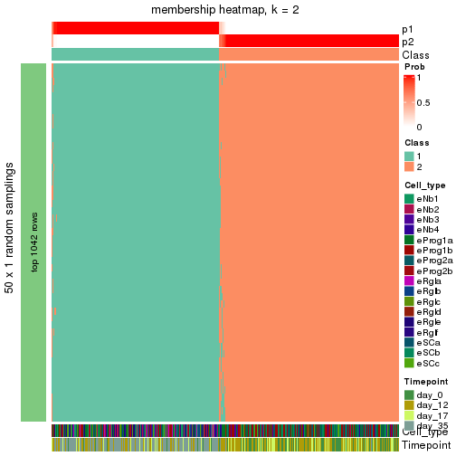</p>

</div>
<div id='tab-node-0-membership-heatmap-2'>
<pre><code class="r">membership_heatmap(res, k = 3)
</code></pre>

<p></p>

</div>
<div id='tab-node-0-membership-heatmap-3'>
<pre><code class="r">membership_heatmap(res, k = 4)
</code></pre>

<p></p>

</div>
</div>

As soon as the classes for columns are determined, the signatures
that are significantly different between subgroups can be looked for. 
Following are the heatmaps for signatures.


Signature heatmaps where rows are scaled:


<script>
$( function() {
	$( '#tabs-node-0-get-signatures' ).tabs();
} );
</script>
<div id='tabs-node-0-get-signatures'>
<ul>
<li><a href='#tab-node-0-get-signatures-1'>k = 2</a></li>
<li><a href='#tab-node-0-get-signatures-2'>k = 3</a></li>
<li><a href='#tab-node-0-get-signatures-3'>k = 4</a></li>
</ul>
<div id='tab-node-0-get-signatures-1'>
<pre><code class="r">get_signatures(res, k = 2)
</code></pre>

<p></p>

</div>
<div id='tab-node-0-get-signatures-2'>
<pre><code class="r">get_signatures(res, k = 3)
</code></pre>

<p></p>

</div>
<div id='tab-node-0-get-signatures-3'>
<pre><code class="r">get_signatures(res, k = 4)
</code></pre>

<p></p>

</div>
</div>


Signature heatmaps where rows are not scaled:


<script>
$( function() {
	$( '#tabs-node-0-get-signatures-no-scale' ).tabs();
} );
</script>
<div id='tabs-node-0-get-signatures-no-scale'>
<ul>
<li><a href='#tab-node-0-get-signatures-no-scale-1'>k = 2</a></li>
<li><a href='#tab-node-0-get-signatures-no-scale-2'>k = 3</a></li>
<li><a href='#tab-node-0-get-signatures-no-scale-3'>k = 4</a></li>
</ul>
<div id='tab-node-0-get-signatures-no-scale-1'>
<pre><code class="r">get_signatures(res, k = 2, scale_rows = FALSE)
</code></pre>

<p></p>

</div>
<div id='tab-node-0-get-signatures-no-scale-2'>
<pre><code class="r">get_signatures(res, k = 3, scale_rows = FALSE)
</code></pre>

<p></p>

</div>
<div id='tab-node-0-get-signatures-no-scale-3'>
<pre><code class="r">get_signatures(res, k = 4, scale_rows = FALSE)
</code></pre>

<p></p>

</div>
</div>


Compare the overlap of signatures from different k:

```r
compare_signatures(res)
```


`get_signature()` returns a data frame invisibly. To get the list of signatures, the function
call should be assigned to a variable explicitly. In following code, if `plot` argument is set
to `FALSE`, no heatmap is plotted while only the differential analysis is performed.

```r
# code only for demonstration
tb = get_signature(res, k = ..., plot = FALSE)
```

An example of the output of `tb` is:

```
#>   which_row         fdr    mean_1    mean_2 scaled_mean_1 scaled_mean_2 km
#> 1        38 0.042760348  8.373488  9.131774    -0.5533452     0.5164555  1
#> 2        40 0.018707592  7.106213  8.469186    -0.6173731     0.5762149  1
#> 3        55 0.019134737 10.221463 11.207825    -0.6159697     0.5749050  1
#> 4        59 0.006059896  5.921854  7.869574    -0.6899429     0.6439467  1
#> 5        60 0.018055526  8.928898 10.211722    -0.6204761     0.5791110  1
#> 6        98 0.009384629 15.714769 14.887706     0.6635654    -0.6193277  2
...
```

The columns in `tb` are:

1. `which_row`: row indices corresponding to the input matrix.
2. `fdr`: FDR for the differential test. 
3. `mean_x`: The mean value in group x.
4. `scaled_mean_x`: The mean value in group x after rows are scaled.
5. `km`: Row groups if k-means clustering is applied to rows (which is done by automatically selecting number of clusters).

If there are too many signatures, `top_signatures = ...` can be set to only show the 
signatures with the highest FDRs:

```r
# code only for demonstration
# e.g. to show the top 500 most significant rows
tb = get_signature(res, k = ..., top_signatures = 500)
```

If the signatures are defined as these which are uniquely high in current group, `diff_method` argument
can be set to `"uniquely_high_in_one_group"`:

```r
# code only for demonstration
tb = get_signature(res, k = ..., diff_method = "uniquely_high_in_one_group")
```


UMAP plot which shows how samples are separated.


<script>
$( function() {
	$( '#tabs-node-0-dimension-reduction' ).tabs();
} );
</script>
<div id='tabs-node-0-dimension-reduction'>
<ul>
<li><a href='#tab-node-0-dimension-reduction-1'>k = 2</a></li>
<li><a href='#tab-node-0-dimension-reduction-2'>k = 3</a></li>
<li><a href='#tab-node-0-dimension-reduction-3'>k = 4</a></li>
</ul>
<div id='tab-node-0-dimension-reduction-1'>
<pre><code class="r">dimension_reduction(res, k = 2, method = &quot;UMAP&quot;)
</code></pre>

<p></p>

</div>
<div id='tab-node-0-dimension-reduction-2'>
<pre><code class="r">dimension_reduction(res, k = 3, method = &quot;UMAP&quot;)
</code></pre>

<p></p>

</div>
<div id='tab-node-0-dimension-reduction-3'>
<pre><code class="r">dimension_reduction(res, k = 4, method = &quot;UMAP&quot;)
</code></pre>

<p></p>

</div>
</div>


Following heatmap shows how subgroups are split when increasing `k`:

```r
collect_classes(res)
```


Test correlation between subgroups and known annotations. If the known
annotation is numeric, one-way ANOVA test is applied, and if the known
annotation is discrete, chi-squared contingency table test is applied.

```r
test_to_known_factors(res)
```

```
#>             n_sample Cell_type(p-value) Timepoint(p-value) k
#> ATC:skmeans     1222          1.86e-204          5.97e-224 2
#> ATC:skmeans     1193           0.00e+00           0.00e+00 3
#> ATC:skmeans     1458           0.00e+00           0.00e+00 4
```


If matrix rows can be associated to genes, consider to use `functional_enrichment(res,
...)` to perform function enrichment for the signature genes. See [this vignette](https://jokergoo.github.io/cola_vignettes/functional_enrichment.html) for more detailed explanations.


 

---------------------------------------------------


### Node01


Parent node: [Node0](#Node0).
Child nodes: 
                [Node011](#Node011)
        ,
                [Node012](#Node012)
        ,
                [Node013](#Node013)
        ,
                [Node021](#Node021)
        ,
                [Node022](#Node022)
        ,
                [Node023](#Node023)
        ,
                [Node024](#Node024)
        ,
                Node031-leaf
        ,
                Node032-leaf
        ,
                [Node033](#Node033)
        .


The object with results only for a single top-value method and a single partitioning method 
can be extracted as:

```r
res = res_rh["01"]
```

A summary of `res` and all the functions that can be applied to it:

```r
res
```

```
#> A 'DownSamplingConsensusPartition' object with k = 2, 3, 4.
#>   On a matrix with 11181 rows and 500 columns, randomly sampled from 705 columns.
#>   Top rows (1048) are extracted by 'ATC' method.
#>   Subgroups are detected by 'skmeans' method.
#>   Performed in total 150 partitions by row resampling.
#>   Best k for subgroups seems to be 3.
#> 
#> Following methods can be applied to this 'DownSamplingConsensusPartition' object:
#>  [1] "cola_report"             "collect_classes"         "collect_plots"          
#>  [4] "collect_stats"           "colnames"                "compare_partitions"     
#>  [7] "compare_signatures"      "consensus_heatmap"       "dimension_reduction"    
#> [10] "functional_enrichment"   "get_anno_col"            "get_anno"               
#> [13] "get_classes"             "get_consensus"           "get_matrix"             
#> [16] "get_membership"          "get_param"               "get_signatures"         
#> [19] "get_stats"               "is_best_k"               "is_stable_k"            
#> [22] "membership_heatmap"      "ncol"                    "nrow"                   
#> [25] "plot_ecdf"               "predict_classes"         "rownames"               
#> [28] "select_partition_number" "show"                    "suggest_best_k"         
#> [31] "test_to_known_factors"   "top_rows_heatmap"
```

`collect_plots()` function collects all the plots made from `res` for all `k` (number of subgroups)
into one single page to provide an easy and fast comparison between different `k`.

```r
collect_plots(res)
```


The plots are:

- The first row: a plot of the eCDF (empirical cumulative distribution
  function) curves of the consensus matrix for each `k` and the heatmap of
  predicted classes for each `k`.
- The second row: heatmaps of the consensus matrix for each `k`.
- The third row: heatmaps of the membership matrix for each `k`.
- The fouth row: heatmaps of the signatures for each `k`.

All the plots in panels can be made by individual functions and they are
plotted later in this section.

`select_partition_number()` produces several plots showing different
statistics for choosing "optimized" `k`. There are following statistics:

- eCDF curves of the consensus matrix for each `k`;
- 1-PAC. [The PAC score](https://en.wikipedia.org/wiki/Consensus_clustering#Over-interpretation_potential_of_consensus_clustering)
  measures the proportion of the ambiguous subgrouping.
- Mean silhouette score.
- Concordance. The mean probability of fiting the consensus subgroup labels in all
  partitions.
- Area increased. Denote $A_k$ as the area under the eCDF curve for current
  `k`, the area increased is defined as $A_k - A_{k-1}$.
- Rand index. The percent of pairs of samples that are both in a same cluster
  or both are not in a same cluster in the partition of k and k-1.
- Jaccard index. The ratio of pairs of samples are both in a same cluster in
  the partition of k and k-1 and the pairs of samples are both in a same
  cluster in the partition k or k-1.

The detailed explanations of these statistics can be found in [the _cola_
vignette](https://jokergoo.github.io/cola_vignettes/cola.html#toc_13).

Generally speaking, higher 1-PAC score, higher mean silhouette score or higher
concordance corresponds to better partition. Rand index and Jaccard index
measure how similar the current partition is compared to partition with `k-1`.
If they are too similar, we won't accept `k` is better than `k-1`.

```r
select_partition_number(res)
```


The numeric values for all these statistics can be obtained by `get_stats()`.

```r
get_stats(res)
```

```
#>   k 1-PAC mean_silhouette concordance area_increased  Rand Jaccard
#> 2 2 0.991           0.971       0.987          0.490 0.508   0.508
#> 3 3 0.989           0.965       0.985          0.358 0.689   0.461
#> 4 4 0.768           0.754       0.828          0.113 0.861   0.620
```

`suggest_best_k()` suggests the best $k$ based on these statistics. The rules are as follows:

- All $k$ with Jaccard index larger than 0.95 are removed because increasing
  $k$ does not provide enough extra information. If all $k$ are removed, it is
  marked as no subgroup is detected.
- For all $k$ with 1-PAC score larger than 0.9, the maximal $k$ is taken as
  the best $k$, and other $k$ are marked as optional $k$.
- If it does not fit the second rule. The $k$ with the maximal vote of the
  highest 1-PAC score, highest mean silhouette, and highest concordance is
  taken as the best $k$.

```r
suggest_best_k(res)
```

```
#> [1] 3
#> attr(,"optional")
#> [1] 2
```

There is also optional best $k$ = 2 that is worth to check.

Following is the table of the partitions (You need to click the **show/hide
code output** link to see it). The membership matrix (columns with name `p*`)
is inferred by
[`clue::cl_consensus()`](https://www.rdocumentation.org/link/cl_consensus?package=clue)
function with the `SE` method. Basically the value in the membership matrix
represents the probability to belong to a certain group. The finall subgroup
label for an item is determined with the group with highest probability it
belongs to.

In `get_classes()` function, the entropy is calculated from the membership
matrix and the silhouette score is calculated from the consensus matrix.


<script>
$( function() {
	$( '#tabs-node-01-get-classes' ).tabs();
} );
</script>
<div id='tabs-node-01-get-classes'>
<ul>
<li><a href='#tab-node-01-get-classes-1'>k = 2</a></li>
<li><a href='#tab-node-01-get-classes-2'>k = 3</a></li>
<li><a href='#tab-node-01-get-classes-3'>k = 4</a></li>
</ul>

<div id='tab-node-01-get-classes-1'>
<p><a id='tab-node-01-get-classes-1-a' style='color:#0366d6' href='#'>show/hide code output</a></p>
<pre><code class="r">get_classes(res, k = 2)
</code></pre>

<pre><code>#&gt;                 class     p
#&gt; 1772122_301_C02     2 0.000
#&gt; 1772122_180_E05     2 0.000
#&gt; 1772122_300_H02     2 0.000
#&gt; 1772122_180_B09     2 0.249
#&gt; 1772122_180_G04     2 0.000
#&gt; 1772122_182_E09     2 0.000
#&gt; 1772122_302_C04     2 0.000
#&gt; 1772122_302_D11     2 0.000
#&gt; 1772122_180_C11     2 0.000
#&gt; 1772122_298_A07     2 0.000
#&gt; 1772122_299_A11     2 0.000
#&gt; 1772122_298_D09     2 0.000
#&gt; 1772122_180_A06     2 0.000
#&gt; 1772122_302_G06     2 0.000
#&gt; 1772122_182_D07     2 0.000
#&gt; 1772122_182_D02     2 0.000
#&gt; 1772122_300_D04     2 0.502
#&gt; 1772122_300_E06     2 0.000
#&gt; 1772122_300_F10     2 0.000
#&gt; 1772122_301_G12     2 0.000
#&gt; 1772122_301_F09     2 0.000
#&gt; 1772122_301_C12     2 0.000
#&gt; 1772122_301_F07     2 0.000
#&gt; 1772122_301_F05     2 0.000
#&gt; 1772122_301_D08     2 0.000
#&gt; 1772122_301_G10     2 0.249
#&gt; 1772122_301_C04     2 0.000
#&gt; 1772122_301_G07     2 0.000
#&gt; 1772122_301_B08     2 0.000
#&gt; 1772122_301_G04     2 0.249
#&gt; 1772122_298_G11     1 0.498
#&gt; 1772122_301_H03     2 0.000
#&gt; 1772122_302_G07     2 0.000
#&gt; 1772122_301_D10     2 0.000
#&gt; 1772122_300_F01     2 0.253
#&gt; 1772122_299_H11     2 0.000
#&gt; 1772122_299_B05     2 0.000
#&gt; 1772122_301_C07     2 0.000
#&gt; 1772122_298_C12     2 0.000
#&gt; 1772122_300_A05     2 0.000
#&gt; 1772122_300_H06     2 0.000
#&gt; 1772122_301_E07     2 0.000
#&gt; 1772122_301_A02     2 0.000
#&gt; 1772122_299_F02     2 0.000
#&gt; 1772122_300_D02     2 0.000
#&gt; 1772122_301_H05     2 0.000
#&gt; 1772122_181_C12     1 0.751
#&gt; 1772122_180_H06     1 1.000
#&gt; 1772122_302_D07     2 0.000
#&gt; 1772122_302_A08     2 0.249
#&gt; 1772122_180_H12     2 0.000
#&gt; 1772122_180_H10     1 0.747
#&gt; 1772122_182_G02     1 1.000
#&gt; 1772122_181_E09     1 1.000
#&gt; 1772122_299_F06     1 1.000
#&gt; 1772122_302_H11     1 0.502
#&gt; 1772122_180_G03     2 0.249
#&gt; 1772122_301_H12     2 0.000
#&gt; 1772122_300_D03     2 0.000
#&gt; 1772122_299_C07     2 0.000
#&gt; 1772122_182_E08     2 0.000
#&gt; 1772122_302_G08     2 0.000
#&gt; 1772122_301_A04     1 1.000
#&gt; 1772122_302_D04     2 0.000
#&gt; 1772122_300_E11     2 0.000
#&gt; 1772122_300_C01     2 0.498
#&gt; 1772122_181_A03     1 0.000
#&gt; 1772122_298_C11     2 0.000
#&gt; 1772122_298_E09     1 0.498
#&gt; 1772122_298_H07     2 0.000
#&gt; 1772122_300_B12     2 0.000
#&gt; 1772122_300_H08     1 0.751
#&gt; 1772122_298_F03     2 0.000
#&gt; 1772122_182_A09     2 0.000
#&gt; 1772122_182_C09     1 0.751
#&gt; 1772122_298_D10     1 0.498
#&gt; 1772122_298_D05     2 0.000
#&gt; 1772122_299_C01     2 0.000
#&gt; 1772122_180_A02     2 0.000
#&gt; 1772122_300_F05     1 0.502
#&gt; 1772122_182_A10     1 0.249
#&gt; 1772122_299_F10     1 0.747
#&gt; 1772122_181_E05     1 0.751
#&gt; 1772122_300_A12     2 0.000
#&gt; 1772122_300_G04     1 1.000
#&gt; 1772122_182_H12     1 0.000
#&gt; 1772122_302_G10     1 0.000
#&gt; 1772122_182_C06     1 0.751
#&gt; 1772122_298_E06     2 0.249
#&gt; 1772122_300_A01     2 0.000
#&gt; 1772122_300_E03     1 0.000
#&gt; 1772122_302_C05     1 0.000
#&gt; 1772122_299_G06     2 0.000
#&gt; 1772122_299_F09     1 0.249
#&gt; 1772122_302_C12     1 1.000
#&gt; 1772122_299_E07     2 0.000
#&gt; 1772122_180_D02     2 0.000
#&gt; 1772122_300_D09     1 0.000
#&gt; 1772122_298_F09     2 0.000
#&gt; 1772122_302_A11     2 0.000
#&gt; 1772122_180_F06     1 0.249
#&gt; 1772122_299_E09     1 0.253
#&gt; 1772122_180_A05     1 0.253
#&gt; 1772122_182_C05     1 0.249
#&gt; 1772122_181_C05     2 0.000
#&gt; 1772122_300_A06     1 0.249
#&gt; 1772122_181_A02     1 0.249
#&gt; 1772122_181_E11     1 0.751
#&gt; 1772122_298_C05     2 0.000
#&gt; 1772122_181_C07     1 0.249
#&gt; 1772122_182_C02     2 0.253
#&gt; 1772122_300_E10     2 0.000
#&gt; 1772122_299_D06     2 0.000
#&gt; 1772122_180_F09     1 0.000
#&gt; 1772122_299_B07     2 0.000
#&gt; 1772122_300_F04     2 0.000
#&gt; 1772122_180_D12     2 0.249
#&gt; 1772122_180_H11     2 0.000
#&gt; 1772122_300_A10     2 0.249
#&gt; 1772122_299_G05     2 0.502
#&gt; 1772122_299_E06     2 0.000
#&gt; 1772122_315_A07     2 0.000
#&gt; 1772122_206_D10     2 0.000
#&gt; 1772122_325_G03     1 0.000
#&gt; 1772122_315_F02     2 0.000
#&gt; 1772122_182_H11     1 0.000
#&gt; 1772122_263_G09     1 0.747
#&gt; 1772122_326_G12     1 0.000
#&gt; 1772122_325_A08     1 0.751
#&gt; 1772122_263_G11     1 0.751
#&gt; 1772122_299_A07     2 0.000
#&gt; 1772122_303_A03     2 0.000
#&gt; 1772122_303_A05     1 0.502
#&gt; 1772122_298_H05     1 1.000
#&gt; 1772122_303_B12     2 0.000
#&gt; 1772122_303_D05     2 0.000
#&gt; 1772122_326_H08     1 0.000
#&gt; 1772122_206_H10     2 0.000
#&gt; 1772122_263_H02     2 0.249
#&gt; 1772122_306_E02     2 0.000
#&gt; 1772122_315_E03     2 0.249
#&gt; 1772122_305_G07     2 0.000
#&gt; 1772122_306_H02     2 0.000
#&gt; 1772122_303_D08     2 0.000
#&gt; 1772122_303_H07     2 0.000
#&gt; 1772122_306_D05     2 0.000
#&gt; 1772122_305_H05     2 0.000
#&gt; 1772122_302_B03     1 0.000
#&gt; 1772122_300_B03     1 0.000
#&gt; 1772122_299_E02     1 0.498
#&gt; 1772122_303_B01     1 0.000
#&gt; 1772122_298_B10     1 0.502
#&gt; 1772122_298_D07     2 0.000
#&gt; 1772122_298_G09     2 0.000
#&gt; 1772122_300_E07     2 0.000
#&gt; 1772122_298_H12     1 0.000
#&gt; 1772122_298_D11     2 0.000
#&gt; 1772122_299_G12     1 1.000
#&gt; 1772122_302_F05     1 0.000
#&gt; 1772122_300_E09     2 0.502
#&gt; 1772122_301_G09     2 0.000
#&gt; 1772122_300_F02     2 0.000
#&gt; 1772122_301_G11     2 0.000
#&gt; 1772122_302_D05     1 1.000
#&gt; 1772122_302_E11     2 0.000
#&gt; 1772122_299_A05     1 0.747
#&gt; 1772122_299_H06     2 0.751
#&gt; 1772122_301_A01     2 0.000
#&gt; 1772122_299_D04     2 0.000
#&gt; 1772122_180_E07     2 0.000
#&gt; 1772122_300_E02     2 0.000
#&gt; 1772122_301_A09     2 0.000
#&gt; 1772122_301_B05     2 0.000
#&gt; 1772122_302_G09     1 0.747
#&gt; 1772122_299_A06     1 0.000
#&gt; 1772122_301_B12     2 0.000
#&gt; 1772122_324_H10     1 0.000
#&gt; 1772122_301_F03     2 0.000
#&gt; 1772122_181_H01     1 0.000
#&gt; 1772122_325_F05     1 0.000
#&gt; 1772122_301_E02     2 0.000
#&gt; 1772122_302_F11     1 0.000
#&gt; 1772122_300_C06     2 0.000
#&gt; 1772122_302_G04     2 0.000
#&gt; 1772122_299_C05     1 0.000
#&gt; 1772122_302_H08     1 0.000
#&gt; 1772122_300_G08     1 1.000
#&gt; 1772122_299_B02     1 0.000
#&gt; 1772122_301_A05     2 0.000
#&gt; 1772122_302_B11     1 1.000
#&gt; 1772122_299_H04     1 0.249
#&gt; 1772122_299_G07     2 0.000
#&gt; 1772122_300_C09     1 1.000
#&gt; 1772122_300_A03     1 0.751
#&gt; 1772122_302_A02     2 0.000
#&gt; 1772122_302_H07     1 0.249
#&gt; 1772122_300_C07     1 1.000
#&gt; 1772122_298_C02     2 0.000
#&gt; 1772122_300_E12     1 0.249
#&gt; 1772122_299_H12     2 0.000
#&gt; 1772122_300_B04     1 0.747
#&gt; 1772122_300_H05     2 0.253
#&gt; 1772122_299_D09     1 0.249
#&gt; 1772122_299_B04     2 0.253
#&gt; 1772122_298_A09     2 0.000
#&gt; 1772122_298_E02     2 0.000
#&gt; 1772122_302_D06     2 0.000
#&gt; 1772122_180_F12     1 0.000
#&gt; 1772122_298_F02     2 0.502
#&gt; 1772122_301_B11     2 0.000
#&gt; 1772122_301_H01     2 0.000
#&gt; 1772122_301_H06     2 0.000
#&gt; 1772122_301_F02     2 0.000
#&gt; 1772122_305_D01     2 0.747
#&gt; 1772122_181_D10     1 0.249
#&gt; 1772122_182_E04     1 0.249
#&gt; 1772122_182_B12     1 0.000
#&gt; 1772122_301_E01     2 0.000
#&gt; 1772122_315_B01     2 0.000
#&gt; 1772122_300_B05     1 0.000
#&gt; 1772122_298_A01     1 0.000
#&gt; 1772122_182_A01     1 0.751
#&gt; 1772122_300_C12     1 0.000
#&gt; 1772122_299_D11     2 0.000
#&gt; 1772122_302_B05     1 0.751
#&gt; 1772122_180_C08     1 0.747
#&gt; 1772122_302_C08     1 1.000
#&gt; 1772122_300_D10     1 0.249
#&gt; 1772122_299_C10     1 1.000
#&gt; 1772122_302_E12     1 0.751
#&gt; 1772122_298_H04     2 0.000
#&gt; 1772122_182_D09     1 1.000
#&gt; 1772122_300_D07     2 0.000
#&gt; 1772122_298_F12     1 0.249
#&gt; 1772122_299_A01     2 0.249
#&gt; 1772122_299_F12     2 0.000
#&gt; 1772122_298_B05     2 0.000
#&gt; 1772122_301_C01     2 0.000
#&gt; 1772122_298_A08     1 1.000
#&gt; 1772122_180_F05     2 0.000
#&gt; 1772122_299_H10     1 1.000
#&gt; 1772122_299_D01     1 0.249
#&gt; 1772122_302_A01     1 0.751
#&gt; 1772122_298_H10     1 1.000
#&gt; 1772122_298_F05     2 0.000
#&gt; 1772122_301_C06     2 0.000
#&gt; 1772122_298_C04     2 0.000
#&gt; 1772122_181_G05     1 0.249
#&gt; 1772122_298_D04     1 1.000
#&gt; 1772122_180_B10     1 1.000
#&gt; 1772122_180_H04     2 0.000
#&gt; 1772122_301_B03     2 0.000
#&gt; 1772122_298_A11     2 0.000
#&gt; 1772122_182_D04     2 0.000
#&gt; 1772122_300_H10     2 0.000
#&gt; 1772122_301_B06     2 0.000
#&gt; 1772122_301_D06     2 0.000
#&gt; 1772122_298_A03     2 0.000
#&gt; 1772122_301_A11     2 0.000
#&gt; 1772122_301_F06     2 0.000
#&gt; 1772122_298_F04     1 1.000
#&gt; 1772122_300_H12     2 0.000
#&gt; 1772122_301_B07     2 0.000
#&gt; 1772122_299_F04     2 0.000
#&gt; 1772122_300_E04     2 0.000
#&gt; 1772122_299_F11     2 0.000
#&gt; 1772122_300_H09     1 0.751
#&gt; 1772122_302_C02     2 0.249
#&gt; 1772122_301_D05     2 0.000
#&gt; 1772122_301_H04     2 0.000
#&gt; 1772122_300_G06     2 0.000
#&gt; 1772122_299_H07     2 0.000
#&gt; 1772122_298_H06     2 0.000
#&gt; 1772122_301_G06     2 0.000
#&gt; 1772122_301_C10     2 0.000
#&gt; 1772122_300_B11     2 0.000
#&gt; 1772122_301_C08     2 0.000
#&gt; 1772122_301_D07     2 0.000
#&gt; 1772122_301_D04     2 0.000
#&gt; 1772122_301_G05     2 0.000
#&gt; 1772122_301_H09     2 0.000
#&gt; 1772122_302_F02     2 0.000
#&gt; 1772122_300_F11     2 0.000
#&gt; 1772122_301_C11     2 0.000
#&gt; 1772122_301_F11     2 0.000
#&gt; 1772122_302_C11     1 0.751
#&gt; 1772122_299_A08     2 0.000
#&gt; 1772122_301_E10     2 0.000
#&gt; 1772122_300_D11     2 0.000
#&gt; 1772122_182_A12     1 0.000
#&gt; 1772122_301_C05     2 0.000
#&gt; 1772122_302_B09     2 0.000
#&gt; 1772122_299_B10     1 0.498
#&gt; 1772122_182_F09     2 0.000
#&gt; 1772122_299_F03     1 0.498
#&gt; 1772122_303_C09     2 0.000
#&gt; 1772122_306_E09     1 0.000
#&gt; 1772122_305_B03     1 0.000
#&gt; 1772122_305_A01     1 0.502
#&gt; 1772122_306_C10     1 0.253
#&gt; 1772122_303_D01     1 0.498
#&gt; 1772122_305_E12     1 0.000
#&gt; 1772122_303_F12     1 0.000
#&gt; 1772122_306_D12     1 0.249
#&gt; 1772122_303_E07     1 0.249
#&gt; 1772122_306_C09     1 1.000
#&gt; 1772122_305_G10     1 0.249
#&gt; 1772122_315_F10     1 0.751
#&gt; 1772122_306_G09     1 0.000
#&gt; 1772122_315_B05     1 0.000
#&gt; 1772122_306_H08     1 1.000
#&gt; 1772122_306_A07     1 0.000
#&gt; 1772122_302_F01     1 0.751
#&gt; 1772122_305_G02     1 0.000
#&gt; 1772122_262_A05     1 0.000
#&gt; 1772122_305_H09     2 0.000
#&gt; 1772122_306_F11     2 0.000
#&gt; 1772122_315_B11     1 0.751
#&gt; 1772122_302_G01     1 0.000
#&gt; 1772122_306_C11     2 0.000
#&gt; 1772122_315_D08     1 0.000
#&gt; 1772122_300_D12     1 0.000
#&gt; 1772122_306_E07     2 0.502
#&gt; 1772122_306_A02     1 0.502
#&gt; 1772122_315_G12     1 0.000
#&gt; 1772122_306_A06     1 0.000
#&gt; 1772122_306_D11     1 0.000
#&gt; 1772122_306_E10     1 0.751
#&gt; 1772122_306_B05     1 0.000
#&gt; 1772122_205_B05     1 0.000
#&gt; 1772122_306_F04     1 0.502
#&gt; 1772122_315_A03     2 0.751
#&gt; 1772122_315_H01     1 0.000
#&gt; 1772122_302_G11     1 0.000
#&gt; 1772122_305_H02     2 0.249
#&gt; 1772122_305_H04     1 0.502
#&gt; 1772122_315_C12     1 0.502
#&gt; 1772122_303_A08     1 0.751
#&gt; 1772122_303_F04     1 0.751
#&gt; 1772122_303_A10     1 0.502
#&gt; 1772122_300_G03     1 0.000
#&gt; 1772122_305_A10     1 0.502
#&gt; 1772122_303_G08     1 0.249
#&gt; 1772122_299_D12     1 0.249
#&gt; 1772122_305_G09     1 0.000
#&gt; 1772122_305_E10     1 0.253
#&gt; 1772122_298_F07     1 0.498
#&gt; 1772122_301_E08     2 0.249
#&gt; 1772122_262_F01     1 0.000
#&gt; 1772122_300_G05     1 0.249
#&gt; 1772122_298_C06     1 0.502
#&gt; 1772122_300_H03     1 1.000
#&gt; 1772122_305_A04     1 0.000
#&gt; 1772122_305_A05     1 0.249
#&gt; 1772122_305_G04     1 0.000
#&gt; 1772122_306_B10     1 0.751
#&gt; 1772122_303_C11     1 1.000
#&gt; 1772122_315_C07     2 0.000
#&gt; 1772122_302_E08     1 0.000
#&gt; 1772122_182_F01     1 0.000
#&gt; 1772122_298_B01     1 0.000
#&gt; 1772122_302_E02     1 0.498
#&gt; 1772122_301_A12     2 0.000
#&gt; 1772122_305_B10     1 0.000
#&gt; 1772122_306_E01     1 0.000
#&gt; 1772122_299_G08     1 0.000
#&gt; 1772122_300_C11     2 0.000
#&gt; 1772122_301_E04     2 0.000
#&gt; 1772122_301_E12     2 0.249
#&gt; 1772122_301_E05     2 0.249
#&gt; 1772122_301_D01     2 0.747
#&gt; 1772122_180_A07     2 0.000
#&gt; 1772122_301_F08     1 0.249
#&gt; 1772122_300_D08     1 0.000
#&gt; 1772122_300_A02     2 0.000
#&gt; 1772122_180_H01     1 0.000
#&gt; 1772122_298_G07     2 0.751
#&gt; 1772122_299_A02     2 0.000
#&gt; 1772122_181_F01     1 0.000
#&gt; 1772122_180_A12     1 0.000
#&gt; 1772122_302_G02     1 0.000
#&gt; 1772122_180_E11     2 0.747
#&gt; 1772122_298_E08     1 0.751
#&gt; 1772122_302_E03     1 0.000
#&gt; 1772122_300_B09     1 0.000
#&gt; 1772122_182_C12     1 0.000
#&gt; 1772122_181_A04     1 0.249
#&gt; 1772122_182_A02     1 0.000
#&gt; 1772122_181_C03     1 0.000
#&gt; 1772122_181_D01     1 0.000
#&gt; 1772122_181_B05     1 0.000
#&gt; 1772122_180_G08     1 0.000
#&gt; 1772122_180_G11     1 1.000
#&gt; 1772122_302_F09     2 0.000
#&gt; 1772122_300_G12     1 0.000
#&gt; 1772122_298_D06     1 0.000
#&gt; 1772122_299_H05     1 0.498
#&gt; 1772122_180_B03     1 1.000
#&gt; 1772122_300_G07     2 0.502
#&gt; 1772122_298_E01     1 0.000
#&gt; 1772122_298_G03     1 0.000
#&gt; 1772122_302_A12     1 0.000
#&gt; 1772122_181_D12     1 0.000
#&gt; 1772122_299_E03     1 0.000
#&gt; 1772122_181_D07     1 0.000
#&gt; 1772122_298_H02     1 1.000
#&gt; 1772122_181_H05     1 0.000
#&gt; 1772122_181_E12     1 0.000
#&gt; 1772122_302_F12     1 0.000
#&gt; 1772122_299_G09     1 1.000
#&gt; 1772122_182_B10     1 0.249
#&gt; 1772122_182_A07     1 0.000
#&gt; 1772122_298_F11     1 0.000
#&gt; 1772122_181_G07     1 0.000
#&gt; 1772122_182_B06     1 0.000
#&gt; 1772122_299_G03     1 0.502
#&gt; 1772122_298_A10     1 0.000
#&gt; 1772122_180_B02     1 0.000
#&gt; 1772122_298_E07     2 0.000
#&gt; 1772122_300_C08     1 0.000
#&gt; 1772122_298_D02     1 0.249
#&gt; 1772122_299_A12     1 0.000
#&gt; 1772122_182_B04     1 0.498
#&gt; 1772122_181_E03     1 0.000
#&gt; 1772122_299_B03     1 0.000
#&gt; 1772122_181_C11     1 0.751
#&gt; 1772122_181_H04     2 0.000
#&gt; 1772122_300_D01     1 0.000
#&gt; 1772122_302_E06     1 0.000
#&gt; 1772122_301_G03     1 0.249
#&gt; 1772122_302_A05     1 0.249
#&gt; 1772122_300_H07     2 0.000
#&gt; 1772122_301_B02     2 0.253
#&gt; 1772122_182_G03     1 0.000
#&gt; 1772122_301_C03     1 0.000
#&gt; 1772122_180_D05     1 0.498
#&gt; 1772122_180_D08     1 0.000
#&gt; 1772122_299_C12     1 0.000
#&gt; 1772122_302_H06     1 0.000
#&gt; 1772122_298_E12     1 0.000
#&gt; 1772122_298_B08     1 0.502
#&gt; 1772122_302_G12     1 0.000
#&gt; 1772122_300_E01     1 0.000
#&gt; 1772122_300_B10     1 0.498
#&gt; 1772122_180_G12     1 1.000
#&gt; 1772122_300_F07     1 0.000
#&gt; 1772122_180_B12     1 0.249
#&gt; 1772122_182_F08     1 0.000
#&gt; 1772122_302_E04     1 0.249
#&gt; 1772122_298_F06     1 0.000
#&gt; 1772122_300_C04     1 1.000
#&gt; 1772122_302_H01     1 0.000
#&gt; 1772122_302_D02     2 0.000
#&gt; 1772122_182_E05     1 0.000
#&gt; 1772122_182_E10     1 0.000
#&gt; 1772122_182_B07     1 0.000
#&gt; 1772122_180_A03     1 0.253
#&gt; 1772122_180_F04     1 0.249
#&gt; 1772122_299_D05     1 0.000
#&gt; 1772122_182_F02     1 0.000
#&gt; 1772122_299_E12     1 0.000
#&gt; 1772122_298_A05     1 0.000
#&gt; 1772122_298_B02     2 0.000
#&gt; 1772122_181_F08     1 0.000
#&gt; 1772122_298_C03     1 0.249
#&gt; 1772122_300_G10     1 0.000
#&gt; 1772122_182_E12     1 0.000
#&gt; 1772122_298_B04     1 0.000
#&gt; 1772122_301_E06     2 0.000
#&gt; 1772122_182_H09     1 0.000
#&gt; 1772122_302_A10     1 0.000
#&gt; 1772122_181_F12     1 0.000
#&gt; 1772122_302_H10     1 0.751
#&gt; 1772122_302_H05     1 0.000
#&gt; 1772122_181_D11     2 0.000
#&gt; 1772122_298_G08     1 0.747
#&gt; 1772122_298_H11     2 0.000
#&gt; 1772122_180_G07     1 0.000
#&gt; 1772122_180_A10     1 0.498
#&gt; 1772122_298_D08     1 0.498
#&gt; 1772122_299_B01     1 0.000
#&gt; 1772122_299_F05     1 0.000
#&gt; 1772122_302_B07     1 0.498
#&gt; 1772122_180_E06     1 0.000
#&gt; 1772122_301_A10     2 0.000
#&gt; 1772122_182_A11     1 0.000
#&gt; 1772122_180_G10     1 0.000
#&gt; 1772122_301_D02     2 0.000
#&gt; 1772122_301_F01     2 0.253
#&gt; 1772122_181_A06     1 0.502
#&gt; 1772122_181_B06     2 0.498
#&gt; 1772122_182_F04     1 0.751
#&gt; 1772122_181_F09     2 0.000
#&gt; 1772122_182_D03     1 0.000
#&gt; 1772122_300_F06     1 0.000
#&gt; 1772122_300_D06     1 0.498
#&gt; 1772122_299_D02     1 0.000
#&gt; 1772122_301_G02     2 0.000
#&gt; 1772122_299_H08     1 0.747
#&gt; 1772122_300_C03     1 0.000
#&gt; 1772122_299_B09     2 1.000
#&gt; 1772122_301_A03     2 0.747
#&gt; 1772122_300_H01     1 0.000
#&gt; 1772122_300_C10     1 0.249
#&gt; 1772122_300_A09     1 0.000
#&gt; 1772122_298_H03     1 0.000
#&gt; 1772122_299_C06     1 0.000
#&gt; 1772122_182_E11     1 0.000
#&gt; 1772122_300_B08     1 0.253
#&gt; 1772122_300_C05     2 0.502
#&gt; 1772122_300_E05     1 0.000
#&gt; 1772122_180_C05     1 0.000
#&gt; 1772122_300_E08     1 0.751
#&gt; 1772122_181_G11     1 0.000
#&gt; 1772122_300_G11     1 0.000
#&gt; 1772122_300_D05     1 0.000
#&gt; 1772122_300_A04     1 0.249
#&gt; 1772122_300_B02     1 0.249
#&gt; 1772122_302_A03     1 0.000
#&gt; 1772122_180_G05     2 0.253
#&gt; 1772122_300_F08     1 0.253
#&gt; 1772122_182_E03     1 0.000
#&gt; 1772122_299_G04     1 0.000
#&gt; 1772122_298_A04     1 0.249
#&gt; 1772122_181_E01     1 0.249
#&gt; 1772122_302_C06     1 0.000
#&gt; 1772122_298_B11     1 0.249
#&gt; 1772122_182_F12     1 0.000
#&gt; 1772122_180_H02     1 0.000
#&gt; 1772122_180_A01     1 0.000
#&gt; 1772122_180_C09     1 0.000
#&gt; 1772122_180_D06     2 0.249
#&gt; 1772122_302_B02     1 0.249
#&gt; 1772122_300_G01     1 0.498
#&gt; 1772122_298_E04     2 0.751
#&gt; 1772122_301_C09     2 1.000
#&gt; 1772122_301_E03     2 0.000
#&gt; 1772122_180_C04     1 1.000
#&gt; 1772122_299_F08     1 0.000
#&gt; 1772122_180_H08     1 0.000
#&gt; 1772122_298_D03     1 0.000
#&gt; 1772122_180_A08     1 0.000
#&gt; 1772122_181_A12     1 0.000
#&gt; 1772122_180_C12     2 1.000
#&gt; 1772122_182_B01     1 0.000
#&gt; 1772122_180_H07     2 0.751
#&gt; 1772122_182_E01     1 0.000
#&gt; 1772122_181_C04     1 0.000
#&gt; 1772122_180_D10     2 1.000
#&gt; 1772122_181_B10     1 0.000
#&gt; 1772122_182_F03     1 0.000
#&gt; 1772122_180_B07     2 0.000
#&gt; 1772122_181_C06     1 0.000
#&gt; 1772122_181_G06     1 0.000
#&gt; 1772122_181_H03     1 0.000
#&gt; 1772122_181_F06     2 0.502
#&gt; 1772122_181_D05     1 0.000
#&gt; 1772122_299_E05     1 0.000
#&gt; 1772122_182_E06     2 0.751
#&gt; 1772122_302_C10     1 0.000
#&gt; 1772122_182_H01     1 0.000
#&gt; 1772122_181_C08     2 0.498
#&gt; 1772122_299_H09     1 0.000
#&gt; 1772122_182_B08     1 0.000
#&gt; 1772122_299_H03     1 1.000
#&gt; 1772122_181_B11     1 0.000
#&gt; 1772122_180_C01     2 1.000
#&gt; 1772122_182_C11     1 0.000
#&gt; 1772122_182_B05     1 0.000
#&gt; 1772122_302_A09     1 0.000
#&gt; 1772122_182_C01     1 0.000
#&gt; 1772122_299_C08     1 0.000
#&gt; 1772122_299_G01     1 0.000
#&gt; 1772122_182_E07     1 0.249
#&gt; 1772122_181_H02     2 0.751
#&gt; 1772122_181_D09     2 0.249
#&gt; 1772122_180_G09     2 0.000
#&gt; 1772122_181_D03     1 0.000
#&gt; 1772122_181_H07     2 0.000
#&gt; 1772122_298_C07     2 0.498
#&gt; 1772122_182_D01     1 0.000
#&gt; 1772122_302_H12     1 0.253
#&gt; 1772122_299_A03     1 0.000
#&gt; 1772122_181_H10     1 0.000
#&gt; 1772122_180_E12     2 1.000
#&gt; 1772122_180_B05     1 0.249
#&gt; 1772122_181_H12     1 0.751
#&gt; 1772122_180_E08     1 0.000
#&gt; 1772122_180_F10     1 0.502
#&gt; 1772122_180_F08     1 0.253
#&gt; 1772122_181_F03     1 0.502
#&gt; 1772122_299_E01     1 0.498
#&gt; 1772122_181_B01     1 0.000
#&gt; 1772122_180_F03     1 0.000
#&gt; 1772122_182_B02     1 0.000
#&gt; 1772122_181_F02     1 0.498
#&gt; 1772122_181_B12     1 0.249
#&gt; 1772122_182_D06     1 0.000
#&gt; 1772122_181_F11     1 0.000
#&gt; 1772122_181_E02     2 0.000
#&gt; 1772122_180_C03     1 0.000
#&gt; 1772122_180_B06     1 0.000
#&gt; 1772122_180_D09     1 0.000
#&gt; 1772122_182_H08     1 0.000
#&gt; 1772122_298_C08     1 0.751
#&gt; 1772122_182_C10     1 0.249
#&gt; 1772122_180_D03     1 0.000
#&gt; 1772122_182_A05     1 0.000
#&gt; 1772122_299_H02     1 0.249
#&gt; 1772122_180_B01     2 0.000
#&gt; 1772122_299_C04     1 0.000
#&gt; 1772122_180_B08     1 0.502
#&gt; 1772122_181_F04     1 0.000
#&gt; 1772122_182_B11     1 0.000
#&gt; 1772122_181_E04     2 0.751
#&gt; 1772122_181_D02     1 0.253
#&gt; 1772122_182_A06     1 0.000
#&gt; 1772122_181_A05     1 0.000
#&gt; 1772122_181_B02     1 0.000
#&gt; 1772122_182_D05     1 0.000
#&gt; 1772122_181_F07     1 0.000
#&gt; 1772122_181_H08     1 0.000
#&gt; 1772122_181_C01     2 0.498
#&gt; 1772122_182_C08     1 0.000
#&gt; 1772122_180_F02     1 0.000
#&gt; 1772122_181_G09     1 0.000
#&gt; 1772122_181_E07     1 0.000
#&gt; 1772122_180_F11     2 0.249
#&gt; 1772122_302_B01     1 0.498
#&gt; 1772122_180_F01     1 0.000
#&gt; 1772122_180_E03     2 0.751
#&gt; 1772122_181_A07     2 0.253
#&gt; 1772122_299_E10     2 0.000
#&gt; 1772122_181_B08     1 0.000
#&gt; 1772122_299_A09     1 0.000
#&gt; 1772122_182_B09     2 0.000
#&gt; 1772122_182_G08     1 0.000
#&gt; 1772122_181_F10     1 0.000
#&gt; 1772122_262_E07     1 0.000
#&gt; 1772122_206_E06     1 0.000
#&gt; 1772122_262_F09     1 0.000
#&gt; 1772122_205_H01     1 0.000
#&gt; 1772122_206_B01     1 0.000
#&gt; 1772122_204_E10     1 0.000
#&gt; 1772122_204_H07     1 0.000
#&gt; 1772122_262_B01     1 0.000
#&gt; 1772122_204_G03     1 0.000
#&gt; 1772122_206_G09     1 0.000
#&gt; 1772122_204_E09     1 0.747
#&gt; 1772122_262_F05     1 0.000
#&gt; 1772122_204_E02     1 0.000
#&gt; 1772122_262_G03     1 0.000
#&gt; 1772122_262_D04     1 0.000
#&gt; 1772122_205_B02     1 0.000
#&gt; 1772122_325_B02     1 0.751
#&gt; 1772122_263_E07     1 0.502
#&gt; 1772122_325_A10     1 0.000
#&gt; 1772122_206_D03     1 0.000
#&gt; 1772122_263_D01     1 0.000
#&gt; 1772122_262_A06     1 0.000
#&gt; 1772122_326_B12     1 0.000
#&gt; 1772122_263_F04     1 0.000
#&gt; 1772122_262_B02     1 0.751
#&gt; 1772122_325_B03     1 0.000
#&gt; 1772122_326_A01     1 0.000
#&gt; 1772122_325_E05     1 0.000
#&gt; 1772122_326_F05     1 0.000
#&gt; 1772122_204_H03     1 0.502
#&gt; 1772122_263_H03     1 0.000
#&gt; 1772122_326_F09     1 0.000
#&gt; 1772122_326_H02     1 0.000
#&gt; 1772122_206_H08     1 0.000
#&gt; 1772122_263_G08     1 0.502
#&gt; 1772122_325_E04     1 0.000
#&gt; 1772122_312_E01     1 0.253
#&gt; 1772122_314_C07     1 0.000
#&gt; 1772122_312_E03     1 0.000
#&gt; 1772122_312_D01     1 0.253
#&gt; 1772122_311_F12     1 0.000
#&gt; 1772122_310_E12     1 0.000
#&gt; 1772122_310_D08     1 0.502
#&gt; 1772122_314_F01     1 0.000
#&gt; 1772122_311_G09     1 0.000
#&gt; 1772122_310_C09     1 0.253
#&gt; 1772122_312_H06     1 0.000
#&gt; 1772122_312_B09     2 0.249
#&gt; 1772122_314_H10     1 0.000
#&gt; 1772122_310_F10     1 0.000
#&gt; 1772122_312_C11     1 0.000
#&gt; 1772122_310_G03     1 0.502
#&gt; 1772122_312_G07     1 0.000
#&gt; 1772122_310_E08     1 0.502
#&gt; 1772122_311_F04     1 0.249
#&gt; 1772122_311_C03     2 0.498
#&gt; 1772122_311_C10     1 0.000
#&gt; 1772122_311_C05     2 0.498
#&gt; 1772122_310_C01     1 0.253
#&gt; 1772122_310_C05     1 0.000
#&gt; 1772122_310_D01     1 0.000
#&gt; 1772122_312_C03     1 0.000
#&gt; 1772122_314_F02     1 0.502
#&gt; 1772122_310_D03     1 0.249
#&gt; 1772122_312_A04     1 0.000
#&gt; 1772122_310_B02     1 0.253
#&gt; 1772122_312_H03     1 0.000
</code></pre>

<script>
$('#tab-node-01-get-classes-1-a').parent().next().next().hide();
$('#tab-node-01-get-classes-1-a').click(function(){
  $('#tab-node-01-get-classes-1-a').parent().next().next().toggle();
  return(false);
});
</script>
</div>

<div id='tab-node-01-get-classes-2'>
<p><a id='tab-node-01-get-classes-2-a' style='color:#0366d6' href='#'>show/hide code output</a></p>
<pre><code class="r">get_classes(res, k = 3)
</code></pre>

<pre><code>#&gt;                 class     p
#&gt; 1772122_301_C02     2 0.000
#&gt; 1772122_180_E05     2 0.000
#&gt; 1772122_300_H02     2 0.000
#&gt; 1772122_180_B09     2 0.000
#&gt; 1772122_180_G04     2 0.000
#&gt; 1772122_182_E09     2 0.000
#&gt; 1772122_302_C04     2 0.000
#&gt; 1772122_302_D11     2 0.000
#&gt; 1772122_180_C11     2 0.000
#&gt; 1772122_298_A07     2 0.000
#&gt; 1772122_299_A11     2 0.000
#&gt; 1772122_298_D09     2 0.000
#&gt; 1772122_180_A06     2 0.000
#&gt; 1772122_302_G06     2 0.000
#&gt; 1772122_182_D07     2 0.000
#&gt; 1772122_182_D02     2 0.000
#&gt; 1772122_300_D04     1 0.498
#&gt; 1772122_300_E06     1 0.249
#&gt; 1772122_300_F10     2 0.000
#&gt; 1772122_301_G12     2 0.000
#&gt; 1772122_301_F09     2 0.000
#&gt; 1772122_301_C12     2 0.000
#&gt; 1772122_301_F07     2 0.000
#&gt; 1772122_301_F05     2 0.000
#&gt; 1772122_301_D08     2 0.000
#&gt; 1772122_301_G10     2 0.000
#&gt; 1772122_301_C04     2 0.000
#&gt; 1772122_301_G07     2 0.000
#&gt; 1772122_301_B08     2 0.000
#&gt; 1772122_301_G04     2 0.000
#&gt; 1772122_298_G11     1 0.000
#&gt; 1772122_301_H03     2 0.000
#&gt; 1772122_302_G07     2 0.000
#&gt; 1772122_301_D10     2 0.000
#&gt; 1772122_300_F01     2 0.000
#&gt; 1772122_299_H11     2 0.000
#&gt; 1772122_299_B05     2 0.000
#&gt; 1772122_301_C07     2 0.000
#&gt; 1772122_298_C12     2 0.000
#&gt; 1772122_300_A05     2 0.000
#&gt; 1772122_300_H06     2 0.000
#&gt; 1772122_301_E07     2 0.000
#&gt; 1772122_301_A02     2 0.000
#&gt; 1772122_299_F02     2 0.000
#&gt; 1772122_300_D02     2 0.249
#&gt; 1772122_301_H05     2 0.000
#&gt; 1772122_181_C12     1 0.000
#&gt; 1772122_180_H06     1 0.000
#&gt; 1772122_302_D07     2 0.000
#&gt; 1772122_302_A08     2 0.000
#&gt; 1772122_180_H12     2 0.249
#&gt; 1772122_180_H10     1 0.498
#&gt; 1772122_182_G02     1 0.000
#&gt; 1772122_181_E09     1 0.000
#&gt; 1772122_299_F06     1 0.000
#&gt; 1772122_302_H11     1 0.000
#&gt; 1772122_180_G03     2 0.000
#&gt; 1772122_301_H12     2 0.000
#&gt; 1772122_300_D03     1 0.249
#&gt; 1772122_299_C07     1 0.000
#&gt; 1772122_182_E08     1 0.000
#&gt; 1772122_302_G08     1 0.498
#&gt; 1772122_301_A04     1 0.000
#&gt; 1772122_302_D04     2 0.000
#&gt; 1772122_300_E11     1 0.000
#&gt; 1772122_300_C01     2 0.000
#&gt; 1772122_181_A03     1 0.000
#&gt; 1772122_298_C11     2 0.000
#&gt; 1772122_298_E09     1 0.000
#&gt; 1772122_298_H07     2 0.502
#&gt; 1772122_300_B12     2 0.000
#&gt; 1772122_300_H08     1 0.000
#&gt; 1772122_298_F03     2 0.000
#&gt; 1772122_182_A09     2 0.000
#&gt; 1772122_182_C09     1 0.000
#&gt; 1772122_298_D10     1 0.000
#&gt; 1772122_298_D05     2 0.000
#&gt; 1772122_299_C01     1 0.502
#&gt; 1772122_180_A02     2 0.000
#&gt; 1772122_300_F05     1 0.000
#&gt; 1772122_182_A10     1 0.000
#&gt; 1772122_299_F10     1 0.000
#&gt; 1772122_181_E05     1 0.000
#&gt; 1772122_300_A12     2 0.000
#&gt; 1772122_300_G04     1 0.000
#&gt; 1772122_182_H12     1 0.000
#&gt; 1772122_302_G10     1 0.000
#&gt; 1772122_182_C06     1 0.000
#&gt; 1772122_298_E06     2 0.000
#&gt; 1772122_300_A01     2 0.000
#&gt; 1772122_300_E03     1 0.000
#&gt; 1772122_302_C05     1 0.000
#&gt; 1772122_299_G06     2 0.000
#&gt; 1772122_299_F09     1 0.000
#&gt; 1772122_302_C12     1 0.000
#&gt; 1772122_299_E07     2 0.000
#&gt; 1772122_180_D02     2 0.000
#&gt; 1772122_300_D09     1 0.000
#&gt; 1772122_298_F09     3 0.751
#&gt; 1772122_302_A11     2 0.000
#&gt; 1772122_180_F06     1 0.000
#&gt; 1772122_299_E09     1 0.000
#&gt; 1772122_180_A05     1 0.000
#&gt; 1772122_182_C05     1 0.000
#&gt; 1772122_181_C05     2 0.249
#&gt; 1772122_300_A06     1 0.000
#&gt; 1772122_181_A02     1 0.000
#&gt; 1772122_181_E11     1 0.000
#&gt; 1772122_298_C05     2 1.000
#&gt; 1772122_181_C07     1 0.000
#&gt; 1772122_182_C02     2 0.253
#&gt; 1772122_300_E10     3 0.751
#&gt; 1772122_299_D06     1 0.000
#&gt; 1772122_180_F09     1 0.000
#&gt; 1772122_299_B07     2 1.000
#&gt; 1772122_300_F04     2 0.000
#&gt; 1772122_180_D12     1 0.000
#&gt; 1772122_180_H11     2 0.000
#&gt; 1772122_300_A10     2 0.000
#&gt; 1772122_299_G05     2 0.000
#&gt; 1772122_299_E06     2 0.000
#&gt; 1772122_315_A07     3 0.000
#&gt; 1772122_206_D10     2 1.000
#&gt; 1772122_325_G03     3 0.498
#&gt; 1772122_315_F02     2 0.000
#&gt; 1772122_182_H11     1 0.000
#&gt; 1772122_263_G09     1 1.000
#&gt; 1772122_326_G12     1 1.000
#&gt; 1772122_325_A08     3 0.000
#&gt; 1772122_263_G11     3 0.000
#&gt; 1772122_299_A07     3 1.000
#&gt; 1772122_303_A03     2 0.000
#&gt; 1772122_303_A05     1 0.000
#&gt; 1772122_298_H05     1 0.000
#&gt; 1772122_303_B12     2 0.502
#&gt; 1772122_303_D05     1 0.000
#&gt; 1772122_326_H08     3 0.000
#&gt; 1772122_206_H10     2 0.000
#&gt; 1772122_263_H02     2 1.000
#&gt; 1772122_306_E02     2 0.000
#&gt; 1772122_315_E03     2 1.000
#&gt; 1772122_305_G07     2 0.502
#&gt; 1772122_306_H02     2 0.000
#&gt; 1772122_303_D08     2 0.000
#&gt; 1772122_303_H07     2 0.000
#&gt; 1772122_306_D05     2 0.000
#&gt; 1772122_305_H05     2 0.000
#&gt; 1772122_302_B03     1 0.000
#&gt; 1772122_300_B03     1 0.498
#&gt; 1772122_299_E02     1 0.000
#&gt; 1772122_303_B01     3 0.000
#&gt; 1772122_298_B10     1 0.000
#&gt; 1772122_298_D07     3 0.249
#&gt; 1772122_298_G09     2 0.000
#&gt; 1772122_300_E07     1 0.000
#&gt; 1772122_298_H12     1 0.000
#&gt; 1772122_298_D11     3 0.000
#&gt; 1772122_299_G12     1 0.000
#&gt; 1772122_302_F05     1 0.000
#&gt; 1772122_300_E09     2 0.000
#&gt; 1772122_301_G09     2 0.000
#&gt; 1772122_300_F02     2 0.000
#&gt; 1772122_301_G11     2 0.000
#&gt; 1772122_302_D05     1 0.000
#&gt; 1772122_302_E11     2 0.751
#&gt; 1772122_299_A05     3 0.000
#&gt; 1772122_299_H06     3 0.000
#&gt; 1772122_301_A01     2 0.000
#&gt; 1772122_299_D04     2 0.000
#&gt; 1772122_180_E07     2 0.502
#&gt; 1772122_300_E02     2 0.000
#&gt; 1772122_301_A09     2 0.000
#&gt; 1772122_301_B05     2 0.000
#&gt; 1772122_302_G09     1 1.000
#&gt; 1772122_299_A06     3 0.000
#&gt; 1772122_301_B12     2 0.000
#&gt; 1772122_324_H10     1 0.000
#&gt; 1772122_301_F03     2 0.000
#&gt; 1772122_181_H01     1 0.000
#&gt; 1772122_325_F05     1 0.498
#&gt; 1772122_301_E02     2 0.000
#&gt; 1772122_302_F11     1 1.000
#&gt; 1772122_300_C06     2 1.000
#&gt; 1772122_302_G04     1 0.000
#&gt; 1772122_299_C05     3 0.249
#&gt; 1772122_302_H08     1 0.000
#&gt; 1772122_300_G08     1 1.000
#&gt; 1772122_299_B02     1 0.000
#&gt; 1772122_301_A05     2 0.000
#&gt; 1772122_302_B11     1 0.000
#&gt; 1772122_299_H04     3 0.000
#&gt; 1772122_299_G07     3 0.000
#&gt; 1772122_300_C09     3 0.000
#&gt; 1772122_300_A03     1 0.000
#&gt; 1772122_302_A02     2 0.000
#&gt; 1772122_302_H07     3 0.000
#&gt; 1772122_300_C07     1 0.751
#&gt; 1772122_298_C02     3 0.000
#&gt; 1772122_300_E12     3 0.000
#&gt; 1772122_299_H12     3 0.000
#&gt; 1772122_300_B04     1 0.000
#&gt; 1772122_300_H05     3 0.000
#&gt; 1772122_299_D09     1 0.000
#&gt; 1772122_299_B04     3 0.502
#&gt; 1772122_298_A09     2 0.000
#&gt; 1772122_298_E02     2 0.751
#&gt; 1772122_302_D06     2 0.000
#&gt; 1772122_180_F12     1 0.000
#&gt; 1772122_298_F02     3 0.000
#&gt; 1772122_301_B11     2 0.000
#&gt; 1772122_301_H01     2 0.000
#&gt; 1772122_301_H06     2 0.000
#&gt; 1772122_301_F02     2 0.000
#&gt; 1772122_305_D01     2 0.249
#&gt; 1772122_181_D10     1 0.000
#&gt; 1772122_182_E04     1 0.000
#&gt; 1772122_182_B12     1 0.000
#&gt; 1772122_301_E01     2 0.000
#&gt; 1772122_315_B01     3 0.000
#&gt; 1772122_300_B05     1 0.000
#&gt; 1772122_298_A01     1 0.000
#&gt; 1772122_182_A01     1 0.000
#&gt; 1772122_300_C12     1 0.000
#&gt; 1772122_299_D11     2 0.000
#&gt; 1772122_302_B05     1 0.000
#&gt; 1772122_180_C08     1 0.747
#&gt; 1772122_302_C08     1 0.253
#&gt; 1772122_300_D10     1 0.000
#&gt; 1772122_299_C10     3 0.747
#&gt; 1772122_302_E12     1 0.000
#&gt; 1772122_298_H04     2 0.000
#&gt; 1772122_182_D09     1 0.000
#&gt; 1772122_300_D07     3 0.000
#&gt; 1772122_298_F12     1 0.502
#&gt; 1772122_299_A01     1 0.751
#&gt; 1772122_299_F12     1 0.000
#&gt; 1772122_298_B05     1 0.253
#&gt; 1772122_301_C01     2 0.000
#&gt; 1772122_298_A08     1 0.000
#&gt; 1772122_180_F05     2 1.000
#&gt; 1772122_299_H10     1 0.000
#&gt; 1772122_299_D01     1 0.000
#&gt; 1772122_302_A01     1 0.000
#&gt; 1772122_298_H10     1 0.000
#&gt; 1772122_298_F05     2 1.000
#&gt; 1772122_301_C06     2 0.000
#&gt; 1772122_298_C04     1 0.498
#&gt; 1772122_181_G05     1 0.000
#&gt; 1772122_298_D04     1 0.000
#&gt; 1772122_180_B10     1 0.000
#&gt; 1772122_180_H04     2 0.000
#&gt; 1772122_301_B03     2 0.000
#&gt; 1772122_298_A11     2 0.000
#&gt; 1772122_182_D04     2 0.000
#&gt; 1772122_300_H10     2 1.000
#&gt; 1772122_301_B06     2 0.000
#&gt; 1772122_301_D06     2 0.000
#&gt; 1772122_298_A03     2 0.000
#&gt; 1772122_301_A11     2 0.000
#&gt; 1772122_301_F06     2 0.000
#&gt; 1772122_298_F04     1 0.000
#&gt; 1772122_300_H12     2 0.000
#&gt; 1772122_301_B07     2 0.000
#&gt; 1772122_299_F04     2 0.000
#&gt; 1772122_300_E04     2 0.000
#&gt; 1772122_299_F11     2 0.000
#&gt; 1772122_300_H09     1 0.000
#&gt; 1772122_302_C02     2 0.000
#&gt; 1772122_301_D05     2 0.000
#&gt; 1772122_301_H04     2 0.000
#&gt; 1772122_300_G06     2 0.498
#&gt; 1772122_299_H07     2 0.000
#&gt; 1772122_298_H06     2 0.000
#&gt; 1772122_301_G06     2 0.000
#&gt; 1772122_301_C10     2 0.000
#&gt; 1772122_300_B11     2 0.000
#&gt; 1772122_301_C08     2 0.000
#&gt; 1772122_301_D07     2 0.000
#&gt; 1772122_301_D04     2 0.000
#&gt; 1772122_301_G05     2 0.000
#&gt; 1772122_301_H09     2 0.000
#&gt; 1772122_302_F02     2 0.000
#&gt; 1772122_300_F11     2 0.000
#&gt; 1772122_301_C11     2 0.000
#&gt; 1772122_301_F11     2 0.000
#&gt; 1772122_302_C11     1 0.000
#&gt; 1772122_299_A08     2 0.000
#&gt; 1772122_301_E10     2 0.000
#&gt; 1772122_300_D11     2 0.000
#&gt; 1772122_182_A12     1 0.000
#&gt; 1772122_301_C05     2 0.000
#&gt; 1772122_302_B09     2 0.000
#&gt; 1772122_299_B10     1 0.000
#&gt; 1772122_182_F09     2 1.000
#&gt; 1772122_299_F03     1 0.000
#&gt; 1772122_303_C09     2 0.249
#&gt; 1772122_306_E09     3 1.000
#&gt; 1772122_305_B03     1 1.000
#&gt; 1772122_305_A01     3 0.000
#&gt; 1772122_306_C10     3 0.000
#&gt; 1772122_303_D01     3 0.000
#&gt; 1772122_305_E12     3 0.000
#&gt; 1772122_303_F12     3 0.000
#&gt; 1772122_306_D12     3 0.000
#&gt; 1772122_303_E07     3 0.000
#&gt; 1772122_306_C09     3 0.000
#&gt; 1772122_305_G10     3 0.000
#&gt; 1772122_315_F10     3 0.000
#&gt; 1772122_306_G09     3 0.000
#&gt; 1772122_315_B05     3 0.000
#&gt; 1772122_306_H08     3 0.000
#&gt; 1772122_306_A07     1 1.000
#&gt; 1772122_302_F01     1 0.000
#&gt; 1772122_305_G02     3 0.000
#&gt; 1772122_262_A05     3 1.000
#&gt; 1772122_305_H09     3 1.000
#&gt; 1772122_306_F11     3 0.751
#&gt; 1772122_315_B11     3 0.000
#&gt; 1772122_302_G01     1 0.000
#&gt; 1772122_306_C11     3 1.000
#&gt; 1772122_315_D08     3 0.000
#&gt; 1772122_300_D12     1 0.000
#&gt; 1772122_306_E07     3 0.000
#&gt; 1772122_306_A02     3 0.000
#&gt; 1772122_315_G12     3 0.000
#&gt; 1772122_306_A06     1 0.751
#&gt; 1772122_306_D11     3 0.502
#&gt; 1772122_306_E10     3 0.000
#&gt; 1772122_306_B05     3 1.000
#&gt; 1772122_205_B05     3 0.000
#&gt; 1772122_306_F04     3 0.000
#&gt; 1772122_315_A03     3 0.000
#&gt; 1772122_315_H01     1 1.000
#&gt; 1772122_302_G11     1 0.000
#&gt; 1772122_305_H02     3 0.000
#&gt; 1772122_305_H04     3 0.000
#&gt; 1772122_315_C12     3 0.000
#&gt; 1772122_303_A08     3 0.000
#&gt; 1772122_303_F04     3 0.000
#&gt; 1772122_303_A10     3 0.000
#&gt; 1772122_300_G03     1 0.000
#&gt; 1772122_305_A10     3 0.000
#&gt; 1772122_303_G08     3 0.000
#&gt; 1772122_299_D12     3 0.000
#&gt; 1772122_305_G09     1 1.000
#&gt; 1772122_305_E10     3 0.000
#&gt; 1772122_298_F07     1 1.000
#&gt; 1772122_301_E08     2 0.000
#&gt; 1772122_262_F01     3 0.000
#&gt; 1772122_300_G05     1 0.000
#&gt; 1772122_298_C06     3 0.000
#&gt; 1772122_300_H03     1 1.000
#&gt; 1772122_305_A04     3 0.000
#&gt; 1772122_305_A05     3 0.000
#&gt; 1772122_305_G04     3 1.000
#&gt; 1772122_306_B10     3 0.000
#&gt; 1772122_303_C11     3 0.000
#&gt; 1772122_315_C07     2 0.000
#&gt; 1772122_302_E08     1 0.000
#&gt; 1772122_182_F01     1 0.000
#&gt; 1772122_298_B01     1 0.751
#&gt; 1772122_302_E02     1 0.000
#&gt; 1772122_301_A12     2 0.000
#&gt; 1772122_305_B10     3 0.000
#&gt; 1772122_306_E01     3 0.000
#&gt; 1772122_299_G08     1 1.000
#&gt; 1772122_300_C11     2 1.000
#&gt; 1772122_301_E04     2 0.000
#&gt; 1772122_301_E12     2 0.000
#&gt; 1772122_301_E05     2 0.000
#&gt; 1772122_301_D01     2 0.000
#&gt; 1772122_180_A07     3 1.000
#&gt; 1772122_301_F08     1 0.000
#&gt; 1772122_300_D08     1 0.000
#&gt; 1772122_300_A02     2 1.000
#&gt; 1772122_180_H01     3 0.000
#&gt; 1772122_298_G07     3 0.000
#&gt; 1772122_299_A02     3 0.000
#&gt; 1772122_181_F01     1 1.000
#&gt; 1772122_180_A12     1 1.000
#&gt; 1772122_302_G02     1 0.502
#&gt; 1772122_180_E11     2 1.000
#&gt; 1772122_298_E08     3 0.000
#&gt; 1772122_302_E03     3 0.000
#&gt; 1772122_300_B09     3 0.747
#&gt; 1772122_182_C12     1 0.253
#&gt; 1772122_181_A04     1 0.000
#&gt; 1772122_182_A02     1 0.000
#&gt; 1772122_181_C03     3 0.000
#&gt; 1772122_181_D01     3 0.747
#&gt; 1772122_181_B05     1 1.000
#&gt; 1772122_180_G08     3 0.000
#&gt; 1772122_180_G11     3 0.000
#&gt; 1772122_302_F09     2 1.000
#&gt; 1772122_300_G12     3 0.751
#&gt; 1772122_298_D06     3 0.000
#&gt; 1772122_299_H05     3 1.000
#&gt; 1772122_180_B03     3 0.000
#&gt; 1772122_300_G07     3 0.000
#&gt; 1772122_298_E01     3 0.502
#&gt; 1772122_298_G03     3 0.000
#&gt; 1772122_302_A12     1 0.000
#&gt; 1772122_181_D12     3 1.000
#&gt; 1772122_299_E03     1 0.249
#&gt; 1772122_181_D07     3 0.000
#&gt; 1772122_298_H02     3 0.000
#&gt; 1772122_181_H05     3 0.000
#&gt; 1772122_181_E12     1 1.000
#&gt; 1772122_302_F12     1 0.000
#&gt; 1772122_299_G09     1 0.000
#&gt; 1772122_182_B10     1 1.000
#&gt; 1772122_182_A07     1 0.000
#&gt; 1772122_298_F11     3 0.000
#&gt; 1772122_181_G07     3 0.000
#&gt; 1772122_182_B06     3 1.000
#&gt; 1772122_299_G03     3 0.000
#&gt; 1772122_298_A10     3 1.000
#&gt; 1772122_180_B02     1 0.747
#&gt; 1772122_298_E07     3 0.751
#&gt; 1772122_300_C08     3 1.000
#&gt; 1772122_298_D02     3 0.000
#&gt; 1772122_299_A12     1 1.000
#&gt; 1772122_182_B04     3 0.000
#&gt; 1772122_181_E03     1 0.751
#&gt; 1772122_299_B03     1 1.000
#&gt; 1772122_181_C11     3 0.000
#&gt; 1772122_181_H04     3 1.000
#&gt; 1772122_300_D01     1 0.000
#&gt; 1772122_302_E06     1 1.000
#&gt; 1772122_301_G03     1 0.000
#&gt; 1772122_302_A05     1 1.000
#&gt; 1772122_300_H07     2 0.000
#&gt; 1772122_301_B02     2 0.000
#&gt; 1772122_182_G03     1 0.000
#&gt; 1772122_301_C03     1 0.000
#&gt; 1772122_180_D05     3 0.000
#&gt; 1772122_180_D08     1 0.000
#&gt; 1772122_299_C12     3 0.751
#&gt; 1772122_302_H06     3 0.000
#&gt; 1772122_298_E12     3 1.000
#&gt; 1772122_298_B08     3 0.000
#&gt; 1772122_302_G12     1 0.751
#&gt; 1772122_300_E01     1 1.000
#&gt; 1772122_300_B10     3 0.000
#&gt; 1772122_180_G12     3 0.000
#&gt; 1772122_300_F07     1 0.000
#&gt; 1772122_180_B12     3 1.000
#&gt; 1772122_182_F08     1 0.000
#&gt; 1772122_302_E04     1 0.000
#&gt; 1772122_298_F06     3 1.000
#&gt; 1772122_300_C04     3 0.000
#&gt; 1772122_302_H01     3 0.498
#&gt; 1772122_302_D02     3 0.000
#&gt; 1772122_182_E05     1 1.000
#&gt; 1772122_182_E10     1 1.000
#&gt; 1772122_182_B07     1 1.000
#&gt; 1772122_180_A03     3 0.000
#&gt; 1772122_180_F04     3 1.000
#&gt; 1772122_299_D05     1 1.000
#&gt; 1772122_182_F02     1 1.000
#&gt; 1772122_299_E12     3 0.000
#&gt; 1772122_298_A05     3 0.000
#&gt; 1772122_298_B02     2 1.000
#&gt; 1772122_181_F08     3 1.000
#&gt; 1772122_298_C03     3 0.498
#&gt; 1772122_300_G10     3 0.000
#&gt; 1772122_182_E12     1 1.000
#&gt; 1772122_298_B04     3 0.000
#&gt; 1772122_301_E06     2 0.000
#&gt; 1772122_182_H09     1 0.498
#&gt; 1772122_302_A10     1 0.502
#&gt; 1772122_181_F12     1 1.000
#&gt; 1772122_302_H10     3 0.000
#&gt; 1772122_302_H05     3 1.000
#&gt; 1772122_181_D11     2 0.000
#&gt; 1772122_298_G08     3 0.249
#&gt; 1772122_298_H11     2 0.751
#&gt; 1772122_180_G07     1 1.000
#&gt; 1772122_180_A10     3 0.751
#&gt; 1772122_298_D08     3 0.000
#&gt; 1772122_299_B01     3 0.000
#&gt; 1772122_299_F05     3 0.000
#&gt; 1772122_302_B07     1 0.502
#&gt; 1772122_180_E06     3 0.000
#&gt; 1772122_301_A10     2 0.000
#&gt; 1772122_182_A11     1 1.000
#&gt; 1772122_180_G10     3 0.000
#&gt; 1772122_301_D02     2 0.000
#&gt; 1772122_301_F01     2 0.000
#&gt; 1772122_181_A06     3 1.000
#&gt; 1772122_181_B06     3 0.000
#&gt; 1772122_182_F04     1 1.000
#&gt; 1772122_181_F09     2 1.000
#&gt; 1772122_182_D03     3 0.000
#&gt; 1772122_300_F06     3 0.000
#&gt; 1772122_300_D06     3 0.000
#&gt; 1772122_299_D02     3 0.000
#&gt; 1772122_301_G02     2 0.000
#&gt; 1772122_299_H08     3 0.000
#&gt; 1772122_300_C03     1 0.249
#&gt; 1772122_299_B09     3 0.000
#&gt; 1772122_301_A03     2 0.751
#&gt; 1772122_300_H01     1 0.000
#&gt; 1772122_300_C10     3 0.000
#&gt; 1772122_300_A09     1 0.751
#&gt; 1772122_298_H03     3 0.000
#&gt; 1772122_299_C06     3 0.000
#&gt; 1772122_182_E11     1 0.000
#&gt; 1772122_300_B08     1 0.000
#&gt; 1772122_300_C05     3 0.000
#&gt; 1772122_300_E05     3 1.000
#&gt; 1772122_180_C05     1 0.000
#&gt; 1772122_300_E08     3 0.000
#&gt; 1772122_181_G11     1 0.502
#&gt; 1772122_300_G11     1 0.000
#&gt; 1772122_300_D05     1 1.000
#&gt; 1772122_300_A04     3 0.000
#&gt; 1772122_300_B02     3 0.000
#&gt; 1772122_302_A03     1 0.249
#&gt; 1772122_180_G05     2 1.000
#&gt; 1772122_300_F08     3 0.000
#&gt; 1772122_182_E03     3 1.000
#&gt; 1772122_299_G04     1 0.000
#&gt; 1772122_298_A04     3 0.000
#&gt; 1772122_181_E01     1 0.751
#&gt; 1772122_302_C06     1 0.000
#&gt; 1772122_298_B11     3 0.000
#&gt; 1772122_182_F12     1 0.000
#&gt; 1772122_180_H02     3 0.502
#&gt; 1772122_180_A01     1 0.249
#&gt; 1772122_180_C09     1 0.000
#&gt; 1772122_180_D06     3 0.751
#&gt; 1772122_302_B02     3 0.000
#&gt; 1772122_300_G01     1 1.000
#&gt; 1772122_298_E04     3 0.000
#&gt; 1772122_301_C09     1 0.000
#&gt; 1772122_301_E03     2 1.000
#&gt; 1772122_180_C04     3 0.000
#&gt; 1772122_299_F08     1 0.000
#&gt; 1772122_180_H08     1 0.498
#&gt; 1772122_298_D03     3 0.249
#&gt; 1772122_180_A08     3 0.000
#&gt; 1772122_181_A12     3 1.000
#&gt; 1772122_180_C12     3 0.000
#&gt; 1772122_182_B01     3 0.000
#&gt; 1772122_180_H07     3 0.000
#&gt; 1772122_182_E01     1 1.000
#&gt; 1772122_181_C04     3 1.000
#&gt; 1772122_180_D10     3 0.000
#&gt; 1772122_181_B10     3 0.502
#&gt; 1772122_182_F03     3 1.000
#&gt; 1772122_180_B07     3 0.000
#&gt; 1772122_181_C06     3 0.000
#&gt; 1772122_181_G06     3 0.000
#&gt; 1772122_181_H03     1 0.000
#&gt; 1772122_181_F06     3 0.000
#&gt; 1772122_181_D05     3 0.000
#&gt; 1772122_299_E05     3 0.000
#&gt; 1772122_182_E06     3 0.000
#&gt; 1772122_302_C10     1 1.000
#&gt; 1772122_182_H01     3 0.747
#&gt; 1772122_181_C08     1 0.498
#&gt; 1772122_299_H09     3 0.000
#&gt; 1772122_182_B08     1 0.000
#&gt; 1772122_299_H03     3 0.000
#&gt; 1772122_181_B11     3 1.000
#&gt; 1772122_180_C01     3 0.000
#&gt; 1772122_182_C11     1 1.000
#&gt; 1772122_182_B05     1 0.000
#&gt; 1772122_302_A09     1 1.000
#&gt; 1772122_182_C01     1 0.000
#&gt; 1772122_299_C08     3 0.000
#&gt; 1772122_299_G01     1 1.000
#&gt; 1772122_182_E07     3 0.000
#&gt; 1772122_181_H02     3 0.000
#&gt; 1772122_181_D09     3 0.000
#&gt; 1772122_180_G09     2 1.000
#&gt; 1772122_181_D03     1 0.000
#&gt; 1772122_181_H07     3 1.000
#&gt; 1772122_298_C07     2 1.000
#&gt; 1772122_182_D01     3 1.000
#&gt; 1772122_302_H12     3 0.000
#&gt; 1772122_299_A03     1 0.751
#&gt; 1772122_181_H10     1 0.000
#&gt; 1772122_180_E12     3 0.000
#&gt; 1772122_180_B05     3 1.000
#&gt; 1772122_181_H12     3 1.000
#&gt; 1772122_180_E08     1 1.000
#&gt; 1772122_180_F10     3 0.000
#&gt; 1772122_180_F08     3 0.000
#&gt; 1772122_181_F03     3 0.000
#&gt; 1772122_299_E01     3 0.000
#&gt; 1772122_181_B01     3 1.000
#&gt; 1772122_180_F03     1 0.000
#&gt; 1772122_182_B02     1 1.000
#&gt; 1772122_181_F02     3 0.000
#&gt; 1772122_181_B12     1 1.000
#&gt; 1772122_182_D06     3 0.000
#&gt; 1772122_181_F11     3 1.000
#&gt; 1772122_181_E02     2 0.000
#&gt; 1772122_180_C03     1 1.000
#&gt; 1772122_180_B06     3 1.000
#&gt; 1772122_180_D09     3 0.000
#&gt; 1772122_182_H08     1 0.000
#&gt; 1772122_298_C08     3 0.000
#&gt; 1772122_182_C10     1 0.000
#&gt; 1772122_180_D03     3 1.000
#&gt; 1772122_182_A05     1 0.000
#&gt; 1772122_299_H02     3 0.000
#&gt; 1772122_180_B01     3 0.000
#&gt; 1772122_299_C04     1 1.000
#&gt; 1772122_180_B08     3 0.000
#&gt; 1772122_181_F04     1 0.000
#&gt; 1772122_182_B11     1 0.000
#&gt; 1772122_181_E04     3 0.000
#&gt; 1772122_181_D02     3 0.000
#&gt; 1772122_182_A06     1 1.000
#&gt; 1772122_181_A05     1 1.000
#&gt; 1772122_181_B02     1 1.000
#&gt; 1772122_182_D05     1 0.000
#&gt; 1772122_181_F07     3 0.000
#&gt; 1772122_181_H08     1 1.000
#&gt; 1772122_181_C01     1 0.249
#&gt; 1772122_182_C08     1 0.751
#&gt; 1772122_180_F02     1 1.000
#&gt; 1772122_181_G09     1 0.000
#&gt; 1772122_181_E07     3 0.000
#&gt; 1772122_180_F11     3 1.000
#&gt; 1772122_302_B01     1 0.249
#&gt; 1772122_180_F01     3 0.000
#&gt; 1772122_180_E03     3 0.000
#&gt; 1772122_181_A07     3 0.000
#&gt; 1772122_299_E10     2 0.249
#&gt; 1772122_181_B08     1 0.502
#&gt; 1772122_299_A09     3 0.000
#&gt; 1772122_182_B09     2 0.000
#&gt; 1772122_182_G08     1 0.249
#&gt; 1772122_181_F10     3 0.000
#&gt; 1772122_262_E07     3 0.000
#&gt; 1772122_206_E06     3 0.000
#&gt; 1772122_262_F09     3 0.000
#&gt; 1772122_205_H01     3 0.000
#&gt; 1772122_206_B01     3 0.000
#&gt; 1772122_204_E10     3 0.000
#&gt; 1772122_204_H07     3 0.000
#&gt; 1772122_262_B01     3 0.000
#&gt; 1772122_204_G03     3 0.000
#&gt; 1772122_206_G09     3 0.000
#&gt; 1772122_204_E09     3 0.000
#&gt; 1772122_262_F05     3 0.000
#&gt; 1772122_204_E02     3 0.000
#&gt; 1772122_262_G03     3 0.000
#&gt; 1772122_262_D04     3 0.000
#&gt; 1772122_205_B02     3 0.000
#&gt; 1772122_325_B02     3 0.000
#&gt; 1772122_263_E07     3 0.000
#&gt; 1772122_325_A10     3 0.000
#&gt; 1772122_206_D03     3 0.000
#&gt; 1772122_263_D01     3 0.000
#&gt; 1772122_262_A06     3 0.000
#&gt; 1772122_326_B12     3 0.000
#&gt; 1772122_263_F04     3 0.000
#&gt; 1772122_262_B02     3 0.000
#&gt; 1772122_325_B03     3 0.000
#&gt; 1772122_326_A01     3 0.000
#&gt; 1772122_325_E05     3 0.000
#&gt; 1772122_326_F05     3 0.000
#&gt; 1772122_204_H03     3 0.000
#&gt; 1772122_263_H03     3 0.000
#&gt; 1772122_326_F09     3 0.000
#&gt; 1772122_326_H02     3 0.000
#&gt; 1772122_206_H08     3 0.000
#&gt; 1772122_263_G08     3 0.000
#&gt; 1772122_325_E04     3 0.000
#&gt; 1772122_312_E01     3 0.000
#&gt; 1772122_314_C07     3 0.000
#&gt; 1772122_312_E03     3 0.000
#&gt; 1772122_312_D01     3 0.000
#&gt; 1772122_311_F12     3 0.000
#&gt; 1772122_310_E12     3 0.000
#&gt; 1772122_310_D08     3 0.000
#&gt; 1772122_314_F01     3 0.000
#&gt; 1772122_311_G09     1 0.249
#&gt; 1772122_310_C09     3 0.000
#&gt; 1772122_312_H06     3 0.000
#&gt; 1772122_312_B09     3 0.751
#&gt; 1772122_314_H10     3 0.000
#&gt; 1772122_310_F10     3 0.000
#&gt; 1772122_312_C11     3 0.000
#&gt; 1772122_310_G03     3 0.000
#&gt; 1772122_312_G07     3 0.000
#&gt; 1772122_310_E08     3 0.000
#&gt; 1772122_311_F04     3 0.000
#&gt; 1772122_311_C03     3 0.000
#&gt; 1772122_311_C10     3 0.000
#&gt; 1772122_311_C05     3 0.000
#&gt; 1772122_310_C01     3 0.000
#&gt; 1772122_310_C05     3 0.000
#&gt; 1772122_310_D01     3 1.000
#&gt; 1772122_312_C03     3 0.000
#&gt; 1772122_314_F02     3 0.000
#&gt; 1772122_310_D03     3 0.000
#&gt; 1772122_312_A04     3 1.000
#&gt; 1772122_310_B02     3 0.000
#&gt; 1772122_312_H03     3 0.000
</code></pre>

<script>
$('#tab-node-01-get-classes-2-a').parent().next().next().hide();
$('#tab-node-01-get-classes-2-a').click(function(){
  $('#tab-node-01-get-classes-2-a').parent().next().next().toggle();
  return(false);
});
</script>
</div>

<div id='tab-node-01-get-classes-3'>
<p><a id='tab-node-01-get-classes-3-a' style='color:#0366d6' href='#'>show/hide code output</a></p>
<pre><code class="r">get_classes(res, k = 4)
</code></pre>

<pre><code>#&gt;                 class     p
#&gt; 1772122_301_C02     2 0.000
#&gt; 1772122_180_E05     2 0.249
#&gt; 1772122_300_H02     2 0.000
#&gt; 1772122_180_B09     2 0.000
#&gt; 1772122_180_G04     2 0.000
#&gt; 1772122_182_E09     2 0.000
#&gt; 1772122_302_C04     4 0.000
#&gt; 1772122_302_D11     4 1.000
#&gt; 1772122_180_C11     2 0.000
#&gt; 1772122_298_A07     2 0.000
#&gt; 1772122_299_A11     2 0.000
#&gt; 1772122_298_D09     2 0.000
#&gt; 1772122_180_A06     2 0.000
#&gt; 1772122_302_G06     4 0.000
#&gt; 1772122_182_D07     4 0.000
#&gt; 1772122_182_D02     2 0.000
#&gt; 1772122_300_D04     4 0.000
#&gt; 1772122_300_E06     4 0.000
#&gt; 1772122_300_F10     2 0.751
#&gt; 1772122_301_G12     2 0.000
#&gt; 1772122_301_F09     2 0.000
#&gt; 1772122_301_C12     2 0.000
#&gt; 1772122_301_F07     2 0.000
#&gt; 1772122_301_F05     2 0.000
#&gt; 1772122_301_D08     4 0.249
#&gt; 1772122_301_G10     2 0.000
#&gt; 1772122_301_C04     2 0.000
#&gt; 1772122_301_G07     2 0.000
#&gt; 1772122_301_B08     2 0.000
#&gt; 1772122_301_G04     2 0.000
#&gt; 1772122_298_G11     4 0.000
#&gt; 1772122_301_H03     2 0.000
#&gt; 1772122_302_G07     2 0.000
#&gt; 1772122_301_D10     2 0.502
#&gt; 1772122_300_F01     4 0.000
#&gt; 1772122_299_H11     2 0.249
#&gt; 1772122_299_B05     2 0.000
#&gt; 1772122_301_C07     2 0.000
#&gt; 1772122_298_C12     2 0.000
#&gt; 1772122_300_A05     2 0.000
#&gt; 1772122_300_H06     2 0.000
#&gt; 1772122_301_E07     2 0.000
#&gt; 1772122_301_A02     2 0.000
#&gt; 1772122_299_F02     2 0.000
#&gt; 1772122_300_D02     4 0.000
#&gt; 1772122_301_H05     2 0.000
#&gt; 1772122_181_C12     4 0.000
#&gt; 1772122_180_H06     4 0.000
#&gt; 1772122_302_D07     2 0.000
#&gt; 1772122_302_A08     2 0.498
#&gt; 1772122_180_H12     2 0.498
#&gt; 1772122_180_H10     4 1.000
#&gt; 1772122_182_G02     4 0.000
#&gt; 1772122_181_E09     4 0.000
#&gt; 1772122_299_F06     4 0.000
#&gt; 1772122_302_H11     4 0.502
#&gt; 1772122_180_G03     2 0.249
#&gt; 1772122_301_H12     4 0.000
#&gt; 1772122_300_D03     4 0.000
#&gt; 1772122_299_C07     4 0.000
#&gt; 1772122_182_E08     4 0.000
#&gt; 1772122_302_G08     4 0.000
#&gt; 1772122_301_A04     4 0.000
#&gt; 1772122_302_D04     2 0.249
#&gt; 1772122_300_E11     4 0.000
#&gt; 1772122_300_C01     4 0.000
#&gt; 1772122_181_A03     4 0.000
#&gt; 1772122_298_C11     2 0.000
#&gt; 1772122_298_E09     4 0.000
#&gt; 1772122_298_H07     2 0.253
#&gt; 1772122_300_B12     4 0.000
#&gt; 1772122_300_H08     4 0.000
#&gt; 1772122_298_F03     2 0.502
#&gt; 1772122_182_A09     2 0.000
#&gt; 1772122_182_C09     4 0.000
#&gt; 1772122_298_D10     4 0.000
#&gt; 1772122_298_D05     4 0.000
#&gt; 1772122_299_C01     4 0.000
#&gt; 1772122_180_A02     2 0.000
#&gt; 1772122_300_F05     4 0.000
#&gt; 1772122_182_A10     4 0.000
#&gt; 1772122_299_F10     4 0.000
#&gt; 1772122_181_E05     4 0.253
#&gt; 1772122_300_A12     2 0.253
#&gt; 1772122_300_G04     4 0.000
#&gt; 1772122_182_H12     4 0.000
#&gt; 1772122_302_G10     4 0.000
#&gt; 1772122_182_C06     4 0.000
#&gt; 1772122_298_E06     2 0.000
#&gt; 1772122_300_A01     2 1.000
#&gt; 1772122_300_E03     4 0.253
#&gt; 1772122_302_C05     4 0.000
#&gt; 1772122_299_G06     2 0.000
#&gt; 1772122_299_F09     4 0.751
#&gt; 1772122_302_C12     4 0.000
#&gt; 1772122_299_E07     2 0.751
#&gt; 1772122_180_D02     2 0.000
#&gt; 1772122_300_D09     4 0.000
#&gt; 1772122_298_F09     3 0.253
#&gt; 1772122_302_A11     4 0.000
#&gt; 1772122_180_F06     4 0.000
#&gt; 1772122_299_E09     4 0.000
#&gt; 1772122_180_A05     1 1.000
#&gt; 1772122_182_C05     4 0.000
#&gt; 1772122_181_C05     2 0.000
#&gt; 1772122_300_A06     4 0.000
#&gt; 1772122_181_A02     4 0.000
#&gt; 1772122_181_E11     4 0.000
#&gt; 1772122_298_C05     3 1.000
#&gt; 1772122_181_C07     4 0.000
#&gt; 1772122_182_C02     4 0.498
#&gt; 1772122_300_E10     3 0.253
#&gt; 1772122_299_D06     4 0.000
#&gt; 1772122_180_F09     4 0.000
#&gt; 1772122_299_B07     3 1.000
#&gt; 1772122_300_F04     2 0.000
#&gt; 1772122_180_D12     4 0.000
#&gt; 1772122_180_H11     2 0.000
#&gt; 1772122_300_A10     4 0.253
#&gt; 1772122_299_G05     4 0.000
#&gt; 1772122_299_E06     4 0.502
#&gt; 1772122_315_A07     3 0.249
#&gt; 1772122_206_D10     2 0.747
#&gt; 1772122_325_G03     3 1.000
#&gt; 1772122_315_F02     2 0.000
#&gt; 1772122_182_H11     4 1.000
#&gt; 1772122_263_G09     1 0.747
#&gt; 1772122_326_G12     1 1.000
#&gt; 1772122_325_A08     3 0.000
#&gt; 1772122_263_G11     3 0.000
#&gt; 1772122_299_A07     3 0.747
#&gt; 1772122_303_A03     2 0.000
#&gt; 1772122_303_A05     4 0.000
#&gt; 1772122_298_H05     4 0.000
#&gt; 1772122_303_B12     4 0.000
#&gt; 1772122_303_D05     4 0.000
#&gt; 1772122_326_H08     3 0.000
#&gt; 1772122_206_H10     2 0.000
#&gt; 1772122_263_H02     2 0.751
#&gt; 1772122_306_E02     2 1.000
#&gt; 1772122_315_E03     2 1.000
#&gt; 1772122_305_G07     2 0.249
#&gt; 1772122_306_H02     2 0.000
#&gt; 1772122_303_D08     2 0.249
#&gt; 1772122_303_H07     2 0.000
#&gt; 1772122_306_D05     2 0.249
#&gt; 1772122_305_H05     2 0.000
#&gt; 1772122_302_B03     1 1.000
#&gt; 1772122_300_B03     1 0.000
#&gt; 1772122_299_E02     4 1.000
#&gt; 1772122_303_B01     3 0.000
#&gt; 1772122_298_B10     4 0.000
#&gt; 1772122_298_D07     3 0.502
#&gt; 1772122_298_G09     2 0.000
#&gt; 1772122_300_E07     4 0.000
#&gt; 1772122_298_H12     1 1.000
#&gt; 1772122_298_D11     3 0.000
#&gt; 1772122_299_G12     1 1.000
#&gt; 1772122_302_F05     1 1.000
#&gt; 1772122_300_E09     2 0.000
#&gt; 1772122_301_G09     2 0.000
#&gt; 1772122_300_F02     2 0.000
#&gt; 1772122_301_G11     2 0.000
#&gt; 1772122_302_D05     4 0.000
#&gt; 1772122_302_E11     2 0.502
#&gt; 1772122_299_A05     3 0.000
#&gt; 1772122_299_H06     3 0.000
#&gt; 1772122_301_A01     2 0.000
#&gt; 1772122_299_D04     2 0.000
#&gt; 1772122_180_E07     2 0.000
#&gt; 1772122_300_E02     2 0.751
#&gt; 1772122_301_A09     2 0.000
#&gt; 1772122_301_B05     2 0.751
#&gt; 1772122_302_G09     3 0.253
#&gt; 1772122_299_A06     3 0.000
#&gt; 1772122_301_B12     2 0.000
#&gt; 1772122_324_H10     1 0.249
#&gt; 1772122_301_F03     2 0.000
#&gt; 1772122_181_H01     1 1.000
#&gt; 1772122_325_F05     1 0.249
#&gt; 1772122_301_E02     2 0.000
#&gt; 1772122_302_F11     1 0.502
#&gt; 1772122_300_C06     2 1.000
#&gt; 1772122_302_G04     4 0.000
#&gt; 1772122_299_C05     3 0.000
#&gt; 1772122_302_H08     1 1.000
#&gt; 1772122_300_G08     3 0.502
#&gt; 1772122_299_B02     1 0.751
#&gt; 1772122_301_A05     2 0.000
#&gt; 1772122_302_B11     4 0.249
#&gt; 1772122_299_H04     3 0.000
#&gt; 1772122_299_G07     3 0.000
#&gt; 1772122_300_C09     3 0.000
#&gt; 1772122_300_A03     4 1.000
#&gt; 1772122_302_A02     2 0.000
#&gt; 1772122_302_H07     3 0.000
#&gt; 1772122_300_C07     3 0.747
#&gt; 1772122_298_C02     3 0.000
#&gt; 1772122_300_E12     3 0.000
#&gt; 1772122_299_H12     3 0.000
#&gt; 1772122_300_B04     1 0.000
#&gt; 1772122_300_H05     3 0.000
#&gt; 1772122_299_D09     1 0.000
#&gt; 1772122_299_B04     3 1.000
#&gt; 1772122_298_A09     2 0.253
#&gt; 1772122_298_E02     2 0.498
#&gt; 1772122_302_D06     4 0.751
#&gt; 1772122_180_F12     1 1.000
#&gt; 1772122_298_F02     3 0.000
#&gt; 1772122_301_B11     2 0.000
#&gt; 1772122_301_H01     2 0.000
#&gt; 1772122_301_H06     2 0.000
#&gt; 1772122_301_F02     2 0.000
#&gt; 1772122_305_D01     2 0.502
#&gt; 1772122_181_D10     1 1.000
#&gt; 1772122_182_E04     4 1.000
#&gt; 1772122_182_B12     1 1.000
#&gt; 1772122_301_E01     2 0.751
#&gt; 1772122_315_B01     3 0.000
#&gt; 1772122_300_B05     1 1.000
#&gt; 1772122_298_A01     4 1.000
#&gt; 1772122_182_A01     4 0.000
#&gt; 1772122_300_C12     1 1.000
#&gt; 1772122_299_D11     2 0.000
#&gt; 1772122_302_B05     1 1.000
#&gt; 1772122_180_C08     3 0.751
#&gt; 1772122_302_C08     3 1.000
#&gt; 1772122_300_D10     4 0.747
#&gt; 1772122_299_C10     3 0.249
#&gt; 1772122_302_E12     1 1.000
#&gt; 1772122_298_H04     4 0.000
#&gt; 1772122_182_D09     4 1.000
#&gt; 1772122_300_D07     3 0.000
#&gt; 1772122_298_F12     3 0.498
#&gt; 1772122_299_A01     4 1.000
#&gt; 1772122_299_F12     4 0.000
#&gt; 1772122_298_B05     4 0.000
#&gt; 1772122_301_C01     2 0.000
#&gt; 1772122_298_A08     4 0.000
#&gt; 1772122_180_F05     4 1.000
#&gt; 1772122_299_H10     1 1.000
#&gt; 1772122_299_D01     4 1.000
#&gt; 1772122_302_A01     4 0.000
#&gt; 1772122_298_H10     4 0.000
#&gt; 1772122_298_F05     2 1.000
#&gt; 1772122_301_C06     2 0.000
#&gt; 1772122_298_C04     4 0.000
#&gt; 1772122_181_G05     4 0.000
#&gt; 1772122_298_D04     4 1.000
#&gt; 1772122_180_B10     4 0.000
#&gt; 1772122_180_H04     2 0.000
#&gt; 1772122_301_B03     2 0.000
#&gt; 1772122_298_A11     2 0.000
#&gt; 1772122_182_D04     4 0.000
#&gt; 1772122_300_H10     2 0.747
#&gt; 1772122_301_B06     2 0.000
#&gt; 1772122_301_D06     2 0.000
#&gt; 1772122_298_A03     4 0.000
#&gt; 1772122_301_A11     4 0.000
#&gt; 1772122_301_F06     4 0.000
#&gt; 1772122_298_F04     4 0.000
#&gt; 1772122_300_H12     2 0.498
#&gt; 1772122_301_B07     2 0.000
#&gt; 1772122_299_F04     2 0.751
#&gt; 1772122_300_E04     2 0.498
#&gt; 1772122_299_F11     2 0.253
#&gt; 1772122_300_H09     4 0.000
#&gt; 1772122_302_C02     4 1.000
#&gt; 1772122_301_D05     2 0.000
#&gt; 1772122_301_H04     2 0.000
#&gt; 1772122_300_G06     2 0.249
#&gt; 1772122_299_H07     2 0.000
#&gt; 1772122_298_H06     2 0.498
#&gt; 1772122_301_G06     2 0.000
#&gt; 1772122_301_C10     2 0.000
#&gt; 1772122_300_B11     2 0.000
#&gt; 1772122_301_C08     2 0.000
#&gt; 1772122_301_D07     2 0.000
#&gt; 1772122_301_D04     2 0.000
#&gt; 1772122_301_G05     2 0.000
#&gt; 1772122_301_H09     2 0.000
#&gt; 1772122_302_F02     2 0.000
#&gt; 1772122_300_F11     4 0.249
#&gt; 1772122_301_C11     4 0.000
#&gt; 1772122_301_F11     2 0.000
#&gt; 1772122_302_C11     4 0.000
#&gt; 1772122_299_A08     2 0.498
#&gt; 1772122_301_E10     2 0.000
#&gt; 1772122_300_D11     4 0.000
#&gt; 1772122_182_A12     4 1.000
#&gt; 1772122_301_C05     2 0.000
#&gt; 1772122_302_B09     2 0.000
#&gt; 1772122_299_B10     4 0.253
#&gt; 1772122_182_F09     2 1.000
#&gt; 1772122_299_F03     4 0.502
#&gt; 1772122_303_C09     2 0.253
#&gt; 1772122_306_E09     3 1.000
#&gt; 1772122_305_B03     1 0.000
#&gt; 1772122_305_A01     3 0.000
#&gt; 1772122_306_C10     3 0.000
#&gt; 1772122_303_D01     3 0.000
#&gt; 1772122_305_E12     3 0.000
#&gt; 1772122_303_F12     3 0.000
#&gt; 1772122_306_D12     3 0.000
#&gt; 1772122_303_E07     3 0.000
#&gt; 1772122_306_C09     3 0.000
#&gt; 1772122_305_G10     3 0.000
#&gt; 1772122_315_F10     3 0.000
#&gt; 1772122_306_G09     3 0.000
#&gt; 1772122_315_B05     3 0.000
#&gt; 1772122_306_H08     3 0.000
#&gt; 1772122_306_A07     1 0.000
#&gt; 1772122_302_F01     1 0.000
#&gt; 1772122_305_G02     3 0.000
#&gt; 1772122_262_A05     3 1.000
#&gt; 1772122_305_H09     3 1.000
#&gt; 1772122_306_F11     3 0.249
#&gt; 1772122_315_B11     3 0.000
#&gt; 1772122_302_G01     1 1.000
#&gt; 1772122_306_C11     3 1.000
#&gt; 1772122_315_D08     3 0.000
#&gt; 1772122_300_D12     1 0.751
#&gt; 1772122_306_E07     3 0.000
#&gt; 1772122_306_A02     3 0.000
#&gt; 1772122_315_G12     3 0.000
#&gt; 1772122_306_A06     1 0.498
#&gt; 1772122_306_D11     3 1.000
#&gt; 1772122_306_E10     3 0.000
#&gt; 1772122_306_B05     1 1.000
#&gt; 1772122_205_B05     3 0.000
#&gt; 1772122_306_F04     3 0.000
#&gt; 1772122_315_A03     3 0.000
#&gt; 1772122_315_H01     1 0.747
#&gt; 1772122_302_G11     1 1.000
#&gt; 1772122_305_H02     3 0.000
#&gt; 1772122_305_H04     3 0.000
#&gt; 1772122_315_C12     3 0.000
#&gt; 1772122_303_A08     3 0.000
#&gt; 1772122_303_F04     3 0.000
#&gt; 1772122_303_A10     3 0.000
#&gt; 1772122_300_G03     1 1.000
#&gt; 1772122_305_A10     3 0.000
#&gt; 1772122_303_G08     3 0.000
#&gt; 1772122_299_D12     3 0.000
#&gt; 1772122_305_G09     1 0.000
#&gt; 1772122_305_E10     3 0.000
#&gt; 1772122_298_F07     1 1.000
#&gt; 1772122_301_E08     2 0.000
#&gt; 1772122_262_F01     3 0.751
#&gt; 1772122_300_G05     1 0.000
#&gt; 1772122_298_C06     3 0.000
#&gt; 1772122_300_H03     3 1.000
#&gt; 1772122_305_A04     3 0.000
#&gt; 1772122_305_A05     3 0.000
#&gt; 1772122_305_G04     1 1.000
#&gt; 1772122_306_B10     3 0.000
#&gt; 1772122_303_C11     3 0.000
#&gt; 1772122_315_C07     2 0.000
#&gt; 1772122_302_E08     1 1.000
#&gt; 1772122_182_F01     1 1.000
#&gt; 1772122_298_B01     1 0.000
#&gt; 1772122_302_E02     1 0.249
#&gt; 1772122_301_A12     2 0.000
#&gt; 1772122_305_B10     3 0.000
#&gt; 1772122_306_E01     3 0.000
#&gt; 1772122_299_G08     1 0.498
#&gt; 1772122_300_C11     2 1.000
#&gt; 1772122_301_E04     2 0.000
#&gt; 1772122_301_E12     2 0.000
#&gt; 1772122_301_E05     2 0.000
#&gt; 1772122_301_D01     2 0.000
#&gt; 1772122_180_A07     3 1.000
#&gt; 1772122_301_F08     1 1.000
#&gt; 1772122_300_D08     1 1.000
#&gt; 1772122_300_A02     2 1.000
#&gt; 1772122_180_H01     3 0.000
#&gt; 1772122_298_G07     3 0.000
#&gt; 1772122_299_A02     3 0.000
#&gt; 1772122_181_F01     1 1.000
#&gt; 1772122_180_A12     1 1.000
#&gt; 1772122_302_G02     1 0.249
#&gt; 1772122_180_E11     2 1.000
#&gt; 1772122_298_E08     3 0.000
#&gt; 1772122_302_E03     3 1.000
#&gt; 1772122_300_B09     3 0.502
#&gt; 1772122_182_C12     1 0.000
#&gt; 1772122_181_A04     1 1.000
#&gt; 1772122_182_A02     1 0.000
#&gt; 1772122_181_C03     3 0.000
#&gt; 1772122_181_D01     3 0.751
#&gt; 1772122_181_B05     1 0.000
#&gt; 1772122_180_G08     3 0.000
#&gt; 1772122_180_G11     3 0.000
#&gt; 1772122_302_F09     2 1.000
#&gt; 1772122_300_G12     3 0.253
#&gt; 1772122_298_D06     3 0.000
#&gt; 1772122_299_H05     1 1.000
#&gt; 1772122_180_B03     3 0.000
#&gt; 1772122_300_G07     3 0.000
#&gt; 1772122_298_E01     3 0.249
#&gt; 1772122_298_G03     3 0.000
#&gt; 1772122_302_A12     1 0.000
#&gt; 1772122_181_D12     1 1.000
#&gt; 1772122_299_E03     1 0.000
#&gt; 1772122_181_D07     3 0.000
#&gt; 1772122_298_H02     3 0.000
#&gt; 1772122_181_H05     3 0.000
#&gt; 1772122_181_E12     1 0.249
#&gt; 1772122_302_F12     1 1.000
#&gt; 1772122_299_G09     1 1.000
#&gt; 1772122_182_B10     1 0.249
#&gt; 1772122_182_A07     1 0.498
#&gt; 1772122_298_F11     3 0.249
#&gt; 1772122_181_G07     3 0.000
#&gt; 1772122_182_B06     1 1.000
#&gt; 1772122_299_G03     3 0.000
#&gt; 1772122_298_A10     1 1.000
#&gt; 1772122_180_B02     1 0.000
#&gt; 1772122_298_E07     3 0.751
#&gt; 1772122_300_C08     3 1.000
#&gt; 1772122_298_D02     3 0.000
#&gt; 1772122_299_A12     1 1.000
#&gt; 1772122_182_B04     3 0.000
#&gt; 1772122_181_E03     1 0.000
#&gt; 1772122_299_B03     1 0.000
#&gt; 1772122_181_C11     3 0.000
#&gt; 1772122_181_H04     3 0.498
#&gt; 1772122_300_D01     1 1.000
#&gt; 1772122_302_E06     1 0.249
#&gt; 1772122_301_G03     1 1.000
#&gt; 1772122_302_A05     1 1.000
#&gt; 1772122_300_H07     2 0.000
#&gt; 1772122_301_B02     2 0.000
#&gt; 1772122_182_G03     1 0.502
#&gt; 1772122_301_C03     1 0.751
#&gt; 1772122_180_D05     3 0.000
#&gt; 1772122_180_D08     1 1.000
#&gt; 1772122_299_C12     3 1.000
#&gt; 1772122_302_H06     3 0.000
#&gt; 1772122_298_E12     1 1.000
#&gt; 1772122_298_B08     3 0.000
#&gt; 1772122_302_G12     1 0.502
#&gt; 1772122_300_E01     1 1.000
#&gt; 1772122_300_B10     3 0.000
#&gt; 1772122_180_G12     3 0.000
#&gt; 1772122_300_F07     1 1.000
#&gt; 1772122_180_B12     1 1.000
#&gt; 1772122_182_F08     1 0.000
#&gt; 1772122_302_E04     1 1.000
#&gt; 1772122_298_F06     1 1.000
#&gt; 1772122_300_C04     3 0.000
#&gt; 1772122_302_H01     3 0.747
#&gt; 1772122_302_D02     3 0.000
#&gt; 1772122_182_E05     1 1.000
#&gt; 1772122_182_E10     1 1.000
#&gt; 1772122_182_B07     1 1.000
#&gt; 1772122_180_A03     3 0.000
#&gt; 1772122_180_F04     3 1.000
#&gt; 1772122_299_D05     1 0.000
#&gt; 1772122_182_F02     1 0.000
#&gt; 1772122_299_E12     3 0.000
#&gt; 1772122_298_A05     3 0.000
#&gt; 1772122_298_B02     2 1.000
#&gt; 1772122_181_F08     1 1.000
#&gt; 1772122_298_C03     3 0.000
#&gt; 1772122_300_G10     3 0.000
#&gt; 1772122_182_E12     1 0.000
#&gt; 1772122_298_B04     3 0.000
#&gt; 1772122_301_E06     2 0.000
#&gt; 1772122_182_H09     1 0.000
#&gt; 1772122_302_A10     1 0.000
#&gt; 1772122_181_F12     1 1.000
#&gt; 1772122_302_H10     3 0.000
#&gt; 1772122_302_H05     1 1.000
#&gt; 1772122_181_D11     2 0.000
#&gt; 1772122_298_G08     3 0.502
#&gt; 1772122_298_H11     2 0.498
#&gt; 1772122_180_G07     1 0.000
#&gt; 1772122_180_A10     3 1.000
#&gt; 1772122_298_D08     3 0.000
#&gt; 1772122_299_B01     3 0.000
#&gt; 1772122_299_F05     3 0.000
#&gt; 1772122_302_B07     3 0.498
#&gt; 1772122_180_E06     3 0.000
#&gt; 1772122_301_A10     2 0.000
#&gt; 1772122_182_A11     1 0.000
#&gt; 1772122_180_G10     3 0.000
#&gt; 1772122_301_D02     2 0.000
#&gt; 1772122_301_F01     2 0.000
#&gt; 1772122_181_A06     3 1.000
#&gt; 1772122_181_B06     3 0.000
#&gt; 1772122_182_F04     1 0.751
#&gt; 1772122_181_F09     2 1.000
#&gt; 1772122_182_D03     3 0.000
#&gt; 1772122_300_F06     3 0.000
#&gt; 1772122_300_D06     3 0.000
#&gt; 1772122_299_D02     3 0.000
#&gt; 1772122_301_G02     2 0.000
#&gt; 1772122_299_H08     3 0.000
#&gt; 1772122_300_C03     1 0.000
#&gt; 1772122_299_B09     3 0.000
#&gt; 1772122_301_A03     2 0.751
#&gt; 1772122_300_H01     1 0.751
#&gt; 1772122_300_C10     3 0.000
#&gt; 1772122_300_A09     1 0.000
#&gt; 1772122_298_H03     3 0.000
#&gt; 1772122_299_C06     3 0.000
#&gt; 1772122_182_E11     1 0.498
#&gt; 1772122_300_B08     1 0.502
#&gt; 1772122_300_C05     3 0.000
#&gt; 1772122_300_E05     3 0.498
#&gt; 1772122_180_C05     1 0.000
#&gt; 1772122_300_E08     3 0.000
#&gt; 1772122_181_G11     1 0.000
#&gt; 1772122_300_G11     1 0.249
#&gt; 1772122_300_D05     1 1.000
#&gt; 1772122_300_A04     3 0.000
#&gt; 1772122_300_B02     3 0.000
#&gt; 1772122_302_A03     1 0.000
#&gt; 1772122_180_G05     3 1.000
#&gt; 1772122_300_F08     3 0.000
#&gt; 1772122_182_E03     1 1.000
#&gt; 1772122_299_G04     1 0.000
#&gt; 1772122_298_A04     3 0.000
#&gt; 1772122_181_E01     1 0.498
#&gt; 1772122_302_C06     1 1.000
#&gt; 1772122_298_B11     3 0.000
#&gt; 1772122_182_F12     1 1.000
#&gt; 1772122_180_H02     3 0.498
#&gt; 1772122_180_A01     1 0.000
#&gt; 1772122_180_C09     1 0.000
#&gt; 1772122_180_D06     3 0.249
#&gt; 1772122_302_B02     3 0.000
#&gt; 1772122_300_G01     1 0.498
#&gt; 1772122_298_E04     3 0.000
#&gt; 1772122_301_C09     1 0.000
#&gt; 1772122_301_E03     2 0.000
#&gt; 1772122_180_C04     3 0.000
#&gt; 1772122_299_F08     1 0.249
#&gt; 1772122_180_H08     1 0.000
#&gt; 1772122_298_D03     3 0.000
#&gt; 1772122_180_A08     3 0.000
#&gt; 1772122_181_A12     3 1.000
#&gt; 1772122_180_C12     3 0.000
#&gt; 1772122_182_B01     3 0.000
#&gt; 1772122_180_H07     3 0.000
#&gt; 1772122_182_E01     1 1.000
#&gt; 1772122_181_C04     1 1.000
#&gt; 1772122_180_D10     3 0.000
#&gt; 1772122_181_B10     3 1.000
#&gt; 1772122_182_F03     1 1.000
#&gt; 1772122_180_B07     3 0.000
#&gt; 1772122_181_C06     3 0.000
#&gt; 1772122_181_G06     3 0.000
#&gt; 1772122_181_H03     1 0.498
#&gt; 1772122_181_F06     3 0.249
#&gt; 1772122_181_D05     3 0.000
#&gt; 1772122_299_E05     3 0.000
#&gt; 1772122_182_E06     3 0.000
#&gt; 1772122_302_C10     1 1.000
#&gt; 1772122_182_H01     3 0.751
#&gt; 1772122_181_C08     4 0.000
#&gt; 1772122_299_H09     3 0.000
#&gt; 1772122_182_B08     4 1.000
#&gt; 1772122_299_H03     3 0.000
#&gt; 1772122_181_B11     1 1.000
#&gt; 1772122_180_C01     3 0.000
#&gt; 1772122_182_C11     1 0.000
#&gt; 1772122_182_B05     1 0.000
#&gt; 1772122_302_A09     1 1.000
#&gt; 1772122_182_C01     1 1.000
#&gt; 1772122_299_C08     3 0.000
#&gt; 1772122_299_G01     1 1.000
#&gt; 1772122_182_E07     3 0.000
#&gt; 1772122_181_H02     3 0.000
#&gt; 1772122_181_D09     3 0.000
#&gt; 1772122_180_G09     3 1.000
#&gt; 1772122_181_D03     1 1.000
#&gt; 1772122_181_H07     3 0.498
#&gt; 1772122_298_C07     2 1.000
#&gt; 1772122_182_D01     3 1.000
#&gt; 1772122_302_H12     3 0.000
#&gt; 1772122_299_A03     1 1.000
#&gt; 1772122_181_H10     1 0.000
#&gt; 1772122_180_E12     3 0.000
#&gt; 1772122_180_B05     1 1.000
#&gt; 1772122_181_H12     3 0.747
#&gt; 1772122_180_E08     1 1.000
#&gt; 1772122_180_F10     3 0.000
#&gt; 1772122_180_F08     3 0.000
#&gt; 1772122_181_F03     3 0.000
#&gt; 1772122_299_E01     3 0.000
#&gt; 1772122_181_B01     3 1.000
#&gt; 1772122_180_F03     1 0.249
#&gt; 1772122_182_B02     1 1.000
#&gt; 1772122_181_F02     3 0.000
#&gt; 1772122_181_B12     1 0.751
#&gt; 1772122_182_D06     3 0.000
#&gt; 1772122_181_F11     3 0.751
#&gt; 1772122_181_E02     2 0.000
#&gt; 1772122_180_C03     1 1.000
#&gt; 1772122_180_B06     1 1.000
#&gt; 1772122_180_D09     3 0.000
#&gt; 1772122_182_H08     1 0.000
#&gt; 1772122_298_C08     3 0.000
#&gt; 1772122_182_C10     4 0.000
#&gt; 1772122_180_D03     1 1.000
#&gt; 1772122_182_A05     1 1.000
#&gt; 1772122_299_H02     3 0.000
#&gt; 1772122_180_B01     3 0.000
#&gt; 1772122_299_C04     1 0.000
#&gt; 1772122_180_B08     3 0.000
#&gt; 1772122_181_F04     4 1.000
#&gt; 1772122_182_B11     1 1.000
#&gt; 1772122_181_E04     3 0.000
#&gt; 1772122_181_D02     3 0.000
#&gt; 1772122_182_A06     1 1.000
#&gt; 1772122_181_A05     1 1.000
#&gt; 1772122_181_B02     1 0.000
#&gt; 1772122_182_D05     1 0.000
#&gt; 1772122_181_F07     3 0.000
#&gt; 1772122_181_H08     1 0.000
#&gt; 1772122_181_C01     4 0.498
#&gt; 1772122_182_C08     1 0.000
#&gt; 1772122_180_F02     1 0.000
#&gt; 1772122_181_G09     1 0.498
#&gt; 1772122_181_E07     3 0.000
#&gt; 1772122_180_F11     2 1.000
#&gt; 1772122_302_B01     1 0.000
#&gt; 1772122_180_F01     3 0.000
#&gt; 1772122_180_E03     3 0.000
#&gt; 1772122_181_A07     3 0.000
#&gt; 1772122_299_E10     2 0.249
#&gt; 1772122_181_B08     1 0.000
#&gt; 1772122_299_A09     3 0.000
#&gt; 1772122_182_B09     2 0.000
#&gt; 1772122_182_G08     1 0.000
#&gt; 1772122_181_F10     3 0.502
#&gt; 1772122_262_E07     3 0.000
#&gt; 1772122_206_E06     3 0.000
#&gt; 1772122_262_F09     3 0.000
#&gt; 1772122_205_H01     3 0.000
#&gt; 1772122_206_B01     3 0.000
#&gt; 1772122_204_E10     3 0.000
#&gt; 1772122_204_H07     3 0.000
#&gt; 1772122_262_B01     3 0.000
#&gt; 1772122_204_G03     3 0.000
#&gt; 1772122_206_G09     3 0.000
#&gt; 1772122_204_E09     3 0.000
#&gt; 1772122_262_F05     3 0.000
#&gt; 1772122_204_E02     3 0.000
#&gt; 1772122_262_G03     3 0.000
#&gt; 1772122_262_D04     3 0.000
#&gt; 1772122_205_B02     3 0.000
#&gt; 1772122_325_B02     3 0.000
#&gt; 1772122_263_E07     3 0.000
#&gt; 1772122_325_A10     3 0.000
#&gt; 1772122_206_D03     3 0.000
#&gt; 1772122_263_D01     3 0.000
#&gt; 1772122_262_A06     3 0.000
#&gt; 1772122_326_B12     3 0.000
#&gt; 1772122_263_F04     3 0.000
#&gt; 1772122_262_B02     3 0.000
#&gt; 1772122_325_B03     3 0.000
#&gt; 1772122_326_A01     3 0.000
#&gt; 1772122_325_E05     3 0.498
#&gt; 1772122_326_F05     3 0.000
#&gt; 1772122_204_H03     3 0.000
#&gt; 1772122_263_H03     3 0.000
#&gt; 1772122_326_F09     3 0.000
#&gt; 1772122_326_H02     3 0.000
#&gt; 1772122_206_H08     3 0.000
#&gt; 1772122_263_G08     3 0.000
#&gt; 1772122_325_E04     3 0.000
#&gt; 1772122_312_E01     3 0.000
#&gt; 1772122_314_C07     3 0.000
#&gt; 1772122_312_E03     3 0.000
#&gt; 1772122_312_D01     3 0.000
#&gt; 1772122_311_F12     3 0.000
#&gt; 1772122_310_E12     3 0.000
#&gt; 1772122_310_D08     3 0.000
#&gt; 1772122_314_F01     3 0.000
#&gt; 1772122_311_G09     1 0.502
#&gt; 1772122_310_C09     3 0.000
#&gt; 1772122_312_H06     3 0.000
#&gt; 1772122_312_B09     3 1.000
#&gt; 1772122_314_H10     3 0.000
#&gt; 1772122_310_F10     3 0.000
#&gt; 1772122_312_C11     3 0.000
#&gt; 1772122_310_G03     3 0.000
#&gt; 1772122_312_G07     3 0.000
#&gt; 1772122_310_E08     3 0.000
#&gt; 1772122_311_F04     3 0.000
#&gt; 1772122_311_C03     3 0.000
#&gt; 1772122_311_C10     3 0.000
#&gt; 1772122_311_C05     3 0.000
#&gt; 1772122_310_C01     3 0.000
#&gt; 1772122_310_C05     3 0.000
#&gt; 1772122_310_D01     1 1.000
#&gt; 1772122_312_C03     3 0.000
#&gt; 1772122_314_F02     3 0.000
#&gt; 1772122_310_D03     3 0.000
#&gt; 1772122_312_A04     1 1.000
#&gt; 1772122_310_B02     3 0.000
#&gt; 1772122_312_H03     3 0.000
</code></pre>

<script>
$('#tab-node-01-get-classes-3-a').parent().next().next().hide();
$('#tab-node-01-get-classes-3-a').click(function(){
  $('#tab-node-01-get-classes-3-a').parent().next().next().toggle();
  return(false);
});
</script>
</div>
</div>

Heatmaps for the consensus matrix. It visualizes the probability of two
samples to be in a same group.


<script>
$( function() {
	$( '#tabs-node-01-consensus-heatmap' ).tabs();
} );
</script>
<div id='tabs-node-01-consensus-heatmap'>
<ul>
<li><a href='#tab-node-01-consensus-heatmap-1'>k = 2</a></li>
<li><a href='#tab-node-01-consensus-heatmap-2'>k = 3</a></li>
<li><a href='#tab-node-01-consensus-heatmap-3'>k = 4</a></li>
</ul>
<div id='tab-node-01-consensus-heatmap-1'>
<pre><code class="r">consensus_heatmap(res, k = 2)
</code></pre>

<p></p>

</div>
<div id='tab-node-01-consensus-heatmap-2'>
<pre><code class="r">consensus_heatmap(res, k = 3)
</code></pre>

<p>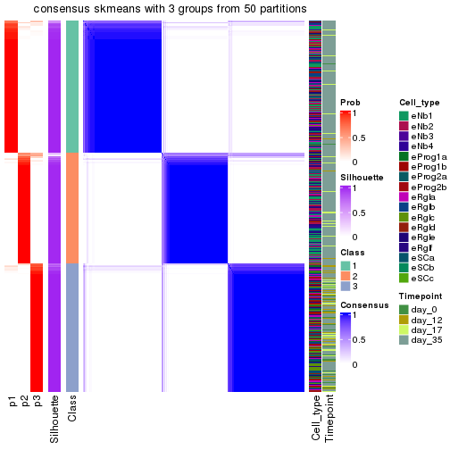</p>

</div>
<div id='tab-node-01-consensus-heatmap-3'>
<pre><code class="r">consensus_heatmap(res, k = 4)
</code></pre>

<p></p>

</div>
</div>

Heatmaps for the membership of samples in all partitions to see how consistent they are:


<script>
$( function() {
	$( '#tabs-node-01-membership-heatmap' ).tabs();
} );
</script>
<div id='tabs-node-01-membership-heatmap'>
<ul>
<li><a href='#tab-node-01-membership-heatmap-1'>k = 2</a></li>
<li><a href='#tab-node-01-membership-heatmap-2'>k = 3</a></li>
<li><a href='#tab-node-01-membership-heatmap-3'>k = 4</a></li>
</ul>
<div id='tab-node-01-membership-heatmap-1'>
<pre><code class="r">membership_heatmap(res, k = 2)
</code></pre>

<p></p>

</div>
<div id='tab-node-01-membership-heatmap-2'>
<pre><code class="r">membership_heatmap(res, k = 3)
</code></pre>

<p>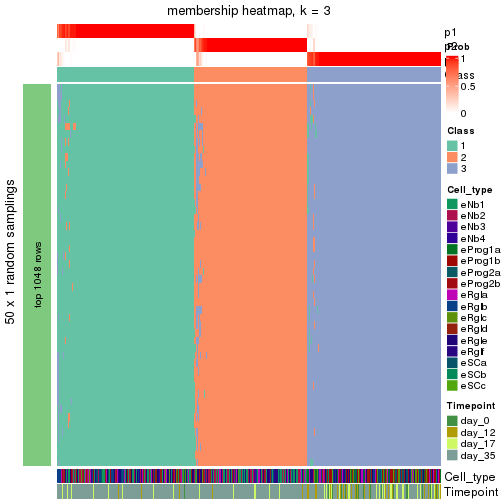</p>

</div>
<div id='tab-node-01-membership-heatmap-3'>
<pre><code class="r">membership_heatmap(res, k = 4)
</code></pre>

<p></p>

</div>
</div>

As soon as the classes for columns are determined, the signatures
that are significantly different between subgroups can be looked for. 
Following are the heatmaps for signatures.


Signature heatmaps where rows are scaled:


<script>
$( function() {
	$( '#tabs-node-01-get-signatures' ).tabs();
} );
</script>
<div id='tabs-node-01-get-signatures'>
<ul>
<li><a href='#tab-node-01-get-signatures-1'>k = 2</a></li>
<li><a href='#tab-node-01-get-signatures-2'>k = 3</a></li>
<li><a href='#tab-node-01-get-signatures-3'>k = 4</a></li>
</ul>
<div id='tab-node-01-get-signatures-1'>
<pre><code class="r">get_signatures(res, k = 2)
</code></pre>

<p></p>

</div>
<div id='tab-node-01-get-signatures-2'>
<pre><code class="r">get_signatures(res, k = 3)
</code></pre>

<p>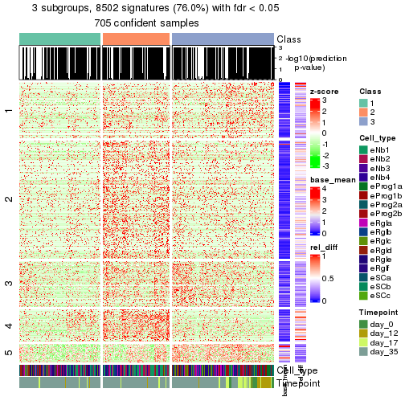</p>

</div>
<div id='tab-node-01-get-signatures-3'>
<pre><code class="r">get_signatures(res, k = 4)
</code></pre>

<p></p>

</div>
</div>


Signature heatmaps where rows are not scaled:


<script>
$( function() {
	$( '#tabs-node-01-get-signatures-no-scale' ).tabs();
} );
</script>
<div id='tabs-node-01-get-signatures-no-scale'>
<ul>
<li><a href='#tab-node-01-get-signatures-no-scale-1'>k = 2</a></li>
<li><a href='#tab-node-01-get-signatures-no-scale-2'>k = 3</a></li>
<li><a href='#tab-node-01-get-signatures-no-scale-3'>k = 4</a></li>
</ul>
<div id='tab-node-01-get-signatures-no-scale-1'>
<pre><code class="r">get_signatures(res, k = 2, scale_rows = FALSE)
</code></pre>

<p></p>

</div>
<div id='tab-node-01-get-signatures-no-scale-2'>
<pre><code class="r">get_signatures(res, k = 3, scale_rows = FALSE)
</code></pre>

<p></p>

</div>
<div id='tab-node-01-get-signatures-no-scale-3'>
<pre><code class="r">get_signatures(res, k = 4, scale_rows = FALSE)
</code></pre>

<p></p>

</div>
</div>


Compare the overlap of signatures from different k:

```r
compare_signatures(res)
```


`get_signature()` returns a data frame invisibly. To get the list of signatures, the function
call should be assigned to a variable explicitly. In following code, if `plot` argument is set
to `FALSE`, no heatmap is plotted while only the differential analysis is performed.

```r
# code only for demonstration
tb = get_signature(res, k = ..., plot = FALSE)
```

An example of the output of `tb` is:

```
#>   which_row         fdr    mean_1    mean_2 scaled_mean_1 scaled_mean_2 km
#> 1        38 0.042760348  8.373488  9.131774    -0.5533452     0.5164555  1
#> 2        40 0.018707592  7.106213  8.469186    -0.6173731     0.5762149  1
#> 3        55 0.019134737 10.221463 11.207825    -0.6159697     0.5749050  1
#> 4        59 0.006059896  5.921854  7.869574    -0.6899429     0.6439467  1
#> 5        60 0.018055526  8.928898 10.211722    -0.6204761     0.5791110  1
#> 6        98 0.009384629 15.714769 14.887706     0.6635654    -0.6193277  2
...
```

The columns in `tb` are:

1. `which_row`: row indices corresponding to the input matrix.
2. `fdr`: FDR for the differential test. 
3. `mean_x`: The mean value in group x.
4. `scaled_mean_x`: The mean value in group x after rows are scaled.
5. `km`: Row groups if k-means clustering is applied to rows (which is done by automatically selecting number of clusters).

If there are too many signatures, `top_signatures = ...` can be set to only show the 
signatures with the highest FDRs:

```r
# code only for demonstration
# e.g. to show the top 500 most significant rows
tb = get_signature(res, k = ..., top_signatures = 500)
```

If the signatures are defined as these which are uniquely high in current group, `diff_method` argument
can be set to `"uniquely_high_in_one_group"`:

```r
# code only for demonstration
tb = get_signature(res, k = ..., diff_method = "uniquely_high_in_one_group")
```


UMAP plot which shows how samples are separated.


<script>
$( function() {
	$( '#tabs-node-01-dimension-reduction' ).tabs();
} );
</script>
<div id='tabs-node-01-dimension-reduction'>
<ul>
<li><a href='#tab-node-01-dimension-reduction-1'>k = 2</a></li>
<li><a href='#tab-node-01-dimension-reduction-2'>k = 3</a></li>
<li><a href='#tab-node-01-dimension-reduction-3'>k = 4</a></li>
</ul>
<div id='tab-node-01-dimension-reduction-1'>
<pre><code class="r">dimension_reduction(res, k = 2, method = &quot;UMAP&quot;)
</code></pre>

<p></p>

</div>
<div id='tab-node-01-dimension-reduction-2'>
<pre><code class="r">dimension_reduction(res, k = 3, method = &quot;UMAP&quot;)
</code></pre>

<p></p>

</div>
<div id='tab-node-01-dimension-reduction-3'>
<pre><code class="r">dimension_reduction(res, k = 4, method = &quot;UMAP&quot;)
</code></pre>

<p></p>

</div>
</div>


Following heatmap shows how subgroups are split when increasing `k`:

```r
collect_classes(res)
```


Test correlation between subgroups and known annotations. If the known
annotation is numeric, one-way ANOVA test is applied, and if the known
annotation is discrete, chi-squared contingency table test is applied.

```r
test_to_known_factors(res)
```

```
#>             n_sample Cell_type(p-value) Timepoint(p-value) k
#> ATC:skmeans      458           3.49e-45           2.62e-09 2
#> ATC:skmeans      516           6.29e-47           5.62e-28 3
#> ATC:skmeans      457           1.67e-59           5.06e-20 4
```


If matrix rows can be associated to genes, consider to use `functional_enrichment(res,
...)` to perform function enrichment for the signature genes. See [this vignette](https://jokergoo.github.io/cola_vignettes/functional_enrichment.html) for more detailed explanations.


 

---------------------------------------------------


### Node011


Parent node: [Node01](#Node01).
Child nodes: 
                Node0111-leaf
        ,
                [Node0112](#Node0112)
        ,
                Node0113-leaf
        ,
                [Node0121](#Node0121)
        ,
                [Node0122](#Node0122)
        ,
                [Node0131](#Node0131)
        ,
                [Node0132](#Node0132)
        ,
                Node0133-leaf
        ,
                Node0211-leaf
        ,
                [Node0212](#Node0212)
        ,
                Node0221-leaf
        ,
                Node0222-leaf
        ,
                Node0223-leaf
        ,
                [Node0231](#Node0231)
        ,
                Node0232-leaf
        ,
                Node0241-leaf
        ,
                Node0242-leaf
        ,
                Node0243-leaf
        ,
                Node0331-leaf
        ,
                Node0332-leaf
        ,
                Node0333-leaf
        ,
                Node0334-leaf
        .


The object with results only for a single top-value method and a single partitioning method 
can be extracted as:

```r
res = res_rh["011"]
```

A summary of `res` and all the functions that can be applied to it:

```r
res
```

```
#> A 'ConsensusPartition' object with k = 2, 3, 4.
#>   On a matrix with 9438 rows and 228 columns.
#>   Top rows (944) are extracted by 'ATC' method.
#>   Subgroups are detected by 'skmeans' method.
#>   Performed in total 150 partitions by row resampling.
#>   Best k for subgroups seems to be 3.
#> 
#> Following methods can be applied to this 'ConsensusPartition' object:
#>  [1] "cola_report"             "collect_classes"         "collect_plots"          
#>  [4] "collect_stats"           "colnames"                "compare_partitions"     
#>  [7] "compare_signatures"      "consensus_heatmap"       "dimension_reduction"    
#> [10] "functional_enrichment"   "get_anno_col"            "get_anno"               
#> [13] "get_classes"             "get_consensus"           "get_matrix"             
#> [16] "get_membership"          "get_param"               "get_signatures"         
#> [19] "get_stats"               "is_best_k"               "is_stable_k"            
#> [22] "membership_heatmap"      "ncol"                    "nrow"                   
#> [25] "plot_ecdf"               "predict_classes"         "rownames"               
#> [28] "select_partition_number" "show"                    "suggest_best_k"         
#> [31] "test_to_known_factors"   "top_rows_heatmap"
```

`collect_plots()` function collects all the plots made from `res` for all `k` (number of subgroups)
into one single page to provide an easy and fast comparison between different `k`.

```r
collect_plots(res)
```


The plots are:

- The first row: a plot of the eCDF (empirical cumulative distribution
  function) curves of the consensus matrix for each `k` and the heatmap of
  predicted classes for each `k`.
- The second row: heatmaps of the consensus matrix for each `k`.
- The third row: heatmaps of the membership matrix for each `k`.
- The fouth row: heatmaps of the signatures for each `k`.

All the plots in panels can be made by individual functions and they are
plotted later in this section.

`select_partition_number()` produces several plots showing different
statistics for choosing "optimized" `k`. There are following statistics:

- eCDF curves of the consensus matrix for each `k`;
- 1-PAC. [The PAC score](https://en.wikipedia.org/wiki/Consensus_clustering#Over-interpretation_potential_of_consensus_clustering)
  measures the proportion of the ambiguous subgrouping.
- Mean silhouette score.
- Concordance. The mean probability of fiting the consensus subgroup labels in all
  partitions.
- Area increased. Denote $A_k$ as the area under the eCDF curve for current
  `k`, the area increased is defined as $A_k - A_{k-1}$.
- Rand index. The percent of pairs of samples that are both in a same cluster
  or both are not in a same cluster in the partition of k and k-1.
- Jaccard index. The ratio of pairs of samples are both in a same cluster in
  the partition of k and k-1 and the pairs of samples are both in a same
  cluster in the partition k or k-1.

The detailed explanations of these statistics can be found in [the _cola_
vignette](https://jokergoo.github.io/cola_vignettes/cola.html#toc_13).

Generally speaking, higher 1-PAC score, higher mean silhouette score or higher
concordance corresponds to better partition. Rand index and Jaccard index
measure how similar the current partition is compared to partition with `k-1`.
If they are too similar, we won't accept `k` is better than `k-1`.

```r
select_partition_number(res)
```


The numeric values for all these statistics can be obtained by `get_stats()`.

```r
get_stats(res)
```

```
#>   k 1-PAC mean_silhouette concordance area_increased  Rand Jaccard
#> 2 2 0.936           0.934       0.972          0.502 0.498   0.498
#> 3 3 0.980           0.948       0.977          0.330 0.711   0.484
#> 4 4 0.858           0.887       0.948          0.114 0.817   0.526
```

`suggest_best_k()` suggests the best $k$ based on these statistics. The rules are as follows:

- All $k$ with Jaccard index larger than 0.95 are removed because increasing
  $k$ does not provide enough extra information. If all $k$ are removed, it is
  marked as no subgroup is detected.
- For all $k$ with 1-PAC score larger than 0.9, the maximal $k$ is taken as
  the best $k$, and other $k$ are marked as optional $k$.
- If it does not fit the second rule. The $k$ with the maximal vote of the
  highest 1-PAC score, highest mean silhouette, and highest concordance is
  taken as the best $k$.

```r
suggest_best_k(res)
```

```
#> [1] 3
#> attr(,"optional")
#> [1] 2
```

There is also optional best $k$ = 2 that is worth to check.

Following is the table of the partitions (You need to click the **show/hide
code output** link to see it). The membership matrix (columns with name `p*`)
is inferred by
[`clue::cl_consensus()`](https://www.rdocumentation.org/link/cl_consensus?package=clue)
function with the `SE` method. Basically the value in the membership matrix
represents the probability to belong to a certain group. The finall subgroup
label for an item is determined with the group with highest probability it
belongs to.

In `get_classes()` function, the entropy is calculated from the membership
matrix and the silhouette score is calculated from the consensus matrix.


<script>
$( function() {
	$( '#tabs-node-011-get-classes' ).tabs();
} );
</script>
<div id='tabs-node-011-get-classes'>
<ul>
<li><a href='#tab-node-011-get-classes-1'>k = 2</a></li>
<li><a href='#tab-node-011-get-classes-2'>k = 3</a></li>
<li><a href='#tab-node-011-get-classes-3'>k = 4</a></li>
</ul>

<div id='tab-node-011-get-classes-1'>
<p><a id='tab-node-011-get-classes-1-a' style='color:#0366d6' href='#'>show/hide code output</a></p>
<pre><code class="r">cbind(get_classes(res, k = 2), get_membership(res, k = 2))
</code></pre>

<pre><code>#&gt;                 class entropy silhouette   p1   p2
#&gt; 1772122_300_D04     1   0.000    0.96392 1.00 0.00
#&gt; 1772122_300_E06     1   0.402    0.90219 0.92 0.08
#&gt; 1772122_298_G11     1   0.000    0.96392 1.00 0.00
#&gt; 1772122_181_C12     1   0.000    0.96392 1.00 0.00
#&gt; 1772122_180_H06     1   0.402    0.90219 0.92 0.08
#&gt; 1772122_180_H10     2   0.000    0.97837 0.00 1.00
#&gt; 1772122_182_G02     1   0.000    0.96392 1.00 0.00
#&gt; 1772122_181_E09     1   0.000    0.96392 1.00 0.00
#&gt; 1772122_299_F06     1   0.000    0.96392 1.00 0.00
#&gt; 1772122_302_H11     1   0.000    0.96392 1.00 0.00
#&gt; 1772122_300_D03     2   0.000    0.97837 0.00 1.00
#&gt; 1772122_299_C07     2   0.000    0.97837 0.00 1.00
#&gt; 1772122_182_E08     1   0.141    0.95016 0.98 0.02
#&gt; 1772122_302_G08     1   0.000    0.96392 1.00 0.00
#&gt; 1772122_301_A04     1   0.000    0.96392 1.00 0.00
#&gt; 1772122_300_E11     1   0.000    0.96392 1.00 0.00
#&gt; 1772122_181_A03     2   0.000    0.97837 0.00 1.00
#&gt; 1772122_298_E09     1   0.402    0.90219 0.92 0.08
#&gt; 1772122_300_H08     1   0.000    0.96392 1.00 0.00
#&gt; 1772122_182_C09     1   0.000    0.96392 1.00 0.00
#&gt; 1772122_298_D10     2   0.242    0.94293 0.04 0.96
#&gt; 1772122_299_C01     2   0.000    0.97837 0.00 1.00
#&gt; 1772122_300_F05     2   0.141    0.96142 0.02 0.98
#&gt; 1772122_182_A10     1   0.000    0.96392 1.00 0.00
#&gt; 1772122_299_F10     1   0.000    0.96392 1.00 0.00
#&gt; 1772122_181_E05     2   0.000    0.97837 0.00 1.00
#&gt; 1772122_300_G04     1   0.402    0.90219 0.92 0.08
#&gt; 1772122_182_H12     1   0.000    0.96392 1.00 0.00
#&gt; 1772122_302_G10     1   0.402    0.90219 0.92 0.08
#&gt; 1772122_182_C06     2   0.000    0.97837 0.00 1.00
#&gt; 1772122_300_E03     1   0.000    0.96392 1.00 0.00
#&gt; 1772122_302_C05     1   0.000    0.96392 1.00 0.00
#&gt; 1772122_299_F09     1   0.000    0.96392 1.00 0.00
#&gt; 1772122_302_C12     1   0.000    0.96392 1.00 0.00
#&gt; 1772122_300_D09     2   0.000    0.97837 0.00 1.00
#&gt; 1772122_180_F06     2   0.000    0.97837 0.00 1.00
#&gt; 1772122_299_E09     1   0.000    0.96392 1.00 0.00
#&gt; 1772122_180_A05     1   0.000    0.96392 1.00 0.00
#&gt; 1772122_182_C05     1   0.000    0.96392 1.00 0.00
#&gt; 1772122_300_A06     2   0.000    0.97837 0.00 1.00
#&gt; 1772122_181_A02     1   0.529    0.86256 0.88 0.12
#&gt; 1772122_181_E11     1   0.000    0.96392 1.00 0.00
#&gt; 1772122_181_C07     1   0.000    0.96392 1.00 0.00
#&gt; 1772122_299_D06     2   0.855    0.59817 0.28 0.72
#&gt; 1772122_180_F09     2   0.000    0.97837 0.00 1.00
#&gt; 1772122_180_D12     1   0.680    0.78952 0.82 0.18
#&gt; 1772122_182_H11     1   0.000    0.96392 1.00 0.00
#&gt; 1772122_263_G09     1   0.000    0.96392 1.00 0.00
#&gt; 1772122_326_G12     1   0.000    0.96392 1.00 0.00
#&gt; 1772122_303_A05     1   0.141    0.95016 0.98 0.02
#&gt; 1772122_298_H05     1   0.000    0.96392 1.00 0.00
#&gt; 1772122_303_D05     1   0.402    0.90219 0.92 0.08
#&gt; 1772122_302_B03     1   0.000    0.96392 1.00 0.00
#&gt; 1772122_300_B03     1   0.000    0.96392 1.00 0.00
#&gt; 1772122_299_E02     2   0.000    0.97837 0.00 1.00
#&gt; 1772122_298_B10     2   0.000    0.97837 0.00 1.00
#&gt; 1772122_300_E07     1   0.327    0.91979 0.94 0.06
#&gt; 1772122_298_H12     1   0.000    0.96392 1.00 0.00
#&gt; 1772122_299_G12     2   0.000    0.97837 0.00 1.00
#&gt; 1772122_302_F05     1   0.000    0.96392 1.00 0.00
#&gt; 1772122_302_D05     1   0.000    0.96392 1.00 0.00
#&gt; 1772122_302_G09     2   0.000    0.97837 0.00 1.00
#&gt; 1772122_324_H10     1   0.000    0.96392 1.00 0.00
#&gt; 1772122_181_H01     1   0.000    0.96392 1.00 0.00
#&gt; 1772122_325_F05     1   0.000    0.96392 1.00 0.00
#&gt; 1772122_302_F11     1   0.000    0.96392 1.00 0.00
#&gt; 1772122_302_G04     1   0.000    0.96392 1.00 0.00
#&gt; 1772122_302_H08     1   0.000    0.96392 1.00 0.00
#&gt; 1772122_300_G08     2   0.000    0.97837 0.00 1.00
#&gt; 1772122_299_B02     1   0.000    0.96392 1.00 0.00
#&gt; 1772122_302_B11     2   0.000    0.97837 0.00 1.00
#&gt; 1772122_300_A03     1   0.000    0.96392 1.00 0.00
#&gt; 1772122_300_C07     2   0.000    0.97837 0.00 1.00
#&gt; 1772122_300_B04     2   0.000    0.97837 0.00 1.00
#&gt; 1772122_299_D09     2   0.000    0.97837 0.00 1.00
#&gt; 1772122_180_F12     1   0.584    0.84139 0.86 0.14
#&gt; 1772122_181_D10     1   0.000    0.96392 1.00 0.00
#&gt; 1772122_182_E04     1   0.000    0.96392 1.00 0.00
#&gt; 1772122_182_B12     1   0.000    0.96392 1.00 0.00
#&gt; 1772122_300_B05     1   0.000    0.96392 1.00 0.00
#&gt; 1772122_298_A01     1   0.000    0.96392 1.00 0.00
#&gt; 1772122_182_A01     2   0.000    0.97837 0.00 1.00
#&gt; 1772122_300_C12     1   0.000    0.96392 1.00 0.00
#&gt; 1772122_302_B05     1   0.000    0.96392 1.00 0.00
#&gt; 1772122_180_C08     2   0.000    0.97837 0.00 1.00
#&gt; 1772122_302_C08     2   0.000    0.97837 0.00 1.00
#&gt; 1772122_300_D10     2   0.000    0.97837 0.00 1.00
#&gt; 1772122_302_E12     1   0.000    0.96392 1.00 0.00
#&gt; 1772122_182_D09     1   0.000    0.96392 1.00 0.00
#&gt; 1772122_298_F12     2   0.000    0.97837 0.00 1.00
#&gt; 1772122_299_A01     2   0.000    0.97837 0.00 1.00
#&gt; 1772122_299_F12     1   0.000    0.96392 1.00 0.00
#&gt; 1772122_298_B05     1   0.584    0.83912 0.86 0.14
#&gt; 1772122_298_A08     1   0.971    0.37044 0.60 0.40
#&gt; 1772122_299_H10     2   0.000    0.97837 0.00 1.00
#&gt; 1772122_299_D01     1   0.000    0.96392 1.00 0.00
#&gt; 1772122_302_A01     2   0.000    0.97837 0.00 1.00
#&gt; 1772122_298_H10     1   0.000    0.96392 1.00 0.00
#&gt; 1772122_298_C04     1   0.000    0.96392 1.00 0.00
#&gt; 1772122_181_G05     2   0.000    0.97837 0.00 1.00
#&gt; 1772122_298_D04     1   0.000    0.96392 1.00 0.00
#&gt; 1772122_180_B10     1   0.242    0.93550 0.96 0.04
#&gt; 1772122_298_F04     1   0.000    0.96392 1.00 0.00
#&gt; 1772122_300_H09     1   0.000    0.96392 1.00 0.00
#&gt; 1772122_302_C11     1   0.327    0.91957 0.94 0.06
#&gt; 1772122_182_A12     1   0.000    0.96392 1.00 0.00
#&gt; 1772122_299_B10     1   0.855    0.63330 0.72 0.28
#&gt; 1772122_299_F03     1   0.000    0.96392 1.00 0.00
#&gt; 1772122_305_B03     2   0.000    0.97837 0.00 1.00
#&gt; 1772122_306_A07     2   0.000    0.97837 0.00 1.00
#&gt; 1772122_302_F01     2   0.000    0.97837 0.00 1.00
#&gt; 1772122_302_G01     1   0.000    0.96392 1.00 0.00
#&gt; 1772122_300_D12     1   0.000    0.96392 1.00 0.00
#&gt; 1772122_306_A06     2   0.000    0.97837 0.00 1.00
#&gt; 1772122_315_H01     2   0.000    0.97837 0.00 1.00
#&gt; 1772122_302_G11     1   0.000    0.96392 1.00 0.00
#&gt; 1772122_300_G03     1   0.000    0.96392 1.00 0.00
#&gt; 1772122_305_G09     2   0.141    0.96167 0.02 0.98
#&gt; 1772122_298_F07     2   0.000    0.97837 0.00 1.00
#&gt; 1772122_300_G05     2   0.000    0.97837 0.00 1.00
#&gt; 1772122_300_H03     2   0.000    0.97837 0.00 1.00
#&gt; 1772122_302_E08     1   0.000    0.96392 1.00 0.00
#&gt; 1772122_182_F01     1   0.000    0.96392 1.00 0.00
#&gt; 1772122_298_B01     2   0.680    0.78412 0.18 0.82
#&gt; 1772122_302_E02     2   0.000    0.97837 0.00 1.00
#&gt; 1772122_299_G08     2   0.141    0.96163 0.02 0.98
#&gt; 1772122_301_F08     1   0.000    0.96392 1.00 0.00
#&gt; 1772122_300_D08     1   0.000    0.96392 1.00 0.00
#&gt; 1772122_181_F01     2   0.000    0.97837 0.00 1.00
#&gt; 1772122_180_A12     2   0.000    0.97837 0.00 1.00
#&gt; 1772122_302_G02     1   0.000    0.96392 1.00 0.00
#&gt; 1772122_182_C12     1   0.000    0.96392 1.00 0.00
#&gt; 1772122_181_A04     1   0.000    0.96392 1.00 0.00
#&gt; 1772122_182_A02     1   0.000    0.96392 1.00 0.00
#&gt; 1772122_181_B05     2   0.000    0.97837 0.00 1.00
#&gt; 1772122_302_A12     1   0.000    0.96392 1.00 0.00
#&gt; 1772122_299_E03     2   0.999    0.07203 0.48 0.52
#&gt; 1772122_181_E12     2   0.000    0.97837 0.00 1.00
#&gt; 1772122_302_F12     2   0.000    0.97837 0.00 1.00
#&gt; 1772122_299_G09     1   0.000    0.96392 1.00 0.00
#&gt; 1772122_182_B10     2   0.000    0.97837 0.00 1.00
#&gt; 1772122_182_A07     1   0.000    0.96392 1.00 0.00
#&gt; 1772122_180_B02     1   0.000    0.96392 1.00 0.00
#&gt; 1772122_299_A12     2   0.000    0.97837 0.00 1.00
#&gt; 1772122_181_E03     2   0.529    0.86129 0.12 0.88
#&gt; 1772122_299_B03     1   0.000    0.96392 1.00 0.00
#&gt; 1772122_300_D01     1   0.000    0.96392 1.00 0.00
#&gt; 1772122_302_E06     2   0.000    0.97837 0.00 1.00
#&gt; 1772122_301_G03     1   0.000    0.96392 1.00 0.00
#&gt; 1772122_302_A05     2   0.000    0.97837 0.00 1.00
#&gt; 1772122_182_G03     1   0.827    0.65034 0.74 0.26
#&gt; 1772122_301_C03     1   0.000    0.96392 1.00 0.00
#&gt; 1772122_180_D08     2   0.242    0.94601 0.04 0.96
#&gt; 1772122_302_G12     2   0.000    0.97837 0.00 1.00
#&gt; 1772122_300_E01     2   0.000    0.97837 0.00 1.00
#&gt; 1772122_300_F07     1   0.000    0.96392 1.00 0.00
#&gt; 1772122_182_F08     1   0.000    0.96392 1.00 0.00
#&gt; 1772122_302_E04     2   0.943    0.44720 0.36 0.64
#&gt; 1772122_182_E05     2   0.000    0.97837 0.00 1.00
#&gt; 1772122_182_E10     2   0.000    0.97837 0.00 1.00
#&gt; 1772122_182_B07     2   0.000    0.97837 0.00 1.00
#&gt; 1772122_299_D05     2   0.327    0.92447 0.06 0.94
#&gt; 1772122_182_F02     1   0.000    0.96392 1.00 0.00
#&gt; 1772122_182_E12     2   0.000    0.97837 0.00 1.00
#&gt; 1772122_182_H09     2   0.000    0.97837 0.00 1.00
#&gt; 1772122_302_A10     2   0.327    0.92435 0.06 0.94
#&gt; 1772122_181_F12     2   0.000    0.97837 0.00 1.00
#&gt; 1772122_180_G07     2   0.000    0.97837 0.00 1.00
#&gt; 1772122_302_B07     2   0.000    0.97837 0.00 1.00
#&gt; 1772122_182_A11     2   0.000    0.97837 0.00 1.00
#&gt; 1772122_182_F04     2   0.000    0.97837 0.00 1.00
#&gt; 1772122_300_C03     2   0.529    0.86066 0.12 0.88
#&gt; 1772122_300_H01     2   0.855    0.62110 0.28 0.72
#&gt; 1772122_300_A09     2   0.634    0.81177 0.16 0.84
#&gt; 1772122_182_E11     1   0.000    0.96392 1.00 0.00
#&gt; 1772122_300_B08     2   0.000    0.97837 0.00 1.00
#&gt; 1772122_180_C05     1   0.000    0.96392 1.00 0.00
#&gt; 1772122_181_G11     2   0.000    0.97837 0.00 1.00
#&gt; 1772122_300_G11     1   1.000   -0.00971 0.50 0.50
#&gt; 1772122_300_D05     2   0.000    0.97837 0.00 1.00
#&gt; 1772122_302_A03     2   0.000    0.97837 0.00 1.00
#&gt; 1772122_299_G04     1   0.827    0.64800 0.74 0.26
#&gt; 1772122_181_E01     2   0.000    0.97837 0.00 1.00
#&gt; 1772122_302_C06     1   0.000    0.96392 1.00 0.00
#&gt; 1772122_182_F12     1   0.000    0.96392 1.00 0.00
#&gt; 1772122_180_A01     2   0.000    0.97837 0.00 1.00
#&gt; 1772122_180_C09     1   0.999    0.07030 0.52 0.48
#&gt; 1772122_300_G01     2   0.000    0.97837 0.00 1.00
#&gt; 1772122_301_C09     1   0.000    0.96392 1.00 0.00
#&gt; 1772122_299_F08     2   0.000    0.97837 0.00 1.00
#&gt; 1772122_180_H08     2   0.000    0.97837 0.00 1.00
#&gt; 1772122_182_E01     2   0.000    0.97837 0.00 1.00
#&gt; 1772122_181_H03     1   0.327    0.91622 0.94 0.06
#&gt; 1772122_302_C10     2   0.000    0.97837 0.00 1.00
#&gt; 1772122_181_C08     2   0.000    0.97837 0.00 1.00
#&gt; 1772122_182_B08     2   0.242    0.94344 0.04 0.96
#&gt; 1772122_182_C11     2   0.000    0.97837 0.00 1.00
#&gt; 1772122_182_B05     1   0.995    0.14209 0.54 0.46
#&gt; 1772122_302_A09     2   0.000    0.97837 0.00 1.00
#&gt; 1772122_182_C01     1   0.327    0.91692 0.94 0.06
#&gt; 1772122_299_G01     2   0.000    0.97837 0.00 1.00
#&gt; 1772122_181_D03     1   0.000    0.96392 1.00 0.00
#&gt; 1772122_299_A03     2   0.000    0.97837 0.00 1.00
#&gt; 1772122_181_H10     1   0.000    0.96392 1.00 0.00
#&gt; 1772122_180_E08     2   0.000    0.97837 0.00 1.00
#&gt; 1772122_180_F03     2   0.000    0.97837 0.00 1.00
#&gt; 1772122_182_B02     2   0.000    0.97837 0.00 1.00
#&gt; 1772122_181_B12     2   0.000    0.97837 0.00 1.00
#&gt; 1772122_180_C03     2   0.000    0.97837 0.00 1.00
#&gt; 1772122_182_H08     2   0.000    0.97837 0.00 1.00
#&gt; 1772122_182_C10     2   0.000    0.97837 0.00 1.00
#&gt; 1772122_182_A05     1   0.000    0.96392 1.00 0.00
#&gt; 1772122_299_C04     2   0.000    0.97837 0.00 1.00
#&gt; 1772122_181_F04     1   0.327    0.91980 0.94 0.06
#&gt; 1772122_182_B11     1   0.000    0.96392 1.00 0.00
#&gt; 1772122_182_A06     2   0.000    0.97837 0.00 1.00
#&gt; 1772122_181_A05     2   0.000    0.97837 0.00 1.00
#&gt; 1772122_181_B02     2   0.000    0.97837 0.00 1.00
#&gt; 1772122_182_D05     2   0.000    0.97837 0.00 1.00
#&gt; 1772122_181_H08     2   0.000    0.97837 0.00 1.00
#&gt; 1772122_181_C01     2   0.000    0.97837 0.00 1.00
#&gt; 1772122_182_C08     2   0.000    0.97837 0.00 1.00
#&gt; 1772122_180_F02     2   0.000    0.97837 0.00 1.00
#&gt; 1772122_181_G09     1   0.000    0.96392 1.00 0.00
#&gt; 1772122_302_B01     2   0.000    0.97837 0.00 1.00
#&gt; 1772122_181_B08     2   0.000    0.97837 0.00 1.00
#&gt; 1772122_182_G08     2   0.000    0.97837 0.00 1.00
#&gt; 1772122_311_G09     1   0.000    0.96392 1.00 0.00
</code></pre>

<script>
$('#tab-node-011-get-classes-1-a').parent().next().next().hide();
$('#tab-node-011-get-classes-1-a').click(function(){
  $('#tab-node-011-get-classes-1-a').parent().next().next().toggle();
  return(false);
});
</script>
</div>

<div id='tab-node-011-get-classes-2'>
<p><a id='tab-node-011-get-classes-2-a' style='color:#0366d6' href='#'>show/hide code output</a></p>
<pre><code class="r">cbind(get_classes(res, k = 3), get_membership(res, k = 3))
</code></pre>

<pre><code>#&gt;                 class entropy silhouette   p1   p2   p3
#&gt; 1772122_300_D04     3  0.0000      0.976 0.00 0.00 1.00
#&gt; 1772122_300_E06     3  0.0000      0.976 0.00 0.00 1.00
#&gt; 1772122_298_G11     1  0.0892      0.959 0.98 0.00 0.02
#&gt; 1772122_181_C12     3  0.0000      0.976 0.00 0.00 1.00
#&gt; 1772122_180_H06     3  0.0000      0.976 0.00 0.00 1.00
#&gt; 1772122_180_H10     3  0.2066      0.924 0.00 0.06 0.94
#&gt; 1772122_182_G02     3  0.0000      0.976 0.00 0.00 1.00
#&gt; 1772122_181_E09     3  0.2066      0.925 0.06 0.00 0.94
#&gt; 1772122_299_F06     3  0.2537      0.904 0.08 0.00 0.92
#&gt; 1772122_302_H11     3  0.1529      0.944 0.04 0.00 0.96
#&gt; 1772122_300_D03     3  0.0000      0.976 0.00 0.00 1.00
#&gt; 1772122_299_C07     3  0.0000      0.976 0.00 0.00 1.00
#&gt; 1772122_182_E08     3  0.0000      0.976 0.00 0.00 1.00
#&gt; 1772122_302_G08     3  0.0000      0.976 0.00 0.00 1.00
#&gt; 1772122_301_A04     1  0.1529      0.943 0.96 0.00 0.04
#&gt; 1772122_300_E11     3  0.0000      0.976 0.00 0.00 1.00
#&gt; 1772122_181_A03     3  0.0000      0.976 0.00 0.00 1.00
#&gt; 1772122_298_E09     3  0.0000      0.976 0.00 0.00 1.00
#&gt; 1772122_300_H08     3  0.0000      0.976 0.00 0.00 1.00
#&gt; 1772122_182_C09     3  0.0000      0.976 0.00 0.00 1.00
#&gt; 1772122_298_D10     3  0.0000      0.976 0.00 0.00 1.00
#&gt; 1772122_299_C01     3  0.0000      0.976 0.00 0.00 1.00
#&gt; 1772122_300_F05     3  0.0000      0.976 0.00 0.00 1.00
#&gt; 1772122_182_A10     3  0.0000      0.976 0.00 0.00 1.00
#&gt; 1772122_299_F10     3  0.0000      0.976 0.00 0.00 1.00
#&gt; 1772122_181_E05     2  0.5948      0.438 0.00 0.64 0.36
#&gt; 1772122_300_G04     3  0.0000      0.976 0.00 0.00 1.00
#&gt; 1772122_182_H12     3  0.0892      0.961 0.02 0.00 0.98
#&gt; 1772122_302_G10     3  0.0000      0.976 0.00 0.00 1.00
#&gt; 1772122_182_C06     3  0.0000      0.976 0.00 0.00 1.00
#&gt; 1772122_300_E03     1  0.1529      0.943 0.96 0.00 0.04
#&gt; 1772122_302_C05     3  0.0000      0.976 0.00 0.00 1.00
#&gt; 1772122_299_F09     3  0.3340      0.858 0.12 0.00 0.88
#&gt; 1772122_302_C12     3  0.0000      0.976 0.00 0.00 1.00
#&gt; 1772122_300_D09     3  0.0000      0.976 0.00 0.00 1.00
#&gt; 1772122_180_F06     3  0.0892      0.961 0.00 0.02 0.98
#&gt; 1772122_299_E09     3  0.0000      0.976 0.00 0.00 1.00
#&gt; 1772122_180_A05     1  0.4002      0.812 0.84 0.00 0.16
#&gt; 1772122_182_C05     3  0.5016      0.684 0.24 0.00 0.76
#&gt; 1772122_300_A06     3  0.0892      0.961 0.00 0.02 0.98
#&gt; 1772122_181_A02     3  0.0000      0.976 0.00 0.00 1.00
#&gt; 1772122_181_E11     1  0.0892      0.959 0.98 0.00 0.02
#&gt; 1772122_181_C07     3  0.0000      0.976 0.00 0.00 1.00
#&gt; 1772122_299_D06     3  0.0000      0.976 0.00 0.00 1.00
#&gt; 1772122_180_F09     3  0.0000      0.976 0.00 0.00 1.00
#&gt; 1772122_180_D12     3  0.0000      0.976 0.00 0.00 1.00
#&gt; 1772122_182_H11     1  0.0892      0.959 0.98 0.00 0.02
#&gt; 1772122_263_G09     1  0.0000      0.971 1.00 0.00 0.00
#&gt; 1772122_326_G12     1  0.0000      0.971 1.00 0.00 0.00
#&gt; 1772122_303_A05     3  0.0000      0.976 0.00 0.00 1.00
#&gt; 1772122_298_H05     3  0.0000      0.976 0.00 0.00 1.00
#&gt; 1772122_303_D05     3  0.0000      0.976 0.00 0.00 1.00
#&gt; 1772122_302_B03     1  0.0000      0.971 1.00 0.00 0.00
#&gt; 1772122_300_B03     1  0.0000      0.971 1.00 0.00 0.00
#&gt; 1772122_299_E02     2  0.1529      0.947 0.00 0.96 0.04
#&gt; 1772122_298_B10     3  0.1529      0.944 0.00 0.04 0.96
#&gt; 1772122_300_E07     3  0.0000      0.976 0.00 0.00 1.00
#&gt; 1772122_298_H12     1  0.0000      0.971 1.00 0.00 0.00
#&gt; 1772122_299_G12     2  0.1529      0.948 0.00 0.96 0.04
#&gt; 1772122_302_F05     1  0.0000      0.971 1.00 0.00 0.00
#&gt; 1772122_302_D05     3  0.0000      0.976 0.00 0.00 1.00
#&gt; 1772122_302_G09     3  0.6192      0.267 0.00 0.42 0.58
#&gt; 1772122_324_H10     1  0.0000      0.971 1.00 0.00 0.00
#&gt; 1772122_181_H01     1  0.0000      0.971 1.00 0.00 0.00
#&gt; 1772122_325_F05     1  0.0000      0.971 1.00 0.00 0.00
#&gt; 1772122_302_F11     1  0.0000      0.971 1.00 0.00 0.00
#&gt; 1772122_302_G04     3  0.0000      0.976 0.00 0.00 1.00
#&gt; 1772122_302_H08     1  0.0892      0.959 0.98 0.00 0.02
#&gt; 1772122_300_G08     2  0.0000      0.982 0.00 1.00 0.00
#&gt; 1772122_299_B02     1  0.0000      0.971 1.00 0.00 0.00
#&gt; 1772122_302_B11     3  0.0000      0.976 0.00 0.00 1.00
#&gt; 1772122_300_A03     1  0.0892      0.959 0.98 0.00 0.02
#&gt; 1772122_300_C07     2  0.0000      0.982 0.00 1.00 0.00
#&gt; 1772122_300_B04     2  0.0000      0.982 0.00 1.00 0.00
#&gt; 1772122_299_D09     2  0.0000      0.982 0.00 1.00 0.00
#&gt; 1772122_180_F12     3  0.0000      0.976 0.00 0.00 1.00
#&gt; 1772122_181_D10     1  0.0000      0.971 1.00 0.00 0.00
#&gt; 1772122_182_E04     1  0.0892      0.959 0.98 0.00 0.02
#&gt; 1772122_182_B12     1  0.0000      0.971 1.00 0.00 0.00
#&gt; 1772122_300_B05     1  0.0000      0.971 1.00 0.00 0.00
#&gt; 1772122_298_A01     3  0.5948      0.431 0.36 0.00 0.64
#&gt; 1772122_182_A01     2  0.2959      0.884 0.00 0.90 0.10
#&gt; 1772122_300_C12     1  0.0000      0.971 1.00 0.00 0.00
#&gt; 1772122_302_B05     1  0.0000      0.971 1.00 0.00 0.00
#&gt; 1772122_180_C08     2  0.0000      0.982 0.00 1.00 0.00
#&gt; 1772122_302_C08     2  0.0000      0.982 0.00 1.00 0.00
#&gt; 1772122_300_D10     3  0.0000      0.976 0.00 0.00 1.00
#&gt; 1772122_302_E12     1  0.0000      0.971 1.00 0.00 0.00
#&gt; 1772122_182_D09     1  0.2066      0.925 0.94 0.00 0.06
#&gt; 1772122_298_F12     2  0.0000      0.982 0.00 1.00 0.00
#&gt; 1772122_299_A01     3  0.0892      0.961 0.00 0.02 0.98
#&gt; 1772122_299_F12     3  0.0000      0.976 0.00 0.00 1.00
#&gt; 1772122_298_B05     3  0.0000      0.976 0.00 0.00 1.00
#&gt; 1772122_298_A08     3  0.0000      0.976 0.00 0.00 1.00
#&gt; 1772122_299_H10     2  0.0000      0.982 0.00 1.00 0.00
#&gt; 1772122_299_D01     1  0.5835      0.492 0.66 0.00 0.34
#&gt; 1772122_302_A01     2  0.2959      0.884 0.00 0.90 0.10
#&gt; 1772122_298_H10     3  0.0892      0.961 0.02 0.00 0.98
#&gt; 1772122_298_C04     3  0.0000      0.976 0.00 0.00 1.00
#&gt; 1772122_181_G05     3  0.0000      0.976 0.00 0.00 1.00
#&gt; 1772122_298_D04     1  0.4555      0.754 0.80 0.00 0.20
#&gt; 1772122_180_B10     3  0.0000      0.976 0.00 0.00 1.00
#&gt; 1772122_298_F04     3  0.0000      0.976 0.00 0.00 1.00
#&gt; 1772122_300_H09     3  0.0000      0.976 0.00 0.00 1.00
#&gt; 1772122_302_C11     3  0.0000      0.976 0.00 0.00 1.00
#&gt; 1772122_182_A12     1  0.0892      0.959 0.98 0.00 0.02
#&gt; 1772122_299_B10     3  0.0000      0.976 0.00 0.00 1.00
#&gt; 1772122_299_F03     1  0.1529      0.943 0.96 0.00 0.04
#&gt; 1772122_305_B03     2  0.0000      0.982 0.00 1.00 0.00
#&gt; 1772122_306_A07     2  0.0000      0.982 0.00 1.00 0.00
#&gt; 1772122_302_F01     2  0.0000      0.982 0.00 1.00 0.00
#&gt; 1772122_302_G01     1  0.0000      0.971 1.00 0.00 0.00
#&gt; 1772122_300_D12     1  0.0000      0.971 1.00 0.00 0.00
#&gt; 1772122_306_A06     2  0.0000      0.982 0.00 1.00 0.00
#&gt; 1772122_315_H01     2  0.0000      0.982 0.00 1.00 0.00
#&gt; 1772122_302_G11     1  0.0000      0.971 1.00 0.00 0.00
#&gt; 1772122_300_G03     1  0.0000      0.971 1.00 0.00 0.00
#&gt; 1772122_305_G09     2  0.3340      0.861 0.12 0.88 0.00
#&gt; 1772122_298_F07     2  0.0000      0.982 0.00 1.00 0.00
#&gt; 1772122_300_G05     2  0.0000      0.982 0.00 1.00 0.00
#&gt; 1772122_300_H03     2  0.0000      0.982 0.00 1.00 0.00
#&gt; 1772122_302_E08     1  0.0000      0.971 1.00 0.00 0.00
#&gt; 1772122_182_F01     1  0.0000      0.971 1.00 0.00 0.00
#&gt; 1772122_298_B01     1  0.1529      0.940 0.96 0.04 0.00
#&gt; 1772122_302_E02     2  0.0000      0.982 0.00 1.00 0.00
#&gt; 1772122_299_G08     2  0.0892      0.966 0.02 0.98 0.00
#&gt; 1772122_301_F08     1  0.0000      0.971 1.00 0.00 0.00
#&gt; 1772122_300_D08     1  0.0000      0.971 1.00 0.00 0.00
#&gt; 1772122_181_F01     2  0.0000      0.982 0.00 1.00 0.00
#&gt; 1772122_180_A12     2  0.0892      0.966 0.02 0.98 0.00
#&gt; 1772122_302_G02     1  0.0000      0.971 1.00 0.00 0.00
#&gt; 1772122_182_C12     1  0.0000      0.971 1.00 0.00 0.00
#&gt; 1772122_181_A04     1  0.0000      0.971 1.00 0.00 0.00
#&gt; 1772122_182_A02     1  0.0000      0.971 1.00 0.00 0.00
#&gt; 1772122_181_B05     2  0.0000      0.982 0.00 1.00 0.00
#&gt; 1772122_302_A12     1  0.0000      0.971 1.00 0.00 0.00
#&gt; 1772122_299_E03     1  0.0000      0.971 1.00 0.00 0.00
#&gt; 1772122_181_E12     2  0.0000      0.982 0.00 1.00 0.00
#&gt; 1772122_302_F12     2  0.0000      0.982 0.00 1.00 0.00
#&gt; 1772122_299_G09     1  0.0000      0.971 1.00 0.00 0.00
#&gt; 1772122_182_B10     2  0.0000      0.982 0.00 1.00 0.00
#&gt; 1772122_182_A07     1  0.0000      0.971 1.00 0.00 0.00
#&gt; 1772122_180_B02     1  0.0000      0.971 1.00 0.00 0.00
#&gt; 1772122_299_A12     2  0.0000      0.982 0.00 1.00 0.00
#&gt; 1772122_181_E03     1  0.2537      0.902 0.92 0.08 0.00
#&gt; 1772122_299_B03     1  0.0000      0.971 1.00 0.00 0.00
#&gt; 1772122_300_D01     1  0.0000      0.971 1.00 0.00 0.00
#&gt; 1772122_302_E06     2  0.0000      0.982 0.00 1.00 0.00
#&gt; 1772122_301_G03     1  0.0000      0.971 1.00 0.00 0.00
#&gt; 1772122_302_A05     2  0.0000      0.982 0.00 1.00 0.00
#&gt; 1772122_182_G03     1  0.0892      0.957 0.98 0.02 0.00
#&gt; 1772122_301_C03     1  0.0000      0.971 1.00 0.00 0.00
#&gt; 1772122_180_D08     2  0.0892      0.966 0.02 0.98 0.00
#&gt; 1772122_302_G12     2  0.0000      0.982 0.00 1.00 0.00
#&gt; 1772122_300_E01     2  0.0000      0.982 0.00 1.00 0.00
#&gt; 1772122_300_F07     1  0.0000      0.971 1.00 0.00 0.00
#&gt; 1772122_182_F08     1  0.0000      0.971 1.00 0.00 0.00
#&gt; 1772122_302_E04     1  0.4966      0.836 0.84 0.06 0.10
#&gt; 1772122_182_E05     2  0.0000      0.982 0.00 1.00 0.00
#&gt; 1772122_182_E10     2  0.0000      0.982 0.00 1.00 0.00
#&gt; 1772122_182_B07     2  0.0000      0.982 0.00 1.00 0.00
#&gt; 1772122_299_D05     1  0.5706      0.530 0.68 0.32 0.00
#&gt; 1772122_182_F02     1  0.0000      0.971 1.00 0.00 0.00
#&gt; 1772122_182_E12     2  0.0000      0.982 0.00 1.00 0.00
#&gt; 1772122_182_H09     2  0.0000      0.982 0.00 1.00 0.00
#&gt; 1772122_302_A10     2  0.6192      0.267 0.42 0.58 0.00
#&gt; 1772122_181_F12     2  0.0000      0.982 0.00 1.00 0.00
#&gt; 1772122_180_G07     2  0.1529      0.949 0.04 0.96 0.00
#&gt; 1772122_302_B07     2  0.0000      0.982 0.00 1.00 0.00
#&gt; 1772122_182_A11     2  0.0000      0.982 0.00 1.00 0.00
#&gt; 1772122_182_F04     2  0.0000      0.982 0.00 1.00 0.00
#&gt; 1772122_300_C03     1  0.2066      0.922 0.94 0.06 0.00
#&gt; 1772122_300_H01     1  0.1529      0.940 0.96 0.04 0.00
#&gt; 1772122_300_A09     1  0.0892      0.957 0.98 0.02 0.00
#&gt; 1772122_182_E11     1  0.0000      0.971 1.00 0.00 0.00
#&gt; 1772122_300_B08     2  0.0000      0.982 0.00 1.00 0.00
#&gt; 1772122_180_C05     1  0.0000      0.971 1.00 0.00 0.00
#&gt; 1772122_181_G11     2  0.0000      0.982 0.00 1.00 0.00
#&gt; 1772122_300_G11     1  0.0000      0.971 1.00 0.00 0.00
#&gt; 1772122_300_D05     2  0.0000      0.982 0.00 1.00 0.00
#&gt; 1772122_302_A03     2  0.0000      0.982 0.00 1.00 0.00
#&gt; 1772122_299_G04     1  0.0000      0.971 1.00 0.00 0.00
#&gt; 1772122_181_E01     2  0.0000      0.982 0.00 1.00 0.00
#&gt; 1772122_302_C06     1  0.0000      0.971 1.00 0.00 0.00
#&gt; 1772122_182_F12     1  0.0000      0.971 1.00 0.00 0.00
#&gt; 1772122_180_A01     2  0.0000      0.982 0.00 1.00 0.00
#&gt; 1772122_180_C09     1  0.0000      0.971 1.00 0.00 0.00
#&gt; 1772122_300_G01     2  0.0000      0.982 0.00 1.00 0.00
#&gt; 1772122_301_C09     1  0.0000      0.971 1.00 0.00 0.00
#&gt; 1772122_299_F08     2  0.0892      0.966 0.02 0.98 0.00
#&gt; 1772122_180_H08     2  0.1529      0.949 0.04 0.96 0.00
#&gt; 1772122_182_E01     2  0.0000      0.982 0.00 1.00 0.00
#&gt; 1772122_181_H03     1  0.0000      0.971 1.00 0.00 0.00
#&gt; 1772122_302_C10     2  0.0000      0.982 0.00 1.00 0.00
#&gt; 1772122_181_C08     3  0.0892      0.961 0.00 0.02 0.98
#&gt; 1772122_182_B08     3  0.0000      0.976 0.00 0.00 1.00
#&gt; 1772122_182_C11     2  0.0000      0.982 0.00 1.00 0.00
#&gt; 1772122_182_B05     1  0.0892      0.957 0.98 0.02 0.00
#&gt; 1772122_302_A09     2  0.0000      0.982 0.00 1.00 0.00
#&gt; 1772122_182_C01     1  0.7059      0.112 0.52 0.02 0.46
#&gt; 1772122_299_G01     2  0.0000      0.982 0.00 1.00 0.00
#&gt; 1772122_181_D03     1  0.0000      0.971 1.00 0.00 0.00
#&gt; 1772122_299_A03     2  0.0000      0.982 0.00 1.00 0.00
#&gt; 1772122_181_H10     1  0.0000      0.971 1.00 0.00 0.00
#&gt; 1772122_180_E08     2  0.0000      0.982 0.00 1.00 0.00
#&gt; 1772122_180_F03     2  0.1529      0.949 0.04 0.96 0.00
#&gt; 1772122_182_B02     2  0.0000      0.982 0.00 1.00 0.00
#&gt; 1772122_181_B12     2  0.0000      0.982 0.00 1.00 0.00
#&gt; 1772122_180_C03     2  0.0000      0.982 0.00 1.00 0.00
#&gt; 1772122_182_H08     2  0.0000      0.982 0.00 1.00 0.00
#&gt; 1772122_182_C10     3  0.0000      0.976 0.00 0.00 1.00
#&gt; 1772122_182_A05     1  0.0000      0.971 1.00 0.00 0.00
#&gt; 1772122_299_C04     2  0.0000      0.982 0.00 1.00 0.00
#&gt; 1772122_181_F04     3  0.0000      0.976 0.00 0.00 1.00
#&gt; 1772122_182_B11     1  0.0000      0.971 1.00 0.00 0.00
#&gt; 1772122_182_A06     2  0.0000      0.982 0.00 1.00 0.00
#&gt; 1772122_181_A05     2  0.0000      0.982 0.00 1.00 0.00
#&gt; 1772122_181_B02     2  0.0000      0.982 0.00 1.00 0.00
#&gt; 1772122_182_D05     2  0.0000      0.982 0.00 1.00 0.00
#&gt; 1772122_181_H08     2  0.0000      0.982 0.00 1.00 0.00
#&gt; 1772122_181_C01     2  0.0000      0.982 0.00 1.00 0.00
#&gt; 1772122_182_C08     2  0.0000      0.982 0.00 1.00 0.00
#&gt; 1772122_180_F02     2  0.0000      0.982 0.00 1.00 0.00
#&gt; 1772122_181_G09     1  0.0000      0.971 1.00 0.00 0.00
#&gt; 1772122_302_B01     2  0.0000      0.982 0.00 1.00 0.00
#&gt; 1772122_181_B08     2  0.0000      0.982 0.00 1.00 0.00
#&gt; 1772122_182_G08     2  0.0000      0.982 0.00 1.00 0.00
#&gt; 1772122_311_G09     1  0.0000      0.971 1.00 0.00 0.00
</code></pre>

<script>
$('#tab-node-011-get-classes-2-a').parent().next().next().hide();
$('#tab-node-011-get-classes-2-a').click(function(){
  $('#tab-node-011-get-classes-2-a').parent().next().next().toggle();
  return(false);
});
</script>
</div>

<div id='tab-node-011-get-classes-3'>
<p><a id='tab-node-011-get-classes-3-a' style='color:#0366d6' href='#'>show/hide code output</a></p>
<pre><code class="r">cbind(get_classes(res, k = 4), get_membership(res, k = 4))
</code></pre>

<pre><code>#&gt;                 class entropy silhouette   p1   p2   p3   p4
#&gt; 1772122_300_D04     3  0.0000     0.9322 0.00 0.00 1.00 0.00
#&gt; 1772122_300_E06     3  0.0000     0.9322 0.00 0.00 1.00 0.00
#&gt; 1772122_298_G11     1  0.0707     0.9278 0.98 0.00 0.02 0.00
#&gt; 1772122_181_C12     3  0.4277     0.6491 0.28 0.00 0.72 0.00
#&gt; 1772122_180_H06     3  0.0000     0.9322 0.00 0.00 1.00 0.00
#&gt; 1772122_180_H10     3  0.0707     0.9262 0.00 0.02 0.98 0.00
#&gt; 1772122_182_G02     3  0.2345     0.8676 0.10 0.00 0.90 0.00
#&gt; 1772122_181_E09     1  0.2921     0.8136 0.86 0.00 0.14 0.00
#&gt; 1772122_299_F06     1  0.4406     0.5566 0.70 0.00 0.30 0.00
#&gt; 1772122_302_H11     1  0.3172     0.7883 0.84 0.00 0.16 0.00
#&gt; 1772122_300_D03     3  0.0707     0.9262 0.00 0.02 0.98 0.00
#&gt; 1772122_299_C07     3  0.0707     0.9262 0.00 0.02 0.98 0.00
#&gt; 1772122_182_E08     3  0.0000     0.9322 0.00 0.00 1.00 0.00
#&gt; 1772122_302_G08     3  0.0000     0.9322 0.00 0.00 1.00 0.00
#&gt; 1772122_301_A04     1  0.0707     0.9278 0.98 0.00 0.02 0.00
#&gt; 1772122_300_E11     3  0.0000     0.9322 0.00 0.00 1.00 0.00
#&gt; 1772122_181_A03     3  0.0707     0.9262 0.00 0.02 0.98 0.00
#&gt; 1772122_298_E09     3  0.0000     0.9322 0.00 0.00 1.00 0.00
#&gt; 1772122_300_H08     3  0.2011     0.8819 0.08 0.00 0.92 0.00
#&gt; 1772122_182_C09     3  0.4277     0.6491 0.28 0.00 0.72 0.00
#&gt; 1772122_298_D10     3  0.0000     0.9322 0.00 0.00 1.00 0.00
#&gt; 1772122_299_C01     4  0.3801     0.7229 0.00 0.00 0.22 0.78
#&gt; 1772122_300_F05     3  0.0000     0.9322 0.00 0.00 1.00 0.00
#&gt; 1772122_182_A10     3  0.3975     0.7108 0.24 0.00 0.76 0.00
#&gt; 1772122_299_F10     3  0.0000     0.9322 0.00 0.00 1.00 0.00
#&gt; 1772122_181_E05     3  0.2706     0.8620 0.00 0.02 0.90 0.08
#&gt; 1772122_300_G04     3  0.0000     0.9322 0.00 0.00 1.00 0.00
#&gt; 1772122_182_H12     3  0.4624     0.5328 0.34 0.00 0.66 0.00
#&gt; 1772122_302_G10     3  0.0000     0.9322 0.00 0.00 1.00 0.00
#&gt; 1772122_182_C06     3  0.0707     0.9262 0.00 0.02 0.98 0.00
#&gt; 1772122_300_E03     1  0.0707     0.9278 0.98 0.00 0.02 0.00
#&gt; 1772122_302_C05     3  0.0000     0.9322 0.00 0.00 1.00 0.00
#&gt; 1772122_299_F09     1  0.2011     0.8795 0.92 0.00 0.08 0.00
#&gt; 1772122_302_C12     3  0.0000     0.9322 0.00 0.00 1.00 0.00
#&gt; 1772122_300_D09     3  0.0707     0.9262 0.00 0.02 0.98 0.00
#&gt; 1772122_180_F06     3  0.0707     0.9262 0.00 0.02 0.98 0.00
#&gt; 1772122_299_E09     3  0.2345     0.8678 0.10 0.00 0.90 0.00
#&gt; 1772122_180_A05     1  0.2011     0.8793 0.92 0.00 0.08 0.00
#&gt; 1772122_182_C05     1  0.1211     0.9142 0.96 0.00 0.04 0.00
#&gt; 1772122_300_A06     3  0.0707     0.9262 0.00 0.02 0.98 0.00
#&gt; 1772122_181_A02     3  0.0000     0.9322 0.00 0.00 1.00 0.00
#&gt; 1772122_181_E11     1  0.0707     0.9278 0.98 0.00 0.02 0.00
#&gt; 1772122_181_C07     3  0.4277     0.6491 0.28 0.00 0.72 0.00
#&gt; 1772122_299_D06     3  0.0000     0.9322 0.00 0.00 1.00 0.00
#&gt; 1772122_180_F09     3  0.0707     0.9262 0.00 0.02 0.98 0.00
#&gt; 1772122_180_D12     3  0.0000     0.9322 0.00 0.00 1.00 0.00
#&gt; 1772122_182_H11     1  0.0707     0.9278 0.98 0.00 0.02 0.00
#&gt; 1772122_263_G09     1  0.0000     0.9345 1.00 0.00 0.00 0.00
#&gt; 1772122_326_G12     1  0.0000     0.9345 1.00 0.00 0.00 0.00
#&gt; 1772122_303_A05     3  0.0000     0.9322 0.00 0.00 1.00 0.00
#&gt; 1772122_298_H05     3  0.3610     0.7624 0.20 0.00 0.80 0.00
#&gt; 1772122_303_D05     3  0.0000     0.9322 0.00 0.00 1.00 0.00
#&gt; 1772122_302_B03     1  0.0000     0.9345 1.00 0.00 0.00 0.00
#&gt; 1772122_300_B03     1  0.0000     0.9345 1.00 0.00 0.00 0.00
#&gt; 1772122_299_E02     4  0.0000     0.9805 0.00 0.00 0.00 1.00
#&gt; 1772122_298_B10     3  0.0707     0.9262 0.00 0.02 0.98 0.00
#&gt; 1772122_300_E07     4  0.1637     0.9229 0.00 0.00 0.06 0.94
#&gt; 1772122_298_H12     1  0.0707     0.9278 0.98 0.00 0.02 0.00
#&gt; 1772122_299_G12     4  0.0000     0.9805 0.00 0.00 0.00 1.00
#&gt; 1772122_302_F05     1  0.0000     0.9345 1.00 0.00 0.00 0.00
#&gt; 1772122_302_D05     3  0.2345     0.8677 0.10 0.00 0.90 0.00
#&gt; 1772122_302_G09     3  0.0707     0.9262 0.00 0.02 0.98 0.00
#&gt; 1772122_324_H10     1  0.0000     0.9345 1.00 0.00 0.00 0.00
#&gt; 1772122_181_H01     1  0.0000     0.9345 1.00 0.00 0.00 0.00
#&gt; 1772122_325_F05     1  0.0000     0.9345 1.00 0.00 0.00 0.00
#&gt; 1772122_302_F11     1  0.0707     0.9219 0.98 0.02 0.00 0.00
#&gt; 1772122_302_G04     3  0.0000     0.9322 0.00 0.00 1.00 0.00
#&gt; 1772122_302_H08     1  0.0707     0.9278 0.98 0.00 0.02 0.00
#&gt; 1772122_300_G08     4  0.0000     0.9805 0.00 0.00 0.00 1.00
#&gt; 1772122_299_B02     1  0.0000     0.9345 1.00 0.00 0.00 0.00
#&gt; 1772122_302_B11     3  0.0000     0.9322 0.00 0.00 1.00 0.00
#&gt; 1772122_300_A03     1  0.0707     0.9278 0.98 0.00 0.02 0.00
#&gt; 1772122_300_C07     4  0.0000     0.9805 0.00 0.00 0.00 1.00
#&gt; 1772122_300_B04     4  0.0000     0.9805 0.00 0.00 0.00 1.00
#&gt; 1772122_299_D09     2  0.5147     0.6991 0.00 0.74 0.20 0.06
#&gt; 1772122_180_F12     3  0.0000     0.9322 0.00 0.00 1.00 0.00
#&gt; 1772122_181_D10     1  0.0000     0.9345 1.00 0.00 0.00 0.00
#&gt; 1772122_182_E04     1  0.0707     0.9278 0.98 0.00 0.02 0.00
#&gt; 1772122_182_B12     1  0.0000     0.9345 1.00 0.00 0.00 0.00
#&gt; 1772122_300_B05     1  0.4790     0.4039 0.62 0.00 0.00 0.38
#&gt; 1772122_298_A01     1  0.4522     0.5103 0.68 0.00 0.32 0.00
#&gt; 1772122_182_A01     4  0.0000     0.9805 0.00 0.00 0.00 1.00
#&gt; 1772122_300_C12     1  0.0000     0.9345 1.00 0.00 0.00 0.00
#&gt; 1772122_302_B05     1  0.0000     0.9345 1.00 0.00 0.00 0.00
#&gt; 1772122_180_C08     4  0.5860     0.3540 0.00 0.04 0.38 0.58
#&gt; 1772122_302_C08     2  0.4936     0.6029 0.00 0.70 0.28 0.02
#&gt; 1772122_300_D10     3  0.0707     0.9262 0.00 0.02 0.98 0.00
#&gt; 1772122_302_E12     1  0.0707     0.9216 0.98 0.02 0.00 0.00
#&gt; 1772122_182_D09     1  0.0707     0.9278 0.98 0.00 0.02 0.00
#&gt; 1772122_298_F12     4  0.0000     0.9805 0.00 0.00 0.00 1.00
#&gt; 1772122_299_A01     3  0.0707     0.9262 0.00 0.02 0.98 0.00
#&gt; 1772122_299_F12     3  0.0000     0.9322 0.00 0.00 1.00 0.00
#&gt; 1772122_298_B05     3  0.0000     0.9322 0.00 0.00 1.00 0.00
#&gt; 1772122_298_A08     3  0.0000     0.9322 0.00 0.00 1.00 0.00
#&gt; 1772122_299_H10     4  0.0000     0.9805 0.00 0.00 0.00 1.00
#&gt; 1772122_299_D01     1  0.0707     0.9278 0.98 0.00 0.02 0.00
#&gt; 1772122_302_A01     4  0.0000     0.9805 0.00 0.00 0.00 1.00
#&gt; 1772122_298_H10     1  0.4790     0.3546 0.62 0.00 0.38 0.00
#&gt; 1772122_298_C04     3  0.4522     0.5742 0.32 0.00 0.68 0.00
#&gt; 1772122_181_G05     3  0.0000     0.9322 0.00 0.00 1.00 0.00
#&gt; 1772122_298_D04     1  0.0707     0.9278 0.98 0.00 0.02 0.00
#&gt; 1772122_180_B10     3  0.0000     0.9322 0.00 0.00 1.00 0.00
#&gt; 1772122_298_F04     3  0.4277     0.6491 0.28 0.00 0.72 0.00
#&gt; 1772122_300_H09     3  0.2345     0.8676 0.10 0.00 0.90 0.00
#&gt; 1772122_302_C11     3  0.0000     0.9322 0.00 0.00 1.00 0.00
#&gt; 1772122_182_A12     1  0.0707     0.9278 0.98 0.00 0.02 0.00
#&gt; 1772122_299_B10     3  0.3801     0.6881 0.00 0.00 0.78 0.22
#&gt; 1772122_299_F03     1  0.0707     0.9278 0.98 0.00 0.02 0.00
#&gt; 1772122_305_B03     4  0.0000     0.9805 0.00 0.00 0.00 1.00
#&gt; 1772122_306_A07     4  0.0707     0.9604 0.00 0.02 0.00 0.98
#&gt; 1772122_302_F01     4  0.0000     0.9805 0.00 0.00 0.00 1.00
#&gt; 1772122_302_G01     1  0.0000     0.9345 1.00 0.00 0.00 0.00
#&gt; 1772122_300_D12     1  0.0000     0.9345 1.00 0.00 0.00 0.00
#&gt; 1772122_306_A06     4  0.0000     0.9805 0.00 0.00 0.00 1.00
#&gt; 1772122_315_H01     2  0.0000     0.9383 0.00 1.00 0.00 0.00
#&gt; 1772122_302_G11     1  0.0000     0.9345 1.00 0.00 0.00 0.00
#&gt; 1772122_300_G03     1  0.0000     0.9345 1.00 0.00 0.00 0.00
#&gt; 1772122_305_G09     4  0.0000     0.9805 0.00 0.00 0.00 1.00
#&gt; 1772122_298_F07     4  0.0000     0.9805 0.00 0.00 0.00 1.00
#&gt; 1772122_300_G05     4  0.0000     0.9805 0.00 0.00 0.00 1.00
#&gt; 1772122_300_H03     4  0.0000     0.9805 0.00 0.00 0.00 1.00
#&gt; 1772122_302_E08     1  0.0000     0.9345 1.00 0.00 0.00 0.00
#&gt; 1772122_182_F01     1  0.0000     0.9345 1.00 0.00 0.00 0.00
#&gt; 1772122_298_B01     2  0.0707     0.9308 0.02 0.98 0.00 0.00
#&gt; 1772122_302_E02     4  0.0000     0.9805 0.00 0.00 0.00 1.00
#&gt; 1772122_299_G08     2  0.5594     0.1683 0.02 0.52 0.00 0.46
#&gt; 1772122_301_F08     1  0.0000     0.9345 1.00 0.00 0.00 0.00
#&gt; 1772122_300_D08     1  0.0000     0.9345 1.00 0.00 0.00 0.00
#&gt; 1772122_181_F01     2  0.5000     0.0598 0.00 0.50 0.00 0.50
#&gt; 1772122_180_A12     2  0.0000     0.9383 0.00 1.00 0.00 0.00
#&gt; 1772122_302_G02     1  0.0000     0.9345 1.00 0.00 0.00 0.00
#&gt; 1772122_182_C12     1  0.0000     0.9345 1.00 0.00 0.00 0.00
#&gt; 1772122_181_A04     1  0.0000     0.9345 1.00 0.00 0.00 0.00
#&gt; 1772122_182_A02     1  0.3610     0.7327 0.80 0.20 0.00 0.00
#&gt; 1772122_181_B05     2  0.0000     0.9383 0.00 1.00 0.00 0.00
#&gt; 1772122_302_A12     1  0.0000     0.9345 1.00 0.00 0.00 0.00
#&gt; 1772122_299_E03     2  0.2345     0.8716 0.10 0.90 0.00 0.00
#&gt; 1772122_181_E12     2  0.0000     0.9383 0.00 1.00 0.00 0.00
#&gt; 1772122_302_F12     4  0.0000     0.9805 0.00 0.00 0.00 1.00
#&gt; 1772122_299_G09     1  0.0000     0.9345 1.00 0.00 0.00 0.00
#&gt; 1772122_182_B10     2  0.0000     0.9383 0.00 1.00 0.00 0.00
#&gt; 1772122_182_A07     1  0.3400     0.7582 0.82 0.18 0.00 0.00
#&gt; 1772122_180_B02     1  0.4277     0.6000 0.72 0.28 0.00 0.00
#&gt; 1772122_299_A12     4  0.0000     0.9805 0.00 0.00 0.00 1.00
#&gt; 1772122_181_E03     2  0.0707     0.9308 0.02 0.98 0.00 0.00
#&gt; 1772122_299_B03     1  0.4134     0.6357 0.74 0.26 0.00 0.00
#&gt; 1772122_300_D01     4  0.0000     0.9805 0.00 0.00 0.00 1.00
#&gt; 1772122_302_E06     4  0.0000     0.9805 0.00 0.00 0.00 1.00
#&gt; 1772122_301_G03     1  0.0000     0.9345 1.00 0.00 0.00 0.00
#&gt; 1772122_302_A05     2  0.1211     0.9122 0.00 0.96 0.04 0.00
#&gt; 1772122_182_G03     2  0.2011     0.8893 0.08 0.92 0.00 0.00
#&gt; 1772122_301_C03     4  0.0000     0.9805 0.00 0.00 0.00 1.00
#&gt; 1772122_180_D08     4  0.0000     0.9805 0.00 0.00 0.00 1.00
#&gt; 1772122_302_G12     2  0.2345     0.8615 0.00 0.90 0.10 0.00
#&gt; 1772122_300_E01     2  0.0000     0.9383 0.00 1.00 0.00 0.00
#&gt; 1772122_300_F07     1  0.0000     0.9345 1.00 0.00 0.00 0.00
#&gt; 1772122_182_F08     1  0.0000     0.9345 1.00 0.00 0.00 0.00
#&gt; 1772122_302_E04     2  0.0707     0.9308 0.02 0.98 0.00 0.00
#&gt; 1772122_182_E05     2  0.0000     0.9383 0.00 1.00 0.00 0.00
#&gt; 1772122_182_E10     2  0.0000     0.9383 0.00 1.00 0.00 0.00
#&gt; 1772122_182_B07     4  0.0000     0.9805 0.00 0.00 0.00 1.00
#&gt; 1772122_299_D05     2  0.0707     0.9308 0.02 0.98 0.00 0.00
#&gt; 1772122_182_F02     1  0.4277     0.6017 0.72 0.28 0.00 0.00
#&gt; 1772122_182_E12     4  0.0000     0.9805 0.00 0.00 0.00 1.00
#&gt; 1772122_182_H09     2  0.3801     0.7240 0.00 0.78 0.00 0.22
#&gt; 1772122_302_A10     2  0.0707     0.9308 0.02 0.98 0.00 0.00
#&gt; 1772122_181_F12     4  0.0000     0.9805 0.00 0.00 0.00 1.00
#&gt; 1772122_180_G07     2  0.0707     0.9308 0.02 0.98 0.00 0.00
#&gt; 1772122_302_B07     4  0.0000     0.9805 0.00 0.00 0.00 1.00
#&gt; 1772122_182_A11     4  0.0000     0.9805 0.00 0.00 0.00 1.00
#&gt; 1772122_182_F04     4  0.0000     0.9805 0.00 0.00 0.00 1.00
#&gt; 1772122_300_C03     2  0.0707     0.9308 0.02 0.98 0.00 0.00
#&gt; 1772122_300_H01     2  0.0000     0.9383 0.00 1.00 0.00 0.00
#&gt; 1772122_300_A09     2  0.0707     0.9308 0.02 0.98 0.00 0.00
#&gt; 1772122_182_E11     1  0.0000     0.9345 1.00 0.00 0.00 0.00
#&gt; 1772122_300_B08     2  0.0000     0.9383 0.00 1.00 0.00 0.00
#&gt; 1772122_180_C05     1  0.0000     0.9345 1.00 0.00 0.00 0.00
#&gt; 1772122_181_G11     4  0.0000     0.9805 0.00 0.00 0.00 1.00
#&gt; 1772122_300_G11     2  0.1637     0.9051 0.06 0.94 0.00 0.00
#&gt; 1772122_300_D05     2  0.0000     0.9383 0.00 1.00 0.00 0.00
#&gt; 1772122_302_A03     2  0.0000     0.9383 0.00 1.00 0.00 0.00
#&gt; 1772122_299_G04     2  0.0707     0.9308 0.02 0.98 0.00 0.00
#&gt; 1772122_181_E01     4  0.0000     0.9805 0.00 0.00 0.00 1.00
#&gt; 1772122_302_C06     1  0.0000     0.9345 1.00 0.00 0.00 0.00
#&gt; 1772122_182_F12     1  0.0000     0.9345 1.00 0.00 0.00 0.00
#&gt; 1772122_180_A01     2  0.2345     0.8676 0.00 0.90 0.00 0.10
#&gt; 1772122_180_C09     2  0.2011     0.8893 0.08 0.92 0.00 0.00
#&gt; 1772122_300_G01     4  0.0000     0.9805 0.00 0.00 0.00 1.00
#&gt; 1772122_301_C09     1  0.2921     0.8080 0.86 0.14 0.00 0.00
#&gt; 1772122_299_F08     2  0.0000     0.9383 0.00 1.00 0.00 0.00
#&gt; 1772122_180_H08     2  0.0000     0.9383 0.00 1.00 0.00 0.00
#&gt; 1772122_182_E01     2  0.0000     0.9383 0.00 1.00 0.00 0.00
#&gt; 1772122_181_H03     2  0.4134     0.6528 0.26 0.74 0.00 0.00
#&gt; 1772122_302_C10     2  0.0000     0.9383 0.00 1.00 0.00 0.00
#&gt; 1772122_181_C08     3  0.0707     0.9262 0.00 0.02 0.98 0.00
#&gt; 1772122_182_B08     3  0.3172     0.7962 0.00 0.16 0.84 0.00
#&gt; 1772122_182_C11     2  0.0000     0.9383 0.00 1.00 0.00 0.00
#&gt; 1772122_182_B05     2  0.0707     0.9308 0.02 0.98 0.00 0.00
#&gt; 1772122_302_A09     2  0.0000     0.9383 0.00 1.00 0.00 0.00
#&gt; 1772122_182_C01     2  0.5291     0.6954 0.08 0.74 0.18 0.00
#&gt; 1772122_299_G01     2  0.0000     0.9383 0.00 1.00 0.00 0.00
#&gt; 1772122_181_D03     1  0.0000     0.9345 1.00 0.00 0.00 0.00
#&gt; 1772122_299_A03     2  0.0000     0.9383 0.00 1.00 0.00 0.00
#&gt; 1772122_181_H10     1  0.4977     0.1410 0.54 0.46 0.00 0.00
#&gt; 1772122_180_E08     2  0.0000     0.9383 0.00 1.00 0.00 0.00
#&gt; 1772122_180_F03     2  0.0000     0.9383 0.00 1.00 0.00 0.00
#&gt; 1772122_182_B02     2  0.0000     0.9383 0.00 1.00 0.00 0.00
#&gt; 1772122_181_B12     2  0.0000     0.9383 0.00 1.00 0.00 0.00
#&gt; 1772122_180_C03     2  0.0000     0.9383 0.00 1.00 0.00 0.00
#&gt; 1772122_182_H08     4  0.0000     0.9805 0.00 0.00 0.00 1.00
#&gt; 1772122_182_C10     3  0.0707     0.9262 0.00 0.02 0.98 0.00
#&gt; 1772122_182_A05     2  0.3172     0.8039 0.16 0.84 0.00 0.00
#&gt; 1772122_299_C04     4  0.0000     0.9805 0.00 0.00 0.00 1.00
#&gt; 1772122_181_F04     3  0.0707     0.9262 0.00 0.02 0.98 0.00
#&gt; 1772122_182_B11     1  0.0000     0.9345 1.00 0.00 0.00 0.00
#&gt; 1772122_182_A06     2  0.0000     0.9383 0.00 1.00 0.00 0.00
#&gt; 1772122_181_A05     2  0.0000     0.9383 0.00 1.00 0.00 0.00
#&gt; 1772122_181_B02     2  0.0000     0.9383 0.00 1.00 0.00 0.00
#&gt; 1772122_182_D05     2  0.0000     0.9383 0.00 1.00 0.00 0.00
#&gt; 1772122_181_H08     2  0.0000     0.9383 0.00 1.00 0.00 0.00
#&gt; 1772122_181_C01     2  0.2345     0.8604 0.00 0.90 0.10 0.00
#&gt; 1772122_182_C08     2  0.0000     0.9383 0.00 1.00 0.00 0.00
#&gt; 1772122_180_F02     2  0.0000     0.9383 0.00 1.00 0.00 0.00
#&gt; 1772122_181_G09     2  0.2647     0.8528 0.12 0.88 0.00 0.00
#&gt; 1772122_302_B01     2  0.3400     0.7752 0.00 0.82 0.00 0.18
#&gt; 1772122_181_B08     2  0.0000     0.9383 0.00 1.00 0.00 0.00
#&gt; 1772122_182_G08     2  0.0000     0.9383 0.00 1.00 0.00 0.00
#&gt; 1772122_311_G09     1  0.0000     0.9345 1.00 0.00 0.00 0.00
</code></pre>

<script>
$('#tab-node-011-get-classes-3-a').parent().next().next().hide();
$('#tab-node-011-get-classes-3-a').click(function(){
  $('#tab-node-011-get-classes-3-a').parent().next().next().toggle();
  return(false);
});
</script>
</div>
</div>

Heatmaps for the consensus matrix. It visualizes the probability of two
samples to be in a same group.


<script>
$( function() {
	$( '#tabs-node-011-consensus-heatmap' ).tabs();
} );
</script>
<div id='tabs-node-011-consensus-heatmap'>
<ul>
<li><a href='#tab-node-011-consensus-heatmap-1'>k = 2</a></li>
<li><a href='#tab-node-011-consensus-heatmap-2'>k = 3</a></li>
<li><a href='#tab-node-011-consensus-heatmap-3'>k = 4</a></li>
</ul>
<div id='tab-node-011-consensus-heatmap-1'>
<pre><code class="r">consensus_heatmap(res, k = 2)
</code></pre>

<p></p>

</div>
<div id='tab-node-011-consensus-heatmap-2'>
<pre><code class="r">consensus_heatmap(res, k = 3)
</code></pre>

<p></p>

</div>
<div id='tab-node-011-consensus-heatmap-3'>
<pre><code class="r">consensus_heatmap(res, k = 4)
</code></pre>

<p></p>

</div>
</div>

Heatmaps for the membership of samples in all partitions to see how consistent they are:


<script>
$( function() {
	$( '#tabs-node-011-membership-heatmap' ).tabs();
} );
</script>
<div id='tabs-node-011-membership-heatmap'>
<ul>
<li><a href='#tab-node-011-membership-heatmap-1'>k = 2</a></li>
<li><a href='#tab-node-011-membership-heatmap-2'>k = 3</a></li>
<li><a href='#tab-node-011-membership-heatmap-3'>k = 4</a></li>
</ul>
<div id='tab-node-011-membership-heatmap-1'>
<pre><code class="r">membership_heatmap(res, k = 2)
</code></pre>

<p></p>

</div>
<div id='tab-node-011-membership-heatmap-2'>
<pre><code class="r">membership_heatmap(res, k = 3)
</code></pre>

<p></p>

</div>
<div id='tab-node-011-membership-heatmap-3'>
<pre><code class="r">membership_heatmap(res, k = 4)
</code></pre>

<p></p>

</div>
</div>

As soon as the classes for columns are determined, the signatures
that are significantly different between subgroups can be looked for. 
Following are the heatmaps for signatures.


Signature heatmaps where rows are scaled:


<script>
$( function() {
	$( '#tabs-node-011-get-signatures' ).tabs();
} );
</script>
<div id='tabs-node-011-get-signatures'>
<ul>
<li><a href='#tab-node-011-get-signatures-1'>k = 2</a></li>
<li><a href='#tab-node-011-get-signatures-2'>k = 3</a></li>
<li><a href='#tab-node-011-get-signatures-3'>k = 4</a></li>
</ul>
<div id='tab-node-011-get-signatures-1'>
<pre><code class="r">get_signatures(res, k = 2)
</code></pre>

<p></p>

</div>
<div id='tab-node-011-get-signatures-2'>
<pre><code class="r">get_signatures(res, k = 3)
</code></pre>

<p></p>

</div>
<div id='tab-node-011-get-signatures-3'>
<pre><code class="r">get_signatures(res, k = 4)
</code></pre>

<p></p>

</div>
</div>


Signature heatmaps where rows are not scaled:


<script>
$( function() {
	$( '#tabs-node-011-get-signatures-no-scale' ).tabs();
} );
</script>
<div id='tabs-node-011-get-signatures-no-scale'>
<ul>
<li><a href='#tab-node-011-get-signatures-no-scale-1'>k = 2</a></li>
<li><a href='#tab-node-011-get-signatures-no-scale-2'>k = 3</a></li>
<li><a href='#tab-node-011-get-signatures-no-scale-3'>k = 4</a></li>
</ul>
<div id='tab-node-011-get-signatures-no-scale-1'>
<pre><code class="r">get_signatures(res, k = 2, scale_rows = FALSE)
</code></pre>

<p></p>

</div>
<div id='tab-node-011-get-signatures-no-scale-2'>
<pre><code class="r">get_signatures(res, k = 3, scale_rows = FALSE)
</code></pre>

<p>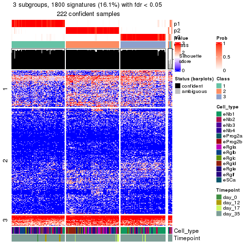</p>

</div>
<div id='tab-node-011-get-signatures-no-scale-3'>
<pre><code class="r">get_signatures(res, k = 4, scale_rows = FALSE)
</code></pre>

<p></p>

</div>
</div>


Compare the overlap of signatures from different k:

```r
compare_signatures(res)
```


`get_signature()` returns a data frame invisibly. To get the list of signatures, the function
call should be assigned to a variable explicitly. In following code, if `plot` argument is set
to `FALSE`, no heatmap is plotted while only the differential analysis is performed.

```r
# code only for demonstration
tb = get_signature(res, k = ..., plot = FALSE)
```

An example of the output of `tb` is:

```
#>   which_row         fdr    mean_1    mean_2 scaled_mean_1 scaled_mean_2 km
#> 1        38 0.042760348  8.373488  9.131774    -0.5533452     0.5164555  1
#> 2        40 0.018707592  7.106213  8.469186    -0.6173731     0.5762149  1
#> 3        55 0.019134737 10.221463 11.207825    -0.6159697     0.5749050  1
#> 4        59 0.006059896  5.921854  7.869574    -0.6899429     0.6439467  1
#> 5        60 0.018055526  8.928898 10.211722    -0.6204761     0.5791110  1
#> 6        98 0.009384629 15.714769 14.887706     0.6635654    -0.6193277  2
...
```

The columns in `tb` are:

1. `which_row`: row indices corresponding to the input matrix.
2. `fdr`: FDR for the differential test. 
3. `mean_x`: The mean value in group x.
4. `scaled_mean_x`: The mean value in group x after rows are scaled.
5. `km`: Row groups if k-means clustering is applied to rows (which is done by automatically selecting number of clusters).

If there are too many signatures, `top_signatures = ...` can be set to only show the 
signatures with the highest FDRs:

```r
# code only for demonstration
# e.g. to show the top 500 most significant rows
tb = get_signature(res, k = ..., top_signatures = 500)
```

If the signatures are defined as these which are uniquely high in current group, `diff_method` argument
can be set to `"uniquely_high_in_one_group"`:

```r
# code only for demonstration
tb = get_signature(res, k = ..., diff_method = "uniquely_high_in_one_group")
```


UMAP plot which shows how samples are separated.


<script>
$( function() {
	$( '#tabs-node-011-dimension-reduction' ).tabs();
} );
</script>
<div id='tabs-node-011-dimension-reduction'>
<ul>
<li><a href='#tab-node-011-dimension-reduction-1'>k = 2</a></li>
<li><a href='#tab-node-011-dimension-reduction-2'>k = 3</a></li>
<li><a href='#tab-node-011-dimension-reduction-3'>k = 4</a></li>
</ul>
<div id='tab-node-011-dimension-reduction-1'>
<pre><code class="r">dimension_reduction(res, k = 2, method = &quot;UMAP&quot;)
</code></pre>

<p></p>

</div>
<div id='tab-node-011-dimension-reduction-2'>
<pre><code class="r">dimension_reduction(res, k = 3, method = &quot;UMAP&quot;)
</code></pre>

<p></p>

</div>
<div id='tab-node-011-dimension-reduction-3'>
<pre><code class="r">dimension_reduction(res, k = 4, method = &quot;UMAP&quot;)
</code></pre>

<p></p>

</div>
</div>


Following heatmap shows how subgroups are split when increasing `k`:

```r
collect_classes(res)
```


Test correlation between subgroups and known annotations. If the known
annotation is numeric, one-way ANOVA test is applied, and if the known
annotation is discrete, chi-squared contingency table test is applied.

```r
test_to_known_factors(res)
```

```
#>             n_sample Cell_type(p-value) Timepoint(p-value) k
#> ATC:skmeans      222           5.56e-05            0.10208 2
#> ATC:skmeans      222           2.34e-21            0.02573 3
#> ATC:skmeans      222           6.60e-25            0.00988 4
```


If matrix rows can be associated to genes, consider to use `functional_enrichment(res,
...)` to perform function enrichment for the signature genes. See [this vignette](https://jokergoo.github.io/cola_vignettes/functional_enrichment.html) for more detailed explanations.


 

---------------------------------------------------


### Node0112


Parent node: [Node011](#Node011).
Child nodes: 
                Node01121-leaf
        ,
                Node01122-leaf
        ,
                Node01211-leaf
        ,
                Node01212-leaf
        ,
                Node01221-leaf
        ,
                Node01222-leaf
        ,
                Node01223-leaf
        ,
                Node01311-leaf
        ,
                Node01312-leaf
        ,
                Node01321-leaf
        ,
                Node01322-leaf
        ,
                Node02121-leaf
        ,
                Node02122-leaf
        ,
                Node02311-leaf
        ,
                Node02312-leaf
        .


The object with results only for a single top-value method and a single partitioning method 
can be extracted as:

```r
res = res_rh["0112"]
```

A summary of `res` and all the functions that can be applied to it:

```r
res
```

```
#> A 'ConsensusPartition' object with k = 2, 3, 4.
#>   On a matrix with 6294 rows and 80 columns.
#>   Top rows (629) are extracted by 'ATC' method.
#>   Subgroups are detected by 'skmeans' method.
#>   Performed in total 150 partitions by row resampling.
#>   Best k for subgroups seems to be 3.
#> 
#> Following methods can be applied to this 'ConsensusPartition' object:
#>  [1] "cola_report"             "collect_classes"         "collect_plots"          
#>  [4] "collect_stats"           "colnames"                "compare_partitions"     
#>  [7] "compare_signatures"      "consensus_heatmap"       "dimension_reduction"    
#> [10] "functional_enrichment"   "get_anno_col"            "get_anno"               
#> [13] "get_classes"             "get_consensus"           "get_matrix"             
#> [16] "get_membership"          "get_param"               "get_signatures"         
#> [19] "get_stats"               "is_best_k"               "is_stable_k"            
#> [22] "membership_heatmap"      "ncol"                    "nrow"                   
#> [25] "plot_ecdf"               "predict_classes"         "rownames"               
#> [28] "select_partition_number" "show"                    "suggest_best_k"         
#> [31] "test_to_known_factors"   "top_rows_heatmap"
```

`collect_plots()` function collects all the plots made from `res` for all `k` (number of subgroups)
into one single page to provide an easy and fast comparison between different `k`.

```r
collect_plots(res)
```

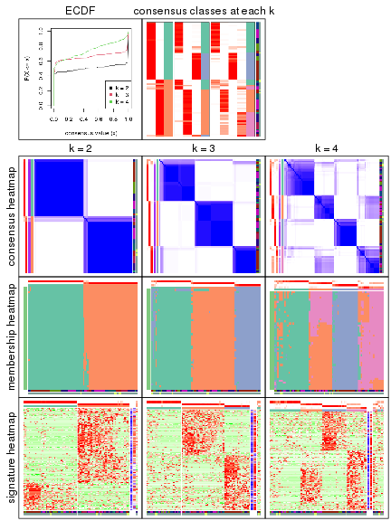

The plots are:

- The first row: a plot of the eCDF (empirical cumulative distribution
  function) curves of the consensus matrix for each `k` and the heatmap of
  predicted classes for each `k`.
- The second row: heatmaps of the consensus matrix for each `k`.
- The third row: heatmaps of the membership matrix for each `k`.
- The fouth row: heatmaps of the signatures for each `k`.

All the plots in panels can be made by individual functions and they are
plotted later in this section.

`select_partition_number()` produces several plots showing different
statistics for choosing "optimized" `k`. There are following statistics:

- eCDF curves of the consensus matrix for each `k`;
- 1-PAC. [The PAC score](https://en.wikipedia.org/wiki/Consensus_clustering#Over-interpretation_potential_of_consensus_clustering)
  measures the proportion of the ambiguous subgrouping.
- Mean silhouette score.
- Concordance. The mean probability of fiting the consensus subgroup labels in all
  partitions.
- Area increased. Denote $A_k$ as the area under the eCDF curve for current
  `k`, the area increased is defined as $A_k - A_{k-1}$.
- Rand index. The percent of pairs of samples that are both in a same cluster
  or both are not in a same cluster in the partition of k and k-1.
- Jaccard index. The ratio of pairs of samples are both in a same cluster in
  the partition of k and k-1 and the pairs of samples are both in a same
  cluster in the partition k or k-1.

The detailed explanations of these statistics can be found in [the _cola_
vignette](https://jokergoo.github.io/cola_vignettes/cola.html#toc_13).

Generally speaking, higher 1-PAC score, higher mean silhouette score or higher
concordance corresponds to better partition. Rand index and Jaccard index
measure how similar the current partition is compared to partition with `k-1`.
If they are too similar, we won't accept `k` is better than `k-1`.

```r
select_partition_number(res)
```


The numeric values for all these statistics can be obtained by `get_stats()`.

```r
get_stats(res)
```

```
#>   k 1-PAC mean_silhouette concordance area_increased  Rand Jaccard
#> 2 2 1.000           0.963       0.984          0.506 0.494   0.494
#> 3 3 0.959           0.918       0.964          0.310 0.737   0.520
#> 4 4 0.735           0.740       0.816          0.124 0.853   0.600
```

`suggest_best_k()` suggests the best $k$ based on these statistics. The rules are as follows:

- All $k$ with Jaccard index larger than 0.95 are removed because increasing
  $k$ does not provide enough extra information. If all $k$ are removed, it is
  marked as no subgroup is detected.
- For all $k$ with 1-PAC score larger than 0.9, the maximal $k$ is taken as
  the best $k$, and other $k$ are marked as optional $k$.
- If it does not fit the second rule. The $k$ with the maximal vote of the
  highest 1-PAC score, highest mean silhouette, and highest concordance is
  taken as the best $k$.

```r
suggest_best_k(res)
```

```
#> [1] 3
#> attr(,"optional")
#> [1] 2
```

There is also optional best $k$ = 2 that is worth to check.

Following is the table of the partitions (You need to click the **show/hide
code output** link to see it). The membership matrix (columns with name `p*`)
is inferred by
[`clue::cl_consensus()`](https://www.rdocumentation.org/link/cl_consensus?package=clue)
function with the `SE` method. Basically the value in the membership matrix
represents the probability to belong to a certain group. The finall subgroup
label for an item is determined with the group with highest probability it
belongs to.

In `get_classes()` function, the entropy is calculated from the membership
matrix and the silhouette score is calculated from the consensus matrix.


<script>
$( function() {
	$( '#tabs-node-0112-get-classes' ).tabs();
} );
</script>
<div id='tabs-node-0112-get-classes'>
<ul>
<li><a href='#tab-node-0112-get-classes-1'>k = 2</a></li>
<li><a href='#tab-node-0112-get-classes-2'>k = 3</a></li>
<li><a href='#tab-node-0112-get-classes-3'>k = 4</a></li>
</ul>

<div id='tab-node-0112-get-classes-1'>
<p><a id='tab-node-0112-get-classes-1-a' style='color:#0366d6' href='#'>show/hide code output</a></p>
<pre><code class="r">cbind(get_classes(res, k = 2), get_membership(res, k = 2))
</code></pre>

<pre><code>#&gt;                 class entropy silhouette   p1   p2
#&gt; 1772122_181_E05     2   0.000      0.969 0.00 1.00
#&gt; 1772122_299_E02     2   0.000      0.969 0.00 1.00
#&gt; 1772122_299_G12     2   0.000      0.969 0.00 1.00
#&gt; 1772122_300_G08     2   0.000      0.969 0.00 1.00
#&gt; 1772122_300_C07     2   0.000      0.969 0.00 1.00
#&gt; 1772122_300_B04     2   0.000      0.969 0.00 1.00
#&gt; 1772122_299_D09     2   0.000      0.969 0.00 1.00
#&gt; 1772122_182_A01     2   0.000      0.969 0.00 1.00
#&gt; 1772122_180_C08     2   0.000      0.969 0.00 1.00
#&gt; 1772122_302_C08     2   0.827      0.664 0.26 0.74
#&gt; 1772122_298_F12     2   0.000      0.969 0.00 1.00
#&gt; 1772122_299_H10     2   0.000      0.969 0.00 1.00
#&gt; 1772122_302_A01     2   0.000      0.969 0.00 1.00
#&gt; 1772122_305_B03     2   0.000      0.969 0.00 1.00
#&gt; 1772122_306_A07     2   0.000      0.969 0.00 1.00
#&gt; 1772122_302_F01     2   0.000      0.969 0.00 1.00
#&gt; 1772122_306_A06     2   0.000      0.969 0.00 1.00
#&gt; 1772122_315_H01     1   0.000      0.998 1.00 0.00
#&gt; 1772122_305_G09     2   0.000      0.969 0.00 1.00
#&gt; 1772122_298_F07     2   0.000      0.969 0.00 1.00
#&gt; 1772122_300_G05     2   0.000      0.969 0.00 1.00
#&gt; 1772122_300_H03     2   0.000      0.969 0.00 1.00
#&gt; 1772122_302_E02     2   0.000      0.969 0.00 1.00
#&gt; 1772122_299_G08     2   0.000      0.969 0.00 1.00
#&gt; 1772122_181_F01     1   0.242      0.957 0.96 0.04
#&gt; 1772122_180_A12     1   0.000      0.998 1.00 0.00
#&gt; 1772122_181_B05     1   0.000      0.998 1.00 0.00
#&gt; 1772122_181_E12     1   0.000      0.998 1.00 0.00
#&gt; 1772122_302_F12     2   0.000      0.969 0.00 1.00
#&gt; 1772122_182_B10     1   0.000      0.998 1.00 0.00
#&gt; 1772122_299_A12     2   0.000      0.969 0.00 1.00
#&gt; 1772122_302_E06     2   0.000      0.969 0.00 1.00
#&gt; 1772122_302_A05     2   0.680      0.780 0.18 0.82
#&gt; 1772122_180_D08     2   0.000      0.969 0.00 1.00
#&gt; 1772122_302_G12     2   0.904      0.555 0.32 0.68
#&gt; 1772122_300_E01     1   0.000      0.998 1.00 0.00
#&gt; 1772122_182_E05     1   0.000      0.998 1.00 0.00
#&gt; 1772122_182_E10     1   0.000      0.998 1.00 0.00
#&gt; 1772122_182_B07     2   0.000      0.969 0.00 1.00
#&gt; 1772122_182_E12     2   0.000      0.969 0.00 1.00
#&gt; 1772122_182_H09     1   0.000      0.998 1.00 0.00
#&gt; 1772122_302_A10     1   0.000      0.998 1.00 0.00
#&gt; 1772122_181_F12     2   0.000      0.969 0.00 1.00
#&gt; 1772122_180_G07     1   0.000      0.998 1.00 0.00
#&gt; 1772122_302_B07     2   0.000      0.969 0.00 1.00
#&gt; 1772122_182_A11     2   0.000      0.969 0.00 1.00
#&gt; 1772122_182_F04     2   0.000      0.969 0.00 1.00
#&gt; 1772122_300_B08     1   0.000      0.998 1.00 0.00
#&gt; 1772122_181_G11     2   0.981      0.294 0.42 0.58
#&gt; 1772122_300_D05     1   0.000      0.998 1.00 0.00
#&gt; 1772122_302_A03     1   0.000      0.998 1.00 0.00
#&gt; 1772122_181_E01     2   0.000      0.969 0.00 1.00
#&gt; 1772122_180_A01     1   0.242      0.957 0.96 0.04
#&gt; 1772122_300_G01     2   0.000      0.969 0.00 1.00
#&gt; 1772122_299_F08     1   0.000      0.998 1.00 0.00
#&gt; 1772122_180_H08     1   0.000      0.998 1.00 0.00
#&gt; 1772122_182_E01     1   0.000      0.998 1.00 0.00
#&gt; 1772122_302_C10     1   0.000      0.998 1.00 0.00
#&gt; 1772122_182_C11     1   0.000      0.998 1.00 0.00
#&gt; 1772122_302_A09     1   0.000      0.998 1.00 0.00
#&gt; 1772122_299_G01     1   0.000      0.998 1.00 0.00
#&gt; 1772122_299_A03     1   0.000      0.998 1.00 0.00
#&gt; 1772122_180_E08     1   0.000      0.998 1.00 0.00
#&gt; 1772122_180_F03     1   0.000      0.998 1.00 0.00
#&gt; 1772122_182_B02     1   0.000      0.998 1.00 0.00
#&gt; 1772122_181_B12     1   0.000      0.998 1.00 0.00
#&gt; 1772122_180_C03     1   0.000      0.998 1.00 0.00
#&gt; 1772122_182_H08     2   0.000      0.969 0.00 1.00
#&gt; 1772122_299_C04     2   0.000      0.969 0.00 1.00
#&gt; 1772122_182_A06     1   0.000      0.998 1.00 0.00
#&gt; 1772122_181_A05     1   0.000      0.998 1.00 0.00
#&gt; 1772122_181_B02     1   0.000      0.998 1.00 0.00
#&gt; 1772122_182_D05     1   0.000      0.998 1.00 0.00
#&gt; 1772122_181_H08     1   0.000      0.998 1.00 0.00
#&gt; 1772122_181_C01     1   0.000      0.998 1.00 0.00
#&gt; 1772122_182_C08     1   0.000      0.998 1.00 0.00
#&gt; 1772122_180_F02     1   0.000      0.998 1.00 0.00
#&gt; 1772122_302_B01     1   0.000      0.998 1.00 0.00
#&gt; 1772122_181_B08     1   0.000      0.998 1.00 0.00
#&gt; 1772122_182_G08     1   0.000      0.998 1.00 0.00
</code></pre>

<script>
$('#tab-node-0112-get-classes-1-a').parent().next().next().hide();
$('#tab-node-0112-get-classes-1-a').click(function(){
  $('#tab-node-0112-get-classes-1-a').parent().next().next().toggle();
  return(false);
});
</script>
</div>

<div id='tab-node-0112-get-classes-2'>
<p><a id='tab-node-0112-get-classes-2-a' style='color:#0366d6' href='#'>show/hide code output</a></p>
<pre><code class="r">cbind(get_classes(res, k = 3), get_membership(res, k = 3))
</code></pre>

<pre><code>#&gt;                 class entropy silhouette   p1   p2   p3
#&gt; 1772122_181_E05     2  0.2537      0.905 0.00 0.92 0.08
#&gt; 1772122_299_E02     2  0.0000      0.979 0.00 1.00 0.00
#&gt; 1772122_299_G12     2  0.0000      0.979 0.00 1.00 0.00
#&gt; 1772122_300_G08     2  0.0000      0.979 0.00 1.00 0.00
#&gt; 1772122_300_C07     2  0.0000      0.979 0.00 1.00 0.00
#&gt; 1772122_300_B04     2  0.0000      0.979 0.00 1.00 0.00
#&gt; 1772122_299_D09     2  0.6229      0.572 0.28 0.70 0.02
#&gt; 1772122_182_A01     2  0.0000      0.979 0.00 1.00 0.00
#&gt; 1772122_180_C08     2  0.0892      0.966 0.00 0.98 0.02
#&gt; 1772122_302_C08     3  0.4862      0.798 0.02 0.16 0.82
#&gt; 1772122_298_F12     2  0.0000      0.979 0.00 1.00 0.00
#&gt; 1772122_299_H10     2  0.0000      0.979 0.00 1.00 0.00
#&gt; 1772122_302_A01     2  0.0000      0.979 0.00 1.00 0.00
#&gt; 1772122_305_B03     2  0.0892      0.975 0.02 0.98 0.00
#&gt; 1772122_306_A07     1  0.0000      0.926 1.00 0.00 0.00
#&gt; 1772122_302_F01     2  0.0000      0.979 0.00 1.00 0.00
#&gt; 1772122_306_A06     2  0.0892      0.975 0.02 0.98 0.00
#&gt; 1772122_315_H01     1  0.6244      0.267 0.56 0.00 0.44
#&gt; 1772122_305_G09     1  0.0892      0.913 0.98 0.02 0.00
#&gt; 1772122_298_F07     2  0.0000      0.979 0.00 1.00 0.00
#&gt; 1772122_300_G05     2  0.0892      0.975 0.02 0.98 0.00
#&gt; 1772122_300_H03     2  0.0000      0.979 0.00 1.00 0.00
#&gt; 1772122_302_E02     2  0.0892      0.975 0.02 0.98 0.00
#&gt; 1772122_299_G08     1  0.0000      0.926 1.00 0.00 0.00
#&gt; 1772122_181_F01     1  0.0000      0.926 1.00 0.00 0.00
#&gt; 1772122_180_A12     1  0.0892      0.927 0.98 0.00 0.02
#&gt; 1772122_181_B05     1  0.1529      0.914 0.96 0.00 0.04
#&gt; 1772122_181_E12     1  0.0892      0.927 0.98 0.00 0.02
#&gt; 1772122_302_F12     2  0.0000      0.979 0.00 1.00 0.00
#&gt; 1772122_182_B10     1  0.0892      0.927 0.98 0.00 0.02
#&gt; 1772122_299_A12     1  0.6280      0.113 0.54 0.46 0.00
#&gt; 1772122_302_E06     2  0.0892      0.975 0.02 0.98 0.00
#&gt; 1772122_302_A05     1  0.0000      0.926 1.00 0.00 0.00
#&gt; 1772122_180_D08     2  0.0000      0.979 0.00 1.00 0.00
#&gt; 1772122_302_G12     1  0.0892      0.920 0.98 0.02 0.00
#&gt; 1772122_300_E01     1  0.0000      0.926 1.00 0.00 0.00
#&gt; 1772122_182_E05     1  0.0892      0.927 0.98 0.00 0.02
#&gt; 1772122_182_E10     1  0.0892      0.927 0.98 0.00 0.02
#&gt; 1772122_182_B07     2  0.0000      0.979 0.00 1.00 0.00
#&gt; 1772122_182_E12     2  0.0892      0.975 0.02 0.98 0.00
#&gt; 1772122_182_H09     1  0.0000      0.926 1.00 0.00 0.00
#&gt; 1772122_302_A10     1  0.0892      0.927 0.98 0.00 0.02
#&gt; 1772122_181_F12     2  0.0892      0.975 0.02 0.98 0.00
#&gt; 1772122_180_G07     1  0.0892      0.927 0.98 0.00 0.02
#&gt; 1772122_302_B07     2  0.0000      0.979 0.00 1.00 0.00
#&gt; 1772122_182_A11     2  0.0892      0.975 0.02 0.98 0.00
#&gt; 1772122_182_F04     2  0.0000      0.979 0.00 1.00 0.00
#&gt; 1772122_300_B08     3  0.0000      0.982 0.00 0.00 1.00
#&gt; 1772122_181_G11     1  0.0892      0.914 0.98 0.02 0.00
#&gt; 1772122_300_D05     1  0.0000      0.926 1.00 0.00 0.00
#&gt; 1772122_302_A03     3  0.1529      0.947 0.04 0.00 0.96
#&gt; 1772122_181_E01     2  0.0000      0.979 0.00 1.00 0.00
#&gt; 1772122_180_A01     1  0.0000      0.926 1.00 0.00 0.00
#&gt; 1772122_300_G01     2  0.0892      0.975 0.02 0.98 0.00
#&gt; 1772122_299_F08     1  0.0892      0.927 0.98 0.00 0.02
#&gt; 1772122_180_H08     1  0.0000      0.926 1.00 0.00 0.00
#&gt; 1772122_182_E01     1  0.0000      0.926 1.00 0.00 0.00
#&gt; 1772122_302_C10     3  0.0000      0.982 0.00 0.00 1.00
#&gt; 1772122_182_C11     1  0.0892      0.927 0.98 0.00 0.02
#&gt; 1772122_302_A09     3  0.2537      0.905 0.08 0.00 0.92
#&gt; 1772122_299_G01     3  0.0000      0.982 0.00 0.00 1.00
#&gt; 1772122_299_A03     1  0.6302      0.132 0.52 0.00 0.48
#&gt; 1772122_180_E08     1  0.5016      0.688 0.76 0.00 0.24
#&gt; 1772122_180_F03     1  0.0892      0.927 0.98 0.00 0.02
#&gt; 1772122_182_B02     3  0.0000      0.982 0.00 0.00 1.00
#&gt; 1772122_181_B12     3  0.0000      0.982 0.00 0.00 1.00
#&gt; 1772122_180_C03     1  0.0892      0.927 0.98 0.00 0.02
#&gt; 1772122_182_H08     2  0.0892      0.975 0.02 0.98 0.00
#&gt; 1772122_299_C04     2  0.0892      0.975 0.02 0.98 0.00
#&gt; 1772122_182_A06     3  0.0000      0.982 0.00 0.00 1.00
#&gt; 1772122_181_A05     3  0.0000      0.982 0.00 0.00 1.00
#&gt; 1772122_181_B02     3  0.0000      0.982 0.00 0.00 1.00
#&gt; 1772122_182_D05     3  0.0000      0.982 0.00 0.00 1.00
#&gt; 1772122_181_H08     3  0.0000      0.982 0.00 0.00 1.00
#&gt; 1772122_181_C01     3  0.0000      0.982 0.00 0.00 1.00
#&gt; 1772122_182_C08     3  0.0000      0.982 0.00 0.00 1.00
#&gt; 1772122_180_F02     3  0.0000      0.982 0.00 0.00 1.00
#&gt; 1772122_302_B01     3  0.0000      0.982 0.00 0.00 1.00
#&gt; 1772122_181_B08     3  0.0000      0.982 0.00 0.00 1.00
#&gt; 1772122_182_G08     3  0.0000      0.982 0.00 0.00 1.00
</code></pre>

<script>
$('#tab-node-0112-get-classes-2-a').parent().next().next().hide();
$('#tab-node-0112-get-classes-2-a').click(function(){
  $('#tab-node-0112-get-classes-2-a').parent().next().next().toggle();
  return(false);
});
</script>
</div>

<div id='tab-node-0112-get-classes-3'>
<p><a id='tab-node-0112-get-classes-3-a' style='color:#0366d6' href='#'>show/hide code output</a></p>
<pre><code class="r">cbind(get_classes(res, k = 4), get_membership(res, k = 4))
</code></pre>

<pre><code>#&gt;                 class entropy silhouette   p1   p2   p3   p4
#&gt; 1772122_181_E05     4  0.1411      0.565 0.00 0.02 0.02 0.96
#&gt; 1772122_299_E02     4  0.3801      0.560 0.00 0.22 0.00 0.78
#&gt; 1772122_299_G12     4  0.4994      0.475 0.00 0.48 0.00 0.52
#&gt; 1772122_300_G08     4  0.4522      0.598 0.00 0.32 0.00 0.68
#&gt; 1772122_300_C07     4  0.4907      0.569 0.00 0.42 0.00 0.58
#&gt; 1772122_300_B04     4  0.4790      0.588 0.00 0.38 0.00 0.62
#&gt; 1772122_299_D09     4  0.0000      0.555 0.00 0.00 0.00 1.00
#&gt; 1772122_182_A01     4  0.4907      0.569 0.00 0.42 0.00 0.58
#&gt; 1772122_180_C08     4  0.0707      0.564 0.00 0.02 0.00 0.98
#&gt; 1772122_302_C08     4  0.0707      0.556 0.00 0.00 0.02 0.98
#&gt; 1772122_298_F12     4  0.4948      0.544 0.00 0.44 0.00 0.56
#&gt; 1772122_299_H10     4  0.4907      0.569 0.00 0.42 0.00 0.58
#&gt; 1772122_302_A01     4  0.4948      0.544 0.00 0.44 0.00 0.56
#&gt; 1772122_305_B03     2  0.0000      0.871 0.00 1.00 0.00 0.00
#&gt; 1772122_306_A07     1  0.6216      0.651 0.66 0.22 0.00 0.12
#&gt; 1772122_302_F01     2  0.2921      0.778 0.00 0.86 0.00 0.14
#&gt; 1772122_306_A06     2  0.0707      0.875 0.00 0.98 0.00 0.02
#&gt; 1772122_315_H01     3  0.5428      0.330 0.38 0.00 0.60 0.02
#&gt; 1772122_305_G09     1  0.6500      0.603 0.62 0.26 0.00 0.12
#&gt; 1772122_298_F07     2  0.3400      0.714 0.00 0.82 0.00 0.18
#&gt; 1772122_300_G05     2  0.0707      0.875 0.00 0.98 0.00 0.02
#&gt; 1772122_300_H03     4  0.4907      0.569 0.00 0.42 0.00 0.58
#&gt; 1772122_302_E02     2  0.0707      0.875 0.00 0.98 0.00 0.02
#&gt; 1772122_299_G08     1  0.5383      0.734 0.74 0.10 0.00 0.16
#&gt; 1772122_181_F01     1  0.2706      0.843 0.90 0.08 0.00 0.02
#&gt; 1772122_180_A12     1  0.0000      0.881 1.00 0.00 0.00 0.00
#&gt; 1772122_181_B05     1  0.1211      0.861 0.96 0.00 0.04 0.00
#&gt; 1772122_181_E12     1  0.0000      0.881 1.00 0.00 0.00 0.00
#&gt; 1772122_302_F12     2  0.2647      0.802 0.00 0.88 0.00 0.12
#&gt; 1772122_182_B10     1  0.0000      0.881 1.00 0.00 0.00 0.00
#&gt; 1772122_299_A12     2  0.5383      0.496 0.16 0.74 0.00 0.10
#&gt; 1772122_302_E06     2  0.0000      0.871 0.00 1.00 0.00 0.00
#&gt; 1772122_302_A05     4  0.4994     -0.358 0.48 0.00 0.00 0.52
#&gt; 1772122_180_D08     2  0.0707      0.875 0.00 0.98 0.00 0.02
#&gt; 1772122_302_G12     4  0.3610      0.367 0.20 0.00 0.00 0.80
#&gt; 1772122_300_E01     1  0.3610      0.774 0.80 0.00 0.00 0.20
#&gt; 1772122_182_E05     1  0.0000      0.881 1.00 0.00 0.00 0.00
#&gt; 1772122_182_E10     1  0.0000      0.881 1.00 0.00 0.00 0.00
#&gt; 1772122_182_B07     2  0.3610      0.668 0.00 0.80 0.00 0.20
#&gt; 1772122_182_E12     2  0.1211      0.841 0.04 0.96 0.00 0.00
#&gt; 1772122_182_H09     1  0.1411      0.873 0.96 0.02 0.00 0.02
#&gt; 1772122_302_A10     1  0.0707      0.875 0.98 0.00 0.00 0.02
#&gt; 1772122_181_F12     2  0.1211      0.835 0.00 0.96 0.00 0.04
#&gt; 1772122_180_G07     1  0.0000      0.881 1.00 0.00 0.00 0.00
#&gt; 1772122_302_B07     4  0.4948      0.544 0.00 0.44 0.00 0.56
#&gt; 1772122_182_A11     2  0.0000      0.871 0.00 1.00 0.00 0.00
#&gt; 1772122_182_F04     2  0.2921      0.778 0.00 0.86 0.00 0.14
#&gt; 1772122_300_B08     3  0.0000      0.946 0.00 0.00 1.00 0.00
#&gt; 1772122_181_G11     1  0.5606      0.217 0.50 0.48 0.00 0.02
#&gt; 1772122_300_D05     1  0.0707      0.876 0.98 0.00 0.00 0.02
#&gt; 1772122_302_A03     3  0.2647      0.852 0.12 0.00 0.88 0.00
#&gt; 1772122_181_E01     4  0.4907      0.540 0.00 0.42 0.00 0.58
#&gt; 1772122_180_A01     1  0.3525      0.824 0.86 0.04 0.00 0.10
#&gt; 1772122_300_G01     2  0.0000      0.871 0.00 1.00 0.00 0.00
#&gt; 1772122_299_F08     1  0.0000      0.881 1.00 0.00 0.00 0.00
#&gt; 1772122_180_H08     1  0.1211      0.871 0.96 0.00 0.00 0.04
#&gt; 1772122_182_E01     1  0.1211      0.869 0.96 0.04 0.00 0.00
#&gt; 1772122_302_C10     3  0.0000      0.946 0.00 0.00 1.00 0.00
#&gt; 1772122_182_C11     1  0.0000      0.881 1.00 0.00 0.00 0.00
#&gt; 1772122_302_A09     3  0.4134      0.663 0.26 0.00 0.74 0.00
#&gt; 1772122_299_G01     3  0.1637      0.906 0.00 0.00 0.94 0.06
#&gt; 1772122_299_A03     1  0.7785      0.271 0.42 0.00 0.26 0.32
#&gt; 1772122_180_E08     1  0.5256      0.569 0.70 0.00 0.26 0.04
#&gt; 1772122_180_F03     1  0.0000      0.881 1.00 0.00 0.00 0.00
#&gt; 1772122_182_B02     3  0.1637      0.905 0.06 0.00 0.94 0.00
#&gt; 1772122_181_B12     3  0.0000      0.946 0.00 0.00 1.00 0.00
#&gt; 1772122_180_C03     1  0.0000      0.881 1.00 0.00 0.00 0.00
#&gt; 1772122_182_H08     4  0.5594      0.116 0.02 0.46 0.00 0.52
#&gt; 1772122_299_C04     2  0.1637      0.855 0.00 0.94 0.00 0.06
#&gt; 1772122_182_A06     3  0.0000      0.946 0.00 0.00 1.00 0.00
#&gt; 1772122_181_A05     3  0.0000      0.946 0.00 0.00 1.00 0.00
#&gt; 1772122_181_B02     3  0.0000      0.946 0.00 0.00 1.00 0.00
#&gt; 1772122_182_D05     3  0.0000      0.946 0.00 0.00 1.00 0.00
#&gt; 1772122_181_H08     3  0.0000      0.946 0.00 0.00 1.00 0.00
#&gt; 1772122_181_C01     3  0.0000      0.946 0.00 0.00 1.00 0.00
#&gt; 1772122_182_C08     3  0.0000      0.946 0.00 0.00 1.00 0.00
#&gt; 1772122_180_F02     3  0.0000      0.946 0.00 0.00 1.00 0.00
#&gt; 1772122_302_B01     3  0.0000      0.946 0.00 0.00 1.00 0.00
#&gt; 1772122_181_B08     3  0.0000      0.946 0.00 0.00 1.00 0.00
#&gt; 1772122_182_G08     3  0.0000      0.946 0.00 0.00 1.00 0.00
</code></pre>

<script>
$('#tab-node-0112-get-classes-3-a').parent().next().next().hide();
$('#tab-node-0112-get-classes-3-a').click(function(){
  $('#tab-node-0112-get-classes-3-a').parent().next().next().toggle();
  return(false);
});
</script>
</div>
</div>

Heatmaps for the consensus matrix. It visualizes the probability of two
samples to be in a same group.


<script>
$( function() {
	$( '#tabs-node-0112-consensus-heatmap' ).tabs();
} );
</script>
<div id='tabs-node-0112-consensus-heatmap'>
<ul>
<li><a href='#tab-node-0112-consensus-heatmap-1'>k = 2</a></li>
<li><a href='#tab-node-0112-consensus-heatmap-2'>k = 3</a></li>
<li><a href='#tab-node-0112-consensus-heatmap-3'>k = 4</a></li>
</ul>
<div id='tab-node-0112-consensus-heatmap-1'>
<pre><code class="r">consensus_heatmap(res, k = 2)
</code></pre>

<p></p>

</div>
<div id='tab-node-0112-consensus-heatmap-2'>
<pre><code class="r">consensus_heatmap(res, k = 3)
</code></pre>

<p></p>

</div>
<div id='tab-node-0112-consensus-heatmap-3'>
<pre><code class="r">consensus_heatmap(res, k = 4)
</code></pre>

<p></p>

</div>
</div>

Heatmaps for the membership of samples in all partitions to see how consistent they are:


<script>
$( function() {
	$( '#tabs-node-0112-membership-heatmap' ).tabs();
} );
</script>
<div id='tabs-node-0112-membership-heatmap'>
<ul>
<li><a href='#tab-node-0112-membership-heatmap-1'>k = 2</a></li>
<li><a href='#tab-node-0112-membership-heatmap-2'>k = 3</a></li>
<li><a href='#tab-node-0112-membership-heatmap-3'>k = 4</a></li>
</ul>
<div id='tab-node-0112-membership-heatmap-1'>
<pre><code class="r">membership_heatmap(res, k = 2)
</code></pre>

<p></p>

</div>
<div id='tab-node-0112-membership-heatmap-2'>
<pre><code class="r">membership_heatmap(res, k = 3)
</code></pre>

<p></p>

</div>
<div id='tab-node-0112-membership-heatmap-3'>
<pre><code class="r">membership_heatmap(res, k = 4)
</code></pre>

<p></p>

</div>
</div>

As soon as the classes for columns are determined, the signatures
that are significantly different between subgroups can be looked for. 
Following are the heatmaps for signatures.


Signature heatmaps where rows are scaled:


<script>
$( function() {
	$( '#tabs-node-0112-get-signatures' ).tabs();
} );
</script>
<div id='tabs-node-0112-get-signatures'>
<ul>
<li><a href='#tab-node-0112-get-signatures-1'>k = 2</a></li>
<li><a href='#tab-node-0112-get-signatures-2'>k = 3</a></li>
<li><a href='#tab-node-0112-get-signatures-3'>k = 4</a></li>
</ul>
<div id='tab-node-0112-get-signatures-1'>
<pre><code class="r">get_signatures(res, k = 2)
</code></pre>

<p></p>

</div>
<div id='tab-node-0112-get-signatures-2'>
<pre><code class="r">get_signatures(res, k = 3)
</code></pre>

<p></p>

</div>
<div id='tab-node-0112-get-signatures-3'>
<pre><code class="r">get_signatures(res, k = 4)
</code></pre>

<p></p>

</div>
</div>


Signature heatmaps where rows are not scaled:


<script>
$( function() {
	$( '#tabs-node-0112-get-signatures-no-scale' ).tabs();
} );
</script>
<div id='tabs-node-0112-get-signatures-no-scale'>
<ul>
<li><a href='#tab-node-0112-get-signatures-no-scale-1'>k = 2</a></li>
<li><a href='#tab-node-0112-get-signatures-no-scale-2'>k = 3</a></li>
<li><a href='#tab-node-0112-get-signatures-no-scale-3'>k = 4</a></li>
</ul>
<div id='tab-node-0112-get-signatures-no-scale-1'>
<pre><code class="r">get_signatures(res, k = 2, scale_rows = FALSE)
</code></pre>

<p></p>

</div>
<div id='tab-node-0112-get-signatures-no-scale-2'>
<pre><code class="r">get_signatures(res, k = 3, scale_rows = FALSE)
</code></pre>

<p></p>

</div>
<div id='tab-node-0112-get-signatures-no-scale-3'>
<pre><code class="r">get_signatures(res, k = 4, scale_rows = FALSE)
</code></pre>

<p></p>

</div>
</div>


Compare the overlap of signatures from different k:

```r
compare_signatures(res)
```


`get_signature()` returns a data frame invisibly. To get the list of signatures, the function
call should be assigned to a variable explicitly. In following code, if `plot` argument is set
to `FALSE`, no heatmap is plotted while only the differential analysis is performed.

```r
# code only for demonstration
tb = get_signature(res, k = ..., plot = FALSE)
```

An example of the output of `tb` is:

```
#>   which_row         fdr    mean_1    mean_2 scaled_mean_1 scaled_mean_2 km
#> 1        38 0.042760348  8.373488  9.131774    -0.5533452     0.5164555  1
#> 2        40 0.018707592  7.106213  8.469186    -0.6173731     0.5762149  1
#> 3        55 0.019134737 10.221463 11.207825    -0.6159697     0.5749050  1
#> 4        59 0.006059896  5.921854  7.869574    -0.6899429     0.6439467  1
#> 5        60 0.018055526  8.928898 10.211722    -0.6204761     0.5791110  1
#> 6        98 0.009384629 15.714769 14.887706     0.6635654    -0.6193277  2
...
```

The columns in `tb` are:

1. `which_row`: row indices corresponding to the input matrix.
2. `fdr`: FDR for the differential test. 
3. `mean_x`: The mean value in group x.
4. `scaled_mean_x`: The mean value in group x after rows are scaled.
5. `km`: Row groups if k-means clustering is applied to rows (which is done by automatically selecting number of clusters).

If there are too many signatures, `top_signatures = ...` can be set to only show the 
signatures with the highest FDRs:

```r
# code only for demonstration
# e.g. to show the top 500 most significant rows
tb = get_signature(res, k = ..., top_signatures = 500)
```

If the signatures are defined as these which are uniquely high in current group, `diff_method` argument
can be set to `"uniquely_high_in_one_group"`:

```r
# code only for demonstration
tb = get_signature(res, k = ..., diff_method = "uniquely_high_in_one_group")
```


UMAP plot which shows how samples are separated.


<script>
$( function() {
	$( '#tabs-node-0112-dimension-reduction' ).tabs();
} );
</script>
<div id='tabs-node-0112-dimension-reduction'>
<ul>
<li><a href='#tab-node-0112-dimension-reduction-1'>k = 2</a></li>
<li><a href='#tab-node-0112-dimension-reduction-2'>k = 3</a></li>
<li><a href='#tab-node-0112-dimension-reduction-3'>k = 4</a></li>
</ul>
<div id='tab-node-0112-dimension-reduction-1'>
<pre><code class="r">dimension_reduction(res, k = 2, method = &quot;UMAP&quot;)
</code></pre>

<p></p>

</div>
<div id='tab-node-0112-dimension-reduction-2'>
<pre><code class="r">dimension_reduction(res, k = 3, method = &quot;UMAP&quot;)
</code></pre>

<p></p>

</div>
<div id='tab-node-0112-dimension-reduction-3'>
<pre><code class="r">dimension_reduction(res, k = 4, method = &quot;UMAP&quot;)
</code></pre>

<p></p>

</div>
</div>


Following heatmap shows how subgroups are split when increasing `k`:

```r
collect_classes(res)
```


Test correlation between subgroups and known annotations. If the known
annotation is numeric, one-way ANOVA test is applied, and if the known
annotation is discrete, chi-squared contingency table test is applied.

```r
test_to_known_factors(res)
```

```
#>             n_sample Cell_type(p-value) Timepoint(p-value) k
#> ATC:skmeans       79           6.72e-06              0.340 2
#> ATC:skmeans       77           7.47e-08              0.486 3
#> ATC:skmeans       72           1.00e-12              0.279 4
```


If matrix rows can be associated to genes, consider to use `functional_enrichment(res,
...)` to perform function enrichment for the signature genes. See [this vignette](https://jokergoo.github.io/cola_vignettes/functional_enrichment.html) for more detailed explanations.


 

---------------------------------------------------


### Node012


Parent node: [Node01](#Node01).
Child nodes: 
                Node0111-leaf
        ,
                [Node0112](#Node0112)
        ,
                Node0113-leaf
        ,
                [Node0121](#Node0121)
        ,
                [Node0122](#Node0122)
        ,
                [Node0131](#Node0131)
        ,
                [Node0132](#Node0132)
        ,
                Node0133-leaf
        ,
                Node0211-leaf
        ,
                [Node0212](#Node0212)
        ,
                Node0221-leaf
        ,
                Node0222-leaf
        ,
                Node0223-leaf
        ,
                [Node0231](#Node0231)
        ,
                Node0232-leaf
        ,
                Node0241-leaf
        ,
                Node0242-leaf
        ,
                Node0243-leaf
        ,
                Node0331-leaf
        ,
                Node0332-leaf
        ,
                Node0333-leaf
        ,
                Node0334-leaf
        .


The object with results only for a single top-value method and a single partitioning method 
can be extracted as:

```r
res = res_rh["012"]
```

A summary of `res` and all the functions that can be applied to it:

```r
res
```

```
#> A 'ConsensusPartition' object with k = 2, 3, 4.
#>   On a matrix with 9873 rows and 190 columns.
#>   Top rows (987) are extracted by 'ATC' method.
#>   Subgroups are detected by 'skmeans' method.
#>   Performed in total 150 partitions by row resampling.
#>   Best k for subgroups seems to be 2.
#> 
#> Following methods can be applied to this 'ConsensusPartition' object:
#>  [1] "cola_report"             "collect_classes"         "collect_plots"          
#>  [4] "collect_stats"           "colnames"                "compare_partitions"     
#>  [7] "compare_signatures"      "consensus_heatmap"       "dimension_reduction"    
#> [10] "functional_enrichment"   "get_anno_col"            "get_anno"               
#> [13] "get_classes"             "get_consensus"           "get_matrix"             
#> [16] "get_membership"          "get_param"               "get_signatures"         
#> [19] "get_stats"               "is_best_k"               "is_stable_k"            
#> [22] "membership_heatmap"      "ncol"                    "nrow"                   
#> [25] "plot_ecdf"               "predict_classes"         "rownames"               
#> [28] "select_partition_number" "show"                    "suggest_best_k"         
#> [31] "test_to_known_factors"   "top_rows_heatmap"
```

`collect_plots()` function collects all the plots made from `res` for all `k` (number of subgroups)
into one single page to provide an easy and fast comparison between different `k`.

```r
collect_plots(res)
```


The plots are:

- The first row: a plot of the eCDF (empirical cumulative distribution
  function) curves of the consensus matrix for each `k` and the heatmap of
  predicted classes for each `k`.
- The second row: heatmaps of the consensus matrix for each `k`.
- The third row: heatmaps of the membership matrix for each `k`.
- The fouth row: heatmaps of the signatures for each `k`.

All the plots in panels can be made by individual functions and they are
plotted later in this section.

`select_partition_number()` produces several plots showing different
statistics for choosing "optimized" `k`. There are following statistics:

- eCDF curves of the consensus matrix for each `k`;
- 1-PAC. [The PAC score](https://en.wikipedia.org/wiki/Consensus_clustering#Over-interpretation_potential_of_consensus_clustering)
  measures the proportion of the ambiguous subgrouping.
- Mean silhouette score.
- Concordance. The mean probability of fiting the consensus subgroup labels in all
  partitions.
- Area increased. Denote $A_k$ as the area under the eCDF curve for current
  `k`, the area increased is defined as $A_k - A_{k-1}$.
- Rand index. The percent of pairs of samples that are both in a same cluster
  or both are not in a same cluster in the partition of k and k-1.
- Jaccard index. The ratio of pairs of samples are both in a same cluster in
  the partition of k and k-1 and the pairs of samples are both in a same
  cluster in the partition k or k-1.

The detailed explanations of these statistics can be found in [the _cola_
vignette](https://jokergoo.github.io/cola_vignettes/cola.html#toc_13).

Generally speaking, higher 1-PAC score, higher mean silhouette score or higher
concordance corresponds to better partition. Rand index and Jaccard index
measure how similar the current partition is compared to partition with `k-1`.
If they are too similar, we won't accept `k` is better than `k-1`.

```r
select_partition_number(res)
```


The numeric values for all these statistics can be obtained by `get_stats()`.

```r
get_stats(res)
```

```
#>   k 1-PAC mean_silhouette concordance area_increased  Rand Jaccard
#> 2 2  1.00           0.998       0.999          0.492 0.508   0.508
#> 3 3  0.81           0.915       0.954          0.334 0.784   0.593
#> 4 4  0.88           0.866       0.941          0.127 0.858   0.616
```

`suggest_best_k()` suggests the best $k$ based on these statistics. The rules are as follows:

- All $k$ with Jaccard index larger than 0.95 are removed because increasing
  $k$ does not provide enough extra information. If all $k$ are removed, it is
  marked as no subgroup is detected.
- For all $k$ with 1-PAC score larger than 0.9, the maximal $k$ is taken as
  the best $k$, and other $k$ are marked as optional $k$.
- If it does not fit the second rule. The $k$ with the maximal vote of the
  highest 1-PAC score, highest mean silhouette, and highest concordance is
  taken as the best $k$.

```r
suggest_best_k(res)
```

```
#> [1] 2
```


Following is the table of the partitions (You need to click the **show/hide
code output** link to see it). The membership matrix (columns with name `p*`)
is inferred by
[`clue::cl_consensus()`](https://www.rdocumentation.org/link/cl_consensus?package=clue)
function with the `SE` method. Basically the value in the membership matrix
represents the probability to belong to a certain group. The finall subgroup
label for an item is determined with the group with highest probability it
belongs to.

In `get_classes()` function, the entropy is calculated from the membership
matrix and the silhouette score is calculated from the consensus matrix.


<script>
$( function() {
	$( '#tabs-node-012-get-classes' ).tabs();
} );
</script>
<div id='tabs-node-012-get-classes'>
<ul>
<li><a href='#tab-node-012-get-classes-1'>k = 2</a></li>
<li><a href='#tab-node-012-get-classes-2'>k = 3</a></li>
<li><a href='#tab-node-012-get-classes-3'>k = 4</a></li>
</ul>

<div id='tab-node-012-get-classes-1'>
<p><a id='tab-node-012-get-classes-1-a' style='color:#0366d6' href='#'>show/hide code output</a></p>
<pre><code class="r">cbind(get_classes(res, k = 2), get_membership(res, k = 2))
</code></pre>

<pre><code>#&gt;                 class entropy silhouette   p1   p2
#&gt; 1772122_301_C02     2   0.000      1.000 0.00 1.00
#&gt; 1772122_180_E05     1   0.000      0.999 1.00 0.00
#&gt; 1772122_300_H02     1   0.000      0.999 1.00 0.00
#&gt; 1772122_180_B09     1   0.000      0.999 1.00 0.00
#&gt; 1772122_180_G04     1   0.000      0.999 1.00 0.00
#&gt; 1772122_182_E09     1   0.000      0.999 1.00 0.00
#&gt; 1772122_302_C04     1   0.000      0.999 1.00 0.00
#&gt; 1772122_302_D11     1   0.000      0.999 1.00 0.00
#&gt; 1772122_180_C11     1   0.000      0.999 1.00 0.00
#&gt; 1772122_298_A07     1   0.000      0.999 1.00 0.00
#&gt; 1772122_299_A11     1   0.000      0.999 1.00 0.00
#&gt; 1772122_298_D09     1   0.000      0.999 1.00 0.00
#&gt; 1772122_180_A06     1   0.000      0.999 1.00 0.00
#&gt; 1772122_302_G06     1   0.000      0.999 1.00 0.00
#&gt; 1772122_182_D07     1   0.000      0.999 1.00 0.00
#&gt; 1772122_182_D02     1   0.000      0.999 1.00 0.00
#&gt; 1772122_300_F10     1   0.000      0.999 1.00 0.00
#&gt; 1772122_301_G12     2   0.000      1.000 0.00 1.00
#&gt; 1772122_301_F09     2   0.000      1.000 0.00 1.00
#&gt; 1772122_301_C12     2   0.000      1.000 0.00 1.00
#&gt; 1772122_301_F07     2   0.000      1.000 0.00 1.00
#&gt; 1772122_301_F05     2   0.000      1.000 0.00 1.00
#&gt; 1772122_301_D08     2   0.000      1.000 0.00 1.00
#&gt; 1772122_301_G10     2   0.000      1.000 0.00 1.00
#&gt; 1772122_301_C04     2   0.000      1.000 0.00 1.00
#&gt; 1772122_301_G07     2   0.000      1.000 0.00 1.00
#&gt; 1772122_301_B08     2   0.000      1.000 0.00 1.00
#&gt; 1772122_301_G04     2   0.000      1.000 0.00 1.00
#&gt; 1772122_301_H03     2   0.000      1.000 0.00 1.00
#&gt; 1772122_302_G07     1   0.000      0.999 1.00 0.00
#&gt; 1772122_301_D10     2   0.000      1.000 0.00 1.00
#&gt; 1772122_300_F01     1   0.000      0.999 1.00 0.00
#&gt; 1772122_299_H11     1   0.000      0.999 1.00 0.00
#&gt; 1772122_299_B05     1   0.000      0.999 1.00 0.00
#&gt; 1772122_301_C07     2   0.000      1.000 0.00 1.00
#&gt; 1772122_298_C12     1   0.000      0.999 1.00 0.00
#&gt; 1772122_300_A05     1   0.000      0.999 1.00 0.00
#&gt; 1772122_300_H06     1   0.000      0.999 1.00 0.00
#&gt; 1772122_301_E07     2   0.000      1.000 0.00 1.00
#&gt; 1772122_301_A02     2   0.000      1.000 0.00 1.00
#&gt; 1772122_299_F02     1   0.000      0.999 1.00 0.00
#&gt; 1772122_300_D02     1   0.000      0.999 1.00 0.00
#&gt; 1772122_301_H05     2   0.000      1.000 0.00 1.00
#&gt; 1772122_302_D07     1   0.000      0.999 1.00 0.00
#&gt; 1772122_302_A08     1   0.000      0.999 1.00 0.00
#&gt; 1772122_180_H12     1   0.000      0.999 1.00 0.00
#&gt; 1772122_180_G03     1   0.000      0.999 1.00 0.00
#&gt; 1772122_301_H12     2   0.000      1.000 0.00 1.00
#&gt; 1772122_302_D04     1   0.000      0.999 1.00 0.00
#&gt; 1772122_300_C01     1   0.000      0.999 1.00 0.00
#&gt; 1772122_298_C11     1   0.000      0.999 1.00 0.00
#&gt; 1772122_298_H07     1   0.000      0.999 1.00 0.00
#&gt; 1772122_300_B12     1   0.000      0.999 1.00 0.00
#&gt; 1772122_298_F03     1   0.000      0.999 1.00 0.00
#&gt; 1772122_182_A09     1   0.000      0.999 1.00 0.00
#&gt; 1772122_298_D05     1   0.000      0.999 1.00 0.00
#&gt; 1772122_180_A02     1   0.000      0.999 1.00 0.00
#&gt; 1772122_300_A12     1   0.000      0.999 1.00 0.00
#&gt; 1772122_298_E06     1   0.000      0.999 1.00 0.00
#&gt; 1772122_300_A01     1   0.000      0.999 1.00 0.00
#&gt; 1772122_299_G06     1   0.000      0.999 1.00 0.00
#&gt; 1772122_299_E07     1   0.000      0.999 1.00 0.00
#&gt; 1772122_180_D02     1   0.000      0.999 1.00 0.00
#&gt; 1772122_302_A11     1   0.000      0.999 1.00 0.00
#&gt; 1772122_181_C05     1   0.000      0.999 1.00 0.00
#&gt; 1772122_298_C05     1   0.000      0.999 1.00 0.00
#&gt; 1772122_182_C02     1   0.000      0.999 1.00 0.00
#&gt; 1772122_299_B07     1   0.000      0.999 1.00 0.00
#&gt; 1772122_300_F04     1   0.000      0.999 1.00 0.00
#&gt; 1772122_180_H11     1   0.000      0.999 1.00 0.00
#&gt; 1772122_300_A10     1   0.000      0.999 1.00 0.00
#&gt; 1772122_299_G05     1   0.000      0.999 1.00 0.00
#&gt; 1772122_299_E06     1   0.000      0.999 1.00 0.00
#&gt; 1772122_206_D10     1   0.000      0.999 1.00 0.00
#&gt; 1772122_315_F02     1   0.000      0.999 1.00 0.00
#&gt; 1772122_303_A03     1   0.000      0.999 1.00 0.00
#&gt; 1772122_303_B12     1   0.000      0.999 1.00 0.00
#&gt; 1772122_206_H10     1   0.000      0.999 1.00 0.00
#&gt; 1772122_263_H02     1   0.000      0.999 1.00 0.00
#&gt; 1772122_306_E02     1   0.000      0.999 1.00 0.00
#&gt; 1772122_315_E03     1   0.000      0.999 1.00 0.00
#&gt; 1772122_305_G07     1   0.000      0.999 1.00 0.00
#&gt; 1772122_306_H02     1   0.000      0.999 1.00 0.00
#&gt; 1772122_303_D08     1   0.000      0.999 1.00 0.00
#&gt; 1772122_303_H07     1   0.000      0.999 1.00 0.00
#&gt; 1772122_306_D05     1   0.000      0.999 1.00 0.00
#&gt; 1772122_305_H05     1   0.000      0.999 1.00 0.00
#&gt; 1772122_298_G09     1   0.000      0.999 1.00 0.00
#&gt; 1772122_300_E09     1   0.000      0.999 1.00 0.00
#&gt; 1772122_301_G09     2   0.000      1.000 0.00 1.00
#&gt; 1772122_300_F02     1   0.402      0.914 0.92 0.08
#&gt; 1772122_301_G11     2   0.000      1.000 0.00 1.00
#&gt; 1772122_302_E11     1   0.000      0.999 1.00 0.00
#&gt; 1772122_301_A01     2   0.000      1.000 0.00 1.00
#&gt; 1772122_299_D04     2   0.000      1.000 0.00 1.00
#&gt; 1772122_180_E07     1   0.000      0.999 1.00 0.00
#&gt; 1772122_300_E02     1   0.000      0.999 1.00 0.00
#&gt; 1772122_301_A09     2   0.000      1.000 0.00 1.00
#&gt; 1772122_301_B05     2   0.000      1.000 0.00 1.00
#&gt; 1772122_301_B12     2   0.000      1.000 0.00 1.00
#&gt; 1772122_301_F03     2   0.000      1.000 0.00 1.00
#&gt; 1772122_301_E02     2   0.000      1.000 0.00 1.00
#&gt; 1772122_300_C06     2   0.000      1.000 0.00 1.00
#&gt; 1772122_301_A05     2   0.000      1.000 0.00 1.00
#&gt; 1772122_302_A02     2   0.000      1.000 0.00 1.00
#&gt; 1772122_298_A09     1   0.000      0.999 1.00 0.00
#&gt; 1772122_298_E02     1   0.000      0.999 1.00 0.00
#&gt; 1772122_302_D06     1   0.000      0.999 1.00 0.00
#&gt; 1772122_301_B11     2   0.000      1.000 0.00 1.00
#&gt; 1772122_301_H01     2   0.000      1.000 0.00 1.00
#&gt; 1772122_301_H06     2   0.000      1.000 0.00 1.00
#&gt; 1772122_301_F02     2   0.000      1.000 0.00 1.00
#&gt; 1772122_305_D01     1   0.000      0.999 1.00 0.00
#&gt; 1772122_301_E01     2   0.000      1.000 0.00 1.00
#&gt; 1772122_299_D11     1   0.242      0.959 0.96 0.04
#&gt; 1772122_298_H04     1   0.000      0.999 1.00 0.00
#&gt; 1772122_301_C01     2   0.000      1.000 0.00 1.00
#&gt; 1772122_180_F05     1   0.000      0.999 1.00 0.00
#&gt; 1772122_298_F05     1   0.000      0.999 1.00 0.00
#&gt; 1772122_301_C06     2   0.000      1.000 0.00 1.00
#&gt; 1772122_180_H04     1   0.000      0.999 1.00 0.00
#&gt; 1772122_301_B03     2   0.000      1.000 0.00 1.00
#&gt; 1772122_298_A11     1   0.000      0.999 1.00 0.00
#&gt; 1772122_182_D04     1   0.000      0.999 1.00 0.00
#&gt; 1772122_300_H10     1   0.000      0.999 1.00 0.00
#&gt; 1772122_301_B06     2   0.000      1.000 0.00 1.00
#&gt; 1772122_301_D06     2   0.000      1.000 0.00 1.00
#&gt; 1772122_298_A03     1   0.000      0.999 1.00 0.00
#&gt; 1772122_301_A11     2   0.000      1.000 0.00 1.00
#&gt; 1772122_301_F06     2   0.000      1.000 0.00 1.00
#&gt; 1772122_300_H12     1   0.000      0.999 1.00 0.00
#&gt; 1772122_301_B07     2   0.000      1.000 0.00 1.00
#&gt; 1772122_299_F04     1   0.000      0.999 1.00 0.00
#&gt; 1772122_300_E04     1   0.000      0.999 1.00 0.00
#&gt; 1772122_299_F11     1   0.000      0.999 1.00 0.00
#&gt; 1772122_302_C02     1   0.000      0.999 1.00 0.00
#&gt; 1772122_301_D05     2   0.000      1.000 0.00 1.00
#&gt; 1772122_301_H04     2   0.000      1.000 0.00 1.00
#&gt; 1772122_300_G06     1   0.000      0.999 1.00 0.00
#&gt; 1772122_299_H07     1   0.000      0.999 1.00 0.00
#&gt; 1772122_298_H06     1   0.000      0.999 1.00 0.00
#&gt; 1772122_301_G06     2   0.000      1.000 0.00 1.00
#&gt; 1772122_301_C10     2   0.000      1.000 0.00 1.00
#&gt; 1772122_300_B11     1   0.000      0.999 1.00 0.00
#&gt; 1772122_301_C08     2   0.000      1.000 0.00 1.00
#&gt; 1772122_301_D07     2   0.000      1.000 0.00 1.00
#&gt; 1772122_301_D04     2   0.000      1.000 0.00 1.00
#&gt; 1772122_301_G05     2   0.000      1.000 0.00 1.00
#&gt; 1772122_301_H09     2   0.000      1.000 0.00 1.00
#&gt; 1772122_302_F02     1   0.000      0.999 1.00 0.00
#&gt; 1772122_300_F11     1   0.000      0.999 1.00 0.00
#&gt; 1772122_301_C11     2   0.000      1.000 0.00 1.00
#&gt; 1772122_301_F11     2   0.000      1.000 0.00 1.00
#&gt; 1772122_299_A08     1   0.000      0.999 1.00 0.00
#&gt; 1772122_301_E10     2   0.000      1.000 0.00 1.00
#&gt; 1772122_300_D11     1   0.000      0.999 1.00 0.00
#&gt; 1772122_301_C05     2   0.000      1.000 0.00 1.00
#&gt; 1772122_302_B09     1   0.000      0.999 1.00 0.00
#&gt; 1772122_182_F09     1   0.000      0.999 1.00 0.00
#&gt; 1772122_303_C09     2   0.000      1.000 0.00 1.00
#&gt; 1772122_301_E08     2   0.000      1.000 0.00 1.00
#&gt; 1772122_315_C07     2   0.000      1.000 0.00 1.00
#&gt; 1772122_301_A12     2   0.000      1.000 0.00 1.00
#&gt; 1772122_300_C11     1   0.000      0.999 1.00 0.00
#&gt; 1772122_301_E04     2   0.000      1.000 0.00 1.00
#&gt; 1772122_301_E12     2   0.000      1.000 0.00 1.00
#&gt; 1772122_301_E05     2   0.000      1.000 0.00 1.00
#&gt; 1772122_301_D01     2   0.000      1.000 0.00 1.00
#&gt; 1772122_300_A02     2   0.000      1.000 0.00 1.00
#&gt; 1772122_180_E11     2   0.000      1.000 0.00 1.00
#&gt; 1772122_302_F09     2   0.000      1.000 0.00 1.00
#&gt; 1772122_300_H07     2   0.000      1.000 0.00 1.00
#&gt; 1772122_301_B02     2   0.000      1.000 0.00 1.00
#&gt; 1772122_298_B02     1   0.000      0.999 1.00 0.00
#&gt; 1772122_301_E06     2   0.000      1.000 0.00 1.00
#&gt; 1772122_181_D11     1   0.000      0.999 1.00 0.00
#&gt; 1772122_298_H11     2   0.000      1.000 0.00 1.00
#&gt; 1772122_301_A10     2   0.000      1.000 0.00 1.00
#&gt; 1772122_301_D02     2   0.000      1.000 0.00 1.00
#&gt; 1772122_301_F01     2   0.000      1.000 0.00 1.00
#&gt; 1772122_181_F09     2   0.000      1.000 0.00 1.00
#&gt; 1772122_301_G02     2   0.000      1.000 0.00 1.00
#&gt; 1772122_301_A03     2   0.000      1.000 0.00 1.00
#&gt; 1772122_180_G05     1   0.000      0.999 1.00 0.00
#&gt; 1772122_301_E03     2   0.000      1.000 0.00 1.00
#&gt; 1772122_180_G09     2   0.000      1.000 0.00 1.00
#&gt; 1772122_298_C07     1   0.000      0.999 1.00 0.00
#&gt; 1772122_181_E02     2   0.000      1.000 0.00 1.00
#&gt; 1772122_299_E10     1   0.000      0.999 1.00 0.00
#&gt; 1772122_182_B09     1   0.141      0.979 0.98 0.02
</code></pre>

<script>
$('#tab-node-012-get-classes-1-a').parent().next().next().hide();
$('#tab-node-012-get-classes-1-a').click(function(){
  $('#tab-node-012-get-classes-1-a').parent().next().next().toggle();
  return(false);
});
</script>
</div>

<div id='tab-node-012-get-classes-2'>
<p><a id='tab-node-012-get-classes-2-a' style='color:#0366d6' href='#'>show/hide code output</a></p>
<pre><code class="r">cbind(get_classes(res, k = 3), get_membership(res, k = 3))
</code></pre>

<pre><code>#&gt;                 class entropy silhouette   p1   p2   p3
#&gt; 1772122_301_C02     2  0.5397      0.698 0.00 0.72 0.28
#&gt; 1772122_180_E05     1  0.0000      0.983 1.00 0.00 0.00
#&gt; 1772122_300_H02     1  0.0000      0.983 1.00 0.00 0.00
#&gt; 1772122_180_B09     1  0.0000      0.983 1.00 0.00 0.00
#&gt; 1772122_180_G04     1  0.0000      0.983 1.00 0.00 0.00
#&gt; 1772122_182_E09     3  0.0000      0.892 0.00 0.00 1.00
#&gt; 1772122_302_C04     3  0.0000      0.892 0.00 0.00 1.00
#&gt; 1772122_302_D11     3  0.0000      0.892 0.00 0.00 1.00
#&gt; 1772122_180_C11     1  0.0000      0.983 1.00 0.00 0.00
#&gt; 1772122_298_A07     1  0.0000      0.983 1.00 0.00 0.00
#&gt; 1772122_299_A11     1  0.0000      0.983 1.00 0.00 0.00
#&gt; 1772122_298_D09     1  0.0000      0.983 1.00 0.00 0.00
#&gt; 1772122_180_A06     3  0.0000      0.892 0.00 0.00 1.00
#&gt; 1772122_302_G06     3  0.0000      0.892 0.00 0.00 1.00
#&gt; 1772122_182_D07     3  0.0000      0.892 0.00 0.00 1.00
#&gt; 1772122_182_D02     1  0.0000      0.983 1.00 0.00 0.00
#&gt; 1772122_300_F10     1  0.0000      0.983 1.00 0.00 0.00
#&gt; 1772122_301_G12     2  0.0000      0.958 0.00 1.00 0.00
#&gt; 1772122_301_F09     2  0.0000      0.958 0.00 1.00 0.00
#&gt; 1772122_301_C12     3  0.0000      0.892 0.00 0.00 1.00
#&gt; 1772122_301_F07     2  0.0000      0.958 0.00 1.00 0.00
#&gt; 1772122_301_F05     2  0.3340      0.882 0.00 0.88 0.12
#&gt; 1772122_301_D08     3  0.0000      0.892 0.00 0.00 1.00
#&gt; 1772122_301_G10     2  0.2959      0.897 0.00 0.90 0.10
#&gt; 1772122_301_C04     2  0.4796      0.782 0.00 0.78 0.22
#&gt; 1772122_301_G07     2  0.2959      0.897 0.00 0.90 0.10
#&gt; 1772122_301_B08     2  0.0000      0.958 0.00 1.00 0.00
#&gt; 1772122_301_G04     2  0.0000      0.958 0.00 1.00 0.00
#&gt; 1772122_301_H03     3  0.0000      0.892 0.00 0.00 1.00
#&gt; 1772122_302_G07     1  0.0000      0.983 1.00 0.00 0.00
#&gt; 1772122_301_D10     3  0.0000      0.892 0.00 0.00 1.00
#&gt; 1772122_300_F01     3  0.5397      0.715 0.28 0.00 0.72
#&gt; 1772122_299_H11     1  0.0000      0.983 1.00 0.00 0.00
#&gt; 1772122_299_B05     1  0.0000      0.983 1.00 0.00 0.00
#&gt; 1772122_301_C07     2  0.0000      0.958 0.00 1.00 0.00
#&gt; 1772122_298_C12     1  0.0000      0.983 1.00 0.00 0.00
#&gt; 1772122_300_A05     1  0.0000      0.983 1.00 0.00 0.00
#&gt; 1772122_300_H06     1  0.0000      0.983 1.00 0.00 0.00
#&gt; 1772122_301_E07     2  0.0000      0.958 0.00 1.00 0.00
#&gt; 1772122_301_A02     2  0.0000      0.958 0.00 1.00 0.00
#&gt; 1772122_299_F02     1  0.0000      0.983 1.00 0.00 0.00
#&gt; 1772122_300_D02     3  0.3340      0.882 0.12 0.00 0.88
#&gt; 1772122_301_H05     2  0.0000      0.958 0.00 1.00 0.00
#&gt; 1772122_302_D07     3  0.3340      0.882 0.12 0.00 0.88
#&gt; 1772122_302_A08     3  0.0000      0.892 0.00 0.00 1.00
#&gt; 1772122_180_H12     1  0.0000      0.983 1.00 0.00 0.00
#&gt; 1772122_180_G03     1  0.0000      0.983 1.00 0.00 0.00
#&gt; 1772122_301_H12     3  0.0000      0.892 0.00 0.00 1.00
#&gt; 1772122_302_D04     1  0.0000      0.983 1.00 0.00 0.00
#&gt; 1772122_300_C01     3  0.4291      0.835 0.18 0.00 0.82
#&gt; 1772122_298_C11     1  0.0000      0.983 1.00 0.00 0.00
#&gt; 1772122_298_H07     1  0.0000      0.983 1.00 0.00 0.00
#&gt; 1772122_300_B12     3  0.3340      0.882 0.12 0.00 0.88
#&gt; 1772122_298_F03     1  0.0000      0.983 1.00 0.00 0.00
#&gt; 1772122_182_A09     1  0.0000      0.983 1.00 0.00 0.00
#&gt; 1772122_298_D05     3  0.5560      0.685 0.30 0.00 0.70
#&gt; 1772122_180_A02     3  0.4291      0.813 0.18 0.00 0.82
#&gt; 1772122_300_A12     1  0.0000      0.983 1.00 0.00 0.00
#&gt; 1772122_298_E06     3  0.6126      0.490 0.40 0.00 0.60
#&gt; 1772122_300_A01     1  0.0000      0.983 1.00 0.00 0.00
#&gt; 1772122_299_G06     1  0.0000      0.983 1.00 0.00 0.00
#&gt; 1772122_299_E07     1  0.0000      0.983 1.00 0.00 0.00
#&gt; 1772122_180_D02     1  0.0000      0.983 1.00 0.00 0.00
#&gt; 1772122_302_A11     3  0.4555      0.815 0.20 0.00 0.80
#&gt; 1772122_181_C05     1  0.0000      0.983 1.00 0.00 0.00
#&gt; 1772122_298_C05     1  0.0000      0.983 1.00 0.00 0.00
#&gt; 1772122_182_C02     3  0.4555      0.815 0.20 0.00 0.80
#&gt; 1772122_299_B07     1  0.0000      0.983 1.00 0.00 0.00
#&gt; 1772122_300_F04     1  0.5835      0.377 0.66 0.00 0.34
#&gt; 1772122_180_H11     3  0.0000      0.892 0.00 0.00 1.00
#&gt; 1772122_300_A10     1  0.0000      0.983 1.00 0.00 0.00
#&gt; 1772122_299_G05     3  0.3340      0.882 0.12 0.00 0.88
#&gt; 1772122_299_E06     1  0.0000      0.983 1.00 0.00 0.00
#&gt; 1772122_206_D10     1  0.0000      0.983 1.00 0.00 0.00
#&gt; 1772122_315_F02     1  0.0000      0.983 1.00 0.00 0.00
#&gt; 1772122_303_A03     1  0.0000      0.983 1.00 0.00 0.00
#&gt; 1772122_303_B12     3  0.3340      0.882 0.12 0.00 0.88
#&gt; 1772122_206_H10     1  0.0000      0.983 1.00 0.00 0.00
#&gt; 1772122_263_H02     1  0.0000      0.983 1.00 0.00 0.00
#&gt; 1772122_306_E02     1  0.0000      0.983 1.00 0.00 0.00
#&gt; 1772122_315_E03     1  0.0000      0.983 1.00 0.00 0.00
#&gt; 1772122_305_G07     1  0.0000      0.983 1.00 0.00 0.00
#&gt; 1772122_306_H02     1  0.0000      0.983 1.00 0.00 0.00
#&gt; 1772122_303_D08     1  0.0000      0.983 1.00 0.00 0.00
#&gt; 1772122_303_H07     1  0.0000      0.983 1.00 0.00 0.00
#&gt; 1772122_306_D05     1  0.0000      0.983 1.00 0.00 0.00
#&gt; 1772122_305_H05     1  0.0000      0.983 1.00 0.00 0.00
#&gt; 1772122_298_G09     1  0.0000      0.983 1.00 0.00 0.00
#&gt; 1772122_300_E09     1  0.5706      0.433 0.68 0.00 0.32
#&gt; 1772122_301_G09     2  0.0000      0.958 0.00 1.00 0.00
#&gt; 1772122_300_F02     3  0.4097      0.873 0.06 0.06 0.88
#&gt; 1772122_301_G11     2  0.0000      0.958 0.00 1.00 0.00
#&gt; 1772122_302_E11     3  0.0000      0.892 0.00 0.00 1.00
#&gt; 1772122_301_A01     2  0.0000      0.958 0.00 1.00 0.00
#&gt; 1772122_299_D04     2  0.6280      0.139 0.46 0.54 0.00
#&gt; 1772122_180_E07     1  0.0000      0.983 1.00 0.00 0.00
#&gt; 1772122_300_E02     3  0.2959      0.887 0.10 0.00 0.90
#&gt; 1772122_301_A09     2  0.0000      0.958 0.00 1.00 0.00
#&gt; 1772122_301_B05     2  0.5016      0.757 0.00 0.76 0.24
#&gt; 1772122_301_B12     2  0.0000      0.958 0.00 1.00 0.00
#&gt; 1772122_301_F03     2  0.0000      0.958 0.00 1.00 0.00
#&gt; 1772122_301_E02     2  0.0000      0.958 0.00 1.00 0.00
#&gt; 1772122_300_C06     2  0.0000      0.958 0.00 1.00 0.00
#&gt; 1772122_301_A05     2  0.0000      0.958 0.00 1.00 0.00
#&gt; 1772122_302_A02     2  0.0892      0.945 0.00 0.98 0.02
#&gt; 1772122_298_A09     1  0.0000      0.983 1.00 0.00 0.00
#&gt; 1772122_298_E02     1  0.0000      0.983 1.00 0.00 0.00
#&gt; 1772122_302_D06     3  0.0000      0.892 0.00 0.00 1.00
#&gt; 1772122_301_B11     2  0.0000      0.958 0.00 1.00 0.00
#&gt; 1772122_301_H01     2  0.0000      0.958 0.00 1.00 0.00
#&gt; 1772122_301_H06     2  0.0000      0.958 0.00 1.00 0.00
#&gt; 1772122_301_F02     2  0.0000      0.958 0.00 1.00 0.00
#&gt; 1772122_305_D01     1  0.0000      0.983 1.00 0.00 0.00
#&gt; 1772122_301_E01     2  0.4796      0.783 0.00 0.78 0.22
#&gt; 1772122_299_D11     1  0.3340      0.832 0.88 0.12 0.00
#&gt; 1772122_298_H04     3  0.2537      0.890 0.08 0.00 0.92
#&gt; 1772122_301_C01     2  0.3340      0.882 0.00 0.88 0.12
#&gt; 1772122_180_F05     1  0.0892      0.962 0.98 0.00 0.02
#&gt; 1772122_298_F05     1  0.0000      0.983 1.00 0.00 0.00
#&gt; 1772122_301_C06     2  0.0000      0.958 0.00 1.00 0.00
#&gt; 1772122_180_H04     1  0.0000      0.983 1.00 0.00 0.00
#&gt; 1772122_301_B03     3  0.0000      0.892 0.00 0.00 1.00
#&gt; 1772122_298_A11     3  0.6192      0.443 0.42 0.00 0.58
#&gt; 1772122_182_D04     3  0.3340      0.882 0.12 0.00 0.88
#&gt; 1772122_300_H10     1  0.0000      0.983 1.00 0.00 0.00
#&gt; 1772122_301_B06     2  0.3340      0.882 0.00 0.88 0.12
#&gt; 1772122_301_D06     2  0.5216      0.729 0.00 0.74 0.26
#&gt; 1772122_298_A03     3  0.3340      0.882 0.12 0.00 0.88
#&gt; 1772122_301_A11     3  0.0000      0.892 0.00 0.00 1.00
#&gt; 1772122_301_F06     3  0.0000      0.892 0.00 0.00 1.00
#&gt; 1772122_300_H12     1  0.2537      0.891 0.92 0.00 0.08
#&gt; 1772122_301_B07     2  0.0000      0.958 0.00 1.00 0.00
#&gt; 1772122_299_F04     1  0.0000      0.983 1.00 0.00 0.00
#&gt; 1772122_300_E04     3  0.0000      0.892 0.00 0.00 1.00
#&gt; 1772122_299_F11     3  0.5216      0.743 0.26 0.00 0.74
#&gt; 1772122_302_C02     3  0.3340      0.882 0.12 0.00 0.88
#&gt; 1772122_301_D05     2  0.3340      0.882 0.00 0.88 0.12
#&gt; 1772122_301_H04     2  0.0000      0.958 0.00 1.00 0.00
#&gt; 1772122_300_G06     1  0.0000      0.983 1.00 0.00 0.00
#&gt; 1772122_299_H07     3  0.6302      0.268 0.48 0.00 0.52
#&gt; 1772122_298_H06     3  0.3340      0.882 0.12 0.00 0.88
#&gt; 1772122_301_G06     3  0.0000      0.892 0.00 0.00 1.00
#&gt; 1772122_301_C10     2  0.0000      0.958 0.00 1.00 0.00
#&gt; 1772122_300_B11     3  0.4002      0.853 0.16 0.00 0.84
#&gt; 1772122_301_C08     2  0.3686      0.866 0.00 0.86 0.14
#&gt; 1772122_301_D07     2  0.2537      0.911 0.00 0.92 0.08
#&gt; 1772122_301_D04     2  0.2959      0.897 0.00 0.90 0.10
#&gt; 1772122_301_G05     2  0.4796      0.782 0.00 0.78 0.22
#&gt; 1772122_301_H09     3  0.0000      0.892 0.00 0.00 1.00
#&gt; 1772122_302_F02     3  0.3340      0.882 0.12 0.00 0.88
#&gt; 1772122_300_F11     3  0.3340      0.882 0.12 0.00 0.88
#&gt; 1772122_301_C11     3  0.0000      0.892 0.00 0.00 1.00
#&gt; 1772122_301_F11     2  0.0000      0.958 0.00 1.00 0.00
#&gt; 1772122_299_A08     3  0.0000      0.892 0.00 0.00 1.00
#&gt; 1772122_301_E10     2  0.0000      0.958 0.00 1.00 0.00
#&gt; 1772122_300_D11     3  0.3340      0.882 0.12 0.00 0.88
#&gt; 1772122_301_C05     2  0.0000      0.958 0.00 1.00 0.00
#&gt; 1772122_302_B09     1  0.0000      0.983 1.00 0.00 0.00
#&gt; 1772122_182_F09     1  0.0000      0.983 1.00 0.00 0.00
#&gt; 1772122_303_C09     2  0.0000      0.958 0.00 1.00 0.00
#&gt; 1772122_301_E08     2  0.0000      0.958 0.00 1.00 0.00
#&gt; 1772122_315_C07     2  0.0000      0.958 0.00 1.00 0.00
#&gt; 1772122_301_A12     2  0.0000      0.958 0.00 1.00 0.00
#&gt; 1772122_300_C11     1  0.0000      0.983 1.00 0.00 0.00
#&gt; 1772122_301_E04     2  0.0000      0.958 0.00 1.00 0.00
#&gt; 1772122_301_E12     2  0.0000      0.958 0.00 1.00 0.00
#&gt; 1772122_301_E05     2  0.0000      0.958 0.00 1.00 0.00
#&gt; 1772122_301_D01     2  0.0000      0.958 0.00 1.00 0.00
#&gt; 1772122_300_A02     2  0.0892      0.942 0.02 0.98 0.00
#&gt; 1772122_180_E11     2  0.0000      0.958 0.00 1.00 0.00
#&gt; 1772122_302_F09     2  0.0000      0.958 0.00 1.00 0.00
#&gt; 1772122_300_H07     2  0.0000      0.958 0.00 1.00 0.00
#&gt; 1772122_301_B02     2  0.0000      0.958 0.00 1.00 0.00
#&gt; 1772122_298_B02     1  0.0000      0.983 1.00 0.00 0.00
#&gt; 1772122_301_E06     2  0.0000      0.958 0.00 1.00 0.00
#&gt; 1772122_181_D11     1  0.0000      0.983 1.00 0.00 0.00
#&gt; 1772122_298_H11     2  0.0000      0.958 0.00 1.00 0.00
#&gt; 1772122_301_A10     2  0.0000      0.958 0.00 1.00 0.00
#&gt; 1772122_301_D02     2  0.0000      0.958 0.00 1.00 0.00
#&gt; 1772122_301_F01     2  0.0000      0.958 0.00 1.00 0.00
#&gt; 1772122_181_F09     2  0.0000      0.958 0.00 1.00 0.00
#&gt; 1772122_301_G02     2  0.0000      0.958 0.00 1.00 0.00
#&gt; 1772122_301_A03     2  0.0000      0.958 0.00 1.00 0.00
#&gt; 1772122_180_G05     1  0.0000      0.983 1.00 0.00 0.00
#&gt; 1772122_301_E03     2  0.0000      0.958 0.00 1.00 0.00
#&gt; 1772122_180_G09     2  0.0000      0.958 0.00 1.00 0.00
#&gt; 1772122_298_C07     1  0.0000      0.983 1.00 0.00 0.00
#&gt; 1772122_181_E02     2  0.0000      0.958 0.00 1.00 0.00
#&gt; 1772122_299_E10     1  0.0000      0.983 1.00 0.00 0.00
#&gt; 1772122_182_B09     1  0.2959      0.859 0.90 0.10 0.00
</code></pre>

<script>
$('#tab-node-012-get-classes-2-a').parent().next().next().hide();
$('#tab-node-012-get-classes-2-a').click(function(){
  $('#tab-node-012-get-classes-2-a').parent().next().next().toggle();
  return(false);
});
</script>
</div>

<div id='tab-node-012-get-classes-3'>
<p><a id='tab-node-012-get-classes-3-a' style='color:#0366d6' href='#'>show/hide code output</a></p>
<pre><code class="r">cbind(get_classes(res, k = 4), get_membership(res, k = 4))
</code></pre>

<pre><code>#&gt;                 class entropy silhouette   p1   p2   p3   p4
#&gt; 1772122_301_C02     4  0.0707     0.8938 0.00 0.02 0.00 0.98
#&gt; 1772122_180_E05     1  0.0707     0.9448 0.98 0.00 0.02 0.00
#&gt; 1772122_300_H02     1  0.0707     0.9421 0.98 0.00 0.00 0.02
#&gt; 1772122_180_B09     1  0.0000     0.9492 1.00 0.00 0.00 0.00
#&gt; 1772122_180_G04     1  0.0707     0.9448 0.98 0.00 0.02 0.00
#&gt; 1772122_182_E09     4  0.4855     0.2950 0.00 0.00 0.40 0.60
#&gt; 1772122_302_C04     3  0.3975     0.6468 0.00 0.00 0.76 0.24
#&gt; 1772122_302_D11     3  0.3975     0.6460 0.00 0.00 0.76 0.24
#&gt; 1772122_180_C11     1  0.0707     0.9421 0.98 0.00 0.00 0.02
#&gt; 1772122_298_A07     1  0.0000     0.9492 1.00 0.00 0.00 0.00
#&gt; 1772122_299_A11     1  0.0000     0.9492 1.00 0.00 0.00 0.00
#&gt; 1772122_298_D09     1  0.0707     0.9421 0.98 0.00 0.00 0.02
#&gt; 1772122_180_A06     4  0.3975     0.6348 0.00 0.00 0.24 0.76
#&gt; 1772122_302_G06     3  0.4406     0.5414 0.00 0.00 0.70 0.30
#&gt; 1772122_182_D07     3  0.5000    -0.0174 0.00 0.00 0.50 0.50
#&gt; 1772122_182_D02     1  0.0000     0.9492 1.00 0.00 0.00 0.00
#&gt; 1772122_300_F10     1  0.2647     0.8651 0.88 0.00 0.12 0.00
#&gt; 1772122_301_G12     4  0.4994     0.0892 0.00 0.48 0.00 0.52
#&gt; 1772122_301_F09     2  0.0000     0.9585 0.00 1.00 0.00 0.00
#&gt; 1772122_301_C12     4  0.0707     0.8902 0.00 0.00 0.02 0.98
#&gt; 1772122_301_F07     2  0.0000     0.9585 0.00 1.00 0.00 0.00
#&gt; 1772122_301_F05     4  0.0707     0.8938 0.00 0.02 0.00 0.98
#&gt; 1772122_301_D08     4  0.0707     0.8902 0.00 0.00 0.02 0.98
#&gt; 1772122_301_G10     4  0.0707     0.8938 0.00 0.02 0.00 0.98
#&gt; 1772122_301_C04     4  0.0707     0.8938 0.00 0.02 0.00 0.98
#&gt; 1772122_301_G07     4  0.2011     0.8555 0.00 0.08 0.00 0.92
#&gt; 1772122_301_B08     4  0.4948     0.2205 0.00 0.44 0.00 0.56
#&gt; 1772122_301_G04     2  0.0000     0.9585 0.00 1.00 0.00 0.00
#&gt; 1772122_301_H03     4  0.0707     0.8902 0.00 0.00 0.02 0.98
#&gt; 1772122_302_G07     1  0.0000     0.9492 1.00 0.00 0.00 0.00
#&gt; 1772122_301_D10     4  0.0707     0.8902 0.00 0.00 0.02 0.98
#&gt; 1772122_300_F01     3  0.0707     0.9057 0.02 0.00 0.98 0.00
#&gt; 1772122_299_H11     1  0.0707     0.9421 0.98 0.00 0.00 0.02
#&gt; 1772122_299_B05     1  0.3801     0.7405 0.78 0.00 0.22 0.00
#&gt; 1772122_301_C07     2  0.0000     0.9585 0.00 1.00 0.00 0.00
#&gt; 1772122_298_C12     1  0.0000     0.9492 1.00 0.00 0.00 0.00
#&gt; 1772122_300_A05     1  0.0707     0.9448 0.98 0.00 0.02 0.00
#&gt; 1772122_300_H06     1  0.0000     0.9492 1.00 0.00 0.00 0.00
#&gt; 1772122_301_E07     4  0.4994     0.0901 0.00 0.48 0.00 0.52
#&gt; 1772122_301_A02     2  0.0707     0.9480 0.00 0.98 0.00 0.02
#&gt; 1772122_299_F02     1  0.0707     0.9448 0.98 0.00 0.02 0.00
#&gt; 1772122_300_D02     3  0.0000     0.9128 0.00 0.00 1.00 0.00
#&gt; 1772122_301_H05     2  0.0000     0.9585 0.00 1.00 0.00 0.00
#&gt; 1772122_302_D07     3  0.0000     0.9128 0.00 0.00 1.00 0.00
#&gt; 1772122_302_A08     3  0.0707     0.8990 0.00 0.00 0.98 0.02
#&gt; 1772122_180_H12     1  0.0000     0.9492 1.00 0.00 0.00 0.00
#&gt; 1772122_180_G03     1  0.0000     0.9492 1.00 0.00 0.00 0.00
#&gt; 1772122_301_H12     4  0.0707     0.8902 0.00 0.00 0.02 0.98
#&gt; 1772122_302_D04     1  0.0707     0.9421 0.98 0.00 0.00 0.02
#&gt; 1772122_300_C01     3  0.0000     0.9128 0.00 0.00 1.00 0.00
#&gt; 1772122_298_C11     1  0.2647     0.8649 0.88 0.00 0.12 0.00
#&gt; 1772122_298_H07     1  0.0000     0.9492 1.00 0.00 0.00 0.00
#&gt; 1772122_300_B12     3  0.0000     0.9128 0.00 0.00 1.00 0.00
#&gt; 1772122_298_F03     1  0.0707     0.9448 0.98 0.00 0.02 0.00
#&gt; 1772122_182_A09     1  0.0000     0.9492 1.00 0.00 0.00 0.00
#&gt; 1772122_298_D05     3  0.0707     0.9057 0.02 0.00 0.98 0.00
#&gt; 1772122_180_A02     3  0.7135     0.4530 0.24 0.00 0.56 0.20
#&gt; 1772122_300_A12     3  0.4522     0.5233 0.32 0.00 0.68 0.00
#&gt; 1772122_298_E06     3  0.0707     0.9057 0.02 0.00 0.98 0.00
#&gt; 1772122_300_A01     1  0.0000     0.9492 1.00 0.00 0.00 0.00
#&gt; 1772122_299_G06     1  0.0707     0.9448 0.98 0.00 0.02 0.00
#&gt; 1772122_299_E07     1  0.0707     0.9448 0.98 0.00 0.02 0.00
#&gt; 1772122_180_D02     1  0.0000     0.9492 1.00 0.00 0.00 0.00
#&gt; 1772122_302_A11     3  0.0000     0.9128 0.00 0.00 1.00 0.00
#&gt; 1772122_181_C05     1  0.3400     0.7948 0.82 0.00 0.18 0.00
#&gt; 1772122_298_C05     1  0.0707     0.9448 0.98 0.00 0.02 0.00
#&gt; 1772122_182_C02     3  0.0707     0.9057 0.02 0.00 0.98 0.00
#&gt; 1772122_299_B07     1  0.2921     0.8428 0.86 0.00 0.14 0.00
#&gt; 1772122_300_F04     3  0.0707     0.9057 0.02 0.00 0.98 0.00
#&gt; 1772122_180_H11     4  0.4994     0.0396 0.00 0.00 0.48 0.52
#&gt; 1772122_300_A10     3  0.3975     0.6774 0.24 0.00 0.76 0.00
#&gt; 1772122_299_G05     3  0.0000     0.9128 0.00 0.00 1.00 0.00
#&gt; 1772122_299_E06     3  0.2647     0.8234 0.12 0.00 0.88 0.00
#&gt; 1772122_206_D10     1  0.4134     0.6794 0.74 0.00 0.26 0.00
#&gt; 1772122_315_F02     1  0.0000     0.9492 1.00 0.00 0.00 0.00
#&gt; 1772122_303_A03     1  0.2011     0.9033 0.92 0.00 0.08 0.00
#&gt; 1772122_303_B12     3  0.0000     0.9128 0.00 0.00 1.00 0.00
#&gt; 1772122_206_H10     1  0.4522     0.5642 0.68 0.00 0.32 0.00
#&gt; 1772122_263_H02     1  0.2345     0.8778 0.90 0.00 0.10 0.00
#&gt; 1772122_306_E02     1  0.0707     0.9448 0.98 0.00 0.02 0.00
#&gt; 1772122_315_E03     1  0.0000     0.9492 1.00 0.00 0.00 0.00
#&gt; 1772122_305_G07     1  0.0707     0.9448 0.98 0.00 0.02 0.00
#&gt; 1772122_306_H02     1  0.0707     0.9448 0.98 0.00 0.02 0.00
#&gt; 1772122_303_D08     1  0.0707     0.9448 0.98 0.00 0.02 0.00
#&gt; 1772122_303_H07     1  0.0000     0.9492 1.00 0.00 0.00 0.00
#&gt; 1772122_306_D05     1  0.0000     0.9492 1.00 0.00 0.00 0.00
#&gt; 1772122_305_H05     1  0.0000     0.9492 1.00 0.00 0.00 0.00
#&gt; 1772122_298_G09     1  0.0707     0.9421 0.98 0.00 0.00 0.02
#&gt; 1772122_300_E09     3  0.2011     0.8624 0.08 0.00 0.92 0.00
#&gt; 1772122_301_G09     2  0.0000     0.9585 0.00 1.00 0.00 0.00
#&gt; 1772122_300_F02     3  0.0000     0.9128 0.00 0.00 1.00 0.00
#&gt; 1772122_301_G11     2  0.0000     0.9585 0.00 1.00 0.00 0.00
#&gt; 1772122_302_E11     3  0.0000     0.9128 0.00 0.00 1.00 0.00
#&gt; 1772122_301_A01     2  0.0000     0.9585 0.00 1.00 0.00 0.00
#&gt; 1772122_299_D04     2  0.5487     0.3087 0.40 0.58 0.00 0.02
#&gt; 1772122_180_E07     1  0.0707     0.9421 0.98 0.00 0.00 0.02
#&gt; 1772122_300_E02     3  0.0707     0.9042 0.00 0.00 0.98 0.02
#&gt; 1772122_301_A09     2  0.0707     0.9479 0.00 0.98 0.00 0.02
#&gt; 1772122_301_B05     4  0.0707     0.8938 0.00 0.02 0.00 0.98
#&gt; 1772122_301_B12     2  0.0707     0.9480 0.00 0.98 0.00 0.02
#&gt; 1772122_301_F03     2  0.3610     0.7342 0.00 0.80 0.00 0.20
#&gt; 1772122_301_E02     2  0.0000     0.9585 0.00 1.00 0.00 0.00
#&gt; 1772122_300_C06     2  0.0707     0.9479 0.00 0.98 0.00 0.02
#&gt; 1772122_301_A05     2  0.0000     0.9585 0.00 1.00 0.00 0.00
#&gt; 1772122_302_A02     2  0.0707     0.9479 0.00 0.98 0.00 0.02
#&gt; 1772122_298_A09     1  0.0000     0.9492 1.00 0.00 0.00 0.00
#&gt; 1772122_298_E02     1  0.0000     0.9492 1.00 0.00 0.00 0.00
#&gt; 1772122_302_D06     3  0.0000     0.9128 0.00 0.00 1.00 0.00
#&gt; 1772122_301_B11     2  0.0000     0.9585 0.00 1.00 0.00 0.00
#&gt; 1772122_301_H01     2  0.0000     0.9585 0.00 1.00 0.00 0.00
#&gt; 1772122_301_H06     2  0.0000     0.9585 0.00 1.00 0.00 0.00
#&gt; 1772122_301_F02     2  0.0000     0.9585 0.00 1.00 0.00 0.00
#&gt; 1772122_305_D01     1  0.0707     0.9448 0.98 0.00 0.02 0.00
#&gt; 1772122_301_E01     4  0.0707     0.8938 0.00 0.02 0.00 0.98
#&gt; 1772122_299_D11     1  0.3037     0.8492 0.88 0.10 0.00 0.02
#&gt; 1772122_298_H04     3  0.0000     0.9128 0.00 0.00 1.00 0.00
#&gt; 1772122_301_C01     4  0.1637     0.8701 0.00 0.06 0.00 0.94
#&gt; 1772122_180_F05     3  0.2011     0.8611 0.08 0.00 0.92 0.00
#&gt; 1772122_298_F05     1  0.0000     0.9492 1.00 0.00 0.00 0.00
#&gt; 1772122_301_C06     2  0.2921     0.8195 0.00 0.86 0.00 0.14
#&gt; 1772122_180_H04     3  0.4134     0.6446 0.26 0.00 0.74 0.00
#&gt; 1772122_301_B03     4  0.0707     0.8902 0.00 0.00 0.02 0.98
#&gt; 1772122_298_A11     3  0.0000     0.9128 0.00 0.00 1.00 0.00
#&gt; 1772122_182_D04     3  0.0000     0.9128 0.00 0.00 1.00 0.00
#&gt; 1772122_300_H10     1  0.0707     0.9448 0.98 0.00 0.02 0.00
#&gt; 1772122_301_B06     4  0.0707     0.8938 0.00 0.02 0.00 0.98
#&gt; 1772122_301_D06     4  0.0707     0.8938 0.00 0.02 0.00 0.98
#&gt; 1772122_298_A03     3  0.0000     0.9128 0.00 0.00 1.00 0.00
#&gt; 1772122_301_A11     4  0.0707     0.8902 0.00 0.00 0.02 0.98
#&gt; 1772122_301_F06     4  0.0707     0.8902 0.00 0.00 0.02 0.98
#&gt; 1772122_300_H12     3  0.0707     0.9057 0.02 0.00 0.98 0.00
#&gt; 1772122_301_B07     2  0.4277     0.5915 0.00 0.72 0.00 0.28
#&gt; 1772122_299_F04     3  0.3400     0.7610 0.18 0.00 0.82 0.00
#&gt; 1772122_300_E04     3  0.0707     0.8990 0.00 0.00 0.98 0.02
#&gt; 1772122_299_F11     3  0.0000     0.9128 0.00 0.00 1.00 0.00
#&gt; 1772122_302_C02     3  0.0000     0.9128 0.00 0.00 1.00 0.00
#&gt; 1772122_301_D05     4  0.0707     0.8938 0.00 0.02 0.00 0.98
#&gt; 1772122_301_H04     2  0.0000     0.9585 0.00 1.00 0.00 0.00
#&gt; 1772122_300_G06     1  0.0000     0.9492 1.00 0.00 0.00 0.00
#&gt; 1772122_299_H07     3  0.0707     0.9057 0.02 0.00 0.98 0.00
#&gt; 1772122_298_H06     3  0.0000     0.9128 0.00 0.00 1.00 0.00
#&gt; 1772122_301_G06     4  0.0707     0.8902 0.00 0.00 0.02 0.98
#&gt; 1772122_301_C10     2  0.0000     0.9585 0.00 1.00 0.00 0.00
#&gt; 1772122_300_B11     3  0.0000     0.9128 0.00 0.00 1.00 0.00
#&gt; 1772122_301_C08     4  0.0707     0.8938 0.00 0.02 0.00 0.98
#&gt; 1772122_301_D07     4  0.2011     0.8552 0.00 0.08 0.00 0.92
#&gt; 1772122_301_D04     4  0.1211     0.8831 0.00 0.04 0.00 0.96
#&gt; 1772122_301_G05     4  0.0707     0.8938 0.00 0.02 0.00 0.98
#&gt; 1772122_301_H09     4  0.0707     0.8902 0.00 0.00 0.02 0.98
#&gt; 1772122_302_F02     3  0.0000     0.9128 0.00 0.00 1.00 0.00
#&gt; 1772122_300_F11     3  0.0000     0.9128 0.00 0.00 1.00 0.00
#&gt; 1772122_301_C11     4  0.0707     0.8902 0.00 0.00 0.02 0.98
#&gt; 1772122_301_F11     2  0.0000     0.9585 0.00 1.00 0.00 0.00
#&gt; 1772122_299_A08     3  0.0707     0.8990 0.00 0.00 0.98 0.02
#&gt; 1772122_301_E10     2  0.4855     0.2980 0.00 0.60 0.00 0.40
#&gt; 1772122_300_D11     3  0.0000     0.9128 0.00 0.00 1.00 0.00
#&gt; 1772122_301_C05     2  0.0000     0.9585 0.00 1.00 0.00 0.00
#&gt; 1772122_302_B09     1  0.0707     0.9421 0.98 0.00 0.00 0.02
#&gt; 1772122_182_F09     1  0.4277     0.6427 0.72 0.00 0.28 0.00
#&gt; 1772122_303_C09     2  0.0000     0.9585 0.00 1.00 0.00 0.00
#&gt; 1772122_301_E08     2  0.0000     0.9585 0.00 1.00 0.00 0.00
#&gt; 1772122_315_C07     2  0.0000     0.9585 0.00 1.00 0.00 0.00
#&gt; 1772122_301_A12     2  0.0707     0.9480 0.00 0.98 0.00 0.02
#&gt; 1772122_300_C11     1  0.0707     0.9421 0.98 0.00 0.00 0.02
#&gt; 1772122_301_E04     2  0.0000     0.9585 0.00 1.00 0.00 0.00
#&gt; 1772122_301_E12     2  0.0707     0.9480 0.00 0.98 0.00 0.02
#&gt; 1772122_301_E05     2  0.0000     0.9585 0.00 1.00 0.00 0.00
#&gt; 1772122_301_D01     2  0.0000     0.9585 0.00 1.00 0.00 0.00
#&gt; 1772122_300_A02     2  0.1411     0.9331 0.02 0.96 0.00 0.02
#&gt; 1772122_180_E11     2  0.1411     0.9331 0.02 0.96 0.00 0.02
#&gt; 1772122_302_F09     2  0.1411     0.9331 0.02 0.96 0.00 0.02
#&gt; 1772122_300_H07     2  0.0707     0.9479 0.00 0.98 0.00 0.02
#&gt; 1772122_301_B02     2  0.0707     0.9480 0.00 0.98 0.00 0.02
#&gt; 1772122_298_B02     1  0.0707     0.9421 0.98 0.00 0.00 0.02
#&gt; 1772122_301_E06     2  0.0000     0.9585 0.00 1.00 0.00 0.00
#&gt; 1772122_181_D11     1  0.4994     0.1008 0.52 0.00 0.48 0.00
#&gt; 1772122_298_H11     2  0.0707     0.9479 0.00 0.98 0.00 0.02
#&gt; 1772122_301_A10     2  0.0000     0.9585 0.00 1.00 0.00 0.00
#&gt; 1772122_301_D02     2  0.0000     0.9585 0.00 1.00 0.00 0.00
#&gt; 1772122_301_F01     2  0.0707     0.9480 0.00 0.98 0.00 0.02
#&gt; 1772122_181_F09     2  0.1411     0.9331 0.02 0.96 0.00 0.02
#&gt; 1772122_301_G02     2  0.0000     0.9585 0.00 1.00 0.00 0.00
#&gt; 1772122_301_A03     2  0.0707     0.9480 0.00 0.98 0.00 0.02
#&gt; 1772122_180_G05     1  0.0000     0.9492 1.00 0.00 0.00 0.00
#&gt; 1772122_301_E03     2  0.0707     0.9480 0.00 0.98 0.00 0.02
#&gt; 1772122_180_G09     2  0.0000     0.9585 0.00 1.00 0.00 0.00
#&gt; 1772122_298_C07     1  0.0000     0.9492 1.00 0.00 0.00 0.00
#&gt; 1772122_181_E02     2  0.0707     0.9479 0.00 0.98 0.00 0.02
#&gt; 1772122_299_E10     1  0.0707     0.9421 0.98 0.00 0.00 0.02
#&gt; 1772122_182_B09     1  0.1411     0.9283 0.96 0.02 0.00 0.02
</code></pre>

<script>
$('#tab-node-012-get-classes-3-a').parent().next().next().hide();
$('#tab-node-012-get-classes-3-a').click(function(){
  $('#tab-node-012-get-classes-3-a').parent().next().next().toggle();
  return(false);
});
</script>
</div>
</div>

Heatmaps for the consensus matrix. It visualizes the probability of two
samples to be in a same group.


<script>
$( function() {
	$( '#tabs-node-012-consensus-heatmap' ).tabs();
} );
</script>
<div id='tabs-node-012-consensus-heatmap'>
<ul>
<li><a href='#tab-node-012-consensus-heatmap-1'>k = 2</a></li>
<li><a href='#tab-node-012-consensus-heatmap-2'>k = 3</a></li>
<li><a href='#tab-node-012-consensus-heatmap-3'>k = 4</a></li>
</ul>
<div id='tab-node-012-consensus-heatmap-1'>
<pre><code class="r">consensus_heatmap(res, k = 2)
</code></pre>

<p></p>

</div>
<div id='tab-node-012-consensus-heatmap-2'>
<pre><code class="r">consensus_heatmap(res, k = 3)
</code></pre>

<p></p>

</div>
<div id='tab-node-012-consensus-heatmap-3'>
<pre><code class="r">consensus_heatmap(res, k = 4)
</code></pre>

<p></p>

</div>
</div>

Heatmaps for the membership of samples in all partitions to see how consistent they are:


<script>
$( function() {
	$( '#tabs-node-012-membership-heatmap' ).tabs();
} );
</script>
<div id='tabs-node-012-membership-heatmap'>
<ul>
<li><a href='#tab-node-012-membership-heatmap-1'>k = 2</a></li>
<li><a href='#tab-node-012-membership-heatmap-2'>k = 3</a></li>
<li><a href='#tab-node-012-membership-heatmap-3'>k = 4</a></li>
</ul>
<div id='tab-node-012-membership-heatmap-1'>
<pre><code class="r">membership_heatmap(res, k = 2)
</code></pre>

<p></p>

</div>
<div id='tab-node-012-membership-heatmap-2'>
<pre><code class="r">membership_heatmap(res, k = 3)
</code></pre>

<p></p>

</div>
<div id='tab-node-012-membership-heatmap-3'>
<pre><code class="r">membership_heatmap(res, k = 4)
</code></pre>

<p></p>

</div>
</div>

As soon as the classes for columns are determined, the signatures
that are significantly different between subgroups can be looked for. 
Following are the heatmaps for signatures.


Signature heatmaps where rows are scaled:


<script>
$( function() {
	$( '#tabs-node-012-get-signatures' ).tabs();
} );
</script>
<div id='tabs-node-012-get-signatures'>
<ul>
<li><a href='#tab-node-012-get-signatures-1'>k = 2</a></li>
<li><a href='#tab-node-012-get-signatures-2'>k = 3</a></li>
<li><a href='#tab-node-012-get-signatures-3'>k = 4</a></li>
</ul>
<div id='tab-node-012-get-signatures-1'>
<pre><code class="r">get_signatures(res, k = 2)
</code></pre>

<p></p>

</div>
<div id='tab-node-012-get-signatures-2'>
<pre><code class="r">get_signatures(res, k = 3)
</code></pre>

<p></p>

</div>
<div id='tab-node-012-get-signatures-3'>
<pre><code class="r">get_signatures(res, k = 4)
</code></pre>

<p></p>

</div>
</div>


Signature heatmaps where rows are not scaled:


<script>
$( function() {
	$( '#tabs-node-012-get-signatures-no-scale' ).tabs();
} );
</script>
<div id='tabs-node-012-get-signatures-no-scale'>
<ul>
<li><a href='#tab-node-012-get-signatures-no-scale-1'>k = 2</a></li>
<li><a href='#tab-node-012-get-signatures-no-scale-2'>k = 3</a></li>
<li><a href='#tab-node-012-get-signatures-no-scale-3'>k = 4</a></li>
</ul>
<div id='tab-node-012-get-signatures-no-scale-1'>
<pre><code class="r">get_signatures(res, k = 2, scale_rows = FALSE)
</code></pre>

<p></p>

</div>
<div id='tab-node-012-get-signatures-no-scale-2'>
<pre><code class="r">get_signatures(res, k = 3, scale_rows = FALSE)
</code></pre>

<p></p>

</div>
<div id='tab-node-012-get-signatures-no-scale-3'>
<pre><code class="r">get_signatures(res, k = 4, scale_rows = FALSE)
</code></pre>

<p></p>

</div>
</div>


Compare the overlap of signatures from different k:

```r
compare_signatures(res)
```


`get_signature()` returns a data frame invisibly. To get the list of signatures, the function
call should be assigned to a variable explicitly. In following code, if `plot` argument is set
to `FALSE`, no heatmap is plotted while only the differential analysis is performed.

```r
# code only for demonstration
tb = get_signature(res, k = ..., plot = FALSE)
```

An example of the output of `tb` is:

```
#>   which_row         fdr    mean_1    mean_2 scaled_mean_1 scaled_mean_2 km
#> 1        38 0.042760348  8.373488  9.131774    -0.5533452     0.5164555  1
#> 2        40 0.018707592  7.106213  8.469186    -0.6173731     0.5762149  1
#> 3        55 0.019134737 10.221463 11.207825    -0.6159697     0.5749050  1
#> 4        59 0.006059896  5.921854  7.869574    -0.6899429     0.6439467  1
#> 5        60 0.018055526  8.928898 10.211722    -0.6204761     0.5791110  1
#> 6        98 0.009384629 15.714769 14.887706     0.6635654    -0.6193277  2
...
```

The columns in `tb` are:

1. `which_row`: row indices corresponding to the input matrix.
2. `fdr`: FDR for the differential test. 
3. `mean_x`: The mean value in group x.
4. `scaled_mean_x`: The mean value in group x after rows are scaled.
5. `km`: Row groups if k-means clustering is applied to rows (which is done by automatically selecting number of clusters).

If there are too many signatures, `top_signatures = ...` can be set to only show the 
signatures with the highest FDRs:

```r
# code only for demonstration
# e.g. to show the top 500 most significant rows
tb = get_signature(res, k = ..., top_signatures = 500)
```

If the signatures are defined as these which are uniquely high in current group, `diff_method` argument
can be set to `"uniquely_high_in_one_group"`:

```r
# code only for demonstration
tb = get_signature(res, k = ..., diff_method = "uniquely_high_in_one_group")
```


UMAP plot which shows how samples are separated.


<script>
$( function() {
	$( '#tabs-node-012-dimension-reduction' ).tabs();
} );
</script>
<div id='tabs-node-012-dimension-reduction'>
<ul>
<li><a href='#tab-node-012-dimension-reduction-1'>k = 2</a></li>
<li><a href='#tab-node-012-dimension-reduction-2'>k = 3</a></li>
<li><a href='#tab-node-012-dimension-reduction-3'>k = 4</a></li>
</ul>
<div id='tab-node-012-dimension-reduction-1'>
<pre><code class="r">dimension_reduction(res, k = 2, method = &quot;UMAP&quot;)
</code></pre>

<p></p>

</div>
<div id='tab-node-012-dimension-reduction-2'>
<pre><code class="r">dimension_reduction(res, k = 3, method = &quot;UMAP&quot;)
</code></pre>

<p>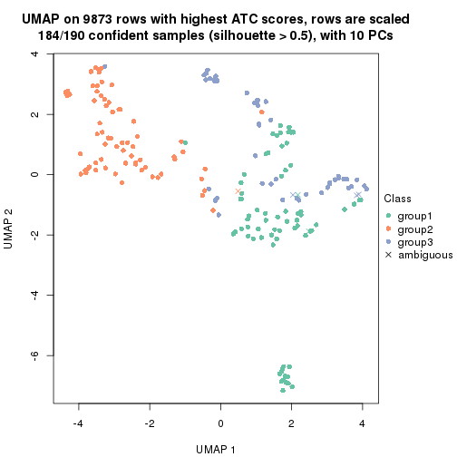</p>

</div>
<div id='tab-node-012-dimension-reduction-3'>
<pre><code class="r">dimension_reduction(res, k = 4, method = &quot;UMAP&quot;)
</code></pre>

<p></p>

</div>
</div>


Following heatmap shows how subgroups are split when increasing `k`:

```r
collect_classes(res)
```

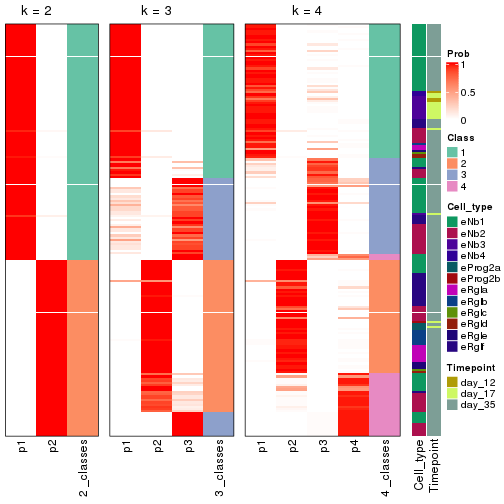


Test correlation between subgroups and known annotations. If the known
annotation is numeric, one-way ANOVA test is applied, and if the known
annotation is discrete, chi-squared contingency table test is applied.

```r
test_to_known_factors(res)
```

```
#>             n_sample Cell_type(p-value) Timepoint(p-value) k
#> ATC:skmeans      190           1.01e-05            0.02376 2
#> ATC:skmeans      184           6.05e-07            0.00233 3
#> ATC:skmeans      180           1.17e-11            0.00218 4
```


If matrix rows can be associated to genes, consider to use `functional_enrichment(res,
...)` to perform function enrichment for the signature genes. See [this vignette](https://jokergoo.github.io/cola_vignettes/functional_enrichment.html) for more detailed explanations.


 

---------------------------------------------------


### Node0121


Parent node: [Node012](#Node012).
Child nodes: 
                Node01121-leaf
        ,
                Node01122-leaf
        ,
                Node01211-leaf
        ,
                Node01212-leaf
        ,
                Node01221-leaf
        ,
                Node01222-leaf
        ,
                Node01223-leaf
        ,
                Node01311-leaf
        ,
                Node01312-leaf
        ,
                Node01321-leaf
        ,
                Node01322-leaf
        ,
                Node02121-leaf
        ,
                Node02122-leaf
        ,
                Node02311-leaf
        ,
                Node02312-leaf
        .


The object with results only for a single top-value method and a single partitioning method 
can be extracted as:

```r
res = res_rh["0121"]
```

A summary of `res` and all the functions that can be applied to it:

```r
res
```

```
#> A 'ConsensusPartition' object with k = 2, 3, 4.
#>   On a matrix with 8394 rows and 109 columns.
#>   Top rows (839) are extracted by 'ATC' method.
#>   Subgroups are detected by 'skmeans' method.
#>   Performed in total 150 partitions by row resampling.
#>   Best k for subgroups seems to be 3.
#> 
#> Following methods can be applied to this 'ConsensusPartition' object:
#>  [1] "cola_report"             "collect_classes"         "collect_plots"          
#>  [4] "collect_stats"           "colnames"                "compare_partitions"     
#>  [7] "compare_signatures"      "consensus_heatmap"       "dimension_reduction"    
#> [10] "functional_enrichment"   "get_anno_col"            "get_anno"               
#> [13] "get_classes"             "get_consensus"           "get_matrix"             
#> [16] "get_membership"          "get_param"               "get_signatures"         
#> [19] "get_stats"               "is_best_k"               "is_stable_k"            
#> [22] "membership_heatmap"      "ncol"                    "nrow"                   
#> [25] "plot_ecdf"               "predict_classes"         "rownames"               
#> [28] "select_partition_number" "show"                    "suggest_best_k"         
#> [31] "test_to_known_factors"   "top_rows_heatmap"
```

`collect_plots()` function collects all the plots made from `res` for all `k` (number of subgroups)
into one single page to provide an easy and fast comparison between different `k`.

```r
collect_plots(res)
```


The plots are:

- The first row: a plot of the eCDF (empirical cumulative distribution
  function) curves of the consensus matrix for each `k` and the heatmap of
  predicted classes for each `k`.
- The second row: heatmaps of the consensus matrix for each `k`.
- The third row: heatmaps of the membership matrix for each `k`.
- The fouth row: heatmaps of the signatures for each `k`.

All the plots in panels can be made by individual functions and they are
plotted later in this section.

`select_partition_number()` produces several plots showing different
statistics for choosing "optimized" `k`. There are following statistics:

- eCDF curves of the consensus matrix for each `k`;
- 1-PAC. [The PAC score](https://en.wikipedia.org/wiki/Consensus_clustering#Over-interpretation_potential_of_consensus_clustering)
  measures the proportion of the ambiguous subgrouping.
- Mean silhouette score.
- Concordance. The mean probability of fiting the consensus subgroup labels in all
  partitions.
- Area increased. Denote $A_k$ as the area under the eCDF curve for current
  `k`, the area increased is defined as $A_k - A_{k-1}$.
- Rand index. The percent of pairs of samples that are both in a same cluster
  or both are not in a same cluster in the partition of k and k-1.
- Jaccard index. The ratio of pairs of samples are both in a same cluster in
  the partition of k and k-1 and the pairs of samples are both in a same
  cluster in the partition k or k-1.

The detailed explanations of these statistics can be found in [the _cola_
vignette](https://jokergoo.github.io/cola_vignettes/cola.html#toc_13).

Generally speaking, higher 1-PAC score, higher mean silhouette score or higher
concordance corresponds to better partition. Rand index and Jaccard index
measure how similar the current partition is compared to partition with `k-1`.
If they are too similar, we won't accept `k` is better than `k-1`.

```r
select_partition_number(res)
```


The numeric values for all these statistics can be obtained by `get_stats()`.

```r
get_stats(res)
```

```
#>   k 1-PAC mean_silhouette concordance area_increased  Rand Jaccard
#> 2 2 0.942           0.946       0.978          0.505 0.496   0.496
#> 3 3 0.989           0.942       0.976          0.285 0.818   0.647
#> 4 4 0.795           0.810       0.905          0.130 0.876   0.665
```

`suggest_best_k()` suggests the best $k$ based on these statistics. The rules are as follows:

- All $k$ with Jaccard index larger than 0.95 are removed because increasing
  $k$ does not provide enough extra information. If all $k$ are removed, it is
  marked as no subgroup is detected.
- For all $k$ with 1-PAC score larger than 0.9, the maximal $k$ is taken as
  the best $k$, and other $k$ are marked as optional $k$.
- If it does not fit the second rule. The $k$ with the maximal vote of the
  highest 1-PAC score, highest mean silhouette, and highest concordance is
  taken as the best $k$.

```r
suggest_best_k(res)
```

```
#> [1] 3
#> attr(,"optional")
#> [1] 2
```

There is also optional best $k$ = 2 that is worth to check.

Following is the table of the partitions (You need to click the **show/hide
code output** link to see it). The membership matrix (columns with name `p*`)
is inferred by
[`clue::cl_consensus()`](https://www.rdocumentation.org/link/cl_consensus?package=clue)
function with the `SE` method. Basically the value in the membership matrix
represents the probability to belong to a certain group. The finall subgroup
label for an item is determined with the group with highest probability it
belongs to.

In `get_classes()` function, the entropy is calculated from the membership
matrix and the silhouette score is calculated from the consensus matrix.


<script>
$( function() {
	$( '#tabs-node-0121-get-classes' ).tabs();
} );
</script>
<div id='tabs-node-0121-get-classes'>
<ul>
<li><a href='#tab-node-0121-get-classes-1'>k = 2</a></li>
<li><a href='#tab-node-0121-get-classes-2'>k = 3</a></li>
<li><a href='#tab-node-0121-get-classes-3'>k = 4</a></li>
</ul>

<div id='tab-node-0121-get-classes-1'>
<p><a id='tab-node-0121-get-classes-1-a' style='color:#0366d6' href='#'>show/hide code output</a></p>
<pre><code class="r">cbind(get_classes(res, k = 2), get_membership(res, k = 2))
</code></pre>

<pre><code>#&gt;                 class entropy silhouette   p1   p2
#&gt; 1772122_180_E05     2   0.000      0.968 0.00 1.00
#&gt; 1772122_300_H02     2   0.000      0.968 0.00 1.00
#&gt; 1772122_180_B09     2   0.000      0.968 0.00 1.00
#&gt; 1772122_180_G04     2   0.000      0.968 0.00 1.00
#&gt; 1772122_182_E09     1   0.000      0.986 1.00 0.00
#&gt; 1772122_302_C04     1   0.000      0.986 1.00 0.00
#&gt; 1772122_302_D11     1   0.000      0.986 1.00 0.00
#&gt; 1772122_180_C11     2   0.000      0.968 0.00 1.00
#&gt; 1772122_298_A07     2   0.000      0.968 0.00 1.00
#&gt; 1772122_299_A11     1   1.000     -0.033 0.50 0.50
#&gt; 1772122_298_D09     2   0.000      0.968 0.00 1.00
#&gt; 1772122_180_A06     1   0.000      0.986 1.00 0.00
#&gt; 1772122_302_G06     1   0.000      0.986 1.00 0.00
#&gt; 1772122_182_D07     1   0.000      0.986 1.00 0.00
#&gt; 1772122_182_D02     2   0.000      0.968 0.00 1.00
#&gt; 1772122_300_F10     2   0.000      0.968 0.00 1.00
#&gt; 1772122_302_G07     2   0.000      0.968 0.00 1.00
#&gt; 1772122_300_F01     1   0.000      0.986 1.00 0.00
#&gt; 1772122_299_H11     2   0.000      0.968 0.00 1.00
#&gt; 1772122_299_B05     2   0.529      0.859 0.12 0.88
#&gt; 1772122_298_C12     2   0.000      0.968 0.00 1.00
#&gt; 1772122_300_A05     2   0.000      0.968 0.00 1.00
#&gt; 1772122_300_H06     2   0.958      0.403 0.38 0.62
#&gt; 1772122_299_F02     2   0.000      0.968 0.00 1.00
#&gt; 1772122_300_D02     1   0.000      0.986 1.00 0.00
#&gt; 1772122_302_D07     1   0.000      0.986 1.00 0.00
#&gt; 1772122_302_A08     1   0.000      0.986 1.00 0.00
#&gt; 1772122_180_H12     2   0.000      0.968 0.00 1.00
#&gt; 1772122_180_G03     2   0.000      0.968 0.00 1.00
#&gt; 1772122_302_D04     2   0.000      0.968 0.00 1.00
#&gt; 1772122_300_C01     1   0.000      0.986 1.00 0.00
#&gt; 1772122_298_C11     1   0.327      0.925 0.94 0.06
#&gt; 1772122_298_H07     2   0.000      0.968 0.00 1.00
#&gt; 1772122_300_B12     1   0.000      0.986 1.00 0.00
#&gt; 1772122_298_F03     2   0.000      0.968 0.00 1.00
#&gt; 1772122_182_A09     2   0.000      0.968 0.00 1.00
#&gt; 1772122_298_D05     1   0.000      0.986 1.00 0.00
#&gt; 1772122_180_A02     1   0.000      0.986 1.00 0.00
#&gt; 1772122_300_A12     1   0.000      0.986 1.00 0.00
#&gt; 1772122_298_E06     1   0.000      0.986 1.00 0.00
#&gt; 1772122_300_A01     2   0.000      0.968 0.00 1.00
#&gt; 1772122_299_G06     2   0.000      0.968 0.00 1.00
#&gt; 1772122_299_E07     2   0.529      0.857 0.12 0.88
#&gt; 1772122_180_D02     2   0.827      0.656 0.26 0.74
#&gt; 1772122_302_A11     1   0.000      0.986 1.00 0.00
#&gt; 1772122_181_C05     2   0.327      0.918 0.06 0.94
#&gt; 1772122_298_C05     2   0.000      0.968 0.00 1.00
#&gt; 1772122_182_C02     1   0.000      0.986 1.00 0.00
#&gt; 1772122_299_B07     2   0.904      0.546 0.32 0.68
#&gt; 1772122_300_F04     1   0.000      0.986 1.00 0.00
#&gt; 1772122_180_H11     1   0.000      0.986 1.00 0.00
#&gt; 1772122_300_A10     2   0.680      0.786 0.18 0.82
#&gt; 1772122_299_G05     1   0.000      0.986 1.00 0.00
#&gt; 1772122_299_E06     1   0.000      0.986 1.00 0.00
#&gt; 1772122_206_D10     2   0.827      0.667 0.26 0.74
#&gt; 1772122_315_F02     2   0.000      0.968 0.00 1.00
#&gt; 1772122_303_A03     1   0.634      0.800 0.84 0.16
#&gt; 1772122_303_B12     1   0.000      0.986 1.00 0.00
#&gt; 1772122_206_H10     1   0.000      0.986 1.00 0.00
#&gt; 1772122_263_H02     1   0.000      0.986 1.00 0.00
#&gt; 1772122_306_E02     2   0.000      0.968 0.00 1.00
#&gt; 1772122_315_E03     2   0.000      0.968 0.00 1.00
#&gt; 1772122_305_G07     2   0.000      0.968 0.00 1.00
#&gt; 1772122_306_H02     2   0.000      0.968 0.00 1.00
#&gt; 1772122_303_D08     2   0.000      0.968 0.00 1.00
#&gt; 1772122_303_H07     2   0.000      0.968 0.00 1.00
#&gt; 1772122_306_D05     2   0.000      0.968 0.00 1.00
#&gt; 1772122_305_H05     2   0.000      0.968 0.00 1.00
#&gt; 1772122_298_G09     2   0.000      0.968 0.00 1.00
#&gt; 1772122_300_E09     1   0.000      0.986 1.00 0.00
#&gt; 1772122_300_F02     1   0.000      0.986 1.00 0.00
#&gt; 1772122_302_E11     1   0.000      0.986 1.00 0.00
#&gt; 1772122_180_E07     2   0.000      0.968 0.00 1.00
#&gt; 1772122_300_E02     1   0.000      0.986 1.00 0.00
#&gt; 1772122_298_A09     2   0.000      0.968 0.00 1.00
#&gt; 1772122_298_E02     2   0.000      0.968 0.00 1.00
#&gt; 1772122_302_D06     1   0.000      0.986 1.00 0.00
#&gt; 1772122_305_D01     2   0.000      0.968 0.00 1.00
#&gt; 1772122_299_D11     2   0.000      0.968 0.00 1.00
#&gt; 1772122_298_H04     1   0.000      0.986 1.00 0.00
#&gt; 1772122_180_F05     1   0.000      0.986 1.00 0.00
#&gt; 1772122_298_F05     2   0.000      0.968 0.00 1.00
#&gt; 1772122_180_H04     1   0.000      0.986 1.00 0.00
#&gt; 1772122_298_A11     1   0.000      0.986 1.00 0.00
#&gt; 1772122_182_D04     1   0.000      0.986 1.00 0.00
#&gt; 1772122_300_H10     2   0.000      0.968 0.00 1.00
#&gt; 1772122_298_A03     1   0.000      0.986 1.00 0.00
#&gt; 1772122_300_H12     1   0.000      0.986 1.00 0.00
#&gt; 1772122_299_F04     1   0.000      0.986 1.00 0.00
#&gt; 1772122_300_E04     1   0.000      0.986 1.00 0.00
#&gt; 1772122_299_F11     1   0.000      0.986 1.00 0.00
#&gt; 1772122_302_C02     1   0.000      0.986 1.00 0.00
#&gt; 1772122_300_G06     2   0.000      0.968 0.00 1.00
#&gt; 1772122_299_H07     1   0.000      0.986 1.00 0.00
#&gt; 1772122_298_H06     1   0.000      0.986 1.00 0.00
#&gt; 1772122_300_B11     1   0.000      0.986 1.00 0.00
#&gt; 1772122_302_F02     1   0.000      0.986 1.00 0.00
#&gt; 1772122_300_F11     1   0.000      0.986 1.00 0.00
#&gt; 1772122_299_A08     1   0.000      0.986 1.00 0.00
#&gt; 1772122_300_D11     1   0.000      0.986 1.00 0.00
#&gt; 1772122_302_B09     2   0.000      0.968 0.00 1.00
#&gt; 1772122_182_F09     1   0.000      0.986 1.00 0.00
#&gt; 1772122_300_C11     2   0.000      0.968 0.00 1.00
#&gt; 1772122_298_B02     2   0.000      0.968 0.00 1.00
#&gt; 1772122_181_D11     1   0.000      0.986 1.00 0.00
#&gt; 1772122_180_G05     2   0.000      0.968 0.00 1.00
#&gt; 1772122_298_C07     2   0.000      0.968 0.00 1.00
#&gt; 1772122_299_E10     2   0.000      0.968 0.00 1.00
#&gt; 1772122_182_B09     2   0.000      0.968 0.00 1.00
</code></pre>

<script>
$('#tab-node-0121-get-classes-1-a').parent().next().next().hide();
$('#tab-node-0121-get-classes-1-a').click(function(){
  $('#tab-node-0121-get-classes-1-a').parent().next().next().toggle();
  return(false);
});
</script>
</div>

<div id='tab-node-0121-get-classes-2'>
<p><a id='tab-node-0121-get-classes-2-a' style='color:#0366d6' href='#'>show/hide code output</a></p>
<pre><code class="r">cbind(get_classes(res, k = 3), get_membership(res, k = 3))
</code></pre>

<pre><code>#&gt;                 class entropy silhouette   p1   p2   p3
#&gt; 1772122_180_E05     2  0.0000      0.990 0.00 1.00 0.00
#&gt; 1772122_300_H02     2  0.0000      0.990 0.00 1.00 0.00
#&gt; 1772122_180_B09     2  0.0000      0.990 0.00 1.00 0.00
#&gt; 1772122_180_G04     2  0.0000      0.990 0.00 1.00 0.00
#&gt; 1772122_182_E09     1  0.0000      0.971 1.00 0.00 0.00
#&gt; 1772122_302_C04     1  0.0000      0.971 1.00 0.00 0.00
#&gt; 1772122_302_D11     1  0.0000      0.971 1.00 0.00 0.00
#&gt; 1772122_180_C11     3  0.0000      0.959 0.00 0.00 1.00
#&gt; 1772122_298_A07     2  0.0000      0.990 0.00 1.00 0.00
#&gt; 1772122_299_A11     2  0.0000      0.990 0.00 1.00 0.00
#&gt; 1772122_298_D09     2  0.0000      0.990 0.00 1.00 0.00
#&gt; 1772122_180_A06     1  0.0000      0.971 1.00 0.00 0.00
#&gt; 1772122_302_G06     1  0.0000      0.971 1.00 0.00 0.00
#&gt; 1772122_182_D07     1  0.0000      0.971 1.00 0.00 0.00
#&gt; 1772122_182_D02     2  0.0000      0.990 0.00 1.00 0.00
#&gt; 1772122_300_F10     2  0.0000      0.990 0.00 1.00 0.00
#&gt; 1772122_302_G07     2  0.0000      0.990 0.00 1.00 0.00
#&gt; 1772122_300_F01     1  0.0000      0.971 1.00 0.00 0.00
#&gt; 1772122_299_H11     2  0.0892      0.975 0.00 0.98 0.02
#&gt; 1772122_299_B05     3  0.0000      0.959 0.00 0.00 1.00
#&gt; 1772122_298_C12     2  0.0000      0.990 0.00 1.00 0.00
#&gt; 1772122_300_A05     2  0.0000      0.990 0.00 1.00 0.00
#&gt; 1772122_300_H06     2  0.0000      0.990 0.00 1.00 0.00
#&gt; 1772122_299_F02     2  0.3340      0.866 0.00 0.88 0.12
#&gt; 1772122_300_D02     1  0.0000      0.971 1.00 0.00 0.00
#&gt; 1772122_302_D07     1  0.0000      0.971 1.00 0.00 0.00
#&gt; 1772122_302_A08     1  0.0000      0.971 1.00 0.00 0.00
#&gt; 1772122_180_H12     3  0.0000      0.959 0.00 0.00 1.00
#&gt; 1772122_180_G03     3  0.4002      0.793 0.00 0.16 0.84
#&gt; 1772122_302_D04     3  0.0000      0.959 0.00 0.00 1.00
#&gt; 1772122_300_C01     1  0.0000      0.971 1.00 0.00 0.00
#&gt; 1772122_298_C11     1  0.7029      0.181 0.54 0.44 0.02
#&gt; 1772122_298_H07     2  0.0000      0.990 0.00 1.00 0.00
#&gt; 1772122_300_B12     1  0.0000      0.971 1.00 0.00 0.00
#&gt; 1772122_298_F03     2  0.0000      0.990 0.00 1.00 0.00
#&gt; 1772122_182_A09     2  0.0000      0.990 0.00 1.00 0.00
#&gt; 1772122_298_D05     1  0.0000      0.971 1.00 0.00 0.00
#&gt; 1772122_180_A02     1  0.0000      0.971 1.00 0.00 0.00
#&gt; 1772122_300_A12     1  0.0000      0.971 1.00 0.00 0.00
#&gt; 1772122_298_E06     1  0.0000      0.971 1.00 0.00 0.00
#&gt; 1772122_300_A01     3  0.0000      0.959 0.00 0.00 1.00
#&gt; 1772122_299_G06     3  0.0000      0.959 0.00 0.00 1.00
#&gt; 1772122_299_E07     3  0.1781      0.932 0.02 0.02 0.96
#&gt; 1772122_180_D02     2  0.0000      0.990 0.00 1.00 0.00
#&gt; 1772122_302_A11     1  0.0000      0.971 1.00 0.00 0.00
#&gt; 1772122_181_C05     2  0.1781      0.960 0.02 0.96 0.02
#&gt; 1772122_298_C05     2  0.0892      0.975 0.00 0.98 0.02
#&gt; 1772122_182_C02     1  0.0000      0.971 1.00 0.00 0.00
#&gt; 1772122_299_B07     3  0.8399      0.554 0.16 0.22 0.62
#&gt; 1772122_300_F04     1  0.0000      0.971 1.00 0.00 0.00
#&gt; 1772122_180_H11     1  0.0000      0.971 1.00 0.00 0.00
#&gt; 1772122_300_A10     3  0.0000      0.959 0.00 0.00 1.00
#&gt; 1772122_299_G05     1  0.0000      0.971 1.00 0.00 0.00
#&gt; 1772122_299_E06     1  0.0000      0.971 1.00 0.00 0.00
#&gt; 1772122_206_D10     3  0.0000      0.959 0.00 0.00 1.00
#&gt; 1772122_315_F02     2  0.0000      0.990 0.00 1.00 0.00
#&gt; 1772122_303_A03     2  0.2066      0.925 0.06 0.94 0.00
#&gt; 1772122_303_B12     1  0.0000      0.971 1.00 0.00 0.00
#&gt; 1772122_206_H10     1  0.6045      0.393 0.62 0.38 0.00
#&gt; 1772122_263_H02     3  0.6126      0.328 0.40 0.00 0.60
#&gt; 1772122_306_E02     2  0.0000      0.990 0.00 1.00 0.00
#&gt; 1772122_315_E03     2  0.0000      0.990 0.00 1.00 0.00
#&gt; 1772122_305_G07     2  0.0000      0.990 0.00 1.00 0.00
#&gt; 1772122_306_H02     2  0.0000      0.990 0.00 1.00 0.00
#&gt; 1772122_303_D08     2  0.0000      0.990 0.00 1.00 0.00
#&gt; 1772122_303_H07     2  0.0000      0.990 0.00 1.00 0.00
#&gt; 1772122_306_D05     2  0.0000      0.990 0.00 1.00 0.00
#&gt; 1772122_305_H05     2  0.0000      0.990 0.00 1.00 0.00
#&gt; 1772122_298_G09     3  0.0000      0.959 0.00 0.00 1.00
#&gt; 1772122_300_E09     1  0.0000      0.971 1.00 0.00 0.00
#&gt; 1772122_300_F02     1  0.0000      0.971 1.00 0.00 0.00
#&gt; 1772122_302_E11     1  0.5948      0.412 0.64 0.00 0.36
#&gt; 1772122_180_E07     3  0.0000      0.959 0.00 0.00 1.00
#&gt; 1772122_300_E02     3  0.0000      0.959 0.00 0.00 1.00
#&gt; 1772122_298_A09     3  0.0000      0.959 0.00 0.00 1.00
#&gt; 1772122_298_E02     3  0.0000      0.959 0.00 0.00 1.00
#&gt; 1772122_302_D06     1  0.0000      0.971 1.00 0.00 0.00
#&gt; 1772122_305_D01     2  0.0000      0.990 0.00 1.00 0.00
#&gt; 1772122_299_D11     3  0.0000      0.959 0.00 0.00 1.00
#&gt; 1772122_298_H04     1  0.0000      0.971 1.00 0.00 0.00
#&gt; 1772122_180_F05     1  0.0000      0.971 1.00 0.00 0.00
#&gt; 1772122_298_F05     3  0.0000      0.959 0.00 0.00 1.00
#&gt; 1772122_180_H04     1  0.0000      0.971 1.00 0.00 0.00
#&gt; 1772122_298_A11     1  0.0000      0.971 1.00 0.00 0.00
#&gt; 1772122_182_D04     1  0.0000      0.971 1.00 0.00 0.00
#&gt; 1772122_300_H10     2  0.1529      0.958 0.00 0.96 0.04
#&gt; 1772122_298_A03     1  0.0000      0.971 1.00 0.00 0.00
#&gt; 1772122_300_H12     1  0.0000      0.971 1.00 0.00 0.00
#&gt; 1772122_299_F04     1  0.0892      0.951 0.98 0.02 0.00
#&gt; 1772122_300_E04     1  0.0000      0.971 1.00 0.00 0.00
#&gt; 1772122_299_F11     1  0.0000      0.971 1.00 0.00 0.00
#&gt; 1772122_302_C02     1  0.0000      0.971 1.00 0.00 0.00
#&gt; 1772122_300_G06     3  0.0000      0.959 0.00 0.00 1.00
#&gt; 1772122_299_H07     1  0.0000      0.971 1.00 0.00 0.00
#&gt; 1772122_298_H06     1  0.0000      0.971 1.00 0.00 0.00
#&gt; 1772122_300_B11     1  0.0000      0.971 1.00 0.00 0.00
#&gt; 1772122_302_F02     1  0.0000      0.971 1.00 0.00 0.00
#&gt; 1772122_300_F11     1  0.0000      0.971 1.00 0.00 0.00
#&gt; 1772122_299_A08     1  0.0000      0.971 1.00 0.00 0.00
#&gt; 1772122_300_D11     1  0.0000      0.971 1.00 0.00 0.00
#&gt; 1772122_302_B09     3  0.0000      0.959 0.00 0.00 1.00
#&gt; 1772122_182_F09     1  0.2066      0.911 0.94 0.00 0.06
#&gt; 1772122_300_C11     3  0.0000      0.959 0.00 0.00 1.00
#&gt; 1772122_298_B02     3  0.0000      0.959 0.00 0.00 1.00
#&gt; 1772122_181_D11     1  0.0000      0.971 1.00 0.00 0.00
#&gt; 1772122_180_G05     3  0.0000      0.959 0.00 0.00 1.00
#&gt; 1772122_298_C07     2  0.0892      0.975 0.00 0.98 0.02
#&gt; 1772122_299_E10     3  0.0000      0.959 0.00 0.00 1.00
#&gt; 1772122_182_B09     2  0.0000      0.990 0.00 1.00 0.00
</code></pre>

<script>
$('#tab-node-0121-get-classes-2-a').parent().next().next().hide();
$('#tab-node-0121-get-classes-2-a').click(function(){
  $('#tab-node-0121-get-classes-2-a').parent().next().next().toggle();
  return(false);
});
</script>
</div>

<div id='tab-node-0121-get-classes-3'>
<p><a id='tab-node-0121-get-classes-3-a' style='color:#0366d6' href='#'>show/hide code output</a></p>
<pre><code class="r">cbind(get_classes(res, k = 4), get_membership(res, k = 4))
</code></pre>

<pre><code>#&gt;                 class entropy silhouette   p1   p2   p3   p4
#&gt; 1772122_180_E05     2  0.2011     0.8325 0.00 0.92 0.00 0.08
#&gt; 1772122_300_H02     2  0.2345     0.8276 0.00 0.90 0.00 0.10
#&gt; 1772122_180_B09     2  0.2647     0.8255 0.00 0.88 0.00 0.12
#&gt; 1772122_180_G04     2  0.3801     0.7600 0.00 0.78 0.00 0.22
#&gt; 1772122_182_E09     1  0.3611     0.7937 0.86 0.08 0.00 0.06
#&gt; 1772122_302_C04     1  0.0000     0.9526 1.00 0.00 0.00 0.00
#&gt; 1772122_302_D11     1  0.0000     0.9526 1.00 0.00 0.00 0.00
#&gt; 1772122_180_C11     3  0.0000     0.9569 0.00 0.00 1.00 0.00
#&gt; 1772122_298_A07     2  0.2647     0.8255 0.00 0.88 0.00 0.12
#&gt; 1772122_299_A11     4  0.5606    -0.2675 0.02 0.48 0.00 0.50
#&gt; 1772122_298_D09     2  0.2647     0.8255 0.00 0.88 0.00 0.12
#&gt; 1772122_180_A06     1  0.0000     0.9526 1.00 0.00 0.00 0.00
#&gt; 1772122_302_G06     1  0.0000     0.9526 1.00 0.00 0.00 0.00
#&gt; 1772122_182_D07     1  0.0000     0.9526 1.00 0.00 0.00 0.00
#&gt; 1772122_182_D02     2  0.4406     0.6693 0.00 0.70 0.00 0.30
#&gt; 1772122_300_F10     2  0.2011     0.8145 0.00 0.92 0.00 0.08
#&gt; 1772122_302_G07     2  0.4624     0.6160 0.00 0.66 0.00 0.34
#&gt; 1772122_300_F01     1  0.1211     0.9205 0.96 0.00 0.00 0.04
#&gt; 1772122_299_H11     2  0.3972     0.8093 0.00 0.84 0.08 0.08
#&gt; 1772122_299_B05     3  0.0000     0.9569 0.00 0.00 1.00 0.00
#&gt; 1772122_298_C12     2  0.2647     0.8255 0.00 0.88 0.00 0.12
#&gt; 1772122_300_A05     2  0.0707     0.8320 0.00 0.98 0.00 0.02
#&gt; 1772122_300_H06     2  0.2647     0.8255 0.00 0.88 0.00 0.12
#&gt; 1772122_299_F02     4  0.0000     0.7344 0.00 0.00 0.00 1.00
#&gt; 1772122_300_D02     1  0.0000     0.9526 1.00 0.00 0.00 0.00
#&gt; 1772122_302_D07     1  0.0000     0.9526 1.00 0.00 0.00 0.00
#&gt; 1772122_302_A08     1  0.0000     0.9526 1.00 0.00 0.00 0.00
#&gt; 1772122_180_H12     3  0.0000     0.9569 0.00 0.00 1.00 0.00
#&gt; 1772122_180_G03     3  0.4841     0.7271 0.00 0.14 0.78 0.08
#&gt; 1772122_302_D04     3  0.0000     0.9569 0.00 0.00 1.00 0.00
#&gt; 1772122_300_C01     1  0.2011     0.8800 0.92 0.00 0.00 0.08
#&gt; 1772122_298_C11     4  0.1411     0.7449 0.02 0.02 0.00 0.96
#&gt; 1772122_298_H07     2  0.4624     0.6938 0.00 0.66 0.00 0.34
#&gt; 1772122_300_B12     1  0.0000     0.9526 1.00 0.00 0.00 0.00
#&gt; 1772122_298_F03     2  0.4907     0.3683 0.00 0.58 0.00 0.42
#&gt; 1772122_182_A09     2  0.2647     0.8255 0.00 0.88 0.00 0.12
#&gt; 1772122_298_D05     1  0.0707     0.9355 0.98 0.02 0.00 0.00
#&gt; 1772122_180_A02     1  0.6150     0.1685 0.58 0.06 0.00 0.36
#&gt; 1772122_300_A12     4  0.6586     0.3105 0.42 0.08 0.00 0.50
#&gt; 1772122_298_E06     1  0.1637     0.9029 0.94 0.00 0.00 0.06
#&gt; 1772122_300_A01     3  0.0000     0.9569 0.00 0.00 1.00 0.00
#&gt; 1772122_299_G06     3  0.0000     0.9569 0.00 0.00 1.00 0.00
#&gt; 1772122_299_E07     3  0.8186    -0.0313 0.04 0.14 0.42 0.40
#&gt; 1772122_180_D02     2  0.4994     0.3045 0.00 0.52 0.00 0.48
#&gt; 1772122_302_A11     1  0.0000     0.9526 1.00 0.00 0.00 0.00
#&gt; 1772122_181_C05     4  0.2921     0.6911 0.00 0.14 0.00 0.86
#&gt; 1772122_298_C05     4  0.0707     0.7254 0.00 0.02 0.00 0.98
#&gt; 1772122_182_C02     4  0.3610     0.7364 0.20 0.00 0.00 0.80
#&gt; 1772122_299_B07     4  0.1913     0.7463 0.02 0.04 0.00 0.94
#&gt; 1772122_300_F04     1  0.0707     0.9378 0.98 0.00 0.00 0.02
#&gt; 1772122_180_H11     1  0.0000     0.9526 1.00 0.00 0.00 0.00
#&gt; 1772122_300_A10     3  0.0000     0.9569 0.00 0.00 1.00 0.00
#&gt; 1772122_299_G05     1  0.0000     0.9526 1.00 0.00 0.00 0.00
#&gt; 1772122_299_E06     1  0.3400     0.7317 0.82 0.00 0.00 0.18
#&gt; 1772122_206_D10     3  0.0000     0.9569 0.00 0.00 1.00 0.00
#&gt; 1772122_315_F02     2  0.1211     0.8277 0.00 0.96 0.00 0.04
#&gt; 1772122_303_A03     2  0.0707     0.8264 0.02 0.98 0.00 0.00
#&gt; 1772122_303_B12     1  0.0000     0.9526 1.00 0.00 0.00 0.00
#&gt; 1772122_206_H10     2  0.6843     0.0811 0.44 0.46 0.00 0.10
#&gt; 1772122_263_H02     4  0.4617     0.7263 0.06 0.02 0.10 0.82
#&gt; 1772122_306_E02     2  0.2011     0.8145 0.00 0.92 0.00 0.08
#&gt; 1772122_315_E03     2  0.2706     0.8065 0.00 0.90 0.02 0.08
#&gt; 1772122_305_G07     2  0.2706     0.8065 0.00 0.90 0.02 0.08
#&gt; 1772122_306_H02     2  0.0000     0.8294 0.00 1.00 0.00 0.00
#&gt; 1772122_303_D08     2  0.2706     0.8065 0.00 0.90 0.02 0.08
#&gt; 1772122_303_H07     2  0.1913     0.8223 0.00 0.94 0.02 0.04
#&gt; 1772122_306_D05     2  0.1211     0.8277 0.00 0.96 0.00 0.04
#&gt; 1772122_305_H05     2  0.1211     0.8277 0.00 0.96 0.00 0.04
#&gt; 1772122_298_G09     3  0.0000     0.9569 0.00 0.00 1.00 0.00
#&gt; 1772122_300_E09     4  0.4790     0.4749 0.38 0.00 0.00 0.62
#&gt; 1772122_300_F02     1  0.2011     0.8824 0.92 0.00 0.00 0.08
#&gt; 1772122_302_E11     1  0.4790     0.3871 0.62 0.00 0.38 0.00
#&gt; 1772122_180_E07     3  0.0000     0.9569 0.00 0.00 1.00 0.00
#&gt; 1772122_300_E02     3  0.0000     0.9569 0.00 0.00 1.00 0.00
#&gt; 1772122_298_A09     3  0.2647     0.8458 0.00 0.00 0.88 0.12
#&gt; 1772122_298_E02     3  0.0000     0.9569 0.00 0.00 1.00 0.00
#&gt; 1772122_302_D06     1  0.0000     0.9526 1.00 0.00 0.00 0.00
#&gt; 1772122_305_D01     2  0.4079     0.7171 0.00 0.80 0.02 0.18
#&gt; 1772122_299_D11     3  0.0000     0.9569 0.00 0.00 1.00 0.00
#&gt; 1772122_298_H04     1  0.0000     0.9526 1.00 0.00 0.00 0.00
#&gt; 1772122_180_F05     4  0.3400     0.7479 0.18 0.00 0.00 0.82
#&gt; 1772122_298_F05     3  0.0000     0.9569 0.00 0.00 1.00 0.00
#&gt; 1772122_180_H04     4  0.3172     0.7561 0.16 0.00 0.00 0.84
#&gt; 1772122_298_A11     1  0.0000     0.9526 1.00 0.00 0.00 0.00
#&gt; 1772122_182_D04     1  0.0000     0.9526 1.00 0.00 0.00 0.00
#&gt; 1772122_300_H10     4  0.2647     0.6994 0.00 0.12 0.00 0.88
#&gt; 1772122_298_A03     1  0.0000     0.9526 1.00 0.00 0.00 0.00
#&gt; 1772122_300_H12     1  0.1211     0.9158 0.96 0.04 0.00 0.00
#&gt; 1772122_299_F04     4  0.5000     0.1294 0.50 0.00 0.00 0.50
#&gt; 1772122_300_E04     1  0.0000     0.9526 1.00 0.00 0.00 0.00
#&gt; 1772122_299_F11     1  0.0000     0.9526 1.00 0.00 0.00 0.00
#&gt; 1772122_302_C02     1  0.0707     0.9387 0.98 0.00 0.00 0.02
#&gt; 1772122_300_G06     3  0.0000     0.9569 0.00 0.00 1.00 0.00
#&gt; 1772122_299_H07     1  0.0000     0.9526 1.00 0.00 0.00 0.00
#&gt; 1772122_298_H06     1  0.0000     0.9526 1.00 0.00 0.00 0.00
#&gt; 1772122_300_B11     1  0.0000     0.9526 1.00 0.00 0.00 0.00
#&gt; 1772122_302_F02     1  0.0000     0.9526 1.00 0.00 0.00 0.00
#&gt; 1772122_300_F11     1  0.0000     0.9526 1.00 0.00 0.00 0.00
#&gt; 1772122_299_A08     1  0.0000     0.9526 1.00 0.00 0.00 0.00
#&gt; 1772122_300_D11     1  0.0000     0.9526 1.00 0.00 0.00 0.00
#&gt; 1772122_302_B09     3  0.0000     0.9569 0.00 0.00 1.00 0.00
#&gt; 1772122_182_F09     4  0.2647     0.7651 0.12 0.00 0.00 0.88
#&gt; 1772122_300_C11     3  0.0000     0.9569 0.00 0.00 1.00 0.00
#&gt; 1772122_298_B02     3  0.0000     0.9569 0.00 0.00 1.00 0.00
#&gt; 1772122_181_D11     4  0.2345     0.7630 0.10 0.00 0.00 0.90
#&gt; 1772122_180_G05     3  0.1211     0.9243 0.00 0.00 0.96 0.04
#&gt; 1772122_298_C07     4  0.1211     0.7103 0.00 0.04 0.00 0.96
#&gt; 1772122_299_E10     3  0.0000     0.9569 0.00 0.00 1.00 0.00
#&gt; 1772122_182_B09     2  0.2647     0.8255 0.00 0.88 0.00 0.12
</code></pre>

<script>
$('#tab-node-0121-get-classes-3-a').parent().next().next().hide();
$('#tab-node-0121-get-classes-3-a').click(function(){
  $('#tab-node-0121-get-classes-3-a').parent().next().next().toggle();
  return(false);
});
</script>
</div>
</div>

Heatmaps for the consensus matrix. It visualizes the probability of two
samples to be in a same group.


<script>
$( function() {
	$( '#tabs-node-0121-consensus-heatmap' ).tabs();
} );
</script>
<div id='tabs-node-0121-consensus-heatmap'>
<ul>
<li><a href='#tab-node-0121-consensus-heatmap-1'>k = 2</a></li>
<li><a href='#tab-node-0121-consensus-heatmap-2'>k = 3</a></li>
<li><a href='#tab-node-0121-consensus-heatmap-3'>k = 4</a></li>
</ul>
<div id='tab-node-0121-consensus-heatmap-1'>
<pre><code class="r">consensus_heatmap(res, k = 2)
</code></pre>

<p></p>

</div>
<div id='tab-node-0121-consensus-heatmap-2'>
<pre><code class="r">consensus_heatmap(res, k = 3)
</code></pre>

<p></p>

</div>
<div id='tab-node-0121-consensus-heatmap-3'>
<pre><code class="r">consensus_heatmap(res, k = 4)
</code></pre>

<p></p>

</div>
</div>

Heatmaps for the membership of samples in all partitions to see how consistent they are:


<script>
$( function() {
	$( '#tabs-node-0121-membership-heatmap' ).tabs();
} );
</script>
<div id='tabs-node-0121-membership-heatmap'>
<ul>
<li><a href='#tab-node-0121-membership-heatmap-1'>k = 2</a></li>
<li><a href='#tab-node-0121-membership-heatmap-2'>k = 3</a></li>
<li><a href='#tab-node-0121-membership-heatmap-3'>k = 4</a></li>
</ul>
<div id='tab-node-0121-membership-heatmap-1'>
<pre><code class="r">membership_heatmap(res, k = 2)
</code></pre>

<p></p>

</div>
<div id='tab-node-0121-membership-heatmap-2'>
<pre><code class="r">membership_heatmap(res, k = 3)
</code></pre>

<p></p>

</div>
<div id='tab-node-0121-membership-heatmap-3'>
<pre><code class="r">membership_heatmap(res, k = 4)
</code></pre>

<p></p>

</div>
</div>

As soon as the classes for columns are determined, the signatures
that are significantly different between subgroups can be looked for. 
Following are the heatmaps for signatures.


Signature heatmaps where rows are scaled:


<script>
$( function() {
	$( '#tabs-node-0121-get-signatures' ).tabs();
} );
</script>
<div id='tabs-node-0121-get-signatures'>
<ul>
<li><a href='#tab-node-0121-get-signatures-1'>k = 2</a></li>
<li><a href='#tab-node-0121-get-signatures-2'>k = 3</a></li>
<li><a href='#tab-node-0121-get-signatures-3'>k = 4</a></li>
</ul>
<div id='tab-node-0121-get-signatures-1'>
<pre><code class="r">get_signatures(res, k = 2)
</code></pre>

<p></p>

</div>
<div id='tab-node-0121-get-signatures-2'>
<pre><code class="r">get_signatures(res, k = 3)
</code></pre>

<p>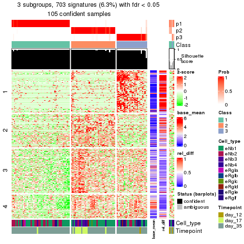</p>

</div>
<div id='tab-node-0121-get-signatures-3'>
<pre><code class="r">get_signatures(res, k = 4)
</code></pre>

<p></p>

</div>
</div>


Signature heatmaps where rows are not scaled:


<script>
$( function() {
	$( '#tabs-node-0121-get-signatures-no-scale' ).tabs();
} );
</script>
<div id='tabs-node-0121-get-signatures-no-scale'>
<ul>
<li><a href='#tab-node-0121-get-signatures-no-scale-1'>k = 2</a></li>
<li><a href='#tab-node-0121-get-signatures-no-scale-2'>k = 3</a></li>
<li><a href='#tab-node-0121-get-signatures-no-scale-3'>k = 4</a></li>
</ul>
<div id='tab-node-0121-get-signatures-no-scale-1'>
<pre><code class="r">get_signatures(res, k = 2, scale_rows = FALSE)
</code></pre>

<p></p>

</div>
<div id='tab-node-0121-get-signatures-no-scale-2'>
<pre><code class="r">get_signatures(res, k = 3, scale_rows = FALSE)
</code></pre>

<p>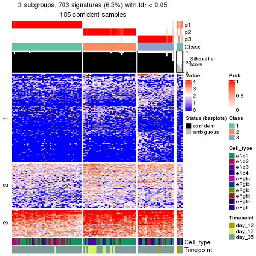</p>

</div>
<div id='tab-node-0121-get-signatures-no-scale-3'>
<pre><code class="r">get_signatures(res, k = 4, scale_rows = FALSE)
</code></pre>

<p></p>

</div>
</div>


Compare the overlap of signatures from different k:

```r
compare_signatures(res)
```


`get_signature()` returns a data frame invisibly. To get the list of signatures, the function
call should be assigned to a variable explicitly. In following code, if `plot` argument is set
to `FALSE`, no heatmap is plotted while only the differential analysis is performed.

```r
# code only for demonstration
tb = get_signature(res, k = ..., plot = FALSE)
```

An example of the output of `tb` is:

```
#>   which_row         fdr    mean_1    mean_2 scaled_mean_1 scaled_mean_2 km
#> 1        38 0.042760348  8.373488  9.131774    -0.5533452     0.5164555  1
#> 2        40 0.018707592  7.106213  8.469186    -0.6173731     0.5762149  1
#> 3        55 0.019134737 10.221463 11.207825    -0.6159697     0.5749050  1
#> 4        59 0.006059896  5.921854  7.869574    -0.6899429     0.6439467  1
#> 5        60 0.018055526  8.928898 10.211722    -0.6204761     0.5791110  1
#> 6        98 0.009384629 15.714769 14.887706     0.6635654    -0.6193277  2
...
```

The columns in `tb` are:

1. `which_row`: row indices corresponding to the input matrix.
2. `fdr`: FDR for the differential test. 
3. `mean_x`: The mean value in group x.
4. `scaled_mean_x`: The mean value in group x after rows are scaled.
5. `km`: Row groups if k-means clustering is applied to rows (which is done by automatically selecting number of clusters).

If there are too many signatures, `top_signatures = ...` can be set to only show the 
signatures with the highest FDRs:

```r
# code only for demonstration
# e.g. to show the top 500 most significant rows
tb = get_signature(res, k = ..., top_signatures = 500)
```

If the signatures are defined as these which are uniquely high in current group, `diff_method` argument
can be set to `"uniquely_high_in_one_group"`:

```r
# code only for demonstration
tb = get_signature(res, k = ..., diff_method = "uniquely_high_in_one_group")
```


UMAP plot which shows how samples are separated.


<script>
$( function() {
	$( '#tabs-node-0121-dimension-reduction' ).tabs();
} );
</script>
<div id='tabs-node-0121-dimension-reduction'>
<ul>
<li><a href='#tab-node-0121-dimension-reduction-1'>k = 2</a></li>
<li><a href='#tab-node-0121-dimension-reduction-2'>k = 3</a></li>
<li><a href='#tab-node-0121-dimension-reduction-3'>k = 4</a></li>
</ul>
<div id='tab-node-0121-dimension-reduction-1'>
<pre><code class="r">dimension_reduction(res, k = 2, method = &quot;UMAP&quot;)
</code></pre>

<p></p>

</div>
<div id='tab-node-0121-dimension-reduction-2'>
<pre><code class="r">dimension_reduction(res, k = 3, method = &quot;UMAP&quot;)
</code></pre>

<p></p>

</div>
<div id='tab-node-0121-dimension-reduction-3'>
<pre><code class="r">dimension_reduction(res, k = 4, method = &quot;UMAP&quot;)
</code></pre>

<p></p>

</div>
</div>


Following heatmap shows how subgroups are split when increasing `k`:

```r
collect_classes(res)
```


Test correlation between subgroups and known annotations. If the known
annotation is numeric, one-way ANOVA test is applied, and if the known
annotation is discrete, chi-squared contingency table test is applied.

```r
test_to_known_factors(res)
```

```
#>             n_sample Cell_type(p-value) Timepoint(p-value) k
#> ATC:skmeans      107           0.070625           0.056107 2
#> ATC:skmeans      105           0.000126           0.000080 3
#> ATC:skmeans       99           0.000288           0.000014 4
```


If matrix rows can be associated to genes, consider to use `functional_enrichment(res,
...)` to perform function enrichment for the signature genes. See [this vignette](https://jokergoo.github.io/cola_vignettes/functional_enrichment.html) for more detailed explanations.


 

---------------------------------------------------


### Node0122


Parent node: [Node012](#Node012).
Child nodes: 
                Node01121-leaf
        ,
                Node01122-leaf
        ,
                Node01211-leaf
        ,
                Node01212-leaf
        ,
                Node01221-leaf
        ,
                Node01222-leaf
        ,
                Node01223-leaf
        ,
                Node01311-leaf
        ,
                Node01312-leaf
        ,
                Node01321-leaf
        ,
                Node01322-leaf
        ,
                Node02121-leaf
        ,
                Node02122-leaf
        ,
                Node02311-leaf
        ,
                Node02312-leaf
        .


The object with results only for a single top-value method and a single partitioning method 
can be extracted as:

```r
res = res_rh["0122"]
```

A summary of `res` and all the functions that can be applied to it:

```r
res
```

```
#> A 'ConsensusPartition' object with k = 2, 3, 4.
#>   On a matrix with 8332 rows and 81 columns.
#>   Top rows (833) are extracted by 'ATC' method.
#>   Subgroups are detected by 'skmeans' method.
#>   Performed in total 150 partitions by row resampling.
#>   Best k for subgroups seems to be 3.
#> 
#> Following methods can be applied to this 'ConsensusPartition' object:
#>  [1] "cola_report"             "collect_classes"         "collect_plots"          
#>  [4] "collect_stats"           "colnames"                "compare_partitions"     
#>  [7] "compare_signatures"      "consensus_heatmap"       "dimension_reduction"    
#> [10] "functional_enrichment"   "get_anno_col"            "get_anno"               
#> [13] "get_classes"             "get_consensus"           "get_matrix"             
#> [16] "get_membership"          "get_param"               "get_signatures"         
#> [19] "get_stats"               "is_best_k"               "is_stable_k"            
#> [22] "membership_heatmap"      "ncol"                    "nrow"                   
#> [25] "plot_ecdf"               "predict_classes"         "rownames"               
#> [28] "select_partition_number" "show"                    "suggest_best_k"         
#> [31] "test_to_known_factors"   "top_rows_heatmap"
```

`collect_plots()` function collects all the plots made from `res` for all `k` (number of subgroups)
into one single page to provide an easy and fast comparison between different `k`.

```r
collect_plots(res)
```


The plots are:

- The first row: a plot of the eCDF (empirical cumulative distribution
  function) curves of the consensus matrix for each `k` and the heatmap of
  predicted classes for each `k`.
- The second row: heatmaps of the consensus matrix for each `k`.
- The third row: heatmaps of the membership matrix for each `k`.
- The fouth row: heatmaps of the signatures for each `k`.

All the plots in panels can be made by individual functions and they are
plotted later in this section.

`select_partition_number()` produces several plots showing different
statistics for choosing "optimized" `k`. There are following statistics:

- eCDF curves of the consensus matrix for each `k`;
- 1-PAC. [The PAC score](https://en.wikipedia.org/wiki/Consensus_clustering#Over-interpretation_potential_of_consensus_clustering)
  measures the proportion of the ambiguous subgrouping.
- Mean silhouette score.
- Concordance. The mean probability of fiting the consensus subgroup labels in all
  partitions.
- Area increased. Denote $A_k$ as the area under the eCDF curve for current
  `k`, the area increased is defined as $A_k - A_{k-1}$.
- Rand index. The percent of pairs of samples that are both in a same cluster
  or both are not in a same cluster in the partition of k and k-1.
- Jaccard index. The ratio of pairs of samples are both in a same cluster in
  the partition of k and k-1 and the pairs of samples are both in a same
  cluster in the partition k or k-1.

The detailed explanations of these statistics can be found in [the _cola_
vignette](https://jokergoo.github.io/cola_vignettes/cola.html#toc_13).

Generally speaking, higher 1-PAC score, higher mean silhouette score or higher
concordance corresponds to better partition. Rand index and Jaccard index
measure how similar the current partition is compared to partition with `k-1`.
If they are too similar, we won't accept `k` is better than `k-1`.

```r
select_partition_number(res)
```


The numeric values for all these statistics can be obtained by `get_stats()`.

```r
get_stats(res)
```

```
#>   k 1-PAC mean_silhouette concordance area_increased  Rand Jaccard
#> 2 2 1.000           0.992       0.996          0.503 0.498   0.498
#> 3 3 1.000           0.980       0.992          0.332 0.767   0.561
#> 4 4 0.739           0.835       0.876          0.119 0.882   0.659
```

`suggest_best_k()` suggests the best $k$ based on these statistics. The rules are as follows:

- All $k$ with Jaccard index larger than 0.95 are removed because increasing
  $k$ does not provide enough extra information. If all $k$ are removed, it is
  marked as no subgroup is detected.
- For all $k$ with 1-PAC score larger than 0.9, the maximal $k$ is taken as
  the best $k$, and other $k$ are marked as optional $k$.
- If it does not fit the second rule. The $k$ with the maximal vote of the
  highest 1-PAC score, highest mean silhouette, and highest concordance is
  taken as the best $k$.

```r
suggest_best_k(res)
```

```
#> [1] 3
#> attr(,"optional")
#> [1] 2
```

There is also optional best $k$ = 2 that is worth to check.

Following is the table of the partitions (You need to click the **show/hide
code output** link to see it). The membership matrix (columns with name `p*`)
is inferred by
[`clue::cl_consensus()`](https://www.rdocumentation.org/link/cl_consensus?package=clue)
function with the `SE` method. Basically the value in the membership matrix
represents the probability to belong to a certain group. The finall subgroup
label for an item is determined with the group with highest probability it
belongs to.

In `get_classes()` function, the entropy is calculated from the membership
matrix and the silhouette score is calculated from the consensus matrix.


<script>
$( function() {
	$( '#tabs-node-0122-get-classes' ).tabs();
} );
</script>
<div id='tabs-node-0122-get-classes'>
<ul>
<li><a href='#tab-node-0122-get-classes-1'>k = 2</a></li>
<li><a href='#tab-node-0122-get-classes-2'>k = 3</a></li>
<li><a href='#tab-node-0122-get-classes-3'>k = 4</a></li>
</ul>

<div id='tab-node-0122-get-classes-1'>
<p><a id='tab-node-0122-get-classes-1-a' style='color:#0366d6' href='#'>show/hide code output</a></p>
<pre><code class="r">cbind(get_classes(res, k = 2), get_membership(res, k = 2))
</code></pre>

<pre><code>#&gt;                 class entropy silhouette   p1   p2
#&gt; 1772122_301_C02     1   0.000      0.993 1.00 0.00
#&gt; 1772122_301_G12     1   0.000      0.993 1.00 0.00
#&gt; 1772122_301_F09     2   0.000      0.999 0.00 1.00
#&gt; 1772122_301_C12     1   0.000      0.993 1.00 0.00
#&gt; 1772122_301_F07     2   0.000      0.999 0.00 1.00
#&gt; 1772122_301_F05     1   0.000      0.993 1.00 0.00
#&gt; 1772122_301_D08     1   0.000      0.993 1.00 0.00
#&gt; 1772122_301_G10     1   0.000      0.993 1.00 0.00
#&gt; 1772122_301_C04     1   0.000      0.993 1.00 0.00
#&gt; 1772122_301_G07     1   0.000      0.993 1.00 0.00
#&gt; 1772122_301_B08     1   0.000      0.993 1.00 0.00
#&gt; 1772122_301_G04     2   0.000      0.999 0.00 1.00
#&gt; 1772122_301_H03     1   0.000      0.993 1.00 0.00
#&gt; 1772122_301_D10     1   0.000      0.993 1.00 0.00
#&gt; 1772122_301_C07     1   0.000      0.993 1.00 0.00
#&gt; 1772122_301_E07     1   0.000      0.993 1.00 0.00
#&gt; 1772122_301_A02     1   0.000      0.993 1.00 0.00
#&gt; 1772122_301_H05     2   0.000      0.999 0.00 1.00
#&gt; 1772122_301_H12     1   0.000      0.993 1.00 0.00
#&gt; 1772122_301_G09     2   0.000      0.999 0.00 1.00
#&gt; 1772122_301_G11     2   0.000      0.999 0.00 1.00
#&gt; 1772122_301_A01     2   0.000      0.999 0.00 1.00
#&gt; 1772122_299_D04     2   0.000      0.999 0.00 1.00
#&gt; 1772122_301_A09     2   0.000      0.999 0.00 1.00
#&gt; 1772122_301_B05     1   0.000      0.993 1.00 0.00
#&gt; 1772122_301_B12     2   0.000      0.999 0.00 1.00
#&gt; 1772122_301_F03     1   0.242      0.956 0.96 0.04
#&gt; 1772122_301_E02     2   0.000      0.999 0.00 1.00
#&gt; 1772122_300_C06     2   0.000      0.999 0.00 1.00
#&gt; 1772122_301_A05     2   0.000      0.999 0.00 1.00
#&gt; 1772122_302_A02     2   0.000      0.999 0.00 1.00
#&gt; 1772122_301_B11     2   0.000      0.999 0.00 1.00
#&gt; 1772122_301_H01     2   0.000      0.999 0.00 1.00
#&gt; 1772122_301_H06     2   0.000      0.999 0.00 1.00
#&gt; 1772122_301_F02     2   0.000      0.999 0.00 1.00
#&gt; 1772122_301_E01     1   0.000      0.993 1.00 0.00
#&gt; 1772122_301_C01     1   0.000      0.993 1.00 0.00
#&gt; 1772122_301_C06     1   0.000      0.993 1.00 0.00
#&gt; 1772122_301_B03     1   0.000      0.993 1.00 0.00
#&gt; 1772122_301_B06     1   0.000      0.993 1.00 0.00
#&gt; 1772122_301_D06     1   0.000      0.993 1.00 0.00
#&gt; 1772122_301_A11     1   0.000      0.993 1.00 0.00
#&gt; 1772122_301_F06     1   0.000      0.993 1.00 0.00
#&gt; 1772122_301_B07     1   0.000      0.993 1.00 0.00
#&gt; 1772122_301_D05     1   0.000      0.993 1.00 0.00
#&gt; 1772122_301_H04     2   0.000      0.999 0.00 1.00
#&gt; 1772122_301_G06     1   0.000      0.993 1.00 0.00
#&gt; 1772122_301_C10     2   0.000      0.999 0.00 1.00
#&gt; 1772122_301_C08     1   0.000      0.993 1.00 0.00
#&gt; 1772122_301_D07     1   0.000      0.993 1.00 0.00
#&gt; 1772122_301_D04     1   0.000      0.993 1.00 0.00
#&gt; 1772122_301_G05     1   0.000      0.993 1.00 0.00
#&gt; 1772122_301_H09     1   0.000      0.993 1.00 0.00
#&gt; 1772122_301_C11     1   0.000      0.993 1.00 0.00
#&gt; 1772122_301_F11     1   0.634      0.813 0.84 0.16
#&gt; 1772122_301_E10     1   0.000      0.993 1.00 0.00
#&gt; 1772122_301_C05     1   0.242      0.957 0.96 0.04
#&gt; 1772122_303_C09     2   0.000      0.999 0.00 1.00
#&gt; 1772122_301_E08     2   0.000      0.999 0.00 1.00
#&gt; 1772122_315_C07     2   0.000      0.999 0.00 1.00
#&gt; 1772122_301_A12     2   0.000      0.999 0.00 1.00
#&gt; 1772122_301_E04     2   0.000      0.999 0.00 1.00
#&gt; 1772122_301_E12     2   0.327      0.936 0.06 0.94
#&gt; 1772122_301_E05     2   0.000      0.999 0.00 1.00
#&gt; 1772122_301_D01     2   0.000      0.999 0.00 1.00
#&gt; 1772122_300_A02     2   0.000      0.999 0.00 1.00
#&gt; 1772122_180_E11     2   0.000      0.999 0.00 1.00
#&gt; 1772122_302_F09     2   0.000      0.999 0.00 1.00
#&gt; 1772122_300_H07     2   0.000      0.999 0.00 1.00
#&gt; 1772122_301_B02     2   0.000      0.999 0.00 1.00
#&gt; 1772122_301_E06     2   0.000      0.999 0.00 1.00
#&gt; 1772122_298_H11     2   0.000      0.999 0.00 1.00
#&gt; 1772122_301_A10     2   0.000      0.999 0.00 1.00
#&gt; 1772122_301_D02     2   0.000      0.999 0.00 1.00
#&gt; 1772122_301_F01     2   0.000      0.999 0.00 1.00
#&gt; 1772122_181_F09     2   0.000      0.999 0.00 1.00
#&gt; 1772122_301_G02     2   0.000      0.999 0.00 1.00
#&gt; 1772122_301_A03     2   0.000      0.999 0.00 1.00
#&gt; 1772122_301_E03     2   0.000      0.999 0.00 1.00
#&gt; 1772122_180_G09     2   0.000      0.999 0.00 1.00
#&gt; 1772122_181_E02     2   0.000      0.999 0.00 1.00
</code></pre>

<script>
$('#tab-node-0122-get-classes-1-a').parent().next().next().hide();
$('#tab-node-0122-get-classes-1-a').click(function(){
  $('#tab-node-0122-get-classes-1-a').parent().next().next().toggle();
  return(false);
});
</script>
</div>

<div id='tab-node-0122-get-classes-2'>
<p><a id='tab-node-0122-get-classes-2-a' style='color:#0366d6' href='#'>show/hide code output</a></p>
<pre><code class="r">cbind(get_classes(res, k = 3), get_membership(res, k = 3))
</code></pre>

<pre><code>#&gt;                 class entropy silhouette   p1   p2   p3
#&gt; 1772122_301_C02     1  0.0000      1.000 1.00 0.00 0.00
#&gt; 1772122_301_G12     1  0.0000      1.000 1.00 0.00 0.00
#&gt; 1772122_301_F09     3  0.0000      0.971 0.00 0.00 1.00
#&gt; 1772122_301_C12     1  0.0000      1.000 1.00 0.00 0.00
#&gt; 1772122_301_F07     3  0.0000      0.971 0.00 0.00 1.00
#&gt; 1772122_301_F05     1  0.0000      1.000 1.00 0.00 0.00
#&gt; 1772122_301_D08     1  0.0000      1.000 1.00 0.00 0.00
#&gt; 1772122_301_G10     1  0.0000      1.000 1.00 0.00 0.00
#&gt; 1772122_301_C04     1  0.0000      1.000 1.00 0.00 0.00
#&gt; 1772122_301_G07     1  0.0000      1.000 1.00 0.00 0.00
#&gt; 1772122_301_B08     1  0.0000      1.000 1.00 0.00 0.00
#&gt; 1772122_301_G04     3  0.0000      0.971 0.00 0.00 1.00
#&gt; 1772122_301_H03     1  0.0000      1.000 1.00 0.00 0.00
#&gt; 1772122_301_D10     1  0.0000      1.000 1.00 0.00 0.00
#&gt; 1772122_301_C07     3  0.0892      0.953 0.02 0.00 0.98
#&gt; 1772122_301_E07     1  0.0000      1.000 1.00 0.00 0.00
#&gt; 1772122_301_A02     3  0.0000      0.971 0.00 0.00 1.00
#&gt; 1772122_301_H05     3  0.0000      0.971 0.00 0.00 1.00
#&gt; 1772122_301_H12     1  0.0000      1.000 1.00 0.00 0.00
#&gt; 1772122_301_G09     3  0.0000      0.971 0.00 0.00 1.00
#&gt; 1772122_301_G11     3  0.0000      0.971 0.00 0.00 1.00
#&gt; 1772122_301_A01     2  0.0000      1.000 0.00 1.00 0.00
#&gt; 1772122_299_D04     3  0.0000      0.971 0.00 0.00 1.00
#&gt; 1772122_301_A09     3  0.0000      0.971 0.00 0.00 1.00
#&gt; 1772122_301_B05     1  0.0000      1.000 1.00 0.00 0.00
#&gt; 1772122_301_B12     2  0.0000      1.000 0.00 1.00 0.00
#&gt; 1772122_301_F03     2  0.0000      1.000 0.00 1.00 0.00
#&gt; 1772122_301_E02     2  0.0000      1.000 0.00 1.00 0.00
#&gt; 1772122_300_C06     3  0.0000      0.971 0.00 0.00 1.00
#&gt; 1772122_301_A05     2  0.0000      1.000 0.00 1.00 0.00
#&gt; 1772122_302_A02     2  0.0000      1.000 0.00 1.00 0.00
#&gt; 1772122_301_B11     3  0.0000      0.971 0.00 0.00 1.00
#&gt; 1772122_301_H01     2  0.0000      1.000 0.00 1.00 0.00
#&gt; 1772122_301_H06     3  0.0000      0.971 0.00 0.00 1.00
#&gt; 1772122_301_F02     3  0.6045      0.410 0.00 0.38 0.62
#&gt; 1772122_301_E01     1  0.0000      1.000 1.00 0.00 0.00
#&gt; 1772122_301_C01     1  0.0000      1.000 1.00 0.00 0.00
#&gt; 1772122_301_C06     1  0.0000      1.000 1.00 0.00 0.00
#&gt; 1772122_301_B03     1  0.0000      1.000 1.00 0.00 0.00
#&gt; 1772122_301_B06     1  0.0000      1.000 1.00 0.00 0.00
#&gt; 1772122_301_D06     1  0.0000      1.000 1.00 0.00 0.00
#&gt; 1772122_301_A11     1  0.0000      1.000 1.00 0.00 0.00
#&gt; 1772122_301_F06     1  0.0000      1.000 1.00 0.00 0.00
#&gt; 1772122_301_B07     1  0.0000      1.000 1.00 0.00 0.00
#&gt; 1772122_301_D05     1  0.0000      1.000 1.00 0.00 0.00
#&gt; 1772122_301_H04     3  0.0000      0.971 0.00 0.00 1.00
#&gt; 1772122_301_G06     1  0.0000      1.000 1.00 0.00 0.00
#&gt; 1772122_301_C10     3  0.0000      0.971 0.00 0.00 1.00
#&gt; 1772122_301_C08     1  0.0000      1.000 1.00 0.00 0.00
#&gt; 1772122_301_D07     1  0.0000      1.000 1.00 0.00 0.00
#&gt; 1772122_301_D04     1  0.0000      1.000 1.00 0.00 0.00
#&gt; 1772122_301_G05     1  0.0000      1.000 1.00 0.00 0.00
#&gt; 1772122_301_H09     1  0.0000      1.000 1.00 0.00 0.00
#&gt; 1772122_301_C11     1  0.0000      1.000 1.00 0.00 0.00
#&gt; 1772122_301_F11     3  0.0000      0.971 0.00 0.00 1.00
#&gt; 1772122_301_E10     1  0.0000      1.000 1.00 0.00 0.00
#&gt; 1772122_301_C05     3  0.0000      0.971 0.00 0.00 1.00
#&gt; 1772122_303_C09     2  0.0000      1.000 0.00 1.00 0.00
#&gt; 1772122_301_E08     3  0.5397      0.621 0.00 0.28 0.72
#&gt; 1772122_315_C07     2  0.0000      1.000 0.00 1.00 0.00
#&gt; 1772122_301_A12     2  0.0000      1.000 0.00 1.00 0.00
#&gt; 1772122_301_E04     2  0.0000      1.000 0.00 1.00 0.00
#&gt; 1772122_301_E12     2  0.0000      1.000 0.00 1.00 0.00
#&gt; 1772122_301_E05     2  0.0000      1.000 0.00 1.00 0.00
#&gt; 1772122_301_D01     2  0.0000      1.000 0.00 1.00 0.00
#&gt; 1772122_300_A02     3  0.0000      0.971 0.00 0.00 1.00
#&gt; 1772122_180_E11     3  0.0000      0.971 0.00 0.00 1.00
#&gt; 1772122_302_F09     3  0.0000      0.971 0.00 0.00 1.00
#&gt; 1772122_300_H07     2  0.0000      1.000 0.00 1.00 0.00
#&gt; 1772122_301_B02     2  0.0000      1.000 0.00 1.00 0.00
#&gt; 1772122_301_E06     2  0.0000      1.000 0.00 1.00 0.00
#&gt; 1772122_298_H11     2  0.0000      1.000 0.00 1.00 0.00
#&gt; 1772122_301_A10     2  0.0000      1.000 0.00 1.00 0.00
#&gt; 1772122_301_D02     3  0.0000      0.971 0.00 0.00 1.00
#&gt; 1772122_301_F01     2  0.0000      1.000 0.00 1.00 0.00
#&gt; 1772122_181_F09     3  0.0000      0.971 0.00 0.00 1.00
#&gt; 1772122_301_G02     2  0.0000      1.000 0.00 1.00 0.00
#&gt; 1772122_301_A03     2  0.0000      1.000 0.00 1.00 0.00
#&gt; 1772122_301_E03     2  0.0000      1.000 0.00 1.00 0.00
#&gt; 1772122_180_G09     2  0.0000      1.000 0.00 1.00 0.00
#&gt; 1772122_181_E02     3  0.0000      0.971 0.00 0.00 1.00
</code></pre>

<script>
$('#tab-node-0122-get-classes-2-a').parent().next().next().hide();
$('#tab-node-0122-get-classes-2-a').click(function(){
  $('#tab-node-0122-get-classes-2-a').parent().next().next().toggle();
  return(false);
});
</script>
</div>

<div id='tab-node-0122-get-classes-3'>
<p><a id='tab-node-0122-get-classes-3-a' style='color:#0366d6' href='#'>show/hide code output</a></p>
<pre><code class="r">cbind(get_classes(res, k = 4), get_membership(res, k = 4))
</code></pre>

<pre><code>#&gt;                 class entropy silhouette   p1   p2   p3   p4
#&gt; 1772122_301_C02     4  0.3975      0.843 0.24 0.00 0.00 0.76
#&gt; 1772122_301_G12     1  0.1211      0.917 0.96 0.00 0.00 0.04
#&gt; 1772122_301_F09     3  0.3975      0.845 0.00 0.00 0.76 0.24
#&gt; 1772122_301_C12     1  0.0707      0.933 0.98 0.00 0.00 0.02
#&gt; 1772122_301_F07     3  0.4277      0.816 0.00 0.00 0.72 0.28
#&gt; 1772122_301_F05     4  0.3801      0.849 0.22 0.00 0.00 0.78
#&gt; 1772122_301_D08     1  0.0000      0.941 1.00 0.00 0.00 0.00
#&gt; 1772122_301_G10     4  0.3801      0.849 0.22 0.00 0.00 0.78
#&gt; 1772122_301_C04     4  0.3975      0.843 0.24 0.00 0.00 0.76
#&gt; 1772122_301_G07     1  0.3801      0.630 0.78 0.00 0.00 0.22
#&gt; 1772122_301_B08     4  0.3801      0.849 0.22 0.00 0.00 0.78
#&gt; 1772122_301_G04     3  0.3610      0.865 0.00 0.00 0.80 0.20
#&gt; 1772122_301_H03     1  0.0707      0.933 0.98 0.00 0.00 0.02
#&gt; 1772122_301_D10     1  0.0000      0.941 1.00 0.00 0.00 0.00
#&gt; 1772122_301_C07     4  0.0707      0.683 0.00 0.00 0.02 0.98
#&gt; 1772122_301_E07     4  0.3801      0.849 0.22 0.00 0.00 0.78
#&gt; 1772122_301_A02     4  0.3172      0.500 0.00 0.00 0.16 0.84
#&gt; 1772122_301_H05     3  0.2647      0.864 0.00 0.00 0.88 0.12
#&gt; 1772122_301_H12     1  0.0000      0.941 1.00 0.00 0.00 0.00
#&gt; 1772122_301_G09     3  0.3172      0.868 0.00 0.00 0.84 0.16
#&gt; 1772122_301_G11     3  0.3610      0.865 0.00 0.00 0.80 0.20
#&gt; 1772122_301_A01     2  0.5810      0.655 0.02 0.72 0.20 0.06
#&gt; 1772122_299_D04     3  0.3400      0.867 0.00 0.00 0.82 0.18
#&gt; 1772122_301_A09     3  0.3610      0.865 0.00 0.00 0.80 0.20
#&gt; 1772122_301_B05     1  0.0000      0.941 1.00 0.00 0.00 0.00
#&gt; 1772122_301_B12     2  0.1411      0.905 0.02 0.96 0.00 0.02
#&gt; 1772122_301_F03     2  0.0707      0.906 0.02 0.98 0.00 0.00
#&gt; 1772122_301_E02     2  0.2647      0.893 0.00 0.88 0.12 0.00
#&gt; 1772122_300_C06     3  0.0707      0.836 0.00 0.02 0.98 0.00
#&gt; 1772122_301_A05     2  0.0000      0.911 0.00 1.00 0.00 0.00
#&gt; 1772122_302_A02     2  0.4288      0.844 0.02 0.82 0.14 0.02
#&gt; 1772122_301_B11     3  0.3610      0.865 0.00 0.00 0.80 0.20
#&gt; 1772122_301_H01     2  0.0000      0.911 0.00 1.00 0.00 0.00
#&gt; 1772122_301_H06     3  0.3610      0.865 0.00 0.00 0.80 0.20
#&gt; 1772122_301_F02     3  0.7198      0.545 0.00 0.28 0.54 0.18
#&gt; 1772122_301_E01     1  0.0000      0.941 1.00 0.00 0.00 0.00
#&gt; 1772122_301_C01     1  0.0000      0.941 1.00 0.00 0.00 0.00
#&gt; 1772122_301_C06     4  0.3610      0.842 0.20 0.00 0.00 0.80
#&gt; 1772122_301_B03     1  0.0000      0.941 1.00 0.00 0.00 0.00
#&gt; 1772122_301_B06     4  0.4855      0.587 0.40 0.00 0.00 0.60
#&gt; 1772122_301_D06     4  0.4134      0.821 0.26 0.00 0.00 0.74
#&gt; 1772122_301_A11     1  0.0000      0.941 1.00 0.00 0.00 0.00
#&gt; 1772122_301_F06     1  0.0000      0.941 1.00 0.00 0.00 0.00
#&gt; 1772122_301_B07     1  0.4948     -0.107 0.56 0.00 0.00 0.44
#&gt; 1772122_301_D05     1  0.0707      0.933 0.98 0.00 0.00 0.02
#&gt; 1772122_301_H04     3  0.4277      0.817 0.00 0.00 0.72 0.28
#&gt; 1772122_301_G06     1  0.0707      0.933 0.98 0.00 0.00 0.02
#&gt; 1772122_301_C10     3  0.3801      0.857 0.00 0.00 0.78 0.22
#&gt; 1772122_301_C08     4  0.3975      0.843 0.24 0.00 0.00 0.76
#&gt; 1772122_301_D07     1  0.1211      0.917 0.96 0.00 0.00 0.04
#&gt; 1772122_301_D04     4  0.3975      0.843 0.24 0.00 0.00 0.76
#&gt; 1772122_301_G05     4  0.3975      0.843 0.24 0.00 0.00 0.76
#&gt; 1772122_301_H09     1  0.0000      0.941 1.00 0.00 0.00 0.00
#&gt; 1772122_301_C11     1  0.0000      0.941 1.00 0.00 0.00 0.00
#&gt; 1772122_301_F11     4  0.3801      0.366 0.00 0.00 0.22 0.78
#&gt; 1772122_301_E10     4  0.3610      0.842 0.20 0.00 0.00 0.80
#&gt; 1772122_301_C05     4  0.2011      0.623 0.00 0.00 0.08 0.92
#&gt; 1772122_303_C09     2  0.2921      0.887 0.00 0.86 0.14 0.00
#&gt; 1772122_301_E08     3  0.3801      0.601 0.00 0.22 0.78 0.00
#&gt; 1772122_315_C07     2  0.2706      0.905 0.00 0.90 0.08 0.02
#&gt; 1772122_301_A12     2  0.1411      0.905 0.02 0.96 0.00 0.02
#&gt; 1772122_301_E04     2  0.2647      0.893 0.00 0.88 0.12 0.00
#&gt; 1772122_301_E12     2  0.2647      0.893 0.00 0.88 0.12 0.00
#&gt; 1772122_301_E05     2  0.3037      0.899 0.00 0.88 0.10 0.02
#&gt; 1772122_301_D01     2  0.0000      0.911 0.00 1.00 0.00 0.00
#&gt; 1772122_300_A02     3  0.0707      0.836 0.00 0.02 0.98 0.00
#&gt; 1772122_180_E11     3  0.0707      0.836 0.00 0.02 0.98 0.00
#&gt; 1772122_302_F09     3  0.0707      0.836 0.00 0.02 0.98 0.00
#&gt; 1772122_300_H07     2  0.5173      0.699 0.00 0.66 0.32 0.02
#&gt; 1772122_301_B02     2  0.0707      0.906 0.02 0.98 0.00 0.00
#&gt; 1772122_301_E06     2  0.2647      0.893 0.00 0.88 0.12 0.00
#&gt; 1772122_298_H11     2  0.4079      0.850 0.00 0.80 0.18 0.02
#&gt; 1772122_301_A10     2  0.0707      0.910 0.00 0.98 0.00 0.02
#&gt; 1772122_301_D02     3  0.2335      0.820 0.00 0.06 0.92 0.02
#&gt; 1772122_301_F01     2  0.1411      0.905 0.02 0.96 0.00 0.02
#&gt; 1772122_181_F09     3  0.0707      0.836 0.00 0.02 0.98 0.00
#&gt; 1772122_301_G02     2  0.2647      0.893 0.00 0.88 0.12 0.00
#&gt; 1772122_301_A03     2  0.0000      0.911 0.00 1.00 0.00 0.00
#&gt; 1772122_301_E03     2  0.1411      0.905 0.02 0.96 0.00 0.02
#&gt; 1772122_180_G09     2  0.3400      0.865 0.00 0.82 0.18 0.00
#&gt; 1772122_181_E02     3  0.0707      0.836 0.00 0.02 0.98 0.00
</code></pre>

<script>
$('#tab-node-0122-get-classes-3-a').parent().next().next().hide();
$('#tab-node-0122-get-classes-3-a').click(function(){
  $('#tab-node-0122-get-classes-3-a').parent().next().next().toggle();
  return(false);
});
</script>
</div>
</div>

Heatmaps for the consensus matrix. It visualizes the probability of two
samples to be in a same group.


<script>
$( function() {
	$( '#tabs-node-0122-consensus-heatmap' ).tabs();
} );
</script>
<div id='tabs-node-0122-consensus-heatmap'>
<ul>
<li><a href='#tab-node-0122-consensus-heatmap-1'>k = 2</a></li>
<li><a href='#tab-node-0122-consensus-heatmap-2'>k = 3</a></li>
<li><a href='#tab-node-0122-consensus-heatmap-3'>k = 4</a></li>
</ul>
<div id='tab-node-0122-consensus-heatmap-1'>
<pre><code class="r">consensus_heatmap(res, k = 2)
</code></pre>

<p></p>

</div>
<div id='tab-node-0122-consensus-heatmap-2'>
<pre><code class="r">consensus_heatmap(res, k = 3)
</code></pre>

<p>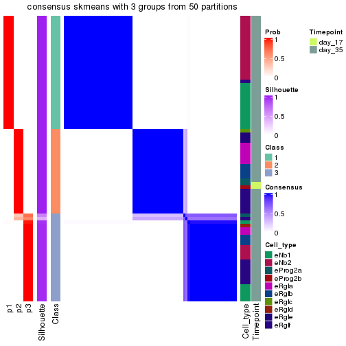</p>

</div>
<div id='tab-node-0122-consensus-heatmap-3'>
<pre><code class="r">consensus_heatmap(res, k = 4)
</code></pre>

<p></p>

</div>
</div>

Heatmaps for the membership of samples in all partitions to see how consistent they are:


<script>
$( function() {
	$( '#tabs-node-0122-membership-heatmap' ).tabs();
} );
</script>
<div id='tabs-node-0122-membership-heatmap'>
<ul>
<li><a href='#tab-node-0122-membership-heatmap-1'>k = 2</a></li>
<li><a href='#tab-node-0122-membership-heatmap-2'>k = 3</a></li>
<li><a href='#tab-node-0122-membership-heatmap-3'>k = 4</a></li>
</ul>
<div id='tab-node-0122-membership-heatmap-1'>
<pre><code class="r">membership_heatmap(res, k = 2)
</code></pre>

<p>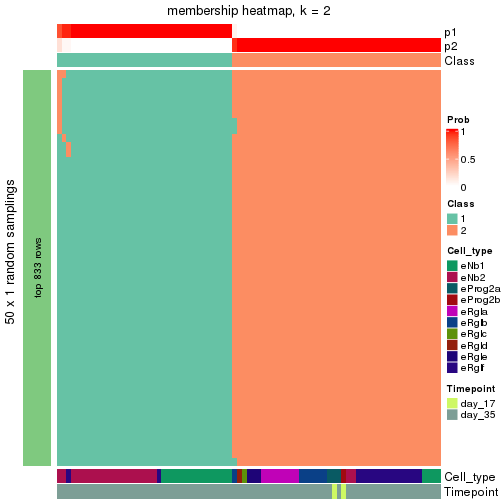</p>

</div>
<div id='tab-node-0122-membership-heatmap-2'>
<pre><code class="r">membership_heatmap(res, k = 3)
</code></pre>

<p></p>

</div>
<div id='tab-node-0122-membership-heatmap-3'>
<pre><code class="r">membership_heatmap(res, k = 4)
</code></pre>

<p></p>

</div>
</div>

As soon as the classes for columns are determined, the signatures
that are significantly different between subgroups can be looked for. 
Following are the heatmaps for signatures.


Signature heatmaps where rows are scaled:


<script>
$( function() {
	$( '#tabs-node-0122-get-signatures' ).tabs();
} );
</script>
<div id='tabs-node-0122-get-signatures'>
<ul>
<li><a href='#tab-node-0122-get-signatures-1'>k = 2</a></li>
<li><a href='#tab-node-0122-get-signatures-2'>k = 3</a></li>
<li><a href='#tab-node-0122-get-signatures-3'>k = 4</a></li>
</ul>
<div id='tab-node-0122-get-signatures-1'>
<pre><code class="r">get_signatures(res, k = 2)
</code></pre>

<p></p>

</div>
<div id='tab-node-0122-get-signatures-2'>
<pre><code class="r">get_signatures(res, k = 3)
</code></pre>

<p></p>

</div>
<div id='tab-node-0122-get-signatures-3'>
<pre><code class="r">get_signatures(res, k = 4)
</code></pre>

<p></p>

</div>
</div>


Signature heatmaps where rows are not scaled:


<script>
$( function() {
	$( '#tabs-node-0122-get-signatures-no-scale' ).tabs();
} );
</script>
<div id='tabs-node-0122-get-signatures-no-scale'>
<ul>
<li><a href='#tab-node-0122-get-signatures-no-scale-1'>k = 2</a></li>
<li><a href='#tab-node-0122-get-signatures-no-scale-2'>k = 3</a></li>
<li><a href='#tab-node-0122-get-signatures-no-scale-3'>k = 4</a></li>
</ul>
<div id='tab-node-0122-get-signatures-no-scale-1'>
<pre><code class="r">get_signatures(res, k = 2, scale_rows = FALSE)
</code></pre>

<p></p>

</div>
<div id='tab-node-0122-get-signatures-no-scale-2'>
<pre><code class="r">get_signatures(res, k = 3, scale_rows = FALSE)
</code></pre>

<p></p>

</div>
<div id='tab-node-0122-get-signatures-no-scale-3'>
<pre><code class="r">get_signatures(res, k = 4, scale_rows = FALSE)
</code></pre>

<p></p>

</div>
</div>


Compare the overlap of signatures from different k:

```r
compare_signatures(res)
```


`get_signature()` returns a data frame invisibly. To get the list of signatures, the function
call should be assigned to a variable explicitly. In following code, if `plot` argument is set
to `FALSE`, no heatmap is plotted while only the differential analysis is performed.

```r
# code only for demonstration
tb = get_signature(res, k = ..., plot = FALSE)
```

An example of the output of `tb` is:

```
#>   which_row         fdr    mean_1    mean_2 scaled_mean_1 scaled_mean_2 km
#> 1        38 0.042760348  8.373488  9.131774    -0.5533452     0.5164555  1
#> 2        40 0.018707592  7.106213  8.469186    -0.6173731     0.5762149  1
#> 3        55 0.019134737 10.221463 11.207825    -0.6159697     0.5749050  1
#> 4        59 0.006059896  5.921854  7.869574    -0.6899429     0.6439467  1
#> 5        60 0.018055526  8.928898 10.211722    -0.6204761     0.5791110  1
#> 6        98 0.009384629 15.714769 14.887706     0.6635654    -0.6193277  2
...
```

The columns in `tb` are:

1. `which_row`: row indices corresponding to the input matrix.
2. `fdr`: FDR for the differential test. 
3. `mean_x`: The mean value in group x.
4. `scaled_mean_x`: The mean value in group x after rows are scaled.
5. `km`: Row groups if k-means clustering is applied to rows (which is done by automatically selecting number of clusters).

If there are too many signatures, `top_signatures = ...` can be set to only show the 
signatures with the highest FDRs:

```r
# code only for demonstration
# e.g. to show the top 500 most significant rows
tb = get_signature(res, k = ..., top_signatures = 500)
```

If the signatures are defined as these which are uniquely high in current group, `diff_method` argument
can be set to `"uniquely_high_in_one_group"`:

```r
# code only for demonstration
tb = get_signature(res, k = ..., diff_method = "uniquely_high_in_one_group")
```


UMAP plot which shows how samples are separated.


<script>
$( function() {
	$( '#tabs-node-0122-dimension-reduction' ).tabs();
} );
</script>
<div id='tabs-node-0122-dimension-reduction'>
<ul>
<li><a href='#tab-node-0122-dimension-reduction-1'>k = 2</a></li>
<li><a href='#tab-node-0122-dimension-reduction-2'>k = 3</a></li>
<li><a href='#tab-node-0122-dimension-reduction-3'>k = 4</a></li>
</ul>
<div id='tab-node-0122-dimension-reduction-1'>
<pre><code class="r">dimension_reduction(res, k = 2, method = &quot;UMAP&quot;)
</code></pre>

<p></p>

</div>
<div id='tab-node-0122-dimension-reduction-2'>
<pre><code class="r">dimension_reduction(res, k = 3, method = &quot;UMAP&quot;)
</code></pre>

<p></p>

</div>
<div id='tab-node-0122-dimension-reduction-3'>
<pre><code class="r">dimension_reduction(res, k = 4, method = &quot;UMAP&quot;)
</code></pre>

<p></p>

</div>
</div>


Following heatmap shows how subgroups are split when increasing `k`:

```r
collect_classes(res)
```


Test correlation between subgroups and known annotations. If the known
annotation is numeric, one-way ANOVA test is applied, and if the known
annotation is discrete, chi-squared contingency table test is applied.

```r
test_to_known_factors(res)
```

```
#>             n_sample Cell_type(p-value) Timepoint(p-value) k
#> ATC:skmeans       81           1.98e-08             0.5522 2
#> ATC:skmeans       80           4.78e-07             0.0913 3
#> ATC:skmeans       78           1.28e-05             0.2020 4
```


If matrix rows can be associated to genes, consider to use `functional_enrichment(res,
...)` to perform function enrichment for the signature genes. See [this vignette](https://jokergoo.github.io/cola_vignettes/functional_enrichment.html) for more detailed explanations.


 

---------------------------------------------------


### Node013


Parent node: [Node01](#Node01).
Child nodes: 
                Node0111-leaf
        ,
                [Node0112](#Node0112)
        ,
                Node0113-leaf
        ,
                [Node0121](#Node0121)
        ,
                [Node0122](#Node0122)
        ,
                [Node0131](#Node0131)
        ,
                [Node0132](#Node0132)
        ,
                Node0133-leaf
        ,
                Node0211-leaf
        ,
                [Node0212](#Node0212)
        ,
                Node0221-leaf
        ,
                Node0222-leaf
        ,
                Node0223-leaf
        ,
                [Node0231](#Node0231)
        ,
                Node0232-leaf
        ,
                Node0241-leaf
        ,
                Node0242-leaf
        ,
                Node0243-leaf
        ,
                Node0331-leaf
        ,
                Node0332-leaf
        ,
                Node0333-leaf
        ,
                Node0334-leaf
        .


The object with results only for a single top-value method and a single partitioning method 
can be extracted as:

```r
res = res_rh["013"]
```

A summary of `res` and all the functions that can be applied to it:

```r
res
```

```
#> A 'ConsensusPartition' object with k = 2, 3, 4.
#>   On a matrix with 9765 rows and 287 columns.
#>   Top rows (976) are extracted by 'ATC' method.
#>   Subgroups are detected by 'skmeans' method.
#>   Performed in total 150 partitions by row resampling.
#>   Best k for subgroups seems to be 3.
#> 
#> Following methods can be applied to this 'ConsensusPartition' object:
#>  [1] "cola_report"             "collect_classes"         "collect_plots"          
#>  [4] "collect_stats"           "colnames"                "compare_partitions"     
#>  [7] "compare_signatures"      "consensus_heatmap"       "dimension_reduction"    
#> [10] "functional_enrichment"   "get_anno_col"            "get_anno"               
#> [13] "get_classes"             "get_consensus"           "get_matrix"             
#> [16] "get_membership"          "get_param"               "get_signatures"         
#> [19] "get_stats"               "is_best_k"               "is_stable_k"            
#> [22] "membership_heatmap"      "ncol"                    "nrow"                   
#> [25] "plot_ecdf"               "predict_classes"         "rownames"               
#> [28] "select_partition_number" "show"                    "suggest_best_k"         
#> [31] "test_to_known_factors"   "top_rows_heatmap"
```

`collect_plots()` function collects all the plots made from `res` for all `k` (number of subgroups)
into one single page to provide an easy and fast comparison between different `k`.

```r
collect_plots(res)
```

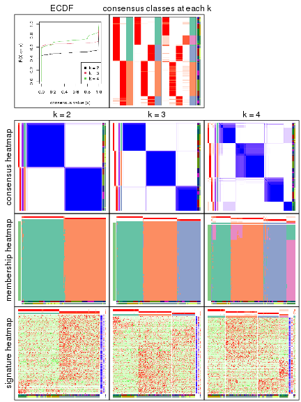

The plots are:

- The first row: a plot of the eCDF (empirical cumulative distribution
  function) curves of the consensus matrix for each `k` and the heatmap of
  predicted classes for each `k`.
- The second row: heatmaps of the consensus matrix for each `k`.
- The third row: heatmaps of the membership matrix for each `k`.
- The fouth row: heatmaps of the signatures for each `k`.

All the plots in panels can be made by individual functions and they are
plotted later in this section.

`select_partition_number()` produces several plots showing different
statistics for choosing "optimized" `k`. There are following statistics:

- eCDF curves of the consensus matrix for each `k`;
- 1-PAC. [The PAC score](https://en.wikipedia.org/wiki/Consensus_clustering#Over-interpretation_potential_of_consensus_clustering)
  measures the proportion of the ambiguous subgrouping.
- Mean silhouette score.
- Concordance. The mean probability of fiting the consensus subgroup labels in all
  partitions.
- Area increased. Denote $A_k$ as the area under the eCDF curve for current
  `k`, the area increased is defined as $A_k - A_{k-1}$.
- Rand index. The percent of pairs of samples that are both in a same cluster
  or both are not in a same cluster in the partition of k and k-1.
- Jaccard index. The ratio of pairs of samples are both in a same cluster in
  the partition of k and k-1 and the pairs of samples are both in a same
  cluster in the partition k or k-1.

The detailed explanations of these statistics can be found in [the _cola_
vignette](https://jokergoo.github.io/cola_vignettes/cola.html#toc_13).

Generally speaking, higher 1-PAC score, higher mean silhouette score or higher
concordance corresponds to better partition. Rand index and Jaccard index
measure how similar the current partition is compared to partition with `k-1`.
If they are too similar, we won't accept `k` is better than `k-1`.

```r
select_partition_number(res)
```


The numeric values for all these statistics can be obtained by `get_stats()`.

```r
get_stats(res)
```

```
#>   k 1-PAC mean_silhouette concordance area_increased  Rand Jaccard
#> 2 2 1.000           0.977       0.991         0.5022 0.498   0.498
#> 3 3 1.000           0.978       0.991         0.3175 0.765   0.561
#> 4 4 0.828           0.892       0.923         0.0851 0.925   0.785
```

`suggest_best_k()` suggests the best $k$ based on these statistics. The rules are as follows:

- All $k$ with Jaccard index larger than 0.95 are removed because increasing
  $k$ does not provide enough extra information. If all $k$ are removed, it is
  marked as no subgroup is detected.
- For all $k$ with 1-PAC score larger than 0.9, the maximal $k$ is taken as
  the best $k$, and other $k$ are marked as optional $k$.
- If it does not fit the second rule. The $k$ with the maximal vote of the
  highest 1-PAC score, highest mean silhouette, and highest concordance is
  taken as the best $k$.

```r
suggest_best_k(res)
```

```
#> [1] 3
#> attr(,"optional")
#> [1] 2
```

There is also optional best $k$ = 2 that is worth to check.

Following is the table of the partitions (You need to click the **show/hide
code output** link to see it). The membership matrix (columns with name `p*`)
is inferred by
[`clue::cl_consensus()`](https://www.rdocumentation.org/link/cl_consensus?package=clue)
function with the `SE` method. Basically the value in the membership matrix
represents the probability to belong to a certain group. The finall subgroup
label for an item is determined with the group with highest probability it
belongs to.

In `get_classes()` function, the entropy is calculated from the membership
matrix and the silhouette score is calculated from the consensus matrix.


<script>
$( function() {
	$( '#tabs-node-013-get-classes' ).tabs();
} );
</script>
<div id='tabs-node-013-get-classes'>
<ul>
<li><a href='#tab-node-013-get-classes-1'>k = 2</a></li>
<li><a href='#tab-node-013-get-classes-2'>k = 3</a></li>
<li><a href='#tab-node-013-get-classes-3'>k = 4</a></li>
</ul>

<div id='tab-node-013-get-classes-1'>
<p><a id='tab-node-013-get-classes-1-a' style='color:#0366d6' href='#'>show/hide code output</a></p>
<pre><code class="r">cbind(get_classes(res, k = 2), get_membership(res, k = 2))
</code></pre>

<pre><code>#&gt;                 class entropy silhouette   p1   p2
#&gt; 1772122_298_F09     2   0.000     0.9870 0.00 1.00
#&gt; 1772122_300_E10     2   0.000     0.9870 0.00 1.00
#&gt; 1772122_315_A07     1   0.000     0.9937 1.00 0.00
#&gt; 1772122_325_G03     1   0.000     0.9937 1.00 0.00
#&gt; 1772122_325_A08     1   0.000     0.9937 1.00 0.00
#&gt; 1772122_263_G11     1   0.000     0.9937 1.00 0.00
#&gt; 1772122_299_A07     2   0.000     0.9870 0.00 1.00
#&gt; 1772122_326_H08     1   0.000     0.9937 1.00 0.00
#&gt; 1772122_303_B01     1   0.000     0.9937 1.00 0.00
#&gt; 1772122_298_D07     2   0.000     0.9870 0.00 1.00
#&gt; 1772122_298_D11     1   0.000     0.9937 1.00 0.00
#&gt; 1772122_299_A05     1   0.000     0.9937 1.00 0.00
#&gt; 1772122_299_H06     2   0.000     0.9870 0.00 1.00
#&gt; 1772122_299_A06     1   0.000     0.9937 1.00 0.00
#&gt; 1772122_299_C05     1   0.000     0.9937 1.00 0.00
#&gt; 1772122_299_H04     1   0.000     0.9937 1.00 0.00
#&gt; 1772122_299_G07     2   0.000     0.9870 0.00 1.00
#&gt; 1772122_300_C09     2   0.000     0.9870 0.00 1.00
#&gt; 1772122_302_H07     1   0.000     0.9937 1.00 0.00
#&gt; 1772122_298_C02     2   0.000     0.9870 0.00 1.00
#&gt; 1772122_300_E12     1   0.000     0.9937 1.00 0.00
#&gt; 1772122_299_H12     2   0.242     0.9477 0.04 0.96
#&gt; 1772122_300_H05     2   0.000     0.9870 0.00 1.00
#&gt; 1772122_299_B04     1   0.000     0.9937 1.00 0.00
#&gt; 1772122_298_F02     2   0.000     0.9870 0.00 1.00
#&gt; 1772122_315_B01     1   0.000     0.9937 1.00 0.00
#&gt; 1772122_299_C10     1   0.242     0.9552 0.96 0.04
#&gt; 1772122_300_D07     1   0.000     0.9937 1.00 0.00
#&gt; 1772122_306_E09     1   0.000     0.9937 1.00 0.00
#&gt; 1772122_305_A01     1   0.000     0.9937 1.00 0.00
#&gt; 1772122_306_C10     1   0.000     0.9937 1.00 0.00
#&gt; 1772122_303_D01     1   0.000     0.9937 1.00 0.00
#&gt; 1772122_305_E12     1   0.529     0.8652 0.88 0.12
#&gt; 1772122_303_F12     1   0.000     0.9937 1.00 0.00
#&gt; 1772122_306_D12     1   0.000     0.9937 1.00 0.00
#&gt; 1772122_303_E07     1   0.000     0.9937 1.00 0.00
#&gt; 1772122_306_C09     1   0.000     0.9937 1.00 0.00
#&gt; 1772122_305_G10     1   0.000     0.9937 1.00 0.00
#&gt; 1772122_315_F10     1   0.000     0.9937 1.00 0.00
#&gt; 1772122_306_G09     1   0.000     0.9937 1.00 0.00
#&gt; 1772122_315_B05     1   0.000     0.9937 1.00 0.00
#&gt; 1772122_306_H08     1   0.000     0.9937 1.00 0.00
#&gt; 1772122_305_G02     1   0.000     0.9937 1.00 0.00
#&gt; 1772122_262_A05     1   0.000     0.9937 1.00 0.00
#&gt; 1772122_305_H09     1   0.000     0.9937 1.00 0.00
#&gt; 1772122_306_F11     1   0.000     0.9937 1.00 0.00
#&gt; 1772122_315_B11     1   0.000     0.9937 1.00 0.00
#&gt; 1772122_306_C11     1   0.000     0.9937 1.00 0.00
#&gt; 1772122_315_D08     1   0.000     0.9937 1.00 0.00
#&gt; 1772122_306_E07     1   0.000     0.9937 1.00 0.00
#&gt; 1772122_306_A02     1   0.000     0.9937 1.00 0.00
#&gt; 1772122_315_G12     1   0.000     0.9937 1.00 0.00
#&gt; 1772122_306_D11     1   0.000     0.9937 1.00 0.00
#&gt; 1772122_306_E10     1   0.000     0.9937 1.00 0.00
#&gt; 1772122_306_B05     1   0.000     0.9937 1.00 0.00
#&gt; 1772122_205_B05     1   0.000     0.9937 1.00 0.00
#&gt; 1772122_306_F04     1   0.000     0.9937 1.00 0.00
#&gt; 1772122_315_A03     1   0.000     0.9937 1.00 0.00
#&gt; 1772122_305_H02     2   0.000     0.9870 0.00 1.00
#&gt; 1772122_305_H04     1   0.000     0.9937 1.00 0.00
#&gt; 1772122_315_C12     1   0.000     0.9937 1.00 0.00
#&gt; 1772122_303_A08     2   0.999     0.0869 0.48 0.52
#&gt; 1772122_303_F04     1   0.000     0.9937 1.00 0.00
#&gt; 1772122_303_A10     1   0.141     0.9748 0.98 0.02
#&gt; 1772122_305_A10     1   0.000     0.9937 1.00 0.00
#&gt; 1772122_303_G08     1   0.000     0.9937 1.00 0.00
#&gt; 1772122_299_D12     1   0.000     0.9937 1.00 0.00
#&gt; 1772122_305_E10     1   0.000     0.9937 1.00 0.00
#&gt; 1772122_262_F01     1   0.000     0.9937 1.00 0.00
#&gt; 1772122_298_C06     2   0.000     0.9870 0.00 1.00
#&gt; 1772122_305_A04     1   0.000     0.9937 1.00 0.00
#&gt; 1772122_305_A05     1   0.000     0.9937 1.00 0.00
#&gt; 1772122_305_G04     1   0.000     0.9937 1.00 0.00
#&gt; 1772122_306_B10     1   0.000     0.9937 1.00 0.00
#&gt; 1772122_303_C11     1   0.000     0.9937 1.00 0.00
#&gt; 1772122_305_B10     1   0.000     0.9937 1.00 0.00
#&gt; 1772122_306_E01     1   0.000     0.9937 1.00 0.00
#&gt; 1772122_180_A07     2   0.000     0.9870 0.00 1.00
#&gt; 1772122_180_H01     2   0.000     0.9870 0.00 1.00
#&gt; 1772122_298_G07     2   0.000     0.9870 0.00 1.00
#&gt; 1772122_299_A02     2   0.000     0.9870 0.00 1.00
#&gt; 1772122_298_E08     2   0.000     0.9870 0.00 1.00
#&gt; 1772122_302_E03     1   0.000     0.9937 1.00 0.00
#&gt; 1772122_300_B09     1   0.000     0.9937 1.00 0.00
#&gt; 1772122_181_C03     2   0.000     0.9870 0.00 1.00
#&gt; 1772122_181_D01     2   0.000     0.9870 0.00 1.00
#&gt; 1772122_180_G08     2   0.000     0.9870 0.00 1.00
#&gt; 1772122_180_G11     2   0.000     0.9870 0.00 1.00
#&gt; 1772122_300_G12     2   0.000     0.9870 0.00 1.00
#&gt; 1772122_298_D06     2   0.000     0.9870 0.00 1.00
#&gt; 1772122_299_H05     2   0.000     0.9870 0.00 1.00
#&gt; 1772122_180_B03     2   0.000     0.9870 0.00 1.00
#&gt; 1772122_300_G07     2   0.000     0.9870 0.00 1.00
#&gt; 1772122_298_E01     2   0.000     0.9870 0.00 1.00
#&gt; 1772122_298_G03     2   0.000     0.9870 0.00 1.00
#&gt; 1772122_181_D12     1   0.000     0.9937 1.00 0.00
#&gt; 1772122_181_D07     2   0.000     0.9870 0.00 1.00
#&gt; 1772122_298_H02     2   0.000     0.9870 0.00 1.00
#&gt; 1772122_181_H05     2   0.000     0.9870 0.00 1.00
#&gt; 1772122_298_F11     1   0.000     0.9937 1.00 0.00
#&gt; 1772122_181_G07     2   0.000     0.9870 0.00 1.00
#&gt; 1772122_182_B06     2   0.000     0.9870 0.00 1.00
#&gt; 1772122_299_G03     2   0.000     0.9870 0.00 1.00
#&gt; 1772122_298_A10     2   0.000     0.9870 0.00 1.00
#&gt; 1772122_298_E07     2   0.000     0.9870 0.00 1.00
#&gt; 1772122_300_C08     2   0.000     0.9870 0.00 1.00
#&gt; 1772122_298_D02     2   0.904     0.5326 0.32 0.68
#&gt; 1772122_182_B04     2   0.000     0.9870 0.00 1.00
#&gt; 1772122_181_C11     2   0.000     0.9870 0.00 1.00
#&gt; 1772122_181_H04     2   0.000     0.9870 0.00 1.00
#&gt; 1772122_180_D05     2   0.000     0.9870 0.00 1.00
#&gt; 1772122_299_C12     2   0.722     0.7474 0.20 0.80
#&gt; 1772122_302_H06     1   0.000     0.9937 1.00 0.00
#&gt; 1772122_298_E12     1   0.000     0.9937 1.00 0.00
#&gt; 1772122_298_B08     2   0.000     0.9870 0.00 1.00
#&gt; 1772122_300_B10     2   0.000     0.9870 0.00 1.00
#&gt; 1772122_180_G12     2   0.000     0.9870 0.00 1.00
#&gt; 1772122_180_B12     1   0.634     0.8119 0.84 0.16
#&gt; 1772122_298_F06     1   0.402     0.9128 0.92 0.08
#&gt; 1772122_300_C04     2   0.995     0.1579 0.46 0.54
#&gt; 1772122_302_H01     1   0.000     0.9937 1.00 0.00
#&gt; 1772122_302_D02     1   0.584     0.8388 0.86 0.14
#&gt; 1772122_180_A03     1   0.000     0.9937 1.00 0.00
#&gt; 1772122_180_F04     2   0.000     0.9870 0.00 1.00
#&gt; 1772122_299_E12     2   0.000     0.9870 0.00 1.00
#&gt; 1772122_298_A05     2   0.000     0.9870 0.00 1.00
#&gt; 1772122_181_F08     2   0.000     0.9870 0.00 1.00
#&gt; 1772122_298_C03     2   0.000     0.9870 0.00 1.00
#&gt; 1772122_300_G10     2   0.000     0.9870 0.00 1.00
#&gt; 1772122_298_B04     2   0.000     0.9870 0.00 1.00
#&gt; 1772122_302_H10     2   0.000     0.9870 0.00 1.00
#&gt; 1772122_302_H05     1   0.000     0.9937 1.00 0.00
#&gt; 1772122_298_G08     2   0.000     0.9870 0.00 1.00
#&gt; 1772122_180_A10     2   0.000     0.9870 0.00 1.00
#&gt; 1772122_298_D08     2   0.000     0.9870 0.00 1.00
#&gt; 1772122_299_B01     2   0.000     0.9870 0.00 1.00
#&gt; 1772122_299_F05     2   0.000     0.9870 0.00 1.00
#&gt; 1772122_180_E06     2   0.000     0.9870 0.00 1.00
#&gt; 1772122_180_G10     2   0.000     0.9870 0.00 1.00
#&gt; 1772122_181_A06     2   0.000     0.9870 0.00 1.00
#&gt; 1772122_181_B06     2   0.000     0.9870 0.00 1.00
#&gt; 1772122_182_D03     2   0.000     0.9870 0.00 1.00
#&gt; 1772122_300_F06     2   0.000     0.9870 0.00 1.00
#&gt; 1772122_300_D06     2   0.000     0.9870 0.00 1.00
#&gt; 1772122_299_D02     2   0.000     0.9870 0.00 1.00
#&gt; 1772122_299_H08     2   0.000     0.9870 0.00 1.00
#&gt; 1772122_299_B09     2   0.000     0.9870 0.00 1.00
#&gt; 1772122_300_C10     2   0.000     0.9870 0.00 1.00
#&gt; 1772122_298_H03     2   0.000     0.9870 0.00 1.00
#&gt; 1772122_299_C06     2   0.000     0.9870 0.00 1.00
#&gt; 1772122_300_C05     2   0.000     0.9870 0.00 1.00
#&gt; 1772122_300_E05     1   0.722     0.7515 0.80 0.20
#&gt; 1772122_300_E08     2   0.925     0.4906 0.34 0.66
#&gt; 1772122_300_A04     2   0.000     0.9870 0.00 1.00
#&gt; 1772122_300_B02     2   0.000     0.9870 0.00 1.00
#&gt; 1772122_300_F08     2   0.000     0.9870 0.00 1.00
#&gt; 1772122_182_E03     2   0.000     0.9870 0.00 1.00
#&gt; 1772122_298_A04     2   0.000     0.9870 0.00 1.00
#&gt; 1772122_298_B11     2   0.000     0.9870 0.00 1.00
#&gt; 1772122_180_H02     2   0.000     0.9870 0.00 1.00
#&gt; 1772122_180_D06     2   0.000     0.9870 0.00 1.00
#&gt; 1772122_302_B02     2   0.000     0.9870 0.00 1.00
#&gt; 1772122_298_E04     2   0.000     0.9870 0.00 1.00
#&gt; 1772122_180_C04     2   0.000     0.9870 0.00 1.00
#&gt; 1772122_298_D03     2   0.000     0.9870 0.00 1.00
#&gt; 1772122_180_A08     2   0.000     0.9870 0.00 1.00
#&gt; 1772122_181_A12     2   0.000     0.9870 0.00 1.00
#&gt; 1772122_180_C12     2   0.000     0.9870 0.00 1.00
#&gt; 1772122_182_B01     2   0.000     0.9870 0.00 1.00
#&gt; 1772122_180_H07     2   0.000     0.9870 0.00 1.00
#&gt; 1772122_181_C04     2   0.000     0.9870 0.00 1.00
#&gt; 1772122_180_D10     2   0.000     0.9870 0.00 1.00
#&gt; 1772122_181_B10     2   0.000     0.9870 0.00 1.00
#&gt; 1772122_182_F03     2   0.000     0.9870 0.00 1.00
#&gt; 1772122_180_B07     2   0.000     0.9870 0.00 1.00
#&gt; 1772122_181_C06     2   0.000     0.9870 0.00 1.00
#&gt; 1772122_181_G06     2   0.000     0.9870 0.00 1.00
#&gt; 1772122_181_F06     2   0.000     0.9870 0.00 1.00
#&gt; 1772122_181_D05     2   0.000     0.9870 0.00 1.00
#&gt; 1772122_299_E05     2   0.000     0.9870 0.00 1.00
#&gt; 1772122_182_E06     2   0.000     0.9870 0.00 1.00
#&gt; 1772122_182_H01     2   0.000     0.9870 0.00 1.00
#&gt; 1772122_299_H09     2   0.000     0.9870 0.00 1.00
#&gt; 1772122_299_H03     2   0.000     0.9870 0.00 1.00
#&gt; 1772122_181_B11     2   0.000     0.9870 0.00 1.00
#&gt; 1772122_180_C01     2   0.000     0.9870 0.00 1.00
#&gt; 1772122_299_C08     2   0.000     0.9870 0.00 1.00
#&gt; 1772122_182_E07     2   0.000     0.9870 0.00 1.00
#&gt; 1772122_181_H02     2   0.000     0.9870 0.00 1.00
#&gt; 1772122_181_D09     2   0.000     0.9870 0.00 1.00
#&gt; 1772122_181_H07     2   0.000     0.9870 0.00 1.00
#&gt; 1772122_182_D01     2   0.000     0.9870 0.00 1.00
#&gt; 1772122_302_H12     2   0.000     0.9870 0.00 1.00
#&gt; 1772122_180_E12     2   0.000     0.9870 0.00 1.00
#&gt; 1772122_180_B05     2   0.000     0.9870 0.00 1.00
#&gt; 1772122_181_H12     2   0.000     0.9870 0.00 1.00
#&gt; 1772122_180_F10     2   0.000     0.9870 0.00 1.00
#&gt; 1772122_180_F08     2   0.000     0.9870 0.00 1.00
#&gt; 1772122_181_F03     2   0.000     0.9870 0.00 1.00
#&gt; 1772122_299_E01     2   0.000     0.9870 0.00 1.00
#&gt; 1772122_181_B01     2   0.000     0.9870 0.00 1.00
#&gt; 1772122_181_F02     2   0.000     0.9870 0.00 1.00
#&gt; 1772122_182_D06     2   0.000     0.9870 0.00 1.00
#&gt; 1772122_181_F11     2   0.000     0.9870 0.00 1.00
#&gt; 1772122_180_B06     1   0.529     0.8648 0.88 0.12
#&gt; 1772122_180_D09     2   0.000     0.9870 0.00 1.00
#&gt; 1772122_298_C08     2   0.000     0.9870 0.00 1.00
#&gt; 1772122_180_D03     2   0.000     0.9870 0.00 1.00
#&gt; 1772122_299_H02     2   0.000     0.9870 0.00 1.00
#&gt; 1772122_180_B01     2   0.000     0.9870 0.00 1.00
#&gt; 1772122_180_B08     2   0.000     0.9870 0.00 1.00
#&gt; 1772122_181_E04     2   0.000     0.9870 0.00 1.00
#&gt; 1772122_181_D02     2   0.000     0.9870 0.00 1.00
#&gt; 1772122_181_F07     2   0.000     0.9870 0.00 1.00
#&gt; 1772122_181_E07     2   0.000     0.9870 0.00 1.00
#&gt; 1772122_180_F11     2   0.000     0.9870 0.00 1.00
#&gt; 1772122_180_F01     2   0.000     0.9870 0.00 1.00
#&gt; 1772122_180_E03     2   0.000     0.9870 0.00 1.00
#&gt; 1772122_181_A07     2   0.000     0.9870 0.00 1.00
#&gt; 1772122_299_A09     2   0.000     0.9870 0.00 1.00
#&gt; 1772122_181_F10     2   0.000     0.9870 0.00 1.00
#&gt; 1772122_262_E07     1   0.000     0.9937 1.00 0.00
#&gt; 1772122_206_E06     1   0.000     0.9937 1.00 0.00
#&gt; 1772122_262_F09     1   0.000     0.9937 1.00 0.00
#&gt; 1772122_205_H01     1   0.000     0.9937 1.00 0.00
#&gt; 1772122_206_B01     1   0.000     0.9937 1.00 0.00
#&gt; 1772122_204_E10     1   0.000     0.9937 1.00 0.00
#&gt; 1772122_204_H07     1   0.000     0.9937 1.00 0.00
#&gt; 1772122_262_B01     1   0.000     0.9937 1.00 0.00
#&gt; 1772122_204_G03     1   0.000     0.9937 1.00 0.00
#&gt; 1772122_206_G09     1   0.000     0.9937 1.00 0.00
#&gt; 1772122_204_E09     1   0.000     0.9937 1.00 0.00
#&gt; 1772122_262_F05     1   0.000     0.9937 1.00 0.00
#&gt; 1772122_204_E02     1   0.000     0.9937 1.00 0.00
#&gt; 1772122_262_G03     1   0.000     0.9937 1.00 0.00
#&gt; 1772122_262_D04     1   0.000     0.9937 1.00 0.00
#&gt; 1772122_205_B02     1   0.000     0.9937 1.00 0.00
#&gt; 1772122_325_B02     1   0.000     0.9937 1.00 0.00
#&gt; 1772122_263_E07     1   0.000     0.9937 1.00 0.00
#&gt; 1772122_325_A10     1   0.000     0.9937 1.00 0.00
#&gt; 1772122_206_D03     1   0.000     0.9937 1.00 0.00
#&gt; 1772122_263_D01     1   0.000     0.9937 1.00 0.00
#&gt; 1772122_262_A06     1   0.000     0.9937 1.00 0.00
#&gt; 1772122_326_B12     1   0.000     0.9937 1.00 0.00
#&gt; 1772122_263_F04     1   0.000     0.9937 1.00 0.00
#&gt; 1772122_262_B02     1   0.000     0.9937 1.00 0.00
#&gt; 1772122_325_B03     1   0.000     0.9937 1.00 0.00
#&gt; 1772122_326_A01     1   0.000     0.9937 1.00 0.00
#&gt; 1772122_325_E05     1   0.000     0.9937 1.00 0.00
#&gt; 1772122_326_F05     1   0.000     0.9937 1.00 0.00
#&gt; 1772122_204_H03     1   0.000     0.9937 1.00 0.00
#&gt; 1772122_263_H03     1   0.000     0.9937 1.00 0.00
#&gt; 1772122_326_F09     1   0.000     0.9937 1.00 0.00
#&gt; 1772122_326_H02     1   0.000     0.9937 1.00 0.00
#&gt; 1772122_206_H08     1   0.000     0.9937 1.00 0.00
#&gt; 1772122_263_G08     1   0.000     0.9937 1.00 0.00
#&gt; 1772122_325_E04     1   0.000     0.9937 1.00 0.00
#&gt; 1772122_312_E01     1   0.000     0.9937 1.00 0.00
#&gt; 1772122_314_C07     1   0.000     0.9937 1.00 0.00
#&gt; 1772122_312_E03     1   0.000     0.9937 1.00 0.00
#&gt; 1772122_312_D01     1   0.000     0.9937 1.00 0.00
#&gt; 1772122_311_F12     1   0.000     0.9937 1.00 0.00
#&gt; 1772122_310_E12     1   0.000     0.9937 1.00 0.00
#&gt; 1772122_310_D08     1   0.000     0.9937 1.00 0.00
#&gt; 1772122_314_F01     1   0.000     0.9937 1.00 0.00
#&gt; 1772122_310_C09     1   0.000     0.9937 1.00 0.00
#&gt; 1772122_312_H06     1   0.000     0.9937 1.00 0.00
#&gt; 1772122_312_B09     1   0.000     0.9937 1.00 0.00
#&gt; 1772122_314_H10     1   0.000     0.9937 1.00 0.00
#&gt; 1772122_310_F10     1   0.000     0.9937 1.00 0.00
#&gt; 1772122_312_C11     1   0.000     0.9937 1.00 0.00
#&gt; 1772122_310_G03     1   0.000     0.9937 1.00 0.00
#&gt; 1772122_312_G07     1   0.000     0.9937 1.00 0.00
#&gt; 1772122_310_E08     1   0.000     0.9937 1.00 0.00
#&gt; 1772122_311_F04     1   0.000     0.9937 1.00 0.00
#&gt; 1772122_311_C03     1   0.000     0.9937 1.00 0.00
#&gt; 1772122_311_C10     1   0.000     0.9937 1.00 0.00
#&gt; 1772122_311_C05     1   0.000     0.9937 1.00 0.00
#&gt; 1772122_310_C01     1   0.000     0.9937 1.00 0.00
#&gt; 1772122_310_C05     1   0.000     0.9937 1.00 0.00
#&gt; 1772122_310_D01     1   0.000     0.9937 1.00 0.00
#&gt; 1772122_312_C03     1   0.000     0.9937 1.00 0.00
#&gt; 1772122_314_F02     1   0.000     0.9937 1.00 0.00
#&gt; 1772122_310_D03     1   0.000     0.9937 1.00 0.00
#&gt; 1772122_312_A04     1   0.000     0.9937 1.00 0.00
#&gt; 1772122_310_B02     1   0.000     0.9937 1.00 0.00
#&gt; 1772122_312_H03     1   0.000     0.9937 1.00 0.00
</code></pre>

<script>
$('#tab-node-013-get-classes-1-a').parent().next().next().hide();
$('#tab-node-013-get-classes-1-a').click(function(){
  $('#tab-node-013-get-classes-1-a').parent().next().next().toggle();
  return(false);
});
</script>
</div>

<div id='tab-node-013-get-classes-2'>
<p><a id='tab-node-013-get-classes-2-a' style='color:#0366d6' href='#'>show/hide code output</a></p>
<pre><code class="r">cbind(get_classes(res, k = 3), get_membership(res, k = 3))
</code></pre>

<pre><code>#&gt;                 class entropy silhouette   p1   p2   p3
#&gt; 1772122_298_F09     2  0.0000     0.9934 0.00 1.00 0.00
#&gt; 1772122_300_E10     2  0.0000     0.9934 0.00 1.00 0.00
#&gt; 1772122_315_A07     3  0.2537     0.9058 0.08 0.00 0.92
#&gt; 1772122_325_G03     1  0.0000     0.9959 1.00 0.00 0.00
#&gt; 1772122_325_A08     1  0.0000     0.9959 1.00 0.00 0.00
#&gt; 1772122_263_G11     1  0.0000     0.9959 1.00 0.00 0.00
#&gt; 1772122_299_A07     2  0.0000     0.9934 0.00 1.00 0.00
#&gt; 1772122_326_H08     1  0.0000     0.9959 1.00 0.00 0.00
#&gt; 1772122_303_B01     3  0.2959     0.8828 0.10 0.00 0.90
#&gt; 1772122_298_D07     3  0.0000     0.9802 0.00 0.00 1.00
#&gt; 1772122_298_D11     3  0.0000     0.9802 0.00 0.00 1.00
#&gt; 1772122_299_A05     3  0.0000     0.9802 0.00 0.00 1.00
#&gt; 1772122_299_H06     2  0.0000     0.9934 0.00 1.00 0.00
#&gt; 1772122_299_A06     3  0.0000     0.9802 0.00 0.00 1.00
#&gt; 1772122_299_C05     3  0.0000     0.9802 0.00 0.00 1.00
#&gt; 1772122_299_H04     1  0.0892     0.9769 0.98 0.00 0.02
#&gt; 1772122_299_G07     3  0.0000     0.9802 0.00 0.00 1.00
#&gt; 1772122_300_C09     2  0.0000     0.9934 0.00 1.00 0.00
#&gt; 1772122_302_H07     3  0.0000     0.9802 0.00 0.00 1.00
#&gt; 1772122_298_C02     3  0.0000     0.9802 0.00 0.00 1.00
#&gt; 1772122_300_E12     3  0.0000     0.9802 0.00 0.00 1.00
#&gt; 1772122_299_H12     3  0.0000     0.9802 0.00 0.00 1.00
#&gt; 1772122_300_H05     3  0.0000     0.9802 0.00 0.00 1.00
#&gt; 1772122_299_B04     3  0.0000     0.9802 0.00 0.00 1.00
#&gt; 1772122_298_F02     3  0.0000     0.9802 0.00 0.00 1.00
#&gt; 1772122_315_B01     3  0.0000     0.9802 0.00 0.00 1.00
#&gt; 1772122_299_C10     1  0.0892     0.9757 0.98 0.02 0.00
#&gt; 1772122_300_D07     3  0.0000     0.9802 0.00 0.00 1.00
#&gt; 1772122_306_E09     1  0.0000     0.9959 1.00 0.00 0.00
#&gt; 1772122_305_A01     3  0.0000     0.9802 0.00 0.00 1.00
#&gt; 1772122_306_C10     3  0.0000     0.9802 0.00 0.00 1.00
#&gt; 1772122_303_D01     3  0.0000     0.9802 0.00 0.00 1.00
#&gt; 1772122_305_E12     3  0.0000     0.9802 0.00 0.00 1.00
#&gt; 1772122_303_F12     1  0.0000     0.9959 1.00 0.00 0.00
#&gt; 1772122_306_D12     3  0.0000     0.9802 0.00 0.00 1.00
#&gt; 1772122_303_E07     3  0.0000     0.9802 0.00 0.00 1.00
#&gt; 1772122_306_C09     3  0.0000     0.9802 0.00 0.00 1.00
#&gt; 1772122_305_G10     3  0.0000     0.9802 0.00 0.00 1.00
#&gt; 1772122_315_F10     3  0.0000     0.9802 0.00 0.00 1.00
#&gt; 1772122_306_G09     3  0.0000     0.9802 0.00 0.00 1.00
#&gt; 1772122_315_B05     3  0.0000     0.9802 0.00 0.00 1.00
#&gt; 1772122_306_H08     3  0.0000     0.9802 0.00 0.00 1.00
#&gt; 1772122_305_G02     3  0.0000     0.9802 0.00 0.00 1.00
#&gt; 1772122_262_A05     1  0.0000     0.9959 1.00 0.00 0.00
#&gt; 1772122_305_H09     3  0.0000     0.9802 0.00 0.00 1.00
#&gt; 1772122_306_F11     1  0.0000     0.9959 1.00 0.00 0.00
#&gt; 1772122_315_B11     3  0.0892     0.9637 0.02 0.00 0.98
#&gt; 1772122_306_C11     3  0.0000     0.9802 0.00 0.00 1.00
#&gt; 1772122_315_D08     3  0.0000     0.9802 0.00 0.00 1.00
#&gt; 1772122_306_E07     3  0.0000     0.9802 0.00 0.00 1.00
#&gt; 1772122_306_A02     3  0.0000     0.9802 0.00 0.00 1.00
#&gt; 1772122_315_G12     3  0.0000     0.9802 0.00 0.00 1.00
#&gt; 1772122_306_D11     1  0.0000     0.9959 1.00 0.00 0.00
#&gt; 1772122_306_E10     3  0.0000     0.9802 0.00 0.00 1.00
#&gt; 1772122_306_B05     3  0.1529     0.9457 0.04 0.00 0.96
#&gt; 1772122_205_B05     1  0.0000     0.9959 1.00 0.00 0.00
#&gt; 1772122_306_F04     3  0.0000     0.9802 0.00 0.00 1.00
#&gt; 1772122_315_A03     3  0.0000     0.9802 0.00 0.00 1.00
#&gt; 1772122_305_H02     3  0.0000     0.9802 0.00 0.00 1.00
#&gt; 1772122_305_H04     3  0.0000     0.9802 0.00 0.00 1.00
#&gt; 1772122_315_C12     3  0.0000     0.9802 0.00 0.00 1.00
#&gt; 1772122_303_A08     3  0.0000     0.9802 0.00 0.00 1.00
#&gt; 1772122_303_F04     3  0.0000     0.9802 0.00 0.00 1.00
#&gt; 1772122_303_A10     3  0.0000     0.9802 0.00 0.00 1.00
#&gt; 1772122_305_A10     3  0.0000     0.9802 0.00 0.00 1.00
#&gt; 1772122_303_G08     3  0.4796     0.7172 0.22 0.00 0.78
#&gt; 1772122_299_D12     3  0.0000     0.9802 0.00 0.00 1.00
#&gt; 1772122_305_E10     1  0.0000     0.9959 1.00 0.00 0.00
#&gt; 1772122_262_F01     1  0.0000     0.9959 1.00 0.00 0.00
#&gt; 1772122_298_C06     3  0.2537     0.9065 0.00 0.08 0.92
#&gt; 1772122_305_A04     3  0.0000     0.9802 0.00 0.00 1.00
#&gt; 1772122_305_A05     3  0.0000     0.9802 0.00 0.00 1.00
#&gt; 1772122_305_G04     1  0.0000     0.9959 1.00 0.00 0.00
#&gt; 1772122_306_B10     3  0.0000     0.9802 0.00 0.00 1.00
#&gt; 1772122_303_C11     3  0.0000     0.9802 0.00 0.00 1.00
#&gt; 1772122_305_B10     3  0.0000     0.9802 0.00 0.00 1.00
#&gt; 1772122_306_E01     1  0.0000     0.9959 1.00 0.00 0.00
#&gt; 1772122_180_A07     2  0.0000     0.9934 0.00 1.00 0.00
#&gt; 1772122_180_H01     2  0.0000     0.9934 0.00 1.00 0.00
#&gt; 1772122_298_G07     2  0.0000     0.9934 0.00 1.00 0.00
#&gt; 1772122_299_A02     2  0.0000     0.9934 0.00 1.00 0.00
#&gt; 1772122_298_E08     3  0.0000     0.9802 0.00 0.00 1.00
#&gt; 1772122_302_E03     1  0.0000     0.9959 1.00 0.00 0.00
#&gt; 1772122_300_B09     1  0.4002     0.8080 0.84 0.00 0.16
#&gt; 1772122_181_C03     2  0.0000     0.9934 0.00 1.00 0.00
#&gt; 1772122_181_D01     2  0.0000     0.9934 0.00 1.00 0.00
#&gt; 1772122_180_G08     2  0.0000     0.9934 0.00 1.00 0.00
#&gt; 1772122_180_G11     2  0.0000     0.9934 0.00 1.00 0.00
#&gt; 1772122_300_G12     2  0.0892     0.9734 0.02 0.98 0.00
#&gt; 1772122_298_D06     2  0.0000     0.9934 0.00 1.00 0.00
#&gt; 1772122_299_H05     2  0.0000     0.9934 0.00 1.00 0.00
#&gt; 1772122_180_B03     2  0.0000     0.9934 0.00 1.00 0.00
#&gt; 1772122_300_G07     3  0.6244     0.2219 0.00 0.44 0.56
#&gt; 1772122_298_E01     2  0.0000     0.9934 0.00 1.00 0.00
#&gt; 1772122_298_G03     2  0.0000     0.9934 0.00 1.00 0.00
#&gt; 1772122_181_D12     1  0.0000     0.9959 1.00 0.00 0.00
#&gt; 1772122_181_D07     2  0.0000     0.9934 0.00 1.00 0.00
#&gt; 1772122_298_H02     3  0.0000     0.9802 0.00 0.00 1.00
#&gt; 1772122_181_H05     2  0.0000     0.9934 0.00 1.00 0.00
#&gt; 1772122_298_F11     1  0.0000     0.9959 1.00 0.00 0.00
#&gt; 1772122_181_G07     2  0.0000     0.9934 0.00 1.00 0.00
#&gt; 1772122_182_B06     2  0.0000     0.9934 0.00 1.00 0.00
#&gt; 1772122_299_G03     2  0.0000     0.9934 0.00 1.00 0.00
#&gt; 1772122_298_A10     2  0.0000     0.9934 0.00 1.00 0.00
#&gt; 1772122_298_E07     2  0.0000     0.9934 0.00 1.00 0.00
#&gt; 1772122_300_C08     2  0.0000     0.9934 0.00 1.00 0.00
#&gt; 1772122_298_D02     3  0.0000     0.9802 0.00 0.00 1.00
#&gt; 1772122_182_B04     3  0.0000     0.9802 0.00 0.00 1.00
#&gt; 1772122_181_C11     2  0.0000     0.9934 0.00 1.00 0.00
#&gt; 1772122_181_H04     2  0.0000     0.9934 0.00 1.00 0.00
#&gt; 1772122_180_D05     2  0.0000     0.9934 0.00 1.00 0.00
#&gt; 1772122_299_C12     3  0.0892     0.9637 0.00 0.02 0.98
#&gt; 1772122_302_H06     3  0.0000     0.9802 0.00 0.00 1.00
#&gt; 1772122_298_E12     1  0.0000     0.9959 1.00 0.00 0.00
#&gt; 1772122_298_B08     2  0.0000     0.9934 0.00 1.00 0.00
#&gt; 1772122_300_B10     3  0.0000     0.9802 0.00 0.00 1.00
#&gt; 1772122_180_G12     2  0.0000     0.9934 0.00 1.00 0.00
#&gt; 1772122_180_B12     1  0.2066     0.9315 0.94 0.06 0.00
#&gt; 1772122_298_F06     1  0.2066     0.9316 0.94 0.06 0.00
#&gt; 1772122_300_C04     3  0.0000     0.9802 0.00 0.00 1.00
#&gt; 1772122_302_H01     3  0.0000     0.9802 0.00 0.00 1.00
#&gt; 1772122_302_D02     3  0.0000     0.9802 0.00 0.00 1.00
#&gt; 1772122_180_A03     3  0.0000     0.9802 0.00 0.00 1.00
#&gt; 1772122_180_F04     2  0.4002     0.8043 0.00 0.84 0.16
#&gt; 1772122_299_E12     2  0.0892     0.9735 0.02 0.98 0.00
#&gt; 1772122_298_A05     2  0.0000     0.9934 0.00 1.00 0.00
#&gt; 1772122_181_F08     2  0.0000     0.9934 0.00 1.00 0.00
#&gt; 1772122_298_C03     3  0.0000     0.9802 0.00 0.00 1.00
#&gt; 1772122_300_G10     2  0.0000     0.9934 0.00 1.00 0.00
#&gt; 1772122_298_B04     2  0.0000     0.9934 0.00 1.00 0.00
#&gt; 1772122_302_H10     3  0.0000     0.9802 0.00 0.00 1.00
#&gt; 1772122_302_H05     3  0.0000     0.9802 0.00 0.00 1.00
#&gt; 1772122_298_G08     2  0.0000     0.9934 0.00 1.00 0.00
#&gt; 1772122_180_A10     3  0.4002     0.8100 0.00 0.16 0.84
#&gt; 1772122_298_D08     3  0.0000     0.9802 0.00 0.00 1.00
#&gt; 1772122_299_B01     3  0.5016     0.6883 0.00 0.24 0.76
#&gt; 1772122_299_F05     2  0.0000     0.9934 0.00 1.00 0.00
#&gt; 1772122_180_E06     3  0.0000     0.9802 0.00 0.00 1.00
#&gt; 1772122_180_G10     2  0.0000     0.9934 0.00 1.00 0.00
#&gt; 1772122_181_A06     2  0.0000     0.9934 0.00 1.00 0.00
#&gt; 1772122_181_B06     2  0.0000     0.9934 0.00 1.00 0.00
#&gt; 1772122_182_D03     2  0.0000     0.9934 0.00 1.00 0.00
#&gt; 1772122_300_F06     2  0.0000     0.9934 0.00 1.00 0.00
#&gt; 1772122_300_D06     2  0.0000     0.9934 0.00 1.00 0.00
#&gt; 1772122_299_D02     2  0.0000     0.9934 0.00 1.00 0.00
#&gt; 1772122_299_H08     2  0.0000     0.9934 0.00 1.00 0.00
#&gt; 1772122_299_B09     2  0.0000     0.9934 0.00 1.00 0.00
#&gt; 1772122_300_C10     2  0.0000     0.9934 0.00 1.00 0.00
#&gt; 1772122_298_H03     2  0.0000     0.9934 0.00 1.00 0.00
#&gt; 1772122_299_C06     3  0.1529     0.9458 0.00 0.04 0.96
#&gt; 1772122_300_C05     2  0.0000     0.9934 0.00 1.00 0.00
#&gt; 1772122_300_E05     3  0.0000     0.9802 0.00 0.00 1.00
#&gt; 1772122_300_E08     3  0.0000     0.9802 0.00 0.00 1.00
#&gt; 1772122_300_A04     2  0.0000     0.9934 0.00 1.00 0.00
#&gt; 1772122_300_B02     2  0.6302     0.0525 0.00 0.52 0.48
#&gt; 1772122_300_F08     2  0.0000     0.9934 0.00 1.00 0.00
#&gt; 1772122_182_E03     2  0.0000     0.9934 0.00 1.00 0.00
#&gt; 1772122_298_A04     2  0.0000     0.9934 0.00 1.00 0.00
#&gt; 1772122_298_B11     3  0.0000     0.9802 0.00 0.00 1.00
#&gt; 1772122_180_H02     3  0.0892     0.9637 0.00 0.02 0.98
#&gt; 1772122_180_D06     2  0.0000     0.9934 0.00 1.00 0.00
#&gt; 1772122_302_B02     2  0.0000     0.9934 0.00 1.00 0.00
#&gt; 1772122_298_E04     2  0.0000     0.9934 0.00 1.00 0.00
#&gt; 1772122_180_C04     2  0.0000     0.9934 0.00 1.00 0.00
#&gt; 1772122_298_D03     2  0.0000     0.9934 0.00 1.00 0.00
#&gt; 1772122_180_A08     2  0.0000     0.9934 0.00 1.00 0.00
#&gt; 1772122_181_A12     2  0.0000     0.9934 0.00 1.00 0.00
#&gt; 1772122_180_C12     2  0.0000     0.9934 0.00 1.00 0.00
#&gt; 1772122_182_B01     2  0.0000     0.9934 0.00 1.00 0.00
#&gt; 1772122_180_H07     2  0.0000     0.9934 0.00 1.00 0.00
#&gt; 1772122_181_C04     2  0.0000     0.9934 0.00 1.00 0.00
#&gt; 1772122_180_D10     2  0.0000     0.9934 0.00 1.00 0.00
#&gt; 1772122_181_B10     2  0.0000     0.9934 0.00 1.00 0.00
#&gt; 1772122_182_F03     2  0.0000     0.9934 0.00 1.00 0.00
#&gt; 1772122_180_B07     2  0.0000     0.9934 0.00 1.00 0.00
#&gt; 1772122_181_C06     2  0.0000     0.9934 0.00 1.00 0.00
#&gt; 1772122_181_G06     2  0.0000     0.9934 0.00 1.00 0.00
#&gt; 1772122_181_F06     2  0.0000     0.9934 0.00 1.00 0.00
#&gt; 1772122_181_D05     2  0.0000     0.9934 0.00 1.00 0.00
#&gt; 1772122_299_E05     2  0.0000     0.9934 0.00 1.00 0.00
#&gt; 1772122_182_E06     2  0.0000     0.9934 0.00 1.00 0.00
#&gt; 1772122_182_H01     2  0.0000     0.9934 0.00 1.00 0.00
#&gt; 1772122_299_H09     2  0.0000     0.9934 0.00 1.00 0.00
#&gt; 1772122_299_H03     2  0.0000     0.9934 0.00 1.00 0.00
#&gt; 1772122_181_B11     2  0.0000     0.9934 0.00 1.00 0.00
#&gt; 1772122_180_C01     2  0.0000     0.9934 0.00 1.00 0.00
#&gt; 1772122_299_C08     2  0.0000     0.9934 0.00 1.00 0.00
#&gt; 1772122_182_E07     2  0.0000     0.9934 0.00 1.00 0.00
#&gt; 1772122_181_H02     2  0.0000     0.9934 0.00 1.00 0.00
#&gt; 1772122_181_D09     2  0.0000     0.9934 0.00 1.00 0.00
#&gt; 1772122_181_H07     2  0.0000     0.9934 0.00 1.00 0.00
#&gt; 1772122_182_D01     2  0.0000     0.9934 0.00 1.00 0.00
#&gt; 1772122_302_H12     3  0.0000     0.9802 0.00 0.00 1.00
#&gt; 1772122_180_E12     2  0.0000     0.9934 0.00 1.00 0.00
#&gt; 1772122_180_B05     2  0.0000     0.9934 0.00 1.00 0.00
#&gt; 1772122_181_H12     2  0.0000     0.9934 0.00 1.00 0.00
#&gt; 1772122_180_F10     2  0.0000     0.9934 0.00 1.00 0.00
#&gt; 1772122_180_F08     2  0.0000     0.9934 0.00 1.00 0.00
#&gt; 1772122_181_F03     2  0.0000     0.9934 0.00 1.00 0.00
#&gt; 1772122_299_E01     3  0.2066     0.9268 0.00 0.06 0.94
#&gt; 1772122_181_B01     2  0.0000     0.9934 0.00 1.00 0.00
#&gt; 1772122_181_F02     2  0.0000     0.9934 0.00 1.00 0.00
#&gt; 1772122_182_D06     2  0.0000     0.9934 0.00 1.00 0.00
#&gt; 1772122_181_F11     2  0.0000     0.9934 0.00 1.00 0.00
#&gt; 1772122_180_B06     1  0.0892     0.9754 0.98 0.02 0.00
#&gt; 1772122_180_D09     2  0.0000     0.9934 0.00 1.00 0.00
#&gt; 1772122_298_C08     2  0.0000     0.9934 0.00 1.00 0.00
#&gt; 1772122_180_D03     2  0.2066     0.9311 0.06 0.94 0.00
#&gt; 1772122_299_H02     2  0.0000     0.9934 0.00 1.00 0.00
#&gt; 1772122_180_B01     2  0.0000     0.9934 0.00 1.00 0.00
#&gt; 1772122_180_B08     2  0.0000     0.9934 0.00 1.00 0.00
#&gt; 1772122_181_E04     2  0.0000     0.9934 0.00 1.00 0.00
#&gt; 1772122_181_D02     2  0.0000     0.9934 0.00 1.00 0.00
#&gt; 1772122_181_F07     2  0.0000     0.9934 0.00 1.00 0.00
#&gt; 1772122_181_E07     2  0.0000     0.9934 0.00 1.00 0.00
#&gt; 1772122_180_F11     2  0.0000     0.9934 0.00 1.00 0.00
#&gt; 1772122_180_F01     2  0.0000     0.9934 0.00 1.00 0.00
#&gt; 1772122_180_E03     2  0.0000     0.9934 0.00 1.00 0.00
#&gt; 1772122_181_A07     2  0.0000     0.9934 0.00 1.00 0.00
#&gt; 1772122_299_A09     2  0.0000     0.9934 0.00 1.00 0.00
#&gt; 1772122_181_F10     2  0.0000     0.9934 0.00 1.00 0.00
#&gt; 1772122_262_E07     1  0.0000     0.9959 1.00 0.00 0.00
#&gt; 1772122_206_E06     1  0.0000     0.9959 1.00 0.00 0.00
#&gt; 1772122_262_F09     1  0.0000     0.9959 1.00 0.00 0.00
#&gt; 1772122_205_H01     1  0.0000     0.9959 1.00 0.00 0.00
#&gt; 1772122_206_B01     1  0.0000     0.9959 1.00 0.00 0.00
#&gt; 1772122_204_E10     1  0.0000     0.9959 1.00 0.00 0.00
#&gt; 1772122_204_H07     1  0.0000     0.9959 1.00 0.00 0.00
#&gt; 1772122_262_B01     1  0.0000     0.9959 1.00 0.00 0.00
#&gt; 1772122_204_G03     1  0.0000     0.9959 1.00 0.00 0.00
#&gt; 1772122_206_G09     1  0.0000     0.9959 1.00 0.00 0.00
#&gt; 1772122_204_E09     1  0.0000     0.9959 1.00 0.00 0.00
#&gt; 1772122_262_F05     1  0.0000     0.9959 1.00 0.00 0.00
#&gt; 1772122_204_E02     1  0.0000     0.9959 1.00 0.00 0.00
#&gt; 1772122_262_G03     1  0.0000     0.9959 1.00 0.00 0.00
#&gt; 1772122_262_D04     1  0.0000     0.9959 1.00 0.00 0.00
#&gt; 1772122_205_B02     1  0.0000     0.9959 1.00 0.00 0.00
#&gt; 1772122_325_B02     1  0.0000     0.9959 1.00 0.00 0.00
#&gt; 1772122_263_E07     1  0.0000     0.9959 1.00 0.00 0.00
#&gt; 1772122_325_A10     1  0.0000     0.9959 1.00 0.00 0.00
#&gt; 1772122_206_D03     1  0.0000     0.9959 1.00 0.00 0.00
#&gt; 1772122_263_D01     1  0.0000     0.9959 1.00 0.00 0.00
#&gt; 1772122_262_A06     1  0.0000     0.9959 1.00 0.00 0.00
#&gt; 1772122_326_B12     1  0.0000     0.9959 1.00 0.00 0.00
#&gt; 1772122_263_F04     1  0.0000     0.9959 1.00 0.00 0.00
#&gt; 1772122_262_B02     1  0.0000     0.9959 1.00 0.00 0.00
#&gt; 1772122_325_B03     1  0.0000     0.9959 1.00 0.00 0.00
#&gt; 1772122_326_A01     1  0.0000     0.9959 1.00 0.00 0.00
#&gt; 1772122_325_E05     1  0.0000     0.9959 1.00 0.00 0.00
#&gt; 1772122_326_F05     1  0.0000     0.9959 1.00 0.00 0.00
#&gt; 1772122_204_H03     1  0.0000     0.9959 1.00 0.00 0.00
#&gt; 1772122_263_H03     1  0.0000     0.9959 1.00 0.00 0.00
#&gt; 1772122_326_F09     1  0.0000     0.9959 1.00 0.00 0.00
#&gt; 1772122_326_H02     1  0.0000     0.9959 1.00 0.00 0.00
#&gt; 1772122_206_H08     1  0.0000     0.9959 1.00 0.00 0.00
#&gt; 1772122_263_G08     1  0.0000     0.9959 1.00 0.00 0.00
#&gt; 1772122_325_E04     1  0.0000     0.9959 1.00 0.00 0.00
#&gt; 1772122_312_E01     1  0.0000     0.9959 1.00 0.00 0.00
#&gt; 1772122_314_C07     1  0.0000     0.9959 1.00 0.00 0.00
#&gt; 1772122_312_E03     1  0.0000     0.9959 1.00 0.00 0.00
#&gt; 1772122_312_D01     1  0.0000     0.9959 1.00 0.00 0.00
#&gt; 1772122_311_F12     1  0.0000     0.9959 1.00 0.00 0.00
#&gt; 1772122_310_E12     1  0.0000     0.9959 1.00 0.00 0.00
#&gt; 1772122_310_D08     1  0.0000     0.9959 1.00 0.00 0.00
#&gt; 1772122_314_F01     1  0.0000     0.9959 1.00 0.00 0.00
#&gt; 1772122_310_C09     1  0.0000     0.9959 1.00 0.00 0.00
#&gt; 1772122_312_H06     1  0.0000     0.9959 1.00 0.00 0.00
#&gt; 1772122_312_B09     1  0.0000     0.9959 1.00 0.00 0.00
#&gt; 1772122_314_H10     1  0.0000     0.9959 1.00 0.00 0.00
#&gt; 1772122_310_F10     1  0.0000     0.9959 1.00 0.00 0.00
#&gt; 1772122_312_C11     1  0.0000     0.9959 1.00 0.00 0.00
#&gt; 1772122_310_G03     1  0.0000     0.9959 1.00 0.00 0.00
#&gt; 1772122_312_G07     1  0.0000     0.9959 1.00 0.00 0.00
#&gt; 1772122_310_E08     1  0.0000     0.9959 1.00 0.00 0.00
#&gt; 1772122_311_F04     1  0.0000     0.9959 1.00 0.00 0.00
#&gt; 1772122_311_C03     1  0.0000     0.9959 1.00 0.00 0.00
#&gt; 1772122_311_C10     1  0.0000     0.9959 1.00 0.00 0.00
#&gt; 1772122_311_C05     1  0.0000     0.9959 1.00 0.00 0.00
#&gt; 1772122_310_C01     1  0.0000     0.9959 1.00 0.00 0.00
#&gt; 1772122_310_C05     1  0.0000     0.9959 1.00 0.00 0.00
#&gt; 1772122_310_D01     1  0.0000     0.9959 1.00 0.00 0.00
#&gt; 1772122_312_C03     1  0.0000     0.9959 1.00 0.00 0.00
#&gt; 1772122_314_F02     1  0.0000     0.9959 1.00 0.00 0.00
#&gt; 1772122_310_D03     1  0.0000     0.9959 1.00 0.00 0.00
#&gt; 1772122_312_A04     1  0.0000     0.9959 1.00 0.00 0.00
#&gt; 1772122_310_B02     1  0.0000     0.9959 1.00 0.00 0.00
#&gt; 1772122_312_H03     1  0.0000     0.9959 1.00 0.00 0.00
</code></pre>

<script>
$('#tab-node-013-get-classes-2-a').parent().next().next().hide();
$('#tab-node-013-get-classes-2-a').click(function(){
  $('#tab-node-013-get-classes-2-a').parent().next().next().toggle();
  return(false);
});
</script>
</div>

<div id='tab-node-013-get-classes-3'>
<p><a id='tab-node-013-get-classes-3-a' style='color:#0366d6' href='#'>show/hide code output</a></p>
<pre><code class="r">cbind(get_classes(res, k = 4), get_membership(res, k = 4))
</code></pre>

<pre><code>#&gt;                 class entropy silhouette   p1   p2   p3   p4
#&gt; 1772122_298_F09     2  0.0000     0.9387 0.00 1.00 0.00 0.00
#&gt; 1772122_300_E10     2  0.1211     0.9267 0.00 0.96 0.00 0.04
#&gt; 1772122_315_A07     3  0.3198     0.8421 0.08 0.00 0.88 0.04
#&gt; 1772122_325_G03     1  0.0000     0.9052 1.00 0.00 0.00 0.00
#&gt; 1772122_325_A08     1  0.0000     0.9052 1.00 0.00 0.00 0.00
#&gt; 1772122_263_G11     1  0.0000     0.9052 1.00 0.00 0.00 0.00
#&gt; 1772122_299_A07     2  0.0000     0.9387 0.00 1.00 0.00 0.00
#&gt; 1772122_326_H08     1  0.0000     0.9052 1.00 0.00 0.00 0.00
#&gt; 1772122_303_B01     1  0.5106     0.6159 0.72 0.00 0.24 0.04
#&gt; 1772122_298_D07     3  0.0707     0.9245 0.00 0.00 0.98 0.02
#&gt; 1772122_298_D11     3  0.0000     0.9371 0.00 0.00 1.00 0.00
#&gt; 1772122_299_A05     3  0.0000     0.9371 0.00 0.00 1.00 0.00
#&gt; 1772122_299_H06     2  0.0000     0.9387 0.00 1.00 0.00 0.00
#&gt; 1772122_299_A06     3  0.0000     0.9371 0.00 0.00 1.00 0.00
#&gt; 1772122_299_C05     3  0.3400     0.7588 0.18 0.00 0.82 0.00
#&gt; 1772122_299_H04     1  0.0707     0.8861 0.98 0.00 0.02 0.00
#&gt; 1772122_299_G07     3  0.0000     0.9371 0.00 0.00 1.00 0.00
#&gt; 1772122_300_C09     2  0.0000     0.9387 0.00 1.00 0.00 0.00
#&gt; 1772122_302_H07     3  0.0000     0.9371 0.00 0.00 1.00 0.00
#&gt; 1772122_298_C02     3  0.0000     0.9371 0.00 0.00 1.00 0.00
#&gt; 1772122_300_E12     3  0.0000     0.9371 0.00 0.00 1.00 0.00
#&gt; 1772122_299_H12     3  0.0000     0.9371 0.00 0.00 1.00 0.00
#&gt; 1772122_300_H05     3  0.3400     0.7641 0.00 0.18 0.82 0.00
#&gt; 1772122_299_B04     3  0.0000     0.9371 0.00 0.00 1.00 0.00
#&gt; 1772122_298_F02     3  0.1211     0.9079 0.00 0.04 0.96 0.00
#&gt; 1772122_315_B01     3  0.0000     0.9371 0.00 0.00 1.00 0.00
#&gt; 1772122_299_C10     1  0.3610     0.7365 0.80 0.00 0.00 0.20
#&gt; 1772122_300_D07     3  0.0000     0.9371 0.00 0.00 1.00 0.00
#&gt; 1772122_306_E09     1  0.0000     0.9052 1.00 0.00 0.00 0.00
#&gt; 1772122_305_A01     3  0.0000     0.9371 0.00 0.00 1.00 0.00
#&gt; 1772122_306_C10     3  0.4977     0.1149 0.46 0.00 0.54 0.00
#&gt; 1772122_303_D01     3  0.0000     0.9371 0.00 0.00 1.00 0.00
#&gt; 1772122_305_E12     3  0.0000     0.9371 0.00 0.00 1.00 0.00
#&gt; 1772122_303_F12     1  0.0000     0.9052 1.00 0.00 0.00 0.00
#&gt; 1772122_306_D12     3  0.0000     0.9371 0.00 0.00 1.00 0.00
#&gt; 1772122_303_E07     3  0.0000     0.9371 0.00 0.00 1.00 0.00
#&gt; 1772122_306_C09     3  0.0000     0.9371 0.00 0.00 1.00 0.00
#&gt; 1772122_305_G10     3  0.0000     0.9371 0.00 0.00 1.00 0.00
#&gt; 1772122_315_F10     3  0.0000     0.9371 0.00 0.00 1.00 0.00
#&gt; 1772122_306_G09     3  0.0000     0.9371 0.00 0.00 1.00 0.00
#&gt; 1772122_315_B05     3  0.0000     0.9371 0.00 0.00 1.00 0.00
#&gt; 1772122_306_H08     3  0.0000     0.9371 0.00 0.00 1.00 0.00
#&gt; 1772122_305_G02     3  0.0000     0.9371 0.00 0.00 1.00 0.00
#&gt; 1772122_262_A05     1  0.0000     0.9052 1.00 0.00 0.00 0.00
#&gt; 1772122_305_H09     3  0.0000     0.9371 0.00 0.00 1.00 0.00
#&gt; 1772122_306_F11     4  0.4134     0.9195 0.26 0.00 0.00 0.74
#&gt; 1772122_315_B11     3  0.4855     0.3085 0.40 0.00 0.60 0.00
#&gt; 1772122_306_C11     3  0.0000     0.9371 0.00 0.00 1.00 0.00
#&gt; 1772122_315_D08     3  0.0000     0.9371 0.00 0.00 1.00 0.00
#&gt; 1772122_306_E07     3  0.0000     0.9371 0.00 0.00 1.00 0.00
#&gt; 1772122_306_A02     3  0.0000     0.9371 0.00 0.00 1.00 0.00
#&gt; 1772122_315_G12     3  0.0000     0.9371 0.00 0.00 1.00 0.00
#&gt; 1772122_306_D11     1  0.0000     0.9052 1.00 0.00 0.00 0.00
#&gt; 1772122_306_E10     3  0.0000     0.9371 0.00 0.00 1.00 0.00
#&gt; 1772122_306_B05     1  0.4624     0.4900 0.66 0.00 0.34 0.00
#&gt; 1772122_205_B05     1  0.0000     0.9052 1.00 0.00 0.00 0.00
#&gt; 1772122_306_F04     3  0.0000     0.9371 0.00 0.00 1.00 0.00
#&gt; 1772122_315_A03     3  0.0000     0.9371 0.00 0.00 1.00 0.00
#&gt; 1772122_305_H02     3  0.0000     0.9371 0.00 0.00 1.00 0.00
#&gt; 1772122_305_H04     3  0.0000     0.9371 0.00 0.00 1.00 0.00
#&gt; 1772122_315_C12     3  0.0000     0.9371 0.00 0.00 1.00 0.00
#&gt; 1772122_303_A08     3  0.0000     0.9371 0.00 0.00 1.00 0.00
#&gt; 1772122_303_F04     3  0.0000     0.9371 0.00 0.00 1.00 0.00
#&gt; 1772122_303_A10     3  0.0000     0.9371 0.00 0.00 1.00 0.00
#&gt; 1772122_305_A10     3  0.2921     0.8066 0.14 0.00 0.86 0.00
#&gt; 1772122_303_G08     1  0.4994     0.0871 0.52 0.00 0.48 0.00
#&gt; 1772122_299_D12     3  0.0000     0.9371 0.00 0.00 1.00 0.00
#&gt; 1772122_305_E10     1  0.0000     0.9052 1.00 0.00 0.00 0.00
#&gt; 1772122_262_F01     1  0.0000     0.9052 1.00 0.00 0.00 0.00
#&gt; 1772122_298_C06     3  0.2345     0.8529 0.00 0.10 0.90 0.00
#&gt; 1772122_305_A04     3  0.0000     0.9371 0.00 0.00 1.00 0.00
#&gt; 1772122_305_A05     3  0.0000     0.9371 0.00 0.00 1.00 0.00
#&gt; 1772122_305_G04     1  0.0000     0.9052 1.00 0.00 0.00 0.00
#&gt; 1772122_306_B10     3  0.0000     0.9371 0.00 0.00 1.00 0.00
#&gt; 1772122_303_C11     3  0.0000     0.9371 0.00 0.00 1.00 0.00
#&gt; 1772122_305_B10     3  0.0000     0.9371 0.00 0.00 1.00 0.00
#&gt; 1772122_306_E01     1  0.0000     0.9052 1.00 0.00 0.00 0.00
#&gt; 1772122_180_A07     2  0.0000     0.9387 0.00 1.00 0.00 0.00
#&gt; 1772122_180_H01     2  0.0000     0.9387 0.00 1.00 0.00 0.00
#&gt; 1772122_298_G07     2  0.0000     0.9387 0.00 1.00 0.00 0.00
#&gt; 1772122_299_A02     2  0.0000     0.9387 0.00 1.00 0.00 0.00
#&gt; 1772122_298_E08     3  0.0707     0.9236 0.00 0.02 0.98 0.00
#&gt; 1772122_302_E03     1  0.0000     0.9052 1.00 0.00 0.00 0.00
#&gt; 1772122_300_B09     1  0.3610     0.7365 0.80 0.00 0.00 0.20
#&gt; 1772122_181_C03     2  0.3610     0.8609 0.00 0.80 0.00 0.20
#&gt; 1772122_181_D01     2  0.0000     0.9387 0.00 1.00 0.00 0.00
#&gt; 1772122_180_G08     2  0.0000     0.9387 0.00 1.00 0.00 0.00
#&gt; 1772122_180_G11     2  0.0000     0.9387 0.00 1.00 0.00 0.00
#&gt; 1772122_300_G12     1  0.7427     0.2940 0.50 0.30 0.00 0.20
#&gt; 1772122_298_D06     2  0.3610     0.8609 0.00 0.80 0.00 0.20
#&gt; 1772122_299_H05     2  0.3610     0.8609 0.00 0.80 0.00 0.20
#&gt; 1772122_180_B03     2  0.3172     0.8826 0.00 0.84 0.00 0.16
#&gt; 1772122_300_G07     3  0.6323     0.1649 0.00 0.44 0.50 0.06
#&gt; 1772122_298_E01     2  0.3610     0.8609 0.00 0.80 0.00 0.20
#&gt; 1772122_298_G03     2  0.3610     0.8609 0.00 0.80 0.00 0.20
#&gt; 1772122_181_D12     1  0.3610     0.7365 0.80 0.00 0.00 0.20
#&gt; 1772122_181_D07     2  0.0000     0.9387 0.00 1.00 0.00 0.00
#&gt; 1772122_298_H02     3  0.0000     0.9371 0.00 0.00 1.00 0.00
#&gt; 1772122_181_H05     2  0.0000     0.9387 0.00 1.00 0.00 0.00
#&gt; 1772122_298_F11     1  0.3610     0.7365 0.80 0.00 0.00 0.20
#&gt; 1772122_181_G07     2  0.2647     0.9002 0.00 0.88 0.00 0.12
#&gt; 1772122_182_B06     2  0.3610     0.8609 0.00 0.80 0.00 0.20
#&gt; 1772122_299_G03     2  0.4284     0.8453 0.02 0.78 0.00 0.20
#&gt; 1772122_298_A10     2  0.3400     0.8727 0.00 0.82 0.00 0.18
#&gt; 1772122_298_E07     2  0.2011     0.9148 0.00 0.92 0.00 0.08
#&gt; 1772122_300_C08     2  0.3610     0.8609 0.00 0.80 0.00 0.20
#&gt; 1772122_298_D02     3  0.0707     0.9259 0.00 0.00 0.98 0.02
#&gt; 1772122_182_B04     3  0.1211     0.9079 0.00 0.04 0.96 0.00
#&gt; 1772122_181_C11     2  0.5486     0.7836 0.08 0.72 0.00 0.20
#&gt; 1772122_181_H04     2  0.3400     0.8727 0.00 0.82 0.00 0.18
#&gt; 1772122_180_D05     2  0.3610     0.8609 0.00 0.80 0.00 0.20
#&gt; 1772122_299_C12     3  0.4894     0.7554 0.10 0.00 0.78 0.12
#&gt; 1772122_302_H06     3  0.5106     0.6271 0.24 0.00 0.72 0.04
#&gt; 1772122_298_E12     1  0.3610     0.7365 0.80 0.00 0.00 0.20
#&gt; 1772122_298_B08     2  0.0000     0.9387 0.00 1.00 0.00 0.00
#&gt; 1772122_300_B10     3  0.0000     0.9371 0.00 0.00 1.00 0.00
#&gt; 1772122_180_G12     2  0.3610     0.8609 0.00 0.80 0.00 0.20
#&gt; 1772122_180_B12     1  0.3610     0.7365 0.80 0.00 0.00 0.20
#&gt; 1772122_298_F06     1  0.3610     0.7365 0.80 0.00 0.00 0.20
#&gt; 1772122_300_C04     3  0.0000     0.9371 0.00 0.00 1.00 0.00
#&gt; 1772122_302_H01     3  0.0707     0.9259 0.00 0.00 0.98 0.02
#&gt; 1772122_302_D02     3  0.0000     0.9371 0.00 0.00 1.00 0.00
#&gt; 1772122_180_A03     1  0.5173     0.5137 0.66 0.00 0.32 0.02
#&gt; 1772122_180_F04     2  0.5151     0.8008 0.00 0.76 0.10 0.14
#&gt; 1772122_299_E12     1  0.7135     0.4080 0.56 0.24 0.00 0.20
#&gt; 1772122_298_A05     2  0.3610     0.8609 0.00 0.80 0.00 0.20
#&gt; 1772122_181_F08     2  0.3172     0.8829 0.00 0.84 0.00 0.16
#&gt; 1772122_298_C03     3  0.0707     0.9259 0.00 0.00 0.98 0.02
#&gt; 1772122_300_G10     2  0.2345     0.9075 0.00 0.90 0.00 0.10
#&gt; 1772122_298_B04     2  0.0000     0.9387 0.00 1.00 0.00 0.00
#&gt; 1772122_302_H10     3  0.0000     0.9371 0.00 0.00 1.00 0.00
#&gt; 1772122_302_H05     3  0.0707     0.9259 0.00 0.00 0.98 0.02
#&gt; 1772122_298_G08     2  0.3610     0.8609 0.00 0.80 0.00 0.20
#&gt; 1772122_180_A10     3  0.5151     0.7147 0.00 0.10 0.76 0.14
#&gt; 1772122_298_D08     3  0.0000     0.9371 0.00 0.00 1.00 0.00
#&gt; 1772122_299_B01     3  0.4406     0.6013 0.00 0.30 0.70 0.00
#&gt; 1772122_299_F05     2  0.0000     0.9387 0.00 1.00 0.00 0.00
#&gt; 1772122_180_E06     3  0.0000     0.9371 0.00 0.00 1.00 0.00
#&gt; 1772122_180_G10     2  0.3610     0.8609 0.00 0.80 0.00 0.20
#&gt; 1772122_181_A06     2  0.2647     0.8999 0.00 0.88 0.00 0.12
#&gt; 1772122_181_B06     2  0.0000     0.9387 0.00 1.00 0.00 0.00
#&gt; 1772122_182_D03     2  0.0000     0.9387 0.00 1.00 0.00 0.00
#&gt; 1772122_300_F06     2  0.3610     0.8609 0.00 0.80 0.00 0.20
#&gt; 1772122_300_D06     2  0.0000     0.9387 0.00 1.00 0.00 0.00
#&gt; 1772122_299_D02     2  0.2345     0.9075 0.00 0.90 0.00 0.10
#&gt; 1772122_299_H08     2  0.0000     0.9387 0.00 1.00 0.00 0.00
#&gt; 1772122_299_B09     2  0.0000     0.9387 0.00 1.00 0.00 0.00
#&gt; 1772122_300_C10     2  0.2647     0.8998 0.00 0.88 0.00 0.12
#&gt; 1772122_298_H03     2  0.3172     0.8826 0.00 0.84 0.00 0.16
#&gt; 1772122_299_C06     3  0.3610     0.7402 0.00 0.20 0.80 0.00
#&gt; 1772122_300_C05     2  0.0000     0.9387 0.00 1.00 0.00 0.00
#&gt; 1772122_300_E05     3  0.0000     0.9371 0.00 0.00 1.00 0.00
#&gt; 1772122_300_E08     3  0.0000     0.9371 0.00 0.00 1.00 0.00
#&gt; 1772122_300_A04     2  0.0000     0.9387 0.00 1.00 0.00 0.00
#&gt; 1772122_300_B02     3  0.4994     0.1818 0.00 0.48 0.52 0.00
#&gt; 1772122_300_F08     2  0.0000     0.9387 0.00 1.00 0.00 0.00
#&gt; 1772122_182_E03     2  0.0000     0.9387 0.00 1.00 0.00 0.00
#&gt; 1772122_298_A04     2  0.0000     0.9387 0.00 1.00 0.00 0.00
#&gt; 1772122_298_B11     3  0.0000     0.9371 0.00 0.00 1.00 0.00
#&gt; 1772122_180_H02     3  0.4292     0.7882 0.00 0.08 0.82 0.10
#&gt; 1772122_180_D06     2  0.0000     0.9387 0.00 1.00 0.00 0.00
#&gt; 1772122_302_B02     2  0.0000     0.9387 0.00 1.00 0.00 0.00
#&gt; 1772122_298_E04     2  0.0000     0.9387 0.00 1.00 0.00 0.00
#&gt; 1772122_180_C04     2  0.0000     0.9387 0.00 1.00 0.00 0.00
#&gt; 1772122_298_D03     2  0.3400     0.8727 0.00 0.82 0.00 0.18
#&gt; 1772122_180_A08     2  0.0000     0.9387 0.00 1.00 0.00 0.00
#&gt; 1772122_181_A12     2  0.3400     0.8727 0.00 0.82 0.00 0.18
#&gt; 1772122_180_C12     2  0.0000     0.9387 0.00 1.00 0.00 0.00
#&gt; 1772122_182_B01     2  0.0000     0.9387 0.00 1.00 0.00 0.00
#&gt; 1772122_180_H07     2  0.0000     0.9387 0.00 1.00 0.00 0.00
#&gt; 1772122_181_C04     2  0.3610     0.8609 0.00 0.80 0.00 0.20
#&gt; 1772122_180_D10     2  0.0000     0.9387 0.00 1.00 0.00 0.00
#&gt; 1772122_181_B10     2  0.3400     0.8727 0.00 0.82 0.00 0.18
#&gt; 1772122_182_F03     2  0.3400     0.8727 0.00 0.82 0.00 0.18
#&gt; 1772122_180_B07     2  0.0000     0.9387 0.00 1.00 0.00 0.00
#&gt; 1772122_181_C06     2  0.0000     0.9387 0.00 1.00 0.00 0.00
#&gt; 1772122_181_G06     2  0.0000     0.9387 0.00 1.00 0.00 0.00
#&gt; 1772122_181_F06     2  0.3172     0.8826 0.00 0.84 0.00 0.16
#&gt; 1772122_181_D05     2  0.0000     0.9387 0.00 1.00 0.00 0.00
#&gt; 1772122_299_E05     2  0.3400     0.8727 0.00 0.82 0.00 0.18
#&gt; 1772122_182_E06     2  0.0000     0.9387 0.00 1.00 0.00 0.00
#&gt; 1772122_182_H01     2  0.0000     0.9387 0.00 1.00 0.00 0.00
#&gt; 1772122_299_H09     2  0.0000     0.9387 0.00 1.00 0.00 0.00
#&gt; 1772122_299_H03     2  0.0000     0.9387 0.00 1.00 0.00 0.00
#&gt; 1772122_181_B11     2  0.3610     0.8609 0.00 0.80 0.00 0.20
#&gt; 1772122_180_C01     2  0.0000     0.9387 0.00 1.00 0.00 0.00
#&gt; 1772122_299_C08     2  0.3610     0.8609 0.00 0.80 0.00 0.20
#&gt; 1772122_182_E07     2  0.3400     0.8727 0.00 0.82 0.00 0.18
#&gt; 1772122_181_H02     2  0.0000     0.9387 0.00 1.00 0.00 0.00
#&gt; 1772122_181_D09     2  0.0000     0.9387 0.00 1.00 0.00 0.00
#&gt; 1772122_181_H07     2  0.0000     0.9387 0.00 1.00 0.00 0.00
#&gt; 1772122_182_D01     2  0.3400     0.8727 0.00 0.82 0.00 0.18
#&gt; 1772122_302_H12     3  0.1913     0.8983 0.00 0.02 0.94 0.04
#&gt; 1772122_180_E12     2  0.0000     0.9387 0.00 1.00 0.00 0.00
#&gt; 1772122_180_B05     2  0.5784     0.7582 0.10 0.70 0.00 0.20
#&gt; 1772122_181_H12     2  0.0000     0.9387 0.00 1.00 0.00 0.00
#&gt; 1772122_180_F10     2  0.0000     0.9387 0.00 1.00 0.00 0.00
#&gt; 1772122_180_F08     2  0.0000     0.9387 0.00 1.00 0.00 0.00
#&gt; 1772122_181_F03     2  0.0000     0.9387 0.00 1.00 0.00 0.00
#&gt; 1772122_299_E01     3  0.2011     0.8709 0.00 0.08 0.92 0.00
#&gt; 1772122_181_B01     2  0.2345     0.9074 0.00 0.90 0.00 0.10
#&gt; 1772122_181_F02     2  0.0000     0.9387 0.00 1.00 0.00 0.00
#&gt; 1772122_182_D06     2  0.0000     0.9387 0.00 1.00 0.00 0.00
#&gt; 1772122_181_F11     2  0.0000     0.9387 0.00 1.00 0.00 0.00
#&gt; 1772122_180_B06     1  0.3610     0.7365 0.80 0.00 0.00 0.20
#&gt; 1772122_180_D09     2  0.0000     0.9387 0.00 1.00 0.00 0.00
#&gt; 1772122_298_C08     2  0.0000     0.9387 0.00 1.00 0.00 0.00
#&gt; 1772122_180_D03     1  0.4755     0.6933 0.76 0.04 0.00 0.20
#&gt; 1772122_299_H02     2  0.0000     0.9387 0.00 1.00 0.00 0.00
#&gt; 1772122_180_B01     2  0.0000     0.9387 0.00 1.00 0.00 0.00
#&gt; 1772122_180_B08     2  0.0000     0.9387 0.00 1.00 0.00 0.00
#&gt; 1772122_181_E04     2  0.0000     0.9387 0.00 1.00 0.00 0.00
#&gt; 1772122_181_D02     2  0.0000     0.9387 0.00 1.00 0.00 0.00
#&gt; 1772122_181_F07     2  0.0000     0.9387 0.00 1.00 0.00 0.00
#&gt; 1772122_181_E07     2  0.0000     0.9387 0.00 1.00 0.00 0.00
#&gt; 1772122_180_F11     2  0.0000     0.9387 0.00 1.00 0.00 0.00
#&gt; 1772122_180_F01     2  0.0000     0.9387 0.00 1.00 0.00 0.00
#&gt; 1772122_180_E03     2  0.0000     0.9387 0.00 1.00 0.00 0.00
#&gt; 1772122_181_A07     2  0.0000     0.9387 0.00 1.00 0.00 0.00
#&gt; 1772122_299_A09     2  0.0000     0.9387 0.00 1.00 0.00 0.00
#&gt; 1772122_181_F10     2  0.0000     0.9387 0.00 1.00 0.00 0.00
#&gt; 1772122_262_E07     1  0.0000     0.9052 1.00 0.00 0.00 0.00
#&gt; 1772122_206_E06     1  0.0000     0.9052 1.00 0.00 0.00 0.00
#&gt; 1772122_262_F09     1  0.0000     0.9052 1.00 0.00 0.00 0.00
#&gt; 1772122_205_H01     1  0.0000     0.9052 1.00 0.00 0.00 0.00
#&gt; 1772122_206_B01     1  0.0000     0.9052 1.00 0.00 0.00 0.00
#&gt; 1772122_204_E10     1  0.0000     0.9052 1.00 0.00 0.00 0.00
#&gt; 1772122_204_H07     1  0.0000     0.9052 1.00 0.00 0.00 0.00
#&gt; 1772122_262_B01     1  0.0000     0.9052 1.00 0.00 0.00 0.00
#&gt; 1772122_204_G03     1  0.0000     0.9052 1.00 0.00 0.00 0.00
#&gt; 1772122_206_G09     1  0.0000     0.9052 1.00 0.00 0.00 0.00
#&gt; 1772122_204_E09     1  0.0000     0.9052 1.00 0.00 0.00 0.00
#&gt; 1772122_262_F05     1  0.0000     0.9052 1.00 0.00 0.00 0.00
#&gt; 1772122_204_E02     1  0.0000     0.9052 1.00 0.00 0.00 0.00
#&gt; 1772122_262_G03     1  0.0000     0.9052 1.00 0.00 0.00 0.00
#&gt; 1772122_262_D04     1  0.1637     0.8445 0.94 0.00 0.06 0.00
#&gt; 1772122_205_B02     1  0.0000     0.9052 1.00 0.00 0.00 0.00
#&gt; 1772122_325_B02     1  0.0000     0.9052 1.00 0.00 0.00 0.00
#&gt; 1772122_263_E07     1  0.0000     0.9052 1.00 0.00 0.00 0.00
#&gt; 1772122_325_A10     1  0.0000     0.9052 1.00 0.00 0.00 0.00
#&gt; 1772122_206_D03     1  0.0000     0.9052 1.00 0.00 0.00 0.00
#&gt; 1772122_263_D01     1  0.0000     0.9052 1.00 0.00 0.00 0.00
#&gt; 1772122_262_A06     1  0.0000     0.9052 1.00 0.00 0.00 0.00
#&gt; 1772122_326_B12     1  0.0000     0.9052 1.00 0.00 0.00 0.00
#&gt; 1772122_263_F04     1  0.0000     0.9052 1.00 0.00 0.00 0.00
#&gt; 1772122_262_B02     1  0.0000     0.9052 1.00 0.00 0.00 0.00
#&gt; 1772122_325_B03     1  0.0000     0.9052 1.00 0.00 0.00 0.00
#&gt; 1772122_326_A01     1  0.0000     0.9052 1.00 0.00 0.00 0.00
#&gt; 1772122_325_E05     1  0.0000     0.9052 1.00 0.00 0.00 0.00
#&gt; 1772122_326_F05     1  0.0000     0.9052 1.00 0.00 0.00 0.00
#&gt; 1772122_204_H03     1  0.0000     0.9052 1.00 0.00 0.00 0.00
#&gt; 1772122_263_H03     1  0.0000     0.9052 1.00 0.00 0.00 0.00
#&gt; 1772122_326_F09     1  0.0000     0.9052 1.00 0.00 0.00 0.00
#&gt; 1772122_326_H02     1  0.0000     0.9052 1.00 0.00 0.00 0.00
#&gt; 1772122_206_H08     1  0.0000     0.9052 1.00 0.00 0.00 0.00
#&gt; 1772122_263_G08     1  0.0000     0.9052 1.00 0.00 0.00 0.00
#&gt; 1772122_325_E04     1  0.0000     0.9052 1.00 0.00 0.00 0.00
#&gt; 1772122_312_E01     4  0.3610     0.9975 0.20 0.00 0.00 0.80
#&gt; 1772122_314_C07     4  0.3610     0.9975 0.20 0.00 0.00 0.80
#&gt; 1772122_312_E03     4  0.3610     0.9975 0.20 0.00 0.00 0.80
#&gt; 1772122_312_D01     4  0.3610     0.9975 0.20 0.00 0.00 0.80
#&gt; 1772122_311_F12     4  0.3610     0.9975 0.20 0.00 0.00 0.80
#&gt; 1772122_310_E12     4  0.3610     0.9975 0.20 0.00 0.00 0.80
#&gt; 1772122_310_D08     4  0.3610     0.9975 0.20 0.00 0.00 0.80
#&gt; 1772122_314_F01     4  0.3610     0.9975 0.20 0.00 0.00 0.80
#&gt; 1772122_310_C09     4  0.3610     0.9975 0.20 0.00 0.00 0.80
#&gt; 1772122_312_H06     4  0.3610     0.9975 0.20 0.00 0.00 0.80
#&gt; 1772122_312_B09     4  0.3610     0.9975 0.20 0.00 0.00 0.80
#&gt; 1772122_314_H10     4  0.3610     0.9975 0.20 0.00 0.00 0.80
#&gt; 1772122_310_F10     4  0.3610     0.9975 0.20 0.00 0.00 0.80
#&gt; 1772122_312_C11     4  0.3610     0.9975 0.20 0.00 0.00 0.80
#&gt; 1772122_310_G03     4  0.3610     0.9975 0.20 0.00 0.00 0.80
#&gt; 1772122_312_G07     4  0.3610     0.9975 0.20 0.00 0.00 0.80
#&gt; 1772122_310_E08     4  0.3610     0.9975 0.20 0.00 0.00 0.80
#&gt; 1772122_311_F04     4  0.3610     0.9975 0.20 0.00 0.00 0.80
#&gt; 1772122_311_C03     4  0.3610     0.9975 0.20 0.00 0.00 0.80
#&gt; 1772122_311_C10     4  0.3610     0.9975 0.20 0.00 0.00 0.80
#&gt; 1772122_311_C05     4  0.3610     0.9975 0.20 0.00 0.00 0.80
#&gt; 1772122_310_C01     4  0.3610     0.9975 0.20 0.00 0.00 0.80
#&gt; 1772122_310_C05     4  0.3610     0.9975 0.20 0.00 0.00 0.80
#&gt; 1772122_310_D01     4  0.3610     0.9975 0.20 0.00 0.00 0.80
#&gt; 1772122_312_C03     4  0.3610     0.9975 0.20 0.00 0.00 0.80
#&gt; 1772122_314_F02     4  0.3610     0.9975 0.20 0.00 0.00 0.80
#&gt; 1772122_310_D03     4  0.3610     0.9975 0.20 0.00 0.00 0.80
#&gt; 1772122_312_A04     4  0.3610     0.9975 0.20 0.00 0.00 0.80
#&gt; 1772122_310_B02     4  0.3610     0.9975 0.20 0.00 0.00 0.80
#&gt; 1772122_312_H03     4  0.3610     0.9975 0.20 0.00 0.00 0.80
</code></pre>

<script>
$('#tab-node-013-get-classes-3-a').parent().next().next().hide();
$('#tab-node-013-get-classes-3-a').click(function(){
  $('#tab-node-013-get-classes-3-a').parent().next().next().toggle();
  return(false);
});
</script>
</div>
</div>

Heatmaps for the consensus matrix. It visualizes the probability of two
samples to be in a same group.


<script>
$( function() {
	$( '#tabs-node-013-consensus-heatmap' ).tabs();
} );
</script>
<div id='tabs-node-013-consensus-heatmap'>
<ul>
<li><a href='#tab-node-013-consensus-heatmap-1'>k = 2</a></li>
<li><a href='#tab-node-013-consensus-heatmap-2'>k = 3</a></li>
<li><a href='#tab-node-013-consensus-heatmap-3'>k = 4</a></li>
</ul>
<div id='tab-node-013-consensus-heatmap-1'>
<pre><code class="r">consensus_heatmap(res, k = 2)
</code></pre>

<p></p>

</div>
<div id='tab-node-013-consensus-heatmap-2'>
<pre><code class="r">consensus_heatmap(res, k = 3)
</code></pre>

<p></p>

</div>
<div id='tab-node-013-consensus-heatmap-3'>
<pre><code class="r">consensus_heatmap(res, k = 4)
</code></pre>

<p>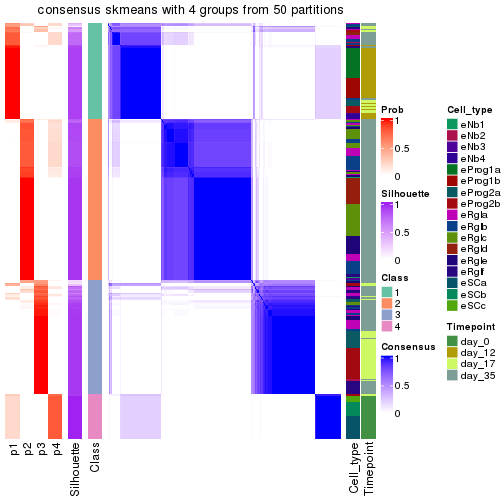</p>

</div>
</div>

Heatmaps for the membership of samples in all partitions to see how consistent they are:


<script>
$( function() {
	$( '#tabs-node-013-membership-heatmap' ).tabs();
} );
</script>
<div id='tabs-node-013-membership-heatmap'>
<ul>
<li><a href='#tab-node-013-membership-heatmap-1'>k = 2</a></li>
<li><a href='#tab-node-013-membership-heatmap-2'>k = 3</a></li>
<li><a href='#tab-node-013-membership-heatmap-3'>k = 4</a></li>
</ul>
<div id='tab-node-013-membership-heatmap-1'>
<pre><code class="r">membership_heatmap(res, k = 2)
</code></pre>

<p></p>

</div>
<div id='tab-node-013-membership-heatmap-2'>
<pre><code class="r">membership_heatmap(res, k = 3)
</code></pre>

<p></p>

</div>
<div id='tab-node-013-membership-heatmap-3'>
<pre><code class="r">membership_heatmap(res, k = 4)
</code></pre>

<p></p>

</div>
</div>

As soon as the classes for columns are determined, the signatures
that are significantly different between subgroups can be looked for. 
Following are the heatmaps for signatures.


Signature heatmaps where rows are scaled:


<script>
$( function() {
	$( '#tabs-node-013-get-signatures' ).tabs();
} );
</script>
<div id='tabs-node-013-get-signatures'>
<ul>
<li><a href='#tab-node-013-get-signatures-1'>k = 2</a></li>
<li><a href='#tab-node-013-get-signatures-2'>k = 3</a></li>
<li><a href='#tab-node-013-get-signatures-3'>k = 4</a></li>
</ul>
<div id='tab-node-013-get-signatures-1'>
<pre><code class="r">get_signatures(res, k = 2)
</code></pre>

<p></p>

</div>
<div id='tab-node-013-get-signatures-2'>
<pre><code class="r">get_signatures(res, k = 3)
</code></pre>

<p></p>

</div>
<div id='tab-node-013-get-signatures-3'>
<pre><code class="r">get_signatures(res, k = 4)
</code></pre>

<p></p>

</div>
</div>


Signature heatmaps where rows are not scaled:


<script>
$( function() {
	$( '#tabs-node-013-get-signatures-no-scale' ).tabs();
} );
</script>
<div id='tabs-node-013-get-signatures-no-scale'>
<ul>
<li><a href='#tab-node-013-get-signatures-no-scale-1'>k = 2</a></li>
<li><a href='#tab-node-013-get-signatures-no-scale-2'>k = 3</a></li>
<li><a href='#tab-node-013-get-signatures-no-scale-3'>k = 4</a></li>
</ul>
<div id='tab-node-013-get-signatures-no-scale-1'>
<pre><code class="r">get_signatures(res, k = 2, scale_rows = FALSE)
</code></pre>

<p></p>

</div>
<div id='tab-node-013-get-signatures-no-scale-2'>
<pre><code class="r">get_signatures(res, k = 3, scale_rows = FALSE)
</code></pre>

<p></p>

</div>
<div id='tab-node-013-get-signatures-no-scale-3'>
<pre><code class="r">get_signatures(res, k = 4, scale_rows = FALSE)
</code></pre>

<p></p>

</div>
</div>


Compare the overlap of signatures from different k:

```r
compare_signatures(res)
```


`get_signature()` returns a data frame invisibly. To get the list of signatures, the function
call should be assigned to a variable explicitly. In following code, if `plot` argument is set
to `FALSE`, no heatmap is plotted while only the differential analysis is performed.

```r
# code only for demonstration
tb = get_signature(res, k = ..., plot = FALSE)
```

An example of the output of `tb` is:

```
#>   which_row         fdr    mean_1    mean_2 scaled_mean_1 scaled_mean_2 km
#> 1        38 0.042760348  8.373488  9.131774    -0.5533452     0.5164555  1
#> 2        40 0.018707592  7.106213  8.469186    -0.6173731     0.5762149  1
#> 3        55 0.019134737 10.221463 11.207825    -0.6159697     0.5749050  1
#> 4        59 0.006059896  5.921854  7.869574    -0.6899429     0.6439467  1
#> 5        60 0.018055526  8.928898 10.211722    -0.6204761     0.5791110  1
#> 6        98 0.009384629 15.714769 14.887706     0.6635654    -0.6193277  2
...
```

The columns in `tb` are:

1. `which_row`: row indices corresponding to the input matrix.
2. `fdr`: FDR for the differential test. 
3. `mean_x`: The mean value in group x.
4. `scaled_mean_x`: The mean value in group x after rows are scaled.
5. `km`: Row groups if k-means clustering is applied to rows (which is done by automatically selecting number of clusters).

If there are too many signatures, `top_signatures = ...` can be set to only show the 
signatures with the highest FDRs:

```r
# code only for demonstration
# e.g. to show the top 500 most significant rows
tb = get_signature(res, k = ..., top_signatures = 500)
```

If the signatures are defined as these which are uniquely high in current group, `diff_method` argument
can be set to `"uniquely_high_in_one_group"`:

```r
# code only for demonstration
tb = get_signature(res, k = ..., diff_method = "uniquely_high_in_one_group")
```


UMAP plot which shows how samples are separated.


<script>
$( function() {
	$( '#tabs-node-013-dimension-reduction' ).tabs();
} );
</script>
<div id='tabs-node-013-dimension-reduction'>
<ul>
<li><a href='#tab-node-013-dimension-reduction-1'>k = 2</a></li>
<li><a href='#tab-node-013-dimension-reduction-2'>k = 3</a></li>
<li><a href='#tab-node-013-dimension-reduction-3'>k = 4</a></li>
</ul>
<div id='tab-node-013-dimension-reduction-1'>
<pre><code class="r">dimension_reduction(res, k = 2, method = &quot;UMAP&quot;)
</code></pre>

<p></p>

</div>
<div id='tab-node-013-dimension-reduction-2'>
<pre><code class="r">dimension_reduction(res, k = 3, method = &quot;UMAP&quot;)
</code></pre>

<p></p>

</div>
<div id='tab-node-013-dimension-reduction-3'>
<pre><code class="r">dimension_reduction(res, k = 4, method = &quot;UMAP&quot;)
</code></pre>

<p></p>

</div>
</div>


Following heatmap shows how subgroups are split when increasing `k`:

```r
collect_classes(res)
```


Test correlation between subgroups and known annotations. If the known
annotation is numeric, one-way ANOVA test is applied, and if the known
annotation is discrete, chi-squared contingency table test is applied.

```r
test_to_known_factors(res)
```

```
#>             n_sample Cell_type(p-value) Timepoint(p-value) k
#> ATC:skmeans      284           2.58e-36           4.52e-42 2
#> ATC:skmeans      285           9.04e-56           1.18e-62 3
#> ATC:skmeans      279           7.06e-91          1.34e-107 4
```


If matrix rows can be associated to genes, consider to use `functional_enrichment(res,
...)` to perform function enrichment for the signature genes. See [this vignette](https://jokergoo.github.io/cola_vignettes/functional_enrichment.html) for more detailed explanations.


 

---------------------------------------------------


### Node0131


Parent node: [Node013](#Node013).
Child nodes: 
                Node01121-leaf
        ,
                Node01122-leaf
        ,
                Node01211-leaf
        ,
                Node01212-leaf
        ,
                Node01221-leaf
        ,
                Node01222-leaf
        ,
                Node01223-leaf
        ,
                Node01311-leaf
        ,
                Node01312-leaf
        ,
                Node01321-leaf
        ,
                Node01322-leaf
        ,
                Node02121-leaf
        ,
                Node02122-leaf
        ,
                Node02311-leaf
        ,
                Node02312-leaf
        .


The object with results only for a single top-value method and a single partitioning method 
can be extracted as:

```r
res = res_rh["0131"]
```

A summary of `res` and all the functions that can be applied to it:

```r
res
```

```
#> A 'ConsensusPartition' object with k = 2, 3, 4.
#>   On a matrix with 6653 rows and 90 columns.
#>   Top rows (665) are extracted by 'ATC' method.
#>   Subgroups are detected by 'skmeans' method.
#>   Performed in total 150 partitions by row resampling.
#>   Best k for subgroups seems to be 4.
#> 
#> Following methods can be applied to this 'ConsensusPartition' object:
#>  [1] "cola_report"             "collect_classes"         "collect_plots"          
#>  [4] "collect_stats"           "colnames"                "compare_partitions"     
#>  [7] "compare_signatures"      "consensus_heatmap"       "dimension_reduction"    
#> [10] "functional_enrichment"   "get_anno_col"            "get_anno"               
#> [13] "get_classes"             "get_consensus"           "get_matrix"             
#> [16] "get_membership"          "get_param"               "get_signatures"         
#> [19] "get_stats"               "is_best_k"               "is_stable_k"            
#> [22] "membership_heatmap"      "ncol"                    "nrow"                   
#> [25] "plot_ecdf"               "predict_classes"         "rownames"               
#> [28] "select_partition_number" "show"                    "suggest_best_k"         
#> [31] "test_to_known_factors"   "top_rows_heatmap"
```

`collect_plots()` function collects all the plots made from `res` for all `k` (number of subgroups)
into one single page to provide an easy and fast comparison between different `k`.

```r
collect_plots(res)
```


The plots are:

- The first row: a plot of the eCDF (empirical cumulative distribution
  function) curves of the consensus matrix for each `k` and the heatmap of
  predicted classes for each `k`.
- The second row: heatmaps of the consensus matrix for each `k`.
- The third row: heatmaps of the membership matrix for each `k`.
- The fouth row: heatmaps of the signatures for each `k`.

All the plots in panels can be made by individual functions and they are
plotted later in this section.

`select_partition_number()` produces several plots showing different
statistics for choosing "optimized" `k`. There are following statistics:

- eCDF curves of the consensus matrix for each `k`;
- 1-PAC. [The PAC score](https://en.wikipedia.org/wiki/Consensus_clustering#Over-interpretation_potential_of_consensus_clustering)
  measures the proportion of the ambiguous subgrouping.
- Mean silhouette score.
- Concordance. The mean probability of fiting the consensus subgroup labels in all
  partitions.
- Area increased. Denote $A_k$ as the area under the eCDF curve for current
  `k`, the area increased is defined as $A_k - A_{k-1}$.
- Rand index. The percent of pairs of samples that are both in a same cluster
  or both are not in a same cluster in the partition of k and k-1.
- Jaccard index. The ratio of pairs of samples are both in a same cluster in
  the partition of k and k-1 and the pairs of samples are both in a same
  cluster in the partition k or k-1.

The detailed explanations of these statistics can be found in [the _cola_
vignette](https://jokergoo.github.io/cola_vignettes/cola.html#toc_13).

Generally speaking, higher 1-PAC score, higher mean silhouette score or higher
concordance corresponds to better partition. Rand index and Jaccard index
measure how similar the current partition is compared to partition with `k-1`.
If they are too similar, we won't accept `k` is better than `k-1`.

```r
select_partition_number(res)
```


The numeric values for all these statistics can be obtained by `get_stats()`.

```r
get_stats(res)
```

```
#>   k 1-PAC mean_silhouette concordance area_increased  Rand Jaccard
#> 2 2 1.000           0.999       1.000          0.464 0.537   0.537
#> 3 3 0.733           0.821       0.900          0.406 0.799   0.625
#> 4 4 0.936           0.905       0.945          0.115 0.915   0.756
```

`suggest_best_k()` suggests the best $k$ based on these statistics. The rules are as follows:

- All $k$ with Jaccard index larger than 0.95 are removed because increasing
  $k$ does not provide enough extra information. If all $k$ are removed, it is
  marked as no subgroup is detected.
- For all $k$ with 1-PAC score larger than 0.9, the maximal $k$ is taken as
  the best $k$, and other $k$ are marked as optional $k$.
- If it does not fit the second rule. The $k$ with the maximal vote of the
  highest 1-PAC score, highest mean silhouette, and highest concordance is
  taken as the best $k$.

```r
suggest_best_k(res)
```

```
#> [1] 4
#> attr(,"optional")
#> [1] 2
```

There is also optional best $k$ = 2 that is worth to check.

Following is the table of the partitions (You need to click the **show/hide
code output** link to see it). The membership matrix (columns with name `p*`)
is inferred by
[`clue::cl_consensus()`](https://www.rdocumentation.org/link/cl_consensus?package=clue)
function with the `SE` method. Basically the value in the membership matrix
represents the probability to belong to a certain group. The finall subgroup
label for an item is determined with the group with highest probability it
belongs to.

In `get_classes()` function, the entropy is calculated from the membership
matrix and the silhouette score is calculated from the consensus matrix.


<script>
$( function() {
	$( '#tabs-node-0131-get-classes' ).tabs();
} );
</script>
<div id='tabs-node-0131-get-classes'>
<ul>
<li><a href='#tab-node-0131-get-classes-1'>k = 2</a></li>
<li><a href='#tab-node-0131-get-classes-2'>k = 3</a></li>
<li><a href='#tab-node-0131-get-classes-3'>k = 4</a></li>
</ul>

<div id='tab-node-0131-get-classes-1'>
<p><a id='tab-node-0131-get-classes-1-a' style='color:#0366d6' href='#'>show/hide code output</a></p>
<pre><code class="r">cbind(get_classes(res, k = 2), get_membership(res, k = 2))
</code></pre>

<pre><code>#&gt;                 class entropy silhouette   p1   p2
#&gt; 1772122_325_G03     1   0.000      1.000 1.00 0.00
#&gt; 1772122_325_A08     1   0.000      1.000 1.00 0.00
#&gt; 1772122_263_G11     1   0.000      1.000 1.00 0.00
#&gt; 1772122_326_H08     1   0.000      1.000 1.00 0.00
#&gt; 1772122_299_H04     1   0.000      1.000 1.00 0.00
#&gt; 1772122_299_C10     1   0.000      1.000 1.00 0.00
#&gt; 1772122_306_E09     1   0.000      1.000 1.00 0.00
#&gt; 1772122_303_F12     1   0.000      1.000 1.00 0.00
#&gt; 1772122_262_A05     1   0.000      1.000 1.00 0.00
#&gt; 1772122_306_F11     2   0.000      0.999 0.00 1.00
#&gt; 1772122_306_D11     1   0.000      1.000 1.00 0.00
#&gt; 1772122_205_B05     1   0.000      1.000 1.00 0.00
#&gt; 1772122_305_E10     1   0.000      1.000 1.00 0.00
#&gt; 1772122_262_F01     1   0.000      1.000 1.00 0.00
#&gt; 1772122_305_G04     1   0.000      1.000 1.00 0.00
#&gt; 1772122_306_E01     1   0.000      1.000 1.00 0.00
#&gt; 1772122_302_E03     1   0.000      1.000 1.00 0.00
#&gt; 1772122_300_B09     1   0.000      1.000 1.00 0.00
#&gt; 1772122_181_D12     1   0.000      1.000 1.00 0.00
#&gt; 1772122_298_F11     1   0.000      1.000 1.00 0.00
#&gt; 1772122_298_E12     1   0.000      1.000 1.00 0.00
#&gt; 1772122_180_B12     1   0.000      1.000 1.00 0.00
#&gt; 1772122_298_F06     1   0.000      1.000 1.00 0.00
#&gt; 1772122_180_B06     1   0.000      1.000 1.00 0.00
#&gt; 1772122_262_E07     2   0.242      0.958 0.04 0.96
#&gt; 1772122_206_E06     1   0.000      1.000 1.00 0.00
#&gt; 1772122_262_F09     1   0.000      1.000 1.00 0.00
#&gt; 1772122_205_H01     1   0.000      1.000 1.00 0.00
#&gt; 1772122_206_B01     1   0.000      1.000 1.00 0.00
#&gt; 1772122_204_E10     1   0.000      1.000 1.00 0.00
#&gt; 1772122_204_H07     1   0.000      1.000 1.00 0.00
#&gt; 1772122_262_B01     1   0.000      1.000 1.00 0.00
#&gt; 1772122_204_G03     1   0.000      1.000 1.00 0.00
#&gt; 1772122_206_G09     1   0.000      1.000 1.00 0.00
#&gt; 1772122_204_E09     1   0.000      1.000 1.00 0.00
#&gt; 1772122_262_F05     1   0.000      1.000 1.00 0.00
#&gt; 1772122_204_E02     1   0.000      1.000 1.00 0.00
#&gt; 1772122_262_G03     1   0.000      1.000 1.00 0.00
#&gt; 1772122_262_D04     1   0.000      1.000 1.00 0.00
#&gt; 1772122_205_B02     1   0.000      1.000 1.00 0.00
#&gt; 1772122_325_B02     1   0.000      1.000 1.00 0.00
#&gt; 1772122_263_E07     1   0.000      1.000 1.00 0.00
#&gt; 1772122_325_A10     1   0.000      1.000 1.00 0.00
#&gt; 1772122_206_D03     1   0.000      1.000 1.00 0.00
#&gt; 1772122_263_D01     1   0.000      1.000 1.00 0.00
#&gt; 1772122_262_A06     1   0.000      1.000 1.00 0.00
#&gt; 1772122_326_B12     1   0.000      1.000 1.00 0.00
#&gt; 1772122_263_F04     1   0.000      1.000 1.00 0.00
#&gt; 1772122_262_B02     1   0.000      1.000 1.00 0.00
#&gt; 1772122_325_B03     1   0.000      1.000 1.00 0.00
#&gt; 1772122_326_A01     1   0.000      1.000 1.00 0.00
#&gt; 1772122_325_E05     1   0.000      1.000 1.00 0.00
#&gt; 1772122_326_F05     1   0.000      1.000 1.00 0.00
#&gt; 1772122_204_H03     1   0.000      1.000 1.00 0.00
#&gt; 1772122_263_H03     1   0.000      1.000 1.00 0.00
#&gt; 1772122_326_F09     1   0.000      1.000 1.00 0.00
#&gt; 1772122_326_H02     1   0.000      1.000 1.00 0.00
#&gt; 1772122_206_H08     1   0.000      1.000 1.00 0.00
#&gt; 1772122_263_G08     1   0.000      1.000 1.00 0.00
#&gt; 1772122_325_E04     1   0.000      1.000 1.00 0.00
#&gt; 1772122_312_E01     2   0.000      0.999 0.00 1.00
#&gt; 1772122_314_C07     2   0.000      0.999 0.00 1.00
#&gt; 1772122_312_E03     2   0.000      0.999 0.00 1.00
#&gt; 1772122_312_D01     2   0.000      0.999 0.00 1.00
#&gt; 1772122_311_F12     2   0.000      0.999 0.00 1.00
#&gt; 1772122_310_E12     2   0.000      0.999 0.00 1.00
#&gt; 1772122_310_D08     2   0.000      0.999 0.00 1.00
#&gt; 1772122_314_F01     2   0.000      0.999 0.00 1.00
#&gt; 1772122_310_C09     2   0.000      0.999 0.00 1.00
#&gt; 1772122_312_H06     2   0.000      0.999 0.00 1.00
#&gt; 1772122_312_B09     2   0.000      0.999 0.00 1.00
#&gt; 1772122_314_H10     2   0.000      0.999 0.00 1.00
#&gt; 1772122_310_F10     2   0.000      0.999 0.00 1.00
#&gt; 1772122_312_C11     2   0.000      0.999 0.00 1.00
#&gt; 1772122_310_G03     2   0.000      0.999 0.00 1.00
#&gt; 1772122_312_G07     2   0.000      0.999 0.00 1.00
#&gt; 1772122_310_E08     2   0.000      0.999 0.00 1.00
#&gt; 1772122_311_F04     2   0.000      0.999 0.00 1.00
#&gt; 1772122_311_C03     2   0.000      0.999 0.00 1.00
#&gt; 1772122_311_C10     2   0.000      0.999 0.00 1.00
#&gt; 1772122_311_C05     2   0.000      0.999 0.00 1.00
#&gt; 1772122_310_C01     2   0.000      0.999 0.00 1.00
#&gt; 1772122_310_C05     2   0.000      0.999 0.00 1.00
#&gt; 1772122_310_D01     2   0.000      0.999 0.00 1.00
#&gt; 1772122_312_C03     2   0.000      0.999 0.00 1.00
#&gt; 1772122_314_F02     2   0.000      0.999 0.00 1.00
#&gt; 1772122_310_D03     2   0.000      0.999 0.00 1.00
#&gt; 1772122_312_A04     2   0.000      0.999 0.00 1.00
#&gt; 1772122_310_B02     2   0.000      0.999 0.00 1.00
#&gt; 1772122_312_H03     2   0.000      0.999 0.00 1.00
</code></pre>

<script>
$('#tab-node-0131-get-classes-1-a').parent().next().next().hide();
$('#tab-node-0131-get-classes-1-a').click(function(){
  $('#tab-node-0131-get-classes-1-a').parent().next().next().toggle();
  return(false);
});
</script>
</div>

<div id='tab-node-0131-get-classes-2'>
<p><a id='tab-node-0131-get-classes-2-a' style='color:#0366d6' href='#'>show/hide code output</a></p>
<pre><code class="r">cbind(get_classes(res, k = 3), get_membership(res, k = 3))
</code></pre>

<pre><code>#&gt;                 class entropy silhouette   p1   p2   p3
#&gt; 1772122_325_G03     1  0.0000      0.888 1.00 0.00 0.00
#&gt; 1772122_325_A08     1  0.0000      0.888 1.00 0.00 0.00
#&gt; 1772122_263_G11     1  0.0000      0.888 1.00 0.00 0.00
#&gt; 1772122_326_H08     1  0.0000      0.888 1.00 0.00 0.00
#&gt; 1772122_299_H04     3  0.0892      0.678 0.02 0.00 0.98
#&gt; 1772122_299_C10     3  0.5560      0.779 0.30 0.00 0.70
#&gt; 1772122_306_E09     3  0.5560      0.779 0.30 0.00 0.70
#&gt; 1772122_303_F12     3  0.5560      0.779 0.30 0.00 0.70
#&gt; 1772122_262_A05     1  0.2537      0.815 0.92 0.00 0.08
#&gt; 1772122_306_F11     2  0.4002      0.823 0.00 0.84 0.16
#&gt; 1772122_306_D11     3  0.5560      0.779 0.30 0.00 0.70
#&gt; 1772122_205_B05     1  0.3340      0.778 0.88 0.00 0.12
#&gt; 1772122_305_E10     3  0.5560      0.779 0.30 0.00 0.70
#&gt; 1772122_262_F01     1  0.2066      0.836 0.94 0.00 0.06
#&gt; 1772122_305_G04     3  0.5560      0.779 0.30 0.00 0.70
#&gt; 1772122_306_E01     3  0.2066      0.697 0.06 0.00 0.94
#&gt; 1772122_302_E03     3  0.4796      0.756 0.22 0.00 0.78
#&gt; 1772122_300_B09     3  0.5560      0.779 0.30 0.00 0.70
#&gt; 1772122_181_D12     3  0.5560      0.779 0.30 0.00 0.70
#&gt; 1772122_298_F11     3  0.5560      0.779 0.30 0.00 0.70
#&gt; 1772122_298_E12     3  0.5560      0.779 0.30 0.00 0.70
#&gt; 1772122_180_B12     3  0.5560      0.779 0.30 0.00 0.70
#&gt; 1772122_298_F06     3  0.5560      0.779 0.30 0.00 0.70
#&gt; 1772122_180_B06     3  0.5560      0.779 0.30 0.00 0.70
#&gt; 1772122_262_E07     2  0.6849      0.465 0.02 0.60 0.38
#&gt; 1772122_206_E06     1  0.0000      0.888 1.00 0.00 0.00
#&gt; 1772122_262_F09     1  0.6302      0.230 0.52 0.00 0.48
#&gt; 1772122_205_H01     3  0.2959      0.631 0.10 0.00 0.90
#&gt; 1772122_206_B01     3  0.0000      0.665 0.00 0.00 1.00
#&gt; 1772122_204_E10     1  0.0000      0.888 1.00 0.00 0.00
#&gt; 1772122_204_H07     1  0.1529      0.859 0.96 0.00 0.04
#&gt; 1772122_262_B01     1  0.5016      0.648 0.76 0.00 0.24
#&gt; 1772122_204_G03     1  0.0000      0.888 1.00 0.00 0.00
#&gt; 1772122_206_G09     3  0.5835      0.277 0.34 0.00 0.66
#&gt; 1772122_204_E09     3  0.4796      0.513 0.22 0.00 0.78
#&gt; 1772122_262_F05     1  0.6126      0.390 0.60 0.00 0.40
#&gt; 1772122_204_E02     1  0.6244      0.324 0.56 0.00 0.44
#&gt; 1772122_262_G03     3  0.6309     -0.222 0.50 0.00 0.50
#&gt; 1772122_262_D04     3  0.0000      0.665 0.00 0.00 1.00
#&gt; 1772122_205_B02     1  0.5397      0.580 0.72 0.00 0.28
#&gt; 1772122_325_B02     1  0.0000      0.888 1.00 0.00 0.00
#&gt; 1772122_263_E07     1  0.0892      0.874 0.98 0.00 0.02
#&gt; 1772122_325_A10     1  0.0000      0.888 1.00 0.00 0.00
#&gt; 1772122_206_D03     1  0.3686      0.727 0.86 0.00 0.14
#&gt; 1772122_263_D01     1  0.0000      0.888 1.00 0.00 0.00
#&gt; 1772122_262_A06     1  0.4796      0.557 0.78 0.00 0.22
#&gt; 1772122_326_B12     1  0.0000      0.888 1.00 0.00 0.00
#&gt; 1772122_263_F04     1  0.0000      0.888 1.00 0.00 0.00
#&gt; 1772122_262_B02     1  0.4291      0.713 0.82 0.00 0.18
#&gt; 1772122_325_B03     1  0.0000      0.888 1.00 0.00 0.00
#&gt; 1772122_326_A01     1  0.0000      0.888 1.00 0.00 0.00
#&gt; 1772122_325_E05     1  0.0000      0.888 1.00 0.00 0.00
#&gt; 1772122_326_F05     1  0.0000      0.888 1.00 0.00 0.00
#&gt; 1772122_204_H03     1  0.3686      0.781 0.86 0.00 0.14
#&gt; 1772122_263_H03     1  0.0000      0.888 1.00 0.00 0.00
#&gt; 1772122_326_F09     1  0.0000      0.888 1.00 0.00 0.00
#&gt; 1772122_326_H02     1  0.0000      0.888 1.00 0.00 0.00
#&gt; 1772122_206_H08     3  0.4555      0.538 0.20 0.00 0.80
#&gt; 1772122_263_G08     1  0.0000      0.888 1.00 0.00 0.00
#&gt; 1772122_325_E04     1  0.0000      0.888 1.00 0.00 0.00
#&gt; 1772122_312_E01     2  0.0000      0.983 0.00 1.00 0.00
#&gt; 1772122_314_C07     2  0.0000      0.983 0.00 1.00 0.00
#&gt; 1772122_312_E03     2  0.0000      0.983 0.00 1.00 0.00
#&gt; 1772122_312_D01     2  0.0000      0.983 0.00 1.00 0.00
#&gt; 1772122_311_F12     2  0.0000      0.983 0.00 1.00 0.00
#&gt; 1772122_310_E12     2  0.0000      0.983 0.00 1.00 0.00
#&gt; 1772122_310_D08     2  0.0000      0.983 0.00 1.00 0.00
#&gt; 1772122_314_F01     2  0.0000      0.983 0.00 1.00 0.00
#&gt; 1772122_310_C09     2  0.0000      0.983 0.00 1.00 0.00
#&gt; 1772122_312_H06     2  0.0000      0.983 0.00 1.00 0.00
#&gt; 1772122_312_B09     2  0.0000      0.983 0.00 1.00 0.00
#&gt; 1772122_314_H10     2  0.0000      0.983 0.00 1.00 0.00
#&gt; 1772122_310_F10     2  0.0000      0.983 0.00 1.00 0.00
#&gt; 1772122_312_C11     2  0.0000      0.983 0.00 1.00 0.00
#&gt; 1772122_310_G03     2  0.0000      0.983 0.00 1.00 0.00
#&gt; 1772122_312_G07     2  0.0000      0.983 0.00 1.00 0.00
#&gt; 1772122_310_E08     2  0.0000      0.983 0.00 1.00 0.00
#&gt; 1772122_311_F04     2  0.0000      0.983 0.00 1.00 0.00
#&gt; 1772122_311_C03     2  0.0000      0.983 0.00 1.00 0.00
#&gt; 1772122_311_C10     2  0.0000      0.983 0.00 1.00 0.00
#&gt; 1772122_311_C05     2  0.0000      0.983 0.00 1.00 0.00
#&gt; 1772122_310_C01     2  0.0000      0.983 0.00 1.00 0.00
#&gt; 1772122_310_C05     2  0.0000      0.983 0.00 1.00 0.00
#&gt; 1772122_310_D01     2  0.0000      0.983 0.00 1.00 0.00
#&gt; 1772122_312_C03     2  0.0000      0.983 0.00 1.00 0.00
#&gt; 1772122_314_F02     2  0.0000      0.983 0.00 1.00 0.00
#&gt; 1772122_310_D03     2  0.0000      0.983 0.00 1.00 0.00
#&gt; 1772122_312_A04     2  0.0000      0.983 0.00 1.00 0.00
#&gt; 1772122_310_B02     2  0.0000      0.983 0.00 1.00 0.00
#&gt; 1772122_312_H03     2  0.0000      0.983 0.00 1.00 0.00
</code></pre>

<script>
$('#tab-node-0131-get-classes-2-a').parent().next().next().hide();
$('#tab-node-0131-get-classes-2-a').click(function(){
  $('#tab-node-0131-get-classes-2-a').parent().next().next().toggle();
  return(false);
});
</script>
</div>

<div id='tab-node-0131-get-classes-3'>
<p><a id='tab-node-0131-get-classes-3-a' style='color:#0366d6' href='#'>show/hide code output</a></p>
<pre><code class="r">cbind(get_classes(res, k = 4), get_membership(res, k = 4))
</code></pre>

<pre><code>#&gt;                 class entropy silhouette   p1   p2   p3   p4
#&gt; 1772122_325_G03     1  0.0000      0.914 1.00 0.00 0.00 0.00
#&gt; 1772122_325_A08     1  0.0000      0.914 1.00 0.00 0.00 0.00
#&gt; 1772122_263_G11     1  0.0000      0.914 1.00 0.00 0.00 0.00
#&gt; 1772122_326_H08     1  0.1411      0.897 0.96 0.00 0.02 0.02
#&gt; 1772122_299_H04     3  0.1637      0.925 0.00 0.00 0.94 0.06
#&gt; 1772122_299_C10     3  0.1637      0.984 0.06 0.00 0.94 0.00
#&gt; 1772122_306_E09     3  0.1637      0.984 0.06 0.00 0.94 0.00
#&gt; 1772122_303_F12     3  0.1637      0.984 0.06 0.00 0.94 0.00
#&gt; 1772122_262_A05     1  0.4790      0.402 0.62 0.00 0.38 0.00
#&gt; 1772122_306_F11     2  0.5106      0.625 0.00 0.72 0.04 0.24
#&gt; 1772122_306_D11     3  0.1637      0.984 0.06 0.00 0.94 0.00
#&gt; 1772122_205_B05     1  0.3821      0.805 0.84 0.00 0.12 0.04
#&gt; 1772122_305_E10     3  0.1913      0.968 0.04 0.00 0.94 0.02
#&gt; 1772122_262_F01     1  0.4277      0.620 0.72 0.00 0.28 0.00
#&gt; 1772122_305_G04     3  0.1637      0.984 0.06 0.00 0.94 0.00
#&gt; 1772122_306_E01     3  0.1637      0.925 0.00 0.00 0.94 0.06
#&gt; 1772122_302_E03     3  0.2411      0.956 0.04 0.00 0.92 0.04
#&gt; 1772122_300_B09     3  0.1637      0.984 0.06 0.00 0.94 0.00
#&gt; 1772122_181_D12     3  0.1637      0.984 0.06 0.00 0.94 0.00
#&gt; 1772122_298_F11     3  0.1637      0.984 0.06 0.00 0.94 0.00
#&gt; 1772122_298_E12     3  0.1637      0.984 0.06 0.00 0.94 0.00
#&gt; 1772122_180_B12     3  0.1637      0.984 0.06 0.00 0.94 0.00
#&gt; 1772122_298_F06     3  0.1637      0.984 0.06 0.00 0.94 0.00
#&gt; 1772122_180_B06     3  0.1637      0.984 0.06 0.00 0.94 0.00
#&gt; 1772122_262_E07     4  0.1211      0.876 0.00 0.04 0.00 0.96
#&gt; 1772122_206_E06     1  0.0707      0.904 0.98 0.00 0.00 0.02
#&gt; 1772122_262_F09     4  0.2830      0.872 0.04 0.00 0.06 0.90
#&gt; 1772122_205_H01     4  0.0707      0.897 0.00 0.00 0.02 0.98
#&gt; 1772122_206_B01     4  0.1211      0.888 0.00 0.00 0.04 0.96
#&gt; 1772122_204_E10     1  0.0707      0.904 0.98 0.00 0.00 0.02
#&gt; 1772122_204_H07     1  0.3611      0.819 0.86 0.00 0.06 0.08
#&gt; 1772122_262_B01     4  0.6382      0.414 0.34 0.00 0.08 0.58
#&gt; 1772122_204_G03     1  0.0000      0.914 1.00 0.00 0.00 0.00
#&gt; 1772122_206_G09     4  0.1411      0.895 0.02 0.00 0.02 0.96
#&gt; 1772122_204_E09     4  0.1411      0.893 0.02 0.00 0.02 0.96
#&gt; 1772122_262_F05     4  0.1211      0.889 0.04 0.00 0.00 0.96
#&gt; 1772122_204_E02     4  0.1637      0.891 0.00 0.00 0.06 0.94
#&gt; 1772122_262_G03     4  0.0707      0.897 0.00 0.00 0.02 0.98
#&gt; 1772122_262_D04     4  0.0707      0.897 0.00 0.00 0.02 0.98
#&gt; 1772122_205_B02     4  0.6453      0.385 0.36 0.00 0.08 0.56
#&gt; 1772122_325_B02     1  0.0707      0.903 0.98 0.00 0.02 0.00
#&gt; 1772122_263_E07     1  0.1637      0.875 0.94 0.00 0.06 0.00
#&gt; 1772122_325_A10     1  0.0000      0.914 1.00 0.00 0.00 0.00
#&gt; 1772122_206_D03     1  0.3400      0.765 0.82 0.00 0.18 0.00
#&gt; 1772122_263_D01     1  0.0000      0.914 1.00 0.00 0.00 0.00
#&gt; 1772122_262_A06     1  0.4948      0.332 0.56 0.00 0.44 0.00
#&gt; 1772122_326_B12     1  0.0000      0.914 1.00 0.00 0.00 0.00
#&gt; 1772122_263_F04     1  0.0000      0.914 1.00 0.00 0.00 0.00
#&gt; 1772122_262_B02     1  0.4227      0.770 0.82 0.00 0.06 0.12
#&gt; 1772122_325_B03     1  0.0000      0.914 1.00 0.00 0.00 0.00
#&gt; 1772122_326_A01     1  0.0000      0.914 1.00 0.00 0.00 0.00
#&gt; 1772122_325_E05     1  0.0000      0.914 1.00 0.00 0.00 0.00
#&gt; 1772122_326_F05     1  0.0000      0.914 1.00 0.00 0.00 0.00
#&gt; 1772122_204_H03     1  0.6110      0.612 0.66 0.00 0.24 0.10
#&gt; 1772122_263_H03     1  0.0000      0.914 1.00 0.00 0.00 0.00
#&gt; 1772122_326_F09     1  0.0000      0.914 1.00 0.00 0.00 0.00
#&gt; 1772122_326_H02     1  0.0000      0.914 1.00 0.00 0.00 0.00
#&gt; 1772122_206_H08     4  0.0707      0.897 0.00 0.00 0.02 0.98
#&gt; 1772122_263_G08     1  0.1637      0.875 0.94 0.00 0.06 0.00
#&gt; 1772122_325_E04     1  0.0000      0.914 1.00 0.00 0.00 0.00
#&gt; 1772122_312_E01     2  0.0000      0.988 0.00 1.00 0.00 0.00
#&gt; 1772122_314_C07     2  0.0000      0.988 0.00 1.00 0.00 0.00
#&gt; 1772122_312_E03     2  0.0000      0.988 0.00 1.00 0.00 0.00
#&gt; 1772122_312_D01     2  0.0000      0.988 0.00 1.00 0.00 0.00
#&gt; 1772122_311_F12     2  0.0000      0.988 0.00 1.00 0.00 0.00
#&gt; 1772122_310_E12     2  0.0000      0.988 0.00 1.00 0.00 0.00
#&gt; 1772122_310_D08     2  0.0000      0.988 0.00 1.00 0.00 0.00
#&gt; 1772122_314_F01     2  0.0000      0.988 0.00 1.00 0.00 0.00
#&gt; 1772122_310_C09     2  0.0000      0.988 0.00 1.00 0.00 0.00
#&gt; 1772122_312_H06     2  0.0000      0.988 0.00 1.00 0.00 0.00
#&gt; 1772122_312_B09     2  0.0000      0.988 0.00 1.00 0.00 0.00
#&gt; 1772122_314_H10     2  0.0707      0.976 0.00 0.98 0.00 0.02
#&gt; 1772122_310_F10     2  0.0707      0.976 0.00 0.98 0.00 0.02
#&gt; 1772122_312_C11     2  0.0000      0.988 0.00 1.00 0.00 0.00
#&gt; 1772122_310_G03     2  0.0000      0.988 0.00 1.00 0.00 0.00
#&gt; 1772122_312_G07     2  0.0000      0.988 0.00 1.00 0.00 0.00
#&gt; 1772122_310_E08     2  0.0000      0.988 0.00 1.00 0.00 0.00
#&gt; 1772122_311_F04     2  0.0000      0.988 0.00 1.00 0.00 0.00
#&gt; 1772122_311_C03     2  0.0000      0.988 0.00 1.00 0.00 0.00
#&gt; 1772122_311_C10     2  0.0000      0.988 0.00 1.00 0.00 0.00
#&gt; 1772122_311_C05     2  0.0000      0.988 0.00 1.00 0.00 0.00
#&gt; 1772122_310_C01     2  0.0000      0.988 0.00 1.00 0.00 0.00
#&gt; 1772122_310_C05     2  0.0000      0.988 0.00 1.00 0.00 0.00
#&gt; 1772122_310_D01     2  0.0707      0.976 0.00 0.98 0.00 0.02
#&gt; 1772122_312_C03     2  0.0000      0.988 0.00 1.00 0.00 0.00
#&gt; 1772122_314_F02     2  0.0707      0.976 0.00 0.98 0.00 0.02
#&gt; 1772122_310_D03     2  0.0000      0.988 0.00 1.00 0.00 0.00
#&gt; 1772122_312_A04     2  0.0707      0.976 0.00 0.98 0.00 0.02
#&gt; 1772122_310_B02     2  0.0000      0.988 0.00 1.00 0.00 0.00
#&gt; 1772122_312_H03     2  0.0000      0.988 0.00 1.00 0.00 0.00
</code></pre>

<script>
$('#tab-node-0131-get-classes-3-a').parent().next().next().hide();
$('#tab-node-0131-get-classes-3-a').click(function(){
  $('#tab-node-0131-get-classes-3-a').parent().next().next().toggle();
  return(false);
});
</script>
</div>
</div>

Heatmaps for the consensus matrix. It visualizes the probability of two
samples to be in a same group.


<script>
$( function() {
	$( '#tabs-node-0131-consensus-heatmap' ).tabs();
} );
</script>
<div id='tabs-node-0131-consensus-heatmap'>
<ul>
<li><a href='#tab-node-0131-consensus-heatmap-1'>k = 2</a></li>
<li><a href='#tab-node-0131-consensus-heatmap-2'>k = 3</a></li>
<li><a href='#tab-node-0131-consensus-heatmap-3'>k = 4</a></li>
</ul>
<div id='tab-node-0131-consensus-heatmap-1'>
<pre><code class="r">consensus_heatmap(res, k = 2)
</code></pre>

<p></p>

</div>
<div id='tab-node-0131-consensus-heatmap-2'>
<pre><code class="r">consensus_heatmap(res, k = 3)
</code></pre>

<p></p>

</div>
<div id='tab-node-0131-consensus-heatmap-3'>
<pre><code class="r">consensus_heatmap(res, k = 4)
</code></pre>

<p></p>

</div>
</div>

Heatmaps for the membership of samples in all partitions to see how consistent they are:


<script>
$( function() {
	$( '#tabs-node-0131-membership-heatmap' ).tabs();
} );
</script>
<div id='tabs-node-0131-membership-heatmap'>
<ul>
<li><a href='#tab-node-0131-membership-heatmap-1'>k = 2</a></li>
<li><a href='#tab-node-0131-membership-heatmap-2'>k = 3</a></li>
<li><a href='#tab-node-0131-membership-heatmap-3'>k = 4</a></li>
</ul>
<div id='tab-node-0131-membership-heatmap-1'>
<pre><code class="r">membership_heatmap(res, k = 2)
</code></pre>

<p></p>

</div>
<div id='tab-node-0131-membership-heatmap-2'>
<pre><code class="r">membership_heatmap(res, k = 3)
</code></pre>

<p></p>

</div>
<div id='tab-node-0131-membership-heatmap-3'>
<pre><code class="r">membership_heatmap(res, k = 4)
</code></pre>

<p></p>

</div>
</div>

As soon as the classes for columns are determined, the signatures
that are significantly different between subgroups can be looked for. 
Following are the heatmaps for signatures.


Signature heatmaps where rows are scaled:


<script>
$( function() {
	$( '#tabs-node-0131-get-signatures' ).tabs();
} );
</script>
<div id='tabs-node-0131-get-signatures'>
<ul>
<li><a href='#tab-node-0131-get-signatures-1'>k = 2</a></li>
<li><a href='#tab-node-0131-get-signatures-2'>k = 3</a></li>
<li><a href='#tab-node-0131-get-signatures-3'>k = 4</a></li>
</ul>
<div id='tab-node-0131-get-signatures-1'>
<pre><code class="r">get_signatures(res, k = 2)
</code></pre>

<p></p>

</div>
<div id='tab-node-0131-get-signatures-2'>
<pre><code class="r">get_signatures(res, k = 3)
</code></pre>

<p></p>

</div>
<div id='tab-node-0131-get-signatures-3'>
<pre><code class="r">get_signatures(res, k = 4)
</code></pre>

<p></p>

</div>
</div>


Signature heatmaps where rows are not scaled:


<script>
$( function() {
	$( '#tabs-node-0131-get-signatures-no-scale' ).tabs();
} );
</script>
<div id='tabs-node-0131-get-signatures-no-scale'>
<ul>
<li><a href='#tab-node-0131-get-signatures-no-scale-1'>k = 2</a></li>
<li><a href='#tab-node-0131-get-signatures-no-scale-2'>k = 3</a></li>
<li><a href='#tab-node-0131-get-signatures-no-scale-3'>k = 4</a></li>
</ul>
<div id='tab-node-0131-get-signatures-no-scale-1'>
<pre><code class="r">get_signatures(res, k = 2, scale_rows = FALSE)
</code></pre>

<p></p>

</div>
<div id='tab-node-0131-get-signatures-no-scale-2'>
<pre><code class="r">get_signatures(res, k = 3, scale_rows = FALSE)
</code></pre>

<p></p>

</div>
<div id='tab-node-0131-get-signatures-no-scale-3'>
<pre><code class="r">get_signatures(res, k = 4, scale_rows = FALSE)
</code></pre>

<p>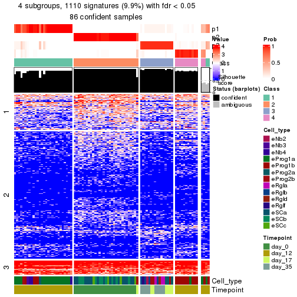</p>

</div>
</div>


Compare the overlap of signatures from different k:

```r
compare_signatures(res)
```


`get_signature()` returns a data frame invisibly. To get the list of signatures, the function
call should be assigned to a variable explicitly. In following code, if `plot` argument is set
to `FALSE`, no heatmap is plotted while only the differential analysis is performed.

```r
# code only for demonstration
tb = get_signature(res, k = ..., plot = FALSE)
```

An example of the output of `tb` is:

```
#>   which_row         fdr    mean_1    mean_2 scaled_mean_1 scaled_mean_2 km
#> 1        38 0.042760348  8.373488  9.131774    -0.5533452     0.5164555  1
#> 2        40 0.018707592  7.106213  8.469186    -0.6173731     0.5762149  1
#> 3        55 0.019134737 10.221463 11.207825    -0.6159697     0.5749050  1
#> 4        59 0.006059896  5.921854  7.869574    -0.6899429     0.6439467  1
#> 5        60 0.018055526  8.928898 10.211722    -0.6204761     0.5791110  1
#> 6        98 0.009384629 15.714769 14.887706     0.6635654    -0.6193277  2
...
```

The columns in `tb` are:

1. `which_row`: row indices corresponding to the input matrix.
2. `fdr`: FDR for the differential test. 
3. `mean_x`: The mean value in group x.
4. `scaled_mean_x`: The mean value in group x after rows are scaled.
5. `km`: Row groups if k-means clustering is applied to rows (which is done by automatically selecting number of clusters).

If there are too many signatures, `top_signatures = ...` can be set to only show the 
signatures with the highest FDRs:

```r
# code only for demonstration
# e.g. to show the top 500 most significant rows
tb = get_signature(res, k = ..., top_signatures = 500)
```

If the signatures are defined as these which are uniquely high in current group, `diff_method` argument
can be set to `"uniquely_high_in_one_group"`:

```r
# code only for demonstration
tb = get_signature(res, k = ..., diff_method = "uniquely_high_in_one_group")
```


UMAP plot which shows how samples are separated.


<script>
$( function() {
	$( '#tabs-node-0131-dimension-reduction' ).tabs();
} );
</script>
<div id='tabs-node-0131-dimension-reduction'>
<ul>
<li><a href='#tab-node-0131-dimension-reduction-1'>k = 2</a></li>
<li><a href='#tab-node-0131-dimension-reduction-2'>k = 3</a></li>
<li><a href='#tab-node-0131-dimension-reduction-3'>k = 4</a></li>
</ul>
<div id='tab-node-0131-dimension-reduction-1'>
<pre><code class="r">dimension_reduction(res, k = 2, method = &quot;UMAP&quot;)
</code></pre>

<p></p>

</div>
<div id='tab-node-0131-dimension-reduction-2'>
<pre><code class="r">dimension_reduction(res, k = 3, method = &quot;UMAP&quot;)
</code></pre>

<p></p>

</div>
<div id='tab-node-0131-dimension-reduction-3'>
<pre><code class="r">dimension_reduction(res, k = 4, method = &quot;UMAP&quot;)
</code></pre>

<p></p>

</div>
</div>


Following heatmap shows how subgroups are split when increasing `k`:

```r
collect_classes(res)
```


Test correlation between subgroups and known annotations. If the known
annotation is numeric, one-way ANOVA test is applied, and if the known
annotation is discrete, chi-squared contingency table test is applied.

```r
test_to_known_factors(res)
```

```
#>             n_sample Cell_type(p-value) Timepoint(p-value) k
#> ATC:skmeans       90           4.08e-12           1.14e-17 2
#> ATC:skmeans       84           7.75e-16           2.24e-26 3
#> ATC:skmeans       86           2.36e-23           6.73e-31 4
```


If matrix rows can be associated to genes, consider to use `functional_enrichment(res,
...)` to perform function enrichment for the signature genes. See [this vignette](https://jokergoo.github.io/cola_vignettes/functional_enrichment.html) for more detailed explanations.


 

---------------------------------------------------


### Node0132


Parent node: [Node013](#Node013).
Child nodes: 
                Node01121-leaf
        ,
                Node01122-leaf
        ,
                Node01211-leaf
        ,
                Node01212-leaf
        ,
                Node01221-leaf
        ,
                Node01222-leaf
        ,
                Node01223-leaf
        ,
                Node01311-leaf
        ,
                Node01312-leaf
        ,
                Node01321-leaf
        ,
                Node01322-leaf
        ,
                Node02121-leaf
        ,
                Node02122-leaf
        ,
                Node02311-leaf
        ,
                Node02312-leaf
        .


The object with results only for a single top-value method and a single partitioning method 
can be extracted as:

```r
res = res_rh["0132"]
```

A summary of `res` and all the functions that can be applied to it:

```r
res
```

```
#> A 'ConsensusPartition' object with k = 2, 3, 4.
#>   On a matrix with 8434 rows and 115 columns.
#>   Top rows (843) are extracted by 'ATC' method.
#>   Subgroups are detected by 'skmeans' method.
#>   Performed in total 150 partitions by row resampling.
#>   Best k for subgroups seems to be 3.
#> 
#> Following methods can be applied to this 'ConsensusPartition' object:
#>  [1] "cola_report"             "collect_classes"         "collect_plots"          
#>  [4] "collect_stats"           "colnames"                "compare_partitions"     
#>  [7] "compare_signatures"      "consensus_heatmap"       "dimension_reduction"    
#> [10] "functional_enrichment"   "get_anno_col"            "get_anno"               
#> [13] "get_classes"             "get_consensus"           "get_matrix"             
#> [16] "get_membership"          "get_param"               "get_signatures"         
#> [19] "get_stats"               "is_best_k"               "is_stable_k"            
#> [22] "membership_heatmap"      "ncol"                    "nrow"                   
#> [25] "plot_ecdf"               "predict_classes"         "rownames"               
#> [28] "select_partition_number" "show"                    "suggest_best_k"         
#> [31] "test_to_known_factors"   "top_rows_heatmap"
```

`collect_plots()` function collects all the plots made from `res` for all `k` (number of subgroups)
into one single page to provide an easy and fast comparison between different `k`.

```r
collect_plots(res)
```


The plots are:

- The first row: a plot of the eCDF (empirical cumulative distribution
  function) curves of the consensus matrix for each `k` and the heatmap of
  predicted classes for each `k`.
- The second row: heatmaps of the consensus matrix for each `k`.
- The third row: heatmaps of the membership matrix for each `k`.
- The fouth row: heatmaps of the signatures for each `k`.

All the plots in panels can be made by individual functions and they are
plotted later in this section.

`select_partition_number()` produces several plots showing different
statistics for choosing "optimized" `k`. There are following statistics:

- eCDF curves of the consensus matrix for each `k`;
- 1-PAC. [The PAC score](https://en.wikipedia.org/wiki/Consensus_clustering#Over-interpretation_potential_of_consensus_clustering)
  measures the proportion of the ambiguous subgrouping.
- Mean silhouette score.
- Concordance. The mean probability of fiting the consensus subgroup labels in all
  partitions.
- Area increased. Denote $A_k$ as the area under the eCDF curve for current
  `k`, the area increased is defined as $A_k - A_{k-1}$.
- Rand index. The percent of pairs of samples that are both in a same cluster
  or both are not in a same cluster in the partition of k and k-1.
- Jaccard index. The ratio of pairs of samples are both in a same cluster in
  the partition of k and k-1 and the pairs of samples are both in a same
  cluster in the partition k or k-1.

The detailed explanations of these statistics can be found in [the _cola_
vignette](https://jokergoo.github.io/cola_vignettes/cola.html#toc_13).

Generally speaking, higher 1-PAC score, higher mean silhouette score or higher
concordance corresponds to better partition. Rand index and Jaccard index
measure how similar the current partition is compared to partition with `k-1`.
If they are too similar, we won't accept `k` is better than `k-1`.

```r
select_partition_number(res)
```


The numeric values for all these statistics can be obtained by `get_stats()`.

```r
get_stats(res)
```

```
#>   k 1-PAC mean_silhouette concordance area_increased  Rand Jaccard
#> 2 2 0.860           0.944       0.975          0.486 0.516   0.516
#> 3 3 0.936           0.909       0.965          0.337 0.688   0.468
#> 4 4 0.887           0.894       0.945          0.103 0.908   0.746
```

`suggest_best_k()` suggests the best $k$ based on these statistics. The rules are as follows:

- All $k$ with Jaccard index larger than 0.95 are removed because increasing
  $k$ does not provide enough extra information. If all $k$ are removed, it is
  marked as no subgroup is detected.
- For all $k$ with 1-PAC score larger than 0.9, the maximal $k$ is taken as
  the best $k$, and other $k$ are marked as optional $k$.
- If it does not fit the second rule. The $k$ with the maximal vote of the
  highest 1-PAC score, highest mean silhouette, and highest concordance is
  taken as the best $k$.

```r
suggest_best_k(res)
```

```
#> [1] 3
```


Following is the table of the partitions (You need to click the **show/hide
code output** link to see it). The membership matrix (columns with name `p*`)
is inferred by
[`clue::cl_consensus()`](https://www.rdocumentation.org/link/cl_consensus?package=clue)
function with the `SE` method. Basically the value in the membership matrix
represents the probability to belong to a certain group. The finall subgroup
label for an item is determined with the group with highest probability it
belongs to.

In `get_classes()` function, the entropy is calculated from the membership
matrix and the silhouette score is calculated from the consensus matrix.


<script>
$( function() {
	$( '#tabs-node-0132-get-classes' ).tabs();
} );
</script>
<div id='tabs-node-0132-get-classes'>
<ul>
<li><a href='#tab-node-0132-get-classes-1'>k = 2</a></li>
<li><a href='#tab-node-0132-get-classes-2'>k = 3</a></li>
<li><a href='#tab-node-0132-get-classes-3'>k = 4</a></li>
</ul>

<div id='tab-node-0132-get-classes-1'>
<p><a id='tab-node-0132-get-classes-1-a' style='color:#0366d6' href='#'>show/hide code output</a></p>
<pre><code class="r">cbind(get_classes(res, k = 2), get_membership(res, k = 2))
</code></pre>

<pre><code>#&gt;                 class entropy silhouette   p1   p2
#&gt; 1772122_298_F09     2   0.469      0.879 0.10 0.90
#&gt; 1772122_300_E10     1   0.000      0.974 1.00 0.00
#&gt; 1772122_299_A07     2   0.000      0.974 0.00 1.00
#&gt; 1772122_299_H06     2   0.141      0.956 0.02 0.98
#&gt; 1772122_300_C09     2   0.000      0.974 0.00 1.00
#&gt; 1772122_180_A07     2   0.000      0.974 0.00 1.00
#&gt; 1772122_180_H01     2   0.943      0.449 0.36 0.64
#&gt; 1772122_298_G07     2   0.000      0.974 0.00 1.00
#&gt; 1772122_299_A02     2   0.634      0.808 0.16 0.84
#&gt; 1772122_181_C03     1   0.000      0.974 1.00 0.00
#&gt; 1772122_181_D01     1   0.000      0.974 1.00 0.00
#&gt; 1772122_180_G08     2   0.000      0.974 0.00 1.00
#&gt; 1772122_180_G11     2   0.000      0.974 0.00 1.00
#&gt; 1772122_300_G12     1   0.000      0.974 1.00 0.00
#&gt; 1772122_298_D06     1   0.000      0.974 1.00 0.00
#&gt; 1772122_299_H05     1   0.000      0.974 1.00 0.00
#&gt; 1772122_180_B03     1   0.000      0.974 1.00 0.00
#&gt; 1772122_298_E01     1   0.000      0.974 1.00 0.00
#&gt; 1772122_298_G03     1   0.000      0.974 1.00 0.00
#&gt; 1772122_181_D07     1   0.000      0.974 1.00 0.00
#&gt; 1772122_181_H05     2   0.000      0.974 0.00 1.00
#&gt; 1772122_181_G07     1   0.000      0.974 1.00 0.00
#&gt; 1772122_182_B06     1   0.000      0.974 1.00 0.00
#&gt; 1772122_299_G03     1   0.000      0.974 1.00 0.00
#&gt; 1772122_298_A10     1   0.000      0.974 1.00 0.00
#&gt; 1772122_298_E07     1   0.000      0.974 1.00 0.00
#&gt; 1772122_300_C08     1   0.000      0.974 1.00 0.00
#&gt; 1772122_181_C11     1   0.000      0.974 1.00 0.00
#&gt; 1772122_181_H04     1   0.000      0.974 1.00 0.00
#&gt; 1772122_180_D05     1   0.000      0.974 1.00 0.00
#&gt; 1772122_298_B08     1   0.000      0.974 1.00 0.00
#&gt; 1772122_180_G12     1   0.000      0.974 1.00 0.00
#&gt; 1772122_180_F04     1   0.760      0.720 0.78 0.22
#&gt; 1772122_299_E12     1   0.000      0.974 1.00 0.00
#&gt; 1772122_298_A05     1   0.000      0.974 1.00 0.00
#&gt; 1772122_181_F08     1   0.000      0.974 1.00 0.00
#&gt; 1772122_300_G10     1   0.000      0.974 1.00 0.00
#&gt; 1772122_298_B04     1   0.000      0.974 1.00 0.00
#&gt; 1772122_298_G08     1   0.000      0.974 1.00 0.00
#&gt; 1772122_299_F05     2   0.000      0.974 0.00 1.00
#&gt; 1772122_180_G10     1   0.000      0.974 1.00 0.00
#&gt; 1772122_181_A06     1   0.000      0.974 1.00 0.00
#&gt; 1772122_181_B06     1   0.242      0.941 0.96 0.04
#&gt; 1772122_182_D03     2   0.000      0.974 0.00 1.00
#&gt; 1772122_300_F06     1   0.000      0.974 1.00 0.00
#&gt; 1772122_300_D06     1   0.000      0.974 1.00 0.00
#&gt; 1772122_299_D02     1   0.000      0.974 1.00 0.00
#&gt; 1772122_299_H08     1   0.000      0.974 1.00 0.00
#&gt; 1772122_299_B09     2   0.000      0.974 0.00 1.00
#&gt; 1772122_300_C10     1   0.000      0.974 1.00 0.00
#&gt; 1772122_298_H03     1   0.000      0.974 1.00 0.00
#&gt; 1772122_300_C05     2   0.000      0.974 0.00 1.00
#&gt; 1772122_300_A04     1   0.000      0.974 1.00 0.00
#&gt; 1772122_300_B02     2   0.000      0.974 0.00 1.00
#&gt; 1772122_300_F08     1   0.529      0.866 0.88 0.12
#&gt; 1772122_182_E03     1   0.000      0.974 1.00 0.00
#&gt; 1772122_298_A04     2   0.000      0.974 0.00 1.00
#&gt; 1772122_180_D06     2   0.000      0.974 0.00 1.00
#&gt; 1772122_302_B02     2   0.000      0.974 0.00 1.00
#&gt; 1772122_298_E04     2   0.584      0.830 0.14 0.86
#&gt; 1772122_180_C04     2   0.000      0.974 0.00 1.00
#&gt; 1772122_298_D03     1   0.000      0.974 1.00 0.00
#&gt; 1772122_180_A08     2   0.000      0.974 0.00 1.00
#&gt; 1772122_181_A12     1   0.000      0.974 1.00 0.00
#&gt; 1772122_180_C12     2   0.000      0.974 0.00 1.00
#&gt; 1772122_182_B01     2   0.000      0.974 0.00 1.00
#&gt; 1772122_180_H07     2   0.000      0.974 0.00 1.00
#&gt; 1772122_181_C04     1   0.000      0.974 1.00 0.00
#&gt; 1772122_180_D10     2   0.000      0.974 0.00 1.00
#&gt; 1772122_181_B10     1   0.000      0.974 1.00 0.00
#&gt; 1772122_182_F03     1   0.000      0.974 1.00 0.00
#&gt; 1772122_180_B07     2   0.000      0.974 0.00 1.00
#&gt; 1772122_181_C06     1   0.000      0.974 1.00 0.00
#&gt; 1772122_181_G06     2   0.000      0.974 0.00 1.00
#&gt; 1772122_181_F06     1   0.000      0.974 1.00 0.00
#&gt; 1772122_181_D05     1   0.000      0.974 1.00 0.00
#&gt; 1772122_299_E05     1   0.000      0.974 1.00 0.00
#&gt; 1772122_182_E06     2   0.000      0.974 0.00 1.00
#&gt; 1772122_182_H01     1   0.000      0.974 1.00 0.00
#&gt; 1772122_299_H09     1   0.000      0.974 1.00 0.00
#&gt; 1772122_299_H03     2   0.000      0.974 0.00 1.00
#&gt; 1772122_181_B11     1   0.000      0.974 1.00 0.00
#&gt; 1772122_180_C01     2   0.000      0.974 0.00 1.00
#&gt; 1772122_299_C08     1   0.000      0.974 1.00 0.00
#&gt; 1772122_182_E07     1   0.000      0.974 1.00 0.00
#&gt; 1772122_181_H02     2   0.000      0.974 0.00 1.00
#&gt; 1772122_181_D09     2   0.000      0.974 0.00 1.00
#&gt; 1772122_181_H07     1   0.925      0.506 0.66 0.34
#&gt; 1772122_182_D01     1   0.000      0.974 1.00 0.00
#&gt; 1772122_180_E12     2   0.000      0.974 0.00 1.00
#&gt; 1772122_180_B05     1   0.000      0.974 1.00 0.00
#&gt; 1772122_181_H12     1   0.469      0.885 0.90 0.10
#&gt; 1772122_180_F10     2   0.000      0.974 0.00 1.00
#&gt; 1772122_180_F08     1   0.000      0.974 1.00 0.00
#&gt; 1772122_181_F03     1   0.855      0.632 0.72 0.28
#&gt; 1772122_181_B01     1   0.000      0.974 1.00 0.00
#&gt; 1772122_181_F02     2   0.943      0.424 0.36 0.64
#&gt; 1772122_182_D06     1   0.141      0.958 0.98 0.02
#&gt; 1772122_181_F11     1   0.827      0.667 0.74 0.26
#&gt; 1772122_180_D09     1   0.000      0.974 1.00 0.00
#&gt; 1772122_298_C08     2   0.000      0.974 0.00 1.00
#&gt; 1772122_180_D03     1   0.000      0.974 1.00 0.00
#&gt; 1772122_299_H02     2   0.000      0.974 0.00 1.00
#&gt; 1772122_180_B01     2   0.000      0.974 0.00 1.00
#&gt; 1772122_180_B08     2   0.000      0.974 0.00 1.00
#&gt; 1772122_181_E04     2   0.000      0.974 0.00 1.00
#&gt; 1772122_181_D02     1   0.469      0.885 0.90 0.10
#&gt; 1772122_181_F07     1   0.529      0.863 0.88 0.12
#&gt; 1772122_181_E07     2   0.000      0.974 0.00 1.00
#&gt; 1772122_180_F11     2   0.000      0.974 0.00 1.00
#&gt; 1772122_180_F01     1   0.529      0.864 0.88 0.12
#&gt; 1772122_180_E03     2   0.000      0.974 0.00 1.00
#&gt; 1772122_181_A07     2   0.000      0.974 0.00 1.00
#&gt; 1772122_299_A09     2   0.000      0.974 0.00 1.00
#&gt; 1772122_181_F10     1   0.000      0.974 1.00 0.00
</code></pre>

<script>
$('#tab-node-0132-get-classes-1-a').parent().next().next().hide();
$('#tab-node-0132-get-classes-1-a').click(function(){
  $('#tab-node-0132-get-classes-1-a').parent().next().next().toggle();
  return(false);
});
</script>
</div>

<div id='tab-node-0132-get-classes-2'>
<p><a id='tab-node-0132-get-classes-2-a' style='color:#0366d6' href='#'>show/hide code output</a></p>
<pre><code class="r">cbind(get_classes(res, k = 3), get_membership(res, k = 3))
</code></pre>

<pre><code>#&gt;                 class entropy silhouette   p1   p2   p3
#&gt; 1772122_298_F09     1  0.6045     0.3849 0.62 0.38 0.00
#&gt; 1772122_300_E10     1  0.0000     0.9774 1.00 0.00 0.00
#&gt; 1772122_299_A07     2  0.0000     0.9793 0.00 1.00 0.00
#&gt; 1772122_299_H06     3  0.8350     0.4696 0.12 0.28 0.60
#&gt; 1772122_300_C09     2  0.0000     0.9793 0.00 1.00 0.00
#&gt; 1772122_180_A07     2  0.0000     0.9793 0.00 1.00 0.00
#&gt; 1772122_180_H01     3  0.7029     0.2468 0.44 0.02 0.54
#&gt; 1772122_298_G07     3  0.1529     0.8875 0.00 0.04 0.96
#&gt; 1772122_299_A02     1  0.5159     0.7850 0.82 0.14 0.04
#&gt; 1772122_181_C03     1  0.0000     0.9774 1.00 0.00 0.00
#&gt; 1772122_181_D01     3  0.1529     0.8891 0.04 0.00 0.96
#&gt; 1772122_180_G08     2  0.0000     0.9793 0.00 1.00 0.00
#&gt; 1772122_180_G11     2  0.0000     0.9793 0.00 1.00 0.00
#&gt; 1772122_300_G12     1  0.0000     0.9774 1.00 0.00 0.00
#&gt; 1772122_298_D06     1  0.0000     0.9774 1.00 0.00 0.00
#&gt; 1772122_299_H05     1  0.0000     0.9774 1.00 0.00 0.00
#&gt; 1772122_180_B03     1  0.0000     0.9774 1.00 0.00 0.00
#&gt; 1772122_298_E01     1  0.0000     0.9774 1.00 0.00 0.00
#&gt; 1772122_298_G03     1  0.0000     0.9774 1.00 0.00 0.00
#&gt; 1772122_181_D07     1  0.0892     0.9580 0.98 0.00 0.02
#&gt; 1772122_181_H05     2  0.0000     0.9793 0.00 1.00 0.00
#&gt; 1772122_181_G07     1  0.0892     0.9575 0.98 0.00 0.02
#&gt; 1772122_182_B06     1  0.0000     0.9774 1.00 0.00 0.00
#&gt; 1772122_299_G03     1  0.0000     0.9774 1.00 0.00 0.00
#&gt; 1772122_298_A10     1  0.0000     0.9774 1.00 0.00 0.00
#&gt; 1772122_298_E07     1  0.6280     0.0576 0.54 0.00 0.46
#&gt; 1772122_300_C08     1  0.0000     0.9774 1.00 0.00 0.00
#&gt; 1772122_181_C11     1  0.0000     0.9774 1.00 0.00 0.00
#&gt; 1772122_181_H04     1  0.0000     0.9774 1.00 0.00 0.00
#&gt; 1772122_180_D05     1  0.0000     0.9774 1.00 0.00 0.00
#&gt; 1772122_298_B08     1  0.0000     0.9774 1.00 0.00 0.00
#&gt; 1772122_180_G12     1  0.0000     0.9774 1.00 0.00 0.00
#&gt; 1772122_180_F04     2  0.0000     0.9793 0.00 1.00 0.00
#&gt; 1772122_299_E12     1  0.0000     0.9774 1.00 0.00 0.00
#&gt; 1772122_298_A05     1  0.0000     0.9774 1.00 0.00 0.00
#&gt; 1772122_181_F08     1  0.0000     0.9774 1.00 0.00 0.00
#&gt; 1772122_300_G10     1  0.0000     0.9774 1.00 0.00 0.00
#&gt; 1772122_298_B04     1  0.0000     0.9774 1.00 0.00 0.00
#&gt; 1772122_298_G08     1  0.0000     0.9774 1.00 0.00 0.00
#&gt; 1772122_299_F05     2  0.0000     0.9793 0.00 1.00 0.00
#&gt; 1772122_180_G10     1  0.0000     0.9774 1.00 0.00 0.00
#&gt; 1772122_181_A06     1  0.0000     0.9774 1.00 0.00 0.00
#&gt; 1772122_181_B06     3  0.6126     0.3667 0.40 0.00 0.60
#&gt; 1772122_182_D03     2  0.0000     0.9793 0.00 1.00 0.00
#&gt; 1772122_300_F06     1  0.0000     0.9774 1.00 0.00 0.00
#&gt; 1772122_300_D06     1  0.0000     0.9774 1.00 0.00 0.00
#&gt; 1772122_299_D02     1  0.0000     0.9774 1.00 0.00 0.00
#&gt; 1772122_299_H08     3  0.6280     0.2098 0.46 0.00 0.54
#&gt; 1772122_299_B09     2  0.0000     0.9793 0.00 1.00 0.00
#&gt; 1772122_300_C10     1  0.0000     0.9774 1.00 0.00 0.00
#&gt; 1772122_298_H03     1  0.0000     0.9774 1.00 0.00 0.00
#&gt; 1772122_300_C05     2  0.0000     0.9793 0.00 1.00 0.00
#&gt; 1772122_300_A04     2  0.5706     0.5274 0.32 0.68 0.00
#&gt; 1772122_300_B02     2  0.0000     0.9793 0.00 1.00 0.00
#&gt; 1772122_300_F08     3  0.0000     0.9158 0.00 0.00 1.00
#&gt; 1772122_182_E03     1  0.0000     0.9774 1.00 0.00 0.00
#&gt; 1772122_298_A04     3  0.0000     0.9158 0.00 0.00 1.00
#&gt; 1772122_180_D06     2  0.0000     0.9793 0.00 1.00 0.00
#&gt; 1772122_302_B02     2  0.0000     0.9793 0.00 1.00 0.00
#&gt; 1772122_298_E04     2  0.0892     0.9593 0.02 0.98 0.00
#&gt; 1772122_180_C04     2  0.3686     0.8237 0.00 0.86 0.14
#&gt; 1772122_298_D03     1  0.0000     0.9774 1.00 0.00 0.00
#&gt; 1772122_180_A08     3  0.3686     0.7879 0.00 0.14 0.86
#&gt; 1772122_181_A12     1  0.0000     0.9774 1.00 0.00 0.00
#&gt; 1772122_180_C12     3  0.0000     0.9158 0.00 0.00 1.00
#&gt; 1772122_182_B01     3  0.0000     0.9158 0.00 0.00 1.00
#&gt; 1772122_180_H07     2  0.0000     0.9793 0.00 1.00 0.00
#&gt; 1772122_181_C04     1  0.0000     0.9774 1.00 0.00 0.00
#&gt; 1772122_180_D10     3  0.0000     0.9158 0.00 0.00 1.00
#&gt; 1772122_181_B10     1  0.0000     0.9774 1.00 0.00 0.00
#&gt; 1772122_182_F03     1  0.0000     0.9774 1.00 0.00 0.00
#&gt; 1772122_180_B07     2  0.0000     0.9793 0.00 1.00 0.00
#&gt; 1772122_181_C06     3  0.0000     0.9158 0.00 0.00 1.00
#&gt; 1772122_181_G06     2  0.0000     0.9793 0.00 1.00 0.00
#&gt; 1772122_181_F06     1  0.0000     0.9774 1.00 0.00 0.00
#&gt; 1772122_181_D05     3  0.0000     0.9158 0.00 0.00 1.00
#&gt; 1772122_299_E05     1  0.0000     0.9774 1.00 0.00 0.00
#&gt; 1772122_182_E06     3  0.0000     0.9158 0.00 0.00 1.00
#&gt; 1772122_182_H01     3  0.0892     0.9030 0.02 0.00 0.98
#&gt; 1772122_299_H09     3  0.0000     0.9158 0.00 0.00 1.00
#&gt; 1772122_299_H03     2  0.0000     0.9793 0.00 1.00 0.00
#&gt; 1772122_181_B11     1  0.0000     0.9774 1.00 0.00 0.00
#&gt; 1772122_180_C01     2  0.0000     0.9793 0.00 1.00 0.00
#&gt; 1772122_299_C08     1  0.0000     0.9774 1.00 0.00 0.00
#&gt; 1772122_182_E07     1  0.0000     0.9774 1.00 0.00 0.00
#&gt; 1772122_181_H02     3  0.0000     0.9158 0.00 0.00 1.00
#&gt; 1772122_181_D09     2  0.0000     0.9793 0.00 1.00 0.00
#&gt; 1772122_181_H07     3  0.0000     0.9158 0.00 0.00 1.00
#&gt; 1772122_182_D01     1  0.0000     0.9774 1.00 0.00 0.00
#&gt; 1772122_180_E12     2  0.0000     0.9793 0.00 1.00 0.00
#&gt; 1772122_180_B05     1  0.0000     0.9774 1.00 0.00 0.00
#&gt; 1772122_181_H12     2  0.1529     0.9378 0.04 0.96 0.00
#&gt; 1772122_180_F10     2  0.0000     0.9793 0.00 1.00 0.00
#&gt; 1772122_180_F08     3  0.1529     0.8882 0.04 0.00 0.96
#&gt; 1772122_181_F03     3  0.0000     0.9158 0.00 0.00 1.00
#&gt; 1772122_181_B01     1  0.0000     0.9774 1.00 0.00 0.00
#&gt; 1772122_181_F02     3  0.0000     0.9158 0.00 0.00 1.00
#&gt; 1772122_182_D06     3  0.0000     0.9158 0.00 0.00 1.00
#&gt; 1772122_181_F11     3  0.0000     0.9158 0.00 0.00 1.00
#&gt; 1772122_180_D09     1  0.0000     0.9774 1.00 0.00 0.00
#&gt; 1772122_298_C08     2  0.0000     0.9793 0.00 1.00 0.00
#&gt; 1772122_180_D03     1  0.0000     0.9774 1.00 0.00 0.00
#&gt; 1772122_299_H02     2  0.0000     0.9793 0.00 1.00 0.00
#&gt; 1772122_180_B01     3  0.0892     0.9024 0.00 0.02 0.98
#&gt; 1772122_180_B08     2  0.0000     0.9793 0.00 1.00 0.00
#&gt; 1772122_181_E04     3  0.0000     0.9158 0.00 0.00 1.00
#&gt; 1772122_181_D02     3  0.0000     0.9158 0.00 0.00 1.00
#&gt; 1772122_181_F07     3  0.0000     0.9158 0.00 0.00 1.00
#&gt; 1772122_181_E07     3  0.0000     0.9158 0.00 0.00 1.00
#&gt; 1772122_180_F11     3  0.0000     0.9158 0.00 0.00 1.00
#&gt; 1772122_180_F01     3  0.0000     0.9158 0.00 0.00 1.00
#&gt; 1772122_180_E03     3  0.0000     0.9158 0.00 0.00 1.00
#&gt; 1772122_181_A07     2  0.0000     0.9793 0.00 1.00 0.00
#&gt; 1772122_299_A09     3  0.0000     0.9158 0.00 0.00 1.00
#&gt; 1772122_181_F10     3  0.6302     0.1343 0.48 0.00 0.52
</code></pre>

<script>
$('#tab-node-0132-get-classes-2-a').parent().next().next().hide();
$('#tab-node-0132-get-classes-2-a').click(function(){
  $('#tab-node-0132-get-classes-2-a').parent().next().next().toggle();
  return(false);
});
</script>
</div>

<div id='tab-node-0132-get-classes-3'>
<p><a id='tab-node-0132-get-classes-3-a' style='color:#0366d6' href='#'>show/hide code output</a></p>
<pre><code class="r">cbind(get_classes(res, k = 4), get_membership(res, k = 4))
</code></pre>

<pre><code>#&gt;                 class entropy silhouette   p1   p2   p3   p4
#&gt; 1772122_298_F09     4  0.0707      0.878 0.02 0.00 0.00 0.98
#&gt; 1772122_300_E10     1  0.2647      0.861 0.88 0.00 0.00 0.12
#&gt; 1772122_299_A07     2  0.0707      0.948 0.00 0.98 0.00 0.02
#&gt; 1772122_299_H06     4  0.0707      0.878 0.02 0.00 0.00 0.98
#&gt; 1772122_300_C09     4  0.0707      0.871 0.00 0.02 0.00 0.98
#&gt; 1772122_180_A07     2  0.0000      0.956 0.00 1.00 0.00 0.00
#&gt; 1772122_180_H01     4  0.0707      0.878 0.02 0.00 0.00 0.98
#&gt; 1772122_298_G07     4  0.1637      0.866 0.00 0.00 0.06 0.94
#&gt; 1772122_299_A02     4  0.0707      0.878 0.02 0.00 0.00 0.98
#&gt; 1772122_181_C03     1  0.0000      0.950 1.00 0.00 0.00 0.00
#&gt; 1772122_181_D01     3  0.1913      0.892 0.04 0.00 0.94 0.02
#&gt; 1772122_180_G08     2  0.0000      0.956 0.00 1.00 0.00 0.00
#&gt; 1772122_180_G11     2  0.1637      0.925 0.00 0.94 0.00 0.06
#&gt; 1772122_300_G12     1  0.0000      0.950 1.00 0.00 0.00 0.00
#&gt; 1772122_298_D06     1  0.0000      0.950 1.00 0.00 0.00 0.00
#&gt; 1772122_299_H05     1  0.0000      0.950 1.00 0.00 0.00 0.00
#&gt; 1772122_180_B03     1  0.1211      0.931 0.96 0.00 0.00 0.04
#&gt; 1772122_298_E01     1  0.0000      0.950 1.00 0.00 0.00 0.00
#&gt; 1772122_298_G03     1  0.1637      0.917 0.94 0.00 0.00 0.06
#&gt; 1772122_181_D07     1  0.5291      0.662 0.74 0.00 0.08 0.18
#&gt; 1772122_181_H05     2  0.0000      0.956 0.00 1.00 0.00 0.00
#&gt; 1772122_181_G07     1  0.3335      0.834 0.86 0.00 0.12 0.02
#&gt; 1772122_182_B06     1  0.0707      0.949 0.98 0.00 0.00 0.02
#&gt; 1772122_299_G03     1  0.0000      0.950 1.00 0.00 0.00 0.00
#&gt; 1772122_298_A10     1  0.0707      0.949 0.98 0.00 0.00 0.02
#&gt; 1772122_298_E07     4  0.5657      0.715 0.12 0.00 0.16 0.72
#&gt; 1772122_300_C08     1  0.0707      0.949 0.98 0.00 0.00 0.02
#&gt; 1772122_181_C11     1  0.0707      0.949 0.98 0.00 0.00 0.02
#&gt; 1772122_181_H04     1  0.1211      0.943 0.96 0.00 0.00 0.04
#&gt; 1772122_180_D05     1  0.1211      0.931 0.96 0.00 0.00 0.04
#&gt; 1772122_298_B08     1  0.2647      0.850 0.88 0.00 0.00 0.12
#&gt; 1772122_180_G12     1  0.0707      0.942 0.98 0.00 0.00 0.02
#&gt; 1772122_180_F04     2  0.0000      0.956 0.00 1.00 0.00 0.00
#&gt; 1772122_299_E12     1  0.0000      0.950 1.00 0.00 0.00 0.00
#&gt; 1772122_298_A05     1  0.0000      0.950 1.00 0.00 0.00 0.00
#&gt; 1772122_181_F08     1  0.0707      0.949 0.98 0.00 0.00 0.02
#&gt; 1772122_300_G10     1  0.1637      0.915 0.94 0.00 0.00 0.06
#&gt; 1772122_298_B04     4  0.1211      0.868 0.04 0.00 0.00 0.96
#&gt; 1772122_298_G08     1  0.0000      0.950 1.00 0.00 0.00 0.00
#&gt; 1772122_299_F05     2  0.4713      0.501 0.00 0.64 0.00 0.36
#&gt; 1772122_180_G10     1  0.3400      0.789 0.82 0.00 0.00 0.18
#&gt; 1772122_181_A06     1  0.0707      0.949 0.98 0.00 0.00 0.02
#&gt; 1772122_181_B06     4  0.6477      0.541 0.10 0.00 0.30 0.60
#&gt; 1772122_182_D03     2  0.0000      0.956 0.00 1.00 0.00 0.00
#&gt; 1772122_300_F06     1  0.0000      0.950 1.00 0.00 0.00 0.00
#&gt; 1772122_300_D06     1  0.4134      0.634 0.74 0.00 0.00 0.26
#&gt; 1772122_299_D02     1  0.1211      0.941 0.96 0.00 0.00 0.04
#&gt; 1772122_299_H08     4  0.6723      0.552 0.26 0.00 0.14 0.60
#&gt; 1772122_299_B09     2  0.1211      0.939 0.00 0.96 0.00 0.04
#&gt; 1772122_300_C10     1  0.0000      0.950 1.00 0.00 0.00 0.00
#&gt; 1772122_298_H03     1  0.0707      0.943 0.98 0.00 0.00 0.02
#&gt; 1772122_300_C05     2  0.4277      0.649 0.00 0.72 0.00 0.28
#&gt; 1772122_300_A04     1  0.5570      0.204 0.54 0.44 0.00 0.02
#&gt; 1772122_300_B02     2  0.0000      0.956 0.00 1.00 0.00 0.00
#&gt; 1772122_300_F08     4  0.4088      0.813 0.04 0.00 0.14 0.82
#&gt; 1772122_182_E03     1  0.0707      0.949 0.98 0.00 0.00 0.02
#&gt; 1772122_298_A04     4  0.2921      0.823 0.00 0.00 0.14 0.86
#&gt; 1772122_180_D06     2  0.0000      0.956 0.00 1.00 0.00 0.00
#&gt; 1772122_302_B02     2  0.0000      0.956 0.00 1.00 0.00 0.00
#&gt; 1772122_298_E04     2  0.3400      0.800 0.00 0.82 0.00 0.18
#&gt; 1772122_180_C04     4  0.1411      0.872 0.00 0.02 0.02 0.96
#&gt; 1772122_298_D03     1  0.0707      0.942 0.98 0.00 0.00 0.02
#&gt; 1772122_180_A08     4  0.1913      0.870 0.00 0.02 0.04 0.94
#&gt; 1772122_181_A12     1  0.0707      0.949 0.98 0.00 0.00 0.02
#&gt; 1772122_180_C12     3  0.3172      0.787 0.00 0.00 0.84 0.16
#&gt; 1772122_182_B01     3  0.0707      0.934 0.00 0.00 0.98 0.02
#&gt; 1772122_180_H07     2  0.0000      0.956 0.00 1.00 0.00 0.00
#&gt; 1772122_181_C04     1  0.0707      0.949 0.98 0.00 0.00 0.02
#&gt; 1772122_180_D10     3  0.2921      0.814 0.00 0.00 0.86 0.14
#&gt; 1772122_181_B10     1  0.0707      0.949 0.98 0.00 0.00 0.02
#&gt; 1772122_182_F03     1  0.0707      0.949 0.98 0.00 0.00 0.02
#&gt; 1772122_180_B07     2  0.1211      0.939 0.00 0.96 0.00 0.04
#&gt; 1772122_181_C06     3  0.0000      0.943 0.00 0.00 1.00 0.00
#&gt; 1772122_181_G06     2  0.1211      0.939 0.00 0.96 0.00 0.04
#&gt; 1772122_181_F06     1  0.0707      0.942 0.98 0.00 0.00 0.02
#&gt; 1772122_181_D05     3  0.0000      0.943 0.00 0.00 1.00 0.00
#&gt; 1772122_299_E05     1  0.0707      0.949 0.98 0.00 0.00 0.02
#&gt; 1772122_182_E06     3  0.0000      0.943 0.00 0.00 1.00 0.00
#&gt; 1772122_182_H01     3  0.1411      0.912 0.02 0.00 0.96 0.02
#&gt; 1772122_299_H09     3  0.0707      0.929 0.00 0.00 0.98 0.02
#&gt; 1772122_299_H03     2  0.0000      0.956 0.00 1.00 0.00 0.00
#&gt; 1772122_181_B11     1  0.0707      0.949 0.98 0.00 0.00 0.02
#&gt; 1772122_180_C01     2  0.1637      0.926 0.00 0.94 0.00 0.06
#&gt; 1772122_299_C08     1  0.0000      0.950 1.00 0.00 0.00 0.00
#&gt; 1772122_182_E07     1  0.0707      0.949 0.98 0.00 0.00 0.02
#&gt; 1772122_181_H02     3  0.0000      0.943 0.00 0.00 1.00 0.00
#&gt; 1772122_181_D09     2  0.0000      0.956 0.00 1.00 0.00 0.00
#&gt; 1772122_181_H07     3  0.0000      0.943 0.00 0.00 1.00 0.00
#&gt; 1772122_182_D01     1  0.0707      0.949 0.98 0.00 0.00 0.02
#&gt; 1772122_180_E12     2  0.0000      0.956 0.00 1.00 0.00 0.00
#&gt; 1772122_180_B05     1  0.0000      0.950 1.00 0.00 0.00 0.00
#&gt; 1772122_181_H12     2  0.1211      0.916 0.04 0.96 0.00 0.00
#&gt; 1772122_180_F10     2  0.0000      0.956 0.00 1.00 0.00 0.00
#&gt; 1772122_180_F08     3  0.5486      0.589 0.20 0.00 0.72 0.08
#&gt; 1772122_181_F03     3  0.0000      0.943 0.00 0.00 1.00 0.00
#&gt; 1772122_181_B01     1  0.0707      0.949 0.98 0.00 0.00 0.02
#&gt; 1772122_181_F02     3  0.0000      0.943 0.00 0.00 1.00 0.00
#&gt; 1772122_182_D06     3  0.0000      0.943 0.00 0.00 1.00 0.00
#&gt; 1772122_181_F11     3  0.0000      0.943 0.00 0.00 1.00 0.00
#&gt; 1772122_180_D09     1  0.0000      0.950 1.00 0.00 0.00 0.00
#&gt; 1772122_298_C08     2  0.0000      0.956 0.00 1.00 0.00 0.00
#&gt; 1772122_180_D03     1  0.0000      0.950 1.00 0.00 0.00 0.00
#&gt; 1772122_299_H02     2  0.0707      0.948 0.00 0.98 0.00 0.02
#&gt; 1772122_180_B01     4  0.3172      0.800 0.00 0.00 0.16 0.84
#&gt; 1772122_180_B08     2  0.0000      0.956 0.00 1.00 0.00 0.00
#&gt; 1772122_181_E04     3  0.0000      0.943 0.00 0.00 1.00 0.00
#&gt; 1772122_181_D02     3  0.0000      0.943 0.00 0.00 1.00 0.00
#&gt; 1772122_181_F07     3  0.0000      0.943 0.00 0.00 1.00 0.00
#&gt; 1772122_181_E07     3  0.0707      0.934 0.00 0.00 0.98 0.02
#&gt; 1772122_180_F11     3  0.0000      0.943 0.00 0.00 1.00 0.00
#&gt; 1772122_180_F01     3  0.0707      0.934 0.00 0.00 0.98 0.02
#&gt; 1772122_180_E03     3  0.0707      0.934 0.00 0.00 0.98 0.02
#&gt; 1772122_181_A07     2  0.0000      0.956 0.00 1.00 0.00 0.00
#&gt; 1772122_299_A09     3  0.0000      0.943 0.00 0.00 1.00 0.00
#&gt; 1772122_181_F10     3  0.4797      0.541 0.26 0.00 0.72 0.02
</code></pre>

<script>
$('#tab-node-0132-get-classes-3-a').parent().next().next().hide();
$('#tab-node-0132-get-classes-3-a').click(function(){
  $('#tab-node-0132-get-classes-3-a').parent().next().next().toggle();
  return(false);
});
</script>
</div>
</div>

Heatmaps for the consensus matrix. It visualizes the probability of two
samples to be in a same group.


<script>
$( function() {
	$( '#tabs-node-0132-consensus-heatmap' ).tabs();
} );
</script>
<div id='tabs-node-0132-consensus-heatmap'>
<ul>
<li><a href='#tab-node-0132-consensus-heatmap-1'>k = 2</a></li>
<li><a href='#tab-node-0132-consensus-heatmap-2'>k = 3</a></li>
<li><a href='#tab-node-0132-consensus-heatmap-3'>k = 4</a></li>
</ul>
<div id='tab-node-0132-consensus-heatmap-1'>
<pre><code class="r">consensus_heatmap(res, k = 2)
</code></pre>

<p></p>

</div>
<div id='tab-node-0132-consensus-heatmap-2'>
<pre><code class="r">consensus_heatmap(res, k = 3)
</code></pre>

<p></p>

</div>
<div id='tab-node-0132-consensus-heatmap-3'>
<pre><code class="r">consensus_heatmap(res, k = 4)
</code></pre>

<p></p>

</div>
</div>

Heatmaps for the membership of samples in all partitions to see how consistent they are:


<script>
$( function() {
	$( '#tabs-node-0132-membership-heatmap' ).tabs();
} );
</script>
<div id='tabs-node-0132-membership-heatmap'>
<ul>
<li><a href='#tab-node-0132-membership-heatmap-1'>k = 2</a></li>
<li><a href='#tab-node-0132-membership-heatmap-2'>k = 3</a></li>
<li><a href='#tab-node-0132-membership-heatmap-3'>k = 4</a></li>
</ul>
<div id='tab-node-0132-membership-heatmap-1'>
<pre><code class="r">membership_heatmap(res, k = 2)
</code></pre>

<p></p>

</div>
<div id='tab-node-0132-membership-heatmap-2'>
<pre><code class="r">membership_heatmap(res, k = 3)
</code></pre>

<p></p>

</div>
<div id='tab-node-0132-membership-heatmap-3'>
<pre><code class="r">membership_heatmap(res, k = 4)
</code></pre>

<p></p>

</div>
</div>

As soon as the classes for columns are determined, the signatures
that are significantly different between subgroups can be looked for. 
Following are the heatmaps for signatures.


Signature heatmaps where rows are scaled:


<script>
$( function() {
	$( '#tabs-node-0132-get-signatures' ).tabs();
} );
</script>
<div id='tabs-node-0132-get-signatures'>
<ul>
<li><a href='#tab-node-0132-get-signatures-1'>k = 2</a></li>
<li><a href='#tab-node-0132-get-signatures-2'>k = 3</a></li>
<li><a href='#tab-node-0132-get-signatures-3'>k = 4</a></li>
</ul>
<div id='tab-node-0132-get-signatures-1'>
<pre><code class="r">get_signatures(res, k = 2)
</code></pre>

<p></p>

</div>
<div id='tab-node-0132-get-signatures-2'>
<pre><code class="r">get_signatures(res, k = 3)
</code></pre>

<p></p>

</div>
<div id='tab-node-0132-get-signatures-3'>
<pre><code class="r">get_signatures(res, k = 4)
</code></pre>

<p></p>

</div>
</div>


Signature heatmaps where rows are not scaled:


<script>
$( function() {
	$( '#tabs-node-0132-get-signatures-no-scale' ).tabs();
} );
</script>
<div id='tabs-node-0132-get-signatures-no-scale'>
<ul>
<li><a href='#tab-node-0132-get-signatures-no-scale-1'>k = 2</a></li>
<li><a href='#tab-node-0132-get-signatures-no-scale-2'>k = 3</a></li>
<li><a href='#tab-node-0132-get-signatures-no-scale-3'>k = 4</a></li>
</ul>
<div id='tab-node-0132-get-signatures-no-scale-1'>
<pre><code class="r">get_signatures(res, k = 2, scale_rows = FALSE)
</code></pre>

<p></p>

</div>
<div id='tab-node-0132-get-signatures-no-scale-2'>
<pre><code class="r">get_signatures(res, k = 3, scale_rows = FALSE)
</code></pre>

<p></p>

</div>
<div id='tab-node-0132-get-signatures-no-scale-3'>
<pre><code class="r">get_signatures(res, k = 4, scale_rows = FALSE)
</code></pre>

<p></p>

</div>
</div>


Compare the overlap of signatures from different k:

```r
compare_signatures(res)
```


`get_signature()` returns a data frame invisibly. To get the list of signatures, the function
call should be assigned to a variable explicitly. In following code, if `plot` argument is set
to `FALSE`, no heatmap is plotted while only the differential analysis is performed.

```r
# code only for demonstration
tb = get_signature(res, k = ..., plot = FALSE)
```

An example of the output of `tb` is:

```
#>   which_row         fdr    mean_1    mean_2 scaled_mean_1 scaled_mean_2 km
#> 1        38 0.042760348  8.373488  9.131774    -0.5533452     0.5164555  1
#> 2        40 0.018707592  7.106213  8.469186    -0.6173731     0.5762149  1
#> 3        55 0.019134737 10.221463 11.207825    -0.6159697     0.5749050  1
#> 4        59 0.006059896  5.921854  7.869574    -0.6899429     0.6439467  1
#> 5        60 0.018055526  8.928898 10.211722    -0.6204761     0.5791110  1
#> 6        98 0.009384629 15.714769 14.887706     0.6635654    -0.6193277  2
...
```

The columns in `tb` are:

1. `which_row`: row indices corresponding to the input matrix.
2. `fdr`: FDR for the differential test. 
3. `mean_x`: The mean value in group x.
4. `scaled_mean_x`: The mean value in group x after rows are scaled.
5. `km`: Row groups if k-means clustering is applied to rows (which is done by automatically selecting number of clusters).

If there are too many signatures, `top_signatures = ...` can be set to only show the 
signatures with the highest FDRs:

```r
# code only for demonstration
# e.g. to show the top 500 most significant rows
tb = get_signature(res, k = ..., top_signatures = 500)
```

If the signatures are defined as these which are uniquely high in current group, `diff_method` argument
can be set to `"uniquely_high_in_one_group"`:

```r
# code only for demonstration
tb = get_signature(res, k = ..., diff_method = "uniquely_high_in_one_group")
```


UMAP plot which shows how samples are separated.


<script>
$( function() {
	$( '#tabs-node-0132-dimension-reduction' ).tabs();
} );
</script>
<div id='tabs-node-0132-dimension-reduction'>
<ul>
<li><a href='#tab-node-0132-dimension-reduction-1'>k = 2</a></li>
<li><a href='#tab-node-0132-dimension-reduction-2'>k = 3</a></li>
<li><a href='#tab-node-0132-dimension-reduction-3'>k = 4</a></li>
</ul>
<div id='tab-node-0132-dimension-reduction-1'>
<pre><code class="r">dimension_reduction(res, k = 2, method = &quot;UMAP&quot;)
</code></pre>

<p></p>

</div>
<div id='tab-node-0132-dimension-reduction-2'>
<pre><code class="r">dimension_reduction(res, k = 3, method = &quot;UMAP&quot;)
</code></pre>

<p></p>

</div>
<div id='tab-node-0132-dimension-reduction-3'>
<pre><code class="r">dimension_reduction(res, k = 4, method = &quot;UMAP&quot;)
</code></pre>

<p></p>

</div>
</div>


Following heatmap shows how subgroups are split when increasing `k`:

```r
collect_classes(res)
```


Test correlation between subgroups and known annotations. If the known
annotation is numeric, one-way ANOVA test is applied, and if the known
annotation is discrete, chi-squared contingency table test is applied.

```r
test_to_known_factors(res)
```

```
#>             n_sample Cell_type(p-value) Timepoint(p-value) k
#> ATC:skmeans      113           5.05e-02                 NA 2
#> ATC:skmeans      108           5.64e-05                 NA 3
#> ATC:skmeans      114           1.73e-06                 NA 4
```


If matrix rows can be associated to genes, consider to use `functional_enrichment(res,
...)` to perform function enrichment for the signature genes. See [this vignette](https://jokergoo.github.io/cola_vignettes/functional_enrichment.html) for more detailed explanations.


 

---------------------------------------------------


### Node02


Parent node: [Node0](#Node0).
Child nodes: 
                [Node011](#Node011)
        ,
                [Node012](#Node012)
        ,
                [Node013](#Node013)
        ,
                [Node021](#Node021)
        ,
                [Node022](#Node022)
        ,
                [Node023](#Node023)
        ,
                [Node024](#Node024)
        ,
                Node031-leaf
        ,
                Node032-leaf
        ,
                [Node033](#Node033)
        .


The object with results only for a single top-value method and a single partitioning method 
can be extracted as:

```r
res = res_rh["02"]
```

A summary of `res` and all the functions that can be applied to it:

```r
res
```

```
#> A 'DownSamplingConsensusPartition' object with k = 2, 3, 4.
#>   On a matrix with 11181 rows and 500 columns, randomly sampled from 681 columns.
#>   Top rows (1049) are extracted by 'ATC' method.
#>   Subgroups are detected by 'skmeans' method.
#>   Performed in total 150 partitions by row resampling.
#>   Best k for subgroups seems to be 4.
#> 
#> Following methods can be applied to this 'DownSamplingConsensusPartition' object:
#>  [1] "cola_report"             "collect_classes"         "collect_plots"          
#>  [4] "collect_stats"           "colnames"                "compare_partitions"     
#>  [7] "compare_signatures"      "consensus_heatmap"       "dimension_reduction"    
#> [10] "functional_enrichment"   "get_anno_col"            "get_anno"               
#> [13] "get_classes"             "get_consensus"           "get_matrix"             
#> [16] "get_membership"          "get_param"               "get_signatures"         
#> [19] "get_stats"               "is_best_k"               "is_stable_k"            
#> [22] "membership_heatmap"      "ncol"                    "nrow"                   
#> [25] "plot_ecdf"               "predict_classes"         "rownames"               
#> [28] "select_partition_number" "show"                    "suggest_best_k"         
#> [31] "test_to_known_factors"   "top_rows_heatmap"
```

`collect_plots()` function collects all the plots made from `res` for all `k` (number of subgroups)
into one single page to provide an easy and fast comparison between different `k`.

```r
collect_plots(res)
```


The plots are:

- The first row: a plot of the eCDF (empirical cumulative distribution
  function) curves of the consensus matrix for each `k` and the heatmap of
  predicted classes for each `k`.
- The second row: heatmaps of the consensus matrix for each `k`.
- The third row: heatmaps of the membership matrix for each `k`.
- The fouth row: heatmaps of the signatures for each `k`.

All the plots in panels can be made by individual functions and they are
plotted later in this section.

`select_partition_number()` produces several plots showing different
statistics for choosing "optimized" `k`. There are following statistics:

- eCDF curves of the consensus matrix for each `k`;
- 1-PAC. [The PAC score](https://en.wikipedia.org/wiki/Consensus_clustering#Over-interpretation_potential_of_consensus_clustering)
  measures the proportion of the ambiguous subgrouping.
- Mean silhouette score.
- Concordance. The mean probability of fiting the consensus subgroup labels in all
  partitions.
- Area increased. Denote $A_k$ as the area under the eCDF curve for current
  `k`, the area increased is defined as $A_k - A_{k-1}$.
- Rand index. The percent of pairs of samples that are both in a same cluster
  or both are not in a same cluster in the partition of k and k-1.
- Jaccard index. The ratio of pairs of samples are both in a same cluster in
  the partition of k and k-1 and the pairs of samples are both in a same
  cluster in the partition k or k-1.

The detailed explanations of these statistics can be found in [the _cola_
vignette](https://jokergoo.github.io/cola_vignettes/cola.html#toc_13).

Generally speaking, higher 1-PAC score, higher mean silhouette score or higher
concordance corresponds to better partition. Rand index and Jaccard index
measure how similar the current partition is compared to partition with `k-1`.
If they are too similar, we won't accept `k` is better than `k-1`.

```r
select_partition_number(res)
```


The numeric values for all these statistics can be obtained by `get_stats()`.

```r
get_stats(res)
```

```
#>   k 1-PAC mean_silhouette concordance area_increased  Rand Jaccard
#> 2 2 1.000           1.000       1.000          0.485 0.515   0.515
#> 3 3 1.000           0.965       0.986          0.360 0.823   0.657
#> 4 4 0.986           0.960       0.984          0.125 0.910   0.739
```

`suggest_best_k()` suggests the best $k$ based on these statistics. The rules are as follows:

- All $k$ with Jaccard index larger than 0.95 are removed because increasing
  $k$ does not provide enough extra information. If all $k$ are removed, it is
  marked as no subgroup is detected.
- For all $k$ with 1-PAC score larger than 0.9, the maximal $k$ is taken as
  the best $k$, and other $k$ are marked as optional $k$.
- If it does not fit the second rule. The $k$ with the maximal vote of the
  highest 1-PAC score, highest mean silhouette, and highest concordance is
  taken as the best $k$.

```r
suggest_best_k(res)
```

```
#> [1] 4
#> attr(,"optional")
#> [1] 2 3
```

There is also optional best $k$ = 2 3 that is worth to check.

Following is the table of the partitions (You need to click the **show/hide
code output** link to see it). The membership matrix (columns with name `p*`)
is inferred by
[`clue::cl_consensus()`](https://www.rdocumentation.org/link/cl_consensus?package=clue)
function with the `SE` method. Basically the value in the membership matrix
represents the probability to belong to a certain group. The finall subgroup
label for an item is determined with the group with highest probability it
belongs to.

In `get_classes()` function, the entropy is calculated from the membership
matrix and the silhouette score is calculated from the consensus matrix.


<script>
$( function() {
	$( '#tabs-node-02-get-classes' ).tabs();
} );
</script>
<div id='tabs-node-02-get-classes'>
<ul>
<li><a href='#tab-node-02-get-classes-1'>k = 2</a></li>
<li><a href='#tab-node-02-get-classes-2'>k = 3</a></li>
<li><a href='#tab-node-02-get-classes-3'>k = 4</a></li>
</ul>

<div id='tab-node-02-get-classes-1'>
<p><a id='tab-node-02-get-classes-1-a' style='color:#0366d6' href='#'>show/hide code output</a></p>
<pre><code class="r">get_classes(res, k = 2)
</code></pre>

<pre><code>#&gt;                 class p
#&gt; 1772122_305_D11     1 0
#&gt; 1772122_303_B02     1 0
#&gt; 1772122_315_F04     1 0
#&gt; 1772122_205_E06     1 0
#&gt; 1772122_205_C02     1 0
#&gt; 1772122_205_E01     1 0
#&gt; 1772122_315_G09     1 0
#&gt; 1772122_306_B03     1 0
#&gt; 1772122_204_D11     1 0
#&gt; 1772122_206_A03     1 0
#&gt; 1772122_205_G06     1 0
#&gt; 1772122_305_C05     1 0
#&gt; 1772122_305_G06     1 0
#&gt; 1772122_306_H11     1 0
#&gt; 1772122_315_A11     1 0
#&gt; 1772122_306_G01     1 0
#&gt; 1772122_204_F08     1 0
#&gt; 1772122_206_D01     1 0
#&gt; 1772122_306_F05     1 0
#&gt; 1772122_306_B12     1 0
#&gt; 1772122_306_B07     1 0
#&gt; 1772122_306_A12     1 0
#&gt; 1772122_204_C01     1 0
#&gt; 1772122_315_E08     1 0
#&gt; 1772122_262_A07     1 0
#&gt; 1772122_206_B06     1 0
#&gt; 1772122_315_H08     1 0
#&gt; 1772122_298_B07     1 0
#&gt; 1772122_306_A11     1 0
#&gt; 1772122_315_C10     1 0
#&gt; 1772122_315_F03     1 0
#&gt; 1772122_306_H10     1 0
#&gt; 1772122_305_F05     1 0
#&gt; 1772122_306_H04     1 0
#&gt; 1772122_303_D10     1 0
#&gt; 1772122_315_C01     1 0
#&gt; 1772122_305_E08     1 0
#&gt; 1772122_305_E03     1 0
#&gt; 1772122_306_A04     1 0
#&gt; 1772122_305_C02     1 0
#&gt; 1772122_303_H08     1 0
#&gt; 1772122_305_E06     1 0
#&gt; 1772122_306_A10     1 0
#&gt; 1772122_315_H03     1 0
#&gt; 1772122_306_G06     1 0
#&gt; 1772122_303_B09     1 0
#&gt; 1772122_315_H07     1 0
#&gt; 1772122_305_E04     1 0
#&gt; 1772122_306_H06     1 0
#&gt; 1772122_305_D04     1 0
#&gt; 1772122_315_G10     1 0
#&gt; 1772122_315_D06     1 0
#&gt; 1772122_306_F01     1 0
#&gt; 1772122_315_H06     1 0
#&gt; 1772122_315_A05     1 0
#&gt; 1772122_315_E10     1 0
#&gt; 1772122_306_G04     1 0
#&gt; 1772122_315_G06     1 0
#&gt; 1772122_315_H10     1 0
#&gt; 1772122_315_E05     1 0
#&gt; 1772122_305_C11     1 0
#&gt; 1772122_306_A08     1 0
#&gt; 1772122_305_E05     1 0
#&gt; 1772122_306_E12     1 0
#&gt; 1772122_315_A06     1 0
#&gt; 1772122_305_E01     1 0
#&gt; 1772122_306_G05     1 0
#&gt; 1772122_315_A10     1 0
#&gt; 1772122_306_G03     1 0
#&gt; 1772122_305_D08     1 0
#&gt; 1772122_315_D05     1 0
#&gt; 1772122_306_H03     1 0
#&gt; 1772122_306_F08     1 0
#&gt; 1772122_306_D03     1 0
#&gt; 1772122_306_B04     1 0
#&gt; 1772122_306_G07     1 0
#&gt; 1772122_315_H11     1 0
#&gt; 1772122_306_A03     1 0
#&gt; 1772122_315_H02     1 0
#&gt; 1772122_306_F12     1 0
#&gt; 1772122_205_A06     1 0
#&gt; 1772122_205_E05     1 0
#&gt; 1772122_306_B11     1 0
#&gt; 1772122_315_F11     1 0
#&gt; 1772122_306_B09     1 0
#&gt; 1772122_315_D12     1 0
#&gt; 1772122_306_D02     1 0
#&gt; 1772122_306_E08     1 0
#&gt; 1772122_315_D09     1 0
#&gt; 1772122_306_G12     1 0
#&gt; 1772122_315_E01     1 0
#&gt; 1772122_315_H09     1 0
#&gt; 1772122_306_F06     1 0
#&gt; 1772122_315_B07     1 0
#&gt; 1772122_315_E11     1 0
#&gt; 1772122_315_C03     1 0
#&gt; 1772122_315_D10     1 0
#&gt; 1772122_315_A12     1 0
#&gt; 1772122_315_G07     1 0
#&gt; 1772122_306_F02     1 0
#&gt; 1772122_306_G02     1 0
#&gt; 1772122_315_F09     1 0
#&gt; 1772122_306_D08     1 0
#&gt; 1772122_315_F12     1 0
#&gt; 1772122_303_C07     1 0
#&gt; 1772122_305_D02     1 0
#&gt; 1772122_305_E07     1 0
#&gt; 1772122_305_B09     1 0
#&gt; 1772122_303_C04     1 0
#&gt; 1772122_303_G03     1 0
#&gt; 1772122_305_F11     1 0
#&gt; 1772122_315_F07     1 0
#&gt; 1772122_306_F09     1 0
#&gt; 1772122_305_B12     1 0
#&gt; 1772122_305_H03     1 0
#&gt; 1772122_305_A06     1 0
#&gt; 1772122_303_C08     1 0
#&gt; 1772122_303_C01     1 0
#&gt; 1772122_303_G02     1 0
#&gt; 1772122_303_A06     1 0
#&gt; 1772122_315_E06     1 0
#&gt; 1772122_303_C10     1 0
#&gt; 1772122_303_B07     1 0
#&gt; 1772122_306_D10     1 0
#&gt; 1772122_303_H02     1 0
#&gt; 1772122_305_C06     1 0
#&gt; 1772122_303_D02     1 0
#&gt; 1772122_303_E08     1 0
#&gt; 1772122_305_G11     1 0
#&gt; 1772122_306_A01     1 0
#&gt; 1772122_305_F10     1 0
#&gt; 1772122_305_G08     1 0
#&gt; 1772122_305_A03     1 0
#&gt; 1772122_303_A07     1 0
#&gt; 1772122_305_H12     1 0
#&gt; 1772122_305_A12     1 0
#&gt; 1772122_303_F03     1 0
#&gt; 1772122_305_H10     1 0
#&gt; 1772122_305_H08     1 0
#&gt; 1772122_305_C10     1 0
#&gt; 1772122_315_D11     1 0
#&gt; 1772122_305_C01     1 0
#&gt; 1772122_305_B07     1 0
#&gt; 1772122_305_B02     1 0
#&gt; 1772122_303_E09     1 0
#&gt; 1772122_306_A09     1 0
#&gt; 1772122_303_B05     1 0
#&gt; 1772122_306_C04     1 0
#&gt; 1772122_305_H06     1 0
#&gt; 1772122_306_C02     1 0
#&gt; 1772122_315_E02     1 0
#&gt; 1772122_315_A04     1 0
#&gt; 1772122_306_H05     1 0
#&gt; 1772122_306_E11     1 0
#&gt; 1772122_306_G11     1 0
#&gt; 1772122_315_B09     1 0
#&gt; 1772122_315_C06     1 0
#&gt; 1772122_303_G07     1 0
#&gt; 1772122_306_B06     1 0
#&gt; 1772122_305_E09     1 0
#&gt; 1772122_306_E05     1 0
#&gt; 1772122_306_F07     1 0
#&gt; 1772122_315_F05     1 0
#&gt; 1772122_315_B12     1 0
#&gt; 1772122_306_C08     1 0
#&gt; 1772122_315_G05     1 0
#&gt; 1772122_315_D07     1 0
#&gt; 1772122_315_F06     1 0
#&gt; 1772122_315_E04     1 0
#&gt; 1772122_305_D09     1 0
#&gt; 1772122_303_F09     1 0
#&gt; 1772122_315_E12     1 0
#&gt; 1772122_303_F08     1 0
#&gt; 1772122_315_F08     1 0
#&gt; 1772122_305_A11     1 0
#&gt; 1772122_315_C05     1 0
#&gt; 1772122_303_G01     1 0
#&gt; 1772122_303_H03     1 0
#&gt; 1772122_315_B08     1 0
#&gt; 1772122_305_D10     1 0
#&gt; 1772122_315_H12     1 0
#&gt; 1772122_315_G08     1 0
#&gt; 1772122_305_A07     1 0
#&gt; 1772122_315_B10     1 0
#&gt; 1772122_306_F10     1 0
#&gt; 1772122_306_C01     1 0
#&gt; 1772122_315_G01     1 0
#&gt; 1772122_306_D01     1 0
#&gt; 1772122_306_D07     1 0
#&gt; 1772122_306_C12     1 0
#&gt; 1772122_305_B06     1 0
#&gt; 1772122_305_H01     1 0
#&gt; 1772122_315_G04     1 0
#&gt; 1772122_305_F04     1 0
#&gt; 1772122_305_F02     1 0
#&gt; 1772122_303_A04     1 0
#&gt; 1772122_301_H11     1 0
#&gt; 1772122_299_G02     1 0
#&gt; 1772122_180_D11     1 0
#&gt; 1772122_300_G02     1 0
#&gt; 1772122_298_A02     1 0
#&gt; 1772122_204_D02     1 0
#&gt; 1772122_206_B03     1 0
#&gt; 1772122_206_G04     1 0
#&gt; 1772122_205_H04     1 0
#&gt; 1772122_206_A02     1 0
#&gt; 1772122_204_G07     1 0
#&gt; 1772122_205_C06     1 0
#&gt; 1772122_205_D08     1 0
#&gt; 1772122_204_G01     1 0
#&gt; 1772122_262_E11     1 0
#&gt; 1772122_205_H11     1 0
#&gt; 1772122_205_E04     1 0
#&gt; 1772122_204_B09     1 0
#&gt; 1772122_204_B05     1 0
#&gt; 1772122_206_B04     1 0
#&gt; 1772122_206_B11     1 0
#&gt; 1772122_204_A06     1 0
#&gt; 1772122_205_G05     1 0
#&gt; 1772122_205_C01     1 0
#&gt; 1772122_262_B09     1 0
#&gt; 1772122_262_H11     1 0
#&gt; 1772122_205_D09     1 0
#&gt; 1772122_204_C10     1 0
#&gt; 1772122_206_F01     1 0
#&gt; 1772122_205_A07     1 0
#&gt; 1772122_206_E08     1 0
#&gt; 1772122_206_F03     1 0
#&gt; 1772122_262_C10     1 0
#&gt; 1772122_204_C09     1 0
#&gt; 1772122_206_G12     1 0
#&gt; 1772122_205_A08     1 0
#&gt; 1772122_206_H04     1 0
#&gt; 1772122_205_A03     1 0
#&gt; 1772122_204_E04     1 0
#&gt; 1772122_205_G08     1 0
#&gt; 1772122_204_A02     1 0
#&gt; 1772122_206_H07     1 0
#&gt; 1772122_262_H01     1 0
#&gt; 1772122_205_C11     1 0
#&gt; 1772122_204_A09     1 0
#&gt; 1772122_206_C02     1 0
#&gt; 1772122_204_C08     1 0
#&gt; 1772122_204_F07     1 0
#&gt; 1772122_204_F11     1 0
#&gt; 1772122_204_B06     1 0
#&gt; 1772122_206_D02     1 0
#&gt; 1772122_204_C07     1 0
#&gt; 1772122_205_D05     1 0
#&gt; 1772122_204_A05     1 0
#&gt; 1772122_206_G10     1 0
#&gt; 1772122_206_A12     1 0
#&gt; 1772122_262_A09     1 0
#&gt; 1772122_205_E10     1 0
#&gt; 1772122_206_A08     1 0
#&gt; 1772122_205_A12     1 0
#&gt; 1772122_204_B03     1 0
#&gt; 1772122_262_G07     1 0
#&gt; 1772122_262_D03     1 0
#&gt; 1772122_262_B05     1 0
#&gt; 1772122_262_A04     1 0
#&gt; 1772122_262_H03     1 0
#&gt; 1772122_206_B08     1 0
#&gt; 1772122_204_D12     1 0
#&gt; 1772122_262_E03     1 0
#&gt; 1772122_206_F02     1 0
#&gt; 1772122_206_G03     1 0
#&gt; 1772122_205_H12     1 0
#&gt; 1772122_262_F12     1 0
#&gt; 1772122_204_F02     1 0
#&gt; 1772122_206_C10     1 0
#&gt; 1772122_204_D01     1 0
#&gt; 1772122_206_C07     1 0
#&gt; 1772122_262_C08     1 0
#&gt; 1772122_206_G01     1 0
#&gt; 1772122_206_F05     1 0
#&gt; 1772122_205_E02     1 0
#&gt; 1772122_262_H08     1 0
#&gt; 1772122_326_D09     1 0
#&gt; 1772122_204_F01     1 0
#&gt; 1772122_206_F04     1 0
#&gt; 1772122_206_E09     1 0
#&gt; 1772122_206_E10     1 0
#&gt; 1772122_205_H09     1 0
#&gt; 1772122_206_C06     1 0
#&gt; 1772122_204_D03     1 0
#&gt; 1772122_206_C04     1 0
#&gt; 1772122_262_A11     1 0
#&gt; 1772122_205_H06     1 0
#&gt; 1772122_262_F11     1 0
#&gt; 1772122_204_D09     1 0
#&gt; 1772122_205_H05     1 0
#&gt; 1772122_206_B12     1 0
#&gt; 1772122_204_B02     1 0
#&gt; 1772122_204_B07     1 0
#&gt; 1772122_205_C07     1 0
#&gt; 1772122_262_C12     1 0
#&gt; 1772122_206_A10     1 0
#&gt; 1772122_262_F03     1 0
#&gt; 1772122_206_D11     1 0
#&gt; 1772122_204_A12     1 0
#&gt; 1772122_205_A04     1 0
#&gt; 1772122_205_F05     1 0
#&gt; 1772122_205_B04     1 0
#&gt; 1772122_206_C03     1 0
#&gt; 1772122_204_A11     1 0
#&gt; 1772122_262_E08     1 0
#&gt; 1772122_262_B10     1 0
#&gt; 1772122_206_G06     1 0
#&gt; 1772122_205_G04     1 0
#&gt; 1772122_262_D05     1 0
#&gt; 1772122_206_F06     1 0
#&gt; 1772122_206_E12     1 0
#&gt; 1772122_262_G04     1 0
#&gt; 1772122_204_C11     1 0
#&gt; 1772122_205_G10     1 0
#&gt; 1772122_262_B07     1 0
#&gt; 1772122_204_C03     1 0
#&gt; 1772122_204_A04     1 0
#&gt; 1772122_205_H03     1 0
#&gt; 1772122_205_B09     1 0
#&gt; 1772122_205_F09     1 0
#&gt; 1772122_205_A09     1 0
#&gt; 1772122_205_E08     1 0
#&gt; 1772122_262_C05     1 0
#&gt; 1772122_262_G06     1 0
#&gt; 1772122_262_F10     1 0
#&gt; 1772122_204_B10     1 0
#&gt; 1772122_205_G03     1 0
#&gt; 1772122_206_A05     1 0
#&gt; 1772122_205_D06     1 0
#&gt; 1772122_206_E03     1 0
#&gt; 1772122_206_B07     1 0
#&gt; 1772122_204_A03     1 0
#&gt; 1772122_262_B08     1 0
#&gt; 1772122_206_E04     1 0
#&gt; 1772122_205_D04     1 0
#&gt; 1772122_262_D09     1 0
#&gt; 1772122_205_A01     1 0
#&gt; 1772122_204_B01     1 0
#&gt; 1772122_206_H09     1 0
#&gt; 1772122_206_D05     1 0
#&gt; 1772122_205_B03     1 0
#&gt; 1772122_205_G12     1 0
#&gt; 1772122_262_G12     1 0
#&gt; 1772122_204_C02     1 0
#&gt; 1772122_262_A01     1 0
#&gt; 1772122_206_B02     1 0
#&gt; 1772122_205_C10     1 0
#&gt; 1772122_205_D11     1 0
#&gt; 1772122_204_E01     1 0
#&gt; 1772122_262_B06     1 0
#&gt; 1772122_262_E05     1 0
#&gt; 1772122_206_C11     1 0
#&gt; 1772122_204_D08     1 0
#&gt; 1772122_205_A11     1 0
#&gt; 1772122_205_D07     1 0
#&gt; 1772122_262_F08     1 0
#&gt; 1772122_262_G11     1 0
#&gt; 1772122_205_H10     1 0
#&gt; 1772122_204_B12     1 0
#&gt; 1772122_205_A10     1 0
#&gt; 1772122_262_D07     1 0
#&gt; 1772122_205_F10     1 0
#&gt; 1772122_204_G06     1 0
#&gt; 1772122_205_E12     1 0
#&gt; 1772122_206_E05     1 0
#&gt; 1772122_206_C05     1 0
#&gt; 1772122_205_C12     1 0
#&gt; 1772122_204_E07     1 0
#&gt; 1772122_205_F06     1 0
#&gt; 1772122_262_A12     1 0
#&gt; 1772122_206_H11     1 0
#&gt; 1772122_204_E06     1 0
#&gt; 1772122_205_B06     1 0
#&gt; 1772122_262_A08     1 0
#&gt; 1772122_206_G08     1 0
#&gt; 1772122_205_C04     1 0
#&gt; 1772122_206_D12     1 0
#&gt; 1772122_262_E06     1 0
#&gt; 1772122_262_D01     1 0
#&gt; 1772122_262_F06     1 0
#&gt; 1772122_326_A09     1 0
#&gt; 1772122_326_E06     1 0
#&gt; 1772122_263_B07     1 0
#&gt; 1772122_324_E04     1 0
#&gt; 1772122_325_D02     1 0
#&gt; 1772122_326_E11     1 0
#&gt; 1772122_325_D07     1 0
#&gt; 1772122_324_A09     1 0
#&gt; 1772122_324_B04     1 0
#&gt; 1772122_326_H05     1 0
#&gt; 1772122_326_H12     1 0
#&gt; 1772122_263_D11     1 0
#&gt; 1772122_324_A10     1 0
#&gt; 1772122_324_C07     1 0
#&gt; 1772122_324_A11     1 0
#&gt; 1772122_324_E07     1 0
#&gt; 1772122_324_C01     1 0
#&gt; 1772122_326_H04     1 0
#&gt; 1772122_324_C02     1 0
#&gt; 1772122_324_B09     1 0
#&gt; 1772122_324_B06     1 0
#&gt; 1772122_324_D06     1 0
#&gt; 1772122_310_B10     2 0
#&gt; 1772122_311_D04     2 0
#&gt; 1772122_311_B04     2 0
#&gt; 1772122_310_D05     2 0
#&gt; 1772122_311_A03     2 0
#&gt; 1772122_314_F11     2 0
#&gt; 1772122_312_E02     2 0
#&gt; 1772122_311_E12     2 0
#&gt; 1772122_311_C02     2 0
#&gt; 1772122_312_G11     2 0
#&gt; 1772122_310_F11     2 0
#&gt; 1772122_310_B07     2 0
#&gt; 1772122_312_B03     2 0
#&gt; 1772122_312_C09     2 0
#&gt; 1772122_314_H06     2 0
#&gt; 1772122_312_C04     2 0
#&gt; 1772122_311_F07     2 0
#&gt; 1772122_312_A06     2 0
#&gt; 1772122_312_A09     2 0
#&gt; 1772122_310_B06     2 0
#&gt; 1772122_314_D10     2 0
#&gt; 1772122_310_F02     2 0
#&gt; 1772122_314_F12     2 0
#&gt; 1772122_312_E06     2 0
#&gt; 1772122_314_A07     2 0
#&gt; 1772122_312_H09     2 0
#&gt; 1772122_312_D06     2 0
#&gt; 1772122_314_A05     2 0
#&gt; 1772122_310_H06     2 0
#&gt; 1772122_310_C12     2 0
#&gt; 1772122_311_F11     2 0
#&gt; 1772122_314_D07     2 0
#&gt; 1772122_314_A06     2 0
#&gt; 1772122_314_G09     2 0
#&gt; 1772122_312_B11     2 0
#&gt; 1772122_314_B03     2 0
#&gt; 1772122_314_B07     2 0
#&gt; 1772122_312_D05     2 0
#&gt; 1772122_314_G06     2 0
#&gt; 1772122_312_C10     2 0
#&gt; 1772122_314_B12     2 0
#&gt; 1772122_310_E07     2 0
#&gt; 1772122_314_D11     2 0
#&gt; 1772122_310_E03     2 0
#&gt; 1772122_314_G10     2 0
#&gt; 1772122_314_C04     2 0
#&gt; 1772122_312_H02     2 0
#&gt; 1772122_312_C01     2 0
#&gt; 1772122_314_A04     2 0
#&gt; 1772122_310_B05     2 0
#&gt; 1772122_310_A03     2 0
#&gt; 1772122_312_F12     2 0
#&gt; 1772122_310_F09     2 0
#&gt; 1772122_311_A06     2 0
#&gt; 1772122_312_E09     2 0
#&gt; 1772122_312_C08     2 0
#&gt; 1772122_314_D12     2 0
#&gt; 1772122_311_B09     2 0
#&gt; 1772122_312_D12     2 0
#&gt; 1772122_314_F10     2 0
#&gt; 1772122_310_G06     2 0
#&gt; 1772122_314_F04     2 0
#&gt; 1772122_312_F10     2 0
#&gt; 1772122_310_H05     2 0
#&gt; 1772122_312_B04     2 0
#&gt; 1772122_310_G10     2 0
#&gt; 1772122_314_C10     2 0
#&gt; 1772122_311_F01     2 0
#&gt; 1772122_314_E12     2 0
#&gt; 1772122_312_E12     2 0
#&gt; 1772122_314_F05     2 0
#&gt; 1772122_312_F01     2 0
#&gt; 1772122_311_G08     2 0
#&gt; 1772122_312_A11     2 0
#&gt; 1772122_310_E10     2 0
#&gt; 1772122_314_G11     2 0
#&gt; 1772122_312_F07     2 0
#&gt; 1772122_314_E07     2 0
#&gt; 1772122_314_C08     2 0
#&gt; 1772122_314_A12     2 0
#&gt; 1772122_311_C01     2 0
#&gt; 1772122_314_D08     2 0
#&gt; 1772122_310_A04     2 0
#&gt; 1772122_314_E02     2 0
#&gt; 1772122_312_B06     2 0
#&gt; 1772122_312_D07     2 0
#&gt; 1772122_312_B01     2 0
#&gt; 1772122_311_F09     2 0
#&gt; 1772122_312_B07     2 0
#&gt; 1772122_312_F06     2 0
#&gt; 1772122_310_G01     2 0
#&gt; 1772122_314_G02     2 0
#&gt; 1772122_310_A05     2 0
#&gt; 1772122_314_A02     2 0
#&gt; 1772122_312_E08     2 0
#&gt; 1772122_312_A12     2 0
#&gt; 1772122_310_E04     2 0
#&gt; 1772122_310_H09     2 0
#&gt; 1772122_311_D09     2 0
#&gt; 1772122_311_H06     2 0
#&gt; 1772122_311_G04     2 0
#&gt; 1772122_311_H04     2 0
#&gt; 1772122_310_G02     2 0
#&gt; 1772122_310_E05     2 0
#&gt; 1772122_311_C09     2 0
#&gt; 1772122_310_G07     2 0
#&gt; 1772122_311_E09     2 0
#&gt; 1772122_310_F12     2 0
#&gt; 1772122_310_F04     2 0
#&gt; 1772122_311_G10     2 0
#&gt; 1772122_311_D06     2 0
#&gt; 1772122_311_D02     2 0
#&gt; 1772122_310_D12     2 0
#&gt; 1772122_311_B05     2 0
#&gt; 1772122_310_E02     2 0
#&gt; 1772122_310_F05     2 0
#&gt; 1772122_310_C10     2 0
#&gt; 1772122_310_A02     2 0
#&gt; 1772122_310_D09     2 0
#&gt; 1772122_311_D03     2 0
#&gt; 1772122_311_G07     2 0
#&gt; 1772122_310_E11     2 0
#&gt; 1772122_311_H05     2 0
#&gt; 1772122_311_E04     2 0
#&gt; 1772122_311_G11     2 0
#&gt; 1772122_311_E06     2 0
#&gt; 1772122_311_G12     2 0
#&gt; 1772122_311_A10     2 0
#&gt; 1772122_311_A07     2 0
#&gt; 1772122_310_D02     2 0
#&gt; 1772122_311_H03     2 0
#&gt; 1772122_310_A07     2 0
#&gt; 1772122_310_D06     2 0
#&gt; 1772122_311_A01     2 0
#&gt; 1772122_311_B01     2 0
#&gt; 1772122_310_H01     2 0
#&gt; 1772122_310_A12     2 0
#&gt; 1772122_311_B11     2 0
#&gt; 1772122_310_A01     2 0
#&gt; 1772122_311_D11     2 0
#&gt; 1772122_310_H02     2 0
#&gt; 1772122_310_H12     2 0
#&gt; 1772122_311_F05     2 0
#&gt; 1772122_311_A12     2 0
#&gt; 1772122_310_A09     2 0
#&gt; 1772122_311_H11     2 0
#&gt; 1772122_311_E05     2 0
#&gt; 1772122_311_A09     2 0
#&gt; 1772122_314_H08     2 0
#&gt; 1772122_312_F05     2 0
#&gt; 1772122_312_A07     2 0
#&gt; 1772122_310_H04     2 0
#&gt; 1772122_310_D11     2 0
#&gt; 1772122_310_A10     2 0
#&gt; 1772122_310_H10     2 0
#&gt; 1772122_310_G05     2 0
#&gt; 1772122_310_D10     2 0
#&gt; 1772122_314_C05     2 0
#&gt; 1772122_312_F02     2 0
#&gt; 1772122_310_B09     2 0
#&gt; 1772122_310_F06     2 0
#&gt; 1772122_310_E06     2 0
#&gt; 1772122_311_D10     2 0
#&gt; 1772122_311_E03     2 0
#&gt; 1772122_310_G04     2 0
#&gt; 1772122_311_B07     2 0
#&gt; 1772122_311_C11     2 0
#&gt; 1772122_314_B04     2 0
#&gt; 1772122_312_F04     2 0
#&gt; 1772122_314_D03     2 0
#&gt; 1772122_314_B06     2 0
#&gt; 1772122_314_H07     2 0
#&gt; 1772122_314_C12     2 0
#&gt; 1772122_314_C06     2 0
#&gt; 1772122_312_H11     2 0
#&gt; 1772122_312_H12     2 0
#&gt; 1772122_312_H08     2 0
#&gt; 1772122_314_E04     2 0
#&gt; 1772122_312_H05     2 0
#&gt; 1772122_310_C06     2 0
#&gt; 1772122_312_G06     2 0
#&gt; 1772122_314_E08     2 0
#&gt; 1772122_314_G05     2 0
#&gt; 1772122_314_D09     2 0
#&gt; 1772122_314_B05     2 0
#&gt; 1772122_314_B08     2 0
#&gt; 1772122_314_A10     2 0
#&gt; 1772122_312_D08     2 0
#&gt; 1772122_312_C07     2 0
#&gt; 1772122_312_D10     2 0
#&gt; 1772122_312_B02     2 0
#&gt; 1772122_312_C06     2 0
#&gt; 1772122_312_G04     2 0
#&gt; 1772122_314_H04     2 0
#&gt; 1772122_312_A03     2 0
#&gt; 1772122_314_C09     2 0
#&gt; 1772122_314_H03     2 0
#&gt; 1772122_314_E11     2 0
#&gt; 1772122_314_H12     2 0
#&gt; 1772122_312_E04     2 0
#&gt; 1772122_312_G12     2 0
#&gt; 1772122_314_H05     2 0
#&gt; 1772122_314_D04     2 0
#&gt; 1772122_312_F11     2 0
#&gt; 1772122_310_D04     2 0
#&gt; 1772122_311_E08     2 0
#&gt; 1772122_310_B11     2 0
#&gt; 1772122_311_E10     2 0
#&gt; 1772122_312_E10     2 0
#&gt; 1772122_310_C04     2 0
#&gt; 1772122_314_G04     2 0
#&gt; 1772122_311_H07     2 0
#&gt; 1772122_312_D03     2 0
#&gt; 1772122_314_A03     2 0
#&gt; 1772122_312_D04     2 0
#&gt; 1772122_312_D02     2 0
#&gt; 1772122_314_H11     2 0
#&gt; 1772122_311_B06     2 0
#&gt; 1772122_312_E05     2 0
#&gt; 1772122_314_F06     2 0
#&gt; 1772122_314_B11     2 0
#&gt; 1772122_312_G02     2 0
#&gt; 1772122_312_C05     2 0
#&gt; 1772122_311_F10     2 0
#&gt; 1772122_311_B12     2 0
#&gt; 1772122_314_E06     2 0
#&gt; 1772122_314_C01     2 0
#&gt; 1772122_312_D11     2 0
#&gt; 1772122_310_F01     2 0
#&gt; 1772122_314_E05     2 0
#&gt; 1772122_312_H10     2 0
#&gt; 1772122_311_G01     2 0
#&gt; 1772122_310_C03     2 0
#&gt; 1772122_312_F09     2 0
#&gt; 1772122_311_C08     2 0
#&gt; 1772122_314_B10     2 0
#&gt; 1772122_310_B03     2 0
#&gt; 1772122_311_D08     2 0
#&gt; 1772122_310_A11     2 0
#&gt; 1772122_311_F02     2 0
#&gt; 1772122_310_G12     2 0
#&gt; 1772122_311_H01     2 0
#&gt; 1772122_311_A04     2 0
#&gt; 1772122_311_G06     2 0
#&gt; 1772122_312_G09     2 0
#&gt; 1772122_314_C11     2 0
#&gt; 1772122_312_C02     2 0
#&gt; 1772122_312_B12     2 0
#&gt; 1772122_314_B01     2 0
#&gt; 1772122_311_D07     2 0
#&gt; 1772122_311_A08     2 0
#&gt; 1772122_314_B09     2 0
#&gt; 1772122_312_D09     2 0
#&gt; 1772122_311_B10     2 0
#&gt; 1772122_310_G08     2 0
#&gt; 1772122_311_D12     2 0
#&gt; 1772122_310_B04     2 0
#&gt; 1772122_310_C02     2 0
#&gt; 1772122_311_H12     2 0
#&gt; 1772122_310_A08     2 0
#&gt; 1772122_310_B08     2 0
#&gt; 1772122_311_A02     2 0
#&gt; 1772122_311_B02     2 0
#&gt; 1772122_310_F08     2 0
#&gt; 1772122_311_F08     2 0
#&gt; 1772122_314_F08     2 0
#&gt; 1772122_312_A02     2 0
#&gt; 1772122_311_C04     2 0
#&gt; 1772122_314_E01     2 0
#&gt; 1772122_311_H10     2 0
#&gt; 1772122_314_G12     2 0
#&gt; 1772122_312_A10     2 0
#&gt; 1772122_314_G08     2 0
#&gt; 1772122_311_F06     2 0
#&gt; 1772122_312_E11     2 0
#&gt; 1772122_310_H11     2 0
#&gt; 1772122_311_H02     2 0
</code></pre>

<script>
$('#tab-node-02-get-classes-1-a').parent().next().next().hide();
$('#tab-node-02-get-classes-1-a').click(function(){
  $('#tab-node-02-get-classes-1-a').parent().next().next().toggle();
  return(false);
});
</script>
</div>

<div id='tab-node-02-get-classes-2'>
<p><a id='tab-node-02-get-classes-2-a' style='color:#0366d6' href='#'>show/hide code output</a></p>
<pre><code class="r">get_classes(res, k = 3)
</code></pre>

<pre><code>#&gt;                 class     p
#&gt; 1772122_305_D11     3 0.000
#&gt; 1772122_303_B02     3 0.000
#&gt; 1772122_315_F04     3 0.000
#&gt; 1772122_205_E06     1 0.000
#&gt; 1772122_205_C02     3 0.000
#&gt; 1772122_205_E01     3 1.000
#&gt; 1772122_315_G09     3 0.000
#&gt; 1772122_306_B03     3 0.000
#&gt; 1772122_204_D11     1 0.000
#&gt; 1772122_206_A03     1 0.000
#&gt; 1772122_205_G06     3 0.000
#&gt; 1772122_305_C05     3 0.000
#&gt; 1772122_305_G06     3 0.000
#&gt; 1772122_306_H11     3 0.000
#&gt; 1772122_315_A11     3 0.000
#&gt; 1772122_306_G01     3 0.000
#&gt; 1772122_204_F08     1 0.000
#&gt; 1772122_206_D01     3 0.000
#&gt; 1772122_306_F05     3 0.000
#&gt; 1772122_306_B12     3 0.000
#&gt; 1772122_306_B07     3 0.000
#&gt; 1772122_306_A12     3 0.000
#&gt; 1772122_204_C01     1 0.000
#&gt; 1772122_315_E08     3 0.000
#&gt; 1772122_262_A07     1 0.000
#&gt; 1772122_206_B06     1 0.000
#&gt; 1772122_315_H08     3 0.000
#&gt; 1772122_298_B07     3 0.000
#&gt; 1772122_306_A11     3 0.000
#&gt; 1772122_315_C10     3 0.000
#&gt; 1772122_315_F03     3 0.000
#&gt; 1772122_306_H10     3 0.000
#&gt; 1772122_305_F05     3 0.000
#&gt; 1772122_306_H04     3 0.000
#&gt; 1772122_303_D10     3 0.000
#&gt; 1772122_315_C01     3 0.000
#&gt; 1772122_305_E08     3 0.000
#&gt; 1772122_305_E03     3 0.000
#&gt; 1772122_306_A04     3 0.000
#&gt; 1772122_305_C02     3 0.000
#&gt; 1772122_303_H08     3 0.000
#&gt; 1772122_305_E06     3 0.000
#&gt; 1772122_306_A10     3 0.000
#&gt; 1772122_315_H03     3 0.000
#&gt; 1772122_306_G06     3 0.000
#&gt; 1772122_303_B09     3 0.000
#&gt; 1772122_315_H07     3 0.000
#&gt; 1772122_305_E04     3 0.000
#&gt; 1772122_306_H06     3 0.000
#&gt; 1772122_305_D04     3 0.000
#&gt; 1772122_315_G10     3 0.000
#&gt; 1772122_315_D06     3 0.000
#&gt; 1772122_306_F01     3 0.000
#&gt; 1772122_315_H06     3 0.000
#&gt; 1772122_315_A05     3 0.000
#&gt; 1772122_315_E10     3 0.000
#&gt; 1772122_306_G04     3 0.000
#&gt; 1772122_315_G06     3 0.000
#&gt; 1772122_315_H10     3 0.000
#&gt; 1772122_315_E05     3 0.000
#&gt; 1772122_305_C11     3 0.000
#&gt; 1772122_306_A08     3 0.000
#&gt; 1772122_305_E05     3 0.000
#&gt; 1772122_306_E12     3 0.000
#&gt; 1772122_315_A06     3 0.000
#&gt; 1772122_305_E01     3 0.000
#&gt; 1772122_306_G05     3 0.000
#&gt; 1772122_315_A10     3 0.000
#&gt; 1772122_306_G03     3 0.000
#&gt; 1772122_305_D08     3 0.000
#&gt; 1772122_315_D05     3 0.000
#&gt; 1772122_306_H03     3 0.000
#&gt; 1772122_306_F08     3 0.000
#&gt; 1772122_306_D03     3 0.000
#&gt; 1772122_306_B04     3 0.000
#&gt; 1772122_306_G07     3 0.000
#&gt; 1772122_315_H11     3 0.000
#&gt; 1772122_306_A03     3 0.000
#&gt; 1772122_315_H02     3 0.000
#&gt; 1772122_306_F12     3 0.000
#&gt; 1772122_205_A06     1 0.000
#&gt; 1772122_205_E05     1 0.000
#&gt; 1772122_306_B11     3 0.000
#&gt; 1772122_315_F11     3 0.000
#&gt; 1772122_306_B09     3 0.000
#&gt; 1772122_315_D12     3 0.000
#&gt; 1772122_306_D02     3 0.000
#&gt; 1772122_306_E08     3 0.000
#&gt; 1772122_315_D09     3 0.000
#&gt; 1772122_306_G12     3 0.000
#&gt; 1772122_315_E01     3 0.000
#&gt; 1772122_315_H09     3 0.000
#&gt; 1772122_306_F06     3 0.000
#&gt; 1772122_315_B07     3 0.000
#&gt; 1772122_315_E11     3 0.000
#&gt; 1772122_315_C03     3 0.000
#&gt; 1772122_315_D10     3 0.000
#&gt; 1772122_315_A12     3 0.000
#&gt; 1772122_315_G07     3 0.000
#&gt; 1772122_306_F02     3 0.000
#&gt; 1772122_306_G02     3 0.000
#&gt; 1772122_315_F09     3 0.000
#&gt; 1772122_306_D08     3 0.000
#&gt; 1772122_315_F12     3 0.000
#&gt; 1772122_303_C07     3 0.000
#&gt; 1772122_305_D02     3 0.000
#&gt; 1772122_305_E07     3 0.249
#&gt; 1772122_305_B09     3 0.000
#&gt; 1772122_303_C04     3 0.000
#&gt; 1772122_303_G03     3 0.000
#&gt; 1772122_305_F11     3 0.000
#&gt; 1772122_315_F07     3 0.000
#&gt; 1772122_306_F09     3 0.000
#&gt; 1772122_305_B12     3 0.000
#&gt; 1772122_305_H03     3 0.000
#&gt; 1772122_305_A06     3 0.000
#&gt; 1772122_303_C08     3 0.000
#&gt; 1772122_303_C01     3 0.000
#&gt; 1772122_303_G02     3 0.000
#&gt; 1772122_303_A06     3 0.000
#&gt; 1772122_315_E06     3 0.000
#&gt; 1772122_303_C10     3 0.000
#&gt; 1772122_303_B07     3 0.000
#&gt; 1772122_306_D10     3 0.000
#&gt; 1772122_303_H02     3 0.000
#&gt; 1772122_305_C06     3 0.000
#&gt; 1772122_303_D02     3 0.000
#&gt; 1772122_303_E08     3 0.000
#&gt; 1772122_305_G11     3 0.000
#&gt; 1772122_306_A01     3 0.000
#&gt; 1772122_305_F10     3 0.000
#&gt; 1772122_305_G08     3 0.000
#&gt; 1772122_305_A03     3 0.000
#&gt; 1772122_303_A07     3 0.000
#&gt; 1772122_305_H12     3 0.000
#&gt; 1772122_305_A12     3 0.000
#&gt; 1772122_303_F03     3 0.000
#&gt; 1772122_305_H10     3 0.249
#&gt; 1772122_305_H08     3 0.000
#&gt; 1772122_305_C10     3 0.000
#&gt; 1772122_315_D11     3 0.000
#&gt; 1772122_305_C01     3 0.000
#&gt; 1772122_305_B07     3 0.000
#&gt; 1772122_305_B02     3 0.000
#&gt; 1772122_303_E09     3 0.000
#&gt; 1772122_306_A09     3 0.000
#&gt; 1772122_303_B05     3 0.000
#&gt; 1772122_306_C04     3 0.000
#&gt; 1772122_305_H06     3 0.000
#&gt; 1772122_306_C02     3 0.000
#&gt; 1772122_315_E02     3 0.000
#&gt; 1772122_315_A04     3 0.000
#&gt; 1772122_306_H05     1 0.751
#&gt; 1772122_306_E11     3 0.253
#&gt; 1772122_306_G11     3 0.000
#&gt; 1772122_315_B09     3 0.000
#&gt; 1772122_315_C06     1 0.751
#&gt; 1772122_303_G07     3 0.000
#&gt; 1772122_306_B06     3 0.000
#&gt; 1772122_305_E09     3 0.000
#&gt; 1772122_306_E05     3 0.000
#&gt; 1772122_306_F07     3 0.000
#&gt; 1772122_315_F05     3 0.498
#&gt; 1772122_315_B12     3 0.000
#&gt; 1772122_306_C08     3 0.000
#&gt; 1772122_315_G05     3 0.253
#&gt; 1772122_315_D07     3 0.000
#&gt; 1772122_315_F06     1 0.253
#&gt; 1772122_315_E04     3 1.000
#&gt; 1772122_305_D09     3 0.253
#&gt; 1772122_303_F09     3 0.000
#&gt; 1772122_315_E12     3 0.000
#&gt; 1772122_303_F08     3 0.000
#&gt; 1772122_315_F08     3 0.000
#&gt; 1772122_305_A11     3 0.000
#&gt; 1772122_315_C05     3 0.000
#&gt; 1772122_303_G01     3 0.000
#&gt; 1772122_303_H03     3 0.000
#&gt; 1772122_315_B08     3 0.000
#&gt; 1772122_305_D10     3 0.000
#&gt; 1772122_315_H12     3 0.000
#&gt; 1772122_315_G08     3 0.000
#&gt; 1772122_305_A07     3 0.000
#&gt; 1772122_315_B10     3 0.000
#&gt; 1772122_306_F10     3 0.000
#&gt; 1772122_306_C01     3 0.000
#&gt; 1772122_315_G01     3 0.000
#&gt; 1772122_306_D01     3 0.000
#&gt; 1772122_306_D07     3 0.000
#&gt; 1772122_306_C12     3 0.000
#&gt; 1772122_305_B06     3 0.000
#&gt; 1772122_305_H01     3 0.000
#&gt; 1772122_315_G04     3 0.502
#&gt; 1772122_305_F04     3 0.751
#&gt; 1772122_305_F02     1 0.249
#&gt; 1772122_303_A04     3 0.000
#&gt; 1772122_301_H11     3 0.000
#&gt; 1772122_299_G02     3 0.000
#&gt; 1772122_180_D11     3 0.000
#&gt; 1772122_300_G02     3 0.000
#&gt; 1772122_298_A02     3 0.000
#&gt; 1772122_204_D02     1 0.000
#&gt; 1772122_206_B03     1 0.000
#&gt; 1772122_206_G04     1 0.000
#&gt; 1772122_205_H04     1 0.000
#&gt; 1772122_206_A02     1 0.000
#&gt; 1772122_204_G07     1 0.000
#&gt; 1772122_205_C06     1 0.000
#&gt; 1772122_205_D08     1 0.000
#&gt; 1772122_204_G01     1 0.000
#&gt; 1772122_262_E11     1 0.000
#&gt; 1772122_205_H11     1 0.000
#&gt; 1772122_205_E04     1 0.000
#&gt; 1772122_204_B09     1 0.000
#&gt; 1772122_204_B05     1 0.000
#&gt; 1772122_206_B04     1 0.000
#&gt; 1772122_206_B11     1 0.000
#&gt; 1772122_204_A06     1 0.000
#&gt; 1772122_205_G05     1 0.000
#&gt; 1772122_205_C01     1 0.000
#&gt; 1772122_262_B09     1 0.000
#&gt; 1772122_262_H11     1 0.000
#&gt; 1772122_205_D09     1 0.000
#&gt; 1772122_204_C10     1 0.000
#&gt; 1772122_206_F01     1 0.000
#&gt; 1772122_205_A07     1 0.000
#&gt; 1772122_206_E08     1 0.000
#&gt; 1772122_206_F03     1 0.000
#&gt; 1772122_262_C10     1 0.000
#&gt; 1772122_204_C09     1 0.000
#&gt; 1772122_206_G12     1 0.000
#&gt; 1772122_205_A08     1 0.000
#&gt; 1772122_206_H04     1 0.000
#&gt; 1772122_205_A03     3 1.000
#&gt; 1772122_204_E04     1 0.000
#&gt; 1772122_205_G08     1 0.000
#&gt; 1772122_204_A02     1 0.000
#&gt; 1772122_206_H07     1 0.000
#&gt; 1772122_262_H01     3 1.000
#&gt; 1772122_205_C11     1 0.000
#&gt; 1772122_204_A09     1 0.000
#&gt; 1772122_206_C02     1 0.000
#&gt; 1772122_204_C08     1 0.000
#&gt; 1772122_204_F07     1 0.000
#&gt; 1772122_204_F11     3 1.000
#&gt; 1772122_204_B06     1 0.000
#&gt; 1772122_206_D02     1 0.000
#&gt; 1772122_204_C07     1 0.000
#&gt; 1772122_205_D05     1 0.000
#&gt; 1772122_204_A05     1 0.000
#&gt; 1772122_206_G10     1 0.000
#&gt; 1772122_206_A12     1 0.000
#&gt; 1772122_262_A09     1 0.000
#&gt; 1772122_205_E10     1 0.000
#&gt; 1772122_206_A08     1 0.000
#&gt; 1772122_205_A12     1 0.000
#&gt; 1772122_204_B03     1 0.000
#&gt; 1772122_262_G07     1 0.000
#&gt; 1772122_262_D03     3 1.000
#&gt; 1772122_262_B05     1 0.000
#&gt; 1772122_262_A04     1 0.000
#&gt; 1772122_262_H03     1 0.000
#&gt; 1772122_206_B08     1 0.000
#&gt; 1772122_204_D12     1 0.000
#&gt; 1772122_262_E03     3 0.249
#&gt; 1772122_206_F02     3 1.000
#&gt; 1772122_206_G03     1 0.000
#&gt; 1772122_205_H12     1 0.000
#&gt; 1772122_262_F12     1 0.249
#&gt; 1772122_204_F02     1 0.000
#&gt; 1772122_206_C10     1 0.000
#&gt; 1772122_204_D01     1 0.000
#&gt; 1772122_206_C07     1 0.000
#&gt; 1772122_262_C08     1 0.000
#&gt; 1772122_206_G01     1 1.000
#&gt; 1772122_206_F05     3 1.000
#&gt; 1772122_205_E02     1 0.000
#&gt; 1772122_262_H08     1 0.000
#&gt; 1772122_326_D09     1 0.000
#&gt; 1772122_204_F01     1 0.000
#&gt; 1772122_206_F04     1 0.000
#&gt; 1772122_206_E09     1 0.000
#&gt; 1772122_206_E10     1 0.000
#&gt; 1772122_205_H09     1 0.000
#&gt; 1772122_206_C06     1 0.000
#&gt; 1772122_204_D03     1 0.000
#&gt; 1772122_206_C04     1 0.000
#&gt; 1772122_262_A11     1 0.253
#&gt; 1772122_205_H06     1 0.000
#&gt; 1772122_262_F11     1 0.000
#&gt; 1772122_204_D09     1 0.000
#&gt; 1772122_205_H05     1 0.000
#&gt; 1772122_206_B12     1 0.000
#&gt; 1772122_204_B02     1 0.000
#&gt; 1772122_204_B07     1 0.000
#&gt; 1772122_205_C07     1 0.000
#&gt; 1772122_262_C12     3 0.249
#&gt; 1772122_206_A10     3 0.253
#&gt; 1772122_262_F03     1 0.000
#&gt; 1772122_206_D11     1 0.000
#&gt; 1772122_204_A12     3 0.249
#&gt; 1772122_205_A04     1 0.000
#&gt; 1772122_205_F05     1 0.000
#&gt; 1772122_205_B04     1 0.000
#&gt; 1772122_206_C03     1 0.000
#&gt; 1772122_204_A11     1 0.000
#&gt; 1772122_262_E08     1 0.000
#&gt; 1772122_262_B10     1 0.000
#&gt; 1772122_206_G06     1 0.000
#&gt; 1772122_205_G04     1 0.000
#&gt; 1772122_262_D05     1 0.000
#&gt; 1772122_206_F06     1 0.000
#&gt; 1772122_206_E12     1 0.000
#&gt; 1772122_262_G04     3 1.000
#&gt; 1772122_204_C11     1 0.000
#&gt; 1772122_205_G10     3 0.502
#&gt; 1772122_262_B07     1 0.000
#&gt; 1772122_204_C03     1 0.000
#&gt; 1772122_204_A04     1 0.000
#&gt; 1772122_205_H03     1 0.000
#&gt; 1772122_205_B09     1 0.000
#&gt; 1772122_205_F09     1 0.000
#&gt; 1772122_205_A09     1 0.000
#&gt; 1772122_205_E08     1 0.000
#&gt; 1772122_262_C05     1 0.000
#&gt; 1772122_262_G06     1 1.000
#&gt; 1772122_262_F10     1 0.000
#&gt; 1772122_204_B10     1 0.000
#&gt; 1772122_205_G03     1 0.000
#&gt; 1772122_206_A05     1 0.000
#&gt; 1772122_205_D06     1 0.000
#&gt; 1772122_206_E03     1 0.000
#&gt; 1772122_206_B07     1 0.000
#&gt; 1772122_204_A03     1 0.000
#&gt; 1772122_262_B08     1 0.000
#&gt; 1772122_206_E04     1 0.000
#&gt; 1772122_205_D04     1 0.000
#&gt; 1772122_262_D09     1 0.000
#&gt; 1772122_205_A01     1 0.000
#&gt; 1772122_204_B01     1 0.000
#&gt; 1772122_206_H09     1 0.000
#&gt; 1772122_206_D05     1 0.000
#&gt; 1772122_205_B03     1 0.000
#&gt; 1772122_205_G12     1 0.000
#&gt; 1772122_262_G12     1 0.000
#&gt; 1772122_204_C02     1 0.000
#&gt; 1772122_262_A01     1 0.000
#&gt; 1772122_206_B02     1 0.000
#&gt; 1772122_205_C10     1 0.000
#&gt; 1772122_205_D11     1 0.000
#&gt; 1772122_204_E01     1 0.000
#&gt; 1772122_262_B06     1 0.000
#&gt; 1772122_262_E05     1 0.000
#&gt; 1772122_206_C11     1 0.000
#&gt; 1772122_204_D08     1 0.000
#&gt; 1772122_205_A11     1 0.000
#&gt; 1772122_205_D07     1 0.000
#&gt; 1772122_262_F08     1 0.249
#&gt; 1772122_262_G11     1 0.000
#&gt; 1772122_205_H10     1 0.502
#&gt; 1772122_204_B12     1 0.000
#&gt; 1772122_205_A10     1 0.000
#&gt; 1772122_262_D07     1 0.000
#&gt; 1772122_205_F10     1 0.000
#&gt; 1772122_204_G06     1 0.751
#&gt; 1772122_205_E12     1 0.000
#&gt; 1772122_206_E05     1 0.000
#&gt; 1772122_206_C05     1 0.000
#&gt; 1772122_205_C12     1 0.000
#&gt; 1772122_204_E07     1 0.000
#&gt; 1772122_205_F06     1 0.000
#&gt; 1772122_262_A12     1 0.249
#&gt; 1772122_206_H11     3 1.000
#&gt; 1772122_204_E06     1 0.000
#&gt; 1772122_205_B06     1 0.000
#&gt; 1772122_262_A08     1 0.000
#&gt; 1772122_206_G08     1 0.000
#&gt; 1772122_205_C04     3 0.751
#&gt; 1772122_206_D12     1 0.000
#&gt; 1772122_262_E06     3 1.000
#&gt; 1772122_262_D01     1 1.000
#&gt; 1772122_262_F06     1 1.000
#&gt; 1772122_326_A09     1 0.000
#&gt; 1772122_326_E06     1 0.000
#&gt; 1772122_263_B07     1 0.000
#&gt; 1772122_324_E04     1 0.000
#&gt; 1772122_325_D02     1 0.000
#&gt; 1772122_326_E11     1 0.000
#&gt; 1772122_325_D07     1 0.000
#&gt; 1772122_324_A09     1 0.000
#&gt; 1772122_324_B04     1 0.000
#&gt; 1772122_326_H05     1 0.000
#&gt; 1772122_326_H12     1 0.000
#&gt; 1772122_263_D11     1 0.000
#&gt; 1772122_324_A10     1 0.000
#&gt; 1772122_324_C07     1 0.000
#&gt; 1772122_324_A11     1 0.000
#&gt; 1772122_324_E07     1 0.000
#&gt; 1772122_324_C01     1 0.000
#&gt; 1772122_326_H04     1 0.000
#&gt; 1772122_324_C02     1 0.000
#&gt; 1772122_324_B09     1 0.000
#&gt; 1772122_324_B06     1 0.000
#&gt; 1772122_324_D06     1 0.000
#&gt; 1772122_310_B10     2 0.000
#&gt; 1772122_311_D04     2 0.000
#&gt; 1772122_311_B04     2 0.000
#&gt; 1772122_310_D05     2 0.000
#&gt; 1772122_311_A03     2 0.000
#&gt; 1772122_314_F11     2 0.000
#&gt; 1772122_312_E02     2 0.000
#&gt; 1772122_311_E12     2 0.000
#&gt; 1772122_311_C02     2 0.000
#&gt; 1772122_312_G11     2 0.000
#&gt; 1772122_310_F11     2 0.000
#&gt; 1772122_310_B07     2 0.000
#&gt; 1772122_312_B03     2 0.000
#&gt; 1772122_312_C09     2 0.000
#&gt; 1772122_314_H06     2 0.000
#&gt; 1772122_312_C04     2 0.000
#&gt; 1772122_311_F07     2 0.000
#&gt; 1772122_312_A06     2 0.000
#&gt; 1772122_312_A09     2 0.000
#&gt; 1772122_310_B06     2 0.000
#&gt; 1772122_314_D10     2 0.000
#&gt; 1772122_310_F02     2 0.000
#&gt; 1772122_314_F12     2 0.000
#&gt; 1772122_312_E06     2 0.000
#&gt; 1772122_314_A07     2 0.000
#&gt; 1772122_312_H09     2 0.000
#&gt; 1772122_312_D06     2 0.000
#&gt; 1772122_314_A05     2 0.000
#&gt; 1772122_310_H06     2 0.000
#&gt; 1772122_310_C12     2 0.000
#&gt; 1772122_311_F11     2 0.000
#&gt; 1772122_314_D07     2 0.000
#&gt; 1772122_314_A06     2 0.000
#&gt; 1772122_314_G09     2 0.000
#&gt; 1772122_312_B11     2 0.000
#&gt; 1772122_314_B03     2 0.000
#&gt; 1772122_314_B07     2 0.000
#&gt; 1772122_312_D05     2 0.000
#&gt; 1772122_314_G06     2 0.000
#&gt; 1772122_312_C10     2 0.000
#&gt; 1772122_314_B12     2 0.000
#&gt; 1772122_310_E07     2 0.000
#&gt; 1772122_314_D11     2 0.000
#&gt; 1772122_310_E03     2 0.000
#&gt; 1772122_314_G10     2 0.000
#&gt; 1772122_314_C04     2 0.000
#&gt; 1772122_312_H02     2 0.000
#&gt; 1772122_312_C01     2 0.000
#&gt; 1772122_314_A04     2 0.000
#&gt; 1772122_310_B05     2 0.000
#&gt; 1772122_310_A03     2 0.000
#&gt; 1772122_312_F12     2 0.000
#&gt; 1772122_310_F09     2 0.000
#&gt; 1772122_311_A06     2 0.000
#&gt; 1772122_312_E09     2 0.000
#&gt; 1772122_312_C08     2 0.000
#&gt; 1772122_314_D12     2 0.000
#&gt; 1772122_311_B09     2 0.000
#&gt; 1772122_312_D12     2 0.000
#&gt; 1772122_314_F10     2 0.000
#&gt; 1772122_310_G06     2 0.000
#&gt; 1772122_314_F04     2 0.000
#&gt; 1772122_312_F10     2 0.000
#&gt; 1772122_310_H05     2 0.000
#&gt; 1772122_312_B04     2 0.000
#&gt; 1772122_310_G10     2 0.000
#&gt; 1772122_314_C10     2 0.000
#&gt; 1772122_311_F01     2 0.000
#&gt; 1772122_314_E12     2 0.000
#&gt; 1772122_312_E12     2 0.000
#&gt; 1772122_314_F05     2 0.000
#&gt; 1772122_312_F01     2 0.000
#&gt; 1772122_311_G08     2 0.000
#&gt; 1772122_312_A11     2 0.000
#&gt; 1772122_310_E10     2 0.000
#&gt; 1772122_314_G11     2 0.000
#&gt; 1772122_312_F07     2 0.000
#&gt; 1772122_314_E07     2 0.000
#&gt; 1772122_314_C08     2 0.000
#&gt; 1772122_314_A12     2 0.000
#&gt; 1772122_311_C01     2 0.000
#&gt; 1772122_314_D08     2 0.000
#&gt; 1772122_310_A04     2 0.000
#&gt; 1772122_314_E02     2 0.000
#&gt; 1772122_312_B06     2 0.000
#&gt; 1772122_312_D07     2 0.000
#&gt; 1772122_312_B01     2 0.000
#&gt; 1772122_311_F09     2 0.000
#&gt; 1772122_312_B07     2 0.000
#&gt; 1772122_312_F06     2 0.000
#&gt; 1772122_310_G01     2 0.000
#&gt; 1772122_314_G02     2 0.000
#&gt; 1772122_310_A05     2 0.000
#&gt; 1772122_314_A02     2 0.000
#&gt; 1772122_312_E08     2 0.000
#&gt; 1772122_312_A12     2 0.000
#&gt; 1772122_310_E04     2 0.000
#&gt; 1772122_310_H09     2 0.000
#&gt; 1772122_311_D09     2 0.000
#&gt; 1772122_311_H06     2 0.000
#&gt; 1772122_311_G04     2 0.000
#&gt; 1772122_311_H04     2 0.000
#&gt; 1772122_310_G02     2 0.000
#&gt; 1772122_310_E05     2 0.000
#&gt; 1772122_311_C09     2 0.000
#&gt; 1772122_310_G07     2 0.000
#&gt; 1772122_311_E09     2 0.000
#&gt; 1772122_310_F12     2 0.000
#&gt; 1772122_310_F04     2 0.000
#&gt; 1772122_311_G10     2 0.000
#&gt; 1772122_311_D06     2 0.000
#&gt; 1772122_311_D02     2 0.000
#&gt; 1772122_310_D12     2 0.000
#&gt; 1772122_311_B05     2 0.000
#&gt; 1772122_310_E02     2 0.000
#&gt; 1772122_310_F05     2 0.000
#&gt; 1772122_310_C10     2 0.000
#&gt; 1772122_310_A02     2 0.000
#&gt; 1772122_310_D09     2 0.000
#&gt; 1772122_311_D03     2 0.000
#&gt; 1772122_311_G07     2 0.000
#&gt; 1772122_310_E11     2 0.000
#&gt; 1772122_311_H05     2 0.000
#&gt; 1772122_311_E04     2 0.000
#&gt; 1772122_311_G11     2 0.000
#&gt; 1772122_311_E06     2 0.000
#&gt; 1772122_311_G12     2 0.000
#&gt; 1772122_311_A10     2 0.000
#&gt; 1772122_311_A07     2 0.000
#&gt; 1772122_310_D02     2 0.000
#&gt; 1772122_311_H03     2 0.000
#&gt; 1772122_310_A07     2 0.000
#&gt; 1772122_310_D06     2 0.000
#&gt; 1772122_311_A01     2 0.000
#&gt; 1772122_311_B01     2 0.000
#&gt; 1772122_310_H01     2 0.000
#&gt; 1772122_310_A12     2 0.000
#&gt; 1772122_311_B11     2 0.000
#&gt; 1772122_310_A01     2 0.000
#&gt; 1772122_311_D11     2 0.000
#&gt; 1772122_310_H02     2 0.000
#&gt; 1772122_310_H12     2 0.000
#&gt; 1772122_311_F05     2 0.000
#&gt; 1772122_311_A12     2 0.000
#&gt; 1772122_310_A09     2 0.000
#&gt; 1772122_311_H11     2 0.000
#&gt; 1772122_311_E05     2 0.000
#&gt; 1772122_311_A09     2 0.000
#&gt; 1772122_314_H08     2 0.000
#&gt; 1772122_312_F05     2 0.000
#&gt; 1772122_312_A07     2 0.000
#&gt; 1772122_310_H04     2 0.000
#&gt; 1772122_310_D11     2 0.000
#&gt; 1772122_310_A10     2 0.000
#&gt; 1772122_310_H10     2 0.000
#&gt; 1772122_310_G05     2 0.000
#&gt; 1772122_310_D10     2 0.000
#&gt; 1772122_314_C05     2 0.000
#&gt; 1772122_312_F02     2 0.000
#&gt; 1772122_310_B09     2 0.000
#&gt; 1772122_310_F06     2 0.000
#&gt; 1772122_310_E06     2 0.000
#&gt; 1772122_311_D10     2 0.000
#&gt; 1772122_311_E03     2 0.000
#&gt; 1772122_310_G04     2 0.000
#&gt; 1772122_311_B07     2 0.000
#&gt; 1772122_311_C11     2 0.000
#&gt; 1772122_314_B04     2 0.000
#&gt; 1772122_312_F04     2 0.000
#&gt; 1772122_314_D03     2 0.000
#&gt; 1772122_314_B06     2 0.000
#&gt; 1772122_314_H07     2 0.000
#&gt; 1772122_314_C12     2 0.000
#&gt; 1772122_314_C06     2 0.000
#&gt; 1772122_312_H11     2 0.000
#&gt; 1772122_312_H12     2 0.000
#&gt; 1772122_312_H08     2 0.000
#&gt; 1772122_314_E04     2 0.000
#&gt; 1772122_312_H05     2 0.000
#&gt; 1772122_310_C06     2 0.000
#&gt; 1772122_312_G06     2 0.000
#&gt; 1772122_314_E08     2 0.000
#&gt; 1772122_314_G05     2 0.000
#&gt; 1772122_314_D09     2 0.000
#&gt; 1772122_314_B05     2 0.000
#&gt; 1772122_314_B08     2 0.000
#&gt; 1772122_314_A10     2 0.000
#&gt; 1772122_312_D08     2 0.000
#&gt; 1772122_312_C07     2 0.000
#&gt; 1772122_312_D10     2 0.000
#&gt; 1772122_312_B02     2 0.000
#&gt; 1772122_312_C06     2 0.000
#&gt; 1772122_312_G04     2 0.000
#&gt; 1772122_314_H04     2 0.000
#&gt; 1772122_312_A03     2 0.000
#&gt; 1772122_314_C09     2 0.000
#&gt; 1772122_314_H03     2 0.000
#&gt; 1772122_314_E11     2 0.000
#&gt; 1772122_314_H12     2 0.000
#&gt; 1772122_312_E04     2 0.000
#&gt; 1772122_312_G12     2 0.000
#&gt; 1772122_314_H05     2 0.000
#&gt; 1772122_314_D04     2 0.000
#&gt; 1772122_312_F11     2 0.000
#&gt; 1772122_310_D04     2 0.000
#&gt; 1772122_311_E08     2 0.000
#&gt; 1772122_310_B11     2 0.000
#&gt; 1772122_311_E10     2 0.000
#&gt; 1772122_312_E10     2 0.000
#&gt; 1772122_310_C04     2 0.000
#&gt; 1772122_314_G04     2 0.000
#&gt; 1772122_311_H07     2 0.000
#&gt; 1772122_312_D03     2 0.000
#&gt; 1772122_314_A03     2 0.000
#&gt; 1772122_312_D04     2 0.000
#&gt; 1772122_312_D02     2 0.000
#&gt; 1772122_314_H11     2 0.000
#&gt; 1772122_311_B06     2 0.000
#&gt; 1772122_312_E05     2 0.000
#&gt; 1772122_314_F06     2 0.000
#&gt; 1772122_314_B11     2 0.000
#&gt; 1772122_312_G02     2 0.000
#&gt; 1772122_312_C05     2 0.000
#&gt; 1772122_311_F10     2 0.000
#&gt; 1772122_311_B12     2 0.000
#&gt; 1772122_314_E06     2 0.000
#&gt; 1772122_314_C01     2 0.000
#&gt; 1772122_312_D11     2 0.000
#&gt; 1772122_310_F01     2 0.000
#&gt; 1772122_314_E05     2 0.000
#&gt; 1772122_312_H10     2 0.000
#&gt; 1772122_311_G01     2 0.000
#&gt; 1772122_310_C03     2 0.000
#&gt; 1772122_312_F09     2 0.000
#&gt; 1772122_311_C08     2 0.000
#&gt; 1772122_314_B10     2 0.000
#&gt; 1772122_310_B03     2 0.000
#&gt; 1772122_311_D08     2 0.000
#&gt; 1772122_310_A11     2 0.000
#&gt; 1772122_311_F02     2 0.000
#&gt; 1772122_310_G12     2 0.000
#&gt; 1772122_311_H01     2 0.000
#&gt; 1772122_311_A04     2 0.000
#&gt; 1772122_311_G06     2 0.000
#&gt; 1772122_312_G09     2 0.000
#&gt; 1772122_314_C11     2 0.000
#&gt; 1772122_312_C02     2 0.000
#&gt; 1772122_312_B12     2 0.000
#&gt; 1772122_314_B01     2 0.000
#&gt; 1772122_311_D07     2 0.000
#&gt; 1772122_311_A08     2 0.000
#&gt; 1772122_314_B09     2 0.000
#&gt; 1772122_312_D09     2 0.000
#&gt; 1772122_311_B10     2 0.000
#&gt; 1772122_310_G08     2 0.000
#&gt; 1772122_311_D12     2 0.000
#&gt; 1772122_310_B04     2 0.000
#&gt; 1772122_310_C02     2 0.000
#&gt; 1772122_311_H12     2 0.000
#&gt; 1772122_310_A08     2 0.000
#&gt; 1772122_310_B08     2 0.000
#&gt; 1772122_311_A02     2 0.000
#&gt; 1772122_311_B02     2 0.000
#&gt; 1772122_310_F08     2 0.000
#&gt; 1772122_311_F08     2 0.000
#&gt; 1772122_314_F08     2 0.000
#&gt; 1772122_312_A02     2 0.000
#&gt; 1772122_311_C04     2 0.000
#&gt; 1772122_314_E01     2 0.000
#&gt; 1772122_311_H10     2 0.000
#&gt; 1772122_314_G12     2 0.000
#&gt; 1772122_312_A10     2 0.000
#&gt; 1772122_314_G08     2 0.000
#&gt; 1772122_311_F06     2 0.000
#&gt; 1772122_312_E11     2 0.000
#&gt; 1772122_310_H11     2 0.000
#&gt; 1772122_311_H02     2 0.000
</code></pre>

<script>
$('#tab-node-02-get-classes-2-a').parent().next().next().hide();
$('#tab-node-02-get-classes-2-a').click(function(){
  $('#tab-node-02-get-classes-2-a').parent().next().next().toggle();
  return(false);
});
</script>
</div>

<div id='tab-node-02-get-classes-3'>
<p><a id='tab-node-02-get-classes-3-a' style='color:#0366d6' href='#'>show/hide code output</a></p>
<pre><code class="r">get_classes(res, k = 4)
</code></pre>

<pre><code>#&gt;                 class     p
#&gt; 1772122_305_D11     3 0.000
#&gt; 1772122_303_B02     3 0.000
#&gt; 1772122_315_F04     3 0.000
#&gt; 1772122_205_E06     1 0.000
#&gt; 1772122_205_C02     3 0.000
#&gt; 1772122_205_E01     3 0.498
#&gt; 1772122_315_G09     3 0.000
#&gt; 1772122_306_B03     3 0.000
#&gt; 1772122_204_D11     1 0.000
#&gt; 1772122_206_A03     1 1.000
#&gt; 1772122_205_G06     3 0.000
#&gt; 1772122_305_C05     3 0.000
#&gt; 1772122_305_G06     3 0.000
#&gt; 1772122_306_H11     3 0.000
#&gt; 1772122_315_A11     3 0.000
#&gt; 1772122_306_G01     3 0.000
#&gt; 1772122_204_F08     1 0.000
#&gt; 1772122_206_D01     1 1.000
#&gt; 1772122_306_F05     3 0.000
#&gt; 1772122_306_B12     3 0.000
#&gt; 1772122_306_B07     3 0.000
#&gt; 1772122_306_A12     3 0.000
#&gt; 1772122_204_C01     1 0.000
#&gt; 1772122_315_E08     3 0.000
#&gt; 1772122_262_A07     1 0.000
#&gt; 1772122_206_B06     1 0.000
#&gt; 1772122_315_H08     3 0.000
#&gt; 1772122_298_B07     3 0.000
#&gt; 1772122_306_A11     3 0.000
#&gt; 1772122_315_C10     3 0.000
#&gt; 1772122_315_F03     3 0.000
#&gt; 1772122_306_H10     3 0.000
#&gt; 1772122_305_F05     3 0.000
#&gt; 1772122_306_H04     3 0.000
#&gt; 1772122_303_D10     3 0.000
#&gt; 1772122_315_C01     3 0.000
#&gt; 1772122_305_E08     3 0.000
#&gt; 1772122_305_E03     3 0.000
#&gt; 1772122_306_A04     3 0.000
#&gt; 1772122_305_C02     3 0.000
#&gt; 1772122_303_H08     3 0.000
#&gt; 1772122_305_E06     3 0.000
#&gt; 1772122_306_A10     3 0.000
#&gt; 1772122_315_H03     3 0.000
#&gt; 1772122_306_G06     3 0.000
#&gt; 1772122_303_B09     3 0.000
#&gt; 1772122_315_H07     3 0.000
#&gt; 1772122_305_E04     3 0.000
#&gt; 1772122_306_H06     3 0.000
#&gt; 1772122_305_D04     3 0.000
#&gt; 1772122_315_G10     3 0.000
#&gt; 1772122_315_D06     3 0.000
#&gt; 1772122_306_F01     3 0.000
#&gt; 1772122_315_H06     3 0.000
#&gt; 1772122_315_A05     3 0.000
#&gt; 1772122_315_E10     3 0.000
#&gt; 1772122_306_G04     3 0.000
#&gt; 1772122_315_G06     3 0.000
#&gt; 1772122_315_H10     3 0.000
#&gt; 1772122_315_E05     3 0.000
#&gt; 1772122_305_C11     3 0.000
#&gt; 1772122_306_A08     3 0.000
#&gt; 1772122_305_E05     3 0.000
#&gt; 1772122_306_E12     3 0.000
#&gt; 1772122_315_A06     3 0.000
#&gt; 1772122_305_E01     3 0.000
#&gt; 1772122_306_G05     3 0.000
#&gt; 1772122_315_A10     3 0.000
#&gt; 1772122_306_G03     3 0.000
#&gt; 1772122_305_D08     3 0.000
#&gt; 1772122_315_D05     3 0.000
#&gt; 1772122_306_H03     3 0.000
#&gt; 1772122_306_F08     3 0.000
#&gt; 1772122_306_D03     3 0.000
#&gt; 1772122_306_B04     3 0.000
#&gt; 1772122_306_G07     3 0.000
#&gt; 1772122_315_H11     3 0.000
#&gt; 1772122_306_A03     3 0.000
#&gt; 1772122_315_H02     3 0.000
#&gt; 1772122_306_F12     3 0.000
#&gt; 1772122_205_A06     1 0.000
#&gt; 1772122_205_E05     1 0.000
#&gt; 1772122_306_B11     3 0.000
#&gt; 1772122_315_F11     3 0.000
#&gt; 1772122_306_B09     3 0.000
#&gt; 1772122_315_D12     3 0.000
#&gt; 1772122_306_D02     3 0.000
#&gt; 1772122_306_E08     3 0.000
#&gt; 1772122_315_D09     3 0.000
#&gt; 1772122_306_G12     3 0.000
#&gt; 1772122_315_E01     3 0.000
#&gt; 1772122_315_H09     3 0.000
#&gt; 1772122_306_F06     3 0.000
#&gt; 1772122_315_B07     3 0.000
#&gt; 1772122_315_E11     3 0.000
#&gt; 1772122_315_C03     3 0.000
#&gt; 1772122_315_D10     3 0.000
#&gt; 1772122_315_A12     3 0.000
#&gt; 1772122_315_G07     3 0.000
#&gt; 1772122_306_F02     3 0.000
#&gt; 1772122_306_G02     3 0.000
#&gt; 1772122_315_F09     3 0.000
#&gt; 1772122_306_D08     3 0.000
#&gt; 1772122_315_F12     3 0.000
#&gt; 1772122_303_C07     3 0.000
#&gt; 1772122_305_D02     3 0.000
#&gt; 1772122_305_E07     3 0.249
#&gt; 1772122_305_B09     3 0.000
#&gt; 1772122_303_C04     3 0.000
#&gt; 1772122_303_G03     3 0.000
#&gt; 1772122_305_F11     3 0.000
#&gt; 1772122_315_F07     3 0.000
#&gt; 1772122_306_F09     3 0.000
#&gt; 1772122_305_B12     3 0.000
#&gt; 1772122_305_H03     3 0.000
#&gt; 1772122_305_A06     3 0.000
#&gt; 1772122_303_C08     3 0.000
#&gt; 1772122_303_C01     3 0.000
#&gt; 1772122_303_G02     3 0.000
#&gt; 1772122_303_A06     3 0.000
#&gt; 1772122_315_E06     3 0.000
#&gt; 1772122_303_C10     3 0.000
#&gt; 1772122_303_B07     3 0.000
#&gt; 1772122_306_D10     3 0.000
#&gt; 1772122_303_H02     3 0.000
#&gt; 1772122_305_C06     3 0.000
#&gt; 1772122_303_D02     3 0.000
#&gt; 1772122_303_E08     3 0.000
#&gt; 1772122_305_G11     3 0.000
#&gt; 1772122_306_A01     3 0.000
#&gt; 1772122_305_F10     3 0.000
#&gt; 1772122_305_G08     3 0.000
#&gt; 1772122_305_A03     3 0.000
#&gt; 1772122_303_A07     3 0.000
#&gt; 1772122_305_H12     3 0.000
#&gt; 1772122_305_A12     3 0.000
#&gt; 1772122_303_F03     3 0.000
#&gt; 1772122_305_H10     3 0.751
#&gt; 1772122_305_H08     3 0.000
#&gt; 1772122_305_C10     3 0.000
#&gt; 1772122_315_D11     3 0.000
#&gt; 1772122_305_C01     3 0.000
#&gt; 1772122_305_B07     3 0.000
#&gt; 1772122_305_B02     3 0.000
#&gt; 1772122_303_E09     3 0.000
#&gt; 1772122_306_A09     3 0.000
#&gt; 1772122_303_B05     3 0.000
#&gt; 1772122_306_C04     3 0.000
#&gt; 1772122_305_H06     3 0.000
#&gt; 1772122_306_C02     3 0.000
#&gt; 1772122_315_E02     3 0.000
#&gt; 1772122_315_A04     3 0.000
#&gt; 1772122_306_H05     1 0.249
#&gt; 1772122_306_E11     3 0.253
#&gt; 1772122_306_G11     3 0.000
#&gt; 1772122_315_B09     3 0.000
#&gt; 1772122_315_C06     1 0.000
#&gt; 1772122_303_G07     3 0.000
#&gt; 1772122_306_B06     3 0.000
#&gt; 1772122_305_E09     3 0.000
#&gt; 1772122_306_E05     3 0.000
#&gt; 1772122_306_F07     3 0.000
#&gt; 1772122_315_F05     1 0.751
#&gt; 1772122_315_B12     3 0.000
#&gt; 1772122_306_C08     3 0.249
#&gt; 1772122_315_G05     1 1.000
#&gt; 1772122_315_D07     3 0.000
#&gt; 1772122_315_F06     1 0.000
#&gt; 1772122_315_E04     1 0.751
#&gt; 1772122_305_D09     1 1.000
#&gt; 1772122_303_F09     3 0.000
#&gt; 1772122_315_E12     3 0.000
#&gt; 1772122_303_F08     3 0.000
#&gt; 1772122_315_F08     3 0.000
#&gt; 1772122_305_A11     3 0.000
#&gt; 1772122_315_C05     3 0.000
#&gt; 1772122_303_G01     3 0.000
#&gt; 1772122_303_H03     3 0.000
#&gt; 1772122_315_B08     3 0.000
#&gt; 1772122_305_D10     3 0.000
#&gt; 1772122_315_H12     3 0.000
#&gt; 1772122_315_G08     3 0.000
#&gt; 1772122_305_A07     3 0.000
#&gt; 1772122_315_B10     3 0.000
#&gt; 1772122_306_F10     3 0.000
#&gt; 1772122_306_C01     3 0.000
#&gt; 1772122_315_G01     3 0.000
#&gt; 1772122_306_D01     3 0.000
#&gt; 1772122_306_D07     3 0.000
#&gt; 1772122_306_C12     3 0.000
#&gt; 1772122_305_B06     3 0.000
#&gt; 1772122_305_H01     3 0.000
#&gt; 1772122_315_G04     3 0.498
#&gt; 1772122_305_F04     1 1.000
#&gt; 1772122_305_F02     1 0.751
#&gt; 1772122_303_A04     3 0.000
#&gt; 1772122_301_H11     3 0.000
#&gt; 1772122_299_G02     3 0.000
#&gt; 1772122_180_D11     3 0.000
#&gt; 1772122_300_G02     3 0.000
#&gt; 1772122_298_A02     3 0.000
#&gt; 1772122_204_D02     1 0.000
#&gt; 1772122_206_B03     1 0.000
#&gt; 1772122_206_G04     1 0.000
#&gt; 1772122_205_H04     1 0.000
#&gt; 1772122_206_A02     1 0.000
#&gt; 1772122_204_G07     1 0.000
#&gt; 1772122_205_C06     1 0.000
#&gt; 1772122_205_D08     1 0.000
#&gt; 1772122_204_G01     1 0.000
#&gt; 1772122_262_E11     1 0.000
#&gt; 1772122_205_H11     1 0.000
#&gt; 1772122_205_E04     1 0.000
#&gt; 1772122_204_B09     1 0.000
#&gt; 1772122_204_B05     1 0.000
#&gt; 1772122_206_B04     1 0.000
#&gt; 1772122_206_B11     1 0.000
#&gt; 1772122_204_A06     1 0.000
#&gt; 1772122_205_G05     1 0.000
#&gt; 1772122_205_C01     1 0.000
#&gt; 1772122_262_B09     1 0.000
#&gt; 1772122_262_H11     1 0.000
#&gt; 1772122_205_D09     1 0.000
#&gt; 1772122_204_C10     1 0.000
#&gt; 1772122_206_F01     1 0.000
#&gt; 1772122_205_A07     1 0.000
#&gt; 1772122_206_E08     1 0.000
#&gt; 1772122_206_F03     1 0.000
#&gt; 1772122_262_C10     1 0.249
#&gt; 1772122_204_C09     1 0.000
#&gt; 1772122_206_G12     1 0.000
#&gt; 1772122_205_A08     1 0.000
#&gt; 1772122_206_H04     1 0.000
#&gt; 1772122_205_A03     3 0.498
#&gt; 1772122_204_E04     1 0.000
#&gt; 1772122_205_G08     1 0.000
#&gt; 1772122_204_A02     1 0.000
#&gt; 1772122_206_H07     1 0.000
#&gt; 1772122_262_H01     3 0.747
#&gt; 1772122_205_C11     1 0.000
#&gt; 1772122_204_A09     1 0.000
#&gt; 1772122_206_C02     1 0.000
#&gt; 1772122_204_C08     1 0.000
#&gt; 1772122_204_F07     1 0.000
#&gt; 1772122_204_F11     3 1.000
#&gt; 1772122_204_B06     1 0.000
#&gt; 1772122_206_D02     1 0.000
#&gt; 1772122_204_C07     1 0.000
#&gt; 1772122_205_D05     1 0.000
#&gt; 1772122_204_A05     1 0.000
#&gt; 1772122_206_G10     1 0.000
#&gt; 1772122_206_A12     1 0.000
#&gt; 1772122_262_A09     1 0.000
#&gt; 1772122_205_E10     1 0.000
#&gt; 1772122_206_A08     1 0.000
#&gt; 1772122_205_A12     1 0.000
#&gt; 1772122_204_B03     1 0.000
#&gt; 1772122_262_G07     1 0.000
#&gt; 1772122_262_D03     3 1.000
#&gt; 1772122_262_B05     1 0.000
#&gt; 1772122_262_A04     1 0.000
#&gt; 1772122_262_H03     1 0.000
#&gt; 1772122_206_B08     1 0.000
#&gt; 1772122_204_D12     1 0.000
#&gt; 1772122_262_E03     3 0.000
#&gt; 1772122_206_F02     3 1.000
#&gt; 1772122_206_G03     1 0.000
#&gt; 1772122_205_H12     1 0.000
#&gt; 1772122_262_F12     1 0.747
#&gt; 1772122_204_F02     1 0.000
#&gt; 1772122_206_C10     1 0.000
#&gt; 1772122_204_D01     1 0.000
#&gt; 1772122_206_C07     1 0.000
#&gt; 1772122_262_C08     1 0.249
#&gt; 1772122_206_G01     1 0.747
#&gt; 1772122_206_F05     3 1.000
#&gt; 1772122_205_E02     1 0.000
#&gt; 1772122_262_H08     1 0.000
#&gt; 1772122_326_D09     1 0.000
#&gt; 1772122_204_F01     1 0.000
#&gt; 1772122_206_F04     1 0.000
#&gt; 1772122_206_E09     1 0.000
#&gt; 1772122_206_E10     1 0.000
#&gt; 1772122_205_H09     1 0.000
#&gt; 1772122_206_C06     1 0.000
#&gt; 1772122_204_D03     1 0.000
#&gt; 1772122_206_C04     1 0.000
#&gt; 1772122_262_A11     1 0.498
#&gt; 1772122_205_H06     1 0.000
#&gt; 1772122_262_F11     1 0.000
#&gt; 1772122_204_D09     1 0.000
#&gt; 1772122_205_H05     1 0.000
#&gt; 1772122_206_B12     1 0.000
#&gt; 1772122_204_B02     1 0.000
#&gt; 1772122_204_B07     1 0.000
#&gt; 1772122_205_C07     1 0.000
#&gt; 1772122_262_C12     3 0.751
#&gt; 1772122_206_A10     3 0.000
#&gt; 1772122_262_F03     1 0.000
#&gt; 1772122_206_D11     1 0.000
#&gt; 1772122_204_A12     3 0.000
#&gt; 1772122_205_A04     1 0.000
#&gt; 1772122_205_F05     1 0.000
#&gt; 1772122_205_B04     1 0.249
#&gt; 1772122_206_C03     1 0.000
#&gt; 1772122_204_A11     1 0.000
#&gt; 1772122_262_E08     1 0.000
#&gt; 1772122_262_B10     1 0.000
#&gt; 1772122_206_G06     1 0.000
#&gt; 1772122_205_G04     1 0.000
#&gt; 1772122_262_D05     1 0.000
#&gt; 1772122_206_F06     1 0.000
#&gt; 1772122_206_E12     1 0.000
#&gt; 1772122_262_G04     3 0.498
#&gt; 1772122_204_C11     1 0.000
#&gt; 1772122_205_G10     3 0.000
#&gt; 1772122_262_B07     1 0.000
#&gt; 1772122_204_C03     1 0.000
#&gt; 1772122_204_A04     1 0.000
#&gt; 1772122_205_H03     1 0.000
#&gt; 1772122_205_B09     1 0.000
#&gt; 1772122_205_F09     1 0.000
#&gt; 1772122_205_A09     1 0.000
#&gt; 1772122_205_E08     1 0.000
#&gt; 1772122_262_C05     1 0.000
#&gt; 1772122_262_G06     1 1.000
#&gt; 1772122_262_F10     1 0.000
#&gt; 1772122_204_B10     1 0.000
#&gt; 1772122_205_G03     1 0.000
#&gt; 1772122_206_A05     1 0.000
#&gt; 1772122_205_D06     1 0.000
#&gt; 1772122_206_E03     1 0.000
#&gt; 1772122_206_B07     1 0.000
#&gt; 1772122_204_A03     1 0.000
#&gt; 1772122_262_B08     1 0.000
#&gt; 1772122_206_E04     1 0.000
#&gt; 1772122_205_D04     1 0.000
#&gt; 1772122_262_D09     1 0.000
#&gt; 1772122_205_A01     1 0.000
#&gt; 1772122_204_B01     1 0.000
#&gt; 1772122_206_H09     1 0.000
#&gt; 1772122_206_D05     1 0.000
#&gt; 1772122_205_B03     1 0.000
#&gt; 1772122_205_G12     1 0.000
#&gt; 1772122_262_G12     1 0.000
#&gt; 1772122_204_C02     1 0.000
#&gt; 1772122_262_A01     1 0.000
#&gt; 1772122_206_B02     1 0.000
#&gt; 1772122_205_C10     1 0.000
#&gt; 1772122_205_D11     1 0.000
#&gt; 1772122_204_E01     1 0.000
#&gt; 1772122_262_B06     1 0.000
#&gt; 1772122_262_E05     1 0.000
#&gt; 1772122_206_C11     1 0.000
#&gt; 1772122_204_D08     1 0.000
#&gt; 1772122_205_A11     1 0.000
#&gt; 1772122_205_D07     1 0.000
#&gt; 1772122_262_F08     1 0.253
#&gt; 1772122_262_G11     1 0.249
#&gt; 1772122_205_H10     1 0.751
#&gt; 1772122_204_B12     1 0.000
#&gt; 1772122_205_A10     1 0.000
#&gt; 1772122_262_D07     1 0.000
#&gt; 1772122_205_F10     1 0.000
#&gt; 1772122_204_G06     1 0.498
#&gt; 1772122_205_E12     1 0.000
#&gt; 1772122_206_E05     1 0.000
#&gt; 1772122_206_C05     1 0.000
#&gt; 1772122_205_C12     1 0.000
#&gt; 1772122_204_E07     1 0.000
#&gt; 1772122_205_F06     1 0.000
#&gt; 1772122_262_A12     1 0.498
#&gt; 1772122_206_H11     3 0.000
#&gt; 1772122_204_E06     1 0.000
#&gt; 1772122_205_B06     1 0.000
#&gt; 1772122_262_A08     1 0.000
#&gt; 1772122_206_G08     1 0.000
#&gt; 1772122_205_C04     3 1.000
#&gt; 1772122_206_D12     1 0.000
#&gt; 1772122_262_E06     3 0.498
#&gt; 1772122_262_D01     1 1.000
#&gt; 1772122_262_F06     3 1.000
#&gt; 1772122_326_A09     1 0.000
#&gt; 1772122_326_E06     1 0.000
#&gt; 1772122_263_B07     1 0.000
#&gt; 1772122_324_E04     1 0.000
#&gt; 1772122_325_D02     1 0.000
#&gt; 1772122_326_E11     1 0.000
#&gt; 1772122_325_D07     1 0.000
#&gt; 1772122_324_A09     1 0.000
#&gt; 1772122_324_B04     1 0.000
#&gt; 1772122_326_H05     1 0.000
#&gt; 1772122_326_H12     1 0.000
#&gt; 1772122_263_D11     1 0.000
#&gt; 1772122_324_A10     1 0.000
#&gt; 1772122_324_C07     1 0.000
#&gt; 1772122_324_A11     1 0.000
#&gt; 1772122_324_E07     1 0.000
#&gt; 1772122_324_C01     1 0.000
#&gt; 1772122_326_H04     1 0.000
#&gt; 1772122_324_C02     1 0.000
#&gt; 1772122_324_B09     1 0.000
#&gt; 1772122_324_B06     1 0.000
#&gt; 1772122_324_D06     1 0.000
#&gt; 1772122_310_B10     4 0.000
#&gt; 1772122_311_D04     2 0.000
#&gt; 1772122_311_B04     4 0.000
#&gt; 1772122_310_D05     4 0.000
#&gt; 1772122_311_A03     2 0.000
#&gt; 1772122_314_F11     4 0.000
#&gt; 1772122_312_E02     2 0.249
#&gt; 1772122_311_E12     2 0.000
#&gt; 1772122_311_C02     2 0.000
#&gt; 1772122_312_G11     4 0.000
#&gt; 1772122_310_F11     2 0.000
#&gt; 1772122_310_B07     4 0.000
#&gt; 1772122_312_B03     2 0.000
#&gt; 1772122_312_C09     2 0.249
#&gt; 1772122_314_H06     4 0.000
#&gt; 1772122_312_C04     4 0.000
#&gt; 1772122_311_F07     2 0.000
#&gt; 1772122_312_A06     2 0.000
#&gt; 1772122_312_A09     2 0.000
#&gt; 1772122_310_B06     2 0.000
#&gt; 1772122_314_D10     2 0.000
#&gt; 1772122_310_F02     2 0.000
#&gt; 1772122_314_F12     4 0.000
#&gt; 1772122_312_E06     2 0.000
#&gt; 1772122_314_A07     2 0.000
#&gt; 1772122_312_H09     4 0.000
#&gt; 1772122_312_D06     2 0.000
#&gt; 1772122_314_A05     2 0.000
#&gt; 1772122_310_H06     4 0.000
#&gt; 1772122_310_C12     4 0.000
#&gt; 1772122_311_F11     2 0.000
#&gt; 1772122_314_D07     4 0.000
#&gt; 1772122_314_A06     2 0.000
#&gt; 1772122_314_G09     2 0.000
#&gt; 1772122_312_B11     2 0.253
#&gt; 1772122_314_B03     4 0.000
#&gt; 1772122_314_B07     2 0.000
#&gt; 1772122_312_D05     2 0.000
#&gt; 1772122_314_G06     2 0.000
#&gt; 1772122_312_C10     4 0.000
#&gt; 1772122_314_B12     4 0.000
#&gt; 1772122_310_E07     4 0.000
#&gt; 1772122_314_D11     2 0.751
#&gt; 1772122_310_E03     4 0.751
#&gt; 1772122_314_G10     4 0.000
#&gt; 1772122_314_C04     4 0.000
#&gt; 1772122_312_H02     2 0.000
#&gt; 1772122_312_C01     2 0.000
#&gt; 1772122_314_A04     2 0.000
#&gt; 1772122_310_B05     4 0.000
#&gt; 1772122_310_A03     4 0.000
#&gt; 1772122_312_F12     2 0.249
#&gt; 1772122_310_F09     4 0.000
#&gt; 1772122_311_A06     4 0.000
#&gt; 1772122_312_E09     4 0.000
#&gt; 1772122_312_C08     2 0.000
#&gt; 1772122_314_D12     4 0.000
#&gt; 1772122_311_B09     4 0.502
#&gt; 1772122_312_D12     4 0.000
#&gt; 1772122_314_F10     4 0.000
#&gt; 1772122_310_G06     4 0.000
#&gt; 1772122_314_F04     2 0.000
#&gt; 1772122_312_F10     4 0.000
#&gt; 1772122_310_H05     4 0.000
#&gt; 1772122_312_B04     2 0.000
#&gt; 1772122_310_G10     4 0.000
#&gt; 1772122_314_C10     2 0.249
#&gt; 1772122_311_F01     4 0.000
#&gt; 1772122_314_E12     4 0.000
#&gt; 1772122_312_E12     2 0.000
#&gt; 1772122_314_F05     2 0.000
#&gt; 1772122_312_F01     4 0.000
#&gt; 1772122_311_G08     4 0.000
#&gt; 1772122_312_A11     4 0.000
#&gt; 1772122_310_E10     4 0.000
#&gt; 1772122_314_G11     2 0.000
#&gt; 1772122_312_F07     4 0.000
#&gt; 1772122_314_E07     4 0.000
#&gt; 1772122_314_C08     4 0.000
#&gt; 1772122_314_A12     4 0.000
#&gt; 1772122_311_C01     2 0.000
#&gt; 1772122_314_D08     4 0.000
#&gt; 1772122_310_A04     4 0.000
#&gt; 1772122_314_E02     2 0.000
#&gt; 1772122_312_B06     2 0.000
#&gt; 1772122_312_D07     4 0.000
#&gt; 1772122_312_B01     4 0.000
#&gt; 1772122_311_F09     4 0.000
#&gt; 1772122_312_B07     4 0.000
#&gt; 1772122_312_F06     2 0.000
#&gt; 1772122_310_G01     4 0.000
#&gt; 1772122_314_G02     2 0.000
#&gt; 1772122_310_A05     2 0.249
#&gt; 1772122_314_A02     4 0.249
#&gt; 1772122_312_E08     4 0.000
#&gt; 1772122_312_A12     2 0.000
#&gt; 1772122_310_E04     2 0.000
#&gt; 1772122_310_H09     4 0.000
#&gt; 1772122_311_D09     2 0.000
#&gt; 1772122_311_H06     2 0.000
#&gt; 1772122_311_G04     2 0.000
#&gt; 1772122_311_H04     2 0.000
#&gt; 1772122_310_G02     4 0.000
#&gt; 1772122_310_E05     4 0.000
#&gt; 1772122_311_C09     2 0.000
#&gt; 1772122_310_G07     4 0.000
#&gt; 1772122_311_E09     2 0.000
#&gt; 1772122_310_F12     4 1.000
#&gt; 1772122_310_F04     4 0.000
#&gt; 1772122_311_G10     2 0.000
#&gt; 1772122_311_D06     2 0.000
#&gt; 1772122_311_D02     4 0.000
#&gt; 1772122_310_D12     2 0.249
#&gt; 1772122_311_B05     2 0.000
#&gt; 1772122_310_E02     4 0.000
#&gt; 1772122_310_F05     2 0.000
#&gt; 1772122_310_C10     4 0.000
#&gt; 1772122_310_A02     2 0.000
#&gt; 1772122_310_D09     2 0.000
#&gt; 1772122_311_D03     2 0.000
#&gt; 1772122_311_G07     4 0.000
#&gt; 1772122_310_E11     2 0.000
#&gt; 1772122_311_H05     2 0.000
#&gt; 1772122_311_E04     2 0.000
#&gt; 1772122_311_G11     2 0.000
#&gt; 1772122_311_E06     4 0.000
#&gt; 1772122_311_G12     2 0.000
#&gt; 1772122_311_A10     2 0.000
#&gt; 1772122_311_A07     2 0.000
#&gt; 1772122_310_D02     4 0.000
#&gt; 1772122_311_H03     4 0.000
#&gt; 1772122_310_A07     2 1.000
#&gt; 1772122_310_D06     2 0.000
#&gt; 1772122_311_A01     4 0.249
#&gt; 1772122_311_B01     4 0.000
#&gt; 1772122_310_H01     4 0.000
#&gt; 1772122_310_A12     4 0.751
#&gt; 1772122_311_B11     2 0.000
#&gt; 1772122_310_A01     2 0.000
#&gt; 1772122_311_D11     2 0.253
#&gt; 1772122_310_H02     2 0.000
#&gt; 1772122_310_H12     2 0.751
#&gt; 1772122_311_F05     4 0.498
#&gt; 1772122_311_A12     2 0.000
#&gt; 1772122_310_A09     2 0.000
#&gt; 1772122_311_H11     2 0.000
#&gt; 1772122_311_E05     2 0.000
#&gt; 1772122_311_A09     2 0.000
#&gt; 1772122_314_H08     4 0.000
#&gt; 1772122_312_F05     2 0.000
#&gt; 1772122_312_A07     2 0.000
#&gt; 1772122_310_H04     2 0.000
#&gt; 1772122_310_D11     2 0.000
#&gt; 1772122_310_A10     4 0.000
#&gt; 1772122_310_H10     2 0.000
#&gt; 1772122_310_G05     2 0.502
#&gt; 1772122_310_D10     2 0.000
#&gt; 1772122_314_C05     4 0.000
#&gt; 1772122_312_F02     2 0.253
#&gt; 1772122_310_B09     2 0.249
#&gt; 1772122_310_F06     2 0.000
#&gt; 1772122_310_E06     2 0.000
#&gt; 1772122_311_D10     2 0.000
#&gt; 1772122_311_E03     2 0.000
#&gt; 1772122_310_G04     2 0.000
#&gt; 1772122_311_B07     2 0.000
#&gt; 1772122_311_C11     2 0.000
#&gt; 1772122_314_B04     2 0.249
#&gt; 1772122_312_F04     2 0.000
#&gt; 1772122_314_D03     4 0.249
#&gt; 1772122_314_B06     4 0.000
#&gt; 1772122_314_H07     4 0.502
#&gt; 1772122_314_C12     4 0.000
#&gt; 1772122_314_C06     4 0.000
#&gt; 1772122_312_H11     2 0.000
#&gt; 1772122_312_H12     2 0.000
#&gt; 1772122_312_H08     2 0.249
#&gt; 1772122_314_E04     2 0.000
#&gt; 1772122_312_H05     4 0.751
#&gt; 1772122_310_C06     4 0.000
#&gt; 1772122_312_G06     2 0.000
#&gt; 1772122_314_E08     4 0.000
#&gt; 1772122_314_G05     4 0.000
#&gt; 1772122_314_D09     4 0.000
#&gt; 1772122_314_B05     4 0.498
#&gt; 1772122_314_B08     2 0.000
#&gt; 1772122_314_A10     2 0.000
#&gt; 1772122_312_D08     2 0.000
#&gt; 1772122_312_C07     2 0.000
#&gt; 1772122_312_D10     4 0.000
#&gt; 1772122_312_B02     2 0.253
#&gt; 1772122_312_C06     2 0.000
#&gt; 1772122_312_G04     2 0.751
#&gt; 1772122_314_H04     2 0.000
#&gt; 1772122_312_A03     4 0.000
#&gt; 1772122_314_C09     2 0.000
#&gt; 1772122_314_H03     4 0.000
#&gt; 1772122_314_E11     2 0.000
#&gt; 1772122_314_H12     4 0.249
#&gt; 1772122_312_E04     2 0.000
#&gt; 1772122_312_G12     2 0.000
#&gt; 1772122_314_H05     4 0.000
#&gt; 1772122_314_D04     2 0.498
#&gt; 1772122_312_F11     4 0.249
#&gt; 1772122_310_D04     2 0.000
#&gt; 1772122_311_E08     2 0.000
#&gt; 1772122_310_B11     2 0.000
#&gt; 1772122_311_E10     2 0.000
#&gt; 1772122_312_E10     4 0.000
#&gt; 1772122_310_C04     2 0.000
#&gt; 1772122_314_G04     4 0.000
#&gt; 1772122_311_H07     2 0.000
#&gt; 1772122_312_D03     2 0.000
#&gt; 1772122_314_A03     2 0.249
#&gt; 1772122_312_D04     2 0.000
#&gt; 1772122_312_D02     2 0.000
#&gt; 1772122_314_H11     2 0.000
#&gt; 1772122_311_B06     2 0.000
#&gt; 1772122_312_E05     4 0.000
#&gt; 1772122_314_F06     2 0.000
#&gt; 1772122_314_B11     4 0.000
#&gt; 1772122_312_G02     4 0.000
#&gt; 1772122_312_C05     4 0.000
#&gt; 1772122_311_F10     4 0.000
#&gt; 1772122_311_B12     2 0.502
#&gt; 1772122_314_E06     4 0.000
#&gt; 1772122_314_C01     4 0.000
#&gt; 1772122_312_D11     2 0.000
#&gt; 1772122_310_F01     2 0.502
#&gt; 1772122_314_E05     2 0.747
#&gt; 1772122_312_H10     4 0.000
#&gt; 1772122_311_G01     4 0.000
#&gt; 1772122_310_C03     4 0.000
#&gt; 1772122_312_F09     2 0.000
#&gt; 1772122_311_C08     2 0.000
#&gt; 1772122_314_B10     2 0.502
#&gt; 1772122_310_B03     4 0.000
#&gt; 1772122_311_D08     2 0.000
#&gt; 1772122_310_A11     2 0.000
#&gt; 1772122_311_F02     2 0.000
#&gt; 1772122_310_G12     4 0.000
#&gt; 1772122_311_H01     4 0.000
#&gt; 1772122_311_A04     4 0.000
#&gt; 1772122_311_G06     2 0.000
#&gt; 1772122_312_G09     4 0.000
#&gt; 1772122_314_C11     4 0.000
#&gt; 1772122_312_C02     2 0.000
#&gt; 1772122_312_B12     4 0.000
#&gt; 1772122_314_B01     2 0.498
#&gt; 1772122_311_D07     4 0.249
#&gt; 1772122_311_A08     2 0.000
#&gt; 1772122_314_B09     2 0.000
#&gt; 1772122_312_D09     4 0.000
#&gt; 1772122_311_B10     4 0.000
#&gt; 1772122_310_G08     4 0.000
#&gt; 1772122_311_D12     2 0.000
#&gt; 1772122_310_B04     2 0.000
#&gt; 1772122_310_C02     2 0.000
#&gt; 1772122_311_H12     4 0.249
#&gt; 1772122_310_A08     4 0.000
#&gt; 1772122_310_B08     4 0.000
#&gt; 1772122_311_A02     2 0.000
#&gt; 1772122_311_B02     2 0.253
#&gt; 1772122_310_F08     4 0.000
#&gt; 1772122_311_F08     2 1.000
#&gt; 1772122_314_F08     4 0.000
#&gt; 1772122_312_A02     2 0.000
#&gt; 1772122_311_C04     4 0.000
#&gt; 1772122_314_E01     4 0.000
#&gt; 1772122_311_H10     2 0.000
#&gt; 1772122_314_G12     4 0.000
#&gt; 1772122_312_A10     2 0.000
#&gt; 1772122_314_G08     2 0.000
#&gt; 1772122_311_F06     2 0.000
#&gt; 1772122_312_E11     2 0.000
#&gt; 1772122_310_H11     2 0.000
#&gt; 1772122_311_H02     2 0.000
</code></pre>

<script>
$('#tab-node-02-get-classes-3-a').parent().next().next().hide();
$('#tab-node-02-get-classes-3-a').click(function(){
  $('#tab-node-02-get-classes-3-a').parent().next().next().toggle();
  return(false);
});
</script>
</div>
</div>

Heatmaps for the consensus matrix. It visualizes the probability of two
samples to be in a same group.


<script>
$( function() {
	$( '#tabs-node-02-consensus-heatmap' ).tabs();
} );
</script>
<div id='tabs-node-02-consensus-heatmap'>
<ul>
<li><a href='#tab-node-02-consensus-heatmap-1'>k = 2</a></li>
<li><a href='#tab-node-02-consensus-heatmap-2'>k = 3</a></li>
<li><a href='#tab-node-02-consensus-heatmap-3'>k = 4</a></li>
</ul>
<div id='tab-node-02-consensus-heatmap-1'>
<pre><code class="r">consensus_heatmap(res, k = 2)
</code></pre>

<p></p>

</div>
<div id='tab-node-02-consensus-heatmap-2'>
<pre><code class="r">consensus_heatmap(res, k = 3)
</code></pre>

<p></p>

</div>
<div id='tab-node-02-consensus-heatmap-3'>
<pre><code class="r">consensus_heatmap(res, k = 4)
</code></pre>

<p></p>

</div>
</div>

Heatmaps for the membership of samples in all partitions to see how consistent they are:


<script>
$( function() {
	$( '#tabs-node-02-membership-heatmap' ).tabs();
} );
</script>
<div id='tabs-node-02-membership-heatmap'>
<ul>
<li><a href='#tab-node-02-membership-heatmap-1'>k = 2</a></li>
<li><a href='#tab-node-02-membership-heatmap-2'>k = 3</a></li>
<li><a href='#tab-node-02-membership-heatmap-3'>k = 4</a></li>
</ul>
<div id='tab-node-02-membership-heatmap-1'>
<pre><code class="r">membership_heatmap(res, k = 2)
</code></pre>

<p></p>

</div>
<div id='tab-node-02-membership-heatmap-2'>
<pre><code class="r">membership_heatmap(res, k = 3)
</code></pre>

<p></p>

</div>
<div id='tab-node-02-membership-heatmap-3'>
<pre><code class="r">membership_heatmap(res, k = 4)
</code></pre>

<p></p>

</div>
</div>

As soon as the classes for columns are determined, the signatures
that are significantly different between subgroups can be looked for. 
Following are the heatmaps for signatures.


Signature heatmaps where rows are scaled:


<script>
$( function() {
	$( '#tabs-node-02-get-signatures' ).tabs();
} );
</script>
<div id='tabs-node-02-get-signatures'>
<ul>
<li><a href='#tab-node-02-get-signatures-1'>k = 2</a></li>
<li><a href='#tab-node-02-get-signatures-2'>k = 3</a></li>
<li><a href='#tab-node-02-get-signatures-3'>k = 4</a></li>
</ul>
<div id='tab-node-02-get-signatures-1'>
<pre><code class="r">get_signatures(res, k = 2)
</code></pre>

<p></p>

</div>
<div id='tab-node-02-get-signatures-2'>
<pre><code class="r">get_signatures(res, k = 3)
</code></pre>

<p></p>

</div>
<div id='tab-node-02-get-signatures-3'>
<pre><code class="r">get_signatures(res, k = 4)
</code></pre>

<p></p>

</div>
</div>


Signature heatmaps where rows are not scaled:


<script>
$( function() {
	$( '#tabs-node-02-get-signatures-no-scale' ).tabs();
} );
</script>
<div id='tabs-node-02-get-signatures-no-scale'>
<ul>
<li><a href='#tab-node-02-get-signatures-no-scale-1'>k = 2</a></li>
<li><a href='#tab-node-02-get-signatures-no-scale-2'>k = 3</a></li>
<li><a href='#tab-node-02-get-signatures-no-scale-3'>k = 4</a></li>
</ul>
<div id='tab-node-02-get-signatures-no-scale-1'>
<pre><code class="r">get_signatures(res, k = 2, scale_rows = FALSE)
</code></pre>

<p></p>

</div>
<div id='tab-node-02-get-signatures-no-scale-2'>
<pre><code class="r">get_signatures(res, k = 3, scale_rows = FALSE)
</code></pre>

<p></p>

</div>
<div id='tab-node-02-get-signatures-no-scale-3'>
<pre><code class="r">get_signatures(res, k = 4, scale_rows = FALSE)
</code></pre>

<p>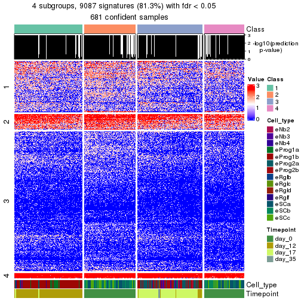</p>

</div>
</div>


Compare the overlap of signatures from different k:

```r
compare_signatures(res)
```


`get_signature()` returns a data frame invisibly. To get the list of signatures, the function
call should be assigned to a variable explicitly. In following code, if `plot` argument is set
to `FALSE`, no heatmap is plotted while only the differential analysis is performed.

```r
# code only for demonstration
tb = get_signature(res, k = ..., plot = FALSE)
```

An example of the output of `tb` is:

```
#>   which_row         fdr    mean_1    mean_2 scaled_mean_1 scaled_mean_2 km
#> 1        38 0.042760348  8.373488  9.131774    -0.5533452     0.5164555  1
#> 2        40 0.018707592  7.106213  8.469186    -0.6173731     0.5762149  1
#> 3        55 0.019134737 10.221463 11.207825    -0.6159697     0.5749050  1
#> 4        59 0.006059896  5.921854  7.869574    -0.6899429     0.6439467  1
#> 5        60 0.018055526  8.928898 10.211722    -0.6204761     0.5791110  1
#> 6        98 0.009384629 15.714769 14.887706     0.6635654    -0.6193277  2
...
```

The columns in `tb` are:

1. `which_row`: row indices corresponding to the input matrix.
2. `fdr`: FDR for the differential test. 
3. `mean_x`: The mean value in group x.
4. `scaled_mean_x`: The mean value in group x after rows are scaled.
5. `km`: Row groups if k-means clustering is applied to rows (which is done by automatically selecting number of clusters).

If there are too many signatures, `top_signatures = ...` can be set to only show the 
signatures with the highest FDRs:

```r
# code only for demonstration
# e.g. to show the top 500 most significant rows
tb = get_signature(res, k = ..., top_signatures = 500)
```

If the signatures are defined as these which are uniquely high in current group, `diff_method` argument
can be set to `"uniquely_high_in_one_group"`:

```r
# code only for demonstration
tb = get_signature(res, k = ..., diff_method = "uniquely_high_in_one_group")
```


UMAP plot which shows how samples are separated.


<script>
$( function() {
	$( '#tabs-node-02-dimension-reduction' ).tabs();
} );
</script>
<div id='tabs-node-02-dimension-reduction'>
<ul>
<li><a href='#tab-node-02-dimension-reduction-1'>k = 2</a></li>
<li><a href='#tab-node-02-dimension-reduction-2'>k = 3</a></li>
<li><a href='#tab-node-02-dimension-reduction-3'>k = 4</a></li>
</ul>
<div id='tab-node-02-dimension-reduction-1'>
<pre><code class="r">dimension_reduction(res, k = 2, method = &quot;UMAP&quot;)
</code></pre>

<p>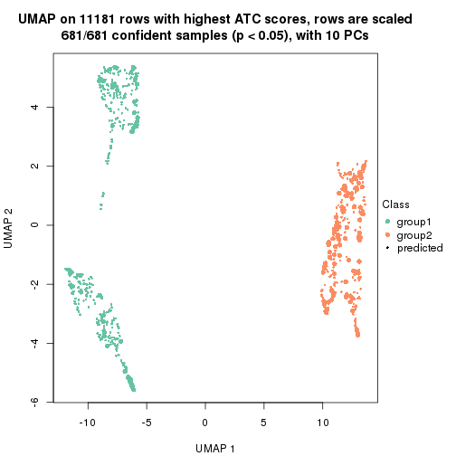</p>

</div>
<div id='tab-node-02-dimension-reduction-2'>
<pre><code class="r">dimension_reduction(res, k = 3, method = &quot;UMAP&quot;)
</code></pre>

<p></p>

</div>
<div id='tab-node-02-dimension-reduction-3'>
<pre><code class="r">dimension_reduction(res, k = 4, method = &quot;UMAP&quot;)
</code></pre>

<p></p>

</div>
</div>


Following heatmap shows how subgroups are split when increasing `k`:

```r
collect_classes(res)
```


Test correlation between subgroups and known annotations. If the known
annotation is numeric, one-way ANOVA test is applied, and if the known
annotation is discrete, chi-squared contingency table test is applied.

```r
test_to_known_factors(res)
```

```
#>             n_sample Cell_type(p-value) Timepoint(p-value) k
#> ATC:skmeans      681          3.96e-137          2.77e-147 2
#> ATC:skmeans      642          5.09e-244          9.95e-270 3
#> ATC:skmeans      600          3.77e-213          2.86e-240 4
```


If matrix rows can be associated to genes, consider to use `functional_enrichment(res,
...)` to perform function enrichment for the signature genes. See [this vignette](https://jokergoo.github.io/cola_vignettes/functional_enrichment.html) for more detailed explanations.


 

---------------------------------------------------


### Node021


Parent node: [Node02](#Node02).
Child nodes: 
                Node0111-leaf
        ,
                [Node0112](#Node0112)
        ,
                Node0113-leaf
        ,
                [Node0121](#Node0121)
        ,
                [Node0122](#Node0122)
        ,
                [Node0131](#Node0131)
        ,
                [Node0132](#Node0132)
        ,
                Node0133-leaf
        ,
                Node0211-leaf
        ,
                [Node0212](#Node0212)
        ,
                Node0221-leaf
        ,
                Node0222-leaf
        ,
                Node0223-leaf
        ,
                [Node0231](#Node0231)
        ,
                Node0232-leaf
        ,
                Node0241-leaf
        ,
                Node0242-leaf
        ,
                Node0243-leaf
        ,
                Node0331-leaf
        ,
                Node0332-leaf
        ,
                Node0333-leaf
        ,
                Node0334-leaf
        .


The object with results only for a single top-value method and a single partitioning method 
can be extracted as:

```r
res = res_rh["021"]
```

A summary of `res` and all the functions that can be applied to it:

```r
res
```

```
#> A 'ConsensusPartition' object with k = 2, 3, 4.
#>   On a matrix with 10020 rows and 206 columns.
#>   Top rows (974) are extracted by 'ATC' method.
#>   Subgroups are detected by 'skmeans' method.
#>   Performed in total 150 partitions by row resampling.
#>   Best k for subgroups seems to be 2.
#> 
#> Following methods can be applied to this 'ConsensusPartition' object:
#>  [1] "cola_report"             "collect_classes"         "collect_plots"          
#>  [4] "collect_stats"           "colnames"                "compare_partitions"     
#>  [7] "compare_signatures"      "consensus_heatmap"       "dimension_reduction"    
#> [10] "functional_enrichment"   "get_anno_col"            "get_anno"               
#> [13] "get_classes"             "get_consensus"           "get_matrix"             
#> [16] "get_membership"          "get_param"               "get_signatures"         
#> [19] "get_stats"               "is_best_k"               "is_stable_k"            
#> [22] "membership_heatmap"      "ncol"                    "nrow"                   
#> [25] "plot_ecdf"               "predict_classes"         "rownames"               
#> [28] "select_partition_number" "show"                    "suggest_best_k"         
#> [31] "test_to_known_factors"   "top_rows_heatmap"
```

`collect_plots()` function collects all the plots made from `res` for all `k` (number of subgroups)
into one single page to provide an easy and fast comparison between different `k`.

```r
collect_plots(res)
```


The plots are:

- The first row: a plot of the eCDF (empirical cumulative distribution
  function) curves of the consensus matrix for each `k` and the heatmap of
  predicted classes for each `k`.
- The second row: heatmaps of the consensus matrix for each `k`.
- The third row: heatmaps of the membership matrix for each `k`.
- The fouth row: heatmaps of the signatures for each `k`.

All the plots in panels can be made by individual functions and they are
plotted later in this section.

`select_partition_number()` produces several plots showing different
statistics for choosing "optimized" `k`. There are following statistics:

- eCDF curves of the consensus matrix for each `k`;
- 1-PAC. [The PAC score](https://en.wikipedia.org/wiki/Consensus_clustering#Over-interpretation_potential_of_consensus_clustering)
  measures the proportion of the ambiguous subgrouping.
- Mean silhouette score.
- Concordance. The mean probability of fiting the consensus subgroup labels in all
  partitions.
- Area increased. Denote $A_k$ as the area under the eCDF curve for current
  `k`, the area increased is defined as $A_k - A_{k-1}$.
- Rand index. The percent of pairs of samples that are both in a same cluster
  or both are not in a same cluster in the partition of k and k-1.
- Jaccard index. The ratio of pairs of samples are both in a same cluster in
  the partition of k and k-1 and the pairs of samples are both in a same
  cluster in the partition k or k-1.

The detailed explanations of these statistics can be found in [the _cola_
vignette](https://jokergoo.github.io/cola_vignettes/cola.html#toc_13).

Generally speaking, higher 1-PAC score, higher mean silhouette score or higher
concordance corresponds to better partition. Rand index and Jaccard index
measure how similar the current partition is compared to partition with `k-1`.
If they are too similar, we won't accept `k` is better than `k-1`.

```r
select_partition_number(res)
```


The numeric values for all these statistics can be obtained by `get_stats()`.

```r
get_stats(res)
```

```
#>   k 1-PAC mean_silhouette concordance area_increased  Rand Jaccard
#> 2 2 0.959           0.947       0.978         0.5006 0.501   0.501
#> 3 3 0.886           0.930       0.964         0.3241 0.753   0.544
#> 4 4 0.800           0.683       0.857         0.0902 0.842   0.595
```

`suggest_best_k()` suggests the best $k$ based on these statistics. The rules are as follows:

- All $k$ with Jaccard index larger than 0.95 are removed because increasing
  $k$ does not provide enough extra information. If all $k$ are removed, it is
  marked as no subgroup is detected.
- For all $k$ with 1-PAC score larger than 0.9, the maximal $k$ is taken as
  the best $k$, and other $k$ are marked as optional $k$.
- If it does not fit the second rule. The $k$ with the maximal vote of the
  highest 1-PAC score, highest mean silhouette, and highest concordance is
  taken as the best $k$.

```r
suggest_best_k(res)
```

```
#> [1] 2
```


Following is the table of the partitions (You need to click the **show/hide
code output** link to see it). The membership matrix (columns with name `p*`)
is inferred by
[`clue::cl_consensus()`](https://www.rdocumentation.org/link/cl_consensus?package=clue)
function with the `SE` method. Basically the value in the membership matrix
represents the probability to belong to a certain group. The finall subgroup
label for an item is determined with the group with highest probability it
belongs to.

In `get_classes()` function, the entropy is calculated from the membership
matrix and the silhouette score is calculated from the consensus matrix.


<script>
$( function() {
	$( '#tabs-node-021-get-classes' ).tabs();
} );
</script>
<div id='tabs-node-021-get-classes'>
<ul>
<li><a href='#tab-node-021-get-classes-1'>k = 2</a></li>
<li><a href='#tab-node-021-get-classes-2'>k = 3</a></li>
<li><a href='#tab-node-021-get-classes-3'>k = 4</a></li>
</ul>

<div id='tab-node-021-get-classes-1'>
<p><a id='tab-node-021-get-classes-1-a' style='color:#0366d6' href='#'>show/hide code output</a></p>
<pre><code class="r">cbind(get_classes(res, k = 2), get_membership(res, k = 2))
</code></pre>

<pre><code>#&gt;                 class entropy silhouette   p1   p2
#&gt; 1772122_205_E06     2   0.000      0.974 0.00 1.00
#&gt; 1772122_204_D11     2   0.000      0.974 0.00 1.00
#&gt; 1772122_206_A03     1   0.000      0.981 1.00 0.00
#&gt; 1772122_204_F08     2   0.000      0.974 0.00 1.00
#&gt; 1772122_206_D01     2   0.000      0.974 0.00 1.00
#&gt; 1772122_204_C01     2   0.722      0.752 0.20 0.80
#&gt; 1772122_262_A07     2   0.000      0.974 0.00 1.00
#&gt; 1772122_206_B06     2   0.000      0.974 0.00 1.00
#&gt; 1772122_205_A06     2   0.000      0.974 0.00 1.00
#&gt; 1772122_205_E05     1   0.000      0.981 1.00 0.00
#&gt; 1772122_306_H05     2   0.000      0.974 0.00 1.00
#&gt; 1772122_315_C06     2   0.000      0.974 0.00 1.00
#&gt; 1772122_315_F05     2   0.958      0.402 0.38 0.62
#&gt; 1772122_315_G05     2   0.000      0.974 0.00 1.00
#&gt; 1772122_315_F06     2   0.000      0.974 0.00 1.00
#&gt; 1772122_315_E04     2   0.000      0.974 0.00 1.00
#&gt; 1772122_305_D09     2   0.000      0.974 0.00 1.00
#&gt; 1772122_305_F04     2   0.000      0.974 0.00 1.00
#&gt; 1772122_305_F02     2   0.000      0.974 0.00 1.00
#&gt; 1772122_204_D02     2   0.000      0.974 0.00 1.00
#&gt; 1772122_206_B03     2   0.000      0.974 0.00 1.00
#&gt; 1772122_206_G04     1   0.000      0.981 1.00 0.00
#&gt; 1772122_205_H04     2   0.000      0.974 0.00 1.00
#&gt; 1772122_206_A02     2   0.000      0.974 0.00 1.00
#&gt; 1772122_204_G07     2   0.000      0.974 0.00 1.00
#&gt; 1772122_205_C06     1   0.000      0.981 1.00 0.00
#&gt; 1772122_205_D08     1   0.000      0.981 1.00 0.00
#&gt; 1772122_204_G01     1   0.000      0.981 1.00 0.00
#&gt; 1772122_262_E11     2   0.000      0.974 0.00 1.00
#&gt; 1772122_205_H11     2   0.000      0.974 0.00 1.00
#&gt; 1772122_205_E04     1   0.995      0.137 0.54 0.46
#&gt; 1772122_204_B09     2   0.000      0.974 0.00 1.00
#&gt; 1772122_204_B05     1   0.000      0.981 1.00 0.00
#&gt; 1772122_206_B04     2   0.000      0.974 0.00 1.00
#&gt; 1772122_206_B11     2   0.000      0.974 0.00 1.00
#&gt; 1772122_204_A06     2   0.904      0.543 0.32 0.68
#&gt; 1772122_205_G05     1   0.000      0.981 1.00 0.00
#&gt; 1772122_205_C01     2   0.000      0.974 0.00 1.00
#&gt; 1772122_262_B09     1   0.000      0.981 1.00 0.00
#&gt; 1772122_262_H11     1   0.000      0.981 1.00 0.00
#&gt; 1772122_205_D09     1   0.000      0.981 1.00 0.00
#&gt; 1772122_204_C10     1   0.000      0.981 1.00 0.00
#&gt; 1772122_206_F01     2   0.000      0.974 0.00 1.00
#&gt; 1772122_205_A07     2   0.000      0.974 0.00 1.00
#&gt; 1772122_206_E08     2   0.000      0.974 0.00 1.00
#&gt; 1772122_206_F03     1   0.000      0.981 1.00 0.00
#&gt; 1772122_262_C10     1   0.000      0.981 1.00 0.00
#&gt; 1772122_204_C09     2   0.000      0.974 0.00 1.00
#&gt; 1772122_206_G12     1   0.000      0.981 1.00 0.00
#&gt; 1772122_205_A08     1   0.000      0.981 1.00 0.00
#&gt; 1772122_206_H04     2   0.000      0.974 0.00 1.00
#&gt; 1772122_204_E04     1   0.000      0.981 1.00 0.00
#&gt; 1772122_205_G08     2   0.327      0.920 0.06 0.94
#&gt; 1772122_204_A02     2   0.000      0.974 0.00 1.00
#&gt; 1772122_206_H07     2   0.000      0.974 0.00 1.00
#&gt; 1772122_205_C11     1   0.000      0.981 1.00 0.00
#&gt; 1772122_204_A09     1   0.000      0.981 1.00 0.00
#&gt; 1772122_206_C02     1   0.000      0.981 1.00 0.00
#&gt; 1772122_204_C08     2   0.000      0.974 0.00 1.00
#&gt; 1772122_204_F07     2   0.000      0.974 0.00 1.00
#&gt; 1772122_204_B06     2   0.000      0.974 0.00 1.00
#&gt; 1772122_206_D02     2   0.000      0.974 0.00 1.00
#&gt; 1772122_204_C07     1   0.000      0.981 1.00 0.00
#&gt; 1772122_205_D05     1   0.000      0.981 1.00 0.00
#&gt; 1772122_204_A05     1   0.000      0.981 1.00 0.00
#&gt; 1772122_206_G10     1   0.000      0.981 1.00 0.00
#&gt; 1772122_206_A12     1   0.000      0.981 1.00 0.00
#&gt; 1772122_262_A09     1   0.000      0.981 1.00 0.00
#&gt; 1772122_205_E10     2   0.000      0.974 0.00 1.00
#&gt; 1772122_206_A08     2   0.000      0.974 0.00 1.00
#&gt; 1772122_205_A12     1   0.000      0.981 1.00 0.00
#&gt; 1772122_204_B03     1   0.000      0.981 1.00 0.00
#&gt; 1772122_262_G07     2   0.000      0.974 0.00 1.00
#&gt; 1772122_262_B05     1   0.000      0.981 1.00 0.00
#&gt; 1772122_262_A04     1   0.000      0.981 1.00 0.00
#&gt; 1772122_262_H03     1   0.000      0.981 1.00 0.00
#&gt; 1772122_206_B08     2   0.000      0.974 0.00 1.00
#&gt; 1772122_204_D12     1   0.000      0.981 1.00 0.00
#&gt; 1772122_206_G03     1   0.000      0.981 1.00 0.00
#&gt; 1772122_205_H12     1   0.000      0.981 1.00 0.00
#&gt; 1772122_262_F12     1   0.000      0.981 1.00 0.00
#&gt; 1772122_204_F02     2   0.000      0.974 0.00 1.00
#&gt; 1772122_206_C10     2   0.000      0.974 0.00 1.00
#&gt; 1772122_204_D01     1   0.000      0.981 1.00 0.00
#&gt; 1772122_206_C07     1   0.000      0.981 1.00 0.00
#&gt; 1772122_262_C08     1   0.000      0.981 1.00 0.00
#&gt; 1772122_206_G01     1   0.000      0.981 1.00 0.00
#&gt; 1772122_205_E02     2   0.000      0.974 0.00 1.00
#&gt; 1772122_262_H08     1   0.000      0.981 1.00 0.00
#&gt; 1772122_326_D09     2   0.000      0.974 0.00 1.00
#&gt; 1772122_204_F01     2   0.000      0.974 0.00 1.00
#&gt; 1772122_206_F04     2   0.000      0.974 0.00 1.00
#&gt; 1772122_206_E09     2   0.000      0.974 0.00 1.00
#&gt; 1772122_206_E10     2   0.000      0.974 0.00 1.00
#&gt; 1772122_205_H09     1   0.000      0.981 1.00 0.00
#&gt; 1772122_206_C06     2   0.000      0.974 0.00 1.00
#&gt; 1772122_204_D03     1   0.881      0.572 0.70 0.30
#&gt; 1772122_206_C04     2   0.000      0.974 0.00 1.00
#&gt; 1772122_262_A11     1   0.000      0.981 1.00 0.00
#&gt; 1772122_205_H06     2   0.000      0.974 0.00 1.00
#&gt; 1772122_262_F11     1   0.000      0.981 1.00 0.00
#&gt; 1772122_204_D09     1   0.000      0.981 1.00 0.00
#&gt; 1772122_205_H05     2   0.000      0.974 0.00 1.00
#&gt; 1772122_206_B12     1   0.000      0.981 1.00 0.00
#&gt; 1772122_204_B02     2   0.000      0.974 0.00 1.00
#&gt; 1772122_204_B07     2   0.000      0.974 0.00 1.00
#&gt; 1772122_205_C07     2   0.000      0.974 0.00 1.00
#&gt; 1772122_262_F03     1   0.000      0.981 1.00 0.00
#&gt; 1772122_206_D11     2   0.000      0.974 0.00 1.00
#&gt; 1772122_205_A04     1   0.760      0.714 0.78 0.22
#&gt; 1772122_205_F05     1   0.000      0.981 1.00 0.00
#&gt; 1772122_205_B04     1   0.000      0.981 1.00 0.00
#&gt; 1772122_206_C03     1   0.000      0.981 1.00 0.00
#&gt; 1772122_204_A11     2   0.000      0.974 0.00 1.00
#&gt; 1772122_262_E08     1   0.000      0.981 1.00 0.00
#&gt; 1772122_262_B10     1   0.000      0.981 1.00 0.00
#&gt; 1772122_206_G06     2   0.981      0.285 0.42 0.58
#&gt; 1772122_205_G04     1   0.000      0.981 1.00 0.00
#&gt; 1772122_262_D05     1   0.000      0.981 1.00 0.00
#&gt; 1772122_206_F06     1   0.000      0.981 1.00 0.00
#&gt; 1772122_206_E12     1   0.000      0.981 1.00 0.00
#&gt; 1772122_204_C11     2   0.000      0.974 0.00 1.00
#&gt; 1772122_262_B07     2   0.000      0.974 0.00 1.00
#&gt; 1772122_204_C03     2   0.000      0.974 0.00 1.00
#&gt; 1772122_204_A04     2   0.000      0.974 0.00 1.00
#&gt; 1772122_205_H03     1   0.000      0.981 1.00 0.00
#&gt; 1772122_205_B09     1   0.000      0.981 1.00 0.00
#&gt; 1772122_205_F09     1   0.000      0.981 1.00 0.00
#&gt; 1772122_205_A09     2   0.000      0.974 0.00 1.00
#&gt; 1772122_205_E08     1   0.000      0.981 1.00 0.00
#&gt; 1772122_262_C05     1   0.000      0.981 1.00 0.00
#&gt; 1772122_262_G06     1   0.000      0.981 1.00 0.00
#&gt; 1772122_262_F10     2   0.000      0.974 0.00 1.00
#&gt; 1772122_204_B10     1   0.000      0.981 1.00 0.00
#&gt; 1772122_205_G03     2   0.000      0.974 0.00 1.00
#&gt; 1772122_206_A05     2   0.925      0.498 0.34 0.66
#&gt; 1772122_205_D06     2   0.000      0.974 0.00 1.00
#&gt; 1772122_206_E03     1   0.000      0.981 1.00 0.00
#&gt; 1772122_206_B07     1   0.000      0.981 1.00 0.00
#&gt; 1772122_204_A03     1   0.000      0.981 1.00 0.00
#&gt; 1772122_262_B08     1   0.760      0.716 0.78 0.22
#&gt; 1772122_206_E04     1   0.327      0.924 0.94 0.06
#&gt; 1772122_205_D04     2   0.000      0.974 0.00 1.00
#&gt; 1772122_262_D09     1   0.000      0.981 1.00 0.00
#&gt; 1772122_205_A01     1   0.000      0.981 1.00 0.00
#&gt; 1772122_204_B01     1   0.000      0.981 1.00 0.00
#&gt; 1772122_206_H09     2   0.584      0.832 0.14 0.86
#&gt; 1772122_206_D05     1   0.000      0.981 1.00 0.00
#&gt; 1772122_205_B03     1   0.000      0.981 1.00 0.00
#&gt; 1772122_205_G12     1   0.000      0.981 1.00 0.00
#&gt; 1772122_262_G12     2   0.327      0.920 0.06 0.94
#&gt; 1772122_204_C02     2   0.000      0.974 0.00 1.00
#&gt; 1772122_262_A01     1   0.000      0.981 1.00 0.00
#&gt; 1772122_206_B02     2   0.000      0.974 0.00 1.00
#&gt; 1772122_205_C10     1   0.000      0.981 1.00 0.00
#&gt; 1772122_205_D11     2   0.000      0.974 0.00 1.00
#&gt; 1772122_204_E01     1   0.000      0.981 1.00 0.00
#&gt; 1772122_262_B06     2   0.000      0.974 0.00 1.00
#&gt; 1772122_262_E05     2   0.634      0.807 0.16 0.84
#&gt; 1772122_206_C11     2   0.000      0.974 0.00 1.00
#&gt; 1772122_204_D08     1   0.000      0.981 1.00 0.00
#&gt; 1772122_205_A11     2   0.000      0.974 0.00 1.00
#&gt; 1772122_205_D07     2   0.000      0.974 0.00 1.00
#&gt; 1772122_262_F08     1   0.000      0.981 1.00 0.00
#&gt; 1772122_262_G11     1   0.000      0.981 1.00 0.00
#&gt; 1772122_205_H10     1   0.000      0.981 1.00 0.00
#&gt; 1772122_204_B12     1   0.000      0.981 1.00 0.00
#&gt; 1772122_205_A10     1   0.000      0.981 1.00 0.00
#&gt; 1772122_262_D07     2   0.827      0.657 0.26 0.74
#&gt; 1772122_205_F10     1   0.000      0.981 1.00 0.00
#&gt; 1772122_204_G06     1   0.000      0.981 1.00 0.00
#&gt; 1772122_205_E12     1   0.000      0.981 1.00 0.00
#&gt; 1772122_206_E05     1   0.904      0.530 0.68 0.32
#&gt; 1772122_206_C05     2   0.000      0.974 0.00 1.00
#&gt; 1772122_205_C12     1   0.000      0.981 1.00 0.00
#&gt; 1772122_204_E07     2   0.000      0.974 0.00 1.00
#&gt; 1772122_205_F06     2   0.000      0.974 0.00 1.00
#&gt; 1772122_262_A12     1   0.000      0.981 1.00 0.00
#&gt; 1772122_204_E06     2   0.000      0.974 0.00 1.00
#&gt; 1772122_205_B06     2   0.000      0.974 0.00 1.00
#&gt; 1772122_262_A08     1   0.327      0.923 0.94 0.06
#&gt; 1772122_206_G08     1   0.402      0.902 0.92 0.08
#&gt; 1772122_206_D12     2   0.000      0.974 0.00 1.00
#&gt; 1772122_262_D01     1   0.000      0.981 1.00 0.00
#&gt; 1772122_326_A09     2   0.469      0.878 0.10 0.90
#&gt; 1772122_326_E06     2   0.000      0.974 0.00 1.00
#&gt; 1772122_263_B07     1   0.000      0.981 1.00 0.00
#&gt; 1772122_324_E04     2   0.000      0.974 0.00 1.00
#&gt; 1772122_325_D02     2   0.000      0.974 0.00 1.00
#&gt; 1772122_326_E11     2   0.000      0.974 0.00 1.00
#&gt; 1772122_325_D07     2   0.000      0.974 0.00 1.00
#&gt; 1772122_324_A09     2   0.000      0.974 0.00 1.00
#&gt; 1772122_324_B04     2   0.000      0.974 0.00 1.00
#&gt; 1772122_326_H05     2   0.000      0.974 0.00 1.00
#&gt; 1772122_326_H12     2   0.000      0.974 0.00 1.00
#&gt; 1772122_263_D11     2   0.000      0.974 0.00 1.00
#&gt; 1772122_324_A10     2   0.141      0.956 0.02 0.98
#&gt; 1772122_324_C07     2   0.000      0.974 0.00 1.00
#&gt; 1772122_324_A11     2   0.000      0.974 0.00 1.00
#&gt; 1772122_324_E07     2   0.000      0.974 0.00 1.00
#&gt; 1772122_324_C01     2   0.000      0.974 0.00 1.00
#&gt; 1772122_326_H04     2   0.000      0.974 0.00 1.00
#&gt; 1772122_324_C02     2   0.000      0.974 0.00 1.00
#&gt; 1772122_324_B09     2   0.958      0.399 0.38 0.62
#&gt; 1772122_324_B06     2   0.000      0.974 0.00 1.00
#&gt; 1772122_324_D06     2   0.000      0.974 0.00 1.00
</code></pre>

<script>
$('#tab-node-021-get-classes-1-a').parent().next().next().hide();
$('#tab-node-021-get-classes-1-a').click(function(){
  $('#tab-node-021-get-classes-1-a').parent().next().next().toggle();
  return(false);
});
</script>
</div>

<div id='tab-node-021-get-classes-2'>
<p><a id='tab-node-021-get-classes-2-a' style='color:#0366d6' href='#'>show/hide code output</a></p>
<pre><code class="r">cbind(get_classes(res, k = 3), get_membership(res, k = 3))
</code></pre>

<pre><code>#&gt;                 class entropy silhouette   p1   p2   p3
#&gt; 1772122_205_E06     3  0.0000      0.956 0.00 0.00 1.00
#&gt; 1772122_204_D11     3  0.0000      0.956 0.00 0.00 1.00
#&gt; 1772122_206_A03     1  0.0000      0.991 1.00 0.00 0.00
#&gt; 1772122_204_F08     3  0.0000      0.956 0.00 0.00 1.00
#&gt; 1772122_206_D01     3  0.0000      0.956 0.00 0.00 1.00
#&gt; 1772122_204_C01     3  0.0000      0.956 0.00 0.00 1.00
#&gt; 1772122_262_A07     3  0.0000      0.956 0.00 0.00 1.00
#&gt; 1772122_206_B06     3  0.0000      0.956 0.00 0.00 1.00
#&gt; 1772122_205_A06     3  0.0000      0.956 0.00 0.00 1.00
#&gt; 1772122_205_E05     3  0.0892      0.940 0.02 0.00 0.98
#&gt; 1772122_306_H05     3  0.4002      0.771 0.00 0.16 0.84
#&gt; 1772122_315_C06     3  0.0000      0.956 0.00 0.00 1.00
#&gt; 1772122_315_F05     3  0.0000      0.956 0.00 0.00 1.00
#&gt; 1772122_315_G05     3  0.0000      0.956 0.00 0.00 1.00
#&gt; 1772122_315_F06     3  0.0000      0.956 0.00 0.00 1.00
#&gt; 1772122_315_E04     3  0.0000      0.956 0.00 0.00 1.00
#&gt; 1772122_305_D09     3  0.0000      0.956 0.00 0.00 1.00
#&gt; 1772122_305_F04     3  0.0000      0.956 0.00 0.00 1.00
#&gt; 1772122_305_F02     3  0.0000      0.956 0.00 0.00 1.00
#&gt; 1772122_204_D02     2  0.3686      0.863 0.00 0.86 0.14
#&gt; 1772122_206_B03     2  0.2537      0.904 0.00 0.92 0.08
#&gt; 1772122_206_G04     1  0.0000      0.991 1.00 0.00 0.00
#&gt; 1772122_205_H04     2  0.0000      0.934 0.00 1.00 0.00
#&gt; 1772122_206_A02     2  0.0892      0.930 0.00 0.98 0.02
#&gt; 1772122_204_G07     2  0.2066      0.914 0.00 0.94 0.06
#&gt; 1772122_205_C06     1  0.0000      0.991 1.00 0.00 0.00
#&gt; 1772122_205_D08     1  0.0000      0.991 1.00 0.00 0.00
#&gt; 1772122_204_G01     1  0.0000      0.991 1.00 0.00 0.00
#&gt; 1772122_262_E11     3  0.0000      0.956 0.00 0.00 1.00
#&gt; 1772122_205_H11     3  0.0000      0.956 0.00 0.00 1.00
#&gt; 1772122_205_E04     2  0.0000      0.934 0.00 1.00 0.00
#&gt; 1772122_204_B09     2  0.0892      0.930 0.00 0.98 0.02
#&gt; 1772122_204_B05     1  0.0000      0.991 1.00 0.00 0.00
#&gt; 1772122_206_B04     2  0.2959      0.891 0.00 0.90 0.10
#&gt; 1772122_206_B11     2  0.5016      0.758 0.00 0.76 0.24
#&gt; 1772122_204_A06     2  0.8953      0.500 0.26 0.56 0.18
#&gt; 1772122_205_G05     1  0.0892      0.972 0.98 0.02 0.00
#&gt; 1772122_205_C01     3  0.0000      0.956 0.00 0.00 1.00
#&gt; 1772122_262_B09     1  0.0000      0.991 1.00 0.00 0.00
#&gt; 1772122_262_H11     1  0.0000      0.991 1.00 0.00 0.00
#&gt; 1772122_205_D09     1  0.0000      0.991 1.00 0.00 0.00
#&gt; 1772122_204_C10     1  0.0000      0.991 1.00 0.00 0.00
#&gt; 1772122_206_F01     2  0.4555      0.807 0.00 0.80 0.20
#&gt; 1772122_205_A07     3  0.0000      0.956 0.00 0.00 1.00
#&gt; 1772122_206_E08     3  0.0000      0.956 0.00 0.00 1.00
#&gt; 1772122_206_F03     1  0.0000      0.991 1.00 0.00 0.00
#&gt; 1772122_262_C10     1  0.0000      0.991 1.00 0.00 0.00
#&gt; 1772122_204_C09     2  0.0000      0.934 0.00 1.00 0.00
#&gt; 1772122_206_G12     1  0.1529      0.949 0.96 0.04 0.00
#&gt; 1772122_205_A08     1  0.0000      0.991 1.00 0.00 0.00
#&gt; 1772122_206_H04     2  0.0000      0.934 0.00 1.00 0.00
#&gt; 1772122_204_E04     1  0.5560      0.556 0.70 0.00 0.30
#&gt; 1772122_205_G08     3  0.1529      0.923 0.00 0.04 0.96
#&gt; 1772122_204_A02     2  0.0000      0.934 0.00 1.00 0.00
#&gt; 1772122_206_H07     2  0.3686      0.863 0.00 0.86 0.14
#&gt; 1772122_205_C11     1  0.0000      0.991 1.00 0.00 0.00
#&gt; 1772122_204_A09     1  0.0000      0.991 1.00 0.00 0.00
#&gt; 1772122_206_C02     1  0.0000      0.991 1.00 0.00 0.00
#&gt; 1772122_204_C08     3  0.0000      0.956 0.00 0.00 1.00
#&gt; 1772122_204_F07     3  0.6045      0.286 0.00 0.38 0.62
#&gt; 1772122_204_B06     2  0.4796      0.784 0.00 0.78 0.22
#&gt; 1772122_206_D02     3  0.0000      0.956 0.00 0.00 1.00
#&gt; 1772122_204_C07     1  0.0000      0.991 1.00 0.00 0.00
#&gt; 1772122_205_D05     1  0.0000      0.991 1.00 0.00 0.00
#&gt; 1772122_204_A05     3  0.3686      0.826 0.14 0.00 0.86
#&gt; 1772122_206_G10     1  0.0000      0.991 1.00 0.00 0.00
#&gt; 1772122_206_A12     1  0.0000      0.991 1.00 0.00 0.00
#&gt; 1772122_262_A09     1  0.0000      0.991 1.00 0.00 0.00
#&gt; 1772122_205_E10     2  0.0000      0.934 0.00 1.00 0.00
#&gt; 1772122_206_A08     2  0.4796      0.784 0.00 0.78 0.22
#&gt; 1772122_205_A12     1  0.0000      0.991 1.00 0.00 0.00
#&gt; 1772122_204_B03     1  0.0000      0.991 1.00 0.00 0.00
#&gt; 1772122_262_G07     2  0.2959      0.891 0.00 0.90 0.10
#&gt; 1772122_262_B05     1  0.0000      0.991 1.00 0.00 0.00
#&gt; 1772122_262_A04     3  0.0892      0.940 0.02 0.00 0.98
#&gt; 1772122_262_H03     1  0.0000      0.991 1.00 0.00 0.00
#&gt; 1772122_206_B08     3  0.0000      0.956 0.00 0.00 1.00
#&gt; 1772122_204_D12     1  0.0000      0.991 1.00 0.00 0.00
#&gt; 1772122_206_G03     1  0.0000      0.991 1.00 0.00 0.00
#&gt; 1772122_205_H12     1  0.0000      0.991 1.00 0.00 0.00
#&gt; 1772122_262_F12     1  0.0000      0.991 1.00 0.00 0.00
#&gt; 1772122_204_F02     3  0.0000      0.956 0.00 0.00 1.00
#&gt; 1772122_206_C10     3  0.0000      0.956 0.00 0.00 1.00
#&gt; 1772122_204_D01     3  0.5397      0.627 0.28 0.00 0.72
#&gt; 1772122_206_C07     1  0.0000      0.991 1.00 0.00 0.00
#&gt; 1772122_262_C08     1  0.0000      0.991 1.00 0.00 0.00
#&gt; 1772122_206_G01     1  0.0000      0.991 1.00 0.00 0.00
#&gt; 1772122_205_E02     3  0.0000      0.956 0.00 0.00 1.00
#&gt; 1772122_262_H08     1  0.0000      0.991 1.00 0.00 0.00
#&gt; 1772122_326_D09     2  0.0000      0.934 0.00 1.00 0.00
#&gt; 1772122_204_F01     3  0.0000      0.956 0.00 0.00 1.00
#&gt; 1772122_206_F04     3  0.0000      0.956 0.00 0.00 1.00
#&gt; 1772122_206_E09     2  0.4796      0.784 0.00 0.78 0.22
#&gt; 1772122_206_E10     2  0.5397      0.697 0.00 0.72 0.28
#&gt; 1772122_205_H09     1  0.0000      0.991 1.00 0.00 0.00
#&gt; 1772122_206_C06     2  0.4555      0.807 0.00 0.80 0.20
#&gt; 1772122_204_D03     2  0.2537      0.875 0.08 0.92 0.00
#&gt; 1772122_206_C04     3  0.0000      0.956 0.00 0.00 1.00
#&gt; 1772122_262_A11     1  0.0000      0.991 1.00 0.00 0.00
#&gt; 1772122_205_H06     3  0.0000      0.956 0.00 0.00 1.00
#&gt; 1772122_262_F11     1  0.0000      0.991 1.00 0.00 0.00
#&gt; 1772122_204_D09     1  0.0000      0.991 1.00 0.00 0.00
#&gt; 1772122_205_H05     2  0.4796      0.784 0.00 0.78 0.22
#&gt; 1772122_206_B12     1  0.0000      0.991 1.00 0.00 0.00
#&gt; 1772122_204_B02     2  0.0000      0.934 0.00 1.00 0.00
#&gt; 1772122_204_B07     2  0.0892      0.930 0.00 0.98 0.02
#&gt; 1772122_205_C07     2  0.1529      0.923 0.00 0.96 0.04
#&gt; 1772122_262_F03     1  0.0000      0.991 1.00 0.00 0.00
#&gt; 1772122_206_D11     2  0.4002      0.845 0.00 0.84 0.16
#&gt; 1772122_205_A04     2  0.5835      0.500 0.34 0.66 0.00
#&gt; 1772122_205_F05     1  0.0000      0.991 1.00 0.00 0.00
#&gt; 1772122_205_B04     1  0.0000      0.991 1.00 0.00 0.00
#&gt; 1772122_206_C03     1  0.0000      0.991 1.00 0.00 0.00
#&gt; 1772122_204_A11     3  0.0000      0.956 0.00 0.00 1.00
#&gt; 1772122_262_E08     1  0.0000      0.991 1.00 0.00 0.00
#&gt; 1772122_262_B10     1  0.0000      0.991 1.00 0.00 0.00
#&gt; 1772122_206_G06     2  0.6530      0.781 0.12 0.76 0.12
#&gt; 1772122_205_G04     1  0.0000      0.991 1.00 0.00 0.00
#&gt; 1772122_262_D05     1  0.0000      0.991 1.00 0.00 0.00
#&gt; 1772122_206_F06     1  0.0000      0.991 1.00 0.00 0.00
#&gt; 1772122_206_E12     1  0.0000      0.991 1.00 0.00 0.00
#&gt; 1772122_204_C11     3  0.0000      0.956 0.00 0.00 1.00
#&gt; 1772122_262_B07     3  0.0000      0.956 0.00 0.00 1.00
#&gt; 1772122_204_C03     2  0.0892      0.930 0.00 0.98 0.02
#&gt; 1772122_204_A04     2  0.0892      0.930 0.00 0.98 0.02
#&gt; 1772122_205_H03     1  0.0000      0.991 1.00 0.00 0.00
#&gt; 1772122_205_B09     1  0.0000      0.991 1.00 0.00 0.00
#&gt; 1772122_205_F09     1  0.0000      0.991 1.00 0.00 0.00
#&gt; 1772122_205_A09     2  0.0892      0.930 0.00 0.98 0.02
#&gt; 1772122_205_E08     1  0.0000      0.991 1.00 0.00 0.00
#&gt; 1772122_262_C05     1  0.0000      0.991 1.00 0.00 0.00
#&gt; 1772122_262_G06     1  0.0000      0.991 1.00 0.00 0.00
#&gt; 1772122_262_F10     3  0.0892      0.939 0.00 0.02 0.98
#&gt; 1772122_204_B10     1  0.0000      0.991 1.00 0.00 0.00
#&gt; 1772122_205_G03     2  0.0000      0.934 0.00 1.00 0.00
#&gt; 1772122_206_A05     2  0.0000      0.934 0.00 1.00 0.00
#&gt; 1772122_205_D06     3  0.0000      0.956 0.00 0.00 1.00
#&gt; 1772122_206_E03     3  0.2066      0.906 0.06 0.00 0.94
#&gt; 1772122_206_B07     3  0.4796      0.727 0.22 0.00 0.78
#&gt; 1772122_204_A03     1  0.0000      0.991 1.00 0.00 0.00
#&gt; 1772122_262_B08     3  0.6387      0.572 0.30 0.02 0.68
#&gt; 1772122_206_E04     1  0.5397      0.601 0.72 0.00 0.28
#&gt; 1772122_205_D04     2  0.4796      0.784 0.00 0.78 0.22
#&gt; 1772122_262_D09     1  0.0000      0.991 1.00 0.00 0.00
#&gt; 1772122_205_A01     1  0.0000      0.991 1.00 0.00 0.00
#&gt; 1772122_204_B01     3  0.2959      0.867 0.10 0.00 0.90
#&gt; 1772122_206_H09     2  0.0892      0.930 0.00 0.98 0.02
#&gt; 1772122_206_D05     1  0.0000      0.991 1.00 0.00 0.00
#&gt; 1772122_205_B03     1  0.0000      0.991 1.00 0.00 0.00
#&gt; 1772122_205_G12     1  0.0000      0.991 1.00 0.00 0.00
#&gt; 1772122_262_G12     2  0.0000      0.934 0.00 1.00 0.00
#&gt; 1772122_204_C02     3  0.0000      0.956 0.00 0.00 1.00
#&gt; 1772122_262_A01     1  0.0000      0.991 1.00 0.00 0.00
#&gt; 1772122_206_B02     3  0.0000      0.956 0.00 0.00 1.00
#&gt; 1772122_205_C10     1  0.0000      0.991 1.00 0.00 0.00
#&gt; 1772122_205_D11     2  0.0000      0.934 0.00 1.00 0.00
#&gt; 1772122_204_E01     1  0.0000      0.991 1.00 0.00 0.00
#&gt; 1772122_262_B06     2  0.3340      0.878 0.00 0.88 0.12
#&gt; 1772122_262_E05     3  0.0000      0.956 0.00 0.00 1.00
#&gt; 1772122_206_C11     2  0.3340      0.878 0.00 0.88 0.12
#&gt; 1772122_204_D08     1  0.0000      0.991 1.00 0.00 0.00
#&gt; 1772122_205_A11     3  0.0000      0.956 0.00 0.00 1.00
#&gt; 1772122_205_D07     3  0.0000      0.956 0.00 0.00 1.00
#&gt; 1772122_262_F08     1  0.0000      0.991 1.00 0.00 0.00
#&gt; 1772122_262_G11     1  0.0000      0.991 1.00 0.00 0.00
#&gt; 1772122_205_H10     1  0.0000      0.991 1.00 0.00 0.00
#&gt; 1772122_204_B12     1  0.0000      0.991 1.00 0.00 0.00
#&gt; 1772122_205_A10     3  0.5016      0.695 0.24 0.00 0.76
#&gt; 1772122_262_D07     3  0.0000      0.956 0.00 0.00 1.00
#&gt; 1772122_205_F10     1  0.0000      0.991 1.00 0.00 0.00
#&gt; 1772122_204_G06     1  0.0000      0.991 1.00 0.00 0.00
#&gt; 1772122_205_E12     1  0.0000      0.991 1.00 0.00 0.00
#&gt; 1772122_206_E05     2  0.0000      0.934 0.00 1.00 0.00
#&gt; 1772122_206_C05     3  0.0000      0.956 0.00 0.00 1.00
#&gt; 1772122_205_C12     1  0.0000      0.991 1.00 0.00 0.00
#&gt; 1772122_204_E07     3  0.0000      0.956 0.00 0.00 1.00
#&gt; 1772122_205_F06     2  0.1529      0.922 0.00 0.96 0.04
#&gt; 1772122_262_A12     1  0.0000      0.991 1.00 0.00 0.00
#&gt; 1772122_204_E06     2  0.0000      0.934 0.00 1.00 0.00
#&gt; 1772122_205_B06     2  0.0892      0.930 0.00 0.98 0.02
#&gt; 1772122_262_A08     3  0.1529      0.924 0.04 0.00 0.96
#&gt; 1772122_206_G08     2  0.0892      0.922 0.02 0.98 0.00
#&gt; 1772122_206_D12     2  0.3340      0.878 0.00 0.88 0.12
#&gt; 1772122_262_D01     1  0.0000      0.991 1.00 0.00 0.00
#&gt; 1772122_326_A09     2  0.0000      0.934 0.00 1.00 0.00
#&gt; 1772122_326_E06     2  0.0000      0.934 0.00 1.00 0.00
#&gt; 1772122_263_B07     2  0.0000      0.934 0.00 1.00 0.00
#&gt; 1772122_324_E04     2  0.0000      0.934 0.00 1.00 0.00
#&gt; 1772122_325_D02     2  0.0000      0.934 0.00 1.00 0.00
#&gt; 1772122_326_E11     3  0.4002      0.804 0.00 0.16 0.84
#&gt; 1772122_325_D07     2  0.0000      0.934 0.00 1.00 0.00
#&gt; 1772122_324_A09     2  0.0000      0.934 0.00 1.00 0.00
#&gt; 1772122_324_B04     2  0.0000      0.934 0.00 1.00 0.00
#&gt; 1772122_326_H05     2  0.0000      0.934 0.00 1.00 0.00
#&gt; 1772122_326_H12     2  0.0000      0.934 0.00 1.00 0.00
#&gt; 1772122_263_D11     2  0.0000      0.934 0.00 1.00 0.00
#&gt; 1772122_324_A10     2  0.0000      0.934 0.00 1.00 0.00
#&gt; 1772122_324_C07     2  0.0000      0.934 0.00 1.00 0.00
#&gt; 1772122_324_A11     2  0.0000      0.934 0.00 1.00 0.00
#&gt; 1772122_324_E07     2  0.0000      0.934 0.00 1.00 0.00
#&gt; 1772122_324_C01     2  0.0000      0.934 0.00 1.00 0.00
#&gt; 1772122_326_H04     2  0.0000      0.934 0.00 1.00 0.00
#&gt; 1772122_324_C02     2  0.0000      0.934 0.00 1.00 0.00
#&gt; 1772122_324_B09     2  0.0000      0.934 0.00 1.00 0.00
#&gt; 1772122_324_B06     2  0.0000      0.934 0.00 1.00 0.00
#&gt; 1772122_324_D06     2  0.0000      0.934 0.00 1.00 0.00
</code></pre>

<script>
$('#tab-node-021-get-classes-2-a').parent().next().next().hide();
$('#tab-node-021-get-classes-2-a').click(function(){
  $('#tab-node-021-get-classes-2-a').parent().next().next().toggle();
  return(false);
});
</script>
</div>

<div id='tab-node-021-get-classes-3'>
<p><a id='tab-node-021-get-classes-3-a' style='color:#0366d6' href='#'>show/hide code output</a></p>
<pre><code class="r">cbind(get_classes(res, k = 4), get_membership(res, k = 4))
</code></pre>

<pre><code>#&gt;                 class entropy silhouette   p1   p2   p3   p4
#&gt; 1772122_205_E06     3  0.0000     0.4469 0.00 0.00 1.00 0.00
#&gt; 1772122_204_D11     3  0.0707     0.4218 0.00 0.00 0.98 0.02
#&gt; 1772122_206_A03     1  0.0000     0.9789 1.00 0.00 0.00 0.00
#&gt; 1772122_204_F08     3  0.3172     0.5558 0.00 0.00 0.84 0.16
#&gt; 1772122_206_D01     3  0.4855    -0.4981 0.00 0.00 0.60 0.40
#&gt; 1772122_204_C01     4  0.4948     0.7417 0.00 0.00 0.44 0.56
#&gt; 1772122_262_A07     3  0.4406    -0.3099 0.00 0.00 0.70 0.30
#&gt; 1772122_206_B06     3  0.0000     0.4469 0.00 0.00 1.00 0.00
#&gt; 1772122_205_A06     3  0.1637     0.3538 0.00 0.00 0.94 0.06
#&gt; 1772122_205_E05     4  0.5860     0.7453 0.04 0.00 0.38 0.58
#&gt; 1772122_306_H05     4  0.3853     0.1669 0.00 0.02 0.16 0.82
#&gt; 1772122_315_C06     3  0.4907    -0.5362 0.00 0.00 0.58 0.42
#&gt; 1772122_315_F05     4  0.4948     0.7245 0.00 0.00 0.44 0.56
#&gt; 1772122_315_G05     4  0.4977     0.7168 0.00 0.00 0.46 0.54
#&gt; 1772122_315_F06     4  0.4977     0.7168 0.00 0.00 0.46 0.54
#&gt; 1772122_315_E04     3  0.4907    -0.5362 0.00 0.00 0.58 0.42
#&gt; 1772122_305_D09     3  0.4907    -0.5362 0.00 0.00 0.58 0.42
#&gt; 1772122_305_F04     3  0.4907    -0.5362 0.00 0.00 0.58 0.42
#&gt; 1772122_305_F02     4  0.4907     0.7142 0.00 0.00 0.42 0.58
#&gt; 1772122_204_D02     3  0.5355     0.6311 0.00 0.02 0.62 0.36
#&gt; 1772122_206_B03     3  0.6510     0.5946 0.00 0.08 0.54 0.38
#&gt; 1772122_206_G04     1  0.0000     0.9789 1.00 0.00 0.00 0.00
#&gt; 1772122_205_H04     2  0.0000     0.8639 0.00 1.00 0.00 0.00
#&gt; 1772122_206_A02     3  0.6212     0.6064 0.00 0.06 0.56 0.38
#&gt; 1772122_204_G07     3  0.5355     0.6311 0.00 0.02 0.62 0.36
#&gt; 1772122_205_C06     1  0.0000     0.9789 1.00 0.00 0.00 0.00
#&gt; 1772122_205_D08     1  0.0000     0.9789 1.00 0.00 0.00 0.00
#&gt; 1772122_204_G01     1  0.0000     0.9789 1.00 0.00 0.00 0.00
#&gt; 1772122_262_E11     3  0.0707     0.4218 0.00 0.00 0.98 0.02
#&gt; 1772122_205_H11     3  0.1637     0.3721 0.00 0.00 0.94 0.06
#&gt; 1772122_205_E04     2  0.7250     0.5170 0.02 0.58 0.12 0.28
#&gt; 1772122_204_B09     3  0.6941     0.5690 0.00 0.12 0.52 0.36
#&gt; 1772122_204_B05     1  0.1211     0.9530 0.96 0.00 0.00 0.04
#&gt; 1772122_206_B04     3  0.5355     0.6311 0.00 0.02 0.62 0.36
#&gt; 1772122_206_B11     3  0.5355     0.6311 0.00 0.02 0.62 0.36
#&gt; 1772122_204_A06     4  0.6336    -0.0605 0.14 0.02 0.14 0.70
#&gt; 1772122_205_G05     1  0.1211     0.9530 0.96 0.00 0.00 0.04
#&gt; 1772122_205_C01     4  0.4907     0.7423 0.00 0.00 0.42 0.58
#&gt; 1772122_262_B09     1  0.1211     0.9530 0.96 0.00 0.00 0.04
#&gt; 1772122_262_H11     1  0.0000     0.9789 1.00 0.00 0.00 0.00
#&gt; 1772122_205_D09     1  0.1637     0.9366 0.94 0.00 0.00 0.06
#&gt; 1772122_204_C10     1  0.1211     0.9530 0.96 0.00 0.00 0.04
#&gt; 1772122_206_F01     3  0.5355     0.6311 0.00 0.02 0.62 0.36
#&gt; 1772122_205_A07     3  0.0000     0.4469 0.00 0.00 1.00 0.00
#&gt; 1772122_206_E08     4  0.4977     0.7273 0.00 0.00 0.46 0.54
#&gt; 1772122_206_F03     1  0.0000     0.9789 1.00 0.00 0.00 0.00
#&gt; 1772122_262_C10     1  0.0000     0.9789 1.00 0.00 0.00 0.00
#&gt; 1772122_204_C09     3  0.6941     0.5690 0.00 0.12 0.52 0.36
#&gt; 1772122_206_G12     1  0.3611     0.8560 0.86 0.08 0.00 0.06
#&gt; 1772122_205_A08     1  0.0000     0.9789 1.00 0.00 0.00 0.00
#&gt; 1772122_206_H04     2  0.5428     0.5386 0.00 0.60 0.02 0.38
#&gt; 1772122_204_E04     1  0.7707    -0.2444 0.44 0.00 0.24 0.32
#&gt; 1772122_205_G08     3  0.4977    -0.1416 0.00 0.00 0.54 0.46
#&gt; 1772122_204_A02     2  0.7904    -0.1176 0.00 0.36 0.34 0.30
#&gt; 1772122_206_H07     3  0.5355     0.6311 0.00 0.02 0.62 0.36
#&gt; 1772122_205_C11     1  0.0000     0.9789 1.00 0.00 0.00 0.00
#&gt; 1772122_204_A09     1  0.0000     0.9789 1.00 0.00 0.00 0.00
#&gt; 1772122_206_C02     1  0.1211     0.9530 0.96 0.00 0.00 0.04
#&gt; 1772122_204_C08     3  0.4907    -0.5592 0.00 0.00 0.58 0.42
#&gt; 1772122_204_F07     3  0.4855     0.6207 0.00 0.00 0.60 0.40
#&gt; 1772122_204_B06     3  0.5355     0.6311 0.00 0.02 0.62 0.36
#&gt; 1772122_206_D02     3  0.0000     0.4469 0.00 0.00 1.00 0.00
#&gt; 1772122_204_C07     1  0.0000     0.9789 1.00 0.00 0.00 0.00
#&gt; 1772122_205_D05     1  0.0000     0.9789 1.00 0.00 0.00 0.00
#&gt; 1772122_204_A05     4  0.6382     0.7193 0.08 0.00 0.34 0.58
#&gt; 1772122_206_G10     1  0.0707     0.9662 0.98 0.00 0.00 0.02
#&gt; 1772122_206_A12     1  0.0000     0.9789 1.00 0.00 0.00 0.00
#&gt; 1772122_262_A09     1  0.0000     0.9789 1.00 0.00 0.00 0.00
#&gt; 1772122_205_E10     2  0.1211     0.8422 0.00 0.96 0.00 0.04
#&gt; 1772122_206_A08     3  0.5355     0.6311 0.00 0.02 0.62 0.36
#&gt; 1772122_205_A12     1  0.0000     0.9789 1.00 0.00 0.00 0.00
#&gt; 1772122_204_B03     1  0.0000     0.9789 1.00 0.00 0.00 0.00
#&gt; 1772122_262_G07     3  0.5487     0.6133 0.00 0.02 0.58 0.40
#&gt; 1772122_262_B05     1  0.0000     0.9789 1.00 0.00 0.00 0.00
#&gt; 1772122_262_A04     4  0.5915     0.7455 0.04 0.00 0.40 0.56
#&gt; 1772122_262_H03     1  0.0000     0.9789 1.00 0.00 0.00 0.00
#&gt; 1772122_206_B08     4  0.4948     0.7417 0.00 0.00 0.44 0.56
#&gt; 1772122_204_D12     1  0.0000     0.9789 1.00 0.00 0.00 0.00
#&gt; 1772122_206_G03     1  0.0000     0.9789 1.00 0.00 0.00 0.00
#&gt; 1772122_205_H12     1  0.0000     0.9789 1.00 0.00 0.00 0.00
#&gt; 1772122_262_F12     1  0.0000     0.9789 1.00 0.00 0.00 0.00
#&gt; 1772122_204_F02     3  0.3610     0.5734 0.00 0.00 0.80 0.20
#&gt; 1772122_206_C10     3  0.3975    -0.1067 0.00 0.00 0.76 0.24
#&gt; 1772122_204_D01     4  0.6649     0.7022 0.10 0.00 0.34 0.56
#&gt; 1772122_206_C07     1  0.0000     0.9789 1.00 0.00 0.00 0.00
#&gt; 1772122_262_C08     1  0.0000     0.9789 1.00 0.00 0.00 0.00
#&gt; 1772122_206_G01     1  0.0000     0.9789 1.00 0.00 0.00 0.00
#&gt; 1772122_205_E02     4  0.4948     0.7417 0.00 0.00 0.44 0.56
#&gt; 1772122_262_H08     1  0.0000     0.9789 1.00 0.00 0.00 0.00
#&gt; 1772122_326_D09     2  0.0000     0.8639 0.00 1.00 0.00 0.00
#&gt; 1772122_204_F01     3  0.5535    -0.5842 0.00 0.02 0.56 0.42
#&gt; 1772122_206_F04     3  0.4977    -0.6339 0.00 0.00 0.54 0.46
#&gt; 1772122_206_E09     3  0.5355     0.6311 0.00 0.02 0.62 0.36
#&gt; 1772122_206_E10     3  0.5793     0.6247 0.00 0.04 0.60 0.36
#&gt; 1772122_205_H09     1  0.0000     0.9789 1.00 0.00 0.00 0.00
#&gt; 1772122_206_C06     3  0.5355     0.6311 0.00 0.02 0.62 0.36
#&gt; 1772122_204_D03     2  0.6853     0.5117 0.04 0.56 0.04 0.36
#&gt; 1772122_206_C04     3  0.0707     0.4218 0.00 0.00 0.98 0.02
#&gt; 1772122_262_A11     1  0.0000     0.9789 1.00 0.00 0.00 0.00
#&gt; 1772122_205_H06     3  0.0707     0.4218 0.00 0.00 0.98 0.02
#&gt; 1772122_262_F11     1  0.0000     0.9789 1.00 0.00 0.00 0.00
#&gt; 1772122_204_D09     1  0.1211     0.9530 0.96 0.00 0.00 0.04
#&gt; 1772122_205_H05     3  0.5355     0.6311 0.00 0.02 0.62 0.36
#&gt; 1772122_206_B12     1  0.0000     0.9789 1.00 0.00 0.00 0.00
#&gt; 1772122_204_B02     2  0.6766     0.4001 0.00 0.52 0.10 0.38
#&gt; 1772122_204_B07     3  0.7179     0.5343 0.00 0.14 0.48 0.38
#&gt; 1772122_205_C07     3  0.5793     0.6242 0.00 0.04 0.60 0.36
#&gt; 1772122_262_F03     1  0.0000     0.9789 1.00 0.00 0.00 0.00
#&gt; 1772122_206_D11     3  0.5355     0.6311 0.00 0.02 0.62 0.36
#&gt; 1772122_205_A04     4  0.9728    -0.2309 0.20 0.26 0.18 0.36
#&gt; 1772122_205_F05     1  0.0000     0.9789 1.00 0.00 0.00 0.00
#&gt; 1772122_205_B04     1  0.0000     0.9789 1.00 0.00 0.00 0.00
#&gt; 1772122_206_C03     1  0.1637     0.9368 0.94 0.00 0.00 0.06
#&gt; 1772122_204_A11     3  0.0000     0.4469 0.00 0.00 1.00 0.00
#&gt; 1772122_262_E08     1  0.0000     0.9789 1.00 0.00 0.00 0.00
#&gt; 1772122_262_B10     1  0.0000     0.9789 1.00 0.00 0.00 0.00
#&gt; 1772122_206_G06     3  0.5535     0.6035 0.00 0.02 0.56 0.42
#&gt; 1772122_205_G04     1  0.1211     0.9530 0.96 0.00 0.00 0.04
#&gt; 1772122_262_D05     1  0.0000     0.9789 1.00 0.00 0.00 0.00
#&gt; 1772122_206_F06     1  0.4079     0.7707 0.80 0.00 0.02 0.18
#&gt; 1772122_206_E12     1  0.0000     0.9789 1.00 0.00 0.00 0.00
#&gt; 1772122_204_C11     3  0.2345     0.5194 0.00 0.00 0.90 0.10
#&gt; 1772122_262_B07     3  0.1211     0.3911 0.00 0.00 0.96 0.04
#&gt; 1772122_204_C03     3  0.6988     0.5594 0.00 0.12 0.50 0.38
#&gt; 1772122_204_A04     3  0.6805     0.5660 0.00 0.10 0.50 0.40
#&gt; 1772122_205_H03     1  0.0000     0.9789 1.00 0.00 0.00 0.00
#&gt; 1772122_205_B09     1  0.0000     0.9789 1.00 0.00 0.00 0.00
#&gt; 1772122_205_F09     1  0.3400     0.7747 0.82 0.00 0.00 0.18
#&gt; 1772122_205_A09     3  0.7179     0.5320 0.00 0.14 0.48 0.38
#&gt; 1772122_205_E08     1  0.0000     0.9789 1.00 0.00 0.00 0.00
#&gt; 1772122_262_C05     1  0.0000     0.9789 1.00 0.00 0.00 0.00
#&gt; 1772122_262_G06     1  0.0000     0.9789 1.00 0.00 0.00 0.00
#&gt; 1772122_262_F10     4  0.5487     0.3330 0.00 0.02 0.40 0.58
#&gt; 1772122_204_B10     1  0.1211     0.9530 0.96 0.00 0.00 0.04
#&gt; 1772122_205_G03     2  0.7179     0.3189 0.00 0.48 0.14 0.38
#&gt; 1772122_206_A05     2  0.6262     0.4606 0.00 0.54 0.06 0.40
#&gt; 1772122_205_D06     3  0.2647     0.5328 0.00 0.00 0.88 0.12
#&gt; 1772122_206_E03     4  0.5915     0.7455 0.04 0.00 0.40 0.56
#&gt; 1772122_206_B07     4  0.6941     0.6818 0.12 0.00 0.36 0.52
#&gt; 1772122_204_A03     1  0.0000     0.9789 1.00 0.00 0.00 0.00
#&gt; 1772122_262_B08     4  0.7084     0.3885 0.14 0.00 0.34 0.52
#&gt; 1772122_206_E04     3  0.7768     0.3374 0.24 0.00 0.40 0.36
#&gt; 1772122_205_D04     3  0.5355     0.6311 0.00 0.02 0.62 0.36
#&gt; 1772122_262_D09     1  0.0707     0.9662 0.98 0.00 0.00 0.02
#&gt; 1772122_205_A01     1  0.1211     0.9529 0.96 0.00 0.00 0.04
#&gt; 1772122_204_B01     4  0.6150     0.7347 0.06 0.00 0.36 0.58
#&gt; 1772122_206_H09     4  0.7745    -0.3344 0.00 0.34 0.24 0.42
#&gt; 1772122_206_D05     1  0.0000     0.9789 1.00 0.00 0.00 0.00
#&gt; 1772122_205_B03     1  0.0000     0.9789 1.00 0.00 0.00 0.00
#&gt; 1772122_205_G12     1  0.0000     0.9789 1.00 0.00 0.00 0.00
#&gt; 1772122_262_G12     2  0.2011     0.8088 0.00 0.92 0.00 0.08
#&gt; 1772122_204_C02     4  0.4948     0.7417 0.00 0.00 0.44 0.56
#&gt; 1772122_262_A01     1  0.0000     0.9789 1.00 0.00 0.00 0.00
#&gt; 1772122_206_B02     3  0.1211     0.3896 0.00 0.00 0.96 0.04
#&gt; 1772122_205_C10     1  0.0000     0.9789 1.00 0.00 0.00 0.00
#&gt; 1772122_205_D11     2  0.0000     0.8639 0.00 1.00 0.00 0.00
#&gt; 1772122_204_E01     1  0.0000     0.9789 1.00 0.00 0.00 0.00
#&gt; 1772122_262_B06     3  0.5355     0.6311 0.00 0.02 0.62 0.36
#&gt; 1772122_262_E05     4  0.4907     0.7142 0.00 0.00 0.42 0.58
#&gt; 1772122_206_C11     3  0.5793     0.6242 0.00 0.04 0.60 0.36
#&gt; 1772122_204_D08     1  0.0000     0.9789 1.00 0.00 0.00 0.00
#&gt; 1772122_205_A11     3  0.2345     0.4561 0.00 0.00 0.90 0.10
#&gt; 1772122_205_D07     3  0.0000     0.4469 0.00 0.00 1.00 0.00
#&gt; 1772122_262_F08     1  0.0000     0.9789 1.00 0.00 0.00 0.00
#&gt; 1772122_262_G11     1  0.0000     0.9789 1.00 0.00 0.00 0.00
#&gt; 1772122_205_H10     1  0.0000     0.9789 1.00 0.00 0.00 0.00
#&gt; 1772122_204_B12     1  0.0000     0.9789 1.00 0.00 0.00 0.00
#&gt; 1772122_205_A10     4  0.6212     0.7357 0.06 0.00 0.38 0.56
#&gt; 1772122_262_D07     4  0.4948     0.7417 0.00 0.00 0.44 0.56
#&gt; 1772122_205_F10     1  0.0000     0.9789 1.00 0.00 0.00 0.00
#&gt; 1772122_204_G06     1  0.0000     0.9789 1.00 0.00 0.00 0.00
#&gt; 1772122_205_E12     1  0.0000     0.9789 1.00 0.00 0.00 0.00
#&gt; 1772122_206_E05     2  0.1637     0.8358 0.00 0.94 0.00 0.06
#&gt; 1772122_206_C05     3  0.2011     0.3113 0.00 0.00 0.92 0.08
#&gt; 1772122_205_C12     1  0.0000     0.9789 1.00 0.00 0.00 0.00
#&gt; 1772122_204_E07     3  0.0000     0.4469 0.00 0.00 1.00 0.00
#&gt; 1772122_205_F06     3  0.5793     0.6242 0.00 0.04 0.60 0.36
#&gt; 1772122_262_A12     1  0.0000     0.9789 1.00 0.00 0.00 0.00
#&gt; 1772122_204_E06     2  0.5986     0.5329 0.00 0.62 0.06 0.32
#&gt; 1772122_205_B06     2  0.7775    -0.0244 0.00 0.38 0.24 0.38
#&gt; 1772122_262_A08     4  0.5915     0.7457 0.04 0.00 0.40 0.56
#&gt; 1772122_206_G08     2  0.0000     0.8639 0.00 1.00 0.00 0.00
#&gt; 1772122_206_D12     3  0.6714     0.5921 0.00 0.10 0.54 0.36
#&gt; 1772122_262_D01     1  0.0000     0.9789 1.00 0.00 0.00 0.00
#&gt; 1772122_326_A09     2  0.0000     0.8639 0.00 1.00 0.00 0.00
#&gt; 1772122_326_E06     2  0.0000     0.8639 0.00 1.00 0.00 0.00
#&gt; 1772122_263_B07     2  0.0000     0.8639 0.00 1.00 0.00 0.00
#&gt; 1772122_324_E04     2  0.0000     0.8639 0.00 1.00 0.00 0.00
#&gt; 1772122_325_D02     2  0.0000     0.8639 0.00 1.00 0.00 0.00
#&gt; 1772122_326_E11     2  0.4134     0.6169 0.00 0.74 0.26 0.00
#&gt; 1772122_325_D07     2  0.0000     0.8639 0.00 1.00 0.00 0.00
#&gt; 1772122_324_A09     2  0.0000     0.8639 0.00 1.00 0.00 0.00
#&gt; 1772122_324_B04     2  0.0000     0.8639 0.00 1.00 0.00 0.00
#&gt; 1772122_326_H05     2  0.0000     0.8639 0.00 1.00 0.00 0.00
#&gt; 1772122_326_H12     2  0.0000     0.8639 0.00 1.00 0.00 0.00
#&gt; 1772122_263_D11     2  0.0000     0.8639 0.00 1.00 0.00 0.00
#&gt; 1772122_324_A10     2  0.0000     0.8639 0.00 1.00 0.00 0.00
#&gt; 1772122_324_C07     2  0.0000     0.8639 0.00 1.00 0.00 0.00
#&gt; 1772122_324_A11     2  0.0000     0.8639 0.00 1.00 0.00 0.00
#&gt; 1772122_324_E07     2  0.0000     0.8639 0.00 1.00 0.00 0.00
#&gt; 1772122_324_C01     2  0.0000     0.8639 0.00 1.00 0.00 0.00
#&gt; 1772122_326_H04     2  0.0000     0.8639 0.00 1.00 0.00 0.00
#&gt; 1772122_324_C02     2  0.0000     0.8639 0.00 1.00 0.00 0.00
#&gt; 1772122_324_B09     2  0.0000     0.8639 0.00 1.00 0.00 0.00
#&gt; 1772122_324_B06     2  0.0000     0.8639 0.00 1.00 0.00 0.00
#&gt; 1772122_324_D06     2  0.0000     0.8639 0.00 1.00 0.00 0.00
</code></pre>

<script>
$('#tab-node-021-get-classes-3-a').parent().next().next().hide();
$('#tab-node-021-get-classes-3-a').click(function(){
  $('#tab-node-021-get-classes-3-a').parent().next().next().toggle();
  return(false);
});
</script>
</div>
</div>

Heatmaps for the consensus matrix. It visualizes the probability of two
samples to be in a same group.


<script>
$( function() {
	$( '#tabs-node-021-consensus-heatmap' ).tabs();
} );
</script>
<div id='tabs-node-021-consensus-heatmap'>
<ul>
<li><a href='#tab-node-021-consensus-heatmap-1'>k = 2</a></li>
<li><a href='#tab-node-021-consensus-heatmap-2'>k = 3</a></li>
<li><a href='#tab-node-021-consensus-heatmap-3'>k = 4</a></li>
</ul>
<div id='tab-node-021-consensus-heatmap-1'>
<pre><code class="r">consensus_heatmap(res, k = 2)
</code></pre>

<p></p>

</div>
<div id='tab-node-021-consensus-heatmap-2'>
<pre><code class="r">consensus_heatmap(res, k = 3)
</code></pre>

<p>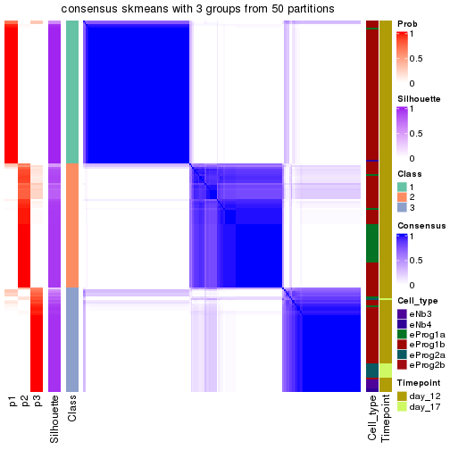</p>

</div>
<div id='tab-node-021-consensus-heatmap-3'>
<pre><code class="r">consensus_heatmap(res, k = 4)
</code></pre>

<p></p>

</div>
</div>

Heatmaps for the membership of samples in all partitions to see how consistent they are:


<script>
$( function() {
	$( '#tabs-node-021-membership-heatmap' ).tabs();
} );
</script>
<div id='tabs-node-021-membership-heatmap'>
<ul>
<li><a href='#tab-node-021-membership-heatmap-1'>k = 2</a></li>
<li><a href='#tab-node-021-membership-heatmap-2'>k = 3</a></li>
<li><a href='#tab-node-021-membership-heatmap-3'>k = 4</a></li>
</ul>
<div id='tab-node-021-membership-heatmap-1'>
<pre><code class="r">membership_heatmap(res, k = 2)
</code></pre>

<p></p>

</div>
<div id='tab-node-021-membership-heatmap-2'>
<pre><code class="r">membership_heatmap(res, k = 3)
</code></pre>

<p></p>

</div>
<div id='tab-node-021-membership-heatmap-3'>
<pre><code class="r">membership_heatmap(res, k = 4)
</code></pre>

<p></p>

</div>
</div>

As soon as the classes for columns are determined, the signatures
that are significantly different between subgroups can be looked for. 
Following are the heatmaps for signatures.


Signature heatmaps where rows are scaled:


<script>
$( function() {
	$( '#tabs-node-021-get-signatures' ).tabs();
} );
</script>
<div id='tabs-node-021-get-signatures'>
<ul>
<li><a href='#tab-node-021-get-signatures-1'>k = 2</a></li>
<li><a href='#tab-node-021-get-signatures-2'>k = 3</a></li>
<li><a href='#tab-node-021-get-signatures-3'>k = 4</a></li>
</ul>
<div id='tab-node-021-get-signatures-1'>
<pre><code class="r">get_signatures(res, k = 2)
</code></pre>

<p></p>

</div>
<div id='tab-node-021-get-signatures-2'>
<pre><code class="r">get_signatures(res, k = 3)
</code></pre>

<p>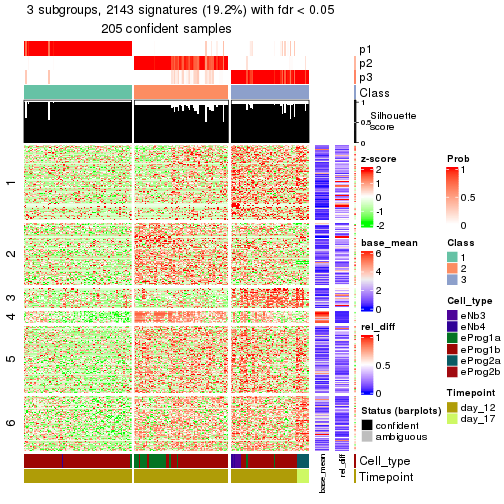</p>

</div>
<div id='tab-node-021-get-signatures-3'>
<pre><code class="r">get_signatures(res, k = 4)
</code></pre>

<p></p>

</div>
</div>


Signature heatmaps where rows are not scaled:


<script>
$( function() {
	$( '#tabs-node-021-get-signatures-no-scale' ).tabs();
} );
</script>
<div id='tabs-node-021-get-signatures-no-scale'>
<ul>
<li><a href='#tab-node-021-get-signatures-no-scale-1'>k = 2</a></li>
<li><a href='#tab-node-021-get-signatures-no-scale-2'>k = 3</a></li>
<li><a href='#tab-node-021-get-signatures-no-scale-3'>k = 4</a></li>
</ul>
<div id='tab-node-021-get-signatures-no-scale-1'>
<pre><code class="r">get_signatures(res, k = 2, scale_rows = FALSE)
</code></pre>

<p></p>

</div>
<div id='tab-node-021-get-signatures-no-scale-2'>
<pre><code class="r">get_signatures(res, k = 3, scale_rows = FALSE)
</code></pre>

<p></p>

</div>
<div id='tab-node-021-get-signatures-no-scale-3'>
<pre><code class="r">get_signatures(res, k = 4, scale_rows = FALSE)
</code></pre>

<p></p>

</div>
</div>


Compare the overlap of signatures from different k:

```r
compare_signatures(res)
```


`get_signature()` returns a data frame invisibly. To get the list of signatures, the function
call should be assigned to a variable explicitly. In following code, if `plot` argument is set
to `FALSE`, no heatmap is plotted while only the differential analysis is performed.

```r
# code only for demonstration
tb = get_signature(res, k = ..., plot = FALSE)
```

An example of the output of `tb` is:

```
#>   which_row         fdr    mean_1    mean_2 scaled_mean_1 scaled_mean_2 km
#> 1        38 0.042760348  8.373488  9.131774    -0.5533452     0.5164555  1
#> 2        40 0.018707592  7.106213  8.469186    -0.6173731     0.5762149  1
#> 3        55 0.019134737 10.221463 11.207825    -0.6159697     0.5749050  1
#> 4        59 0.006059896  5.921854  7.869574    -0.6899429     0.6439467  1
#> 5        60 0.018055526  8.928898 10.211722    -0.6204761     0.5791110  1
#> 6        98 0.009384629 15.714769 14.887706     0.6635654    -0.6193277  2
...
```

The columns in `tb` are:

1. `which_row`: row indices corresponding to the input matrix.
2. `fdr`: FDR for the differential test. 
3. `mean_x`: The mean value in group x.
4. `scaled_mean_x`: The mean value in group x after rows are scaled.
5. `km`: Row groups if k-means clustering is applied to rows (which is done by automatically selecting number of clusters).

If there are too many signatures, `top_signatures = ...` can be set to only show the 
signatures with the highest FDRs:

```r
# code only for demonstration
# e.g. to show the top 500 most significant rows
tb = get_signature(res, k = ..., top_signatures = 500)
```

If the signatures are defined as these which are uniquely high in current group, `diff_method` argument
can be set to `"uniquely_high_in_one_group"`:

```r
# code only for demonstration
tb = get_signature(res, k = ..., diff_method = "uniquely_high_in_one_group")
```


UMAP plot which shows how samples are separated.


<script>
$( function() {
	$( '#tabs-node-021-dimension-reduction' ).tabs();
} );
</script>
<div id='tabs-node-021-dimension-reduction'>
<ul>
<li><a href='#tab-node-021-dimension-reduction-1'>k = 2</a></li>
<li><a href='#tab-node-021-dimension-reduction-2'>k = 3</a></li>
<li><a href='#tab-node-021-dimension-reduction-3'>k = 4</a></li>
</ul>
<div id='tab-node-021-dimension-reduction-1'>
<pre><code class="r">dimension_reduction(res, k = 2, method = &quot;UMAP&quot;)
</code></pre>

<p></p>

</div>
<div id='tab-node-021-dimension-reduction-2'>
<pre><code class="r">dimension_reduction(res, k = 3, method = &quot;UMAP&quot;)
</code></pre>

<p></p>

</div>
<div id='tab-node-021-dimension-reduction-3'>
<pre><code class="r">dimension_reduction(res, k = 4, method = &quot;UMAP&quot;)
</code></pre>

<p></p>

</div>
</div>


Following heatmap shows how subgroups are split when increasing `k`:

```r
collect_classes(res)
```


Test correlation between subgroups and known annotations. If the known
annotation is numeric, one-way ANOVA test is applied, and if the known
annotation is discrete, chi-squared contingency table test is applied.

```r
test_to_known_factors(res)
```

```
#>             n_sample Cell_type(p-value) Timepoint(p-value) k
#> ATC:skmeans      201           8.11e-05           1.91e-02 2
#> ATC:skmeans      205           4.11e-14           4.93e-06 3
#> ATC:skmeans      165           1.62e-20           3.44e-06 4
```


If matrix rows can be associated to genes, consider to use `functional_enrichment(res,
...)` to perform function enrichment for the signature genes. See [this vignette](https://jokergoo.github.io/cola_vignettes/functional_enrichment.html) for more detailed explanations.


 

---------------------------------------------------


### Node0212


Parent node: [Node021](#Node021).
Child nodes: 
                Node01121-leaf
        ,
                Node01122-leaf
        ,
                Node01211-leaf
        ,
                Node01212-leaf
        ,
                Node01221-leaf
        ,
                Node01222-leaf
        ,
                Node01223-leaf
        ,
                Node01311-leaf
        ,
                Node01312-leaf
        ,
                Node01321-leaf
        ,
                Node01322-leaf
        ,
                Node02121-leaf
        ,
                Node02122-leaf
        ,
                Node02311-leaf
        ,
                Node02312-leaf
        .


The object with results only for a single top-value method and a single partitioning method 
can be extracted as:

```r
res = res_rh["0212"]
```

A summary of `res` and all the functions that can be applied to it:

```r
res
```

```
#> A 'ConsensusPartition' object with k = 2, 3, 4.
#>   On a matrix with 9514 rows and 111 columns.
#>   Top rows (826) are extracted by 'ATC' method.
#>   Subgroups are detected by 'skmeans' method.
#>   Performed in total 150 partitions by row resampling.
#>   Best k for subgroups seems to be 2.
#> 
#> Following methods can be applied to this 'ConsensusPartition' object:
#>  [1] "cola_report"             "collect_classes"         "collect_plots"          
#>  [4] "collect_stats"           "colnames"                "compare_partitions"     
#>  [7] "compare_signatures"      "consensus_heatmap"       "dimension_reduction"    
#> [10] "functional_enrichment"   "get_anno_col"            "get_anno"               
#> [13] "get_classes"             "get_consensus"           "get_matrix"             
#> [16] "get_membership"          "get_param"               "get_signatures"         
#> [19] "get_stats"               "is_best_k"               "is_stable_k"            
#> [22] "membership_heatmap"      "ncol"                    "nrow"                   
#> [25] "plot_ecdf"               "predict_classes"         "rownames"               
#> [28] "select_partition_number" "show"                    "suggest_best_k"         
#> [31] "test_to_known_factors"   "top_rows_heatmap"
```

`collect_plots()` function collects all the plots made from `res` for all `k` (number of subgroups)
into one single page to provide an easy and fast comparison between different `k`.

```r
collect_plots(res)
```

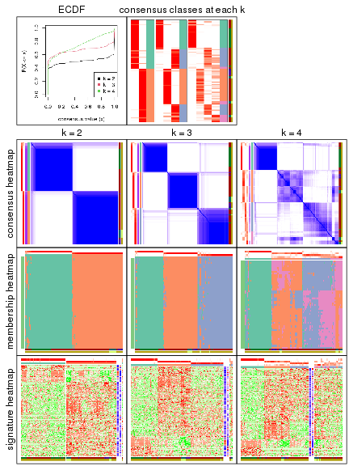

The plots are:

- The first row: a plot of the eCDF (empirical cumulative distribution
  function) curves of the consensus matrix for each `k` and the heatmap of
  predicted classes for each `k`.
- The second row: heatmaps of the consensus matrix for each `k`.
- The third row: heatmaps of the membership matrix for each `k`.
- The fouth row: heatmaps of the signatures for each `k`.

All the plots in panels can be made by individual functions and they are
plotted later in this section.

`select_partition_number()` produces several plots showing different
statistics for choosing "optimized" `k`. There are following statistics:

- eCDF curves of the consensus matrix for each `k`;
- 1-PAC. [The PAC score](https://en.wikipedia.org/wiki/Consensus_clustering#Over-interpretation_potential_of_consensus_clustering)
  measures the proportion of the ambiguous subgrouping.
- Mean silhouette score.
- Concordance. The mean probability of fiting the consensus subgroup labels in all
  partitions.
- Area increased. Denote $A_k$ as the area under the eCDF curve for current
  `k`, the area increased is defined as $A_k - A_{k-1}$.
- Rand index. The percent of pairs of samples that are both in a same cluster
  or both are not in a same cluster in the partition of k and k-1.
- Jaccard index. The ratio of pairs of samples are both in a same cluster in
  the partition of k and k-1 and the pairs of samples are both in a same
  cluster in the partition k or k-1.

The detailed explanations of these statistics can be found in [the _cola_
vignette](https://jokergoo.github.io/cola_vignettes/cola.html#toc_13).

Generally speaking, higher 1-PAC score, higher mean silhouette score or higher
concordance corresponds to better partition. Rand index and Jaccard index
measure how similar the current partition is compared to partition with `k-1`.
If they are too similar, we won't accept `k` is better than `k-1`.

```r
select_partition_number(res)
```


The numeric values for all these statistics can be obtained by `get_stats()`.

```r
get_stats(res)
```

```
#>   k 1-PAC mean_silhouette concordance area_increased  Rand Jaccard
#> 2 2 0.979           0.957       0.982          0.503 0.496   0.496
#> 3 3 0.882           0.913       0.963          0.331 0.703   0.472
#> 4 4 0.644           0.571       0.762          0.119 0.902   0.717
```

`suggest_best_k()` suggests the best $k$ based on these statistics. The rules are as follows:

- All $k$ with Jaccard index larger than 0.95 are removed because increasing
  $k$ does not provide enough extra information. If all $k$ are removed, it is
  marked as no subgroup is detected.
- For all $k$ with 1-PAC score larger than 0.9, the maximal $k$ is taken as
  the best $k$, and other $k$ are marked as optional $k$.
- If it does not fit the second rule. The $k$ with the maximal vote of the
  highest 1-PAC score, highest mean silhouette, and highest concordance is
  taken as the best $k$.

```r
suggest_best_k(res)
```

```
#> [1] 2
```


Following is the table of the partitions (You need to click the **show/hide
code output** link to see it). The membership matrix (columns with name `p*`)
is inferred by
[`clue::cl_consensus()`](https://www.rdocumentation.org/link/cl_consensus?package=clue)
function with the `SE` method. Basically the value in the membership matrix
represents the probability to belong to a certain group. The finall subgroup
label for an item is determined with the group with highest probability it
belongs to.

In `get_classes()` function, the entropy is calculated from the membership
matrix and the silhouette score is calculated from the consensus matrix.


<script>
$( function() {
	$( '#tabs-node-0212-get-classes' ).tabs();
} );
</script>
<div id='tabs-node-0212-get-classes'>
<ul>
<li><a href='#tab-node-0212-get-classes-1'>k = 2</a></li>
<li><a href='#tab-node-0212-get-classes-2'>k = 3</a></li>
<li><a href='#tab-node-0212-get-classes-3'>k = 4</a></li>
</ul>

<div id='tab-node-0212-get-classes-1'>
<p><a id='tab-node-0212-get-classes-1-a' style='color:#0366d6' href='#'>show/hide code output</a></p>
<pre><code class="r">cbind(get_classes(res, k = 2), get_membership(res, k = 2))
</code></pre>

<pre><code>#&gt;                 class entropy silhouette   p1   p2
#&gt; 1772122_205_E06     2   0.000     0.9905 0.00 1.00
#&gt; 1772122_204_D11     2   0.000     0.9905 0.00 1.00
#&gt; 1772122_204_F08     2   0.402     0.9108 0.08 0.92
#&gt; 1772122_206_D01     2   0.000     0.9905 0.00 1.00
#&gt; 1772122_204_C01     2   0.000     0.9905 0.00 1.00
#&gt; 1772122_262_A07     2   0.000     0.9905 0.00 1.00
#&gt; 1772122_206_B06     2   0.000     0.9905 0.00 1.00
#&gt; 1772122_205_A06     2   0.000     0.9905 0.00 1.00
#&gt; 1772122_306_H05     2   0.000     0.9905 0.00 1.00
#&gt; 1772122_315_C06     2   0.000     0.9905 0.00 1.00
#&gt; 1772122_315_F05     2   0.000     0.9905 0.00 1.00
#&gt; 1772122_315_G05     2   0.000     0.9905 0.00 1.00
#&gt; 1772122_315_F06     2   0.000     0.9905 0.00 1.00
#&gt; 1772122_315_E04     2   0.000     0.9905 0.00 1.00
#&gt; 1772122_305_D09     2   0.000     0.9905 0.00 1.00
#&gt; 1772122_305_F04     2   0.000     0.9905 0.00 1.00
#&gt; 1772122_305_F02     2   0.000     0.9905 0.00 1.00
#&gt; 1772122_204_D02     2   0.000     0.9905 0.00 1.00
#&gt; 1772122_206_B03     1   0.000     0.9707 1.00 0.00
#&gt; 1772122_205_H04     1   0.000     0.9707 1.00 0.00
#&gt; 1772122_206_A02     1   0.000     0.9707 1.00 0.00
#&gt; 1772122_204_G07     1   0.904     0.5450 0.68 0.32
#&gt; 1772122_262_E11     2   0.000     0.9905 0.00 1.00
#&gt; 1772122_205_H11     2   0.000     0.9905 0.00 1.00
#&gt; 1772122_204_B09     1   0.000     0.9707 1.00 0.00
#&gt; 1772122_206_B04     1   0.634     0.8099 0.84 0.16
#&gt; 1772122_206_B11     2   0.000     0.9905 0.00 1.00
#&gt; 1772122_204_A06     1   0.000     0.9707 1.00 0.00
#&gt; 1772122_205_C01     2   0.000     0.9905 0.00 1.00
#&gt; 1772122_206_F01     2   0.000     0.9905 0.00 1.00
#&gt; 1772122_205_A07     2   0.000     0.9905 0.00 1.00
#&gt; 1772122_206_E08     2   0.000     0.9905 0.00 1.00
#&gt; 1772122_204_C09     1   0.000     0.9707 1.00 0.00
#&gt; 1772122_206_H04     1   0.000     0.9707 1.00 0.00
#&gt; 1772122_205_G08     2   0.827     0.6397 0.26 0.74
#&gt; 1772122_204_A02     1   0.000     0.9707 1.00 0.00
#&gt; 1772122_206_H07     2   0.000     0.9905 0.00 1.00
#&gt; 1772122_204_C08     2   0.000     0.9905 0.00 1.00
#&gt; 1772122_204_F07     2   0.000     0.9905 0.00 1.00
#&gt; 1772122_204_B06     2   0.402     0.9089 0.08 0.92
#&gt; 1772122_206_D02     2   0.000     0.9905 0.00 1.00
#&gt; 1772122_205_E10     1   0.000     0.9707 1.00 0.00
#&gt; 1772122_206_A08     2   0.141     0.9726 0.02 0.98
#&gt; 1772122_262_G07     1   0.327     0.9193 0.94 0.06
#&gt; 1772122_206_B08     2   0.000     0.9905 0.00 1.00
#&gt; 1772122_204_F02     2   0.000     0.9905 0.00 1.00
#&gt; 1772122_206_C10     2   0.000     0.9905 0.00 1.00
#&gt; 1772122_205_E02     2   0.000     0.9905 0.00 1.00
#&gt; 1772122_326_D09     1   0.000     0.9707 1.00 0.00
#&gt; 1772122_204_F01     1   0.529     0.8572 0.88 0.12
#&gt; 1772122_206_F04     2   0.000     0.9905 0.00 1.00
#&gt; 1772122_206_E09     2   0.000     0.9905 0.00 1.00
#&gt; 1772122_206_E10     2   0.327     0.9329 0.06 0.94
#&gt; 1772122_206_C06     2   0.000     0.9905 0.00 1.00
#&gt; 1772122_206_C04     2   0.000     0.9905 0.00 1.00
#&gt; 1772122_205_H06     2   0.000     0.9905 0.00 1.00
#&gt; 1772122_205_H05     2   0.000     0.9905 0.00 1.00
#&gt; 1772122_204_B02     1   0.000     0.9707 1.00 0.00
#&gt; 1772122_204_B07     1   0.000     0.9707 1.00 0.00
#&gt; 1772122_205_C07     1   0.000     0.9707 1.00 0.00
#&gt; 1772122_206_D11     2   0.000     0.9905 0.00 1.00
#&gt; 1772122_204_A11     2   0.000     0.9905 0.00 1.00
#&gt; 1772122_206_G06     1   0.827     0.6606 0.74 0.26
#&gt; 1772122_204_C11     2   0.000     0.9905 0.00 1.00
#&gt; 1772122_262_B07     2   0.000     0.9905 0.00 1.00
#&gt; 1772122_204_C03     1   0.469     0.8802 0.90 0.10
#&gt; 1772122_204_A04     1   0.000     0.9707 1.00 0.00
#&gt; 1772122_205_A09     1   0.000     0.9707 1.00 0.00
#&gt; 1772122_262_F10     2   0.141     0.9726 0.02 0.98
#&gt; 1772122_205_G03     1   0.000     0.9707 1.00 0.00
#&gt; 1772122_206_A05     1   0.000     0.9707 1.00 0.00
#&gt; 1772122_205_D06     2   0.000     0.9905 0.00 1.00
#&gt; 1772122_205_D04     2   0.000     0.9905 0.00 1.00
#&gt; 1772122_206_H09     1   0.000     0.9707 1.00 0.00
#&gt; 1772122_262_G12     1   0.000     0.9707 1.00 0.00
#&gt; 1772122_204_C02     2   0.000     0.9905 0.00 1.00
#&gt; 1772122_206_B02     2   0.000     0.9905 0.00 1.00
#&gt; 1772122_205_D11     1   0.000     0.9707 1.00 0.00
#&gt; 1772122_262_B06     1   0.000     0.9707 1.00 0.00
#&gt; 1772122_262_E05     2   0.000     0.9905 0.00 1.00
#&gt; 1772122_206_C11     1   0.999     0.0977 0.52 0.48
#&gt; 1772122_205_A11     2   0.000     0.9905 0.00 1.00
#&gt; 1772122_205_D07     2   0.000     0.9905 0.00 1.00
#&gt; 1772122_262_D07     2   0.000     0.9905 0.00 1.00
#&gt; 1772122_206_C05     2   0.000     0.9905 0.00 1.00
#&gt; 1772122_204_E07     2   0.000     0.9905 0.00 1.00
#&gt; 1772122_205_F06     1   0.000     0.9707 1.00 0.00
#&gt; 1772122_204_E06     1   0.000     0.9707 1.00 0.00
#&gt; 1772122_205_B06     1   0.000     0.9707 1.00 0.00
#&gt; 1772122_206_D12     1   0.000     0.9707 1.00 0.00
#&gt; 1772122_326_A09     1   0.000     0.9707 1.00 0.00
#&gt; 1772122_326_E06     1   0.000     0.9707 1.00 0.00
#&gt; 1772122_324_E04     1   0.000     0.9707 1.00 0.00
#&gt; 1772122_325_D02     1   0.000     0.9707 1.00 0.00
#&gt; 1772122_326_E11     1   0.000     0.9707 1.00 0.00
#&gt; 1772122_325_D07     1   0.000     0.9707 1.00 0.00
#&gt; 1772122_324_A09     1   0.000     0.9707 1.00 0.00
#&gt; 1772122_324_B04     1   0.000     0.9707 1.00 0.00
#&gt; 1772122_326_H05     1   0.000     0.9707 1.00 0.00
#&gt; 1772122_326_H12     1   0.000     0.9707 1.00 0.00
#&gt; 1772122_263_D11     1   0.000     0.9707 1.00 0.00
#&gt; 1772122_324_A10     1   0.000     0.9707 1.00 0.00
#&gt; 1772122_324_C07     1   0.000     0.9707 1.00 0.00
#&gt; 1772122_324_A11     1   0.000     0.9707 1.00 0.00
#&gt; 1772122_324_E07     1   0.000     0.9707 1.00 0.00
#&gt; 1772122_324_C01     1   0.000     0.9707 1.00 0.00
#&gt; 1772122_326_H04     1   0.000     0.9707 1.00 0.00
#&gt; 1772122_324_C02     1   0.000     0.9707 1.00 0.00
#&gt; 1772122_324_B09     1   0.000     0.9707 1.00 0.00
#&gt; 1772122_324_B06     1   0.000     0.9707 1.00 0.00
#&gt; 1772122_324_D06     1   0.000     0.9707 1.00 0.00
</code></pre>

<script>
$('#tab-node-0212-get-classes-1-a').parent().next().next().hide();
$('#tab-node-0212-get-classes-1-a').click(function(){
  $('#tab-node-0212-get-classes-1-a').parent().next().next().toggle();
  return(false);
});
</script>
</div>

<div id='tab-node-0212-get-classes-2'>
<p><a id='tab-node-0212-get-classes-2-a' style='color:#0366d6' href='#'>show/hide code output</a></p>
<pre><code class="r">cbind(get_classes(res, k = 3), get_membership(res, k = 3))
</code></pre>

<pre><code>#&gt;                 class entropy silhouette   p1   p2   p3
#&gt; 1772122_205_E06     2  0.0000     0.9772 0.00 1.00 0.00
#&gt; 1772122_204_D11     2  0.0000     0.9772 0.00 1.00 0.00
#&gt; 1772122_204_F08     2  0.9267     0.0854 0.16 0.46 0.38
#&gt; 1772122_206_D01     2  0.3340     0.8501 0.00 0.88 0.12
#&gt; 1772122_204_C01     2  0.0000     0.9772 0.00 1.00 0.00
#&gt; 1772122_262_A07     2  0.0000     0.9772 0.00 1.00 0.00
#&gt; 1772122_206_B06     2  0.0000     0.9772 0.00 1.00 0.00
#&gt; 1772122_205_A06     2  0.0000     0.9772 0.00 1.00 0.00
#&gt; 1772122_306_H05     3  0.2066     0.9023 0.00 0.06 0.94
#&gt; 1772122_315_C06     2  0.0000     0.9772 0.00 1.00 0.00
#&gt; 1772122_315_F05     3  0.6309     0.0241 0.00 0.50 0.50
#&gt; 1772122_315_G05     2  0.0000     0.9772 0.00 1.00 0.00
#&gt; 1772122_315_F06     2  0.0000     0.9772 0.00 1.00 0.00
#&gt; 1772122_315_E04     2  0.0000     0.9772 0.00 1.00 0.00
#&gt; 1772122_305_D09     2  0.0000     0.9772 0.00 1.00 0.00
#&gt; 1772122_305_F04     2  0.0000     0.9772 0.00 1.00 0.00
#&gt; 1772122_305_F02     3  0.6280     0.1721 0.00 0.46 0.54
#&gt; 1772122_204_D02     3  0.0000     0.9358 0.00 0.00 1.00
#&gt; 1772122_206_B03     3  0.2537     0.8808 0.08 0.00 0.92
#&gt; 1772122_205_H04     1  0.0000     0.9709 1.00 0.00 0.00
#&gt; 1772122_206_A02     3  0.0000     0.9358 0.00 0.00 1.00
#&gt; 1772122_204_G07     3  0.0000     0.9358 0.00 0.00 1.00
#&gt; 1772122_262_E11     2  0.0000     0.9772 0.00 1.00 0.00
#&gt; 1772122_205_H11     2  0.0000     0.9772 0.00 1.00 0.00
#&gt; 1772122_204_B09     1  0.5397     0.6004 0.72 0.00 0.28
#&gt; 1772122_206_B04     3  0.3415     0.8720 0.08 0.02 0.90
#&gt; 1772122_206_B11     3  0.3340     0.8504 0.00 0.12 0.88
#&gt; 1772122_204_A06     3  0.1529     0.9143 0.04 0.00 0.96
#&gt; 1772122_205_C01     2  0.3340     0.8531 0.00 0.88 0.12
#&gt; 1772122_206_F01     3  0.0000     0.9358 0.00 0.00 1.00
#&gt; 1772122_205_A07     2  0.0000     0.9772 0.00 1.00 0.00
#&gt; 1772122_206_E08     2  0.0000     0.9772 0.00 1.00 0.00
#&gt; 1772122_204_C09     1  0.0892     0.9539 0.98 0.00 0.02
#&gt; 1772122_206_H04     3  0.4002     0.7934 0.16 0.00 0.84
#&gt; 1772122_205_G08     3  0.1529     0.9165 0.00 0.04 0.96
#&gt; 1772122_204_A02     1  0.2959     0.8723 0.90 0.00 0.10
#&gt; 1772122_206_H07     3  0.0000     0.9358 0.00 0.00 1.00
#&gt; 1772122_204_C08     2  0.0000     0.9772 0.00 1.00 0.00
#&gt; 1772122_204_F07     3  0.0000     0.9358 0.00 0.00 1.00
#&gt; 1772122_204_B06     3  0.0000     0.9358 0.00 0.00 1.00
#&gt; 1772122_206_D02     2  0.0000     0.9772 0.00 1.00 0.00
#&gt; 1772122_205_E10     1  0.0892     0.9542 0.98 0.00 0.02
#&gt; 1772122_206_A08     3  0.0000     0.9358 0.00 0.00 1.00
#&gt; 1772122_262_G07     3  0.2414     0.9060 0.04 0.02 0.94
#&gt; 1772122_206_B08     2  0.0000     0.9772 0.00 1.00 0.00
#&gt; 1772122_204_F02     2  0.2959     0.8773 0.00 0.90 0.10
#&gt; 1772122_206_C10     2  0.0000     0.9772 0.00 1.00 0.00
#&gt; 1772122_205_E02     2  0.0000     0.9772 0.00 1.00 0.00
#&gt; 1772122_326_D09     1  0.0000     0.9709 1.00 0.00 0.00
#&gt; 1772122_204_F01     1  0.6244     0.2082 0.56 0.44 0.00
#&gt; 1772122_206_F04     2  0.0000     0.9772 0.00 1.00 0.00
#&gt; 1772122_206_E09     3  0.0000     0.9358 0.00 0.00 1.00
#&gt; 1772122_206_E10     3  0.0000     0.9358 0.00 0.00 1.00
#&gt; 1772122_206_C06     3  0.0000     0.9358 0.00 0.00 1.00
#&gt; 1772122_206_C04     2  0.0000     0.9772 0.00 1.00 0.00
#&gt; 1772122_205_H06     2  0.0000     0.9772 0.00 1.00 0.00
#&gt; 1772122_205_H05     3  0.0892     0.9266 0.00 0.02 0.98
#&gt; 1772122_204_B02     3  0.0000     0.9358 0.00 0.00 1.00
#&gt; 1772122_204_B07     3  0.0000     0.9358 0.00 0.00 1.00
#&gt; 1772122_205_C07     3  0.0892     0.9254 0.02 0.00 0.98
#&gt; 1772122_206_D11     3  0.4796     0.7236 0.00 0.22 0.78
#&gt; 1772122_204_A11     2  0.0000     0.9772 0.00 1.00 0.00
#&gt; 1772122_206_G06     3  0.0000     0.9358 0.00 0.00 1.00
#&gt; 1772122_204_C11     2  0.0000     0.9772 0.00 1.00 0.00
#&gt; 1772122_262_B07     2  0.0000     0.9772 0.00 1.00 0.00
#&gt; 1772122_204_C03     3  0.0000     0.9358 0.00 0.00 1.00
#&gt; 1772122_204_A04     3  0.0000     0.9358 0.00 0.00 1.00
#&gt; 1772122_205_A09     3  0.0000     0.9358 0.00 0.00 1.00
#&gt; 1772122_262_F10     3  0.4002     0.8003 0.00 0.16 0.84
#&gt; 1772122_205_G03     3  0.0000     0.9358 0.00 0.00 1.00
#&gt; 1772122_206_A05     3  0.0000     0.9358 0.00 0.00 1.00
#&gt; 1772122_205_D06     2  0.0000     0.9772 0.00 1.00 0.00
#&gt; 1772122_205_D04     3  0.0000     0.9358 0.00 0.00 1.00
#&gt; 1772122_206_H09     3  0.0000     0.9358 0.00 0.00 1.00
#&gt; 1772122_262_G12     1  0.0000     0.9709 1.00 0.00 0.00
#&gt; 1772122_204_C02     2  0.0000     0.9772 0.00 1.00 0.00
#&gt; 1772122_206_B02     2  0.0000     0.9772 0.00 1.00 0.00
#&gt; 1772122_205_D11     1  0.0000     0.9709 1.00 0.00 0.00
#&gt; 1772122_262_B06     1  0.0000     0.9709 1.00 0.00 0.00
#&gt; 1772122_262_E05     3  0.2959     0.8693 0.00 0.10 0.90
#&gt; 1772122_206_C11     3  0.0000     0.9358 0.00 0.00 1.00
#&gt; 1772122_205_A11     2  0.0000     0.9772 0.00 1.00 0.00
#&gt; 1772122_205_D07     2  0.0000     0.9772 0.00 1.00 0.00
#&gt; 1772122_262_D07     2  0.0000     0.9772 0.00 1.00 0.00
#&gt; 1772122_206_C05     2  0.0000     0.9772 0.00 1.00 0.00
#&gt; 1772122_204_E07     2  0.0000     0.9772 0.00 1.00 0.00
#&gt; 1772122_205_F06     3  0.4555     0.7368 0.20 0.00 0.80
#&gt; 1772122_204_E06     1  0.0000     0.9709 1.00 0.00 0.00
#&gt; 1772122_205_B06     3  0.0000     0.9358 0.00 0.00 1.00
#&gt; 1772122_206_D12     3  0.0000     0.9358 0.00 0.00 1.00
#&gt; 1772122_326_A09     1  0.0000     0.9709 1.00 0.00 0.00
#&gt; 1772122_326_E06     1  0.0000     0.9709 1.00 0.00 0.00
#&gt; 1772122_324_E04     1  0.0000     0.9709 1.00 0.00 0.00
#&gt; 1772122_325_D02     1  0.0000     0.9709 1.00 0.00 0.00
#&gt; 1772122_326_E11     1  0.0000     0.9709 1.00 0.00 0.00
#&gt; 1772122_325_D07     1  0.0000     0.9709 1.00 0.00 0.00
#&gt; 1772122_324_A09     1  0.0000     0.9709 1.00 0.00 0.00
#&gt; 1772122_324_B04     1  0.0000     0.9709 1.00 0.00 0.00
#&gt; 1772122_326_H05     1  0.0000     0.9709 1.00 0.00 0.00
#&gt; 1772122_326_H12     1  0.0000     0.9709 1.00 0.00 0.00
#&gt; 1772122_263_D11     1  0.0000     0.9709 1.00 0.00 0.00
#&gt; 1772122_324_A10     1  0.0000     0.9709 1.00 0.00 0.00
#&gt; 1772122_324_C07     1  0.0000     0.9709 1.00 0.00 0.00
#&gt; 1772122_324_A11     1  0.0000     0.9709 1.00 0.00 0.00
#&gt; 1772122_324_E07     1  0.0000     0.9709 1.00 0.00 0.00
#&gt; 1772122_324_C01     1  0.0000     0.9709 1.00 0.00 0.00
#&gt; 1772122_326_H04     1  0.0000     0.9709 1.00 0.00 0.00
#&gt; 1772122_324_C02     1  0.0000     0.9709 1.00 0.00 0.00
#&gt; 1772122_324_B09     1  0.0000     0.9709 1.00 0.00 0.00
#&gt; 1772122_324_B06     1  0.0000     0.9709 1.00 0.00 0.00
#&gt; 1772122_324_D06     1  0.0000     0.9709 1.00 0.00 0.00
</code></pre>

<script>
$('#tab-node-0212-get-classes-2-a').parent().next().next().hide();
$('#tab-node-0212-get-classes-2-a').click(function(){
  $('#tab-node-0212-get-classes-2-a').parent().next().next().toggle();
  return(false);
});
</script>
</div>

<div id='tab-node-0212-get-classes-3'>
<p><a id='tab-node-0212-get-classes-3-a' style='color:#0366d6' href='#'>show/hide code output</a></p>
<pre><code class="r">cbind(get_classes(res, k = 4), get_membership(res, k = 4))
</code></pre>

<pre><code>#&gt;                 class entropy silhouette   p1   p2   p3   p4
#&gt; 1772122_205_E06     2  0.4841     0.6370 0.00 0.78 0.08 0.14
#&gt; 1772122_204_D11     2  0.4939     0.6511 0.00 0.74 0.04 0.22
#&gt; 1772122_204_F08     2  0.8854     0.1625 0.06 0.42 0.22 0.30
#&gt; 1772122_206_D01     2  0.6336     0.4198 0.00 0.48 0.06 0.46
#&gt; 1772122_204_C01     2  0.5106     0.6379 0.00 0.72 0.04 0.24
#&gt; 1772122_262_A07     2  0.4755     0.6523 0.00 0.76 0.04 0.20
#&gt; 1772122_206_B06     2  0.5151     0.6215 0.00 0.76 0.10 0.14
#&gt; 1772122_205_A06     2  0.4713     0.6217 0.00 0.64 0.00 0.36
#&gt; 1772122_306_H05     4  0.1913     0.4659 0.00 0.04 0.02 0.94
#&gt; 1772122_315_C06     2  0.4994     0.5010 0.00 0.52 0.00 0.48
#&gt; 1772122_315_F05     4  0.1211     0.4540 0.00 0.04 0.00 0.96
#&gt; 1772122_315_G05     4  0.4994    -0.5003 0.00 0.48 0.00 0.52
#&gt; 1772122_315_F06     4  0.4994    -0.5003 0.00 0.48 0.00 0.52
#&gt; 1772122_315_E04     4  0.4994    -0.5003 0.00 0.48 0.00 0.52
#&gt; 1772122_305_D09     2  0.4994     0.5010 0.00 0.52 0.00 0.48
#&gt; 1772122_305_F04     2  0.4994     0.5010 0.00 0.52 0.00 0.48
#&gt; 1772122_305_F02     4  0.1211     0.4540 0.00 0.04 0.00 0.96
#&gt; 1772122_204_D02     3  0.4088     0.6293 0.00 0.04 0.82 0.14
#&gt; 1772122_206_B03     4  0.7493    -0.1449 0.20 0.00 0.32 0.48
#&gt; 1772122_205_H04     1  0.0000     0.9371 1.00 0.00 0.00 0.00
#&gt; 1772122_206_A02     3  0.4713     0.5168 0.00 0.00 0.64 0.36
#&gt; 1772122_204_G07     3  0.0707     0.6454 0.00 0.02 0.98 0.00
#&gt; 1772122_262_E11     2  0.2921     0.6940 0.00 0.86 0.00 0.14
#&gt; 1772122_205_H11     2  0.1211     0.6687 0.00 0.96 0.04 0.00
#&gt; 1772122_204_B09     3  0.4332     0.5777 0.04 0.16 0.80 0.00
#&gt; 1772122_206_B04     3  0.2335     0.6408 0.00 0.06 0.92 0.02
#&gt; 1772122_206_B11     3  0.3400     0.5721 0.00 0.18 0.82 0.00
#&gt; 1772122_204_A06     4  0.7028    -0.0260 0.16 0.00 0.28 0.56
#&gt; 1772122_205_C01     4  0.3400     0.2023 0.00 0.18 0.00 0.82
#&gt; 1772122_206_F01     3  0.3853     0.6342 0.00 0.02 0.82 0.16
#&gt; 1772122_205_A07     2  0.4292     0.6619 0.00 0.82 0.10 0.08
#&gt; 1772122_206_E08     2  0.4977     0.4442 0.00 0.54 0.00 0.46
#&gt; 1772122_204_C09     1  0.4907     0.3345 0.58 0.00 0.42 0.00
#&gt; 1772122_206_H04     3  0.6370     0.4174 0.28 0.00 0.62 0.10
#&gt; 1772122_205_G08     4  0.7021    -0.1598 0.00 0.12 0.40 0.48
#&gt; 1772122_204_A02     1  0.5487     0.3222 0.58 0.00 0.40 0.02
#&gt; 1772122_206_H07     3  0.2921     0.6036 0.00 0.14 0.86 0.00
#&gt; 1772122_204_C08     2  0.2921     0.6880 0.00 0.86 0.00 0.14
#&gt; 1772122_204_F07     3  0.1211     0.6468 0.00 0.00 0.96 0.04
#&gt; 1772122_204_B06     3  0.3801     0.6058 0.00 0.00 0.78 0.22
#&gt; 1772122_206_D02     2  0.1211     0.6687 0.00 0.96 0.04 0.00
#&gt; 1772122_205_E10     1  0.1913     0.8856 0.94 0.00 0.02 0.04
#&gt; 1772122_206_A08     3  0.4948     0.4358 0.00 0.00 0.56 0.44
#&gt; 1772122_262_G07     3  0.3172     0.5906 0.00 0.16 0.84 0.00
#&gt; 1772122_206_B08     2  0.4977     0.5060 0.00 0.54 0.00 0.46
#&gt; 1772122_204_F02     2  0.6840     0.4857 0.00 0.60 0.22 0.18
#&gt; 1772122_206_C10     2  0.3172     0.6877 0.00 0.84 0.00 0.16
#&gt; 1772122_205_E02     2  0.3610     0.6788 0.00 0.80 0.00 0.20
#&gt; 1772122_326_D09     1  0.0000     0.9371 1.00 0.00 0.00 0.00
#&gt; 1772122_204_F01     1  0.7220    -0.1264 0.44 0.42 0.00 0.14
#&gt; 1772122_206_F04     2  0.4977     0.5013 0.00 0.54 0.00 0.46
#&gt; 1772122_206_E09     3  0.3525     0.6318 0.00 0.10 0.86 0.04
#&gt; 1772122_206_E10     4  0.6011    -0.4050 0.00 0.04 0.48 0.48
#&gt; 1772122_206_C06     3  0.2921     0.6036 0.00 0.14 0.86 0.00
#&gt; 1772122_206_C04     2  0.1211     0.6687 0.00 0.96 0.04 0.00
#&gt; 1772122_205_H06     2  0.1913     0.6727 0.00 0.94 0.04 0.02
#&gt; 1772122_205_H05     4  0.4790    -0.0671 0.00 0.00 0.38 0.62
#&gt; 1772122_204_B02     3  0.4284     0.6110 0.02 0.00 0.78 0.20
#&gt; 1772122_204_B07     3  0.5594     0.4003 0.02 0.00 0.52 0.46
#&gt; 1772122_205_C07     3  0.1913     0.6484 0.02 0.00 0.94 0.04
#&gt; 1772122_206_D11     3  0.3610     0.5516 0.00 0.20 0.80 0.00
#&gt; 1772122_204_A11     2  0.3610     0.5367 0.00 0.80 0.20 0.00
#&gt; 1772122_206_G06     3  0.3172     0.6326 0.00 0.00 0.84 0.16
#&gt; 1772122_204_C11     2  0.4624     0.6149 0.00 0.66 0.00 0.34
#&gt; 1772122_262_B07     2  0.4948     0.5510 0.00 0.56 0.00 0.44
#&gt; 1772122_204_C03     3  0.4977     0.4288 0.00 0.00 0.54 0.46
#&gt; 1772122_204_A04     3  0.4994     0.4002 0.00 0.00 0.52 0.48
#&gt; 1772122_205_A09     3  0.4907     0.4709 0.00 0.00 0.58 0.42
#&gt; 1772122_262_F10     4  0.5383     0.3132 0.00 0.10 0.16 0.74
#&gt; 1772122_205_G03     3  0.5000     0.3656 0.00 0.00 0.50 0.50
#&gt; 1772122_206_A05     3  0.4790     0.5031 0.00 0.00 0.62 0.38
#&gt; 1772122_205_D06     2  0.4797     0.4574 0.00 0.72 0.26 0.02
#&gt; 1772122_205_D04     3  0.4894     0.6097 0.00 0.10 0.78 0.12
#&gt; 1772122_206_H09     3  0.4977     0.4261 0.00 0.00 0.54 0.46
#&gt; 1772122_262_G12     1  0.4088     0.7496 0.82 0.00 0.04 0.14
#&gt; 1772122_204_C02     2  0.3975     0.6611 0.00 0.76 0.00 0.24
#&gt; 1772122_206_B02     2  0.2706     0.6908 0.00 0.90 0.02 0.08
#&gt; 1772122_205_D11     1  0.0000     0.9371 1.00 0.00 0.00 0.00
#&gt; 1772122_262_B06     3  0.7206     0.0719 0.40 0.14 0.46 0.00
#&gt; 1772122_262_E05     4  0.0707     0.4826 0.00 0.00 0.02 0.98
#&gt; 1772122_206_C11     3  0.2647     0.6136 0.00 0.12 0.88 0.00
#&gt; 1772122_205_A11     2  0.4406     0.6424 0.00 0.70 0.00 0.30
#&gt; 1772122_205_D07     2  0.1913     0.6727 0.00 0.94 0.04 0.02
#&gt; 1772122_262_D07     2  0.4522     0.6379 0.00 0.68 0.00 0.32
#&gt; 1772122_206_C05     2  0.3801     0.6752 0.00 0.78 0.00 0.22
#&gt; 1772122_204_E07     2  0.1211     0.6687 0.00 0.96 0.04 0.00
#&gt; 1772122_205_F06     3  0.3935     0.6380 0.06 0.02 0.86 0.06
#&gt; 1772122_204_E06     1  0.0707     0.9212 0.98 0.00 0.02 0.00
#&gt; 1772122_205_B06     3  0.4948     0.4517 0.00 0.00 0.56 0.44
#&gt; 1772122_206_D12     3  0.4948     0.4489 0.00 0.00 0.56 0.44
#&gt; 1772122_326_A09     1  0.0000     0.9371 1.00 0.00 0.00 0.00
#&gt; 1772122_326_E06     1  0.0000     0.9371 1.00 0.00 0.00 0.00
#&gt; 1772122_324_E04     1  0.0000     0.9371 1.00 0.00 0.00 0.00
#&gt; 1772122_325_D02     1  0.0000     0.9371 1.00 0.00 0.00 0.00
#&gt; 1772122_326_E11     1  0.1211     0.9038 0.96 0.04 0.00 0.00
#&gt; 1772122_325_D07     1  0.0000     0.9371 1.00 0.00 0.00 0.00
#&gt; 1772122_324_A09     1  0.0000     0.9371 1.00 0.00 0.00 0.00
#&gt; 1772122_324_B04     1  0.0000     0.9371 1.00 0.00 0.00 0.00
#&gt; 1772122_326_H05     1  0.0000     0.9371 1.00 0.00 0.00 0.00
#&gt; 1772122_326_H12     1  0.0000     0.9371 1.00 0.00 0.00 0.00
#&gt; 1772122_263_D11     1  0.0000     0.9371 1.00 0.00 0.00 0.00
#&gt; 1772122_324_A10     1  0.0000     0.9371 1.00 0.00 0.00 0.00
#&gt; 1772122_324_C07     1  0.0000     0.9371 1.00 0.00 0.00 0.00
#&gt; 1772122_324_A11     1  0.0000     0.9371 1.00 0.00 0.00 0.00
#&gt; 1772122_324_E07     1  0.0000     0.9371 1.00 0.00 0.00 0.00
#&gt; 1772122_324_C01     1  0.0000     0.9371 1.00 0.00 0.00 0.00
#&gt; 1772122_326_H04     1  0.0000     0.9371 1.00 0.00 0.00 0.00
#&gt; 1772122_324_C02     1  0.0000     0.9371 1.00 0.00 0.00 0.00
#&gt; 1772122_324_B09     1  0.0000     0.9371 1.00 0.00 0.00 0.00
#&gt; 1772122_324_B06     1  0.0000     0.9371 1.00 0.00 0.00 0.00
#&gt; 1772122_324_D06     1  0.0000     0.9371 1.00 0.00 0.00 0.00
</code></pre>

<script>
$('#tab-node-0212-get-classes-3-a').parent().next().next().hide();
$('#tab-node-0212-get-classes-3-a').click(function(){
  $('#tab-node-0212-get-classes-3-a').parent().next().next().toggle();
  return(false);
});
</script>
</div>
</div>

Heatmaps for the consensus matrix. It visualizes the probability of two
samples to be in a same group.


<script>
$( function() {
	$( '#tabs-node-0212-consensus-heatmap' ).tabs();
} );
</script>
<div id='tabs-node-0212-consensus-heatmap'>
<ul>
<li><a href='#tab-node-0212-consensus-heatmap-1'>k = 2</a></li>
<li><a href='#tab-node-0212-consensus-heatmap-2'>k = 3</a></li>
<li><a href='#tab-node-0212-consensus-heatmap-3'>k = 4</a></li>
</ul>
<div id='tab-node-0212-consensus-heatmap-1'>
<pre><code class="r">consensus_heatmap(res, k = 2)
</code></pre>

<p></p>

</div>
<div id='tab-node-0212-consensus-heatmap-2'>
<pre><code class="r">consensus_heatmap(res, k = 3)
</code></pre>

<p></p>

</div>
<div id='tab-node-0212-consensus-heatmap-3'>
<pre><code class="r">consensus_heatmap(res, k = 4)
</code></pre>

<p>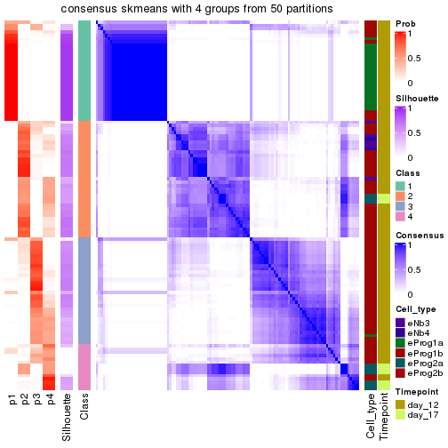</p>

</div>
</div>

Heatmaps for the membership of samples in all partitions to see how consistent they are:


<script>
$( function() {
	$( '#tabs-node-0212-membership-heatmap' ).tabs();
} );
</script>
<div id='tabs-node-0212-membership-heatmap'>
<ul>
<li><a href='#tab-node-0212-membership-heatmap-1'>k = 2</a></li>
<li><a href='#tab-node-0212-membership-heatmap-2'>k = 3</a></li>
<li><a href='#tab-node-0212-membership-heatmap-3'>k = 4</a></li>
</ul>
<div id='tab-node-0212-membership-heatmap-1'>
<pre><code class="r">membership_heatmap(res, k = 2)
</code></pre>

<p></p>

</div>
<div id='tab-node-0212-membership-heatmap-2'>
<pre><code class="r">membership_heatmap(res, k = 3)
</code></pre>

<p></p>

</div>
<div id='tab-node-0212-membership-heatmap-3'>
<pre><code class="r">membership_heatmap(res, k = 4)
</code></pre>

<p></p>

</div>
</div>

As soon as the classes for columns are determined, the signatures
that are significantly different between subgroups can be looked for. 
Following are the heatmaps for signatures.


Signature heatmaps where rows are scaled:


<script>
$( function() {
	$( '#tabs-node-0212-get-signatures' ).tabs();
} );
</script>
<div id='tabs-node-0212-get-signatures'>
<ul>
<li><a href='#tab-node-0212-get-signatures-1'>k = 2</a></li>
<li><a href='#tab-node-0212-get-signatures-2'>k = 3</a></li>
<li><a href='#tab-node-0212-get-signatures-3'>k = 4</a></li>
</ul>
<div id='tab-node-0212-get-signatures-1'>
<pre><code class="r">get_signatures(res, k = 2)
</code></pre>

<p></p>

</div>
<div id='tab-node-0212-get-signatures-2'>
<pre><code class="r">get_signatures(res, k = 3)
</code></pre>

<p></p>

</div>
<div id='tab-node-0212-get-signatures-3'>
<pre><code class="r">get_signatures(res, k = 4)
</code></pre>

<p></p>

</div>
</div>


Signature heatmaps where rows are not scaled:


<script>
$( function() {
	$( '#tabs-node-0212-get-signatures-no-scale' ).tabs();
} );
</script>
<div id='tabs-node-0212-get-signatures-no-scale'>
<ul>
<li><a href='#tab-node-0212-get-signatures-no-scale-1'>k = 2</a></li>
<li><a href='#tab-node-0212-get-signatures-no-scale-2'>k = 3</a></li>
<li><a href='#tab-node-0212-get-signatures-no-scale-3'>k = 4</a></li>
</ul>
<div id='tab-node-0212-get-signatures-no-scale-1'>
<pre><code class="r">get_signatures(res, k = 2, scale_rows = FALSE)
</code></pre>

<p></p>

</div>
<div id='tab-node-0212-get-signatures-no-scale-2'>
<pre><code class="r">get_signatures(res, k = 3, scale_rows = FALSE)
</code></pre>

<p></p>

</div>
<div id='tab-node-0212-get-signatures-no-scale-3'>
<pre><code class="r">get_signatures(res, k = 4, scale_rows = FALSE)
</code></pre>

<p></p>

</div>
</div>


Compare the overlap of signatures from different k:

```r
compare_signatures(res)
```

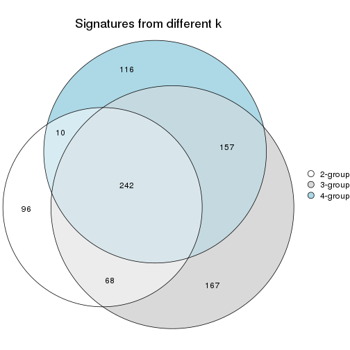

`get_signature()` returns a data frame invisibly. To get the list of signatures, the function
call should be assigned to a variable explicitly. In following code, if `plot` argument is set
to `FALSE`, no heatmap is plotted while only the differential analysis is performed.

```r
# code only for demonstration
tb = get_signature(res, k = ..., plot = FALSE)
```

An example of the output of `tb` is:

```
#>   which_row         fdr    mean_1    mean_2 scaled_mean_1 scaled_mean_2 km
#> 1        38 0.042760348  8.373488  9.131774    -0.5533452     0.5164555  1
#> 2        40 0.018707592  7.106213  8.469186    -0.6173731     0.5762149  1
#> 3        55 0.019134737 10.221463 11.207825    -0.6159697     0.5749050  1
#> 4        59 0.006059896  5.921854  7.869574    -0.6899429     0.6439467  1
#> 5        60 0.018055526  8.928898 10.211722    -0.6204761     0.5791110  1
#> 6        98 0.009384629 15.714769 14.887706     0.6635654    -0.6193277  2
...
```

The columns in `tb` are:

1. `which_row`: row indices corresponding to the input matrix.
2. `fdr`: FDR for the differential test. 
3. `mean_x`: The mean value in group x.
4. `scaled_mean_x`: The mean value in group x after rows are scaled.
5. `km`: Row groups if k-means clustering is applied to rows (which is done by automatically selecting number of clusters).

If there are too many signatures, `top_signatures = ...` can be set to only show the 
signatures with the highest FDRs:

```r
# code only for demonstration
# e.g. to show the top 500 most significant rows
tb = get_signature(res, k = ..., top_signatures = 500)
```

If the signatures are defined as these which are uniquely high in current group, `diff_method` argument
can be set to `"uniquely_high_in_one_group"`:

```r
# code only for demonstration
tb = get_signature(res, k = ..., diff_method = "uniquely_high_in_one_group")
```


UMAP plot which shows how samples are separated.


<script>
$( function() {
	$( '#tabs-node-0212-dimension-reduction' ).tabs();
} );
</script>
<div id='tabs-node-0212-dimension-reduction'>
<ul>
<li><a href='#tab-node-0212-dimension-reduction-1'>k = 2</a></li>
<li><a href='#tab-node-0212-dimension-reduction-2'>k = 3</a></li>
<li><a href='#tab-node-0212-dimension-reduction-3'>k = 4</a></li>
</ul>
<div id='tab-node-0212-dimension-reduction-1'>
<pre><code class="r">dimension_reduction(res, k = 2, method = &quot;UMAP&quot;)
</code></pre>

<p></p>

</div>
<div id='tab-node-0212-dimension-reduction-2'>
<pre><code class="r">dimension_reduction(res, k = 3, method = &quot;UMAP&quot;)
</code></pre>

<p>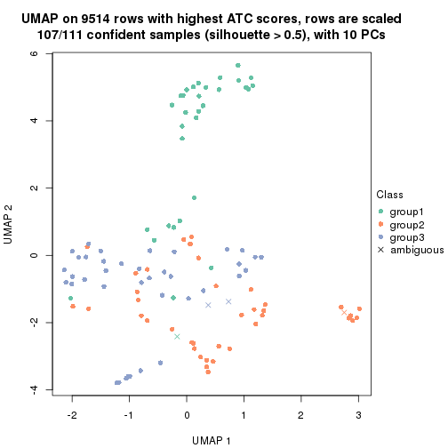</p>

</div>
<div id='tab-node-0212-dimension-reduction-3'>
<pre><code class="r">dimension_reduction(res, k = 4, method = &quot;UMAP&quot;)
</code></pre>

<p></p>

</div>
</div>


Following heatmap shows how subgroups are split when increasing `k`:

```r
collect_classes(res)
```


Test correlation between subgroups and known annotations. If the known
annotation is numeric, one-way ANOVA test is applied, and if the known
annotation is discrete, chi-squared contingency table test is applied.

```r
test_to_known_factors(res)
```

```
#>             n_sample Cell_type(p-value) Timepoint(p-value) k
#> ATC:skmeans      110           1.19e-07            0.00889 2
#> ATC:skmeans      107           1.26e-12            0.01473 3
#> ATC:skmeans       78           2.34e-10            0.08241 4
```


If matrix rows can be associated to genes, consider to use `functional_enrichment(res,
...)` to perform function enrichment for the signature genes. See [this vignette](https://jokergoo.github.io/cola_vignettes/functional_enrichment.html) for more detailed explanations.


 

---------------------------------------------------


### Node022


Parent node: [Node02](#Node02).
Child nodes: 
                Node0111-leaf
        ,
                [Node0112](#Node0112)
        ,
                Node0113-leaf
        ,
                [Node0121](#Node0121)
        ,
                [Node0122](#Node0122)
        ,
                [Node0131](#Node0131)
        ,
                [Node0132](#Node0132)
        ,
                Node0133-leaf
        ,
                Node0211-leaf
        ,
                [Node0212](#Node0212)
        ,
                Node0221-leaf
        ,
                Node0222-leaf
        ,
                Node0223-leaf
        ,
                [Node0231](#Node0231)
        ,
                Node0232-leaf
        ,
                Node0241-leaf
        ,
                Node0242-leaf
        ,
                Node0243-leaf
        ,
                Node0331-leaf
        ,
                Node0332-leaf
        ,
                Node0333-leaf
        ,
                Node0334-leaf
        .


The object with results only for a single top-value method and a single partitioning method 
can be extracted as:

```r
res = res_rh["022"]
```

A summary of `res` and all the functions that can be applied to it:

```r
res
```

```
#> A 'ConsensusPartition' object with k = 2, 3, 4.
#>   On a matrix with 9614 rows and 156 columns.
#>   Top rows (961) are extracted by 'ATC' method.
#>   Subgroups are detected by 'skmeans' method.
#>   Performed in total 150 partitions by row resampling.
#>   Best k for subgroups seems to be 3.
#> 
#> Following methods can be applied to this 'ConsensusPartition' object:
#>  [1] "cola_report"             "collect_classes"         "collect_plots"          
#>  [4] "collect_stats"           "colnames"                "compare_partitions"     
#>  [7] "compare_signatures"      "consensus_heatmap"       "dimension_reduction"    
#> [10] "functional_enrichment"   "get_anno_col"            "get_anno"               
#> [13] "get_classes"             "get_consensus"           "get_matrix"             
#> [16] "get_membership"          "get_param"               "get_signatures"         
#> [19] "get_stats"               "is_best_k"               "is_stable_k"            
#> [22] "membership_heatmap"      "ncol"                    "nrow"                   
#> [25] "plot_ecdf"               "predict_classes"         "rownames"               
#> [28] "select_partition_number" "show"                    "suggest_best_k"         
#> [31] "test_to_known_factors"   "top_rows_heatmap"
```

`collect_plots()` function collects all the plots made from `res` for all `k` (number of subgroups)
into one single page to provide an easy and fast comparison between different `k`.

```r
collect_plots(res)
```


The plots are:

- The first row: a plot of the eCDF (empirical cumulative distribution
  function) curves of the consensus matrix for each `k` and the heatmap of
  predicted classes for each `k`.
- The second row: heatmaps of the consensus matrix for each `k`.
- The third row: heatmaps of the membership matrix for each `k`.
- The fouth row: heatmaps of the signatures for each `k`.

All the plots in panels can be made by individual functions and they are
plotted later in this section.

`select_partition_number()` produces several plots showing different
statistics for choosing "optimized" `k`. There are following statistics:

- eCDF curves of the consensus matrix for each `k`;
- 1-PAC. [The PAC score](https://en.wikipedia.org/wiki/Consensus_clustering#Over-interpretation_potential_of_consensus_clustering)
  measures the proportion of the ambiguous subgrouping.
- Mean silhouette score.
- Concordance. The mean probability of fiting the consensus subgroup labels in all
  partitions.
- Area increased. Denote $A_k$ as the area under the eCDF curve for current
  `k`, the area increased is defined as $A_k - A_{k-1}$.
- Rand index. The percent of pairs of samples that are both in a same cluster
  or both are not in a same cluster in the partition of k and k-1.
- Jaccard index. The ratio of pairs of samples are both in a same cluster in
  the partition of k and k-1 and the pairs of samples are both in a same
  cluster in the partition k or k-1.

The detailed explanations of these statistics can be found in [the _cola_
vignette](https://jokergoo.github.io/cola_vignettes/cola.html#toc_13).

Generally speaking, higher 1-PAC score, higher mean silhouette score or higher
concordance corresponds to better partition. Rand index and Jaccard index
measure how similar the current partition is compared to partition with `k-1`.
If they are too similar, we won't accept `k` is better than `k-1`.

```r
select_partition_number(res)
```


The numeric values for all these statistics can be obtained by `get_stats()`.

```r
get_stats(res)
```

```
#>   k 1-PAC mean_silhouette concordance area_increased  Rand Jaccard
#> 2 2 1.000           0.965       0.985          0.503 0.497   0.497
#> 3 3 0.982           0.953       0.981          0.300 0.795   0.609
#> 4 4 0.821           0.902       0.936          0.119 0.875   0.664
```

`suggest_best_k()` suggests the best $k$ based on these statistics. The rules are as follows:

- All $k$ with Jaccard index larger than 0.95 are removed because increasing
  $k$ does not provide enough extra information. If all $k$ are removed, it is
  marked as no subgroup is detected.
- For all $k$ with 1-PAC score larger than 0.9, the maximal $k$ is taken as
  the best $k$, and other $k$ are marked as optional $k$.
- If it does not fit the second rule. The $k$ with the maximal vote of the
  highest 1-PAC score, highest mean silhouette, and highest concordance is
  taken as the best $k$.

```r
suggest_best_k(res)
```

```
#> [1] 3
#> attr(,"optional")
#> [1] 2
```

There is also optional best $k$ = 2 that is worth to check.

Following is the table of the partitions (You need to click the **show/hide
code output** link to see it). The membership matrix (columns with name `p*`)
is inferred by
[`clue::cl_consensus()`](https://www.rdocumentation.org/link/cl_consensus?package=clue)
function with the `SE` method. Basically the value in the membership matrix
represents the probability to belong to a certain group. The finall subgroup
label for an item is determined with the group with highest probability it
belongs to.

In `get_classes()` function, the entropy is calculated from the membership
matrix and the silhouette score is calculated from the consensus matrix.


<script>
$( function() {
	$( '#tabs-node-022-get-classes' ).tabs();
} );
</script>
<div id='tabs-node-022-get-classes'>
<ul>
<li><a href='#tab-node-022-get-classes-1'>k = 2</a></li>
<li><a href='#tab-node-022-get-classes-2'>k = 3</a></li>
<li><a href='#tab-node-022-get-classes-3'>k = 4</a></li>
</ul>

<div id='tab-node-022-get-classes-1'>
<p><a id='tab-node-022-get-classes-1-a' style='color:#0366d6' href='#'>show/hide code output</a></p>
<pre><code class="r">cbind(get_classes(res, k = 2), get_membership(res, k = 2))
</code></pre>

<pre><code>#&gt;                 class entropy silhouette   p1   p2
#&gt; 1772122_311_D04     1   0.000      0.982 1.00 0.00
#&gt; 1772122_311_A03     2   0.000      0.988 0.00 1.00
#&gt; 1772122_312_E02     2   0.000      0.988 0.00 1.00
#&gt; 1772122_311_E12     1   0.000      0.982 1.00 0.00
#&gt; 1772122_311_C02     1   0.000      0.982 1.00 0.00
#&gt; 1772122_310_F11     1   0.000      0.982 1.00 0.00
#&gt; 1772122_312_B03     2   0.000      0.988 0.00 1.00
#&gt; 1772122_312_C09     2   0.000      0.988 0.00 1.00
#&gt; 1772122_311_F07     2   0.000      0.988 0.00 1.00
#&gt; 1772122_312_A06     1   0.000      0.982 1.00 0.00
#&gt; 1772122_312_A09     1   0.000      0.982 1.00 0.00
#&gt; 1772122_310_B06     2   0.000      0.988 0.00 1.00
#&gt; 1772122_314_D10     2   0.000      0.988 0.00 1.00
#&gt; 1772122_310_F02     1   0.000      0.982 1.00 0.00
#&gt; 1772122_312_E06     2   0.000      0.988 0.00 1.00
#&gt; 1772122_314_A07     2   0.000      0.988 0.00 1.00
#&gt; 1772122_312_D06     2   0.000      0.988 0.00 1.00
#&gt; 1772122_314_A05     2   0.242      0.951 0.04 0.96
#&gt; 1772122_311_F11     1   0.000      0.982 1.00 0.00
#&gt; 1772122_314_A06     1   0.981      0.288 0.58 0.42
#&gt; 1772122_314_G09     2   0.000      0.988 0.00 1.00
#&gt; 1772122_312_B11     2   0.000      0.988 0.00 1.00
#&gt; 1772122_314_B07     1   0.000      0.982 1.00 0.00
#&gt; 1772122_312_D05     1   0.000      0.982 1.00 0.00
#&gt; 1772122_314_G06     1   0.000      0.982 1.00 0.00
#&gt; 1772122_314_D11     2   0.000      0.988 0.00 1.00
#&gt; 1772122_312_H02     1   0.000      0.982 1.00 0.00
#&gt; 1772122_312_C01     2   0.000      0.988 0.00 1.00
#&gt; 1772122_314_A04     2   0.000      0.988 0.00 1.00
#&gt; 1772122_312_F12     2   0.000      0.988 0.00 1.00
#&gt; 1772122_312_C08     2   0.000      0.988 0.00 1.00
#&gt; 1772122_314_F04     2   0.000      0.988 0.00 1.00
#&gt; 1772122_312_B04     2   0.000      0.988 0.00 1.00
#&gt; 1772122_314_C10     2   0.000      0.988 0.00 1.00
#&gt; 1772122_312_E12     2   0.000      0.988 0.00 1.00
#&gt; 1772122_314_F05     2   0.000      0.988 0.00 1.00
#&gt; 1772122_314_G11     2   0.000      0.988 0.00 1.00
#&gt; 1772122_311_C01     1   0.000      0.982 1.00 0.00
#&gt; 1772122_314_E02     2   0.000      0.988 0.00 1.00
#&gt; 1772122_312_B06     2   0.000      0.988 0.00 1.00
#&gt; 1772122_312_F06     1   0.000      0.982 1.00 0.00
#&gt; 1772122_314_G02     2   0.000      0.988 0.00 1.00
#&gt; 1772122_310_A05     2   0.000      0.988 0.00 1.00
#&gt; 1772122_312_A12     2   0.000      0.988 0.00 1.00
#&gt; 1772122_310_E04     1   0.000      0.982 1.00 0.00
#&gt; 1772122_311_D09     1   0.000      0.982 1.00 0.00
#&gt; 1772122_311_H06     1   0.000      0.982 1.00 0.00
#&gt; 1772122_311_G04     1   0.000      0.982 1.00 0.00
#&gt; 1772122_311_H04     1   0.000      0.982 1.00 0.00
#&gt; 1772122_311_C09     1   0.000      0.982 1.00 0.00
#&gt; 1772122_311_E09     1   0.000      0.982 1.00 0.00
#&gt; 1772122_311_G10     1   0.000      0.982 1.00 0.00
#&gt; 1772122_311_D06     1   0.000      0.982 1.00 0.00
#&gt; 1772122_310_D12     2   0.000      0.988 0.00 1.00
#&gt; 1772122_311_B05     1   0.000      0.982 1.00 0.00
#&gt; 1772122_310_F05     1   0.584      0.834 0.86 0.14
#&gt; 1772122_310_A02     1   0.000      0.982 1.00 0.00
#&gt; 1772122_310_D09     2   0.855      0.617 0.28 0.72
#&gt; 1772122_311_D03     2   0.327      0.931 0.06 0.94
#&gt; 1772122_310_E11     2   0.000      0.988 0.00 1.00
#&gt; 1772122_311_H05     2   0.000      0.988 0.00 1.00
#&gt; 1772122_311_E04     1   0.000      0.982 1.00 0.00
#&gt; 1772122_311_G11     1   0.000      0.982 1.00 0.00
#&gt; 1772122_311_G12     2   0.141      0.971 0.02 0.98
#&gt; 1772122_311_A10     1   0.000      0.982 1.00 0.00
#&gt; 1772122_311_A07     1   0.000      0.982 1.00 0.00
#&gt; 1772122_310_A07     2   0.000      0.988 0.00 1.00
#&gt; 1772122_310_D06     1   0.000      0.982 1.00 0.00
#&gt; 1772122_311_B11     1   0.000      0.982 1.00 0.00
#&gt; 1772122_310_A01     2   0.000      0.988 0.00 1.00
#&gt; 1772122_311_D11     1   0.141      0.963 0.98 0.02
#&gt; 1772122_310_H02     1   0.000      0.982 1.00 0.00
#&gt; 1772122_310_H12     2   0.000      0.988 0.00 1.00
#&gt; 1772122_311_A12     1   0.000      0.982 1.00 0.00
#&gt; 1772122_310_A09     2   0.000      0.988 0.00 1.00
#&gt; 1772122_311_H11     1   0.000      0.982 1.00 0.00
#&gt; 1772122_311_E05     1   0.000      0.982 1.00 0.00
#&gt; 1772122_311_A09     1   0.000      0.982 1.00 0.00
#&gt; 1772122_312_F05     1   0.000      0.982 1.00 0.00
#&gt; 1772122_312_A07     1   0.000      0.982 1.00 0.00
#&gt; 1772122_310_H04     1   0.000      0.982 1.00 0.00
#&gt; 1772122_310_D11     2   0.000      0.988 0.00 1.00
#&gt; 1772122_310_H10     1   0.000      0.982 1.00 0.00
#&gt; 1772122_310_G05     2   0.000      0.988 0.00 1.00
#&gt; 1772122_310_D10     2   0.242      0.951 0.04 0.96
#&gt; 1772122_312_F02     2   0.000      0.988 0.00 1.00
#&gt; 1772122_310_B09     2   0.000      0.988 0.00 1.00
#&gt; 1772122_310_F06     1   0.000      0.982 1.00 0.00
#&gt; 1772122_310_E06     2   0.855      0.617 0.28 0.72
#&gt; 1772122_311_D10     1   0.000      0.982 1.00 0.00
#&gt; 1772122_311_E03     1   0.000      0.982 1.00 0.00
#&gt; 1772122_310_G04     2   0.000      0.988 0.00 1.00
#&gt; 1772122_311_B07     1   0.000      0.982 1.00 0.00
#&gt; 1772122_311_C11     2   0.000      0.988 0.00 1.00
#&gt; 1772122_314_B04     2   0.000      0.988 0.00 1.00
#&gt; 1772122_312_F04     2   0.000      0.988 0.00 1.00
#&gt; 1772122_312_H11     1   0.000      0.982 1.00 0.00
#&gt; 1772122_312_H12     1   0.000      0.982 1.00 0.00
#&gt; 1772122_312_H08     2   0.000      0.988 0.00 1.00
#&gt; 1772122_314_E04     1   0.000      0.982 1.00 0.00
#&gt; 1772122_312_G06     2   0.000      0.988 0.00 1.00
#&gt; 1772122_314_B08     2   0.000      0.988 0.00 1.00
#&gt; 1772122_314_A10     2   0.141      0.971 0.02 0.98
#&gt; 1772122_312_D08     2   0.000      0.988 0.00 1.00
#&gt; 1772122_312_C07     2   0.000      0.988 0.00 1.00
#&gt; 1772122_312_B02     2   0.000      0.988 0.00 1.00
#&gt; 1772122_312_C06     2   0.000      0.988 0.00 1.00
#&gt; 1772122_312_G04     2   0.000      0.988 0.00 1.00
#&gt; 1772122_314_H04     1   0.000      0.982 1.00 0.00
#&gt; 1772122_314_C09     2   0.000      0.988 0.00 1.00
#&gt; 1772122_314_E11     2   0.000      0.988 0.00 1.00
#&gt; 1772122_312_E04     2   0.000      0.988 0.00 1.00
#&gt; 1772122_312_G12     2   0.000      0.988 0.00 1.00
#&gt; 1772122_314_D04     2   0.000      0.988 0.00 1.00
#&gt; 1772122_310_D04     1   0.000      0.982 1.00 0.00
#&gt; 1772122_311_E08     1   0.000      0.982 1.00 0.00
#&gt; 1772122_310_B11     1   0.000      0.982 1.00 0.00
#&gt; 1772122_311_E10     1   0.000      0.982 1.00 0.00
#&gt; 1772122_310_C04     1   0.000      0.982 1.00 0.00
#&gt; 1772122_311_H07     1   0.000      0.982 1.00 0.00
#&gt; 1772122_312_D03     2   0.000      0.988 0.00 1.00
#&gt; 1772122_314_A03     2   0.000      0.988 0.00 1.00
#&gt; 1772122_312_D04     1   0.000      0.982 1.00 0.00
#&gt; 1772122_312_D02     1   0.722      0.751 0.80 0.20
#&gt; 1772122_314_H11     2   0.000      0.988 0.00 1.00
#&gt; 1772122_311_B06     2   0.634      0.810 0.16 0.84
#&gt; 1772122_314_F06     2   0.000      0.988 0.00 1.00
#&gt; 1772122_311_B12     1   0.000      0.982 1.00 0.00
#&gt; 1772122_312_D11     2   0.000      0.988 0.00 1.00
#&gt; 1772122_310_F01     2   0.000      0.988 0.00 1.00
#&gt; 1772122_314_E05     2   0.000      0.988 0.00 1.00
#&gt; 1772122_312_F09     2   0.000      0.988 0.00 1.00
#&gt; 1772122_311_C08     1   0.000      0.982 1.00 0.00
#&gt; 1772122_314_B10     2   0.000      0.988 0.00 1.00
#&gt; 1772122_311_D08     1   0.000      0.982 1.00 0.00
#&gt; 1772122_310_A11     1   0.584      0.834 0.86 0.14
#&gt; 1772122_311_F02     1   0.000      0.982 1.00 0.00
#&gt; 1772122_311_G06     1   0.000      0.982 1.00 0.00
#&gt; 1772122_312_C02     2   0.000      0.988 0.00 1.00
#&gt; 1772122_314_B01     2   0.000      0.988 0.00 1.00
#&gt; 1772122_311_A08     1   0.000      0.982 1.00 0.00
#&gt; 1772122_314_B09     1   0.000      0.982 1.00 0.00
#&gt; 1772122_311_D12     1   0.000      0.982 1.00 0.00
#&gt; 1772122_310_B04     1   0.000      0.982 1.00 0.00
#&gt; 1772122_310_C02     2   0.000      0.988 0.00 1.00
#&gt; 1772122_311_A02     1   0.000      0.982 1.00 0.00
#&gt; 1772122_311_B02     2   0.000      0.988 0.00 1.00
#&gt; 1772122_311_F08     2   0.000      0.988 0.00 1.00
#&gt; 1772122_312_A02     1   0.000      0.982 1.00 0.00
#&gt; 1772122_311_H10     1   0.000      0.982 1.00 0.00
#&gt; 1772122_312_A10     2   0.000      0.988 0.00 1.00
#&gt; 1772122_314_G08     1   0.995      0.168 0.54 0.46
#&gt; 1772122_311_F06     1   0.000      0.982 1.00 0.00
#&gt; 1772122_312_E11     1   0.000      0.982 1.00 0.00
#&gt; 1772122_310_H11     1   0.000      0.982 1.00 0.00
#&gt; 1772122_311_H02     1   0.000      0.982 1.00 0.00
</code></pre>

<script>
$('#tab-node-022-get-classes-1-a').parent().next().next().hide();
$('#tab-node-022-get-classes-1-a').click(function(){
  $('#tab-node-022-get-classes-1-a').parent().next().next().toggle();
  return(false);
});
</script>
</div>

<div id='tab-node-022-get-classes-2'>
<p><a id='tab-node-022-get-classes-2-a' style='color:#0366d6' href='#'>show/hide code output</a></p>
<pre><code class="r">cbind(get_classes(res, k = 3), get_membership(res, k = 3))
</code></pre>

<pre><code>#&gt;                 class entropy silhouette   p1   p2   p3
#&gt; 1772122_311_D04     1  0.0000     0.9884 1.00 0.00 0.00
#&gt; 1772122_311_A03     3  0.4796     0.6967 0.00 0.22 0.78
#&gt; 1772122_312_E02     2  0.0000     0.9823 0.00 1.00 0.00
#&gt; 1772122_311_E12     3  0.0000     0.9622 0.00 0.00 1.00
#&gt; 1772122_311_C02     3  0.0000     0.9622 0.00 0.00 1.00
#&gt; 1772122_310_F11     1  0.0000     0.9884 1.00 0.00 0.00
#&gt; 1772122_312_B03     2  0.0000     0.9823 0.00 1.00 0.00
#&gt; 1772122_312_C09     2  0.0000     0.9823 0.00 1.00 0.00
#&gt; 1772122_311_F07     3  0.0000     0.9622 0.00 0.00 1.00
#&gt; 1772122_312_A06     1  0.0000     0.9884 1.00 0.00 0.00
#&gt; 1772122_312_A09     1  0.0000     0.9884 1.00 0.00 0.00
#&gt; 1772122_310_B06     2  0.0000     0.9823 0.00 1.00 0.00
#&gt; 1772122_314_D10     2  0.0000     0.9823 0.00 1.00 0.00
#&gt; 1772122_310_F02     1  0.0000     0.9884 1.00 0.00 0.00
#&gt; 1772122_312_E06     2  0.0000     0.9823 0.00 1.00 0.00
#&gt; 1772122_314_A07     2  0.0000     0.9823 0.00 1.00 0.00
#&gt; 1772122_312_D06     2  0.0000     0.9823 0.00 1.00 0.00
#&gt; 1772122_314_A05     2  0.6244     0.2229 0.44 0.56 0.00
#&gt; 1772122_311_F11     1  0.0892     0.9713 0.98 0.00 0.02
#&gt; 1772122_314_A06     1  0.1529     0.9463 0.96 0.04 0.00
#&gt; 1772122_314_G09     2  0.0000     0.9823 0.00 1.00 0.00
#&gt; 1772122_312_B11     2  0.0000     0.9823 0.00 1.00 0.00
#&gt; 1772122_314_B07     1  0.0000     0.9884 1.00 0.00 0.00
#&gt; 1772122_312_D05     1  0.0000     0.9884 1.00 0.00 0.00
#&gt; 1772122_314_G06     1  0.0000     0.9884 1.00 0.00 0.00
#&gt; 1772122_314_D11     2  0.0000     0.9823 0.00 1.00 0.00
#&gt; 1772122_312_H02     1  0.0000     0.9884 1.00 0.00 0.00
#&gt; 1772122_312_C01     2  0.0000     0.9823 0.00 1.00 0.00
#&gt; 1772122_314_A04     2  0.0000     0.9823 0.00 1.00 0.00
#&gt; 1772122_312_F12     2  0.0000     0.9823 0.00 1.00 0.00
#&gt; 1772122_312_C08     2  0.0000     0.9823 0.00 1.00 0.00
#&gt; 1772122_314_F04     2  0.2537     0.9032 0.00 0.92 0.08
#&gt; 1772122_312_B04     2  0.0000     0.9823 0.00 1.00 0.00
#&gt; 1772122_314_C10     2  0.0000     0.9823 0.00 1.00 0.00
#&gt; 1772122_312_E12     2  0.0000     0.9823 0.00 1.00 0.00
#&gt; 1772122_314_F05     2  0.0000     0.9823 0.00 1.00 0.00
#&gt; 1772122_314_G11     2  0.0000     0.9823 0.00 1.00 0.00
#&gt; 1772122_311_C01     1  0.0000     0.9884 1.00 0.00 0.00
#&gt; 1772122_314_E02     2  0.0000     0.9823 0.00 1.00 0.00
#&gt; 1772122_312_B06     2  0.0000     0.9823 0.00 1.00 0.00
#&gt; 1772122_312_F06     1  0.0000     0.9884 1.00 0.00 0.00
#&gt; 1772122_314_G02     2  0.0000     0.9823 0.00 1.00 0.00
#&gt; 1772122_310_A05     2  0.0000     0.9823 0.00 1.00 0.00
#&gt; 1772122_312_A12     2  0.0000     0.9823 0.00 1.00 0.00
#&gt; 1772122_310_E04     1  0.0000     0.9884 1.00 0.00 0.00
#&gt; 1772122_311_D09     3  0.0000     0.9622 0.00 0.00 1.00
#&gt; 1772122_311_H06     3  0.0000     0.9622 0.00 0.00 1.00
#&gt; 1772122_311_G04     3  0.0000     0.9622 0.00 0.00 1.00
#&gt; 1772122_311_H04     1  0.0000     0.9884 1.00 0.00 0.00
#&gt; 1772122_311_C09     3  0.6280     0.1613 0.46 0.00 0.54
#&gt; 1772122_311_E09     1  0.0000     0.9884 1.00 0.00 0.00
#&gt; 1772122_311_G10     1  0.0000     0.9884 1.00 0.00 0.00
#&gt; 1772122_311_D06     1  0.4002     0.8074 0.84 0.00 0.16
#&gt; 1772122_310_D12     2  0.0000     0.9823 0.00 1.00 0.00
#&gt; 1772122_311_B05     3  0.0000     0.9622 0.00 0.00 1.00
#&gt; 1772122_310_F05     1  0.0892     0.9686 0.98 0.02 0.00
#&gt; 1772122_310_A02     3  0.0000     0.9622 0.00 0.00 1.00
#&gt; 1772122_310_D09     3  0.0000     0.9622 0.00 0.00 1.00
#&gt; 1772122_311_D03     3  0.0000     0.9622 0.00 0.00 1.00
#&gt; 1772122_310_E11     2  0.0000     0.9823 0.00 1.00 0.00
#&gt; 1772122_311_H05     3  0.0000     0.9622 0.00 0.00 1.00
#&gt; 1772122_311_E04     3  0.0000     0.9622 0.00 0.00 1.00
#&gt; 1772122_311_G11     3  0.0000     0.9622 0.00 0.00 1.00
#&gt; 1772122_311_G12     3  0.0000     0.9622 0.00 0.00 1.00
#&gt; 1772122_311_A10     1  0.0000     0.9884 1.00 0.00 0.00
#&gt; 1772122_311_A07     1  0.0000     0.9884 1.00 0.00 0.00
#&gt; 1772122_310_A07     2  0.0892     0.9644 0.00 0.98 0.02
#&gt; 1772122_310_D06     1  0.0000     0.9884 1.00 0.00 0.00
#&gt; 1772122_311_B11     1  0.0000     0.9884 1.00 0.00 0.00
#&gt; 1772122_310_A01     2  0.0000     0.9823 0.00 1.00 0.00
#&gt; 1772122_311_D11     3  0.0000     0.9622 0.00 0.00 1.00
#&gt; 1772122_310_H02     1  0.0000     0.9884 1.00 0.00 0.00
#&gt; 1772122_310_H12     2  0.0000     0.9823 0.00 1.00 0.00
#&gt; 1772122_311_A12     3  0.0000     0.9622 0.00 0.00 1.00
#&gt; 1772122_310_A09     2  0.0892     0.9635 0.02 0.98 0.00
#&gt; 1772122_311_H11     1  0.0000     0.9884 1.00 0.00 0.00
#&gt; 1772122_311_E05     3  0.0000     0.9622 0.00 0.00 1.00
#&gt; 1772122_311_A09     1  0.2537     0.9100 0.92 0.00 0.08
#&gt; 1772122_312_F05     1  0.0000     0.9884 1.00 0.00 0.00
#&gt; 1772122_312_A07     1  0.0000     0.9884 1.00 0.00 0.00
#&gt; 1772122_310_H04     1  0.0000     0.9884 1.00 0.00 0.00
#&gt; 1772122_310_D11     2  0.0000     0.9823 0.00 1.00 0.00
#&gt; 1772122_310_H10     1  0.0000     0.9884 1.00 0.00 0.00
#&gt; 1772122_310_G05     2  0.0000     0.9823 0.00 1.00 0.00
#&gt; 1772122_310_D10     2  0.2066     0.9226 0.06 0.94 0.00
#&gt; 1772122_312_F02     2  0.0000     0.9823 0.00 1.00 0.00
#&gt; 1772122_310_B09     3  0.0000     0.9622 0.00 0.00 1.00
#&gt; 1772122_310_F06     1  0.0000     0.9884 1.00 0.00 0.00
#&gt; 1772122_310_E06     3  0.0000     0.9622 0.00 0.00 1.00
#&gt; 1772122_311_D10     1  0.0000     0.9884 1.00 0.00 0.00
#&gt; 1772122_311_E03     3  0.0000     0.9622 0.00 0.00 1.00
#&gt; 1772122_310_G04     2  0.0000     0.9823 0.00 1.00 0.00
#&gt; 1772122_311_B07     3  0.0000     0.9622 0.00 0.00 1.00
#&gt; 1772122_311_C11     3  0.0000     0.9622 0.00 0.00 1.00
#&gt; 1772122_314_B04     2  0.0000     0.9823 0.00 1.00 0.00
#&gt; 1772122_312_F04     2  0.0000     0.9823 0.00 1.00 0.00
#&gt; 1772122_312_H11     1  0.0000     0.9884 1.00 0.00 0.00
#&gt; 1772122_312_H12     1  0.0000     0.9884 1.00 0.00 0.00
#&gt; 1772122_312_H08     2  0.0000     0.9823 0.00 1.00 0.00
#&gt; 1772122_314_E04     1  0.0000     0.9884 1.00 0.00 0.00
#&gt; 1772122_312_G06     2  0.0000     0.9823 0.00 1.00 0.00
#&gt; 1772122_314_B08     2  0.0000     0.9823 0.00 1.00 0.00
#&gt; 1772122_314_A10     2  0.4002     0.8047 0.16 0.84 0.00
#&gt; 1772122_312_D08     2  0.0000     0.9823 0.00 1.00 0.00
#&gt; 1772122_312_C07     2  0.0000     0.9823 0.00 1.00 0.00
#&gt; 1772122_312_B02     2  0.0000     0.9823 0.00 1.00 0.00
#&gt; 1772122_312_C06     3  0.0000     0.9622 0.00 0.00 1.00
#&gt; 1772122_312_G04     2  0.0000     0.9823 0.00 1.00 0.00
#&gt; 1772122_314_H04     1  0.0000     0.9884 1.00 0.00 0.00
#&gt; 1772122_314_C09     2  0.0000     0.9823 0.00 1.00 0.00
#&gt; 1772122_314_E11     2  0.0000     0.9823 0.00 1.00 0.00
#&gt; 1772122_312_E04     2  0.0000     0.9823 0.00 1.00 0.00
#&gt; 1772122_312_G12     2  0.0000     0.9823 0.00 1.00 0.00
#&gt; 1772122_314_D04     2  0.0000     0.9823 0.00 1.00 0.00
#&gt; 1772122_310_D04     1  0.0000     0.9884 1.00 0.00 0.00
#&gt; 1772122_311_E08     1  0.2959     0.8870 0.90 0.00 0.10
#&gt; 1772122_310_B11     1  0.0000     0.9884 1.00 0.00 0.00
#&gt; 1772122_311_E10     1  0.0000     0.9884 1.00 0.00 0.00
#&gt; 1772122_310_C04     1  0.0000     0.9884 1.00 0.00 0.00
#&gt; 1772122_311_H07     1  0.0000     0.9884 1.00 0.00 0.00
#&gt; 1772122_312_D03     2  0.0000     0.9823 0.00 1.00 0.00
#&gt; 1772122_314_A03     2  0.0000     0.9823 0.00 1.00 0.00
#&gt; 1772122_312_D04     1  0.0000     0.9884 1.00 0.00 0.00
#&gt; 1772122_312_D02     1  0.0000     0.9884 1.00 0.00 0.00
#&gt; 1772122_314_H11     2  0.0000     0.9823 0.00 1.00 0.00
#&gt; 1772122_311_B06     3  0.0000     0.9622 0.00 0.00 1.00
#&gt; 1772122_314_F06     2  0.0000     0.9823 0.00 1.00 0.00
#&gt; 1772122_311_B12     3  0.0000     0.9622 0.00 0.00 1.00
#&gt; 1772122_312_D11     2  0.0000     0.9823 0.00 1.00 0.00
#&gt; 1772122_310_F01     3  0.0000     0.9622 0.00 0.00 1.00
#&gt; 1772122_314_E05     2  0.0000     0.9823 0.00 1.00 0.00
#&gt; 1772122_312_F09     2  0.0000     0.9823 0.00 1.00 0.00
#&gt; 1772122_311_C08     3  0.6302     0.0916 0.48 0.00 0.52
#&gt; 1772122_314_B10     2  0.0000     0.9823 0.00 1.00 0.00
#&gt; 1772122_311_D08     3  0.4002     0.7914 0.16 0.00 0.84
#&gt; 1772122_310_A11     1  0.0000     0.9884 1.00 0.00 0.00
#&gt; 1772122_311_F02     3  0.0000     0.9622 0.00 0.00 1.00
#&gt; 1772122_311_G06     1  0.0000     0.9884 1.00 0.00 0.00
#&gt; 1772122_312_C02     2  0.0000     0.9823 0.00 1.00 0.00
#&gt; 1772122_314_B01     2  0.0000     0.9823 0.00 1.00 0.00
#&gt; 1772122_311_A08     1  0.0000     0.9884 1.00 0.00 0.00
#&gt; 1772122_314_B09     1  0.0000     0.9884 1.00 0.00 0.00
#&gt; 1772122_311_D12     1  0.0892     0.9713 0.98 0.00 0.02
#&gt; 1772122_310_B04     3  0.0000     0.9622 0.00 0.00 1.00
#&gt; 1772122_310_C02     2  0.5397     0.6093 0.00 0.72 0.28
#&gt; 1772122_311_A02     3  0.0000     0.9622 0.00 0.00 1.00
#&gt; 1772122_311_B02     3  0.0000     0.9622 0.00 0.00 1.00
#&gt; 1772122_311_F08     3  0.0000     0.9622 0.00 0.00 1.00
#&gt; 1772122_312_A02     1  0.0000     0.9884 1.00 0.00 0.00
#&gt; 1772122_311_H10     1  0.0000     0.9884 1.00 0.00 0.00
#&gt; 1772122_312_A10     2  0.0000     0.9823 0.00 1.00 0.00
#&gt; 1772122_314_G08     1  0.3340     0.8479 0.88 0.12 0.00
#&gt; 1772122_311_F06     1  0.0000     0.9884 1.00 0.00 0.00
#&gt; 1772122_312_E11     1  0.0000     0.9884 1.00 0.00 0.00
#&gt; 1772122_310_H11     3  0.0000     0.9622 0.00 0.00 1.00
#&gt; 1772122_311_H02     3  0.0000     0.9622 0.00 0.00 1.00
</code></pre>

<script>
$('#tab-node-022-get-classes-2-a').parent().next().next().hide();
$('#tab-node-022-get-classes-2-a').click(function(){
  $('#tab-node-022-get-classes-2-a').parent().next().next().toggle();
  return(false);
});
</script>
</div>

<div id='tab-node-022-get-classes-3'>
<p><a id='tab-node-022-get-classes-3-a' style='color:#0366d6' href='#'>show/hide code output</a></p>
<pre><code class="r">cbind(get_classes(res, k = 4), get_membership(res, k = 4))
</code></pre>

<pre><code>#&gt;                 class entropy silhouette   p1   p2   p3   p4
#&gt; 1772122_311_D04     4  0.0000     0.9442 0.00 0.00 0.00 1.00
#&gt; 1772122_311_A03     3  0.3172     0.7903 0.00 0.16 0.84 0.00
#&gt; 1772122_312_E02     2  0.0000     0.9456 0.00 1.00 0.00 0.00
#&gt; 1772122_311_E12     3  0.4522     0.5115 0.00 0.00 0.68 0.32
#&gt; 1772122_311_C02     4  0.4406     0.5931 0.00 0.00 0.30 0.70
#&gt; 1772122_310_F11     1  0.2647     0.9013 0.88 0.00 0.00 0.12
#&gt; 1772122_312_B03     2  0.1211     0.9386 0.04 0.96 0.00 0.00
#&gt; 1772122_312_C09     2  0.0000     0.9456 0.00 1.00 0.00 0.00
#&gt; 1772122_311_F07     3  0.0000     0.9673 0.00 0.00 1.00 0.00
#&gt; 1772122_312_A06     1  0.3172     0.8998 0.84 0.00 0.00 0.16
#&gt; 1772122_312_A09     1  0.3610     0.8727 0.80 0.00 0.00 0.20
#&gt; 1772122_310_B06     2  0.0000     0.9456 0.00 1.00 0.00 0.00
#&gt; 1772122_314_D10     2  0.3172     0.8793 0.16 0.84 0.00 0.00
#&gt; 1772122_310_F02     4  0.0000     0.9442 0.00 0.00 0.00 1.00
#&gt; 1772122_312_E06     2  0.0000     0.9456 0.00 1.00 0.00 0.00
#&gt; 1772122_314_A07     2  0.0000     0.9456 0.00 1.00 0.00 0.00
#&gt; 1772122_312_D06     2  0.1211     0.9240 0.04 0.96 0.00 0.00
#&gt; 1772122_314_A05     1  0.1637     0.8606 0.94 0.06 0.00 0.00
#&gt; 1772122_311_F11     4  0.0000     0.9442 0.00 0.00 0.00 1.00
#&gt; 1772122_314_A06     1  0.3611     0.8656 0.86 0.08 0.00 0.06
#&gt; 1772122_314_G09     2  0.0000     0.9456 0.00 1.00 0.00 0.00
#&gt; 1772122_312_B11     2  0.0000     0.9456 0.00 1.00 0.00 0.00
#&gt; 1772122_314_B07     4  0.0707     0.9248 0.02 0.00 0.00 0.98
#&gt; 1772122_312_D05     1  0.3172     0.8998 0.84 0.00 0.00 0.16
#&gt; 1772122_314_G06     1  0.3172     0.8998 0.84 0.00 0.00 0.16
#&gt; 1772122_314_D11     2  0.0000     0.9456 0.00 1.00 0.00 0.00
#&gt; 1772122_312_H02     1  0.4134     0.8103 0.74 0.00 0.00 0.26
#&gt; 1772122_312_C01     2  0.0000     0.9456 0.00 1.00 0.00 0.00
#&gt; 1772122_314_A04     2  0.0000     0.9456 0.00 1.00 0.00 0.00
#&gt; 1772122_312_F12     2  0.0000     0.9456 0.00 1.00 0.00 0.00
#&gt; 1772122_312_C08     2  0.2647     0.9064 0.12 0.88 0.00 0.00
#&gt; 1772122_314_F04     2  0.2921     0.8249 0.00 0.86 0.14 0.00
#&gt; 1772122_312_B04     2  0.1211     0.9394 0.04 0.96 0.00 0.00
#&gt; 1772122_314_C10     2  0.0000     0.9456 0.00 1.00 0.00 0.00
#&gt; 1772122_312_E12     2  0.0000     0.9456 0.00 1.00 0.00 0.00
#&gt; 1772122_314_F05     2  0.0707     0.9435 0.02 0.98 0.00 0.00
#&gt; 1772122_314_G11     2  0.0707     0.9432 0.02 0.98 0.00 0.00
#&gt; 1772122_311_C01     4  0.0000     0.9442 0.00 0.00 0.00 1.00
#&gt; 1772122_314_E02     2  0.2921     0.8935 0.14 0.86 0.00 0.00
#&gt; 1772122_312_B06     2  0.0707     0.9440 0.02 0.98 0.00 0.00
#&gt; 1772122_312_F06     1  0.3172     0.8998 0.84 0.00 0.00 0.16
#&gt; 1772122_314_G02     2  0.0000     0.9456 0.00 1.00 0.00 0.00
#&gt; 1772122_310_A05     2  0.0707     0.9440 0.02 0.98 0.00 0.00
#&gt; 1772122_312_A12     2  0.0000     0.9456 0.00 1.00 0.00 0.00
#&gt; 1772122_310_E04     1  0.3172     0.8998 0.84 0.00 0.00 0.16
#&gt; 1772122_311_D09     3  0.2921     0.8277 0.00 0.00 0.86 0.14
#&gt; 1772122_311_H06     3  0.0000     0.9673 0.00 0.00 1.00 0.00
#&gt; 1772122_311_G04     3  0.2921     0.8262 0.00 0.00 0.86 0.14
#&gt; 1772122_311_H04     4  0.0000     0.9442 0.00 0.00 0.00 1.00
#&gt; 1772122_311_C09     4  0.0707     0.9299 0.00 0.00 0.02 0.98
#&gt; 1772122_311_E09     4  0.0000     0.9442 0.00 0.00 0.00 1.00
#&gt; 1772122_311_G10     4  0.0000     0.9442 0.00 0.00 0.00 1.00
#&gt; 1772122_311_D06     4  0.0000     0.9442 0.00 0.00 0.00 1.00
#&gt; 1772122_310_D12     2  0.0707     0.9440 0.02 0.98 0.00 0.00
#&gt; 1772122_311_B05     3  0.0000     0.9673 0.00 0.00 1.00 0.00
#&gt; 1772122_310_F05     1  0.0000     0.8682 1.00 0.00 0.00 0.00
#&gt; 1772122_310_A02     3  0.1913     0.9255 0.02 0.00 0.94 0.04
#&gt; 1772122_310_D09     3  0.0000     0.9673 0.00 0.00 1.00 0.00
#&gt; 1772122_311_D03     3  0.0000     0.9673 0.00 0.00 1.00 0.00
#&gt; 1772122_310_E11     2  0.3172     0.8795 0.16 0.84 0.00 0.00
#&gt; 1772122_311_H05     3  0.0000     0.9673 0.00 0.00 1.00 0.00
#&gt; 1772122_311_E04     3  0.0000     0.9673 0.00 0.00 1.00 0.00
#&gt; 1772122_311_G11     3  0.0000     0.9673 0.00 0.00 1.00 0.00
#&gt; 1772122_311_G12     3  0.0000     0.9673 0.00 0.00 1.00 0.00
#&gt; 1772122_311_A10     4  0.0000     0.9442 0.00 0.00 0.00 1.00
#&gt; 1772122_311_A07     4  0.0000     0.9442 0.00 0.00 0.00 1.00
#&gt; 1772122_310_A07     2  0.3172     0.8002 0.00 0.84 0.16 0.00
#&gt; 1772122_310_D06     1  0.2345     0.8997 0.90 0.00 0.00 0.10
#&gt; 1772122_311_B11     4  0.0000     0.9442 0.00 0.00 0.00 1.00
#&gt; 1772122_310_A01     2  0.3172     0.8795 0.16 0.84 0.00 0.00
#&gt; 1772122_311_D11     3  0.0000     0.9673 0.00 0.00 1.00 0.00
#&gt; 1772122_310_H02     1  0.3172     0.8998 0.84 0.00 0.00 0.16
#&gt; 1772122_310_H12     2  0.0707     0.9440 0.02 0.98 0.00 0.00
#&gt; 1772122_311_A12     4  0.3610     0.7397 0.00 0.00 0.20 0.80
#&gt; 1772122_310_A09     1  0.0707     0.8563 0.98 0.02 0.00 0.00
#&gt; 1772122_311_H11     4  0.0000     0.9442 0.00 0.00 0.00 1.00
#&gt; 1772122_311_E05     3  0.0000     0.9673 0.00 0.00 1.00 0.00
#&gt; 1772122_311_A09     4  0.0000     0.9442 0.00 0.00 0.00 1.00
#&gt; 1772122_312_F05     1  0.3610     0.8733 0.80 0.00 0.00 0.20
#&gt; 1772122_312_A07     1  0.3172     0.8998 0.84 0.00 0.00 0.16
#&gt; 1772122_310_H04     1  0.0707     0.8787 0.98 0.00 0.00 0.02
#&gt; 1772122_310_D11     2  0.2921     0.8935 0.14 0.86 0.00 0.00
#&gt; 1772122_310_H10     1  0.0707     0.8787 0.98 0.00 0.00 0.02
#&gt; 1772122_310_G05     2  0.0707     0.9440 0.02 0.98 0.00 0.00
#&gt; 1772122_310_D10     1  0.1211     0.8392 0.96 0.04 0.00 0.00
#&gt; 1772122_312_F02     2  0.0000     0.9456 0.00 1.00 0.00 0.00
#&gt; 1772122_310_B09     3  0.0000     0.9673 0.00 0.00 1.00 0.00
#&gt; 1772122_310_F06     1  0.3172     0.8998 0.84 0.00 0.00 0.16
#&gt; 1772122_310_E06     3  0.0000     0.9673 0.00 0.00 1.00 0.00
#&gt; 1772122_311_D10     4  0.0000     0.9442 0.00 0.00 0.00 1.00
#&gt; 1772122_311_E03     4  0.3400     0.7698 0.00 0.00 0.18 0.82
#&gt; 1772122_310_G04     2  0.2647     0.9057 0.12 0.88 0.00 0.00
#&gt; 1772122_311_B07     4  0.4624     0.5100 0.00 0.00 0.34 0.66
#&gt; 1772122_311_C11     3  0.0000     0.9673 0.00 0.00 1.00 0.00
#&gt; 1772122_314_B04     2  0.0000     0.9456 0.00 1.00 0.00 0.00
#&gt; 1772122_312_F04     2  0.2921     0.8935 0.14 0.86 0.00 0.00
#&gt; 1772122_312_H11     1  0.3172     0.8998 0.84 0.00 0.00 0.16
#&gt; 1772122_312_H12     1  0.3172     0.8998 0.84 0.00 0.00 0.16
#&gt; 1772122_312_H08     2  0.0707     0.9440 0.02 0.98 0.00 0.00
#&gt; 1772122_314_E04     1  0.3172     0.8998 0.84 0.00 0.00 0.16
#&gt; 1772122_312_G06     2  0.0000     0.9456 0.00 1.00 0.00 0.00
#&gt; 1772122_314_B08     2  0.0000     0.9456 0.00 1.00 0.00 0.00
#&gt; 1772122_314_A10     1  0.0000     0.8682 1.00 0.00 0.00 0.00
#&gt; 1772122_312_D08     2  0.1211     0.9386 0.04 0.96 0.00 0.00
#&gt; 1772122_312_C07     2  0.0000     0.9456 0.00 1.00 0.00 0.00
#&gt; 1772122_312_B02     2  0.0000     0.9456 0.00 1.00 0.00 0.00
#&gt; 1772122_312_C06     3  0.0000     0.9673 0.00 0.00 1.00 0.00
#&gt; 1772122_312_G04     2  0.0000     0.9456 0.00 1.00 0.00 0.00
#&gt; 1772122_314_H04     1  0.3610     0.8727 0.80 0.00 0.00 0.20
#&gt; 1772122_314_C09     2  0.0000     0.9456 0.00 1.00 0.00 0.00
#&gt; 1772122_314_E11     2  0.0000     0.9456 0.00 1.00 0.00 0.00
#&gt; 1772122_312_E04     2  0.0000     0.9456 0.00 1.00 0.00 0.00
#&gt; 1772122_312_G12     2  0.2921     0.8935 0.14 0.86 0.00 0.00
#&gt; 1772122_314_D04     2  0.0000     0.9456 0.00 1.00 0.00 0.00
#&gt; 1772122_310_D04     1  0.4277     0.7848 0.72 0.00 0.00 0.28
#&gt; 1772122_311_E08     4  0.0000     0.9442 0.00 0.00 0.00 1.00
#&gt; 1772122_310_B11     1  0.2011     0.8919 0.92 0.00 0.00 0.08
#&gt; 1772122_311_E10     4  0.0000     0.9442 0.00 0.00 0.00 1.00
#&gt; 1772122_310_C04     4  0.0000     0.9442 0.00 0.00 0.00 1.00
#&gt; 1772122_311_H07     4  0.0000     0.9442 0.00 0.00 0.00 1.00
#&gt; 1772122_312_D03     2  0.4713     0.5986 0.36 0.64 0.00 0.00
#&gt; 1772122_314_A03     2  0.2011     0.9247 0.08 0.92 0.00 0.00
#&gt; 1772122_312_D04     1  0.0707     0.8787 0.98 0.00 0.00 0.02
#&gt; 1772122_312_D02     1  0.0000     0.8682 1.00 0.00 0.00 0.00
#&gt; 1772122_314_H11     2  0.2647     0.9057 0.12 0.88 0.00 0.00
#&gt; 1772122_311_B06     3  0.0000     0.9673 0.00 0.00 1.00 0.00
#&gt; 1772122_314_F06     2  0.0707     0.9432 0.02 0.98 0.00 0.00
#&gt; 1772122_311_B12     3  0.0000     0.9673 0.00 0.00 1.00 0.00
#&gt; 1772122_312_D11     2  0.3172     0.8795 0.16 0.84 0.00 0.00
#&gt; 1772122_310_F01     3  0.0000     0.9673 0.00 0.00 1.00 0.00
#&gt; 1772122_314_E05     2  0.0707     0.9440 0.02 0.98 0.00 0.00
#&gt; 1772122_312_F09     2  0.2647     0.9057 0.12 0.88 0.00 0.00
#&gt; 1772122_311_C08     4  0.0707     0.9299 0.00 0.00 0.02 0.98
#&gt; 1772122_314_B10     2  0.1211     0.9394 0.04 0.96 0.00 0.00
#&gt; 1772122_311_D08     4  0.1637     0.8971 0.00 0.00 0.06 0.94
#&gt; 1772122_310_A11     1  0.0000     0.8682 1.00 0.00 0.00 0.00
#&gt; 1772122_311_F02     3  0.0707     0.9516 0.00 0.00 0.98 0.02
#&gt; 1772122_311_G06     4  0.0000     0.9442 0.00 0.00 0.00 1.00
#&gt; 1772122_312_C02     2  0.3172     0.8795 0.16 0.84 0.00 0.00
#&gt; 1772122_314_B01     2  0.1211     0.9394 0.04 0.96 0.00 0.00
#&gt; 1772122_311_A08     4  0.0000     0.9442 0.00 0.00 0.00 1.00
#&gt; 1772122_314_B09     1  0.2647     0.9019 0.88 0.00 0.00 0.12
#&gt; 1772122_311_D12     4  0.0000     0.9442 0.00 0.00 0.00 1.00
#&gt; 1772122_310_B04     3  0.0000     0.9673 0.00 0.00 1.00 0.00
#&gt; 1772122_310_C02     2  0.5606     0.0943 0.02 0.50 0.48 0.00
#&gt; 1772122_311_A02     4  0.4522     0.5491 0.00 0.00 0.32 0.68
#&gt; 1772122_311_B02     3  0.0000     0.9673 0.00 0.00 1.00 0.00
#&gt; 1772122_311_F08     3  0.0000     0.9673 0.00 0.00 1.00 0.00
#&gt; 1772122_312_A02     1  0.1211     0.8861 0.96 0.00 0.00 0.04
#&gt; 1772122_311_H10     4  0.0000     0.9442 0.00 0.00 0.00 1.00
#&gt; 1772122_312_A10     2  0.2647     0.9057 0.12 0.88 0.00 0.00
#&gt; 1772122_314_G08     1  0.0000     0.8682 1.00 0.00 0.00 0.00
#&gt; 1772122_311_F06     4  0.0000     0.9442 0.00 0.00 0.00 1.00
#&gt; 1772122_312_E11     1  0.4713     0.6551 0.64 0.00 0.00 0.36
#&gt; 1772122_310_H11     3  0.0000     0.9673 0.00 0.00 1.00 0.00
#&gt; 1772122_311_H02     3  0.0000     0.9673 0.00 0.00 1.00 0.00
</code></pre>

<script>
$('#tab-node-022-get-classes-3-a').parent().next().next().hide();
$('#tab-node-022-get-classes-3-a').click(function(){
  $('#tab-node-022-get-classes-3-a').parent().next().next().toggle();
  return(false);
});
</script>
</div>
</div>

Heatmaps for the consensus matrix. It visualizes the probability of two
samples to be in a same group.


<script>
$( function() {
	$( '#tabs-node-022-consensus-heatmap' ).tabs();
} );
</script>
<div id='tabs-node-022-consensus-heatmap'>
<ul>
<li><a href='#tab-node-022-consensus-heatmap-1'>k = 2</a></li>
<li><a href='#tab-node-022-consensus-heatmap-2'>k = 3</a></li>
<li><a href='#tab-node-022-consensus-heatmap-3'>k = 4</a></li>
</ul>
<div id='tab-node-022-consensus-heatmap-1'>
<pre><code class="r">consensus_heatmap(res, k = 2)
</code></pre>

<p></p>

</div>
<div id='tab-node-022-consensus-heatmap-2'>
<pre><code class="r">consensus_heatmap(res, k = 3)
</code></pre>

<p></p>

</div>
<div id='tab-node-022-consensus-heatmap-3'>
<pre><code class="r">consensus_heatmap(res, k = 4)
</code></pre>

<p></p>

</div>
</div>

Heatmaps for the membership of samples in all partitions to see how consistent they are:


<script>
$( function() {
	$( '#tabs-node-022-membership-heatmap' ).tabs();
} );
</script>
<div id='tabs-node-022-membership-heatmap'>
<ul>
<li><a href='#tab-node-022-membership-heatmap-1'>k = 2</a></li>
<li><a href='#tab-node-022-membership-heatmap-2'>k = 3</a></li>
<li><a href='#tab-node-022-membership-heatmap-3'>k = 4</a></li>
</ul>
<div id='tab-node-022-membership-heatmap-1'>
<pre><code class="r">membership_heatmap(res, k = 2)
</code></pre>

<p></p>

</div>
<div id='tab-node-022-membership-heatmap-2'>
<pre><code class="r">membership_heatmap(res, k = 3)
</code></pre>

<p></p>

</div>
<div id='tab-node-022-membership-heatmap-3'>
<pre><code class="r">membership_heatmap(res, k = 4)
</code></pre>

<p></p>

</div>
</div>

As soon as the classes for columns are determined, the signatures
that are significantly different between subgroups can be looked for. 
Following are the heatmaps for signatures.


Signature heatmaps where rows are scaled:


<script>
$( function() {
	$( '#tabs-node-022-get-signatures' ).tabs();
} );
</script>
<div id='tabs-node-022-get-signatures'>
<ul>
<li><a href='#tab-node-022-get-signatures-1'>k = 2</a></li>
<li><a href='#tab-node-022-get-signatures-2'>k = 3</a></li>
<li><a href='#tab-node-022-get-signatures-3'>k = 4</a></li>
</ul>
<div id='tab-node-022-get-signatures-1'>
<pre><code class="r">get_signatures(res, k = 2)
</code></pre>

<p></p>

</div>
<div id='tab-node-022-get-signatures-2'>
<pre><code class="r">get_signatures(res, k = 3)
</code></pre>

<p></p>

</div>
<div id='tab-node-022-get-signatures-3'>
<pre><code class="r">get_signatures(res, k = 4)
</code></pre>

<p></p>

</div>
</div>


Signature heatmaps where rows are not scaled:


<script>
$( function() {
	$( '#tabs-node-022-get-signatures-no-scale' ).tabs();
} );
</script>
<div id='tabs-node-022-get-signatures-no-scale'>
<ul>
<li><a href='#tab-node-022-get-signatures-no-scale-1'>k = 2</a></li>
<li><a href='#tab-node-022-get-signatures-no-scale-2'>k = 3</a></li>
<li><a href='#tab-node-022-get-signatures-no-scale-3'>k = 4</a></li>
</ul>
<div id='tab-node-022-get-signatures-no-scale-1'>
<pre><code class="r">get_signatures(res, k = 2, scale_rows = FALSE)
</code></pre>

<p></p>

</div>
<div id='tab-node-022-get-signatures-no-scale-2'>
<pre><code class="r">get_signatures(res, k = 3, scale_rows = FALSE)
</code></pre>

<p></p>

</div>
<div id='tab-node-022-get-signatures-no-scale-3'>
<pre><code class="r">get_signatures(res, k = 4, scale_rows = FALSE)
</code></pre>

<p></p>

</div>
</div>


Compare the overlap of signatures from different k:

```r
compare_signatures(res)
```


`get_signature()` returns a data frame invisibly. To get the list of signatures, the function
call should be assigned to a variable explicitly. In following code, if `plot` argument is set
to `FALSE`, no heatmap is plotted while only the differential analysis is performed.

```r
# code only for demonstration
tb = get_signature(res, k = ..., plot = FALSE)
```

An example of the output of `tb` is:

```
#>   which_row         fdr    mean_1    mean_2 scaled_mean_1 scaled_mean_2 km
#> 1        38 0.042760348  8.373488  9.131774    -0.5533452     0.5164555  1
#> 2        40 0.018707592  7.106213  8.469186    -0.6173731     0.5762149  1
#> 3        55 0.019134737 10.221463 11.207825    -0.6159697     0.5749050  1
#> 4        59 0.006059896  5.921854  7.869574    -0.6899429     0.6439467  1
#> 5        60 0.018055526  8.928898 10.211722    -0.6204761     0.5791110  1
#> 6        98 0.009384629 15.714769 14.887706     0.6635654    -0.6193277  2
...
```

The columns in `tb` are:

1. `which_row`: row indices corresponding to the input matrix.
2. `fdr`: FDR for the differential test. 
3. `mean_x`: The mean value in group x.
4. `scaled_mean_x`: The mean value in group x after rows are scaled.
5. `km`: Row groups if k-means clustering is applied to rows (which is done by automatically selecting number of clusters).

If there are too many signatures, `top_signatures = ...` can be set to only show the 
signatures with the highest FDRs:

```r
# code only for demonstration
# e.g. to show the top 500 most significant rows
tb = get_signature(res, k = ..., top_signatures = 500)
```

If the signatures are defined as these which are uniquely high in current group, `diff_method` argument
can be set to `"uniquely_high_in_one_group"`:

```r
# code only for demonstration
tb = get_signature(res, k = ..., diff_method = "uniquely_high_in_one_group")
```


UMAP plot which shows how samples are separated.


<script>
$( function() {
	$( '#tabs-node-022-dimension-reduction' ).tabs();
} );
</script>
<div id='tabs-node-022-dimension-reduction'>
<ul>
<li><a href='#tab-node-022-dimension-reduction-1'>k = 2</a></li>
<li><a href='#tab-node-022-dimension-reduction-2'>k = 3</a></li>
<li><a href='#tab-node-022-dimension-reduction-3'>k = 4</a></li>
</ul>
<div id='tab-node-022-dimension-reduction-1'>
<pre><code class="r">dimension_reduction(res, k = 2, method = &quot;UMAP&quot;)
</code></pre>

<p></p>

</div>
<div id='tab-node-022-dimension-reduction-2'>
<pre><code class="r">dimension_reduction(res, k = 3, method = &quot;UMAP&quot;)
</code></pre>

<p></p>

</div>
<div id='tab-node-022-dimension-reduction-3'>
<pre><code class="r">dimension_reduction(res, k = 4, method = &quot;UMAP&quot;)
</code></pre>

<p>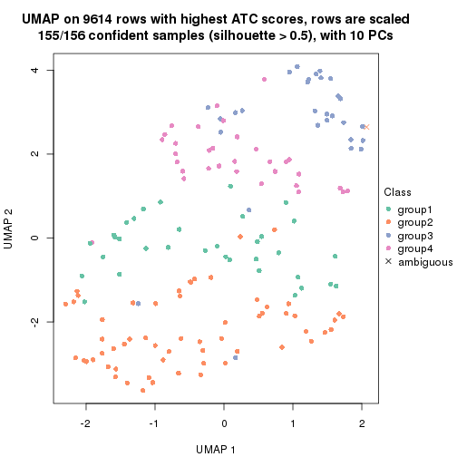</p>

</div>
</div>


Following heatmap shows how subgroups are split when increasing `k`:

```r
collect_classes(res)
```


Test correlation between subgroups and known annotations. If the known
annotation is numeric, one-way ANOVA test is applied, and if the known
annotation is discrete, chi-squared contingency table test is applied.

```r
test_to_known_factors(res)
```

```
#>             n_sample Cell_type(p-value) Timepoint(p-value) k
#> ATC:skmeans      154             0.0419                 NA 2
#> ATC:skmeans      153             0.0237                 NA 3
#> ATC:skmeans      155             0.0308                 NA 4
```


If matrix rows can be associated to genes, consider to use `functional_enrichment(res,
...)` to perform function enrichment for the signature genes. See [this vignette](https://jokergoo.github.io/cola_vignettes/functional_enrichment.html) for more detailed explanations.


 

---------------------------------------------------


### Node023


Parent node: [Node02](#Node02).
Child nodes: 
                Node0111-leaf
        ,
                [Node0112](#Node0112)
        ,
                Node0113-leaf
        ,
                [Node0121](#Node0121)
        ,
                [Node0122](#Node0122)
        ,
                [Node0131](#Node0131)
        ,
                [Node0132](#Node0132)
        ,
                Node0133-leaf
        ,
                Node0211-leaf
        ,
                [Node0212](#Node0212)
        ,
                Node0221-leaf
        ,
                Node0222-leaf
        ,
                Node0223-leaf
        ,
                [Node0231](#Node0231)
        ,
                Node0232-leaf
        ,
                Node0241-leaf
        ,
                Node0242-leaf
        ,
                Node0243-leaf
        ,
                Node0331-leaf
        ,
                Node0332-leaf
        ,
                Node0333-leaf
        ,
                Node0334-leaf
        .


The object with results only for a single top-value method and a single partitioning method 
can be extracted as:

```r
res = res_rh["023"]
```

A summary of `res` and all the functions that can be applied to it:

```r
res
```

```
#> A 'ConsensusPartition' object with k = 2, 3, 4.
#>   On a matrix with 9726 rows and 198 columns.
#>   Top rows (926) are extracted by 'ATC' method.
#>   Subgroups are detected by 'skmeans' method.
#>   Performed in total 150 partitions by row resampling.
#>   Best k for subgroups seems to be 3.
#> 
#> Following methods can be applied to this 'ConsensusPartition' object:
#>  [1] "cola_report"             "collect_classes"         "collect_plots"          
#>  [4] "collect_stats"           "colnames"                "compare_partitions"     
#>  [7] "compare_signatures"      "consensus_heatmap"       "dimension_reduction"    
#> [10] "functional_enrichment"   "get_anno_col"            "get_anno"               
#> [13] "get_classes"             "get_consensus"           "get_matrix"             
#> [16] "get_membership"          "get_param"               "get_signatures"         
#> [19] "get_stats"               "is_best_k"               "is_stable_k"            
#> [22] "membership_heatmap"      "ncol"                    "nrow"                   
#> [25] "plot_ecdf"               "predict_classes"         "rownames"               
#> [28] "select_partition_number" "show"                    "suggest_best_k"         
#> [31] "test_to_known_factors"   "top_rows_heatmap"
```

`collect_plots()` function collects all the plots made from `res` for all `k` (number of subgroups)
into one single page to provide an easy and fast comparison between different `k`.

```r
collect_plots(res)
```


The plots are:

- The first row: a plot of the eCDF (empirical cumulative distribution
  function) curves of the consensus matrix for each `k` and the heatmap of
  predicted classes for each `k`.
- The second row: heatmaps of the consensus matrix for each `k`.
- The third row: heatmaps of the membership matrix for each `k`.
- The fouth row: heatmaps of the signatures for each `k`.

All the plots in panels can be made by individual functions and they are
plotted later in this section.

`select_partition_number()` produces several plots showing different
statistics for choosing "optimized" `k`. There are following statistics:

- eCDF curves of the consensus matrix for each `k`;
- 1-PAC. [The PAC score](https://en.wikipedia.org/wiki/Consensus_clustering#Over-interpretation_potential_of_consensus_clustering)
  measures the proportion of the ambiguous subgrouping.
- Mean silhouette score.
- Concordance. The mean probability of fiting the consensus subgroup labels in all
  partitions.
- Area increased. Denote $A_k$ as the area under the eCDF curve for current
  `k`, the area increased is defined as $A_k - A_{k-1}$.
- Rand index. The percent of pairs of samples that are both in a same cluster
  or both are not in a same cluster in the partition of k and k-1.
- Jaccard index. The ratio of pairs of samples are both in a same cluster in
  the partition of k and k-1 and the pairs of samples are both in a same
  cluster in the partition k or k-1.

The detailed explanations of these statistics can be found in [the _cola_
vignette](https://jokergoo.github.io/cola_vignettes/cola.html#toc_13).

Generally speaking, higher 1-PAC score, higher mean silhouette score or higher
concordance corresponds to better partition. Rand index and Jaccard index
measure how similar the current partition is compared to partition with `k-1`.
If they are too similar, we won't accept `k` is better than `k-1`.

```r
select_partition_number(res)
```


The numeric values for all these statistics can be obtained by `get_stats()`.

```r
get_stats(res)
```

```
#>   k 1-PAC mean_silhouette concordance area_increased  Rand Jaccard
#> 2 2 1.000           0.977       0.991          0.500 0.499   0.499
#> 3 3 0.945           0.946       0.973          0.288 0.780   0.590
#> 4 4 0.686           0.743       0.852          0.109 0.908   0.753
```

`suggest_best_k()` suggests the best $k$ based on these statistics. The rules are as follows:

- All $k$ with Jaccard index larger than 0.95 are removed because increasing
  $k$ does not provide enough extra information. If all $k$ are removed, it is
  marked as no subgroup is detected.
- For all $k$ with 1-PAC score larger than 0.9, the maximal $k$ is taken as
  the best $k$, and other $k$ are marked as optional $k$.
- If it does not fit the second rule. The $k$ with the maximal vote of the
  highest 1-PAC score, highest mean silhouette, and highest concordance is
  taken as the best $k$.

```r
suggest_best_k(res)
```

```
#> [1] 3
#> attr(,"optional")
#> [1] 2
```

There is also optional best $k$ = 2 that is worth to check.

Following is the table of the partitions (You need to click the **show/hide
code output** link to see it). The membership matrix (columns with name `p*`)
is inferred by
[`clue::cl_consensus()`](https://www.rdocumentation.org/link/cl_consensus?package=clue)
function with the `SE` method. Basically the value in the membership matrix
represents the probability to belong to a certain group. The finall subgroup
label for an item is determined with the group with highest probability it
belongs to.

In `get_classes()` function, the entropy is calculated from the membership
matrix and the silhouette score is calculated from the consensus matrix.


<script>
$( function() {
	$( '#tabs-node-023-get-classes' ).tabs();
} );
</script>
<div id='tabs-node-023-get-classes'>
<ul>
<li><a href='#tab-node-023-get-classes-1'>k = 2</a></li>
<li><a href='#tab-node-023-get-classes-2'>k = 3</a></li>
<li><a href='#tab-node-023-get-classes-3'>k = 4</a></li>
</ul>

<div id='tab-node-023-get-classes-1'>
<p><a id='tab-node-023-get-classes-1-a' style='color:#0366d6' href='#'>show/hide code output</a></p>
<pre><code class="r">cbind(get_classes(res, k = 2), get_membership(res, k = 2))
</code></pre>

<pre><code>#&gt;                 class entropy silhouette   p1   p2
#&gt; 1772122_305_D11     2   0.000     0.9971 0.00 1.00
#&gt; 1772122_303_B02     1   0.000     0.9836 1.00 0.00
#&gt; 1772122_315_F04     1   0.000     0.9836 1.00 0.00
#&gt; 1772122_205_C02     1   0.141     0.9662 0.98 0.02
#&gt; 1772122_205_E01     2   0.000     0.9971 0.00 1.00
#&gt; 1772122_315_G09     1   0.000     0.9836 1.00 0.00
#&gt; 1772122_306_B03     2   0.000     0.9971 0.00 1.00
#&gt; 1772122_205_G06     1   0.000     0.9836 1.00 0.00
#&gt; 1772122_305_C05     2   0.000     0.9971 0.00 1.00
#&gt; 1772122_305_G06     1   0.000     0.9836 1.00 0.00
#&gt; 1772122_306_H11     1   0.000     0.9836 1.00 0.00
#&gt; 1772122_315_A11     2   0.000     0.9971 0.00 1.00
#&gt; 1772122_306_G01     2   0.000     0.9971 0.00 1.00
#&gt; 1772122_306_F05     1   0.000     0.9836 1.00 0.00
#&gt; 1772122_306_B12     2   0.000     0.9971 0.00 1.00
#&gt; 1772122_306_B07     1   0.000     0.9836 1.00 0.00
#&gt; 1772122_306_A12     2   0.000     0.9971 0.00 1.00
#&gt; 1772122_315_E08     1   0.000     0.9836 1.00 0.00
#&gt; 1772122_315_H08     2   0.000     0.9971 0.00 1.00
#&gt; 1772122_298_B07     1   0.000     0.9836 1.00 0.00
#&gt; 1772122_306_A11     2   0.000     0.9971 0.00 1.00
#&gt; 1772122_315_C10     2   0.000     0.9971 0.00 1.00
#&gt; 1772122_315_F03     1   0.000     0.9836 1.00 0.00
#&gt; 1772122_306_H10     1   0.000     0.9836 1.00 0.00
#&gt; 1772122_305_F05     2   0.000     0.9971 0.00 1.00
#&gt; 1772122_306_H04     2   0.000     0.9971 0.00 1.00
#&gt; 1772122_303_D10     2   0.000     0.9971 0.00 1.00
#&gt; 1772122_315_C01     2   0.000     0.9971 0.00 1.00
#&gt; 1772122_305_E08     1   0.000     0.9836 1.00 0.00
#&gt; 1772122_305_E03     2   0.141     0.9773 0.02 0.98
#&gt; 1772122_306_A04     1   0.000     0.9836 1.00 0.00
#&gt; 1772122_305_C02     1   0.000     0.9836 1.00 0.00
#&gt; 1772122_303_H08     2   0.000     0.9971 0.00 1.00
#&gt; 1772122_305_E06     1   0.000     0.9836 1.00 0.00
#&gt; 1772122_306_A10     1   0.760     0.7192 0.78 0.22
#&gt; 1772122_315_H03     2   0.000     0.9971 0.00 1.00
#&gt; 1772122_306_G06     1   0.000     0.9836 1.00 0.00
#&gt; 1772122_303_B09     1   0.000     0.9836 1.00 0.00
#&gt; 1772122_315_H07     1   0.000     0.9836 1.00 0.00
#&gt; 1772122_305_E04     1   0.000     0.9836 1.00 0.00
#&gt; 1772122_306_H06     1   0.000     0.9836 1.00 0.00
#&gt; 1772122_305_D04     1   0.000     0.9836 1.00 0.00
#&gt; 1772122_315_G10     1   0.000     0.9836 1.00 0.00
#&gt; 1772122_315_D06     1   0.000     0.9836 1.00 0.00
#&gt; 1772122_306_F01     1   0.141     0.9662 0.98 0.02
#&gt; 1772122_315_H06     1   0.000     0.9836 1.00 0.00
#&gt; 1772122_315_A05     2   0.000     0.9971 0.00 1.00
#&gt; 1772122_315_E10     2   0.000     0.9971 0.00 1.00
#&gt; 1772122_306_G04     1   0.000     0.9836 1.00 0.00
#&gt; 1772122_315_G06     2   0.000     0.9971 0.00 1.00
#&gt; 1772122_315_H10     2   0.141     0.9773 0.02 0.98
#&gt; 1772122_315_E05     2   0.000     0.9971 0.00 1.00
#&gt; 1772122_305_C11     2   0.000     0.9971 0.00 1.00
#&gt; 1772122_306_A08     2   0.000     0.9971 0.00 1.00
#&gt; 1772122_305_E05     2   0.000     0.9971 0.00 1.00
#&gt; 1772122_306_E12     1   0.000     0.9836 1.00 0.00
#&gt; 1772122_315_A06     2   0.000     0.9971 0.00 1.00
#&gt; 1772122_305_E01     2   0.000     0.9971 0.00 1.00
#&gt; 1772122_306_G05     2   0.000     0.9971 0.00 1.00
#&gt; 1772122_315_A10     2   0.000     0.9971 0.00 1.00
#&gt; 1772122_306_G03     1   0.000     0.9836 1.00 0.00
#&gt; 1772122_305_D08     2   0.000     0.9971 0.00 1.00
#&gt; 1772122_315_D05     2   0.000     0.9971 0.00 1.00
#&gt; 1772122_306_H03     2   0.000     0.9971 0.00 1.00
#&gt; 1772122_306_F08     2   0.000     0.9971 0.00 1.00
#&gt; 1772122_306_D03     2   0.000     0.9971 0.00 1.00
#&gt; 1772122_306_B04     1   0.000     0.9836 1.00 0.00
#&gt; 1772122_306_G07     1   0.000     0.9836 1.00 0.00
#&gt; 1772122_315_H11     1   0.000     0.9836 1.00 0.00
#&gt; 1772122_306_A03     1   0.000     0.9836 1.00 0.00
#&gt; 1772122_315_H02     1   0.402     0.9062 0.92 0.08
#&gt; 1772122_306_F12     1   0.000     0.9836 1.00 0.00
#&gt; 1772122_306_B11     1   0.000     0.9836 1.00 0.00
#&gt; 1772122_315_F11     2   0.000     0.9971 0.00 1.00
#&gt; 1772122_306_B09     2   0.000     0.9971 0.00 1.00
#&gt; 1772122_315_D12     1   0.000     0.9836 1.00 0.00
#&gt; 1772122_306_D02     2   0.000     0.9971 0.00 1.00
#&gt; 1772122_306_E08     2   0.000     0.9971 0.00 1.00
#&gt; 1772122_315_D09     1   0.000     0.9836 1.00 0.00
#&gt; 1772122_306_G12     2   0.000     0.9971 0.00 1.00
#&gt; 1772122_315_E01     1   0.000     0.9836 1.00 0.00
#&gt; 1772122_315_H09     1   0.000     0.9836 1.00 0.00
#&gt; 1772122_306_F06     1   0.000     0.9836 1.00 0.00
#&gt; 1772122_315_B07     1   0.000     0.9836 1.00 0.00
#&gt; 1772122_315_E11     1   0.000     0.9836 1.00 0.00
#&gt; 1772122_315_C03     2   0.000     0.9971 0.00 1.00
#&gt; 1772122_315_D10     2   0.000     0.9971 0.00 1.00
#&gt; 1772122_315_A12     2   0.000     0.9971 0.00 1.00
#&gt; 1772122_315_G07     1   0.000     0.9836 1.00 0.00
#&gt; 1772122_306_F02     2   0.000     0.9971 0.00 1.00
#&gt; 1772122_306_G02     2   0.000     0.9971 0.00 1.00
#&gt; 1772122_315_F09     1   0.000     0.9836 1.00 0.00
#&gt; 1772122_306_D08     2   0.000     0.9971 0.00 1.00
#&gt; 1772122_315_F12     2   0.000     0.9971 0.00 1.00
#&gt; 1772122_303_C07     2   0.000     0.9971 0.00 1.00
#&gt; 1772122_305_D02     2   0.000     0.9971 0.00 1.00
#&gt; 1772122_305_E07     1   0.000     0.9836 1.00 0.00
#&gt; 1772122_305_B09     1   0.000     0.9836 1.00 0.00
#&gt; 1772122_303_C04     1   0.000     0.9836 1.00 0.00
#&gt; 1772122_303_G03     2   0.000     0.9971 0.00 1.00
#&gt; 1772122_305_F11     1   0.000     0.9836 1.00 0.00
#&gt; 1772122_315_F07     1   0.000     0.9836 1.00 0.00
#&gt; 1772122_306_F09     2   0.000     0.9971 0.00 1.00
#&gt; 1772122_305_B12     2   0.000     0.9971 0.00 1.00
#&gt; 1772122_305_H03     2   0.000     0.9971 0.00 1.00
#&gt; 1772122_305_A06     2   0.000     0.9971 0.00 1.00
#&gt; 1772122_303_C08     1   0.995     0.1635 0.54 0.46
#&gt; 1772122_303_C01     1   0.000     0.9836 1.00 0.00
#&gt; 1772122_303_G02     2   0.000     0.9971 0.00 1.00
#&gt; 1772122_303_A06     2   0.000     0.9971 0.00 1.00
#&gt; 1772122_315_E06     1   0.000     0.9836 1.00 0.00
#&gt; 1772122_303_C10     2   0.000     0.9971 0.00 1.00
#&gt; 1772122_303_B07     1   0.327     0.9274 0.94 0.06
#&gt; 1772122_306_D10     1   0.000     0.9836 1.00 0.00
#&gt; 1772122_303_H02     2   0.000     0.9971 0.00 1.00
#&gt; 1772122_305_C06     1   0.000     0.9836 1.00 0.00
#&gt; 1772122_303_D02     2   0.000     0.9971 0.00 1.00
#&gt; 1772122_303_E08     2   0.000     0.9971 0.00 1.00
#&gt; 1772122_305_G11     1   0.000     0.9836 1.00 0.00
#&gt; 1772122_306_A01     2   0.000     0.9971 0.00 1.00
#&gt; 1772122_305_F10     2   0.000     0.9971 0.00 1.00
#&gt; 1772122_305_G08     2   0.000     0.9971 0.00 1.00
#&gt; 1772122_305_A03     2   0.000     0.9971 0.00 1.00
#&gt; 1772122_303_A07     2   0.000     0.9971 0.00 1.00
#&gt; 1772122_305_H12     1   0.000     0.9836 1.00 0.00
#&gt; 1772122_305_A12     2   0.000     0.9971 0.00 1.00
#&gt; 1772122_303_F03     2   0.000     0.9971 0.00 1.00
#&gt; 1772122_305_H10     1   0.000     0.9836 1.00 0.00
#&gt; 1772122_305_H08     2   0.000     0.9971 0.00 1.00
#&gt; 1772122_305_C10     2   0.000     0.9971 0.00 1.00
#&gt; 1772122_315_D11     2   0.000     0.9971 0.00 1.00
#&gt; 1772122_305_C01     2   0.000     0.9971 0.00 1.00
#&gt; 1772122_305_B07     1   0.000     0.9836 1.00 0.00
#&gt; 1772122_305_B02     2   0.000     0.9971 0.00 1.00
#&gt; 1772122_303_E09     2   0.000     0.9971 0.00 1.00
#&gt; 1772122_306_A09     1   0.000     0.9836 1.00 0.00
#&gt; 1772122_303_B05     2   0.000     0.9971 0.00 1.00
#&gt; 1772122_306_C04     1   0.000     0.9836 1.00 0.00
#&gt; 1772122_305_H06     1   0.529     0.8597 0.88 0.12
#&gt; 1772122_306_C02     1   0.000     0.9836 1.00 0.00
#&gt; 1772122_315_E02     1   0.000     0.9836 1.00 0.00
#&gt; 1772122_315_A04     1   0.000     0.9836 1.00 0.00
#&gt; 1772122_306_E11     1   0.000     0.9836 1.00 0.00
#&gt; 1772122_306_G11     2   0.000     0.9971 0.00 1.00
#&gt; 1772122_315_B09     2   0.000     0.9971 0.00 1.00
#&gt; 1772122_303_G07     1   0.000     0.9836 1.00 0.00
#&gt; 1772122_306_B06     1   0.000     0.9836 1.00 0.00
#&gt; 1772122_305_E09     2   0.327     0.9342 0.06 0.94
#&gt; 1772122_306_E05     1   0.000     0.9836 1.00 0.00
#&gt; 1772122_306_F07     1   0.000     0.9836 1.00 0.00
#&gt; 1772122_315_B12     2   0.000     0.9971 0.00 1.00
#&gt; 1772122_306_C08     1   0.000     0.9836 1.00 0.00
#&gt; 1772122_315_D07     1   0.000     0.9836 1.00 0.00
#&gt; 1772122_303_F09     1   0.000     0.9836 1.00 0.00
#&gt; 1772122_315_E12     2   0.000     0.9971 0.00 1.00
#&gt; 1772122_303_F08     1   0.000     0.9836 1.00 0.00
#&gt; 1772122_315_F08     2   0.722     0.7456 0.20 0.80
#&gt; 1772122_305_A11     1   0.000     0.9836 1.00 0.00
#&gt; 1772122_315_C05     1   0.000     0.9836 1.00 0.00
#&gt; 1772122_303_G01     2   0.000     0.9971 0.00 1.00
#&gt; 1772122_303_H03     1   0.000     0.9836 1.00 0.00
#&gt; 1772122_315_B08     1   0.000     0.9836 1.00 0.00
#&gt; 1772122_305_D10     2   0.000     0.9971 0.00 1.00
#&gt; 1772122_315_H12     1   0.000     0.9836 1.00 0.00
#&gt; 1772122_315_G08     1   0.000     0.9836 1.00 0.00
#&gt; 1772122_305_A07     2   0.000     0.9971 0.00 1.00
#&gt; 1772122_315_B10     1   0.999     0.0903 0.52 0.48
#&gt; 1772122_306_F10     2   0.000     0.9971 0.00 1.00
#&gt; 1772122_306_C01     1   0.000     0.9836 1.00 0.00
#&gt; 1772122_315_G01     2   0.000     0.9971 0.00 1.00
#&gt; 1772122_306_D01     2   0.000     0.9971 0.00 1.00
#&gt; 1772122_306_D07     2   0.000     0.9971 0.00 1.00
#&gt; 1772122_306_C12     1   0.000     0.9836 1.00 0.00
#&gt; 1772122_305_B06     2   0.000     0.9971 0.00 1.00
#&gt; 1772122_305_H01     1   0.000     0.9836 1.00 0.00
#&gt; 1772122_315_G04     1   0.000     0.9836 1.00 0.00
#&gt; 1772122_303_A04     2   0.000     0.9971 0.00 1.00
#&gt; 1772122_301_H11     1   0.000     0.9836 1.00 0.00
#&gt; 1772122_299_G02     1   0.000     0.9836 1.00 0.00
#&gt; 1772122_180_D11     1   0.000     0.9836 1.00 0.00
#&gt; 1772122_300_G02     2   0.000     0.9971 0.00 1.00
#&gt; 1772122_298_A02     2   0.000     0.9971 0.00 1.00
#&gt; 1772122_205_A03     2   0.000     0.9971 0.00 1.00
#&gt; 1772122_262_H01     2   0.000     0.9971 0.00 1.00
#&gt; 1772122_204_F11     2   0.000     0.9971 0.00 1.00
#&gt; 1772122_262_D03     2   0.000     0.9971 0.00 1.00
#&gt; 1772122_262_E03     2   0.000     0.9971 0.00 1.00
#&gt; 1772122_206_F02     2   0.000     0.9971 0.00 1.00
#&gt; 1772122_206_F05     2   0.000     0.9971 0.00 1.00
#&gt; 1772122_262_C12     1   0.000     0.9836 1.00 0.00
#&gt; 1772122_206_A10     2   0.000     0.9971 0.00 1.00
#&gt; 1772122_204_A12     1   0.242     0.9474 0.96 0.04
#&gt; 1772122_262_G04     2   0.000     0.9971 0.00 1.00
#&gt; 1772122_205_G10     2   0.000     0.9971 0.00 1.00
#&gt; 1772122_206_H11     2   0.000     0.9971 0.00 1.00
#&gt; 1772122_205_C04     2   0.000     0.9971 0.00 1.00
#&gt; 1772122_262_E06     2   0.000     0.9971 0.00 1.00
#&gt; 1772122_262_F06     2   0.000     0.9971 0.00 1.00
</code></pre>

<script>
$('#tab-node-023-get-classes-1-a').parent().next().next().hide();
$('#tab-node-023-get-classes-1-a').click(function(){
  $('#tab-node-023-get-classes-1-a').parent().next().next().toggle();
  return(false);
});
</script>
</div>

<div id='tab-node-023-get-classes-2'>
<p><a id='tab-node-023-get-classes-2-a' style='color:#0366d6' href='#'>show/hide code output</a></p>
<pre><code class="r">cbind(get_classes(res, k = 3), get_membership(res, k = 3))
</code></pre>

<pre><code>#&gt;                 class entropy silhouette   p1   p2   p3
#&gt; 1772122_305_D11     3  0.0000      0.962 0.00 0.00 1.00
#&gt; 1772122_303_B02     3  0.0000      0.962 0.00 0.00 1.00
#&gt; 1772122_315_F04     1  0.0000      0.969 1.00 0.00 0.00
#&gt; 1772122_205_C02     3  0.0000      0.962 0.00 0.00 1.00
#&gt; 1772122_205_E01     2  0.0892      0.961 0.00 0.98 0.02
#&gt; 1772122_315_G09     1  0.0892      0.953 0.98 0.00 0.02
#&gt; 1772122_306_B03     2  0.5406      0.741 0.20 0.78 0.02
#&gt; 1772122_205_G06     3  0.0000      0.962 0.00 0.00 1.00
#&gt; 1772122_305_C05     3  0.0000      0.962 0.00 0.00 1.00
#&gt; 1772122_305_G06     3  0.0000      0.962 0.00 0.00 1.00
#&gt; 1772122_306_H11     1  0.0000      0.969 1.00 0.00 0.00
#&gt; 1772122_315_A11     3  0.0000      0.962 0.00 0.00 1.00
#&gt; 1772122_306_G01     2  0.0000      0.975 0.00 1.00 0.00
#&gt; 1772122_306_F05     1  0.0000      0.969 1.00 0.00 0.00
#&gt; 1772122_306_B12     2  0.0000      0.975 0.00 1.00 0.00
#&gt; 1772122_306_B07     3  0.0000      0.962 0.00 0.00 1.00
#&gt; 1772122_306_A12     2  0.3686      0.854 0.00 0.86 0.14
#&gt; 1772122_315_E08     1  0.0000      0.969 1.00 0.00 0.00
#&gt; 1772122_315_H08     2  0.3340      0.875 0.00 0.88 0.12
#&gt; 1772122_298_B07     3  0.0000      0.962 0.00 0.00 1.00
#&gt; 1772122_306_A11     2  0.4796      0.748 0.00 0.78 0.22
#&gt; 1772122_315_C10     2  0.0000      0.975 0.00 1.00 0.00
#&gt; 1772122_315_F03     1  0.0000      0.969 1.00 0.00 0.00
#&gt; 1772122_306_H10     1  0.0000      0.969 1.00 0.00 0.00
#&gt; 1772122_305_F05     2  0.0000      0.975 0.00 1.00 0.00
#&gt; 1772122_306_H04     2  0.0000      0.975 0.00 1.00 0.00
#&gt; 1772122_303_D10     2  0.0000      0.975 0.00 1.00 0.00
#&gt; 1772122_315_C01     2  0.0000      0.975 0.00 1.00 0.00
#&gt; 1772122_305_E08     1  0.0000      0.969 1.00 0.00 0.00
#&gt; 1772122_305_E03     1  0.6126      0.353 0.60 0.40 0.00
#&gt; 1772122_306_A04     1  0.0000      0.969 1.00 0.00 0.00
#&gt; 1772122_305_C02     1  0.0000      0.969 1.00 0.00 0.00
#&gt; 1772122_303_H08     2  0.2537      0.902 0.08 0.92 0.00
#&gt; 1772122_305_E06     3  0.2537      0.940 0.08 0.00 0.92
#&gt; 1772122_306_A10     1  0.0000      0.969 1.00 0.00 0.00
#&gt; 1772122_315_H03     2  0.0000      0.975 0.00 1.00 0.00
#&gt; 1772122_306_G06     1  0.0000      0.969 1.00 0.00 0.00
#&gt; 1772122_303_B09     3  0.0000      0.962 0.00 0.00 1.00
#&gt; 1772122_315_H07     1  0.2066      0.914 0.94 0.00 0.06
#&gt; 1772122_305_E04     3  0.2537      0.940 0.08 0.00 0.92
#&gt; 1772122_306_H06     1  0.0892      0.952 0.98 0.00 0.02
#&gt; 1772122_305_D04     3  0.2537      0.940 0.08 0.00 0.92
#&gt; 1772122_315_G10     1  0.0000      0.969 1.00 0.00 0.00
#&gt; 1772122_315_D06     1  0.0000      0.969 1.00 0.00 0.00
#&gt; 1772122_306_F01     1  0.0892      0.952 0.98 0.02 0.00
#&gt; 1772122_315_H06     1  0.0000      0.969 1.00 0.00 0.00
#&gt; 1772122_315_A05     2  0.0000      0.975 0.00 1.00 0.00
#&gt; 1772122_315_E10     2  0.0000      0.975 0.00 1.00 0.00
#&gt; 1772122_306_G04     3  0.0892      0.958 0.02 0.00 0.98
#&gt; 1772122_315_G06     3  0.0000      0.962 0.00 0.00 1.00
#&gt; 1772122_315_H10     1  0.2537      0.888 0.92 0.08 0.00
#&gt; 1772122_315_E05     2  0.0000      0.975 0.00 1.00 0.00
#&gt; 1772122_305_C11     2  0.0000      0.975 0.00 1.00 0.00
#&gt; 1772122_306_A08     2  0.0000      0.975 0.00 1.00 0.00
#&gt; 1772122_305_E05     2  0.0000      0.975 0.00 1.00 0.00
#&gt; 1772122_306_E12     1  0.0000      0.969 1.00 0.00 0.00
#&gt; 1772122_315_A06     2  0.0892      0.961 0.00 0.98 0.02
#&gt; 1772122_305_E01     2  0.0000      0.975 0.00 1.00 0.00
#&gt; 1772122_306_G05     1  0.2537      0.888 0.92 0.08 0.00
#&gt; 1772122_315_A10     2  0.0000      0.975 0.00 1.00 0.00
#&gt; 1772122_306_G03     1  0.0000      0.969 1.00 0.00 0.00
#&gt; 1772122_305_D08     2  0.0000      0.975 0.00 1.00 0.00
#&gt; 1772122_315_D05     2  0.0000      0.975 0.00 1.00 0.00
#&gt; 1772122_306_H03     2  0.0000      0.975 0.00 1.00 0.00
#&gt; 1772122_306_F08     2  0.0000      0.975 0.00 1.00 0.00
#&gt; 1772122_306_D03     2  0.0000      0.975 0.00 1.00 0.00
#&gt; 1772122_306_B04     1  0.0000      0.969 1.00 0.00 0.00
#&gt; 1772122_306_G07     3  0.2537      0.940 0.08 0.00 0.92
#&gt; 1772122_315_H11     1  0.0000      0.969 1.00 0.00 0.00
#&gt; 1772122_306_A03     1  0.0000      0.969 1.00 0.00 0.00
#&gt; 1772122_315_H02     1  0.0892      0.952 0.98 0.02 0.00
#&gt; 1772122_306_F12     1  0.0000      0.969 1.00 0.00 0.00
#&gt; 1772122_306_B11     3  0.2537      0.940 0.08 0.00 0.92
#&gt; 1772122_315_F11     2  0.0000      0.975 0.00 1.00 0.00
#&gt; 1772122_306_B09     2  0.0000      0.975 0.00 1.00 0.00
#&gt; 1772122_315_D12     1  0.0000      0.969 1.00 0.00 0.00
#&gt; 1772122_306_D02     2  0.0000      0.975 0.00 1.00 0.00
#&gt; 1772122_306_E08     2  0.0000      0.975 0.00 1.00 0.00
#&gt; 1772122_315_D09     3  0.0000      0.962 0.00 0.00 1.00
#&gt; 1772122_306_G12     2  0.0000      0.975 0.00 1.00 0.00
#&gt; 1772122_315_E01     1  0.0000      0.969 1.00 0.00 0.00
#&gt; 1772122_315_H09     3  0.2537      0.940 0.08 0.00 0.92
#&gt; 1772122_306_F06     1  0.0000      0.969 1.00 0.00 0.00
#&gt; 1772122_315_B07     1  0.0000      0.969 1.00 0.00 0.00
#&gt; 1772122_315_E11     3  0.2537      0.940 0.08 0.00 0.92
#&gt; 1772122_315_C03     2  0.0000      0.975 0.00 1.00 0.00
#&gt; 1772122_315_D10     2  0.0000      0.975 0.00 1.00 0.00
#&gt; 1772122_315_A12     2  0.0000      0.975 0.00 1.00 0.00
#&gt; 1772122_315_G07     3  0.0000      0.962 0.00 0.00 1.00
#&gt; 1772122_306_F02     3  0.0000      0.962 0.00 0.00 1.00
#&gt; 1772122_306_G02     1  0.5397      0.627 0.72 0.28 0.00
#&gt; 1772122_315_F09     1  0.0000      0.969 1.00 0.00 0.00
#&gt; 1772122_306_D08     2  0.0000      0.975 0.00 1.00 0.00
#&gt; 1772122_315_F12     2  0.0000      0.975 0.00 1.00 0.00
#&gt; 1772122_303_C07     2  0.0000      0.975 0.00 1.00 0.00
#&gt; 1772122_305_D02     2  0.0000      0.975 0.00 1.00 0.00
#&gt; 1772122_305_E07     1  0.0000      0.969 1.00 0.00 0.00
#&gt; 1772122_305_B09     3  0.2537      0.940 0.08 0.00 0.92
#&gt; 1772122_303_C04     1  0.0000      0.969 1.00 0.00 0.00
#&gt; 1772122_303_G03     2  0.0000      0.975 0.00 1.00 0.00
#&gt; 1772122_305_F11     3  0.2537      0.940 0.08 0.00 0.92
#&gt; 1772122_315_F07     1  0.0000      0.969 1.00 0.00 0.00
#&gt; 1772122_306_F09     3  0.0000      0.962 0.00 0.00 1.00
#&gt; 1772122_305_B12     2  0.4555      0.750 0.20 0.80 0.00
#&gt; 1772122_305_H03     2  0.0000      0.975 0.00 1.00 0.00
#&gt; 1772122_305_A06     2  0.0000      0.975 0.00 1.00 0.00
#&gt; 1772122_303_C08     3  0.0000      0.962 0.00 0.00 1.00
#&gt; 1772122_303_C01     1  0.0000      0.969 1.00 0.00 0.00
#&gt; 1772122_303_G02     2  0.0000      0.975 0.00 1.00 0.00
#&gt; 1772122_303_A06     2  0.4291      0.805 0.00 0.82 0.18
#&gt; 1772122_315_E06     3  0.2537      0.940 0.08 0.00 0.92
#&gt; 1772122_303_C10     2  0.0000      0.975 0.00 1.00 0.00
#&gt; 1772122_303_B07     3  0.0000      0.962 0.00 0.00 1.00
#&gt; 1772122_306_D10     1  0.0000      0.969 1.00 0.00 0.00
#&gt; 1772122_303_H02     2  0.3686      0.836 0.14 0.86 0.00
#&gt; 1772122_305_C06     1  0.0000      0.969 1.00 0.00 0.00
#&gt; 1772122_303_D02     2  0.2959      0.895 0.00 0.90 0.10
#&gt; 1772122_303_E08     2  0.0000      0.975 0.00 1.00 0.00
#&gt; 1772122_305_G11     1  0.0000      0.969 1.00 0.00 0.00
#&gt; 1772122_306_A01     2  0.0000      0.975 0.00 1.00 0.00
#&gt; 1772122_305_F10     2  0.0000      0.975 0.00 1.00 0.00
#&gt; 1772122_305_G08     2  0.0000      0.975 0.00 1.00 0.00
#&gt; 1772122_305_A03     2  0.0000      0.975 0.00 1.00 0.00
#&gt; 1772122_303_A07     3  0.0000      0.962 0.00 0.00 1.00
#&gt; 1772122_305_H12     1  0.0000      0.969 1.00 0.00 0.00
#&gt; 1772122_305_A12     2  0.0000      0.975 0.00 1.00 0.00
#&gt; 1772122_303_F03     2  0.0000      0.975 0.00 1.00 0.00
#&gt; 1772122_305_H10     1  0.0000      0.969 1.00 0.00 0.00
#&gt; 1772122_305_H08     2  0.0000      0.975 0.00 1.00 0.00
#&gt; 1772122_305_C10     2  0.5216      0.645 0.26 0.74 0.00
#&gt; 1772122_315_D11     2  0.0000      0.975 0.00 1.00 0.00
#&gt; 1772122_305_C01     2  0.0000      0.975 0.00 1.00 0.00
#&gt; 1772122_305_B07     1  0.0000      0.969 1.00 0.00 0.00
#&gt; 1772122_305_B02     1  0.4555      0.747 0.80 0.20 0.00
#&gt; 1772122_303_E09     2  0.2537      0.912 0.00 0.92 0.08
#&gt; 1772122_306_A09     3  0.0000      0.962 0.00 0.00 1.00
#&gt; 1772122_303_B05     2  0.0000      0.975 0.00 1.00 0.00
#&gt; 1772122_306_C04     1  0.0000      0.969 1.00 0.00 0.00
#&gt; 1772122_305_H06     3  0.0000      0.962 0.00 0.00 1.00
#&gt; 1772122_306_C02     3  0.3686      0.877 0.14 0.00 0.86
#&gt; 1772122_315_E02     1  0.0000      0.969 1.00 0.00 0.00
#&gt; 1772122_315_A04     1  0.0000      0.969 1.00 0.00 0.00
#&gt; 1772122_306_E11     1  0.0000      0.969 1.00 0.00 0.00
#&gt; 1772122_306_G11     2  0.0000      0.975 0.00 1.00 0.00
#&gt; 1772122_315_B09     2  0.0000      0.975 0.00 1.00 0.00
#&gt; 1772122_303_G07     1  0.2959      0.868 0.90 0.00 0.10
#&gt; 1772122_306_B06     3  0.2537      0.940 0.08 0.00 0.92
#&gt; 1772122_305_E09     3  0.1529      0.934 0.00 0.04 0.96
#&gt; 1772122_306_E05     1  0.0000      0.969 1.00 0.00 0.00
#&gt; 1772122_306_F07     1  0.0000      0.969 1.00 0.00 0.00
#&gt; 1772122_315_B12     2  0.0000      0.975 0.00 1.00 0.00
#&gt; 1772122_306_C08     1  0.0000      0.969 1.00 0.00 0.00
#&gt; 1772122_315_D07     3  0.2537      0.940 0.08 0.00 0.92
#&gt; 1772122_303_F09     1  0.0000      0.969 1.00 0.00 0.00
#&gt; 1772122_315_E12     2  0.0000      0.975 0.00 1.00 0.00
#&gt; 1772122_303_F08     1  0.0000      0.969 1.00 0.00 0.00
#&gt; 1772122_315_F08     1  0.1529      0.932 0.96 0.04 0.00
#&gt; 1772122_305_A11     3  0.2537      0.940 0.08 0.00 0.92
#&gt; 1772122_315_C05     3  0.2537      0.940 0.08 0.00 0.92
#&gt; 1772122_303_G01     2  0.0000      0.975 0.00 1.00 0.00
#&gt; 1772122_303_H03     1  0.0000      0.969 1.00 0.00 0.00
#&gt; 1772122_315_B08     1  0.0000      0.969 1.00 0.00 0.00
#&gt; 1772122_305_D10     2  0.0000      0.975 0.00 1.00 0.00
#&gt; 1772122_315_H12     1  0.0000      0.969 1.00 0.00 0.00
#&gt; 1772122_315_G08     1  0.0000      0.969 1.00 0.00 0.00
#&gt; 1772122_305_A07     2  0.0000      0.975 0.00 1.00 0.00
#&gt; 1772122_315_B10     1  0.0892      0.952 0.98 0.02 0.00
#&gt; 1772122_306_F10     2  0.0000      0.975 0.00 1.00 0.00
#&gt; 1772122_306_C01     1  0.0000      0.969 1.00 0.00 0.00
#&gt; 1772122_315_G01     2  0.0000      0.975 0.00 1.00 0.00
#&gt; 1772122_306_D01     2  0.0000      0.975 0.00 1.00 0.00
#&gt; 1772122_306_D07     1  0.5835      0.509 0.66 0.34 0.00
#&gt; 1772122_306_C12     1  0.0000      0.969 1.00 0.00 0.00
#&gt; 1772122_305_B06     2  0.0000      0.975 0.00 1.00 0.00
#&gt; 1772122_305_H01     1  0.0000      0.969 1.00 0.00 0.00
#&gt; 1772122_315_G04     1  0.0000      0.969 1.00 0.00 0.00
#&gt; 1772122_303_A04     2  0.0000      0.975 0.00 1.00 0.00
#&gt; 1772122_301_H11     3  0.0000      0.962 0.00 0.00 1.00
#&gt; 1772122_299_G02     3  0.0000      0.962 0.00 0.00 1.00
#&gt; 1772122_180_D11     3  0.0000      0.962 0.00 0.00 1.00
#&gt; 1772122_300_G02     3  0.0892      0.949 0.00 0.02 0.98
#&gt; 1772122_298_A02     2  0.3340      0.875 0.00 0.88 0.12
#&gt; 1772122_205_A03     2  0.0000      0.975 0.00 1.00 0.00
#&gt; 1772122_262_H01     2  0.0000      0.975 0.00 1.00 0.00
#&gt; 1772122_204_F11     2  0.0000      0.975 0.00 1.00 0.00
#&gt; 1772122_262_D03     2  0.0000      0.975 0.00 1.00 0.00
#&gt; 1772122_262_E03     2  0.0000      0.975 0.00 1.00 0.00
#&gt; 1772122_206_F02     2  0.0892      0.961 0.00 0.98 0.02
#&gt; 1772122_206_F05     2  0.0000      0.975 0.00 1.00 0.00
#&gt; 1772122_262_C12     3  0.2537      0.940 0.08 0.00 0.92
#&gt; 1772122_206_A10     2  0.0000      0.975 0.00 1.00 0.00
#&gt; 1772122_204_A12     1  0.1781      0.939 0.96 0.02 0.02
#&gt; 1772122_262_G04     2  0.0000      0.975 0.00 1.00 0.00
#&gt; 1772122_205_G10     2  0.0000      0.975 0.00 1.00 0.00
#&gt; 1772122_206_H11     2  0.4291      0.804 0.00 0.82 0.18
#&gt; 1772122_205_C04     2  0.1529      0.946 0.00 0.96 0.04
#&gt; 1772122_262_E06     3  0.2959      0.874 0.00 0.10 0.90
#&gt; 1772122_262_F06     2  0.0000      0.975 0.00 1.00 0.00
</code></pre>

<script>
$('#tab-node-023-get-classes-2-a').parent().next().next().hide();
$('#tab-node-023-get-classes-2-a').click(function(){
  $('#tab-node-023-get-classes-2-a').parent().next().next().toggle();
  return(false);
});
</script>
</div>

<div id='tab-node-023-get-classes-3'>
<p><a id='tab-node-023-get-classes-3-a' style='color:#0366d6' href='#'>show/hide code output</a></p>
<pre><code class="r">cbind(get_classes(res, k = 4), get_membership(res, k = 4))
</code></pre>

<pre><code>#&gt;                 class entropy silhouette   p1   p2   p3   p4
#&gt; 1772122_305_D11     4  0.3400     0.5910 0.00 0.00 0.18 0.82
#&gt; 1772122_303_B02     4  0.3801     0.5345 0.00 0.00 0.22 0.78
#&gt; 1772122_315_F04     1  0.0000     0.8506 1.00 0.00 0.00 0.00
#&gt; 1772122_205_C02     4  0.2345     0.6499 0.00 0.00 0.10 0.90
#&gt; 1772122_205_E01     4  0.4713     0.4309 0.00 0.36 0.00 0.64
#&gt; 1772122_315_G09     4  0.4977     0.1943 0.46 0.00 0.00 0.54
#&gt; 1772122_306_B03     4  0.6047     0.5786 0.02 0.10 0.16 0.72
#&gt; 1772122_205_G06     4  0.2647     0.6509 0.00 0.00 0.12 0.88
#&gt; 1772122_305_C05     4  0.2647     0.6509 0.00 0.00 0.12 0.88
#&gt; 1772122_305_G06     4  0.3172     0.6149 0.00 0.00 0.16 0.84
#&gt; 1772122_306_H11     4  0.4790     0.3811 0.38 0.00 0.00 0.62
#&gt; 1772122_315_A11     4  0.2647     0.6509 0.00 0.00 0.12 0.88
#&gt; 1772122_306_G01     4  0.4994     0.2359 0.00 0.48 0.00 0.52
#&gt; 1772122_306_F05     1  0.0000     0.8506 1.00 0.00 0.00 0.00
#&gt; 1772122_306_B12     4  0.5428     0.4404 0.00 0.38 0.02 0.60
#&gt; 1772122_306_B07     4  0.2647     0.6509 0.00 0.00 0.12 0.88
#&gt; 1772122_306_A12     4  0.2345     0.6824 0.00 0.10 0.00 0.90
#&gt; 1772122_315_E08     4  0.4907     0.3029 0.42 0.00 0.00 0.58
#&gt; 1772122_315_H08     4  0.2345     0.6824 0.00 0.10 0.00 0.90
#&gt; 1772122_298_B07     4  0.2647     0.6509 0.00 0.00 0.12 0.88
#&gt; 1772122_306_A11     4  0.2647     0.6763 0.00 0.12 0.00 0.88
#&gt; 1772122_315_C10     2  0.1211     0.8835 0.00 0.96 0.00 0.04
#&gt; 1772122_315_F03     1  0.4755     0.7242 0.76 0.00 0.20 0.04
#&gt; 1772122_306_H10     1  0.1637     0.8380 0.94 0.00 0.06 0.00
#&gt; 1772122_305_F05     2  0.3525     0.8257 0.00 0.86 0.10 0.04
#&gt; 1772122_306_H04     2  0.0000     0.8924 0.00 1.00 0.00 0.00
#&gt; 1772122_303_D10     2  0.0000     0.8924 0.00 1.00 0.00 0.00
#&gt; 1772122_315_C01     2  0.0000     0.8924 0.00 1.00 0.00 0.00
#&gt; 1772122_305_E08     1  0.4284     0.7390 0.78 0.00 0.20 0.02
#&gt; 1772122_305_E03     1  0.8829     0.1574 0.40 0.34 0.20 0.06
#&gt; 1772122_306_A04     1  0.3801     0.6293 0.78 0.00 0.22 0.00
#&gt; 1772122_305_C02     1  0.4134     0.5502 0.74 0.00 0.26 0.00
#&gt; 1772122_303_H08     4  0.7593     0.5155 0.04 0.18 0.18 0.60
#&gt; 1772122_305_E06     3  0.3610     0.7990 0.20 0.00 0.80 0.00
#&gt; 1772122_306_A10     1  0.6049     0.6524 0.68 0.00 0.20 0.12
#&gt; 1772122_315_H03     2  0.0000     0.8924 0.00 1.00 0.00 0.00
#&gt; 1772122_306_G06     1  0.2011     0.8306 0.92 0.00 0.08 0.00
#&gt; 1772122_303_B09     3  0.4134     0.6572 0.00 0.00 0.74 0.26
#&gt; 1772122_315_H07     3  0.4713     0.5918 0.36 0.00 0.64 0.00
#&gt; 1772122_305_E04     3  0.3610     0.7990 0.20 0.00 0.80 0.00
#&gt; 1772122_306_H06     1  0.3400     0.6802 0.82 0.00 0.18 0.00
#&gt; 1772122_305_D04     3  0.3610     0.7990 0.20 0.00 0.80 0.00
#&gt; 1772122_315_G10     1  0.0000     0.8506 1.00 0.00 0.00 0.00
#&gt; 1772122_315_D06     1  0.1637     0.8385 0.94 0.00 0.06 0.00
#&gt; 1772122_306_F01     1  0.5147     0.7073 0.74 0.00 0.20 0.06
#&gt; 1772122_315_H06     1  0.0000     0.8506 1.00 0.00 0.00 0.00
#&gt; 1772122_315_A05     2  0.0707     0.8895 0.00 0.98 0.00 0.02
#&gt; 1772122_315_E10     2  0.5810     0.6917 0.02 0.72 0.20 0.06
#&gt; 1772122_306_G04     3  0.4332     0.7848 0.16 0.00 0.80 0.04
#&gt; 1772122_315_G06     3  0.4277     0.6437 0.00 0.00 0.72 0.28
#&gt; 1772122_315_H10     1  0.5147     0.7073 0.74 0.00 0.20 0.06
#&gt; 1772122_315_E05     2  0.4731     0.7593 0.00 0.78 0.16 0.06
#&gt; 1772122_305_C11     2  0.0000     0.8924 0.00 1.00 0.00 0.00
#&gt; 1772122_306_A08     2  0.1913     0.8749 0.00 0.94 0.02 0.04
#&gt; 1772122_305_E05     2  0.0000     0.8924 0.00 1.00 0.00 0.00
#&gt; 1772122_306_E12     1  0.0000     0.8506 1.00 0.00 0.00 0.00
#&gt; 1772122_315_A06     2  0.1637     0.8734 0.00 0.94 0.00 0.06
#&gt; 1772122_305_E01     2  0.0707     0.8895 0.00 0.98 0.00 0.02
#&gt; 1772122_306_G05     1  0.6269     0.6658 0.70 0.04 0.20 0.06
#&gt; 1772122_315_A10     2  0.2411     0.8643 0.00 0.92 0.04 0.04
#&gt; 1772122_306_G03     1  0.0000     0.8506 1.00 0.00 0.00 0.00
#&gt; 1772122_305_D08     2  0.0000     0.8924 0.00 1.00 0.00 0.00
#&gt; 1772122_315_D05     2  0.0707     0.8895 0.00 0.98 0.00 0.02
#&gt; 1772122_306_H03     2  0.0000     0.8924 0.00 1.00 0.00 0.00
#&gt; 1772122_306_F08     2  0.4227     0.7959 0.00 0.82 0.12 0.06
#&gt; 1772122_306_D03     2  0.4731     0.7598 0.00 0.78 0.16 0.06
#&gt; 1772122_306_B04     1  0.3606     0.7856 0.84 0.00 0.14 0.02
#&gt; 1772122_306_G07     3  0.3610     0.7990 0.20 0.00 0.80 0.00
#&gt; 1772122_315_H11     1  0.1211     0.8280 0.96 0.00 0.04 0.00
#&gt; 1772122_306_A03     1  0.4284     0.7391 0.78 0.00 0.20 0.02
#&gt; 1772122_315_H02     1  0.4755     0.7243 0.76 0.00 0.20 0.04
#&gt; 1772122_306_F12     1  0.0000     0.8506 1.00 0.00 0.00 0.00
#&gt; 1772122_306_B11     3  0.3610     0.7990 0.20 0.00 0.80 0.00
#&gt; 1772122_315_F11     2  0.0000     0.8924 0.00 1.00 0.00 0.00
#&gt; 1772122_306_B09     2  0.3525     0.8483 0.00 0.86 0.04 0.10
#&gt; 1772122_315_D12     1  0.2345     0.8204 0.90 0.00 0.10 0.00
#&gt; 1772122_306_D02     2  0.7957     0.2874 0.02 0.50 0.20 0.28
#&gt; 1772122_306_E08     2  0.0000     0.8924 0.00 1.00 0.00 0.00
#&gt; 1772122_315_D09     3  0.4277     0.6437 0.00 0.00 0.72 0.28
#&gt; 1772122_306_G12     2  0.0000     0.8924 0.00 1.00 0.00 0.00
#&gt; 1772122_315_E01     1  0.0000     0.8506 1.00 0.00 0.00 0.00
#&gt; 1772122_315_H09     3  0.3610     0.7990 0.20 0.00 0.80 0.00
#&gt; 1772122_306_F06     1  0.2921     0.7970 0.86 0.00 0.14 0.00
#&gt; 1772122_315_B07     1  0.5713     0.3836 0.62 0.00 0.34 0.04
#&gt; 1772122_315_E11     3  0.3610     0.7990 0.20 0.00 0.80 0.00
#&gt; 1772122_315_C03     2  0.5147     0.7155 0.00 0.74 0.20 0.06
#&gt; 1772122_315_D10     2  0.0000     0.8924 0.00 1.00 0.00 0.00
#&gt; 1772122_315_A12     2  0.0000     0.8924 0.00 1.00 0.00 0.00
#&gt; 1772122_315_G07     3  0.4277     0.6437 0.00 0.00 0.72 0.28
#&gt; 1772122_306_F02     3  0.4277     0.6437 0.00 0.00 0.72 0.28
#&gt; 1772122_306_G02     1  0.8395     0.3867 0.52 0.22 0.20 0.06
#&gt; 1772122_315_F09     1  0.0707     0.8403 0.98 0.00 0.02 0.00
#&gt; 1772122_306_D08     2  0.4553     0.7584 0.00 0.78 0.18 0.04
#&gt; 1772122_315_F12     2  0.0000     0.8924 0.00 1.00 0.00 0.00
#&gt; 1772122_303_C07     2  0.0000     0.8924 0.00 1.00 0.00 0.00
#&gt; 1772122_305_D02     2  0.0000     0.8924 0.00 1.00 0.00 0.00
#&gt; 1772122_305_E07     1  0.0000     0.8506 1.00 0.00 0.00 0.00
#&gt; 1772122_305_B09     3  0.3610     0.7990 0.20 0.00 0.80 0.00
#&gt; 1772122_303_C04     1  0.3610     0.6558 0.80 0.00 0.20 0.00
#&gt; 1772122_303_G03     2  0.6122     0.6464 0.00 0.68 0.16 0.16
#&gt; 1772122_305_F11     3  0.3610     0.7990 0.20 0.00 0.80 0.00
#&gt; 1772122_315_F07     1  0.2345     0.7799 0.90 0.00 0.10 0.00
#&gt; 1772122_306_F09     3  0.5883     0.5430 0.00 0.06 0.64 0.30
#&gt; 1772122_305_B12     2  0.8607     0.2727 0.26 0.48 0.20 0.06
#&gt; 1772122_305_H03     2  0.0000     0.8924 0.00 1.00 0.00 0.00
#&gt; 1772122_305_A06     2  0.0000     0.8924 0.00 1.00 0.00 0.00
#&gt; 1772122_303_C08     4  0.4522     0.3245 0.00 0.00 0.32 0.68
#&gt; 1772122_303_C01     1  0.4277     0.5035 0.72 0.00 0.28 0.00
#&gt; 1772122_303_G02     2  0.0000     0.8924 0.00 1.00 0.00 0.00
#&gt; 1772122_303_A06     2  0.4522     0.5236 0.00 0.68 0.00 0.32
#&gt; 1772122_315_E06     3  0.3610     0.7990 0.20 0.00 0.80 0.00
#&gt; 1772122_303_C10     2  0.0000     0.8924 0.00 1.00 0.00 0.00
#&gt; 1772122_303_B07     3  0.4948     0.3893 0.00 0.00 0.56 0.44
#&gt; 1772122_306_D10     1  0.2647     0.8091 0.88 0.00 0.12 0.00
#&gt; 1772122_303_H02     4  0.7815     0.3935 0.02 0.28 0.18 0.52
#&gt; 1772122_305_C06     1  0.0000     0.8506 1.00 0.00 0.00 0.00
#&gt; 1772122_303_D02     2  0.4277     0.5774 0.00 0.72 0.00 0.28
#&gt; 1772122_303_E08     2  0.4227     0.7964 0.00 0.82 0.12 0.06
#&gt; 1772122_305_G11     1  0.2647     0.7590 0.88 0.00 0.12 0.00
#&gt; 1772122_306_A01     2  0.0000     0.8924 0.00 1.00 0.00 0.00
#&gt; 1772122_305_F10     2  0.4731     0.7592 0.00 0.78 0.16 0.06
#&gt; 1772122_305_G08     2  0.0000     0.8924 0.00 1.00 0.00 0.00
#&gt; 1772122_305_A03     2  0.4841     0.7759 0.00 0.78 0.14 0.08
#&gt; 1772122_303_A07     3  0.4277     0.6437 0.00 0.00 0.72 0.28
#&gt; 1772122_305_H12     1  0.0000     0.8506 1.00 0.00 0.00 0.00
#&gt; 1772122_305_A12     2  0.3935     0.8114 0.00 0.84 0.10 0.06
#&gt; 1772122_303_F03     2  0.0000     0.8924 0.00 1.00 0.00 0.00
#&gt; 1772122_305_H10     1  0.0000     0.8506 1.00 0.00 0.00 0.00
#&gt; 1772122_305_H08     2  0.0000     0.8924 0.00 1.00 0.00 0.00
#&gt; 1772122_305_C10     2  0.8108     0.4352 0.18 0.56 0.20 0.06
#&gt; 1772122_315_D11     2  0.1211     0.8835 0.00 0.96 0.00 0.04
#&gt; 1772122_305_C01     2  0.0000     0.8924 0.00 1.00 0.00 0.00
#&gt; 1772122_305_B07     1  0.0707     0.8410 0.98 0.00 0.02 0.00
#&gt; 1772122_305_B02     1  0.7297     0.5961 0.64 0.08 0.20 0.08
#&gt; 1772122_303_E09     2  0.2011     0.8431 0.00 0.92 0.00 0.08
#&gt; 1772122_306_A09     3  0.4610     0.7551 0.10 0.00 0.80 0.10
#&gt; 1772122_303_B05     2  0.0707     0.8875 0.00 0.98 0.00 0.02
#&gt; 1772122_306_C04     1  0.0000     0.8506 1.00 0.00 0.00 0.00
#&gt; 1772122_305_H06     3  0.4134     0.6577 0.00 0.00 0.74 0.26
#&gt; 1772122_306_C02     3  0.3610     0.7990 0.20 0.00 0.80 0.00
#&gt; 1772122_315_E02     1  0.3610     0.6580 0.80 0.00 0.20 0.00
#&gt; 1772122_315_A04     1  0.0000     0.8506 1.00 0.00 0.00 0.00
#&gt; 1772122_306_E11     1  0.0000     0.8506 1.00 0.00 0.00 0.00
#&gt; 1772122_306_G11     2  0.0000     0.8924 0.00 1.00 0.00 0.00
#&gt; 1772122_315_B09     2  0.0000     0.8924 0.00 1.00 0.00 0.00
#&gt; 1772122_303_G07     3  0.4855     0.5049 0.40 0.00 0.60 0.00
#&gt; 1772122_306_B06     3  0.3610     0.7990 0.20 0.00 0.80 0.00
#&gt; 1772122_305_E09     3  0.6551     0.6018 0.04 0.12 0.70 0.14
#&gt; 1772122_306_E05     1  0.0707     0.8470 0.98 0.00 0.02 0.00
#&gt; 1772122_306_F07     1  0.0000     0.8506 1.00 0.00 0.00 0.00
#&gt; 1772122_315_B12     2  0.6439     0.6771 0.02 0.68 0.20 0.10
#&gt; 1772122_306_C08     1  0.0000     0.8506 1.00 0.00 0.00 0.00
#&gt; 1772122_315_D07     3  0.3610     0.7990 0.20 0.00 0.80 0.00
#&gt; 1772122_303_F09     1  0.0000     0.8506 1.00 0.00 0.00 0.00
#&gt; 1772122_315_E12     2  0.0707     0.8895 0.00 0.98 0.00 0.02
#&gt; 1772122_303_F08     1  0.0000     0.8506 1.00 0.00 0.00 0.00
#&gt; 1772122_315_F08     1  0.5147     0.7073 0.74 0.00 0.20 0.06
#&gt; 1772122_305_A11     3  0.3610     0.7990 0.20 0.00 0.80 0.00
#&gt; 1772122_315_C05     3  0.3610     0.7990 0.20 0.00 0.80 0.00
#&gt; 1772122_303_G01     2  0.0000     0.8924 0.00 1.00 0.00 0.00
#&gt; 1772122_303_H03     1  0.0000     0.8506 1.00 0.00 0.00 0.00
#&gt; 1772122_315_B08     1  0.1637     0.8385 0.94 0.00 0.06 0.00
#&gt; 1772122_305_D10     2  0.0707     0.8895 0.00 0.98 0.00 0.02
#&gt; 1772122_315_H12     1  0.0000     0.8506 1.00 0.00 0.00 0.00
#&gt; 1772122_315_G08     1  0.0000     0.8506 1.00 0.00 0.00 0.00
#&gt; 1772122_305_A07     2  0.1637     0.8830 0.00 0.94 0.00 0.06
#&gt; 1772122_315_B10     1  0.5147     0.7073 0.74 0.00 0.20 0.06
#&gt; 1772122_306_F10     2  0.0707     0.8895 0.00 0.98 0.00 0.02
#&gt; 1772122_306_C01     1  0.0000     0.8506 1.00 0.00 0.00 0.00
#&gt; 1772122_315_G01     2  0.5151     0.7737 0.00 0.76 0.14 0.10
#&gt; 1772122_306_D01     2  0.1211     0.8841 0.00 0.96 0.00 0.04
#&gt; 1772122_306_D07     1  0.8687     0.2805 0.46 0.28 0.20 0.06
#&gt; 1772122_306_C12     1  0.0000     0.8506 1.00 0.00 0.00 0.00
#&gt; 1772122_305_B06     2  0.1637     0.8830 0.00 0.94 0.00 0.06
#&gt; 1772122_305_H01     1  0.1637     0.8384 0.94 0.00 0.06 0.00
#&gt; 1772122_315_G04     1  0.0707     0.8403 0.98 0.00 0.02 0.00
#&gt; 1772122_303_A04     2  0.4894     0.7906 0.00 0.78 0.12 0.10
#&gt; 1772122_301_H11     3  0.4277     0.6437 0.00 0.00 0.72 0.28
#&gt; 1772122_299_G02     3  0.4977     0.3411 0.00 0.00 0.54 0.46
#&gt; 1772122_180_D11     3  0.4790     0.4927 0.00 0.00 0.62 0.38
#&gt; 1772122_300_G02     4  0.3037     0.6804 0.00 0.10 0.02 0.88
#&gt; 1772122_298_A02     4  0.2345     0.6824 0.00 0.10 0.00 0.90
#&gt; 1772122_205_A03     2  0.1637     0.8719 0.00 0.94 0.00 0.06
#&gt; 1772122_262_H01     2  0.1637     0.8719 0.00 0.94 0.00 0.06
#&gt; 1772122_204_F11     2  0.1637     0.8719 0.00 0.94 0.00 0.06
#&gt; 1772122_262_D03     2  0.1637     0.8719 0.00 0.94 0.00 0.06
#&gt; 1772122_262_E03     2  0.1637     0.8719 0.00 0.94 0.00 0.06
#&gt; 1772122_206_F02     2  0.2011     0.8613 0.00 0.92 0.00 0.08
#&gt; 1772122_206_F05     2  0.1637     0.8719 0.00 0.94 0.00 0.06
#&gt; 1772122_262_C12     3  0.3610     0.7990 0.20 0.00 0.80 0.00
#&gt; 1772122_206_A10     2  0.1637     0.8719 0.00 0.94 0.00 0.06
#&gt; 1772122_204_A12     1  0.5445     0.7331 0.78 0.04 0.08 0.10
#&gt; 1772122_262_G04     2  0.1637     0.8719 0.00 0.94 0.00 0.06
#&gt; 1772122_205_G10     2  0.1637     0.8719 0.00 0.94 0.00 0.06
#&gt; 1772122_206_H11     2  0.4227     0.7665 0.00 0.82 0.06 0.12
#&gt; 1772122_205_C04     2  0.2011     0.8613 0.00 0.92 0.00 0.08
#&gt; 1772122_262_E06     2  0.7047    -0.0891 0.00 0.44 0.44 0.12
#&gt; 1772122_262_F06     2  0.1637     0.8719 0.00 0.94 0.00 0.06
</code></pre>

<script>
$('#tab-node-023-get-classes-3-a').parent().next().next().hide();
$('#tab-node-023-get-classes-3-a').click(function(){
  $('#tab-node-023-get-classes-3-a').parent().next().next().toggle();
  return(false);
});
</script>
</div>
</div>

Heatmaps for the consensus matrix. It visualizes the probability of two
samples to be in a same group.


<script>
$( function() {
	$( '#tabs-node-023-consensus-heatmap' ).tabs();
} );
</script>
<div id='tabs-node-023-consensus-heatmap'>
<ul>
<li><a href='#tab-node-023-consensus-heatmap-1'>k = 2</a></li>
<li><a href='#tab-node-023-consensus-heatmap-2'>k = 3</a></li>
<li><a href='#tab-node-023-consensus-heatmap-3'>k = 4</a></li>
</ul>
<div id='tab-node-023-consensus-heatmap-1'>
<pre><code class="r">consensus_heatmap(res, k = 2)
</code></pre>

<p></p>

</div>
<div id='tab-node-023-consensus-heatmap-2'>
<pre><code class="r">consensus_heatmap(res, k = 3)
</code></pre>

<p></p>

</div>
<div id='tab-node-023-consensus-heatmap-3'>
<pre><code class="r">consensus_heatmap(res, k = 4)
</code></pre>

<p></p>

</div>
</div>

Heatmaps for the membership of samples in all partitions to see how consistent they are:


<script>
$( function() {
	$( '#tabs-node-023-membership-heatmap' ).tabs();
} );
</script>
<div id='tabs-node-023-membership-heatmap'>
<ul>
<li><a href='#tab-node-023-membership-heatmap-1'>k = 2</a></li>
<li><a href='#tab-node-023-membership-heatmap-2'>k = 3</a></li>
<li><a href='#tab-node-023-membership-heatmap-3'>k = 4</a></li>
</ul>
<div id='tab-node-023-membership-heatmap-1'>
<pre><code class="r">membership_heatmap(res, k = 2)
</code></pre>

<p></p>

</div>
<div id='tab-node-023-membership-heatmap-2'>
<pre><code class="r">membership_heatmap(res, k = 3)
</code></pre>

<p></p>

</div>
<div id='tab-node-023-membership-heatmap-3'>
<pre><code class="r">membership_heatmap(res, k = 4)
</code></pre>

<p></p>

</div>
</div>

As soon as the classes for columns are determined, the signatures
that are significantly different between subgroups can be looked for. 
Following are the heatmaps for signatures.


Signature heatmaps where rows are scaled:


<script>
$( function() {
	$( '#tabs-node-023-get-signatures' ).tabs();
} );
</script>
<div id='tabs-node-023-get-signatures'>
<ul>
<li><a href='#tab-node-023-get-signatures-1'>k = 2</a></li>
<li><a href='#tab-node-023-get-signatures-2'>k = 3</a></li>
<li><a href='#tab-node-023-get-signatures-3'>k = 4</a></li>
</ul>
<div id='tab-node-023-get-signatures-1'>
<pre><code class="r">get_signatures(res, k = 2)
</code></pre>

<p></p>

</div>
<div id='tab-node-023-get-signatures-2'>
<pre><code class="r">get_signatures(res, k = 3)
</code></pre>

<p></p>

</div>
<div id='tab-node-023-get-signatures-3'>
<pre><code class="r">get_signatures(res, k = 4)
</code></pre>

<p></p>

</div>
</div>


Signature heatmaps where rows are not scaled:


<script>
$( function() {
	$( '#tabs-node-023-get-signatures-no-scale' ).tabs();
} );
</script>
<div id='tabs-node-023-get-signatures-no-scale'>
<ul>
<li><a href='#tab-node-023-get-signatures-no-scale-1'>k = 2</a></li>
<li><a href='#tab-node-023-get-signatures-no-scale-2'>k = 3</a></li>
<li><a href='#tab-node-023-get-signatures-no-scale-3'>k = 4</a></li>
</ul>
<div id='tab-node-023-get-signatures-no-scale-1'>
<pre><code class="r">get_signatures(res, k = 2, scale_rows = FALSE)
</code></pre>

<p></p>

</div>
<div id='tab-node-023-get-signatures-no-scale-2'>
<pre><code class="r">get_signatures(res, k = 3, scale_rows = FALSE)
</code></pre>

<p></p>

</div>
<div id='tab-node-023-get-signatures-no-scale-3'>
<pre><code class="r">get_signatures(res, k = 4, scale_rows = FALSE)
</code></pre>

<p></p>

</div>
</div>


Compare the overlap of signatures from different k:

```r
compare_signatures(res)
```


`get_signature()` returns a data frame invisibly. To get the list of signatures, the function
call should be assigned to a variable explicitly. In following code, if `plot` argument is set
to `FALSE`, no heatmap is plotted while only the differential analysis is performed.

```r
# code only for demonstration
tb = get_signature(res, k = ..., plot = FALSE)
```

An example of the output of `tb` is:

```
#>   which_row         fdr    mean_1    mean_2 scaled_mean_1 scaled_mean_2 km
#> 1        38 0.042760348  8.373488  9.131774    -0.5533452     0.5164555  1
#> 2        40 0.018707592  7.106213  8.469186    -0.6173731     0.5762149  1
#> 3        55 0.019134737 10.221463 11.207825    -0.6159697     0.5749050  1
#> 4        59 0.006059896  5.921854  7.869574    -0.6899429     0.6439467  1
#> 5        60 0.018055526  8.928898 10.211722    -0.6204761     0.5791110  1
#> 6        98 0.009384629 15.714769 14.887706     0.6635654    -0.6193277  2
...
```

The columns in `tb` are:

1. `which_row`: row indices corresponding to the input matrix.
2. `fdr`: FDR for the differential test. 
3. `mean_x`: The mean value in group x.
4. `scaled_mean_x`: The mean value in group x after rows are scaled.
5. `km`: Row groups if k-means clustering is applied to rows (which is done by automatically selecting number of clusters).

If there are too many signatures, `top_signatures = ...` can be set to only show the 
signatures with the highest FDRs:

```r
# code only for demonstration
# e.g. to show the top 500 most significant rows
tb = get_signature(res, k = ..., top_signatures = 500)
```

If the signatures are defined as these which are uniquely high in current group, `diff_method` argument
can be set to `"uniquely_high_in_one_group"`:

```r
# code only for demonstration
tb = get_signature(res, k = ..., diff_method = "uniquely_high_in_one_group")
```


UMAP plot which shows how samples are separated.


<script>
$( function() {
	$( '#tabs-node-023-dimension-reduction' ).tabs();
} );
</script>
<div id='tabs-node-023-dimension-reduction'>
<ul>
<li><a href='#tab-node-023-dimension-reduction-1'>k = 2</a></li>
<li><a href='#tab-node-023-dimension-reduction-2'>k = 3</a></li>
<li><a href='#tab-node-023-dimension-reduction-3'>k = 4</a></li>
</ul>
<div id='tab-node-023-dimension-reduction-1'>
<pre><code class="r">dimension_reduction(res, k = 2, method = &quot;UMAP&quot;)
</code></pre>

<p></p>

</div>
<div id='tab-node-023-dimension-reduction-2'>
<pre><code class="r">dimension_reduction(res, k = 3, method = &quot;UMAP&quot;)
</code></pre>

<p></p>

</div>
<div id='tab-node-023-dimension-reduction-3'>
<pre><code class="r">dimension_reduction(res, k = 4, method = &quot;UMAP&quot;)
</code></pre>

<p></p>

</div>
</div>


Following heatmap shows how subgroups are split when increasing `k`:

```r
collect_classes(res)
```


Test correlation between subgroups and known annotations. If the known
annotation is numeric, one-way ANOVA test is applied, and if the known
annotation is discrete, chi-squared contingency table test is applied.

```r
test_to_known_factors(res)
```

```
#>             n_sample Cell_type(p-value) Timepoint(p-value) k
#> ATC:skmeans      196           8.56e-02           0.044758 2
#> ATC:skmeans      197           1.90e-02           0.000124 3
#> ATC:skmeans      179           1.40e-20           0.000006 4
```


If matrix rows can be associated to genes, consider to use `functional_enrichment(res,
...)` to perform function enrichment for the signature genes. See [this vignette](https://jokergoo.github.io/cola_vignettes/functional_enrichment.html) for more detailed explanations.


 

---------------------------------------------------


### Node0231


Parent node: [Node023](#Node023).
Child nodes: 
                Node01121-leaf
        ,
                Node01122-leaf
        ,
                Node01211-leaf
        ,
                Node01212-leaf
        ,
                Node01221-leaf
        ,
                Node01222-leaf
        ,
                Node01223-leaf
        ,
                Node01311-leaf
        ,
                Node01312-leaf
        ,
                Node01321-leaf
        ,
                Node01322-leaf
        ,
                Node02121-leaf
        ,
                Node02122-leaf
        ,
                Node02311-leaf
        ,
                Node02312-leaf
        .


The object with results only for a single top-value method and a single partitioning method 
can be extracted as:

```r
res = res_rh["0231"]
```

A summary of `res` and all the functions that can be applied to it:

```r
res
```

```
#> A 'ConsensusPartition' object with k = 2, 3, 4.
#>   On a matrix with 8055 rows and 93 columns.
#>   Top rows (806) are extracted by 'ATC' method.
#>   Subgroups are detected by 'skmeans' method.
#>   Performed in total 150 partitions by row resampling.
#>   Best k for subgroups seems to be 2.
#> 
#> Following methods can be applied to this 'ConsensusPartition' object:
#>  [1] "cola_report"             "collect_classes"         "collect_plots"          
#>  [4] "collect_stats"           "colnames"                "compare_partitions"     
#>  [7] "compare_signatures"      "consensus_heatmap"       "dimension_reduction"    
#> [10] "functional_enrichment"   "get_anno_col"            "get_anno"               
#> [13] "get_classes"             "get_consensus"           "get_matrix"             
#> [16] "get_membership"          "get_param"               "get_signatures"         
#> [19] "get_stats"               "is_best_k"               "is_stable_k"            
#> [22] "membership_heatmap"      "ncol"                    "nrow"                   
#> [25] "plot_ecdf"               "predict_classes"         "rownames"               
#> [28] "select_partition_number" "show"                    "suggest_best_k"         
#> [31] "test_to_known_factors"   "top_rows_heatmap"
```

`collect_plots()` function collects all the plots made from `res` for all `k` (number of subgroups)
into one single page to provide an easy and fast comparison between different `k`.

```r
collect_plots(res)
```


The plots are:

- The first row: a plot of the eCDF (empirical cumulative distribution
  function) curves of the consensus matrix for each `k` and the heatmap of
  predicted classes for each `k`.
- The second row: heatmaps of the consensus matrix for each `k`.
- The third row: heatmaps of the membership matrix for each `k`.
- The fouth row: heatmaps of the signatures for each `k`.

All the plots in panels can be made by individual functions and they are
plotted later in this section.

`select_partition_number()` produces several plots showing different
statistics for choosing "optimized" `k`. There are following statistics:

- eCDF curves of the consensus matrix for each `k`;
- 1-PAC. [The PAC score](https://en.wikipedia.org/wiki/Consensus_clustering#Over-interpretation_potential_of_consensus_clustering)
  measures the proportion of the ambiguous subgrouping.
- Mean silhouette score.
- Concordance. The mean probability of fiting the consensus subgroup labels in all
  partitions.
- Area increased. Denote $A_k$ as the area under the eCDF curve for current
  `k`, the area increased is defined as $A_k - A_{k-1}$.
- Rand index. The percent of pairs of samples that are both in a same cluster
  or both are not in a same cluster in the partition of k and k-1.
- Jaccard index. The ratio of pairs of samples are both in a same cluster in
  the partition of k and k-1 and the pairs of samples are both in a same
  cluster in the partition k or k-1.

The detailed explanations of these statistics can be found in [the _cola_
vignette](https://jokergoo.github.io/cola_vignettes/cola.html#toc_13).

Generally speaking, higher 1-PAC score, higher mean silhouette score or higher
concordance corresponds to better partition. Rand index and Jaccard index
measure how similar the current partition is compared to partition with `k-1`.
If they are too similar, we won't accept `k` is better than `k-1`.

```r
select_partition_number(res)
```


The numeric values for all these statistics can be obtained by `get_stats()`.

```r
get_stats(res)
```

```
#>   k 1-PAC mean_silhouette concordance area_increased  Rand Jaccard
#> 2 2 1.000           0.977       0.991          0.496 0.504   0.504
#> 3 3 0.765           0.852       0.932          0.322 0.805   0.628
#> 4 4 0.757           0.807       0.909          0.116 0.878   0.671
```

`suggest_best_k()` suggests the best $k$ based on these statistics. The rules are as follows:

- All $k$ with Jaccard index larger than 0.95 are removed because increasing
  $k$ does not provide enough extra information. If all $k$ are removed, it is
  marked as no subgroup is detected.
- For all $k$ with 1-PAC score larger than 0.9, the maximal $k$ is taken as
  the best $k$, and other $k$ are marked as optional $k$.
- If it does not fit the second rule. The $k$ with the maximal vote of the
  highest 1-PAC score, highest mean silhouette, and highest concordance is
  taken as the best $k$.

```r
suggest_best_k(res)
```

```
#> [1] 2
```


Following is the table of the partitions (You need to click the **show/hide
code output** link to see it). The membership matrix (columns with name `p*`)
is inferred by
[`clue::cl_consensus()`](https://www.rdocumentation.org/link/cl_consensus?package=clue)
function with the `SE` method. Basically the value in the membership matrix
represents the probability to belong to a certain group. The finall subgroup
label for an item is determined with the group with highest probability it
belongs to.

In `get_classes()` function, the entropy is calculated from the membership
matrix and the silhouette score is calculated from the consensus matrix.


<script>
$( function() {
	$( '#tabs-node-0231-get-classes' ).tabs();
} );
</script>
<div id='tabs-node-0231-get-classes'>
<ul>
<li><a href='#tab-node-0231-get-classes-1'>k = 2</a></li>
<li><a href='#tab-node-0231-get-classes-2'>k = 3</a></li>
<li><a href='#tab-node-0231-get-classes-3'>k = 4</a></li>
</ul>

<div id='tab-node-0231-get-classes-1'>
<p><a id='tab-node-0231-get-classes-1-a' style='color:#0366d6' href='#'>show/hide code output</a></p>
<pre><code class="r">cbind(get_classes(res, k = 2), get_membership(res, k = 2))
</code></pre>

<pre><code>#&gt;                 class entropy silhouette   p1   p2
#&gt; 1772122_303_B02     2   0.000     0.9916 0.00 1.00
#&gt; 1772122_315_F04     1   0.000     0.9903 1.00 0.00
#&gt; 1772122_205_C02     2   0.000     0.9916 0.00 1.00
#&gt; 1772122_315_G09     2   0.141     0.9751 0.02 0.98
#&gt; 1772122_205_G06     2   0.000     0.9916 0.00 1.00
#&gt; 1772122_305_G06     2   0.000     0.9916 0.00 1.00
#&gt; 1772122_306_H11     1   0.000     0.9903 1.00 0.00
#&gt; 1772122_306_F05     1   0.000     0.9903 1.00 0.00
#&gt; 1772122_306_B07     2   0.000     0.9916 0.00 1.00
#&gt; 1772122_315_E08     1   0.000     0.9903 1.00 0.00
#&gt; 1772122_298_B07     2   0.000     0.9916 0.00 1.00
#&gt; 1772122_315_F03     1   0.000     0.9903 1.00 0.00
#&gt; 1772122_306_H10     1   0.000     0.9903 1.00 0.00
#&gt; 1772122_305_E08     1   0.000     0.9903 1.00 0.00
#&gt; 1772122_306_A04     2   0.000     0.9916 0.00 1.00
#&gt; 1772122_305_C02     2   0.469     0.8919 0.10 0.90
#&gt; 1772122_305_E06     2   0.000     0.9916 0.00 1.00
#&gt; 1772122_306_A10     1   0.000     0.9903 1.00 0.00
#&gt; 1772122_306_G06     1   0.000     0.9903 1.00 0.00
#&gt; 1772122_303_B09     2   0.000     0.9916 0.00 1.00
#&gt; 1772122_315_H07     2   0.141     0.9751 0.02 0.98
#&gt; 1772122_305_E04     2   0.000     0.9916 0.00 1.00
#&gt; 1772122_306_H06     2   0.469     0.8914 0.10 0.90
#&gt; 1772122_305_D04     2   0.000     0.9916 0.00 1.00
#&gt; 1772122_315_G10     1   0.000     0.9903 1.00 0.00
#&gt; 1772122_315_D06     1   0.000     0.9903 1.00 0.00
#&gt; 1772122_306_F01     1   0.000     0.9903 1.00 0.00
#&gt; 1772122_315_H06     1   0.000     0.9903 1.00 0.00
#&gt; 1772122_306_G04     2   0.000     0.9916 0.00 1.00
#&gt; 1772122_306_E12     1   0.000     0.9903 1.00 0.00
#&gt; 1772122_306_G03     1   0.000     0.9903 1.00 0.00
#&gt; 1772122_306_B04     1   0.000     0.9903 1.00 0.00
#&gt; 1772122_306_G07     2   0.000     0.9916 0.00 1.00
#&gt; 1772122_315_H11     1   0.000     0.9903 1.00 0.00
#&gt; 1772122_306_A03     1   0.000     0.9903 1.00 0.00
#&gt; 1772122_315_H02     1   0.000     0.9903 1.00 0.00
#&gt; 1772122_306_F12     1   0.000     0.9903 1.00 0.00
#&gt; 1772122_306_B11     2   0.000     0.9916 0.00 1.00
#&gt; 1772122_315_D12     1   0.000     0.9903 1.00 0.00
#&gt; 1772122_315_D09     2   0.000     0.9916 0.00 1.00
#&gt; 1772122_315_E01     1   0.000     0.9903 1.00 0.00
#&gt; 1772122_315_H09     2   0.000     0.9916 0.00 1.00
#&gt; 1772122_306_F06     1   0.000     0.9903 1.00 0.00
#&gt; 1772122_315_B07     1   1.000    -0.0155 0.50 0.50
#&gt; 1772122_315_E11     2   0.000     0.9916 0.00 1.00
#&gt; 1772122_315_G07     2   0.000     0.9916 0.00 1.00
#&gt; 1772122_315_F09     1   0.000     0.9903 1.00 0.00
#&gt; 1772122_305_E07     1   0.000     0.9903 1.00 0.00
#&gt; 1772122_305_B09     2   0.000     0.9916 0.00 1.00
#&gt; 1772122_303_C04     1   0.000     0.9903 1.00 0.00
#&gt; 1772122_305_F11     2   0.000     0.9916 0.00 1.00
#&gt; 1772122_315_F07     1   0.000     0.9903 1.00 0.00
#&gt; 1772122_303_C08     2   0.000     0.9916 0.00 1.00
#&gt; 1772122_303_C01     1   0.000     0.9903 1.00 0.00
#&gt; 1772122_315_E06     2   0.000     0.9916 0.00 1.00
#&gt; 1772122_303_B07     2   0.000     0.9916 0.00 1.00
#&gt; 1772122_306_D10     1   0.000     0.9903 1.00 0.00
#&gt; 1772122_305_C06     1   0.000     0.9903 1.00 0.00
#&gt; 1772122_305_G11     1   0.000     0.9903 1.00 0.00
#&gt; 1772122_305_H12     1   0.000     0.9903 1.00 0.00
#&gt; 1772122_305_H10     1   0.000     0.9903 1.00 0.00
#&gt; 1772122_305_B07     1   0.000     0.9903 1.00 0.00
#&gt; 1772122_306_A09     2   0.000     0.9916 0.00 1.00
#&gt; 1772122_306_C04     1   0.000     0.9903 1.00 0.00
#&gt; 1772122_305_H06     2   0.000     0.9916 0.00 1.00
#&gt; 1772122_306_C02     2   0.000     0.9916 0.00 1.00
#&gt; 1772122_315_E02     1   0.000     0.9903 1.00 0.00
#&gt; 1772122_315_A04     1   0.000     0.9903 1.00 0.00
#&gt; 1772122_306_E11     1   0.000     0.9903 1.00 0.00
#&gt; 1772122_303_G07     2   0.000     0.9916 0.00 1.00
#&gt; 1772122_306_B06     2   0.000     0.9916 0.00 1.00
#&gt; 1772122_306_E05     1   0.000     0.9903 1.00 0.00
#&gt; 1772122_306_F07     1   0.000     0.9903 1.00 0.00
#&gt; 1772122_306_C08     1   0.000     0.9903 1.00 0.00
#&gt; 1772122_315_D07     2   0.000     0.9916 0.00 1.00
#&gt; 1772122_303_F09     1   0.000     0.9903 1.00 0.00
#&gt; 1772122_303_F08     1   0.000     0.9903 1.00 0.00
#&gt; 1772122_305_A11     2   0.000     0.9916 0.00 1.00
#&gt; 1772122_315_C05     2   0.000     0.9916 0.00 1.00
#&gt; 1772122_303_H03     1   0.000     0.9903 1.00 0.00
#&gt; 1772122_315_B08     1   0.000     0.9903 1.00 0.00
#&gt; 1772122_315_H12     1   0.000     0.9903 1.00 0.00
#&gt; 1772122_315_G08     1   0.000     0.9903 1.00 0.00
#&gt; 1772122_315_B10     1   0.000     0.9903 1.00 0.00
#&gt; 1772122_306_C01     1   0.000     0.9903 1.00 0.00
#&gt; 1772122_306_C12     1   0.000     0.9903 1.00 0.00
#&gt; 1772122_305_H01     1   0.000     0.9903 1.00 0.00
#&gt; 1772122_315_G04     1   0.000     0.9903 1.00 0.00
#&gt; 1772122_301_H11     2   0.000     0.9916 0.00 1.00
#&gt; 1772122_299_G02     2   0.000     0.9916 0.00 1.00
#&gt; 1772122_180_D11     2   0.000     0.9916 0.00 1.00
#&gt; 1772122_262_C12     2   0.000     0.9916 0.00 1.00
#&gt; 1772122_204_A12     2   0.402     0.9153 0.08 0.92
</code></pre>

<script>
$('#tab-node-0231-get-classes-1-a').parent().next().next().hide();
$('#tab-node-0231-get-classes-1-a').click(function(){
  $('#tab-node-0231-get-classes-1-a').parent().next().next().toggle();
  return(false);
});
</script>
</div>

<div id='tab-node-0231-get-classes-2'>
<p><a id='tab-node-0231-get-classes-2-a' style='color:#0366d6' href='#'>show/hide code output</a></p>
<pre><code class="r">cbind(get_classes(res, k = 3), get_membership(res, k = 3))
</code></pre>

<pre><code>#&gt;                 class entropy silhouette   p1   p2   p3
#&gt; 1772122_303_B02     2  0.4291      0.815 0.00 0.82 0.18
#&gt; 1772122_315_F04     1  0.1529      0.905 0.96 0.00 0.04
#&gt; 1772122_205_C02     2  0.5216      0.719 0.00 0.74 0.26
#&gt; 1772122_315_G09     3  0.0000      0.885 0.00 0.00 1.00
#&gt; 1772122_205_G06     3  0.5835      0.355 0.00 0.34 0.66
#&gt; 1772122_305_G06     2  0.4291      0.815 0.00 0.82 0.18
#&gt; 1772122_306_H11     3  0.5835      0.490 0.34 0.00 0.66
#&gt; 1772122_306_F05     1  0.0000      0.931 1.00 0.00 0.00
#&gt; 1772122_306_B07     3  0.1529      0.861 0.00 0.04 0.96
#&gt; 1772122_315_E08     3  0.3340      0.826 0.12 0.00 0.88
#&gt; 1772122_298_B07     2  0.5835      0.588 0.00 0.66 0.34
#&gt; 1772122_315_F03     3  0.0000      0.885 0.00 0.00 1.00
#&gt; 1772122_306_H10     3  0.0000      0.885 0.00 0.00 1.00
#&gt; 1772122_305_E08     1  0.5948      0.430 0.64 0.00 0.36
#&gt; 1772122_306_A04     3  0.0000      0.885 0.00 0.00 1.00
#&gt; 1772122_305_C02     2  0.6443      0.625 0.24 0.72 0.04
#&gt; 1772122_305_E06     2  0.0000      0.932 0.00 1.00 0.00
#&gt; 1772122_306_A10     3  0.0000      0.885 0.00 0.00 1.00
#&gt; 1772122_306_G06     1  0.0000      0.931 1.00 0.00 0.00
#&gt; 1772122_303_B09     2  0.0000      0.932 0.00 1.00 0.00
#&gt; 1772122_315_H07     2  0.2959      0.840 0.10 0.90 0.00
#&gt; 1772122_305_E04     2  0.0000      0.932 0.00 1.00 0.00
#&gt; 1772122_306_H06     3  0.0000      0.885 0.00 0.00 1.00
#&gt; 1772122_305_D04     2  0.0000      0.932 0.00 1.00 0.00
#&gt; 1772122_315_G10     3  0.5016      0.684 0.24 0.00 0.76
#&gt; 1772122_315_D06     3  0.2537      0.866 0.08 0.00 0.92
#&gt; 1772122_306_F01     3  0.2066      0.876 0.06 0.00 0.94
#&gt; 1772122_315_H06     1  0.0000      0.931 1.00 0.00 0.00
#&gt; 1772122_306_G04     2  0.0000      0.932 0.00 1.00 0.00
#&gt; 1772122_306_E12     1  0.0000      0.931 1.00 0.00 0.00
#&gt; 1772122_306_G03     1  0.0000      0.931 1.00 0.00 0.00
#&gt; 1772122_306_B04     3  0.0892      0.887 0.02 0.00 0.98
#&gt; 1772122_306_G07     2  0.0000      0.932 0.00 1.00 0.00
#&gt; 1772122_315_H11     3  0.2066      0.877 0.06 0.00 0.94
#&gt; 1772122_306_A03     1  0.6280      0.140 0.54 0.00 0.46
#&gt; 1772122_315_H02     3  0.3686      0.817 0.14 0.00 0.86
#&gt; 1772122_306_F12     3  0.4002      0.795 0.16 0.00 0.84
#&gt; 1772122_306_B11     2  0.0000      0.932 0.00 1.00 0.00
#&gt; 1772122_315_D12     1  0.0000      0.931 1.00 0.00 0.00
#&gt; 1772122_315_D09     2  0.0000      0.932 0.00 1.00 0.00
#&gt; 1772122_315_E01     1  0.0000      0.931 1.00 0.00 0.00
#&gt; 1772122_315_H09     2  0.0000      0.932 0.00 1.00 0.00
#&gt; 1772122_306_F06     3  0.4555      0.746 0.20 0.00 0.80
#&gt; 1772122_315_B07     3  0.2414      0.867 0.02 0.04 0.94
#&gt; 1772122_315_E11     2  0.0000      0.932 0.00 1.00 0.00
#&gt; 1772122_315_G07     2  0.0000      0.932 0.00 1.00 0.00
#&gt; 1772122_315_F09     1  0.6280      0.139 0.54 0.00 0.46
#&gt; 1772122_305_E07     1  0.0000      0.931 1.00 0.00 0.00
#&gt; 1772122_305_B09     2  0.0000      0.932 0.00 1.00 0.00
#&gt; 1772122_303_C04     1  0.0000      0.931 1.00 0.00 0.00
#&gt; 1772122_305_F11     2  0.0000      0.932 0.00 1.00 0.00
#&gt; 1772122_315_F07     1  0.0000      0.931 1.00 0.00 0.00
#&gt; 1772122_303_C08     2  0.4291      0.815 0.00 0.82 0.18
#&gt; 1772122_303_C01     1  0.1529      0.897 0.96 0.04 0.00
#&gt; 1772122_315_E06     2  0.0000      0.932 0.00 1.00 0.00
#&gt; 1772122_303_B07     2  0.4555      0.795 0.00 0.80 0.20
#&gt; 1772122_306_D10     1  0.0000      0.931 1.00 0.00 0.00
#&gt; 1772122_305_C06     1  0.2537      0.874 0.92 0.00 0.08
#&gt; 1772122_305_G11     1  0.5706      0.503 0.68 0.00 0.32
#&gt; 1772122_305_H12     1  0.0000      0.931 1.00 0.00 0.00
#&gt; 1772122_305_H10     1  0.0000      0.931 1.00 0.00 0.00
#&gt; 1772122_305_B07     1  0.0000      0.931 1.00 0.00 0.00
#&gt; 1772122_306_A09     2  0.0000      0.932 0.00 1.00 0.00
#&gt; 1772122_306_C04     1  0.2959      0.855 0.90 0.00 0.10
#&gt; 1772122_305_H06     2  0.0000      0.932 0.00 1.00 0.00
#&gt; 1772122_306_C02     2  0.1529      0.912 0.00 0.96 0.04
#&gt; 1772122_315_E02     1  0.1529      0.896 0.96 0.04 0.00
#&gt; 1772122_315_A04     1  0.0000      0.931 1.00 0.00 0.00
#&gt; 1772122_306_E11     1  0.0000      0.931 1.00 0.00 0.00
#&gt; 1772122_303_G07     2  0.0000      0.932 0.00 1.00 0.00
#&gt; 1772122_306_B06     2  0.0000      0.932 0.00 1.00 0.00
#&gt; 1772122_306_E05     1  0.0000      0.931 1.00 0.00 0.00
#&gt; 1772122_306_F07     1  0.0000      0.931 1.00 0.00 0.00
#&gt; 1772122_306_C08     1  0.0000      0.931 1.00 0.00 0.00
#&gt; 1772122_315_D07     2  0.0000      0.932 0.00 1.00 0.00
#&gt; 1772122_303_F09     1  0.0000      0.931 1.00 0.00 0.00
#&gt; 1772122_303_F08     1  0.0000      0.931 1.00 0.00 0.00
#&gt; 1772122_305_A11     2  0.0000      0.932 0.00 1.00 0.00
#&gt; 1772122_315_C05     2  0.0000      0.932 0.00 1.00 0.00
#&gt; 1772122_303_H03     1  0.0000      0.931 1.00 0.00 0.00
#&gt; 1772122_315_B08     1  0.2959      0.854 0.90 0.00 0.10
#&gt; 1772122_315_H12     1  0.0000      0.931 1.00 0.00 0.00
#&gt; 1772122_315_G08     1  0.0000      0.931 1.00 0.00 0.00
#&gt; 1772122_315_B10     1  0.5397      0.601 0.72 0.00 0.28
#&gt; 1772122_306_C01     1  0.0000      0.931 1.00 0.00 0.00
#&gt; 1772122_306_C12     1  0.2066      0.890 0.94 0.00 0.06
#&gt; 1772122_305_H01     1  0.0000      0.931 1.00 0.00 0.00
#&gt; 1772122_315_G04     1  0.0000      0.931 1.00 0.00 0.00
#&gt; 1772122_301_H11     2  0.0000      0.932 0.00 1.00 0.00
#&gt; 1772122_299_G02     2  0.3686      0.847 0.00 0.86 0.14
#&gt; 1772122_180_D11     2  0.5016      0.749 0.00 0.76 0.24
#&gt; 1772122_262_C12     2  0.0000      0.932 0.00 1.00 0.00
#&gt; 1772122_204_A12     3  0.0000      0.885 0.00 0.00 1.00
</code></pre>

<script>
$('#tab-node-0231-get-classes-2-a').parent().next().next().hide();
$('#tab-node-0231-get-classes-2-a').click(function(){
  $('#tab-node-0231-get-classes-2-a').parent().next().next().toggle();
  return(false);
});
</script>
</div>

<div id='tab-node-0231-get-classes-3'>
<p><a id='tab-node-0231-get-classes-3-a' style='color:#0366d6' href='#'>show/hide code output</a></p>
<pre><code class="r">cbind(get_classes(res, k = 4), get_membership(res, k = 4))
</code></pre>

<pre><code>#&gt;                 class entropy silhouette   p1   p2   p3   p4
#&gt; 1772122_303_B02     4  0.0000     0.8997 0.00 0.00 0.00 1.00
#&gt; 1772122_315_F04     1  0.2345     0.8689 0.90 0.00 0.10 0.00
#&gt; 1772122_205_C02     4  0.0000     0.8997 0.00 0.00 0.00 1.00
#&gt; 1772122_315_G09     4  0.3172     0.7519 0.00 0.00 0.16 0.84
#&gt; 1772122_205_G06     4  0.0000     0.8997 0.00 0.00 0.00 1.00
#&gt; 1772122_305_G06     4  0.0000     0.8997 0.00 0.00 0.00 1.00
#&gt; 1772122_306_H11     4  0.3400     0.7167 0.18 0.00 0.00 0.82
#&gt; 1772122_306_F05     1  0.0707     0.9134 0.98 0.00 0.02 0.00
#&gt; 1772122_306_B07     4  0.0000     0.8997 0.00 0.00 0.00 1.00
#&gt; 1772122_315_E08     4  0.4949     0.6625 0.18 0.00 0.06 0.76
#&gt; 1772122_298_B07     4  0.0000     0.8997 0.00 0.00 0.00 1.00
#&gt; 1772122_315_F03     3  0.0000     0.8324 0.00 0.00 1.00 0.00
#&gt; 1772122_306_H10     3  0.0707     0.8230 0.00 0.00 0.98 0.02
#&gt; 1772122_305_E08     3  0.4790     0.3489 0.38 0.00 0.62 0.00
#&gt; 1772122_306_A04     3  0.2011     0.7869 0.00 0.00 0.92 0.08
#&gt; 1772122_305_C02     2  0.8376     0.3229 0.16 0.54 0.22 0.08
#&gt; 1772122_305_E06     2  0.2647     0.8532 0.00 0.88 0.00 0.12
#&gt; 1772122_306_A10     3  0.4522     0.5061 0.00 0.00 0.68 0.32
#&gt; 1772122_306_G06     1  0.1211     0.9057 0.96 0.00 0.04 0.00
#&gt; 1772122_303_B09     2  0.3801     0.7775 0.00 0.78 0.00 0.22
#&gt; 1772122_315_H07     2  0.0000     0.8951 0.00 1.00 0.00 0.00
#&gt; 1772122_305_E04     2  0.0000     0.8951 0.00 1.00 0.00 0.00
#&gt; 1772122_306_H06     3  0.0707     0.8252 0.00 0.00 0.98 0.02
#&gt; 1772122_305_D04     2  0.0000     0.8951 0.00 1.00 0.00 0.00
#&gt; 1772122_315_G10     3  0.0000     0.8324 0.00 0.00 1.00 0.00
#&gt; 1772122_315_D06     3  0.0000     0.8324 0.00 0.00 1.00 0.00
#&gt; 1772122_306_F01     3  0.0000     0.8324 0.00 0.00 1.00 0.00
#&gt; 1772122_315_H06     1  0.0000     0.9220 1.00 0.00 0.00 0.00
#&gt; 1772122_306_G04     2  0.1637     0.8799 0.00 0.94 0.00 0.06
#&gt; 1772122_306_E12     1  0.2921     0.8324 0.86 0.00 0.14 0.00
#&gt; 1772122_306_G03     1  0.0000     0.9220 1.00 0.00 0.00 0.00
#&gt; 1772122_306_B04     3  0.2706     0.7923 0.02 0.00 0.90 0.08
#&gt; 1772122_306_G07     2  0.0000     0.8951 0.00 1.00 0.00 0.00
#&gt; 1772122_315_H11     3  0.0000     0.8324 0.00 0.00 1.00 0.00
#&gt; 1772122_306_A03     3  0.3975     0.6357 0.24 0.00 0.76 0.00
#&gt; 1772122_315_H02     3  0.0000     0.8324 0.00 0.00 1.00 0.00
#&gt; 1772122_306_F12     3  0.0000     0.8324 0.00 0.00 1.00 0.00
#&gt; 1772122_306_B11     2  0.2647     0.8538 0.00 0.88 0.00 0.12
#&gt; 1772122_315_D12     1  0.2011     0.8837 0.92 0.00 0.08 0.00
#&gt; 1772122_315_D09     2  0.3801     0.7762 0.00 0.78 0.00 0.22
#&gt; 1772122_315_E01     1  0.0000     0.9220 1.00 0.00 0.00 0.00
#&gt; 1772122_315_H09     2  0.2345     0.8632 0.00 0.90 0.00 0.10
#&gt; 1772122_306_F06     3  0.0000     0.8324 0.00 0.00 1.00 0.00
#&gt; 1772122_315_B07     3  0.6145     0.5999 0.02 0.08 0.70 0.20
#&gt; 1772122_315_E11     2  0.0000     0.8951 0.00 1.00 0.00 0.00
#&gt; 1772122_315_G07     2  0.3801     0.7775 0.00 0.78 0.00 0.22
#&gt; 1772122_315_F09     3  0.2647     0.7599 0.12 0.00 0.88 0.00
#&gt; 1772122_305_E07     1  0.0000     0.9220 1.00 0.00 0.00 0.00
#&gt; 1772122_305_B09     2  0.0000     0.8951 0.00 1.00 0.00 0.00
#&gt; 1772122_303_C04     1  0.2011     0.8688 0.92 0.08 0.00 0.00
#&gt; 1772122_305_F11     2  0.0000     0.8951 0.00 1.00 0.00 0.00
#&gt; 1772122_315_F07     1  0.2011     0.8694 0.92 0.08 0.00 0.00
#&gt; 1772122_303_C08     4  0.0000     0.8997 0.00 0.00 0.00 1.00
#&gt; 1772122_303_C01     1  0.2335     0.8745 0.92 0.06 0.00 0.02
#&gt; 1772122_315_E06     2  0.0000     0.8951 0.00 1.00 0.00 0.00
#&gt; 1772122_303_B07     4  0.4284     0.6806 0.00 0.20 0.02 0.78
#&gt; 1772122_306_D10     1  0.1211     0.9057 0.96 0.00 0.04 0.00
#&gt; 1772122_305_C06     1  0.3610     0.7637 0.80 0.00 0.20 0.00
#&gt; 1772122_305_G11     3  0.6879     0.2377 0.40 0.06 0.52 0.02
#&gt; 1772122_305_H12     1  0.0000     0.9220 1.00 0.00 0.00 0.00
#&gt; 1772122_305_H10     1  0.0000     0.9220 1.00 0.00 0.00 0.00
#&gt; 1772122_305_B07     1  0.0000     0.9220 1.00 0.00 0.00 0.00
#&gt; 1772122_306_A09     2  0.0000     0.8951 0.00 1.00 0.00 0.00
#&gt; 1772122_306_C04     1  0.4491     0.7666 0.80 0.00 0.14 0.06
#&gt; 1772122_305_H06     2  0.3801     0.7762 0.00 0.78 0.00 0.22
#&gt; 1772122_306_C02     2  0.4948     0.3115 0.00 0.56 0.00 0.44
#&gt; 1772122_315_E02     1  0.3975     0.6806 0.76 0.24 0.00 0.00
#&gt; 1772122_315_A04     1  0.0000     0.9220 1.00 0.00 0.00 0.00
#&gt; 1772122_306_E11     1  0.0000     0.9220 1.00 0.00 0.00 0.00
#&gt; 1772122_303_G07     2  0.0707     0.8871 0.00 0.98 0.00 0.02
#&gt; 1772122_306_B06     2  0.0000     0.8951 0.00 1.00 0.00 0.00
#&gt; 1772122_306_E05     1  0.0000     0.9220 1.00 0.00 0.00 0.00
#&gt; 1772122_306_F07     1  0.0000     0.9220 1.00 0.00 0.00 0.00
#&gt; 1772122_306_C08     1  0.0000     0.9220 1.00 0.00 0.00 0.00
#&gt; 1772122_315_D07     2  0.0000     0.8951 0.00 1.00 0.00 0.00
#&gt; 1772122_303_F09     1  0.0000     0.9220 1.00 0.00 0.00 0.00
#&gt; 1772122_303_F08     1  0.0000     0.9220 1.00 0.00 0.00 0.00
#&gt; 1772122_305_A11     2  0.0000     0.8951 0.00 1.00 0.00 0.00
#&gt; 1772122_315_C05     2  0.2706     0.8660 0.00 0.90 0.02 0.08
#&gt; 1772122_303_H03     1  0.0000     0.9220 1.00 0.00 0.00 0.00
#&gt; 1772122_315_B08     1  0.4277     0.6155 0.72 0.00 0.28 0.00
#&gt; 1772122_315_H12     1  0.0000     0.9220 1.00 0.00 0.00 0.00
#&gt; 1772122_315_G08     1  0.0000     0.9220 1.00 0.00 0.00 0.00
#&gt; 1772122_315_B10     1  0.4948     0.2067 0.56 0.00 0.44 0.00
#&gt; 1772122_306_C01     1  0.0000     0.9220 1.00 0.00 0.00 0.00
#&gt; 1772122_306_C12     1  0.4624     0.4962 0.66 0.00 0.34 0.00
#&gt; 1772122_305_H01     1  0.1637     0.8944 0.94 0.00 0.06 0.00
#&gt; 1772122_315_G04     1  0.0000     0.9220 1.00 0.00 0.00 0.00
#&gt; 1772122_301_H11     2  0.3801     0.7775 0.00 0.78 0.00 0.22
#&gt; 1772122_299_G02     4  0.2011     0.8507 0.00 0.08 0.00 0.92
#&gt; 1772122_180_D11     4  0.1637     0.8666 0.00 0.06 0.00 0.94
#&gt; 1772122_262_C12     2  0.0000     0.8951 0.00 1.00 0.00 0.00
#&gt; 1772122_204_A12     3  0.5000    -0.0203 0.00 0.00 0.50 0.50
</code></pre>

<script>
$('#tab-node-0231-get-classes-3-a').parent().next().next().hide();
$('#tab-node-0231-get-classes-3-a').click(function(){
  $('#tab-node-0231-get-classes-3-a').parent().next().next().toggle();
  return(false);
});
</script>
</div>
</div>

Heatmaps for the consensus matrix. It visualizes the probability of two
samples to be in a same group.


<script>
$( function() {
	$( '#tabs-node-0231-consensus-heatmap' ).tabs();
} );
</script>
<div id='tabs-node-0231-consensus-heatmap'>
<ul>
<li><a href='#tab-node-0231-consensus-heatmap-1'>k = 2</a></li>
<li><a href='#tab-node-0231-consensus-heatmap-2'>k = 3</a></li>
<li><a href='#tab-node-0231-consensus-heatmap-3'>k = 4</a></li>
</ul>
<div id='tab-node-0231-consensus-heatmap-1'>
<pre><code class="r">consensus_heatmap(res, k = 2)
</code></pre>

<p></p>

</div>
<div id='tab-node-0231-consensus-heatmap-2'>
<pre><code class="r">consensus_heatmap(res, k = 3)
</code></pre>

<p></p>

</div>
<div id='tab-node-0231-consensus-heatmap-3'>
<pre><code class="r">consensus_heatmap(res, k = 4)
</code></pre>

<p></p>

</div>
</div>

Heatmaps for the membership of samples in all partitions to see how consistent they are:


<script>
$( function() {
	$( '#tabs-node-0231-membership-heatmap' ).tabs();
} );
</script>
<div id='tabs-node-0231-membership-heatmap'>
<ul>
<li><a href='#tab-node-0231-membership-heatmap-1'>k = 2</a></li>
<li><a href='#tab-node-0231-membership-heatmap-2'>k = 3</a></li>
<li><a href='#tab-node-0231-membership-heatmap-3'>k = 4</a></li>
</ul>
<div id='tab-node-0231-membership-heatmap-1'>
<pre><code class="r">membership_heatmap(res, k = 2)
</code></pre>

<p></p>

</div>
<div id='tab-node-0231-membership-heatmap-2'>
<pre><code class="r">membership_heatmap(res, k = 3)
</code></pre>

<p></p>

</div>
<div id='tab-node-0231-membership-heatmap-3'>
<pre><code class="r">membership_heatmap(res, k = 4)
</code></pre>

<p></p>

</div>
</div>

As soon as the classes for columns are determined, the signatures
that are significantly different between subgroups can be looked for. 
Following are the heatmaps for signatures.


Signature heatmaps where rows are scaled:


<script>
$( function() {
	$( '#tabs-node-0231-get-signatures' ).tabs();
} );
</script>
<div id='tabs-node-0231-get-signatures'>
<ul>
<li><a href='#tab-node-0231-get-signatures-1'>k = 2</a></li>
<li><a href='#tab-node-0231-get-signatures-2'>k = 3</a></li>
<li><a href='#tab-node-0231-get-signatures-3'>k = 4</a></li>
</ul>
<div id='tab-node-0231-get-signatures-1'>
<pre><code class="r">get_signatures(res, k = 2)
</code></pre>

<p></p>

</div>
<div id='tab-node-0231-get-signatures-2'>
<pre><code class="r">get_signatures(res, k = 3)
</code></pre>

<p></p>

</div>
<div id='tab-node-0231-get-signatures-3'>
<pre><code class="r">get_signatures(res, k = 4)
</code></pre>

<p></p>

</div>
</div>


Signature heatmaps where rows are not scaled:


<script>
$( function() {
	$( '#tabs-node-0231-get-signatures-no-scale' ).tabs();
} );
</script>
<div id='tabs-node-0231-get-signatures-no-scale'>
<ul>
<li><a href='#tab-node-0231-get-signatures-no-scale-1'>k = 2</a></li>
<li><a href='#tab-node-0231-get-signatures-no-scale-2'>k = 3</a></li>
<li><a href='#tab-node-0231-get-signatures-no-scale-3'>k = 4</a></li>
</ul>
<div id='tab-node-0231-get-signatures-no-scale-1'>
<pre><code class="r">get_signatures(res, k = 2, scale_rows = FALSE)
</code></pre>

<p></p>

</div>
<div id='tab-node-0231-get-signatures-no-scale-2'>
<pre><code class="r">get_signatures(res, k = 3, scale_rows = FALSE)
</code></pre>

<p></p>

</div>
<div id='tab-node-0231-get-signatures-no-scale-3'>
<pre><code class="r">get_signatures(res, k = 4, scale_rows = FALSE)
</code></pre>

<p></p>

</div>
</div>


Compare the overlap of signatures from different k:

```r
compare_signatures(res)
```


`get_signature()` returns a data frame invisibly. To get the list of signatures, the function
call should be assigned to a variable explicitly. In following code, if `plot` argument is set
to `FALSE`, no heatmap is plotted while only the differential analysis is performed.

```r
# code only for demonstration
tb = get_signature(res, k = ..., plot = FALSE)
```

An example of the output of `tb` is:

```
#>   which_row         fdr    mean_1    mean_2 scaled_mean_1 scaled_mean_2 km
#> 1        38 0.042760348  8.373488  9.131774    -0.5533452     0.5164555  1
#> 2        40 0.018707592  7.106213  8.469186    -0.6173731     0.5762149  1
#> 3        55 0.019134737 10.221463 11.207825    -0.6159697     0.5749050  1
#> 4        59 0.006059896  5.921854  7.869574    -0.6899429     0.6439467  1
#> 5        60 0.018055526  8.928898 10.211722    -0.6204761     0.5791110  1
#> 6        98 0.009384629 15.714769 14.887706     0.6635654    -0.6193277  2
...
```

The columns in `tb` are:

1. `which_row`: row indices corresponding to the input matrix.
2. `fdr`: FDR for the differential test. 
3. `mean_x`: The mean value in group x.
4. `scaled_mean_x`: The mean value in group x after rows are scaled.
5. `km`: Row groups if k-means clustering is applied to rows (which is done by automatically selecting number of clusters).

If there are too many signatures, `top_signatures = ...` can be set to only show the 
signatures with the highest FDRs:

```r
# code only for demonstration
# e.g. to show the top 500 most significant rows
tb = get_signature(res, k = ..., top_signatures = 500)
```

If the signatures are defined as these which are uniquely high in current group, `diff_method` argument
can be set to `"uniquely_high_in_one_group"`:

```r
# code only for demonstration
tb = get_signature(res, k = ..., diff_method = "uniquely_high_in_one_group")
```


UMAP plot which shows how samples are separated.


<script>
$( function() {
	$( '#tabs-node-0231-dimension-reduction' ).tabs();
} );
</script>
<div id='tabs-node-0231-dimension-reduction'>
<ul>
<li><a href='#tab-node-0231-dimension-reduction-1'>k = 2</a></li>
<li><a href='#tab-node-0231-dimension-reduction-2'>k = 3</a></li>
<li><a href='#tab-node-0231-dimension-reduction-3'>k = 4</a></li>
</ul>
<div id='tab-node-0231-dimension-reduction-1'>
<pre><code class="r">dimension_reduction(res, k = 2, method = &quot;UMAP&quot;)
</code></pre>

<p></p>

</div>
<div id='tab-node-0231-dimension-reduction-2'>
<pre><code class="r">dimension_reduction(res, k = 3, method = &quot;UMAP&quot;)
</code></pre>

<p></p>

</div>
<div id='tab-node-0231-dimension-reduction-3'>
<pre><code class="r">dimension_reduction(res, k = 4, method = &quot;UMAP&quot;)
</code></pre>

<p></p>

</div>
</div>


Following heatmap shows how subgroups are split when increasing `k`:

```r
collect_classes(res)
```


Test correlation between subgroups and known annotations. If the known
annotation is numeric, one-way ANOVA test is applied, and if the known
annotation is discrete, chi-squared contingency table test is applied.

```r
test_to_known_factors(res)
```

```
#>             n_sample Cell_type(p-value) Timepoint(p-value) k
#> ATC:skmeans       92           1.06e-01            0.00336 2
#> ATC:skmeans       88           3.61e-04            0.06012 3
#> ATC:skmeans       86           6.52e-11            0.00230 4
```


If matrix rows can be associated to genes, consider to use `functional_enrichment(res,
...)` to perform function enrichment for the signature genes. See [this vignette](https://jokergoo.github.io/cola_vignettes/functional_enrichment.html) for more detailed explanations.


 

---------------------------------------------------


### Node024


Parent node: [Node02](#Node02).
Child nodes: 
                Node0111-leaf
        ,
                [Node0112](#Node0112)
        ,
                Node0113-leaf
        ,
                [Node0121](#Node0121)
        ,
                [Node0122](#Node0122)
        ,
                [Node0131](#Node0131)
        ,
                [Node0132](#Node0132)
        ,
                Node0133-leaf
        ,
                Node0211-leaf
        ,
                [Node0212](#Node0212)
        ,
                Node0221-leaf
        ,
                Node0222-leaf
        ,
                Node0223-leaf
        ,
                [Node0231](#Node0231)
        ,
                Node0232-leaf
        ,
                Node0241-leaf
        ,
                Node0242-leaf
        ,
                Node0243-leaf
        ,
                Node0331-leaf
        ,
                Node0332-leaf
        ,
                Node0333-leaf
        ,
                Node0334-leaf
        .


The object with results only for a single top-value method and a single partitioning method 
can be extracted as:

```r
res = res_rh["024"]
```

A summary of `res` and all the functions that can be applied to it:

```r
res
```

```
#> A 'ConsensusPartition' object with k = 2, 3, 4.
#>   On a matrix with 8139 rows and 121 columns.
#>   Top rows (814) are extracted by 'ATC' method.
#>   Subgroups are detected by 'skmeans' method.
#>   Performed in total 150 partitions by row resampling.
#>   Best k for subgroups seems to be 3.
#> 
#> Following methods can be applied to this 'ConsensusPartition' object:
#>  [1] "cola_report"             "collect_classes"         "collect_plots"          
#>  [4] "collect_stats"           "colnames"                "compare_partitions"     
#>  [7] "compare_signatures"      "consensus_heatmap"       "dimension_reduction"    
#> [10] "functional_enrichment"   "get_anno_col"            "get_anno"               
#> [13] "get_classes"             "get_consensus"           "get_matrix"             
#> [16] "get_membership"          "get_param"               "get_signatures"         
#> [19] "get_stats"               "is_best_k"               "is_stable_k"            
#> [22] "membership_heatmap"      "ncol"                    "nrow"                   
#> [25] "plot_ecdf"               "predict_classes"         "rownames"               
#> [28] "select_partition_number" "show"                    "suggest_best_k"         
#> [31] "test_to_known_factors"   "top_rows_heatmap"
```

`collect_plots()` function collects all the plots made from `res` for all `k` (number of subgroups)
into one single page to provide an easy and fast comparison between different `k`.

```r
collect_plots(res)
```


The plots are:

- The first row: a plot of the eCDF (empirical cumulative distribution
  function) curves of the consensus matrix for each `k` and the heatmap of
  predicted classes for each `k`.
- The second row: heatmaps of the consensus matrix for each `k`.
- The third row: heatmaps of the membership matrix for each `k`.
- The fouth row: heatmaps of the signatures for each `k`.

All the plots in panels can be made by individual functions and they are
plotted later in this section.

`select_partition_number()` produces several plots showing different
statistics for choosing "optimized" `k`. There are following statistics:

- eCDF curves of the consensus matrix for each `k`;
- 1-PAC. [The PAC score](https://en.wikipedia.org/wiki/Consensus_clustering#Over-interpretation_potential_of_consensus_clustering)
  measures the proportion of the ambiguous subgrouping.
- Mean silhouette score.
- Concordance. The mean probability of fiting the consensus subgroup labels in all
  partitions.
- Area increased. Denote $A_k$ as the area under the eCDF curve for current
  `k`, the area increased is defined as $A_k - A_{k-1}$.
- Rand index. The percent of pairs of samples that are both in a same cluster
  or both are not in a same cluster in the partition of k and k-1.
- Jaccard index. The ratio of pairs of samples are both in a same cluster in
  the partition of k and k-1 and the pairs of samples are both in a same
  cluster in the partition k or k-1.

The detailed explanations of these statistics can be found in [the _cola_
vignette](https://jokergoo.github.io/cola_vignettes/cola.html#toc_13).

Generally speaking, higher 1-PAC score, higher mean silhouette score or higher
concordance corresponds to better partition. Rand index and Jaccard index
measure how similar the current partition is compared to partition with `k-1`.
If they are too similar, we won't accept `k` is better than `k-1`.

```r
select_partition_number(res)
```


The numeric values for all these statistics can be obtained by `get_stats()`.

```r
get_stats(res)
```

```
#>   k 1-PAC mean_silhouette concordance area_increased  Rand Jaccard
#> 2 2 0.566           0.747       0.891          0.503 0.496   0.496
#> 3 3 0.923           0.929       0.970          0.328 0.694   0.460
#> 4 4 0.683           0.613       0.791          0.116 0.872   0.640
```

`suggest_best_k()` suggests the best $k$ based on these statistics. The rules are as follows:

- All $k$ with Jaccard index larger than 0.95 are removed because increasing
  $k$ does not provide enough extra information. If all $k$ are removed, it is
  marked as no subgroup is detected.
- For all $k$ with 1-PAC score larger than 0.9, the maximal $k$ is taken as
  the best $k$, and other $k$ are marked as optional $k$.
- If it does not fit the second rule. The $k$ with the maximal vote of the
  highest 1-PAC score, highest mean silhouette, and highest concordance is
  taken as the best $k$.

```r
suggest_best_k(res)
```

```
#> [1] 3
```


Following is the table of the partitions (You need to click the **show/hide
code output** link to see it). The membership matrix (columns with name `p*`)
is inferred by
[`clue::cl_consensus()`](https://www.rdocumentation.org/link/cl_consensus?package=clue)
function with the `SE` method. Basically the value in the membership matrix
represents the probability to belong to a certain group. The finall subgroup
label for an item is determined with the group with highest probability it
belongs to.

In `get_classes()` function, the entropy is calculated from the membership
matrix and the silhouette score is calculated from the consensus matrix.


<script>
$( function() {
	$( '#tabs-node-024-get-classes' ).tabs();
} );
</script>
<div id='tabs-node-024-get-classes'>
<ul>
<li><a href='#tab-node-024-get-classes-1'>k = 2</a></li>
<li><a href='#tab-node-024-get-classes-2'>k = 3</a></li>
<li><a href='#tab-node-024-get-classes-3'>k = 4</a></li>
</ul>

<div id='tab-node-024-get-classes-1'>
<p><a id='tab-node-024-get-classes-1-a' style='color:#0366d6' href='#'>show/hide code output</a></p>
<pre><code class="r">cbind(get_classes(res, k = 2), get_membership(res, k = 2))
</code></pre>

<pre><code>#&gt;                 class entropy silhouette   p1   p2
#&gt; 1772122_310_B10     1   0.141    0.87236 0.98 0.02
#&gt; 1772122_311_B04     2   0.000    0.85794 0.00 1.00
#&gt; 1772122_310_D05     2   0.327    0.85849 0.06 0.94
#&gt; 1772122_314_F11     1   0.634    0.74637 0.84 0.16
#&gt; 1772122_312_G11     2   0.327    0.85849 0.06 0.94
#&gt; 1772122_310_B07     2   0.000    0.85794 0.00 1.00
#&gt; 1772122_314_H06     2   0.990    0.21173 0.44 0.56
#&gt; 1772122_312_C04     2   1.000   -0.00207 0.50 0.50
#&gt; 1772122_314_F12     2   0.402    0.84600 0.08 0.92
#&gt; 1772122_312_H09     2   0.242    0.83877 0.04 0.96
#&gt; 1772122_310_H06     2   0.000    0.85794 0.00 1.00
#&gt; 1772122_310_C12     1   0.529    0.78673 0.88 0.12
#&gt; 1772122_314_D07     1   0.722    0.69358 0.80 0.20
#&gt; 1772122_314_B03     2   0.680    0.74715 0.18 0.82
#&gt; 1772122_312_C10     1   0.943    0.40260 0.64 0.36
#&gt; 1772122_314_B12     1   0.000    0.87531 1.00 0.00
#&gt; 1772122_310_E07     2   0.990    0.19319 0.44 0.56
#&gt; 1772122_310_E03     1   0.242    0.86647 0.96 0.04
#&gt; 1772122_314_G10     1   0.981    0.24477 0.58 0.42
#&gt; 1772122_314_C04     1   0.760    0.66532 0.78 0.22
#&gt; 1772122_310_B05     1   0.242    0.86647 0.96 0.04
#&gt; 1772122_310_A03     1   0.000    0.87531 1.00 0.00
#&gt; 1772122_310_F09     2   0.327    0.85849 0.06 0.94
#&gt; 1772122_311_A06     2   0.827    0.57730 0.26 0.74
#&gt; 1772122_312_E09     2   0.981    0.27587 0.42 0.58
#&gt; 1772122_314_D12     2   0.327    0.85849 0.06 0.94
#&gt; 1772122_311_B09     1   0.327    0.85452 0.94 0.06
#&gt; 1772122_312_D12     1   0.827    0.60235 0.74 0.26
#&gt; 1772122_314_F10     2   0.327    0.85849 0.06 0.94
#&gt; 1772122_310_G06     2   0.000    0.85794 0.00 1.00
#&gt; 1772122_312_F10     2   0.327    0.85849 0.06 0.94
#&gt; 1772122_310_H05     1   0.634    0.77725 0.84 0.16
#&gt; 1772122_310_G10     1   0.000    0.87531 1.00 0.00
#&gt; 1772122_311_F01     2   0.000    0.85794 0.00 1.00
#&gt; 1772122_314_E12     1   0.999    0.04770 0.52 0.48
#&gt; 1772122_312_F01     2   0.469    0.83074 0.10 0.90
#&gt; 1772122_311_G08     2   0.242    0.83811 0.04 0.96
#&gt; 1772122_312_A11     2   0.327    0.85849 0.06 0.94
#&gt; 1772122_310_E10     2   0.327    0.85849 0.06 0.94
#&gt; 1772122_312_F07     2   0.327    0.85849 0.06 0.94
#&gt; 1772122_314_E07     1   0.000    0.87531 1.00 0.00
#&gt; 1772122_314_C08     2   0.327    0.85849 0.06 0.94
#&gt; 1772122_314_A12     1   0.000    0.87531 1.00 0.00
#&gt; 1772122_314_D08     2   0.327    0.85849 0.06 0.94
#&gt; 1772122_310_A04     2   0.327    0.85849 0.06 0.94
#&gt; 1772122_312_D07     1   0.827    0.60263 0.74 0.26
#&gt; 1772122_312_B01     2   0.327    0.85849 0.06 0.94
#&gt; 1772122_311_F09     2   0.680    0.69457 0.18 0.82
#&gt; 1772122_312_B07     1   0.000    0.87531 1.00 0.00
#&gt; 1772122_310_G01     1   0.529    0.81668 0.88 0.12
#&gt; 1772122_314_A02     1   0.000    0.87531 1.00 0.00
#&gt; 1772122_312_E08     2   0.795    0.66397 0.24 0.76
#&gt; 1772122_310_H09     2   0.000    0.85794 0.00 1.00
#&gt; 1772122_310_G02     2   0.000    0.85794 0.00 1.00
#&gt; 1772122_310_E05     2   0.000    0.85794 0.00 1.00
#&gt; 1772122_310_G07     2   0.995    0.13333 0.46 0.54
#&gt; 1772122_310_F12     1   0.242    0.86647 0.96 0.04
#&gt; 1772122_310_F04     1   1.000   -0.01939 0.50 0.50
#&gt; 1772122_311_D02     2   0.000    0.85794 0.00 1.00
#&gt; 1772122_310_E02     1   0.469    0.84434 0.90 0.10
#&gt; 1772122_310_C10     2   0.242    0.85826 0.04 0.96
#&gt; 1772122_311_G07     2   0.000    0.85794 0.00 1.00
#&gt; 1772122_311_E06     1   0.327    0.85452 0.94 0.06
#&gt; 1772122_310_D02     2   0.141    0.85008 0.02 0.98
#&gt; 1772122_311_H03     2   0.000    0.85794 0.00 1.00
#&gt; 1772122_311_A01     1   0.327    0.85452 0.94 0.06
#&gt; 1772122_311_B01     2   0.000    0.85794 0.00 1.00
#&gt; 1772122_310_H01     2   0.242    0.85826 0.04 0.96
#&gt; 1772122_310_A12     1   0.242    0.86647 0.96 0.04
#&gt; 1772122_311_F05     2   0.971    0.29916 0.40 0.60
#&gt; 1772122_314_H08     1   0.000    0.87531 1.00 0.00
#&gt; 1772122_310_A10     2   0.327    0.85849 0.06 0.94
#&gt; 1772122_314_C05     1   0.000    0.87531 1.00 0.00
#&gt; 1772122_314_D03     1   0.000    0.87531 1.00 0.00
#&gt; 1772122_314_B06     1   0.000    0.87531 1.00 0.00
#&gt; 1772122_314_H07     1   0.000    0.87531 1.00 0.00
#&gt; 1772122_314_C12     1   0.943    0.40311 0.64 0.36
#&gt; 1772122_314_C06     2   0.000    0.85794 0.00 1.00
#&gt; 1772122_312_H05     1   0.000    0.87531 1.00 0.00
#&gt; 1772122_310_C06     1   0.958    0.37223 0.62 0.38
#&gt; 1772122_314_E08     1   0.000    0.87531 1.00 0.00
#&gt; 1772122_314_G05     1   0.000    0.87531 1.00 0.00
#&gt; 1772122_314_D09     2   0.000    0.85794 0.00 1.00
#&gt; 1772122_314_B05     1   0.000    0.87531 1.00 0.00
#&gt; 1772122_312_D10     2   0.327    0.85849 0.06 0.94
#&gt; 1772122_312_A03     1   0.000    0.87531 1.00 0.00
#&gt; 1772122_314_H03     2   0.000    0.85794 0.00 1.00
#&gt; 1772122_314_H12     1   0.000    0.87531 1.00 0.00
#&gt; 1772122_314_H05     1   0.000    0.87531 1.00 0.00
#&gt; 1772122_312_F11     2   0.971    0.29608 0.40 0.60
#&gt; 1772122_312_E10     1   0.141    0.87236 0.98 0.02
#&gt; 1772122_314_G04     2   0.327    0.85849 0.06 0.94
#&gt; 1772122_312_E05     2   0.327    0.85849 0.06 0.94
#&gt; 1772122_314_B11     1   0.795    0.66739 0.76 0.24
#&gt; 1772122_312_G02     1   0.242    0.86647 0.96 0.04
#&gt; 1772122_312_C05     1   0.881    0.52820 0.70 0.30
#&gt; 1772122_311_F10     2   0.000    0.85794 0.00 1.00
#&gt; 1772122_314_E06     1   0.990    0.18256 0.56 0.44
#&gt; 1772122_314_C01     2   0.327    0.85849 0.06 0.94
#&gt; 1772122_312_H10     1   0.141    0.86640 0.98 0.02
#&gt; 1772122_311_G01     2   0.000    0.85794 0.00 1.00
#&gt; 1772122_310_C03     1   0.242    0.86647 0.96 0.04
#&gt; 1772122_310_B03     2   0.141    0.85065 0.02 0.98
#&gt; 1772122_310_G12     1   0.327    0.85452 0.94 0.06
#&gt; 1772122_311_H01     2   0.995    0.13333 0.46 0.54
#&gt; 1772122_311_A04     2   0.990    0.19319 0.44 0.56
#&gt; 1772122_312_G09     2   0.327    0.85849 0.06 0.94
#&gt; 1772122_314_C11     1   0.000    0.87531 1.00 0.00
#&gt; 1772122_312_B12     1   0.000    0.87531 1.00 0.00
#&gt; 1772122_311_D07     1   0.760    0.69696 0.78 0.22
#&gt; 1772122_312_D09     2   0.680    0.75453 0.18 0.82
#&gt; 1772122_311_B10     2   0.995    0.13333 0.46 0.54
#&gt; 1772122_310_G08     1   0.327    0.85452 0.94 0.06
#&gt; 1772122_311_H12     1   0.584    0.79571 0.86 0.14
#&gt; 1772122_310_A08     1   0.242    0.86647 0.96 0.04
#&gt; 1772122_310_B08     1   0.242    0.86647 0.96 0.04
#&gt; 1772122_310_F08     1   0.242    0.86647 0.96 0.04
#&gt; 1772122_314_F08     1   0.000    0.87531 1.00 0.00
#&gt; 1772122_311_C04     2   0.000    0.85794 0.00 1.00
#&gt; 1772122_314_E01     1   0.000    0.87531 1.00 0.00
#&gt; 1772122_314_G12     1   0.141    0.87236 0.98 0.02
</code></pre>

<script>
$('#tab-node-024-get-classes-1-a').parent().next().next().hide();
$('#tab-node-024-get-classes-1-a').click(function(){
  $('#tab-node-024-get-classes-1-a').parent().next().next().toggle();
  return(false);
});
</script>
</div>

<div id='tab-node-024-get-classes-2'>
<p><a id='tab-node-024-get-classes-2-a' style='color:#0366d6' href='#'>show/hide code output</a></p>
<pre><code class="r">cbind(get_classes(res, k = 3), get_membership(res, k = 3))
</code></pre>

<pre><code>#&gt;                 class entropy silhouette   p1   p2   p3
#&gt; 1772122_310_B10     1  0.0000     0.9806 1.00 0.00 0.00
#&gt; 1772122_311_B04     3  0.0000     0.9779 0.00 0.00 1.00
#&gt; 1772122_310_D05     2  0.0000     0.9484 0.00 1.00 0.00
#&gt; 1772122_314_F11     2  0.9267     0.1353 0.16 0.46 0.38
#&gt; 1772122_312_G11     2  0.0000     0.9484 0.00 1.00 0.00
#&gt; 1772122_310_B07     3  0.0000     0.9779 0.00 0.00 1.00
#&gt; 1772122_314_H06     2  0.0000     0.9484 0.00 1.00 0.00
#&gt; 1772122_312_C04     2  0.0000     0.9484 0.00 1.00 0.00
#&gt; 1772122_314_F12     2  0.0000     0.9484 0.00 1.00 0.00
#&gt; 1772122_312_H09     3  0.0000     0.9779 0.00 0.00 1.00
#&gt; 1772122_310_H06     3  0.0892     0.9595 0.00 0.02 0.98
#&gt; 1772122_310_C12     2  0.6302     0.0821 0.48 0.52 0.00
#&gt; 1772122_314_D07     2  0.1529     0.9185 0.04 0.96 0.00
#&gt; 1772122_314_B03     2  0.0000     0.9484 0.00 1.00 0.00
#&gt; 1772122_312_C10     2  0.0000     0.9484 0.00 1.00 0.00
#&gt; 1772122_314_B12     1  0.0000     0.9806 1.00 0.00 0.00
#&gt; 1772122_310_E07     3  0.0000     0.9779 0.00 0.00 1.00
#&gt; 1772122_310_E03     1  0.0000     0.9806 1.00 0.00 0.00
#&gt; 1772122_314_G10     2  0.0000     0.9484 0.00 1.00 0.00
#&gt; 1772122_314_C04     2  0.2066     0.9022 0.06 0.94 0.00
#&gt; 1772122_310_B05     1  0.0000     0.9806 1.00 0.00 0.00
#&gt; 1772122_310_A03     1  0.0000     0.9806 1.00 0.00 0.00
#&gt; 1772122_310_F09     2  0.0000     0.9484 0.00 1.00 0.00
#&gt; 1772122_311_A06     3  0.0000     0.9779 0.00 0.00 1.00
#&gt; 1772122_312_E09     2  0.0000     0.9484 0.00 1.00 0.00
#&gt; 1772122_314_D12     2  0.0000     0.9484 0.00 1.00 0.00
#&gt; 1772122_311_B09     1  0.0000     0.9806 1.00 0.00 0.00
#&gt; 1772122_312_D12     2  0.0000     0.9484 0.00 1.00 0.00
#&gt; 1772122_314_F10     2  0.0000     0.9484 0.00 1.00 0.00
#&gt; 1772122_310_G06     2  0.6126     0.3309 0.00 0.60 0.40
#&gt; 1772122_312_F10     2  0.0000     0.9484 0.00 1.00 0.00
#&gt; 1772122_310_H05     1  0.3686     0.8388 0.86 0.00 0.14
#&gt; 1772122_310_G10     1  0.0000     0.9806 1.00 0.00 0.00
#&gt; 1772122_311_F01     3  0.0000     0.9779 0.00 0.00 1.00
#&gt; 1772122_314_E12     2  0.0000     0.9484 0.00 1.00 0.00
#&gt; 1772122_312_F01     2  0.0000     0.9484 0.00 1.00 0.00
#&gt; 1772122_311_G08     3  0.0000     0.9779 0.00 0.00 1.00
#&gt; 1772122_312_A11     2  0.0000     0.9484 0.00 1.00 0.00
#&gt; 1772122_310_E10     2  0.0000     0.9484 0.00 1.00 0.00
#&gt; 1772122_312_F07     2  0.0000     0.9484 0.00 1.00 0.00
#&gt; 1772122_314_E07     1  0.0000     0.9806 1.00 0.00 0.00
#&gt; 1772122_314_C08     2  0.0000     0.9484 0.00 1.00 0.00
#&gt; 1772122_314_A12     1  0.0000     0.9806 1.00 0.00 0.00
#&gt; 1772122_314_D08     2  0.0000     0.9484 0.00 1.00 0.00
#&gt; 1772122_310_A04     2  0.0000     0.9484 0.00 1.00 0.00
#&gt; 1772122_312_D07     2  0.2959     0.8638 0.10 0.90 0.00
#&gt; 1772122_312_B01     2  0.0000     0.9484 0.00 1.00 0.00
#&gt; 1772122_311_F09     3  0.0000     0.9779 0.00 0.00 1.00
#&gt; 1772122_312_B07     1  0.0000     0.9806 1.00 0.00 0.00
#&gt; 1772122_310_G01     1  0.3686     0.8375 0.86 0.00 0.14
#&gt; 1772122_314_A02     1  0.0000     0.9806 1.00 0.00 0.00
#&gt; 1772122_312_E08     2  0.0000     0.9484 0.00 1.00 0.00
#&gt; 1772122_310_H09     3  0.2066     0.9187 0.00 0.06 0.94
#&gt; 1772122_310_G02     3  0.0000     0.9779 0.00 0.00 1.00
#&gt; 1772122_310_E05     2  0.3415     0.8691 0.02 0.90 0.08
#&gt; 1772122_310_G07     3  0.0000     0.9779 0.00 0.00 1.00
#&gt; 1772122_310_F12     1  0.0000     0.9806 1.00 0.00 0.00
#&gt; 1772122_310_F04     3  0.0000     0.9779 0.00 0.00 1.00
#&gt; 1772122_311_D02     3  0.0000     0.9779 0.00 0.00 1.00
#&gt; 1772122_310_E02     1  0.2537     0.9078 0.92 0.08 0.00
#&gt; 1772122_310_C10     2  0.0000     0.9484 0.00 1.00 0.00
#&gt; 1772122_311_G07     3  0.0000     0.9779 0.00 0.00 1.00
#&gt; 1772122_311_E06     1  0.2066     0.9282 0.94 0.00 0.06
#&gt; 1772122_310_D02     3  0.0000     0.9779 0.00 0.00 1.00
#&gt; 1772122_311_H03     3  0.0000     0.9779 0.00 0.00 1.00
#&gt; 1772122_311_A01     1  0.0000     0.9806 1.00 0.00 0.00
#&gt; 1772122_311_B01     3  0.0000     0.9779 0.00 0.00 1.00
#&gt; 1772122_310_H01     2  0.0000     0.9484 0.00 1.00 0.00
#&gt; 1772122_310_A12     1  0.0000     0.9806 1.00 0.00 0.00
#&gt; 1772122_311_F05     3  0.0000     0.9779 0.00 0.00 1.00
#&gt; 1772122_314_H08     1  0.0000     0.9806 1.00 0.00 0.00
#&gt; 1772122_310_A10     2  0.0000     0.9484 0.00 1.00 0.00
#&gt; 1772122_314_C05     1  0.2959     0.8851 0.90 0.10 0.00
#&gt; 1772122_314_D03     1  0.0000     0.9806 1.00 0.00 0.00
#&gt; 1772122_314_B06     1  0.0000     0.9806 1.00 0.00 0.00
#&gt; 1772122_314_H07     1  0.0000     0.9806 1.00 0.00 0.00
#&gt; 1772122_314_C12     2  0.0892     0.9340 0.02 0.98 0.00
#&gt; 1772122_314_C06     3  0.0000     0.9779 0.00 0.00 1.00
#&gt; 1772122_312_H05     1  0.0000     0.9806 1.00 0.00 0.00
#&gt; 1772122_310_C06     3  0.4291     0.7704 0.18 0.00 0.82
#&gt; 1772122_314_E08     1  0.0000     0.9806 1.00 0.00 0.00
#&gt; 1772122_314_G05     1  0.0000     0.9806 1.00 0.00 0.00
#&gt; 1772122_314_D09     3  0.0000     0.9779 0.00 0.00 1.00
#&gt; 1772122_314_B05     1  0.0000     0.9806 1.00 0.00 0.00
#&gt; 1772122_312_D10     2  0.0000     0.9484 0.00 1.00 0.00
#&gt; 1772122_312_A03     1  0.2066     0.9284 0.94 0.06 0.00
#&gt; 1772122_314_H03     3  0.0000     0.9779 0.00 0.00 1.00
#&gt; 1772122_314_H12     1  0.0000     0.9806 1.00 0.00 0.00
#&gt; 1772122_314_H05     1  0.0000     0.9806 1.00 0.00 0.00
#&gt; 1772122_312_F11     3  0.0000     0.9779 0.00 0.00 1.00
#&gt; 1772122_312_E10     1  0.0000     0.9806 1.00 0.00 0.00
#&gt; 1772122_314_G04     2  0.0000     0.9484 0.00 1.00 0.00
#&gt; 1772122_312_E05     2  0.0000     0.9484 0.00 1.00 0.00
#&gt; 1772122_314_B11     3  0.0000     0.9779 0.00 0.00 1.00
#&gt; 1772122_312_G02     1  0.0000     0.9806 1.00 0.00 0.00
#&gt; 1772122_312_C05     2  0.4002     0.7948 0.16 0.84 0.00
#&gt; 1772122_311_F10     3  0.0000     0.9779 0.00 0.00 1.00
#&gt; 1772122_314_E06     2  0.0000     0.9484 0.00 1.00 0.00
#&gt; 1772122_314_C01     2  0.0000     0.9484 0.00 1.00 0.00
#&gt; 1772122_312_H10     1  0.4796     0.7138 0.78 0.22 0.00
#&gt; 1772122_311_G01     3  0.0000     0.9779 0.00 0.00 1.00
#&gt; 1772122_310_C03     1  0.0000     0.9806 1.00 0.00 0.00
#&gt; 1772122_310_B03     3  0.7901     0.2159 0.06 0.40 0.54
#&gt; 1772122_310_G12     1  0.0000     0.9806 1.00 0.00 0.00
#&gt; 1772122_311_H01     3  0.0000     0.9779 0.00 0.00 1.00
#&gt; 1772122_311_A04     3  0.0000     0.9779 0.00 0.00 1.00
#&gt; 1772122_312_G09     2  0.0000     0.9484 0.00 1.00 0.00
#&gt; 1772122_314_C11     1  0.0000     0.9806 1.00 0.00 0.00
#&gt; 1772122_312_B12     1  0.0000     0.9806 1.00 0.00 0.00
#&gt; 1772122_311_D07     3  0.0000     0.9779 0.00 0.00 1.00
#&gt; 1772122_312_D09     2  0.5406     0.7205 0.02 0.78 0.20
#&gt; 1772122_311_B10     3  0.0000     0.9779 0.00 0.00 1.00
#&gt; 1772122_310_G08     1  0.0000     0.9806 1.00 0.00 0.00
#&gt; 1772122_311_H12     3  0.0000     0.9779 0.00 0.00 1.00
#&gt; 1772122_310_A08     1  0.0000     0.9806 1.00 0.00 0.00
#&gt; 1772122_310_B08     1  0.0000     0.9806 1.00 0.00 0.00
#&gt; 1772122_310_F08     1  0.0000     0.9806 1.00 0.00 0.00
#&gt; 1772122_314_F08     1  0.0000     0.9806 1.00 0.00 0.00
#&gt; 1772122_311_C04     3  0.0000     0.9779 0.00 0.00 1.00
#&gt; 1772122_314_E01     1  0.0000     0.9806 1.00 0.00 0.00
#&gt; 1772122_314_G12     1  0.0000     0.9806 1.00 0.00 0.00
</code></pre>

<script>
$('#tab-node-024-get-classes-2-a').parent().next().next().hide();
$('#tab-node-024-get-classes-2-a').click(function(){
  $('#tab-node-024-get-classes-2-a').parent().next().next().toggle();
  return(false);
});
</script>
</div>

<div id='tab-node-024-get-classes-3'>
<p><a id='tab-node-024-get-classes-3-a' style='color:#0366d6' href='#'>show/hide code output</a></p>
<pre><code class="r">cbind(get_classes(res, k = 4), get_membership(res, k = 4))
</code></pre>

<pre><code>#&gt;                 class entropy silhouette   p1   p2   p3   p4
#&gt; 1772122_310_B10     1  0.4855     0.7792 0.60 0.00 0.00 0.40
#&gt; 1772122_311_B04     3  0.0000     0.9321 0.00 0.00 1.00 0.00
#&gt; 1772122_310_D05     2  0.4790    -0.2478 0.00 0.62 0.00 0.38
#&gt; 1772122_314_F11     2  0.7091     0.4922 0.02 0.62 0.14 0.22
#&gt; 1772122_312_G11     2  0.2345     0.4556 0.00 0.90 0.00 0.10
#&gt; 1772122_310_B07     3  0.0000     0.9321 0.00 0.00 1.00 0.00
#&gt; 1772122_314_H06     2  0.3400     0.5751 0.00 0.82 0.00 0.18
#&gt; 1772122_312_C04     2  0.1637     0.5516 0.00 0.94 0.00 0.06
#&gt; 1772122_314_F12     2  0.2647     0.4120 0.00 0.88 0.00 0.12
#&gt; 1772122_312_H09     3  0.3801     0.7185 0.00 0.22 0.78 0.00
#&gt; 1772122_310_H06     3  0.4522     0.5541 0.00 0.32 0.68 0.00
#&gt; 1772122_310_C12     2  0.4790     0.4617 0.00 0.62 0.00 0.38
#&gt; 1772122_314_D07     2  0.4522     0.5573 0.00 0.68 0.00 0.32
#&gt; 1772122_314_B03     2  0.1211     0.5079 0.00 0.96 0.00 0.04
#&gt; 1772122_312_C10     2  0.3975     0.5750 0.00 0.76 0.00 0.24
#&gt; 1772122_314_B12     2  0.6262     0.3386 0.06 0.54 0.00 0.40
#&gt; 1772122_310_E07     3  0.0000     0.9321 0.00 0.00 1.00 0.00
#&gt; 1772122_310_E03     1  0.4855     0.7792 0.60 0.00 0.00 0.40
#&gt; 1772122_314_G10     2  0.4277     0.5625 0.00 0.72 0.00 0.28
#&gt; 1772122_314_C04     2  0.4713     0.4905 0.00 0.64 0.00 0.36
#&gt; 1772122_310_B05     1  0.0000     0.7075 1.00 0.00 0.00 0.00
#&gt; 1772122_310_A03     1  0.4855     0.7792 0.60 0.00 0.00 0.40
#&gt; 1772122_310_F09     4  0.4855     0.6389 0.00 0.40 0.00 0.60
#&gt; 1772122_311_A06     3  0.0000     0.9321 0.00 0.00 1.00 0.00
#&gt; 1772122_312_E09     4  0.6074     0.6011 0.06 0.34 0.00 0.60
#&gt; 1772122_314_D12     4  0.4855     0.6389 0.00 0.40 0.00 0.60
#&gt; 1772122_311_B09     1  0.5487     0.7709 0.58 0.00 0.02 0.40
#&gt; 1772122_312_D12     2  0.1637     0.5240 0.00 0.94 0.00 0.06
#&gt; 1772122_314_F10     4  0.4855     0.6389 0.00 0.40 0.00 0.60
#&gt; 1772122_310_G06     4  0.7179     0.4529 0.00 0.38 0.14 0.48
#&gt; 1772122_312_F10     2  0.5000    -0.4997 0.00 0.50 0.00 0.50
#&gt; 1772122_310_H05     1  0.6253     0.6669 0.70 0.02 0.10 0.18
#&gt; 1772122_310_G10     1  0.7206     0.6378 0.46 0.14 0.00 0.40
#&gt; 1772122_311_F01     3  0.4134     0.6336 0.00 0.00 0.74 0.26
#&gt; 1772122_314_E12     2  0.0707     0.5161 0.00 0.98 0.00 0.02
#&gt; 1772122_312_F01     2  0.2011     0.4785 0.00 0.92 0.00 0.08
#&gt; 1772122_311_G08     3  0.0000     0.9321 0.00 0.00 1.00 0.00
#&gt; 1772122_312_A11     4  0.4855     0.6389 0.00 0.40 0.00 0.60
#&gt; 1772122_310_E10     4  0.4855     0.6389 0.00 0.40 0.00 0.60
#&gt; 1772122_312_F07     2  0.5000    -0.4910 0.00 0.50 0.00 0.50
#&gt; 1772122_314_E07     1  0.5355     0.7748 0.62 0.02 0.00 0.36
#&gt; 1772122_314_C08     2  0.3610     0.2646 0.00 0.80 0.00 0.20
#&gt; 1772122_314_A12     1  0.5487     0.7684 0.58 0.02 0.00 0.40
#&gt; 1772122_314_D08     2  0.2921     0.4060 0.00 0.86 0.00 0.14
#&gt; 1772122_310_A04     2  0.4977    -0.4426 0.00 0.54 0.00 0.46
#&gt; 1772122_312_D07     2  0.4522     0.5564 0.00 0.68 0.00 0.32
#&gt; 1772122_312_B01     4  0.4855     0.6389 0.00 0.40 0.00 0.60
#&gt; 1772122_311_F09     3  0.0000     0.9321 0.00 0.00 1.00 0.00
#&gt; 1772122_312_B07     2  0.6554     0.2939 0.08 0.52 0.00 0.40
#&gt; 1772122_310_G01     1  0.1637     0.6578 0.94 0.00 0.06 0.00
#&gt; 1772122_314_A02     1  0.5915     0.7516 0.56 0.04 0.00 0.40
#&gt; 1772122_312_E08     2  0.0707     0.5205 0.00 0.98 0.00 0.02
#&gt; 1772122_310_H09     4  0.6714     0.2996 0.00 0.10 0.36 0.54
#&gt; 1772122_310_G02     3  0.0000     0.9321 0.00 0.00 1.00 0.00
#&gt; 1772122_310_E05     4  0.6074     0.4248 0.34 0.06 0.00 0.60
#&gt; 1772122_310_G07     3  0.0000     0.9321 0.00 0.00 1.00 0.00
#&gt; 1772122_310_F12     1  0.4855     0.7792 0.60 0.00 0.00 0.40
#&gt; 1772122_310_F04     3  0.0000     0.9321 0.00 0.00 1.00 0.00
#&gt; 1772122_311_D02     3  0.0000     0.9321 0.00 0.00 1.00 0.00
#&gt; 1772122_310_E02     4  0.6831    -0.3181 0.42 0.10 0.00 0.48
#&gt; 1772122_310_C10     4  0.4855     0.6389 0.00 0.40 0.00 0.60
#&gt; 1772122_311_G07     3  0.0000     0.9321 0.00 0.00 1.00 0.00
#&gt; 1772122_311_E06     1  0.6797     0.6732 0.60 0.00 0.16 0.24
#&gt; 1772122_310_D02     3  0.0000     0.9321 0.00 0.00 1.00 0.00
#&gt; 1772122_311_H03     3  0.0000     0.9321 0.00 0.00 1.00 0.00
#&gt; 1772122_311_A01     1  0.4624     0.7800 0.66 0.00 0.00 0.34
#&gt; 1772122_311_B01     3  0.5606     0.0663 0.00 0.02 0.50 0.48
#&gt; 1772122_310_H01     4  0.4855     0.6389 0.00 0.40 0.00 0.60
#&gt; 1772122_310_A12     1  0.4855     0.7792 0.60 0.00 0.00 0.40
#&gt; 1772122_311_F05     3  0.0000     0.9321 0.00 0.00 1.00 0.00
#&gt; 1772122_314_H08     1  0.5487     0.7680 0.58 0.02 0.00 0.40
#&gt; 1772122_310_A10     4  0.4855     0.6389 0.00 0.40 0.00 0.60
#&gt; 1772122_314_C05     2  0.7499     0.0246 0.18 0.42 0.00 0.40
#&gt; 1772122_314_D03     1  0.4855     0.7792 0.60 0.00 0.00 0.40
#&gt; 1772122_314_B06     1  0.5487     0.7684 0.58 0.02 0.00 0.40
#&gt; 1772122_314_H07     1  0.2921     0.7456 0.86 0.00 0.00 0.14
#&gt; 1772122_314_C12     2  0.3975     0.5747 0.00 0.76 0.00 0.24
#&gt; 1772122_314_C06     3  0.2335     0.8700 0.00 0.02 0.92 0.06
#&gt; 1772122_312_H05     1  0.4855     0.7792 0.60 0.00 0.00 0.40
#&gt; 1772122_310_C06     3  0.5106     0.6446 0.24 0.00 0.72 0.04
#&gt; 1772122_314_E08     1  0.4855     0.7792 0.60 0.00 0.00 0.40
#&gt; 1772122_314_G05     4  0.7768    -0.5936 0.36 0.24 0.00 0.40
#&gt; 1772122_314_D09     3  0.0000     0.9321 0.00 0.00 1.00 0.00
#&gt; 1772122_314_B05     1  0.5487     0.7684 0.58 0.02 0.00 0.40
#&gt; 1772122_312_D10     4  0.4855     0.6389 0.00 0.40 0.00 0.60
#&gt; 1772122_312_A03     4  0.7816    -0.5673 0.34 0.26 0.00 0.40
#&gt; 1772122_314_H03     3  0.0000     0.9321 0.00 0.00 1.00 0.00
#&gt; 1772122_314_H12     1  0.4855     0.7792 0.60 0.00 0.00 0.40
#&gt; 1772122_314_H05     1  0.4855     0.7792 0.60 0.00 0.00 0.40
#&gt; 1772122_312_F11     3  0.0000     0.9321 0.00 0.00 1.00 0.00
#&gt; 1772122_312_E10     1  0.0000     0.7075 1.00 0.00 0.00 0.00
#&gt; 1772122_314_G04     4  0.4855     0.6389 0.00 0.40 0.00 0.60
#&gt; 1772122_312_E05     4  0.4855     0.6389 0.00 0.40 0.00 0.60
#&gt; 1772122_314_B11     3  0.3400     0.7823 0.18 0.00 0.82 0.00
#&gt; 1772122_312_G02     1  0.0000     0.7075 1.00 0.00 0.00 0.00
#&gt; 1772122_312_C05     4  0.7084     0.4043 0.34 0.14 0.00 0.52
#&gt; 1772122_311_F10     3  0.0000     0.9321 0.00 0.00 1.00 0.00
#&gt; 1772122_314_E06     2  0.4134     0.1583 0.00 0.74 0.00 0.26
#&gt; 1772122_314_C01     4  0.4855     0.6389 0.00 0.40 0.00 0.60
#&gt; 1772122_312_H10     1  0.7499     0.3894 0.42 0.18 0.00 0.40
#&gt; 1772122_311_G01     3  0.0000     0.9321 0.00 0.00 1.00 0.00
#&gt; 1772122_310_C03     1  0.0000     0.7075 1.00 0.00 0.00 0.00
#&gt; 1772122_310_B03     4  0.5487     0.3712 0.40 0.00 0.02 0.58
#&gt; 1772122_310_G12     1  0.0000     0.7075 1.00 0.00 0.00 0.00
#&gt; 1772122_311_H01     3  0.0000     0.9321 0.00 0.00 1.00 0.00
#&gt; 1772122_311_A04     3  0.0000     0.9321 0.00 0.00 1.00 0.00
#&gt; 1772122_312_G09     4  0.4855     0.6389 0.00 0.40 0.00 0.60
#&gt; 1772122_314_C11     1  0.5487     0.7684 0.58 0.02 0.00 0.40
#&gt; 1772122_312_B12     1  0.0000     0.7075 1.00 0.00 0.00 0.00
#&gt; 1772122_311_D07     3  0.0000     0.9321 0.00 0.00 1.00 0.00
#&gt; 1772122_312_D09     4  0.8240     0.3667 0.34 0.12 0.06 0.48
#&gt; 1772122_311_B10     3  0.0000     0.9321 0.00 0.00 1.00 0.00
#&gt; 1772122_310_G08     1  0.0000     0.7075 1.00 0.00 0.00 0.00
#&gt; 1772122_311_H12     3  0.3172     0.8048 0.16 0.00 0.84 0.00
#&gt; 1772122_310_A08     1  0.0000     0.7075 1.00 0.00 0.00 0.00
#&gt; 1772122_310_B08     1  0.4277     0.7734 0.72 0.00 0.00 0.28
#&gt; 1772122_310_F08     1  0.0000     0.7075 1.00 0.00 0.00 0.00
#&gt; 1772122_314_F08     1  0.0000     0.7075 1.00 0.00 0.00 0.00
#&gt; 1772122_311_C04     3  0.0000     0.9321 0.00 0.00 1.00 0.00
#&gt; 1772122_314_E01     1  0.0000     0.7075 1.00 0.00 0.00 0.00
#&gt; 1772122_314_G12     1  0.0000     0.7075 1.00 0.00 0.00 0.00
</code></pre>

<script>
$('#tab-node-024-get-classes-3-a').parent().next().next().hide();
$('#tab-node-024-get-classes-3-a').click(function(){
  $('#tab-node-024-get-classes-3-a').parent().next().next().toggle();
  return(false);
});
</script>
</div>
</div>

Heatmaps for the consensus matrix. It visualizes the probability of two
samples to be in a same group.


<script>
$( function() {
	$( '#tabs-node-024-consensus-heatmap' ).tabs();
} );
</script>
<div id='tabs-node-024-consensus-heatmap'>
<ul>
<li><a href='#tab-node-024-consensus-heatmap-1'>k = 2</a></li>
<li><a href='#tab-node-024-consensus-heatmap-2'>k = 3</a></li>
<li><a href='#tab-node-024-consensus-heatmap-3'>k = 4</a></li>
</ul>
<div id='tab-node-024-consensus-heatmap-1'>
<pre><code class="r">consensus_heatmap(res, k = 2)
</code></pre>

<p></p>

</div>
<div id='tab-node-024-consensus-heatmap-2'>
<pre><code class="r">consensus_heatmap(res, k = 3)
</code></pre>

<p></p>

</div>
<div id='tab-node-024-consensus-heatmap-3'>
<pre><code class="r">consensus_heatmap(res, k = 4)
</code></pre>

<p></p>

</div>
</div>

Heatmaps for the membership of samples in all partitions to see how consistent they are:


<script>
$( function() {
	$( '#tabs-node-024-membership-heatmap' ).tabs();
} );
</script>
<div id='tabs-node-024-membership-heatmap'>
<ul>
<li><a href='#tab-node-024-membership-heatmap-1'>k = 2</a></li>
<li><a href='#tab-node-024-membership-heatmap-2'>k = 3</a></li>
<li><a href='#tab-node-024-membership-heatmap-3'>k = 4</a></li>
</ul>
<div id='tab-node-024-membership-heatmap-1'>
<pre><code class="r">membership_heatmap(res, k = 2)
</code></pre>

<p></p>

</div>
<div id='tab-node-024-membership-heatmap-2'>
<pre><code class="r">membership_heatmap(res, k = 3)
</code></pre>

<p></p>

</div>
<div id='tab-node-024-membership-heatmap-3'>
<pre><code class="r">membership_heatmap(res, k = 4)
</code></pre>

<p></p>

</div>
</div>

As soon as the classes for columns are determined, the signatures
that are significantly different between subgroups can be looked for. 
Following are the heatmaps for signatures.


Signature heatmaps where rows are scaled:


<script>
$( function() {
	$( '#tabs-node-024-get-signatures' ).tabs();
} );
</script>
<div id='tabs-node-024-get-signatures'>
<ul>
<li><a href='#tab-node-024-get-signatures-1'>k = 2</a></li>
<li><a href='#tab-node-024-get-signatures-2'>k = 3</a></li>
<li><a href='#tab-node-024-get-signatures-3'>k = 4</a></li>
</ul>
<div id='tab-node-024-get-signatures-1'>
<pre><code class="r">get_signatures(res, k = 2)
</code></pre>

<p></p>

</div>
<div id='tab-node-024-get-signatures-2'>
<pre><code class="r">get_signatures(res, k = 3)
</code></pre>

<p></p>

</div>
<div id='tab-node-024-get-signatures-3'>
<pre><code class="r">get_signatures(res, k = 4)
</code></pre>

<p></p>

</div>
</div>


Signature heatmaps where rows are not scaled:


<script>
$( function() {
	$( '#tabs-node-024-get-signatures-no-scale' ).tabs();
} );
</script>
<div id='tabs-node-024-get-signatures-no-scale'>
<ul>
<li><a href='#tab-node-024-get-signatures-no-scale-1'>k = 2</a></li>
<li><a href='#tab-node-024-get-signatures-no-scale-2'>k = 3</a></li>
<li><a href='#tab-node-024-get-signatures-no-scale-3'>k = 4</a></li>
</ul>
<div id='tab-node-024-get-signatures-no-scale-1'>
<pre><code class="r">get_signatures(res, k = 2, scale_rows = FALSE)
</code></pre>

<p>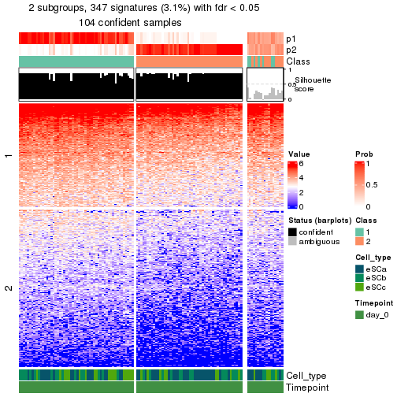</p>

</div>
<div id='tab-node-024-get-signatures-no-scale-2'>
<pre><code class="r">get_signatures(res, k = 3, scale_rows = FALSE)
</code></pre>

<p></p>

</div>
<div id='tab-node-024-get-signatures-no-scale-3'>
<pre><code class="r">get_signatures(res, k = 4, scale_rows = FALSE)
</code></pre>

<p></p>

</div>
</div>


Compare the overlap of signatures from different k:

```r
compare_signatures(res)
```


`get_signature()` returns a data frame invisibly. To get the list of signatures, the function
call should be assigned to a variable explicitly. In following code, if `plot` argument is set
to `FALSE`, no heatmap is plotted while only the differential analysis is performed.

```r
# code only for demonstration
tb = get_signature(res, k = ..., plot = FALSE)
```

An example of the output of `tb` is:

```
#>   which_row         fdr    mean_1    mean_2 scaled_mean_1 scaled_mean_2 km
#> 1        38 0.042760348  8.373488  9.131774    -0.5533452     0.5164555  1
#> 2        40 0.018707592  7.106213  8.469186    -0.6173731     0.5762149  1
#> 3        55 0.019134737 10.221463 11.207825    -0.6159697     0.5749050  1
#> 4        59 0.006059896  5.921854  7.869574    -0.6899429     0.6439467  1
#> 5        60 0.018055526  8.928898 10.211722    -0.6204761     0.5791110  1
#> 6        98 0.009384629 15.714769 14.887706     0.6635654    -0.6193277  2
...
```

The columns in `tb` are:

1. `which_row`: row indices corresponding to the input matrix.
2. `fdr`: FDR for the differential test. 
3. `mean_x`: The mean value in group x.
4. `scaled_mean_x`: The mean value in group x after rows are scaled.
5. `km`: Row groups if k-means clustering is applied to rows (which is done by automatically selecting number of clusters).

If there are too many signatures, `top_signatures = ...` can be set to only show the 
signatures with the highest FDRs:

```r
# code only for demonstration
# e.g. to show the top 500 most significant rows
tb = get_signature(res, k = ..., top_signatures = 500)
```

If the signatures are defined as these which are uniquely high in current group, `diff_method` argument
can be set to `"uniquely_high_in_one_group"`:

```r
# code only for demonstration
tb = get_signature(res, k = ..., diff_method = "uniquely_high_in_one_group")
```


UMAP plot which shows how samples are separated.


<script>
$( function() {
	$( '#tabs-node-024-dimension-reduction' ).tabs();
} );
</script>
<div id='tabs-node-024-dimension-reduction'>
<ul>
<li><a href='#tab-node-024-dimension-reduction-1'>k = 2</a></li>
<li><a href='#tab-node-024-dimension-reduction-2'>k = 3</a></li>
<li><a href='#tab-node-024-dimension-reduction-3'>k = 4</a></li>
</ul>
<div id='tab-node-024-dimension-reduction-1'>
<pre><code class="r">dimension_reduction(res, k = 2, method = &quot;UMAP&quot;)
</code></pre>

<p></p>

</div>
<div id='tab-node-024-dimension-reduction-2'>
<pre><code class="r">dimension_reduction(res, k = 3, method = &quot;UMAP&quot;)
</code></pre>

<p></p>

</div>
<div id='tab-node-024-dimension-reduction-3'>
<pre><code class="r">dimension_reduction(res, k = 4, method = &quot;UMAP&quot;)
</code></pre>

<p></p>

</div>
</div>


Following heatmap shows how subgroups are split when increasing `k`:

```r
collect_classes(res)
```


Test correlation between subgroups and known annotations. If the known
annotation is numeric, one-way ANOVA test is applied, and if the known
annotation is discrete, chi-squared contingency table test is applied.

```r
test_to_known_factors(res)
```

```
#>             n_sample Cell_type(p-value) Timepoint(p-value) k
#> ATC:skmeans      104            0.13094                 NA 2
#> ATC:skmeans      117            0.00172                 NA 3
#> ATC:skmeans       94            0.01349                 NA 4
```


If matrix rows can be associated to genes, consider to use `functional_enrichment(res,
...)` to perform function enrichment for the signature genes. See [this vignette](https://jokergoo.github.io/cola_vignettes/functional_enrichment.html) for more detailed explanations.


 

---------------------------------------------------


### Node03


Parent node: [Node0](#Node0).
Child nodes: 
                [Node011](#Node011)
        ,
                [Node012](#Node012)
        ,
                [Node013](#Node013)
        ,
                [Node021](#Node021)
        ,
                [Node022](#Node022)
        ,
                [Node023](#Node023)
        ,
                [Node024](#Node024)
        ,
                Node031-leaf
        ,
                Node032-leaf
        ,
                [Node033](#Node033)
        .


The object with results only for a single top-value method and a single partitioning method 
can be extracted as:

```r
res = res_rh["03"]
```

A summary of `res` and all the functions that can be applied to it:

```r
res
```

```
#> A 'ConsensusPartition' object with k = 2, 3, 4.
#>   On a matrix with 10310 rows and 329 columns.
#>   Top rows (1031) are extracted by 'ATC' method.
#>   Subgroups are detected by 'skmeans' method.
#>   Performed in total 150 partitions by row resampling.
#>   Best k for subgroups seems to be 4.
#> 
#> Following methods can be applied to this 'ConsensusPartition' object:
#>  [1] "cola_report"             "collect_classes"         "collect_plots"          
#>  [4] "collect_stats"           "colnames"                "compare_partitions"     
#>  [7] "compare_signatures"      "consensus_heatmap"       "dimension_reduction"    
#> [10] "functional_enrichment"   "get_anno_col"            "get_anno"               
#> [13] "get_classes"             "get_consensus"           "get_matrix"             
#> [16] "get_membership"          "get_param"               "get_signatures"         
#> [19] "get_stats"               "is_best_k"               "is_stable_k"            
#> [22] "membership_heatmap"      "ncol"                    "nrow"                   
#> [25] "plot_ecdf"               "predict_classes"         "rownames"               
#> [28] "select_partition_number" "show"                    "suggest_best_k"         
#> [31] "test_to_known_factors"   "top_rows_heatmap"
```

`collect_plots()` function collects all the plots made from `res` for all `k` (number of subgroups)
into one single page to provide an easy and fast comparison between different `k`.

```r
collect_plots(res)
```


The plots are:

- The first row: a plot of the eCDF (empirical cumulative distribution
  function) curves of the consensus matrix for each `k` and the heatmap of
  predicted classes for each `k`.
- The second row: heatmaps of the consensus matrix for each `k`.
- The third row: heatmaps of the membership matrix for each `k`.
- The fouth row: heatmaps of the signatures for each `k`.

All the plots in panels can be made by individual functions and they are
plotted later in this section.

`select_partition_number()` produces several plots showing different
statistics for choosing "optimized" `k`. There are following statistics:

- eCDF curves of the consensus matrix for each `k`;
- 1-PAC. [The PAC score](https://en.wikipedia.org/wiki/Consensus_clustering#Over-interpretation_potential_of_consensus_clustering)
  measures the proportion of the ambiguous subgrouping.
- Mean silhouette score.
- Concordance. The mean probability of fiting the consensus subgroup labels in all
  partitions.
- Area increased. Denote $A_k$ as the area under the eCDF curve for current
  `k`, the area increased is defined as $A_k - A_{k-1}$.
- Rand index. The percent of pairs of samples that are both in a same cluster
  or both are not in a same cluster in the partition of k and k-1.
- Jaccard index. The ratio of pairs of samples are both in a same cluster in
  the partition of k and k-1 and the pairs of samples are both in a same
  cluster in the partition k or k-1.

The detailed explanations of these statistics can be found in [the _cola_
vignette](https://jokergoo.github.io/cola_vignettes/cola.html#toc_13).

Generally speaking, higher 1-PAC score, higher mean silhouette score or higher
concordance corresponds to better partition. Rand index and Jaccard index
measure how similar the current partition is compared to partition with `k-1`.
If they are too similar, we won't accept `k` is better than `k-1`.

```r
select_partition_number(res)
```


The numeric values for all these statistics can be obtained by `get_stats()`.

```r
get_stats(res)
```

```
#>   k 1-PAC mean_silhouette concordance area_increased  Rand Jaccard
#> 2 2 1.000           0.990       0.996         0.5020 0.498   0.498
#> 3 3 1.000           0.971       0.988         0.3169 0.742   0.529
#> 4 4 0.966           0.923       0.961         0.0942 0.906   0.735
```

`suggest_best_k()` suggests the best $k$ based on these statistics. The rules are as follows:

- All $k$ with Jaccard index larger than 0.95 are removed because increasing
  $k$ does not provide enough extra information. If all $k$ are removed, it is
  marked as no subgroup is detected.
- For all $k$ with 1-PAC score larger than 0.9, the maximal $k$ is taken as
  the best $k$, and other $k$ are marked as optional $k$.
- If it does not fit the second rule. The $k$ with the maximal vote of the
  highest 1-PAC score, highest mean silhouette, and highest concordance is
  taken as the best $k$.

```r
suggest_best_k(res)
```

```
#> [1] 4
#> attr(,"optional")
#> [1] 2 3
```

There is also optional best $k$ = 2 3 that is worth to check.

Following is the table of the partitions (You need to click the **show/hide
code output** link to see it). The membership matrix (columns with name `p*`)
is inferred by
[`clue::cl_consensus()`](https://www.rdocumentation.org/link/cl_consensus?package=clue)
function with the `SE` method. Basically the value in the membership matrix
represents the probability to belong to a certain group. The finall subgroup
label for an item is determined with the group with highest probability it
belongs to.

In `get_classes()` function, the entropy is calculated from the membership
matrix and the silhouette score is calculated from the consensus matrix.


<script>
$( function() {
	$( '#tabs-node-03-get-classes' ).tabs();
} );
</script>
<div id='tabs-node-03-get-classes'>
<ul>
<li><a href='#tab-node-03-get-classes-1'>k = 2</a></li>
<li><a href='#tab-node-03-get-classes-2'>k = 3</a></li>
<li><a href='#tab-node-03-get-classes-3'>k = 4</a></li>
</ul>

<div id='tab-node-03-get-classes-1'>
<p><a id='tab-node-03-get-classes-1-a' style='color:#0366d6' href='#'>show/hide code output</a></p>
<pre><code class="r">cbind(get_classes(res, k = 2), get_membership(res, k = 2))
</code></pre>

<pre><code>#&gt;                 class entropy silhouette   p1   p2
#&gt; 1772122_205_D01     1   0.000      0.993 1.00 0.00
#&gt; 1772122_262_E04     1   0.000      0.993 1.00 0.00
#&gt; 1772122_206_F10     1   0.000      0.993 1.00 0.00
#&gt; 1772122_325_B06     1   0.000      0.993 1.00 0.00
#&gt; 1772122_205_A05     2   0.000      0.999 0.00 1.00
#&gt; 1772122_263_H07     1   0.000      0.993 1.00 0.00
#&gt; 1772122_262_F04     2   0.000      0.999 0.00 1.00
#&gt; 1772122_204_C06     1   0.000      0.993 1.00 0.00
#&gt; 1772122_263_F12     2   0.000      0.999 0.00 1.00
#&gt; 1772122_306_H07     2   0.000      0.999 0.00 1.00
#&gt; 1772122_324_D12     1   0.000      0.993 1.00 0.00
#&gt; 1772122_206_A11     2   0.000      0.999 0.00 1.00
#&gt; 1772122_262_D12     1   0.000      0.993 1.00 0.00
#&gt; 1772122_325_D01     2   0.000      0.999 0.00 1.00
#&gt; 1772122_326_E02     1   0.000      0.993 1.00 0.00
#&gt; 1772122_326_G02     2   0.000      0.999 0.00 1.00
#&gt; 1772122_326_C11     1   0.000      0.993 1.00 0.00
#&gt; 1772122_324_D01     1   0.000      0.993 1.00 0.00
#&gt; 1772122_326_D08     1   0.000      0.993 1.00 0.00
#&gt; 1772122_263_A11     1   0.000      0.993 1.00 0.00
#&gt; 1772122_263_C01     1   0.000      0.993 1.00 0.00
#&gt; 1772122_263_H09     2   0.000      0.999 0.00 1.00
#&gt; 1772122_325_E01     1   0.000      0.993 1.00 0.00
#&gt; 1772122_263_B06     1   0.000      0.993 1.00 0.00
#&gt; 1772122_263_D06     2   0.000      0.999 0.00 1.00
#&gt; 1772122_326_F04     1   0.000      0.993 1.00 0.00
#&gt; 1772122_325_H09     1   0.000      0.993 1.00 0.00
#&gt; 1772122_263_D04     1   0.000      0.993 1.00 0.00
#&gt; 1772122_263_B12     2   0.000      0.999 0.00 1.00
#&gt; 1772122_326_H07     1   0.000      0.993 1.00 0.00
#&gt; 1772122_326_H10     1   0.000      0.993 1.00 0.00
#&gt; 1772122_263_A01     2   0.000      0.999 0.00 1.00
#&gt; 1772122_326_F11     1   0.000      0.993 1.00 0.00
#&gt; 1772122_326_G10     2   0.000      0.999 0.00 1.00
#&gt; 1772122_325_F03     1   0.000      0.993 1.00 0.00
#&gt; 1772122_298_H08     2   0.000      0.999 0.00 1.00
#&gt; 1772122_315_F01     2   0.000      0.999 0.00 1.00
#&gt; 1772122_315_D04     2   0.000      0.999 0.00 1.00
#&gt; 1772122_263_E12     2   0.000      0.999 0.00 1.00
#&gt; 1772122_315_B03     2   0.000      0.999 0.00 1.00
#&gt; 1772122_305_C04     2   0.000      0.999 0.00 1.00
#&gt; 1772122_305_F01     2   0.000      0.999 0.00 1.00
#&gt; 1772122_303_E02     1   0.000      0.993 1.00 0.00
#&gt; 1772122_305_D06     2   0.000      0.999 0.00 1.00
#&gt; 1772122_299_E04     2   0.000      0.999 0.00 1.00
#&gt; 1772122_180_E04     2   0.000      0.999 0.00 1.00
#&gt; 1772122_298_A06     2   0.000      0.999 0.00 1.00
#&gt; 1772122_298_G05     2   0.000      0.999 0.00 1.00
#&gt; 1772122_204_E03     2   0.000      0.999 0.00 1.00
#&gt; 1772122_262_A03     1   0.000      0.993 1.00 0.00
#&gt; 1772122_206_H06     2   0.000      0.999 0.00 1.00
#&gt; 1772122_206_F08     1   0.000      0.993 1.00 0.00
#&gt; 1772122_205_B01     2   0.000      0.999 0.00 1.00
#&gt; 1772122_204_E08     1   0.000      0.993 1.00 0.00
#&gt; 1772122_262_E02     1   0.000      0.993 1.00 0.00
#&gt; 1772122_262_E10     2   0.000      0.999 0.00 1.00
#&gt; 1772122_262_C09     2   0.000      0.999 0.00 1.00
#&gt; 1772122_206_B09     1   0.000      0.993 1.00 0.00
#&gt; 1772122_204_A08     1   0.000      0.993 1.00 0.00
#&gt; 1772122_204_H08     2   0.000      0.999 0.00 1.00
#&gt; 1772122_206_F11     2   0.000      0.999 0.00 1.00
#&gt; 1772122_262_H07     1   0.000      0.993 1.00 0.00
#&gt; 1772122_205_B07     1   0.141      0.973 0.98 0.02
#&gt; 1772122_206_E11     2   0.000      0.999 0.00 1.00
#&gt; 1772122_204_F03     1   0.000      0.993 1.00 0.00
#&gt; 1772122_206_C12     1   0.000      0.993 1.00 0.00
#&gt; 1772122_262_D02     2   0.000      0.999 0.00 1.00
#&gt; 1772122_206_H03     2   0.000      0.999 0.00 1.00
#&gt; 1772122_206_A06     2   0.000      0.999 0.00 1.00
#&gt; 1772122_262_D06     2   0.000      0.999 0.00 1.00
#&gt; 1772122_205_H02     1   0.000      0.993 1.00 0.00
#&gt; 1772122_262_C07     1   0.000      0.993 1.00 0.00
#&gt; 1772122_262_G02     2   0.000      0.999 0.00 1.00
#&gt; 1772122_205_F07     2   0.000      0.999 0.00 1.00
#&gt; 1772122_262_H06     2   0.000      0.999 0.00 1.00
#&gt; 1772122_205_C09     2   0.000      0.999 0.00 1.00
#&gt; 1772122_262_C02     1   0.000      0.993 1.00 0.00
#&gt; 1772122_205_F11     2   0.000      0.999 0.00 1.00
#&gt; 1772122_206_G07     2   0.000      0.999 0.00 1.00
#&gt; 1772122_206_A09     2   0.000      0.999 0.00 1.00
#&gt; 1772122_206_D08     2   0.000      0.999 0.00 1.00
#&gt; 1772122_325_D10     2   0.000      0.999 0.00 1.00
#&gt; 1772122_204_F12     1   0.000      0.993 1.00 0.00
#&gt; 1772122_205_B12     2   0.000      0.999 0.00 1.00
#&gt; 1772122_326_B10     2   0.000      0.999 0.00 1.00
#&gt; 1772122_204_A01     2   0.000      0.999 0.00 1.00
#&gt; 1772122_205_F12     2   0.000      0.999 0.00 1.00
#&gt; 1772122_205_C05     2   0.000      0.999 0.00 1.00
#&gt; 1772122_262_H02     2   0.000      0.999 0.00 1.00
#&gt; 1772122_204_A10     1   0.000      0.993 1.00 0.00
#&gt; 1772122_262_H04     2   0.000      0.999 0.00 1.00
#&gt; 1772122_204_D06     2   0.000      0.999 0.00 1.00
#&gt; 1772122_263_C06     2   0.000      0.999 0.00 1.00
#&gt; 1772122_204_D05     2   0.000      0.999 0.00 1.00
#&gt; 1772122_262_G08     2   0.000      0.999 0.00 1.00
#&gt; 1772122_204_C12     1   0.000      0.993 1.00 0.00
#&gt; 1772122_204_G09     2   0.000      0.999 0.00 1.00
#&gt; 1772122_206_F12     2   0.000      0.999 0.00 1.00
#&gt; 1772122_262_D08     2   0.000      0.999 0.00 1.00
#&gt; 1772122_204_F09     2   0.000      0.999 0.00 1.00
#&gt; 1772122_206_G11     2   0.000      0.999 0.00 1.00
#&gt; 1772122_206_E07     2   0.000      0.999 0.00 1.00
#&gt; 1772122_205_B08     2   0.000      0.999 0.00 1.00
#&gt; 1772122_206_D04     2   0.000      0.999 0.00 1.00
#&gt; 1772122_206_H05     2   0.000      0.999 0.00 1.00
#&gt; 1772122_204_C04     2   0.000      0.999 0.00 1.00
#&gt; 1772122_206_A04     1   0.000      0.993 1.00 0.00
#&gt; 1772122_204_D04     1   0.000      0.993 1.00 0.00
#&gt; 1772122_204_F05     2   0.000      0.999 0.00 1.00
#&gt; 1772122_205_G01     2   0.000      0.999 0.00 1.00
#&gt; 1772122_204_B08     2   0.000      0.999 0.00 1.00
#&gt; 1772122_262_D11     2   0.000      0.999 0.00 1.00
#&gt; 1772122_206_H01     1   0.000      0.993 1.00 0.00
#&gt; 1772122_205_C08     2   0.000      0.999 0.00 1.00
#&gt; 1772122_263_B05     1   0.000      0.993 1.00 0.00
#&gt; 1772122_262_F07     2   0.000      0.999 0.00 1.00
#&gt; 1772122_325_B07     1   0.000      0.993 1.00 0.00
#&gt; 1772122_262_G05     2   0.000      0.999 0.00 1.00
#&gt; 1772122_205_D12     1   0.000      0.993 1.00 0.00
#&gt; 1772122_205_C03     1   0.000      0.993 1.00 0.00
#&gt; 1772122_262_B03     2   0.000      0.999 0.00 1.00
#&gt; 1772122_204_E11     2   0.000      0.999 0.00 1.00
#&gt; 1772122_262_B11     2   0.402      0.913 0.08 0.92
#&gt; 1772122_262_C11     1   0.000      0.993 1.00 0.00
#&gt; 1772122_262_B04     2   0.000      0.999 0.00 1.00
#&gt; 1772122_206_B10     1   0.000      0.993 1.00 0.00
#&gt; 1772122_325_C11     2   0.000      0.999 0.00 1.00
#&gt; 1772122_205_E03     1   0.000      0.993 1.00 0.00
#&gt; 1772122_326_F06     1   0.000      0.993 1.00 0.00
#&gt; 1772122_324_A01     1   0.000      0.993 1.00 0.00
#&gt; 1772122_326_C12     1   0.000      0.993 1.00 0.00
#&gt; 1772122_263_D09     1   0.000      0.993 1.00 0.00
#&gt; 1772122_324_C12     1   0.000      0.993 1.00 0.00
#&gt; 1772122_326_C06     1   0.000      0.993 1.00 0.00
#&gt; 1772122_324_D04     1   0.000      0.993 1.00 0.00
#&gt; 1772122_263_A07     2   0.000      0.999 0.00 1.00
#&gt; 1772122_326_G06     1   0.000      0.993 1.00 0.00
#&gt; 1772122_324_C08     1   0.000      0.993 1.00 0.00
#&gt; 1772122_326_G04     1   0.000      0.993 1.00 0.00
#&gt; 1772122_206_G02     1   0.000      0.993 1.00 0.00
#&gt; 1772122_325_G01     2   0.000      0.999 0.00 1.00
#&gt; 1772122_263_F06     1   0.000      0.993 1.00 0.00
#&gt; 1772122_263_F05     2   0.000      0.999 0.00 1.00
#&gt; 1772122_324_D10     1   0.000      0.993 1.00 0.00
#&gt; 1772122_263_F08     2   0.000      0.999 0.00 1.00
#&gt; 1772122_263_A05     1   0.000      0.993 1.00 0.00
#&gt; 1772122_324_C05     1   0.000      0.993 1.00 0.00
#&gt; 1772122_262_A10     2   0.000      0.999 0.00 1.00
#&gt; 1772122_263_A02     1   0.000      0.993 1.00 0.00
#&gt; 1772122_326_A07     1   0.000      0.993 1.00 0.00
#&gt; 1772122_324_B12     1   0.000      0.993 1.00 0.00
#&gt; 1772122_325_F01     2   0.000      0.999 0.00 1.00
#&gt; 1772122_326_B02     1   0.000      0.993 1.00 0.00
#&gt; 1772122_324_A03     1   0.000      0.993 1.00 0.00
#&gt; 1772122_204_H02     2   0.000      0.999 0.00 1.00
#&gt; 1772122_325_E08     2   0.000      0.999 0.00 1.00
#&gt; 1772122_325_E09     1   0.000      0.993 1.00 0.00
#&gt; 1772122_263_C11     2   0.000      0.999 0.00 1.00
#&gt; 1772122_325_A07     1   0.000      0.993 1.00 0.00
#&gt; 1772122_263_B01     1   0.000      0.993 1.00 0.00
#&gt; 1772122_263_C07     2   0.000      0.999 0.00 1.00
#&gt; 1772122_263_C03     1   0.000      0.993 1.00 0.00
#&gt; 1772122_326_D11     1   0.000      0.993 1.00 0.00
#&gt; 1772122_263_D12     2   0.000      0.999 0.00 1.00
#&gt; 1772122_326_F01     1   0.000      0.993 1.00 0.00
#&gt; 1772122_325_B08     2   0.000      0.999 0.00 1.00
#&gt; 1772122_263_G10     1   0.000      0.993 1.00 0.00
#&gt; 1772122_326_B03     2   0.000      0.999 0.00 1.00
#&gt; 1772122_324_C10     1   0.000      0.993 1.00 0.00
#&gt; 1772122_325_A02     2   0.000      0.999 0.00 1.00
#&gt; 1772122_325_D04     2   0.000      0.999 0.00 1.00
#&gt; 1772122_263_C02     1   0.000      0.993 1.00 0.00
#&gt; 1772122_263_G01     1   0.000      0.993 1.00 0.00
#&gt; 1772122_324_E01     2   0.000      0.999 0.00 1.00
#&gt; 1772122_325_F02     1   0.242      0.953 0.96 0.04
#&gt; 1772122_263_E11     2   0.000      0.999 0.00 1.00
#&gt; 1772122_324_A04     1   0.000      0.993 1.00 0.00
#&gt; 1772122_325_C07     1   0.000      0.993 1.00 0.00
#&gt; 1772122_263_A12     2   0.000      0.999 0.00 1.00
#&gt; 1772122_325_E03     1   0.000      0.993 1.00 0.00
#&gt; 1772122_326_E12     2   0.000      0.999 0.00 1.00
#&gt; 1772122_325_A12     2   0.000      0.999 0.00 1.00
#&gt; 1772122_326_F12     1   0.000      0.993 1.00 0.00
#&gt; 1772122_325_D09     1   0.000      0.993 1.00 0.00
#&gt; 1772122_325_B09     1   0.000      0.993 1.00 0.00
#&gt; 1772122_324_C09     1   0.000      0.993 1.00 0.00
#&gt; 1772122_325_G04     2   0.000      0.999 0.00 1.00
#&gt; 1772122_324_B03     1   0.000      0.993 1.00 0.00
#&gt; 1772122_324_D07     1   0.000      0.993 1.00 0.00
#&gt; 1772122_324_E03     1   0.000      0.993 1.00 0.00
#&gt; 1772122_326_A04     1   0.000      0.993 1.00 0.00
#&gt; 1772122_326_F03     1   0.000      0.993 1.00 0.00
#&gt; 1772122_326_C05     1   0.000      0.993 1.00 0.00
#&gt; 1772122_325_F09     2   0.000      0.999 0.00 1.00
#&gt; 1772122_263_G07     1   0.000      0.993 1.00 0.00
#&gt; 1772122_324_B11     1   0.000      0.993 1.00 0.00
#&gt; 1772122_324_E12     2   0.000      0.999 0.00 1.00
#&gt; 1772122_263_C04     2   0.000      0.999 0.00 1.00
#&gt; 1772122_324_G10     1   0.881      0.576 0.70 0.30
#&gt; 1772122_263_H04     2   0.000      0.999 0.00 1.00
#&gt; 1772122_206_C08     2   0.000      0.999 0.00 1.00
#&gt; 1772122_324_D08     1   0.000      0.993 1.00 0.00
#&gt; 1772122_325_C12     2   0.000      0.999 0.00 1.00
#&gt; 1772122_326_D06     1   0.000      0.993 1.00 0.00
#&gt; 1772122_263_B11     2   0.000      0.999 0.00 1.00
#&gt; 1772122_325_C03     2   0.000      0.999 0.00 1.00
#&gt; 1772122_326_E10     2   0.000      0.999 0.00 1.00
#&gt; 1772122_325_A11     2   0.000      0.999 0.00 1.00
#&gt; 1772122_325_D06     1   0.000      0.993 1.00 0.00
#&gt; 1772122_326_D10     1   0.000      0.993 1.00 0.00
#&gt; 1772122_325_A04     2   0.000      0.999 0.00 1.00
#&gt; 1772122_263_E03     2   0.000      0.999 0.00 1.00
#&gt; 1772122_324_E02     1   0.000      0.993 1.00 0.00
#&gt; 1772122_324_B01     1   0.000      0.993 1.00 0.00
#&gt; 1772122_263_B02     2   0.000      0.999 0.00 1.00
#&gt; 1772122_325_A09     1   0.000      0.993 1.00 0.00
#&gt; 1772122_263_D02     1   0.634      0.810 0.84 0.16
#&gt; 1772122_325_F07     1   0.000      0.993 1.00 0.00
#&gt; 1772122_324_A12     1   0.000      0.993 1.00 0.00
#&gt; 1772122_324_C06     1   0.000      0.993 1.00 0.00
#&gt; 1772122_263_B04     1   0.000      0.993 1.00 0.00
#&gt; 1772122_263_C12     2   0.000      0.999 0.00 1.00
#&gt; 1772122_324_A05     1   0.000      0.993 1.00 0.00
#&gt; 1772122_326_G05     2   0.000      0.999 0.00 1.00
#&gt; 1772122_324_E05     1   0.000      0.993 1.00 0.00
#&gt; 1772122_326_C07     1   0.000      0.993 1.00 0.00
#&gt; 1772122_326_C04     1   0.000      0.993 1.00 0.00
#&gt; 1772122_263_E08     1   0.000      0.993 1.00 0.00
#&gt; 1772122_263_A10     1   0.000      0.993 1.00 0.00
#&gt; 1772122_324_A08     1   0.000      0.993 1.00 0.00
#&gt; 1772122_263_D05     2   0.000      0.999 0.00 1.00
#&gt; 1772122_324_A07     1   0.000      0.993 1.00 0.00
#&gt; 1772122_325_F08     2   0.000      0.999 0.00 1.00
#&gt; 1772122_325_G07     1   0.000      0.993 1.00 0.00
#&gt; 1772122_324_C04     1   0.000      0.993 1.00 0.00
#&gt; 1772122_326_E03     2   0.000      0.999 0.00 1.00
#&gt; 1772122_263_B03     1   0.000      0.993 1.00 0.00
#&gt; 1772122_263_A09     1   0.000      0.993 1.00 0.00
#&gt; 1772122_326_E08     1   0.000      0.993 1.00 0.00
#&gt; 1772122_325_B01     2   0.000      0.999 0.00 1.00
#&gt; 1772122_263_E05     2   0.000      0.999 0.00 1.00
#&gt; 1772122_263_A03     2   0.000      0.999 0.00 1.00
#&gt; 1772122_263_D10     2   0.000      0.999 0.00 1.00
#&gt; 1772122_263_H06     2   0.000      0.999 0.00 1.00
#&gt; 1772122_325_C08     2   0.000      0.999 0.00 1.00
#&gt; 1772122_326_A05     1   0.760      0.721 0.78 0.22
#&gt; 1772122_263_C08     2   0.000      0.999 0.00 1.00
#&gt; 1772122_325_B10     2   0.000      0.999 0.00 1.00
#&gt; 1772122_263_H05     2   0.000      0.999 0.00 1.00
#&gt; 1772122_325_B11     1   0.000      0.993 1.00 0.00
#&gt; 1772122_204_G12     2   0.000      0.999 0.00 1.00
#&gt; 1772122_263_C10     2   0.141      0.979 0.02 0.98
#&gt; 1772122_263_E06     1   0.000      0.993 1.00 0.00
#&gt; 1772122_263_H11     2   0.000      0.999 0.00 1.00
#&gt; 1772122_263_D07     1   0.000      0.993 1.00 0.00
#&gt; 1772122_326_G11     1   0.000      0.993 1.00 0.00
#&gt; 1772122_263_E09     2   0.000      0.999 0.00 1.00
#&gt; 1772122_263_D03     1   0.000      0.993 1.00 0.00
#&gt; 1772122_326_A03     2   0.000      0.999 0.00 1.00
#&gt; 1772122_326_A08     2   0.000      0.999 0.00 1.00
#&gt; 1772122_326_F10     2   0.000      0.999 0.00 1.00
#&gt; 1772122_324_E09     1   0.000      0.993 1.00 0.00
#&gt; 1772122_324_E06     1   0.000      0.993 1.00 0.00
#&gt; 1772122_325_H01     1   0.000      0.993 1.00 0.00
#&gt; 1772122_326_B05     1   0.000      0.993 1.00 0.00
#&gt; 1772122_325_D08     2   0.000      0.999 0.00 1.00
#&gt; 1772122_263_D08     1   0.000      0.993 1.00 0.00
#&gt; 1772122_324_C03     1   0.000      0.993 1.00 0.00
#&gt; 1772122_326_A10     1   0.000      0.993 1.00 0.00
#&gt; 1772122_324_D11     1   0.000      0.993 1.00 0.00
#&gt; 1772122_326_H03     2   0.000      0.999 0.00 1.00
#&gt; 1772122_326_A02     1   0.000      0.993 1.00 0.00
#&gt; 1772122_263_F10     1   0.000      0.993 1.00 0.00
#&gt; 1772122_326_A11     2   0.000      0.999 0.00 1.00
#&gt; 1772122_325_A05     2   0.000      0.999 0.00 1.00
#&gt; 1772122_326_D01     1   0.000      0.993 1.00 0.00
#&gt; 1772122_324_E08     1   0.000      0.993 1.00 0.00
#&gt; 1772122_325_C09     2   0.000      0.999 0.00 1.00
#&gt; 1772122_325_A03     2   0.000      0.999 0.00 1.00
#&gt; 1772122_324_C11     1   0.000      0.993 1.00 0.00
#&gt; 1772122_263_H10     2   0.000      0.999 0.00 1.00
#&gt; 1772122_325_C05     2   0.000      0.999 0.00 1.00
#&gt; 1772122_326_G03     1   0.995      0.156 0.54 0.46
#&gt; 1772122_326_E07     1   0.000      0.993 1.00 0.00
#&gt; 1772122_263_F11     2   0.000      0.999 0.00 1.00
#&gt; 1772122_326_C10     2   0.000      0.999 0.00 1.00
#&gt; 1772122_326_G08     2   0.000      0.999 0.00 1.00
#&gt; 1772122_326_D05     2   0.000      0.999 0.00 1.00
#&gt; 1772122_326_H11     1   0.000      0.993 1.00 0.00
#&gt; 1772122_325_H08     1   0.000      0.993 1.00 0.00
#&gt; 1772122_326_B11     2   0.000      0.999 0.00 1.00
#&gt; 1772122_326_B07     1   0.000      0.993 1.00 0.00
#&gt; 1772122_325_B12     1   0.000      0.993 1.00 0.00
#&gt; 1772122_263_A04     1   0.000      0.993 1.00 0.00
#&gt; 1772122_326_A12     1   0.000      0.993 1.00 0.00
#&gt; 1772122_324_B07     1   0.000      0.993 1.00 0.00
#&gt; 1772122_326_C09     1   0.000      0.993 1.00 0.00
#&gt; 1772122_325_E06     2   0.000      0.999 0.00 1.00
#&gt; 1772122_324_F01     1   0.000      0.993 1.00 0.00
#&gt; 1772122_324_D02     1   0.000      0.993 1.00 0.00
#&gt; 1772122_324_A06     1   0.000      0.993 1.00 0.00
#&gt; 1772122_324_B05     1   0.000      0.993 1.00 0.00
#&gt; 1772122_263_G03     2   0.000      0.999 0.00 1.00
#&gt; 1772122_324_B08     1   0.000      0.993 1.00 0.00
#&gt; 1772122_324_A02     1   0.000      0.993 1.00 0.00
#&gt; 1772122_325_C04     2   0.000      0.999 0.00 1.00
#&gt; 1772122_326_C01     2   0.000      0.999 0.00 1.00
#&gt; 1772122_325_G08     2   0.000      0.999 0.00 1.00
#&gt; 1772122_263_E04     1   0.000      0.993 1.00 0.00
#&gt; 1772122_325_A06     1   0.000      0.993 1.00 0.00
#&gt; 1772122_326_D07     1   0.000      0.993 1.00 0.00
#&gt; 1772122_324_D05     1   0.000      0.993 1.00 0.00
#&gt; 1772122_324_B02     1   0.000      0.993 1.00 0.00
#&gt; 1772122_324_B10     1   0.000      0.993 1.00 0.00
#&gt; 1772122_263_E10     2   0.000      0.999 0.00 1.00
#&gt; 1772122_263_F01     1   0.000      0.993 1.00 0.00
#&gt; 1772122_314_E09     2   0.000      0.999 0.00 1.00
#&gt; 1772122_312_B08     2   0.000      0.999 0.00 1.00
#&gt; 1772122_314_D05     2   0.000      0.999 0.00 1.00
#&gt; 1772122_312_H07     2   0.000      0.999 0.00 1.00
#&gt; 1772122_312_F08     2   0.000      0.999 0.00 1.00
#&gt; 1772122_311_E11     2   0.000      0.999 0.00 1.00
#&gt; 1772122_314_H02     2   0.000      0.999 0.00 1.00
#&gt; 1772122_311_C12     2   0.000      0.999 0.00 1.00
#&gt; 1772122_311_A05     2   0.000      0.999 0.00 1.00
#&gt; 1772122_314_E03     2   0.000      0.999 0.00 1.00
#&gt; 1772122_314_G01     2   0.000      0.999 0.00 1.00
#&gt; 1772122_314_A08     2   0.000      0.999 0.00 1.00
#&gt; 1772122_314_B02     2   0.000      0.999 0.00 1.00
</code></pre>

<script>
$('#tab-node-03-get-classes-1-a').parent().next().next().hide();
$('#tab-node-03-get-classes-1-a').click(function(){
  $('#tab-node-03-get-classes-1-a').parent().next().next().toggle();
  return(false);
});
</script>
</div>

<div id='tab-node-03-get-classes-2'>
<p><a id='tab-node-03-get-classes-2-a' style='color:#0366d6' href='#'>show/hide code output</a></p>
<pre><code class="r">cbind(get_classes(res, k = 3), get_membership(res, k = 3))
</code></pre>

<pre><code>#&gt;                 class entropy silhouette   p1   p2   p3
#&gt; 1772122_205_D01     3  0.0000      0.992 0.00 0.00 1.00
#&gt; 1772122_262_E04     1  0.0000      0.992 1.00 0.00 0.00
#&gt; 1772122_206_F10     3  0.3340      0.860 0.12 0.00 0.88
#&gt; 1772122_325_B06     1  0.0000      0.992 1.00 0.00 0.00
#&gt; 1772122_205_A05     3  0.0000      0.992 0.00 0.00 1.00
#&gt; 1772122_263_H07     1  0.1529      0.952 0.96 0.04 0.00
#&gt; 1772122_262_F04     3  0.0000      0.992 0.00 0.00 1.00
#&gt; 1772122_204_C06     1  0.0000      0.992 1.00 0.00 0.00
#&gt; 1772122_263_F12     2  0.0000      0.976 0.00 1.00 0.00
#&gt; 1772122_306_H07     3  0.0000      0.992 0.00 0.00 1.00
#&gt; 1772122_324_D12     1  0.0000      0.992 1.00 0.00 0.00
#&gt; 1772122_206_A11     3  0.0000      0.992 0.00 0.00 1.00
#&gt; 1772122_262_D12     3  0.0000      0.992 0.00 0.00 1.00
#&gt; 1772122_325_D01     2  0.0000      0.976 0.00 1.00 0.00
#&gt; 1772122_326_E02     1  0.0000      0.992 1.00 0.00 0.00
#&gt; 1772122_326_G02     2  0.0000      0.976 0.00 1.00 0.00
#&gt; 1772122_326_C11     2  0.6045      0.402 0.38 0.62 0.00
#&gt; 1772122_324_D01     1  0.0000      0.992 1.00 0.00 0.00
#&gt; 1772122_326_D08     1  0.0000      0.992 1.00 0.00 0.00
#&gt; 1772122_263_A11     1  0.0000      0.992 1.00 0.00 0.00
#&gt; 1772122_263_C01     1  0.0000      0.992 1.00 0.00 0.00
#&gt; 1772122_263_H09     2  0.0000      0.976 0.00 1.00 0.00
#&gt; 1772122_325_E01     2  0.0000      0.976 0.00 1.00 0.00
#&gt; 1772122_263_B06     1  0.0000      0.992 1.00 0.00 0.00
#&gt; 1772122_263_D06     2  0.0000      0.976 0.00 1.00 0.00
#&gt; 1772122_326_F04     1  0.2066      0.931 0.94 0.06 0.00
#&gt; 1772122_325_H09     1  0.0000      0.992 1.00 0.00 0.00
#&gt; 1772122_263_D04     1  0.0000      0.992 1.00 0.00 0.00
#&gt; 1772122_263_B12     2  0.0000      0.976 0.00 1.00 0.00
#&gt; 1772122_326_H07     1  0.0000      0.992 1.00 0.00 0.00
#&gt; 1772122_326_H10     1  0.0000      0.992 1.00 0.00 0.00
#&gt; 1772122_263_A01     2  0.0000      0.976 0.00 1.00 0.00
#&gt; 1772122_326_F11     1  0.0000      0.992 1.00 0.00 0.00
#&gt; 1772122_326_G10     2  0.0000      0.976 0.00 1.00 0.00
#&gt; 1772122_325_F03     1  0.0892      0.973 0.98 0.02 0.00
#&gt; 1772122_298_H08     3  0.0000      0.992 0.00 0.00 1.00
#&gt; 1772122_315_F01     3  0.0000      0.992 0.00 0.00 1.00
#&gt; 1772122_315_D04     3  0.0000      0.992 0.00 0.00 1.00
#&gt; 1772122_263_E12     2  0.0000      0.976 0.00 1.00 0.00
#&gt; 1772122_315_B03     3  0.0000      0.992 0.00 0.00 1.00
#&gt; 1772122_305_C04     3  0.0000      0.992 0.00 0.00 1.00
#&gt; 1772122_305_F01     3  0.0000      0.992 0.00 0.00 1.00
#&gt; 1772122_303_E02     3  0.0000      0.992 0.00 0.00 1.00
#&gt; 1772122_305_D06     3  0.0000      0.992 0.00 0.00 1.00
#&gt; 1772122_299_E04     3  0.0000      0.992 0.00 0.00 1.00
#&gt; 1772122_180_E04     3  0.0000      0.992 0.00 0.00 1.00
#&gt; 1772122_298_A06     3  0.0000      0.992 0.00 0.00 1.00
#&gt; 1772122_298_G05     3  0.0000      0.992 0.00 0.00 1.00
#&gt; 1772122_204_E03     3  0.0000      0.992 0.00 0.00 1.00
#&gt; 1772122_262_A03     3  0.0000      0.992 0.00 0.00 1.00
#&gt; 1772122_206_H06     3  0.0000      0.992 0.00 0.00 1.00
#&gt; 1772122_206_F08     3  0.0000      0.992 0.00 0.00 1.00
#&gt; 1772122_205_B01     3  0.0000      0.992 0.00 0.00 1.00
#&gt; 1772122_204_E08     1  0.0000      0.992 1.00 0.00 0.00
#&gt; 1772122_262_E02     1  0.0000      0.992 1.00 0.00 0.00
#&gt; 1772122_262_E10     3  0.0000      0.992 0.00 0.00 1.00
#&gt; 1772122_262_C09     3  0.0000      0.992 0.00 0.00 1.00
#&gt; 1772122_206_B09     3  0.1529      0.950 0.04 0.00 0.96
#&gt; 1772122_204_A08     1  0.0000      0.992 1.00 0.00 0.00
#&gt; 1772122_204_H08     3  0.0000      0.992 0.00 0.00 1.00
#&gt; 1772122_206_F11     3  0.0000      0.992 0.00 0.00 1.00
#&gt; 1772122_262_H07     3  0.3340      0.860 0.12 0.00 0.88
#&gt; 1772122_205_B07     3  0.0000      0.992 0.00 0.00 1.00
#&gt; 1772122_206_E11     3  0.0000      0.992 0.00 0.00 1.00
#&gt; 1772122_204_F03     1  0.2959      0.885 0.90 0.00 0.10
#&gt; 1772122_206_C12     1  0.0000      0.992 1.00 0.00 0.00
#&gt; 1772122_262_D02     3  0.0000      0.992 0.00 0.00 1.00
#&gt; 1772122_206_H03     3  0.0000      0.992 0.00 0.00 1.00
#&gt; 1772122_206_A06     3  0.0000      0.992 0.00 0.00 1.00
#&gt; 1772122_262_D06     3  0.0000      0.992 0.00 0.00 1.00
#&gt; 1772122_205_H02     3  0.0000      0.992 0.00 0.00 1.00
#&gt; 1772122_262_C07     1  0.0000      0.992 1.00 0.00 0.00
#&gt; 1772122_262_G02     3  0.0000      0.992 0.00 0.00 1.00
#&gt; 1772122_205_F07     3  0.0000      0.992 0.00 0.00 1.00
#&gt; 1772122_262_H06     3  0.0000      0.992 0.00 0.00 1.00
#&gt; 1772122_205_C09     3  0.0000      0.992 0.00 0.00 1.00
#&gt; 1772122_262_C02     3  0.0000      0.992 0.00 0.00 1.00
#&gt; 1772122_205_F11     3  0.0000      0.992 0.00 0.00 1.00
#&gt; 1772122_206_G07     3  0.0000      0.992 0.00 0.00 1.00
#&gt; 1772122_206_A09     3  0.0000      0.992 0.00 0.00 1.00
#&gt; 1772122_206_D08     3  0.0000      0.992 0.00 0.00 1.00
#&gt; 1772122_325_D10     2  0.0000      0.976 0.00 1.00 0.00
#&gt; 1772122_204_F12     1  0.0000      0.992 1.00 0.00 0.00
#&gt; 1772122_205_B12     3  0.0000      0.992 0.00 0.00 1.00
#&gt; 1772122_326_B10     2  0.0000      0.976 0.00 1.00 0.00
#&gt; 1772122_204_A01     3  0.0000      0.992 0.00 0.00 1.00
#&gt; 1772122_205_F12     3  0.0000      0.992 0.00 0.00 1.00
#&gt; 1772122_205_C05     3  0.2066      0.930 0.00 0.06 0.94
#&gt; 1772122_262_H02     3  0.0000      0.992 0.00 0.00 1.00
#&gt; 1772122_204_A10     3  0.6126      0.334 0.40 0.00 0.60
#&gt; 1772122_262_H04     3  0.0000      0.992 0.00 0.00 1.00
#&gt; 1772122_204_D06     3  0.0000      0.992 0.00 0.00 1.00
#&gt; 1772122_263_C06     2  0.0000      0.976 0.00 1.00 0.00
#&gt; 1772122_204_D05     3  0.0000      0.992 0.00 0.00 1.00
#&gt; 1772122_262_G08     3  0.0000      0.992 0.00 0.00 1.00
#&gt; 1772122_204_C12     1  0.5560      0.570 0.70 0.00 0.30
#&gt; 1772122_204_G09     3  0.0000      0.992 0.00 0.00 1.00
#&gt; 1772122_206_F12     3  0.0000      0.992 0.00 0.00 1.00
#&gt; 1772122_262_D08     3  0.0000      0.992 0.00 0.00 1.00
#&gt; 1772122_204_F09     3  0.0000      0.992 0.00 0.00 1.00
#&gt; 1772122_206_G11     3  0.0000      0.992 0.00 0.00 1.00
#&gt; 1772122_206_E07     2  0.0000      0.976 0.00 1.00 0.00
#&gt; 1772122_205_B08     3  0.0000      0.992 0.00 0.00 1.00
#&gt; 1772122_206_D04     3  0.0000      0.992 0.00 0.00 1.00
#&gt; 1772122_206_H05     3  0.0000      0.992 0.00 0.00 1.00
#&gt; 1772122_204_C04     3  0.0000      0.992 0.00 0.00 1.00
#&gt; 1772122_206_A04     1  0.0000      0.992 1.00 0.00 0.00
#&gt; 1772122_204_D04     3  0.0000      0.992 0.00 0.00 1.00
#&gt; 1772122_204_F05     3  0.0000      0.992 0.00 0.00 1.00
#&gt; 1772122_205_G01     3  0.0000      0.992 0.00 0.00 1.00
#&gt; 1772122_204_B08     3  0.0000      0.992 0.00 0.00 1.00
#&gt; 1772122_262_D11     3  0.0000      0.992 0.00 0.00 1.00
#&gt; 1772122_206_H01     3  0.0000      0.992 0.00 0.00 1.00
#&gt; 1772122_205_C08     3  0.0000      0.992 0.00 0.00 1.00
#&gt; 1772122_263_B05     1  0.0000      0.992 1.00 0.00 0.00
#&gt; 1772122_262_F07     3  0.0000      0.992 0.00 0.00 1.00
#&gt; 1772122_325_B07     1  0.0892      0.973 0.98 0.02 0.00
#&gt; 1772122_262_G05     3  0.0000      0.992 0.00 0.00 1.00
#&gt; 1772122_205_D12     3  0.0000      0.992 0.00 0.00 1.00
#&gt; 1772122_205_C03     3  0.0000      0.992 0.00 0.00 1.00
#&gt; 1772122_262_B03     3  0.0000      0.992 0.00 0.00 1.00
#&gt; 1772122_204_E11     3  0.0000      0.992 0.00 0.00 1.00
#&gt; 1772122_262_B11     3  0.0000      0.992 0.00 0.00 1.00
#&gt; 1772122_262_C11     1  0.0000      0.992 1.00 0.00 0.00
#&gt; 1772122_262_B04     3  0.0000      0.992 0.00 0.00 1.00
#&gt; 1772122_206_B10     3  0.0000      0.992 0.00 0.00 1.00
#&gt; 1772122_325_C11     2  0.0000      0.976 0.00 1.00 0.00
#&gt; 1772122_205_E03     1  0.0000      0.992 1.00 0.00 0.00
#&gt; 1772122_326_F06     1  0.0000      0.992 1.00 0.00 0.00
#&gt; 1772122_324_A01     1  0.0000      0.992 1.00 0.00 0.00
#&gt; 1772122_326_C12     1  0.0000      0.992 1.00 0.00 0.00
#&gt; 1772122_263_D09     1  0.0000      0.992 1.00 0.00 0.00
#&gt; 1772122_324_C12     1  0.0000      0.992 1.00 0.00 0.00
#&gt; 1772122_326_C06     1  0.0000      0.992 1.00 0.00 0.00
#&gt; 1772122_324_D04     1  0.0000      0.992 1.00 0.00 0.00
#&gt; 1772122_263_A07     2  0.0000      0.976 0.00 1.00 0.00
#&gt; 1772122_326_G06     1  0.0000      0.992 1.00 0.00 0.00
#&gt; 1772122_324_C08     1  0.0000      0.992 1.00 0.00 0.00
#&gt; 1772122_326_G04     1  0.0000      0.992 1.00 0.00 0.00
#&gt; 1772122_206_G02     1  0.0000      0.992 1.00 0.00 0.00
#&gt; 1772122_325_G01     2  0.0000      0.976 0.00 1.00 0.00
#&gt; 1772122_263_F06     1  0.0000      0.992 1.00 0.00 0.00
#&gt; 1772122_263_F05     2  0.0000      0.976 0.00 1.00 0.00
#&gt; 1772122_324_D10     1  0.0000      0.992 1.00 0.00 0.00
#&gt; 1772122_263_F08     2  0.0000      0.976 0.00 1.00 0.00
#&gt; 1772122_263_A05     1  0.0000      0.992 1.00 0.00 0.00
#&gt; 1772122_324_C05     1  0.0000      0.992 1.00 0.00 0.00
#&gt; 1772122_262_A10     3  0.0000      0.992 0.00 0.00 1.00
#&gt; 1772122_263_A02     1  0.0000      0.992 1.00 0.00 0.00
#&gt; 1772122_326_A07     1  0.0000      0.992 1.00 0.00 0.00
#&gt; 1772122_324_B12     1  0.0000      0.992 1.00 0.00 0.00
#&gt; 1772122_325_F01     2  0.0000      0.976 0.00 1.00 0.00
#&gt; 1772122_326_B02     1  0.0000      0.992 1.00 0.00 0.00
#&gt; 1772122_324_A03     2  0.3340      0.859 0.12 0.88 0.00
#&gt; 1772122_204_H02     3  0.0000      0.992 0.00 0.00 1.00
#&gt; 1772122_325_E08     2  0.0000      0.976 0.00 1.00 0.00
#&gt; 1772122_325_E09     1  0.0000      0.992 1.00 0.00 0.00
#&gt; 1772122_263_C11     2  0.0000      0.976 0.00 1.00 0.00
#&gt; 1772122_325_A07     1  0.0000      0.992 1.00 0.00 0.00
#&gt; 1772122_263_B01     2  0.5948      0.455 0.36 0.64 0.00
#&gt; 1772122_263_C07     2  0.0000      0.976 0.00 1.00 0.00
#&gt; 1772122_263_C03     1  0.0000      0.992 1.00 0.00 0.00
#&gt; 1772122_326_D11     1  0.0000      0.992 1.00 0.00 0.00
#&gt; 1772122_263_D12     2  0.0000      0.976 0.00 1.00 0.00
#&gt; 1772122_326_F01     1  0.0000      0.992 1.00 0.00 0.00
#&gt; 1772122_325_B08     2  0.0000      0.976 0.00 1.00 0.00
#&gt; 1772122_263_G10     1  0.0000      0.992 1.00 0.00 0.00
#&gt; 1772122_326_B03     2  0.0000      0.976 0.00 1.00 0.00
#&gt; 1772122_324_C10     1  0.0000      0.992 1.00 0.00 0.00
#&gt; 1772122_325_A02     2  0.0000      0.976 0.00 1.00 0.00
#&gt; 1772122_325_D04     2  0.0000      0.976 0.00 1.00 0.00
#&gt; 1772122_263_C02     1  0.0000      0.992 1.00 0.00 0.00
#&gt; 1772122_263_G01     1  0.0000      0.992 1.00 0.00 0.00
#&gt; 1772122_324_E01     2  0.0000      0.976 0.00 1.00 0.00
#&gt; 1772122_325_F02     2  0.0000      0.976 0.00 1.00 0.00
#&gt; 1772122_263_E11     2  0.0000      0.976 0.00 1.00 0.00
#&gt; 1772122_324_A04     1  0.0000      0.992 1.00 0.00 0.00
#&gt; 1772122_325_C07     1  0.0000      0.992 1.00 0.00 0.00
#&gt; 1772122_263_A12     2  0.0000      0.976 0.00 1.00 0.00
#&gt; 1772122_325_E03     1  0.0000      0.992 1.00 0.00 0.00
#&gt; 1772122_326_E12     2  0.0000      0.976 0.00 1.00 0.00
#&gt; 1772122_325_A12     2  0.0000      0.976 0.00 1.00 0.00
#&gt; 1772122_326_F12     1  0.0000      0.992 1.00 0.00 0.00
#&gt; 1772122_325_D09     1  0.0000      0.992 1.00 0.00 0.00
#&gt; 1772122_325_B09     1  0.0000      0.992 1.00 0.00 0.00
#&gt; 1772122_324_C09     1  0.0000      0.992 1.00 0.00 0.00
#&gt; 1772122_325_G04     2  0.0000      0.976 0.00 1.00 0.00
#&gt; 1772122_324_B03     1  0.0000      0.992 1.00 0.00 0.00
#&gt; 1772122_324_D07     1  0.0000      0.992 1.00 0.00 0.00
#&gt; 1772122_324_E03     1  0.0000      0.992 1.00 0.00 0.00
#&gt; 1772122_326_A04     1  0.5397      0.605 0.72 0.28 0.00
#&gt; 1772122_326_F03     1  0.0000      0.992 1.00 0.00 0.00
#&gt; 1772122_326_C05     1  0.0000      0.992 1.00 0.00 0.00
#&gt; 1772122_325_F09     2  0.0000      0.976 0.00 1.00 0.00
#&gt; 1772122_263_G07     1  0.0000      0.992 1.00 0.00 0.00
#&gt; 1772122_324_B11     1  0.0000      0.992 1.00 0.00 0.00
#&gt; 1772122_324_E12     2  0.0000      0.976 0.00 1.00 0.00
#&gt; 1772122_263_C04     2  0.0000      0.976 0.00 1.00 0.00
#&gt; 1772122_324_G10     2  0.3340      0.859 0.12 0.88 0.00
#&gt; 1772122_263_H04     2  0.0000      0.976 0.00 1.00 0.00
#&gt; 1772122_206_C08     3  0.0000      0.992 0.00 0.00 1.00
#&gt; 1772122_324_D08     1  0.0000      0.992 1.00 0.00 0.00
#&gt; 1772122_325_C12     2  0.0000      0.976 0.00 1.00 0.00
#&gt; 1772122_326_D06     1  0.0000      0.992 1.00 0.00 0.00
#&gt; 1772122_263_B11     2  0.0000      0.976 0.00 1.00 0.00
#&gt; 1772122_325_C03     2  0.0000      0.976 0.00 1.00 0.00
#&gt; 1772122_326_E10     2  0.0000      0.976 0.00 1.00 0.00
#&gt; 1772122_325_A11     2  0.0000      0.976 0.00 1.00 0.00
#&gt; 1772122_325_D06     1  0.0000      0.992 1.00 0.00 0.00
#&gt; 1772122_326_D10     1  0.0000      0.992 1.00 0.00 0.00
#&gt; 1772122_325_A04     2  0.0000      0.976 0.00 1.00 0.00
#&gt; 1772122_263_E03     2  0.0000      0.976 0.00 1.00 0.00
#&gt; 1772122_324_E02     1  0.0000      0.992 1.00 0.00 0.00
#&gt; 1772122_324_B01     1  0.0000      0.992 1.00 0.00 0.00
#&gt; 1772122_263_B02     2  0.0000      0.976 0.00 1.00 0.00
#&gt; 1772122_325_A09     1  0.0000      0.992 1.00 0.00 0.00
#&gt; 1772122_263_D02     2  0.0000      0.976 0.00 1.00 0.00
#&gt; 1772122_325_F07     1  0.0000      0.992 1.00 0.00 0.00
#&gt; 1772122_324_A12     1  0.0000      0.992 1.00 0.00 0.00
#&gt; 1772122_324_C06     1  0.0000      0.992 1.00 0.00 0.00
#&gt; 1772122_263_B04     1  0.0000      0.992 1.00 0.00 0.00
#&gt; 1772122_263_C12     2  0.0000      0.976 0.00 1.00 0.00
#&gt; 1772122_324_A05     1  0.0000      0.992 1.00 0.00 0.00
#&gt; 1772122_326_G05     2  0.0000      0.976 0.00 1.00 0.00
#&gt; 1772122_324_E05     1  0.0000      0.992 1.00 0.00 0.00
#&gt; 1772122_326_C07     1  0.0000      0.992 1.00 0.00 0.00
#&gt; 1772122_326_C04     1  0.0000      0.992 1.00 0.00 0.00
#&gt; 1772122_263_E08     1  0.0000      0.992 1.00 0.00 0.00
#&gt; 1772122_263_A10     1  0.0000      0.992 1.00 0.00 0.00
#&gt; 1772122_324_A08     1  0.0000      0.992 1.00 0.00 0.00
#&gt; 1772122_263_D05     2  0.0000      0.976 0.00 1.00 0.00
#&gt; 1772122_324_A07     1  0.0000      0.992 1.00 0.00 0.00
#&gt; 1772122_325_F08     2  0.0000      0.976 0.00 1.00 0.00
#&gt; 1772122_325_G07     1  0.0000      0.992 1.00 0.00 0.00
#&gt; 1772122_324_C04     1  0.0000      0.992 1.00 0.00 0.00
#&gt; 1772122_326_E03     2  0.0000      0.976 0.00 1.00 0.00
#&gt; 1772122_263_B03     1  0.0000      0.992 1.00 0.00 0.00
#&gt; 1772122_263_A09     1  0.0000      0.992 1.00 0.00 0.00
#&gt; 1772122_326_E08     1  0.0000      0.992 1.00 0.00 0.00
#&gt; 1772122_325_B01     2  0.0000      0.976 0.00 1.00 0.00
#&gt; 1772122_263_E05     2  0.0000      0.976 0.00 1.00 0.00
#&gt; 1772122_263_A03     2  0.0000      0.976 0.00 1.00 0.00
#&gt; 1772122_263_D10     2  0.0000      0.976 0.00 1.00 0.00
#&gt; 1772122_263_H06     2  0.0000      0.976 0.00 1.00 0.00
#&gt; 1772122_325_C08     2  0.0000      0.976 0.00 1.00 0.00
#&gt; 1772122_326_A05     2  0.0000      0.976 0.00 1.00 0.00
#&gt; 1772122_263_C08     2  0.0000      0.976 0.00 1.00 0.00
#&gt; 1772122_325_B10     2  0.0000      0.976 0.00 1.00 0.00
#&gt; 1772122_263_H05     2  0.0000      0.976 0.00 1.00 0.00
#&gt; 1772122_325_B11     1  0.0000      0.992 1.00 0.00 0.00
#&gt; 1772122_204_G12     3  0.0000      0.992 0.00 0.00 1.00
#&gt; 1772122_263_C10     2  0.0000      0.976 0.00 1.00 0.00
#&gt; 1772122_263_E06     1  0.0000      0.992 1.00 0.00 0.00
#&gt; 1772122_263_H11     2  0.0000      0.976 0.00 1.00 0.00
#&gt; 1772122_263_D07     1  0.4796      0.714 0.78 0.22 0.00
#&gt; 1772122_326_G11     2  0.0892      0.957 0.02 0.98 0.00
#&gt; 1772122_263_E09     2  0.0000      0.976 0.00 1.00 0.00
#&gt; 1772122_263_D03     1  0.0000      0.992 1.00 0.00 0.00
#&gt; 1772122_326_A03     2  0.0000      0.976 0.00 1.00 0.00
#&gt; 1772122_326_A08     2  0.0000      0.976 0.00 1.00 0.00
#&gt; 1772122_326_F10     2  0.0000      0.976 0.00 1.00 0.00
#&gt; 1772122_324_E09     1  0.0000      0.992 1.00 0.00 0.00
#&gt; 1772122_324_E06     1  0.0000      0.992 1.00 0.00 0.00
#&gt; 1772122_325_H01     1  0.0000      0.992 1.00 0.00 0.00
#&gt; 1772122_326_B05     1  0.0000      0.992 1.00 0.00 0.00
#&gt; 1772122_325_D08     2  0.0000      0.976 0.00 1.00 0.00
#&gt; 1772122_263_D08     2  0.6045      0.408 0.38 0.62 0.00
#&gt; 1772122_324_C03     1  0.0000      0.992 1.00 0.00 0.00
#&gt; 1772122_326_A10     2  0.3686      0.836 0.14 0.86 0.00
#&gt; 1772122_324_D11     1  0.0000      0.992 1.00 0.00 0.00
#&gt; 1772122_326_H03     2  0.5216      0.644 0.00 0.74 0.26
#&gt; 1772122_326_A02     1  0.0000      0.992 1.00 0.00 0.00
#&gt; 1772122_263_F10     1  0.0000      0.992 1.00 0.00 0.00
#&gt; 1772122_326_A11     2  0.0000      0.976 0.00 1.00 0.00
#&gt; 1772122_325_A05     2  0.0000      0.976 0.00 1.00 0.00
#&gt; 1772122_326_D01     1  0.0000      0.992 1.00 0.00 0.00
#&gt; 1772122_324_E08     1  0.0000      0.992 1.00 0.00 0.00
#&gt; 1772122_325_C09     2  0.0000      0.976 0.00 1.00 0.00
#&gt; 1772122_325_A03     2  0.0000      0.976 0.00 1.00 0.00
#&gt; 1772122_324_C11     1  0.0000      0.992 1.00 0.00 0.00
#&gt; 1772122_263_H10     2  0.0000      0.976 0.00 1.00 0.00
#&gt; 1772122_325_C05     2  0.0000      0.976 0.00 1.00 0.00
#&gt; 1772122_326_G03     2  0.0000      0.976 0.00 1.00 0.00
#&gt; 1772122_326_E07     1  0.0000      0.992 1.00 0.00 0.00
#&gt; 1772122_263_F11     2  0.0000      0.976 0.00 1.00 0.00
#&gt; 1772122_326_C10     2  0.0000      0.976 0.00 1.00 0.00
#&gt; 1772122_326_G08     2  0.0000      0.976 0.00 1.00 0.00
#&gt; 1772122_326_D05     2  0.0000      0.976 0.00 1.00 0.00
#&gt; 1772122_326_H11     1  0.0000      0.992 1.00 0.00 0.00
#&gt; 1772122_325_H08     1  0.0000      0.992 1.00 0.00 0.00
#&gt; 1772122_326_B11     2  0.0000      0.976 0.00 1.00 0.00
#&gt; 1772122_326_B07     1  0.0000      0.992 1.00 0.00 0.00
#&gt; 1772122_325_B12     1  0.0000      0.992 1.00 0.00 0.00
#&gt; 1772122_263_A04     1  0.0000      0.992 1.00 0.00 0.00
#&gt; 1772122_326_A12     2  0.5216      0.660 0.26 0.74 0.00
#&gt; 1772122_324_B07     1  0.0000      0.992 1.00 0.00 0.00
#&gt; 1772122_326_C09     1  0.0000      0.992 1.00 0.00 0.00
#&gt; 1772122_325_E06     2  0.0000      0.976 0.00 1.00 0.00
#&gt; 1772122_324_F01     1  0.0000      0.992 1.00 0.00 0.00
#&gt; 1772122_324_D02     1  0.0000      0.992 1.00 0.00 0.00
#&gt; 1772122_324_A06     1  0.0000      0.992 1.00 0.00 0.00
#&gt; 1772122_324_B05     1  0.0000      0.992 1.00 0.00 0.00
#&gt; 1772122_263_G03     2  0.0000      0.976 0.00 1.00 0.00
#&gt; 1772122_324_B08     1  0.0000      0.992 1.00 0.00 0.00
#&gt; 1772122_324_A02     1  0.0000      0.992 1.00 0.00 0.00
#&gt; 1772122_325_C04     2  0.0000      0.976 0.00 1.00 0.00
#&gt; 1772122_326_C01     2  0.0000      0.976 0.00 1.00 0.00
#&gt; 1772122_325_G08     2  0.0000      0.976 0.00 1.00 0.00
#&gt; 1772122_263_E04     1  0.0000      0.992 1.00 0.00 0.00
#&gt; 1772122_325_A06     1  0.0000      0.992 1.00 0.00 0.00
#&gt; 1772122_326_D07     2  0.0000      0.976 0.00 1.00 0.00
#&gt; 1772122_324_D05     1  0.0000      0.992 1.00 0.00 0.00
#&gt; 1772122_324_B02     1  0.0000      0.992 1.00 0.00 0.00
#&gt; 1772122_324_B10     1  0.0000      0.992 1.00 0.00 0.00
#&gt; 1772122_263_E10     2  0.0000      0.976 0.00 1.00 0.00
#&gt; 1772122_263_F01     2  0.4291      0.784 0.18 0.82 0.00
#&gt; 1772122_314_E09     3  0.0000      0.992 0.00 0.00 1.00
#&gt; 1772122_312_B08     3  0.0000      0.992 0.00 0.00 1.00
#&gt; 1772122_314_D05     3  0.0000      0.992 0.00 0.00 1.00
#&gt; 1772122_312_H07     3  0.0000      0.992 0.00 0.00 1.00
#&gt; 1772122_312_F08     3  0.0000      0.992 0.00 0.00 1.00
#&gt; 1772122_311_E11     3  0.0000      0.992 0.00 0.00 1.00
#&gt; 1772122_314_H02     3  0.0000      0.992 0.00 0.00 1.00
#&gt; 1772122_311_C12     3  0.0000      0.992 0.00 0.00 1.00
#&gt; 1772122_311_A05     3  0.0000      0.992 0.00 0.00 1.00
#&gt; 1772122_314_E03     3  0.0000      0.992 0.00 0.00 1.00
#&gt; 1772122_314_G01     3  0.0000      0.992 0.00 0.00 1.00
#&gt; 1772122_314_A08     3  0.0000      0.992 0.00 0.00 1.00
#&gt; 1772122_314_B02     3  0.0000      0.992 0.00 0.00 1.00
</code></pre>

<script>
$('#tab-node-03-get-classes-2-a').parent().next().next().hide();
$('#tab-node-03-get-classes-2-a').click(function(){
  $('#tab-node-03-get-classes-2-a').parent().next().next().toggle();
  return(false);
});
</script>
</div>

<div id='tab-node-03-get-classes-3'>
<p><a id='tab-node-03-get-classes-3-a' style='color:#0366d6' href='#'>show/hide code output</a></p>
<pre><code class="r">cbind(get_classes(res, k = 4), get_membership(res, k = 4))
</code></pre>

<pre><code>#&gt;                 class entropy silhouette   p1   p2   p3   p4
#&gt; 1772122_205_D01     4  0.1211     0.9207 0.00 0.00 0.04 0.96
#&gt; 1772122_262_E04     4  0.1211     0.9049 0.04 0.00 0.00 0.96
#&gt; 1772122_206_F10     4  0.1211     0.9049 0.04 0.00 0.00 0.96
#&gt; 1772122_325_B06     1  0.0707     0.9588 0.98 0.00 0.00 0.02
#&gt; 1772122_205_A05     3  0.2921     0.8204 0.00 0.00 0.86 0.14
#&gt; 1772122_263_H07     1  0.2335     0.9372 0.92 0.02 0.00 0.06
#&gt; 1772122_262_F04     4  0.1211     0.9207 0.00 0.00 0.04 0.96
#&gt; 1772122_204_C06     4  0.0000     0.9002 0.00 0.00 0.00 1.00
#&gt; 1772122_263_F12     2  0.0000     0.9619 0.00 1.00 0.00 0.00
#&gt; 1772122_306_H07     3  0.4994    -0.0437 0.00 0.00 0.52 0.48
#&gt; 1772122_324_D12     1  0.0000     0.9668 1.00 0.00 0.00 0.00
#&gt; 1772122_206_A11     4  0.1211     0.9207 0.00 0.00 0.04 0.96
#&gt; 1772122_262_D12     4  0.1211     0.9207 0.00 0.00 0.04 0.96
#&gt; 1772122_325_D01     2  0.0000     0.9619 0.00 1.00 0.00 0.00
#&gt; 1772122_326_E02     1  0.1637     0.9510 0.94 0.00 0.00 0.06
#&gt; 1772122_326_G02     2  0.0000     0.9619 0.00 1.00 0.00 0.00
#&gt; 1772122_326_C11     2  0.6299     0.1575 0.42 0.52 0.00 0.06
#&gt; 1772122_324_D01     1  0.0000     0.9668 1.00 0.00 0.00 0.00
#&gt; 1772122_326_D08     1  0.1637     0.9510 0.94 0.00 0.00 0.06
#&gt; 1772122_263_A11     1  0.0707     0.9588 0.98 0.00 0.00 0.02
#&gt; 1772122_263_C01     1  0.0000     0.9668 1.00 0.00 0.00 0.00
#&gt; 1772122_263_H09     2  0.0000     0.9619 0.00 1.00 0.00 0.00
#&gt; 1772122_325_E01     2  0.0707     0.9423 0.02 0.98 0.00 0.00
#&gt; 1772122_263_B06     1  0.0707     0.9588 0.98 0.00 0.00 0.02
#&gt; 1772122_263_D06     2  0.0000     0.9619 0.00 1.00 0.00 0.00
#&gt; 1772122_326_F04     1  0.1637     0.9510 0.94 0.00 0.00 0.06
#&gt; 1772122_325_H09     1  0.1637     0.9510 0.94 0.00 0.00 0.06
#&gt; 1772122_263_D04     1  0.1637     0.9510 0.94 0.00 0.00 0.06
#&gt; 1772122_263_B12     2  0.0000     0.9619 0.00 1.00 0.00 0.00
#&gt; 1772122_326_H07     1  0.1637     0.9510 0.94 0.00 0.00 0.06
#&gt; 1772122_326_H10     1  0.1637     0.9510 0.94 0.00 0.00 0.06
#&gt; 1772122_263_A01     2  0.0000     0.9619 0.00 1.00 0.00 0.00
#&gt; 1772122_326_F11     1  0.1637     0.9510 0.94 0.00 0.00 0.06
#&gt; 1772122_326_G10     2  0.0000     0.9619 0.00 1.00 0.00 0.00
#&gt; 1772122_325_F03     1  0.0707     0.9588 0.98 0.00 0.00 0.02
#&gt; 1772122_298_H08     4  0.4277     0.6811 0.00 0.00 0.28 0.72
#&gt; 1772122_315_F01     3  0.0000     0.9718 0.00 0.00 1.00 0.00
#&gt; 1772122_315_D04     3  0.2647     0.8469 0.00 0.00 0.88 0.12
#&gt; 1772122_263_E12     2  0.0000     0.9619 0.00 1.00 0.00 0.00
#&gt; 1772122_315_B03     3  0.0000     0.9718 0.00 0.00 1.00 0.00
#&gt; 1772122_305_C04     4  0.3172     0.8400 0.00 0.00 0.16 0.84
#&gt; 1772122_305_F01     4  0.3801     0.7714 0.00 0.00 0.22 0.78
#&gt; 1772122_303_E02     4  0.1637     0.9231 0.00 0.00 0.06 0.94
#&gt; 1772122_305_D06     3  0.0000     0.9718 0.00 0.00 1.00 0.00
#&gt; 1772122_299_E04     4  0.4522     0.6073 0.00 0.00 0.32 0.68
#&gt; 1772122_180_E04     4  0.3801     0.7714 0.00 0.00 0.22 0.78
#&gt; 1772122_298_A06     3  0.1637     0.9155 0.00 0.00 0.94 0.06
#&gt; 1772122_298_G05     4  0.3801     0.7714 0.00 0.00 0.22 0.78
#&gt; 1772122_204_E03     3  0.0000     0.9718 0.00 0.00 1.00 0.00
#&gt; 1772122_262_A03     4  0.1637     0.9231 0.00 0.00 0.06 0.94
#&gt; 1772122_206_H06     3  0.0000     0.9718 0.00 0.00 1.00 0.00
#&gt; 1772122_206_F08     4  0.1637     0.9231 0.00 0.00 0.06 0.94
#&gt; 1772122_205_B01     4  0.2011     0.9112 0.00 0.00 0.08 0.92
#&gt; 1772122_204_E08     4  0.1637     0.9018 0.06 0.00 0.00 0.94
#&gt; 1772122_262_E02     4  0.2921     0.8224 0.14 0.00 0.00 0.86
#&gt; 1772122_262_E10     4  0.1637     0.9231 0.00 0.00 0.06 0.94
#&gt; 1772122_262_C09     4  0.1637     0.9231 0.00 0.00 0.06 0.94
#&gt; 1772122_206_B09     4  0.1411     0.9152 0.02 0.00 0.02 0.96
#&gt; 1772122_204_A08     4  0.1637     0.9018 0.06 0.00 0.00 0.94
#&gt; 1772122_204_H08     3  0.0000     0.9718 0.00 0.00 1.00 0.00
#&gt; 1772122_206_F11     3  0.0000     0.9718 0.00 0.00 1.00 0.00
#&gt; 1772122_262_H07     4  0.1211     0.9207 0.00 0.00 0.04 0.96
#&gt; 1772122_205_B07     4  0.1637     0.9231 0.00 0.00 0.06 0.94
#&gt; 1772122_206_E11     3  0.0000     0.9718 0.00 0.00 1.00 0.00
#&gt; 1772122_204_F03     4  0.1637     0.9018 0.06 0.00 0.00 0.94
#&gt; 1772122_206_C12     4  0.1637     0.9018 0.06 0.00 0.00 0.94
#&gt; 1772122_262_D02     3  0.0000     0.9718 0.00 0.00 1.00 0.00
#&gt; 1772122_206_H03     4  0.1637     0.9231 0.00 0.00 0.06 0.94
#&gt; 1772122_206_A06     3  0.1211     0.9358 0.00 0.00 0.96 0.04
#&gt; 1772122_262_D06     4  0.1637     0.9231 0.00 0.00 0.06 0.94
#&gt; 1772122_205_H02     4  0.1637     0.9231 0.00 0.00 0.06 0.94
#&gt; 1772122_262_C07     4  0.0707     0.8989 0.02 0.00 0.00 0.98
#&gt; 1772122_262_G02     3  0.0000     0.9718 0.00 0.00 1.00 0.00
#&gt; 1772122_205_F07     3  0.0000     0.9718 0.00 0.00 1.00 0.00
#&gt; 1772122_262_H06     3  0.0000     0.9718 0.00 0.00 1.00 0.00
#&gt; 1772122_205_C09     3  0.0000     0.9718 0.00 0.00 1.00 0.00
#&gt; 1772122_262_C02     4  0.1637     0.9231 0.00 0.00 0.06 0.94
#&gt; 1772122_205_F11     3  0.0000     0.9718 0.00 0.00 1.00 0.00
#&gt; 1772122_206_G07     3  0.0000     0.9718 0.00 0.00 1.00 0.00
#&gt; 1772122_206_A09     3  0.0000     0.9718 0.00 0.00 1.00 0.00
#&gt; 1772122_206_D08     3  0.0000     0.9718 0.00 0.00 1.00 0.00
#&gt; 1772122_325_D10     2  0.3400     0.7715 0.00 0.82 0.18 0.00
#&gt; 1772122_204_F12     4  0.1637     0.9018 0.06 0.00 0.00 0.94
#&gt; 1772122_205_B12     3  0.0000     0.9718 0.00 0.00 1.00 0.00
#&gt; 1772122_326_B10     2  0.0000     0.9619 0.00 1.00 0.00 0.00
#&gt; 1772122_204_A01     3  0.2011     0.8944 0.00 0.00 0.92 0.08
#&gt; 1772122_205_F12     3  0.0000     0.9718 0.00 0.00 1.00 0.00
#&gt; 1772122_205_C05     3  0.0000     0.9718 0.00 0.00 1.00 0.00
#&gt; 1772122_262_H02     3  0.0000     0.9718 0.00 0.00 1.00 0.00
#&gt; 1772122_204_A10     4  0.1637     0.9018 0.06 0.00 0.00 0.94
#&gt; 1772122_262_H04     3  0.0000     0.9718 0.00 0.00 1.00 0.00
#&gt; 1772122_204_D06     3  0.0000     0.9718 0.00 0.00 1.00 0.00
#&gt; 1772122_263_C06     2  0.0000     0.9619 0.00 1.00 0.00 0.00
#&gt; 1772122_204_D05     3  0.0000     0.9718 0.00 0.00 1.00 0.00
#&gt; 1772122_262_G08     3  0.0000     0.9718 0.00 0.00 1.00 0.00
#&gt; 1772122_204_C12     4  0.1637     0.9018 0.06 0.00 0.00 0.94
#&gt; 1772122_204_G09     3  0.0000     0.9718 0.00 0.00 1.00 0.00
#&gt; 1772122_206_F12     3  0.0000     0.9718 0.00 0.00 1.00 0.00
#&gt; 1772122_262_D08     3  0.0000     0.9718 0.00 0.00 1.00 0.00
#&gt; 1772122_204_F09     3  0.0000     0.9718 0.00 0.00 1.00 0.00
#&gt; 1772122_206_G11     3  0.0000     0.9718 0.00 0.00 1.00 0.00
#&gt; 1772122_206_E07     2  0.2921     0.8215 0.00 0.86 0.14 0.00
#&gt; 1772122_205_B08     3  0.0000     0.9718 0.00 0.00 1.00 0.00
#&gt; 1772122_206_D04     3  0.0000     0.9718 0.00 0.00 1.00 0.00
#&gt; 1772122_206_H05     3  0.0000     0.9718 0.00 0.00 1.00 0.00
#&gt; 1772122_204_C04     3  0.0000     0.9718 0.00 0.00 1.00 0.00
#&gt; 1772122_206_A04     4  0.0707     0.8989 0.02 0.00 0.00 0.98
#&gt; 1772122_204_D04     4  0.1637     0.9231 0.00 0.00 0.06 0.94
#&gt; 1772122_204_F05     3  0.0000     0.9718 0.00 0.00 1.00 0.00
#&gt; 1772122_205_G01     3  0.0000     0.9718 0.00 0.00 1.00 0.00
#&gt; 1772122_204_B08     3  0.3801     0.6982 0.00 0.00 0.78 0.22
#&gt; 1772122_262_D11     3  0.0000     0.9718 0.00 0.00 1.00 0.00
#&gt; 1772122_206_H01     4  0.1637     0.9231 0.00 0.00 0.06 0.94
#&gt; 1772122_205_C08     3  0.0000     0.9718 0.00 0.00 1.00 0.00
#&gt; 1772122_263_B05     1  0.0000     0.9668 1.00 0.00 0.00 0.00
#&gt; 1772122_262_F07     3  0.0000     0.9718 0.00 0.00 1.00 0.00
#&gt; 1772122_325_B07     1  0.0707     0.9533 0.98 0.02 0.00 0.00
#&gt; 1772122_262_G05     3  0.0000     0.9718 0.00 0.00 1.00 0.00
#&gt; 1772122_205_D12     4  0.1637     0.9231 0.00 0.00 0.06 0.94
#&gt; 1772122_205_C03     4  0.1637     0.9231 0.00 0.00 0.06 0.94
#&gt; 1772122_262_B03     3  0.4624     0.4517 0.00 0.00 0.66 0.34
#&gt; 1772122_204_E11     3  0.0000     0.9718 0.00 0.00 1.00 0.00
#&gt; 1772122_262_B11     4  0.1637     0.9231 0.00 0.00 0.06 0.94
#&gt; 1772122_262_C11     4  0.0000     0.9002 0.00 0.00 0.00 1.00
#&gt; 1772122_262_B04     4  0.1637     0.9231 0.00 0.00 0.06 0.94
#&gt; 1772122_206_B10     4  0.1637     0.9231 0.00 0.00 0.06 0.94
#&gt; 1772122_325_C11     2  0.0000     0.9619 0.00 1.00 0.00 0.00
#&gt; 1772122_205_E03     4  0.4977     0.1903 0.46 0.00 0.00 0.54
#&gt; 1772122_326_F06     1  0.1211     0.9606 0.96 0.00 0.00 0.04
#&gt; 1772122_324_A01     1  0.0000     0.9668 1.00 0.00 0.00 0.00
#&gt; 1772122_326_C12     1  0.1211     0.9606 0.96 0.00 0.00 0.04
#&gt; 1772122_263_D09     1  0.0707     0.9647 0.98 0.00 0.00 0.02
#&gt; 1772122_324_C12     1  0.0000     0.9668 1.00 0.00 0.00 0.00
#&gt; 1772122_326_C06     1  0.1211     0.9606 0.96 0.00 0.00 0.04
#&gt; 1772122_324_D04     1  0.0707     0.9647 0.98 0.00 0.00 0.02
#&gt; 1772122_263_A07     2  0.0000     0.9619 0.00 1.00 0.00 0.00
#&gt; 1772122_326_G06     1  0.1211     0.9606 0.96 0.00 0.00 0.04
#&gt; 1772122_324_C08     1  0.0000     0.9668 1.00 0.00 0.00 0.00
#&gt; 1772122_326_G04     1  0.1211     0.9606 0.96 0.00 0.00 0.04
#&gt; 1772122_206_G02     4  0.1637     0.9018 0.06 0.00 0.00 0.94
#&gt; 1772122_325_G01     2  0.0000     0.9619 0.00 1.00 0.00 0.00
#&gt; 1772122_263_F06     1  0.0000     0.9668 1.00 0.00 0.00 0.00
#&gt; 1772122_263_F05     2  0.0000     0.9619 0.00 1.00 0.00 0.00
#&gt; 1772122_324_D10     1  0.0707     0.9588 0.98 0.00 0.00 0.02
#&gt; 1772122_263_F08     2  0.0000     0.9619 0.00 1.00 0.00 0.00
#&gt; 1772122_263_A05     1  0.0000     0.9668 1.00 0.00 0.00 0.00
#&gt; 1772122_324_C05     1  0.0000     0.9668 1.00 0.00 0.00 0.00
#&gt; 1772122_262_A10     3  0.0000     0.9718 0.00 0.00 1.00 0.00
#&gt; 1772122_263_A02     1  0.1211     0.9606 0.96 0.00 0.00 0.04
#&gt; 1772122_326_A07     1  0.1211     0.9606 0.96 0.00 0.00 0.04
#&gt; 1772122_324_B12     1  0.0000     0.9668 1.00 0.00 0.00 0.00
#&gt; 1772122_325_F01     2  0.0000     0.9619 0.00 1.00 0.00 0.00
#&gt; 1772122_326_B02     1  0.1211     0.9606 0.96 0.00 0.00 0.04
#&gt; 1772122_324_A03     2  0.4948     0.2178 0.44 0.56 0.00 0.00
#&gt; 1772122_204_H02     3  0.0000     0.9718 0.00 0.00 1.00 0.00
#&gt; 1772122_325_E08     2  0.0000     0.9619 0.00 1.00 0.00 0.00
#&gt; 1772122_325_E09     1  0.0000     0.9668 1.00 0.00 0.00 0.00
#&gt; 1772122_263_C11     2  0.2011     0.8868 0.00 0.92 0.08 0.00
#&gt; 1772122_325_A07     1  0.1211     0.9606 0.96 0.00 0.00 0.04
#&gt; 1772122_263_B01     1  0.4855     0.3076 0.60 0.40 0.00 0.00
#&gt; 1772122_263_C07     2  0.0000     0.9619 0.00 1.00 0.00 0.00
#&gt; 1772122_263_C03     1  0.0000     0.9668 1.00 0.00 0.00 0.00
#&gt; 1772122_326_D11     1  0.1211     0.9606 0.96 0.00 0.00 0.04
#&gt; 1772122_263_D12     2  0.0000     0.9619 0.00 1.00 0.00 0.00
#&gt; 1772122_326_F01     1  0.1211     0.9606 0.96 0.00 0.00 0.04
#&gt; 1772122_325_B08     2  0.0000     0.9619 0.00 1.00 0.00 0.00
#&gt; 1772122_263_G10     1  0.0000     0.9668 1.00 0.00 0.00 0.00
#&gt; 1772122_326_B03     2  0.0000     0.9619 0.00 1.00 0.00 0.00
#&gt; 1772122_324_C10     1  0.0000     0.9668 1.00 0.00 0.00 0.00
#&gt; 1772122_325_A02     2  0.0000     0.9619 0.00 1.00 0.00 0.00
#&gt; 1772122_325_D04     2  0.0000     0.9619 0.00 1.00 0.00 0.00
#&gt; 1772122_263_C02     1  0.0000     0.9668 1.00 0.00 0.00 0.00
#&gt; 1772122_263_G01     1  0.0000     0.9668 1.00 0.00 0.00 0.00
#&gt; 1772122_324_E01     2  0.0000     0.9619 0.00 1.00 0.00 0.00
#&gt; 1772122_325_F02     2  0.0000     0.9619 0.00 1.00 0.00 0.00
#&gt; 1772122_263_E11     2  0.0000     0.9619 0.00 1.00 0.00 0.00
#&gt; 1772122_324_A04     1  0.0000     0.9668 1.00 0.00 0.00 0.00
#&gt; 1772122_325_C07     1  0.0707     0.9647 0.98 0.00 0.00 0.02
#&gt; 1772122_263_A12     2  0.0000     0.9619 0.00 1.00 0.00 0.00
#&gt; 1772122_325_E03     1  0.0000     0.9668 1.00 0.00 0.00 0.00
#&gt; 1772122_326_E12     2  0.0000     0.9619 0.00 1.00 0.00 0.00
#&gt; 1772122_325_A12     2  0.2921     0.8223 0.00 0.86 0.14 0.00
#&gt; 1772122_326_F12     1  0.1211     0.9606 0.96 0.00 0.00 0.04
#&gt; 1772122_325_D09     1  0.0000     0.9668 1.00 0.00 0.00 0.00
#&gt; 1772122_325_B09     1  0.0707     0.9647 0.98 0.00 0.00 0.02
#&gt; 1772122_324_C09     1  0.0000     0.9668 1.00 0.00 0.00 0.00
#&gt; 1772122_325_G04     2  0.0000     0.9619 0.00 1.00 0.00 0.00
#&gt; 1772122_324_B03     1  0.0000     0.9668 1.00 0.00 0.00 0.00
#&gt; 1772122_324_D07     1  0.0000     0.9668 1.00 0.00 0.00 0.00
#&gt; 1772122_324_E03     1  0.0000     0.9668 1.00 0.00 0.00 0.00
#&gt; 1772122_326_A04     1  0.3198     0.8843 0.88 0.08 0.00 0.04
#&gt; 1772122_326_F03     1  0.4624     0.5522 0.66 0.00 0.00 0.34
#&gt; 1772122_326_C05     1  0.1211     0.9606 0.96 0.00 0.00 0.04
#&gt; 1772122_325_F09     2  0.1211     0.9285 0.00 0.96 0.00 0.04
#&gt; 1772122_263_G07     1  0.1211     0.9606 0.96 0.00 0.00 0.04
#&gt; 1772122_324_B11     1  0.0000     0.9668 1.00 0.00 0.00 0.00
#&gt; 1772122_324_E12     2  0.0000     0.9619 0.00 1.00 0.00 0.00
#&gt; 1772122_263_C04     2  0.0000     0.9619 0.00 1.00 0.00 0.00
#&gt; 1772122_324_G10     2  0.4790     0.4121 0.38 0.62 0.00 0.00
#&gt; 1772122_263_H04     2  0.0000     0.9619 0.00 1.00 0.00 0.00
#&gt; 1772122_206_C08     3  0.0000     0.9718 0.00 0.00 1.00 0.00
#&gt; 1772122_324_D08     1  0.0000     0.9668 1.00 0.00 0.00 0.00
#&gt; 1772122_325_C12     2  0.0000     0.9619 0.00 1.00 0.00 0.00
#&gt; 1772122_326_D06     1  0.1211     0.9606 0.96 0.00 0.00 0.04
#&gt; 1772122_263_B11     2  0.0000     0.9619 0.00 1.00 0.00 0.00
#&gt; 1772122_325_C03     2  0.0000     0.9619 0.00 1.00 0.00 0.00
#&gt; 1772122_326_E10     2  0.0707     0.9458 0.00 0.98 0.00 0.02
#&gt; 1772122_325_A11     2  0.0000     0.9619 0.00 1.00 0.00 0.00
#&gt; 1772122_325_D06     1  0.1211     0.9606 0.96 0.00 0.00 0.04
#&gt; 1772122_326_D10     1  0.1211     0.9606 0.96 0.00 0.00 0.04
#&gt; 1772122_325_A04     2  0.1637     0.9073 0.00 0.94 0.06 0.00
#&gt; 1772122_263_E03     2  0.0000     0.9619 0.00 1.00 0.00 0.00
#&gt; 1772122_324_E02     1  0.0707     0.9647 0.98 0.00 0.00 0.02
#&gt; 1772122_324_B01     1  0.0000     0.9668 1.00 0.00 0.00 0.00
#&gt; 1772122_263_B02     2  0.0000     0.9619 0.00 1.00 0.00 0.00
#&gt; 1772122_325_A09     1  0.1211     0.9606 0.96 0.00 0.00 0.04
#&gt; 1772122_263_D02     2  0.0000     0.9619 0.00 1.00 0.00 0.00
#&gt; 1772122_325_F07     1  0.0000     0.9668 1.00 0.00 0.00 0.00
#&gt; 1772122_324_A12     1  0.0000     0.9668 1.00 0.00 0.00 0.00
#&gt; 1772122_324_C06     1  0.0000     0.9668 1.00 0.00 0.00 0.00
#&gt; 1772122_263_B04     1  0.0000     0.9668 1.00 0.00 0.00 0.00
#&gt; 1772122_263_C12     2  0.0000     0.9619 0.00 1.00 0.00 0.00
#&gt; 1772122_324_A05     1  0.0000     0.9668 1.00 0.00 0.00 0.00
#&gt; 1772122_326_G05     2  0.0000     0.9619 0.00 1.00 0.00 0.00
#&gt; 1772122_324_E05     1  0.0000     0.9668 1.00 0.00 0.00 0.00
#&gt; 1772122_326_C07     1  0.1211     0.9606 0.96 0.00 0.00 0.04
#&gt; 1772122_326_C04     1  0.1211     0.9606 0.96 0.00 0.00 0.04
#&gt; 1772122_263_E08     1  0.0000     0.9668 1.00 0.00 0.00 0.00
#&gt; 1772122_263_A10     1  0.0000     0.9668 1.00 0.00 0.00 0.00
#&gt; 1772122_324_A08     1  0.0000     0.9668 1.00 0.00 0.00 0.00
#&gt; 1772122_263_D05     2  0.0000     0.9619 0.00 1.00 0.00 0.00
#&gt; 1772122_324_A07     1  0.0000     0.9668 1.00 0.00 0.00 0.00
#&gt; 1772122_325_F08     2  0.0000     0.9619 0.00 1.00 0.00 0.00
#&gt; 1772122_325_G07     1  0.1211     0.9606 0.96 0.00 0.00 0.04
#&gt; 1772122_324_C04     1  0.0000     0.9668 1.00 0.00 0.00 0.00
#&gt; 1772122_326_E03     2  0.0000     0.9619 0.00 1.00 0.00 0.00
#&gt; 1772122_263_B03     1  0.0000     0.9668 1.00 0.00 0.00 0.00
#&gt; 1772122_263_A09     1  0.0707     0.9647 0.98 0.00 0.00 0.02
#&gt; 1772122_326_E08     1  0.1211     0.9606 0.96 0.00 0.00 0.04
#&gt; 1772122_325_B01     2  0.0000     0.9619 0.00 1.00 0.00 0.00
#&gt; 1772122_263_E05     2  0.0000     0.9619 0.00 1.00 0.00 0.00
#&gt; 1772122_263_A03     2  0.0000     0.9619 0.00 1.00 0.00 0.00
#&gt; 1772122_263_D10     2  0.0000     0.9619 0.00 1.00 0.00 0.00
#&gt; 1772122_263_H06     2  0.0000     0.9619 0.00 1.00 0.00 0.00
#&gt; 1772122_325_C08     2  0.0000     0.9619 0.00 1.00 0.00 0.00
#&gt; 1772122_326_A05     2  0.0000     0.9619 0.00 1.00 0.00 0.00
#&gt; 1772122_263_C08     2  0.0000     0.9619 0.00 1.00 0.00 0.00
#&gt; 1772122_325_B10     2  0.0000     0.9619 0.00 1.00 0.00 0.00
#&gt; 1772122_263_H05     2  0.0000     0.9619 0.00 1.00 0.00 0.00
#&gt; 1772122_325_B11     1  0.0000     0.9668 1.00 0.00 0.00 0.00
#&gt; 1772122_204_G12     3  0.0000     0.9718 0.00 0.00 1.00 0.00
#&gt; 1772122_263_C10     2  0.0000     0.9619 0.00 1.00 0.00 0.00
#&gt; 1772122_263_E06     1  0.1211     0.9606 0.96 0.00 0.00 0.04
#&gt; 1772122_263_H11     2  0.0000     0.9619 0.00 1.00 0.00 0.00
#&gt; 1772122_263_D07     1  0.3935     0.8467 0.84 0.10 0.00 0.06
#&gt; 1772122_326_G11     2  0.2830     0.8643 0.06 0.90 0.00 0.04
#&gt; 1772122_263_E09     2  0.0000     0.9619 0.00 1.00 0.00 0.00
#&gt; 1772122_263_D03     1  0.0000     0.9668 1.00 0.00 0.00 0.00
#&gt; 1772122_326_A03     2  0.0000     0.9619 0.00 1.00 0.00 0.00
#&gt; 1772122_326_A08     2  0.0000     0.9619 0.00 1.00 0.00 0.00
#&gt; 1772122_326_F10     2  0.0000     0.9619 0.00 1.00 0.00 0.00
#&gt; 1772122_324_E09     1  0.1211     0.9606 0.96 0.00 0.00 0.04
#&gt; 1772122_324_E06     1  0.0000     0.9668 1.00 0.00 0.00 0.00
#&gt; 1772122_325_H01     1  0.0000     0.9668 1.00 0.00 0.00 0.00
#&gt; 1772122_326_B05     1  0.1211     0.9606 0.96 0.00 0.00 0.04
#&gt; 1772122_325_D08     2  0.0000     0.9619 0.00 1.00 0.00 0.00
#&gt; 1772122_263_D08     1  0.4406     0.5582 0.70 0.30 0.00 0.00
#&gt; 1772122_324_C03     1  0.0000     0.9668 1.00 0.00 0.00 0.00
#&gt; 1772122_326_A10     2  0.5957     0.1954 0.42 0.54 0.00 0.04
#&gt; 1772122_324_D11     1  0.1211     0.9606 0.96 0.00 0.00 0.04
#&gt; 1772122_326_H03     3  0.3172     0.7634 0.00 0.16 0.84 0.00
#&gt; 1772122_326_A02     1  0.1211     0.9606 0.96 0.00 0.00 0.04
#&gt; 1772122_263_F10     1  0.0000     0.9668 1.00 0.00 0.00 0.00
#&gt; 1772122_326_A11     2  0.0000     0.9619 0.00 1.00 0.00 0.00
#&gt; 1772122_325_A05     2  0.0000     0.9619 0.00 1.00 0.00 0.00
#&gt; 1772122_326_D01     1  0.1211     0.9606 0.96 0.00 0.00 0.04
#&gt; 1772122_324_E08     1  0.0000     0.9668 1.00 0.00 0.00 0.00
#&gt; 1772122_325_C09     2  0.0000     0.9619 0.00 1.00 0.00 0.00
#&gt; 1772122_325_A03     2  0.0000     0.9619 0.00 1.00 0.00 0.00
#&gt; 1772122_324_C11     1  0.0000     0.9668 1.00 0.00 0.00 0.00
#&gt; 1772122_263_H10     2  0.0000     0.9619 0.00 1.00 0.00 0.00
#&gt; 1772122_325_C05     2  0.0000     0.9619 0.00 1.00 0.00 0.00
#&gt; 1772122_326_G03     2  0.1211     0.9285 0.00 0.96 0.00 0.04
#&gt; 1772122_326_E07     1  0.1211     0.9606 0.96 0.00 0.00 0.04
#&gt; 1772122_263_F11     2  0.0000     0.9619 0.00 1.00 0.00 0.00
#&gt; 1772122_326_C10     2  0.0000     0.9619 0.00 1.00 0.00 0.00
#&gt; 1772122_326_G08     2  0.0000     0.9619 0.00 1.00 0.00 0.00
#&gt; 1772122_326_D05     2  0.0000     0.9619 0.00 1.00 0.00 0.00
#&gt; 1772122_326_H11     1  0.1211     0.9606 0.96 0.00 0.00 0.04
#&gt; 1772122_325_H08     1  0.0707     0.9588 0.98 0.00 0.00 0.02
#&gt; 1772122_326_B11     2  0.0000     0.9619 0.00 1.00 0.00 0.00
#&gt; 1772122_326_B07     1  0.1211     0.9606 0.96 0.00 0.00 0.04
#&gt; 1772122_325_B12     1  0.0000     0.9668 1.00 0.00 0.00 0.00
#&gt; 1772122_263_A04     1  0.1211     0.9606 0.96 0.00 0.00 0.04
#&gt; 1772122_326_A12     1  0.5987     0.1658 0.52 0.44 0.00 0.04
#&gt; 1772122_324_B07     1  0.0000     0.9668 1.00 0.00 0.00 0.00
#&gt; 1772122_326_C09     1  0.1211     0.9606 0.96 0.00 0.00 0.04
#&gt; 1772122_325_E06     2  0.0000     0.9619 0.00 1.00 0.00 0.00
#&gt; 1772122_324_F01     1  0.0000     0.9668 1.00 0.00 0.00 0.00
#&gt; 1772122_324_D02     1  0.0000     0.9668 1.00 0.00 0.00 0.00
#&gt; 1772122_324_A06     1  0.0000     0.9668 1.00 0.00 0.00 0.00
#&gt; 1772122_324_B05     1  0.0000     0.9668 1.00 0.00 0.00 0.00
#&gt; 1772122_263_G03     2  0.0000     0.9619 0.00 1.00 0.00 0.00
#&gt; 1772122_324_B08     1  0.0000     0.9668 1.00 0.00 0.00 0.00
#&gt; 1772122_324_A02     1  0.0000     0.9668 1.00 0.00 0.00 0.00
#&gt; 1772122_325_C04     2  0.0000     0.9619 0.00 1.00 0.00 0.00
#&gt; 1772122_326_C01     2  0.0000     0.9619 0.00 1.00 0.00 0.00
#&gt; 1772122_325_G08     2  0.0000     0.9619 0.00 1.00 0.00 0.00
#&gt; 1772122_263_E04     1  0.1211     0.9606 0.96 0.00 0.00 0.04
#&gt; 1772122_325_A06     1  0.1211     0.9606 0.96 0.00 0.00 0.04
#&gt; 1772122_326_D07     2  0.2411     0.8878 0.04 0.92 0.00 0.04
#&gt; 1772122_324_D05     1  0.0000     0.9668 1.00 0.00 0.00 0.00
#&gt; 1772122_324_B02     1  0.0000     0.9668 1.00 0.00 0.00 0.00
#&gt; 1772122_324_B10     1  0.0000     0.9668 1.00 0.00 0.00 0.00
#&gt; 1772122_263_E10     2  0.0000     0.9619 0.00 1.00 0.00 0.00
#&gt; 1772122_263_F01     2  0.4713     0.4381 0.36 0.64 0.00 0.00
#&gt; 1772122_314_E09     3  0.0000     0.9718 0.00 0.00 1.00 0.00
#&gt; 1772122_312_B08     3  0.0000     0.9718 0.00 0.00 1.00 0.00
#&gt; 1772122_314_D05     3  0.0000     0.9718 0.00 0.00 1.00 0.00
#&gt; 1772122_312_H07     3  0.0000     0.9718 0.00 0.00 1.00 0.00
#&gt; 1772122_312_F08     3  0.0000     0.9718 0.00 0.00 1.00 0.00
#&gt; 1772122_311_E11     4  0.4277     0.6831 0.00 0.00 0.28 0.72
#&gt; 1772122_314_H02     3  0.0000     0.9718 0.00 0.00 1.00 0.00
#&gt; 1772122_311_C12     3  0.0000     0.9718 0.00 0.00 1.00 0.00
#&gt; 1772122_311_A05     3  0.0000     0.9718 0.00 0.00 1.00 0.00
#&gt; 1772122_314_E03     3  0.0000     0.9718 0.00 0.00 1.00 0.00
#&gt; 1772122_314_G01     3  0.0000     0.9718 0.00 0.00 1.00 0.00
#&gt; 1772122_314_A08     3  0.0000     0.9718 0.00 0.00 1.00 0.00
#&gt; 1772122_314_B02     3  0.0000     0.9718 0.00 0.00 1.00 0.00
</code></pre>

<script>
$('#tab-node-03-get-classes-3-a').parent().next().next().hide();
$('#tab-node-03-get-classes-3-a').click(function(){
  $('#tab-node-03-get-classes-3-a').parent().next().next().toggle();
  return(false);
});
</script>
</div>
</div>

Heatmaps for the consensus matrix. It visualizes the probability of two
samples to be in a same group.


<script>
$( function() {
	$( '#tabs-node-03-consensus-heatmap' ).tabs();
} );
</script>
<div id='tabs-node-03-consensus-heatmap'>
<ul>
<li><a href='#tab-node-03-consensus-heatmap-1'>k = 2</a></li>
<li><a href='#tab-node-03-consensus-heatmap-2'>k = 3</a></li>
<li><a href='#tab-node-03-consensus-heatmap-3'>k = 4</a></li>
</ul>
<div id='tab-node-03-consensus-heatmap-1'>
<pre><code class="r">consensus_heatmap(res, k = 2)
</code></pre>

<p></p>

</div>
<div id='tab-node-03-consensus-heatmap-2'>
<pre><code class="r">consensus_heatmap(res, k = 3)
</code></pre>

<p></p>

</div>
<div id='tab-node-03-consensus-heatmap-3'>
<pre><code class="r">consensus_heatmap(res, k = 4)
</code></pre>

<p></p>

</div>
</div>

Heatmaps for the membership of samples in all partitions to see how consistent they are:


<script>
$( function() {
	$( '#tabs-node-03-membership-heatmap' ).tabs();
} );
</script>
<div id='tabs-node-03-membership-heatmap'>
<ul>
<li><a href='#tab-node-03-membership-heatmap-1'>k = 2</a></li>
<li><a href='#tab-node-03-membership-heatmap-2'>k = 3</a></li>
<li><a href='#tab-node-03-membership-heatmap-3'>k = 4</a></li>
</ul>
<div id='tab-node-03-membership-heatmap-1'>
<pre><code class="r">membership_heatmap(res, k = 2)
</code></pre>

<p></p>

</div>
<div id='tab-node-03-membership-heatmap-2'>
<pre><code class="r">membership_heatmap(res, k = 3)
</code></pre>

<p></p>

</div>
<div id='tab-node-03-membership-heatmap-3'>
<pre><code class="r">membership_heatmap(res, k = 4)
</code></pre>

<p></p>

</div>
</div>

As soon as the classes for columns are determined, the signatures
that are significantly different between subgroups can be looked for. 
Following are the heatmaps for signatures.


Signature heatmaps where rows are scaled:


<script>
$( function() {
	$( '#tabs-node-03-get-signatures' ).tabs();
} );
</script>
<div id='tabs-node-03-get-signatures'>
<ul>
<li><a href='#tab-node-03-get-signatures-1'>k = 2</a></li>
<li><a href='#tab-node-03-get-signatures-2'>k = 3</a></li>
<li><a href='#tab-node-03-get-signatures-3'>k = 4</a></li>
</ul>
<div id='tab-node-03-get-signatures-1'>
<pre><code class="r">get_signatures(res, k = 2)
</code></pre>

<p></p>

</div>
<div id='tab-node-03-get-signatures-2'>
<pre><code class="r">get_signatures(res, k = 3)
</code></pre>

<p></p>

</div>
<div id='tab-node-03-get-signatures-3'>
<pre><code class="r">get_signatures(res, k = 4)
</code></pre>

<p></p>

</div>
</div>


Signature heatmaps where rows are not scaled:


<script>
$( function() {
	$( '#tabs-node-03-get-signatures-no-scale' ).tabs();
} );
</script>
<div id='tabs-node-03-get-signatures-no-scale'>
<ul>
<li><a href='#tab-node-03-get-signatures-no-scale-1'>k = 2</a></li>
<li><a href='#tab-node-03-get-signatures-no-scale-2'>k = 3</a></li>
<li><a href='#tab-node-03-get-signatures-no-scale-3'>k = 4</a></li>
</ul>
<div id='tab-node-03-get-signatures-no-scale-1'>
<pre><code class="r">get_signatures(res, k = 2, scale_rows = FALSE)
</code></pre>

<p></p>

</div>
<div id='tab-node-03-get-signatures-no-scale-2'>
<pre><code class="r">get_signatures(res, k = 3, scale_rows = FALSE)
</code></pre>

<p></p>

</div>
<div id='tab-node-03-get-signatures-no-scale-3'>
<pre><code class="r">get_signatures(res, k = 4, scale_rows = FALSE)
</code></pre>

<p></p>

</div>
</div>


Compare the overlap of signatures from different k:

```r
compare_signatures(res)
```


`get_signature()` returns a data frame invisibly. To get the list of signatures, the function
call should be assigned to a variable explicitly. In following code, if `plot` argument is set
to `FALSE`, no heatmap is plotted while only the differential analysis is performed.

```r
# code only for demonstration
tb = get_signature(res, k = ..., plot = FALSE)
```

An example of the output of `tb` is:

```
#>   which_row         fdr    mean_1    mean_2 scaled_mean_1 scaled_mean_2 km
#> 1        38 0.042760348  8.373488  9.131774    -0.5533452     0.5164555  1
#> 2        40 0.018707592  7.106213  8.469186    -0.6173731     0.5762149  1
#> 3        55 0.019134737 10.221463 11.207825    -0.6159697     0.5749050  1
#> 4        59 0.006059896  5.921854  7.869574    -0.6899429     0.6439467  1
#> 5        60 0.018055526  8.928898 10.211722    -0.6204761     0.5791110  1
#> 6        98 0.009384629 15.714769 14.887706     0.6635654    -0.6193277  2
...
```

The columns in `tb` are:

1. `which_row`: row indices corresponding to the input matrix.
2. `fdr`: FDR for the differential test. 
3. `mean_x`: The mean value in group x.
4. `scaled_mean_x`: The mean value in group x after rows are scaled.
5. `km`: Row groups if k-means clustering is applied to rows (which is done by automatically selecting number of clusters).

If there are too many signatures, `top_signatures = ...` can be set to only show the 
signatures with the highest FDRs:

```r
# code only for demonstration
# e.g. to show the top 500 most significant rows
tb = get_signature(res, k = ..., top_signatures = 500)
```

If the signatures are defined as these which are uniquely high in current group, `diff_method` argument
can be set to `"uniquely_high_in_one_group"`:

```r
# code only for demonstration
tb = get_signature(res, k = ..., diff_method = "uniquely_high_in_one_group")
```


UMAP plot which shows how samples are separated.


<script>
$( function() {
	$( '#tabs-node-03-dimension-reduction' ).tabs();
} );
</script>
<div id='tabs-node-03-dimension-reduction'>
<ul>
<li><a href='#tab-node-03-dimension-reduction-1'>k = 2</a></li>
<li><a href='#tab-node-03-dimension-reduction-2'>k = 3</a></li>
<li><a href='#tab-node-03-dimension-reduction-3'>k = 4</a></li>
</ul>
<div id='tab-node-03-dimension-reduction-1'>
<pre><code class="r">dimension_reduction(res, k = 2, method = &quot;UMAP&quot;)
</code></pre>

<p></p>

</div>
<div id='tab-node-03-dimension-reduction-2'>
<pre><code class="r">dimension_reduction(res, k = 3, method = &quot;UMAP&quot;)
</code></pre>

<p></p>

</div>
<div id='tab-node-03-dimension-reduction-3'>
<pre><code class="r">dimension_reduction(res, k = 4, method = &quot;UMAP&quot;)
</code></pre>

<p></p>

</div>
</div>


Following heatmap shows how subgroups are split when increasing `k`:

```r
collect_classes(res)
```


Test correlation between subgroups and known annotations. If the known
annotation is numeric, one-way ANOVA test is applied, and if the known
annotation is discrete, chi-squared contingency table test is applied.

```r
test_to_known_factors(res)
```

```
#>             n_sample Cell_type(p-value) Timepoint(p-value) k
#> ATC:skmeans      328           4.17e-06           2.39e-05 2
#> ATC:skmeans      325           2.37e-33           2.20e-12 3
#> ATC:skmeans      319           3.33e-40           3.17e-13 4
```


If matrix rows can be associated to genes, consider to use `functional_enrichment(res,
...)` to perform function enrichment for the signature genes. See [this vignette](https://jokergoo.github.io/cola_vignettes/functional_enrichment.html) for more detailed explanations.


 

---------------------------------------------------


### Node033


Parent node: [Node03](#Node03).
Child nodes: 
                Node0111-leaf
        ,
                [Node0112](#Node0112)
        ,
                Node0113-leaf
        ,
                [Node0121](#Node0121)
        ,
                [Node0122](#Node0122)
        ,
                [Node0131](#Node0131)
        ,
                [Node0132](#Node0132)
        ,
                Node0133-leaf
        ,
                Node0211-leaf
        ,
                [Node0212](#Node0212)
        ,
                Node0221-leaf
        ,
                Node0222-leaf
        ,
                Node0223-leaf
        ,
                [Node0231](#Node0231)
        ,
                Node0232-leaf
        ,
                Node0241-leaf
        ,
                Node0242-leaf
        ,
                Node0243-leaf
        ,
                Node0331-leaf
        ,
                Node0332-leaf
        ,
                Node0333-leaf
        ,
                Node0334-leaf
        .


The object with results only for a single top-value method and a single partitioning method 
can be extracted as:

```r
res = res_rh["033"]
```

A summary of `res` and all the functions that can be applied to it:

```r
res
```

```
#> A 'ConsensusPartition' object with k = 2, 3, 4.
#>   On a matrix with 7619 rows and 98 columns.
#>   Top rows (762) are extracted by 'ATC' method.
#>   Subgroups are detected by 'skmeans' method.
#>   Performed in total 150 partitions by row resampling.
#>   Best k for subgroups seems to be 4.
#> 
#> Following methods can be applied to this 'ConsensusPartition' object:
#>  [1] "cola_report"             "collect_classes"         "collect_plots"          
#>  [4] "collect_stats"           "colnames"                "compare_partitions"     
#>  [7] "compare_signatures"      "consensus_heatmap"       "dimension_reduction"    
#> [10] "functional_enrichment"   "get_anno_col"            "get_anno"               
#> [13] "get_classes"             "get_consensus"           "get_matrix"             
#> [16] "get_membership"          "get_param"               "get_signatures"         
#> [19] "get_stats"               "is_best_k"               "is_stable_k"            
#> [22] "membership_heatmap"      "ncol"                    "nrow"                   
#> [25] "plot_ecdf"               "predict_classes"         "rownames"               
#> [28] "select_partition_number" "show"                    "suggest_best_k"         
#> [31] "test_to_known_factors"   "top_rows_heatmap"
```

`collect_plots()` function collects all the plots made from `res` for all `k` (number of subgroups)
into one single page to provide an easy and fast comparison between different `k`.

```r
collect_plots(res)
```


The plots are:

- The first row: a plot of the eCDF (empirical cumulative distribution
  function) curves of the consensus matrix for each `k` and the heatmap of
  predicted classes for each `k`.
- The second row: heatmaps of the consensus matrix for each `k`.
- The third row: heatmaps of the membership matrix for each `k`.
- The fouth row: heatmaps of the signatures for each `k`.

All the plots in panels can be made by individual functions and they are
plotted later in this section.

`select_partition_number()` produces several plots showing different
statistics for choosing "optimized" `k`. There are following statistics:

- eCDF curves of the consensus matrix for each `k`;
- 1-PAC. [The PAC score](https://en.wikipedia.org/wiki/Consensus_clustering#Over-interpretation_potential_of_consensus_clustering)
  measures the proportion of the ambiguous subgrouping.
- Mean silhouette score.
- Concordance. The mean probability of fiting the consensus subgroup labels in all
  partitions.
- Area increased. Denote $A_k$ as the area under the eCDF curve for current
  `k`, the area increased is defined as $A_k - A_{k-1}$.
- Rand index. The percent of pairs of samples that are both in a same cluster
  or both are not in a same cluster in the partition of k and k-1.
- Jaccard index. The ratio of pairs of samples are both in a same cluster in
  the partition of k and k-1 and the pairs of samples are both in a same
  cluster in the partition k or k-1.

The detailed explanations of these statistics can be found in [the _cola_
vignette](https://jokergoo.github.io/cola_vignettes/cola.html#toc_13).

Generally speaking, higher 1-PAC score, higher mean silhouette score or higher
concordance corresponds to better partition. Rand index and Jaccard index
measure how similar the current partition is compared to partition with `k-1`.
If they are too similar, we won't accept `k` is better than `k-1`.

```r
select_partition_number(res)
```


The numeric values for all these statistics can be obtained by `get_stats()`.

```r
get_stats(res)
```

```
#>   k 1-PAC mean_silhouette concordance area_increased  Rand Jaccard
#> 2 2 1.000           0.989       0.995          0.497 0.502   0.502
#> 3 3 0.902           0.905       0.957          0.263 0.822   0.666
#> 4 4 1.000           0.987       0.994          0.119 0.864   0.667
```

`suggest_best_k()` suggests the best $k$ based on these statistics. The rules are as follows:

- All $k$ with Jaccard index larger than 0.95 are removed because increasing
  $k$ does not provide enough extra information. If all $k$ are removed, it is
  marked as no subgroup is detected.
- For all $k$ with 1-PAC score larger than 0.9, the maximal $k$ is taken as
  the best $k$, and other $k$ are marked as optional $k$.
- If it does not fit the second rule. The $k$ with the maximal vote of the
  highest 1-PAC score, highest mean silhouette, and highest concordance is
  taken as the best $k$.

```r
suggest_best_k(res)
```

```
#> [1] 4
#> attr(,"optional")
#> [1] 2 3
```

There is also optional best $k$ = 2 3 that is worth to check.

Following is the table of the partitions (You need to click the **show/hide
code output** link to see it). The membership matrix (columns with name `p*`)
is inferred by
[`clue::cl_consensus()`](https://www.rdocumentation.org/link/cl_consensus?package=clue)
function with the `SE` method. Basically the value in the membership matrix
represents the probability to belong to a certain group. The finall subgroup
label for an item is determined with the group with highest probability it
belongs to.

In `get_classes()` function, the entropy is calculated from the membership
matrix and the silhouette score is calculated from the consensus matrix.


<script>
$( function() {
	$( '#tabs-node-033-get-classes' ).tabs();
} );
</script>
<div id='tabs-node-033-get-classes'>
<ul>
<li><a href='#tab-node-033-get-classes-1'>k = 2</a></li>
<li><a href='#tab-node-033-get-classes-2'>k = 3</a></li>
<li><a href='#tab-node-033-get-classes-3'>k = 4</a></li>
</ul>

<div id='tab-node-033-get-classes-1'>
<p><a id='tab-node-033-get-classes-1-a' style='color:#0366d6' href='#'>show/hide code output</a></p>
<pre><code class="r">cbind(get_classes(res, k = 2), get_membership(res, k = 2))
</code></pre>

<pre><code>#&gt;                 class entropy silhouette   p1   p2
#&gt; 1772122_205_D01     2   0.000      0.991 0.00 1.00
#&gt; 1772122_206_F10     2   0.000      0.991 0.00 1.00
#&gt; 1772122_205_A05     2   0.000      0.991 0.00 1.00
#&gt; 1772122_262_F04     2   0.000      0.991 0.00 1.00
#&gt; 1772122_306_H07     2   0.000      0.991 0.00 1.00
#&gt; 1772122_206_A11     2   0.000      0.991 0.00 1.00
#&gt; 1772122_262_D12     2   0.000      0.991 0.00 1.00
#&gt; 1772122_298_H08     2   0.000      0.991 0.00 1.00
#&gt; 1772122_315_F01     1   0.000      0.998 1.00 0.00
#&gt; 1772122_315_D04     2   0.000      0.991 0.00 1.00
#&gt; 1772122_315_B03     1   0.000      0.998 1.00 0.00
#&gt; 1772122_305_C04     2   0.000      0.991 0.00 1.00
#&gt; 1772122_305_F01     2   0.000      0.991 0.00 1.00
#&gt; 1772122_303_E02     2   0.000      0.991 0.00 1.00
#&gt; 1772122_305_D06     1   0.000      0.998 1.00 0.00
#&gt; 1772122_299_E04     2   0.000      0.991 0.00 1.00
#&gt; 1772122_180_E04     2   0.000      0.991 0.00 1.00
#&gt; 1772122_298_A06     2   0.000      0.991 0.00 1.00
#&gt; 1772122_298_G05     2   0.000      0.991 0.00 1.00
#&gt; 1772122_204_E03     1   0.000      0.998 1.00 0.00
#&gt; 1772122_262_A03     2   0.000      0.991 0.00 1.00
#&gt; 1772122_206_H06     1   0.000      0.998 1.00 0.00
#&gt; 1772122_206_F08     2   0.000      0.991 0.00 1.00
#&gt; 1772122_205_B01     2   0.000      0.991 0.00 1.00
#&gt; 1772122_262_E10     2   0.000      0.991 0.00 1.00
#&gt; 1772122_262_C09     2   0.000      0.991 0.00 1.00
#&gt; 1772122_206_B09     2   0.000      0.991 0.00 1.00
#&gt; 1772122_204_H08     1   0.000      0.998 1.00 0.00
#&gt; 1772122_206_F11     1   0.000      0.998 1.00 0.00
#&gt; 1772122_262_H07     2   0.000      0.991 0.00 1.00
#&gt; 1772122_205_B07     2   0.000      0.991 0.00 1.00
#&gt; 1772122_206_E11     1   0.000      0.998 1.00 0.00
#&gt; 1772122_262_D02     1   0.000      0.998 1.00 0.00
#&gt; 1772122_206_H03     2   0.000      0.991 0.00 1.00
#&gt; 1772122_206_A06     2   0.402      0.909 0.08 0.92
#&gt; 1772122_262_D06     2   0.000      0.991 0.00 1.00
#&gt; 1772122_205_H02     2   0.000      0.991 0.00 1.00
#&gt; 1772122_262_G02     1   0.000      0.998 1.00 0.00
#&gt; 1772122_205_F07     1   0.000      0.998 1.00 0.00
#&gt; 1772122_262_H06     1   0.000      0.998 1.00 0.00
#&gt; 1772122_205_C09     1   0.000      0.998 1.00 0.00
#&gt; 1772122_262_C02     2   0.000      0.991 0.00 1.00
#&gt; 1772122_205_F11     1   0.000      0.998 1.00 0.00
#&gt; 1772122_206_G07     1   0.000      0.998 1.00 0.00
#&gt; 1772122_206_A09     1   0.000      0.998 1.00 0.00
#&gt; 1772122_206_D08     1   0.000      0.998 1.00 0.00
#&gt; 1772122_205_B12     1   0.000      0.998 1.00 0.00
#&gt; 1772122_204_A01     2   0.000      0.991 0.00 1.00
#&gt; 1772122_205_F12     1   0.402      0.913 0.92 0.08
#&gt; 1772122_205_C05     1   0.000      0.998 1.00 0.00
#&gt; 1772122_262_H02     1   0.000      0.998 1.00 0.00
#&gt; 1772122_204_A10     2   0.000      0.991 0.00 1.00
#&gt; 1772122_262_H04     1   0.000      0.998 1.00 0.00
#&gt; 1772122_204_D06     2   0.855      0.613 0.28 0.72
#&gt; 1772122_204_D05     1   0.000      0.998 1.00 0.00
#&gt; 1772122_262_G08     1   0.242      0.958 0.96 0.04
#&gt; 1772122_204_G09     1   0.000      0.998 1.00 0.00
#&gt; 1772122_206_F12     1   0.000      0.998 1.00 0.00
#&gt; 1772122_262_D08     1   0.000      0.998 1.00 0.00
#&gt; 1772122_204_F09     1   0.000      0.998 1.00 0.00
#&gt; 1772122_206_G11     1   0.000      0.998 1.00 0.00
#&gt; 1772122_205_B08     1   0.000      0.998 1.00 0.00
#&gt; 1772122_206_D04     1   0.000      0.998 1.00 0.00
#&gt; 1772122_206_H05     1   0.000      0.998 1.00 0.00
#&gt; 1772122_204_C04     1   0.000      0.998 1.00 0.00
#&gt; 1772122_204_D04     2   0.000      0.991 0.00 1.00
#&gt; 1772122_204_F05     1   0.000      0.998 1.00 0.00
#&gt; 1772122_205_G01     1   0.000      0.998 1.00 0.00
#&gt; 1772122_204_B08     2   0.000      0.991 0.00 1.00
#&gt; 1772122_262_D11     1   0.000      0.998 1.00 0.00
#&gt; 1772122_206_H01     2   0.000      0.991 0.00 1.00
#&gt; 1772122_205_C08     2   0.000      0.991 0.00 1.00
#&gt; 1772122_262_F07     1   0.000      0.998 1.00 0.00
#&gt; 1772122_262_G05     1   0.000      0.998 1.00 0.00
#&gt; 1772122_205_D12     2   0.000      0.991 0.00 1.00
#&gt; 1772122_205_C03     2   0.000      0.991 0.00 1.00
#&gt; 1772122_262_B03     2   0.000      0.991 0.00 1.00
#&gt; 1772122_204_E11     1   0.000      0.998 1.00 0.00
#&gt; 1772122_262_B11     2   0.000      0.991 0.00 1.00
#&gt; 1772122_262_B04     2   0.000      0.991 0.00 1.00
#&gt; 1772122_206_B10     2   0.000      0.991 0.00 1.00
#&gt; 1772122_262_A10     1   0.000      0.998 1.00 0.00
#&gt; 1772122_204_H02     1   0.000      0.998 1.00 0.00
#&gt; 1772122_206_C08     1   0.000      0.998 1.00 0.00
#&gt; 1772122_204_G12     1   0.000      0.998 1.00 0.00
#&gt; 1772122_314_E09     1   0.000      0.998 1.00 0.00
#&gt; 1772122_312_B08     1   0.000      0.998 1.00 0.00
#&gt; 1772122_314_D05     1   0.000      0.998 1.00 0.00
#&gt; 1772122_312_H07     1   0.000      0.998 1.00 0.00
#&gt; 1772122_312_F08     1   0.000      0.998 1.00 0.00
#&gt; 1772122_311_E11     2   0.000      0.991 0.00 1.00
#&gt; 1772122_314_H02     1   0.000      0.998 1.00 0.00
#&gt; 1772122_311_C12     1   0.000      0.998 1.00 0.00
#&gt; 1772122_311_A05     1   0.000      0.998 1.00 0.00
#&gt; 1772122_314_E03     1   0.000      0.998 1.00 0.00
#&gt; 1772122_314_G01     1   0.000      0.998 1.00 0.00
#&gt; 1772122_314_A08     1   0.000      0.998 1.00 0.00
#&gt; 1772122_314_B02     1   0.000      0.998 1.00 0.00
</code></pre>

<script>
$('#tab-node-033-get-classes-1-a').parent().next().next().hide();
$('#tab-node-033-get-classes-1-a').click(function(){
  $('#tab-node-033-get-classes-1-a').parent().next().next().toggle();
  return(false);
});
</script>
</div>

<div id='tab-node-033-get-classes-2'>
<p><a id='tab-node-033-get-classes-2-a' style='color:#0366d6' href='#'>show/hide code output</a></p>
<pre><code class="r">cbind(get_classes(res, k = 3), get_membership(res, k = 3))
</code></pre>

<pre><code>#&gt;                 class entropy silhouette   p1   p2   p3
#&gt; 1772122_205_D01     2   0.000     0.9200 0.00 1.00 0.00
#&gt; 1772122_206_F10     2   0.000     0.9200 0.00 1.00 0.00
#&gt; 1772122_205_A05     2   0.000     0.9200 0.00 1.00 0.00
#&gt; 1772122_262_F04     2   0.000     0.9200 0.00 1.00 0.00
#&gt; 1772122_306_H07     2   0.522     0.7095 0.00 0.74 0.26
#&gt; 1772122_206_A11     2   0.254     0.8731 0.00 0.92 0.08
#&gt; 1772122_262_D12     2   0.000     0.9200 0.00 1.00 0.00
#&gt; 1772122_298_H08     2   0.522     0.7095 0.00 0.74 0.26
#&gt; 1772122_315_F01     1   0.502     0.6654 0.76 0.00 0.24
#&gt; 1772122_315_D04     2   0.522     0.7095 0.00 0.74 0.26
#&gt; 1772122_315_B03     3   0.000     1.0000 0.00 0.00 1.00
#&gt; 1772122_305_C04     2   0.254     0.8732 0.00 0.92 0.08
#&gt; 1772122_305_F01     2   0.429     0.7937 0.00 0.82 0.18
#&gt; 1772122_303_E02     2   0.400     0.8118 0.00 0.84 0.16
#&gt; 1772122_305_D06     1   0.254     0.8837 0.92 0.00 0.08
#&gt; 1772122_299_E04     2   0.604     0.4987 0.00 0.62 0.38
#&gt; 1772122_180_E04     2   0.522     0.7095 0.00 0.74 0.26
#&gt; 1772122_298_A06     2   0.522     0.7095 0.00 0.74 0.26
#&gt; 1772122_298_G05     2   0.522     0.7095 0.00 0.74 0.26
#&gt; 1772122_204_E03     1   0.000     0.9640 1.00 0.00 0.00
#&gt; 1772122_262_A03     2   0.000     0.9200 0.00 1.00 0.00
#&gt; 1772122_206_H06     1   0.000     0.9640 1.00 0.00 0.00
#&gt; 1772122_206_F08     2   0.000     0.9200 0.00 1.00 0.00
#&gt; 1772122_205_B01     2   0.000     0.9200 0.00 1.00 0.00
#&gt; 1772122_262_E10     2   0.000     0.9200 0.00 1.00 0.00
#&gt; 1772122_262_C09     2   0.000     0.9200 0.00 1.00 0.00
#&gt; 1772122_206_B09     2   0.000     0.9200 0.00 1.00 0.00
#&gt; 1772122_204_H08     1   0.000     0.9640 1.00 0.00 0.00
#&gt; 1772122_206_F11     1   0.000     0.9640 1.00 0.00 0.00
#&gt; 1772122_262_H07     2   0.000     0.9200 0.00 1.00 0.00
#&gt; 1772122_205_B07     2   0.000     0.9200 0.00 1.00 0.00
#&gt; 1772122_206_E11     1   0.000     0.9640 1.00 0.00 0.00
#&gt; 1772122_262_D02     1   0.000     0.9640 1.00 0.00 0.00
#&gt; 1772122_206_H03     2   0.000     0.9200 0.00 1.00 0.00
#&gt; 1772122_206_A06     1   0.613     0.3790 0.60 0.40 0.00
#&gt; 1772122_262_D06     2   0.000     0.9200 0.00 1.00 0.00
#&gt; 1772122_205_H02     2   0.000     0.9200 0.00 1.00 0.00
#&gt; 1772122_262_G02     1   0.000     0.9640 1.00 0.00 0.00
#&gt; 1772122_205_F07     1   0.000     0.9640 1.00 0.00 0.00
#&gt; 1772122_262_H06     1   0.000     0.9640 1.00 0.00 0.00
#&gt; 1772122_205_C09     1   0.000     0.9640 1.00 0.00 0.00
#&gt; 1772122_262_C02     2   0.000     0.9200 0.00 1.00 0.00
#&gt; 1772122_205_F11     1   0.000     0.9640 1.00 0.00 0.00
#&gt; 1772122_206_G07     1   0.000     0.9640 1.00 0.00 0.00
#&gt; 1772122_206_A09     1   0.000     0.9640 1.00 0.00 0.00
#&gt; 1772122_206_D08     1   0.000     0.9640 1.00 0.00 0.00
#&gt; 1772122_205_B12     1   0.000     0.9640 1.00 0.00 0.00
#&gt; 1772122_204_A01     2   0.000     0.9200 0.00 1.00 0.00
#&gt; 1772122_205_F12     1   0.000     0.9640 1.00 0.00 0.00
#&gt; 1772122_205_C05     1   0.000     0.9640 1.00 0.00 0.00
#&gt; 1772122_262_H02     1   0.000     0.9640 1.00 0.00 0.00
#&gt; 1772122_204_A10     2   0.000     0.9200 0.00 1.00 0.00
#&gt; 1772122_262_H04     1   0.000     0.9640 1.00 0.00 0.00
#&gt; 1772122_204_D06     1   0.455     0.7415 0.80 0.20 0.00
#&gt; 1772122_204_D05     1   0.000     0.9640 1.00 0.00 0.00
#&gt; 1772122_262_G08     1   0.000     0.9640 1.00 0.00 0.00
#&gt; 1772122_204_G09     1   0.000     0.9640 1.00 0.00 0.00
#&gt; 1772122_206_F12     1   0.000     0.9640 1.00 0.00 0.00
#&gt; 1772122_262_D08     1   0.000     0.9640 1.00 0.00 0.00
#&gt; 1772122_204_F09     1   0.000     0.9640 1.00 0.00 0.00
#&gt; 1772122_206_G11     1   0.000     0.9640 1.00 0.00 0.00
#&gt; 1772122_205_B08     1   0.000     0.9640 1.00 0.00 0.00
#&gt; 1772122_206_D04     1   0.000     0.9640 1.00 0.00 0.00
#&gt; 1772122_206_H05     1   0.000     0.9640 1.00 0.00 0.00
#&gt; 1772122_204_C04     1   0.000     0.9640 1.00 0.00 0.00
#&gt; 1772122_204_D04     2   0.000     0.9200 0.00 1.00 0.00
#&gt; 1772122_204_F05     1   0.000     0.9640 1.00 0.00 0.00
#&gt; 1772122_205_G01     1   0.000     0.9640 1.00 0.00 0.00
#&gt; 1772122_204_B08     2   0.000     0.9200 0.00 1.00 0.00
#&gt; 1772122_262_D11     1   0.000     0.9640 1.00 0.00 0.00
#&gt; 1772122_206_H01     2   0.000     0.9200 0.00 1.00 0.00
#&gt; 1772122_205_C08     1   0.631     0.0625 0.50 0.50 0.00
#&gt; 1772122_262_F07     1   0.000     0.9640 1.00 0.00 0.00
#&gt; 1772122_262_G05     1   0.000     0.9640 1.00 0.00 0.00
#&gt; 1772122_205_D12     2   0.000     0.9200 0.00 1.00 0.00
#&gt; 1772122_205_C03     2   0.000     0.9200 0.00 1.00 0.00
#&gt; 1772122_262_B03     2   0.571     0.4849 0.32 0.68 0.00
#&gt; 1772122_204_E11     1   0.000     0.9640 1.00 0.00 0.00
#&gt; 1772122_262_B11     2   0.000     0.9200 0.00 1.00 0.00
#&gt; 1772122_262_B04     2   0.000     0.9200 0.00 1.00 0.00
#&gt; 1772122_206_B10     2   0.000     0.9200 0.00 1.00 0.00
#&gt; 1772122_262_A10     1   0.000     0.9640 1.00 0.00 0.00
#&gt; 1772122_204_H02     1   0.000     0.9640 1.00 0.00 0.00
#&gt; 1772122_206_C08     1   0.000     0.9640 1.00 0.00 0.00
#&gt; 1772122_204_G12     1   0.000     0.9640 1.00 0.00 0.00
#&gt; 1772122_314_E09     3   0.000     1.0000 0.00 0.00 1.00
#&gt; 1772122_312_B08     3   0.000     1.0000 0.00 0.00 1.00
#&gt; 1772122_314_D05     3   0.000     1.0000 0.00 0.00 1.00
#&gt; 1772122_312_H07     3   0.000     1.0000 0.00 0.00 1.00
#&gt; 1772122_312_F08     3   0.000     1.0000 0.00 0.00 1.00
#&gt; 1772122_311_E11     3   0.000     1.0000 0.00 0.00 1.00
#&gt; 1772122_314_H02     3   0.000     1.0000 0.00 0.00 1.00
#&gt; 1772122_311_C12     3   0.000     1.0000 0.00 0.00 1.00
#&gt; 1772122_311_A05     3   0.000     1.0000 0.00 0.00 1.00
#&gt; 1772122_314_E03     3   0.000     1.0000 0.00 0.00 1.00
#&gt; 1772122_314_G01     3   0.000     1.0000 0.00 0.00 1.00
#&gt; 1772122_314_A08     3   0.000     1.0000 0.00 0.00 1.00
#&gt; 1772122_314_B02     3   0.000     1.0000 0.00 0.00 1.00
</code></pre>

<script>
$('#tab-node-033-get-classes-2-a').parent().next().next().hide();
$('#tab-node-033-get-classes-2-a').click(function(){
  $('#tab-node-033-get-classes-2-a').parent().next().next().toggle();
  return(false);
});
</script>
</div>

<div id='tab-node-033-get-classes-3'>
<p><a id='tab-node-033-get-classes-3-a' style='color:#0366d6' href='#'>show/hide code output</a></p>
<pre><code class="r">cbind(get_classes(res, k = 4), get_membership(res, k = 4))
</code></pre>

<pre><code>#&gt;                 class entropy silhouette   p1   p2 p3   p4
#&gt; 1772122_205_D01     2  0.0707      0.975 0.00 0.98  0 0.02
#&gt; 1772122_206_F10     2  0.0000      0.993 0.00 1.00  0 0.00
#&gt; 1772122_205_A05     2  0.0000      0.993 0.00 1.00  0 0.00
#&gt; 1772122_262_F04     2  0.0707      0.975 0.00 0.98  0 0.02
#&gt; 1772122_306_H07     4  0.0000      0.998 0.00 0.00  0 1.00
#&gt; 1772122_206_A11     4  0.0707      0.974 0.00 0.02  0 0.98
#&gt; 1772122_262_D12     2  0.0000      0.993 0.00 1.00  0 0.00
#&gt; 1772122_298_H08     4  0.0000      0.998 0.00 0.00  0 1.00
#&gt; 1772122_315_F01     4  0.0000      0.998 0.00 0.00  0 1.00
#&gt; 1772122_315_D04     4  0.0000      0.998 0.00 0.00  0 1.00
#&gt; 1772122_315_B03     4  0.0000      0.998 0.00 0.00  0 1.00
#&gt; 1772122_305_C04     4  0.0000      0.998 0.00 0.00  0 1.00
#&gt; 1772122_305_F01     4  0.0000      0.998 0.00 0.00  0 1.00
#&gt; 1772122_303_E02     4  0.0000      0.998 0.00 0.00  0 1.00
#&gt; 1772122_305_D06     4  0.0000      0.998 0.00 0.00  0 1.00
#&gt; 1772122_299_E04     4  0.0000      0.998 0.00 0.00  0 1.00
#&gt; 1772122_180_E04     4  0.0000      0.998 0.00 0.00  0 1.00
#&gt; 1772122_298_A06     4  0.0000      0.998 0.00 0.00  0 1.00
#&gt; 1772122_298_G05     4  0.0000      0.998 0.00 0.00  0 1.00
#&gt; 1772122_204_E03     1  0.0000      0.990 1.00 0.00  0 0.00
#&gt; 1772122_262_A03     2  0.0000      0.993 0.00 1.00  0 0.00
#&gt; 1772122_206_H06     1  0.0000      0.990 1.00 0.00  0 0.00
#&gt; 1772122_206_F08     2  0.0000      0.993 0.00 1.00  0 0.00
#&gt; 1772122_205_B01     2  0.0000      0.993 0.00 1.00  0 0.00
#&gt; 1772122_262_E10     2  0.0000      0.993 0.00 1.00  0 0.00
#&gt; 1772122_262_C09     2  0.0000      0.993 0.00 1.00  0 0.00
#&gt; 1772122_206_B09     2  0.0000      0.993 0.00 1.00  0 0.00
#&gt; 1772122_204_H08     1  0.0000      0.990 1.00 0.00  0 0.00
#&gt; 1772122_206_F11     1  0.0707      0.972 0.98 0.02  0 0.00
#&gt; 1772122_262_H07     2  0.0000      0.993 0.00 1.00  0 0.00
#&gt; 1772122_205_B07     2  0.0000      0.993 0.00 1.00  0 0.00
#&gt; 1772122_206_E11     1  0.0000      0.990 1.00 0.00  0 0.00
#&gt; 1772122_262_D02     1  0.0000      0.990 1.00 0.00  0 0.00
#&gt; 1772122_206_H03     2  0.0000      0.993 0.00 1.00  0 0.00
#&gt; 1772122_206_A06     2  0.0000      0.993 0.00 1.00  0 0.00
#&gt; 1772122_262_D06     2  0.0000      0.993 0.00 1.00  0 0.00
#&gt; 1772122_205_H02     2  0.0000      0.993 0.00 1.00  0 0.00
#&gt; 1772122_262_G02     1  0.0000      0.990 1.00 0.00  0 0.00
#&gt; 1772122_205_F07     1  0.0000      0.990 1.00 0.00  0 0.00
#&gt; 1772122_262_H06     1  0.0000      0.990 1.00 0.00  0 0.00
#&gt; 1772122_205_C09     1  0.0000      0.990 1.00 0.00  0 0.00
#&gt; 1772122_262_C02     2  0.0000      0.993 0.00 1.00  0 0.00
#&gt; 1772122_205_F11     1  0.0707      0.972 0.98 0.02  0 0.00
#&gt; 1772122_206_G07     1  0.0000      0.990 1.00 0.00  0 0.00
#&gt; 1772122_206_A09     1  0.0000      0.990 1.00 0.00  0 0.00
#&gt; 1772122_206_D08     1  0.0000      0.990 1.00 0.00  0 0.00
#&gt; 1772122_205_B12     1  0.0000      0.990 1.00 0.00  0 0.00
#&gt; 1772122_204_A01     2  0.0000      0.993 0.00 1.00  0 0.00
#&gt; 1772122_205_F12     1  0.2345      0.882 0.90 0.10  0 0.00
#&gt; 1772122_205_C05     1  0.0000      0.990 1.00 0.00  0 0.00
#&gt; 1772122_262_H02     1  0.0707      0.972 0.98 0.02  0 0.00
#&gt; 1772122_204_A10     2  0.0000      0.993 0.00 1.00  0 0.00
#&gt; 1772122_262_H04     1  0.0000      0.990 1.00 0.00  0 0.00
#&gt; 1772122_204_D06     2  0.2921      0.807 0.14 0.86  0 0.00
#&gt; 1772122_204_D05     1  0.0000      0.990 1.00 0.00  0 0.00
#&gt; 1772122_262_G08     1  0.2011      0.906 0.92 0.08  0 0.00
#&gt; 1772122_204_G09     1  0.0000      0.990 1.00 0.00  0 0.00
#&gt; 1772122_206_F12     1  0.0000      0.990 1.00 0.00  0 0.00
#&gt; 1772122_262_D08     1  0.0000      0.990 1.00 0.00  0 0.00
#&gt; 1772122_204_F09     1  0.0000      0.990 1.00 0.00  0 0.00
#&gt; 1772122_206_G11     1  0.0000      0.990 1.00 0.00  0 0.00
#&gt; 1772122_205_B08     1  0.0000      0.990 1.00 0.00  0 0.00
#&gt; 1772122_206_D04     1  0.0000      0.990 1.00 0.00  0 0.00
#&gt; 1772122_206_H05     1  0.0000      0.990 1.00 0.00  0 0.00
#&gt; 1772122_204_C04     1  0.0000      0.990 1.00 0.00  0 0.00
#&gt; 1772122_204_D04     2  0.0000      0.993 0.00 1.00  0 0.00
#&gt; 1772122_204_F05     1  0.0000      0.990 1.00 0.00  0 0.00
#&gt; 1772122_205_G01     1  0.0000      0.990 1.00 0.00  0 0.00
#&gt; 1772122_204_B08     2  0.0000      0.993 0.00 1.00  0 0.00
#&gt; 1772122_262_D11     1  0.0000      0.990 1.00 0.00  0 0.00
#&gt; 1772122_206_H01     2  0.0000      0.993 0.00 1.00  0 0.00
#&gt; 1772122_205_C08     2  0.0000      0.993 0.00 1.00  0 0.00
#&gt; 1772122_262_F07     1  0.0000      0.990 1.00 0.00  0 0.00
#&gt; 1772122_262_G05     1  0.0000      0.990 1.00 0.00  0 0.00
#&gt; 1772122_205_D12     2  0.0000      0.993 0.00 1.00  0 0.00
#&gt; 1772122_205_C03     2  0.0000      0.993 0.00 1.00  0 0.00
#&gt; 1772122_262_B03     2  0.0000      0.993 0.00 1.00  0 0.00
#&gt; 1772122_204_E11     1  0.3247      0.876 0.88 0.06  0 0.06
#&gt; 1772122_262_B11     2  0.0000      0.993 0.00 1.00  0 0.00
#&gt; 1772122_262_B04     2  0.0000      0.993 0.00 1.00  0 0.00
#&gt; 1772122_206_B10     2  0.0000      0.993 0.00 1.00  0 0.00
#&gt; 1772122_262_A10     1  0.0000      0.990 1.00 0.00  0 0.00
#&gt; 1772122_204_H02     1  0.0000      0.990 1.00 0.00  0 0.00
#&gt; 1772122_206_C08     1  0.0000      0.990 1.00 0.00  0 0.00
#&gt; 1772122_204_G12     1  0.0000      0.990 1.00 0.00  0 0.00
#&gt; 1772122_314_E09     3  0.0000      1.000 0.00 0.00  1 0.00
#&gt; 1772122_312_B08     3  0.0000      1.000 0.00 0.00  1 0.00
#&gt; 1772122_314_D05     3  0.0000      1.000 0.00 0.00  1 0.00
#&gt; 1772122_312_H07     3  0.0000      1.000 0.00 0.00  1 0.00
#&gt; 1772122_312_F08     3  0.0000      1.000 0.00 0.00  1 0.00
#&gt; 1772122_311_E11     3  0.0000      1.000 0.00 0.00  1 0.00
#&gt; 1772122_314_H02     3  0.0000      1.000 0.00 0.00  1 0.00
#&gt; 1772122_311_C12     3  0.0000      1.000 0.00 0.00  1 0.00
#&gt; 1772122_311_A05     3  0.0000      1.000 0.00 0.00  1 0.00
#&gt; 1772122_314_E03     3  0.0000      1.000 0.00 0.00  1 0.00
#&gt; 1772122_314_G01     3  0.0000      1.000 0.00 0.00  1 0.00
#&gt; 1772122_314_A08     3  0.0000      1.000 0.00 0.00  1 0.00
#&gt; 1772122_314_B02     3  0.0000      1.000 0.00 0.00  1 0.00
</code></pre>

<script>
$('#tab-node-033-get-classes-3-a').parent().next().next().hide();
$('#tab-node-033-get-classes-3-a').click(function(){
  $('#tab-node-033-get-classes-3-a').parent().next().next().toggle();
  return(false);
});
</script>
</div>
</div>

Heatmaps for the consensus matrix. It visualizes the probability of two
samples to be in a same group.


<script>
$( function() {
	$( '#tabs-node-033-consensus-heatmap' ).tabs();
} );
</script>
<div id='tabs-node-033-consensus-heatmap'>
<ul>
<li><a href='#tab-node-033-consensus-heatmap-1'>k = 2</a></li>
<li><a href='#tab-node-033-consensus-heatmap-2'>k = 3</a></li>
<li><a href='#tab-node-033-consensus-heatmap-3'>k = 4</a></li>
</ul>
<div id='tab-node-033-consensus-heatmap-1'>
<pre><code class="r">consensus_heatmap(res, k = 2)
</code></pre>

<p></p>

</div>
<div id='tab-node-033-consensus-heatmap-2'>
<pre><code class="r">consensus_heatmap(res, k = 3)
</code></pre>

<p></p>

</div>
<div id='tab-node-033-consensus-heatmap-3'>
<pre><code class="r">consensus_heatmap(res, k = 4)
</code></pre>

<p></p>

</div>
</div>

Heatmaps for the membership of samples in all partitions to see how consistent they are:


<script>
$( function() {
	$( '#tabs-node-033-membership-heatmap' ).tabs();
} );
</script>
<div id='tabs-node-033-membership-heatmap'>
<ul>
<li><a href='#tab-node-033-membership-heatmap-1'>k = 2</a></li>
<li><a href='#tab-node-033-membership-heatmap-2'>k = 3</a></li>
<li><a href='#tab-node-033-membership-heatmap-3'>k = 4</a></li>
</ul>
<div id='tab-node-033-membership-heatmap-1'>
<pre><code class="r">membership_heatmap(res, k = 2)
</code></pre>

<p></p>

</div>
<div id='tab-node-033-membership-heatmap-2'>
<pre><code class="r">membership_heatmap(res, k = 3)
</code></pre>

<p></p>

</div>
<div id='tab-node-033-membership-heatmap-3'>
<pre><code class="r">membership_heatmap(res, k = 4)
</code></pre>

<p></p>

</div>
</div>

As soon as the classes for columns are determined, the signatures
that are significantly different between subgroups can be looked for. 
Following are the heatmaps for signatures.


Signature heatmaps where rows are scaled:


<script>
$( function() {
	$( '#tabs-node-033-get-signatures' ).tabs();
} );
</script>
<div id='tabs-node-033-get-signatures'>
<ul>
<li><a href='#tab-node-033-get-signatures-1'>k = 2</a></li>
<li><a href='#tab-node-033-get-signatures-2'>k = 3</a></li>
<li><a href='#tab-node-033-get-signatures-3'>k = 4</a></li>
</ul>
<div id='tab-node-033-get-signatures-1'>
<pre><code class="r">get_signatures(res, k = 2)
</code></pre>

<p></p>

</div>
<div id='tab-node-033-get-signatures-2'>
<pre><code class="r">get_signatures(res, k = 3)
</code></pre>

<p></p>

</div>
<div id='tab-node-033-get-signatures-3'>
<pre><code class="r">get_signatures(res, k = 4)
</code></pre>

<p></p>

</div>
</div>


Signature heatmaps where rows are not scaled:


<script>
$( function() {
	$( '#tabs-node-033-get-signatures-no-scale' ).tabs();
} );
</script>
<div id='tabs-node-033-get-signatures-no-scale'>
<ul>
<li><a href='#tab-node-033-get-signatures-no-scale-1'>k = 2</a></li>
<li><a href='#tab-node-033-get-signatures-no-scale-2'>k = 3</a></li>
<li><a href='#tab-node-033-get-signatures-no-scale-3'>k = 4</a></li>
</ul>
<div id='tab-node-033-get-signatures-no-scale-1'>
<pre><code class="r">get_signatures(res, k = 2, scale_rows = FALSE)
</code></pre>

<p></p>

</div>
<div id='tab-node-033-get-signatures-no-scale-2'>
<pre><code class="r">get_signatures(res, k = 3, scale_rows = FALSE)
</code></pre>

<p></p>

</div>
<div id='tab-node-033-get-signatures-no-scale-3'>
<pre><code class="r">get_signatures(res, k = 4, scale_rows = FALSE)
</code></pre>

<p></p>

</div>
</div>


Compare the overlap of signatures from different k:

```r
compare_signatures(res)
```

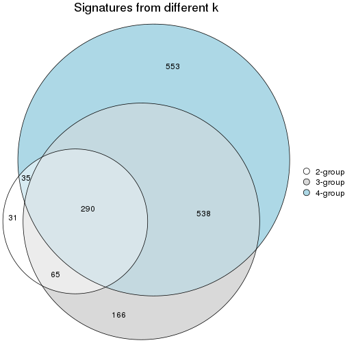

`get_signature()` returns a data frame invisibly. To get the list of signatures, the function
call should be assigned to a variable explicitly. In following code, if `plot` argument is set
to `FALSE`, no heatmap is plotted while only the differential analysis is performed.

```r
# code only for demonstration
tb = get_signature(res, k = ..., plot = FALSE)
```

An example of the output of `tb` is:

```
#>   which_row         fdr    mean_1    mean_2 scaled_mean_1 scaled_mean_2 km
#> 1        38 0.042760348  8.373488  9.131774    -0.5533452     0.5164555  1
#> 2        40 0.018707592  7.106213  8.469186    -0.6173731     0.5762149  1
#> 3        55 0.019134737 10.221463 11.207825    -0.6159697     0.5749050  1
#> 4        59 0.006059896  5.921854  7.869574    -0.6899429     0.6439467  1
#> 5        60 0.018055526  8.928898 10.211722    -0.6204761     0.5791110  1
#> 6        98 0.009384629 15.714769 14.887706     0.6635654    -0.6193277  2
...
```

The columns in `tb` are:

1. `which_row`: row indices corresponding to the input matrix.
2. `fdr`: FDR for the differential test. 
3. `mean_x`: The mean value in group x.
4. `scaled_mean_x`: The mean value in group x after rows are scaled.
5. `km`: Row groups if k-means clustering is applied to rows (which is done by automatically selecting number of clusters).

If there are too many signatures, `top_signatures = ...` can be set to only show the 
signatures with the highest FDRs:

```r
# code only for demonstration
# e.g. to show the top 500 most significant rows
tb = get_signature(res, k = ..., top_signatures = 500)
```

If the signatures are defined as these which are uniquely high in current group, `diff_method` argument
can be set to `"uniquely_high_in_one_group"`:

```r
# code only for demonstration
tb = get_signature(res, k = ..., diff_method = "uniquely_high_in_one_group")
```


UMAP plot which shows how samples are separated.


<script>
$( function() {
	$( '#tabs-node-033-dimension-reduction' ).tabs();
} );
</script>
<div id='tabs-node-033-dimension-reduction'>
<ul>
<li><a href='#tab-node-033-dimension-reduction-1'>k = 2</a></li>
<li><a href='#tab-node-033-dimension-reduction-2'>k = 3</a></li>
<li><a href='#tab-node-033-dimension-reduction-3'>k = 4</a></li>
</ul>
<div id='tab-node-033-dimension-reduction-1'>
<pre><code class="r">dimension_reduction(res, k = 2, method = &quot;UMAP&quot;)
</code></pre>

<p></p>

</div>
<div id='tab-node-033-dimension-reduction-2'>
<pre><code class="r">dimension_reduction(res, k = 3, method = &quot;UMAP&quot;)
</code></pre>

<p></p>

</div>
<div id='tab-node-033-dimension-reduction-3'>
<pre><code class="r">dimension_reduction(res, k = 4, method = &quot;UMAP&quot;)
</code></pre>

<p></p>

</div>
</div>


Following heatmap shows how subgroups are split when increasing `k`:

```r
collect_classes(res)
```


Test correlation between subgroups and known annotations. If the known
annotation is numeric, one-way ANOVA test is applied, and if the known
annotation is discrete, chi-squared contingency table test is applied.

```r
test_to_known_factors(res)
```

```
#>             n_sample Cell_type(p-value) Timepoint(p-value) k
#> ATC:skmeans       98           3.48e-03           2.36e-03 2
#> ATC:skmeans       94           4.09e-15           2.24e-18 3
#> ATC:skmeans       98           1.20e-26           1.22e-35 4
```


If matrix rows can be associated to genes, consider to use `functional_enrichment(res,
...)` to perform function enrichment for the signature genes. See [this vignette](https://jokergoo.github.io/cola_vignettes/functional_enrichment.html) for more detailed explanations.


 

## Session info


```r
sessionInfo()
```

```
#> R version 4.1.0 (2021-05-18)
#> Platform: x86_64-pc-linux-gnu (64-bit)
#> Running under: CentOS Linux 7 (Core)
#> 
#> Matrix products: default
#> BLAS/LAPACK: /usr/lib64/libopenblas-r0.3.3.so
#> 
#> locale:
#>  [1] LC_CTYPE=en_US.UTF-8       LC_NUMERIC=C               LC_TIME=en_US.UTF-8       
#>  [4] LC_COLLATE=en_US.UTF-8     LC_MONETARY=en_US.UTF-8    LC_MESSAGES=en_US.UTF-8   
#>  [7] LC_PAPER=en_US.UTF-8       LC_NAME=C                  LC_ADDRESS=C              
#> [10] LC_TELEPHONE=C             LC_MEASUREMENT=en_US.UTF-8 LC_IDENTIFICATION=C       
#> 
#> attached base packages:
#>  [1] grid      parallel  stats4    stats     graphics  grDevices utils     datasets  methods  
#> [10] base     
#> 
#> other attached packages:
#>  [1] genefilter_1.74.0           ComplexHeatmap_2.8.0        markdown_1.1               
#>  [4] knitr_1.33                  scRNAseq_2.6.1              SingleCellExperiment_1.14.1
#>  [7] SummarizedExperiment_1.22.0 Biobase_2.52.0              GenomicRanges_1.44.0       
#> [10] GenomeInfoDb_1.28.1         IRanges_2.26.0              S4Vectors_0.30.0           
#> [13] BiocGenerics_0.38.0         MatrixGenerics_1.4.0        matrixStats_0.59.0         
#> [16] cola_1.9.4                 
#> 
#> loaded via a namespace (and not attached):
#>   [1] circlize_0.4.13               AnnotationHub_3.0.1           BiocFileCache_2.0.0          
#>   [4] lazyeval_0.2.2                polylabelr_0.2.0              splines_4.1.0                
#>   [7] Polychrome_1.3.1              BiocParallel_1.26.1           ggplot2_3.3.5                
#>  [10] digest_0.6.27                 foreach_1.5.1                 ensembldb_2.16.3             
#>  [13] htmltools_0.5.1.1             viridis_0.6.1                 fansi_0.5.0                  
#>  [16] magrittr_2.0.1                memoise_2.0.0                 cluster_2.1.2                
#>  [19] doParallel_1.0.16             Biostrings_2.60.1             annotate_1.70.0              
#>  [22] askpass_1.1                   prettyunits_1.1.1             colorspace_2.0-2             
#>  [25] blob_1.2.1                    rappdirs_0.3.3                xfun_0.24                    
#>  [28] dplyr_1.0.7                   crayon_1.4.1                  RCurl_1.98-1.3               
#>  [31] microbenchmark_1.4-7          jsonlite_1.7.2                impute_1.66.0                
#>  [34] brew_1.0-6                    survival_3.2-11               iterators_1.0.13             
#>  [37] glue_1.4.2                    polyclip_1.10-0               gtable_0.3.0                 
#>  [40] zlibbioc_1.38.0               XVector_0.32.0                GetoptLong_1.0.5             
#>  [43] DelayedArray_0.18.0           shape_1.4.6                   scales_1.1.1                 
#>  [46] data.tree_1.0.0               DBI_1.1.1                     Rcpp_1.0.7                   
#>  [49] viridisLite_0.4.0             xtable_1.8-4                  progress_1.2.2               
#>  [52] clue_0.3-59                   reticulate_1.20               bit_4.0.4                    
#>  [55] mclust_5.4.7                  umap_0.2.7.0                  httr_1.4.2                   
#>  [58] RColorBrewer_1.1-2            ellipsis_0.3.2                pkgconfig_2.0.3              
#>  [61] XML_3.99-0.6                  dbplyr_2.1.1                  utf8_1.2.1                   
#>  [64] tidyselect_1.1.1              rlang_0.4.11                  later_1.2.0                  
#>  [67] AnnotationDbi_1.54.1          munsell_0.5.0                 BiocVersion_3.13.1           
#>  [70] tools_4.1.0                   cachem_1.0.5                  generics_0.1.0               
#>  [73] RSQLite_2.2.7                 ExperimentHub_2.0.0           evaluate_0.14                
#>  [76] stringr_1.4.0                 fastmap_1.1.0                 yaml_2.2.1                   
#>  [79] bit64_4.0.5                   purrr_0.3.4                   dendextend_1.15.1            
#>  [82] KEGGREST_1.32.0               AnnotationFilter_1.16.0       mime_0.11                    
#>  [85] slam_0.1-48                   xml2_1.3.2                    biomaRt_2.48.2               
#>  [88] compiler_4.1.0                rstudioapi_0.13               filelock_1.0.2               
#>  [91] curl_4.3.2                    png_0.1-7                     interactiveDisplayBase_1.30.0
#>  [94] tibble_3.1.2                  stringi_1.7.3                 highr_0.9                    
#>  [97] GenomicFeatures_1.44.0        RSpectra_0.16-0               lattice_0.20-44              
#> [100] ProtGenerics_1.24.0           Matrix_1.3-4                  vctrs_0.3.8                  
#> [103] pillar_1.6.1                  lifecycle_1.0.0               BiocManager_1.30.16          
#> [106] eulerr_6.1.0                  GlobalOptions_0.1.2           bitops_1.0-7                 
#> [109] irlba_2.3.3                   httpuv_1.6.1                  rtracklayer_1.52.0           
#> [112] R6_2.5.0                      BiocIO_1.2.0                  promises_1.2.0.1             
#> [115] gridExtra_2.3                 codetools_0.2-18              assertthat_0.2.1             
#> [118] openssl_1.4.4                 rjson_0.2.20                  GenomicAlignments_1.28.0     
#> [121] Rsamtools_2.8.0               GenomeInfoDbData_1.2.6        hms_1.1.0                    
#> [124] skmeans_0.2-13                Cairo_1.5-12.2                scatterplot3d_0.3-41         
#> [127] shiny_1.6.0                   restfulr_0.0.13
```


